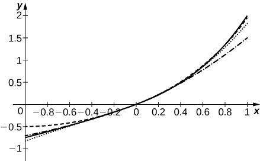

* Combine power series by addition or subtraction.
* Create a new power series by multiplication by a power of the variable or a constant, or by substitution.
* Multiply two power series together.
* Differentiate and integrate power series term-by-term.

In the preceding section on power series and functions we showed how to represent certain functions using power series. In this section we discuss how power series can be combined, differentiated, or integrated to create new power series. This capability is particularly useful for a couple of reasons. First, it allows us to find power series representations for certain elementary functions, by writing those functions in terms of functions with known power series. For example, given the power series representation for <math xmlns="http://www.w3.org/1998/Math/MathML"><mrow><mi>f</mi><mrow><mo>(</mo><mi>x</mi><mo>)</mo></mrow><mo>=</mo><mfrac><mn>1</mn><mrow><mn>1</mn><mo>−</mo><mi>x</mi></mrow></mfrac><mo>,</mo></mrow></math>

 we can find a power series representation for <math xmlns="http://www.w3.org/1998/Math/MathML"><mrow><msup><mi>f</mi><mo>′</mo></msup><mrow><mo>(</mo><mi>x</mi><mo>)</mo></mrow><mo>=</mo><mfrac><mn>1</mn><mrow><msup><mrow><mrow><mo>(</mo><mrow><mn>1</mn><mo>−</mo><mi>x</mi></mrow><mo>)</mo></mrow></mrow><mn>2</mn></msup></mrow></mfrac><mo>.</mo></mrow></math>

 Second, being able to create power series allows us to define new functions that cannot be written in terms of elementary functions. This capability is particularly useful for solving differential equations for which there is no solution in terms of elementary functions.

# Combining Power Series

If we have two power series with the same interval of convergence, we can add or subtract the two series to create a new power series, also with the same interval of convergence. Similarly, we can multiply a power series by a power of *x* or evaluate a power series at <math xmlns="http://www.w3.org/1998/Math/MathML"><mrow><msup><mi>x</mi><mi>m</mi></msup></mrow></math>

 for a positive integer *m* to create a new power series. Being able to do this allows us to find power series representations for certain functions by using power series representations of other functions. For example, since we know the power series representation for <math xmlns="http://www.w3.org/1998/Math/MathML"><mrow><mi>f</mi><mrow><mo>(</mo><mi>x</mi><mo>)</mo></mrow><mo>=</mo><mfrac><mn>1</mn><mrow><mn>1</mn><mo>−</mo><mi>x</mi></mrow></mfrac><mo>,</mo></mrow></math>

 we can find power series representations for related functions, such as

<math xmlns="http://www.w3.org/1998/Math/MathML"><mrow><mi>y</mi><mo>=</mo><mfrac><mrow><mn>3</mn><mi>x</mi></mrow><mrow><mn>1</mn><mo>−</mo><msup><mi>x</mi><mn>2</mn></msup></mrow></mfrac><mspace width="0.2em" /><mtext>and</mtext><mspace width="0.2em" /><mi>y</mi><mo>=</mo><mfrac><mn>1</mn><mrow><mrow><mo>(</mo><mrow><mi>x</mi><mo>−</mo><mn>1</mn></mrow><mo>)</mo></mrow><mrow><mo>(</mo><mrow><mi>x</mi><mo>−</mo><mn>3</mn></mrow><mo>)</mo></mrow></mrow></mfrac><mo>.</mo></mrow></math>

In [\[link\]](#fs-id1167023714096) we state results regarding addition or subtraction of power series, composition of a power series, and multiplication of a power series by a power of the variable. For simplicity, we state the theorem for power series centered at <math xmlns="http://www.w3.org/1998/Math/MathML"><mrow><mi>x</mi><mo>=</mo><mn>0</mn><mo>.</mo></mrow></math>

 Similar results hold for power series centered at <math xmlns="http://www.w3.org/1998/Math/MathML"><mrow><mi>x</mi><mo>=</mo><mi>a</mi><mo>.</mo></mrow></math>

Combining Power Series

Suppose that the two power series <math xmlns="http://www.w3.org/1998/Math/MathML"><mrow><mstyle displaystyle="true"><munderover><mo>∑</mo><mrow><mi>n</mi><mo>=</mo><mn>0</mn></mrow><mi>∞</mi></munderover><mrow><msub><mi>c</mi><mi>n</mi></msub><msup><mi>x</mi><mi>n</mi></msup></mrow></mstyle></mrow></math>

 and <math xmlns="http://www.w3.org/1998/Math/MathML"><mrow><mstyle displaystyle="true"><munderover><mo>∑</mo><mrow><mi>n</mi><mo>=</mo><mn>0</mn></mrow><mi>∞</mi></munderover><mrow><msub><mi>d</mi><mi>n</mi></msub><msup><mi>x</mi><mi>n</mi></msup></mrow></mstyle></mrow></math>

 converge to the functions *f* and *g*, respectively, on a common interval *I*.

1.  The power series
    <math xmlns="http://www.w3.org/1998/Math/MathML"><mrow><mstyle displaystyle="true"><munderover><mo>∑</mo><mrow><mi>n</mi><mo>=</mo><mn>0</mn></mrow><mi>∞</mi></munderover><mrow><mrow><mo>(</mo><mrow><msub><mi>c</mi><mi>n</mi></msub><msup><mi>x</mi><mi>n</mi></msup><mo>±</mo><msub><mi>d</mi><mi>n</mi></msub><msup><mi>x</mi><mi>n</mi></msup></mrow><mo>)</mo></mrow></mrow></mstyle></mrow></math>
    
    converges to
    <math xmlns="http://www.w3.org/1998/Math/MathML"><mrow><mi>f</mi><mo>±</mo><mi>g</mi></mrow></math>
    
    on *I*.
2.  For any integer
    <math xmlns="http://www.w3.org/1998/Math/MathML"><mrow><mi>m</mi><mo>≥</mo><mn>0</mn></mrow></math>
    
    and any real number *b*, the power series
    <math xmlns="http://www.w3.org/1998/Math/MathML"><mrow><mstyle displaystyle="true"><munderover><mo>∑</mo><mrow><mi>n</mi><mo>=</mo><mn>0</mn></mrow><mi>∞</mi></munderover><mrow><mi>b</mi><msup><mi>x</mi><mi>m</mi></msup><msub><mi>c</mi><mi>n</mi></msub><msup><mi>x</mi><mi>n</mi></msup></mrow></mstyle></mrow></math>
    
    converges to
    <math xmlns="http://www.w3.org/1998/Math/MathML"><mrow><mi>b</mi><msup><mi>x</mi><mi>m</mi></msup><mi>f</mi><mrow><mo>(</mo><mi>x</mi><mo>)</mo></mrow></mrow></math>
    
    on *I*.
3.  For any integer
    <math xmlns="http://www.w3.org/1998/Math/MathML"><mrow><mi>m</mi><mo>≥</mo><mn>0</mn></mrow></math>
    
    and any real number *b*, the series
    <math xmlns="http://www.w3.org/1998/Math/MathML"><mrow><mstyle displaystyle="true"><munderover><mo>∑</mo><mrow><mi>n</mi><mo>=</mo><mn>0</mn></mrow><mi>∞</mi></munderover><mrow><msub><mi>c</mi><mi>n</mi></msub><msup><mrow><mrow><mo>(</mo><mrow><mi>b</mi><msup><mi>x</mi><mi>m</mi></msup></mrow><mo>)</mo></mrow></mrow><mi>n</mi></msup></mrow></mstyle></mrow></math>
    
    converges to
    <math xmlns="http://www.w3.org/1998/Math/MathML"><mrow><mi>f</mi><mrow><mo>(</mo><mrow><mi>b</mi><msup><mi>x</mi><mi>m</mi></msup></mrow><mo>)</mo></mrow></mrow></math>
    
    for all *x* such that
    <math xmlns="http://www.w3.org/1998/Math/MathML"><mrow><mi>b</mi><msup><mi>x</mi><mi>m</mi></msup></mrow></math>
    
    is in *I*.
{: data-number-style="lower-roman"}

## Proof

We prove i. in the case of the series <math xmlns="http://www.w3.org/1998/Math/MathML"><mrow><mstyle displaystyle="true"><munderover><mo>∑</mo><mrow><mi>n</mi><mo>=</mo><mn>0</mn></mrow><mi>∞</mi></munderover><mrow><mrow><mo>(</mo><mrow><msub><mi>c</mi><mi>n</mi></msub><msup><mi>x</mi><mi>n</mi></msup><mo>+</mo><msub><mi>d</mi><mi>n</mi></msub><msup><mi>x</mi><mi>n</mi></msup></mrow><mo>)</mo></mrow></mrow></mstyle><mo>.</mo></mrow></math>

 Suppose that <math xmlns="http://www.w3.org/1998/Math/MathML"><mrow><mstyle displaystyle="true"><munderover><mo>∑</mo><mrow><mi>n</mi><mo>=</mo><mn>0</mn></mrow><mi>∞</mi></munderover><mrow><msub><mi>c</mi><mi>n</mi></msub><msup><mi>x</mi><mi>n</mi></msup></mrow></mstyle></mrow></math>

 and <math xmlns="http://www.w3.org/1998/Math/MathML"><mrow><mstyle displaystyle="true"><munderover><mo>∑</mo><mrow><mi>n</mi><mo>=</mo><mn>0</mn></mrow><mi>∞</mi></munderover><mrow><msub><mi>d</mi><mi>n</mi></msub><msup><mi>x</mi><mi>n</mi></msup></mrow></mstyle></mrow></math>

 converge to the functions *f* and *g*, respectively, on the interval *I*. Let *x* be a point in *I* and let <math xmlns="http://www.w3.org/1998/Math/MathML"><mrow><msub><mi>S</mi><mi>N</mi></msub><mrow><mo>(</mo><mi>x</mi><mo>)</mo></mrow></mrow></math>

 and <math xmlns="http://www.w3.org/1998/Math/MathML"><mrow><msub><mi>T</mi><mi>N</mi></msub><mrow><mo>(</mo><mi>x</mi><mo>)</mo></mrow></mrow></math>

 denote the *N*th partial sums of the series <math xmlns="http://www.w3.org/1998/Math/MathML"><mrow><mstyle displaystyle="true"><munderover><mo>∑</mo><mrow><mi>n</mi><mo>=</mo><mn>0</mn></mrow><mi>∞</mi></munderover><mrow><msub><mi>c</mi><mi>n</mi></msub><msup><mi>x</mi><mi>n</mi></msup></mrow></mstyle></mrow></math>

 and <math xmlns="http://www.w3.org/1998/Math/MathML"><mrow><mstyle displaystyle="true"><munderover><mo>∑</mo><mrow><mi>n</mi><mo>=</mo><mn>0</mn></mrow><mi>∞</mi></munderover><mrow><msub><mi>d</mi><mi>n</mi></msub><msup><mi>x</mi><mi>n</mi></msup></mrow></mstyle><mo>,</mo></mrow></math>

 respectively. Then the sequence <math xmlns="http://www.w3.org/1998/Math/MathML"><mrow><mrow><mo>{</mo><mrow><msub><mi>S</mi><mi>N</mi></msub><mrow><mo>(</mo><mi>x</mi><mo>)</mo></mrow></mrow><mo>}</mo></mrow></mrow></math>

 converges to <math xmlns="http://www.w3.org/1998/Math/MathML"><mrow><mi>f</mi><mrow><mo>(</mo><mi>x</mi><mo>)</mo></mrow></mrow></math>

 and the sequence <math xmlns="http://www.w3.org/1998/Math/MathML"><mrow><mrow><mo>{</mo><mrow><msub><mi>T</mi><mi>N</mi></msub><mrow><mo>(</mo><mi>x</mi><mo>)</mo></mrow></mrow><mo>}</mo></mrow></mrow></math>

 converges to <math xmlns="http://www.w3.org/1998/Math/MathML"><mrow><mi>g</mi><mrow><mo>(</mo><mi>x</mi><mo>)</mo></mrow><mo>.</mo></mrow></math>

 Furthermore, the *N*th partial sum of <math xmlns="http://www.w3.org/1998/Math/MathML"><mrow><mstyle displaystyle="true"><munderover><mo>∑</mo><mrow><mi>n</mi><mo>=</mo><mn>0</mn></mrow><mi>∞</mi></munderover><mrow><mrow><mo>(</mo><mrow><msub><mi>c</mi><mi>n</mi></msub><msup><mi>x</mi><mi>n</mi></msup><mo>+</mo><msub><mi>d</mi><mi>n</mi></msub><msup><mi>x</mi><mi>n</mi></msup></mrow><mo>)</mo></mrow></mrow></mstyle></mrow></math>

 is

<math xmlns="http://www.w3.org/1998/Math/MathML"><mtable><mtr><mtd columnalign="right"><mstyle displaystyle="true"><munderover><mo>∑</mo><mrow><mi>n</mi><mo>=</mo><mn>0</mn></mrow><mi>N</mi></munderover><mrow><mrow><mo>(</mo><mrow><msub><mi>c</mi><mi>n</mi></msub><msup><mi>x</mi><mi>n</mi></msup><mo>+</mo><msub><mi>d</mi><mi>n</mi></msub><msup><mi>x</mi><mi>n</mi></msup></mrow><mo>)</mo></mrow></mrow></mstyle></mtd><mtd columnalign="left"><mo>=</mo><mstyle displaystyle="true"><munderover><mo>∑</mo><mrow><mi>n</mi><mo>=</mo><mn>0</mn></mrow><mi>N</mi></munderover><mrow><msub><mi>c</mi><mi>n</mi></msub><msup><mi>x</mi><mi>n</mi></msup></mrow></mstyle><mo>+</mo><mstyle displaystyle="true"><munderover><mo>∑</mo><mrow><mi>n</mi><mo>=</mo><mn>0</mn></mrow><mi>N</mi></munderover><mrow><msub><mi>d</mi><mi>n</mi></msub><msup><mi>x</mi><mi>n</mi></msup></mrow></mstyle></mtd></mtr><mtr><mtd /><mtd columnalign="left"><mo>=</mo><msub><mi>S</mi><mi>N</mi></msub><mrow><mo>(</mo><mi>x</mi><mo>)</mo></mrow><mo>+</mo><msub><mi>T</mi><mi>N</mi></msub><mrow><mo>(</mo><mi>x</mi><mo>)</mo></mrow><mo>.</mo></mtd></mtr></mtable></math>

Because

<math xmlns="http://www.w3.org/1998/Math/MathML"><mtable><mtr><mtd columnalign="right"><munder><mrow><mtext>lim</mtext></mrow><mrow><mi>N</mi><mo stretchy="false">→</mo><mi>∞</mi></mrow></munder><mrow><mo>(</mo><mrow><msub><mi>S</mi><mi>N</mi></msub><mrow><mo>(</mo><mi>x</mi><mo>)</mo></mrow><mo>+</mo><msub><mi>T</mi><mi>N</mi></msub><mrow><mo>(</mo><mi>x</mi><mo>)</mo></mrow></mrow><mo>)</mo></mrow></mtd><mtd columnalign="left"><mo>=</mo><munder><mrow><mtext>lim</mtext></mrow><mrow><mi>N</mi><mo stretchy="false">→</mo><mi>∞</mi></mrow></munder><msub><mi>S</mi><mi>N</mi></msub><mrow><mo>(</mo><mi>x</mi><mo>)</mo></mrow><mo>+</mo><munder><mrow><mtext>lim</mtext></mrow><mrow><mi>N</mi><mo stretchy="false">→</mo><mi>∞</mi></mrow></munder><msub><mi>T</mi><mi>N</mi></msub><mrow><mo>(</mo><mi>x</mi><mo>)</mo></mrow></mtd></mtr><mtr><mtd /><mtd columnalign="left"><mo>=</mo><mi>f</mi><mrow><mo>(</mo><mi>x</mi><mo>)</mo></mrow><mo>+</mo><mi>g</mi><mrow><mo>(</mo><mi>x</mi><mo>)</mo></mrow><mo>,</mo></mtd></mtr></mtable></math>

we conclude that the series <math xmlns="http://www.w3.org/1998/Math/MathML"><mrow><mstyle displaystyle="true"><munderover><mo>∑</mo><mrow><mi>n</mi><mo>=</mo><mn>0</mn></mrow><mi>∞</mi></munderover><mrow><mrow><mo>(</mo><mrow><msub><mi>c</mi><mi>n</mi></msub><msup><mi>x</mi><mi>n</mi></msup><mo>+</mo><msub><mi>d</mi><mi>n</mi></msub><msup><mi>x</mi><mi>n</mi></msup></mrow><mo>)</mo></mrow></mrow></mstyle></mrow></math>

 converges to <math xmlns="http://www.w3.org/1998/Math/MathML"><mrow><mi>f</mi><mrow><mo>(</mo><mi>x</mi><mo>)</mo></mrow><mo>+</mo><mi>g</mi><mrow><mo>(</mo><mi>x</mi><mo>)</mo></mrow><mo>.</mo></mrow></math>

□

We examine products of power series in a later theorem. First, we show several applications of [\[link\]](#fs-id1167023714096) and how to find the interval of convergence of a power series given the interval of convergence of a related power series.

Combining Power Series

Suppose that <math xmlns="http://www.w3.org/1998/Math/MathML"><mrow><mstyle displaystyle="true"><munderover><mo>∑</mo><mrow><mi>n</mi><mo>=</mo><mn>0</mn></mrow><mi>∞</mi></munderover><mrow><msub><mi>a</mi><mi>n</mi></msub><msup><mi>x</mi><mi>n</mi></msup></mrow></mstyle></mrow></math>

 is a power series whose interval of convergence is <math xmlns="http://www.w3.org/1998/Math/MathML"><mrow><mrow><mo>(</mo><mrow><mn>−1</mn><mo>,</mo><mn>1</mn></mrow><mo>)</mo></mrow><mo>,</mo></mrow></math>

 and suppose that <math xmlns="http://www.w3.org/1998/Math/MathML"><mrow><mstyle displaystyle="true"><munderover><mo>∑</mo><mrow><mi>n</mi><mo>=</mo><mn>0</mn></mrow><mi>∞</mi></munderover><mrow><msub><mi>b</mi><mi>n</mi></msub><msup><mi>x</mi><mi>n</mi></msup></mrow></mstyle></mrow></math>

 is a power series whose interval of convergence is <math xmlns="http://www.w3.org/1998/Math/MathML"><mrow><mrow><mo>(</mo><mrow><mn>−2</mn><mo>,</mo><mn>2</mn></mrow><mo>)</mo></mrow><mo>.</mo></mrow></math>

1.  Find the interval of convergence of the series
    <math xmlns="http://www.w3.org/1998/Math/MathML"><mrow><mstyle displaystyle="true"><munderover><mo>∑</mo><mrow><mi>n</mi><mo>=</mo><mn>0</mn></mrow><mi>∞</mi></munderover><mrow><mrow><mo>(</mo><mrow><msub><mi>a</mi><mi>n</mi></msub><msup><mi>x</mi><mi>n</mi></msup><mo>+</mo><msub><mi>b</mi><mi>n</mi></msub><msup><mi>x</mi><mi>n</mi></msup></mrow><mo>)</mo></mrow></mrow></mstyle><mo>.</mo></mrow></math>

2.  Find the interval of convergence of the series
    <math xmlns="http://www.w3.org/1998/Math/MathML"><mrow><mstyle displaystyle="true"><munderover><mo>∑</mo><mrow><mi>n</mi><mo>=</mo><mn>0</mn></mrow><mi>∞</mi></munderover><mrow><msub><mi>a</mi><mi>n</mi></msub><msup><mn>3</mn><mi>n</mi></msup><msup><mi>x</mi><mi>n</mi></msup></mrow></mstyle><mo>.</mo></mrow></math>
{: data-number-style="lower-alpha"}

1.  Since the interval
    <math xmlns="http://www.w3.org/1998/Math/MathML"><mrow><mrow><mo>(</mo><mrow><mn>−1</mn><mo>,</mo><mn>1</mn></mrow><mo>)</mo></mrow></mrow></math>
    
    is a common interval of convergence of the series
    <math xmlns="http://www.w3.org/1998/Math/MathML"><mrow><mstyle displaystyle="true"><munderover><mo>∑</mo><mrow><mi>n</mi><mo>=</mo><mn>0</mn></mrow><mi>∞</mi></munderover><mrow><msub><mi>a</mi><mi>n</mi></msub><msup><mi>x</mi><mi>n</mi></msup></mrow></mstyle></mrow></math>
    
    and
    <math xmlns="http://www.w3.org/1998/Math/MathML"><mrow><mstyle displaystyle="true"><munderover><mo>∑</mo><mrow><mi>n</mi><mo>=</mo><mn>0</mn></mrow><mi>∞</mi></munderover><mrow><msub><mi>b</mi><mi>n</mi></msub><msup><mi>x</mi><mi>n</mi></msup></mrow></mstyle><mo>,</mo></mrow></math>
    
    the interval of convergence of the series
    <math xmlns="http://www.w3.org/1998/Math/MathML"><mrow><mstyle displaystyle="true"><munderover><mo>∑</mo><mrow><mi>n</mi><mo>=</mo><mn>0</mn></mrow><mi>∞</mi></munderover><mrow><mrow><mo>(</mo><mrow><msub><mi>a</mi><mi>n</mi></msub><msup><mi>x</mi><mi>n</mi></msup><mo>+</mo><msub><mi>b</mi><mi>n</mi></msub><msup><mi>x</mi><mi>n</mi></msup></mrow><mo>)</mo></mrow></mrow></mstyle></mrow></math>
    
    is
    <math xmlns="http://www.w3.org/1998/Math/MathML"><mrow><mrow><mo>(</mo><mrow><mn>−1</mn><mo>,</mo><mn>1</mn></mrow><mo>)</mo></mrow><mo>.</mo></mrow></math>

2.  Since
    <math xmlns="http://www.w3.org/1998/Math/MathML"><mrow><mstyle displaystyle="true"><munderover><mo>∑</mo><mrow><mi>n</mi><mo>=</mo><mn>0</mn></mrow><mi>∞</mi></munderover><mrow><msub><mi>a</mi><mi>n</mi></msub><msup><mi>x</mi><mi>n</mi></msup></mrow></mstyle></mrow></math>
    
    is a power series centered at zero with radius of convergence 1, it converges for all *x* in the interval
    <math xmlns="http://www.w3.org/1998/Math/MathML"><mrow><mrow><mo>(</mo><mrow><mn>−1</mn><mo>,</mo><mn>1</mn></mrow><mo>)</mo></mrow><mo>.</mo></mrow></math>
    
    By [[link]](#fs-id1167023714096), the series
    * * *
    {: data-type="newline"}
    
    

    <math xmlns="http://www.w3.org/1998/Math/MathML"><mrow><mstyle displaystyle="true"><munderover><mo>∑</mo><mrow><mi>n</mi><mo>=</mo><mn>0</mn></mrow><mi>∞</mi></munderover><mrow><msub><mi>a</mi><mi>n</mi></msub><msup><mn>3</mn><mi>n</mi></msup><msup><mi>x</mi><mi>n</mi></msup></mrow></mstyle><mo>=</mo><mstyle displaystyle="true"><munderover><mo>∑</mo><mrow><mi>n</mi><mo>=</mo><mn>0</mn></mrow><mi>∞</mi></munderover><mrow><msub><mi>a</mi><mi>n</mi></msub><msup><mrow><mrow><mo>(</mo><mrow><mn>3</mn><mi>x</mi></mrow><mo>)</mo></mrow></mrow><mi>n</mi></msup></mrow></mstyle></mrow></math>
    

    
    * * *
    {: data-type="newline"}
    
    converges if 3*x* is in the interval
    <math xmlns="http://www.w3.org/1998/Math/MathML"><mrow><mrow><mo>(</mo><mrow><mn>−1</mn><mo>,</mo><mn>1</mn></mrow><mo>)</mo></mrow><mo>.</mo></mrow></math>
    
    Therefore, the series converges for all *x* in the interval
    <math xmlns="http://www.w3.org/1998/Math/MathML"><mrow><mrow><mo>(</mo><mrow><mo>−</mo><mfrac><mn>1</mn><mn>3</mn></mfrac><mo>,</mo><mfrac><mn>1</mn><mn>3</mn></mfrac></mrow><mo>)</mo></mrow><mo>.</mo></mrow></math>
{: data-number-style="lower-alpha"}

Suppose that <math xmlns="http://www.w3.org/1998/Math/MathML"><mrow><mstyle displaystyle="true"><munderover><mo>∑</mo><mrow><mi>n</mi><mo>=</mo><mn>0</mn></mrow><mi>∞</mi></munderover><mrow><msub><mi>a</mi><mi>n</mi></msub><msup><mi>x</mi><mi>n</mi></msup></mrow></mstyle></mrow></math>

 has an interval of convergence of <math xmlns="http://www.w3.org/1998/Math/MathML"><mrow><mrow><mo>(</mo><mrow><mn>−1</mn><mo>,</mo><mn>1</mn></mrow><mo>)</mo></mrow><mo>.</mo></mrow></math>

 Find the interval of convergence of <math xmlns="http://www.w3.org/1998/Math/MathML"><mrow><mstyle displaystyle="true"><munderover><mo>∑</mo><mrow><mi>n</mi><mo>=</mo><mn>0</mn></mrow><mi>∞</mi></munderover><mrow><msub><mi>a</mi><mi>n</mi></msub><msup><mrow><mrow><mo>(</mo><mrow><mfrac><mi>x</mi><mn>2</mn></mfrac></mrow><mo>)</mo></mrow></mrow><mi>n</mi></msup></mrow></mstyle><mo>.</mo></mrow></math>

Interval of convergence is <math xmlns="http://www.w3.org/1998/Math/MathML"><mrow><mrow><mo>(</mo><mrow><mn>−2</mn><mo>,</mo><mn>2</mn></mrow><mo>)</mo></mrow><mo>.</mo></mrow></math>

Hint

Find the values of *x* such that <math xmlns="http://www.w3.org/1998/Math/MathML"><mrow><mfrac><mi>x</mi><mn>2</mn></mfrac></mrow></math>

 is in the interval <math xmlns="http://www.w3.org/1998/Math/MathML"><mrow><mrow><mo>(</mo><mrow><mn>−1</mn><mo>,</mo><mn>1</mn></mrow><mo>)</mo></mrow><mo>.</mo></mrow></math>

In the next example, we show how to use [\[link\]](#fs-id1167023714096) and the power series for a function *f* to construct power series for functions related to *f*. Specifically, we consider functions related to the function <math xmlns="http://www.w3.org/1998/Math/MathML"><mrow><mi>f</mi><mrow><mo>(</mo><mi>x</mi><mo>)</mo></mrow><mo>=</mo><mfrac><mn>1</mn><mrow><mn>1</mn><mo>−</mo><mi>x</mi></mrow></mfrac></mrow></math>

 and we use the fact that

<math xmlns="http://www.w3.org/1998/Math/MathML"><mrow><mfrac><mn>1</mn><mrow><mn>1</mn><mo>−</mo><mi>x</mi></mrow></mfrac><mo>=</mo><mstyle displaystyle="true"><munderover><mo>∑</mo><mrow><mi>n</mi><mo>=</mo><mn>0</mn></mrow><mi>∞</mi></munderover><mrow><msup><mi>x</mi><mi>n</mi></msup></mrow></mstyle><mo>=</mo><mn>1</mn><mo>+</mo><mi>x</mi><mo>+</mo><msup><mi>x</mi><mn>2</mn></msup><mo>+</mo><msup><mi>x</mi><mn>3</mn></msup><mo>+</mo><mtext>⋯</mtext></mrow></math>

for <math xmlns="http://www.w3.org/1998/Math/MathML"><mrow><mrow><mo>\|</mo><mi>x</mi><mo>\|</mo></mrow><mo>&lt;</mo><mn>1</mn><mo>.</mo></mrow></math>

Constructing Power Series from Known Power Series

Use the power series representation for <math xmlns="http://www.w3.org/1998/Math/MathML"><mrow><mi>f</mi><mrow><mo>(</mo><mi>x</mi><mo>)</mo></mrow><mo>=</mo><mfrac><mn>1</mn><mrow><mn>1</mn><mo>−</mo><mi>x</mi></mrow></mfrac></mrow></math>

 combined with [[link]](#fs-id1167023714096) to construct a power series for each of the following functions. Find the interval of convergence of the power series.

1.  <math xmlns="http://www.w3.org/1998/Math/MathML"><mrow><mi>f</mi><mrow><mo>(</mo><mi>x</mi><mo>)</mo></mrow><mo>=</mo><mfrac><mrow><mn>3</mn><mi>x</mi></mrow><mrow><mn>1</mn><mo>+</mo><msup><mi>x</mi><mn>2</mn></msup></mrow></mfrac></mrow></math>

2.  <math xmlns="http://www.w3.org/1998/Math/MathML"><mrow><mi>f</mi><mrow><mo>(</mo><mi>x</mi><mo>)</mo></mrow><mo>=</mo><mfrac><mn>1</mn><mrow><mrow><mo>(</mo><mrow><mi>x</mi><mo>−</mo><mn>1</mn></mrow><mo>)</mo></mrow><mrow><mo>(</mo><mrow><mi>x</mi><mo>−</mo><mn>3</mn></mrow><mo>)</mo></mrow></mrow></mfrac></mrow></math>
{: data-number-style="lower-alpha"}

1.  First write
    <math xmlns="http://www.w3.org/1998/Math/MathML"><mrow><mi>f</mi><mrow><mo>(</mo><mi>x</mi><mo>)</mo></mrow></mrow></math>
    
    as
    * * *
    {: data-type="newline"}
    
    

    <math xmlns="http://www.w3.org/1998/Math/MathML"><mrow><mi>f</mi><mrow><mo>(</mo><mi>x</mi><mo>)</mo></mrow><mo>=</mo><mn>3</mn><mi>x</mi><mrow><mo>(</mo><mrow><mfrac><mn>1</mn><mrow><mn>1</mn><mo>−</mo><mrow><mo>(</mo><mrow><mtext>−</mtext><msup><mi>x</mi><mn>2</mn></msup></mrow><mo>)</mo></mrow></mrow></mfrac></mrow><mo>)</mo></mrow><mo>.</mo></mrow></math>
    

    
    * * *
    {: data-type="newline"}
    
    Using the power series representation for
    <math xmlns="http://www.w3.org/1998/Math/MathML"><mrow><mi>f</mi><mrow><mo>(</mo><mi>x</mi><mo>)</mo></mrow><mo>=</mo><mfrac><mn>1</mn><mrow><mn>1</mn><mo>−</mo><mi>x</mi></mrow></mfrac></mrow></math>
    
    and parts ii. and iii. of [[link]](#fs-id1167023714096), we find that a power series representation for *f* is given by
    * * *
    {: data-type="newline"}
    
    

    <math xmlns="http://www.w3.org/1998/Math/MathML"><mrow><mstyle displaystyle="true"><munderover><mo>∑</mo><mrow><mi>n</mi><mo>=</mo><mn>0</mn></mrow><mi>∞</mi></munderover><mrow><mn>3</mn><mi>x</mi><msup><mrow><mrow><mo>(</mo><mrow><mtext>−</mtext><msup><mi>x</mi><mn>2</mn></msup></mrow><mo>)</mo></mrow></mrow><mi>n</mi></msup></mrow></mstyle><mo>=</mo><mstyle displaystyle="true"><munderover><mo>∑</mo><mrow><mi>n</mi><mo>=</mo><mn>0</mn></mrow><mi>∞</mi></munderover><mrow><mn>3</mn><msup><mrow><mrow><mo>(</mo><mrow><mn>−1</mn></mrow><mo>)</mo></mrow></mrow><mi>n</mi></msup><msup><mi>x</mi><mrow><mn>2</mn><mi>n</mi><mo>+</mo><mn>1</mn></mrow></msup></mrow></mstyle><mo>.</mo></mrow></math>
    

    
    * * *
    {: data-type="newline"}
    
    Since the interval of convergence of the series for
    <math xmlns="http://www.w3.org/1998/Math/MathML"><mrow><mfrac><mn>1</mn><mrow><mn>1</mn><mo>−</mo><mi>x</mi></mrow></mfrac></mrow></math>
    
    is
    <math xmlns="http://www.w3.org/1998/Math/MathML"><mrow><mrow><mo>(</mo><mrow><mn>−1</mn><mo>,</mo><mn>1</mn></mrow><mo>)</mo></mrow><mo>,</mo></mrow></math>
    
    the interval of convergence for this new series is the set of real numbers *x* such that
    <math xmlns="http://www.w3.org/1998/Math/MathML"><mrow><mrow><mo>\|</mo><mrow><msup><mi>x</mi><mn>2</mn></msup></mrow><mo>\|</mo></mrow><mo>&lt;</mo><mn>1</mn><mo>.</mo></mrow></math>
    
    Therefore, the interval of convergence is
    <math xmlns="http://www.w3.org/1998/Math/MathML"><mrow><mrow><mo>(</mo><mrow><mn>−1</mn><mo>,</mo><mn>1</mn></mrow><mo>)</mo></mrow><mo>.</mo></mrow></math>

2.  To find the power series representation, use partial fractions to write
    <math xmlns="http://www.w3.org/1998/Math/MathML"><mrow><mi>f</mi><mrow><mo>(</mo><mi>x</mi><mo>)</mo></mrow><mo>=</mo><mfrac><mn>1</mn><mrow><mrow><mo>(</mo><mrow><mn>1</mn><mo>−</mo><mi>x</mi></mrow><mo>)</mo></mrow><mrow><mo>(</mo><mrow><mi>x</mi><mo>−</mo><mn>3</mn></mrow><mo>)</mo></mrow></mrow></mfrac></mrow></math>
    
    as the sum of two fractions. We have
    * * *
    {: data-type="newline"}
    
    

    <math xmlns="http://www.w3.org/1998/Math/MathML"><mtable><mtr><mtd columnalign="right"><mfrac><mn>1</mn><mrow><mrow><mo>(</mo><mrow><mi>x</mi><mo>−</mo><mn>1</mn></mrow><mo>)</mo></mrow><mrow><mo>(</mo><mrow><mi>x</mi><mo>−</mo><mn>3</mn></mrow><mo>)</mo></mrow></mrow></mfrac></mtd><mtd columnalign="left"><mo>=</mo><mfrac><mrow><mtext>−</mtext><mrow><mn>1</mn><mtext>/</mtext><mn>2</mn></mrow></mrow><mrow><mi>x</mi><mo>−</mo><mn>1</mn></mrow></mfrac><mo>+</mo><mfrac><mrow><mrow><mn>1</mn><mtext>/</mtext><mn>2</mn></mrow></mrow><mrow><mi>x</mi><mo>−</mo><mn>3</mn></mrow></mfrac></mtd></mtr><mtr><mtd /><mtd columnalign="left"><mo>=</mo><mfrac><mrow><mrow><mn>1</mn><mtext>/</mtext><mn>2</mn></mrow></mrow><mrow><mn>1</mn><mo>−</mo><mi>x</mi></mrow></mfrac><mo>−</mo><mfrac><mrow><mrow><mn>1</mn><mtext>/</mtext><mn>2</mn></mrow></mrow><mrow><mn>3</mn><mo>−</mo><mi>x</mi></mrow></mfrac></mtd></mtr><mtr><mtd /><mtd columnalign="left"><mo>=</mo><mfrac><mrow><mrow><mn>1</mn><mtext>/</mtext><mn>2</mn></mrow></mrow><mrow><mn>1</mn><mo>−</mo><mi>x</mi></mrow></mfrac><mo>−</mo><mfrac><mrow><mrow><mn>1</mn><mtext>/</mtext><mn>6</mn></mrow></mrow><mrow><mn>1</mn><mo>−</mo><mfrac><mi>x</mi><mn>3</mn></mfrac></mrow></mfrac><mo>.</mo></mtd></mtr></mtable></math>
    

    
    * * *
    {: data-type="newline"}
    
    First, using part ii. of [[link]](#fs-id1167023714096), we obtain
    * * *
    {: data-type="newline"}
    
    

    <math xmlns="http://www.w3.org/1998/Math/MathML"><mrow><mfrac><mrow><mn>1</mn><mtext>/</mtext><mn>2</mn></mrow><mrow><mn>1</mn><mo>−</mo><mi>x</mi></mrow></mfrac><mo>=</mo><mstyle displaystyle="true"><munderover><mo>∑</mo><mrow><mi>n</mi><mo>=</mo><mn>0</mn></mrow><mi>∞</mi></munderover><mrow><mfrac><mn>1</mn><mn>2</mn></mfrac><msup><mi>x</mi><mi>n</mi></msup></mrow></mstyle><mspace width="0.2em" /><mtext>for</mtext><mspace width="0.2em" /><mrow><mo>\|</mo><mi>x</mi><mo>\|</mo></mrow><mo>&lt;</mo><mn>1</mn><mo>.</mo></mrow></math>
    

    
    * * *
    {: data-type="newline"}
    
    Then, using parts ii. and iii. of [[link]](#fs-id1167023714096), we have
    * * *
    {: data-type="newline"}
    
    

    <math xmlns="http://www.w3.org/1998/Math/MathML"><mrow><mfrac><mrow><mrow><mn>1</mn><mtext>/</mtext><mn>6</mn></mrow></mrow><mrow><mn>1</mn><mo>−</mo><mrow><mi>x</mi><mtext>/</mtext><mn>3</mn></mrow></mrow></mfrac><mo>=</mo><mstyle displaystyle="true"><munderover><mo>∑</mo><mrow><mi>n</mi><mo>=</mo><mn>0</mn></mrow><mi>∞</mi></munderover><mrow><mfrac><mn>1</mn><mn>6</mn></mfrac><msup><mrow><mrow><mo>(</mo><mrow><mfrac><mi>x</mi><mn>3</mn></mfrac></mrow><mo>)</mo></mrow></mrow><mi>n</mi></msup></mrow></mstyle><mspace width="0.2em" /><mtext>for</mtext><mspace width="0.2em" /><mrow><mo>\|</mo><mi>x</mi><mo>\|</mo></mrow><mo>&lt;</mo><mn>3</mn><mo>.</mo></mrow></math>
    

    
    * * *
    {: data-type="newline"}
    
    Since we are combining these two power series, the interval of convergence of the difference must be the smaller of these two intervals. Using this fact and part i. of [[link]](#fs-id1167023714096), we have
    * * *
    {: data-type="newline"}
    
    

    <math xmlns="http://www.w3.org/1998/Math/MathML"><mrow><mfrac><mn>1</mn><mrow><mrow><mo>(</mo><mrow><mi>x</mi><mo>−</mo><mn>1</mn></mrow><mo>)</mo></mrow><mrow><mo>(</mo><mrow><mi>x</mi><mo>−</mo><mn>3</mn></mrow><mo>)</mo></mrow></mrow></mfrac><mo>=</mo><mstyle displaystyle="true"><munderover><mo>∑</mo><mrow><mi>n</mi><mo>=</mo><mn>0</mn></mrow><mi>∞</mi></munderover><mrow><mrow><mo>(</mo><mrow><mfrac><mn>1</mn><mn>2</mn></mfrac><mo>−</mo><mfrac><mn>1</mn><mrow><mn>6</mn><mo>·</mo><msup><mn>3</mn><mi>n</mi></msup></mrow></mfrac></mrow><mo>)</mo></mrow><msup><mi>x</mi><mi>n</mi></msup></mrow></mstyle></mrow></math>
    

    
    * * *
    {: data-type="newline"}
    
    where the interval of convergence is
    <math xmlns="http://www.w3.org/1998/Math/MathML"><mrow><mrow><mo>(</mo><mrow><mn>−1</mn><mo>,</mo><mn>1</mn></mrow><mo>)</mo></mrow><mo>.</mo></mrow></math>
{: data-number-style="lower-alpha"}

Use the series for <math xmlns="http://www.w3.org/1998/Math/MathML"><mrow><mi>f</mi><mrow><mo>(</mo><mi>x</mi><mo>)</mo></mrow><mo>=</mo><mfrac><mn>1</mn><mrow><mn>1</mn><mo>−</mo><mi>x</mi></mrow></mfrac></mrow></math>

 on <math xmlns="http://www.w3.org/1998/Math/MathML"><mrow><mrow><mo>\|</mo><mi>x</mi><mo>\|</mo></mrow><mo>&lt;</mo><mn>1</mn></mrow></math>

 to construct a series for <math xmlns="http://www.w3.org/1998/Math/MathML"><mrow><mfrac><mn>1</mn><mrow><mrow><mo>(</mo><mrow><mn>1</mn><mo>−</mo><mi>x</mi></mrow><mo>)</mo></mrow><mrow><mo>(</mo><mrow><mi>x</mi><mo>−</mo><mn>2</mn></mrow><mo>)</mo></mrow></mrow></mfrac><mo>.</mo></mrow></math>

 Determine the interval of convergence.

<math xmlns="http://www.w3.org/1998/Math/MathML"><mrow><mstyle displaystyle="true"><munderover><mo>∑</mo><mrow><mi>n</mi><mo>=</mo><mn>0</mn></mrow><mi>∞</mi></munderover><mrow><mrow><mo>(</mo><mrow><mn>−1</mn><mo>+</mo><mfrac><mn>1</mn><mrow><msup><mn>2</mn><mrow><mi>n</mi><mo>+</mo><mn>1</mn></mrow></msup></mrow></mfrac></mrow><mo>)</mo></mrow><msup><mi>x</mi><mi>n</mi></msup></mrow></mstyle><mo>.</mo></mrow></math>

 The interval of convergence is <math xmlns="http://www.w3.org/1998/Math/MathML"><mrow><mrow><mo>(</mo><mrow><mn>−1</mn><mo>,</mo><mn>1</mn></mrow><mo>)</mo></mrow><mo>.</mo></mrow></math>

Hint

Use partial fractions to rewrite <math xmlns="http://www.w3.org/1998/Math/MathML"><mrow><mfrac><mn>1</mn><mrow><mrow><mo>(</mo><mrow><mn>1</mn><mo>−</mo><mi>x</mi></mrow><mo>)</mo></mrow><mrow><mo>(</mo><mrow><mi>x</mi><mo>−</mo><mn>2</mn></mrow><mo>)</mo></mrow></mrow></mfrac></mrow></math>

 as the difference of two fractions.

In [\[link\]](#fs-id1167023806689), we showed how to find power series for certain functions. In [\[link\]](#fs-id1167023772606) we show how to do the opposite: given a power series, determine which function it represents.

Finding the Function Represented by a Given Power Series

Consider the power series <math xmlns="http://www.w3.org/1998/Math/MathML"><mrow><mstyle displaystyle="true"><munderover><mo>∑</mo><mrow><mi>n</mi><mo>=</mo><mn>0</mn></mrow><mi>∞</mi></munderover><mrow><msup><mn>2</mn><mi>n</mi></msup><msup><mi>x</mi><mi>n</mi></msup></mrow></mstyle><mo>.</mo></mrow></math>

 Find the function *f* represented by this series. Determine the interval of convergence of the series.

Writing the given series as

<math xmlns="http://www.w3.org/1998/Math/MathML"><mrow><mstyle displaystyle="true"><munderover><mo>∑</mo><mrow><mi>n</mi><mo>=</mo><mn>0</mn></mrow><mi>∞</mi></munderover><mrow><msup><mn>2</mn><mi>n</mi></msup><msup><mi>x</mi><mi>n</mi></msup></mrow></mstyle><mo>=</mo><mstyle displaystyle="true"><munderover><mo>∑</mo><mrow><mi>n</mi><mo>=</mo><mn>0</mn></mrow><mi>∞</mi></munderover><mrow><msup><mrow><mrow><mo>(</mo><mrow><mn>2</mn><mi>x</mi></mrow><mo>)</mo></mrow></mrow><mi>n</mi></msup></mrow></mstyle><mo>,</mo></mrow></math>

we can recognize this series as the power series for

<math xmlns="http://www.w3.org/1998/Math/MathML"><mrow><mi>f</mi><mrow><mo>(</mo><mi>x</mi><mo>)</mo></mrow><mo>=</mo><mfrac><mn>1</mn><mrow><mn>1</mn><mo>−</mo><mn>2</mn><mi>x</mi></mrow></mfrac><mo>.</mo></mrow></math>

Since this is a geometric series, the series converges if and only if <math xmlns="http://www.w3.org/1998/Math/MathML"><mrow><mrow><mo>\|</mo><mrow><mn>2</mn><mi>x</mi></mrow><mo>\|</mo></mrow><mo>&lt;</mo><mn>1</mn><mo>.</mo></mrow></math>

 Therefore, the interval of convergence is <math xmlns="http://www.w3.org/1998/Math/MathML"><mrow><mrow><mo>(</mo><mrow><mo>−</mo><mfrac><mn>1</mn><mn>2</mn></mfrac><mo>,</mo><mfrac><mn>1</mn><mn>2</mn></mfrac></mrow><mo>)</mo></mrow><mo>.</mo></mrow></math>

Find the function represented by the power series <math xmlns="http://www.w3.org/1998/Math/MathML"><mrow><mstyle displaystyle="true"><munderover><mo>∑</mo><mrow><mi>n</mi><mo>=</mo><mn>0</mn></mrow><mi>∞</mi></munderover><mrow><mfrac><mn>1</mn><mrow><msup><mn>3</mn><mi>n</mi></msup></mrow></mfrac><msup><mi>x</mi><mi>n</mi></msup></mrow></mstyle><mo>.</mo></mrow></math>

 Determine its interval of convergence.

<math xmlns="http://www.w3.org/1998/Math/MathML"><mrow><mi>f</mi><mrow><mo>(</mo><mi>x</mi><mo>)</mo></mrow><mo>=</mo><mfrac><mn>3</mn><mrow><mn>3</mn><mo>−</mo><mi>x</mi></mrow></mfrac><mo>.</mo></mrow></math>

 The interval of convergence is <math xmlns="http://www.w3.org/1998/Math/MathML"><mrow><mrow><mo>(</mo><mrow><mn>−3</mn><mo>,</mo><mn>3</mn></mrow><mo>)</mo></mrow><mo>.</mo></mrow></math>

Hint

Write <math xmlns="http://www.w3.org/1998/Math/MathML"><mrow><mfrac><mn>1</mn><mrow><msup><mn>3</mn><mi>n</mi></msup></mrow></mfrac><msup><mi>x</mi><mi>n</mi></msup><mo>=</mo><msup><mrow><mrow><mo>(</mo><mrow><mfrac><mi>x</mi><mn>3</mn></mfrac></mrow><mo>)</mo></mrow></mrow><mi>n</mi></msup><mo>.</mo></mrow></math>

Recall the questions posed in the chapter opener about which is the better way of receiving payouts from lottery winnings. We now revisit those questions and show how to use series to compare values of payments over time with a lump sum payment today. We will compute how much future payments are worth in terms of today’s dollars, assuming we have the ability to invest winnings and earn interest. The value of future payments in terms of today’s dollars is known as the *present value* of those payments.

Chapter Opener: Present Value of Future Winnings

"){: #CNX_Calc_Figure_10_02_001}

Suppose you win the lottery and are given the following three options: (1) Receive 20 million dollars today; (2) receive 1.5 million dollars per year over the next 20 years; or (3) receive 1 million dollars per year indefinitely (being passed on to your heirs). Which is the best deal, assuming that the annual interest rate is 5%? We answer this by working through the following sequence of questions.

1.  How much is the 1.5 million dollars received annually over the course of 20 years worth in terms of today’s dollars, assuming an annual interest rate of 5%?
2.  Use the answer to part a. to find a general formula for the **present value**{: data-type="term" .no-emphasis} of payments of *C* dollars received each year over the next *n* years, assuming an average annual interest rate *r*.
3.  Find a formula for the present value if annual payments of *C* dollars continue indefinitely, assuming an average annual interest rate *r*.
4.  Use the answer to part c. to determine the present value of 1 million dollars paid annually indefinitely.
5.  Use your answers to parts a. and d. to determine which of the three options is best.
{: data-number-style="lower-alpha"}

1.  Consider the payment of 1.5 million dollars made at the end of the first year. If you were able to receive that payment today instead of one year from now, you could invest that money and earn 5% interest. Therefore, the present value of that money *P*1 satisfies
    <math xmlns="http://www.w3.org/1998/Math/MathML"><mrow><msub><mi>P</mi><mn>1</mn></msub><mrow><mo>(</mo><mrow><mn>1</mn><mo>+</mo><mn>0.05</mn></mrow><mo>)</mo></mrow><mo>=</mo><mn>1.5</mn><mspace width="0.2em" /><mtext>million dollars</mtext><mo>.</mo></mrow></math>
    
    We conclude that
    * * *
    {: data-type="newline"}
    
    

    <math xmlns="http://www.w3.org/1998/Math/MathML"><mrow><msub><mi>P</mi><mn>1</mn></msub><mo>=</mo><mfrac><mrow><mn>1.5</mn></mrow><mrow><mn>1.05</mn></mrow></mfrac><mo>=</mo><mtext>$</mtext><mn>1.429</mn><mspace width="0.2em" /><mtext>million dollars</mtext><mtext>.</mtext></mrow></math>
    

    
    * * *
    {: data-type="newline"}
    
    Similarly, consider the payment of 1.5 million dollars made at the end of the second year. If you were able to receive that payment today, you could invest that money for two years, earning 5% interest, compounded annually. Therefore, the present value of that money *P*2 satisfies
    <math xmlns="http://www.w3.org/1998/Math/MathML"><mrow><msub><mi>P</mi><mn>2</mn></msub><msup><mrow><mrow><mo>(</mo><mrow><mn>1</mn><mo>+</mo><mn>0.05</mn></mrow><mo>)</mo></mrow></mrow><mn>2</mn></msup><mo>=</mo><mn>1.5</mn><mspace width="0.2em" /><mtext>million dollars</mtext><mo>.</mo></mrow></math>
    
    We conclude that
    * * *
    {: data-type="newline"}
    
    

    <math xmlns="http://www.w3.org/1998/Math/MathML"><mrow><msub><mi>P</mi><mn>2</mn></msub><mo>=</mo><mfrac><mrow><mn>1.5</mn></mrow><mrow><msup><mrow><mrow><mo>(</mo><mrow><mn>1.05</mn></mrow><mo>)</mo></mrow></mrow><mn>2</mn></msup></mrow></mfrac><mo>=</mo><mtext>$</mtext><mn>1.361</mn><mspace width="0.2em" /><mtext>million dollars</mtext><mtext>.</mtext></mrow></math>
    

    
    * * *
    {: data-type="newline"}
    
    The value of the future payments today is the sum of the present values
    <math xmlns="http://www.w3.org/1998/Math/MathML"><mrow><msub><mi>P</mi><mn>1</mn></msub><mo>,</mo><msub><mi>P</mi><mn>2</mn></msub><mo>,</mo><mtext>…</mtext><mo>,</mo><msub><mi>P</mi><mrow><mn>20</mn></mrow></msub></mrow></math>
    
    of each of those annual payments. The present value *Pk* satisfies
    * * *
    {: data-type="newline"}
    
    

    <math xmlns="http://www.w3.org/1998/Math/MathML"><mrow><msub><mi>P</mi><mi>k</mi></msub><mo>=</mo><mfrac><mrow><mn>1.5</mn></mrow><mrow><msup><mrow><mrow><mo>(</mo><mrow><mn>1.05</mn></mrow><mo>)</mo></mrow></mrow><mi>k</mi></msup></mrow></mfrac><mo>.</mo></mrow></math>
    

    
    * * *
    {: data-type="newline"}
    
    Therefore,
    * * *
    {: data-type="newline"}
    
    

    <math xmlns="http://www.w3.org/1998/Math/MathML"><mtable><mtr><mtd columnalign="right"><mi>P</mi></mtd><mtd columnalign="left"><mo>=</mo><mfrac><mrow><mn>1.5</mn></mrow><mrow><mn>1.05</mn></mrow></mfrac><mo>+</mo><mfrac><mrow><mn>1.5</mn></mrow><mrow><msup><mrow><mrow><mo>(</mo><mrow><mn>1.05</mn></mrow><mo>)</mo></mrow></mrow><mn>2</mn></msup></mrow></mfrac><mo>+</mo><mtext>⋯</mtext><mo>+</mo><mfrac><mrow><mn>1.5</mn></mrow><mrow><msup><mrow><mrow><mo>(</mo><mrow><mn>1.05</mn></mrow><mo>)</mo></mrow></mrow><mrow><mn>20</mn></mrow></msup></mrow></mfrac></mtd></mtr><mtr><mtd /><mtd columnalign="left"><mo>=</mo><mtext>$</mtext><mn>18.693</mn><mspace width="0.2em" /><mtext>million dollars</mtext><mtext>.</mtext></mtd></mtr></mtable></math>
    

2.  Using the result from part a. we see that the present value *P* of *C* dollars paid annually over the course of *n* years, assuming an annual interest rate *r*, is given by
    * * *
    {: data-type="newline"}
    
    

    <math xmlns="http://www.w3.org/1998/Math/MathML"><mrow><mi>P</mi><mo>=</mo><mfrac><mi>C</mi><mrow><mn>1</mn><mo>+</mo><mi>r</mi></mrow></mfrac><mo>+</mo><mfrac><mi>C</mi><mrow><msup><mrow><mrow><mo>(</mo><mrow><mn>1</mn><mo>+</mo><mi>r</mi></mrow><mo>)</mo></mrow></mrow><mn>2</mn></msup></mrow></mfrac><mo>+</mo><mtext>⋯</mtext><mo>+</mo><mfrac><mi>C</mi><mrow><msup><mrow><mrow><mo>(</mo><mrow><mn>1</mn><mo>+</mo><mi>r</mi></mrow><mo>)</mo></mrow></mrow><mi>n</mi></msup></mrow></mfrac><mspace width="0.2em" /><mtext>dollars</mtext><mtext>.</mtext></mrow></math>
    

3.  Using the result from part b. we see that the present value of an annuity that continues indefinitely is given by the infinite series
    * * *
    {: data-type="newline"}
    
    

    <math xmlns="http://www.w3.org/1998/Math/MathML"><mrow><mi>P</mi><mo>=</mo><mstyle displaystyle="true"><munderover><mo>∑</mo><mrow><mi>n</mi><mo>=</mo><mn>0</mn></mrow><mi>∞</mi></munderover><mrow><mfrac><mi>C</mi><mrow><msup><mrow><mrow><mo>(</mo><mrow><mn>1</mn><mo>+</mo><mi>r</mi></mrow><mo>)</mo></mrow></mrow><mrow><mi>n</mi><mo>+</mo><mn>1</mn></mrow></msup></mrow></mfrac></mrow></mstyle><mo>.</mo></mrow></math>
    

    
    * * *
    {: data-type="newline"}
    
    We can view the present value as a power series in *r*, which converges as long as
    <math xmlns="http://www.w3.org/1998/Math/MathML"><mrow><mrow><mo>\|</mo><mrow><mfrac><mn>1</mn><mrow><mn>1</mn><mo>+</mo><mi>r</mi></mrow></mfrac></mrow><mo>\|</mo></mrow><mo>&lt;</mo><mn>1</mn><mo>.</mo></mrow></math>
    
    Since
    <math xmlns="http://www.w3.org/1998/Math/MathML"><mrow><mi>r</mi><mo>&gt;</mo><mn>0</mn><mo>,</mo></mrow></math>
    
    this series converges. Rewriting the series as
    * * *
    {: data-type="newline"}
    
    

    <math xmlns="http://www.w3.org/1998/Math/MathML"><mrow><mi>P</mi><mo>=</mo><mfrac><mi>C</mi><mrow><mrow><mo>(</mo><mrow><mn>1</mn><mo>+</mo><mi>r</mi></mrow><mo>)</mo></mrow></mrow></mfrac><mstyle displaystyle="true"><munderover><mo>∑</mo><mrow><mi>n</mi><mo>=</mo><mn>0</mn></mrow><mi>∞</mi></munderover><mrow><msup><mrow><mrow><mo>(</mo><mrow><mfrac><mn>1</mn><mrow><mn>1</mn><mo>+</mo><mi>r</mi></mrow></mfrac></mrow><mo>)</mo></mrow></mrow><mi>n</mi></msup></mrow></mstyle><mo>,</mo></mrow></math>
    

    
    * * *
    {: data-type="newline"}
    
    we recognize this series as the power series for
    * * *
    {: data-type="newline"}
    
    

    <math xmlns="http://www.w3.org/1998/Math/MathML"><mrow><mi>f</mi><mrow><mo>(</mo><mi>r</mi><mo>)</mo></mrow><mo>=</mo><mfrac><mn>1</mn><mrow><mn>1</mn><mo>−</mo><mrow><mo>(</mo><mrow><mfrac><mn>1</mn><mrow><mn>1</mn><mo>+</mo><mi>r</mi></mrow></mfrac></mrow><mo>)</mo></mrow></mrow></mfrac><mo>=</mo><mfrac><mn>1</mn><mrow><mrow><mo>(</mo><mrow><mfrac><mi>r</mi><mrow><mn>1</mn><mo>+</mo><mi>r</mi></mrow></mfrac></mrow><mo>)</mo></mrow></mrow></mfrac><mo>=</mo><mfrac><mrow><mn>1</mn><mo>+</mo><mi>r</mi></mrow><mi>r</mi></mfrac><mo>.</mo></mrow></math>
    

    
    * * *
    {: data-type="newline"}
    
    We conclude that the present value of this annuity is
    * * *
    {: data-type="newline"}
    
    

    <math xmlns="http://www.w3.org/1998/Math/MathML"><mrow><mi>P</mi><mo>=</mo><mfrac><mi>C</mi><mrow><mn>1</mn><mo>+</mo><mi>r</mi></mrow></mfrac><mo>·</mo><mfrac><mrow><mn>1</mn><mo>+</mo><mi>r</mi></mrow><mi>r</mi></mfrac><mo>=</mo><mfrac><mi>C</mi><mi>r</mi></mfrac><mo>.</mo></mrow></math>
    

4.  From the result to part c. we conclude that the present value *P* of
    <math xmlns="http://www.w3.org/1998/Math/MathML"><mrow><mi>C</mi><mo>=</mo><mn>1</mn><mspace width="0.2em" /><mtext>million dollars</mtext></mrow></math>
    
    paid out every year indefinitely, assuming an annual interest rate
    <math xmlns="http://www.w3.org/1998/Math/MathML"><mrow><mi>r</mi><mo>=</mo><mn>0.05</mn><mo>,</mo></mrow></math>
    
    is given by
    * * *
    {: data-type="newline"}
    
    

    <math xmlns="http://www.w3.org/1998/Math/MathML"><mrow><mi>P</mi><mo>=</mo><mfrac><mn>1</mn><mrow><mn>0.05</mn></mrow></mfrac><mo>=</mo><mn>20</mn><mspace width="0.2em" /><mtext>million dollars</mtext><mtext>.</mtext></mrow></math>
    

5.  From part a. we see that receiving $1.5 million dollars over the course of 20 years is worth $18.693 million dollars in today’s dollars. From part d. we see that receiving $1 million dollars per year indefinitely is worth $20 million dollars in today’s dollars. Therefore, either receiving a lump-sum payment of $20 million dollars today or receiving $1 million dollars indefinitely have the same present value.
{: data-number-style="lower-alpha"}

# Multiplication of Power Series

We can also create new power series by multiplying power series. Being able to multiply two power series provides another way of finding power series representations for functions.

The way we multiply them is similar to how we multiply polynomials. For example, suppose we want to multiply

<math xmlns="http://www.w3.org/1998/Math/MathML"><mrow><mstyle displaystyle="true"><munderover><mo>∑</mo><mrow><mi>n</mi><mo>=</mo><mn>0</mn></mrow><mi>∞</mi></munderover><mrow><msub><mi>c</mi><mi>n</mi></msub><msup><mi>x</mi><mi>n</mi></msup></mrow></mstyle><mo>=</mo><msub><mi>c</mi><mn>0</mn></msub><mo>+</mo><msub><mi>c</mi><mn>1</mn></msub><mi>x</mi><mo>+</mo><msub><mi>c</mi><mn>2</mn></msub><msup><mi>x</mi><mn>2</mn></msup><mo>+</mo><mtext>⋯</mtext></mrow></math>

and

<math xmlns="http://www.w3.org/1998/Math/MathML"><mrow><mstyle displaystyle="true"><munderover><mo>∑</mo><mrow><mi>n</mi><mo>=</mo><mn>0</mn></mrow><mi>∞</mi></munderover><mrow><msub><mi>d</mi><mi>n</mi></msub><msup><mi>x</mi><mi>n</mi></msup></mrow></mstyle><mo>=</mo><msub><mi>d</mi><mn>0</mn></msub><mo>+</mo><msub><mi>d</mi><mn>1</mn></msub><mi>x</mi><mo>+</mo><msub><mi>d</mi><mn>2</mn></msub><msup><mi>x</mi><mn>2</mn></msup><mo>+</mo><mtext>⋯</mtext><mo>.</mo></mrow></math>

It appears that the product should satisfy

<math xmlns="http://www.w3.org/1998/Math/MathML"><mtable><mtr><mtd columnalign="right"><mrow><mo>(</mo><mrow><mstyle displaystyle="true"><munderover><mo>∑</mo><mrow><mi>n</mi><mo>=</mo><mn>0</mn></mrow><mi>∞</mi></munderover><mrow><msub><mi>c</mi><mi>n</mi></msub><msup><mi>x</mi><mi>n</mi></msup></mrow></mstyle></mrow><mo>)</mo></mrow><mrow><mo>(</mo><mrow><mstyle displaystyle="true"><munderover><mo>∑</mo><mrow><mi>n</mi><mo>=</mo><mn>−0</mn></mrow><mi>∞</mi></munderover><mrow><msub><mi>d</mi><mi>n</mi></msub><msup><mi>x</mi><mi>n</mi></msup></mrow></mstyle></mrow><mo>)</mo></mrow></mtd><mtd columnalign="left"><mo>=</mo><mrow><mo>(</mo><mrow><msub><mi>c</mi><mn>0</mn></msub><mo>+</mo><msub><mi>c</mi><mn>1</mn></msub><mi>x</mi><mo>+</mo><msub><mi>c</mi><mn>2</mn></msub><msup><mi>x</mi><mn>2</mn></msup><mo>+</mo><mtext>⋯</mtext></mrow><mo>)</mo></mrow><mo>·</mo><mrow><mo>(</mo><mrow><msub><mi>d</mi><mn>0</mn></msub><mo>+</mo><msub><mi>d</mi><mn>1</mn></msub><mi>x</mi><mo>+</mo><msub><mi>d</mi><mn>2</mn></msub><msup><mi>x</mi><mn>2</mn></msup><mo>+</mo><mtext>⋯</mtext></mrow><mo>)</mo></mrow></mtd></mtr><mtr><mtd /><mtd columnalign="left"><mo>=</mo><msub><mi>c</mi><mn>0</mn></msub><msub><mi>d</mi><mn>0</mn></msub><mo>+</mo><mrow><mo>(</mo><mrow><msub><mi>c</mi><mn>1</mn></msub><msub><mi>d</mi><mn>0</mn></msub><mo>+</mo><msub><mi>c</mi><mn>0</mn></msub><msub><mi>d</mi><mn>1</mn></msub></mrow><mo>)</mo></mrow><mspace width="0.1em" /><mi>x</mi><mo>+</mo><mrow><mo>(</mo><mrow><msub><mi>c</mi><mn>2</mn></msub><msub><mi>d</mi><mn>0</mn></msub><mo>+</mo><msub><mi>c</mi><mn>1</mn></msub><msub><mi>d</mi><mn>1</mn></msub><mo>+</mo><msub><mi>c</mi><mn>0</mn></msub><msub><mi>d</mi><mn>2</mn></msub></mrow><mo>)</mo></mrow><mspace width="0.1em" /><msup><mi>x</mi><mn>2</mn></msup><mo>+</mo><mtext>⋯</mtext><mo>.</mo></mtd></mtr></mtable></math>

In [\[link\]](#fs-id1167023808343), we state the main result regarding multiplying power series, showing that if <math xmlns="http://www.w3.org/1998/Math/MathML"><mrow><mstyle displaystyle="true"><munderover><mo>∑</mo><mrow><mi>n</mi><mo>=</mo><mn>0</mn></mrow><mi>∞</mi></munderover><mrow><msub><mi>c</mi><mi>n</mi></msub><msup><mi>x</mi><mi>n</mi></msup></mrow></mstyle></mrow></math>

 and <math xmlns="http://www.w3.org/1998/Math/MathML"><mrow><mstyle displaystyle="true"><munderover><mo>∑</mo><mrow><mi>n</mi><mo>=</mo><mn>0</mn></mrow><mi>∞</mi></munderover><mrow><msub><mi>d</mi><mi>n</mi></msub><msup><mi>x</mi><mi>n</mi></msup></mrow></mstyle></mrow></math>

 converge on a common interval *I*, then we can multiply the series in this way, and the resulting series also converges on the interval *I*.

Multiplying Power Series

Suppose that the power series <math xmlns="http://www.w3.org/1998/Math/MathML"><mrow><mstyle displaystyle="true"><munderover><mo>∑</mo><mrow><mi>n</mi><mo>=</mo><mn>0</mn></mrow><mi>∞</mi></munderover><mrow><msub><mi>c</mi><mi>n</mi></msub><msup><mi>x</mi><mi>n</mi></msup></mrow></mstyle></mrow></math>

 and <math xmlns="http://www.w3.org/1998/Math/MathML"><mrow><mstyle displaystyle="true"><munderover><mo>∑</mo><mrow><mi>n</mi><mo>=</mo><mn>0</mn></mrow><mi>∞</mi></munderover><mrow><msub><mi>d</mi><mi>n</mi></msub><msup><mi>x</mi><mi>n</mi></msup></mrow></mstyle></mrow></math>

 converge to *f* and *g*, respectively, on a common interval *I*. Let

<math xmlns="http://www.w3.org/1998/Math/MathML"><mtable><mtr><mtd columnalign="right"><msub><mi>e</mi><mi>n</mi></msub></mtd><mtd columnalign="left"><mo>=</mo><msub><mi>c</mi><mn>0</mn></msub><msub><mi>d</mi><mi>n</mi></msub><mo>+</mo><msub><mi>c</mi><mn>1</mn></msub><msub><mi>d</mi><mrow><mi>n</mi><mo>−</mo><mn>1</mn></mrow></msub><mo>+</mo><msub><mi>c</mi><mn>2</mn></msub><msub><mi>d</mi><mrow><mi>n</mi><mo>−</mo><mn>2</mn></mrow></msub><mo>+</mo><mtext>⋯</mtext><mo>+</mo><msub><mi>c</mi><mrow><mi>n</mi><mo>−</mo><mn>1</mn></mrow></msub><msub><mi>d</mi><mn>1</mn></msub><mo>+</mo><msub><mi>c</mi><mi>n</mi></msub><msub><mi>d</mi><mn>0</mn></msub></mtd></mtr><mtr><mtd /><mtd columnalign="left"><mo>=</mo><mstyle displaystyle="true"><munderover><mo>∑</mo><mrow><mi>k</mi><mo>=</mo><mn>0</mn></mrow><mi>n</mi></munderover><mrow><msub><mi>c</mi><mi>k</mi></msub><msub><mi>d</mi><mrow><mi>n</mi><mo>−</mo><mi>k</mi></mrow></msub></mrow></mstyle><mo>.</mo></mtd></mtr></mtable></math>

Then

<math xmlns="http://www.w3.org/1998/Math/MathML"><mrow><mrow><mo>(</mo><mrow><mstyle displaystyle="true"><munderover><mo>∑</mo><mrow><mi>n</mi><mo>=</mo><mn>0</mn></mrow><mi>∞</mi></munderover><mrow><msub><mi>c</mi><mi>n</mi></msub><msup><mi>x</mi><mi>n</mi></msup></mrow></mstyle></mrow><mo>)</mo></mrow><mrow><mo>(</mo><mrow><mstyle displaystyle="true"><munderover><mo>∑</mo><mrow><mi>n</mi><mo>=</mo><mn>0</mn></mrow><mi>∞</mi></munderover><mrow><msub><mi>d</mi><mi>n</mi></msub><msup><mi>x</mi><mi>n</mi></msup></mrow></mstyle></mrow><mo>)</mo></mrow><mo>=</mo><mstyle displaystyle="true"><munderover><mo>∑</mo><mrow><mi>n</mi><mo>=</mo><mn>0</mn></mrow><mi>∞</mi></munderover><mrow><msub><mi>e</mi><mi>n</mi></msub><msup><mi>x</mi><mi>n</mi></msup></mrow></mstyle></mrow></math>

and

<math xmlns="http://www.w3.org/1998/Math/MathML"><mrow><mstyle displaystyle="true"><munderover><mo>∑</mo><mrow><mi>n</mi><mo>=</mo><mn>0</mn></mrow><mi>∞</mi></munderover><mrow><msub><mi>e</mi><mi>n</mi></msub><msup><mi>x</mi><mi>n</mi></msup></mrow></mstyle><mspace width="0.2em" /><mtext>converges to</mtext><mspace width="0.2em" /><mi>f</mi><mrow><mo>(</mo><mi>x</mi><mo>)</mo></mrow><mo>·</mo><mi>g</mi><mrow><mo>(</mo><mi>x</mi><mo>)</mo></mrow><mspace width="0.2em" /><mtext>on</mtext><mspace width="0.2em" /><mi>I</mi><mo>.</mo></mrow></math>

The series <math xmlns="http://www.w3.org/1998/Math/MathML"><mrow><mstyle displaystyle="true"><munderover><mo>∑</mo><mrow><mi>n</mi><mo>=</mo><mn>0</mn></mrow><mi>∞</mi></munderover><mrow><msub><mi>e</mi><mi>n</mi></msub></mrow></mstyle><msup><mi>x</mi><mi>n</mi></msup></mrow></math>

 is known as the Cauchy product of the series <math xmlns="http://www.w3.org/1998/Math/MathML"><mrow><mstyle displaystyle="true"><munderover><mo>∑</mo><mrow><mi>n</mi><mo>=</mo><mn>0</mn></mrow><mi>∞</mi></munderover><mrow><msub><mi>c</mi><mi>n</mi></msub><msup><mi>x</mi><mi>n</mi></msup></mrow></mstyle></mrow></math>

 and <math xmlns="http://www.w3.org/1998/Math/MathML"><mrow><mstyle displaystyle="true"><munderover><mo>∑</mo><mrow><mi>n</mi><mo>=</mo><mn>0</mn></mrow><mi>∞</mi></munderover><mrow><msub><mi>d</mi><mi>n</mi></msub><msup><mi>x</mi><mi>n</mi></msup></mrow></mstyle><mo>.</mo></mrow></math>

We omit the proof of this theorem, as it is beyond the level of this text and is typically covered in a more advanced course. We now provide an example of this theorem by finding the power series representation for

<math xmlns="http://www.w3.org/1998/Math/MathML"><mrow><mi>f</mi><mrow><mo>(</mo><mi>x</mi><mo>)</mo></mrow><mo>=</mo><mfrac><mn>1</mn><mrow><mrow><mo>(</mo><mrow><mn>1</mn><mo>−</mo><mi>x</mi></mrow><mo>)</mo></mrow><mrow><mo>(</mo><mrow><mn>1</mn><mo>−</mo><msup><mi>x</mi><mn>2</mn></msup></mrow><mo>)</mo></mrow></mrow></mfrac></mrow></math>

using the power series representations for

<math xmlns="http://www.w3.org/1998/Math/MathML"><mrow><mi>y</mi><mo>=</mo><mfrac><mn>1</mn><mrow><mn>1</mn><mo>−</mo><mi>x</mi></mrow></mfrac><mspace width="0.2em" /><mtext>and</mtext><mspace width="0.2em" /><mi>y</mi><mo>=</mo><mfrac><mn>1</mn><mrow><mn>1</mn><mo>−</mo><msup><mi>x</mi><mn>2</mn></msup></mrow></mfrac><mo>.</mo></mrow></math>

Multiplying Power Series

Multiply the power series representation

<math xmlns="http://www.w3.org/1998/Math/MathML"><mtable><mtr><mtd columnalign="right"><mfrac><mn>1</mn><mrow><mn>1</mn><mo>−</mo><mi>x</mi></mrow></mfrac></mtd><mtd columnalign="left"><mo>=</mo><mstyle displaystyle="true"><munderover><mo>∑</mo><mrow><mi>n</mi><mo>=</mo><mn>0</mn></mrow><mi>∞</mi></munderover><mrow><msup><mi>x</mi><mi>n</mi></msup></mrow></mstyle></mtd></mtr><mtr><mtd /><mtd columnalign="left"><mo>=</mo><mn>1</mn><mo>+</mo><mi>x</mi><mo>+</mo><msup><mi>x</mi><mn>2</mn></msup><mo>+</mo><msup><mi>x</mi><mn>3</mn></msup><mo>+</mo><mtext>⋯</mtext></mtd></mtr></mtable></math>

for <math xmlns="http://www.w3.org/1998/Math/MathML"><mrow><mo>\|</mo><mi>x</mi><mo>\|</mo><mo>&lt;</mo><mn>1</mn></mrow></math>

 with the power series representation

<math xmlns="http://www.w3.org/1998/Math/MathML"><mtable><mtr><mtd columnalign="right"><mfrac><mn>1</mn><mrow><mn>1</mn><mo>−</mo><msup><mi>x</mi><mn>2</mn></msup></mrow></mfrac></mtd><mtd columnalign="left"><mo>=</mo><mstyle displaystyle="true"><munderover><mo>∑</mo><mrow><mi>n</mi><mo>=</mo><mn>0</mn></mrow><mi>∞</mi></munderover><mrow><msup><mrow><mrow><mo>(</mo><mrow><msup><mi>x</mi><mn>2</mn></msup></mrow><mo>)</mo></mrow></mrow><mi>n</mi></msup></mrow></mstyle></mtd></mtr><mtr><mtd /><mtd columnalign="left"><mo>=</mo><mn>1</mn><mo>+</mo><msup><mi>x</mi><mn>2</mn></msup><mo>+</mo><msup><mi>x</mi><mn>4</mn></msup><mo>+</mo><msup><mi>x</mi><mn>6</mn></msup><mo>+</mo><mtext>⋯</mtext></mtd></mtr></mtable></math>

for <math xmlns="http://www.w3.org/1998/Math/MathML"><mrow><mrow><mo>\|</mo><mi>x</mi><mo>\|</mo></mrow><mo>&lt;</mo><mn>1</mn></mrow></math>

 to construct a power series for <math xmlns="http://www.w3.org/1998/Math/MathML"><mrow><mi>f</mi><mrow><mo>(</mo><mi>x</mi><mo>)</mo></mrow><mo>=</mo><mfrac><mn>1</mn><mrow><mrow><mo>(</mo><mrow><mn>1</mn><mo>−</mo><mi>x</mi></mrow><mo>)</mo></mrow><mrow><mo>(</mo><mrow><mn>1</mn><mo>−</mo><msup><mi>x</mi><mn>2</mn></msup></mrow><mo>)</mo></mrow></mrow></mfrac></mrow></math>

 on the interval <math xmlns="http://www.w3.org/1998/Math/MathML"><mrow><mrow><mo>(</mo><mrow><mn>−1</mn><mo>,</mo><mn>1</mn></mrow><mo>)</mo></mrow><mo>.</mo></mrow></math>

We need to multiply

<math xmlns="http://www.w3.org/1998/Math/MathML"><mrow><mrow><mo>(</mo><mrow><mn>1</mn><mo>+</mo><mi>x</mi><mo>+</mo><msup><mi>x</mi><mn>2</mn></msup><mo>+</mo><msup><mi>x</mi><mn>3</mn></msup><mo>+</mo><mtext>⋯</mtext></mrow><mo>)</mo></mrow><mrow><mo>(</mo><mrow><mn>1</mn><mo>+</mo><msup><mi>x</mi><mn>2</mn></msup><mo>+</mo><msup><mi>x</mi><mn>4</mn></msup><mo>+</mo><msup><mi>x</mi><mn>6</mn></msup><mo>+</mo><mtext>⋯</mtext></mrow><mo>)</mo></mrow><mo>.</mo></mrow></math>

Writing out the first several terms, we see that the product is given by

<math xmlns="http://www.w3.org/1998/Math/MathML"><mtable><mtr><mtd columnalign="left"><mrow><mo>(</mo><mrow><mn>1</mn><mo>+</mo><msup><mi>x</mi><mn>2</mn></msup><mo>+</mo><msup><mi>x</mi><mn>4</mn></msup><mo>+</mo><msup><mi>x</mi><mn>6</mn></msup><mo>+</mo><mtext>⋯</mtext></mrow><mo>)</mo></mrow><mo>+</mo><mrow><mo>(</mo><mrow><mi>x</mi><mo>+</mo><msup><mi>x</mi><mn>3</mn></msup><mo>+</mo><msup><mi>x</mi><mn>5</mn></msup><mo>+</mo><msup><mi>x</mi><mn>7</mn></msup><mo>+</mo><mtext>⋯</mtext></mrow><mo>)</mo></mrow><mo>+</mo><mrow><mo>(</mo><mrow><msup><mi>x</mi><mn>2</mn></msup><mo>+</mo><msup><mi>x</mi><mn>4</mn></msup><mo>+</mo><msup><mi>x</mi><mn>6</mn></msup><mo>+</mo><msup><mi>x</mi><mn>8</mn></msup><mo>+</mo><mtext>⋯</mtext></mrow><mo>)</mo></mrow><mo>+</mo><mrow><mo>(</mo><mrow><msup><mi>x</mi><mn>3</mn></msup><mo>+</mo><msup><mi>x</mi><mn>5</mn></msup><mo>+</mo><msup><mi>x</mi><mn>7</mn></msup><mo>+</mo><msup><mi>x</mi><mn>9</mn></msup><mo>+</mo><mtext>⋯</mtext></mrow><mo>)</mo></mrow></mtd></mtr><mtr><mtd columnalign="left"><mo>=</mo><mn>1</mn><mo>+</mo><mi>x</mi><mo>+</mo><mrow><mo>(</mo><mrow><mn>1</mn><mo>+</mo><mn>1</mn></mrow><mo>)</mo></mrow><msup><mi>x</mi><mn>2</mn></msup><mo>+</mo><mrow><mo>(</mo><mrow><mn>1</mn><mo>+</mo><mn>1</mn></mrow><mo>)</mo></mrow><msup><mi>x</mi><mn>3</mn></msup><mo>+</mo><mrow><mo>(</mo><mrow><mn>1</mn><mo>+</mo><mn>1</mn><mo>+</mo><mn>1</mn></mrow><mo>)</mo></mrow><msup><mi>x</mi><mn>4</mn></msup><mo>+</mo><mrow><mo>(</mo><mrow><mn>1</mn><mo>+</mo><mn>1</mn><mo>+</mo><mn>1</mn></mrow><mo>)</mo></mrow><msup><mi>x</mi><mn>5</mn></msup><mo>+</mo><mtext>⋯</mtext></mtd></mtr><mtr><mtd columnalign="left"><mo>=</mo><mn>1</mn><mo>+</mo><mi>x</mi><mo>+</mo><mn>2</mn><msup><mi>x</mi><mn>2</mn></msup><mo>+</mo><mn>2</mn><msup><mi>x</mi><mn>3</mn></msup><mo>+</mo><mn>3</mn><msup><mi>x</mi><mn>4</mn></msup><mo>+</mo><mn>3</mn><msup><mi>x</mi><mn>5</mn></msup><mo>+</mo><mtext>⋯</mtext><mo>.</mo></mtd></mtr></mtable></math>

Since the series for <math xmlns="http://www.w3.org/1998/Math/MathML"><mrow><mi>y</mi><mo>=</mo><mfrac><mn>1</mn><mrow><mn>1</mn><mo>−</mo><mi>x</mi></mrow></mfrac></mrow></math>

 and <math xmlns="http://www.w3.org/1998/Math/MathML"><mrow><mi>y</mi><mo>=</mo><mfrac><mn>1</mn><mrow><mn>1</mn><mo>−</mo><msup><mi>x</mi><mn>2</mn></msup></mrow></mfrac></mrow></math>

 both converge on the interval <math xmlns="http://www.w3.org/1998/Math/MathML"><mrow><mrow><mo>(</mo><mrow><mn>−1</mn><mo>,</mo><mn>1</mn></mrow><mo>)</mo></mrow><mo>,</mo></mrow></math>

 the series for the product also converges on the interval <math xmlns="http://www.w3.org/1998/Math/MathML"><mrow><mrow><mo>(</mo><mrow><mn>−1</mn><mo>,</mo><mn>1</mn></mrow><mo>)</mo></mrow><mo>.</mo></mrow></math>

Multiply the series <math xmlns="http://www.w3.org/1998/Math/MathML"><mrow><mfrac><mn>1</mn><mrow><mn>1</mn><mo>−</mo><mi>x</mi></mrow></mfrac><mo>=</mo><mstyle displaystyle="true"><munderover><mo>∑</mo><mrow><mi>n</mi><mo>=</mo><mn>0</mn></mrow><mi>∞</mi></munderover><mrow><msup><mi>x</mi><mi>n</mi></msup></mrow></mstyle></mrow></math>

 by itself to construct a series for <math xmlns="http://www.w3.org/1998/Math/MathML"><mrow><mfrac><mn>1</mn><mrow><mrow><mo>(</mo><mrow><mn>1</mn><mo>−</mo><mi>x</mi></mrow><mo>)</mo></mrow><mrow><mo>(</mo><mrow><mn>1</mn><mo>−</mo><mi>x</mi></mrow><mo>)</mo></mrow></mrow></mfrac><mo>.</mo></mrow></math>

<math xmlns="http://www.w3.org/1998/Math/MathML"><mrow><mn>1</mn><mo>+</mo><mn>2</mn><mi>x</mi><mo>+</mo><mn>3</mn><msup><mi>x</mi><mn>2</mn></msup><mo>+</mo><mn>4</mn><msup><mi>x</mi><mn>3</mn></msup><mo>+</mo><mtext>⋯</mtext></mrow></math>

Hint

Multiply the first few terms of <math xmlns="http://www.w3.org/1998/Math/MathML"><mrow><mrow><mo>(</mo><mrow><mn>1</mn><mo>+</mo><mi>x</mi><mo>+</mo><msup><mi>x</mi><mn>2</mn></msup><mo>+</mo><msup><mi>x</mi><mn>3</mn></msup><mo>+</mo><mtext>⋯</mtext></mrow><mo>)</mo></mrow><mrow><mo>(</mo><mrow><mn>1</mn><mo>+</mo><mi>x</mi><mo>+</mo><msup><mi>x</mi><mn>2</mn></msup><mo>+</mo><msup><mi>x</mi><mn>3</mn></msup><mo>+</mo><mtext>⋯</mtext></mrow><mo>)</mo></mrow><mo>.</mo></mrow></math>

# Differentiating and Integrating Power Series

Consider a power series <math xmlns="http://www.w3.org/1998/Math/MathML"><mrow><mstyle displaystyle="true"><munderover><mo>∑</mo><mrow><mi>n</mi><mo>=</mo><mn>0</mn></mrow><mi>∞</mi></munderover><mrow><msub><mi>c</mi><mi>n</mi></msub><msup><mi>x</mi><mi>n</mi></msup></mrow></mstyle><mo>=</mo><msub><mi>c</mi><mn>0</mn></msub><mo>+</mo><msub><mi>c</mi><mn>1</mn></msub><mi>x</mi><mo>+</mo><msub><mi>c</mi><mn>2</mn></msub><msup><mi>x</mi><mn>2</mn></msup><mo>+</mo><mtext>⋯</mtext></mrow></math>

 that converges on some interval *I*, and let <math xmlns="http://www.w3.org/1998/Math/MathML"><mrow><mi>f</mi></mrow></math>

 be the function defined by this series. Here we address two questions about <math xmlns="http://www.w3.org/1998/Math/MathML"><mrow><mi>f</mi><mo>.</mo></mrow></math>

* Is
  <math xmlns="http://www.w3.org/1998/Math/MathML"><mrow><mi>f</mi></mrow></math>
  
  differentiable, and if so, how do we determine the derivative
  <math xmlns="http://www.w3.org/1998/Math/MathML"><mrow><msup><mi>f</mi><mo>′</mo></msup><mo>?</mo></mrow></math>

* How do we evaluate the indefinite integral
  <math xmlns="http://www.w3.org/1998/Math/MathML"><mrow><mstyle displaystyle="true"><mrow><mo>∫</mo><mrow><mi>f</mi><mrow><mo>(</mo><mi>x</mi><mo>)</mo></mrow><mspace width="0.1em" /><mi>d</mi><mi>x</mi></mrow></mrow></mstyle><mo>?</mo></mrow></math>
{: data-bullet-style="bullet"}

We know that, for a polynomial with a finite number of terms, we can evaluate the derivative by differentiating each term separately. Similarly, we can evaluate the indefinite integral by integrating each term separately. Here we show that we can do the same thing for convergent power series. That is, if

<math xmlns="http://www.w3.org/1998/Math/MathML"><mrow><mi>f</mi><mrow><mo>(</mo><mi>x</mi><mo>)</mo></mrow><mo>=</mo><msub><mi>c</mi><mi>n</mi></msub><msup><mi>x</mi><mi>n</mi></msup><mo>=</mo><msub><mi>c</mi><mn>0</mn></msub><mo>+</mo><msub><mi>c</mi><mn>1</mn></msub><mi>x</mi><mo>+</mo><msub><mi>c</mi><mn>2</mn></msub><msup><mi>x</mi><mn>2</mn></msup><mo>+</mo><mtext>⋯</mtext></mrow></math>

converges on some interval *I*, then

<math xmlns="http://www.w3.org/1998/Math/MathML"><mrow><msup><mi>f</mi><mo>′</mo></msup><mrow><mo>(</mo><mi>x</mi><mo>)</mo></mrow><mo>=</mo><msub><mi>c</mi><mn>1</mn></msub><mo>+</mo><mn>2</mn><msub><mi>c</mi><mn>2</mn></msub><mi>x</mi><mo>+</mo><mn>3</mn><msub><mi>c</mi><mn>3</mn></msub><msup><mi>x</mi><mn>2</mn></msup><mo>+</mo><mtext>⋯</mtext></mrow></math>

and

<math xmlns="http://www.w3.org/1998/Math/MathML"><mrow><mstyle displaystyle="true"><mrow><mo>∫</mo><mrow><mi>f</mi><mrow><mo>(</mo><mi>x</mi><mo>)</mo></mrow><mspace width="0.1em" /><mi>d</mi><mi>x</mi></mrow></mrow></mstyle><mo>=</mo><mi>C</mi><mo>+</mo><msub><mi>c</mi><mn>0</mn></msub><mi>x</mi><mo>+</mo><msub><mi>c</mi><mn>1</mn></msub><mfrac><mrow><msup><mi>x</mi><mn>2</mn></msup></mrow><mn>2</mn></mfrac><mo>+</mo><msub><mi>c</mi><mn>2</mn></msub><mfrac><mrow><msup><mi>x</mi><mn>3</mn></msup></mrow><mn>3</mn></mfrac><mo>+</mo><mtext>⋯</mtext><mo>.</mo></mrow></math>

Evaluating the derivative and indefinite integral in this way is called **term-by-term differentiation of a power series**{: data-type="term"} and **term-by-term integration of a power series**{: data-type="term"}, respectively. The ability to differentiate and integrate power series term-by-term also allows us to use known power series representations to find power series representations for other functions. For example, given the power series for <math xmlns="http://www.w3.org/1998/Math/MathML"><mrow><mi>f</mi><mrow><mo>(</mo><mi>x</mi><mo>)</mo></mrow><mo>=</mo><mfrac><mn>1</mn><mrow><mn>1</mn><mo>−</mo><mi>x</mi></mrow></mfrac><mo>,</mo></mrow></math>

 we can differentiate term-by-term to find the power series for <math xmlns="http://www.w3.org/1998/Math/MathML"><mrow><msup><mi>f</mi><mo>′</mo></msup><mrow><mo>(</mo><mi>x</mi><mo>)</mo></mrow><mo>=</mo><mfrac><mn>1</mn><mrow><msup><mrow><mrow><mo>(</mo><mrow><mn>1</mn><mo>−</mo><mi>x</mi></mrow><mo>)</mo></mrow></mrow><mn>2</mn></msup></mrow></mfrac><mo>.</mo></mrow></math>

 Similarly, using the power series for <math xmlns="http://www.w3.org/1998/Math/MathML"><mrow><mi>g</mi><mrow><mo>(</mo><mi>x</mi><mo>)</mo></mrow><mo>=</mo><mfrac><mn>1</mn><mrow><mn>1</mn><mo>+</mo><mi>x</mi></mrow></mfrac><mo>,</mo></mrow></math>

 we can integrate term-by-term to find the power series for <math xmlns="http://www.w3.org/1998/Math/MathML"><mrow><mi>G</mi><mrow><mo>(</mo><mi>x</mi><mo>)</mo></mrow><mo>=</mo><mtext>ln</mtext><mspace width="0.1em" /><mrow><mo>(</mo><mrow><mn>1</mn><mo>+</mo><mi>x</mi></mrow><mo>)</mo></mrow><mo>,</mo></mrow></math>

 an antiderivative of *g*. We show how to do this in [\[link\]](#fs-id1167023766613) and [\[link\]](#fs-id1167023911153). First, we state [\[link\]](#fs-id1167023789599), which provides the main result regarding differentiation and integration of power series.

Term-by-Term Differentiation and Integration for Power Series

Suppose that the power series <math xmlns="http://www.w3.org/1998/Math/MathML"><mrow><mstyle displaystyle="true"><munderover><mo>∑</mo><mrow><mi>n</mi><mo>=</mo><mn>0</mn></mrow><mi>∞</mi></munderover><mrow><msub><mi>c</mi><mi>n</mi></msub><msup><mrow><mrow><mo>(</mo><mrow><mi>x</mi><mo>−</mo><mi>a</mi></mrow><mo>)</mo></mrow></mrow><mi>n</mi></msup></mrow></mstyle></mrow></math>

 converges on the interval <math xmlns="http://www.w3.org/1998/Math/MathML"><mrow><mrow><mo>(</mo><mrow><mi>a</mi><mo>−</mo><mi>R</mi><mo>,</mo><mi>a</mi><mo>+</mo><mi>R</mi></mrow><mo>)</mo></mrow></mrow></math>

 for some <math xmlns="http://www.w3.org/1998/Math/MathML"><mrow><mi>R</mi><mo>&gt;</mo><mn>0</mn><mo>.</mo></mrow></math>

 Let *f* be the function defined by the series

<math xmlns="http://www.w3.org/1998/Math/MathML"><mtable><mtr><mtd columnalign="right"><mi>f</mi><mrow><mo>(</mo><mi>x</mi><mo>)</mo></mrow></mtd><mtd columnalign="left"><mo>=</mo><mstyle displaystyle="true"><munderover><mo>∑</mo><mrow><mi>n</mi><mo>=</mo><mn>0</mn></mrow><mi>∞</mi></munderover><mrow><msub><mi>c</mi><mi>n</mi></msub><msup><mrow><mrow><mo>(</mo><mrow><mi>x</mi><mo>−</mo><mi>a</mi></mrow><mo>)</mo></mrow></mrow><mi>n</mi></msup></mrow></mstyle></mtd></mtr><mtr><mtd /><mtd columnalign="left"><mo>=</mo><msub><mi>c</mi><mn>0</mn></msub><mo>+</mo><msub><mi>c</mi><mn>1</mn></msub><mrow><mo>(</mo><mrow><mi>x</mi><mo>−</mo><mi>a</mi></mrow><mo>)</mo></mrow><mo>+</mo><msub><mi>c</mi><mn>2</mn></msub><msup><mrow><mo>(</mo><mrow><mi>x</mi><mo>−</mo><mi>a</mi></mrow><mo>)</mo></mrow><mn>2</mn></msup><mo>+</mo><msub><mi>c</mi><mn>3</mn></msub><msup><mrow><mo>(</mo><mrow><mi>x</mi><mo>−</mo><mi>a</mi></mrow><mo>)</mo></mrow><mn>3</mn></msup><mo>+</mo><mtext>⋯</mtext></mtd></mtr></mtable></math>

for <math xmlns="http://www.w3.org/1998/Math/MathML"><mrow><mrow><mo>\|</mo><mrow><mi>x</mi><mo>−</mo><mi>a</mi></mrow><mo>\|</mo></mrow><mo>&lt;</mo><mi>R</mi><mo>.</mo></mrow></math>

 Then *f* is differentiable on the interval <math xmlns="http://www.w3.org/1998/Math/MathML"><mrow><mrow><mo>(</mo><mrow><mi>a</mi><mo>−</mo><mi>R</mi><mo>,</mo><mi>a</mi><mo>+</mo><mi>R</mi></mrow><mo>)</mo></mrow></mrow></math>

 and we can find <math xmlns="http://www.w3.org/1998/Math/MathML"><msup><mi>f</mi><mo>′</mo></msup></math>

 by differentiating the series term-by-term:

<math xmlns="http://www.w3.org/1998/Math/MathML"><mtable><mtr><mtd columnalign="right"><msup><mi>f</mi><mo>′</mo></msup><mrow><mo>(</mo><mi>x</mi><mo>)</mo></mrow></mtd><mtd columnalign="left"><mo>=</mo><mstyle displaystyle="true"><munderover><mo>∑</mo><mrow><mi>n</mi><mo>=</mo><mn>1</mn></mrow><mi>∞</mi></munderover><mrow><mi>n</mi><msub><mi>c</mi><mi>n</mi></msub><msup><mrow><mrow><mo>(</mo><mrow><mi>x</mi><mo>−</mo><mi>a</mi></mrow><mo>)</mo></mrow></mrow><mrow><mi>n</mi><mo>−</mo><mn>1</mn></mrow></msup></mrow></mstyle></mtd></mtr><mtr><mtd /><mtd columnalign="left"><mo>=</mo><msub><mi>c</mi><mn>1</mn></msub><mo>+</mo><mn>2</mn><msub><mi>c</mi><mn>2</mn></msub><mrow><mo>(</mo><mrow><mi>x</mi><mo>−</mo><mi>a</mi></mrow><mo>)</mo></mrow><mo>+</mo><mn>3</mn><msub><mi>c</mi><mn>3</mn></msub><msup><mrow><mo>(</mo><mrow><mi>x</mi><mo>−</mo><mi>a</mi></mrow><mo>)</mo></mrow><mn>2</mn></msup><mo>+</mo><mtext>⋯</mtext></mtd></mtr></mtable></math>

for <math xmlns="http://www.w3.org/1998/Math/MathML"><mrow><mrow><mo>\|</mo><mrow><mi>x</mi><mo>−</mo><mi>a</mi></mrow><mo>\|</mo></mrow><mo>&lt;</mo><mi>R</mi><mo>.</mo></mrow></math>

 Also, to find <math xmlns="http://www.w3.org/1998/Math/MathML"><mrow><mstyle displaystyle="true"><mrow><mo>∫</mo><mrow><mi>f</mi><mrow><mo>(</mo><mi>x</mi><mo>)</mo></mrow><mspace width="0.1em" /><mi>d</mi><mi>x</mi></mrow></mrow></mstyle><mo>,</mo></mrow></math>

 we can integrate the series term-by-term. The resulting series converges on <math xmlns="http://www.w3.org/1998/Math/MathML"><mrow><mrow><mo>(</mo><mrow><mi>a</mi><mo>−</mo><mi>R</mi><mo>,</mo><mi>a</mi><mo>+</mo><mi>R</mi></mrow><mo>)</mo></mrow><mo>,</mo></mrow></math>

 and we have

<math xmlns="http://www.w3.org/1998/Math/MathML"><mtable><mtr><mtd columnalign="right"><mstyle displaystyle="true"><mrow><mo>∫</mo><mrow><mi>f</mi><mrow><mo>(</mo><mi>x</mi><mo>)</mo></mrow><mspace width="0.1em" /><mi>d</mi><mi>x</mi></mrow></mrow></mstyle></mtd><mtd columnalign="left"><mo>=</mo><mi>C</mi><mo>+</mo><mstyle displaystyle="true"><munderover><mo>∑</mo><mrow><mi>n</mi><mo>=</mo><mn>0</mn></mrow><mi>∞</mi></munderover><mrow><msub><mi>c</mi><mi>n</mi></msub><mfrac><mrow><msup><mrow><mrow><mo>(</mo><mrow><mi>x</mi><mo>−</mo><mi>a</mi></mrow><mo>)</mo></mrow></mrow><mrow><mi>n</mi><mo>+</mo><mn>1</mn></mrow></msup></mrow><mrow><mi>n</mi><mo>+</mo><mn>1</mn></mrow></mfrac></mrow></mstyle></mtd></mtr><mtr><mtd /><mtd columnalign="left"><mo>=</mo><mi>C</mi><mo>+</mo><msub><mi>c</mi><mn>0</mn></msub><mrow><mo>(</mo><mrow><mi>x</mi><mo>−</mo><mi>a</mi></mrow><mo>)</mo></mrow><mo>+</mo><msub><mi>c</mi><mn>1</mn></msub><mfrac><mrow><msup><mrow><mrow><mo>(</mo><mrow><mi>x</mi><mo>−</mo><mi>a</mi></mrow><mo>)</mo></mrow></mrow><mn>2</mn></msup></mrow><mn>2</mn></mfrac><mo>+</mo><msub><mi>c</mi><mn>2</mn></msub><mfrac><mrow><msup><mrow><mrow><mo>(</mo><mrow><mi>x</mi><mo>−</mo><mi>a</mi></mrow><mo>)</mo></mrow></mrow><mn>3</mn></msup></mrow><mn>3</mn></mfrac><mo>+</mo><mtext>⋯</mtext></mtd></mtr></mtable></math>

for <math xmlns="http://www.w3.org/1998/Math/MathML"><mrow><mrow><mo>\|</mo><mrow><mi>x</mi><mo>−</mo><mi>a</mi></mrow><mo>\|</mo></mrow><mo>&lt;</mo><mi>R</mi><mo>.</mo></mrow></math>

The proof of this result is beyond the scope of the text and is omitted. Note that although [\[link\]](#fs-id1167023789599) guarantees the same radius of convergence when a power series is differentiated or integrated term-by-term, it says nothing about what happens at the endpoints. It is possible that the differentiated and integrated power series have different behavior at the endpoints than does the original series. We see this behavior in the next examples.

Differentiating Power Series

1.  Use the power series representation
    * * *
    {: data-type="newline"}
    
    

    <math xmlns="http://www.w3.org/1998/Math/MathML"><mtable><mtr><mtd columnalign="right"><mi>f</mi><mrow><mo>(</mo><mi>x</mi><mo>)</mo></mrow></mtd><mtd columnalign="left"><mo>=</mo><mfrac><mn>1</mn><mrow><mn>1</mn><mo>−</mo><mi>x</mi></mrow></mfrac></mtd></mtr><mtr><mtd /><mtd columnalign="left"><mo>=</mo><mstyle displaystyle="true"><munderover><mo>∑</mo><mrow><mi>n</mi><mo>=</mo><mn>0</mn></mrow><mi>∞</mi></munderover><mrow><msup><mi>x</mi><mi>n</mi></msup></mrow></mstyle></mtd></mtr><mtr><mtd /><mtd columnalign="left"><mo>=</mo><mn>1</mn><mo>+</mo><mi>x</mi><mo>+</mo><msup><mi>x</mi><mn>2</mn></msup><mo>+</mo><msup><mi>x</mi><mn>3</mn></msup><mo>+</mo><mtext>⋯</mtext></mtd></mtr></mtable></math>
    

    
    * * *
    {: data-type="newline"}
    
    for
    <math xmlns="http://www.w3.org/1998/Math/MathML"><mrow><mrow><mo>\|</mo><mi>x</mi><mo>\|</mo></mrow><mo>&lt;</mo><mn>1</mn></mrow></math>
    
    to find a power series representation for
    * * *
    {: data-type="newline"}
    
    

    <math xmlns="http://www.w3.org/1998/Math/MathML"><mrow><mi>g</mi><mrow><mo>(</mo><mi>x</mi><mo>)</mo></mrow><mo>=</mo><mfrac><mn>1</mn><mrow><msup><mrow><mrow><mo>(</mo><mrow><mn>1</mn><mo>−</mo><mi>x</mi></mrow><mo>)</mo></mrow></mrow><mn>2</mn></msup></mrow></mfrac></mrow></math>
    

    
    * * *
    {: data-type="newline"}
    
    on the interval
    <math xmlns="http://www.w3.org/1998/Math/MathML"><mrow><mrow><mo>(</mo><mrow><mn>−1</mn><mo>,</mo><mn>1</mn></mrow><mo>)</mo></mrow><mo>.</mo></mrow></math>
    
    Determine whether the resulting series converges at the endpoints.
2.  Use the result of part a. to evaluate the sum of the series
    <math xmlns="http://www.w3.org/1998/Math/MathML"><mrow><mstyle displaystyle="true"><munderover><mo>∑</mo><mrow><mi>n</mi><mo>=</mo><mn>0</mn></mrow><mi>∞</mi></munderover><mrow><mfrac><mrow><mi>n</mi><mo>+</mo><mn>1</mn></mrow><mrow><msup><mn>4</mn><mi>n</mi></msup></mrow></mfrac></mrow></mstyle><mo>.</mo></mrow></math>
{: data-number-style="lower-alpha"}

1.  Since
    <math xmlns="http://www.w3.org/1998/Math/MathML"><mrow><mi>g</mi><mrow><mo>(</mo><mi>x</mi><mo>)</mo></mrow><mo>=</mo><mfrac><mn>1</mn><mrow><msup><mrow><mrow><mo>(</mo><mrow><mn>1</mn><mo>−</mo><mi>x</mi></mrow><mo>)</mo></mrow></mrow><mn>2</mn></msup></mrow></mfrac></mrow></math>
    
    is the derivative of
    <math xmlns="http://www.w3.org/1998/Math/MathML"><mrow><mi>f</mi><mrow><mo>(</mo><mi>x</mi><mo>)</mo></mrow><mo>=</mo><mfrac><mn>1</mn><mrow><mn>1</mn><mo>−</mo><mi>x</mi></mrow></mfrac><mo>,</mo></mrow></math>
    
    we can find a power series representation for *g* by differentiating the power series for *f* term-by-term. The result is
    * * *
    {: data-type="newline"}
    
    

    <math xmlns="http://www.w3.org/1998/Math/MathML"><mtable><mtr><mtd columnalign="right"><mi>g</mi><mrow><mo>(</mo><mi>x</mi><mo>)</mo></mrow></mtd><mtd columnalign="left"><mo>=</mo><mfrac><mn>1</mn><mrow><msup><mrow><mrow><mo>(</mo><mrow><mn>1</mn><mo>−</mo><mi>x</mi></mrow><mo>)</mo></mrow></mrow><mn>2</mn></msup></mrow></mfrac></mtd></mtr><mtr><mtd /><mtd columnalign="left"><mo>=</mo><mfrac><mi>d</mi><mrow><mi>d</mi><mi>x</mi></mrow></mfrac><mrow><mo>(</mo><mrow><mfrac><mn>1</mn><mrow><mn>1</mn><mo>−</mo><mi>x</mi></mrow></mfrac></mrow><mo>)</mo></mrow></mtd></mtr><mtr><mtd /><mtd columnalign="left"><mo>=</mo><mstyle displaystyle="true"><munderover><mo>∑</mo><mrow><mi>n</mi><mo>=</mo><mn>0</mn></mrow><mi>∞</mi></munderover><mrow><mfrac><mi>d</mi><mrow><mi>d</mi><mi>x</mi></mrow></mfrac><mrow><mo>(</mo><mrow><msup><mi>x</mi><mi>n</mi></msup></mrow><mo>)</mo></mrow></mrow></mstyle></mtd></mtr><mtr><mtd /><mtd columnalign="left"><mo>=</mo><mfrac><mi>d</mi><mrow><mi>d</mi><mi>x</mi></mrow></mfrac><mrow><mo>(</mo><mrow><mn>1</mn><mo>+</mo><mi>x</mi><mo>+</mo><msup><mi>x</mi><mn>2</mn></msup><mo>+</mo><msup><mi>x</mi><mn>3</mn></msup><mo>+</mo><mtext>⋯</mtext></mrow><mo>)</mo></mrow></mtd></mtr><mtr><mtd /><mtd columnalign="left"><mo>=</mo><mn>0</mn><mo>+</mo><mn>1</mn><mo>+</mo><mn>2</mn><mi>x</mi><mo>+</mo><mn>3</mn><msup><mi>x</mi><mn>2</mn></msup><mo>+</mo><mn>4</mn><msup><mi>x</mi><mn>3</mn></msup><mo>+</mo><mtext>⋯</mtext></mtd></mtr><mtr><mtd /><mtd columnalign="left"><mo>=</mo><mstyle displaystyle="true"><munderover><mo>∑</mo><mrow><mi>n</mi><mo>=</mo><mn>0</mn></mrow><mi>∞</mi></munderover><mrow><mrow><mo>(</mo><mrow><mi>n</mi><mo>+</mo><mn>1</mn></mrow><mo>)</mo></mrow><msup><mi>x</mi><mi>n</mi></msup></mrow></mstyle></mtd></mtr></mtable></math>
    

    
    * * *
    {: data-type="newline"}
    
    for
    <math xmlns="http://www.w3.org/1998/Math/MathML"><mrow><mrow><mo>\|</mo><mi>x</mi><mo>\|</mo></mrow><mo>&lt;</mo><mn>1</mn><mo>.</mo></mrow></math>
    
    [[link]](#fs-id1167023789599) does not guarantee anything about the behavior of this series at the endpoints. Testing the endpoints by using the divergence test, we find that the series diverges at both endpoints
    <math xmlns="http://www.w3.org/1998/Math/MathML"><mrow><mi>x</mi><mo>=</mo><mtext>±</mtext><mn>1</mn><mo>.</mo></mrow></math>
    
    Note that this is the same result found in [[link]](#fs-id1167023799559).
2.  From part a. we know that
    * * *
    {: data-type="newline"}
    
    

    <math xmlns="http://www.w3.org/1998/Math/MathML"><mrow><mstyle displaystyle="true"><munderover><mo>∑</mo><mrow><mi>n</mi><mo>=</mo><mn>0</mn></mrow><mi>∞</mi></munderover><mrow><mrow><mo>(</mo><mrow><mi>n</mi><mo>+</mo><mn>1</mn></mrow><mo>)</mo></mrow><msup><mi>x</mi><mi>n</mi></msup></mrow></mstyle><mo>=</mo><mfrac><mn>1</mn><mrow><msup><mrow><mrow><mo>(</mo><mrow><mn>1</mn><mo>−</mo><mi>x</mi></mrow><mo>)</mo></mrow></mrow><mn>2</mn></msup></mrow></mfrac><mo>.</mo></mrow></math>
    

    
    * * *
    {: data-type="newline"}
    
    Therefore,
    * * *
    {: data-type="newline"}
    
    

    <math xmlns="http://www.w3.org/1998/Math/MathML"><mtable><mtr><mtd columnalign="right"><mstyle displaystyle="true"><munderover><mo>∑</mo><mrow><mi>n</mi><mo>=</mo><mn>0</mn></mrow><mi>∞</mi></munderover><mrow><mfrac><mrow><mi>n</mi><mo>+</mo><mn>1</mn></mrow><mrow><msup><mn>4</mn><mi>n</mi></msup></mrow></mfrac></mrow></mstyle></mtd><mtd columnalign="left"><mo>=</mo><mstyle displaystyle="true"><munderover><mo>∑</mo><mrow><mi>n</mi><mo>=</mo><mn>0</mn></mrow><mi>∞</mi></munderover><mrow><mrow><mo>(</mo><mrow><mi>n</mi><mo>+</mo><mn>1</mn></mrow><mo>)</mo></mrow><msup><mrow><mrow><mo>(</mo><mrow><mfrac><mn>1</mn><mn>4</mn></mfrac></mrow><mo>)</mo></mrow></mrow><mi>n</mi></msup></mrow></mstyle></mtd></mtr><mtr><mtd /><mtd columnalign="left"><mo>=</mo><mfrac><mn>1</mn><mrow><msup><mrow><mrow><mo>(</mo><mrow><mn>1</mn><mo>−</mo><mfrac><mn>1</mn><mn>4</mn></mfrac></mrow><mo>)</mo></mrow></mrow><mn>2</mn></msup></mrow></mfrac></mtd></mtr><mtr><mtd /><mtd columnalign="left"><mo>=</mo><mfrac><mn>1</mn><mrow><msup><mrow><mrow><mo>(</mo><mrow><mfrac><mn>3</mn><mn>4</mn></mfrac></mrow><mo>)</mo></mrow></mrow><mn>2</mn></msup></mrow></mfrac></mtd></mtr><mtr><mtd /><mtd columnalign="left"><mo>=</mo><mfrac><mrow><mn>16</mn></mrow><mn>9</mn></mfrac><mo>.</mo></mtd></mtr></mtable></math>
    

{: data-number-style="lower-alpha"}

Differentiate the series <math xmlns="http://www.w3.org/1998/Math/MathML"><mrow><mfrac><mn>1</mn><mrow><msup><mrow><mrow><mo>(</mo><mrow><mn>1</mn><mo>−</mo><mi>x</mi></mrow><mo>)</mo></mrow></mrow><mn>2</mn></msup></mrow></mfrac><mo>=</mo><mstyle displaystyle="true"><munderover><mo>∑</mo><mrow><mi>n</mi><mo>=</mo><mn>0</mn></mrow><mi>∞</mi></munderover><mrow><mrow><mo>(</mo><mrow><mi>n</mi><mo>+</mo><mn>1</mn></mrow><mo>)</mo></mrow><msup><mi>x</mi><mi>n</mi></msup></mrow></mstyle></mrow></math>

 term-by-term to find a power series representation for <math xmlns="http://www.w3.org/1998/Math/MathML"><mrow><mfrac><mn>2</mn><mrow><msup><mrow><mrow><mo>(</mo><mrow><mn>1</mn><mo>−</mo><mi>x</mi></mrow><mo>)</mo></mrow></mrow><mn>3</mn></msup></mrow></mfrac></mrow></math>

 on the interval <math xmlns="http://www.w3.org/1998/Math/MathML"><mrow><mrow><mo>(</mo><mrow><mn>−1</mn><mo>,</mo><mn>1</mn></mrow><mo>)</mo></mrow><mo>.</mo></mrow></math>

<math xmlns="http://www.w3.org/1998/Math/MathML"><mrow><mstyle displaystyle="true"><munderover><mo>∑</mo><mrow><mi>n</mi><mo>=</mo><mn>0</mn></mrow><mi>∞</mi></munderover><mrow><mrow><mo>(</mo><mrow><mi>n</mi><mo>+</mo><mn>2</mn></mrow><mo>)</mo></mrow><mrow><mo>(</mo><mrow><mi>n</mi><mo>+</mo><mn>1</mn></mrow><mo>)</mo></mrow><msup><mi>x</mi><mi>n</mi></msup></mrow></mstyle></mrow></math>

Hint

Write out the first several terms and apply the power rule.

Integrating Power Series

For each of the following functions *f*, find a power series representation for *f* by integrating the power series for <math xmlns="http://www.w3.org/1998/Math/MathML"><msup><mi>f</mi><mo>′</mo></msup></math>

 and find its interval of convergence.

1.  <math xmlns="http://www.w3.org/1998/Math/MathML"><mrow><mi>f</mi><mrow><mo>(</mo><mi>x</mi><mo>)</mo></mrow><mo>=</mo><mtext>ln</mtext><mspace width="0.1em" /><mrow><mo>(</mo><mrow><mn>1</mn><mo>+</mo><mi>x</mi></mrow><mo>)</mo></mrow></mrow></math>

2.  <math xmlns="http://www.w3.org/1998/Math/MathML"><mrow><mi>f</mi><mrow><mo>(</mo><mi>x</mi><mo>)</mo></mrow><mo>=</mo><msup><mrow><mtext>tan</mtext></mrow><mrow><mn>−1</mn></mrow></msup><mi>x</mi></mrow></math>
{: data-number-style="lower-alpha"}

1.  For
    <math xmlns="http://www.w3.org/1998/Math/MathML"><mrow><mi>f</mi><mrow><mo>(</mo><mi>x</mi><mo>)</mo></mrow><mo>=</mo><mtext>ln</mtext><mspace width="0.1em" /><mrow><mo>(</mo><mrow><mn>1</mn><mo>+</mo><mi>x</mi></mrow><mo>)</mo></mrow><mo>,</mo></mrow></math>
    
    the derivative is
    <math xmlns="http://www.w3.org/1998/Math/MathML"><mrow><msup><mi>f</mi><mo>′</mo></msup><mrow><mo>(</mo><mi>x</mi><mo>)</mo></mrow><mo>=</mo><mfrac><mn>1</mn><mrow><mn>1</mn><mo>+</mo><mi>x</mi></mrow></mfrac><mo>.</mo></mrow></math>
    
    We know that
    * * *
    {: data-type="newline"}
    
    

    <math xmlns="http://www.w3.org/1998/Math/MathML"><mtable><mtr><mtd columnalign="right"><mfrac><mn>1</mn><mrow><mn>1</mn><mo>+</mo><mi>x</mi></mrow></mfrac></mtd><mtd columnalign="left"><mo>=</mo><mfrac><mn>1</mn><mrow><mn>1</mn><mo>−</mo><mrow><mo>(</mo><mrow><mtext>−</mtext><mi>x</mi></mrow><mo>)</mo></mrow></mrow></mfrac></mtd></mtr><mtr><mtd /><mtd columnalign="left"><mo>=</mo><mstyle displaystyle="true"><munderover><mo>∑</mo><mrow><mi>n</mi><mo>=</mo><mn>0</mn></mrow><mi>∞</mi></munderover><mrow><msup><mrow><mrow><mo>(</mo><mrow><mtext>−</mtext><mi>x</mi></mrow><mo>)</mo></mrow></mrow><mi>n</mi></msup></mrow></mstyle></mtd></mtr><mtr><mtd /><mtd columnalign="left"><mo>=</mo><mn>1</mn><mo>−</mo><mi>x</mi><mo>+</mo><msup><mi>x</mi><mn>2</mn></msup><mo>−</mo><msup><mi>x</mi><mn>3</mn></msup><mo>+</mo><mtext>⋯</mtext></mtd></mtr></mtable></math>
    

    
    * * *
    {: data-type="newline"}
    
    for
    <math xmlns="http://www.w3.org/1998/Math/MathML"><mrow><mrow><mo>\|</mo><mi>x</mi><mo>\|</mo></mrow><mo>&lt;</mo><mn>1</mn><mo>.</mo></mrow></math>
    
    To find a power series for
    <math xmlns="http://www.w3.org/1998/Math/MathML"><mrow><mi>f</mi><mrow><mo>(</mo><mi>x</mi><mo>)</mo></mrow><mo>=</mo><mtext>ln</mtext><mspace width="0.1em" /><mrow><mo>(</mo><mrow><mn>1</mn><mo>+</mo><mi>x</mi></mrow><mo>)</mo></mrow><mo>,</mo></mrow></math>
    
    we integrate the series term-by-term.
    * * *
    {: data-type="newline"}
    
    

    <math xmlns="http://www.w3.org/1998/Math/MathML"><mtable><mtr><mtd columnalign="right"><mstyle displaystyle="true"><mrow><mo>∫</mo><mrow><msup><mi>f</mi><mo>′</mo></msup><mrow><mo>(</mo><mi>x</mi><mo>)</mo></mrow><mspace width="0.1em" /><mi>d</mi><mi>x</mi></mrow></mrow></mstyle></mtd><mtd columnalign="left"><mo>=</mo><mstyle displaystyle="true"><mrow><mo>∫</mo><mrow><mrow><mo>(</mo><mrow><mn>1</mn><mo>−</mo><mi>x</mi><mo>+</mo><msup><mi>x</mi><mn>2</mn></msup><mo>−</mo><msup><mi>x</mi><mn>3</mn></msup><mo>+</mo><mtext>⋯</mtext></mrow><mo>)</mo></mrow><mspace width="0.1em" /><mi>d</mi><mi>x</mi></mrow></mrow></mstyle></mtd></mtr><mtr><mtd /><mtd columnalign="left"><mo>=</mo><mi>C</mi><mo>+</mo><mi>x</mi><mo>−</mo><mfrac><mrow><msup><mi>x</mi><mn>2</mn></msup></mrow><mn>2</mn></mfrac><mo>+</mo><mfrac><mrow><msup><mi>x</mi><mn>3</mn></msup></mrow><mn>3</mn></mfrac><mo>−</mo><mfrac><mrow><msup><mi>x</mi><mn>4</mn></msup></mrow><mn>4</mn></mfrac><mo>+</mo><mtext>⋯</mtext></mtd></mtr></mtable></math>
    

    
    * * *
    {: data-type="newline"}
    
    Since
    <math xmlns="http://www.w3.org/1998/Math/MathML"><mrow><mi>f</mi><mrow><mo>(</mo><mi>x</mi><mo>)</mo></mrow><mo>=</mo><mtext>ln</mtext><mspace width="0.1em" /><mrow><mo>(</mo><mrow><mn>1</mn><mo>+</mo><mi>x</mi></mrow><mo>)</mo></mrow></mrow></math>
    
    is an antiderivative of
    <math xmlns="http://www.w3.org/1998/Math/MathML"><mrow><mfrac><mn>1</mn><mrow><mn>1</mn><mo>+</mo><mi>x</mi></mrow></mfrac><mo>,</mo></mrow></math>
    
    it remains to solve for the constant *C*. Since
    <math xmlns="http://www.w3.org/1998/Math/MathML"><mrow><mtext>ln</mtext><mspace width="0.1em" /><mrow><mo>(</mo><mrow><mn>1</mn><mo>+</mo><mn>0</mn></mrow><mo>)</mo></mrow><mo>=</mo><mn>0</mn><mo>,</mo></mrow></math>
    
    we have
    <math xmlns="http://www.w3.org/1998/Math/MathML"><mrow><mi>C</mi><mo>=</mo><mn>0</mn><mo>.</mo></mrow></math>
    
    Therefore, a power series representation for
    <math xmlns="http://www.w3.org/1998/Math/MathML"><mrow><mi>f</mi><mrow><mo>(</mo><mi>x</mi><mo>)</mo></mrow><mo>=</mo><mtext>ln</mtext><mspace width="0.1em" /><mrow><mo>(</mo><mrow><mn>1</mn><mo>+</mo><mi>x</mi></mrow><mo>)</mo></mrow></mrow></math>
    
    is
    * * *
    {: data-type="newline"}
    
    

    <math xmlns="http://www.w3.org/1998/Math/MathML"><mtable><mtr><mtd columnalign="right"><mtext>ln</mtext><mspace width="0.1em" /><mrow><mo>(</mo><mrow><mn>1</mn><mo>+</mo><mi>x</mi></mrow><mo>)</mo></mrow></mtd><mtd columnalign="left"><mo>=</mo><mi>x</mi><mo>−</mo><mfrac><mrow><msup><mi>x</mi><mn>2</mn></msup></mrow><mn>2</mn></mfrac><mo>+</mo><mfrac><mrow><msup><mi>x</mi><mn>3</mn></msup></mrow><mn>3</mn></mfrac><mo>−</mo><mfrac><mrow><msup><mi>x</mi><mn>4</mn></msup></mrow><mn>4</mn></mfrac><mo>+</mo><mtext>⋯</mtext></mtd></mtr><mtr><mtd /><mtd columnalign="left"><mo>=</mo><mstyle displaystyle="true"><munderover><mo>∑</mo><mrow><mi>n</mi><mo>=</mo><mn>1</mn></mrow><mi>∞</mi></munderover><mrow><msup><mrow><mrow><mo>(</mo><mrow><mn>−1</mn></mrow><mo>)</mo></mrow></mrow><mrow><mi>n</mi><mo>+</mo><mn>1</mn></mrow></msup><mfrac><mrow><msup><mi>x</mi><mi>n</mi></msup></mrow><mi>n</mi></mfrac></mrow></mstyle></mtd></mtr></mtable></math>
    

    
    * * *
    {: data-type="newline"}
    
    for
    <math xmlns="http://www.w3.org/1998/Math/MathML"><mrow><mrow><mo>\|</mo><mi>x</mi><mo>\|</mo></mrow><mo>&lt;</mo><mn>1</mn><mo>.</mo></mrow></math>
    
    [[link]](#fs-id1167023789599) does not guarantee anything about the behavior of this power series at the endpoints. However, checking the endpoints, we find that at
    <math xmlns="http://www.w3.org/1998/Math/MathML"><mrow><mi>x</mi><mo>=</mo><mn>1</mn></mrow></math>
    
    the series is the alternating harmonic series, which converges. Also, at
    <math xmlns="http://www.w3.org/1998/Math/MathML"><mrow><mi>x</mi><mo>=</mo><mn>−1</mn><mo>,</mo></mrow></math>
    
    the series is the harmonic series, which diverges. It is important to note that, even though this series converges at
    <math xmlns="http://www.w3.org/1998/Math/MathML"><mrow><mi>x</mi><mo>=</mo><mn>1</mn><mo>,</mo></mrow></math>
    
    [[link]](#fs-id1167023789599) does not guarantee that the series actually converges to
    <math xmlns="http://www.w3.org/1998/Math/MathML"><mrow><mtext>ln</mtext><mspace width="0.1em" /><mrow><mo>(</mo><mn>2</mn><mo>)</mo></mrow><mo>.</mo></mrow></math>
    
    In fact, the series does converge to
    <math xmlns="http://www.w3.org/1998/Math/MathML"><mrow><mtext>ln</mtext><mspace width="0.1em" /><mrow><mo>(</mo><mn>2</mn><mo>)</mo></mrow><mo>,</mo></mrow></math>
    
    but showing this fact requires more advanced techniques. (Abel’s theorem, covered in more advanced texts, deals with this more technical point.) The interval of convergence is
    <math xmlns="http://www.w3.org/1998/Math/MathML"><mrow><mrow><mo>(</mo><mrow><mn>−1</mn><mo>,</mo><mn>1</mn></mrow><mo>]</mo></mrow><mo>.</mo></mrow></math>

2.  The derivative of
    <math xmlns="http://www.w3.org/1998/Math/MathML"><mrow><mi>f</mi><mrow><mo>(</mo><mi>x</mi><mo>)</mo></mrow><mo>=</mo><msup><mrow><mtext>tan</mtext></mrow><mrow><mn>−1</mn></mrow></msup><mi>x</mi></mrow></math>
    
    is
    <math xmlns="http://www.w3.org/1998/Math/MathML"><mrow><msup><mi>f</mi><mo>′</mo></msup><mrow><mo>(</mo><mi>x</mi><mo>)</mo></mrow><mo>=</mo><mfrac><mn>1</mn><mrow><mn>1</mn><mo>+</mo><msup><mi>x</mi><mn>2</mn></msup></mrow></mfrac><mo>.</mo></mrow></math>
    
    We know that
    * * *
    {: data-type="newline"}
    
    

    <math xmlns="http://www.w3.org/1998/Math/MathML"><mtable><mtr><mtd columnalign="right"><mfrac><mn>1</mn><mrow><mn>1</mn><mo>+</mo><msup><mi>x</mi><mn>2</mn></msup></mrow></mfrac></mtd><mtd columnalign="left"><mo>=</mo><mfrac><mn>1</mn><mrow><mn>1</mn><mo>−</mo><mrow><mo>(</mo><mrow><mtext>−</mtext><msup><mi>x</mi><mn>2</mn></msup></mrow><mo>)</mo></mrow></mrow></mfrac></mtd></mtr><mtr><mtd /><mtd columnalign="left"><mo>=</mo><mstyle displaystyle="true"><munderover><mo>∑</mo><mrow><mi>n</mi><mo>=</mo><mn>0</mn></mrow><mi>∞</mi></munderover><mrow><msup><mrow><mrow><mo>(</mo><mrow><mtext>−</mtext><msup><mi>x</mi><mn>2</mn></msup></mrow><mo>)</mo></mrow></mrow><mi>n</mi></msup></mrow></mstyle></mtd></mtr><mtr><mtd /><mtd columnalign="left"><mo>=</mo><mn>1</mn><mo>−</mo><msup><mi>x</mi><mn>2</mn></msup><mo>+</mo><msup><mi>x</mi><mn>4</mn></msup><mo>−</mo><msup><mi>x</mi><mn>6</mn></msup><mo>+</mo><mtext>⋯</mtext></mtd></mtr></mtable></math>
    

    
    * * *
    {: data-type="newline"}
    
    for
    <math xmlns="http://www.w3.org/1998/Math/MathML"><mrow><mrow><mo>\|</mo><mi>x</mi><mo>\|</mo></mrow><mo>&lt;</mo><mn>1</mn><mo>.</mo></mrow></math>
    
    To find a power series for
    <math xmlns="http://www.w3.org/1998/Math/MathML"><mrow><mi>f</mi><mrow><mo>(</mo><mi>x</mi><mo>)</mo></mrow><mo>=</mo><msup><mrow><mtext>tan</mtext></mrow><mrow><mn>−1</mn></mrow></msup><mi>x</mi><mo>,</mo></mrow></math>
    
    we integrate this series term-by-term.
    * * *
    {: data-type="newline"}
    
    

    <math xmlns="http://www.w3.org/1998/Math/MathML"><mtable><mtr><mtd columnalign="right"><mstyle displaystyle="true"><mrow><mo>∫</mo><mrow><msup><mi>f</mi><mo>′</mo></msup><mrow><mo>(</mo><mi>x</mi><mo>)</mo></mrow><mspace width="0.1em" /><mi>d</mi><mi>x</mi></mrow></mrow></mstyle></mtd><mtd columnalign="left"><mo>=</mo><mstyle displaystyle="true"><mrow><mo>∫</mo><mrow><mrow><mo>(</mo><mrow><mn>1</mn><mo>−</mo><msup><mi>x</mi><mn>2</mn></msup><mo>+</mo><msup><mi>x</mi><mn>4</mn></msup><mo>−</mo><msup><mi>x</mi><mn>6</mn></msup><mo>+</mo><mtext>⋯</mtext></mrow><mo>)</mo></mrow><mspace width="0.1em" /><mi>d</mi><mi>x</mi></mrow></mrow></mstyle></mtd></mtr><mtr><mtd /><mtd columnalign="left"><mo>=</mo><mi>C</mi><mo>+</mo><mi>x</mi><mo>−</mo><mfrac><mrow><msup><mi>x</mi><mn>3</mn></msup></mrow><mn>3</mn></mfrac><mo>+</mo><mfrac><mrow><msup><mi>x</mi><mn>5</mn></msup></mrow><mn>5</mn></mfrac><mo>−</mo><mfrac><mrow><msup><mi>x</mi><mn>7</mn></msup></mrow><mn>7</mn></mfrac><mo>+</mo><mtext>⋯</mtext></mtd></mtr></mtable></math>
    

    
    * * *
    {: data-type="newline"}
    
    Since
    <math xmlns="http://www.w3.org/1998/Math/MathML"><mrow><msup><mrow><mtext>tan</mtext></mrow><mrow><mn>−1</mn></mrow></msup><mrow><mo>(</mo><mn>0</mn><mo>)</mo></mrow><mo>=</mo><mn>0</mn><mo>,</mo></mrow></math>
    
    we have
    <math xmlns="http://www.w3.org/1998/Math/MathML"><mrow><mi>C</mi><mo>=</mo><mn>0</mn><mo>.</mo></mrow></math>
    
    Therefore, a power series representation for
    <math xmlns="http://www.w3.org/1998/Math/MathML"><mrow><mi>f</mi><mrow><mo>(</mo><mi>x</mi><mo>)</mo></mrow><mo>=</mo><msup><mrow><mtext>tan</mtext></mrow><mrow><mn>−1</mn></mrow></msup><mi>x</mi></mrow></math>
    
    is
    * * *
    {: data-type="newline"}
    
    

    <math xmlns="http://www.w3.org/1998/Math/MathML"><mtable><mtr><mtd columnalign="right"><msup><mtext>tan</mtext><mrow><mn>−1</mn></mrow></msup><mi>x</mi></mtd><mtd columnalign="left"><mo>=</mo><mi>x</mi><mo>−</mo><mfrac><mrow><msup><mi>x</mi><mn>3</mn></msup></mrow><mn>3</mn></mfrac><mo>+</mo><mfrac><mrow><msup><mi>x</mi><mn>5</mn></msup></mrow><mn>5</mn></mfrac><mo>−</mo><mfrac><mrow><msup><mi>x</mi><mn>7</mn></msup></mrow><mn>7</mn></mfrac><mo>+</mo><mtext>⋯</mtext></mtd></mtr><mtr><mtd /><mtd columnalign="left"><mo>=</mo><mstyle displaystyle="true"><munderover><mo>∑</mo><mrow><mi>n</mi><mo>=</mo><mn>0</mn></mrow><mi>∞</mi></munderover><mrow><msup><mrow><mrow><mo>(</mo><mrow><mn>−1</mn></mrow><mo>)</mo></mrow></mrow><mi>n</mi></msup><mfrac><mrow><msup><mi>x</mi><mrow><mn>2</mn><mi>n</mi><mo>+</mo><mn>1</mn></mrow></msup></mrow><mrow><mn>2</mn><mi>n</mi><mo>+</mo><mn>1</mn></mrow></mfrac></mrow></mstyle></mtd></mtr></mtable></math>
    

    
    * * *
    {: data-type="newline"}
    
    for
    <math xmlns="http://www.w3.org/1998/Math/MathML"><mrow><mrow><mo>\|</mo><mi>x</mi><mo>\|</mo></mrow><mo>&lt;</mo><mn>1</mn><mo>.</mo></mrow></math>
    
    Again, [[link]](#fs-id1167023789599) does not guarantee anything about the convergence of this series at the endpoints. However, checking the endpoints and using the alternating series test, we find that the series converges at
    <math xmlns="http://www.w3.org/1998/Math/MathML"><mrow><mi>x</mi><mo>=</mo><mn>1</mn></mrow></math>
    
    and
    <math xmlns="http://www.w3.org/1998/Math/MathML"><mrow><mi>x</mi><mo>=</mo><mn>−1</mn><mo>.</mo></mrow></math>
    
    As discussed in part a., using Abel’s theorem, it can be shown that the series actually converges to
    <math xmlns="http://www.w3.org/1998/Math/MathML"><mrow><msup><mrow><mtext>tan</mtext></mrow><mrow><mn>−1</mn></mrow></msup><mrow><mo>(</mo><mn>1</mn><mo>)</mo></mrow></mrow></math>
    
    and
    <math xmlns="http://www.w3.org/1998/Math/MathML"><mrow><msup><mrow><mtext>tan</mtext></mrow><mrow><mn>−1</mn></mrow></msup><mrow><mo>(</mo><mrow><mn>−1</mn></mrow><mo>)</mo></mrow></mrow></math>
    
    at
    <math xmlns="http://www.w3.org/1998/Math/MathML"><mrow><mi>x</mi><mo>=</mo><mn>1</mn></mrow></math>
    
    and
    <math xmlns="http://www.w3.org/1998/Math/MathML"><mrow><mi>x</mi><mo>=</mo><mn>−1</mn><mo>,</mo></mrow></math>
    
    respectively. Thus, the interval of convergence is
    <math xmlns="http://www.w3.org/1998/Math/MathML"><mrow><mrow><mo>[</mo><mrow><mn>−1</mn><mo>,</mo><mn>1</mn></mrow><mo>]</mo></mrow><mo>.</mo></mrow></math>
{: data-number-style="lower-alpha"}

Integrate the power series <math xmlns="http://www.w3.org/1998/Math/MathML"><mrow><mtext>ln</mtext><mspace width="0.1em" /><mrow><mo>(</mo><mrow><mn>1</mn><mo>+</mo><mi>x</mi></mrow><mo>)</mo></mrow><mo>=</mo><mstyle displaystyle="true"><munderover><mo>∑</mo><mrow><mi>n</mi><mo>=</mo><mn>1</mn></mrow><mi>∞</mi></munderover><mrow><msup><mrow><mrow><mo>(</mo><mrow><mn>−1</mn></mrow><mo>)</mo></mrow></mrow><mrow><mi>n</mi><mo>+</mo><mn>1</mn></mrow></msup><mfrac><mrow><msup><mi>x</mi><mi>n</mi></msup></mrow><mi>n</mi></mfrac></mrow></mstyle></mrow></math>

 term-by-term to evaluate <math xmlns="http://www.w3.org/1998/Math/MathML"><mrow><mstyle displaystyle="true"><mrow><mo>∫</mo><mrow><mtext>ln</mtext><mspace width="0.1em" /><mrow><mo>(</mo><mrow><mn>1</mn><mo>+</mo><mi>x</mi></mrow><mo>)</mo></mrow><mspace width="0.1em" /><mi>d</mi><mi>x</mi></mrow></mrow></mstyle><mo>.</mo></mrow></math>

<math xmlns="http://www.w3.org/1998/Math/MathML"><mrow><mstyle displaystyle="true"><munderover><mo>∑</mo><mrow><mi>n</mi><mo>=</mo><mn>2</mn></mrow><mi>∞</mi></munderover><mrow><mfrac><mrow><msup><mrow><mrow><mo>(</mo><mrow><mn>−1</mn></mrow><mo>)</mo></mrow></mrow><mi>n</mi></msup><msup><mi>x</mi><mi>n</mi></msup></mrow><mrow><mi>n</mi><mrow><mo>(</mo><mrow><mi>n</mi><mo>−</mo><mn>1</mn></mrow><mo>)</mo></mrow></mrow></mfrac></mrow></mstyle></mrow></math>

Hint

Use the fact that <math xmlns="http://www.w3.org/1998/Math/MathML"><mrow><mfrac><mrow><msup><mi>x</mi><mrow><mi>n</mi><mo>+</mo><mn>1</mn></mrow></msup></mrow><mrow><mrow><mo>(</mo><mrow><mi>n</mi><mo>+</mo><mn>1</mn></mrow><mo>)</mo></mrow><mi>n</mi></mrow></mfrac></mrow></math>

 is an antiderivative of <math xmlns="http://www.w3.org/1998/Math/MathML"><mrow><mfrac><mrow><msup><mi>x</mi><mi>n</mi></msup></mrow><mi>n</mi></mfrac><mo>.</mo></mrow></math>

Up to this point, we have shown several techniques for finding power series representations for functions. However, how do we know that these power series are unique? That is, given a function *f* and a power series for *f* at *a*, is it possible that there is a different power series for *f* at *a* that we could have found if we had used a different technique? The answer to this question is no. This fact should not seem surprising if we think of power series as polynomials with an infinite number of terms. Intuitively, if

<math xmlns="http://www.w3.org/1998/Math/MathML"><mrow><msub><mi>c</mi><mn>0</mn></msub><mo>+</mo><msub><mi>c</mi><mn>1</mn></msub><mi>x</mi><mo>+</mo><msub><mi>c</mi><mn>2</mn></msub><msup><mi>x</mi><mn>2</mn></msup><mo>+</mo><mtext>⋯</mtext><mo>=</mo><msub><mi>d</mi><mn>0</mn></msub><mo>+</mo><msub><mi>d</mi><mn>1</mn></msub><mi>x</mi><mo>+</mo><msub><mi>d</mi><mn>2</mn></msub><msup><mi>x</mi><mn>2</mn></msup><mo>+</mo><mtext>⋯</mtext></mrow></math>

for all values *x* in some open interval *I* about zero, then the coefficients *cn* should equal *dn* for <math xmlns="http://www.w3.org/1998/Math/MathML"><mrow><mi>n</mi><mo>≥</mo><mn>0</mn><mo>.</mo></mrow></math>

 We now state this result formally in [\[link\]](#fs-id1167023777376).

Uniqueness of Power Series

Let <math xmlns="http://www.w3.org/1998/Math/MathML"><mrow><mstyle displaystyle="true"><munderover><mo>∑</mo><mrow><mi>n</mi><mo>=</mo><mn>0</mn></mrow><mi>∞</mi></munderover><mrow><msub><mi>c</mi><mi>n</mi></msub><msup><mrow><mrow><mo>(</mo><mrow><mi>x</mi><mo>−</mo><mi>a</mi></mrow><mo>)</mo></mrow></mrow><mi>n</mi></msup></mrow></mstyle></mrow></math>

 and <math xmlns="http://www.w3.org/1998/Math/MathML"><mrow><mstyle displaystyle="true"><munderover><mo>∑</mo><mrow><mi>n</mi><mo>=</mo><mn>0</mn></mrow><mi>∞</mi></munderover><mrow><msub><mi>d</mi><mi>n</mi></msub><msup><mrow><mrow><mo>(</mo><mrow><mi>x</mi><mo>−</mo><mi>a</mi></mrow><mo>)</mo></mrow></mrow><mi>n</mi></msup></mrow></mstyle></mrow></math>

 be two convergent power series such that

<math xmlns="http://www.w3.org/1998/Math/MathML"><mrow><mstyle displaystyle="true"><munderover><mo>∑</mo><mrow><mi>n</mi><mo>=</mo><mn>0</mn></mrow><mi>∞</mi></munderover><mrow><msub><mi>c</mi><mi>n</mi></msub><msup><mrow><mrow><mo>(</mo><mrow><mi>x</mi><mo>−</mo><mi>a</mi></mrow><mo>)</mo></mrow></mrow><mi>n</mi></msup></mrow></mstyle><mo>=</mo><mstyle displaystyle="true"><munderover><mo>∑</mo><mrow><mi>n</mi><mo>=</mo><mn>0</mn></mrow><mi>∞</mi></munderover><mrow><msub><mi>d</mi><mi>n</mi></msub><msup><mrow><mrow><mo>(</mo><mrow><mi>x</mi><mo>−</mo><mi>a</mi></mrow><mo>)</mo></mrow></mrow><mi>n</mi></msup></mrow></mstyle></mrow></math>

for all *x* in an open interval containing *a*. Then <math xmlns="http://www.w3.org/1998/Math/MathML"><mrow><msub><mi>c</mi><mi>n</mi></msub><mo>=</mo><msub><mi>d</mi><mi>n</mi></msub></mrow></math>

 for all <math xmlns="http://www.w3.org/1998/Math/MathML"><mrow><mi>n</mi><mo>≥</mo><mn>0</mn><mo>.</mo></mrow></math>

## Proof

Let

<math xmlns="http://www.w3.org/1998/Math/MathML"><mtable><mtr><mtd columnalign="right"><mi>f</mi><mrow><mo>(</mo><mi>x</mi><mo>)</mo></mrow></mtd><mtd columnalign="left"><mo>=</mo><msub><mi>c</mi><mn>0</mn></msub><mo>+</mo><msub><mi>c</mi><mn>1</mn></msub><mrow><mo>(</mo><mrow><mi>x</mi><mo>−</mo><mi>a</mi></mrow><mo>)</mo></mrow><mo>+</mo><msub><mi>c</mi><mn>2</mn></msub><msup><mrow><mo>(</mo><mrow><mi>x</mi><mo>−</mo><mi>a</mi></mrow><mo>)</mo></mrow><mn>2</mn></msup><mo>+</mo><msub><mi>c</mi><mn>3</mn></msub><msup><mrow><mo>(</mo><mrow><mi>x</mi><mo>−</mo><mi>a</mi></mrow><mo>)</mo></mrow><mn>3</mn></msup><mo>+</mo><mtext>⋯</mtext></mtd></mtr><mtr><mtd /><mtd columnalign="left"><mo>=</mo><msub><mi>d</mi><mn>0</mn></msub><mo>+</mo><msub><mi>d</mi><mn>1</mn></msub><mrow><mo>(</mo><mrow><mi>x</mi><mo>−</mo><mi>a</mi></mrow><mo>)</mo></mrow><mo>+</mo><msub><mi>d</mi><mn>2</mn></msub><msup><mrow><mo>(</mo><mrow><mi>x</mi><mo>−</mo><mi>a</mi></mrow><mo>)</mo></mrow><mn>2</mn></msup><mo>+</mo><msub><mi>d</mi><mn>3</mn></msub><msup><mrow><mo>(</mo><mrow><mi>x</mi><mo>−</mo><mi>a</mi></mrow><mo>)</mo></mrow><mn>3</mn></msup><mo>+</mo><mtext>⋯</mtext><mo>.</mo></mtd></mtr></mtable></math>

Then <math xmlns="http://www.w3.org/1998/Math/MathML"><mrow><mi>f</mi><mrow><mo>(</mo><mi>a</mi><mo>)</mo></mrow><mo>=</mo><msub><mi>c</mi><mn>0</mn></msub><mo>=</mo><msub><mi>d</mi><mn>0</mn></msub><mo>.</mo></mrow></math>

 By [\[link\]](#fs-id1167023789599), we can differentiate both series term-by-term. Therefore,

<math xmlns="http://www.w3.org/1998/Math/MathML"><mtable><mtr><mtd columnalign="right"><msup><mi>f</mi><mo>′</mo></msup><mrow><mo>(</mo><mi>x</mi><mo>)</mo></mrow></mtd><mtd columnalign="left"><mo>=</mo><msub><mi>c</mi><mn>1</mn></msub><mo>+</mo><mn>2</mn><msub><mi>c</mi><mn>2</mn></msub><mrow><mo>(</mo><mrow><mi>x</mi><mo>−</mo><mi>a</mi></mrow><mo>)</mo></mrow><mo>+</mo><mn>3</mn><msub><mi>c</mi><mn>3</mn></msub><msup><mrow><mo>(</mo><mrow><mi>x</mi><mo>−</mo><mi>a</mi></mrow><mo>)</mo></mrow><mn>2</mn></msup><mo>+</mo><mtext>⋯</mtext></mtd></mtr><mtr><mtd /><mtd columnalign="left"><mo>=</mo><msub><mi>d</mi><mn>1</mn></msub><mo>+</mo><mn>2</mn><msub><mi>d</mi><mn>2</mn></msub><mrow><mo>(</mo><mrow><mi>x</mi><mo>−</mo><mi>a</mi></mrow><mo>)</mo></mrow><mo>+</mo><mn>3</mn><msub><mi>d</mi><mn>3</mn></msub><msup><mrow><mo>(</mo><mrow><mi>x</mi><mo>−</mo><mi>a</mi></mrow><mo>)</mo></mrow><mn>2</mn></msup><mo>+</mo><mtext>⋯</mtext><mo>,</mo></mtd></mtr></mtable></math>

and thus, <math xmlns="http://www.w3.org/1998/Math/MathML"><mrow><msup><mi>f</mi><mo>′</mo></msup><mrow><mo>(</mo><mi>a</mi><mo>)</mo></mrow><mo>=</mo><msub><mi>c</mi><mn>1</mn></msub><mo>=</mo><msub><mi>d</mi><mn>1</mn></msub><mo>.</mo></mrow></math>

 Similarly,

<math xmlns="http://www.w3.org/1998/Math/MathML"><mtable><mtr><mtd columnalign="right"><mi>f</mi><mtext>″</mtext><mrow><mo>(</mo><mi>x</mi><mo>)</mo></mrow></mtd><mtd columnalign="left"><mo>=</mo><mn>2</mn><msub><mi>c</mi><mn>2</mn></msub><mo>+</mo><mn>3</mn><mo>·</mo><mn>2</mn><msub><mi>c</mi><mn>3</mn></msub><mrow><mo>(</mo><mrow><mi>x</mi><mo>−</mo><mi>a</mi></mrow><mo>)</mo></mrow><mo>+</mo><mtext>⋯</mtext></mtd></mtr><mtr><mtd /><mtd columnalign="left"><mo>=</mo><mn>2</mn><msub><mi>d</mi><mn>2</mn></msub><mo>+</mo><mn>3</mn><mo>·</mo><mn>2</mn><msub><mi>d</mi><mn>3</mn></msub><mrow><mo>(</mo><mrow><mi>x</mi><mo>−</mo><mi>a</mi></mrow><mo>)</mo></mrow><mo>+</mo><mtext>⋯</mtext></mtd></mtr></mtable></math>

implies that <math xmlns="http://www.w3.org/1998/Math/MathML"><mrow><mi>f</mi><mtext>″</mtext><mrow><mo>(</mo><mi>a</mi><mo>)</mo></mrow><mo>=</mo><mn>2</mn><msub><mi>c</mi><mn>2</mn></msub><mo>=</mo><mn>2</mn><msub><mi>d</mi><mn>2</mn></msub><mo>,</mo></mrow></math>

 and therefore, <math xmlns="http://www.w3.org/1998/Math/MathML"><mrow><msub><mi>c</mi><mn>2</mn></msub><mo>=</mo><msub><mi>d</mi><mn>2</mn></msub><mo>.</mo></mrow></math>

 More generally, for any integer <math xmlns="http://www.w3.org/1998/Math/MathML"><mrow><mi>n</mi><mo>≥</mo><mn>0</mn><mo>,</mo><msup><mi>f</mi><mrow><mrow><mo>(</mo><mi>n</mi><mo>)</mo></mrow></mrow></msup><mrow><mo>(</mo><mi>a</mi><mo>)</mo></mrow><mo>=</mo><mi>n</mi><mtext>!</mtext><msub><mi>c</mi><mi>n</mi></msub><mo>=</mo><mi>n</mi><mtext>!</mtext><msub><mi>d</mi><mi>n</mi></msub><mo>,</mo></mrow></math>

 and consequently, <math xmlns="http://www.w3.org/1998/Math/MathML"><mrow><msub><mi>c</mi><mi>n</mi></msub><mo>=</mo><msub><mi>d</mi><mi>n</mi></msub></mrow></math>

 for all <math xmlns="http://www.w3.org/1998/Math/MathML"><mrow><mi>n</mi><mo>≥</mo><mn>0</mn><mo>.</mo></mrow></math>

□

In this section we have shown how to find power series representations for certain functions using various algebraic operations, differentiation, or integration. At this point, however, we are still limited as to the functions for which we can find power series representations. Next, we show how to find power series representations for many more functions by introducing Taylor series.

# Key Concepts

* Given two power series
  <math xmlns="http://www.w3.org/1998/Math/MathML"><mrow><mstyle displaystyle="true"><munderover><mo>∑</mo><mrow><mi>n</mi><mo>=</mo><mn>0</mn></mrow><mi>∞</mi></munderover><mrow><msub><mi>c</mi><mi>n</mi></msub><msup><mi>x</mi><mi>n</mi></msup></mrow></mstyle></mrow></math>
  
  and
  <math xmlns="http://www.w3.org/1998/Math/MathML"><mrow><mstyle displaystyle="true"><munderover><mo>∑</mo><mrow><mi>n</mi><mo>=</mo><mn>0</mn></mrow><mi>∞</mi></munderover><mrow><msub><mi>d</mi><mi>n</mi></msub><msup><mi>x</mi><mi>n</mi></msup></mrow></mstyle></mrow></math>
  
  that converge to functions *f* and *g* on a common interval *I*, the sum and difference of the two series converge to
  <math xmlns="http://www.w3.org/1998/Math/MathML"><mrow><mi>f</mi><mo>±</mo><mi>g</mi><mo>,</mo></mrow></math>
  
  respectively, on *I*. In addition, for any real number *b* and integer
  <math xmlns="http://www.w3.org/1998/Math/MathML"><mrow><mi>m</mi><mo>≥</mo><mn>0</mn><mo>,</mo></mrow></math>
  
  the series
  <math xmlns="http://www.w3.org/1998/Math/MathML"><mrow><mstyle displaystyle="true"><munderover><mo>∑</mo><mrow><mi>n</mi><mo>=</mo><mn>0</mn></mrow><mi>∞</mi></munderover><mrow><mi>b</mi><msup><mi>x</mi><mi>m</mi></msup><msub><mi>c</mi><mi>n</mi></msub><msup><mi>x</mi><mi>n</mi></msup></mrow></mstyle></mrow></math>
  
  converges to
  <math xmlns="http://www.w3.org/1998/Math/MathML"><mrow><mi>b</mi><msup><mi>x</mi><mi>m</mi></msup><mi>f</mi><mrow><mo>(</mo><mi>x</mi><mo>)</mo></mrow></mrow></math>
  
  and the series
  <math xmlns="http://www.w3.org/1998/Math/MathML"><mrow><mstyle displaystyle="true"><munderover><mo>∑</mo><mrow><mi>n</mi><mo>=</mo><mn>0</mn></mrow><mi>∞</mi></munderover><mrow><msub><mi>c</mi><mi>n</mi></msub><msup><mrow><mrow><mo>(</mo><mrow><mi>b</mi><msup><mi>x</mi><mi>m</mi></msup></mrow><mo>)</mo></mrow></mrow><mi>n</mi></msup></mrow></mstyle></mrow></math>
  
  converges to
  <math xmlns="http://www.w3.org/1998/Math/MathML"><mrow><mi>f</mi><mrow><mo>(</mo><mrow><mi>b</mi><msup><mi>x</mi><mi>m</mi></msup></mrow><mo>)</mo></mrow></mrow></math>
  
  whenever *bxm* is in the interval *I*.
* Given two power series that converge on an interval
  <math xmlns="http://www.w3.org/1998/Math/MathML"><mrow><mrow><mo>(</mo><mrow><mtext>−</mtext><mi>R</mi><mo>,</mo><mi>R</mi></mrow><mo>)</mo></mrow><mo>,</mo></mrow></math>
  
  the Cauchy product of the two power series converges on the interval
  <math xmlns="http://www.w3.org/1998/Math/MathML"><mrow><mrow><mo>(</mo><mrow><mtext>−</mtext><mi>R</mi><mo>,</mo><mi>R</mi></mrow><mo>)</mo></mrow><mo>.</mo></mrow></math>

* Given a power series that converges to a function *f* on an interval
  <math xmlns="http://www.w3.org/1998/Math/MathML"><mrow><mrow><mo>(</mo><mrow><mtext>−</mtext><mi>R</mi><mo>,</mo><mi>R</mi></mrow><mo>)</mo></mrow><mo>,</mo></mrow></math>
  
  the series can be differentiated term-by-term and the resulting series converges to
  <math xmlns="http://www.w3.org/1998/Math/MathML"><msup><mi>f</mi><mo>′</mo></msup></math>
  
  on
  <math xmlns="http://www.w3.org/1998/Math/MathML"><mrow><mrow><mo>(</mo><mrow><mtext>−</mtext><mi>R</mi><mo>,</mo><mi>R</mi></mrow><mo>)</mo></mrow><mo>.</mo></mrow></math>
  
  The series can also be integrated term-by-term and the resulting series converges to
  <math xmlns="http://www.w3.org/1998/Math/MathML"><mrow><mstyle displaystyle="true"><mrow><mo>∫</mo><mrow><mi>f</mi><mrow><mo>(</mo><mi>x</mi><mo>)</mo></mrow><mspace width="0.1em" /><mi>d</mi><mi>x</mi></mrow></mrow></mstyle></mrow></math>
  
  on
  <math xmlns="http://www.w3.org/1998/Math/MathML"><mrow><mrow><mo>(</mo><mrow><mtext>−</mtext><mi>R</mi><mo>,</mo><mi>R</mi></mrow><mo>)</mo></mrow><mo>.</mo></mrow></math>
{: data-bullet-style="bullet"}

<section data-depth="1" class="section-exercises" markdown="1">

If <math xmlns="http://www.w3.org/1998/Math/MathML"><mrow><mi>f</mi><mrow><mo>(</mo><mi>x</mi><mo>)</mo></mrow><mo>=</mo><mstyle displaystyle="true"><munderover><mo>∑</mo><mrow><mi>n</mi><mo>=</mo><mn>0</mn></mrow><mi>∞</mi></munderover><mrow><mfrac><mrow><msup><mi>x</mi><mi>n</mi></msup></mrow><mrow><mi>n</mi><mtext>!</mtext></mrow></mfrac></mrow></mstyle></mrow></math>

 and <math xmlns="http://www.w3.org/1998/Math/MathML"><mrow><mi>g</mi><mrow><mo>(</mo><mi>x</mi><mo>)</mo></mrow><mo>=</mo><mstyle displaystyle="true"><munderover><mo>∑</mo><mrow><mi>n</mi><mo>=</mo><mn>0</mn></mrow><mi>∞</mi></munderover><mrow><msup><mrow><mrow><mo>(</mo><mrow><mn>−1</mn></mrow><mo>)</mo></mrow></mrow><mi>n</mi></msup><mfrac><mrow><msup><mi>x</mi><mi>n</mi></msup></mrow><mrow><mi>n</mi><mtext>!</mtext></mrow></mfrac></mrow></mstyle><mo>,</mo></mrow></math>

 find the power series of <math xmlns="http://www.w3.org/1998/Math/MathML"><mrow><mfrac><mn>1</mn><mn>2</mn></mfrac><mrow><mo>(</mo><mrow><mi>f</mi><mrow><mo>(</mo><mi>x</mi><mo>)</mo></mrow><mo>+</mo><mi>g</mi><mrow><mo>(</mo><mi>x</mi><mo>)</mo></mrow></mrow><mo>)</mo></mrow></mrow></math>

 and of <math xmlns="http://www.w3.org/1998/Math/MathML"><mrow><mfrac><mn>1</mn><mn>2</mn></mfrac><mrow><mo>(</mo><mrow><mi>f</mi><mrow><mo>(</mo><mi>x</mi><mo>)</mo></mrow><mo>−</mo><mi>g</mi><mrow><mo>(</mo><mi>x</mi><mo>)</mo></mrow></mrow><mo>)</mo></mrow><mo>.</mo></mrow></math>

<math xmlns="http://www.w3.org/1998/Math/MathML"><mrow><mfrac><mn>1</mn><mn>2</mn></mfrac><mrow><mo>(</mo><mrow><mi>f</mi><mrow><mo>(</mo><mi>x</mi><mo>)</mo></mrow><mo>+</mo><mi>g</mi><mrow><mo>(</mo><mi>x</mi><mo>)</mo></mrow></mrow><mo>)</mo></mrow><mo>=</mo><mstyle displaystyle="true"><munderover><mo>∑</mo><mrow><mi>n</mi><mo>=</mo><mn>0</mn></mrow><mi>∞</mi></munderover><mrow><mfrac><mrow><msup><mi>x</mi><mrow><mn>2</mn><mi>n</mi></mrow></msup></mrow><mrow><mrow><mo>(</mo><mrow><mn>2</mn><mi>n</mi></mrow><mo>)</mo></mrow><mtext>!</mtext></mrow></mfrac></mrow></mstyle></mrow></math>

 and <math xmlns="http://www.w3.org/1998/Math/MathML"><mrow><mfrac><mn>1</mn><mn>2</mn></mfrac><mrow><mo>(</mo><mrow><mi>f</mi><mrow><mo>(</mo><mi>x</mi><mo>)</mo></mrow><mo>−</mo><mi>g</mi><mrow><mo>(</mo><mi>x</mi><mo>)</mo></mrow></mrow><mo>)</mo></mrow><mo>=</mo><mstyle displaystyle="true"><munderover><mo>∑</mo><mrow><mi>n</mi><mo>=</mo><mn>0</mn></mrow><mi>∞</mi></munderover><mrow><mfrac><mrow><msup><mi>x</mi><mrow><mn>2</mn><mi>n</mi><mo>+</mo><mn>1</mn></mrow></msup></mrow><mrow><mrow><mo>(</mo><mrow><mn>2</mn><mi>n</mi><mo>+</mo><mn>1</mn></mrow><mo>)</mo></mrow><mtext>!</mtext></mrow></mfrac></mrow></mstyle><mo>.</mo></mrow></math>

If <math xmlns="http://www.w3.org/1998/Math/MathML"><mrow><mi>C</mi><mrow><mo>(</mo><mi>x</mi><mo>)</mo></mrow><mo>=</mo><mstyle displaystyle="true"><munderover><mo>∑</mo><mrow><mi>n</mi><mo>=</mo><mn>0</mn></mrow><mi>∞</mi></munderover><mrow><mfrac><mrow><msup><mi>x</mi><mrow><mn>2</mn><mi>n</mi></mrow></msup></mrow><mrow><mrow><mo>(</mo><mrow><mn>2</mn><mi>n</mi></mrow><mo>)</mo></mrow><mtext>!</mtext></mrow></mfrac></mrow></mstyle></mrow></math>

 and <math xmlns="http://www.w3.org/1998/Math/MathML"><mrow><mi>S</mi><mrow><mo>(</mo><mi>x</mi><mo>)</mo></mrow><mo>=</mo><mstyle displaystyle="true"><munderover><mo>∑</mo><mrow><mi>n</mi><mo>=</mo><mn>0</mn></mrow><mi>∞</mi></munderover><mrow><mfrac><mrow><msup><mi>x</mi><mrow><mn>2</mn><mi>n</mi><mo>+</mo><mn>1</mn></mrow></msup></mrow><mrow><mrow><mo>(</mo><mrow><mn>2</mn><mi>n</mi><mo>+</mo><mn>1</mn></mrow><mo>)</mo></mrow><mtext>!</mtext></mrow></mfrac></mrow></mstyle><mo>,</mo></mrow></math>

 find the power series of <math xmlns="http://www.w3.org/1998/Math/MathML"><mrow><mi>C</mi><mrow><mo>(</mo><mi>x</mi><mo>)</mo></mrow><mo>+</mo><mi>S</mi><mrow><mo>(</mo><mi>x</mi><mo>)</mo></mrow></mrow></math>

 and of <math xmlns="http://www.w3.org/1998/Math/MathML"><mrow><mi>C</mi><mrow><mo>(</mo><mi>x</mi><mo>)</mo></mrow><mo>−</mo><mi>S</mi><mrow><mo>(</mo><mi>x</mi><mo>)</mo></mrow><mo>.</mo></mrow></math>

In the following exercises, use partial fractions to find the power series of each function.

<math xmlns="http://www.w3.org/1998/Math/MathML"><mrow><mfrac><mn>4</mn><mrow><mrow><mo>(</mo><mrow><mi>x</mi><mo>−</mo><mn>3</mn></mrow><mo>)</mo></mrow><mrow><mo>(</mo><mrow><mi>x</mi><mo>+</mo><mn>1</mn></mrow><mo>)</mo></mrow></mrow></mfrac></mrow></math>

<math xmlns="http://www.w3.org/1998/Math/MathML"><mrow><mfrac><mn>4</mn><mrow><mrow><mo>(</mo><mrow><mi>x</mi><mo>−</mo><mn>3</mn></mrow><mo>)</mo></mrow><mrow><mo>(</mo><mrow><mi>x</mi><mo>+</mo><mn>1</mn></mrow><mo>)</mo></mrow></mrow></mfrac><mo>=</mo><mfrac><mn>1</mn><mrow><mi>x</mi><mo>−</mo><mn>3</mn></mrow></mfrac><mo>−</mo><mfrac><mn>1</mn><mrow><mi>x</mi><mo>+</mo><mn>1</mn></mrow></mfrac><mo>=</mo><mo>−</mo><mfrac><mn>1</mn><mrow><mn>3</mn><mrow><mo>(</mo><mrow><mn>1</mn><mo>−</mo><mfrac><mi>x</mi><mn>3</mn></mfrac></mrow><mo>)</mo></mrow></mrow></mfrac><mo>−</mo><mfrac><mn>1</mn><mrow><mn>1</mn><mo>−</mo><mrow><mo>(</mo><mrow><mtext>−</mtext><mi>x</mi></mrow><mo>)</mo></mrow></mrow></mfrac><mo>=</mo><mo>−</mo><mfrac><mn>1</mn><mn>3</mn></mfrac><mstyle displaystyle="true"><munderover><mo>∑</mo><mrow><mi>n</mi><mo>=</mo><mn>0</mn></mrow><mi>∞</mi></munderover><mrow><msup><mrow><mrow><mo>(</mo><mrow><mfrac><mi>x</mi><mn>3</mn></mfrac></mrow><mo>)</mo></mrow></mrow><mi>n</mi></msup></mrow></mstyle><mo>−</mo><mstyle displaystyle="true"><munderover><mo>∑</mo><mrow><mi>n</mi><mo>=</mo><mn>0</mn></mrow><mi>∞</mi></munderover><mrow><msup><mrow><mrow><mo>(</mo><mrow><mn>−1</mn></mrow><mo>)</mo></mrow></mrow><mi>n</mi></msup><msup><mi>x</mi><mi>n</mi></msup></mrow></mstyle><mo>=</mo><mstyle displaystyle="true"><munderover><mo>∑</mo><mrow><mi>n</mi><mo>=</mo><mn>0</mn></mrow><mi>∞</mi></munderover><mrow><mrow><mo>(</mo><mrow><msup><mrow><mrow><mo>(</mo><mrow><mn>−1</mn></mrow><mo>)</mo></mrow></mrow><mrow><mi>n</mi><mo>+</mo><mn>1</mn></mrow></msup><mo>−</mo><mfrac><mn>1</mn><mrow><msup><mn>3</mn><mrow><mi>n</mi><mo>+</mo><mn>1</mn></mrow></msup></mrow></mfrac></mrow><mo>)</mo></mrow><msup><mi>x</mi><mi>n</mi></msup></mrow></mstyle></mrow></math>

<math xmlns="http://www.w3.org/1998/Math/MathML"><mrow><mfrac><mn>3</mn><mrow><mrow><mo>(</mo><mrow><mi>x</mi><mo>+</mo><mn>2</mn></mrow><mo>)</mo></mrow><mrow><mo>(</mo><mrow><mi>x</mi><mo>−</mo><mn>1</mn></mrow><mo>)</mo></mrow></mrow></mfrac></mrow></math>

<math xmlns="http://www.w3.org/1998/Math/MathML"><mrow><mfrac><mn>5</mn><mrow><mrow><mo>(</mo><mrow><msup><mi>x</mi><mn>2</mn></msup><mo>+</mo><mn>4</mn></mrow><mo>)</mo></mrow><mrow><mo>(</mo><mrow><msup><mi>x</mi><mn>2</mn></msup><mo>−</mo><mn>1</mn></mrow><mo>)</mo></mrow></mrow></mfrac></mrow></math>

<math xmlns="http://www.w3.org/1998/Math/MathML"><mrow><mfrac><mn>5</mn><mrow><mrow><mo>(</mo><mrow><msup><mi>x</mi><mn>2</mn></msup><mo>+</mo><mn>4</mn></mrow><mo>)</mo></mrow><mrow><mo>(</mo><mrow><msup><mi>x</mi><mn>2</mn></msup><mo>−</mo><mn>1</mn></mrow><mo>)</mo></mrow></mrow></mfrac><mo>=</mo><mfrac><mn>1</mn><mrow><msup><mi>x</mi><mn>2</mn></msup><mo>−</mo><mn>1</mn></mrow></mfrac><mo>−</mo><mfrac><mn>1</mn><mn>4</mn></mfrac><mspace width="0.2em" /><mfrac><mn>1</mn><mrow><mn>1</mn><mo>+</mo><msup><mrow><mrow><mo>(</mo><mrow><mfrac><mi>x</mi><mn>2</mn></mfrac></mrow><mo>)</mo></mrow></mrow><mn>2</mn></msup></mrow></mfrac><mo>=</mo><mtext>−</mtext><mstyle displaystyle="true"><munderover><mo>∑</mo><mrow><mi>n</mi><mo>=</mo><mn>0</mn></mrow><mi>∞</mi></munderover><mrow><msup><mi>x</mi><mrow><mn>2</mn><mi>n</mi></mrow></msup></mrow></mstyle><mo>−</mo><mfrac><mn>1</mn><mn>4</mn></mfrac><mstyle displaystyle="true"><munderover><mo>∑</mo><mrow><mi>n</mi><mo>=</mo><mn>0</mn></mrow><mi>∞</mi></munderover><mrow><msup><mrow><mrow><mo>(</mo><mrow><mn>−1</mn></mrow><mo>)</mo></mrow></mrow><mi>n</mi></msup><msup><mrow><mrow><mo>(</mo><mrow><mfrac><mi>x</mi><mn>2</mn></mfrac></mrow><mo>)</mo></mrow></mrow><mi>n</mi></msup></mrow></mstyle><mo>=</mo><mstyle displaystyle="true"><munderover><mo>∑</mo><mrow><mi>n</mi><mo>=</mo><mn>0</mn></mrow><mi>∞</mi></munderover><mrow><mrow><mo>(</mo><mrow><mrow><mo>(</mo><mrow><mn>−1</mn></mrow><mo>)</mo></mrow><mo>+</mo><msup><mrow><mrow><mo>(</mo><mrow><mn>−1</mn></mrow><mo>)</mo></mrow></mrow><mrow><mi>n</mi><mo>+</mo><mn>1</mn></mrow></msup><mfrac><mn>1</mn><mrow><msup><mn>2</mn><mrow><mi>n</mi><mo>+</mo><mn>2</mn></mrow></msup></mrow></mfrac></mrow><mo>)</mo></mrow><msup><mi>x</mi><mrow><mn>2</mn><mi>n</mi></mrow></msup></mrow></mstyle></mrow></math>

<math xmlns="http://www.w3.org/1998/Math/MathML"><mrow><mfrac><mrow><mn>30</mn></mrow><mrow><mrow><mo>(</mo><mrow><msup><mi>x</mi><mn>2</mn></msup><mo>+</mo><mn>1</mn></mrow><mo>)</mo></mrow><mrow><mo>(</mo><mrow><msup><mi>x</mi><mn>2</mn></msup><mo>−</mo><mn>9</mn></mrow><mo>)</mo></mrow></mrow></mfrac></mrow></math>

In the following exercises, express each series as a rational function.

<math xmlns="http://www.w3.org/1998/Math/MathML"><mrow><mstyle displaystyle="true"><munderover><mo>∑</mo><mrow><mi>n</mi><mo>=</mo><mn>1</mn></mrow><mi>∞</mi></munderover><mrow><mfrac><mn>1</mn><mrow><msup><mi>x</mi><mi>n</mi></msup></mrow></mfrac></mrow></mstyle></mrow></math>

<math xmlns="http://www.w3.org/1998/Math/MathML"><mrow><mfrac><mn>1</mn><mi>x</mi></mfrac><mstyle displaystyle="true"><munderover><mo>∑</mo><mrow><mi>n</mi><mo>=</mo><mn>0</mn></mrow><mi>∞</mi></munderover><mrow><mfrac><mn>1</mn><mrow><msup><mi>x</mi><mi>n</mi></msup></mrow></mfrac></mrow></mstyle><mo>=</mo><mfrac><mn>1</mn><mi>x</mi></mfrac><mspace width="0.2em" /><mfrac><mn>1</mn><mrow><mn>1</mn><mo>−</mo><mfrac><mn>1</mn><mi>x</mi></mfrac></mrow></mfrac><mo>=</mo><mfrac><mn>1</mn><mrow><mi>x</mi><mo>−</mo><mn>1</mn></mrow></mfrac></mrow></math>

<math xmlns="http://www.w3.org/1998/Math/MathML"><mrow><mstyle displaystyle="true"><munderover><mo>∑</mo><mrow><mi>n</mi><mo>=</mo><mn>1</mn></mrow><mi>∞</mi></munderover><mrow><mfrac><mn>1</mn><mrow><msup><mi>x</mi><mrow><mn>2</mn><mi>n</mi></mrow></msup></mrow></mfrac></mrow></mstyle></mrow></math>

<math xmlns="http://www.w3.org/1998/Math/MathML"><mrow><mstyle displaystyle="true"><munderover><mo>∑</mo><mrow><mi>n</mi><mo>=</mo><mn>1</mn></mrow><mi>∞</mi></munderover><mrow><mfrac><mn>1</mn><mrow><msup><mrow><mrow><mo>(</mo><mrow><mi>x</mi><mo>−</mo><mn>3</mn></mrow><mo>)</mo></mrow></mrow><mrow><mn>2</mn><mi>n</mi><mo>−</mo><mn>1</mn></mrow></msup></mrow></mfrac></mrow></mstyle></mrow></math>

<math xmlns="http://www.w3.org/1998/Math/MathML"><mrow><mfrac><mn>1</mn><mrow><mi>x</mi><mo>−</mo><mn>3</mn></mrow></mfrac><mspace width="0.2em" /><mfrac><mn>1</mn><mrow><mn>1</mn><mo>−</mo><mfrac><mn>1</mn><mrow><msup><mrow><mrow><mo>(</mo><mrow><mi>x</mi><mo>−</mo><mn>3</mn></mrow><mo>)</mo></mrow></mrow><mn>2</mn></msup></mrow></mfrac></mrow></mfrac><mo>=</mo><mfrac><mrow><mi>x</mi><mo>−</mo><mn>3</mn></mrow><mrow><msup><mrow><mrow><mo>(</mo><mrow><mi>x</mi><mo>−</mo><mn>3</mn></mrow><mo>)</mo></mrow></mrow><mn>2</mn></msup><mo>−</mo><mn>1</mn></mrow></mfrac></mrow></math>

<math xmlns="http://www.w3.org/1998/Math/MathML"><mrow><mstyle displaystyle="true"><munderover><mo>∑</mo><mrow><mi>n</mi><mo>=</mo><mn>1</mn></mrow><mi>∞</mi></munderover><mrow><mrow><mo>(</mo><mrow><mfrac><mn>1</mn><mrow><msup><mrow><mrow><mo>(</mo><mrow><mi>x</mi><mo>−</mo><mn>3</mn></mrow><mo>)</mo></mrow></mrow><mrow><mn>2</mn><mi>n</mi><mo>−</mo><mn>1</mn></mrow></msup></mrow></mfrac><mo>−</mo><mfrac><mn>1</mn><mrow><msup><mrow><mrow><mo>(</mo><mrow><mi>x</mi><mo>−</mo><mn>2</mn></mrow><mo>)</mo></mrow></mrow><mrow><mn>2</mn><mi>n</mi><mo>−</mo><mn>1</mn></mrow></msup></mrow></mfrac></mrow><mo>)</mo></mrow></mrow></mstyle></mrow></math>

The following exercises explore applications of **annuities**{: data-type="term" .no-emphasis}.

Calculate the present values *P* of an annuity in which $10,000 is to be paid out annually for a period of 20 years, assuming interest rates of <math xmlns="http://www.w3.org/1998/Math/MathML"><mrow><mi>r</mi><mo>=</mo><mn>0.03</mn><mo>,</mo><mi>r</mi><mo>=</mo><mn>0.05</mn><mo>,</mo></mrow></math>

 and <math xmlns="http://www.w3.org/1998/Math/MathML"><mrow><mi>r</mi><mo>=</mo><mn>0.07</mn><mo>.</mo></mrow></math>

<math xmlns="http://www.w3.org/1998/Math/MathML"><mrow><mi>P</mi><mo>=</mo><msub><mi>P</mi><mn>1</mn></msub><mo>+</mo><mtext>⋯</mtext><mo>+</mo><msub><mi>P</mi><mrow><mn>20</mn></mrow></msub></mrow></math>

 where <math xmlns="http://www.w3.org/1998/Math/MathML"><mrow><msub><mi>P</mi><mi>k</mi></msub><mo>=</mo><mn>10,000</mn><mfrac><mn>1</mn><mrow><msup><mrow><mrow><mo>(</mo><mrow><mn>1</mn><mo>+</mo><mi>r</mi></mrow><mo>)</mo></mrow></mrow><mi>k</mi></msup></mrow></mfrac><mo>.</mo></mrow></math>

 Then <math xmlns="http://www.w3.org/1998/Math/MathML"><mrow><mi>P</mi><mo>=</mo><mn>10,000</mn><mstyle displaystyle="true"><munderover><mo>∑</mo><mrow><mi>k</mi><mo>=</mo><mn>1</mn></mrow><mrow><mn>20</mn></mrow></munderover><mrow><mfrac><mn>1</mn><mrow><msup><mrow><mrow><mo>(</mo><mrow><mn>1</mn><mo>+</mo><mi>r</mi></mrow><mo>)</mo></mrow></mrow><mi>k</mi></msup></mrow></mfrac></mrow></mstyle><mo>=</mo><mn>10,000</mn><mfrac><mrow><mn>1</mn><mo>−</mo><msup><mrow><mrow><mo>(</mo><mrow><mn>1</mn><mo>+</mo><mi>r</mi></mrow><mo>)</mo></mrow></mrow><mrow><mn>−20</mn></mrow></msup></mrow><mi>r</mi></mfrac><mo>.</mo></mrow></math>

 When <math xmlns="http://www.w3.org/1998/Math/MathML"><mrow><mi>r</mi><mo>=</mo><mn>0.03</mn><mo>,</mo><mi>P</mi><mo>≈</mo><mn>10,000</mn><mspace width="0.2em" /><mo>×</mo><mspace width="0.2em" /><mn>14.8775</mn><mo>=</mo><mn>148,775</mn><mo>.</mo></mrow></math>

 When <math xmlns="http://www.w3.org/1998/Math/MathML"><mrow><mi>r</mi><mo>=</mo><mn>0.05</mn><mo>,</mo><mi>P</mi><mo>≈</mo><mn>10,000</mn><mspace width="0.2em" /><mo>×</mo><mspace width="0.2em" /><mn>12.4622</mn><mo>=</mo><mn>124,622</mn><mo>.</mo></mrow></math>

 When <math xmlns="http://www.w3.org/1998/Math/MathML"><mrow><mi>r</mi><mo>=</mo><mn>0.07</mn><mo>,</mo><mi>P</mi><mo>≈</mo><mn>105,940</mn><mo>.</mo></mrow></math>

Calculate the present values *P* of annuities in which $9,000 is to be paid out annually perpetually, assuming interest rates of <math xmlns="http://www.w3.org/1998/Math/MathML"><mrow><mi>r</mi><mo>=</mo><mn>0.03</mn><mo>,</mo><mi>r</mi><mo>=</mo><mn>0.05</mn></mrow></math>

 and <math xmlns="http://www.w3.org/1998/Math/MathML"><mrow><mi>r</mi><mo>=</mo><mn>0.07</mn><mo>.</mo></mrow></math>

Calculate the annual payouts *C* to be given for 20 years on annuities having present value $100,000 assuming respective interest rates of <math xmlns="http://www.w3.org/1998/Math/MathML"><mrow><mi>r</mi><mo>=</mo><mn>0.03</mn><mo>,</mo><mi>r</mi><mo>=</mo><mn>0.05</mn><mo>,</mo></mrow></math>

 and <math xmlns="http://www.w3.org/1998/Math/MathML"><mrow><mi>r</mi><mo>=</mo><mn>0.07</mn><mo>.</mo></mrow></math>

In general, <math xmlns="http://www.w3.org/1998/Math/MathML"><mrow><mi>P</mi><mo>=</mo><mfrac><mrow><mi>C</mi><mrow><mo>(</mo><mrow><mn>1</mn><mo>−</mo><msup><mrow><mrow><mo>(</mo><mrow><mn>1</mn><mo>+</mo><mi>r</mi></mrow><mo>)</mo></mrow></mrow><mrow><mtext>−</mtext><mi>N</mi></mrow></msup></mrow><mo>)</mo></mrow></mrow><mi>r</mi></mfrac></mrow></math>

 for *N* years of payouts, or <math xmlns="http://www.w3.org/1998/Math/MathML"><mrow><mi>C</mi><mo>=</mo><mfrac><mrow><mi>P</mi><mi>r</mi></mrow><mrow><mn>1</mn><mo>−</mo><msup><mrow><mrow><mo>(</mo><mrow><mn>1</mn><mo>+</mo><mi>r</mi></mrow><mo>)</mo></mrow></mrow><mrow><mtext>−</mtext><mi>N</mi></mrow></msup></mrow></mfrac><mo>.</mo></mrow></math>

 For <math xmlns="http://www.w3.org/1998/Math/MathML"><mrow><mi>N</mi><mo>=</mo><mn>20</mn></mrow></math>

 and <math xmlns="http://www.w3.org/1998/Math/MathML"><mrow><mi>P</mi><mo>=</mo><mn>100,000</mn><mo>,</mo></mrow></math>

 one has <math xmlns="http://www.w3.org/1998/Math/MathML"><mrow><mi>C</mi><mo>=</mo><mn>6721.57</mn></mrow></math>

 when <math xmlns="http://www.w3.org/1998/Math/MathML"><mrow><mi>r</mi><mo>=</mo><mn>0.03</mn><mo>;</mo><mi>C</mi><mo>=</mo><mn>8024.26</mn></mrow></math>

 when <math xmlns="http://www.w3.org/1998/Math/MathML"><mrow><mi>r</mi><mo>=</mo><mn>0.05</mn><mo>;</mo></mrow></math>

 and <math xmlns="http://www.w3.org/1998/Math/MathML"><mrow><mi>C</mi><mo>≈</mo><mn>9439.29</mn></mrow></math>

 when <math xmlns="http://www.w3.org/1998/Math/MathML"><mrow><mi>r</mi><mo>=</mo><mn>0.07</mn><mo>.</mo></mrow></math>

Calculate the annual payouts *C* to be given perpetually on annuities having present value $100,000 assuming respective interest rates of <math xmlns="http://www.w3.org/1998/Math/MathML"><mrow><mi>r</mi><mo>=</mo><mn>0.03</mn><mo>,</mo><mi>r</mi><mo>=</mo><mn>0.05</mn><mo>,</mo></mrow></math>

 and <math xmlns="http://www.w3.org/1998/Math/MathML"><mrow><mi>r</mi><mo>=</mo><mn>0.07</mn><mo>.</mo></mrow></math>

Suppose that an annuity has a present value <math xmlns="http://www.w3.org/1998/Math/MathML"><mrow><mi>P</mi><mo>=</mo><mn>1</mn><mspace width="0.2em" /><mtext>million dollars</mtext><mo>.</mo></mrow></math>

 What interest rate *r* would allow for perpetual annual payouts of $50,000?

In general, <math xmlns="http://www.w3.org/1998/Math/MathML"><mrow><mi>P</mi><mo>=</mo><mfrac><mi>C</mi><mi>r</mi></mfrac><mo>.</mo></mrow></math>

 Thus, <math xmlns="http://www.w3.org/1998/Math/MathML"><mrow><mi>r</mi><mo>=</mo><mfrac><mi>C</mi><mi>P</mi></mfrac><mo>=</mo><mn>5</mn><mspace width="0.2em" /><mo>×</mo><mspace width="0.2em" /><mfrac><mrow><msup><mrow><mn>10</mn></mrow><mn>4</mn></msup></mrow><mrow><msup><mrow><mn>10</mn></mrow><mn>6</mn></msup></mrow></mfrac><mo>=</mo><mn>0.05</mn><mo>.</mo></mrow></math>

Suppose that an annuity has a present value <math xmlns="http://www.w3.org/1998/Math/MathML"><mrow><mi>P</mi><mo>=</mo><mn>10</mn><mspace width="0.2em" /><mtext>million dollars</mtext><mtext>.</mtext></mrow></math>

 What interest rate *r* would allow for perpetual annual payouts of $100,000?

In the following exercises, express the sum of each power series in terms of geometric series, and then express the sum as a rational function.

<math xmlns="http://www.w3.org/1998/Math/MathML"><mrow><mi>x</mi><mo>+</mo><msup><mi>x</mi><mn>2</mn></msup><mo>−</mo><msup><mi>x</mi><mn>3</mn></msup><mo>+</mo><msup><mi>x</mi><mn>4</mn></msup><mo>+</mo><msup><mi>x</mi><mn>5</mn></msup><mo>−</mo><msup><mi>x</mi><mn>6</mn></msup><mo>+</mo><mtext>⋯</mtext></mrow></math>

 (*Hint:* Group powers *x*3*k*, <math xmlns="http://www.w3.org/1998/Math/MathML"><mrow><msup><mi>x</mi><mrow><mn>3</mn><mi>k</mi><mo>−</mo><mn>1</mn></mrow></msup><mo>,</mo></mrow></math>

 and <math xmlns="http://www.w3.org/1998/Math/MathML"><mrow><msup><mi>x</mi><mrow><mn>3</mn><mi>k</mi><mo>−</mo><mn>2</mn></mrow></msup><mo>.</mo><mo stretchy="false">)</mo></mrow></math>

<math xmlns="http://www.w3.org/1998/Math/MathML"><mrow><mrow><mo>(</mo><mrow><mi>x</mi><mo>+</mo><msup><mi>x</mi><mn>2</mn></msup><mo>−</mo><msup><mi>x</mi><mn>3</mn></msup></mrow><mo>)</mo></mrow><mrow><mo>(</mo><mrow><mn>1</mn><mo>+</mo><msup><mi>x</mi><mn>3</mn></msup><mo>+</mo><msup><mi>x</mi><mn>6</mn></msup><mo>+</mo><mtext>⋯</mtext></mrow><mo>)</mo></mrow><mo>=</mo><mfrac><mrow><mi>x</mi><mo>+</mo><msup><mi>x</mi><mn>2</mn></msup><mo>−</mo><msup><mi>x</mi><mn>3</mn></msup></mrow><mrow><mn>1</mn><mo>−</mo><msup><mi>x</mi><mn>3</mn></msup></mrow></mfrac></mrow></math>

<math xmlns="http://www.w3.org/1998/Math/MathML"><mrow><mi>x</mi><mo>+</mo><msup><mi>x</mi><mn>2</mn></msup><mo>−</mo><msup><mi>x</mi><mn>3</mn></msup><mo>−</mo><msup><mi>x</mi><mn>4</mn></msup><mo>+</mo><msup><mi>x</mi><mn>5</mn></msup><mo>+</mo><msup><mi>x</mi><mn>6</mn></msup><mo>−</mo><msup><mi>x</mi><mn>7</mn></msup><mo>−</mo><msup><mi>x</mi><mn>8</mn></msup><mo>+</mo><mtext>⋯</mtext></mrow></math>

 (*Hint:* Group powers *x*4*k*, <math xmlns="http://www.w3.org/1998/Math/MathML"><mrow><msup><mi>x</mi><mrow><mn>4</mn><mi>k</mi><mo>−</mo><mn>1</mn></mrow></msup><mo>,</mo></mrow></math>

 etc.)

<math xmlns="http://www.w3.org/1998/Math/MathML"><mrow><mi>x</mi><mo>−</mo><msup><mi>x</mi><mn>2</mn></msup><mo>−</mo><msup><mi>x</mi><mn>3</mn></msup><mo>+</mo><msup><mi>x</mi><mn>4</mn></msup><mo>−</mo><msup><mi>x</mi><mn>5</mn></msup><mo>−</mo><msup><mi>x</mi><mn>6</mn></msup><mo>+</mo><msup><mi>x</mi><mn>7</mn></msup><mo>−</mo><mtext>⋯</mtext></mrow></math>

 (*Hint:* Group powers *x*3*k*, <math xmlns="http://www.w3.org/1998/Math/MathML"><mrow><msup><mi>x</mi><mrow><mn>3</mn><mi>k</mi><mo>−</mo><mn>1</mn></mrow></msup><mo>,</mo></mrow></math>

 and <math xmlns="http://www.w3.org/1998/Math/MathML"><mrow><msup><mi>x</mi><mrow><mn>3</mn><mi>k</mi><mo>−</mo><mn>2</mn></mrow></msup><mo>.</mo><mo stretchy="false">)</mo></mrow></math>

<math xmlns="http://www.w3.org/1998/Math/MathML"><mrow><mrow><mo>(</mo><mrow><mi>x</mi><mo>−</mo><msup><mi>x</mi><mn>2</mn></msup><mo>−</mo><msup><mi>x</mi><mn>3</mn></msup></mrow><mo>)</mo></mrow><mrow><mo>(</mo><mrow><mn>1</mn><mo>+</mo><msup><mi>x</mi><mn>3</mn></msup><mo>+</mo><msup><mi>x</mi><mn>6</mn></msup><mo>+</mo><mtext>⋯</mtext></mrow><mo>)</mo></mrow><mo>=</mo><mfrac><mrow><mi>x</mi><mo>−</mo><msup><mi>x</mi><mn>2</mn></msup><mo>−</mo><msup><mi>x</mi><mn>3</mn></msup></mrow><mrow><mn>1</mn><mo>−</mo><msup><mi>x</mi><mn>3</mn></msup></mrow></mfrac></mrow></math>

<math xmlns="http://www.w3.org/1998/Math/MathML"><mrow><mfrac><mi>x</mi><mn>2</mn></mfrac><mo>+</mo><mfrac><mrow><msup><mi>x</mi><mn>2</mn></msup></mrow><mn>4</mn></mfrac><mo>−</mo><mfrac><mrow><msup><mi>x</mi><mn>3</mn></msup></mrow><mn>8</mn></mfrac><mo>+</mo><mfrac><mrow><msup><mi>x</mi><mn>4</mn></msup></mrow><mrow><mn>16</mn></mrow></mfrac><mo>+</mo><mfrac><mrow><msup><mi>x</mi><mn>5</mn></msup></mrow><mrow><mn>32</mn></mrow></mfrac><mo>−</mo><mfrac><mrow><msup><mi>x</mi><mn>6</mn></msup></mrow><mrow><mn>64</mn></mrow></mfrac><mo>+</mo><mtext>⋯</mtext></mrow></math>

 (*Hint:* Group powers <math xmlns="http://www.w3.org/1998/Math/MathML"><mrow><msup><mrow><mrow><mo>(</mo><mrow><mfrac><mi>x</mi><mn>2</mn></mfrac></mrow><mo>)</mo></mrow></mrow><mrow><mn>3</mn><mi>k</mi></mrow></msup><mo>,</mo><msup><mrow><mrow><mo>(</mo><mrow><mfrac><mi>x</mi><mn>2</mn></mfrac></mrow><mo>)</mo></mrow></mrow><mrow><mn>3</mn><mi>k</mi><mo>−</mo><mn>1</mn></mrow></msup><mo>,</mo></mrow></math>

 and <math xmlns="http://www.w3.org/1998/Math/MathML"><mrow><msup><mrow><mrow><mo>(</mo><mrow><mfrac><mi>x</mi><mn>2</mn></mfrac></mrow><mo>)</mo></mrow></mrow><mrow><mn>3</mn><mi>k</mi><mo>−</mo><mn>2</mn></mrow></msup><mo>.</mo><mo stretchy="false">)</mo></mrow></math>

In the following exercises, find the power series of <math xmlns="http://www.w3.org/1998/Math/MathML"><mrow><mi>f</mi><mrow><mo>(</mo><mi>x</mi><mo>)</mo></mrow><mi>g</mi><mrow><mo>(</mo><mi>x</mi><mo>)</mo></mrow></mrow></math>

 given *f* and *g* as defined.

<math xmlns="http://www.w3.org/1998/Math/MathML"><mrow><mi>f</mi><mrow><mo>(</mo><mi>x</mi><mo>)</mo></mrow><mo>=</mo><mn>2</mn><mstyle displaystyle="true"><munderover><mo>∑</mo><mrow><mi>n</mi><mo>=</mo><mn>0</mn></mrow><mi>∞</mi></munderover><mrow><msup><mi>x</mi><mi>n</mi></msup></mrow></mstyle><mo>,</mo><mi>g</mi><mrow><mo>(</mo><mi>x</mi><mo>)</mo></mrow><mo>=</mo><mstyle displaystyle="true"><munderover><mo>∑</mo><mrow><mi>n</mi><mo>=</mo><mn>0</mn></mrow><mi>∞</mi></munderover><mrow><mi>n</mi><msup><mi>x</mi><mi>n</mi></msup></mrow></mstyle></mrow></math>

<math xmlns="http://www.w3.org/1998/Math/MathML"><mrow><msub><mi>a</mi><mi>n</mi></msub><mo>=</mo><mn>2</mn><mo>,</mo><msub><mi>b</mi><mi>n</mi></msub><mo>=</mo><mi>n</mi></mrow></math>

 so <math xmlns="http://www.w3.org/1998/Math/MathML"><mrow><msub><mi>c</mi><mi>n</mi></msub><mo>=</mo><mstyle displaystyle="true"><munderover><mo>∑</mo><mrow><mi>k</mi><mo>=</mo><mn>0</mn></mrow><mi>n</mi></munderover><mrow><msub><mi>b</mi><mi>k</mi></msub><msub><mi>a</mi><mrow><mi>n</mi><mo>−</mo><mi>k</mi></mrow></msub></mrow></mstyle><mo>=</mo><mn>2</mn><mstyle displaystyle="true"><munderover><mo>∑</mo><mrow><mi>k</mi><mo>=</mo><mn>0</mn></mrow><mi>n</mi></munderover><mi>k</mi></mstyle><mo>=</mo><mrow><mo>(</mo><mi>n</mi><mo>)</mo></mrow><mrow><mo>(</mo><mrow><mi>n</mi><mo>+</mo><mn>1</mn></mrow><mo>)</mo></mrow></mrow></math>

 and <math xmlns="http://www.w3.org/1998/Math/MathML"><mrow><mi>f</mi><mrow><mo>(</mo><mi>x</mi><mo>)</mo></mrow><mi>g</mi><mrow><mo>(</mo><mi>x</mi><mo>)</mo></mrow><mo>=</mo><mstyle displaystyle="true"><munderover><mo>∑</mo><mrow><mi>n</mi><mo>=</mo><mn>1</mn></mrow><mi>∞</mi></munderover><mrow><mi>n</mi><mrow><mo>(</mo><mrow><mi>n</mi><mo>+</mo><mn>1</mn></mrow><mo>)</mo></mrow><msup><mi>x</mi><mi>n</mi></msup></mrow></mstyle></mrow></math>

<math xmlns="http://www.w3.org/1998/Math/MathML"><mrow><mi>f</mi><mrow><mo>(</mo><mi>x</mi><mo>)</mo></mrow><mo>=</mo><mstyle displaystyle="true"><munderover><mo>∑</mo><mrow><mi>n</mi><mo>=</mo><mn>1</mn></mrow><mi>∞</mi></munderover><mrow><msup><mi>x</mi><mi>n</mi></msup></mrow></mstyle><mo>,</mo><mi>g</mi><mrow><mo>(</mo><mi>x</mi><mo>)</mo></mrow><mo>=</mo><mstyle displaystyle="true"><munderover><mo>∑</mo><mrow><mi>n</mi><mo>=</mo><mn>1</mn></mrow><mi>∞</mi></munderover><mrow><mfrac><mn>1</mn><mi>n</mi></mfrac><msup><mi>x</mi><mi>n</mi></msup></mrow></mstyle><mo>.</mo></mrow></math>

 Express the coefficients of <math xmlns="http://www.w3.org/1998/Math/MathML"><mrow><mi>f</mi><mrow><mo>(</mo><mi>x</mi><mo>)</mo></mrow><mi>g</mi><mrow><mo>(</mo><mi>x</mi><mo>)</mo></mrow></mrow></math>

 in terms of <math xmlns="http://www.w3.org/1998/Math/MathML"><mrow><msub><mi>H</mi><mi>n</mi></msub><mo>=</mo><mstyle displaystyle="true"><munderover><mo>∑</mo><mrow><mi>k</mi><mo>=</mo><mn>1</mn></mrow><mi>n</mi></munderover><mrow><mfrac><mn>1</mn><mi>k</mi></mfrac></mrow></mstyle><mo>.</mo></mrow></math>

<math xmlns="http://www.w3.org/1998/Math/MathML"><mrow><mi>f</mi><mrow><mo>(</mo><mi>x</mi><mo>)</mo></mrow><mo>=</mo><mi>g</mi><mrow><mo>(</mo><mi>x</mi><mo>)</mo></mrow><mo>=</mo><mstyle displaystyle="true"><munderover><mo>∑</mo><mrow><mi>n</mi><mo>=</mo><mn>1</mn></mrow><mi>∞</mi></munderover><mrow><msup><mrow><mrow><mo>(</mo><mrow><mfrac><mi>x</mi><mn>2</mn></mfrac></mrow><mo>)</mo></mrow></mrow><mi>n</mi></msup></mrow></mstyle></mrow></math>

<math xmlns="http://www.w3.org/1998/Math/MathML"><mrow><msub><mi>a</mi><mi>n</mi></msub><mo>=</mo><msub><mi>b</mi><mi>n</mi></msub><mo>=</mo><msup><mn>2</mn><mrow><mtext>−</mtext><mi>n</mi></mrow></msup></mrow></math>

 so <math xmlns="http://www.w3.org/1998/Math/MathML"><mrow><msub><mi>c</mi><mi>n</mi></msub><mo>=</mo><mstyle displaystyle="true"><munderover><mo>∑</mo><mrow><mi>k</mi><mo>=</mo><mn>1</mn></mrow><mi>n</mi></munderover><mrow><msub><mi>b</mi><mi>k</mi></msub><msub><mi>a</mi><mrow><mi>n</mi><mo>−</mo><mi>k</mi></mrow></msub></mrow></mstyle><mo>=</mo><msup><mn>2</mn><mrow><mtext>−</mtext><mi>n</mi></mrow></msup><mstyle displaystyle="true"><munderover><mo>∑</mo><mrow><mi>k</mi><mo>=</mo><mn>1</mn></mrow><mi>n</mi></munderover><mn>1</mn></mstyle><mo>=</mo><mfrac><mi>n</mi><mrow><msup><mn>2</mn><mi>n</mi></msup></mrow></mfrac></mrow></math>

 and <math xmlns="http://www.w3.org/1998/Math/MathML"><mrow><mi>f</mi><mrow><mo>(</mo><mi>x</mi><mo>)</mo></mrow><mi>g</mi><mrow><mo>(</mo><mi>x</mi><mo>)</mo></mrow><mo>=</mo><mstyle displaystyle="true"><munderover><mo>∑</mo><mrow><mi>n</mi><mo>=</mo><mn>1</mn></mrow><mi>∞</mi></munderover><mrow><mi>n</mi><msup><mrow><mrow><mo>(</mo><mrow><mfrac><mi>x</mi><mn>2</mn></mfrac></mrow><mo>)</mo></mrow></mrow><mi>n</mi></msup></mrow></mstyle></mrow></math>

<math xmlns="http://www.w3.org/1998/Math/MathML"><mrow><mi>f</mi><mrow><mo>(</mo><mi>x</mi><mo>)</mo></mrow><mo>=</mo><mi>g</mi><mrow><mo>(</mo><mi>x</mi><mo>)</mo></mrow><mo>=</mo><mstyle displaystyle="true"><munderover><mo>∑</mo><mrow><mi>n</mi><mo>=</mo><mn>1</mn></mrow><mi>∞</mi></munderover><mrow><mi>n</mi><msup><mi>x</mi><mi>n</mi></msup></mrow></mstyle></mrow></math>

In the following exercises, differentiate the given series expansion of *f* term-by-term to obtain the corresponding series expansion for the derivative of *f*.

<math xmlns="http://www.w3.org/1998/Math/MathML"><mrow><mi>f</mi><mrow><mo>(</mo><mi>x</mi><mo>)</mo></mrow><mo>=</mo><mfrac><mn>1</mn><mrow><mn>1</mn><mo>+</mo><mi>x</mi></mrow></mfrac><mo>=</mo><mstyle displaystyle="true"><munderover><mo>∑</mo><mrow><mi>n</mi><mo>=</mo><mn>0</mn></mrow><mi>∞</mi></munderover><mrow><msup><mrow><mrow><mo>(</mo><mrow><mn>−1</mn></mrow><mo>)</mo></mrow></mrow><mi>n</mi></msup><msup><mi>x</mi><mi>n</mi></msup></mrow></mstyle></mrow></math>

The derivative of <math xmlns="http://www.w3.org/1998/Math/MathML"><mrow><mi>f</mi></mrow></math>

 is <math xmlns="http://www.w3.org/1998/Math/MathML"><mrow><mo>−</mo><mfrac><mn>1</mn><mrow><msup><mrow><mrow><mo>(</mo><mrow><mn>1</mn><mo>+</mo><mi>x</mi></mrow><mo>)</mo></mrow></mrow><mn>2</mn></msup></mrow></mfrac><mo>=</mo><mtext>−</mtext><mstyle displaystyle="true"><munderover><mo>∑</mo><mrow><mi>n</mi><mo>=</mo><mn>0</mn></mrow><mi>∞</mi></munderover><mrow><msup><mrow><mrow><mo>(</mo><mrow><mn>−1</mn></mrow><mo>)</mo></mrow></mrow><mi>n</mi></msup><mrow><mo>(</mo><mrow><mi>n</mi><mo>+</mo><mn>1</mn></mrow><mo>)</mo></mrow><msup><mi>x</mi><mi>n</mi></msup></mrow></mstyle><mo>.</mo></mrow></math>

<math xmlns="http://www.w3.org/1998/Math/MathML"><mrow><mi>f</mi><mrow><mo>(</mo><mi>x</mi><mo>)</mo></mrow><mo>=</mo><mfrac><mn>1</mn><mrow><mn>1</mn><mo>−</mo><msup><mi>x</mi><mn>2</mn></msup></mrow></mfrac><mo>=</mo><mstyle displaystyle="true"><munderover><mo>∑</mo><mrow><mi>n</mi><mo>=</mo><mn>0</mn></mrow><mi>∞</mi></munderover><mrow><msup><mi>x</mi><mrow><mn>2</mn><mi>n</mi></mrow></msup></mrow></mstyle></mrow></math>

In the following exercises, integrate the given series expansion of <math xmlns="http://www.w3.org/1998/Math/MathML"><mrow><mi>f</mi></mrow></math>

 term-by-term from zero to *x* to obtain the corresponding series expansion for the indefinite integral of <math xmlns="http://www.w3.org/1998/Math/MathML"><mrow><mi>f</mi><mo>.</mo></mrow></math>

<math xmlns="http://www.w3.org/1998/Math/MathML"><mrow><mi>f</mi><mrow><mo>(</mo><mi>x</mi><mo>)</mo></mrow><mo>=</mo><mfrac><mrow><mn>2</mn><mi>x</mi></mrow><mrow><msup><mrow><mrow><mo>(</mo><mrow><mn>1</mn><mo>+</mo><msup><mi>x</mi><mn>2</mn></msup></mrow><mo>)</mo></mrow></mrow><mn>2</mn></msup></mrow></mfrac><mo>=</mo><mstyle displaystyle="true"><munderover><mo>∑</mo><mrow><mi>n</mi><mo>=</mo><mn>1</mn></mrow><mi>∞</mi></munderover><mrow><msup><mrow><mrow><mo>(</mo><mrow><mn>−1</mn></mrow><mo>)</mo></mrow></mrow><mi>n</mi></msup><mrow><mo>(</mo><mrow><mn>2</mn><mi>n</mi></mrow><mo>)</mo></mrow><msup><mi>x</mi><mrow><mn>2</mn><mi>n</mi><mo>−</mo><mn>1</mn></mrow></msup></mrow></mstyle></mrow></math>

The indefinite integral of <math xmlns="http://www.w3.org/1998/Math/MathML"><mrow><mi>f</mi></mrow></math>

 is <math xmlns="http://www.w3.org/1998/Math/MathML"><mrow><mfrac><mn>1</mn><mrow><mn>1</mn><mo>+</mo><msup><mi>x</mi><mn>2</mn></msup></mrow></mfrac><mo>=</mo><mstyle displaystyle="true"><munderover><mo>∑</mo><mrow><mi>n</mi><mo>=</mo><mn>0</mn></mrow><mi>∞</mi></munderover><mrow><msup><mrow><mrow><mo>(</mo><mrow><mn>−1</mn></mrow><mo>)</mo></mrow></mrow><mi>n</mi></msup><msup><mi>x</mi><mrow><mn>2</mn><mi>n</mi></mrow></msup></mrow></mstyle><mo>.</mo></mrow></math>

<math xmlns="http://www.w3.org/1998/Math/MathML"><mrow><mi>f</mi><mrow><mo>(</mo><mi>x</mi><mo>)</mo></mrow><mo>=</mo><mfrac><mrow><mn>2</mn><mi>x</mi></mrow><mrow><mn>1</mn><mo>+</mo><msup><mi>x</mi><mn>2</mn></msup></mrow></mfrac><mo>=</mo><mn>2</mn><mstyle displaystyle="true"><munderover><mo>∑</mo><mrow><mi>n</mi><mo>=</mo><mn>0</mn></mrow><mi>∞</mi></munderover><mrow><msup><mrow><mrow><mo>(</mo><mrow><mn>−1</mn></mrow><mo>)</mo></mrow></mrow><mi>n</mi></msup><msup><mi>x</mi><mrow><mn>2</mn><mi>n</mi><mo>+</mo><mn>1</mn></mrow></msup></mrow></mstyle></mrow></math>

In the following exercises, evaluate each infinite series by identifying it as the value of a derivative or integral of geometric series.

Evaluate <math xmlns="http://www.w3.org/1998/Math/MathML"><mrow><mstyle displaystyle="true"><munderover><mo>∑</mo><mrow><mi>n</mi><mo>=</mo><mn>1</mn></mrow><mi>∞</mi></munderover><mrow><mfrac><mi>n</mi><mrow><msup><mn>2</mn><mi>n</mi></msup></mrow></mfrac></mrow></mstyle></mrow></math>

 as <math xmlns="http://www.w3.org/1998/Math/MathML"><mrow><msup><mi>f</mi><mo>′</mo></msup><mrow><mo>(</mo><mrow><mfrac><mn>1</mn><mn>2</mn></mfrac></mrow><mo>)</mo></mrow></mrow></math>

 where <math xmlns="http://www.w3.org/1998/Math/MathML"><mrow><mi>f</mi><mrow><mo>(</mo><mi>x</mi><mo>)</mo></mrow><mo>=</mo><mstyle displaystyle="true"><munderover><mo>∑</mo><mrow><mi>n</mi><mo>=</mo><mn>0</mn></mrow><mi>∞</mi></munderover><mrow><msup><mi>x</mi><mi>n</mi></msup></mrow></mstyle><mo>.</mo></mrow></math>

<math xmlns="http://www.w3.org/1998/Math/MathML"><mrow><mi>f</mi><mrow><mo>(</mo><mi>x</mi><mo>)</mo></mrow><mo>=</mo><mstyle displaystyle="true"><munderover><mo>∑</mo><mrow><mi>n</mi><mo>=</mo><mn>0</mn></mrow><mi>∞</mi></munderover><mrow><msup><mi>x</mi><mi>n</mi></msup></mrow></mstyle><mo>=</mo><mfrac><mn>1</mn><mrow><mn>1</mn><mo>−</mo><mi>x</mi></mrow></mfrac><mo>;</mo><msup><mi>f</mi><mo>′</mo></msup><mrow><mo>(</mo><mrow><mfrac><mn>1</mn><mn>2</mn></mfrac></mrow><mo>)</mo></mrow><mo>=</mo><mstyle displaystyle="true"><munderover><mo>∑</mo><mrow><mi>n</mi><mo>=</mo><mn>1</mn></mrow><mi>∞</mi></munderover><mrow><mfrac><mi>n</mi><mrow><msup><mn>2</mn><mrow><mi>n</mi><mo>−</mo><mn>1</mn></mrow></msup></mrow></mfrac></mrow></mstyle><mo>=</mo><msub><mrow><mrow><mrow><mfrac><mi>d</mi><mrow><mi>d</mi><mi>x</mi></mrow></mfrac><msup><mrow><mrow><mo>(</mo><mrow><mn>1</mn><mo>−</mo><mi>x</mi></mrow><mo>)</mo></mrow></mrow><mrow><mn>−1</mn></mrow></msup></mrow><mo>\|</mo></mrow></mrow><mrow><mi>x</mi><mo>=</mo><mn>1</mn><mtext>/</mtext><mn>2</mn></mrow></msub><mo>=</mo><msub><mrow><mrow><mrow><mfrac><mn>1</mn><mrow><msup><mrow><mrow><mo>(</mo><mrow><mn>1</mn><mo>−</mo><mi>x</mi></mrow><mo>)</mo></mrow></mrow><mn>2</mn></msup></mrow></mfrac></mrow><mo>\|</mo></mrow></mrow><mrow><mi>x</mi><mo>=</mo><mn>1</mn><mtext>/</mtext><mn>2</mn></mrow></msub><mo>=</mo><mn>4</mn></mrow></math>

 so <math xmlns="http://www.w3.org/1998/Math/MathML"><mrow><mstyle displaystyle="true"><munderover><mo>∑</mo><mrow><mi>n</mi><mo>=</mo><mn>1</mn></mrow><mi>∞</mi></munderover><mrow><mfrac><mi>n</mi><mrow><msup><mn>2</mn><mi>n</mi></msup></mrow></mfrac></mrow></mstyle><mo>=</mo><mn>2</mn><mo>.</mo></mrow></math>

Evaluate <math xmlns="http://www.w3.org/1998/Math/MathML"><mrow><mstyle displaystyle="true"><munderover><mo>∑</mo><mrow><mi>n</mi><mo>=</mo><mn>1</mn></mrow><mi>∞</mi></munderover><mrow><mfrac><mi>n</mi><mrow><msup><mn>3</mn><mi>n</mi></msup></mrow></mfrac></mrow></mstyle></mrow></math>

 as <math xmlns="http://www.w3.org/1998/Math/MathML"><mrow><msup><mi>f</mi><mo>′</mo></msup><mrow><mo>(</mo><mrow><mfrac><mn>1</mn><mn>3</mn></mfrac></mrow><mo>)</mo></mrow></mrow></math>

 where <math xmlns="http://www.w3.org/1998/Math/MathML"><mrow><mi>f</mi><mrow><mo>(</mo><mi>x</mi><mo>)</mo></mrow><mo>=</mo><mstyle displaystyle="true"><munderover><mo>∑</mo><mrow><mi>n</mi><mo>=</mo><mn>0</mn></mrow><mi>∞</mi></munderover><mrow><msup><mi>x</mi><mi>n</mi></msup></mrow></mstyle><mo>.</mo></mrow></math>

Evaluate <math xmlns="http://www.w3.org/1998/Math/MathML"><mrow><mstyle displaystyle="true"><munderover><mo>∑</mo><mrow><mi>n</mi><mo>=</mo><mn>2</mn></mrow><mi>∞</mi></munderover><mrow><mfrac><mrow><mi>n</mi><mrow><mo>(</mo><mrow><mi>n</mi><mo>−</mo><mn>1</mn></mrow><mo>)</mo></mrow></mrow><mrow><msup><mn>2</mn><mi>n</mi></msup></mrow></mfrac></mrow></mstyle></mrow></math>

 as <math xmlns="http://www.w3.org/1998/Math/MathML"><mrow><mi>f</mi><mtext>″</mtext><mrow><mo>(</mo><mrow><mfrac><mn>1</mn><mn>2</mn></mfrac></mrow><mo>)</mo></mrow></mrow></math>

 where <math xmlns="http://www.w3.org/1998/Math/MathML"><mrow><mi>f</mi><mrow><mo>(</mo><mi>x</mi><mo>)</mo></mrow><mo>=</mo><mstyle displaystyle="true"><munderover><mo>∑</mo><mrow><mi>n</mi><mo>=</mo><mn>0</mn></mrow><mi>∞</mi></munderover><mrow><msup><mi>x</mi><mi>n</mi></msup></mrow></mstyle><mo>.</mo></mrow></math>

<math xmlns="http://www.w3.org/1998/Math/MathML"><mrow><mi>f</mi><mrow><mo>(</mo><mi>x</mi><mo>)</mo></mrow><mo>=</mo><mstyle displaystyle="true"><munderover><mo>∑</mo><mrow><mi>n</mi><mo>=</mo><mn>0</mn></mrow><mi>∞</mi></munderover><mrow><msup><mi>x</mi><mi>n</mi></msup></mrow></mstyle><mo>=</mo><mfrac><mn>1</mn><mrow><mn>1</mn><mo>−</mo><mi>x</mi></mrow></mfrac><mo>;</mo><mi>f</mi><mtext>″</mtext><mrow><mo>(</mo><mrow><mfrac><mn>1</mn><mn>2</mn></mfrac></mrow><mo>)</mo></mrow><mo>=</mo><mstyle displaystyle="true"><munderover><mo>∑</mo><mrow><mi>n</mi><mo>=</mo><mn>2</mn></mrow><mi>∞</mi></munderover><mrow><mfrac><mrow><mi>n</mi><mrow><mo>(</mo><mrow><mi>n</mi><mo>−</mo><mn>1</mn></mrow><mo>)</mo></mrow></mrow><mrow><msup><mn>2</mn><mrow><mi>n</mi><mo>−</mo><mn>2</mn></mrow></msup></mrow></mfrac></mrow></mstyle><mo>=</mo><msub><mrow><mrow><mrow><mfrac><mrow><msup><mi>d</mi><mn>2</mn></msup></mrow><mrow><mi>d</mi><msup><mi>x</mi><mn>2</mn></msup></mrow></mfrac><msup><mrow><mrow><mo>(</mo><mrow><mn>1</mn><mo>−</mo><mi>x</mi></mrow><mo>)</mo></mrow></mrow><mrow><mn>−1</mn></mrow></msup></mrow><mo>\|</mo></mrow></mrow><mrow><mi>x</mi><mo>=</mo><mn>1</mn><mtext>/</mtext><mn>2</mn></mrow></msub><mo>=</mo><msub><mrow><mrow><mrow><mfrac><mn>2</mn><mrow><msup><mrow><mrow><mo>(</mo><mrow><mn>1</mn><mo>−</mo><mi>x</mi></mrow><mo>)</mo></mrow></mrow><mn>3</mn></msup></mrow></mfrac></mrow><mo>\|</mo></mrow></mrow><mrow><mi>x</mi><mo>=</mo><mn>1</mn><mtext>/</mtext><mn>2</mn></mrow></msub><mo>=</mo><mn>16</mn></mrow></math>

 so <math xmlns="http://www.w3.org/1998/Math/MathML"><mrow><mstyle displaystyle="true"><munderover><mo>∑</mo><mrow><mi>n</mi><mo>=</mo><mn>2</mn></mrow><mi>∞</mi></munderover><mrow><mfrac><mrow><mi>n</mi><mrow><mo>(</mo><mrow><mi>n</mi><mo>−</mo><mn>1</mn></mrow><mo>)</mo></mrow></mrow><mrow><msup><mn>2</mn><mi>n</mi></msup></mrow></mfrac></mrow></mstyle><mo>=</mo><mn>4</mn><mo>.</mo></mrow></math>

Evaluate <math xmlns="http://www.w3.org/1998/Math/MathML"><mrow><mstyle displaystyle="true"><munderover><mo>∑</mo><mrow><mi>n</mi><mo>=</mo><mn>0</mn></mrow><mi>∞</mi></munderover><mrow><mfrac><mrow><msup><mrow><mrow><mo>(</mo><mrow><mn>−1</mn></mrow><mo>)</mo></mrow></mrow><mi>n</mi></msup></mrow><mrow><mi>n</mi><mo>+</mo><mn>1</mn></mrow></mfrac></mrow></mstyle></mrow></math>

 as <math xmlns="http://www.w3.org/1998/Math/MathML"><mrow><mstyle displaystyle="true"><mrow><msubsup><mo>∫</mo><mn>0</mn><mn>1</mn></msubsup><mrow><mi>f</mi><mrow><mo>(</mo><mi>t</mi><mo>)</mo></mrow><mspace width="0.1em" /><mi>d</mi><mi>t</mi></mrow></mrow></mstyle></mrow></math>

 where <math xmlns="http://www.w3.org/1998/Math/MathML"><mrow><mi>f</mi><mrow><mo>(</mo><mi>x</mi><mo>)</mo></mrow><mo>=</mo><mstyle displaystyle="true"><munderover><mo>∑</mo><mrow><mi>n</mi><mo>=</mo><mn>0</mn></mrow><mi>∞</mi></munderover><mrow><msup><mrow><mrow><mo>(</mo><mrow><mn>−1</mn></mrow><mo>)</mo></mrow></mrow><mi>n</mi></msup><msup><mi>x</mi><mrow><mn>2</mn><mi>n</mi></mrow></msup></mrow></mstyle><mo>=</mo><mfrac><mn>1</mn><mrow><mn>1</mn><mo>+</mo><msup><mi>x</mi><mn>2</mn></msup></mrow></mfrac><mo>.</mo></mrow></math>

In the following exercises, given that <math xmlns="http://www.w3.org/1998/Math/MathML"><mrow><mfrac><mn>1</mn><mrow><mn>1</mn><mo>−</mo><mi>x</mi></mrow></mfrac><mo>=</mo><mstyle displaystyle="true"><munderover><mo>∑</mo><mrow><mi>n</mi><mo>=</mo><mn>0</mn></mrow><mi>∞</mi></munderover><mrow><msup><mi>x</mi><mi>n</mi></msup></mrow></mstyle><mo>,</mo></mrow></math>

 use term-by-term differentiation or integration to find power series for each function centered at the given point.

<math xmlns="http://www.w3.org/1998/Math/MathML"><mrow><mi>f</mi><mrow><mo>(</mo><mi>x</mi><mo>)</mo></mrow><mo>=</mo><mtext>ln</mtext><mspace width="0.1em" /><mi>x</mi></mrow></math>

 centered at <math xmlns="http://www.w3.org/1998/Math/MathML"><mrow><mi>x</mi><mo>=</mo><mn>1</mn></mrow></math>

 (*Hint:* <math xmlns="http://www.w3.org/1998/Math/MathML"><mrow><mi>x</mi><mo>=</mo><mn>1</mn><mo>−</mo><mrow><mo>(</mo><mrow><mn>1</mn><mo>−</mo><mi>x</mi></mrow><mo>)</mo></mrow><mo stretchy="false">)</mo></mrow></math>

<math xmlns="http://www.w3.org/1998/Math/MathML"><mrow><mstyle displaystyle="true"><mrow><mo>∫</mo><mrow><mstyle displaystyle="true"><mo>∑</mo><mrow><msup><mrow><mrow><mo>(</mo><mrow><mn>1</mn><mo>−</mo><mi>x</mi></mrow><mo>)</mo></mrow></mrow><mi>n</mi></msup></mrow></mstyle><mi>d</mi><mi>x</mi></mrow></mrow></mstyle><mo>=</mo><mstyle displaystyle="true"><mrow><mo>∫</mo><mrow><mstyle displaystyle="true"><mo>∑</mo><mrow><msup><mrow><mrow><mo>(</mo><mrow><mn>−1</mn></mrow><mo>)</mo></mrow></mrow><mi>n</mi></msup></mrow></mstyle><msup><mrow><mrow><mo>(</mo><mrow><mi>x</mi><mo>−</mo><mn>1</mn></mrow><mo>)</mo></mrow></mrow><mi>n</mi></msup><mi>d</mi><mi>x</mi></mrow></mrow></mstyle><mo>=</mo><mstyle displaystyle="true"><mo>∑</mo><mrow><mfrac><mrow><msup><mrow><mrow><mo>(</mo><mrow><mn>−1</mn></mrow><mo>)</mo></mrow></mrow><mi>n</mi></msup><msup><mrow><mrow><mo>(</mo><mrow><mi>x</mi><mo>−</mo><mn>1</mn></mrow><mo>)</mo></mrow></mrow><mrow><mi>n</mi><mo>+</mo><mn>1</mn></mrow></msup></mrow><mrow><mi>n</mi><mo>+</mo><mn>1</mn></mrow></mfrac></mrow></mstyle></mrow></math>

<math xmlns="http://www.w3.org/1998/Math/MathML"><mrow><mtext>ln</mtext><mspace width="0.1em" /><mrow><mo>(</mo><mrow><mn>1</mn><mo>−</mo><mi>x</mi></mrow><mo>)</mo></mrow></mrow></math>

 at <math xmlns="http://www.w3.org/1998/Math/MathML"><mrow><mi>x</mi><mo>=</mo><mn>0</mn></mrow></math>

<math xmlns="http://www.w3.org/1998/Math/MathML"><mrow><mtext>ln</mtext><mspace width="0.1em" /><mrow><mo>(</mo><mrow><mn>1</mn><mo>−</mo><msup><mi>x</mi><mn>2</mn></msup></mrow><mo>)</mo></mrow></mrow></math>

 at <math xmlns="http://www.w3.org/1998/Math/MathML"><mrow><mi>x</mi><mo>=</mo><mn>0</mn></mrow></math>

<math xmlns="http://www.w3.org/1998/Math/MathML"><mrow><mtext>−</mtext><mstyle displaystyle="true"><mrow><msubsup><mo stretchy="true">∫</mo><mrow><mi>t</mi><mo>=</mo><mn>0</mn></mrow><mrow><msup><mi>x</mi><mn>2</mn></msup></mrow></msubsup><mrow><mfrac><mn>1</mn><mrow><mn>1</mn><mo>−</mo><mi>t</mi></mrow></mfrac><mi>d</mi><mi>t</mi></mrow></mrow></mstyle><mo>=</mo><mtext>−</mtext><mstyle displaystyle="true"><munderover><mo>∑</mo><mrow><mi>n</mi><mo>=</mo><mn>0</mn></mrow><mi>∞</mi></munderover><mrow><mstyle displaystyle="true"><mrow><msubsup><mo>∫</mo><mn>0</mn><mrow><msup><mi>x</mi><mn>2</mn></msup></mrow></msubsup><mrow><msup><mi>t</mi><mi>n</mi></msup><mi>d</mi><mi>x</mi></mrow></mrow></mstyle></mrow></mstyle><mo>−</mo><mstyle displaystyle="true"><munderover><mo>∑</mo><mrow><mi>n</mi><mo>=</mo><mn>0</mn></mrow><mi>∞</mi></munderover><mrow><mfrac><mrow><msup><mi>x</mi><mrow><mn>2</mn><mrow><mo>(</mo><mrow><mi>n</mi><mo>+</mo><mn>1</mn></mrow><mo>)</mo></mrow></mrow></msup></mrow><mrow><mi>n</mi><mo>+</mo><mn>1</mn></mrow></mfrac></mrow></mstyle><mo>=</mo><mtext>−</mtext><mstyle displaystyle="true"><munderover><mo>∑</mo><mrow><mi>n</mi><mo>=</mo><mn>1</mn></mrow><mi>∞</mi></munderover><mrow><mfrac><mrow><msup><mi>x</mi><mrow><mn>2</mn><mi>n</mi></mrow></msup></mrow><mi>n</mi></mfrac></mrow></mstyle></mrow></math>

<math xmlns="http://www.w3.org/1998/Math/MathML"><mrow><mi>f</mi><mrow><mo>(</mo><mi>x</mi><mo>)</mo></mrow><mo>=</mo><mfrac><mrow><mn>2</mn><mi>x</mi></mrow><mrow><msup><mrow><mrow><mo>(</mo><mrow><mn>1</mn><mo>−</mo><msup><mi>x</mi><mn>2</mn></msup></mrow><mo>)</mo></mrow></mrow><mn>2</mn></msup></mrow></mfrac></mrow></math>

 at <math xmlns="http://www.w3.org/1998/Math/MathML"><mrow><mi>x</mi><mo>=</mo><mn>0</mn></mrow></math>

<math xmlns="http://www.w3.org/1998/Math/MathML"><mrow><mi>f</mi><mrow><mo>(</mo><mi>x</mi><mo>)</mo></mrow><mo>=</mo><msup><mrow><mtext>tan</mtext></mrow><mrow><mn>−1</mn></mrow></msup><mrow><mo>(</mo><mrow><msup><mi>x</mi><mn>2</mn></msup></mrow><mo>)</mo></mrow></mrow></math>

 at <math xmlns="http://www.w3.org/1998/Math/MathML"><mrow><mi>x</mi><mo>=</mo><mn>0</mn></mrow></math>

<math xmlns="http://www.w3.org/1998/Math/MathML"><mrow><mstyle displaystyle="true"><mrow><msubsup><mo>∫</mo><mn>0</mn><mrow><msup><mi>x</mi><mn>2</mn></msup></mrow></msubsup><mrow><mfrac><mrow><mi>d</mi><mi>t</mi></mrow><mrow><mn>1</mn><mo>+</mo><msup><mi>t</mi><mn>2</mn></msup></mrow></mfrac></mrow></mrow></mstyle><mo>=</mo><mstyle displaystyle="true"><munderover><mo>∑</mo><mrow><mi>n</mi><mo>=</mo><mn>0</mn></mrow><mi>∞</mi></munderover><mrow><msup><mrow><mrow><mo>(</mo><mrow><mn>−1</mn></mrow><mo>)</mo></mrow></mrow><mi>n</mi></msup><mstyle displaystyle="true"><mrow><msubsup><mo>∫</mo><mn>0</mn><mrow><msup><mi>x</mi><mn>2</mn></msup></mrow></msubsup><mrow><msup><mi>t</mi><mrow><mn>2</mn><mi>n</mi></mrow></msup><mi>d</mi><mi>t</mi></mrow></mrow></mstyle></mrow></mstyle><mo>=</mo><msubsup><mrow><mstyle displaystyle="true"><munderover><mo>∑</mo><mrow><mi>n</mi><mo>=</mo><mn>0</mn></mrow><mi>∞</mi></munderover><mrow><mrow><mrow><msup><mrow><mrow><mo>(</mo><mrow><mn>−1</mn></mrow><mo>)</mo></mrow></mrow><mi>n</mi></msup><mfrac><mrow><msup><mi>t</mi><mrow><mn>2</mn><mi>n</mi><mo>+</mo><mn>1</mn></mrow></msup></mrow><mrow><mn>2</mn><mi>n</mi><mo>+</mo><mn>1</mn></mrow></mfrac></mrow><mo>\|</mo></mrow></mrow></mstyle></mrow><mrow><mi>t</mi><mo>=</mo><mn>0</mn></mrow><mrow><msup><mi>x</mi><mn>2</mn></msup></mrow></msubsup><mo>=</mo><mstyle displaystyle="true"><munderover><mo>∑</mo><mrow><mi>n</mi><mo>=</mo><mn>0</mn></mrow><mi>∞</mi></munderover><mrow><msup><mrow><mrow><mo>(</mo><mrow><mn>−1</mn></mrow><mo>)</mo></mrow></mrow><mi>n</mi></msup><mfrac><mrow><msup><mi>x</mi><mrow><mn>4</mn><mi>n</mi><mo>+</mo><mn>2</mn></mrow></msup></mrow><mrow><mn>2</mn><mi>n</mi><mo>+</mo><mn>1</mn></mrow></mfrac></mrow></mstyle></mrow></math>

<math xmlns="http://www.w3.org/1998/Math/MathML"><mrow><mi>f</mi><mrow><mo>(</mo><mi>x</mi><mo>)</mo></mrow><mo>=</mo><mtext>ln</mtext><mspace width="0.1em" /><mrow><mo>(</mo><mrow><mn>1</mn><mo>+</mo><msup><mi>x</mi><mn>2</mn></msup></mrow><mo>)</mo></mrow></mrow></math>

 at <math xmlns="http://www.w3.org/1998/Math/MathML"><mrow><mi>x</mi><mo>=</mo><mn>0</mn></mrow></math>

<math xmlns="http://www.w3.org/1998/Math/MathML"><mrow><mi>f</mi><mrow><mo>(</mo><mi>x</mi><mo>)</mo></mrow><mo>=</mo><mstyle displaystyle="true"><mrow><msubsup><mo>∫</mo><mn>0</mn><mi>x</mi></msubsup><mrow><mtext>ln</mtext><mspace width="0.1em" /><mi>t</mi><mi>d</mi><mi>t</mi></mrow></mrow></mstyle></mrow></math>

 where <math xmlns="http://www.w3.org/1998/Math/MathML"><mrow><mtext>ln</mtext><mspace width="0.1em" /><mrow><mo>(</mo><mi>x</mi><mo>)</mo></mrow><mo>=</mo><mstyle displaystyle="true"><munderover><mo>∑</mo><mrow><mi>n</mi><mo>=</mo><mn>1</mn></mrow><mi>∞</mi></munderover><mrow><msup><mrow><mrow><mo>(</mo><mrow><mn>−1</mn></mrow><mo>)</mo></mrow></mrow><mrow><mi>n</mi><mo>−</mo><mn>1</mn></mrow></msup><mfrac><mrow><msup><mrow><mrow><mo>(</mo><mrow><mi>x</mi><mo>−</mo><mn>1</mn></mrow><mo>)</mo></mrow></mrow><mi>n</mi></msup></mrow><mi>n</mi></mfrac></mrow></mstyle></mrow></math>

Term-by-term integration gives <math xmlns="http://www.w3.org/1998/Math/MathML"><mrow><mstyle displaystyle="true"><mrow><msubsup><mo>∫</mo><mn>0</mn><mi>x</mi></msubsup><mrow><mtext>ln</mtext><mspace width="0.1em" /><mi>t</mi><mi>d</mi><mi>t</mi></mrow></mrow></mstyle><mo>=</mo><mstyle displaystyle="true"><munderover><mo>∑</mo><mrow><mi>n</mi><mo>=</mo><mn>1</mn></mrow><mi>∞</mi></munderover><mrow><msup><mrow><mrow><mo>(</mo><mrow><mn>−1</mn></mrow><mo>)</mo></mrow></mrow><mrow><mi>n</mi><mo>−</mo><mn>1</mn></mrow></msup><mfrac><mrow><msup><mrow><mrow><mo>(</mo><mrow><mi>x</mi><mo>−</mo><mn>1</mn></mrow><mo>)</mo></mrow></mrow><mrow><mi>n</mi><mo>+</mo><mn>1</mn></mrow></msup></mrow><mrow><mi>n</mi><mrow><mo>(</mo><mrow><mi>n</mi><mo>+</mo><mn>1</mn></mrow><mo>)</mo></mrow></mrow></mfrac></mrow></mstyle><mo>=</mo><mstyle displaystyle="true"><munderover><mo>∑</mo><mrow><mi>n</mi><mo>=</mo><mn>1</mn></mrow><mi>∞</mi></munderover><mrow><msup><mrow><mrow><mo>(</mo><mrow><mn>−1</mn></mrow><mo>)</mo></mrow></mrow><mrow><mi>n</mi><mo>−</mo><mn>1</mn></mrow></msup><mrow><mo>(</mo><mrow><mfrac><mn>1</mn><mi>n</mi></mfrac><mo>−</mo><mfrac><mn>1</mn><mrow><mi>n</mi><mo>+</mo><mn>1</mn></mrow></mfrac></mrow><mo>)</mo></mrow><msup><mrow><mrow><mo>(</mo><mrow><mi>x</mi><mo>−</mo><mn>1</mn></mrow><mo>)</mo></mrow></mrow><mrow><mi>n</mi><mo>+</mo><mn>1</mn></mrow></msup></mrow></mstyle><mo>=</mo><mrow><mo>(</mo><mrow><mi>x</mi><mo>−</mo><mn>1</mn></mrow><mo>)</mo></mrow><mtext>ln</mtext><mspace width="0.1em" /><mi>x</mi><mo>+</mo><mstyle displaystyle="true"><munderover><mo>∑</mo><mrow><mi>n</mi><mo>=</mo><mn>2</mn></mrow><mi>∞</mi></munderover><mrow><msup><mrow><mrow><mo>(</mo><mrow><mn>−1</mn></mrow><mo>)</mo></mrow></mrow><mi>n</mi></msup><mfrac><mrow><msup><mrow><mrow><mo>(</mo><mrow><mi>x</mi><mo>−</mo><mn>1</mn></mrow><mo>)</mo></mrow></mrow><mi>n</mi></msup></mrow><mi>n</mi></mfrac></mrow></mstyle><mo>=</mo><mi>x</mi><mspace width="0.1em" /><mtext>ln</mtext><mspace width="0.1em" /><mi>x</mi><mo>−</mo><mi>x</mi><mo>.</mo></mrow></math>

**[T]** Evaluate the power series expansion <math xmlns="http://www.w3.org/1998/Math/MathML"><mrow><mtext>ln</mtext><mspace width="0.1em" /><mrow><mo>(</mo><mrow><mn>1</mn><mo>+</mo><mi>x</mi></mrow><mo>)</mo></mrow><mo>=</mo><mstyle displaystyle="true"><munderover><mo>∑</mo><mrow><mi>n</mi><mo>=</mo><mn>1</mn></mrow><mi>∞</mi></munderover><mrow><msup><mrow><mrow><mo>(</mo><mrow><mn>−1</mn></mrow><mo>)</mo></mrow></mrow><mrow><mi>n</mi><mo>−</mo><mn>1</mn></mrow></msup><mfrac><mrow><msup><mi>x</mi><mi>n</mi></msup></mrow><mi>n</mi></mfrac></mrow></mstyle></mrow></math>

 at <math xmlns="http://www.w3.org/1998/Math/MathML"><mrow><mi>x</mi><mo>=</mo><mn>1</mn></mrow></math>

 to show that <math xmlns="http://www.w3.org/1998/Math/MathML"><mrow><mtext>ln</mtext><mspace width="0.1em" /><mrow><mo>(</mo><mn>2</mn><mo>)</mo></mrow></mrow></math>

 is the sum of the alternating harmonic series. Use the alternating series test to determine how many terms of the sum are needed to estimate <math xmlns="http://www.w3.org/1998/Math/MathML"><mrow><mtext>ln</mtext><mspace width="0.1em" /><mrow><mo>(</mo><mn>2</mn><mo>)</mo></mrow></mrow></math>

 accurate to within 0.001, and find such an approximation.

**[T]** Subtract the infinite series of <math xmlns="http://www.w3.org/1998/Math/MathML"><mrow><mtext>ln</mtext><mspace width="0.1em" /><mrow><mo>(</mo><mrow><mn>1</mn><mo>−</mo><mi>x</mi></mrow><mo>)</mo></mrow></mrow></math>

 from <math xmlns="http://www.w3.org/1998/Math/MathML"><mrow><mtext>ln</mtext><mspace width="0.1em" /><mrow><mo>(</mo><mrow><mn>1</mn><mo>+</mo><mi>x</mi></mrow><mo>)</mo></mrow></mrow></math>

 to get a power series for <math xmlns="http://www.w3.org/1998/Math/MathML"><mrow><mtext>ln</mtext><mspace width="0.1em" /><mrow><mo>(</mo><mrow><mfrac><mrow><mn>1</mn><mo>+</mo><mi>x</mi></mrow><mrow><mn>1</mn><mo>−</mo><mi>x</mi></mrow></mfrac></mrow><mo>)</mo></mrow><mo>.</mo></mrow></math>

 Evaluate at <math xmlns="http://www.w3.org/1998/Math/MathML"><mrow><mi>x</mi><mo>=</mo><mfrac><mn>1</mn><mn>3</mn></mfrac><mo>.</mo></mrow></math>

 What is the smallest *N* such that the *N*th partial sum of this series approximates <math xmlns="http://www.w3.org/1998/Math/MathML"><mrow><mtext>ln</mtext><mspace width="0.1em" /><mrow><mo>(</mo><mn>2</mn><mo>)</mo></mrow></mrow></math>

 with an error less than 0.001?

We have <math xmlns="http://www.w3.org/1998/Math/MathML"><mrow><mtext>ln</mtext><mspace width="0.1em" /><mrow><mo>(</mo><mrow><mn>1</mn><mo>−</mo><mi>x</mi></mrow><mo>)</mo></mrow><mo>=</mo><mtext>−</mtext><mstyle displaystyle="true"><munderover><mo>∑</mo><mrow><mi>n</mi><mo>=</mo><mn>1</mn></mrow><mi>∞</mi></munderover><mrow><mfrac><mrow><msup><mi>x</mi><mi>n</mi></msup></mrow><mi>n</mi></mfrac></mrow></mstyle></mrow></math>

 so <math xmlns="http://www.w3.org/1998/Math/MathML"><mrow><mtext>ln</mtext><mspace width="0.1em" /><mrow><mo>(</mo><mrow><mn>1</mn><mo>+</mo><mi>x</mi></mrow><mo>)</mo></mrow><mo>=</mo><mstyle displaystyle="true"><munderover><mo>∑</mo><mrow><mi>n</mi><mo>=</mo><mn>1</mn></mrow><mi>∞</mi></munderover><mrow><msup><mrow><mrow><mo>(</mo><mrow><mn>−1</mn></mrow><mo>)</mo></mrow></mrow><mrow><mi>n</mi><mo>−</mo><mn>1</mn></mrow></msup><mfrac><mrow><msup><mi>x</mi><mi>n</mi></msup></mrow><mi>n</mi></mfrac></mrow></mstyle><mo>.</mo></mrow></math>

 Thus, <math xmlns="http://www.w3.org/1998/Math/MathML"><mrow><mtext>ln</mtext><mspace width="0.1em" /><mrow><mo>(</mo><mrow><mfrac><mrow><mn>1</mn><mo>+</mo><mi>x</mi></mrow><mrow><mn>1</mn><mo>−</mo><mi>x</mi></mrow></mfrac></mrow><mo>)</mo></mrow><mo>=</mo><mstyle displaystyle="true"><munderover><mo>∑</mo><mrow><mi>n</mi><mo>=</mo><mn>1</mn></mrow><mi>∞</mi></munderover><mrow><mrow><mo>(</mo><mrow><mn>1</mn><mo>+</mo><msup><mrow><mrow><mo>(</mo><mrow><mn>−1</mn></mrow><mo>)</mo></mrow></mrow><mrow><mi>n</mi><mo>−</mo><mn>1</mn></mrow></msup></mrow><mo>)</mo></mrow><mfrac><mrow><msup><mi>x</mi><mi>n</mi></msup></mrow><mi>n</mi></mfrac></mrow></mstyle><mo>=</mo><mn>2</mn><mstyle displaystyle="true"><munderover><mo>∑</mo><mrow><mi>n</mi><mo>=</mo><mn>1</mn></mrow><mi>∞</mi></munderover><mrow><mfrac><mrow><msup><mi>x</mi><mrow><mn>2</mn><mi>n</mi><mo>−</mo><mn>1</mn></mrow></msup></mrow><mrow><mn>2</mn><mi>n</mi><mo>−</mo><mn>1</mn></mrow></mfrac></mrow></mstyle><mo>.</mo></mrow></math>

 When <math xmlns="http://www.w3.org/1998/Math/MathML"><mrow><mi>x</mi><mo>=</mo><mfrac><mn>1</mn><mn>3</mn></mfrac></mrow></math>

 we obtain <math xmlns="http://www.w3.org/1998/Math/MathML"><mrow><mtext>ln</mtext><mspace width="0.1em" /><mrow><mo>(</mo><mn>2</mn><mo>)</mo></mrow><mo>=</mo><mn>2</mn><mstyle displaystyle="true"><munderover><mo>∑</mo><mrow><mi>n</mi><mo>=</mo><mn>1</mn></mrow><mi>∞</mi></munderover><mrow><mfrac><mn>1</mn><mrow><msup><mn>3</mn><mrow><mn>2</mn><mi>n</mi><mo>−</mo><mn>1</mn></mrow></msup><mrow><mo>(</mo><mrow><mn>2</mn><mi>n</mi><mo>−</mo><mn>1</mn></mrow><mo>)</mo></mrow></mrow></mfrac></mrow></mstyle><mo>.</mo></mrow></math>

 We have <math xmlns="http://www.w3.org/1998/Math/MathML"><mrow><mn>2</mn><mstyle displaystyle="true"><munderover><mo>∑</mo><mrow><mi>n</mi><mo>=</mo><mn>1</mn></mrow><mn>3</mn></munderover><mrow><mfrac><mn>1</mn><mrow><msup><mn>3</mn><mrow><mn>2</mn><mi>n</mi><mo>−</mo><mn>1</mn></mrow></msup><mo stretchy="false">(</mo><mn>2</mn><mi>n</mi><mo>−</mo><mn>1</mn><mo stretchy="false">)</mo></mrow></mfrac></mrow></mstyle><mo>=</mo><mn>0.69300</mn><mtext>…</mtext><mo>,</mo></mrow></math>

 while <math xmlns="http://www.w3.org/1998/Math/MathML"><mrow><mn>2</mn><mstyle displaystyle="true"><munderover><mo>∑</mo><mrow><mi>n</mi><mo>=</mo><mn>1</mn></mrow><mn>4</mn></munderover><mrow><mfrac><mn>1</mn><mrow><msup><mn>3</mn><mrow><mn>2</mn><mi>n</mi><mo>−</mo><mn>1</mn></mrow></msup><mrow><mo>(</mo><mrow><mn>2</mn><mi>n</mi><mo>−</mo><mn>1</mn></mrow><mo>)</mo></mrow></mrow></mfrac></mrow></mstyle><mo>=</mo><mn>0.69313</mn><mtext>…</mtext></mrow></math>

 and <math xmlns="http://www.w3.org/1998/Math/MathML"><mrow><mtext>ln</mtext><mspace width="0.1em" /><mrow><mo>(</mo><mn>2</mn><mo>)</mo></mrow><mo>=</mo><mn>0.69314</mn><mtext>…</mtext><mo>;</mo></mrow></math>

 therefore, <math xmlns="http://www.w3.org/1998/Math/MathML"><mrow><mi>N</mi><mo>=</mo><mn>4</mn><mo>.</mo></mrow></math>

In the following exercises, using a substitution if indicated, express each series in terms of elementary functions and find the radius of convergence of the sum.

<math xmlns="http://www.w3.org/1998/Math/MathML"><mrow><mstyle displaystyle="true"><munderover><mo>∑</mo><mrow><mi>k</mi><mo>=</mo><mn>0</mn></mrow><mi>∞</mi></munderover><mrow><mrow><mo>(</mo><mrow><msup><mi>x</mi><mi>k</mi></msup><mo>−</mo><msup><mi>x</mi><mrow><mn>2</mn><mi>k</mi><mo>+</mo><mn>1</mn></mrow></msup></mrow><mo>)</mo></mrow></mrow></mstyle></mrow></math>

<math xmlns="http://www.w3.org/1998/Math/MathML"><mrow><mstyle displaystyle="true"><munderover><mo>∑</mo><mrow><mi>k</mi><mo>=</mo><mn>1</mn></mrow><mi>∞</mi></munderover><mrow><mfrac><mrow><msup><mi>x</mi><mrow><mn>3</mn><mi>k</mi></mrow></msup></mrow><mrow><mn>6</mn><mi>k</mi></mrow></mfrac></mrow></mstyle></mrow></math>

<math xmlns="http://www.w3.org/1998/Math/MathML"><mrow><mstyle displaystyle="true"><munderover><mo>∑</mo><mrow><mi>k</mi><mo>=</mo><mn>1</mn></mrow><mi>∞</mi></munderover><mrow><mfrac><mrow><msup><mi>x</mi><mi>k</mi></msup></mrow><mi>k</mi></mfrac></mrow></mstyle><mo>=</mo><mtext>−</mtext><mtext>ln</mtext><mspace width="0.1em" /><mrow><mo>(</mo><mrow><mn>1</mn><mo>−</mo><mi>x</mi></mrow><mo>)</mo></mrow></mrow></math>

 so <math xmlns="http://www.w3.org/1998/Math/MathML"><mrow><mstyle displaystyle="true"><munderover><mo>∑</mo><mrow><mi>k</mi><mo>=</mo><mn>1</mn></mrow><mi>∞</mi></munderover><mrow><mfrac><mrow><msup><mi>x</mi><mrow><mn>3</mn><mi>k</mi></mrow></msup></mrow><mrow><mn>6</mn><mi>k</mi></mrow></mfrac></mrow></mstyle><mo>=</mo><mo>−</mo><mfrac><mn>1</mn><mn>6</mn></mfrac><mspace width="0.1em" /><mtext>ln</mtext><mspace width="0.1em" /><mrow><mo>(</mo><mrow><mn>1</mn><mo>−</mo><msup><mi>x</mi><mn>3</mn></msup></mrow><mo>)</mo></mrow><mo>.</mo></mrow></math>

 The radius of convergence is equal to 1 by the ratio test.

<math xmlns="http://www.w3.org/1998/Math/MathML"><mrow><mstyle displaystyle="true"><munderover><mo>∑</mo><mrow><mi>k</mi><mo>=</mo><mn>1</mn></mrow><mi>∞</mi></munderover><mrow><msup><mrow><mrow><mo>(</mo><mrow><mn>1</mn><mo>+</mo><msup><mi>x</mi><mn>2</mn></msup></mrow><mo>)</mo></mrow></mrow><mrow><mtext>−</mtext><mi>k</mi></mrow></msup></mrow></mstyle></mrow></math>

 using <math xmlns="http://www.w3.org/1998/Math/MathML"><mrow><mi>y</mi><mo>=</mo><mfrac><mn>1</mn><mrow><mn>1</mn><mo>+</mo><msup><mi>x</mi><mn>2</mn></msup></mrow></mfrac></mrow></math>

<math xmlns="http://www.w3.org/1998/Math/MathML"><mrow><mstyle displaystyle="true"><munderover><mo>∑</mo><mrow><mi>k</mi><mo>=</mo><mn>1</mn></mrow><mi>∞</mi></munderover><mrow><msup><mn>2</mn><mrow><mtext>−</mtext><mi>k</mi><mi>x</mi></mrow></msup></mrow></mstyle></mrow></math>

 using <math xmlns="http://www.w3.org/1998/Math/MathML"><mrow><mi>y</mi><mo>=</mo><msup><mn>2</mn><mrow><mtext>−</mtext><mi>x</mi></mrow></msup></mrow></math>

If <math xmlns="http://www.w3.org/1998/Math/MathML"><mrow><mi>y</mi><mo>=</mo><msup><mn>2</mn><mrow><mtext>−</mtext><mi>x</mi></mrow></msup><mo>,</mo></mrow></math>

 then <math xmlns="http://www.w3.org/1998/Math/MathML"><mrow><mstyle displaystyle="true"><munderover><mo>∑</mo><mrow><mi>k</mi><mo>=</mo><mn>1</mn></mrow><mi>∞</mi></munderover><mrow><msup><mi>y</mi><mi>k</mi></msup></mrow></mstyle><mo>=</mo><mfrac><mi>y</mi><mrow><mn>1</mn><mo>−</mo><mi>y</mi></mrow></mfrac><mo>=</mo><mfrac><mrow><msup><mn>2</mn><mrow><mtext>−</mtext><mi>x</mi></mrow></msup></mrow><mrow><mn>1</mn><mo>−</mo><msup><mn>2</mn><mrow><mtext>−</mtext><mi>x</mi></mrow></msup></mrow></mfrac><mo>=</mo><mfrac><mn>1</mn><mrow><msup><mn>2</mn><mi>x</mi></msup><mo>−</mo><mn>1</mn></mrow></mfrac><mo>.</mo></mrow></math>

 If <math xmlns="http://www.w3.org/1998/Math/MathML"><mrow><msub><mi>a</mi><mi>k</mi></msub><mo>=</mo><msup><mn>2</mn><mrow><mtext>−</mtext><mi>k</mi><mi>x</mi></mrow></msup><mo>,</mo></mrow></math>

 then <math xmlns="http://www.w3.org/1998/Math/MathML"><mrow><mfrac><mrow><msub><mi>a</mi><mrow><mi>k</mi><mo>+</mo><mn>1</mn></mrow></msub></mrow><mrow><msub><mi>a</mi><mi>k</mi></msub></mrow></mfrac><mo>=</mo><msup><mn>2</mn><mrow><mtext>−</mtext><mi>x</mi></mrow></msup><mo>&lt;</mo><mn>1</mn></mrow></math>

 when <math xmlns="http://www.w3.org/1998/Math/MathML"><mrow><mi>x</mi><mo>&gt;</mo><mn>0</mn><mo>.</mo></mrow></math>

 So the series converges for all <math xmlns="http://www.w3.org/1998/Math/MathML"><mrow><mi>x</mi><mo>&gt;</mo><mn>0</mn><mo>.</mo></mrow></math>

Show that, up to powers *x*3 and *y*3, <math xmlns="http://www.w3.org/1998/Math/MathML"><mrow><mi>E</mi><mrow><mo>(</mo><mi>x</mi><mo>)</mo></mrow><mo>=</mo><mstyle displaystyle="true"><munderover><mo>∑</mo><mrow><mi>n</mi><mo>=</mo><mn>0</mn></mrow><mi>∞</mi></munderover><mrow><mfrac><mrow><msup><mi>x</mi><mi>n</mi></msup></mrow><mrow><mi>n</mi><mtext>!</mtext></mrow></mfrac></mrow></mstyle></mrow></math>

 satisfies <math xmlns="http://www.w3.org/1998/Math/MathML"><mrow><mi>E</mi><mrow><mo>(</mo><mrow><mi>x</mi><mo>+</mo><mi>y</mi></mrow><mo>)</mo></mrow><mo>=</mo><mi>E</mi><mrow><mo>(</mo><mi>x</mi><mo>)</mo></mrow><mi>E</mi><mrow><mo>(</mo><mi>y</mi><mo>)</mo></mrow><mo>.</mo></mrow></math>

Differentiate the series <math xmlns="http://www.w3.org/1998/Math/MathML"><mrow><mi>E</mi><mrow><mo>(</mo><mi>x</mi><mo>)</mo></mrow><mo>=</mo><mstyle displaystyle="true"><munderover><mo>∑</mo><mrow><mi>n</mi><mo>=</mo><mn>0</mn></mrow><mi>∞</mi></munderover><mrow><mfrac><mrow><msup><mi>x</mi><mi>n</mi></msup></mrow><mrow><mi>n</mi><mtext>!</mtext></mrow></mfrac></mrow></mstyle></mrow></math>

 term-by-term to show that <math xmlns="http://www.w3.org/1998/Math/MathML"><mrow><mi>E</mi><mo stretchy="false">(</mo><mi>x</mi><mo stretchy="false">)</mo></mrow></math>

 is equal to its derivative.

Answers will vary.

Show that if <math xmlns="http://www.w3.org/1998/Math/MathML"><mrow><mi>f</mi><mrow><mo>(</mo><mi>x</mi><mo>)</mo></mrow><mo>=</mo><mstyle displaystyle="true"><munderover><mo>∑</mo><mrow><mi>n</mi><mo>=</mo><mn>0</mn></mrow><mi>∞</mi></munderover><mrow><msub><mi>a</mi><mi>n</mi></msub><msup><mi>x</mi><mi>n</mi></msup></mrow></mstyle></mrow></math>

 is a sum of even powers, that is, <math xmlns="http://www.w3.org/1998/Math/MathML"><mrow><msub><mi>a</mi><mi>n</mi></msub><mo>=</mo><mn>0</mn></mrow></math>

 if *n* is odd, then <math xmlns="http://www.w3.org/1998/Math/MathML"><mrow><mi>F</mi><mo>=</mo><mstyle displaystyle="true"><mrow><msubsup><mo>∫</mo><mn>0</mn><mi>x</mi></msubsup><mrow><mi>f</mi><mrow><mo>(</mo><mi>t</mi><mo>)</mo></mrow><mspace width="0.1em" /><mi>d</mi><mi>t</mi></mrow></mrow></mstyle></mrow></math>

 is a sum of odd powers, while if *f* is a sum of odd powers, then *F* is a sum of even powers.

**[T]** Suppose that the coefficients *an* of the series <math xmlns="http://www.w3.org/1998/Math/MathML"><mrow><mstyle displaystyle="true"><munderover><mo>∑</mo><mrow><mi>n</mi><mo>=</mo><mn>0</mn></mrow><mi>∞</mi></munderover><mrow><msub><mi>a</mi><mi>n</mi></msub><msup><mi>x</mi><mi>n</mi></msup></mrow></mstyle></mrow></math>

 are defined by the recurrence relation <math xmlns="http://www.w3.org/1998/Math/MathML"><mrow><msub><mi>a</mi><mi>n</mi></msub><mo>=</mo><mfrac><mrow><msub><mi>a</mi><mrow><mi>n</mi><mo>−</mo><mn>1</mn></mrow></msub></mrow><mi>n</mi></mfrac><mo>+</mo><mfrac><mrow><msub><mi>a</mi><mrow><mi>n</mi><mo>−</mo><mn>2</mn></mrow></msub></mrow><mrow><mi>n</mi><mrow><mo>(</mo><mrow><mi>n</mi><mo>−</mo><mn>1</mn></mrow><mo>)</mo></mrow></mrow></mfrac><mo>.</mo></mrow></math>

 For <math xmlns="http://www.w3.org/1998/Math/MathML"><mrow><msub><mi>a</mi><mn>0</mn></msub><mo>=</mo><mn>0</mn></mrow></math>

 and <math xmlns="http://www.w3.org/1998/Math/MathML"><mrow><msub><mi>a</mi><mn>1</mn></msub><mo>=</mo><mn>1</mn><mo>,</mo></mrow></math>

 compute and plot the sums <math xmlns="http://www.w3.org/1998/Math/MathML"><mrow><msub><mi>S</mi><mi>N</mi></msub><mo>=</mo><mstyle displaystyle="true"><munderover><mo>∑</mo><mrow><mi>n</mi><mo>=</mo><mn>0</mn></mrow><mi>N</mi></munderover><mrow><msub><mi>a</mi><mi>n</mi></msub><msup><mi>x</mi><mi>n</mi></msup></mrow></mstyle></mrow></math>

 for <math xmlns="http://www.w3.org/1998/Math/MathML"><mrow><mi>N</mi><mo>=</mo><mn>2</mn><mo>,</mo><mn>3</mn><mo>,</mo><mn>4</mn><mo>,</mo><mn>5</mn></mrow></math>

 on <math xmlns="http://www.w3.org/1998/Math/MathML"><mrow><mrow><mo>[</mo><mrow><mn>−1</mn><mo>,</mo><mn>1</mn></mrow><mo>]</mo></mrow><mo>.</mo></mrow></math>

* * *
{: data-type="newline"}

   * * *
{: data-type="newline"}

 The solid curve is *S*5. The dashed curve is *S*2, dotted is *S*3, and dash-dotted is *S*4

**[T]** Suppose that the coefficients *an* of the series <math xmlns="http://www.w3.org/1998/Math/MathML"><mrow><mstyle displaystyle="true"><munderover><mo>∑</mo><mrow><mi>n</mi><mo>=</mo><mn>0</mn></mrow><mi>∞</mi></munderover><mrow><msub><mi>a</mi><mi>n</mi></msub><msup><mi>x</mi><mi>n</mi></msup></mrow></mstyle></mrow></math>

 are defined by the recurrence relation <math xmlns="http://www.w3.org/1998/Math/MathML"><mrow><msub><mi>a</mi><mi>n</mi></msub><mo>=</mo><mfrac><mrow><msub><mi>a</mi><mrow><mi>n</mi><mo>−</mo><mn>1</mn></mrow></msub></mrow><mrow><msqrt><mi>n</mi></msqrt></mrow></mfrac><mo>−</mo><mfrac><mrow><msub><mi>a</mi><mrow><mi>n</mi><mo>−</mo><mn>2</mn></mrow></msub></mrow><mrow><msqrt><mrow><mi>n</mi><mrow><mo>(</mo><mrow><mi>n</mi><mo>−</mo><mn>1</mn></mrow><mo>)</mo></mrow></mrow></msqrt></mrow></mfrac><mo>.</mo></mrow></math>

 For <math xmlns="http://www.w3.org/1998/Math/MathML"><mrow><msub><mi>a</mi><mn>0</mn></msub><mo>=</mo><mn>1</mn></mrow></math>

 and <math xmlns="http://www.w3.org/1998/Math/MathML"><mrow><msub><mi>a</mi><mn>1</mn></msub><mo>=</mo><mn>0</mn><mo>,</mo></mrow></math>

 compute and plot the sums <math xmlns="http://www.w3.org/1998/Math/MathML"><mrow><msub><mi>S</mi><mi>N</mi></msub><mo>=</mo><mstyle displaystyle="true"><munderover><mo>∑</mo><mrow><mi>n</mi><mo>=</mo><mn>0</mn></mrow><mi>N</mi></munderover><mrow><msub><mi>a</mi><mi>n</mi></msub><msup><mi>x</mi><mi>n</mi></msup></mrow></mstyle></mrow></math>

 for <math xmlns="http://www.w3.org/1998/Math/MathML"><mrow><mi>N</mi><mo>=</mo><mn>2</mn><mo>,</mo><mn>3</mn><mo>,</mo><mn>4</mn><mo>,</mo><mn>5</mn></mrow></math>

 on <math xmlns="http://www.w3.org/1998/Math/MathML"><mrow><mrow><mo>[</mo><mrow><mn>−1</mn><mo>,</mo><mn>1</mn></mrow><mo>]</mo></mrow><mo>.</mo></mrow></math>

**[T]** Given the power series expansion <math xmlns="http://www.w3.org/1998/Math/MathML"><mrow><mtext>ln</mtext><mspace width="0.1em" /><mrow><mo>(</mo><mrow><mn>1</mn><mo>+</mo><mi>x</mi></mrow><mo>)</mo></mrow><mo>=</mo><mstyle displaystyle="true"><munderover><mo>∑</mo><mrow><mi>n</mi><mo>=</mo><mn>1</mn></mrow><mi>∞</mi></munderover><mrow><msup><mrow><mrow><mo>(</mo><mrow><mn>−1</mn></mrow><mo>)</mo></mrow></mrow><mrow><mi>n</mi><mo>−</mo><mn>1</mn></mrow></msup><mfrac><mrow><msup><mi>x</mi><mi>n</mi></msup></mrow><mi>n</mi></mfrac></mrow></mstyle><mo>,</mo></mrow></math>

 determine how many terms *N* of the sum evaluated at <math xmlns="http://www.w3.org/1998/Math/MathML"><mrow><mi>x</mi><mo>=</mo><mn>−1</mn><mtext>/</mtext><mn>2</mn></mrow></math>

 are needed to approximate <math xmlns="http://www.w3.org/1998/Math/MathML"><mrow><mtext>ln</mtext><mspace width="0.1em" /><mrow><mo>(</mo><mn>2</mn><mo>)</mo></mrow></mrow></math>

 accurate to within 1/1000. Evaluate the corresponding partial sum <math xmlns="http://www.w3.org/1998/Math/MathML"><mrow><mstyle displaystyle="true"><munderover><mo>∑</mo><mrow><mi>n</mi><mo>=</mo><mn>1</mn></mrow><mi>N</mi></munderover><mrow><msup><mrow><mrow><mo>(</mo><mrow><mn>−1</mn></mrow><mo>)</mo></mrow></mrow><mrow><mi>n</mi><mo>−</mo><mn>1</mn></mrow></msup><mfrac><mrow><msup><mi>x</mi><mi>n</mi></msup></mrow><mi>n</mi></mfrac></mrow></mstyle><mo>.</mo></mrow></math>

When <math xmlns="http://www.w3.org/1998/Math/MathML"><mrow><mi>x</mi><mo>=</mo><mo>−</mo><mfrac><mn>1</mn><mn>2</mn></mfrac><mo>,</mo><mtext>−</mtext><mtext>ln</mtext><mspace width="0.1em" /><mrow><mo>(</mo><mn>2</mn><mo>)</mo></mrow><mo>=</mo><mtext>ln</mtext><mspace width="0.1em" /><mrow><mo>(</mo><mrow><mfrac><mn>1</mn><mn>2</mn></mfrac></mrow><mo>)</mo></mrow><mo>=</mo><mtext>−</mtext><mstyle displaystyle="true"><munderover><mo>∑</mo><mrow><mi>n</mi><mo>=</mo><mn>1</mn></mrow><mi>∞</mi></munderover><mrow><mfrac><mn>1</mn><mrow><mi>n</mi><msup><mn>2</mn><mi>n</mi></msup></mrow></mfrac></mrow></mstyle><mo>.</mo></mrow></math>

 Since <math xmlns="http://www.w3.org/1998/Math/MathML"><mrow><munderover><mstyle mathsize="140%" displaystyle="true"><mo>∑</mo></mstyle><mrow><mi>n</mi><mo>=</mo><mn>11</mn></mrow><mi>∞</mi></munderover><mfrac><mn>1</mn><mrow><mi>n</mi><msup><mn>2</mn><mi>n</mi></msup></mrow></mfrac><mo>&lt;</mo><mstyle displaystyle="true"><munderover><mo>∑</mo><mrow><mi>n</mi><mo>=</mo><mn>11</mn></mrow><mi>∞</mi></munderover><mrow><mfrac><mn>1</mn><mrow><msup><mn>2</mn><mi>n</mi></msup></mrow></mfrac></mrow></mstyle><mo>=</mo><mfrac><mn>1</mn><mrow><msup><mn>2</mn><mrow><mn>10</mn></mrow></msup></mrow></mfrac><mo>,</mo></mrow></math>

 one has <math xmlns="http://www.w3.org/1998/Math/MathML"><mrow><mstyle displaystyle="true"><munderover><mo>∑</mo><mrow><mi>n</mi><mo>=</mo><mn>1</mn></mrow><mrow><mn>10</mn></mrow></munderover><mrow><mfrac><mn>1</mn><mrow><mi>n</mi><msup><mn>2</mn><mi>n</mi></msup></mrow></mfrac></mrow></mstyle><mo>=</mo><mn>0.69306</mn><mtext>…</mtext></mrow></math>

 whereas <math xmlns="http://www.w3.org/1998/Math/MathML"><mrow><mtext>ln</mtext><mspace width="0.1em" /><mrow><mo>(</mo><mn>2</mn><mo>)</mo></mrow><mo>=</mo><mn>0.69314</mn><mtext>…</mtext><mo>;</mo></mrow></math>

 therefore, <math xmlns="http://www.w3.org/1998/Math/MathML"><mrow><mi>N</mi><mo>=</mo><mn>10</mn><mo>.</mo></mrow></math>

**[T]** Given the power series expansion <math xmlns="http://www.w3.org/1998/Math/MathML"><mrow><msup><mrow><mtext>tan</mtext></mrow><mrow><mn>−1</mn></mrow></msup><mrow><mo>(</mo><mi>x</mi><mo>)</mo></mrow><mo>=</mo><mstyle displaystyle="true"><munderover><mo>∑</mo><mrow><mi>k</mi><mo>=</mo><mn>0</mn></mrow><mi>∞</mi></munderover><mrow><msup><mrow><mrow><mo>(</mo><mrow><mn>−1</mn></mrow><mo>)</mo></mrow></mrow><mi>k</mi></msup><mfrac><mrow><msup><mi>x</mi><mrow><mn>2</mn><mi>k</mi><mo>+</mo><mn>1</mn></mrow></msup></mrow><mrow><mn>2</mn><mi>k</mi><mo>+</mo><mn>1</mn></mrow></mfrac></mrow></mstyle><mo>,</mo></mrow></math>

 use the alternating series test to determine how many terms *N* of the sum evaluated at <math xmlns="http://www.w3.org/1998/Math/MathML"><mrow><mi>x</mi><mo>=</mo><mn>1</mn></mrow></math>

 are needed to approximate <math xmlns="http://www.w3.org/1998/Math/MathML"><mrow><msup><mrow><mtext>tan</mtext></mrow><mrow><mn>−1</mn></mrow></msup><mrow><mo>(</mo><mn>1</mn><mo>)</mo></mrow><mo>=</mo><mfrac><mi>π</mi><mn>4</mn></mfrac></mrow></math>

 accurate to within 1/1000. Evaluate the corresponding partial sum <math xmlns="http://www.w3.org/1998/Math/MathML"><mrow><mstyle displaystyle="true"><munderover><mo>∑</mo><mrow><mi>k</mi><mo>=</mo><mn>0</mn></mrow><mi>N</mi></munderover><mrow><msup><mrow><mrow><mo>(</mo><mrow><mn>−1</mn></mrow><mo>)</mo></mrow></mrow><mi>k</mi></msup><mfrac><mrow><msup><mi>x</mi><mrow><mn>2</mn><mi>k</mi><mo>+</mo><mn>1</mn></mrow></msup></mrow><mrow><mn>2</mn><mi>k</mi><mo>+</mo><mn>1</mn></mrow></mfrac></mrow></mstyle><mo>.</mo></mrow></math>

**[T]** Recall that <math xmlns="http://www.w3.org/1998/Math/MathML"><mrow><msup><mrow><mtext>tan</mtext></mrow><mrow><mn>−1</mn></mrow></msup><mrow><mo>(</mo><mrow><mfrac><mn>1</mn><mrow><msqrt><mn>3</mn></msqrt></mrow></mfrac></mrow><mo>)</mo></mrow><mo>=</mo><mfrac><mi>π</mi><mn>6</mn></mfrac><mo>.</mo></mrow></math>

 Assuming an exact value of <math xmlns="http://www.w3.org/1998/Math/MathML"><mrow><mrow><mo>(</mo><mrow><mfrac><mn>1</mn><mrow><msqrt><mn>3</mn></msqrt></mrow></mfrac></mrow><mo>)</mo></mrow><mo>,</mo></mrow></math>

 estimate <math xmlns="http://www.w3.org/1998/Math/MathML"><mrow><mfrac><mi>π</mi><mn>6</mn></mfrac></mrow></math>

 by evaluating partial sums <math xmlns="http://www.w3.org/1998/Math/MathML"><mrow><msub><mi>S</mi><mi>N</mi></msub><mrow><mo>(</mo><mrow><mfrac><mn>1</mn><mrow><msqrt><mn>3</mn></msqrt></mrow></mfrac></mrow><mo>)</mo></mrow></mrow></math>

 of the power series expansion <math xmlns="http://www.w3.org/1998/Math/MathML"><mrow><msup><mrow><mtext>tan</mtext></mrow><mrow><mn>−1</mn></mrow></msup><mrow><mo>(</mo><mi>x</mi><mo>)</mo></mrow><mo>=</mo><mstyle displaystyle="true"><munderover><mo>∑</mo><mrow><mi>k</mi><mo>=</mo><mn>0</mn></mrow><mi>∞</mi></munderover><mrow><msup><mrow><mrow><mo>(</mo><mrow><mn>−1</mn></mrow><mo>)</mo></mrow></mrow><mi>k</mi></msup><mfrac><mrow><msup><mi>x</mi><mrow><mn>2</mn><mi>k</mi><mo>+</mo><mn>1</mn></mrow></msup></mrow><mrow><mn>2</mn><mi>k</mi><mo>+</mo><mn>1</mn></mrow></mfrac></mrow></mstyle></mrow></math>

 at <math xmlns="http://www.w3.org/1998/Math/MathML"><mrow><mi>x</mi><mo>=</mo><mfrac><mn>1</mn><mrow><msqrt><mn>3</mn></msqrt></mrow></mfrac><mo>.</mo></mrow></math>

 What is the smallest number *N* such that <math xmlns="http://www.w3.org/1998/Math/MathML"><mrow><mn>6</mn><msub><mi>S</mi><mi>N</mi></msub><mrow><mo>(</mo><mrow><mfrac><mn>1</mn><mrow><msqrt><mn>3</mn></msqrt></mrow></mfrac></mrow><mo>)</mo></mrow></mrow></math>

 approximates *π* accurately to within 0.001? How many terms are needed for accuracy to within 0.00001?

<math xmlns="http://www.w3.org/1998/Math/MathML"><mrow><mn>6</mn><msub><mi>S</mi><mi>N</mi></msub><mrow><mo>(</mo><mrow><mfrac><mn>1</mn><mrow><msqrt><mn>3</mn></msqrt></mrow></mfrac></mrow><mo>)</mo></mrow><mo>=</mo><mn>2</mn><msqrt><mn>3</mn></msqrt><mstyle displaystyle="true"><munderover><mo>∑</mo><mrow><mi>n</mi><mo>=</mo><mn>0</mn></mrow><mi>N</mi></munderover><mrow><msup><mrow><mrow><mo>(</mo><mrow><mn>−1</mn></mrow><mo>)</mo></mrow></mrow><mi>n</mi></msup><mfrac><mn>1</mn><mrow><msup><mn>3</mn><mi>n</mi></msup><mrow><mo>(</mo><mrow><mn>2</mn><mi>n</mi><mo>+</mo><mn>1</mn></mrow><mo>)</mo></mrow></mrow></mfrac></mrow></mstyle><mo>.</mo></mrow></math>

 One has <math xmlns="http://www.w3.org/1998/Math/MathML"><mrow><mi>π</mi><mo>−</mo><mn>6</mn><msub><mi>S</mi><mn>4</mn></msub><mrow><mo>(</mo><mrow><mfrac><mn>1</mn><mrow><msqrt><mn>3</mn></msqrt></mrow></mfrac></mrow><mo>)</mo></mrow><mo>=</mo><mn>0.00101</mn><mtext>…</mtext></mrow></math>

 and <math xmlns="http://www.w3.org/1998/Math/MathML"><mrow><mi>π</mi><mo>−</mo><mn>6</mn><msub><mi>S</mi><mn>5</mn></msub><mrow><mo>(</mo><mrow><mfrac><mn>1</mn><mrow><msqrt><mn>3</mn></msqrt></mrow></mfrac></mrow><mo>)</mo></mrow><mo>=</mo><mn>0.00028</mn><mtext>…</mtext></mrow></math>

 so <math xmlns="http://www.w3.org/1998/Math/MathML"><mrow><mi>N</mi><mo>=</mo><mn>5</mn></mrow></math>

 is the smallest partial sum with accuracy to within 0.001. Also, <math xmlns="http://www.w3.org/1998/Math/MathML"><mrow><mi>π</mi><mo>−</mo><mn>6</mn><msub><mi>S</mi><mn>7</mn></msub><mrow><mo>(</mo><mrow><mfrac><mn>1</mn><mrow><msqrt><mn>3</mn></msqrt></mrow></mfrac></mrow><mo>)</mo></mrow><mo>=</mo><mn>0.00002</mn><mtext>…</mtext></mrow></math>

 while <math xmlns="http://www.w3.org/1998/Math/MathML"><mrow><mi>π</mi><mo>−</mo><mn>6</mn><msub><mi>S</mi><mn>8</mn></msub><mrow><mo>(</mo><mrow><mfrac><mn>1</mn><mrow><msqrt><mn>3</mn></msqrt></mrow></mfrac></mrow><mo>)</mo></mrow><mo>=</mo><mn>−0.000007</mn><mtext>…</mtext></mrow></math>

 so <math xmlns="http://www.w3.org/1998/Math/MathML"><mrow><mi>N</mi><mo>=</mo><mn>8</mn></mrow></math>

 is the smallest *N* to give accuracy to within 0.00001.

</section>

## Glossary
{: data-type="glossary-title"}

term-by-term differentiation of a power series
: a technique for evaluating the derivative of a power series
  <math xmlns="http://www.w3.org/1998/Math/MathML"><mrow><mstyle displaystyle="true"><munderover><mo>∑</mo><mrow><mi>n</mi><mo>=</mo><mn>0</mn></mrow><mi>∞</mi></munderover><mrow><msub><mi>c</mi><mi>n</mi></msub><msup><mrow><mrow><mo>(</mo><mrow><mi>x</mi><mo>−</mo><mi>a</mi></mrow><mo>)</mo></mrow></mrow><mi>n</mi></msup></mrow></mstyle></mrow></math>
  
  by evaluating the derivative of each term separately to create the new power series
  <math xmlns="http://www.w3.org/1998/Math/MathML"><mrow><mstyle displaystyle="true"><munderover><mo>∑</mo><mrow><mi>n</mi><mo>=</mo><mn>1</mn></mrow><mi>∞</mi></munderover><mrow><mi>n</mi><msub><mi>c</mi><mi>n</mi></msub><msup><mrow><mrow><mo>(</mo><mrow><mi>x</mi><mo>−</mo><mi>a</mi></mrow><mo>)</mo></mrow></mrow><mrow><mi>n</mi><mo>−</mo><mn>1</mn></mrow></msup></mrow></mstyle></mrow></math>
{: .definition}

term-by-term integration of a power series
: a technique for integrating a power series
  <math xmlns="http://www.w3.org/1998/Math/MathML"><mrow><mstyle displaystyle="true"><munderover><mo>∑</mo><mrow><mi>n</mi><mo>=</mo><mn>0</mn></mrow><mi>∞</mi></munderover><mrow><msub><mi>c</mi><mi>n</mi></msub><msup><mrow><mrow><mo>(</mo><mrow><mi>x</mi><mo>−</mo><mi>a</mi></mrow><mo>)</mo></mrow></mrow><mi>n</mi></msup></mrow></mstyle></mrow></math>
  
  by integrating each term separately to create the new power series
  <math xmlns="http://www.w3.org/1998/Math/MathML"><mrow><mi>C</mi><mo>+</mo><mstyle displaystyle="true"><munderover><mo>∑</mo><mrow><mi>n</mi><mo>=</mo><mn>0</mn></mrow><mi>∞</mi></munderover><mrow><msub><mi>c</mi><mi>n</mi></msub><mfrac><mrow><msup><mrow><mrow><mo>(</mo><mrow><mi>x</mi><mo>−</mo><mi>a</mi></mrow><mo>)</mo></mrow></mrow><mrow><mi>n</mi><mo>+</mo><mn>1</mn></mrow></msup></mrow><mrow><mi>n</mi><mo>+</mo><mn>1</mn></mrow></mfrac></mrow></mstyle></mrow></math>
{: .definition}

