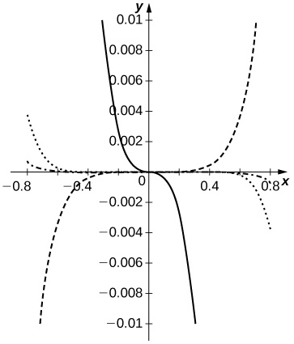
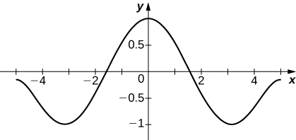

* Write the terms of the binomial series.
* Recognize the Taylor series expansions of common functions.
* Recognize and apply techniques to find the Taylor series for a function.
* Use Taylor series to solve differential equations.
* Use Taylor series to evaluate nonelementary integrals.

In the preceding section, we defined Taylor series and showed how to find the Taylor series for several common functions by explicitly calculating the coefficients of the Taylor polynomials. In this section we show how to use those Taylor series to derive Taylor series for other functions. We then present two common applications of power series. First, we show how power series can be used to solve differential equations. Second, we show how power series can be used to evaluate integrals when the antiderivative of the integrand cannot be expressed in terms of elementary functions. In one example, we consider <math xmlns="http://www.w3.org/1998/Math/MathML"><mrow><mstyle displaystyle="true"><mrow><mo stretchy="true">∫</mo><mrow><msup><mi>e</mi><mrow><mtext>−</mtext><msup><mrow><mi>x</mi></mrow><mn>2</mn></msup></mrow></msup></mrow></mrow></mstyle><mi>d</mi><mi>x</mi><mo>,</mo></mrow></math>

 an integral that arises frequently in probability theory.

### The Binomial Series

Our first goal in this section is to determine the Maclaurin series for the function <math xmlns="http://www.w3.org/1998/Math/MathML"><mrow><mi>f</mi><mrow><mo>(</mo><mi>x</mi><mo>)</mo></mrow><mo>=</mo><msup><mrow><mrow><mo>(</mo><mrow><mn>1</mn><mo>+</mo><mi>x</mi></mrow><mo>)</mo></mrow></mrow><mi>r</mi></msup></mrow></math>

 for all real numbers <math xmlns="http://www.w3.org/1998/Math/MathML"><mi>r</mi><mo>.</mo></math>

 The Maclaurin series for this function is known as the **binomial series**{: data-type="term"}. We begin by considering the simplest case: <math xmlns="http://www.w3.org/1998/Math/MathML"><mi>r</mi></math>

 is a nonnegative integer. We recall that, for <math xmlns="http://www.w3.org/1998/Math/MathML"><mrow><mi>r</mi><mo>=</mo><mn>0</mn><mo>,</mo><mn>1</mn><mo>,</mo><mn>2</mn><mo>,</mo><mn>3</mn><mo>,</mo><mn>4</mn><mo>,</mo><mi>f</mi><mrow><mo>(</mo><mi>x</mi><mo>)</mo></mrow><mo>=</mo><msup><mrow><mrow><mo>(</mo><mrow><mn>1</mn><mo>+</mo><mi>x</mi></mrow><mo>)</mo></mrow></mrow><mi>r</mi></msup></mrow></math>

 can be written as

<math xmlns="http://www.w3.org/1998/Math/MathML"><mtable><mtr /><mtr><mtd columnalign="left"><mi>f</mi><mrow><mo>(</mo><mi>x</mi><mo>)</mo></mrow><mo>=</mo><msup><mrow><mo>(</mo><mrow><mn>1</mn><mo>+</mo><mi>x</mi></mrow><mo>)</mo></mrow><mn>0</mn></msup><mo>=</mo><mn>1</mn><mo>,</mo></mtd></mtr><mtr><mtd columnalign="left"><mi>f</mi><mrow><mo>(</mo><mi>x</mi><mo>)</mo></mrow><mo>=</mo><msup><mrow><mo>(</mo><mrow><mn>1</mn><mo>+</mo><mi>x</mi></mrow><mo>)</mo></mrow><mn>1</mn></msup><mo>=</mo><mn>1</mn><mo>+</mo><mi>x</mi><mo>,</mo></mtd></mtr><mtr><mtd columnalign="left"><mi>f</mi><mrow><mo>(</mo><mi>x</mi><mo>)</mo></mrow><mo>=</mo><msup><mrow><mo>(</mo><mrow><mn>1</mn><mo>+</mo><mi>x</mi></mrow><mo>)</mo></mrow><mn>2</mn></msup><mo>=</mo><mn>1</mn><mo>+</mo><mn>2</mn><mi>x</mi><mo>+</mo><msup><mi>x</mi><mn>2</mn></msup><mo>,</mo></mtd></mtr><mtr><mtd columnalign="left"><mi>f</mi><mrow><mo>(</mo><mi>x</mi><mo>)</mo></mrow><mo>=</mo><msup><mrow><mo>(</mo><mrow><mn>1</mn><mo>+</mo><mi>x</mi></mrow><mo>)</mo></mrow><mn>3</mn></msup><mo>=</mo><mn>1</mn><mo>+</mo><mn>3</mn><mi>x</mi><mo>+</mo><mn>3</mn><msup><mi>x</mi><mn>2</mn></msup><mo>+</mo><msup><mi>x</mi><mn>3</mn></msup><mo>,</mo></mtd></mtr><mtr><mtd columnalign="left"><mi>f</mi><mrow><mo>(</mo><mi>x</mi><mo>)</mo></mrow><mo>=</mo><msup><mrow><mo>(</mo><mrow><mn>1</mn><mo>+</mo><mi>x</mi></mrow><mo>)</mo></mrow><mn>4</mn></msup><mo>=</mo><mn>1</mn><mo>+</mo><mn>4</mn><mi>x</mi><mo>+</mo><mn>6</mn><msup><mi>x</mi><mn>2</mn></msup><mo>+</mo><mn>4</mn><msup><mi>x</mi><mn>3</mn></msup><mo>+</mo><msup><mi>x</mi><mn>4</mn></msup><mo>.</mo></mtd></mtr></mtable></math>

The expressions on the right-hand side are known as binomial expansions and the coefficients are known as binomial coefficients. More generally, for any nonnegative integer <math xmlns="http://www.w3.org/1998/Math/MathML"><mi>r</mi><mo>,</mo></math>

 the binomial coefficient of <math xmlns="http://www.w3.org/1998/Math/MathML"><mrow><msup><mi>x</mi><mi>n</mi></msup></mrow></math>

 in the binomial expansion of <math xmlns="http://www.w3.org/1998/Math/MathML"><mrow><msup><mrow><mrow><mo>(</mo><mrow><mn>1</mn><mo>+</mo><mi>x</mi></mrow><mo>)</mo></mrow></mrow><mi>r</mi></msup></mrow></math>

 is given by

<math xmlns="http://www.w3.org/1998/Math/MathML"><mrow><mrow><mo>(</mo><mtable><mtr><mtd columnalign="left"><mi>r</mi></mtd></mtr><mtr><mtd columnalign="left"><mi>n</mi></mtd></mtr></mtable><mo>)</mo></mrow><mo>=</mo><mfrac><mrow><mi>r</mi><mtext>!</mtext></mrow><mrow><mi>n</mi><mtext>!</mtext><mrow><mo>(</mo><mrow><mi>r</mi><mo>−</mo><mi>n</mi></mrow><mo>)</mo></mrow><mtext>!</mtext></mrow></mfrac></mrow></math>

and

<math xmlns="http://www.w3.org/1998/Math/MathML"><mtable><mtr><mtd columnalign="right"><mi>f</mi><mrow><mo>(</mo><mi>x</mi><mo>)</mo></mrow></mtd><mtd columnalign="left"><mo>=</mo><msup><mrow><mo>(</mo><mrow><mn>1</mn><mo>+</mo><mi>x</mi></mrow><mo>)</mo></mrow><mi>r</mi></msup></mtd></mtr><mtr><mtd /><mtd columnalign="left"><mo>=</mo><mrow><mo>(</mo><mtable><mtr><mtd columnalign="left"><mi>r</mi></mtd></mtr><mtr><mtd columnalign="left"><mn>0</mn></mtd></mtr></mtable><mo>)</mo></mrow><mn>1</mn><mo>+</mo><mrow><mo>(</mo><mtable><mtr><mtd columnalign="left"><mi>r</mi></mtd></mtr><mtr><mtd columnalign="left"><mn>1</mn></mtd></mtr></mtable><mo>)</mo></mrow><mi>x</mi><mo>+</mo><mrow><mo>(</mo><mtable><mtr><mtd columnalign="left"><mi>r</mi></mtd></mtr><mtr><mtd columnalign="left"><mn>2</mn></mtd></mtr></mtable><mo>)</mo></mrow><msup><mi>x</mi><mn>2</mn></msup><mo>+</mo><mrow><mo>(</mo><mtable><mtr><mtd columnalign="left"><mi>r</mi></mtd></mtr><mtr><mtd columnalign="left"><mn>3</mn></mtd></mtr></mtable><mo>)</mo></mrow><msup><mi>x</mi><mn>3</mn></msup><mo>+</mo><mtext>⋯</mtext><mo>+</mo><mrow><mo>(</mo><mtable><mtr><mtd columnalign="left"><mi>r</mi></mtd></mtr><mtr><mtd columnalign="left"><mi>r</mi><mo>−</mo><mn>1</mn></mtd></mtr></mtable><mo>)</mo></mrow><msup><mi>x</mi><mrow><mi>r</mi><mo>−</mo><mn>1</mn></mrow></msup><mo>+</mo><mrow><mo>(</mo><mtable><mtr><mtd columnalign="left"><mi>r</mi></mtd></mtr><mtr><mtd columnalign="left"><mi>r</mi></mtd></mtr></mtable><mo>)</mo></mrow><msup><mi>x</mi><mi>r</mi></msup></mtd></mtr><mtr><mtd /><mtd columnalign="left"><mo>=</mo><mstyle displaystyle="true"><munderover><mo>∑</mo><mrow><mi>n</mi><mo>=</mo><mn>0</mn></mrow><mi>r</mi></munderover><mrow><mrow><mo>(</mo><mtable><mtr><mtd columnalign="left"><mi>r</mi></mtd></mtr><mtr><mtd columnalign="left"><mi>n</mi></mtd></mtr></mtable><mo>)</mo></mrow><msup><mi>x</mi><mi>n</mi></msup></mrow></mstyle><mo>.</mo></mtd></mtr></mtable></math>

For example, using this formula for <math xmlns="http://www.w3.org/1998/Math/MathML"><mrow><mi>r</mi><mo>=</mo><mn>5</mn><mo>,</mo></mrow></math>

 we see that

<math xmlns="http://www.w3.org/1998/Math/MathML"><mtable><mtr><mtd columnalign="right"><mi>f</mi><mrow><mo>(</mo><mi>x</mi><mo>)</mo></mrow></mtd><mtd columnalign="left"><mo>=</mo><msup><mrow><mo>(</mo><mrow><mn>1</mn><mo>+</mo><mi>x</mi></mrow><mo>)</mo></mrow><mn>5</mn></msup></mtd></mtr><mtr><mtd /><mtd columnalign="left"><mo>=</mo><mrow><mo>(</mo><mtable><mtr><mtd columnalign="left"><mn>5</mn></mtd></mtr><mtr><mtd columnalign="left"><mn>0</mn></mtd></mtr></mtable><mo>)</mo></mrow><mn>1</mn><mo>+</mo><mrow><mo>(</mo><mtable><mtr><mtd columnalign="left"><mn>5</mn></mtd></mtr><mtr><mtd columnalign="left"><mn>1</mn></mtd></mtr></mtable><mo>)</mo></mrow><mi>x</mi><mo>+</mo><mrow><mo>(</mo><mtable><mtr><mtd columnalign="left"><mn>5</mn></mtd></mtr><mtr><mtd columnalign="left"><mn>2</mn></mtd></mtr></mtable><mo>)</mo></mrow><msup><mi>x</mi><mn>2</mn></msup><mo>+</mo><mrow><mo>(</mo><mtable><mtr><mtd columnalign="left"><mn>5</mn></mtd></mtr><mtr><mtd columnalign="left"><mn>3</mn></mtd></mtr></mtable><mo>)</mo></mrow><msup><mi>x</mi><mn>3</mn></msup><mo>+</mo><mrow><mo>(</mo><mtable><mtr><mtd columnalign="left"><mn>5</mn></mtd></mtr><mtr><mtd columnalign="left"><mn>4</mn></mtd></mtr></mtable><mo>)</mo></mrow><msup><mi>x</mi><mn>4</mn></msup><mo>+</mo><mrow><mo>(</mo><mtable><mtr><mtd columnalign="left"><mn>5</mn></mtd></mtr><mtr><mtd columnalign="left"><mn>5</mn></mtd></mtr></mtable><mo>)</mo></mrow><msup><mi>x</mi><mn>5</mn></msup></mtd></mtr><mtr><mtd /><mtd columnalign="left"><mo>=</mo><mfrac><mrow><mn>5</mn><mtext>!</mtext></mrow><mrow><mn>0</mn><mtext>!</mtext><mn>5</mn><mtext>!</mtext></mrow></mfrac><mn>1</mn><mo>+</mo><mfrac><mrow><mn>5</mn><mtext>!</mtext></mrow><mrow><mn>1</mn><mtext>!</mtext><mn>4</mn><mtext>!</mtext></mrow></mfrac><mi>x</mi><mo>+</mo><mfrac><mrow><mn>5</mn><mtext>!</mtext></mrow><mrow><mn>2</mn><mtext>!</mtext><mn>3</mn><mtext>!</mtext></mrow></mfrac><msup><mi>x</mi><mn>2</mn></msup><mo>+</mo><mfrac><mrow><mn>5</mn><mtext>!</mtext></mrow><mrow><mn>3</mn><mtext>!</mtext><mn>2</mn><mtext>!</mtext></mrow></mfrac><msup><mi>x</mi><mn>3</mn></msup><mo>+</mo><mfrac><mrow><mn>5</mn><mtext>!</mtext></mrow><mrow><mn>4</mn><mtext>!</mtext><mn>1</mn><mtext>!</mtext></mrow></mfrac><msup><mi>x</mi><mn>4</mn></msup><mo>+</mo><mfrac><mrow><mn>5</mn><mtext>!</mtext></mrow><mrow><mn>5</mn><mtext>!</mtext><mn>0</mn><mtext>!</mtext></mrow></mfrac><msup><mi>x</mi><mn>5</mn></msup></mtd></mtr><mtr><mtd /><mtd columnalign="left"><mo>=</mo><mn>1</mn><mo>+</mo><mn>5</mn><mi>x</mi><mo>+</mo><mn>10</mn><msup><mi>x</mi><mn>2</mn></msup><mo>+</mo><mn>10</mn><msup><mi>x</mi><mn>3</mn></msup><mo>+</mo><mn>5</mn><msup><mi>x</mi><mn>4</mn></msup><mo>+</mo><msup><mi>x</mi><mn>5</mn></msup><mo>.</mo></mtd></mtr></mtable></math>

We now consider the case when the exponent <math xmlns="http://www.w3.org/1998/Math/MathML"><mi>r</mi></math>

 is any real number, not necessarily a nonnegative integer. If <math xmlns="http://www.w3.org/1998/Math/MathML"><mi>r</mi></math>

 is not a nonnegative integer, then <math xmlns="http://www.w3.org/1998/Math/MathML"><mrow><mi>f</mi><mrow><mo>(</mo><mi>x</mi><mo>)</mo></mrow><mo>=</mo><msup><mrow><mrow><mo>(</mo><mrow><mn>1</mn><mo>+</mo><mi>x</mi></mrow><mo>)</mo></mrow></mrow><mi>r</mi></msup></mrow></math>

 cannot be written as a finite polynomial. However, we can find a power series for <math xmlns="http://www.w3.org/1998/Math/MathML"><mrow><mi>f</mi><mo>.</mo></mrow></math>

 Specifically, we look for the Maclaurin series for <math xmlns="http://www.w3.org/1998/Math/MathML"><mrow><mi>f</mi><mo>.</mo></mrow></math>

 To do this, we find the derivatives of <math xmlns="http://www.w3.org/1998/Math/MathML"><mrow><mi>f</mi></mrow></math>

 and evaluate them at <math xmlns="http://www.w3.org/1998/Math/MathML"><mrow><mi>x</mi><mo>=</mo><mn>0</mn><mo>.</mo></mrow></math>

<math xmlns="http://www.w3.org/1998/Math/MathML"><mtable><mtr><mtd columnalign="right"><mi>f</mi><mrow><mo>(</mo><mi>x</mi><mo>)</mo></mrow></mtd><mtd columnalign="left"><mo>=</mo></mtd><mtd columnalign="left"><msup><mrow><mrow><mo>(</mo><mrow><mn>1</mn><mo>+</mo><mi>x</mi></mrow><mo>)</mo></mrow></mrow><mi>r</mi></msup></mtd><mtd /><mtd /><mtd columnalign="right"><mi>f</mi><mrow><mo>(</mo><mn>0</mn><mo>)</mo></mrow></mtd><mtd columnalign="left"><mo>=</mo></mtd><mtd columnalign="left"><mn>1</mn></mtd></mtr><mtr><mtd columnalign="right"><msup><mi>f</mi><mo>′</mo></msup><mrow><mo>(</mo><mi>x</mi><mo>)</mo></mrow></mtd><mtd columnalign="left"><mo>=</mo></mtd><mtd columnalign="left"><mi>r</mi><msup><mrow><mrow><mo>(</mo><mrow><mn>1</mn><mo>+</mo><mi>x</mi></mrow><mo>)</mo></mrow></mrow><mrow><mi>r</mi><mo>−</mo><mn>1</mn></mrow></msup></mtd><mtd /><mtd /><mtd columnalign="right"><mi>f</mi><mo>′</mo><mrow><mo>(</mo><mn>0</mn><mo>)</mo></mrow></mtd><mtd columnalign="left"><mo>=</mo></mtd><mtd columnalign="left"><mi>r</mi></mtd></mtr><mtr><mtd columnalign="right"><mi>f</mi><mtext>″</mtext><mrow><mo>(</mo><mi>x</mi><mo>)</mo></mrow></mtd><mtd columnalign="left"><mo>=</mo></mtd><mtd columnalign="left"><mi>r</mi><mrow><mo>(</mo><mrow><mi>r</mi><mo>−</mo><mn>1</mn></mrow><mo>)</mo></mrow><msup><mrow><mrow><mo>(</mo><mrow><mn>1</mn><mo>+</mo><mi>x</mi></mrow><mo>)</mo></mrow></mrow><mrow><mi>r</mi><mo>−</mo><mn>2</mn></mrow></msup></mtd><mtd /><mtd /><mtd columnalign="right"><mi>f</mi><mtext>″</mtext><mrow><mo>(</mo><mn>0</mn><mo>)</mo></mrow></mtd><mtd columnalign="left"><mo>=</mo></mtd><mtd columnalign="left"><mi>r</mi><mrow><mo>(</mo><mrow><mi>r</mi><mo>−</mo><mn>1</mn></mrow><mo>)</mo></mrow></mtd></mtr><mtr><mtd columnalign="right"><mi>f</mi><mtext>‴</mtext><mrow><mo>(</mo><mi>x</mi><mo>)</mo></mrow></mtd><mtd columnalign="left"><mo>=</mo></mtd><mtd columnalign="left"><mi>r</mi><mrow><mo>(</mo><mrow><mi>r</mi><mo>−</mo><mn>1</mn></mrow><mo>)</mo></mrow><mrow><mo>(</mo><mrow><mi>r</mi><mo>−</mo><mn>2</mn></mrow><mo>)</mo></mrow><msup><mrow><mrow><mo>(</mo><mrow><mn>1</mn><mo>+</mo><mi>x</mi></mrow><mo>)</mo></mrow></mrow><mrow><mi>r</mi><mo>−</mo><mn>3</mn></mrow></msup></mtd><mtd /><mtd /><mtd columnalign="right"><mi>f</mi><mtext>‴</mtext><mrow><mo>(</mo><mn>0</mn><mo>)</mo></mrow></mtd><mtd columnalign="left"><mo>=</mo></mtd><mtd columnalign="left"><mi>r</mi><mrow><mo>(</mo><mrow><mi>r</mi><mo>−</mo><mn>1</mn></mrow><mo>)</mo></mrow><mrow><mo>(</mo><mrow><mi>r</mi><mo>−</mo><mn>2</mn></mrow><mo>)</mo></mrow></mtd></mtr><mtr><mtd columnalign="right"><msup><mi>f</mi><mrow><mrow><mo>(</mo><mi>n</mi><mo>)</mo></mrow></mrow></msup><mrow><mo>(</mo><mi>x</mi><mo>)</mo></mrow></mtd><mtd columnalign="left"><mo>=</mo></mtd><mtd columnalign="left"><mi>r</mi><mrow><mo>(</mo><mrow><mi>r</mi><mo>−</mo><mn>1</mn></mrow><mo>)</mo></mrow><mrow><mo>(</mo><mrow><mi>r</mi><mo>−</mo><mn>2</mn></mrow><mo>)</mo></mrow><mtext>⋯</mtext><mrow><mo>(</mo><mrow><mi>r</mi><mo>−</mo><mi>n</mi><mo>+</mo><mn>1</mn></mrow><mo>)</mo></mrow><msup><mrow><mrow><mo>(</mo><mrow><mn>1</mn><mo>+</mo><mi>x</mi></mrow><mo>)</mo></mrow></mrow><mrow><mi>r</mi><mo>−</mo><mi>n</mi></mrow></msup></mtd><mtd /><mtd /><mtd columnalign="right"><msup><mi>f</mi><mrow><mrow><mo>(</mo><mi>n</mi><mo>)</mo></mrow></mrow></msup><mrow><mo>(</mo><mn>0</mn><mo>)</mo></mrow></mtd><mtd columnalign="left"><mo>=</mo></mtd><mtd columnalign="left"><mi>r</mi><mrow><mo>(</mo><mrow><mi>r</mi><mo>−</mo><mn>1</mn></mrow><mo>)</mo></mrow><mrow><mo>(</mo><mrow><mi>r</mi><mo>−</mo><mn>2</mn></mrow><mo>)</mo></mrow><mtext>⋯</mtext><mrow><mo>(</mo><mrow><mi>r</mi><mo>−</mo><mi>n</mi><mo>+</mo><mn>1</mn></mrow><mo>)</mo></mrow></mtd></mtr></mtable></math>

We conclude that the coefficients in the binomial series are given by

<math xmlns="http://www.w3.org/1998/Math/MathML"><mrow><mfrac><mrow><msup><mi>f</mi><mrow><mrow><mo>(</mo><mi>n</mi><mo>)</mo></mrow></mrow></msup><mrow><mo>(</mo><mn>0</mn><mo>)</mo></mrow></mrow><mrow><mi>n</mi><mtext>!</mtext></mrow></mfrac><mo>=</mo><mfrac><mrow><mi>r</mi><mrow><mo>(</mo><mrow><mi>r</mi><mo>−</mo><mn>1</mn></mrow><mo>)</mo></mrow><mrow><mo>(</mo><mrow><mi>r</mi><mo>−</mo><mn>2</mn></mrow><mo>)</mo></mrow><mtext>⋯</mtext><mrow><mo>(</mo><mrow><mi>r</mi><mo>−</mo><mi>n</mi><mo>+</mo><mn>1</mn></mrow><mo>)</mo></mrow></mrow><mrow><mi>n</mi><mtext>!</mtext></mrow></mfrac><mo>.</mo></mrow></math>

We note that if <math xmlns="http://www.w3.org/1998/Math/MathML"><mi>r</mi></math>

 is a nonnegative integer, then the <math xmlns="http://www.w3.org/1998/Math/MathML"><mrow><mrow><mo>(</mo><mrow><mi>r</mi><mo>+</mo><mn>1</mn></mrow><mo>)</mo></mrow><mtext>st</mtext></mrow></math>

 derivative <math xmlns="http://www.w3.org/1998/Math/MathML"><mrow><msup><mi>f</mi><mrow><mrow><mo>(</mo><mrow><mi>r</mi><mo>+</mo><mn>1</mn></mrow><mo>)</mo></mrow></mrow></msup></mrow></math>

 is the zero function, and the series terminates. In addition, if <math xmlns="http://www.w3.org/1998/Math/MathML"><mi>r</mi></math>

 is a nonnegative integer, then [\[link\]](#fs-id1167023896721) for the coefficients agrees with [\[link\]](#fs-id1167023717125) for the coefficients, and the formula for the binomial series agrees with [\[link\]](#fs-id1167023919069) for the finite binomial expansion. More generally, to denote the binomial coefficients for any real number <math xmlns="http://www.w3.org/1998/Math/MathML"><mi>r</mi><mo>,</mo></math>

 we define

<math xmlns="http://www.w3.org/1998/Math/MathML"><mrow><mrow><mo>(</mo><mtable><mtr><mtd columnalign="left"><mi>r</mi></mtd></mtr><mtr><mtd columnalign="left"><mi>n</mi></mtd></mtr></mtable><mo>)</mo></mrow><mo>=</mo><mfrac><mrow><mi>r</mi><mrow><mo>(</mo><mrow><mi>r</mi><mo>−</mo><mn>1</mn></mrow><mo>)</mo></mrow><mrow><mo>(</mo><mrow><mi>r</mi><mo>−</mo><mn>2</mn></mrow><mo>)</mo></mrow><mtext>⋯</mtext><mrow><mo>(</mo><mrow><mi>r</mi><mo>−</mo><mi>n</mi><mo>+</mo><mn>1</mn></mrow><mo>)</mo></mrow></mrow><mrow><mi>n</mi><mtext>!</mtext></mrow></mfrac><mo>.</mo></mrow></math>

With this notation, we can write the binomial series for <math xmlns="http://www.w3.org/1998/Math/MathML"><mrow><msup><mrow><mrow><mo>(</mo><mrow><mn>1</mn><mo>+</mo><mi>x</mi></mrow><mo>)</mo></mrow></mrow><mi>r</mi></msup></mrow></math>

 as

<math xmlns="http://www.w3.org/1998/Math/MathML"><mrow><mstyle displaystyle="true"><munderover><mo>∑</mo><mrow><mi>n</mi><mo>=</mo><mn>0</mn></mrow><mi>∞</mi></munderover><mrow><mrow><mo>(</mo><mtable><mtr><mtd columnalign="left"><mi>r</mi></mtd></mtr><mtr><mtd columnalign="left"><mi>n</mi></mtd></mtr></mtable><mo>)</mo></mrow><msup><mi>x</mi><mi>n</mi></msup><mo>=</mo><mn>1</mn><mo>+</mo><mi>r</mi><mi>x</mi><mo>+</mo><mfrac><mrow><mi>r</mi><mrow><mo>(</mo><mrow><mi>r</mi><mo>−</mo><mn>1</mn></mrow><mo>)</mo></mrow></mrow><mrow><mn>2</mn><mtext>!</mtext></mrow></mfrac><msup><mi>x</mi><mn>2</mn></msup><mo>+</mo><mtext>⋯</mtext><mo>+</mo><mfrac><mrow><mi>r</mi><mrow><mo>(</mo><mrow><mi>r</mi><mo>−</mo><mn>1</mn></mrow><mo>)</mo></mrow><mtext>⋯</mtext><mrow><mo>(</mo><mrow><mi>r</mi><mo>−</mo><mi>n</mi><mo>+</mo><mn>1</mn></mrow><mo>)</mo></mrow></mrow><mrow><mi>n</mi><mtext>!</mtext></mrow></mfrac><msup><mi>x</mi><mi>n</mi></msup><mo>+</mo><mtext>⋯</mtext><mo>.</mo></mrow></mstyle></mrow></math>

We now need to determine the interval of convergence for the binomial series [\[link\]](#fs-id1167024036610). We apply the ratio test. Consequently, we consider

<math xmlns="http://www.w3.org/1998/Math/MathML"><mtable><mtr><mtd columnalign="right"><mfrac><mrow><mrow><mo>\|</mo><mrow><msub><mi>a</mi><mrow><mi>n</mi><mo>+</mo><mn>1</mn></mrow></msub></mrow><mo>\|</mo></mrow></mrow><mrow><mrow><mo>\|</mo><mrow><msub><mi>a</mi><mi>n</mi></msub></mrow><mo>\|</mo></mrow></mrow></mfrac></mtd><mtd columnalign="left"><mo>=</mo><mfrac><mrow><msup><mrow><mrow><mo>\|</mo><mrow><mi>r</mi><mrow><mo>(</mo><mrow><mi>r</mi><mo>−</mo><mn>1</mn></mrow><mo>)</mo></mrow><mrow><mo>(</mo><mrow><mi>r</mi><mo>−</mo><mn>2</mn></mrow><mo>)</mo></mrow><mtext>⋯</mtext><mrow><mo>(</mo><mrow><mi>r</mi><mo>−</mo><mi>n</mi></mrow><mo>)</mo></mrow><mrow><mo>\|</mo><mi>x</mi><mo>\|</mo></mrow></mrow><mo>\|</mo></mrow></mrow><mrow><mi>n</mi><mo>+</mo><mn>1</mn></mrow></msup></mrow><mrow><mrow><mo>(</mo><mrow><mi>n</mi><mo>+</mo><mn>1</mn></mrow><mo>)</mo></mrow><mtext>!</mtext></mrow></mfrac><mo>·</mo><mfrac><mi>n</mi><mrow><mrow><mo>\|</mo><mrow><mi>r</mi><mrow><mo>(</mo><mrow><mi>r</mi><mo>−</mo><mn>1</mn></mrow><mo>)</mo></mrow><mrow><mo>(</mo><mrow><mi>r</mi><mo>−</mo><mn>2</mn></mrow><mo>)</mo></mrow><mtext>⋯</mtext><mrow><mo>(</mo><mrow><mi>r</mi><mo>−</mo><mi>n</mi><mo>+</mo><mn>1</mn></mrow><mo>)</mo></mrow></mrow><mo>\|</mo></mrow><msup><mrow><mrow><mo>\|</mo><mi>x</mi><mo>\|</mo></mrow></mrow><mi>n</mi></msup></mrow></mfrac></mtd></mtr><mtr><mtd /><mtd columnalign="left"><mo>=</mo><mfrac><mrow><mrow><mo>\|</mo><mrow><mi>r</mi><mo>−</mo><mi>n</mi></mrow><mo>\|</mo></mrow><mrow><mo>\|</mo><mi>x</mi><mo>\|</mo></mrow></mrow><mrow><mrow><mo>\|</mo><mrow><mi>n</mi><mo>+</mo><mn>1</mn></mrow><mo>\|</mo></mrow></mrow></mfrac><mo>.</mo></mtd></mtr></mtable></math>

Since

<math xmlns="http://www.w3.org/1998/Math/MathML"><mrow><munder><mrow><mtext>lim</mtext></mrow><mrow><mi>n</mi><mo stretchy="false">→</mo><mi>∞</mi></mrow></munder><mfrac><mrow><mrow><mo>\|</mo><mrow><msub><mi>a</mi><mrow><mi>n</mi><mo>+</mo><mn>1</mn></mrow></msub></mrow><mo>\|</mo></mrow></mrow><mrow><mrow><mo>\|</mo><mrow><msub><mi>a</mi><mi>n</mi></msub></mrow><mo>\|</mo></mrow></mrow></mfrac><mo>=</mo><mrow><mo>\|</mo><mi>x</mi><mo>\|</mo></mrow><mo>&lt;</mo><mn>1</mn></mrow></math>

if and only if <math xmlns="http://www.w3.org/1998/Math/MathML"><mrow><mrow><mo>\|</mo><mi>x</mi><mo>\|</mo></mrow><mo>&lt;</mo><mn>1</mn><mo>,</mo></mrow></math>

 we conclude that the interval of convergence for the binomial series is <math xmlns="http://www.w3.org/1998/Math/MathML"><mrow><mrow><mo>(</mo><mrow><mn>−1</mn><mo>,</mo><mn>1</mn></mrow><mo>)</mo></mrow><mo>.</mo></mrow></math>

 The behavior at the endpoints depends on <math xmlns="http://www.w3.org/1998/Math/MathML"><mi>r</mi><mo>.</mo></math>

 It can be shown that for <math xmlns="http://www.w3.org/1998/Math/MathML"><mrow><mi>r</mi><mo>≥</mo><mn>0</mn></mrow></math>

 the series converges at both endpoints; for <math xmlns="http://www.w3.org/1998/Math/MathML"><mrow><mn>−1</mn><mo>&lt;</mo><mi>r</mi><mo>&lt;</mo><mn>0</mn><mo>,</mo></mrow></math>

 the series converges at <math xmlns="http://www.w3.org/1998/Math/MathML"><mrow><mi>x</mi><mo>=</mo><mn>1</mn></mrow></math>

 and diverges at <math xmlns="http://www.w3.org/1998/Math/MathML"><mrow><mi>x</mi><mo>=</mo><mn>−1</mn><mo>;</mo></mrow></math>

 and for <math xmlns="http://www.w3.org/1998/Math/MathML"><mrow><mi>r</mi><mo>&lt;</mo><mn>−1</mn><mo>,</mo></mrow></math>

 the series diverges at both endpoints. The binomial series does converge to <math xmlns="http://www.w3.org/1998/Math/MathML"><mrow><msup><mrow><mrow><mo>(</mo><mrow><mn>1</mn><mo>+</mo><mi>x</mi></mrow><mo>)</mo></mrow></mrow><mi>r</mi></msup></mrow></math>

 in <math xmlns="http://www.w3.org/1998/Math/MathML"><mrow><mrow><mo>(</mo><mrow><mn>−1</mn><mo>,</mo><mn>1</mn></mrow><mo>)</mo></mrow></mrow></math>

 for all real numbers <math xmlns="http://www.w3.org/1998/Math/MathML"><mi>r</mi><mo>,</mo></math>

 but proving this fact by showing that the remainder <math xmlns="http://www.w3.org/1998/Math/MathML"><mrow><msub><mi>R</mi><mi>n</mi></msub><mrow><mo>(</mo><mi>x</mi><mo>)</mo></mrow><mo stretchy="false">→</mo><mn>0</mn></mrow></math>

 is difficult.

Definition

For any real number <math xmlns="http://www.w3.org/1998/Math/MathML"><mrow><mi>r</mi><mo>,</mo></mrow></math>

 the Maclaurin series for <math xmlns="http://www.w3.org/1998/Math/MathML"><mrow><mi>f</mi><mrow><mo>(</mo><mi>x</mi><mo>)</mo></mrow><mo>=</mo><msup><mrow><mrow><mo>(</mo><mrow><mn>1</mn><mo>+</mo><mi>x</mi></mrow><mo>)</mo></mrow></mrow><mi>r</mi></msup></mrow></math>

 is the binomial series. It converges to <math xmlns="http://www.w3.org/1998/Math/MathML"><mrow><mi>f</mi></mrow></math>

 for <math xmlns="http://www.w3.org/1998/Math/MathML"><mrow><mrow><mo>\|</mo><mi>x</mi><mo>\|</mo></mrow><mo>&lt;</mo><mn>1</mn><mo>,</mo></mrow></math>

 and we write

<math xmlns="http://www.w3.org/1998/Math/MathML"><mtable><mtr><mtd columnalign="right"><msup><mrow><mo>(</mo><mrow><mn>1</mn><mo>+</mo><mi>x</mi></mrow><mo>)</mo></mrow><mi>r</mi></msup></mtd><mtd columnalign="left"><mo>=</mo><mstyle displaystyle="true"><munderover><mo>∑</mo><mrow><mi>n</mi><mo>=</mo><mn>0</mn></mrow><mi>∞</mi></munderover><mrow><mrow><mo>(</mo><mtable><mtr><mtd columnalign="left"><mi>r</mi></mtd></mtr><mtr><mtd columnalign="left"><mi>n</mi></mtd></mtr></mtable><mo>)</mo></mrow><msup><mi>x</mi><mi>n</mi></msup></mrow></mstyle></mtd></mtr><mtr><mtd /><mtd columnalign="left"><mo>=</mo><mn>1</mn><mo>+</mo><mi>r</mi><mi>x</mi><mo>+</mo><mfrac><mrow><mi>r</mi><mrow><mo>(</mo><mrow><mi>r</mi><mo>−</mo><mn>1</mn></mrow><mo>)</mo></mrow></mrow><mrow><mn>2</mn><mtext>!</mtext></mrow></mfrac><msup><mi>x</mi><mn>2</mn></msup><mo>+</mo><mtext>⋯</mtext><mo>+</mo><mfrac><mrow><mi>r</mi><mrow><mo>(</mo><mrow><mi>r</mi><mo>−</mo><mn>1</mn></mrow><mo>)</mo></mrow><mtext>⋯</mtext><mrow><mo>(</mo><mrow><mi>r</mi><mo>−</mo><mi>n</mi><mo>+</mo><mn>1</mn></mrow><mo>)</mo></mrow></mrow><mrow><mi>n</mi><mtext>!</mtext></mrow></mfrac><msup><mi>x</mi><mi>n</mi></msup><mo>+</mo><mtext>⋯</mtext></mtd></mtr></mtable></math>

for <math xmlns="http://www.w3.org/1998/Math/MathML"><mrow><mrow><mo>\|</mo><mi>x</mi><mo>\|</mo></mrow><mo>&lt;</mo><mn>1</mn><mo>.</mo></mrow></math>

We can use this definition to find the binomial series for <math xmlns="http://www.w3.org/1998/Math/MathML"><mrow><mi>f</mi><mrow><mo>(</mo><mi>x</mi><mo>)</mo></mrow><mo>=</mo><msqrt><mrow><mn>1</mn><mo>+</mo><mi>x</mi></mrow></msqrt></mrow></math>

 and use the series to approximate <math xmlns="http://www.w3.org/1998/Math/MathML"><mrow><msqrt><mrow><mn>1.5</mn></mrow></msqrt><mo>.</mo></mrow></math>

Finding Binomial Series

1.  Find the binomial series for
    <math xmlns="http://www.w3.org/1998/Math/MathML"><mrow><mi>f</mi><mrow><mo>(</mo><mi>x</mi><mo>)</mo></mrow><mo>=</mo><msqrt><mrow><mn>1</mn><mo>+</mo><mi>x</mi></mrow></msqrt><mo>.</mo></mrow></math>

2.  Use the third-order Maclaurin polynomial
    <math xmlns="http://www.w3.org/1998/Math/MathML"><mrow><msub><mi>p</mi><mn>3</mn></msub><mrow><mo>(</mo><mi>x</mi><mo>)</mo></mrow></mrow></math>
    
    to estimate
    <math xmlns="http://www.w3.org/1998/Math/MathML"><mrow><msqrt><mrow><mn>1.5</mn></mrow></msqrt><mo>.</mo></mrow></math>
    
    Use Taylor’s theorem to bound the error. Use a graphing utility to compare the graphs of
    <math xmlns="http://www.w3.org/1998/Math/MathML"><mrow><mi>f</mi></mrow></math>
    
    and
    <math xmlns="http://www.w3.org/1998/Math/MathML"><mrow><msub><mi>p</mi><mn>3</mn></msub><mo>.</mo></mrow></math>
{: data-number-style="lower-alpha"}

1.  Here
    <math xmlns="http://www.w3.org/1998/Math/MathML"><mrow><mi>r</mi><mo>=</mo><mfrac><mn>1</mn><mn>2</mn></mfrac><mo>.</mo></mrow></math>
    
    Using the definition for the binomial series, we obtain
    * * *
    {: data-type="newline"}
    
    

    <math xmlns="http://www.w3.org/1998/Math/MathML"><mtable><mtr><mtd columnalign="right"><msqrt><mrow><mn>1</mn><mo>+</mo><mi>x</mi></mrow></msqrt></mtd><mtd columnalign="left"><mo>=</mo><mn>1</mn><mo>+</mo><mfrac><mn>1</mn><mn>2</mn></mfrac><mi>x</mi><mo>+</mo><mfrac><mrow><mrow><mo>(</mo><mrow><mrow><mn>1</mn><mtext>/</mtext><mn>2</mn></mrow></mrow><mo>)</mo></mrow><mrow><mo>(</mo><mrow><mtext>−</mtext><mrow><mn>1</mn><mtext>/</mtext><mn>2</mn></mrow></mrow><mo>)</mo></mrow></mrow><mrow><mn>2</mn><mtext>!</mtext></mrow></mfrac><msup><mi>x</mi><mn>2</mn></msup><mo>+</mo><mfrac><mrow><mrow><mo>(</mo><mrow><mrow><mn>1</mn><mtext>/</mtext><mn>2</mn></mrow></mrow><mo>)</mo></mrow><mrow><mo>(</mo><mrow><mtext>−</mtext><mrow><mn>1</mn><mtext>/</mtext><mn>2</mn></mrow></mrow><mo>)</mo></mrow><mrow><mo>(</mo><mrow><mtext>−</mtext><mrow><mn>3</mn><mtext>/</mtext><mn>2</mn></mrow></mrow><mo>)</mo></mrow></mrow><mrow><mn>3</mn><mtext>!</mtext></mrow></mfrac><msup><mi>x</mi><mn>3</mn></msup><mo>+</mo><mtext>⋯</mtext></mtd></mtr><mtr><mtd /><mtd columnalign="left"><mo>=</mo><mn>1</mn><mo>+</mo><mfrac><mn>1</mn><mn>2</mn></mfrac><mi>x</mi><mo>−</mo><mfrac><mn>1</mn><mrow><mn>2</mn><mtext>!</mtext></mrow></mfrac><mspace width="0.2em" /><mfrac><mn>1</mn><mrow><msup><mn>2</mn><mn>2</mn></msup></mrow></mfrac><msup><mi>x</mi><mn>2</mn></msup><mo>+</mo><mfrac><mn>1</mn><mrow><mn>3</mn><mtext>!</mtext></mrow></mfrac><mspace width="0.2em" /><mfrac><mrow><mn>1</mn><mo>·</mo><mn>3</mn></mrow><mrow><msup><mn>2</mn><mn>3</mn></msup></mrow></mfrac><msup><mi>x</mi><mn>3</mn></msup><mo>−</mo><mtext>⋯</mtext><mo>+</mo><mfrac><mrow><msup><mrow><mrow><mo>(</mo><mrow><mn>−1</mn></mrow><mo>)</mo></mrow></mrow><mrow><mi>n</mi><mo>+</mo><mn>1</mn></mrow></msup></mrow><mrow><mi>n</mi><mtext>!</mtext></mrow></mfrac><mspace width="0.2em" /><mfrac><mrow><mn>1</mn><mo>·</mo><mn>3</mn><mo>·</mo><mn>5</mn><mtext>⋯</mtext><mrow><mo>(</mo><mrow><mn>2</mn><mi>n</mi><mo>−</mo><mn>3</mn></mrow><mo>)</mo></mrow></mrow><mrow><msup><mn>2</mn><mi>n</mi></msup></mrow></mfrac><msup><mi>x</mi><mi>n</mi></msup><mo>+</mo><mtext>⋯</mtext></mtd></mtr><mtr><mtd /><mtd columnalign="left"><mo>=</mo><mn>1</mn><mo>+</mo><mstyle displaystyle="true"><munderover><mo>∑</mo><mrow><mi>n</mi><mo>=</mo><mn>1</mn></mrow><mi>∞</mi></munderover><mrow><mfrac><mrow><msup><mrow><mrow><mo>(</mo><mrow><mn>−1</mn></mrow><mo>)</mo></mrow></mrow><mrow><mi>n</mi><mo>+</mo><mn>1</mn></mrow></msup></mrow><mrow><mi>n</mi><mtext>!</mtext></mrow></mfrac><mspace width="0.2em" /><mfrac><mrow><mn>1</mn><mo>·</mo><mn>3</mn><mo>·</mo><mn>5</mn><mtext>⋯</mtext><mrow><mo>(</mo><mrow><mn>2</mn><mi>n</mi><mo>−</mo><mn>3</mn></mrow><mo>)</mo></mrow></mrow><mrow><msup><mn>2</mn><mi>n</mi></msup></mrow></mfrac><msup><mi>x</mi><mi>n</mi></msup><mo>.</mo></mrow></mstyle></mtd></mtr></mtable></math>
    

2.  From the result in part a. the third-order Maclaurin polynomial is
    * * *
    {: data-type="newline"}
    
    

    <math xmlns="http://www.w3.org/1998/Math/MathML"><mrow><msub><mi>p</mi><mn>3</mn></msub><mrow><mo>(</mo><mi>x</mi><mo>)</mo></mrow><mo>=</mo><mn>1</mn><mo>+</mo><mfrac><mn>1</mn><mn>2</mn></mfrac><mi>x</mi><mo>−</mo><mfrac><mn>1</mn><mn>8</mn></mfrac><msup><mi>x</mi><mn>2</mn></msup><mo>+</mo><mfrac><mn>1</mn><mrow><mn>16</mn></mrow></mfrac><msup><mi>x</mi><mn>3</mn></msup><mo>.</mo></mrow></math>
    

    
    * * *
    {: data-type="newline"}
    
    Therefore,
    * * *
    {: data-type="newline"}
    
    

    <math xmlns="http://www.w3.org/1998/Math/MathML"><mtable><mtr><mtd columnalign="right"><msqrt><mrow><mn>1.5</mn></mrow></msqrt></mtd><mtd columnalign="left"><mo>=</mo><msqrt><mrow><mn>1</mn><mo>+</mo><mn>0.5</mn></mrow></msqrt></mtd></mtr><mtr><mtd /><mtd columnalign="left"><mo>≈</mo><mn>1</mn><mo>+</mo><mfrac><mn>1</mn><mn>2</mn></mfrac><mrow><mo>(</mo><mrow><mn>0.5</mn></mrow><mo>)</mo></mrow><mo>−</mo><mfrac><mn>1</mn><mn>8</mn></mfrac><msup><mrow><mo>(</mo><mrow><mn>0.5</mn></mrow><mo>)</mo></mrow><mn>2</mn></msup><mo>+</mo><mfrac><mn>1</mn><mrow><mn>16</mn></mrow></mfrac><msup><mrow><mo>(</mo><mrow><mn>0.5</mn></mrow><mo>)</mo></mrow><mn>3</mn></msup></mtd></mtr><mtr><mtd /><mtd columnalign="left"><mo>≈</mo><mn>1.2266.</mn></mtd></mtr></mtable></math>
    

    
    * * *
    {: data-type="newline"}
    
    From Taylor’s theorem, the error satisfies
    * * *
    {: data-type="newline"}
    
    

    <math xmlns="http://www.w3.org/1998/Math/MathML"><mrow><msub><mi>R</mi><mn>3</mn></msub><mrow><mo>(</mo><mrow><mn>0.5</mn></mrow><mo>)</mo></mrow><mo>=</mo><mfrac><mrow><msup><mi>f</mi><mrow><mrow><mo>(</mo><mn>4</mn><mo>)</mo></mrow></mrow></msup><mrow><mo>(</mo><mi>c</mi><mo>)</mo></mrow></mrow><mrow><mn>4</mn><mtext>!</mtext></mrow></mfrac><msup><mrow><mrow><mo>(</mo><mrow><mn>0.5</mn></mrow><mo>)</mo></mrow></mrow><mn>4</mn></msup></mrow></math>
    

    
    * * *
    {: data-type="newline"}
    
    for some
    <math xmlns="http://www.w3.org/1998/Math/MathML"><mi>c</mi></math>
    
    between
    <math xmlns="http://www.w3.org/1998/Math/MathML"><mn>0</mn></math>
    
    and
    <math xmlns="http://www.w3.org/1998/Math/MathML"><mrow><mn>0.5</mn><mo>.</mo></mrow></math>
    
    Since
    <math xmlns="http://www.w3.org/1998/Math/MathML"><mrow><msup><mi>f</mi><mrow><mrow><mo>(</mo><mn>4</mn><mo>)</mo></mrow></mrow></msup><mrow><mo>(</mo><mi>x</mi><mo>)</mo></mrow><mo>=</mo><mo>−</mo><mfrac><mrow><mn>15</mn></mrow><mrow><msup><mn>2</mn><mn>4</mn></msup><msup><mrow><mrow><mo>(</mo><mrow><mn>1</mn><mo>+</mo><mi>x</mi></mrow><mo>)</mo></mrow></mrow><mrow><mn>7</mn><mtext>/</mtext><mn>2</mn></mrow></msup></mrow></mfrac><mo>,</mo></mrow></math>
    
    and the maximum value of
    <math xmlns="http://www.w3.org/1998/Math/MathML"><mrow><mrow><mo>\|</mo><mrow><msup><mi>f</mi><mrow><mrow><mo>(</mo><mn>4</mn><mo>)</mo></mrow></mrow></msup><mrow><mo>(</mo><mi>x</mi><mo>)</mo></mrow></mrow><mo>\|</mo></mrow></mrow></math>
    
    on the interval
    <math xmlns="http://www.w3.org/1998/Math/MathML"><mrow><mrow><mo>(</mo><mrow><mn>0</mn><mo>,</mo><mn>0.5</mn></mrow><mo>)</mo></mrow></mrow></math>
    
    occurs at
    <math xmlns="http://www.w3.org/1998/Math/MathML"><mrow><mi>x</mi><mo>=</mo><mn>0</mn><mo>,</mo></mrow></math>
    
    we have
    * * *
    {: data-type="newline"}
    
    

    <math xmlns="http://www.w3.org/1998/Math/MathML"><mrow><mrow><mo>\|</mo><mrow><msub><mi>R</mi><mn>3</mn></msub><mrow><mo>(</mo><mrow><mn>0.5</mn></mrow><mo>)</mo></mrow></mrow><mo>\|</mo></mrow><mo>≤</mo><mfrac><mrow><mn>15</mn></mrow><mrow><mn>4</mn><mtext>!</mtext><msup><mn>2</mn><mn>4</mn></msup></mrow></mfrac><msup><mrow><mrow><mo>(</mo><mrow><mn>0.5</mn></mrow><mo>)</mo></mrow></mrow><mn>4</mn></msup><mo>≈</mo><mn>0.00244</mn><mo>.</mo></mrow></math>
    

    
    * * *
    {: data-type="newline"}
    
    The function and the Maclaurin polynomial
    <math xmlns="http://www.w3.org/1998/Math/MathML"><mrow><msub><mi>p</mi><mn>3</mn></msub></mrow></math>
    
    are graphed in [[link]](#CNX_Calc_Figure_10_04_001).
    * * *
    {: data-type="newline"}
    
     provides a good approximation for f(x)=1+x for x near zero."){: #CNX_Calc_Figure_10_04_001}

{: data-number-style="lower-alpha"}

Find the binomial series for <math xmlns="http://www.w3.org/1998/Math/MathML"><mrow><mi>f</mi><mrow><mo>(</mo><mi>x</mi><mo>)</mo></mrow><mo>=</mo><mfrac><mn>1</mn><mrow><msup><mrow><mrow><mo>(</mo><mrow><mn>1</mn><mo>+</mo><mi>x</mi></mrow><mo>)</mo></mrow></mrow><mn>2</mn></msup></mrow></mfrac><mo>.</mo></mrow></math>

<math xmlns="http://www.w3.org/1998/Math/MathML"><mrow><mstyle displaystyle="true"><munderover><mo>∑</mo><mrow><mi>n</mi><mo>=</mo><mn>0</mn></mrow><mi>∞</mi></munderover><mrow><msup><mrow><mrow><mo>(</mo><mrow><mn>−1</mn></mrow><mo>)</mo></mrow></mrow><mi>n</mi></msup><mrow><mo>(</mo><mrow><mi>n</mi><mo>+</mo><mn>1</mn></mrow><mo>)</mo></mrow><msup><mi>x</mi><mi>n</mi></msup></mrow></mstyle></mrow></math>

Hint

Use the definition of binomial series for <math xmlns="http://www.w3.org/1998/Math/MathML"><mrow><mi>r</mi><mo>=</mo><mn>−2</mn><mo>.</mo></mrow></math>

### Common Functions Expressed as Taylor Series

At this point, we have derived Maclaurin series for exponential, trigonometric, and logarithmic functions, as well as functions of the form <math xmlns="http://www.w3.org/1998/Math/MathML"><mrow><mi>f</mi><mrow><mo>(</mo><mi>x</mi><mo>)</mo></mrow><mo>=</mo><msup><mrow><mrow><mo>(</mo><mrow><mn>1</mn><mo>+</mo><mi>x</mi></mrow><mo>)</mo></mrow></mrow><mi>r</mi></msup><mo>.</mo></mrow></math>

 In [\[link\]](#fs-id1167024047165), we summarize the results of these series. We remark that the convergence of the Maclaurin series for <math xmlns="http://www.w3.org/1998/Math/MathML"><mrow><mi>f</mi><mrow><mo>(</mo><mi>x</mi><mo>)</mo></mrow><mo>=</mo><mtext>ln</mtext><mspace width="0.1em" /><mrow><mo>(</mo><mrow><mn>1</mn><mo>+</mo><mi>x</mi></mrow><mo>)</mo></mrow></mrow></math>

 at the endpoint <math xmlns="http://www.w3.org/1998/Math/MathML"><mrow><mi>x</mi><mo>=</mo><mn>1</mn></mrow></math>

 and the Maclaurin series for <math xmlns="http://www.w3.org/1998/Math/MathML"><mrow><mi>f</mi><mrow><mo>(</mo><mi>x</mi><mo>)</mo></mrow><mo>=</mo><msup><mrow><mtext>tan</mtext></mrow><mrow><mn>−1</mn></mrow></msup><mi>x</mi></mrow></math>

 at the endpoints <math xmlns="http://www.w3.org/1998/Math/MathML"><mrow><mi>x</mi><mo>=</mo><mn>1</mn></mrow></math>

 and <math xmlns="http://www.w3.org/1998/Math/MathML"><mrow><mi>x</mi><mo>=</mo><mn>−1</mn></mrow></math>

 relies on a more advanced theorem than we present here. (Refer to Abel’s theorem for a discussion of this more technical point.)

<table summary="This table has seven rows and three columns. The header row labels the columns &#x201C;function&#x201D; , &#x201C;Maclaurin&#x201D; and &#x201C;interval of convergence&#x201D;. The first row is the function 1/(1-x). The Maclaurin series is the sum of x^n and the interval of convergence is -1&lt;x&lt;1. The second row is the function e^x.  The Maclaurin series is the sum of x^n/n! and the interval of convergence is all real numbers. The third row is the function sin(x). The Maclaurin series is the sum of (-1)^n times x^(2n+1)/(2n+1)! and the interval of convergence is all real numbers. The fourth row is the function cos(x).  The Maclaurin series is the sum of (-1)^n times x^(2n)/(2n)! and the interval of convergence is all real numbers. The fifth row is the function ln(1+x).  The Maclaurin series is the sum of (-1)^n+1 times x^n/(n) and the interval of convergence is -1&lt;x&lt;1. The sixth row is the function arctan(x).  The Maclaurin series is the sum of (-1)^n times x^(2n+1)/(2n+1) and the interval of convergence is between -1 and 1 inclusive. The seventh row is the function (1+x)^r.  The Maclaurin series is the sum of the combinations of r choose n times x^n and the interval of convergence is -1&lt;x&lt;1."><caption>Maclaurin Series for Common Functions</caption><thead>
<tr valign="top">
<th data-align="left">Function</th>
<th data-align="left">Maclaurin Series</th>
<th data-align="left">Interval of Convergence</th>
</tr>
</thead><tbody>
<tr valign="top">
<td data-align="left"><math xmlns="http://www.w3.org/1998/Math/MathML"><mrow><mi>f</mi><mrow><mo>(</mo><mi>x</mi><mo>)</mo></mrow><mo>=</mo><mfrac><mn>1</mn><mrow><mn>1</mn><mo>−</mo><mi>x</mi></mrow></mfrac></mrow></math></td>
<td data-align="left"><math xmlns="http://www.w3.org/1998/Math/MathML"><mrow><mstyle displaystyle="true"><munderover><mo>∑</mo><mrow><mi>n</mi><mo>=</mo><mn>0</mn></mrow><mi>∞</mi></munderover><mrow><msup><mi>x</mi><mi>n</mi></msup></mrow></mstyle></mrow></math></td>
<td data-align="left"><math xmlns="http://www.w3.org/1998/Math/MathML"><mrow><mn>−1</mn><mo>&lt;</mo><mi>x</mi><mo>&lt;</mo><mn>1</mn></mrow></math></td>
</tr>
<tr valign="top">
<td data-align="left"><math xmlns="http://www.w3.org/1998/Math/MathML"><mrow><mi>f</mi><mrow><mo>(</mo><mi>x</mi><mo>)</mo></mrow><mo>=</mo><msup><mi>e</mi><mi>x</mi></msup></mrow></math></td>
<td data-align="left"><math xmlns="http://www.w3.org/1998/Math/MathML"><mrow><mstyle displaystyle="true"><munderover><mo>∑</mo><mrow><mi>n</mi><mo>=</mo><mn>0</mn></mrow><mi>∞</mi></munderover><mrow><mfrac><mrow><msup><mi>x</mi><mi>n</mi></msup></mrow><mrow><mi>n</mi><mtext>!</mtext></mrow></mfrac></mrow></mstyle></mrow></math></td>
<td data-align="left"><math xmlns="http://www.w3.org/1998/Math/MathML"><mrow><mtext>−</mtext><mi>∞</mi><mo>&lt;</mo><mi>x</mi><mo>&lt;</mo><mi>∞</mi></mrow></math></td>
</tr>
<tr valign="top">
<td data-align="left"><math xmlns="http://www.w3.org/1998/Math/MathML"><mrow><mi>f</mi><mrow><mo>(</mo><mi>x</mi><mo>)</mo></mrow><mo>=</mo><mtext>sin</mtext><mspace width="0.1em" /><mi>x</mi></mrow></math></td>
<td data-align="left"><math xmlns="http://www.w3.org/1998/Math/MathML"><mrow><mstyle displaystyle="true"><munderover><mo>∑</mo><mrow><mi>n</mi><mo>=</mo><mn>0</mn></mrow><mi>∞</mi></munderover><mrow><msup><mrow><mrow><mo>(</mo><mrow><mn>−1</mn></mrow><mo>)</mo></mrow></mrow><mi>n</mi></msup><mfrac><mrow><msup><mi>x</mi><mrow><mn>2</mn><mi>n</mi><mo>+</mo><mn>1</mn></mrow></msup></mrow><mrow><mrow><mo>(</mo><mrow><mn>2</mn><mi>n</mi><mo>+</mo><mn>1</mn></mrow><mo>)</mo></mrow><mtext>!</mtext></mrow></mfrac></mrow></mstyle></mrow></math></td>
<td data-align="left"><math xmlns="http://www.w3.org/1998/Math/MathML"><mrow><mtext>−</mtext><mi>∞</mi><mo>&lt;</mo><mi>x</mi><mo>&lt;</mo><mi>∞</mi></mrow></math></td>
</tr>
<tr valign="top">
<td data-align="left"><math xmlns="http://www.w3.org/1998/Math/MathML"><mrow><mi>f</mi><mrow><mo>(</mo><mi>x</mi><mo>)</mo></mrow><mo>=</mo><mtext>cos</mtext><mspace width="0.1em" /><mi>x</mi></mrow></math></td>
<td data-align="left"><math xmlns="http://www.w3.org/1998/Math/MathML"><mrow><mstyle displaystyle="true"><munderover><mo>∑</mo><mrow><mi>n</mi><mo>=</mo><mn>0</mn></mrow><mi>∞</mi></munderover><mrow><msup><mrow><mrow><mo>(</mo><mrow><mn>−1</mn></mrow><mo>)</mo></mrow></mrow><mi>n</mi></msup><mfrac><mrow><msup><mi>x</mi><mrow><mn>2</mn><mi>n</mi></mrow></msup></mrow><mrow><mrow><mo>(</mo><mrow><mn>2</mn><mi>n</mi></mrow><mo>)</mo></mrow><mtext>!</mtext></mrow></mfrac></mrow></mstyle></mrow></math></td>
<td data-align="left"><math xmlns="http://www.w3.org/1998/Math/MathML"><mrow><mtext>−</mtext><mi>∞</mi><mo>&lt;</mo><mi>x</mi><mo>&lt;</mo><mi>∞</mi></mrow></math></td>
</tr>
<tr valign="top">
<td data-align="left"><math xmlns="http://www.w3.org/1998/Math/MathML"><mrow><mi>f</mi><mrow><mo>(</mo><mi>x</mi><mo>)</mo></mrow><mo>=</mo><mtext>ln</mtext><mspace width="0.1em" /><mrow><mo>(</mo><mrow><mn>1</mn><mo>+</mo><mi>x</mi></mrow><mo>)</mo></mrow></mrow></math></td>
<td data-align="left"><math xmlns="http://www.w3.org/1998/Math/MathML"><mrow><mstyle displaystyle="true"><munderover><mo>∑</mo><mrow><mi>n</mi><mo>=</mo><mn>0</mn></mrow><mi>∞</mi></munderover><mrow><msup><mrow><mrow><mo>(</mo><mrow><mn>−1</mn></mrow><mo>)</mo></mrow></mrow><mrow><mi>n</mi><mo>+</mo><mn>1</mn></mrow></msup><mfrac><mrow><msup><mi>x</mi><mi>n</mi></msup></mrow><mi>n</mi></mfrac></mrow></mstyle></mrow></math></td>
<td data-align="left"><math xmlns="http://www.w3.org/1998/Math/MathML"><mrow><mn>−1</mn><mo>&lt;</mo><mi>x</mi><mo>≤</mo><mn>1</mn></mrow></math></td>
</tr>
<tr valign="top">
<td data-align="left"><math xmlns="http://www.w3.org/1998/Math/MathML"><mrow><mi>f</mi><mrow><mo>(</mo><mi>x</mi><mo>)</mo></mrow><mo>=</mo><msup><mrow><mtext>tan</mtext></mrow><mrow><mn>−1</mn></mrow></msup><mi>x</mi></mrow></math></td>
<td data-align="left"><math xmlns="http://www.w3.org/1998/Math/MathML"><mrow><mstyle displaystyle="true"><munderover><mo>∑</mo><mrow><mi>n</mi><mo>=</mo><mn>0</mn></mrow><mi>∞</mi></munderover><mrow><msup><mrow><mrow><mo>(</mo><mrow><mn>−1</mn></mrow><mo>)</mo></mrow></mrow><mi>n</mi></msup><mfrac><mrow><msup><mi>x</mi><mrow><mn>2</mn><mi>n</mi><mo>+</mo><mn>1</mn></mrow></msup></mrow><mrow><mn>2</mn><mi>n</mi><mo>+</mo><mn>1</mn></mrow></mfrac></mrow></mstyle></mrow></math></td>
<td data-align="left"><math xmlns="http://www.w3.org/1998/Math/MathML"><mrow><mn>−1</mn><mo>&lt;</mo><mi>x</mi><mo>≤</mo><mn>1</mn></mrow></math></td>
</tr>
<tr valign="top">
<td data-align="left"><math xmlns="http://www.w3.org/1998/Math/MathML"><mrow><mi>f</mi><mrow><mo>(</mo><mi>x</mi><mo>)</mo></mrow><mo>=</mo><msup><mrow><mrow><mo>(</mo><mrow><mn>1</mn><mo>+</mo><mi>x</mi></mrow><mo>)</mo></mrow></mrow><mi>r</mi></msup></mrow></math></td>
<td data-align="left"><math xmlns="http://www.w3.org/1998/Math/MathML"><mrow><mstyle displaystyle="true"><munderover><mo>∑</mo><mrow><mi>n</mi><mo>=</mo><mn>0</mn></mrow><mi>∞</mi></munderover><mrow><mrow><mo>(</mo><mtable><mtr><mtd columnalign="left"><mi>r</mi></mtd></mtr><mtr><mtd columnalign="left"><mi>n</mi></mtd></mtr></mtable><mo>)</mo></mrow><msup><mi>x</mi><mi>n</mi></msup></mrow></mstyle></mrow></math></td>
<td data-align="left"><math xmlns="http://www.w3.org/1998/Math/MathML"><mrow><mn>−1</mn><mo>&lt;</mo><mi>x</mi><mo>&lt;</mo><mn>1</mn></mrow></math></td>
</tr>
</tbody></table>

Earlier in the chapter, we showed how you could combine power series to create new power series. Here we use these properties, combined with the Maclaurin series in [\[link\]](#fs-id1167024047165), to create Maclaurin series for other functions.

Deriving Maclaurin Series from Known Series

Find the Maclaurin series of each of the following functions by using one of the series listed in [[link]](#fs-id1167024047165).

1.  <math xmlns="http://www.w3.org/1998/Math/MathML"><mrow><mi>f</mi><mrow><mo>(</mo><mi>x</mi><mo>)</mo></mrow><mo>=</mo><mtext>cos</mtext><msqrt><mi>x</mi></msqrt></mrow></math>

2.  <math xmlns="http://www.w3.org/1998/Math/MathML"><mrow><mi>f</mi><mrow><mo>(</mo><mi>x</mi><mo>)</mo></mrow><mo>=</mo><mtext>sinh</mtext><mspace width="0.1em" /><mi>x</mi></mrow></math>
{: data-number-style="lower-alpha"}

1.  Using the Maclaurin series for
    <math xmlns="http://www.w3.org/1998/Math/MathML"><mrow><mtext>cos</mtext><mspace width="0.1em" /><mi>x</mi></mrow></math>
    
    we find that the Maclaurin series for
    <math xmlns="http://www.w3.org/1998/Math/MathML"><mrow><mtext>cos</mtext><msqrt><mi>x</mi></msqrt></mrow></math>
    
    is given by
    * * *
    {: data-type="newline"}
    
    

    <math xmlns="http://www.w3.org/1998/Math/MathML"><mtable><mtr><mtd columnalign="right"><mstyle displaystyle="true"><munderover><mo>∑</mo><mrow><mi>n</mi><mo>=</mo><mn>0</mn></mrow><mi>∞</mi></munderover><mrow><mfrac><mrow><msup><mrow><mrow><mo>(</mo><mrow><mn>−1</mn></mrow><mo>)</mo></mrow></mrow><mi>n</mi></msup><msup><mrow><mrow><mo>(</mo><mrow><msqrt><mi>x</mi></msqrt></mrow><mo>)</mo></mrow></mrow><mrow><mn>2</mn><mi>n</mi></mrow></msup></mrow><mrow><mrow><mo>(</mo><mrow><mn>2</mn><mi>n</mi></mrow><mo>)</mo></mrow><mtext>!</mtext></mrow></mfrac></mrow></mstyle></mtd><mtd columnalign="left"><mo>=</mo><mstyle displaystyle="true"><munderover><mo>∑</mo><mrow><mi>n</mi><mo>=</mo><mn>0</mn></mrow><mi>∞</mi></munderover><mrow><mfrac><mrow><msup><mrow><mrow><mo>(</mo><mrow><mn>−1</mn></mrow><mo>)</mo></mrow></mrow><mi>n</mi></msup><msup><mi>x</mi><mi>n</mi></msup></mrow><mrow><mrow><mo>(</mo><mrow><mn>2</mn><mi>n</mi></mrow><mo>)</mo></mrow><mtext>!</mtext></mrow></mfrac></mrow></mstyle></mtd></mtr><mtr><mtd /><mtd columnalign="left"><mo>=</mo><mn>1</mn><mo>−</mo><mfrac><mi>x</mi><mrow><mn>2</mn><mtext>!</mtext></mrow></mfrac><mo>+</mo><mfrac><mrow><msup><mi>x</mi><mn>2</mn></msup></mrow><mrow><mn>4</mn><mtext>!</mtext></mrow></mfrac><mo>−</mo><mfrac><mrow><msup><mi>x</mi><mn>3</mn></msup></mrow><mrow><mn>6</mn><mtext>!</mtext></mrow></mfrac><mo>+</mo><mfrac><mrow><msup><mi>x</mi><mn>4</mn></msup></mrow><mrow><mn>8</mn><mtext>!</mtext></mrow></mfrac><mo>−</mo><mtext>⋯</mtext><mo>.</mo></mtd></mtr></mtable></math>
    

    
    * * *
    {: data-type="newline"}
    
    This series converges to
    <math xmlns="http://www.w3.org/1998/Math/MathML"><mrow><mtext>cos</mtext><msqrt><mi>x</mi></msqrt></mrow></math>
    
    for all
    <math xmlns="http://www.w3.org/1998/Math/MathML"><mi>x</mi></math>
    
    in the domain of
    <math xmlns="http://www.w3.org/1998/Math/MathML"><mrow><mtext>cos</mtext><msqrt><mi>x</mi></msqrt><mo>;</mo></mrow></math>
    
    that is, for all
    <math xmlns="http://www.w3.org/1998/Math/MathML"><mrow><mi>x</mi><mo>≥</mo><mn>0</mn><mo>.</mo></mrow></math>

2.  To find the Maclaurin series for
    <math xmlns="http://www.w3.org/1998/Math/MathML"><mrow><mtext>sinh</mtext><mspace width="0.1em" /><mi>x</mi><mo>,</mo></mrow></math>
    
    we use the fact that
    * * *
    {: data-type="newline"}
    
    

    <math xmlns="http://www.w3.org/1998/Math/MathML"><mrow><mtext>sinh</mtext><mspace width="0.1em" /><mi>x</mi><mo>=</mo><mfrac><mrow><msup><mi>e</mi><mi>x</mi></msup><mo>−</mo><msup><mi>e</mi><mrow><mtext>−</mtext><mi>x</mi></mrow></msup></mrow><mn>2</mn></mfrac><mo>.</mo></mrow></math>
    

    
    * * *
    {: data-type="newline"}
    
    Using the Maclaurin series for
    <math xmlns="http://www.w3.org/1998/Math/MathML"><mrow><msup><mi>e</mi><mi>x</mi></msup><mo>,</mo></mrow></math>
    
    we see that the
    <math xmlns="http://www.w3.org/1998/Math/MathML"><mrow><mi>n</mi><mtext>th</mtext></mrow></math>
    
    term in the Maclaurin series for
    <math xmlns="http://www.w3.org/1998/Math/MathML"><mrow><mtext>sinh</mtext><mspace width="0.1em" /><mi>x</mi></mrow></math>
    
    is given by
    * * *
    {: data-type="newline"}
    
    

    <math xmlns="http://www.w3.org/1998/Math/MathML"><mrow><mfrac><mrow><msup><mi>x</mi><mi>n</mi></msup></mrow><mrow><mi>n</mi><mtext>!</mtext></mrow></mfrac><mo>−</mo><mfrac><mrow><msup><mrow><mrow><mo>(</mo><mrow><mtext>−</mtext><mi>x</mi></mrow><mo>)</mo></mrow></mrow><mi>n</mi></msup></mrow><mrow><mi>n</mi><mtext>!</mtext></mrow></mfrac><mo>.</mo></mrow></math>
    

    
    * * *
    {: data-type="newline"}
    
    For
    <math xmlns="http://www.w3.org/1998/Math/MathML"><mi>n</mi></math>
    
    even, this term is zero. For
    <math xmlns="http://www.w3.org/1998/Math/MathML"><mi>n</mi></math>
    
    odd, this term is
    <math xmlns="http://www.w3.org/1998/Math/MathML"><mrow><mfrac><mrow><mn>2</mn><msup><mi>x</mi><mi>n</mi></msup></mrow><mrow><mi>n</mi><mtext>!</mtext></mrow></mfrac><mo>.</mo></mrow></math>
    
    Therefore, the Maclaurin series for
    <math xmlns="http://www.w3.org/1998/Math/MathML"><mrow><mtext>sinh</mtext><mspace width="0.1em" /><mi>x</mi></mrow></math>
    
    has only odd-order terms and is given by
    * * *
    {: data-type="newline"}
    
    

    <math xmlns="http://www.w3.org/1998/Math/MathML"><mrow><mstyle displaystyle="true"><munderover><mo>∑</mo><mrow><mi>n</mi><mo>=</mo><mn>0</mn></mrow><mi>∞</mi></munderover><mrow><mfrac><mrow><msup><mi>x</mi><mrow><mn>2</mn><mi>n</mi><mo>+</mo><mn>1</mn></mrow></msup></mrow><mrow><mrow><mo>(</mo><mrow><mn>2</mn><mi>n</mi><mo>+</mo><mn>1</mn></mrow><mo>)</mo></mrow><mtext>!</mtext></mrow></mfrac></mrow></mstyle><mo>=</mo><mi>x</mi><mo>+</mo><mfrac><mrow><msup><mi>x</mi><mn>3</mn></msup></mrow><mrow><mn>3</mn><mtext>!</mtext></mrow></mfrac><mo>+</mo><mfrac><mrow><msup><mi>x</mi><mn>5</mn></msup></mrow><mrow><mn>5</mn><mtext>!</mtext></mrow></mfrac><mo>+</mo><mtext>⋯</mtext><mo>.</mo></mrow></math>
    

{: data-number-style="lower-alpha"}

Find the Maclaurin series for <math xmlns="http://www.w3.org/1998/Math/MathML"><mrow><mtext>sin</mtext><mrow><mo>(</mo><mrow><msup><mi>x</mi><mn>2</mn></msup></mrow><mo>)</mo></mrow><mo>.</mo></mrow></math>

<math xmlns="http://www.w3.org/1998/Math/MathML"><mrow><mstyle displaystyle="true"><munderover><mo>∑</mo><mrow><mi>n</mi><mo>=</mo><mn>0</mn></mrow><mi>∞</mi></munderover><mrow><mfrac><mrow><msup><mrow><mrow><mo>(</mo><mrow><mn>−1</mn></mrow><mo>)</mo></mrow></mrow><mi>n</mi></msup><msup><mi>x</mi><mrow><mn>4</mn><mi>n</mi><mo>+</mo><mn>2</mn></mrow></msup></mrow><mrow><mrow><mo>(</mo><mrow><mn>2</mn><mi>n</mi><mo>+</mo><mn>1</mn></mrow><mo>)</mo></mrow><mtext>!</mtext></mrow></mfrac></mrow></mstyle></mrow></math>

Hint

Use the Maclaurin series for <math xmlns="http://www.w3.org/1998/Math/MathML"><mrow><mtext>sin</mtext><mspace width="0.1em" /><mi>x</mi><mo>.</mo></mrow></math>

We also showed previously in this chapter how power series can be differentiated term by term to create a new power series. In [\[link\]](#fs-id1167023802476), we differentiate the binomial series for <math xmlns="http://www.w3.org/1998/Math/MathML"><mrow><msqrt><mrow><mn>1</mn><mo>+</mo><mi>x</mi></mrow></msqrt></mrow></math>

 term by term to find the binomial series for <math xmlns="http://www.w3.org/1998/Math/MathML"><mrow><mfrac><mn>1</mn><mrow><msqrt><mrow><mn>1</mn><mo>+</mo><mi>x</mi></mrow></msqrt></mrow></mfrac><mo>.</mo></mrow></math>

 Note that we could construct the binomial series for <math xmlns="http://www.w3.org/1998/Math/MathML"><mrow><mfrac><mn>1</mn><mrow><msqrt><mrow><mn>1</mn><mo>+</mo><mi>x</mi></mrow></msqrt></mrow></mfrac></mrow></math>

 directly from the definition, but differentiating the binomial series for <math xmlns="http://www.w3.org/1998/Math/MathML"><mrow><msqrt><mrow><mn>1</mn><mo>+</mo><mi>x</mi></mrow></msqrt></mrow></math>

 is an easier calculation.

Differentiating a Series to Find a New Series

Use the binomial series for <math xmlns="http://www.w3.org/1998/Math/MathML"><mrow><msqrt><mrow><mn>1</mn><mo>+</mo><mi>x</mi></mrow></msqrt></mrow></math>

 to find the binomial series for <math xmlns="http://www.w3.org/1998/Math/MathML"><mrow><mfrac><mn>1</mn><mrow><msqrt><mrow><mn>1</mn><mo>+</mo><mi>x</mi></mrow></msqrt></mrow></mfrac><mo>.</mo></mrow></math>

The two functions are related by

<math xmlns="http://www.w3.org/1998/Math/MathML"><mrow><mfrac><mi>d</mi><mrow><mi>d</mi><mi>x</mi></mrow></mfrac><msqrt><mrow><mn>1</mn><mo>+</mo><mi>x</mi></mrow></msqrt><mo>=</mo><mfrac><mn>1</mn><mrow><mn>2</mn><msqrt><mrow><mn>1</mn><mo>+</mo><mi>x</mi></mrow></msqrt></mrow></mfrac><mo>,</mo></mrow></math>

so the binomial series for <math xmlns="http://www.w3.org/1998/Math/MathML"><mrow><mfrac><mn>1</mn><mrow><msqrt><mrow><mn>1</mn><mo>+</mo><mi>x</mi></mrow></msqrt></mrow></mfrac></mrow></math>

 is given by

<math xmlns="http://www.w3.org/1998/Math/MathML"><mtable><mtr><mtd columnalign="right"><mfrac><mn>1</mn><mrow><msqrt><mrow><mn>1</mn><mo>+</mo><mi>x</mi></mrow></msqrt></mrow></mfrac></mtd><mtd columnalign="left"><mo>=</mo><mn>2</mn><mfrac><mi>d</mi><mrow><mi>d</mi><mi>x</mi></mrow></mfrac><msqrt><mrow><mn>1</mn><mo>+</mo><mi>x</mi></mrow></msqrt></mtd></mtr><mtr><mtd /><mtd columnalign="left"><mo>=</mo><mn>1</mn><mo>+</mo><mstyle displaystyle="true"><munderover><mo>∑</mo><mrow><mi>n</mi><mo>=</mo><mn>1</mn></mrow><mi>∞</mi></munderover><mrow><mfrac><mrow><msup><mrow><mrow><mo>(</mo><mrow><mn>−1</mn></mrow><mo>)</mo></mrow></mrow><mi>n</mi></msup></mrow><mrow><mi>n</mi><mtext>!</mtext></mrow></mfrac><mspace width="0.2em" /><mfrac><mrow><mn>1</mn><mo>·</mo><mn>3</mn><mo>·</mo><mn>5</mn><mtext>⋯</mtext><mrow><mo>(</mo><mrow><mn>2</mn><mi>n</mi><mo>−</mo><mn>1</mn></mrow><mo>)</mo></mrow></mrow><mrow><msup><mn>2</mn><mi>n</mi></msup></mrow></mfrac><msup><mi>x</mi><mi>n</mi></msup></mrow></mstyle><mo>.</mo></mtd></mtr></mtable></math>

Find the binomial series for <math xmlns="http://www.w3.org/1998/Math/MathML"><mrow><mi>f</mi><mrow><mo>(</mo><mi>x</mi><mo>)</mo></mrow><mo>=</mo><mfrac><mn>1</mn><mrow><msup><mrow><mrow><mo>(</mo><mrow><mn>1</mn><mo>+</mo><mi>x</mi></mrow><mo>)</mo></mrow></mrow><mrow><mn>3</mn><mtext>/</mtext><mn>2</mn></mrow></msup></mrow></mfrac></mrow></math>

<math xmlns="http://www.w3.org/1998/Math/MathML"><mrow><mstyle displaystyle="true"><munderover><mo>∑</mo><mrow><mi>n</mi><mo>=</mo><mn>1</mn></mrow><mi>∞</mi></munderover><mrow><mfrac><mrow><msup><mrow><mrow><mo>(</mo><mrow><mn>−1</mn></mrow><mo>)</mo></mrow></mrow><mi>n</mi></msup></mrow><mrow><mi>n</mi><mtext>!</mtext></mrow></mfrac><mspace width="0.2em" /><mfrac><mrow><mn>1</mn><mo>·</mo><mn>3</mn><mo>·</mo><mn>5</mn><mtext>⋯</mtext><mrow><mo>(</mo><mrow><mn>2</mn><mi>n</mi><mo>−</mo><mn>1</mn></mrow><mo>)</mo></mrow></mrow><mrow><msup><mn>2</mn><mi>n</mi></msup></mrow></mfrac><msup><mi>x</mi><mi>n</mi></msup></mrow></mstyle></mrow></math>

Hint

Differentiate the series for <math xmlns="http://www.w3.org/1998/Math/MathML"><mrow><mfrac><mn>1</mn><mrow><msqrt><mrow><mn>1</mn><mo>+</mo><mi>x</mi></mrow></msqrt></mrow></mfrac><mo>.</mo></mrow></math>

In this example, we differentiated a known Taylor series to construct a Taylor series for another function. The ability to differentiate power series term by term makes them a powerful tool for solving differential equations. We now show how this is accomplished.

### Solving Differential Equations with Power Series

Consider the differential equation

<math xmlns="http://www.w3.org/1998/Math/MathML"><mrow><msup><mi>y</mi><mo>′</mo></msup><mrow><mo>(</mo><mi>x</mi><mo>)</mo></mrow><mo>=</mo><mi>y</mi><mo>.</mo></mrow></math>

Recall that this is a first-order separable equation and its solution is <math xmlns="http://www.w3.org/1998/Math/MathML"><mrow><mi>y</mi><mo>=</mo><mi>C</mi><msup><mi>e</mi><mi>x</mi></msup><mo>.</mo></mrow></math>

 This equation is easily solved using techniques discussed earlier in the text. For most differential equations, however, we do not yet have analytical tools to solve them. Power series are an extremely useful tool for solving many types of differential equations. In this technique, we look for a solution of the form <math xmlns="http://www.w3.org/1998/Math/MathML"><mrow><mi>y</mi><mo>=</mo><mstyle displaystyle="true"><munderover><mo>∑</mo><mrow><mi>n</mi><mo>=</mo><mn>0</mn></mrow><mi>∞</mi></munderover><mrow><msub><mi>c</mi><mi>n</mi></msub><msup><mi>x</mi><mi>n</mi></msup></mrow></mstyle></mrow></math>

 and determine what the coefficients would need to be. In the next example, we consider an initial-value problem involving <math xmlns="http://www.w3.org/1998/Math/MathML"><mrow><msup><mi>y</mi><mo>′</mo></msup><mo>=</mo><mi>y</mi></mrow></math>

 to illustrate the technique.

Power Series Solution of a Differential Equation

Use power series to solve the initial-value problem

<math xmlns="http://www.w3.org/1998/Math/MathML"><mrow><msup><mi>y</mi><mo>′</mo></msup><mo>=</mo><mi>y</mi><mo>,</mo><mspace width="0.5em" /><mi>y</mi><mrow><mo>(</mo><mn>0</mn><mo>)</mo></mrow><mo>=</mo><mn>3</mn><mo>.</mo></mrow></math>

Suppose that there exists a power series solution

<math xmlns="http://www.w3.org/1998/Math/MathML"><mrow><mi>y</mi><mrow><mo>(</mo><mi>x</mi><mo>)</mo></mrow><mo>=</mo><mstyle displaystyle="true"><munderover><mo>∑</mo><mrow><mi>n</mi><mo>=</mo><mn>0</mn></mrow><mi>∞</mi></munderover><mrow><msub><mi>c</mi><mi>n</mi></msub><msup><mi>x</mi><mi>n</mi></msup></mrow></mstyle><mo>=</mo><msub><mi>c</mi><mn>0</mn></msub><mo>+</mo><msub><mi>c</mi><mn>1</mn></msub><mi>x</mi><mo>+</mo><msub><mi>c</mi><mn>2</mn></msub><msup><mi>x</mi><mn>2</mn></msup><mo>+</mo><msub><mi>c</mi><mn>3</mn></msub><msup><mi>x</mi><mn>3</mn></msup><mo>+</mo><msub><mi>c</mi><mn>4</mn></msub><msup><mi>x</mi><mn>4</mn></msup><mo>+</mo><mtext>⋯</mtext><mo>.</mo></mrow></math>

Differentiating this series term by term, we obtain

<math xmlns="http://www.w3.org/1998/Math/MathML"><mrow><msup><mi>y</mi><mo>′</mo></msup><mo>=</mo><msub><mi>c</mi><mn>1</mn></msub><mo>+</mo><mn>2</mn><msub><mi>c</mi><mn>2</mn></msub><mi>x</mi><mo>+</mo><mn>3</mn><msub><mi>c</mi><mn>3</mn></msub><msup><mi>x</mi><mn>2</mn></msup><mo>+</mo><mn>4</mn><msub><mi>c</mi><mn>4</mn></msub><msup><mi>x</mi><mn>3</mn></msup><mo>+</mo><mtext>⋯</mtext><mo>.</mo></mrow></math>

If *y* satisfies the differential equation, then

<math xmlns="http://www.w3.org/1998/Math/MathML"><mrow><msub><mi>c</mi><mn>0</mn></msub><mo>+</mo><msub><mi>c</mi><mn>1</mn></msub><mi>x</mi><mo>+</mo><msub><mi>c</mi><mn>2</mn></msub><msup><mi>x</mi><mn>2</mn></msup><mo>+</mo><msub><mi>c</mi><mn>3</mn></msub><msup><mi>x</mi><mn>3</mn></msup><mo>+</mo><mtext>⋯</mtext><mo>=</mo><msub><mi>c</mi><mn>1</mn></msub><mo>+</mo><mn>2</mn><msub><mi>c</mi><mn>2</mn></msub><mi>x</mi><mo>+</mo><mn>3</mn><msub><mi>c</mi><mn>3</mn></msub><msup><mi>x</mi><mn>2</mn></msup><mo>+</mo><mn>4</mn><msub><mi>c</mi><mn>3</mn></msub><msup><mi>x</mi><mn>3</mn></msup><mo>+</mo><mtext>⋯</mtext><mo>.</mo></mrow></math>

Using [[link]](/m53762#fs-id1167023777376) on the uniqueness of power series representations, we know that these series can only be equal if their coefficients are equal. Therefore,

<math xmlns="http://www.w3.org/1998/Math/MathML"><mtable><mtr><mtd columnalign="left"><msub><mi>c</mi><mn>0</mn></msub><mo>=</mo><msub><mi>c</mi><mn>1</mn></msub><mo>,</mo></mtd></mtr><mtr><mtd columnalign="left"><msub><mi>c</mi><mn>1</mn></msub><mo>=</mo><mn>2</mn><msub><mi>c</mi><mn>2</mn></msub><mo>,</mo></mtd></mtr><mtr><mtd columnalign="left"><msub><mi>c</mi><mn>2</mn></msub><mo>=</mo><mn>3</mn><msub><mi>c</mi><mn>3</mn></msub><mo>,</mo></mtd></mtr><mtr><mtd columnalign="left"><msub><mi>c</mi><mn>3</mn></msub><mo>=</mo><mn>4</mn><msub><mi>c</mi><mn>4</mn></msub><mo>,</mo></mtd></mtr><mtr><mtd columnalign="center"><mtext>⋮</mtext><mo>.</mo></mtd></mtr></mtable></math>

Using the initial condition <math xmlns="http://www.w3.org/1998/Math/MathML"><mrow><mi>y</mi><mrow><mo>(</mo><mn>0</mn><mo>)</mo></mrow><mo>=</mo><mn>3</mn></mrow></math>

 combined with the power series representation

<math xmlns="http://www.w3.org/1998/Math/MathML"><mrow><mi>y</mi><mrow><mo>(</mo><mi>x</mi><mo>)</mo></mrow><mo>=</mo><msub><mi>c</mi><mn>0</mn></msub><mo>+</mo><msub><mi>c</mi><mn>1</mn></msub><mi>x</mi><mo>+</mo><msub><mi>c</mi><mn>2</mn></msub><msup><mi>x</mi><mn>2</mn></msup><mo>+</mo><msub><mi>c</mi><mn>3</mn></msub><msup><mi>x</mi><mn>3</mn></msup><mo>+</mo><mtext>⋯</mtext><mo>,</mo></mrow></math>

we find that <math xmlns="http://www.w3.org/1998/Math/MathML"><mrow><msub><mi>c</mi><mn>0</mn></msub><mo>=</mo><mn>3</mn><mo>.</mo></mrow></math>

 We are now ready to solve for the rest of the coefficients. Using the fact that <math xmlns="http://www.w3.org/1998/Math/MathML"><mrow><msub><mi>c</mi><mn>0</mn></msub><mo>=</mo><mn>3</mn><mo>,</mo></mrow></math>

 we have

<math xmlns="http://www.w3.org/1998/Math/MathML"><mtable><mtr /><mtr /><mtr><mtd columnalign="left"><msub><mi>c</mi><mn>1</mn></msub><mo>=</mo><msub><mi>c</mi><mn>0</mn></msub><mo>=</mo><mn>3</mn><mo>=</mo><mfrac><mn>3</mn><mrow><mn>1</mn><mtext>!</mtext></mrow></mfrac><mo>,</mo></mtd></mtr><mtr><mtd columnalign="left"><msub><mi>c</mi><mn>2</mn></msub><mo>=</mo><mfrac><mrow><msub><mi>c</mi><mn>1</mn></msub></mrow><mn>2</mn></mfrac><mo>=</mo><mfrac><mn>3</mn><mn>2</mn></mfrac><mo>=</mo><mfrac><mn>3</mn><mrow><mn>2</mn><mtext>!</mtext></mrow></mfrac><mo>,</mo></mtd></mtr><mtr><mtd columnalign="left"><msub><mi>c</mi><mn>3</mn></msub><mo>=</mo><mfrac><mrow><msub><mi>c</mi><mn>2</mn></msub></mrow><mn>3</mn></mfrac><mo>=</mo><mfrac><mn>3</mn><mrow><mn>3</mn><mo>·</mo><mn>2</mn></mrow></mfrac><mo>=</mo><mfrac><mn>3</mn><mrow><mn>3</mn><mtext>!</mtext></mrow></mfrac><mo>,</mo></mtd></mtr><mtr><mtd columnalign="left"><msub><mi>c</mi><mn>4</mn></msub><mo>=</mo><mfrac><mrow><msub><mi>c</mi><mn>3</mn></msub></mrow><mn>4</mn></mfrac><mo>=</mo><mfrac><mn>3</mn><mrow><mn>4</mn><mo>·</mo><mn>3</mn><mo>·</mo><mn>2</mn></mrow></mfrac><mo>=</mo><mfrac><mn>3</mn><mrow><mn>4</mn><mtext>!</mtext></mrow></mfrac><mo>.</mo></mtd></mtr></mtable></math>

Therefore,

<math xmlns="http://www.w3.org/1998/Math/MathML"><mtable><mtr><mtd columnalign="right"><mi>y</mi></mtd><mtd columnalign="left"><mo>=</mo><mn>3</mn><mrow><mo>[</mo><mrow><mn>1</mn><mo>+</mo><mfrac><mn>1</mn><mrow><mn>1</mn><mtext>!</mtext></mrow></mfrac><mi>x</mi><mo>+</mo><mfrac><mn>1</mn><mrow><mn>2</mn><mtext>!</mtext></mrow></mfrac><msup><mi>x</mi><mn>2</mn></msup><mo>+</mo><mfrac><mn>1</mn><mrow><mn>3</mn><mtext>!</mtext></mrow></mfrac><msup><mi>x</mi><mn>3</mn></msup><mfrac><mn>1</mn><mrow><mn>4</mn><mtext>!</mtext></mrow></mfrac><msup><mi>x</mi><mn>4</mn></msup><mo>+</mo><mtext>⋯</mtext></mrow><mo>]</mo></mrow></mtd></mtr><mtr><mtd /><mtd columnalign="left"><mo>=</mo><mn>3</mn><mstyle displaystyle="true"><munderover><mo>∑</mo><mrow><mi>n</mi><mo>=</mo><mn>0</mn></mrow><mi>∞</mi></munderover><mrow><mfrac><mrow><msup><mi>x</mi><mi>n</mi></msup></mrow><mrow><mi>n</mi><mtext>!</mtext></mrow></mfrac></mrow></mstyle><mo>.</mo></mtd></mtr></mtable></math>

You might recognize

<math xmlns="http://www.w3.org/1998/Math/MathML"><mrow><mstyle displaystyle="true"><munderover><mo>∑</mo><mrow><mi>n</mi><mo>=</mo><mn>0</mn></mrow><mi>∞</mi></munderover><mrow><mfrac><mrow><msup><mi>x</mi><mi>n</mi></msup></mrow><mrow><mi>n</mi><mtext>!</mtext></mrow></mfrac></mrow></mstyle></mrow></math>

as the Taylor series for <math xmlns="http://www.w3.org/1998/Math/MathML"><mrow><msup><mi>e</mi><mi>x</mi></msup><mo>.</mo></mrow></math>

 Therefore, the solution is <math xmlns="http://www.w3.org/1998/Math/MathML"><mrow><mi>y</mi><mo>=</mo><mn>3</mn><msup><mi>e</mi><mi>x</mi></msup><mo>.</mo></mrow></math>

Use power series to solve <math xmlns="http://www.w3.org/1998/Math/MathML"><mrow><msup><mi>y</mi><mo>′</mo></msup><mo>=</mo><mn>2</mn><mi>y</mi><mo>,</mo><mspace width="0.5em" /><mi>y</mi><mrow><mo>(</mo><mn>0</mn><mo>)</mo></mrow><mo>=</mo><mn>5</mn><mo>.</mo></mrow></math>

<math xmlns="http://www.w3.org/1998/Math/MathML"><mrow><mi>y</mi><mo>=</mo><mn>5</mn><msup><mi>e</mi><mrow><mn>2</mn><mi>x</mi></mrow></msup></mrow></math>

Hint

The equations for the first several coefficients <math xmlns="http://www.w3.org/1998/Math/MathML"><mrow><msub><mi>c</mi><mi>n</mi></msub></mrow></math>

 will satisfy <math xmlns="http://www.w3.org/1998/Math/MathML"><mrow><msub><mi>c</mi><mn>0</mn></msub><mo>=</mo><mn>2</mn><msub><mi>c</mi><mn>1</mn></msub><mo>,</mo><msub><mi>c</mi><mn>1</mn></msub><mo>=</mo><mn>2</mn><mo>·</mo><mn>2</mn><msub><mi>c</mi><mn>2</mn></msub><mo>,</mo><msub><mi>c</mi><mn>2</mn></msub><mo>=</mo><mn>2</mn><mo>·</mo><mn>3</mn><msub><mi>c</mi><mn>3</mn></msub><mtext>,….</mtext></mrow></math>

 In general, for all <math xmlns="http://www.w3.org/1998/Math/MathML"><mrow><mi>n</mi><mo>≥</mo><mn>0</mn><mo>,</mo><msub><mi>c</mi><mi>n</mi></msub><mo>=</mo><mn>2</mn><mrow><mo>(</mo><mrow><mi>n</mi><mo>+</mo><mn>1</mn></mrow><mo>)</mo></mrow><msub><mi>C</mi><mrow><mi>n</mi><mo>+</mo><mn>1</mn></mrow></msub><mo>.</mo></mrow></math>

We now consider an example involving a differential equation that we cannot solve using previously discussed methods. This differential equation

<math xmlns="http://www.w3.org/1998/Math/MathML"><mrow><msup><mi>y</mi><mo>′</mo></msup><mo>−</mo><mi>x</mi><mi>y</mi><mo>=</mo><mn>0</mn></mrow></math>

is known as **Airy’s equation**{: data-type="term" .no-emphasis}. It has many applications in mathematical physics, such as modeling the diffraction of light. Here we show how to solve it using power series.

Power Series Solution of Airy’s Equation

Use power series to solve

<math xmlns="http://www.w3.org/1998/Math/MathML"><mrow><mi>y</mi><mtext>″</mtext><mo>−</mo><mi>x</mi><mi>y</mi><mo>=</mo><mn>0</mn></mrow></math>

with the initial conditions <math xmlns="http://www.w3.org/1998/Math/MathML"><mrow><mi>y</mi><mrow><mo>(</mo><mn>0</mn><mo>)</mo></mrow><mo>=</mo><mi>a</mi></mrow></math>

 and <math xmlns="http://www.w3.org/1998/Math/MathML"><mrow><mi>y</mi><mo>′</mo><mrow><mo>(</mo><mn>0</mn><mo>)</mo></mrow><mo>=</mo><mi>b</mi><mo>.</mo></mrow></math>

We look for a solution of the form

<math xmlns="http://www.w3.org/1998/Math/MathML"><mrow><mi>y</mi><mo>=</mo><mstyle displaystyle="true"><munderover><mo>∑</mo><mrow><mi>n</mi><mo>=</mo><mn>0</mn></mrow><mi>∞</mi></munderover><mrow><msub><mi>c</mi><mi>n</mi></msub><msup><mi>x</mi><mi>n</mi></msup><mo>=</mo><msub><mi>c</mi><mn>0</mn></msub><mo>+</mo><msub><mi>c</mi><mn>1</mn></msub><mi>x</mi><mo>+</mo><msub><mi>c</mi><mn>2</mn></msub><msup><mi>x</mi><mn>2</mn></msup><mo>+</mo><msub><mi>c</mi><mn>3</mn></msub><msup><mi>x</mi><mn>3</mn></msup><mo>+</mo><msub><mi>c</mi><mn>4</mn></msub><msup><mi>x</mi><mn>4</mn></msup><mo>+</mo><mtext>⋯</mtext><mo>.</mo></mrow></mstyle></mrow></math>

Differentiating this function term by term, we obtain

<math xmlns="http://www.w3.org/1998/Math/MathML"><mtable><mtr><mtd columnalign="right"><msup><mi>y</mi><mo>′</mo></msup></mtd><mtd columnalign="left"><mo>=</mo></mtd><mtd columnalign="left"><msub><mi>c</mi><mn>1</mn></msub><mo>+</mo><mn>2</mn><msub><mi>c</mi><mn>2</mn></msub><mi>x</mi><mo>+</mo><mn>3</mn><msub><mi>c</mi><mn>3</mn></msub><msup><mi>x</mi><mn>2</mn></msup><mo>+</mo><mn>4</mn><msub><mi>c</mi><mn>4</mn></msub><msup><mi>x</mi><mn>3</mn></msup><mo>+</mo><mtext>⋯</mtext><mo>,</mo></mtd></mtr><mtr><mtd columnalign="right"><mi>y</mi><mtext>″</mtext></mtd><mtd columnalign="left"><mo>=</mo></mtd><mtd columnalign="left"><mn>2</mn><mo>·</mo><mn>1</mn><msub><mi>c</mi><mn>2</mn></msub><mo>+</mo><mn>3</mn><mo>·</mo><mn>2</mn><msub><mi>c</mi><mn>3</mn></msub><mi>x</mi><mo>+</mo><mn>4</mn><mo>·</mo><mn>3</mn><msub><mi>c</mi><mn>4</mn></msub><msup><mi>x</mi><mn>2</mn></msup><mo>+</mo><mtext>⋯</mtext><mo>.</mo></mtd></mtr></mtable></math>

If *y* satisfies the equation <math xmlns="http://www.w3.org/1998/Math/MathML"><mrow><mi>y</mi><mtext>″</mtext><mo>=</mo><mi>x</mi><mi>y</mi><mo>,</mo></mrow></math>

 then

<math xmlns="http://www.w3.org/1998/Math/MathML"><mrow><mn>2</mn><mo>·</mo><mn>1</mn><msub><mi>c</mi><mn>2</mn></msub><mo>+</mo><mn>3</mn><mo>·</mo><mn>2</mn><msub><mi>c</mi><mn>3</mn></msub><mi>x</mi><mo>+</mo><mn>4</mn><mo>·</mo><mn>3</mn><msub><mi>c</mi><mn>4</mn></msub><msup><mi>x</mi><mn>2</mn></msup><mo>+</mo><mtext>⋯</mtext><mo>=</mo><mi>x</mi><mrow><mo>(</mo><mrow><msub><mi>c</mi><mn>0</mn></msub><mo>+</mo><msub><mi>c</mi><mn>1</mn></msub><mi>x</mi><mo>+</mo><msub><mi>c</mi><mn>2</mn></msub><msup><mi>x</mi><mn>2</mn></msup><mo>+</mo><msub><mi>c</mi><mn>3</mn></msub><msup><mi>x</mi><mn>3</mn></msup><mo>+</mo><mtext>⋯</mtext></mrow><mo>)</mo></mrow><mo>.</mo></mrow></math>

Using [[link]](/m53762#fs-id1167023777376) on the uniqueness of power series representations, we know that coefficients of the same degree must be equal. Therefore,

<math xmlns="http://www.w3.org/1998/Math/MathML"><mtable><mtr><mtd columnalign="left"><mn>2</mn><mo>·</mo><mn>1</mn><msub><mi>c</mi><mn>2</mn></msub><mo>=</mo><mn>0</mn><mo>,</mo></mtd></mtr><mtr><mtd columnalign="left"><mn>3</mn><mo>·</mo><mn>2</mn><msub><mi>c</mi><mn>3</mn></msub><mo>=</mo><msub><mi>c</mi><mn>0</mn></msub><mo>,</mo></mtd></mtr><mtr><mtd columnalign="left"><mn>4</mn><mo>·</mo><mn>3</mn><msub><mi>c</mi><mn>4</mn></msub><mo>=</mo><msub><mi>c</mi><mn>1</mn></msub><mo>,</mo></mtd></mtr><mtr><mtd columnalign="left"><mn>5</mn><mo>·</mo><mn>4</mn><msub><mi>c</mi><mn>5</mn></msub><mo>=</mo><msub><mi>c</mi><mn>2</mn></msub><mo>,</mo></mtd></mtr><mtr><mtd columnalign="center"><mtext>⋮</mtext><mo>.</mo></mtd></mtr></mtable></math>

More generally, for <math xmlns="http://www.w3.org/1998/Math/MathML"><mrow><mi>n</mi><mo>≥</mo><mn>3</mn><mo>,</mo></mrow></math>

 we have <math xmlns="http://www.w3.org/1998/Math/MathML"><mrow><mi>n</mi><mo>·</mo><mrow><mo>(</mo><mrow><mi>n</mi><mo>−</mo><mn>1</mn></mrow><mo>)</mo></mrow><msub><mi>c</mi><mi>n</mi></msub><mo>=</mo><msub><mi>c</mi><mrow><mi>n</mi><mo>−</mo><mn>3</mn></mrow></msub><mo>.</mo></mrow></math>

 In fact, all coefficients can be written in terms of <math xmlns="http://www.w3.org/1998/Math/MathML"><mrow><msub><mi>c</mi><mn>0</mn></msub></mrow></math>

 and <math xmlns="http://www.w3.org/1998/Math/MathML"><mrow><msub><mi>c</mi><mn>1</mn></msub><mo>.</mo></mrow></math>

 To see this, first note that <math xmlns="http://www.w3.org/1998/Math/MathML"><mrow><msub><mi>c</mi><mn>2</mn></msub><mo>=</mo><mn>0</mn><mo>.</mo></mrow></math>

 Then

<math xmlns="http://www.w3.org/1998/Math/MathML"><mtable><mtr /><mtr /><mtr><mtd columnalign="left"><msub><mi>c</mi><mn>3</mn></msub><mo>=</mo><mfrac><mrow><msub><mi>c</mi><mn>0</mn></msub></mrow><mrow><mn>3</mn><mo>·</mo><mn>2</mn></mrow></mfrac><mo>,</mo></mtd></mtr><mtr><mtd columnalign="left"><msub><mi>c</mi><mn>4</mn></msub><mo>=</mo><mfrac><mrow><msub><mi>c</mi><mn>1</mn></msub></mrow><mrow><mn>4</mn><mo>·</mo><mn>3</mn></mrow></mfrac><mo>.</mo></mtd></mtr></mtable></math>

For <math xmlns="http://www.w3.org/1998/Math/MathML"><mrow><msub><mi>c</mi><mn>5</mn></msub><mo>,</mo><msub><mi>c</mi><mn>6</mn></msub><mo>,</mo><msub><mi>c</mi><mn>7</mn></msub><mo>,</mo></mrow></math>

 we see that

<math xmlns="http://www.w3.org/1998/Math/MathML"><mtable><mtr /><mtr /><mtr><mtd columnalign="left"><msub><mi>c</mi><mn>5</mn></msub><mo>=</mo><mfrac><mrow><msub><mi>c</mi><mn>2</mn></msub></mrow><mrow><mn>5</mn><mo>·</mo><mn>4</mn></mrow></mfrac><mo>=</mo><mn>0</mn><mo>,</mo></mtd></mtr><mtr><mtd columnalign="left"><msub><mi>c</mi><mn>6</mn></msub><mo>=</mo><mfrac><mrow><msub><mi>c</mi><mn>3</mn></msub></mrow><mrow><mn>6</mn><mo>·</mo><mn>5</mn></mrow></mfrac><mo>=</mo><mfrac><mrow><msub><mi>c</mi><mn>0</mn></msub></mrow><mrow><mn>6</mn><mo>·</mo><mn>5</mn><mo>·</mo><mn>3</mn><mo>·</mo><mn>2</mn></mrow></mfrac><mo>,</mo></mtd></mtr><mtr><mtd columnalign="left"><msub><mi>c</mi><mn>7</mn></msub><mo>=</mo><mfrac><mrow><msub><mi>c</mi><mn>4</mn></msub></mrow><mrow><mn>7</mn><mo>·</mo><mn>6</mn></mrow></mfrac><mo>=</mo><mfrac><mrow><msub><mi>c</mi><mn>1</mn></msub></mrow><mrow><mn>7</mn><mo>·</mo><mn>6</mn><mo>·</mo><mn>4</mn><mo>·</mo><mn>3</mn></mrow></mfrac><mo>.</mo></mtd></mtr></mtable></math>

Therefore, the series solution of the differential equation is given by

<math xmlns="http://www.w3.org/1998/Math/MathML"><mrow><mi>y</mi><mo>=</mo><msub><mi>c</mi><mn>0</mn></msub><mo>+</mo><msub><mi>c</mi><mn>1</mn></msub><mi>x</mi><mo>+</mo><mn>0</mn><mo>·</mo><msup><mi>x</mi><mn>2</mn></msup><mo>+</mo><mfrac><mrow><msub><mi>c</mi><mn>0</mn></msub></mrow><mrow><mn>3</mn><mo>·</mo><mn>2</mn></mrow></mfrac><msup><mi>x</mi><mn>3</mn></msup><mo>+</mo><mfrac><mrow><msub><mi>c</mi><mn>1</mn></msub></mrow><mrow><mn>4</mn><mo>·</mo><mn>3</mn></mrow></mfrac><msup><mi>x</mi><mn>4</mn></msup><mo>+</mo><mn>0</mn><mo>·</mo><msup><mi>x</mi><mn>5</mn></msup><mo>+</mo><mfrac><mrow><msub><mi>c</mi><mn>0</mn></msub></mrow><mrow><mn>6</mn><mo>·</mo><mn>5</mn><mo>·</mo><mn>3</mn><mo>·</mo><mn>2</mn></mrow></mfrac><msup><mi>x</mi><mn>6</mn></msup><mo>+</mo><mfrac><mrow><msub><mi>c</mi><mn>1</mn></msub></mrow><mrow><mn>7</mn><mo>·</mo><mn>6</mn><mo>·</mo><mn>4</mn><mo>·</mo><mn>3</mn></mrow></mfrac><msup><mi>x</mi><mn>7</mn></msup><mo>+</mo><mtext>⋯</mtext><mo>.</mo></mrow></math>

The initial condition <math xmlns="http://www.w3.org/1998/Math/MathML"><mrow><mi>y</mi><mrow><mo>(</mo><mn>0</mn><mo>)</mo></mrow><mo>=</mo><mi>a</mi></mrow></math>

 implies <math xmlns="http://www.w3.org/1998/Math/MathML"><mrow><msub><mi>c</mi><mn>0</mn></msub><mo>=</mo><mi>a</mi><mo>.</mo></mrow></math>

 Differentiating this series term by term and using the fact that <math xmlns="http://www.w3.org/1998/Math/MathML"><mrow><msup><mi>y</mi><mo>′</mo></msup><mrow><mo>(</mo><mn>0</mn><mo>)</mo></mrow><mo>=</mo><mi>b</mi><mo>,</mo></mrow></math>

 we conclude that <math xmlns="http://www.w3.org/1998/Math/MathML"><mrow><msub><mi>c</mi><mn>1</mn></msub><mo>=</mo><mi>b</mi><mo>.</mo></mrow></math>

 Therefore, the solution of this initial-value problem is

<math xmlns="http://www.w3.org/1998/Math/MathML"><mrow><mi>y</mi><mo>=</mo><mi>a</mi><mrow><mo>(</mo><mrow><mn>1</mn><mo>+</mo><mfrac><mrow><msup><mi>x</mi><mn>3</mn></msup></mrow><mrow><mn>3</mn><mo>·</mo><mn>2</mn></mrow></mfrac><mo>+</mo><mfrac><mrow><msup><mi>x</mi><mn>6</mn></msup></mrow><mrow><mn>6</mn><mo>·</mo><mn>5</mn><mo>·</mo><mn>3</mn><mo>·</mo><mn>2</mn></mrow></mfrac><mo>+</mo><mtext>⋯</mtext></mrow><mo>)</mo></mrow><mo>+</mo><mi>b</mi><mrow><mo>(</mo><mrow><mi>x</mi><mo>+</mo><mfrac><mrow><msup><mi>x</mi><mn>4</mn></msup></mrow><mrow><mn>4</mn><mo>·</mo><mn>3</mn></mrow></mfrac><mo>+</mo><mfrac><mrow><msup><mi>x</mi><mn>7</mn></msup></mrow><mrow><mn>7</mn><mo>·</mo><mn>6</mn><mo>·</mo><mn>4</mn><mo>·</mo><mn>3</mn></mrow></mfrac><mo>+</mo><mtext>⋯</mtext></mrow><mo>)</mo></mrow><mo>.</mo></mrow></math>

Use power series to solve <math xmlns="http://www.w3.org/1998/Math/MathML"><mrow><mi>y</mi><mtext>″</mtext><mo>+</mo><msup><mi>x</mi><mn>2</mn></msup><mi>y</mi><mo>=</mo><mn>0</mn></mrow></math>

 with the initial condition <math xmlns="http://www.w3.org/1998/Math/MathML"><mrow><mi>y</mi><mrow><mo>(</mo><mn>0</mn><mo>)</mo></mrow><mo>=</mo><mi>a</mi></mrow></math>

 and <math xmlns="http://www.w3.org/1998/Math/MathML"><mrow><msup><mi>y</mi><mo>′</mo></msup><mrow><mo>(</mo><mn>0</mn><mo>)</mo></mrow><mo>=</mo><mi>b</mi><mo>.</mo></mrow></math>

<math xmlns="http://www.w3.org/1998/Math/MathML"><mrow><mi>y</mi><mo>=</mo><mi>a</mi><mrow><mo>(</mo><mrow><mn>1</mn><mo>−</mo><mfrac><mrow><msup><mi>x</mi><mn>4</mn></msup></mrow><mrow><mn>3</mn><mo>·</mo><mn>4</mn></mrow></mfrac><mo>+</mo><mfrac><mrow><msup><mi>x</mi><mn>8</mn></msup></mrow><mrow><mn>3</mn><mo>·</mo><mn>4</mn><mo>·</mo><mn>7</mn><mo>·</mo><mn>8</mn></mrow></mfrac><mo>−</mo><mtext>⋯</mtext></mrow><mo>)</mo></mrow><mo>+</mo><mi>b</mi><mrow><mo>(</mo><mrow><mi>x</mi><mo>−</mo><mfrac><mrow><msup><mi>x</mi><mn>5</mn></msup></mrow><mrow><mn>4</mn><mo>·</mo><mn>5</mn></mrow></mfrac><mo>+</mo><mfrac><mrow><msup><mi>x</mi><mn>9</mn></msup></mrow><mrow><mn>4</mn><mo>·</mo><mn>5</mn><mo>·</mo><mn>8</mn><mo>·</mo><mn>9</mn></mrow></mfrac><mo>−</mo><mtext>⋯</mtext></mrow><mo>)</mo></mrow></mrow></math>

Hint

The coefficients satisfy <math xmlns="http://www.w3.org/1998/Math/MathML"><mrow><msub><mi>c</mi><mn>0</mn></msub><mo>=</mo><mi>a</mi><mo>,</mo><msub><mi>c</mi><mn>1</mn></msub><mo>=</mo><mi>b</mi><mo>,</mo><msub><mi>c</mi><mn>2</mn></msub><mo>=</mo><mn>0</mn><mo>,</mo><msub><mi>c</mi><mn>3</mn></msub><mo>=</mo><mn>0</mn><mo>,</mo></mrow></math>

 and for <math xmlns="http://www.w3.org/1998/Math/MathML"><mrow><mi>n</mi><mo>≥</mo><mn>4</mn><mo>,</mo><mi>n</mi><mrow><mo>(</mo><mrow><mi>n</mi><mo>−</mo><mn>1</mn></mrow><mo>)</mo></mrow><msub><mi>c</mi><mi>n</mi></msub><mo>=</mo><mtext>−</mtext><msub><mi>c</mi><mrow><mi>n</mi><mo>−</mo><mn>4</mn></mrow></msub><mo>.</mo></mrow></math>

### Evaluating Nonelementary Integrals

Solving differential equations is one common application of power series. We now turn to a second application. We show how power series can be used to evaluate integrals involving functions whose antiderivatives cannot be expressed using elementary functions.

One integral that arises often in applications in probability theory is <math xmlns="http://www.w3.org/1998/Math/MathML"><mrow><mstyle displaystyle="true"><mrow><mo stretchy="true">∫</mo><mrow><msup><mi>e</mi><mrow><mtext>−</mtext><msup><mrow><mi>x</mi></mrow><mn>2</mn></msup></mrow></msup><mi>d</mi><mi>x</mi></mrow></mrow></mstyle><mo>.</mo></mrow></math>

 Unfortunately, the antiderivative of the integrand <math xmlns="http://www.w3.org/1998/Math/MathML"><mrow><msup><mi>e</mi><mrow><mtext>−</mtext><msup><mrow><mi>x</mi></mrow><mn>2</mn></msup></mrow></msup></mrow></math>

 is not an elementary function. By elementary function, we mean a function that can be written using a finite number of algebraic combinations or compositions of exponential, logarithmic, trigonometric, or power functions. We remark that the term “elementary function” is not synonymous with noncomplicated function. For example, the function <math xmlns="http://www.w3.org/1998/Math/MathML"><mrow><mi>f</mi><mrow><mo>(</mo><mi>x</mi><mo>)</mo></mrow><mo>=</mo><msqrt><mrow><msup><mi>x</mi><mn>2</mn></msup><mo>−</mo><mn>3</mn><mi>x</mi></mrow></msqrt><mo>+</mo><msup><mi>e</mi><mrow><msup><mrow><mi>x</mi></mrow><mn>3</mn></msup></mrow></msup><mo>−</mo><mtext>sin</mtext><mrow><mo>(</mo><mrow><mn>5</mn><mi>x</mi><mo>+</mo><mn>4</mn></mrow><mo>)</mo></mrow></mrow></math>

 is an elementary function, although not a particularly simple-looking function. Any integral of the form <math xmlns="http://www.w3.org/1998/Math/MathML"><mrow><mstyle displaystyle="true"><mrow><mo stretchy="true">∫</mo><mrow><mi>f</mi><mrow><mo>(</mo><mi>x</mi><mo>)</mo></mrow><mspace width="0.1em" /><mi>d</mi><mi>x</mi></mrow></mrow></mstyle></mrow></math>

 where the antiderivative of <math xmlns="http://www.w3.org/1998/Math/MathML"><mrow><mi>f</mi></mrow></math>

 cannot be written as an elementary function is considered a **nonelementary integral**{: data-type="term"}.

Nonelementary integrals cannot be evaluated using the basic integration techniques discussed earlier. One way to evaluate such integrals is by expressing the integrand as a power series and integrating term by term. We demonstrate this technique by considering <math xmlns="http://www.w3.org/1998/Math/MathML"><mrow><mstyle displaystyle="true"><mrow><mo stretchy="true">∫</mo><mrow><msup><mi>e</mi><mrow><mtext>−</mtext><msup><mrow><mi>x</mi></mrow><mn>2</mn></msup></mrow></msup><mi>d</mi><mi>x</mi></mrow></mrow></mstyle><mo>.</mo></mrow></math>

Using Taylor Series to Evaluate a Definite Integral

1.  Express
    <math xmlns="http://www.w3.org/1998/Math/MathML"><mrow><mstyle displaystyle="true"><mrow><mo stretchy="true">∫</mo><mrow><msup><mi>e</mi><mrow><mtext>−</mtext><msup><mrow><mi>x</mi></mrow><mn>2</mn></msup></mrow></msup><mi>d</mi><mi>x</mi></mrow></mrow></mstyle></mrow></math>
    
    as an infinite series.
2.  Evaluate
    <math xmlns="http://www.w3.org/1998/Math/MathML"><mrow><mstyle displaystyle="true"><mrow><msubsup><mo stretchy="true">∫</mo><mn>0</mn><mn>1</mn></msubsup><mrow><msup><mi>e</mi><mrow><mtext>−</mtext><msup><mrow><mi>x</mi></mrow><mn>2</mn></msup></mrow></msup><mi>d</mi><mi>x</mi></mrow></mrow></mstyle></mrow></math>
    
    to within an error of
    <math xmlns="http://www.w3.org/1998/Math/MathML"><mrow><mn>0.01</mn><mo>.</mo></mrow></math>
{: data-number-style="lower-alpha"}

1.  The Maclaurin series for
    <math xmlns="http://www.w3.org/1998/Math/MathML"><mrow><msup><mi>e</mi><mrow><mtext>−</mtext><msup><mrow><mi>x</mi></mrow><mn>2</mn></msup></mrow></msup></mrow></math>
    
    is given by
    * * *
    {: data-type="newline"}
    
    

    <math xmlns="http://www.w3.org/1998/Math/MathML"><mtable><mtr><mtd columnalign="right"><msup><mi>e</mi><mrow><mtext>−</mtext><msup><mrow><mi>x</mi></mrow><mn>2</mn></msup></mrow></msup></mtd><mtd columnalign="left"><mo>=</mo><mstyle displaystyle="true"><munderover><mo>∑</mo><mrow><mi>n</mi><mo>=</mo><mn>0</mn></mrow><mi>∞</mi></munderover><mrow><mfrac><mrow><msup><mrow><mrow><mo>(</mo><mrow><mtext>−</mtext><msup><mi>x</mi><mn>2</mn></msup></mrow><mo>)</mo></mrow></mrow><mi>n</mi></msup></mrow><mrow><mi>n</mi><mtext>!</mtext></mrow></mfrac></mrow></mstyle></mtd></mtr><mtr><mtd /><mtd columnalign="left"><mo>=</mo><mn>1</mn><mo>−</mo><msup><mi>x</mi><mn>2</mn></msup><mo>+</mo><mfrac><mrow><msup><mi>x</mi><mn>4</mn></msup></mrow><mrow><mn>2</mn><mtext>!</mtext></mrow></mfrac><mo>−</mo><mfrac><mrow><msup><mi>x</mi><mn>6</mn></msup></mrow><mrow><mn>3</mn><mtext>!</mtext></mrow></mfrac><mo>+</mo><mtext>⋯</mtext><mo>+</mo><msup><mrow><mo>(</mo><mrow><mn>−1</mn></mrow><mo>)</mo></mrow><mi>n</mi></msup><mfrac><mrow><msup><mi>x</mi><mrow><mn>2</mn><mi>n</mi></mrow></msup></mrow><mrow><mi>n</mi><mtext>!</mtext></mrow></mfrac><mo>+</mo><mtext>⋯</mtext></mtd></mtr><mtr><mtd /><mtd columnalign="left"><mo>=</mo><mstyle displaystyle="true"><munderover><mo>∑</mo><mrow><mi>n</mi><mo>=</mo><mn>0</mn></mrow><mi>∞</mi></munderover><mrow><msup><mrow><mrow><mo>(</mo><mrow><mn>−1</mn></mrow><mo>)</mo></mrow></mrow><mi>n</mi></msup><mfrac><mrow><msup><mi>x</mi><mrow><mn>2</mn><mi>n</mi></mrow></msup></mrow><mrow><mi>n</mi><mtext>!</mtext></mrow></mfrac><mo>.</mo></mrow></mstyle></mtd></mtr></mtable></math>
    

    
    * * *
    {: data-type="newline"}
    
    Therefore,
    * * *
    {: data-type="newline"}
    
    

    <math xmlns="http://www.w3.org/1998/Math/MathML"><mtable><mtr><mtd columnalign="right"><mstyle displaystyle="true"><mrow><mo stretchy="true">∫</mo><mrow><msup><mi>e</mi><mrow><mtext>−</mtext><msup><mrow><mi>x</mi></mrow><mn>2</mn></msup></mrow></msup><mi>d</mi><mi>x</mi></mrow></mrow></mstyle></mtd><mtd columnalign="left"><mo>=</mo><mstyle displaystyle="true"><mrow><mo stretchy="true">∫</mo><mrow><mrow><mo>(</mo><mrow><mn>1</mn><mo>−</mo><msup><mi>x</mi><mn>2</mn></msup><mo>+</mo><mfrac><mrow><msup><mi>x</mi><mn>4</mn></msup></mrow><mrow><mn>2</mn><mtext>!</mtext></mrow></mfrac><mo>−</mo><mfrac><mrow><msup><mi>x</mi><mn>6</mn></msup></mrow><mrow><mn>3</mn><mtext>!</mtext></mrow></mfrac><mo>+</mo><mtext>⋯</mtext><mo>+</mo><msup><mrow><mrow><mo>(</mo><mrow><mn>−1</mn></mrow><mo>)</mo></mrow></mrow><mi>n</mi></msup><mfrac><mrow><msup><mi>x</mi><mrow><mn>2</mn><mi>n</mi></mrow></msup></mrow><mrow><mi>n</mi><mtext>!</mtext></mrow></mfrac><mo>+</mo><mtext>⋯</mtext></mrow><mo>)</mo></mrow><mspace width="0.1em" /><mi>d</mi><mi>x</mi></mrow></mrow></mstyle></mtd></mtr><mtr><mtd /><mtd columnalign="left"><mo>=</mo><mi>C</mi><mo>+</mo><mi>x</mi><mo>−</mo><mfrac><mrow><msup><mi>x</mi><mn>3</mn></msup></mrow><mn>3</mn></mfrac><mo>+</mo><mfrac><mrow><msup><mi>x</mi><mn>5</mn></msup></mrow><mrow><mn>5.2</mn><mtext>!</mtext></mrow></mfrac><mo>−</mo><mfrac><mrow><msup><mi>x</mi><mn>7</mn></msup></mrow><mrow><mn>7.3</mn><mtext>!</mtext></mrow></mfrac><mo>+</mo><mtext>⋯</mtext><mo>+</mo><msup><mrow><mo>(</mo><mrow><mn>−1</mn></mrow><mo>)</mo></mrow><mi>n</mi></msup><mfrac><mrow><msup><mi>x</mi><mrow><mn>2</mn><mi>n</mi><mo>+</mo><mn>1</mn></mrow></msup></mrow><mrow><mrow><mo>(</mo><mrow><mn>2</mn><mi>n</mi><mo>+</mo><mn>1</mn></mrow><mo>)</mo></mrow><mi>n</mi><mtext>!</mtext></mrow></mfrac><mo>+</mo><mtext>⋯</mtext><mo>.</mo></mtd></mtr></mtable></math>
    

2.  Using the result from part a. we have
    * * *
    {: data-type="newline"}
    
    

    <math xmlns="http://www.w3.org/1998/Math/MathML"><mrow><mstyle displaystyle="true"><mrow><msubsup><mo stretchy="true">∫</mo><mn>0</mn><mn>1</mn></msubsup><mrow><msup><mi>e</mi><mrow><mtext>−</mtext><msup><mrow><mi>x</mi></mrow><mn>2</mn></msup></mrow></msup><mi>d</mi><mi>x</mi></mrow></mrow></mstyle><mo>=</mo><mn>1</mn><mo>−</mo><mfrac><mn>1</mn><mn>3</mn></mfrac><mo>+</mo><mfrac><mn>1</mn><mrow><mn>10</mn></mrow></mfrac><mo>−</mo><mfrac><mn>1</mn><mrow><mn>42</mn></mrow></mfrac><mo>+</mo><mfrac><mn>1</mn><mrow><mn>216</mn></mrow></mfrac><mo>−</mo><mtext>⋯</mtext><mo>.</mo></mrow></math>
    

    
    * * *
    {: data-type="newline"}
    
    The sum of the first four terms is approximately
    <math xmlns="http://www.w3.org/1998/Math/MathML"><mrow><mn>0.74</mn><mo>.</mo></mrow></math>
    
    By the alternating series test, this estimate is accurate to within an error of less than
    <math xmlns="http://www.w3.org/1998/Math/MathML"><mrow><mfrac><mn>1</mn><mrow><mn>216</mn></mrow></mfrac><mo>≈</mo><mn>0.0046296</mn><mo>&lt;</mo><mn>0.01</mn><mo>.</mo></mrow></math>
{: data-number-style="lower-alpha"}

Express <math xmlns="http://www.w3.org/1998/Math/MathML"><mrow><mstyle displaystyle="true"><mrow><mo stretchy="true">∫</mo><mrow><mtext>cos</mtext><msqrt><mi>x</mi></msqrt><mi>d</mi><mi>x</mi></mrow></mrow></mstyle></mrow></math>

 as an infinite series. Evaluate <math xmlns="http://www.w3.org/1998/Math/MathML"><mrow><mstyle displaystyle="true"><mrow><msubsup><mo stretchy="true">∫</mo><mn>0</mn><mn>1</mn></msubsup><mrow><mtext>cos</mtext><msqrt><mi>x</mi></msqrt><mi>d</mi><mi>x</mi></mrow></mrow></mstyle></mrow></math>

 to within an error of <math xmlns="http://www.w3.org/1998/Math/MathML"><mrow><mn>0.01</mn><mo>.</mo></mrow></math>

<math xmlns="http://www.w3.org/1998/Math/MathML"><mrow><mi>C</mi><mo>+</mo><mstyle displaystyle="true"><munderover><mo>∑</mo><mrow><mi>n</mi><mo>=</mo><mn>1</mn></mrow><mi>∞</mi></munderover><mrow><msup><mrow><mrow><mo>(</mo><mrow><mn>−1</mn></mrow><mo>)</mo></mrow></mrow><mrow><mi>n</mi><mo>+</mo><mn>1</mn></mrow></msup><mfrac><mrow><msup><mi>x</mi><mi>n</mi></msup></mrow><mrow><mi>n</mi><mrow><mo>(</mo><mrow><mn>2</mn><mi>n</mi><mo>−</mo><mn>2</mn></mrow><mo>)</mo></mrow><mtext>!</mtext></mrow></mfrac></mrow></mstyle></mrow></math>

 The definite integral is approximately <math xmlns="http://www.w3.org/1998/Math/MathML"><mrow><mn>0.514</mn></mrow></math>

 to within an error of <math xmlns="http://www.w3.org/1998/Math/MathML"><mrow><mn>0.01</mn><mo>.</mo></mrow></math>

Hint

Use the series found in [[link]](#fs-id1167024038502).

As mentioned above, the integral <math xmlns="http://www.w3.org/1998/Math/MathML"><mrow><mstyle displaystyle="true"><mrow><mo stretchy="true">∫</mo><mrow><msup><mi>e</mi><mrow><mtext>−</mtext><msup><mrow><mi>x</mi></mrow><mn>2</mn></msup></mrow></msup><mi>d</mi><mi>x</mi></mrow></mrow></mstyle></mrow></math>

 arises often in probability theory. Specifically, it is used when studying data sets that are normally distributed, meaning the data values lie under a bell-shaped curve. For example, if a set of data values is normally distributed with mean <math xmlns="http://www.w3.org/1998/Math/MathML"><mi>μ</mi></math>

 and standard deviation <math xmlns="http://www.w3.org/1998/Math/MathML"><mrow><mi>σ</mi><mo>,</mo></mrow></math>

 then the probability that a randomly chosen value lies between <math xmlns="http://www.w3.org/1998/Math/MathML"><mrow><mi>x</mi><mo>=</mo><mi>a</mi></mrow></math>

 and <math xmlns="http://www.w3.org/1998/Math/MathML"><mrow><mi>x</mi><mo>=</mo><mi>b</mi></mrow></math>

 is given by

<math xmlns="http://www.w3.org/1998/Math/MathML"><mrow><mfrac><mn>1</mn><mrow><mi>σ</mi><msqrt><mrow><mn>2</mn><mi>π</mi></mrow></msqrt></mrow></mfrac><mstyle displaystyle="true"><mrow><msubsup><mo stretchy="true">∫</mo><mi>a</mi><mi>b</mi></msubsup><mrow><msup><mi>e</mi><mrow><mtext>−</mtext><msup><mrow><mrow><mo>(</mo><mrow><mi>x</mi><mo>−</mo><mi>μ</mi></mrow><mo>)</mo></mrow></mrow><mn>2</mn></msup><mtext>/</mtext><mrow><mo>(</mo><mrow><mn>2</mn><msup><mi>σ</mi><mn>2</mn></msup></mrow><mo>)</mo></mrow></mrow></msup><mi>d</mi><mi>x</mi></mrow></mrow></mstyle><mo>.</mo></mrow></math>

(See [\[link\]](#CNX_Calc_Figure_10_04_002).)

 2/(2&#x3C3;2) between x=a and x=b."){: #CNX_Calc_Figure_10_04_002}

To simplify this integral, we typically let <math xmlns="http://www.w3.org/1998/Math/MathML"><mrow><mi>z</mi><mo>=</mo><mfrac><mrow><mi>x</mi><mo>−</mo><mi>μ</mi></mrow><mi>σ</mi></mfrac><mo>.</mo></mrow></math>

 This quantity <math xmlns="http://www.w3.org/1998/Math/MathML"><mi>z</mi></math>

 is known as the <math xmlns="http://www.w3.org/1998/Math/MathML"><mi>z</mi></math>

 score of a data value. With this simplification, integral [\[link\]](#fs-id1167023806051) becomes

<math xmlns="http://www.w3.org/1998/Math/MathML"><mrow><mfrac><mn>1</mn><mrow><msqrt><mrow><mn>2</mn><mi>π</mi></mrow></msqrt></mrow></mfrac><mstyle displaystyle="true"><mrow><msubsup><mo stretchy="true">∫</mo><mrow><mrow><mo>(</mo><mrow><mi>a</mi><mo>−</mo><mi>μ</mi></mrow><mo>)</mo></mrow><mtext>/</mtext><mi>σ</mi></mrow><mrow><mrow><mo>(</mo><mrow><mi>b</mi><mo>−</mo><mi>μ</mi></mrow><mo>)</mo></mrow><mtext>/</mtext><mi>σ</mi></mrow></msubsup><mrow><msup><mi>e</mi><mrow><mtext>−</mtext><msup><mi>z</mi><mn>2</mn></msup><mtext>/</mtext><mn>2</mn></mrow></msup></mrow></mrow></mstyle><mi>d</mi><mi>z</mi><mo>.</mo></mrow></math>

In [\[link\]](#fs-id1167023782321), we show how we can use this integral in calculating probabilities.

Using Maclaurin Series to Approximate a Probability

Suppose a set of standardized test scores are normally distributed with mean <math xmlns="http://www.w3.org/1998/Math/MathML"><mrow><mi>μ</mi><mo>=</mo><mn>100</mn></mrow></math>

 and standard deviation <math xmlns="http://www.w3.org/1998/Math/MathML"><mrow><mi>σ</mi><mo>=</mo><mn>50</mn><mo>.</mo></mrow></math>

 Use [[link]](#fs-id1167023782231) and the first six terms in the Maclaurin series for <math xmlns="http://www.w3.org/1998/Math/MathML"><mrow><msup><mi>e</mi><mrow><mtext>−</mtext><msup><mi>x</mi><mn>2</mn></msup><mtext>/</mtext><mn>2</mn></mrow></msup></mrow></math>

 to approximate the probability that a randomly selected test score is between <math xmlns="http://www.w3.org/1998/Math/MathML"><mrow><mi>x</mi><mo>=</mo><mn>100</mn></mrow></math>

 and <math xmlns="http://www.w3.org/1998/Math/MathML"><mrow><mi>x</mi><mo>=</mo><mn>200</mn><mo>.</mo></mrow></math>

 Use the alternating series test to determine how accurate your approximation is.

Since <math xmlns="http://www.w3.org/1998/Math/MathML"><mrow><mi>μ</mi><mo>=</mo><mn>100</mn><mo>,</mo><mi>σ</mi><mo>=</mo><mn>50</mn><mo>,</mo></mrow></math>

 and we are trying to determine the area under the curve from <math xmlns="http://www.w3.org/1998/Math/MathML"><mrow><mi>a</mi><mo>=</mo><mn>100</mn></mrow></math>

 to <math xmlns="http://www.w3.org/1998/Math/MathML"><mrow><mi>b</mi><mo>=</mo><mn>200</mn><mo>,</mo></mrow></math>

 integral [[link]](#fs-id1167023782231) becomes

<math xmlns="http://www.w3.org/1998/Math/MathML"><mrow><mfrac><mn>1</mn><mrow><msqrt><mrow><mn>2</mn><mi>π</mi></mrow></msqrt></mrow></mfrac><mstyle displaystyle="true"><mrow><msubsup><mo>∫</mo><mn>0</mn><mn>2</mn></msubsup><mrow><msup><mi>e</mi><mrow><mtext>−</mtext><msup><mi>z</mi><mn>2</mn></msup><mtext>/</mtext><mn>2</mn></mrow></msup></mrow></mrow></mstyle><mi>d</mi><mi>z</mi><mo>.</mo></mrow></math>

The Maclaurin series for <math xmlns="http://www.w3.org/1998/Math/MathML"><mrow><msup><mi>e</mi><mrow><mtext>−</mtext><msup><mi>x</mi><mn>2</mn></msup><mtext>/</mtext><mn>2</mn></mrow></msup></mrow></math>

 is given by

<math xmlns="http://www.w3.org/1998/Math/MathML"><mtable><mtr><mtd columnalign="right"><msup><mi>e</mi><mrow><mtext>−</mtext><msup><mi>x</mi><mn>2</mn></msup><mtext>/</mtext><mn>2</mn></mrow></msup></mtd><mtd columnalign="left"><mo>=</mo><mstyle displaystyle="true"><munderover><mo>∑</mo><mrow><mi>n</mi><mo>=</mo><mn>0</mn></mrow><mi>∞</mi></munderover><mrow><mfrac><mrow><msup><mrow><mrow><mo>(</mo><mrow><mo>−</mo><mfrac><mrow><msup><mi>x</mi><mn>2</mn></msup></mrow><mn>2</mn></mfrac></mrow><mo>)</mo></mrow></mrow><mi>n</mi></msup></mrow><mrow><mi>n</mi><mtext>!</mtext></mrow></mfrac></mrow></mstyle></mtd></mtr><mtr><mtd /><mtd columnalign="left"><mo>=</mo><mn>1</mn><mo>−</mo><mfrac><mrow><msup><mi>x</mi><mn>2</mn></msup></mrow><mrow><msup><mn>2</mn><mn>1</mn></msup><mo>·</mo><mn>1</mn><mtext>!</mtext></mrow></mfrac><mo>+</mo><mfrac><mrow><msup><mi>x</mi><mn>4</mn></msup></mrow><mrow><msup><mn>2</mn><mn>2</mn></msup><mo>·</mo><mn>2</mn><mtext>!</mtext></mrow></mfrac><mo>−</mo><mfrac><mrow><msup><mi>x</mi><mn>6</mn></msup></mrow><mrow><msup><mn>2</mn><mn>3</mn></msup><mo>·</mo><mn>3</mn><mtext>!</mtext></mrow></mfrac><mo>+</mo><mtext>⋯</mtext><mo>+</mo><msup><mrow><mo>(</mo><mrow><mn>−1</mn></mrow><mo>)</mo></mrow><mi>n</mi></msup><mfrac><mrow><msup><mi>x</mi><mrow><mn>2</mn><mi>n</mi></mrow></msup></mrow><mrow><msup><mn>2</mn><mi>n</mi></msup><mo>·</mo><mi>n</mi><mtext>!</mtext></mrow></mfrac><mo>+</mo><mtext>⋯</mtext></mtd></mtr><mtr><mtd /><mtd columnalign="left"><mo>=</mo><mstyle displaystyle="true"><munderover><mo>∑</mo><mrow><mi>n</mi><mo>=</mo><mn>0</mn></mrow><mi>∞</mi></munderover><mrow><msup><mrow><mrow><mo>(</mo><mrow><mn>−1</mn></mrow><mo>)</mo></mrow></mrow><mi>n</mi></msup><mfrac><mrow><msup><mi>x</mi><mn>2</mn></msup><msup><mrow /><mi>n</mi></msup></mrow><mrow><msup><mn>2</mn><mi>n</mi></msup><mo>·</mo><mi>n</mi><mtext>!</mtext></mrow></mfrac></mrow></mstyle><mo>.</mo></mtd></mtr></mtable></math>

Therefore,

<math xmlns="http://www.w3.org/1998/Math/MathML"><mtable><mtr><mtd columnalign="right"><mfrac><mn>1</mn><mrow><msqrt><mrow><mn>2</mn><mi>π</mi></mrow></msqrt></mrow></mfrac><mstyle displaystyle="true"><mrow><mo stretchy="true">∫</mo><mrow><msup><mi>e</mi><mrow><mtext>−</mtext><msup><mi>z</mi><mn>2</mn></msup><mtext>/</mtext><mn>2</mn></mrow></msup><mi>d</mi><mi>z</mi></mrow></mrow></mstyle></mtd><mtd columnalign="left"><mo>=</mo></mtd><mtd columnalign="left"><mfrac><mn>1</mn><mrow><msqrt><mrow><mn>2</mn><mi>π</mi></mrow></msqrt></mrow></mfrac><mstyle displaystyle="true"><mrow><mo stretchy="true">∫</mo><mrow><mrow><mo>(</mo><mrow><mn>1</mn><mo>−</mo><mfrac><mrow><msup><mi>z</mi><mn>2</mn></msup></mrow><mrow><msup><mn>2</mn><mn>1</mn></msup><mo>·</mo><mn>1</mn><mtext>!</mtext></mrow></mfrac><mo>+</mo><mfrac><mrow><msup><mi>z</mi><mn>4</mn></msup></mrow><mrow><msup><mn>2</mn><mn>2</mn></msup><mo>·</mo><mn>2</mn><mtext>!</mtext></mrow></mfrac><mo>−</mo><mfrac><mrow><msup><mi>z</mi><mn>6</mn></msup></mrow><mrow><msup><mn>2</mn><mn>3</mn></msup><mo>·</mo><mn>3</mn><mtext>!</mtext></mrow></mfrac><mo>+</mo><mtext>⋯</mtext><mo>+</mo><msup><mrow><mrow><mo>(</mo><mrow><mn>−1</mn></mrow><mo>)</mo></mrow></mrow><mi>n</mi></msup><mfrac><mrow><msup><mi>z</mi><mrow><mn>2</mn><mi>n</mi></mrow></msup></mrow><mrow><msup><mn>2</mn><mi>n</mi></msup><mo>·</mo><mi>n</mi><mtext>!</mtext></mrow></mfrac><mo>+</mo><mtext>⋯</mtext></mrow><mo>)</mo></mrow><mspace width="0.1em" /><mi>d</mi><mi>z</mi></mrow></mrow></mstyle></mtd></mtr><mtr><mtd /><mtd columnalign="left"><mo>=</mo></mtd><mtd columnalign="left"><mfrac><mn>1</mn><mrow><msqrt><mrow><mn>2</mn><mi>π</mi></mrow></msqrt></mrow></mfrac><mrow><mo>(</mo><mrow><mi>C</mi><mo>+</mo><mi>z</mi><mo>−</mo><mfrac><mrow><msup><mi>z</mi><mn>3</mn></msup></mrow><mrow><mn>3</mn><mo>·</mo><msup><mn>2</mn><mn>1</mn></msup><mo>·</mo><mn>1</mn><mtext>!</mtext></mrow></mfrac><mo>+</mo><mfrac><mrow><msup><mi>z</mi><mn>5</mn></msup></mrow><mrow><mn>5</mn><mo>·</mo><msup><mn>2</mn><mn>2</mn></msup><mo>·</mo><mn>2</mn><mtext>!</mtext></mrow></mfrac><mo>−</mo><mfrac><mrow><msup><mi>z</mi><mn>7</mn></msup></mrow><mrow><mn>7</mn><mo>·</mo><msup><mn>2</mn><mn>3</mn></msup><mo>·</mo><mn>3</mn><mtext>!</mtext></mrow></mfrac><mo>+</mo><mtext>⋯</mtext><mo>+</mo><msup><mrow><mrow><mo>(</mo><mrow><mn>−1</mn></mrow><mo>)</mo></mrow></mrow><mi>n</mi></msup><mfrac><mrow><msup><mi>z</mi><mrow><mn>2</mn><mi>n</mi><mo>+</mo><mn>1</mn></mrow></msup></mrow><mrow><mrow><mo>(</mo><mrow><mn>2</mn><mi>n</mi><mo>+</mo><mn>1</mn></mrow><mo>)</mo></mrow><msup><mn>2</mn><mi>n</mi></msup><mo>·</mo><mi>n</mi><mtext>!</mtext></mrow></mfrac><mo>+</mo><mtext>⋯</mtext></mrow><mo>)</mo></mrow></mtd></mtr><mtr><mtd columnalign="right"><mfrac><mn>1</mn><mrow><msqrt><mrow><mn>2</mn><mi>π</mi></mrow></msqrt></mrow></mfrac><mstyle displaystyle="true"><mrow><msubsup><mo stretchy="true">∫</mo><mn>0</mn><mn>2</mn></msubsup><mrow><msup><mi>e</mi><mrow><mtext>−</mtext><msup><mi>z</mi><mn>2</mn></msup><mtext>/</mtext><mn>2</mn></mrow></msup><mi>d</mi><mi>z</mi></mrow></mrow></mstyle></mtd><mtd columnalign="left"><mo>=</mo></mtd><mtd columnalign="left"><mfrac><mn>1</mn><mrow><msqrt><mrow><mn>2</mn><mi>π</mi></mrow></msqrt></mrow></mfrac><mrow><mo>(</mo><mrow><mn>2</mn><mo>−</mo><mfrac><mn>8</mn><mn>6</mn></mfrac><mo>+</mo><mfrac><mrow><mn>32</mn></mrow><mrow><mn>40</mn></mrow></mfrac><mo>−</mo><mfrac><mrow><mn>128</mn></mrow><mrow><mn>336</mn></mrow></mfrac><mo>+</mo><mfrac><mrow><mn>512</mn></mrow><mrow><mn>3456</mn></mrow></mfrac><mo>−</mo><mfrac><mrow><msup><mn>2</mn><mrow><mn>11</mn></mrow></msup></mrow><mrow><mn>11</mn><mo>·</mo><msup><mn>2</mn><mn>5</mn></msup><mo>·</mo><mn>5</mn><mtext>!</mtext></mrow></mfrac><mo>+</mo><mtext>⋯</mtext></mrow><mo>)</mo></mrow><mo>.</mo></mtd></mtr></mtable></math>

Using the first five terms, we estimate that the probability is approximately <math xmlns="http://www.w3.org/1998/Math/MathML"><mrow><mn>0.4922</mn><mo>.</mo></mrow></math>

 By the alternating series test, we see that this estimate is accurate to within

<math xmlns="http://www.w3.org/1998/Math/MathML"><mrow><mfrac><mn>1</mn><mrow><msqrt><mrow><mn>2</mn><mi>π</mi></mrow></msqrt></mrow></mfrac><mspace width="0.2em" /><mfrac><mrow><msup><mn>2</mn><mrow><mn>13</mn></mrow></msup></mrow><mrow><mn>13</mn><mo>·</mo><msup><mn>2</mn><mn>6</mn></msup><mo>·</mo><mn>6</mn><mtext>!</mtext></mrow></mfrac><mo>≈</mo><mn>0.00546</mn><mo>.</mo></mrow></math>

Analysis

If you are familiar with probability theory, you may know that the probability that a data value is within two standard deviations of the mean is approximately <math xmlns="http://www.w3.org/1998/Math/MathML"><mrow><mn>95</mn><mtext>%</mtext><mo>.</mo></mrow></math>

 Here we calculated the probability that a data value is between the mean and two standard deviations above the mean, so the estimate should be around <math xmlns="http://www.w3.org/1998/Math/MathML"><mrow><mn>47.5</mn><mtext>%</mtext><mo>.</mo></mrow></math>

 The estimate, combined with the bound on the accuracy, falls within this range.

Use the first five terms of the Maclaurin series for <math xmlns="http://www.w3.org/1998/Math/MathML"><mrow><msup><mi>e</mi><mrow><mtext>−</mtext><msup><mi>x</mi><mn>2</mn></msup><mtext>/</mtext><mn>2</mn></mrow></msup></mrow></math>

 to estimate the probability that a randomly selected test score is between <math xmlns="http://www.w3.org/1998/Math/MathML"><mrow><mn>100</mn></mrow></math>

 and <math xmlns="http://www.w3.org/1998/Math/MathML"><mrow><mn>150</mn><mo>.</mo></mrow></math>

 Use the alternating series test to determine the accuracy of this estimate.

The estimate is approximately <math xmlns="http://www.w3.org/1998/Math/MathML"><mrow><mn>0.3414</mn><mo>.</mo></mrow></math>

 This estimate is accurate to within <math xmlns="http://www.w3.org/1998/Math/MathML"><mrow><mn>0.0000094</mn><mo>.</mo></mrow></math>

Hint

Evaluate <math xmlns="http://www.w3.org/1998/Math/MathML"><mrow><mstyle displaystyle="true"><mrow><msubsup><mo stretchy="true">∫</mo><mn>0</mn><mn>1</mn></msubsup><mrow><msup><mi>e</mi><mrow><mtext>−</mtext><msup><mi>z</mi><mn>2</mn></msup><mtext>/</mtext><mn>2</mn></mrow></msup></mrow></mrow></mstyle><mi>d</mi><mi>z</mi></mrow></math>

 using the first five terms of the Maclaurin series for <math xmlns="http://www.w3.org/1998/Math/MathML"><mrow><msup><mi>e</mi><mrow><mtext>−</mtext><msup><mi>z</mi><mn>2</mn></msup><mtext>/</mtext><mn>2</mn></mrow></msup><mo>.</mo></mrow></math>

Another application in which a nonelementary integral arises involves the period of a pendulum. The integral is

<math xmlns="http://www.w3.org/1998/Math/MathML"><mrow><mstyle displaystyle="true"><mrow><msubsup><mo stretchy="true">∫</mo><mn>0</mn><mrow><mi>π</mi><mtext>/</mtext><mn>2</mn></mrow></msubsup><mrow><mfrac><mrow><mi>d</mi><mi>θ</mi></mrow><mrow><msqrt><mrow><mn>1</mn><mo>−</mo><msup><mi>k</mi><mn>2</mn></msup><msup><mrow><mtext>sin</mtext></mrow><mn>2</mn></msup><mi>θ</mi></mrow></msqrt></mrow></mfrac></mrow></mrow></mstyle><mo>.</mo></mrow></math>

An integral of this form is known as an **elliptic integral**{: data-type="term" .no-emphasis} of the first kind. Elliptic integrals originally arose when trying to calculate the arc length of an ellipse. We now show how to use power series to approximate this integral.

Period of a Pendulum

The period of a pendulum is the time it takes for a pendulum to make one complete back-and-forth swing. For a pendulum with length <math xmlns="http://www.w3.org/1998/Math/MathML"><mi>L</mi></math>

 that makes a maximum angle <math xmlns="http://www.w3.org/1998/Math/MathML"><mrow><msub><mi>θ</mi><mrow><mtext>max</mtext></mrow></msub></mrow></math>

 with the vertical, its period <math xmlns="http://www.w3.org/1998/Math/MathML"><mi>T</mi></math>

 is given by

<math xmlns="http://www.w3.org/1998/Math/MathML"><mrow><mi>T</mi><mo>=</mo><mn>4</mn><msqrt><mrow><mfrac><mi>L</mi><mi>g</mi></mfrac></mrow></msqrt><mstyle displaystyle="true"><mrow><msubsup><mo stretchy="true">∫</mo><mn>0</mn><mrow><mi>π</mi><mtext>/</mtext><mn>2</mn></mrow></msubsup><mrow><mfrac><mrow><mi>d</mi><mi>θ</mi></mrow><mrow><msqrt><mrow><mn>1</mn><mo>−</mo><msup><mi>k</mi><mn>2</mn></msup><msup><mrow><mtext>sin</mtext></mrow><mn>2</mn></msup><mi>θ</mi></mrow></msqrt></mrow></mfrac></mrow></mrow></mstyle></mrow></math>

where <math xmlns="http://www.w3.org/1998/Math/MathML"><mi>g</mi></math>

 is the acceleration due to gravity and <math xmlns="http://www.w3.org/1998/Math/MathML"><mrow><mi>k</mi><mo>=</mo><mtext>sin</mtext><mrow><mo>(</mo><mrow><mfrac><mrow><msub><mi>θ</mi><mrow><mtext>max</mtext></mrow></msub></mrow><mn>2</mn></mfrac></mrow><mo>)</mo></mrow></mrow></math>

 (see [[link]](#CNX_Calc_Figure_10_04_003)). (We note that this formula for the period arises from a non-linearized model of a pendulum. In some cases, for simplification, a linearized model is used and <math xmlns="http://www.w3.org/1998/Math/MathML"><mrow><mtext>sin</mtext><mspace width="0.1em" /><mi>θ</mi></mrow></math>

 is approximated by <math xmlns="http://www.w3.org/1998/Math/MathML"><mi>θ</mi><mo>.</mo><mo stretchy="false">)</mo></math>

 Use the binomial series

<math xmlns="http://www.w3.org/1998/Math/MathML"><mrow><mfrac><mn>1</mn><mrow><msqrt><mrow><mn>1</mn><mo>+</mo><mi>x</mi></mrow></msqrt></mrow></mfrac><mo>=</mo><mn>1</mn><mo>+</mo><mstyle displaystyle="true"><munderover><mo>∑</mo><mrow><mi>n</mi><mo>=</mo><mn>1</mn></mrow><mi>∞</mi></munderover><mrow><mfrac><mrow><msup><mrow><mrow><mo>(</mo><mrow><mn>−1</mn></mrow><mo>)</mo></mrow></mrow><mi>n</mi></msup></mrow><mrow><mi>n</mi><mtext>!</mtext></mrow></mfrac></mrow></mstyle><mspace width="0.2em" /><mfrac><mrow><mn>1</mn><mo>·</mo><mn>3</mn><mo>·</mo><mn>5</mn><mtext>⋯</mtext><mrow><mo>(</mo><mrow><mn>2</mn><mi>n</mi><mo>−</mo><mn>1</mn></mrow><mo>)</mo></mrow></mrow><mrow><msup><mn>2</mn><mi>n</mi></msup></mrow></mfrac><msup><mi>x</mi><mi>n</mi></msup></mrow></math>

to estimate the period of this pendulum. Specifically, approximate the period of the pendulum if

1.  you use only the first term in the binomial series, and
2.  you use the first two terms in the binomial series.
    * * *
    {: data-type="newline"}
    
    {: #CNX_Calc_Figure_10_04_003}

{: data-number-style="lower-alpha"}

We use the binomial series, replacing <math xmlns="http://www.w3.org/1998/Math/MathML"><mi>x</mi></math>

 with <math xmlns="http://www.w3.org/1998/Math/MathML"><mrow><mtext>−</mtext><msup><mi>k</mi><mn>2</mn></msup><msup><mrow><mtext>sin</mtext></mrow><mn>2</mn></msup><mi>θ</mi><mo>.</mo></mrow></math>

 Then we can write the period as

<math xmlns="http://www.w3.org/1998/Math/MathML"><mrow><mi>T</mi><mo>=</mo><mn>4</mn><msqrt><mrow><mfrac><mi>L</mi><mi>g</mi></mfrac></mrow></msqrt><mstyle displaystyle="true"><mrow><msubsup><mo stretchy="true">∫</mo><mn>0</mn><mrow><mi>π</mi><mtext>/</mtext><mn>2</mn></mrow></msubsup><mrow><mrow><mo>(</mo><mrow><mn>1</mn><mo>+</mo><mfrac><mn>1</mn><mn>2</mn></mfrac><msup><mi>k</mi><mn>2</mn></msup><msup><mrow><mtext>sin</mtext></mrow><mn>2</mn></msup><mi>θ</mi><mo>+</mo><mfrac><mrow><mn>1</mn><mo>·</mo><mn>3</mn></mrow><mrow><mn>2</mn><mtext>!</mtext><msup><mn>2</mn><mn>2</mn></msup></mrow></mfrac><msup><mi>k</mi><mn>4</mn></msup><msup><mrow><mtext>sin</mtext></mrow><mn>4</mn></msup><mi>θ</mi><mo>+</mo><mtext>⋯</mtext></mrow><mo>)</mo></mrow><mspace width="0.1em" /><mi>d</mi><mi>θ</mi></mrow></mrow></mstyle><mo>.</mo></mrow></math>

1.  Using just the first term in the integrand, the first-order estimate is
    * * *
    {: data-type="newline"}
    
    

    <math xmlns="http://www.w3.org/1998/Math/MathML"><mrow><mi>T</mi><mo>≈</mo><mn>4</mn><msqrt><mrow><mfrac><mi>L</mi><mi>g</mi></mfrac></mrow></msqrt><mstyle displaystyle="true"><mrow><msubsup><mo>∫</mo><mn>0</mn><mrow><mi>π</mi><mtext>/</mtext><mn>2</mn></mrow></msubsup><mrow><mi>d</mi><mi>θ</mi><mo>=</mo><mn>2</mn><mi>π</mi><msqrt><mrow><mfrac><mi>L</mi><mi>g</mi></mfrac></mrow></msqrt><mo>.</mo></mrow></mrow></mstyle></mrow></math>
    

    
    * * *
    {: data-type="newline"}
    
    If
    <math xmlns="http://www.w3.org/1998/Math/MathML"><mrow><msub><mi>θ</mi><mrow><mtext>max</mtext></mrow></msub></mrow></math>
    
    is small, then
    <math xmlns="http://www.w3.org/1998/Math/MathML"><mrow><mi>k</mi><mo>=</mo><mtext>sin</mtext><mrow><mo>(</mo><mrow><mfrac><mrow><msub><mi>θ</mi><mrow><mtext>max</mtext></mrow></msub></mrow><mn>2</mn></mfrac></mrow><mo>)</mo></mrow></mrow></math>
    
    is small. We claim that when
    <math xmlns="http://www.w3.org/1998/Math/MathML"><mi>k</mi></math>
    
    is small, this is a good estimate. To justify this claim, consider
    * * *
    {: data-type="newline"}
    
    

    <math xmlns="http://www.w3.org/1998/Math/MathML"><mrow><mstyle displaystyle="true"><mrow><msubsup><mo stretchy="true">∫</mo><mn>0</mn><mrow><mi>π</mi><mtext>/</mtext><mn>2</mn></mrow></msubsup><mrow><mrow><mo>(</mo><mrow><mn>1</mn><mo>+</mo><mfrac><mn>1</mn><mn>2</mn></mfrac><msup><mi>k</mi><mn>2</mn></msup><msup><mrow><mtext>sin</mtext></mrow><mn>2</mn></msup><mi>θ</mi><mo>+</mo><mfrac><mrow><mn>1</mn><mo>·</mo><mn>3</mn></mrow><mrow><mn>2</mn><mtext>!</mtext><msup><mn>2</mn><mn>2</mn></msup></mrow></mfrac><msup><mi>k</mi><mn>4</mn></msup><msup><mrow><mtext>sin</mtext></mrow><mn>4</mn></msup><mi>θ</mi><mo>+</mo><mtext>⋯</mtext></mrow><mo>)</mo></mrow><mspace width="0.1em" /><mi>d</mi><mi>θ</mi></mrow></mrow></mstyle><mo>.</mo></mrow></math>
    

    
    * * *
    {: data-type="newline"}
    
    Since
    <math xmlns="http://www.w3.org/1998/Math/MathML"><mrow><mrow><mo>\|</mo><mrow><mtext>sin</mtext><mspace width="0.1em" /><mi>x</mi></mrow><mo>\|</mo></mrow><mo>≤</mo><mn>1</mn><mo>,</mo></mrow></math>
    
    this integral is bounded by
    * * *
    {: data-type="newline"}
    
    

    <math xmlns="http://www.w3.org/1998/Math/MathML"><mrow><mstyle displaystyle="true"><mrow><msubsup><mo stretchy="true">∫</mo><mn>0</mn><mrow><mi>π</mi><mtext>/</mtext><mn>2</mn></mrow></msubsup><mrow><mrow><mo>(</mo><mrow><mfrac><mn>1</mn><mn>2</mn></mfrac><msup><mi>k</mi><mn>2</mn></msup><mo>+</mo><mfrac><mrow><mn>1.3</mn></mrow><mrow><mn>2</mn><mtext>!</mtext><msup><mn>2</mn><mn>2</mn></msup></mrow></mfrac><msup><mi>k</mi><mn>4</mn></msup><mo>+</mo><mtext>⋯</mtext></mrow><mo>)</mo></mrow><mspace width="0.1em" /><mi>d</mi><mi>θ</mi></mrow></mrow></mstyle><mo>&lt;</mo><mfrac><mi>π</mi><mn>2</mn></mfrac><mrow><mo>(</mo><mrow><mfrac><mn>1</mn><mn>2</mn></mfrac><msup><mi>k</mi><mn>2</mn></msup><mo>+</mo><mfrac><mrow><mn>1</mn><mo>·</mo><mn>3</mn></mrow><mrow><mn>2</mn><mtext>!</mtext><msup><mn>2</mn><mn>2</mn></msup></mrow></mfrac><msup><mi>k</mi><mn>4</mn></msup><mo>+</mo><mtext>⋯</mtext></mrow><mo>)</mo></mrow><mo>.</mo></mrow></math>
    

    
    * * *
    {: data-type="newline"}
    
    Furthermore, it can be shown that each coefficient on the right-hand side is less than
    <math xmlns="http://www.w3.org/1998/Math/MathML"><mn>1</mn></math>
    
    and, therefore, that this expression is bounded by
    * * *
    {: data-type="newline"}
    
    

    <math xmlns="http://www.w3.org/1998/Math/MathML"><mrow><mfrac><mrow><mi>π</mi><msup><mi>k</mi><mn>2</mn></msup></mrow><mn>2</mn></mfrac><mrow><mo>(</mo><mrow><mn>1</mn><mo>+</mo><msup><mi>k</mi><mn>2</mn></msup><mo>+</mo><msup><mi>k</mi><mn>4</mn></msup><mo>+</mo><mtext>⋯</mtext></mrow><mo>)</mo></mrow><mo>=</mo><mfrac><mrow><mi>π</mi><msup><mi>k</mi><mn>2</mn></msup></mrow><mn>2</mn></mfrac><mo>·</mo><mfrac><mn>1</mn><mrow><mn>1</mn><mo>−</mo><msup><mi>k</mi><mn>2</mn></msup></mrow></mfrac><mo>,</mo></mrow></math>
    

    
    * * *
    {: data-type="newline"}
    
    which is small for
    <math xmlns="http://www.w3.org/1998/Math/MathML"><mi>k</mi></math>
    
    small.
2.  For larger values of
    <math xmlns="http://www.w3.org/1998/Math/MathML"><mrow><msub><mi>θ</mi><mrow><mtext>max</mtext></mrow></msub><mo>,</mo></mrow></math>
    
    we can approximate
    <math xmlns="http://www.w3.org/1998/Math/MathML"><mi>T</mi></math>
    
    by using more terms in the integrand. By using the first two terms in the integral, we arrive at the estimate
    * * *
    {: data-type="newline"}
    
    

    <math xmlns="http://www.w3.org/1998/Math/MathML"><mtable><mtr><mtd columnalign="right"><mi>T</mi></mtd><mtd columnalign="left"><mo>≈</mo><mn>4</mn><msqrt><mrow><mfrac><mi>L</mi><mi>g</mi></mfrac></mrow></msqrt><mstyle displaystyle="true"><mrow><msubsup><mo stretchy="true">∫</mo><mn>0</mn><mrow><mi>π</mi><mtext>/</mtext><mn>2</mn></mrow></msubsup><mrow><mrow><mo>(</mo><mrow><mn>1</mn><mo>+</mo><mfrac><mn>1</mn><mn>2</mn></mfrac><msup><mi>k</mi><mn>2</mn></msup><msup><mrow><mtext>sin</mtext></mrow><mn>2</mn></msup><mi>θ</mi></mrow><mo>)</mo></mrow><mi>d</mi></mrow></mrow></mstyle><mi>θ</mi></mtd></mtr><mtr><mtd /><mtd columnalign="left"><mo>=</mo><mn>2</mn><mi>π</mi><msqrt><mrow><mfrac><mi>L</mi><mi>g</mi></mfrac></mrow></msqrt><mrow><mo>(</mo><mrow><mn>1</mn><mo>+</mo><mfrac><mrow><msup><mi>k</mi><mn>2</mn></msup></mrow><mn>4</mn></mfrac></mrow><mo>)</mo></mrow><mo>.</mo></mtd></mtr></mtable></math>
    

{: data-number-style="lower-alpha"}

The applications of Taylor series in this section are intended to highlight their importance. In general, Taylor series are useful because they allow us to represent known functions using polynomials, thus providing us a tool for approximating function values and estimating complicated integrals. In addition, they allow us to define new functions as power series, thus providing us with a powerful tool for solving differential equations.

### Key Concepts

* The binomial series is the Maclaurin series for
  <math xmlns="http://www.w3.org/1998/Math/MathML"><mrow><mi>f</mi><mrow><mo>(</mo><mi>x</mi><mo>)</mo></mrow><mo>=</mo><msup><mrow><mrow><mo>(</mo><mrow><mn>1</mn><mo>+</mo><mi>x</mi></mrow><mo>)</mo></mrow></mrow><mi>r</mi></msup><mo>.</mo></mrow></math>
  
  It converges for
  <math xmlns="http://www.w3.org/1998/Math/MathML"><mrow><mrow><mo>\|</mo><mi>x</mi><mo>\|</mo></mrow><mo>&lt;</mo><mn>1</mn><mo>.</mo></mrow></math>

* Taylor series for functions can often be derived by algebraic operations with a known Taylor series or by differentiating or integrating a known Taylor series.
* Power series can be used to solve differential equations.
* Taylor series can be used to help approximate integrals that cannot be evaluated by other means.
{: data-bullet-style="bullet"}

<section data-depth="1" class="section-exercises" markdown="1">
In the following exercises, use appropriate substitutions to write down the Maclaurin series for the given binomial.

<math xmlns="http://www.w3.org/1998/Math/MathML"><mrow><msup><mrow><mrow><mo>(</mo><mrow><mn>1</mn><mo>−</mo><mi>x</mi></mrow><mo>)</mo></mrow></mrow><mrow><mn>1</mn><mtext>/</mtext><mn>3</mn></mrow></msup></mrow></math>

<math xmlns="http://www.w3.org/1998/Math/MathML"><mrow><msup><mrow><mrow><mo>(</mo><mrow><mn>1</mn><mo>+</mo><msup><mi>x</mi><mn>2</mn></msup></mrow><mo>)</mo></mrow></mrow><mrow><mn>−1</mn><mtext>/</mtext><mn>3</mn></mrow></msup></mrow></math>

<math xmlns="http://www.w3.org/1998/Math/MathML"><mrow><msup><mrow><mrow><mo>(</mo><mrow><mn>1</mn><mo>+</mo><msup><mi>x</mi><mn>2</mn></msup></mrow><mo>)</mo></mrow></mrow><mrow><mn>−1</mn><mtext>/</mtext><mn>3</mn></mrow></msup><mo>=</mo><mstyle displaystyle="true"><munderover><mo>∑</mo><mrow><mi>n</mi><mo>=</mo><mn>0</mn></mrow><mi>∞</mi></munderover><mrow><mrow><mo>(</mo><mtable><mtr><mtd columnalign="left"><mo>−</mo><mfrac><mn>1</mn><mn>3</mn></mfrac></mtd></mtr><mtr><mtd columnalign="center"><mi>n</mi></mtd></mtr></mtable><mo>)</mo></mrow><msup><mi>x</mi><mrow><mn>2</mn><mi>n</mi></mrow></msup></mrow></mstyle></mrow></math>

<math xmlns="http://www.w3.org/1998/Math/MathML"><mrow><msup><mrow><mrow><mo>(</mo><mrow><mn>1</mn><mo>−</mo><mi>x</mi></mrow><mo>)</mo></mrow></mrow><mrow><mn>1.01</mn></mrow></msup></mrow></math>

<math xmlns="http://www.w3.org/1998/Math/MathML"><mrow><msup><mrow><mrow><mo>(</mo><mrow><mn>1</mn><mo>−</mo><mn>2</mn><mi>x</mi></mrow><mo>)</mo></mrow></mrow><mrow><mn>2</mn><mtext>/</mtext><mn>3</mn></mrow></msup></mrow></math>

<math xmlns="http://www.w3.org/1998/Math/MathML"><mrow><msup><mrow><mrow><mo>(</mo><mrow><mn>1</mn><mo>−</mo><mn>2</mn><mi>x</mi></mrow><mo>)</mo></mrow></mrow><mrow><mn>2</mn><mtext>/</mtext><mn>3</mn></mrow></msup><mo>=</mo><mstyle displaystyle="true"><munderover><mo>∑</mo><mrow><mi>n</mi><mo>=</mo><mn>0</mn></mrow><mi>∞</mi></munderover><mrow><msup><mrow><mrow><mo>(</mo><mrow><mn>−1</mn></mrow><mo>)</mo></mrow></mrow><mi>n</mi></msup><msup><mn>2</mn><mi>n</mi></msup></mrow></mstyle><mrow><mo>(</mo><mtable><mtr><mtd columnalign="left"><mfrac><mn>2</mn><mn>3</mn></mfrac></mtd></mtr><mtr><mtd columnalign="left"><mi>n</mi></mtd></mtr></mtable><mo>)</mo></mrow><msup><mi>x</mi><mi>n</mi></msup></mrow></math>

In the following exercises, use the substitution <math xmlns="http://www.w3.org/1998/Math/MathML"><mrow><msup><mrow><mrow><mo>(</mo><mrow><mi>b</mi><mo>+</mo><mi>x</mi></mrow><mo>)</mo></mrow></mrow><mi>r</mi></msup><mo>=</mo><msup><mrow><mrow><mo>(</mo><mrow><mi>b</mi><mo>+</mo><mi>a</mi></mrow><mo>)</mo></mrow></mrow><mi>r</mi></msup><msup><mrow><mrow><mo>(</mo><mrow><mn>1</mn><mo>+</mo><mfrac><mrow><mi>x</mi><mo>−</mo><mi>a</mi></mrow><mrow><mi>b</mi><mo>+</mo><mi>a</mi></mrow></mfrac></mrow><mo>)</mo></mrow></mrow><mi>r</mi></msup></mrow></math>

 in the binomial expansion to find the Taylor series of each function with the given center.

<math xmlns="http://www.w3.org/1998/Math/MathML"><mrow><msqrt><mrow><mi>x</mi><mo>+</mo><mn>2</mn></mrow></msqrt></mrow></math>

 at <math xmlns="http://www.w3.org/1998/Math/MathML"><mrow><mi>a</mi><mo>=</mo><mn>0</mn></mrow></math>

<math xmlns="http://www.w3.org/1998/Math/MathML"><mrow><msqrt><mrow><msup><mi>x</mi><mn>2</mn></msup><mo>+</mo><mn>2</mn></mrow></msqrt></mrow></math>

 at <math xmlns="http://www.w3.org/1998/Math/MathML"><mrow><mi>a</mi><mo>=</mo><mn>0</mn></mrow></math>

<math xmlns="http://www.w3.org/1998/Math/MathML"><mrow><msqrt><mrow><mn>2</mn><mo>+</mo><msup><mi>x</mi><mn>2</mn></msup></mrow></msqrt><mo>=</mo><mstyle displaystyle="true"><munderover><mo>∑</mo><mrow><mi>n</mi><mo>=</mo><mn>0</mn></mrow><mi>∞</mi></munderover><mrow><msup><mn>2</mn><mrow><mrow><mo>(</mo><mrow><mn>1</mn><mtext>/</mtext><mn>2</mn></mrow><mo>)</mo></mrow><mo>−</mo><mi>n</mi></mrow></msup></mrow></mstyle><mrow><mo>(</mo><mtable><mtr><mtd columnalign="left"><mfrac><mn>1</mn><mn>2</mn></mfrac></mtd></mtr><mtr><mtd columnalign="left"><mi>n</mi></mtd></mtr></mtable><mo>)</mo></mrow><msup><mi>x</mi><mrow><mn>2</mn><mi>n</mi></mrow></msup><mo>;</mo><mrow><mo>(</mo><mrow><mrow><mo>\|</mo><mrow><msup><mi>x</mi><mn>2</mn></msup></mrow><mo>\|</mo></mrow><mo>&lt;</mo><mn>2</mn></mrow><mo>)</mo></mrow></mrow></math>

<math xmlns="http://www.w3.org/1998/Math/MathML"><mrow><msqrt><mrow><mi>x</mi><mo>+</mo><mn>2</mn></mrow></msqrt></mrow></math>

 at <math xmlns="http://www.w3.org/1998/Math/MathML"><mrow><mi>a</mi><mo>=</mo><mn>1</mn></mrow></math>

<math xmlns="http://www.w3.org/1998/Math/MathML"><mrow><msqrt><mrow><mn>2</mn><mi>x</mi><mo>−</mo><msup><mi>x</mi><mn>2</mn></msup></mrow></msqrt></mrow></math>

 at <math xmlns="http://www.w3.org/1998/Math/MathML"><mrow><mi>a</mi><mo>=</mo><mn>1</mn></mrow></math>

 (*Hint:* <math xmlns="http://www.w3.org/1998/Math/MathML"><mrow><mn>2</mn><mi>x</mi><mo>−</mo><msup><mi>x</mi><mn>2</mn></msup><mo>=</mo><mn>1</mn><mo>−</mo><msup><mrow><mrow><mo>(</mo><mrow><mi>x</mi><mo>−</mo><mn>1</mn></mrow><mo>)</mo></mrow></mrow><mn>2</mn></msup><mo stretchy="false">)</mo></mrow></math>

<math xmlns="http://www.w3.org/1998/Math/MathML"><mrow><msqrt><mrow><mn>2</mn><mi>x</mi><mo>−</mo><msup><mi>x</mi><mn>2</mn></msup></mrow></msqrt><mo>=</mo><msqrt><mrow><mn>1</mn><mo>−</mo><msup><mrow><mrow><mo>(</mo><mrow><mi>x</mi><mo>−</mo><mn>1</mn></mrow><mo>)</mo></mrow></mrow><mn>2</mn></msup></mrow></msqrt></mrow></math>

 so <math xmlns="http://www.w3.org/1998/Math/MathML"><mrow><msqrt><mrow><mn>2</mn><mi>x</mi><mo>−</mo><msup><mi>x</mi><mn>2</mn></msup></mrow></msqrt><mo>=</mo><mstyle displaystyle="true"><munderover><mo>∑</mo><mrow><mi>n</mi><mo>=</mo><mn>0</mn></mrow><mi>∞</mi></munderover><mrow><msup><mrow><mrow><mo>(</mo><mrow><mn>−1</mn></mrow><mo>)</mo></mrow></mrow><mi>n</mi></msup></mrow></mstyle><mrow><mo>(</mo><mtable><mtr><mtd columnalign="left"><mfrac><mn>1</mn><mn>2</mn></mfrac></mtd></mtr><mtr><mtd columnalign="left"><mi>n</mi></mtd></mtr></mtable><mo>)</mo></mrow><msup><mrow><mrow><mo>(</mo><mrow><mi>x</mi><mo>−</mo><mn>1</mn></mrow><mo>)</mo></mrow></mrow><mrow><mn>2</mn><mi>n</mi></mrow></msup></mrow></math>

<math xmlns="http://www.w3.org/1998/Math/MathML"><mrow><msup><mrow><mrow><mo>(</mo><mrow><mi>x</mi><mo>−</mo><mn>8</mn></mrow><mo>)</mo></mrow></mrow><mrow><mn>1</mn><mtext>/</mtext><mn>3</mn></mrow></msup></mrow></math>

 at <math xmlns="http://www.w3.org/1998/Math/MathML"><mrow><mi>a</mi><mo>=</mo><mn>9</mn></mrow></math>

<math xmlns="http://www.w3.org/1998/Math/MathML"><mrow><msqrt><mi>x</mi></msqrt></mrow></math>

 at <math xmlns="http://www.w3.org/1998/Math/MathML"><mrow><mi>a</mi><mo>=</mo><mn>4</mn></mrow></math>

<math xmlns="http://www.w3.org/1998/Math/MathML"><mrow><msqrt><mi>x</mi></msqrt><mo>=</mo><mn>2</mn><msqrt><mrow><mn>1</mn><mo>+</mo><mfrac><mrow><mi>x</mi><mo>−</mo><mn>4</mn></mrow><mn>4</mn></mfrac></mrow></msqrt></mrow></math>

 so <math xmlns="http://www.w3.org/1998/Math/MathML"><mrow><msqrt><mi>x</mi></msqrt><mo>=</mo><mstyle displaystyle="true"><munderover><mo>∑</mo><mrow><mi>n</mi><mo>=</mo><mn>0</mn></mrow><mi>∞</mi></munderover><mrow><msup><mn>2</mn><mrow><mn>1</mn><mo>−</mo><mn>2</mn><mi>n</mi></mrow></msup><mrow><mo>(</mo><mtable><mtr><mtd columnalign="left"><mfrac><mn>1</mn><mn>2</mn></mfrac></mtd></mtr><mtr><mtd columnalign="left"><mi>n</mi></mtd></mtr></mtable><mo>)</mo></mrow><msup><mrow><mrow><mo>(</mo><mrow><mi>x</mi><mo>−</mo><mn>4</mn></mrow><mo>)</mo></mrow></mrow><mi>n</mi></msup></mrow></mstyle></mrow></math>

<math xmlns="http://www.w3.org/1998/Math/MathML"><mrow><msup><mi>x</mi><mrow><mn>1</mn><mtext>/</mtext><mn>3</mn></mrow></msup></mrow></math>

 at <math xmlns="http://www.w3.org/1998/Math/MathML"><mrow><mi>a</mi><mo>=</mo><mn>27</mn></mrow></math>

<math xmlns="http://www.w3.org/1998/Math/MathML"><mrow><msqrt><mi>x</mi></msqrt></mrow></math>

 at <math xmlns="http://www.w3.org/1998/Math/MathML"><mrow><mi>x</mi><mo>=</mo><mn>9</mn></mrow></math>

<math xmlns="http://www.w3.org/1998/Math/MathML"><mrow><msqrt><mi>x</mi></msqrt><mo>=</mo><mstyle displaystyle="true"><munderover><mo>∑</mo><mrow><mi>n</mi><mo>=</mo><mn>0</mn></mrow><mi>∞</mi></munderover><mrow><msup><mn>3</mn><mrow><mn>1</mn><mo>−</mo><mn>3</mn><mi>n</mi></mrow></msup><mrow><mo>(</mo><mtable><mtr><mtd columnalign="left"><mfrac><mn>1</mn><mn>2</mn></mfrac></mtd></mtr><mtr><mtd columnalign="left"><mi>n</mi></mtd></mtr></mtable><mo>)</mo></mrow><msup><mrow><mrow><mo>(</mo><mrow><mi>x</mi><mo>−</mo><mn>9</mn></mrow><mo>)</mo></mrow></mrow><mi>n</mi></msup></mrow></mstyle></mrow></math>

In the following exercises, use the binomial theorem to estimate each number, computing enough terms to obtain an estimate accurate to an error of at most <math xmlns="http://www.w3.org/1998/Math/MathML"><mrow><mn>1</mn><mtext>/</mtext><mn>1000</mn><mo>.</mo></mrow></math>

**[T]** <math xmlns="http://www.w3.org/1998/Math/MathML"><mrow><msup><mrow><mrow><mo>(</mo><mrow><mn>15</mn></mrow><mo>)</mo></mrow></mrow><mrow><mn>1</mn><mtext>/</mtext><mn>4</mn></mrow></msup></mrow></math>

 using <math xmlns="http://www.w3.org/1998/Math/MathML"><mrow><msup><mrow><mrow><mo>(</mo><mrow><mn>16</mn><mo>−</mo><mi>x</mi></mrow><mo>)</mo></mrow></mrow><mrow><mn>1</mn><mtext>/</mtext><mn>4</mn></mrow></msup></mrow></math>

**[T]** <math xmlns="http://www.w3.org/1998/Math/MathML"><mrow><msup><mrow><mrow><mo>(</mo><mrow><mn>1001</mn></mrow><mo>)</mo></mrow></mrow><mrow><mn>1</mn><mtext>/</mtext><mn>3</mn></mrow></msup></mrow></math>

 using <math xmlns="http://www.w3.org/1998/Math/MathML"><mrow><msup><mrow><mrow><mo>(</mo><mrow><mn>1000</mn><mo>+</mo><mi>x</mi></mrow><mo>)</mo></mrow></mrow><mrow><mn>1</mn><mtext>/</mtext><mn>3</mn></mrow></msup></mrow></math>

<math xmlns="http://www.w3.org/1998/Math/MathML"><mrow><mn>10</mn><msup><mrow><mrow><mo>(</mo><mrow><mn>1</mn><mo>+</mo><mfrac><mi>x</mi><mrow><mn>1000</mn></mrow></mfrac></mrow><mo>)</mo></mrow></mrow><mrow><mn>1</mn><mtext>/</mtext><mn>3</mn></mrow></msup><mo>=</mo><mstyle displaystyle="true"><munderover><mo>∑</mo><mrow><mi>n</mi><mo>=</mo><mn>0</mn></mrow><mi>∞</mi></munderover><mrow><msup><mrow><mn>10</mn></mrow><mrow><mn>1</mn><mo>−</mo><mn>3</mn><mi>n</mi></mrow></msup></mrow></mstyle><mrow><mo>(</mo><mtable><mtr><mtd columnalign="left"><mfrac><mn>1</mn><mn>3</mn></mfrac></mtd></mtr><mtr><mtd columnalign="left"><mi>n</mi></mtd></mtr></mtable><mo>)</mo></mrow><msup><mi>x</mi><mi>n</mi></msup><mo>.</mo></mrow></math>

 Using, for example, a fourth-degree estimate at <math xmlns="http://www.w3.org/1998/Math/MathML"><mrow><mi>x</mi><mo>=</mo><mn>1</mn></mrow></math>

 gives <math xmlns="http://www.w3.org/1998/Math/MathML"><mtable><mtr><mtd columnalign="right"><msup><mrow><mo>(</mo><mrow><mn>1001</mn></mrow><mo>)</mo></mrow><mrow><mn>1</mn><mtext>/</mtext><mn>3</mn></mrow></msup></mtd><mtd columnalign="left"><mo>≈</mo><mn>10</mn><mrow><mo>(</mo><mrow><mn>1</mn><mo>+</mo><mrow><mo>(</mo><mtable><mtr><mtd columnalign="left"><mfrac><mn>1</mn><mn>3</mn></mfrac></mtd></mtr><mtr><mtd columnalign="left"><mn>1</mn></mtd></mtr></mtable><mo>)</mo></mrow><msup><mrow><mn>10</mn></mrow><mrow><mn>−3</mn></mrow></msup><mo>+</mo><mrow><mo>(</mo><mtable><mtr><mtd columnalign="left"><mfrac><mn>1</mn><mn>3</mn></mfrac></mtd></mtr><mtr><mtd columnalign="left"><mn>2</mn></mtd></mtr></mtable><mo>)</mo></mrow><msup><mrow><mn>10</mn></mrow><mrow><mn>−6</mn></mrow></msup><mo>+</mo><mrow><mo>(</mo><mtable><mtr><mtd columnalign="left"><mfrac><mn>1</mn><mn>3</mn></mfrac></mtd></mtr><mtr><mtd columnalign="left"><mn>3</mn></mtd></mtr></mtable><mo>)</mo></mrow><msup><mrow><mn>10</mn></mrow><mrow><mn>−9</mn></mrow></msup><mo>+</mo><mrow><mo>(</mo><mtable><mtr><mtd columnalign="left"><mfrac><mn>1</mn><mn>3</mn></mfrac></mtd></mtr><mtr><mtd columnalign="left"><mn>4</mn></mtd></mtr></mtable><mo>)</mo></mrow><msup><mrow><mn>10</mn></mrow><mrow><mn>−12</mn></mrow></msup></mrow><mo>)</mo></mrow></mtd></mtr><mtr><mtd /><mtd columnalign="left"><mo>=</mo><mn>10</mn><mrow><mo>(</mo><mrow><mn>1</mn><mo>+</mo><mfrac><mn>1</mn><mrow><msup><mrow><mn>3.10</mn></mrow><mn>3</mn></msup></mrow></mfrac><mo>−</mo><mfrac><mn>1</mn><mrow><msup><mrow><mn>9.10</mn></mrow><mn>6</mn></msup></mrow></mfrac><mo>+</mo><mfrac><mn>5</mn><mrow><msup><mrow><mn>81.10</mn></mrow><mn>9</mn></msup></mrow></mfrac><mo>−</mo><mfrac><mrow><mn>10</mn></mrow><mrow><msup><mrow><mn>243.10</mn></mrow><mrow><mn>12</mn></mrow></msup></mrow></mfrac></mrow><mo>)</mo></mrow><mo>=</mo><mn>10.00333222...</mn></mtd></mtr></mtable></math>

 whereas <math xmlns="http://www.w3.org/1998/Math/MathML"><mrow><msup><mrow><mrow><mo>(</mo><mrow><mn>1001</mn></mrow><mo>)</mo></mrow></mrow><mrow><mn>1</mn><mtext>/</mtext><mn>3</mn></mrow></msup><mo>=</mo><mn>10.00332222839093</mn><mo>....</mo></mrow></math>

 Two terms would suffice for three-digit accuracy.

In the following exercises, use the binomial approximation <math xmlns="http://www.w3.org/1998/Math/MathML"><mrow><msqrt><mrow><mn>1</mn><mo>−</mo><mi>x</mi></mrow></msqrt><mo>≈</mo><mn>1</mn><mo>−</mo><mfrac><mi>x</mi><mn>2</mn></mfrac><mo>−</mo><mfrac><mrow><msup><mi>x</mi><mn>2</mn></msup></mrow><mn>8</mn></mfrac><mo>−</mo><mfrac><mrow><msup><mi>x</mi><mn>3</mn></msup></mrow><mrow><mn>16</mn></mrow></mfrac><mo>−</mo><mfrac><mrow><mn>5</mn><msup><mi>x</mi><mn>4</mn></msup></mrow><mrow><mn>128</mn></mrow></mfrac><mo>−</mo><mfrac><mrow><mn>7</mn><msup><mi>x</mi><mn>5</mn></msup></mrow><mrow><mn>256</mn></mrow></mfrac></mrow></math>

 for <math xmlns="http://www.w3.org/1998/Math/MathML"><mrow><mrow><mo>\|</mo><mi>x</mi><mo>\|</mo></mrow><mo>&lt;</mo><mn>1</mn></mrow></math>

 to approximate each number. Compare this value to the value given by a scientific calculator.

**[T]** <math xmlns="http://www.w3.org/1998/Math/MathML"><mrow><mfrac><mn>1</mn><mrow><msqrt><mn>2</mn></msqrt></mrow></mfrac></mrow></math>

 using <math xmlns="http://www.w3.org/1998/Math/MathML"><mrow><mi>x</mi><mo>=</mo><mfrac><mn>1</mn><mn>2</mn></mfrac></mrow></math>

 in <math xmlns="http://www.w3.org/1998/Math/MathML"><mrow><msup><mrow><mrow><mo>(</mo><mrow><mn>1</mn><mo>−</mo><mi>x</mi></mrow><mo>)</mo></mrow></mrow><mrow><mn>1</mn><mtext>/</mtext><mn>2</mn></mrow></msup></mrow></math>

**[T]** <math xmlns="http://www.w3.org/1998/Math/MathML"><mrow><msqrt><mn>5</mn></msqrt><mo>=</mo><mn>5</mn><mspace width="0.2em" /><mo>×</mo><mspace width="0.2em" /><mfrac><mn>1</mn><mrow><msqrt><mn>5</mn></msqrt></mrow></mfrac></mrow></math>

 using <math xmlns="http://www.w3.org/1998/Math/MathML"><mrow><mi>x</mi><mo>=</mo><mfrac><mn>4</mn><mn>5</mn></mfrac></mrow></math>

 in <math xmlns="http://www.w3.org/1998/Math/MathML"><mrow><msup><mrow><mrow><mo>(</mo><mrow><mn>1</mn><mo>−</mo><mi>x</mi></mrow><mo>)</mo></mrow></mrow><mrow><mn>1</mn><mtext>/</mtext><mn>2</mn></mrow></msup></mrow></math>

The approximation is <math xmlns="http://www.w3.org/1998/Math/MathML"><mrow><mn>2.3152</mn><mo>;</mo></mrow></math>

 the CAS value is <math xmlns="http://www.w3.org/1998/Math/MathML"><mrow><mn>2.23</mn><mtext>…</mtext><mo>.</mo></mrow></math>

**[T]** <math xmlns="http://www.w3.org/1998/Math/MathML"><mrow><msqrt><mn>3</mn></msqrt><mo>=</mo><mfrac><mn>3</mn><mrow><msqrt><mn>3</mn></msqrt></mrow></mfrac></mrow></math>

 using <math xmlns="http://www.w3.org/1998/Math/MathML"><mrow><mi>x</mi><mo>=</mo><mfrac><mn>2</mn><mn>3</mn></mfrac></mrow></math>

 in <math xmlns="http://www.w3.org/1998/Math/MathML"><mrow><msup><mrow><mrow><mo>(</mo><mrow><mn>1</mn><mo>−</mo><mi>x</mi></mrow><mo>)</mo></mrow></mrow><mrow><mn>1</mn><mtext>/</mtext><mn>2</mn></mrow></msup></mrow></math>

**[T]** <math xmlns="http://www.w3.org/1998/Math/MathML"><mrow><msqrt><mn>6</mn></msqrt></mrow></math>

 using <math xmlns="http://www.w3.org/1998/Math/MathML"><mrow><mi>x</mi><mo>=</mo><mfrac><mn>5</mn><mn>6</mn></mfrac></mrow></math>

 in <math xmlns="http://www.w3.org/1998/Math/MathML"><mrow><msup><mrow><mrow><mo>(</mo><mrow><mn>1</mn><mo>−</mo><mi>x</mi></mrow><mo>)</mo></mrow></mrow><mrow><mn>1</mn><mtext>/</mtext><mn>2</mn></mrow></msup></mrow></math>

The approximation is <math xmlns="http://www.w3.org/1998/Math/MathML"><mrow><mn>2.583</mn><mtext>…</mtext><mo>;</mo></mrow></math>

 the CAS value is <math xmlns="http://www.w3.org/1998/Math/MathML"><mrow><mn>2.449</mn><mtext>…</mtext><mo>.</mo></mrow></math>

Integrate the binomial approximation of <math xmlns="http://www.w3.org/1998/Math/MathML"><mrow><msqrt><mrow><mn>1</mn><mo>−</mo><mi>x</mi></mrow></msqrt></mrow></math>

 to find an approximation of <math xmlns="http://www.w3.org/1998/Math/MathML"><mrow><mstyle displaystyle="true"><mrow><msubsup><mo stretchy="true">∫</mo><mn>0</mn><mi>x</mi></msubsup><mrow><msqrt><mrow><mn>1</mn><mo>−</mo><mi>t</mi></mrow></msqrt></mrow></mrow></mstyle><mi>d</mi><mi>t</mi><mo>.</mo></mrow></math>

**[T]** Recall that the graph of <math xmlns="http://www.w3.org/1998/Math/MathML"><mrow><msqrt><mrow><mn>1</mn><mo>−</mo><msup><mi>x</mi><mn>2</mn></msup></mrow></msqrt></mrow></math>

 is an upper semicircle of radius <math xmlns="http://www.w3.org/1998/Math/MathML"><mn>1</mn><mo>.</mo></math>

 Integrate the binomial approximation of <math xmlns="http://www.w3.org/1998/Math/MathML"><mrow><msqrt><mrow><mn>1</mn><mo>−</mo><msup><mi>x</mi><mn>2</mn></msup></mrow></msqrt></mrow></math>

 up to order <math xmlns="http://www.w3.org/1998/Math/MathML"><mn>8</mn></math>

 from <math xmlns="http://www.w3.org/1998/Math/MathML"><mrow><mi>x</mi><mo>=</mo><mn>−1</mn></mrow></math>

 to <math xmlns="http://www.w3.org/1998/Math/MathML"><mrow><mi>x</mi><mo>=</mo><mn>1</mn></mrow></math>

 to estimate <math xmlns="http://www.w3.org/1998/Math/MathML"><mrow><mfrac><mi>π</mi><mn>2</mn></mfrac><mo>.</mo></mrow></math>

* * *
{: data-type="newline"}

<math xmlns="http://www.w3.org/1998/Math/MathML"><mrow><msqrt><mrow><mn>1</mn><mo>−</mo><msup><mi>x</mi><mn>2</mn></msup></mrow></msqrt><mo>=</mo><mn>1</mn><mo>−</mo><mfrac><mrow><msup><mi>x</mi><mn>2</mn></msup></mrow><mn>2</mn></mfrac><mo>−</mo><mfrac><mrow><msup><mi>x</mi><mn>4</mn></msup></mrow><mn>8</mn></mfrac><mo>−</mo><mfrac><mrow><msup><mi>x</mi><mn>6</mn></msup></mrow><mrow><mn>16</mn></mrow></mfrac><mo>−</mo><mfrac><mrow><mn>5</mn><msup><mi>x</mi><mn>8</mn></msup></mrow><mrow><mn>128</mn></mrow></mfrac><mo>+</mo><mtext>⋯</mtext><mo>.</mo></mrow></math>

 Thus

<math xmlns="http://www.w3.org/1998/Math/MathML"><mrow><mstyle displaystyle="true"><mrow><msubsup><mo stretchy="true">∫</mo><mrow><mn>−1</mn></mrow><mn>1</mn></msubsup><mrow><msqrt><mrow><mn>1</mn><mo>−</mo><msup><mi>x</mi><mn>2</mn></msup></mrow></msqrt></mrow></mrow></mstyle><mi>d</mi><mi>x</mi><mo>=</mo><mi>x</mi><mo>−</mo><mfrac><mrow><msup><mi>x</mi><mn>3</mn></msup></mrow><mn>6</mn></mfrac><mo>−</mo><mfrac><mrow><msup><mi>x</mi><mn>5</mn></msup></mrow><mrow><mn>40</mn></mrow></mfrac><mo>−</mo><mfrac><mrow><msup><mi>x</mi><mn>7</mn></msup></mrow><mrow><mn>7</mn><mo>·</mo><mn>16</mn></mrow></mfrac><mo>−</mo><mfrac><mrow><mn>5</mn><msup><mi>x</mi><mn>9</mn></msup></mrow><mrow><mn>9</mn><mo>·</mo><mn>128</mn></mrow></mfrac><mo>+</mo><mtext>⋯</mtext><msubsup><mrow><mrow><mrow /><mo>\|</mo></mrow></mrow><mrow><mn>−1</mn></mrow><mn>1</mn></msubsup><mo>≈</mo><mn>2</mn><mo>−</mo><mfrac><mn>1</mn><mn>3</mn></mfrac><mo>−</mo><mfrac><mn>1</mn><mrow><mn>20</mn></mrow></mfrac><mo>−</mo><mfrac><mn>1</mn><mrow><mn>56</mn></mrow></mfrac><mo>−</mo><mfrac><mrow><mn>10</mn></mrow><mrow><mn>9</mn><mo>·</mo><mn>128</mn></mrow></mfrac><mo>+</mo><mtext>error</mtext><mo>=</mo><mn>1.590</mn><mo>...</mo></mrow></math>

 whereas <math xmlns="http://www.w3.org/1998/Math/MathML"><mrow><mfrac><mi>π</mi><mn>2</mn></mfrac><mo>=</mo><mn>1.570</mn><mo>...</mo></mrow></math>

In the following exercises, use the expansion <math xmlns="http://www.w3.org/1998/Math/MathML"><mrow><msup><mrow><mrow><mo>(</mo><mrow><mn>1</mn><mo>+</mo><mi>x</mi></mrow><mo>)</mo></mrow></mrow><mrow><mn>1</mn><mtext>/</mtext><mn>3</mn></mrow></msup><mo>=</mo><mn>1</mn><mo>+</mo><mfrac><mn>1</mn><mn>3</mn></mfrac><mi>x</mi><mo>−</mo><mfrac><mn>1</mn><mn>9</mn></mfrac><msup><mi>x</mi><mn>2</mn></msup><mo>+</mo><mfrac><mn>5</mn><mrow><mn>81</mn></mrow></mfrac><msup><mi>x</mi><mn>3</mn></msup><mo>−</mo><mfrac><mrow><mn>10</mn></mrow><mrow><mn>243</mn></mrow></mfrac><msup><mi>x</mi><mn>4</mn></msup><mo>+</mo><mtext>⋯</mtext></mrow></math>

 to write the first five terms (not necessarily a quartic polynomial) of each expression.

<math xmlns="http://www.w3.org/1998/Math/MathML"><mrow><msup><mrow><mrow><mo>(</mo><mrow><mn>1</mn><mo>+</mo><mn>4</mn><mi>x</mi></mrow><mo>)</mo></mrow></mrow><mrow><mn>1</mn><mtext>/</mtext><mn>3</mn></mrow></msup><mo>;</mo><mi>a</mi><mo>=</mo><mn>0</mn></mrow></math>

<math xmlns="http://www.w3.org/1998/Math/MathML"><mrow><msup><mrow><mrow><mo>(</mo><mrow><mn>1</mn><mo>+</mo><mn>4</mn><mi>x</mi></mrow><mo>)</mo></mrow></mrow><mrow><mn>4</mn><mtext>/</mtext><mn>3</mn></mrow></msup><mo>;</mo><mi>a</mi><mo>=</mo><mn>0</mn></mrow></math>

<math xmlns="http://www.w3.org/1998/Math/MathML"><mrow><msup><mrow><mrow><mo>(</mo><mrow><mn>1</mn><mo>+</mo><mi>x</mi></mrow><mo>)</mo></mrow></mrow><mrow><mn>4</mn><mtext>/</mtext><mn>3</mn></mrow></msup><mo>=</mo><mrow><mo>(</mo><mrow><mn>1</mn><mo>+</mo><mi>x</mi></mrow><mo>)</mo></mrow><mrow><mo>(</mo><mrow><mn>1</mn><mo>+</mo><mfrac><mn>1</mn><mn>3</mn></mfrac><mi>x</mi><mo>−</mo><mfrac><mn>1</mn><mn>9</mn></mfrac><msup><mi>x</mi><mn>2</mn></msup><mo>+</mo><mfrac><mn>5</mn><mrow><mn>81</mn></mrow></mfrac><msup><mi>x</mi><mn>3</mn></msup><mo>−</mo><mfrac><mrow><mn>10</mn></mrow><mrow><mn>243</mn></mrow></mfrac><msup><mi>x</mi><mn>4</mn></msup><mo>+</mo><mtext>⋯</mtext></mrow><mo>)</mo></mrow><mo>=</mo><mn>1</mn><mo>+</mo><mfrac><mrow><mn>4</mn><mi>x</mi></mrow><mn>3</mn></mfrac><mo>+</mo><mfrac><mrow><mn>2</mn><msup><mi>x</mi><mn>2</mn></msup></mrow><mn>9</mn></mfrac><mo>−</mo><mfrac><mrow><mn>4</mn><msup><mi>x</mi><mn>3</mn></msup></mrow><mrow><mn>81</mn></mrow></mfrac><mo>+</mo><mfrac><mrow><mn>5</mn><msup><mi>x</mi><mn>4</mn></msup></mrow><mrow><mn>243</mn></mrow></mfrac><mo>+</mo><mtext>⋯</mtext></mrow></math>

<math xmlns="http://www.w3.org/1998/Math/MathML"><mrow><msup><mrow><mrow><mo>(</mo><mrow><mn>3</mn><mo>+</mo><mn>2</mn><mi>x</mi></mrow><mo>)</mo></mrow></mrow><mrow><mn>1</mn><mtext>/</mtext><mn>3</mn></mrow></msup><mo>;</mo><mi>a</mi><mo>=</mo><mn>−1</mn></mrow></math>

<math xmlns="http://www.w3.org/1998/Math/MathML"><mrow><msup><mrow><mrow><mo>(</mo><mrow><msup><mi>x</mi><mn>2</mn></msup><mo>+</mo><mn>6</mn><mi>x</mi><mo>+</mo><mn>10</mn></mrow><mo>)</mo></mrow></mrow><mrow><mn>1</mn><mtext>/</mtext><mn>3</mn></mrow></msup><mo>;</mo><mi>a</mi><mo>=</mo><mn>−3</mn></mrow></math>

<math xmlns="http://www.w3.org/1998/Math/MathML"><mrow><msup><mrow><mrow><mo>(</mo><mrow><mn>1</mn><mo>+</mo><msup><mrow><mrow><mo>(</mo><mrow><mi>x</mi><mo>+</mo><mn>3</mn></mrow><mo>)</mo></mrow></mrow><mn>2</mn></msup></mrow><mo>)</mo></mrow></mrow><mrow><mn>1</mn><mtext>/</mtext><mn>3</mn></mrow></msup><mo>=</mo><mn>1</mn><mo>+</mo><mfrac><mn>1</mn><mn>3</mn></mfrac><msup><mrow><mrow><mo>(</mo><mrow><mi>x</mi><mo>+</mo><mn>3</mn></mrow><mo>)</mo></mrow></mrow><mn>2</mn></msup><mo>−</mo><mfrac><mn>1</mn><mn>9</mn></mfrac><msup><mrow><mrow><mo>(</mo><mrow><mi>x</mi><mo>+</mo><mn>3</mn></mrow><mo>)</mo></mrow></mrow><mn>4</mn></msup><mo>+</mo><mfrac><mn>5</mn><mrow><mn>81</mn></mrow></mfrac><msup><mrow><mrow><mo>(</mo><mrow><mi>x</mi><mo>+</mo><mn>3</mn></mrow><mo>)</mo></mrow></mrow><mn>6</mn></msup><mo>−</mo><mfrac><mrow><mn>10</mn></mrow><mrow><mn>243</mn></mrow></mfrac><msup><mrow><mrow><mo>(</mo><mrow><mi>x</mi><mo>+</mo><mn>3</mn></mrow><mo>)</mo></mrow></mrow><mn>8</mn></msup><mo>+</mo><mtext>⋯</mtext></mrow></math>

Use <math xmlns="http://www.w3.org/1998/Math/MathML"><mrow><msup><mrow><mrow><mo>(</mo><mrow><mn>1</mn><mo>+</mo><mi>x</mi></mrow><mo>)</mo></mrow></mrow><mrow><mn>1</mn><mtext>/</mtext><mn>3</mn></mrow></msup><mo>=</mo><mn>1</mn><mo>+</mo><mfrac><mn>1</mn><mn>3</mn></mfrac><mi>x</mi><mo>−</mo><mfrac><mn>1</mn><mn>9</mn></mfrac><msup><mi>x</mi><mn>2</mn></msup><mo>+</mo><mfrac><mn>5</mn><mrow><mn>81</mn></mrow></mfrac><msup><mi>x</mi><mn>3</mn></msup><mo>−</mo><mfrac><mrow><mn>10</mn></mrow><mrow><mn>243</mn></mrow></mfrac><msup><mi>x</mi><mn>4</mn></msup><mo>+</mo><mtext>⋯</mtext></mrow></math>

 with <math xmlns="http://www.w3.org/1998/Math/MathML"><mrow><mi>x</mi><mo>=</mo><mn>1</mn></mrow></math>

 to approximate <math xmlns="http://www.w3.org/1998/Math/MathML"><mrow><msup><mn>2</mn><mrow><mn>1</mn><mtext>/</mtext><mn>3</mn></mrow></msup><mo>.</mo></mrow></math>

Use the approximation <math xmlns="http://www.w3.org/1998/Math/MathML"><mrow><msup><mrow><mrow><mo>(</mo><mrow><mn>1</mn><mo>−</mo><mi>x</mi></mrow><mo>)</mo></mrow></mrow><mrow><mn>2</mn><mtext>/</mtext><mn>3</mn></mrow></msup><mo>=</mo><mn>1</mn><mo>−</mo><mfrac><mrow><mn>2</mn><mi>x</mi></mrow><mn>3</mn></mfrac><mo>−</mo><mfrac><mrow><msup><mi>x</mi><mn>2</mn></msup></mrow><mn>9</mn></mfrac><mo>−</mo><mfrac><mrow><mn>4</mn><msup><mi>x</mi><mn>3</mn></msup></mrow><mrow><mn>81</mn></mrow></mfrac><mo>−</mo><mfrac><mrow><mn>7</mn><msup><mi>x</mi><mn>4</mn></msup></mrow><mrow><mn>243</mn></mrow></mfrac><mo>−</mo><mfrac><mrow><mn>14</mn><msup><mi>x</mi><mn>5</mn></msup></mrow><mrow><mn>729</mn></mrow></mfrac><mo>+</mo><mtext>⋯</mtext></mrow></math>

 for <math xmlns="http://www.w3.org/1998/Math/MathML"><mrow><mrow><mo>\|</mo><mi>x</mi><mo>\|</mo></mrow><mo>&lt;</mo><mn>1</mn></mrow></math>

 to approximate <math xmlns="http://www.w3.org/1998/Math/MathML"><mrow><msup><mn>2</mn><mrow><mn>1</mn><mtext>/</mtext><mn>3</mn></mrow></msup><mo>=</mo><msup><mrow><mn>2.2</mn></mrow><mrow><mn>−2</mn><mtext>/</mtext><mn>3</mn></mrow></msup><mo>.</mo></mrow></math>

Twice the approximation is <math xmlns="http://www.w3.org/1998/Math/MathML"><mrow><mn>1.260</mn><mtext>…</mtext></mrow></math>

 whereas <math xmlns="http://www.w3.org/1998/Math/MathML"><mrow><msup><mn>2</mn><mrow><mn>1</mn><mtext>/</mtext><mn>3</mn></mrow></msup><mo>=</mo><mn>1.2599.</mn><mo>...</mo></mrow></math>

Find the <math xmlns="http://www.w3.org/1998/Math/MathML"><mrow><mn>25</mn><mtext>th</mtext></mrow></math>

 derivative of <math xmlns="http://www.w3.org/1998/Math/MathML"><mrow><mi>f</mi><mrow><mo>(</mo><mi>x</mi><mo>)</mo></mrow><mo>=</mo><msup><mrow><mrow><mo>(</mo><mrow><mn>1</mn><mo>+</mo><msup><mi>x</mi><mn>2</mn></msup></mrow><mo>)</mo></mrow></mrow><mrow><mn>13</mn></mrow></msup></mrow></math>

 at <math xmlns="http://www.w3.org/1998/Math/MathML"><mrow><mi>x</mi><mo>=</mo><mn>0</mn><mo>.</mo></mrow></math>

Find the <math xmlns="http://www.w3.org/1998/Math/MathML"><mrow><mn>99</mn></mrow></math>

 th derivative of <math xmlns="http://www.w3.org/1998/Math/MathML"><mrow><mi>f</mi><mrow><mo>(</mo><mi>x</mi><mo>)</mo></mrow><mo>=</mo><msup><mrow><mrow><mo>(</mo><mrow><mn>1</mn><mo>+</mo><msup><mi>x</mi><mn>4</mn></msup></mrow><mo>)</mo></mrow></mrow><mrow><mn>25</mn></mrow></msup><mo>.</mo></mrow></math>

<math xmlns="http://www.w3.org/1998/Math/MathML"><mrow><msup><mi>f</mi><mrow><mrow><mo>(</mo><mrow><mn>99</mn></mrow><mo>)</mo></mrow></mrow></msup><mrow><mo>(</mo><mn>0</mn><mo>)</mo></mrow><mo>=</mo><mn>0</mn></mrow></math>

In the following exercises, find the Maclaurin series of each function.

<math xmlns="http://www.w3.org/1998/Math/MathML"><mrow><mi>f</mi><mrow><mo>(</mo><mi>x</mi><mo>)</mo></mrow><mo>=</mo><mi>x</mi><msup><mi>e</mi><mrow><mn>2</mn><mi>x</mi></mrow></msup></mrow></math>

<math xmlns="http://www.w3.org/1998/Math/MathML"><mrow><mi>f</mi><mrow><mo>(</mo><mi>x</mi><mo>)</mo></mrow><mo>=</mo><msup><mn>2</mn><mi>x</mi></msup></mrow></math>

<math xmlns="http://www.w3.org/1998/Math/MathML"><mrow><mstyle displaystyle="true"><munderover><mo>∑</mo><mrow><mi>n</mi><mo>=</mo><mn>0</mn></mrow><mi>∞</mi></munderover><mrow><mfrac><mrow><msup><mrow><mrow><mo>(</mo><mrow><mtext>ln</mtext><mspace width="0.1em" /><mrow><mo>(</mo><mn>2</mn><mo>)</mo></mrow><mi>x</mi></mrow><mo>)</mo></mrow></mrow><mi>n</mi></msup></mrow><mrow><mi>n</mi><mtext>!</mtext></mrow></mfrac></mrow></mstyle></mrow></math>

<math xmlns="http://www.w3.org/1998/Math/MathML"><mrow><mi>f</mi><mrow><mo>(</mo><mi>x</mi><mo>)</mo></mrow><mo>=</mo><mfrac><mrow><mtext>sin</mtext><mspace width="0.1em" /><mi>x</mi></mrow><mi>x</mi></mfrac></mrow></math>

<math xmlns="http://www.w3.org/1998/Math/MathML"><mrow><mi>f</mi><mrow><mo>(</mo><mi>x</mi><mo>)</mo></mrow><mo>=</mo><mfrac><mrow><mtext>sin</mtext><mrow><mo>(</mo><mrow><msqrt><mi>x</mi></msqrt></mrow><mo>)</mo></mrow></mrow><mrow><msqrt><mi>x</mi></msqrt></mrow></mfrac><mo>,</mo><mspace width="0.5em" /><mrow><mo>(</mo><mrow><mi>x</mi><mo>&gt;</mo><mn>0</mn></mrow><mo>)</mo></mrow><mo>,</mo></mrow></math>

For <math xmlns="http://www.w3.org/1998/Math/MathML"><mrow><mi>x</mi><mo>&gt;</mo><mn>0</mn><mo>,</mo><mtext>sin</mtext><mrow><mo>(</mo><mrow><msqrt><mi>x</mi></msqrt></mrow><mo>)</mo></mrow><mo>=</mo><mstyle displaystyle="true"><munderover><mo>∑</mo><mrow><mi>n</mi><mo>=</mo><mn>0</mn></mrow><mi>∞</mi></munderover><mrow><msup><mrow><mrow><mo>(</mo><mrow><mn>−1</mn></mrow><mo>)</mo></mrow></mrow><mi>n</mi></msup><mfrac><mrow><msup><mi>x</mi><mrow><mrow><mo>(</mo><mrow><mn>2</mn><mi>n</mi><mo>+</mo><mn>1</mn></mrow><mo>)</mo></mrow><mtext>/</mtext><mn>2</mn></mrow></msup></mrow><mrow><msqrt><mi>x</mi></msqrt><mrow><mo>(</mo><mrow><mn>2</mn><mi>n</mi><mo>+</mo><mn>1</mn></mrow><mo>)</mo></mrow><mtext>!</mtext></mrow></mfrac></mrow></mstyle><mo>=</mo><mstyle displaystyle="true"><munderover><mo>∑</mo><mrow><mi>n</mi><mo>=</mo><mn>0</mn></mrow><mi>∞</mi></munderover><mrow><msup><mrow><mrow><mo>(</mo><mrow><mn>−1</mn></mrow><mo>)</mo></mrow></mrow><mi>n</mi></msup><mfrac><mrow><msup><mi>x</mi><mi>n</mi></msup></mrow><mrow><mrow><mo>(</mo><mrow><mn>2</mn><mi>n</mi><mo>+</mo><mn>1</mn></mrow><mo>)</mo></mrow><mtext>!</mtext></mrow></mfrac></mrow></mstyle><mo>.</mo></mrow></math>

<math xmlns="http://www.w3.org/1998/Math/MathML"><mrow><mi>f</mi><mrow><mo>(</mo><mi>x</mi><mo>)</mo></mrow><mo>=</mo><mtext>sin</mtext><mrow><mo>(</mo><mrow><msup><mi>x</mi><mn>2</mn></msup></mrow><mo>)</mo></mrow></mrow></math>

<math xmlns="http://www.w3.org/1998/Math/MathML"><mrow><mi>f</mi><mrow><mo>(</mo><mi>x</mi><mo>)</mo></mrow><mo>=</mo><msup><mi>e</mi><mrow><msup><mrow><mi>x</mi></mrow><mn>3</mn></msup></mrow></msup></mrow></math>

<math xmlns="http://www.w3.org/1998/Math/MathML"><mrow><msup><mi>e</mi><mrow><msup><mrow><mi>x</mi></mrow><mn>3</mn></msup></mrow></msup><mo>=</mo><mstyle displaystyle="true"><munderover><mo>∑</mo><mrow><mi>n</mi><mo>=</mo><mn>0</mn></mrow><mi>∞</mi></munderover><mrow><mfrac><mrow><msup><mi>x</mi><mrow><mn>3</mn><mi>n</mi></mrow></msup></mrow><mrow><mi>n</mi><mtext>!</mtext></mrow></mfrac></mrow></mstyle></mrow></math>

<math xmlns="http://www.w3.org/1998/Math/MathML"><mrow><mi>f</mi><mrow><mo>(</mo><mi>x</mi><mo>)</mo></mrow><mo>=</mo><msup><mrow><mtext>cos</mtext></mrow><mn>2</mn></msup><mi>x</mi></mrow></math>

 using the identity <math xmlns="http://www.w3.org/1998/Math/MathML"><mrow><msup><mrow><mtext>cos</mtext></mrow><mn>2</mn></msup><mi>x</mi><mo>=</mo><mfrac><mn>1</mn><mn>2</mn></mfrac><mo>+</mo><mfrac><mn>1</mn><mn>2</mn></mfrac><mspace width="0.1em" /><mtext>cos</mtext><mspace width="0.1em" /><mrow><mo>(</mo><mrow><mn>2</mn><mi>x</mi></mrow><mo>)</mo></mrow></mrow></math>

<math xmlns="http://www.w3.org/1998/Math/MathML"><mrow><mi>f</mi><mrow><mo>(</mo><mi>x</mi><mo>)</mo></mrow><mo>=</mo><msup><mrow><mtext>sin</mtext></mrow><mn>2</mn></msup><mi>x</mi></mrow></math>

 using the identity <math xmlns="http://www.w3.org/1998/Math/MathML"><mrow><msup><mrow><mtext>sin</mtext></mrow><mn>2</mn></msup><mi>x</mi><mo>=</mo><mfrac><mn>1</mn><mn>2</mn></mfrac><mo>−</mo><mfrac><mn>1</mn><mn>2</mn></mfrac><mspace width="0.1em" /><mtext>cos</mtext><mspace width="0.1em" /><mrow><mo>(</mo><mrow><mn>2</mn><mi>x</mi></mrow><mo>)</mo></mrow></mrow></math>

<math xmlns="http://www.w3.org/1998/Math/MathML"><mrow><msup><mrow><mtext>sin</mtext></mrow><mn>2</mn></msup><mi>x</mi><mo>=</mo><mtext>−</mtext><mstyle displaystyle="true"><munderover><mo>∑</mo><mrow><mi>k</mi><mo>=</mo><mn>1</mn></mrow><mi>∞</mi></munderover><mrow><mfrac><mrow><msup><mrow><mrow><mo>(</mo><mrow><mn>−1</mn></mrow><mo>)</mo></mrow></mrow><mi>k</mi></msup><msup><mn>2</mn><mrow><mn>2</mn><mi>k</mi><mo>−</mo><mn>1</mn></mrow></msup><msup><mi>x</mi><mrow><mn>2</mn><mi>k</mi></mrow></msup></mrow><mrow><mrow><mo>(</mo><mrow><mn>2</mn><mi>k</mi></mrow><mo>)</mo></mrow><mtext>!</mtext></mrow></mfrac></mrow></mstyle></mrow></math>

In the following exercises, find the Maclaurin series of <math xmlns="http://www.w3.org/1998/Math/MathML"><mrow><mi>F</mi><mrow><mo>(</mo><mi>x</mi><mo>)</mo></mrow><mo>=</mo><mstyle displaystyle="true"><mrow><msubsup><mo>∫</mo><mn>0</mn><mi>x</mi></msubsup><mrow><mi>f</mi><mrow><mo>(</mo><mi>t</mi><mo>)</mo></mrow><mspace width="0.1em" /><mi>d</mi><mi>t</mi></mrow></mrow></mstyle></mrow></math>

 by integrating the Maclaurin series of <math xmlns="http://www.w3.org/1998/Math/MathML"><mrow><mi>f</mi></mrow></math>

 term by term. If <math xmlns="http://www.w3.org/1998/Math/MathML"><mrow><mi>f</mi></mrow></math>

 is not strictly defined at zero, you may substitute the value of the Maclaurin series at zero.

<math xmlns="http://www.w3.org/1998/Math/MathML"><mrow><mi>F</mi><mrow><mo>(</mo><mi>x</mi><mo>)</mo></mrow><mo>=</mo><mstyle displaystyle="true"><mrow><msubsup><mo stretchy="true">∫</mo><mn>0</mn><mi>x</mi></msubsup><mrow><msup><mi>e</mi><mrow><mtext>−</mtext><msup><mrow><mi>t</mi></mrow><mn>2</mn></msup></mrow></msup></mrow></mrow></mstyle><mi>d</mi><mi>t</mi><mo>;</mo><mi>f</mi><mrow><mo>(</mo><mi>t</mi><mo>)</mo></mrow><mo>=</mo><msup><mi>e</mi><mrow><mtext>−</mtext><msup><mrow><mi>t</mi></mrow><mn>2</mn></msup></mrow></msup><mo>=</mo><mstyle displaystyle="true"><munderover><mo>∑</mo><mrow><mi>n</mi><mo>=</mo><mn>0</mn></mrow><mi>∞</mi></munderover><mrow><msup><mrow><mrow><mo>(</mo><mrow><mn>−1</mn></mrow><mo>)</mo></mrow></mrow><mi>n</mi></msup></mrow></mstyle><mfrac><mrow><msup><mi>t</mi><mrow><mn>2</mn><mi>n</mi></mrow></msup></mrow><mrow><mi>n</mi><mtext>!</mtext></mrow></mfrac></mrow></math>

<math xmlns="http://www.w3.org/1998/Math/MathML"><mrow><mi>F</mi><mrow><mo>(</mo><mi>x</mi><mo>)</mo></mrow><mo>=</mo><msup><mrow><mtext>tan</mtext></mrow><mrow><mn>−1</mn></mrow></msup><mi>x</mi><mo>;</mo><mspace width="0.5em" /><mi>f</mi><mrow><mo>(</mo><mi>t</mi><mo>)</mo></mrow><mo>=</mo><mfrac><mn>1</mn><mrow><mn>1</mn><mo>+</mo><msup><mi>t</mi><mn>2</mn></msup></mrow></mfrac><mo>=</mo><mstyle displaystyle="true"><munderover><mo>∑</mo><mrow><mi>n</mi><mo>=</mo><mn>0</mn></mrow><mi>∞</mi></munderover><mrow><msup><mrow><mrow><mo>(</mo><mrow><mn>−1</mn></mrow><mo>)</mo></mrow></mrow><mi>n</mi></msup><msup><mi>t</mi><mrow><mn>2</mn><mi>n</mi></mrow></msup></mrow></mstyle></mrow></math>

<math xmlns="http://www.w3.org/1998/Math/MathML"><mrow><msup><mrow><mtext>tan</mtext></mrow><mrow><mn>−1</mn></mrow></msup><mi>x</mi><mo>=</mo><mstyle displaystyle="true"><munderover><mo>∑</mo><mrow><mi>k</mi><mo>=</mo><mn>0</mn></mrow><mi>∞</mi></munderover><mrow><mfrac><mrow><msup><mrow><mrow><mo>(</mo><mrow><mn>−1</mn></mrow><mo>)</mo></mrow></mrow><mi>k</mi></msup><msup><mi>x</mi><mrow><mn>2</mn><mi>k</mi><mo>+</mo><mn>1</mn></mrow></msup></mrow><mrow><mn>2</mn><mi>k</mi><mo>+</mo><mn>1</mn></mrow></mfrac></mrow></mstyle></mrow></math>

<math xmlns="http://www.w3.org/1998/Math/MathML"><mrow><mi>F</mi><mrow><mo>(</mo><mi>x</mi><mo>)</mo></mrow><mo>=</mo><msup><mrow><mtext>tanh</mtext></mrow><mrow><mn>−1</mn></mrow></msup><mi>x</mi><mo>;</mo><mspace width="0.5em" /><mi>f</mi><mrow><mo>(</mo><mi>t</mi><mo>)</mo></mrow><mo>=</mo><mfrac><mn>1</mn><mrow><mn>1</mn><mo>−</mo><msup><mi>t</mi><mn>2</mn></msup></mrow></mfrac><mo>=</mo><mstyle displaystyle="true"><munderover><mo>∑</mo><mrow><mi>n</mi><mo>=</mo><mn>0</mn></mrow><mi>∞</mi></munderover><mrow><msup><mi>t</mi><mrow><mn>2</mn><mi>n</mi></mrow></msup></mrow></mstyle></mrow></math>

<math xmlns="http://www.w3.org/1998/Math/MathML"><mrow><mi>F</mi><mrow><mo>(</mo><mi>x</mi><mo>)</mo></mrow><mo>=</mo><msup><mrow><mtext>sin</mtext></mrow><mrow><mn>−1</mn></mrow></msup><mi>x</mi><mo>;</mo><mspace width="0.5em" /><mi>f</mi><mrow><mo>(</mo><mi>t</mi><mo>)</mo></mrow><mo>=</mo><mfrac><mn>1</mn><mrow><msqrt><mrow><mn>1</mn><mo>−</mo><msup><mi>t</mi><mn>2</mn></msup></mrow></msqrt></mrow></mfrac><mo>=</mo><mstyle displaystyle="true"><munderover><mo>∑</mo><mrow><mi>k</mi><mo>=</mo><mn>0</mn></mrow><mi>∞</mi></munderover><mrow><mrow><mo>(</mo><mtable><mtr><mtd columnalign="left"><mfrac><mn>1</mn><mn>2</mn></mfrac></mtd></mtr><mtr><mtd columnalign="left"><mi>k</mi></mtd></mtr></mtable><mo>)</mo></mrow><mfrac><mrow><msup><mi>t</mi><mrow><mn>2</mn><mi>k</mi></mrow></msup></mrow><mrow><mi>k</mi><mtext>!</mtext></mrow></mfrac></mrow></mstyle></mrow></math>

<math xmlns="http://www.w3.org/1998/Math/MathML"><mrow><msup><mrow><mtext>sin</mtext></mrow><mrow><mn>−1</mn></mrow></msup><mi>x</mi><mo>=</mo><mstyle displaystyle="true"><munderover><mo>∑</mo><mrow><mi>n</mi><mo>=</mo><mn>0</mn></mrow><mi>∞</mi></munderover><mrow><mrow><mo>(</mo><mtable><mtr><mtd columnalign="left"><mfrac><mn>1</mn><mn>2</mn></mfrac></mtd></mtr><mtr><mtd columnalign="left"><mi>n</mi></mtd></mtr></mtable><mo>)</mo></mrow><mfrac><mrow><msup><mi>x</mi><mrow><mn>2</mn><mi>n</mi><mo>+</mo><mn>1</mn></mrow></msup></mrow><mrow><mrow><mo>(</mo><mrow><mn>2</mn><mi>n</mi><mo>+</mo><mn>1</mn></mrow><mo>)</mo></mrow><mi>n</mi><mtext>!</mtext></mrow></mfrac></mrow></mstyle></mrow></math>

<math xmlns="http://www.w3.org/1998/Math/MathML"><mrow><mi>F</mi><mrow><mo>(</mo><mi>x</mi><mo>)</mo></mrow><mo>=</mo><mstyle displaystyle="true"><mrow><msubsup><mo>∫</mo><mn>0</mn><mi>x</mi></msubsup><mrow><mfrac><mrow><mtext>sin</mtext><mspace width="0.1em" /><mi>t</mi></mrow><mi>t</mi></mfrac><mi>d</mi><mi>t</mi></mrow></mrow></mstyle><mo>;</mo><mspace width="0.5em" /><mi>f</mi><mrow><mo>(</mo><mi>t</mi><mo>)</mo></mrow><mo>=</mo><mfrac><mrow><mtext>sin</mtext><mspace width="0.1em" /><mi>t</mi></mrow><mi>t</mi></mfrac><mo>=</mo><mstyle displaystyle="true"><munderover><mo>∑</mo><mrow><mi>n</mi><mo>=</mo><mn>0</mn></mrow><mi>∞</mi></munderover><mrow><msup><mrow><mrow><mo>(</mo><mrow><mn>−1</mn></mrow><mo>)</mo></mrow></mrow><mi>n</mi></msup><mfrac><mrow><msup><mi>t</mi><mrow><mn>2</mn><mi>n</mi></mrow></msup></mrow><mrow><mrow><mo>(</mo><mrow><mn>2</mn><mi>n</mi><mo>+</mo><mn>1</mn></mrow><mo>)</mo></mrow><mtext>!</mtext></mrow></mfrac></mrow></mstyle></mrow></math>

<math xmlns="http://www.w3.org/1998/Math/MathML"><mrow><mi>F</mi><mrow><mo>(</mo><mi>x</mi><mo>)</mo></mrow><mo>=</mo><mstyle displaystyle="true"><mrow><msubsup><mo>∫</mo><mn>0</mn><mi>x</mi></msubsup><mrow><mtext>cos</mtext><mrow><mo>(</mo><mrow><msqrt><mi>t</mi></msqrt></mrow><mo>)</mo></mrow><mspace width="0.1em" /><mi>d</mi><mi>t</mi></mrow></mrow></mstyle><mo>;</mo><mspace width="0.5em" /><mi>f</mi><mrow><mo>(</mo><mi>t</mi><mo>)</mo></mrow><mo>=</mo><mstyle displaystyle="true"><munderover><mo>∑</mo><mrow><mi>n</mi><mo>=</mo><mn>0</mn></mrow><mi>∞</mi></munderover><mrow><msup><mrow><mrow><mo>(</mo><mrow><mn>−1</mn></mrow><mo>)</mo></mrow></mrow><mi>n</mi></msup><mfrac><mrow><msup><mi>x</mi><mi>n</mi></msup></mrow><mrow><mrow><mo>(</mo><mrow><mn>2</mn><mi>n</mi></mrow><mo>)</mo></mrow><mtext>!</mtext></mrow></mfrac></mrow></mstyle></mrow></math>

<math xmlns="http://www.w3.org/1998/Math/MathML"><mrow><mi>F</mi><mrow><mo>(</mo><mi>x</mi><mo>)</mo></mrow><mo>=</mo><mstyle displaystyle="true"><munderover><mo>∑</mo><mrow><mi>n</mi><mo>=</mo><mn>0</mn></mrow><mi>∞</mi></munderover><mrow><msup><mrow><mrow><mo>(</mo><mrow><mn>−1</mn></mrow><mo>)</mo></mrow></mrow><mi>n</mi></msup><mfrac><mrow><msup><mi>x</mi><mrow><mi>n</mi><mo>+</mo><mn>1</mn></mrow></msup></mrow><mrow><mrow><mo>(</mo><mrow><mi>n</mi><mo>+</mo><mn>1</mn></mrow><mo>)</mo></mrow><mrow><mo>(</mo><mrow><mn>2</mn><mi>n</mi></mrow><mo>)</mo></mrow><mtext>!</mtext></mrow></mfrac></mrow></mstyle></mrow></math>

<math xmlns="http://www.w3.org/1998/Math/MathML"><mrow><mi>F</mi><mrow><mo>(</mo><mi>x</mi><mo>)</mo></mrow><mo>=</mo><mstyle displaystyle="true"><mrow><msubsup><mo stretchy="true">∫</mo><mn>0</mn><mi>x</mi></msubsup><mrow><mfrac><mrow><mn>1</mn><mo>−</mo><mtext>cos</mtext><mspace width="0.1em" /><mi>t</mi></mrow><msup><mrow><mi>t</mi></mrow><mn>2</mn></msup></mfrac><mi>d</mi><mi>t</mi></mrow></mrow></mstyle><mo>;</mo><mspace width="0.5em" /><mi>f</mi><mrow><mo>(</mo><mi>t</mi><mo>)</mo></mrow><mo>=</mo><mfrac><mrow><mn>1</mn><mo>−</mo><mtext>cos</mtext><mspace width="0.1em" /><mi>t</mi></mrow><msup><mrow><mi>t</mi></mrow><mn>2</mn></msup></mfrac><mo>=</mo><mstyle displaystyle="true"><munderover><mo>∑</mo><mrow><mi>n</mi><mo>=</mo><mn>0</mn></mrow><mi>∞</mi></munderover><mrow><msup><mrow><mrow><mo>(</mo><mrow><mn>−1</mn></mrow><mo>)</mo></mrow></mrow><mi>n</mi></msup><mfrac><mrow><msup><mi>t</mi><mrow><mn>2</mn><mi>n</mi></mrow></msup></mrow><mrow><mrow><mo>(</mo><mrow><mn>2</mn><mi>n</mi><mo>+</mo><mn>2</mn></mrow><mo>)</mo></mrow><mtext>!</mtext></mrow></mfrac></mrow></mstyle></mrow></math>

<math xmlns="http://www.w3.org/1998/Math/MathML"><mrow><mi>F</mi><mrow><mo>(</mo><mi>x</mi><mo>)</mo></mrow><mo>=</mo><mstyle displaystyle="true"><mrow><msubsup><mo stretchy="true">∫</mo><mn>0</mn><mi>x</mi></msubsup><mrow><mfrac><mrow><mtext>ln</mtext><mspace width="0.1em" /><mrow><mo>(</mo><mrow><mn>1</mn><mo>+</mo><mi>t</mi></mrow><mo>)</mo></mrow></mrow><mi>t</mi></mfrac><mi>d</mi><mi>t</mi></mrow></mrow></mstyle><mo>;</mo><mspace width="0.5em" /><mi>f</mi><mrow><mo>(</mo><mi>t</mi><mo>)</mo></mrow><mo>=</mo><mstyle displaystyle="true"><munderover><mo>∑</mo><mrow><mi>n</mi><mo>=</mo><mn>0</mn></mrow><mi>∞</mi></munderover><mrow><msup><mrow><mrow><mo>(</mo><mrow><mn>−1</mn></mrow><mo>)</mo></mrow></mrow><mi>n</mi></msup><mfrac><mrow><msup><mi>t</mi><mi>n</mi></msup></mrow><mrow><mi>n</mi><mo>+</mo><mn>1</mn></mrow></mfrac></mrow></mstyle></mrow></math>

<math xmlns="http://www.w3.org/1998/Math/MathML"><mrow><mi>F</mi><mrow><mo>(</mo><mi>x</mi><mo>)</mo></mrow><mo>=</mo><mstyle displaystyle="true"><munderover><mo>∑</mo><mrow><mi>n</mi><mo>=</mo><mn>1</mn></mrow><mi>∞</mi></munderover><mrow><msup><mrow><mrow><mo>(</mo><mrow><mn>−1</mn></mrow><mo>)</mo></mrow></mrow><mrow><mi>n</mi><mo>+</mo><mn>1</mn></mrow></msup><mfrac><mrow><msup><mi>x</mi><mi>n</mi></msup></mrow><mrow><msup><mi>n</mi><mn>2</mn></msup></mrow></mfrac></mrow></mstyle></mrow></math>

In the following exercises, compute at least the first three nonzero terms (not necessarily a quadratic polynomial) of the Maclaurin series of <math xmlns="http://www.w3.org/1998/Math/MathML"><mrow><mi>f</mi><mo>.</mo></mrow></math>

<math xmlns="http://www.w3.org/1998/Math/MathML"><mrow><mi>f</mi><mrow><mo>(</mo><mi>x</mi><mo>)</mo></mrow><mo>=</mo><mtext>sin</mtext><mrow><mo>(</mo><mrow><mi>x</mi><mo>+</mo><mfrac><mi>π</mi><mn>4</mn></mfrac></mrow><mo>)</mo></mrow><mo>=</mo><mtext>sin</mtext><mspace width="0.1em" /><mi>x</mi><mspace width="0.1em" /><mtext>cos</mtext><mrow><mo>(</mo><mrow><mfrac><mi>π</mi><mn>4</mn></mfrac></mrow><mo>)</mo></mrow><mo>+</mo><mtext>cos</mtext><mspace width="0.1em" /><mi>x</mi><mspace width="0.1em" /><mtext>sin</mtext><mrow><mo>(</mo><mrow><mfrac><mi>π</mi><mn>4</mn></mfrac></mrow><mo>)</mo></mrow></mrow></math>

<math xmlns="http://www.w3.org/1998/Math/MathML"><mrow><mi>f</mi><mrow><mo>(</mo><mi>x</mi><mo>)</mo></mrow><mo>=</mo><mtext>tan</mtext><mspace width="0.1em" /><mi>x</mi></mrow></math>

<math xmlns="http://www.w3.org/1998/Math/MathML"><mrow><mi>x</mi><mo>+</mo><mfrac><mrow><msup><mi>x</mi><mn>3</mn></msup></mrow><mn>3</mn></mfrac><mo>+</mo><mfrac><mrow><mn>2</mn><msup><mi>x</mi><mn>5</mn></msup></mrow><mrow><mn>15</mn></mrow></mfrac><mo>+</mo><mtext>⋯</mtext></mrow></math>

<math xmlns="http://www.w3.org/1998/Math/MathML"><mrow><mi>f</mi><mrow><mo>(</mo><mi>x</mi><mo>)</mo></mrow><mo>=</mo><mtext>ln</mtext><mspace width="0.1em" /><mrow><mo>(</mo><mrow><mtext>cos</mtext><mspace width="0.1em" /><mi>x</mi></mrow><mo>)</mo></mrow></mrow></math>

<math xmlns="http://www.w3.org/1998/Math/MathML"><mrow><mi>f</mi><mrow><mo>(</mo><mi>x</mi><mo>)</mo></mrow><mo>=</mo><msup><mi>e</mi><mi>x</mi></msup><mtext>cos</mtext><mspace width="0.1em" /><mi>x</mi></mrow></math>

<math xmlns="http://www.w3.org/1998/Math/MathML"><mrow><mn>1</mn><mo>+</mo><mi>x</mi><mo>−</mo><mfrac><mrow><msup><mi>x</mi><mn>3</mn></msup></mrow><mn>3</mn></mfrac><mo>−</mo><mfrac><mrow><msup><mi>x</mi><mn>4</mn></msup></mrow><mn>6</mn></mfrac><mo>+</mo><mtext>⋯</mtext></mrow></math>

<math xmlns="http://www.w3.org/1998/Math/MathML"><mrow><mi>f</mi><mrow><mo>(</mo><mi>x</mi><mo>)</mo></mrow><mo>=</mo><msup><mi>e</mi><mrow><mtext>sin</mtext><mspace width="0.1em" /><mi>x</mi></mrow></msup></mrow></math>

<math xmlns="http://www.w3.org/1998/Math/MathML"><mrow><mi>f</mi><mrow><mo>(</mo><mi>x</mi><mo>)</mo></mrow><mo>=</mo><msup><mrow><mtext>sec</mtext></mrow><mn>2</mn></msup><mi>x</mi></mrow></math>

<math xmlns="http://www.w3.org/1998/Math/MathML"><mrow><mn>1</mn><mo>+</mo><msup><mi>x</mi><mn>2</mn></msup><mo>+</mo><mfrac><mrow><mn>2</mn><msup><mi>x</mi><mn>4</mn></msup></mrow><mn>3</mn></mfrac><mo>+</mo><mfrac><mrow><mn>17</mn><msup><mi>x</mi><mn>6</mn></msup></mrow><mrow><mn>45</mn></mrow></mfrac><mo>+</mo><mtext>⋯</mtext></mrow></math>

<math xmlns="http://www.w3.org/1998/Math/MathML"><mrow><mi>f</mi><mrow><mo>(</mo><mi>x</mi><mo>)</mo></mrow><mo>=</mo><mtext>tanh</mtext><mspace width="0.1em" /><mi>x</mi></mrow></math>

<math xmlns="http://www.w3.org/1998/Math/MathML"><mrow><mi>f</mi><mrow><mo>(</mo><mi>x</mi><mo>)</mo></mrow><mo>=</mo><mfrac><mrow><mtext>tan</mtext><msqrt><mi>x</mi></msqrt></mrow><mrow><msqrt><mi>x</mi></msqrt></mrow></mfrac></mrow></math>

 (see expansion for <math xmlns="http://www.w3.org/1998/Math/MathML"><mrow><mtext>tan</mtext><mspace width="0.1em" /><mi>x</mi><mo stretchy="false">)</mo></mrow></math>

Using the expansion for <math xmlns="http://www.w3.org/1998/Math/MathML"><mrow><mtext>tan</mtext><mspace width="0.1em" /><mi>x</mi></mrow></math>

 gives <math xmlns="http://www.w3.org/1998/Math/MathML"><mrow><mn>1</mn><mo>+</mo><mfrac><mi>x</mi><mn>3</mn></mfrac><mo>+</mo><mfrac><mrow><mn>2</mn><msup><mi>x</mi><mn>2</mn></msup></mrow><mrow><mn>15</mn></mrow></mfrac><mo>.</mo></mrow></math>

In the following exercises, find the radius of convergence of the Maclaurin series of each function.

<math xmlns="http://www.w3.org/1998/Math/MathML"><mrow><mtext>ln</mtext><mspace width="0.1em" /><mrow><mo>(</mo><mrow><mn>1</mn><mo>+</mo><mi>x</mi></mrow><mo>)</mo></mrow></mrow></math>

<math xmlns="http://www.w3.org/1998/Math/MathML"><mrow><mfrac><mn>1</mn><mrow><mn>1</mn><mo>+</mo><msup><mi>x</mi><mn>2</mn></msup></mrow></mfrac></mrow></math>

<math xmlns="http://www.w3.org/1998/Math/MathML"><mrow><mfrac><mn>1</mn><mrow><mn>1</mn><mo>+</mo><msup><mi>x</mi><mn>2</mn></msup></mrow></mfrac><mo>=</mo><mstyle displaystyle="true"><munderover><mo>∑</mo><mrow><mi>n</mi><mo>=</mo><mn>0</mn></mrow><mi>∞</mi></munderover><mrow><msup><mrow><mrow><mo>(</mo><mrow><mn>−1</mn></mrow><mo>)</mo></mrow></mrow><mi>n</mi></msup><msup><mi>x</mi><mrow><mn>2</mn><mi>n</mi></mrow></msup></mrow></mstyle></mrow></math>

 so <math xmlns="http://www.w3.org/1998/Math/MathML"><mrow><mi>R</mi><mo>=</mo><mn>1</mn></mrow></math>

 by the ratio test.

<math xmlns="http://www.w3.org/1998/Math/MathML"><mrow><msup><mrow><mtext>tan</mtext></mrow><mrow><mn>−1</mn></mrow></msup><mi>x</mi></mrow></math>

<math xmlns="http://www.w3.org/1998/Math/MathML"><mrow><mtext>ln</mtext><mspace width="0.1em" /><mrow><mo>(</mo><mrow><mn>1</mn><mo>+</mo><msup><mi>x</mi><mn>2</mn></msup></mrow><mo>)</mo></mrow></mrow></math>

<math xmlns="http://www.w3.org/1998/Math/MathML"><mrow><mtext>ln</mtext><mspace width="0.1em" /><mrow><mo>(</mo><mrow><mn>1</mn><mo>+</mo><msup><mi>x</mi><mn>2</mn></msup></mrow><mo>)</mo></mrow><mo>=</mo><mstyle displaystyle="true"><munderover><mo>∑</mo><mrow><mi>n</mi><mo>=</mo><mn>1</mn></mrow><mi>∞</mi></munderover><mrow><mfrac><mrow><msup><mrow><mrow><mo>(</mo><mrow><mn>−1</mn></mrow><mo>)</mo></mrow></mrow><mrow><mi>n</mi><mo>−</mo><mn>1</mn></mrow></msup></mrow><mi>n</mi></mfrac></mrow></mstyle><msup><mi>x</mi><mrow><mn>2</mn><mi>n</mi></mrow></msup></mrow></math>

 so <math xmlns="http://www.w3.org/1998/Math/MathML"><mrow><mi>R</mi><mo>=</mo><mn>1</mn></mrow></math>

 by the ratio test.

Find the Maclaurin series of <math xmlns="http://www.w3.org/1998/Math/MathML"><mrow><mtext>sinh</mtext><mspace width="0.1em" /><mi>x</mi><mo>=</mo><mfrac><mrow><msup><mi>e</mi><mi>x</mi></msup><mo>−</mo><msup><mi>e</mi><mrow><mtext>−</mtext><mi>x</mi></mrow></msup></mrow><mn>2</mn></mfrac><mo>.</mo></mrow></math>

Find the Maclaurin series of <math xmlns="http://www.w3.org/1998/Math/MathML"><mrow><mtext>cosh</mtext><mspace width="0.1em" /><mi>x</mi><mo>=</mo><mfrac><mrow><msup><mi>e</mi><mi>x</mi></msup><mo>+</mo><msup><mi>e</mi><mrow><mtext>−</mtext><mi>x</mi></mrow></msup></mrow><mn>2</mn></mfrac><mo>.</mo></mrow></math>

Add series of <math xmlns="http://www.w3.org/1998/Math/MathML"><mrow><msup><mi>e</mi><mi>x</mi></msup></mrow></math>

 and <math xmlns="http://www.w3.org/1998/Math/MathML"><mrow><msup><mi>e</mi><mrow><mtext>−</mtext><mi>x</mi></mrow></msup></mrow></math>

 term by term. Odd terms cancel and <math xmlns="http://www.w3.org/1998/Math/MathML"><mrow><mtext>cosh</mtext><mspace width="0.1em" /><mi>x</mi><mo>=</mo><mstyle displaystyle="true"><munderover><mo>∑</mo><mrow><mi>n</mi><mo>=</mo><mn>0</mn></mrow><mi>∞</mi></munderover><mrow><mfrac><mrow><msup><mi>x</mi><mrow><mn>2</mn><mi>n</mi></mrow></msup></mrow><mrow><mrow><mo>(</mo><mrow><mn>2</mn><mi>n</mi></mrow><mo>)</mo></mrow><mtext>!</mtext></mrow></mfrac></mrow></mstyle><mo>.</mo></mrow></math>

Differentiate term by term the Maclaurin series of <math xmlns="http://www.w3.org/1998/Math/MathML"><mrow><mtext>sinh</mtext><mspace width="0.1em" /><mi>x</mi></mrow></math>

 and compare the result with the Maclaurin series of <math xmlns="http://www.w3.org/1998/Math/MathML"><mrow><mtext>cosh</mtext><mspace width="0.1em" /><mi>x</mi><mo>.</mo></mrow></math>

**[T]** Let <math xmlns="http://www.w3.org/1998/Math/MathML"><mrow><msub><mi>S</mi><mi>n</mi></msub><mrow><mo>(</mo><mi>x</mi><mo>)</mo></mrow><mo>=</mo><mstyle displaystyle="true"><munderover><mo>∑</mo><mrow><mi>k</mi><mo>=</mo><mn>0</mn></mrow><mi>n</mi></munderover><mrow><msup><mrow><mrow><mo>(</mo><mrow><mn>−1</mn></mrow><mo>)</mo></mrow></mrow><mi>k</mi></msup><mfrac><mrow><msup><mi>x</mi><mrow><mn>2</mn><mi>k</mi><mo>+</mo><mn>1</mn></mrow></msup></mrow><mrow><mrow><mo>(</mo><mrow><mn>2</mn><mi>k</mi><mo>+</mo><mn>1</mn></mrow><mo>)</mo></mrow><mtext>!</mtext></mrow></mfrac></mrow></mstyle></mrow></math>

 and <math xmlns="http://www.w3.org/1998/Math/MathML"><mrow><msub><mi>C</mi><mi>n</mi></msub><mrow><mo>(</mo><mi>x</mi><mo>)</mo></mrow><mo>=</mo><mstyle displaystyle="true"><munderover><mo>∑</mo><mrow><mi>n</mi><mo>=</mo><mn>0</mn></mrow><mi>n</mi></munderover><mrow><msup><mrow><mrow><mo>(</mo><mrow><mn>−1</mn></mrow><mo>)</mo></mrow></mrow><mi>k</mi></msup><mfrac><mrow><msup><mi>x</mi><mrow><mn>2</mn><mi>k</mi></mrow></msup></mrow><mrow><mrow><mo>(</mo><mrow><mn>2</mn><mi>k</mi></mrow><mo>)</mo></mrow><mtext>!</mtext></mrow></mfrac></mrow></mstyle></mrow></math>

 denote the respective Maclaurin polynomials of degree <math xmlns="http://www.w3.org/1998/Math/MathML"><mrow><mn>2</mn><mi>n</mi><mo>+</mo><mn>1</mn></mrow></math>

 of <math xmlns="http://www.w3.org/1998/Math/MathML"><mrow><mtext>sin</mtext><mspace width="0.1em" /><mi>x</mi></mrow></math>

 and degree <math xmlns="http://www.w3.org/1998/Math/MathML"><mrow><mn>2</mn><mi>n</mi></mrow></math>

 of <math xmlns="http://www.w3.org/1998/Math/MathML"><mrow><mtext>cos</mtext><mspace width="0.1em" /><mi>x</mi><mo>.</mo></mrow></math>

 Plot the errors <math xmlns="http://www.w3.org/1998/Math/MathML"><mrow><mfrac><mrow><msub><mi>S</mi><mi>n</mi></msub><mrow><mo>(</mo><mi>x</mi><mo>)</mo></mrow></mrow><mrow><msub><mi>C</mi><mi>n</mi></msub><mrow><mo>(</mo><mi>x</mi><mo>)</mo></mrow></mrow></mfrac><mo>−</mo><mtext>tan</mtext><mspace width="0.1em" /><mi>x</mi></mrow></math>

 for <math xmlns="http://www.w3.org/1998/Math/MathML"><mrow><mi>n</mi><mo>=</mo><mn>1</mn><mo>,</mo><mn>..</mn><mo>,</mo><mn>5</mn></mrow></math>

 and compare them to <math xmlns="http://www.w3.org/1998/Math/MathML"><mrow><mi>x</mi><mo>+</mo><mfrac><mrow><msup><mi>x</mi><mn>3</mn></msup></mrow><mn>3</mn></mfrac><mo>+</mo><mfrac><mrow><mn>2</mn><msup><mi>x</mi><mn>5</mn></msup></mrow><mrow><mn>15</mn></mrow></mfrac><mo>+</mo><mfrac><mrow><mn>17</mn><msup><mi>x</mi><mn>7</mn></msup></mrow><mrow><mn>315</mn></mrow></mfrac><mo>−</mo><mtext>tan</mtext><mspace width="0.1em" /><mi>x</mi></mrow></math>

 on <math xmlns="http://www.w3.org/1998/Math/MathML"><mrow><mrow><mo>(</mo><mrow><mo>−</mo><mfrac><mi>π</mi><mn>4</mn></mfrac><mo>,</mo><mfrac><mi>π</mi><mn>4</mn></mfrac></mrow><mo>)</mo></mrow><mo>.</mo></mrow></math>

* * *
{: data-type="newline"}

  
* * *
{: data-type="newline"}

 The ratio <math xmlns="http://www.w3.org/1998/Math/MathML"><mrow><mfrac><mrow><msub><mi>S</mi><mi>n</mi></msub><mrow><mo>(</mo><mi>x</mi><mo>)</mo></mrow></mrow><mrow><msub><mi>C</mi><mi>n</mi></msub><mrow><mo>(</mo><mi>x</mi><mo>)</mo></mrow></mrow></mfrac></mrow></math>

 approximates <math xmlns="http://www.w3.org/1998/Math/MathML"><mrow><mtext>tan</mtext><mspace width="0.1em" /><mi>x</mi></mrow></math>

 better than does <math xmlns="http://www.w3.org/1998/Math/MathML"><mrow><msub><mi>p</mi><mn>7</mn></msub><mrow><mo>(</mo><mi>x</mi><mo>)</mo></mrow><mo>=</mo><mi>x</mi><mo>+</mo><mfrac><mrow><msup><mi>x</mi><mn>3</mn></msup></mrow><mn>3</mn></mfrac><mo>+</mo><mfrac><mrow><mn>2</mn><msup><mi>x</mi><mn>5</mn></msup></mrow><mrow><mn>15</mn></mrow></mfrac><mo>+</mo><mfrac><mrow><mn>17</mn><msup><mi>x</mi><mn>7</mn></msup></mrow><mrow><mn>315</mn></mrow></mfrac></mrow></math>

 for <math xmlns="http://www.w3.org/1998/Math/MathML"><mrow><mi>N</mi><mo>≥</mo><mn>3</mn><mo>.</mo></mrow></math>

 The dashed curves are <math xmlns="http://www.w3.org/1998/Math/MathML"><mrow><mfrac><mrow><msub><mi>S</mi><mi>n</mi></msub></mrow><mrow><msub><mi>C</mi><mi>n</mi></msub></mrow></mfrac><mo>−</mo><mtext>tan</mtext></mrow></math>

 for <math xmlns="http://www.w3.org/1998/Math/MathML"><mrow><mi>n</mi><mo>=</mo><mn>1</mn><mo>,</mo><mn>2</mn><mo>.</mo></mrow></math>

 The dotted curve corresponds to <math xmlns="http://www.w3.org/1998/Math/MathML"><mrow><mi>n</mi><mo>=</mo><mn>3</mn><mo>,</mo></mrow></math>

 and the dash-dotted curve corresponds to <math xmlns="http://www.w3.org/1998/Math/MathML"><mrow><mi>n</mi><mo>=</mo><mn>4</mn><mo>.</mo></mrow></math>

 The solid curve is <math xmlns="http://www.w3.org/1998/Math/MathML"><mrow><msub><mi>p</mi><mn>7</mn></msub><mo>−</mo><mtext>tan</mtext><mspace width="0.1em" /><mi>x</mi><mo>.</mo></mrow></math>

Use the identity <math xmlns="http://www.w3.org/1998/Math/MathML"><mrow><mn>2</mn><mspace width="0.1em" /><mtext>sin</mtext><mspace width="0.1em" /><mi>x</mi><mspace width="0.1em" /><mtext>cos</mtext><mspace width="0.1em" /><mi>x</mi><mo>=</mo><mtext>sin</mtext><mrow><mo>(</mo><mrow><mn>2</mn><mi>x</mi></mrow><mo>)</mo></mrow></mrow></math>

 to find the power series expansion of <math xmlns="http://www.w3.org/1998/Math/MathML"><mrow><msup><mrow><mtext>sin</mtext></mrow><mn>2</mn></msup><mi>x</mi></mrow></math>

 at <math xmlns="http://www.w3.org/1998/Math/MathML"><mrow><mi>x</mi><mo>=</mo><mn>0</mn><mo>.</mo></mrow></math>

 (*Hint:* Integrate the Maclaurin series of <math xmlns="http://www.w3.org/1998/Math/MathML"><mrow><mtext>sin</mtext><mrow><mo>(</mo><mrow><mn>2</mn><mi>x</mi></mrow><mo>)</mo></mrow></mrow></math>

 term by term.)

If <math xmlns="http://www.w3.org/1998/Math/MathML"><mrow><mi>y</mi><mo>=</mo><mstyle displaystyle="true"><munderover><mo>∑</mo><mrow><mi>n</mi><mo>=</mo><mn>0</mn></mrow><mi>∞</mi></munderover><mrow><msub><mi>a</mi><mi>n</mi></msub><msup><mi>x</mi><mi>n</mi></msup></mrow></mstyle><mo>,</mo></mrow></math>

 find the power series expansions of <math xmlns="http://www.w3.org/1998/Math/MathML"><mrow><mi>x</mi><msup><mi>y</mi><mo>′</mo></msup></mrow></math>

 and <math xmlns="http://www.w3.org/1998/Math/MathML"><mrow><msup><mi>x</mi><mn>2</mn></msup><mi>y</mi><mtext>″</mtext><mo>.</mo></mrow></math>

By the term-by-term differentiation theorem, <math xmlns="http://www.w3.org/1998/Math/MathML"><mrow><msup><mi>y</mi><mo>′</mo></msup><mo>=</mo><mstyle displaystyle="true"><munderover><mo>∑</mo><mrow><mi>n</mi><mo>=</mo><mn>1</mn></mrow><mi>∞</mi></munderover><mrow><mi>n</mi><msub><mi>a</mi><mi>n</mi></msub><msup><mi>x</mi><mrow><mi>n</mi><mo>−</mo><mn>1</mn></mrow></msup></mrow></mstyle></mrow></math>

 so <math xmlns="http://www.w3.org/1998/Math/MathML"><mrow><msup><mi>y</mi><mo>′</mo></msup><mo>=</mo><mstyle displaystyle="true"><munderover><mo>∑</mo><mrow><mi>n</mi><mo>=</mo><mn>1</mn></mrow><mi>∞</mi></munderover><mrow><mi>n</mi><msub><mi>a</mi><mi>n</mi></msub><msup><mi>x</mi><mrow><mi>n</mi><mo>−</mo><mn>1</mn></mrow></msup></mrow></mstyle><mspace width="0.2em" /><mi>x</mi><msup><mi>y</mi><mo>′</mo></msup><mo>=</mo><mstyle displaystyle="true"><munderover><mo>∑</mo><mrow><mi>n</mi><mo>=</mo><mn>1</mn></mrow><mi>∞</mi></munderover><mrow><mi>n</mi><msub><mi>a</mi><mi>n</mi></msub><msup><mi>x</mi><mi>n</mi></msup></mrow></mstyle><mo>,</mo></mrow></math>

 whereas <math xmlns="http://www.w3.org/1998/Math/MathML"><mrow><msup><mi>y</mi><mo>′</mo></msup><mo>=</mo><mstyle displaystyle="true"><munderover><mo>∑</mo><mrow><mi>n</mi><mo>=</mo><mn>2</mn></mrow><mi>∞</mi></munderover><mrow><mi>n</mi><mrow><mo>(</mo><mrow><mi>n</mi><mo>−</mo><mn>1</mn></mrow><mo>)</mo></mrow><msub><mi>a</mi><mi>n</mi></msub><msup><mi>x</mi><mrow><mi>n</mi><mo>−</mo><mn>2</mn></mrow></msup></mrow></mstyle></mrow></math>

 so <math xmlns="http://www.w3.org/1998/Math/MathML"><mrow><mi>x</mi><mi>y</mi><mtext>″</mtext><mo>=</mo><mstyle displaystyle="true"><munderover><mo>∑</mo><mrow><mi>n</mi><mo>=</mo><mn>2</mn></mrow><mi>∞</mi></munderover><mrow><mi>n</mi><mrow><mo>(</mo><mrow><mi>n</mi><mo>−</mo><mn>1</mn></mrow><mo>)</mo></mrow><msub><mi>a</mi><mi>n</mi></msub><msup><mi>x</mi><mi>n</mi></msup></mrow></mstyle><mo>.</mo></mrow></math>

**[T]** Suppose that <math xmlns="http://www.w3.org/1998/Math/MathML"><mrow><mi>y</mi><mo>=</mo><mstyle displaystyle="true"><munderover><mo>∑</mo><mrow><mi>k</mi><mo>=</mo><mn>0</mn></mrow><mi>∞</mi></munderover><mrow><msub><mi>a</mi><mi>k</mi></msub><msup><mi>x</mi><mi>k</mi></msup></mrow></mstyle></mrow></math>

 satisfies <math xmlns="http://www.w3.org/1998/Math/MathML"><mrow><msup><mi>y</mi><mo>′</mo></msup><mo>=</mo><mn>−2</mn><mi>x</mi><mi>y</mi></mrow></math>

 and <math xmlns="http://www.w3.org/1998/Math/MathML"><mrow><mi>y</mi><mrow><mo>(</mo><mn>0</mn><mo>)</mo></mrow><mo>=</mo><mn>0</mn><mo>.</mo></mrow></math>

 Show that <math xmlns="http://www.w3.org/1998/Math/MathML"><mrow><msub><mi>a</mi><mrow><mn>2</mn><mi>k</mi><mo>+</mo><mn>1</mn></mrow></msub><mo>=</mo><mn>0</mn></mrow></math>

 for all <math xmlns="http://www.w3.org/1998/Math/MathML"><mi>k</mi></math>

 and that <math xmlns="http://www.w3.org/1998/Math/MathML"><mrow><msub><mi>a</mi><mrow><mn>2</mn><mi>k</mi><mo>+</mo><mn>2</mn></mrow></msub><mo>=</mo><mfrac><mrow><mtext>−</mtext><msub><mi>a</mi><mrow><mn>2</mn><mi>k</mi></mrow></msub></mrow><mrow><mi>k</mi><mo>+</mo><mn>1</mn></mrow></mfrac><mo>.</mo></mrow></math>

 Plot the partial sum <math xmlns="http://www.w3.org/1998/Math/MathML"><mrow><msub><mi>S</mi><mrow><mn>20</mn></mrow></msub></mrow></math>

 of <math xmlns="http://www.w3.org/1998/Math/MathML"><mi>y</mi></math>

 on the interval <math xmlns="http://www.w3.org/1998/Math/MathML"><mrow><mo stretchy="false">[</mo><mn>−4</mn><mo>,</mo><mn>4</mn><mo stretchy="false">]</mo><mo>.</mo></mrow></math>

**[T]** Suppose that a set of standardized test scores is normally distributed with mean <math xmlns="http://www.w3.org/1998/Math/MathML"><mrow><mi>μ</mi><mo>=</mo><mn>100</mn></mrow></math>

 and standard deviation <math xmlns="http://www.w3.org/1998/Math/MathML"><mrow><mi>σ</mi><mo>=</mo><mn>10</mn><mo>.</mo></mrow></math>

 Set up an integral that represents the probability that a test score will be between <math xmlns="http://www.w3.org/1998/Math/MathML"><mrow><mn>90</mn></mrow></math>

 and <math xmlns="http://www.w3.org/1998/Math/MathML"><mrow><mn>110</mn></mrow></math>

 and use the integral of the degree <math xmlns="http://www.w3.org/1998/Math/MathML"><mrow><mn>10</mn></mrow></math>

 Maclaurin polynomial of <math xmlns="http://www.w3.org/1998/Math/MathML"><mrow><mfrac><mn>1</mn><mrow><msqrt><mrow><mn>2</mn><mi>π</mi></mrow></msqrt></mrow></mfrac><msup><mi>e</mi><mrow><mtext>−</mtext><msup><mi>x</mi><mn>2</mn></msup><mtext>/</mtext><mn>2</mn></mrow></msup></mrow></math>

 to estimate this probability.

The probability is <math xmlns="http://www.w3.org/1998/Math/MathML"><mrow><mi>p</mi><mo>=</mo><mfrac><mn>1</mn><mrow><msqrt><mrow><mn>2</mn><mi>π</mi></mrow></msqrt></mrow></mfrac><mstyle displaystyle="true"><mrow><msubsup><mo stretchy="true">∫</mo><mrow><mrow><mo>(</mo><mrow><mi>a</mi><mo>−</mo><mi>μ</mi></mrow><mo>)</mo></mrow><mtext>/</mtext><mi>σ</mi></mrow><mrow><mrow><mo>(</mo><mrow><mi>b</mi><mo>−</mo><mi>μ</mi></mrow><mo>)</mo></mrow><mtext>/</mtext><mi>σ</mi></mrow></msubsup><mrow><msup><mi>e</mi><mrow><mtext>−</mtext><msup><mi>x</mi><mn>2</mn></msup><mtext>/</mtext><mn>2</mn></mrow></msup><mi>d</mi><mi>x</mi></mrow></mrow></mstyle></mrow></math>

 where <math xmlns="http://www.w3.org/1998/Math/MathML"><mrow><mi>a</mi><mo>=</mo><mn>90</mn></mrow></math>

 and <math xmlns="http://www.w3.org/1998/Math/MathML"><mrow><mi>b</mi><mo>=</mo><mn>100</mn><mo>,</mo></mrow></math>

 that is, <math xmlns="http://www.w3.org/1998/Math/MathML"><mrow><mi>p</mi><mo>=</mo><mfrac><mn>1</mn><mrow><msqrt><mrow><mn>2</mn><mi>π</mi></mrow></msqrt></mrow></mfrac><mstyle displaystyle="true"><mrow><msubsup><mo stretchy="true">∫</mo><mrow><mn>−1</mn></mrow><mn>1</mn></msubsup><mrow><msup><mi>e</mi><mrow><mtext>−</mtext><msup><mi>x</mi><mn>2</mn></msup><mtext>/</mtext><mn>2</mn></mrow></msup><mi>d</mi><mi>x</mi></mrow></mrow></mstyle><mo>=</mo><mfrac><mn>1</mn><mrow><msqrt><mrow><mn>2</mn><mi>π</mi></mrow></msqrt></mrow></mfrac><mstyle displaystyle="true"><mrow><msubsup><mo stretchy="true">∫</mo><mrow><mn>−1</mn></mrow><mn>1</mn></msubsup><mrow><mstyle displaystyle="true"><munderover><mo>∑</mo><mrow><mi>n</mi><mo>=</mo><mn>0</mn></mrow><mn>5</mn></munderover><mrow><msup><mrow><mrow><mo>(</mo><mrow><mn>−1</mn></mrow><mo>)</mo></mrow></mrow><mi>n</mi></msup></mrow></mstyle><mfrac><mrow><msup><mi>x</mi><mrow><mn>2</mn><mi>n</mi></mrow></msup></mrow><mrow><msup><mn>2</mn><mi>n</mi></msup><mi>n</mi><mtext>!</mtext></mrow></mfrac><mi>d</mi><mi>x</mi></mrow></mrow></mstyle><mo>=</mo><mfrac><mn>2</mn><mrow><msqrt><mrow><mn>2</mn><mi>π</mi></mrow></msqrt></mrow></mfrac><mstyle displaystyle="true"><munderover><mo>∑</mo><mrow><mi>n</mi><mo>=</mo><mn>0</mn></mrow><mn>5</mn></munderover><mrow><msup><mrow><mrow><mo>(</mo><mrow><mn>−1</mn></mrow><mo>)</mo></mrow></mrow><mi>n</mi></msup></mrow></mstyle><mfrac><mn>1</mn><mrow><mrow><mo>(</mo><mrow><mn>2</mn><mi>n</mi><mo>+</mo><mn>1</mn></mrow><mo>)</mo></mrow><msup><mn>2</mn><mi>n</mi></msup><mi>n</mi><mtext>!</mtext></mrow></mfrac><mo>≈</mo><mn>0.6827</mn><mo>.</mo></mrow></math>

**[T]** Suppose that a set of standardized test scores is normally distributed with mean <math xmlns="http://www.w3.org/1998/Math/MathML"><mrow><mi>μ</mi><mo>=</mo><mn>100</mn></mrow></math>

 and standard deviation <math xmlns="http://www.w3.org/1998/Math/MathML"><mrow><mi>σ</mi><mo>=</mo><mn>10</mn><mo>.</mo></mrow></math>

 Set up an integral that represents the probability that a test score will be between <math xmlns="http://www.w3.org/1998/Math/MathML"><mrow><mn>70</mn></mrow></math>

 and <math xmlns="http://www.w3.org/1998/Math/MathML"><mrow><mn>130</mn></mrow></math>

 and use the integral of the degree <math xmlns="http://www.w3.org/1998/Math/MathML"><mrow><mn>50</mn></mrow></math>

 Maclaurin polynomial of <math xmlns="http://www.w3.org/1998/Math/MathML"><mrow><mfrac><mn>1</mn><mrow><msqrt><mrow><mn>2</mn><mi>π</mi></mrow></msqrt></mrow></mfrac><msup><mi>e</mi><mrow><mtext>−</mtext><msup><mi>x</mi><mn>2</mn></msup><mtext>/</mtext><mn>2</mn></mrow></msup></mrow></math>

 to estimate this probability.

**[T]** Suppose that <math xmlns="http://www.w3.org/1998/Math/MathML"><mrow><mstyle displaystyle="true"><munderover><mo>∑</mo><mrow><mi>n</mi><mo>=</mo><mn>0</mn></mrow><mi>∞</mi></munderover><mrow><msub><mi>a</mi><mi>n</mi></msub><msup><mi>x</mi><mi>n</mi></msup></mrow></mstyle></mrow></math>

 converges to a function <math xmlns="http://www.w3.org/1998/Math/MathML"><mrow><mi>f</mi><mrow><mo>(</mo><mi>x</mi><mo>)</mo></mrow></mrow></math>

 such that <math xmlns="http://www.w3.org/1998/Math/MathML"><mrow><mi>f</mi><mrow><mo>(</mo><mn>0</mn><mo>)</mo></mrow><mo>=</mo><mn>1</mn><mo>,</mo><msup><mi>f</mi><mo>′</mo></msup><mrow><mo>(</mo><mn>0</mn><mo>)</mo></mrow><mo>=</mo><mn>0</mn><mo>,</mo></mrow></math>

 and <math xmlns="http://www.w3.org/1998/Math/MathML"><mrow><mi>f</mi><mtext>″</mtext><mrow><mo>(</mo><mi>x</mi><mo>)</mo></mrow><mo>=</mo><mtext>−</mtext><mi>f</mi><mrow><mo>(</mo><mi>x</mi><mo>)</mo></mrow><mo>.</mo></mrow></math>

 Find a formula for <math xmlns="http://www.w3.org/1998/Math/MathML"><mrow><msub><mi>a</mi><mi>n</mi></msub></mrow></math>

 and plot the partial sum <math xmlns="http://www.w3.org/1998/Math/MathML"><mrow><msub><mi>S</mi><mi>N</mi></msub></mrow></math>

 for <math xmlns="http://www.w3.org/1998/Math/MathML"><mrow><mi>N</mi><mo>=</mo><mn>20</mn></mrow></math>

 on <math xmlns="http://www.w3.org/1998/Math/MathML"><mrow><mo stretchy="false">[</mo><mn>−5</mn><mo>,</mo><mn>5</mn><mo stretchy="false">]</mo><mo>.</mo></mrow></math>

* * *
{: data-type="newline"}

  
* * *
{: data-type="newline"}

 As in the previous problem one obtains <math xmlns="http://www.w3.org/1998/Math/MathML"><mrow><msub><mi>a</mi><mi>n</mi></msub><mo>=</mo><mn>0</mn></mrow></math>

 if <math xmlns="http://www.w3.org/1998/Math/MathML"><mi>n</mi></math>

 is odd and <math xmlns="http://www.w3.org/1998/Math/MathML"><mrow><msub><mi>a</mi><mi>n</mi></msub><mo>=</mo><mtext>−</mtext><mrow><mo>(</mo><mrow><mi>n</mi><mo>+</mo><mn>2</mn></mrow><mo>)</mo></mrow><mrow><mo>(</mo><mrow><mi>n</mi><mo>+</mo><mn>1</mn></mrow><mo>)</mo></mrow><msub><mi>a</mi><mrow><mi>n</mi><mo>+</mo><mn>2</mn></mrow></msub></mrow></math>

 if <math xmlns="http://www.w3.org/1998/Math/MathML"><mi>n</mi></math>

 is even, so <math xmlns="http://www.w3.org/1998/Math/MathML"><mrow><msub><mi>a</mi><mn>0</mn></msub><mo>=</mo><mn>1</mn></mrow></math>

 leads to <math xmlns="http://www.w3.org/1998/Math/MathML"><mrow><msub><mi>a</mi><mrow><mn>2</mn><mi>n</mi></mrow></msub><mo>=</mo><mfrac><mrow><msup><mrow><mrow><mo>(</mo><mrow><mn>−1</mn></mrow><mo>)</mo></mrow></mrow><mi>n</mi></msup></mrow><mrow><mrow><mo>(</mo><mrow><mn>2</mn><mi>n</mi></mrow><mo>)</mo></mrow><mtext>!</mtext></mrow></mfrac><mo>.</mo></mrow></math>

**[T]** Suppose that <math xmlns="http://www.w3.org/1998/Math/MathML"><mrow><mstyle displaystyle="true"><munderover><mo>∑</mo><mrow><mi>n</mi><mo>=</mo><mn>0</mn></mrow><mi>∞</mi></munderover><mrow><msub><mi>a</mi><mi>n</mi></msub><msup><mi>x</mi><mi>n</mi></msup></mrow></mstyle></mrow></math>

 converges to a function <math xmlns="http://www.w3.org/1998/Math/MathML"><mrow><mi>f</mi><mrow><mo>(</mo><mi>x</mi><mo>)</mo></mrow></mrow></math>

 such that <math xmlns="http://www.w3.org/1998/Math/MathML"><mrow><mi>f</mi><mrow><mo>(</mo><mn>0</mn><mo>)</mo></mrow><mo>=</mo><mn>0</mn><mo>,</mo><mspace width="0.5em" /><msup><mi>f</mi><mo>′</mo></msup><mrow><mo>(</mo><mn>0</mn><mo>)</mo></mrow><mo>=</mo><mn>1</mn><mo>,</mo></mrow></math>

 and <math xmlns="http://www.w3.org/1998/Math/MathML"><mrow><mi>f</mi><mtext>″</mtext><mrow><mo>(</mo><mi>x</mi><mo>)</mo></mrow><mo>=</mo><mtext>−</mtext><mi>f</mi><mrow><mo>(</mo><mi>x</mi><mo>)</mo></mrow><mo>.</mo></mrow></math>

 Find a formula for <math xmlns="http://www.w3.org/1998/Math/MathML"><mrow><msub><mi>a</mi><mi>n</mi></msub></mrow></math>

 and plot the partial sum <math xmlns="http://www.w3.org/1998/Math/MathML"><mrow><msub><mi>S</mi><mi>N</mi></msub></mrow></math>

 for <math xmlns="http://www.w3.org/1998/Math/MathML"><mrow><mi>N</mi><mo>=</mo><mn>10</mn></mrow></math>

 on <math xmlns="http://www.w3.org/1998/Math/MathML"><mrow><mo stretchy="false">[</mo><mn>−5</mn><mo>,</mo><mn>5</mn><mo stretchy="false">]</mo><mo>.</mo></mrow></math>

Suppose that <math xmlns="http://www.w3.org/1998/Math/MathML"><mrow><mstyle displaystyle="true"><munderover><mo>∑</mo><mrow><mi>n</mi><mo>=</mo><mn>0</mn></mrow><mi>∞</mi></munderover><mrow><msub><mi>a</mi><mi>n</mi></msub><msup><mi>x</mi><mi>n</mi></msup></mrow></mstyle></mrow></math>

 converges to a function <math xmlns="http://www.w3.org/1998/Math/MathML"><mi>y</mi></math>

 such that <math xmlns="http://www.w3.org/1998/Math/MathML"><mrow><mi>y</mi><mtext>″</mtext><mo>−</mo><msup><mi>y</mi><mo>′</mo></msup><mo>+</mo><mi>y</mi><mo>=</mo><mn>0</mn></mrow></math>

 where <math xmlns="http://www.w3.org/1998/Math/MathML"><mrow><mi>y</mi><mrow><mo>(</mo><mn>0</mn><mo>)</mo></mrow><mo>=</mo><mn>1</mn></mrow></math>

 and <math xmlns="http://www.w3.org/1998/Math/MathML"><mrow><mi>y</mi><mo>′</mo><mrow><mo>(</mo><mn>0</mn><mo>)</mo></mrow><mo>=</mo><mn>0</mn><mo>.</mo></mrow></math>

 Find a formula that relates <math xmlns="http://www.w3.org/1998/Math/MathML"><mrow><msub><mi>a</mi><mrow><mi>n</mi><mo>+</mo><mn>2</mn></mrow></msub><mo>,</mo><msub><mi>a</mi><mrow><mi>n</mi><mo>+</mo><mn>1</mn></mrow></msub><mo>,</mo></mrow></math>

 and <math xmlns="http://www.w3.org/1998/Math/MathML"><mrow><msub><mi>a</mi><mi>n</mi></msub></mrow></math>

 and compute <math xmlns="http://www.w3.org/1998/Math/MathML"><mrow><msub><mi>a</mi><mn>0</mn></msub><mo>,</mo><mn>...</mn><mo>,</mo><msub><mi>a</mi><mn>5</mn></msub><mo>.</mo></mrow></math>

<math xmlns="http://www.w3.org/1998/Math/MathML"><mrow><mi>y</mi><mtext>″</mtext><mo>=</mo><mstyle displaystyle="true"><munderover><mo>∑</mo><mrow><mi>n</mi><mo>=</mo><mn>0</mn></mrow><mi>∞</mi></munderover><mrow><mrow><mo>(</mo><mrow><mi>n</mi><mo>+</mo><mn>2</mn></mrow><mo>)</mo></mrow><mrow><mo>(</mo><mrow><mi>n</mi><mo>+</mo><mn>1</mn></mrow><mo>)</mo></mrow><msub><mi>a</mi><mrow><mi>n</mi><mo>+</mo><mn>2</mn></mrow></msub><msup><mi>x</mi><mi>n</mi></msup></mrow></mstyle></mrow></math>

 and <math xmlns="http://www.w3.org/1998/Math/MathML"><mrow><msup><mi>y</mi><mo>′</mo></msup><mo>=</mo><mstyle displaystyle="true"><munderover><mo>∑</mo><mrow><mi>n</mi><mo>=</mo><mn>0</mn></mrow><mi>∞</mi></munderover><mrow><mrow><mo>(</mo><mrow><mi>n</mi><mo>+</mo><mn>1</mn></mrow><mo>)</mo></mrow><msub><mi>a</mi><mrow><mi>n</mi><mo>+</mo><mn>1</mn></mrow></msub><msup><mi>x</mi><mi>n</mi></msup></mrow></mstyle></mrow></math>

 so <math xmlns="http://www.w3.org/1998/Math/MathML"><mrow><mi>y</mi><mtext>″</mtext><mo>−</mo><msup><mi>y</mi><mo>′</mo></msup><mo>+</mo><mi>y</mi><mo>=</mo><mn>0</mn></mrow></math>

 implies that <math xmlns="http://www.w3.org/1998/Math/MathML"><mrow><mrow><mo>(</mo><mrow><mi>n</mi><mo>+</mo><mn>2</mn></mrow><mo>)</mo></mrow><mrow><mo>(</mo><mrow><mi>n</mi><mo>+</mo><mn>1</mn></mrow><mo>)</mo></mrow><msub><mi>a</mi><mrow><mi>n</mi><mo>+</mo><mn>2</mn></mrow></msub><mo>−</mo><mrow><mo>(</mo><mrow><mi>n</mi><mo>+</mo><mn>1</mn></mrow><mo>)</mo></mrow><msub><mi>a</mi><mrow><mi>n</mi><mo>+</mo><mn>1</mn></mrow></msub><mo>+</mo><msub><mi>a</mi><mi>n</mi></msub><mo>=</mo><mn>0</mn></mrow></math>

 or <math xmlns="http://www.w3.org/1998/Math/MathML"><mrow><msub><mi>a</mi><mi>n</mi></msub><mo>=</mo><mfrac><mrow><msub><mi>a</mi><mrow><mi>n</mi><mo>−</mo><mn>1</mn></mrow></msub></mrow><mi>n</mi></mfrac><mo>−</mo><mfrac><mrow><msub><mi>a</mi><mrow><mi>n</mi><mo>−</mo><mn>2</mn></mrow></msub></mrow><mrow><mi>n</mi><mrow><mo>(</mo><mrow><mi>n</mi><mo>−</mo><mn>1</mn></mrow><mo>)</mo></mrow></mrow></mfrac></mrow></math>

 for all <math xmlns="http://www.w3.org/1998/Math/MathML"><mi>n</mi><mo>·</mo><mrow><mi>y</mi><mrow><mo>(</mo><mn>0</mn><mo>)</mo></mrow><mo>=</mo><msub><mi>a</mi><mn>0</mn></msub><mo>=</mo><mn>1</mn></mrow></math>

 and <math xmlns="http://www.w3.org/1998/Math/MathML"><mrow><msup><mi>y</mi><mo>′</mo></msup><mrow><mo>(</mo><mn>0</mn><mo>)</mo></mrow><mo>=</mo><msub><mi>a</mi><mn>1</mn></msub><mo>=</mo><mn>0</mn><mo>,</mo></mrow></math>

 so <math xmlns="http://www.w3.org/1998/Math/MathML"><mrow><msub><mi>a</mi><mn>2</mn></msub><mo>=</mo><mfrac><mn>1</mn><mn>2</mn></mfrac><mo>,</mo><msub><mi>a</mi><mn>3</mn></msub><mo>=</mo><mfrac><mn>1</mn><mn>6</mn></mfrac><mo>,</mo><msub><mi>a</mi><mn>4</mn></msub><mo>=</mo><mn>0</mn><mo>,</mo></mrow></math>

 and <math xmlns="http://www.w3.org/1998/Math/MathML"><mrow><msub><mi>a</mi><mn>5</mn></msub><mo>=</mo><mo>−</mo><mfrac><mn>1</mn><mrow><mn>120</mn></mrow></mfrac><mo>.</mo></mrow></math>

Suppose that <math xmlns="http://www.w3.org/1998/Math/MathML"><mrow><mstyle displaystyle="true"><munderover><mo>∑</mo><mrow><mi>n</mi><mo>=</mo><mn>0</mn></mrow><mi>∞</mi></munderover><mrow><msub><mi>a</mi><mi>n</mi></msub><msup><mi>x</mi><mi>n</mi></msup></mrow></mstyle></mrow></math>

 converges to a function <math xmlns="http://www.w3.org/1998/Math/MathML"><mi>y</mi></math>

 such that <math xmlns="http://www.w3.org/1998/Math/MathML"><mrow><mi>y</mi><mtext>″</mtext><mo>−</mo><msup><mi>y</mi><mo>′</mo></msup><mo>+</mo><mi>y</mi><mo>=</mo><mn>0</mn></mrow></math>

 where <math xmlns="http://www.w3.org/1998/Math/MathML"><mrow><mi>y</mi><mrow><mo>(</mo><mn>0</mn><mo>)</mo></mrow><mo>=</mo><mn>0</mn></mrow></math>

 and <math xmlns="http://www.w3.org/1998/Math/MathML"><mrow><msup><mi>y</mi><mo>′</mo></msup><mrow><mo>(</mo><mn>0</mn><mo>)</mo></mrow><mo>=</mo><mn>1</mn><mo>.</mo></mrow></math>

 Find a formula that relates <math xmlns="http://www.w3.org/1998/Math/MathML"><mrow><msub><mi>a</mi><mrow><mi>n</mi><mo>+</mo><mn>2</mn></mrow></msub><mo>,</mo><msub><mi>a</mi><mrow><mi>n</mi><mo>+</mo><mn>1</mn></mrow></msub><mo>,</mo></mrow></math>

 and <math xmlns="http://www.w3.org/1998/Math/MathML"><mrow><msub><mi>a</mi><mi>n</mi></msub></mrow></math>

 and compute <math xmlns="http://www.w3.org/1998/Math/MathML"><mrow><msub><mi>a</mi><mn>1</mn></msub><mo>,</mo><mn>...</mn><mo>,</mo><msub><mi>a</mi><mn>5</mn></msub><mo>.</mo></mrow></math>

The error in approximating the integral <math xmlns="http://www.w3.org/1998/Math/MathML"><mrow><mstyle displaystyle="true"><mrow><msubsup><mo stretchy="true">∫</mo><mi>a</mi><mi>b</mi></msubsup><mrow><mi>f</mi><mrow><mo>(</mo><mi>t</mi><mo>)</mo></mrow><mspace width="0.1em" /><mi>d</mi><mi>t</mi></mrow></mrow></mstyle></mrow></math>

 by that of a Taylor approximation <math xmlns="http://www.w3.org/1998/Math/MathML"><mrow><mstyle displaystyle="true"><mrow><msubsup><mo stretchy="true">∫</mo><mi>a</mi><mi>b</mi></msubsup><mrow><msub><mi>P</mi><mi>n</mi></msub><mrow><mo>(</mo><mi>t</mi><mo>)</mo></mrow><mspace width="0.1em" /><mi>d</mi><mi>t</mi></mrow></mrow></mstyle></mrow></math>

 is at most <math xmlns="http://www.w3.org/1998/Math/MathML"><mrow><mstyle displaystyle="true"><mrow><msubsup><mo stretchy="true">∫</mo><mi>a</mi><mi>b</mi></msubsup><mrow><msub><mi>R</mi><mi>n</mi></msub><mrow><mo>(</mo><mi>t</mi><mo>)</mo></mrow><mspace width="0.1em" /><mi>d</mi><mi>t</mi></mrow></mrow></mstyle><mo>.</mo></mrow></math>

 In the following exercises, the Taylor remainder estimate <math xmlns="http://www.w3.org/1998/Math/MathML"><mrow><msub><mi>R</mi><mi>n</mi></msub><mo>≤</mo><mfrac><mi>M</mi><mrow><mrow><mo>(</mo><mrow><mi>n</mi><mo>+</mo><mn>1</mn></mrow><mo>)</mo></mrow><mtext>!</mtext></mrow></mfrac><msup><mrow><mrow><mo>\|</mo><mrow><mi>x</mi><mo>−</mo><mi>a</mi></mrow><mo>\|</mo></mrow></mrow><mrow><mi>n</mi><mo>+</mo><mn>1</mn></mrow></msup></mrow></math>

 guarantees that the integral of the Taylor polynomial of the given order approximates the integral of <math xmlns="http://www.w3.org/1998/Math/MathML"><mrow><mi>f</mi></mrow></math>

 with an error less than <math xmlns="http://www.w3.org/1998/Math/MathML"><mrow><mfrac><mn>1</mn><mrow><mn>10</mn></mrow></mfrac><mo>.</mo></mrow></math>

1.  Evaluate the integral of the appropriate Taylor polynomial and verify that it approximates the CAS value with an error less than
    <math xmlns="http://www.w3.org/1998/Math/MathML"><mrow><mfrac><mn>1</mn><mrow><mn>100</mn></mrow></mfrac><mo>.</mo></mrow></math>

2.  Compare the accuracy of the polynomial integral estimate with the remainder estimate.
{: data-number-style="lower-alpha"}

**[T]** <math xmlns="http://www.w3.org/1998/Math/MathML"><mrow><mstyle displaystyle="true"><mrow><msubsup><mo stretchy="true">∫</mo><mn>0</mn><mi>π</mi></msubsup><mrow><mfrac><mrow><mtext>sin</mtext><mspace width="0.1em" /><mi>t</mi></mrow><mi>t</mi></mfrac><mi>d</mi><mi>t</mi></mrow></mrow></mstyle><mo>;</mo><msub><mi>P</mi><mi>s</mi></msub><mo>=</mo><mn>1</mn><mo>−</mo><mfrac><mrow><msup><mi>x</mi><mn>2</mn></msup></mrow><mrow><mn>3</mn><mtext>!</mtext></mrow></mfrac><mo>+</mo><mfrac><mrow><msup><mi>x</mi><mn>4</mn></msup></mrow><mrow><mn>5</mn><mtext>!</mtext></mrow></mfrac><mo>−</mo><mfrac><mrow><msup><mi>x</mi><mn>6</mn></msup></mrow><mrow><mn>7</mn><mtext>!</mtext></mrow></mfrac><mo>+</mo><mfrac><mrow><msup><mi>x</mi><mn>8</mn></msup></mrow><mrow><mn>9</mn><mtext>!</mtext></mrow></mfrac></mrow></math>

 (You may assume that the absolute value of the ninth derivative of <math xmlns="http://www.w3.org/1998/Math/MathML"><mrow><mfrac><mrow><mtext>sin</mtext><mspace width="0.1em" /><mi>t</mi></mrow><mi>t</mi></mfrac></mrow></math>

 is bounded by <math xmlns="http://www.w3.org/1998/Math/MathML"><mrow><mn>0.1</mn><mo>.</mo><mo stretchy="false">)</mo></mrow></math>

a. (Proof) b. We have <math xmlns="http://www.w3.org/1998/Math/MathML"><mrow><msub><mi>R</mi><mi>s</mi></msub><mo>≤</mo><mfrac><mrow><mn>0.1</mn></mrow><mrow><mrow><mo>(</mo><mn>9</mn><mo>)</mo></mrow><mtext>!</mtext></mrow></mfrac><msup><mi>π</mi><mn>9</mn></msup><mo>≈</mo><mn>0.0082</mn><mo>&lt;</mo><mn>0.01</mn><mo>.</mo></mrow></math>

 We have <math xmlns="http://www.w3.org/1998/Math/MathML"><mrow><mstyle displaystyle="true"><mrow><msubsup><mo stretchy="true">∫</mo><mn>0</mn><mi>π</mi></msubsup><mrow><mrow><mo>(</mo><mrow><mn>1</mn><mo>−</mo><mfrac><mrow><msup><mi>x</mi><mn>2</mn></msup></mrow><mrow><mn>3</mn><mtext>!</mtext></mrow></mfrac><mo>+</mo><mfrac><mrow><msup><mi>x</mi><mn>4</mn></msup></mrow><mrow><mn>5</mn><mtext>!</mtext></mrow></mfrac><mo>−</mo><mfrac><mrow><msup><mi>x</mi><mn>6</mn></msup></mrow><mrow><mn>7</mn><mtext>!</mtext></mrow></mfrac><mo>+</mo><mfrac><mrow><msup><mi>x</mi><mn>8</mn></msup></mrow><mrow><mn>9</mn><mtext>!</mtext></mrow></mfrac></mrow><mo>)</mo></mrow><mspace width="0.1em" /><mi>d</mi><mi>x</mi></mrow></mrow></mstyle><mo>=</mo><mi>π</mi><mo>−</mo><mfrac><mrow><msup><mi>π</mi><mn>3</mn></msup></mrow><mrow><mn>3</mn><mo>·</mo><mn>3</mn><mtext>!</mtext></mrow></mfrac><mo>+</mo><mfrac><mrow><msup><mi>π</mi><mn>5</mn></msup></mrow><mrow><mn>5</mn><mo>·</mo><mn>5</mn><mtext>!</mtext></mrow></mfrac><mo>−</mo><mfrac><mrow><msup><mi>π</mi><mn>7</mn></msup></mrow><mrow><mn>7</mn><mo>·</mo><mn>7</mn><mtext>!</mtext></mrow></mfrac><mo>+</mo><mfrac><mrow><msup><mi>π</mi><mn>9</mn></msup></mrow><mrow><mn>9</mn><mo>·</mo><mn>9</mn><mtext>!</mtext></mrow></mfrac><mo>=</mo><mn>1.852...</mn><mo>,</mo></mrow></math>

 whereas <math xmlns="http://www.w3.org/1998/Math/MathML"><mrow><mstyle displaystyle="true"><mrow><msubsup><mo stretchy="true">∫</mo><mn>0</mn><mi>π</mi></msubsup><mrow><mfrac><mrow><mtext>sin</mtext><mspace width="0.1em" /><mi>t</mi></mrow><mi>t</mi></mfrac><mi>d</mi><mi>t</mi></mrow></mrow></mstyle><mo>=</mo><mn>1.85194...</mn><mo>,</mo></mrow></math>

 so the actual error is approximately <math xmlns="http://www.w3.org/1998/Math/MathML"><mrow><mn>0.00006</mn><mo>.</mo></mrow></math>

**[T]** <math xmlns="http://www.w3.org/1998/Math/MathML"><mrow><mstyle displaystyle="true"><mrow><msubsup><mo stretchy="true">∫</mo><mn>0</mn><mn>2</mn></msubsup><mrow><msup><mi>e</mi><mrow><mtext>−</mtext><msup><mrow><mi>x</mi></mrow><mn>2</mn></msup></mrow></msup></mrow></mrow></mstyle><mi>d</mi><mi>x</mi><mo>;</mo><msub><mi>p</mi><mrow><mn>11</mn></mrow></msub><mo>=</mo><mn>1</mn><mo>−</mo><msup><mrow><mi>x</mi></mrow><mn>2</mn></msup><mo>+</mo><mfrac><mrow><msup><mi>x</mi><mn>4</mn></msup></mrow><mn>2</mn></mfrac><mo>−</mo><mfrac><mrow><msup><mi>x</mi><mn>6</mn></msup></mrow><mrow><mn>3</mn><mtext>!</mtext></mrow></mfrac><mo>+</mo><mtext>⋯</mtext><mo>−</mo><mfrac><mrow><msup><mi>x</mi><mrow><mn>22</mn></mrow></msup></mrow><mrow><mn>11</mn><mtext>!</mtext></mrow></mfrac></mrow></math>

 (You may assume that the absolute value of the <math xmlns="http://www.w3.org/1998/Math/MathML"><mrow><mn>23</mn><mtext>rd</mtext></mrow></math>

 derivative of <math xmlns="http://www.w3.org/1998/Math/MathML"><mrow><msup><mi>e</mi><mrow><mtext>−</mtext><msup><mrow><mi>x</mi></mrow><mn>2</mn></msup></mrow></msup></mrow></math>

 is less than <math xmlns="http://www.w3.org/1998/Math/MathML"><mrow><mn>2</mn><mspace width="0.2em" /><mo>×</mo><mspace width="0.2em" /><msup><mrow><mn>10</mn></mrow><mrow><mn>14</mn></mrow></msup><mo>.</mo><mo stretchy="false">)</mo></mrow></math>

The following exercises deal with **Fresnel integrals**{: data-type="term" .no-emphasis}.

The Fresnel integrals are defined by <math xmlns="http://www.w3.org/1998/Math/MathML"><mrow><mi>C</mi><mrow><mo>(</mo><mi>x</mi><mo>)</mo></mrow><mo>=</mo><mstyle displaystyle="true"><mrow><msubsup><mo stretchy="true">∫</mo><mn>0</mn><mi>x</mi></msubsup><mrow><mtext>cos</mtext><mrow><mo>(</mo><mrow><msup><mi>t</mi><mn>2</mn></msup></mrow><mo>)</mo></mrow><mspace width="0.1em" /><mi>d</mi><mi>t</mi></mrow></mrow></mstyle></mrow></math>

 and <math xmlns="http://www.w3.org/1998/Math/MathML"><mrow><mi>S</mi><mrow><mo>(</mo><mi>x</mi><mo>)</mo></mrow><mo>=</mo><mstyle displaystyle="true"><mrow><msubsup><mo stretchy="true">∫</mo><mn>0</mn><mi>x</mi></msubsup><mrow><mtext>sin</mtext><mrow><mo>(</mo><mrow><msup><mi>t</mi><mn>2</mn></msup></mrow><mo>)</mo></mrow><mspace width="0.1em" /><mi>d</mi><mi>t</mi></mrow></mrow></mstyle><mo>.</mo></mrow></math>

 Compute the power series of <math xmlns="http://www.w3.org/1998/Math/MathML"><mrow><mi>C</mi><mrow><mo>(</mo><mi>x</mi><mo>)</mo></mrow></mrow></math>

 and <math xmlns="http://www.w3.org/1998/Math/MathML"><mrow><mi>S</mi><mrow><mo>(</mo><mi>x</mi><mo>)</mo></mrow></mrow></math>

 and plot the sums <math xmlns="http://www.w3.org/1998/Math/MathML"><mrow><msub><mi>C</mi><mi>N</mi></msub><mrow><mo>(</mo><mi>x</mi><mo>)</mo></mrow></mrow></math>

 and <math xmlns="http://www.w3.org/1998/Math/MathML"><mrow><msub><mi>S</mi><mi>N</mi></msub><mrow><mo>(</mo><mi>x</mi><mo>)</mo></mrow></mrow></math>

 of the first <math xmlns="http://www.w3.org/1998/Math/MathML"><mrow><mi>N</mi><mo>=</mo><mn>50</mn></mrow></math>

 nonzero terms on <math xmlns="http://www.w3.org/1998/Math/MathML"><mrow><mo stretchy="false">[</mo><mn>0</mn><mo>,</mo><mn>2</mn><mi>π</mi><mo stretchy="false">]</mo><mo>.</mo></mrow></math>

* * *
{: data-type="newline"}

  
* * *
{: data-type="newline"}

 Since <math xmlns="http://www.w3.org/1998/Math/MathML"><mrow><mtext>cos</mtext><mrow><mo>(</mo><mrow><msup><mi>t</mi><mn>2</mn></msup></mrow><mo>)</mo></mrow><mo>=</mo><mstyle displaystyle="true"><munderover><mo>∑</mo><mrow><mi>n</mi><mo>=</mo><mn>0</mn></mrow><mi>∞</mi></munderover><mrow><msup><mrow><mrow><mo>(</mo><mrow><mn>−1</mn></mrow><mo>)</mo></mrow></mrow><mi>n</mi></msup><mfrac><mrow><msup><mi>t</mi><mrow><mn>4</mn><mi>n</mi></mrow></msup></mrow><mrow><mrow><mo>(</mo><mrow><mn>2</mn><mi>n</mi></mrow><mo>)</mo></mrow><mtext>!</mtext></mrow></mfrac></mrow></mstyle></mrow></math>

 and <math xmlns="http://www.w3.org/1998/Math/MathML"><mrow><mtext>sin</mtext><mrow><mo>(</mo><mrow><msup><mi>t</mi><mn>2</mn></msup></mrow><mo>)</mo></mrow><mo>=</mo><mstyle displaystyle="true"><munderover><mo>∑</mo><mrow><mi>n</mi><mo>=</mo><mn>0</mn></mrow><mi>∞</mi></munderover><mrow><msup><mrow><mrow><mo>(</mo><mrow><mn>−1</mn></mrow><mo>)</mo></mrow></mrow><mi>n</mi></msup><mfrac><mrow><msup><mi>t</mi><mrow><mn>4</mn><mi>n</mi><mo>+</mo><mn>2</mn></mrow></msup></mrow><mrow><mrow><mo>(</mo><mrow><mn>2</mn><mi>n</mi><mo>+</mo><mn>1</mn></mrow><mo>)</mo></mrow><mtext>!</mtext></mrow></mfrac></mrow></mstyle><mo>,</mo></mrow></math>

 one has <math xmlns="http://www.w3.org/1998/Math/MathML"><mrow><mi>S</mi><mrow><mo>(</mo><mi>x</mi><mo>)</mo></mrow><mo>=</mo><mstyle displaystyle="true"><munderover><mo>∑</mo><mrow><mi>n</mi><mo>=</mo><mn>0</mn></mrow><mi>∞</mi></munderover><mrow><msup><mrow><mrow><mo>(</mo><mrow><mn>−1</mn></mrow><mo>)</mo></mrow></mrow><mi>n</mi></msup><mfrac><mrow><msup><mi>x</mi><mrow><mn>4</mn><mi>n</mi><mo>+</mo><mn>3</mn></mrow></msup></mrow><mrow><mrow><mo>(</mo><mrow><mn>4</mn><mi>n</mi><mo>+</mo><mn>3</mn></mrow><mo>)</mo></mrow><mrow><mo>(</mo><mrow><mn>2</mn><mi>n</mi><mo>+</mo><mn>1</mn></mrow><mo>)</mo></mrow><mtext>!</mtext></mrow></mfrac></mrow></mstyle></mrow></math>

 and <math xmlns="http://www.w3.org/1998/Math/MathML"><mrow><mi>C</mi><mrow><mo>(</mo><mi>x</mi><mo>)</mo></mrow><mo>=</mo><mstyle displaystyle="true"><munderover><mo>∑</mo><mrow><mi>n</mi><mo>=</mo><mn>0</mn></mrow><mi>∞</mi></munderover><mrow><msup><mrow><mrow><mo>(</mo><mrow><mn>−1</mn></mrow><mo>)</mo></mrow></mrow><mi>n</mi></msup><mfrac><mrow><msup><mi>x</mi><mrow><mn>4</mn><mi>n</mi><mo>+</mo><mn>1</mn></mrow></msup></mrow><mrow><mrow><mo>(</mo><mrow><mn>4</mn><mi>n</mi><mo>+</mo><mn>1</mn></mrow><mo>)</mo></mrow><mrow><mo>(</mo><mrow><mn>2</mn><mi>n</mi></mrow><mo>)</mo></mrow><mtext>!</mtext></mrow></mfrac></mrow></mstyle><mo>.</mo></mrow></math>

 The sums of the first <math xmlns="http://www.w3.org/1998/Math/MathML"><mrow><mn>50</mn></mrow></math>

 nonzero terms are plotted below with <math xmlns="http://www.w3.org/1998/Math/MathML"><mrow><msub><mi>C</mi><mrow><mn>50</mn></mrow></msub><mrow><mo>(</mo><mi>x</mi><mo>)</mo></mrow></mrow></math>

 the solid curve and <math xmlns="http://www.w3.org/1998/Math/MathML"><mrow><msub><mi>S</mi><mrow><mn>50</mn></mrow></msub><mrow><mo>(</mo><mi>x</mi><mo>)</mo></mrow></mrow></math>

 the dashed curve.

**[T]** The Fresnel integrals are used in design applications for roadways and railways and other applications because of the curvature properties of the curve with coordinates <math xmlns="http://www.w3.org/1998/Math/MathML"><mrow><mrow><mo>(</mo><mrow><mi>C</mi><mrow><mo>(</mo><mi>t</mi><mo>)</mo></mrow><mo>,</mo><mi>S</mi><mrow><mo>(</mo><mi>t</mi><mo>)</mo></mrow></mrow><mo>)</mo></mrow><mo>.</mo></mrow></math>

 Plot the curve <math xmlns="http://www.w3.org/1998/Math/MathML"><mrow><mrow><mo>(</mo><mrow><msub><mi>C</mi><mrow><mn>50</mn></mrow></msub><mo>,</mo><msub><mi>S</mi><mrow><mn>50</mn></mrow></msub></mrow><mo>)</mo></mrow></mrow></math>

 for <math xmlns="http://www.w3.org/1998/Math/MathML"><mrow><mn>0</mn><mo>≤</mo><mi>t</mi><mo>≤</mo><mn>2</mn><mi>π</mi><mo>,</mo></mrow></math>

 the coordinates of which were computed in the previous exercise.

Estimate <math xmlns="http://www.w3.org/1998/Math/MathML"><mrow><mstyle displaystyle="true"><mrow><msubsup><mo stretchy="true">∫</mo><mn>0</mn><mrow><mn>1</mn><mtext>/</mtext><mn>4</mn></mrow></msubsup><mrow><msqrt><mrow><mi>x</mi><mo>−</mo><msup><mi>x</mi><mn>2</mn></msup></mrow></msqrt></mrow></mrow></mstyle><mi>d</mi><mi>x</mi></mrow></math>

 by approximating <math xmlns="http://www.w3.org/1998/Math/MathML"><mrow><msqrt><mrow><mn>1</mn><mo>−</mo><mi>x</mi></mrow></msqrt></mrow></math>

 using the binomial approximation <math xmlns="http://www.w3.org/1998/Math/MathML"><mrow><mn>1</mn><mo>−</mo><mfrac><mi>x</mi><mn>2</mn></mfrac><mo>−</mo><mfrac><mrow><msup><mi>x</mi><mn>2</mn></msup></mrow><mn>8</mn></mfrac><mo>−</mo><mfrac><mrow><msup><mi>x</mi><mn>3</mn></msup></mrow><mrow><mn>16</mn></mrow></mfrac><mo>−</mo><mfrac><mrow><mn>5</mn><msup><mi>x</mi><mn>4</mn></msup></mrow><mrow><mn>2128</mn></mrow></mfrac><mo>−</mo><mfrac><mrow><mn>7</mn><msup><mi>x</mi><mn>5</mn></msup></mrow><mrow><mn>256</mn></mrow></mfrac><mo>.</mo></mrow></math>

<math xmlns="http://www.w3.org/1998/Math/MathML"><mrow><mstyle displaystyle="true"><mrow><msubsup><mo stretchy="true">∫</mo><mn>0</mn><mrow><mn>1</mn><mtext>/</mtext><mn>4</mn></mrow></msubsup><mrow><msqrt><mi>x</mi></msqrt></mrow></mrow></mstyle><mrow><mo>(</mo><mrow><mn>1</mn><mo>−</mo><mfrac><mi>x</mi><mn>2</mn></mfrac><mo>−</mo><mfrac><mrow><msup><mi>x</mi><mn>2</mn></msup></mrow><mn>8</mn></mfrac><mo>−</mo><mfrac><mrow><msup><mi>x</mi><mn>3</mn></msup></mrow><mrow><mn>16</mn></mrow></mfrac><mo>−</mo><mfrac><mrow><mn>5</mn><msup><mi>x</mi><mn>4</mn></msup></mrow><mrow><mn>128</mn></mrow></mfrac><mo>−</mo><mfrac><mrow><mn>7</mn><msup><mi>x</mi><mn>5</mn></msup></mrow><mrow><mn>256</mn></mrow></mfrac></mrow><mo>)</mo></mrow><mspace width="0.1em" /><mi>d</mi><mi>x</mi></mrow></math>

<math xmlns="http://www.w3.org/1998/Math/MathML"><mrow><mo>=</mo><mfrac><mn>2</mn><mn>3</mn></mfrac><msup><mn>2</mn><mrow><mn>−3</mn></mrow></msup><mo>−</mo><mfrac><mn>1</mn><mn>2</mn></mfrac><mspace width="0.2em" /><mfrac><mn>2</mn><mn>5</mn></mfrac><msup><mn>2</mn><mrow><mn>−5</mn></mrow></msup><mo>−</mo><mfrac><mn>1</mn><mn>8</mn></mfrac><mspace width="0.2em" /><mfrac><mn>2</mn><mn>7</mn></mfrac><msup><mn>2</mn><mrow><mn>−7</mn></mrow></msup><mo>−</mo><mfrac><mn>1</mn><mrow><mn>16</mn></mrow></mfrac><mspace width="0.2em" /><mfrac><mn>2</mn><mn>9</mn></mfrac><msup><mn>2</mn><mrow><mn>−9</mn></mrow></msup><mo>−</mo><mfrac><mn>5</mn><mrow><mn>128</mn></mrow></mfrac><mspace width="0.2em" /><mfrac><mn>2</mn><mrow><mn>11</mn></mrow></mfrac><msup><mn>2</mn><mrow><mn>−11</mn></mrow></msup><mo>−</mo><mfrac><mn>7</mn><mrow><mn>256</mn></mrow></mfrac><mspace width="0.2em" /><mfrac><mn>2</mn><mrow><mn>13</mn></mrow></mfrac><msup><mn>2</mn><mrow><mn>−13</mn></mrow></msup><mo>=</mo><mn>0.0767732</mn><mo>...</mo></mrow></math>

whereas <math xmlns="http://www.w3.org/1998/Math/MathML"><mrow><mstyle displaystyle="true"><mrow><msubsup><mo stretchy="true">∫</mo><mn>0</mn><mrow><mn>1</mn><mtext>/</mtext><mn>4</mn></mrow></msubsup><mrow><msqrt><mrow><mi>x</mi><mo>−</mo><msup><mi>x</mi><mn>2</mn></msup></mrow></msqrt></mrow></mrow></mstyle><mi>d</mi><mi>x</mi><mo>=</mo><mn>0.076773</mn><mo>.</mo></mrow></math>

**[T]** Use Newton’s approximation of the binomial <math xmlns="http://www.w3.org/1998/Math/MathML"><mrow><msqrt><mrow><mn>1</mn><mo>−</mo><msup><mi>x</mi><mn>2</mn></msup></mrow></msqrt></mrow></math>

 to approximate <math xmlns="http://www.w3.org/1998/Math/MathML"><mi>π</mi></math>

 as follows. The circle centered at <math xmlns="http://www.w3.org/1998/Math/MathML"><mrow><mrow><mo>(</mo><mrow><mfrac><mn>1</mn><mn>2</mn></mfrac><mo>,</mo><mn>0</mn></mrow><mo>)</mo></mrow></mrow></math>

 with radius <math xmlns="http://www.w3.org/1998/Math/MathML"><mrow><mfrac><mn>1</mn><mn>2</mn></mfrac></mrow></math>

 has upper semicircle <math xmlns="http://www.w3.org/1998/Math/MathML"><mrow><mi>y</mi><mo>=</mo><msqrt><mi>x</mi></msqrt><msqrt><mrow><mn>1</mn><mo>−</mo><mi>x</mi></mrow></msqrt><mo>.</mo></mrow></math>

 The sector of this circle bounded by the <math xmlns="http://www.w3.org/1998/Math/MathML"><mi>x</mi></math>

-axis between <math xmlns="http://www.w3.org/1998/Math/MathML"><mrow><mi>x</mi><mo>=</mo><mn>0</mn></mrow></math>

 and <math xmlns="http://www.w3.org/1998/Math/MathML"><mrow><mi>x</mi><mo>=</mo><mfrac><mn>1</mn><mn>2</mn></mfrac></mrow></math>

 and by the line joining <math xmlns="http://www.w3.org/1998/Math/MathML"><mrow><mrow><mo>(</mo><mrow><mfrac><mn>1</mn><mn>4</mn></mfrac><mo>,</mo><mfrac><mrow><msqrt><mn>3</mn></msqrt></mrow><mn>4</mn></mfrac></mrow><mo>)</mo></mrow></mrow></math>

 corresponds to <math xmlns="http://www.w3.org/1998/Math/MathML"><mrow><mfrac><mn>1</mn><mn>6</mn></mfrac></mrow></math>

 of the circle and has area <math xmlns="http://www.w3.org/1998/Math/MathML"><mrow><mfrac><mi>π</mi><mrow><mn>24</mn></mrow></mfrac><mo>.</mo></mrow></math>

 This sector is the union of a right triangle with height <math xmlns="http://www.w3.org/1998/Math/MathML"><mrow><mfrac><mrow><msqrt><mn>3</mn></msqrt></mrow><mn>4</mn></mfrac></mrow></math>

 and base <math xmlns="http://www.w3.org/1998/Math/MathML"><mrow><mfrac><mn>1</mn><mn>4</mn></mfrac></mrow></math>

 and the region below the graph between <math xmlns="http://www.w3.org/1998/Math/MathML"><mrow><mi>x</mi><mo>=</mo><mn>0</mn></mrow></math>

 and <math xmlns="http://www.w3.org/1998/Math/MathML"><mrow><mi>x</mi><mo>=</mo><mfrac><mn>1</mn><mn>4</mn></mfrac><mo>.</mo></mrow></math>

 To find the area of this region you can write <math xmlns="http://www.w3.org/1998/Math/MathML"><mrow><mi>y</mi><mo>=</mo><msqrt><mi>x</mi></msqrt><msqrt><mrow><mn>1</mn><mo>−</mo><mi>x</mi></mrow></msqrt><mo>=</mo><msqrt><mi>x</mi></msqrt><mspace width="0.2em" /><mo>×</mo><mspace width="0.2em" /><mrow><mo>(</mo><mrow><mtext>binomial expansion of</mtext><msqrt><mrow><mn>1</mn><mo>−</mo><mi>x</mi></mrow></msqrt></mrow><mo>)</mo></mrow></mrow></math>

 and integrate term by term. Use this approach with the binomial approximation from the previous exercise to estimate <math xmlns="http://www.w3.org/1998/Math/MathML"><mi>π</mi><mo>.</mo></math>

Use the approximation <math xmlns="http://www.w3.org/1998/Math/MathML"><mrow><mi>T</mi><mo>≈</mo><mn>2</mn><mi>π</mi><msqrt><mrow><mfrac><mi>L</mi><mi>g</mi></mfrac></mrow></msqrt><mrow><mo>(</mo><mrow><mn>1</mn><mo>+</mo><mfrac><mrow><msup><mi>k</mi><mn>2</mn></msup></mrow><mn>4</mn></mfrac></mrow><mo>)</mo></mrow></mrow></math>

 to approximate the period of a pendulum having length <math xmlns="http://www.w3.org/1998/Math/MathML"><mrow><mn>10</mn></mrow></math>

 meters and maximum angle <math xmlns="http://www.w3.org/1998/Math/MathML"><mrow><msub><mi>θ</mi><mrow><mtext>max</mtext></mrow></msub><mo>=</mo><mfrac><mi>π</mi><mn>6</mn></mfrac></mrow></math>

 where <math xmlns="http://www.w3.org/1998/Math/MathML"><mrow><mi>k</mi><mo>=</mo><mtext>sin</mtext><mrow><mo>(</mo><mrow><mfrac><mrow><msub><mi>θ</mi><mrow><mtext>max</mtext></mrow></msub></mrow><mn>2</mn></mfrac></mrow><mo>)</mo></mrow><mo>.</mo></mrow></math>

 Compare this with the small angle estimate <math xmlns="http://www.w3.org/1998/Math/MathML"><mrow><mi>T</mi><mo>≈</mo><mn>2</mn><mi>π</mi><msqrt><mrow><mfrac><mi>L</mi><mi>g</mi></mfrac></mrow></msqrt><mo>.</mo></mrow></math>

<math xmlns="http://www.w3.org/1998/Math/MathML"><mrow><mi>T</mi><mo>≈</mo><mn>2</mn><mi>π</mi><msqrt><mrow><mfrac><mrow><mn>10</mn></mrow><mrow><mn>9.8</mn></mrow></mfrac></mrow></msqrt><mrow><mo>(</mo><mrow><mn>1</mn><mo>+</mo><mfrac><mrow><msup><mrow><mtext>sin</mtext></mrow><mn>2</mn></msup><mrow><mo>(</mo><mrow><mi>θ</mi><mtext>/</mtext><mn>12</mn></mrow><mo>)</mo></mrow></mrow><mn>4</mn></mfrac></mrow><mo>)</mo></mrow><mo>≈</mo><mn>6.453</mn></mrow></math>

 seconds. The small angle estimate is <math xmlns="http://www.w3.org/1998/Math/MathML"><mrow><mi>T</mi><mo>≈</mo><mn>2</mn><mi>π</mi><msqrt><mrow><mfrac><mrow><mn>10</mn></mrow><mrow><mn>9.8</mn></mrow></mfrac><mo>≈</mo><mn>6.347</mn></mrow></msqrt><mo>.</mo></mrow></math>

 The relative error is around <math xmlns="http://www.w3.org/1998/Math/MathML"><mn>2</mn></math>

 percent.

Suppose that a pendulum is to have a period of <math xmlns="http://www.w3.org/1998/Math/MathML"><mn>2</mn></math>

 seconds and a maximum angle of <math xmlns="http://www.w3.org/1998/Math/MathML"><mrow><msub><mi>θ</mi><mrow><mtext>max</mtext></mrow></msub><mo>=</mo><mfrac><mi>π</mi><mn>6</mn></mfrac><mo>.</mo></mrow></math>

 Use <math xmlns="http://www.w3.org/1998/Math/MathML"><mrow><mi>T</mi><mo>≈</mo><mn>2</mn><mi>π</mi><msqrt><mrow><mfrac><mi>L</mi><mi>g</mi></mfrac></mrow></msqrt><mrow><mo>(</mo><mrow><mn>1</mn><mo>+</mo><mfrac><mrow><msup><mi>k</mi><mn>2</mn></msup></mrow><mn>4</mn></mfrac></mrow><mo>)</mo></mrow></mrow></math>

 to approximate the desired length of the pendulum. What length is predicted by the small angle estimate <math xmlns="http://www.w3.org/1998/Math/MathML"><mrow><mi>T</mi><mo>≈</mo><mn>2</mn><mi>π</mi><msqrt><mrow><mfrac><mi>L</mi><mi>g</mi></mfrac></mrow></msqrt><mo>?</mo></mrow></math>

Evaluate <math xmlns="http://www.w3.org/1998/Math/MathML"><mrow><mstyle displaystyle="true"><mrow><msubsup><mo stretchy="true">∫</mo><mn>0</mn><mrow><mi>π</mi><mtext>/</mtext><mn>2</mn></mrow></msubsup><mrow><msup><mrow><mtext>sin</mtext></mrow><mn>4</mn></msup><mi>θ</mi><mi>d</mi><mi>θ</mi></mrow></mrow></mstyle></mrow></math>

 in the approximation <math xmlns="http://www.w3.org/1998/Math/MathML"><mrow><mi>T</mi><mo>=</mo><mn>4</mn><msqrt><mrow><mfrac><mi>L</mi><mi>g</mi></mfrac></mrow></msqrt><mstyle displaystyle="true"><mrow><msubsup><mo stretchy="true">∫</mo><mn>0</mn><mrow><mi>π</mi><mtext>/</mtext><mn>2</mn></mrow></msubsup><mrow><mrow><mo>(</mo><mrow><mn>1</mn><mo>+</mo><mfrac><mn>1</mn><mn>2</mn></mfrac><msup><mi>k</mi><mn>2</mn></msup><msup><mrow><mtext>sin</mtext></mrow><mn>2</mn></msup><mi>θ</mi><mo>+</mo><mfrac><mn>3</mn><mn>8</mn></mfrac><msup><mi>k</mi><mn>4</mn></msup><msup><mrow><mtext>sin</mtext></mrow><mn>4</mn></msup><mi>θ</mi><mo>+</mo><mtext>⋯</mtext></mrow><mo>)</mo></mrow><mspace width="0.1em" /><mi>d</mi><mi>θ</mi></mrow></mrow></mstyle></mrow></math>

 to obtain an improved estimate for <math xmlns="http://www.w3.org/1998/Math/MathML"><mi>T</mi><mo>.</mo></math>

<math xmlns="http://www.w3.org/1998/Math/MathML"><mrow><mstyle displaystyle="true"><mrow><msubsup><mo stretchy="true">∫</mo><mn>0</mn><mrow><mi>π</mi><mtext>/</mtext><mn>2</mn></mrow></msubsup><mrow><msup><mrow><mtext>sin</mtext></mrow><mn>4</mn></msup><mi>θ</mi><mi>d</mi><mi>θ</mi></mrow></mrow></mstyle><mo>=</mo><mfrac><mrow><mn>3</mn><mi>π</mi></mrow><mrow><mn>16</mn></mrow></mfrac><mo>.</mo></mrow></math>

 Hence <math xmlns="http://www.w3.org/1998/Math/MathML"><mrow><mi>T</mi><mo>≈</mo><mn>2</mn><mi>π</mi><msqrt><mrow><mfrac><mi>L</mi><mi>g</mi></mfrac></mrow></msqrt><mrow><mo>(</mo><mrow><mn>1</mn><mo>+</mo><mfrac><mrow><msup><mi>k</mi><mn>2</mn></msup></mrow><mn>4</mn></mfrac><mo>+</mo><mfrac><mn>9</mn><mrow><mn>256</mn></mrow></mfrac><msup><mi>k</mi><mn>4</mn></msup></mrow><mo>)</mo></mrow><mo>.</mo></mrow></math>

**[T]** An equivalent formula for the period of a pendulum with amplitude <math xmlns="http://www.w3.org/1998/Math/MathML"><mrow><msub><mi>θ</mi><mrow><mtext>max</mtext></mrow></msub></mrow></math>

 is <math xmlns="http://www.w3.org/1998/Math/MathML"><mrow><mi>T</mi><mrow><mo>(</mo><mrow><msub><mi>θ</mi><mrow><mtext>max</mtext></mrow></msub></mrow><mo>)</mo></mrow><mo>=</mo><mn>2</mn><msqrt><mn>2</mn></msqrt><msqrt><mrow><mfrac><mi>L</mi><mi>g</mi></mfrac></mrow></msqrt><mstyle displaystyle="true"><mrow><msubsup><mo stretchy="true">∫</mo><mn>0</mn><mrow><msub><mi>θ</mi><mrow><mtext>max</mtext></mrow></msub></mrow></msubsup><mrow><mfrac><mrow><mi>d</mi><mi>θ</mi></mrow><mrow><msqrt><mrow><mtext>cos</mtext><mspace width="0.1em" /><mi>θ</mi></mrow></msqrt><mo>−</mo><mtext>cos</mtext><mrow><mo>(</mo><mrow><msub><mi>θ</mi><mrow><mtext>max</mtext></mrow></msub></mrow><mo>)</mo></mrow></mrow></mfrac></mrow></mrow></mstyle></mrow></math>

 where <math xmlns="http://www.w3.org/1998/Math/MathML"><mi>L</mi></math>

 is the pendulum length and <math xmlns="http://www.w3.org/1998/Math/MathML"><mi>g</mi></math>

 is the gravitational acceleration constant. When <math xmlns="http://www.w3.org/1998/Math/MathML"><mrow><msub><mi>θ</mi><mrow><mtext>max</mtext></mrow></msub><mo>=</mo><mfrac><mi>π</mi><mn>3</mn></mfrac></mrow></math>

 we get <math xmlns="http://www.w3.org/1998/Math/MathML"><mrow><mfrac><mn>1</mn><mrow><msqrt><mrow><mtext>cos</mtext><mspace width="0.1em" /><mi>t</mi><mo>−</mo><mn>1</mn><mtext>/</mtext><mn>2</mn></mrow></msqrt></mrow></mfrac><mo>≈</mo><msqrt><mn>2</mn></msqrt><mrow><mo>(</mo><mrow><mn>1</mn><mo>+</mo><mfrac><mrow><msup><mi>t</mi><mn>2</mn></msup></mrow><mn>2</mn></mfrac><mo>+</mo><mfrac><mrow><msup><mi>t</mi><mn>4</mn></msup></mrow><mn>3</mn></mfrac><mo>+</mo><mfrac><mrow><mn>181</mn><msup><mi>t</mi><mn>6</mn></msup></mrow><mrow><mn>720</mn></mrow></mfrac></mrow><mo>)</mo></mrow><mo>.</mo></mrow></math>

 Integrate this approximation to estimate <math xmlns="http://www.w3.org/1998/Math/MathML"><mrow><mi>T</mi><mrow><mo>(</mo><mrow><mfrac><mi>π</mi><mn>3</mn></mfrac></mrow><mo>)</mo></mrow></mrow></math>

 in terms of <math xmlns="http://www.w3.org/1998/Math/MathML"><mi>L</mi></math>

 and <math xmlns="http://www.w3.org/1998/Math/MathML"><mi>g</mi><mo>.</mo></math>

 Assuming <math xmlns="http://www.w3.org/1998/Math/MathML"><mrow><mi>g</mi><mo>=</mo><mn>9.806</mn></mrow></math>

 meters per second squared, find an approximate length <math xmlns="http://www.w3.org/1998/Math/MathML"><mi>L</mi></math>

 such that <math xmlns="http://www.w3.org/1998/Math/MathML"><mrow><mi>T</mi><mrow><mo>(</mo><mrow><mfrac><mi>π</mi><mn>3</mn></mfrac></mrow><mo>)</mo></mrow><mo>=</mo><mn>2</mn></mrow></math>

 seconds.

</section>

### Chapter Review Exercises

*True or False?* In the following exercises, justify your answer with a proof or a counterexample.

If the radius of convergence for a power series <math xmlns="http://www.w3.org/1998/Math/MathML"><mrow><mstyle displaystyle="true"><munderover><mo>∑</mo><mrow><mi>n</mi><mo>=</mo><mn>0</mn></mrow><mi>∞</mi></munderover><mrow><msub><mi>a</mi><mi>n</mi></msub><msup><mi>x</mi><mi>n</mi></msup></mrow></mstyle></mrow></math>

 is <math xmlns="http://www.w3.org/1998/Math/MathML"><mn>5</mn><mo>,</mo></math>

 then the radius of convergence for the series <math xmlns="http://www.w3.org/1998/Math/MathML"><mrow><mstyle displaystyle="true"><munderover><mo>∑</mo><mrow><mi>n</mi><mo>=</mo><mn>1</mn></mrow><mi>∞</mi></munderover><mrow><mi>n</mi><msub><mi>a</mi><mi>n</mi></msub><msup><mi>x</mi><mrow><mi>n</mi><mo>−</mo><mn>1</mn></mrow></msup></mrow></mstyle></mrow></math>

 is also <math xmlns="http://www.w3.org/1998/Math/MathML"><mn>5</mn><mo>.</mo></math>

True

Power series can be used to show that the derivative of <math xmlns="http://www.w3.org/1998/Math/MathML"><mrow><msup><mi>e</mi><mi>x</mi></msup><mspace width="0.2em" /><mtext>is</mtext><mspace width="0.2em" /><msup><mi>e</mi><mi>x</mi></msup><mo>.</mo></mrow></math>

 (*Hint:* Recall that <math xmlns="http://www.w3.org/1998/Math/MathML"><mrow><msup><mi>e</mi><mi>x</mi></msup><mo>=</mo><mstyle displaystyle="true"><munderover><mo>∑</mo><mrow><mi>n</mi><mo>=</mo><mn>0</mn></mrow><mi>∞</mi></munderover><mrow><mfrac><mn>1</mn><mrow><mi>n</mi><mtext>!</mtext></mrow></mfrac></mrow></mstyle><msup><mi>x</mi><mi>n</mi></msup><mo>.</mo><mo stretchy="false">)</mo></mrow></math>

For small values of <math xmlns="http://www.w3.org/1998/Math/MathML"><mi>x</mi><mo>,</mo><mrow><mtext>sin</mtext><mspace width="0.1em" /><mi>x</mi><mo>≈</mo><mi>x</mi><mo>.</mo></mrow></math>

True

The radius of convergence for the Maclaurin series of <math xmlns="http://www.w3.org/1998/Math/MathML"><mrow><mi>f</mi><mrow><mo>(</mo><mi>x</mi><mo>)</mo></mrow><mo>=</mo><msup><mn>3</mn><mi>x</mi></msup></mrow></math>

 is <math xmlns="http://www.w3.org/1998/Math/MathML"><mn>3</mn><mo>.</mo></math>

In the following exercises, find the radius of convergence and the interval of convergence for the given series.

<math xmlns="http://www.w3.org/1998/Math/MathML"><mrow><mstyle displaystyle="true"><munderover><mo>∑</mo><mrow><mi>n</mi><mo>=</mo><mn>0</mn></mrow><mi>∞</mi></munderover><mrow><msup><mi>n</mi><mn>2</mn></msup></mrow></mstyle><msup><mrow><mrow><mo>(</mo><mrow><mi>x</mi><mo>−</mo><mn>1</mn></mrow><mo>)</mo></mrow></mrow><mi>n</mi></msup></mrow></math>

ROC: <math xmlns="http://www.w3.org/1998/Math/MathML"><mn>1</mn><mo>;</mo></math>

 IOC: <math xmlns="http://www.w3.org/1998/Math/MathML"><mrow><mrow><mo>(</mo><mrow><mn>0</mn><mo>,</mo><mn>2</mn></mrow><mo>)</mo></mrow></mrow></math>

<math xmlns="http://www.w3.org/1998/Math/MathML"><mrow><mstyle displaystyle="true"><munderover><mo>∑</mo><mrow><mi>n</mi><mo>=</mo><mn>0</mn></mrow><mi>∞</mi></munderover><mrow><mfrac><mrow><msup><mi>x</mi><mi>n</mi></msup></mrow><mrow><msup><mi>n</mi><mi>n</mi></msup></mrow></mfrac></mrow></mstyle></mrow></math>

<math xmlns="http://www.w3.org/1998/Math/MathML"><mrow><mstyle displaystyle="true"><munderover><mo>∑</mo><mrow><mi>n</mi><mo>=</mo><mn>0</mn></mrow><mi>∞</mi></munderover><mrow><mfrac><mrow><mn>3</mn><mi>n</mi><msup><mi>x</mi><mi>n</mi></msup></mrow><mrow><msup><mrow><mn>12</mn></mrow><mi>n</mi></msup></mrow></mfrac></mrow></mstyle></mrow></math>

ROC: <math xmlns="http://www.w3.org/1998/Math/MathML"><mrow><mn>12</mn><mo>;</mo></mrow></math>

 IOC: <math xmlns="http://www.w3.org/1998/Math/MathML"><mrow><mrow><mo>(</mo><mrow><mn>−16</mn><mo>,</mo><mn>8</mn></mrow><mo>)</mo></mrow></mrow></math>

<math xmlns="http://www.w3.org/1998/Math/MathML"><mrow><mstyle displaystyle="true"><munderover><mo>∑</mo><mrow><mi>n</mi><mo>=</mo><mn>0</mn></mrow><mi>∞</mi></munderover><mrow><mfrac><mrow><msup><mn>2</mn><mi>n</mi></msup></mrow><mrow><msup><mi>e</mi><mi>n</mi></msup></mrow></mfrac></mrow></mstyle><msup><mrow><mrow><mo>(</mo><mrow><mi>x</mi><mo>−</mo><mi>e</mi></mrow><mo>)</mo></mrow></mrow><mi>n</mi></msup></mrow></math>

In the following exercises, find the power series representation for the given function. Determine the radius of convergence and the interval of convergence for that series.

<math xmlns="http://www.w3.org/1998/Math/MathML"><mrow><mi>f</mi><mrow><mo>(</mo><mi>x</mi><mo>)</mo></mrow><mo>=</mo><mfrac><mrow><msup><mi>x</mi><mn>2</mn></msup></mrow><mrow><mi>x</mi><mo>+</mo><mn>3</mn></mrow></mfrac></mrow></math>

<math xmlns="http://www.w3.org/1998/Math/MathML"><mrow><mstyle displaystyle="true"><munderover><mo>∑</mo><mrow><mi>n</mi><mo>=</mo><mn>0</mn></mrow><mi>∞</mi></munderover><mrow><mfrac><mrow><msup><mrow><mrow><mo>(</mo><mrow><mn>−1</mn></mrow><mo>)</mo></mrow></mrow><mi>n</mi></msup></mrow><mrow><msup><mn>3</mn><mrow><mi>n</mi><mo>+</mo><mn>1</mn></mrow></msup></mrow></mfrac></mrow></mstyle><msup><mi>x</mi><mi>n</mi></msup><mo>;</mo></mrow></math>

 ROC: <math xmlns="http://www.w3.org/1998/Math/MathML"><mn>3</mn><mo>;</mo></math>

 IOC: <math xmlns="http://www.w3.org/1998/Math/MathML"><mrow><mrow><mo>(</mo><mrow><mn>−3</mn><mo>,</mo><mn>3</mn></mrow><mo>)</mo></mrow></mrow></math>

<math xmlns="http://www.w3.org/1998/Math/MathML"><mrow><mi>f</mi><mrow><mo>(</mo><mi>x</mi><mo>)</mo></mrow><mo>=</mo><mfrac><mrow><mn>8</mn><mi>x</mi><mo>+</mo><mn>2</mn></mrow><mrow><mn>2</mn><msup><mi>x</mi><mn>2</mn></msup><mo>−</mo><mn>3</mn><mi>x</mi><mo>+</mo><mn>1</mn></mrow></mfrac></mrow></math>

In the following exercises, find the power series for the given function using term-by-term differentiation or integration.

<math xmlns="http://www.w3.org/1998/Math/MathML"><mrow><mi>f</mi><mrow><mo>(</mo><mi>x</mi><mo>)</mo></mrow><mo>=</mo><msup><mrow><mtext>tan</mtext></mrow><mrow><mn>−1</mn></mrow></msup><mrow><mo>(</mo><mrow><mn>2</mn><mi>x</mi></mrow><mo>)</mo></mrow></mrow></math>

integration: <math xmlns="http://www.w3.org/1998/Math/MathML"><mrow><mstyle displaystyle="true"><munderover><mo>∑</mo><mrow><mi>n</mi><mo>=</mo><mn>0</mn></mrow><mi>∞</mi></munderover><mrow><mfrac><mrow><msup><mrow><mrow><mo>(</mo><mrow><mn>−1</mn></mrow><mo>)</mo></mrow></mrow><mi>n</mi></msup></mrow><mrow><mn>2</mn><mi>n</mi><mo>+</mo><mn>1</mn></mrow></mfrac></mrow></mstyle><msup><mrow><mrow><mo>(</mo><mrow><mn>2</mn><mi>x</mi></mrow><mo>)</mo></mrow></mrow><mrow><mn>2</mn><mi>n</mi><mo>+</mo><mn>1</mn></mrow></msup></mrow></math>

<math xmlns="http://www.w3.org/1998/Math/MathML"><mrow><mi>f</mi><mrow><mo>(</mo><mi>x</mi><mo>)</mo></mrow><mo>=</mo><mfrac><mi>x</mi><mrow><msup><mrow><mrow><mo>(</mo><mrow><mn>2</mn><mo>+</mo><msup><mi>x</mi><mn>2</mn></msup></mrow><mo>)</mo></mrow></mrow><mn>2</mn></msup></mrow></mfrac></mrow></math>

In the following exercises, evaluate the Taylor series expansion of degree four for the given function at the specified point. What is the error in the approximation?

<math xmlns="http://www.w3.org/1998/Math/MathML"><mrow><mi>f</mi><mrow><mo>(</mo><mi>x</mi><mo>)</mo></mrow><mo>=</mo><msup><mi>x</mi><mn>3</mn></msup><mo>−</mo><mn>2</mn><msup><mi>x</mi><mn>2</mn></msup><mo>+</mo><mn>4</mn><mo>,</mo><mi>a</mi><mo>=</mo><mn>−3</mn></mrow></math>

<math xmlns="http://www.w3.org/1998/Math/MathML"><mrow><msub><mi>p</mi><mn>4</mn></msub><mrow><mo>(</mo><mi>x</mi><mo>)</mo></mrow><mo>=</mo><msup><mrow><mrow><mo>(</mo><mrow><mi>x</mi><mo>+</mo><mn>3</mn></mrow><mo>)</mo></mrow></mrow><mn>3</mn></msup><mo>−</mo><mn>11</mn><msup><mrow><mrow><mo>(</mo><mrow><mi>x</mi><mo>+</mo><mn>3</mn></mrow><mo>)</mo></mrow></mrow><mn>2</mn></msup><mo>+</mo><mn>39</mn><mrow><mo>(</mo><mrow><mi>x</mi><mo>+</mo><mn>3</mn></mrow><mo>)</mo></mrow><mo>−</mo><mn>41</mn><mo>;</mo></mrow></math>

 exact

<math xmlns="http://www.w3.org/1998/Math/MathML"><mrow><mi>f</mi><mrow><mo>(</mo><mi>x</mi><mo>)</mo></mrow><mo>=</mo><msup><mi>e</mi><mrow><mn>1</mn><mtext>/</mtext><mrow><mo>(</mo><mrow><mn>4</mn><mi>x</mi></mrow><mo>)</mo></mrow></mrow></msup><mo>,</mo><mi>a</mi><mo>=</mo><mn>4</mn></mrow></math>

In the following exercises, find the Maclaurin series for the given function.

<math xmlns="http://www.w3.org/1998/Math/MathML"><mrow><mi>f</mi><mrow><mo>(</mo><mi>x</mi><mo>)</mo></mrow><mo>=</mo><mtext>cos</mtext><mrow><mo>(</mo><mrow><mn>3</mn><mi>x</mi></mrow><mo>)</mo></mrow></mrow></math>

<math xmlns="http://www.w3.org/1998/Math/MathML"><mrow><mstyle displaystyle="true"><munderover><mo>∑</mo><mrow><mi>n</mi><mo>=</mo><mn>0</mn></mrow><mi>∞</mi></munderover><mrow><mfrac><mrow><msup><mrow><mrow><mo>(</mo><mrow><mn>−1</mn></mrow><mo>)</mo></mrow></mrow><mi>n</mi></msup><msup><mrow><mrow><mo>(</mo><mrow><mn>3</mn><mi>x</mi></mrow><mo>)</mo></mrow></mrow><mrow><mn>2</mn><mi>n</mi></mrow></msup></mrow><mrow><mn>2</mn><mi>n</mi><mtext>!</mtext></mrow></mfrac></mrow></mstyle></mrow></math>

<math xmlns="http://www.w3.org/1998/Math/MathML"><mrow><mi>f</mi><mrow><mo>(</mo><mi>x</mi><mo>)</mo></mrow><mo>=</mo><mtext>ln</mtext><mspace width="0.1em" /><mrow><mo>(</mo><mrow><mi>x</mi><mo>+</mo><mn>1</mn></mrow><mo>)</mo></mrow></mrow></math>

In the following exercises, find the Taylor series at the given value.

<math xmlns="http://www.w3.org/1998/Math/MathML"><mrow><mi>f</mi><mrow><mo>(</mo><mi>x</mi><mo>)</mo></mrow><mo>=</mo><mtext>sin</mtext><mspace width="0.1em" /><mi>x</mi><mo>,</mo><mi>a</mi><mo>=</mo><mfrac><mi>π</mi><mn>2</mn></mfrac></mrow></math>

<math xmlns="http://www.w3.org/1998/Math/MathML"><mrow><mstyle displaystyle="true"><munderover><mo>∑</mo><mrow><mi>n</mi><mo>=</mo><mn>0</mn></mrow><mi>∞</mi></munderover><mrow><mfrac><mrow><msup><mrow><mrow><mo>(</mo><mrow><mn>−1</mn></mrow><mo>)</mo></mrow></mrow><mi>n</mi></msup></mrow><mrow><mrow><mo>(</mo><mrow><mn>2</mn><mi>n</mi></mrow><mo>)</mo></mrow><mtext>!</mtext></mrow></mfrac></mrow></mstyle><msup><mrow><mrow><mo>(</mo><mrow><mi>x</mi><mo>−</mo><mfrac><mi>π</mi><mn>2</mn></mfrac></mrow><mo>)</mo></mrow></mrow><mrow><mn>2</mn><mi>n</mi></mrow></msup></mrow></math>

<math xmlns="http://www.w3.org/1998/Math/MathML"><mrow><mi>f</mi><mrow><mo>(</mo><mi>x</mi><mo>)</mo></mrow><mo>=</mo><mfrac><mn>3</mn><mi>x</mi></mfrac><mo>,</mo><mi>a</mi><mo>=</mo><mn>1</mn></mrow></math>

In the following exercises, find the Maclaurin series for the given function.

<math xmlns="http://www.w3.org/1998/Math/MathML"><mrow><mi>f</mi><mrow><mo>(</mo><mi>x</mi><mo>)</mo></mrow><mo>=</mo><msup><mi>e</mi><mrow><mtext>−</mtext><msup><mrow><mi>x</mi></mrow><mn>2</mn></msup></mrow></msup><mo>−</mo><mn>1</mn></mrow></math>

<math xmlns="http://www.w3.org/1998/Math/MathML"><mrow><mstyle displaystyle="true"><munderover><mo>∑</mo><mrow><mi>n</mi><mo>=</mo><mn>1</mn></mrow><mi>∞</mi></munderover><mrow><mfrac><mrow><msup><mrow><mrow><mo>(</mo><mrow><mn>−1</mn></mrow><mo>)</mo></mrow></mrow><mi>n</mi></msup></mrow><mrow><mi>n</mi><mtext>!</mtext></mrow></mfrac></mrow></mstyle><msup><mi>x</mi><mrow><mn>2</mn><mi>n</mi></mrow></msup></mrow></math>

<math xmlns="http://www.w3.org/1998/Math/MathML"><mrow><mi>f</mi><mrow><mo>(</mo><mi>x</mi><mo>)</mo></mrow><mo>=</mo><mtext>cos</mtext><mspace width="0.1em" /><mi>x</mi><mo>−</mo><mi>x</mi><mspace width="0.1em" /><mtext>sin</mtext><mspace width="0.1em" /><mi>x</mi></mrow></math>

In the following exercises, find the Maclaurin series for <math xmlns="http://www.w3.org/1998/Math/MathML"><mrow><mi>F</mi><mrow><mo>(</mo><mi>x</mi><mo>)</mo></mrow><mo>=</mo><mstyle displaystyle="true"><mrow><msubsup><mo stretchy="true">∫</mo><mn>0</mn><mi>x</mi></msubsup><mrow><mi>f</mi><mrow><mo>(</mo><mi>t</mi><mo>)</mo></mrow></mrow></mrow></mstyle><mi>d</mi><mi>t</mi></mrow></math>

 by integrating the Maclaurin series of <math xmlns="http://www.w3.org/1998/Math/MathML"><mrow><mi>f</mi><mrow><mo>(</mo><mi>x</mi><mo>)</mo></mrow></mrow></math>

 term by term.

<math xmlns="http://www.w3.org/1998/Math/MathML"><mrow><mi>f</mi><mrow><mo>(</mo><mi>x</mi><mo>)</mo></mrow><mo>=</mo><mfrac><mrow><mtext>sin</mtext><mspace width="0.1em" /><mi>x</mi></mrow><mi>x</mi></mfrac></mrow></math>

<math xmlns="http://www.w3.org/1998/Math/MathML"><mrow><mi>F</mi><mrow><mo>(</mo><mi>x</mi><mo>)</mo></mrow><mo>=</mo><mstyle displaystyle="true"><munderover><mo>∑</mo><mrow><mi>n</mi><mo>=</mo><mn>0</mn></mrow><mi>∞</mi></munderover><mrow><mfrac><mrow><msup><mrow><mrow><mo>(</mo><mrow><mn>−1</mn></mrow><mo>)</mo></mrow></mrow><mi>n</mi></msup></mrow><mrow><mrow><mo>(</mo><mrow><mn>2</mn><mi>n</mi><mo>+</mo><mn>1</mn></mrow><mo>)</mo></mrow><mrow><mo>(</mo><mrow><mn>2</mn><mi>n</mi><mo>+</mo><mn>1</mn></mrow><mo>)</mo></mrow><mtext>!</mtext></mrow></mfrac></mrow></mstyle><msup><mi>x</mi><mrow><mn>2</mn><mi>n</mi><mo>+</mo><mn>1</mn></mrow></msup></mrow></math>

<math xmlns="http://www.w3.org/1998/Math/MathML"><mrow><mi>f</mi><mrow><mo>(</mo><mi>x</mi><mo>)</mo></mrow><mo>=</mo><mn>1</mn><mo>−</mo><msup><mi>e</mi><mi>x</mi></msup></mrow></math>

Use power series to prove **Euler’s formula**{: data-type="term" .no-emphasis}: <math xmlns="http://www.w3.org/1998/Math/MathML"><mrow><msup><mi>e</mi><mrow><mi>i</mi><mi>x</mi></mrow></msup><mo>=</mo><mtext>cos</mtext><mspace width="0.1em" /><mi>x</mi><mo>+</mo><mi>i</mi><mspace width="0.1em" /><mtext>sin</mtext><mspace width="0.1em" /><mi>x</mi></mrow></math>

Answers may vary.

The following exercises consider problems of **annuity payments**{: data-type="term" .no-emphasis}.

For annuities with a present value of <math xmlns="http://www.w3.org/1998/Math/MathML"><mrow><mtext>$</mtext><mn>1</mn></mrow></math>

 million, calculate the annual payouts given over <math xmlns="http://www.w3.org/1998/Math/MathML"><mrow><mn>25</mn></mrow></math>

 years assuming interest rates of <math xmlns="http://www.w3.org/1998/Math/MathML"><mrow><mn>1</mn><mtext>%</mtext><mo>,</mo><mn>5</mn><mtext>%</mtext><mo>,</mo><mspace width="0.2em" /><mtext>and</mtext><mspace width="0.2em" /><mn>10</mn><mtext>%</mtext><mo>.</mo></mrow></math>

A lottery winner has an annuity that has a present value of <math xmlns="http://www.w3.org/1998/Math/MathML"><mrow><mtext>$</mtext><mn>10</mn></mrow></math>

 million. What interest rate would they need to live on perpetual annual payments of <math xmlns="http://www.w3.org/1998/Math/MathML"><mrow><mtext>$</mtext><mn>250,000</mn><mo>?</mo></mrow></math>

<math xmlns="http://www.w3.org/1998/Math/MathML"><mrow><mn>2.5</mn><mtext>%</mtext></mrow></math>

Calculate the necessary present value of an annuity in order to support annual payouts of <math xmlns="http://www.w3.org/1998/Math/MathML"><mrow><mtext>$</mtext><mn>15,000</mn></mrow></math>

 given over <math xmlns="http://www.w3.org/1998/Math/MathML"><mrow><mn>25</mn></mrow></math>

 years assuming interest rates of <math xmlns="http://www.w3.org/1998/Math/MathML"><mrow><mn>1</mn><mtext>%</mtext><mo>,</mo><mn>5</mn><mtext>%</mtext><mo>,</mo><mspace width="0.2em" /><mtext>and</mtext><mspace width="0.2em" /><mn>10</mn><mtext>%</mtext><mo>.</mo></mrow></math>

### Glossary
{: data-type="glossary-title"}

binomial series
: the Maclaurin series for
  <math xmlns="http://www.w3.org/1998/Math/MathML"><mrow><mi>f</mi><mrow><mo>(</mo><mi>x</mi><mo>)</mo></mrow><mo>=</mo><msup><mrow><mrow><mo>(</mo><mrow><mn>1</mn><mo>+</mo><mi>x</mi></mrow><mo>)</mo></mrow></mrow><mi>r</mi></msup><mo>;</mo></mrow></math>
  
  it is given by
  * * *
  {: data-type="newline"}
  
  <math xmlns="http://www.w3.org/1998/Math/MathML"><mrow><msup><mrow><mrow><mo>(</mo><mrow><mn>1</mn><mo>+</mo><mi>x</mi></mrow><mo>)</mo></mrow></mrow><mi>r</mi></msup><mo>=</mo><mstyle displaystyle="true"><munderover><mo>∑</mo><mrow><mi>n</mi><mo>=</mo><mn>0</mn></mrow><mi>∞</mi></munderover><mrow><mrow><mo>(</mo><mtable><mtr><mtd columnalign="left"><mi>r</mi></mtd></mtr><mtr><mtd columnalign="left"><mi>n</mi></mtd></mtr></mtable><mo>)</mo></mrow><msup><mi>x</mi><mi>n</mi></msup></mrow></mstyle><mo>=</mo><mn>1</mn><mo>+</mo><mi>r</mi><mi>x</mi><mo>+</mo><mfrac><mrow><mi>r</mi><mrow><mo>(</mo><mrow><mi>r</mi><mo>−</mo><mn>1</mn></mrow><mo>)</mo></mrow></mrow><mrow><mn>2</mn><mtext>!</mtext></mrow></mfrac><msup><mi>x</mi><mn>2</mn></msup><mo>+</mo><mtext>⋯</mtext><mo>+</mo><mfrac><mrow><mi>r</mi><mrow><mo>(</mo><mrow><mi>r</mi><mo>−</mo><mn>1</mn></mrow><mo>)</mo></mrow><mtext>⋯</mtext><mrow><mo>(</mo><mrow><mi>r</mi><mo>−</mo><mi>n</mi><mo>+</mo><mn>1</mn></mrow><mo>)</mo></mrow></mrow><mrow><mi>n</mi><mtext>!</mtext></mrow></mfrac><msup><mi>x</mi><mi>n</mi></msup><mo>+</mo><mtext>⋯</mtext></mrow></math>
  
  for
  <math xmlns="http://www.w3.org/1998/Math/MathML"><mrow><mrow><mo>\|</mo><mi>x</mi><mo>\|</mo></mrow><mo>&lt;</mo><mn>1</mn></mrow></math>
^

nonelementary integral
: an integral for which the antiderivative of the integrand cannot be expressed as an elementary function

