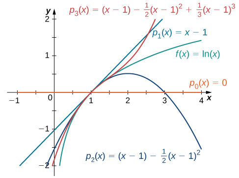
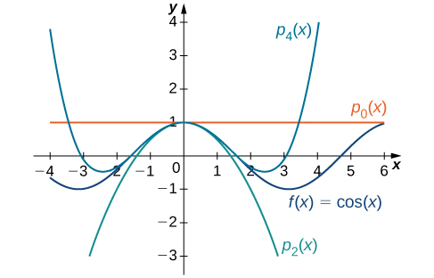
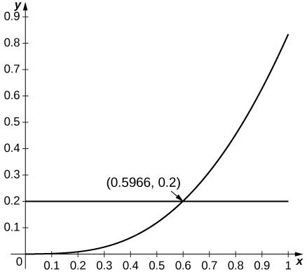
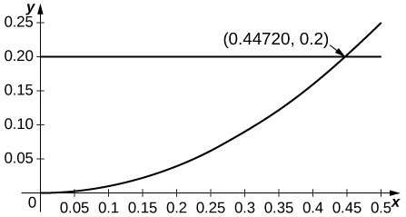
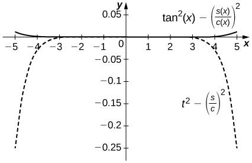

* Describe the procedure for finding a Taylor polynomial of a given order for a function.
* Explain the meaning and significance of Taylor’s theorem with remainder.
* Estimate the remainder for a Taylor series approximation of a given function.

In the previous two sections we discussed how to find power series representations for certain types of functions––specifically, functions related to geometric series. Here we discuss power series representations for other types of functions. In particular, we address the following questions: Which functions can be represented by power series and how do we find such representations? If we can find a power series representation for a particular function <math xmlns="http://www.w3.org/1998/Math/MathML"><mrow><mi>f</mi></mrow></math>

 and the series converges on some interval, how do we prove that the series actually converges to <math xmlns="http://www.w3.org/1998/Math/MathML"><mrow><mi>f</mi><mo>?</mo></mrow></math>

# Overview of Taylor/Maclaurin Series

Consider a function <math xmlns="http://www.w3.org/1998/Math/MathML"><mrow><mi>f</mi></mrow></math>

 that has a power series representation at <math xmlns="http://www.w3.org/1998/Math/MathML"><mrow><mi>x</mi><mo>=</mo><mi>a</mi><mo>.</mo></mrow></math>

 Then the series has the form

<math xmlns="http://www.w3.org/1998/Math/MathML"><mrow><mstyle displaystyle="true"><munderover><mo>∑</mo><mrow><mi>n</mi><mo>=</mo><mn>0</mn></mrow><mi>∞</mi></munderover><mrow><msub><mi>c</mi><mi>n</mi></msub><msup><mrow><mrow><mo>(</mo><mrow><mi>x</mi><mo>−</mo><mi>a</mi></mrow><mo>)</mo></mrow></mrow><mi>n</mi></msup></mrow></mstyle><mo>=</mo><msub><mi>c</mi><mn>0</mn></msub><mo>+</mo><msub><mi>c</mi><mn>1</mn></msub><mo stretchy="false">(</mo><mi>x</mi><mo>−</mo><mi>a</mi><mo stretchy="false">)</mo><mo>+</mo><msub><mi>c</mi><mn>2</mn></msub><msup><mrow><mo stretchy="false">(</mo><mi>x</mi><mo>−</mo><mi>a</mi><mo stretchy="false">)</mo></mrow><mn>2</mn></msup><mo>+</mo><mtext>⋯</mtext><mo>.</mo></mrow></math>

What should the coefficients be? For now, we ignore issues of convergence, but instead focus on what the series should be, if one exists. We return to discuss convergence later in this section. If the series [\[link\]](#fs-id1167025118355) is a representation for <math xmlns="http://www.w3.org/1998/Math/MathML"><mrow><mi>f</mi></mrow></math>

 at <math xmlns="http://www.w3.org/1998/Math/MathML"><mrow><mi>x</mi><mo>=</mo><mi>a</mi><mo>,</mo></mrow></math>

 we certainly want the series to equal <math xmlns="http://www.w3.org/1998/Math/MathML"><mrow><mi>f</mi><mrow><mo>(</mo><mi>a</mi><mo>)</mo></mrow></mrow></math>

 at <math xmlns="http://www.w3.org/1998/Math/MathML"><mrow><mi>x</mi><mo>=</mo><mi>a</mi><mo>.</mo></mrow></math>

 Evaluating the series at <math xmlns="http://www.w3.org/1998/Math/MathML"><mrow><mi>x</mi><mo>=</mo><mi>a</mi><mo>,</mo></mrow></math>

 we see that

<math xmlns="http://www.w3.org/1998/Math/MathML"><mtable><mtr><mtd columnalign="right"><mstyle displaystyle="true"><munderover><mo>∑</mo><mrow><mi>n</mi><mo>=</mo><mn>0</mn></mrow><mi>∞</mi></munderover><mrow><msub><mi>c</mi><mi>n</mi></msub><msup><mrow><mrow><mo>(</mo><mrow><mi>x</mi><mo>−</mo><mi>a</mi></mrow><mo>)</mo></mrow></mrow><mi>n</mi></msup></mrow></mstyle></mtd><mtd columnalign="left"><mo>=</mo><msub><mi>c</mi><mn>0</mn></msub><mo>+</mo><msub><mi>c</mi><mn>1</mn></msub><mrow><mo>(</mo><mrow><mi>a</mi><mo>−</mo><mi>a</mi></mrow><mo>)</mo></mrow><mo>+</mo><msub><mi>c</mi><mn>2</mn></msub><msup><mrow><mo>(</mo><mrow><mi>a</mi><mo>−</mo><mi>a</mi></mrow><mo>)</mo></mrow><mn>2</mn></msup><mo>+</mo><mtext>⋯</mtext></mtd></mtr><mtr><mtd /><mtd columnalign="left"><mo>=</mo><msub><mi>c</mi><mn>0</mn></msub><mo>.</mo></mtd></mtr></mtable></math>

Thus, the series equals <math xmlns="http://www.w3.org/1998/Math/MathML"><mrow><mi>f</mi><mrow><mo>(</mo><mi>a</mi><mo>)</mo></mrow></mrow></math>

 if the coefficient <math xmlns="http://www.w3.org/1998/Math/MathML"><mrow><msub><mi>c</mi><mn>0</mn></msub><mo>=</mo><mi>f</mi><mrow><mo>(</mo><mi>a</mi><mo>)</mo></mrow><mo>.</mo></mrow></math>

 In addition, we would like the first derivative of the power series to equal <math xmlns="http://www.w3.org/1998/Math/MathML"><mrow><msup><mi>f</mi><mo>′</mo></msup><mrow><mo>(</mo><mi>a</mi><mo>)</mo></mrow></mrow></math>

 at <math xmlns="http://www.w3.org/1998/Math/MathML"><mrow><mi>x</mi><mo>=</mo><mi>a</mi><mo>.</mo></mrow></math>

 Differentiating [\[link\]](#fs-id1167025118355) term-by-term, we see that

<math xmlns="http://www.w3.org/1998/Math/MathML"><mrow><mfrac><mi>d</mi><mrow><mi>d</mi><mi>x</mi></mrow></mfrac><mrow><mo>(</mo><mrow><mstyle displaystyle="true"><munderover><mo>∑</mo><mrow><mi>n</mi><mo>=</mo><mn>0</mn></mrow><mi>∞</mi></munderover><mrow><msub><mi>c</mi><mi>n</mi></msub><msup><mrow><mrow><mo>(</mo><mrow><mi>x</mi><mo>−</mo><mi>a</mi></mrow><mo>)</mo></mrow></mrow><mi>n</mi></msup></mrow></mstyle></mrow><mo>)</mo></mrow><mo>=</mo><msub><mi>c</mi><mn>1</mn></msub><mo>+</mo><mn>2</mn><msub><mi>c</mi><mn>2</mn></msub><mrow><mo>(</mo><mrow><mi>x</mi><mo>−</mo><mi>a</mi></mrow><mo>)</mo></mrow><mo>+</mo><mn>3</mn><msub><mi>c</mi><mn>3</mn></msub><msup><mrow><mrow><mo>(</mo><mrow><mi>x</mi><mo>−</mo><mi>a</mi></mrow><mo>)</mo></mrow></mrow><mn>2</mn></msup><mo>+</mo><mtext>⋯</mtext><mo>.</mo></mrow></math>

Therefore, at <math xmlns="http://www.w3.org/1998/Math/MathML"><mrow><mi>x</mi><mo>=</mo><mi>a</mi><mo>,</mo></mrow></math>

 the derivative is

<math xmlns="http://www.w3.org/1998/Math/MathML"><mtable><mtr /><mtr /><mtr><mtd columnalign="right"><mfrac><mi>d</mi><mrow><mi>d</mi><mi>x</mi></mrow></mfrac><mrow><mo>(</mo><mrow><mstyle displaystyle="true"><munderover><mo>∑</mo><mrow><mi>n</mi><mo>=</mo><mn>0</mn></mrow><mi>∞</mi></munderover><mrow><msub><mi>c</mi><mi>n</mi></msub><msup><mrow><mrow><mo>(</mo><mrow><mi>x</mi><mo>−</mo><mi>a</mi></mrow><mo>)</mo></mrow></mrow><mi>n</mi></msup></mrow></mstyle></mrow><mo>)</mo></mrow></mtd><mtd columnalign="left"><mo>=</mo><msub><mi>c</mi><mn>1</mn></msub><mo>+</mo><mn>2</mn><msub><mi>c</mi><mn>2</mn></msub><mrow><mo>(</mo><mrow><mi>a</mi><mo>−</mo><mi>a</mi></mrow><mo>)</mo></mrow><mo>+</mo><mn>3</mn><msub><mi>c</mi><mn>3</mn></msub><msup><mrow><mo>(</mo><mrow><mi>a</mi><mo>−</mo><mi>a</mi></mrow><mo>)</mo></mrow><mn>2</mn></msup><mo>+</mo><mtext>⋯</mtext></mtd></mtr><mtr><mtd /><mtd columnalign="left"><mo>=</mo><msub><mi>c</mi><mn>1</mn></msub><mo>.</mo></mtd></mtr></mtable></math>

Therefore, the derivative of the series equals <math xmlns="http://www.w3.org/1998/Math/MathML"><mrow><msup><mi>f</mi><mo>′</mo></msup><mrow><mo>(</mo><mi>a</mi><mo>)</mo></mrow></mrow></math>

 if the coefficient <math xmlns="http://www.w3.org/1998/Math/MathML"><mrow><msub><mi>c</mi><mn>1</mn></msub><mo>=</mo><msup><mi>f</mi><mo>′</mo></msup><mrow><mo>(</mo><mi>a</mi><mo>)</mo></mrow><mo>.</mo></mrow></math>

 Continuing in this way, we look for coefficients *cn* such that all the derivatives of the power series [\[link\]](#fs-id1167025118355) will agree with all the corresponding derivatives of <math xmlns="http://www.w3.org/1998/Math/MathML"><mrow><mi>f</mi></mrow></math>

 at <math xmlns="http://www.w3.org/1998/Math/MathML"><mrow><mi>x</mi><mo>=</mo><mi>a</mi><mo>.</mo></mrow></math>

 The second and third derivatives of [\[link\]](#fs-id1167025118355) are given by

<math xmlns="http://www.w3.org/1998/Math/MathML"><mrow><mfrac><mrow><msup><mi>d</mi><mn>2</mn></msup></mrow><mrow><mi>d</mi><msup><mi>x</mi><mn>2</mn></msup></mrow></mfrac><mrow><mo>(</mo><mrow><mstyle displaystyle="true"><munderover><mo>∑</mo><mrow><mi>n</mi><mo>=</mo><mn>0</mn></mrow><mi>∞</mi></munderover><mrow><msub><mi>c</mi><mi>n</mi></msub><msup><mrow><mrow><mo>(</mo><mrow><mi>x</mi><mo>−</mo><mi>a</mi></mrow><mo>)</mo></mrow></mrow><mi>n</mi></msup></mrow></mstyle></mrow><mo>)</mo></mrow><mo>=</mo><mn>2</mn><msub><mi>c</mi><mn>2</mn></msub><mo>+</mo><mn>3</mn><mo>·</mo><mn>2</mn><msub><mi>c</mi><mn>3</mn></msub><mrow><mo>(</mo><mrow><mi>x</mi><mo>−</mo><mi>a</mi></mrow><mo>)</mo></mrow><mo>+</mo><mn>4</mn><mo>·</mo><mn>3</mn><msub><mi>c</mi><mn>4</mn></msub><msup><mrow><mrow><mo>(</mo><mrow><mi>x</mi><mo>−</mo><mi>a</mi></mrow><mo>)</mo></mrow></mrow><mn>2</mn></msup><mo>+</mo><mtext>⋯</mtext></mrow></math>

and

<math xmlns="http://www.w3.org/1998/Math/MathML"><mrow><mfrac><mrow><msup><mi>d</mi><mn>3</mn></msup></mrow><mrow><mi>d</mi><msup><mi>x</mi><mn>3</mn></msup></mrow></mfrac><mrow><mo>(</mo><mrow><mstyle displaystyle="true"><munderover><mo>∑</mo><mrow><mi>n</mi><mo>=</mo><mn>0</mn></mrow><mi>∞</mi></munderover><mrow><msub><mi>c</mi><mi>n</mi></msub><msup><mrow><mrow><mo>(</mo><mrow><mi>x</mi><mo>−</mo><mi>a</mi></mrow><mo>)</mo></mrow></mrow><mi>n</mi></msup></mrow></mstyle></mrow><mo>)</mo></mrow><mo>=</mo><mn>3</mn><mo>·</mo><mn>2</mn><msub><mi>c</mi><mn>3</mn></msub><mo>+</mo><mn>4</mn><mo>·</mo><mn>3</mn><mo>·</mo><mn>2</mn><msub><mi>c</mi><mn>4</mn></msub><mrow><mo>(</mo><mrow><mi>x</mi><mo>−</mo><mi>a</mi></mrow><mo>)</mo></mrow><mo>+</mo><mn>5</mn><mo>·</mo><mn>4</mn><mo>·</mo><mn>3</mn><msub><mi>c</mi><mn>5</mn></msub><msup><mrow><mrow><mo>(</mo><mrow><mi>x</mi><mo>−</mo><mi>a</mi></mrow><mo>)</mo></mrow></mrow><mn>2</mn></msup><mo>+</mo><mtext>⋯</mtext><mo>.</mo></mrow></math>

Therefore, at <math xmlns="http://www.w3.org/1998/Math/MathML"><mrow><mi>x</mi><mo>=</mo><mi>a</mi><mo>,</mo></mrow></math>

 the second and third derivatives

<math xmlns="http://www.w3.org/1998/Math/MathML"><mtable><mtr><mtd columnalign="right"><mfrac><mrow><msup><mi>d</mi><mn>2</mn></msup></mrow><mrow><mi>d</mi><msup><mi>x</mi><mn>2</mn></msup></mrow></mfrac><mrow><mo>(</mo><mrow><mstyle displaystyle="true"><munderover><mo>∑</mo><mrow><mi>n</mi><mo>=</mo><mn>0</mn></mrow><mi>∞</mi></munderover><mrow><msub><mi>c</mi><mi>n</mi></msub><msup><mrow><mrow><mo>(</mo><mrow><mi>x</mi><mo>−</mo><mi>a</mi></mrow><mo>)</mo></mrow></mrow><mi>n</mi></msup></mrow></mstyle></mrow><mo>)</mo></mrow></mtd><mtd columnalign="left"><mo>=</mo><mn>2</mn><msub><mi>c</mi><mn>2</mn></msub><mo>+</mo><mn>3</mn><mo>·</mo><mn>2</mn><msub><mi>c</mi><mn>3</mn></msub><mrow><mo>(</mo><mrow><mi>a</mi><mo>−</mo><mi>a</mi></mrow><mo>)</mo></mrow><mo>+</mo><mn>4</mn><mo>·</mo><mn>3</mn><msub><mi>c</mi><mn>4</mn></msub><msup><mrow><mo>(</mo><mrow><mi>a</mi><mo>−</mo><mi>a</mi></mrow><mo>)</mo></mrow><mn>2</mn></msup><mo>+</mo><mtext>⋯</mtext></mtd></mtr><mtr><mtd /><mtd columnalign="left"><mo>=</mo><mn>2</mn><msub><mi>c</mi><mn>2</mn></msub></mtd></mtr></mtable></math>

and

<math xmlns="http://www.w3.org/1998/Math/MathML"><mtable><mtr><mtd columnalign="right"><mfrac><mrow><msup><mi>d</mi><mn>3</mn></msup></mrow><mrow><mi>d</mi><msup><mi>x</mi><mn>3</mn></msup></mrow></mfrac><mrow><mo>(</mo><mrow><mstyle displaystyle="true"><munderover><mo>∑</mo><mrow><mi>n</mi><mo>=</mo><mn>0</mn></mrow><mi>∞</mi></munderover><mrow><msub><mi>c</mi><mi>n</mi></msub><msup><mrow><mrow><mo>(</mo><mrow><mi>x</mi><mo>−</mo><mi>a</mi></mrow><mo>)</mo></mrow></mrow><mi>n</mi></msup></mrow></mstyle></mrow><mo>)</mo></mrow></mtd><mtd columnalign="left"><mo>=</mo><mn>3</mn><mo>·</mo><mn>2</mn><msub><mi>c</mi><mn>3</mn></msub><mo>+</mo><mn>4</mn><mo>·</mo><mn>3</mn><mo>·</mo><mn>2</mn><msub><mi>c</mi><mn>4</mn></msub><mrow><mo>(</mo><mrow><mi>a</mi><mo>−</mo><mi>a</mi></mrow><mo>)</mo></mrow><mo>+</mo><mn>5</mn><mo>·</mo><mn>4</mn><mo>·</mo><mn>3</mn><msub><mi>c</mi><mn>5</mn></msub><msup><mrow><mo>(</mo><mrow><mi>a</mi><mo>−</mo><mi>a</mi></mrow><mo>)</mo></mrow><mn>2</mn></msup><mo>+</mo><mtext>⋯</mtext></mtd></mtr><mtr><mtd /><mtd columnalign="left"><mo>=</mo><mn>3</mn><mo>·</mo><mn>2</mn><msub><mi>c</mi><mn>3</mn></msub></mtd></mtr></mtable></math>

equal <math xmlns="http://www.w3.org/1998/Math/MathML"><mrow><mi>f</mi><mtext>″</mtext><mrow><mo>(</mo><mi>a</mi><mo>)</mo></mrow></mrow></math>

 and <math xmlns="http://www.w3.org/1998/Math/MathML"><mrow><mi>f</mi><mtext>‴</mtext><mrow><mo>(</mo><mi>a</mi><mo>)</mo></mrow><mo>,</mo></mrow></math>

 respectively, if <math xmlns="http://www.w3.org/1998/Math/MathML"><mrow><msub><mi>c</mi><mn>2</mn></msub><mo>=</mo><mfrac><mrow><mi>f</mi><mtext>″</mtext><mrow><mo>(</mo><mi>a</mi><mo>)</mo></mrow></mrow><mn>2</mn></mfrac></mrow></math>

 and <math xmlns="http://www.w3.org/1998/Math/MathML"><mrow><msub><mi>c</mi><mn>3</mn></msub><mo>=</mo><mfrac><mrow><mi>f</mi><mtext>‴</mtext><mrow><mo>(</mo><mi>a</mi><mo>)</mo></mrow></mrow><mn>3</mn></mfrac><mo>·</mo><mn>2</mn><mo>.</mo></mrow></math>

 More generally, we see that if <math xmlns="http://www.w3.org/1998/Math/MathML"><mrow><mi>f</mi></mrow></math>

 has a power series representation at <math xmlns="http://www.w3.org/1998/Math/MathML"><mrow><mi>x</mi><mo>=</mo><mi>a</mi><mo>,</mo></mrow></math>

 then the coefficients should be given by <math xmlns="http://www.w3.org/1998/Math/MathML"><mrow><msub><mi>c</mi><mi>n</mi></msub><mo>=</mo><mfrac><mrow><msup><mi>f</mi><mrow><mrow><mo>(</mo><mi>n</mi><mo>)</mo></mrow></mrow></msup><mrow><mo>(</mo><mi>a</mi><mo>)</mo></mrow></mrow><mrow><mi>n</mi><mtext>!</mtext></mrow></mfrac><mo>.</mo></mrow></math>

 That is, the series should be

<math xmlns="http://www.w3.org/1998/Math/MathML"><mrow><mstyle displaystyle="true"><munderover><mo>∑</mo><mrow><mi>n</mi><mo>=</mo><mn>0</mn></mrow><mi>∞</mi></munderover><mrow><mfrac><mrow><msup><mi>f</mi><mrow><mrow><mo>(</mo><mi>n</mi><mo>)</mo></mrow></mrow></msup><mrow><mo>(</mo><mi>a</mi><mo>)</mo></mrow></mrow><mrow><mi>n</mi><mtext>!</mtext></mrow></mfrac></mrow></mstyle><msup><mrow><mrow><mo>(</mo><mrow><mi>x</mi><mo>−</mo><mi>a</mi></mrow><mo>)</mo></mrow></mrow><mi>n</mi></msup><mo>=</mo><mi>f</mi><mrow><mo>(</mo><mi>a</mi><mo>)</mo></mrow><mo>+</mo><msup><mi>f</mi><mo>′</mo></msup><mrow><mo>(</mo><mi>a</mi><mo>)</mo></mrow><mrow><mo>(</mo><mrow><mi>x</mi><mo>−</mo><mi>a</mi></mrow><mo>)</mo></mrow><mo>+</mo><mfrac><mrow><mi>f</mi><mtext>″</mtext><mrow><mo>(</mo><mi>a</mi><mo>)</mo></mrow></mrow><mrow><mn>2</mn><mtext>!</mtext></mrow></mfrac><msup><mrow><mrow><mo>(</mo><mrow><mi>x</mi><mo>−</mo><mi>a</mi></mrow><mo>)</mo></mrow></mrow><mn>2</mn></msup><mo>+</mo><mfrac><mrow><mi>f</mi><mtext>‴</mtext><mrow><mo>(</mo><mi>a</mi><mo>)</mo></mrow></mrow><mrow><mn>3</mn><mtext>!</mtext></mrow></mfrac><msup><mrow><mrow><mo>(</mo><mrow><mi>x</mi><mo>−</mo><mi>a</mi></mrow><mo>)</mo></mrow></mrow><mn>3</mn></msup><mo>+</mo><mtext>⋯</mtext><mo>.</mo></mrow></math>

This power series for <math xmlns="http://www.w3.org/1998/Math/MathML"><mrow><mi>f</mi></mrow></math>

 is known as the Taylor series for <math xmlns="http://www.w3.org/1998/Math/MathML"><mrow><mi>f</mi></mrow></math>

 at <math xmlns="http://www.w3.org/1998/Math/MathML"><mrow><mi>a</mi><mo>.</mo></mrow></math>

 If <math xmlns="http://www.w3.org/1998/Math/MathML"><mrow><mi>x</mi><mo>=</mo><mn>0</mn><mo>,</mo></mrow></math>

 then this series is known as the Maclaurin series for <math xmlns="http://www.w3.org/1998/Math/MathML"><mrow><mi>f</mi><mo>.</mo></mrow></math>

Definition

If <math xmlns="http://www.w3.org/1998/Math/MathML"><mrow><mi>f</mi></mrow></math>

 has derivatives of all orders at <math xmlns="http://www.w3.org/1998/Math/MathML"><mrow><mi>x</mi><mo>=</mo><mi>a</mi><mo>,</mo></mrow></math>

 then the **Taylor series**{: data-type="term"} for the function <math xmlns="http://www.w3.org/1998/Math/MathML"><mrow><mi>f</mi></mrow></math>

 at <math xmlns="http://www.w3.org/1998/Math/MathML"><mrow><mi>a</mi></mrow></math>

 is

<math xmlns="http://www.w3.org/1998/Math/MathML"><mrow><mstyle displaystyle="true"><munderover><mo>∑</mo><mrow><mi>n</mi><mo>=</mo><mn>0</mn></mrow><mi>∞</mi></munderover><mrow><mfrac><mrow><msup><mi>f</mi><mrow><mrow><mo>(</mo><mi>n</mi><mo>)</mo></mrow></mrow></msup><mrow><mo>(</mo><mi>a</mi><mo>)</mo></mrow></mrow><mrow><mi>n</mi><mtext>!</mtext></mrow></mfrac></mrow></mstyle><msup><mrow><mrow><mo>(</mo><mrow><mi>x</mi><mo>−</mo><mi>a</mi></mrow><mo>)</mo></mrow></mrow><mi>n</mi></msup><mo>=</mo><mi>f</mi><mrow><mo>(</mo><mi>a</mi><mo>)</mo></mrow><mo>+</mo><msup><mi>f</mi><mo>′</mo></msup><mrow><mo>(</mo><mi>a</mi><mo>)</mo></mrow><mrow><mo>(</mo><mrow><mi>x</mi><mo>−</mo><mi>a</mi></mrow><mo>)</mo></mrow><mo>+</mo><mfrac><mrow><mi>f</mi><mtext>″</mtext><mrow><mo>(</mo><mi>a</mi><mo>)</mo></mrow></mrow><mrow><mn>2</mn><mtext>!</mtext></mrow></mfrac><msup><mrow><mrow><mo>(</mo><mrow><mi>x</mi><mo>−</mo><mi>a</mi></mrow><mo>)</mo></mrow></mrow><mn>2</mn></msup><mo>+</mo><mtext>⋯</mtext><mo>+</mo><mfrac><mrow><msup><mi>f</mi><mrow><mrow><mo>(</mo><mi>n</mi><mo>)</mo></mrow></mrow></msup><mrow><mo>(</mo><mi>a</mi><mo>)</mo></mrow></mrow><mrow><mi>n</mi><mtext>!</mtext></mrow></mfrac><msup><mrow><mrow><mo>(</mo><mrow><mi>x</mi><mo>−</mo><mi>a</mi></mrow><mo>)</mo></mrow></mrow><mi>n</mi></msup><mo>+</mo><mtext>⋯</mtext><mo>.</mo></mrow></math>

The Taylor series for <math xmlns="http://www.w3.org/1998/Math/MathML"><mrow><mi>f</mi></mrow></math>

 at 0 is known as the **Maclaurin series**{: data-type="term"} for <math xmlns="http://www.w3.org/1998/Math/MathML"><mrow><mi>f</mi><mo>.</mo></mrow></math>

Later in this section, we will show examples of finding Taylor series and discuss conditions under which the Taylor series for a function will converge to that function. Here, we state an important result. Recall from [\[link\]](/m53762#fs-id1167023777376) that power series representations are unique. Therefore, if a function <math xmlns="http://www.w3.org/1998/Math/MathML"><mrow><mi>f</mi></mrow></math>

 has a power series at <math xmlns="http://www.w3.org/1998/Math/MathML"><mrow><mi>a</mi><mo>,</mo></mrow></math>

 then it must be the Taylor series for <math xmlns="http://www.w3.org/1998/Math/MathML"><mrow><mi>f</mi></mrow></math>

 at <math xmlns="http://www.w3.org/1998/Math/MathML"><mrow><mi>a</mi><mo>.</mo></mrow></math>

Uniqueness of Taylor Series

If a function <math xmlns="http://www.w3.org/1998/Math/MathML"><mrow><mi>f</mi></mrow></math>

 has a power series at *a* that converges to <math xmlns="http://www.w3.org/1998/Math/MathML"><mrow><mi>f</mi></mrow></math>

 on some open interval containing *a*, then that power series is the Taylor series for <math xmlns="http://www.w3.org/1998/Math/MathML"><mrow><mi>f</mi></mrow></math>

 at *a*.

The proof follows directly from [\[link\]](/m53762#fs-id1167023777376).

To determine if a Taylor series converges, we need to look at its sequence of partial sums. These partial sums are finite polynomials, known as **Taylor polynomials**{: data-type="term"}.

Visit the MacTutor History of Mathematics archive to read brief biographies of [Brook Taylor][1] and [Colin Maclaurin][2] and how they developed the concepts named after them.

# Taylor Polynomials

The *n*th partial sum of the Taylor series for a function <math xmlns="http://www.w3.org/1998/Math/MathML"><mrow><mi>f</mi></mrow></math>

 at <math xmlns="http://www.w3.org/1998/Math/MathML"><mrow><mi>a</mi></mrow></math>

 is known as the *n*th Taylor polynomial. For example, the 0th, 1st, 2nd, and 3rd partial sums of the Taylor series are given by

<math xmlns="http://www.w3.org/1998/Math/MathML"><mtable><mtr><mtd columnalign="left"><msub><mi>p</mi><mn>0</mn></msub><mrow><mo>(</mo><mi>x</mi><mo>)</mo></mrow><mo>=</mo><mi>f</mi><mrow><mo>(</mo><mi>a</mi><mo>)</mo></mrow><mo>,</mo></mtd></mtr><mtr><mtd columnalign="left"><msub><mi>p</mi><mn>1</mn></msub><mrow><mo>(</mo><mi>x</mi><mo>)</mo></mrow><mo>=</mo><mi>f</mi><mrow><mo>(</mo><mi>a</mi><mo>)</mo></mrow><mo>+</mo><msup><mi>f</mi><mo>′</mo></msup><mrow><mo>(</mo><mi>a</mi><mo>)</mo></mrow><mrow><mo>(</mo><mrow><mi>x</mi><mo>−</mo><mi>a</mi></mrow><mo>)</mo></mrow><mo>,</mo></mtd></mtr><mtr><mtd columnalign="left"><msub><mi>p</mi><mn>2</mn></msub><mrow><mo>(</mo><mi>x</mi><mo>)</mo></mrow><mo>=</mo><mi>f</mi><mrow><mo>(</mo><mi>a</mi><mo>)</mo></mrow><mo>+</mo><msup><mi>f</mi><mo>′</mo></msup><mrow><mo>(</mo><mi>a</mi><mo>)</mo></mrow><mrow><mo>(</mo><mrow><mi>x</mi><mo>−</mo><mi>a</mi></mrow><mo>)</mo></mrow><mo>+</mo><mfrac><mrow><mi>f</mi><mtext>″</mtext><mrow><mo>(</mo><mi>a</mi><mo>)</mo></mrow></mrow><mrow><mn>2</mn><mtext>!</mtext></mrow></mfrac><msup><mrow><mo>(</mo><mrow><mi>x</mi><mo>−</mo><mi>a</mi></mrow><mo>)</mo></mrow><mn>2</mn></msup><mo>,</mo></mtd></mtr><mtr><mtd columnalign="left"><msub><mi>p</mi><mn>3</mn></msub><mrow><mo>(</mo><mi>x</mi><mo>)</mo></mrow><mo>=</mo><mi>f</mi><mrow><mo>(</mo><mi>a</mi><mo>)</mo></mrow><mo>+</mo><msup><mi>f</mi><mo>′</mo></msup><mrow><mo>(</mo><mi>a</mi><mo>)</mo></mrow><mrow><mo>(</mo><mrow><mi>x</mi><mo>−</mo><mi>a</mi></mrow><mo>)</mo></mrow><mo>+</mo><mfrac><mrow><mi>f</mi><mtext>″</mtext><mrow><mo>(</mo><mi>a</mi><mo>)</mo></mrow></mrow><mrow><mn>2</mn><mtext>!</mtext></mrow></mfrac><msup><mrow><mo>(</mo><mrow><mi>x</mi><mo>−</mo><mi>a</mi></mrow><mo>)</mo></mrow><mn>2</mn></msup><mo>+</mo><mfrac><mrow><mi>f</mi><mtext>‴</mtext><mrow><mo>(</mo><mi>a</mi><mo>)</mo></mrow></mrow><mrow><mn>3</mn><mtext>!</mtext></mrow></mfrac><msup><mrow><mo>(</mo><mrow><mi>x</mi><mo>−</mo><mi>a</mi></mrow><mo>)</mo></mrow><mn>3</mn></msup><mo>,</mo></mtd></mtr></mtable></math>

respectively. These partial sums are known as the 0th, 1st, 2nd, and 3rd Taylor polynomials of <math xmlns="http://www.w3.org/1998/Math/MathML"><mrow><mi>f</mi></mrow></math>

 at <math xmlns="http://www.w3.org/1998/Math/MathML"><mrow><mi>a</mi><mo>,</mo></mrow></math>

 respectively. If <math xmlns="http://www.w3.org/1998/Math/MathML"><mrow><mi>x</mi><mo>=</mo><mi>a</mi><mo>,</mo></mrow></math>

 then these polynomials are known as **Maclaurin polynomials**{: data-type="term"} for <math xmlns="http://www.w3.org/1998/Math/MathML"><mrow><mi>f</mi><mo>.</mo></mrow></math>

 We now provide a formal definition of Taylor and Maclaurin polynomials for a function <math xmlns="http://www.w3.org/1998/Math/MathML"><mrow><mi>f</mi><mo>.</mo></mrow></math>

Definition

If <math xmlns="http://www.w3.org/1998/Math/MathML"><mrow><mi>f</mi></mrow></math>

 has *n* derivatives at <math xmlns="http://www.w3.org/1998/Math/MathML"><mrow><mi>x</mi><mo>=</mo><mi>a</mi><mo>,</mo></mrow></math>

 then the *n*th Taylor polynomial for <math xmlns="http://www.w3.org/1998/Math/MathML"><mrow><mi>f</mi></mrow></math>

 at <math xmlns="http://www.w3.org/1998/Math/MathML"><mrow><mi>a</mi></mrow></math>

 is

<math xmlns="http://www.w3.org/1998/Math/MathML"><mrow><msub><mi>p</mi><mi>n</mi></msub><mrow><mo>(</mo><mi>x</mi><mo>)</mo></mrow><mo>=</mo><mi>f</mi><mrow><mo>(</mo><mi>a</mi><mo>)</mo></mrow><mo>+</mo><msup><mi>f</mi><mo>′</mo></msup><mrow><mo>(</mo><mi>a</mi><mo>)</mo></mrow><mrow><mo>(</mo><mrow><mi>x</mi><mo>−</mo><mi>a</mi></mrow><mo>)</mo></mrow><mo>+</mo><mfrac><mrow><mi>f</mi><mtext>″</mtext><mrow><mo>(</mo><mi>a</mi><mo>)</mo></mrow></mrow><mrow><mn>2</mn><mtext>!</mtext></mrow></mfrac><msup><mrow><mrow><mo>(</mo><mrow><mi>x</mi><mo>−</mo><mi>a</mi></mrow><mo>)</mo></mrow></mrow><mn>2</mn></msup><mo>+</mo><mfrac><mrow><mi>f</mi><mtext>‴</mtext><mrow><mo>(</mo><mi>a</mi><mo>)</mo></mrow></mrow><mrow><mn>3</mn><mtext>!</mtext></mrow></mfrac><msup><mrow><mrow><mo>(</mo><mrow><mi>x</mi><mo>−</mo><mi>a</mi></mrow><mo>)</mo></mrow></mrow><mn>3</mn></msup><mo>+</mo><mtext>⋯</mtext><mo>+</mo><mfrac><mrow><msup><mi>f</mi><mrow><mrow><mo>(</mo><mi>n</mi><mo>)</mo></mrow></mrow></msup><mrow><mo>(</mo><mi>a</mi><mo>)</mo></mrow></mrow><mrow><mi>n</mi><mtext>!</mtext></mrow></mfrac><msup><mrow><mrow><mo>(</mo><mrow><mi>x</mi><mo>−</mo><mi>a</mi></mrow><mo>)</mo></mrow></mrow><mi>n</mi></msup><mo>.</mo></mrow></math>

The *n*th Taylor polynomial for <math xmlns="http://www.w3.org/1998/Math/MathML"><mrow><mi>f</mi></mrow></math>

 at 0 is known as the *n*th Maclaurin polynomial for <math xmlns="http://www.w3.org/1998/Math/MathML"><mrow><mi>f</mi><mo>.</mo></mrow></math>

We now show how to use this definition to find several Taylor polynomials for <math xmlns="http://www.w3.org/1998/Math/MathML"><mrow><mi>f</mi><mrow><mo>(</mo><mi>x</mi><mo>)</mo></mrow><mo>=</mo><mtext>ln</mtext><mspace width="0.1em" /><mi>x</mi></mrow></math>

 at <math xmlns="http://www.w3.org/1998/Math/MathML"><mrow><mi>x</mi><mo>=</mo><mn>1</mn><mo>.</mo></mrow></math>

Finding Taylor Polynomials

Find the Taylor polynomials <math xmlns="http://www.w3.org/1998/Math/MathML"><mrow><msub><mi>p</mi><mn>0</mn></msub><mo>,</mo><msub><mi>p</mi><mn>1</mn></msub><mo>,</mo><msub><mi>p</mi><mn>2</mn></msub></mrow></math>

 and <math xmlns="http://www.w3.org/1998/Math/MathML"><mrow><msub><mi>p</mi><mn>3</mn></msub></mrow></math>

 for <math xmlns="http://www.w3.org/1998/Math/MathML"><mrow><mi>f</mi><mrow><mo>(</mo><mi>x</mi><mo>)</mo></mrow><mo>=</mo><mtext>ln</mtext><mspace width="0.1em" /><mi>x</mi></mrow></math>

 at <math xmlns="http://www.w3.org/1998/Math/MathML"><mrow><mi>x</mi><mo>=</mo><mn>1</mn><mo>.</mo></mrow></math>

 Use a graphing utility to compare the graph of <math xmlns="http://www.w3.org/1998/Math/MathML"><mrow><mi>f</mi></mrow></math>

 with the graphs of <math xmlns="http://www.w3.org/1998/Math/MathML"><mrow><msub><mi>p</mi><mn>0</mn></msub><mo>,</mo><msub><mi>p</mi><mn>1</mn></msub><mo>,</mo><msub><mi>p</mi><mn>2</mn></msub></mrow></math>

 and <math xmlns="http://www.w3.org/1998/Math/MathML"><mrow><msub><mi>p</mi><mn>3</mn></msub><mo>.</mo></mrow></math>

To find these Taylor polynomials, we need to evaluate <math xmlns="http://www.w3.org/1998/Math/MathML"><mrow><mi>f</mi></mrow></math>

 and its first three derivatives at <math xmlns="http://www.w3.org/1998/Math/MathML"><mrow><mi>x</mi><mo>=</mo><mn>1</mn><mo>.</mo></mrow></math>

<math xmlns="http://www.w3.org/1998/Math/MathML"><mtable><mtr><mtd columnalign="right"><mi>f</mi><mrow><mo>(</mo><mi>x</mi><mo>)</mo></mrow></mtd><mtd columnalign="left"><mo>=</mo></mtd><mtd columnalign="left"><mtext>ln</mtext><mspace width="0.1em" /><mi>x</mi></mtd><mtd /><mtd /><mtd columnalign="right"><mi>f</mi><mrow><mo>(</mo><mn>1</mn><mo>)</mo></mrow></mtd><mtd columnalign="left"><mo>=</mo></mtd><mtd columnalign="left"><mn>0</mn></mtd></mtr><mtr><mtd columnalign="right"><msup><mi>f</mi><mo>′</mo></msup><mrow><mo>(</mo><mi>x</mi><mo>)</mo></mrow></mtd><mtd columnalign="left"><mo>=</mo></mtd><mtd columnalign="left"><mfrac><mn>1</mn><mi>x</mi></mfrac></mtd><mtd /><mtd /><mtd columnalign="right"><msup><mi>f</mi><mo>′</mo></msup><mrow><mo>(</mo><mn>1</mn><mo>)</mo></mrow></mtd><mtd columnalign="left"><mo>=</mo></mtd><mtd columnalign="left"><mn>1</mn></mtd></mtr><mtr><mtd columnalign="right"><mi>f</mi><mtext>″</mtext><mrow><mo>(</mo><mi>x</mi><mo>)</mo></mrow></mtd><mtd columnalign="left"><mo>=</mo></mtd><mtd columnalign="left"><mo>−</mo><mfrac><mn>1</mn><mrow><msup><mi>x</mi><mn>2</mn></msup></mrow></mfrac></mtd><mtd /><mtd /><mtd columnalign="right"><mi>f</mi><mtext>″</mtext><mrow><mo>(</mo><mn>1</mn><mo>)</mo></mrow></mtd><mtd columnalign="left"><mo>=</mo></mtd><mtd columnalign="left"><mn>−1</mn></mtd></mtr><mtr><mtd columnalign="right"><mi>f</mi><mtext>‴</mtext><mrow><mo>(</mo><mi>x</mi><mo>)</mo></mrow></mtd><mtd columnalign="left"><mo>=</mo></mtd><mtd columnalign="left"><mfrac><mn>2</mn><mrow><msup><mi>x</mi><mn>3</mn></msup></mrow></mfrac></mtd><mtd /><mtd /><mtd columnalign="right"><mi>f</mi><mtext>‴</mtext><mrow><mo>(</mo><mn>1</mn><mo>)</mo></mrow></mtd><mtd columnalign="left"><mo>=</mo></mtd><mtd columnalign="left"><mn>2</mn></mtd></mtr></mtable></math>

Therefore,

<math xmlns="http://www.w3.org/1998/Math/MathML"><mtable><mtr><mtd columnalign="right"><msub><mi>p</mi><mn>0</mn></msub><mrow><mo>(</mo><mi>x</mi><mo>)</mo></mrow></mtd><mtd columnalign="left"><mo>=</mo></mtd><mtd columnalign="left"><mi>f</mi><mrow><mo>(</mo><mn>1</mn><mo>)</mo></mrow><mo>=</mo><mn>0</mn><mo>,</mo></mtd></mtr><mtr><mtd columnalign="right"><msub><mi>p</mi><mn>1</mn></msub><mrow><mo>(</mo><mi>x</mi><mo>)</mo></mrow></mtd><mtd columnalign="left"><mo>=</mo></mtd><mtd columnalign="left"><mi>f</mi><mrow><mo>(</mo><mn>1</mn><mo>)</mo></mrow><mo>+</mo><msup><mi>f</mi><mo>′</mo></msup><mrow><mo>(</mo><mn>1</mn><mo>)</mo></mrow><mrow><mo>(</mo><mrow><mi>x</mi><mo>−</mo><mn>1</mn></mrow><mo>)</mo></mrow><mo>=</mo><mi>x</mi><mo>−</mo><mn>1</mn><mo>,</mo></mtd></mtr><mtr><mtd columnalign="right"><msub><mi>p</mi><mn>2</mn></msub><mrow><mo>(</mo><mi>x</mi><mo>)</mo></mrow></mtd><mtd columnalign="left"><mo>=</mo></mtd><mtd columnalign="left"><mi>f</mi><mrow><mo>(</mo><mn>1</mn><mo>)</mo></mrow><mo>+</mo><msup><mi>f</mi><mo>′</mo></msup><mrow><mo>(</mo><mn>1</mn><mo>)</mo></mrow><mrow><mo>(</mo><mrow><mi>x</mi><mo>−</mo><mn>1</mn></mrow><mo>)</mo></mrow><mo>+</mo><mfrac><mrow><mi>f</mi><mtext>″</mtext><mrow><mo>(</mo><mn>1</mn><mo>)</mo></mrow></mrow><mn>2</mn></mfrac><msup><mrow><mo>(</mo><mrow><mi>x</mi><mo>−</mo><mn>1</mn></mrow><mo>)</mo></mrow><mn>2</mn></msup><mo>=</mo><mrow><mo>(</mo><mrow><mi>x</mi><mo>−</mo><mn>1</mn></mrow><mo>)</mo></mrow><mo>−</mo><mfrac><mn>1</mn><mn>2</mn></mfrac><msup><mrow><mo>(</mo><mrow><mi>x</mi><mo>−</mo><mn>1</mn></mrow><mo>)</mo></mrow><mn>2</mn></msup><mo>,</mo></mtd></mtr><mtr><mtd columnalign="right"><msub><mi>p</mi><mn>3</mn></msub><mrow><mo>(</mo><mi>x</mi><mo>)</mo></mrow></mtd><mtd columnalign="left"><mo>=</mo></mtd><mtd columnalign="left"><mi>f</mi><mrow><mo>(</mo><mn>1</mn><mo>)</mo></mrow><mo>+</mo><msup><mi>f</mi><mo>′</mo></msup><mrow><mo>(</mo><mn>1</mn><mo>)</mo></mrow><mrow><mo>(</mo><mrow><mi>x</mi><mo>−</mo><mn>1</mn></mrow><mo>)</mo></mrow><mo>+</mo><mfrac><mrow><mi>f</mi><mtext>″</mtext><mrow><mo>(</mo><mn>1</mn><mo>)</mo></mrow></mrow><mn>2</mn></mfrac><msup><mrow><mo>(</mo><mrow><mi>x</mi><mo>−</mo><mn>1</mn></mrow><mo>)</mo></mrow><mn>2</mn></msup><mo>+</mo><mfrac><mrow><mi>f</mi><mtext>‴</mtext><mrow><mo>(</mo><mn>1</mn><mo>)</mo></mrow></mrow><mrow><mn>3</mn><mtext>!</mtext></mrow></mfrac><msup><mrow><mo>(</mo><mrow><mi>x</mi><mo>−</mo><mn>1</mn></mrow><mo>)</mo></mrow><mn>3</mn></msup></mtd></mtr><mtr><mtd /><mtd columnalign="left"><mo>=</mo></mtd><mtd columnalign="left"><mrow><mo>(</mo><mrow><mi>x</mi><mo>−</mo><mn>1</mn></mrow><mo>)</mo></mrow><mo>−</mo><mfrac><mn>1</mn><mn>2</mn></mfrac><msup><mrow><mo>(</mo><mrow><mi>x</mi><mo>−</mo><mn>1</mn></mrow><mo>)</mo></mrow><mn>2</mn></msup><mo>+</mo><mfrac><mn>1</mn><mn>3</mn></mfrac><msup><mrow><mo>(</mo><mrow><mi>x</mi><mo>−</mo><mn>1</mn></mrow><mo>)</mo></mrow><mn>3</mn></msup><mo>.</mo></mtd></mtr></mtable></math>

The graphs of <math xmlns="http://www.w3.org/1998/Math/MathML"><mrow><mi>y</mi><mo>=</mo><mi>f</mi><mrow><mo>(</mo><mi>x</mi><mo>)</mo></mrow></mrow></math>

 and the first three Taylor polynomials are shown in [[link]](#CNX_Calc_Figure_10_03_001).

{: #CNX_Calc_Figure_10_03_001}

Find the Taylor polynomials <math xmlns="http://www.w3.org/1998/Math/MathML"><mrow><msub><mi>p</mi><mn>0</mn></msub><mo>,</mo><msub><mi>p</mi><mn>1</mn></msub><mo>,</mo><msub><mi>p</mi><mn>2</mn></msub></mrow></math>

 and <math xmlns="http://www.w3.org/1998/Math/MathML"><mrow><msub><mi>p</mi><mn>3</mn></msub></mrow></math>

 for <math xmlns="http://www.w3.org/1998/Math/MathML"><mrow><mi>f</mi><mrow><mo>(</mo><mi>x</mi><mo>)</mo></mrow><mo>=</mo><mfrac><mn>1</mn><mrow><msup><mi>x</mi><mn>2</mn></msup></mrow></mfrac></mrow></math>

 at <math xmlns="http://www.w3.org/1998/Math/MathML"><mrow><mi>x</mi><mo>=</mo><mn>1</mn><mo>.</mo></mrow></math>

<math xmlns="http://www.w3.org/1998/Math/MathML"><mrow><msub><mi>p</mi><mn>0</mn></msub><mrow><mo>(</mo><mi>x</mi><mo>)</mo></mrow><mo>=</mo><mn>1</mn><mo>;</mo><msub><mi>p</mi><mn>1</mn></msub><mrow><mo>(</mo><mi>x</mi><mo>)</mo></mrow><mo>=</mo><mn>1</mn><mo>−</mo><mn>2</mn><mrow><mo>(</mo><mrow><mi>x</mi><mo>−</mo><mn>1</mn></mrow><mo>)</mo></mrow><mo>;</mo><msub><mi>p</mi><mn>2</mn></msub><mrow><mo>(</mo><mi>x</mi><mo>)</mo></mrow><mo>=</mo><mn>1</mn><mo>−</mo><mn>2</mn><mrow><mo>(</mo><mrow><mi>x</mi><mo>−</mo><mn>1</mn></mrow><mo>)</mo></mrow><mo>+</mo><mn>3</mn><msup><mrow><mrow><mo>(</mo><mrow><mi>x</mi><mo>−</mo><mn>1</mn></mrow><mo>)</mo></mrow></mrow><mn>2</mn></msup><mo>;</mo><msub><mi>p</mi><mn>3</mn></msub><mrow><mo>(</mo><mi>x</mi><mo>)</mo></mrow><mo>=</mo><mn>1</mn><mo>−</mo><mn>2</mn><mrow><mo>(</mo><mrow><mi>x</mi><mo>−</mo><mn>1</mn></mrow><mo>)</mo></mrow><mo>+</mo><mn>3</mn><msup><mrow><mrow><mo>(</mo><mrow><mi>x</mi><mo>−</mo><mn>1</mn></mrow><mo>)</mo></mrow></mrow><mn>2</mn></msup><mo>−</mo><mn>4</mn><msup><mrow><mrow><mo>(</mo><mrow><mi>x</mi><mo>−</mo><mn>1</mn></mrow><mo>)</mo></mrow></mrow><mn>3</mn></msup></mrow></math>

Hint

Find the first three derivatives of <math xmlns="http://www.w3.org/1998/Math/MathML"><mrow><mi>f</mi></mrow></math>

 and evaluate them at <math xmlns="http://www.w3.org/1998/Math/MathML"><mrow><mi>x</mi><mo>=</mo><mn>1</mn><mo>.</mo></mrow></math>

We now show how to find Maclaurin polynomials for *ex*, <math xmlns="http://www.w3.org/1998/Math/MathML"><mrow><mtext>sin</mtext><mspace width="0.1em" /><mi>x</mi><mo>,</mo></mrow></math>

 and <math xmlns="http://www.w3.org/1998/Math/MathML"><mrow><mtext>cos</mtext><mspace width="0.1em" /><mi>x</mi><mo>.</mo></mrow></math>

 As stated above, Maclaurin polynomials are Taylor polynomials centered at zero.

Finding Maclaurin Polynomials

For each of the following functions, find formulas for the Maclaurin polynomials <math xmlns="http://www.w3.org/1998/Math/MathML"><mrow><msub><mi>p</mi><mn>0</mn></msub><mo>,</mo><msub><mi>p</mi><mn>1</mn></msub><mo>,</mo><msub><mi>p</mi><mn>2</mn></msub></mrow></math>

 and <math xmlns="http://www.w3.org/1998/Math/MathML"><mrow><msub><mi>p</mi><mn>3</mn></msub><mo>.</mo></mrow></math>

 Find a formula for the *n*th Maclaurin polynomial and write it using sigma notation. Use a graphing utilty to compare the graphs of <math xmlns="http://www.w3.org/1998/Math/MathML"><mrow><msub><mi>p</mi><mn>0</mn></msub><mo>,</mo><msub><mi>p</mi><mn>1</mn></msub><mo>,</mo><msub><mi>p</mi><mn>2</mn></msub></mrow></math>

 and <math xmlns="http://www.w3.org/1998/Math/MathML"><mrow><msub><mi>p</mi><mn>3</mn></msub></mrow></math>

 with <math xmlns="http://www.w3.org/1998/Math/MathML"><mrow><mi>f</mi><mo>.</mo></mrow></math>

1.  <math xmlns="http://www.w3.org/1998/Math/MathML"><mrow><mi>f</mi><mrow><mo>(</mo><mi>x</mi><mo>)</mo></mrow><mo>=</mo><msup><mi>e</mi><mi>x</mi></msup></mrow></math>

2.  <math xmlns="http://www.w3.org/1998/Math/MathML"><mrow><mi>f</mi><mrow><mo>(</mo><mi>x</mi><mo>)</mo></mrow><mo>=</mo><mtext>sin</mtext><mspace width="0.1em" /><mi>x</mi></mrow></math>

3.  <math xmlns="http://www.w3.org/1998/Math/MathML"><mrow><mi>f</mi><mrow><mo>(</mo><mi>x</mi><mo>)</mo></mrow><mo>=</mo><mtext>cos</mtext><mspace width="0.1em" /><mi>x</mi></mrow></math>
{: data-number-style="lower-alpha"}

1.  Since
    <math xmlns="http://www.w3.org/1998/Math/MathML"><mrow><mi>f</mi><mrow><mo>(</mo><mi>x</mi><mo>)</mo></mrow><mo>=</mo><msup><mi>e</mi><mi>x</mi></msup><mo>,</mo></mrow></math>
    
    we know that
    <math xmlns="http://www.w3.org/1998/Math/MathML"><mrow><mi>f</mi><mo stretchy="false">(</mo><mi>x</mi><mo stretchy="false">)</mo><mo>=</mo><msup><mi>f</mi><mo>′</mo></msup><mrow><mo>(</mo><mi>x</mi><mo>)</mo></mrow><mo>=</mo><mi>f</mi><mtext>″</mtext><mrow><mo>(</mo><mi>x</mi><mo>)</mo></mrow><mo>=</mo><mtext>⋯</mtext><mo>=</mo><msup><mi>f</mi><mrow><mrow><mo>(</mo><mi>n</mi><mo>)</mo></mrow></mrow></msup><mrow><mo>(</mo><mi>x</mi><mo>)</mo></mrow><mo>=</mo><msup><mi>e</mi><mi>x</mi></msup></mrow></math>
    
    for all positive integers *n*. Therefore,
    * * *
    {: data-type="newline"}
    
    

    <math xmlns="http://www.w3.org/1998/Math/MathML"><mrow><mi>f</mi><mrow><mo>(</mo><mn>0</mn><mo>)</mo></mrow><mo>=</mo><msup><mi>f</mi><mo>′</mo></msup><mrow><mo>(</mo><mn>0</mn><mo>)</mo></mrow><mo>=</mo><mi>f</mi><mtext>″</mtext><mrow><mo>(</mo><mn>0</mn><mo>)</mo></mrow><mo>=</mo><mtext>⋯</mtext><mo>=</mo><msup><mi>f</mi><mrow><mrow><mo>(</mo><mi>n</mi><mo>)</mo></mrow></mrow></msup><mrow><mo>(</mo><mn>0</mn><mo>)</mo></mrow><mo>=</mo><mn>1</mn></mrow></math>
    

    
    * * *
    {: data-type="newline"}
    
    for all positive integers *n*. Therefore, we have
    * * *
    {: data-type="newline"}
    
    

    <math xmlns="http://www.w3.org/1998/Math/MathML"><mtable><mtr><mtd columnalign="right"><msub><mi>p</mi><mn>0</mn></msub><mrow><mo>(</mo><mi>x</mi><mo>)</mo></mrow></mtd><mtd columnalign="left"><mo>=</mo></mtd><mtd columnalign="left"><mi>f</mi><mrow><mo>(</mo><mn>0</mn><mo>)</mo></mrow><mo>=</mo><mn>1</mn><mo>,</mo></mtd></mtr><mtr><mtd columnalign="right"><msub><mi>p</mi><mn>1</mn></msub><mrow><mo>(</mo><mi>x</mi><mo>)</mo></mrow></mtd><mtd columnalign="left"><mo>=</mo></mtd><mtd columnalign="left"><mi>f</mi><mrow><mo>(</mo><mn>0</mn><mo>)</mo></mrow><mo>+</mo><msup><mi>f</mi><mo>′</mo></msup><mrow><mo>(</mo><mn>0</mn><mo>)</mo></mrow><mi>x</mi><mo>=</mo><mn>1</mn><mo>+</mo><mi>x</mi><mo>,</mo></mtd></mtr><mtr><mtd columnalign="right"><msub><mi>p</mi><mn>2</mn></msub><mrow><mo>(</mo><mi>x</mi><mo>)</mo></mrow></mtd><mtd columnalign="left"><mo>=</mo></mtd><mtd columnalign="left"><mi>f</mi><mrow><mo>(</mo><mn>0</mn><mo>)</mo></mrow><mo>+</mo><msup><mi>f</mi><mo>′</mo></msup><mrow><mo>(</mo><mn>0</mn><mo>)</mo></mrow><mi>x</mi><mo>+</mo><mfrac><mrow><mi>f</mi><mtext>″</mtext><mrow><mo>(</mo><mn>0</mn><mo>)</mo></mrow></mrow><mrow><mn>2</mn><mtext>!</mtext></mrow></mfrac><msup><mi>x</mi><mn>2</mn></msup><mo>=</mo><mn>1</mn><mo>+</mo><mi>x</mi><mo>+</mo><mfrac><mn>1</mn><mn>2</mn></mfrac><msup><mi>x</mi><mn>2</mn></msup><mo>,</mo></mtd></mtr><mtr><mtd columnalign="right"><msub><mi>p</mi><mn>3</mn></msub><mrow><mo>(</mo><mi>x</mi><mo>)</mo></mrow></mtd><mtd columnalign="left"><mo>=</mo></mtd><mtd columnalign="left"><mi>f</mi><mrow><mo>(</mo><mn>0</mn><mo>)</mo></mrow><mo>+</mo><msup><mi>f</mi><mo>′</mo></msup><mrow><mo>(</mo><mn>0</mn><mo>)</mo></mrow><mi>x</mi><mo>+</mo><mfrac><mrow><mi>f</mi><mtext>″</mtext><mrow><mo>(</mo><mn>0</mn><mo>)</mo></mrow></mrow><mn>2</mn></mfrac><msup><mi>x</mi><mn>2</mn></msup><mo>+</mo><mfrac><mrow><mi>f</mi><mtext>‴</mtext><mrow><mo>(</mo><mn>0</mn><mo>)</mo></mrow></mrow><mrow><mn>3</mn><mtext>!</mtext></mrow></mfrac><msup><mi>x</mi><mn>3</mn></msup></mtd></mtr><mtr><mtd /><mtd columnalign="left"><mo>=</mo></mtd><mtd columnalign="left"><mn>1</mn><mo>+</mo><mi>x</mi><mo>+</mo><mfrac><mn>1</mn><mn>2</mn></mfrac><msup><mi>x</mi><mn>2</mn></msup><mo>+</mo><mfrac><mn>1</mn><mrow><mn>3</mn><mtext>!</mtext></mrow></mfrac><msup><mi>x</mi><mn>3</mn></msup><mo>,</mo></mtd></mtr><mtr><mtd columnalign="right"><msub><mi>p</mi><mi>n</mi></msub><mrow><mo>(</mo><mi>x</mi><mo>)</mo></mrow></mtd><mtd columnalign="left"><mo>=</mo></mtd><mtd columnalign="left"><mi>f</mi><mrow><mo>(</mo><mn>0</mn><mo>)</mo></mrow><mo>+</mo><msup><mi>f</mi><mo>′</mo></msup><mrow><mo>(</mo><mn>0</mn><mo>)</mo></mrow><mi>x</mi><mo>+</mo><mfrac><mrow><mi>f</mi><mtext>″</mtext><mrow><mo>(</mo><mn>0</mn><mo>)</mo></mrow></mrow><mn>2</mn></mfrac><msup><mi>x</mi><mn>2</mn></msup><mo>+</mo><mfrac><mrow><mi>f</mi><mtext>‴</mtext><mrow><mo>(</mo><mn>0</mn><mo>)</mo></mrow></mrow><mrow><mn>3</mn><mtext>!</mtext></mrow></mfrac><msup><mi>x</mi><mn>3</mn></msup><mo>+</mo><mtext>⋯</mtext><mo>+</mo><mfrac><mrow><msup><mi>f</mi><mrow><mrow><mo>(</mo><mi>n</mi><mo>)</mo></mrow></mrow></msup><mrow><mo>(</mo><mn>0</mn><mo>)</mo></mrow></mrow><mrow><mi>n</mi><mtext>!</mtext></mrow></mfrac><msup><mi>x</mi><mi>n</mi></msup></mtd></mtr><mtr><mtd /><mtd columnalign="left"><mo>=</mo></mtd><mtd columnalign="left"><mn>1</mn><mo>+</mo><mi>x</mi><mo>+</mo><mfrac><mrow><msup><mi>x</mi><mn>2</mn></msup></mrow><mrow><mn>2</mn><mtext>!</mtext></mrow></mfrac><mo>+</mo><mfrac><mrow><msup><mi>x</mi><mn>3</mn></msup></mrow><mrow><mn>3</mn><mtext>!</mtext></mrow></mfrac><mo>+</mo><mtext>⋯</mtext><mo>+</mo><mfrac><mrow><msup><mi>x</mi><mi>n</mi></msup></mrow><mrow><mi>n</mi><mtext>!</mtext></mrow></mfrac></mtd></mtr><mtr><mtd /><mtd columnalign="left"><mo>=</mo></mtd><mtd columnalign="left"><mstyle displaystyle="true"><munderover><mo>∑</mo><mrow><mi>k</mi><mo>=</mo><mn>0</mn></mrow><mi>n</mi></munderover><mrow><mfrac><mrow><msup><mi>x</mi><mi>k</mi></msup></mrow><mrow><mi>k</mi><mtext>!</mtext></mrow></mfrac></mrow></mstyle><mo>.</mo></mtd></mtr></mtable></math>
    

    
    * * *
    {: data-type="newline"}
    
    The function and the first three Maclaurin polynomials are shown in [[link]](#CNX_Calc_Figure_10_03_002).
    * * *
    {: data-type="newline"}
    
    {: #CNX_Calc_Figure_10_03_002}

2.  For
    <math xmlns="http://www.w3.org/1998/Math/MathML"><mrow><mi>f</mi><mrow><mo>(</mo><mi>x</mi><mo>)</mo></mrow><mo>=</mo><mtext>sin</mtext><mspace width="0.1em" /><mi>x</mi><mo>,</mo></mrow></math>
    
    the values of the function and its first four derivatives at
    <math xmlns="http://www.w3.org/1998/Math/MathML"><mrow><mi>x</mi><mo>=</mo><mn>0</mn></mrow></math>
    
    are given as follows:
    * * *
    {: data-type="newline"}
    
    

    <math xmlns="http://www.w3.org/1998/Math/MathML"><mtable><mtr><mtd columnalign="right"><mi>f</mi><mrow><mo>(</mo><mi>x</mi><mo>)</mo></mrow></mtd><mtd columnalign="left"><mo>=</mo></mtd><mtd columnalign="left"><mtext>sin</mtext><mspace width="0.1em" /><mi>x</mi></mtd><mtd /><mtd /><mtd columnalign="right"><mi>f</mi><mrow><mo>(</mo><mn>0</mn><mo>)</mo></mrow></mtd><mtd columnalign="left"><mo>=</mo></mtd><mtd columnalign="left"><mn>0</mn></mtd></mtr><mtr><mtd columnalign="right"><msup><mi>f</mi><mo>′</mo></msup><mrow><mo>(</mo><mi>x</mi><mo>)</mo></mrow></mtd><mtd columnalign="left"><mo>=</mo></mtd><mtd columnalign="left"><mtext>cos</mtext><mspace width="0.1em" /><mi>x</mi></mtd><mtd /><mtd /><mtd columnalign="right"><msup><mi>f</mi><mo>′</mo></msup><mrow><mo>(</mo><mn>0</mn><mo>)</mo></mrow></mtd><mtd columnalign="left"><mo>=</mo></mtd><mtd columnalign="left"><mn>1</mn></mtd></mtr><mtr><mtd columnalign="right"><mi>f</mi><mtext>″</mtext><mrow><mo>(</mo><mi>x</mi><mo>)</mo></mrow></mtd><mtd columnalign="left"><mo>=</mo></mtd><mtd columnalign="left"><mtext>−</mtext><mtext>sin</mtext><mspace width="0.1em" /><mi>x</mi></mtd><mtd /><mtd /><mtd columnalign="right"><mi>f</mi><mtext>″</mtext><mrow><mo>(</mo><mn>0</mn><mo>)</mo></mrow></mtd><mtd columnalign="left"><mo>=</mo></mtd><mtd columnalign="left"><mn>0</mn></mtd></mtr><mtr><mtd columnalign="right"><mi>f</mi><mtext>‴</mtext><mrow><mo>(</mo><mi>x</mi><mo>)</mo></mrow></mtd><mtd columnalign="left"><mo>=</mo></mtd><mtd columnalign="left"><mtext>−</mtext><mtext>cos</mtext><mspace width="0.1em" /><mi>x</mi></mtd><mtd /><mtd /><mtd columnalign="right"><mi>f</mi><mtext>‴</mtext><mrow><mo>(</mo><mn>0</mn><mo>)</mo></mrow></mtd><mtd columnalign="left"><mo>=</mo></mtd><mtd columnalign="left"><mn>−1</mn></mtd></mtr><mtr><mtd columnalign="right"><msup><mi>f</mi><mrow><mrow><mo>(</mo><mn>4</mn><mo>)</mo></mrow></mrow></msup><mrow><mo>(</mo><mi>x</mi><mo>)</mo></mrow></mtd><mtd columnalign="left"><mo>=</mo></mtd><mtd columnalign="left"><mtext>sin</mtext><mspace width="0.1em" /><mi>x</mi></mtd><mtd /><mtd /><mtd columnalign="right"><msup><mi>f</mi><mrow><mrow><mo>(</mo><mn>4</mn><mo>)</mo></mrow></mrow></msup><mrow><mo>(</mo><mn>0</mn><mo>)</mo></mrow></mtd><mtd columnalign="left"><mo>=</mo></mtd><mtd columnalign="left"><mn>0.</mn></mtd></mtr></mtable></math>
    

    
    * * *
    {: data-type="newline"}
    
    Since the fourth derivative is
    <math xmlns="http://www.w3.org/1998/Math/MathML"><mrow><mtext>sin</mtext><mspace width="0.1em" /><mi>x</mi><mo>,</mo></mrow></math>
    
    the pattern repeats. That is,
    <math xmlns="http://www.w3.org/1998/Math/MathML"><mrow><msup><mi>f</mi><mrow><mrow><mo>(</mo><mrow><mn>2</mn><mi>m</mi></mrow><mo>)</mo></mrow></mrow></msup><mrow><mo>(</mo><mn>0</mn><mo>)</mo></mrow><mo>=</mo><mn>0</mn></mrow></math>
    
    and
    <math xmlns="http://www.w3.org/1998/Math/MathML"><mrow><msup><mi>f</mi><mrow><mrow><mo>(</mo><mrow><mn>2</mn><mi>m</mi><mo>+</mo><mn>1</mn></mrow><mo>)</mo></mrow></mrow></msup><mrow><mo>(</mo><mn>0</mn><mo>)</mo></mrow><mo>=</mo><msup><mrow><mrow><mo>(</mo><mrow><mn>−1</mn></mrow><mo>)</mo></mrow></mrow><mi>m</mi></msup></mrow></math>
    
    for
    <math xmlns="http://www.w3.org/1998/Math/MathML"><mrow><mi>m</mi><mo>≥</mo><mn>0</mn><mo>.</mo></mrow></math>
    
    Thus, we have
    * * *
    {: data-type="newline"}
    
    

    <math xmlns="http://www.w3.org/1998/Math/MathML"><mtable><mtr><mtd columnalign="left"><msub><mi>p</mi><mn>0</mn></msub><mrow><mo>(</mo><mi>x</mi><mo>)</mo></mrow><mo>=</mo><mn>0</mn><mo>,</mo></mtd></mtr><mtr><mtd columnalign="left"><msub><mi>p</mi><mn>1</mn></msub><mrow><mo>(</mo><mi>x</mi><mo>)</mo></mrow><mo>=</mo><mn>0</mn><mo>+</mo><mi>x</mi><mo>=</mo><mi>x</mi><mo>,</mo></mtd></mtr><mtr><mtd columnalign="left"><msub><mi>p</mi><mn>2</mn></msub><mrow><mo>(</mo><mi>x</mi><mo>)</mo></mrow><mo>=</mo><mn>0</mn><mo>+</mo><mi>x</mi><mo>+</mo><mn>0</mn><mo>=</mo><mi>x</mi><mo>,</mo></mtd></mtr><mtr><mtd columnalign="left"><msub><mi>p</mi><mn>3</mn></msub><mrow><mo>(</mo><mi>x</mi><mo>)</mo></mrow><mo>=</mo><mn>0</mn><mo>+</mo><mi>x</mi><mo>+</mo><mn>0</mn><mo>−</mo><mfrac><mn>1</mn><mrow><mn>3</mn><mtext>!</mtext></mrow></mfrac><msup><mi>x</mi><mn>3</mn></msup><mo>=</mo><mi>x</mi><mo>−</mo><mfrac><mrow><msup><mi>x</mi><mn>3</mn></msup></mrow><mrow><mn>3</mn><mtext>!</mtext></mrow></mfrac><mo>,</mo></mtd></mtr><mtr><mtd columnalign="left"><msub><mi>p</mi><mn>4</mn></msub><mrow><mo>(</mo><mi>x</mi><mo>)</mo></mrow><mo>=</mo><mn>0</mn><mo>+</mo><mi>x</mi><mo>+</mo><mn>0</mn><mo>−</mo><mfrac><mn>1</mn><mrow><mn>3</mn><mtext>!</mtext></mrow></mfrac><msup><mi>x</mi><mn>3</mn></msup><mo>+</mo><mn>0</mn><mo>=</mo><mi>x</mi><mo>−</mo><mfrac><mrow><msup><mi>x</mi><mn>3</mn></msup></mrow><mrow><mn>3</mn><mtext>!</mtext></mrow></mfrac><mo>,</mo></mtd></mtr><mtr><mtd columnalign="left"><msub><mi>p</mi><mn>5</mn></msub><mrow><mo>(</mo><mi>x</mi><mo>)</mo></mrow><mo>=</mo><mn>0</mn><mo>+</mo><mi>x</mi><mo>+</mo><mn>0</mn><mo>−</mo><mfrac><mn>1</mn><mrow><mn>3</mn><mtext>!</mtext></mrow></mfrac><msup><mi>x</mi><mn>3</mn></msup><mo>+</mo><mn>0</mn><mo>+</mo><mfrac><mn>1</mn><mrow><mn>5</mn><mtext>!</mtext></mrow></mfrac><msup><mi>x</mi><mn>5</mn></msup><mo>=</mo><mi>x</mi><mo>−</mo><mfrac><mrow><msup><mi>x</mi><mn>3</mn></msup></mrow><mrow><mn>3</mn><mtext>!</mtext></mrow></mfrac><mo>+</mo><mfrac><mrow><msup><mi>x</mi><mn>5</mn></msup></mrow><mrow><mn>5</mn><mtext>!</mtext></mrow></mfrac><mo>,</mo></mtd></mtr></mtable></math>
    

    
    * * *
    {: data-type="newline"}
    
    and for
    <math xmlns="http://www.w3.org/1998/Math/MathML"><mrow><mi>m</mi><mo>≥</mo><mn>0</mn><mo>,</mo></mrow></math>
    
    * * *
    {: data-type="newline"}
    
    

    <math xmlns="http://www.w3.org/1998/Math/MathML"><mtable><mtr><mtd columnalign="right"><msub><mi>p</mi><mrow><mn>2</mn><mi>m</mi><mo>+</mo><mn>1</mn></mrow></msub><mrow><mo>(</mo><mi>x</mi><mo>)</mo></mrow></mtd><mtd columnalign="left"><mo>=</mo><msub><mi>p</mi><mrow><mn>2</mn><mi>m</mi><mo>+</mo><mn>2</mn></mrow></msub><mrow><mo>(</mo><mi>x</mi><mo>)</mo></mrow></mtd></mtr><mtr><mtd /><mtd columnalign="left"><mo>=</mo><mi>x</mi><mo>−</mo><mfrac><mrow><msup><mi>x</mi><mn>3</mn></msup></mrow><mrow><mn>3</mn><mtext>!</mtext></mrow></mfrac><mo>+</mo><mfrac><mrow><msup><mi>x</mi><mn>5</mn></msup></mrow><mrow><mn>5</mn><mtext>!</mtext></mrow></mfrac><mo>−</mo><mtext>⋯</mtext><mo>+</mo><msup><mrow><mo>(</mo><mrow><mn>−1</mn></mrow><mo>)</mo></mrow><mi>m</mi></msup><mfrac><mrow><msup><mi>x</mi><mrow><mn>2</mn><mi>m</mi><mo>+</mo><mn>1</mn></mrow></msup></mrow><mrow><mrow><mo>(</mo><mrow><mn>2</mn><mi>m</mi><mo>+</mo><mn>1</mn></mrow><mo>)</mo></mrow><mtext>!</mtext></mrow></mfrac></mtd></mtr><mtr><mtd /><mtd columnalign="left"><mo>=</mo><mstyle displaystyle="true"><munderover><mo>∑</mo><mrow><mi>k</mi><mo>=</mo><mn>0</mn></mrow><mi>m</mi></munderover><mrow><msup><mrow><mrow><mo>(</mo><mrow><mn>−1</mn></mrow><mo>)</mo></mrow></mrow><mi>k</mi></msup><mfrac><mrow><msup><mi>x</mi><mrow><mn>2</mn><mi>k</mi><mo>+</mo><mn>1</mn></mrow></msup></mrow><mrow><mrow><mo>(</mo><mrow><mn>2</mn><mi>k</mi><mo>+</mo><mn>1</mn></mrow><mo>)</mo></mrow><mtext>!</mtext></mrow></mfrac></mrow></mstyle><mo>.</mo></mtd></mtr></mtable></math>
    

    
    * * *
    {: data-type="newline"}
    
    Graphs of the function and its Maclaurin polynomials are shown in [[link]](#CNX_Calc_Figure_10_03_003).
    * * *
    {: data-type="newline"}
    
    {: #CNX_Calc_Figure_10_03_003}

3.  For
    <math xmlns="http://www.w3.org/1998/Math/MathML"><mrow><mi>f</mi><mrow><mo>(</mo><mi>x</mi><mo>)</mo></mrow><mo>=</mo><mtext>cos</mtext><mspace width="0.1em" /><mi>x</mi><mo>,</mo></mrow></math>
    
    the values of the function and its first four derivatives at
    <math xmlns="http://www.w3.org/1998/Math/MathML"><mrow><mi>x</mi><mo>=</mo><mn>0</mn></mrow></math>
    
    are given as follows:
    * * *
    {: data-type="newline"}
    
    

    <math xmlns="http://www.w3.org/1998/Math/MathML"><mtable><mtr><mtd columnalign="right"><mi>f</mi><mrow><mo>(</mo><mi>x</mi><mo>)</mo></mrow></mtd><mtd columnalign="left"><mo>=</mo></mtd><mtd columnalign="left"><mtext>cos</mtext><mspace width="0.1em" /><mi>x</mi></mtd><mtd /><mtd /><mtd columnalign="right"><mi>f</mi><mrow><mo>(</mo><mn>0</mn><mo>)</mo></mrow></mtd><mtd columnalign="left"><mo>=</mo></mtd><mtd columnalign="left"><mn>1</mn></mtd></mtr><mtr><mtd columnalign="right"><msup><mi>f</mi><mo>′</mo></msup><mrow><mo>(</mo><mi>x</mi><mo>)</mo></mrow></mtd><mtd columnalign="left"><mo>=</mo></mtd><mtd columnalign="left"><mtext>−</mtext><mtext>sin</mtext><mspace width="0.1em" /><mi>x</mi></mtd><mtd /><mtd /><mtd columnalign="right"><msup><mi>f</mi><mo>′</mo></msup><mrow><mo>(</mo><mn>0</mn><mo>)</mo></mrow></mtd><mtd columnalign="left"><mo>=</mo></mtd><mtd columnalign="left"><mn>0</mn></mtd></mtr><mtr><mtd columnalign="right"><mi>f</mi><mtext>″</mtext><mrow><mo>(</mo><mi>x</mi><mo>)</mo></mrow></mtd><mtd columnalign="left"><mo>=</mo></mtd><mtd columnalign="left"><mtext>−</mtext><mtext>cos</mtext><mspace width="0.1em" /><mi>x</mi></mtd><mtd /><mtd /><mtd columnalign="right"><mi>f</mi><mtext>″</mtext><mrow><mo>(</mo><mn>0</mn><mo>)</mo></mrow></mtd><mtd columnalign="left"><mo>=</mo></mtd><mtd columnalign="left"><mn>−1</mn></mtd></mtr><mtr><mtd columnalign="right"><mi>f</mi><mtext>‴</mtext><mrow><mo>(</mo><mi>x</mi><mo>)</mo></mrow></mtd><mtd columnalign="left"><mo>=</mo></mtd><mtd columnalign="left"><mtext>sin</mtext><mspace width="0.1em" /><mi>x</mi></mtd><mtd /><mtd /><mtd columnalign="right"><mi>f</mi><mtext>‴</mtext><mrow><mo>(</mo><mn>0</mn><mo>)</mo></mrow></mtd><mtd columnalign="left"><mo>=</mo></mtd><mtd columnalign="left"><mn>0</mn></mtd></mtr><mtr><mtd columnalign="right"><msup><mi>f</mi><mrow><mrow><mo>(</mo><mn>4</mn><mo>)</mo></mrow></mrow></msup><mrow><mo>(</mo><mi>x</mi><mo>)</mo></mrow></mtd><mtd columnalign="left"><mo>=</mo></mtd><mtd columnalign="left"><mtext>cos</mtext><mspace width="0.1em" /><mi>x</mi></mtd><mtd /><mtd /><mtd columnalign="right"><msup><mi>f</mi><mrow><mrow><mo>(</mo><mn>4</mn><mo>)</mo></mrow></mrow></msup><mrow><mo>(</mo><mn>0</mn><mo>)</mo></mrow></mtd><mtd columnalign="left"><mo>=</mo></mtd><mtd columnalign="left"><mn>1.</mn></mtd></mtr></mtable></math>
    

    
    * * *
    {: data-type="newline"}
    
    Since the fourth derivative is
    <math xmlns="http://www.w3.org/1998/Math/MathML"><mrow><mtext>sin</mtext><mspace width="0.1em" /><mi>x</mi><mo>,</mo></mrow></math>
    
    the pattern repeats. In other words,
    <math xmlns="http://www.w3.org/1998/Math/MathML"><mrow><msup><mi>f</mi><mrow><mrow><mo>(</mo><mrow><mn>2</mn><mi>m</mi></mrow><mo>)</mo></mrow></mrow></msup><mrow><mo>(</mo><mn>0</mn><mo>)</mo></mrow><mo>=</mo><msup><mrow><mrow><mo>(</mo><mrow><mn>−1</mn></mrow><mo>)</mo></mrow></mrow><mi>m</mi></msup></mrow></math>
    
    and
    <math xmlns="http://www.w3.org/1998/Math/MathML"><mrow><msup><mi>f</mi><mrow><mrow><mo>(</mo><mrow><mn>2</mn><mi>m</mi><mo>+</mo><mn>1</mn></mrow><mo>)</mo></mrow></mrow></msup><mo>=</mo><mn>0</mn></mrow></math>
    
    for
    <math xmlns="http://www.w3.org/1998/Math/MathML"><mrow><mi>m</mi><mo>≥</mo><mn>0</mn><mo>.</mo></mrow></math>
    
    Therefore,
    * * *
    {: data-type="newline"}
    
    

    <math xmlns="http://www.w3.org/1998/Math/MathML"><mtable><mtr><mtd columnalign="left"><msub><mi>p</mi><mn>0</mn></msub><mrow><mo>(</mo><mi>x</mi><mo>)</mo></mrow><mo>=</mo><mn>1</mn><mo>,</mo></mtd></mtr><mtr><mtd columnalign="left"><msub><mi>p</mi><mn>1</mn></msub><mrow><mo>(</mo><mi>x</mi><mo>)</mo></mrow><mo>=</mo><mn>1</mn><mo>+</mo><mn>0</mn><mo>=</mo><mn>1</mn><mo>,</mo></mtd></mtr><mtr><mtd columnalign="left"><msub><mi>p</mi><mn>2</mn></msub><mrow><mo>(</mo><mi>x</mi><mo>)</mo></mrow><mo>=</mo><mn>1</mn><mo>+</mo><mn>0</mn><mo>−</mo><mfrac><mn>1</mn><mrow><mn>2</mn><mtext>!</mtext></mrow></mfrac><msup><mi>x</mi><mn>2</mn></msup><mo>=</mo><mn>1</mn><mo>−</mo><mfrac><mrow><msup><mi>x</mi><mn>2</mn></msup></mrow><mrow><mn>2</mn><mtext>!</mtext></mrow></mfrac><mo>,</mo></mtd></mtr><mtr><mtd columnalign="left"><msub><mi>p</mi><mn>3</mn></msub><mrow><mo>(</mo><mi>x</mi><mo>)</mo></mrow><mo>=</mo><mn>1</mn><mo>+</mo><mn>0</mn><mo>−</mo><mfrac><mn>1</mn><mrow><mn>2</mn><mtext>!</mtext></mrow></mfrac><msup><mi>x</mi><mn>2</mn></msup><mo>+</mo><mn>0</mn><mo>=</mo><mn>1</mn><mo>−</mo><mfrac><mrow><msup><mi>x</mi><mn>2</mn></msup></mrow><mrow><mn>2</mn><mtext>!</mtext></mrow></mfrac><mo>,</mo></mtd></mtr><mtr><mtd columnalign="left"><msub><mi>p</mi><mn>4</mn></msub><mrow><mo>(</mo><mi>x</mi><mo>)</mo></mrow><mo>=</mo><mn>1</mn><mo>+</mo><mn>0</mn><mo>−</mo><mfrac><mn>1</mn><mrow><mn>2</mn><mtext>!</mtext></mrow></mfrac><msup><mi>x</mi><mn>2</mn></msup><mo>+</mo><mn>0</mn><mo>+</mo><mfrac><mn>1</mn><mrow><mn>4</mn><mtext>!</mtext></mrow></mfrac><msup><mi>x</mi><mn>4</mn></msup><mo>=</mo><mn>1</mn><mo>−</mo><mfrac><mrow><msup><mi>x</mi><mn>2</mn></msup></mrow><mrow><mn>2</mn><mtext>!</mtext></mrow></mfrac><mo>+</mo><mfrac><mrow><msup><mi>x</mi><mn>4</mn></msup></mrow><mrow><mn>4</mn><mtext>!</mtext></mrow></mfrac><mo>,</mo></mtd></mtr><mtr><mtd columnalign="left"><msub><mi>p</mi><mn>5</mn></msub><mrow><mo>(</mo><mi>x</mi><mo>)</mo></mrow><mo>=</mo><mn>1</mn><mo>+</mo><mn>0</mn><mo>−</mo><mfrac><mn>1</mn><mrow><mn>2</mn><mtext>!</mtext></mrow></mfrac><msup><mi>x</mi><mn>2</mn></msup><mo>+</mo><mn>0</mn><mo>+</mo><mfrac><mn>1</mn><mrow><mn>4</mn><mtext>!</mtext></mrow></mfrac><msup><mi>x</mi><mn>4</mn></msup><mo>+</mo><mn>0</mn><mo>=</mo><mn>1</mn><mo>−</mo><mfrac><mrow><msup><mi>x</mi><mn>2</mn></msup></mrow><mrow><mn>2</mn><mtext>!</mtext></mrow></mfrac><mo>+</mo><mfrac><mrow><msup><mi>x</mi><mn>4</mn></msup></mrow><mrow><mn>4</mn><mtext>!</mtext></mrow></mfrac><mo>,</mo></mtd></mtr></mtable></math>
    

    
    * * *
    {: data-type="newline"}
    
    and for
    <math xmlns="http://www.w3.org/1998/Math/MathML"><mrow><mi>n</mi><mo>≥</mo><mn>0</mn><mo>,</mo></mrow></math>
    
    * * *
    {: data-type="newline"}
    
    

    <math xmlns="http://www.w3.org/1998/Math/MathML"><mtable><mtr><mtd columnalign="right"><msub><mi>p</mi><mrow><mn>2</mn><mi>m</mi></mrow></msub><mrow><mo>(</mo><mi>x</mi><mo>)</mo></mrow></mtd><mtd columnalign="left"><mo>=</mo><msub><mi>p</mi><mrow><mn>2</mn><mi>m</mi><mo>+</mo><mn>1</mn></mrow></msub><mrow><mo>(</mo><mi>x</mi><mo>)</mo></mrow></mtd></mtr><mtr><mtd /><mtd columnalign="left"><mo>=</mo><mn>1</mn><mo>−</mo><mfrac><mrow><msup><mi>x</mi><mn>2</mn></msup></mrow><mrow><mn>2</mn><mtext>!</mtext></mrow></mfrac><mo>+</mo><mfrac><mrow><msup><mi>x</mi><mn>4</mn></msup></mrow><mrow><mn>4</mn><mtext>!</mtext></mrow></mfrac><mo>−</mo><mtext>⋯</mtext><mo>+</mo><msup><mrow><mo>(</mo><mrow><mn>−1</mn></mrow><mo>)</mo></mrow><mi>m</mi></msup><mfrac><mrow><msup><mi>x</mi><mrow><mn>2</mn><mi>m</mi></mrow></msup></mrow><mrow><mrow><mo>(</mo><mrow><mn>2</mn><mi>m</mi></mrow><mo>)</mo></mrow><mtext>!</mtext></mrow></mfrac></mtd></mtr><mtr><mtd /><mtd columnalign="left"><mo>=</mo><mstyle displaystyle="true"><munderover><mo>∑</mo><mrow><mi>k</mi><mo>=</mo><mn>0</mn></mrow><mi>m</mi></munderover><mrow><msup><mrow><mrow><mo>(</mo><mrow><mn>−1</mn></mrow><mo>)</mo></mrow></mrow><mi>k</mi></msup></mrow></mstyle><mfrac><mrow><msup><mi>x</mi><mrow><mn>2</mn><mi>k</mi></mrow></msup></mrow><mrow><mrow><mo>(</mo><mrow><mn>2</mn><mi>k</mi></mrow><mo>)</mo></mrow><mtext>!</mtext></mrow></mfrac><mo>.</mo></mtd></mtr></mtable></math>
    

    
    * * *
    {: data-type="newline"}
    
    Graphs of the function and the Maclaurin polynomials appear in [[link]](#CNX_Calc_Figure_10_03_004).
    * * *
    {: data-type="newline"}
    
    {: #CNX_Calc_Figure_10_03_004}

{: data-number-style="lower-alpha"}

Find formulas for the Maclaurin polynomials <math xmlns="http://www.w3.org/1998/Math/MathML"><mrow><msub><mi>p</mi><mn>0</mn></msub><mo>,</mo><msub><mi>p</mi><mn>1</mn></msub><mo>,</mo><msub><mi>p</mi><mn>2</mn></msub></mrow></math>

 and <math xmlns="http://www.w3.org/1998/Math/MathML"><mrow><msub><mi>p</mi><mn>3</mn></msub></mrow></math>

 for <math xmlns="http://www.w3.org/1998/Math/MathML"><mrow><mi>f</mi><mrow><mo>(</mo><mi>x</mi><mo>)</mo></mrow><mo>=</mo><mfrac><mn>1</mn><mrow><mn>1</mn><mo>+</mo><mi>x</mi></mrow></mfrac><mo>.</mo></mrow></math>

 Find a formula for the *n*th Maclaurin polynomial. Write your anwer using sigma notation.

<math xmlns="http://www.w3.org/1998/Math/MathML"><mrow><msub><mi>p</mi><mn>0</mn></msub><mrow><mo>(</mo><mi>x</mi><mo>)</mo></mrow><mo>=</mo><mn>1</mn><mo>;</mo><msub><mi>p</mi><mn>1</mn></msub><mrow><mo>(</mo><mi>x</mi><mo>)</mo></mrow><mo>=</mo><mn>1</mn><mo>−</mo><mi>x</mi><mo>;</mo><msub><mi>p</mi><mn>2</mn></msub><mrow><mo>(</mo><mi>x</mi><mo>)</mo></mrow><mo>=</mo><mn>1</mn><mo>−</mo><mi>x</mi><mo>+</mo><msup><mi>x</mi><mn>2</mn></msup><mo>;</mo><msub><mi>p</mi><mn>3</mn></msub><mrow><mo>(</mo><mi>x</mi><mo>)</mo></mrow><mo>=</mo><mn>1</mn><mo>−</mo><mi>x</mi><mo>+</mo><msup><mi>x</mi><mn>2</mn></msup><mo>−</mo><msup><mi>x</mi><mn>3</mn></msup><mo>;</mo><msub><mi>p</mi><mi>n</mi></msub><mrow><mo>(</mo><mi>x</mi><mo>)</mo></mrow><mo>=</mo><mn>1</mn><mo>−</mo><mi>x</mi><mo>+</mo><msup><mi>x</mi><mn>2</mn></msup><mo>−</mo><msup><mi>x</mi><mn>3</mn></msup><mo>+</mo><mtext>⋯</mtext><mo>+</mo><msup><mrow><mrow><mo>(</mo><mrow><mn>−1</mn></mrow><mo>)</mo></mrow></mrow><mi>n</mi></msup><msup><mi>x</mi><mi>n</mi></msup><mo>=</mo><mstyle displaystyle="true"><munderover><mo>∑</mo><mrow><mi>k</mi><mo>=</mo><mn>0</mn></mrow><mi>n</mi></munderover><mrow><msup><mrow><mrow><mo>(</mo><mrow><mn>−1</mn></mrow><mo>)</mo></mrow></mrow><mi>k</mi></msup><msup><mi>x</mi><mi>k</mi></msup></mrow></mstyle></mrow></math>

Hint

Evaluate the first four derivatives of <math xmlns="http://www.w3.org/1998/Math/MathML"><mrow><mi>f</mi></mrow></math>

 and look for a pattern.

# Taylor’s Theorem with Remainder

Recall that the *n*th Taylor polynomial for a function <math xmlns="http://www.w3.org/1998/Math/MathML"><mrow><mi>f</mi></mrow></math>

 at *a* is the *n*th partial sum of the Taylor series for <math xmlns="http://www.w3.org/1998/Math/MathML"><mrow><mi>f</mi></mrow></math>

 at *a*. Therefore, to determine if the Taylor series converges, we need to determine whether the sequence of Taylor polynomials <math xmlns="http://www.w3.org/1998/Math/MathML"><mrow><mrow><mo>{</mo><mrow><msub><mi>p</mi><mi>n</mi></msub></mrow><mo>}</mo></mrow></mrow></math>

 converges. However, not only do we want to know if the sequence of Taylor polynomials converges, we want to know if it converges to <math xmlns="http://www.w3.org/1998/Math/MathML"><mrow><mi>f</mi><mo>.</mo></mrow></math>

 To answer this question, we define the remainder <math xmlns="http://www.w3.org/1998/Math/MathML"><mrow><msub><mi>R</mi><mi>n</mi></msub><mrow><mo>(</mo><mi>x</mi><mo>)</mo></mrow></mrow></math>

 as

<math xmlns="http://www.w3.org/1998/Math/MathML"><mrow><msub><mi>R</mi><mi>n</mi></msub><mrow><mo>(</mo><mi>x</mi><mo>)</mo></mrow><mo>=</mo><mi>f</mi><mrow><mo>(</mo><mi>x</mi><mo>)</mo></mrow><mo>−</mo><msub><mi>p</mi><mi>n</mi></msub><mrow><mo>(</mo><mi>x</mi><mo>)</mo></mrow><mo>.</mo></mrow></math>

For the sequence of Taylor polynomials to converge to <math xmlns="http://www.w3.org/1998/Math/MathML"><mrow><mi>f</mi><mo>,</mo></mrow></math>

 we need the remainder *Rn* to converge to zero. To determine if *Rn* converges to zero, we introduce **Taylor’s theorem with remainder**{: data-type="term"}. Not only is this theorem useful in proving that a Taylor series converges to its related function, but it will also allow us to quantify how well the *n*th Taylor polynomial approximates the function.

Here we look for a bound on <math xmlns="http://www.w3.org/1998/Math/MathML"><mrow><mrow><mo>\|</mo><mrow><msub><mi>R</mi><mi>n</mi></msub></mrow><mo>\|</mo></mrow><mo>.</mo></mrow></math>

 Consider the simplest case: <math xmlns="http://www.w3.org/1998/Math/MathML"><mrow><mi>n</mi><mo>=</mo><mn>0</mn><mo>.</mo></mrow></math>

 Let *p*0 be the 0th Taylor polynomial at *a* for a function <math xmlns="http://www.w3.org/1998/Math/MathML"><mrow><mi>f</mi><mo>.</mo></mrow></math>

 The remainder *R*0 satisfies

<math xmlns="http://www.w3.org/1998/Math/MathML"><mtable><mtr><mtd columnalign="right"><msub><mi>R</mi><mn>0</mn></msub><mrow><mo>(</mo><mi>x</mi><mo>)</mo></mrow></mtd><mtd columnalign="left"><mo>=</mo><mi>f</mi><mrow><mo>(</mo><mi>x</mi><mo>)</mo></mrow><mo>−</mo><msub><mi>p</mi><mn>0</mn></msub><mrow><mo>(</mo><mi>x</mi><mo>)</mo></mrow></mtd></mtr><mtr><mtd /><mtd columnalign="left"><mo>=</mo><mi>f</mi><mrow><mo>(</mo><mi>x</mi><mo>)</mo></mrow><mo>−</mo><mi>f</mi><mrow><mo>(</mo><mi>a</mi><mo>)</mo></mrow><mo>.</mo></mtd></mtr></mtable></math>

If <math xmlns="http://www.w3.org/1998/Math/MathML"><mrow><mi>f</mi></mrow></math>

 is differentiable on an interval *I* containing *a* and *x*, then by the Mean Value Theorem there exists a real number *c* between *a* and *x* such that <math xmlns="http://www.w3.org/1998/Math/MathML"><mrow><mi>f</mi><mrow><mo>(</mo><mi>x</mi><mo>)</mo></mrow><mo>−</mo><mi>f</mi><mrow><mo>(</mo><mi>a</mi><mo>)</mo></mrow><mo>=</mo><msup><mi>f</mi><mo>′</mo></msup><mrow><mo>(</mo><mi>c</mi><mo>)</mo></mrow><mrow><mo>(</mo><mrow><mi>x</mi><mo>−</mo><mi>a</mi></mrow><mo>)</mo></mrow><mo>.</mo></mrow></math>

 Therefore,

<math xmlns="http://www.w3.org/1998/Math/MathML"><mrow><msub><mi>R</mi><mn>0</mn></msub><mrow><mo>(</mo><mi>x</mi><mo>)</mo></mrow><mo>=</mo><msup><mi>f</mi><mo>′</mo></msup><mrow><mo>(</mo><mi>c</mi><mo>)</mo></mrow><mrow><mo>(</mo><mrow><mi>x</mi><mo>−</mo><mi>a</mi></mrow><mo>)</mo></mrow><mo>.</mo></mrow></math>

Using the Mean Value Theorem in a similar argument, we can show that if <math xmlns="http://www.w3.org/1998/Math/MathML"><mrow><mi>f</mi></mrow></math>

 is *n* times differentiable on an interval *I* containing *a* and *x*, then the *n*th remainder *Rn* satisfies

<math xmlns="http://www.w3.org/1998/Math/MathML"><mrow><msub><mi>R</mi><mi>n</mi></msub><mrow><mo>(</mo><mi>x</mi><mo>)</mo></mrow><mo>=</mo><mfrac><mrow><msup><mi>f</mi><mrow><mrow><mo>(</mo><mrow><mi>n</mi><mo>+</mo><mn>1</mn></mrow><mo>)</mo></mrow></mrow></msup><mrow><mo>(</mo><mi>c</mi><mo>)</mo></mrow></mrow><mrow><mrow><mo>(</mo><mrow><mi>n</mi><mo>+</mo><mn>1</mn></mrow><mo>)</mo></mrow><mtext>!</mtext></mrow></mfrac><msup><mrow><mrow><mo>(</mo><mrow><mi>x</mi><mo>−</mo><mi>a</mi></mrow><mo>)</mo></mrow></mrow><mrow><mi>n</mi><mo>+</mo><mn>1</mn></mrow></msup></mrow></math>

for some real number *c* between *a* and *x*. It is important to note that the value *c* in the numerator above is not the center *a*, but rather an unknown value *c* between *a* and *x*. This formula allows us to get a bound on the remainder *Rn*. If we happen to know that <math xmlns="http://www.w3.org/1998/Math/MathML"><mrow><mrow><mo>\|</mo><mrow><msup><mi>f</mi><mrow><mrow><mo>(</mo><mrow><mi>n</mi><mo>+</mo><mn>1</mn></mrow><mo>)</mo></mrow></mrow></msup><mrow><mo>(</mo><mi>x</mi><mo>)</mo></mrow></mrow><mo>\|</mo></mrow></mrow></math>

 is bounded by some real number *M* on this interval *I*, then

<math xmlns="http://www.w3.org/1998/Math/MathML"><mrow><mrow><mo>\|</mo><mrow><msub><mi>R</mi><mi>n</mi></msub><mrow><mo>(</mo><mi>x</mi><mo>)</mo></mrow></mrow><mo>\|</mo></mrow><mo>≤</mo><mfrac><mi>M</mi><mrow><mrow><mo>(</mo><mrow><mi>n</mi><mo>+</mo><mn>1</mn></mrow><mo>)</mo></mrow><mtext>!</mtext></mrow></mfrac><msup><mrow><mrow><mo>\|</mo><mrow><mi>x</mi><mo>−</mo><mi>a</mi></mrow><mo>\|</mo></mrow></mrow><mrow><mi>n</mi><mo>+</mo><mn>1</mn></mrow></msup></mrow></math>

for all *x* in the interval *I*.

We now state Taylor’s theorem, which provides the formal relationship between a function <math xmlns="http://www.w3.org/1998/Math/MathML"><mrow><mi>f</mi></mrow></math>

 and its *n*th degree Taylor polynomial <math xmlns="http://www.w3.org/1998/Math/MathML"><mrow><msub><mi>p</mi><mi>n</mi></msub><mrow><mo>(</mo><mi>x</mi><mo>)</mo></mrow><mo>.</mo></mrow></math>

 This theorem allows us to bound the error when using a Taylor polynomial to approximate a function value, and will be important in proving that a Taylor series for <math xmlns="http://www.w3.org/1998/Math/MathML"><mrow><mi>f</mi></mrow></math>

 converges to <math xmlns="http://www.w3.org/1998/Math/MathML"><mrow><mi>f</mi><mo>.</mo></mrow></math>

Taylor’s Theorem with Remainder

Let <math xmlns="http://www.w3.org/1998/Math/MathML"><mrow><mi>f</mi></mrow></math>

 be a function that can be differentiated <math xmlns="http://www.w3.org/1998/Math/MathML"><mrow><mi>n</mi><mo>+</mo><mn>1</mn></mrow></math>

 times on an interval *I* containing the real number *a*. Let *pn* be the *n*th Taylor polynomial of <math xmlns="http://www.w3.org/1998/Math/MathML"><mrow><mi>f</mi></mrow></math>

 at *a* and let

<math xmlns="http://www.w3.org/1998/Math/MathML"><mrow><msub><mi>R</mi><mi>n</mi></msub><mrow><mo>(</mo><mi>x</mi><mo>)</mo></mrow><mo>=</mo><mi>f</mi><mrow><mo>(</mo><mi>x</mi><mo>)</mo></mrow><mo>−</mo><msub><mi>p</mi><mi>n</mi></msub><mrow><mo>(</mo><mi>x</mi><mo>)</mo></mrow></mrow></math>

be the *n*th remainder. Then for each *x* in the interval *I*, there exists a real number *c* between *a* and *x* such that

<math xmlns="http://www.w3.org/1998/Math/MathML"><mrow><msub><mi>R</mi><mi>n</mi></msub><mrow><mo>(</mo><mi>x</mi><mo>)</mo></mrow><mo>=</mo><mfrac><mrow><msup><mi>f</mi><mrow><mrow><mo>(</mo><mrow><mi>n</mi><mo>+</mo><mn>1</mn></mrow><mo>)</mo></mrow></mrow></msup><mrow><mo>(</mo><mi>c</mi><mo>)</mo></mrow></mrow><mrow><mrow><mo>(</mo><mrow><mi>n</mi><mo>+</mo><mn>1</mn></mrow><mo>)</mo></mrow><mtext>!</mtext></mrow></mfrac><msup><mrow><mrow><mo>(</mo><mrow><mi>x</mi><mo>−</mo><mi>a</mi></mrow><mo>)</mo></mrow></mrow><mrow><mi>n</mi><mo>+</mo><mn>1</mn></mrow></msup><mo>.</mo></mrow></math>

If there exists a real number *M* such that <math xmlns="http://www.w3.org/1998/Math/MathML"><mrow><mrow><mo>\|</mo><mrow><msup><mi>f</mi><mrow><mrow><mo>(</mo><mrow><mi>n</mi><mo>+</mo><mn>1</mn></mrow><mo>)</mo></mrow></mrow></msup><mrow><mo>(</mo><mi>x</mi><mo>)</mo></mrow></mrow><mo>\|</mo></mrow><mo>≤</mo><mi>M</mi></mrow></math>

 for all <math xmlns="http://www.w3.org/1998/Math/MathML"><mrow><mi>x</mi><mo>∈</mo><mi>I</mi><mo>,</mo></mrow></math>

 then

<math xmlns="http://www.w3.org/1998/Math/MathML"><mrow><mrow><mo>\|</mo><mrow><msub><mi>R</mi><mi>n</mi></msub><mrow><mo>(</mo><mi>x</mi><mo>)</mo></mrow></mrow><mo>\|</mo></mrow><mo>≤</mo><mfrac><mi>M</mi><mrow><mrow><mo>(</mo><mrow><mi>n</mi><mo>+</mo><mn>1</mn></mrow><mo>)</mo></mrow><mtext>!</mtext></mrow></mfrac><msup><mrow><mrow><mo>\|</mo><mrow><mi>x</mi><mo>−</mo><mi>a</mi></mrow><mo>\|</mo></mrow></mrow><mrow><mi>n</mi><mo>+</mo><mn>1</mn></mrow></msup></mrow></math>

for all *x* in *I*.

## Proof

Fix a point <math xmlns="http://www.w3.org/1998/Math/MathML"><mrow><mi>x</mi><mo>∈</mo><mi>I</mi></mrow></math>

 and introduce the function *g* such that

<math xmlns="http://www.w3.org/1998/Math/MathML"><mrow><mi>g</mi><mrow><mo>(</mo><mi>t</mi><mo>)</mo></mrow><mo>=</mo><mi>f</mi><mrow><mo>(</mo><mi>x</mi><mo>)</mo></mrow><mo>−</mo><mi>f</mi><mrow><mo>(</mo><mi>t</mi><mo>)</mo></mrow><mo>−</mo><msup><mi>f</mi><mo>′</mo></msup><mrow><mo>(</mo><mi>t</mi><mo>)</mo></mrow><mrow><mo>(</mo><mrow><mi>x</mi><mo>−</mo><mi>t</mi></mrow><mo>)</mo></mrow><mo>−</mo><mfrac><mrow><mi>f</mi><mtext>″</mtext><mrow><mo>(</mo><mi>t</mi><mo>)</mo></mrow></mrow><mrow><mn>2</mn><mtext>!</mtext></mrow></mfrac><msup><mrow><mrow><mo>(</mo><mrow><mi>x</mi><mo>−</mo><mi>t</mi></mrow><mo>)</mo></mrow></mrow><mn>2</mn></msup><mo>−</mo><mtext>⋯</mtext><mo>−</mo><mfrac><mrow><msup><mi>f</mi><mrow><mrow><mo>(</mo><mi>n</mi><mo>)</mo></mrow></mrow></msup><mrow><mo>(</mo><mi>t</mi><mo>)</mo></mrow></mrow><mrow><mi>n</mi><mtext>!</mtext></mrow></mfrac><msup><mrow><mrow><mo>(</mo><mrow><mi>x</mi><mo>−</mo><mi>t</mi></mrow><mo>)</mo></mrow></mrow><mi>n</mi></msup><mo>−</mo><msub><mi>R</mi><mi>n</mi></msub><mrow><mo>(</mo><mi>x</mi><mo>)</mo></mrow><mfrac><mrow><msup><mrow><mrow><mo>(</mo><mrow><mi>x</mi><mo>−</mo><mi>t</mi></mrow><mo>)</mo></mrow></mrow><mrow><mi>n</mi><mo>+</mo><mn>1</mn></mrow></msup></mrow><mrow><msup><mrow><mrow><mo>(</mo><mrow><mi>x</mi><mo>−</mo><mi>a</mi></mrow><mo>)</mo></mrow></mrow><mrow><mi>n</mi><mo>+</mo><mn>1</mn></mrow></msup></mrow></mfrac><mo>.</mo></mrow></math>

We claim that *g* satisfies the criteria of Rolle’s theorem. Since *g* is a polynomial function (in *t*), it is a differentiable function. Also, *g* is zero at <math xmlns="http://www.w3.org/1998/Math/MathML"><mrow><mi>t</mi><mo>=</mo><mi>a</mi></mrow></math>

 and <math xmlns="http://www.w3.org/1998/Math/MathML"><mrow><mi>t</mi><mo>=</mo><mi>x</mi></mrow></math>

 because

<math xmlns="http://www.w3.org/1998/Math/MathML"><mtable><mtr><mtd columnalign="right"><mi>g</mi><mrow><mo>(</mo><mi>a</mi><mo>)</mo></mrow></mtd><mtd columnalign="left"><mo>=</mo></mtd><mtd columnalign="left"><mi>f</mi><mrow><mo>(</mo><mi>x</mi><mo>)</mo></mrow><mo>−</mo><mi>f</mi><mrow><mo>(</mo><mi>a</mi><mo>)</mo></mrow><mo>−</mo><msup><mi>f</mi><mo>′</mo></msup><mrow><mo>(</mo><mi>a</mi><mo>)</mo></mrow><mrow><mo>(</mo><mrow><mi>x</mi><mo>−</mo><mi>a</mi></mrow><mo>)</mo></mrow><mo>−</mo><mfrac><mrow><mi>f</mi><mtext>″</mtext><mrow><mo>(</mo><mi>a</mi><mo>)</mo></mrow></mrow><mrow><mn>2</mn><mtext>!</mtext></mrow></mfrac><msup><mrow><mo>(</mo><mrow><mi>x</mi><mo>−</mo><mi>a</mi></mrow><mo>)</mo></mrow><mn>2</mn></msup><mo>+</mo><mtext>⋯</mtext><mo>+</mo><mfrac><mrow><msup><mi>f</mi><mrow><mrow><mo>(</mo><mi>n</mi><mo>)</mo></mrow></mrow></msup><mrow><mo>(</mo><mi>a</mi><mo>)</mo></mrow></mrow><mrow><mi>n</mi><mtext>!</mtext></mrow></mfrac><msup><mrow><mo>(</mo><mrow><mi>x</mi><mo>−</mo><mi>a</mi></mrow><mo>)</mo></mrow><mi>n</mi></msup><mo>−</mo><msub><mi>R</mi><mi>n</mi></msub><mrow><mo>(</mo><mi>x</mi><mo>)</mo></mrow></mtd></mtr><mtr><mtd /><mtd columnalign="left"><mo>=</mo></mtd><mtd columnalign="left"><mi>f</mi><mrow><mo>(</mo><mi>x</mi><mo>)</mo></mrow><mo>−</mo><msub><mi>p</mi><mi>n</mi></msub><mrow><mo>(</mo><mi>x</mi><mo>)</mo></mrow><mo>−</mo><msub><mi>R</mi><mi>n</mi></msub><mrow><mo>(</mo><mi>x</mi><mo>)</mo></mrow></mtd></mtr><mtr><mtd /><mtd columnalign="left"><mo>=</mo></mtd><mtd columnalign="left"><mn>0</mn><mo>,</mo></mtd></mtr><mtr><mtd columnalign="left"><mi>g</mi><mrow><mo>(</mo><mi>x</mi><mo>)</mo></mrow></mtd><mtd columnalign="left"><mo>=</mo></mtd><mtd columnalign="left"><mi>f</mi><mrow><mo>(</mo><mi>x</mi><mo>)</mo></mrow><mo>−</mo><mi>f</mi><mrow><mo>(</mo><mi>x</mi><mo>)</mo></mrow><mo>−</mo><mn>0</mn><mo>−</mo><mtext>⋯</mtext><mo>−</mo><mn>0</mn></mtd></mtr><mtr><mtd /><mtd columnalign="left"><mo>=</mo></mtd><mtd columnalign="left"><mn>0.</mn></mtd></mtr></mtable></math>

Therefore, *g* satisfies Rolle’s theorem, and consequently, there exists *c* between *a* and *x* such that <math xmlns="http://www.w3.org/1998/Math/MathML"><mrow><msup><mi>g</mi><mo>′</mo></msup><mrow><mo>(</mo><mi>c</mi><mo>)</mo></mrow><mo>=</mo><mn>0</mn><mo>.</mo></mrow></math>

 We now calculate <math xmlns="http://www.w3.org/1998/Math/MathML"><mrow><msup><mi>g</mi><mo>′</mo></msup><mo>.</mo></mrow></math>

 Using the product rule, we note that

<math xmlns="http://www.w3.org/1998/Math/MathML"><mrow><mfrac><mi>d</mi><mrow><mi>d</mi><mi>t</mi></mrow></mfrac><mrow><mo>[</mo><mrow><mfrac><mrow><msup><mi>f</mi><mrow><mrow><mo>(</mo><mi>n</mi><mo>)</mo></mrow></mrow></msup><mrow><mo>(</mo><mi>t</mi><mo>)</mo></mrow></mrow><mrow><mi>n</mi><mtext>!</mtext></mrow></mfrac><msup><mrow><mrow><mo>(</mo><mrow><mi>x</mi><mo>−</mo><mi>t</mi></mrow><mo>)</mo></mrow></mrow><mi>n</mi></msup></mrow><mo>]</mo></mrow><mo>=</mo><mfrac><mrow><mtext>−</mtext><msup><mi>f</mi><mrow><mrow><mo>(</mo><mi>n</mi><mo>)</mo></mrow></mrow></msup><mrow><mo>(</mo><mi>t</mi><mo>)</mo></mrow></mrow><mrow><mrow><mo>(</mo><mrow><mi>n</mi><mo>−</mo><mn>1</mn></mrow><mo>)</mo></mrow><mtext>!</mtext></mrow></mfrac><msup><mrow><mrow><mo>(</mo><mrow><mi>x</mi><mo>−</mo><mi>t</mi></mrow><mo>)</mo></mrow></mrow><mrow><mi>n</mi><mo>−</mo><mn>1</mn></mrow></msup><mo>+</mo><mfrac><mrow><msup><mi>f</mi><mrow><mrow><mo>(</mo><mrow><mi>n</mi><mo>+</mo><mn>1</mn></mrow><mo>)</mo></mrow></mrow></msup><mrow><mo>(</mo><mi>t</mi><mo>)</mo></mrow></mrow><mrow><mi>n</mi><mtext>!</mtext></mrow></mfrac><msup><mrow><mrow><mo>(</mo><mrow><mi>x</mi><mo>−</mo><mi>t</mi></mrow><mo>)</mo></mrow></mrow><mi>n</mi></msup><mo>.</mo></mrow></math>

Consequently,

<math xmlns="http://www.w3.org/1998/Math/MathML"><mtable><mtr><mtd columnalign="left"><msup><mi>g</mi><mo>′</mo></msup><mrow><mo>(</mo><mi>t</mi><mo>)</mo></mrow></mtd><mtd columnalign="left"><mo>=</mo><mtext>−</mtext><msup><mi>f</mi><mo>′</mo></msup><mrow><mo>(</mo><mi>t</mi><mo>)</mo></mrow><mo>+</mo><mrow><mo>[</mo><mrow><msup><mi>f</mi><mo>′</mo></msup><mrow><mo>(</mo><mi>t</mi><mo>)</mo></mrow><mo>−</mo><mi>f</mi><mtext>″</mtext><mrow><mo>(</mo><mi>t</mi><mo>)</mo></mrow><mrow><mo>(</mo><mrow><mi>x</mi><mo>−</mo><mi>t</mi></mrow><mo>)</mo></mrow></mrow><mo>]</mo></mrow><mo>+</mo><mrow><mo>[</mo><mrow><mi>f</mi><mtext>″</mtext><mrow><mo>(</mo><mi>t</mi><mo>)</mo></mrow><mrow><mo>(</mo><mrow><mi>x</mi><mo>−</mo><mi>t</mi></mrow><mo>)</mo></mrow><mo>−</mo><mfrac><mrow><mi>f</mi><mtext>‴</mtext><mrow><mo>(</mo><mi>t</mi><mo>)</mo></mrow></mrow><mrow><mn>2</mn><mtext>!</mtext></mrow></mfrac><msup><mrow><mrow><mo>(</mo><mrow><mi>x</mi><mo>−</mo><mi>t</mi></mrow><mo>)</mo></mrow></mrow><mn>2</mn></msup></mrow><mo>]</mo></mrow><mo>+</mo><mtext>⋯</mtext></mtd></mtr><mtr><mtd /><mtd columnalign="left"><mspace width="1.4em" /><mo>+</mo><mrow><mo>[</mo><mrow><mfrac><mrow><msup><mi>f</mi><mrow><mrow><mo>(</mo><mi>n</mi><mo>)</mo></mrow></mrow></msup><mrow><mo>(</mo><mi>t</mi><mo>)</mo></mrow></mrow><mrow><mrow><mo>(</mo><mrow><mi>n</mi><mo>−</mo><mn>1</mn></mrow><mo>)</mo></mrow><mtext>!</mtext></mrow></mfrac><msup><mrow><mrow><mo>(</mo><mrow><mi>x</mi><mo>−</mo><mi>t</mi></mrow><mo>)</mo></mrow></mrow><mrow><mi>n</mi><mo>−</mo><mn>1</mn></mrow></msup><mo>−</mo><mfrac><mrow><msup><mi>f</mi><mrow><mrow><mo>(</mo><mrow><mi>n</mi><mo>+</mo><mn>1</mn></mrow><mo>)</mo></mrow></mrow></msup><mrow><mo>(</mo><mi>t</mi><mo>)</mo></mrow></mrow><mrow><mi>n</mi><mtext>!</mtext></mrow></mfrac><msup><mrow><mrow><mo>(</mo><mrow><mi>x</mi><mo>−</mo><mi>t</mi></mrow><mo>)</mo></mrow></mrow><mi>n</mi></msup></mrow><mo>]</mo></mrow><mo>+</mo><mrow><mo>(</mo><mrow><mi>n</mi><mo>+</mo><mn>1</mn></mrow><mo>)</mo></mrow><msub><mi>R</mi><mi>n</mi></msub><mrow><mo>(</mo><mi>x</mi><mo>)</mo></mrow><mfrac><mrow><msup><mrow><mrow><mo>(</mo><mrow><mi>x</mi><mo>−</mo><mi>t</mi></mrow><mo>)</mo></mrow></mrow><mi>n</mi></msup></mrow><mrow><msup><mrow><mrow><mo>(</mo><mrow><mi>x</mi><mo>−</mo><mi>a</mi></mrow><mo>)</mo></mrow></mrow><mrow><mi>n</mi><mo>+</mo><mn>1</mn></mrow></msup></mrow></mfrac><mo>.</mo></mtd></mtr></mtable></math>

Notice that there is a telescoping effect. Therefore,

<math xmlns="http://www.w3.org/1998/Math/MathML"><mrow><msup><mi>g</mi><mo>′</mo></msup><mrow><mo>(</mo><mi>t</mi><mo>)</mo></mrow><mo>=</mo><mo>−</mo><mfrac><mrow><msup><mi>f</mi><mrow><mrow><mo>(</mo><mrow><mi>n</mi><mo>+</mo><mn>1</mn></mrow><mo>)</mo></mrow></mrow></msup><mrow><mo>(</mo><mi>t</mi><mo>)</mo></mrow></mrow><mrow><mi>n</mi><mtext>!</mtext></mrow></mfrac><msup><mrow><mrow><mo>(</mo><mrow><mi>x</mi><mo>−</mo><mi>t</mi></mrow><mo>)</mo></mrow></mrow><mi>n</mi></msup><mo>+</mo><mrow><mo>(</mo><mrow><mi>n</mi><mo>+</mo><mn>1</mn></mrow><mo>)</mo></mrow><msub><mi>R</mi><mi>n</mi></msub><mrow><mo>(</mo><mi>x</mi><mo>)</mo></mrow><mfrac><mrow><msup><mrow><mrow><mo>(</mo><mrow><mi>x</mi><mo>−</mo><mi>t</mi></mrow><mo>)</mo></mrow></mrow><mi>n</mi></msup></mrow><mrow><msup><mrow><mrow><mo>(</mo><mrow><mi>x</mi><mo>−</mo><mi>a</mi></mrow><mo>)</mo></mrow></mrow><mrow><mi>n</mi><mo>+</mo><mn>1</mn></mrow></msup></mrow></mfrac><mo>.</mo></mrow></math>

By Rolle’s theorem, we conclude that there exists a number *c* between *a* and *x* such that <math xmlns="http://www.w3.org/1998/Math/MathML"><mrow><msup><mi>g</mi><mo>′</mo></msup><mrow><mo>(</mo><mi>c</mi><mo>)</mo></mrow><mo>=</mo><mn>0</mn><mo>.</mo></mrow></math>

 Since

<math xmlns="http://www.w3.org/1998/Math/MathML"><mrow><msup><mi>g</mi><mo>′</mo></msup><mrow><mo>(</mo><mi>c</mi><mo>)</mo></mrow><mo>=</mo><mo>−</mo><mfrac><mrow><msup><mi>f</mi><mrow><mrow><mo>(</mo><mrow><mi>n</mi><mo>+</mo><mn>1</mn></mrow><mo>)</mo></mrow></mrow></msup><mrow><mo>(</mo><mi>c</mi><mo>)</mo></mrow></mrow><mrow><mi>n</mi><mtext>!</mtext></mrow></mfrac><msup><mrow><mrow><mo>(</mo><mrow><mi>x</mi><mo>−</mo><mi>c</mi></mrow><mo>)</mo></mrow></mrow><mi>n</mi></msup><mo>+</mo><mrow><mo>(</mo><mrow><mi>n</mi><mo>+</mo><mn>1</mn></mrow><mo>)</mo></mrow><msub><mi>R</mi><mi>n</mi></msub><mrow><mo>(</mo><mi>x</mi><mo>)</mo></mrow><mfrac><mrow><msup><mrow><mrow><mo>(</mo><mrow><mi>x</mi><mo>−</mo><mi>c</mi></mrow><mo>)</mo></mrow></mrow><mi>n</mi></msup></mrow><mrow><msup><mrow><mrow><mo>(</mo><mrow><mi>x</mi><mo>−</mo><mi>a</mi></mrow><mo>)</mo></mrow></mrow><mrow><mi>n</mi><mo>+</mo><mn>1</mn></mrow></msup></mrow></mfrac></mrow></math>

we conclude that

<math xmlns="http://www.w3.org/1998/Math/MathML"><mrow><mo>−</mo><mfrac><mrow><msup><mi>f</mi><mrow><mrow><mo>(</mo><mrow><mi>n</mi><mo>+</mo><mn>1</mn></mrow><mo>)</mo></mrow></mrow></msup><mrow><mo>(</mo><mi>c</mi><mo>)</mo></mrow></mrow><mrow><mi>n</mi><mtext>!</mtext></mrow></mfrac><msup><mrow><mrow><mo>(</mo><mrow><mi>x</mi><mo>−</mo><mi>c</mi></mrow><mo>)</mo></mrow></mrow><mi>n</mi></msup><mo>+</mo><mrow><mo>(</mo><mrow><mi>n</mi><mo>+</mo><mn>1</mn></mrow><mo>)</mo></mrow><msub><mi>R</mi><mi>n</mi></msub><mrow><mo>(</mo><mi>x</mi><mo>)</mo></mrow><mfrac><mrow><msup><mrow><mrow><mo>(</mo><mrow><mi>x</mi><mo>−</mo><mi>c</mi></mrow><mo>)</mo></mrow></mrow><mi>n</mi></msup></mrow><mrow><msup><mrow><mrow><mo>(</mo><mrow><mi>x</mi><mo>−</mo><mi>a</mi></mrow><mo>)</mo></mrow></mrow><mrow><mi>n</mi><mo>+</mo><mn>1</mn></mrow></msup></mrow></mfrac><mo>=</mo><mn>0</mn><mo>.</mo></mrow></math>

Adding the first term on the left-hand side to both sides of the equation and dividing both sides of the equation by <math xmlns="http://www.w3.org/1998/Math/MathML"><mrow><mi>n</mi><mo>+</mo><mn>1</mn><mo>,</mo></mrow></math>

 we conclude that

<math xmlns="http://www.w3.org/1998/Math/MathML"><mrow><msub><mi>R</mi><mi>n</mi></msub><mrow><mo>(</mo><mi>x</mi><mo>)</mo></mrow><mo>=</mo><mfrac><mrow><msup><mi>f</mi><mrow><mrow><mo>(</mo><mrow><mi>n</mi><mo>+</mo><mn>1</mn></mrow><mo>)</mo></mrow></mrow></msup><mrow><mo>(</mo><mi>c</mi><mo>)</mo></mrow></mrow><mrow><mrow><mo>(</mo><mrow><mi>n</mi><mo>+</mo><mn>1</mn></mrow><mo>)</mo></mrow><mtext>!</mtext></mrow></mfrac><msup><mrow><mrow><mo>(</mo><mrow><mi>x</mi><mo>−</mo><mi>a</mi></mrow><mo>)</mo></mrow></mrow><mrow><mi>n</mi><mo>+</mo><mn>1</mn></mrow></msup></mrow></math>

as desired. From this fact, it follows that if there exists *M* such that <math xmlns="http://www.w3.org/1998/Math/MathML"><mrow><mrow><mo>\|</mo><mrow><msup><mi>f</mi><mrow><mrow><mo>(</mo><mrow><mi>n</mi><mo>+</mo><mn>1</mn></mrow><mo>)</mo></mrow></mrow></msup><mrow><mo>(</mo><mi>x</mi><mo>)</mo></mrow></mrow><mo>\|</mo></mrow><mo>≤</mo><mi>M</mi></mrow></math>

 for all *x* in *I*, then

<math xmlns="http://www.w3.org/1998/Math/MathML"><mrow><mrow><mo>\|</mo><mrow><msub><mi>R</mi><mi>n</mi></msub><mrow><mo>(</mo><mi>x</mi><mo>)</mo></mrow></mrow><mo>\|</mo></mrow><mo>≤</mo><mfrac><mi>M</mi><mrow><mrow><mo>(</mo><mrow><mi>n</mi><mo>+</mo><mn>1</mn></mrow><mo>)</mo></mrow><mtext>!</mtext></mrow></mfrac><msup><mrow><mrow><mo>\|</mo><mrow><mi>x</mi><mo>−</mo><mi>a</mi></mrow><mo>\|</mo></mrow></mrow><mrow><mi>n</mi><mo>+</mo><mn>1</mn></mrow></msup><mo>.</mo></mrow></math>

□

Not only does Taylor’s theorem allow us to prove that a Taylor series converges to a function, but it also allows us to estimate the accuracy of Taylor polynomials in approximating function values. We begin by looking at linear and quadratic approximations of <math xmlns="http://www.w3.org/1998/Math/MathML"><mrow><mi>f</mi><mrow><mo>(</mo><mi>x</mi><mo>)</mo></mrow><mo>=</mo><mroot><mi>x</mi><mn>3</mn></mroot></mrow></math>

 at <math xmlns="http://www.w3.org/1998/Math/MathML"><mrow><mi>x</mi><mo>=</mo><mn>8</mn></mrow></math>

 and determine how accurate these approximations are at estimating <math xmlns="http://www.w3.org/1998/Math/MathML"><mrow><mroot><mrow><mn>11</mn></mrow><mn>3</mn></mroot><mo>.</mo></mrow></math>

Using Linear and Quadratic Approximations to Estimate Function Values

Consider the function <math xmlns="http://www.w3.org/1998/Math/MathML"><mrow><mi>f</mi><mrow><mo>(</mo><mi>x</mi><mo>)</mo></mrow><mo>=</mo><mroot><mi>x</mi><mn>3</mn></mroot><mo>.</mo></mrow></math>

1.  Find the first and second Taylor polynomials for
    <math xmlns="http://www.w3.org/1998/Math/MathML"><mrow><mi>f</mi></mrow></math>
    
    at
    <math xmlns="http://www.w3.org/1998/Math/MathML"><mrow><mi>x</mi><mo>=</mo><mn>8</mn><mo>.</mo></mrow></math>
    
    Use a graphing utility to compare these polynomials with
    <math xmlns="http://www.w3.org/1998/Math/MathML"><mrow><mi>f</mi></mrow></math>
    
    near
    <math xmlns="http://www.w3.org/1998/Math/MathML"><mrow><mi>x</mi><mo>=</mo><mn>8</mn><mo>.</mo></mrow></math>

2.  Use these two polynomials to estimate
    <math xmlns="http://www.w3.org/1998/Math/MathML"><mrow><mroot><mrow><mn>11</mn></mrow><mn>3</mn></mroot><mo>.</mo></mrow></math>

3.  Use Taylor’s theorem to bound the error.
{: data-number-style="lower-alpha"}

1.  For
    <math xmlns="http://www.w3.org/1998/Math/MathML"><mrow><mi>f</mi><mrow><mo>(</mo><mi>x</mi><mo>)</mo></mrow><mo>=</mo><mroot><mi>x</mi><mn>3</mn></mroot><mo>,</mo></mrow></math>
    
    the values of the function and its first two derivatives at
    <math xmlns="http://www.w3.org/1998/Math/MathML"><mrow><mi>x</mi><mo>=</mo><mn>8</mn></mrow></math>
    
    are as follows:
    * * *
    {: data-type="newline"}
    
    

    <math xmlns="http://www.w3.org/1998/Math/MathML"><mtable><mtr><mtd columnalign="right"><mi>f</mi><mrow><mo>(</mo><mi>x</mi><mo>)</mo></mrow></mtd><mtd columnalign="left"><mo>=</mo></mtd><mtd columnalign="left"><mroot><mi>x</mi><mn>3</mn></mroot></mtd><mtd /><mtd /><mtd columnalign="right"><mi>f</mi><mrow><mo>(</mo><mn>8</mn><mo>)</mo></mrow></mtd><mtd columnalign="left"><mo>=</mo></mtd><mtd columnalign="left"><mn>2</mn></mtd></mtr><mtr><mtd columnalign="right"><msup><mi>f</mi><mo>′</mo></msup><mrow><mo>(</mo><mi>x</mi><mo>)</mo></mrow></mtd><mtd columnalign="left"><mo>=</mo></mtd><mtd columnalign="left"><mfrac><mn>1</mn><mrow><mn>3</mn><msup><mi>x</mi><mrow><mn>2</mn><mtext>/</mtext><mn>3</mn></mrow></msup></mrow></mfrac></mtd><mtd /><mtd /><mtd columnalign="right"><msup><mi>f</mi><mo>′</mo></msup><mrow><mo>(</mo><mn>8</mn><mo>)</mo></mrow></mtd><mtd columnalign="left"><mo>=</mo></mtd><mtd columnalign="left"><mfrac><mn>1</mn><mrow><mn>12</mn></mrow></mfrac></mtd></mtr><mtr><mtd columnalign="right"><mi>f</mi><mtext>″</mtext><mrow><mo>(</mo><mi>x</mi><mo>)</mo></mrow></mtd><mtd columnalign="left"><mo>=</mo></mtd><mtd columnalign="left"><mfrac><mrow><mn>−2</mn></mrow><mrow><mn>9</mn><msup><mi>x</mi><mrow><mn>5</mn><mtext>/</mtext><mn>3</mn></mrow></msup></mrow></mfrac></mtd><mtd /><mtd /><mtd columnalign="right"><mi>f</mi><mtext>″</mtext><mrow><mo>(</mo><mn>8</mn><mo>)</mo></mrow></mtd><mtd columnalign="left"><mo>=</mo></mtd><mtd columnalign="left"><mo>−</mo><mfrac><mn>1</mn><mrow><mn>144</mn></mrow></mfrac><mo>.</mo></mtd></mtr></mtable></math>
    

    
    * * *
    {: data-type="newline"}
    
    Thus, the first and second Taylor polynomials at
    <math xmlns="http://www.w3.org/1998/Math/MathML"><mrow><mi>x</mi><mo>=</mo><mn>8</mn></mrow></math>
    
    are given by
    * * *
    {: data-type="newline"}
    
    

    <math xmlns="http://www.w3.org/1998/Math/MathML"><mtable><mtr><mtd columnalign="right"><msub><mi>p</mi><mn>1</mn></msub><mrow><mo>(</mo><mi>x</mi><mo>)</mo></mrow></mtd><mtd columnalign="left"><mo>=</mo></mtd><mtd columnalign="left"><mi>f</mi><mrow><mo>(</mo><mn>8</mn><mo>)</mo></mrow><mo>+</mo><msup><mi>f</mi><mo>′</mo></msup><mrow><mo>(</mo><mn>8</mn><mo>)</mo></mrow><mrow><mo>(</mo><mrow><mi>x</mi><mo>−</mo><mn>8</mn></mrow><mo>)</mo></mrow></mtd></mtr><mtr><mtd /><mtd columnalign="left"><mo>=</mo></mtd><mtd columnalign="left"><mn>2</mn><mo>+</mo><mfrac><mn>1</mn><mrow><mn>12</mn></mrow></mfrac><mrow><mo>(</mo><mrow><mi>x</mi><mo>−</mo><mn>8</mn></mrow><mo>)</mo></mrow></mtd></mtr><mtr><mtd columnalign="left"><msub><mi>p</mi><mn>2</mn></msub><mrow><mo>(</mo><mi>x</mi><mo>)</mo></mrow></mtd><mtd columnalign="left"><mo>=</mo></mtd><mtd columnalign="left"><mi>f</mi><mrow><mo>(</mo><mn>8</mn><mo>)</mo></mrow><mo>+</mo><msup><mi>f</mi><mo>′</mo></msup><mrow><mo>(</mo><mn>8</mn><mo>)</mo></mrow><mrow><mo>(</mo><mrow><mi>x</mi><mo>−</mo><mn>8</mn></mrow><mo>)</mo></mrow><mo>+</mo><mfrac><mrow><mi>f</mi><mtext>″</mtext><mrow><mo>(</mo><mn>8</mn><mo>)</mo></mrow></mrow><mrow><mn>2</mn><mtext>!</mtext></mrow></mfrac><msup><mrow><mo>(</mo><mrow><mi>x</mi><mo>−</mo><mn>8</mn></mrow><mo>)</mo></mrow><mn>2</mn></msup></mtd></mtr><mtr><mtd /><mtd columnalign="left"><mo>=</mo></mtd><mtd columnalign="left"><mn>2</mn><mo>+</mo><mfrac><mn>1</mn><mrow><mn>12</mn></mrow></mfrac><mrow><mo>(</mo><mrow><mi>x</mi><mo>−</mo><mn>8</mn></mrow><mo>)</mo></mrow><mo>−</mo><mfrac><mn>1</mn><mrow><mn>288</mn></mrow></mfrac><msup><mrow><mo>(</mo><mrow><mi>x</mi><mo>−</mo><mn>8</mn></mrow><mo>)</mo></mrow><mn>2</mn></msup><mo>.</mo></mtd></mtr></mtable></math>
    

    
    * * *
    {: data-type="newline"}
    
    The function and the Taylor polynomials are shown in [[link]](#CNX_Calc_Figure_10_03_005).
    * * *
    {: data-type="newline"}
    
    =x3 and the linear and quadratic approximations p1(x) and p2(x)."){: #CNX_Calc_Figure_10_03_005}

2.  Using the first Taylor polynomial at
    <math xmlns="http://www.w3.org/1998/Math/MathML"><mrow><mi>x</mi><mo>=</mo><mn>8</mn><mo>,</mo></mrow></math>
    
    we can estimate
    * * *
    {: data-type="newline"}
    
    

    <math xmlns="http://www.w3.org/1998/Math/MathML"><mrow><mroot><mrow><mn>11</mn></mrow><mn>3</mn></mroot><mo>≈</mo><msub><mi>p</mi><mn>1</mn></msub><mrow><mo>(</mo><mrow><mn>11</mn></mrow><mo>)</mo></mrow><mo>=</mo><mn>2</mn><mo>+</mo><mfrac><mn>1</mn><mrow><mn>12</mn></mrow></mfrac><mrow><mo>(</mo><mrow><mn>11</mn><mo>−</mo><mn>8</mn></mrow><mo>)</mo></mrow><mo>=</mo><mn>2.25</mn><mo>.</mo></mrow></math>
    

    
    * * *
    {: data-type="newline"}
    
    Using the second Taylor polynomial at
    <math xmlns="http://www.w3.org/1998/Math/MathML"><mrow><mi>x</mi><mo>=</mo><mn>8</mn><mo>,</mo></mrow></math>
    
    we obtain
    * * *
    {: data-type="newline"}
    
    

    <math xmlns="http://www.w3.org/1998/Math/MathML"><mrow><mroot><mrow><mn>11</mn></mrow><mn>3</mn></mroot><mo>≈</mo><msub><mi>p</mi><mn>2</mn></msub><mrow><mo>(</mo><mrow><mn>11</mn></mrow><mo>)</mo></mrow><mo>=</mo><mn>2</mn><mo>+</mo><mfrac><mn>1</mn><mrow><mn>12</mn></mrow></mfrac><mrow><mo>(</mo><mrow><mn>11</mn><mo>−</mo><mn>8</mn></mrow><mo>)</mo></mrow><mo>−</mo><mfrac><mn>1</mn><mrow><mn>288</mn></mrow></mfrac><msup><mrow><mrow><mo>(</mo><mrow><mn>11</mn><mo>−</mo><mn>8</mn></mrow><mo>)</mo></mrow></mrow><mn>2</mn></msup><mo>=</mo><mn>2.21875</mn><mo>.</mo></mrow></math>
    

3.  By [[link]](#fs-id1167025088556), there exists a *c* in the interval
    <math xmlns="http://www.w3.org/1998/Math/MathML"><mrow><mrow><mo>(</mo><mrow><mn>8</mn><mo>,</mo><mn>11</mn></mrow><mo>)</mo></mrow></mrow></math>
    
    such that the remainder when approximating
    <math xmlns="http://www.w3.org/1998/Math/MathML"><mrow><mroot><mrow><mn>11</mn></mrow><mn>3</mn></mroot></mrow></math>
    
    by the first Taylor polynomial satisfies
    * * *
    {: data-type="newline"}
    
    

    <math xmlns="http://www.w3.org/1998/Math/MathML"><mrow><msub><mi>R</mi><mn>1</mn></msub><mrow><mo>(</mo><mrow><mn>11</mn></mrow><mo>)</mo></mrow><mo>=</mo><mfrac><mrow><mi>f</mi><mtext>″</mtext><mrow><mo>(</mo><mi>c</mi><mo>)</mo></mrow></mrow><mrow><mn>2</mn><mtext>!</mtext></mrow></mfrac><msup><mrow><mrow><mo>(</mo><mrow><mn>11</mn><mo>−</mo><mn>8</mn></mrow><mo>)</mo></mrow></mrow><mn>2</mn></msup><mo>.</mo></mrow></math>
    

    
    * * *
    {: data-type="newline"}
    
    We do not know the exact value of *c*, so we find an upper bound on
    <math xmlns="http://www.w3.org/1998/Math/MathML"><mrow><msub><mi>R</mi><mn>1</mn></msub><mrow><mo>(</mo><mrow><mn>11</mn></mrow><mo>)</mo></mrow></mrow></math>
    
    by determining the maximum value of
    <math xmlns="http://www.w3.org/1998/Math/MathML"><mi>f</mi><mtext>″</mtext></math>
    
    on the interval
    <math xmlns="http://www.w3.org/1998/Math/MathML"><mrow><mrow><mo>(</mo><mrow><mn>8</mn><mo>,</mo><mn>11</mn></mrow><mo>)</mo></mrow><mo>.</mo></mrow></math>
    
    Since
    <math xmlns="http://www.w3.org/1998/Math/MathML"><mrow><mi>f</mi><mtext>″</mtext><mrow><mo>(</mo><mi>x</mi><mo>)</mo></mrow><mo>=</mo><mo>−</mo><mfrac><mn>2</mn><mrow><mn>9</mn><msup><mi>x</mi><mrow><mn>5</mn><mtext>/</mtext><mn>3</mn></mrow></msup></mrow></mfrac><mo>,</mo></mrow></math>
    
    the largest value for
    <math xmlns="http://www.w3.org/1998/Math/MathML"><mrow><mrow><mo>\|</mo><mrow><mi>f</mi><mtext>″</mtext><mrow><mo>(</mo><mi>x</mi><mo>)</mo></mrow></mrow><mo>\|</mo></mrow></mrow></math>
    
    on that interval occurs at
    <math xmlns="http://www.w3.org/1998/Math/MathML"><mrow><mi>x</mi><mo>=</mo><mn>8</mn><mo>.</mo></mrow></math>
    
    Using the fact that
    <math xmlns="http://www.w3.org/1998/Math/MathML"><mrow><mi>f</mi><mtext>″</mtext><mrow><mo>(</mo><mn>8</mn><mo>)</mo></mrow><mo>=</mo><mo>−</mo><mfrac><mn>1</mn><mrow><mn>144</mn></mrow></mfrac><mo>,</mo></mrow></math>
    
    we obtain
    * * *
    {: data-type="newline"}
    
    

    <math xmlns="http://www.w3.org/1998/Math/MathML"><mrow><mrow><mo>\|</mo><mrow><msub><mi>R</mi><mn>1</mn></msub><mrow><mo>(</mo><mrow><mn>11</mn></mrow><mo>)</mo></mrow></mrow><mo>\|</mo></mrow><mo>≤</mo><mfrac><mn>1</mn><mrow><mn>144</mn><mo>·</mo><mn>2</mn><mtext>!</mtext></mrow></mfrac><msup><mrow><mrow><mo>(</mo><mrow><mn>11</mn><mo>−</mo><mn>8</mn></mrow><mo>)</mo></mrow></mrow><mn>2</mn></msup><mo>=</mo><mn>0.03125</mn><mo>.</mo></mrow></math>
    

    
    * * *
    {: data-type="newline"}
    
    Similarly, to estimate
    <math xmlns="http://www.w3.org/1998/Math/MathML"><mrow><msub><mi>R</mi><mn>2</mn></msub><mrow><mo>(</mo><mrow><mn>11</mn></mrow><mo>)</mo></mrow><mo>,</mo></mrow></math>
    
    we use the fact that
    * * *
    {: data-type="newline"}
    
    

    <math xmlns="http://www.w3.org/1998/Math/MathML"><mrow><msub><mi>R</mi><mn>2</mn></msub><mrow><mo>(</mo><mrow><mn>11</mn></mrow><mo>)</mo></mrow><mo>=</mo><mfrac><mrow><mi>f</mi><mtext>‴</mtext><mrow><mo>(</mo><mi>c</mi><mo>)</mo></mrow></mrow><mrow><mn>3</mn><mtext>!</mtext></mrow></mfrac><msup><mrow><mrow><mo>(</mo><mrow><mn>11</mn><mo>−</mo><mn>8</mn></mrow><mo>)</mo></mrow></mrow><mn>3</mn></msup><mo>.</mo></mrow></math>
    

    
    * * *
    {: data-type="newline"}
    
    Since
    <math xmlns="http://www.w3.org/1998/Math/MathML"><mrow><mi>f</mi><mtext>‴</mtext><mrow><mo>(</mo><mi>x</mi><mo>)</mo></mrow><mo>=</mo><mfrac><mrow><mn>10</mn></mrow><mrow><mn>27</mn><msup><mi>x</mi><mrow><mn>8</mn><mtext>/</mtext><mn>3</mn></mrow></msup></mrow></mfrac><mo>,</mo></mrow></math>
    
    the maximum value of
    <math xmlns="http://www.w3.org/1998/Math/MathML"><mi>f</mi><mtext>‴</mtext></math>
    
    on the interval
    <math xmlns="http://www.w3.org/1998/Math/MathML"><mrow><mrow><mo>(</mo><mrow><mn>8</mn><mo>,</mo><mn>11</mn></mrow><mo>)</mo></mrow></mrow></math>
    
    is
    <math xmlns="http://www.w3.org/1998/Math/MathML"><mrow><mi>f</mi><mtext>‴</mtext><mrow><mo>(</mo><mn>8</mn><mo>)</mo></mrow><mo>≈</mo><mn>0.0014468</mn><mo>.</mo></mrow></math>
    
    Therefore, we have
    * * *
    {: data-type="newline"}
    
    

    <math xmlns="http://www.w3.org/1998/Math/MathML"><mrow><mrow><mo>\|</mo><mrow><msub><mi>R</mi><mn>2</mn></msub><mrow><mo>(</mo><mrow><mn>11</mn></mrow><mo>)</mo></mrow></mrow><mo>\|</mo></mrow><mo>≤</mo><mfrac><mrow><mn>0.0011468</mn></mrow><mrow><mn>3</mn><mtext>!</mtext></mrow></mfrac><msup><mrow><mrow><mo>(</mo><mrow><mn>11</mn><mo>−</mo><mn>8</mn></mrow><mo>)</mo></mrow></mrow><mn>3</mn></msup><mo>≈</mo><mn>0.0065104</mn><mo>.</mo></mrow></math>
    

{: data-number-style="lower-alpha"}

Find the first and second Taylor polynomials for <math xmlns="http://www.w3.org/1998/Math/MathML"><mrow><mi>f</mi><mrow><mo>(</mo><mi>x</mi><mo>)</mo></mrow><mo>=</mo><msqrt><mi>x</mi></msqrt></mrow></math>

 at <math xmlns="http://www.w3.org/1998/Math/MathML"><mrow><mi>x</mi><mo>=</mo><mn>4</mn><mo>.</mo></mrow></math>

 Use these polynomials to estimate <math xmlns="http://www.w3.org/1998/Math/MathML"><mrow><msqrt><mn>6</mn></msqrt><mo>.</mo></mrow></math>

 Use Taylor’s theorem to bound the error.

* * *
{: data-type="newline"}

<math xmlns="http://www.w3.org/1998/Math/MathML"><mrow><msub><mi>p</mi><mn>1</mn></msub><mrow><mo>(</mo><mi>x</mi><mo>)</mo></mrow><mo>=</mo><mn>2</mn><mo>+</mo><mfrac><mn>1</mn><mn>4</mn></mfrac><mrow><mo>(</mo><mrow><mi>x</mi><mo>−</mo><mn>4</mn></mrow><mo>)</mo></mrow><mo>;</mo><msub><mi>p</mi><mn>2</mn></msub><mrow><mo>(</mo><mi>x</mi><mo>)</mo></mrow><mo>=</mo><mn>2</mn><mo>+</mo><mfrac><mn>1</mn><mn>4</mn></mfrac><mrow><mo>(</mo><mrow><mi>x</mi><mo>−</mo><mn>4</mn></mrow><mo>)</mo></mrow><mo>−</mo><mfrac><mn>1</mn><mrow><mn>64</mn></mrow></mfrac><msup><mrow><mrow><mo>(</mo><mrow><mi>x</mi><mo>−</mo><mn>4</mn></mrow><mo>)</mo></mrow></mrow><mn>2</mn></msup><mo>;</mo><msub><mi>p</mi><mn>1</mn></msub><mrow><mo>(</mo><mn>6</mn><mo>)</mo></mrow><mo>=</mo><mn>2.5</mn><mo>;</mo><msub><mi>p</mi><mn>2</mn></msub><mrow><mo>(</mo><mn>6</mn><mo>)</mo></mrow><mo>=</mo><mn>2.4375</mn><mo>;</mo></mrow></math>

<math xmlns="http://www.w3.org/1998/Math/MathML"><mrow><mrow><mo>\|</mo><mrow><msub><mi>R</mi><mn>1</mn></msub><mrow><mo>(</mo><mn>6</mn><mo>)</mo></mrow></mrow><mo>\|</mo></mrow><mo>≤</mo><mn>0.0625</mn><mo>;</mo><mrow><mo>\|</mo><mrow><msub><mi>R</mi><mn>2</mn></msub><mrow><mo>(</mo><mn>6</mn><mo>)</mo></mrow></mrow><mo>\|</mo></mrow><mo>≤</mo><mn>0.015625</mn></mrow></math>

Hint

Evaluate <math xmlns="http://www.w3.org/1998/Math/MathML"><mrow><mi>f</mi><mrow><mo>(</mo><mn>4</mn><mo>)</mo></mrow><mo>,</mo><msup><mi>f</mi><mo>′</mo></msup><mrow><mo>(</mo><mn>4</mn><mo>)</mo></mrow><mo>,</mo></mrow></math>

 and <math xmlns="http://www.w3.org/1998/Math/MathML"><mrow><mi>f</mi><mtext>″</mtext><mrow><mo>(</mo><mn>4</mn><mo>)</mo></mrow><mo>.</mo></mrow></math>

Approximating sin *x* Using Maclaurin Polynomials

From [[link]](#fs-id1167025118487)b., the Maclaurin polynomials for <math xmlns="http://www.w3.org/1998/Math/MathML"><mrow><mtext>sin</mtext><mspace width="0.1em" /><mi>x</mi></mrow></math>

 are given by

<math xmlns="http://www.w3.org/1998/Math/MathML"><mtable><mtr><mtd columnalign="right"><msub><mi>p</mi><mrow><mn>2</mn><mi>m</mi><mo>+</mo><mn>1</mn></mrow></msub><mrow><mo>(</mo><mi>x</mi><mo>)</mo></mrow></mtd><mtd columnalign="left"><mo>=</mo><msub><mi>p</mi><mrow><mn>2</mn><mi>m</mi><mo>+</mo><mn>2</mn></mrow></msub><mrow><mo>(</mo><mi>x</mi><mo>)</mo></mrow></mtd></mtr><mtr><mtd /><mtd columnalign="left"><mo>=</mo><mi>x</mi><mo>−</mo><mfrac><mrow><msup><mi>x</mi><mn>3</mn></msup></mrow><mrow><mn>3</mn><mtext>!</mtext></mrow></mfrac><mo>+</mo><mfrac><mrow><msup><mi>x</mi><mn>5</mn></msup></mrow><mrow><mn>5</mn><mtext>!</mtext></mrow></mfrac><mo>−</mo><mfrac><mrow><msup><mi>x</mi><mn>7</mn></msup></mrow><mrow><mn>7</mn><mtext>!</mtext></mrow></mfrac><mo>+</mo><mtext>⋯</mtext><mo>+</mo><msup><mrow><mo>(</mo><mrow><mn>−1</mn></mrow><mo>)</mo></mrow><mi>m</mi></msup><mfrac><mrow><msup><mi>x</mi><mrow><mn>2</mn><mi>m</mi><mo>+</mo><mn>1</mn></mrow></msup></mrow><mrow><mrow><mo>(</mo><mrow><mn>2</mn><mi>m</mi><mo>+</mo><mn>1</mn></mrow><mo>)</mo></mrow><mtext>!</mtext></mrow></mfrac></mtd></mtr></mtable></math>

for <math xmlns="http://www.w3.org/1998/Math/MathML"><mrow><mi>m</mi><mo>=</mo><mn>0</mn><mo>,</mo><mn>1</mn><mo>,</mo><mn>2</mn><mo>,</mo><mtext>…</mtext><mo>.</mo></mrow></math>

1.  Use the fifth Maclaurin polynomial for
    <math xmlns="http://www.w3.org/1998/Math/MathML"><mrow><mtext>sin</mtext><mspace width="0.1em" /><mi>x</mi></mrow></math>
    
    to approximate
    <math xmlns="http://www.w3.org/1998/Math/MathML"><mrow><mtext>sin</mtext><mrow><mo>(</mo><mrow><mfrac><mi>π</mi><mrow><mn>18</mn></mrow></mfrac></mrow><mo>)</mo></mrow></mrow></math>
    
    and bound the error.
2.  For what values of *x* does the fifth Maclaurin polynomial approximate
    <math xmlns="http://www.w3.org/1998/Math/MathML"><mrow><mtext>sin</mtext><mspace width="0.1em" /><mi>x</mi></mrow></math>
    
    to within 0.0001?
{: data-number-style="lower-alpha"}

1.  The fifth Maclaurin polynomial is
    * * *
    {: data-type="newline"}
    
    

    <math xmlns="http://www.w3.org/1998/Math/MathML"><mrow><msub><mi>p</mi><mn>5</mn></msub><mrow><mo>(</mo><mi>x</mi><mo>)</mo></mrow><mo>=</mo><mi>x</mi><mo>−</mo><mfrac><mrow><msup><mi>x</mi><mn>3</mn></msup></mrow><mrow><mn>3</mn><mtext>!</mtext></mrow></mfrac><mo>+</mo><mfrac><mrow><msup><mi>x</mi><mn>5</mn></msup></mrow><mrow><mn>5</mn><mtext>!</mtext></mrow></mfrac><mo>.</mo></mrow></math>
    

    
    * * *
    {: data-type="newline"}
    
    Using this polynomial, we can estimate as follows:
    * * *
    {: data-type="newline"}
    
    

    <math xmlns="http://www.w3.org/1998/Math/MathML"><mtable><mtr><mtd columnalign="right"><mtext>sin</mtext><mrow><mo>(</mo><mrow><mfrac><mi>π</mi><mrow><mn>18</mn></mrow></mfrac></mrow><mo>)</mo></mrow></mtd><mtd columnalign="left"><mo>≈</mo><msub><mi>p</mi><mn>5</mn></msub><mrow><mo>(</mo><mrow><mfrac><mi>π</mi><mrow><mn>18</mn></mrow></mfrac></mrow><mo>)</mo></mrow></mtd></mtr><mtr><mtd /><mtd columnalign="left"><mo>=</mo><mfrac><mi>π</mi><mrow><mn>18</mn></mrow></mfrac><mo>−</mo><mfrac><mn>1</mn><mrow><mn>3</mn><mtext>!</mtext></mrow></mfrac><msup><mrow><mo>(</mo><mrow><mfrac><mi>π</mi><mrow><mn>18</mn></mrow></mfrac></mrow><mo>)</mo></mrow><mn>3</mn></msup><mo>+</mo><mfrac><mn>1</mn><mrow><mn>5</mn><mtext>!</mtext></mrow></mfrac><msup><mrow><mo>(</mo><mrow><mfrac><mi>π</mi><mrow><mn>18</mn></mrow></mfrac></mrow><mo>)</mo></mrow><mn>5</mn></msup></mtd></mtr><mtr><mtd /><mtd columnalign="left"><mo>≈</mo><mn>0.173648.</mn></mtd></mtr></mtable></math>
    

    
    * * *
    {: data-type="newline"}
    
    To estimate the error, use the fact that the sixth Maclaurin polynomial is
    <math xmlns="http://www.w3.org/1998/Math/MathML"><mrow><msub><mi>p</mi><mn>6</mn></msub><mrow><mo>(</mo><mi>x</mi><mo>)</mo></mrow><mo>=</mo><msub><mi>p</mi><mn>5</mn></msub><mrow><mo>(</mo><mi>x</mi><mo>)</mo></mrow></mrow></math>
    
    and calculate a bound on
    <math xmlns="http://www.w3.org/1998/Math/MathML"><mrow><msub><mi>R</mi><mn>6</mn></msub><mrow><mo>(</mo><mrow><mfrac><mi>π</mi><mrow><mn>18</mn></mrow></mfrac></mrow><mo>)</mo></mrow><mo>.</mo></mrow></math>
    
    By [[link]](#fs-id1167025088556), the remainder is
    * * *
    {: data-type="newline"}
    
    

    <math xmlns="http://www.w3.org/1998/Math/MathML"><mrow><msub><mi>R</mi><mn>6</mn></msub><mrow><mo>(</mo><mrow><mfrac><mi>π</mi><mrow><mn>18</mn></mrow></mfrac></mrow><mo>)</mo></mrow><mo>=</mo><mfrac><mrow><msup><mi>f</mi><mrow><mrow><mo>(</mo><mn>7</mn><mo>)</mo></mrow></mrow></msup><mrow><mo>(</mo><mi>c</mi><mo>)</mo></mrow></mrow><mrow><mn>7</mn><mtext>!</mtext></mrow></mfrac><msup><mrow><mrow><mo>(</mo><mrow><mfrac><mi>π</mi><mrow><mn>18</mn></mrow></mfrac></mrow><mo>)</mo></mrow></mrow><mn>7</mn></msup></mrow></math>
    

    
    * * *
    {: data-type="newline"}
    
    for some *c* between 0 and
    <math xmlns="http://www.w3.org/1998/Math/MathML"><mrow><mfrac><mi>π</mi><mrow><mn>18</mn></mrow></mfrac><mo>.</mo></mrow></math>
    
    Using the fact that
    <math xmlns="http://www.w3.org/1998/Math/MathML"><mrow><mrow><mo>\|</mo><mrow><msup><mi>f</mi><mrow><mrow><mo>(</mo><mn>7</mn><mo>)</mo></mrow></mrow></msup><mrow><mo>(</mo><mi>x</mi><mo>)</mo></mrow></mrow><mo>\|</mo></mrow><mo>≤</mo><mn>1</mn></mrow></math>
    
    for all *x*, we find that the magnitude of the error is at most
    * * *
    {: data-type="newline"}
    
    

    <math xmlns="http://www.w3.org/1998/Math/MathML"><mrow><mfrac><mn>1</mn><mrow><mn>7</mn><mtext>!</mtext></mrow></mfrac><mo>·</mo><msup><mrow><mrow><mo>(</mo><mrow><mfrac><mi>π</mi><mrow><mn>18</mn></mrow></mfrac></mrow><mo>)</mo></mrow></mrow><mn>7</mn></msup><mo>≤</mo><mn>9.8</mn><mspace width="0.2em" /><mo>×</mo><mspace width="0.2em" /><msup><mrow><mn>10</mn></mrow><mrow><mn>−10</mn></mrow></msup><mo>.</mo></mrow></math>
    

2.  We need to find the values of *x* such that
    * * *
    {: data-type="newline"}
    
    

    <math xmlns="http://www.w3.org/1998/Math/MathML"><mrow><mfrac><mn>1</mn><mrow><mn>7</mn><mtext>!</mtext></mrow></mfrac><msup><mrow><mrow><mo>\|</mo><mi>x</mi><mo>\|</mo></mrow></mrow><mn>7</mn></msup><mo>≤</mo><mn>0.0001</mn><mo>.</mo></mrow></math>
    

    
    * * *
    {: data-type="newline"}
    
    Solving this inequality for *x*, we have that the fifth Maclaurin polynomial gives an estimate to within 0.0001 as long as
    <math xmlns="http://www.w3.org/1998/Math/MathML"><mrow><mrow><mo>\|</mo><mi>x</mi><mo>\|</mo></mrow><mo>&lt;</mo><mn>0.907</mn><mo>.</mo></mrow></math>
{: data-number-style="lower-alpha"}

Use the fourth Maclaurin polynomial for <math xmlns="http://www.w3.org/1998/Math/MathML"><mrow><mtext>cos</mtext><mspace width="0.1em" /><mi>x</mi></mrow></math>

 to approximate <math xmlns="http://www.w3.org/1998/Math/MathML"><mrow><mtext>cos</mtext><mrow><mo>(</mo><mrow><mfrac><mi>π</mi><mrow><mn>12</mn></mrow></mfrac></mrow><mo>)</mo></mrow><mo>.</mo></mrow></math>

0\.96593

Hint

The fourth Maclaurin polynomial is <math xmlns="http://www.w3.org/1998/Math/MathML"><mrow><msub><mi>p</mi><mn>4</mn></msub><mrow><mo>(</mo><mi>x</mi><mo>)</mo></mrow><mo>=</mo><mn>1</mn><mo>−</mo><mfrac><mrow><msup><mi>x</mi><mn>2</mn></msup></mrow><mrow><mn>2</mn><mtext>!</mtext></mrow></mfrac><mo>+</mo><mfrac><mrow><msup><mi>x</mi><mn>4</mn></msup></mrow><mrow><mn>4</mn><mtext>!</mtext></mrow></mfrac><mo>.</mo></mrow></math>

Now that we are able to bound the remainder <math xmlns="http://www.w3.org/1998/Math/MathML"><mrow><msub><mi>R</mi><mi>n</mi></msub><mrow><mo>(</mo><mi>x</mi><mo>)</mo></mrow><mo>,</mo></mrow></math>

 we can use this bound to prove that a Taylor series for <math xmlns="http://www.w3.org/1998/Math/MathML"><mrow><mi>f</mi></mrow></math>

 at *a* converges to <math xmlns="http://www.w3.org/1998/Math/MathML"><mrow><mi>f</mi><mo>.</mo></mrow></math>

# Representing Functions with Taylor and Maclaurin Series

We now discuss issues of convergence for Taylor series. We begin by showing how to find a Taylor series for a function, and how to find its interval of convergence.

Finding a Taylor Series

Find the Taylor series for <math xmlns="http://www.w3.org/1998/Math/MathML"><mrow><mi>f</mi><mrow><mo>(</mo><mi>x</mi><mo>)</mo></mrow><mo>=</mo><mfrac><mn>1</mn><mi>x</mi></mfrac></mrow></math>

 at <math xmlns="http://www.w3.org/1998/Math/MathML"><mrow><mi>x</mi><mo>=</mo><mn>1</mn><mo>.</mo></mrow></math>

 Determine the interval of convergence.

For <math xmlns="http://www.w3.org/1998/Math/MathML"><mrow><mi>f</mi><mrow><mo>(</mo><mi>x</mi><mo>)</mo></mrow><mo>=</mo><mfrac><mn>1</mn><mi>x</mi></mfrac><mo>,</mo></mrow></math>

 the values of the function and its first four derivatives at <math xmlns="http://www.w3.org/1998/Math/MathML"><mrow><mi>x</mi><mo>=</mo><mn>1</mn></mrow></math>

 are

<math xmlns="http://www.w3.org/1998/Math/MathML"><mtable><mtr><mtd columnalign="right"><mi>f</mi><mrow><mo>(</mo><mi>x</mi><mo>)</mo></mrow></mtd><mtd columnalign="left"><mo>=</mo></mtd><mtd columnalign="left"><mfrac><mn>1</mn><mi>x</mi></mfrac></mtd><mtd /><mtd /><mtd columnalign="right"><mi>f</mi><mrow><mo>(</mo><mn>1</mn><mo>)</mo></mrow></mtd><mtd columnalign="left"><mo>=</mo></mtd><mtd columnalign="left"><mn>1</mn></mtd></mtr><mtr><mtd columnalign="right"><msup><mi>f</mi><mo>′</mo></msup><mrow><mo>(</mo><mi>x</mi><mo>)</mo></mrow></mtd><mtd columnalign="left"><mo>=</mo></mtd><mtd columnalign="left"><mo>−</mo><mfrac><mn>1</mn><mrow><msup><mi>x</mi><mn>2</mn></msup></mrow></mfrac></mtd><mtd /><mtd /><mtd columnalign="right"><msup><mi>f</mi><mo>′</mo></msup><mrow><mo>(</mo><mn>1</mn><mo>)</mo></mrow></mtd><mtd columnalign="left"><mo>=</mo></mtd><mtd columnalign="left"><mn>−1</mn></mtd></mtr><mtr><mtd columnalign="right"><mi>f</mi><mtext>″</mtext><mrow><mo>(</mo><mi>x</mi><mo>)</mo></mrow></mtd><mtd columnalign="left"><mo>=</mo></mtd><mtd columnalign="left"><mfrac><mn>2</mn><mrow><msup><mi>x</mi><mn>3</mn></msup></mrow></mfrac></mtd><mtd /><mtd /><mtd columnalign="right"><mi>f</mi><mtext>″</mtext><mrow><mo>(</mo><mn>1</mn><mo>)</mo></mrow></mtd><mtd columnalign="left"><mo>=</mo></mtd><mtd columnalign="left"><mn>2</mn><mtext>!</mtext></mtd></mtr><mtr><mtd columnalign="right"><mi>f</mi><mtext>‴</mtext><mrow><mo>(</mo><mi>x</mi><mo>)</mo></mrow></mtd><mtd columnalign="left"><mo>=</mo></mtd><mtd columnalign="left"><mo>−</mo><mfrac><mrow><mn>3</mn><mo>·</mo><mn>2</mn></mrow><mrow><msup><mi>x</mi><mn>4</mn></msup></mrow></mfrac></mtd><mtd /><mtd /><mtd columnalign="right"><mi>f</mi><mtext>‴</mtext><mrow><mo>(</mo><mn>1</mn><mo>)</mo></mrow></mtd><mtd columnalign="left"><mo>=</mo></mtd><mtd columnalign="left"><mn>−3</mn><mtext>!</mtext></mtd></mtr><mtr><mtd columnalign="right"><msup><mi>f</mi><mrow><mrow><mo>(</mo><mn>4</mn><mo>)</mo></mrow></mrow></msup><mrow><mo>(</mo><mi>x</mi><mo>)</mo></mrow></mtd><mtd columnalign="left"><mo>=</mo></mtd><mtd columnalign="left"><mfrac><mrow><mn>4</mn><mo>·</mo><mn>3</mn><mo>·</mo><mn>2</mn></mrow><mrow><msup><mi>x</mi><mn>5</mn></msup></mrow></mfrac></mtd><mtd /><mtd /><mtd columnalign="right"><msup><mi>f</mi><mrow><mrow><mo>(</mo><mn>4</mn><mo>)</mo></mrow></mrow></msup><mrow><mo>(</mo><mn>1</mn><mo>)</mo></mrow></mtd><mtd columnalign="left"><mo>=</mo></mtd><mtd columnalign="left"><mn>4</mn><mtext>!.</mtext></mtd></mtr></mtable></math>

That is, we have <math xmlns="http://www.w3.org/1998/Math/MathML"><mrow><msup><mi>f</mi><mrow><mrow><mo>(</mo><mi>n</mi><mo>)</mo></mrow></mrow></msup><mrow><mo>(</mo><mn>1</mn><mo>)</mo></mrow><mo>=</mo><msup><mrow><mrow><mo>(</mo><mrow><mn>−1</mn></mrow><mo>)</mo></mrow></mrow><mi>n</mi></msup><mi>n</mi><mtext>!</mtext></mrow></math>

 for all <math xmlns="http://www.w3.org/1998/Math/MathML"><mrow><mi>n</mi><mo>≥</mo><mn>0</mn><mo>.</mo></mrow></math>

 Therefore, the Taylor series for <math xmlns="http://www.w3.org/1998/Math/MathML"><mrow><mi>f</mi></mrow></math>

 at <math xmlns="http://www.w3.org/1998/Math/MathML"><mrow><mi>x</mi><mo>=</mo><mn>1</mn></mrow></math>

 is given by

<math xmlns="http://www.w3.org/1998/Math/MathML"><mrow><mstyle displaystyle="true"><munderover><mo>∑</mo><mrow><mi>n</mi><mo>=</mo><mn>0</mn></mrow><mi>∞</mi></munderover><mrow><mfrac><mrow><msup><mi>f</mi><mrow><mrow><mo>(</mo><mi>n</mi><mo>)</mo></mrow></mrow></msup><mrow><mo>(</mo><mn>1</mn><mo>)</mo></mrow></mrow><mrow><mi>n</mi><mtext>!</mtext></mrow></mfrac><msup><mrow><mrow><mo>(</mo><mrow><mi>x</mi><mo>−</mo><mn>1</mn></mrow><mo>)</mo></mrow></mrow><mi>n</mi></msup></mrow></mstyle><mo>=</mo><mstyle displaystyle="true"><munderover><mo>∑</mo><mrow><mi>n</mi><mo>=</mo><mn>0</mn></mrow><mi>∞</mi></munderover><mrow><msup><mrow><mrow><mo>(</mo><mrow><mn>−1</mn></mrow><mo>)</mo></mrow></mrow><mi>n</mi></msup><msup><mrow><mrow><mo>(</mo><mrow><mi>x</mi><mo>−</mo><mn>1</mn></mrow><mo>)</mo></mrow></mrow><mi>n</mi></msup></mrow></mstyle><mo>.</mo></mrow></math>

To find the interval of convergence, we use the ratio test. We find that

<math xmlns="http://www.w3.org/1998/Math/MathML"><mrow><mfrac><mrow><mrow><mo>\|</mo><mrow><msub><mi>a</mi><mrow><mi>n</mi><mo>+</mo><mn>1</mn></mrow></msub></mrow><mo>\|</mo></mrow></mrow><mrow><mrow><mo>\|</mo><mrow><msub><mi>a</mi><mi>n</mi></msub></mrow><mo>\|</mo></mrow></mrow></mfrac><mo>=</mo><mfrac><mrow><mrow><mo>\|</mo><mrow><msup><mrow><mrow><mo>(</mo><mrow><mn>−1</mn></mrow><mo>)</mo></mrow></mrow><mrow><mi>n</mi><mo>+</mo><mn>1</mn></mrow></msup><msup><mrow><mrow><mo>(</mo><mrow><mi>x</mi><mo>−</mo><mn>1</mn></mrow><mo>)</mo></mrow></mrow><mrow><mi>n</mi><mo>+</mo><mn>1</mn></mrow></msup></mrow><mo>\|</mo></mrow></mrow><mrow><mrow><mo>\|</mo><mrow><msup><mrow><mrow><mo>(</mo><mrow><mn>−1</mn></mrow><mo>)</mo></mrow></mrow><mi>n</mi></msup><msup><mrow><mrow><mo>(</mo><mrow><mi>x</mi><mo>−</mo><mn>1</mn></mrow><mo>)</mo></mrow></mrow><mi>n</mi></msup></mrow><mo>\|</mo></mrow></mrow></mfrac><mo>=</mo><mrow><mo>\|</mo><mrow><mi>x</mi><mo>−</mo><mn>1</mn></mrow><mo>\|</mo></mrow><mo>.</mo></mrow></math>

Thus, the series converges if <math xmlns="http://www.w3.org/1998/Math/MathML"><mrow><mrow><mo>\|</mo><mrow><mi>x</mi><mo>−</mo><mn>1</mn></mrow><mo>\|</mo></mrow><mo>&lt;</mo><mn>1</mn><mo>.</mo></mrow></math>

 That is, the series converges for <math xmlns="http://www.w3.org/1998/Math/MathML"><mrow><mn>0</mn><mo>&lt;</mo><mi>x</mi><mo>&lt;</mo><mn>2</mn><mo>.</mo></mrow></math>

 Next, we need to check the endpoints. At <math xmlns="http://www.w3.org/1998/Math/MathML"><mrow><mi>x</mi><mo>=</mo><mn>2</mn><mo>,</mo></mrow></math>

 we see that

<math xmlns="http://www.w3.org/1998/Math/MathML"><mrow><mstyle displaystyle="true"><munderover><mo>∑</mo><mrow><mi>n</mi><mo>=</mo><mn>0</mn></mrow><mi>∞</mi></munderover><mrow><msup><mrow><mrow><mo>(</mo><mrow><mn>−1</mn></mrow><mo>)</mo></mrow></mrow><mi>n</mi></msup><msup><mrow><mrow><mo>(</mo><mrow><mn>2</mn><mo>−</mo><mn>1</mn></mrow><mo>)</mo></mrow></mrow><mi>n</mi></msup></mrow></mstyle><mo>=</mo><mstyle displaystyle="true"><munderover><mo>∑</mo><mrow><mi>n</mi><mo>=</mo><mn>0</mn></mrow><mi>∞</mi></munderover><mrow><msup><mrow><mrow><mo>(</mo><mrow><mn>−1</mn></mrow><mo>)</mo></mrow></mrow><mi>n</mi></msup></mrow></mstyle></mrow></math>

diverges by the divergence test. Similarly, at <math xmlns="http://www.w3.org/1998/Math/MathML"><mrow><mi>x</mi><mo>=</mo><mn>0</mn><mo>,</mo></mrow></math>

<math xmlns="http://www.w3.org/1998/Math/MathML"><mrow><mstyle displaystyle="true"><munderover><mo>∑</mo><mrow><mi>n</mi><mo>=</mo><mn>0</mn></mrow><mi>∞</mi></munderover><mrow><msup><mrow><mrow><mo>(</mo><mrow><mn>−1</mn></mrow><mo>)</mo></mrow></mrow><mi>n</mi></msup><msup><mrow><mrow><mo>(</mo><mrow><mn>0</mn><mo>−</mo><mn>1</mn></mrow><mo>)</mo></mrow></mrow><mi>n</mi></msup></mrow></mstyle><mo>=</mo><mstyle displaystyle="true"><munderover><mo>∑</mo><mrow><mi>n</mi><mo>=</mo><mn>0</mn></mrow><mi>∞</mi></munderover><mrow><msup><mrow><mrow><mo>(</mo><mrow><mn>−1</mn></mrow><mo>)</mo></mrow></mrow><mrow><mn>2</mn><mi>n</mi></mrow></msup></mrow></mstyle><mo>=</mo><mstyle displaystyle="true"><munderover><mo>∑</mo><mrow><mi>n</mi><mo>=</mo><mn>0</mn></mrow><mi>∞</mi></munderover><mn>1</mn></mstyle></mrow></math>

diverges. Therefore, the interval of convergence is <math xmlns="http://www.w3.org/1998/Math/MathML"><mrow><mrow><mo>(</mo><mrow><mn>0</mn><mo>,</mo><mn>2</mn></mrow><mo>)</mo></mrow><mo>.</mo></mrow></math>

Find the Taylor series for <math xmlns="http://www.w3.org/1998/Math/MathML"><mrow><mi>f</mi><mrow><mo>(</mo><mi>x</mi><mo>)</mo></mrow><mo>=</mo><mfrac><mn>1</mn><mn>2</mn></mfrac></mrow></math>

 at <math xmlns="http://www.w3.org/1998/Math/MathML"><mrow><mi>x</mi><mo>=</mo><mn>2</mn></mrow></math>

 and determine its interval of convergence.

<math xmlns="http://www.w3.org/1998/Math/MathML"><mrow><mfrac><mn>1</mn><mn>2</mn></mfrac><mstyle displaystyle="true"><munderover><mo>∑</mo><mrow><mi>n</mi><mo>=</mo><mn>0</mn></mrow><mi>∞</mi></munderover><mrow><msup><mrow><mrow><mo>(</mo><mrow><mfrac><mrow><mn>2</mn><mo>−</mo><mi>x</mi></mrow><mn>2</mn></mfrac></mrow><mo>)</mo></mrow></mrow><mi>n</mi></msup></mrow></mstyle><mo>.</mo></mrow></math>

 The interval of convergence is <math xmlns="http://www.w3.org/1998/Math/MathML"><mrow><mrow><mo>(</mo><mrow><mn>0</mn><mo>,</mo><mn>4</mn></mrow><mo>)</mo></mrow><mo>.</mo></mrow></math>

Hint

<math xmlns="http://www.w3.org/1998/Math/MathML"><mrow><msup><mi>f</mi><mrow><mrow><mo>(</mo><mi>n</mi><mo>)</mo></mrow></mrow></msup><mrow><mo>(</mo><mn>2</mn><mo>)</mo></mrow><mo>=</mo><mfrac><mrow><msup><mrow><mrow><mo>(</mo><mrow><mn>−1</mn></mrow><mo>)</mo></mrow></mrow><mi>n</mi></msup><mi>n</mi><mtext>!</mtext></mrow><mrow><msup><mn>2</mn><mrow><mi>n</mi><mo>+</mo><mn>1</mn></mrow></msup></mrow></mfrac></mrow></math>

We know that the Taylor series found in this example converges on the interval <math xmlns="http://www.w3.org/1998/Math/MathML"><mrow><mrow><mo>(</mo><mrow><mn>0</mn><mo>,</mo><mn>2</mn></mrow><mo>)</mo></mrow><mo>,</mo></mrow></math>

 but how do we know it actually converges to <math xmlns="http://www.w3.org/1998/Math/MathML"><mrow><mi>f</mi><mo>?</mo></mrow></math>

 We consider this question in more generality in a moment, but for this example, we can answer this question by writing

<math xmlns="http://www.w3.org/1998/Math/MathML"><mrow><mi>f</mi><mrow><mo>(</mo><mi>x</mi><mo>)</mo></mrow><mo>=</mo><mfrac><mn>1</mn><mi>x</mi></mfrac><mo>=</mo><mfrac><mn>1</mn><mrow><mn>1</mn><mo>−</mo><mrow><mo>(</mo><mrow><mn>1</mn><mo>−</mo><mi>x</mi></mrow><mo>)</mo></mrow></mrow></mfrac><mo>.</mo></mrow></math>

That is, <math xmlns="http://www.w3.org/1998/Math/MathML"><mrow><mi>f</mi></mrow></math>

 can be represented by the geometric series <math xmlns="http://www.w3.org/1998/Math/MathML"><mrow><mstyle displaystyle="true"><munderover><mo>∑</mo><mrow><mi>n</mi><mo>=</mo><mn>0</mn></mrow><mi>∞</mi></munderover><mrow><msup><mrow><mrow><mo>(</mo><mrow><mn>1</mn><mo>−</mo><mi>x</mi></mrow><mo>)</mo></mrow></mrow><mi>n</mi></msup></mrow></mstyle><mo>.</mo></mrow></math>

 Since this is a geometric series, it converges to <math xmlns="http://www.w3.org/1998/Math/MathML"><mrow><mfrac><mn>1</mn><mi>x</mi></mfrac></mrow></math>

 as long as <math xmlns="http://www.w3.org/1998/Math/MathML"><mrow><mrow><mo>\|</mo><mrow><mn>1</mn><mo>−</mo><mi>x</mi></mrow><mo>\|</mo></mrow><mo>&lt;</mo><mn>1</mn><mo>.</mo></mrow></math>

 Therefore, the Taylor series found in [\[link\]](#fs-id1167025009066) does converge to <math xmlns="http://www.w3.org/1998/Math/MathML"><mrow><mi>f</mi><mrow><mo>(</mo><mi>x</mi><mo>)</mo></mrow><mo>=</mo><mfrac><mn>1</mn><mi>x</mi></mfrac></mrow></math>

 on <math xmlns="http://www.w3.org/1998/Math/MathML"><mrow><mrow><mo>(</mo><mrow><mn>0</mn><mo>,</mo><mn>2</mn></mrow><mo>)</mo></mrow><mo>.</mo></mrow></math>

We now consider the more general question: if a Taylor series for a function <math xmlns="http://www.w3.org/1998/Math/MathML"><mrow><mi>f</mi></mrow></math>

 converges on some interval, how can we determine if it actually converges to <math xmlns="http://www.w3.org/1998/Math/MathML"><mrow><mi>f</mi><mo>?</mo></mrow></math>

 To answer this question, recall that a series converges to a particular value if and only if its sequence of partial sums converges to that value. Given a Taylor series for <math xmlns="http://www.w3.org/1998/Math/MathML"><mrow><mi>f</mi></mrow></math>

 at *a*, the *n*th partial sum is given by the *n*th Taylor polynomial *pn*. Therefore, to determine if the Taylor series converges to <math xmlns="http://www.w3.org/1998/Math/MathML"><mrow><mi>f</mi><mo>,</mo></mrow></math>

 we need to determine whether

<math xmlns="http://www.w3.org/1998/Math/MathML"><mrow><munder><mrow><mtext>lim</mtext></mrow><mrow><mi>n</mi><mo stretchy="false">→</mo><mi>∞</mi></mrow></munder><msub><mi>p</mi><mi>n</mi></msub><mrow><mo>(</mo><mi>x</mi><mo>)</mo></mrow><mo>=</mo><mi>f</mi><mrow><mo>(</mo><mi>x</mi><mo>)</mo></mrow><mo>.</mo></mrow></math>

Since the remainder <math xmlns="http://www.w3.org/1998/Math/MathML"><mrow><msub><mi>R</mi><mi>n</mi></msub><mrow><mo>(</mo><mi>x</mi><mo>)</mo></mrow><mo>=</mo><mi>f</mi><mrow><mo>(</mo><mi>x</mi><mo>)</mo></mrow><mo>−</mo><msub><mi>p</mi><mi>n</mi></msub><mrow><mo>(</mo><mi>x</mi><mo>)</mo></mrow><mo>,</mo></mrow></math>

 the Taylor series converges to <math xmlns="http://www.w3.org/1998/Math/MathML"><mrow><mi>f</mi></mrow></math>

 if and only if

<math xmlns="http://www.w3.org/1998/Math/MathML"><mrow><munder><mrow><mtext>lim</mtext></mrow><mrow><mi>n</mi><mo stretchy="false">→</mo><mi>∞</mi></mrow></munder><msub><mi>R</mi><mi>n</mi></msub><mrow><mo>(</mo><mi>x</mi><mo>)</mo></mrow><mo>=</mo><mn>0</mn><mo>.</mo></mrow></math>

We now state this theorem formally.

Convergence of Taylor Series

Suppose that <math xmlns="http://www.w3.org/1998/Math/MathML"><mrow><mi>f</mi></mrow></math>

 has derivatives of all orders on an interval *I* containing *a*. Then the Taylor series

<math xmlns="http://www.w3.org/1998/Math/MathML"><mrow><mstyle displaystyle="true"><munderover><mo>∑</mo><mrow><mi>n</mi><mo>=</mo><mn>0</mn></mrow><mi>∞</mi></munderover><mrow><mfrac><mrow><msup><mi>f</mi><mrow><mrow><mo>(</mo><mi>n</mi><mo>)</mo></mrow></mrow></msup><mrow><mo>(</mo><mi>a</mi><mo>)</mo></mrow></mrow><mrow><mi>n</mi><mtext>!</mtext></mrow></mfrac><msup><mrow><mrow><mo>(</mo><mrow><mi>x</mi><mo>−</mo><mi>a</mi></mrow><mo>)</mo></mrow></mrow><mi>n</mi></msup></mrow></mstyle></mrow></math>

converges to <math xmlns="http://www.w3.org/1998/Math/MathML"><mrow><mi>f</mi><mrow><mo>(</mo><mi>x</mi><mo>)</mo></mrow></mrow></math>

 for all *x* in *I* if and only if

<math xmlns="http://www.w3.org/1998/Math/MathML"><mrow><munder><mrow><mtext>lim</mtext></mrow><mrow><mi>n</mi><mo stretchy="false">→</mo><mi>∞</mi></mrow></munder><msub><mi>R</mi><mi>n</mi></msub><mrow><mo>(</mo><mi>x</mi><mo>)</mo></mrow><mo>=</mo><mn>0</mn></mrow></math>

for all *x* in *I*.

With this theorem, we can prove that a Taylor series for <math xmlns="http://www.w3.org/1998/Math/MathML"><mrow><mi>f</mi></mrow></math>

 at *a* converges to <math xmlns="http://www.w3.org/1998/Math/MathML"><mrow><mi>f</mi></mrow></math>

 if we can prove that the remainder <math xmlns="http://www.w3.org/1998/Math/MathML"><mrow><msub><mi>R</mi><mi>n</mi></msub><mrow><mo>(</mo><mi>x</mi><mo>)</mo></mrow><mo stretchy="false">→</mo><mn>0</mn><mo>.</mo></mrow></math>

 To prove that <math xmlns="http://www.w3.org/1998/Math/MathML"><mrow><msub><mi>R</mi><mi>n</mi></msub><mrow><mo>(</mo><mi>x</mi><mo>)</mo></mrow><mo stretchy="false">→</mo><mn>0</mn><mo>,</mo></mrow></math>

 we typically use the bound

<math xmlns="http://www.w3.org/1998/Math/MathML"><mrow><mrow><mo>\|</mo><mrow><msub><mi>R</mi><mi>n</mi></msub><mrow><mo>(</mo><mi>x</mi><mo>)</mo></mrow></mrow><mo>\|</mo></mrow><mo>≤</mo><mfrac><mi>M</mi><mrow><mrow><mo>(</mo><mrow><mi>n</mi><mo>+</mo><mn>1</mn></mrow><mo>)</mo></mrow><mtext>!</mtext></mrow></mfrac><msup><mrow><mrow><mo>\|</mo><mrow><mi>x</mi><mo>−</mo><mi>a</mi></mrow><mo>\|</mo></mrow></mrow><mrow><mi>n</mi><mo>+</mo><mn>1</mn></mrow></msup></mrow></math>

from Taylor’s theorem with remainder.

In the next example, we find the Maclaurin series for *ex* and <math xmlns="http://www.w3.org/1998/Math/MathML"><mrow><mtext>sin</mtext><mspace width="0.1em" /><mi>x</mi></mrow></math>

 and show that these series converge to the corresponding functions for all real numbers by proving that the remainders <math xmlns="http://www.w3.org/1998/Math/MathML"><mrow><msub><mi>R</mi><mi>n</mi></msub><mrow><mo>(</mo><mi>x</mi><mo>)</mo></mrow><mo stretchy="false">→</mo><mn>0</mn></mrow></math>

 for all real numbers *x*.

Finding Maclaurin Series

For each of the following functions, find the Maclaurin series and its interval of convergence. Use [[link]](#fs-id1167025239317) to prove that the Maclaurin series for <math xmlns="http://www.w3.org/1998/Math/MathML"><mrow><mi>f</mi></mrow></math>

 converges to <math xmlns="http://www.w3.org/1998/Math/MathML"><mrow><mi>f</mi></mrow></math>

 on that interval.

1.  *ex*
2.  <math xmlns="http://www.w3.org/1998/Math/MathML"><mrow><mtext>sin</mtext><mspace width="0.1em" /><mi>x</mi></mrow></math>
{: data-number-style="lower-alpha"}

1.  Using the *n*th Maclaurin polynomial for *ex* found in [[link]](#fs-id1167025118487)a., we find that the Maclaurin series for *ex* is given by
    * * *
    {: data-type="newline"}
    
    

    <math xmlns="http://www.w3.org/1998/Math/MathML"><mrow><mstyle displaystyle="true"><munderover><mo>∑</mo><mrow><mi>n</mi><mo>=</mo><mn>0</mn></mrow><mi>∞</mi></munderover><mrow><mfrac><mrow><msup><mi>x</mi><mi>n</mi></msup></mrow><mrow><mi>n</mi><mtext>!</mtext></mrow></mfrac></mrow></mstyle><mo>.</mo></mrow></math>
    

    
    * * *
    {: data-type="newline"}
    
    To determine the interval of convergence, we use the ratio test. Since
    * * *
    {: data-type="newline"}
    
    

    <math xmlns="http://www.w3.org/1998/Math/MathML"><mrow><mfrac><mrow><mrow><mo>\|</mo><mrow><msub><mi>a</mi><mrow><mi>n</mi><mo>+</mo><mn>1</mn></mrow></msub></mrow><mo>\|</mo></mrow></mrow><mrow><mrow><mo>\|</mo><mrow><msub><mi>a</mi><mi>n</mi></msub></mrow><mo>\|</mo></mrow></mrow></mfrac><mo>=</mo><mfrac><mrow><msup><mrow><mrow><mo>\|</mo><mi>x</mi><mo>\|</mo></mrow></mrow><mrow><mi>n</mi><mo>+</mo><mn>1</mn></mrow></msup></mrow><mrow><mrow><mo>(</mo><mrow><mi>n</mi><mo>+</mo><mn>1</mn></mrow><mo>)</mo></mrow><mtext>!</mtext></mrow></mfrac><mo>·</mo><mfrac><mrow><mi>n</mi><mtext>!</mtext></mrow><mrow><msup><mrow><mrow><mo>\|</mo><mi>x</mi><mo>\|</mo></mrow></mrow><mi>n</mi></msup></mrow></mfrac><mo>=</mo><mfrac><mrow><mrow><mo>\|</mo><mi>x</mi><mo>\|</mo></mrow></mrow><mrow><mi>n</mi><mo>+</mo><mn>1</mn></mrow></mfrac><mo>,</mo></mrow></math>
    

    
    * * *
    {: data-type="newline"}
    
    we have
    * * *
    {: data-type="newline"}
    
    

    <math xmlns="http://www.w3.org/1998/Math/MathML"><mrow><munder><mrow><mtext>lim</mtext></mrow><mrow><mi>n</mi><mo stretchy="false">→</mo><mi>∞</mi></mrow></munder><mfrac><mrow><mrow><mo>\|</mo><mrow><msub><mi>a</mi><mrow><mi>n</mi><mo>+</mo><mn>1</mn></mrow></msub></mrow><mo>\|</mo></mrow></mrow><mrow><mrow><mo>\|</mo><mrow><msub><mi>a</mi><mi>n</mi></msub></mrow><mo>\|</mo></mrow></mrow></mfrac><mo>=</mo><munder><mrow><mtext>lim</mtext></mrow><mrow><mi>n</mi><mo stretchy="false">→</mo><mi>∞</mi></mrow></munder><mfrac><mrow><mrow><mo>\|</mo><mi>x</mi><mo>\|</mo></mrow></mrow><mrow><mi>n</mi><mo>+</mo><mn>1</mn></mrow></mfrac><mo>=</mo><mn>0</mn></mrow></math>
    

    
    * * *
    {: data-type="newline"}
    
    for all *x*. Therefore, the series converges absolutely for all *x*, and thus, the interval of convergence is
    <math xmlns="http://www.w3.org/1998/Math/MathML"><mrow><mrow><mo>(</mo><mrow><mtext>−</mtext><mi>∞</mi><mo>,</mo><mi>∞</mi></mrow><mo>)</mo></mrow><mo>.</mo></mrow></math>
    
    To show that the series converges to *ex* for all *x*, we use the fact that
    <math xmlns="http://www.w3.org/1998/Math/MathML"><mrow><msup><mi>f</mi><mrow><mrow><mo>(</mo><mi>n</mi><mo>)</mo></mrow></mrow></msup><mrow><mo>(</mo><mi>x</mi><mo>)</mo></mrow><mo>=</mo><msup><mi>e</mi><mi>x</mi></msup></mrow></math>
    
    for all
    <math xmlns="http://www.w3.org/1998/Math/MathML"><mrow><mi>n</mi><mo>≥</mo><mn>0</mn></mrow></math>
    
    and *ex* is an increasing function on
    <math xmlns="http://www.w3.org/1998/Math/MathML"><mrow><mrow><mo>(</mo><mrow><mtext>−</mtext><mi>∞</mi><mo>,</mo><mi>∞</mi></mrow><mo>)</mo></mrow><mo>.</mo></mrow></math>
    
    Therefore, for any real number *b*, the maximum value of *ex* for all
    <math xmlns="http://www.w3.org/1998/Math/MathML"><mrow><mrow><mo>\|</mo><mi>x</mi><mo>\|</mo></mrow><mo>≤</mo><mi>b</mi></mrow></math>
    
    is *eb*. Thus,
    * * *
    {: data-type="newline"}
    
    

    <math xmlns="http://www.w3.org/1998/Math/MathML"><mrow><mrow><mo>\|</mo><mrow><msub><mi>R</mi><mi>n</mi></msub><mrow><mo>(</mo><mi>x</mi><mo>)</mo></mrow></mrow><mo>\|</mo></mrow><mo>≤</mo><mfrac><mrow><msup><mi>e</mi><mi>b</mi></msup></mrow><mrow><mrow><mo>(</mo><mrow><mi>n</mi><mo>+</mo><mn>1</mn></mrow><mo>)</mo></mrow><mtext>!</mtext></mrow></mfrac><msup><mrow><mrow><mo>\|</mo><mi>x</mi><mo>\|</mo></mrow></mrow><mrow><mi>n</mi><mo>+</mo><mn>1</mn></mrow></msup><mo>.</mo></mrow></math>
    

    
    * * *
    {: data-type="newline"}
    
    Since we just showed that
    * * *
    {: data-type="newline"}
    
    

    <math xmlns="http://www.w3.org/1998/Math/MathML"><mrow><mstyle displaystyle="true"><munderover><mo>∑</mo><mrow><mi>n</mi><mo>=</mo><mn>0</mn></mrow><mi>∞</mi></munderover><mrow><mfrac><mrow><mo>\|</mo><mi>x</mi><msup><mo>\|</mo><mi>n</mi></msup></mrow><mrow><mi>n</mi><mtext>!</mtext></mrow></mfrac></mrow></mstyle></mrow></math>
    

    
    * * *
    {: data-type="newline"}
    
    converges for all *x*, by the divergence test, we know that
    * * *
    {: data-type="newline"}
    
    

    <math xmlns="http://www.w3.org/1998/Math/MathML"><mrow><munder><mrow><mtext>lim</mtext></mrow><mrow><mi>n</mi><mo stretchy="false">→</mo><mi>∞</mi></mrow></munder><mfrac><mrow><msup><mrow><mrow><mo>\|</mo><mi>x</mi><mo>\|</mo></mrow></mrow><mrow><mi>n</mi><mo>+</mo><mn>1</mn></mrow></msup></mrow><mrow><mrow><mo>(</mo><mrow><mi>n</mi><mo>+</mo><mn>1</mn></mrow><mo>)</mo></mrow><mtext>!</mtext></mrow></mfrac><mo>=</mo><mn>0</mn></mrow></math>
    

    
    * * *
    {: data-type="newline"}
    
    for any real number *x*. By combining this fact with the squeeze theorem, the result is
    <math xmlns="http://www.w3.org/1998/Math/MathML"><mrow><munder><mrow><mtext>lim</mtext></mrow><mrow><mi>n</mi><mo stretchy="false">→</mo><mi>∞</mi></mrow></munder><msub><mi>R</mi><mi>n</mi></msub><mrow><mo>(</mo><mi>x</mi><mo>)</mo></mrow><mo>=</mo><mn>0</mn><mo>.</mo></mrow></math>

2.  Using the *n*th Maclaurin polynomial for
    <math xmlns="http://www.w3.org/1998/Math/MathML"><mrow><mtext>sin</mtext><mspace width="0.1em" /><mi>x</mi></mrow></math>
    
    found in [[link]](#fs-id1167025118487)b., we find that the Maclaurin series for
    <math xmlns="http://www.w3.org/1998/Math/MathML"><mrow><mtext>sin</mtext><mspace width="0.1em" /><mi>x</mi></mrow></math>
    
    is given by
    * * *
    {: data-type="newline"}
    
    

    <math xmlns="http://www.w3.org/1998/Math/MathML"><mrow><mstyle displaystyle="true"><munderover><mo>∑</mo><mrow><mi>n</mi><mo>=</mo><mn>0</mn></mrow><mi>∞</mi></munderover><mrow><msup><mrow><mrow><mo>(</mo><mrow><mn>−1</mn></mrow><mo>)</mo></mrow></mrow><mi>n</mi></msup><mfrac><mrow><msup><mi>x</mi><mrow><mn>2</mn><mi>n</mi><mo>+</mo><mn>1</mn></mrow></msup></mrow><mrow><mrow><mo>(</mo><mrow><mn>2</mn><mi>n</mi><mo>+</mo><mn>1</mn></mrow><mo>)</mo></mrow><mtext>!</mtext></mrow></mfrac></mrow></mstyle><mo>.</mo></mrow></math>
    

    
    * * *
    {: data-type="newline"}
    
    In order to apply the ratio test, consider
    * * *
    {: data-type="newline"}
    
    

    <math xmlns="http://www.w3.org/1998/Math/MathML"><mrow><mfrac><mrow><mrow><mo>\|</mo><mrow><msub><mi>a</mi><mrow><mi>n</mi><mo>+</mo><mn>1</mn></mrow></msub></mrow><mo>\|</mo></mrow></mrow><mrow><mrow><mo>\|</mo><mrow><msub><mi>a</mi><mi>n</mi></msub></mrow><mo>\|</mo></mrow></mrow></mfrac><mo>=</mo><mfrac><mrow><msup><mrow><mrow><mo>\|</mo><mi>x</mi><mo>\|</mo></mrow></mrow><mrow><mn>2</mn><mi>n</mi><mo>+</mo><mn>3</mn></mrow></msup></mrow><mrow><mrow><mo>(</mo><mrow><mn>2</mn><mi>n</mi><mo>+</mo><mn>3</mn></mrow><mo>)</mo></mrow><mtext>!</mtext></mrow></mfrac><mo>·</mo><mfrac><mrow><mrow><mo>(</mo><mrow><mn>2</mn><mi>n</mi><mo>+</mo><mn>1</mn></mrow><mo>)</mo></mrow><mtext>!</mtext></mrow><mrow><msup><mrow><mrow><mo>\|</mo><mi>x</mi><mo>\|</mo></mrow></mrow><mrow><mn>2</mn><mi>n</mi><mo>+</mo><mn>1</mn></mrow></msup></mrow></mfrac><mo>=</mo><mfrac><mrow><msup><mrow><mrow><mo>\|</mo><mi>x</mi><mo>\|</mo></mrow></mrow><mn>2</mn></msup></mrow><mrow><mrow><mo>(</mo><mrow><mn>2</mn><mi>n</mi><mo>+</mo><mn>3</mn></mrow><mo>)</mo></mrow><mrow><mo>(</mo><mrow><mn>2</mn><mi>n</mi><mo>+</mo><mn>2</mn></mrow><mo>)</mo></mrow></mrow></mfrac><mo>.</mo></mrow></math>
    

    
    * * *
    {: data-type="newline"}
    
    Since
    * * *
    {: data-type="newline"}
    
    

    <math xmlns="http://www.w3.org/1998/Math/MathML"><mrow><munder><mrow><mtext>lim</mtext></mrow><mrow><mi>n</mi><mo stretchy="false">→</mo><mi>∞</mi></mrow></munder><mfrac><mrow><msup><mrow><mrow><mo>\|</mo><mi>x</mi><mo>\|</mo></mrow></mrow><mn>2</mn></msup></mrow><mrow><mrow><mo>(</mo><mrow><mn>2</mn><mi>n</mi><mo>+</mo><mn>3</mn></mrow><mo>)</mo></mrow><mrow><mo>(</mo><mrow><mn>2</mn><mi>n</mi><mo>+</mo><mn>2</mn></mrow><mo>)</mo></mrow></mrow></mfrac><mo>=</mo><mn>0</mn></mrow></math>
    

    
    * * *
    {: data-type="newline"}
    
    for all *x*, we obtain the interval of convergence as
    <math xmlns="http://www.w3.org/1998/Math/MathML"><mrow><mrow><mo>(</mo><mrow><mtext>−</mtext><mi>∞</mi><mo>,</mo><mi>∞</mi></mrow><mo>)</mo></mrow><mo>.</mo></mrow></math>
    
    To show that the Maclaurin series converges to
    <math xmlns="http://www.w3.org/1998/Math/MathML"><mrow><mtext>sin</mtext><mspace width="0.1em" /><mi>x</mi><mo>,</mo></mrow></math>
    
    look at
    <math xmlns="http://www.w3.org/1998/Math/MathML"><mrow><msub><mi>R</mi><mi>n</mi></msub><mrow><mo>(</mo><mi>x</mi><mo>)</mo></mrow><mo>.</mo></mrow></math>
    
    For each *x* there exists a real number *c* between 0 and *x* such that
    * * *
    {: data-type="newline"}
    
    

    <math xmlns="http://www.w3.org/1998/Math/MathML"><mrow><msub><mi>R</mi><mi>n</mi></msub><mrow><mo>(</mo><mi>x</mi><mo>)</mo></mrow><mo>=</mo><mfrac><mrow><msup><mi>f</mi><mrow><mrow><mo>(</mo><mrow><mi>n</mi><mo>+</mo><mn>1</mn></mrow><mo>)</mo></mrow></mrow></msup><mrow><mo>(</mo><mi>c</mi><mo>)</mo></mrow></mrow><mrow><mrow><mo>(</mo><mrow><mi>n</mi><mo>+</mo><mn>1</mn></mrow><mo>)</mo></mrow><mtext>!</mtext></mrow></mfrac><msup><mi>x</mi><mrow><mi>n</mi><mo>+</mo><mn>1</mn></mrow></msup><mo>.</mo></mrow></math>
    

    
    * * *
    {: data-type="newline"}
    
    Since
    <math xmlns="http://www.w3.org/1998/Math/MathML"><mrow><mrow><mo>\|</mo><mrow><msup><mi>f</mi><mrow><mrow><mo>(</mo><mrow><mi>n</mi><mo>+</mo><mn>1</mn></mrow><mo>)</mo></mrow></mrow></msup><mrow><mo>(</mo><mi>c</mi><mo>)</mo></mrow></mrow><mo>\|</mo></mrow><mo>≤</mo><mn>1</mn></mrow></math>
    
    for all integers *n* and all real numbers *c*, we have
    * * *
    {: data-type="newline"}
    
    

    <math xmlns="http://www.w3.org/1998/Math/MathML"><mrow><mrow><mo>\|</mo><mrow><msub><mi>R</mi><mi>n</mi></msub><mrow><mo>(</mo><mi>x</mi><mo>)</mo></mrow></mrow><mo>\|</mo></mrow><mo>≤</mo><mfrac><mrow><msup><mrow><mrow><mo>\|</mo><mi>x</mi><mo>\|</mo></mrow></mrow><mrow><mi>n</mi><mo>+</mo><mn>1</mn></mrow></msup></mrow><mrow><mrow><mo>(</mo><mrow><mi>n</mi><mo>+</mo><mn>1</mn></mrow><mo>)</mo></mrow><mtext>!</mtext></mrow></mfrac></mrow></math>
    

    
    * * *
    {: data-type="newline"}
    
    for all real numbers *x*. Using the same idea as in part a., the result is
    <math xmlns="http://www.w3.org/1998/Math/MathML"><mrow><munder><mrow><mtext>lim</mtext></mrow><mrow><mi>n</mi><mo stretchy="false">→</mo><mi>∞</mi></mrow></munder><msub><mi>R</mi><mi>n</mi></msub><mrow><mo>(</mo><mi>x</mi><mo>)</mo></mrow><mo>=</mo><mn>0</mn></mrow></math>
    
    for all *x*, and therefore, the Maclaurin series for
    <math xmlns="http://www.w3.org/1998/Math/MathML"><mrow><mtext>sin</mtext><mspace width="0.1em" /><mi>x</mi></mrow></math>
    
    converges to
    <math xmlns="http://www.w3.org/1998/Math/MathML"><mrow><mtext>sin</mtext><mspace width="0.1em" /><mi>x</mi></mrow></math>
    
    for all real *x*.
{: data-number-style="lower-alpha"}

Find the Maclaurin series for <math xmlns="http://www.w3.org/1998/Math/MathML"><mrow><mi>f</mi><mrow><mo>(</mo><mi>x</mi><mo>)</mo></mrow><mo>=</mo><mtext>cos</mtext><mspace width="0.1em" /><mi>x</mi><mo>.</mo></mrow></math>

 Use the ratio test to show that the interval of convergence is <math xmlns="http://www.w3.org/1998/Math/MathML"><mrow><mrow><mo>(</mo><mrow><mtext>−</mtext><mi>∞</mi><mo>,</mo><mi>∞</mi></mrow><mo>)</mo></mrow><mo>.</mo></mrow></math>

 Show that the Maclaurin series converges to <math xmlns="http://www.w3.org/1998/Math/MathML"><mrow><mtext>cos</mtext><mspace width="0.1em" /><mi>x</mi></mrow></math>

 for all real numbers *x*.

<math xmlns="http://www.w3.org/1998/Math/MathML"><mrow><mstyle displaystyle="true"><munderover><mo>∑</mo><mrow><mi>n</mi><mo>=</mo><mn>0</mn></mrow><mi>∞</mi></munderover><mrow><mfrac><mrow><msup><mrow><mrow><mo>(</mo><mrow><mn>−1</mn></mrow><mo>)</mo></mrow></mrow><mi>n</mi></msup><msup><mi>x</mi><mrow><mn>2</mn><mi>n</mi></mrow></msup></mrow><mrow><mrow><mo>(</mo><mrow><mn>2</mn><mi>n</mi></mrow><mo>)</mo></mrow><mtext>!</mtext></mrow></mfrac></mrow></mstyle></mrow></math>

By the ratio test, the interval of convergence is <math xmlns="http://www.w3.org/1998/Math/MathML"><mrow><mrow><mo>(</mo><mrow><mtext>−</mtext><mi>∞</mi><mo>,</mo><mi>∞</mi></mrow><mo>)</mo></mrow><mo>.</mo></mrow></math>

 Since <math xmlns="http://www.w3.org/1998/Math/MathML"><mrow><mrow><mo>\|</mo><mrow><msub><mi>R</mi><mi>n</mi></msub><mrow><mo>(</mo><mi>x</mi><mo>)</mo></mrow></mrow><mo>\|</mo></mrow><mo>≤</mo><mfrac><mrow><msup><mrow><mrow><mo>\|</mo><mi>x</mi><mo>\|</mo></mrow></mrow><mrow><mi>n</mi><mo>+</mo><mn>1</mn></mrow></msup></mrow><mrow><mrow><mo>(</mo><mrow><mi>n</mi><mo>+</mo><mn>1</mn></mrow><mo>)</mo></mrow><mtext>!</mtext></mrow></mfrac><mo>,</mo></mrow></math>

 the series converges to <math xmlns="http://www.w3.org/1998/Math/MathML"><mrow><mtext>cos</mtext><mspace width="0.1em" /><mi>x</mi></mrow></math>

 for all real *x*.

Hint

Use the Maclaurin polynomials for <math xmlns="http://www.w3.org/1998/Math/MathML"><mrow><mtext>cos</mtext><mspace width="0.1em" /><mi>x</mi><mo>.</mo></mrow></math>

Proving that *e* is Irrational

In this project, we use the Maclaurin polynomials for *ex* to prove that *e* is irrational. The proof relies on supposing that *e* is rational and arriving at a contradiction. Therefore, in the following steps, we suppose <math xmlns="http://www.w3.org/1998/Math/MathML"><mrow><mi>e</mi><mo>=</mo><mrow><mi>r</mi><mtext>/</mtext><mi>s</mi></mrow></mrow></math>

 for some integers *r* and *s* where <math xmlns="http://www.w3.org/1998/Math/MathML"><mrow><mi>s</mi><mo>≠</mo><mn>0</mn><mo>.</mo></mrow></math>

1.  Write the Maclaurin polynomials
    <math xmlns="http://www.w3.org/1998/Math/MathML"><mrow><msub><mi>p</mi><mn>0</mn></msub><mrow><mo>(</mo><mi>x</mi><mo>)</mo></mrow><mo>,</mo><msub><mi>p</mi><mn>1</mn></msub><mrow><mo>(</mo><mi>x</mi><mo>)</mo></mrow><mo>,</mo><msub><mi>p</mi><mn>2</mn></msub><mrow><mo>(</mo><mi>x</mi><mo>)</mo></mrow><mo>,</mo><msub><mi>p</mi><mn>3</mn></msub><mrow><mo>(</mo><mi>x</mi><mo>)</mo></mrow><mo>,</mo><msub><mi>p</mi><mn>4</mn></msub><mrow><mo>(</mo><mi>x</mi><mo>)</mo></mrow></mrow></math>
    
    for *ex*. Evaluate
    <math xmlns="http://www.w3.org/1998/Math/MathML"><mrow><msub><mi>p</mi><mn>0</mn></msub><mrow><mo>(</mo><mn>1</mn><mo>)</mo></mrow><mo>,</mo><msub><mi>p</mi><mn>1</mn></msub><mrow><mo>(</mo><mn>1</mn><mo>)</mo></mrow><mo>,</mo><msub><mi>p</mi><mn>2</mn></msub><mrow><mo>(</mo><mn>1</mn><mo>)</mo></mrow><mo>,</mo><msub><mi>p</mi><mn>3</mn></msub><mrow><mo>(</mo><mn>1</mn><mo>)</mo></mrow><mo>,</mo><msub><mi>p</mi><mn>4</mn></msub><mrow><mo>(</mo><mn>1</mn><mo>)</mo></mrow></mrow></math>
    
    to estimate *e*.
2.  Let
    <math xmlns="http://www.w3.org/1998/Math/MathML"><mrow><msub><mi>R</mi><mi>n</mi></msub><mrow><mo>(</mo><mi>x</mi><mo>)</mo></mrow></mrow></math>
    
    denote the remainder when using
    <math xmlns="http://www.w3.org/1998/Math/MathML"><mrow><msub><mi>p</mi><mi>n</mi></msub><mrow><mo>(</mo><mi>x</mi><mo>)</mo></mrow></mrow></math>
    
    to estimate *ex*. Therefore,
    <math xmlns="http://www.w3.org/1998/Math/MathML"><mrow><msub><mi>R</mi><mi>n</mi></msub><mrow><mo>(</mo><mi>x</mi><mo>)</mo></mrow><mo>=</mo><msup><mi>e</mi><mi>x</mi></msup><mo>−</mo><msub><mi>p</mi><mi>n</mi></msub><mrow><mo>(</mo><mi>x</mi><mo>)</mo></mrow><mo>,</mo></mrow></math>
    
    and
    <math xmlns="http://www.w3.org/1998/Math/MathML"><mrow><msub><mi>R</mi><mi>n</mi></msub><mrow><mo>(</mo><mn>1</mn><mo>)</mo></mrow><mo>=</mo><mi>e</mi><mo>−</mo><msub><mi>p</mi><mi>n</mi></msub><mrow><mo>(</mo><mn>1</mn><mo>)</mo></mrow><mo>.</mo></mrow></math>
    
    Assuming that
    <math xmlns="http://www.w3.org/1998/Math/MathML"><mrow><mi>e</mi><mo>=</mo><mfrac><mi>r</mi><mi>s</mi></mfrac></mrow></math>
    
    for integers *r* and *s*, evaluate
    <math xmlns="http://www.w3.org/1998/Math/MathML"><mrow><msub><mi>R</mi><mn>0</mn></msub><mrow><mo>(</mo><mn>1</mn><mo>)</mo></mrow><mo>,</mo><msub><mi>R</mi><mn>1</mn></msub><mrow><mo>(</mo><mn>1</mn><mo>)</mo></mrow><mo>,</mo><msub><mi>R</mi><mn>2</mn></msub><mrow><mo>(</mo><mn>1</mn><mo>)</mo></mrow><mo>,</mo><msub><mi>R</mi><mn>3</mn></msub><mrow><mo>(</mo><mn>1</mn><mo>)</mo></mrow><mo>,</mo><msub><mi>R</mi><mn>4</mn></msub><mrow><mo>(</mo><mn>1</mn><mo>)</mo></mrow><mo>.</mo></mrow></math>

3.  Using the results from part 2, show that for each remainder
    <math xmlns="http://www.w3.org/1998/Math/MathML"><mrow><msub><mi>R</mi><mn>0</mn></msub><mrow><mo>(</mo><mn>1</mn><mo>)</mo></mrow><mo>,</mo><msub><mi>R</mi><mn>1</mn></msub><mrow><mo>(</mo><mn>1</mn><mo>)</mo></mrow><mo>,</mo><msub><mi>R</mi><mn>2</mn></msub><mrow><mo>(</mo><mn>1</mn><mo>)</mo></mrow><mo>,</mo><msub><mi>R</mi><mn>3</mn></msub><mrow><mo>(</mo><mn>1</mn><mo>)</mo></mrow><mo>,</mo><msub><mi>R</mi><mn>4</mn></msub><mrow><mo>(</mo><mn>1</mn><mo>)</mo></mrow><mo>,</mo></mrow></math>
    
    we can find an integer *k* such that
    <math xmlns="http://www.w3.org/1998/Math/MathML"><mrow><mi>k</mi><msub><mi>R</mi><mi>n</mi></msub><mrow><mo>(</mo><mn>1</mn><mo>)</mo></mrow></mrow></math>
    
    is an integer for
    <math xmlns="http://www.w3.org/1998/Math/MathML"><mrow><mi>n</mi><mo>=</mo><mn>0</mn><mo>,</mo><mn>1</mn><mo>,</mo><mn>2</mn><mo>,</mo><mn>3</mn><mo>,</mo><mn>4</mn><mo>.</mo></mrow></math>

4.  Write down the formula for the *n*th Maclaurin polynomial
    <math xmlns="http://www.w3.org/1998/Math/MathML"><mrow><msub><mi>p</mi><mi>n</mi></msub><mrow><mo>(</mo><mi>x</mi><mo>)</mo></mrow></mrow></math>
    
    for *ex* and the corresponding remainder
    <math xmlns="http://www.w3.org/1998/Math/MathML"><mrow><msub><mi>R</mi><mi>n</mi></msub><mrow><mo>(</mo><mi>x</mi><mo>)</mo></mrow><mo>.</mo></mrow></math>
    
    Show that
    <math xmlns="http://www.w3.org/1998/Math/MathML"><mrow><mi>s</mi><mi>n</mi><mtext>!</mtext><msub><mi>R</mi><mi>n</mi></msub><mrow><mo>(</mo><mn>1</mn><mo>)</mo></mrow></mrow></math>
    
    is an integer.
5.  Use Taylor’s theorem to write down an explicit formula for
    <math xmlns="http://www.w3.org/1998/Math/MathML"><mrow><msub><mi>R</mi><mi>n</mi></msub><mrow><mo>(</mo><mn>1</mn><mo>)</mo></mrow><mo>.</mo></mrow></math>
    
    Conclude that
    <math xmlns="http://www.w3.org/1998/Math/MathML"><mrow><msub><mi>R</mi><mi>n</mi></msub><mrow><mo>(</mo><mn>1</mn><mo>)</mo></mrow><mo>≠</mo><mn>0</mn><mo>,</mo></mrow></math>
    
    and therefore,
    <math xmlns="http://www.w3.org/1998/Math/MathML"><mrow><mi>s</mi><mi>n</mi><mtext>!</mtext><msub><mi>R</mi><mi>n</mi></msub><mrow><mo>(</mo><mn>1</mn><mo>)</mo></mrow><mo>≠</mo><mn>0</mn><mo>.</mo></mrow></math>

6.  Use Taylor’s theorem to find an estimate on
    <math xmlns="http://www.w3.org/1998/Math/MathML"><mrow><msub><mi>R</mi><mi>n</mi></msub><mrow><mo>(</mo><mn>1</mn><mo>)</mo></mrow><mo>.</mo></mrow></math>
    
    Use this estimate combined with the result from part 5 to show that
    <math xmlns="http://www.w3.org/1998/Math/MathML"><mrow><mrow><mo>\|</mo><mrow><mi>s</mi><mi>n</mi><mtext>!</mtext><msub><mi>R</mi><mi>n</mi></msub><mrow><mo>(</mo><mn>1</mn><mo>)</mo></mrow></mrow><mo>\|</mo></mrow><mo>&lt;</mo><mfrac><mrow><mi>s</mi><mi>e</mi></mrow><mrow><mi>n</mi><mo>+</mo><mn>1</mn></mrow></mfrac><mo>.</mo></mrow></math>
    
    Conclude that if *n* is large enough, then
    <math xmlns="http://www.w3.org/1998/Math/MathML"><mrow><mrow><mo>\|</mo><mrow><mi>s</mi><mi>n</mi><mtext>!</mtext><msub><mi>R</mi><mi>n</mi></msub><mrow><mo>(</mo><mn>1</mn><mo>)</mo></mrow></mrow><mo>\|</mo></mrow><mo>&lt;</mo><mn>1</mn><mo>.</mo></mrow></math>
    
    Therefore,
    <math xmlns="http://www.w3.org/1998/Math/MathML"><mrow><mi>s</mi><mi>n</mi><mtext>!</mtext><msub><mi>R</mi><mi>n</mi></msub><mrow><mo>(</mo><mn>1</mn><mo>)</mo></mrow></mrow></math>
    
    is an integer with magnitude less than 1. Thus,
    <math xmlns="http://www.w3.org/1998/Math/MathML"><mrow><mi>s</mi><mi>n</mi><mtext>!</mtext><msub><mi>R</mi><mi>n</mi></msub><mrow><mo>(</mo><mn>1</mn><mo>)</mo></mrow><mo>=</mo><mn>0</mn><mo>.</mo></mrow></math>
    
    But from part 5, we know that
    <math xmlns="http://www.w3.org/1998/Math/MathML"><mrow><mi>s</mi><mi>n</mi><mtext>!</mtext><msub><mi>R</mi><mi>n</mi></msub><mrow><mo>(</mo><mn>1</mn><mo>)</mo></mrow><mo>≠</mo><mn>0</mn><mo>.</mo></mrow></math>
    
    We have arrived at a contradiction, and consequently, the original supposition that *e* is rational must be false.
{: data-number-style="arabic"}

# Key Concepts

* Taylor polynomials are used to approximate functions near a value
  <math xmlns="http://www.w3.org/1998/Math/MathML"><mrow><mi>x</mi><mo>=</mo><mi>a</mi><mo>.</mo></mrow></math>
  
  Maclaurin polynomials are Taylor polynomials at
  <math xmlns="http://www.w3.org/1998/Math/MathML"><mrow><mi>x</mi><mo>=</mo><mn>0</mn><mo>.</mo></mrow></math>

* The *n*th degree Taylor polynomials for a function
  <math xmlns="http://www.w3.org/1998/Math/MathML"><mrow><mi>f</mi></mrow></math>
  
  are the partial sums of the Taylor series for
  <math xmlns="http://www.w3.org/1998/Math/MathML"><mrow><mi>f</mi><mo>.</mo></mrow></math>

* If a function
  <math xmlns="http://www.w3.org/1998/Math/MathML"><mrow><mi>f</mi></mrow></math>
  
  has a power series representation at
  <math xmlns="http://www.w3.org/1998/Math/MathML"><mrow><mi>x</mi><mo>=</mo><mi>a</mi><mo>,</mo></mrow></math>
  
  then it is given by its Taylor series at
  <math xmlns="http://www.w3.org/1998/Math/MathML"><mrow><mi>x</mi><mo>=</mo><mi>a</mi><mo>.</mo></mrow></math>

* A Taylor series for
  <math xmlns="http://www.w3.org/1998/Math/MathML"><mrow><mi>f</mi></mrow></math>
  
  converges to
  <math xmlns="http://www.w3.org/1998/Math/MathML"><mrow><mi>f</mi></mrow></math>
  
  if and only if
  <math xmlns="http://www.w3.org/1998/Math/MathML"><mrow><munder><mrow><mtext>lim</mtext></mrow><mrow><mi>n</mi><mo stretchy="false">→</mo><mi>∞</mi></mrow></munder><msub><mi>R</mi><mi>n</mi></msub><mrow><mo>(</mo><mi>x</mi><mo>)</mo></mrow><mo>=</mo><mn>0</mn></mrow></math>
  
  where
  <math xmlns="http://www.w3.org/1998/Math/MathML"><mrow><msub><mi>R</mi><mi>n</mi></msub><mrow><mo>(</mo><mi>x</mi><mo>)</mo></mrow><mo>=</mo><mi>f</mi><mrow><mo>(</mo><mi>x</mi><mo>)</mo></mrow><mo>−</mo><msub><mi>p</mi><mi>n</mi></msub><mrow><mo>(</mo><mi>x</mi><mo>)</mo></mrow><mo>.</mo></mrow></math>

* The Taylor series for *ex*,
  <math xmlns="http://www.w3.org/1998/Math/MathML"><mrow><mtext>sin</mtext><mspace width="0.1em" /><mi>x</mi><mo>,</mo></mrow></math>
  
  and
  <math xmlns="http://www.w3.org/1998/Math/MathML"><mrow><mtext>cos</mtext><mspace width="0.1em" /><mi>x</mi></mrow></math>
  
  converge to the respective functions for all real *x*.
{: data-bullet-style="bullet"}

# Key Equations

* **Taylor series for the function <math xmlns="http://www.w3.org/1998/Math/MathML"><mrow><mi>f</mi></mrow></math>
  
   at the point**
  <math xmlns="http://www.w3.org/1998/Math/MathML"><mrow><mstyle mathvariant="bold" mathsize="normal"><mi>x</mi><mo>=</mo><mi>a</mi></mstyle></mrow></math>
  
  * * *
  {: data-type="newline"}
  
  <math xmlns="http://www.w3.org/1998/Math/MathML"><mrow><mstyle displaystyle="true"><munderover><mo>∑</mo><mrow><mi>n</mi><mo>=</mo><mn>0</mn></mrow><mi>∞</mi></munderover><mrow><mfrac><mrow><msup><mi>f</mi><mrow><mrow><mo>(</mo><mi>n</mi><mo>)</mo></mrow></mrow></msup><mrow><mo>(</mo><mi>a</mi><mo>)</mo></mrow></mrow><mrow><mi>n</mi><mtext>!</mtext></mrow></mfrac></mrow></mstyle><msup><mrow><mrow><mo>(</mo><mrow><mi>x</mi><mo>−</mo><mi>a</mi></mrow><mo>)</mo></mrow></mrow><mi>n</mi></msup><mo>=</mo><mi>f</mi><mrow><mo>(</mo><mi>a</mi><mo>)</mo></mrow><mo>+</mo><msup><mi>f</mi><mo>′</mo></msup><mrow><mo>(</mo><mi>a</mi><mo>)</mo></mrow><mrow><mo>(</mo><mrow><mi>x</mi><mo>−</mo><mi>a</mi></mrow><mo>)</mo></mrow><mo>+</mo><mfrac><mrow><mi>f</mi><mtext>″</mtext><mrow><mo>(</mo><mi>a</mi><mo>)</mo></mrow></mrow><mrow><mn>2</mn><mtext>!</mtext></mrow></mfrac><msup><mrow><mrow><mo>(</mo><mrow><mi>x</mi><mo>−</mo><mi>a</mi></mrow><mo>)</mo></mrow></mrow><mn>2</mn></msup><mo>+</mo><mtext>⋯</mtext><mo>+</mo><mfrac><mrow><msup><mi>f</mi><mrow><mrow><mo>(</mo><mi>n</mi><mo>)</mo></mrow></mrow></msup><mrow><mo>(</mo><mi>a</mi><mo>)</mo></mrow></mrow><mrow><mi>n</mi><mtext>!</mtext></mrow></mfrac><msup><mrow><mrow><mo>(</mo><mrow><mi>x</mi><mo>−</mo><mi>a</mi></mrow><mo>)</mo></mrow></mrow><mi>n</mi></msup><mo>+</mo><mtext>⋯</mtext></mrow></math>
{: data-bullet-style="bullet"}

<section data-depth="1" class="section-exercises" markdown="1">
In the following exercises, find the Taylor polynomials of degree two approximating the given function centered at the given point.

<math xmlns="http://www.w3.org/1998/Math/MathML"><mrow><mi>f</mi><mrow><mo>(</mo><mi>x</mi><mo>)</mo></mrow><mo>=</mo><mn>1</mn><mo>+</mo><mi>x</mi><mo>+</mo><msup><mi>x</mi><mn>2</mn></msup></mrow></math>

 at <math xmlns="http://www.w3.org/1998/Math/MathML"><mrow><mi>a</mi><mo>=</mo><mn>1</mn></mrow></math>

<math xmlns="http://www.w3.org/1998/Math/MathML"><mrow><mi>f</mi><mrow><mo>(</mo><mi>x</mi><mo>)</mo></mrow><mo>=</mo><mn>1</mn><mo>+</mo><mi>x</mi><mo>+</mo><msup><mi>x</mi><mn>2</mn></msup></mrow></math>

 at <math xmlns="http://www.w3.org/1998/Math/MathML"><mrow><mi>a</mi><mo>=</mo><mn>−1</mn></mrow></math>

<math xmlns="http://www.w3.org/1998/Math/MathML"><mrow><mi>f</mi><mrow><mo>(</mo><mrow><mn>−1</mn></mrow><mo>)</mo></mrow><mo>=</mo><mn>1</mn><mo>;</mo><msup><mi>f</mi><mo>′</mo></msup><mrow><mo>(</mo><mrow><mn>−1</mn></mrow><mo>)</mo></mrow><mo>=</mo><mn>−1</mn><mo>;</mo><mi>f</mi><mtext>″</mtext><mrow><mo>(</mo><mrow><mn>−1</mn></mrow><mo>)</mo></mrow><mo>=</mo><mn>2</mn><mo>;</mo><mi>f</mi><mrow><mo>(</mo><mi>x</mi><mo>)</mo></mrow><mo>=</mo><mn>1</mn><mo>−</mo><mrow><mo>(</mo><mrow><mi>x</mi><mo>+</mo><mn>1</mn></mrow><mo>)</mo></mrow><mo>+</mo><msup><mrow><mrow><mo>(</mo><mrow><mi>x</mi><mo>+</mo><mn>1</mn></mrow><mo>)</mo></mrow></mrow><mn>2</mn></msup></mrow></math>

<math xmlns="http://www.w3.org/1998/Math/MathML"><mrow><mi>f</mi><mrow><mo>(</mo><mi>x</mi><mo>)</mo></mrow><mo>=</mo><mtext>cos</mtext><mrow><mo>(</mo><mrow><mn>2</mn><mi>x</mi></mrow><mo>)</mo></mrow></mrow></math>

 at <math xmlns="http://www.w3.org/1998/Math/MathML"><mrow><mi>a</mi><mo>=</mo><mi>π</mi></mrow></math>

<math xmlns="http://www.w3.org/1998/Math/MathML"><mrow><mi>f</mi><mrow><mo>(</mo><mi>x</mi><mo>)</mo></mrow><mo>=</mo><mtext>sin</mtext><mrow><mo>(</mo><mrow><mn>2</mn><mi>x</mi></mrow><mo>)</mo></mrow></mrow></math>

 at <math xmlns="http://www.w3.org/1998/Math/MathML"><mrow><mi>a</mi><mo>=</mo><mfrac><mi>π</mi><mn>2</mn></mfrac></mrow></math>

<math xmlns="http://www.w3.org/1998/Math/MathML"><mrow><msup><mi>f</mi><mo>′</mo></msup><mrow><mo>(</mo><mi>x</mi><mo>)</mo></mrow><mo>=</mo><mn>2</mn><mspace width="0.1em" /><mtext>cos</mtext><mrow><mo>(</mo><mrow><mn>2</mn><mi>x</mi></mrow><mo>)</mo></mrow><mo>;</mo><mi>f</mi><mtext>″</mtext><mrow><mo>(</mo><mi>x</mi><mo>)</mo></mrow><mo>=</mo><mn>−4</mn><mspace width="0.1em" /><mtext>sin</mtext><mrow><mo>(</mo><mrow><mn>2</mn><mi>x</mi></mrow><mo>)</mo></mrow><mo>;</mo><msub><mi>p</mi><mn>2</mn></msub><mrow><mo>(</mo><mi>x</mi><mo>)</mo></mrow><mo>=</mo><mn>−2</mn><mrow><mo>(</mo><mrow><mi>x</mi><mo>−</mo><mfrac><mi>π</mi><mn>2</mn></mfrac></mrow><mo>)</mo></mrow></mrow></math>

<math xmlns="http://www.w3.org/1998/Math/MathML"><mrow><mi>f</mi><mrow><mo>(</mo><mi>x</mi><mo>)</mo></mrow><mo>=</mo><msqrt><mi>x</mi></msqrt></mrow></math>

 at <math xmlns="http://www.w3.org/1998/Math/MathML"><mrow><mi>a</mi><mo>=</mo><mn>4</mn></mrow></math>

<math xmlns="http://www.w3.org/1998/Math/MathML"><mrow><mi>f</mi><mrow><mo>(</mo><mi>x</mi><mo>)</mo></mrow><mo>=</mo><mtext>ln</mtext><mspace width="0.1em" /><mi>x</mi></mrow></math>

 at <math xmlns="http://www.w3.org/1998/Math/MathML"><mrow><mi>a</mi><mo>=</mo><mn>1</mn></mrow></math>

<math xmlns="http://www.w3.org/1998/Math/MathML"><mrow><msup><mi>f</mi><mo>′</mo></msup><mrow><mo>(</mo><mi>x</mi><mo>)</mo></mrow><mo>=</mo><mfrac><mn>1</mn><mi>x</mi></mfrac><mo>;</mo><mi>f</mi><mtext>″</mtext><mrow><mo>(</mo><mi>x</mi><mo>)</mo></mrow><mo>=</mo><mo>−</mo><mfrac><mn>1</mn><mrow><msup><mi>x</mi><mn>2</mn></msup></mrow></mfrac><mo>;</mo><msub><mi>p</mi><mn>2</mn></msub><mrow><mo>(</mo><mi>x</mi><mo>)</mo></mrow><mo>=</mo><mn>0</mn><mo>+</mo><mrow><mo>(</mo><mrow><mi>x</mi><mo>−</mo><mn>1</mn></mrow><mo>)</mo></mrow><mo>−</mo><mfrac><mn>1</mn><mn>2</mn></mfrac><msup><mrow><mrow><mo>(</mo><mrow><mi>x</mi><mo>−</mo><mn>1</mn></mrow><mo>)</mo></mrow></mrow><mn>2</mn></msup></mrow></math>

<math xmlns="http://www.w3.org/1998/Math/MathML"><mrow><mi>f</mi><mrow><mo>(</mo><mi>x</mi><mo>)</mo></mrow><mo>=</mo><mfrac><mn>1</mn><mi>x</mi></mfrac></mrow></math>

 at <math xmlns="http://www.w3.org/1998/Math/MathML"><mrow><mi>a</mi><mo>=</mo><mn>1</mn></mrow></math>

<math xmlns="http://www.w3.org/1998/Math/MathML"><mrow><mi>f</mi><mrow><mo>(</mo><mi>x</mi><mo>)</mo></mrow><mo>=</mo><msup><mi>e</mi><mi>x</mi></msup></mrow></math>

 at <math xmlns="http://www.w3.org/1998/Math/MathML"><mrow><mi>a</mi><mo>=</mo><mn>1</mn></mrow></math>

<math xmlns="http://www.w3.org/1998/Math/MathML"><mrow><msub><mi>p</mi><mn>2</mn></msub><mrow><mo>(</mo><mi>x</mi><mo>)</mo></mrow><mo>=</mo><mi>e</mi><mo>+</mo><mi>e</mi><mrow><mo>(</mo><mrow><mi>x</mi><mo>−</mo><mn>1</mn></mrow><mo>)</mo></mrow><mo>+</mo><mfrac><mi>e</mi><mn>2</mn></mfrac><msup><mrow><mrow><mo>(</mo><mrow><mi>x</mi><mo>−</mo><mn>1</mn></mrow><mo>)</mo></mrow></mrow><mn>2</mn></msup></mrow></math>

In the following exercises, verify that the given choice of *n* in the remainder estimate <math xmlns="http://www.w3.org/1998/Math/MathML"><mrow><mrow><mo>\|</mo><mrow><msub><mi>R</mi><mi>n</mi></msub></mrow><mo>\|</mo></mrow><mo>≤</mo><mfrac><mi>M</mi><mrow><mrow><mo>(</mo><mrow><mi>n</mi><mo>+</mo><mn>1</mn></mrow><mo>)</mo></mrow><mtext>!</mtext></mrow></mfrac><msup><mrow><mrow><mo>(</mo><mrow><mi>x</mi><mo>−</mo><mi>a</mi></mrow><mo>)</mo></mrow></mrow><mrow><mi>n</mi><mo>+</mo><mn>1</mn></mrow></msup><mo>,</mo></mrow></math>

 where *M* is the maximum value of <math xmlns="http://www.w3.org/1998/Math/MathML"><mrow><mrow><mo>\|</mo><mrow><msup><mi>f</mi><mrow><mrow><mo>(</mo><mrow><mi>n</mi><mo>+</mo><mn>1</mn></mrow><mo>)</mo></mrow></mrow></msup><mrow><mo>(</mo><mi>z</mi><mo>)</mo></mrow></mrow><mo>\|</mo></mrow></mrow></math>

 on the interval between *a* and the indicated point, yields <math xmlns="http://www.w3.org/1998/Math/MathML"><mrow><mrow><mo>\|</mo><mrow><msub><mi>R</mi><mi>n</mi></msub></mrow><mo>\|</mo></mrow><mo>≤</mo><mfrac><mn>1</mn><mrow><mn>1000</mn></mrow></mfrac><mo>.</mo></mrow></math>

 Find the value of the Taylor polynomial *pn* of <math xmlns="http://www.w3.org/1998/Math/MathML"><mrow><mi>f</mi></mrow></math>

 at the indicated point.

**[T]** <math xmlns="http://www.w3.org/1998/Math/MathML"><mrow><msqrt><mrow><mn>10</mn></mrow></msqrt><mo>;</mo><mi>a</mi><mo>=</mo><mn>9</mn><mo>,</mo><mi>n</mi><mo>=</mo><mn>3</mn></mrow></math>

**[T]** <math xmlns="http://www.w3.org/1998/Math/MathML"><mrow><msup><mrow><mrow><mo>(</mo><mrow><mn>28</mn></mrow><mo>)</mo></mrow></mrow><mrow><mn>1</mn><mtext>/</mtext><mn>3</mn></mrow></msup><mo>;</mo><mi>a</mi><mo>=</mo><mn>27</mn><mo>,</mo><mi>n</mi><mo>=</mo><mn>1</mn></mrow></math>

<math xmlns="http://www.w3.org/1998/Math/MathML"><mrow><mfrac><mrow><msup><mi>d</mi><mn>2</mn></msup></mrow><mrow><mi>d</mi><msup><mi>x</mi><mn>2</mn></msup></mrow></mfrac><msup><mi>x</mi><mrow><mn>1</mn><mtext>/</mtext><mn>3</mn></mrow></msup><mo>=</mo><mo>−</mo><mfrac><mn>2</mn><mrow><mn>9</mn><msup><mi>x</mi><mrow><mn>5</mn><mtext>/</mtext><mn>3</mn></mrow></msup></mrow></mfrac><mo>≥</mo><mn>−0.00092</mn><mtext>…</mtext></mrow></math>

 when <math xmlns="http://www.w3.org/1998/Math/MathML"><mrow><mi>x</mi><mo>≥</mo><mn>28</mn></mrow></math>

 so the remainder estimate applies to the linear approximation <math xmlns="http://www.w3.org/1998/Math/MathML"><mrow><msup><mi>x</mi><mrow><mn>1</mn><mtext>/</mtext><mn>3</mn></mrow></msup><mo>≈</mo><msub><mi>p</mi><mn>1</mn></msub><mrow><mo>(</mo><mrow><mn>27</mn></mrow><mo>)</mo></mrow><mo>=</mo><mn>3</mn><mo>+</mo><mfrac><mrow><mi>x</mi><mo>−</mo><mn>27</mn></mrow><mrow><mn>27</mn></mrow></mfrac><mo>,</mo></mrow></math>

 which gives <math xmlns="http://www.w3.org/1998/Math/MathML"><mrow><msup><mrow><mrow><mo>(</mo><mrow><mn>28</mn></mrow><mo>)</mo></mrow></mrow><mrow><mn>1</mn><mtext>/</mtext><mn>3</mn></mrow></msup><mo>≈</mo><mn>3</mn><mo>+</mo><mfrac><mn>1</mn><mrow><mn>27</mn></mrow></mfrac><mo>=</mo><mn>3.</mn><mover accent="true"><mrow><mn>037</mn></mrow><mo stretchy="true">¯</mo></mover><mo>,</mo></mrow></math>

 while <math xmlns="http://www.w3.org/1998/Math/MathML"><mrow><msup><mrow><mrow><mo>(</mo><mrow><mn>28</mn></mrow><mo>)</mo></mrow></mrow><mrow><mn>1</mn><mtext>/</mtext><mn>3</mn></mrow></msup><mo>≈</mo><mn>3.03658</mn><mo>.</mo></mrow></math>

**[T]** <math xmlns="http://www.w3.org/1998/Math/MathML"><mrow><mtext>sin</mtext><mrow><mo>(</mo><mn>6</mn><mo>)</mo></mrow><mo>;</mo><mi>a</mi><mo>=</mo><mn>2</mn><mi>π</mi><mo>,</mo><mi>n</mi><mo>=</mo><mn>5</mn></mrow></math>

**[T]** *e*2; <math xmlns="http://www.w3.org/1998/Math/MathML"><mrow><mi>a</mi><mo>=</mo><mn>0</mn><mo>,</mo><mi>n</mi><mo>=</mo><mn>9</mn></mrow></math>

Using the estimate <math xmlns="http://www.w3.org/1998/Math/MathML"><mrow><mfrac><mrow><msup><mn>2</mn><mrow><mn>10</mn></mrow></msup></mrow><mrow><mn>10</mn><mtext>!</mtext></mrow></mfrac><mo>&lt;</mo><mn>0.000283</mn></mrow></math>

 we can use the Taylor expansion of order 9 to estimate *ex* at <math xmlns="http://www.w3.org/1998/Math/MathML"><mrow><mi>x</mi><mo>=</mo><mn>2</mn><mo>.</mo></mrow></math>

 as <math xmlns="http://www.w3.org/1998/Math/MathML"><mrow><msup><mi>e</mi><mn>2</mn></msup><mo>≈</mo><msub><mi>p</mi><mn>9</mn></msub><mrow><mo>(</mo><mn>2</mn><mo>)</mo></mrow><mo>=</mo><mn>1</mn><mo>+</mo><mn>2</mn><mo>+</mo><mfrac><mrow><msup><mn>2</mn><mn>2</mn></msup></mrow><mn>2</mn></mfrac><mo>+</mo><mfrac><mrow><msup><mn>2</mn><mn>3</mn></msup></mrow><mn>6</mn></mfrac><mo>+</mo><mtext>⋯</mtext><mo>+</mo><mfrac><mrow><msup><mn>2</mn><mn>9</mn></msup></mrow><mrow><mn>9</mn><mtext>!</mtext></mrow></mfrac><mo>=</mo><mn>7.3887</mn><mtext>…</mtext></mrow></math>

 whereas <math xmlns="http://www.w3.org/1998/Math/MathML"><mrow><msup><mi>e</mi><mn>2</mn></msup><mo>≈</mo><mn>7.3891</mn><mo>.</mo></mrow></math>

**[T]** <math xmlns="http://www.w3.org/1998/Math/MathML"><mrow><mtext>cos</mtext><mrow><mo>(</mo><mrow><mfrac><mi>π</mi><mn>5</mn></mfrac></mrow><mo>)</mo></mrow><mo>;</mo><mi>a</mi><mo>=</mo><mn>0</mn><mo>,</mo><mi>n</mi><mo>=</mo><mn>4</mn></mrow></math>

**[T]** <math xmlns="http://www.w3.org/1998/Math/MathML"><mrow><mtext>ln</mtext><mspace width="0.1em" /><mrow><mo>(</mo><mn>2</mn><mo>)</mo></mrow><mo>;</mo><mi>a</mi><mo>=</mo><mn>1</mn><mo>,</mo><mi>n</mi><mo>=</mo><mn>1000</mn></mrow></math>

Since <math xmlns="http://www.w3.org/1998/Math/MathML"><mrow><mfrac><mrow><msup><mi>d</mi><mi>n</mi></msup></mrow><mrow><mi>d</mi><msup><mi>x</mi><mi>n</mi></msup></mrow></mfrac><mrow><mo>(</mo><mrow><mtext>ln</mtext><mspace width="0.1em" /><mi>x</mi></mrow><mo>)</mo></mrow><mo>=</mo><msup><mrow><mrow><mo>(</mo><mrow><mn>−1</mn></mrow><mo>)</mo></mrow></mrow><mrow><mi>n</mi><mo>−</mo><mn>1</mn></mrow></msup><mfrac><mrow><mrow><mo>(</mo><mrow><mi>n</mi><mo>−</mo><mn>1</mn></mrow><mo>)</mo></mrow><mtext>!</mtext></mrow><mrow><msup><mi>x</mi><mi>n</mi></msup></mrow></mfrac><mo>,</mo><msub><mi>R</mi><mrow><mn>1000</mn></mrow></msub><mo>≈</mo><mfrac><mn>1</mn><mrow><mn>1001</mn></mrow></mfrac><mo>.</mo></mrow></math>

 One has <math xmlns="http://www.w3.org/1998/Math/MathML"><mrow><msub><mi>p</mi><mrow><mn>1000</mn></mrow></msub><mrow><mo>(</mo><mn>1</mn><mo>)</mo></mrow><mo>=</mo><mstyle displaystyle="true"><munderover><mo>∑</mo><mrow><mi>n</mi><mo>=</mo><mn>1</mn></mrow><mrow><mn>1000</mn></mrow></munderover><mrow><mfrac><mrow><msup><mrow><mrow><mo>(</mo><mrow><mn>−1</mn></mrow><mo>)</mo></mrow></mrow><mrow><mi>n</mi><mo>−</mo><mn>1</mn></mrow></msup></mrow><mi>n</mi></mfrac></mrow></mstyle><mo>≈</mo><mn>0.6936</mn></mrow></math>

 whereas <math xmlns="http://www.w3.org/1998/Math/MathML"><mrow><mtext>ln</mtext><mspace width="0.1em" /><mrow><mo>(</mo><mn>2</mn><mo>)</mo></mrow><mo>≈</mo><mn>0.6931</mn><mtext>⋯</mtext><mo>.</mo></mrow></math>

Integrate the approximation <math xmlns="http://www.w3.org/1998/Math/MathML"><mrow><mtext>sin</mtext><mspace width="0.1em" /><mi>t</mi><mo>≈</mo><mi>t</mi><mo>−</mo><mfrac><mrow><msup><mi>t</mi><mn>3</mn></msup></mrow><mn>6</mn></mfrac><mo>+</mo><mfrac><mrow><msup><mi>t</mi><mn>5</mn></msup></mrow><mrow><mn>120</mn></mrow></mfrac><mo>−</mo><mfrac><mrow><msup><mi>t</mi><mn>7</mn></msup></mrow><mrow><mn>5040</mn></mrow></mfrac></mrow></math>

 evaluated at *πt* to approximate <math xmlns="http://www.w3.org/1998/Math/MathML"><mrow><mstyle displaystyle="true"><mrow><msubsup><mo stretchy="true">∫</mo><mn>0</mn><mn>1</mn></msubsup><mrow><mfrac><mrow><mtext>sin</mtext><mspace width="0.1em" /><mi>π</mi><mi>t</mi></mrow><mrow><mi>π</mi><mi>t</mi></mrow></mfrac><mi>d</mi><mi>t</mi></mrow></mrow></mstyle><mo>.</mo></mrow></math>

Integrate the approximation <math xmlns="http://www.w3.org/1998/Math/MathML"><mrow><msup><mi>e</mi><mi>x</mi></msup><mo>≈</mo><mn>1</mn><mo>+</mo><mi>x</mi><mo>+</mo><mfrac><mrow><msup><mi>x</mi><mn>2</mn></msup></mrow><mn>2</mn></mfrac><mo>+</mo><mtext>⋯</mtext><mo>+</mo><mfrac><mrow><msup><mi>x</mi><mn>6</mn></msup></mrow><mrow><mn>720</mn></mrow></mfrac></mrow></math>

 evaluated at −*x*2 to approximate <math xmlns="http://www.w3.org/1998/Math/MathML"><mrow><mstyle displaystyle="true"><mrow><msubsup><mo>∫</mo><mn>0</mn><mn>1</mn></msubsup><mrow><msup><mi>e</mi><mrow><mtext>−</mtext><msup><mrow><mi>x</mi></mrow><mn>2</mn></msup></mrow></msup><mi>d</mi><mi>x</mi></mrow></mrow></mstyle><mo>.</mo></mrow></math>

<math xmlns="http://www.w3.org/1998/Math/MathML"><mrow><mstyle displaystyle="true"><mrow><msubsup><mo stretchy="true">∫</mo><mn>0</mn><mn>1</mn></msubsup><mrow><mrow><mo>(</mo><mrow><mn>1</mn><mo>−</mo><msup><mi>x</mi><mn>2</mn></msup><mo>+</mo><mfrac><mrow><msup><mi>x</mi><mn>4</mn></msup></mrow><mn>2</mn></mfrac><mo>−</mo><mfrac><mrow><msup><mi>x</mi><mn>6</mn></msup></mrow><mn>6</mn></mfrac><mo>+</mo><mfrac><mrow><msup><mi>x</mi><mn>8</mn></msup></mrow><mrow><mn>24</mn></mrow></mfrac><mo>−</mo><mfrac><mrow><msup><mi>x</mi><mrow><mn>10</mn></mrow></msup></mrow><mrow><mn>120</mn></mrow></mfrac><mo>+</mo><mfrac><mrow><msup><mi>x</mi><mrow><mn>12</mn></mrow></msup></mrow><mrow><mn>720</mn></mrow></mfrac></mrow><mo>)</mo></mrow><mspace width="0.1em" /><mi>d</mi><mi>x</mi></mrow></mrow></mstyle></mrow></math>

<math xmlns="http://www.w3.org/1998/Math/MathML"><mrow><mo>=</mo><mn>1</mn><mo>−</mo><mfrac><mrow><msup><mn>1</mn><mn>3</mn></msup></mrow><mn>3</mn></mfrac><mo>+</mo><mfrac><mrow><msup><mn>1</mn><mn>5</mn></msup></mrow><mrow><mn>10</mn></mrow></mfrac><mo>−</mo><mfrac><mrow><msup><mn>1</mn><mn>7</mn></msup></mrow><mrow><mn>42</mn></mrow></mfrac><mo>+</mo><mfrac><mrow><msup><mn>1</mn><mn>9</mn></msup></mrow><mrow><mn>9</mn><mo>·</mo><mn>24</mn></mrow></mfrac><mo>−</mo><mfrac><mrow><msup><mn>1</mn><mrow><mn>11</mn></mrow></msup></mrow><mrow><mn>120</mn><mo>·</mo><mn>11</mn></mrow></mfrac><mo>+</mo><mfrac><mrow><msup><mn>1</mn><mrow><mn>13</mn></mrow></msup></mrow><mrow><mn>720</mn><mo>·</mo><mn>13</mn></mrow></mfrac><mo>≈</mo><mn>0.74683</mn></mrow></math>

 whereas <math xmlns="http://www.w3.org/1998/Math/MathML"><mrow><mstyle displaystyle="true"><mrow><msubsup><mo>∫</mo><mn>0</mn><mn>1</mn></msubsup><mrow><msup><mi>e</mi><mrow><mtext>−</mtext><msup><mrow><mi>x</mi></mrow><mn>2</mn></msup></mrow></msup><mi>d</mi><mi>x</mi></mrow></mrow></mstyle><mo>≈</mo><mn>0.74682</mn><mo>.</mo></mrow></math>

In the following exercises, find the smallest value of *n* such that the remainder estimate <math xmlns="http://www.w3.org/1998/Math/MathML"><mrow><mrow><mo>\|</mo><mrow><msub><mi>R</mi><mi>n</mi></msub></mrow><mo>\|</mo></mrow><mo>≤</mo><mfrac><mi>M</mi><mrow><mrow><mo>(</mo><mrow><mi>n</mi><mo>+</mo><mn>1</mn></mrow><mo>)</mo></mrow><mtext>!</mtext></mrow></mfrac><msup><mrow><mrow><mo>(</mo><mrow><mi>x</mi><mo>−</mo><mi>a</mi></mrow><mo>)</mo></mrow></mrow><mrow><mi>n</mi><mo>+</mo><mn>1</mn></mrow></msup><mo>,</mo></mrow></math>

 where *M* is the maximum value of <math xmlns="http://www.w3.org/1998/Math/MathML"><mrow><mrow><mo>\|</mo><mrow><msup><mi>f</mi><mrow><mrow><mo>(</mo><mrow><mi>n</mi><mo>+</mo><mn>1</mn></mrow><mo>)</mo></mrow></mrow></msup><mrow><mo>(</mo><mi>z</mi><mo>)</mo></mrow></mrow><mo>\|</mo></mrow></mrow></math>

 on the interval between *a* and the indicated point, yields <math xmlns="http://www.w3.org/1998/Math/MathML"><mrow><mrow><mo>\|</mo><mrow><msub><mi>R</mi><mi>n</mi></msub></mrow><mo>\|</mo></mrow><mo>≤</mo><mfrac><mn>1</mn><mrow><mn>1000</mn></mrow></mfrac></mrow></math>

 on the indicated interval.

<math xmlns="http://www.w3.org/1998/Math/MathML"><mrow><mi>f</mi><mrow><mo>(</mo><mi>x</mi><mo>)</mo></mrow><mo>=</mo><mtext>sin</mtext><mspace width="0.1em" /><mi>x</mi></mrow></math>

 on <math xmlns="http://www.w3.org/1998/Math/MathML"><mrow><mrow><mo>[</mo><mrow><mtext>−</mtext><mi>π</mi><mo>,</mo><mi>π</mi></mrow><mo>]</mo></mrow><mo>,</mo><mi>a</mi><mo>=</mo><mn>0</mn></mrow></math>

<math xmlns="http://www.w3.org/1998/Math/MathML"><mrow><mi>f</mi><mrow><mo>(</mo><mi>x</mi><mo>)</mo></mrow><mo>=</mo><mtext>cos</mtext><mspace width="0.1em" /><mi>x</mi></mrow></math>

 on <math xmlns="http://www.w3.org/1998/Math/MathML"><mrow><mrow><mo>[</mo><mrow><mo>−</mo><mfrac><mi>π</mi><mn>2</mn></mfrac><mo>,</mo><mfrac><mi>π</mi><mn>2</mn></mfrac></mrow><mo>]</mo></mrow><mo>,</mo><mi>a</mi><mo>=</mo><mn>0</mn></mrow></math>

Since <math xmlns="http://www.w3.org/1998/Math/MathML"><mrow><msup><mi>f</mi><mrow><mrow><mo>(</mo><mrow><mi>n</mi><mo>+</mo><mn>1</mn></mrow><mo>)</mo></mrow></mrow></msup><mrow><mo>(</mo><mi>z</mi><mo>)</mo></mrow></mrow></math>

 is <math xmlns="http://www.w3.org/1998/Math/MathML"><mrow><mtext>sin</mtext><mspace width="0.1em" /><mi>z</mi></mrow></math>

 or <math xmlns="http://www.w3.org/1998/Math/MathML"><mrow><mtext>cos</mtext><mspace width="0.1em" /><mi>z</mi><mo>,</mo></mrow></math>

 we have <math xmlns="http://www.w3.org/1998/Math/MathML"><mrow><mi>M</mi><mo>=</mo><mn>1</mn><mo>.</mo></mrow></math>

 Since <math xmlns="http://www.w3.org/1998/Math/MathML"><mrow><mrow><mo>\|</mo><mrow><mi>x</mi><mo>−</mo><mn>0</mn></mrow><mo>\|</mo></mrow><mo>≤</mo><mfrac><mi>π</mi><mn>2</mn></mfrac><mo>,</mo></mrow></math>

 we seek the smallest *n* such that <math xmlns="http://www.w3.org/1998/Math/MathML"><mrow><mfrac><mrow><msup><mi>π</mi><mrow><mi>n</mi><mo>+</mo><mn>1</mn></mrow></msup></mrow><mrow><msup><mn>2</mn><mrow><mi>n</mi><mo>+</mo><mn>1</mn></mrow></msup><mrow><mo>(</mo><mrow><mi>n</mi><mo>+</mo><mn>1</mn></mrow><mo>)</mo></mrow><mtext>!</mtext></mrow></mfrac><mo>≤</mo><mn>0.001</mn><mo>.</mo></mrow></math>

 The smallest such value is <math xmlns="http://www.w3.org/1998/Math/MathML"><mrow><mi>n</mi><mo>=</mo><mn>7</mn><mo>.</mo></mrow></math>

 The remainder estimate is <math xmlns="http://www.w3.org/1998/Math/MathML"><mrow><msub><mi>R</mi><mn>7</mn></msub><mo>≤</mo><mn>0.00092</mn><mo>.</mo></mrow></math>

<math xmlns="http://www.w3.org/1998/Math/MathML"><mrow><mi>f</mi><mrow><mo>(</mo><mi>x</mi><mo>)</mo></mrow><mo>=</mo><msup><mi>e</mi><mrow><mn>−2</mn><mi>x</mi></mrow></msup></mrow></math>

 on <math xmlns="http://www.w3.org/1998/Math/MathML"><mrow><mrow><mo>[</mo><mrow><mn>−1</mn><mo>,</mo><mn>1</mn></mrow><mo>]</mo></mrow><mo>,</mo><mi>a</mi><mo>=</mo><mn>0</mn></mrow></math>

<math xmlns="http://www.w3.org/1998/Math/MathML"><mrow><mi>f</mi><mrow><mo>(</mo><mi>x</mi><mo>)</mo></mrow><mo>=</mo><msup><mi>e</mi><mrow><mtext>−</mtext><mi>x</mi></mrow></msup></mrow></math>

 on <math xmlns="http://www.w3.org/1998/Math/MathML"><mrow><mrow><mo>[</mo><mrow><mn>−3</mn><mo>,</mo><mn>3</mn></mrow><mo>]</mo></mrow><mo>,</mo><mi>a</mi><mo>=</mo><mn>0</mn></mrow></math>

Since <math xmlns="http://www.w3.org/1998/Math/MathML"><mrow><msup><mi>f</mi><mrow><mrow><mo>(</mo><mrow><mi>n</mi><mo>+</mo><mn>1</mn></mrow><mo>)</mo></mrow></mrow></msup><mrow><mo>(</mo><mi>z</mi><mo>)</mo></mrow><mo>=</mo><mtext>±</mtext><msup><mi>e</mi><mrow><mtext>−</mtext><mi>z</mi></mrow></msup></mrow></math>

 one has <math xmlns="http://www.w3.org/1998/Math/MathML"><mrow><mi>M</mi><mo>=</mo><msup><mi>e</mi><mn>3</mn></msup><mo>.</mo></mrow></math>

 Since <math xmlns="http://www.w3.org/1998/Math/MathML"><mrow><mrow><mo>\|</mo><mrow><mi>x</mi><mo>−</mo><mn>0</mn></mrow><mo>\|</mo></mrow><mo>≤</mo><mn>3</mn><mo>,</mo></mrow></math>

 one seeks the smallest *n* such that <math xmlns="http://www.w3.org/1998/Math/MathML"><mrow><mfrac><mrow><msup><mn>3</mn><mrow><mi>n</mi><mo>+</mo><mn>1</mn></mrow></msup><msup><mi>e</mi><mn>3</mn></msup></mrow><mrow><mrow><mo>(</mo><mrow><mi>n</mi><mo>+</mo><mn>1</mn></mrow><mo>)</mo></mrow><mtext>!</mtext></mrow></mfrac><mo>≤</mo><mn>0.001</mn><mo>.</mo></mrow></math>

 The smallest such value is <math xmlns="http://www.w3.org/1998/Math/MathML"><mrow><mi>n</mi><mo>=</mo><mn>14</mn><mo>.</mo></mrow></math>

 The remainder estimate is <math xmlns="http://www.w3.org/1998/Math/MathML"><mrow><msub><mi>R</mi><mrow><mn>14</mn></mrow></msub><mo>≤</mo><mn>0.000220</mn><mo>.</mo></mrow></math>

In the following exercises, the maximum of the right-hand side of the remainder estimate <math xmlns="http://www.w3.org/1998/Math/MathML"><mrow><mrow><mo>\|</mo><mrow><msub><mi>R</mi><mn>1</mn></msub></mrow><mo>\|</mo></mrow><mo>≤</mo><mfrac><mrow><mtext>max</mtext><mrow><mo>\|</mo><mrow><mi>f</mi><mtext>″</mtext><mrow><mo>(</mo><mi>z</mi><mo>)</mo></mrow></mrow><mo>\|</mo></mrow></mrow><mn>2</mn></mfrac><msup><mi>R</mi><mn>2</mn></msup></mrow></math>

 on <math xmlns="http://www.w3.org/1998/Math/MathML"><mrow><mrow><mo>[</mo><mrow><mi>a</mi><mo>−</mo><mi>R</mi><mo>,</mo><mi>a</mi><mo>+</mo><mi>R</mi></mrow><mo>]</mo></mrow></mrow></math>

 occurs at *a* or <math xmlns="http://www.w3.org/1998/Math/MathML"><mrow><mi>a</mi><mo>±</mo><mi>R</mi><mo>.</mo></mrow></math>

 Estimate the maximum value of *R* such that <math xmlns="http://www.w3.org/1998/Math/MathML"><mrow><mfrac><mrow><mtext>max</mtext><mrow><mo>\|</mo><mrow><mi>f</mi><mtext>″</mtext><mrow><mo>(</mo><mi>z</mi><mo>)</mo></mrow></mrow><mo>\|</mo></mrow></mrow><mn>2</mn></mfrac><msup><mi>R</mi><mn>2</mn></msup><mo>≤</mo><mn>0.1</mn></mrow></math>

 on <math xmlns="http://www.w3.org/1998/Math/MathML"><mrow><mrow><mo>[</mo><mrow><mi>a</mi><mo>−</mo><mi>R</mi><mo>,</mo><mi>a</mi><mo>+</mo><mi>R</mi></mrow><mo>]</mo></mrow></mrow></math>

 by plotting this maximum as a function of *R*.

**[T]** *ex* approximated by <math xmlns="http://www.w3.org/1998/Math/MathML"><mrow><mn>1</mn><mo>+</mo><mi>x</mi><mo>,</mo><mi>a</mi><mo>=</mo><mn>0</mn></mrow></math>

**[T]** <math xmlns="http://www.w3.org/1998/Math/MathML"><mrow><mtext>sin</mtext><mspace width="0.1em" /><mi>x</mi></mrow></math>

 approximated by *x*, <math xmlns="http://www.w3.org/1998/Math/MathML"><mrow><mi>a</mi><mo>=</mo><mn>0</mn></mrow></math>

* * *
{: data-type="newline"}

   * * *
{: data-type="newline"}

 Since <math xmlns="http://www.w3.org/1998/Math/MathML"><mrow><mtext>sin</mtext><mspace width="0.1em" /><mi>x</mi></mrow></math>

 is increasing for small *x* and since <math xmlns="http://www.w3.org/1998/Math/MathML"><mrow><mi mathvariant="normal">si</mi><mi>n</mi><mtext>″</mtext><mi>x</mi><mo>=</mo><mtext>−</mtext><mtext>sin</mtext><mspace width="0.1em" /><mi>x</mi><mo>,</mo></mrow></math>

 the estimate applies whenever <math xmlns="http://www.w3.org/1998/Math/MathML"><mrow><msup><mi>R</mi><mn>2</mn></msup><mtext>sin</mtext><mrow><mo>(</mo><mi>R</mi><mo>)</mo></mrow><mo>≤</mo><mn>0.2</mn><mo>,</mo></mrow></math>

 which applies up to <math xmlns="http://www.w3.org/1998/Math/MathML"><mrow><mi>R</mi><mo>=</mo><mn>0.596</mn><mo>.</mo></mrow></math>

**[T]** <math xmlns="http://www.w3.org/1998/Math/MathML"><mrow><mtext>ln</mtext><mspace width="0.1em" /><mi>x</mi></mrow></math>

 approximated by <math xmlns="http://www.w3.org/1998/Math/MathML"><mrow><mi>x</mi><mo>−</mo><mn>1</mn><mo>,</mo><mi>a</mi><mo>=</mo><mn>1</mn></mrow></math>

**[T]** <math xmlns="http://www.w3.org/1998/Math/MathML"><mrow><mtext>cos</mtext><mspace width="0.1em" /><mi>x</mi></mrow></math>

 approximated by <math xmlns="http://www.w3.org/1998/Math/MathML"><mrow><mn>1</mn><mo>,</mo><mi>a</mi><mo>=</mo><mn>0</mn></mrow></math>

* * *
{: data-type="newline"}

   * * *
{: data-type="newline"}

 Since the second derivative of <math xmlns="http://www.w3.org/1998/Math/MathML"><mrow><mtext>cos</mtext><mspace width="0.1em" /><mi>x</mi></mrow></math>

 is <math xmlns="http://www.w3.org/1998/Math/MathML"><mrow><mtext>−</mtext><mtext>cos</mtext><mspace width="0.1em" /><mi>x</mi></mrow></math>

 and since <math xmlns="http://www.w3.org/1998/Math/MathML"><mrow><mtext>cos</mtext><mspace width="0.1em" /><mi>x</mi></mrow></math>

 is decreasing away from <math xmlns="http://www.w3.org/1998/Math/MathML"><mrow><mi>x</mi><mo>=</mo><mn>0</mn><mo>,</mo></mrow></math>

 the estimate applies when <math xmlns="http://www.w3.org/1998/Math/MathML"><mrow><msup><mi>R</mi><mn>2</mn></msup><mtext>cos</mtext><mspace width="0.1em" /><mi>R</mi><mo>≤</mo><mn>0.2</mn></mrow></math>

 or <math xmlns="http://www.w3.org/1998/Math/MathML"><mrow><mi>R</mi><mo>≤</mo><mn>0.447</mn><mo>.</mo></mrow></math>

In the following exercises, find the Taylor series of the given function centered at the indicated point.

<math xmlns="http://www.w3.org/1998/Math/MathML"><mrow><msup><mi>x</mi><mn>4</mn></msup></mrow></math>

 at <math xmlns="http://www.w3.org/1998/Math/MathML"><mrow><mi>a</mi><mo>=</mo><mn>−1</mn></mrow></math>

<math xmlns="http://www.w3.org/1998/Math/MathML"><mrow><mn>1</mn><mo>+</mo><mi>x</mi><mo>+</mo><msup><mi>x</mi><mn>2</mn></msup><mo>+</mo><msup><mi>x</mi><mn>3</mn></msup></mrow></math>

 at <math xmlns="http://www.w3.org/1998/Math/MathML"><mrow><mi>a</mi><mo>=</mo><mn>−1</mn></mrow></math>

<math xmlns="http://www.w3.org/1998/Math/MathML"><mrow><msup><mrow><mrow><mo>(</mo><mrow><mi>x</mi><mo>+</mo><mn>1</mn></mrow><mo>)</mo></mrow></mrow><mn>3</mn></msup><mo>−</mo><mn>2</mn><msup><mrow><mrow><mo>(</mo><mrow><mi>x</mi><mo>+</mo><mn>1</mn></mrow><mo>)</mo></mrow></mrow><mn>2</mn></msup><mo>+</mo><mn>2</mn><mrow><mo>(</mo><mrow><mi>x</mi><mo>+</mo><mn>1</mn></mrow><mo>)</mo></mrow></mrow></math>

<math xmlns="http://www.w3.org/1998/Math/MathML"><mrow><mtext>sin</mtext><mspace width="0.1em" /><mi>x</mi></mrow></math>

 at <math xmlns="http://www.w3.org/1998/Math/MathML"><mrow><mi>a</mi><mo>=</mo><mi>π</mi></mrow></math>

<math xmlns="http://www.w3.org/1998/Math/MathML"><mrow><mtext>cos</mtext><mspace width="0.1em" /><mi>x</mi></mrow></math>

 at <math xmlns="http://www.w3.org/1998/Math/MathML"><mrow><mi>a</mi><mo>=</mo><mn>2</mn><mi>π</mi></mrow></math>

Values of derivatives are the same as for <math xmlns="http://www.w3.org/1998/Math/MathML"><mrow><mi>x</mi><mo>=</mo><mn>0</mn></mrow></math>

 so <math xmlns="http://www.w3.org/1998/Math/MathML"><mrow><mtext>cos</mtext><mspace width="0.1em" /><mi>x</mi><mo>=</mo><msup><mrow><mstyle displaystyle="true"><munderover><mo>∑</mo><mrow><mi>n</mi><mo>=</mo><mn>0</mn></mrow><mi>∞</mi></munderover><mrow><mrow><mo>(</mo><mrow><mn>−1</mn></mrow><mo>)</mo></mrow></mrow></mstyle></mrow><mi>n</mi></msup><mfrac><mrow><msup><mrow><mrow><mo>(</mo><mrow><mi>x</mi><mo>−</mo><mn>2</mn><mi>π</mi></mrow><mo>)</mo></mrow></mrow><mrow><mn>2</mn><mi>n</mi></mrow></msup></mrow><mrow><mrow><mo>(</mo><mrow><mn>2</mn><mi>n</mi></mrow><mo>)</mo></mrow><mtext>!</mtext></mrow></mfrac></mrow></math>

<math xmlns="http://www.w3.org/1998/Math/MathML"><mrow><mtext>sin</mtext><mspace width="0.1em" /><mi>x</mi></mrow></math>

 at <math xmlns="http://www.w3.org/1998/Math/MathML"><mrow><mi>x</mi><mo>=</mo><mfrac><mi>π</mi><mn>2</mn></mfrac></mrow></math>

<math xmlns="http://www.w3.org/1998/Math/MathML"><mrow><mtext>cos</mtext><mspace width="0.1em" /><mi>x</mi></mrow></math>

 at <math xmlns="http://www.w3.org/1998/Math/MathML"><mrow><mi>x</mi><mo>=</mo><mfrac><mi>π</mi><mn>2</mn></mfrac></mrow></math>

<math xmlns="http://www.w3.org/1998/Math/MathML"><mrow><mtext>cos</mtext><mrow><mo>(</mo><mrow><mfrac><mi>π</mi><mn>2</mn></mfrac></mrow><mo>)</mo></mrow><mo>=</mo><mn>0</mn><mo>,</mo><mtext>−</mtext><mtext>sin</mtext><mrow><mo>(</mo><mrow><mfrac><mi>π</mi><mn>2</mn></mfrac></mrow><mo>)</mo></mrow><mo>=</mo><mn>−1</mn></mrow></math>

 so <math xmlns="http://www.w3.org/1998/Math/MathML"><mrow><mtext>cos</mtext><mspace width="0.1em" /><mi>x</mi><mo>=</mo><mstyle displaystyle="true"><munderover><mo>∑</mo><mrow><mi>n</mi><mo>=</mo><mn>0</mn></mrow><mi>∞</mi></munderover><mrow><msup><mrow><mrow><mo>(</mo><mrow><mn>−1</mn></mrow><mo>)</mo></mrow></mrow><mrow><mi>n</mi><mo>+</mo><mn>1</mn></mrow></msup></mrow></mstyle><mfrac><mrow><msup><mrow><mrow><mo>(</mo><mrow><mi>x</mi><mo>−</mo><mfrac><mi>π</mi><mn>2</mn></mfrac></mrow><mo>)</mo></mrow></mrow><mrow><mn>2</mn><mi>n</mi><mo>+</mo><mn>1</mn></mrow></msup></mrow><mrow><mrow><mo>(</mo><mrow><mn>2</mn><mi>n</mi><mo>+</mo><mn>1</mn></mrow><mo>)</mo></mrow><mtext>!</mtext></mrow></mfrac><mo>,</mo></mrow></math>

 which is also <math xmlns="http://www.w3.org/1998/Math/MathML"><mrow><mtext>−</mtext><mtext>cos</mtext><mrow><mo>(</mo><mrow><mi>x</mi><mo>−</mo><mfrac><mi>π</mi><mn>2</mn></mfrac></mrow><mo>)</mo></mrow><mo>.</mo></mrow></math>

<math xmlns="http://www.w3.org/1998/Math/MathML"><mrow><msup><mi>e</mi><mi>x</mi></msup></mrow></math>

 at <math xmlns="http://www.w3.org/1998/Math/MathML"><mrow><mi>a</mi><mo>=</mo><mn>−1</mn></mrow></math>

<math xmlns="http://www.w3.org/1998/Math/MathML"><mrow><msup><mi>e</mi><mi>x</mi></msup></mrow></math>

 at <math xmlns="http://www.w3.org/1998/Math/MathML"><mrow><mi>a</mi><mo>=</mo><mn>1</mn></mrow></math>

The derivatives are <math xmlns="http://www.w3.org/1998/Math/MathML"><mrow><msup><mi>f</mi><mrow><mrow><mo>(</mo><mi>n</mi><mo>)</mo></mrow></mrow></msup><mrow><mo>(</mo><mn>1</mn><mo>)</mo></mrow><mo>=</mo><mi>e</mi></mrow></math>

 so <math xmlns="http://www.w3.org/1998/Math/MathML"><mrow><msup><mi>e</mi><mi>x</mi></msup><mo>=</mo><mi>e</mi><mstyle displaystyle="true"><munderover><mo>∑</mo><mrow><mi>n</mi><mo>=</mo><mn>0</mn></mrow><mi>∞</mi></munderover><mrow><mfrac><mrow><msup><mrow><mrow><mo>(</mo><mrow><mi>x</mi><mo>−</mo><mn>1</mn></mrow><mo>)</mo></mrow></mrow><mi>n</mi></msup></mrow><mrow><mi>n</mi><mtext>!</mtext></mrow></mfrac></mrow></mstyle><mo>.</mo></mrow></math>

<math xmlns="http://www.w3.org/1998/Math/MathML"><mrow><mfrac><mn>1</mn><mrow><msup><mrow><mrow><mo>(</mo><mrow><mi>x</mi><mo>−</mo><mn>1</mn></mrow><mo>)</mo></mrow></mrow><mn>2</mn></msup></mrow></mfrac></mrow></math>

 at <math xmlns="http://www.w3.org/1998/Math/MathML"><mrow><mi>a</mi><mo>=</mo><mn>0</mn></mrow></math>

 (*Hint:* Differentiate <math xmlns="http://www.w3.org/1998/Math/MathML"><mrow><mfrac><mn>1</mn><mrow><mn>1</mn><mo>−</mo><mi>x</mi></mrow></mfrac><mo>.</mo><mo stretchy="false">)</mo></mrow></math>

<math xmlns="http://www.w3.org/1998/Math/MathML"><mrow><mfrac><mn>1</mn><mrow><msup><mrow><mrow><mo>(</mo><mrow><mi>x</mi><mo>−</mo><mn>1</mn></mrow><mo>)</mo></mrow></mrow><mn>3</mn></msup></mrow></mfrac></mrow></math>

 at <math xmlns="http://www.w3.org/1998/Math/MathML"><mrow><mi>a</mi><mo>=</mo><mn>0</mn></mrow></math>

<math xmlns="http://www.w3.org/1998/Math/MathML"><mrow><mfrac><mn>1</mn><mrow><msup><mrow><mrow><mo>(</mo><mrow><mi>x</mi><mo>−</mo><mn>1</mn></mrow><mo>)</mo></mrow></mrow><mn>3</mn></msup></mrow></mfrac><mo>=</mo><mtext>−</mtext><mrow><mo>(</mo><mrow><mfrac><mn>1</mn><mn>2</mn></mfrac></mrow><mo>)</mo></mrow><mfrac><mrow><msup><mi>d</mi><mn>2</mn></msup></mrow><mrow><mi>d</mi><msup><mi>x</mi><mn>2</mn></msup></mrow></mfrac><mspace width="0.2em" /><mfrac><mn>1</mn><mrow><mn>1</mn><mo>−</mo><mi>x</mi></mrow></mfrac><mo>=</mo><mtext>−</mtext><mstyle displaystyle="true"><munderover><mo>∑</mo><mrow><mi>n</mi><mo>=</mo><mn>0</mn></mrow><mi>∞</mi></munderover><mrow><mrow><mo>(</mo><mrow><mfrac><mrow><mrow><mo>(</mo><mrow><mi>n</mi><mo>+</mo><mn>2</mn></mrow><mo>)</mo></mrow><mrow><mo>(</mo><mrow><mi>n</mi><mo>+</mo><mn>1</mn></mrow><mo>)</mo></mrow><msup><mi>x</mi><mi>n</mi></msup></mrow><mn>2</mn></mfrac></mrow><mo>)</mo></mrow></mrow></mstyle></mrow></math>

<math xmlns="http://www.w3.org/1998/Math/MathML"><mrow><mi>F</mi><mrow><mo>(</mo><mi>x</mi><mo>)</mo></mrow><mo>=</mo><mstyle displaystyle="true"><mrow><msubsup><mo stretchy="true">∫</mo><mn>0</mn><mi>x</mi></msubsup><mrow><mtext>cos</mtext><mrow><mo>(</mo><mrow><msqrt><mi>t</mi></msqrt></mrow><mo>)</mo></mrow><mspace width="0.1em" /><mi>d</mi><mi>t</mi></mrow></mrow></mstyle><mo>;</mo><mi>f</mi><mrow><mo>(</mo><mi>t</mi><mo>)</mo></mrow><mo>=</mo><mstyle displaystyle="true"><munderover><mo>∑</mo><mrow><mi>n</mi><mo>=</mo><mn>0</mn></mrow><mi>∞</mi></munderover><mrow><msup><mrow><mrow><mo>(</mo><mrow><mn>−1</mn></mrow><mo>)</mo></mrow></mrow><mi>n</mi></msup><mfrac><mrow><msup><mi>t</mi><mi>n</mi></msup></mrow><mrow><mrow><mo>(</mo><mrow><mn>2</mn><mi>n</mi></mrow><mo>)</mo></mrow><mtext>!</mtext></mrow></mfrac></mrow></mstyle></mrow></math>

 at <math xmlns="http://www.w3.org/1998/Math/MathML"><mrow><mi>a</mi><mo>=</mo><mn>0</mn></mrow></math>

 (*Note*: <math xmlns="http://www.w3.org/1998/Math/MathML"><mrow><mi>f</mi></mrow></math>

 is the Taylor series of <math xmlns="http://www.w3.org/1998/Math/MathML"><mrow><mtext>cos</mtext><mrow><mo>(</mo><mrow><msqrt><mi>t</mi></msqrt></mrow><mo>)</mo></mrow><mo>.</mo><mo stretchy="false">)</mo></mrow></math>

In the following exercises, compute the Taylor series of each function around <math xmlns="http://www.w3.org/1998/Math/MathML"><mrow><mi>x</mi><mo>=</mo><mn>1</mn><mo>.</mo></mrow></math>

<math xmlns="http://www.w3.org/1998/Math/MathML"><mrow><mi>f</mi><mrow><mo>(</mo><mi>x</mi><mo>)</mo></mrow><mo>=</mo><mn>2</mn><mo>−</mo><mi>x</mi></mrow></math>

<math xmlns="http://www.w3.org/1998/Math/MathML"><mrow><mn>2</mn><mo>−</mo><mi>x</mi><mo>=</mo><mn>1</mn><mo>−</mo><mrow><mo>(</mo><mrow><mi>x</mi><mo>−</mo><mn>1</mn></mrow><mo>)</mo></mrow></mrow></math>

<math xmlns="http://www.w3.org/1998/Math/MathML"><mrow><mi>f</mi><mrow><mo>(</mo><mi>x</mi><mo>)</mo></mrow><mo>=</mo><msup><mi>x</mi><mn>3</mn></msup></mrow></math>

<math xmlns="http://www.w3.org/1998/Math/MathML"><mrow><mi>f</mi><mrow><mo>(</mo><mi>x</mi><mo>)</mo></mrow><mo>=</mo><msup><mrow><mrow><mo>(</mo><mrow><mi>x</mi><mo>−</mo><mn>2</mn></mrow><mo>)</mo></mrow></mrow><mn>2</mn></msup></mrow></math>

<math xmlns="http://www.w3.org/1998/Math/MathML"><mrow><msup><mrow><mrow><mo>(</mo><mrow><mrow><mo>(</mo><mrow><mi>x</mi><mo>−</mo><mn>1</mn></mrow><mo>)</mo></mrow><mo>−</mo><mn>1</mn></mrow><mo>)</mo></mrow></mrow><mn>2</mn></msup><mo>=</mo><msup><mrow><mrow><mo>(</mo><mrow><mi>x</mi><mo>−</mo><mn>1</mn></mrow><mo>)</mo></mrow></mrow><mn>2</mn></msup><mo>−</mo><mn>2</mn><mrow><mo>(</mo><mrow><mi>x</mi><mo>−</mo><mn>1</mn></mrow><mo>)</mo></mrow><mo>+</mo><mn>1</mn></mrow></math>

<math xmlns="http://www.w3.org/1998/Math/MathML"><mrow><mi>f</mi><mrow><mo>(</mo><mi>x</mi><mo>)</mo></mrow><mo>=</mo><mtext>ln</mtext><mspace width="0.1em" /><mi>x</mi></mrow></math>

<math xmlns="http://www.w3.org/1998/Math/MathML"><mrow><mi>f</mi><mrow><mo>(</mo><mi>x</mi><mo>)</mo></mrow><mo>=</mo><mfrac><mn>1</mn><mi>x</mi></mfrac></mrow></math>

<math xmlns="http://www.w3.org/1998/Math/MathML"><mrow><mfrac><mn>1</mn><mrow><mn>1</mn><mo>−</mo><mrow><mo>(</mo><mrow><mn>1</mn><mo>−</mo><mi>x</mi></mrow><mo>)</mo></mrow></mrow></mfrac><mo>=</mo><mstyle displaystyle="true"><munderover><mo>∑</mo><mrow><mi>n</mi><mo>=</mo><mn>0</mn></mrow><mi>∞</mi></munderover><mrow><msup><mrow><mrow><mo>(</mo><mrow><mn>−1</mn></mrow><mo>)</mo></mrow></mrow><mi>n</mi></msup><msup><mrow><mrow><mo>(</mo><mrow><mi>x</mi><mo>−</mo><mn>1</mn></mrow><mo>)</mo></mrow></mrow><mi>n</mi></msup></mrow></mstyle></mrow></math>

<math xmlns="http://www.w3.org/1998/Math/MathML"><mrow><mi>f</mi><mrow><mo>(</mo><mi>x</mi><mo>)</mo></mrow><mo>=</mo><mfrac><mn>1</mn><mrow><mn>2</mn><mi>x</mi><mo>−</mo><msup><mi>x</mi><mn>2</mn></msup></mrow></mfrac></mrow></math>

<math xmlns="http://www.w3.org/1998/Math/MathML"><mrow><mi>f</mi><mrow><mo>(</mo><mi>x</mi><mo>)</mo></mrow><mo>=</mo><mfrac><mi>x</mi><mrow><mn>4</mn><mi>x</mi><mo>−</mo><mn>2</mn><msup><mi>x</mi><mn>2</mn></msup><mo>−</mo><mn>1</mn></mrow></mfrac></mrow></math>

<math xmlns="http://www.w3.org/1998/Math/MathML"><mrow><mi>x</mi><mstyle displaystyle="true"><munderover><mo>∑</mo><mrow><mi>n</mi><mo>=</mo><mn>0</mn></mrow><mi>∞</mi></munderover><mrow><msup><mn>2</mn><mi>n</mi></msup><msup><mrow><mrow><mo>(</mo><mrow><mn>1</mn><mo>−</mo><mi>x</mi></mrow><mo>)</mo></mrow></mrow><mrow><mn>2</mn><mi>n</mi></mrow></msup><mo>=</mo></mrow></mstyle><mstyle displaystyle="true"><munderover><mo>∑</mo><mrow><mi>n</mi><mo>=</mo><mn>0</mn></mrow><mi>∞</mi></munderover><mrow><msup><mn>2</mn><mi>n</mi></msup><msup><mrow><mrow><mo>(</mo><mrow><mi>x</mi><mo>−</mo><mn>1</mn></mrow><mo>)</mo></mrow></mrow><mrow><mn>2</mn><mi>n</mi><mo>+</mo><mn>1</mn></mrow></msup><mo>+</mo></mrow></mstyle><mstyle displaystyle="true"><munderover><mo>∑</mo><mrow><mi>n</mi><mo>=</mo><mn>0</mn></mrow><mi>∞</mi></munderover><mrow><msup><mn>2</mn><mi>n</mi></msup><msup><mrow><mrow><mo>(</mo><mrow><mi>x</mi><mo>−</mo><mn>1</mn></mrow><mo>)</mo></mrow></mrow><mrow><mn>2</mn><mi>n</mi></mrow></msup></mrow></mstyle></mrow></math>

<math xmlns="http://www.w3.org/1998/Math/MathML"><mrow><mi>f</mi><mrow><mo>(</mo><mi>x</mi><mo>)</mo></mrow><mo>=</mo><msup><mi>e</mi><mrow><mtext>−</mtext><mi>x</mi></mrow></msup></mrow></math>

<math xmlns="http://www.w3.org/1998/Math/MathML"><mrow><mi>f</mi><mrow><mo>(</mo><mi>x</mi><mo>)</mo></mrow><mo>=</mo><msup><mi>e</mi><mrow><mn>2</mn><mi>x</mi></mrow></msup></mrow></math>

<math xmlns="http://www.w3.org/1998/Math/MathML"><mrow><msup><mi>e</mi><mrow><mn>2</mn><mi>x</mi></mrow></msup><mo>=</mo><msup><mi>e</mi><mrow><mn>2</mn><mrow><mo>(</mo><mrow><mi>x</mi><mo>−</mo><mn>1</mn></mrow><mo>)</mo></mrow><mo>+</mo><mn>2</mn></mrow></msup><mo>=</mo><msup><mi>e</mi><mn>2</mn></msup><mstyle displaystyle="true"><munderover><mo>∑</mo><mrow><mi>n</mi><mo>=</mo><mn>0</mn></mrow><mi>∞</mi></munderover><mrow><mfrac><mrow><msup><mn>2</mn><mi>n</mi></msup><msup><mrow><mrow><mo>(</mo><mrow><mi>x</mi><mo>−</mo><mn>1</mn></mrow><mo>)</mo></mrow></mrow><mi>n</mi></msup></mrow><mrow><mi>n</mi><mtext>!</mtext></mrow></mfrac></mrow></mstyle></mrow></math>

**\[T\]** In the following exercises, identify the value of *x* such that the given series <math xmlns="http://www.w3.org/1998/Math/MathML"><mrow><mstyle displaystyle="true"><munderover><mo>∑</mo><mrow><mi>n</mi><mo>=</mo><mn>0</mn></mrow><mi>∞</mi></munderover><mrow><msub><mi>a</mi><mi>n</mi></msub></mrow></mstyle></mrow></math>

 is the value of the Maclaurin series of <math xmlns="http://www.w3.org/1998/Math/MathML"><mrow><mi>f</mi><mrow><mo>(</mo><mi>x</mi><mo>)</mo></mrow></mrow></math>

 at <math xmlns="http://www.w3.org/1998/Math/MathML"><mi>x</mi><mo>.</mo></math>

 Approximate the value of <math xmlns="http://www.w3.org/1998/Math/MathML"><mrow><mi>f</mi><mrow><mo>(</mo><mi>x</mi><mo>)</mo></mrow></mrow></math>

 using <math xmlns="http://www.w3.org/1998/Math/MathML"><mrow><msub><mi>S</mi><mrow><mn>10</mn></mrow></msub><mo>=</mo><mstyle displaystyle="true"><munderover><mo>∑</mo><mrow><mi>n</mi><mo>=</mo><mn>0</mn></mrow><mrow><mn>10</mn></mrow></munderover><mrow><msub><mi>a</mi><mi>n</mi></msub></mrow></mstyle><mo>.</mo></mrow></math>

<math xmlns="http://www.w3.org/1998/Math/MathML"><mrow><mstyle displaystyle="true"><munderover><mo>∑</mo><mrow><mi>n</mi><mo>=</mo><mn>0</mn></mrow><mi>∞</mi></munderover><mrow><mfrac><mn>1</mn><mrow><mi>n</mi><mtext>!</mtext></mrow></mfrac></mrow></mstyle></mrow></math>

<math xmlns="http://www.w3.org/1998/Math/MathML"><mrow><mstyle displaystyle="true"><munderover><mo>∑</mo><mrow><mi>n</mi><mo>=</mo><mn>0</mn></mrow><mi>∞</mi></munderover><mrow><mfrac><mrow><msup><mn>2</mn><mi>n</mi></msup></mrow><mrow><mi>n</mi><mtext>!</mtext></mrow></mfrac></mrow></mstyle></mrow></math>

<math xmlns="http://www.w3.org/1998/Math/MathML"><mrow><mi>x</mi><mo>=</mo><msup><mi>e</mi><mn>2</mn></msup><mo>;</mo><msub><mi>S</mi><mrow><mn>10</mn></mrow></msub><mo>=</mo><mfrac><mrow><mn>34,913</mn></mrow><mrow><mn>4725</mn></mrow></mfrac><mo>≈</mo><mn>7.3889947</mn></mrow></math>

<math xmlns="http://www.w3.org/1998/Math/MathML"><mrow><mstyle displaystyle="true"><munderover><mo>∑</mo><mrow><mi>n</mi><mo>=</mo><mn>0</mn></mrow><mi>∞</mi></munderover><mrow><mfrac><mrow><msup><mrow><mrow><mo>(</mo><mrow><mn>−1</mn></mrow><mo>)</mo></mrow></mrow><mi>n</mi></msup><msup><mrow><mrow><mo>(</mo><mrow><mn>2</mn><mi>π</mi></mrow><mo>)</mo></mrow></mrow><mrow><mn>2</mn><mi>n</mi></mrow></msup></mrow><mrow><mrow><mo>(</mo><mrow><mn>2</mn><mi>n</mi></mrow><mo>)</mo></mrow><mtext>!</mtext></mrow></mfrac></mrow></mstyle></mrow></math>

<math xmlns="http://www.w3.org/1998/Math/MathML"><mrow><mstyle displaystyle="true"><munderover><mo>∑</mo><mrow><mi>n</mi><mo>=</mo><mn>0</mn></mrow><mi>∞</mi></munderover><mrow><mfrac><mrow><msup><mrow><mrow><mo>(</mo><mrow><mn>−1</mn></mrow><mo>)</mo></mrow></mrow><mi>n</mi></msup><msup><mrow><mrow><mo>(</mo><mrow><mn>2</mn><mi>π</mi></mrow><mo>)</mo></mrow></mrow><mrow><mn>2</mn><mi>n</mi><mo>+</mo><mn>1</mn></mrow></msup></mrow><mrow><mrow><mo>(</mo><mrow><mn>2</mn><mi>n</mi><mo>+</mo><mn>1</mn></mrow><mo>)</mo></mrow><mtext>!</mtext></mrow></mfrac></mrow></mstyle></mrow></math>

<math xmlns="http://www.w3.org/1998/Math/MathML"><mrow><mtext>sin</mtext><mrow><mo>(</mo><mrow><mn>2</mn><mi>π</mi></mrow><mo>)</mo></mrow><mo>=</mo><mn>0</mn><mo>;</mo><msub><mi>S</mi><mrow><mn>10</mn></mrow></msub><mo>=</mo><mn>8.27</mn><mspace width="0.2em" /><mo>×</mo><mspace width="0.2em" /><msup><mrow><mn>10</mn></mrow><mrow><mn>−5</mn></mrow></msup></mrow></math>

The following exercises make use of the functions <math xmlns="http://www.w3.org/1998/Math/MathML"><mrow><msub><mi>S</mi><mn>5</mn></msub><mrow><mo>(</mo><mi>x</mi><mo>)</mo></mrow><mo>=</mo><mi>x</mi><mo>−</mo><mfrac><mrow><msup><mi>x</mi><mn>3</mn></msup></mrow><mn>6</mn></mfrac><mo>+</mo><mfrac><mrow><msup><mi>x</mi><mn>5</mn></msup></mrow><mrow><mn>120</mn></mrow></mfrac></mrow></math>

 and <math xmlns="http://www.w3.org/1998/Math/MathML"><mrow><msub><mi>C</mi><mn>4</mn></msub><mrow><mo>(</mo><mi>x</mi><mo>)</mo></mrow><mo>=</mo><mn>1</mn><mo>−</mo><mfrac><mrow><msup><mi>x</mi><mn>2</mn></msup></mrow><mn>2</mn></mfrac><mo>+</mo><mfrac><mrow><msup><mi>x</mi><mn>4</mn></msup></mrow><mrow><mn>24</mn></mrow></mfrac></mrow></math>

 on <math xmlns="http://www.w3.org/1998/Math/MathML"><mrow><mo stretchy="false">[</mo><mtext>−</mtext><mi>π</mi><mo>,</mo><mi>π</mi><mo stretchy="false">]</mo><mo>.</mo></mrow></math>

**[T]** Plot <math xmlns="http://www.w3.org/1998/Math/MathML"><mrow><msup><mrow><mtext>sin</mtext></mrow><mn>2</mn></msup><mi>x</mi><mo>−</mo><msup><mrow><mrow><mo>(</mo><mrow><msub><mi>S</mi><mn>5</mn></msub><mrow><mo>(</mo><mi>x</mi><mo>)</mo></mrow></mrow><mo>)</mo></mrow></mrow><mn>2</mn></msup></mrow></math>

 on <math xmlns="http://www.w3.org/1998/Math/MathML"><mrow><mo stretchy="false">[</mo><mtext>−</mtext><mi>π</mi><mo>,</mo><mi>π</mi><mo stretchy="false">]</mo><mo>.</mo></mrow></math>

 Compare the maximum difference with the square of the Taylor remainder estimate for <math xmlns="http://www.w3.org/1998/Math/MathML"><mrow><mtext>sin</mtext><mspace width="0.1em" /><mi>x</mi><mo>.</mo></mrow></math>

**[T]** Plot <math xmlns="http://www.w3.org/1998/Math/MathML"><mrow><msup><mrow><mtext>cos</mtext></mrow><mn>2</mn></msup><mi>x</mi><mo>−</mo><msup><mrow><mrow><mo>(</mo><mrow><msub><mi>C</mi><mn>4</mn></msub><mrow><mo>(</mo><mi>x</mi><mo>)</mo></mrow></mrow><mo>)</mo></mrow></mrow><mn>2</mn></msup></mrow></math>

 on <math xmlns="http://www.w3.org/1998/Math/MathML"><mrow><mo stretchy="false">[</mo><mtext>−</mtext><mi>π</mi><mo>,</mo><mi>π</mi><mo stretchy="false">]</mo><mo>.</mo></mrow></math>

 Compare the maximum difference with the square of the Taylor remainder estimate for <math xmlns="http://www.w3.org/1998/Math/MathML"><mrow><mtext>cos</mtext><mspace width="0.1em" /><mi>x</mi><mo>.</mo></mrow></math>

* * *
{: data-type="newline"}

   * * *
{: data-type="newline"}

 The difference is small on the interior of the interval but approaches <math xmlns="http://www.w3.org/1998/Math/MathML"><mn>1</mn></math>

 near the endpoints. The remainder estimate is <math xmlns="http://www.w3.org/1998/Math/MathML"><mrow><mrow><mo>\|</mo><mrow><msub><mi>R</mi><mn>4</mn></msub></mrow><mo>\|</mo></mrow><mo>=</mo><mfrac><mrow><msup><mi>π</mi><mn>5</mn></msup></mrow><mrow><mn>120</mn></mrow></mfrac><mo>≈</mo><mn>2.552</mn><mo>.</mo></mrow></math>

**[T]** Plot <math xmlns="http://www.w3.org/1998/Math/MathML"><mrow><mrow><mo>\|</mo><mrow><mn>2</mn><msub><mi>S</mi><mn>5</mn></msub><mrow><mo>(</mo><mi>x</mi><mo>)</mo></mrow><msub><mi>C</mi><mn>4</mn></msub><mrow><mo>(</mo><mi>x</mi><mo>)</mo></mrow><mo>−</mo><mtext>sin</mtext><mrow><mo>(</mo><mrow><mn>2</mn><mi>x</mi></mrow><mo>)</mo></mrow></mrow><mo>\|</mo></mrow></mrow></math>

 on <math xmlns="http://www.w3.org/1998/Math/MathML"><mrow><mo stretchy="false">[</mo><mtext>−</mtext><mi>π</mi><mo>,</mo><mi>π</mi><mo stretchy="false">]</mo><mo>.</mo></mrow></math>

**[T]** Compare <math xmlns="http://www.w3.org/1998/Math/MathML"><mrow><mfrac><mrow><msub><mi>S</mi><mn>5</mn></msub><mrow><mo>(</mo><mi>x</mi><mo>)</mo></mrow></mrow><mrow><msub><mi>C</mi><mn>4</mn></msub><mrow><mo>(</mo><mi>x</mi><mo>)</mo></mrow></mrow></mfrac></mrow></math>

 on <math xmlns="http://www.w3.org/1998/Math/MathML"><mrow><mrow><mo>[</mo><mrow><mn>−1</mn><mo>,</mo><mn>1</mn></mrow><mo>]</mo></mrow></mrow></math>

 to <math xmlns="http://www.w3.org/1998/Math/MathML"><mrow><mtext>tan</mtext><mspace width="0.1em" /><mi>x</mi><mo>.</mo></mrow></math>

 Compare this with the Taylor remainder estimate for the approximation of <math xmlns="http://www.w3.org/1998/Math/MathML"><mrow><mtext>tan</mtext><mspace width="0.1em" /><mi>x</mi></mrow></math>

 by <math xmlns="http://www.w3.org/1998/Math/MathML"><mrow><mi>x</mi><mo>+</mo><mfrac><mrow><msup><mi>x</mi><mn>3</mn></msup></mrow><mn>3</mn></mfrac><mo>+</mo><mfrac><mrow><mn>2</mn><msup><mi>x</mi><mn>5</mn></msup></mrow><mrow><mn>15</mn></mrow></mfrac><mo>.</mo></mrow></math>

* * *
{: data-type="newline"}

   * * *
{: data-type="newline"}

 The difference is on the order of <math xmlns="http://www.w3.org/1998/Math/MathML"><mrow><msup><mrow><mn>10</mn></mrow><mrow><mn>−4</mn></mrow></msup></mrow></math>

 on <math xmlns="http://www.w3.org/1998/Math/MathML"><mrow><mo stretchy="false">[</mo><mn>−1</mn><mo>,</mo><mn>1</mn><mo stretchy="false">]</mo></mrow></math>

 while the Taylor approximation error is around <math xmlns="http://www.w3.org/1998/Math/MathML"><mrow><mn>0.1</mn></mrow></math>

 near <math xmlns="http://www.w3.org/1998/Math/MathML"><mrow><mo>±</mo><mn>1</mn><mo>.</mo></mrow></math>

 The top curve is a plot of <math xmlns="http://www.w3.org/1998/Math/MathML"><mrow><msup><mrow><mtext>tan</mtext></mrow><mn>2</mn></msup><mi>x</mi><mo>−</mo><msup><mrow><mrow><mo>(</mo><mrow><mfrac><mrow><msub><mi>S</mi><mn>5</mn></msub><mrow><mo>(</mo><mi>x</mi><mo>)</mo></mrow></mrow><mrow><msub><mi>C</mi><mn>4</mn></msub><mrow><mo>(</mo><mi>x</mi><mo>)</mo></mrow></mrow></mfrac></mrow><mo>)</mo></mrow></mrow><mn>2</mn></msup></mrow></math>

 and the lower dashed plot shows <math xmlns="http://www.w3.org/1998/Math/MathML"><mrow><msup><mi>t</mi><mn>2</mn></msup><mo>−</mo><msup><mrow><mrow><mo>(</mo><mrow><mfrac><mrow><msub><mi>S</mi><mn>5</mn></msub></mrow><mrow><msub><mi>C</mi><mn>4</mn></msub></mrow></mfrac></mrow><mo>)</mo></mrow></mrow><mn>2</mn></msup><mo>.</mo></mrow></math>

**[T]** Plot <math xmlns="http://www.w3.org/1998/Math/MathML"><mrow><msup><mi>e</mi><mi>x</mi></msup><mo>−</mo><msub><mrow><mi>e</mi></mrow><mn>4</mn></msub><mo>(</mo><mi>x</mi><mo>)</mo></mrow></math>

 where <math xmlns="http://www.w3.org/1998/Math/MathML"><mrow><msub><mi>e</mi><mn>4</mn></msub><mrow><mo>(</mo><mi>x</mi><mo>)</mo></mrow><mo>=</mo><mn>1</mn><mo>+</mo><mi>x</mi><mo>+</mo><mfrac><mrow><msup><mi>x</mi><mn>2</mn></msup></mrow><mn>2</mn></mfrac><mo>+</mo><mfrac><mrow><msup><mi>x</mi><mn>3</mn></msup></mrow><mn>6</mn></mfrac><mo>+</mo><mfrac><mrow><msup><mi>x</mi><mn>4</mn></msup></mrow><mrow><mn>24</mn></mrow></mfrac></mrow></math>

 on <math xmlns="http://www.w3.org/1998/Math/MathML"><mrow><mo stretchy="false">[</mo><mn>0</mn><mo>,</mo><mn>2</mn><mo stretchy="false">]</mo><mo>.</mo></mrow></math>

 Compare the maximum error with the Taylor remainder estimate.

(Taylor approximations and root finding.) Recall that Newton’s method <math xmlns="http://www.w3.org/1998/Math/MathML"><mrow><msub><mi>x</mi><mrow><mi>n</mi><mo>+</mo><mn>1</mn></mrow></msub><mo>=</mo><msub><mi>x</mi><mi>n</mi></msub><mo>−</mo><mfrac><mrow><mi>f</mi><mrow><mo>(</mo><mrow><msub><mi>x</mi><mi>n</mi></msub></mrow><mo>)</mo></mrow></mrow><mrow><mi>f</mi><mo>′</mo><mrow><mo>(</mo><mrow><msub><mi>x</mi><mi>n</mi></msub></mrow><mo>)</mo></mrow></mrow></mfrac></mrow></math>

 approximates solutions of <math xmlns="http://www.w3.org/1998/Math/MathML"><mrow><mi>f</mi><mrow><mo>(</mo><mi>x</mi><mo>)</mo></mrow><mo>=</mo><mn>0</mn></mrow></math>

 near the input <math xmlns="http://www.w3.org/1998/Math/MathML"><mrow><msub><mi>x</mi><mn>0</mn></msub><mo>.</mo></mrow></math>

1.  If
    <math xmlns="http://www.w3.org/1998/Math/MathML"><mrow><mi>f</mi></mrow></math>
    
    and
    <math xmlns="http://www.w3.org/1998/Math/MathML"><mi>g</mi></math>
    
    are inverse functions, explain why a solution of
    <math xmlns="http://www.w3.org/1998/Math/MathML"><mrow><mi>g</mi><mrow><mo>(</mo><mi>x</mi><mo>)</mo></mrow><mo>=</mo><mi>a</mi></mrow></math>
    
    is the value
    <math xmlns="http://www.w3.org/1998/Math/MathML"><mrow><mi>f</mi><mrow><mo>(</mo><mi>a</mi><mo>)</mo></mrow><mspace width="0.2em" /><mtext>of</mtext><mspace width="0.2em" /><mi>f</mi><mo>.</mo></mrow></math>

2.  Let
    <math xmlns="http://www.w3.org/1998/Math/MathML"><mrow><msub><mi>p</mi><mi>N</mi></msub><mrow><mo>(</mo><mi>x</mi><mo>)</mo></mrow></mrow></math>
    
    be the
    <math xmlns="http://www.w3.org/1998/Math/MathML"><mrow><mi>N</mi><mspace width="0.1em" /><mtext>th</mtext></mrow></math>
    
    degree Maclaurin polynomial of
    <math xmlns="http://www.w3.org/1998/Math/MathML"><mrow><msup><mi>e</mi><mi>x</mi></msup><mo>.</mo></mrow></math>
    
    Use Newton’s method to approximate solutions of
    <math xmlns="http://www.w3.org/1998/Math/MathML"><mrow><msub><mi>p</mi><mi>N</mi></msub><mrow><mo>(</mo><mi>x</mi><mo>)</mo></mrow><mo>−</mo><mn>2</mn><mo>=</mo><mn>0</mn></mrow></math>
    
    for
    <math xmlns="http://www.w3.org/1998/Math/MathML"><mrow><mi>N</mi><mo>=</mo><mn>4</mn><mo>,</mo><mn>5</mn><mo>,</mo><mn>6</mn><mo>.</mo></mrow></math>

3.  Explain why the approximate roots of
    <math xmlns="http://www.w3.org/1998/Math/MathML"><mrow><msub><mi>p</mi><mi>N</mi></msub><mrow><mo>(</mo><mi>x</mi><mo>)</mo></mrow><mo>−</mo><mn>2</mn><mo>=</mo><mn>0</mn></mrow></math>
    
    are approximate values of
    <math xmlns="http://www.w3.org/1998/Math/MathML"><mrow><mtext>ln</mtext><mspace width="0.1em" /><mrow><mo>(</mo><mn>2</mn><mo>)</mo></mrow><mo>.</mo></mrow></math>
{: data-number-style="lower-alpha"}

a. Answers will vary. b. The following are the <math xmlns="http://www.w3.org/1998/Math/MathML"><mrow><msub><mi>x</mi><mi>n</mi></msub></mrow></math>

 values after <math xmlns="http://www.w3.org/1998/Math/MathML"><mrow><mn>10</mn></mrow></math>

 iterations of Newton’s method to approximation a root of <math xmlns="http://www.w3.org/1998/Math/MathML"><mrow><msub><mi>p</mi><mi>N</mi></msub><mrow><mo>(</mo><mi>x</mi><mo>)</mo></mrow><mo>−</mo><mn>2</mn><mo>=</mo><mn>0</mn><mtext>:</mtext></mrow></math>

 for <math xmlns="http://www.w3.org/1998/Math/MathML"><mrow><mi>N</mi><mo>=</mo><mn>4</mn><mo>,</mo><mi>x</mi><mo>=</mo><mn>0.6939...</mn><mo>;</mo></mrow></math>

 for <math xmlns="http://www.w3.org/1998/Math/MathML"><mrow><mi>N</mi><mo>=</mo><mn>5</mn><mo>,</mo><mi>x</mi><mo>=</mo><mn>0.6932...</mn><mo>;</mo></mrow></math>

 for <math xmlns="http://www.w3.org/1998/Math/MathML"><mrow><mi>N</mi><mo>=</mo><mn>6</mn><mo>,</mo><mi>x</mi><mo>=</mo><mn>0.69315...</mn><mo>;</mo><mo>.</mo></mrow></math>

 (*Note:* <math xmlns="http://www.w3.org/1998/Math/MathML"><mrow><mtext>ln</mtext><mspace width="0.1em" /><mrow><mo>(</mo><mn>2</mn><mo>)</mo></mrow><mo>=</mo><mn>0.69314</mn><mo>...</mo><mo stretchy="false">)</mo></mrow></math>

 c. Answers will vary.

In the following exercises, use the fact that if <math xmlns="http://www.w3.org/1998/Math/MathML"><mrow><mi>q</mi><mrow><mo>(</mo><mi>x</mi><mo>)</mo></mrow><mo>=</mo><mstyle displaystyle="true"><munderover><mo>∑</mo><mrow><mi>n</mi><mo>=</mo><mn>1</mn></mrow><mi>∞</mi></munderover><mrow><msub><mi>a</mi><mi>n</mi></msub><msup><mrow><mrow><mo>(</mo><mrow><mi>x</mi><mo>−</mo><mi>c</mi></mrow><mo>)</mo></mrow></mrow><mi>n</mi></msup></mrow></mstyle></mrow></math>

 converges in an interval containing <math xmlns="http://www.w3.org/1998/Math/MathML"><mi>c</mi><mo>,</mo></math>

 then <math xmlns="http://www.w3.org/1998/Math/MathML"><mrow><munder><mrow><mtext>lim</mtext></mrow><mrow><mi>x</mi><mo stretchy="false">→</mo><mi>c</mi></mrow></munder><mi>q</mi><mrow><mo>(</mo><mi>x</mi><mo>)</mo></mrow><mo>=</mo><msubsup><mi>a</mi><mn>0</mn><mrow /></msubsup></mrow></math>

 to evaluate each limit using Taylor series.

<math xmlns="http://www.w3.org/1998/Math/MathML"><mrow><munder><mrow><mtext>lim</mtext></mrow><mrow><mi>x</mi><mo stretchy="false">→</mo><mn>0</mn></mrow></munder><mfrac><mrow><mtext>cos</mtext><mspace width="0.1em" /><mi>x</mi><mo>−</mo><mn>1</mn></mrow><mrow><msup><mi>x</mi><mn>2</mn></msup></mrow></mfrac></mrow></math>

<math xmlns="http://www.w3.org/1998/Math/MathML"><mrow><munder><mrow><mtext>lim</mtext></mrow><mrow><mi>x</mi><mo stretchy="false">→</mo><mn>0</mn></mrow></munder><mfrac><mrow><mtext>ln</mtext><mspace width="0.1em" /><mrow><mo>(</mo><mrow><mn>1</mn><mo>−</mo><msup><mi>x</mi><mn>2</mn></msup></mrow><mo>)</mo></mrow></mrow><mrow><msup><mi>x</mi><mn>2</mn></msup></mrow></mfrac></mrow></math>

<math xmlns="http://www.w3.org/1998/Math/MathML"><mrow><mfrac><mrow><mtext>ln</mtext><mspace width="0.1em" /><mrow><mo>(</mo><mrow><mn>1</mn><mo>−</mo><msup><mi>x</mi><mn>2</mn></msup></mrow><mo>)</mo></mrow></mrow><mrow><msup><mi>x</mi><mn>2</mn></msup></mrow></mfrac><mo stretchy="false">→</mo><mtext>−</mtext><mn>1</mn></mrow></math>

<math xmlns="http://www.w3.org/1998/Math/MathML"><mrow><munder><mrow><mtext>lim</mtext></mrow><mrow><mi>x</mi><mo stretchy="false">→</mo><mn>0</mn></mrow></munder><mfrac><mrow><msup><mrow><mi>e</mi></mrow><mrow><msup><mrow><mi>x</mi></mrow><mn>2</mn></msup></mrow></msup><mo>−</mo><msup><mi>x</mi><mn>2</mn></msup><mo>−</mo><mn>1</mn></mrow><mrow><msup><mi>x</mi><mn>4</mn></msup></mrow></mfrac></mrow></math>

<math xmlns="http://www.w3.org/1998/Math/MathML"><mrow><munder><mrow><mtext>lim</mtext></mrow><mrow><mi>x</mi><mo stretchy="false">→</mo><msup><mn>0</mn><mo>+</mo></msup></mrow></munder><mfrac><mrow><mtext>cos</mtext><mrow><mo>(</mo><mrow><msqrt><mi>x</mi></msqrt></mrow><mo>)</mo></mrow><mo>−</mo><mn>1</mn></mrow><mrow><mn>2</mn><mi>x</mi></mrow></mfrac></mrow></math>

<math xmlns="http://www.w3.org/1998/Math/MathML"><mrow><mfrac><mrow><mtext>cos</mtext><mrow><mo>(</mo><mrow><msqrt><mi>x</mi></msqrt></mrow><mo>)</mo></mrow><mo>−</mo><mn>1</mn></mrow><mrow><mn>2</mn><mi>x</mi></mrow></mfrac><mo>≈</mo><mfrac><mrow><mrow><mo>(</mo><mrow><mn>1</mn><mo>−</mo><mfrac><mi>x</mi><mn>2</mn></mfrac><mo>+</mo><mfrac><mrow><msup><mi>x</mi><mn>2</mn></msup></mrow><mrow><mn>4</mn><mtext>!</mtext></mrow></mfrac><mo>−</mo><mtext>⋯</mtext></mrow><mo>)</mo></mrow><mo>−</mo><mn>1</mn></mrow><mrow><mn>2</mn><mi>x</mi></mrow></mfrac><mo stretchy="false">→</mo><mo>−</mo><mfrac><mn>1</mn><mn>4</mn></mfrac></mrow></math>

</section>

[1]: http://www.openstaxcollege.org/l/20_BTaylor
[2]: http://www.openstaxcollege.org/l/20_CMaclaurin
