

* Plot a curve described by parametric equations.
* Convert the parametric equations of a curve into the form
  <math xmlns="http://www.w3.org/1998/Math/MathML"><mrow><mi>y</mi><mo>=</mo><mi>f</mi><mo stretchy="false">(</mo><mi>x</mi><mo stretchy="false">)</mo><mo>.</mo></mrow></math>

* Recognize the parametric equations of basic curves, such as a line and a circle.
* Recognize the parametric equations of a cycloid.

In this section we examine parametric equations and their graphs. In the two-dimensional coordinate system, parametric equations are useful for describing curves that are not necessarily functions. The parameter is an independent variable that both *x* and *y* depend on, and as the parameter increases, the values of *x* and *y* trace out a path along a plane curve. For example, if the parameter is *t* (a common choice), then *t* might represent time. Then *x* and *y* are defined as functions of time, and <math xmlns="http://www.w3.org/1998/Math/MathML"><mrow><mrow><mo>(</mo><mrow><mi>x</mi><mrow><mo>(</mo><mi>t</mi><mo>)</mo></mrow><mo>,</mo><mi>y</mi><mrow><mo>(</mo><mi>t</mi><mo>)</mo></mrow></mrow><mo>)</mo></mrow></mrow></math>

 can describe the position in the plane of a given object as it moves along a curved path.

### Parametric Equations and Their Graphs

Consider the orbit of Earth around the Sun. Our year lasts approximately 365.25 days, but for this discussion we will use 365 days. On January 1 of each year, the physical location of Earth with respect to the Sun is nearly the same, except for leap years, when the lag introduced by the extra <math xmlns="http://www.w3.org/1998/Math/MathML"><mrow><mfrac><mn>1</mn><mn>4</mn></mfrac></mrow></math>

 day of orbiting time is built into the calendar. We call January 1 “day 1” of the year. Then, for example, day 31 is January 31, day 59 is February 28, and so on.

The number of the day in a year can be considered a variable that determines Earth’s position in its orbit. As Earth revolves around the Sun, its physical location changes relative to the Sun. After one full year, we are back where we started, and a new year begins. According to Kepler’s laws of planetary motion, the shape of the orbit is elliptical, with the Sun at one focus of the ellipse. We study this idea in more detail in [Conic Sections](/m53846){: .target-chapter}.

 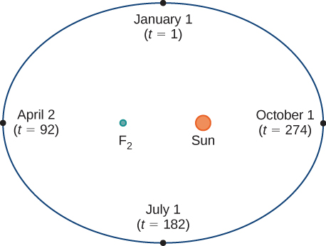{: #CNX_Calc_Figure_11_01_001}

[\[link\]](#CNX_Calc_Figure_11_01_001) depicts **Earth’s orbit**{: data-type="term" .no-emphasis} around the Sun during one year. The point labeled <math xmlns="http://www.w3.org/1998/Math/MathML"><mrow><msub><mi>F</mi><mn>2</mn></msub></mrow></math>

 is one of the foci of the ellipse; the other focus is occupied by the Sun. If we superimpose coordinate axes over this graph, then we can assign ordered pairs to each point on the ellipse ([\[link\]](#CNX_Calc_Figure_11_01_002)). Then each *x* value on the graph is a value of position as a function of time, and each *y* value is also a value of position as a function of time. Therefore, each point on the graph corresponds to a value of Earth’s position as a function of time.

 {: #CNX_Calc_Figure_11_01_002}

We can determine the functions for <math xmlns="http://www.w3.org/1998/Math/MathML"><mrow><mi>x</mi><mrow><mo>(</mo><mi>t</mi><mo>)</mo></mrow></mrow></math>

 and <math xmlns="http://www.w3.org/1998/Math/MathML"><mrow><mi>y</mi><mrow><mo>(</mo><mi>t</mi><mo>)</mo></mrow><mo>,</mo></mrow></math>

 thereby parameterizing the orbit of Earth around the Sun. The variable <math xmlns="http://www.w3.org/1998/Math/MathML"><mi>t</mi></math>

 is called an independent parameter and, in this context, represents time relative to the beginning of each year.

A curve in the <math xmlns="http://www.w3.org/1998/Math/MathML"><mrow><mrow><mo>(</mo><mrow><mi>x</mi><mo>,</mo><mi>y</mi></mrow><mo>)</mo></mrow></mrow></math>

 plane can be represented parametrically. The equations that are used to define the curve are called **parametric equations**{: data-type="term"}.

Definition

If *x* and *y* are continuous functions of *t* on an interval *I*, then the equations

<math xmlns="http://www.w3.org/1998/Math/MathML"><mrow><mi>x</mi><mo>=</mo><mi>x</mi><mrow><mo>(</mo><mi>t</mi><mo>)</mo></mrow><mspace width="0.2em" /><mtext>and</mtext><mspace width="0.2em" /><mi>y</mi><mo>=</mo><mi>y</mi><mrow><mo>(</mo><mi>t</mi><mo>)</mo></mrow></mrow></math>

are called parametric equations and *t* is called the **parameter**{: data-type="term"}. The set of points <math xmlns="http://www.w3.org/1998/Math/MathML"><mrow><mrow><mo>(</mo><mrow><mi>x</mi><mo>,</mo><mi>y</mi></mrow><mo>)</mo></mrow></mrow></math>

 obtained as *t* varies over the interval *I* is called the graph of the parametric equations. The graph of parametric equations is called a **parametric curve**{: data-type="term"} or *plane curve*, and is denoted by *C*.

Notice in this definition that *x* and *y* are used in two ways. The first is as functions of the independent variable *t.* As *t* varies over the interval *I*, the functions <math xmlns="http://www.w3.org/1998/Math/MathML"><mrow><mi>x</mi><mrow><mo>(</mo><mi>t</mi><mo>)</mo></mrow></mrow></math>

 and <math xmlns="http://www.w3.org/1998/Math/MathML"><mrow><mi>y</mi><mrow><mo>(</mo><mi>t</mi><mo>)</mo></mrow></mrow></math>

 generate a set of ordered pairs <math xmlns="http://www.w3.org/1998/Math/MathML"><mrow><mrow><mo>(</mo><mrow><mi>x</mi><mo>,</mo><mi>y</mi></mrow><mo>)</mo></mrow><mo>.</mo></mrow></math>

 This set of ordered pairs generates the graph of the parametric equations. In this second usage, to designate the ordered pairs, *x* and *y* are variables. It is important to distinguish the variables *x* and *y* from the functions <math xmlns="http://www.w3.org/1998/Math/MathML"><mrow><mi>x</mi><mrow><mo>(</mo><mi>t</mi><mo>)</mo></mrow></mrow></math>

 and <math xmlns="http://www.w3.org/1998/Math/MathML"><mrow><mi>y</mi><mrow><mo>(</mo><mi>t</mi><mo>)</mo></mrow><mo>.</mo></mrow></math>

Graphing a Parametrically Defined Curve

Sketch the curves described by the following parametric equations:

1.  <math xmlns="http://www.w3.org/1998/Math/MathML"><mrow><mi>x</mi><mrow><mo>(</mo><mi>t</mi><mo>)</mo></mrow><mo>=</mo><mi>t</mi><mo>−</mo><mn>1</mn><mo>,</mo><mspace width="1em" /><mi>y</mi><mrow><mo>(</mo><mi>t</mi><mo>)</mo></mrow><mo>=</mo><mn>2</mn><mi>t</mi><mo>+</mo><mn>4</mn><mo>,</mo><mspace width="1em" /><mn>−3</mn><mo>≤</mo><mi>t</mi><mo>≤</mo><mn>2</mn></mrow></math>

2.  <math xmlns="http://www.w3.org/1998/Math/MathML"><mrow><mi>x</mi><mrow><mo>(</mo><mi>t</mi><mo>)</mo></mrow><mo>=</mo><msup><mi>t</mi><mn>2</mn></msup><mo>−</mo><mn>3</mn><mo>,</mo><mspace width="1em" /><mi>y</mi><mrow><mo>(</mo><mi>t</mi><mo>)</mo></mrow><mo>=</mo><mn>2</mn><mi>t</mi><mo>+</mo><mn>1</mn><mo>,</mo><mspace width="1em" /><mn>−2</mn><mo>≤</mo><mi>t</mi><mo>≤</mo><mn>3</mn></mrow></math>

3.  <math xmlns="http://www.w3.org/1998/Math/MathML"><mrow><mi>x</mi><mrow><mo>(</mo><mi>t</mi><mo>)</mo></mrow><mo>=</mo><mn>4</mn><mspace width="0.2em" /><mtext>cos</mtext><mspace width="0.2em" /><mi>t</mi><mo>,</mo><mspace width="1em" /><mi>y</mi><mrow><mo>(</mo><mi>t</mi><mo>)</mo></mrow><mo>=</mo><mn>4</mn><mspace width="0.2em" /><mtext>sin</mtext><mspace width="0.2em" /><mi>t</mi><mo>,</mo><mspace width="1em" /><mn>0</mn><mo>≤</mo><mi>t</mi><mo>≤</mo><mn>2</mn><mi>π</mi></mrow></math>
{: data-number-style="lower-alpha"}

1.  To create a graph of this curve, first set up a table of values. Since the independent variable in both
    <math xmlns="http://www.w3.org/1998/Math/MathML"><mrow><mi>x</mi><mrow><mo>(</mo><mi>t</mi><mo>)</mo></mrow></mrow></math>
    
    and
    <math xmlns="http://www.w3.org/1998/Math/MathML"><mrow><mi>y</mi><mrow><mo>(</mo><mi>t</mi><mo>)</mo></mrow></mrow></math>
    
    is *t*, let *t* appear in the first column. Then
    <math xmlns="http://www.w3.org/1998/Math/MathML"><mrow><mi>x</mi><mrow><mo>(</mo><mi>t</mi><mo>)</mo></mrow></mrow></math>
    
    and
    <math xmlns="http://www.w3.org/1998/Math/MathML"><mrow><mi>y</mi><mrow><mo>(</mo><mi>t</mi><mo>)</mo></mrow></mrow></math>
    
    will appear in the second and third columns of the table.
    * * *
    {: data-type="newline"}
    
    | *t* | <math xmlns="http://www.w3.org/1998/Math/MathML"><mrow><mi>x</mi><mrow><mo>(</mo><mi>t</mi><mo>)</mo></mrow></mrow></math>
    
     | <math xmlns="http://www.w3.org/1998/Math/MathML"><mrow><mi>y</mi><mrow><mo>(</mo><mi>t</mi><mo>)</mo></mrow></mrow></math>
    
     |
    {: valign="top"}|----------
    | −3 | −4 | −2 |
    {: valign="top"}| −2 | −3 | 0 |
    {: valign="top"}| −1 | −2 | 2 |
    {: valign="top"}| 0 | −1 | 4 |
    {: valign="top"}| 1 | 0 | 6 |
    {: valign="top"}| 2 | 1 | 8 |
    {: valign="top"}{: .unnumbered summary="This table has three columns and seven rows. The first row is a header row, and it reads from left to right t, x(t), and y(t). Below the header row, in the first column, the values read &#x2212;3, &#x2212;2, &#x2212;1, 0, 1, and 2. In the second column, the values read &#x2212;4, &#x2212;3, &#x2212;2, &#x2212;1, 0, and 1. In the third column, the values read &#x2212;2, 0, 2, 4, 6, and 8." data-label=""}
    
    * * *
    {: data-type="newline"}
    
    The second and third columns in this table provide a set of points to be plotted. The graph of these points appears in [[link]](#CNX_Calc_Figure_11_01_003). The arrows on the graph indicate the **orientation**{: data-type="term"} of the graph, that is, the direction that a point moves on the graph as *t* varies from −3 to 2.
    * * *
    {: data-type="newline"}
    
    {: #CNX_Calc_Figure_11_01_003}

2.  To create a graph of this curve, again set up a table of values.
    * * *
    {: data-type="newline"}
    
    | *t* | <math xmlns="http://www.w3.org/1998/Math/MathML"><mrow><mi>x</mi><mrow><mo>(</mo><mi>t</mi><mo>)</mo></mrow></mrow></math>
    
     | <math xmlns="http://www.w3.org/1998/Math/MathML"><mrow><mi>y</mi><mrow><mo>(</mo><mi>t</mi><mo>)</mo></mrow></mrow></math>
    
     |
    {: valign="top"}|----------
    | −2 | 1 | −3 |
    {: valign="top"}| −1 | −2 | −1 |
    {: valign="top"}| 0 | −3 | 1 |
    {: valign="top"}| 1 | −2 | 3 |
    {: valign="top"}| 2 | 1 | 5 |
    {: valign="top"}| 3 | 6 | 7 |
    {: valign="top"}{: .unnumbered summary="This table has three columns and seven rows. The first row is a header row, and it reads from left to right t, x(t), and y(t). Below the header row, in the first column, the values read &#x2212;2, &#x2212;1, 0, 1, 2, and 3. In the second column, the values read 1, &#x2212;2, &#x2212;2, &#x2212;2, 1, and 6. In the third column, the values read &#x2212;3, &#x2212;1, 1, 3, 5, and 7." data-label=""}
    
    * * *
    {: data-type="newline"}
    
    The second and third columns in this table give a set of points to be plotted ([[link]](#CNX_Calc_Figure_11_01_004)). The first point on the graph (corresponding to
    <math xmlns="http://www.w3.org/1998/Math/MathML"><mrow><mi>t</mi><mo>=</mo><mn>−2</mn><mo stretchy="false">)</mo></mrow></math>
    
    has coordinates
    <math xmlns="http://www.w3.org/1998/Math/MathML"><mrow><mrow><mo>(</mo><mrow><mn>1</mn><mo>,</mo><mn>−3</mn></mrow><mo>)</mo></mrow><mo>,</mo></mrow></math>
    
    and the last point (corresponding to
    <math xmlns="http://www.w3.org/1998/Math/MathML"><mrow><mi>t</mi><mo>=</mo><mn>3</mn><mo stretchy="false">)</mo></mrow></math>
    
    has coordinates
    <math xmlns="http://www.w3.org/1998/Math/MathML"><mrow><mrow><mo>(</mo><mrow><mn>6</mn><mo>,</mo><mn>7</mn></mrow><mo>)</mo></mrow><mo>.</mo></mrow></math>
    
    As *t* progresses from −2 to 3, the point on the curve travels along a parabola. The direction the point moves is again called the orientation and is indicated on the graph.
    * * *
    {: data-type="newline"}
    
    {: #CNX_Calc_Figure_11_01_004}

3.  In this case, use multiples of
    <math xmlns="http://www.w3.org/1998/Math/MathML"><mrow><mrow><mi>π</mi><mtext>/</mtext><mn>6</mn></mrow></mrow></math>
    
    for *t* and create another table of values:
    * * *
    {: data-type="newline"}
    
    <table class="unnumbered" summary="This table has three columns and 14 rows. The first row is a header row, and it reads from left to right t, x(t), and y(t). Below the header row, in the first column, the values read 0, &#x3C0;/6, &#x3C0;/3, &#x3C0;/2, 2&#x3C0;/3, 5&#x3C0;/6, &#x3C0;, 7&#x3C0;/6, 4&#x3C0;/3, 3&#x3C0;/2, 5&#x3C0;/3, 11&#x3C0;/6, and 2&#x3C0;. In the second column, the values read 2 times the square root of 3, which is approximately equal to 3.5, 2, 0, &#x2212;2, &#x2212;2 times the square root of 3, which is approximately equal to &#x2212;3.5, &#x2212;4, &#x2212;2 times the square root of 3, which is approximately equal to &#x2212;3.5, &#x2212;2, 0, 2, 2 times the square root of 3, which is approximately equal to 3.5, and 5. In the third column, the values read 0, 2, 2 times the square root of 3, which is approximately equal to 3.5, 4, 2 times the square root of 3, which is approximately equal to 3.5, 2, 0, 2, &#x2212;2 times the square root of 3, which is approximately equal to &#x2212;3.5, &#x2212;4, &#x2212;2 times the square root of 3, which is approximately equal to &#x2212;3.5, 2, and 0." data-label=""><thead>
    <tr valign="top">
    <th data-valign="top" data-align="center"><em>t</em></th>
    <th data-valign="top" data-align="center"><math xmlns="http://www.w3.org/1998/Math/MathML"><mrow><mi>x</mi><mrow><mo>(</mo><mi>t</mi><mo>)</mo></mrow></mrow></math></th>
    <th data-valign="top" data-align="center"><math xmlns="http://www.w3.org/1998/Math/MathML"><mrow><mi>y</mi><mrow><mo>(</mo><mi>t</mi><mo>)</mo></mrow></mrow></math></th>
    <th data-valign="top" data-align="center" />
    <th data-valign="top" data-align="center"><em>t</em></th>
    <th data-valign="top" data-align="center"><math xmlns="http://www.w3.org/1998/Math/MathML"><mrow><mi>x</mi><mrow><mo>(</mo><mi>t</mi><mo>)</mo></mrow></mrow></math></th>
    <th data-valign="top" data-align="center"><math xmlns="http://www.w3.org/1998/Math/MathML"><mrow><mi>y</mi><mrow><mo>(</mo><mi>t</mi><mo>)</mo></mrow></mrow></math></th>
    </tr>
    </thead><tbody>
    <tr valign="top">
    <td data-valign="top" data-align="center">0</td>
    <td data-valign="top" data-align="center">4</td>
    <td data-valign="top" data-align="center">0</td>
    <td rowspan="7" data-valign="top" data-align="center" />
    <td data-valign="top" data-align="center"><math xmlns="http://www.w3.org/1998/Math/MathML"><mrow><mfrac><mrow><mn>7</mn><mi>π</mi></mrow><mn>6</mn></mfrac></mrow></math></td>
    <td data-valign="top" data-align="center"><math xmlns="http://www.w3.org/1998/Math/MathML"><mrow><mn>−2</mn><msqrt><mn>3</mn></msqrt><mo>≈</mo><mn>−3.5</mn></mrow></math></td>
    <td data-valign="top" data-align="center">2</td>
    </tr>
    <tr valign="top">
    <td data-valign="top" data-align="center"><math xmlns="http://www.w3.org/1998/Math/MathML"><mrow><mfrac><mi>π</mi><mn>6</mn></mfrac></mrow></math></td>
    <td data-valign="top" data-align="center"><math xmlns="http://www.w3.org/1998/Math/MathML"><mrow><mn>2</mn><msqrt><mn>3</mn></msqrt><mo>≈</mo><mn>3.5</mn></mrow></math></td>
    <td data-valign="top" data-align="center"><math xmlns="http://www.w3.org/1998/Math/MathML"><mn>2</mn></math></td>
    <td data-valign="top" data-align="center"><math xmlns="http://www.w3.org/1998/Math/MathML"><mrow><mfrac><mrow><mn>4</mn><mi>π</mi></mrow><mn>3</mn></mfrac></mrow></math></td>
    <td data-valign="top" data-align="center">−2</td>
    <td data-valign="top" data-align="center"><math xmlns="http://www.w3.org/1998/Math/MathML"><mrow><mn>−2</mn><msqrt><mn>3</mn></msqrt><mo>≈</mo><mn>−3.5</mn></mrow></math></td>
    </tr>
    <tr valign="top">
    <td data-valign="top" data-align="center"><math xmlns="http://www.w3.org/1998/Math/MathML"><mrow><mfrac><mi>π</mi><mn>3</mn></mfrac></mrow></math></td>
    <td data-valign="top" data-align="center"><math xmlns="http://www.w3.org/1998/Math/MathML"><mn>2</mn></math></td>
    <td data-valign="top" data-align="center"><math xmlns="http://www.w3.org/1998/Math/MathML"><mrow><mn>2</mn><msqrt><mn>3</mn></msqrt><mo>≈</mo><mn>3.5</mn></mrow></math></td>
    <td data-valign="top" data-align="center"><math xmlns="http://www.w3.org/1998/Math/MathML"><mrow><mfrac><mrow><mn>3</mn><mi>π</mi></mrow><mn>2</mn></mfrac></mrow></math></td>
    <td data-valign="top" data-align="center">0</td>
    <td data-valign="top" data-align="center">−4</td>
    </tr>
    <tr valign="top">
    <td data-valign="top" data-align="center"><math xmlns="http://www.w3.org/1998/Math/MathML"><mrow><mfrac><mi>π</mi><mn>2</mn></mfrac></mrow></math></td>
    <td data-valign="top" data-align="center">0</td>
    <td data-valign="top" data-align="center">4</td>
    <td data-valign="top" data-align="center"><math xmlns="http://www.w3.org/1998/Math/MathML"><mrow><mfrac><mrow><mn>5</mn><mi>π</mi></mrow><mn>3</mn></mfrac></mrow></math></td>
    <td data-valign="top" data-align="center">2</td>
    <td data-valign="top" data-align="center"><math xmlns="http://www.w3.org/1998/Math/MathML"><mrow><mn>−2</mn><msqrt><mn>3</mn></msqrt><mo>≈</mo><mn>−3.5</mn></mrow></math></td>
    </tr>
    <tr valign="top">
    <td data-valign="top" data-align="center"><math xmlns="http://www.w3.org/1998/Math/MathML"><mrow><mfrac><mrow><mn>2</mn><mi>π</mi></mrow><mn>3</mn></mfrac></mrow></math></td>
    <td data-valign="top" data-align="center">−2</td>
    <td data-valign="top" data-align="center"><math xmlns="http://www.w3.org/1998/Math/MathML"><mrow><mn>2</mn><msqrt><mn>3</mn></msqrt><mo>≈</mo><mn>3.5</mn></mrow></math></td>
    <td data-valign="top" data-align="center"><math xmlns="http://www.w3.org/1998/Math/MathML"><mrow><mfrac><mrow><mn>11</mn><mi>π</mi></mrow><mn>6</mn></mfrac></mrow></math></td>
    <td data-valign="top" data-align="center"><math xmlns="http://www.w3.org/1998/Math/MathML"><mrow><mn>2</mn><msqrt><mn>3</mn></msqrt><mo>≈</mo><mn>3.5</mn></mrow></math></td>
    <td data-valign="top" data-align="center">2</td>
    </tr>
    <tr valign="top">
    <td data-valign="top" data-align="center"><math xmlns="http://www.w3.org/1998/Math/MathML"><mrow><mfrac><mrow><mn>5</mn><mi>π</mi></mrow><mn>6</mn></mfrac></mrow></math></td>
    <td data-valign="top" data-align="center"><math xmlns="http://www.w3.org/1998/Math/MathML"><mrow><mn>−2</mn><msqrt><mn>3</mn></msqrt><mo>≈</mo><mn>−3.5</mn></mrow></math></td>
    <td data-valign="top" data-align="center">2</td>
    <td data-valign="top" data-align="center"><math xmlns="http://www.w3.org/1998/Math/MathML"><mrow><mn>2</mn><mi>π</mi></mrow></math></td>
    <td data-valign="top" data-align="center">4</td>
    <td data-valign="top" data-align="center">0</td>
    </tr>
    <tr valign="top">
    <td data-valign="top" data-align="center"><math xmlns="http://www.w3.org/1998/Math/MathML"><mi>π</mi></math></td>
    <td data-valign="top" data-align="center">−4</td>
    <td data-valign="top" data-align="center">0</td>
    <td data-valign="top" data-align="left" />
    <td data-valign="top" data-align="left" />
    <td data-valign="top" data-align="left" />
    </tr>
    </tbody></table>
    
    * * *
    {: data-type="newline"}
    
    The graph of this plane curve appears in the following graph.
    * * *
    {: data-type="newline"}
    
    {: #CNX_Calc_Figure_11_01_005}

    * * *
    {: data-type="newline"}
    
    This is the graph of a circle with radius 4 centered at the origin, with a counterclockwise orientation. The starting point and ending points of the curve both have coordinates
    <math xmlns="http://www.w3.org/1998/Math/MathML"><mrow><mrow><mo>(</mo><mrow><mn>4</mn><mo>,</mo><mn>0</mn></mrow><mo>)</mo></mrow><mo>.</mo></mrow></math>
{: data-number-style="lower-alpha"}

Sketch the curve described by the parametric equations

<math xmlns="http://www.w3.org/1998/Math/MathML"><mrow><mi>x</mi><mrow><mo>(</mo><mi>t</mi><mo>)</mo></mrow><mo>=</mo><mn>3</mn><mi>t</mi><mo>+</mo><mn>2</mn><mo>,</mo><mspace width="1em" /><mi>y</mi><mrow><mo>(</mo><mi>t</mi><mo>)</mo></mrow><mo>=</mo><msup><mi>t</mi><mn>2</mn></msup><mo>−</mo><mn>1</mn><mo>,</mo><mspace width="1em" /><mn>−3</mn><mo>≤</mo><mi>t</mi><mo>≤</mo><mn>2</mn><mo>.</mo></mrow></math>

* * *
{: data-type="newline"}

  

Hint

Make a table of values for <math xmlns="http://www.w3.org/1998/Math/MathML"><mrow><mi>x</mi><mrow><mo>(</mo><mi>t</mi><mo>)</mo></mrow></mrow></math>

 and <math xmlns="http://www.w3.org/1998/Math/MathML"><mrow><mi>y</mi><mrow><mo>(</mo><mi>t</mi><mo>)</mo></mrow></mrow></math>

 using *t* values from −3 to 2.

### Eliminating the Parameter

To better understand the graph of a curve represented parametrically, it is useful to rewrite the two equations as a single equation relating the variables *x* and *y.* Then we can apply any previous knowledge of equations of curves in the plane to identify the curve. For example, the equations describing the plane curve in [\[link\]](#fs-id1169295362672)b. are

<math xmlns="http://www.w3.org/1998/Math/MathML"><mrow><mi>x</mi><mrow><mo>(</mo><mi>t</mi><mo>)</mo></mrow><mo>=</mo><msup><mi>t</mi><mn>2</mn></msup><mo>−</mo><mn>3</mn><mo>,</mo><mspace width="1em" /><mi>y</mi><mrow><mo>(</mo><mi>t</mi><mo>)</mo></mrow><mo>=</mo><mn>2</mn><mi>t</mi><mo>+</mo><mn>1</mn><mo>,</mo><mspace width="1em" /><mn>−2</mn><mo>≤</mo><mi>t</mi><mo>≤</mo><mn>3</mn><mo>.</mo></mrow></math>

Solving the second equation for *t* gives

<math xmlns="http://www.w3.org/1998/Math/MathML"><mrow><mi>t</mi><mo>=</mo><mfrac><mrow><mi>y</mi><mo>−</mo><mn>1</mn></mrow><mn>2</mn></mfrac><mo>.</mo></mrow></math>

This can be substituted into the first equation:

<math xmlns="http://www.w3.org/1998/Math/MathML"><mrow><mi>x</mi><mo>=</mo><msup><mrow><mrow><mo>(</mo><mrow><mfrac><mrow><mi>y</mi><mo>−</mo><mn>1</mn></mrow><mn>2</mn></mfrac></mrow><mo>)</mo></mrow></mrow><mn>2</mn></msup><mo>−</mo><mn>3</mn><mo>=</mo><mfrac><mrow><msup><mi>y</mi><mn>2</mn></msup><mo>−</mo><mn>2</mn><mi>y</mi><mo>+</mo><mn>1</mn></mrow><mn>4</mn></mfrac><mo>−</mo><mn>3</mn><mo>=</mo><mfrac><mrow><msup><mi>y</mi><mn>2</mn></msup><mo>−</mo><mn>2</mn><mi>y</mi><mo>−</mo><mn>11</mn></mrow><mn>4</mn></mfrac><mo>.</mo></mrow></math>

This equation describes *x* as a function of *y.* These steps give an example of *eliminating the parameter*. The graph of this function is a parabola opening to the right. Recall that the plane curve started at <math xmlns="http://www.w3.org/1998/Math/MathML"><mrow><mrow><mo>(</mo><mrow><mn>1</mn><mo>,</mo><mn>−3</mn></mrow><mo>)</mo></mrow></mrow></math>

 and ended at <math xmlns="http://www.w3.org/1998/Math/MathML"><mrow><mrow><mo>(</mo><mrow><mn>6</mn><mo>,</mo><mn>7</mn></mrow><mo>)</mo></mrow><mo>.</mo></mrow></math>

 These terminations were due to the restriction on the parameter *t.*

Eliminating the Parameter

Eliminate the parameter for each of the plane curves described by the following parametric equations and describe the resulting graph.

1.  <math xmlns="http://www.w3.org/1998/Math/MathML"><mrow><mi>x</mi><mrow><mo>(</mo><mi>t</mi><mo>)</mo></mrow><mo>=</mo><msqrt><mrow><mn>2</mn><mi>t</mi><mo>+</mo><mn>4</mn></mrow></msqrt><mo>,</mo><mspace width="1em" /><mi>y</mi><mrow><mo>(</mo><mi>t</mi><mo>)</mo></mrow><mo>=</mo><mn>2</mn><mi>t</mi><mo>+</mo><mn>1</mn><mo>,</mo><mspace width="1em" /><mn>−2</mn><mo>≤</mo><mi>t</mi><mo>≤</mo><mn>6</mn></mrow></math>

2.  <math xmlns="http://www.w3.org/1998/Math/MathML"><mrow><mi>x</mi><mrow><mo>(</mo><mi>t</mi><mo>)</mo></mrow><mo>=</mo><mn>4</mn><mspace width="0.2em" /><mtext>cos</mtext><mspace width="0.2em" /><mi>t</mi><mo>,</mo><mspace width="1em" /><mi>y</mi><mrow><mo>(</mo><mi>t</mi><mo>)</mo></mrow><mo>=</mo><mn>3</mn><mspace width="0.2em" /><mtext>sin</mtext><mspace width="0.2em" /><mi>t</mi><mo>,</mo><mspace width="1em" /><mn>0</mn><mo>≤</mo><mi>t</mi><mo>≤</mo><mn>2</mn><mi>π</mi></mrow></math>
{: data-number-style="lower-alpha"}

1.  To eliminate the parameter, we can solve either of the equations for *t.* For example, solving the first equation for *t* gives
    * * *
    {: data-type="newline"}
    
    

    <math xmlns="http://www.w3.org/1998/Math/MathML"><mtable><mtr><mtd columnalign="right"><mi>x</mi></mtd><mtd columnalign="left"><mo>=</mo></mtd><mtd columnalign="left"><msqrt><mrow><mn>2</mn><mi>t</mi><mo>+</mo><mn>4</mn></mrow></msqrt></mtd></mtr><mtr><mtd columnalign="right"><msup><mi>x</mi><mn>2</mn></msup></mtd><mtd columnalign="left"><mo>=</mo></mtd><mtd columnalign="left"><mn>2</mn><mi>t</mi><mo>+</mo><mn>4</mn></mtd></mtr><mtr><mtd columnalign="right"><msup><mi>x</mi><mn>2</mn></msup><mo>−</mo><mn>4</mn></mtd><mtd columnalign="left"><mo>=</mo></mtd><mtd columnalign="left"><mn>2</mn><mi>t</mi></mtd></mtr><mtr><mtd columnalign="right"><mi>t</mi></mtd><mtd columnalign="left"><mo>=</mo></mtd><mtd columnalign="left"><mfrac><mrow><msup><mi>x</mi><mn>2</mn></msup><mo>−</mo><mn>4</mn></mrow><mn>2</mn></mfrac><mo>.</mo></mtd></mtr></mtable></math>
    

    
    * * *
    {: data-type="newline"}
    
    Note that when we square both sides it is important to observe that
    <math xmlns="http://www.w3.org/1998/Math/MathML"><mrow><mi>x</mi><mo>≥</mo><mn>0</mn><mo>.</mo></mrow></math>
    
    Substituting
    <math xmlns="http://www.w3.org/1998/Math/MathML"><mrow><mi>t</mi><mo>=</mo><mfrac><mrow><msup><mi>x</mi><mn>2</mn></msup><mo>−</mo><mn>4</mn></mrow><mn>2</mn></mfrac></mrow></math>
    
    this into
    <math xmlns="http://www.w3.org/1998/Math/MathML"><mrow><mi>y</mi><mrow><mo>(</mo><mi>t</mi><mo>)</mo></mrow></mrow></math>
    
    yields
    * * *
    {: data-type="newline"}
    
    

    <math xmlns="http://www.w3.org/1998/Math/MathML"><mtable><mtr><mtd columnalign="right"><mi>y</mi><mrow><mo>(</mo><mi>t</mi><mo>)</mo></mrow></mtd><mtd columnalign="left"><mo>=</mo></mtd><mtd columnalign="left"><mn>2</mn><mi>t</mi><mo>+</mo><mn>1</mn></mtd></mtr><mtr><mtd columnalign="right"><mi>y</mi></mtd><mtd columnalign="left"><mo>=</mo></mtd><mtd columnalign="left"><mn>2</mn><mrow><mo>(</mo><mrow><mfrac><mrow><msup><mi>x</mi><mn>2</mn></msup><mo>−</mo><mn>4</mn></mrow><mn>2</mn></mfrac></mrow><mo>)</mo></mrow><mo>+</mo><mn>1</mn></mtd></mtr><mtr><mtd columnalign="right"><mi>y</mi></mtd><mtd columnalign="left"><mo>=</mo></mtd><mtd columnalign="left"><msup><mi>x</mi><mn>2</mn></msup><mo>−</mo><mn>4</mn><mo>+</mo><mn>1</mn></mtd></mtr><mtr><mtd columnalign="right"><mi>y</mi></mtd><mtd columnalign="left"><mo>=</mo></mtd><mtd columnalign="left"><msup><mi>x</mi><mn>2</mn></msup><mo>−</mo><mn>3.</mn></mtd></mtr></mtable></math>
    

    
    * * *
    {: data-type="newline"}
    
    This is the equation of a parabola opening upward. There is, however, a domain restriction because of the limits on the parameter *t*. When
    <math xmlns="http://www.w3.org/1998/Math/MathML"><mrow><mi>t</mi><mo>=</mo><mn>−2</mn><mo>,</mo></mrow></math>
    
    <math xmlns="http://www.w3.org/1998/Math/MathML"><mrow><mi>x</mi><mo>=</mo><msqrt><mrow><mn>2</mn><mrow><mo>(</mo><mrow><mn>−2</mn></mrow><mo>)</mo></mrow><mo>+</mo><mn>4</mn></mrow></msqrt><mo>=</mo><mn>0</mn><mo>,</mo></mrow></math>
    
    and when
    <math xmlns="http://www.w3.org/1998/Math/MathML"><mrow><mi>t</mi><mo>=</mo><mn>6</mn><mo>,</mo></mrow></math>
    
    <math xmlns="http://www.w3.org/1998/Math/MathML"><mrow><mi>x</mi><mo>=</mo><msqrt><mrow><mn>2</mn><mrow><mo>(</mo><mn>6</mn><mo>)</mo></mrow><mo>+</mo><mn>4</mn></mrow></msqrt><mo>=</mo><mn>4</mn><mo>.</mo></mrow></math>
    
    The graph of this plane curve follows.
    * * *
    {: data-type="newline"}
    
    {: #CNX_Calc_Figure_11_01_007}

2.  Sometimes it is necessary to be a bit creative in eliminating the parameter. The parametric equations for this example are
    * * *
    {: data-type="newline"}
    
    

    <math xmlns="http://www.w3.org/1998/Math/MathML"><mrow><mi>x</mi><mrow><mo>(</mo><mi>t</mi><mo>)</mo></mrow><mo>=</mo><mn>4</mn><mspace width="0.2em" /><mtext>cos</mtext><mspace width="0.2em" /><mi>t</mi><mspace width="0.2em" /><mtext>and</mtext><mspace width="0.2em" /><mi>y</mi><mrow><mo>(</mo><mi>t</mi><mo>)</mo></mrow><mo>=</mo><mn>3</mn><mspace width="0.2em" /><mtext>sin</mtext><mspace width="0.2em" /><mi>t</mi><mo>.</mo></mrow></math>
    

    
    * * *
    {: data-type="newline"}
    
    Solving either equation for *t* directly is not advisable because sine and cosine are not one-to-one functions. However, dividing the first equation by 4 and the second equation by 3 (and suppressing the *t*) gives us
    * * *
    {: data-type="newline"}
    
    

    <math xmlns="http://www.w3.org/1998/Math/MathML"><mrow><mtext>cos</mtext><mspace width="0.2em" /><mi>t</mi><mo>=</mo><mfrac><mi>x</mi><mn>4</mn></mfrac><mspace width="0.2em" /><mtext>and</mtext><mspace width="0.2em" /><mtext>sin</mtext><mspace width="0.2em" /><mi>t</mi><mo>=</mo><mfrac><mi>y</mi><mn>3</mn></mfrac><mo>.</mo></mrow></math>
    

    
    * * *
    {: data-type="newline"}
    
    Now use the Pythagorean identity
    <math xmlns="http://www.w3.org/1998/Math/MathML"><mrow><msup><mrow><mtext>cos</mtext></mrow><mn>2</mn></msup><mi>t</mi><mo>+</mo><msup><mrow><mtext>sin</mtext></mrow><mn>2</mn></msup><mi>t</mi><mo>=</mo><mn>1</mn></mrow></math>
    
    and replace the expressions for
    <math xmlns="http://www.w3.org/1998/Math/MathML"><mrow><mtext>sin</mtext><mspace width="0.2em" /><mi>t</mi></mrow></math>
    
    and
    <math xmlns="http://www.w3.org/1998/Math/MathML"><mrow><mtext>cos</mtext><mspace width="0.2em" /><mi>t</mi></mrow></math>
    
    with the equivalent expressions in terms of *x* and *y*. This gives
    * * *
    {: data-type="newline"}
    
    

    <math xmlns="http://www.w3.org/1998/Math/MathML"><mtable><mtr><mtd columnalign="right"><msup><mrow><mo>(</mo><mrow><mfrac><mi>x</mi><mn>4</mn></mfrac></mrow><mo>)</mo></mrow><mn>2</mn></msup><mo>+</mo><msup><mrow><mo>(</mo><mrow><mfrac><mi>y</mi><mn>3</mn></mfrac></mrow><mo>)</mo></mrow><mn>2</mn></msup></mtd><mtd columnalign="left"><mo>=</mo></mtd><mtd columnalign="left"><mn>1</mn></mtd></mtr><mtr><mtd columnalign="right"><mfrac><mrow><msup><mi>x</mi><mn>2</mn></msup></mrow><mrow><mn>16</mn></mrow></mfrac><mo>+</mo><mfrac><mrow><msup><mi>y</mi><mn>2</mn></msup></mrow><mn>9</mn></mfrac></mtd><mtd columnalign="left"><mo>=</mo></mtd><mtd columnalign="left"><mn>1.</mn></mtd></mtr></mtable></math>
    

    
    * * *
    {: data-type="newline"}
    
    This is the equation of a horizontal ellipse centered at the origin, with semimajor axis 4 and semiminor axis 3 as shown in the following graph.
    * * *
    {: data-type="newline"}
    
    {: #CNX_Calc_Figure_11_01_008}

    * * *
    {: data-type="newline"}
    
    As *t* progresses from
    <math xmlns="http://www.w3.org/1998/Math/MathML"><mn>0</mn></math>
    
    to
    <math xmlns="http://www.w3.org/1998/Math/MathML"><mrow><mn>2</mn><mi>π</mi><mo>,</mo></mrow></math>
    
    a point on the curve traverses the ellipse once, in a counterclockwise direction. Recall from the section opener that the orbit of Earth around the Sun is also elliptical. This is a perfect example of using parameterized curves to model a real-world phenomenon.
{: data-number-style="lower-alpha"}

Eliminate the parameter for the plane curve defined by the following parametric equations and describe the resulting graph.

<math xmlns="http://www.w3.org/1998/Math/MathML"><mrow><mi>x</mi><mrow><mo>(</mo><mi>t</mi><mo>)</mo></mrow><mo>=</mo><mn>2</mn><mo>+</mo><mfrac><mn>3</mn><mi>t</mi></mfrac><mo>,</mo><mspace width="1em" /><mi>y</mi><mrow><mo>(</mo><mi>t</mi><mo>)</mo></mrow><mo>=</mo><mi>t</mi><mo>−</mo><mn>1</mn><mo>,</mo><mspace width="1em" /><mn>2</mn><mo>≤</mo><mi>t</mi><mo>≤</mo><mn>6</mn></mrow></math>

<math xmlns="http://www.w3.org/1998/Math/MathML"><mrow><mi>x</mi><mo>=</mo><mn>2</mn><mo>+</mo><mfrac><mn>3</mn><mrow><mi>y</mi><mo>+</mo><mn>1</mn></mrow></mfrac><mo>,</mo></mrow></math>

 or <math xmlns="http://www.w3.org/1998/Math/MathML"><mrow><mi>y</mi><mo>=</mo><mn>−1</mn><mo>+</mo><mfrac><mn>3</mn><mrow><mi>x</mi><mo>−</mo><mn>2</mn></mrow></mfrac><mo>.</mo></mrow></math>

 This equation describes a portion of a rectangular hyperbola centered at <math xmlns="http://www.w3.org/1998/Math/MathML"><mrow><mrow><mo>(</mo><mrow><mn>2</mn><mo>,</mo><mn>−1</mn></mrow><mo>)</mo></mrow><mo>.</mo></mrow></math>

* * *
{: data-type="newline"}

  

Hint

Solve one of the equations for *t* and substitute into the other equation.

So far we have seen the method of eliminating the parameter, assuming we know a set of parametric equations that describe a plane curve. What if we would like to start with the equation of a curve and determine a pair of parametric equations for that curve? This is certainly possible, and in fact it is possible to do so in many different ways for a given curve. The process is known as **parameterization of a curve**{: data-type="term"}.

Parameterizing a Curve

Find two different pairs of parametric equations to represent the graph of <math xmlns="http://www.w3.org/1998/Math/MathML"><mrow><mi>y</mi><mo>=</mo><mn>2</mn><msup><mi>x</mi><mn>2</mn></msup><mo>−</mo><mn>3</mn><mo>.</mo></mrow></math>

First, it is always possible to parameterize a curve by defining <math xmlns="http://www.w3.org/1998/Math/MathML"><mrow><mi>x</mi><mrow><mo>(</mo><mi>t</mi><mo>)</mo></mrow><mo>=</mo><mi>t</mi><mo>,</mo></mrow></math>

 then replacing *x* with *t* in the equation for <math xmlns="http://www.w3.org/1998/Math/MathML"><mrow><mi>y</mi><mrow><mo>(</mo><mi>t</mi><mo>)</mo></mrow><mo>.</mo></mrow></math>

 This gives the parameterization

<math xmlns="http://www.w3.org/1998/Math/MathML"><mrow><mi>x</mi><mrow><mo>(</mo><mi>t</mi><mo>)</mo></mrow><mo>=</mo><mi>t</mi><mo>,</mo><mspace width="1em" /><mi>y</mi><mrow><mo>(</mo><mi>t</mi><mo>)</mo></mrow><mo>=</mo><mn>2</mn><msup><mi>t</mi><mn>2</mn></msup><mo>−</mo><mn>3</mn><mo>.</mo></mrow></math>

Since there is no restriction on the domain in the original graph, there is no restriction on the values of *t.*

We have complete freedom in the choice for the second parameterization. For example, we can choose <math xmlns="http://www.w3.org/1998/Math/MathML"><mrow><mi>x</mi><mrow><mo>(</mo><mi>t</mi><mo>)</mo></mrow><mo>=</mo><mn>3</mn><mi>t</mi><mo>−</mo><mn>2</mn><mo>.</mo></mrow></math>

 The only thing we need to check is that there are no restrictions imposed on *x*; that is, the range of <math xmlns="http://www.w3.org/1998/Math/MathML"><mrow><mi>x</mi><mrow><mo>(</mo><mi>t</mi><mo>)</mo></mrow></mrow></math>

 is all real numbers. This is the case for <math xmlns="http://www.w3.org/1998/Math/MathML"><mrow><mi>x</mi><mrow><mo>(</mo><mi>t</mi><mo>)</mo></mrow><mo>=</mo><mn>3</mn><mi>t</mi><mo>−</mo><mn>2</mn><mo>.</mo></mrow></math>

 Now since <math xmlns="http://www.w3.org/1998/Math/MathML"><mrow><mi>y</mi><mo>=</mo><mn>2</mn><msup><mi>x</mi><mn>2</mn></msup><mo>−</mo><mn>3</mn><mo>,</mo></mrow></math>

 we can substitute <math xmlns="http://www.w3.org/1998/Math/MathML"><mrow><mi>x</mi><mrow><mo>(</mo><mi>t</mi><mo>)</mo></mrow><mo>=</mo><mn>3</mn><mi>t</mi><mo>−</mo><mn>2</mn></mrow></math>

 for *x.* This gives

<math xmlns="http://www.w3.org/1998/Math/MathML"><mtable><mtr><mtd columnalign="right"><mi>y</mi><mrow><mo>(</mo><mi>t</mi><mo>)</mo></mrow></mtd><mtd columnalign="left"><mo>=</mo><mn>2</mn><msup><mrow><mo>(</mo><mrow><mn>3</mn><mi>t</mi><mo>−</mo><mn>2</mn></mrow><mo>)</mo></mrow><mn>2</mn></msup><mo>−</mo><mn>2</mn></mtd></mtr><mtr><mtd /><mtd columnalign="left"><mo>=</mo><mn>2</mn><mrow><mo>(</mo><mrow><mn>9</mn><msup><mi>t</mi><mn>2</mn></msup><mo>−</mo><mn>12</mn><mi>t</mi><mo>+</mo><mn>4</mn></mrow><mo>)</mo></mrow><mo>−</mo><mn>2</mn></mtd></mtr><mtr><mtd /><mtd columnalign="left"><mo>=</mo><mn>18</mn><msup><mi>t</mi><mn>2</mn></msup><mo>−</mo><mn>24</mn><mi>t</mi><mo>+</mo><mn>8</mn><mo>−</mo><mn>2</mn></mtd></mtr><mtr><mtd /><mtd columnalign="left"><mo>=</mo><mn>18</mn><msup><mi>t</mi><mn>2</mn></msup><mo>−</mo><mn>24</mn><mi>t</mi><mo>+</mo><mn>6.</mn></mtd></mtr></mtable></math>

Therefore, a second parameterization of the curve can be written as

<math xmlns="http://www.w3.org/1998/Math/MathML"><mrow><mi>x</mi><mrow><mo>(</mo><mi>t</mi><mo>)</mo></mrow><mo>=</mo><mn>3</mn><mi>t</mi><mo>−</mo><mn>2</mn><mspace width="0.2em" /><mtext>and</mtext><mspace width="0.2em" /><mi>y</mi><mrow><mo>(</mo><mi>t</mi><mo>)</mo></mrow><mo>=</mo><mn>18</mn><msup><mi>t</mi><mn>2</mn></msup><mo>−</mo><mn>24</mn><mi>t</mi><mo>+</mo><mn>6</mn><mo>.</mo></mrow></math>

Find two different sets of parametric equations to represent the graph of <math xmlns="http://www.w3.org/1998/Math/MathML"><mrow><mi>y</mi><mo>=</mo><msup><mi>x</mi><mn>2</mn></msup><mo>+</mo><mn>2</mn><mi>x</mi><mo>.</mo></mrow></math>

One possibility is <math xmlns="http://www.w3.org/1998/Math/MathML"><mrow><mi>x</mi><mrow><mo>(</mo><mi>t</mi><mo>)</mo></mrow><mo>=</mo><mi>t</mi><mo>,</mo><mspace width="1em" /><mi>y</mi><mrow><mo>(</mo><mi>t</mi><mo>)</mo></mrow><mo>=</mo><msup><mi>t</mi><mn>2</mn></msup><mo>+</mo><mn>2</mn><mi>t</mi><mo>.</mo></mrow></math>

 Another possibility is <math xmlns="http://www.w3.org/1998/Math/MathML"><mrow><mi>x</mi><mrow><mo>(</mo><mi>t</mi><mo>)</mo></mrow><mo>=</mo><mn>2</mn><mi>t</mi><mo>−</mo><mn>3</mn><mo>,</mo><mspace width="1em" /><mi>y</mi><mrow><mo>(</mo><mi>t</mi><mo>)</mo></mrow><mo>=</mo><msup><mrow><mrow><mo>(</mo><mrow><mn>2</mn><mi>t</mi><mo>−</mo><mn>3</mn></mrow><mo>)</mo></mrow></mrow><mn>2</mn></msup><mo>+</mo><mn>2</mn><mrow><mo>(</mo><mrow><mn>2</mn><mi>t</mi><mo>−</mo><mn>3</mn></mrow><mo>)</mo></mrow><mo>=</mo><mn>4</mn><msup><mi>t</mi><mn>2</mn></msup><mo>−</mo><mn>8</mn><mi>t</mi><mo>+</mo><mn>3</mn><mo>.</mo></mrow></math>

There are, in fact, an infinite number of possibilities.

Hint

Follow the steps in [[link]](#fs-id1169295460500). Remember we have freedom in choosing the parameterization for <math xmlns="http://www.w3.org/1998/Math/MathML"><mrow><mi>x</mi><mrow><mo>(</mo><mi>t</mi><mo>)</mo></mrow><mo>.</mo></mrow></math>

### Cycloids and Other Parametric Curves

Imagine going on a bicycle ride through the country. The tires stay in contact with the road and rotate in a predictable pattern. Now suppose a very determined ant is tired after a long day and wants to get home. So he hangs onto the side of the tire and gets a free ride. The path that this ant travels down a straight road is called a **cycloid**{: data-type="term"} ([\[link\]](#CNX_Calc_Figure_11_01_010)). A cycloid generated by a circle (or bicycle wheel) of radius *a* is given by the parametric equations

<math xmlns="http://www.w3.org/1998/Math/MathML"><mrow><mi>x</mi><mrow><mo>(</mo><mi>t</mi><mo>)</mo></mrow><mo>=</mo><mi>a</mi><mrow><mo>(</mo><mrow><mi>t</mi><mo>−</mo><mtext>sin</mtext><mspace width="0.2em" /><mi>t</mi></mrow><mo>)</mo></mrow><mo>,</mo><mspace width="1em" /><mi>y</mi><mrow><mo>(</mo><mi>t</mi><mo>)</mo></mrow><mo>=</mo><mi>a</mi><mrow><mo>(</mo><mrow><mn>1</mn><mo>−</mo><mtext>cos</mtext><mspace width="0.2em" /><mi>t</mi></mrow><mo>)</mo></mrow><mo>.</mo></mrow></math>

To see why this is true, consider the path that the center of the wheel takes. The center moves along the *x*-axis at a constant height equal to the radius of the wheel. If the radius is *a*, then the coordinates of the center can be given by the equations

<math xmlns="http://www.w3.org/1998/Math/MathML"><mrow><mi>x</mi><mrow><mo>(</mo><mi>t</mi><mo>)</mo></mrow><mo>=</mo><mi>a</mi><mi>t</mi><mo>,</mo><mspace width="1em" /><mi>y</mi><mrow><mo>(</mo><mi>t</mi><mo>)</mo></mrow><mo>=</mo><mi>a</mi></mrow></math>

for any value of <math xmlns="http://www.w3.org/1998/Math/MathML"><mrow><mi>t</mi><mo>.</mo></mrow></math>

 Next, consider the ant, which rotates around the center along a circular path. If the bicycle is moving from left to right then the wheels are rotating in a clockwise direction. A possible parameterization of the circular motion of the ant (relative to the center of the wheel) is given by

<math xmlns="http://www.w3.org/1998/Math/MathML"><mrow><mi>x</mi><mrow><mo>(</mo><mi>t</mi><mo>)</mo></mrow><mo>=</mo><mtext>−</mtext><mi>a</mi><mspace width="0.2em" /><mtext>sin</mtext><mspace width="0.2em" /><mi>t</mi><mo>,</mo><mspace width="1em" /><mi>y</mi><mrow><mo>(</mo><mi>t</mi><mo>)</mo></mrow><mo>=</mo><mtext>−</mtext><mi>a</mi><mspace width="0.2em" /><mtext>cos</mtext><mspace width="0.2em" /><mi>t</mi><mo>.</mo></mrow></math>

(The negative sign is needed to reverse the orientation of the curve. If the negative sign were not there, we would have to imagine the wheel rotating counterclockwise.) Adding these equations together gives the equations for the cycloid.

<math xmlns="http://www.w3.org/1998/Math/MathML"><mrow><mi>x</mi><mrow><mo>(</mo><mi>t</mi><mo>)</mo></mrow><mo>=</mo><mi>a</mi><mrow><mo>(</mo><mrow><mi>t</mi><mo>−</mo><mtext>sin</mtext><mspace width="0.2em" /><mi>t</mi></mrow><mo>)</mo></mrow><mo>,</mo><mspace width="1em" /><mi>y</mi><mrow><mo>(</mo><mi>t</mi><mo>)</mo></mrow><mo>=</mo><mi>a</mi><mrow><mo>(</mo><mrow><mn>1</mn><mo>−</mo><mtext>cos</mtext><mspace width="0.2em" /><mi>t</mi></mrow><mo>)</mo></mrow><mo>.</mo></mrow></math>

 {: #CNX_Calc_Figure_11_01_010}

Now suppose that the bicycle wheel doesn’t travel along a straight road but instead moves along the inside of a larger wheel, as in [\[link\]](#CNX_Calc_Figure_11_01_011). In this graph, the green circle is traveling around the blue circle in a counterclockwise direction. A point on the edge of the green circle traces out the red graph, which is called a **hypocycloid**{: data-type="term" .no-emphasis}.

 ![Two circles are drawn both with center at the origin and with radii 3 and 4, respectively; the circle with radius 3 has an arrow pointing in the counterclockwise direction. There is a third circle drawn with center on the circle with radius 3 and touching the circle with radius 4 at one point. That is, this third circle has radius 1. A point is drawn on this third circle, and if it were to roll along the other two circles, it would draw out a four pointed star with points at (4, 0), (0, 4), (&#x2212;4, 0), and (0, &#x2212;4). On the graph there are also written two equations: x(t) = 3 cos(t) + cos(3t) and y(t) = 3 sin(t) &#x2013; sin(3t).](../resources/CNX_Calc_Figure_11_01_011.jpg "Graph of the hypocycloid described by the parametric equations shown."){: #CNX_Calc_Figure_11_01_011}

The general parametric equations for a hypocycloid are

<math xmlns="http://www.w3.org/1998/Math/MathML"><mtable><mtr /><mtr /><mtr><mtd columnalign="left"><mi>x</mi><mrow><mo>(</mo><mi>t</mi><mo>)</mo></mrow><mo>=</mo><mrow><mo>(</mo><mrow><mi>a</mi><mo>−</mo><mi>b</mi></mrow><mo>)</mo></mrow><mspace width="0.2em" /><mtext>cos</mtext><mspace width="0.2em" /><mi>t</mi><mo>+</mo><mi>b</mi><mspace width="0.2em" /><mtext>cos</mtext><mrow><mo>(</mo><mrow><mfrac><mrow><mi>a</mi><mo>−</mo><mi>b</mi></mrow><mi>b</mi></mfrac></mrow><mo>)</mo></mrow><mspace width="0.2em" /><mi>t</mi></mtd></mtr><mtr><mtd columnalign="left"><mi>y</mi><mrow><mo>(</mo><mi>t</mi><mo>)</mo></mrow><mo>=</mo><mrow><mo>(</mo><mrow><mi>a</mi><mo>−</mo><mi>b</mi></mrow><mo>)</mo></mrow><mspace width="0.2em" /><mtext>sin</mtext><mspace width="0.2em" /><mi>t</mi><mo>−</mo><mi>b</mi><mspace width="0.2em" /><mtext>sin</mtext><mrow><mo>(</mo><mrow><mfrac><mrow><mi>a</mi><mo>−</mo><mi>b</mi></mrow><mi>b</mi></mfrac></mrow><mo>)</mo></mrow><mspace width="0.2em" /><mi>t</mi><mo>.</mo></mtd></mtr></mtable></math>

These equations are a bit more complicated, but the derivation is somewhat similar to the equations for the cycloid. In this case we assume the radius of the larger circle is *a* and the radius of the smaller circle is *b.* Then the center of the wheel travels along a circle of radius <math xmlns="http://www.w3.org/1998/Math/MathML"><mrow><mi>a</mi><mo>−</mo><mi>b</mi><mo>.</mo></mrow></math>

 This fact explains the first term in each equation above. The period of the second trigonometric function in both <math xmlns="http://www.w3.org/1998/Math/MathML"><mrow><mi>x</mi><mrow><mo>(</mo><mi>t</mi><mo>)</mo></mrow></mrow></math>

 and <math xmlns="http://www.w3.org/1998/Math/MathML"><mrow><mi>y</mi><mrow><mo>(</mo><mi>t</mi><mo>)</mo></mrow></mrow></math>

 is equal to <math xmlns="http://www.w3.org/1998/Math/MathML"><mrow><mfrac><mrow><mn>2</mn><mi>π</mi><mi>b</mi></mrow><mrow><mi>a</mi><mo>−</mo><mi>b</mi></mrow></mfrac><mo>.</mo></mrow></math>

The ratio <math xmlns="http://www.w3.org/1998/Math/MathML"><mrow><mfrac><mi>a</mi><mi>b</mi></mfrac></mrow></math>

 is related to the number of **cusps**{: data-type="term"} on the graph (cusps are the corners or pointed ends of the graph), as illustrated in [\[link\]](#CNX_Calc_Figure_11_01_012). This ratio can lead to some very interesting graphs, depending on whether or not the ratio is rational. [\[link\]](#CNX_Calc_Figure_11_01_011) corresponds to <math xmlns="http://www.w3.org/1998/Math/MathML"><mrow><mi>a</mi><mo>=</mo><mn>4</mn></mrow></math>

 and <math xmlns="http://www.w3.org/1998/Math/MathML"><mrow><mi>b</mi><mo>=</mo><mn>1</mn><mo>.</mo></mrow></math>

 The result is a hypocycloid with four cusps. [\[link\]](#CNX_Calc_Figure_11_01_012) shows some other possibilities. The last two hypocycloids have irrational values for <math xmlns="http://www.w3.org/1998/Math/MathML"><mrow><mfrac><mi>a</mi><mi>b</mi></mfrac><mo>.</mo></mrow></math>

 In these cases the hypocycloids have an infinite number of cusps, so they never return to their starting point. These are examples of what are known as ***space-filling curves***{: data-type="term" .no-emphasis}.

 ![A series of hypocycloids is given. The first is a three pointed star marked a/b = 3. The second is a four pointed star marked a/b = 4. The third is a five pointed star marked a/b = 5. None of these first three figures has lines that cross each other. The fourth figure is a five pointed star but this one has lines which cross each other and looks like the star that children first learn to draw; it is marked a/b = 5/3. A similar sort of star with seven points is next and is marked a/b = 7/3. Then a similar star with eight points is next and is marked a/b = 8/3. The next figure is a complicated series of curves that ultimately creates a small rosette in the middle; this is marked a/b = &#x3C0;. Lastly, there is an even more complicated series of curves that creates a large rosette with sharper florets marked a/b = the square root of 2.](../resources/CNX_Calc_Figure_11_01_013.jpg "Graph of various hypocycloids corresponding to different values of a/b."){: #CNX_Calc_Figure_11_01_012}

The Witch of Agnesi

Many plane curves in mathematics are named after the people who first investigated them, like the folium of Descartes or the spiral of Archimedes. However, perhaps the strangest name for a curve is the **witch of Agnesi**{: data-type="term" .no-emphasis}. Why a witch?

Maria Gaetana Agnesi (1718–1799) was one of the few recognized women mathematicians of eighteenth-century Italy. She wrote a popular book on analytic geometry, published in 1748, which included an interesting curve that had been studied by Fermat in 1630. The mathematician Guido Grandi showed in 1703 how to construct this curve, which he later called the “versoria,” a Latin term for a rope used in sailing. Agnesi used the Italian term for this rope, “versiera,” but in Latin, this same word means a “female goblin.” When Agnesi’s book was translated into English in 1801, the translator used the term “witch” for the curve, instead of rope. The name “witch of Agnesi” has stuck ever since.

The witch of Agnesi is a curve defined as follows: Start with a circle of radius *a* so that the points <math xmlns="http://www.w3.org/1998/Math/MathML"><mrow><mo stretchy="false">(</mo><mn>0</mn><mo>,</mo><mn>0</mn><mo stretchy="false">)</mo></mrow></math>

 and <math xmlns="http://www.w3.org/1998/Math/MathML"><mrow><mo stretchy="false">(</mo><mn>0</mn><mo>,</mo><mn>2</mn><mi>a</mi><mo stretchy="false">)</mo></mrow></math>

 are points on the circle ([\[link\]](#CNX_Calc_Figure_11_01_SP1)). Let *O* denote the origin. Choose any other point *A* on the circle, and draw the secant line *OA*. Let *B* denote the point at which the line *OA* intersects the horizontal line through <math xmlns="http://www.w3.org/1998/Math/MathML"><mrow><mo stretchy="false">(</mo><mn>0</mn><mo>,</mo><mn>2</mn><mi>a</mi><mo stretchy="false">)</mo><mo>.</mo></mrow></math>

 The vertical line through *B* intersects the horizontal line through *A* at the point *P*. As the point *A* varies, the path that the point *P* travels is the witch of Agnesi curve for the given circle.

Witch of Agnesi curves have applications in physics, including modeling water waves and distributions of spectral lines. In probability theory, the curve describes the probability density function of the Cauchy distribution. In this project you will parameterize these curves.

![A circle with bottom at point O (the origin) and top at point (0, 2a) is drawn. The x axis is drawn from point O, and the y axis is drawn up from point O through (0, 2a). Parallel to the x axis is a line drawn from (0, 2a); it has point B marked to the right. A line from point B to point O passes through the circle at point A. A line is drawn parallel to the x axis from point A, and it forms a right angle with a line drawn down from point B; these lines intersect at point P. There is a curve that is symmetric about the y axis that passes through the point P. This curve has its maximum at (0, 2a) and gently decreases through the point P.](../resources/CNX_Calc_Figure_11_01_012.jpg "As the point A moves around the circle, the point P traces out the witch of Agnesi curve for the given circle."){: #CNX_Calc_Figure_11_01_SP1}

1.  On the figure, label the following points, lengths, and angle:
    1.  *C* is the point on the *x*-axis with the same *x*-coordinate as *A*.
    2.  *x* is the *x*-coordinate of *P*, and *y* is the *y*-coordinate of *P*.
    3.  *E* is the point
        <math xmlns="http://www.w3.org/1998/Math/MathML"><mrow><mo stretchy="false">(</mo><mn>0</mn><mo>,</mo><mi>a</mi><mo stretchy="false">)</mo><mo>.</mo></mrow></math>
    
    4.  *F* is the point on the line segment *OA* such that the line segment *EF* is perpendicular to the line segment *OA*.
    5.  *b* is the distance from *O* to *F*.
    6.  *c* is the distance from *F* to *A*.
    7.  *d* is the distance from *O* to *B*.
    8.  <math xmlns="http://www.w3.org/1998/Math/MathML"><mi>θ</mi></math>
        
        is the measure of angle
        <math xmlns="http://www.w3.org/1998/Math/MathML"><mrow><mtext>∠</mtext><mi>C</mi><mi>O</mi><mi>A</mi><mo>.</mo></mrow></math>
    {: data-number-style="lower-alpha"}
    
    * * *
    {: data-type="newline"}
    
    The goal of this project is to parameterize the witch using
    <math xmlns="http://www.w3.org/1998/Math/MathML"><mi>θ</mi></math>
    
    as a parameter. To do this, write equations for *x* and *y* in terms of only
    <math xmlns="http://www.w3.org/1998/Math/MathML"><mrow><mi>θ</mi><mo>.</mo></mrow></math>

2.  Show that
    <math xmlns="http://www.w3.org/1998/Math/MathML"><mrow><mi>d</mi><mo>=</mo><mfrac><mrow><mn>2</mn><mi>a</mi></mrow><mrow><mtext>sin</mtext><mspace width="0.2em" /><mi>θ</mi></mrow></mfrac><mo>.</mo></mrow></math>

3.  Note that
    <math xmlns="http://www.w3.org/1998/Math/MathML"><mrow><mi>x</mi><mo>=</mo><mi>d</mi><mspace width="0.2em" /><mtext>cos</mtext><mspace width="0.2em" /><mi>θ</mi><mo>.</mo></mrow></math>
    
    Show that
    <math xmlns="http://www.w3.org/1998/Math/MathML"><mrow><mi>x</mi><mo>=</mo><mn>2</mn><mi>a</mi><mspace width="0.2em" /><mtext>cot</mtext><mspace width="0.2em" /><mi>θ</mi><mo>.</mo></mrow></math>
    
    When you do this, you will have parameterized the *x*-coordinate of the curve with respect to
    <math xmlns="http://www.w3.org/1998/Math/MathML"><mrow><mi>θ</mi><mo>.</mo></mrow></math>
    
    If you can get a similar equation for *y*, you will have parameterized the curve.
4.  In terms of
    <math xmlns="http://www.w3.org/1998/Math/MathML"><mrow><mi>θ</mi><mo>,</mo></mrow></math>
    
    what is the angle
    <math xmlns="http://www.w3.org/1998/Math/MathML"><mrow><mtext>∠</mtext><mi>E</mi><mi>O</mi><mi>A</mi><mo>?</mo></mrow></math>

5.  Show that
    <math xmlns="http://www.w3.org/1998/Math/MathML"><mrow><mi>b</mi><mo>+</mo><mi>c</mi><mo>=</mo><mn>2</mn><mi>a</mi><mspace width="0.2em" /><mtext>cos</mtext><mrow><mo>(</mo><mrow><mfrac><mi>π</mi><mn>2</mn></mfrac><mo>−</mo><mi>θ</mi></mrow><mo>)</mo></mrow><mo>.</mo></mrow></math>

6.  Show that
    <math xmlns="http://www.w3.org/1998/Math/MathML"><mrow><mi>y</mi><mo>=</mo><mn>2</mn><mi>a</mi><mspace width="0.2em" /><mtext>cos</mtext><mrow><mo>(</mo><mrow><mfrac><mi>π</mi><mn>2</mn></mfrac><mo>−</mo><mi>θ</mi></mrow><mo>)</mo></mrow><mspace width="0.2em" /><mtext>sin</mtext><mspace width="0.2em" /><mi>θ</mi><mo>.</mo></mrow></math>

7.  Show that
    <math xmlns="http://www.w3.org/1998/Math/MathML"><mrow><mi>y</mi><mo>=</mo><mn>2</mn><mi>a</mi><mspace width="0.2em" /><msup><mrow><mtext>sin</mtext></mrow><mn>2</mn></msup><mi>θ</mi><mo>.</mo></mrow></math>
    
    You have now parameterized the *y*-coordinate of the curve with respect to
    <math xmlns="http://www.w3.org/1998/Math/MathML"><mrow><mi>θ</mi><mo>.</mo></mrow></math>

8.  Conclude that a parameterization of the given witch curve is
    * * *
    {: data-type="newline"}
    
    

    <math xmlns="http://www.w3.org/1998/Math/MathML"><mrow><mi>x</mi><mo>=</mo><mn>2</mn><mi>a</mi><mspace width="0.2em" /><mtext>cot</mtext><mspace width="0.2em" /><mi>θ</mi><mo>,</mo><mi>y</mi><mo>=</mo><mn>2</mn><mi>a</mi><mspace width="0.2em" /><msup><mrow><mtext>sin</mtext></mrow><mn>2</mn></msup><mi>θ</mi><mo>,</mo><mo>−</mo><mi>∞</mi><mo>&lt;</mo><mi>θ</mi><mo>&lt;</mo><mi>∞</mi><mo>.</mo></mrow></math>
    

9.  Use your parameterization to show that the given witch curve is the graph of the function
    <math xmlns="http://www.w3.org/1998/Math/MathML"><mrow><mi>f</mi><mo stretchy="false">(</mo><mi>x</mi><mo stretchy="false">)</mo><mo>=</mo><mfrac><mrow><mn>8</mn><msup><mi>a</mi><mn>3</mn></msup></mrow><mrow><msup><mi>x</mi><mn>2</mn></msup><mo>+</mo><mn>4</mn><msup><mi>a</mi><mn>2</mn></msup></mrow></mfrac><mo>.</mo></mrow></math>
{: data-number-style="arabic"}

Travels with My Ant: The Curtate and Prolate Cycloids

Earlier in this section, we looked at the parametric equations for a cycloid, which is the path a point on the edge of a wheel traces as the wheel rolls along a straight path. In this project we look at two different variations of the cycloid, called the curtate and prolate cycloids.

First, let’s revisit the derivation of the parametric equations for a cycloid. Recall that we considered a tenacious ant trying to get home by hanging onto the edge of a bicycle tire. We have assumed the ant climbed onto the tire at the very edge, where the tire touches the ground. As the wheel rolls, the ant moves with the edge of the tire ([\[link\]](#CNX_Calc_Figure_11_01_SP2_ant1)).

As we have discussed, we have a lot of flexibility when parameterizing a curve. In this case we let our parameter *t* represent the angle the tire has rotated through. Looking at [\[link\]](#CNX_Calc_Figure_11_01_SP2_ant1), we see that after the tire has rotated through an angle of *t*, the position of the center of the wheel, <math xmlns="http://www.w3.org/1998/Math/MathML"><mrow><mi>C</mi><mo>=</mo><mrow><mo>(</mo><mrow><msub><mi>x</mi><mi>C</mi></msub><mo>,</mo><msub><mi>y</mi><mi>C</mi></msub></mrow><mo>)</mo></mrow><mo>,</mo></mrow></math>

 is given by

<math xmlns="http://www.w3.org/1998/Math/MathML"><mrow><msub><mi>x</mi><mi>C</mi></msub><mo>=</mo><mi>a</mi><mi>t</mi><mspace width="0.2em" /><mtext>and</mtext><mspace width="0.2em" /><msub><mi>y</mi><mi>C</mi></msub><mo>=</mo><mi>a</mi><mo>.</mo></mrow></math>

Furthermore, letting <math xmlns="http://www.w3.org/1998/Math/MathML"><mrow><mi>A</mi><mo>=</mo><mrow><mo>(</mo><mrow><msub><mi>x</mi><mi>A</mi></msub><mo>,</mo><msub><mi>y</mi><mi>A</mi></msub></mrow><mo>)</mo></mrow></mrow></math>

 denote the position of the ant, we note that

<math xmlns="http://www.w3.org/1998/Math/MathML"><mrow><msub><mi>x</mi><mi>C</mi></msub><mo>−</mo><msub><mi>x</mi><mi>A</mi></msub><mo>=</mo><mi>a</mi><mspace width="0.2em" /><mtext>sin</mtext><mspace width="0.2em" /><mi>t</mi><mspace width="0.2em" /><mtext>and</mtext><mspace width="0.2em" /><msub><mi>y</mi><mi>C</mi></msub><mo>−</mo><msub><mi>y</mi><mi>A</mi></msub><mo>=</mo><mi>a</mi><mspace width="0.2em" /><mtext>cos</mtext><mspace width="0.2em" /><mi>t</mi><mo>.</mo></mrow></math>

Then

<math xmlns="http://www.w3.org/1998/Math/MathML"><mtable><mtr><mtd columnalign="left"><msub><mi>x</mi><mi>A</mi></msub><mo>=</mo><msub><mi>x</mi><mi>C</mi></msub><mo>−</mo><mi>a</mi><mspace width="0.2em" /><mtext>sin</mtext><mspace width="0.2em" /><mi>t</mi><mo>=</mo><mi>a</mi><mi>t</mi><mo>−</mo><mi>a</mi><mspace width="0.2em" /><mtext>sin</mtext><mspace width="0.2em" /><mi>t</mi><mo>=</mo><mi>a</mi><mo stretchy="false">(</mo><mi>t</mi><mo>−</mo><mtext>sin</mtext><mspace width="0.2em" /><mi>t</mi><mo stretchy="false">)</mo></mtd></mtr><mtr><mtd columnalign="left"><msub><mi>y</mi><mi>A</mi></msub><mo>=</mo><msub><mi>y</mi><mi>C</mi></msub><mo>−</mo><mi>a</mi><mspace width="0.2em" /><mtext>cos</mtext><mspace width="0.2em" /><mi>t</mi><mo>=</mo><mi>a</mi><mo>−</mo><mi>a</mi><mspace width="0.2em" /><mtext>cos</mtext><mspace width="0.2em" /><mi>t</mi><mo>=</mo><mi>a</mi><mo stretchy="false">(</mo><mn>1</mn><mo>−</mo><mtext>cos</mtext><mspace width="0.2em" /><mi>t</mi><mo stretchy="false">)</mo><mo>.</mo></mtd></mtr></mtable></math>

![There are two figures marked (a) and (b). Figure a has a circle with point A on the circle at the origin. The circle has &#x201C;spokes,&#x201D; with point A being at the end of one of these spokes. The circle appears to be travelling to the right on the x axis, with point A being up above the x axis in a second image of the circle drawn slightly to the right. Figure b has a circle in the first quadrant with center C. It touches the x axis at xc. A point A is drawn on the circle and a right triangle is made from this point and point C. The hypotenuse is marked a and the angle at C between A and xc is marked t. Lines are drawn to give the x and y values of A as xA and yA, respectively. Similarly, a line is drawn to give the y value of C as yC.](../resources/CNX_Calc_Figure_11_01_014.jpg "(a) The ant clings to the edge of the bicycle tire as the tire rolls along the ground. (b) Using geometry to determine the position of the ant after the tire has rotated through an angle of t."){: #CNX_Calc_Figure_11_01_SP2_ant1}

Note that these are the same parametric representations we had before, but we have now assigned a physical meaning to the parametric variable *t*.

After a while the ant is getting dizzy from going round and round on the edge of the tire. So he climbs up one of the spokes toward the center of the wheel. By climbing toward the center of the wheel, the ant has changed his path of motion. The new path has less up-and-down motion and is called a **curtate cycloid**{: data-type="term" .no-emphasis} ([\[link\]](#CNX_Calc_Figure_11_01_SP2_ant2)). As shown in the figure, we let *b* denote the distance along the spoke from the center of the wheel to the ant. As before, we let *t* represent the angle the tire has rotated through. Additionally, we let <math xmlns="http://www.w3.org/1998/Math/MathML"><mrow><mi>C</mi><mo>=</mo><mrow><mo>(</mo><mrow><msub><mi>x</mi><mi>C</mi></msub><mo>,</mo><msub><mi>y</mi><mi>C</mi></msub></mrow><mo>)</mo></mrow></mrow></math>

 represent the position of the center of the wheel and <math xmlns="http://www.w3.org/1998/Math/MathML"><mrow><mi>A</mi><mo>=</mo><mrow><mo>(</mo><mrow><msub><mi>x</mi><mi>A</mi></msub><mo>,</mo><msub><mi>y</mi><mi>A</mi></msub></mrow><mo>)</mo></mrow></mrow></math>

 represent the position of the ant.

![There are three figures marked (a), (b), and (c). Figure a has a circle with &#x201C;spokes,&#x201D; where point A is in the middle of one of these spokes. The circle is tangent to the x axis at the origin. The circle appears to be travelling to the right on the x axis, with point A being higher up in a second image of the circle drawn slightly to the right. Figure b shows the curve that point A would trace out, as the circle travels to the right. It is vaguely sinusoidal. Figure c has a circle in the first quadrant with center C. It touches the x axis at xc. A point A is drawn inside the circle and a right triangle is made from this point and point C. The hypotenuse is marked b, the angle at C between A and xc is marked t, and the distance from C to xc is marked a. Lines are drawn to give the x and y values of A as xA and yA, respectively. Similarly, a line is drawn to give the y value of C as yC.](../resources/CNX_Calc_Figure_11_01_015.jpg "(a) The ant climbs up one of the spokes toward the center of the wheel. (b) The ant&#x2019;s path of motion after he climbs closer to the center of the wheel. This is called a curtate cycloid. (c) The new setup, now that the ant has moved closer to the center of the wheel."){: #CNX_Calc_Figure_11_01_SP2_ant2}

1.  What is the position of the center of the wheel after the tire has rotated through an angle of *t*?
2.  Use geometry to find expressions for
    <math xmlns="http://www.w3.org/1998/Math/MathML"><mrow><msub><mi>x</mi><mi>C</mi></msub><mo>−</mo><msub><mi>x</mi><mi>A</mi></msub></mrow></math>
    
    and for
    <math xmlns="http://www.w3.org/1998/Math/MathML"><mrow><msub><mi>y</mi><mi>C</mi></msub><mo>−</mo><msub><mi>y</mi><mi>A</mi></msub><mo>.</mo></mrow></math>

3.  On the basis of your answers to parts 1 and 2, what are the parametric equations representing the curtate cycloid?
    * * *
    {: data-type="newline"}
    
    Once the ant’s head clears, he realizes that the bicyclist has made a turn, and is now traveling away from his home. So he drops off the bicycle tire and looks around. Fortunately, there is a set of train tracks nearby, headed back in the right direction. So the ant heads over to the train tracks to wait. After a while, a train goes by, heading in the right direction, and he manages to jump up and just catch the edge of the train wheel (without getting squished!).
    * * *
    {: data-type="newline"}
    
    The ant is still worried about getting dizzy, but the train wheel is slippery and has no spokes to climb, so he decides to just hang on to the edge of the wheel and hope for the best. Now, train wheels have a flange to keep the wheel running on the tracks. So, in this case, since the ant is hanging on to the very edge of the flange, the distance from the center of the wheel to the ant is actually greater than the radius of the wheel ([\[link\]](#CNX_Calc_Figure_11_01_SP2_ant3)).
    * * *
    {: data-type="newline"}
    
    The setup here is essentially the same as when the ant climbed up the spoke on the bicycle wheel. We let *b* denote the distance from the center of the wheel to the ant, and we let *t* represent the angle the tire has rotated through. Additionally, we let
    <math xmlns="http://www.w3.org/1998/Math/MathML"><mrow><mi>C</mi><mo>=</mo><mrow><mo>(</mo><mrow><msub><mi>x</mi><mi>C</mi></msub><mo>,</mo><msub><mi>y</mi><mi>C</mi></msub></mrow><mo>)</mo></mrow></mrow></math>
    
    represent the position of the center of the wheel and
    <math xmlns="http://www.w3.org/1998/Math/MathML"><mrow><mi>A</mi><mo>=</mo><mrow><mo>(</mo><mrow><msub><mi>x</mi><mi>A</mi></msub><mo>,</mo><msub><mi>y</mi><mi>A</mi></msub></mrow><mo>)</mo></mrow></mrow></math>
    
    represent the position of the ant ([\[link\]](#CNX_Calc_Figure_11_01_SP2_ant3)).
    * * *
    {: data-type="newline"}
    
    When the distance from the center of the wheel to the ant is greater than the radius of the wheel, his path of motion is called a **prolate cycloid**{: data-type="term" .no-emphasis}. A graph of a prolate cycloid is shown in the figure.
    * * *
    {: data-type="newline"}
    
    ![There are three figures marked (a), (b), and (c). Figure a has a circle and a point A that is outside the circle on the y axis (below the origin). The circle is tangent to the x axis at the origin. The circle appears to be travelling to the right on the x axis, with point A being above the x axis in a second image of the circle drawn slightly to the right. Figure b has a circle in the first quadrant with center C. It touches the x axis at xc. A point A is drawn outside the circle and a right triangle is made from this point and point C. The hypotenuse is marked b, the angle at C between A and xc is marked t, and the distance from C to xc is marked a. Lines are drawn to give the x and y values of A as xA and yA, respectively. Similarly, a line is drawn to give the y value of C as yC. Figure c shows the curve that point A would trace out, as the circle travels to the right. It is vaguely sinusoidal with an extra loop at the bottom once per revolution.](../resources/CNX_Calc_Figure_11_01_016.jpg "(a) The ant is hanging onto the flange of the train wheel. (b) The new setup, now that the ant has jumped onto the train wheel. (c) The ant travels along a prolate cycloid."){: #CNX_Calc_Figure_11_01_SP2_ant3}

4.  Using the same approach you used in parts 1– 3, find the parametric equations for the path of motion of the ant.
5.  What do you notice about your answer to part 3 and your answer to part 4?
    * * *
    {: data-type="newline"}
    
    Notice that the ant is actually traveling backward at times (the “loops” in the graph), even though the train continues to move forward. He is probably going to be *really* dizzy by the time he gets home!
{: data-number-style="arabic"}

### Key Concepts

* Parametric equations provide a convenient way to describe a curve. A parameter can represent time or some other meaningful quantity.
* It is often possible to eliminate the parameter in a parameterized curve to obtain a function or relation describing that curve.
* There is always more than one way to parameterize a curve.
* Parametric equations can describe complicated curves that are difficult or perhaps impossible to describe using rectangular coordinates.
{: data-bullet-style="bullet"}

<section data-depth="1" class="section-exercises" markdown="1">
For the following exercises, sketch the curves below by eliminating the parameter *t*. Give the orientation of the curve.

<math xmlns="http://www.w3.org/1998/Math/MathML"><mrow><mi>x</mi><mo>=</mo><msup><mi>t</mi><mn>2</mn></msup><mo>+</mo><mn>2</mn><mi>t</mi><mo>,</mo></mrow></math>

 <math xmlns="http://www.w3.org/1998/Math/MathML"><mrow><mi>y</mi><mo>=</mo><mi>t</mi><mo>+</mo><mn>1</mn></mrow></math>

* * *
{: data-type="newline"}

 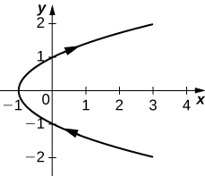 
* * *
{: data-type="newline"}

 orientation: bottom to top

<math xmlns="http://www.w3.org/1998/Math/MathML"><mrow><mi>x</mi><mo>=</mo><mtext>cos</mtext><mo stretchy="false">(</mo><mi>t</mi><mo stretchy="false">)</mo><mo>,</mo><mi>y</mi><mo>=</mo><mtext>sin</mtext><mo stretchy="false">(</mo><mi>t</mi><mo stretchy="false">)</mo><mo>,</mo><mrow><mo>(</mo><mrow><mn>0</mn><mo>,</mo><mn>2</mn><mi>π</mi></mrow><mo>]</mo></mrow></mrow></math>

<math xmlns="http://www.w3.org/1998/Math/MathML"><mrow><mi>x</mi><mo>=</mo><mn>2</mn><mi>t</mi><mo>+</mo><mn>4</mn><mo>,</mo><mi>y</mi><mo>=</mo><mi>t</mi><mo>−</mo><mn>1</mn></mrow></math>

* * *
{: data-type="newline"}

 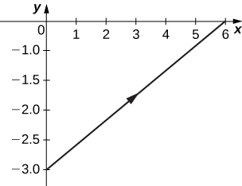 
* * *
{: data-type="newline"}

 orientation: left to right

<math xmlns="http://www.w3.org/1998/Math/MathML"><mrow><mi>x</mi><mo>=</mo><mn>3</mn><mo>−</mo><mi>t</mi><mo>,</mo><mi>y</mi><mo>=</mo><mn>2</mn><mi>t</mi><mo>−</mo><mn>3</mn><mo>,</mo><mn>1.5</mn><mo>≤</mo><mi>t</mi><mo>≤</mo><mn>3</mn></mrow></math>

For the following exercises, eliminate the parameter and sketch the graphs.

<math xmlns="http://www.w3.org/1998/Math/MathML"><mrow><mi>x</mi><mo>=</mo><mn>2</mn><msup><mi>t</mi><mn>2</mn></msup><mo>,</mo><mspace width="1em" /><mi>y</mi><mo>=</mo><msup><mi>t</mi><mn>4</mn></msup><mo>+</mo><mn>1</mn></mrow></math>

<math xmlns="http://www.w3.org/1998/Math/MathML"><mrow><mi>y</mi><mo>=</mo><mfrac><mrow><msup><mi>x</mi><mn>2</mn></msup></mrow><mn>4</mn></mfrac><mo>+</mo><mn>1</mn></mrow></math>

* * *
{: data-type="newline"}

 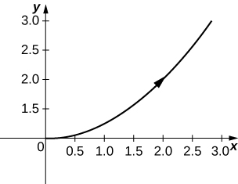 

For the following exercises, use technology (CAS or calculator) to sketch the parametric equations.

**[T]** <math xmlns="http://www.w3.org/1998/Math/MathML"><mrow><mtable><mtr><mtd columnalign="left"><mrow><mi>x</mi><mo>=</mo><msup><mi>t</mi><mn>2</mn></msup><mo>+</mo><mi>t</mi><mo>,</mo></mrow></mtd><mtd columnalign="left"><mrow><mi>y</mi><mo>=</mo><msup><mi>t</mi><mn>2</mn></msup><mo>−</mo><mn>1</mn></mrow></mtd></mtr></mtable></mrow></math>

**[T]** <math xmlns="http://www.w3.org/1998/Math/MathML"><mrow><mtable><mtr><mtd columnalign="left"><mrow><mi>x</mi><mo>=</mo><msup><mi>e</mi><mrow><mtext>−</mtext><mi>t</mi></mrow></msup><mo>,</mo></mrow></mtd><mtd columnalign="left"><mrow><mi>y</mi><mo>=</mo><msup><mi>e</mi><mrow><mn>2</mn><mi>t</mi></mrow></msup><mo>−</mo><mn>1</mn></mrow></mtd></mtr></mtable></mrow></math>

* * *
{: data-type="newline"}

 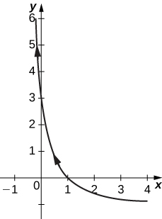 

**[T]** <math xmlns="http://www.w3.org/1998/Math/MathML"><mrow><mtable><mtr><mtd columnalign="left"><mrow><mi>x</mi><mo>=</mo><mn>3</mn><mspace width="0.2em" /><mtext>cos</mtext><mspace width="0.2em" /><mi>t</mi><mo>,</mo></mrow></mtd><mtd columnalign="left"><mrow><mi>y</mi><mo>=</mo><mn>4</mn><mspace width="0.2em" /><mtext>sin</mtext><mspace width="0.2em" /><mi>t</mi></mrow></mtd></mtr></mtable></mrow></math>

**[T]** <math xmlns="http://www.w3.org/1998/Math/MathML"><mrow><mtable><mtr><mtd columnalign="left"><mrow><mi>x</mi><mo>=</mo><mtext>sec</mtext><mspace width="0.2em" /><mi>t</mi><mo>,</mo></mrow></mtd><mtd columnalign="left"><mrow><mi>y</mi><mo>=</mo><mtext>cos</mtext><mspace width="0.2em" /><mi>t</mi></mrow></mtd></mtr></mtable></mrow></math>

* * *
{: data-type="newline"}

 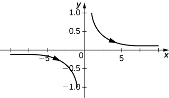 

For the following exercises, sketch the parametric equations by eliminating the parameter. Indicate any asymptotes of the graph.

<math xmlns="http://www.w3.org/1998/Math/MathML"><mrow><mi>x</mi><mo>=</mo><msup><mi>e</mi><mi>t</mi></msup><mo>,</mo><mspace width="1em" /><mi>y</mi><mo>=</mo><msup><mi>e</mi><mrow><mn>2</mn><mi>t</mi></mrow></msup><mo>+</mo><mn>1</mn></mrow></math>

<math xmlns="http://www.w3.org/1998/Math/MathML"><mrow><mi>x</mi><mo>=</mo><mn>6</mn><mspace width="0.2em" /><mtext>sin</mtext><mo stretchy="false">(</mo><mn>2</mn><mi>θ</mi><mo stretchy="false">)</mo><mo>,</mo><mi>y</mi><mo>=</mo><mn>4</mn><mspace width="0.2em" /><mtext>cos</mtext><mo stretchy="false">(</mo><mn>2</mn><mi>θ</mi><mo stretchy="false">)</mo></mrow></math>

* * *
{: data-type="newline"}

 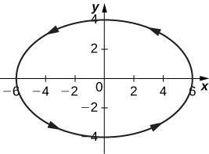 

<math xmlns="http://www.w3.org/1998/Math/MathML"><mrow><mtable><mtr><mtd columnalign="left"><mrow><mi>x</mi><mo>=</mo><mtext>cos</mtext><mspace width="0.2em" /><mi>θ</mi><mo>,</mo></mrow></mtd><mtd columnalign="left"><mrow><mi>y</mi><mo>=</mo><mn>2</mn><mspace width="0.2em" /><mtext>sin</mtext><mo stretchy="false">(</mo><mn>2</mn><mi>θ</mi><mo stretchy="false">)</mo></mrow></mtd></mtr></mtable></mrow></math>

<math xmlns="http://www.w3.org/1998/Math/MathML"><mrow><mtable><mtr><mtd columnalign="left"><mrow><mi>x</mi><mo>=</mo><mn>3</mn><mo>−</mo><mn>2</mn><mspace width="0.2em" /><mtext>cos</mtext><mspace width="0.2em" /><mi>θ</mi><mo>,</mo></mrow></mtd><mtd columnalign="left"><mrow><mi>y</mi><mo>=</mo><mn>−5</mn><mo>+</mo><mn>3</mn><mspace width="0.2em" /><mtext>sin</mtext><mspace width="0.2em" /><mi>θ</mi></mrow></mtd></mtr></mtable></mrow></math>

* * *
{: data-type="newline"}

 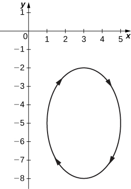 

<math xmlns="http://www.w3.org/1998/Math/MathML"><mrow><mtable><mtr><mtd columnalign="left"><mrow><mi>x</mi><mo>=</mo><mn>4</mn><mo>+</mo><mn>2</mn><mspace width="0.2em" /><mtext>cos</mtext><mspace width="0.2em" /><mi>θ</mi><mo>,</mo></mrow></mtd><mtd columnalign="left"><mrow><mi>y</mi><mo>=</mo><mn>−1</mn><mo>+</mo><mtext>sin</mtext><mspace width="0.2em" /><mi>θ</mi></mrow></mtd></mtr></mtable></mrow></math>

<math xmlns="http://www.w3.org/1998/Math/MathML"><mrow><mtable><mtr><mtd columnalign="left"><mrow><mi>x</mi><mo>=</mo><mtext>sec</mtext><mspace width="0.2em" /><mi>t</mi><mo>,</mo></mrow></mtd><mtd columnalign="left"><mrow><mi>y</mi><mo>=</mo><mtext>tan</mtext><mspace width="0.2em" /><mi>t</mi></mrow></mtd></mtr></mtable></mrow></math>

* * *
{: data-type="newline"}

 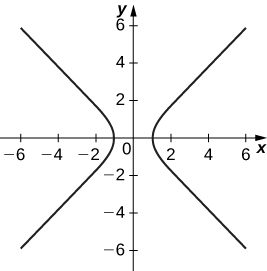 
* * *
{: data-type="newline"}

 Asymptotes are <math xmlns="http://www.w3.org/1998/Math/MathML"><mrow><mi>y</mi><mo>=</mo><mi>x</mi></mrow></math>

 and <math xmlns="http://www.w3.org/1998/Math/MathML"><mrow><mi>y</mi><mo>=</mo><mtext>−</mtext><mi>x</mi></mrow></math>

<math xmlns="http://www.w3.org/1998/Math/MathML"><mrow><mtable><mtr><mtd columnalign="left"><mrow><mi>x</mi><mo>=</mo><mtext>ln</mtext><mo stretchy="false">(</mo><mn>2</mn><mi>t</mi><mo stretchy="false">)</mo><mo>,</mo></mrow></mtd><mtd columnalign="left"><mrow><mi>y</mi><mo>=</mo><msup><mi>t</mi><mn>2</mn></msup></mrow></mtd></mtr></mtable></mrow></math>

<math xmlns="http://www.w3.org/1998/Math/MathML"><mrow><mtable><mtr><mtd columnalign="left"><mrow><mi>x</mi><mo>=</mo><msup><mi>e</mi><mi>t</mi></msup><mo>,</mo></mrow></mtd><mtd columnalign="left"><mrow><mi>y</mi><mo>=</mo><msup><mi>e</mi><mrow><mn>2</mn><mi>t</mi></mrow></msup></mrow></mtd></mtr></mtable></mrow></math>

* * *
{: data-type="newline"}

 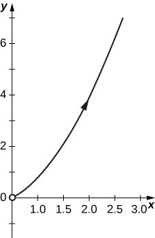 

<math xmlns="http://www.w3.org/1998/Math/MathML"><mrow><mtable><mtr><mtd columnalign="left"><mrow><mi>x</mi><mo>=</mo><msup><mi>e</mi><mrow><mn>−2</mn><mi>t</mi></mrow></msup><mo>,</mo></mrow></mtd><mtd columnalign="left"><mrow><mi>y</mi><mo>=</mo><msup><mi>e</mi><mrow><mn>3</mn><mi>t</mi></mrow></msup></mrow></mtd></mtr></mtable></mrow></math>

<math xmlns="http://www.w3.org/1998/Math/MathML"><mrow><mtable><mtr><mtd columnalign="left"><mrow><mi>x</mi><mo>=</mo><msup><mi>t</mi><mn>3</mn></msup><mo>,</mo></mrow></mtd><mtd columnalign="left"><mrow><mi>y</mi><mo>=</mo><mn>3</mn><mspace width="0.2em" /><mtext>ln</mtext><mspace width="0.2em" /><mi>t</mi></mrow></mtd></mtr></mtable></mrow></math>

* * *
{: data-type="newline"}

 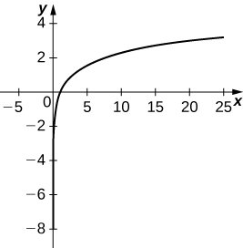 

<math xmlns="http://www.w3.org/1998/Math/MathML"><mrow><mtable><mtr><mtd columnalign="left"><mrow><mi>x</mi><mo>=</mo><mn>4</mn><mspace width="0.2em" /><mtext>sec</mtext><mspace width="0.2em" /><mi>θ</mi><mo>,</mo></mrow></mtd><mtd columnalign="left"><mrow><mi>y</mi><mo>=</mo><mn>3</mn><mspace width="0.2em" /><mtext>tan</mtext><mspace width="0.2em" /><mi>θ</mi></mrow></mtd></mtr></mtable></mrow></math>

For the following exercises, convert the parametric equations of a curve into rectangular form. No sketch is necessary. State the domain of the rectangular form.

<math xmlns="http://www.w3.org/1998/Math/MathML"><mrow><mtable><mtr><mtd columnalign="left"><mrow><mi>x</mi><mo>=</mo><msup><mi>t</mi><mn>2</mn></msup><mo>−</mo><mn>1</mn><mo>,</mo></mrow></mtd><mtd columnalign="left"><mrow><mi>y</mi><mo>=</mo><mfrac><mrow><mi>t</mi></mrow><mn>2</mn></mfrac></mrow></mtd></mtr></mtable></mrow></math>

<math xmlns="http://www.w3.org/1998/Math/MathML"><mrow><mi>x</mi><mo>=</mo><mn>4</mn><msup><mi>y</mi><mn>2</mn></msup><mo>−</mo><mn>1</mn><mo>;</mo></mrow></math>

 domain: <math xmlns="http://www.w3.org/1998/Math/MathML"><mrow><mi>x</mi><mo>∈</mo><mrow><mo>[</mo><mrow><mn>1</mn><mo>,</mo><mi>∞</mi></mrow><mo>)</mo></mrow><mo>.</mo></mrow></math>

<math xmlns="http://www.w3.org/1998/Math/MathML"><mrow><mtable><mtr><mtd columnalign="left"><mrow><mi>x</mi><mo>=</mo><mfrac><mn>1</mn><mrow><msqrt><mrow><mi>t</mi><mo>+</mo><mn>1</mn></mrow></msqrt></mrow></mfrac><mo>,</mo></mrow></mtd><mtd columnalign="left"><mrow><mi>y</mi><mo>=</mo><mfrac><mi>t</mi><mrow><mn>1</mn><mo>+</mo><mi>t</mi></mrow></mfrac><mo>,</mo><mi>t</mi><mo>&gt;</mo><mn>−1</mn></mrow></mtd></mtr></mtable></mrow></math>

<math xmlns="http://www.w3.org/1998/Math/MathML"><mrow><mi>x</mi><mo>=</mo><mn>4</mn><mspace width="0.2em" /><mtext>cos</mtext><mspace width="0.2em" /><mi>θ</mi><mo>,</mo><mi>y</mi><mo>=</mo><mn>3</mn><mspace width="0.2em" /><mtext>sin</mtext><mspace width="0.2em" /><mi>θ</mi><mo>,</mo><mi>t</mi><mo>∈</mo><mrow><mo>(</mo><mrow><mn>0</mn><mo>,</mo><mn>2</mn><mi>π</mi></mrow><mo>]</mo></mrow></mrow></math>

<math xmlns="http://www.w3.org/1998/Math/MathML"><mrow><mfrac><mrow><msup><mi>x</mi><mn>2</mn></msup></mrow><mrow><mn>16</mn></mrow></mfrac><mo>+</mo><mfrac><mrow><msup><mi>y</mi><mn>2</mn></msup></mrow><mn>9</mn></mfrac><mo>=</mo><mn>1</mn><mo>;</mo></mrow></math>

 domain <math xmlns="http://www.w3.org/1998/Math/MathML"><mrow><mi>x</mi><mo>∈</mo><mrow><mo>[</mo><mrow><mn>−4</mn><mo>,</mo><mn>4</mn></mrow><mo>]</mo></mrow><mo>.</mo></mrow></math>

<math xmlns="http://www.w3.org/1998/Math/MathML"><mrow><mtable><mtr><mtd columnalign="left"><mrow><mi>x</mi><mo>=</mo><mtext>cosh</mtext><mspace width="0.2em" /><mi>t</mi><mo>,</mo></mrow></mtd><mtd columnalign="left"><mrow><mi>y</mi><mo>=</mo><mtext>sinh</mtext><mspace width="0.2em" /><mi>t</mi></mrow></mtd></mtr></mtable></mrow></math>

<math xmlns="http://www.w3.org/1998/Math/MathML"><mrow><mtable><mtr><mtd columnalign="left"><mrow><mi>x</mi><mo>=</mo><mn>2</mn><mi>t</mi><mo>−</mo><mn>3</mn><mo>,</mo></mrow></mtd><mtd columnalign="left"><mrow><mi>y</mi><mo>=</mo><mn>6</mn><mi>t</mi><mo>−</mo><mn>7</mn></mrow></mtd></mtr></mtable></mrow></math>

<math xmlns="http://www.w3.org/1998/Math/MathML"><mrow><mi>y</mi><mo>=</mo><mn>3</mn><mi>x</mi><mo>+</mo><mn>2</mn><mo>;</mo></mrow></math>

 domain: all real numbers.

<math xmlns="http://www.w3.org/1998/Math/MathML"><mrow><mtable><mtr><mtd columnalign="left"><mrow><mi>x</mi><mo>=</mo><msup><mi>t</mi><mn>2</mn></msup><mo>,</mo></mrow></mtd><mtd columnalign="left"><mrow><mi>y</mi><mo>=</mo><msup><mi>t</mi><mn>3</mn></msup></mrow></mtd></mtr></mtable></mrow></math>

<math xmlns="http://www.w3.org/1998/Math/MathML"><mrow><mtable><mtr><mtd columnalign="left"><mrow><mi>x</mi><mo>=</mo><mn>1</mn><mo>+</mo><mtext>cos</mtext><mspace width="0.2em" /><mi>t</mi><mo>,</mo></mrow></mtd><mtd columnalign="left"><mrow><mi>y</mi><mo>=</mo><mn>3</mn><mo>−</mo><mtext>sin</mtext><mspace width="0.2em" /><mi>t</mi></mrow></mtd></mtr></mtable></mrow></math>

<math xmlns="http://www.w3.org/1998/Math/MathML"><mrow><msup><mrow><mo stretchy="false">(</mo><mi>x</mi><mo>−</mo><mn>1</mn><mo stretchy="false">)</mo></mrow><mn>2</mn></msup><mo>+</mo><msup><mrow><mo stretchy="false">(</mo><mi>y</mi><mo>−</mo><mn>3</mn><mo stretchy="false">)</mo></mrow><mn>2</mn></msup><mo>=</mo><mn>1</mn><mo>;</mo></mrow></math>

 domain: <math xmlns="http://www.w3.org/1998/Math/MathML"><mrow><mi>x</mi><mo>∈</mo><mrow><mo>[</mo><mrow><mn>0</mn><mo>,</mo><mn>2</mn></mrow><mo>]</mo></mrow><mo>.</mo></mrow></math>

<math xmlns="http://www.w3.org/1998/Math/MathML"><mrow><mtable><mtr><mtd columnalign="left"><mrow><mi>x</mi><mo>=</mo><msqrt><mi>t</mi></msqrt><mo>,</mo></mrow></mtd><mtd columnalign="left"><mrow><mi>y</mi><mo>=</mo><mn>2</mn><mi>t</mi><mo>+</mo><mn>4</mn></mrow></mtd></mtr></mtable></mrow></math>

<math xmlns="http://www.w3.org/1998/Math/MathML"><mrow><mtable><mtr><mtd columnalign="left"><mrow><mi>x</mi><mo>=</mo><mtext>sec</mtext><mspace width="0.2em" /><mi>t</mi><mo>,</mo></mrow></mtd><mtd columnalign="left"><mrow><mi>y</mi><mo>=</mo><mtext>tan</mtext><mspace width="0.2em" /><mi>t</mi><mo>,</mo><mi>π</mi><mo>≤</mo><mi>t</mi><mo>&lt;</mo><mfrac><mrow><mn>3</mn><mi>π</mi></mrow><mn>2</mn></mfrac></mrow></mtd></mtr></mtable></mrow></math>

<math xmlns="http://www.w3.org/1998/Math/MathML"><mrow><mi>y</mi><mo>=</mo><msqrt><mrow><msup><mi>x</mi><mn>2</mn></msup><mo>−</mo><mn>1</mn></mrow></msqrt><mo>;</mo></mrow></math>

 domain: <math xmlns="http://www.w3.org/1998/Math/MathML"><mrow><mi>x</mi><mo>∈</mo><mrow><mo>[</mo><mrow><mn>−1</mn><mo>,</mo><mn>1</mn></mrow><mo>]</mo></mrow><mo>.</mo></mrow></math>

<math xmlns="http://www.w3.org/1998/Math/MathML"><mrow><mtable><mtr><mtd columnalign="left"><mrow><mi>x</mi><mo>=</mo><mn>2</mn><mspace width="0.2em" /><mtext>cosh</mtext><mspace width="0.2em" /><mi>t</mi><mo>,</mo></mrow></mtd><mtd columnalign="left"><mrow><mi>y</mi><mo>=</mo><mn>4</mn><mspace width="0.2em" /><mtext>sinh</mtext><mspace width="0.2em" /><mi>t</mi></mrow></mtd></mtr></mtable></mrow></math>

<math xmlns="http://www.w3.org/1998/Math/MathML"><mrow><mtable><mtr><mtd columnalign="left"><mrow><mi>x</mi><mo>=</mo><mtext>cos</mtext><mo stretchy="false">(</mo><mn>2</mn><mi>t</mi><mo stretchy="false">)</mo><mo>,</mo></mrow></mtd><mtd columnalign="left"><mrow><mi>y</mi><mo>=</mo><mtext>sin</mtext><mspace width="0.2em" /><mi>t</mi></mrow></mtd></mtr></mtable></mrow></math>

<math xmlns="http://www.w3.org/1998/Math/MathML"><mrow><msup><mi>y</mi><mn>2</mn></msup><mo>=</mo><mfrac><mrow><mn>1</mn><mo>−</mo><mi>x</mi></mrow><mn>2</mn></mfrac><mo>;</mo></mrow></math>

 domain: <math xmlns="http://www.w3.org/1998/Math/MathML"><mrow><mi>x</mi><mo>∈</mo><mrow><mo>[</mo><mrow><mn>2</mn><mo>,</mo><mi>∞</mi></mrow><mo>)</mo></mrow><mo>∪</mo><mrow><mo>(</mo><mrow><mtext>−</mtext><mi>∞</mi><mo>,</mo><mn>−2</mn></mrow><mo>]</mo></mrow><mo>.</mo></mrow></math>

<math xmlns="http://www.w3.org/1998/Math/MathML"><mrow><mi>x</mi><mo>=</mo><mn>4</mn><mi>t</mi><mo>+</mo><mn>3</mn><mo>,</mo><mi>y</mi><mo>=</mo><mn>16</mn><msup><mi>t</mi><mn>2</mn></msup><mo>−</mo><mn>9</mn></mrow></math>

<math xmlns="http://www.w3.org/1998/Math/MathML"><mrow><mtable><mtr><mtd columnalign="left"><mrow><mi>x</mi><mo>=</mo><msup><mi>t</mi><mn>2</mn></msup><mo>,</mo></mrow></mtd><mtd columnalign="left"><mrow><mi>y</mi><mo>=</mo><mn>2</mn><mspace width="0.2em" /><mtext>ln</mtext><mspace width="0.2em" /><mi>t</mi><mo>,</mo><mi>t</mi><mo>≥</mo><mn>1</mn></mrow></mtd></mtr></mtable></mrow></math>

<math xmlns="http://www.w3.org/1998/Math/MathML"><mrow><mi>y</mi><mo>=</mo><mtext>ln</mtext><mspace width="0.2em" /><mi>x</mi><mo>;</mo></mrow></math>

 domain: <math xmlns="http://www.w3.org/1998/Math/MathML"><mrow><mi>x</mi><mo>∈</mo><mo stretchy="false">(</mo><mn>0</mn><mo>,</mo><mi>∞</mi><mo stretchy="false">)</mo><mo>.</mo></mrow></math>

<math xmlns="http://www.w3.org/1998/Math/MathML"><mrow><mtable><mtr><mtd columnalign="left"><mrow><mi>x</mi><mo>=</mo><msup><mi>t</mi><mn>3</mn></msup><mo>,</mo></mrow></mtd><mtd columnalign="left"><mrow><mi>y</mi><mo>=</mo><mn>3</mn><mspace width="0.2em" /><mtext>ln</mtext><mspace width="0.2em" /><mi>t</mi><mo>,</mo><mi>t</mi><mo>≥</mo><mn>1</mn></mrow></mtd></mtr></mtable></mrow></math>

<math xmlns="http://www.w3.org/1998/Math/MathML"><mrow><mtable><mtr><mtd columnalign="left"><mrow><mi>x</mi><mo>=</mo><msup><mi>t</mi><mi>n</mi></msup><mo>,</mo></mrow></mtd><mtd columnalign="left"><mrow><mi>y</mi><mo>=</mo><mi>n</mi><mspace width="0.2em" /><mtext>ln</mtext><mspace width="0.2em" /><mi>t</mi><mo>,</mo><mi>t</mi><mo>≥</mo><mn>1</mn><mo>,</mo></mrow></mtd></mtr></mtable></mrow></math>

 where *n* is a natural number

<math xmlns="http://www.w3.org/1998/Math/MathML"><mrow><mi>y</mi><mo>=</mo><mtext>ln</mtext><mspace width="0.2em" /><mi>x</mi><mo>;</mo></mrow></math>

 domain: <math xmlns="http://www.w3.org/1998/Math/MathML"><mrow><mi>x</mi><mo>∈</mo><mo stretchy="false">(</mo><mn>0</mn><mo>,</mo><mi>∞</mi><mo stretchy="false">)</mo><mo>.</mo></mrow></math>

<math xmlns="http://www.w3.org/1998/Math/MathML"><mtable><mtr><mtd columnalign="left"><mi>x</mi><mo>=</mo><mtext>ln</mtext><mo stretchy="false">(</mo><mn>5</mn><mi>t</mi><mo stretchy="false">)</mo></mtd></mtr><mtr><mtd columnalign="left"><mi>y</mi><mo>=</mo><mtext>ln</mtext><mo stretchy="false">(</mo><msup><mi>t</mi><mn>2</mn></msup><mo stretchy="false">)</mo></mtd></mtr></mtable></math>

 where <math xmlns="http://www.w3.org/1998/Math/MathML"><mrow><mn>1</mn><mo>≤</mo><mi>t</mi><mo>≤</mo><mi>e</mi></mrow></math>

<math xmlns="http://www.w3.org/1998/Math/MathML"><mtable><mtr><mtd columnalign="left"><mi>x</mi><mo>=</mo><mn>2</mn><mspace width="0.2em" /><mtext>sin</mtext><mo stretchy="false">(</mo><mn>8</mn><mi>t</mi><mo stretchy="false">)</mo></mtd></mtr><mtr><mtd columnalign="left"><mi>y</mi><mo>=</mo><mn>2</mn><mspace width="0.2em" /><mtext>cos</mtext><mo stretchy="false">(</mo><mn>8</mn><mi>t</mi><mo stretchy="false">)</mo></mtd></mtr></mtable></math>

<math xmlns="http://www.w3.org/1998/Math/MathML"><mrow><msup><mi>x</mi><mn>2</mn></msup><mo>+</mo><msup><mi>y</mi><mn>2</mn></msup><mo>=</mo><mn>4</mn><mo>;</mo></mrow></math>

 domain: <math xmlns="http://www.w3.org/1998/Math/MathML"><mrow><mi>x</mi><mo>∈</mo><mo stretchy="false">[</mo><mn>−2</mn><mo>,</mo><mn>2</mn><mo stretchy="false">]</mo><mo>.</mo></mrow></math>

<math xmlns="http://www.w3.org/1998/Math/MathML"><mtable><mtr><mtd columnalign="left"><mi>x</mi><mo>=</mo><mtext>tan</mtext><mspace width="0.2em" /><mi>t</mi></mtd></mtr><mtr><mtd columnalign="left"><mi>y</mi><mo>=</mo><msup><mtext>sec</mtext><mn>2</mn></msup><mi>t</mi><mo>−</mo><mn>1</mn></mtd></mtr></mtable></math>

For the following exercises, the pairs of parametric equations represent lines, parabolas, circles, ellipses, or hyperbolas. Name the type of basic curve that each pair of equations represents.

<math xmlns="http://www.w3.org/1998/Math/MathML"><mtable><mtr><mtd columnalign="left"><mi>x</mi><mo>=</mo><mn>3</mn><mi>t</mi><mo>+</mo><mn>4</mn></mtd></mtr><mtr><mtd columnalign="left"><mi>y</mi><mo>=</mo><mn>5</mn><mi>t</mi><mo>−</mo><mn>2</mn></mtd></mtr></mtable></math>

line

<math xmlns="http://www.w3.org/1998/Math/MathML"><mtable><mtr><mtd columnalign="left"><mi>x</mi><mo>−</mo><mn>4</mn><mo>=</mo><mn>5</mn><mi>t</mi></mtd></mtr><mtr><mtd columnalign="left"><mi>y</mi><mo>+</mo><mn>2</mn><mo>=</mo><mi>t</mi></mtd></mtr></mtable></math>

<math xmlns="http://www.w3.org/1998/Math/MathML"><mtable><mtr><mtd columnalign="left"><mi>x</mi><mo>=</mo><mn>2</mn><mi>t</mi><mo>+</mo><mn>1</mn></mtd></mtr><mtr><mtd columnalign="left"><mi>y</mi><mo>=</mo><msup><mi>t</mi><mn>2</mn></msup><mo>−</mo><mn>3</mn></mtd></mtr></mtable></math>

parabola

<math xmlns="http://www.w3.org/1998/Math/MathML"><mtable><mtr><mtd columnalign="left"><mi>x</mi><mo>=</mo><mn>3</mn><mspace width="0.2em" /><mtext>cos</mtext><mspace width="0.2em" /><mi>t</mi></mtd></mtr><mtr><mtd columnalign="left"><mi>y</mi><mo>=</mo><mn>3</mn><mspace width="0.2em" /><mtext>sin</mtext><mspace width="0.2em" /><mi>t</mi></mtd></mtr></mtable></math>

<math xmlns="http://www.w3.org/1998/Math/MathML"><mtable><mtr><mtd columnalign="left"><mi>x</mi><mo>=</mo><mn>2</mn><mspace width="0.2em" /><mtext>cos</mtext><mo stretchy="false">(</mo><mn>3</mn><mi>t</mi><mo stretchy="false">)</mo></mtd></mtr><mtr><mtd columnalign="left"><mi>y</mi><mo>=</mo><mn>2</mn><mspace width="0.2em" /><mtext>sin</mtext><mo stretchy="false">(</mo><mn>3</mn><mi>t</mi><mo stretchy="false">)</mo></mtd></mtr></mtable></math>

circle

<math xmlns="http://www.w3.org/1998/Math/MathML"><mtable><mtr><mtd columnalign="left"><mi>x</mi><mo>=</mo><mtext>cosh</mtext><mspace width="0.2em" /><mi>t</mi></mtd></mtr><mtr><mtd columnalign="left"><mi>y</mi><mo>=</mo><mtext>sinh</mtext><mspace width="0.2em" /><mi>t</mi></mtd></mtr></mtable></math>

<math xmlns="http://www.w3.org/1998/Math/MathML"><mtable><mtr><mtd columnalign="left"><mi>x</mi><mo>=</mo><mn>3</mn><mspace width="0.2em" /><mtext>cos</mtext><mspace width="0.2em" /><mi>t</mi></mtd></mtr><mtr><mtd columnalign="left"><mi>y</mi><mo>=</mo><mn>4</mn><mspace width="0.2em" /><mtext>sin</mtext><mspace width="0.2em" /><mi>t</mi></mtd></mtr></mtable></math>

ellipse

<math xmlns="http://www.w3.org/1998/Math/MathML"><mtable><mtr><mtd columnalign="left"><mi>x</mi><mo>=</mo><mn>2</mn><mspace width="0.2em" /><mtext>cos</mtext><mo stretchy="false">(</mo><mn>3</mn><mi>t</mi><mo stretchy="false">)</mo></mtd></mtr><mtr><mtd columnalign="left"><mi>y</mi><mo>=</mo><mn>5</mn><mspace width="0.2em" /><mtext>sin</mtext><mo stretchy="false">(</mo><mn>3</mn><mi>t</mi><mo stretchy="false">)</mo></mtd></mtr></mtable></math>

<math xmlns="http://www.w3.org/1998/Math/MathML"><mtable><mtr><mtd columnalign="left"><mi>x</mi><mo>=</mo><mn>3</mn><mspace width="0.2em" /><mtext>cosh</mtext><mo stretchy="false">(</mo><mn>4</mn><mi>t</mi><mo stretchy="false">)</mo></mtd></mtr><mtr><mtd columnalign="left"><mi>y</mi><mo>=</mo><mn>4</mn><mspace width="0.2em" /><mtext>sinh</mtext><mo stretchy="false">(</mo><mn>4</mn><mi>t</mi><mo stretchy="false">)</mo></mtd></mtr></mtable></math>

hyperbola

<math xmlns="http://www.w3.org/1998/Math/MathML"><mtable><mtr><mtd columnalign="left"><mi>x</mi><mo>=</mo><mn>2</mn><mspace width="0.2em" /><mtext>cosh</mtext><mspace width="0.2em" /><mi>t</mi></mtd></mtr><mtr><mtd columnalign="left"><mi>y</mi><mo>=</mo><mn>2</mn><mspace width="0.2em" /><mtext>sinh</mtext><mspace width="0.2em" /><mi>t</mi></mtd></mtr></mtable></math>

Show that <math xmlns="http://www.w3.org/1998/Math/MathML"><mtable><mtr><mtd columnalign="left"><mi>x</mi><mo>=</mo><mi>h</mi><mo>+</mo><mi>r</mi><mspace width="0.2em" /><mtext>cos</mtext><mspace width="0.2em" /><mi>θ</mi></mtd></mtr><mtr><mtd columnalign="left"><mi>y</mi><mo>=</mo><mi>k</mi><mo>+</mo><mi>r</mi><mspace width="0.2em" /><mtext>sin</mtext><mspace width="0.2em" /><mi>θ</mi></mtd></mtr></mtable></math>

 represents the equation of a circle.

Use the equations in the preceding problem to find a set of parametric equations for a circle whose radius is 5 and whose center is <math xmlns="http://www.w3.org/1998/Math/MathML"><mrow><mrow><mo>(</mo><mrow><mn>−2</mn><mo>,</mo><mspace width="0.2em" /><mn>3</mn></mrow><mo>)</mo></mrow><mo>.</mo></mrow></math>

For the following exercises, use a graphing utility to graph the curve represented by the parametric equations and identify the curve from its equation.

**[T]** <math xmlns="http://www.w3.org/1998/Math/MathML"><mtable><mtr><mtd columnalign="left"><mi>x</mi><mo>=</mo><mi>θ</mi><mo>+</mo><mtext>sin</mtext><mspace width="0.2em" /><mi>θ</mi></mtd></mtr><mtr><mtd columnalign="left"><mi>y</mi><mo>=</mo><mn>1</mn><mo>−</mo><mtext>cos</mtext><mspace width="0.2em" /><mi>θ</mi></mtd></mtr></mtable></math>

The equations represent a cycloid.* * *
{: data-type="newline"}

  

**[T]** <math xmlns="http://www.w3.org/1998/Math/MathML"><mtable><mtr><mtd columnalign="left"><mi>x</mi><mo>=</mo><mn>2</mn><mi>t</mi><mo>−</mo><mn>2</mn><mspace width="0.2em" /><mtext>sin</mtext><mspace width="0.2em" /><mi>t</mi></mtd></mtr><mtr><mtd columnalign="left"><mi>y</mi><mo>=</mo><mn>2</mn><mo>−</mo><mn>2</mn><mspace width="0.2em" /><mtext>cos</mtext><mspace width="0.2em" /><mi>t</mi></mtd></mtr></mtable></math>

**[T]** <math xmlns="http://www.w3.org/1998/Math/MathML"><mtable><mtr><mtd columnalign="left"><mi>x</mi><mo>=</mo><mi>t</mi><mo>−</mo><mn>0.5</mn><mspace width="0.2em" /><mtext>sin</mtext><mspace width="0.2em" /><mi>t</mi></mtd></mtr><mtr><mtd columnalign="left"><mi>y</mi><mo>=</mo><mn>1</mn><mo>−</mo><mn>1.5</mn><mspace width="0.2em" /><mtext>cos</mtext><mspace width="0.2em" /><mi>t</mi></mtd></mtr></mtable></math>

* * *
{: data-type="newline"}

 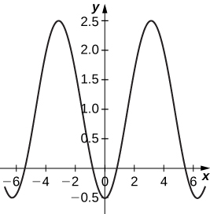 

An airplane traveling horizontally at 100 m/s over flat ground at an elevation of 4000 meters must drop an emergency package on a target on the ground. The trajectory of the package is given by <math xmlns="http://www.w3.org/1998/Math/MathML"><mrow><mi>x</mi><mo>=</mo><mn>100</mn><mi>t</mi><mo>,</mo><mi>y</mi><mo>=</mo><mn>−4.9</mn><msup><mi>t</mi><mn>2</mn></msup><mo>+</mo><mn>4000</mn><mo>,</mo><mi>t</mi><mo>≥</mo><mn>0</mn></mrow></math>

 where the origin is the point on the ground directly beneath the plane at the moment of release. How many horizontal meters before the target should the package be released in order to hit the target?

The trajectory of a bullet is given by <math xmlns="http://www.w3.org/1998/Math/MathML"><mrow><mi>x</mi><mo>=</mo><msub><mi>v</mi><mn>0</mn></msub><mrow><mo>(</mo><mrow><mtext>cos</mtext><mspace width="0.2em" /><mi>α</mi></mrow><mo>)</mo></mrow><mspace width="0.2em" /><mi>t</mi><mi>y</mi><mo>=</mo><msub><mi>v</mi><mn>0</mn></msub><mrow><mo>(</mo><mrow><mtext>sin</mtext><mspace width="0.2em" /><mi>α</mi></mrow><mo>)</mo></mrow><mspace width="0.2em" /><mi>t</mi><mo>−</mo><mfrac><mn>1</mn><mn>2</mn></mfrac><mi>g</mi><msup><mi>t</mi><mn>2</mn></msup></mrow></math>

 where <math xmlns="http://www.w3.org/1998/Math/MathML"><mrow><msub><mi>v</mi><mn>0</mn></msub><mo>=</mo><mn>500</mn><mspace width="0.2em" /><mtext>m/s,</mtext></mrow></math>

 <math xmlns="http://www.w3.org/1998/Math/MathML"><mrow><mi>g</mi><mo>=</mo><mn>9.8</mn><mo>=</mo><mn>9.8</mn><msup><mrow><mspace width="0.2em" /><mtext>m/s</mtext></mrow><mn>2</mn></msup><mo>,</mo></mrow></math>

 and <math xmlns="http://www.w3.org/1998/Math/MathML"><mrow><mi>α</mi><mo>=</mo><mn>30</mn><mspace width="0.2em" /><mtext>degrees</mtext><mo>.</mo></mrow></math>

 When will the bullet hit the ground? How far from the gun will the bullet hit the ground?

22,092 meters at approximately 51 seconds.

**[T]** Use technology to sketch the curve represented by <math xmlns="http://www.w3.org/1998/Math/MathML"><mrow><mi>x</mi><mo>=</mo><mtext>sin</mtext><mo stretchy="false">(</mo><mn>4</mn><mi>t</mi><mo stretchy="false">)</mo><mo>,</mo><mi>y</mi><mo>=</mo><mtext>sin</mtext><mo stretchy="false">(</mo><mn>3</mn><mi>t</mi><mo stretchy="false">)</mo><mo>,</mo><mn>0</mn><mo>≤</mo><mi>t</mi><mo>≤</mo><mn>2</mn><mi>π</mi><mo>.</mo></mrow></math>

**[T]** Use technology to sketch <math xmlns="http://www.w3.org/1998/Math/MathML"><mrow><mi>x</mi><mo>=</mo><mn>2</mn><mspace width="0.2em" /><mtext>tan</mtext><mo stretchy="false">(</mo><mi>t</mi><mo stretchy="false">)</mo><mo>,</mo><mi>y</mi><mo>=</mo><mn>3</mn><mspace width="0.2em" /><mtext>sec</mtext><mo stretchy="false">(</mo><mi>t</mi><mo stretchy="false">)</mo><mo>,</mo><mtext>−</mtext><mi>π</mi><mo>&lt;</mo><mi>t</mi><mo>&lt;</mo><mi>π</mi><mo>.</mo></mrow></math>

* * *
{: data-type="newline"}

 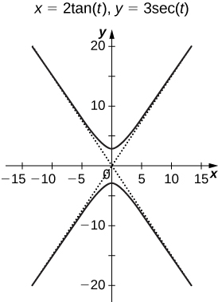 

Sketch the curve known as an ***epitrochoid***{: data-type="term" .no-emphasis}, which gives the path of a point on a circle of radius *b* as it rolls on the outside of a circle of radius *a*. The equations are

<math xmlns="http://www.w3.org/1998/Math/MathML"><mtable><mtr /><mtr /><mtr><mtd columnalign="left"><mi>x</mi><mo>=</mo><mo stretchy="false">(</mo><mi>a</mi><mo>+</mo><mi>b</mi><mo stretchy="false">)</mo><mtext>cos</mtext><mspace width="0.2em" /><mi>t</mi><mo>−</mo><mi>c</mi><mo>·</mo><mtext>cos</mtext><mrow><mo>[</mo><mrow><mfrac><mrow><mo stretchy="false">(</mo><mi>a</mi><mo>+</mo><mi>b</mi><mo stretchy="false">)</mo><mi>t</mi></mrow><mi>b</mi></mfrac></mrow><mo>]</mo></mrow></mtd></mtr><mtr><mtd columnalign="left"><mi>y</mi><mo>=</mo><mo stretchy="false">(</mo><mi>a</mi><mo>+</mo><mi>b</mi><mo stretchy="false">)</mo><mtext>sin</mtext><mspace width="0.2em" /><mi>t</mi><mo>−</mo><mi>c</mi><mo>·</mo><mtext>sin</mtext><mrow><mo>[</mo><mrow><mfrac><mrow><mo stretchy="false">(</mo><mi>a</mi><mo>+</mo><mi>b</mi><mo stretchy="false">)</mo><mi>t</mi></mrow><mi>b</mi></mfrac></mrow><mo>]</mo></mrow><mo>.</mo></mtd></mtr></mtable></math>

* * *
{: data-type="newline"}

 Let <math xmlns="http://www.w3.org/1998/Math/MathML"><mrow><mi>a</mi><mo>=</mo><mn>1</mn><mo>,</mo><mi>b</mi><mo>=</mo><mn>2</mn><mo>,</mo><mi>c</mi><mo>=</mo><mn>1</mn><mo>.</mo></mrow></math>

**[T]** Use technology to sketch the spiral curve given by <math xmlns="http://www.w3.org/1998/Math/MathML"><mrow><mi>x</mi><mo>=</mo><mi>t</mi><mspace width="0.2em" /><mtext>cos</mtext><mo stretchy="false">(</mo><mi>t</mi><mo stretchy="false">)</mo><mo>,</mo><mi>y</mi><mo>=</mo><mi>t</mi><mspace width="0.2em" /><mtext>sin</mtext><mo stretchy="false">(</mo><mi>t</mi><mo stretchy="false">)</mo></mrow></math>

 from <math xmlns="http://www.w3.org/1998/Math/MathML"><mrow><mn>−2</mn><mi>π</mi><mo>≤</mo><mi>t</mi><mo>≤</mo><mn>2</mn><mi>π</mi><mo>.</mo></mrow></math>

* * *
{: data-type="newline"}

  

**[T]** Use technology to graph the curve given by the parametric equations <math xmlns="http://www.w3.org/1998/Math/MathML"><mrow><mi>x</mi><mo>=</mo><mn>2</mn><mspace width="0.2em" /><mtext>cot</mtext><mo stretchy="false">(</mo><mi>t</mi><mo stretchy="false">)</mo><mo>,</mo><mi>y</mi><mo>=</mo><mn>1</mn><mo>−</mo><mtext>cos</mtext><mo stretchy="false">(</mo><mn>2</mn><mi>t</mi><mo stretchy="false">)</mo><mo>,</mo><mtext>−</mtext><mi>π</mi><mtext>/</mtext><mn>2</mn><mo>≤</mo><mi>t</mi><mo>≤</mo><mi>π</mi><mtext>/</mtext><mn>2</mn><mo>.</mo></mrow></math>

 This curve is known as the witch of Agnesi.

**[T]** Sketch the curve given by parametric equations <math xmlns="http://www.w3.org/1998/Math/MathML"><mtable><mtr><mtd columnalign="left"><mi>x</mi><mo>=</mo><mtext>cosh</mtext><mo stretchy="false">(</mo><mi>t</mi><mo stretchy="false">)</mo></mtd></mtr><mtr><mtd columnalign="left"><mi>y</mi><mo>=</mo><mtext>sinh</mtext><mo stretchy="false">(</mo><mi>t</mi><mo stretchy="false">)</mo><mo>,</mo></mtd></mtr></mtable></math>

 where <math xmlns="http://www.w3.org/1998/Math/MathML"><mrow><mn>−2</mn><mo>≤</mo><mi>t</mi><mo>≤</mo><mn>2</mn><mo>.</mo></mrow></math>

* * *
{: data-type="newline"}

 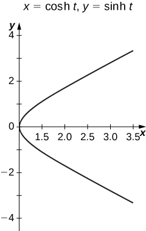 

</section>

### Glossary
{: data-type="glossary-title"}

cycloid
: the curve traced by a point on the rim of a circular wheel as the wheel rolls along a straight line without slippage
^

cusp
: a pointed end or part where two curves meet
^

orientation
: the direction that a point moves on a graph as the parameter increases
^

parameter
: an independent variable that both *x* and *y* depend on in a parametric curve; usually represented by the variable *t*
^

parametric curve
: the graph of the parametric equations
  <math xmlns="http://www.w3.org/1998/Math/MathML"><mrow><mi>x</mi><mrow><mo>(</mo><mi>t</mi><mo>)</mo></mrow></mrow></math>
  
  and
  <math xmlns="http://www.w3.org/1998/Math/MathML"><mrow><mi>y</mi><mrow><mo>(</mo><mi>t</mi><mo>)</mo></mrow></mrow></math>
  
  over an interval
  <math xmlns="http://www.w3.org/1998/Math/MathML"><mrow><mi>a</mi><mo>≤</mo><mi>t</mi><mo>≤</mo><mi>b</mi></mrow></math>
  
  combined with the equations
^

parametric equations
: the equations
  <math xmlns="http://www.w3.org/1998/Math/MathML"><mrow><mi>x</mi><mo>=</mo><mi>x</mi><mrow><mo>(</mo><mi>t</mi><mo>)</mo></mrow></mrow></math>
  
  and
  <math xmlns="http://www.w3.org/1998/Math/MathML"><mrow><mi>y</mi><mo>=</mo><mi>y</mi><mrow><mo>(</mo><mi>t</mi><mo>)</mo></mrow></mrow></math>
  
  that define a parametric curve
^

parameterization of a curve
: rewriting the equation of a curve defined by a function
  <math xmlns="http://www.w3.org/1998/Math/MathML"><mrow><mi>y</mi><mo>=</mo><mi>f</mi><mrow><mo>(</mo><mi>x</mi><mo>)</mo></mrow></mrow></math>
  
  as parametric equations

