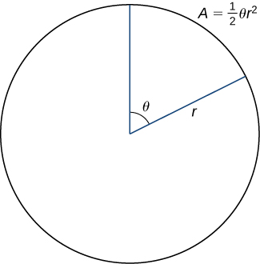

* Apply the formula for area of a region in polar coordinates.
* Determine the arc length of a polar curve.

In the rectangular coordinate system, the definite integral provides a way to calculate the area under a curve. In particular, if we have a function <math xmlns="http://www.w3.org/1998/Math/MathML"><mrow><mi>y</mi><mo>=</mo><mi>f</mi><mo stretchy="false">(</mo><mi>x</mi><mo stretchy="false">)</mo></mrow></math>

 defined from <math xmlns="http://www.w3.org/1998/Math/MathML"><mrow><mi>x</mi><mo>=</mo><mi>a</mi></mrow></math>

 to <math xmlns="http://www.w3.org/1998/Math/MathML"><mrow><mi>x</mi><mo>=</mo><mi>b</mi></mrow></math>

 where <math xmlns="http://www.w3.org/1998/Math/MathML"><mrow><mi>f</mi><mrow><mo>(</mo><mi>x</mi><mo>)</mo></mrow><mo>&gt;</mo><mn>0</mn></mrow></math>

 on this interval, the area between the curve and the *x*-axis is given by <math xmlns="http://www.w3.org/1998/Math/MathML"><mrow><mi>A</mi><mo>=</mo><mstyle displaystyle="true"><mrow><msubsup><mo stretchy="false">∫</mo><mi>a</mi><mi>b</mi></msubsup><mrow><mi>f</mi><mrow><mo>(</mo><mi>x</mi><mo>)</mo></mrow><mspace width="0.2em" /><mi>d</mi><mi>x</mi></mrow></mrow></mstyle><mo>.</mo></mrow></math>

 This fact, along with the formula for evaluating this integral, is summarized in the Fundamental Theorem of Calculus. Similarly, the arc length of this curve is given by <math xmlns="http://www.w3.org/1998/Math/MathML"><mrow><mi>L</mi><mo>=</mo><mstyle displaystyle="true"><mrow><msubsup><mo stretchy="false">∫</mo><mi>a</mi><mi>b</mi></msubsup><mrow><msqrt><mrow><mn>1</mn><mo>+</mo><msup><mrow><mrow><mo>(</mo><mrow><msup><mi>f</mi><mo>′</mo></msup><mrow><mo>(</mo><mi>x</mi><mo>)</mo></mrow></mrow><mo>)</mo></mrow></mrow><mn>2</mn></msup></mrow></msqrt><mi>d</mi><mi>x</mi></mrow></mrow></mstyle><mo>.</mo></mrow></math>

 In this section, we study analogous formulas for area and arc length in the polar coordinate system.

# Areas of Regions Bounded by Polar Curves

We have studied the formulas for area under a curve defined in rectangular coordinates and parametrically defined curves. Now we turn our attention to deriving a formula for the area of a region bounded by a polar curve. Recall that the proof of the Fundamental Theorem of Calculus used the concept of a Riemann sum to approximate the area under a curve by using rectangles. For polar curves we use the Riemann sum again, but the rectangles are replaced by sectors of a circle.

Consider a curve defined by the function <math xmlns="http://www.w3.org/1998/Math/MathML"><mrow><mi>r</mi><mo>=</mo><mi>f</mi><mrow><mo>(</mo><mi>θ</mi><mo>)</mo></mrow><mo>,</mo></mrow></math>

 where <math xmlns="http://www.w3.org/1998/Math/MathML"><mrow><mi>α</mi><mo>≤</mo><mi>θ</mi><mo>≤</mo><mi>β</mi><mo>.</mo></mrow></math>

 Our first step is to partition the interval <math xmlns="http://www.w3.org/1998/Math/MathML"><mrow><mo stretchy="false">[</mo><mi>α</mi><mo>,</mo><mi>β</mi><mo stretchy="false">]</mo></mrow></math>

 into *n* equal-width subintervals. The width of each subinterval is given by the formula <math xmlns="http://www.w3.org/1998/Math/MathML"><mrow><mtext>Δ</mtext><mi>θ</mi><mo>=</mo><mrow><mrow><mo stretchy="false">(</mo><mi>β</mi><mo>−</mo><mi>α</mi><mo stretchy="false">)</mo></mrow><mtext>/</mtext><mi>n</mi></mrow><mo>,</mo></mrow></math>

 and the *i*th partition point <math xmlns="http://www.w3.org/1998/Math/MathML"><mrow><msub><mi>θ</mi><mi>i</mi></msub></mrow></math>

 is given by the formula <math xmlns="http://www.w3.org/1998/Math/MathML"><mrow><msub><mi>θ</mi><mi>i</mi></msub><mo>=</mo><mi>α</mi><mo>+</mo><mi>i</mi><mtext>Δ</mtext><mi>θ</mi><mo>.</mo></mrow></math>

 Each partition point <math xmlns="http://www.w3.org/1998/Math/MathML"><mrow><mi>θ</mi><mo>=</mo><msub><mi>θ</mi><mi>i</mi></msub></mrow></math>

 defines a line with slope <math xmlns="http://www.w3.org/1998/Math/MathML"><mrow><mtext>tan</mtext><msub><mi>θ</mi><mi>i</mi></msub></mrow></math>

 passing through the pole as shown in the following graph.

 {: #CNX_Calc_Figure_11_04_001}

The line segments are connected by arcs of constant radius. This defines sectors whose areas can be calculated by using a geometric formula. The area of each sector is then used to approximate the area between successive line segments. We then sum the areas of the sectors to approximate the total area. This approach gives a Riemann sum approximation for the total area. The formula for the area of a sector of a circle is illustrated in the following figure.

 {: #CNX_Calc_Figure_11_04_002}

Recall that the area of a circle is <math xmlns="http://www.w3.org/1998/Math/MathML"><mrow><mi>A</mi><mo>=</mo><mi>π</mi><msup><mi>r</mi><mn>2</mn></msup><mo>.</mo></mrow></math>

 When measuring angles in radians, 360 degrees is equal to <math xmlns="http://www.w3.org/1998/Math/MathML"><mrow><mn>2</mn><mi>π</mi></mrow></math>

 radians. Therefore a fraction of a circle can be measured by the central angle <math xmlns="http://www.w3.org/1998/Math/MathML"><mrow><mi>θ</mi><mo>.</mo></mrow></math>

 The fraction of the circle is given by <math xmlns="http://www.w3.org/1998/Math/MathML"><mrow><mfrac><mi>θ</mi><mrow><mn>2</mn><mi>π</mi></mrow></mfrac><mo>,</mo></mrow></math>

 so the area of the sector is this fraction multiplied by the total area:

<math xmlns="http://www.w3.org/1998/Math/MathML"><mrow><mi>A</mi><mo>=</mo><mrow><mo>(</mo><mrow><mfrac><mi>θ</mi><mrow><mn>2</mn><mi>π</mi></mrow></mfrac></mrow><mo>)</mo></mrow><mspace width="0.2em" /><mi>π</mi><msup><mi>r</mi><mn>2</mn></msup><mo>=</mo><mfrac><mn>1</mn><mn>2</mn></mfrac><mi>θ</mi><msup><mi>r</mi><mn>2</mn></msup><mo>.</mo></mrow></math>

Since the radius of a typical sector in [\[link\]](#CNX_Calc_Figure_11_04_001) is given by <math xmlns="http://www.w3.org/1998/Math/MathML"><mrow><msub><mi>r</mi><mi>i</mi></msub><mo>=</mo><mi>f</mi><mrow><mo>(</mo><mrow><msub><mi>θ</mi><mi>i</mi></msub></mrow><mo>)</mo></mrow><mo>,</mo></mrow></math>

 the area of the *i*th sector is given by

<math xmlns="http://www.w3.org/1998/Math/MathML"><mrow><msub><mi>A</mi><mi>i</mi></msub><mo>=</mo><mfrac><mn>1</mn><mn>2</mn></mfrac><mrow><mo>(</mo><mrow><mtext>Δ</mtext><mi>θ</mi></mrow><mo>)</mo></mrow><msup><mrow><mrow><mo>(</mo><mrow><mi>f</mi><mrow><mo>(</mo><mrow><msub><mi>θ</mi><mi>i</mi></msub></mrow><mo>)</mo></mrow></mrow><mo>)</mo></mrow></mrow><mn>2</mn></msup><mo>.</mo></mrow></math>

Therefore a Riemann sum that approximates the area is given by

<math xmlns="http://www.w3.org/1998/Math/MathML"><mrow><msub><mi>A</mi><mi>n</mi></msub><mo>=</mo><mstyle displaystyle="true"><munderover><mo>∑</mo><mrow><mi>i</mi><mo>=</mo><mn>1</mn></mrow><mi>n</mi></munderover><mrow><msub><mi>A</mi><mi>i</mi></msub></mrow></mstyle><mo>≈</mo><mstyle displaystyle="true"><munderover><mo>∑</mo><mrow><mi>i</mi><mo>=</mo><mn>1</mn></mrow><mi>n</mi></munderover><mrow><mfrac><mn>1</mn><mn>2</mn></mfrac><mrow><mo>(</mo><mrow><mtext>Δ</mtext><mi>θ</mi></mrow><mo>)</mo></mrow><msup><mrow><mrow><mo>(</mo><mrow><mi>f</mi><mrow><mo>(</mo><mrow><msub><mi>θ</mi><mi>i</mi></msub></mrow><mo>)</mo></mrow></mrow><mo>)</mo></mrow></mrow><mn>2</mn></msup></mrow></mstyle><mo>.</mo></mrow></math>

We take the limit as <math xmlns="http://www.w3.org/1998/Math/MathML"><mrow><mi>n</mi><mo stretchy="false">→</mo><mi>∞</mi></mrow></math>

 to get the exact area:

<math xmlns="http://www.w3.org/1998/Math/MathML"><mrow><mi>A</mi><mo>=</mo><munder><mrow><mtext>lim</mtext></mrow><mrow><mi>n</mi><mo stretchy="false">→</mo><mi>∞</mi></mrow></munder><msub><mi>A</mi><mi>n</mi></msub><mo>=</mo><mfrac><mn>1</mn><mn>2</mn></mfrac><mstyle displaystyle="true"><mrow><msubsup><mo stretchy="false">∫</mo><mi>α</mi><mi>β</mi></msubsup><mrow><msup><mrow><mrow><mo>(</mo><mrow><mi>f</mi><mrow><mo>(</mo><mi>θ</mi><mo>)</mo></mrow></mrow><mo>)</mo></mrow></mrow><mn>2</mn></msup><mi>d</mi><mi>θ</mi></mrow></mrow></mstyle><mo>.</mo></mrow></math>

This gives the following theorem.

Area of a Region Bounded by a Polar Curve

Suppose <math xmlns="http://www.w3.org/1998/Math/MathML"><mi>f</mi></math>

 is continuous and nonnegative on the interval <math xmlns="http://www.w3.org/1998/Math/MathML"><mrow><mi>α</mi><mo>≤</mo><mi>θ</mi><mo>≤</mo><mi>β</mi></mrow></math>

 with <math xmlns="http://www.w3.org/1998/Math/MathML"><mrow><mn>0</mn><mo>&lt;</mo><mi>β</mi><mo>−</mo><mi>α</mi><mo>≤</mo><mn>2</mn><mi>π</mi><mo>.</mo></mrow></math>

 The area of the region bounded by the graph of <math xmlns="http://www.w3.org/1998/Math/MathML"><mrow><mi>r</mi><mo>=</mo><mi>f</mi><mrow><mo>(</mo><mi>θ</mi><mo>)</mo></mrow></mrow></math>

 between the radial lines <math xmlns="http://www.w3.org/1998/Math/MathML"><mrow><mi>θ</mi><mo>=</mo><mi>α</mi></mrow></math>

 and <math xmlns="http://www.w3.org/1998/Math/MathML"><mrow><mi>θ</mi><mo>=</mo><mi>β</mi></mrow></math>

 is

<math xmlns="http://www.w3.org/1998/Math/MathML"><mrow><mi>A</mi><mo>=</mo><mfrac><mn>1</mn><mn>2</mn></mfrac><mstyle displaystyle="true"><mrow><msubsup><mo stretchy="false">∫</mo><mi>α</mi><mi>β</mi></msubsup><mrow><msup><mrow><mrow><mo>[</mo><mrow><mi>f</mi><mrow><mo>(</mo><mi>θ</mi><mo>)</mo></mrow></mrow><mo>]</mo></mrow></mrow><mn>2</mn></msup><mi>d</mi><mi>θ</mi></mrow></mrow></mstyle><mo>=</mo><mfrac><mn>1</mn><mn>2</mn></mfrac><mstyle displaystyle="true"><mrow><msubsup><mo stretchy="false">∫</mo><mi>α</mi><mi>β</mi></msubsup><mrow><msup><mi>r</mi><mn>2</mn></msup><mi>d</mi><mi>θ</mi></mrow></mrow></mstyle><mo>.</mo></mrow></math>

Finding an Area of a Polar Region

Find the area of one petal of the rose defined by the equation <math xmlns="http://www.w3.org/1998/Math/MathML"><mrow><mi>r</mi><mo>=</mo><mn>3</mn><mspace width="0.2em" /><mtext>sin</mtext><mrow><mo>(</mo><mrow><mn>2</mn><mi>θ</mi></mrow><mo>)</mo></mrow><mo>.</mo></mrow></math>

The graph of <math xmlns="http://www.w3.org/1998/Math/MathML"><mrow><mi>r</mi><mo>=</mo><mn>3</mn><mspace width="0.2em" /><mtext>sin</mtext><mrow><mo>(</mo><mrow><mn>2</mn><mi>θ</mi></mrow><mo>)</mo></mrow></mrow></math>

 follows.

."){: #CNX_Calc_Figure_11_04_003}

When <math xmlns="http://www.w3.org/1998/Math/MathML"><mrow><mi>θ</mi><mo>=</mo><mn>0</mn></mrow></math>

 we have <math xmlns="http://www.w3.org/1998/Math/MathML"><mrow><mi>r</mi><mo>=</mo><mn>3</mn><mspace width="0.2em" /><mtext>sin</mtext><mrow><mo>(</mo><mrow><mn>2</mn><mo stretchy="false">(</mo><mn>0</mn><mo stretchy="false">)</mo></mrow><mo>)</mo></mrow><mo>=</mo><mn>0</mn><mo>.</mo></mrow></math>

 The next value for which <math xmlns="http://www.w3.org/1998/Math/MathML"><mrow><mi>r</mi><mo>=</mo><mn>0</mn></mrow></math>

 is <math xmlns="http://www.w3.org/1998/Math/MathML"><mrow><mi>θ</mi><mo>=</mo><mi>π</mi><mtext>/</mtext><mn>2</mn><mo>.</mo></mrow></math>

 This can be seen by solving the equation <math xmlns="http://www.w3.org/1998/Math/MathML"><mrow><mn>3</mn><mspace width="0.2em" /><mtext>sin</mtext><mo stretchy="false">(</mo><mn>2</mn><mi>θ</mi><mo stretchy="false">)</mo><mo>=</mo><mn>0</mn></mrow></math>

 for <math xmlns="http://www.w3.org/1998/Math/MathML"><mrow><mi>θ</mi><mo>.</mo></mrow></math>

 Therefore the values <math xmlns="http://www.w3.org/1998/Math/MathML"><mrow><mi>θ</mi><mo>=</mo><mn>0</mn></mrow></math>

 to <math xmlns="http://www.w3.org/1998/Math/MathML"><mrow><mi>θ</mi><mo>=</mo><mi>π</mi><mtext>/</mtext><mn>2</mn></mrow></math>

 trace out the first petal of the rose. To find the area inside this petal, use [[link]](#fs-id1167793300455) with <math xmlns="http://www.w3.org/1998/Math/MathML"><mrow><mi>f</mi><mrow><mo>(</mo><mi>θ</mi><mo>)</mo></mrow><mo>=</mo><mn>3</mn><mspace width="0.2em" /><mtext>sin</mtext><mrow><mo>(</mo><mrow><mn>2</mn><mi>θ</mi></mrow><mo>)</mo></mrow><mo>,</mo></mrow></math>

 <math xmlns="http://www.w3.org/1998/Math/MathML"><mrow><mi>α</mi><mo>=</mo><mn>0</mn><mo>,</mo></mrow></math>

 and <math xmlns="http://www.w3.org/1998/Math/MathML"><mrow><mi>β</mi><mo>=</mo><mi>π</mi><mtext>/</mtext><mn>2</mn><mtext>:</mtext></mrow></math>

<math xmlns="http://www.w3.org/1998/Math/MathML"><mtable><mtr><mtd columnalign="right"><mi>A</mi></mtd><mtd columnalign="left"><mo>=</mo><mfrac><mn>1</mn><mn>2</mn></mfrac><mstyle displaystyle="true"><mrow><msubsup><mo stretchy="false">∫</mo><mi>α</mi><mi>β</mi></msubsup><mrow><msup><mrow><mrow><mo>[</mo><mrow><mi>f</mi><mrow><mo>(</mo><mi>θ</mi><mo>)</mo></mrow></mrow><mo>]</mo></mrow></mrow><mn>2</mn></msup><mi>d</mi><mi>θ</mi></mrow></mrow></mstyle></mtd></mtr><mtr><mtd /><mtd columnalign="left"><mo>=</mo><mfrac><mn>1</mn><mn>2</mn></mfrac><mstyle displaystyle="true"><mrow><msubsup><mo stretchy="false">∫</mo><mn>0</mn><mrow><mrow><mi>π</mi><mtext>/</mtext><mn>2</mn></mrow></mrow></msubsup><mrow><msup><mrow><mrow><mo>[</mo><mrow><mn>3</mn><mspace width="0.2em" /><mtext>sin</mtext><mrow><mo>(</mo><mrow><mn>2</mn><mi>θ</mi></mrow><mo>)</mo></mrow></mrow><mo>]</mo></mrow></mrow><mn>2</mn></msup><mi>d</mi><mi>θ</mi></mrow></mrow></mstyle></mtd></mtr><mtr><mtd /><mtd columnalign="left"><mo>=</mo><mfrac><mn>1</mn><mn>2</mn></mfrac><mstyle displaystyle="true"><mrow><msubsup><mo stretchy="false">∫</mo><mn>0</mn><mrow><mrow><mi>π</mi><mtext>/</mtext><mn>2</mn></mrow></mrow></msubsup><mrow><mn>9</mn><mspace width="0.2em" /><msup><mrow><mtext>sin</mtext></mrow><mn>2</mn></msup><mrow><mo>(</mo><mrow><mn>2</mn><mi>θ</mi></mrow><mo>)</mo></mrow><mspace width="0.2em" /><mi>d</mi><mi>θ</mi></mrow></mrow></mstyle><mo>.</mo></mtd></mtr></mtable></math>

To evaluate this integral, use the formula <math xmlns="http://www.w3.org/1998/Math/MathML"><mrow><msup><mrow><mtext>sin</mtext></mrow><mn>2</mn></msup><mi>α</mi><mo>=</mo><mrow><mo>(</mo><mrow><mn>1</mn><mo>−</mo><mtext>cos</mtext><mo stretchy="false">(</mo><mn>2</mn><mi>α</mi><mo stretchy="false">)</mo></mrow><mo>)</mo></mrow><mtext>/</mtext><mn>2</mn></mrow></math>

 with <math xmlns="http://www.w3.org/1998/Math/MathML"><mrow><mi>α</mi><mo>=</mo><mn>2</mn><mi>θ</mi><mtext>:</mtext></mrow></math>

<math xmlns="http://www.w3.org/1998/Math/MathML"><mtable><mtr><mtd columnalign="right"><mi>A</mi></mtd><mtd columnalign="left"><mo>=</mo><mfrac><mn>1</mn><mn>2</mn></mfrac><mstyle displaystyle="true"><mrow><msubsup><mo stretchy="false">∫</mo><mn>0</mn><mrow><mrow><mi>π</mi><mtext>/</mtext><mn>2</mn></mrow></mrow></msubsup><mrow><mn>9</mn><mspace width="0.2em" /><msup><mrow><mtext>sin</mtext></mrow><mn>2</mn></msup><mrow><mo>(</mo><mrow><mn>2</mn><mi>θ</mi></mrow><mo>)</mo></mrow><mspace width="0.2em" /><mi>d</mi><mi>θ</mi></mrow></mrow></mstyle></mtd></mtr><mtr><mtd /><mtd columnalign="left"><mo>=</mo><mfrac><mn>9</mn><mn>2</mn></mfrac><mstyle displaystyle="true"><mrow><msubsup><mo stretchy="false">∫</mo><mn>0</mn><mrow><mrow><mi>π</mi><mtext>/</mtext><mn>2</mn></mrow></mrow></msubsup><mrow><mfrac><mrow><mrow><mo>(</mo><mrow><mn>1</mn><mo>−</mo><mtext>cos</mtext><mrow><mo>(</mo><mrow><mn>4</mn><mi>θ</mi></mrow><mo>)</mo></mrow></mrow><mo>)</mo></mrow></mrow><mn>2</mn></mfrac><mi>d</mi><mi>θ</mi></mrow></mrow></mstyle></mtd></mtr><mtr><mtd /><mtd columnalign="left"><mo>=</mo><mfrac><mn>9</mn><mn>4</mn></mfrac><mrow><mo>(</mo><mrow><mstyle displaystyle="true"><mrow><msubsup><mo stretchy="false">∫</mo><mn>0</mn><mrow><mrow><mi>π</mi><mtext>/</mtext><mn>2</mn></mrow></mrow></msubsup><mrow><mn>1</mn><mo>−</mo><mtext>cos</mtext><mrow><mo>(</mo><mrow><mn>4</mn><mi>θ</mi></mrow><mo>)</mo></mrow><mspace width="0.2em" /><mi>d</mi><mi>θ</mi></mrow></mrow></mstyle></mrow><mo>)</mo></mrow></mtd></mtr><mtr><mtd /><mtd columnalign="left"><mo>=</mo><mfrac><mn>9</mn><mn>4</mn></mfrac><msubsup><mrow><mo>(</mo><mrow><mrow><mrow><mi>θ</mi><mo>−</mo><mfrac><mrow><mtext>sin</mtext><mrow><mo>(</mo><mrow><mn>4</mn><mi>θ</mi></mrow><mo>)</mo></mrow></mrow><mn>4</mn></mfrac></mrow><mo>\|</mo></mrow></mrow></mrow><mn>0</mn><mrow><mrow><mi>π</mi><mtext>/</mtext><mn>2</mn></mrow></mrow></msubsup></mtd></mtr><mtr><mtd /><mtd columnalign="left"><mo>=</mo><mfrac><mn>9</mn><mn>4</mn></mfrac><mrow><mo>(</mo><mrow><mfrac><mi>π</mi><mn>2</mn></mfrac><mo>−</mo><mfrac><mrow><mtext>sin</mtext><mspace width="0.2em" /><mn>2</mn><mi>π</mi></mrow><mn>4</mn></mfrac></mrow><mo>)</mo></mrow><mo>−</mo><mfrac><mn>9</mn><mn>4</mn></mfrac><mrow><mo>(</mo><mrow><mn>0</mn><mo>−</mo><mfrac><mrow><mtext>sin</mtext><mspace width="0.2em" /><mn>4</mn><mrow><mo>(</mo><mn>0</mn><mo>)</mo></mrow></mrow><mn>4</mn></mfrac></mrow><mo>)</mo></mrow></mtd></mtr><mtr><mtd /><mtd columnalign="left"><mo>=</mo><mfrac><mrow><mn>9</mn><mi>π</mi></mrow><mn>8</mn></mfrac><mo>.</mo></mtd></mtr></mtable></math>

Find the area inside the cardioid defined by the equation <math xmlns="http://www.w3.org/1998/Math/MathML"><mrow><mi>r</mi><mo>=</mo><mn>1</mn><mo>−</mo><mtext>cos</mtext><mspace width="0.2em" /><mi>θ</mi><mo>.</mo></mrow></math>

<math xmlns="http://www.w3.org/1998/Math/MathML"><mrow><mi>A</mi><mo>=</mo><mn>3</mn><mi>π</mi><mtext>/</mtext><mn>2</mn></mrow></math>

Hint

Use [[link]](#fs-id1167793300455). Be sure to determine the correct limits of integration before evaluating.

[\[link\]](#fs-id1167793900982) involved finding the area inside one curve. We can also use [\[link\]](#fs-id1167794048381) to find the area between two polar curves. However, we often need to find the points of intersection of the curves and determine which function defines the outer curve or the inner curve between these two points.

Finding the Area between Two Polar Curves

Find the area outside the cardioid <math xmlns="http://www.w3.org/1998/Math/MathML"><mrow><mi>r</mi><mo>=</mo><mn>2</mn><mo>+</mo><mn>2</mn><mspace width="0.2em" /><mtext>sin</mtext><mspace width="0.2em" /><mi>θ</mi></mrow></math>

 and inside the circle <math xmlns="http://www.w3.org/1998/Math/MathML"><mrow><mi>r</mi><mo>=</mo><mn>6</mn><mspace width="0.2em" /><mtext>sin</mtext><mspace width="0.2em" /><mi>θ</mi><mo>.</mo></mrow></math>

First draw a graph containing both curves as shown.

{: #CNX_Calc_Figure_11_04_004}

To determine the limits of integration, first find the points of intersection by setting the two functions equal to each other and solving for <math xmlns="http://www.w3.org/1998/Math/MathML"><mrow><mi>θ</mi><mtext>:</mtext></mrow></math>

<math xmlns="http://www.w3.org/1998/Math/MathML"><mtable><mtr><mtd columnalign="right"><mn>6</mn><mspace width="0.2em" /><mtext>sin</mtext><mspace width="0.2em" /><mi>θ</mi></mtd><mtd columnalign="left"><mo>=</mo></mtd><mtd columnalign="left"><mn>2</mn><mo>+</mo><mn>2</mn><mspace width="0.2em" /><mtext>sin</mtext><mspace width="0.2em" /><mi>θ</mi></mtd></mtr><mtr><mtd columnalign="right"><mn>4</mn><mspace width="0.2em" /><mtext>sin</mtext><mspace width="0.2em" /><mi>θ</mi></mtd><mtd columnalign="left"><mo>=</mo></mtd><mtd columnalign="left"><mn>2</mn></mtd></mtr><mtr><mtd columnalign="right"><mtext>sin</mtext><mspace width="0.2em" /><mi>θ</mi></mtd><mtd columnalign="left"><mo>=</mo></mtd><mtd columnalign="left"><mfrac><mn>1</mn><mn>2</mn></mfrac><mo>.</mo></mtd></mtr></mtable></math>

This gives the solutions <math xmlns="http://www.w3.org/1998/Math/MathML"><mrow><mi>θ</mi><mo>=</mo><mfrac><mi>π</mi><mn>6</mn></mfrac></mrow></math>

 and <math xmlns="http://www.w3.org/1998/Math/MathML"><mrow><mi>θ</mi><mo>=</mo><mfrac><mrow><mn>5</mn><mi>π</mi></mrow><mn>6</mn></mfrac><mo>,</mo></mrow></math>

 which are the limits of integration. The circle <math xmlns="http://www.w3.org/1998/Math/MathML"><mrow><mi>r</mi><mo>=</mo><mn>3</mn><mspace width="0.2em" /><mtext>sin</mtext><mspace width="0.2em" /><mi>θ</mi></mrow></math>

 is the red graph, which is the outer function, and the cardioid <math xmlns="http://www.w3.org/1998/Math/MathML"><mrow><mi>r</mi><mo>=</mo><mn>2</mn><mo>+</mo><mn>2</mn><mspace width="0.2em" /><mtext>sin</mtext><mspace width="0.2em" /><mi>θ</mi></mrow></math>

 is the blue graph, which is the inner function. To calculate the area between the curves, start with the area inside the circle between <math xmlns="http://www.w3.org/1998/Math/MathML"><mrow><mi>θ</mi><mo>=</mo><mfrac><mi>π</mi><mn>6</mn></mfrac></mrow></math>

 and <math xmlns="http://www.w3.org/1998/Math/MathML"><mrow><mi>θ</mi><mo>=</mo><mfrac><mrow><mn>5</mn><mi>π</mi></mrow><mn>6</mn></mfrac><mo>,</mo></mrow></math>

 then subtract the area inside the cardioid between <math xmlns="http://www.w3.org/1998/Math/MathML"><mrow><mi>θ</mi><mo>=</mo><mfrac><mi>π</mi><mn>6</mn></mfrac></mrow></math>

 and <math xmlns="http://www.w3.org/1998/Math/MathML"><mrow><mi>θ</mi><mo>=</mo><mfrac><mrow><mn>5</mn><mi>π</mi></mrow><mn>6</mn></mfrac><mtext>:</mtext></mrow></math>

<math xmlns="http://www.w3.org/1998/Math/MathML"><mtable><mtr><mtd columnalign="right"><mi>A</mi></mtd><mtd columnalign="left"><mo>=</mo><mtext>circle</mtext><mo>−</mo><mtext>cardioid</mtext></mtd></mtr><mtr><mtd /><mtd columnalign="left"><mo>=</mo><mfrac><mn>1</mn><mn>2</mn></mfrac><mstyle displaystyle="true"><mrow><msubsup><mo stretchy="false">∫</mo><mrow><mrow><mi>π</mi><mtext>/</mtext><mn>6</mn></mrow></mrow><mrow><mrow><mrow><mn>5</mn><mi>π</mi></mrow><mtext>/</mtext><mn>6</mn></mrow></mrow></msubsup><mrow><msup><mrow><mrow><mo>[</mo><mrow><mn>6</mn><mspace width="0.2em" /><mtext>sin</mtext><mspace width="0.2em" /><mi>θ</mi></mrow><mo>]</mo></mrow></mrow><mn>2</mn></msup><mi>d</mi><mi>θ</mi></mrow></mrow></mstyle><mo>−</mo><mfrac><mn>1</mn><mn>2</mn></mfrac><mstyle displaystyle="true"><mrow><msubsup><mo stretchy="false">∫</mo><mrow><mrow><mi>π</mi><mtext>/</mtext><mn>6</mn></mrow></mrow><mrow><mrow><mrow><mn>5</mn><mi>π</mi></mrow><mtext>/</mtext><mn>6</mn></mrow></mrow></msubsup><mrow><msup><mrow><mrow><mo>[</mo><mrow><mn>2</mn><mo>+</mo><mn>2</mn><mspace width="0.2em" /><mtext>sin</mtext><mspace width="0.2em" /><mi>θ</mi></mrow><mo>]</mo></mrow></mrow><mn>2</mn></msup><mi>d</mi><mi>θ</mi></mrow></mrow></mstyle></mtd></mtr><mtr><mtd /><mtd columnalign="left"><mo>=</mo><mfrac><mn>1</mn><mn>2</mn></mfrac><mstyle displaystyle="true"><mrow><msubsup><mo stretchy="false">∫</mo><mrow><mrow><mi>π</mi><mtext>/</mtext><mn>6</mn></mrow></mrow><mrow><mrow><mrow><mn>5</mn><mi>π</mi></mrow><mtext>/</mtext><mn>6</mn></mrow></mrow></msubsup><mrow><mn>36</mn><mspace width="0.2em" /><msup><mrow><mtext>sin</mtext></mrow><mn>2</mn></msup><mi>θ</mi><mspace width="0.2em" /><mi>d</mi><mi>θ</mi></mrow></mrow></mstyle><mo>−</mo><mfrac><mn>1</mn><mn>2</mn></mfrac><mstyle displaystyle="true"><mrow><msubsup><mo stretchy="false">∫</mo><mrow><mrow><mi>π</mi><mtext>/</mtext><mn>6</mn></mrow></mrow><mrow><mrow><mrow><mn>5</mn><mi>π</mi></mrow><mtext>/</mtext><mn>6</mn></mrow></mrow></msubsup><mrow><mn>4</mn><mo>+</mo><mn>8</mn><mspace width="0.2em" /><mtext>sin</mtext><mspace width="0.2em" /><mi>θ</mi><mo>+</mo><mn>4</mn><mspace width="0.2em" /><msup><mrow><mtext>sin</mtext></mrow><mn>2</mn></msup><mi>θ</mi><mspace width="0.2em" /><mi>d</mi><mi>θ</mi></mrow></mrow></mstyle></mtd></mtr><mtr><mtd /><mtd columnalign="left"><mo>=</mo><mn>18</mn><mstyle displaystyle="true"><mrow><msubsup><mo stretchy="false">∫</mo><mrow><mrow><mi>π</mi><mtext>/</mtext><mn>6</mn></mrow></mrow><mrow><mrow><mrow><mn>5</mn><mi>π</mi></mrow><mtext>/</mtext><mn>6</mn></mrow></mrow></msubsup><mrow><mfrac><mrow><mn>1</mn><mo>−</mo><mtext>cos</mtext><mrow><mo>(</mo><mrow><mn>2</mn><mi>θ</mi></mrow><mo>)</mo></mrow></mrow><mn>2</mn></mfrac><mi>d</mi><mi>θ</mi></mrow></mrow></mstyle><mo>−</mo><mn>2</mn><mstyle displaystyle="true"><mrow><msubsup><mo stretchy="false">∫</mo><mrow><mrow><mi>π</mi><mtext>/</mtext><mn>6</mn></mrow></mrow><mrow><mrow><mrow><mn>5</mn><mi>π</mi></mrow><mtext>/</mtext><mn>6</mn></mrow></mrow></msubsup><mrow><mn>1</mn><mo>+</mo><mn>2</mn><mspace width="0.2em" /><mtext>sin</mtext><mspace width="0.2em" /><mi>θ</mi><mo>+</mo><mfrac><mrow><mn>1</mn><mo>−</mo><mtext>cos</mtext><mrow><mo>(</mo><mrow><mn>2</mn><mi>θ</mi></mrow><mo>)</mo></mrow></mrow><mn>2</mn></mfrac><mi>d</mi><mi>θ</mi></mrow></mrow></mstyle></mtd></mtr><mtr><mtd /><mtd columnalign="left"><mo>=</mo><mn>9</mn><msubsup><mrow><mo>[</mo><mrow><mi>θ</mi><mo>−</mo><mfrac><mrow><mtext>sin</mtext><mrow><mo>(</mo><mrow><mn>2</mn><mi>θ</mi></mrow><mo>)</mo></mrow></mrow><mn>2</mn></mfrac></mrow><mo>]</mo></mrow><mrow><mi>π</mi><mtext>/</mtext><mn>6</mn></mrow><mrow><mn>5</mn><mi>π</mi><mtext>/</mtext><mn>6</mn></mrow></msubsup><mo>−</mo><mn>2</mn><msubsup><mrow><mo>[</mo><mrow><mfrac><mrow><mn>3</mn><mi>θ</mi></mrow><mn>2</mn></mfrac><mo>−</mo><mn>2</mn><mspace width="0.2em" /><mtext>cos</mtext><mspace width="0.2em" /><mi>θ</mi><mo>−</mo><mfrac><mrow><mtext>sin</mtext><mrow><mo>(</mo><mrow><mn>2</mn><mi>θ</mi></mrow><mo>)</mo></mrow></mrow><mn>4</mn></mfrac></mrow><mo>]</mo></mrow><mrow><mi>π</mi><mtext>/</mtext><mn>6</mn></mrow><mrow><mn>5</mn><mi>π</mi><mtext>/</mtext><mn>6</mn></mrow></msubsup></mtd></mtr><mtr><mtd /><mtd columnalign="left"><mo>=</mo><mn>9</mn><mrow><mo>(</mo><mrow><mfrac><mrow><mn>5</mn><mi>π</mi></mrow><mn>6</mn></mfrac><mo>−</mo><mfrac><mrow><mtext>sin</mtext><mspace width="0.2em" /><mn>2</mn><mo stretchy="false">(</mo><mn>5</mn><mi>π</mi><mtext>/</mtext><mn>6</mn><mo stretchy="false">)</mo></mrow><mn>2</mn></mfrac></mrow><mo>)</mo></mrow><mo>−</mo><mn>9</mn><mrow><mo>(</mo><mrow><mfrac><mi>π</mi><mn>6</mn></mfrac><mo>−</mo><mfrac><mrow><mtext>sin</mtext><mspace width="0.2em" /><mn>2</mn><mo stretchy="false">(</mo><mi>π</mi><mtext>/</mtext><mn>6</mn><mo stretchy="false">)</mo></mrow><mn>2</mn></mfrac></mrow><mo>)</mo></mrow></mtd></mtr><mtr><mtd /><mtd columnalign="left"><mspace width="0.4em" /><mtext>−</mtext><mrow><mo>(</mo><mrow><mn>3</mn><mrow><mo>(</mo><mrow><mfrac><mrow><mn>5</mn><mi>π</mi></mrow><mn>6</mn></mfrac></mrow><mo>)</mo></mrow><mo>−</mo><mn>4</mn><mspace width="0.2em" /><mtext>cos</mtext><mspace width="0.2em" /><mfrac><mrow><mn>5</mn><mi>π</mi></mrow><mn>6</mn></mfrac><mo>−</mo><mfrac><mrow><mtext>sin</mtext><mspace width="0.2em" /><mn>2</mn><mo stretchy="false">(</mo><mn>5</mn><mi>π</mi><mtext>/</mtext><mn>6</mn><mo stretchy="false">)</mo></mrow><mn>2</mn></mfrac></mrow><mo>)</mo></mrow><mo>+</mo><mrow><mo>(</mo><mrow><mn>3</mn><mrow><mo>(</mo><mrow><mfrac><mi>π</mi><mn>6</mn></mfrac></mrow><mo>)</mo></mrow><mo>−</mo><mn>4</mn><mspace width="0.2em" /><mtext>cos</mtext><mspace width="0.2em" /><mfrac><mi>π</mi><mn>6</mn></mfrac><mo>−</mo><mfrac><mrow><mtext>sin</mtext><mspace width="0.2em" /><mn>2</mn><mo stretchy="false">(</mo><mi>π</mi><mtext>/</mtext><mn>6</mn><mo stretchy="false">)</mo></mrow><mn>2</mn></mfrac></mrow><mo>)</mo></mrow></mtd></mtr><mtr><mtd /><mtd columnalign="left"><mo>=</mo><mn>4</mn><mi>π</mi><mo>.</mo></mtd></mtr></mtable></math>

Find the area inside the circle <math xmlns="http://www.w3.org/1998/Math/MathML"><mrow><mi>r</mi><mo>=</mo><mn>4</mn><mspace width="0.2em" /><mtext>cos</mtext><mspace width="0.2em" /><mi>θ</mi></mrow></math>

 and outside the circle <math xmlns="http://www.w3.org/1998/Math/MathML"><mrow><mi>r</mi><mo>=</mo><mn>2</mn><mo>.</mo></mrow></math>

<math xmlns="http://www.w3.org/1998/Math/MathML"><mrow><mi>A</mi><mo>=</mo><mfrac><mrow><mn>4</mn><mi>π</mi></mrow><mn>3</mn></mfrac><mo>+</mo><mn>4</mn><msqrt><mn>3</mn></msqrt></mrow></math>

Hint

Use [[link]](#fs-id1167793300455) and take advantage of symmetry.

In [\[link\]](#fs-id1167793240668) we found the area inside the circle and outside the cardioid by first finding their intersection points. Notice that solving the equation directly for <math xmlns="http://www.w3.org/1998/Math/MathML"><mi>θ</mi></math>

 yielded two solutions: <math xmlns="http://www.w3.org/1998/Math/MathML"><mrow><mi>θ</mi><mo>=</mo><mfrac><mi>π</mi><mn>6</mn></mfrac></mrow></math>

 and <math xmlns="http://www.w3.org/1998/Math/MathML"><mrow><mi>θ</mi><mo>=</mo><mfrac><mrow><mn>5</mn><mi>π</mi></mrow><mn>6</mn></mfrac><mo>.</mo></mrow></math>

 However, in the graph there are three intersection points. The third intersection point is the origin. The reason why this point did not show up as a solution is because the origin is on both graphs but for different values of <math xmlns="http://www.w3.org/1998/Math/MathML"><mrow><mi>θ</mi><mo>.</mo></mrow></math>

 For example, for the cardioid we get

<math xmlns="http://www.w3.org/1998/Math/MathML"><mtable><mtr><mtd columnalign="right"><mn>2</mn><mo>+</mo><mn>2</mn><mspace width="0.2em" /><mtext>sin</mtext><mspace width="0.2em" /><mi>θ</mi></mtd><mtd columnalign="left"><mo>=</mo></mtd><mtd columnalign="left"><mn>0</mn></mtd></mtr><mtr><mtd columnalign="right"><mtext>sin</mtext><mspace width="0.2em" /><mi>θ</mi></mtd><mtd columnalign="left"><mo>=</mo></mtd><mtd columnalign="left"><mn>−1</mn><mo>,</mo></mtd></mtr></mtable></math>

so the values for <math xmlns="http://www.w3.org/1998/Math/MathML"><mi>θ</mi></math>

 that solve this equation are <math xmlns="http://www.w3.org/1998/Math/MathML"><mrow><mi>θ</mi><mo>=</mo><mfrac><mrow><mn>3</mn><mi>π</mi></mrow><mn>2</mn></mfrac><mo>+</mo><mn>2</mn><mi>n</mi><mi>π</mi><mo>,</mo></mrow></math>

 where *n* is any integer. For the circle we get

<math xmlns="http://www.w3.org/1998/Math/MathML"><mrow><mn>6</mn><mspace width="0.2em" /><mtext>sin</mtext><mspace width="0.2em" /><mi>θ</mi><mo>=</mo><mn>0</mn><mo>.</mo></mrow></math>

The solutions to this equation are of the form <math xmlns="http://www.w3.org/1998/Math/MathML"><mrow><mi>θ</mi><mo>=</mo><mi>n</mi><mi>π</mi></mrow></math>

 for any integer value of *n.* These two solution sets have no points in common. Regardless of this fact, the curves intersect at the origin. This case must always be taken into consideration.

# Arc Length in Polar Curves

Here we derive a formula for the arc length of a curve defined in polar coordinates.

In rectangular coordinates, the arc length of a parameterized curve <math xmlns="http://www.w3.org/1998/Math/MathML"><mrow><mrow><mo>(</mo><mrow><mi>x</mi><mrow><mo>(</mo><mi>t</mi><mo>)</mo></mrow><mo>,</mo><mi>y</mi><mrow><mo>(</mo><mi>t</mi><mo>)</mo></mrow></mrow><mo>)</mo></mrow></mrow></math>

 for <math xmlns="http://www.w3.org/1998/Math/MathML"><mrow><mi>a</mi><mo>≤</mo><mi>t</mi><mo>≤</mo><mi>b</mi></mrow></math>

 is given by

<math xmlns="http://www.w3.org/1998/Math/MathML"><mrow><mi>L</mi><mo>=</mo><mstyle displaystyle="true"><mrow><msubsup><mo stretchy="false">∫</mo><mi>a</mi><mi>b</mi></msubsup><mrow><msqrt><mrow><msup><mrow><mrow><mo>(</mo><mrow><mfrac><mrow><mi>d</mi><mi>x</mi></mrow><mrow><mi>d</mi><mi>t</mi></mrow></mfrac></mrow><mo>)</mo></mrow></mrow><mn>2</mn></msup><mo>+</mo><msup><mrow><mrow><mo>(</mo><mrow><mfrac><mrow><mi>d</mi><mi>y</mi></mrow><mrow><mi>d</mi><mi>t</mi></mrow></mfrac></mrow><mo>)</mo></mrow></mrow><mn>2</mn></msup></mrow></msqrt><mi>d</mi><mi>t</mi></mrow></mrow></mstyle><mo>.</mo></mrow></math>

In polar coordinates we define the curve by the equation <math xmlns="http://www.w3.org/1998/Math/MathML"><mrow><mi>r</mi><mo>=</mo><mi>f</mi><mrow><mo>(</mo><mi>θ</mi><mo>)</mo></mrow><mo>,</mo></mrow></math>

 where <math xmlns="http://www.w3.org/1998/Math/MathML"><mrow><mi>α</mi><mo>≤</mo><mi>θ</mi><mo>≤</mo><mi>β</mi><mo>.</mo></mrow></math>

 In order to adapt the arc length formula for a polar curve, we use the equations

<math xmlns="http://www.w3.org/1998/Math/MathML"><mrow><mi>x</mi><mo>=</mo><mi>r</mi><mspace width="0.2em" /><mtext>cos</mtext><mspace width="0.2em" /><mi>θ</mi><mo>=</mo><mi>f</mi><mrow><mo>(</mo><mi>θ</mi><mo>)</mo></mrow><mspace width="0.2em" /><mtext>cos</mtext><mspace width="0.2em" /><mi>θ</mi><mspace width="0.2em" /><mtext>and</mtext><mspace width="0.2em" /><mi>y</mi><mo>=</mo><mi>r</mi><mspace width="0.2em" /><mtext>sin</mtext><mspace width="0.2em" /><mi>θ</mi><mo>=</mo><mi>f</mi><mrow><mo>(</mo><mi>θ</mi><mo>)</mo></mrow><mspace width="0.2em" /><mtext>sin</mtext><mspace width="0.2em" /><mi>θ</mi><mo>,</mo></mrow></math>

and we replace the parameter *t* by <math xmlns="http://www.w3.org/1998/Math/MathML"><mrow><mi>θ</mi><mo>.</mo></mrow></math>

 Then

<math xmlns="http://www.w3.org/1998/Math/MathML"><mtable><mtr><mtd columnalign="left"><mfrac><mrow><mi>d</mi><mi>x</mi></mrow><mrow><mi>d</mi><mi>θ</mi></mrow></mfrac><mo>=</mo><msup><mi>f</mi><mo>′</mo></msup><mrow><mo>(</mo><mi>θ</mi><mo>)</mo></mrow><mspace width="0.2em" /><mtext>cos</mtext><mspace width="0.2em" /><mi>θ</mi><mo>−</mo><mi>f</mi><mrow><mo>(</mo><mi>θ</mi><mo>)</mo></mrow><mspace width="0.2em" /><mtext>sin</mtext><mspace width="0.2em" /><mi>θ</mi></mtd></mtr><mtr><mtd columnalign="left"><mfrac><mrow><mi>d</mi><mi>y</mi></mrow><mrow><mi>d</mi><mi>θ</mi></mrow></mfrac><mo>=</mo><msup><mi>f</mi><mo>′</mo></msup><mrow><mo>(</mo><mi>θ</mi><mo>)</mo></mrow><mspace width="0.2em" /><mtext>sin</mtext><mspace width="0.2em" /><mi>θ</mi><mo>+</mo><mi>f</mi><mrow><mo>(</mo><mi>θ</mi><mo>)</mo></mrow><mspace width="0.2em" /><mtext>cos</mtext><mspace width="0.2em" /><mi>θ</mi><mo>.</mo></mtd></mtr></mtable></math>

We replace <math xmlns="http://www.w3.org/1998/Math/MathML"><mrow><mi>d</mi><mi>t</mi></mrow></math>

 by <math xmlns="http://www.w3.org/1998/Math/MathML"><mrow><mi>d</mi><mi>θ</mi><mo>,</mo></mrow></math>

 and the lower and upper limits of integration are <math xmlns="http://www.w3.org/1998/Math/MathML"><mi>α</mi></math>

 and <math xmlns="http://www.w3.org/1998/Math/MathML"><mrow><mi>β</mi><mo>,</mo></mrow></math>

 respectively. Then the arc length formula becomes

<math xmlns="http://www.w3.org/1998/Math/MathML"><mtable><mtr><mtd columnalign="right"><mi>L</mi></mtd><mtd columnalign="left"><mo>=</mo><mstyle displaystyle="true"><mrow><msubsup><mo stretchy="false">∫</mo><mi>a</mi><mi>b</mi></msubsup><mrow><msqrt><mrow><msup><mrow><mrow><mo>(</mo><mrow><mfrac><mrow><mi>d</mi><mi>x</mi></mrow><mrow><mi>d</mi><mi>t</mi></mrow></mfrac></mrow><mo>)</mo></mrow></mrow><mn>2</mn></msup><mo>+</mo><msup><mrow><mrow><mo>(</mo><mrow><mfrac><mrow><mi>d</mi><mi>y</mi></mrow><mrow><mi>d</mi><mi>t</mi></mrow></mfrac></mrow><mo>)</mo></mrow></mrow><mn>2</mn></msup></mrow></msqrt><mi>d</mi><mi>t</mi></mrow></mrow></mstyle></mtd></mtr><mtr><mtd /><mtd columnalign="left"><mo>=</mo><mstyle displaystyle="true"><mrow><msubsup><mo stretchy="false">∫</mo><mi>α</mi><mi>β</mi></msubsup><mrow><msqrt><mrow><msup><mrow><mrow><mo>(</mo><mrow><mfrac><mrow><mi>d</mi><mi>x</mi></mrow><mrow><mi>d</mi><mi>θ</mi></mrow></mfrac></mrow><mo>)</mo></mrow></mrow><mn>2</mn></msup><mo>+</mo><msup><mrow><mrow><mo>(</mo><mrow><mfrac><mrow><mi>d</mi><mi>y</mi></mrow><mrow><mi>d</mi><mi>θ</mi></mrow></mfrac></mrow><mo>)</mo></mrow></mrow><mn>2</mn></msup></mrow></msqrt><mi>d</mi><mi>θ</mi></mrow></mrow></mstyle></mtd></mtr><mtr><mtd /><mtd columnalign="left"><mo>=</mo><mstyle displaystyle="true"><mrow><msubsup><mo stretchy="false">∫</mo><mi>α</mi><mi>β</mi></msubsup><mrow><msqrt><mrow><msup><mrow><mrow><mo>(</mo><mrow><msup><mi>f</mi><mo>′</mo></msup><mrow><mo>(</mo><mi>θ</mi><mo>)</mo></mrow><mspace width="0.2em" /><mtext>cos</mtext><mspace width="0.2em" /><mi>θ</mi><mo>−</mo><mi>f</mi><mrow><mo>(</mo><mi>θ</mi><mo>)</mo></mrow><mspace width="0.2em" /><mtext>sin</mtext><mspace width="0.2em" /><mi>θ</mi></mrow><mo>)</mo></mrow></mrow><mn>2</mn></msup><mo>+</mo><msup><mrow><mrow><mo>(</mo><mrow><msup><mi>f</mi><mo>′</mo></msup><mrow><mo>(</mo><mi>θ</mi><mo>)</mo></mrow><mspace width="0.2em" /><mtext>sin</mtext><mspace width="0.2em" /><mi>θ</mi><mo>+</mo><mi>f</mi><mrow><mo>(</mo><mi>θ</mi><mo>)</mo></mrow><mspace width="0.2em" /><mtext>cos</mtext><mspace width="0.2em" /><mi>θ</mi></mrow><mo>)</mo></mrow></mrow><mn>2</mn></msup></mrow></msqrt><mi>d</mi><mi>θ</mi></mrow></mrow></mstyle></mtd></mtr><mtr><mtd /><mtd columnalign="left"><mo>=</mo><mstyle displaystyle="true"><mrow><msubsup><mo stretchy="false">∫</mo><mi>α</mi><mi>β</mi></msubsup><mrow><msqrt><mrow><msup><mrow><mrow><mo>(</mo><mrow><msup><mi>f</mi><mo>′</mo></msup><mrow><mo>(</mo><mi>θ</mi><mo>)</mo></mrow></mrow><mo>)</mo></mrow></mrow><mn>2</mn></msup><mrow><mo>(</mo><mrow><msup><mrow><mtext>cos</mtext></mrow><mn>2</mn></msup><mi>θ</mi><mo>+</mo><msup><mrow><mtext>sin</mtext></mrow><mn>2</mn></msup><mi>θ</mi></mrow><mo>)</mo></mrow><mo>+</mo><msup><mrow><mrow><mo>(</mo><mrow><mi>f</mi><mrow><mo>(</mo><mi>θ</mi><mo>)</mo></mrow></mrow><mo>)</mo></mrow></mrow><mn>2</mn></msup><mrow><mo>(</mo><mrow><msup><mrow><mtext>cos</mtext></mrow><mn>2</mn></msup><mi>θ</mi><mo>+</mo><msup><mrow><mtext>sin</mtext></mrow><mn>2</mn></msup><mi>θ</mi></mrow><mo>)</mo></mrow></mrow></msqrt><mi>d</mi><mi>θ</mi></mrow></mrow></mstyle></mtd></mtr><mtr><mtd /><mtd columnalign="left"><mo>=</mo><mstyle displaystyle="true"><mrow><msubsup><mo stretchy="false">∫</mo><mi>α</mi><mi>β</mi></msubsup><mrow><msqrt><mrow><msup><mrow><mrow><mo>(</mo><mrow><msup><mi>f</mi><mo>′</mo></msup><mrow><mo>(</mo><mi>θ</mi><mo>)</mo></mrow></mrow><mo>)</mo></mrow></mrow><mn>2</mn></msup><mo>+</mo><msup><mrow><mrow><mo>(</mo><mrow><mi>f</mi><mrow><mo>(</mo><mi>θ</mi><mo>)</mo></mrow></mrow><mo>)</mo></mrow></mrow><mn>2</mn></msup></mrow></msqrt><mi>d</mi><mi>θ</mi></mrow></mrow></mstyle></mtd></mtr><mtr><mtd /><mtd columnalign="left"><mo>=</mo><mstyle displaystyle="true"><mrow><msubsup><mo stretchy="false">∫</mo><mi>α</mi><mi>β</mi></msubsup><mrow><msqrt><mrow><msup><mi>r</mi><mn>2</mn></msup><mo>+</mo><msup><mrow><mrow><mo>(</mo><mrow><mfrac><mrow><mi>d</mi><mi>r</mi></mrow><mrow><mi>d</mi><mi>θ</mi></mrow></mfrac></mrow><mo>)</mo></mrow></mrow><mn>2</mn></msup></mrow></msqrt><mi>d</mi><mi>θ</mi></mrow></mrow></mstyle><mo>.</mo></mtd></mtr></mtable></math>

This gives us the following theorem.

Arc Length of a Curve Defined by a Polar Function

Let <math xmlns="http://www.w3.org/1998/Math/MathML"><mi>f</mi></math>

 be a function whose derivative is continuous on an interval <math xmlns="http://www.w3.org/1998/Math/MathML"><mrow><mi>α</mi><mo>≤</mo><mi>θ</mi><mo>≤</mo><mi>β</mi><mo>.</mo></mrow></math>

 The length of the graph of <math xmlns="http://www.w3.org/1998/Math/MathML"><mrow><mi>r</mi><mo>=</mo><mi>f</mi><mrow><mo>(</mo><mi>θ</mi><mo>)</mo></mrow></mrow></math>

 from <math xmlns="http://www.w3.org/1998/Math/MathML"><mrow><mi>θ</mi><mo>=</mo><mi>α</mi></mrow></math>

 to <math xmlns="http://www.w3.org/1998/Math/MathML"><mrow><mi>θ</mi><mo>=</mo><mi>β</mi></mrow></math>

 is

<math xmlns="http://www.w3.org/1998/Math/MathML"><mrow><mi>L</mi><mo>=</mo><mstyle displaystyle="true"><mrow><msubsup><mo stretchy="false">∫</mo><mi>α</mi><mi>β</mi></msubsup><mrow><msqrt><mrow><msup><mrow><mrow><mo>[</mo><mrow><mi>f</mi><mrow><mo>(</mo><mi>θ</mi><mo>)</mo></mrow></mrow><mo>]</mo></mrow></mrow><mn>2</mn></msup><mo>+</mo><msup><mrow><mrow><mo>[</mo><mrow><msup><mi>f</mi><mo>′</mo></msup><mrow><mo>(</mo><mi>θ</mi><mo>)</mo></mrow></mrow><mo>]</mo></mrow></mrow><mn>2</mn></msup></mrow></msqrt><mi>d</mi><mi>θ</mi><mo>=</mo><mstyle displaystyle="true"><mrow><msubsup><mo stretchy="false">∫</mo><mi>α</mi><mi>β</mi></msubsup><mrow><msqrt><mrow><msup><mi>r</mi><mn>2</mn></msup><mo>+</mo><msup><mrow><mrow><mo>(</mo><mrow><mfrac><mrow><mi>d</mi><mi>r</mi></mrow><mrow><mi>d</mi><mi>θ</mi></mrow></mfrac></mrow><mo>)</mo></mrow></mrow><mn>2</mn></msup></mrow></msqrt><mi>d</mi><mi>θ</mi><mo>.</mo></mrow></mrow></mstyle></mrow></mrow></mstyle></mrow></math>

Finding the Arc Length of a Polar Curve

Find the arc length of the cardioid <math xmlns="http://www.w3.org/1998/Math/MathML"> <mrow> <mi>r</mi><mo>=</mo><mn>2</mn><mo>+</mo><mn>2</mn><mspace width="0.1em" /><mtext>cos</mtext><mspace width="0.1em" /><mi>θ</mi><mo>.</mo></mrow></math>

When <math xmlns="http://www.w3.org/1998/Math/MathML"><mrow><mi>θ</mi><mo>=</mo><mn>0</mn><mo>,</mo><mi>r</mi><mo>=</mo><mn>2</mn><mo>+</mo><mn>2</mn><mspace width="0.1em" /><mtext>cos</mtext><mspace width="0.1em" /><mn>0</mn><mo>=</mo><mn>4.</mn></mrow></math>

 Furthermore, as <math xmlns="http://www.w3.org/1998/Math/MathML"><mrow><mi>θ</mi></mrow></math>

 goes from <math xmlns="http://www.w3.org/1998/Math/MathML"><mrow><mn>0</mn></mrow></math>

 to <math xmlns="http://www.w3.org/1998/Math/MathML"><mrow><mn>2</mn><mtext mathvariant="italic">π</mtext><mtext>,</mtext></mrow></math>

 the cardioid is traced out exactly once. Therefore these are the limits of integration. Using <math xmlns="http://www.w3.org/1998/Math/MathML"><mrow><mi>f</mi><mrow><mo stretchy="false">(</mo><mi>θ</mi><mo stretchy="false">)</mo></mrow><mo>=</mo><mn>2</mn><mo>+</mo><mn>2</mn><mspace width="0.1em" /><mtext>cos</mtext><mspace width="0.1em" /><mi>θ</mi><mo>,</mo></mrow></math>

 <math xmlns="http://www.w3.org/1998/Math/MathML"><mrow><mi>α</mi><mo>=</mo><mn>0</mn><mo>,</mo></mrow></math>

 and <math xmlns="http://www.w3.org/1998/Math/MathML"><mrow><mi>β</mi><mo>=</mo><mn>2</mn><mtext mathvariant="italic">π</mtext><mtext>,</mtext></mrow></math>

 [[link]](#fs-id1167793300660) becomes

<math xmlns="http://www.w3.org/1998/Math/MathML"><mtable><mtr><mtd columnalign="right"><mi>L</mi></mtd><mtd columnalign="left"><mo>=</mo><mstyle displaystyle="true"><mrow><msubsup><mo stretchy="false">∫</mo><mi>α</mi><mi>β</mi></msubsup><mrow><msqrt><mrow><msup><mrow><mrow><mo>[</mo> <mrow><mi>f</mi><mrow><mo>(</mo><mi>θ</mi><mo>)</mo></mrow></mrow> <mo>]</mo></mrow></mrow><mn>2</mn></msup><mo>+</mo><msup><mrow><mrow><mo>[</mo> <mrow><msup><mi>f</mi><mo>′</mo></msup><mrow><mo>(</mo><mi>θ</mi><mo>)</mo></mrow></mrow> <mo>]</mo></mrow></mrow><mn>2</mn></msup></mrow></msqrt></mrow></mrow></mstyle><mspace width="0.2em" /><mi>d</mi><mi>θ</mi></mtd></mtr><mtr><mtd /><mtd columnalign="left"><mo>=</mo><mstyle displaystyle="true"><mrow><msubsup><mo stretchy="false">∫</mo><mn>0</mn><mrow><mn>2</mn><mi>π</mi></mrow></msubsup><mrow><msqrt><mrow><msup><mrow><mrow><mo>[</mo> <mrow><mn>2</mn><mo>+</mo><mn>2</mn><mspace width="0.1em" /><mtext>cos</mtext><mspace width="0.1em" /><mi>θ</mi></mrow> <mo>]</mo></mrow></mrow><mn>2</mn></msup><mo>+</mo><msup><mrow><mrow><mo>[</mo> <mrow><mo>−</mo><mn>2</mn><mspace width="0.1em" /><mtext>sin</mtext><mspace width="0.1em" /><mi>θ</mi></mrow> <mo>]</mo></mrow></mrow><mn>2</mn></msup></mrow></msqrt></mrow></mrow></mstyle><mspace width="0.2em" /><mi>d</mi><mi>θ</mi></mtd></mtr><mtr><mtd /><mtd columnalign="left"><mo>=</mo><mstyle displaystyle="true"><mrow><msubsup><mo stretchy="false">∫</mo><mn>0</mn><mrow><mn>2</mn><mi>π</mi></mrow></msubsup><mrow><msqrt><mrow><mn>4</mn><mo>+</mo><mn>8</mn><mspace width="0.1em" /><mtext>cos</mtext><mspace width="0.1em" /><mi>θ</mi><mo>+</mo><mn>4</mn><mspace width="0.1em" /><msup><mrow><mtext>cos</mtext></mrow><mn>2</mn></msup><mspace width="0.1em" /><mi>θ</mi><mo>+</mo><mn>4</mn><mspace width="0.1em" /><msup><mrow><mtext>sin</mtext></mrow><mn>2</mn></msup><mspace width="0.1em" /><mi>θ</mi></mrow></msqrt></mrow></mrow></mstyle><mspace width="0.2em" /><mi>d</mi><mi>θ</mi></mtd></mtr><mtr><mtd /><mtd columnalign="left"><mo>=</mo><mstyle displaystyle="true"><mrow><msubsup><mo stretchy="false">∫</mo><mn>0</mn><mrow><mn>2</mn><mi>π</mi></mrow></msubsup><mrow><msqrt><mrow><mn>4</mn><mo>+</mo><mn>8</mn><mspace width="0.1em" /><mtext>cos</mtext><mspace width="0.1em" /><mi>θ</mi><mo>+</mo><mn>4</mn><mrow><mo>(</mo><mrow><msup><mrow><mtext>cos</mtext></mrow><mn>2</mn></msup><mspace width="0.1em" /><mi>θ</mi><mo>+</mo><msup><mrow><mtext>sin</mtext></mrow><mn>2</mn></msup><mspace width="0.1em" /><mi>θ</mi></mrow><mo>)</mo></mrow></mrow></msqrt></mrow></mrow></mstyle><mspace width="0.2em" /><mi>d</mi><mi>θ</mi></mtd></mtr><mtr><mtd /><mtd columnalign="left"><mo>=</mo><mstyle displaystyle="true"><mrow><msubsup><mo stretchy="false">∫</mo><mn>0</mn><mrow><mn>2</mn><mi>π</mi></mrow></msubsup><mrow><msqrt><mrow><mn>8</mn><mo>+</mo><mn>8</mn><mspace width="0.1em" /><mtext>cos</mtext><mspace width="0.1em" /><mi>θ</mi></mrow></msqrt></mrow></mrow></mstyle><mspace width="0.2em" /><mi>d</mi><mi>θ</mi></mtd></mtr><mtr><mtd /><mtd columnalign="left"><mo>=</mo><mn>2</mn><mstyle displaystyle="true"><mrow><msubsup><mo stretchy="false">∫</mo><mn>0</mn><mrow><mn>2</mn><mi>π</mi></mrow></msubsup><mrow><msqrt><mrow><mn>2</mn><mo>+</mo><mn>2</mn><mspace width="0.1em" /><mtext>cos</mtext><mspace width="0.1em" /><mi>θ</mi></mrow></msqrt></mrow></mrow></mstyle><mspace width="0.2em" /><mi>d</mi><mi>θ</mi><mo>.</mo></mtd></mtr></mtable></math>

Next, using the identity <math xmlns="http://www.w3.org/1998/Math/MathML"><mrow><mtext>cos</mtext><mrow><mo>(</mo><mrow><mn>2</mn><mi>α</mi></mrow><mo>)</mo></mrow><mo>=</mo><mn>2</mn><mspace width="0.1em" /><msup><mrow><mtext>cos</mtext></mrow><mn>2</mn></msup><mi>α</mi><mo>−</mo><mn>1</mn><mo>,</mo></mrow></math>

 add 1 to both sides and multiply by 2. This gives <math xmlns="http://www.w3.org/1998/Math/MathML"><mrow><mn>2</mn><mo>+</mo><mn>2</mn><mspace width="0.1em" /><mtext>cos</mtext><mrow><mo>(</mo><mrow><mn>2</mn><mi>α</mi></mrow><mo>)</mo></mrow><mo>=</mo><mn>4</mn><mspace width="0.1em" /><msup><mrow><mtext>cos</mtext></mrow><mn>2</mn></msup><mi>α</mi><mo>.</mo></mrow></math>

 Substituting <math xmlns="http://www.w3.org/1998/Math/MathML"><mrow><mi>α</mi><mo>=</mo><mrow><mi>θ</mi><mtext>/</mtext><mn>2</mn></mrow></mrow></math>

 gives <math xmlns="http://www.w3.org/1998/Math/MathML"><mrow><mn>2</mn><mo>+</mo><mn>2</mn><mspace width="0.1em" /><mtext>cos</mtext><mspace width="0.1em" /><mi>θ</mi><mo>=</mo><mn>4</mn><mspace width="0.1em" /><msup><mrow><mtext>cos</mtext></mrow><mn>2</mn></msup><mo stretchy="false">(</mo><mrow><mi>θ</mi><mtext>/</mtext><mrow><mn>2</mn><mo stretchy="false">)</mo><mo>,</mo></mrow></mrow></mrow></math>

 so the integral becomes

<math xmlns="http://www.w3.org/1998/Math/MathML"><mtable><mtr><mtd columnalign="right"><mi>L</mi></mtd><mtd columnalign="left"><mo>=</mo><mn>2</mn><mstyle displaystyle="true"><mrow><msubsup><mo stretchy="false">∫</mo><mn>0</mn><mrow><mn>2</mn><mi>π</mi></mrow></msubsup><mrow><msqrt><mrow><mn>2</mn><mo>+</mo><mn>2</mn><mspace width="0.2em" /><mtext>cos</mtext><mspace width="0.2em" /><mi>θ</mi></mrow></msqrt></mrow></mrow></mstyle><mi>d</mi><mi>θ</mi></mtd></mtr><mtr><mtd /><mtd columnalign="left"><mo>=</mo><mn>2</mn><mstyle displaystyle="true"><mrow><msubsup><mo stretchy="false">∫</mo><mn>0</mn><mrow><mn>2</mn><mi>π</mi></mrow></msubsup><mrow><msqrt><mrow><mn>4</mn><mspace width="0.2em" /><msup><mrow><mtext>cos</mtext></mrow><mn>2</mn></msup><mrow><mo>(</mo><mrow><mfrac><mi>θ</mi><mn>2</mn></mfrac></mrow><mo>)</mo></mrow></mrow></msqrt><mi>d</mi><mi>θ</mi></mrow></mrow></mstyle></mtd></mtr><mtr><mtd /><mtd columnalign="left"><mo>=</mo><mn>2</mn><mstyle displaystyle="true"><mrow><msubsup><mo stretchy="false">∫</mo><mn>0</mn><mrow><mn>2</mn><mi>π</mi></mrow></msubsup><mrow><mrow><mo>\|</mo><mrow><mtext>cos</mtext><mrow><mo>(</mo><mrow><mfrac><mi>θ</mi><mn>2</mn></mfrac></mrow><mo>)</mo></mrow></mrow><mo>\|</mo></mrow><mi>d</mi><mi>θ</mi></mrow></mrow></mstyle><mo>.</mo></mtd></mtr></mtable></math>

The absolute value is necessary because the cosine is negative for some values in its domain. To resolve this issue, change the limits from <math xmlns="http://www.w3.org/1998/Math/MathML"><mn>0</mn></math>

 to <math xmlns="http://www.w3.org/1998/Math/MathML"><mi>π</mi></math>

 and double the answer. This strategy works because cosine is positive between <math xmlns="http://www.w3.org/1998/Math/MathML"><mn>0</mn></math>

 and <math xmlns="http://www.w3.org/1998/Math/MathML"><mrow><mfrac><mi>π</mi><mn>2</mn></mfrac><mo>.</mo></mrow></math>

 Thus,

<math xmlns="http://www.w3.org/1998/Math/MathML"><mtable><mtr><mtd columnalign="right"><mi>L</mi></mtd><mtd columnalign="left"><mo>=</mo><mn>4</mn><mstyle displaystyle="true"><mrow><msubsup><mo stretchy="false">∫</mo><mn>0</mn><mrow><mn>2</mn><mi>π</mi></mrow></msubsup><mrow><mrow><mo>\|</mo><mrow><mtext>cos</mtext><mrow><mo>(</mo><mrow><mfrac><mi>θ</mi><mn>2</mn></mfrac></mrow><mo>)</mo></mrow></mrow><mo>\|</mo></mrow><mi>d</mi><mi>θ</mi></mrow></mrow></mstyle></mtd></mtr><mtr><mtd /><mtd columnalign="left"><mo>=</mo><mn>8</mn><mstyle displaystyle="true"><mrow><msubsup><mo stretchy="false">∫</mo><mn>0</mn><mi>π</mi></msubsup><mrow><mtext>cos</mtext><mrow><mo>(</mo><mrow><mfrac><mi>θ</mi><mn>2</mn></mfrac></mrow><mo>)</mo></mrow><mspace width="0.2em" /><mi>d</mi><mi>θ</mi></mrow></mrow></mstyle></mtd></mtr><mtr><mtd /><mtd columnalign="left"><mo>=</mo><mn>8</mn><msubsup><mrow><mrow><mrow><mo>(</mo><mrow><mn>2</mn><mspace width="0.2em" /><mtext>sin</mtext><mrow><mo>(</mo><mrow><mfrac><mi>θ</mi><mn>2</mn></mfrac></mrow><mo>)</mo></mrow></mrow></mrow></mrow><mo>\|</mo></mrow><mn>0</mn><mi>π</mi></msubsup></mtd></mtr><mtr><mtd /><mtd columnalign="left"><mo>=</mo><mn>16.</mn></mtd></mtr></mtable></math>

Find the total arc length of <math xmlns="http://www.w3.org/1998/Math/MathML"><mrow><mi>r</mi><mo>=</mo><mn>3</mn><mspace width="0.2em" /><mtext>sin</mtext><mspace width="0.2em" /><mi>θ</mi><mo>.</mo></mrow></math>

<math xmlns="http://www.w3.org/1998/Math/MathML"><mrow><mi>s</mi><mo>=</mo><mn>3</mn><mi>π</mi></mrow></math>

Hint

Use [[link]](#fs-id1167793300660). To determine the correct limits, make a table of values.

# Key Concepts

* The area of a region in polar coordinates defined by the equation
  <math xmlns="http://www.w3.org/1998/Math/MathML"><mrow><mi>r</mi><mo>=</mo><mi>f</mi><mrow><mo>(</mo><mi>θ</mi><mo>)</mo></mrow></mrow></math>
  
  with
  <math xmlns="http://www.w3.org/1998/Math/MathML"><mrow><mi>α</mi><mo>≤</mo><mi>θ</mi><mo>≤</mo><mi>β</mi></mrow></math>
  
  is given by the integral
  <math xmlns="http://www.w3.org/1998/Math/MathML"><mrow><mi>A</mi><mo>=</mo><mfrac><mn>1</mn><mn>2</mn></mfrac><msup><mrow><mstyle displaystyle="true"><mrow><msubsup><mo stretchy="false">∫</mo><mi>α</mi><mi>β</mi></msubsup><mrow><mrow><mo>[</mo><mrow><mi>f</mi><mrow><mo>(</mo><mi>θ</mi><mo>)</mo></mrow></mrow><mo>]</mo></mrow></mrow></mrow></mstyle></mrow><mn>2</mn></msup><mi>d</mi><mi>θ</mi><mo>.</mo></mrow></math>

* To find the area between two curves in the polar coordinate system, first find the points of intersection, then subtract the corresponding areas.
* The arc length of a polar curve defined by the equation
  <math xmlns="http://www.w3.org/1998/Math/MathML"><mrow><mi>r</mi><mo>=</mo><mi>f</mi><mrow><mo>(</mo><mi>θ</mi><mo>)</mo></mrow></mrow></math>
  
  with
  <math xmlns="http://www.w3.org/1998/Math/MathML"><mrow><mi>α</mi><mo>≤</mo><mi>θ</mi><mo>≤</mo><mi>β</mi></mrow></math>
  
  is given by the integral
  <math xmlns="http://www.w3.org/1998/Math/MathML"><mrow><mi>L</mi><mo>=</mo><mstyle displaystyle="true"><mrow><msubsup><mo stretchy="false">∫</mo><mi>α</mi><mi>β</mi></msubsup><mrow><msqrt><mrow><msup><mrow><mrow><mo>[</mo><mrow><mi>f</mi><mrow><mo>(</mo><mi>θ</mi><mo>)</mo></mrow></mrow><mo>]</mo></mrow></mrow><mn>2</mn></msup><mo>+</mo><msup><mrow><mrow><mo>[</mo><mrow><msup><mi>f</mi><mo>′</mo></msup><mrow><mo>(</mo><mi>θ</mi><mo>)</mo></mrow></mrow><mo>]</mo></mrow></mrow><mn>2</mn></msup></mrow></msqrt><mi>d</mi><mi>θ</mi><mo>=</mo><mstyle displaystyle="true"><mrow><msubsup><mo stretchy="false">∫</mo><mi>α</mi><mi>β</mi></msubsup><mrow><msqrt><mrow><msup><mi>r</mi><mn>2</mn></msup><mo>+</mo><msup><mrow><mrow><mo>(</mo><mrow><mfrac><mrow><mi>d</mi><mi>r</mi></mrow><mrow><mi>d</mi><mi>θ</mi></mrow></mfrac></mrow><mo>)</mo></mrow></mrow><mn>2</mn></msup></mrow></msqrt><mi>d</mi><mi>θ</mi></mrow></mrow></mstyle></mrow></mrow></mstyle><mo>.</mo></mrow></math>
{: data-bullet-style="bullet"}

# Key Equations

* **Area of a region bounded by a polar curve**
  * * *
  {: data-type="newline"}
  
  <math xmlns="http://www.w3.org/1998/Math/MathML"><mrow><mi>A</mi><mo>=</mo><mfrac><mn>1</mn><mn>2</mn></mfrac><mstyle displaystyle="true"><mrow><msubsup><mo stretchy="false">∫</mo><mi>α</mi><mi>β</mi></msubsup><mrow><msup><mrow><mrow><mo>[</mo><mrow><mi>f</mi><mrow><mo>(</mo><mi>θ</mi><mo>)</mo></mrow></mrow><mo>]</mo></mrow></mrow><mn>2</mn></msup><mi>d</mi><mi>θ</mi></mrow></mrow></mstyle><mo>=</mo><mfrac><mn>1</mn><mn>2</mn></mfrac><mstyle displaystyle="true"><mrow><msubsup><mo stretchy="false">∫</mo><mi>α</mi><mi>β</mi></msubsup><mrow><msup><mi>r</mi><mn>2</mn></msup><mi>d</mi><mi>θ</mi></mrow></mrow></mstyle></mrow></math>

* **Arc length of a polar curve**
  * * *
  {: data-type="newline"}
  
  <math xmlns="http://www.w3.org/1998/Math/MathML"><mrow><mi>L</mi><mo>=</mo><mstyle displaystyle="true"><mrow><msubsup><mo stretchy="false">∫</mo><mi>α</mi><mi>β</mi></msubsup><mrow><msqrt><mrow><msup><mrow><mrow><mo>[</mo><mrow><mi>f</mi><mrow><mo>(</mo><mi>θ</mi><mo>)</mo></mrow></mrow><mo>]</mo></mrow></mrow><mn>2</mn></msup><mo>+</mo><msup><mrow><mrow><mo>[</mo><mrow><msup><mi>f</mi><mo>′</mo></msup><mrow><mo>(</mo><mi>θ</mi><mo>)</mo></mrow></mrow><mo>]</mo></mrow></mrow><mn>2</mn></msup></mrow></msqrt></mrow></mrow></mstyle><mi>d</mi><mi>θ</mi><mo>=</mo><mstyle displaystyle="true"><mrow><msubsup><mo stretchy="false">∫</mo><mi>α</mi><mi>β</mi></msubsup><mrow><msqrt><mrow><msup><mi>r</mi><mn>2</mn></msup><mo>+</mo><msup><mrow><mrow><mo>(</mo><mrow><mfrac><mrow><mi>d</mi><mi>r</mi></mrow><mrow><mi>d</mi><mi>θ</mi></mrow></mfrac></mrow><mo>)</mo></mrow></mrow><mn>2</mn></msup></mrow></msqrt><mi>d</mi><mi>θ</mi></mrow></mrow></mstyle></mrow></math>
{: data-bullet-style="bullet"}

<section data-depth="1" class="section-exercises" markdown="1">
For the following exercises, determine a definite integral that represents the area.

Region enclosed by <math xmlns="http://www.w3.org/1998/Math/MathML"><mrow><mi>r</mi><mo>=</mo><mn>4</mn></mrow></math>

Region enclosed by <math xmlns="http://www.w3.org/1998/Math/MathML"><mrow><mi>r</mi><mo>=</mo><mn>3</mn><mspace width="0.2em" /><mtext>sin</mtext><mspace width="0.2em" /><mi>θ</mi></mrow></math>

<math xmlns="http://www.w3.org/1998/Math/MathML"><mrow><mfrac><mn>9</mn><mn>2</mn></mfrac><mstyle displaystyle="true"><mrow><msubsup><mo stretchy="false">∫</mo><mn>0</mn><mi>π</mi></msubsup><mrow><msup><mrow><mtext>sin</mtext></mrow><mn>2</mn></msup><mi>θ</mi><mspace width="0.2em" /><mi>d</mi><mi>θ</mi></mrow></mrow></mstyle></mrow></math>

Region in the first quadrant within the cardioid <math xmlns="http://www.w3.org/1998/Math/MathML"><mrow><mi>r</mi><mo>=</mo><mn>1</mn><mo>+</mo><mtext>sin</mtext><mspace width="0.2em" /><mi>θ</mi></mrow></math>

Region enclosed by one petal of <math xmlns="http://www.w3.org/1998/Math/MathML"><mrow><mi>r</mi><mo>=</mo><mn>8</mn><mspace width="0.2em" /><mtext>sin</mtext><mo stretchy="false">(</mo><mn>2</mn><mi>θ</mi><mo stretchy="false">)</mo></mrow></math>

<math xmlns="http://www.w3.org/1998/Math/MathML"><mrow><mn>32</mn><mstyle displaystyle="true"><mrow><msubsup><mo stretchy="false">∫</mo><mn>0</mn><mrow><mi>π</mi><mtext>/</mtext><mn>2</mn></mrow></msubsup><mrow><msup><mrow><mtext>sin</mtext></mrow><mn>2</mn></msup><mo stretchy="false">(</mo><mn>2</mn><mi>θ</mi><mo stretchy="false">)</mo><mi>d</mi><mi>θ</mi></mrow></mrow></mstyle></mrow></math>

Region enclosed by one petal of <math xmlns="http://www.w3.org/1998/Math/MathML"><mrow><mi>r</mi><mo>=</mo><mtext>cos</mtext><mo stretchy="false">(</mo><mn>3</mn><mi>θ</mi><mo stretchy="false">)</mo></mrow></math>

Region below the polar axis and enclosed by <math xmlns="http://www.w3.org/1998/Math/MathML"><mrow><mi>r</mi><mo>=</mo><mn>1</mn><mo>−</mo><mtext>sin</mtext><mspace width="0.2em" /><mi>θ</mi></mrow></math>

<math xmlns="http://www.w3.org/1998/Math/MathML"><mrow><mfrac><mn>1</mn><mn>2</mn></mfrac><mstyle displaystyle="true"><mrow><msubsup><mo stretchy="false">∫</mo><mi>π</mi><mrow><mn>2</mn><mi>π</mi></mrow></msubsup><mrow><msup><mrow><mrow><mo>(</mo><mrow><mn>1</mn><mo>−</mo><mtext>sin</mtext><mspace width="0.2em" /><mi>θ</mi></mrow><mo>)</mo></mrow></mrow><mn>2</mn></msup><mi>d</mi><mi>θ</mi></mrow></mrow></mstyle></mrow></math>

Region in the first quadrant enclosed by <math xmlns="http://www.w3.org/1998/Math/MathML"><mrow><mi>r</mi><mo>=</mo><mn>2</mn><mo>−</mo><mtext>cos</mtext><mspace width="0.2em" /><mi>θ</mi></mrow></math>

Region enclosed by the inner loop of <math xmlns="http://www.w3.org/1998/Math/MathML"><mrow><mi>r</mi><mo>=</mo><mn>2</mn><mo>−</mo><mn>3</mn><mspace width="0.2em" /><mtext>sin</mtext><mspace width="0.2em" /><mi>θ</mi></mrow></math>

<math xmlns="http://www.w3.org/1998/Math/MathML"><mrow><mstyle displaystyle="true"><mrow><msubsup><mo stretchy="false">∫</mo><mrow><msup><mrow><mtext>sin</mtext></mrow><mrow><mn>−1</mn></mrow></msup><mrow><mo>(</mo><mrow><mn>2</mn><mtext>/</mtext><mn>3</mn></mrow><mo>)</mo></mrow></mrow><mrow><mi>π</mi><mtext>/</mtext><mn>2</mn></mrow></msubsup><mrow><msup><mrow><mrow><mo>(</mo><mrow><mn>2</mn><mo>−</mo><mn>3</mn><mspace width="0.2em" /><mtext>sin</mtext><mspace width="0.2em" /><mi>θ</mi></mrow><mo>)</mo></mrow></mrow><mn>2</mn></msup></mrow></mrow></mstyle><mi>d</mi><mi>θ</mi></mrow></math>

Region enclosed by the inner loop of <math xmlns="http://www.w3.org/1998/Math/MathML"><mrow><mi>r</mi><mo>=</mo><mn>3</mn><mo>−</mo><mn>4</mn><mspace width="0.2em" /><mtext>cos</mtext><mspace width="0.2em" /><mi>θ</mi></mrow></math>

Region enclosed by <math xmlns="http://www.w3.org/1998/Math/MathML"><mrow><mi>r</mi><mo>=</mo><mn>1</mn><mo>−</mo><mn>2</mn><mspace width="0.2em" /><mtext>cos</mtext><mspace width="0.2em" /><mi>θ</mi></mrow></math>

 and outside the inner loop

<math xmlns="http://www.w3.org/1998/Math/MathML"><mrow><mstyle displaystyle="true"><mrow><msubsup><mo stretchy="false">∫</mo><mn>0</mn><mi>π</mi></msubsup><mrow><msup><mrow><mrow><mo>(</mo><mrow><mn>1</mn><mo>−</mo><mn>2</mn><mspace width="0.2em" /><mtext>cos</mtext><mspace width="0.2em" /><mi>θ</mi></mrow><mo>)</mo></mrow></mrow><mn>2</mn></msup><mi>d</mi><mi>θ</mi><mo>−</mo><mstyle displaystyle="true"><mrow><msubsup><mo stretchy="false">∫</mo><mn>0</mn><mrow><mi>π</mi><mtext>/</mtext><mn>3</mn></mrow></msubsup><mrow><msup><mrow><mrow><mo>(</mo><mrow><mn>1</mn><mo>−</mo><mn>2</mn><mspace width="0.2em" /><mtext>cos</mtext><mspace width="0.2em" /><mi>θ</mi></mrow><mo>)</mo></mrow></mrow><mn>2</mn></msup></mrow></mrow></mstyle></mrow></mrow></mstyle><mi>d</mi><mi>θ</mi></mrow></math>

Region common to <math xmlns="http://www.w3.org/1998/Math/MathML"><mrow><mi>r</mi><mo>=</mo><mn>3</mn><mspace width="0.2em" /><mtext>sin</mtext><mspace width="0.2em" /><mi>θ</mi><mspace width="0.2em" /><mtext>and</mtext><mspace width="0.2em" /><mi>r</mi><mo>=</mo><mn>2</mn><mo>−</mo><mtext>sin</mtext><mspace width="0.2em" /><mi>θ</mi></mrow></math>

Region common to <math xmlns="http://www.w3.org/1998/Math/MathML"><mrow><mi>r</mi><mo>=</mo><mn>2</mn><mspace width="0.2em" /><mtext>and</mtext><mspace width="0.2em" /><mi>r</mi><mo>=</mo><mn>4</mn><mspace width="0.2em" /><mtext>cos</mtext><mspace width="0.2em" /><mi>θ</mi></mrow></math>

<math xmlns="http://www.w3.org/1998/Math/MathML"><mrow><mn>4</mn><mstyle displaystyle="true"><mrow><msubsup><mo stretchy="false">∫</mo><mn>0</mn><mrow><mi>π</mi><mtext>/</mtext><mn>3</mn></mrow></msubsup><mrow><mi>d</mi><mi>θ</mi><mo>+</mo><mn>16</mn><mstyle displaystyle="true"><mrow><msubsup><mo stretchy="false">∫</mo><mrow><mi>π</mi><mtext>/</mtext><mn>3</mn></mrow><mrow><mi>π</mi><mtext>/</mtext><mn>2</mn></mrow></msubsup><mrow><mrow><mo>(</mo><mrow><msup><mrow><mtext>cos</mtext></mrow><mn>2</mn></msup><mi>θ</mi></mrow><mo>)</mo></mrow></mrow></mrow></mstyle></mrow></mrow></mstyle><mi>d</mi><mi>θ</mi></mrow></math>

Region common to <math xmlns="http://www.w3.org/1998/Math/MathML"><mrow><mi>r</mi><mo>=</mo><mn>3</mn><mspace width="0.2em" /><mtext>cos</mtext><mspace width="0.2em" /><mi>θ</mi><mspace width="0.2em" /><mtext>and</mtext><mspace width="0.2em" /><mi>r</mi><mo>=</mo><mn>3</mn><mspace width="0.2em" /><mtext>sin</mtext><mspace width="0.2em" /><mi>θ</mi></mrow></math>

For the following exercises, find the area of the described region.

Enclosed by <math xmlns="http://www.w3.org/1998/Math/MathML"><mrow><mi>r</mi><mo>=</mo><mn>6</mn><mspace width="0.2em" /><mtext>sin</mtext><mspace width="0.2em" /><mi>θ</mi></mrow></math>

<math xmlns="http://www.w3.org/1998/Math/MathML"><mrow><mn>9</mn><mi>π</mi></mrow></math>

Above the polar axis enclosed by <math xmlns="http://www.w3.org/1998/Math/MathML"><mrow><mi>r</mi><mo>=</mo><mn>2</mn><mo>+</mo><mtext>sin</mtext><mspace width="0.2em" /><mi>θ</mi></mrow></math>

Below the polar axis and enclosed by <math xmlns="http://www.w3.org/1998/Math/MathML"><mrow><mi>r</mi><mo>=</mo><mn>2</mn><mo>−</mo><mtext>cos</mtext><mspace width="0.2em" /><mi>θ</mi></mrow></math>

<math xmlns="http://www.w3.org/1998/Math/MathML"><mrow><mfrac><mrow><mn>9</mn><mi>π</mi></mrow><mn>4</mn></mfrac></mrow></math>

Enclosed by one petal of <math xmlns="http://www.w3.org/1998/Math/MathML"><mrow><mi>r</mi><mo>=</mo><mn>4</mn><mspace width="0.2em" /><mtext>cos</mtext><mrow><mo>(</mo><mrow><mn>3</mn><mi>θ</mi></mrow><mo>)</mo></mrow></mrow></math>

Enclosed by one petal of <math xmlns="http://www.w3.org/1998/Math/MathML"><mrow><mi>r</mi><mo>=</mo><mn>3</mn><mspace width="0.2em" /><mtext>cos</mtext><mrow><mo>(</mo><mrow><mn>2</mn><mi>θ</mi></mrow><mo>)</mo></mrow></mrow></math>

<math xmlns="http://www.w3.org/1998/Math/MathML"><mrow><mfrac><mrow><mn>9</mn><mi>π</mi></mrow><mn>8</mn></mfrac></mrow></math>

Enclosed by <math xmlns="http://www.w3.org/1998/Math/MathML"><mrow><mi>r</mi><mo>=</mo><mn>1</mn><mo>+</mo><mtext>sin</mtext><mspace width="0.2em" /><mi>θ</mi></mrow></math>

Enclosed by the inner loop of <math xmlns="http://www.w3.org/1998/Math/MathML"><mrow><mi>r</mi><mo>=</mo><mn>3</mn><mo>+</mo><mn>6</mn><mspace width="0.2em" /><mtext>cos</mtext><mspace width="0.2em" /><mi>θ</mi></mrow></math>

<math xmlns="http://www.w3.org/1998/Math/MathML"><mrow><mfrac><mrow><mn>18</mn><mi>π</mi><mo>−</mo><mn>27</mn><msqrt><mn>3</mn></msqrt></mrow><mn>2</mn></mfrac></mrow></math>

Enclosed by <math xmlns="http://www.w3.org/1998/Math/MathML"><mrow><mi>r</mi><mo>=</mo><mn>2</mn><mo>+</mo><mn>4</mn><mspace width="0.2em" /><mtext>cos</mtext><mspace width="0.2em" /><mi>θ</mi></mrow></math>

 and outside the inner loop

Common interior of <math xmlns="http://www.w3.org/1998/Math/MathML"><mrow><mi>r</mi><mo>=</mo><mn>4</mn><mspace width="0.2em" /><mtext>sin</mtext><mrow><mo>(</mo><mrow><mn>2</mn><mi>θ</mi></mrow><mo>)</mo></mrow><mspace width="0.2em" /><mtext>and</mtext><mspace width="0.2em" /><mi>r</mi><mo>=</mo><mn>2</mn></mrow></math>

<math xmlns="http://www.w3.org/1998/Math/MathML"><mrow><mfrac><mn>4</mn><mn>3</mn></mfrac><mrow><mo>(</mo><mrow><mn>4</mn><mi>π</mi><mo>−</mo><mn>3</mn><msqrt><mn>3</mn></msqrt></mrow><mo>)</mo></mrow></mrow></math>

Common interior of <math xmlns="http://www.w3.org/1998/Math/MathML"><mrow><mi>r</mi><mo>=</mo><mn>3</mn><mo>−</mo><mn>2</mn><mspace width="0.2em" /><mtext>sin</mtext><mspace width="0.2em" /><mi>θ</mi><mspace width="0.2em" /><mtext>and</mtext><mspace width="0.2em" /><mi>r</mi><mo>=</mo><mn>−3</mn><mo>+</mo><mn>2</mn><mspace width="0.2em" /><mtext>sin</mtext><mspace width="0.2em" /><mi>θ</mi></mrow></math>

Common interior of <math xmlns="http://www.w3.org/1998/Math/MathML"><mrow><mi>r</mi><mo>=</mo><mn>6</mn><mspace width="0.2em" /><mtext>sin</mtext><mspace width="0.2em" /><mi>θ</mi><mspace width="0.2em" /><mtext>and</mtext><mspace width="0.2em" /><mi>r</mi><mo>=</mo><mn>3</mn></mrow></math>

<math xmlns="http://www.w3.org/1998/Math/MathML"><mrow><mfrac><mn>3</mn><mn>2</mn></mfrac><mrow><mo>(</mo><mrow><mn>4</mn><mi>π</mi><mo>−</mo><mn>3</mn><msqrt><mn>3</mn></msqrt></mrow><mo>)</mo></mrow></mrow></math>

Inside <math xmlns="http://www.w3.org/1998/Math/MathML"><mrow><mi>r</mi><mo>=</mo><mn>1</mn><mo>+</mo><mtext>cos</mtext><mspace width="0.2em" /><mi>θ</mi></mrow></math>

 and outside <math xmlns="http://www.w3.org/1998/Math/MathML"><mrow><mi>r</mi><mo>=</mo><mtext>cos</mtext><mspace width="0.2em" /><mi>θ</mi></mrow></math>

Common interior of <math xmlns="http://www.w3.org/1998/Math/MathML"><mrow><mi>r</mi><mo>=</mo><mn>2</mn><mo>+</mo><mn>2</mn><mspace width="0.2em" /><mtext>cos</mtext><mspace width="0.2em" /><mi>θ</mi><mspace width="0.2em" /><mtext>and</mtext><mspace width="0.2em" /><mi>r</mi><mo>=</mo><mn>2</mn><mspace width="0.2em" /><mtext>sin</mtext><mspace width="0.2em" /><mi>θ</mi></mrow></math>

<math xmlns="http://www.w3.org/1998/Math/MathML"><mrow><mn>2</mn><mi>π</mi><mo>−</mo><mn>4</mn></mrow></math>

For the following exercises, find a definite integral that represents the arc length.

<math xmlns="http://www.w3.org/1998/Math/MathML"><mrow><mi>r</mi><mo>=</mo><mn>4</mn><mspace width="0.2em" /><mtext>cos</mtext><mspace width="0.2em" /><mi>θ</mi><mspace width="0.2em" /><mtext>on the interval</mtext><mspace width="0.2em" /><mn>0</mn><mo>≤</mo><mi>θ</mi><mo>≤</mo><mfrac><mi>π</mi><mn>2</mn></mfrac></mrow></math>

<math xmlns="http://www.w3.org/1998/Math/MathML"><mrow><mi>r</mi><mo>=</mo><mn>1</mn><mo>+</mo><mtext>sin</mtext><mspace width="0.2em" /><mi>θ</mi></mrow></math>

 on the interval <math xmlns="http://www.w3.org/1998/Math/MathML"><mrow><mn>0</mn><mo>≤</mo><mi>θ</mi><mo>≤</mo><mn>2</mn><mi>π</mi></mrow></math>

<math xmlns="http://www.w3.org/1998/Math/MathML"><mrow><mstyle displaystyle="true"><mrow><msubsup><mo stretchy="false">∫</mo><mn>0</mn><mrow><mn>2</mn><mi>π</mi></mrow></msubsup><mrow><msqrt><mrow><msup><mrow><mrow><mo>(</mo><mrow><mn>1</mn><mo>+</mo><mtext>sin</mtext><mspace width="0.2em" /><mi>θ</mi></mrow><mo>)</mo></mrow></mrow><mn>2</mn></msup><mo>+</mo><msup><mrow><mtext>cos</mtext></mrow><mn>2</mn></msup><mi>θ</mi></mrow></msqrt></mrow></mrow></mstyle><mi>d</mi><mi>θ</mi></mrow></math>

<math xmlns="http://www.w3.org/1998/Math/MathML"><mrow><mi>r</mi><mo>=</mo><mn>2</mn><mspace width="0.2em" /><mtext>sec</mtext><mspace width="0.2em" /><mi>θ</mi><mspace width="0.2em" /><mtext>on the interval</mtext><mspace width="0.2em" /><mn>0</mn><mo>≤</mo><mi>θ</mi><mo>≤</mo><mfrac><mi>π</mi><mn>3</mn></mfrac></mrow></math>

<math xmlns="http://www.w3.org/1998/Math/MathML"><mrow><mi>r</mi><mo>=</mo><msup><mi>e</mi><mi>θ</mi></msup><mtext>on the interval</mtext><mspace width="0.2em" /><mn>0</mn><mo>≤</mo><mi>θ</mi><mo>≤</mo><mn>1</mn></mrow></math>

<math xmlns="http://www.w3.org/1998/Math/MathML"><mrow><msqrt><mn>2</mn></msqrt><mstyle displaystyle="true"><mrow><msubsup><mo stretchy="false">∫</mo><mn>0</mn><mn>1</mn></msubsup><mrow><msup><mi>e</mi><mi>θ</mi></msup><mi>d</mi><mi>θ</mi></mrow></mrow></mstyle></mrow></math>

For the following exercises, find the length of the curve over the given interval.

<math xmlns="http://www.w3.org/1998/Math/MathML"><mrow><mi>r</mi><mo>=</mo><mn>6</mn><mspace width="0.2em" /><mtext>on the interval</mtext><mspace width="0.2em" /><mn>0</mn><mo>≤</mo><mi>θ</mi><mo>≤</mo><mfrac><mi>π</mi><mn>2</mn></mfrac></mrow></math>

<math xmlns="http://www.w3.org/1998/Math/MathML"><mrow><mi>r</mi><mo>=</mo><msup><mi>e</mi><mrow><mn>3</mn><mi>θ</mi></mrow></msup><mtext>on the interval</mtext><mspace width="0.2em" /><mn>0</mn><mo>≤</mo><mi>θ</mi><mo>≤</mo><mn>2</mn></mrow></math>

<math xmlns="http://www.w3.org/1998/Math/MathML"><mrow><mfrac><mrow><msqrt><mrow><mn>10</mn></mrow></msqrt></mrow><mn>3</mn></mfrac><mrow><mo>(</mo><mrow><msup><mi>e</mi><mn>6</mn></msup><mo>−</mo><mn>1</mn></mrow><mo>)</mo></mrow></mrow></math>

<math xmlns="http://www.w3.org/1998/Math/MathML"><mrow><mi>r</mi><mo>=</mo><mn>6</mn><mspace width="0.2em" /><mtext>cos</mtext><mspace width="0.2em" /><mi>θ</mi><mspace width="0.2em" /><mtext>on the interval</mtext><mspace width="0.2em" /><mn>0</mn><mo>≤</mo><mi>θ</mi><mo>≤</mo><mfrac><mi>π</mi><mn>2</mn></mfrac></mrow></math>

<math xmlns="http://www.w3.org/1998/Math/MathML"><mrow><mi>r</mi><mo>=</mo><mn>8</mn><mo>+</mo><mn>8</mn><mspace width="0.2em" /><mtext>cos</mtext><mspace width="0.2em" /><mi>θ</mi><mspace width="0.2em" /><mtext>on the interval</mtext><mspace width="0.2em" /><mn>0</mn><mo>≤</mo><mi>θ</mi><mo>≤</mo><mi>π</mi></mrow></math>

32

<math xmlns="http://www.w3.org/1998/Math/MathML"><mrow><mi>r</mi><mo>=</mo><mn>1</mn><mo>−</mo><mtext>sin</mtext><mspace width="0.2em" /><mi>θ</mi><mspace width="0.2em" /><mtext>on the interval</mtext><mspace width="0.2em" /><mn>0</mn><mo>≤</mo><mi>θ</mi><mo>≤</mo><mn>2</mn><mi>π</mi></mrow></math>

For the following exercises, use the integration capabilities of a calculator to approximate the length of the curve.

**[T]** <math xmlns="http://www.w3.org/1998/Math/MathML"><mrow><mi>r</mi><mo>=</mo><mn>3</mn><mi>θ</mi><mspace width="0.2em" /><mtext>on the interval</mtext><mspace width="0.2em" /><mn>0</mn><mo>≤</mo><mi>θ</mi><mo>≤</mo><mfrac><mi>π</mi><mn>2</mn></mfrac></mrow></math>

6\.238

**[T]** <math xmlns="http://www.w3.org/1998/Math/MathML"><mrow><mi>r</mi><mo>=</mo><mfrac><mn>2</mn><mi>θ</mi></mfrac><mspace width="0.2em" /><mtext>on the interval</mtext><mspace width="0.2em" /><mi>π</mi><mo>≤</mo><mi>θ</mi><mo>≤</mo><mn>2</mn><mi>π</mi></mrow></math>

**[T]** <math xmlns="http://www.w3.org/1998/Math/MathML"><mrow><mi>r</mi><mo>=</mo><msup><mrow><mtext>sin</mtext></mrow><mn>2</mn></msup><mrow><mo>(</mo><mrow><mfrac><mi>θ</mi><mn>2</mn></mfrac></mrow><mo>)</mo></mrow><mspace width="0.2em" /><mtext>on the interval</mtext><mspace width="0.2em" /><mn>0</mn><mo>≤</mo><mi>θ</mi><mo>≤</mo><mi>π</mi></mrow></math>

2

**[T]** <math xmlns="http://www.w3.org/1998/Math/MathML"><mrow><mi>r</mi><mo>=</mo><mn>2</mn><msup><mi>θ</mi><mn>2</mn></msup><mspace width="0.2em" /><mtext>on the interval</mtext><mspace width="0.2em" /><mn>0</mn><mo>≤</mo><mi>θ</mi><mo>≤</mo><mi>π</mi></mrow></math>

**[T]** <math xmlns="http://www.w3.org/1998/Math/MathML"><mrow><mi>r</mi><mo>=</mo><mtext>sin</mtext><mrow><mo>(</mo><mrow><mn>3</mn><mspace width="0.2em" /><mtext>cos</mtext><mspace width="0.2em" /><mi>θ</mi></mrow><mo>)</mo></mrow><mspace width="0.2em" /><mtext>on the interval</mtext><mspace width="0.2em" /><mn>0</mn><mo>≤</mo><mi>θ</mi><mo>≤</mo><mi>π</mi></mrow></math>

4\.39

For the following exercises, use the familiar formula from geometry to find the area of the region described and then confirm by using the definite integral.

<math xmlns="http://www.w3.org/1998/Math/MathML"><mrow><mi>r</mi><mo>=</mo><mn>3</mn><mspace width="0.2em" /><mtext>sin</mtext><mspace width="0.2em" /><mi>θ</mi><mspace width="0.2em" /><mtext>on the interval</mtext><mspace width="0.2em" /><mn>0</mn><mo>≤</mo><mi>θ</mi><mo>≤</mo><mi>π</mi></mrow></math>

<math xmlns="http://www.w3.org/1998/Math/MathML"><mrow><mi>r</mi><mo>=</mo><mtext>sin</mtext><mspace width="0.2em" /><mi>θ</mi><mo>+</mo><mtext>cos</mtext><mspace width="0.2em" /><mi>θ</mi><mspace width="0.2em" /><mtext>on the interval</mtext><mspace width="0.2em" /><mn>0</mn><mo>≤</mo><mi>θ</mi><mo>≤</mo><mi>π</mi></mrow></math>

<math xmlns="http://www.w3.org/1998/Math/MathML"><mrow><mi>A</mi><mo>=</mo><mi>π</mi><msup><mrow><mrow><mo>(</mo><mrow><mfrac><mrow><msqrt><mn>2</mn></msqrt></mrow><mn>2</mn></mfrac></mrow><mo>)</mo></mrow></mrow><mn>2</mn></msup><mo>=</mo><mfrac><mi>π</mi><mn>2</mn></mfrac><mspace width="0.2em" /><mtext>and</mtext><mspace width="0.2em" /><mfrac><mn>1</mn><mn>2</mn></mfrac><mstyle displaystyle="true"><mrow><msubsup><mo stretchy="false">∫</mo><mn>0</mn><mi>π</mi></msubsup><mrow><mrow><mo>(</mo><mrow><mn>1</mn><mo>+</mo><mn>2</mn><mspace width="0.2em" /><mtext>sin</mtext><mspace width="0.2em" /><mi>θ</mi><mspace width="0.2em" /><mtext>cos</mtext><mspace width="0.2em" /><mi>θ</mi></mrow><mo>)</mo></mrow></mrow></mrow></mstyle><mi>d</mi><mi>θ</mi><mo>=</mo><mfrac><mi>π</mi><mn>2</mn></mfrac></mrow></math>

<math xmlns="http://www.w3.org/1998/Math/MathML"><mrow><mi>r</mi><mo>=</mo><mn>6</mn><mspace width="0.2em" /><mtext>sin</mtext><mspace width="0.2em" /><mi>θ</mi><mo>+</mo><mn>8</mn><mspace width="0.2em" /><mtext>cos</mtext><mspace width="0.2em" /><mi>θ</mi><mspace width="0.2em" /><mtext>on the interval</mtext><mspace width="0.2em" /><mn>0</mn><mo>≤</mo><mi>θ</mi><mo>≤</mo><mi>π</mi></mrow></math>

For the following exercises, use the familiar formula from geometry to find the length of the curve and then confirm using the definite integral.

<math xmlns="http://www.w3.org/1998/Math/MathML"><mrow><mi>r</mi><mo>=</mo><mn>3</mn><mspace width="0.2em" /><mtext>sin</mtext><mspace width="0.2em" /><mi>θ</mi><mspace width="0.2em" /><mtext>on the interval</mtext><mspace width="0.2em" /><mn>0</mn><mo>≤</mo><mi>θ</mi><mo>≤</mo><mi>π</mi></mrow></math>

<math xmlns="http://www.w3.org/1998/Math/MathML"><mrow><mi>C</mi><mo>=</mo><mn>2</mn><mi>π</mi><mrow><mo>(</mo><mrow><mfrac><mn>3</mn><mn>2</mn></mfrac></mrow><mo>)</mo></mrow><mo>=</mo><mn>3</mn><mi>π</mi><mspace width="0.2em" /><mtext>and</mtext><mspace width="0.2em" /><mstyle displaystyle="true"><mrow><msubsup><mo stretchy="false">∫</mo><mn>0</mn><mi>π</mi></msubsup><mn>3</mn></mrow></mstyle><mi>d</mi><mi>θ</mi><mo>=</mo><mn>3</mn><mi>π</mi></mrow></math>

<math xmlns="http://www.w3.org/1998/Math/MathML"><mrow><mi>r</mi><mo>=</mo><mtext>sin</mtext><mspace width="0.2em" /><mi>θ</mi><mo>+</mo><mtext>cos</mtext><mspace width="0.2em" /><mi>θ</mi><mspace width="0.2em" /><mtext>on the interval</mtext><mspace width="0.2em" /><mn>0</mn><mo>≤</mo><mi>θ</mi><mo>≤</mo><mi>π</mi></mrow></math>

<math xmlns="http://www.w3.org/1998/Math/MathML"><mrow><mi>r</mi><mo>=</mo><mn>6</mn><mspace width="0.2em" /><mtext>sin</mtext><mspace width="0.2em" /><mi>θ</mi><mo>+</mo><mn>8</mn><mspace width="0.2em" /><mtext>cos</mtext><mspace width="0.2em" /><mi>θ</mi><mspace width="0.2em" /><mtext>on the interval</mtext><mspace width="0.2em" /><mn>0</mn><mo>≤</mo><mi>θ</mi><mo>≤</mo><mi>π</mi></mrow></math>

<math xmlns="http://www.w3.org/1998/Math/MathML"><mrow><mi>C</mi><mo>=</mo><mn>2</mn><mi>π</mi><mrow><mo>(</mo><mn>5</mn><mo>)</mo></mrow><mo>=</mo><mn>10</mn><mi>π</mi><mspace width="0.2em" /><mtext>and</mtext><mspace width="0.2em" /><mstyle displaystyle="true"><mrow><msubsup><mo stretchy="false">∫</mo><mn>0</mn><mi>π</mi></msubsup><mrow><mn>10</mn></mrow></mrow></mstyle><mspace width="0.2em" /><mi>d</mi><mi>θ</mi><mo>=</mo><mn>10</mn><mi>π</mi></mrow></math>

Verify that if <math xmlns="http://www.w3.org/1998/Math/MathML"><mrow><mi>y</mi><mo>=</mo><mi>r</mi><mspace width="0.2em" /><mtext>sin</mtext><mspace width="0.2em" /><mi>θ</mi><mo>=</mo><mi>f</mi><mo stretchy="false">(</mo><mi>θ</mi><mo stretchy="false">)</mo><mtext>sin</mtext><mspace width="0.2em" /><mi>θ</mi></mrow></math>

 then <math xmlns="http://www.w3.org/1998/Math/MathML"><mrow><mfrac><mrow><mi>d</mi><mi>y</mi></mrow><mrow><mi>d</mi><mi>θ</mi></mrow></mfrac><mo>=</mo><mi>f</mi><mo>′</mo><mo stretchy="false">(</mo><mi>θ</mi><mo stretchy="false">)</mo><mtext>sin</mtext><mspace width="0.2em" /><mi>θ</mi><mo>+</mo><mi>f</mi><mo stretchy="false">(</mo><mi>θ</mi><mo stretchy="false">)</mo><mtext>cos</mtext><mspace width="0.2em" /><mi>θ</mi><mo>.</mo></mrow></math>

For the following exercises, find the slope of a tangent line to a polar curve <math xmlns="http://www.w3.org/1998/Math/MathML"><mrow><mi>r</mi><mo>=</mo><mi>f</mi><mrow><mo>(</mo><mi>θ</mi><mo>)</mo></mrow><mo>.</mo></mrow></math>

 Let <math xmlns="http://www.w3.org/1998/Math/MathML"><mrow><mi>x</mi><mo>=</mo><mi>r</mi><mspace width="0.2em" /><mtext>cos</mtext><mspace width="0.2em" /><mi>θ</mi><mo>=</mo><mi>f</mi><mo stretchy="false">(</mo><mi>θ</mi><mo stretchy="false">)</mo><mtext>cos</mtext><mspace width="0.2em" /><mi>θ</mi></mrow></math>

 and <math xmlns="http://www.w3.org/1998/Math/MathML"><mrow><mi>y</mi><mo>=</mo><mi>r</mi><mspace width="0.2em" /><mtext>sin</mtext><mspace width="0.2em" /><mi>θ</mi><mo>=</mo><mi>f</mi><mo stretchy="false">(</mo><mi>θ</mi><mo stretchy="false">)</mo><mtext>sin</mtext><mspace width="0.2em" /><mi>θ</mi><mo>,</mo></mrow></math>

 so the polar equation <math xmlns="http://www.w3.org/1998/Math/MathML"><mrow><mi>r</mi><mo>=</mo><mi>f</mi><mrow><mo>(</mo><mi>θ</mi><mo>)</mo></mrow></mrow></math>

 is now written in parametric form.

Use the definition of the derivative <math xmlns="http://www.w3.org/1998/Math/MathML"><mrow><mfrac><mrow><mi>d</mi><mi>y</mi></mrow><mrow><mi>d</mi><mi>x</mi></mrow></mfrac><mo>=</mo><mfrac><mrow><mrow><mrow><mi>d</mi><mi>y</mi></mrow><mtext>/</mtext><mrow><mi>d</mi><mi>θ</mi></mrow></mrow></mrow><mrow><mrow><mrow><mi>d</mi><mi>x</mi></mrow><mtext>/</mtext><mrow><mi>d</mi><mi>θ</mi></mrow></mrow></mrow></mfrac></mrow></math>

 and the product rule to derive the derivative of a polar equation.

<math xmlns="http://www.w3.org/1998/Math/MathML"><mrow><mfrac><mrow><mi>d</mi><mi>y</mi></mrow><mrow><mi>d</mi><mi>x</mi></mrow></mfrac><mo>=</mo><mfrac><mrow><msup><mi>f</mi><mo>′</mo></msup><mo stretchy="false">(</mo><mi>θ</mi><mo stretchy="false">)</mo><mtext>sin</mtext><mspace width="0.2em" /><mi>θ</mi><mo>+</mo><mi>f</mi><mrow><mo>(</mo><mi>θ</mi><mo>)</mo></mrow><mspace width="0.2em" /><mtext>cos</mtext><mspace width="0.2em" /><mi>θ</mi></mrow><mrow><msup><mi>f</mi><mo>′</mo></msup><mrow><mo>(</mo><mi>θ</mi><mo>)</mo></mrow><mspace width="0.2em" /><mtext>cos</mtext><mspace width="0.2em" /><mi>θ</mi><mo>−</mo><mi>f</mi><mo stretchy="false">(</mo><mi>θ</mi><mo stretchy="false">)</mo><mtext>sin</mtext><mspace width="0.2em" /><mi>θ</mi></mrow></mfrac></mrow></math>

<math xmlns="http://www.w3.org/1998/Math/MathML"><mrow><mi>r</mi><mo>=</mo><mn>1</mn><mo>−</mo><mtext>sin</mtext><mspace width="0.2em" /><mi>θ</mi><mo>;</mo></mrow></math>

 <math xmlns="http://www.w3.org/1998/Math/MathML"><mrow><mrow><mo>(</mo><mrow><mfrac><mn>1</mn><mn>2</mn></mfrac><mo>,</mo><mfrac><mi>π</mi><mn>6</mn></mfrac></mrow><mo>)</mo></mrow></mrow></math>

<math xmlns="http://www.w3.org/1998/Math/MathML"><mrow><mi>r</mi><mo>=</mo><mn>4</mn><mspace width="0.2em" /><mtext>cos</mtext><mspace width="0.2em" /><mi>θ</mi><mo>;</mo></mrow></math>

 <math xmlns="http://www.w3.org/1998/Math/MathML"><mrow><mrow><mo>(</mo><mrow><mn>2</mn><mo>,</mo><mfrac><mi>π</mi><mn>3</mn></mfrac></mrow><mo>)</mo></mrow></mrow></math>

The slope is <math xmlns="http://www.w3.org/1998/Math/MathML"><mrow><mfrac><mn>1</mn><mrow><msqrt><mn>3</mn></msqrt></mrow></mfrac><mo>.</mo></mrow></math>

<math xmlns="http://www.w3.org/1998/Math/MathML"><mrow><mi>r</mi><mo>=</mo><mn>8</mn><mspace width="0.2em" /><mtext>sin</mtext><mspace width="0.2em" /><mi>θ</mi><mo>;</mo></mrow></math>

 <math xmlns="http://www.w3.org/1998/Math/MathML"><mrow><mrow><mo>(</mo><mrow><mn>4</mn><mo>,</mo><mfrac><mrow><mn>5</mn><mi>π</mi></mrow><mn>6</mn></mfrac></mrow><mo>)</mo></mrow></mrow></math>

<math xmlns="http://www.w3.org/1998/Math/MathML"><mrow><mi>r</mi><mo>=</mo><mn>4</mn><mo>+</mo><mtext>sin</mtext><mspace width="0.2em" /><mi>θ</mi><mo>;</mo></mrow></math>

 <math xmlns="http://www.w3.org/1998/Math/MathML"><mrow><mrow><mo>(</mo><mrow><mn>3</mn><mo>,</mo><mfrac><mrow><mn>3</mn><mi>π</mi></mrow><mn>2</mn></mfrac></mrow><mo>)</mo></mrow></mrow></math>

The slope is 0.

<math xmlns="http://www.w3.org/1998/Math/MathML"><mrow><mi>r</mi><mo>=</mo><mn>6</mn><mo>+</mo><mn>3</mn><mspace width="0.2em" /><mtext>cos</mtext><mspace width="0.2em" /><mi>θ</mi><mo>;</mo></mrow></math>

 <math xmlns="http://www.w3.org/1998/Math/MathML"><mrow><mrow><mo>(</mo><mrow><mn>3</mn><mo>,</mo><mi>π</mi></mrow><mo>)</mo></mrow></mrow></math>

<math xmlns="http://www.w3.org/1998/Math/MathML"><mrow><mi>r</mi><mo>=</mo><mn>4</mn><mspace width="0.2em" /><mtext>cos</mtext><mrow><mo>(</mo><mrow><mn>2</mn><mi>θ</mi></mrow><mo>)</mo></mrow><mo>;</mo></mrow></math>

 tips of the leaves

At <math xmlns="http://www.w3.org/1998/Math/MathML"><mrow><mrow><mo>(</mo><mrow><mn>4</mn><mo>,</mo><mn>0</mn></mrow><mo>)</mo></mrow><mo>,</mo></mrow></math>

 the slope is undefined. At <math xmlns="http://www.w3.org/1998/Math/MathML"><mrow><mrow><mo>(</mo><mrow><mn>−4</mn><mo>,</mo><mfrac><mi>π</mi><mn>2</mn></mfrac></mrow><mo>)</mo></mrow><mo>,</mo></mrow></math>

 the slope is 0.

<math xmlns="http://www.w3.org/1998/Math/MathML"><mrow><mi>r</mi><mo>=</mo><mn>2</mn><mspace width="0.2em" /><mtext>sin</mtext><mrow><mo>(</mo><mrow><mn>3</mn><mi>θ</mi></mrow><mo>)</mo></mrow><mo>;</mo></mrow></math>

 tips of the leaves

<math xmlns="http://www.w3.org/1998/Math/MathML"><mrow><mi>r</mi><mo>=</mo><mn>2</mn><mi>θ</mi><mo>;</mo></mrow></math>

 <math xmlns="http://www.w3.org/1998/Math/MathML"><mrow><mrow><mo>(</mo><mrow><mfrac><mi>π</mi><mn>2</mn></mfrac><mo>,</mo><mfrac><mi>π</mi><mn>4</mn></mfrac></mrow><mo>)</mo></mrow></mrow></math>

The slope is undefined at <math xmlns="http://www.w3.org/1998/Math/MathML"><mrow><mi>θ</mi><mo>=</mo><mfrac><mi>π</mi><mn>4</mn></mfrac><mo>.</mo></mrow></math>

Find the points on the interval <math xmlns="http://www.w3.org/1998/Math/MathML"><mrow><mtext>−</mtext><mi>π</mi><mo>≤</mo><mi>θ</mi><mo>≤</mo><mi>π</mi></mrow></math>

 at which the cardioid <math xmlns="http://www.w3.org/1998/Math/MathML"><mrow><mi>r</mi><mo>=</mo><mn>1</mn><mo>−</mo><mtext>cos</mtext><mspace width="0.2em" /><mi>θ</mi></mrow></math>

 has a vertical or horizontal tangent line.

For the cardioid <math xmlns="http://www.w3.org/1998/Math/MathML"><mrow><mi>r</mi><mo>=</mo><mn>1</mn><mo>+</mo><mtext>sin</mtext><mspace width="0.2em" /><mi>θ</mi><mo>,</mo></mrow></math>

 find the slope of the tangent line when <math xmlns="http://www.w3.org/1998/Math/MathML"><mrow><mi>θ</mi><mo>=</mo><mfrac><mi>π</mi><mn>3</mn></mfrac><mo>.</mo></mrow></math>

Slope = −1.

For the following exercises, find the slope of the tangent line to the given polar curve at the point given by the value of <math xmlns="http://www.w3.org/1998/Math/MathML"><mrow><mi>θ</mi><mo>.</mo></mrow></math>

<math xmlns="http://www.w3.org/1998/Math/MathML"><mrow><mi>r</mi><mo>=</mo><mn>3</mn><mspace width="0.2em" /><mtext>cos</mtext><mspace width="0.2em" /><mi>θ</mi><mo>,</mo><mi>θ</mi><mo>=</mo><mfrac><mi>π</mi><mn>3</mn></mfrac></mrow></math>

<math xmlns="http://www.w3.org/1998/Math/MathML"><mrow><mi>r</mi><mo>=</mo><mi>θ</mi><mo>,</mo></mrow></math>

 <math xmlns="http://www.w3.org/1998/Math/MathML"><mrow><mi>θ</mi><mo>=</mo><mfrac><mi>π</mi><mn>2</mn></mfrac></mrow></math>

Slope is <math xmlns="http://www.w3.org/1998/Math/MathML"><mrow><mfrac><mrow><mn>−2</mn></mrow><mi>π</mi></mfrac><mo>.</mo></mrow></math>

<math xmlns="http://www.w3.org/1998/Math/MathML"><mrow><mi>r</mi><mo>=</mo><mtext>ln</mtext><mspace width="0.2em" /><mi>θ</mi><mo>,</mo></mrow></math>

 <math xmlns="http://www.w3.org/1998/Math/MathML"><mrow><mi>θ</mi><mo>=</mo><mi>e</mi></mrow></math>

**[T]** Use technology: <math xmlns="http://www.w3.org/1998/Math/MathML"><mrow><mi>r</mi><mo>=</mo><mn>2</mn><mo>+</mo><mn>4</mn><mspace width="0.2em" /><mtext>cos</mtext><mspace width="0.2em" /><mi>θ</mi></mrow></math>

 at <math xmlns="http://www.w3.org/1998/Math/MathML"><mrow><mi>θ</mi><mo>=</mo><mfrac><mi>π</mi><mn>6</mn></mfrac></mrow></math>

Calculator answer: −0.836.

For the following exercises, find the points at which the following polar curves have a horizontal or vertical tangent line.

<math xmlns="http://www.w3.org/1998/Math/MathML"><mrow><mi>r</mi><mo>=</mo><mn>4</mn><mspace width="0.2em" /><mtext>cos</mtext><mspace width="0.2em" /><mi>θ</mi></mrow></math>

<math xmlns="http://www.w3.org/1998/Math/MathML"><mrow><msup><mi>r</mi><mn>2</mn></msup><mo>=</mo><mn>4</mn><mspace width="0.2em" /><mtext>cos</mtext><mrow><mo>(</mo><mrow><mn>2</mn><mi>θ</mi></mrow><mo>)</mo></mrow></mrow></math>

Horizontal tangent at <math xmlns="http://www.w3.org/1998/Math/MathML"><mrow><mrow><mo>(</mo><mrow><mtext>±</mtext><msqrt><mn>2</mn></msqrt><mo>,</mo><mfrac><mi>π</mi><mn>6</mn></mfrac></mrow><mo>)</mo></mrow><mo>,</mo></mrow></math>

 <math xmlns="http://www.w3.org/1998/Math/MathML"><mrow><mrow><mo>(</mo><mrow><mtext>±</mtext><msqrt><mn>2</mn></msqrt><mo>,</mo><mo>−</mo><mfrac><mi>π</mi><mn>6</mn></mfrac></mrow><mo>)</mo></mrow><mo>.</mo></mrow></math>

<math xmlns="http://www.w3.org/1998/Math/MathML"><mrow><mi>r</mi><mo>=</mo><mn>2</mn><mspace width="0.2em" /><mtext>sin</mtext><mo stretchy="false">(</mo><mn>2</mn><mi>θ</mi><mo stretchy="false">)</mo></mrow></math>

The cardioid <math xmlns="http://www.w3.org/1998/Math/MathML"><mrow><mi>r</mi><mo>=</mo><mn>1</mn><mo>+</mo><mtext>sin</mtext><mspace width="0.2em" /><mi>θ</mi></mrow></math>

Horizontal tangents at <math xmlns="http://www.w3.org/1998/Math/MathML"><mrow><mfrac><mi>π</mi><mn>2</mn></mfrac><mo>,</mo><mfrac><mrow><mn>7</mn><mi>π</mi></mrow><mn>6</mn></mfrac><mo>,</mo><mfrac><mrow><mn>11</mn><mi>π</mi></mrow><mn>6</mn></mfrac><mo>.</mo></mrow></math>

 Vertical tangents at <math xmlns="http://www.w3.org/1998/Math/MathML"><mrow><mfrac><mi>π</mi><mn>6</mn></mfrac><mo>,</mo><mfrac><mrow><mn>5</mn><mi>π</mi></mrow><mn>6</mn></mfrac></mrow></math>

 and also at the pole <math xmlns="http://www.w3.org/1998/Math/MathML"><mrow><mo stretchy="false">(</mo><mn>0</mn><mo>,</mo><mn>0</mn><mo stretchy="false">)</mo><mo>.</mo></mrow></math>

Show that the curve <math xmlns="http://www.w3.org/1998/Math/MathML"><mrow><mi>r</mi><mo>=</mo><mtext>sin</mtext><mspace width="0.2em" /><mi>θ</mi><mspace width="0.2em" /><mtext>tan</mtext><mspace width="0.2em" /><mi>θ</mi></mrow></math>

 (called a ***cissoid of Diocles***{: data-type="term" .no-emphasis}) has the line <math xmlns="http://www.w3.org/1998/Math/MathML"><mrow><mi>x</mi><mo>=</mo><mn>1</mn></mrow></math>

 as a vertical asymptote.

</section>

