

* Identify the equation of a parabola in standard form with given focus and directrix.
* Identify the equation of an ellipse in standard form with given foci.
* Identify the equation of a hyperbola in standard form with given foci.
* Recognize a parabola, ellipse, or hyperbola from its eccentricity value.
* Write the polar equation of a conic section with eccentricity
  <math xmlns="http://www.w3.org/1998/Math/MathML"><mi>e</mi></math>
  
  .
* Identify when a general equation of degree two is a parabola, ellipse, or hyperbola.

Conic sections have been studied since the time of the ancient Greeks, and were considered to be an important mathematical concept. As early as 320 BCE, such Greek mathematicians as Menaechmus, Appollonius, and Archimedes were fascinated by these curves. Appollonius wrote an entire eight-volume treatise on conic sections in which he was, for example, able to derive a specific method for identifying a conic section through the use of geometry. Since then, important applications of conic sections have arisen (for example, in astronomy), and the properties of conic sections are used in radio telescopes, satellite dish receivers, and even architecture. In this section we discuss the three basic conic sections, some of their properties, and their equations.

Conic sections get their name because they can be generated by intersecting a plane with a cone. A cone has two identically shaped parts called **nappes**{: data-type="term"}. One nappe is what most people mean by “cone,” having the shape of a party hat. A right circular cone can be generated by revolving a line passing through the origin around the *y*-axis as shown.

 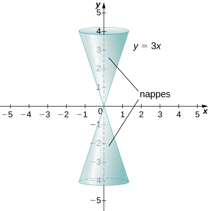{: #CNX_Calc_Figure_11_05_001}

Conic sections are generated by the intersection of a plane with a cone ([\[link\]](#CNX_Calc_Figure_11_05_002)). If the plane is parallel to the axis of revolution (the *y*-axis), then the **conic section**{: data-type="term"} is a hyperbola. If the plane is parallel to the generating line, the conic section is a parabola. If the plane is perpendicular to the axis of revolution, the conic section is a circle. If the plane intersects one nappe at an angle to the axis (other than <math xmlns="http://www.w3.org/1998/Math/MathML"><mrow><mn>90</mn><mtext>°</mtext><mo stretchy="false">)</mo><mo>,</mo></mrow></math>

 then the conic section is an ellipse.

 ![This figure has three figures. The first figure shows a plain cone with two nappes. The second figure shows a cone with a plane through one nappes and the circle at the top, which creates a parabola. There is also a circle, which occurs when a plane intersects one of the nappes while parallel to the circular bases. There is also an ellipse, which occurs when a plane insects one of the nappes while not parallel to one of the circular bases. Note that the circle and the ellipse are bounded by the edges of the cone on all sides. The last figure shows a hyperbola, which is obtained when a plane intersects both nappes.](../resources/CNX_Calc_Figure_11_05_002.jpg "The four conic sections. Each conic is determined by the angle the plane makes with the axis of the cone."){: #CNX_Calc_Figure_11_05_002}

# Parabolas

A parabola is generated when a plane intersects a cone parallel to the generating line. In this case, the plane intersects only one of the nappes. A parabola can also be defined in terms of distances.

Definition

A parabola is the set of all points whose distance from a fixed point, called the **focus**{: data-type="term"}, is equal to the distance from a fixed line, called the **directrix**{: data-type="term"}. The point halfway between the focus and the directrix is called the **vertex**{: data-type="term"} of the parabola.

A graph of a typical parabola appears in [\[link\]](#CNX_Calc_Figure_11_05_003). Using this diagram in conjunction with the distance formula, we can derive an equation for a parabola. Recall the distance formula: Given point *P* with coordinates <math xmlns="http://www.w3.org/1998/Math/MathML"><mrow><mrow><mo>(</mo><mrow><msub><mi>x</mi><mn>1</mn></msub><mo>,</mo><msub><mi>y</mi><mn>1</mn></msub></mrow><mo>)</mo></mrow></mrow></math>

 and point *Q* with coordinates <math xmlns="http://www.w3.org/1998/Math/MathML"><mrow><mrow><mo>(</mo><mrow><msub><mi>x</mi><mn>2</mn></msub><mo>,</mo><msub><mrow><mspace width="0.2em" /><mtext>y</mtext></mrow><mn>2</mn></msub></mrow><mo>)</mo></mrow><mo>,</mo></mrow></math>

 the distance between them is given by the formula

<math xmlns="http://www.w3.org/1998/Math/MathML"><mrow><mi>d</mi><mrow><mo>(</mo><mrow><mi>P</mi><mo>,</mo><mi>Q</mi></mrow><mo>)</mo></mrow><mo>=</mo><msqrt><mrow><msup><mrow><mrow><mo>(</mo><mrow><msub><mi>x</mi><mn>2</mn></msub><mo>−</mo><msub><mi>x</mi><mn>1</mn></msub></mrow><mo>)</mo></mrow></mrow><mn>2</mn></msup><mo>+</mo><msup><mrow><mrow><mo>(</mo><mrow><msub><mi>y</mi><mn>2</mn></msub><mo>−</mo><msub><mi>y</mi><mn>1</mn></msub></mrow><mo>)</mo></mrow></mrow><mn>2</mn></msup></mrow></msqrt><mo>.</mo></mrow></math>

Then from the definition of a parabola and [\[link\]](#CNX_Calc_Figure_11_05_003), we get

<math xmlns="http://www.w3.org/1998/Math/MathML"><mtable><mtr><mtd columnalign="right"><mi>d</mi><mrow><mo>(</mo><mrow><mi>F</mi><mo>,</mo><mi>P</mi></mrow><mo>)</mo></mrow></mtd><mtd columnalign="left"><mo>=</mo></mtd><mtd columnalign="left"><mi>d</mi><mrow><mo>(</mo><mrow><mi>P</mi><mo>,</mo><mi>Q</mi></mrow><mo>)</mo></mrow></mtd></mtr><mtr><mtd columnalign="right"><msqrt><mrow><msup><mrow><mrow><mo>(</mo><mrow><mn>0</mn><mo>−</mo><mi>x</mi></mrow><mo>)</mo></mrow></mrow><mn>2</mn></msup><mo>+</mo><msup><mrow><mrow><mo>(</mo><mrow><mi>p</mi><mo>−</mo><mi>y</mi></mrow><mo>)</mo></mrow></mrow><mn>2</mn></msup></mrow></msqrt></mtd><mtd columnalign="left"><mo>=</mo></mtd><mtd columnalign="left"><msqrt><mrow><msup><mrow><mrow><mo>(</mo><mrow><mi>x</mi><mo>−</mo><mi>x</mi></mrow><mo>)</mo></mrow></mrow><mn>2</mn></msup><mo>+</mo><msup><mrow><mrow><mo>(</mo><mrow><mtext>−</mtext><mi>p</mi><mo>−</mo><mi>y</mi></mrow><mo>)</mo></mrow></mrow><mn>2</mn></msup></mrow></msqrt><mo>.</mo></mtd></mtr></mtable></math>

Squaring both sides and simplifying yields

<math xmlns="http://www.w3.org/1998/Math/MathML"><mtable><mtr><mtd columnalign="right"><msup><mi>x</mi><mn>2</mn></msup><mo>+</mo><msup><mrow><mo>(</mo><mrow><mi>p</mi><mo>−</mo><mi>y</mi></mrow><mo>)</mo></mrow><mn>2</mn></msup></mtd><mtd columnalign="left"><mo>=</mo></mtd><mtd columnalign="left"><msup><mn>0</mn><mn>2</mn></msup><mo>+</mo><msup><mrow><mo>(</mo><mrow><mtext>−</mtext><mi>p</mi><mo>−</mo><mi>y</mi></mrow><mo>)</mo></mrow><mn>2</mn></msup></mtd></mtr><mtr><mtd columnalign="right"><msup><mi>x</mi><mn>2</mn></msup><mo>+</mo><msup><mi>p</mi><mn>2</mn></msup><mo>−</mo><mn>2</mn><mi>p</mi><mi>y</mi><mo>+</mo><msup><mi>y</mi><mn>2</mn></msup></mtd><mtd columnalign="left"><mo>=</mo></mtd><mtd columnalign="left"><msup><mi>p</mi><mn>2</mn></msup><mo>+</mo><mn>2</mn><mi>p</mi><mi>y</mi><mo>+</mo><msup><mi>y</mi><mn>2</mn></msup></mtd></mtr><mtr><mtd columnalign="right"><msup><mi>x</mi><mn>2</mn></msup><mo>−</mo><mn>2</mn><mi>p</mi><mi>y</mi></mtd><mtd columnalign="left"><mo>=</mo></mtd><mtd columnalign="left"><mn>2</mn><mi>p</mi><mi>y</mi></mtd></mtr><mtr><mtd columnalign="right"><msup><mi>x</mi><mn>2</mn></msup></mtd><mtd columnalign="left"><mo>=</mo></mtd><mtd columnalign="left"><mn>4</mn><mi>p</mi><mi>y</mi><mo>.</mo></mtd></mtr></mtable></math>

 {: #CNX_Calc_Figure_11_05_003}

Now suppose we want to relocate the vertex. We use the variables <math xmlns="http://www.w3.org/1998/Math/MathML"><mrow><mrow><mo>(</mo><mrow><mi>h</mi><mo>,</mo><mi>k</mi></mrow><mo>)</mo></mrow></mrow></math>

 to denote the coordinates of the vertex. Then if the focus is directly above the vertex, it has coordinates <math xmlns="http://www.w3.org/1998/Math/MathML"><mrow><mrow><mo>(</mo><mrow><mi>h</mi><mo>,</mo><mi>k</mi><mo>+</mo><mi>p</mi></mrow><mo>)</mo></mrow></mrow></math>

 and the directrix has the equation <math xmlns="http://www.w3.org/1998/Math/MathML"><mrow><mi>y</mi><mo>=</mo><mi>k</mi><mo>−</mo><mi>p</mi><mo>.</mo></mrow></math>

 Going through the same derivation yields the formula <math xmlns="http://www.w3.org/1998/Math/MathML"><mrow><msup><mrow><mrow><mo>(</mo><mrow><mi>x</mi><mo>−</mo><mi>h</mi></mrow><mo>)</mo></mrow></mrow><mn>2</mn></msup><mo>=</mo><mn>4</mn><mi>p</mi><mrow><mo>(</mo><mrow><mi>y</mi><mo>−</mo><mi>k</mi></mrow><mo>)</mo></mrow><mo>.</mo></mrow></math>

 Solving this equation for *y* leads to the following theorem.

Equations for Parabolas

Given a parabola opening upward with vertex located at <math xmlns="http://www.w3.org/1998/Math/MathML"><mrow><mrow><mo>(</mo><mrow><mi>h</mi><mo>,</mo><mi>k</mi></mrow><mo>)</mo></mrow></mrow></math>

 and focus located at <math xmlns="http://www.w3.org/1998/Math/MathML"><mrow><mrow><mo>(</mo><mrow><mi>h</mi><mo>,</mo><mi>k</mi><mo>+</mo><mi>p</mi></mrow><mo>)</mo></mrow><mo>,</mo></mrow></math>

 where *p* is a constant, the equation for the parabola is given by

<math xmlns="http://www.w3.org/1998/Math/MathML"><mrow><mi>y</mi><mo>=</mo><mfrac><mn>1</mn><mrow><mn>4</mn><mi>p</mi></mrow></mfrac><msup><mrow><mrow><mo>(</mo><mrow><mi>x</mi><mo>−</mo><mi>h</mi></mrow><mo>)</mo></mrow></mrow><mn>2</mn></msup><mo>+</mo><mi>k</mi><mo>.</mo></mrow></math>

This is the **standard form**{: data-type="term"} of a parabola.

We can also study the cases when the parabola opens down or to the left or the right. The equation for each of these cases can also be written in standard form as shown in the following graphs.

 ![This figure has four figures, each a parabola facing a different way. In the first figure, a parabola is drawn opening up with equation y = (1/(4p))(x &#x2212; h)2 + k. The vertex is given as (h, k), the focus is drawn at (h, k + p), and the directrix is drawn as y = k &#x2212; p. In the second figure, a parabola is drawn opening down with equation y = &#x2212;(1/(4p))(x &#x2212; h)2 + k. The vertex is given as (h, k), the focus is drawn at (h, k &#x2212; p), and the directrix is drawn as y = k + p. In the third figure, a parabola is drawn opening to the right with equation x = (1/(4p))(y &#x2212; k)2 + h. The vertex is given as (h, k), the focus is drawn at (h + p, k), and the directrix is drawn as x = h &#x2212; p. In the fourth figure, a parabola is drawn opening left with equation x = &#x2212;(1/(4p))(y &#x2212; k)2 + h. The vertex is given as (h, k), the focus is drawn at (h &#x2013; p, k), and the directrix is drawn as x = h + p.](../resources/CNX_Calc_Figure_11_05_004.jpg "Four parabolas, opening in various directions, along with their equations in standard form."){: #CNX_Calc_Figure_11_05_004}

In addition, the equation of a parabola can be written in the **general form**{: data-type="term"}, though in this form the values of *h*, *k*, and *p* are not immediately recognizable. The general form of a parabola is written as

<math xmlns="http://www.w3.org/1998/Math/MathML"><mrow><mi>a</mi><msup><mi>x</mi><mn>2</mn></msup><mo>+</mo><mi>b</mi><mi>x</mi><mo>+</mo><mi>c</mi><mi>y</mi><mo>+</mo><mi>d</mi><mo>=</mo><mn>0</mn><mspace width="1em" /><mtext>or</mtext><mspace width="1em" /><mi>a</mi><msup><mi>y</mi><mn>2</mn></msup><mo>+</mo><mi>b</mi><mi>x</mi><mo>+</mo><mi>c</mi><mi>y</mi><mo>+</mo><mi>d</mi><mo>=</mo><mn>0</mn><mo>.</mo></mrow></math>

The first equation represents a parabola that opens either up or down. The second equation represents a parabola that opens either to the left or to the right. To put the equation into standard form, use the method of completing the square.

Converting the Equation of a Parabola from General into Standard Form

Put the equation <math xmlns="http://www.w3.org/1998/Math/MathML"><mrow><msup><mi>x</mi><mn>2</mn></msup><mo>−</mo><mn>4</mn><mi>x</mi><mo>−</mo><mn>8</mn><mi>y</mi><mo>+</mo><mn>12</mn><mo>=</mo><mn>0</mn></mrow></math>

 into standard form and graph the resulting parabola.

Since *y* is not squared in this equation, we know that the parabola opens either upward or downward. Therefore we need to solve this equation for *y,* which will put the equation into standard form. To do that, first add <math xmlns="http://www.w3.org/1998/Math/MathML"><mrow><mn>8</mn><mi>y</mi></mrow></math>

 to both sides of the equation:

<math xmlns="http://www.w3.org/1998/Math/MathML"><mrow><mn>8</mn><mi>y</mi><mo>=</mo><msup><mi>x</mi><mn>2</mn></msup><mo>−</mo><mn>4</mn><mi>x</mi><mo>+</mo><mn>12</mn><mo>.</mo></mrow></math>

The next step is to complete the square on the right-hand side. Start by grouping the first two terms on the right-hand side using parentheses:

<math xmlns="http://www.w3.org/1998/Math/MathML"><mrow><mn>8</mn><mi>y</mi><mo>=</mo><mrow><mo>(</mo><mrow><msup><mi>x</mi><mn>2</mn></msup><mo>−</mo><mn>4</mn><mi>x</mi></mrow><mo>)</mo></mrow><mo>+</mo><mn>12</mn><mo>.</mo></mrow></math>

Next determine the constant that, when added inside the parentheses, makes the quantity inside the parentheses a perfect square trinomial. To do this, take half the coefficient of *x* and square it. This gives <math xmlns="http://www.w3.org/1998/Math/MathML"><mrow><msup><mrow><mrow><mo>(</mo><mrow><mfrac><mrow><mn>−4</mn></mrow><mn>2</mn></mfrac></mrow><mo>)</mo></mrow></mrow><mn>2</mn></msup><mo>=</mo><mn>4</mn><mo>.</mo></mrow></math>

 Add 4 inside the parentheses and subtract 4 outside the parentheses, so the value of the equation is not changed:

<math xmlns="http://www.w3.org/1998/Math/MathML"><mrow><mn>8</mn><mi>y</mi><mo>=</mo><mrow><mo>(</mo><mrow><msup><mi>x</mi><mn>2</mn></msup><mo>−</mo><mn>4</mn><mi>x</mi><mo>+</mo><mn>4</mn></mrow><mo>)</mo></mrow><mo>+</mo><mn>12</mn><mo>−</mo><mn>4</mn><mo>.</mo></mrow></math>

Now combine like terms and factor the quantity inside the parentheses:

<math xmlns="http://www.w3.org/1998/Math/MathML"><mrow><mn>8</mn><mi>y</mi><mo>=</mo><msup><mrow><mrow><mo>(</mo><mrow><mi>x</mi><mo>−</mo><mn>2</mn></mrow><mo>)</mo></mrow></mrow><mn>2</mn></msup><mo>+</mo><mn>8</mn><mo>.</mo></mrow></math>

Finally, divide by 8:

<math xmlns="http://www.w3.org/1998/Math/MathML"><mrow><mi>y</mi><mo>=</mo><mfrac><mn>1</mn><mn>8</mn></mfrac><msup><mrow><mrow><mo>(</mo><mrow><mi>x</mi><mo>−</mo><mn>2</mn></mrow><mo>)</mo></mrow></mrow><mn>2</mn></msup><mo>+</mo><mn>1</mn><mo>.</mo></mrow></math>

This equation is now in standard form. Comparing this to [[link]](#fs-id1167793813448) gives <math xmlns="http://www.w3.org/1998/Math/MathML"><mrow><mi>h</mi><mo>=</mo><mn>2</mn><mo>,</mo></mrow></math>

 <math xmlns="http://www.w3.org/1998/Math/MathML"><mrow><mi>k</mi><mo>=</mo><mn>1</mn><mo>,</mo></mrow></math>

 and <math xmlns="http://www.w3.org/1998/Math/MathML"><mrow><mi>p</mi><mo>=</mo><mn>2</mn><mo>.</mo></mrow></math>

 The parabola opens up, with vertex at <math xmlns="http://www.w3.org/1998/Math/MathML"><mrow><mrow><mo>(</mo><mrow><mn>2</mn><mo>,</mo><mn>1</mn></mrow><mo>)</mo></mrow><mo>,</mo></mrow></math>

 focus at <math xmlns="http://www.w3.org/1998/Math/MathML"><mrow><mrow><mo>(</mo><mrow><mn>2</mn><mo>,</mo><mn>3</mn></mrow><mo>)</mo></mrow><mo>,</mo></mrow></math>

 and directrix <math xmlns="http://www.w3.org/1998/Math/MathML"><mrow><mi>y</mi><mo>=</mo><mn>−1</mn><mo>.</mo></mrow></math>

 The graph of this parabola appears as follows.

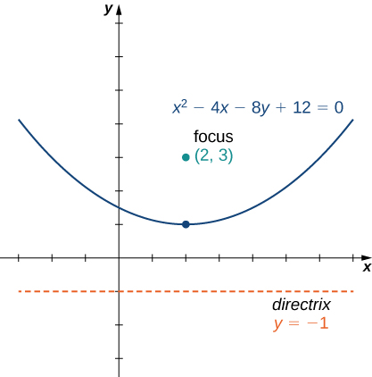{: #CNX_Calc_Figure_11_05_005}

Put the equation <math xmlns="http://www.w3.org/1998/Math/MathML"><mrow><mn>2</mn><msup><mi>y</mi><mn>2</mn></msup><mo>−</mo><mi>x</mi><mo>+</mo><mn>12</mn><mi>y</mi><mo>+</mo><mn>16</mn><mo>=</mo><mn>0</mn></mrow></math>

 into standard form and graph the resulting parabola.

<math xmlns="http://www.w3.org/1998/Math/MathML"><mrow><mi>x</mi><mo>=</mo><mn>2</mn><msup><mrow><mrow><mo>(</mo><mrow><mi>y</mi><mo>+</mo><mn>3</mn></mrow><mo>)</mo></mrow></mrow><mn>2</mn></msup><mo>−</mo><mn>2</mn></mrow></math>

* * *
{: data-type="newline"}

  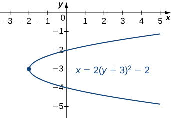 

Hint

Solve for *x*. Check which direction the parabola opens.

The axis of symmetry of a vertical (opening up or down) parabola is a vertical line passing through the vertex. The parabola has an interesting reflective property. Suppose we have a satellite dish with a parabolic cross section. If a beam of electromagnetic waves, such as light or radio waves, comes into the dish in a straight line from a satellite (parallel to the axis of symmetry), then the waves reflect off the dish and collect at the focus of the parabola as shown.

  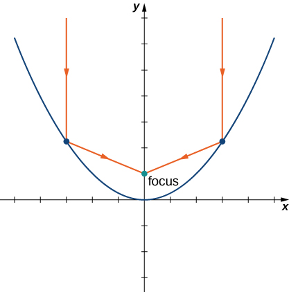  Consider a parabolic dish designed to collect signals from a satellite in space. The dish is aimed directly at the satellite, and a receiver is located at the focus of the parabola. Radio waves coming in from the satellite are reflected off the surface of the parabola to the receiver, which collects and decodes the digital signals. This allows a small receiver to gather signals from a wide angle of sky. Flashlights and headlights in a car work on the same principle, but in reverse: the source of the light (that is, the light bulb) is located at the focus and the reflecting surface on the parabolic mirror focuses the beam straight ahead. This allows a small light bulb to illuminate a wide angle of space in front of the flashlight or car.

# Ellipses

An ellipse can also be defined in terms of distances. In the case of an ellipse, there are two foci (plural of focus), and two directrices (plural of directrix). We look at the directrices in more detail later in this section.

Definition

An *ellipse* is the set of all points for which the sum of their distances from two fixed points (the foci) is constant.

 {: #CNX_Calc_Figure_11_05_008}

A graph of a typical ellipse is shown in [\[link\]](#CNX_Calc_Figure_11_05_008). In this figure the foci are labeled as <math xmlns="http://www.w3.org/1998/Math/MathML"><mi>F</mi></math>

 and <math xmlns="http://www.w3.org/1998/Math/MathML"><mrow><msup><mi>F</mi><mo>′</mo></msup><mo>.</mo></mrow></math>

 Both are the same fixed distance from the origin, and this distance is represented by the variable *c*. Therefore the coordinates of <math xmlns="http://www.w3.org/1998/Math/MathML"><mi>F</mi></math>

 are <math xmlns="http://www.w3.org/1998/Math/MathML"><mrow><mrow><mo>(</mo><mrow><mi>c</mi><mo>,</mo><mn>0</mn></mrow><mo>)</mo></mrow></mrow></math>

 and the coordinates of <math xmlns="http://www.w3.org/1998/Math/MathML"><msup><mi>F</mi><mo>′</mo></msup></math>

 are <math xmlns="http://www.w3.org/1998/Math/MathML"><mrow><mrow><mo>(</mo><mrow><mtext>−</mtext><mi>c</mi><mo>,</mo><mn>0</mn></mrow><mo>)</mo></mrow><mo>.</mo></mrow></math>

 The points <math xmlns="http://www.w3.org/1998/Math/MathML"><mi>P</mi></math>

 and <math xmlns="http://www.w3.org/1998/Math/MathML"><msup><mi>P</mi><mo>′</mo></msup></math>

 are located at the ends of the **major axis**{: data-type="term"} of the ellipse, and have coordinates <math xmlns="http://www.w3.org/1998/Math/MathML"><mrow><mrow><mo>(</mo><mrow><mi>a</mi><mo>,</mo><mn>0</mn></mrow><mo>)</mo></mrow></mrow></math>

 and <math xmlns="http://www.w3.org/1998/Math/MathML"><mrow><mrow><mo>(</mo><mrow><mtext>−</mtext><mi>a</mi><mo>,</mo><mn>0</mn></mrow><mo>)</mo></mrow><mo>,</mo></mrow></math>

 respectively. The major axis is always the longest distance across the ellipse, and can be horizontal or vertical. Thus, the length of the major axis in this ellipse is 2*a.* Furthermore, <math xmlns="http://www.w3.org/1998/Math/MathML"><mi>P</mi></math>

 and <math xmlns="http://www.w3.org/1998/Math/MathML"><msup><mi>P</mi><mo>′</mo></msup></math>

 are called the vertices of the ellipse. The points <math xmlns="http://www.w3.org/1998/Math/MathML"><mi>Q</mi></math>

 and <math xmlns="http://www.w3.org/1998/Math/MathML"><msup><mi>Q</mi><mo>′</mo></msup></math>

 are located at the ends of the **minor axis**{: data-type="term"} of the ellipse, and have coordinates <math xmlns="http://www.w3.org/1998/Math/MathML"><mrow><mrow><mo>(</mo><mrow><mn>0</mn><mo>,</mo><mi>b</mi></mrow><mo>)</mo></mrow></mrow></math>

 and <math xmlns="http://www.w3.org/1998/Math/MathML"><mrow><mrow><mo>(</mo><mrow><mn>0</mn><mo>,</mo><mtext>−</mtext><mi>b</mi></mrow><mo>)</mo></mrow><mo>,</mo></mrow></math>

 respectively. The minor axis is the shortest distance across the ellipse. The minor axis is perpendicular to the major axis.

According to the definition of the ellipse, we can choose any point on the ellipse and the sum of the distances from this point to the two foci is constant. Suppose we choose the point *P.* Since the coordinates of point *P* are <math xmlns="http://www.w3.org/1998/Math/MathML"><mrow><mrow><mo>(</mo><mrow><mi>a</mi><mo>,</mo><mn>0</mn></mrow><mo>)</mo></mrow><mo>,</mo></mrow></math>

 the sum of the distances is

<math xmlns="http://www.w3.org/1998/Math/MathML"><mrow><mi>d</mi><mrow><mo>(</mo><mrow><mi>P</mi><mo>,</mo><mi>F</mi></mrow><mo>)</mo></mrow><mo>+</mo><mi>d</mi><mrow><mo>(</mo><mrow><mi>P</mi><mo>,</mo><msup><mi>F</mi><mo>′</mo></msup></mrow><mo>)</mo></mrow><mo>=</mo><mrow><mo>(</mo><mrow><mi>a</mi><mo>−</mo><mi>c</mi></mrow><mo>)</mo></mrow><mo>+</mo><mrow><mo>(</mo><mrow><mi>a</mi><mo>+</mo><mi>c</mi></mrow><mo>)</mo></mrow><mo>=</mo><mn>2</mn><mi>a</mi><mo>.</mo></mrow></math>

Therefore the sum of the distances from an arbitrary point *A* with coordinates <math xmlns="http://www.w3.org/1998/Math/MathML"><mrow><mrow><mo>(</mo><mrow><mi>x</mi><mo>,</mo><mi>y</mi></mrow><mo>)</mo></mrow></mrow></math>

 is also equal to 2*a.* Using the distance formula, we get

<math xmlns="http://www.w3.org/1998/Math/MathML"><mtable><mtr><mtd columnalign="right"><mi>d</mi><mrow><mo>(</mo><mrow><mi>A</mi><mo>,</mo><mi>F</mi></mrow><mo>)</mo></mrow><mo>+</mo><mi>d</mi><mrow><mo>(</mo><mrow><mi>A</mi><mo>,</mo><msup><mi>F</mi><mo>′</mo></msup></mrow><mo>)</mo></mrow></mtd><mtd columnalign="left"><mo>=</mo></mtd><mtd columnalign="left"><mn>2</mn><mi>a</mi></mtd></mtr><mtr><mtd columnalign="right"><msqrt><mrow><msup><mrow><mrow><mo>(</mo><mrow><mi>x</mi><mo>−</mo><mi>c</mi></mrow><mo>)</mo></mrow></mrow><mn>2</mn></msup><mo>+</mo><msup><mi>y</mi><mn>2</mn></msup></mrow></msqrt><mo>+</mo><msqrt><mrow><msup><mrow><mrow><mo>(</mo><mrow><mi>x</mi><mo>+</mo><mi>c</mi></mrow><mo>)</mo></mrow></mrow><mn>2</mn></msup><mo>+</mo><msup><mi>y</mi><mn>2</mn></msup></mrow></msqrt></mtd><mtd columnalign="left"><mo>=</mo></mtd><mtd columnalign="left"><mn>2</mn><mi>a</mi><mo>.</mo></mtd></mtr></mtable></math>

Subtract the second radical from both sides and square both sides:

<math xmlns="http://www.w3.org/1998/Math/MathML"><mtable><mtr><mtd columnalign="right"><msqrt><mrow><msup><mrow><mrow><mo>(</mo><mrow><mi>x</mi><mo>−</mo><mi>c</mi></mrow><mo>)</mo></mrow></mrow><mn>2</mn></msup><mo>+</mo><msup><mi>y</mi><mn>2</mn></msup></mrow></msqrt></mtd><mtd columnalign="left"><mo>=</mo></mtd><mtd columnalign="left"><mn>2</mn><mi>a</mi><mo>−</mo><msqrt><mrow><msup><mrow><mrow><mo>(</mo><mrow><mi>x</mi><mo>+</mo><mi>c</mi></mrow><mo>)</mo></mrow></mrow><mn>2</mn></msup><mo>+</mo><msup><mi>y</mi><mn>2</mn></msup></mrow></msqrt></mtd></mtr><mtr><mtd columnalign="right"><msup><mrow><mo>(</mo><mrow><mi>x</mi><mo>−</mo><mi>c</mi></mrow><mo>)</mo></mrow><mn>2</mn></msup><mo>+</mo><msup><mi>y</mi><mn>2</mn></msup></mtd><mtd columnalign="left"><mo>=</mo></mtd><mtd columnalign="left"><mn>4</mn><msup><mi>a</mi><mn>2</mn></msup><mo>−</mo><mn>4</mn><mi>a</mi><msqrt><mrow><msup><mrow><mrow><mo>(</mo><mrow><mi>x</mi><mo>+</mo><mi>c</mi></mrow><mo>)</mo></mrow></mrow><mn>2</mn></msup><mo>+</mo><msup><mi>y</mi><mn>2</mn></msup></mrow></msqrt><mo>+</mo><msup><mrow><mo>(</mo><mrow><mi>x</mi><mo>+</mo><mi>c</mi></mrow><mo>)</mo></mrow><mn>2</mn></msup><mo>+</mo><msup><mi>y</mi><mn>2</mn></msup></mtd></mtr><mtr><mtd columnalign="right"><msup><mi>x</mi><mn>2</mn></msup><mo>−</mo><mn>2</mn><mi>c</mi><mi>x</mi><mo>+</mo><msup><mi>c</mi><mn>2</mn></msup><mo>+</mo><msup><mi>y</mi><mn>2</mn></msup></mtd><mtd columnalign="left"><mo>=</mo></mtd><mtd columnalign="left"><mn>4</mn><msup><mi>a</mi><mn>2</mn></msup><mo>−</mo><mn>4</mn><mi>a</mi><msqrt><mrow><msup><mrow><mrow><mo>(</mo><mrow><mi>x</mi><mo>+</mo><mi>c</mi></mrow><mo>)</mo></mrow></mrow><mn>2</mn></msup><mo>+</mo><msup><mi>y</mi><mn>2</mn></msup></mrow></msqrt><mo>+</mo><msup><mi>x</mi><mn>2</mn></msup><mo>+</mo><mn>2</mn><mi>c</mi><mi>x</mi><mo>+</mo><msup><mi>c</mi><mn>2</mn></msup><mo>+</mo><msup><mi>y</mi><mn>2</mn></msup></mtd></mtr><mtr><mtd columnalign="right"><mtext>−</mtext><mn>2</mn><mi>c</mi><mi>x</mi></mtd><mtd columnalign="left"><mo>=</mo></mtd><mtd columnalign="left"><mn>4</mn><msup><mi>a</mi><mn>2</mn></msup><mo>−</mo><mn>4</mn><mi>a</mi><msqrt><mrow><msup><mrow><mrow><mo>(</mo><mrow><mi>x</mi><mo>+</mo><mi>c</mi></mrow><mo>)</mo></mrow></mrow><mn>2</mn></msup><mo>+</mo><msup><mi>y</mi><mn>2</mn></msup></mrow></msqrt><mo>+</mo><mn>2</mn><mi>c</mi><mi>x</mi><mo>.</mo></mtd></mtr></mtable></math>

Now isolate the radical on the right-hand side and square again:

<math xmlns="http://www.w3.org/1998/Math/MathML"><mtable><mtr><mtd columnalign="right"><mo>−</mo><mn>2</mn><mi>c</mi><mi>x</mi></mtd><mtd columnalign="left"><mo>=</mo></mtd><mtd columnalign="left"><mn>4</mn><msup><mi>a</mi><mn>2</mn></msup><mo>−</mo><mn>4</mn><mi>a</mi><msqrt><mrow><msup><mrow><mrow><mo>(</mo><mrow><mi>x</mi><mo>+</mo><mi>c</mi></mrow><mo>)</mo></mrow></mrow><mn>2</mn></msup><mo>+</mo><msup><mi>y</mi><mn>2</mn></msup></mrow></msqrt><mo>+</mo><mn>2</mn><mi>c</mi><mi>x</mi></mtd></mtr><mtr><mtd columnalign="right"><mn>4</mn><mi>a</mi><msqrt><mrow><msup><mrow><mrow><mo>(</mo><mrow><mi>x</mi><mo>+</mo><mi>c</mi></mrow><mo>)</mo></mrow></mrow><mn>2</mn></msup><mo>+</mo><msup><mi>y</mi><mn>2</mn></msup></mrow></msqrt></mtd><mtd columnalign="left"><mo>=</mo></mtd><mtd columnalign="left"><mn>4</mn><msup><mi>a</mi><mn>2</mn></msup><mo>+</mo><mn>4</mn><mi>c</mi><mi>x</mi></mtd></mtr><mtr><mtd columnalign="right"><msqrt><mrow><msup><mrow><mrow><mo>(</mo><mrow><mi>x</mi><mo>+</mo><mi>c</mi></mrow><mo>)</mo></mrow></mrow><mn>2</mn></msup><mo>+</mo><msup><mi>y</mi><mn>2</mn></msup></mrow></msqrt></mtd><mtd columnalign="left"><mo>=</mo></mtd><mtd columnalign="left"><mi>a</mi><mo>+</mo><mfrac><mrow><mi>c</mi><mi>x</mi></mrow><mi>a</mi></mfrac></mtd></mtr><mtr><mtd columnalign="right"><msup><mrow><mo>(</mo><mrow><mi>x</mi><mo>+</mo><mi>c</mi></mrow><mo>)</mo></mrow><mn>2</mn></msup><mo>+</mo><msup><mi>y</mi><mn>2</mn></msup></mtd><mtd columnalign="left"><mo>=</mo></mtd><mtd columnalign="left"><msup><mi>a</mi><mn>2</mn></msup><mo>+</mo><mn>2</mn><mi>c</mi><mi>x</mi><mo>+</mo><mfrac><mrow><msup><mi>c</mi><mn>2</mn></msup><msup><mi>x</mi><mn>2</mn></msup></mrow><mrow><msup><mi>a</mi><mn>2</mn></msup></mrow></mfrac></mtd></mtr><mtr><mtd columnalign="right"><msup><mi>x</mi><mn>2</mn></msup><mo>+</mo><mn>2</mn><mi>c</mi><mi>x</mi><mo>+</mo><msup><mi>c</mi><mn>2</mn></msup><mo>+</mo><msup><mi>y</mi><mn>2</mn></msup></mtd><mtd columnalign="left"><mo>=</mo></mtd><mtd columnalign="left"><msup><mi>a</mi><mn>2</mn></msup><mo>+</mo><mn>2</mn><mi>c</mi><mi>x</mi><mo>+</mo><mfrac><mrow><msup><mi>c</mi><mn>2</mn></msup><msup><mi>x</mi><mn>2</mn></msup></mrow><mrow><msup><mi>a</mi><mn>2</mn></msup></mrow></mfrac></mtd></mtr><mtr><mtd columnalign="right"><msup><mi>x</mi><mn>2</mn></msup><mo>+</mo><msup><mi>c</mi><mn>2</mn></msup><mo>+</mo><msup><mi>y</mi><mn>2</mn></msup></mtd><mtd columnalign="left"><mo>=</mo></mtd><mtd columnalign="left"><msup><mi>a</mi><mn>2</mn></msup><mo>+</mo><mfrac><mrow><msup><mi>c</mi><mn>2</mn></msup><msup><mi>x</mi><mn>2</mn></msup></mrow><mrow><msup><mi>a</mi><mn>2</mn></msup></mrow></mfrac><mo>.</mo></mtd></mtr></mtable></math>

Isolate the variables on the left-hand side of the equation and the constants on the right-hand side:

<math xmlns="http://www.w3.org/1998/Math/MathML"><mtable><mtr /><mtr><mtd columnalign="right"><msup><mi>x</mi><mn>2</mn></msup><mo>−</mo><mfrac><mrow><msup><mi>c</mi><mn>2</mn></msup><msup><mi>x</mi><mn>2</mn></msup></mrow><mrow><msup><mi>a</mi><mn>2</mn></msup></mrow></mfrac><mo>+</mo><msup><mi>y</mi><mn>2</mn></msup></mtd><mtd columnalign="left"><mo>=</mo></mtd><mtd columnalign="left"><msup><mi>a</mi><mn>2</mn></msup><mo>−</mo><msup><mi>c</mi><mn>2</mn></msup></mtd></mtr><mtr><mtd columnalign="right"><mfrac><mrow><mrow><mo>(</mo><mrow><msup><mi>a</mi><mn>2</mn></msup><mo>−</mo><msup><mi>c</mi><mn>2</mn></msup></mrow><mo>)</mo></mrow><msup><mi>x</mi><mn>2</mn></msup></mrow><mrow><msup><mi>a</mi><mn>2</mn></msup></mrow></mfrac><mo>+</mo><msup><mi>y</mi><mn>2</mn></msup></mtd><mtd columnalign="left"><mo>=</mo></mtd><mtd columnalign="left"><msup><mi>a</mi><mn>2</mn></msup><mo>−</mo><msup><mi>c</mi><mn>2</mn></msup><mo>.</mo></mtd></mtr></mtable></math>

Divide both sides by <math xmlns="http://www.w3.org/1998/Math/MathML"><mrow><msup><mi>a</mi><mn>2</mn></msup><mo>−</mo><msup><mi>c</mi><mn>2</mn></msup><mo>.</mo></mrow></math>

 This gives the equation

<math xmlns="http://www.w3.org/1998/Math/MathML"><mrow><mfrac><mrow><msup><mi>x</mi><mn>2</mn></msup></mrow><mrow><msup><mi>a</mi><mn>2</mn></msup></mrow></mfrac><mo>+</mo><mfrac><mrow><msup><mi>y</mi><mn>2</mn></msup></mrow><mrow><msup><mi>a</mi><mn>2</mn></msup><mo>−</mo><msup><mi>c</mi><mn>2</mn></msup></mrow></mfrac><mo>=</mo><mn>1</mn><mo>.</mo></mrow></math>

If we refer back to [\[link\]](#CNX_Calc_Figure_11_05_008), then the length of each of the two green line segments is equal to *a*. This is true because the sum of the distances from the point *Q* to the foci <math xmlns="http://www.w3.org/1998/Math/MathML"><mrow><mi>F</mi><mspace width="0.2em" /><mtext>and</mtext><mspace width="0.2em" /><msup><mi>F</mi><mo>′</mo></msup></mrow></math>

 is equal to 2*a*, and the lengths of these two line segments are equal. This line segment forms a right triangle with hypotenuse length *a* and leg lengths *b* and *c*. From the Pythagorean theorem, <math xmlns="http://www.w3.org/1998/Math/MathML"><mrow><msup><mi>a</mi><mn>2</mn></msup><mo>+</mo><msup><mi>b</mi><mn>2</mn></msup><mo>=</mo><msup><mi>c</mi><mn>2</mn></msup></mrow></math>

 and <math xmlns="http://www.w3.org/1998/Math/MathML"><mrow><msup><mi>b</mi><mn>2</mn></msup><mo>=</mo><msup><mi>a</mi><mn>2</mn></msup><mo>−</mo><msup><mi>c</mi><mn>2</mn></msup><mo>.</mo></mrow></math>

 Therefore the equation of the ellipse becomes

<math xmlns="http://www.w3.org/1998/Math/MathML"><mrow><mfrac><mrow><msup><mi>x</mi><mn>2</mn></msup></mrow><mrow><msup><mi>a</mi><mn>2</mn></msup></mrow></mfrac><mo>+</mo><mfrac><mrow><msup><mi>y</mi><mn>2</mn></msup></mrow><mrow><msup><mi>b</mi><mn>2</mn></msup></mrow></mfrac><mo>=</mo><mn>1</mn><mo>.</mo></mrow></math>

Finally, if the center of the ellipse is moved from the origin to a point <math xmlns="http://www.w3.org/1998/Math/MathML"><mrow><mrow><mo>(</mo><mrow><mi>h</mi><mo>,</mo><mi>k</mi></mrow><mo>)</mo></mrow><mo>,</mo></mrow></math>

 we have the following standard form of an ellipse.

Equation of an Ellipse in Standard Form

Consider the ellipse with center <math xmlns="http://www.w3.org/1998/Math/MathML"><mrow><mrow><mo>(</mo><mrow><mi>h</mi><mo>,</mo><mi>k</mi></mrow><mo>)</mo></mrow><mo>,</mo></mrow></math>

 a horizontal major axis with length 2*a*, and a vertical minor axis with length 2*b*. Then the equation of this ellipse in standard form is

<math xmlns="http://www.w3.org/1998/Math/MathML"><mrow><mfrac><mrow><msup><mrow><mrow><mo>(</mo><mrow><mi>x</mi><mo>−</mo><mi>h</mi></mrow><mo>)</mo></mrow></mrow><mn>2</mn></msup></mrow><mrow><msup><mi>a</mi><mn>2</mn></msup></mrow></mfrac><mo>+</mo><mfrac><mrow><msup><mrow><mrow><mo>(</mo><mrow><mi>y</mi><mo>−</mo><mi>k</mi></mrow><mo>)</mo></mrow></mrow><mn>2</mn></msup></mrow><mrow><msup><mi>b</mi><mn>2</mn></msup></mrow></mfrac><mo>=</mo><mn>1</mn></mrow></math>

and the foci are located at <math xmlns="http://www.w3.org/1998/Math/MathML"><mrow><mrow><mo>(</mo><mrow><mi>h</mi><mo>±</mo><mi>c</mi><mo>,</mo><mi>k</mi></mrow><mo>)</mo></mrow><mo>,</mo></mrow></math>

 where <math xmlns="http://www.w3.org/1998/Math/MathML"><mrow><msup><mi>c</mi><mn>2</mn></msup><mo>=</mo><msup><mi>a</mi><mn>2</mn></msup><mo>−</mo><msup><mi>b</mi><mn>2</mn></msup><mo>.</mo></mrow></math>

 The equations of the directrices are <math xmlns="http://www.w3.org/1998/Math/MathML"><mrow><mi>x</mi><mo>=</mo><mi>h</mi><mo>±</mo><mfrac><mrow><msup><mi>a</mi><mn>2</mn></msup></mrow><mi>c</mi></mfrac><mo>.</mo></mrow></math>

If the major axis is vertical, then the equation of the ellipse becomes

<math xmlns="http://www.w3.org/1998/Math/MathML"><mrow><mfrac><mrow><msup><mrow><mrow><mo>(</mo><mrow><mi>x</mi><mo>−</mo><mi>h</mi></mrow><mo>)</mo></mrow></mrow><mn>2</mn></msup></mrow><mrow><msup><mi>b</mi><mn>2</mn></msup></mrow></mfrac><mo>+</mo><mfrac><mrow><msup><mrow><mrow><mo>(</mo><mrow><mi>y</mi><mo>−</mo><mi>k</mi></mrow><mo>)</mo></mrow></mrow><mn>2</mn></msup></mrow><mrow><msup><mi>a</mi><mn>2</mn></msup></mrow></mfrac><mo>=</mo><mn>1</mn></mrow></math>

and the foci are located at <math xmlns="http://www.w3.org/1998/Math/MathML"><mrow><mrow><mo>(</mo><mrow><mi>h</mi><mo>,</mo><mi>k</mi><mo>±</mo><mi>c</mi></mrow><mo>)</mo></mrow><mo>,</mo></mrow></math>

 where <math xmlns="http://www.w3.org/1998/Math/MathML"><mrow><msup><mi>c</mi><mn>2</mn></msup><mo>=</mo><msup><mi>a</mi><mn>2</mn></msup><mo>−</mo><msup><mi>b</mi><mn>2</mn></msup><mo>.</mo></mrow></math>

 The equations of the directrices in this case are <math xmlns="http://www.w3.org/1998/Math/MathML"><mrow><mi>y</mi><mo>=</mo><mi>k</mi><mo>±</mo><mfrac><mrow><msup><mi>a</mi><mn>2</mn></msup></mrow><mi>c</mi></mfrac><mo>.</mo></mrow></math>

If the major axis is horizontal, then the ellipse is called horizontal, and if the major axis is vertical, then the ellipse is called vertical. The equation of an ellipse is in general form if it is in the form <math xmlns="http://www.w3.org/1998/Math/MathML"><mrow><mi>A</mi><msup><mi>x</mi><mn>2</mn></msup><mo>+</mo><mi>B</mi><msup><mi>y</mi><mn>2</mn></msup><mo>+</mo><mi>C</mi><mi>x</mi><mo>+</mo><mi>D</mi><mi>y</mi><mo>+</mo><mi>E</mi><mo>=</mo><mn>0</mn><mo>,</mo></mrow></math>

 where *A* and *B* are either both positive or both negative. To convert the equation from general to standard form, use the method of completing the square.

Finding the Standard Form of an Ellipse

Put the equation <math xmlns="http://www.w3.org/1998/Math/MathML"><mrow><mn>9</mn><msup><mi>x</mi><mn>2</mn></msup><mo>+</mo><mn>4</mn><msup><mi>y</mi><mn>2</mn></msup><mo>−</mo><mn>36</mn><mi>x</mi><mo>+</mo><mn>24</mn><mi>y</mi><mo>+</mo><mn>36</mn><mo>=</mo><mn>0</mn></mrow></math>

 into standard form and graph the resulting ellipse.

First subtract 36 from both sides of the equation:

<math xmlns="http://www.w3.org/1998/Math/MathML"><mrow><mn>9</mn><msup><mi>x</mi><mn>2</mn></msup><mo>+</mo><mn>4</mn><msup><mi>y</mi><mn>2</mn></msup><mo>−</mo><mn>36</mn><mi>x</mi><mo>+</mo><mn>24</mn><mi>y</mi><mo>=</mo><mn>−36</mn><mo>.</mo></mrow></math>

Next group the *x* terms together and the *y* terms together, and factor out the common factor:

<math xmlns="http://www.w3.org/1998/Math/MathML"><mtable><mtr><mtd columnalign="right"><mrow><mo>(</mo><mrow><mn>9</mn><msup><mi>x</mi><mn>2</mn></msup><mo>−</mo><mn>36</mn><mi>x</mi></mrow><mo>)</mo></mrow><mo>+</mo><mrow><mo>(</mo><mrow><mn>4</mn><msup><mi>y</mi><mn>2</mn></msup><mo>+</mo><mn>24</mn><mi>y</mi></mrow><mo>)</mo></mrow></mtd><mtd columnalign="left"><mo>=</mo></mtd><mtd columnalign="left"><mn>−36</mn></mtd></mtr><mtr><mtd columnalign="right"><mn>9</mn><mrow><mo>(</mo><mrow><msup><mi>x</mi><mn>2</mn></msup><mo>−</mo><mn>4</mn><mi>x</mi></mrow><mo>)</mo></mrow><mo>+</mo><mn>4</mn><mrow><mo>(</mo><mrow><msup><mi>y</mi><mn>2</mn></msup><mo>+</mo><mn>6</mn><mi>y</mi></mrow><mo>)</mo></mrow></mtd><mtd columnalign="left"><mo>=</mo></mtd><mtd columnalign="left"><mn>−36.</mn></mtd></mtr></mtable></math>

We need to determine the constant that, when added inside each set of parentheses, results in a perfect square. In the first set of parentheses, take half the coefficient of *x* and square it. This gives <math xmlns="http://www.w3.org/1998/Math/MathML"><mrow><msup><mrow><mrow><mo>(</mo><mrow><mfrac><mrow><mn>−4</mn></mrow><mn>2</mn></mfrac></mrow><mo>)</mo></mrow></mrow><mn>2</mn></msup><mo>=</mo><mn>4</mn><mo>.</mo></mrow></math>

 In the second set of parentheses, take half the coefficient of *y* and square it. This gives <math xmlns="http://www.w3.org/1998/Math/MathML"><mrow><msup><mrow><mrow><mo>(</mo><mrow><mfrac><mn>6</mn><mn>2</mn></mfrac></mrow><mo>)</mo></mrow></mrow><mn>2</mn></msup><mo>=</mo><mn>9</mn><mo>.</mo></mrow></math>

 Add these inside each pair of parentheses. Since the first set of parentheses has a 9 in front, we are actually adding 36 to the left-hand side. Similarly, we are adding 36 to the second set as well. Therefore the equation becomes

<math xmlns="http://www.w3.org/1998/Math/MathML"><mtable><mtr /><mtr><mtd columnalign="left"><mn>9</mn><mrow><mo>(</mo><mrow><msup><mi>x</mi><mn>2</mn></msup><mo>−</mo><mn>4</mn><mi>x</mi><mo>+</mo><mn>4</mn></mrow><mo>)</mo></mrow><mo>+</mo><mn>4</mn><mrow><mo>(</mo><mrow><msup><mi>y</mi><mn>2</mn></msup><mo>+</mo><mn>6</mn><mi>y</mi><mo>+</mo><mn>9</mn></mrow><mo>)</mo></mrow><mo>=</mo><mn>−36</mn><mo>+</mo><mn>36</mn><mo>+</mo><mn>36</mn></mtd></mtr><mtr><mtd columnalign="left"><mn>9</mn><mrow><mo>(</mo><mrow><msup><mi>x</mi><mn>2</mn></msup><mo>−</mo><mn>4</mn><mi>x</mi><mo>+</mo><mn>4</mn></mrow><mo>)</mo></mrow><mo>+</mo><mn>4</mn><mrow><mo>(</mo><mrow><msup><mi>y</mi><mn>2</mn></msup><mo>+</mo><mn>6</mn><mi>y</mi><mo>+</mo><mn>9</mn></mrow><mo>)</mo></mrow><mo>=</mo><mn>36.</mn></mtd></mtr></mtable></math>

Now factor both sets of parentheses and divide by 36:

<math xmlns="http://www.w3.org/1998/Math/MathML"><mtable><mtr /><mtr><mtd columnalign="right"><mn>9</mn><msup><mrow><mo>(</mo><mrow><mi>x</mi><mo>−</mo><mn>2</mn></mrow><mo>)</mo></mrow><mn>2</mn></msup><mo>+</mo><mn>4</mn><msup><mrow><mo>(</mo><mrow><mi>y</mi><mo>+</mo><mn>3</mn></mrow><mo>)</mo></mrow><mn>2</mn></msup></mtd><mtd columnalign="left"><mo>=</mo></mtd><mtd columnalign="left"><mn>36</mn></mtd></mtr><mtr><mtd columnalign="right"><mfrac><mrow><mn>9</mn><msup><mrow><mrow><mo>(</mo><mrow><mi>x</mi><mo>−</mo><mn>2</mn></mrow><mo>)</mo></mrow></mrow><mn>2</mn></msup></mrow><mrow><mn>36</mn></mrow></mfrac><mo>+</mo><mfrac><mrow><mn>4</mn><msup><mrow><mrow><mo>(</mo><mrow><mi>y</mi><mo>+</mo><mn>3</mn></mrow><mo>)</mo></mrow></mrow><mn>2</mn></msup></mrow><mrow><mn>36</mn></mrow></mfrac></mtd><mtd columnalign="left"><mo>=</mo></mtd><mtd columnalign="left"><mn>1</mn></mtd></mtr><mtr><mtd columnalign="right"><mfrac><mrow><msup><mrow><mrow><mo>(</mo><mrow><mi>x</mi><mo>−</mo><mn>2</mn></mrow><mo>)</mo></mrow></mrow><mn>2</mn></msup></mrow><mn>4</mn></mfrac><mo>+</mo><mfrac><mrow><msup><mrow><mrow><mo>(</mo><mrow><mi>y</mi><mo>+</mo><mn>3</mn></mrow><mo>)</mo></mrow></mrow><mn>2</mn></msup></mrow><mn>9</mn></mfrac></mtd><mtd columnalign="left"><mo>=</mo></mtd><mtd columnalign="left"><mn>1.</mn></mtd></mtr></mtable></math>

The equation is now in standard form. Comparing this to [[link]](#fs-id1167794136510) gives <math xmlns="http://www.w3.org/1998/Math/MathML"><mrow><mi>h</mi><mo>=</mo><mn>2</mn><mo>,</mo></mrow></math>

 <math xmlns="http://www.w3.org/1998/Math/MathML"><mrow><mi>k</mi><mo>=</mo><mn>−3</mn><mo>,</mo></mrow></math>

 <math xmlns="http://www.w3.org/1998/Math/MathML"><mrow><mi>a</mi><mo>=</mo><mn>3</mn><mo>,</mo></mrow></math>

 and <math xmlns="http://www.w3.org/1998/Math/MathML"><mrow><mi>b</mi><mo>=</mo><mn>2</mn><mo>.</mo></mrow></math>

 This is a vertical ellipse with center at <math xmlns="http://www.w3.org/1998/Math/MathML"><mrow><mrow><mo>(</mo><mrow><mn>2</mn><mo>,</mo><mn>−3</mn></mrow><mo>)</mo></mrow><mo>,</mo></mrow></math>

 major axis 6, and minor axis 4. The graph of this ellipse appears as follows.

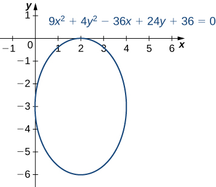{: #CNX_Calc_Figure_11_05_009}

Put the equation <math xmlns="http://www.w3.org/1998/Math/MathML"><mrow><mn>9</mn><msup><mi>x</mi><mn>2</mn></msup><mo>+</mo><mn>16</mn><msup><mi>y</mi><mn>2</mn></msup><mo>+</mo><mn>18</mn><mi>x</mi><mo>−</mo><mn>64</mn><mi>y</mi><mo>−</mo><mn>71</mn><mo>=</mo><mn>0</mn></mrow></math>

 into standard form and graph the resulting ellipse.

<math xmlns="http://www.w3.org/1998/Math/MathML"><mrow><mfrac><mrow><msup><mrow><mrow><mo>(</mo><mrow><mi>x</mi><mo>+</mo><mn>1</mn></mrow><mo>)</mo></mrow></mrow><mn>2</mn></msup></mrow><mrow><mn>16</mn></mrow></mfrac><mo>+</mo><mfrac><mrow><msup><mrow><mrow><mo>(</mo><mrow><mi>y</mi><mo>−</mo><mn>2</mn></mrow><mo>)</mo></mrow></mrow><mn>2</mn></msup></mrow><mn>9</mn></mfrac><mo>=</mo><mn>1</mn></mrow></math>

* * *
{: data-type="newline"}

  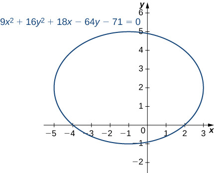 

Hint

Move the constant over and complete the square.

According to Kepler’s first law of planetary motion, the orbit of a planet around the Sun is an ellipse with the Sun at one of the foci as shown in [\[link\]](#CNX_Calc_Figure_11_05_011)(a). Because Earth’s orbit is an ellipse, the distance from the Sun varies throughout the year. A commonly held misconception is that Earth is closer to the Sun in the summer. In fact, in summer for the northern hemisphere, Earth is farther from the Sun than during winter. The difference in season is caused by the tilt of Earth’s axis in the orbital plane. Comets that orbit the Sun, such as Halley’s Comet, also have elliptical orbits, as do moons orbiting the planets and satellites orbiting Earth.

Ellipses also have interesting reflective properties: A light ray emanating from one focus passes through the other focus after mirror reflection in the ellipse. The same thing occurs with a sound wave as well. The National Statuary Hall in the U.S. Capitol in Washington, DC, is a famous room in an elliptical shape as shown in [\[link\]](#CNX_Calc_Figure_11_05_011)(b). This hall served as the meeting place for the U.S. House of Representatives for almost fifty years. The location of the two foci of this semi-elliptical room are clearly identified by marks on the floor, and even if the room is full of visitors, when two people stand on these spots and speak to each other, they can hear each other much more clearly than they can hear someone standing close by. Legend has it that John Quincy Adams had his desk located on one of the foci and was able to eavesdrop on everyone else in the House without ever needing to stand. Although this makes a good story, it is unlikely to be true, because the original ceiling produced so many echoes that the entire room had to be hung with carpets to dampen the noise. The ceiling was rebuilt in 1902 and only then did the now-famous whispering effect emerge. Another famous whispering gallery—the site of many marriage proposals—is in Grand Central Station in New York City.

  Earth&#x2019;s orbit around the Sun is an ellipse with the Sun at one focus. (b) Statuary Hall in the U.S. Capitol is a whispering gallery with an elliptical cross section."){: #CNX_Calc_Figure_11_05_011}

# Hyperbolas

A hyperbola can also be defined in terms of distances. In the case of a hyperbola, there are two foci and two directrices. Hyperbolas also have two asymptotes.

Definition

A hyperbola is the set of all points where the difference between their distances from two fixed points (the foci) is constant.

A graph of a typical hyperbola appears as follows.

 {: #CNX_Calc_Figure_11_05_012}

The derivation of the equation of a hyperbola in standard form is virtually identical to that of an ellipse. One slight hitch lies in the definition: The difference between two numbers is always positive. Let *P* be a point on the hyperbola with coordinates <math xmlns="http://www.w3.org/1998/Math/MathML"><mrow><mrow><mo>(</mo><mrow><mi>x</mi><mo>,</mo><mi>y</mi></mrow><mo>)</mo></mrow><mo>.</mo></mrow></math>

 Then the definition of the hyperbola gives <math xmlns="http://www.w3.org/1998/Math/MathML"><mrow><mrow><mo>\|</mo><mrow><mi>d</mi><mrow><mo>(</mo><mrow><mi>P</mi><mo>,</mo><msub><mi>F</mi><mn>1</mn></msub></mrow><mo>)</mo></mrow><mo>−</mo><mi>d</mi><mrow><mo>(</mo><mrow><mi>P</mi><mo>,</mo><msub><mi>F</mi><mn>2</mn></msub></mrow><mo>)</mo></mrow></mrow><mo>\|</mo></mrow><mo>=</mo><mtext>constant</mtext><mo>.</mo></mrow></math>

 To simplify the derivation, assume that *P* is on the right branch of the hyperbola, so the absolute value bars drop. If it is on the left branch, then the subtraction is reversed. The vertex of the right branch has coordinates <math xmlns="http://www.w3.org/1998/Math/MathML"><mrow><mrow><mo>(</mo><mrow><mi>a</mi><mo>,</mo><mn>0</mn></mrow><mo>)</mo></mrow><mo>,</mo></mrow></math>

 so

<math xmlns="http://www.w3.org/1998/Math/MathML"><mrow><mi>d</mi><mrow><mo>(</mo><mrow><mi>P</mi><mo>,</mo><msub><mi>F</mi><mn>1</mn></msub></mrow><mo>)</mo></mrow><mo>−</mo><mi>d</mi><mrow><mo>(</mo><mrow><mi>P</mi><mo>,</mo><msub><mi>F</mi><mn>2</mn></msub></mrow><mo>)</mo></mrow><mo>=</mo><mrow><mo>(</mo><mrow><mi>c</mi><mo>+</mo><mi>a</mi></mrow><mo>)</mo></mrow><mo>−</mo><mrow><mo>(</mo><mrow><mi>c</mi><mo>−</mo><mi>a</mi></mrow><mo>)</mo></mrow><mo>=</mo><mn>2</mn><mi>a</mi><mo>.</mo></mrow></math>

This equation is therefore true for any point on the hyperbola. Returning to the coordinates <math xmlns="http://www.w3.org/1998/Math/MathML"><mrow><mrow><mo>(</mo><mrow><mi>x</mi><mo>,</mo><mi>y</mi></mrow><mo>)</mo></mrow></mrow></math>

 for *P*\:

<math xmlns="http://www.w3.org/1998/Math/MathML"><mtable><mtr><mtd columnalign="right"><mi>d</mi><mrow><mo>(</mo><mrow><mi>P</mi><mo>,</mo><msub><mi>F</mi><mn>1</mn></msub></mrow><mo>)</mo></mrow><mo>−</mo><mi>d</mi><mrow><mo>(</mo><mrow><mi>P</mi><mo>,</mo><msub><mi>F</mi><mn>2</mn></msub></mrow><mo>)</mo></mrow></mtd><mtd columnalign="left"><mo>=</mo></mtd><mtd columnalign="left"><mn>2</mn><mi>a</mi></mtd></mtr><mtr><mtd columnalign="right"><msqrt><mrow><msup><mrow><mrow><mo>(</mo><mrow><mi>x</mi><mo>+</mo><mi>c</mi></mrow><mo>)</mo></mrow></mrow><mn>2</mn></msup><mo>+</mo><msup><mi>y</mi><mn>2</mn></msup></mrow></msqrt><mo>−</mo><msqrt><mrow><msup><mrow><mrow><mo>(</mo><mrow><mi>x</mi><mo>−</mo><mi>c</mi></mrow><mo>)</mo></mrow></mrow><mn>2</mn></msup><mo>+</mo><msup><mi>y</mi><mn>2</mn></msup></mrow></msqrt></mtd><mtd columnalign="left"><mo>=</mo></mtd><mtd columnalign="left"><mn>2</mn><mi>a</mi><mo>.</mo></mtd></mtr></mtable></math>

Add the second radical from both sides and square both sides:

<math xmlns="http://www.w3.org/1998/Math/MathML"><mtable><mtr><mtd columnalign="right"><msqrt><mrow><msup><mrow><mrow><mo>(</mo><mrow><mi>x</mi><mo>−</mo><mi>c</mi></mrow><mo>)</mo></mrow></mrow><mn>2</mn></msup><mo>+</mo><msup><mi>y</mi><mn>2</mn></msup></mrow></msqrt></mtd><mtd columnalign="left"><mo>=</mo></mtd><mtd columnalign="left"><mn>2</mn><mi>a</mi><mo>+</mo><msqrt><mrow><msup><mrow><mrow><mo>(</mo><mrow><mi>x</mi><mo>+</mo><mi>c</mi></mrow><mo>)</mo></mrow></mrow><mn>2</mn></msup><mo>+</mo><msup><mi>y</mi><mn>2</mn></msup></mrow></msqrt></mtd></mtr><mtr><mtd columnalign="right"><msup><mrow><mo>(</mo><mrow><mi>x</mi><mo>−</mo><mi>c</mi></mrow><mo>)</mo></mrow><mn>2</mn></msup><mo>+</mo><msup><mi>y</mi><mn>2</mn></msup></mtd><mtd columnalign="left"><mo>=</mo></mtd><mtd columnalign="left"><mn>4</mn><msup><mi>a</mi><mn>2</mn></msup><mo>+</mo><mn>4</mn><mi>a</mi><msqrt><mrow><msup><mrow><mrow><mo>(</mo><mrow><mi>x</mi><mo>+</mo><mi>c</mi></mrow><mo>)</mo></mrow></mrow><mn>2</mn></msup><mo>+</mo><msup><mi>y</mi><mn>2</mn></msup></mrow></msqrt><mo>+</mo><msup><mrow><mo>(</mo><mrow><mi>x</mi><mo>+</mo><mi>c</mi></mrow><mo>)</mo></mrow><mn>2</mn></msup><mo>+</mo><msup><mi>y</mi><mn>2</mn></msup></mtd></mtr><mtr><mtd columnalign="right"><msup><mi>x</mi><mn>2</mn></msup><mo>−</mo><mn>2</mn><mi>c</mi><mi>x</mi><mo>+</mo><msup><mi>c</mi><mn>2</mn></msup><mo>+</mo><msup><mi>y</mi><mn>2</mn></msup></mtd><mtd columnalign="left"><mo>=</mo></mtd><mtd columnalign="left"><mn>4</mn><msup><mi>a</mi><mn>2</mn></msup><mo>+</mo><mn>4</mn><mi>a</mi><msqrt><mrow><msup><mrow><mrow><mo>(</mo><mrow><mi>x</mi><mo>+</mo><mi>c</mi></mrow><mo>)</mo></mrow></mrow><mn>2</mn></msup><mo>+</mo><msup><mi>y</mi><mn>2</mn></msup></mrow></msqrt><mo>+</mo><msup><mi>x</mi><mn>2</mn></msup><mo>+</mo><mn>2</mn><mi>c</mi><mi>x</mi><mo>+</mo><msup><mi>c</mi><mn>2</mn></msup><mo>+</mo><msup><mi>y</mi><mn>2</mn></msup></mtd></mtr><mtr><mtd columnalign="right"><mtext>−</mtext><mn>2</mn><mi>c</mi><mi>x</mi></mtd><mtd columnalign="left"><mo>=</mo></mtd><mtd columnalign="left"><mn>4</mn><msup><mi>a</mi><mn>2</mn></msup><mo>+</mo><mn>4</mn><mi>a</mi><msqrt><mrow><msup><mrow><mrow><mo>(</mo><mrow><mi>x</mi><mo>+</mo><mi>c</mi></mrow><mo>)</mo></mrow></mrow><mn>2</mn></msup><mo>+</mo><msup><mi>y</mi><mn>2</mn></msup></mrow></msqrt><mo>+</mo><mn>2</mn><mi>c</mi><mi>x</mi><mo>.</mo></mtd></mtr></mtable></math>

Now isolate the radical on the right-hand side and square again:

<math xmlns="http://www.w3.org/1998/Math/MathML"><mtable><mtr><mtd columnalign="right"><mo>−</mo><mn>2</mn><mi>c</mi><mi>x</mi></mtd><mtd columnalign="left"><mo>=</mo></mtd><mtd columnalign="left"><mn>4</mn><msup><mi>a</mi><mn>2</mn></msup><mo>+</mo><mn>4</mn><mi>a</mi><msqrt><mrow><msup><mrow><mrow><mo>(</mo><mrow><mi>x</mi><mo>+</mo><mi>c</mi></mrow><mo>)</mo></mrow></mrow><mn>2</mn></msup><mo>+</mo><msup><mi>y</mi><mn>2</mn></msup></mrow></msqrt><mo>+</mo><mn>2</mn><mi>c</mi><mi>x</mi></mtd></mtr><mtr><mtd columnalign="right"><mn>4</mn><mi>a</mi><msqrt><mrow><msup><mrow><mrow><mo>(</mo><mrow><mi>x</mi><mo>+</mo><mi>c</mi></mrow><mo>)</mo></mrow></mrow><mn>2</mn></msup><mo>+</mo><msup><mi>y</mi><mn>2</mn></msup></mrow></msqrt></mtd><mtd columnalign="left"><mo>=</mo></mtd><mtd columnalign="left"><mn>−4</mn><msup><mi>a</mi><mn>2</mn></msup><mo>−</mo><mn>4</mn><mi>c</mi><mi>x</mi></mtd></mtr><mtr><mtd columnalign="right"><msqrt><mrow><msup><mrow><mrow><mo>(</mo><mrow><mi>x</mi><mo>+</mo><mi>c</mi></mrow><mo>)</mo></mrow></mrow><mn>2</mn></msup><mo>+</mo><msup><mi>y</mi><mn>2</mn></msup></mrow></msqrt></mtd><mtd columnalign="left"><mo>=</mo></mtd><mtd columnalign="left"><mtext>−</mtext><mi>a</mi><mo>−</mo><mfrac><mrow><mi>c</mi><mi>x</mi></mrow><mi>a</mi></mfrac></mtd></mtr><mtr><mtd columnalign="right"><msup><mrow><mo>(</mo><mrow><mi>x</mi><mo>+</mo><mi>c</mi></mrow><mo>)</mo></mrow><mn>2</mn></msup><mo>+</mo><msup><mi>y</mi><mn>2</mn></msup></mtd><mtd columnalign="left"><mo>=</mo></mtd><mtd columnalign="left"><msup><mi>a</mi><mn>2</mn></msup><mo>+</mo><mn>2</mn><mi>c</mi><mi>x</mi><mo>+</mo><mfrac><mrow><msup><mi>c</mi><mn>2</mn></msup><msup><mi>x</mi><mn>2</mn></msup></mrow><mrow><msup><mi>a</mi><mn>2</mn></msup></mrow></mfrac></mtd></mtr><mtr><mtd columnalign="right"><msup><mi>x</mi><mn>2</mn></msup><mo>+</mo><mn>2</mn><mi>c</mi><mi>x</mi><mo>+</mo><msup><mi>c</mi><mn>2</mn></msup><mo>+</mo><msup><mi>y</mi><mn>2</mn></msup></mtd><mtd columnalign="left"><mo>=</mo></mtd><mtd columnalign="left"><msup><mi>a</mi><mn>2</mn></msup><mo>+</mo><mn>2</mn><mi>c</mi><mi>x</mi><mo>+</mo><mfrac><mrow><msup><mi>c</mi><mn>2</mn></msup><msup><mi>x</mi><mn>2</mn></msup></mrow><mrow><msup><mi>a</mi><mn>2</mn></msup></mrow></mfrac></mtd></mtr><mtr><mtd columnalign="right"><msup><mi>x</mi><mn>2</mn></msup><mo>+</mo><msup><mi>c</mi><mn>2</mn></msup><mo>+</mo><msup><mi>y</mi><mn>2</mn></msup></mtd><mtd columnalign="left"><mo>=</mo></mtd><mtd columnalign="left"><msup><mi>a</mi><mn>2</mn></msup><mo>+</mo><mfrac><mrow><msup><mi>c</mi><mn>2</mn></msup><msup><mi>x</mi><mn>2</mn></msup></mrow><mrow><msup><mi>a</mi><mn>2</mn></msup></mrow></mfrac><mo>.</mo></mtd></mtr></mtable></math>

Isolate the variables on the left-hand side of the equation and the constants on the right-hand side:

<math xmlns="http://www.w3.org/1998/Math/MathML"><mtable><mtr /><mtr><mtd columnalign="right"><msup><mi>x</mi><mn>2</mn></msup><mo>−</mo><mfrac><mrow><msup><mi>c</mi><mn>2</mn></msup><msup><mi>x</mi><mn>2</mn></msup></mrow><mrow><msup><mi>a</mi><mn>2</mn></msup></mrow></mfrac><mo>+</mo><msup><mi>y</mi><mn>2</mn></msup></mtd><mtd columnalign="left"><mo>=</mo></mtd><mtd columnalign="left"><msup><mi>a</mi><mn>2</mn></msup><mo>−</mo><msup><mi>c</mi><mn>2</mn></msup></mtd></mtr><mtr><mtd columnalign="right"><mfrac><mrow><mrow><mo>(</mo><mrow><msup><mi>a</mi><mn>2</mn></msup><mo>−</mo><msup><mi>c</mi><mn>2</mn></msup></mrow><mo>)</mo></mrow><msup><mi>x</mi><mn>2</mn></msup></mrow><mrow><msup><mi>a</mi><mn>2</mn></msup></mrow></mfrac><mo>+</mo><msup><mi>y</mi><mn>2</mn></msup></mtd><mtd columnalign="left"><mo>=</mo></mtd><mtd columnalign="left"><msup><mi>a</mi><mn>2</mn></msup><mo>−</mo><msup><mi>c</mi><mn>2</mn></msup><mo>.</mo></mtd></mtr></mtable></math>

Finally, divide both sides by <math xmlns="http://www.w3.org/1998/Math/MathML"><mrow><msup><mi>a</mi><mn>2</mn></msup><mo>−</mo><msup><mi>c</mi><mn>2</mn></msup><mo>.</mo></mrow></math>

 This gives the equation

<math xmlns="http://www.w3.org/1998/Math/MathML"><mrow><mfrac><mrow><msup><mi>x</mi><mn>2</mn></msup></mrow><mrow><msup><mi>a</mi><mn>2</mn></msup></mrow></mfrac><mo>+</mo><mfrac><mrow><msup><mi>y</mi><mn>2</mn></msup></mrow><mrow><msup><mi>a</mi><mn>2</mn></msup><mo>−</mo><msup><mi>c</mi><mn>2</mn></msup></mrow></mfrac><mo>=</mo><mn>1</mn><mo>.</mo></mrow></math>

We now define *b* so that <math xmlns="http://www.w3.org/1998/Math/MathML"><mrow><msup><mi>b</mi><mn>2</mn></msup><mo>=</mo><msup><mi>c</mi><mn>2</mn></msup><mo>−</mo><msup><mi>a</mi><mn>2</mn></msup><mo>.</mo></mrow></math>

 This is possible because <math xmlns="http://www.w3.org/1998/Math/MathML"><mrow><mi>c</mi><mo>&gt;</mo><mi>a</mi><mo>.</mo></mrow></math>

 Therefore the equation of the ellipse becomes

<math xmlns="http://www.w3.org/1998/Math/MathML"><mrow><mfrac><mrow><msup><mi>x</mi><mn>2</mn></msup></mrow><mrow><msup><mi>a</mi><mn>2</mn></msup></mrow></mfrac><mo>−</mo><mfrac><mrow><msup><mi>y</mi><mn>2</mn></msup></mrow><mrow><msup><mi>b</mi><mn>2</mn></msup></mrow></mfrac><mo>=</mo><mn>1</mn><mo>.</mo></mrow></math>

Finally, if the center of the hyperbola is moved from the origin to the point <math xmlns="http://www.w3.org/1998/Math/MathML"><mrow><mrow><mo>(</mo><mrow><mi>h</mi><mo>,</mo><mi>k</mi></mrow><mo>)</mo></mrow><mo>,</mo></mrow></math>

 we have the following standard form of a hyperbola.

Equation of a Hyperbola in Standard Form

Consider the hyperbola with center <math xmlns="http://www.w3.org/1998/Math/MathML"><mrow><mrow><mo>(</mo><mrow><mi>h</mi><mo>,</mo><mi>k</mi></mrow><mo>)</mo></mrow><mo>,</mo></mrow></math>

 a horizontal major axis, and a vertical minor axis. Then the equation of this ellipse is

<math xmlns="http://www.w3.org/1998/Math/MathML"><mrow><mfrac><mrow><msup><mrow><mrow><mo>(</mo><mrow><mi>x</mi><mo>−</mo><mi>h</mi></mrow><mo>)</mo></mrow></mrow><mn>2</mn></msup></mrow><mrow><msup><mi>a</mi><mn>2</mn></msup></mrow></mfrac><mo>−</mo><mfrac><mrow><msup><mrow><mrow><mo>(</mo><mrow><mi>y</mi><mo>−</mo><mi>k</mi></mrow><mo>)</mo></mrow></mrow><mn>2</mn></msup></mrow><mrow><msup><mi>b</mi><mn>2</mn></msup></mrow></mfrac><mo>=</mo><mn>1</mn></mrow></math>

and the foci are located at <math xmlns="http://www.w3.org/1998/Math/MathML"><mrow><mrow><mo>(</mo><mrow><mi>h</mi><mo>±</mo><mi>c</mi><mo>,</mo><mi>k</mi></mrow><mo>)</mo></mrow><mo>,</mo></mrow></math>

 where <math xmlns="http://www.w3.org/1998/Math/MathML"><mrow><msup><mi>c</mi><mn>2</mn></msup><mo>=</mo><msup><mi>a</mi><mn>2</mn></msup><mo>+</mo><msup><mi>b</mi><mn>2</mn></msup><mo>.</mo></mrow></math>

 The equations of the asymptotes are given by <math xmlns="http://www.w3.org/1998/Math/MathML"><mrow><mi>y</mi><mo>=</mo><mi>k</mi><mo>±</mo><mfrac><mi>b</mi><mi>a</mi></mfrac><mrow><mo>(</mo><mrow><mi>x</mi><mo>−</mo><mi>h</mi></mrow><mo>)</mo></mrow><mo>.</mo></mrow></math>

 The equations of the directrices are

<math xmlns="http://www.w3.org/1998/Math/MathML"><mrow><mi>x</mi><mo>=</mo><mi>k</mi><mo>±</mo><mfrac><mrow><msup><mi>a</mi><mn>2</mn></msup></mrow><mrow><msqrt><mrow><msup><mi>a</mi><mn>2</mn></msup><mo>+</mo><msup><mi>b</mi><mn>2</mn></msup></mrow></msqrt></mrow></mfrac><mo>=</mo><mi>h</mi><mo>±</mo><mfrac><mrow><msup><mi>a</mi><mn>2</mn></msup></mrow><mi>c</mi></mfrac><mo>.</mo></mrow></math>

If the major axis is vertical, then the equation of the hyperbola becomes

<math xmlns="http://www.w3.org/1998/Math/MathML"><mrow><mfrac><mrow><msup><mrow><mrow><mo>(</mo><mrow><mi>y</mi><mo>−</mo><mi>k</mi></mrow><mo>)</mo></mrow></mrow><mn>2</mn></msup></mrow><mrow><msup><mi>a</mi><mn>2</mn></msup></mrow></mfrac><mo>−</mo><mfrac><mrow><msup><mrow><mrow><mo>(</mo><mrow><mi>x</mi><mo>−</mo><mi>h</mi></mrow><mo>)</mo></mrow></mrow><mn>2</mn></msup></mrow><mrow><msup><mi>b</mi><mn>2</mn></msup></mrow></mfrac><mo>=</mo><mn>1</mn></mrow></math>

and the foci are located at <math xmlns="http://www.w3.org/1998/Math/MathML"><mrow><mrow><mo>(</mo><mrow><mi>h</mi><mo>,</mo><mi>k</mi><mo>±</mo><mi>c</mi></mrow><mo>)</mo></mrow><mo>,</mo></mrow></math>

 where <math xmlns="http://www.w3.org/1998/Math/MathML"><mrow><msup><mi>c</mi><mn>2</mn></msup><mo>=</mo><msup><mi>a</mi><mn>2</mn></msup><mo>+</mo><msup><mi>b</mi><mn>2</mn></msup><mo>.</mo></mrow></math>

 The equations of the asymptotes are given by <math xmlns="http://www.w3.org/1998/Math/MathML"><mrow><mi>y</mi><mo>=</mo><mi>k</mi><mo>±</mo><mfrac><mi>a</mi><mi>b</mi></mfrac><mrow><mo>(</mo><mrow><mi>x</mi><mo>−</mo><mi>h</mi></mrow><mo>)</mo></mrow><mo>.</mo></mrow></math>

 The equations of the directrices are

<math xmlns="http://www.w3.org/1998/Math/MathML"><mrow><mi>y</mi><mo>=</mo><mi>k</mi><mo>±</mo><mfrac><mrow><msup><mi>a</mi><mn>2</mn></msup></mrow><mrow><msqrt><mrow><msup><mi>a</mi><mn>2</mn></msup><mo>+</mo><msup><mi>b</mi><mn>2</mn></msup></mrow></msqrt></mrow></mfrac><mo>=</mo><mi>k</mi><mo>±</mo><mfrac><mrow><msup><mi>a</mi><mn>2</mn></msup></mrow><mi>c</mi></mfrac><mo>.</mo></mrow></math>

If the major axis (transverse axis) is horizontal, then the hyperbola is called horizontal, and if the major axis is vertical then the hyperbola is called vertical. The equation of a hyperbola is in general form if it is in the form <math xmlns="http://www.w3.org/1998/Math/MathML"><mrow><mi>A</mi><msup><mi>x</mi><mn>2</mn></msup><mo>+</mo><mi>B</mi><msup><mi>y</mi><mn>2</mn></msup><mo>+</mo><mi>C</mi><mi>x</mi><mo>+</mo><mi>D</mi><mi>y</mi><mo>+</mo><mi>E</mi><mo>=</mo><mn>0</mn><mo>,</mo></mrow></math>

 where *A* and *B* have opposite signs. In order to convert the equation from general to standard form, use the method of completing the square.

Finding the Standard Form of a Hyperbola

Put the equation <math xmlns="http://www.w3.org/1998/Math/MathML"><mrow><mn>9</mn><msup><mi>x</mi><mn>2</mn></msup><mo>−</mo><mn>16</mn><msup><mi>y</mi><mn>2</mn></msup><mo>+</mo><mn>36</mn><mi>x</mi><mo>+</mo><mn>32</mn><mi>y</mi><mo>−</mo><mn>124</mn><mo>=</mo><mn>0</mn></mrow></math>

 into standard form and graph the resulting hyperbola. What are the equations of the asymptotes?

First add 124 to both sides of the equation:

<math xmlns="http://www.w3.org/1998/Math/MathML"><mrow><mn>9</mn><msup><mi>x</mi><mn>2</mn></msup><mo>−</mo><mn>16</mn><msup><mi>y</mi><mn>2</mn></msup><mo>+</mo><mn>36</mn><mi>x</mi><mo>+</mo><mn>32</mn><mi>y</mi><mo>=</mo><mn>124</mn><mo>.</mo></mrow></math>

Next group the *x* terms together and the *y* terms together, then factor out the common factors:

<math xmlns="http://www.w3.org/1998/Math/MathML"><mtable><mtr><mtd columnalign="right"><mrow><mo>(</mo><mrow><mn>9</mn><msup><mi>x</mi><mn>2</mn></msup><mo>+</mo><mn>36</mn><mi>x</mi></mrow><mo>)</mo></mrow><mo>−</mo><mrow><mo>(</mo><mrow><mn>16</mn><msup><mi>y</mi><mn>2</mn></msup><mo>−</mo><mn>32</mn><mi>y</mi></mrow><mo>)</mo></mrow></mtd><mtd columnalign="left"><mo>=</mo></mtd><mtd columnalign="left"><mn>124</mn></mtd></mtr><mtr><mtd columnalign="right"><mn>9</mn><mrow><mo>(</mo><mrow><msup><mi>x</mi><mn>2</mn></msup><mo>+</mo><mn>4</mn><mi>x</mi></mrow><mo>)</mo></mrow><mo>−</mo><mn>16</mn><mrow><mo>(</mo><mrow><msup><mi>y</mi><mn>2</mn></msup><mo>−</mo><mn>2</mn><mi>y</mi></mrow><mo>)</mo></mrow></mtd><mtd columnalign="left"><mo>=</mo></mtd><mtd columnalign="left"><mn>124.</mn></mtd></mtr></mtable></math>

We need to determine the constant that, when added inside each set of parentheses, results in a perfect square. In the first set of parentheses, take half the coefficient of *x* and square it. This gives <math xmlns="http://www.w3.org/1998/Math/MathML"><mrow><msup><mrow><mrow><mo>(</mo><mrow><mfrac><mn>4</mn><mn>2</mn></mfrac></mrow><mo>)</mo></mrow></mrow><mn>2</mn></msup><mo>=</mo><mn>4</mn><mo>.</mo></mrow></math>

 In the second set of parentheses, take half the coefficient of *y* and square it. This gives <math xmlns="http://www.w3.org/1998/Math/MathML"><mrow><msup><mrow><mrow><mo>(</mo><mrow><mfrac><mrow><mn>−2</mn></mrow><mn>2</mn></mfrac></mrow><mo>)</mo></mrow></mrow><mn>2</mn></msup><mo>=</mo><mn>1</mn><mo>.</mo></mrow></math>

 Add these inside each pair of parentheses. Since the first set of parentheses has a 9 in front, we are actually adding 36 to the left-hand side. Similarly, we are subtracting 16 from the second set of parentheses. Therefore the equation becomes

<math xmlns="http://www.w3.org/1998/Math/MathML"><mtable><mtr /><mtr><mtd columnalign="left"><mn>9</mn><mrow><mo>(</mo><mrow><msup><mi>x</mi><mn>2</mn></msup><mo>+</mo><mn>4</mn><mi>x</mi><mo>+</mo><mn>4</mn></mrow><mo>)</mo></mrow><mo>−</mo><mn>16</mn><mrow><mo>(</mo><mrow><msup><mi>y</mi><mn>2</mn></msup><mo>−</mo><mn>2</mn><mi>y</mi><mo>+</mo><mn>1</mn></mrow><mo>)</mo></mrow><mo>=</mo><mn>124</mn><mo>+</mo><mn>36</mn><mo>−</mo><mn>16</mn></mtd></mtr><mtr><mtd columnalign="left"><mn>9</mn><mrow><mo>(</mo><mrow><msup><mi>x</mi><mn>2</mn></msup><mo>+</mo><mn>4</mn><mi>x</mi><mo>+</mo><mn>4</mn></mrow><mo>)</mo></mrow><mo>−</mo><mn>16</mn><mrow><mo>(</mo><mrow><msup><mi>y</mi><mn>2</mn></msup><mo>−</mo><mn>2</mn><mi>y</mi><mo>+</mo><mn>1</mn></mrow><mo>)</mo></mrow><mo>=</mo><mn>144.</mn></mtd></mtr></mtable></math>

Next factor both sets of parentheses and divide by 144:

<math xmlns="http://www.w3.org/1998/Math/MathML"><mtable><mtr /><mtr><mtd columnalign="right"><mn>9</mn><msup><mrow><mo>(</mo><mrow><mi>x</mi><mo>+</mo><mn>2</mn></mrow><mo>)</mo></mrow><mn>2</mn></msup><mo>−</mo><mn>16</mn><msup><mrow><mo>(</mo><mrow><mi>y</mi><mo>−</mo><mn>1</mn></mrow><mo>)</mo></mrow><mn>2</mn></msup></mtd><mtd columnalign="left"><mo>=</mo></mtd><mtd columnalign="left"><mn>144</mn></mtd></mtr><mtr><mtd columnalign="right"><mfrac><mrow><mn>9</mn><msup><mrow><mrow><mo>(</mo><mrow><mi>x</mi><mo>+</mo><mn>2</mn></mrow><mo>)</mo></mrow></mrow><mn>2</mn></msup></mrow><mrow><mn>144</mn></mrow></mfrac><mo>−</mo><mfrac><mrow><mn>16</mn><msup><mrow><mrow><mo>(</mo><mrow><mi>y</mi><mo>−</mo><mn>1</mn></mrow><mo>)</mo></mrow></mrow><mn>2</mn></msup></mrow><mrow><mn>144</mn></mrow></mfrac></mtd><mtd columnalign="left"><mo>=</mo></mtd><mtd columnalign="left"><mn>1</mn></mtd></mtr><mtr><mtd columnalign="right"><mfrac><mrow><msup><mrow><mrow><mo>(</mo><mrow><mi>x</mi><mo>+</mo><mn>2</mn></mrow><mo>)</mo></mrow></mrow><mn>2</mn></msup></mrow><mrow><mn>16</mn></mrow></mfrac><mo>−</mo><mfrac><mrow><msup><mrow><mrow><mo>(</mo><mrow><mi>y</mi><mo>−</mo><mn>1</mn></mrow><mo>)</mo></mrow></mrow><mn>2</mn></msup></mrow><mn>9</mn></mfrac></mtd><mtd columnalign="left"><mo>=</mo></mtd><mtd columnalign="left"><mn>1.</mn></mtd></mtr></mtable></math>

The equation is now in standard form. Comparing this to [[link]](#fs-id1167793379067) gives <math xmlns="http://www.w3.org/1998/Math/MathML"><mrow><mi>h</mi><mo>=</mo><mn>−2</mn><mo>,</mo></mrow></math>

 <math xmlns="http://www.w3.org/1998/Math/MathML"><mrow><mi>k</mi><mo>=</mo><mn>1</mn><mo>,</mo></mrow></math>

 <math xmlns="http://www.w3.org/1998/Math/MathML"><mrow><mi>a</mi><mo>=</mo><mn>4</mn><mo>,</mo></mrow></math>

 and <math xmlns="http://www.w3.org/1998/Math/MathML"><mrow><mi>b</mi><mo>=</mo><mn>3</mn><mo>.</mo></mrow></math>

 This is a horizontal hyperbola with center at <math xmlns="http://www.w3.org/1998/Math/MathML"><mrow><mrow><mo>(</mo><mrow><mn>−2</mn><mo>,</mo><mn>1</mn></mrow><mo>)</mo></mrow></mrow></math>

 and asymptotes given by the equations <math xmlns="http://www.w3.org/1998/Math/MathML"><mrow><mi>y</mi><mo>=</mo><mn>1</mn><mo>±</mo><mfrac><mn>3</mn><mn>4</mn></mfrac><mrow><mo>(</mo><mrow><mi>x</mi><mo>+</mo><mn>2</mn></mrow><mo>)</mo></mrow><mo>.</mo></mrow></math>

 The graph of this hyperbola appears in the following figure.

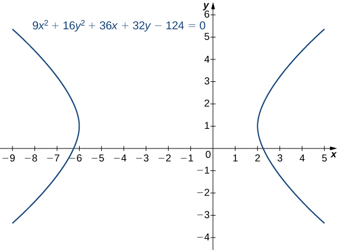{: #CNX_Calc_Figure_11_05_013}

Put the equation <math xmlns="http://www.w3.org/1998/Math/MathML"><mrow><mn>4</mn><msup><mi>y</mi><mn>2</mn></msup><mo>−</mo><mn>9</mn><msup><mi>x</mi><mn>2</mn></msup><mo>+</mo><mn>16</mn><mi>y</mi><mo>+</mo><mn>18</mn><mi>x</mi><mo>−</mo><mn>29</mn><mo>=</mo><mn>0</mn></mrow></math>

 into standard form and graph the resulting hyperbola. What are the equations of the asymptotes?

<math xmlns="http://www.w3.org/1998/Math/MathML"><mrow><mfrac><mrow><msup><mrow><mrow><mo>(</mo><mrow><mi>y</mi><mo>+</mo><mn>2</mn></mrow><mo>)</mo></mrow></mrow><mn>2</mn></msup></mrow><mn>9</mn></mfrac><mo>−</mo><mfrac><mrow><msup><mrow><mrow><mo>(</mo><mrow><mi>x</mi><mo>−</mo><mn>1</mn></mrow><mo>)</mo></mrow></mrow><mn>2</mn></msup></mrow><mn>4</mn></mfrac><mo>=</mo><mn>1</mn><mo>.</mo></mrow></math>

 This is a vertical hyperbola. Asymptotes <math xmlns="http://www.w3.org/1998/Math/MathML"><mrow><mi>y</mi><mo>=</mo><mn>−2</mn><mo>±</mo><mfrac><mn>3</mn><mn>2</mn></mfrac><mrow><mo>(</mo><mrow><mi>x</mi><mo>−</mo><mn>1</mn></mrow><mo>)</mo></mrow><mo>.</mo></mrow></math>

* * *
{: data-type="newline"}

  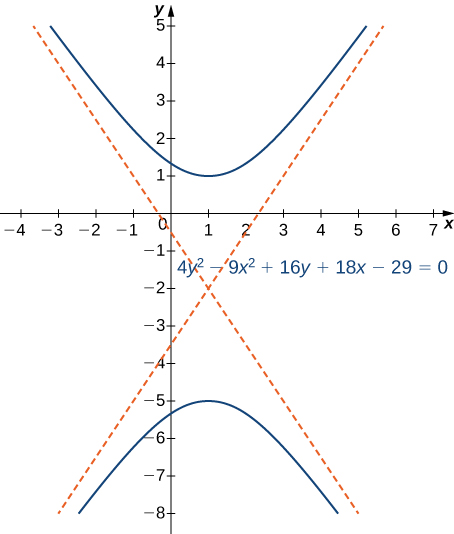 

Hint

Move the constant over and complete the square. Check which direction the hyperbola opens.

Hyperbolas also have interesting reflective properties. A ray directed toward one focus of a hyperbola is reflected by a hyperbolic mirror toward the other focus. This concept is illustrated in the following figure.

 {: #CNX_Calc_Figure_11_05_015}

This property of the hyperbola has important applications. It is used in radio direction finding (since the difference in signals from two towers is constant along hyperbolas), and in the construction of mirrors inside telescopes (to reflect light coming from the parabolic mirror to the eyepiece). Another interesting fact about hyperbolas is that for a comet entering the solar system, if the speed is great enough to escape the Sun’s gravitational pull, then the path that the comet takes as it passes through the solar system is hyperbolic.

# Eccentricity and Directrix

An alternative way to describe a conic section involves the directrices, the foci, and a new property called eccentricity. We will see that the value of the eccentricity of a conic section can uniquely define that conic.

Definition

The **eccentricity**{: data-type="term"} *e* of a conic section is defined to be the distance from any point on the conic section to its focus, divided by the perpendicular distance from that point to the nearest directrix. This value is constant for any conic section, and can define the conic section as well:

1.  If
    <math xmlns="http://www.w3.org/1998/Math/MathML"><mrow><mi>e</mi><mo>=</mo><mn>1</mn><mo>,</mo></mrow></math>
    
    the conic is a parabola.
2.  If
    <math xmlns="http://www.w3.org/1998/Math/MathML"><mrow><mi>e</mi><mo>&lt;</mo><mn>1</mn><mo>,</mo></mrow></math>
    
    it is an ellipse.
3.  If
    <math xmlns="http://www.w3.org/1998/Math/MathML"><mrow><mi>e</mi><mo>&gt;</mo><mn>1</mn><mo>,</mo></mrow></math>
    
    it is a hyperbola.
{: data-number-style="arabic"}

The eccentricity of a circle is zero. The directrix of a conic section is the line that, together with the point known as the focus, serves to define a conic section. Hyperbolas and noncircular ellipses have two foci and two associated directrices. Parabolas have one focus and one directrix.

The three conic sections with their directrices appear in the following figure.

 {: #CNX_Calc_Figure_11_05_016}

Recall from the definition of a parabola that the distance from any point on the parabola to the focus is equal to the distance from that same point to the directrix. Therefore, by definition, the eccentricity of a parabola must be 1. The equations of the directrices of a horizontal ellipse are <math xmlns="http://www.w3.org/1998/Math/MathML"><mrow><mi>x</mi><mo>=</mo><mtext>±</mtext><mfrac><mrow><msup><mi>a</mi><mn>2</mn></msup></mrow><mi>c</mi></mfrac><mo>.</mo></mrow></math>

 The right vertex of the ellipse is located at <math xmlns="http://www.w3.org/1998/Math/MathML"><mrow><mrow><mo>(</mo><mrow><mi>a</mi><mo>,</mo><mn>0</mn></mrow><mo>)</mo></mrow></mrow></math>

 and the right focus is <math xmlns="http://www.w3.org/1998/Math/MathML"><mrow><mrow><mo>(</mo><mrow><mi>c</mi><mo>,</mo><mn>0</mn></mrow><mo>)</mo></mrow><mo>.</mo></mrow></math>

 Therefore the distance from the vertex to the focus is <math xmlns="http://www.w3.org/1998/Math/MathML"><mrow><mi>a</mi><mo>−</mo><mi>c</mi></mrow></math>

 and the distance from the vertex to the right directrix is <math xmlns="http://www.w3.org/1998/Math/MathML"><mrow><mfrac><mrow><msup><mi>a</mi><mn>2</mn></msup></mrow><mi>c</mi></mfrac><mo>−</mo><mi>c</mi><mo>.</mo></mrow></math>

 This gives the eccentricity as

<math xmlns="http://www.w3.org/1998/Math/MathML"><mrow><mi>e</mi><mo>=</mo><mfrac><mrow><mi>a</mi><mo>−</mo><mi>c</mi></mrow><mrow><mfrac><mrow><msup><mi>a</mi><mn>2</mn></msup></mrow><mi>c</mi></mfrac><mo>−</mo><mi>a</mi></mrow></mfrac><mo>=</mo><mfrac><mrow><mi>c</mi><mrow><mo>(</mo><mrow><mi>a</mi><mo>−</mo><mi>c</mi></mrow><mo>)</mo></mrow></mrow><mrow><msup><mi>a</mi><mn>2</mn></msup><mo>−</mo><mi>a</mi><mi>c</mi></mrow></mfrac><mo>=</mo><mfrac><mrow><mi>c</mi><mrow><mo>(</mo><mrow><mi>a</mi><mo>−</mo><mi>c</mi></mrow><mo>)</mo></mrow></mrow><mrow><mi>a</mi><mrow><mo>(</mo><mrow><mi>a</mi><mo>−</mo><mi>c</mi></mrow><mo>)</mo></mrow></mrow></mfrac><mo>=</mo><mfrac><mi>c</mi><mi>a</mi></mfrac><mo>.</mo></mrow></math>

Since <math xmlns="http://www.w3.org/1998/Math/MathML"><mrow><mi>c</mi><mo>&lt;</mo><mi>a</mi><mo>,</mo></mrow></math>

 this step proves that the eccentricity of an ellipse is less than 1. The directrices of a horizontal hyperbola are also located at <math xmlns="http://www.w3.org/1998/Math/MathML"><mrow><mi>x</mi><mo>=</mo><mtext>±</mtext><mfrac><mrow><msup><mi>a</mi><mn>2</mn></msup></mrow><mi>c</mi></mfrac><mo>,</mo></mrow></math>

 and a similar calculation shows that the eccentricity of a hyperbola is also <math xmlns="http://www.w3.org/1998/Math/MathML"><mrow><mi>e</mi><mo>=</mo><mfrac><mi>c</mi><mi>a</mi></mfrac><mo>.</mo></mrow></math>

 However in this case we have <math xmlns="http://www.w3.org/1998/Math/MathML"><mrow><mi>c</mi><mo>&gt;</mo><mi>a</mi><mo>,</mo></mrow></math>

 so the eccentricity of a hyperbola is greater than 1.

Determining Eccentricity of a Conic Section

Determine the eccentricity of the ellipse described by the equation

<math xmlns="http://www.w3.org/1998/Math/MathML"><mrow><mfrac><mrow><msup><mrow><mrow><mo>(</mo><mrow><mi>x</mi><mo>−</mo><mn>3</mn></mrow><mo>)</mo></mrow></mrow><mn>2</mn></msup></mrow><mrow><mn>16</mn></mrow></mfrac><mo>+</mo><mfrac><mrow><msup><mrow><mrow><mo>(</mo><mrow><mi>y</mi><mo>+</mo><mn>2</mn></mrow><mo>)</mo></mrow></mrow><mn>2</mn></msup></mrow><mrow><mn>25</mn></mrow></mfrac><mo>=</mo><mn>1</mn><mo>.</mo></mrow></math>

From the equation we see that <math xmlns="http://www.w3.org/1998/Math/MathML"><mrow><mi>a</mi><mo>=</mo><mn>5</mn></mrow></math>

 and <math xmlns="http://www.w3.org/1998/Math/MathML"><mrow><mi>b</mi><mo>=</mo><mn>4</mn><mo>.</mo></mrow></math>

 The value of *c* can be calculated using the equation <math xmlns="http://www.w3.org/1998/Math/MathML"><mrow><msup><mi>a</mi><mn>2</mn></msup><mo>=</mo><msup><mi>b</mi><mn>2</mn></msup><mo>+</mo><msup><mi>c</mi><mn>2</mn></msup></mrow></math>

 for an ellipse. Substituting the values of *a* and *b* and solving for *c* gives <math xmlns="http://www.w3.org/1998/Math/MathML"><mrow><mi>c</mi><mo>=</mo><mn>3</mn><mo>.</mo></mrow></math>

 Therefore the eccentricity of the ellipse is <math xmlns="http://www.w3.org/1998/Math/MathML"><mrow><mi>e</mi><mo>=</mo><mfrac><mi>c</mi><mi>a</mi></mfrac><mo>=</mo><mfrac><mn>3</mn><mn>5</mn></mfrac><mo>=</mo><mn>0.6</mn><mo>.</mo></mrow></math>

Determine the eccentricity of the hyperbola described by the equation

<math xmlns="http://www.w3.org/1998/Math/MathML"><mrow><mfrac><mrow><msup><mrow><mrow><mo>(</mo><mrow><mi>y</mi><mo>−</mo><mn>3</mn></mrow><mo>)</mo></mrow></mrow><mn>2</mn></msup></mrow><mrow><mn>49</mn></mrow></mfrac><mo>−</mo><mfrac><mrow><msup><mrow><mrow><mo>(</mo><mrow><mi>x</mi><mo>+</mo><mn>2</mn></mrow><mo>)</mo></mrow></mrow><mn>2</mn></msup></mrow><mrow><mn>25</mn></mrow></mfrac><mo>=</mo><mn>1</mn><mo>.</mo></mrow></math>

<math xmlns="http://www.w3.org/1998/Math/MathML"><mrow><mi>e</mi><mo>=</mo><mfrac><mi>c</mi><mi>a</mi></mfrac><mo>=</mo><mfrac><mrow><msqrt><mrow><mn>74</mn></mrow></msqrt></mrow><mn>7</mn></mfrac><mo>≈</mo><mn>1.229</mn></mrow></math>

Hint

First find the values of *a* and *b*, then determine *c* using the equation <math xmlns="http://www.w3.org/1998/Math/MathML"><mrow><msup><mi>c</mi><mn>2</mn></msup><mo>=</mo><msup><mi>a</mi><mn>2</mn></msup><mo>+</mo><msup><mi>b</mi><mn>2</mn></msup><mo>.</mo></mrow></math>

# Polar Equations of Conic Sections

Sometimes it is useful to write or identify the equation of a conic section in polar form. To do this, we need the concept of the focal parameter. The **focal parameter**{: data-type="term"} of a conic section *p* is defined as the distance from a focus to the nearest directrix. The following table gives the focal parameters for the different types of conics, where *a* is the length of the semi-major axis (i.e., half the length of the major axis), *c* is the distance from the origin to the focus, and *e* is the eccentricity. In the case of a parabola, *a* represents the distance from the vertex to the focus.

<table summary="This table has three columns and four rows. The first row is a header row and reads from left to right Conic, e, and p. After the header, the first column reads Ellipse, Parabola, and Hyperbola. The second column reads 0 &lt; e &lt; 1, e = 1, and e &gt; 1. The third column reads (a2 &#x2013; c2)/c = a(1 &#x2013; e2)/c, 2a, and (c2 &#x2013; a2)/c = a(e2 &#x2013; 1)/e."><caption>Eccentricities and Focal Parameters of the Conic Sections</caption><thead>
<tr valign="top">
<th>Conic</th>
<th><em>e</em></th>
<th><em>p</em></th>
</tr>
</thead><tbody>
<tr valign="top">
<td>Ellipse</td>
<td><math xmlns="http://www.w3.org/1998/Math/MathML"><mrow><mn>0</mn><mo>&lt;</mo><mi>e</mi><mo>&lt;</mo><mn>1</mn></mrow></math></td>
<td><math xmlns="http://www.w3.org/1998/Math/MathML"><mrow><mfrac><mrow><msup><mi>a</mi><mn>2</mn></msup><mo>−</mo><msup><mi>c</mi><mn>2</mn></msup></mrow><mi>c</mi></mfrac><mo>=</mo><mfrac><mrow><mi>a</mi><mrow><mo>(</mo><mrow><mn>1</mn><mo>−</mo><msup><mi>e</mi><mn>2</mn></msup></mrow><mo>)</mo></mrow></mrow><mi>c</mi></mfrac></mrow></math></td>
</tr>
<tr valign="top">
<td>Parabola</td>
<td><math xmlns="http://www.w3.org/1998/Math/MathML"><mrow><mi>e</mi><mo>=</mo><mn>1</mn></mrow></math></td>
<td><math xmlns="http://www.w3.org/1998/Math/MathML"><mrow><mn>2</mn><mi>a</mi></mrow></math></td>
</tr>
<tr valign="top">
<td>Hyperbola</td>
<td><math xmlns="http://www.w3.org/1998/Math/MathML"><mrow><mi>e</mi><mo>&gt;</mo><mn>1</mn></mrow></math></td>
<td><math xmlns="http://www.w3.org/1998/Math/MathML"><mrow><mfrac><mrow><msup><mi>c</mi><mn>2</mn></msup><mo>−</mo><msup><mi>a</mi><mn>2</mn></msup></mrow><mi>c</mi></mfrac><mo>=</mo><mfrac><mrow><mi>a</mi><mrow><mo>(</mo><mrow><msup><mi>e</mi><mn>2</mn></msup><mo>−</mo><mn>1</mn></mrow><mo>)</mo></mrow></mrow><mi>e</mi></mfrac></mrow></math></td>
</tr>
</tbody></table>

Using the definitions of the focal parameter and eccentricity of the conic section, we can derive an equation for any conic section in polar coordinates. In particular, we assume that one of the foci of a given conic section lies at the pole. Then using the definition of the various conic sections in terms of distances, it is possible to prove the following theorem.

Polar Equation of Conic Sections

The polar equation of a conic section with focal parameter *p* is given by

<math xmlns="http://www.w3.org/1998/Math/MathML"><mrow><mi>r</mi><mo>=</mo><mfrac><mrow><mi>e</mi><mi>p</mi></mrow><mrow><mn>1</mn><mo>±</mo><mi>e</mi><mspace width="0.2em" /><mtext>cos</mtext><mspace width="0.2em" /><mi>θ</mi></mrow></mfrac><mspace width="0.2em" /><mtext>or</mtext><mspace width="0.2em" /><mi>r</mi><mo>=</mo><mfrac><mrow><mi>e</mi><mi>p</mi></mrow><mrow><mn>1</mn><mo>±</mo><mi>e</mi><mspace width="0.2em" /><mtext>sin</mtext><mspace width="0.2em" /><mi>θ</mi></mrow></mfrac><mo>.</mo></mrow></math>

In the equation on the left, the major axis of the conic section is horizontal, and in the equation on the right, the major axis is vertical. To work with a conic section written in polar form, first make the constant term in the denominator equal to 1. This can be done by dividing both the numerator and the denominator of the fraction by the constant that appears in front of the plus or minus in the denominator. Then the coefficient of the sine or cosine in the denominator is the eccentricity. This value identifies the conic. If cosine appears in the denominator, then the conic is horizontal. If sine appears, then the conic is vertical. If both appear then the axes are rotated. The center of the conic is not necessarily at the origin. The center is at the origin only if the conic is a circle (i.e., <math xmlns="http://www.w3.org/1998/Math/MathML"><mrow><mi>e</mi><mo>=</mo><mn>0</mn><mo stretchy="false">)</mo><mo>.</mo></mrow></math>

Graphing a Conic Section in Polar Coordinates

Identify and create a graph of the conic section described by the equation

<math xmlns="http://www.w3.org/1998/Math/MathML"><mrow><mi>r</mi><mo>=</mo><mfrac><mn>3</mn><mrow><mn>1</mn><mo>+</mo><mn>2</mn><mspace width="0.2em" /><mtext>cos</mtext><mspace width="0.2em" /><mi>θ</mi></mrow></mfrac><mo>.</mo></mrow></math>

The constant term in the denominator is 1, so the eccentricity of the conic is 2. This is a hyperbola. The focal parameter *p* can be calculated by using the equation <math xmlns="http://www.w3.org/1998/Math/MathML"><mrow><mi>e</mi><mi>p</mi><mo>=</mo><mn>3</mn><mo>.</mo></mrow></math>

 Since <math xmlns="http://www.w3.org/1998/Math/MathML"><mrow><mi>e</mi><mo>=</mo><mn>2</mn><mo>,</mo></mrow></math>

 this gives <math xmlns="http://www.w3.org/1998/Math/MathML"><mrow><mi>p</mi><mo>=</mo><mfrac><mn>3</mn><mn>2</mn></mfrac><mo>.</mo></mrow></math>

 The cosine function appears in the denominator, so the hyperbola is horizontal. Pick a few values for <math xmlns="http://www.w3.org/1998/Math/MathML"><mi>θ</mi></math>

 and create a table of values. Then we can graph the hyperbola ([[link]](#CNX_Calc_Figure_11_05_017)).

| <math xmlns="http://www.w3.org/1998/Math/MathML"><mi>θ</mi></math>

 | <math xmlns="http://www.w3.org/1998/Math/MathML"><mi>r</mi></math>

 | <math xmlns="http://www.w3.org/1998/Math/MathML"><mi>θ</mi></math>

 | <math xmlns="http://www.w3.org/1998/Math/MathML"><mi>r</mi></math>

 |
{: valign="top"}|----------
| 0 | 1 | <math xmlns="http://www.w3.org/1998/Math/MathML"><mi>π</mi></math>

 | −3 |
{: valign="top"}| <math xmlns="http://www.w3.org/1998/Math/MathML"><mrow><mfrac><mi>π</mi><mn>4</mn></mfrac></mrow></math>

 | <math xmlns="http://www.w3.org/1998/Math/MathML"><mrow><mfrac><mn>3</mn><mrow><mn>1</mn><mo>+</mo><msqrt><mn>2</mn></msqrt></mrow></mfrac><mo>≈</mo><mn>1.2426</mn></mrow></math>

 | <math xmlns="http://www.w3.org/1998/Math/MathML"><mrow><mfrac><mrow><mn>5</mn><mi>π</mi></mrow><mn>4</mn></mfrac></mrow></math>

 | <math xmlns="http://www.w3.org/1998/Math/MathML"><mrow><mfrac><mn>3</mn><mrow><mn>1</mn><mo>−</mo><msqrt><mn>2</mn></msqrt></mrow></mfrac><mo>≈</mo><mn>−7.2426</mn></mrow></math>

 |
{: valign="top"}| <math xmlns="http://www.w3.org/1998/Math/MathML"><mrow><mfrac><mi>π</mi><mn>2</mn></mfrac></mrow></math>

 | 3 | <math xmlns="http://www.w3.org/1998/Math/MathML"><mrow><mfrac><mrow><mn>3</mn><mi>π</mi></mrow><mn>2</mn></mfrac></mrow></math>

 | 3 |
{: valign="top"}| <math xmlns="http://www.w3.org/1998/Math/MathML"><mrow><mfrac><mrow><mn>3</mn><mi>π</mi></mrow><mn>4</mn></mfrac></mrow></math>

 | <math xmlns="http://www.w3.org/1998/Math/MathML"><mrow><mfrac><mn>3</mn><mrow><mn>1</mn><mo>−</mo><msqrt><mn>2</mn></msqrt></mrow></mfrac><mo>≈</mo><mn>−7.2426</mn></mrow></math>

 | <math xmlns="http://www.w3.org/1998/Math/MathML"><mrow><mfrac><mrow><mn>7</mn><mi>π</mi></mrow><mn>4</mn></mfrac></mrow></math>

 | <math xmlns="http://www.w3.org/1998/Math/MathML"><mrow><mfrac><mn>3</mn><mrow><mn>1</mn><mo>+</mo><msqrt><mn>2</mn></msqrt></mrow></mfrac><mo>≈</mo><mn>1.2426</mn></mrow></math>

 |
{: valign="top"}{: .unnumbered summary="This table has two columns and nine rows. The first row is a header row and reads from left to right &#x3B8; and 4. After the header, the first column reads 0, &#x3C0;/4, &#x3C0;/2, 3&#x3C0;/4, &#x3C0;, 5&#x3C0;/4, 3&#x3C0;/2, and 7&#x3C0;/4. The second column reads 1, 3 divided by the quantity (1 + the square root of 2), which is approximately equal to 1.2426, 3, 3 divided by the quantity (1 &#x2013; the square root of 2), which is approximately equal to &#x2212;7.2426, &#x2212;3, 3 divided by the quantity (1 &#x2013; the square root of 2), which is approximately equal to &#x2212;7.2426, 3, and 3 divided by the quantity (1 + the square root of 2), which is approximately equal to 1.2426." data-label=""}

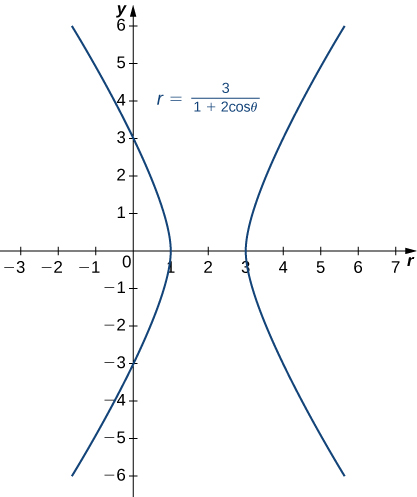{: #CNX_Calc_Figure_11_05_017}

Identify and create a graph of the conic section described by the equation

<math xmlns="http://www.w3.org/1998/Math/MathML"><mrow><mi>r</mi><mo>=</mo><mfrac><mn>4</mn><mrow><mn>1</mn><mo>−</mo><mn>0.8</mn><mspace width="0.2em" /><mtext>sin</mtext><mspace width="0.2em" /><mi>θ</mi></mrow></mfrac><mo>.</mo></mrow></math>

Here <math xmlns="http://www.w3.org/1998/Math/MathML"><mrow><mi>e</mi><mo>=</mo><mn>0.8</mn></mrow></math>

 and <math xmlns="http://www.w3.org/1998/Math/MathML"><mrow><mi>p</mi><mo>=</mo><mn>5</mn><mo>.</mo></mrow></math>

 This conic section is an ellipse.* * *
{: data-type="newline"}

  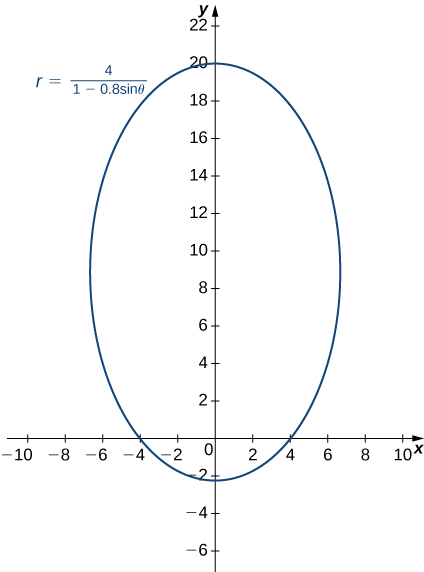 

Hint

First find the values of *e* and *p*, and then create a table of values.

# General Equations of Degree Two

A general equation of degree two can be written in the form

<math xmlns="http://www.w3.org/1998/Math/MathML"><mrow><mi>A</mi><msup><mi>x</mi><mn>2</mn></msup><mo>+</mo><mi>B</mi><mi>x</mi><mi>y</mi><mo>+</mo><mi>C</mi><msup><mi>y</mi><mn>2</mn></msup><mo>+</mo><mi>D</mi><mi>x</mi><mo>+</mo><mi>E</mi><mi>y</mi><mo>+</mo><mi>F</mi><mo>=</mo><mn>0</mn><mo>.</mo></mrow></math>

The graph of an equation of this form is a conic section. If <math xmlns="http://www.w3.org/1998/Math/MathML"><mrow><mi>B</mi><mo>≠</mo><mn>0</mn></mrow></math>

 then the coordinate axes are rotated. To identify the conic section, we use the **discriminant**{: data-type="term"} of the conic section <math xmlns="http://www.w3.org/1998/Math/MathML"><mrow><mn>4</mn><mi>A</mi><mi>C</mi><mo>−</mo><msup><mi>B</mi><mn>2</mn></msup><mo>.</mo></mrow></math>

 One of the following cases must be true:

1.  <math xmlns="http://www.w3.org/1998/Math/MathML"><mrow><mn>4</mn><mi>A</mi><mi>C</mi><mo>−</mo><msup><mi>B</mi><mn>2</mn></msup><mo>&gt;</mo><mn>0</mn><mo>.</mo></mrow></math>
    
    If so, the graph is an ellipse.
2.  <math xmlns="http://www.w3.org/1998/Math/MathML"><mrow><mn>4</mn><mi>A</mi><mi>C</mi><mo>−</mo><msup><mi>B</mi><mn>2</mn></msup><mo>=</mo><mn>0</mn><mo>.</mo></mrow></math>
    
    If so, the graph is a parabola.
3.  <math xmlns="http://www.w3.org/1998/Math/MathML"><mrow><mn>4</mn><mi>A</mi><mi>C</mi><mo>−</mo><msup><mi>B</mi><mn>2</mn></msup><mo>&lt;</mo><mn>0</mn><mo>.</mo></mrow></math>
    
    If so, the graph is a hyperbola.
{: data-number-style="arabic"}

The simplest example of a second-degree equation involving a cross term is <math xmlns="http://www.w3.org/1998/Math/MathML"><mrow><mi>x</mi><mi>y</mi><mo>=</mo><mn>1</mn><mo>.</mo></mrow></math>

 This equation can be solved for *y* to obtain <math xmlns="http://www.w3.org/1998/Math/MathML"><mrow><mi>y</mi><mo>=</mo><mfrac><mn>1</mn><mi>x</mi></mfrac><mo>.</mo></mrow></math>

 The graph of this function is called a *rectangular hyperbola* as shown.

 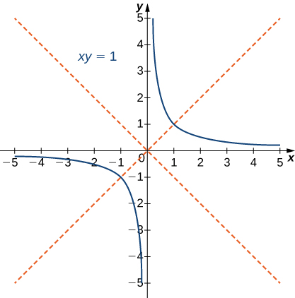{: #CNX_Calc_Figure_11_05_019}

The asymptotes of this hyperbola are the *x* and *y* coordinate axes. To determine the angle <math xmlns="http://www.w3.org/1998/Math/MathML"><mi>θ</mi></math>

 of rotation of the conic section, we use the formula <math xmlns="http://www.w3.org/1998/Math/MathML"><mrow><mtext>cot</mtext><mspace width="0.2em" /><mn>2</mn><mi>θ</mi><mo>=</mo><mfrac><mrow><mi>A</mi><mo>−</mo><mi>C</mi></mrow><mi>B</mi></mfrac><mo>.</mo></mrow></math>

 In this case <math xmlns="http://www.w3.org/1998/Math/MathML"><mrow><mi>A</mi><mo>=</mo><mi>C</mi><mo>=</mo><mn>0</mn></mrow></math>

 and <math xmlns="http://www.w3.org/1998/Math/MathML"><mrow><mi>B</mi><mo>=</mo><mn>1</mn><mo>,</mo></mrow></math>

 so <math xmlns="http://www.w3.org/1998/Math/MathML"><mrow><mtext>cot</mtext><mspace width="0.2em" /><mn>2</mn><mi>θ</mi><mo>=</mo><mrow><mrow><mo stretchy="false">(</mo><mn>0</mn><mo>−</mo><mn>0</mn><mo stretchy="false">)</mo></mrow><mtext>/</mtext><mrow><mn>1</mn><mo>=</mo><mn>0</mn></mrow></mrow></mrow></math>

 and <math xmlns="http://www.w3.org/1998/Math/MathML"><mrow><mi>θ</mi><mo>=</mo><mn>45</mn><mtext>°</mtext><mo>.</mo></mrow></math>

 The method for graphing a conic section with rotated axes involves determining the coefficients of the conic in the rotated coordinate system. The new coefficients are labeled <math xmlns="http://www.w3.org/1998/Math/MathML"><mrow><msup><mi>A</mi><mo>′</mo></msup><mo>,</mo><msup><mi>B</mi><mo>′</mo></msup><mo>,</mo><msup><mi>C</mi><mo>′</mo></msup><mo>,</mo><msup><mi>D</mi><mo>′</mo></msup><mo>,</mo><msup><mi>E</mi><mo>′</mo></msup><mo>,</mo><mspace width="0.2em" /><mtext>and</mtext><mspace width="0.2em" /><msup><mi>F</mi><mo>′</mo></msup><mo>,</mo></mrow></math>

 and are given by the formulas

<math xmlns="http://www.w3.org/1998/Math/MathML"><mtable><mtr><mtd columnalign="right"><msup><mi>A</mi><mo>′</mo></msup></mtd><mtd columnalign="left"><mo>=</mo></mtd><mtd columnalign="left"><mi>A</mi><mspace width="0.2em" /><msup><mtext>cos</mtext><mn>2</mn></msup><mi>θ</mi><mo>+</mo><mi>B</mi><mspace width="0.2em" /><mtext>cos</mtext><mspace width="0.2em" /><mi>θ</mi><mspace width="0.2em" /><mtext>sin</mtext><mspace width="0.2em" /><mi>θ</mi><mo>+</mo><mi>C</mi><mspace width="0.2em" /><msup><mtext>sin</mtext><mn>2</mn></msup><mi>θ</mi></mtd></mtr><mtr><mtd columnalign="right"><msup><mi>B</mi><mo>′</mo></msup></mtd><mtd columnalign="left"><mo>=</mo></mtd><mtd columnalign="left"><mn>0</mn></mtd></mtr><mtr><mtd columnalign="right"><msup><mi>C</mi><mo>′</mo></msup></mtd><mtd columnalign="left"><mo>=</mo></mtd><mtd columnalign="left"><mi>A</mi><mspace width="0.2em" /><msup><mtext>sin</mtext><mn>2</mn></msup><mi>θ</mi><mo>−</mo><mi>B</mi><mspace width="0.2em" /><mtext>sin</mtext><mspace width="0.2em" /><mi>θ</mi><mspace width="0.2em" /><mtext>cos</mtext><mspace width="0.2em" /><mi>θ</mi><mo>+</mo><mi>C</mi><mspace width="0.2em" /><msup><mtext>cos</mtext><mn>2</mn></msup><mi>θ</mi></mtd></mtr><mtr><mtd columnalign="right"><msup><mi>D</mi><mo>′</mo></msup></mtd><mtd columnalign="left"><mo>=</mo></mtd><mtd columnalign="left"><mi>D</mi><mspace width="0.2em" /><mtext>cos</mtext><mspace width="0.2em" /><mi>θ</mi><mo>+</mo><mi>E</mi><mspace width="0.2em" /><mtext>sin</mtext><mspace width="0.2em" /><mi>θ</mi></mtd></mtr><mtr><mtd columnalign="right"><msup><mi>E</mi><mo>′</mo></msup></mtd><mtd columnalign="left"><mo>=</mo></mtd><mtd columnalign="left"><mtext>−</mtext><mi>D</mi><mspace width="0.2em" /><mtext>sin</mtext><mspace width="0.2em" /><mi>θ</mi><mo>+</mo><mi>E</mi><mspace width="0.2em" /><mtext>cos</mtext><mspace width="0.2em" /><mi>θ</mi></mtd></mtr><mtr><mtd columnalign="right"><msup><mi>F</mi><mo>′</mo></msup></mtd><mtd columnalign="left"><mo>=</mo></mtd><mtd columnalign="left"><mi>F</mi><mo>.</mo></mtd></mtr></mtable></math>

The procedure for graphing a rotated conic is the following:

1.  Identify the conic section using the discriminant
    <math xmlns="http://www.w3.org/1998/Math/MathML"><mrow><mn>4</mn><mi>A</mi><mi>C</mi><mo>−</mo><msup><mi>B</mi><mn>2</mn></msup><mo>.</mo></mrow></math>

2.  Determine
    <math xmlns="http://www.w3.org/1998/Math/MathML"><mi>θ</mi></math>
    
    using the formula
    <math xmlns="http://www.w3.org/1998/Math/MathML"><mrow><mtext>cot</mtext><mspace width="0.2em" /><mn>2</mn><mi>θ</mi><mo>=</mo><mfrac><mrow><mi>A</mi><mo>−</mo><mi>C</mi></mrow><mi>B</mi></mfrac><mo>.</mo></mrow></math>

3.  Calculate
    <math xmlns="http://www.w3.org/1998/Math/MathML"><mrow><msup><mi>A</mi><mo>′</mo></msup><mo>,</mo><msup><mi>B</mi><mo>′</mo></msup><mo>,</mo><msup><mi>C</mi><mo>′</mo></msup><mo>,</mo><msup><mi>D</mi><mo>′</mo></msup><mo>,</mo><msup><mi>E</mi><mo>′</mo></msup><mo>,</mo><mspace width="0.2em" /><mtext>and</mtext><mspace width="0.2em" /><msup><mi>F</mi><mo>′</mo></msup><mo>.</mo></mrow></math>

4.  Rewrite the original equation using
    <math xmlns="http://www.w3.org/1998/Math/MathML"><mrow><msup><mi>A</mi><mo>′</mo></msup><mo>,</mo><msup><mi>B</mi><mo>′</mo></msup><mo>,</mo><msup><mi>C</mi><mo>′</mo></msup><mo>,</mo><msup><mi>D</mi><mo>′</mo></msup><mo>,</mo><msup><mi>E</mi><mo>′</mo></msup><mo>,</mo><mspace width="0.2em" /><mtext>and</mtext><mspace width="0.2em" /><msup><mi>F</mi><mo>′</mo></msup><mo>.</mo></mrow></math>

5.  Draw a graph using the rotated equation.
{: data-number-style="arabic"}

Identifying a Rotated Conic

Identify the conic and calculate the angle of rotation of axes for the curve described by the equation

<math xmlns="http://www.w3.org/1998/Math/MathML"><mrow><mn>13</mn><msup><mi>x</mi><mn>2</mn></msup><mo>−</mo><mn>6</mn><msqrt><mn>3</mn></msqrt><mi>x</mi><mi>y</mi><mo>+</mo><mn>7</mn><msup><mi>y</mi><mn>2</mn></msup><mo>−</mo><mn>256</mn><mo>=</mo><mn>0</mn><mo>.</mo></mrow></math>

In this equation, <math xmlns="http://www.w3.org/1998/Math/MathML"><mrow><mi>A</mi><mo>=</mo><mn>13</mn><mo>,</mo><mi>B</mi><mo>=</mo><mn>−6</mn><msqrt><mn>3</mn></msqrt><mo>,</mo><mi>C</mi><mo>=</mo><mn>7</mn><mo>,</mo><mi>D</mi><mo>=</mo><mn>0</mn><mo>,</mo><mi>E</mi><mo>=</mo><mn>0</mn><mo>,</mo></mrow></math>

 and <math xmlns="http://www.w3.org/1998/Math/MathML"><mrow><mi>F</mi><mo>=</mo><mn>−256</mn><mo>.</mo></mrow></math>

 The discriminant of this equation is <math xmlns="http://www.w3.org/1998/Math/MathML"><mrow><mn>4</mn><mi>A</mi><mi>C</mi><mo>−</mo><msup><mi>B</mi><mn>2</mn></msup><mo>=</mo><mn>4</mn><mrow><mo>(</mo><mrow><mn>13</mn></mrow><mo>)</mo></mrow><mrow><mo>(</mo><mn>7</mn><mo>)</mo></mrow><mo>−</mo><msup><mrow><mrow><mo>(</mo><mrow><mn>−6</mn><msqrt><mn>3</mn></msqrt></mrow><mo>)</mo></mrow></mrow><mn>2</mn></msup><mo>=</mo><mn>364</mn><mo>−</mo><mn>108</mn><mo>=</mo><mn>256</mn><mo>.</mo></mrow></math>

 Therefore this conic is an ellipse. To calculate the angle of rotation of the axes, use <math xmlns="http://www.w3.org/1998/Math/MathML"><mrow><mtext>cot</mtext><mspace width="0.2em" /><mn>2</mn><mi>θ</mi><mo>=</mo><mfrac><mrow><mi>A</mi><mo>−</mo><mi>C</mi></mrow><mi>B</mi></mfrac><mo>.</mo></mrow></math>

 This gives

<math xmlns="http://www.w3.org/1998/Math/MathML"><mtable><mtr><mtd columnalign="right"><mtext>cot</mtext><mspace width="0.2em" /><mn>2</mn><mi>θ</mi></mtd><mtd columnalign="left"><mo>=</mo><mfrac><mrow><mi>A</mi><mo>−</mo><mi>C</mi></mrow><mi>B</mi></mfrac></mtd></mtr><mtr><mtd /><mtd columnalign="left"><mo>=</mo><mfrac><mrow><mn>13</mn><mo>−</mo><mn>7</mn></mrow><mrow><mn>−6</mn><msqrt><mn>3</mn></msqrt></mrow></mfrac></mtd></mtr><mtr><mtd /><mtd columnalign="left"><mo>=</mo><mo>−</mo><mfrac><mrow><msqrt><mn>3</mn></msqrt></mrow><mn>3</mn></mfrac><mo>.</mo></mtd></mtr></mtable></math>

Therefore <math xmlns="http://www.w3.org/1998/Math/MathML"><mrow><mn>2</mn><mi>θ</mi><mo>=</mo><msup><mrow><mn>120</mn></mrow><mtext>o</mtext></msup></mrow></math>

 and <math xmlns="http://www.w3.org/1998/Math/MathML"><mrow><mi>θ</mi><mo>=</mo><msup><mrow><mn>60</mn></mrow><mtext>o</mtext></msup><mo>,</mo></mrow></math>

 which is the angle of the rotation of the axes.

To determine the rotated coefficients, use the formulas given above:

<math xmlns="http://www.w3.org/1998/Math/MathML"><mtable><mtr><mtd columnalign="right"><msup><mi>A</mi><mo>′</mo></msup></mtd><mtd columnalign="left"><mo>=</mo></mtd><mtd columnalign="left"><mi>A</mi><mspace width="0.2em" /><msup><mtext>cos</mtext><mn>2</mn></msup><mi>θ</mi><mo>+</mo><mi>B</mi><mspace width="0.2em" /><mtext>cos</mtext><mspace width="0.2em" /><mi>θ</mi><mspace width="0.2em" /><mtext>sin</mtext><mspace width="0.2em" /><mi>θ</mi><mo>+</mo><mi>C</mi><mspace width="0.2em" /><msup><mtext>sin</mtext><mn>2</mn></msup><mi>θ</mi></mtd></mtr><mtr><mtd /><mtd columnalign="left"><mo>=</mo></mtd><mtd columnalign="left"><mn>13</mn><msup><mtext>cos</mtext><mn>2</mn></msup><mn>60</mn><mo>+</mo><mrow><mo>(</mo><mrow><mn>−6</mn><msqrt><mn>3</mn></msqrt></mrow><mo>)</mo></mrow><mspace width="0.2em" /><mtext>cos</mtext><mspace width="0.2em" /><mn>60</mn><mspace width="0.2em" /><mtext>sin</mtext><mspace width="0.2em" /><mn>60</mn><mo>+</mo><mn>7</mn><msup><mtext>sin</mtext><mn>2</mn></msup><mn>60</mn></mtd></mtr><mtr><mtd /><mtd columnalign="left"><mo>=</mo></mtd><mtd columnalign="left"><mn>13</mn><msup><mrow><mo>(</mo><mrow><mfrac><mn>1</mn><mn>2</mn></mfrac></mrow><mo>)</mo></mrow><mn>2</mn></msup><mo>−</mo><mn>6</mn><msqrt><mn>3</mn></msqrt><mrow><mo>(</mo><mrow><mfrac><mn>1</mn><mn>2</mn></mfrac></mrow><mo>)</mo></mrow><mrow><mo>(</mo><mrow><mfrac><mrow><msqrt><mn>3</mn></msqrt></mrow><mn>2</mn></mfrac></mrow><mo>)</mo></mrow><mo>+</mo><mn>7</mn><msup><mrow><mo>(</mo><mrow><mfrac><mrow><msqrt><mn>3</mn></msqrt></mrow><mn>2</mn></mfrac></mrow><mo>)</mo></mrow><mn>2</mn></msup></mtd></mtr><mtr><mtd /><mtd columnalign="left"><mo>=</mo></mtd><mtd columnalign="left"><mn>4,</mn></mtd></mtr><mtr><mtd columnalign="right"><msup><mi>B</mi><mo>′</mo></msup></mtd><mtd columnalign="left"><mo>=</mo></mtd><mtd columnalign="left"><mn>0</mn><mo>,</mo></mtd></mtr><mtr><mtd columnalign="right"><msup><mi>C</mi><mo>′</mo></msup></mtd><mtd columnalign="left"><mo>=</mo></mtd><mtd columnalign="left"><mi>A</mi><mspace width="0.2em" /><msup><mtext>sin</mtext><mn>2</mn></msup><mi>θ</mi><mo>−</mo><mi>B</mi><mspace width="0.2em" /><mtext>sin</mtext><mspace width="0.2em" /><mi>θ</mi><mspace width="0.2em" /><mtext>cos</mtext><mspace width="0.2em" /><mi>θ</mi><mo>+</mo><mi>C</mi><mspace width="0.2em" /><msup><mtext>cos</mtext><mn>2</mn></msup><mi>θ</mi></mtd></mtr><mtr><mtd /><mtd columnalign="left"><mo>=</mo></mtd><mtd columnalign="left"><mn>13</mn><msup><mtext>sin</mtext><mn>2</mn></msup><mn>60</mn><mo>+</mo><mrow><mo>(</mo><mrow><mn>−6</mn><msqrt><mn>3</mn></msqrt></mrow><mo>)</mo></mrow><mspace width="0.2em" /><mtext>sin</mtext><mspace width="0.2em" /><mn>60</mn><mspace width="0.2em" /><mtext>cos</mtext><mspace width="0.2em" /><mn>60</mn><mo>=</mo><mn>7</mn><msup><mtext>cos</mtext><mn>2</mn></msup><mn>60</mn></mtd></mtr><mtr><mtd columnalign="right" /><mtd columnalign="left"><mo>=</mo></mtd><mtd columnalign="left"><msup><mrow><mo>(</mo><mrow><mfrac><mrow><msqrt><mn>3</mn></msqrt></mrow><mn>2</mn></mfrac></mrow><mo>)</mo></mrow><mn>2</mn></msup><mo>+</mo><mn>6</mn><msqrt><mn>3</mn></msqrt><mrow><mo>(</mo><mrow><mfrac><mrow><msqrt><mn>3</mn></msqrt></mrow><mn>2</mn></mfrac></mrow><mo>)</mo></mrow><mrow><mo>(</mo><mrow><mfrac><mn>1</mn><mn>2</mn></mfrac></mrow><mo>)</mo></mrow><mo>+</mo><mn>7</mn><msup><mrow><mo>(</mo><mrow><mfrac><mn>1</mn><mn>2</mn></mfrac></mrow><mo>)</mo></mrow><mn>2</mn></msup></mtd></mtr><mtr><mtd /><mtd columnalign="left"><mo>=</mo></mtd><mtd columnalign="left"><mn>16,</mn></mtd></mtr><mtr><mtd columnalign="right"><msup><mi>D</mi><mo>′</mo></msup></mtd><mtd columnalign="left"><mo>=</mo></mtd><mtd columnalign="left"><mi>D</mi><mspace width="0.2em" /><mtext>cos</mtext><mspace width="0.2em" /><mi>θ</mi><mo>+</mo><mi>E</mi><mspace width="0.2em" /><mtext>sin</mtext><mspace width="0.2em" /><mi>θ</mi></mtd></mtr><mtr><mtd /><mtd columnalign="left"><mo>=</mo></mtd><mtd columnalign="left"><mrow><mo>(</mo><mn>0</mn><mo>)</mo></mrow><mspace width="0.2em" /><mtext>cos</mtext><mspace width="0.2em" /><mn>60</mn><mo>+</mo><mrow><mo>(</mo><mn>0</mn><mo>)</mo></mrow><mspace width="0.2em" /><mtext>sin</mtext><mspace width="0.2em" /><mn>60</mn></mtd></mtr><mtr><mtd /><mtd columnalign="left"><mo>=</mo></mtd><mtd columnalign="left"><mn>0,</mn></mtd></mtr><mtr><mtd columnalign="right"><msup><mi>E</mi><mo>′</mo></msup></mtd><mtd columnalign="left"><mo>=</mo></mtd><mtd columnalign="left"><mtext>−</mtext><mi>D</mi><mspace width="0.2em" /><mtext>sin</mtext><mspace width="0.2em" /><mi>θ</mi><mo>+</mo><mi>E</mi><mspace width="0.2em" /><mtext>cos</mtext><mspace width="0.2em" /><mi>θ</mi></mtd></mtr><mtr><mtd /><mtd columnalign="left"><mo>=</mo></mtd><mtd columnalign="left"><mtext>−</mtext><mrow><mo>(</mo><mn>0</mn><mo>)</mo></mrow><mspace width="0.2em" /><mtext>sin</mtext><mspace width="0.2em" /><mn>60</mn><mo>+</mo><mrow><mo>(</mo><mn>0</mn><mo>)</mo></mrow><mspace width="0.2em" /><mtext>cos</mtext><mspace width="0.2em" /><mn>60</mn></mtd></mtr><mtr><mtd /><mtd columnalign="left"><mo>=</mo></mtd><mtd columnalign="left"><mn>0,</mn></mtd></mtr><mtr><mtd columnalign="right"><msup><mi>F</mi><mo>′</mo></msup></mtd><mtd columnalign="left"><mo>=</mo></mtd><mtd columnalign="left"><mi>F</mi></mtd></mtr><mtr><mtd /><mtd columnalign="left"><mo>=</mo></mtd><mtd columnalign="left"><mn>−256.</mn></mtd></mtr></mtable></math>

The equation of the conic in the rotated coordinate system becomes

<math xmlns="http://www.w3.org/1998/Math/MathML"><mtable><mtr /><mtr><mtd columnalign="right"><mn>4</mn><msup><mrow><mo>(</mo><msup><mi>x</mi><mo>′</mo></msup><mo>)</mo></mrow><mn>2</mn></msup><mo>+</mo><mn>16</mn><msup><mrow><mo>(</mo><msup><mi>y</mi><mo>′</mo></msup><mo>)</mo></mrow><mn>2</mn></msup></mtd><mtd columnalign="left"><mo>=</mo></mtd><mtd columnalign="left"><mn>256</mn></mtd></mtr><mtr><mtd columnalign="right"><mfrac><mrow><msup><mrow><mrow><mo>(</mo><msup><mi>x</mi><mo>′</mo></msup><mo>)</mo></mrow></mrow><mn>2</mn></msup></mrow><mrow><mn>64</mn></mrow></mfrac><mo>+</mo><mfrac><mrow><msup><mrow><mrow><mo>(</mo><msup><mi>y</mi><mo>′</mo></msup><mo>)</mo></mrow></mrow><mn>2</mn></msup></mrow><mrow><mn>16</mn></mrow></mfrac></mtd><mtd columnalign="left"><mo>=</mo></mtd><mtd columnalign="left"><mn>1.</mn></mtd></mtr></mtable></math>

A graph of this conic section appears as follows.

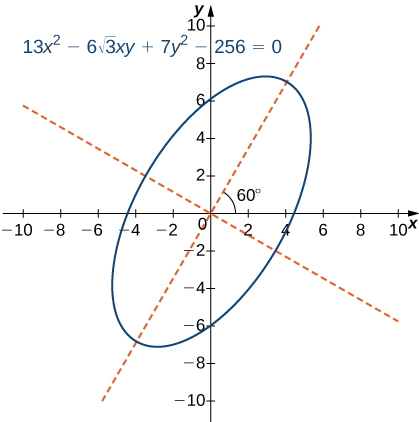{: #CNX_Calc_Figure_11_05_020}

Identify the conic and calculate the angle of rotation of axes for the curve described by the equation

<math xmlns="http://www.w3.org/1998/Math/MathML"><mrow><mn>3</mn><msup><mi>x</mi><mn>2</mn></msup><mo>+</mo><mn>5</mn><mi>x</mi><mi>y</mi><mo>−</mo><mn>2</mn><msup><mi>y</mi><mn>2</mn></msup><mo>−</mo><mn>125</mn><mo>=</mo><mn>0</mn><mo>.</mo></mrow></math>

The conic is a hyperbola and the angle of rotation of the axes is <math xmlns="http://www.w3.org/1998/Math/MathML"><mrow><mi>θ</mi><mo>=</mo><mn>22.5</mn><mtext>°</mtext><mo>.</mo></mrow></math>

Hint

Follow steps 1 and 2 of the five-step method outlined above.

# Key Concepts

* The equation of a vertical parabola in standard form with given focus and directrix is
  <math xmlns="http://www.w3.org/1998/Math/MathML"><mrow><mi>y</mi><mo>=</mo><mfrac><mn>1</mn><mrow><mn>4</mn><mi>p</mi></mrow></mfrac><msup><mrow><mrow><mo>(</mo><mrow><mi>x</mi><mo>−</mo><mi>h</mi></mrow><mo>)</mo></mrow></mrow><mn>2</mn></msup><mo>+</mo><mi>k</mi></mrow></math>
  
  where *p* is the distance from the vertex to the focus and
  <math xmlns="http://www.w3.org/1998/Math/MathML"><mrow><mrow><mo>(</mo><mrow><mi>h</mi><mo>,</mo><mi>k</mi></mrow><mo>)</mo></mrow></mrow></math>
  
  are the coordinates of the vertex.
* The equation of a horizontal ellipse in standard form is
  <math xmlns="http://www.w3.org/1998/Math/MathML"><mrow><mfrac><mrow><msup><mrow><mrow><mo>(</mo><mrow><mi>x</mi><mo>−</mo><mi>h</mi></mrow><mo>)</mo></mrow></mrow><mn>2</mn></msup></mrow><mrow><msup><mi>a</mi><mn>2</mn></msup></mrow></mfrac><mo>+</mo><mfrac><mrow><msup><mrow><mrow><mo>(</mo><mrow><mi>y</mi><mo>−</mo><mi>k</mi></mrow><mo>)</mo></mrow></mrow><mn>2</mn></msup></mrow><mrow><msup><mi>b</mi><mn>2</mn></msup></mrow></mfrac><mo>=</mo><mn>1</mn></mrow></math>
  
  where the center has coordinates
  <math xmlns="http://www.w3.org/1998/Math/MathML"><mrow><mrow><mo>(</mo><mrow><mi>h</mi><mo>,</mo><mi>k</mi></mrow><mo>)</mo></mrow><mo>,</mo></mrow></math>
  
  the major axis has length 2*a,* the minor axis has length 2*b*, and the coordinates of the foci are
  <math xmlns="http://www.w3.org/1998/Math/MathML"><mrow><mrow><mo>(</mo><mrow><mi>h</mi><mo>±</mo><mi>c</mi><mo>,</mo><mi>k</mi></mrow><mo>)</mo></mrow><mo>,</mo></mrow></math>
  
  where
  <math xmlns="http://www.w3.org/1998/Math/MathML"><mrow><msup><mi>c</mi><mn>2</mn></msup><mo>=</mo><msup><mi>a</mi><mn>2</mn></msup><mo>−</mo><msup><mi>b</mi><mn>2</mn></msup><mo>.</mo></mrow></math>

* The equation of a horizontal hyperbola in standard form is
  <math xmlns="http://www.w3.org/1998/Math/MathML"><mrow><mfrac><mrow><msup><mrow><mrow><mo>(</mo><mrow><mi>x</mi><mo>−</mo><mi>h</mi></mrow><mo>)</mo></mrow></mrow><mn>2</mn></msup></mrow><mrow><msup><mi>a</mi><mn>2</mn></msup></mrow></mfrac><mo>−</mo><mfrac><mrow><msup><mrow><mrow><mo>(</mo><mrow><mi>y</mi><mo>−</mo><mi>k</mi></mrow><mo>)</mo></mrow></mrow><mn>2</mn></msup></mrow><mrow><msup><mi>b</mi><mn>2</mn></msup></mrow></mfrac><mo>=</mo><mn>1</mn></mrow></math>
  
  where the center has coordinates
  <math xmlns="http://www.w3.org/1998/Math/MathML"><mrow><mrow><mo>(</mo><mrow><mi>h</mi><mo>,</mo><mi>k</mi></mrow><mo>)</mo></mrow><mo>,</mo></mrow></math>
  
  the vertices are located at
  <math xmlns="http://www.w3.org/1998/Math/MathML"><mrow><mrow><mo>(</mo><mrow><mi>h</mi><mo>±</mo><mi>a</mi><mo>,</mo><mi>k</mi></mrow><mo>)</mo></mrow><mo>,</mo></mrow></math>
  
  and the coordinates of the foci are
  <math xmlns="http://www.w3.org/1998/Math/MathML"><mrow><mrow><mo>(</mo><mrow><mi>h</mi><mo>±</mo><mi>c</mi><mo>,</mo><mi>k</mi></mrow><mo>)</mo></mrow><mo>,</mo></mrow></math>
  
  where
  <math xmlns="http://www.w3.org/1998/Math/MathML"><mrow><msup><mi>c</mi><mn>2</mn></msup><mo>=</mo><msup><mi>a</mi><mn>2</mn></msup><mo>+</mo><msup><mi>b</mi><mn>2</mn></msup><mo>.</mo></mrow></math>

* The eccentricity of an ellipse is less than 1, the eccentricity of a parabola is equal to 1, and the eccentricity of a hyperbola is greater than 1. The eccentricity of a circle is 0.
* The polar equation of a conic section with eccentricity *e* is
  <math xmlns="http://www.w3.org/1998/Math/MathML"><mrow><mi>r</mi><mo>=</mo><mfrac><mrow><mi>e</mi><mi>p</mi></mrow><mrow><mn>1</mn><mo>±</mo><mi>e</mi><mspace width="0.2em" /><mtext>cos</mtext><mspace width="0.2em" /><mi>θ</mi></mrow></mfrac></mrow></math>
  
  or
  <math xmlns="http://www.w3.org/1998/Math/MathML"><mrow><mi>r</mi><mo>=</mo><mfrac><mrow><mi>e</mi><mi>p</mi></mrow><mrow><mn>1</mn><mo>±</mo><mi>e</mi><mspace width="0.2em" /><mtext>sin</mtext><mspace width="0.2em" /><mi>θ</mi></mrow></mfrac><mo>,</mo></mrow></math>
  
  where *p* represents the focal parameter.
* To identify a conic generated by the equation
  <math xmlns="http://www.w3.org/1998/Math/MathML"><mrow><mi>A</mi><msup><mi>x</mi><mn>2</mn></msup><mo>+</mo><mi>B</mi><mi>x</mi><mi>y</mi><mo>+</mo><mi>C</mi><msup><mi>y</mi><mn>2</mn></msup><mo>+</mo><mi>D</mi><mi>x</mi><mo>+</mo><mi>E</mi><mi>y</mi><mo>+</mo><mi>F</mi><mo>=</mo><mn>0</mn><mo>,</mo></mrow></math>
  
  first calculate the discriminant
  <math xmlns="http://www.w3.org/1998/Math/MathML"><mrow><mi>D</mi><mo>=</mo><mn>4</mn><mi>A</mi><mi>C</mi><mo>−</mo><msup><mi>B</mi><mn>2</mn></msup><mo>.</mo></mrow></math>
  
  If
  <math xmlns="http://www.w3.org/1998/Math/MathML"><mrow><mi>D</mi><mo>&gt;</mo><mn>0</mn></mrow></math>
  
  then the conic is an ellipse, if
  <math xmlns="http://www.w3.org/1998/Math/MathML"><mrow><mi>D</mi><mo>=</mo><mn>0</mn></mrow></math>
  
  then the conic is a parabola, and if
  <math xmlns="http://www.w3.org/1998/Math/MathML"><mrow><mi>D</mi><mo>&lt;</mo><mn>0</mn></mrow></math>
  
  then the conic is a hyperbola.
{: data-bullet-style="bullet"}

<section data-depth="1" class="section-exercises" markdown="1">
For the following exercises, determine the equation of the parabola using the information given.

Focus <math xmlns="http://www.w3.org/1998/Math/MathML"><mrow><mrow><mo>(</mo><mrow><mn>4</mn><mo>,</mo><mn>0</mn></mrow><mo>)</mo></mrow></mrow></math>

 and directrix <math xmlns="http://www.w3.org/1998/Math/MathML"><mrow><mi>x</mi><mo>=</mo><mn>−4</mn></mrow></math>

<math xmlns="http://www.w3.org/1998/Math/MathML"><mrow><msup><mi>y</mi><mn>2</mn></msup><mo>=</mo><mn>16</mn><mi>x</mi></mrow></math>

Focus <math xmlns="http://www.w3.org/1998/Math/MathML"><mrow><mrow><mo>(</mo><mrow><mn>0</mn><mo>,</mo><mn>−3</mn></mrow><mo>)</mo></mrow></mrow></math>

 and directrix <math xmlns="http://www.w3.org/1998/Math/MathML"><mrow><mi>y</mi><mo>=</mo><mn>3</mn></mrow></math>

Focus <math xmlns="http://www.w3.org/1998/Math/MathML"><mrow><mrow><mo>(</mo><mrow><mn>0</mn><mo>,</mo><mn>0.5</mn></mrow><mo>)</mo></mrow></mrow></math>

 and directrix <math xmlns="http://www.w3.org/1998/Math/MathML"><mrow><mi>y</mi><mo>=</mo><mn>−0.5</mn></mrow></math>

<math xmlns="http://www.w3.org/1998/Math/MathML"><mrow><msup><mi>x</mi><mn>2</mn></msup><mo>=</mo><mn>2</mn><mi>y</mi></mrow></math>

Focus <math xmlns="http://www.w3.org/1998/Math/MathML"><mrow><mrow><mo>(</mo><mrow><mn>2</mn><mo>,</mo><mspace width="0.2em" /><mn>3</mn></mrow><mo>)</mo></mrow></mrow></math>

 and directrix <math xmlns="http://www.w3.org/1998/Math/MathML"><mrow><mi>x</mi><mo>=</mo><mn>−2</mn></mrow></math>

Focus <math xmlns="http://www.w3.org/1998/Math/MathML"><mrow><mrow><mo>(</mo><mrow><mn>0</mn><mo>,</mo><mn>2</mn></mrow><mo>)</mo></mrow></mrow></math>

 and directrix <math xmlns="http://www.w3.org/1998/Math/MathML"><mrow><mi>y</mi><mo>=</mo><mn>4</mn></mrow></math>

<math xmlns="http://www.w3.org/1998/Math/MathML"><mrow><msup><mi>x</mi><mn>2</mn></msup><mo>=</mo><mn>−4</mn><mrow><mo>(</mo><mrow><mi>y</mi><mo>−</mo><mn>3</mn></mrow><mo>)</mo></mrow></mrow></math>

Focus <math xmlns="http://www.w3.org/1998/Math/MathML"><mrow><mrow><mo>(</mo><mrow><mn>−1</mn><mo>,</mo><mn>4</mn></mrow><mo>)</mo></mrow></mrow></math>

 and directrix <math xmlns="http://www.w3.org/1998/Math/MathML"><mrow><mi>x</mi><mo>=</mo><mn>5</mn></mrow></math>

Focus <math xmlns="http://www.w3.org/1998/Math/MathML"><mrow><mrow><mo>(</mo><mrow><mn>−3</mn><mo>,</mo><mn>5</mn></mrow><mo>)</mo></mrow></mrow></math>

 and directrix <math xmlns="http://www.w3.org/1998/Math/MathML"><mrow><mi>y</mi><mo>=</mo><mn>1</mn></mrow></math>

<math xmlns="http://www.w3.org/1998/Math/MathML"><mrow><msup><mrow><mrow><mo>(</mo><mrow><mi>x</mi><mo>+</mo><mn>3</mn></mrow><mo>)</mo></mrow></mrow><mn>2</mn></msup><mo>=</mo><mn>8</mn><mrow><mo>(</mo><mrow><mi>y</mi><mo>−</mo><mn>3</mn></mrow><mo>)</mo></mrow></mrow></math>

Focus <math xmlns="http://www.w3.org/1998/Math/MathML"><mrow><mrow><mo>(</mo><mrow><mfrac><mn>5</mn><mn>2</mn></mfrac><mo>,</mo><mn>−4</mn></mrow><mo>)</mo></mrow></mrow></math>

 and directrix <math xmlns="http://www.w3.org/1998/Math/MathML"><mrow><mi>x</mi><mo>=</mo><mfrac><mn>7</mn><mn>2</mn></mfrac></mrow></math>

For the following exercises, determine the equation of the ellipse using the information given.

Endpoints of major axis at <math xmlns="http://www.w3.org/1998/Math/MathML"><mrow><mrow><mo>(</mo><mrow><mn>4</mn><mo>,</mo><mn>0</mn></mrow><mo>)</mo></mrow><mo>,</mo><mrow><mo>(</mo><mrow><mn>−4</mn><mo>,</mo><mn>0</mn></mrow><mo>)</mo></mrow></mrow></math>

 and foci located at <math xmlns="http://www.w3.org/1998/Math/MathML"><mrow><mrow><mo>(</mo><mrow><mn>2</mn><mo>,</mo><mn>0</mn></mrow><mo>)</mo></mrow><mo>,</mo><mrow><mo>(</mo><mrow><mn>−2</mn><mo>,</mo><mn>0</mn></mrow><mo>)</mo></mrow></mrow></math>

<math xmlns="http://www.w3.org/1998/Math/MathML"><mrow><mfrac><mrow><msup><mi>x</mi><mn>2</mn></msup></mrow><mrow><mn>16</mn></mrow></mfrac><mo>+</mo><mfrac><mrow><msup><mi>y</mi><mn>2</mn></msup></mrow><mrow><mn>12</mn></mrow></mfrac><mo>=</mo><mn>1</mn></mrow></math>

Endpoints of major axis at <math xmlns="http://www.w3.org/1998/Math/MathML"><mrow><mrow><mo>(</mo><mrow><mn>0</mn><mo>,</mo><mn>5</mn></mrow><mo>)</mo></mrow><mo>,</mo><mrow><mo>(</mo><mrow><mn>0</mn><mo>,</mo><mn>−5</mn></mrow><mo>)</mo></mrow></mrow></math>

 and foci located at <math xmlns="http://www.w3.org/1998/Math/MathML"><mrow><mrow><mo>(</mo><mrow><mn>0</mn><mo>,</mo><mn>3</mn></mrow><mo>)</mo></mrow><mo>,</mo><mrow><mo>(</mo><mrow><mn>0</mn><mo>,</mo><mn>−3</mn></mrow><mo>)</mo></mrow></mrow></math>

Endpoints of major axis at <math xmlns="http://www.w3.org/1998/Math/MathML"><mrow><mrow><mo>(</mo><mrow><mn>0</mn><mo>,</mo><mn>2</mn></mrow><mo>)</mo></mrow><mo>,</mo><mrow><mo>(</mo><mrow><mn>0</mn><mo>,</mo><mn>−2</mn></mrow><mo>)</mo></mrow></mrow></math>

 and foci located at <math xmlns="http://www.w3.org/1998/Math/MathML"><mrow><mrow><mo>(</mo><mrow><mn>3</mn><mo>,</mo><mn>0</mn></mrow><mo>)</mo></mrow><mo>,</mo><mrow><mo>(</mo><mrow><mn>−3</mn><mo>,</mo><mn>0</mn></mrow><mo>)</mo></mrow></mrow></math>

<math xmlns="http://www.w3.org/1998/Math/MathML"><mrow><mfrac><mrow><msup><mi>x</mi><mn>2</mn></msup></mrow><mrow><mn>13</mn></mrow></mfrac><mo>+</mo><mfrac><mrow><msup><mi>y</mi><mn>2</mn></msup></mrow><mn>4</mn></mfrac><mo>=</mo><mn>1</mn></mrow></math>

Endpoints of major axis at <math xmlns="http://www.w3.org/1998/Math/MathML"><mrow><mrow><mo>(</mo><mrow><mn>−3</mn><mo>,</mo><mn>3</mn></mrow><mo>)</mo></mrow><mo>,</mo><mrow><mo>(</mo><mrow><mn>7</mn><mo>,</mo><mn>3</mn></mrow><mo>)</mo></mrow></mrow></math>

 and foci located at <math xmlns="http://www.w3.org/1998/Math/MathML"><mrow><mrow><mo>(</mo><mrow><mn>−2</mn><mo>,</mo><mn>3</mn></mrow><mo>)</mo></mrow><mo>,</mo><mrow><mo>(</mo><mrow><mn>6</mn><mo>,</mo><mn>3</mn></mrow><mo>)</mo></mrow></mrow></math>

Endpoints of major axis at <math xmlns="http://www.w3.org/1998/Math/MathML"><mrow><mrow><mo>(</mo><mrow><mn>−3</mn><mo>,</mo><mn>5</mn></mrow><mo>)</mo></mrow><mo>,</mo><mrow><mo>(</mo><mrow><mn>−3</mn><mo>,</mo><mn>−3</mn></mrow><mo>)</mo></mrow></mrow></math>

 and foci located at <math xmlns="http://www.w3.org/1998/Math/MathML"><mrow><mrow><mo>(</mo><mrow><mn>−3</mn><mo>,</mo><mn>3</mn></mrow><mo>)</mo></mrow><mo>,</mo><mrow><mo>(</mo><mrow><mn>−3</mn><mo>,</mo><mn>−1</mn></mrow><mo>)</mo></mrow></mrow></math>

<math xmlns="http://www.w3.org/1998/Math/MathML"><mrow><mfrac><mrow><msup><mrow><mrow><mo>(</mo><mrow><mi>y</mi><mo>−</mo><mn>1</mn></mrow><mo>)</mo></mrow></mrow><mn>2</mn></msup></mrow><mrow><mn>16</mn></mrow></mfrac><mo>+</mo><mfrac><mrow><msup><mrow><mrow><mo>(</mo><mrow><mi>x</mi><mo>+</mo><mn>3</mn></mrow><mo>)</mo></mrow></mrow><mn>2</mn></msup></mrow><mrow><mn>12</mn></mrow></mfrac><mo>=</mo><mn>1</mn></mrow></math>

Endpoints of major axis at <math xmlns="http://www.w3.org/1998/Math/MathML"><mrow><mrow><mo>(</mo><mrow><mn>0</mn><mo>,</mo><mn>0</mn></mrow><mo>)</mo></mrow><mo>,</mo><mrow><mo>(</mo><mrow><mn>0</mn><mo>,</mo><mn>4</mn></mrow><mo>)</mo></mrow></mrow></math>

 and foci located at <math xmlns="http://www.w3.org/1998/Math/MathML"><mrow><mrow><mo>(</mo><mrow><mn>5</mn><mo>,</mo><mn>2</mn></mrow><mo>)</mo></mrow><mo>,</mo><mrow><mo>(</mo><mrow><mn>−5</mn><mo>,</mo><mn>2</mn></mrow><mo>)</mo></mrow></mrow></math>

Foci located at <math xmlns="http://www.w3.org/1998/Math/MathML"><mrow><mrow><mo>(</mo><mrow><mn>2</mn><mo>,</mo><mn>0</mn></mrow><mo>)</mo></mrow><mo>,</mo><mspace width="0.2em" /><mrow><mo>(</mo><mrow><mn>−2</mn><mo>,</mo><mn>0</mn></mrow><mo>)</mo></mrow></mrow></math>

 and eccentricity of <math xmlns="http://www.w3.org/1998/Math/MathML"><mrow><mfrac><mn>1</mn><mn>2</mn></mfrac></mrow></math>

<math xmlns="http://www.w3.org/1998/Math/MathML"><mrow><mfrac><mrow><msup><mi>x</mi><mn>2</mn></msup></mrow><mrow><mn>16</mn></mrow></mfrac><mo>+</mo><mfrac><mrow><msup><mi>y</mi><mn>2</mn></msup></mrow><mrow><mn>12</mn></mrow></mfrac><mo>=</mo><mn>1</mn></mrow></math>

Foci located at <math xmlns="http://www.w3.org/1998/Math/MathML"><mrow><mrow><mo>(</mo><mrow><mn>0</mn><mo>,</mo><mn>−3</mn></mrow><mo>)</mo></mrow><mo>,</mo><mspace width="0.2em" /><mrow><mo>(</mo><mrow><mn>0</mn><mo>,</mo><mn>3</mn></mrow><mo>)</mo></mrow></mrow></math>

 and eccentricity of <math xmlns="http://www.w3.org/1998/Math/MathML"><mrow><mfrac><mn>3</mn><mn>4</mn></mfrac></mrow></math>

For the following exercises, determine the equation of the hyperbola using the information given.

Vertices located at <math xmlns="http://www.w3.org/1998/Math/MathML"><mrow><mrow><mo>(</mo><mrow><mn>5</mn><mo>,</mo><mn>0</mn></mrow><mo>)</mo></mrow><mo>,</mo><mrow><mo>(</mo><mrow><mn>−5</mn><mo>,</mo><mn>0</mn></mrow><mo>)</mo></mrow></mrow></math>

 and foci located at <math xmlns="http://www.w3.org/1998/Math/MathML"><mrow><mrow><mo>(</mo><mrow><mn>6</mn><mo>,</mo><mn>0</mn></mrow><mo>)</mo></mrow><mo>,</mo><mrow><mo>(</mo><mrow><mn>−6</mn><mo>,</mo><mn>0</mn></mrow><mo>)</mo></mrow></mrow></math>

<math xmlns="http://www.w3.org/1998/Math/MathML"><mrow><mfrac><mrow><msup><mi>x</mi><mn>2</mn></msup></mrow><mrow><mn>25</mn></mrow></mfrac><mo>−</mo><mfrac><mrow><msup><mi>y</mi><mn>2</mn></msup></mrow><mrow><mn>11</mn></mrow></mfrac><mo>=</mo><mn>1</mn></mrow></math>

Vertices located at <math xmlns="http://www.w3.org/1998/Math/MathML"><mrow><mrow><mo>(</mo><mrow><mn>0</mn><mo>,</mo><mn>2</mn></mrow><mo>)</mo></mrow><mo>,</mo><mrow><mo>(</mo><mrow><mn>0</mn><mo>,</mo><mn>−2</mn></mrow><mo>)</mo></mrow></mrow></math>

 and foci located at <math xmlns="http://www.w3.org/1998/Math/MathML"><mrow><mrow><mo>(</mo><mrow><mn>0</mn><mo>,</mo><mn>3</mn></mrow><mo>)</mo></mrow><mo>,</mo><mrow><mo>(</mo><mrow><mn>0</mn><mo>,</mo><mn>−3</mn></mrow><mo>)</mo></mrow></mrow></math>

Endpoints of the conjugate axis located at <math xmlns="http://www.w3.org/1998/Math/MathML"><mrow><mrow><mo>(</mo><mrow><mn>0</mn><mo>,</mo><mn>3</mn></mrow><mo>)</mo></mrow><mo>,</mo><mrow><mo>(</mo><mrow><mn>0</mn><mo>,</mo><mn>−3</mn></mrow><mo>)</mo></mrow></mrow></math>

 and foci located <math xmlns="http://www.w3.org/1998/Math/MathML"><mrow><mrow><mo>(</mo><mrow><mn>4</mn><mo>,</mo><mn>0</mn></mrow><mo>)</mo></mrow><mo>,</mo><mrow><mo>(</mo><mrow><mn>−4</mn><mo>,</mo><mn>0</mn></mrow><mo>)</mo></mrow></mrow></math>

<math xmlns="http://www.w3.org/1998/Math/MathML"><mrow><mfrac><mrow><msup><mi>x</mi><mn>2</mn></msup></mrow><mn>7</mn></mfrac><mo>−</mo><mfrac><mrow><msup><mi>y</mi><mn>2</mn></msup></mrow><mn>9</mn></mfrac><mo>=</mo><mn>1</mn></mrow></math>

Vertices located at <math xmlns="http://www.w3.org/1998/Math/MathML"><mrow><mrow><mo>(</mo><mrow><mn>0</mn><mo>,</mo><mn>1</mn></mrow><mo>)</mo></mrow><mo>,</mo><mrow><mo>(</mo><mrow><mn>6</mn><mo>,</mo><mn>1</mn></mrow><mo>)</mo></mrow></mrow></math>

 and focus located at <math xmlns="http://www.w3.org/1998/Math/MathML"><mrow><mrow><mo>(</mo><mrow><mn>8</mn><mo>,</mo><mn>1</mn></mrow><mo>)</mo></mrow></mrow></math>

Vertices located at <math xmlns="http://www.w3.org/1998/Math/MathML"><mrow><mrow><mo>(</mo><mrow><mn>−2</mn><mo>,</mo><mn>0</mn></mrow><mo>)</mo></mrow><mo>,</mo><mrow><mo>(</mo><mrow><mn>−2</mn><mo>,</mo><mn>−4</mn></mrow><mo>)</mo></mrow></mrow></math>

 and focus located at <math xmlns="http://www.w3.org/1998/Math/MathML"><mrow><mrow><mo>(</mo><mrow><mn>−2</mn><mo>,</mo><mn>−8</mn></mrow><mo>)</mo></mrow></mrow></math>

<math xmlns="http://www.w3.org/1998/Math/MathML"><mrow><mfrac><mrow><msup><mrow><mrow><mo>(</mo><mrow><mi>y</mi><mo>+</mo><mn>2</mn></mrow><mo>)</mo></mrow></mrow><mn>2</mn></msup></mrow><mn>4</mn></mfrac><mo>−</mo><mfrac><mrow><msup><mrow><mrow><mo>(</mo><mrow><mi>x</mi><mo>+</mo><mn>2</mn></mrow><mo>)</mo></mrow></mrow><mn>2</mn></msup></mrow><mrow><mn>32</mn></mrow></mfrac><mo>=</mo><mn>1</mn></mrow></math>

Endpoints of the conjugate axis located at <math xmlns="http://www.w3.org/1998/Math/MathML"><mrow><mrow><mo>(</mo><mrow><mn>3</mn><mo>,</mo><mn>2</mn></mrow><mo>)</mo></mrow><mo>,</mo><mrow><mo>(</mo><mrow><mn>3</mn><mo>,</mo><mn>4</mn></mrow><mo>)</mo></mrow></mrow></math>

 and focus located at <math xmlns="http://www.w3.org/1998/Math/MathML"><mrow><mrow><mo>(</mo><mrow><mn>3</mn><mo>,</mo><mn>7</mn></mrow><mo>)</mo></mrow></mrow></math>

Foci located at <math xmlns="http://www.w3.org/1998/Math/MathML"><mrow><mrow><mo>(</mo><mrow><mn>6</mn><mo>,</mo><mn>−0</mn></mrow><mo>)</mo></mrow><mo>,</mo><mrow><mo>(</mo><mrow><mn>6</mn><mo>,</mo><mn>0</mn></mrow><mo>)</mo></mrow></mrow></math>

 and eccentricity of 3

<math xmlns="http://www.w3.org/1998/Math/MathML"><mrow><mfrac><mrow><msup><mi>x</mi><mn>2</mn></msup></mrow><mn>4</mn></mfrac><mo>−</mo><mfrac><mrow><msup><mi>y</mi><mn>2</mn></msup></mrow><mrow><mn>32</mn></mrow></mfrac><mo>=</mo><mn>1</mn></mrow></math>

<math xmlns="http://www.w3.org/1998/Math/MathML"><mrow><mrow><mo>(</mo><mrow><mn>0</mn><mo>,</mo><mn>10</mn></mrow><mo>)</mo></mrow><mo>,</mo><mrow><mo>(</mo><mrow><mn>0</mn><mo>,</mo><mn>−10</mn></mrow><mo>)</mo></mrow></mrow></math>

 and eccentricity of 2.5

For the following exercises, consider the following polar equations of conics. Determine the eccentricity and identify the conic.

<math xmlns="http://www.w3.org/1998/Math/MathML"><mrow><mi>r</mi><mo>=</mo><mfrac><mrow><mn>−1</mn></mrow><mrow><mn>1</mn><mo>+</mo><mtext>cos</mtext><mspace width="0.2em" /><mi>θ</mi></mrow></mfrac></mrow></math>

<math xmlns="http://www.w3.org/1998/Math/MathML"><mrow><mi>e</mi><mo>=</mo><mn>1</mn><mo>,</mo></mrow></math>

 parabola

<math xmlns="http://www.w3.org/1998/Math/MathML"><mrow><mi>r</mi><mo>=</mo><mfrac><mn>8</mn><mrow><mn>2</mn><mo>−</mo><mtext>sin</mtext><mspace width="0.2em" /><mi>θ</mi></mrow></mfrac></mrow></math>

<math xmlns="http://www.w3.org/1998/Math/MathML"><mrow><mi>r</mi><mo>=</mo><mfrac><mn>5</mn><mrow><mn>2</mn><mo>+</mo><mtext>sin</mtext><mspace width="0.2em" /><mi>θ</mi></mrow></mfrac></mrow></math>

<math xmlns="http://www.w3.org/1998/Math/MathML"><mrow><mi>e</mi><mo>=</mo><mfrac><mn>1</mn><mn>2</mn></mfrac><mo>,</mo></mrow></math>

 ellipse

<math xmlns="http://www.w3.org/1998/Math/MathML"><mrow><mi>r</mi><mo>=</mo><mfrac><mn>5</mn><mrow><mn>−1</mn><mo>+</mo><mn>2</mn><mspace width="0.2em" /><mtext>sin</mtext><mspace width="0.2em" /><mi>θ</mi></mrow></mfrac></mrow></math>

<math xmlns="http://www.w3.org/1998/Math/MathML"><mrow><mi>r</mi><mo>=</mo><mfrac><mn>3</mn><mrow><mn>2</mn><mo>−</mo><mn>6</mn><mspace width="0.2em" /><mtext>sin</mtext><mspace width="0.2em" /><mi>θ</mi></mrow></mfrac></mrow></math>

<math xmlns="http://www.w3.org/1998/Math/MathML"><mrow><mi>e</mi><mo>=</mo><mn>3</mn><mo>,</mo></mrow></math>

 hyperbola

<math xmlns="http://www.w3.org/1998/Math/MathML"><mrow><mi>r</mi><mo>=</mo><mfrac><mn>3</mn><mrow><mn>−4</mn><mo>+</mo><mn>3</mn><mspace width="0.2em" /><mtext>sin</mtext><mspace width="0.2em" /><mi>θ</mi></mrow></mfrac></mrow></math>

For the following exercises, find a polar equation of the conic with focus at the origin and eccentricity and directrix as given.

<math xmlns="http://www.w3.org/1998/Math/MathML"><mrow><mtext>Directrix:</mtext><mspace width="0.2em" /><mi>x</mi><mo>=</mo><mn>4</mn><mo>;</mo><mi>e</mi><mo>=</mo><mfrac><mn>1</mn><mn>5</mn></mfrac></mrow></math>

<math xmlns="http://www.w3.org/1998/Math/MathML"><mrow><mi>r</mi><mo>=</mo><mfrac><mn>4</mn><mrow><mn>5</mn><mo>+</mo><mtext>cos</mtext><mspace width="0.2em" /><mi>θ</mi></mrow></mfrac></mrow></math>

<math xmlns="http://www.w3.org/1998/Math/MathML"><mrow><mtext>Directrix:</mtext><mspace width="0.2em" /><mi>x</mi><mo>=</mo><mn>−4</mn><mo>;</mo><mi>e</mi><mo>=</mo><mn>5</mn></mrow></math>

<math xmlns="http://www.w3.org/1998/Math/MathML"><mrow><mtext>Directrix: y</mtext><mo>=</mo><mn>2</mn><mo>;</mo><mi>e</mi><mo>=</mo><mn>2</mn></mrow></math>

<math xmlns="http://www.w3.org/1998/Math/MathML"><mrow><mi>r</mi><mo>=</mo><mfrac><mn>4</mn><mrow><mn>1</mn><mo>+</mo><mn>2</mn><mspace width="0.2em" /><mtext>sin</mtext><mspace width="0.2em" /><mi>θ</mi></mrow></mfrac></mrow></math>

<math xmlns="http://www.w3.org/1998/Math/MathML"><mrow><mtext>Directrix: y</mtext><mo>=</mo><mn>−2</mn><mo>;</mo><mi>e</mi><mo>=</mo><mfrac><mn>1</mn><mn>2</mn></mfrac></mrow></math>

For the following exercises, sketch the graph of each conic.

<math xmlns="http://www.w3.org/1998/Math/MathML"><mrow><mi>r</mi><mo>=</mo><mfrac><mn>1</mn><mrow><mn>1</mn><mo>+</mo><mtext>sin</mtext><mspace width="0.2em" /><mi>θ</mi></mrow></mfrac></mrow></math>

* * *
{: data-type="newline"}

  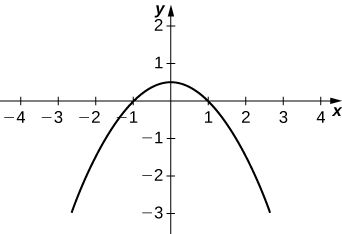 

<math xmlns="http://www.w3.org/1998/Math/MathML"><mrow><mi>r</mi><mo>=</mo><mfrac><mn>1</mn><mrow><mn>1</mn><mo>−</mo><mtext>cos</mtext><mspace width="0.2em" /><mi>θ</mi></mrow></mfrac></mrow></math>

<math xmlns="http://www.w3.org/1998/Math/MathML"><mrow><mi>r</mi><mo>=</mo><mfrac><mn>4</mn><mrow><mn>1</mn><mo>+</mo><mtext>cos</mtext><mspace width="0.2em" /><mi>θ</mi></mrow></mfrac></mrow></math>

* * *
{: data-type="newline"}

  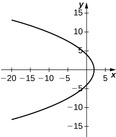 

<math xmlns="http://www.w3.org/1998/Math/MathML"><mrow><mi>r</mi><mo>=</mo><mfrac><mrow><mn>10</mn></mrow><mrow><mn>5</mn><mo>+</mo><mn>4</mn><mspace width="0.2em" /><mtext>sin</mtext><mspace width="0.2em" /><mi>θ</mi></mrow></mfrac></mrow></math>

<math xmlns="http://www.w3.org/1998/Math/MathML"><mrow><mi>r</mi><mo>=</mo><mfrac><mrow><mn>15</mn></mrow><mrow><mn>3</mn><mo>−</mo><mn>2</mn><mspace width="0.2em" /><mtext>cos</mtext><mspace width="0.2em" /><mi>θ</mi></mrow></mfrac></mrow></math>

* * *
{: data-type="newline"}

  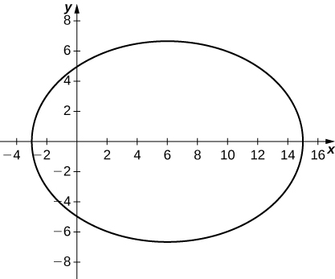 

<math xmlns="http://www.w3.org/1998/Math/MathML"><mrow><mi>r</mi><mo>=</mo><mfrac><mrow><mn>32</mn></mrow><mrow><mn>3</mn><mo>+</mo><mn>5</mn><mspace width="0.2em" /><mtext>sin</mtext><mspace width="0.2em" /><mi>θ</mi></mrow></mfrac></mrow></math>

<math xmlns="http://www.w3.org/1998/Math/MathML"><mrow><mi>r</mi><mo stretchy="false">(</mo><mn>2</mn><mo>+</mo><mtext>sin</mtext><mspace width="0.2em" /><mi>θ</mi><mo stretchy="false">)</mo><mo>=</mo><mn>4</mn></mrow></math>

* * *
{: data-type="newline"}

  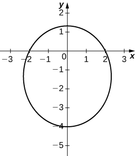 

<math xmlns="http://www.w3.org/1998/Math/MathML"><mrow><mi>r</mi><mo>=</mo><mfrac><mn>3</mn><mrow><mn>2</mn><mo>+</mo><mn>6</mn><mspace width="0.2em" /><mtext>sin</mtext><mspace width="0.2em" /><mi>θ</mi></mrow></mfrac></mrow></math>

<math xmlns="http://www.w3.org/1998/Math/MathML"><mrow><mi>r</mi><mo>=</mo><mfrac><mn>3</mn><mrow><mn>−4</mn><mo>+</mo><mn>2</mn><mspace width="0.2em" /><mtext>sin</mtext><mspace width="0.2em" /><mi>θ</mi></mrow></mfrac></mrow></math>

* * *
{: data-type="newline"}

  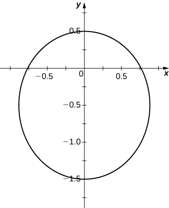 

<math xmlns="http://www.w3.org/1998/Math/MathML"><mtable><mtr><mtd columnalign="left"><mfrac><mrow><msup><mi>x</mi><mn>2</mn></msup></mrow><mn>9</mn></mfrac><mo>+</mo><mfrac><mrow><msup><mi>y</mi><mn>2</mn></msup></mrow><mn>4</mn></mfrac><mo>=</mo><mn>1</mn></mtd></mtr><mtr><mtd columnalign="left"><mrow /></mtd></mtr></mtable></math>

<math xmlns="http://www.w3.org/1998/Math/MathML"><mrow><mfrac><mrow><msup><mi>x</mi><mn>2</mn></msup></mrow><mn>4</mn></mfrac><mo>+</mo><mfrac><mrow><msup><mi>y</mi><mn>2</mn></msup></mrow><mrow><mn>16</mn></mrow></mfrac><mo>=</mo><mn>1</mn></mrow></math>

* * *
{: data-type="newline"}

  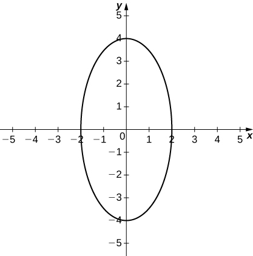 

<math xmlns="http://www.w3.org/1998/Math/MathML"><mrow><mn>4</mn><msup><mi>x</mi><mn>2</mn></msup><mo>+</mo><mn>9</mn><msup><mi>y</mi><mn>2</mn></msup><mo>=</mo><mn>36</mn></mrow></math>

<math xmlns="http://www.w3.org/1998/Math/MathML"><mrow><mn>25</mn><msup><mi>x</mi><mn>2</mn></msup><mo>−</mo><mn>4</mn><msup><mi>y</mi><mn>2</mn></msup><mo>=</mo><mn>100</mn></mrow></math>

* * *
{: data-type="newline"}

  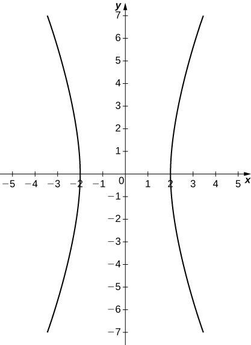 

<math xmlns="http://www.w3.org/1998/Math/MathML"><mrow><mfrac><mrow><msup><mi>x</mi><mn>2</mn></msup></mrow><mrow><mn>16</mn></mrow></mfrac><mo>−</mo><mfrac><mrow><msup><mi>y</mi><mn>2</mn></msup></mrow><mn>9</mn></mfrac><mo>=</mo><mn>1</mn></mrow></math>

<math xmlns="http://www.w3.org/1998/Math/MathML"><mrow><msup><mi>x</mi><mn>2</mn></msup><mo>=</mo><mn>12</mn><mi>y</mi></mrow></math>

* * *
{: data-type="newline"}

  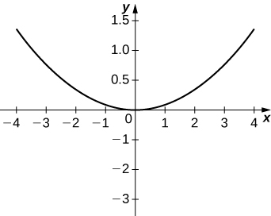 

<math xmlns="http://www.w3.org/1998/Math/MathML"><mrow><msup><mi>y</mi><mn>2</mn></msup><mo>=</mo><mn>20</mn><mi>x</mi></mrow></math>

<math xmlns="http://www.w3.org/1998/Math/MathML"><mrow><mn>12</mn><mi>x</mi><mo>=</mo><mn>5</mn><msup><mi>y</mi><mn>2</mn></msup></mrow></math>

* * *
{: data-type="newline"}

  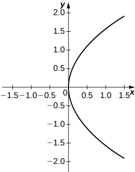 

For the following equations, determine which of the conic sections is described.

<math xmlns="http://www.w3.org/1998/Math/MathML"><mrow><mi>x</mi><mi>y</mi><mo>=</mo><mn>4</mn></mrow></math>

<math xmlns="http://www.w3.org/1998/Math/MathML"><mrow><msup><mi>x</mi><mn>2</mn></msup><mo>+</mo><mn>4</mn><mi>x</mi><mi>y</mi><mo>−</mo><mn>2</mn><msup><mi>y</mi><mn>2</mn></msup><mo>−</mo><mn>6</mn><mo>=</mo><mn>0</mn></mrow></math>

Hyperbola

<math xmlns="http://www.w3.org/1998/Math/MathML"><mrow><msup><mi>x</mi><mn>2</mn></msup><mo>+</mo><mn>2</mn><msqrt><mn>3</mn></msqrt><mi>x</mi><mi>y</mi><mo>+</mo><mn>3</mn><msup><mi>y</mi><mn>2</mn></msup><mo>−</mo><mn>6</mn><mo>=</mo><mn>0</mn></mrow></math>

<math xmlns="http://www.w3.org/1998/Math/MathML"><mrow><msup><mi>x</mi><mn>2</mn></msup><mo>−</mo><mi>x</mi><mi>y</mi><mo>+</mo><msup><mi>y</mi><mn>2</mn></msup><mo>−</mo><mn>2</mn><mo>=</mo><mn>0</mn></mrow></math>

Ellipse

<math xmlns="http://www.w3.org/1998/Math/MathML"><mrow><mn>34</mn><msup><mi>x</mi><mn>2</mn></msup><mo>−</mo><mn>24</mn><mi>x</mi><mi>y</mi><mo>+</mo><mn>41</mn><msup><mi>y</mi><mn>2</mn></msup><mo>−</mo><mn>25</mn><mo>=</mo><mn>0</mn></mrow></math>

<math xmlns="http://www.w3.org/1998/Math/MathML"><mrow><mn>52</mn><msup><mi>x</mi><mn>2</mn></msup><mo>−</mo><mn>72</mn><mi>x</mi><mi>y</mi><mo>+</mo><mn>73</mn><msup><mi>y</mi><mn>2</mn></msup><mo>+</mo><mn>40</mn><mi>x</mi><mo>+</mo><mn>30</mn><mi>y</mi><mo>−</mo><mn>75</mn><mo>=</mo><mn>0</mn></mrow></math>

Ellipse

The mirror in an automobile headlight has a parabolic cross section, with the lightbulb at the focus. On a schematic, the equation of the parabola is given as <math xmlns="http://www.w3.org/1998/Math/MathML"><mrow><msup><mi>x</mi><mn>2</mn></msup><mo>=</mo><mn>4</mn><mi>y</mi><mo>.</mo></mrow></math>

 At what coordinates should you place the lightbulb?

A satellite dish is shaped like a paraboloid of revolution. The receiver is to be located at the focus. If the dish is 12 feet across at its opening and 4 feet deep at its center, where should the receiver be placed?

At the point 2.25 feet above the vertex.

Consider the satellite dish of the preceding problem. If the dish is 8 feet across at the opening and 2 feet deep, where should we place the receiver?

A searchlight is shaped like a paraboloid of revolution. A light source is located 1 foot from the base along the axis of symmetry. If the opening of the searchlight is 3 feet across, find the depth.

0\.5625 feet

Whispering galleries are rooms designed with elliptical ceilings. A person standing at one focus can whisper and be heard by a person standing at the other focus because all the sound waves that reach the ceiling are reflected to the other person. If a whispering gallery has a length of 120 feet and the foci are located 30 feet from the center, find the height of the ceiling at the center.

A person is standing 8 feet from the nearest wall in a whispering gallery. If that person is at one focus and the other focus is 80 feet away, what is the length and the height at the center of the gallery?

Length is 96 feet and height is approximately 26.53 feet.

For the following exercises, determine the polar equation form of the orbit given the length of the major axis and eccentricity for the orbits of the comets or planets. Distance is given in astronomical units (AU).

Halley’s Comet: length of major axis = 35.88, eccentricity = 0.967

Hale-Bopp Comet: length of major axis = 525.91, eccentricity = 0.995

<math xmlns="http://www.w3.org/1998/Math/MathML"><mrow><mi>r</mi><mo>=</mo><mfrac><mrow><mn>2.616</mn></mrow><mrow><mn>1</mn><mo>+</mo><mn>0.995</mn><mspace width="0.2em" /><mtext>cos</mtext><mspace width="0.2em" /><mi>θ</mi></mrow></mfrac></mrow></math>

Mars: length of major axis = 3.049, eccentricity = 0.0934

Jupiter: length of major axis = 10.408, eccentricity = 0.0484

<math xmlns="http://www.w3.org/1998/Math/MathML"><mrow><mi>r</mi><mo>=</mo><mfrac><mrow><mn>5.192</mn></mrow><mrow><mn>1</mn><mo>+</mo><mn>0.0484</mn><mspace width="0.2em" /><mtext>cos</mtext><mspace width="0.2em" /><mi>θ</mi></mrow></mfrac></mrow></math>

</section>

# Chapter Review Exercises

*True or False?* Justify your answer with a proof or a counterexample.

The rectangular coordinates of the point <math xmlns="http://www.w3.org/1998/Math/MathML"><mrow><mrow><mo>(</mo><mrow><mn>4</mn><mo>,</mo><mfrac><mrow><mn>5</mn><mi>π</mi></mrow><mn>6</mn></mfrac></mrow><mo>)</mo></mrow></mrow></math>

 are <math xmlns="http://www.w3.org/1998/Math/MathML"><mrow><mrow><mo>(</mo><mrow><mn>2</mn><msqrt><mn>3</mn></msqrt><mo>,</mo><mn>−2</mn></mrow><mo>)</mo></mrow><mo>.</mo></mrow></math>

The equations <math xmlns="http://www.w3.org/1998/Math/MathML"><mrow><mi>x</mi><mo>=</mo><mtext>cosh</mtext><mo stretchy="false">(</mo><mn>3</mn><mi>t</mi><mo stretchy="false">)</mo><mo>,</mo></mrow></math>

 <math xmlns="http://www.w3.org/1998/Math/MathML"><mrow><mi>y</mi><mo>=</mo><mn>2</mn><mspace width="0.2em" /><mtext>sinh</mtext><mo stretchy="false">(</mo><mn>3</mn><mi>t</mi><mo stretchy="false">)</mo></mrow></math>

 represent a hyperbola.

True.

The arc length of the spiral given by <math xmlns="http://www.w3.org/1998/Math/MathML"><mrow><mi>r</mi><mo>=</mo><mfrac><mi>θ</mi><mn>2</mn></mfrac></mrow></math>

 for <math xmlns="http://www.w3.org/1998/Math/MathML"><mrow><mn>0</mn><mo>≤</mo><mi>θ</mi><mo>≤</mo><mn>3</mn><mi>π</mi></mrow></math>

 is <math xmlns="http://www.w3.org/1998/Math/MathML"><mrow><mfrac><mn>9</mn><mn>4</mn></mfrac><msup><mi>π</mi><mn>3</mn></msup><mo>.</mo></mrow></math>

Given <math xmlns="http://www.w3.org/1998/Math/MathML"><mrow><mi>x</mi><mo>=</mo><mi>f</mi><mo stretchy="false">(</mo><mi>t</mi><mo stretchy="false">)</mo></mrow></math>

 and <math xmlns="http://www.w3.org/1998/Math/MathML"><mrow><mi>y</mi><mo>=</mo><mi>g</mi><mo stretchy="false">(</mo><mi>t</mi><mo stretchy="false">)</mo><mo>,</mo></mrow></math>

 if <math xmlns="http://www.w3.org/1998/Math/MathML"><mrow><mfrac><mrow><mi>d</mi><mi>x</mi></mrow><mrow><mi>d</mi><mi>y</mi></mrow></mfrac><mo>=</mo><mfrac><mrow><mi>d</mi><mi>y</mi></mrow><mrow><mi>d</mi><mi>x</mi></mrow></mfrac><mo>,</mo></mrow></math>

 then <math xmlns="http://www.w3.org/1998/Math/MathML"><mrow><mi>f</mi><mo stretchy="false">(</mo><mi>t</mi><mo stretchy="false">)</mo><mo>=</mo><mi>g</mi><mo stretchy="false">(</mo><mi>t</mi><mo stretchy="false">)</mo><mo>+</mo><mtext>C,</mtext></mrow></math>

 where C is a constant.

False. Imagine <math xmlns="http://www.w3.org/1998/Math/MathML"><mrow><mi>y</mi><mo>=</mo><mi>t</mi><mo>+</mo><mn>1</mn><mo>,</mo></mrow></math>

 <math xmlns="http://www.w3.org/1998/Math/MathML"><mrow><mi>x</mi><mo>=</mo><mtext>−</mtext><mi>t</mi><mo>+</mo><mn>1</mn><mo>.</mo></mrow></math>

For the following exercises, sketch the parametric curve and eliminate the parameter to find the Cartesian equation of the curve.

<math xmlns="http://www.w3.org/1998/Math/MathML"><mrow><mi>x</mi><mo>=</mo><mn>1</mn><mo>+</mo><mi>t</mi><mo>,</mo></mrow></math>

 <math xmlns="http://www.w3.org/1998/Math/MathML"><mrow><mi>y</mi><mo>=</mo><msup><mi>t</mi><mn>2</mn></msup><mo>−</mo><mn>1</mn><mo>,</mo></mrow></math>

 <math xmlns="http://www.w3.org/1998/Math/MathML"><mrow><mn>−1</mn><mo>≤</mo><mi>t</mi><mo>≤</mo><mn>1</mn></mrow></math>

<math xmlns="http://www.w3.org/1998/Math/MathML"><mrow><mi>x</mi><mo>=</mo><msup><mi>e</mi><mi>t</mi></msup><mo>,</mo></mrow></math>

 <math xmlns="http://www.w3.org/1998/Math/MathML"><mrow><mi>y</mi><mo>=</mo><mn>1</mn><mo>−</mo><msup><mi>e</mi><mrow><mn>3</mn><mi>t</mi></mrow></msup><mo>,</mo></mrow></math>

 <math xmlns="http://www.w3.org/1998/Math/MathML"><mrow><mn>0</mn><mo>≤</mo><mi>t</mi><mo>≤</mo><mn>1</mn></mrow></math>

* * *
{: data-type="newline"}

  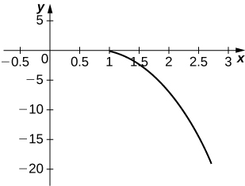 * * *
{: data-type="newline"}

 <math xmlns="http://www.w3.org/1998/Math/MathML"><mrow><mi>y</mi><mo>=</mo><mn>1</mn><mo>−</mo><msup><mi>x</mi><mn>3</mn></msup></mrow></math>

<math xmlns="http://www.w3.org/1998/Math/MathML"><mrow><mi>x</mi><mo>=</mo><mtext>sin</mtext><mspace width="0.2em" /><mi>θ</mi><mo>,</mo></mrow></math>

 <math xmlns="http://www.w3.org/1998/Math/MathML"><mrow><mi>y</mi><mo>=</mo><mn>1</mn><mo>−</mo><mtext>csc</mtext><mspace width="0.2em" /><mi>θ</mi><mo>,</mo></mrow></math>

 <math xmlns="http://www.w3.org/1998/Math/MathML"><mrow><mn>0</mn><mo>≤</mo><mi>θ</mi><mo>≤</mo><mn>2</mn><mi>π</mi></mrow></math>

<math xmlns="http://www.w3.org/1998/Math/MathML"><mrow><mi>x</mi><mo>=</mo><mn>4</mn><mspace width="0.2em" /><mtext>cos</mtext><mspace width="0.2em" /><mi>ϕ</mi><mo>,</mo></mrow></math>

 <math xmlns="http://www.w3.org/1998/Math/MathML"><mrow><mi>y</mi><mo>=</mo><mn>1</mn><mo>−</mo><mtext>sin</mtext><mspace width="0.2em" /><mi>ϕ</mi><mo>,</mo></mrow></math>

 <math xmlns="http://www.w3.org/1998/Math/MathML"><mrow><mn>0</mn><mo>≤</mo><mi>ϕ</mi><mo>≤</mo><mn>2</mn><mi>π</mi></mrow></math>

* * *
{: data-type="newline"}

  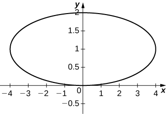 * * *
{: data-type="newline"}

 <math xmlns="http://www.w3.org/1998/Math/MathML"><mrow><mfrac><mrow><msup><mi>x</mi><mn>2</mn></msup></mrow><mrow><mn>16</mn></mrow></mfrac><mo>+</mo><msup><mrow><mo stretchy="false">(</mo><mi>y</mi><mo>−</mo><mn>1</mn><mo stretchy="false">)</mo></mrow><mn>2</mn></msup><mo>=</mo><mn>1</mn></mrow></math>

For the following exercises, sketch the polar curve and determine what type of symmetry exists, if any.

<math xmlns="http://www.w3.org/1998/Math/MathML"><mrow><mi>r</mi><mo>=</mo><mn>4</mn><mspace width="0.2em" /><mtext>sin</mtext><mrow><mo>(</mo><mrow><mfrac><mi>θ</mi><mn>3</mn></mfrac></mrow><mo>)</mo></mrow></mrow></math>

<math xmlns="http://www.w3.org/1998/Math/MathML"><mrow><mi>r</mi><mo>=</mo><mn>5</mn><mspace width="0.2em" /><mtext>cos</mtext><mrow><mo>(</mo><mrow><mn>5</mn><mi>θ</mi></mrow><mo>)</mo></mrow></mrow></math>

* * *
{: data-type="newline"}

  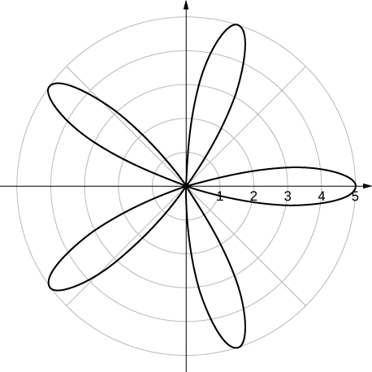 * * *
{: data-type="newline"}

 Symmetric about polar axis

For the following exercises, find the polar equation for the curve given as a Cartesian equation.

<math xmlns="http://www.w3.org/1998/Math/MathML"><mrow><mi>x</mi><mo>+</mo><mi>y</mi><mo>=</mo><mn>5</mn></mrow></math>

<math xmlns="http://www.w3.org/1998/Math/MathML"><mrow><msup><mi>y</mi><mn>2</mn></msup><mo>=</mo><mn>4</mn><mo>+</mo><msup><mi>x</mi><mn>2</mn></msup></mrow></math>

<math xmlns="http://www.w3.org/1998/Math/MathML"><mrow><msup><mi>r</mi><mn>2</mn></msup><mo>=</mo><mfrac><mn>4</mn><mrow><msup><mrow><mtext>sin</mtext></mrow><mn>2</mn></msup><mi>θ</mi><mo>−</mo><msup><mrow><mtext>cos</mtext></mrow><mn>2</mn></msup><mi>θ</mi></mrow></mfrac></mrow></math>

For the following exercises, find the equation of the tangent line to the given curve. Graph both the function and its tangent line.

<math xmlns="http://www.w3.org/1998/Math/MathML"><mrow><mi>x</mi><mo>=</mo><mtext>ln</mtext><mo stretchy="false">(</mo><mi>t</mi><mo stretchy="false">)</mo><mo>,</mo></mrow></math>

 <math xmlns="http://www.w3.org/1998/Math/MathML"><mrow><mi>y</mi><mo>=</mo><msup><mi>t</mi><mn>2</mn></msup><mo>−</mo><mn>1</mn><mo>,</mo></mrow></math>

 <math xmlns="http://www.w3.org/1998/Math/MathML"><mrow><mi>t</mi><mo>=</mo><mn>1</mn></mrow></math>

<math xmlns="http://www.w3.org/1998/Math/MathML"><mrow><mi>r</mi><mo>=</mo><mn>3</mn><mo>+</mo><mtext>cos</mtext><mrow><mo>(</mo><mrow><mn>2</mn><mi>θ</mi></mrow><mo>)</mo></mrow><mo>,</mo></mrow></math>

 <math xmlns="http://www.w3.org/1998/Math/MathML"><mrow><mi>θ</mi><mo>=</mo><mfrac><mrow><mn>3</mn><mi>π</mi></mrow><mn>4</mn></mfrac></mrow></math>

* * *
{: data-type="newline"}

  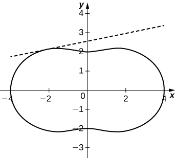 * * *
{: data-type="newline"}

 <math xmlns="http://www.w3.org/1998/Math/MathML"><mrow><mi>y</mi><mo>=</mo><mfrac><mrow><mn>3</mn><msqrt><mn>2</mn></msqrt></mrow><mn>2</mn></mfrac><mo>+</mo><mfrac><mn>1</mn><mn>5</mn></mfrac><mrow><mo>(</mo><mrow><mi>x</mi><mo>+</mo><mfrac><mrow><mn>3</mn><msqrt><mn>2</mn></msqrt></mrow><mn>2</mn></mfrac></mrow><mo>)</mo></mrow></mrow></math>

Find <math xmlns="http://www.w3.org/1998/Math/MathML"><mrow><mfrac><mrow><mi>d</mi><mi>y</mi></mrow><mrow><mi>d</mi><mi>x</mi></mrow></mfrac><mo>,</mo></mrow></math>

 <math xmlns="http://www.w3.org/1998/Math/MathML"><mrow><mfrac><mrow><mi>d</mi><mi>x</mi></mrow><mrow><mi>d</mi><mi>y</mi></mrow></mfrac><mo>,</mo></mrow></math>

 and <math xmlns="http://www.w3.org/1998/Math/MathML"><mrow><mfrac><mrow><msup><mi>d</mi><mn>2</mn></msup><mi>x</mi></mrow><mrow><mi>d</mi><msup><mi>y</mi><mn>2</mn></msup></mrow></mfrac></mrow></math>

 of <math xmlns="http://www.w3.org/1998/Math/MathML"><mrow><mi>y</mi><mo>=</mo><mrow><mo>(</mo><mrow><mn>2</mn><mo>+</mo><msup><mi>e</mi><mrow><mtext>−</mtext><mi>t</mi></mrow></msup></mrow><mo>)</mo></mrow><mo>,</mo></mrow></math>

 <math xmlns="http://www.w3.org/1998/Math/MathML"><mrow><mi>x</mi><mo>=</mo><mn>1</mn><mo>−</mo><mtext>sin</mtext><mo stretchy="false">(</mo><mi>t</mi><mo stretchy="false">)</mo></mrow></math>

For the following exercises, find the area of the region.

<math xmlns="http://www.w3.org/1998/Math/MathML"><mrow><mi>x</mi><mo>=</mo><msup><mi>t</mi><mn>2</mn></msup><mo>,</mo></mrow></math>

 <math xmlns="http://www.w3.org/1998/Math/MathML"><mrow><mi>y</mi><mo>=</mo><mtext>ln</mtext><mo stretchy="false">(</mo><mi>t</mi><mo stretchy="false">)</mo><mo>,</mo></mrow></math>

 <math xmlns="http://www.w3.org/1998/Math/MathML"><mrow><mn>0</mn><mo>≤</mo><mi>t</mi><mo>≤</mo><mi>e</mi></mrow></math>

<math xmlns="http://www.w3.org/1998/Math/MathML"><mrow><mfrac><mrow><msup><mi>e</mi><mn>2</mn></msup></mrow><mn>2</mn></mfrac></mrow></math>

<math xmlns="http://www.w3.org/1998/Math/MathML"><mrow><mi>r</mi><mo>=</mo><mn>1</mn><mo>−</mo><mtext>sin</mtext><mspace width="0.2em" /><mi>θ</mi></mrow></math>

 in the first quadrant

For the following exercises, find the arc length of the curve over the given interval.

<math xmlns="http://www.w3.org/1998/Math/MathML"><mrow><mi>x</mi><mo>=</mo><mn>3</mn><mi>t</mi><mo>+</mo><mn>4</mn><mo>,</mo></mrow></math>

 <math xmlns="http://www.w3.org/1998/Math/MathML"><mrow><mi>y</mi><mo>=</mo><mn>9</mn><mi>t</mi><mo>−</mo><mn>2</mn><mo>,</mo></mrow></math>

 <math xmlns="http://www.w3.org/1998/Math/MathML"><mrow><mn>0</mn><mo>≤</mo><mi>t</mi><mo>≤</mo><mn>3</mn></mrow></math>

<math xmlns="http://www.w3.org/1998/Math/MathML"><mrow><mn>9</mn><msqrt><mrow><mn>10</mn></mrow></msqrt></mrow></math>

<math xmlns="http://www.w3.org/1998/Math/MathML"><mrow><mi>r</mi><mo>=</mo><mn>6</mn><mspace width="0.2em" /><mtext>cos</mtext><mspace width="0.2em" /><mi>θ</mi><mo>,</mo></mrow></math>

 <math xmlns="http://www.w3.org/1998/Math/MathML"><mrow><mn>0</mn><mo>≤</mo><mi>θ</mi><mo>≤</mo><mn>2</mn><mi>π</mi><mo>.</mo></mrow></math>

 Check your answer by geometry.

For the following exercises, find the Cartesian equation describing the given shapes.

A parabola with focus <math xmlns="http://www.w3.org/1998/Math/MathML"><mrow><mo stretchy="false">(</mo><mn>2</mn><mo>,</mo><mn>−5</mn><mo stretchy="false">)</mo></mrow></math>

 and directrix <math xmlns="http://www.w3.org/1998/Math/MathML"><mrow><mi>x</mi><mo>=</mo><mn>6</mn></mrow></math>

<math xmlns="http://www.w3.org/1998/Math/MathML"><mrow><msup><mrow><mrow><mo>(</mo><mrow><mi>y</mi><mo>+</mo><mn>5</mn></mrow><mo>)</mo></mrow></mrow><mn>2</mn></msup><mo>=</mo><mn>−8</mn><mi>x</mi><mo>+</mo><mn>32</mn></mrow></math>

An ellipse with a major axis length of 10 and foci at <math xmlns="http://www.w3.org/1998/Math/MathML"><mrow><mrow><mo>(</mo><mrow><mn>−7</mn><mo>,</mo><mn>2</mn></mrow><mo>)</mo></mrow></mrow></math>

 and <math xmlns="http://www.w3.org/1998/Math/MathML"><mrow><mrow><mo>(</mo><mrow><mn>1</mn><mo>,</mo><mn>2</mn></mrow><mo>)</mo></mrow></mrow></math>

A hyperbola with vertices at <math xmlns="http://www.w3.org/1998/Math/MathML"><mrow><mo stretchy="false">(</mo><mn>3</mn><mo>,</mo><mn>−2</mn><mo stretchy="false">)</mo></mrow></math>

 and <math xmlns="http://www.w3.org/1998/Math/MathML"><mrow><mo stretchy="false">(</mo><mn>−5</mn><mo>,</mo><mn>−2</mn><mo stretchy="false">)</mo></mrow></math>

 and foci at <math xmlns="http://www.w3.org/1998/Math/MathML"><mrow><mo stretchy="false">(</mo><mn>−2</mn><mo>,</mo><mn>−6</mn><mo stretchy="false">)</mo></mrow></math>

 and <math xmlns="http://www.w3.org/1998/Math/MathML"><mrow><mo stretchy="false">(</mo><mn>−2</mn><mo>,</mo><mn>4</mn><mo stretchy="false">)</mo></mrow></math>

<math xmlns="http://www.w3.org/1998/Math/MathML"><mrow><mfrac><mrow><msup><mrow><mrow><mo>(</mo><mrow><mi>y</mi><mo>+</mo><mn>1</mn></mrow><mo>)</mo></mrow></mrow><mn>2</mn></msup></mrow><mrow><mn>16</mn></mrow></mfrac><mo>−</mo><mfrac><mrow><msup><mrow><mrow><mo>(</mo><mrow><mi>x</mi><mo>+</mo><mn>2</mn></mrow><mo>)</mo></mrow></mrow><mn>2</mn></msup></mrow><mn>9</mn></mfrac><mo>=</mo><mn>1</mn></mrow></math>

For the following exercises, determine the eccentricity and identify the conic. Sketch the conic.

<math xmlns="http://www.w3.org/1998/Math/MathML"><mrow><mi>r</mi><mo>=</mo><mfrac><mn>6</mn><mrow><mn>1</mn><mo>+</mo><mn>3</mn><mspace width="0.2em" /><mtext>cos</mtext><mo stretchy="false">(</mo><mi>θ</mi><mo stretchy="false">)</mo></mrow></mfrac></mrow></math>

<math xmlns="http://www.w3.org/1998/Math/MathML"><mrow><mi>r</mi><mo>=</mo><mfrac><mn>4</mn><mrow><mn>3</mn><mo>−</mo><mn>2</mn><mspace width="0.2em" /><mtext>cos</mtext><mspace width="0.2em" /><mi>θ</mi></mrow></mfrac></mrow></math>

<math xmlns="http://www.w3.org/1998/Math/MathML"><mrow><mi>e</mi><mo>=</mo><mfrac><mn>2</mn><mn>3</mn></mfrac><mo>,</mo></mrow></math>

 ellipse* * *
{: data-type="newline"}

  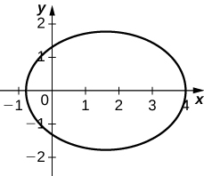 

<math xmlns="http://www.w3.org/1998/Math/MathML"><mrow><mi>r</mi><mo>=</mo><mfrac><mn>7</mn><mrow><mn>5</mn><mo>−</mo><mn>5</mn><mspace width="0.2em" /><mtext>cos</mtext><mspace width="0.2em" /><mi>θ</mi></mrow></mfrac></mrow></math>

Determine the Cartesian equation describing the orbit of Pluto, the most eccentric orbit around the Sun. The length of the major axis is 39.26 AU and minor axis is 38.07 AU. What is the eccentricity?

<math xmlns="http://www.w3.org/1998/Math/MathML"><mrow><mfrac><mrow><msup><mi>y</mi><mn>2</mn></msup></mrow><mrow><msup><mrow><mn>19.03</mn></mrow><mn>2</mn></msup></mrow></mfrac><mo>+</mo><mfrac><mrow><msup><mi>x</mi><mn>2</mn></msup></mrow><mrow><msup><mrow><mn>19.63</mn></mrow><mn>2</mn></msup></mrow></mfrac><mo>=</mo><mn>1</mn><mo>,</mo></mrow></math>

 <math xmlns="http://www.w3.org/1998/Math/MathML"><mrow><mi>e</mi><mo>=</mo><mn>0.2447</mn></mrow></math>

The C/1980 E1 comet was observed in 1980. Given an eccentricity of 1.057 and a perihelion (point of closest approach to the Sun) of 3.364 AU, find the Cartesian equations describing the comet’s trajectory. Are we guaranteed to see this comet again? (*Hint*: Consider the Sun at point <math xmlns="http://www.w3.org/1998/Math/MathML"><mrow><mo stretchy="false">(</mo><mn>0</mn><mo>,</mo><mn>0</mn><mo stretchy="false">)</mo><mo>.</mo><mo stretchy="false">)</mo></mrow></math>

