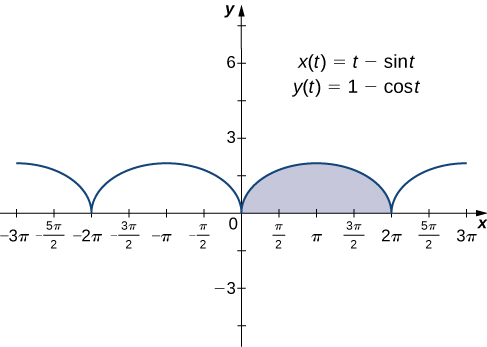
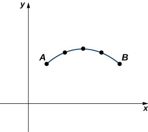
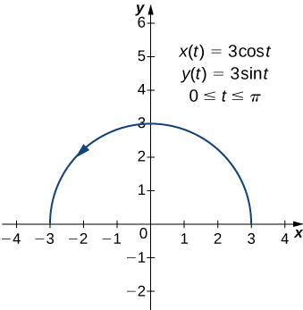
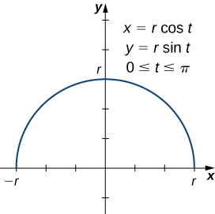

* Determine derivatives and equations of tangents for parametric curves.
* Find the area under a parametric curve.
* Use the equation for arc length of a parametric curve.
* Apply the formula for surface area to a volume generated by a parametric curve.

Now that we have introduced the concept of a parameterized curve, our next step is to learn how to work with this concept in the context of calculus. For example, if we know a parameterization of a given curve, is it possible to calculate the slope of a tangent line to the curve? How about the arc length of the curve? Or the area under the curve?

Another scenario: Suppose we would like to represent the location of a baseball after the ball leaves a pitcher’s hand. If the position of the baseball is represented by the plane curve <math xmlns="http://www.w3.org/1998/Math/MathML"><mrow><mrow><mo>(</mo><mrow><mi>x</mi><mrow><mo>(</mo><mi>t</mi><mo>)</mo></mrow><mo>,</mo><mi>y</mi><mrow><mo>(</mo><mi>t</mi><mo>)</mo></mrow></mrow><mo>)</mo></mrow><mo>,</mo></mrow></math>

 then we should be able to use calculus to find the speed of the ball at any given time. Furthermore, we should be able to calculate just how far that ball has traveled as a function of time.

# Derivatives of Parametric Equations

We start by asking how to calculate the slope of a line tangent to a parametric curve at a point. Consider the plane curve defined by the parametric equations

<math xmlns="http://www.w3.org/1998/Math/MathML"><mrow><mi>x</mi><mrow><mo>(</mo><mi>t</mi><mo>)</mo></mrow><mo>=</mo><mn>2</mn><mi>t</mi><mo>+</mo><mn>3</mn><mo>,</mo><mspace width="1em" /><mi>y</mi><mrow><mo>(</mo><mi>t</mi><mo>)</mo></mrow><mo>=</mo><mn>3</mn><mi>t</mi><mo>−</mo><mn>4</mn><mo>,</mo><mspace width="1em" /><mn>−2</mn><mo>≤</mo><mi>t</mi><mo>≤</mo><mn>3</mn><mo>.</mo></mrow></math>

The graph of this curve appears in [\[link\]](#CNX_Calc_Figure_11_02_001). It is a line segment starting at <math xmlns="http://www.w3.org/1998/Math/MathML"><mrow><mrow><mo>(</mo><mrow><mn>−1</mn><mo>,</mo><mn>−10</mn></mrow><mo>)</mo></mrow></mrow></math>

 and ending at <math xmlns="http://www.w3.org/1998/Math/MathML"><mrow><mo stretchy="false">(</mo><mn>9</mn><mo>,</mo><mn>5</mn><mo stretchy="false">)</mo><mo>.</mo></mrow></math>

 {: #CNX_Calc_Figure_11_02_001}

We can eliminate the parameter by first solving the equation <math xmlns="http://www.w3.org/1998/Math/MathML"><mrow><mi>x</mi><mo stretchy="false">(</mo><mi>t</mi><mo stretchy="false">)</mo><mo>=</mo><mn>2</mn><mi>t</mi><mo>+</mo><mn>3</mn></mrow></math>

 for *t*\:

<math xmlns="http://www.w3.org/1998/Math/MathML"><mtable><mtr><mtd columnalign="right"><mi>x</mi><mrow><mo>(</mo><mi>t</mi><mo>)</mo></mrow></mtd><mtd columnalign="left"><mo>=</mo></mtd><mtd columnalign="left"><mn>2</mn><mi>t</mi><mo>+</mo><mn>3</mn></mtd></mtr><mtr><mtd columnalign="right"><mi>x</mi><mo>−</mo><mn>3</mn></mtd><mtd columnalign="left"><mo>=</mo></mtd><mtd columnalign="left"><mn>2</mn><mi>t</mi></mtd></mtr><mtr><mtd columnalign="right"><mi>t</mi></mtd><mtd columnalign="left"><mo>=</mo></mtd><mtd columnalign="left"><mfrac><mrow><mi>x</mi><mo>−</mo><mn>3</mn></mrow><mn>2</mn></mfrac><mo>.</mo></mtd></mtr></mtable></math>

Substituting this into <math xmlns="http://www.w3.org/1998/Math/MathML"><mrow><mi>y</mi><mo stretchy="false">(</mo><mi>t</mi><mo stretchy="false">)</mo><mo>,</mo></mrow></math>

 we obtain

<math xmlns="http://www.w3.org/1998/Math/MathML"><mtable><mtr><mtd columnalign="right"><mi>y</mi><mrow><mo>(</mo><mi>t</mi><mo>)</mo></mrow></mtd><mtd columnalign="left"><mo>=</mo></mtd><mtd columnalign="left"><mn>3</mn><mi>t</mi><mo>−</mo><mn>4</mn></mtd></mtr><mtr><mtd columnalign="right"><mi>y</mi></mtd><mtd columnalign="left"><mo>=</mo></mtd><mtd columnalign="left"><mn>3</mn><mrow><mo>(</mo><mrow><mfrac><mrow><mi>x</mi><mo>−</mo><mn>3</mn></mrow><mn>2</mn></mfrac></mrow><mo>)</mo></mrow><mo>−</mo><mn>4</mn></mtd></mtr><mtr><mtd columnalign="right"><mi>y</mi></mtd><mtd columnalign="left"><mo>=</mo></mtd><mtd columnalign="left"><mfrac><mrow><mn>3</mn><mi>x</mi></mrow><mn>2</mn></mfrac><mo>−</mo><mfrac><mn>9</mn><mn>2</mn></mfrac><mo>−</mo><mn>4</mn></mtd></mtr><mtr><mtd columnalign="right"><mi>y</mi></mtd><mtd columnalign="left"><mo>=</mo></mtd><mtd columnalign="left"><mfrac><mrow><mn>3</mn><mi>x</mi></mrow><mn>2</mn></mfrac><mo>−</mo><mfrac><mrow><mn>17</mn></mrow><mn>2</mn></mfrac><mo>.</mo></mtd></mtr></mtable></math>

The slope of this line is given by <math xmlns="http://www.w3.org/1998/Math/MathML"><mrow><mfrac><mrow><mi>d</mi><mi>y</mi></mrow><mrow><mi>d</mi><mi>x</mi></mrow></mfrac><mo>=</mo><mfrac><mn>3</mn><mn>2</mn></mfrac><mo>.</mo></mrow></math>

 Next we calculate <math xmlns="http://www.w3.org/1998/Math/MathML"><mrow><msup><mi>x</mi><mo>′</mo></msup><mrow><mo>(</mo><mi>t</mi><mo>)</mo></mrow></mrow></math>

 and <math xmlns="http://www.w3.org/1998/Math/MathML"><mrow><msup><mi>y</mi><mo>′</mo></msup><mrow><mo>(</mo><mi>t</mi><mo>)</mo></mrow><mo>.</mo></mrow></math>

 This gives <math xmlns="http://www.w3.org/1998/Math/MathML"><mrow><msup><mi>x</mi><mo>′</mo></msup><mrow><mo>(</mo><mi>t</mi><mo>)</mo></mrow><mo>=</mo><mn>2</mn></mrow></math>

 and <math xmlns="http://www.w3.org/1998/Math/MathML"><mrow><msup><mi>y</mi><mo>′</mo></msup><mrow><mo>(</mo><mi>t</mi><mo>)</mo></mrow><mo>=</mo><mn>3</mn><mo>.</mo></mrow></math>

 Notice that <math xmlns="http://www.w3.org/1998/Math/MathML"><mrow><mfrac><mrow><mi>d</mi><mi>y</mi></mrow><mrow><mi>d</mi><mi>x</mi></mrow></mfrac><mo>=</mo><mfrac><mrow><mrow><mrow><mi>d</mi><mi>y</mi></mrow><mtext>/</mtext><mrow><mi>d</mi><mi>t</mi></mrow></mrow></mrow><mrow><mrow><mrow><mi>d</mi><mi>x</mi></mrow><mtext>/</mtext><mrow><mi>d</mi><mi>t</mi></mrow></mrow></mrow></mfrac><mo>=</mo><mfrac><mn>3</mn><mn>2</mn></mfrac><mo>.</mo></mrow></math>

 This is no coincidence, as outlined in the following theorem.

Derivative of Parametric Equations

Consider the plane curve defined by the parametric equations <math xmlns="http://www.w3.org/1998/Math/MathML"><mrow><mi>x</mi><mo>=</mo><mi>x</mi><mrow><mo>(</mo><mi>t</mi><mo>)</mo></mrow></mrow></math>

 and <math xmlns="http://www.w3.org/1998/Math/MathML"><mrow><mi>y</mi><mo>=</mo><mi>y</mi><mrow><mo>(</mo><mi>t</mi><mo>)</mo></mrow><mo>.</mo></mrow></math>

 Suppose that <math xmlns="http://www.w3.org/1998/Math/MathML"><mrow><msup><mi>x</mi><mo>′</mo></msup><mrow><mo>(</mo><mi>t</mi><mo>)</mo></mrow></mrow></math>

 and <math xmlns="http://www.w3.org/1998/Math/MathML"><mrow><msup><mi>y</mi><mo>′</mo></msup><mrow><mo>(</mo><mi>t</mi><mo>)</mo></mrow></mrow></math>

 exist, and assume that <math xmlns="http://www.w3.org/1998/Math/MathML"><mrow><msup><mi>x</mi><mo>′</mo></msup><mrow><mo>(</mo><mi>t</mi><mo>)</mo></mrow><mo>≠</mo><mn>0</mn><mo>.</mo></mrow></math>

 Then the derivative <math xmlns="http://www.w3.org/1998/Math/MathML"><mrow><mfrac><mrow><mi>d</mi><mi>y</mi></mrow><mrow><mi>d</mi><mi>x</mi></mrow></mfrac></mrow></math>

 is given by

<math xmlns="http://www.w3.org/1998/Math/MathML"><mrow><mfrac><mrow><mi>d</mi><mi>y</mi></mrow><mrow><mi>d</mi><mi>x</mi></mrow></mfrac><mo>=</mo><mfrac><mrow><mrow><mrow><mi>d</mi><mi>y</mi></mrow><mtext>/</mtext><mrow><mi>d</mi><mi>t</mi></mrow></mrow></mrow><mrow><mrow><mrow><mi>d</mi><mi>x</mi></mrow><mtext>/</mtext><mrow><mi>d</mi><mi>t</mi></mrow></mrow></mrow></mfrac><mo>=</mo><mfrac><mrow><msup><mi>y</mi><mo>′</mo></msup><mrow><mo>(</mo><mi>t</mi><mo>)</mo></mrow></mrow><mrow><msup><mi>x</mi><mo>′</mo></msup><mrow><mo>(</mo><mi>t</mi><mo>)</mo></mrow></mrow></mfrac><mo>.</mo></mrow></math>

## Proof

This theorem can be proven using the Chain Rule. In particular, assume that the parameter *t* can be eliminated, yielding a differentiable function <math xmlns="http://www.w3.org/1998/Math/MathML"><mrow><mi>y</mi><mo>=</mo><mi>F</mi><mo stretchy="false">(</mo><mi>x</mi><mo stretchy="false">)</mo><mo>.</mo></mrow></math>

 Then <math xmlns="http://www.w3.org/1998/Math/MathML"><mrow><mi>y</mi><mrow><mo>(</mo><mi>t</mi><mo>)</mo></mrow><mo>=</mo><mi>F</mi><mrow><mo>(</mo><mrow><mi>x</mi><mrow><mo>(</mo><mi>t</mi><mo>)</mo></mrow></mrow><mo>)</mo></mrow><mo>.</mo></mrow></math>

 Differentiating both sides of this equation using the Chain Rule yields

<math xmlns="http://www.w3.org/1998/Math/MathML"><mrow><msup><mi>y</mi><mo>′</mo></msup><mrow><mo>(</mo><mi>t</mi><mo>)</mo></mrow><mo>=</mo><msup><mi>F</mi><mo>′</mo></msup><mrow><mo>(</mo><mrow><mi>x</mi><mrow><mo>(</mo><mi>t</mi><mo>)</mo></mrow></mrow><mo>)</mo></mrow><msup><mi>x</mi><mo>′</mo></msup><mrow><mo>(</mo><mi>t</mi><mo>)</mo></mrow><mo>,</mo></mrow></math>

so

<math xmlns="http://www.w3.org/1998/Math/MathML"><mrow><msup><mi>F</mi><mo>′</mo></msup><mrow><mo>(</mo><mrow><mi>x</mi><mrow><mo>(</mo><mi>t</mi><mo>)</mo></mrow></mrow><mo>)</mo></mrow><mo>=</mo><mfrac><mrow><msup><mi>y</mi><mo>′</mo></msup><mrow><mo>(</mo><mi>t</mi><mo>)</mo></mrow></mrow><mrow><msup><mi>x</mi><mo>′</mo></msup><mrow><mo>(</mo><mi>t</mi><mo>)</mo></mrow></mrow></mfrac><mo>.</mo></mrow></math>

But <math xmlns="http://www.w3.org/1998/Math/MathML"><mrow><msup><mi>F</mi><mo>′</mo></msup><mrow><mo>(</mo><mrow><mi>x</mi><mrow><mo>(</mo><mi>t</mi><mo>)</mo></mrow></mrow><mo>)</mo></mrow><mo>=</mo><mfrac><mrow><mi>d</mi><mi>y</mi></mrow><mrow><mi>d</mi><mi>x</mi></mrow></mfrac><mo>,</mo></mrow></math>

 which proves the theorem.

□

[\[link\]](#fs-id1167793881791) can be used to calculate derivatives of plane curves, as well as critical points. Recall that a critical point of a differentiable function <math xmlns="http://www.w3.org/1998/Math/MathML"><mrow><mi>y</mi><mo>=</mo><mi>f</mi><mrow><mo>(</mo><mi>x</mi><mo>)</mo></mrow></mrow></math>

 is any point <math xmlns="http://www.w3.org/1998/Math/MathML"><mrow><mi>x</mi><mo>=</mo><msub><mi>x</mi><mn>0</mn></msub></mrow></math>

 such that either <math xmlns="http://www.w3.org/1998/Math/MathML"><mrow><msup><mi>f</mi><mo>′</mo></msup><mrow><mo>(</mo><mrow><msub><mi>x</mi><mn>0</mn></msub></mrow><mo>)</mo></mrow><mo>=</mo><mn>0</mn></mrow></math>

 or <math xmlns="http://www.w3.org/1998/Math/MathML"><mrow><msup><mi>f</mi><mo>′</mo></msup><mrow><mo>(</mo><mrow><msub><mi>x</mi><mn>0</mn></msub></mrow><mo>)</mo></mrow></mrow></math>

 does not exist. [\[link\]](#fs-id1167793881791) gives a formula for the slope of a tangent line to a curve defined parametrically regardless of whether the curve can be described by a function <math xmlns="http://www.w3.org/1998/Math/MathML"><mrow><mi>y</mi><mo>=</mo><mi>f</mi><mrow><mo>(</mo><mi>x</mi><mo>)</mo></mrow></mrow></math>

 or not.

Finding the Derivative of a Parametric Curve

Calculate the derivative <math xmlns="http://www.w3.org/1998/Math/MathML"><mrow><mfrac><mrow><mi>d</mi><mi>y</mi></mrow><mrow><mi>d</mi><mi>x</mi></mrow></mfrac></mrow></math>

 for each of the following parametrically defined plane curves, and locate any critical points on their respective graphs.

1.  <math xmlns="http://www.w3.org/1998/Math/MathML"><mrow><mi>x</mi><mrow><mo>(</mo><mi>t</mi><mo>)</mo></mrow><mo>=</mo><msup><mi>t</mi><mn>2</mn></msup><mo>−</mo><mn>3</mn><mo>,</mo><mspace width="1em" /><mi>y</mi><mrow><mo>(</mo><mi>t</mi><mo>)</mo></mrow><mo>=</mo><mn>2</mn><mi>t</mi><mo>−</mo><mn>1</mn><mo>,</mo><mspace width="1em" /><mn>−3</mn><mo>≤</mo><mi>t</mi><mo>≤</mo><mn>4</mn></mrow></math>

2.  <math xmlns="http://www.w3.org/1998/Math/MathML"><mrow><mi>x</mi><mrow><mo>(</mo><mi>t</mi><mo>)</mo></mrow><mo>=</mo><mn>2</mn><mi>t</mi><mo>+</mo><mn>1</mn><mo>,</mo><mspace width="1em" /><mi>y</mi><mrow><mo>(</mo><mi>t</mi><mo>)</mo></mrow><mo>=</mo><msup><mi>t</mi><mn>3</mn></msup><mo>−</mo><mn>3</mn><mi>t</mi><mo>+</mo><mn>4</mn><mo>,</mo><mspace width="1em" /><mn>−2</mn><mo>≤</mo><mi>t</mi><mo>≤</mo><mn>5</mn></mrow></math>

3.  <math xmlns="http://www.w3.org/1998/Math/MathML"><mrow><mi>x</mi><mrow><mo>(</mo><mi>t</mi><mo>)</mo></mrow><mo>=</mo><mn>5</mn><mspace width="0.2em" /><mtext>cos</mtext><mspace width="0.2em" /><mi>t</mi><mo>,</mo><mspace width="1em" /><mi>y</mi><mrow><mo>(</mo><mi>t</mi><mo>)</mo></mrow><mo>=</mo><mn>5</mn><mspace width="0.2em" /><mtext>sin</mtext><mspace width="0.2em" /><mi>t</mi><mo>,</mo><mspace width="1em" /><mn>0</mn><mo>≤</mo><mi>t</mi><mo>≤</mo><mn>2</mn><mi>π</mi></mrow></math>
{: data-number-style="lower-alpha"}

1.  To apply [[link]](#fs-id1167793881791), first calculate
    <math xmlns="http://www.w3.org/1998/Math/MathML"><mrow><msup><mi>x</mi><mo>′</mo></msup><mrow><mo>(</mo><mi>t</mi><mo>)</mo></mrow></mrow></math>
    
    and
    <math xmlns="http://www.w3.org/1998/Math/MathML"><mrow><msup><mi>y</mi><mo>′</mo></msup><mo stretchy="false">(</mo><mi>t</mi><mo stretchy="false">)</mo><mtext>:</mtext></mrow></math>
    
    * * *
    {: data-type="newline"}
    
    

    <math xmlns="http://www.w3.org/1998/Math/MathML"><mtable><mtr><mtd columnalign="left"><msup><mi>x</mi><mo>′</mo></msup><mrow><mo>(</mo><mi>t</mi><mo>)</mo></mrow><mo>=</mo><mn>2</mn><mi>t</mi></mtd></mtr><mtr><mtd columnalign="left"><msup><mi>y</mi><mo>′</mo></msup><mrow><mo>(</mo><mi>t</mi><mo>)</mo></mrow><mo>=</mo><mn>2.</mn></mtd></mtr></mtable></math>
    

    
    * * *
    {: data-type="newline"}
    
    Next substitute these into the equation:
    * * *
    {: data-type="newline"}
    
    

    <math xmlns="http://www.w3.org/1998/Math/MathML"><mtable><mtr><mtd columnalign="left"><mfrac><mrow><mi>d</mi><mi>y</mi></mrow><mrow><mi>d</mi><mi>x</mi></mrow></mfrac><mo>=</mo><mfrac><mrow><mrow><mrow><mi>d</mi><mi>y</mi></mrow><mtext>/</mtext><mrow><mi>d</mi><mi>t</mi></mrow></mrow></mrow><mrow><mrow><mrow><mi>d</mi><mi>x</mi></mrow><mtext>/</mtext><mrow><mi>d</mi><mi>t</mi></mrow></mrow></mrow></mfrac></mtd></mtr><mtr><mtd columnalign="left"><mfrac><mrow><mi>d</mi><mi>y</mi></mrow><mrow><mi>d</mi><mi>x</mi></mrow></mfrac><mo>=</mo><mfrac><mn>2</mn><mrow><mn>2</mn><mi>t</mi></mrow></mfrac></mtd></mtr><mtr><mtd columnalign="left"><mfrac><mrow><mi>d</mi><mi>y</mi></mrow><mrow><mi>d</mi><mi>x</mi></mrow></mfrac><mo>=</mo><mfrac><mn>1</mn><mi>t</mi></mfrac><mo>.</mo></mtd></mtr></mtable></math>
    

    
    * * *
    {: data-type="newline"}
    
    This derivative is undefined when
    <math xmlns="http://www.w3.org/1998/Math/MathML"><mrow><mi>t</mi><mo>=</mo><mn>0</mn><mo>.</mo></mrow></math>
    
    Calculating
    <math xmlns="http://www.w3.org/1998/Math/MathML"><mrow><mi>x</mi><mrow><mo>(</mo><mn>0</mn><mo>)</mo></mrow></mrow></math>
    
    and
    <math xmlns="http://www.w3.org/1998/Math/MathML"><mrow><mi>y</mi><mrow><mo>(</mo><mn>0</mn><mo>)</mo></mrow></mrow></math>
    
    gives
    <math xmlns="http://www.w3.org/1998/Math/MathML"><mrow><mi>x</mi><mrow><mo>(</mo><mn>0</mn><mo>)</mo></mrow><mo>=</mo><msup><mrow><mrow><mo>(</mo><mn>0</mn><mo>)</mo></mrow></mrow><mn>2</mn></msup><mo>−</mo><mn>3</mn><mo>=</mo><mn>−3</mn></mrow></math>
    
    and
    <math xmlns="http://www.w3.org/1998/Math/MathML"><mrow><mi>y</mi><mrow><mo>(</mo><mn>0</mn><mo>)</mo></mrow><mo>=</mo><mn>2</mn><mrow><mo>(</mo><mn>0</mn><mo>)</mo></mrow><mo>−</mo><mn>1</mn><mo>=</mo><mn>−1</mn><mo>,</mo></mrow></math>
    
    which corresponds to the point
    <math xmlns="http://www.w3.org/1998/Math/MathML"><mrow><mrow><mo>(</mo><mrow><mn>−3</mn><mo>,</mo><mn>−1</mn></mrow><mo>)</mo></mrow></mrow></math>
    
    on the graph. The graph of this curve is a parabola opening to the right, and the point
    <math xmlns="http://www.w3.org/1998/Math/MathML"><mrow><mrow><mo>(</mo><mrow><mn>−3</mn><mo>,</mo><mn>−1</mn></mrow><mo>)</mo></mrow></mrow></math>
    
    is its vertex as shown.
    * * *
    {: data-type="newline"}
    
    {: #CNX_Calc_Figure_11_02_002}

2.  To apply [[link]](#fs-id1167793881791), first calculate
    <math xmlns="http://www.w3.org/1998/Math/MathML"><mrow><msup><mi>x</mi><mo>′</mo></msup><mrow><mo>(</mo><mi>t</mi><mo>)</mo></mrow></mrow></math>
    
    and
    <math xmlns="http://www.w3.org/1998/Math/MathML"><mrow><msup><mi>y</mi><mo>′</mo></msup><mo stretchy="false">(</mo><mi>t</mi><mo stretchy="false">)</mo><mtext>:</mtext></mrow></math>
    
    * * *
    {: data-type="newline"}
    
    

    <math xmlns="http://www.w3.org/1998/Math/MathML"><mtable><mtr><mtd columnalign="left"><msup><mi>x</mi><mo>′</mo></msup><mrow><mo>(</mo><mi>t</mi><mo>)</mo></mrow><mo>=</mo><mn>2</mn></mtd></mtr><mtr><mtd columnalign="left"><msup><mi>y</mi><mo>′</mo></msup><mrow><mo>(</mo><mi>t</mi><mo>)</mo></mrow><mo>=</mo><mn>3</mn><msup><mi>t</mi><mn>2</mn></msup><mo>−</mo><mn>3.</mn></mtd></mtr></mtable></math>
    

    
    * * *
    {: data-type="newline"}
    
    Next substitute these into the equation:
    * * *
    {: data-type="newline"}
    
    

    <math xmlns="http://www.w3.org/1998/Math/MathML"><mtable><mtr><mtd columnalign="left"><mfrac><mrow><mi>d</mi><mi>y</mi></mrow><mrow><mi>d</mi><mi>x</mi></mrow></mfrac><mo>=</mo><mfrac><mrow><mrow><mrow><mi>d</mi><mi>y</mi></mrow><mtext>/</mtext><mrow><mi>d</mi><mi>t</mi></mrow></mrow></mrow><mrow><mrow><mrow><mi>d</mi><mi>x</mi></mrow><mtext>/</mtext><mrow><mi>d</mi><mi>t</mi></mrow></mrow></mrow></mfrac></mtd></mtr><mtr><mtd columnalign="left"><mfrac><mrow><mi>d</mi><mi>y</mi></mrow><mrow><mi>d</mi><mi>x</mi></mrow></mfrac><mo>=</mo><mfrac><mrow><mn>3</mn><msup><mi>t</mi><mn>2</mn></msup><mo>−</mo><mn>3</mn></mrow><mn>2</mn></mfrac><mo>.</mo></mtd></mtr></mtable></math>
    

    
    * * *
    {: data-type="newline"}
    
    This derivative is zero when
    <math xmlns="http://www.w3.org/1998/Math/MathML"><mrow><mi>t</mi><mo>=</mo><mn>±1</mn><mo>.</mo></mrow></math>
    
    When
    <math xmlns="http://www.w3.org/1998/Math/MathML"><mrow><mi>t</mi><mo>=</mo><mn>−1</mn></mrow></math>
    
    we have
    * * *
    {: data-type="newline"}
    
    

    <math xmlns="http://www.w3.org/1998/Math/MathML"><mrow><mi>x</mi><mrow><mo>(</mo><mrow><mn>−1</mn></mrow><mo>)</mo></mrow><mo>=</mo><mn>2</mn><mrow><mo>(</mo><mrow><mn>−1</mn></mrow><mo>)</mo></mrow><mo>+</mo><mn>1</mn><mo>=</mo><mn>−1</mn><mspace width="0.2em" /><mtext>and</mtext><mspace width="0.2em" /><mi>y</mi><mrow><mo>(</mo><mrow><mn>−1</mn></mrow><mo>)</mo></mrow><mo>=</mo><msup><mrow><mrow><mo>(</mo><mrow><mn>−1</mn></mrow><mo>)</mo></mrow></mrow><mn>3</mn></msup><mo>−</mo><mn>3</mn><mrow><mo>(</mo><mrow><mn>−1</mn></mrow><mo>)</mo></mrow><mo>+</mo><mn>4</mn><mo>=</mo><mn>−1</mn><mo>+</mo><mn>3</mn><mo>+</mo><mn>4</mn><mo>=</mo><mn>6</mn><mo>,</mo></mrow></math>
    

    
    * * *
    {: data-type="newline"}
    
    which corresponds to the point
    <math xmlns="http://www.w3.org/1998/Math/MathML"><mrow><mrow><mo>(</mo><mrow><mn>−1</mn><mo>,</mo><mn>6</mn></mrow><mo>)</mo></mrow></mrow></math>
    
    on the graph. When
    <math xmlns="http://www.w3.org/1998/Math/MathML"><mrow><mi>t</mi><mo>=</mo><mn>1</mn></mrow></math>
    
    we have
    * * *
    {: data-type="newline"}
    
    

    <math xmlns="http://www.w3.org/1998/Math/MathML"><mrow><mi>x</mi><mrow><mo>(</mo><mn>1</mn><mo>)</mo></mrow><mo>=</mo><mn>2</mn><mrow><mo>(</mo><mn>1</mn><mo>)</mo></mrow><mo>+</mo><mn>1</mn><mo>=</mo><mn>3</mn><mspace width="0.2em" /><mtext>and</mtext><mspace width="0.2em" /><mi>y</mi><mrow><mo>(</mo><mn>1</mn><mo>)</mo></mrow><mo>=</mo><msup><mrow><mrow><mo>(</mo><mn>1</mn><mo>)</mo></mrow></mrow><mn>3</mn></msup><mo>−</mo><mn>3</mn><mrow><mo>(</mo><mn>1</mn><mo>)</mo></mrow><mo>+</mo><mn>4</mn><mo>=</mo><mn>1</mn><mo>−</mo><mn>3</mn><mo>+</mo><mn>4</mn><mo>=</mo><mn>2</mn><mo>,</mo></mrow></math>
    

    
    * * *
    {: data-type="newline"}
    
    which corresponds to the point
    <math xmlns="http://www.w3.org/1998/Math/MathML"><mrow><mrow><mo>(</mo><mrow><mn>3</mn><mo>,</mo><mn>2</mn></mrow><mo>)</mo></mrow></mrow></math>
    
    on the graph. The point
    <math xmlns="http://www.w3.org/1998/Math/MathML"><mrow><mrow><mo>(</mo><mrow><mn>3</mn><mo>,</mo><mn>2</mn></mrow><mo>)</mo></mrow></mrow></math>
    
    is a relative minimum and the point
    <math xmlns="http://www.w3.org/1998/Math/MathML"><mrow><mrow><mo>(</mo><mrow><mn>−1</mn><mo>,</mo><mn>6</mn></mrow><mo>)</mo></mrow></mrow></math>
    
    is a relative maximum, as seen in the following graph.
    * * *
    {: data-type="newline"}
    
    {: #CNX_Calc_Figure_11_02_003}

3.  To apply [[link]](#fs-id1167793881791), first calculate
    <math xmlns="http://www.w3.org/1998/Math/MathML"><mrow><msup><mi>x</mi><mo>′</mo></msup><mrow><mo>(</mo><mi>t</mi><mo>)</mo></mrow></mrow></math>
    
    and
    <math xmlns="http://www.w3.org/1998/Math/MathML"><mrow><msup><mi>y</mi><mo>′</mo></msup><mo stretchy="false">(</mo><mi>t</mi><mo stretchy="false">)</mo><mtext>:</mtext></mrow></math>
    
    * * *
    {: data-type="newline"}
    
    

    <math xmlns="http://www.w3.org/1998/Math/MathML"><mtable><mtr><mtd columnalign="left"><msup><mi>x</mi><mo>′</mo></msup><mrow><mo>(</mo><mi>t</mi><mo>)</mo></mrow><mo>=</mo><mn>−5</mn><mspace width="0.2em" /><mtext>sin</mtext><mspace width="0.2em" /><mi>t</mi></mtd></mtr><mtr><mtd columnalign="left"><msup><mi>y</mi><mo>′</mo></msup><mrow><mo>(</mo><mi>t</mi><mo>)</mo></mrow><mo>=</mo><mn>5</mn><mspace width="0.2em" /><mtext>cos</mtext><mspace width="0.2em" /><mi>t</mi><mo>.</mo></mtd></mtr></mtable></math>
    

    
    * * *
    {: data-type="newline"}
    
    Next substitute these into the equation:
    * * *
    {: data-type="newline"}
    
    

    <math xmlns="http://www.w3.org/1998/Math/MathML"><mtable><mtr><mtd columnalign="left"><mfrac><mrow><mi>d</mi><mi>y</mi></mrow><mrow><mi>d</mi><mi>x</mi></mrow></mfrac><mo>=</mo><mfrac><mrow><mrow><mrow><mi>d</mi><mi>y</mi></mrow><mtext>/</mtext><mrow><mi>d</mi><mi>t</mi></mrow></mrow></mrow><mrow><mrow><mrow><mi>d</mi><mi>x</mi></mrow><mtext>/</mtext><mrow><mi>d</mi><mi>t</mi></mrow></mrow></mrow></mfrac></mtd></mtr><mtr><mtd columnalign="left"><mfrac><mrow><mi>d</mi><mi>y</mi></mrow><mrow><mi>d</mi><mi>x</mi></mrow></mfrac><mo>=</mo><mfrac><mrow><mn>5</mn><mspace width="0.2em" /><mtext>cos</mtext><mspace width="0.2em" /><mi>t</mi></mrow><mrow><mn>−5</mn><mspace width="0.2em" /><mtext>sin</mtext><mspace width="0.2em" /><mi>t</mi></mrow></mfrac></mtd></mtr><mtr><mtd columnalign="left"><mfrac><mrow><mi>d</mi><mi>y</mi></mrow><mrow><mi>d</mi><mi>x</mi></mrow></mfrac><mo>=</mo><mtext>−</mtext><mtext>cot</mtext><mspace width="0.2em" /><mi>t</mi><mo>.</mo></mtd></mtr></mtable></math>
    

    
    * * *
    {: data-type="newline"}
    
    This derivative is zero when
    <math xmlns="http://www.w3.org/1998/Math/MathML"><mrow><mtext>cos</mtext><mspace width="0.2em" /><mi>t</mi><mo>=</mo><mn>0</mn></mrow></math>
    
    and is undefined when
    <math xmlns="http://www.w3.org/1998/Math/MathML"><mrow><mtext>sin</mtext><mspace width="0.2em" /><mi>t</mi><mo>=</mo><mn>0</mn><mo>.</mo></mrow></math>
    
    This gives
    <math xmlns="http://www.w3.org/1998/Math/MathML"><mrow><mi>t</mi><mo>=</mo><mn>0</mn><mo>,</mo><mfrac><mi>π</mi><mn>2</mn></mfrac><mo>,</mo><mi>π</mi><mo>,</mo><mfrac><mrow><mn>3</mn><mi>π</mi></mrow><mn>2</mn></mfrac><mo>,</mo><mtext>and</mtext><mspace width="0.2em" /><mn>2</mn><mi>π</mi></mrow></math>
    
    as critical points for *t.* Substituting each of these into
    <math xmlns="http://www.w3.org/1998/Math/MathML"><mrow><mi>x</mi><mrow><mo>(</mo><mi>t</mi><mo>)</mo></mrow></mrow></math>
    
    and
    <math xmlns="http://www.w3.org/1998/Math/MathML"><mrow><mi>y</mi><mo stretchy="false">(</mo><mi>t</mi><mo stretchy="false">)</mo><mo>,</mo></mrow></math>
    
    we obtain
    * * *
    {: data-type="newline"}
    
    | <math xmlns="http://www.w3.org/1998/Math/MathML"><mi>t</mi></math>
    
     | <math xmlns="http://www.w3.org/1998/Math/MathML"><mrow><mi>x</mi><mrow><mo>(</mo><mi>t</mi><mo>)</mo></mrow></mrow></math>
    
     | <math xmlns="http://www.w3.org/1998/Math/MathML"><mrow><mi>y</mi><mrow><mo>(</mo><mi>t</mi><mo>)</mo></mrow></mrow></math>
    
     |
    {: valign="top"}|----------
    | 0 | 5 | 0 |
    {: valign="top"}| <math xmlns="http://www.w3.org/1998/Math/MathML"><mrow><mfrac><mi>π</mi><mn>2</mn></mfrac></mrow></math>
    
     | 0 | 5 |
    {: valign="top"}| <math xmlns="http://www.w3.org/1998/Math/MathML"><mi>π</mi></math>
    
     | −5 | 0 |
    {: valign="top"}| <math xmlns="http://www.w3.org/1998/Math/MathML"><mrow><mfrac><mrow><mn>3</mn><mi>π</mi></mrow><mn>2</mn></mfrac></mrow></math>
    
     | 0 | −5 |
    {: valign="top"}| <math xmlns="http://www.w3.org/1998/Math/MathML"><mrow><mn>2</mn><mi>π</mi></mrow></math>
    
     | 5 | 0 |
    {: valign="top"}{: .unnumbered summary="This table has three columns and six rows. The first row is a header row, and it reads from left to right t, x(t), and y(t). Below the header row, in the first column, the values read 0, &#x3C0;/2, &#x3C0;, 3&#x3C0;/2, and 2&#x3C0;. In the second column, the values read 5, 0, &#x2212;5, 0, and 5. In the third column, the values read 0, 5, 0, &#x2212;5, and 0."}
    
    * * *
    {: data-type="newline"}
    
    These points correspond to the sides, top, and bottom of the circle that is represented by the parametric equations ([[link]](#CNX_Calc_Figure_11_02_004)). On the left and right edges of the circle, the derivative is undefined, and on the top and bottom, the derivative equals zero.
    * * *
    {: data-type="newline"}
    
    {: #CNX_Calc_Figure_11_02_004}

{: data-number-style="lower-alpha"}

Calculate the derivative <math xmlns="http://www.w3.org/1998/Math/MathML"><mrow><mrow><mrow><mi>d</mi><mi>y</mi></mrow><mtext>/</mtext><mrow><mi>d</mi><mi>x</mi></mrow></mrow></mrow></math>

 for the plane curve defined by the equations

<math xmlns="http://www.w3.org/1998/Math/MathML"><mrow><mi>x</mi><mrow><mo>(</mo><mi>t</mi><mo>)</mo></mrow><mo>=</mo><msup><mi>t</mi><mn>2</mn></msup><mo>−</mo><mn>4</mn><mi>t</mi><mo>,</mo><mspace width="1em" /><mi>y</mi><mrow><mo>(</mo><mi>t</mi><mo>)</mo></mrow><mo>=</mo><mn>2</mn><msup><mi>t</mi><mn>3</mn></msup><mo>−</mo><mn>6</mn><mi>t</mi><mo>,</mo><mspace width="1em" /><mn>−2</mn><mo>≤</mo><mi>t</mi><mo>≤</mo><mn>3</mn></mrow></math>

and locate any critical points on its graph.

<math xmlns="http://www.w3.org/1998/Math/MathML"><mrow><msup><mi>x</mi><mo>′</mo></msup><mrow><mo>(</mo><mi>t</mi><mo>)</mo></mrow><mo>=</mo><mn>2</mn><mi>t</mi><mo>−</mo><mn>4</mn></mrow></math>

 and <math xmlns="http://www.w3.org/1998/Math/MathML"><mrow><msup><mi>y</mi><mo>′</mo></msup><mrow><mo>(</mo><mi>t</mi><mo>)</mo></mrow><mo>=</mo><mn>6</mn><msup><mi>t</mi><mn>2</mn></msup><mo>−</mo><mn>6</mn><mo>,</mo></mrow></math>

 so <math xmlns="http://www.w3.org/1998/Math/MathML"><mrow><mfrac><mrow><mi>d</mi><mi>y</mi></mrow><mrow><mi>d</mi><mi>x</mi></mrow></mfrac><mo>=</mo><mfrac><mrow><mn>6</mn><msup><mi>t</mi><mn>2</mn></msup><mo>−</mo><mn>6</mn></mrow><mrow><mn>2</mn><mi>t</mi><mo>−</mo><mn>4</mn></mrow></mfrac><mo>=</mo><mfrac><mrow><mn>3</mn><msup><mi>t</mi><mn>2</mn></msup><mo>−</mo><mn>3</mn></mrow><mrow><mi>t</mi><mo>−</mo><mn>2</mn></mrow></mfrac><mo>.</mo></mrow></math>

* * *
{: data-type="newline"}

 This expression is undefined when <math xmlns="http://www.w3.org/1998/Math/MathML"><mrow><mi>t</mi><mo>=</mo><mn>2</mn></mrow></math>

 and equal to zero when <math xmlns="http://www.w3.org/1998/Math/MathML"><mrow><mi>t</mi><mo>=</mo><mn>±1</mn><mo>.</mo></mrow></math>

* * *
{: data-type="newline"}

   

Hint

Calculate <math xmlns="http://www.w3.org/1998/Math/MathML"><mrow><msup><mi>x</mi><mo>′</mo></msup><mrow><mo>(</mo><mi>t</mi><mo>)</mo></mrow></mrow></math>

 and <math xmlns="http://www.w3.org/1998/Math/MathML"><mrow><msup><mi>y</mi><mo>′</mo></msup><mrow><mo>(</mo><mi>t</mi><mo>)</mo></mrow></mrow></math>

 and use [[link]](#fs-id1167793881791).

Finding a Tangent Line

Find the equation of the tangent line to the curve defined by the equations

<math xmlns="http://www.w3.org/1998/Math/MathML"><mrow><mi>x</mi><mrow><mo>(</mo><mi>t</mi><mo>)</mo></mrow><mo>=</mo><msup><mi>t</mi><mn>2</mn></msup><mo>−</mo><mn>3</mn><mo>,</mo><mspace width="1em" /><mi>y</mi><mrow><mo>(</mo><mi>t</mi><mo>)</mo></mrow><mo>=</mo><mn>2</mn><mi>t</mi><mo>−</mo><mn>1</mn><mo>,</mo><mspace width="1em" /><mn>−3</mn><mo>≤</mo><mi>t</mi><mo>≤</mo><mn>4</mn><mspace width="0.2em" /><mtext>when</mtext><mspace width="0.2em" /><mi>t</mi><mo>=</mo><mn>2</mn><mo>.</mo></mrow></math>

First find the slope of the tangent line using [[link]](#fs-id1167793881791), which means calculating <math xmlns="http://www.w3.org/1998/Math/MathML"><mrow><msup><mi>x</mi><mo>′</mo></msup><mrow><mo>(</mo><mi>t</mi><mo>)</mo></mrow></mrow></math>

 and <math xmlns="http://www.w3.org/1998/Math/MathML"><mrow><msup><mi>y</mi><mo>′</mo></msup><mo stretchy="false">(</mo><mi>t</mi><mo stretchy="false">)</mo><mtext>:</mtext></mrow></math>

<math xmlns="http://www.w3.org/1998/Math/MathML"><mtable><mtr><mtd columnalign="left"><msup><mi>x</mi><mo>′</mo></msup><mrow><mo>(</mo><mi>t</mi><mo>)</mo></mrow><mo>=</mo><mn>2</mn><mi>t</mi></mtd></mtr><mtr><mtd columnalign="left"><msup><mi>y</mi><mo>′</mo></msup><mrow><mo>(</mo><mi>t</mi><mo>)</mo></mrow><mo>=</mo><mn>2.</mn></mtd></mtr></mtable></math>

Next substitute these into the equation:

<math xmlns="http://www.w3.org/1998/Math/MathML"><mtable><mtr><mtd columnalign="left"><mfrac><mrow><mi>d</mi><mi>y</mi></mrow><mrow><mi>d</mi><mi>x</mi></mrow></mfrac><mo>=</mo><mfrac><mrow><mrow><mrow><mi>d</mi><mi>y</mi></mrow><mtext>/</mtext><mrow><mi>d</mi><mi>t</mi></mrow></mrow></mrow><mrow><mrow><mrow><mi>d</mi><mi>x</mi></mrow><mtext>/</mtext><mrow><mi>d</mi><mi>t</mi></mrow></mrow></mrow></mfrac></mtd></mtr><mtr><mtd columnalign="left"><mfrac><mrow><mi>d</mi><mi>y</mi></mrow><mrow><mi>d</mi><mi>x</mi></mrow></mfrac><mo>=</mo><mfrac><mn>2</mn><mrow><mn>2</mn><mi>t</mi></mrow></mfrac></mtd></mtr><mtr><mtd columnalign="left"><mfrac><mrow><mi>d</mi><mi>y</mi></mrow><mrow><mi>d</mi><mi>x</mi></mrow></mfrac><mo>=</mo><mfrac><mn>1</mn><mi>t</mi></mfrac><mo>.</mo></mtd></mtr></mtable></math>

When <math xmlns="http://www.w3.org/1998/Math/MathML"><mrow><mi>t</mi><mo>=</mo><mn>2</mn><mo>,</mo></mrow></math>

 <math xmlns="http://www.w3.org/1998/Math/MathML"><mrow><mfrac><mrow><mi>d</mi><mi>y</mi></mrow><mrow><mi>d</mi><mi>x</mi></mrow></mfrac><mo>=</mo><mfrac><mn>1</mn><mn>2</mn></mfrac><mo>,</mo></mrow></math>

 so this is the slope of the tangent line. Calculating <math xmlns="http://www.w3.org/1998/Math/MathML"><mrow><mi>x</mi><mrow><mo>(</mo><mn>2</mn><mo>)</mo></mrow></mrow></math>

 and <math xmlns="http://www.w3.org/1998/Math/MathML"><mrow><mi>y</mi><mrow><mo>(</mo><mn>2</mn><mo>)</mo></mrow></mrow></math>

 gives

<math xmlns="http://www.w3.org/1998/Math/MathML"><mrow><mi>x</mi><mrow><mo>(</mo><mn>2</mn><mo>)</mo></mrow><mo>=</mo><msup><mrow><mrow><mo>(</mo><mn>2</mn><mo>)</mo></mrow></mrow><mn>2</mn></msup><mo>−</mo><mn>3</mn><mo>=</mo><mn>1</mn><mspace width="0.2em" /><mtext>and</mtext><mspace width="0.2em" /><mi>y</mi><mrow><mo>(</mo><mn>2</mn><mo>)</mo></mrow><mo>=</mo><mn>2</mn><mrow><mo>(</mo><mn>2</mn><mo>)</mo></mrow><mo>−</mo><mn>1</mn><mo>=</mo><mn>3</mn><mo>,</mo></mrow></math>

which corresponds to the point <math xmlns="http://www.w3.org/1998/Math/MathML"><mrow><mrow><mo>(</mo><mrow><mn>1</mn><mo>,</mo><mn>3</mn></mrow><mo>)</mo></mrow></mrow></math>

 on the graph ([[link]](#CNX_Calc_Figure_11_02_006)). Now use the point-slope form of the equation of a line to find the equation of the tangent line:

<math xmlns="http://www.w3.org/1998/Math/MathML"><mtable><mtr><mtd columnalign="right"><mi>y</mi><mo>−</mo><msub><mi>y</mi><mn>0</mn></msub></mtd><mtd columnalign="left"><mo>=</mo></mtd><mtd columnalign="left"><mi>m</mi><mrow><mo>(</mo><mrow><mi>x</mi><mo>−</mo><msub><mi>x</mi><mn>0</mn></msub></mrow><mo>)</mo></mrow></mtd></mtr><mtr><mtd columnalign="right"><mi>y</mi><mo>−</mo><mn>3</mn></mtd><mtd columnalign="left"><mo>=</mo></mtd><mtd columnalign="left"><mfrac><mn>1</mn><mn>2</mn></mfrac><mrow><mo>(</mo><mrow><mi>x</mi><mo>−</mo><mn>1</mn></mrow><mo>)</mo></mrow></mtd></mtr><mtr><mtd columnalign="right"><mi>y</mi><mo>−</mo><mn>3</mn></mtd><mtd columnalign="left"><mo>=</mo></mtd><mtd columnalign="left"><mfrac><mn>1</mn><mn>2</mn></mfrac><mi>x</mi><mo>−</mo><mfrac><mn>1</mn><mn>2</mn></mfrac></mtd></mtr><mtr><mtd columnalign="right"><mi>y</mi></mtd><mtd columnalign="left"><mo>=</mo></mtd><mtd columnalign="left"><mfrac><mn>1</mn><mn>2</mn></mfrac><mi>x</mi><mo>+</mo><mfrac><mn>5</mn><mn>2</mn></mfrac><mo>.</mo></mtd></mtr></mtable></math>

{: #CNX_Calc_Figure_11_02_006}

Find the equation of the tangent line to the curve defined by the equations

<math xmlns="http://www.w3.org/1998/Math/MathML"><mrow><mi>x</mi><mrow><mo>(</mo><mi>t</mi><mo>)</mo></mrow><mo>=</mo><msup><mi>t</mi><mn>2</mn></msup><mo>−</mo><mn>4</mn><mi>t</mi><mo>,</mo><mspace width="1em" /><mi>y</mi><mrow><mo>(</mo><mi>t</mi><mo>)</mo></mrow><mo>=</mo><mn>2</mn><msup><mi>t</mi><mn>3</mn></msup><mo>−</mo><mn>6</mn><mi>t</mi><mo>,</mo><mspace width="1em" /><mn>−2</mn><mo>≤</mo><mi>t</mi><mo>≤</mo><mn>3</mn><mspace width="0.2em" /><mtext>when</mtext><mspace width="0.2em" /><mi>t</mi><mo>=</mo><mn>5</mn><mo>.</mo></mrow></math>

The equation of the tangent line is <math xmlns="http://www.w3.org/1998/Math/MathML"><mrow><mi>y</mi><mo>=</mo><mn>24</mn><mi>x</mi><mo>+</mo><mn>100</mn><mo>.</mo></mrow></math>

Hint

Calculate <math xmlns="http://www.w3.org/1998/Math/MathML"><mrow><msup><mi>x</mi><mo>′</mo></msup><mrow><mo>(</mo><mi>t</mi><mo>)</mo></mrow></mrow></math>

 and <math xmlns="http://www.w3.org/1998/Math/MathML"><mrow><msup><mi>y</mi><mo>′</mo></msup><mrow><mo>(</mo><mi>t</mi><mo>)</mo></mrow></mrow></math>

 and use [[link]](#fs-id1167793881791).

# Second-Order Derivatives

Our next goal is to see how to take the second derivative of a function defined parametrically. The second derivative of a function <math xmlns="http://www.w3.org/1998/Math/MathML"><mrow><mi>y</mi><mo>=</mo><mi>f</mi><mrow><mo>(</mo><mi>x</mi><mo>)</mo></mrow></mrow></math>

 is defined to be the derivative of the first derivative; that is,

<math xmlns="http://www.w3.org/1998/Math/MathML"><mrow><mfrac><mrow><msup><mi>d</mi><mn>2</mn></msup><mi>y</mi></mrow><mrow><mi>d</mi><msup><mi>x</mi><mn>2</mn></msup></mrow></mfrac><mo>=</mo><mfrac><mi>d</mi><mrow><mi>d</mi><mi>x</mi></mrow></mfrac><mrow><mo>[</mo><mrow><mfrac><mrow><mi>d</mi><mi>y</mi></mrow><mrow><mi>d</mi><mi>x</mi></mrow></mfrac></mrow><mo>]</mo></mrow><mo>.</mo></mrow></math>

Since <math xmlns="http://www.w3.org/1998/Math/MathML"><mrow><mfrac><mrow><mi>d</mi><mi>y</mi></mrow><mrow><mi>d</mi><mi>x</mi></mrow></mfrac><mo>=</mo><mfrac><mrow><mrow><mrow><mi>d</mi><mi>y</mi></mrow><mtext>/</mtext><mrow><mi>d</mi><mi>t</mi></mrow></mrow></mrow><mrow><mrow><mrow><mi>d</mi><mi>x</mi></mrow><mtext>/</mtext><mrow><mi>d</mi><mi>t</mi></mrow></mrow></mrow></mfrac><mo>,</mo></mrow></math>

 we can replace the <math xmlns="http://www.w3.org/1998/Math/MathML"><mi>y</mi></math>

 on both sides of this equation with <math xmlns="http://www.w3.org/1998/Math/MathML"><mrow><mfrac><mrow><mi>d</mi><mi>y</mi></mrow><mrow><mi>d</mi><mi>x</mi></mrow></mfrac><mo>.</mo></mrow></math>

 This gives us

<math xmlns="http://www.w3.org/1998/Math/MathML"><mrow><mfrac><mrow><msup><mi>d</mi><mn>2</mn></msup><mi>y</mi></mrow><mrow><mi>d</mi><msup><mi>x</mi><mn>2</mn></msup></mrow></mfrac><mo>=</mo><mfrac><mi>d</mi><mrow><mi>d</mi><mi>x</mi></mrow></mfrac><mrow><mo>(</mo><mrow><mfrac><mrow><mi>d</mi><mi>y</mi></mrow><mrow><mi>d</mi><mi>x</mi></mrow></mfrac></mrow><mo>)</mo></mrow><mo>=</mo><mfrac><mrow><mrow><mo>(</mo><mrow><mrow><mi>d</mi><mtext>/</mtext><mrow><mi>d</mi><mi>t</mi></mrow></mrow></mrow><mo>)</mo></mrow><mrow><mo>(</mo><mrow><mrow><mrow><mi>d</mi><mi>y</mi></mrow><mtext>/</mtext><mrow><mi>d</mi><mi>x</mi></mrow></mrow></mrow><mo>)</mo></mrow></mrow><mrow><mrow><mrow><mi>d</mi><mi>x</mi></mrow><mtext>/</mtext><mrow><mi>d</mi><mi>t</mi></mrow></mrow></mrow></mfrac><mo>.</mo></mrow></math>

If we know <math xmlns="http://www.w3.org/1998/Math/MathML"><mrow><mrow><mrow><mi>d</mi><mi>y</mi></mrow><mtext>/</mtext><mrow><mi>d</mi><mi>x</mi></mrow></mrow></mrow></math>

 as a function of *t,* then this formula is straightforward to apply.

Finding a Second Derivative

Calculate the second derivative <math xmlns="http://www.w3.org/1998/Math/MathML"><mrow><mrow><mrow><msup><mi>d</mi><mn>2</mn></msup><mi>y</mi></mrow><mtext>/</mtext><mrow><mi>d</mi><msup><mi>x</mi><mn>2</mn></msup></mrow></mrow></mrow></math>

 for the plane curve defined by the parametric equations <math xmlns="http://www.w3.org/1998/Math/MathML"><mrow><mi>x</mi><mrow><mo>(</mo><mi>t</mi><mo>)</mo></mrow><mo>=</mo><msup><mi>t</mi><mn>2</mn></msup><mo>−</mo><mn>3</mn><mo>,</mo><mi>y</mi><mrow><mo>(</mo><mi>t</mi><mo>)</mo></mrow><mo>=</mo><mn>2</mn><mi>t</mi><mo>−</mo><mn>1</mn><mo>,</mo><mn>−3</mn><mo>≤</mo><mi>t</mi><mo>≤</mo><mn>4</mn><mo>.</mo></mrow></math>

From [[link]](#fs-id1167793984213) we know that <math xmlns="http://www.w3.org/1998/Math/MathML"><mrow><mfrac><mrow><mi>d</mi><mi>y</mi></mrow><mrow><mi>d</mi><mi>x</mi></mrow></mfrac><mo>=</mo><mfrac><mn>2</mn><mrow><mn>2</mn><mi>t</mi></mrow></mfrac><mo>=</mo><mfrac><mn>1</mn><mi>t</mi></mfrac><mo>.</mo></mrow></math>

 Using [[link]](#fs-id1167794072159), we obtain

<math xmlns="http://www.w3.org/1998/Math/MathML"><mrow><mfrac><mrow><msup><mi>d</mi><mn>2</mn></msup><mi>y</mi></mrow><mrow><mi>d</mi><msup><mi>x</mi><mn>2</mn></msup></mrow></mfrac><mo>=</mo><mfrac><mrow><mrow><mo>(</mo><mrow><mrow><mi>d</mi><mtext>/</mtext><mrow><mi>d</mi><mi>t</mi></mrow></mrow></mrow><mo>)</mo></mrow><mrow><mo>(</mo><mrow><mrow><mrow><mi>d</mi><mi>y</mi></mrow><mtext>/</mtext><mrow><mi>d</mi><mi>x</mi></mrow></mrow></mrow><mo>)</mo></mrow></mrow><mrow><mrow><mrow><mi>d</mi><mi>x</mi></mrow><mtext>/</mtext><mrow><mi>d</mi><mi>t</mi></mrow></mrow></mrow></mfrac><mo>=</mo><mfrac><mrow><mrow><mo>(</mo><mrow><mrow><mi>d</mi><mtext>/</mtext><mrow><mi>d</mi><mi>t</mi></mrow></mrow></mrow><mo>)</mo></mrow><mrow><mo>(</mo><mrow><mrow><mn>1</mn><mtext>/</mtext><mi>t</mi></mrow></mrow><mo>)</mo></mrow></mrow><mrow><mn>2</mn><mi>t</mi></mrow></mfrac><mo>=</mo><mfrac><mrow><mtext>−</mtext><msup><mi>t</mi><mrow><mn>−2</mn></mrow></msup></mrow><mrow><mn>2</mn><mi>t</mi></mrow></mfrac><mo>=</mo><mo>−</mo><mfrac><mn>1</mn><mrow><mn>2</mn><msup><mi>t</mi><mn>3</mn></msup></mrow></mfrac><mo>.</mo></mrow></math>

Calculate the second derivative <math xmlns="http://www.w3.org/1998/Math/MathML"><mrow><mrow><mrow><msup><mi>d</mi><mn>2</mn></msup><mi>y</mi></mrow><mtext>/</mtext><mrow><mi>d</mi><msup><mi>x</mi><mn>2</mn></msup></mrow></mrow></mrow></math>

 for the plane curve defined by the equations

<math xmlns="http://www.w3.org/1998/Math/MathML"><mrow><mi>x</mi><mrow><mo>(</mo><mi>t</mi><mo>)</mo></mrow><mo>=</mo><msup><mi>t</mi><mn>2</mn></msup><mo>−</mo><mn>4</mn><mi>t</mi><mo>,</mo><mspace width="1em" /><mi>y</mi><mrow><mo>(</mo><mi>t</mi><mo>)</mo></mrow><mo>=</mo><mn>2</mn><msup><mi>t</mi><mn>3</mn></msup><mo>−</mo><mn>6</mn><mi>t</mi><mo>,</mo><mspace width="1em" /><mn>−2</mn><mo>≤</mo><mi>t</mi><mo>≤</mo><mn>3</mn></mrow></math>

and locate any critical points on its graph.

<math xmlns="http://www.w3.org/1998/Math/MathML"><mrow><mfrac><mrow><msup><mi>d</mi><mn>2</mn></msup><mi>y</mi></mrow><mrow><mi>d</mi><msup><mi>x</mi><mn>2</mn></msup></mrow></mfrac><mo>=</mo><mfrac><mrow><mn>3</mn><msup><mi>t</mi><mn>2</mn></msup><mo>−</mo><mn>12</mn><mi>t</mi><mo>+</mo><mn>3</mn></mrow><mrow><mn>2</mn><msup><mrow><mrow><mo>(</mo><mrow><mi>t</mi><mo>−</mo><mn>2</mn></mrow><mo>)</mo></mrow></mrow><mn>3</mn></msup></mrow></mfrac><mo>.</mo></mrow></math>

 Critical points <math xmlns="http://www.w3.org/1998/Math/MathML"><mrow><mrow><mo>(</mo><mrow><mn>5</mn><mo>,</mo><mn>4</mn></mrow><mo>)</mo></mrow><mo>,</mo><mrow><mo>(</mo><mrow><mn>−3</mn><mo>,</mo><mn>−4</mn></mrow><mo>)</mo></mrow><mo>,</mo><mtext>and</mtext><mspace width="0.2em" /><mrow><mo>(</mo><mrow><mn>−4</mn><mo>,</mo><mn>6</mn></mrow><mo>)</mo></mrow><mo>.</mo></mrow></math>

Hint

Start with the solution from the previous checkpoint, and use [[link]](#fs-id1167794072159).

# Integrals Involving Parametric Equations

Now that we have seen how to calculate the derivative of a plane curve, the next question is this: How do we find the area under a curve defined parametrically? Recall the cycloid defined by the equations <math xmlns="http://www.w3.org/1998/Math/MathML"><mrow><mi>x</mi><mrow><mo>(</mo><mi>t</mi><mo>)</mo></mrow><mo>=</mo><mi>t</mi><mo>−</mo><mtext>sin</mtext><mspace width="0.2em" /><mi>t</mi><mo>,</mo><mspace width="1em" /><mi>y</mi><mrow><mo>(</mo><mi>t</mi><mo>)</mo></mrow><mo>=</mo><mn>1</mn><mo>−</mo><mtext>cos</mtext><mspace width="0.2em" /><mi>t</mi><mo>.</mo></mrow></math>

 Suppose we want to find the area of the shaded region in the following graph.

 {: #CNX_Calc_Figure_11_02_007}

To derive a formula for the area under the curve defined by the functions

<math xmlns="http://www.w3.org/1998/Math/MathML"><mrow><mi>x</mi><mo>=</mo><mi>x</mi><mrow><mo>(</mo><mi>t</mi><mo>)</mo></mrow><mo>,</mo><mspace width="1em" /><mi>y</mi><mo>=</mo><mi>y</mi><mrow><mo>(</mo><mi>t</mi><mo>)</mo></mrow><mo>,</mo><mspace width="1em" /><mi>a</mi><mo>≤</mo><mi>t</mi><mo>≤</mo><mi>b</mi><mo>,</mo></mrow></math>

we assume that <math xmlns="http://www.w3.org/1998/Math/MathML"><mrow><mi>x</mi><mrow><mo>(</mo><mi>t</mi><mo>)</mo></mrow></mrow></math>

 is differentiable and start with an equal partition of the interval <math xmlns="http://www.w3.org/1998/Math/MathML"><mrow><mi>a</mi><mo>≤</mo><mi>t</mi><mo>≤</mo><mi>b</mi><mo>.</mo></mrow></math>

 Suppose <math xmlns="http://www.w3.org/1998/Math/MathML"><mrow><msub><mi>t</mi><mn>0</mn></msub><mo>=</mo><mi>a</mi><mo>&lt;</mo><msub><mi>t</mi><mn>1</mn></msub><mo>&lt;</mo><msub><mi>t</mi><mn>2</mn></msub><mo>&lt;</mo><mtext>⋯</mtext><mo>&lt;</mo><msub><mi>t</mi><mi>n</mi></msub><mo>=</mo><mi>b</mi></mrow></math>

 and consider the following graph.

 {: #CNX_Calc_Figure_11_02_008}

We use rectangles to approximate the area under the curve. The height of a typical rectangle in this parametrization is <math xmlns="http://www.w3.org/1998/Math/MathML"><mrow><mi>y</mi><mrow><mo>(</mo><mrow><mi>x</mi><mrow><mo>(</mo><mrow><msub><mover><mi>t</mi><mo>–</mo></mover><mi>i</mi></msub></mrow><mo>)</mo></mrow></mrow><mo>)</mo></mrow></mrow></math>

 for some value <math xmlns="http://www.w3.org/1998/Math/MathML"><mrow><msub><mover><mi>t</mi><mo>–</mo></mover><mi>i</mi></msub></mrow></math>

 in the *i*th subinterval, and the width can be calculated as <math xmlns="http://www.w3.org/1998/Math/MathML"><mrow><mi>x</mi><mrow><mo>(</mo><mrow><msub><mi>t</mi><mi>i</mi></msub></mrow><mo>)</mo></mrow><mo>−</mo><mi>x</mi><mrow><mo>(</mo><mrow><msub><mi>t</mi><mrow><mi>i</mi><mo>−</mo><mn>1</mn></mrow></msub></mrow><mo>)</mo></mrow><mo>.</mo></mrow></math>

 Thus the area of the *i*th rectangle is given by

<math xmlns="http://www.w3.org/1998/Math/MathML"><mrow><msub><mi>A</mi><mi>i</mi></msub><mo>=</mo><mi>y</mi><mrow><mo>(</mo><mrow><mi>x</mi><mrow><mo>(</mo><mrow><msub><mover><mi>t</mi><mo>–</mo></mover><mi>i</mi></msub></mrow><mo>)</mo></mrow></mrow><mo>)</mo></mrow><mspace width="0.2em" /><mrow><mo>(</mo><mrow><mi>x</mi><mrow><mo>(</mo><mrow><msub><mi>t</mi><mi>i</mi></msub></mrow><mo>)</mo></mrow><mo>−</mo><mi>x</mi><mrow><mo>(</mo><mrow><msub><mi>t</mi><mrow><mi>i</mi><mo>−</mo><mn>1</mn></mrow></msub></mrow><mo>)</mo></mrow></mrow><mo>)</mo></mrow><mo>.</mo></mrow></math>

Then a Riemann sum for the area is

<math xmlns="http://www.w3.org/1998/Math/MathML"><mrow><msub><mi>A</mi><mi>n</mi></msub><mo>=</mo><mstyle displaystyle="true"><munderover><mo>∑</mo><mrow><mi>i</mi><mo>=</mo><mn>1</mn></mrow><mi>n</mi></munderover><mrow><mi>y</mi><mrow><mo>(</mo><mrow><mi>x</mi><mrow><mo>(</mo><mrow><msub><mover><mi>t</mi><mo>–</mo></mover><mi>i</mi></msub></mrow><mo>)</mo></mrow></mrow><mo>)</mo></mrow><mspace width="0.2em" /><mrow><mo>(</mo><mrow><mi>x</mi><mrow><mo>(</mo><mrow><msub><mi>t</mi><mi>i</mi></msub></mrow><mo>)</mo></mrow><mo>−</mo><mi>x</mi><mrow><mo>(</mo><mrow><msub><mi>t</mi><mrow><mi>i</mi><mo>−</mo><mn>1</mn></mrow></msub></mrow><mo>)</mo></mrow></mrow><mo>)</mo></mrow></mrow></mstyle><mo>.</mo></mrow></math>

Multiplying and dividing each area by <math xmlns="http://www.w3.org/1998/Math/MathML"><mrow><msub><mi>t</mi><mi>i</mi></msub><mo>−</mo><msub><mi>t</mi><mrow><mi>i</mi><mo>−</mo><mn>1</mn></mrow></msub></mrow></math>

 gives

<math xmlns="http://www.w3.org/1998/Math/MathML"><mrow><msub><mi>A</mi><mi>n</mi></msub><mo>=</mo><mstyle displaystyle="true"><munderover><mo>∑</mo><mrow><mi>i</mi><mo>=</mo><mn>1</mn></mrow><mi>n</mi></munderover><mrow><mi>y</mi><mrow><mo>(</mo><mrow><mi>x</mi><mrow><mo>(</mo><mrow><msub><mover><mi>t</mi><mo>–</mo></mover><mi>i</mi></msub></mrow><mo>)</mo></mrow></mrow><mo>)</mo></mrow><mspace width="0.2em" /><mrow><mo>(</mo><mrow><mfrac><mrow><mi>x</mi><mrow><mo>(</mo><mrow><msub><mi>t</mi><mi>i</mi></msub></mrow><mo>)</mo></mrow><mo>−</mo><mi>x</mi><mrow><mo>(</mo><mrow><msub><mi>t</mi><mrow><mi>i</mi><mo>−</mo><mn>1</mn></mrow></msub></mrow><mo>)</mo></mrow></mrow><mrow><msub><mi>t</mi><mi>i</mi></msub><mo>−</mo><msub><mi>t</mi><mrow><mi>i</mi><mo>−</mo><mn>1</mn></mrow></msub></mrow></mfrac></mrow><mo>)</mo></mrow></mrow></mstyle><mrow><mo>(</mo><mrow><msub><mi>t</mi><mi>i</mi></msub><mo>−</mo><msub><mi>t</mi><mrow><mi>i</mi><mo>−</mo><mn>1</mn></mrow></msub></mrow><mo>)</mo></mrow><mo>=</mo><mstyle displaystyle="true"><munderover><mo>∑</mo><mrow><mi>i</mi><mo>=</mo><mn>1</mn></mrow><mi>n</mi></munderover><mrow><mi>y</mi><mrow><mo>(</mo><mrow><mi>x</mi><mrow><mo>(</mo><mrow><msub><mover><mi>t</mi><mo>–</mo></mover><mi>i</mi></msub></mrow><mo>)</mo></mrow></mrow><mo>)</mo></mrow><mspace width="0.2em" /><mrow><mo>(</mo><mrow><mfrac><mrow><mi>x</mi><mrow><mo>(</mo><mrow><msub><mi>t</mi><mi>i</mi></msub></mrow><mo>)</mo></mrow><mo>−</mo><mi>x</mi><mrow><mo>(</mo><mrow><msub><mi>t</mi><mrow><mi>i</mi><mo>−</mo><mn>1</mn></mrow></msub></mrow><mo>)</mo></mrow></mrow><mrow><mtext>Δ</mtext><mi>t</mi></mrow></mfrac></mrow><mo>)</mo></mrow></mrow></mstyle><mtext>Δ</mtext><mi>t</mi><mo>.</mo></mrow></math>

Taking the limit as <math xmlns="http://www.w3.org/1998/Math/MathML"><mi>n</mi></math>

 approaches infinity gives

<math xmlns="http://www.w3.org/1998/Math/MathML"><mrow><mi>A</mi><mo>=</mo><munder><mrow><mtext>lim</mtext></mrow><mrow><mi>n</mi><mo stretchy="false">→</mo><mi>∞</mi></mrow></munder><msub><mi>A</mi><mi>n</mi></msub><mo>=</mo><mstyle displaystyle="true"><mrow><msubsup><mo stretchy="false">∫</mo><mi>a</mi><mi>b</mi></msubsup><mrow><mi>y</mi><mrow><mo>(</mo><mi>t</mi><mo>)</mo></mrow><msup><mi>x</mi><mo>′</mo></msup><mrow><mo>(</mo><mi>t</mi><mo>)</mo></mrow><mspace width="0.2em" /><mi>d</mi><mi>t</mi></mrow></mrow></mstyle><mo>.</mo></mrow></math>

This leads to the following theorem.

Area under a Parametric Curve

Consider the non-self-intersecting plane curve defined by the parametric equations

<math xmlns="http://www.w3.org/1998/Math/MathML"><mrow><mi>x</mi><mo>=</mo><mi>x</mi><mrow><mo>(</mo><mi>t</mi><mo>)</mo></mrow><mo>,</mo><mspace width="1em" /><mi>y</mi><mo>=</mo><mi>y</mi><mrow><mo>(</mo><mi>t</mi><mo>)</mo></mrow><mo>,</mo><mspace width="1em" /><mi>a</mi><mo>≤</mo><mi>t</mi><mo>≤</mo><mi>b</mi></mrow></math>

and assume that <math xmlns="http://www.w3.org/1998/Math/MathML"><mrow><mi>x</mi><mrow><mo>(</mo><mi>t</mi><mo>)</mo></mrow></mrow></math>

 is differentiable. The area under this curve is given by

<math xmlns="http://www.w3.org/1998/Math/MathML"><mrow><mi>A</mi><mo>=</mo><mstyle displaystyle="true"><mrow><msubsup><mo stretchy="false">∫</mo><mi>a</mi><mi>b</mi></msubsup><mrow><mi>y</mi><mrow><mo>(</mo><mi>t</mi><mo>)</mo></mrow><msup><mi>x</mi><mo>′</mo></msup><mrow><mo>(</mo><mi>t</mi><mo>)</mo></mrow><mspace width="0.2em" /><mi>d</mi><mi>t</mi></mrow></mrow></mstyle><mo>.</mo></mrow></math>

Finding the Area under a Parametric Curve

Find the area under the curve of the cycloid defined by the equations

<math xmlns="http://www.w3.org/1998/Math/MathML"><mrow><mi>x</mi><mrow><mo>(</mo><mi>t</mi><mo>)</mo></mrow><mo>=</mo><mi>t</mi><mo>−</mo><mtext>sin</mtext><mspace width="0.2em" /><mi>t</mi><mo>,</mo><mspace width="1em" /><mi>y</mi><mrow><mo>(</mo><mi>t</mi><mo>)</mo></mrow><mo>=</mo><mn>1</mn><mo>−</mo><mtext>cos</mtext><mspace width="0.2em" /><mi>t</mi><mo>,</mo><mspace width="1em" /><mn>0</mn><mo>≤</mo><mi>t</mi><mo>≤</mo><mn>2</mn><mi>π</mi><mo>.</mo></mrow></math>

Using [[link]](#fs-id1167794038394), we have

<math xmlns="http://www.w3.org/1998/Math/MathML"><mtable><mtr><mtd columnalign="right"><mi>A</mi></mtd><mtd columnalign="left"><mo>=</mo><mstyle displaystyle="true"><mrow><msubsup><mo stretchy="false">∫</mo><mi>a</mi><mi>b</mi></msubsup><mrow><mi>y</mi><mrow><mo>(</mo><mi>t</mi><mo>)</mo></mrow><msup><mi>x</mi><mo>′</mo></msup><mrow><mo>(</mo><mi>t</mi><mo>)</mo></mrow><mspace width="0.2em" /><mi>d</mi><mi>t</mi></mrow></mrow></mstyle></mtd></mtr><mtr><mtd /><mtd columnalign="left"><mo>=</mo><mstyle displaystyle="true"><mrow><msubsup><mo stretchy="false">∫</mo><mn>0</mn><mrow><mn>2</mn><mi>π</mi></mrow></msubsup><mrow><mrow><mo>(</mo><mrow><mn>1</mn><mo>−</mo><mtext>cos</mtext><mspace width="0.2em" /><mi>t</mi></mrow><mo>)</mo></mrow><mrow><mo>(</mo><mrow><mn>1</mn><mo>−</mo><mtext>cos</mtext><mspace width="0.2em" /><mi>t</mi></mrow><mo>)</mo></mrow><mspace width="0.2em" /><mi>d</mi><mi>t</mi></mrow></mrow></mstyle></mtd></mtr><mtr><mtd /><mtd columnalign="left"><mo>=</mo><mstyle displaystyle="true"><mrow><msubsup><mo stretchy="false">∫</mo><mn>0</mn><mrow><mn>2</mn><mi>π</mi></mrow></msubsup><mrow><mo stretchy="false">(</mo><mn>1</mn><mo>−</mo><mn>2</mn><mspace width="0.2em" /><mtext>cos</mtext><mspace width="0.2em" /><mi>t</mi><mo>+</mo><msup><mrow><mtext>cos</mtext></mrow><mn>2</mn></msup><mi>t</mi><mo stretchy="false">)</mo><mi>d</mi><mi>t</mi></mrow></mrow></mstyle></mtd></mtr><mtr><mtd /><mtd columnalign="left"><mo>=</mo><mstyle displaystyle="true"><mrow><msubsup><mo stretchy="false">∫</mo><mn>0</mn><mrow><mn>2</mn><mi>π</mi></mrow></msubsup><mrow><mrow><mo>(</mo><mrow><mn>1</mn><mo>−</mo><mn>2</mn><mspace width="0.2em" /><mtext>cos</mtext><mspace width="0.2em" /><mi>t</mi><mo>+</mo><mfrac><mrow><mn>1</mn><mo>+</mo><mtext>cos</mtext><mspace width="0.2em" /><mn>2</mn><mi>t</mi></mrow><mn>2</mn></mfrac></mrow><mo>)</mo></mrow><mspace width="0.2em" /><mi>d</mi><mi>t</mi></mrow></mrow></mstyle></mtd></mtr><mtr><mtd /><mtd columnalign="left"><mo>=</mo><mstyle displaystyle="true"><mrow><msubsup><mo stretchy="false">∫</mo><mn>0</mn><mrow><mn>2</mn><mi>π</mi></mrow></msubsup><mrow><mrow><mo>(</mo><mrow><mfrac><mn>3</mn><mn>2</mn></mfrac><mo>−</mo><mn>2</mn><mspace width="0.2em" /><mtext>cos</mtext><mspace width="0.2em" /><mi>t</mi><mo>+</mo><mfrac><mrow><mtext>cos</mtext><mspace width="0.2em" /><mn>2</mn><mi>t</mi></mrow><mn>2</mn></mfrac></mrow><mo>)</mo></mrow><mspace width="0.2em" /><mi>d</mi><mi>t</mi></mrow></mrow></mstyle></mtd></mtr><mtr><mtd /><mtd columnalign="left"><mo>=</mo><msubsup><mrow><mrow><mfrac><mrow><mn>3</mn><mi>t</mi></mrow><mn>2</mn></mfrac><mo>−</mo><mn>2</mn><mspace width="0.2em" /><mtext>sin</mtext><mspace width="0.2em" /><mi>t</mi><mo>+</mo><mfrac><mrow><mtext>sin</mtext><mspace width="0.2em" /><mn>2</mn><mi>t</mi></mrow><mn>4</mn></mfrac></mrow><mo>\|</mo></mrow><mn>0</mn><mrow><mn>2</mn><mi>π</mi></mrow></msubsup></mtd></mtr><mtr><mtd /><mtd columnalign="left"><mo>=</mo><mn>3</mn><mi>π</mi><mo>.</mo></mtd></mtr></mtable></math>

Find the area under the curve of the hypocycloid defined by the equations

<math xmlns="http://www.w3.org/1998/Math/MathML"><mrow><mi>x</mi><mrow><mo>(</mo><mi>t</mi><mo>)</mo></mrow><mo>=</mo><mn>3</mn><mspace width="0.2em" /><mtext>cos</mtext><mspace width="0.2em" /><mi>t</mi><mo>+</mo><mtext>cos</mtext><mspace width="0.2em" /><mn>3</mn><mi>t</mi><mo>,</mo><mspace width="1em" /><mi>y</mi><mrow><mo>(</mo><mi>t</mi><mo>)</mo></mrow><mo>=</mo><mn>3</mn><mspace width="0.2em" /><mtext>sin</mtext><mspace width="0.2em" /><mi>t</mi><mo>−</mo><mtext>sin</mtext><mspace width="0.2em" /><mn>3</mn><mi>t</mi><mo>,</mo><mspace width="1em" /><mn>0</mn><mo>≤</mo><mi>t</mi><mo>≤</mo><mi>π</mi><mo>.</mo></mrow></math>

<math xmlns="http://www.w3.org/1998/Math/MathML"><mrow><mi>A</mi><mo>=</mo><mn>3</mn><mi>π</mi></mrow></math>

 (Note that the integral formula actually yields a negative answer. This is due to the fact that <math xmlns="http://www.w3.org/1998/Math/MathML"><mrow><mi>x</mi><mrow><mo>(</mo><mi>t</mi><mo>)</mo></mrow></mrow></math>

 is a decreasing function over the interval <math xmlns="http://www.w3.org/1998/Math/MathML"><mrow><mrow><mo>[</mo><mrow><mn>0</mn><mo>,</mo><mn>2</mn><mi>π</mi></mrow><mo>]</mo></mrow><mo>;</mo></mrow></math>

 that is, the curve is traced from right to left.)

Hint

Use [[link]](#fs-id1167794038394), along with the identities <math xmlns="http://www.w3.org/1998/Math/MathML"><mrow><mtext>sin</mtext><mspace width="0.2em" /><mi>α</mi><mspace width="0.2em" /><mtext>sin</mtext><mspace width="0.2em" /><mi>β</mi><mo>=</mo><mfrac><mn>1</mn><mn>2</mn></mfrac><mrow><mo>[</mo><mrow><mtext>cos</mtext><mrow><mo>(</mo><mrow><mi>α</mi><mo>−</mo><mi>β</mi></mrow><mo>)</mo></mrow><mo>−</mo><mtext>cos</mtext><mrow><mo>(</mo><mrow><mi>α</mi><mo>+</mo><mi>β</mi></mrow><mo>)</mo></mrow></mrow><mo>]</mo></mrow></mrow></math>

 and <math xmlns="http://www.w3.org/1998/Math/MathML"><mrow><msup><mrow><mtext>sin</mtext></mrow><mn>2</mn></msup><mi>t</mi><mo>=</mo><mfrac><mrow><mn>1</mn><mo>−</mo><mtext>cos</mtext><mspace width="0.2em" /><mn>2</mn><mi>t</mi></mrow><mn>2</mn></mfrac><mo>.</mo></mrow></math>

# Arc Length of a Parametric Curve

In addition to finding the area under a parametric curve, we sometimes need to find the arc length of a parametric curve. In the case of a line segment, arc length is the same as the distance between the endpoints. If a particle travels from point *A* to point *B* along a curve, then the distance that particle travels is the arc length. To develop a formula for arc length, we start with an approximation by line segments as shown in the following graph.

 {: #CNX_Calc_Figure_11_02_009}

Given a plane curve defined by the functions <math xmlns="http://www.w3.org/1998/Math/MathML"><mrow><mi>x</mi><mo>=</mo><mi>x</mi><mrow><mo>(</mo><mi>t</mi><mo>)</mo></mrow><mo>,</mo><mi>y</mi><mo>=</mo><mi>y</mi><mrow><mo>(</mo><mi>t</mi><mo>)</mo></mrow><mo>,</mo><mi>a</mi><mo>≤</mo><mi>t</mi><mo>≤</mo><mi>b</mi><mo>,</mo></mrow></math>

 we start by partitioning the interval <math xmlns="http://www.w3.org/1998/Math/MathML"><mrow><mo stretchy="false">[</mo><mi>a</mi><mo>,</mo><mi>b</mi><mo stretchy="false">]</mo></mrow></math>

 into *n* equal subintervals: <math xmlns="http://www.w3.org/1998/Math/MathML"><mrow><msub><mi>t</mi><mn>0</mn></msub><mo>=</mo><mi>a</mi><mo>&lt;</mo><msub><mi>t</mi><mn>1</mn></msub><mo>&lt;</mo><msub><mi>t</mi><mn>2</mn></msub><mo>&lt;</mo><mtext>⋯</mtext><mo>&lt;</mo><msub><mi>t</mi><mi>n</mi></msub><mo>=</mo><mi>b</mi><mo>.</mo></mrow></math>

 The width of each subinterval is given by <math xmlns="http://www.w3.org/1998/Math/MathML"><mrow><mtext>Δ</mtext><mi>t</mi><mo>=</mo><mrow><mrow><mo stretchy="false">(</mo><mi>b</mi><mo>−</mo><mi>a</mi><mo stretchy="false">)</mo></mrow><mtext>/</mtext><mi>n</mi></mrow><mo>.</mo></mrow></math>

 We can calculate the length of each line segment:

<math xmlns="http://www.w3.org/1998/Math/MathML"><mtable><mtr /><mtr><mtd columnalign="left"><msub><mi>d</mi><mn>1</mn></msub><mo>=</mo><msqrt><mrow><msup><mrow><mrow><mo>(</mo><mrow><mi>x</mi><mrow><mo>(</mo><mrow><msub><mi>t</mi><mn>1</mn></msub></mrow><mo>)</mo></mrow><mo>−</mo><mi>x</mi><mrow><mo>(</mo><mrow><msub><mi>t</mi><mn>0</mn></msub></mrow><mo>)</mo></mrow></mrow><mo>)</mo></mrow></mrow><mn>2</mn></msup><mo>+</mo><msup><mrow><mrow><mo>(</mo><mrow><mi>y</mi><mrow><mo>(</mo><mrow><msub><mi>t</mi><mn>1</mn></msub></mrow><mo>)</mo></mrow><mo>−</mo><mi>y</mi><mrow><mo>(</mo><mrow><msub><mi>t</mi><mn>0</mn></msub></mrow><mo>)</mo></mrow></mrow><mo>)</mo></mrow></mrow><mn>2</mn></msup></mrow></msqrt></mtd></mtr><mtr><mtd columnalign="left"><msub><mi>d</mi><mn>2</mn></msub><mo>=</mo><msqrt><mrow><msup><mrow><mrow><mo>(</mo><mrow><mi>x</mi><mrow><mo>(</mo><mrow><msub><mi>t</mi><mn>2</mn></msub></mrow><mo>)</mo></mrow><mo>−</mo><mi>x</mi><mrow><mo>(</mo><mrow><msub><mi>t</mi><mn>1</mn></msub></mrow><mo>)</mo></mrow></mrow><mo>)</mo></mrow></mrow><mn>2</mn></msup><mo>+</mo><msup><mrow><mrow><mo>(</mo><mrow><mi>y</mi><mrow><mo>(</mo><mrow><msub><mi>t</mi><mn>2</mn></msub></mrow><mo>)</mo></mrow><mo>−</mo><mi>y</mi><mrow><mo>(</mo><mrow><msub><mi>t</mi><mn>1</mn></msub></mrow><mo>)</mo></mrow></mrow><mo>)</mo></mrow></mrow><mn>2</mn></msup></mrow></msqrt><mspace width="0.2em" /><mtext>etc</mtext><mo>.</mo></mtd></mtr></mtable></math>

Then add these up. We let *s* denote the exact arc length and <math xmlns="http://www.w3.org/1998/Math/MathML"><mrow><msub><mi>s</mi><mi>n</mi></msub></mrow></math>

 denote the approximation by *n* line segments:

<math xmlns="http://www.w3.org/1998/Math/MathML"><mrow><mi>s</mi><mo>≈</mo><mstyle displaystyle="true"><munderover><mo>∑</mo><mrow><mi>k</mi><mo>=</mo><mn>1</mn></mrow><mi>n</mi></munderover><mrow><msub><mi>s</mi><mi>k</mi></msub></mrow></mstyle><mo>=</mo><mstyle displaystyle="true"><munderover><mo>∑</mo><mrow><mi>k</mi><mo>=</mo><mn>1</mn></mrow><mi>n</mi></munderover><mrow><msqrt><mrow><msup><mrow><mrow><mo>(</mo><mrow><mi>x</mi><mrow><mo>(</mo><mrow><msub><mi>t</mi><mi>k</mi></msub></mrow><mo>)</mo></mrow><mo>−</mo><mi>x</mi><mrow><mo>(</mo><mrow><msub><mi>t</mi><mrow><mi>k</mi><mo>−</mo><mn>1</mn></mrow></msub></mrow><mo>)</mo></mrow></mrow><mo>)</mo></mrow></mrow><mn>2</mn></msup><mo>+</mo><msup><mrow><mrow><mo>(</mo><mrow><mi>y</mi><mrow><mo>(</mo><mrow><msub><mi>t</mi><mi>k</mi></msub></mrow><mo>)</mo></mrow><mo>−</mo><mi>y</mi><mrow><mo>(</mo><mrow><msub><mi>t</mi><mrow><mi>k</mi><mo>−</mo><mn>1</mn></mrow></msub></mrow><mo>)</mo></mrow></mrow><mo>)</mo></mrow></mrow><mn>2</mn></msup></mrow></msqrt></mrow></mstyle><mo>.</mo></mrow></math>

If we assume that <math xmlns="http://www.w3.org/1998/Math/MathML"><mrow><mi>x</mi><mrow><mo>(</mo><mi>t</mi><mo>)</mo></mrow></mrow></math>

 and <math xmlns="http://www.w3.org/1998/Math/MathML"><mrow><mi>y</mi><mrow><mo>(</mo><mi>t</mi><mo>)</mo></mrow></mrow></math>

 are differentiable functions of *t,* then the Mean Value Theorem ([Introduction to the Applications of Derivatives](/m53602){: .target-chapter}) applies, so in each subinterval <math xmlns="http://www.w3.org/1998/Math/MathML"><mrow><mo stretchy="false">[</mo><msub><mi>t</mi><mrow><mi>k</mi><mo>−</mo><mn>1</mn></mrow></msub><mo>,</mo><msub><mi>t</mi><mi>k</mi></msub><mo stretchy="false">]</mo></mrow></math>

 there exist <math xmlns="http://www.w3.org/1998/Math/MathML"><mrow><msub><mover><mi>t</mi><mo>^</mo></mover><mi>k</mi></msub></mrow></math>

 and <math xmlns="http://www.w3.org/1998/Math/MathML"><mrow><msub><mover><mi>t</mi><mo>˜</mo></mover><mi>k</mi></msub></mrow></math>

 such that

<math xmlns="http://www.w3.org/1998/Math/MathML"><mtable><mtr /><mtr><mtd columnalign="left"><mi>x</mi><mrow><mo>(</mo><mrow><msub><mi>t</mi><mi>k</mi></msub></mrow><mo>)</mo></mrow><mo>−</mo><mi>x</mi><mrow><mo>(</mo><mrow><msub><mi>t</mi><mrow><mi>k</mi><mo>−</mo><mn>1</mn></mrow></msub></mrow><mo>)</mo></mrow><mo>=</mo><msup><mi>x</mi><mo>′</mo></msup><mrow><mo>(</mo><mrow><msub><mover><mi>t</mi><mo>^</mo></mover><mi>k</mi></msub></mrow><mo>)</mo></mrow><mrow><mo>(</mo><mrow><msub><mi>t</mi><mi>k</mi></msub><mo>−</mo><msub><mi>t</mi><mrow><mi>k</mi><mo>−</mo><mn>1</mn></mrow></msub></mrow><mo>)</mo></mrow><mo>=</mo><msup><mi>x</mi><mo>′</mo></msup><mrow><mo>(</mo><mrow><msub><mover><mi>t</mi><mo>^</mo></mover><mi>k</mi></msub></mrow><mo>)</mo></mrow><mtext>Δ</mtext><mi>t</mi></mtd></mtr><mtr><mtd columnalign="left"><mi>y</mi><mrow><mo>(</mo><mrow><msub><mi>t</mi><mi>k</mi></msub></mrow><mo>)</mo></mrow><mo>−</mo><mi>y</mi><mrow><mo>(</mo><mrow><msub><mi>t</mi><mrow><mi>k</mi><mo>−</mo><mn>1</mn></mrow></msub></mrow><mo>)</mo></mrow><mo>=</mo><msup><mi>y</mi><mo>′</mo></msup><mrow><mo>(</mo><mrow><msub><mover><mi>t</mi><mo>˜</mo></mover><mi>k</mi></msub></mrow><mo>)</mo></mrow><mrow><mo>(</mo><mrow><msub><mi>t</mi><mi>k</mi></msub><mo>−</mo><msub><mi>t</mi><mrow><mi>k</mi><mo>−</mo><mn>1</mn></mrow></msub></mrow><mo>)</mo></mrow><mo>=</mo><msup><mi>y</mi><mo>′</mo></msup><mrow><mo>(</mo><mrow><msub><mover><mi>t</mi><mo>˜</mo></mover><mi>k</mi></msub></mrow><mo>)</mo></mrow><mtext>Δ</mtext><mi>t</mi><mo>.</mo></mtd></mtr></mtable></math>

Therefore [\[link\]](#fs-id1167794027155) becomes

<math xmlns="http://www.w3.org/1998/Math/MathML"><mtable><mtr><mtd columnalign="right"><mi>s</mi></mtd><mtd columnalign="left"><mo>≈</mo><mstyle displaystyle="true"><munderover><mo>∑</mo><mrow><mi>k</mi><mo>=</mo><mn>1</mn></mrow><mi>n</mi></munderover><mrow><msub><mi>s</mi><mi>k</mi></msub></mrow></mstyle></mtd></mtr><mtr><mtd /><mtd columnalign="left"><mo>=</mo><mstyle displaystyle="true"><munderover><mo>∑</mo><mrow><mi>k</mi><mo>=</mo><mn>1</mn></mrow><mi>n</mi></munderover><mrow><msqrt><mrow><msup><mrow><mrow><mo>(</mo><mrow><msup><mi>x</mi><mo>′</mo></msup><mrow><mo>(</mo><mrow><msub><mover><mi>t</mi><mo>^</mo></mover><mi>k</mi></msub></mrow><mo>)</mo></mrow><mtext>Δ</mtext><mi>t</mi></mrow><mo>)</mo></mrow></mrow><mn>2</mn></msup><mo>+</mo><msup><mrow><mrow><mo>(</mo><mrow><msup><mi>y</mi><mo>′</mo></msup><mrow><mo>(</mo><mrow><msub><mover><mi>t</mi><mo>˜</mo></mover><mi>k</mi></msub></mrow><mo>)</mo></mrow><mtext>Δ</mtext><mi>t</mi></mrow><mo>)</mo></mrow></mrow><mn>2</mn></msup></mrow></msqrt></mrow></mstyle></mtd></mtr><mtr><mtd /><mtd columnalign="left"><mo>=</mo><mstyle displaystyle="true"><munderover><mo>∑</mo><mrow><mi>k</mi><mo>=</mo><mn>1</mn></mrow><mi>n</mi></munderover><mrow><msqrt><mrow><msup><mrow><mrow><mo>(</mo><mrow><msup><mi>x</mi><mo>′</mo></msup><mrow><mo>(</mo><mrow><msub><mover><mi>t</mi><mo>^</mo></mover><mi>k</mi></msub></mrow><mo>)</mo></mrow></mrow><mo>)</mo></mrow></mrow><mn>2</mn></msup><msup><mrow><mrow><mo>(</mo><mrow><mtext>Δ</mtext><mi>t</mi></mrow><mo>)</mo></mrow></mrow><mn>2</mn></msup><mo>+</mo><msup><mrow><mrow><mo>(</mo><mrow><msup><mi>y</mi><mo>′</mo></msup><mrow><mo>(</mo><mrow><msub><mover><mi>t</mi><mo>˜</mo></mover><mi>k</mi></msub></mrow><mo>)</mo></mrow></mrow><mo>)</mo></mrow></mrow><mn>2</mn></msup><msup><mrow><mrow><mo>(</mo><mrow><mtext>Δ</mtext><mi>t</mi></mrow><mo>)</mo></mrow></mrow><mn>2</mn></msup></mrow></msqrt></mrow></mstyle></mtd></mtr><mtr><mtd /><mtd columnalign="left"><mo>=</mo><mrow><mo>(</mo><mrow><mstyle displaystyle="true"><munderover><mo>∑</mo><mrow><mi>k</mi><mo>=</mo><mn>1</mn></mrow><mi>n</mi></munderover><mrow><msqrt><mrow><msup><mrow><mrow><mo>(</mo><mrow><msup><mi>x</mi><mo>′</mo></msup><mrow><mo>(</mo><mrow><msub><mover><mi>t</mi><mo>^</mo></mover><mi>k</mi></msub></mrow><mo>)</mo></mrow></mrow><mo>)</mo></mrow></mrow><mn>2</mn></msup><mo>+</mo><msup><mrow><mrow><mo>(</mo><mrow><msup><mi>y</mi><mo>′</mo></msup><mrow><mo>(</mo><mrow><msub><mover><mi>t</mi><mo>˜</mo></mover><mi>k</mi></msub></mrow><mo>)</mo></mrow></mrow><mo>)</mo></mrow></mrow><mn>2</mn></msup></mrow></msqrt></mrow></mstyle></mrow><mo>)</mo></mrow><mtext>Δ</mtext><mi>t</mi><mo>.</mo></mtd></mtr></mtable></math>

This is a Riemann sum that approximates the arc length over a partition of the interval <math xmlns="http://www.w3.org/1998/Math/MathML"><mrow><mo stretchy="false">[</mo><mi>a</mi><mo>,</mo><mi>b</mi><mo stretchy="false">]</mo><mo>.</mo></mrow></math>

 If we further assume that the derivatives are continuous and let the number of points in the partition increase without bound, the approximation approaches the exact arc length. This gives

<math xmlns="http://www.w3.org/1998/Math/MathML"><mtable><mtr><mtd columnalign="right"><mi>s</mi></mtd><mtd columnalign="left"><mo>=</mo><munder><mrow><mtext>lim</mtext></mrow><mrow><mi>n</mi><mo stretchy="false">→</mo><mi>∞</mi></mrow></munder><mstyle displaystyle="true"><munderover><mo>∑</mo><mrow><mi>k</mi><mo>=</mo><mn>1</mn></mrow><mi>n</mi></munderover><mrow><msub><mi>s</mi><mi>k</mi></msub></mrow></mstyle></mtd></mtr><mtr><mtd /><mtd columnalign="left"><mo>=</mo><munder><mrow><mtext>lim</mtext></mrow><mrow><mi>n</mi><mo stretchy="false">→</mo><mi>∞</mi></mrow></munder><mrow><mo>(</mo><mrow><mstyle displaystyle="true"><munderover><mo>∑</mo><mrow><mi>k</mi><mo>=</mo><mn>1</mn></mrow><mi>n</mi></munderover><mrow><msqrt><mrow><msup><mrow><mrow><mo>(</mo><mrow><msup><mi>x</mi><mo>′</mo></msup><mrow><mo>(</mo><mrow><msub><mover><mi>t</mi><mo>^</mo></mover><mi>k</mi></msub></mrow><mo>)</mo></mrow></mrow><mo>)</mo></mrow></mrow><mn>2</mn></msup><mo>+</mo><msup><mrow><mrow><mo>(</mo><mrow><msup><mi>y</mi><mo>′</mo></msup><mrow><mo>(</mo><mrow><msub><mover><mi>t</mi><mo>˜</mo></mover><mi>k</mi></msub></mrow><mo>)</mo></mrow></mrow><mo>)</mo></mrow></mrow><mn>2</mn></msup></mrow></msqrt></mrow></mstyle></mrow><mo>)</mo></mrow><mtext>Δ</mtext><mi>t</mi></mtd></mtr><mtr><mtd /><mtd columnalign="left"><mo>=</mo><mstyle displaystyle="true"><mrow><msubsup><mo stretchy="false">∫</mo><mi>a</mi><mi>b</mi></msubsup><mrow><msqrt><mrow><msup><mrow><mrow><mo>(</mo><mrow><msup><mi>x</mi><mo>′</mo></msup><mrow><mo>(</mo><mi>t</mi><mo>)</mo></mrow></mrow><mo>)</mo></mrow></mrow><mn>2</mn></msup><mo>+</mo><msup><mrow><mrow><mo>(</mo><mrow><msup><mi>y</mi><mo>′</mo></msup><mrow><mo>(</mo><mi>t</mi><mo>)</mo></mrow></mrow><mo>)</mo></mrow></mrow><mn>2</mn></msup></mrow></msqrt><mi>d</mi><mi>t</mi></mrow></mrow></mstyle><mo>.</mo></mtd></mtr></mtable></math>

When taking the limit, the values of <math xmlns="http://www.w3.org/1998/Math/MathML"><mrow><msub><mover><mi>t</mi><mo>^</mo></mover><mi>k</mi></msub></mrow></math>

 and <math xmlns="http://www.w3.org/1998/Math/MathML"><mrow><msub><mover><mi>t</mi><mo>˜</mo></mover><mi>k</mi></msub></mrow></math>

 are both contained within the same ever-shrinking interval of width <math xmlns="http://www.w3.org/1998/Math/MathML"><mrow><mtext>Δ</mtext><mi>t</mi><mo>,</mo></mrow></math>

 so they must converge to the same value.

We can summarize this method in the following theorem.

Arc Length of a Parametric Curve

Consider the plane curve defined by the parametric equations

<math xmlns="http://www.w3.org/1998/Math/MathML"><mrow><mi>x</mi><mo>=</mo><mi>x</mi><mrow><mo>(</mo><mi>t</mi><mo>)</mo></mrow><mo>,</mo><mspace width="1em" /><mi>y</mi><mo>=</mo><mi>y</mi><mrow><mo>(</mo><mi>t</mi><mo>)</mo></mrow><mo>,</mo><mspace width="1em" /><msub><mi>t</mi><mn>1</mn></msub><mo>≤</mo><mi>t</mi><mo>≤</mo><msub><mi>t</mi><mn>2</mn></msub></mrow></math>

and assume that <math xmlns="http://www.w3.org/1998/Math/MathML"><mrow><mi>x</mi><mrow><mo>(</mo><mi>t</mi><mo>)</mo></mrow></mrow></math>

 and <math xmlns="http://www.w3.org/1998/Math/MathML"><mrow><mi>y</mi><mrow><mo>(</mo><mi>t</mi><mo>)</mo></mrow></mrow></math>

 are differentiable functions of *t.* Then the arc length of this curve is given by

<math xmlns="http://www.w3.org/1998/Math/MathML"><mrow><mi>s</mi><mo>=</mo><mstyle displaystyle="true"><mrow><msubsup><mo stretchy="false">∫</mo><mrow><msub><mi>t</mi><mn>1</mn></msub></mrow><mrow><msub><mi>t</mi><mn>2</mn></msub></mrow></msubsup><mrow><msqrt><mrow><msup><mrow><mrow><mo>(</mo><mrow><mfrac><mrow><mi>d</mi><mi>x</mi></mrow><mrow><mi>d</mi><mi>t</mi></mrow></mfrac></mrow><mo>)</mo></mrow></mrow><mn>2</mn></msup><mo>+</mo><msup><mrow><mrow><mo>(</mo><mrow><mfrac><mrow><mi>d</mi><mi>y</mi></mrow><mrow><mi>d</mi><mi>t</mi></mrow></mfrac></mrow><mo>)</mo></mrow></mrow><mn>2</mn></msup></mrow></msqrt><mi>d</mi><mi>t</mi></mrow></mrow></mstyle><mo>.</mo></mrow></math>

At this point a side derivation leads to a previous formula for arc length. In particular, suppose the parameter can be eliminated, leading to a function <math xmlns="http://www.w3.org/1998/Math/MathML"><mrow><mi>y</mi><mo>=</mo><mi>F</mi><mrow><mo>(</mo><mi>x</mi><mo>)</mo></mrow><mo>.</mo></mrow></math>

 Then <math xmlns="http://www.w3.org/1998/Math/MathML"><mrow><mi>y</mi><mrow><mo>(</mo><mi>t</mi><mo>)</mo></mrow><mo>=</mo><mi>F</mi><mrow><mo>(</mo><mrow><mi>x</mi><mrow><mo>(</mo><mi>t</mi><mo>)</mo></mrow></mrow><mo>)</mo></mrow></mrow></math>

 and the Chain Rule gives <math xmlns="http://www.w3.org/1998/Math/MathML"><mrow><msup><mi>y</mi><mo>′</mo></msup><mrow><mo>(</mo><mi>t</mi><mo>)</mo></mrow><mo>=</mo><msup><mi>F</mi><mo>′</mo></msup><mrow><mo>(</mo><mrow><mi>x</mi><mrow><mo>(</mo><mi>t</mi><mo>)</mo></mrow></mrow><mo>)</mo></mrow><msup><mi>x</mi><mo>′</mo></msup><mrow><mo>(</mo><mi>t</mi><mo>)</mo></mrow><mo>.</mo></mrow></math>

 Substituting this into [\[link\]](#fs-id1167794023197) gives

<math xmlns="http://www.w3.org/1998/Math/MathML"><mtable><mtr><mtd columnalign="right"><mi>s</mi></mtd><mtd columnalign="left"><mo>=</mo><mstyle displaystyle="true"><mrow><msubsup><mo stretchy="false">∫</mo><mrow><msub><mi>t</mi><mn>1</mn></msub></mrow><mrow><msub><mi>t</mi><mn>2</mn></msub></mrow></msubsup><mrow><msqrt><mrow><msup><mrow><mrow><mo>(</mo><mrow><mfrac><mrow><mi>d</mi><mi>x</mi></mrow><mrow><mi>d</mi><mi>t</mi></mrow></mfrac></mrow><mo>)</mo></mrow></mrow><mn>2</mn></msup><mo>+</mo><msup><mrow><mrow><mo>(</mo><mrow><mfrac><mrow><mi>d</mi><mi>y</mi></mrow><mrow><mi>d</mi><mi>t</mi></mrow></mfrac></mrow><mo>)</mo></mrow></mrow><mn>2</mn></msup></mrow></msqrt><mi>d</mi><mi>t</mi></mrow></mrow></mstyle></mtd></mtr><mtr><mtd /><mtd columnalign="left"><mo>=</mo><mstyle displaystyle="true"><mrow><msubsup><mo stretchy="false">∫</mo><mrow><msub><mi>t</mi><mn>1</mn></msub></mrow><mrow><msub><mi>t</mi><mn>2</mn></msub></mrow></msubsup><mrow><msqrt><mrow><msup><mrow><mrow><mo>(</mo><mrow><mfrac><mrow><mi>d</mi><mi>x</mi></mrow><mrow><mi>d</mi><mi>t</mi></mrow></mfrac></mrow><mo>)</mo></mrow></mrow><mn>2</mn></msup><mo>+</mo><msup><mrow><mrow><mo>(</mo><mrow><msup><mi>F</mi><mo>′</mo></msup><mrow><mo>(</mo><mi>x</mi><mo>)</mo></mrow><mfrac><mrow><mi>d</mi><mi>x</mi></mrow><mrow><mi>d</mi><mi>t</mi></mrow></mfrac></mrow><mo>)</mo></mrow></mrow><mn>2</mn></msup></mrow></msqrt><mi>d</mi><mi>t</mi></mrow></mrow></mstyle></mtd></mtr><mtr><mtd /><mtd columnalign="left"><mo>=</mo><mstyle displaystyle="true"><mrow><msubsup><mo stretchy="false">∫</mo><mrow><msub><mi>t</mi><mn>1</mn></msub></mrow><mrow><msub><mi>t</mi><mn>2</mn></msub></mrow></msubsup><mrow><msqrt><mrow><msup><mrow><mrow><mo>(</mo><mrow><mfrac><mrow><mi>d</mi><mi>x</mi></mrow><mrow><mi>d</mi><mi>t</mi></mrow></mfrac></mrow><mo>)</mo></mrow></mrow><mn>2</mn></msup><mrow><mo>(</mo><mrow><mn>1</mn><mo>+</mo><msup><mrow><mrow><mo>(</mo><mrow><msup><mi>F</mi><mo>′</mo></msup><mrow><mo>(</mo><mi>x</mi><mo>)</mo></mrow></mrow><mo>)</mo></mrow></mrow><mn>2</mn></msup></mrow><mo>)</mo></mrow></mrow></msqrt><mi>d</mi><mi>t</mi></mrow></mrow></mstyle></mtd></mtr><mtr><mtd /><mtd columnalign="left"><mo>=</mo><mstyle displaystyle="true"><mrow><msubsup><mo stretchy="false">∫</mo><mrow><msub><mi>t</mi><mn>1</mn></msub></mrow><mrow><msub><mi>t</mi><mn>2</mn></msub></mrow></msubsup><mrow><msup><mi>x</mi><mo>′</mo></msup><mrow><mo>(</mo><mi>t</mi><mo>)</mo></mrow><msqrt><mrow><mn>1</mn><mo>+</mo><msup><mrow><mrow><mo>(</mo><mrow><mfrac><mrow><mi>d</mi><mi>y</mi></mrow><mrow><mi>d</mi><mi>x</mi></mrow></mfrac></mrow><mo>)</mo></mrow></mrow><mn>2</mn></msup></mrow></msqrt><mi>d</mi><mi>t</mi></mrow></mrow></mstyle><mo>.</mo></mtd></mtr></mtable></math>

Here we have assumed that <math xmlns="http://www.w3.org/1998/Math/MathML"><mrow><msup><mi>x</mi><mo>′</mo></msup><mrow><mo>(</mo><mi>t</mi><mo>)</mo></mrow><mo>&gt;</mo><mn>0</mn><mo>,</mo></mrow></math>

 which is a reasonable assumption. The Chain Rule gives <math xmlns="http://www.w3.org/1998/Math/MathML"><mrow><mi>d</mi><mi>x</mi><mo>=</mo><msup><mi>x</mi><mo>′</mo></msup><mrow><mo>(</mo><mi>t</mi><mo>)</mo></mrow><mspace width="0.2em" /><mi>d</mi><mi>t</mi><mo>,</mo></mrow></math>

 and letting <math xmlns="http://www.w3.org/1998/Math/MathML"><mrow><mi>a</mi><mo>=</mo><mi>x</mi><mrow><mo>(</mo><mrow><msub><mi>t</mi><mn>1</mn></msub></mrow><mo>)</mo></mrow></mrow></math>

 and <math xmlns="http://www.w3.org/1998/Math/MathML"><mrow><mi>b</mi><mo>=</mo><mi>x</mi><mrow><mo>(</mo><mrow><msub><mi>t</mi><mn>2</mn></msub></mrow><mo>)</mo></mrow></mrow></math>

 we obtain the formula

<math xmlns="http://www.w3.org/1998/Math/MathML"><mrow><mi>s</mi><mo>=</mo><mstyle displaystyle="true"><mrow><msubsup><mo stretchy="false">∫</mo><mi>a</mi><mi>b</mi></msubsup><mrow><msqrt><mrow><mn>1</mn><mo>+</mo><msup><mrow><mrow><mo>(</mo><mrow><mfrac><mrow><mi>d</mi><mi>y</mi></mrow><mrow><mi>d</mi><mi>x</mi></mrow></mfrac></mrow><mo>)</mo></mrow></mrow><mn>2</mn></msup></mrow></msqrt><mi>d</mi><mi>x</mi></mrow></mrow></mstyle><mo>,</mo></mrow></math>

which is the formula for arc length obtained in the [Introduction to the Applications of Integration](/m53638){: .target-chapter}.

Finding the Arc Length of a Parametric Curve

Find the arc length of the semicircle defined by the equations

<math xmlns="http://www.w3.org/1998/Math/MathML"><mrow><mi>x</mi><mrow><mo>(</mo><mi>t</mi><mo>)</mo></mrow><mo>=</mo><mn>3</mn><mspace width="0.2em" /><mtext>cos</mtext><mspace width="0.2em" /><mi>t</mi><mo>,</mo><mspace width="1em" /><mi>y</mi><mrow><mo>(</mo><mi>t</mi><mo>)</mo></mrow><mo>=</mo><mn>3</mn><mspace width="0.2em" /><mtext>sin</mtext><mspace width="0.2em" /><mi>t</mi><mo>,</mo><mspace width="1em" /><mn>0</mn><mo>≤</mo><mi>t</mi><mo>≤</mo><mi>π</mi><mo>.</mo></mrow></math>

The values <math xmlns="http://www.w3.org/1998/Math/MathML"><mrow><mi>t</mi><mo>=</mo><mn>0</mn></mrow></math>

 to <math xmlns="http://www.w3.org/1998/Math/MathML"><mrow><mi>t</mi><mo>=</mo><mi>π</mi></mrow></math>

 trace out the red curve in [[link]](#CNX_Calc_Figure_11_02_009). To determine its length, use [[link]](#fs-id1167794023197):

<math xmlns="http://www.w3.org/1998/Math/MathML"><mtable><mtr><mtd columnalign="right"><mi>s</mi></mtd><mtd columnalign="left"><mo>=</mo><mstyle displaystyle="true"><mrow><msubsup><mo stretchy="false">∫</mo><mrow><msub><mi>t</mi><mn>1</mn></msub></mrow><mrow><msub><mi>t</mi><mn>2</mn></msub></mrow></msubsup><mrow><msqrt><mrow><msup><mrow><mrow><mo>(</mo><mrow><mfrac><mrow><mi>d</mi><mi>x</mi></mrow><mrow><mi>d</mi><mi>t</mi></mrow></mfrac></mrow><mo>)</mo></mrow></mrow><mn>2</mn></msup><mo>+</mo><msup><mrow><mrow><mo>(</mo><mrow><mfrac><mrow><mi>d</mi><mi>y</mi></mrow><mrow><mi>d</mi><mi>t</mi></mrow></mfrac></mrow><mo>)</mo></mrow></mrow><mn>2</mn></msup></mrow></msqrt><mi>d</mi><mi>t</mi></mrow></mrow></mstyle></mtd></mtr><mtr><mtd /><mtd columnalign="left"><mo>=</mo><mstyle displaystyle="true"><mrow><msubsup><mo stretchy="false">∫</mo><mn>0</mn><mi>π</mi></msubsup><mrow><msqrt><mrow><msup><mrow><mrow><mo>(</mo><mrow><mn>−3</mn><mspace width="0.2em" /><mtext>sin</mtext><mspace width="0.2em" /><mi>t</mi></mrow><mo>)</mo></mrow></mrow><mn>2</mn></msup><mo>+</mo><msup><mrow><mrow><mo>(</mo><mrow><mn>3</mn><mspace width="0.2em" /><mtext>cos</mtext><mspace width="0.2em" /><mi>t</mi></mrow><mo>)</mo></mrow></mrow><mn>2</mn></msup></mrow></msqrt><mi>d</mi><mi>t</mi></mrow></mrow></mstyle></mtd></mtr><mtr><mtd /><mtd columnalign="left"><mo>=</mo><mstyle displaystyle="true"><mrow><msubsup><mo stretchy="false">∫</mo><mn>0</mn><mi>π</mi></msubsup><mrow><msqrt><mrow><mn>9</mn><mspace width="0.2em" /><msup><mrow><mtext>sin</mtext></mrow><mn>2</mn></msup><mi>t</mi><mo>+</mo><mn>9</mn><mspace width="0.2em" /><msup><mrow><mtext>cos</mtext></mrow><mn>2</mn></msup><mi>t</mi></mrow></msqrt><mspace width="0.2em" /><mi>d</mi><mi>t</mi></mrow></mrow></mstyle></mtd></mtr><mtr><mtd /><mtd columnalign="left"><mo>=</mo><mstyle displaystyle="true"><mrow><msubsup><mo stretchy="false">∫</mo><mn>0</mn><mi>π</mi></msubsup><mrow><msqrt><mrow><mn>9</mn><mrow><mo>(</mo><mrow><msup><mrow><mtext>sin</mtext></mrow><mn>2</mn></msup><mi>t</mi><mo>+</mo><msup><mrow><mtext>cos</mtext></mrow><mn>2</mn></msup><mi>t</mi></mrow><mo>)</mo></mrow></mrow></msqrt><mi>d</mi><mi>t</mi></mrow></mrow></mstyle></mtd></mtr><mtr><mtd /><mtd columnalign="left"><mo>=</mo><mstyle displaystyle="true"><mrow><msubsup><mo stretchy="false">∫</mo><mn>0</mn><mi>π</mi></msubsup><mrow><mn>3</mn><mi>d</mi><mi>t</mi></mrow></mrow></mstyle><mo>=</mo><msubsup><mrow><mrow><mn>3</mn><mi>t</mi></mrow><mo>\|</mo></mrow><mn>0</mn><mi>π</mi></msubsup><mo>=</mo><mn>3</mn><mi>π</mi><mo>.</mo></mtd></mtr></mtable></math>

Note that the formula for the arc length of a semicircle is <math xmlns="http://www.w3.org/1998/Math/MathML"><mrow><mi>π</mi><mi>r</mi></mrow></math>

 and the radius of this circle is 3. This is a great example of using calculus to derive a known formula of a geometric quantity.

{: #CNX_Calc_Figure_11_02_010}

Find the arc length of the curve defined by the equations

<math xmlns="http://www.w3.org/1998/Math/MathML"><mrow><mi>x</mi><mrow><mo>(</mo><mi>t</mi><mo>)</mo></mrow><mo>=</mo><mn>3</mn><msup><mi>t</mi><mn>2</mn></msup><mo>,</mo><mspace width="1em" /><mi>y</mi><mrow><mo>(</mo><mi>t</mi><mo>)</mo></mrow><mo>=</mo><mn>2</mn><msup><mi>t</mi><mn>3</mn></msup><mo>,</mo><mspace width="1em" /><mn>1</mn><mo>≤</mo><mi>t</mi><mo>≤</mo><mn>3</mn><mo>.</mo></mrow></math>

<math xmlns="http://www.w3.org/1998/Math/MathML"><mrow><mi>s</mi><mo>=</mo><mn>2</mn><mrow><mo>(</mo><mrow><msup><mrow><mn>10</mn></mrow><mrow><mrow><mn>3</mn><mtext>/</mtext><mn>2</mn></mrow></mrow></msup><mo>−</mo><msup><mn>2</mn><mrow><mrow><mn>3</mn><mtext>/</mtext><mn>2</mn></mrow></mrow></msup></mrow><mo>)</mo></mrow><mo>≈</mo><mn>57.589</mn></mrow></math>

Hint

Use [[link]](#fs-id1167794023197).

We now return to the problem posed at the beginning of the section about a baseball leaving a pitcher’s hand. Ignoring the effect of air resistance (unless it is a curve ball!), the ball travels a parabolic path. Assuming the pitcher’s hand is at the origin and the ball travels left to right in the direction of the positive *x*-axis, the parametric equations for this curve can be written as

<math xmlns="http://www.w3.org/1998/Math/MathML"><mrow><mi>x</mi><mrow><mo>(</mo><mi>t</mi><mo>)</mo></mrow><mo>=</mo><mn>140</mn><mi>t</mi><mo>,</mo><mspace width="1em" /><mi>y</mi><mrow><mo>(</mo><mi>t</mi><mo>)</mo></mrow><mo>=</mo><mn>−16</mn><msup><mi>t</mi><mn>2</mn></msup><mo>+</mo><mn>2</mn><mi>t</mi></mrow></math>

where *t* represents time. We first calculate the distance the ball travels as a function of time. This distance is represented by the arc length. We can modify the arc length formula slightly. First rewrite the functions <math xmlns="http://www.w3.org/1998/Math/MathML"><mrow><mi>x</mi><mrow><mo>(</mo><mi>t</mi><mo>)</mo></mrow></mrow></math>

 and <math xmlns="http://www.w3.org/1998/Math/MathML"><mrow><mi>y</mi><mrow><mo>(</mo><mi>t</mi><mo>)</mo></mrow></mrow></math>

 using *v* as an independent variable, so as to eliminate any confusion with the parameter *t*\:

<math xmlns="http://www.w3.org/1998/Math/MathML"><mrow><mi>x</mi><mrow><mo>(</mo><mi>v</mi><mo>)</mo></mrow><mo>=</mo><mn>140</mn><mi>v</mi><mo>,</mo><mspace width="1em" /><mi>y</mi><mrow><mo>(</mo><mi>v</mi><mo>)</mo></mrow><mo>=</mo><mn>−16</mn><msup><mi>v</mi><mn>2</mn></msup><mo>+</mo><mn>2</mn><mi>v</mi><mo>.</mo></mrow></math>

Then we write the arc length formula as follows:

<math xmlns="http://www.w3.org/1998/Math/MathML"><mtable><mtr><mtd columnalign="right"><mi>s</mi><mrow><mo>(</mo><mi>t</mi><mo>)</mo></mrow></mtd><mtd columnalign="left"><mo>=</mo><mstyle displaystyle="true"><mrow><msubsup><mo stretchy="false">∫</mo><mn>0</mn><mi>t</mi></msubsup><mrow><msqrt><mrow><msup><mrow><mrow><mo>(</mo><mrow><mfrac><mrow><mi>d</mi><mi>x</mi></mrow><mrow><mi>d</mi><mi>v</mi></mrow></mfrac></mrow><mo>)</mo></mrow></mrow><mn>2</mn></msup><mo>+</mo><msup><mrow><mrow><mo>(</mo><mrow><mfrac><mrow><mi>d</mi><mi>y</mi></mrow><mrow><mi>d</mi><mi>v</mi></mrow></mfrac></mrow><mo>)</mo></mrow></mrow><mn>2</mn></msup></mrow></msqrt><mi>d</mi><mi>v</mi></mrow></mrow></mstyle></mtd></mtr><mtr><mtd /><mtd columnalign="left"><mo>=</mo><mstyle displaystyle="true"><mrow><msubsup><mo stretchy="false">∫</mo><mn>0</mn><mi>t</mi></msubsup><mrow><msqrt><mrow><msup><mrow><mn>140</mn></mrow><mn>2</mn></msup><mo>+</mo><msup><mrow><mrow><mo>(</mo><mrow><mn>−32</mn><mi>v</mi><mo>+</mo><mn>2</mn></mrow><mo>)</mo></mrow></mrow><mn>2</mn></msup></mrow></msqrt><mi>d</mi><mi>v</mi></mrow></mrow></mstyle><mo>.</mo></mtd></mtr></mtable></math>

The variable *v* acts as a dummy variable that disappears after integration, leaving the arc length as a function of time *t.* To integrate this expression we can use a formula from [Appendix A](/m54049){: .target-chapter},

<math xmlns="http://www.w3.org/1998/Math/MathML"><mrow><mstyle displaystyle="true"><mrow><mo stretchy="false">∫</mo><mrow><msqrt><mrow><msup><mi>a</mi><mn>2</mn></msup><mo>+</mo><msup><mi>u</mi><mn>2</mn></msup></mrow></msqrt><mi>d</mi><mi>u</mi></mrow></mrow></mstyle><mo>=</mo><mfrac><mi>u</mi><mn>2</mn></mfrac><msqrt><mrow><msup><mi>a</mi><mn>2</mn></msup><mo>+</mo><msup><mi>u</mi><mn>2</mn></msup></mrow></msqrt><mo>+</mo><mfrac><mrow><msup><mi>a</mi><mn>2</mn></msup></mrow><mn>2</mn></mfrac><mtext>ln</mtext><mrow><mo>\|</mo><mrow><mi>u</mi><mo>+</mo><msqrt><mrow><msup><mi>a</mi><mn>2</mn></msup><mo>+</mo><msup><mi>u</mi><mn>2</mn></msup></mrow></msqrt></mrow><mo>\|</mo></mrow><mo>+</mo><mi>C</mi><mo>.</mo></mrow></math>

We set <math xmlns="http://www.w3.org/1998/Math/MathML"><mrow><mi>a</mi><mo>=</mo><mn>140</mn></mrow></math>

 and <math xmlns="http://www.w3.org/1998/Math/MathML"><mrow><mi>u</mi><mo>=</mo><mn>−32</mn><mi>v</mi><mo>+</mo><mn>2</mn><mo>.</mo></mrow></math>

 This gives <math xmlns="http://www.w3.org/1998/Math/MathML"><mrow><mi>d</mi><mi>u</mi><mo>=</mo><mn>−32</mn><mi>d</mi><mi>v</mi><mo>,</mo></mrow></math>

 so <math xmlns="http://www.w3.org/1998/Math/MathML"><mrow><mi>d</mi><mi>v</mi><mo>=</mo><mo>−</mo><mfrac><mn>1</mn><mrow><mn>32</mn></mrow></mfrac><mi>d</mi><mi>u</mi><mo>.</mo></mrow></math>

 Therefore

<math xmlns="http://www.w3.org/1998/Math/MathML"><mtable><mtr><mtd columnalign="right"><mstyle displaystyle="true"><mrow><mo stretchy="false">∫</mo><mrow><msqrt><mrow><msup><mrow><mn>140</mn></mrow><mn>2</mn></msup><mo>+</mo><msup><mrow><mrow><mo>(</mo><mrow><mn>−32</mn><mi>v</mi><mo>+</mo><mn>2</mn></mrow><mo>)</mo></mrow></mrow><mn>2</mn></msup></mrow></msqrt><mi>d</mi><mi>v</mi></mrow></mrow></mstyle></mtd><mtd columnalign="left"><mo>=</mo><mo>−</mo><mfrac><mn>1</mn><mrow><mn>32</mn></mrow></mfrac><mstyle displaystyle="true"><mrow><mo stretchy="false">∫</mo><mrow><msqrt><mrow><msup><mi>a</mi><mn>2</mn></msup><mo>+</mo><msup><mi>u</mi><mn>2</mn></msup></mrow></msqrt><mi>d</mi><mi>u</mi></mrow></mrow></mstyle></mtd></mtr><mtr><mtd /><mtd columnalign="left"><mo>=</mo><mo>−</mo><mfrac><mn>1</mn><mrow><mn>32</mn></mrow></mfrac><mrow><mo>[</mo><mtable><mtr><mtd columnalign="left"><mfrac><mrow><mrow><mo>(</mo><mrow><mn>−32</mn><mi>v</mi><mo>+</mo><mn>2</mn></mrow><mo>)</mo></mrow></mrow><mn>2</mn></mfrac><msqrt><mrow><msup><mrow><mn>140</mn></mrow><mn>2</mn></msup><mo>+</mo><msup><mrow><mrow><mo>(</mo><mrow><mn>−32</mn><mi>v</mi><mo>+</mo><mn>2</mn></mrow><mo>)</mo></mrow></mrow><mn>2</mn></msup></mrow></msqrt></mtd></mtr><mtr><mtd columnalign="left"><mo>+</mo><mfrac><mrow><msup><mrow><mn>140</mn></mrow><mn>2</mn></msup></mrow><mn>2</mn></mfrac><mtext>ln</mtext><mrow><mo>\|</mo><mrow><mrow><mo>(</mo><mrow><mn>−32</mn><mi>v</mi><mo>+</mo><mn>2</mn></mrow><mo>)</mo></mrow><mo>+</mo><msqrt><mrow><msup><mrow><mn>140</mn></mrow><mn>2</mn></msup><mo>+</mo><msup><mrow><mrow><mo>(</mo><mrow><mn>−32</mn><mi>v</mi><mo>+</mo><mn>2</mn></mrow><mo>)</mo></mrow></mrow><mn>2</mn></msup></mrow></msqrt></mrow><mo>\|</mo></mrow></mtd></mtr></mtable><mo>]</mo></mrow><mo>+</mo><mi>C</mi></mtd></mtr></mtable></math>

and

<math xmlns="http://www.w3.org/1998/Math/MathML"><mtable><mtr><mtd columnalign="right"><mi>s</mi><mrow><mo>(</mo><mi>t</mi><mo>)</mo></mrow></mtd><mtd columnalign="left"><mo>=</mo><mo>−</mo><mfrac><mn>1</mn><mrow><mn>32</mn></mrow></mfrac><mrow><mo>[</mo><mrow><mfrac><mrow><mrow><mo>(</mo><mrow><mn>−32</mn><mi>t</mi><mo>+</mo><mn>2</mn></mrow><mo>)</mo></mrow></mrow><mn>2</mn></mfrac><msqrt><mrow><msup><mrow><mn>140</mn></mrow><mn>2</mn></msup><mo>+</mo><msup><mrow><mrow><mo>(</mo><mrow><mn>−32</mn><mi>t</mi><mo>+</mo><mn>2</mn></mrow><mo>)</mo></mrow></mrow><mn>2</mn></msup></mrow></msqrt><mo>+</mo><mfrac><mrow><msup><mrow><mn>140</mn></mrow><mn>2</mn></msup></mrow><mn>2</mn></mfrac><mtext>ln</mtext><mrow><mo>\|</mo><mrow><mrow><mo>(</mo><mrow><mn>−32</mn><mi>t</mi><mo>+</mo><mn>2</mn></mrow><mo>)</mo></mrow><mo>+</mo><msqrt><mrow><msup><mrow><mn>140</mn></mrow><mn>2</mn></msup><mo>+</mo><msup><mrow><mrow><mo>(</mo><mrow><mn>−32</mn><mi>t</mi><mo>+</mo><mn>2</mn></mrow><mo>)</mo></mrow></mrow><mn>2</mn></msup></mrow></msqrt></mrow><mo>\|</mo></mrow></mrow><mo>]</mo></mrow></mtd></mtr><mtr><mtd /><mtd columnalign="left"><mspace width="0.6em" /><mo>+</mo><mfrac><mn>1</mn><mrow><mn>32</mn></mrow></mfrac><mrow><mo>[</mo><mrow><msqrt><mrow><msup><mrow><mn>140</mn></mrow><mn>2</mn></msup><mo>+</mo><msup><mn>2</mn><mn>2</mn></msup></mrow></msqrt><mo>+</mo><mfrac><mrow><msup><mrow><mn>140</mn></mrow><mn>2</mn></msup></mrow><mn>2</mn></mfrac><mtext>ln</mtext><mrow><mo>\|</mo><mrow><mn>2</mn><mo>+</mo><msqrt><mrow><msup><mrow><mn>140</mn></mrow><mn>2</mn></msup><mo>+</mo><msup><mn>2</mn><mn>2</mn></msup></mrow></msqrt></mrow><mo>\|</mo></mrow></mrow><mo>]</mo></mrow></mtd></mtr><mtr><mtd /><mtd columnalign="left"><mo>=</mo><mrow><mo>(</mo><mrow><mfrac><mi>t</mi><mn>2</mn></mfrac><mo>−</mo><mfrac><mn>1</mn><mrow><mn>32</mn></mrow></mfrac></mrow><mo>)</mo></mrow><msqrt><mrow><mn>1024</mn><msup><mi>t</mi><mn>2</mn></msup><mo>−</mo><mn>128</mn><mi>t</mi><mo>+</mo><mn>19604</mn></mrow></msqrt><mo>−</mo><mfrac><mrow><mn>1225</mn></mrow><mn>4</mn></mfrac><mtext>ln</mtext><mrow><mo>\|</mo><mrow><mrow><mo>(</mo><mrow><mn>−32</mn><mi>t</mi><mo>+</mo><mn>2</mn></mrow><mo>)</mo></mrow><mo>+</mo><msqrt><mrow><mn>1024</mn><msup><mi>t</mi><mn>2</mn></msup><mo>−</mo><mn>128</mn><mi>t</mi><mo>+</mo><mn>19604</mn></mrow></msqrt></mrow><mo>\|</mo></mrow></mtd></mtr><mtr><mtd /><mtd columnalign="left"><mspace width="0.6em" /><mo>+</mo><mfrac><mrow><msqrt><mrow><mn>19604</mn></mrow></msqrt></mrow><mrow><mn>32</mn></mrow></mfrac><mo>+</mo><mfrac><mrow><mn>1225</mn></mrow><mn>4</mn></mfrac><mtext>ln</mtext><mrow><mo>(</mo><mrow><mn>2</mn><mo>+</mo><msqrt><mrow><mn>19604</mn></mrow></msqrt></mrow><mo>)</mo></mrow><mo>.</mo></mtd></mtr></mtable></math>

This function represents the distance traveled by the ball as a function of time. To calculate the speed, take the derivative of this function with respect to *t.* While this may seem like a daunting task, it is possible to obtain the answer directly from the Fundamental Theorem of Calculus:

<math xmlns="http://www.w3.org/1998/Math/MathML"><mrow><mfrac><mi>d</mi><mrow><mi>d</mi><mi>x</mi></mrow></mfrac><mstyle displaystyle="true"><mrow><msubsup><mo stretchy="false">∫</mo><mi>a</mi><mi>x</mi></msubsup><mrow><mi>f</mi><mrow><mo>(</mo><mi>u</mi><mo>)</mo></mrow><mspace width="0.2em" /><mi>d</mi><mi>u</mi></mrow></mrow></mstyle><mo>=</mo><mi>f</mi><mrow><mo>(</mo><mi>x</mi><mo>)</mo></mrow><mo>.</mo></mrow></math>

Therefore

<math xmlns="http://www.w3.org/1998/Math/MathML"><mtable><mtr><mtd columnalign="right"><msup><mi>s</mi><mo>′</mo></msup><mrow><mo>(</mo><mi>t</mi><mo>)</mo></mrow></mtd><mtd columnalign="left"><mo>=</mo><mfrac><mi>d</mi><mrow><mi>d</mi><mi>t</mi></mrow></mfrac><mrow><mo>[</mo><mrow><mi>s</mi><mrow><mo>(</mo><mi>t</mi><mo>)</mo></mrow></mrow><mo>]</mo></mrow></mtd></mtr><mtr><mtd /><mtd columnalign="left"><mo>=</mo><mfrac><mi>d</mi><mrow><mi>d</mi><mi>t</mi></mrow></mfrac><mrow><mo>[</mo><mrow><mstyle displaystyle="true"><mrow><msubsup><mo stretchy="false">∫</mo><mn>0</mn><mi>t</mi></msubsup><mrow><msqrt><mrow><msup><mrow><mn>140</mn></mrow><mn>2</mn></msup><mo>+</mo><msup><mrow><mrow><mo>(</mo><mrow><mn>−32</mn><mi>v</mi><mo>+</mo><mn>2</mn></mrow><mo>)</mo></mrow></mrow><mn>2</mn></msup></mrow></msqrt><mi>d</mi><mi>v</mi></mrow></mrow></mstyle></mrow><mo>]</mo></mrow></mtd></mtr><mtr><mtd /><mtd columnalign="left"><mo>=</mo><msqrt><mrow><msup><mrow><mn>140</mn></mrow><mn>2</mn></msup><mo>+</mo><msup><mrow><mrow><mo>(</mo><mrow><mn>−32</mn><mi>t</mi><mo>+</mo><mn>2</mn></mrow><mo>)</mo></mrow></mrow><mn>2</mn></msup></mrow></msqrt></mtd></mtr><mtr><mtd /><mtd columnalign="left"><mo>=</mo><msqrt><mrow><mn>1024</mn><msup><mi>t</mi><mn>2</mn></msup><mo>−</mo><mn>128</mn><mi>t</mi><mo>+</mo><mn>19604</mn></mrow></msqrt></mtd></mtr><mtr><mtd /><mtd columnalign="left"><mo>=</mo><mn>2</mn><msqrt><mrow><mn>256</mn><msup><mi>t</mi><mn>2</mn></msup><mo>−</mo><mn>32</mn><mi>t</mi><mo>+</mo><mn>4901</mn></mrow></msqrt><mo>.</mo></mtd></mtr></mtable></math>

One third of a second after the ball leaves the pitcher’s hand, the distance it travels is equal to

<math xmlns="http://www.w3.org/1998/Math/MathML"><mtable><mtr><mtd columnalign="right"><mi>s</mi><mrow><mo>(</mo><mrow><mfrac><mn>1</mn><mn>3</mn></mfrac></mrow><mo>)</mo></mrow></mtd><mtd columnalign="left"><mo>=</mo><mrow><mo>(</mo><mrow><mfrac><mrow><mrow><mn>1</mn><mtext>/</mtext><mn>3</mn></mrow></mrow><mn>2</mn></mfrac><mo>−</mo><mfrac><mn>1</mn><mrow><mn>32</mn></mrow></mfrac></mrow><mo>)</mo></mrow><msqrt><mrow><mn>1024</mn><msup><mrow><mrow><mo>(</mo><mrow><mfrac><mn>1</mn><mn>3</mn></mfrac></mrow><mo>)</mo></mrow></mrow><mn>2</mn></msup><mo>−</mo><mn>128</mn><mrow><mo>(</mo><mrow><mfrac><mn>1</mn><mn>3</mn></mfrac></mrow><mo>)</mo></mrow><mo>+</mo><mn>19604</mn></mrow></msqrt></mtd></mtr><mtr><mtd /><mtd columnalign="left"><mspace width="0.6em" /><mo>−</mo><mfrac><mrow><mn>1225</mn></mrow><mn>4</mn></mfrac><mtext>ln</mtext><mrow><mo>\|</mo><mrow><mrow><mo>(</mo><mrow><mn>−32</mn><mrow><mo>(</mo><mrow><mfrac><mn>1</mn><mn>3</mn></mfrac></mrow><mo>)</mo></mrow><mo>+</mo><mn>2</mn></mrow><mo>)</mo></mrow><mo>+</mo><msqrt><mrow><mn>1024</mn><msup><mrow><mrow><mo>(</mo><mrow><mfrac><mn>1</mn><mn>3</mn></mfrac></mrow><mo>)</mo></mrow></mrow><mn>2</mn></msup><mo>−</mo><mn>128</mn><mrow><mo>(</mo><mrow><mfrac><mn>1</mn><mn>3</mn></mfrac></mrow><mo>)</mo></mrow><mo>+</mo><mn>19604</mn></mrow></msqrt></mrow><mo>\|</mo></mrow></mtd></mtr><mtr><mtd /><mtd columnalign="left"><mspace width="0.6em" /><mo>+</mo><mfrac><mrow><msqrt><mrow><mn>19604</mn></mrow></msqrt></mrow><mrow><mn>32</mn></mrow></mfrac><mo>+</mo><mfrac><mrow><mn>1225</mn></mrow><mn>4</mn></mfrac><mtext>ln</mtext><mrow><mo>(</mo><mrow><mn>2</mn><mo>+</mo><msqrt><mrow><mn>19604</mn></mrow></msqrt></mrow><mo>)</mo></mrow></mtd></mtr><mtr><mtd /><mtd columnalign="left"><mo>≈</mo><mn>46.69</mn><mspace width="0.2em" /><mtext>feet</mtext><mo>.</mo></mtd></mtr></mtable></math>

This value is just over three quarters of the way to home plate. The speed of the ball is

<math xmlns="http://www.w3.org/1998/Math/MathML"><mrow><msup><mi>s</mi><mo>′</mo></msup><mrow><mo>(</mo><mrow><mfrac><mn>1</mn><mn>3</mn></mfrac></mrow><mo>)</mo></mrow><mo>=</mo><mn>2</mn><msqrt><mrow><mn>256</mn><msup><mrow><mrow><mo>(</mo><mrow><mfrac><mn>1</mn><mn>3</mn></mfrac></mrow><mo>)</mo></mrow></mrow><mn>2</mn></msup><mo>−</mo><mn>16</mn><mrow><mo>(</mo><mrow><mfrac><mn>1</mn><mn>3</mn></mfrac></mrow><mo>)</mo></mrow><mo>+</mo><mn>4901</mn></mrow></msqrt><mo>≈</mo><mn>140.34</mn><mspace width="0.2em" /><mtext>ft/s</mtext><mo>.</mo></mrow></math>

This speed translates to approximately 95 mph—a major-league fastball.

# Surface Area Generated by a Parametric Curve

Recall the problem of finding the surface area of a volume of revolution. In [Curve Length and Surface Area](/m53644){: .target-chapter}, we derived a formula for finding the surface area of a volume generated by a function <math xmlns="http://www.w3.org/1998/Math/MathML"><mrow><mi>y</mi><mo>=</mo><mi>f</mi><mrow><mo>(</mo><mi>x</mi><mo>)</mo></mrow></mrow></math>

 from <math xmlns="http://www.w3.org/1998/Math/MathML"><mrow><mi>x</mi><mo>=</mo><mi>a</mi></mrow></math>

 to <math xmlns="http://www.w3.org/1998/Math/MathML"><mrow><mi>x</mi><mo>=</mo><mi>b</mi><mo>,</mo></mrow></math>

 revolved around the *x*-axis:

<math xmlns="http://www.w3.org/1998/Math/MathML"><mrow><mi>S</mi><mo>=</mo><mn>2</mn><mi>π</mi><mstyle displaystyle="true"><mrow><msubsup><mo stretchy="false">∫</mo><mi>a</mi><mi>b</mi></msubsup><mrow><mi>f</mi><mrow><mo>(</mo><mi>x</mi><mo>)</mo></mrow><msqrt><mrow><mn>1</mn><mo>+</mo><msup><mrow><mrow><mo>(</mo><mrow><msup><mi>f</mi><mo>′</mo></msup><mrow><mo>(</mo><mi>x</mi><mo>)</mo></mrow></mrow><mo>)</mo></mrow></mrow><mn>2</mn></msup></mrow></msqrt><mi>d</mi><mi>x</mi></mrow></mrow></mstyle><mo>.</mo></mrow></math>

We now consider a volume of revolution generated by revolving a parametrically defined curve <math xmlns="http://www.w3.org/1998/Math/MathML"><mrow><mi>x</mi><mo>=</mo><mi>x</mi><mrow><mo>(</mo><mi>t</mi><mo>)</mo></mrow><mo>,</mo><mi>y</mi><mo>=</mo><mi>y</mi><mrow><mo>(</mo><mi>t</mi><mo>)</mo></mrow><mo>,</mo><mi>a</mi><mo>≤</mo><mi>t</mi><mo>≤</mo><mi>b</mi></mrow></math>

 around the *x*-axis as shown in the following figure.

 {: #CNX_Calc_Figure_11_02_011}

The analogous formula for a parametrically defined curve is

<math xmlns="http://www.w3.org/1998/Math/MathML"><mrow><mi>S</mi><mo>=</mo><mn>2</mn><mi>π</mi><mstyle displaystyle="true"><mrow><msubsup><mo stretchy="false">∫</mo><mi>a</mi><mi>b</mi></msubsup><mrow><mi>y</mi><mrow><mo>(</mo><mi>t</mi><mo>)</mo></mrow><msqrt><mrow><msup><mrow><mrow><mo>(</mo><mrow><msup><mi>x</mi><mo>′</mo></msup><mrow><mo>(</mo><mi>t</mi><mo>)</mo></mrow></mrow><mo>)</mo></mrow></mrow><mn>2</mn></msup><mo>+</mo><msup><mrow><mrow><mo>(</mo><mrow><msup><mi>y</mi><mo>′</mo></msup><mrow><mo>(</mo><mi>t</mi><mo>)</mo></mrow></mrow><mo>)</mo></mrow></mrow><mn>2</mn></msup></mrow></msqrt><mi>d</mi><mi>t</mi></mrow></mrow></mstyle></mrow></math>

provided that <math xmlns="http://www.w3.org/1998/Math/MathML"><mrow><mi>y</mi><mrow><mo>(</mo><mi>t</mi><mo>)</mo></mrow></mrow></math>

 is not negative on <math xmlns="http://www.w3.org/1998/Math/MathML"><mrow><mo stretchy="false">[</mo><mi>a</mi><mo>,</mo><mi>b</mi><mo stretchy="false">]</mo><mo>.</mo></mrow></math>

Finding Surface Area

Find the surface area of a sphere of radius *r* centered at the origin.

We start with the curve defined by the equations

<math xmlns="http://www.w3.org/1998/Math/MathML"><mrow><mi>x</mi><mrow><mo>(</mo><mi>t</mi><mo>)</mo></mrow><mo>=</mo><mi>r</mi><mspace width="0.2em" /><mtext>cos</mtext><mspace width="0.2em" /><mi>t</mi><mo>,</mo><mspace width="1em" /><mi>y</mi><mrow><mo>(</mo><mi>t</mi><mo>)</mo></mrow><mo>=</mo><mi>r</mi><mspace width="0.2em" /><mtext>sin</mtext><mspace width="0.2em" /><mi>t</mi><mo>,</mo><mspace width="1em" /><mn>0</mn><mo>≤</mo><mi>t</mi><mo>≤</mo><mi>π</mi><mo>.</mo></mrow></math>

This generates an upper semicircle of radius *r* centered at the origin as shown in the following graph.

{: #CNX_Calc_Figure_11_02_012}

When this curve is revolved around the *x*-axis, it generates a sphere of radius *r*. To calculate the surface area of the sphere, we use [[link]](#fs-id1167794096436):

<math xmlns="http://www.w3.org/1998/Math/MathML"><mtable><mtr><mtd columnalign="right"><mi>S</mi></mtd><mtd columnalign="left"><mo>=</mo><mn>2</mn><mi>π</mi><mstyle displaystyle="true"><mrow><msubsup><mo stretchy="false">∫</mo><mi>a</mi><mi>b</mi></msubsup><mrow><mi>y</mi><mrow><mo>(</mo><mi>t</mi><mo>)</mo></mrow><msqrt><mrow><msup><mrow><mrow><mo>(</mo><mrow><msup><mi>x</mi><mo>′</mo></msup><mrow><mo>(</mo><mi>t</mi><mo>)</mo></mrow></mrow><mo>)</mo></mrow></mrow><mn>2</mn></msup><mo>+</mo><msup><mrow><mrow><mo>(</mo><mrow><msup><mi>y</mi><mo>′</mo></msup><mrow><mo>(</mo><mi>t</mi><mo>)</mo></mrow></mrow><mo>)</mo></mrow></mrow><mn>2</mn></msup></mrow></msqrt><mi>d</mi><mi>t</mi></mrow></mrow></mstyle></mtd></mtr><mtr><mtd /><mtd columnalign="left"><mo>=</mo><mn>2</mn><mi>π</mi><mstyle displaystyle="true"><mrow><msubsup><mo stretchy="false">∫</mo><mn>0</mn><mi>π</mi></msubsup><mrow><mi>r</mi><mspace width="0.2em" /><mtext>sin</mtext><mspace width="0.2em" /><mi>t</mi><msqrt><mrow><msup><mrow><mrow><mo>(</mo><mrow><mtext>−</mtext><mi>r</mi><mspace width="0.2em" /><mtext>sin</mtext><mspace width="0.2em" /><mi>t</mi></mrow><mo>)</mo></mrow></mrow><mn>2</mn></msup><mo>+</mo><msup><mrow><mrow><mo>(</mo><mrow><mi>r</mi><mspace width="0.2em" /><mtext>cos</mtext><mspace width="0.2em" /><mi>t</mi></mrow><mo>)</mo></mrow></mrow><mn>2</mn></msup></mrow></msqrt><mi>d</mi><mi>t</mi></mrow></mrow></mstyle></mtd></mtr><mtr><mtd /><mtd columnalign="left"><mo>=</mo><mn>2</mn><mi>π</mi><mstyle displaystyle="true"><mrow><msubsup><mo stretchy="false">∫</mo><mn>0</mn><mi>π</mi></msubsup><mrow><mi>r</mi><mspace width="0.2em" /><mtext>sin</mtext><mspace width="0.2em" /><mi>t</mi><msqrt><mrow><msup><mi>r</mi><mn>2</mn></msup><msup><mrow><mtext>sin</mtext></mrow><mn>2</mn></msup><mi>t</mi><mo>+</mo><msup><mi>r</mi><mn>2</mn></msup><msup><mrow><mtext>cos</mtext></mrow><mn>2</mn></msup><mi>t</mi></mrow></msqrt><mspace width="0.2em" /><mi>d</mi><mi>t</mi></mrow></mrow></mstyle></mtd></mtr><mtr><mtd /><mtd columnalign="left"><mo>=</mo><mn>2</mn><mi>π</mi><mstyle displaystyle="true"><mrow><msubsup><mo stretchy="false">∫</mo><mn>0</mn><mi>π</mi></msubsup><mrow><mi>r</mi><mspace width="0.2em" /><mtext>sin</mtext><mspace width="0.2em" /><mi>t</mi><msqrt><mrow><msup><mi>r</mi><mn>2</mn></msup><mrow><mo>(</mo><mrow><msup><mrow><mtext>sin</mtext></mrow><mn>2</mn></msup><mi>t</mi><mo>+</mo><msup><mrow><mtext>cos</mtext></mrow><mn>2</mn></msup><mi>t</mi></mrow><mo>)</mo></mrow></mrow></msqrt><mi>d</mi><mi>t</mi></mrow></mrow></mstyle></mtd></mtr><mtr><mtd /><mtd columnalign="left"><mo>=</mo><mn>2</mn><mi>π</mi><mstyle displaystyle="true"><mrow><msubsup><mo stretchy="false">∫</mo><mn>0</mn><mi>π</mi></msubsup><mrow><msup><mi>r</mi><mn>2</mn></msup><mtext>sin</mtext><mspace width="0.2em" /><mi>t</mi><mspace width="0.2em" /><mi>d</mi><mi>t</mi></mrow></mrow></mstyle></mtd></mtr><mtr><mtd /><mtd columnalign="left"><mo>=</mo><mn>2</mn><mi>π</mi><msup><mi>r</mi><mn>2</mn></msup><mo stretchy="false">(</mo><msubsup><mrow><mrow><mtext>−</mtext><mtext>cos</mtext><mspace width="0.2em" /><mi>t</mi></mrow><mo>\|</mo></mrow><mn>0</mn><mi>π</mi></msubsup><mo stretchy="false">)</mo></mtd></mtr><mtr><mtd /><mtd columnalign="left"><mo>=</mo><mn>2</mn><mi>π</mi><msup><mi>r</mi><mn>2</mn></msup><mrow><mo>(</mo><mrow><mtext>−</mtext><mtext>cos</mtext><mspace width="0.2em" /><mi>π</mi><mo>+</mo><mtext>cos</mtext><mspace width="0.2em" /><mn>0</mn></mrow><mo>)</mo></mrow></mtd></mtr><mtr><mtd /><mtd columnalign="left"><mo>=</mo><mn>4</mn><mi>π</mi><msup><mi>r</mi><mn>2</mn></msup><mo>.</mo></mtd></mtr></mtable></math>

This is, in fact, the formula for the surface area of a sphere.

Find the surface area generated when the plane curve defined by the equations

<math xmlns="http://www.w3.org/1998/Math/MathML"><mrow><mi>x</mi><mrow><mo>(</mo><mi>t</mi><mo>)</mo></mrow><mo>=</mo><msup><mi>t</mi><mn>3</mn></msup><mo>,</mo><mspace width="1em" /><mi>y</mi><mrow><mo>(</mo><mi>t</mi><mo>)</mo></mrow><mo>=</mo><msup><mi>t</mi><mn>2</mn></msup><mo>,</mo><mspace width="1em" /><mn>0</mn><mo>≤</mo><mi>t</mi><mo>≤</mo><mn>1</mn></mrow></math>

is revolved around the *x*-axis.

<math xmlns="http://www.w3.org/1998/Math/MathML"><mrow><mi>A</mi><mo>=</mo><mfrac><mrow><mi>π</mi><mrow><mo>(</mo><mrow><mn>494</mn><msqrt><mrow><mn>13</mn></mrow></msqrt><mo>+</mo><mn>128</mn></mrow><mo>)</mo></mrow></mrow><mrow><mn>1215</mn></mrow></mfrac></mrow></math>

Hint

Use [[link]](#fs-id1167794096436). When evaluating the integral, use a *u*-substitution.

# Key Concepts

* The derivative of the parametrically defined curve
  <math xmlns="http://www.w3.org/1998/Math/MathML"><mrow><mi>x</mi><mo>=</mo><mi>x</mi><mrow><mo>(</mo><mi>t</mi><mo>)</mo></mrow></mrow></math>
  
  and
  <math xmlns="http://www.w3.org/1998/Math/MathML"><mrow><mi>y</mi><mo>=</mo><mi>y</mi><mrow><mo>(</mo><mi>t</mi><mo>)</mo></mrow></mrow></math>
  
  can be calculated using the formula
  <math xmlns="http://www.w3.org/1998/Math/MathML"><mrow><mfrac><mrow><mi>d</mi><mi>y</mi></mrow><mrow><mi>d</mi><mi>x</mi></mrow></mfrac><mo>=</mo><mfrac><mrow><msup><mi>y</mi><mo>′</mo></msup><mo stretchy="false">(</mo><mi>t</mi><mo stretchy="false">)</mo></mrow><mrow><msup><mi>x</mi><mo>′</mo></msup><mo stretchy="false">(</mo><mi>t</mi><mo stretchy="false">)</mo></mrow></mfrac><mo>.</mo></mrow></math>
  
  Using the derivative, we can find the equation of a tangent line to a parametric curve.
* The area between a parametric curve and the *x*-axis can be determined by using the formula
  <math xmlns="http://www.w3.org/1998/Math/MathML"><mrow><mi>A</mi><mo>=</mo><mstyle displaystyle="true"><mrow><msubsup><mo stretchy="false">∫</mo><mrow><msub><mi>t</mi><mn>1</mn></msub></mrow><mrow><msub><mi>t</mi><mn>2</mn></msub></mrow></msubsup><mrow><mi>y</mi><mrow><mo>(</mo><mi>t</mi><mo>)</mo></mrow><msup><mi>x</mi><mo>′</mo></msup><mrow><mo>(</mo><mi>t</mi><mo>)</mo></mrow><mspace width="0.2em" /><mi>d</mi><mi>t</mi></mrow></mrow></mstyle><mo>.</mo></mrow></math>

* The arc length of a parametric curve can be calculated by using the formula
  <math xmlns="http://www.w3.org/1998/Math/MathML"><mrow><mi>s</mi><mo>=</mo><mstyle displaystyle="true"><mrow><msubsup><mo stretchy="false">∫</mo><mrow><msub><mi>t</mi><mn>1</mn></msub></mrow><mrow><msub><mi>t</mi><mn>2</mn></msub></mrow></msubsup><mrow><msqrt><mrow><msup><mrow><mrow><mo>(</mo><mrow><mfrac><mrow><mi>d</mi><mi>x</mi></mrow><mrow><mi>d</mi><mi>t</mi></mrow></mfrac></mrow><mo>)</mo></mrow></mrow><mn>2</mn></msup><mo>+</mo><msup><mrow><mrow><mo>(</mo><mrow><mfrac><mrow><mi>d</mi><mi>y</mi></mrow><mrow><mi>d</mi><mi>t</mi></mrow></mfrac></mrow><mo>)</mo></mrow></mrow><mn>2</mn></msup></mrow></msqrt><mi>d</mi><mi>t</mi></mrow></mrow></mstyle><mo>.</mo></mrow></math>

* The surface area of a volume of revolution revolved around the *x*-axis is given by
  <math xmlns="http://www.w3.org/1998/Math/MathML"><mrow><mi>S</mi><mo>=</mo><mn>2</mn><mi>π</mi><mstyle displaystyle="true"><mrow><msubsup><mo stretchy="false">∫</mo><mi>a</mi><mi>b</mi></msubsup><mrow><mi>y</mi><mrow><mo>(</mo><mi>t</mi><mo>)</mo></mrow><msqrt><mrow><msup><mrow><mrow><mo>(</mo><mrow><msup><mi>x</mi><mo>′</mo></msup><mrow><mo>(</mo><mi>t</mi><mo>)</mo></mrow></mrow><mo>)</mo></mrow></mrow><mn>2</mn></msup><mo>+</mo><msup><mrow><mrow><mo>(</mo><mrow><msup><mi>y</mi><mo>′</mo></msup><mrow><mo>(</mo><mi>t</mi><mo>)</mo></mrow></mrow><mo>)</mo></mrow></mrow><mn>2</mn></msup></mrow></msqrt><mi>d</mi><mi>t</mi></mrow></mrow></mstyle><mo>.</mo></mrow></math>
  
  If the curve is revolved around the *y*-axis, then the formula is
  <math xmlns="http://www.w3.org/1998/Math/MathML"><mrow><mi>S</mi><mo>=</mo><mn>2</mn><mi>π</mi><mstyle displaystyle="true"><mrow><msubsup><mo stretchy="false">∫</mo><mi>a</mi><mi>b</mi></msubsup><mrow><mi>x</mi><mrow><mo>(</mo><mi>t</mi><mo>)</mo></mrow><msqrt><mrow><msup><mrow><mrow><mo>(</mo><mrow><msup><mi>x</mi><mo>′</mo></msup><mrow><mo>(</mo><mi>t</mi><mo>)</mo></mrow></mrow><mo>)</mo></mrow></mrow><mn>2</mn></msup><mo>+</mo><msup><mrow><mrow><mo>(</mo><mrow><msup><mi>y</mi><mo>′</mo></msup><mrow><mo>(</mo><mi>t</mi><mo>)</mo></mrow></mrow><mo>)</mo></mrow></mrow><mn>2</mn></msup></mrow></msqrt><mi>d</mi><mi>t</mi></mrow></mrow></mstyle><mo>.</mo></mrow></math>
{: data-bullet-style="bullet"}

# Key Equations

* **Derivative of parametric equations**
  * * *
  {: data-type="newline"}
  
  <math xmlns="http://www.w3.org/1998/Math/MathML"><mrow><mfrac><mrow><mi>d</mi><mi>y</mi></mrow><mrow><mi>d</mi><mi>x</mi></mrow></mfrac><mo>=</mo><mfrac><mrow><mrow><mrow><mi>d</mi><mi>y</mi></mrow><mtext>/</mtext><mrow><mi>d</mi><mi>t</mi></mrow></mrow></mrow><mrow><mrow><mrow><mi>d</mi><mi>x</mi></mrow><mtext>/</mtext><mrow><mi>d</mi><mi>t</mi></mrow></mrow></mrow></mfrac><mo>=</mo><mfrac><mrow><msup><mi>y</mi><mo>′</mo></msup><mrow><mo>(</mo><mi>t</mi><mo>)</mo></mrow></mrow><mrow><msup><mi>x</mi><mo>′</mo></msup><mrow><mo>(</mo><mi>t</mi><mo>)</mo></mrow></mrow></mfrac></mrow></math>

* **Second-order derivative of parametric equations**
  * * *
  {: data-type="newline"}
  
  <math xmlns="http://www.w3.org/1998/Math/MathML"><mrow><mfrac><mrow><msup><mi>d</mi><mn>2</mn></msup><mi>y</mi></mrow><mrow><mi>d</mi><msup><mi>x</mi><mn>2</mn></msup></mrow></mfrac><mo>=</mo><mfrac><mi>d</mi><mrow><mi>d</mi><mi>x</mi></mrow></mfrac><mrow><mo>(</mo><mrow><mfrac><mrow><mi>d</mi><mi>y</mi></mrow><mrow><mi>d</mi><mi>x</mi></mrow></mfrac></mrow><mo>)</mo></mrow><mo>=</mo><mfrac><mrow><mrow><mo>(</mo><mrow><mrow><mi>d</mi><mtext>/</mtext><mrow><mi>d</mi><mi>t</mi></mrow></mrow></mrow><mo>)</mo></mrow><mrow><mo>(</mo><mrow><mrow><mrow><mi>d</mi><mi>y</mi></mrow><mtext>/</mtext><mrow><mi>d</mi><mi>x</mi></mrow></mrow></mrow><mo>)</mo></mrow></mrow><mrow><mrow><mrow><mi>d</mi><mi>x</mi></mrow><mtext>/</mtext><mrow><mi>d</mi><mi>t</mi></mrow></mrow></mrow></mfrac></mrow></math>

* **Area under a parametric curve**
  * * *
  {: data-type="newline"}
  
  <math xmlns="http://www.w3.org/1998/Math/MathML"><mrow><mi>A</mi><mo>=</mo><mstyle displaystyle="true"><mrow><msubsup><mo stretchy="false">∫</mo><mi>a</mi><mi>b</mi></msubsup><mrow><mi>y</mi><mrow><mo>(</mo><mi>t</mi><mo>)</mo></mrow><msup><mi>x</mi><mo>′</mo></msup><mrow><mo>(</mo><mi>t</mi><mo>)</mo></mrow><mspace width="0.2em" /><mi>d</mi><mi>t</mi></mrow></mrow></mstyle></mrow></math>

* **Arc length of a parametric curve**
  * * *
  {: data-type="newline"}
  
  <math xmlns="http://www.w3.org/1998/Math/MathML"><mrow><mi>s</mi><mo>=</mo><mstyle displaystyle="true"><mrow><msubsup><mo stretchy="false">∫</mo><mrow><msub><mi>t</mi><mn>1</mn></msub></mrow><mrow><msub><mi>t</mi><mn>2</mn></msub></mrow></msubsup><mrow><msqrt><mrow><msup><mrow><mrow><mo>(</mo><mrow><mfrac><mrow><mi>d</mi><mi>x</mi></mrow><mrow><mi>d</mi><mi>t</mi></mrow></mfrac></mrow><mo>)</mo></mrow></mrow><mn>2</mn></msup><mo>+</mo><msup><mrow><mrow><mo>(</mo><mrow><mfrac><mrow><mi>d</mi><mi>y</mi></mrow><mrow><mi>d</mi><mi>t</mi></mrow></mfrac></mrow><mo>)</mo></mrow></mrow><mn>2</mn></msup></mrow></msqrt><mi>d</mi><mi>t</mi></mrow></mrow></mstyle></mrow></math>

* **Surface area generated by a parametric curve**
  * * *
  {: data-type="newline"}
  
  <math xmlns="http://www.w3.org/1998/Math/MathML"><mrow><mi>S</mi><mo>=</mo><mn>2</mn><mi>π</mi><mstyle displaystyle="true"><mrow><msubsup><mo stretchy="false">∫</mo><mi>a</mi><mi>b</mi></msubsup><mrow><mi>y</mi><mrow><mo>(</mo><mi>t</mi><mo>)</mo></mrow><msqrt><mrow><msup><mrow><mrow><mo>(</mo><mrow><msup><mi>x</mi><mo>′</mo></msup><mrow><mo>(</mo><mi>t</mi><mo>)</mo></mrow></mrow><mo>)</mo></mrow></mrow><mn>2</mn></msup><mo>+</mo><msup><mrow><mrow><mo>(</mo><mrow><msup><mi>y</mi><mo>′</mo></msup><mrow><mo>(</mo><mi>t</mi><mo>)</mo></mrow></mrow><mo>)</mo></mrow></mrow><mn>2</mn></msup></mrow></msqrt><mi>d</mi><mi>t</mi></mrow></mrow></mstyle></mrow></math>
{: data-bullet-style="bullet"}

<section data-depth="1" class="section-exercises" markdown="1">
For the following exercises, each set of parametric equations represents a line. Without eliminating the parameter, find the slope of each line.

<math xmlns="http://www.w3.org/1998/Math/MathML"><mrow><mtable><mtr><mtd columnalign="left"><mrow><mi>x</mi><mo>=</mo><mn>3</mn><mo>+</mo><mi>t</mi><mo>,</mo></mrow></mtd><mtd columnalign="left"><mrow><mi>y</mi><mo>=</mo><mn>1</mn><mo>−</mo><mi>t</mi></mrow></mtd></mtr></mtable></mrow></math>

<math xmlns="http://www.w3.org/1998/Math/MathML"><mrow><mtable><mtr><mtd columnalign="left"><mrow><mi>x</mi><mo>=</mo><mn>8</mn><mo>+</mo><mn>2</mn><mi>t</mi><mo>,</mo></mrow></mtd><mtd columnalign="left"><mrow><mi>y</mi><mo>=</mo><mn>1</mn></mrow></mtd></mtr></mtable></mrow></math>

0

<math xmlns="http://www.w3.org/1998/Math/MathML"><mrow><mtable><mtr><mtd columnalign="left"><mrow><mi>x</mi><mo>=</mo><mn>4</mn><mo>−</mo><mn>3</mn><mi>t</mi><mo>,</mo></mrow></mtd><mtd columnalign="left"><mrow><mi>y</mi><mo>=</mo><mn>−2</mn><mo>+</mo><mn>6</mn><mi>t</mi></mrow></mtd></mtr></mtable></mrow></math>

<math xmlns="http://www.w3.org/1998/Math/MathML"><mrow><mtable><mtr><mtd columnalign="left"><mrow><mi>x</mi><mo>=</mo><mn>−5</mn><mi>t</mi><mo>+</mo><mn>7</mn><mo>,</mo></mrow></mtd><mtd columnalign="left"><mrow><mi>y</mi><mo>=</mo><mn>3</mn><mi>t</mi><mo>−</mo><mn>1</mn></mrow></mtd></mtr></mtable></mrow></math>

<math xmlns="http://www.w3.org/1998/Math/MathML"><mrow><mfrac><mrow><mn>−3</mn></mrow><mn>5</mn></mfrac></mrow></math>

For the following exercises, determine the slope of the tangent line, then find the equation of the tangent line at the given value of the parameter.

<math xmlns="http://www.w3.org/1998/Math/MathML"><mrow><mtable><mtr><mtd columnalign="left"><mrow><mi>x</mi><mo>=</mo><mn>3</mn><mspace width="0.2em" /><mtext>sin</mtext><mspace width="0.2em" /><mi>t</mi><mo>,</mo></mrow></mtd><mtd columnalign="left"><mrow><mi>y</mi><mo>=</mo><mn>3</mn><mspace width="0.2em" /><mtext>cos</mtext><mspace width="0.2em" /><mi>t</mi><mo>,</mo><mspace width="1em" /><mi>t</mi><mo>=</mo><mfrac><mi>π</mi><mn>4</mn></mfrac></mrow></mtd></mtr></mtable></mrow></math>

<math xmlns="http://www.w3.org/1998/Math/MathML"><mrow><mtable><mtr><mtd columnalign="left"><mrow><mi>x</mi><mo>=</mo><mtext>cos</mtext><mspace width="0.2em" /><mi>t</mi><mo>,</mo></mrow></mtd><mtd columnalign="left"><mrow><mi>y</mi><mo>=</mo><mn>8</mn><mspace width="0.2em" /><mtext>sin</mtext><mspace width="0.2em" /><mi>t</mi><mo>,</mo></mrow></mtd></mtr></mtable><mi>t</mi><mo>=</mo><mfrac><mi>π</mi><mn>2</mn></mfrac></mrow></math>

<math xmlns="http://www.w3.org/1998/Math/MathML"><mrow><mtext>Slope</mtext><mo>=</mo><mn>0</mn><mo>;</mo></mrow></math>

 <math xmlns="http://www.w3.org/1998/Math/MathML"><mrow><mi>y</mi><mo>=</mo><mn>8</mn><mo>.</mo></mrow></math>

<math xmlns="http://www.w3.org/1998/Math/MathML"><mrow><mtable><mtr><mtd columnalign="left"><mrow><mi>x</mi><mo>=</mo><mn>2</mn><mi>t</mi><mo>,</mo></mrow></mtd><mtd columnalign="left"><mrow><mi>y</mi><mo>=</mo><msup><mi>t</mi><mn>3</mn></msup><mo>,</mo><mspace width="1em" /><mi>t</mi><mo>=</mo><mn>−1</mn></mrow></mtd></mtr></mtable></mrow></math>

<math xmlns="http://www.w3.org/1998/Math/MathML"><mrow><mtable><mtr><mtd columnalign="left"><mrow><mi>x</mi><mo>=</mo><mi>t</mi><mo>+</mo><mfrac><mn>1</mn><mi>t</mi></mfrac><mo>,</mo></mrow></mtd><mtd columnalign="left"><mrow><mi>y</mi><mo>=</mo><mi>t</mi><mo>−</mo><mfrac><mn>1</mn><mi>t</mi></mfrac><mo>,</mo><mspace width="1em" /><mi>t</mi><mo>=</mo><mn>1</mn></mrow></mtd></mtr></mtable></mrow></math>

Slope is undefined; <math xmlns="http://www.w3.org/1998/Math/MathML"><mrow><mi>x</mi><mo>=</mo><mn>2</mn><mo>.</mo></mrow></math>

<math xmlns="http://www.w3.org/1998/Math/MathML"><mrow><mtable><mtr><mtd columnalign="left"><mrow><mi>x</mi><mo>=</mo><msqrt><mi>t</mi></msqrt><mo>,</mo></mrow></mtd><mtd columnalign="left"><mrow><mi>y</mi><mo>=</mo><mn>2</mn><mi>t</mi><mo>,</mo><mspace width="1em" /><mi>t</mi><mo>=</mo><mn>4</mn></mrow></mtd></mtr></mtable></mrow></math>

For the following exercises, find all points on the curve that have the given slope.

<math xmlns="http://www.w3.org/1998/Math/MathML"><mrow><mtable><mtr><mtd columnalign="left"><mrow><mi>x</mi><mo>=</mo><mn>4</mn><mspace width="0.2em" /><mtext>cos</mtext><mspace width="0.2em" /><mi>t</mi><mo>,</mo></mrow></mtd><mtd columnalign="left"><mrow><mi>y</mi><mo>=</mo><mn>4</mn><mspace width="0.2em" /><mtext>sin</mtext><mspace width="0.2em" /><mi>t</mi><mo>,</mo></mrow></mtd></mtr></mtable></mrow></math>

 slope = 0.5

<math xmlns="http://www.w3.org/1998/Math/MathML"><mrow><mi>t</mi><mo>=</mo><mtext>arctan</mtext><mo stretchy="false">(</mo><mn>−2</mn><mo stretchy="false">)</mo><mo>;</mo></mrow></math>

 <math xmlns="http://www.w3.org/1998/Math/MathML"><mrow><mrow><mo>(</mo><mrow><mfrac><mn>4</mn><mrow><msqrt><mn>5</mn></msqrt></mrow></mfrac><mo>,</mo><mfrac><mrow><mn>−8</mn></mrow><mrow><msqrt><mn>5</mn></msqrt></mrow></mfrac></mrow><mo>)</mo></mrow><mo>.</mo></mrow></math>

<math xmlns="http://www.w3.org/1998/Math/MathML"><mrow><mtable><mtr><mtd columnalign="left"><mrow><mi>x</mi><mo>=</mo><mn>2</mn><mspace width="0.2em" /><mtext>cos</mtext><mspace width="0.2em" /><mi>t</mi><mo>,</mo></mrow></mtd><mtd columnalign="left"><mrow><mi>y</mi><mo>=</mo><mn>8</mn><mspace width="0.2em" /><mtext>sin</mtext><mspace width="0.2em" /><mi>t</mi><mo>,</mo><mspace width="0.2em" /><mtext>slope</mtext><mo>=</mo><mn>−1</mn></mrow></mtd></mtr></mtable></mrow></math>

<math xmlns="http://www.w3.org/1998/Math/MathML"><mrow><mtable><mtr><mtd columnalign="left"><mrow><mi>x</mi><mo>=</mo><mi>t</mi><mo>+</mo><mfrac><mn>1</mn><mi>t</mi></mfrac><mo>,</mo></mrow></mtd><mtd columnalign="left"><mrow><mi>y</mi><mo>=</mo><mi>t</mi><mo>−</mo><mfrac><mn>1</mn><mi>t</mi></mfrac><mo>,</mo><mspace width="0.2em" /><mtext>slope</mtext><mo>=</mo><mn>1</mn></mrow></mtd></mtr></mtable></mrow></math>

No points possible; undefined expression.

<math xmlns="http://www.w3.org/1998/Math/MathML"><mrow><mtable><mtr><mtd columnalign="left"><mrow><mi>x</mi><mo>=</mo><mn>2</mn><mo>+</mo><msqrt><mi>t</mi></msqrt><mo>,</mo></mrow></mtd><mtd columnalign="left"><mrow><mi>y</mi><mo>=</mo><mn>2</mn><mo>−</mo><mn>4</mn><mi>t</mi><mo>,</mo><mspace width="0.2em" /><mtext>slope</mtext><mo>=</mo><mn>0</mn></mrow></mtd></mtr></mtable></mrow></math>

For the following exercises, write the equation of the tangent line in Cartesian coordinates for the given parameter *t*.

<math xmlns="http://www.w3.org/1998/Math/MathML"><mrow><mtable><mtr><mtd columnalign="left"><mrow><mi>x</mi><mo>=</mo><msup><mi>e</mi><mrow><msqrt><mi>t</mi></msqrt></mrow></msup><mo>,</mo></mrow></mtd><mtd columnalign="left"><mrow><mi>y</mi><mo>=</mo><mn>1</mn><mo>−</mo><mtext>ln</mtext><mspace width="0.2em" /><msup><mi>t</mi><mn>2</mn></msup><mo>,</mo><mspace width="1em" /><mi>t</mi><mo>=</mo><mn>1</mn></mrow></mtd></mtr></mtable></mrow></math>

<math xmlns="http://www.w3.org/1998/Math/MathML"><mrow><mi>y</mi><mo>=</mo><mtext>−</mtext><mrow><mo>(</mo><mrow><mfrac><mn>2</mn><mi>e</mi></mfrac></mrow><mo>)</mo></mrow><mi>x</mi><mo>+</mo><mn>3</mn></mrow></math>

<math xmlns="http://www.w3.org/1998/Math/MathML"><mrow><mtable><mtr><mtd columnalign="left"><mrow><mi>x</mi><mo>=</mo><mi>t</mi><mspace width="0.2em" /><mtext>ln</mtext><mspace width="0.2em" /><mi>t</mi><mo>,</mo></mrow></mtd><mtd columnalign="left"><mrow><mi>y</mi><mo>=</mo><msup><mrow><mtext>sin</mtext></mrow><mn>2</mn></msup><mi>t</mi><mo>,</mo></mrow></mtd></mtr></mtable><mi>t</mi><mo>=</mo><mfrac><mi>π</mi><mn>4</mn></mfrac></mrow></math>

<math xmlns="http://www.w3.org/1998/Math/MathML"><mrow><mtable><mtr><mtd columnalign="left"><mrow><mi>x</mi><mo>=</mo><msup><mi>e</mi><mi>t</mi></msup><mo>,</mo></mrow></mtd><mtd columnalign="left"><mrow><mi>y</mi><mo>=</mo><msup><mrow><mo stretchy="false">(</mo><mi>t</mi><mo>−</mo><mn>1</mn><mo stretchy="false">)</mo></mrow><mn>2</mn></msup><mo>,</mo><mspace width="1em" /><mtext>at</mtext><mo stretchy="false">(</mo><mn>1</mn><mo>,</mo><mn>1</mn><mo stretchy="false">)</mo></mrow></mtd></mtr></mtable></mrow></math>

<math xmlns="http://www.w3.org/1998/Math/MathML"><mrow><mi>y</mi><mo>=</mo><mn>2</mn><mi>x</mi><mo>−</mo><mn>7</mn></mrow></math>

For <math xmlns="http://www.w3.org/1998/Math/MathML"><mrow><mi>x</mi><mo>=</mo><mtext>sin</mtext><mo stretchy="false">(</mo><mn>2</mn><mi>t</mi><mo stretchy="false">)</mo><mo>,</mo><mi>y</mi><mo>=</mo><mn>2</mn><mspace width="0.2em" /><mtext>sin</mtext><mspace width="0.2em" /><mi>t</mi></mrow></math>

 where <math xmlns="http://www.w3.org/1998/Math/MathML"><mrow><mn>0</mn><mo>≤</mo><mi>t</mi><mo>&lt;</mo><mn>2</mn><mi>π</mi><mo>.</mo></mrow></math>

 Find all values of *t* at which a horizontal tangent line exists.

For <math xmlns="http://www.w3.org/1998/Math/MathML"><mrow><mi>x</mi><mo>=</mo><mtext>sin</mtext><mo stretchy="false">(</mo><mn>2</mn><mi>t</mi><mo stretchy="false">)</mo><mo>,</mo><mi>y</mi><mo>=</mo><mn>2</mn><mspace width="0.2em" /><mtext>sin</mtext><mspace width="0.2em" /><mi>t</mi></mrow></math>

 where <math xmlns="http://www.w3.org/1998/Math/MathML"><mrow><mn>0</mn><mo>≤</mo><mi>t</mi><mo>&lt;</mo><mn>2</mn><mi>π</mi><mo>.</mo></mrow></math>

 Find all values of *t* at which a vertical tangent line exists.

<math xmlns="http://www.w3.org/1998/Math/MathML"><mrow><mfrac><mi>π</mi><mn>4</mn></mfrac><mo>,</mo><mfrac><mrow><mn>5</mn><mi>π</mi></mrow><mn>4</mn></mfrac><mo>,</mo><mfrac><mrow><mn>3</mn><mi>π</mi></mrow><mn>4</mn></mfrac><mo>,</mo><mfrac><mrow><mn>7</mn><mi>π</mi></mrow><mn>4</mn></mfrac></mrow></math>

Find all points on the curve <math xmlns="http://www.w3.org/1998/Math/MathML"><mrow><mi>x</mi><mo>=</mo><mn>4</mn><mspace width="0.2em" /><mtext>cos</mtext><mo stretchy="false">(</mo><mi>t</mi><mo stretchy="false">)</mo><mo>,</mo><mi>y</mi><mo>=</mo><mn>4</mn><mspace width="0.2em" /><mtext>sin</mtext><mo stretchy="false">(</mo><mi>t</mi><mo stretchy="false">)</mo></mrow></math>

 that have the slope of <math xmlns="http://www.w3.org/1998/Math/MathML"><mrow><mfrac><mn>1</mn><mn>2</mn></mfrac><mo>.</mo></mrow></math>

Find <math xmlns="http://www.w3.org/1998/Math/MathML"><mrow><mfrac><mrow><mi>d</mi><mi>y</mi></mrow><mrow><mi>d</mi><mi>x</mi></mrow></mfrac></mrow></math>

 for <math xmlns="http://www.w3.org/1998/Math/MathML"><mrow><mi>x</mi><mo>=</mo><mtext>sin</mtext><mo stretchy="false">(</mo><mi>t</mi><mo stretchy="false">)</mo><mo>,</mo><mi>y</mi><mo>=</mo><mtext>cos</mtext><mo stretchy="false">(</mo><mi>t</mi><mo stretchy="false">)</mo><mo>.</mo></mrow></math>

<math xmlns="http://www.w3.org/1998/Math/MathML"><mrow><mfrac><mrow><mi>d</mi><mi>y</mi></mrow><mrow><mi>d</mi><mi>x</mi></mrow></mfrac><mo>=</mo><mtext>−</mtext><mtext>tan</mtext><mo stretchy="false">(</mo><mi>t</mi><mo stretchy="false">)</mo></mrow></math>

Find the equation of the tangent line to <math xmlns="http://www.w3.org/1998/Math/MathML"><mrow><mi>x</mi><mo>=</mo><mtext>sin</mtext><mo stretchy="false">(</mo><mi>t</mi><mo stretchy="false">)</mo><mo>,</mo><mi>y</mi><mo>=</mo><mtext>cos</mtext><mo stretchy="false">(</mo><mi>t</mi><mo stretchy="false">)</mo></mrow></math>

 at <math xmlns="http://www.w3.org/1998/Math/MathML"><mrow><mi>t</mi><mo>=</mo><mfrac><mi>π</mi><mn>4</mn></mfrac><mo>.</mo></mrow></math>

For the curve <math xmlns="http://www.w3.org/1998/Math/MathML"><mrow><mi>x</mi><mo>=</mo><mn>4</mn><mi>t</mi><mo>,</mo><mi>y</mi><mo>=</mo><mn>3</mn><mi>t</mi><mo>−</mo><mn>2</mn><mo>,</mo></mrow></math>

 find the slope and concavity of the curve at <math xmlns="http://www.w3.org/1998/Math/MathML"><mrow><mi>t</mi><mo>=</mo><mn>3</mn><mo>.</mo></mrow></math>

<math xmlns="http://www.w3.org/1998/Math/MathML"><mrow><mfrac><mrow><mi>d</mi><mi>y</mi></mrow><mrow><mi>d</mi><mi>x</mi></mrow></mfrac><mo>=</mo><mfrac><mn>3</mn><mn>4</mn></mfrac></mrow></math>

 and <math xmlns="http://www.w3.org/1998/Math/MathML"><mrow><mfrac><mrow><msup><mi>d</mi><mn>2</mn></msup><mi>y</mi></mrow><mrow><mi>d</mi><msup><mi>x</mi><mn>2</mn></msup></mrow></mfrac><mo>=</mo><mn>0</mn><mo>,</mo></mrow></math>

 so the curve is neither concave up nor concave down at <math xmlns="http://www.w3.org/1998/Math/MathML"><mrow><mi>t</mi><mo>=</mo><mn>3</mn><mo>.</mo></mrow></math>

 Therefore the graph is linear and has a constant slope but no concavity.

For the parametric curve whose equation is <math xmlns="http://www.w3.org/1998/Math/MathML"><mrow><mi>x</mi><mo>=</mo><mn>4</mn><mspace width="0.2em" /><mtext>cos</mtext><mspace width="0.2em" /><mi>θ</mi><mo>,</mo><mi>y</mi><mo>=</mo><mn>4</mn><mspace width="0.2em" /><mtext>sin</mtext><mspace width="0.2em" /><mi>θ</mi><mo>,</mo></mrow></math>

 find the slope and concavity of the curve at <math xmlns="http://www.w3.org/1998/Math/MathML"><mrow><mi>θ</mi><mo>=</mo><mfrac><mi>π</mi><mn>4</mn></mfrac><mo>.</mo></mrow></math>

Find the slope and concavity for the curve whose equation is <math xmlns="http://www.w3.org/1998/Math/MathML"><mrow><mi>x</mi><mo>=</mo><mn>2</mn><mo>+</mo><mtext>sec</mtext><mspace width="0.2em" /><mi>θ</mi><mo>,</mo><mi>y</mi><mo>=</mo><mn>1</mn><mo>+</mo><mn>2</mn><mspace width="0.2em" /><mtext>tan</mtext><mspace width="0.2em" /><mi>θ</mi></mrow></math>

 at <math xmlns="http://www.w3.org/1998/Math/MathML"><mrow><mi>θ</mi><mo>=</mo><mfrac><mi>π</mi><mn>6</mn></mfrac><mo>.</mo></mrow></math>

<math xmlns="http://www.w3.org/1998/Math/MathML"><mrow><mfrac><mrow><mi>d</mi><mi>y</mi></mrow><mrow><mi>d</mi><mi>x</mi></mrow></mfrac><mo>=</mo><mn>4</mn><mo>,</mo><mfrac><mrow><msup><mi>d</mi><mn>2</mn></msup><mi>y</mi></mrow><mrow><mi>d</mi><msup><mi>x</mi><mn>2</mn></msup></mrow></mfrac><mo>=</mo><mn>−6</mn><msqrt><mn>3</mn></msqrt><mo>;</mo></mrow></math>

 the curve is concave down at <math xmlns="http://www.w3.org/1998/Math/MathML"><mrow><mi>θ</mi><mo>=</mo><mfrac><mi>π</mi><mn>6</mn></mfrac><mo>.</mo></mrow></math>

Find all points on the curve <math xmlns="http://www.w3.org/1998/Math/MathML"><mrow><mi>x</mi><mo>=</mo><mi>t</mi><mo>+</mo><mn>4</mn><mo>,</mo><mi>y</mi><mo>=</mo><msup><mi>t</mi><mn>3</mn></msup><mo>−</mo><mn>3</mn><mi>t</mi></mrow></math>

 at which there are vertical and horizontal tangents.

Find all points on the curve <math xmlns="http://www.w3.org/1998/Math/MathML"><mrow><mi>x</mi><mo>=</mo><mtext>sec</mtext><mspace width="0.2em" /><mi>θ</mi><mo>,</mo><mi>y</mi><mo>=</mo><mtext>tan</mtext><mspace width="0.2em" /><mi>θ</mi></mrow></math>

 at which horizontal and vertical tangents exist.

No horizontal tangents. Vertical tangents at <math xmlns="http://www.w3.org/1998/Math/MathML"><mrow><mo stretchy="false">(</mo><mn>1</mn><mo>,</mo><mn>0</mn><mo stretchy="false">)</mo><mo>,</mo><mo stretchy="false">(</mo><mn>−1</mn><mo>,</mo><mn>0</mn><mo stretchy="false">)</mo><mo>.</mo></mrow></math>

For the following exercises, find <math xmlns="http://www.w3.org/1998/Math/MathML"><mrow><mrow><mrow><msup><mi>d</mi><mn>2</mn></msup><mi>y</mi></mrow><mtext>/</mtext><mrow><mi>d</mi><msup><mi>x</mi><mn>2</mn></msup><mo>.</mo></mrow></mrow></mrow></math>

<math xmlns="http://www.w3.org/1998/Math/MathML"><mrow><mtable><mtr><mtd columnalign="left"><mrow><mi>x</mi><mo>=</mo><msup><mi>t</mi><mn>4</mn></msup><mo>−</mo><mn>1</mn><mo>,</mo></mrow></mtd><mtd columnalign="left"><mrow><mi>y</mi><mo>=</mo><mi>t</mi><mo>−</mo><msup><mi>t</mi><mn>2</mn></msup></mrow></mtd></mtr></mtable></mrow></math>

<math xmlns="http://www.w3.org/1998/Math/MathML"><mrow><mtable><mtr><mtd columnalign="left"><mrow><mi>x</mi><mo>=</mo><mtext>sin</mtext><mrow><mo>(</mo><mrow><mi>π</mi><mi>t</mi></mrow><mo>)</mo></mrow><mo>,</mo></mrow></mtd><mtd columnalign="left"><mrow><mi>y</mi><mo>=</mo><mtext>cos</mtext><mrow><mo>(</mo><mrow><mi>π</mi><mi>t</mi></mrow><mo>)</mo></mrow></mrow></mtd></mtr></mtable></mrow></math>

<math xmlns="http://www.w3.org/1998/Math/MathML"><mrow><mtext>−</mtext><msup><mrow><mtext>sec</mtext></mrow><mn>3</mn></msup><mrow><mo>(</mo><mrow><mi>π</mi><mi>t</mi></mrow><mo>)</mo></mrow></mrow></math>

<math xmlns="http://www.w3.org/1998/Math/MathML"><mrow><mtable><mtr><mtd columnalign="left"><mrow><mi>x</mi><mo>=</mo><msup><mi>e</mi><mrow><mtext>−</mtext><mi>t</mi></mrow></msup><mo>,</mo></mrow></mtd><mtd columnalign="left"><mrow><mi>y</mi><mo>=</mo><mi>t</mi></mrow></mtd></mtr></mtable><msup><mi>e</mi><mrow><mn>2</mn><mi>t</mi></mrow></msup></mrow></math>

For the following exercises, find points on the curve at which tangent line is horizontal or vertical.

<math xmlns="http://www.w3.org/1998/Math/MathML"><mrow><mtable><mtr><mtd columnalign="left"><mrow><mi>x</mi><mo>=</mo><mi>t</mi><mo stretchy="false">(</mo><msup><mi>t</mi><mn>2</mn></msup><mo>−</mo><mn>3</mn><mo stretchy="false">)</mo><mo>,</mo></mrow></mtd><mtd columnalign="left"><mrow><mi>y</mi><mo>=</mo><mn>3</mn><mo stretchy="false">(</mo><msup><mi>t</mi><mn>2</mn></msup><mo>−</mo><mn>3</mn><mo stretchy="false">)</mo></mrow></mtd></mtr></mtable></mrow></math>

Horizontal <math xmlns="http://www.w3.org/1998/Math/MathML"><mrow><mrow><mo>(</mo><mrow><mn>0</mn><mo>,</mo><mn>−9</mn></mrow><mo>)</mo></mrow><mo>;</mo></mrow></math>

 vertical <math xmlns="http://www.w3.org/1998/Math/MathML"><mrow><mrow><mo>(</mo><mrow><mtext>±</mtext><mn>2</mn><mo>,</mo><mn>−6</mn></mrow><mo>)</mo></mrow><mo>.</mo></mrow></math>

<math xmlns="http://www.w3.org/1998/Math/MathML"><mrow><mtable><mtr><mtd columnalign="left"><mrow><mi>x</mi><mo>=</mo><mfrac><mrow><mn>3</mn><mi>t</mi></mrow><mrow><mn>1</mn><mo>+</mo><msup><mi>t</mi><mn>3</mn></msup></mrow></mfrac><mo>,</mo></mrow></mtd><mtd columnalign="left"><mrow><mi>y</mi><mo>=</mo><mfrac><mrow><mn>3</mn><msup><mi>t</mi><mn>2</mn></msup></mrow><mrow><mn>1</mn><mo>+</mo><msup><mi>t</mi><mn>3</mn></msup></mrow></mfrac></mrow></mtd></mtr></mtable></mrow></math>

For the following exercises, find <math xmlns="http://www.w3.org/1998/Math/MathML"><mrow><mrow><mrow><mi>d</mi><mi>y</mi></mrow><mtext>/</mtext><mrow><mi>d</mi><mi>x</mi></mrow></mrow></mrow></math>

 at the value of the parameter.

<math xmlns="http://www.w3.org/1998/Math/MathML"><mrow><mtable><mtr><mtd columnalign="left"><mrow><mi>x</mi><mo>=</mo><mtext>cos</mtext><mspace width="0.2em" /><mi>t</mi><mo>,</mo></mrow></mtd><mtd columnalign="left"><mrow><mi>y</mi><mo>=</mo><mtext>sin</mtext><mspace width="0.2em" /><mi>t</mi><mo>,</mo><mspace width="1em" /><mi>t</mi><mo>=</mo><mfrac><mrow><mn>3</mn><mi>π</mi></mrow><mn>4</mn></mfrac></mrow></mtd></mtr></mtable></mrow></math>

1

<math xmlns="http://www.w3.org/1998/Math/MathML"><mrow><mtable><mtr><mtd columnalign="left"><mrow><mi>x</mi><mo>=</mo><msqrt><mi>t</mi></msqrt><mo>,</mo></mrow></mtd><mtd columnalign="left"><mrow><mi>y</mi><mo>=</mo><mn>2</mn><mi>t</mi><mo>+</mo><mn>4</mn><mo>,</mo><mspace width="1em" /><mi>t</mi><mo>=</mo><mn>9</mn></mrow></mtd></mtr></mtable></mrow></math>

<math xmlns="http://www.w3.org/1998/Math/MathML"><mrow><mtable><mtr><mtd columnalign="left"><mrow><mi>x</mi><mo>=</mo><mn>4</mn><mspace width="0.2em" /><mtext>cos</mtext><mrow><mo>(</mo><mrow><mn>2</mn><mi>π</mi><mi>s</mi></mrow><mo>)</mo></mrow><mo>,</mo></mrow></mtd><mtd columnalign="left"><mrow><mi>y</mi><mo>=</mo><mn>3</mn><mspace width="0.2em" /><mtext>sin</mtext></mrow></mtd></mtr></mtable><mrow><mo>(</mo><mrow><mn>2</mn><mi>π</mi><mi>s</mi></mrow><mo>)</mo></mrow><mo>,</mo><mspace width="1em" /><mi>s</mi><mo>=</mo><mo>−</mo><mfrac><mn>1</mn><mn>4</mn></mfrac></mrow></math>

0

For the following exercises, find <math xmlns="http://www.w3.org/1998/Math/MathML"><mrow><mrow><mrow><msup><mi>d</mi><mn>2</mn></msup><mi>y</mi></mrow><mtext>/</mtext><mrow><mi>d</mi><msup><mi>x</mi><mn>2</mn></msup></mrow></mrow></mrow></math>

 at the given point without eliminating the parameter.

<math xmlns="http://www.w3.org/1998/Math/MathML"><mrow><mtable><mtr><mtd columnalign="left"><mrow><mi>x</mi><mo>=</mo><mfrac><mn>1</mn><mn>2</mn></mfrac><msup><mi>t</mi><mn>2</mn></msup><mo>,</mo></mrow></mtd><mtd columnalign="left"><mrow><mi>y</mi><mo>=</mo><mfrac><mn>1</mn><mn>3</mn></mfrac><msup><mi>t</mi><mn>3</mn></msup><mo>,</mo></mrow></mtd><mtd columnalign="left"><mrow><mi>t</mi><mo>=</mo><mn>2</mn></mrow></mtd></mtr></mtable></mrow></math>

<math xmlns="http://www.w3.org/1998/Math/MathML"><mrow><mi>x</mi><mo>=</mo><msqrt><mi>t</mi></msqrt><mo>,</mo><mspace width="1em" /><mi>y</mi><mo>=</mo><mn>2</mn><mi>t</mi><mo>+</mo><mn>4</mn><mo>,</mo><mspace width="1em" /><mi>t</mi><mo>=</mo><mn>1</mn></mrow></math>

4

Find *t* intervals on which the curve <math xmlns="http://www.w3.org/1998/Math/MathML"><mrow><mi>x</mi><mo>=</mo><mn>3</mn><msup><mi>t</mi><mn>2</mn></msup><mo>,</mo><mi>y</mi><mo>=</mo><msup><mi>t</mi><mn>3</mn></msup><mo>−</mo><mi>t</mi></mrow></math>

 is concave up as well as concave down.

Determine the concavity of the curve <math xmlns="http://www.w3.org/1998/Math/MathML"><mrow><mi>x</mi><mo>=</mo><mn>2</mn><mi>t</mi><mo>+</mo><mtext>ln</mtext><mspace width="0.2em" /><mi>t</mi><mo>,</mo><mi>y</mi><mo>=</mo><mn>2</mn><mi>t</mi><mo>−</mo><mtext>ln</mtext><mspace width="0.2em" /><mi>t</mi><mo>.</mo></mrow></math>

Concave up on <math xmlns="http://www.w3.org/1998/Math/MathML"><mrow><mi>t</mi><mo>&gt;</mo><mn>0</mn><mo>.</mo></mrow></math>

Sketch and find the area under one arch of the cycloid <math xmlns="http://www.w3.org/1998/Math/MathML"><mrow><mi>x</mi><mo>=</mo><mi>r</mi><mrow><mo>(</mo><mrow><mi>θ</mi><mo>−</mo><mtext>sin</mtext><mspace width="0.2em" /><mi>θ</mi></mrow><mo>)</mo></mrow><mo>,</mo><mi>y</mi><mo>=</mo><mi>r</mi><mrow><mo>(</mo><mrow><mn>1</mn><mo>−</mo><mtext>cos</mtext><mspace width="0.2em" /><mi>θ</mi></mrow><mo>)</mo></mrow><mo>.</mo></mrow></math>

Find the area bounded by the curve <math xmlns="http://www.w3.org/1998/Math/MathML"><mrow><mi>x</mi><mo>=</mo><mtext>cos</mtext><mspace width="0.2em" /><mi>t</mi><mo>,</mo><mi>y</mi><mo>=</mo><msup><mi>e</mi><mi>t</mi></msup><mo>,</mo><mn>0</mn><mo>≤</mo><mi>t</mi><mo>≤</mo><mfrac><mi>π</mi><mn>2</mn></mfrac></mrow></math>

 and the lines <math xmlns="http://www.w3.org/1998/Math/MathML"><mrow><mi>y</mi><mo>=</mo><mn>1</mn></mrow></math>

 and <math xmlns="http://www.w3.org/1998/Math/MathML"><mrow><mi>x</mi><mo>=</mo><mn>0</mn><mo>.</mo></mrow></math>

1

Find the area enclosed by the ellipse <math xmlns="http://www.w3.org/1998/Math/MathML"><mrow><mi>x</mi><mo>=</mo><mi>a</mi><mspace width="0.2em" /><mtext>cos</mtext><mspace width="0.2em" /><mi>θ</mi><mo>,</mo><mi>y</mi><mo>=</mo><mi>b</mi><mspace width="0.2em" /><mtext>sin</mtext><mspace width="0.2em" /><mi>θ</mi><mo>,</mo><mn>0</mn><mo>≤</mo><mi>θ</mi><mo>&lt;</mo><mn>2</mn><mi>π</mi><mo>.</mo></mrow></math>

Find the area of the region bounded by <math xmlns="http://www.w3.org/1998/Math/MathML"><mrow><mi>x</mi><mo>=</mo><mn>2</mn><mspace width="0.2em" /><msup><mrow><mtext>sin</mtext></mrow><mn>2</mn></msup><mi>θ</mi><mo>,</mo><mi>y</mi><mo>=</mo><mn>2</mn><mspace width="0.2em" /><msup><mrow><mtext>sin</mtext></mrow><mn>2</mn></msup><mi>θ</mi><mspace width="0.2em" /><mtext>tan</mtext><mspace width="0.2em" /><mi>θ</mi><mo>,</mo></mrow></math>

 for <math xmlns="http://www.w3.org/1998/Math/MathML"><mrow><mn>0</mn><mo>≤</mo><mi>θ</mi><mo>≤</mo><mfrac><mi>π</mi><mn>2</mn></mfrac><mo>.</mo></mrow></math>

<math xmlns="http://www.w3.org/1998/Math/MathML"><mrow><mfrac><mrow><mn>3</mn><mi>π</mi></mrow><mn>2</mn></mfrac></mrow></math>

For the following exercises, find the area of the regions bounded by the parametric curves and the indicated values of the parameter.

<math xmlns="http://www.w3.org/1998/Math/MathML"><mrow><mi>x</mi><mo>=</mo><mn>2</mn><mspace width="0.2em" /><mtext>cot</mtext><mspace width="0.2em" /><mi>θ</mi><mo>,</mo><mi>y</mi><mo>=</mo><mn>2</mn><mspace width="0.2em" /><msup><mrow><mtext>sin</mtext></mrow><mn>2</mn></msup><mi>θ</mi><mo>,</mo><mn>0</mn><mo>≤</mo><mi>θ</mi><mo>≤</mo><mi>π</mi></mrow></math>

**[T]** <math xmlns="http://www.w3.org/1998/Math/MathML"><mrow><mi>x</mi><mo>=</mo><mn>2</mn><mi>a</mi><mspace width="0.2em" /><mtext>cos</mtext><mspace width="0.2em" /><mi>t</mi><mo>−</mo><mi>a</mi><mspace width="0.2em" /><mtext>cos</mtext><mo stretchy="false">(</mo><mn>2</mn><mi>t</mi><mo stretchy="false">)</mo><mo>,</mo><mi>y</mi><mo>=</mo><mn>2</mn><mi>a</mi><mspace width="0.2em" /><mtext>sin</mtext><mspace width="0.2em" /><mi>t</mi><mo>−</mo><mi>a</mi><mspace width="0.2em" /><mtext>sin</mtext><mo stretchy="false">(</mo><mn>2</mn><mi>t</mi><mo stretchy="false">)</mo><mo>,</mo><mn>0</mn><mo>≤</mo><mi>t</mi><mo>&lt;</mo><mn>2</mn><mi>π</mi></mrow></math>

<math xmlns="http://www.w3.org/1998/Math/MathML"><mrow><mn>6</mn><mi>π</mi><msup><mi>a</mi><mn>2</mn></msup></mrow></math>

**[T]** <math xmlns="http://www.w3.org/1998/Math/MathML"><mrow><mi>x</mi><mo>=</mo><mi>a</mi><mspace width="0.2em" /><mtext>sin</mtext><mo stretchy="false">(</mo><mn>2</mn><mi>t</mi><mo stretchy="false">)</mo><mo>,</mo><mi>y</mi><mo>=</mo><mi>b</mi><mspace width="0.2em" /><mtext>sin</mtext><mo stretchy="false">(</mo><mi>t</mi><mo stretchy="false">)</mo><mo>,</mo><mn>0</mn><mo>≤</mo><mi>t</mi><mo>&lt;</mo><mn>2</mn><mi>π</mi></mrow></math>

 (the “hourglass”)

**[T]** <math xmlns="http://www.w3.org/1998/Math/MathML"><mrow><mi>x</mi><mo>=</mo><mn>2</mn><mi>a</mi><mspace width="0.2em" /><mtext>cos</mtext><mspace width="0.2em" /><mi>t</mi><mo>−</mo><mi>a</mi><mspace width="0.2em" /><mtext>sin</mtext><mo stretchy="false">(</mo><mn>2</mn><mi>t</mi><mo stretchy="false">)</mo><mo>,</mo><mi>y</mi><mo>=</mo><mi>b</mi><mspace width="0.2em" /><mtext>sin</mtext><mspace width="0.2em" /><mi>t</mi><mo>,</mo><mn>0</mn><mo>≤</mo><mi>t</mi><mo>&lt;</mo><mn>2</mn><mi>π</mi></mrow></math>

 (the “teardrop”)

<math xmlns="http://www.w3.org/1998/Math/MathML"><mrow><mn>2</mn><mi>π</mi><mi>a</mi><mi>b</mi></mrow></math>

For the following exercises, find the arc length of the curve on the indicated interval of the parameter.

<math xmlns="http://www.w3.org/1998/Math/MathML"><mrow><mi>x</mi><mo>=</mo><mn>4</mn><mi>t</mi><mo>+</mo><mn>3</mn><mo>,</mo><mspace width="1em" /><mi>y</mi><mo>=</mo><mn>3</mn><mi>t</mi><mo>−</mo><mn>2</mn><mo>,</mo><mspace width="1em" /><mn>0</mn><mo>≤</mo><mi>t</mi><mo>≤</mo><mn>2</mn></mrow></math>

<math xmlns="http://www.w3.org/1998/Math/MathML"><mrow><mtable><mtr><mtd columnalign="left"><mrow><mi>x</mi><mo>=</mo><mfrac><mn>1</mn><mn>3</mn></mfrac><msup><mi>t</mi><mn>3</mn></msup><mo>,</mo></mrow></mtd><mtd columnalign="left"><mrow><mi>y</mi><mo>=</mo><mfrac><mn>1</mn><mn>2</mn></mfrac><msup><mi>t</mi><mn>2</mn></msup><mo>,</mo></mrow></mtd><mtd columnalign="left"><mrow><mn>0</mn><mo>≤</mo><mi>t</mi><mo>≤</mo><mn>1</mn></mrow></mtd></mtr></mtable></mrow></math>

<math xmlns="http://www.w3.org/1998/Math/MathML"><mrow><mfrac><mn>1</mn><mn>3</mn></mfrac><mrow><mo>(</mo><mrow><mn>2</mn><msqrt><mn>2</mn></msqrt><mo>−</mo><mn>1</mn></mrow><mo>)</mo></mrow></mrow></math>

<math xmlns="http://www.w3.org/1998/Math/MathML"><mrow><mtable><mtr><mtd columnalign="left"><mrow><mi>x</mi><mo>=</mo><mtext>cos</mtext><mo stretchy="false">(</mo><mn>2</mn><mi>t</mi><mo stretchy="false">)</mo><mo>,</mo></mrow></mtd><mtd columnalign="left"><mrow><mi>y</mi><mo>=</mo><mtext>sin</mtext><mo stretchy="false">(</mo><mn>2</mn><mi>t</mi><mo stretchy="false">)</mo><mo>,</mo></mrow></mtd><mtd columnalign="left"><mrow><mn>0</mn><mo>≤</mo><mi>t</mi><mo>≤</mo><mfrac><mi>π</mi><mn>2</mn></mfrac></mrow></mtd></mtr></mtable></mrow></math>

<math xmlns="http://www.w3.org/1998/Math/MathML"><mrow><mtable><mtr><mtd columnalign="left"><mrow><mi>x</mi><mo>=</mo><mn>1</mn><mo>+</mo><msup><mi>t</mi><mn>2</mn></msup><mo>,</mo></mrow></mtd><mtd columnalign="left"><mrow><mi>y</mi><mo>=</mo><msup><mrow><mrow><mo>(</mo><mrow><mn>1</mn><mo>+</mo><mi>t</mi></mrow><mo>)</mo></mrow></mrow><mn>3</mn></msup><mo>,</mo></mrow></mtd><mtd columnalign="left"><mrow><mn>0</mn><mo>≤</mo><mi>t</mi><mo>≤</mo><mn>1</mn></mrow></mtd></mtr></mtable></mrow></math>

<math xmlns="http://www.w3.org/1998/Math/MathML"><mrow><mn>7.075</mn></mrow></math>

<math xmlns="http://www.w3.org/1998/Math/MathML"><mrow><mtable><mtr><mtd columnalign="left"><mrow><mi>x</mi><mo>=</mo><msup><mi>e</mi><mi>t</mi></msup><mtext>cos</mtext><mspace width="0.2em" /><mi>t</mi><mo>,</mo></mrow></mtd><mtd columnalign="left"><mrow><mi>y</mi><mo>=</mo><msup><mi>e</mi><mi>t</mi></msup><mtext>sin</mtext><mspace width="0.2em" /><mi>t</mi><mo>,</mo></mrow></mtd><mtd columnalign="left"><mrow><mn>0</mn><mo>≤</mo><mi>t</mi><mo>≤</mo><mfrac><mi>π</mi><mn>2</mn></mfrac></mrow></mtd></mtr></mtable></mrow></math>

 (express answer as a decimal rounded to three places)

<math xmlns="http://www.w3.org/1998/Math/MathML"><mrow><mi>x</mi><mo>=</mo><mi>a</mi><mspace width="0.2em" /><msup><mrow><mtext>cos</mtext></mrow><mn>3</mn></msup><mi>θ</mi><mo>,</mo><mi>y</mi><mo>=</mo><mi>a</mi><mspace width="0.2em" /><msup><mrow><mtext>sin</mtext></mrow><mn>3</mn></msup><mi>θ</mi></mrow></math>

 on the interval <math xmlns="http://www.w3.org/1998/Math/MathML"><mrow><mo stretchy="false">[</mo><mn>0</mn><mo>,</mo><mn>2</mn><mi>π</mi><mo stretchy="false">)</mo></mrow></math>

 (the hypocycloid)

<math xmlns="http://www.w3.org/1998/Math/MathML"><mrow><mn>6</mn><mi>a</mi></mrow></math>

Find the length of one arch of the cycloid <math xmlns="http://www.w3.org/1998/Math/MathML"><mrow><mi>x</mi><mo>=</mo><mn>4</mn><mrow><mo>(</mo><mrow><mi>t</mi><mo>−</mo><mtext>sin</mtext><mspace width="0.2em" /><mi>t</mi></mrow><mo>)</mo></mrow><mo>,</mo><mi>y</mi><mo>=</mo><mn>4</mn><mrow><mo>(</mo><mrow><mn>1</mn><mo>−</mo><mtext>cos</mtext><mspace width="0.2em" /><mi>t</mi></mrow><mo>)</mo></mrow><mo>.</mo></mrow></math>

Find the distance traveled by a particle with position <math xmlns="http://www.w3.org/1998/Math/MathML"><mrow><mrow><mo>(</mo><mrow><mi>x</mi><mo>,</mo><mi>y</mi></mrow><mo>)</mo></mrow></mrow></math>

 as *t* varies in the given time interval: <math xmlns="http://www.w3.org/1998/Math/MathML"><mrow><mtable><mtr><mtd columnalign="left"><mrow><mi>x</mi><mo>=</mo><msup><mrow><mtext>sin</mtext></mrow><mn>2</mn></msup><mi>t</mi><mo>,</mo></mrow></mtd><mtd columnalign="left"><mrow><mi>y</mi><mo>=</mo><msup><mrow><mtext>cos</mtext></mrow><mn>2</mn></msup><mi>t</mi><mo>,</mo></mrow></mtd><mtd columnalign="left"><mrow><mn>0</mn><mo>≤</mo><mi>t</mi><mo>≤</mo><mn>3</mn><mi>π</mi></mrow></mtd></mtr></mtable><mo>.</mo></mrow></math>

<math xmlns="http://www.w3.org/1998/Math/MathML"><mrow><mn>6</mn><msqrt><mn>2</mn></msqrt></mrow></math>

Find the length of one arch of the cycloid <math xmlns="http://www.w3.org/1998/Math/MathML"><mrow><mi>x</mi><mo>=</mo><mi>θ</mi><mo>−</mo><mtext>sin</mtext><mspace width="0.2em" /><mi>θ</mi><mo>,</mo><mi>y</mi><mo>=</mo><mn>1</mn><mo>−</mo><mtext>cos</mtext><mspace width="0.2em" /><mi>θ</mi><mo>.</mo></mrow></math>

Show that the total length of the ellipse <math xmlns="http://www.w3.org/1998/Math/MathML"><mrow><mi>x</mi><mo>=</mo><mn>4</mn><mspace width="0.2em" /><mtext>sin</mtext><mspace width="0.2em" /><mi>θ</mi><mo>,</mo><mi>y</mi><mo>=</mo><mn>3</mn><mspace width="0.2em" /><mtext>cos</mtext><mspace width="0.2em" /><mi>θ</mi></mrow></math>

 is <math xmlns="http://www.w3.org/1998/Math/MathML"><mrow><mi>L</mi><mo>=</mo><mn>16</mn><mstyle displaystyle="true"><mrow><msubsup><mo stretchy="false">∫</mo><mn>0</mn><mrow><mrow><mi>π</mi><mtext>/</mtext><mn>2</mn></mrow></mrow></msubsup><mrow><msqrt><mrow><mn>1</mn><mo>−</mo><msup><mi>e</mi><mn>2</mn></msup><msup><mrow><mtext>sin</mtext></mrow><mn>2</mn></msup><mi>θ</mi></mrow></msqrt><mspace width="0.2em" /><mi>d</mi><mi>θ</mi><mo>,</mo></mrow></mrow></mstyle></mrow></math>

 where <math xmlns="http://www.w3.org/1998/Math/MathML"><mrow><mi>e</mi><mo>=</mo><mfrac><mi>c</mi><mi>a</mi></mfrac></mrow></math>

 and <math xmlns="http://www.w3.org/1998/Math/MathML"><mrow><mi>c</mi><mo>=</mo><msqrt><mrow><msup><mi>a</mi><mn>2</mn></msup><mo>−</mo><msup><mi>b</mi><mn>2</mn></msup></mrow></msqrt><mo>.</mo></mrow></math>

Find the length of the curve <math xmlns="http://www.w3.org/1998/Math/MathML"><mrow><mi>x</mi><mo>=</mo><msup><mi>e</mi><mi>t</mi></msup><mo>−</mo><mi>t</mi><mo>,</mo><mi>y</mi><mo>=</mo><mn>4</mn><msup><mi>e</mi><mrow><mi>t</mi><mtext>/</mtext><mn>2</mn></mrow></msup><mo>,</mo><mn>−8</mn><mo>≤</mo><mi>t</mi><mo>≤</mo><mn>3</mn><mo>.</mo></mrow></math>

For the following exercises, find the area of the surface obtained by rotating the given curve about the *x*-axis.

<math xmlns="http://www.w3.org/1998/Math/MathML"><mrow><mtable><mtr><mtd columnalign="left"><mrow><mi>x</mi><mo>=</mo><msup><mi>t</mi><mn>3</mn></msup><mo>,</mo></mrow></mtd><mtd columnalign="left"><mrow><mi>y</mi><mo>=</mo><msup><mi>t</mi><mn>2</mn></msup><mo>,</mo></mrow></mtd><mtd columnalign="left"><mrow><mn>0</mn><mo>≤</mo><mi>t</mi><mo>≤</mo><mn>1</mn></mrow></mtd></mtr></mtable></mrow></math>

<math xmlns="http://www.w3.org/1998/Math/MathML"><mrow><mfrac><mrow><mn>2</mn><mi>π</mi><mrow><mo>(</mo><mrow><mn>247</mn><msqrt><mrow><mn>13</mn></mrow></msqrt><mo>+</mo><mn>64</mn></mrow><mo>)</mo></mrow></mrow><mrow><mn>1215</mn></mrow></mfrac></mrow></math>

<math xmlns="http://www.w3.org/1998/Math/MathML"><mrow><mtable><mtr><mtd columnalign="left"><mrow><mi>x</mi><mo>=</mo><mi>a</mi><mspace width="0.2em" /><msup><mrow><mtext>cos</mtext></mrow><mn>3</mn></msup><mi>θ</mi><mo>,</mo></mrow></mtd><mtd columnalign="left"><mrow><mi>y</mi><mo>=</mo><mi>a</mi><mspace width="0.2em" /><msup><mrow><mtext>sin</mtext></mrow><mn>3</mn></msup><mi>θ</mi><mo>,</mo></mrow></mtd><mtd columnalign="left"><mrow><mn>0</mn><mo>≤</mo><mi>θ</mi><mo>≤</mo></mrow></mtd></mtr></mtable><mfrac><mi>π</mi><mn>2</mn></mfrac></mrow></math>

**[T]** Use a CAS to find the area of the surface generated by rotating <math xmlns="http://www.w3.org/1998/Math/MathML"><mrow><mi>x</mi><mo>=</mo><mi>t</mi><mo>+</mo><msup><mi>t</mi><mn>3</mn></msup><mo>,</mo><mi>y</mi><mo>=</mo><mi>t</mi><mo>−</mo><mfrac><mn>1</mn><mrow><msup><mi>t</mi><mn>2</mn></msup></mrow></mfrac><mo>,</mo><mn>1</mn><mo>≤</mo><mi>t</mi><mo>≤</mo><mn>2</mn></mrow></math>

 about the *x*-axis. (Answer to three decimal places.)

59\.101

Find the surface area obtained by rotating <math xmlns="http://www.w3.org/1998/Math/MathML"><mrow><mi>x</mi><mo>=</mo><mn>3</mn><msup><mi>t</mi><mn>2</mn></msup><mo>,</mo><mi>y</mi><mo>=</mo><mn>2</mn><msup><mi>t</mi><mn>3</mn></msup><mo>,</mo><mn>0</mn><mo>≤</mo><mi>t</mi><mo>≤</mo><mn>5</mn></mrow></math>

 about the *y*-axis.

Find the area of the surface generated by revolving <math xmlns="http://www.w3.org/1998/Math/MathML"><mrow><mi>x</mi><mo>=</mo><msup><mi>t</mi><mn>2</mn></msup><mo>,</mo><mi>y</mi><mo>=</mo><mn>2</mn><mi>t</mi><mo>,</mo><mn>0</mn><mo>≤</mo><mi>t</mi><mo>≤</mo><mn>4</mn></mrow></math>

 about the *x*-axis.

<math xmlns="http://www.w3.org/1998/Math/MathML"><mrow><mfrac><mrow><mn>8</mn><mi>π</mi></mrow><mn>3</mn></mfrac><mrow><mo>(</mo><mrow><mn>17</mn><msqrt><mrow><mn>17</mn></mrow></msqrt><mo>−</mo><mn>1</mn></mrow><mo>)</mo></mrow></mrow></math>

Find the surface area generated by revolving <math xmlns="http://www.w3.org/1998/Math/MathML"><mrow><mi>x</mi><mo>=</mo><msup><mi>t</mi><mn>2</mn></msup><mo>,</mo><mi>y</mi><mo>=</mo><mn>2</mn><msup><mi>t</mi><mn>2</mn></msup><mo>,</mo><mn>0</mn><mo>≤</mo><mi>t</mi><mo>≤</mo><mn>1</mn></mrow></math>

 about the *y*-axis.

</section>

