

* Locate points in a plane by using polar coordinates.
* Convert points between rectangular and polar coordinates.
* Sketch polar curves from given equations.
* Convert equations between rectangular and polar coordinates.
* Identify symmetry in polar curves and equations.

The rectangular coordinate system (or Cartesian plane) provides a means of mapping points to ordered pairs and ordered pairs to points. This is called a *one-to-one mapping* from points in the plane to ordered pairs. The polar coordinate system provides an alternative method of mapping points to ordered pairs. In this section we see that in some circumstances, polar coordinates can be more useful than rectangular coordinates.

### Defining Polar Coordinates

To find the coordinates of a point in the polar coordinate system, consider [\[link\]](#CNX_Calc_Figure_11_03_001). The point <math xmlns="http://www.w3.org/1998/Math/MathML"><mi>P</mi></math>

 has Cartesian coordinates <math xmlns="http://www.w3.org/1998/Math/MathML"><mrow><mrow><mo>(</mo><mrow><mi>x</mi><mo>,</mo><mi>y</mi></mrow><mo>)</mo></mrow><mo>.</mo></mrow></math>

 The line segment connecting the origin to the point <math xmlns="http://www.w3.org/1998/Math/MathML"><mi>P</mi></math>

 measures the distance from the origin to <math xmlns="http://www.w3.org/1998/Math/MathML"><mi>P</mi></math>

 and has length <math xmlns="http://www.w3.org/1998/Math/MathML"><mi>r</mi><mo>.</mo></math>

 The angle between the positive <math xmlns="http://www.w3.org/1998/Math/MathML"><mi>x</mi></math>

-axis and the line segment has measure <math xmlns="http://www.w3.org/1998/Math/MathML"><mrow><mi>θ</mi><mo>.</mo></mrow></math>

 This observation suggests a natural correspondence between the coordinate pair <math xmlns="http://www.w3.org/1998/Math/MathML"><mrow><mrow><mo>(</mo><mrow><mi>x</mi><mo>,</mo><mi>y</mi></mrow><mo>)</mo></mrow></mrow></math>

 and the values <math xmlns="http://www.w3.org/1998/Math/MathML"><mi>r</mi></math>

 and <math xmlns="http://www.w3.org/1998/Math/MathML"><mrow><mi>θ</mi><mo>.</mo></mrow></math>

 This correspondence is the basis of the **polar coordinate system**{: data-type="term"}. Note that every point in the Cartesian plane has two values (hence the term *ordered pair*) associated with it. In the polar coordinate system, each point also two values associated with it: <math xmlns="http://www.w3.org/1998/Math/MathML"><mi>r</mi></math>

 and <math xmlns="http://www.w3.org/1998/Math/MathML"><mrow><mi>θ</mi><mo>.</mo></mrow></math>

 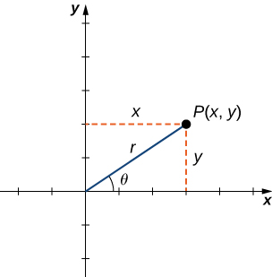{: #CNX_Calc_Figure_11_03_001}

Using right-triangle trigonometry, the following equations are true for the point <math xmlns="http://www.w3.org/1998/Math/MathML"><mrow><mi>P</mi><mtext>:</mtext></mrow></math>

<math xmlns="http://www.w3.org/1998/Math/MathML"><mrow><mtext>cos</mtext><mspace width="0.2em" /><mi>θ</mi><mo>=</mo><mfrac><mi>x</mi><mi>r</mi></mfrac><mspace width="0.2em" /><mtext>so</mtext><mspace width="0.2em" /><mi>x</mi><mo>=</mo><mi>r</mi><mspace width="0.2em" /><mtext>cos</mtext><mspace width="0.2em" /><mi>θ</mi></mrow></math>

<math xmlns="http://www.w3.org/1998/Math/MathML"><mrow><mtext>sin</mtext><mspace width="0.2em" /><mi>θ</mi><mo>=</mo><mfrac><mi>y</mi><mi>r</mi></mfrac><mspace width="0.2em" /><mtext>so</mtext><mspace width="0.2em" /><mi>y</mi><mo>=</mo><mi>r</mi><mspace width="0.2em" /><mtext>sin</mtext><mspace width="0.2em" /><mi>θ</mi><mo>.</mo></mrow></math>

Furthermore,

<math xmlns="http://www.w3.org/1998/Math/MathML"><mrow><msup><mi>r</mi><mn>2</mn></msup><mo>=</mo><msup><mi>x</mi><mn>2</mn></msup><mo>+</mo><msup><mi>y</mi><mn>2</mn></msup><mspace width="0.2em" /><mtext>and</mtext><mspace width="0.2em" /><mtext>tan</mtext><mspace width="0.2em" /><mi>θ</mi><mo>=</mo><mfrac><mi>y</mi><mi>x</mi></mfrac><mo>.</mo></mrow></math>

Each point <math xmlns="http://www.w3.org/1998/Math/MathML"><mrow><mrow><mo>(</mo><mrow><mi>x</mi><mo>,</mo><mi>y</mi></mrow><mo>)</mo></mrow></mrow></math>

 in the Cartesian coordinate system can therefore be represented as an ordered pair <math xmlns="http://www.w3.org/1998/Math/MathML"><mrow><mrow><mo>(</mo><mrow><mi>r</mi><mo>,</mo><mi>θ</mi></mrow><mo>)</mo></mrow></mrow></math>

 in the polar coordinate system. The first coordinate is called the **radial coordinate**{: data-type="term"} and the second coordinate is called the **angular coordinate**{: data-type="term"}. Every point in the plane can be represented in this form.

Note that the equation <math xmlns="http://www.w3.org/1998/Math/MathML"><mrow><mtext>tan</mtext><mspace width="0.2em" /><mi>θ</mi><mo>=</mo><mrow><mi>y</mi><mtext>/</mtext><mi>x</mi></mrow></mrow></math>

 has an infinite number of solutions for any ordered pair <math xmlns="http://www.w3.org/1998/Math/MathML"><mrow><mrow><mo>(</mo><mrow><mi>x</mi><mo>,</mo><mi>y</mi></mrow><mo>)</mo></mrow><mo>.</mo></mrow></math>

 However, if we restrict the solutions to values between <math xmlns="http://www.w3.org/1998/Math/MathML"><mn>0</mn></math>

 and <math xmlns="http://www.w3.org/1998/Math/MathML"><mrow><mn>2</mn><mi>π</mi></mrow></math>

 then we can assign a unique solution to the quadrant in which the original point <math xmlns="http://www.w3.org/1998/Math/MathML"><mrow><mrow><mo>(</mo><mrow><mi>x</mi><mo>,</mo><mi>y</mi></mrow><mo>)</mo></mrow></mrow></math>

 is located. Then the corresponding value of *r* is positive, so <math xmlns="http://www.w3.org/1998/Math/MathML"><mrow><msup><mi>r</mi><mn>2</mn></msup><mo>=</mo><msup><mi>x</mi><mn>2</mn></msup><mo>+</mo><msup><mi>y</mi><mn>2</mn></msup><mo>.</mo></mrow></math>

Converting Points between Coordinate Systems

Given a point <math xmlns="http://www.w3.org/1998/Math/MathML"><mi>P</mi></math>

 in the plane with Cartesian coordinates <math xmlns="http://www.w3.org/1998/Math/MathML"><mrow><mrow><mo>(</mo><mrow><mi>x</mi><mo>,</mo><mi>y</mi></mrow><mo>)</mo></mrow></mrow></math>

 and polar coordinates <math xmlns="http://www.w3.org/1998/Math/MathML"><mrow><mrow><mo>(</mo><mrow><mi>r</mi><mo>,</mo><mi>θ</mi></mrow><mo>)</mo></mrow><mo>,</mo></mrow></math>

 the following conversion formulas hold true:

<math xmlns="http://www.w3.org/1998/Math/MathML"><mrow><mi>x</mi><mo>=</mo><mi>r</mi><mspace width="0.2em" /><mtext>cos</mtext><mspace width="0.2em" /><mi>θ</mi><mspace width="0.2em" /><mtext>and</mtext><mspace width="0.2em" /><mi>y</mi><mo>=</mo><mi>r</mi><mspace width="0.2em" /><mtext>sin</mtext><mspace width="0.2em" /><mi>θ</mi><mo>,</mo></mrow></math>

<math xmlns="http://www.w3.org/1998/Math/MathML"><mrow><msup><mi>r</mi><mn>2</mn></msup><mo>=</mo><msup><mi>x</mi><mn>2</mn></msup><mo>+</mo><msup><mi>y</mi><mn>2</mn></msup><mspace width="0.2em" /><mtext>and</mtext><mspace width="0.2em" /><mtext>tan</mtext><mspace width="0.2em" /><mi>θ</mi><mo>=</mo><mfrac><mi>y</mi><mi>x</mi></mfrac><mo>.</mo></mrow></math>

These formulas can be used to convert from rectangular to polar or from polar to rectangular coordinates.

Converting between Rectangular and Polar Coordinates

Convert each of the following points into polar coordinates.

1.  <math xmlns="http://www.w3.org/1998/Math/MathML"><mrow><mo stretchy="false">(</mo><mn>1</mn><mo>,</mo><mn>1</mn><mo stretchy="false">)</mo></mrow></math>

2.  <math xmlns="http://www.w3.org/1998/Math/MathML"><mrow><mo stretchy="false">(</mo><mn>−3</mn><mo>,</mo><mn>4</mn><mo stretchy="false">)</mo></mrow></math>

3.  <math xmlns="http://www.w3.org/1998/Math/MathML"><mrow><mrow><mo>(</mo><mrow><mn>0</mn><mo>,</mo><mn>3</mn></mrow><mo>)</mo></mrow></mrow></math>

4.  <math xmlns="http://www.w3.org/1998/Math/MathML"><mrow><mo stretchy="false">(</mo><mn>5</mn><msqrt><mn>3</mn></msqrt><mo>,</mo><mn>−5</mn><mo stretchy="false">)</mo></mrow></math>
{: type="a"}

Convert each of the following points into rectangular coordinates.

1.  <math xmlns="http://www.w3.org/1998/Math/MathML"><mrow><mo stretchy="false">(</mo><mn>3</mn><mo>,</mo><mrow><mrow><mi>π</mi></mrow><mtext>/</mtext><mn>3</mn></mrow><mo stretchy="false">)</mo></mrow></math>

2.  <math xmlns="http://www.w3.org/1998/Math/MathML"><mrow><mo stretchy="false">(</mo><mn>2</mn><mo>,</mo><mrow><mrow><mn>3</mn><mi>π</mi></mrow><mtext>/</mtext><mn>2</mn></mrow><mo stretchy="false">)</mo></mrow></math>

3.  <math xmlns="http://www.w3.org/1998/Math/MathML"><mrow><mo stretchy="false">(</mo><mn>6</mn><mo>,</mo><mrow><mrow><mn>−5</mn><mi>π</mi></mrow><mtext>/</mtext><mn>6</mn></mrow><mo stretchy="false">)</mo></mrow></math>
{: type="a" start="4"}

1.  Use
    <math xmlns="http://www.w3.org/1998/Math/MathML"><mrow><mi>x</mi><mo>=</mo><mn>1</mn></mrow></math>
    
    and
    <math xmlns="http://www.w3.org/1998/Math/MathML"><mrow><mi>y</mi><mo>=</mo><mn>1</mn></mrow></math>
    
    in [[link]](#fs-id1167793834620):
    * * *
    {: data-type="newline"}
    
    

    <math xmlns="http://www.w3.org/1998/Math/MathML"><mtable><mtr><mtd columnalign="left"><mtable><mtr><mtd columnalign="right"><msup><mi>r</mi><mn>2</mn></msup></mtd><mtd columnalign="left"><mo>=</mo></mtd><mtd columnalign="left"><msup><mi>x</mi><mn>2</mn></msup><mo>+</mo><msup><mi>y</mi><mn>2</mn></msup></mtd></mtr><mtr><mtd /><mtd columnalign="left"><mo>=</mo></mtd><mtd columnalign="left"><msup><mn>1</mn><mn>2</mn></msup><mo>+</mo><msup><mn>1</mn><mn>2</mn></msup></mtd></mtr><mtr><mtd columnalign="right"><mi>r</mi></mtd><mtd columnalign="left"><mo>=</mo></mtd><mtd columnalign="left"><msqrt><mn>2</mn></msqrt></mtd></mtr></mtable></mtd><mtd /><mtd /><mtd columnalign="left"><mtext>and</mtext></mtd><mtd /><mtd /><mtd columnalign="left"><mtable><mtr><mtd columnalign="right"><mtext>tan</mtext><mspace width="0.2em" /><mi>θ</mi></mtd><mtd columnalign="left"><mo>=</mo></mtd><mtd columnalign="left"><mfrac><mi>y</mi><mi>x</mi></mfrac></mtd></mtr><mtr><mtd /><mtd columnalign="left"><mo>=</mo></mtd><mtd columnalign="left"><mfrac><mn>1</mn><mn>1</mn></mfrac><mo>=</mo><mn>1</mn></mtd></mtr><mtr><mtd columnalign="right"><mi>θ</mi></mtd><mtd columnalign="left"><mo>=</mo></mtd><mtd columnalign="left"><mfrac><mi>π</mi><mn>4</mn></mfrac><mo>.</mo></mtd></mtr></mtable></mtd></mtr></mtable></math>
    

    
    * * *
    {: data-type="newline"}
    
    Therefore this point can be represented as
    <math xmlns="http://www.w3.org/1998/Math/MathML"><mrow><mrow><mo>(</mo><mrow><msqrt><mn>2</mn></msqrt><mo>,</mo><mfrac><mi>π</mi><mn>4</mn></mfrac></mrow><mo>)</mo></mrow></mrow></math>
    
    in polar coordinates.
2.  Use
    <math xmlns="http://www.w3.org/1998/Math/MathML"><mrow><mi>x</mi><mo>=</mo><mn>−3</mn></mrow></math>
    
    and
    <math xmlns="http://www.w3.org/1998/Math/MathML"><mrow><mi>y</mi><mo>=</mo><mn>4</mn></mrow></math>
    
    in [[link]](#fs-id1167793834620):
    * * *
    {: data-type="newline"}
    
    

    <math xmlns="http://www.w3.org/1998/Math/MathML"><mtable><mtr><mtd columnalign="left"><mtable><mtr><mtd columnalign="right"><msup><mi>r</mi><mn>2</mn></msup></mtd><mtd columnalign="left"><mo>=</mo></mtd><mtd columnalign="left"><msup><mi>x</mi><mn>2</mn></msup><mo>+</mo><msup><mi>y</mi><mn>2</mn></msup></mtd></mtr><mtr><mtd /><mtd columnalign="left"><mo>=</mo></mtd><mtd columnalign="left"><msup><mrow><mo>(</mo><mrow><mn>−3</mn></mrow><mo>)</mo></mrow><mn>2</mn></msup><mo>+</mo><msup><mrow><mo>(</mo><mn>4</mn><mo>)</mo></mrow><mn>2</mn></msup></mtd></mtr><mtr><mtd columnalign="right"><mi>r</mi></mtd><mtd columnalign="left"><mo>=</mo></mtd><mtd columnalign="left"><mn>5</mn></mtd></mtr></mtable></mtd><mtd /><mtd /><mtd columnalign="left"><mtext>and</mtext></mtd><mtd /><mtd /><mtd columnalign="left"><mtable><mtr><mtd columnalign="right"><mtext>tan</mtext><mspace width="0.2em" /><mi>θ</mi></mtd><mtd columnalign="left"><mo>=</mo></mtd><mtd columnalign="left"><mfrac><mi>y</mi><mi>x</mi></mfrac></mtd></mtr><mtr><mtd /><mtd columnalign="left"><mo>=</mo></mtd><mtd columnalign="left"><mo>−</mo><mfrac><mn>4</mn><mn>3</mn></mfrac></mtd></mtr><mtr><mtd columnalign="right"><mi>θ</mi></mtd><mtd columnalign="left"><mo>=</mo></mtd><mtd columnalign="left"><mtext>−</mtext><mtext>arctan</mtext><mrow><mo>(</mo><mrow><mfrac><mn>4</mn><mn>3</mn></mfrac></mrow><mo>)</mo></mrow></mtd></mtr><mtr><mtd /><mtd columnalign="left"><mo>≈</mo></mtd><mtd columnalign="left"><mn>2.21.</mn></mtd></mtr></mtable></mtd></mtr></mtable></math>
    

    
    * * *
    {: data-type="newline"}
    
    Therefore this point can be represented as
    <math xmlns="http://www.w3.org/1998/Math/MathML"><mrow><mrow><mo>(</mo><mrow><mn>5</mn><mo>,</mo><mn>2.21</mn></mrow><mo>)</mo></mrow></mrow></math>
    
    in polar coordinates.
3.  Use
    <math xmlns="http://www.w3.org/1998/Math/MathML"><mrow><mi>x</mi><mo>=</mo><mn>0</mn></mrow></math>
    
    and
    <math xmlns="http://www.w3.org/1998/Math/MathML"><mrow><mi>y</mi><mo>=</mo><mn>3</mn></mrow></math>
    
    in [[link]](#fs-id1167793834620):
    * * *
    {: data-type="newline"}
    
    

    <math xmlns="http://www.w3.org/1998/Math/MathML"><mtable><mtr><mtd columnalign="left"><mtable><mtr><mtd columnalign="right"><msup><mi>r</mi><mn>2</mn></msup></mtd><mtd columnalign="left"><mo>=</mo></mtd><mtd columnalign="left"><msup><mi>x</mi><mn>2</mn></msup><mo>+</mo><msup><mi>y</mi><mn>2</mn></msup></mtd></mtr><mtr><mtd /><mtd columnalign="left"><mo>=</mo></mtd><mtd columnalign="left"><msup><mrow><mo>(</mo><mn>3</mn><mo>)</mo></mrow><mn>2</mn></msup><mo>+</mo><msup><mrow><mo>(</mo><mn>0</mn><mo>)</mo></mrow><mn>2</mn></msup></mtd></mtr><mtr><mtd /><mtd columnalign="left"><mo>=</mo></mtd><mtd columnalign="left"><mn>9</mn><mo>+</mo><mn>0</mn></mtd></mtr><mtr><mtd columnalign="right"><mi>r</mi></mtd><mtd columnalign="left"><mo>=</mo></mtd><mtd columnalign="left"><mn>3</mn></mtd></mtr></mtable></mtd><mtd /><mtd /><mtd columnalign="left"><mtext>and</mtext></mtd><mtd /><mtd /><mtd columnalign="left"><mtable><mtr><mtd columnalign="right"><mtext>tan</mtext><mspace width="0.2em" /><mi>θ</mi></mtd><mtd columnalign="left"><mo>=</mo></mtd><mtd columnalign="left"><mfrac><mi>y</mi><mi>x</mi></mfrac></mtd></mtr><mtr><mtd /><mtd columnalign="left"><mo>=</mo></mtd><mtd columnalign="left"><mfrac><mn>3</mn><mn>0</mn></mfrac><mo>.</mo></mtd></mtr></mtable></mtd></mtr></mtable></math>
    

    
    * * *
    {: data-type="newline"}
    
    Direct application of the second equation leads to division by zero. Graphing the point
    <math xmlns="http://www.w3.org/1998/Math/MathML"><mrow><mrow><mo>(</mo><mrow><mn>0</mn><mo>,</mo><mn>3</mn></mrow><mo>)</mo></mrow></mrow></math>
    
    on the rectangular coordinate system reveals that the point is located on the positive *y*-axis. The angle between the positive *x*-axis and the positive *y*-axis is
    <math xmlns="http://www.w3.org/1998/Math/MathML"><mrow><mfrac><mi>π</mi><mn>2</mn></mfrac><mo>.</mo></mrow></math>
    
    Therefore this point can be represented as
    <math xmlns="http://www.w3.org/1998/Math/MathML"><mrow><mrow><mo>(</mo><mrow><mn>3</mn><mo>,</mo><mfrac><mi>π</mi><mn>2</mn></mfrac></mrow><mo>)</mo></mrow></mrow></math>
    
    in polar coordinates.
4.  Use
    <math xmlns="http://www.w3.org/1998/Math/MathML"><mrow><mi>x</mi><mo>=</mo><mn>5</mn><msqrt><mn>3</mn></msqrt></mrow></math>
    
    and
    <math xmlns="http://www.w3.org/1998/Math/MathML"><mrow><mi>y</mi><mo>=</mo><mn>−5</mn></mrow></math>
    
    in [[link]](#fs-id1167793834620):
    * * *
    {: data-type="newline"}
    
    

    <math xmlns="http://www.w3.org/1998/Math/MathML"><mtable><mtr><mtd columnalign="left"><mtable><mtr><mtd columnalign="right"><msup><mi>r</mi><mn>2</mn></msup></mtd><mtd columnalign="left"><mo>=</mo></mtd><mtd columnalign="left"><msup><mi>x</mi><mn>2</mn></msup><mo>+</mo><msup><mi>y</mi><mn>2</mn></msup></mtd></mtr><mtr><mtd /><mtd columnalign="left"><mo>=</mo></mtd><mtd columnalign="left"><msup><mrow><mo>(</mo><mrow><mn>5</mn><msqrt><mn>3</mn></msqrt></mrow><mo>)</mo></mrow><mn>2</mn></msup><mo>+</mo><msup><mrow><mo>(</mo><mrow><mn>−5</mn></mrow><mo>)</mo></mrow><mn>2</mn></msup></mtd></mtr><mtr><mtd /><mtd columnalign="left"><mo>=</mo></mtd><mtd columnalign="left"><mn>75</mn><mo>+</mo><mn>25</mn></mtd></mtr><mtr><mtd columnalign="right"><mi>r</mi></mtd><mtd columnalign="left"><mo>=</mo></mtd><mtd columnalign="left"><mn>10</mn></mtd></mtr></mtable></mtd><mtd /><mtd /><mtd columnalign="left"><mtext>and</mtext></mtd><mtd /><mtd /><mtd columnalign="left"><mtable><mtr><mtd columnalign="right"><mtext>tan</mtext><mspace width="0.2em" /><mi>θ</mi></mtd><mtd columnalign="left"><mo>=</mo></mtd><mtd columnalign="left"><mfrac><mi>y</mi><mi>x</mi></mfrac></mtd></mtr><mtr><mtd /><mtd columnalign="left"><mo>=</mo></mtd><mtd columnalign="left"><mfrac><mrow><mn>−5</mn></mrow><mrow><mn>5</mn><msqrt><mn>3</mn></msqrt></mrow></mfrac><mo>=</mo><mo>−</mo><mfrac><mrow><msqrt><mn>3</mn></msqrt></mrow><mn>3</mn></mfrac></mtd></mtr><mtr><mtd columnalign="right"><mi>θ</mi></mtd><mtd columnalign="left"><mo>=</mo></mtd><mtd columnalign="left"><mo>−</mo><mfrac><mi>π</mi><mn>6</mn></mfrac><mo>.</mo></mtd></mtr></mtable></mtd></mtr></mtable></math>
    

    
    * * *
    {: data-type="newline"}
    
    Therefore this point can be represented as
    <math xmlns="http://www.w3.org/1998/Math/MathML"><mrow><mrow><mo>(</mo><mrow><mn>10</mn><mo>,</mo><mo>−</mo><mfrac><mi>π</mi><mn>6</mn></mfrac></mrow><mo>)</mo></mrow></mrow></math>
    
    in polar coordinates.
5.  Use
    <math xmlns="http://www.w3.org/1998/Math/MathML"><mrow><mi>r</mi><mo>=</mo><mn>3</mn></mrow></math>
    
    and
    <math xmlns="http://www.w3.org/1998/Math/MathML"><mrow><mi>θ</mi><mo>=</mo><mfrac><mi>π</mi><mn>3</mn></mfrac></mrow></math>
    
    in [[link]](#fs-id1167794066096):
    * * *
    {: data-type="newline"}
    
    

    <math xmlns="http://www.w3.org/1998/Math/MathML"><mtable><mtr><mtd columnalign="left"><mtable><mtr><mtd columnalign="right"><mi>x</mi></mtd><mtd columnalign="left"><mo>=</mo></mtd><mtd columnalign="left"><mi>r</mi><mspace width="0.2em" /><mtext>cos</mtext><mspace width="0.2em" /><mi>θ</mi></mtd></mtr><mtr><mtd /><mtd columnalign="left"><mo>=</mo></mtd><mtd columnalign="left"><mn>3</mn><mspace width="0.2em" /><mtext>cos</mtext><mrow><mo>(</mo><mrow><mfrac><mi>π</mi><mn>3</mn></mfrac></mrow><mo>)</mo></mrow></mtd></mtr><mtr><mtd /><mtd columnalign="left"><mo>=</mo></mtd><mtd columnalign="left"><mn>3</mn><mrow><mo>(</mo><mrow><mfrac><mn>1</mn><mn>2</mn></mfrac></mrow><mo>)</mo></mrow><mo>=</mo><mfrac><mn>3</mn><mn>2</mn></mfrac></mtd></mtr></mtable></mtd><mtd /><mtd /><mtd columnalign="left"><mtext>and</mtext></mtd><mtd /><mtd /><mtd columnalign="left"><mtable><mtr><mtd columnalign="right"><mi>y</mi></mtd><mtd columnalign="left"><mo>=</mo></mtd><mtd columnalign="left"><mi>r</mi><mspace width="0.2em" /><mtext>sin</mtext><mspace width="0.2em" /><mi>θ</mi></mtd></mtr><mtr><mtd /><mtd columnalign="left"><mo>=</mo></mtd><mtd columnalign="left"><mn>3</mn><mspace width="0.2em" /><mtext>sin</mtext><mrow><mo>(</mo><mrow><mfrac><mi>π</mi><mn>3</mn></mfrac></mrow><mo>)</mo></mrow></mtd></mtr><mtr><mtd /><mtd columnalign="left"><mo>=</mo></mtd><mtd columnalign="left"><mn>3</mn><mrow><mo>(</mo><mrow><mfrac><mrow><msqrt><mn>3</mn></msqrt></mrow><mn>2</mn></mfrac></mrow><mo>)</mo></mrow><mo>=</mo><mfrac><mrow><mn>3</mn><msqrt><mn>3</mn></msqrt></mrow><mn>2</mn></mfrac><mo>.</mo></mtd></mtr></mtable></mtd></mtr></mtable></math>
    

    
    * * *
    {: data-type="newline"}
    
    Therefore this point can be represented as
    <math xmlns="http://www.w3.org/1998/Math/MathML"><mrow><mrow><mo>(</mo><mrow><mfrac><mn>3</mn><mn>2</mn></mfrac><mo>,</mo><mspace width="0.2em" /><mfrac><mrow><mn>3</mn><msqrt><mn>3</mn></msqrt></mrow><mn>2</mn></mfrac></mrow><mo>)</mo></mrow></mrow></math>
    
    in rectangular coordinates.
6.  Use
    <math xmlns="http://www.w3.org/1998/Math/MathML"><mrow><mi>r</mi><mo>=</mo><mn>2</mn></mrow></math>
    
    and
    <math xmlns="http://www.w3.org/1998/Math/MathML"><mrow><mi>θ</mi><mo>=</mo><mfrac><mrow><mn>3</mn><mi>π</mi></mrow><mn>2</mn></mfrac></mrow></math>
    
    in [[link]](#fs-id1167794066096):
    * * *
    {: data-type="newline"}
    
    

    <math xmlns="http://www.w3.org/1998/Math/MathML"><mtable><mtr><mtd columnalign="left"><mtable><mtr><mtd columnalign="right"><mi>x</mi></mtd><mtd columnalign="left"><mo>=</mo></mtd><mtd columnalign="left"><mi>r</mi><mspace width="0.2em" /><mtext>cos</mtext><mspace width="0.2em" /><mi>θ</mi></mtd></mtr><mtr><mtd /><mtd columnalign="left"><mo>=</mo></mtd><mtd columnalign="left"><mn>2</mn><mspace width="0.2em" /><mtext>cos</mtext><mrow><mo>(</mo><mrow><mfrac><mrow><mn>3</mn><mi>π</mi></mrow><mn>2</mn></mfrac></mrow><mo>)</mo></mrow></mtd></mtr><mtr><mtd /><mtd columnalign="left"><mo>=</mo></mtd><mtd columnalign="left"><mn>2</mn><mrow><mo>(</mo><mn>0</mn><mo>)</mo></mrow><mo>=</mo><mn>0</mn></mtd></mtr></mtable></mtd><mtd /><mtd /><mtd columnalign="left"><mtext>and</mtext></mtd><mtd /><mtd /><mtd columnalign="left"><mtable><mtr><mtd columnalign="right"><mi>y</mi></mtd><mtd columnalign="left"><mo>=</mo></mtd><mtd columnalign="left"><mi>r</mi><mspace width="0.2em" /><mtext>sin</mtext><mspace width="0.2em" /><mi>θ</mi></mtd></mtr><mtr><mtd /><mtd columnalign="left"><mo>=</mo></mtd><mtd columnalign="left"><mn>2</mn><mspace width="0.2em" /><mtext>sin</mtext><mrow><mo>(</mo><mrow><mfrac><mrow><mn>3</mn><mi>π</mi></mrow><mn>2</mn></mfrac></mrow><mo>)</mo></mrow></mtd></mtr><mtr><mtd /><mtd columnalign="left"><mo>=</mo></mtd><mtd columnalign="left"><mn>2</mn><mrow><mo>(</mo><mrow><mn>−1</mn></mrow><mo>)</mo></mrow><mo>=</mo><mn>−2.</mn></mtd></mtr></mtable></mtd></mtr></mtable></math>
    

    
    * * *
    {: data-type="newline"}
    
    Therefore this point can be represented as
    <math xmlns="http://www.w3.org/1998/Math/MathML"><mrow><mrow><mo>(</mo><mrow><mn>0</mn><mo>,</mo><mn>−2</mn></mrow><mo>)</mo></mrow></mrow></math>
    
    in rectangular coordinates.
7.  Use
    <math xmlns="http://www.w3.org/1998/Math/MathML"><mrow><mi>r</mi><mo>=</mo><mn>6</mn></mrow></math>
    
    and
    <math xmlns="http://www.w3.org/1998/Math/MathML"><mrow><mi>θ</mi><mo>=</mo><mo>−</mo><mfrac><mrow><mn>5</mn><mi>π</mi></mrow><mn>6</mn></mfrac></mrow></math>
    
    in [[link]](#fs-id1167794066096):
    * * *
    {: data-type="newline"}
    
    

    <math xmlns="http://www.w3.org/1998/Math/MathML"><mtable><mtr><mtd columnalign="left"><mtable><mtr><mtd columnalign="right"><mi>x</mi></mtd><mtd columnalign="left"><mo>=</mo></mtd><mtd columnalign="left"><mi>r</mi><mspace width="0.2em" /><mtext>cos</mtext><mspace width="0.2em" /><mi>θ</mi></mtd></mtr><mtr><mtd /><mtd columnalign="left"><mo>=</mo></mtd><mtd columnalign="left"><mn>6</mn><mspace width="0.2em" /><mtext>cos</mtext><mrow><mo>(</mo><mrow><mo>−</mo><mfrac><mrow><mn>5</mn><mi>π</mi></mrow><mn>6</mn></mfrac></mrow><mo>)</mo></mrow></mtd></mtr><mtr><mtd /><mtd columnalign="left"><mo>=</mo></mtd><mtd columnalign="left"><mn>6</mn><mrow><mo>(</mo><mrow><mo>−</mo><mfrac><mrow><msqrt><mn>3</mn></msqrt></mrow><mn>2</mn></mfrac></mrow><mo>)</mo></mrow></mtd></mtr><mtr><mtd /><mtd columnalign="left"><mo>=</mo></mtd><mtd columnalign="left"><mn>−3</mn><msqrt><mn>3</mn></msqrt></mtd></mtr></mtable></mtd><mtd /><mtd /><mtd columnalign="left"><mtext>and</mtext></mtd><mtd /><mtd /><mtd columnalign="left"><mtable><mtr><mtd columnalign="right"><mi>y</mi></mtd><mtd columnalign="left"><mo>=</mo></mtd><mtd columnalign="left"><mi>r</mi><mspace width="0.2em" /><mtext>sin</mtext><mspace width="0.2em" /><mi>θ</mi></mtd></mtr><mtr><mtd /><mtd columnalign="left"><mo>=</mo></mtd><mtd columnalign="left"><mn>6</mn><mspace width="0.2em" /><mtext>sin</mtext><mrow><mo>(</mo><mrow><mo>−</mo><mfrac><mrow><mn>5</mn><mi>π</mi></mrow><mn>6</mn></mfrac></mrow><mo>)</mo></mrow></mtd></mtr><mtr><mtd /><mtd columnalign="left"><mo>=</mo></mtd><mtd columnalign="left"><mn>6</mn><mrow><mo>(</mo><mrow><mo>−</mo><mfrac><mn>1</mn><mn>2</mn></mfrac></mrow><mo>)</mo></mrow></mtd></mtr><mtr><mtd /><mtd columnalign="left"><mo>=</mo></mtd><mtd columnalign="left"><mn>−3.</mn></mtd></mtr></mtable></mtd></mtr></mtable></math>
    

    
    * * *
    {: data-type="newline"}
    
    Therefore this point can be represented as
    <math xmlns="http://www.w3.org/1998/Math/MathML"><mrow><mrow><mo>(</mo><mrow><mn>−3</mn><msqrt><mn>3</mn></msqrt><mo>,</mo><mn>−3</mn></mrow><mo>)</mo></mrow></mrow></math>
    
    in rectangular coordinates.
{: type="a"}

Convert <math xmlns="http://www.w3.org/1998/Math/MathML"><mrow><mrow><mo>(</mo><mrow><mn>−8</mn><mo>,</mo><mn>−8</mn></mrow><mo>)</mo></mrow></mrow></math>

 into polar coordinates and <math xmlns="http://www.w3.org/1998/Math/MathML"><mrow><mrow><mo>(</mo><mrow><mn>4</mn><mo>,</mo><mfrac><mrow><mn>2</mn><mi>π</mi></mrow><mn>3</mn></mfrac></mrow><mo>)</mo></mrow></mrow></math>

 into rectangular coordinates.

<math xmlns="http://www.w3.org/1998/Math/MathML"><mrow><mrow><mo>(</mo><mrow><mn>8</mn><msqrt><mn>2</mn></msqrt><mo>,</mo><mfrac><mrow><mn>5</mn><mi>π</mi></mrow><mn>4</mn></mfrac></mrow><mo>)</mo></mrow></mrow></math>

 and <math xmlns="http://www.w3.org/1998/Math/MathML"><mrow><mrow><mo>(</mo><mrow><mn>−2</mn><mo>,</mo><mn>2</mn><msqrt><mn>3</mn></msqrt></mrow><mo>)</mo></mrow></mrow></math>

Hint

Use [[link]](#fs-id1167794066096) and [[link]](#fs-id1167793834620). Make sure to check the quadrant when calculating <math xmlns="http://www.w3.org/1998/Math/MathML"><mrow><mi>θ</mi><mo>.</mo></mrow></math>

The polar representation of a point is not unique. For example, the polar coordinates <math xmlns="http://www.w3.org/1998/Math/MathML"><mrow><mrow><mo>(</mo><mrow><mn>2</mn><mo>,</mo><mfrac><mi>π</mi><mn>3</mn></mfrac></mrow><mo>)</mo></mrow></mrow></math>

 and <math xmlns="http://www.w3.org/1998/Math/MathML"><mrow><mrow><mo>(</mo><mrow><mn>2</mn><mo>,</mo><mfrac><mrow><mn>7</mn><mi>π</mi></mrow><mn>3</mn></mfrac></mrow><mo>)</mo></mrow></mrow></math>

 both represent the point <math xmlns="http://www.w3.org/1998/Math/MathML"><mrow><mrow><mo>(</mo><mrow><mn>1</mn><mo>,</mo><msqrt><mn>3</mn></msqrt></mrow><mo>)</mo></mrow></mrow></math>

 in the rectangular system. Also, the value of <math xmlns="http://www.w3.org/1998/Math/MathML"><mi>r</mi></math>

 can be negative. Therefore, the point with polar coordinates <math xmlns="http://www.w3.org/1998/Math/MathML"><mrow><mrow><mo>(</mo><mrow><mn>−2</mn><mo>,</mo><mfrac><mrow><mn>4</mn><mi>π</mi></mrow><mn>3</mn></mfrac></mrow><mo>)</mo></mrow></mrow></math>

 also represents the point <math xmlns="http://www.w3.org/1998/Math/MathML"><mrow><mrow><mo>(</mo><mrow><mn>1</mn><mo>,</mo><msqrt><mn>3</mn></msqrt></mrow><mo>)</mo></mrow></mrow></math>

 in the rectangular system, as we can see by using [\[link\]](#fs-id1167793834620)\:

<math xmlns="http://www.w3.org/1998/Math/MathML"><mtable><mtr><mtd columnalign="left"><mtable><mtr><mtd columnalign="right"><mi>x</mi></mtd><mtd columnalign="left"><mo>=</mo></mtd><mtd columnalign="left"><mi>r</mi><mspace width="0.2em" /><mtext>cos</mtext><mspace width="0.2em" /><mi>θ</mi></mtd></mtr><mtr><mtd /><mtd columnalign="left"><mo>=</mo></mtd><mtd columnalign="left"><mn>−2</mn><mspace width="0.2em" /><mtext>cos</mtext><mrow><mo>(</mo><mrow><mfrac><mrow><mn>4</mn><mi>π</mi></mrow><mn>3</mn></mfrac></mrow><mo>)</mo></mrow></mtd></mtr><mtr><mtd /><mtd columnalign="left"><mo>=</mo></mtd><mtd columnalign="left"><mn>−2</mn><mrow><mo>(</mo><mrow><mo>−</mo><mfrac><mn>1</mn><mn>2</mn></mfrac></mrow><mo>)</mo></mrow><mo>=</mo><mn>1</mn></mtd></mtr></mtable></mtd><mtd /><mtd /><mtd columnalign="left"><mtext>and</mtext></mtd><mtd /><mtd /><mtd columnalign="left"><mtable><mtr><mtd columnalign="right"><mi>y</mi></mtd><mtd columnalign="left"><mo>=</mo></mtd><mtd columnalign="left"><mi>r</mi><mspace width="0.2em" /><mtext>sin</mtext><mspace width="0.2em" /><mi>θ</mi></mtd></mtr><mtr><mtd /><mtd columnalign="left"><mo>=</mo></mtd><mtd columnalign="left"><mn>−2</mn><mspace width="0.2em" /><mtext>sin</mtext><mrow><mo>(</mo><mrow><mfrac><mrow><mn>4</mn><mi>π</mi></mrow><mn>3</mn></mfrac></mrow><mo>)</mo></mrow></mtd></mtr><mtr><mtd /><mtd columnalign="left"><mo>=</mo></mtd><mtd columnalign="left"><mn>−2</mn><mrow><mo>(</mo><mrow><mo>−</mo><mfrac><mrow><msqrt><mn>3</mn></msqrt></mrow><mn>2</mn></mfrac></mrow><mo>)</mo></mrow><mo>=</mo><msqrt><mn>3</mn></msqrt><mo>.</mo></mtd></mtr></mtable></mtd></mtr></mtable></math>

Every point in the plane has an infinite number of representations in polar coordinates. However, each point in the plane has only one representation in the rectangular coordinate system.

Note that the polar representation of a point in the plane also has a visual interpretation. In particular, <math xmlns="http://www.w3.org/1998/Math/MathML"><mi>r</mi></math>

 is the directed distance that the point lies from the origin, and <math xmlns="http://www.w3.org/1998/Math/MathML"><mi>θ</mi></math>

 measures the angle that the line segment from the origin to the point makes with the positive <math xmlns="http://www.w3.org/1998/Math/MathML"><mi>x</mi></math>

-axis. Positive angles are measured in a counterclockwise direction and negative angles are measured in a clockwise direction. The polar coordinate system appears in the following figure.

 {: #CNX_Calc_Figure_11_03_002}

The line segment starting from the center of the graph going to the right (called the positive *x*-axis in the Cartesian system) is the **polar axis**{: data-type="term"}. The center point is the **pole**{: data-type="term"}, or origin, of the coordinate system, and corresponds to <math xmlns="http://www.w3.org/1998/Math/MathML"><mrow><mi>r</mi><mo>=</mo><mn>0</mn><mo>.</mo></mrow></math>

 The innermost circle shown in [\[link\]](#CNX_Calc_Figure_11_03_002) contains all points a distance of 1 unit from the pole, and is represented by the equation <math xmlns="http://www.w3.org/1998/Math/MathML"><mrow><mi>r</mi><mo>=</mo><mn>1</mn><mo>.</mo></mrow></math>

 Then <math xmlns="http://www.w3.org/1998/Math/MathML"><mrow><mi>r</mi><mo>=</mo><mn>2</mn></mrow></math>

 is the set of points 2 units from the pole, and so on. The line segments emanating from the pole correspond to fixed angles. To plot a point in the polar coordinate system, start with the angle. If the angle is positive, then measure the angle from the polar axis in a counterclockwise direction. If it is negative, then measure it clockwise. If the value of <math xmlns="http://www.w3.org/1998/Math/MathML"><mi>r</mi></math>

 is positive, move that distance along the terminal ray of the angle. If it is negative, move along the ray that is opposite the terminal ray of the given angle.

Plotting Points in the Polar Plane

Plot each of the following points on the polar plane.

1.  <math xmlns="http://www.w3.org/1998/Math/MathML"><mrow><mrow><mo>(</mo><mrow><mn>2</mn><mo>,</mo><mfrac><mi>π</mi><mn>4</mn></mfrac></mrow><mo>)</mo></mrow></mrow></math>

2.  <math xmlns="http://www.w3.org/1998/Math/MathML"><mrow><mrow><mo>(</mo><mrow><mn>−3</mn><mo>,</mo><mfrac><mrow><mn>2</mn><mi>π</mi></mrow><mn>3</mn></mfrac></mrow><mo>)</mo></mrow></mrow></math>

3.  <math xmlns="http://www.w3.org/1998/Math/MathML"><mrow><mrow><mo>(</mo><mrow><mn>4</mn><mo>,</mo><mfrac><mrow><mn>5</mn><mi>π</mi></mrow><mn>4</mn></mfrac></mrow><mo>)</mo></mrow></mrow></math>
{: type="a"}

The three points are plotted in the following figure.

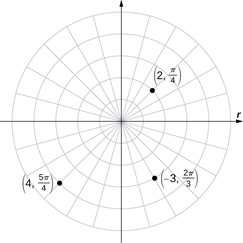{: #CNX_Calc_Figure_11_03_003}

Plot <math xmlns="http://www.w3.org/1998/Math/MathML"><mrow><mrow><mo>(</mo><mrow><mn>4</mn><mo>,</mo><mfrac><mrow><mn>5</mn><mi>π</mi></mrow><mn>3</mn></mfrac></mrow><mo>)</mo></mrow></mrow></math>

 and <math xmlns="http://www.w3.org/1998/Math/MathML"><mrow><mrow><mo>(</mo><mrow><mn>−3</mn><mo>,</mo><mo>−</mo><mfrac><mrow><mn>7</mn><mi>π</mi></mrow><mn>2</mn></mfrac></mrow><mo>)</mo></mrow></mrow></math>

 on the polar plane.

* * *
{: data-type="newline"}

 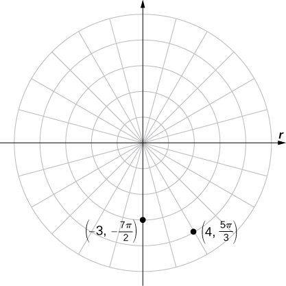 

Hint

Start with <math xmlns="http://www.w3.org/1998/Math/MathML"><mrow><mi>θ</mi><mo>,</mo></mrow></math>

 then use <math xmlns="http://www.w3.org/1998/Math/MathML"><mrow><mi>r</mi><mo>.</mo></mrow></math>

### Polar Curves

Now that we know how to plot points in the polar coordinate system, we can discuss how to plot curves. In the rectangular coordinate system, we can graph a function <math xmlns="http://www.w3.org/1998/Math/MathML"><mrow><mi>y</mi><mo>=</mo><mi>f</mi><mrow><mo>(</mo><mi>x</mi><mo>)</mo></mrow></mrow></math>

 and create a curve in the Cartesian plane. In a similar fashion, we can graph a curve that is generated by a function <math xmlns="http://www.w3.org/1998/Math/MathML"><mrow><mi>r</mi><mo>=</mo><mi>f</mi><mrow><mo>(</mo><mi>θ</mi><mo>)</mo></mrow><mo>.</mo></mrow></math>

The general idea behind graphing a function in polar coordinates is the same as graphing a function in rectangular coordinates. Start with a list of values for the independent variable <math xmlns="http://www.w3.org/1998/Math/MathML"><mrow><mo stretchy="false">(</mo><mi>θ</mi></mrow></math>

 in this case) and calculate the corresponding values of the dependent variable <math xmlns="http://www.w3.org/1998/Math/MathML"><mrow><mi>r</mi><mo>.</mo></mrow></math>

 This process generates a list of ordered pairs, which can be plotted in the polar coordinate system. Finally, connect the points, and take advantage of any patterns that may appear. The function may be periodic, for example, which indicates that only a limited number of values for the independent variable are needed.

Problem-Solving Strategy: Plotting a Curve in Polar Coordinates

1.  Create a table with two columns. The first column is for
    <math xmlns="http://www.w3.org/1998/Math/MathML"><mrow><mi>θ</mi><mo>,</mo></mrow></math>
    
    and the second column is for
    <math xmlns="http://www.w3.org/1998/Math/MathML"><mrow><mi>r</mi><mo>.</mo></mrow></math>

2.  Create a list of values for
    <math xmlns="http://www.w3.org/1998/Math/MathML"><mrow><mi>θ</mi><mo>.</mo></mrow></math>

3.  Calculate the corresponding
    <math xmlns="http://www.w3.org/1998/Math/MathML"><mi>r</mi></math>
    
    values for each
    <math xmlns="http://www.w3.org/1998/Math/MathML"><mrow><mi>θ</mi><mo>.</mo></mrow></math>

4.  Plot each ordered pair
    <math xmlns="http://www.w3.org/1998/Math/MathML"><mrow><mrow><mo>(</mo><mrow><mi>r</mi><mo>,</mo><mi>θ</mi></mrow><mo>)</mo></mrow></mrow></math>
    
    on the coordinate axes.
5.  Connect the points and look for a pattern.
{: type="1"}

Watch this [video][1] for more information on sketching polar curves.

Graphing a Function in Polar Coordinates

Graph the curve defined by the function <math xmlns="http://www.w3.org/1998/Math/MathML"><mrow><mi>r</mi><mo>=</mo><mn>4</mn><mspace width="0.2em" /><mtext>sin</mtext><mspace width="0.2em" /><mi>θ</mi><mo>.</mo></mrow></math>

 Identify the curve and rewrite the equation in rectangular coordinates.

Because the function is a multiple of a sine function, it is periodic with period <math xmlns="http://www.w3.org/1998/Math/MathML"><mrow><mn>2</mn><mi>π</mi><mo>,</mo></mrow></math>

 so use values for <math xmlns="http://www.w3.org/1998/Math/MathML"><mi>θ</mi></math>

 between 0 and <math xmlns="http://www.w3.org/1998/Math/MathML"><mrow><mn>2</mn><mi>π</mi><mo>.</mo></mrow></math>

 The result of steps 1–3 appear in the following table. [[link]](#CNX_Calc_Figure_11_03_005) shows the graph based on this table.

<table class="unnumbered" summary="This table has two columns and 18 rows. The first row is a header row, and it reads from left to right &#x3B8; and r = 4 sin&#x3B8;. Below the header row, in the first column, the values read 0, &#x3C0;/6, &#x3C0;/4, &#x3C0;/3, &#x3C0;/2, 2&#x3C0;/3, 3&#x3C0;/4, 5&#x3C0;/6, &#x3C0;, 7&#x3C0;/6, 5&#x3C0;/4, 4&#x3C0;/3, 3&#x3C0;/2, 5&#x3C0;/3, 7&#x3C0;/4, 11&#x3C0;/6, and 2&#x3C0;. In the second column, the values read 0, 2, 2 times the square root of 2, which is approximately equal to 2.8, 2 times the square root of 3, which is approximately equal to 3.4, 4, 2 times the square root of 3, which is approximately equal to 3.4, 2 times the square root of 2, which is approximately equal to 2.8, 2, 0, &#x2212;2, &#x2212;2 times the square root of 2, which is approximately equal to &#x2212;2.8, &#x2212;2 times the square root of 3, which is approximately equal to &#x2212;3.4, &#x2212;4, &#x2212;2 times the square root of 3, which is approximately equal to &#x2212;3.4, &#x2212;2 times the square root of 2, which is approximately equal to &#x2212;2.8, &#x2212;2, and 0." data-label=""><thead>
<tr valign="top">
<th data-valign="top" data-align="center"><math xmlns="http://www.w3.org/1998/Math/MathML"><mi>θ</mi></math></th>
<th data-valign="top" data-align="center"><math xmlns="http://www.w3.org/1998/Math/MathML"><mrow><mi>r</mi><mo>=</mo><mn>4</mn><mspace width="0.2em" /><mtext>sin</mtext><mspace width="0.2em" /><mi>θ</mi></mrow></math></th>
<th data-valign="top" data-align="left" />
<th data-valign="top" data-align="center"><math xmlns="http://www.w3.org/1998/Math/MathML"><mi>θ</mi></math></th>
<th data-valign="top" data-align="center"><math xmlns="http://www.w3.org/1998/Math/MathML"><mrow><mi>r</mi><mo>=</mo><mn>4</mn><mspace width="0.2em" /><mtext>sin</mtext><mspace width="0.2em" /><mi>θ</mi></mrow></math></th>
</tr>
</thead><tbody>
<tr valign="top">
<td data-valign="top" data-align="center">0</td>
<td data-valign="top" data-align="center">0</td>
<td rowspan="9" data-valign="top" data-align="left" />
<td data-valign="top" data-align="center"><math xmlns="http://www.w3.org/1998/Math/MathML"><mi>π</mi></math></td>
<td data-valign="top" data-align="center">0</td>
</tr>
<tr valign="top">
<td data-valign="top" data-align="center"><math xmlns="http://www.w3.org/1998/Math/MathML"><mrow><mfrac><mi>π</mi><mn>6</mn></mfrac></mrow></math></td>
<td data-valign="top" data-align="center"><math xmlns="http://www.w3.org/1998/Math/MathML"><mn>2</mn></math></td>
<td data-valign="top" data-align="center"><math xmlns="http://www.w3.org/1998/Math/MathML"><mrow><mfrac><mrow><mn>7</mn><mi>π</mi></mrow><mn>6</mn></mfrac></mrow></math></td>
<td data-valign="top" data-align="center"><math xmlns="http://www.w3.org/1998/Math/MathML"><mrow><mn>−2</mn></mrow></math></td>
</tr>
<tr valign="top">
<td data-valign="top" data-align="center"><math xmlns="http://www.w3.org/1998/Math/MathML"><mrow><mfrac><mi>π</mi><mn>4</mn></mfrac></mrow></math></td>
<td data-valign="top" data-align="center"><math xmlns="http://www.w3.org/1998/Math/MathML"><mrow><mn>2</mn><msqrt><mn>2</mn></msqrt><mo>≈</mo><mn>2.8</mn></mrow></math></td>
<td data-valign="top" data-align="center"><math xmlns="http://www.w3.org/1998/Math/MathML"><mrow><mfrac><mrow><mn>5</mn><mi>π</mi></mrow><mn>4</mn></mfrac></mrow></math></td>
<td data-valign="top" data-align="center"><math xmlns="http://www.w3.org/1998/Math/MathML"><mrow><mn>−2</mn><msqrt><mn>2</mn></msqrt><mo>≈</mo><mn>−2.8</mn></mrow></math></td>
</tr>
<tr valign="top">
<td data-valign="top" data-align="center"><math xmlns="http://www.w3.org/1998/Math/MathML"><mrow><mfrac><mi>π</mi><mn>3</mn></mfrac></mrow></math></td>
<td data-valign="top" data-align="center"><math xmlns="http://www.w3.org/1998/Math/MathML"><mrow><mn>2</mn><msqrt><mn>3</mn></msqrt><mo>≈</mo><mn>3.4</mn></mrow></math></td>
<td data-valign="top" data-align="center"><math xmlns="http://www.w3.org/1998/Math/MathML"><mrow><mfrac><mrow><mn>4</mn><mi>π</mi></mrow><mn>3</mn></mfrac></mrow></math></td>
<td data-valign="top" data-align="center"><math xmlns="http://www.w3.org/1998/Math/MathML"><mrow><mn>−2</mn><msqrt><mn>3</mn></msqrt><mo>≈</mo><mn>−3.4</mn></mrow></math></td>
</tr>
<tr valign="top">
<td data-valign="top" data-align="center"><math xmlns="http://www.w3.org/1998/Math/MathML"><mrow><mfrac><mi>π</mi><mn>2</mn></mfrac></mrow></math></td>
<td data-valign="top" data-align="center"><math xmlns="http://www.w3.org/1998/Math/MathML"><mn>4</mn></math></td>
<td data-valign="top" data-align="center"><math xmlns="http://www.w3.org/1998/Math/MathML"><mrow><mfrac><mrow><mn>3</mn><mi>π</mi></mrow><mn>2</mn></mfrac></mrow></math></td>
<td data-valign="top" data-align="center"><math xmlns="http://www.w3.org/1998/Math/MathML"><mn>4</mn></math></td>
</tr>
<tr valign="top">
<td data-valign="top" data-align="center"><math xmlns="http://www.w3.org/1998/Math/MathML"><mrow><mfrac><mrow><mn>2</mn><mi>π</mi></mrow><mn>3</mn></mfrac></mrow></math></td>
<td data-valign="top" data-align="center"><math xmlns="http://www.w3.org/1998/Math/MathML"><mrow><mn>2</mn><msqrt><mn>3</mn></msqrt><mo>≈</mo><mn>3.4</mn></mrow></math></td>
<td data-valign="top" data-align="center"><math xmlns="http://www.w3.org/1998/Math/MathML"><mrow><mfrac><mrow><mn>5</mn><mi>π</mi></mrow><mn>3</mn></mfrac></mrow></math></td>
<td data-valign="top" data-align="center"><math xmlns="http://www.w3.org/1998/Math/MathML"><mrow><mn>−2</mn><msqrt><mn>3</mn></msqrt><mo>≈</mo><mn>−3.4</mn></mrow></math></td>
</tr>
<tr valign="top">
<td data-valign="top" data-align="center"><math xmlns="http://www.w3.org/1998/Math/MathML"><mrow><mfrac><mrow><mn>3</mn><mi>π</mi></mrow><mn>4</mn></mfrac></mrow></math></td>
<td data-valign="top" data-align="center"><math xmlns="http://www.w3.org/1998/Math/MathML"><mrow><mn>2</mn><msqrt><mn>2</mn></msqrt><mo>≈</mo><mn>2.8</mn></mrow></math></td>
<td data-valign="top" data-align="center"><math xmlns="http://www.w3.org/1998/Math/MathML"><mrow><mfrac><mrow><mn>7</mn><mi>π</mi></mrow><mn>4</mn></mfrac></mrow></math></td>
<td data-valign="top" data-align="center"><math xmlns="http://www.w3.org/1998/Math/MathML"><mrow><mn>−2</mn><msqrt><mn>2</mn></msqrt><mo>≈</mo><mn>−2.8</mn></mrow></math></td>
</tr>
<tr valign="top">
<td data-valign="top" data-align="center"><math xmlns="http://www.w3.org/1998/Math/MathML"><mrow><mfrac><mrow><mn>5</mn><mi>π</mi></mrow><mn>6</mn></mfrac></mrow></math></td>
<td data-valign="top" data-align="center"><math xmlns="http://www.w3.org/1998/Math/MathML"><mn>2</mn></math></td>
<td data-valign="top" data-align="center"><math xmlns="http://www.w3.org/1998/Math/MathML"><mrow><mfrac><mrow><mn>11</mn><mi>π</mi></mrow><mn>6</mn></mfrac></mrow></math></td>
<td data-valign="top" data-align="center"><math xmlns="http://www.w3.org/1998/Math/MathML"><mrow><mn>−2</mn></mrow></math></td>
</tr>
<tr valign="top">
<td data-valign="top" data-align="center" />
<td data-valign="top" data-align="center" />
<td data-valign="top" data-align="center"><math xmlns="http://www.w3.org/1998/Math/MathML"><mrow><mn>2</mn><mi>π</mi></mrow></math></td>
<td data-valign="top" data-align="center">0</td>
</tr>
</tbody></table>
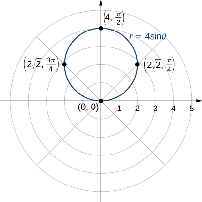{: #CNX_Calc_Figure_11_03_005}

This is the graph of a circle. The equation <math xmlns="http://www.w3.org/1998/Math/MathML"><mrow><mi>r</mi><mo>=</mo><mn>4</mn><mspace width="0.2em" /><mtext>sin</mtext><mspace width="0.2em" /><mi>θ</mi></mrow></math>

 can be converted into rectangular coordinates by first multiplying both sides by <math xmlns="http://www.w3.org/1998/Math/MathML"><mrow><mi>r</mi><mo>.</mo></mrow></math>

 This gives the equation <math xmlns="http://www.w3.org/1998/Math/MathML"><mrow><msup><mi>r</mi><mn>2</mn></msup><mo>=</mo><mn>4</mn><mi>r</mi><mspace width="0.2em" /><mtext>sin</mtext><mspace width="0.2em" /><mi>θ</mi><mo>.</mo></mrow></math>

 Next use the facts that <math xmlns="http://www.w3.org/1998/Math/MathML"><mrow><msup><mi>r</mi><mn>2</mn></msup><mo>=</mo><msup><mi>x</mi><mn>2</mn></msup><mo>+</mo><msup><mi>y</mi><mn>2</mn></msup></mrow></math>

 and <math xmlns="http://www.w3.org/1998/Math/MathML"><mrow><mi>y</mi><mo>=</mo><mi>r</mi><mspace width="0.2em" /><mtext>sin</mtext><mspace width="0.2em" /><mi>θ</mi><mo>.</mo></mrow></math>

 This gives <math xmlns="http://www.w3.org/1998/Math/MathML"><mrow><msup><mi>x</mi><mn>2</mn></msup><mo>+</mo><msup><mi>y</mi><mn>2</mn></msup><mo>=</mo><mn>4</mn><mi>y</mi><mo>.</mo></mrow></math>

 To put this equation into standard form, subtract <math xmlns="http://www.w3.org/1998/Math/MathML"><mrow><mn>4</mn><mi>y</mi></mrow></math>

 from both sides of the equation and complete the square:

<math xmlns="http://www.w3.org/1998/Math/MathML"><mtable><mtr><mtd columnalign="right"><msup><mi>x</mi><mn>2</mn></msup><mo>+</mo><msup><mi>y</mi><mn>2</mn></msup><mo>−</mo><mn>4</mn><mi>y</mi></mtd><mtd columnalign="left"><mo>=</mo></mtd><mtd columnalign="left"><mn>0</mn></mtd></mtr><mtr><mtd columnalign="right"><msup><mi>x</mi><mn>2</mn></msup><mo>+</mo><mrow><mo>(</mo><mrow><msup><mi>y</mi><mn>2</mn></msup><mo>−</mo><mn>4</mn><mi>y</mi></mrow><mo>)</mo></mrow></mtd><mtd columnalign="left"><mo>=</mo></mtd><mtd columnalign="left"><mn>0</mn></mtd></mtr><mtr><mtd columnalign="right"><msup><mi>x</mi><mn>2</mn></msup><mo>+</mo><mrow><mo>(</mo><mrow><msup><mi>y</mi><mn>2</mn></msup><mo>−</mo><mn>4</mn><mi>y</mi><mo>+</mo><mn>4</mn></mrow><mo>)</mo></mrow></mtd><mtd columnalign="left"><mo>=</mo></mtd><mtd columnalign="left"><mn>0</mn><mo>+</mo><mn>4</mn></mtd></mtr><mtr><mtd columnalign="right"><msup><mi>x</mi><mn>2</mn></msup><mo>+</mo><msup><mrow><mo>(</mo><mrow><mi>y</mi><mo>−</mo><mn>2</mn></mrow><mo>)</mo></mrow><mn>2</mn></msup></mtd><mtd columnalign="left"><mo>=</mo></mtd><mtd columnalign="left"><mn>4.</mn></mtd></mtr></mtable></math>

This is the equation of a circle with radius 2 and center <math xmlns="http://www.w3.org/1998/Math/MathML"><mrow><mrow><mo>(</mo><mrow><mn>0</mn><mo>,</mo><mn>2</mn></mrow><mo>)</mo></mrow></mrow></math>

 in the rectangular coordinate system.

Create a graph of the curve defined by the function <math xmlns="http://www.w3.org/1998/Math/MathML"><mrow><mi>r</mi><mo>=</mo><mn>4</mn><mo>+</mo><mn>4</mn><mspace width="0.2em" /><mtext>cos</mtext><mspace width="0.2em" /><mi>θ</mi><mo>.</mo></mrow></math>

* * *
{: data-type="newline"}

  
* * *
{: data-type="newline"}

 The name of this shape is a cardioid, which we will study further later in this section.

Hint

Follow the problem-solving strategy for creating a graph in polar coordinates.

The graph in [\[link\]](#fs-id1167794046199) was that of a circle. The equation of the circle can be transformed into rectangular coordinates using the coordinate transformation formulas in [\[link\]](#fs-id1167793834620). [\[link\]](#fs-id1167794047292) gives some more examples of functions for transforming from polar to rectangular coordinates.

Transforming Polar Equations to Rectangular Coordinates

Rewrite each of the following equations in rectangular coordinates and identify the graph.

1.  <math xmlns="http://www.w3.org/1998/Math/MathML"><mrow><mi>θ</mi><mo>=</mo><mfrac><mi>π</mi><mn>3</mn></mfrac></mrow></math>

2.  <math xmlns="http://www.w3.org/1998/Math/MathML"><mrow><mi>r</mi><mo>=</mo><mn>3</mn></mrow></math>

3.  <math xmlns="http://www.w3.org/1998/Math/MathML"><mrow><mi>r</mi><mo>=</mo><mn>6</mn><mspace width="0.2em" /><mtext>cos</mtext><mspace width="0.2em" /><mi>θ</mi><mo>−</mo><mn>8</mn><mspace width="0.2em" /><mtext>sin</mtext><mspace width="0.2em" /><mi>θ</mi></mrow></math>
{: type="a"}

1.  Take the tangent of both sides. This gives
    <math xmlns="http://www.w3.org/1998/Math/MathML"><mrow><mtext>tan</mtext><mspace width="0.2em" /><mi>θ</mi><mo>=</mo><mtext>tan</mtext><mo stretchy="false">(</mo><mrow><mi>π</mi><mtext>/</mtext><mn>3</mn></mrow><mo stretchy="false">)</mo><mo>=</mo><msqrt><mn>3</mn></msqrt><mo>.</mo></mrow></math>
    
    Since
    <math xmlns="http://www.w3.org/1998/Math/MathML"><mrow><mtext>tan</mtext><mspace width="0.2em" /><mi>θ</mi><mo>=</mo><mrow><mi>y</mi><mtext>/</mtext><mi>x</mi></mrow></mrow></math>
    
    we can replace the left-hand side of this equation by
    <math xmlns="http://www.w3.org/1998/Math/MathML"><mrow><mrow><mi>y</mi><mtext>/</mtext><mi>x</mi></mrow><mo>.</mo></mrow></math>
    
    This gives
    <math xmlns="http://www.w3.org/1998/Math/MathML"><mrow><mrow><mi>y</mi><mtext>/</mtext><mi>x</mi></mrow><mo>=</mo><msqrt><mn>3</mn></msqrt><mo>,</mo></mrow></math>
    
    which can be rewritten as
    <math xmlns="http://www.w3.org/1998/Math/MathML"><mrow><mi>y</mi><mo>=</mo><mi>x</mi><msqrt><mn>3</mn></msqrt><mo>.</mo></mrow></math>
    
    This is the equation of a straight line passing through the origin with slope
    <math xmlns="http://www.w3.org/1998/Math/MathML"><mrow><msqrt><mn>3</mn></msqrt><mo>.</mo></mrow></math>
    
    In general, any polar equation of the form
    <math xmlns="http://www.w3.org/1998/Math/MathML"><mrow><mi>θ</mi><mo>=</mo><mi>K</mi></mrow></math>
    
    represents a straight line through the pole with slope equal to
    <math xmlns="http://www.w3.org/1998/Math/MathML"><mrow><mtext>tan</mtext><mspace width="0.2em" /><mi>K</mi><mo>.</mo></mrow></math>

2.  First, square both sides of the equation. This gives
    <math xmlns="http://www.w3.org/1998/Math/MathML"><mrow><msup><mi>r</mi><mn>2</mn></msup><mo>=</mo><mn>9</mn><mo>.</mo></mrow></math>
    
    Next replace
    <math xmlns="http://www.w3.org/1998/Math/MathML"><mrow><msup><mi>r</mi><mn>2</mn></msup></mrow></math>
    
    with
    <math xmlns="http://www.w3.org/1998/Math/MathML"><mrow><msup><mi>x</mi><mn>2</mn></msup><mo>+</mo><msup><mi>y</mi><mn>2</mn></msup><mo>.</mo></mrow></math>
    
    This gives the equation
    <math xmlns="http://www.w3.org/1998/Math/MathML"><mrow><msup><mi>x</mi><mn>2</mn></msup><mo>+</mo><msup><mi>y</mi><mn>2</mn></msup><mo>=</mo><mn>9</mn><mo>,</mo></mrow></math>
    
    which is the equation of a circle centered at the origin with radius 3. In general, any polar equation of the form
    <math xmlns="http://www.w3.org/1998/Math/MathML"><mrow><mi>r</mi><mo>=</mo><mi>k</mi></mrow></math>
    
    where *k* is a positive constant represents a circle of radius *k* centered at the origin. (*Note*: when squaring both sides of an equation it is possible to introduce new points unintentionally. This should always be taken into consideration. However, in this case we do not introduce new points. For example,
    <math xmlns="http://www.w3.org/1998/Math/MathML"><mrow><mrow><mo>(</mo><mrow><mn>−3</mn><mo>,</mo><mfrac><mi>π</mi><mn>3</mn></mfrac></mrow><mo>)</mo></mrow></mrow></math>
    
    is the same point as
    <math xmlns="http://www.w3.org/1998/Math/MathML"><mrow><mrow><mo>(</mo><mrow><mn>3</mn><mo>,</mo><mfrac><mrow><mn>4</mn><mi>π</mi></mrow><mn>3</mn></mfrac></mrow><mo>)</mo></mrow><mo>.</mo><mo stretchy="false">)</mo></mrow></math>

3.  Multiply both sides of the equation by
    <math xmlns="http://www.w3.org/1998/Math/MathML"><mrow><mi>r</mi><mo>.</mo></mrow></math>
    
    This leads to
    <math xmlns="http://www.w3.org/1998/Math/MathML"><mrow><msup><mi>r</mi><mn>2</mn></msup><mo>=</mo><mn>6</mn><mi>r</mi><mspace width="0.2em" /><mtext>cos</mtext><mspace width="0.2em" /><mi>θ</mi><mo>−</mo><mn>8</mn><mi>r</mi><mspace width="0.2em" /><mtext>sin</mtext><mspace width="0.2em" /><mi>θ</mi><mo>.</mo></mrow></math>
    
    Next use the formulas
    * * *
    {: data-type="newline"}
    
    

    <math xmlns="http://www.w3.org/1998/Math/MathML"><mrow><msup><mi>r</mi><mn>2</mn></msup><mo>=</mo><msup><mi>x</mi><mn>2</mn></msup><mo>+</mo><msup><mi>y</mi><mn>2</mn></msup><mo>,</mo><mspace width="1em" /><mi>x</mi><mo>=</mo><mi>r</mi><mspace width="0.2em" /><mtext>cos</mtext><mspace width="0.2em" /><mi>θ</mi><mo>,</mo><mspace width="1em" /><mi>y</mi><mo>=</mo><mi>r</mi><mspace width="0.2em" /><mtext>sin</mtext><mspace width="0.2em" /><mi>θ</mi><mo>.</mo></mrow></math>
    

    
    * * *
    {: data-type="newline"}
    
    This gives
    * * *
    {: data-type="newline"}
    
    

    <math xmlns="http://www.w3.org/1998/Math/MathML"><mtable><mtr><mtd columnalign="right"><msup><mi>r</mi><mn>2</mn></msup></mtd><mtd columnalign="left"><mo>=</mo></mtd><mtd columnalign="left"><mn>6</mn><mrow><mo>(</mo><mrow><mi>r</mi><mspace width="0.2em" /><mtext>cos</mtext><mspace width="0.2em" /><mi>θ</mi></mrow><mo>)</mo></mrow><mo>−</mo><mn>8</mn><mrow><mo>(</mo><mrow><mi>r</mi><mspace width="0.2em" /><mtext>sin</mtext><mspace width="0.2em" /><mi>θ</mi></mrow><mo>)</mo></mrow></mtd></mtr><mtr><mtd columnalign="right"><msup><mi>x</mi><mn>2</mn></msup><mo>+</mo><msup><mi>y</mi><mn>2</mn></msup></mtd><mtd columnalign="left"><mo>=</mo></mtd><mtd columnalign="left"><mn>6</mn><mi>x</mi><mo>−</mo><mn>8</mn><mi>y</mi><mo>.</mo></mtd></mtr></mtable></math>
    

    
    * * *
    {: data-type="newline"}
    
    To put this equation into standard form, first move the variables from the right-hand side of the equation to the left-hand side, then complete the square.
    * * *
    {: data-type="newline"}
    
    

    <math xmlns="http://www.w3.org/1998/Math/MathML"><mtable><mtr><mtd columnalign="right"><msup><mi>x</mi><mn>2</mn></msup><mo>+</mo><msup><mi>y</mi><mn>2</mn></msup></mtd><mtd columnalign="left"><mo>=</mo></mtd><mtd columnalign="left"><mn>6</mn><mi>x</mi><mo>−</mo><mn>8</mn><mi>y</mi></mtd></mtr><mtr><mtd columnalign="right"><msup><mi>x</mi><mn>2</mn></msup><mo>−</mo><mn>6</mn><mi>x</mi><mo>+</mo><msup><mi>y</mi><mn>2</mn></msup><mo>+</mo><mn>8</mn><mi>y</mi></mtd><mtd columnalign="left"><mo>=</mo></mtd><mtd columnalign="left"><mn>0</mn></mtd></mtr><mtr><mtd columnalign="right"><mrow><mo>(</mo><mrow><msup><mi>x</mi><mn>2</mn></msup><mo>−</mo><mn>6</mn><mi>x</mi></mrow><mo>)</mo></mrow><mo>+</mo><mrow><mo>(</mo><mrow><msup><mi>y</mi><mn>2</mn></msup><mo>+</mo><mn>8</mn><mi>y</mi></mrow><mo>)</mo></mrow></mtd><mtd columnalign="left"><mo>=</mo></mtd><mtd columnalign="left"><mn>0</mn></mtd></mtr><mtr><mtd columnalign="right"><mrow><mo>(</mo><mrow><msup><mi>x</mi><mn>2</mn></msup><mo>−</mo><mn>6</mn><mi>x</mi><mo>+</mo><mn>9</mn></mrow><mo>)</mo></mrow><mo>+</mo><mrow><mo>(</mo><mrow><msup><mi>y</mi><mn>2</mn></msup><mo>+</mo><mn>8</mn><mi>y</mi><mo>+</mo><mn>16</mn></mrow><mo>)</mo></mrow></mtd><mtd columnalign="left"><mo>=</mo></mtd><mtd columnalign="left"><mn>9</mn><mo>+</mo><mn>16</mn></mtd></mtr><mtr><mtd columnalign="right"><msup><mrow><mo>(</mo><mrow><mi>x</mi><mo>−</mo><mn>3</mn></mrow><mo>)</mo></mrow><mn>2</mn></msup><mo>+</mo><msup><mrow><mo>(</mo><mrow><mi>y</mi><mo>+</mo><mn>4</mn></mrow><mo>)</mo></mrow><mn>2</mn></msup></mtd><mtd columnalign="left"><mo>=</mo></mtd><mtd columnalign="left"><mn>25.</mn></mtd></mtr></mtable></math>
    

    
    * * *
    {: data-type="newline"}
    
    This is the equation of a circle with center at
    <math xmlns="http://www.w3.org/1998/Math/MathML"><mrow><mrow><mo>(</mo><mrow><mn>3</mn><mo>,</mo><mn>−4</mn></mrow><mo>)</mo></mrow></mrow></math>
    
    and radius 5. Notice that the circle passes through the origin since the center is 5 units away.
{: type="a"}

Rewrite the equation <math xmlns="http://www.w3.org/1998/Math/MathML"><mrow><mi>r</mi><mo>=</mo><mtext>sec</mtext><mspace width="0.2em" /><mi>θ</mi><mspace width="0.2em" /><mtext>tan</mtext><mspace width="0.2em" /><mi>θ</mi></mrow></math>

 in rectangular coordinates and identify its graph.

<math xmlns="http://www.w3.org/1998/Math/MathML"><mrow><mi>y</mi><mo>=</mo><msup><mi>x</mi><mn>2</mn></msup><mo>,</mo></mrow></math>

 which is the equation of a parabola opening upward.

Hint

Convert to sine and cosine, then multiply both sides by cosine.

We have now seen several examples of drawing graphs of curves defined by **polar equations**{: data-type="term"}. A summary of some common curves is given in the tables below. In each equation, *a* and *b* are arbitrary constants.

 ![This table has three columns and 3 rows. The first row is a header row and is given from left to right as name, equation, and example. The second row is Line passing through the pole with slope tan K; &#x3B8; = K; and a picture of a straight line on the polar coordinate plane with &#x3B8; = &#x3C0;/3. The third row is Circle; r = a cos&#x3B8; + b sin&#x3B8;; and a picture of a circle on the polar coordinate plane with equation r = 2 cos(t) &#x2013; 3 sin(t): the circle touches the origin but has center in the third quadrant.](../resources/CNX_Calc_Figure_11_03_016.jpg){: #CNX_Calc_Figure_11_03_016}

![This table has three columns and 3 rows. The first row is Spiral; r = a + b&#x3B8;; and a picture of a spiral starting at the origin with equation r = &#x3B8;/3. The second row is Cardioid; r = a(1 + cos&#x3B8;), r = a(1 &#x2013; cos&#x3B8;), r = a(1 + sin&#x3B8;), r = a(1 &#x2013; sin&#x3B8;); and a picture of a cardioid with equation r = 3(1 + cos&#x3B8;): the cardioid looks like a heart turned on its side with a rounded bottom instead of a pointed one. The third row is Lima&#xE7;on; r = a cos&#x3B8; + b, r = a sin&#x3B8; + b; and a picture of a lima&#xE7;on with equation r = 2 + 4 sin&#x3B8;: the figure looks like a deformed circle with a loop inside of it. The seventh row is Rose; r = a cos(b&#x3B8;), r = a sin(b&#x3B8;); and a picture of a rose with equation r = 3 sin(2&#x3B8;): the rose looks like a flower with four petals, one petal in each quadrant, each with length 3 and reaching to the origin between each petal.](../resources/CNX_Calc_Figure_11_03_017.jpg){: #CNX_Calc_Figure_11_03_017}

A **cardioid**{: data-type="term"} is a special case of a **limaçon**{: data-type="term"} (pronounced “lee-mah-son”), in which <math xmlns="http://www.w3.org/1998/Math/MathML"><mrow><mi>a</mi><mo>=</mo><mi>b</mi></mrow></math>

 or <math xmlns="http://www.w3.org/1998/Math/MathML"><mrow><mi>a</mi><mo>=</mo><mtext>−</mtext><mi>b</mi><mo>.</mo></mrow></math>

 The **rose**{: data-type="term"} is a very interesting curve. Notice that the graph of <math xmlns="http://www.w3.org/1998/Math/MathML"><mrow><mi>r</mi><mo>=</mo><mn>3</mn><mspace width="0.2em" /><mtext>sin</mtext><mspace width="0.2em" /><mn>2</mn><mi>θ</mi></mrow></math>

 has four petals. However, the graph of <math xmlns="http://www.w3.org/1998/Math/MathML"><mrow><mi>r</mi><mo>=</mo><mn>3</mn><mspace width="0.2em" /><mtext>sin</mtext><mspace width="0.2em" /><mn>3</mn><mi>θ</mi></mrow></math>

 has three petals as shown.

 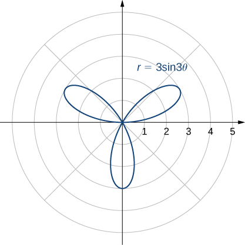{: #CNX_Calc_Figure_11_03_008}

If the coefficient of <math xmlns="http://www.w3.org/1998/Math/MathML"><mi>θ</mi></math>

 is even, the graph has twice as many petals as the coefficient. If the coefficient of <math xmlns="http://www.w3.org/1998/Math/MathML"><mi>θ</mi></math>

 is odd, then the number of petals equals the coefficient. You are encouraged to explore why this happens. Even more interesting graphs emerge when the coefficient of <math xmlns="http://www.w3.org/1998/Math/MathML"><mi>θ</mi></math>

 is not an integer. For example, if it is rational, then the curve is closed; that is, it eventually ends where it started ([\[link\]](#CNX_Calc_Figure_11_03_009)(a)). However, if the coefficient is irrational, then the curve never closes ([\[link\]](#CNX_Calc_Figure_11_03_009)(b)). Although it may appear that the curve is closed, a closer examination reveals that the petals just above the positive *x* axis are slightly thicker. This is because the petal does not quite match up with the starting point.

  rational coefficient and (b) irrational coefficient. Note that the rose in part (b) would actually fill the entire circle if plotted in full."){: #CNX_Calc_Figure_11_03_009}

Since the curve defined by the graph of <math xmlns="http://www.w3.org/1998/Math/MathML"><mrow><mi>r</mi><mo>=</mo><mn>3</mn><mspace width="0.2em" /><mtext>sin</mtext><mrow><mo>(</mo><mrow><mi>π</mi><mi>θ</mi></mrow><mo>)</mo></mrow></mrow></math>

 never closes, the curve depicted in [\[link\]](#CNX_Calc_Figure_11_03_009)(b) is only a partial depiction. In fact, this is an example of a **space-filling curve**{: data-type="term"}. A space-filling curve is one that in fact occupies a two-dimensional subset of the real plane. In this case the curve occupies the circle of radius 3 centered at the origin.

Chapter Opener: Describing a Spiral

Recall the **chambered nautilus**{: data-type="term" .no-emphasis} introduced in the chapter opener. This creature displays a spiral when half the outer shell is cut away. It is possible to describe a spiral using rectangular coordinates. [[link]](#CNX_Calc_Figure_11_03_010) shows a spiral in rectangular coordinates. How can we describe this curve mathematically?

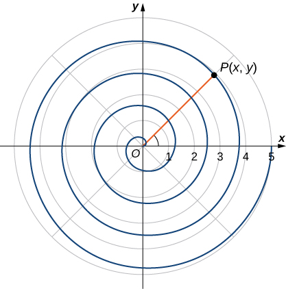{: #CNX_Calc_Figure_11_03_010}

As the point *P* travels around the spiral in a counterclockwise direction, its distance *d* from the origin increases. Assume that the distance *d* is a constant multiple *k* of the angle <math xmlns="http://www.w3.org/1998/Math/MathML"><mi>θ</mi></math>

 that the line segment *OP* makes with the positive *x*-axis. Therefore <math xmlns="http://www.w3.org/1998/Math/MathML"><mrow><mi>d</mi><mrow><mo>(</mo><mrow><mi>P</mi><mo>,</mo><mi>O</mi></mrow><mo>)</mo></mrow><mo>=</mo><mi>k</mi><mi>θ</mi><mo>,</mo></mrow></math>

 where <math xmlns="http://www.w3.org/1998/Math/MathML"><mi>O</mi></math>

 is the origin. Now use the distance formula and some trigonometry:

<math xmlns="http://www.w3.org/1998/Math/MathML"><mtable><mtr><mtd columnalign="right"><mi>d</mi><mrow><mo>(</mo><mrow><mi>P</mi><mo>,</mo><mi>O</mi></mrow><mo>)</mo></mrow></mtd><mtd columnalign="left"><mo>=</mo></mtd><mtd columnalign="left"><mi>k</mi><mi>θ</mi></mtd></mtr><mtr><mtd columnalign="right"><msqrt><mrow><msup><mrow><mrow><mo>(</mo><mrow><mi>x</mi><mo>−</mo><mn>0</mn></mrow><mo>)</mo></mrow></mrow><mn>2</mn></msup><mo>+</mo><msup><mrow><mrow><mo>(</mo><mrow><mi>y</mi><mo>−</mo><mn>0</mn></mrow><mo>)</mo></mrow></mrow><mn>2</mn></msup></mrow></msqrt></mtd><mtd columnalign="left"><mo>=</mo></mtd><mtd columnalign="left"><mi>k</mi><mspace width="0.2em" /><mtext>arctan</mtext><mrow><mo>(</mo><mrow><mfrac><mi>y</mi><mi>x</mi></mfrac></mrow><mo>)</mo></mrow></mtd></mtr><mtr><mtd columnalign="right"><msqrt><mrow><msup><mi>x</mi><mn>2</mn></msup><mo>+</mo><msup><mi>y</mi><mn>2</mn></msup></mrow></msqrt></mtd><mtd columnalign="left"><mo>=</mo></mtd><mtd columnalign="left"><mi>k</mi><mspace width="0.2em" /><mtext>arctan</mtext><mrow><mo>(</mo><mrow><mfrac><mi>y</mi><mi>x</mi></mfrac></mrow><mo>)</mo></mrow></mtd></mtr><mtr><mtd columnalign="right"><mtext>arctan</mtext><mrow><mo>(</mo><mrow><mfrac><mi>y</mi><mi>x</mi></mfrac></mrow><mo>)</mo></mrow></mtd><mtd columnalign="left"><mo>=</mo></mtd><mtd columnalign="left"><mfrac><mrow><msqrt><mrow><msup><mi>x</mi><mn>2</mn></msup><mo>+</mo><msup><mi>y</mi><mn>2</mn></msup></mrow></msqrt></mrow><mi>k</mi></mfrac></mtd></mtr><mtr><mtd columnalign="right"><mi>y</mi></mtd><mtd columnalign="left"><mo>=</mo></mtd><mtd columnalign="left"><mi>x</mi><mspace width="0.2em" /><mtext>tan</mtext><mrow><mo>(</mo><mrow><mfrac><mrow><msqrt><mrow><msup><mi>x</mi><mn>2</mn></msup><mo>+</mo><msup><mi>y</mi><mn>2</mn></msup></mrow></msqrt></mrow><mi>k</mi></mfrac></mrow><mo>)</mo></mrow><mo>.</mo></mtd></mtr></mtable></math>

Although this equation describes the spiral, it is not possible to solve it directly for either *x* or *y*. However, if we use polar coordinates, the equation becomes much simpler. In particular, <math xmlns="http://www.w3.org/1998/Math/MathML"><mrow><mi>d</mi><mrow><mo>(</mo><mrow><mi>P</mi><mo>,</mo><mi>O</mi></mrow><mo>)</mo></mrow><mo>=</mo><mi>r</mi><mo>,</mo></mrow></math>

 and <math xmlns="http://www.w3.org/1998/Math/MathML"><mi>θ</mi></math>

 is the second coordinate. Therefore the equation for the spiral becomes <math xmlns="http://www.w3.org/1998/Math/MathML"><mrow><mi>r</mi><mo>=</mo><mi>k</mi><mi>θ</mi><mo>.</mo></mrow></math>

 Note that when <math xmlns="http://www.w3.org/1998/Math/MathML"><mrow><mi>θ</mi><mo>=</mo><mn>0</mn></mrow></math>

 we also have <math xmlns="http://www.w3.org/1998/Math/MathML"><mrow><mi>r</mi><mo>=</mo><mn>0</mn><mo>,</mo></mrow></math>

 so the spiral emanates from the origin. We can remove this restriction by adding a constant to the equation. Then the equation for the spiral becomes <math xmlns="http://www.w3.org/1998/Math/MathML"><mrow><mi>r</mi><mo>=</mo><mi>a</mi><mo>+</mo><mi>k</mi><mi>θ</mi></mrow></math>

 for arbitrary constants <math xmlns="http://www.w3.org/1998/Math/MathML"><mi>a</mi></math>

 and <math xmlns="http://www.w3.org/1998/Math/MathML"><mi>k</mi><mo>.</mo></math>

 This is referred to as an **Archimedean spiral**{: data-type="term" .no-emphasis}, after the Greek mathematician Archimedes.

Another type of spiral is the logarithmic spiral, described by the function <math xmlns="http://www.w3.org/1998/Math/MathML"><mrow><mi>r</mi><mo>=</mo><mi>a</mi><mo>·</mo><msup><mi>b</mi><mi>θ</mi></msup><mo>.</mo></mrow></math>

 A graph of the function <math xmlns="http://www.w3.org/1998/Math/MathML"><mrow><mi>r</mi><mo>=</mo><mn>1.2</mn><mrow><mo>(</mo><mrow><msup><mrow><mn>1.25</mn></mrow><mi>θ</mi></msup></mrow><mo>)</mo></mrow></mrow></math>

 is given in [[link]](#CNX_Calc_Figure_11_03_011). This spiral describes the shell shape of the chambered nautilus.

"){: #CNX_Calc_Figure_11_03_011}

Suppose a curve is described in the polar coordinate system via the function <math xmlns="http://www.w3.org/1998/Math/MathML"><mrow><mi>r</mi><mo>=</mo><mi>f</mi><mrow><mo>(</mo><mi>θ</mi><mo>)</mo></mrow><mo>.</mo></mrow></math>

 Since we have conversion formulas from polar to rectangular coordinates given by

<math xmlns="http://www.w3.org/1998/Math/MathML"><mtable><mtr><mtd columnalign="left"><mi>x</mi><mo>=</mo><mi>r</mi><mspace width="0.2em" /><mtext>cos</mtext><mspace width="0.2em" /><mi>θ</mi></mtd></mtr><mtr><mtd columnalign="left"><mi>y</mi><mo>=</mo><mi>r</mi><mspace width="0.2em" /><mtext>sin</mtext><mspace width="0.2em" /><mi>θ</mi><mo>,</mo></mtd></mtr></mtable></math>

it is possible to rewrite these formulas using the function

<math xmlns="http://www.w3.org/1998/Math/MathML"><mtable><mtr><mtd columnalign="left"><mi>x</mi><mo>=</mo><mi>f</mi><mrow><mo>(</mo><mi>θ</mi><mo>)</mo></mrow><mspace width="0.2em" /><mtext>cos</mtext><mspace width="0.2em" /><mi>θ</mi></mtd></mtr><mtr><mtd columnalign="left"><mi>y</mi><mo>=</mo><mi>f</mi><mrow><mo>(</mo><mi>θ</mi><mo>)</mo></mrow><mspace width="0.2em" /><mtext>sin</mtext><mspace width="0.2em" /><mi>θ</mi><mo>.</mo></mtd></mtr></mtable></math>

This step gives a parameterization of the curve in rectangular coordinates using <math xmlns="http://www.w3.org/1998/Math/MathML"><mi>θ</mi></math>

 as the parameter. For example, the spiral formula <math xmlns="http://www.w3.org/1998/Math/MathML"><mrow><mi>r</mi><mo>=</mo><mi>a</mi><mo>+</mo><mi>b</mi><mi>θ</mi></mrow></math>

 from [\[link\]](#CNX_Calc_Figure_11_03_016) becomes

<math xmlns="http://www.w3.org/1998/Math/MathML"><mtable><mtr><mtd columnalign="left"><mi>x</mi><mo>=</mo><mrow><mo>(</mo><mrow><mi>a</mi><mo>+</mo><mi>b</mi><mi>θ</mi></mrow><mo>)</mo></mrow><mspace width="0.2em" /><mtext>cos</mtext><mspace width="0.2em" /><mi>θ</mi></mtd></mtr><mtr><mtd columnalign="left"><mi>y</mi><mo>=</mo><mrow><mo>(</mo><mrow><mi>a</mi><mo>+</mo><mi>b</mi><mi>θ</mi></mrow><mo>)</mo></mrow><mspace width="0.2em" /><mtext>sin</mtext><mspace width="0.2em" /><mi>θ</mi><mo>.</mo></mtd></mtr></mtable></math>

Letting <math xmlns="http://www.w3.org/1998/Math/MathML"><mi>θ</mi></math>

 range from <math xmlns="http://www.w3.org/1998/Math/MathML"><mrow><mtext>−</mtext><mi>∞</mi></mrow></math>

 to <math xmlns="http://www.w3.org/1998/Math/MathML"><mi>∞</mi></math>

 generates the entire spiral.

### Symmetry in Polar Coordinates

When studying **symmetry**{: data-type="term" .no-emphasis} of functions in rectangular coordinates (i.e., in the form <math xmlns="http://www.w3.org/1998/Math/MathML"><mrow><mi>y</mi><mo>=</mo><mi>f</mi><mrow><mo>(</mo><mi>x</mi><mo>)</mo></mrow><mo stretchy="false">)</mo><mo>,</mo></mrow></math>

 we talk about symmetry with respect to the *y*-axis and symmetry with respect to the origin. In particular, if <math xmlns="http://www.w3.org/1998/Math/MathML"><mrow><mi>f</mi><mrow><mo>(</mo><mrow><mtext>−</mtext><mi>x</mi></mrow><mo>)</mo></mrow><mo>=</mo><mi>f</mi><mrow><mo>(</mo><mi>x</mi><mo>)</mo></mrow></mrow></math>

 for all <math xmlns="http://www.w3.org/1998/Math/MathML"><mi>x</mi></math>

 in the domain of <math xmlns="http://www.w3.org/1998/Math/MathML"><mrow><mi>f</mi><mo>,</mo></mrow></math>

 then <math xmlns="http://www.w3.org/1998/Math/MathML"><mi>f</mi></math>

 is an even function and its graph is symmetric with respect to the *y*-axis. If <math xmlns="http://www.w3.org/1998/Math/MathML"><mrow><mi>f</mi><mrow><mo>(</mo><mrow><mtext>−</mtext><mi>x</mi></mrow><mo>)</mo></mrow><mo>=</mo><mtext>−</mtext><mi>f</mi><mrow><mo>(</mo><mi>x</mi><mo>)</mo></mrow></mrow></math>

 for all <math xmlns="http://www.w3.org/1998/Math/MathML"><mi>x</mi></math>

 in the domain of <math xmlns="http://www.w3.org/1998/Math/MathML"><mrow><mi>f</mi><mo>,</mo></mrow></math>

 then <math xmlns="http://www.w3.org/1998/Math/MathML"><mi>f</mi></math>

 is an odd function and its graph is symmetric with respect to the origin. By determining which types of symmetry a graph exhibits, we can learn more about the shape and appearance of the graph. Symmetry can also reveal other properties of the function that generates the graph. Symmetry in polar curves works in a similar fashion.

Symmetry in Polar Curves and Equations

Consider a curve generated by the function <math xmlns="http://www.w3.org/1998/Math/MathML"><mrow><mi>r</mi><mo>=</mo><mi>f</mi><mrow><mo>(</mo><mi>θ</mi><mo>)</mo></mrow></mrow></math>

 in polar coordinates.

1.  The curve is symmetric about the polar axis if for every point
    <math xmlns="http://www.w3.org/1998/Math/MathML"><mrow><mrow><mo>(</mo><mrow><mi>r</mi><mo>,</mo><mi>θ</mi></mrow><mo>)</mo></mrow></mrow></math>
    
    on the graph, the point
    <math xmlns="http://www.w3.org/1998/Math/MathML"><mrow><mrow><mo>(</mo><mrow><mi>r</mi><mo>,</mo><mtext>−</mtext><mi>θ</mi></mrow><mo>)</mo></mrow></mrow></math>
    
    is also on the graph. Similarly, the equation
    <math xmlns="http://www.w3.org/1998/Math/MathML"><mrow><mi>r</mi><mo>=</mo><mi>f</mi><mrow><mo>(</mo><mi>θ</mi><mo>)</mo></mrow></mrow></math>
    
    is unchanged by replacing
    <math xmlns="http://www.w3.org/1998/Math/MathML"><mi>θ</mi></math>
    
    with
    <math xmlns="http://www.w3.org/1998/Math/MathML"><mrow><mtext>−</mtext><mi>θ</mi><mo>.</mo></mrow></math>

2.  The curve is symmetric about the pole if for every point
    <math xmlns="http://www.w3.org/1998/Math/MathML"><mrow><mrow><mo>(</mo><mrow><mi>r</mi><mo>,</mo><mi>θ</mi></mrow><mo>)</mo></mrow></mrow></math>
    
    on the graph, the point
    <math xmlns="http://www.w3.org/1998/Math/MathML"><mrow><mrow><mo>(</mo><mrow><mi>r</mi><mo>,</mo><mi>π</mi><mo>+</mo><mi>θ</mi></mrow><mo>)</mo></mrow></mrow></math>
    
    is also on the graph. Similarly, the equation
    <math xmlns="http://www.w3.org/1998/Math/MathML"><mrow><mi>r</mi><mo>=</mo><mi>f</mi><mrow><mo>(</mo><mi>θ</mi><mo>)</mo></mrow></mrow></math>
    
    is unchanged when replacing
    <math xmlns="http://www.w3.org/1998/Math/MathML"><mi>r</mi></math>
    
    with
    <math xmlns="http://www.w3.org/1998/Math/MathML"><mrow><mtext>−</mtext><mi>r</mi><mo>,</mo></mrow></math>
    
    or
    <math xmlns="http://www.w3.org/1998/Math/MathML"><mi>θ</mi></math>
    
    with
    <math xmlns="http://www.w3.org/1998/Math/MathML"><mrow><mi>π</mi><mo>+</mo><mi>θ</mi><mo>.</mo></mrow></math>

3.  The curve is symmetric about the vertical line
    <math xmlns="http://www.w3.org/1998/Math/MathML"><mrow><mi>θ</mi><mo>=</mo><mfrac><mi>π</mi><mn>2</mn></mfrac></mrow></math>
    
    if for every point
    <math xmlns="http://www.w3.org/1998/Math/MathML"><mrow><mrow><mo>(</mo><mrow><mi>r</mi><mo>,</mo><mi>θ</mi></mrow><mo>)</mo></mrow></mrow></math>
    
    on the graph, the point
    <math xmlns="http://www.w3.org/1998/Math/MathML"><mrow><mrow><mo>(</mo><mrow><mi>r</mi><mo>,</mo><mi>π</mi><mo>−</mo><mi>θ</mi></mrow><mo>)</mo></mrow></mrow></math>
    
    is also on the graph. Similarly, the equation
    <math xmlns="http://www.w3.org/1998/Math/MathML"><mrow><mi>r</mi><mo>=</mo><mi>f</mi><mrow><mo>(</mo><mi>θ</mi><mo>)</mo></mrow></mrow></math>
    
    is unchanged when
    <math xmlns="http://www.w3.org/1998/Math/MathML"><mi>θ</mi></math>
    
    is replaced by
    <math xmlns="http://www.w3.org/1998/Math/MathML"><mrow><mi>π</mi><mo>−</mo><mi>θ</mi><mo>.</mo></mrow></math>
{: type="i"}

The following table shows examples of each type of symmetry.

  ![This table has three rows and two columns. The first row reads &#x201C;Symmetry with respect to the polar axis: For every point (r, &#x3B8;) on the graph, there is also a point reflected directly across the horizontal (polar) axis&#x201D; and it has a picture of a cardioid with equation r = 2 &#x2013; 2 cos&#x3B8;: this cardioid has points marked (r, &#x3B8;) and (r, &#x2212;&#x3B8;), which are symmetric about the x axis, and the entire cardioid is symmetric about the x axis. The second row reads &#x201C;Symmetry with respect to the pole: For every point (r, &#x3B8;) on the graph, there is also a point on the graph that is reflected through the pole as well&#x201D; and it has a picture of a skewed infinity symbol with equation r2 = 9 cos(2&#x3B8; &#x2013; &#x3C0;/2): this figure has points marked (r, &#x3B8;) and (&#x2212;r, &#x3B8;), which are symmetric about the pole, and the entire figure is symmetric about the pole. The third row reads &#x201C;Symmetry with respect to the vertical line &#x3B8; = &#x3C0;/2: For every point (r, &#x3B8;) on the graph, there is also a point reflected directly across the vertical axis&#x201D; and there is a picture of a cardioid with equation r = 2 &#x2013; 2 sin&#x3B8;: this figure has points marked (r, &#x3B8;) and (r, &#x3C0; &#x2212; &#x3B8;), which are symmetric about the vertical line &#x3B8; = &#x3C0;/2, and the entire cardioid is symmetric about the vertical line &#x3B8; = &#x3C0;/2.](../resources/CNX_Calc_Figure_11_03_018.jpg)  

Using Symmetry to Graph a Polar Equation

Find the symmetry of the rose defined by the equation <math xmlns="http://www.w3.org/1998/Math/MathML"><mrow><mi>r</mi><mo>=</mo><mn>3</mn><mspace width="0.2em" /><mtext>sin</mtext><mrow><mo>(</mo><mrow><mn>2</mn><mi>θ</mi></mrow><mo>)</mo></mrow></mrow></math>

 and create a graph.

Suppose the point <math xmlns="http://www.w3.org/1998/Math/MathML"><mrow><mrow><mo>(</mo><mrow><mi>r</mi><mo>,</mo><mi>θ</mi></mrow><mo>)</mo></mrow></mrow></math>

 is on the graph of <math xmlns="http://www.w3.org/1998/Math/MathML"><mrow><mi>r</mi><mo>=</mo><mn>3</mn><mspace width="0.2em" /><mtext>sin</mtext><mrow><mo>(</mo><mrow><mn>2</mn><mi>θ</mi></mrow><mo>)</mo></mrow><mo>.</mo></mrow></math>

1.  To test for symmetry about the polar axis, first try replacing
    <math xmlns="http://www.w3.org/1998/Math/MathML"><mi>θ</mi></math>
    
    with
    <math xmlns="http://www.w3.org/1998/Math/MathML"><mrow><mtext>−</mtext><mi>θ</mi><mo>.</mo></mrow></math>
    
    This gives
    <math xmlns="http://www.w3.org/1998/Math/MathML"><mrow><mi>r</mi><mo>=</mo><mn>3</mn><mspace width="0.2em" /><mtext>sin</mtext><mrow><mo>(</mo><mrow><mn>2</mn><mrow><mo>(</mo><mrow><mtext>−</mtext><mi>θ</mi></mrow><mo>)</mo></mrow></mrow><mo>)</mo></mrow><mo>=</mo><mn>−3</mn><mspace width="0.2em" /><mtext>sin</mtext><mrow><mo>(</mo><mrow><mn>2</mn><mi>θ</mi></mrow><mo>)</mo></mrow><mo>.</mo></mrow></math>
    
    Since this changes the original equation, this test is not satisfied. However, returning to the original equation and replacing
    <math xmlns="http://www.w3.org/1998/Math/MathML"><mi>r</mi></math>
    
    with
    <math xmlns="http://www.w3.org/1998/Math/MathML"><mrow><mtext>−</mtext><mi>r</mi></mrow></math>
    
    and
    <math xmlns="http://www.w3.org/1998/Math/MathML"><mi>θ</mi></math>
    
    with
    <math xmlns="http://www.w3.org/1998/Math/MathML"><mrow><mi>π</mi><mo>−</mo><mi>θ</mi></mrow></math>
    
    yields
    * * *
    {: data-type="newline"}
    
    

    <math xmlns="http://www.w3.org/1998/Math/MathML"><mtable><mtr /><mtr><mtd columnalign="left"><mtext>−</mtext><mi>r</mi><mo>=</mo><mn>3</mn><mspace width="0.2em" /><mtext>sin</mtext><mrow><mo>(</mo><mrow><mn>2</mn><mrow><mo>(</mo><mrow><mi>π</mi><mo>−</mo><mi>θ</mi></mrow><mo>)</mo></mrow></mrow><mo>)</mo></mrow></mtd></mtr><mtr><mtd columnalign="left"><mtext>−</mtext><mi>r</mi><mo>=</mo><mn>3</mn><mspace width="0.2em" /><mtext>sin</mtext><mrow><mo>(</mo><mrow><mn>2</mn><mi>π</mi><mo>−</mo><mn>2</mn><mi>θ</mi></mrow><mo>)</mo></mrow></mtd></mtr><mtr><mtd columnalign="left"><mtext>−</mtext><mi>r</mi><mo>=</mo><mn>3</mn><mspace width="0.2em" /><mtext>sin</mtext><mrow><mo>(</mo><mrow><mn>−2</mn><mi>θ</mi></mrow><mo>)</mo></mrow></mtd></mtr><mtr><mtd columnalign="left"><mtext>−</mtext><mi>r</mi><mo>=</mo><mn>−3</mn><mspace width="0.2em" /><mtext>sin</mtext><mspace width="0.2em" /><mn>2</mn><mi>θ</mi><mo>.</mo></mtd></mtr></mtable></math>
    

    
    * * *
    {: data-type="newline"}
    
    Multiplying both sides of this equation by
    <math xmlns="http://www.w3.org/1998/Math/MathML"><mrow><mn>−1</mn></mrow></math>
    
    gives
    <math xmlns="http://www.w3.org/1998/Math/MathML"><mrow><mi>r</mi><mo>=</mo><mn>3</mn><mspace width="0.2em" /><mtext>sin</mtext><mspace width="0.2em" /><mn>2</mn><mi>θ</mi><mo>,</mo></mrow></math>
    
    which is the original equation. This demonstrates that the graph is symmetric with respect to the polar axis.
2.  To test for symmetry with respect to the pole, first replace
    <math xmlns="http://www.w3.org/1998/Math/MathML"><mi>r</mi></math>
    
    with
    <math xmlns="http://www.w3.org/1998/Math/MathML"><mrow><mtext>−</mtext><mi>r</mi><mo>,</mo></mrow></math>
    
    which yields
    <math xmlns="http://www.w3.org/1998/Math/MathML"><mrow><mtext>−</mtext><mi>r</mi><mo>=</mo><mn>3</mn><mspace width="0.2em" /><mtext>sin</mtext><mrow><mo>(</mo><mrow><mn>2</mn><mi>θ</mi></mrow><mo>)</mo></mrow><mo>.</mo></mrow></math>
    
    Multiplying both sides by −1 gives
    <math xmlns="http://www.w3.org/1998/Math/MathML"><mrow><mi>r</mi><mo>=</mo><mn>−3</mn><mspace width="0.2em" /><mtext>sin</mtext><mrow><mo>(</mo><mrow><mn>2</mn><mi>θ</mi></mrow><mo>)</mo></mrow><mo>,</mo></mrow></math>
    
    which does not agree with the original equation. Therefore the equation does not pass the test for this symmetry. However, returning to the original equation and replacing
    <math xmlns="http://www.w3.org/1998/Math/MathML"><mi>θ</mi></math>
    
    with
    <math xmlns="http://www.w3.org/1998/Math/MathML"><mrow><mi>θ</mi><mo>+</mo><mi>π</mi></mrow></math>
    
    gives
    * * *
    {: data-type="newline"}
    
    

    <math xmlns="http://www.w3.org/1998/Math/MathML"><mtable><mtr><mtd columnalign="right"><mi>r</mi></mtd><mtd columnalign="left"><mo>=</mo><mn>3</mn><mspace width="0.2em" /><mtext>sin</mtext><mrow><mo>(</mo><mrow><mn>2</mn><mrow><mo>(</mo><mrow><mi>θ</mi><mo>+</mo><mi>π</mi></mrow><mo>)</mo></mrow></mrow><mo>)</mo></mrow></mtd></mtr><mtr><mtd /><mtd columnalign="left"><mo>=</mo><mn>3</mn><mspace width="0.2em" /><mtext>sin</mtext><mrow><mo>(</mo><mrow><mn>2</mn><mi>θ</mi><mo>+</mo><mn>2</mn><mi>π</mi></mrow><mo>)</mo></mrow></mtd></mtr><mtr><mtd /><mtd columnalign="left"><mo>=</mo><mn>3</mn><mrow><mo>(</mo><mrow><mtext>sin</mtext><mspace width="0.2em" /><mn>2</mn><mi>θ</mi><mspace width="0.2em" /><mtext>cos</mtext><mspace width="0.2em" /><mn>2</mn><mi>π</mi><mo>+</mo><mtext>cos</mtext><mspace width="0.2em" /><mn>2</mn><mi>θ</mi><mspace width="0.2em" /><mtext>sin</mtext><mspace width="0.2em" /><mn>2</mn><mi>π</mi></mrow><mo>)</mo></mrow></mtd></mtr><mtr><mtd /><mtd columnalign="left"><mo>=</mo><mn>3</mn><mspace width="0.2em" /><mtext>sin</mtext><mspace width="0.2em" /><mn>2</mn><mi>θ</mi><mo>.</mo></mtd></mtr></mtable></math>
    

    
    * * *
    {: data-type="newline"}
    
    Since this agrees with the original equation, the graph is symmetric about the pole.
3.  To test for symmetry with respect to the vertical line
    <math xmlns="http://www.w3.org/1998/Math/MathML"><mrow><mi>θ</mi><mo>=</mo><mfrac><mi>π</mi><mn>2</mn></mfrac><mo>,</mo></mrow></math>
    
    first replace both
    <math xmlns="http://www.w3.org/1998/Math/MathML"><mi>r</mi></math>
    
    with
    <math xmlns="http://www.w3.org/1998/Math/MathML"><mrow><mtext>−</mtext><mi>r</mi></mrow></math>
    
    and
    <math xmlns="http://www.w3.org/1998/Math/MathML"><mi>θ</mi></math>
    
    with
    <math xmlns="http://www.w3.org/1998/Math/MathML"><mrow><mtext>−</mtext><mi>θ</mi><mo>.</mo></mrow></math>
    
    * * *
    {: data-type="newline"}
    
    

    <math xmlns="http://www.w3.org/1998/Math/MathML"><mtable><mtr /><mtr><mtd columnalign="left"><mtext>−</mtext><mi>r</mi><mo>=</mo><mn>3</mn><mspace width="0.2em" /><mtext>sin</mtext><mrow><mo>(</mo><mrow><mn>2</mn><mrow><mo>(</mo><mrow><mtext>−</mtext><mi>θ</mi></mrow><mo>)</mo></mrow></mrow><mo>)</mo></mrow></mtd></mtr><mtr><mtd columnalign="left"><mtext>−</mtext><mi>r</mi><mo>=</mo><mn>3</mn><mspace width="0.2em" /><mtext>sin</mtext><mrow><mo>(</mo><mrow><mn>−2</mn><mi>θ</mi></mrow><mo>)</mo></mrow></mtd></mtr><mtr><mtd columnalign="left"><mtext>−</mtext><mi>r</mi><mo>=</mo><mn>−3</mn><mspace width="0.2em" /><mtext>sin</mtext><mspace width="0.2em" /><mn>2</mn><mi>θ</mi><mo>.</mo></mtd></mtr></mtable></math>
    

    
    * * *
    {: data-type="newline"}
    
    Multiplying both sides of this equation by
    <math xmlns="http://www.w3.org/1998/Math/MathML"><mrow><mn>−1</mn></mrow></math>
    
    gives
    <math xmlns="http://www.w3.org/1998/Math/MathML"><mrow><mi>r</mi><mo>=</mo><mn>3</mn><mspace width="0.2em" /><mtext>sin</mtext><mspace width="0.2em" /><mn>2</mn><mi>θ</mi><mo>,</mo></mrow></math>
    
    which is the original equation. Therefore the graph is symmetric about the vertical line
    <math xmlns="http://www.w3.org/1998/Math/MathML"><mrow><mi>θ</mi><mo>=</mo><mfrac><mi>π</mi><mn>2</mn></mfrac><mo>.</mo></mrow></math>
{: type="i"}

This graph has symmetry with respect to the polar axis, the origin, and the vertical line going through the pole. To graph the function, tabulate values of <math xmlns="http://www.w3.org/1998/Math/MathML"><mi>θ</mi></math>

 between 0 and <math xmlns="http://www.w3.org/1998/Math/MathML"><mrow><mrow><mi>π</mi><mtext>/</mtext><mn>2</mn></mrow></mrow></math>

 and then reflect the resulting graph.

| <math xmlns="http://www.w3.org/1998/Math/MathML"><mi>θ</mi></math>

 | <math xmlns="http://www.w3.org/1998/Math/MathML"><mi>r</mi></math>

 |
{: valign="top"}|----------
| <math xmlns="http://www.w3.org/1998/Math/MathML"><mn>0</mn></math>

 | <math xmlns="http://www.w3.org/1998/Math/MathML"><mn>0</mn></math>

 |
{: valign="top"}| <math xmlns="http://www.w3.org/1998/Math/MathML"><mrow><mfrac><mi>π</mi><mn>6</mn></mfrac></mrow></math>

 | <math xmlns="http://www.w3.org/1998/Math/MathML"><mrow><mfrac><mrow><mn>3</mn><msqrt><mn>3</mn></msqrt></mrow><mn>2</mn></mfrac><mo>≈</mo><mn>2.6</mn></mrow></math>

 |
{: valign="top"}| <math xmlns="http://www.w3.org/1998/Math/MathML"><mrow><mfrac><mi>π</mi><mn>4</mn></mfrac></mrow></math>

 | <math xmlns="http://www.w3.org/1998/Math/MathML"><mn>3</mn></math>

 |
{: valign="top"}| <math xmlns="http://www.w3.org/1998/Math/MathML"><mrow><mfrac><mi>π</mi><mn>3</mn></mfrac></mrow></math>

 | <math xmlns="http://www.w3.org/1998/Math/MathML"><mrow><mfrac><mrow><mn>3</mn><msqrt><mn>3</mn></msqrt></mrow><mn>2</mn></mfrac><mo>≈</mo><mn>2.6</mn></mrow></math>

 |
{: valign="top"}| <math xmlns="http://www.w3.org/1998/Math/MathML"><mrow><mfrac><mi>π</mi><mn>2</mn></mfrac></mrow></math>

 | <math xmlns="http://www.w3.org/1998/Math/MathML"><mn>0</mn></math>

 |
{: valign="top"}{: .unnumbered summary="This table has two columns and six rows. The first row is a header row, and it reads from left to right &#x3B8; and r. Below the header row, in the first column, the values read 0, &#x3C0;/6, &#x3C0;/4, &#x3C0;/3, and &#x3C0;/2. In the second column, the values read 0, (3 times the square root of 3) all divided by 2, which is approximately equal to 2.6, 3, (3 times the square root of 3) all divided by 2, which is approximately equal to 2.6, and 0." data-label=""}

This gives one petal of the rose, as shown in the following graph.

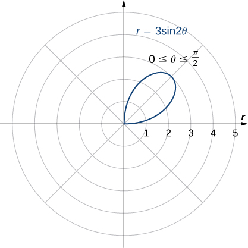{: #CNX_Calc_Figure_11_03_013}

Reflecting this image into the other three quadrants gives the entire graph as shown.

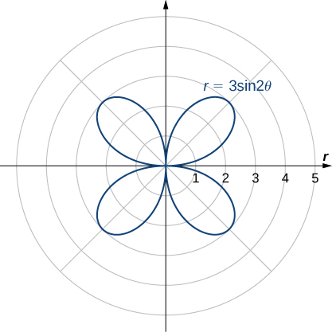{: #CNX_Calc_Figure_11_03_014}

Determine the symmetry of the graph determined by the equation <math xmlns="http://www.w3.org/1998/Math/MathML"><mrow><mi>r</mi><mo>=</mo><mn>2</mn><mspace width="0.2em" /><mtext>cos</mtext><mrow><mo>(</mo><mrow><mn>3</mn><mi>θ</mi></mrow><mo>)</mo></mrow></mrow></math>

 and create a graph.

Symmetric with respect to the polar axis.* * *
{: data-type="newline"}

 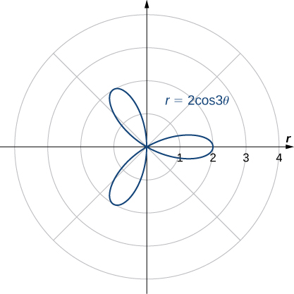 

Hint

Use [[link]](#fs-id1167794226648).

### Key Concepts

* The polar coordinate system provides an alternative way to locate points in the plane.
* Convert points between rectangular and polar coordinates using the formulas
  * * *
  {: data-type="newline"}
  
  

  <math xmlns="http://www.w3.org/1998/Math/MathML"><mrow><mi>x</mi><mo>=</mo><mi>r</mi><mspace width="0.2em" /><mtext>cos</mtext><mspace width="0.2em" /><mi>θ</mi><mspace width="0.2em" /><mtext>and</mtext><mspace width="0.2em" /><mi>y</mi><mo>=</mo><mi>r</mi><mspace width="0.2em" /><mtext>sin</mtext><mspace width="0.2em" /><mi>θ</mi></mrow></math>
  

  
  * * *
  {: data-type="newline"}
  
  and
  * * *
  {: data-type="newline"}
  
  

  <math xmlns="http://www.w3.org/1998/Math/MathML"><mrow><mi>r</mi><mo>=</mo><msqrt><mrow><msup><mi>x</mi><mn>2</mn></msup><mo>+</mo><msup><mi>y</mi><mn>2</mn></msup></mrow></msqrt><mspace width="0.2em" /><mtext>and</mtext><mspace width="0.2em" /><mtext>tan</mtext><mspace width="0.2em" /><mi>θ</mi><mo>=</mo><mfrac><mi>y</mi><mi>x</mi></mfrac><mo>.</mo></mrow></math>
  

* To sketch a polar curve from a given polar function, make a table of values and take advantage of periodic properties.
* Use the conversion formulas to convert equations between rectangular and polar coordinates.
* Identify symmetry in polar curves, which can occur through the pole, the horizontal axis, or the vertical axis.
{: data-bullet-style="bullet"}

<section data-depth="1" class="section-exercises" markdown="1">
In the following exercises, plot the point whose polar coordinates are given by first constructing the angle <math xmlns="http://www.w3.org/1998/Math/MathML"><mi>θ</mi></math>

 and then marking off the distance *r* along the ray.

<math xmlns="http://www.w3.org/1998/Math/MathML"><mrow><mrow><mo>(</mo><mrow><mn>3</mn><mo>,</mo><mfrac><mi>π</mi><mn>6</mn></mfrac></mrow><mo>)</mo></mrow></mrow></math>

* * *
{: data-type="newline"}

 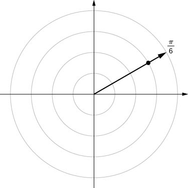 

<math xmlns="http://www.w3.org/1998/Math/MathML"><mrow><mrow><mo>(</mo><mrow><mn>−2</mn><mo>,</mo><mfrac><mrow><mn>5</mn><mi>π</mi></mrow><mn>3</mn></mfrac></mrow><mo>)</mo></mrow></mrow></math>

<math xmlns="http://www.w3.org/1998/Math/MathML"><mrow><mrow><mo>(</mo><mrow><mn>0</mn><mo>,</mo><mfrac><mrow><mn>7</mn><mi>π</mi></mrow><mn>6</mn></mfrac></mrow><mo>)</mo></mrow></mrow></math>

* * *
{: data-type="newline"}

 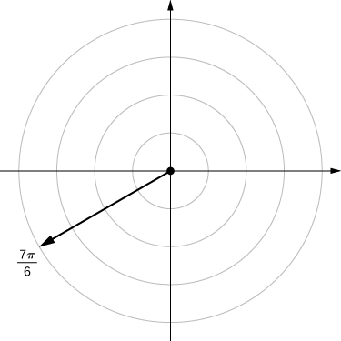 

<math xmlns="http://www.w3.org/1998/Math/MathML"><mrow><mrow><mo>(</mo><mrow><mn>−4</mn><mo>,</mo><mfrac><mrow><mn>3</mn><mi>π</mi></mrow><mn>4</mn></mfrac></mrow><mo>)</mo></mrow></mrow></math>

<math xmlns="http://www.w3.org/1998/Math/MathML"><mrow><mrow><mo>(</mo><mrow><mn>1</mn><mo>,</mo><mfrac><mi>π</mi><mn>4</mn></mfrac></mrow><mo>)</mo></mrow></mrow></math>

* * *
{: data-type="newline"}

 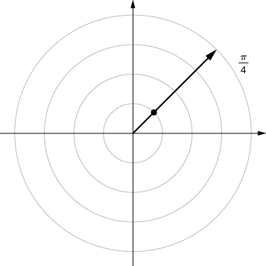 

<math xmlns="http://www.w3.org/1998/Math/MathML"><mrow><mrow><mo>(</mo><mrow><mn>2</mn><mo>,</mo><mfrac><mrow><mn>5</mn><mi>π</mi></mrow><mn>6</mn></mfrac></mrow><mo>)</mo></mrow></mrow></math>

<math xmlns="http://www.w3.org/1998/Math/MathML"><mrow><mrow><mo>(</mo><mrow><mn>1</mn><mo>,</mo><mfrac><mi>π</mi><mn>2</mn></mfrac></mrow><mo>)</mo></mrow></mrow></math>

* * *
{: data-type="newline"}

 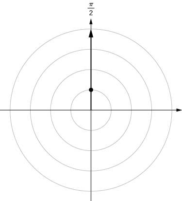 

For the following exercises, consider the polar graph below. Give two sets of polar coordinates for each point.

  

Coordinates of point *A*.

Coordinates of point *B*.

<math xmlns="http://www.w3.org/1998/Math/MathML"><mrow><mi>B</mi><mtable><mtr><mtd columnalign="left"><mrow><mrow><mo>(</mo><mrow><mn>3</mn><mo>,</mo><mfrac><mrow><mtext>−</mtext><mi>π</mi></mrow><mn>3</mn></mfrac></mrow><mo>)</mo></mrow></mrow></mtd><mtd columnalign="left"><mrow><mi>B</mi><mrow><mo>(</mo><mrow><mn>−3</mn><mo>,</mo><mfrac><mrow><mn>2</mn><mi>π</mi></mrow><mn>3</mn></mfrac></mrow><mo>)</mo></mrow></mrow></mtd></mtr></mtable></mrow></math>

Coordinates of point *C*.

Coordinates of point *D*.

<math xmlns="http://www.w3.org/1998/Math/MathML"><mrow><mi>D</mi><mrow><mo>(</mo><mrow><mn>5</mn><mo>,</mo><mfrac><mrow><mn>7</mn><mi>π</mi></mrow><mn>6</mn></mfrac></mrow><mo>)</mo></mrow><mi>D</mi><mrow><mo>(</mo><mrow><mn>−5</mn><mo>,</mo><mfrac><mi>π</mi><mn>6</mn></mfrac></mrow><mo>)</mo></mrow></mrow></math>

For the following exercises, the rectangular coordinates of a point are given. Find two sets of polar coordinates for the point in <math xmlns="http://www.w3.org/1998/Math/MathML"><mrow><mrow><mo>(</mo><mrow><mn>0</mn><mo>,</mo><mn>2</mn><mi>π</mi></mrow><mo>]</mo></mrow><mo>.</mo></mrow></math>

 Round to three decimal places.

<math xmlns="http://www.w3.org/1998/Math/MathML"><mrow><mrow><mo>(</mo><mrow><mn>2</mn><mo>,</mo><mspace width="0.2em" /><mn>2</mn></mrow><mo>)</mo></mrow></mrow></math>

<math xmlns="http://www.w3.org/1998/Math/MathML"><mrow><mrow><mo>(</mo><mrow><mn>3</mn><mo>,</mo><mn>−4</mn></mrow><mo>)</mo></mrow></mrow></math>

 (3, −4)

<math xmlns="http://www.w3.org/1998/Math/MathML"><mrow><mtable><mtr><mtd columnalign="left"><mrow><mrow><mo>(</mo><mrow><mn>5</mn><mo>,</mo><mn>−0.927</mn></mrow><mo>)</mo></mrow></mrow></mtd><mtd columnalign="left"><mrow><mrow><mo>(</mo><mrow><mn>−5</mn><mo>,</mo><mn>−0.927</mn><mo>+</mo><mi>π</mi></mrow><mo>)</mo></mrow></mrow></mtd></mtr></mtable></mrow></math>

<math xmlns="http://www.w3.org/1998/Math/MathML"><mrow><mrow><mo>(</mo><mrow><mn>8</mn><mo>,</mo><mspace width="0.2em" /><mn>15</mn></mrow><mo>)</mo></mrow></mrow></math>

<math xmlns="http://www.w3.org/1998/Math/MathML"><mrow><mrow><mo>(</mo><mrow><mn>−6</mn><mo>,</mo><mspace width="0.2em" /><mn>8</mn></mrow><mo>)</mo></mrow></mrow></math>

<math xmlns="http://www.w3.org/1998/Math/MathML"><mrow><mrow><mo>(</mo><mrow><mn>10</mn><mo>,</mo><mn>−0.927</mn></mrow><mo>)</mo></mrow><mrow><mo>(</mo><mrow><mn>−10</mn><mo>,</mo><mn>−0.927</mn><mo>+</mo><mi>π</mi></mrow><mo>)</mo></mrow></mrow></math>

<math xmlns="http://www.w3.org/1998/Math/MathML"><mrow><mrow><mo>(</mo><mrow><mn>4</mn><mo>,</mo><mspace width="0.2em" /><mn>3</mn></mrow><mo>)</mo></mrow></mrow></math>

<math xmlns="http://www.w3.org/1998/Math/MathML"><mrow><mrow><mo>(</mo><mrow><mn>3</mn><mo>,</mo><mtext>−</mtext><msqrt><mn>3</mn></msqrt></mrow><mo>)</mo></mrow></mrow></math>

<math xmlns="http://www.w3.org/1998/Math/MathML"><mrow><mrow><mo>(</mo><mrow><mn>2</mn><msqrt><mn>3</mn></msqrt><mo>,</mo><mn>−0.524</mn></mrow><mo>)</mo></mrow><mrow><mo>(</mo><mrow><mn>−2</mn><msqrt><mn>3</mn></msqrt><mo>,</mo><mn>−0.524</mn><mo>+</mo><mi>π</mi></mrow><mo>)</mo></mrow></mrow></math>

For the following exercises, find rectangular coordinates for the given point in polar coordinates.

<math xmlns="http://www.w3.org/1998/Math/MathML"><mrow><mrow><mo>(</mo><mrow><mn>2</mn><mo>,</mo><mfrac><mrow><mn>5</mn><mi>π</mi></mrow><mn>4</mn></mfrac></mrow><mo>)</mo></mrow></mrow></math>

<math xmlns="http://www.w3.org/1998/Math/MathML"><mrow><mrow><mo>(</mo><mrow><mn>−2</mn><mo>,</mo><mfrac><mi>π</mi><mn>6</mn></mfrac></mrow><mo>)</mo></mrow></mrow></math>

<math xmlns="http://www.w3.org/1998/Math/MathML"><mrow><mrow><mo>(</mo><mrow><mtable><mtr><mtd columnalign="left"><mrow><mtext>−</mtext><msqrt><mn>3</mn></msqrt><mo>,</mo></mrow></mtd><mtd columnalign="left"><mrow><mn>−1</mn></mrow></mtd></mtr></mtable></mrow><mo>)</mo></mrow></mrow></math>

<math xmlns="http://www.w3.org/1998/Math/MathML"><mrow><mrow><mo>(</mo><mrow><mn>5</mn><mo>,</mo><mfrac><mi>π</mi><mn>3</mn></mfrac></mrow><mo>)</mo></mrow></mrow></math>

<math xmlns="http://www.w3.org/1998/Math/MathML"><mrow><mrow><mo>(</mo><mrow><mn>1</mn><mo>,</mo><mfrac><mrow><mn>7</mn><mi>π</mi></mrow><mn>6</mn></mfrac></mrow><mo>)</mo></mrow></mrow></math>

<math xmlns="http://www.w3.org/1998/Math/MathML"><mrow><mrow><mo>(</mo><mrow><mtable><mtr><mtd columnalign="left"><mrow><mo>−</mo><mfrac><mrow><msqrt><mn>3</mn></msqrt></mrow><mn>2</mn></mfrac><mo>,</mo></mrow></mtd><mtd columnalign="left"><mrow><mfrac><mrow><mn>−1</mn></mrow><mn>2</mn></mfrac></mrow></mtd></mtr></mtable></mrow><mo>)</mo></mrow></mrow></math>

<math xmlns="http://www.w3.org/1998/Math/MathML"><mrow><mrow><mo>(</mo><mrow><mn>−3</mn><mo>,</mo><mfrac><mrow><mn>3</mn><mi>π</mi></mrow><mn>4</mn></mfrac></mrow><mo>)</mo></mrow></mrow></math>

<math xmlns="http://www.w3.org/1998/Math/MathML"><mrow><mrow><mo>(</mo><mrow><mn>0</mn><mo>,</mo><mfrac><mi>π</mi><mn>2</mn></mfrac></mrow><mo>)</mo></mrow></mrow></math>

<math xmlns="http://www.w3.org/1998/Math/MathML"><mrow><mrow><mo>(</mo><mrow><mtable><mtr><mtd columnalign="left"><mrow><mn>0</mn><mo>,</mo></mrow></mtd><mtd columnalign="left"><mn>0</mn></mtd></mtr></mtable></mrow><mo>)</mo></mrow></mrow></math>

<math xmlns="http://www.w3.org/1998/Math/MathML"><mrow><mrow><mo>(</mo><mrow><mn>−4.5</mn><mo>,</mo><mn>6.5</mn></mrow><mo>)</mo></mrow></mrow></math>

For the following exercises, determine whether the graphs of the polar equation are symmetric with respect to the <math xmlns="http://www.w3.org/1998/Math/MathML"><mi>x</mi></math>

-axis, the <math xmlns="http://www.w3.org/1998/Math/MathML"><mi>y</mi></math>

-axis, or the origin.

<math xmlns="http://www.w3.org/1998/Math/MathML"><mrow><mi>r</mi><mo>=</mo><mn>3</mn><mspace width="0.2em" /><mtext>sin</mtext><mo stretchy="false">(</mo><mn>2</mn><mi>θ</mi><mo stretchy="false">)</mo></mrow></math>

Symmetry with respect to the *x*-axis, *y*-axis, and origin.

<math xmlns="http://www.w3.org/1998/Math/MathML"><mrow><msup><mi>r</mi><mn>2</mn></msup><mo>=</mo><mn>9</mn><mspace width="0.2em" /><mtext>cos</mtext><mspace width="0.2em" /><mi>θ</mi></mrow></math>

<math xmlns="http://www.w3.org/1998/Math/MathML"><mrow><mi>r</mi><mo>=</mo><mtext>cos</mtext><mrow><mo>(</mo><mrow><mfrac><mi>θ</mi><mn>5</mn></mfrac></mrow><mo>)</mo></mrow></mrow></math>

Symmetric with respect to *x*-axis only.

<math xmlns="http://www.w3.org/1998/Math/MathML"><mrow><mi>r</mi><mo>=</mo><mn>2</mn><mspace width="0.2em" /><mtext>sec</mtext><mspace width="0.2em" /><mi>θ</mi></mrow></math>

<math xmlns="http://www.w3.org/1998/Math/MathML"><mrow><mi>r</mi><mo>=</mo><mn>1</mn><mo>+</mo><mtext>cos</mtext><mspace width="0.2em" /><mi>θ</mi></mrow></math>

Symmetry with respect to *x*-axis only.

For the following exercises, describe the graph of each polar equation. Confirm each description by converting into a rectangular equation.

<math xmlns="http://www.w3.org/1998/Math/MathML"><mrow><mi>r</mi><mo>=</mo><mn>3</mn></mrow></math>

<math xmlns="http://www.w3.org/1998/Math/MathML"><mrow><mi>θ</mi><mo>=</mo><mfrac><mi>π</mi><mn>4</mn></mfrac></mrow></math>

Line <math xmlns="http://www.w3.org/1998/Math/MathML"><mrow><mi>y</mi><mo>=</mo><mi>x</mi></mrow></math>

<math xmlns="http://www.w3.org/1998/Math/MathML"><mrow><mi>r</mi><mo>=</mo><mtext>sec</mtext><mspace width="0.2em" /><mi>θ</mi></mrow></math>

<math xmlns="http://www.w3.org/1998/Math/MathML"><mrow><mi>r</mi><mo>=</mo><mtext>csc</mtext><mspace width="0.2em" /><mi>θ</mi></mrow></math>

<math xmlns="http://www.w3.org/1998/Math/MathML"><mrow><mi>y</mi><mo>=</mo><mn>1</mn></mrow></math>

For the following exercises, convert the rectangular equation to polar form and sketch its graph.

<math xmlns="http://www.w3.org/1998/Math/MathML"><mrow><msup><mi>x</mi><mn>2</mn></msup><mo>+</mo><msup><mi>y</mi><mn>2</mn></msup><mo>=</mo><mn>16</mn></mrow></math>

<math xmlns="http://www.w3.org/1998/Math/MathML"><mrow><msup><mi>x</mi><mn>2</mn></msup><mo>−</mo><msup><mi>y</mi><mn>2</mn></msup><mo>=</mo><mn>16</mn></mrow></math>

Hyperbola; polar form <math xmlns="http://www.w3.org/1998/Math/MathML"><mrow><msup><mi>r</mi><mn>2</mn></msup><mtext>cos</mtext><mo stretchy="false">(</mo><mn>2</mn><mi>θ</mi><mo stretchy="false">)</mo><mo>=</mo><mn>16</mn></mrow></math>

 or <math xmlns="http://www.w3.org/1998/Math/MathML"><mrow><msup><mi>r</mi><mn>2</mn></msup><mo>=</mo><mn>16</mn><mspace width="0.2em" /><mtext>sec</mtext><mspace width="0.2em" /><mi>θ</mi><mo>.</mo></mrow></math>

* * *
{: data-type="newline"}

 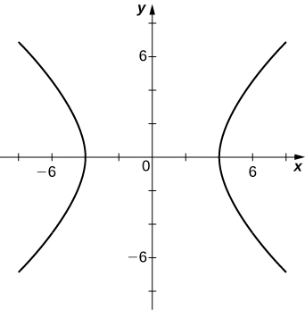 

<math xmlns="http://www.w3.org/1998/Math/MathML"><mrow><mi>x</mi><mo>=</mo><mn>8</mn></mrow></math>

For the following exercises, convert the rectangular equation to polar form and sketch its graph.

<math xmlns="http://www.w3.org/1998/Math/MathML"><mrow><mn>3</mn><mi>x</mi><mo>−</mo><mi>y</mi><mo>=</mo><mn>2</mn></mrow></math>

<math xmlns="http://www.w3.org/1998/Math/MathML"><mrow><mi>r</mi><mo>=</mo><mfrac><mn>2</mn><mrow><mn>3</mn><mspace width="0.2em" /><mtext>cos</mtext><mspace width="0.2em" /><mi>θ</mi><mo>−</mo><mtext>sin</mtext><mspace width="0.2em" /><mi>θ</mi></mrow></mfrac></mrow></math>

* * *
{: data-type="newline"}

 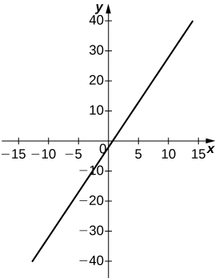 

<math xmlns="http://www.w3.org/1998/Math/MathML"><mrow><msup><mi>y</mi><mn>2</mn></msup><mo>=</mo><mn>4</mn><mi>x</mi></mrow></math>

For the following exercises, convert the polar equation to rectangular form and sketch its graph.

<math xmlns="http://www.w3.org/1998/Math/MathML"><mrow><mi>r</mi><mo>=</mo><mn>4</mn><mspace width="0.2em" /><mtext>sin</mtext><mspace width="0.2em" /><mi>θ</mi></mrow></math>

<math xmlns="http://www.w3.org/1998/Math/MathML"><mrow><msup><mi>x</mi><mn>2</mn></msup><mo>+</mo><msup><mi>y</mi><mn>2</mn></msup><mo>=</mo><mn>4</mn><mi>y</mi></mrow></math>

* * *
{: data-type="newline"}

 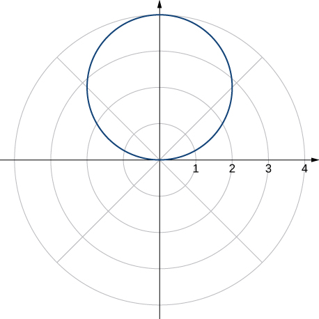 

<math xmlns="http://www.w3.org/1998/Math/MathML"><mrow><mi>r</mi><mo>=</mo><mn>6</mn><mspace width="0.2em" /><mtext>cos</mtext><mspace width="0.2em" /><mi>θ</mi></mrow></math>

<math xmlns="http://www.w3.org/1998/Math/MathML"><mrow><mi>r</mi><mo>=</mo><mi>θ</mi></mrow></math>

<math xmlns="http://www.w3.org/1998/Math/MathML"><mrow><mi>x</mi><mspace width="0.2em" /><mtext>tan</mtext><msqrt><mrow><msup><mi>x</mi><mn>2</mn></msup><mo>+</mo><msup><mi>y</mi><mn>2</mn></msup></mrow></msqrt><mo>=</mo><mi>y</mi></mrow></math>

* * *
{: data-type="newline"}

  

<math xmlns="http://www.w3.org/1998/Math/MathML"><mrow><mi>r</mi><mo>=</mo><mtext>cot</mtext><mspace width="0.2em" /><mi>θ</mi><mspace width="0.2em" /><mtext>csc</mtext><mspace width="0.2em" /><mi>θ</mi></mrow></math>

For the following exercises, sketch a graph of the polar equation and identify any symmetry.

<math xmlns="http://www.w3.org/1998/Math/MathML"><mrow><mi>r</mi><mo>=</mo><mn>1</mn><mo>+</mo><mtext>sin</mtext><mspace width="0.2em" /><mi>θ</mi></mrow></math>

* * *
{: data-type="newline"}

 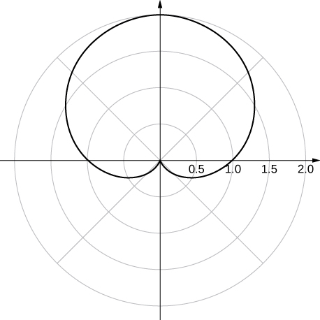 
* * *
{: data-type="newline"}

 *y*-axis symmetry

<math xmlns="http://www.w3.org/1998/Math/MathML"><mrow><mi>r</mi><mo>=</mo><mn>3</mn><mo>−</mo><mn>2</mn><mspace width="0.2em" /><mtext>cos</mtext><mspace width="0.2em" /><mi>θ</mi></mrow></math>

<math xmlns="http://www.w3.org/1998/Math/MathML"><mrow><mi>r</mi><mo>=</mo><mn>2</mn><mo>−</mo><mn>2</mn><mspace width="0.2em" /><mtext>sin</mtext><mspace width="0.2em" /><mi>θ</mi></mrow></math>

* * *
{: data-type="newline"}

 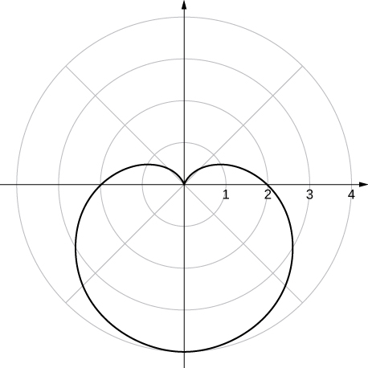 
* * *
{: data-type="newline"}

 *y*-axis symmetry

<math xmlns="http://www.w3.org/1998/Math/MathML"><mrow><mi>r</mi><mo>=</mo><mn>5</mn><mo>−</mo><mn>4</mn><mspace width="0.2em" /><mtext>sin</mtext><mspace width="0.2em" /><mi>θ</mi></mrow></math>

<math xmlns="http://www.w3.org/1998/Math/MathML"><mrow><mi>r</mi><mo>=</mo><mn>3</mn><mspace width="0.2em" /><mtext>cos</mtext><mrow><mo>(</mo><mrow><mn>2</mn><mi>θ</mi></mrow><mo>)</mo></mrow></mrow></math>

* * *
{: data-type="newline"}

 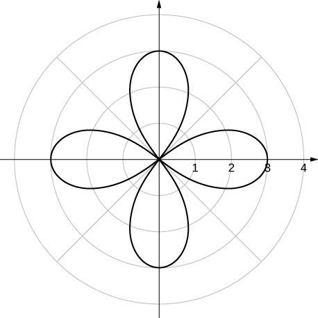 
* * *
{: data-type="newline"}

 *x*- and *y*-axis symmetry and symmetry about the pole

<math xmlns="http://www.w3.org/1998/Math/MathML"><mrow><mi>r</mi><mo>=</mo><mn>3</mn><mspace width="0.2em" /><mtext>sin</mtext><mrow><mo>(</mo><mrow><mn>2</mn><mi>θ</mi></mrow><mo>)</mo></mrow></mrow></math>

<math xmlns="http://www.w3.org/1998/Math/MathML"><mrow><mi>r</mi><mo>=</mo><mn>2</mn><mspace width="0.2em" /><mtext>cos</mtext><mrow><mo>(</mo><mrow><mn>3</mn><mi>θ</mi></mrow><mo>)</mo></mrow></mrow></math>

* * *
{: data-type="newline"}

 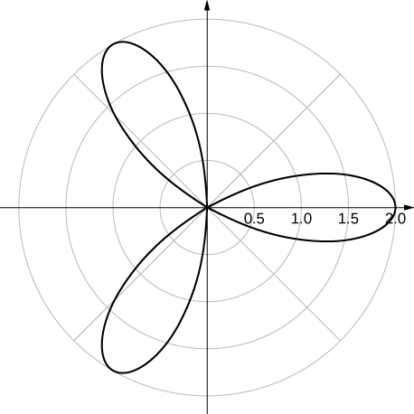 
* * *
{: data-type="newline"}

 *x*-axis symmetry

<math xmlns="http://www.w3.org/1998/Math/MathML"><mrow><mi>r</mi><mo>=</mo><mn>3</mn><mspace width="0.2em" /><mtext>cos</mtext><mrow><mo>(</mo><mrow><mfrac><mi>θ</mi><mn>2</mn></mfrac></mrow><mo>)</mo></mrow></mrow></math>

<math xmlns="http://www.w3.org/1998/Math/MathML"><mrow><msup><mi>r</mi><mn>2</mn></msup><mo>=</mo><mn>4</mn><mspace width="0.2em" /><mtext>cos</mtext><mrow><mo>(</mo><mrow><mn>2</mn><mi>θ</mi></mrow><mo>)</mo></mrow></mrow></math>

* * *
{: data-type="newline"}

 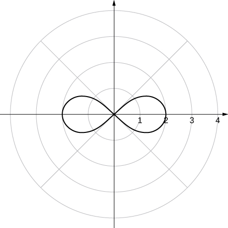 
* * *
{: data-type="newline"}

 *x*- and *y*-axis symmetry and symmetry about the pole

<math xmlns="http://www.w3.org/1998/Math/MathML"><mrow><msup><mi>r</mi><mn>2</mn></msup><mo>=</mo><mn>4</mn><mspace width="0.2em" /><mtext>sin</mtext><mspace width="0.2em" /><mi>θ</mi></mrow></math>

<math xmlns="http://www.w3.org/1998/Math/MathML"><mrow><mi>r</mi><mo>=</mo><mn>2</mn><mi>θ</mi></mrow></math>

* * *
{: data-type="newline"}

  
* * *
{: data-type="newline"}

 no symmetry

**[T]** The graph of <math xmlns="http://www.w3.org/1998/Math/MathML"><mrow><mi>r</mi><mo>=</mo><mn>2</mn><mspace width="0.2em" /><mtext>cos</mtext><mo stretchy="false">(</mo><mn>2</mn><mi>θ</mi><mo stretchy="false">)</mo><mtext>sec</mtext><mo stretchy="false">(</mo><mi>θ</mi><mo stretchy="false">)</mo><mo>.</mo></mrow></math>

 is called a *strophoid.* Use a graphing utility to sketch the graph, and, from the graph, determine the asymptote.

**[T]** Use a graphing utility and sketch the graph of <math xmlns="http://www.w3.org/1998/Math/MathML"><mrow><mi>r</mi><mo>=</mo><mfrac><mn>6</mn><mrow><mn>2</mn><mspace width="0.2em" /><mtext>sin</mtext><mspace width="0.2em" /><mi>θ</mi><mo>−</mo><mn>3</mn><mspace width="0.2em" /><mtext>cos</mtext><mspace width="0.2em" /><mi>θ</mi></mrow></mfrac><mo>.</mo></mrow></math>

* * *
{: data-type="newline"}

 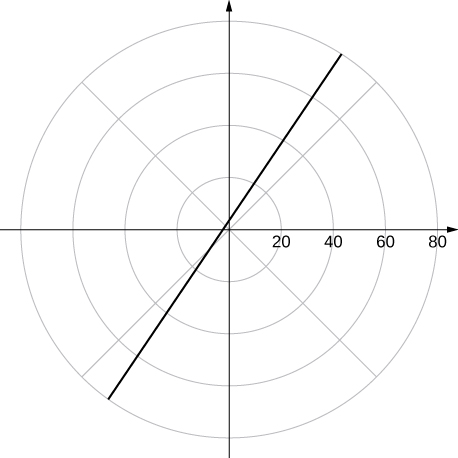 
* * *
{: data-type="newline"}

 a line

**[T]** Use a graphing utility to graph <math xmlns="http://www.w3.org/1998/Math/MathML"><mrow><mi>r</mi><mo>=</mo><mfrac><mn>1</mn><mrow><mn>1</mn><mo>−</mo><mtext>cos</mtext><mspace width="0.2em" /><mi>θ</mi></mrow></mfrac><mo>.</mo></mrow></math>

**[T]** Use technology to graph <math xmlns="http://www.w3.org/1998/Math/MathML"><mrow><mi>r</mi><mo>=</mo><msup><mi>e</mi><mrow><mtext>sin</mtext><mo stretchy="false">(</mo><mi>θ</mi><mo stretchy="false">)</mo></mrow></msup><mo>−</mo><mn>2</mn><mspace width="0.2em" /><mtext>cos</mtext><mrow><mo>(</mo><mrow><mn>4</mn><mi>θ</mi></mrow><mo>)</mo></mrow><mo>.</mo></mrow></math>

* * *
{: data-type="newline"}

 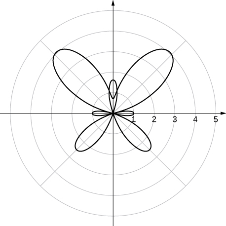 

**[T]** Use technology to plot <math xmlns="http://www.w3.org/1998/Math/MathML"><mrow><mi>r</mi><mo>=</mo><mtext>sin</mtext><mrow><mo>(</mo><mrow><mfrac><mrow><mn>3</mn><mi>θ</mi></mrow><mn>7</mn></mfrac></mrow><mo>)</mo></mrow></mrow></math>

 (use the interval <math xmlns="http://www.w3.org/1998/Math/MathML"><mrow><mn>0</mn><mo>≤</mo><mi>θ</mi><mo>≤</mo><mn>14</mn><mi>π</mi><mo stretchy="false">)</mo><mo>.</mo></mrow></math>

Without using technology, sketch the polar curve <math xmlns="http://www.w3.org/1998/Math/MathML"><mrow><mi>θ</mi><mo>=</mo><mfrac><mrow><mn>2</mn><mi>π</mi></mrow><mn>3</mn></mfrac><mo>.</mo></mrow></math>

* * *
{: data-type="newline"}

 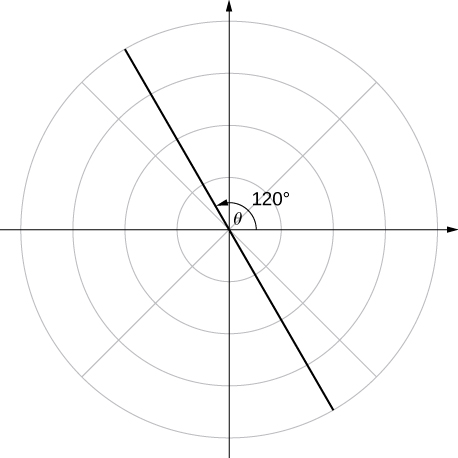 

**[T]** Use a graphing utility to plot <math xmlns="http://www.w3.org/1998/Math/MathML"><mrow><mi>r</mi><mo>=</mo><mi>θ</mi><mspace width="0.2em" /><mtext>sin</mtext><mspace width="0.2em" /><mi>θ</mi></mrow></math>

 for <math xmlns="http://www.w3.org/1998/Math/MathML"><mrow><mtext>−</mtext><mi>π</mi><mo>≤</mo><mi>θ</mi><mo>≤</mo><mi>π</mi><mo>.</mo></mrow></math>

**[T]** Use technology to plot <math xmlns="http://www.w3.org/1998/Math/MathML"><mrow><mi>r</mi><mo>=</mo><msup><mi>e</mi><mrow><mn>−0.1</mn><mi>θ</mi></mrow></msup></mrow></math>

 for <math xmlns="http://www.w3.org/1998/Math/MathML"><mrow><mn>−10</mn><mo>≤</mo><mi>θ</mi><mo>≤</mo><mn>10</mn><mo>.</mo></mrow></math>

* * *
{: data-type="newline"}

 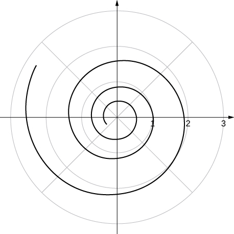 

**[T]** There is a curve known as the “*Black Hole*.” Use technology to plot <math xmlns="http://www.w3.org/1998/Math/MathML"><mrow><mi>r</mi><mo>=</mo><msup><mi>e</mi><mrow><mn>−0.01</mn><mi>θ</mi></mrow></msup></mrow></math>

 for <math xmlns="http://www.w3.org/1998/Math/MathML"><mrow><mn>−100</mn><mo>≤</mo><mi>θ</mi><mo>≤</mo><mn>100</mn><mo>.</mo></mrow></math>

**[T]** Use the results of the preceding two problems to explore the graphs of <math xmlns="http://www.w3.org/1998/Math/MathML"><mrow><mi>r</mi><mo>=</mo><msup><mi>e</mi><mrow><mn>−0.001</mn><mi>θ</mi></mrow></msup></mrow></math>

 and <math xmlns="http://www.w3.org/1998/Math/MathML"><mrow><mi>r</mi><mo>=</mo><msup><mi>e</mi><mrow><mn>−0.0001</mn><mi>θ</mi></mrow></msup></mrow></math>

 for <math xmlns="http://www.w3.org/1998/Math/MathML"><mrow><mrow><mo>\|</mo><mi>θ</mi><mo>\|</mo></mrow><mo>&gt;</mo><mn>100</mn><mo>.</mo></mrow></math>

Answers vary. One possibility is the spiral lines become closer together and the total number of spirals increases.

</section>

### Glossary
{: data-type="glossary-title"}

angular coordinate
: <math xmlns="http://www.w3.org/1998/Math/MathML"><mi>θ</mi></math>
  
  the angle formed by a line segment connecting the origin to a point in the polar coordinate system with the positive radial (*x*) axis, measured counterclockwise
^

cardioid
: a plane curve traced by a point on the perimeter of a circle that is rolling around a fixed circle of the same radius; the equation of a cardioid is
  <math xmlns="http://www.w3.org/1998/Math/MathML"><mrow><mi>r</mi><mo>=</mo><mi>a</mi><mrow><mo>(</mo><mrow><mn>1</mn><mo>+</mo><mtext>sin</mtext><mspace width="0.2em" /><mi>θ</mi></mrow><mo>)</mo></mrow></mrow></math>
  
  or
  <math xmlns="http://www.w3.org/1998/Math/MathML"><mrow><mi>r</mi><mo>=</mo><mi>a</mi><mrow><mo>(</mo><mrow><mn>1</mn><mo>+</mo><mtext>cos</mtext><mspace width="0.2em" /><mi>θ</mi></mrow><mo>)</mo></mrow></mrow></math>
^

limaçon
: the graph of the equation
  <math xmlns="http://www.w3.org/1998/Math/MathML"><mrow><mi>r</mi><mo>=</mo><mi>a</mi><mo>+</mo><mi>b</mi><mspace width="0.2em" /><mtext>sin</mtext><mspace width="0.2em" /><mi>θ</mi></mrow></math>
  
  or
  <math xmlns="http://www.w3.org/1998/Math/MathML"><mrow><mi>r</mi><mo>=</mo><mi>a</mi><mo>+</mo><mi>b</mi><mspace width="0.2em" /><mtext>cos</mtext><mspace width="0.2em" /><mi>θ</mi><mo>.</mo></mrow></math>
  
  If
  <math xmlns="http://www.w3.org/1998/Math/MathML"><mrow><mi>a</mi><mo>=</mo><mi>b</mi></mrow></math>
  
  then the graph is a cardioid
^

polar axis
: the horizontal axis in the polar coordinate system corresponding to
  <math xmlns="http://www.w3.org/1998/Math/MathML"><mrow><mi>r</mi><mo>≥</mo><mn>0</mn></mrow></math>
^

polar coordinate system
: a system for locating points in the plane. The coordinates are
  <math xmlns="http://www.w3.org/1998/Math/MathML"><mrow><mi>r</mi><mo>,</mo></mrow></math>
  
  the radial coordinate, and
  <math xmlns="http://www.w3.org/1998/Math/MathML"><mrow><mi>θ</mi><mo>,</mo></mrow></math>
  
  the angular coordinate
^

polar equation
: an equation or function relating the radial coordinate to the angular coordinate in the polar coordinate system
^

pole
: the central point of the polar coordinate system, equivalent to the origin of a Cartesian system
^

radial coordinate
: <math xmlns="http://www.w3.org/1998/Math/MathML"><mi>r</mi></math>
  
  the coordinate in the polar coordinate system that measures the distance from a point in the plane to the pole
^

rose
: graph of the polar equation
  <math xmlns="http://www.w3.org/1998/Math/MathML"><mrow><mi>r</mi><mo>=</mo><mi>a</mi><mspace width="0.2em" /><mtext>cos</mtext><mspace width="0.2em" /><mn>2</mn><mi>θ</mi></mrow></math>
  
  or
  <math xmlns="http://www.w3.org/1998/Math/MathML"><mrow><mi>r</mi><mo>=</mo><mi>a</mi><mspace width="0.2em" /><mtext>sin</mtext><mspace width="0.2em" /><mn>2</mn><mi>θ</mi></mrow></math>
  
  for a positive constant *a*
^

space-filling curve
: a curve that completely occupies a two-dimensional subset of the real plane

[1]: http://www.openstax.org/l/20_polarcurves
