

* Write the vector, parametric, and symmetric of a line through a given point in a given direction, and a line through two given points.
* Find the distance from a point to a given line.
* Write the vector and scalar equations of a plane through a given point with a given normal.
* Find the distance from a point to a given plane.
* Find the angle between two planes.

By now, we are familiar with writing equations that describe a line in two dimensions. To write an equation for a line, we must know two points on the line, or we must know the direction of the line and at least one point through which the line passes. In two dimensions, we use the concept of slope to describe the orientation, or direction, of a line. In three dimensions, we describe the direction of a line using a vector parallel to the line. In this section, we examine how to use equations to describe lines and planes in space.

### Equations for a Line in Space

Let’s first explore what it means for two vectors to be parallel. Recall that parallel vectors must have the same or opposite directions. If two nonzero vectors, <math xmlns="http://www.w3.org/1998/Math/MathML"><mstyle mathvariant="bold" mathsize="normal"><mtext>u</mtext></mstyle></math>

 and <math xmlns="http://www.w3.org/1998/Math/MathML"><mrow><mstyle mathvariant="bold" mathsize="normal"><mtext>v</mtext></mstyle><mo>,</mo></mrow></math>

 are parallel, we claim there must be a scalar, <math xmlns="http://www.w3.org/1998/Math/MathML"><mrow><mi>k</mi><mo>,</mo></mrow></math>

 such that <math xmlns="http://www.w3.org/1998/Math/MathML"><mrow><mstyle mathvariant="bold" mathsize="normal"><mtext>u</mtext></mstyle><mo>=</mo><mi>k</mi><mstyle mathvariant="bold" mathsize="normal"><mtext>v</mtext></mstyle><mo>.</mo></mrow></math>

 If <math xmlns="http://www.w3.org/1998/Math/MathML"><mstyle mathvariant="bold" mathsize="normal"><mtext>u</mtext></mstyle></math>

 and <math xmlns="http://www.w3.org/1998/Math/MathML"><mstyle mathvariant="bold" mathsize="normal"><mtext>v</mtext></mstyle></math>

 have the same direction, simply choose <math xmlns="http://www.w3.org/1998/Math/MathML"><mrow><mi>k</mi><mo>=</mo><mfrac><mrow><mrow><mo>‖</mo><mstyle mathvariant="bold" mathsize="normal"><mtext>u</mtext></mstyle><mo>‖</mo></mrow></mrow><mrow><mrow><mo>‖</mo><mstyle mathvariant="bold" mathsize="normal"><mtext>v</mtext></mstyle><mo>‖</mo></mrow></mrow></mfrac><mo>.</mo></mrow></math>

 If <math xmlns="http://www.w3.org/1998/Math/MathML"><mstyle mathvariant="bold" mathsize="normal"><mtext>u</mtext></mstyle></math>

 and <math xmlns="http://www.w3.org/1998/Math/MathML"><mstyle mathvariant="bold" mathsize="normal"><mtext>v</mtext></mstyle></math>

 have opposite directions, choose <math xmlns="http://www.w3.org/1998/Math/MathML"><mrow><mi>k</mi><mo>=</mo><mo>−</mo><mfrac><mrow><mrow><mo>‖</mo><mstyle mathvariant="bold" mathsize="normal"><mtext>u</mtext></mstyle><mo>‖</mo></mrow></mrow><mrow><mrow><mo>‖</mo><mstyle mathvariant="bold" mathsize="normal"><mtext>v</mtext></mstyle><mo>‖</mo></mrow></mrow></mfrac><mo>.</mo></mrow></math>

 Note that the converse holds as well. If <math xmlns="http://www.w3.org/1998/Math/MathML"><mrow><mstyle mathvariant="bold" mathsize="normal"><mtext>u</mtext></mstyle><mo>=</mo><mi>k</mi><mstyle mathvariant="bold" mathsize="normal"><mtext>v</mtext></mstyle></mrow></math>

 for some scalar <math xmlns="http://www.w3.org/1998/Math/MathML"><mrow><mtext>k</mtext><mo>,</mo></mrow></math>

 then either <math xmlns="http://www.w3.org/1998/Math/MathML"><mstyle mathvariant="bold" mathsize="normal"><mtext>u</mtext></mstyle></math>

 and <math xmlns="http://www.w3.org/1998/Math/MathML"><mstyle mathvariant="bold" mathsize="normal"><mtext>v</mtext></mstyle></math>

 have the same direction <math xmlns="http://www.w3.org/1998/Math/MathML"><mrow><mrow><mo>(</mo><mrow><mi>k</mi><mo>&gt;</mo><mn>0</mn></mrow><mo>)</mo></mrow></mrow></math>

 or opposite directions <math xmlns="http://www.w3.org/1998/Math/MathML"><mrow><mrow><mo>(</mo><mrow><mi>k</mi><mo>&lt;</mo><mn>0</mn></mrow><mo>)</mo></mrow><mo>,</mo></mrow></math>

 so <math xmlns="http://www.w3.org/1998/Math/MathML"><mstyle mathvariant="bold" mathsize="normal"><mtext>u</mtext></mstyle></math>

 and <math xmlns="http://www.w3.org/1998/Math/MathML"><mstyle mathvariant="bold" mathsize="normal"><mtext>v</mtext></mstyle></math>

 are parallel. Therefore, two nonzero vectors <math xmlns="http://www.w3.org/1998/Math/MathML"><mstyle mathvariant="bold" mathsize="normal"><mtext>u</mtext></mstyle></math>

 and <math xmlns="http://www.w3.org/1998/Math/MathML"><mstyle mathvariant="bold" mathsize="normal"><mtext>v</mtext></mstyle></math>

 are parallel if and only if <math xmlns="http://www.w3.org/1998/Math/MathML"><mrow><mstyle mathvariant="bold" mathsize="normal"><mtext>u</mtext></mstyle><mo>=</mo><mi>k</mi><mstyle mathvariant="bold" mathsize="normal"><mtext>v</mtext></mstyle></mrow></math>

 for some scalar <math xmlns="http://www.w3.org/1998/Math/MathML"><mrow><mtext>k</mtext><mo>.</mo></mrow></math>

 By convention, the zero vector <math xmlns="http://www.w3.org/1998/Math/MathML"><mstyle mathvariant="bold" mathsize="normal"><mn>0</mn></mstyle></math>

 is considered to be parallel to all vectors.

As in two dimensions, we can describe a line in space using a point on the line and the direction of the line, or a parallel vector, which we call the **direction vector**{: data-type="term"} ([\[link\]](#CNX_Calc_Figure_12_05_001)). Let <math xmlns="http://www.w3.org/1998/Math/MathML"><mi>L</mi></math>

 be a line in space passing through point <math xmlns="http://www.w3.org/1998/Math/MathML"><mrow><mi>P</mi><mrow><mo>(</mo><mrow><msub><mi>x</mi><mn>0</mn></msub><mo>,</mo><msub><mi>y</mi><mn>0</mn></msub><mo>,</mo><msub><mi>z</mi><mn>0</mn></msub></mrow><mo>)</mo></mrow><mo>.</mo></mrow></math>

 Let <math xmlns="http://www.w3.org/1998/Math/MathML"><mrow><mstyle mathvariant="bold" mathsize="normal"><mtext>v</mtext></mstyle><mo>=</mo><mrow><mo>〈</mo><mrow><mi>a</mi><mo>,</mo><mi>b</mi><mo>,</mo><mi>c</mi></mrow><mo>〉</mo></mrow></mrow></math>

 be a vector parallel to <math xmlns="http://www.w3.org/1998/Math/MathML"><mrow><mi>L</mi><mo>.</mo></mrow></math>

 Then, for any point on line <math xmlns="http://www.w3.org/1998/Math/MathML"><mrow><mi>Q</mi><mrow><mo>(</mo><mrow><mi>x</mi><mo>,</mo><mi>y</mi><mo>,</mo><mi>z</mi></mrow><mo>)</mo></mrow><mo>,</mo></mrow></math>

 we know that <math xmlns="http://www.w3.org/1998/Math/MathML"><mrow><mover accent="true"><mrow><mi>P</mi><mi>Q</mi></mrow><mo stretchy="false">→</mo></mover></mrow></math>

 is parallel to <math xmlns="http://www.w3.org/1998/Math/MathML"><mrow><mstyle mathvariant="bold" mathsize="normal"><mtext>v</mtext></mstyle><mo>.</mo></mrow></math>

 Thus, as we just discussed, there is a scalar, <math xmlns="http://www.w3.org/1998/Math/MathML"><mrow><mi>t</mi><mo>,</mo></mrow></math>

 such that <math xmlns="http://www.w3.org/1998/Math/MathML"><mrow><mover accent="true"><mrow><mi>P</mi><mi>Q</mi></mrow><mo stretchy="false">→</mo></mover><mo>=</mo><mi>t</mi><mstyle mathvariant="bold" mathsize="normal"><mtext>v</mtext></mstyle><mo>,</mo></mrow></math>

 which gives

<math xmlns="http://www.w3.org/1998/Math/MathML"><mtable><mtr><mtd columnalign="right"><mover accent="true"><mrow><mi>P</mi><mi>Q</mi></mrow><mo stretchy="false">→</mo></mover></mtd><mtd columnalign="left"><mo>=</mo></mtd><mtd columnalign="left"><mi>t</mi><mstyle mathvariant="bold" mathsize="normal"><mtext>v</mtext></mstyle></mtd></mtr><mtr><mtd columnalign="right"><mrow><mo>〈</mo><mrow><mi>x</mi><mo>−</mo><msub><mi>x</mi><mn>0</mn></msub><mo>,</mo><mi>y</mi><mo>−</mo><msub><mi>y</mi><mn>0</mn></msub><mo>,</mo><mi>z</mi><mo>−</mo><msub><mi>z</mi><mn>0</mn></msub></mrow><mo>〉</mo></mrow></mtd><mtd columnalign="left"><mo>=</mo></mtd><mtd columnalign="left"><mi>t</mi><mrow><mo>〈</mo><mrow><mi>a</mi><mo>,</mo><mi>b</mi><mo>,</mo><mi>c</mi></mrow><mo>〉</mo></mrow></mtd></mtr><mtr><mtd columnalign="right"><mrow><mo>〈</mo><mrow><mi>x</mi><mo>−</mo><msub><mi>x</mi><mn>0</mn></msub><mo>,</mo><mi>y</mi><mo>−</mo><msub><mi>y</mi><mn>0</mn></msub><mo>,</mo><mi>z</mi><mo>−</mo><msub><mi>z</mi><mn>0</mn></msub></mrow><mo>〉</mo></mrow></mtd><mtd columnalign="left"><mo>=</mo></mtd><mtd columnalign="left"><mrow><mo>〈</mo><mrow><mi>t</mi><mi>a</mi><mo>,</mo><mi>t</mi><mi>b</mi><mo>,</mo><mi>t</mi><mi>c</mi></mrow><mo>〉</mo></mrow><mo>.</mo></mtd></mtr></mtable></math>

 {: #CNX_Calc_Figure_12_05_001}

Using vector operations, we can rewrite [\[link\]](#fs-id1163723690717) as

<math xmlns="http://www.w3.org/1998/Math/MathML"><mtable><mtr><mtd columnalign="right"><mrow><mo>〈</mo><mrow><mi>x</mi><mo>−</mo><msub><mi>x</mi><mn>0</mn></msub><mo>,</mo><mi>y</mi><mo>−</mo><msub><mi>y</mi><mn>0</mn></msub><mo>,</mo><mi>z</mi><mo>−</mo><msub><mi>z</mi><mn>0</mn></msub></mrow><mo>〉</mo></mrow></mtd><mtd columnalign="left"><mo>=</mo></mtd><mtd columnalign="left"><mrow><mo>〈</mo><mrow><mi>t</mi><mi>a</mi><mo>,</mo><mi>t</mi><mi>b</mi><mo>,</mo><mi>t</mi><mi>c</mi></mrow><mo>〉</mo></mrow></mtd></mtr><mtr><mtd columnalign="right"><mrow><mo>〈</mo><mrow><mi>x</mi><mo>,</mo><mi>y</mi><mo>,</mo><mi>z</mi></mrow><mo>〉</mo></mrow><mo>−</mo><mrow><mo>〈</mo><mrow><msub><mi>x</mi><mn>0</mn></msub><mo>,</mo><msub><mi>y</mi><mn>0</mn></msub><mo>,</mo><msub><mi>z</mi><mn>0</mn></msub></mrow><mo>〉</mo></mrow></mtd><mtd columnalign="left"><mo>=</mo></mtd><mtd columnalign="left"><mi>t</mi><mrow><mo>〈</mo><mrow><mi>a</mi><mo>,</mo><mi>b</mi><mo>,</mo><mi>c</mi></mrow><mo>〉</mo></mrow></mtd></mtr><mtr><mtd columnalign="right"><mrow><mo>〈</mo><mrow><mi>x</mi><mo>,</mo><mi>y</mi><mo>,</mo><mi>z</mi></mrow><mo>〉</mo></mrow></mtd><mtd columnalign="left"><mo>=</mo></mtd><mtd columnalign="left"><mrow><mo>〈</mo><mrow><msub><mi>x</mi><mn>0</mn></msub><mo>,</mo><msub><mi>y</mi><mn>0</mn></msub><mo>,</mo><msub><mi>z</mi><mn>0</mn></msub></mrow><mo>〉</mo></mrow><mo>+</mo><mi>t</mi><mrow><mo>〈</mo><mrow><mi>a</mi><mo>,</mo><mi>b</mi><mo>,</mo><mi>c</mi></mrow><mo>〉</mo></mrow><mo>.</mo></mtd></mtr></mtable></math>

Setting <math xmlns="http://www.w3.org/1998/Math/MathML"><mrow><mstyle mathvariant="bold" mathsize="normal"><mtext>r</mtext></mstyle><mo>=</mo><mrow><mo>〈</mo><mrow><mi>x</mi><mo>,</mo><mi>y</mi><mo>,</mo><mi>z</mi></mrow><mo>〉</mo></mrow></mrow></math>

 and <math xmlns="http://www.w3.org/1998/Math/MathML"><mrow><msub><mstyle mathvariant="bold" mathsize="normal"><mtext>r</mtext></mstyle><mn>0</mn></msub><mo>=</mo><mrow><mo>〈</mo><mrow><msub><mi>x</mi><mn>0</mn></msub><mo>,</mo><msub><mi>y</mi><mn>0</mn></msub><mo>,</mo><msub><mi>z</mi><mn>0</mn></msub></mrow><mo>〉</mo></mrow><mo>,</mo></mrow></math>

 we now have the **vector equation of a line**{: data-type="term"}\:

<math xmlns="http://www.w3.org/1998/Math/MathML"><mrow><mstyle mathvariant="bold" mathsize="normal"><mtext>r</mtext></mstyle><mo>=</mo><msub><mstyle mathvariant="bold" mathsize="normal"><mtext>r</mtext></mstyle><mn>0</mn></msub><mo>+</mo><mi>t</mi><mstyle mathvariant="bold" mathsize="normal"><mtext>v</mtext></mstyle><mo>.</mo></mrow></math>

Equating components, [\[link\]](#fs-id1163723690717) shows that the following equations are simultaneously true: <math xmlns="http://www.w3.org/1998/Math/MathML"><mrow><mi>x</mi><mo>−</mo><msub><mi>x</mi><mn>0</mn></msub><mo>=</mo><mi>t</mi><mi>a</mi><mo>,</mo></mrow></math>

 <math xmlns="http://www.w3.org/1998/Math/MathML"><mrow><mi>y</mi><mo>−</mo><msub><mi>y</mi><mn>0</mn></msub><mo>=</mo><mi>t</mi><mi>b</mi><mo>,</mo></mrow></math>

 and <math xmlns="http://www.w3.org/1998/Math/MathML"><mrow><mi>z</mi><mo>−</mo><msub><mi>z</mi><mn>0</mn></msub><mo>=</mo><mi>t</mi><mi>c</mi><mo>.</mo></mrow></math>

 If we solve each of these equations for the component variables <math xmlns="http://www.w3.org/1998/Math/MathML"><mrow><mi>x</mi><mo>,</mo><mi>y</mi><mo>,</mo><mspace width="0.2em" /><mtext>and</mtext><mspace width="0.2em" /><mi>z</mi><mo>,</mo></mrow></math>

 we get a set of equations in which each variable is defined in terms of the parameter *t* and that, together, describe the line. This set of three equations forms a set of **parametric equations of a line**{: data-type="term"}\:

<math xmlns="http://www.w3.org/1998/Math/MathML"><mrow><mi>x</mi><mo>=</mo><msub><mi>x</mi><mn>0</mn></msub><mo>+</mo><mi>t</mi><mi>a</mi><mspace width="1em" /><mi>y</mi><mo>=</mo><msub><mi>y</mi><mn>0</mn></msub><mo>+</mo><mi>t</mi><mi>b</mi><mspace width="1em" /><mi>z</mi><mo>=</mo><msub><mi>z</mi><mn>0</mn></msub><mo>+</mo><mi>t</mi><mi>c</mi><mo>.</mo></mrow></math>

If we solve each of the equations for <math xmlns="http://www.w3.org/1998/Math/MathML"><mi>t</mi></math>

 assuming <math xmlns="http://www.w3.org/1998/Math/MathML"><mrow><mi>a</mi><mo>,</mo><mi>b</mi><mo>,</mo><mspace width="0.2em" /><mtext>and</mtext><mspace width="0.2em" /><mi>c</mi></mrow></math>

 are nonzero, we get a different description of the same line:

<math xmlns="http://www.w3.org/1998/Math/MathML"><mrow><mfrac><mrow><mi>x</mi><mo>−</mo><msub><mi>x</mi><mn>0</mn></msub></mrow><mi>a</mi></mfrac><mo>=</mo><mi>t</mi><mspace width="1em" /><mfrac><mrow><mi>y</mi><mo>−</mo><msub><mi>y</mi><mn>0</mn></msub></mrow><mi>b</mi></mfrac><mo>=</mo><mi>t</mi><mspace width="1em" /><mfrac><mrow><mi>z</mi><mo>−</mo><msub><mi>z</mi><mn>0</mn></msub></mrow><mi>c</mi></mfrac><mo>=</mo><mi>t</mi><mo>.</mo></mrow></math>

Because each expression equals *t*, they all have the same value. We can set them equal to each other to create **symmetric equations of a line**{: data-type="term"}\:

<math xmlns="http://www.w3.org/1998/Math/MathML"><mrow><mfrac><mrow><mi>x</mi><mo>−</mo><msub><mi>x</mi><mn>0</mn></msub></mrow><mi>a</mi></mfrac><mo>=</mo><mfrac><mrow><mi>y</mi><mo>−</mo><msub><mi>y</mi><mn>0</mn></msub></mrow><mi>b</mi></mfrac><mo>=</mo><mfrac><mrow><mi>z</mi><mo>−</mo><msub><mi>z</mi><mn>0</mn></msub></mrow><mi>c</mi></mfrac><mo>.</mo></mrow></math>

We summarize the results in the following theorem.

Parametric and Symmetric Equations of a Line

A line <math xmlns="http://www.w3.org/1998/Math/MathML"><mi>L</mi></math>

 parallel to vector <math xmlns="http://www.w3.org/1998/Math/MathML"><mrow><mstyle mathvariant="bold" mathsize="normal"><mtext>v</mtext></mstyle><mo>=</mo><mrow><mo>〈</mo><mrow><mi>a</mi><mo>,</mo><mi>b</mi><mo>,</mo><mi>c</mi></mrow><mo>〉</mo></mrow></mrow></math>

 and passing through point <math xmlns="http://www.w3.org/1998/Math/MathML"><mrow><mi>P</mi><mrow><mo>(</mo><mrow><msub><mi>x</mi><mn>0</mn></msub><mo>,</mo><msub><mi>y</mi><mn>0</mn></msub><mo>,</mo><msub><mi>z</mi><mn>0</mn></msub></mrow><mo>)</mo></mrow></mrow></math>

 can be described by the following parametric equations:

<math xmlns="http://www.w3.org/1998/Math/MathML"><mrow><mi>x</mi><mo>=</mo><msub><mi>x</mi><mn>0</mn></msub><mo>+</mo><mi>t</mi><mi>a</mi><mo>,</mo><mi>y</mi><mo>=</mo><msub><mi>y</mi><mn>0</mn></msub><mo>+</mo><mi>t</mi><mi>b</mi><mo>,</mo><mspace width="0.2em" /><mtext>and</mtext><mspace width="0.2em" /><mi>z</mi><mo>=</mo><msub><mi>z</mi><mn>0</mn></msub><mo>+</mo><mi>t</mi><mi>c</mi><mo>.</mo></mrow></math>

If the constants <math xmlns="http://www.w3.org/1998/Math/MathML"><mrow><mi>a</mi><mo>,</mo><mi>b</mi><mo>,</mo><mspace width="0.2em" /><mtext>and</mtext><mspace width="0.2em" /><mi>c</mi></mrow></math>

 are all nonzero, then <math xmlns="http://www.w3.org/1998/Math/MathML"><mi>L</mi></math>

 can be described by the symmetric equation of the line:

<math xmlns="http://www.w3.org/1998/Math/MathML"><mrow><mfrac><mrow><mi>x</mi><mo>−</mo><msub><mi>x</mi><mn>0</mn></msub></mrow><mi>a</mi></mfrac><mo>=</mo><mfrac><mrow><mi>y</mi><mo>−</mo><msub><mi>y</mi><mn>0</mn></msub></mrow><mi>b</mi></mfrac><mo>=</mo><mfrac><mrow><mi>z</mi><mo>−</mo><msub><mi>z</mi><mn>0</mn></msub></mrow><mi>c</mi></mfrac><mo>.</mo></mrow></math>

The parametric equations of a line are not unique. Using a different parallel vector or a different point on the line leads to a different, equivalent representation. Each set of parametric equations leads to a related set of symmetric equations, so it follows that a symmetric equation of a line is not unique either.

Equations of a Line in Space

Find parametric and symmetric equations of the line passing through points <math xmlns="http://www.w3.org/1998/Math/MathML"><mrow><mrow><mo>(</mo><mrow><mn>1</mn><mo>,</mo><mn>4</mn><mo>,</mo><mn>−2</mn></mrow><mo>)</mo></mrow></mrow></math>

 and <math xmlns="http://www.w3.org/1998/Math/MathML"><mrow><mo stretchy="false">(</mo><mn>−3</mn><mo>,</mo><mn>5</mn><mo>,</mo><mn>0</mn><mo stretchy="false">)</mo><mo>.</mo></mrow></math>

First, identify a vector parallel to the line:

<math xmlns="http://www.w3.org/1998/Math/MathML"><mrow><mstyle mathvariant="bold" mathsize="normal"><mtext>v</mtext></mstyle><mo>=</mo><mrow><mo>〈</mo><mrow><mn>−3</mn><mo>−</mo><mn>1</mn><mo>,</mo><mn>5</mn><mo>−</mo><mn>4</mn><mo>,</mo><mn>0</mn><mo>−</mo><mo stretchy="false">(</mo><mn>−2</mn><mo stretchy="false">)</mo></mrow><mo>〉</mo></mrow><mo>=</mo><mrow><mo>〈</mo><mrow><mn>−4</mn><mo>,</mo><mn>1</mn><mo>,</mo><mn>2</mn></mrow><mo>〉</mo></mrow><mo>.</mo></mrow></math>

Use either of the given points on the line to complete the parametric equations:

<math xmlns="http://www.w3.org/1998/Math/MathML"><mrow><mi>x</mi><mo>=</mo><mn>1</mn><mo>−</mo><mn>4</mn><mi>t</mi><mo>,</mo><mi>y</mi><mo>=</mo><mn>4</mn><mo>+</mo><mi>t</mi><mo>,</mo><mspace width="0.2em" /><mtext>and</mtext><mspace width="0.2em" /><mi>z</mi><mo>=</mo><mn>−2</mn><mo>+</mo><mn>2</mn><mi>t</mi><mo>.</mo></mrow></math>

Solve each equation for <math xmlns="http://www.w3.org/1998/Math/MathML"><mi>t</mi></math>

 to create the symmetric equation of the line:

<math xmlns="http://www.w3.org/1998/Math/MathML"><mrow><mfrac><mrow><mi>x</mi><mo>−</mo><mn>1</mn></mrow><mrow><mn>−4</mn></mrow></mfrac><mo>=</mo><mi>y</mi><mo>−</mo><mn>4</mn><mo>=</mo><mfrac><mrow><mi>z</mi><mo>+</mo><mn>2</mn></mrow><mn>2</mn></mfrac><mo>.</mo></mrow></math>

Find parametric and symmetric equations of the line passing through points <math xmlns="http://www.w3.org/1998/Math/MathML"><mrow><mrow><mo>(</mo><mrow><mn>1</mn><mo>,</mo><mn>−3</mn><mo>,</mo><mn>2</mn></mrow><mo>)</mo></mrow></mrow></math>

 and <math xmlns="http://www.w3.org/1998/Math/MathML"><mrow><mrow><mo>(</mo><mrow><mn>5</mn><mo>,</mo><mn>−2</mn><mo>,</mo><mn>8</mn></mrow><mo>)</mo></mrow><mo>.</mo></mrow></math>

Possible set of parametric equations: <math xmlns="http://www.w3.org/1998/Math/MathML"><mrow><mi>x</mi><mo>=</mo><mn>1</mn><mo>+</mo><mn>4</mn><mi>t</mi><mo>,</mo><mi>y</mi><mo>=</mo><mn>−3</mn><mo>+</mo><mi>t</mi><mo>,</mo><mi>z</mi><mo>=</mo><mn>2</mn><mo>+</mo><mn>6</mn><mi>t</mi><mo>;</mo></mrow></math>

related set of symmetric equations: <math xmlns="http://www.w3.org/1998/Math/MathML"><mrow><mfrac><mrow><mi>x</mi><mo>−</mo><mn>1</mn></mrow><mn>4</mn></mfrac><mo>=</mo><mi>y</mi><mo>+</mo><mn>3</mn><mo>=</mo><mfrac><mrow><mi>z</mi><mo>−</mo><mn>2</mn></mrow><mn>6</mn></mfrac></mrow></math>

Hint

Start by finding a vector parallel to the line.

Sometimes we don’t want the equation of a whole line, just a line segment. In this case, we limit the values of our parameter <math xmlns="http://www.w3.org/1998/Math/MathML"><mi>t</mi><mo>.</mo></math>

 For example, let <math xmlns="http://www.w3.org/1998/Math/MathML"><mrow><mi>P</mi><mrow><mo>(</mo><mrow><msub><mi>x</mi><mn>0</mn></msub><mo>,</mo><msub><mi>y</mi><mn>0</mn></msub><mo>,</mo><msub><mi>z</mi><mn>0</mn></msub></mrow><mo>)</mo></mrow></mrow></math>

 and <math xmlns="http://www.w3.org/1998/Math/MathML"><mrow><mi>Q</mi><mrow><mo>(</mo><mrow><msub><mi>x</mi><mn>1</mn></msub><mo>,</mo><msub><mi>y</mi><mn>1</mn></msub><mo>,</mo><msub><mi>z</mi><mn>1</mn></msub></mrow><mo>)</mo></mrow></mrow></math>

 be points on a line, and let <math xmlns="http://www.w3.org/1998/Math/MathML"><mrow><mstyle mathvariant="bold" mathsize="normal"><mtext>p</mtext></mstyle><mo>=</mo><mrow><mo>〈</mo><mrow><msub><mi>x</mi><mn>0</mn></msub><mo>,</mo><msub><mi>y</mi><mn>0</mn></msub><mo>,</mo><msub><mi>z</mi><mn>0</mn></msub></mrow><mo>〉</mo></mrow></mrow></math>

 and <math xmlns="http://www.w3.org/1998/Math/MathML"><mrow><mstyle mathvariant="bold" mathsize="normal"><mtext>q</mtext></mstyle><mo>=</mo><mrow><mo>〈</mo><mrow><msub><mi>x</mi><mn>1</mn></msub><mo>,</mo><msub><mi>y</mi><mn>1</mn></msub><mo>,</mo><msub><mi>z</mi><mn>1</mn></msub></mrow><mo>〉</mo></mrow></mrow></math>

 be the associated position vectors. In addition, let <math xmlns="http://www.w3.org/1998/Math/MathML"><mrow><mstyle mathvariant="bold" mathsize="normal"><mtext>r</mtext></mstyle><mo>=</mo><mrow><mo>〈</mo><mrow><mi>x</mi><mo>,</mo><mi>y</mi><mo>,</mo><mi>z</mi></mrow><mo>〉</mo></mrow><mo>.</mo></mrow></math>

 We want to find a vector equation for the line segment between <math xmlns="http://www.w3.org/1998/Math/MathML"><mi>P</mi></math>

 and <math xmlns="http://www.w3.org/1998/Math/MathML"><mrow><mi>Q</mi><mo>.</mo></mrow></math>

 Using <math xmlns="http://www.w3.org/1998/Math/MathML"><mi>P</mi></math>

 as our known point on the line, and <math xmlns="http://www.w3.org/1998/Math/MathML"><mrow><mover accent="true"><mrow><mi>P</mi><mi>Q</mi></mrow><mo stretchy="false">→</mo></mover><mo>=</mo><mrow><mo>〈</mo><mrow><msub><mi>x</mi><mn>1</mn></msub><mo>−</mo><msub><mi>x</mi><mn>0</mn></msub><mo>,</mo><msub><mi>y</mi><mn>1</mn></msub><mo>−</mo><msub><mi>y</mi><mn>0</mn></msub><mo>,</mo><msub><mi>z</mi><mn>1</mn></msub><mo>−</mo><msub><mi>z</mi><mn>0</mn></msub></mrow><mo>〉</mo></mrow></mrow></math>

 as the direction vector equation, [\[link\]](#fs-id1163724080297) gives

<math xmlns="http://www.w3.org/1998/Math/MathML"><mrow><mstyle mathvariant="bold" mathsize="normal"><mtext>r</mtext></mstyle><mo>=</mo><mstyle mathvariant="bold" mathsize="normal"><mtext>p</mtext></mstyle><mo>+</mo><mi>t</mi><mrow><mo>(</mo><mrow><mover accent="true"><mrow><mi>P</mi><mi>Q</mi></mrow><mo stretchy="false">→</mo></mover></mrow><mo>)</mo></mrow><mo>.</mo></mrow></math>

Using properties of vectors, then

<math xmlns="http://www.w3.org/1998/Math/MathML"><mtable><mtr><mtd columnalign="right"><mstyle mathvariant="bold" mathsize="normal"><mtext>r</mtext></mstyle></mtd><mtd columnalign="left"><mo>=</mo><mstyle mathvariant="bold" mathsize="normal"><mtext>p</mtext></mstyle><mo>+</mo><mi>t</mi><mrow><mo>(</mo><mrow><mover accent="true"><mrow><mi>P</mi><mi>Q</mi></mrow><mo stretchy="false">→</mo></mover></mrow><mo>)</mo></mrow></mtd></mtr><mtr><mtd /><mtd columnalign="left"><mo>=</mo><mrow><mo>〈</mo><mrow><msub><mi>x</mi><mn>0</mn></msub><mo>,</mo><msub><mi>y</mi><mn>0</mn></msub><mo>,</mo><msub><mi>z</mi><mn>0</mn></msub></mrow><mo>〉</mo></mrow><mo>+</mo><mi>t</mi><mrow><mo>〈</mo><mrow><msub><mi>x</mi><mn>1</mn></msub><mo>−</mo><msub><mi>x</mi><mn>0</mn></msub><mo>,</mo><msub><mi>y</mi><mn>1</mn></msub><mo>−</mo><msub><mi>y</mi><mn>0</mn></msub><mo>,</mo><msub><mi>z</mi><mn>1</mn></msub><mo>−</mo><msub><mi>z</mi><mn>0</mn></msub></mrow><mo>〉</mo></mrow></mtd></mtr><mtr><mtd /><mtd columnalign="left"><mo>=</mo><mrow><mo>〈</mo><mrow><msub><mi>x</mi><mn>0</mn></msub><mo>,</mo><msub><mi>y</mi><mn>0</mn></msub><mo>,</mo><msub><mi>z</mi><mn>0</mn></msub></mrow><mo>〉</mo></mrow><mo>+</mo><mi>t</mi><mrow><mo>(</mo><mrow><mrow><mo>〈</mo><mrow><msub><mi>x</mi><mn>1</mn></msub><mo>,</mo><msub><mi>y</mi><mn>1</mn></msub><mo>,</mo><msub><mi>z</mi><mn>1</mn></msub></mrow><mo>〉</mo></mrow><mo>−</mo><mrow><mo>〈</mo><mrow><msub><mi>x</mi><mn>0</mn></msub><mo>,</mo><msub><mi>y</mi><mn>0</mn></msub><mo>,</mo><msub><mi>z</mi><mn>0</mn></msub></mrow><mo>〉</mo></mrow></mrow><mo>)</mo></mrow></mtd></mtr><mtr><mtd /><mtd columnalign="left"><mo>=</mo><mrow><mo>〈</mo><mrow><msub><mi>x</mi><mn>0</mn></msub><mo>,</mo><msub><mi>y</mi><mn>0</mn></msub><mo>,</mo><msub><mi>z</mi><mn>0</mn></msub></mrow><mo>〉</mo></mrow><mo>+</mo><mi>t</mi><mrow><mo>〈</mo><mrow><msub><mi>x</mi><mn>1</mn></msub><mo>,</mo><msub><mi>y</mi><mn>1</mn></msub><mo>,</mo><msub><mi>z</mi><mn>1</mn></msub></mrow><mo>〉</mo></mrow><mo>−</mo><mi>t</mi><mrow><mo>〈</mo><mrow><msub><mi>x</mi><mn>0</mn></msub><mo>,</mo><msub><mi>y</mi><mn>0</mn></msub><mo>,</mo><msub><mi>z</mi><mn>0</mn></msub></mrow><mo>〉</mo></mrow></mtd></mtr><mtr><mtd /><mtd columnalign="left"><mo>=</mo><mrow><mo>(</mo><mrow><mn>1</mn><mo>−</mo><mi>t</mi></mrow><mo>)</mo></mrow><mrow><mo>〈</mo><mrow><msub><mi>x</mi><mn>0</mn></msub><mo>,</mo><msub><mi>y</mi><mn>0</mn></msub><mo>,</mo><msub><mi>z</mi><mn>0</mn></msub></mrow><mo>〉</mo></mrow><mo>+</mo><mi>t</mi><mrow><mo>〈</mo><mrow><msub><mi>x</mi><mn>1</mn></msub><mo>,</mo><msub><mi>y</mi><mn>1</mn></msub><mo>,</mo><msub><mi>z</mi><mn>1</mn></msub></mrow><mo>〉</mo></mrow></mtd></mtr><mtr><mtd /><mtd columnalign="left"><mo>=</mo><mrow><mo>(</mo><mrow><mn>1</mn><mo>−</mo><mi>t</mi></mrow><mo>)</mo></mrow><mstyle mathvariant="bold" mathsize="normal"><mtext>p</mtext></mstyle><mo>+</mo><mi>t</mi><mstyle mathvariant="bold" mathsize="normal"><mtext>q</mtext></mstyle><mo>.</mo></mtd></mtr></mtable></math>

Thus, the vector equation of the line passing through <math xmlns="http://www.w3.org/1998/Math/MathML"><mi>P</mi></math>

 and <math xmlns="http://www.w3.org/1998/Math/MathML"><mi>Q</mi></math>

 is

<math xmlns="http://www.w3.org/1998/Math/MathML"><mrow><mstyle mathvariant="bold" mathsize="normal"><mtext>r</mtext></mstyle><mo>=</mo><mrow><mo>(</mo><mrow><mn>1</mn><mo>−</mo><mi>t</mi></mrow><mo>)</mo></mrow><mstyle mathvariant="bold" mathsize="normal"><mtext>p</mtext></mstyle><mo>+</mo><mi>t</mi><mstyle mathvariant="bold" mathsize="normal"><mtext>q</mtext></mstyle><mo>.</mo></mrow></math>

Remember that we didn’t want the equation of the whole line, just the line segment between <math xmlns="http://www.w3.org/1998/Math/MathML"><mi>P</mi></math>

 and <math xmlns="http://www.w3.org/1998/Math/MathML"><mrow><mi>Q</mi><mo>.</mo></mrow></math>

 Notice that when <math xmlns="http://www.w3.org/1998/Math/MathML"><mrow><mi>t</mi><mo>=</mo><mn>0</mn><mo>,</mo></mrow></math>

 we have <math xmlns="http://www.w3.org/1998/Math/MathML"><mrow><mstyle mathvariant="bold" mathsize="normal"><mi>r</mi><mo>=</mo><mi>p</mi></mstyle><mo>,</mo></mrow></math>

 and when <math xmlns="http://www.w3.org/1998/Math/MathML"><mrow><mi>t</mi><mo>=</mo><mn>1</mn><mo>,</mo></mrow></math>

 we have <math xmlns="http://www.w3.org/1998/Math/MathML"><mrow><mstyle mathvariant="bold" mathsize="normal"><mi>r</mi><mo>=</mo><mi>q</mi></mstyle><mo>.</mo></mrow></math>

 Therefore, the vector equation of the line segment between <math xmlns="http://www.w3.org/1998/Math/MathML"><mi>P</mi></math>

 and <math xmlns="http://www.w3.org/1998/Math/MathML"><mi>Q</mi></math>

 is

<math xmlns="http://www.w3.org/1998/Math/MathML"><mrow><mstyle mathvariant="bold" mathsize="normal"><mtext>r</mtext></mstyle><mo>=</mo><mrow><mo>(</mo><mrow><mn>1</mn><mo>−</mo><mi>t</mi></mrow><mo>)</mo></mrow><mstyle mathvariant="bold" mathsize="normal"><mtext>p</mtext></mstyle><mo>+</mo><mi>t</mi><mstyle mathvariant="bold" mathsize="normal"><mtext>q</mtext></mstyle><mo>,</mo><mn>0</mn><mo>≤</mo><mi>t</mi><mo>≤</mo><mn>1</mn><mo>.</mo></mrow></math>

Going back to [\[link\]](#fs-id1163724080297), we can also find parametric equations for this line segment. We have

<math xmlns="http://www.w3.org/1998/Math/MathML"><mtable><mtr><mtd columnalign="right"><mstyle mathvariant="bold" mathsize="normal"><mtext>r</mtext></mstyle></mtd><mtd columnalign="left"><mo>=</mo></mtd><mtd columnalign="left"><mstyle mathvariant="bold" mathsize="normal"><mtext>p</mtext></mstyle><mo>+</mo><mi>t</mi><mrow><mo>(</mo><mrow><mover accent="true"><mrow><mi>P</mi><mi>Q</mi></mrow><mo stretchy="false">→</mo></mover></mrow><mo>)</mo></mrow></mtd></mtr><mtr><mtd columnalign="right"><mrow><mo>〈</mo><mrow><mi>x</mi><mo>,</mo><mi>y</mi><mo>,</mo><mi>z</mi></mrow><mo>〉</mo></mrow></mtd><mtd columnalign="left"><mo>=</mo></mtd><mtd columnalign="left"><mrow><mo>〈</mo><mrow><msub><mi>x</mi><mn>0</mn></msub><mo>,</mo><msub><mi>y</mi><mn>0</mn></msub><mo>,</mo><msub><mi>z</mi><mn>0</mn></msub></mrow><mo>〉</mo></mrow><mo>+</mo><mi>t</mi><mrow><mo>〈</mo><mrow><msub><mi>x</mi><mn>1</mn></msub><mo>−</mo><msub><mi>x</mi><mn>0</mn></msub><mo>,</mo><msub><mi>y</mi><mn>1</mn></msub><mo>−</mo><msub><mi>y</mi><mn>0</mn></msub><mo>,</mo><msub><mi>z</mi><mn>1</mn></msub><mo>−</mo><msub><mi>z</mi><mn>0</mn></msub></mrow><mo>〉</mo></mrow></mtd></mtr><mtr><mtd /><mtd columnalign="left"><mo>=</mo></mtd><mtd columnalign="left"><mrow><mo>〈</mo><mrow><msub><mi>x</mi><mn>0</mn></msub><mo>+</mo><mi>t</mi><mrow><mo>(</mo><mrow><msub><mi>x</mi><mn>1</mn></msub><mo>−</mo><msub><mi>x</mi><mn>0</mn></msub></mrow><mo>)</mo></mrow><mo>,</mo><msub><mi>y</mi><mn>0</mn></msub><mo>+</mo><mi>t</mi><mrow><mo>(</mo><mrow><msub><mi>y</mi><mn>1</mn></msub><mo>−</mo><msub><mi>y</mi><mn>0</mn></msub></mrow><mo>)</mo></mrow><mo>,</mo><msub><mi>z</mi><mn>0</mn></msub><mo>+</mo><mi>t</mi><mrow><mo>(</mo><mrow><msub><mi>z</mi><mn>1</mn></msub><mo>−</mo><msub><mi>z</mi><mn>0</mn></msub></mrow><mo>)</mo></mrow></mrow><mo>〉</mo></mrow><mo>.</mo></mtd></mtr></mtable></math>

Then, the parametric equations are

<math xmlns="http://www.w3.org/1998/Math/MathML"><mrow><mi>x</mi><mo>=</mo><msub><mi>x</mi><mn>0</mn></msub><mo>+</mo><mi>t</mi><mrow><mo>(</mo><mrow><msub><mi>x</mi><mn>1</mn></msub><mo>−</mo><msub><mi>x</mi><mn>0</mn></msub></mrow><mo>)</mo></mrow><mo>,</mo><mi>y</mi><mo>=</mo><msub><mi>y</mi><mn>0</mn></msub><mo>+</mo><mi>t</mi><mrow><mo>(</mo><mrow><msub><mi>y</mi><mn>1</mn></msub><mo>−</mo><msub><mi>y</mi><mn>0</mn></msub></mrow><mo>)</mo></mrow><mo>,</mo><mi>z</mi><mo>=</mo><msub><mi>z</mi><mn>0</mn></msub><mo>+</mo><mi>t</mi><mrow><mo>(</mo><mrow><msub><mi>z</mi><mn>1</mn></msub><mo>−</mo><msub><mi>z</mi><mn>0</mn></msub></mrow><mo>)</mo></mrow><mo>,</mo><mn>0</mn><mo>≤</mo><mi>t</mi><mo>≤</mo><mn>1</mn><mo>.</mo></mrow></math>

Parametric Equations of a Line Segment

Find parametric equations of the line segment between the points <math xmlns="http://www.w3.org/1998/Math/MathML"><mrow><mi>P</mi><mo stretchy="false">(</mo><mn>2</mn><mo>,</mo><mn>1</mn><mo>,</mo><mn>4</mn><mo stretchy="false">)</mo></mrow></math>

 and <math xmlns="http://www.w3.org/1998/Math/MathML"><mrow><mi>Q</mi><mrow><mo>(</mo><mrow><mn>3</mn><mo>,</mo><mn>−1</mn><mo>,</mo><mn>3</mn></mrow><mo>)</mo></mrow><mo>.</mo></mrow></math>

By [[link]](#fs-id1163723756804), we have

<math xmlns="http://www.w3.org/1998/Math/MathML"><mrow><mi>x</mi><mo>=</mo><msub><mi>x</mi><mn>0</mn></msub><mo>+</mo><mi>t</mi><mrow><mo>(</mo><mrow><msub><mi>x</mi><mn>1</mn></msub><mo>−</mo><msub><mi>x</mi><mn>0</mn></msub></mrow><mo>)</mo></mrow><mo>,</mo><mi>y</mi><mo>=</mo><msub><mi>y</mi><mn>0</mn></msub><mo>+</mo><mi>t</mi><mrow><mo>(</mo><mrow><msub><mi>y</mi><mn>1</mn></msub><mo>−</mo><msub><mi>y</mi><mn>0</mn></msub></mrow><mo>)</mo></mrow><mo>,</mo><mi>z</mi><mo>=</mo><msub><mi>z</mi><mn>0</mn></msub><mo>+</mo><mi>t</mi><mrow><mo>(</mo><mrow><msub><mi>z</mi><mn>1</mn></msub><mo>−</mo><msub><mi>z</mi><mn>0</mn></msub></mrow><mo>)</mo></mrow><mo>,</mo><mn>0</mn><mo>≤</mo><mi>t</mi><mo>≤</mo><mn>1</mn><mo>.</mo></mrow></math>

Working with each component separately, we get

<math xmlns="http://www.w3.org/1998/Math/MathML"><mtable><mtr><mtd columnalign="right"><mi>x</mi></mtd><mtd columnalign="left"><mo>=</mo><msub><mi>x</mi><mn>0</mn></msub><mo>+</mo><mi>t</mi><mrow><mo>(</mo><mrow><msub><mi>x</mi><mn>1</mn></msub><mo>−</mo><msub><mi>x</mi><mn>0</mn></msub></mrow><mo>)</mo></mrow></mtd></mtr><mtr><mtd /><mtd columnalign="left"><mo>=</mo><mn>2</mn><mo>+</mo><mi>t</mi><mrow><mo>(</mo><mrow><mn>3</mn><mo>−</mo><mn>2</mn></mrow><mo>)</mo></mrow></mtd></mtr><mtr><mtd /><mtd columnalign="left"><mo>=</mo><mn>2</mn><mo>+</mo><mi>t</mi><mo>,</mo></mtd></mtr></mtable></math>

<math xmlns="http://www.w3.org/1998/Math/MathML"><mtable><mtr><mtd columnalign="right"><mi>y</mi></mtd><mtd columnalign="left"><mo>=</mo><msub><mi>y</mi><mn>0</mn></msub><mo>+</mo><mi>t</mi><mrow><mo>(</mo><mrow><msub><mi>y</mi><mn>1</mn></msub><mo>−</mo><msub><mi>y</mi><mn>0</mn></msub></mrow><mo>)</mo></mrow></mtd></mtr><mtr><mtd /><mtd columnalign="left"><mo>=</mo><mn>1</mn><mo>+</mo><mi>t</mi><mrow><mo>(</mo><mrow><mn>−1</mn><mo>−</mo><mn>1</mn></mrow><mo>)</mo></mrow></mtd></mtr><mtr><mtd /><mtd columnalign="left"><mo>=</mo><mn>1</mn><mo>−</mo><mn>2</mn><mi>t</mi><mo>,</mo></mtd></mtr></mtable></math>

and

<math xmlns="http://www.w3.org/1998/Math/MathML"><mtable><mtr><mtd columnalign="right"><mi>z</mi></mtd><mtd columnalign="left"><mo>=</mo><msub><mi>z</mi><mn>0</mn></msub><mo>+</mo><mi>t</mi><mrow><mo>(</mo><mrow><msub><mi>z</mi><mn>1</mn></msub><mo>−</mo><msub><mi>z</mi><mn>0</mn></msub></mrow><mo>)</mo></mrow></mtd></mtr><mtr><mtd /><mtd columnalign="left"><mo>=</mo><mn>4</mn><mo>+</mo><mi>t</mi><mrow><mo>(</mo><mrow><mn>3</mn><mo>−</mo><mn>4</mn></mrow><mo>)</mo></mrow></mtd></mtr><mtr><mtd /><mtd columnalign="left"><mo>=</mo><mn>4</mn><mo>−</mo><mi>t</mi><mo>.</mo></mtd></mtr></mtable></math>

Therefore, the parametric equations for the line segment are

<math xmlns="http://www.w3.org/1998/Math/MathML"><mrow><mi>x</mi><mo>=</mo><mn>2</mn><mo>+</mo><mi>t</mi><mo>,</mo><mi>y</mi><mo>=</mo><mn>1</mn><mo>−</mo><mn>2</mn><mi>t</mi><mo>,</mo><mi>z</mi><mo>=</mo><mn>4</mn><mo>−</mo><mi>t</mi><mo>,</mo><mn>0</mn><mo>≤</mo><mi>t</mi><mo>≤</mo><mn>1</mn><mo>.</mo></mrow></math>

Find parametric equations of the line segment between points <math xmlns="http://www.w3.org/1998/Math/MathML"><mrow><mi>P</mi><mo stretchy="false">(</mo><mn>−1</mn><mo>,</mo><mn>3</mn><mo>,</mo><mn>6</mn><mo stretchy="false">)</mo></mrow></math>

 and <math xmlns="http://www.w3.org/1998/Math/MathML"><mrow><mi>Q</mi><mrow><mo>(</mo><mrow><mn>−8</mn><mo>,</mo><mn>2</mn><mo>,</mo><mn>4</mn></mrow><mo>)</mo></mrow><mo>.</mo></mrow></math>

<math xmlns="http://www.w3.org/1998/Math/MathML"><mrow><mi>x</mi><mo>=</mo><mn>−1</mn><mo>−</mo><mn>7</mn><mi>t</mi><mo>,</mo><mi>y</mi><mo>=</mo><mn>3</mn><mo>−</mo><mi>t</mi><mo>,</mo><mi>z</mi><mo>=</mo><mn>6</mn><mo>−</mo><mn>2</mn><mi>t</mi><mo>,</mo><mn>0</mn><mo>≤</mo><mi>t</mi><mo>≤</mo><mn>1</mn></mrow></math>

Hint

Use [[link]](#fs-id1163723756804).

### Distance between a Point and a Line

We already know how to calculate the distance between two points in space. We now expand this definition to describe the distance between a point and a line in space. Several real-world contexts exist when it is important to be able to calculate these distances. When building a home, for example, builders must consider “setback” requirements, when structures or fixtures have to be a certain distance from the property line. Air travel offers another example. Airlines are concerned about the distances between populated areas and proposed flight paths.

Let <math xmlns="http://www.w3.org/1998/Math/MathML"><mi>L</mi></math>

 be a line in the plane and let <math xmlns="http://www.w3.org/1998/Math/MathML"><mi>M</mi></math>

 be any point not on the line. Then, we define distance <math xmlns="http://www.w3.org/1998/Math/MathML"><mi>d</mi></math>

 from <math xmlns="http://www.w3.org/1998/Math/MathML"><mi>M</mi></math>

 to <math xmlns="http://www.w3.org/1998/Math/MathML"><mi>L</mi></math>

 as the length of line segment <math xmlns="http://www.w3.org/1998/Math/MathML"><mrow><mover accent="true"><mrow><mi>M</mi><mi>P</mi></mrow><mo stretchy="true">—</mo></mover><mo>,</mo></mrow></math>

 where <math xmlns="http://www.w3.org/1998/Math/MathML"><mi>P</mi></math>

 is a point on <math xmlns="http://www.w3.org/1998/Math/MathML"><mi>L</mi></math>

 such that <math xmlns="http://www.w3.org/1998/Math/MathML"><mrow><mover accent="true"><mrow><mi>M</mi><mi>P</mi></mrow><mo stretchy="true">—</mo></mover></mrow></math>

 is perpendicular to <math xmlns="http://www.w3.org/1998/Math/MathML"><mi>L</mi></math>

 ([\[link\]](#CNX_Calc_Figure_12_05_002)).

 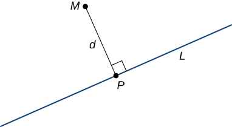{: #CNX_Calc_Figure_12_05_002}

When we’re looking for the distance between a line and a point in space, [\[link\]](#CNX_Calc_Figure_12_05_002) still applies. We still define the distance as the length of the perpendicular line segment connecting the point to the line. In space, however, there is no clear way to know which point on the line creates such a perpendicular line segment, so we select an arbitrary point on the line and use properties of vectors to calculate the distance. Therefore, let <math xmlns="http://www.w3.org/1998/Math/MathML"><mi>P</mi></math>

 be an arbitrary point on line <math xmlns="http://www.w3.org/1998/Math/MathML"><mi>L</mi></math>

 and let <math xmlns="http://www.w3.org/1998/Math/MathML"><mrow><mstyle mathvariant="bold" mathsize="normal"><mtext>v</mtext></mstyle></mrow></math>

 be a direction vector for <math xmlns="http://www.w3.org/1998/Math/MathML"><mi>L</mi></math>

 ([\[link\]](#CNX_Calc_Figure_12_05_003)).

 {: #CNX_Calc_Figure_12_05_003}

By [\[link\]](/m53903#fs-id1163723995104), vectors <math xmlns="http://www.w3.org/1998/Math/MathML"><mrow><mover accent="true"><mrow><mi>P</mi><mi>M</mi></mrow><mo stretchy="false">→</mo></mover></mrow></math>

 and <math xmlns="http://www.w3.org/1998/Math/MathML"><mstyle mathvariant="bold" mathsize="normal"><mtext>v</mtext></mstyle></math>

 form two sides of a parallelogram with area <math xmlns="http://www.w3.org/1998/Math/MathML"><mrow><mrow><mo>‖</mo><mrow><mover accent="true"><mrow><mi>P</mi><mi>M</mi></mrow><mo stretchy="false">→</mo></mover><mspace width="0.2em" /><mo>×</mo><mspace width="0.2em" /><mstyle mathvariant="bold" mathsize="normal"><mtext>v</mtext></mstyle></mrow><mo>‖</mo></mrow><mo>.</mo></mrow></math>

 Using a formula from geometry, the area of this parallelogram can also be calculated as the product of its base and height:

<math xmlns="http://www.w3.org/1998/Math/MathML"><mrow><mrow><mo>‖</mo><mrow><mover accent="true"><mrow><mi>P</mi><mi>M</mi></mrow><mo stretchy="false">→</mo></mover><mspace width="0.2em" /><mo>×</mo><mspace width="0.2em" /><mstyle mathvariant="bold" mathsize="normal"><mtext>v</mtext></mstyle></mrow><mo>‖</mo></mrow><mo>=</mo><mrow><mo>‖</mo><mstyle mathvariant="bold" mathsize="normal"><mtext>v</mtext></mstyle><mo>‖</mo></mrow><mi>d</mi><mo>.</mo></mrow></math>

We can use this formula to find a general formula for the distance between a line in space and any point not on the line.

Distance from a Point to a Line

Let <math xmlns="http://www.w3.org/1998/Math/MathML"><mi>L</mi></math>

 be a line in space passing through point <math xmlns="http://www.w3.org/1998/Math/MathML"><mi>P</mi></math>

 with direction vector <math xmlns="http://www.w3.org/1998/Math/MathML"><mrow><mstyle mathvariant="bold" mathsize="normal"><mtext>v</mtext></mstyle><mo>.</mo></mrow></math>

 If <math xmlns="http://www.w3.org/1998/Math/MathML"><mi>M</mi></math>

 is any point not on <math xmlns="http://www.w3.org/1998/Math/MathML"><mrow><mi>L</mi><mo>,</mo></mrow></math>

 then the distance from <math xmlns="http://www.w3.org/1998/Math/MathML"><mi>M</mi></math>

 to <math xmlns="http://www.w3.org/1998/Math/MathML"><mi>L</mi></math>

 is

<math xmlns="http://www.w3.org/1998/Math/MathML"><mrow><mi>d</mi><mo>=</mo><mfrac><mrow><mrow><mo>‖</mo><mrow><mover accent="true"><mrow><mi>P</mi><mi>M</mi></mrow><mo stretchy="false">→</mo></mover><mspace width="0.2em" /><mo>×</mo><mspace width="0.2em" /><mstyle mathvariant="bold" mathsize="normal"><mtext>v</mtext></mstyle></mrow><mo>‖</mo></mrow></mrow><mrow><mrow><mo>‖</mo><mstyle mathvariant="bold" mathsize="normal"><mtext>v</mtext></mstyle><mo>‖</mo></mrow></mrow></mfrac><mo>.</mo></mrow></math>

Calculating the Distance from a Point to a Line

Find the distance between t point <math xmlns="http://www.w3.org/1998/Math/MathML"><mrow><mi>M</mi><mo>=</mo><mrow><mo>(</mo><mrow><mn>1</mn><mo>,</mo><mn>1</mn><mo>,</mo><mn>3</mn></mrow><mo>)</mo></mrow></mrow></math>

 and line <math xmlns="http://www.w3.org/1998/Math/MathML"><mrow><mfrac><mrow><mi>x</mi><mo>−</mo><mn>3</mn></mrow><mn>4</mn></mfrac><mo>=</mo><mfrac><mrow><mi>y</mi><mo>+</mo><mn>1</mn></mrow><mn>2</mn></mfrac><mo>=</mo><mi>z</mi><mo>−</mo><mn>3</mn><mo>.</mo></mrow></math>

From the symmetric equations of the line, we know that vector <math xmlns="http://www.w3.org/1998/Math/MathML"><mrow><mstyle mathvariant="bold" mathsize="normal"><mtext>v</mtext></mstyle><mo>=</mo><mrow><mo>〈</mo><mrow><mn>4</mn><mo>,</mo><mn>2</mn><mo>,</mo><mn>1</mn></mrow><mo>〉</mo></mrow></mrow></math>

 is a direction vector for the line. Setting the symmetric equations of the line equal to zero, we see that point <math xmlns="http://www.w3.org/1998/Math/MathML"><mrow><mi>P</mi><mrow><mo>(</mo><mrow><mn>3</mn><mo>,</mo><mn>−1</mn><mo>,</mo><mn>3</mn></mrow><mo>)</mo></mrow></mrow></math>

 lies on the line. Then,

<math xmlns="http://www.w3.org/1998/Math/MathML"><mrow><mover accent="true"><mrow><mi>P</mi><mi>M</mi></mrow><mo stretchy="false">→</mo></mover><mo>=</mo><mrow><mo>〈</mo><mrow><mn>1</mn><mo>−</mo><mn>3</mn><mo>,</mo><mn>1</mn><mo>−</mo><mo stretchy="false">(</mo><mn>−1</mn><mo stretchy="false">)</mo><mo>,</mo><mn>3</mn><mo>−</mo><mn>3</mn></mrow><mo>〉</mo></mrow><mo>=</mo><mrow><mo>〈</mo><mrow><mn>−2</mn><mo>,</mo><mn>2</mn><mo>,</mo><mn>0</mn></mrow><mo>〉</mo></mrow><mo>.</mo></mrow></math>

To calculate the distance, we need to find <math xmlns="http://www.w3.org/1998/Math/MathML"><mrow><mover accent="true"><mrow><mi>P</mi><mi>M</mi></mrow><mo stretchy="false">→</mo></mover><mspace width="0.2em" /><mo>×</mo><mspace width="0.2em" /><mstyle mathvariant="bold" mathsize="normal"><mtext>v</mtext></mstyle><mtext>:</mtext></mrow></math>

<math xmlns="http://www.w3.org/1998/Math/MathML"><mtable><mtr><mtd columnalign="right"><mover accent="true"><mrow><mi>P</mi><mi>M</mi></mrow><mo stretchy="false">→</mo></mover><mspace width="0.2em" /><mo>×</mo><mspace width="0.2em" /><mstyle mathvariant="bold" mathsize="normal"><mtext>v</mtext></mstyle></mtd><mtd columnalign="left"><mo>=</mo><mrow><mo>\|</mo><mrow><mtable><mtr><mtd columnalign="right"><mstyle mathvariant="bold" mathsize="normal"><mtext>i</mtext></mstyle></mtd><mtd columnalign="center"><mstyle mathvariant="bold" mathsize="normal"><mtext>j</mtext></mstyle></mtd><mtd columnalign="center"><mstyle mathvariant="bold" mathsize="normal"><mtext>k</mtext></mstyle></mtd></mtr><mtr><mtd columnalign="right"><mrow><mn>−2</mn></mrow></mtd><mtd columnalign="center"><mn>2</mn></mtd><mtd columnalign="center"><mn>0</mn></mtd></mtr><mtr><mtd columnalign="right"><mn>4</mn></mtd><mtd columnalign="center"><mn>2</mn></mtd><mtd columnalign="center"><mn>1</mn></mtd></mtr></mtable></mrow><mo>\|</mo></mrow></mtd></mtr><mtr><mtd /><mtd columnalign="left"><mo>=</mo><mrow><mo>(</mo><mrow><mn>2</mn><mo>−</mo><mn>0</mn></mrow><mo>)</mo></mrow><mstyle mathvariant="bold" mathsize="normal"><mtext>i</mtext></mstyle><mo>−</mo><mrow><mo>(</mo><mrow><mn>−2</mn><mo>−</mo><mn>0</mn></mrow><mo>)</mo></mrow><mstyle mathvariant="bold" mathsize="normal"><mtext>j</mtext></mstyle><mo>+</mo><mrow><mo>(</mo><mrow><mn>−4</mn><mo>−</mo><mn>8</mn></mrow><mo>)</mo></mrow><mstyle mathvariant="bold" mathsize="normal"><mtext>k</mtext></mstyle></mtd></mtr><mtr><mtd /><mtd columnalign="left"><mo>=</mo><mn>2</mn><mstyle mathvariant="bold" mathsize="normal"><mtext>i</mtext></mstyle><mo>+</mo><mn>2</mn><mstyle mathvariant="bold" mathsize="normal"><mtext>j</mtext></mstyle><mo>−</mo><mn>12</mn><mstyle mathvariant="bold" mathsize="normal"><mtext>k</mtext></mstyle><mo>.</mo></mtd></mtr></mtable></math>

Therefore, the distance between the point and the line is ([[link]](#CNX_Calc_Figure_12_05_004))

<math xmlns="http://www.w3.org/1998/Math/MathML"><mtable><mtr><mtd columnalign="right"><mi>d</mi></mtd><mtd columnalign="left"><mo>=</mo><mfrac><mrow><mrow><mo>‖</mo><mrow><mover accent="true"><mrow><mi>P</mi><mi>M</mi></mrow><mo stretchy="false">→</mo></mover><mspace width="0.2em" /><mo>×</mo><mspace width="0.2em" /><mstyle mathvariant="bold" mathsize="normal"><mtext>v</mtext></mstyle></mrow><mo>‖</mo></mrow></mrow><mrow><mrow><mo>‖</mo><mstyle mathvariant="bold" mathsize="normal"><mtext>v</mtext></mstyle><mo>‖</mo></mrow></mrow></mfrac></mtd></mtr><mtr><mtd /><mtd columnalign="left"><mo>=</mo><mfrac><mrow><msqrt><mrow><msup><mn>2</mn><mn>2</mn></msup><mo>+</mo><msup><mn>2</mn><mn>2</mn></msup><mo>+</mo><msup><mrow><mn>12</mn></mrow><mn>2</mn></msup></mrow></msqrt></mrow><mrow><msqrt><mrow><msup><mn>4</mn><mn>2</mn></msup><mo>+</mo><msup><mn>2</mn><mn>2</mn></msup><mo>+</mo><msup><mn>1</mn><mn>2</mn></msup></mrow></msqrt></mrow></mfrac></mtd></mtr><mtr><mtd /><mtd columnalign="left"><mo>=</mo><mfrac><mrow><mn>2</mn><msqrt><mrow><mn>38</mn></mrow></msqrt></mrow><mrow><msqrt><mrow><mn>21</mn></mrow></msqrt></mrow></mfrac><mo>.</mo></mtd></mtr></mtable></math>

 is approximately 2.7 units from the line with symmetric equations x&#x2212;34=y+12=z&#x2212;3."){: #CNX_Calc_Figure_12_05_004}

Find the distance between point <math xmlns="http://www.w3.org/1998/Math/MathML"><mrow><mrow><mo>(</mo><mrow><mn>0</mn><mo>,</mo><mn>3</mn><mo>,</mo><mn>6</mn></mrow><mo>)</mo></mrow></mrow></math>

 and the line with parametric equations <math xmlns="http://www.w3.org/1998/Math/MathML"><mrow><mi>x</mi><mo>=</mo><mn>1</mn><mo>−</mo><mi>t</mi><mo>,</mo><mi>y</mi><mo>=</mo><mn>1</mn><mo>+</mo><mn>2</mn><mi>t</mi><mo>,</mo><mi>z</mi><mo>=</mo><mn>5</mn><mo>+</mo><mn>3</mn><mi>t</mi><mo>.</mo></mrow></math>

<math xmlns="http://www.w3.org/1998/Math/MathML"><mrow><msqrt><mrow><mfrac><mrow><mn>10</mn></mrow><mn>7</mn></mfrac></mrow></msqrt></mrow></math>

Hint

Find a vector with initial point <math xmlns="http://www.w3.org/1998/Math/MathML"><mrow><mrow><mo>(</mo><mrow><mn>0</mn><mo>,</mo><mn>3</mn><mo>,</mo><mn>6</mn></mrow><mo>)</mo></mrow></mrow></math>

 and a terminal point on the line, and then find a direction vector for the line.

### Relationships between Lines

Given two lines in the two-dimensional plane, the lines are equal, they are parallel but not equal, or they intersect in a single point. In three dimensions, a fourth case is possible. If two lines in space are not parallel, but do not intersect, then the lines are said to be **skew lines**{: data-type="term"} ([\[link\]](#CNX_Calc_Figure_12_05_005)).

 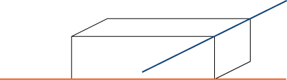{: #CNX_Calc_Figure_12_05_005}

To classify lines as parallel but not equal, equal, intersecting, or skew, we need to know two things: whether the direction vectors are parallel and whether the lines share a point ([\[link\]](#CNX_Calc_Figure_12_05_006)).

 ![This figure is a table with two rows and two columns. Above the columns is the question &#x201C;Lines share a common point?&#x201D; The first column is labeled &#x201C;yes,&#x201D; and the second column is labeled &#x201C;no.&#x201D; To the left of the rows is the question &#x201C;Direction vectors are parallel?&#x201D; The first row is labeled &#x201C;yes,&#x201D; and the second row is labeled &#x201C;no.&#x201D; The entries of the first row are &#x201C;equal&#x201D; and &#x201C;parallel but not equal.&#x201D; The entries in the second row are &#x201C;intersecting&#x201D; and &#x201C;skew.&#x201D;](../resources/CNX_Calc_Figure_12_05_006.jpg "Determine the relationship between two lines based on whether their direction vectors are parallel and whether they share a point."){: #CNX_Calc_Figure_12_05_006}

Classifying Lines in Space

For each pair of lines, determine whether the lines are equal, parallel but not equal, skew, or intersecting.

1.  <math xmlns="http://www.w3.org/1998/Math/MathML"><mrow><msub><mi>L</mi><mn>1</mn></msub><mo>:</mo><mi>x</mi><mo>=</mo><mn>2</mn><mi>s</mi><mo>−</mo><mn>1</mn><mo>,</mo><mi>y</mi><mo>=</mo><mi>s</mi><mo>−</mo><mn>1</mn><mo>,</mo><mi>z</mi><mo>=</mo><mi>s</mi><mo>−</mo><mn>4</mn></mrow></math>
    
    * * *
    {: data-type="newline"}
    
    <math xmlns="http://www.w3.org/1998/Math/MathML"><mrow><msub><mi>L</mi><mn>2</mn></msub><mo>:</mo><mi>x</mi><mo>=</mo><mi>t</mi><mo>−</mo><mn>3</mn><mo>,</mo><mi>y</mi><mo>=</mo><mn>3</mn><mi>t</mi><mo>+</mo><mn>8</mn><mo>,</mo><mi>z</mi><mo>=</mo><mn>5</mn><mo>−</mo><mn>2</mn><mi>t</mi></mrow></math>

2.  <math xmlns="http://www.w3.org/1998/Math/MathML"><mrow><msub><mi>L</mi><mn>1</mn></msub><mtext>:</mtext></mrow></math>
    
    <math xmlns="http://www.w3.org/1998/Math/MathML"><mrow><mi>x</mi><mo>=</mo><mtext>−</mtext><mi>y</mi><mo>=</mo><mi>z</mi></mrow></math>
    
    * * *
    {: data-type="newline"}
    
    <math xmlns="http://www.w3.org/1998/Math/MathML"><mrow><msub><mi>L</mi><mn>2</mn></msub><mo>:</mo><mfrac><mrow><mi>x</mi><mo>−</mo><mn>3</mn></mrow><mn>2</mn></mfrac><mo>=</mo><mi>y</mi><mo>=</mo><mi>z</mi><mo>−</mo><mn>2</mn></mrow></math>

3.  <math xmlns="http://www.w3.org/1998/Math/MathML"><mrow><msub><mi>L</mi><mn>1</mn></msub><mo>:</mo><mi>x</mi><mo>=</mo><mn>6</mn><mi>s</mi><mo>−</mo><mn>1</mn><mo>,</mo><mi>y</mi><mo>=</mo><mn>−2</mn><mi>s</mi><mo>,</mo><mi>z</mi><mo>=</mo><mn>3</mn><mi>s</mi><mo>+</mo><mn>1</mn></mrow></math>
    
    * * *
    {: data-type="newline"}
    
    <math xmlns="http://www.w3.org/1998/Math/MathML"><mrow><msub><mi>L</mi><mn>2</mn></msub><mo>:</mo><mfrac><mrow><mi>x</mi><mo>−</mo><mn>4</mn></mrow><mn>6</mn></mfrac><mo>=</mo><mfrac><mrow><mi>y</mi><mo>+</mo><mn>3</mn></mrow><mrow><mn>−2</mn></mrow></mfrac><mo>=</mo><mfrac><mrow><mi>z</mi><mo>−</mo><mn>1</mn></mrow><mn>3</mn></mfrac></mrow></math>
{: type="a"}

1.  Line
    <math xmlns="http://www.w3.org/1998/Math/MathML"><mrow><msub><mi>L</mi><mn>1</mn></msub></mrow></math>
    
    has direction vector
    <math xmlns="http://www.w3.org/1998/Math/MathML"><mrow><msub><mstyle mathvariant="bold" mathsize="normal"><mtext>v</mtext></mstyle><mstyle mathvariant="bold" mathsize="normal"><mn>1</mn></mstyle></msub><mo>=</mo><mrow><mo>〈</mo><mrow><mn>2</mn><mo>,</mo><mn>1</mn><mo>,</mo><mn>1</mn></mrow><mo>〉</mo></mrow><mo>;</mo></mrow></math>
    
    line
    <math xmlns="http://www.w3.org/1998/Math/MathML"><mrow><msub><mi>L</mi><mn>2</mn></msub></mrow></math>
    
    has direction vector
    <math xmlns="http://www.w3.org/1998/Math/MathML"><mrow><msub><mstyle mathvariant="bold" mathsize="normal"><mtext>v</mtext></mstyle><mstyle mathvariant="bold" mathsize="normal"><mn>2</mn></mstyle></msub><mo>=</mo><mrow><mo>〈</mo><mrow><mn>1</mn><mo>,</mo><mn>3</mn><mo>,</mo><mn>−2</mn></mrow><mo>〉</mo></mrow><mo>.</mo></mrow></math>
    
    Because the direction vectors are not parallel vectors, the lines are either intersecting or skew. To determine whether the lines intersect, we see if there is a point,
    <math xmlns="http://www.w3.org/1998/Math/MathML"><mrow><mrow><mo>(</mo><mrow><mi>x</mi><mo>,</mo><mi>y</mi><mo>,</mo><mi>z</mi></mrow><mo>)</mo></mrow><mo>,</mo></mrow></math>
    
    that lies on both lines. To find this point, we use the parametric equations to create a system of equalities:
    * * *
    {: data-type="newline"}
    
    

    <math xmlns="http://www.w3.org/1998/Math/MathML"><mrow><mn>2</mn><mi>s</mi><mo>−</mo><mn>1</mn><mo>=</mo><mi>t</mi><mo>−</mo><mn>3</mn><mo>;</mo><mspace width="1em" /><mi>s</mi><mo>−</mo><mn>1</mn><mo>=</mo><mn>3</mn><mi>t</mi><mo>+</mo><mn>8</mn><mo>;</mo><mspace width="1em" /><mi>s</mi><mo>−</mo><mn>4</mn><mo>=</mo><mn>5</mn><mo>−</mo><mn>2</mn><mi>t</mi><mo>.</mo></mrow></math>
    

    
    * * *
    {: data-type="newline"}
    
    By the first equation,
    <math xmlns="http://www.w3.org/1998/Math/MathML"><mrow><mi>t</mi><mo>=</mo><mn>2</mn><mi>s</mi><mo>+</mo><mn>2</mn><mo>.</mo></mrow></math>
    
    Substituting into the second equation yields
    * * *
    {: data-type="newline"}
    
    

    <math xmlns="http://www.w3.org/1998/Math/MathML"><mtable><mtr><mtd columnalign="right"><mi>s</mi><mo>−</mo><mn>1</mn></mtd><mtd columnalign="left"><mo>=</mo></mtd><mtd columnalign="left"><mn>3</mn><mrow><mo>(</mo><mrow><mn>2</mn><mi>s</mi><mo>+</mo><mn>2</mn></mrow><mo>)</mo></mrow><mo>+</mo><mn>8</mn></mtd></mtr><mtr><mtd columnalign="right"><mi>s</mi><mo>−</mo><mn>1</mn></mtd><mtd columnalign="left"><mo>=</mo></mtd><mtd columnalign="left"><mn>6</mn><mi>s</mi><mo>+</mo><mn>6</mn><mo>+</mo><mn>8</mn></mtd></mtr><mtr><mtd columnalign="right"><mn>5</mn><mi>s</mi></mtd><mtd columnalign="left"><mo>=</mo></mtd><mtd columnalign="left"><mn>−15</mn></mtd></mtr><mtr><mtd columnalign="right"><mi>s</mi></mtd><mtd columnalign="left"><mo>=</mo></mtd><mtd columnalign="left"><mn>−3.</mn></mtd></mtr></mtable></math>
    

    
    * * *
    {: data-type="newline"}
    
    Substitution into the third equation, however, yields a contradiction:
    * * *
    {: data-type="newline"}
    
    

    <math xmlns="http://www.w3.org/1998/Math/MathML"><mtable><mtr><mtd columnalign="right"><mi>s</mi><mo>−</mo><mn>4</mn></mtd><mtd columnalign="left"><mo>=</mo></mtd><mtd columnalign="left"><mn>5</mn><mo>−</mo><mn>2</mn><mrow><mo>(</mo><mrow><mn>2</mn><mi>s</mi><mo>+</mo><mn>2</mn></mrow><mo>)</mo></mrow></mtd></mtr><mtr><mtd columnalign="right"><mi>s</mi><mo>−</mo><mn>4</mn></mtd><mtd columnalign="left"><mo>=</mo></mtd><mtd columnalign="left"><mn>5</mn><mo>−</mo><mn>4</mn><mi>s</mi><mo>−</mo><mn>4</mn></mtd></mtr><mtr><mtd columnalign="right"><mn>5</mn><mi>s</mi></mtd><mtd columnalign="left"><mo>=</mo></mtd><mtd columnalign="left"><mn>5</mn></mtd></mtr><mtr><mtd columnalign="right"><mi>s</mi></mtd><mtd columnalign="left"><mo>=</mo></mtd><mtd columnalign="left"><mn>1.</mn></mtd></mtr></mtable></math>
    

    
    * * *
    {: data-type="newline"}
    
    There is no single point that satisfies the parametric equations for
    <math xmlns="http://www.w3.org/1998/Math/MathML"><mrow><msub><mi>L</mi><mn>1</mn></msub><mspace width="0.2em" /><mtext>and</mtext><mspace width="0.2em" /><msub><mi>L</mi><mn>2</mn></msub></mrow></math>
    
    simultaneously. These lines do not intersect, so they are skew (see the following figure).
    * * *
    {: data-type="newline"}
    
     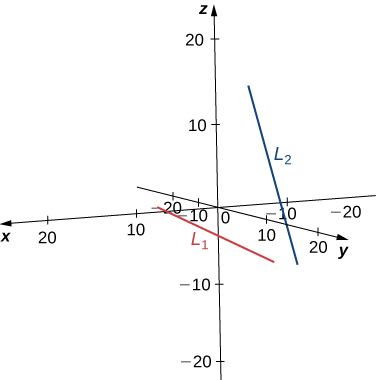 
2.  Line *L1* has direction vector
    <math xmlns="http://www.w3.org/1998/Math/MathML"><mrow><msub><mstyle mathvariant="bold" mathsize="normal"><mtext>v</mtext></mstyle><mstyle mathvariant="bold" mathsize="normal"><mn>1</mn></mstyle></msub><mo>=</mo><mrow><mo>〈</mo><mrow><mn>1</mn><mo>,</mo><mn>−1</mn><mo>,</mo><mn>1</mn></mrow><mo>〉</mo></mrow></mrow></math>
    
    and passes through the origin,
    <math xmlns="http://www.w3.org/1998/Math/MathML"><mrow><mrow><mo>(</mo><mrow><mn>0</mn><mo>,</mo><mn>0</mn><mo>,</mo><mn>0</mn></mrow><mo>)</mo></mrow><mo>.</mo></mrow></math>
    
    Line
    <math xmlns="http://www.w3.org/1998/Math/MathML"><mrow><msub><mi>L</mi><mn>2</mn></msub></mrow></math>
    
    has a different direction vector,
    <math xmlns="http://www.w3.org/1998/Math/MathML"><mrow><msub><mstyle mathvariant="bold" mathsize="normal"><mtext>v</mtext></mstyle><mstyle mathvariant="bold" mathsize="normal"><mn>2</mn></mstyle></msub><mo>=</mo><mrow><mo>〈</mo><mrow><mn>2</mn><mo>,</mo><mn>1</mn><mo>,</mo><mn>1</mn></mrow><mo>〉</mo></mrow><mo>,</mo></mrow></math>
    
    so these lines are not parallel or equal. Let
    <math xmlns="http://www.w3.org/1998/Math/MathML"><mi>r</mi></math>
    
    represent the parameter for line
    <math xmlns="http://www.w3.org/1998/Math/MathML"><mrow><msub><mi>L</mi><mn>1</mn></msub></mrow></math>
    
    and let
    <math xmlns="http://www.w3.org/1998/Math/MathML"><mi>s</mi></math>
    
    represent the parameter for
    <math xmlns="http://www.w3.org/1998/Math/MathML"><mrow><msub><mi>L</mi><mn>2</mn></msub><mtext>:</mtext></mrow></math>
    
    * * *
    {: data-type="newline"}
    
    

    <math xmlns="http://www.w3.org/1998/Math/MathML"><mtable><mtr><mtd columnalign="left"><mtable> <mtr><mtd columnalign="left"><mi>x</mi></mtd><mtd columnalign="left"><mo>=</mo><mi>r</mi></mtd></mtr> <mtr><mtd columnalign="left"><mi>y</mi></mtd><mtd columnalign="left"><mo>=</mo><mtext>−</mtext><mi>r</mi></mtd></mtr> <mtr><mtd columnalign="left"><mi>z</mi></mtd><mtd columnalign="left"><mo>=</mo><mi>r</mi></mtd></mtr></mtable></mtd><mtd /> <mtd /><mtd columnalign="left"> <mtable><mtr><mtd columnalign="left"><mi>x</mi></mtd><mtd columnalign="left"><mo>=</mo><mn>2</mn><mi>s</mi><mo>+</mo><mn>3</mn></mtd></mtr> <mtr><mtd columnalign="left"><mi>y</mi></mtd><mtd columnalign="left"><mo>=</mo><mi>s</mi></mtd></mtr> <mtr><mtd columnalign="left"><mi>z</mi></mtd><mtd columnalign="left"><mo>=</mo><mi>s</mi><mo>+</mo><mn>2.</mn></mtd></mtr></mtable></mtd></mtr></mtable></math>
    

    
    * * *
    {: data-type="newline"}
    
    Solve the system of equations to find
    <math xmlns="http://www.w3.org/1998/Math/MathML"><mrow><mi>r</mi><mo>=</mo><mn>1</mn></mrow></math>
    
    and
    <math xmlns="http://www.w3.org/1998/Math/MathML"><mrow><mi>s</mi><mo>=</mo><mo>−</mo><mn>1</mn><mo>.</mo></mrow></math>
    
    If we need to find the point of intersection, we can substitute these parameters into the original equations to get
    <math xmlns="http://www.w3.org/1998/Math/MathML"><mrow><mrow><mo>(</mo><mrow><mn>1</mn><mo>,</mo><mn>−1</mn><mo>,</mo><mn>1</mn></mrow><mo>)</mo></mrow></mrow></math>
    
    (see the following figure).
    * * *
    {: data-type="newline"}
    
     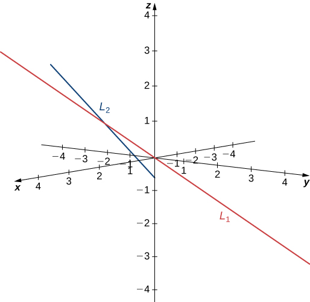 
3.  Lines
    <math xmlns="http://www.w3.org/1998/Math/MathML"><mrow><msub><mi>L</mi><mn>1</mn></msub></mrow></math>
    
    and
    <math xmlns="http://www.w3.org/1998/Math/MathML"><mrow><msub><mi>L</mi><mn>2</mn></msub></mrow></math>
    
    have equivalent direction vectors:
    <math xmlns="http://www.w3.org/1998/Math/MathML"><mrow><mstyle mathvariant="bold" mathsize="normal"><mtext>v</mtext></mstyle><mo>=</mo><mrow><mo>〈</mo><mrow><mn>6</mn><mo>,</mo><mn>−2</mn><mo>,</mo><mn>3</mn></mrow><mo>〉</mo></mrow><mo>.</mo></mrow></math>
    
    These two lines are parallel (see the following figure).
    * * *
    {: data-type="newline"}
    
      
{: type="a"}

Describe the relationship between the lines with the following parametric equations:

<math xmlns="http://www.w3.org/1998/Math/MathML"><mrow><mi>x</mi><mo>=</mo><mn>1</mn><mo>−</mo><mn>4</mn><mi>t</mi><mo>,</mo><mi>y</mi><mo>=</mo><mn>3</mn><mo>+</mo><mi>t</mi><mo>,</mo><mi>z</mi><mo>=</mo><mn>8</mn><mo>−</mo><mn>6</mn><mi>t</mi></mrow></math>

<math xmlns="http://www.w3.org/1998/Math/MathML"><mrow><mi>x</mi><mo>=</mo><mn>2</mn><mo>+</mo><mn>3</mn><mi>s</mi><mo>,</mo><mi>y</mi><mo>=</mo><mn>2</mn><mi>s</mi><mo>,</mo><mi>z</mi><mo>=</mo><mn>−1</mn><mo>−</mo><mn>3</mn><mi>s</mi><mo>.</mo></mrow></math>

These lines are skew because their direction vectors are not parallel and there is no point <math xmlns="http://www.w3.org/1998/Math/MathML"><mrow><mrow><mo>(</mo><mrow><mi>x</mi><mo>,</mo><mi>y</mi><mo>,</mo><mi>z</mi></mrow><mo>)</mo></mrow></mrow></math>

 that lies on both lines.

Hint

Start by identifying direction vectors for each line. Is one a multiple of the other?

### Equations for a Plane

We know that a line is determined by two points. In other words, for any two distinct points, there is exactly one line that passes through those points, whether in two dimensions or three. Similarly, given any three points that do not all lie on the same line, there is a unique plane that passes through these points. Just as a line is determined by two points, a plane is determined by three.

This may be the simplest way to characterize a plane, but we can use other descriptions as well. For example, given two distinct, intersecting lines, there is exactly one plane containing both lines. A plane is also determined by a line and any point that does not lie on the line. These characterizations arise naturally from the idea that a plane is determined by three points. Perhaps the most surprising characterization of a plane is actually the most useful.

Imagine a pair of orthogonal vectors that share an initial point. Visualize grabbing one of the vectors and twisting it. As you twist, the other vector spins around and sweeps out a plane. Here, we describe that concept mathematically. Let <math xmlns="http://www.w3.org/1998/Math/MathML"><mrow><mstyle mathvariant="bold" mathsize="normal"><mtext>n</mtext></mstyle><mo>=</mo><mrow><mo>〈</mo><mrow><mi>a</mi><mo>,</mo><mi>b</mi><mo>,</mo><mi>c</mi></mrow><mo>〉</mo></mrow></mrow></math>

 be a vector and <math xmlns="http://www.w3.org/1998/Math/MathML"><mrow><mi>P</mi><mo>=</mo><mrow><mo>(</mo><mrow><msub><mi>x</mi><mn>0</mn></msub><mo>,</mo><msub><mi>y</mi><mn>0</mn></msub><mo>,</mo><msub><mi>z</mi><mn>0</mn></msub></mrow><mo>)</mo></mrow></mrow></math>

 be a point. Then the set of all points <math xmlns="http://www.w3.org/1998/Math/MathML"><mrow><mi>Q</mi><mo>=</mo><mrow><mo>(</mo><mrow><mi>x</mi><mo>,</mo><mi>y</mi><mo>,</mo><mi>z</mi></mrow><mo>)</mo></mrow></mrow></math>

 such that <math xmlns="http://www.w3.org/1998/Math/MathML"><mrow><mover accent="true"><mrow><mi>P</mi><mi>Q</mi></mrow><mo stretchy="false">→</mo></mover></mrow></math>

 is orthogonal to <math xmlns="http://www.w3.org/1998/Math/MathML"><mstyle mathvariant="bold" mathsize="normal"><mtext>n</mtext></mstyle></math>

 forms a plane ([\[link\]](#CNX_Calc_Figure_12_05_010)). We say that <math xmlns="http://www.w3.org/1998/Math/MathML"><mstyle mathvariant="bold" mathsize="normal"><mtext>n</mtext></mstyle></math>

 is a **normal vector**{: data-type="term"}, or perpendicular to the plane. Remember, the dot product of orthogonal vectors is zero. This fact generates the **vector equation of a plane**{: data-type="term"}\: <math xmlns="http://www.w3.org/1998/Math/MathML"><mrow><mstyle mathvariant="bold" mathsize="normal"><mtext>n</mtext></mstyle><mo>·</mo><mover accent="true"><mrow><mi>P</mi><mi>Q</mi></mrow><mo stretchy="false">→</mo></mover><mo>=</mo><mn>0</mn><mo>.</mo></mrow></math>

 Rewriting this equation provides additional ways to describe the plane:

<math xmlns="http://www.w3.org/1998/Math/MathML"><mtable><mtr /><mtr><mtd columnalign="right"><mstyle mathvariant="bold" mathsize="normal"><mtext>n</mtext></mstyle><mo>·</mo><mover accent="true"><mrow><mi>P</mi><mi>Q</mi></mrow><mo stretchy="false">→</mo></mover></mtd><mtd columnalign="left"><mo>=</mo></mtd><mtd columnalign="left"><mn>0</mn></mtd></mtr><mtr><mtd columnalign="right"><mrow><mo>〈</mo><mrow><mi>a</mi><mo>,</mo><mi>b</mi><mo>,</mo><mi>c</mi></mrow><mo>〉</mo></mrow><mo>·</mo><mrow><mo>〈</mo><mrow><mi>x</mi><mo>−</mo><msub><mi>x</mi><mn>0</mn></msub><mo>,</mo><mi>y</mi><mo>−</mo><msub><mi>y</mi><mn>0</mn></msub><mo>,</mo><mi>z</mi><mo>−</mo><msub><mi>z</mi><mn>0</mn></msub></mrow><mo>〉</mo></mrow></mtd><mtd columnalign="left"><mo>=</mo></mtd><mtd columnalign="left"><mn>0</mn></mtd></mtr><mtr><mtd columnalign="right"><mi>a</mi><mrow><mo>(</mo><mrow><mi>x</mi><mo>−</mo><msub><mi>x</mi><mn>0</mn></msub></mrow><mo>)</mo></mrow><mo>+</mo><mi>b</mi><mrow><mo>(</mo><mrow><mi>y</mi><mo>−</mo><msub><mi>y</mi><mn>0</mn></msub></mrow><mo>)</mo></mrow><mo>+</mo><mi>c</mi><mrow><mo>(</mo><mrow><mi>z</mi><mo>−</mo><msub><mi>z</mi><mn>0</mn></msub></mrow><mo>)</mo></mrow></mtd><mtd columnalign="left"><mo>=</mo></mtd><mtd columnalign="left"><mn>0.</mn></mtd></mtr></mtable></math>

 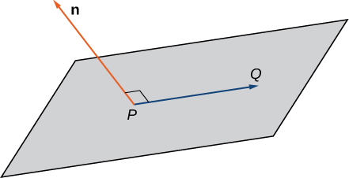{: #CNX_Calc_Figure_12_05_010}

Definition

Given a point <math xmlns="http://www.w3.org/1998/Math/MathML"><mi>P</mi></math>

 and vector <math xmlns="http://www.w3.org/1998/Math/MathML"><mrow><mstyle mathvariant="bold" mathsize="normal"><mtext>n</mtext></mstyle><mo>,</mo></mrow></math>

 the set of all points <math xmlns="http://www.w3.org/1998/Math/MathML"><mi>Q</mi></math>

 satisfying the equation <math xmlns="http://www.w3.org/1998/Math/MathML"><mrow><mstyle mathvariant="bold" mathsize="normal"><mtext>n</mtext></mstyle><mo>·</mo><mover accent="true"><mrow><mi>P</mi><mi>Q</mi></mrow><mo stretchy="false">→</mo></mover><mo>=</mo><mn>0</mn></mrow></math>

 forms a plane. The equation

<math xmlns="http://www.w3.org/1998/Math/MathML"><mrow><mstyle mathvariant="bold" mathsize="normal"><mtext>n</mtext></mstyle><mo>·</mo><mover accent="true"><mrow><mi>P</mi><mi>Q</mi></mrow><mo stretchy="false">→</mo></mover><mo>=</mo><mn>0</mn></mrow></math>

is known as the vector equation of a plane.

The **scalar equation of a plane**{: data-type="term"} containing point <math xmlns="http://www.w3.org/1998/Math/MathML"><mrow><mi>P</mi><mo>=</mo><mrow><mo>(</mo><mrow><msub><mi>x</mi><mn>0</mn></msub><mo>,</mo><msub><mi>y</mi><mn>0</mn></msub><mo>,</mo><msub><mi>z</mi><mn>0</mn></msub></mrow><mo>)</mo></mrow></mrow></math>

 with normal vector <math xmlns="http://www.w3.org/1998/Math/MathML"><mrow><mstyle mathvariant="bold" mathsize="normal"><mtext>n</mtext></mstyle><mo>=</mo><mrow><mo>〈</mo><mrow><mi>a</mi><mo>,</mo><mi>b</mi><mo>,</mo><mi>c</mi></mrow><mo>〉</mo></mrow></mrow></math>

 is

<math xmlns="http://www.w3.org/1998/Math/MathML"><mrow><mi>a</mi><mrow><mo>(</mo><mrow><mi>x</mi><mo>−</mo><msub><mi>x</mi><mn>0</mn></msub></mrow><mo>)</mo></mrow><mo>+</mo><mi>b</mi><mrow><mo>(</mo><mrow><mi>y</mi><mo>−</mo><msub><mi>y</mi><mn>0</mn></msub></mrow><mo>)</mo></mrow><mo>+</mo><mi>c</mi><mrow><mo>(</mo><mrow><mi>z</mi><mo>−</mo><msub><mi>z</mi><mn>0</mn></msub></mrow><mo>)</mo></mrow><mo>=</mo><mn>0</mn><mo>.</mo></mrow></math>

This equation can be expressed as <math xmlns="http://www.w3.org/1998/Math/MathML"><mrow><mi>a</mi><mi>x</mi><mo>+</mo><mi>b</mi><mi>y</mi><mo>+</mo><mi>c</mi><mi>z</mi><mo>+</mo><mi>d</mi><mo>=</mo><mn>0</mn><mo>,</mo></mrow></math>

 where <math xmlns="http://www.w3.org/1998/Math/MathML"><mrow><mi>d</mi><mo>=</mo><mtext>−</mtext><mi>a</mi><msub><mi>x</mi><mn>0</mn></msub><mo>−</mo><mi>b</mi><msub><mi>y</mi><mn>0</mn></msub><mo>−</mo><mi>c</mi><msub><mi>z</mi><mn>0</mn></msub><mo>.</mo></mrow></math>

 This form of the equation is sometimes called the **general form of the equation of a plane**{: data-type="term"}.

As described earlier in this section, any three points that do not all lie on the same line determine a plane. Given three such points, we can find an equation for the plane containing these points.

Writing an Equation of a Plane Given Three Points in the Plane

Write an equation for the plane containing points <math xmlns="http://www.w3.org/1998/Math/MathML"><mrow><mi>P</mi><mo>=</mo><mrow><mo>(</mo><mrow><mn>1</mn><mo>,</mo><mn>1</mn><mo>,</mo><mn>−2</mn></mrow><mo>)</mo></mrow><mo>,</mo></mrow></math>

 <math xmlns="http://www.w3.org/1998/Math/MathML"><mrow><mi>Q</mi><mo>=</mo><mrow><mo>(</mo><mrow><mn>0</mn><mo>,</mo><mn>2</mn><mo>,</mo><mn>1</mn></mrow><mo>)</mo></mrow><mo>,</mo></mrow></math>

 and <math xmlns="http://www.w3.org/1998/Math/MathML"><mrow><mi>R</mi><mo>=</mo><mrow><mo>(</mo><mrow><mn>−1</mn><mo>,</mo><mn>−1</mn><mo>,</mo><mn>0</mn></mrow><mo>)</mo></mrow></mrow></math>

 in both standard and general forms.

To write an equation for a plane, we must find a normal vector for the plane. We start by identifying two vectors in the plane:

<math xmlns="http://www.w3.org/1998/Math/MathML"><mtable><mtr><mtd columnalign="right"><mover accent="true"><mrow><mi>P</mi><mi>Q</mi></mrow><mo stretchy="false">→</mo></mover></mtd><mtd columnalign="left"><mo>=</mo></mtd><mtd columnalign="left"><mrow><mo>〈</mo><mrow><mn>0</mn><mo>−</mo><mn>1</mn><mo>,</mo><mn>2</mn><mo>−</mo><mn>1</mn><mo>,</mo><mn>1</mn><mo>−</mo><mo stretchy="false">(</mo><mn>−2</mn><mo stretchy="false">)</mo></mrow><mo>〉</mo></mrow><mo>=</mo><mrow><mo>〈</mo><mrow><mn>−1</mn><mo>,</mo><mn>1</mn><mo>,</mo><mn>3</mn></mrow><mo>〉</mo></mrow></mtd></mtr><mtr><mtd columnalign="right"><mover accent="true"><mrow><mi>Q</mi><mi>R</mi></mrow><mo stretchy="false">→</mo></mover></mtd><mtd columnalign="left"><mo>=</mo></mtd><mtd columnalign="left"><mrow><mo>〈</mo><mrow><mn>−1</mn><mo>−</mo><mn>0</mn><mo>,</mo><mn>−1</mn><mo>−</mo><mn>2</mn><mo>,</mo><mn>0</mn><mo>−</mo><mn>1</mn></mrow><mo>〉</mo></mrow><mo>=</mo><mrow><mo>〈</mo><mrow><mn>−1</mn><mo>,</mo><mn>−3</mn><mo>,</mo><mn>−1</mn></mrow><mo>〉</mo></mrow><mo>.</mo></mtd></mtr></mtable></math>

The cross product <math xmlns="http://www.w3.org/1998/Math/MathML"><mrow><mover accent="true"><mrow><mi>P</mi><mi>Q</mi></mrow><mo stretchy="false">→</mo></mover><mspace width="0.2em" /><mo>×</mo><mspace width="0.2em" /><mover accent="true"><mrow><mi>Q</mi><mi>R</mi></mrow><mo stretchy="false">→</mo></mover></mrow></math>

 is orthogonal to both <math xmlns="http://www.w3.org/1998/Math/MathML"><mrow><mover accent="true"><mrow><mi>P</mi><mi>Q</mi></mrow><mo stretchy="false">→</mo></mover></mrow></math>

 and <math xmlns="http://www.w3.org/1998/Math/MathML"><mrow><mover accent="true"><mrow><mi>Q</mi><mi>R</mi></mrow><mo stretchy="false">→</mo></mover><mo>,</mo></mrow></math>

 so it is normal to the plane that contains these two vectors:

<math xmlns="http://www.w3.org/1998/Math/MathML"><mtable><mtr><mtd columnalign="right"><mstyle mathvariant="bold" mathsize="normal"><mtext>n</mtext></mstyle></mtd><mtd columnalign="left"><mo>=</mo><mover accent="true"><mrow><mi>P</mi><mi>Q</mi></mrow><mo stretchy="false">→</mo></mover><mspace width="0.2em" /><mo>×</mo><mspace width="0.2em" /><mover accent="true"><mrow><mi>Q</mi><mi>R</mi></mrow><mo stretchy="false">→</mo></mover></mtd></mtr><mtr><mtd /><mtd columnalign="left"><mo>=</mo><mrow><mo>\|</mo><mrow><mtable><mtr><mtd columnalign="right"><mstyle mathvariant="bold" mathsize="normal"><mtext>i</mtext></mstyle></mtd><mtd columnalign="right"><mstyle mathvariant="bold" mathsize="normal"><mtext>j</mtext></mstyle></mtd><mtd columnalign="right"><mstyle mathvariant="bold" mathsize="normal"><mtext>k</mtext></mstyle></mtd></mtr><mtr><mtd columnalign="right"><mrow><mn>−1</mn></mrow></mtd><mtd columnalign="right"><mn>1</mn></mtd><mtd columnalign="right"><mn>3</mn></mtd></mtr><mtr><mtd columnalign="right"><mrow><mn>−1</mn></mrow></mtd><mtd columnalign="right"><mrow><mn>−3</mn></mrow></mtd><mtd columnalign="right"><mrow><mn>−1</mn></mrow></mtd></mtr></mtable></mrow><mo>\|</mo></mrow></mtd></mtr><mtr><mtd /><mtd columnalign="left"><mo>=</mo><mrow><mo>(</mo><mrow><mn>−1</mn><mo>+</mo><mn>9</mn></mrow><mo>)</mo></mrow><mstyle mathvariant="bold" mathsize="normal"><mtext>i</mtext></mstyle><mo>−</mo><mrow><mo>(</mo><mrow><mn>1</mn><mo>+</mo><mn>3</mn></mrow><mo>)</mo></mrow><mstyle mathvariant="bold" mathsize="normal"><mtext>j</mtext></mstyle><mo>+</mo><mrow><mo>(</mo><mrow><mn>3</mn><mo>+</mo><mn>1</mn></mrow><mo>)</mo></mrow><mstyle mathvariant="bold" mathsize="normal"><mtext>k</mtext></mstyle></mtd></mtr><mtr><mtd /><mtd columnalign="left"><mo>=</mo><mn>8</mn><mstyle mathvariant="bold" mathsize="normal"><mtext>i</mtext></mstyle><mo>−</mo><mn>4</mn><mstyle mathvariant="bold" mathsize="normal"><mtext>j</mtext></mstyle><mo>+</mo><mn>4</mn><mstyle mathvariant="bold" mathsize="normal"><mtext>k</mtext></mstyle><mo>.</mo></mtd></mtr></mtable></math>

Thus, <math xmlns="http://www.w3.org/1998/Math/MathML"><mrow><mstyle mathvariant="bold" mathsize="normal"><mtext>n</mtext></mstyle><mo>=</mo><mrow><mo>〈</mo><mrow><mn>8</mn><mo>,</mo><mn>−4</mn><mo>,</mo><mn>4</mn></mrow><mo>〉</mo></mrow><mo>,</mo></mrow></math>

 and we can choose any of the three given points to write an equation of the plane:

<math xmlns="http://www.w3.org/1998/Math/MathML"><mtable><mtr><mtd columnalign="right"><mn>8</mn><mo stretchy="false">(</mo><mi>x</mi><mo>−</mo><mn>1</mn><mo stretchy="false">)</mo><mo>−</mo><mn>4</mn><mo stretchy="false">(</mo><mi>y</mi><mo>−</mo><mn>1</mn><mo stretchy="false">)</mo><mo>+</mo><mn>4</mn><mo stretchy="false">(</mo><mi>z</mi><mo>+</mo><mn>2</mn><mo stretchy="false">)</mo></mtd><mtd columnalign="left"><mo>=</mo></mtd><mtd columnalign="left"><mn>0</mn></mtd></mtr><mtr><mtd columnalign="right"><mn>8</mn><mi>x</mi><mo>−</mo><mn>4</mn><mi>y</mi><mo>+</mo><mn>4</mn><mi>z</mi><mo>+</mo><mn>4</mn></mtd><mtd columnalign="left"><mo>=</mo></mtd><mtd columnalign="left"><mn>0.</mn></mtd></mtr></mtable></math>

The scalar equations of a plane vary depending on the normal vector and point chosen.

Writing an Equation for a Plane Given a Point and a Line

Find an equation of the plane that passes through point <math xmlns="http://www.w3.org/1998/Math/MathML"><mrow><mrow><mo>(</mo><mrow><mn>1</mn><mo>,</mo><mn>4</mn><mo>,</mo><mn>3</mn></mrow><mo>)</mo></mrow></mrow></math>

 and contains the line given by <math xmlns="http://www.w3.org/1998/Math/MathML"><mrow><mi>x</mi><mo>=</mo><mfrac><mrow><mi>y</mi><mo>−</mo><mn>1</mn></mrow><mn>2</mn></mfrac><mo>=</mo><mi>z</mi><mo>+</mo><mn>1</mn><mo>.</mo></mrow></math>

Symmetric equations describe the line that passes through point <math xmlns="http://www.w3.org/1998/Math/MathML"><mrow><mrow><mo>(</mo><mrow><mn>0</mn><mo>,</mo><mn>1</mn><mo>,</mo><mtext>−</mtext><mn>1</mn></mrow><mo>)</mo></mrow></mrow></math>

 parallel to vector <math xmlns="http://www.w3.org/1998/Math/MathML"><mrow><msub><mstyle mathvariant="bold" mathsize="normal"><mtext>v</mtext></mstyle><mn>1</mn></msub><mo>=</mo><mrow><mo>〈</mo><mrow><mn>1</mn><mo>,</mo><mn>2</mn><mo>,</mo><mn>1</mn></mrow><mo>〉</mo></mrow></mrow></math>

 (see the following figure). Use this point and the given point, <math xmlns="http://www.w3.org/1998/Math/MathML"><mrow><mrow><mo>(</mo><mrow><mn>1</mn><mo>,</mo><mn>4</mn><mo>,</mo><mn>3</mn></mrow><mo>)</mo></mrow><mo>,</mo></mrow></math>

 to identify a second vector parallel to the plane:

<math xmlns="http://www.w3.org/1998/Math/MathML"><mrow><msub><mstyle mathvariant="bold" mathsize="normal"><mtext>v</mtext></mstyle><mn>2</mn></msub><mo>=</mo><mrow><mo>〈</mo><mrow><mn>1</mn><mo>−</mo><mn>0</mn><mo>,</mo><mn>4</mn><mo>−</mo><mn>1</mn><mo>,</mo><mn>3</mn><mo>−</mo><mo stretchy="false">(</mo><mn>−1</mn><mo stretchy="false">)</mo></mrow><mo>〉</mo></mrow><mo>=</mo><mrow><mo>〈</mo><mrow><mn>1</mn><mo>,</mo><mn>3</mn><mo>,</mo><mn>4</mn></mrow><mo>〉</mo></mrow><mo>.</mo></mrow></math>

Use the cross product of these vectors to identify a normal vector for the plane:

<math xmlns="http://www.w3.org/1998/Math/MathML"><mtable><mtr><mtd columnalign="right"><mstyle mathvariant="bold" mathsize="normal"><mtext>n</mtext></mstyle></mtd><mtd columnalign="left"><mo>=</mo><msub><mstyle mathvariant="bold" mathsize="normal"><mtext>v</mtext></mstyle><mn>1</mn></msub><mspace width="0.2em" /><mo>×</mo><mspace width="0.2em" /><msub><mstyle mathvariant="bold" mathsize="normal"><mtext>v</mtext></mstyle><mn>2</mn></msub></mtd></mtr><mtr><mtd /><mtd columnalign="left"><mo>=</mo><mrow><mo>\|</mo><mrow><mtable><mtr><mtd columnalign="center"><mstyle mathvariant="bold" mathsize="normal"><mtext>i</mtext></mstyle></mtd><mtd columnalign="center"><mstyle mathvariant="bold" mathsize="normal"><mtext>j</mtext></mstyle></mtd><mtd columnalign="center"><mstyle mathvariant="bold" mathsize="normal"><mtext>k</mtext></mstyle></mtd></mtr><mtr><mtd columnalign="center"><mn>1</mn></mtd><mtd columnalign="center"><mn>2</mn></mtd><mtd columnalign="center"><mn>1</mn></mtd></mtr><mtr><mtd columnalign="center"><mn>1</mn></mtd><mtd columnalign="center"><mn>3</mn></mtd><mtd columnalign="center"><mn>4</mn></mtd></mtr></mtable></mrow><mo>\|</mo></mrow></mtd></mtr><mtr><mtd /><mtd columnalign="left"><mo>=</mo><mrow><mo>(</mo><mrow><mn>8</mn><mo>−</mo><mn>3</mn></mrow><mo>)</mo></mrow><mstyle mathvariant="bold" mathsize="normal"><mtext>i</mtext></mstyle><mo>−</mo><mrow><mo>(</mo><mrow><mn>4</mn><mo>−</mo><mn>1</mn></mrow><mo>)</mo></mrow><mstyle mathvariant="bold" mathsize="normal"><mtext>j</mtext></mstyle><mo>+</mo><mrow><mo>(</mo><mrow><mn>3</mn><mo>−</mo><mn>2</mn></mrow><mo>)</mo></mrow><mstyle mathvariant="bold" mathsize="normal"><mtext>k</mtext></mstyle></mtd></mtr><mtr><mtd /><mtd columnalign="left"><mo>=</mo><mn>5</mn><mstyle mathvariant="bold" mathsize="normal"><mtext>i</mtext></mstyle><mo>−</mo><mn>3</mn><mstyle mathvariant="bold" mathsize="normal"><mtext>j</mtext></mstyle><mo>+</mo><mstyle mathvariant="bold" mathsize="normal"><mtext>k</mtext></mstyle><mo>.</mo></mtd></mtr></mtable></math>

The scalar equations for the plane are <math xmlns="http://www.w3.org/1998/Math/MathML"><mrow><mn>5</mn><mi>x</mi><mo>−</mo><mn>3</mn><mrow><mo>(</mo><mrow><mi>y</mi><mo>−</mo><mn>1</mn></mrow><mo>)</mo></mrow><mo>+</mo><mrow><mo>(</mo><mrow><mi>z</mi><mo>+</mo><mn>1</mn></mrow><mo>)</mo></mrow><mo>=</mo><mn>0</mn></mrow></math>

 and <math xmlns="http://www.w3.org/1998/Math/MathML"><mrow><mn>5</mn><mi>x</mi><mo>−</mo><mn>3</mn><mi>y</mi><mo>+</mo><mi>z</mi><mo>+</mo><mn>4</mn><mo>=</mo><mn>0</mn><mo>.</mo></mrow></math>

 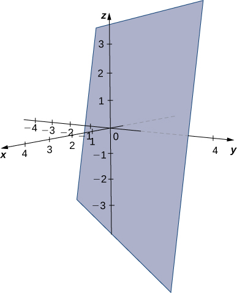 

Find an equation of the plane containing the lines <math xmlns="http://www.w3.org/1998/Math/MathML"><mrow><msub><mi>L</mi><mn>1</mn></msub></mrow></math>

 and <math xmlns="http://www.w3.org/1998/Math/MathML"><mrow><msub><mi>L</mi><mn>2</mn></msub><mtext>:</mtext></mrow></math>

<math xmlns="http://www.w3.org/1998/Math/MathML"><mtable><mtr><mtd columnalign="left"><msub><mi>L</mi><mn>1</mn></msub><mo>:</mo><mi>x</mi><mo>=</mo><mtext>−</mtext><mi>y</mi><mo>=</mo><mi>z</mi></mtd></mtr><mtr><mtd columnalign="left"><msub><mi>L</mi><mn>2</mn></msub><mo>:</mo><mfrac><mrow><mi>x</mi><mo>−</mo><mn>3</mn></mrow><mn>2</mn></mfrac><mo>=</mo><mi>y</mi><mo>=</mo><mi>z</mi><mo>−</mo><mn>2.</mn></mtd></mtr></mtable></math>

<math xmlns="http://www.w3.org/1998/Math/MathML"><mrow><mn>−2</mn><mrow><mo>(</mo><mrow><mi>x</mi><mo>−</mo><mn>1</mn></mrow><mo>)</mo></mrow><mo>+</mo><mrow><mo>(</mo><mrow><mi>y</mi><mo>+</mo><mn>1</mn></mrow><mo>)</mo></mrow><mo>+</mo><mn>3</mn><mrow><mo>(</mo><mrow><mi>z</mi><mo>−</mo><mn>1</mn></mrow><mo>)</mo></mrow><mo>=</mo><mn>0</mn></mrow></math>

 or <math xmlns="http://www.w3.org/1998/Math/MathML"><mrow><mn>−2</mn><mi>x</mi><mo>+</mo><mi>y</mi><mo>+</mo><mn>3</mn><mi>z</mi><mo>=</mo><mn>0</mn></mrow></math>

Hint

The cross product of the lines’ direction vectors gives a normal vector for the plane.

Now that we can write an equation for a plane, we can use the equation to find the distance <math xmlns="http://www.w3.org/1998/Math/MathML"><mi>d</mi></math>

 between a point <math xmlns="http://www.w3.org/1998/Math/MathML"><mi>P</mi></math>

 and the plane. It is defined as the shortest possible distance from <math xmlns="http://www.w3.org/1998/Math/MathML"><mi>P</mi></math>

 to a point on the plane.

 {: #CNX_Calc_Figure_12_05_012}

Just as we find the two-dimensional distance between a point and a line by calculating the length of a line segment perpendicular to the line, we find the three-dimensional distance between a point and a plane by calculating the length of a line segment perpendicular to the plane. Let <math xmlns="http://www.w3.org/1998/Math/MathML"><mi>R</mi></math>

 bet the point in the plane such that <math xmlns="http://www.w3.org/1998/Math/MathML"><mrow><mover accent="true"><mrow><mi>R</mi><mi>P</mi></mrow><mo stretchy="false">→</mo></mover></mrow></math>

 is orthogonal to the plane, and let <math xmlns="http://www.w3.org/1998/Math/MathML"><mi>Q</mi></math>

 be an arbitrary point in the plane. Then the projection of vector <math xmlns="http://www.w3.org/1998/Math/MathML"><mrow><mover accent="true"><mrow><mi>Q</mi><mi>P</mi></mrow><mo stretchy="false">→</mo></mover></mrow></math>

 onto the normal vector describes vector <math xmlns="http://www.w3.org/1998/Math/MathML"><mrow><mover accent="true"><mrow><mi>R</mi><mi>P</mi></mrow><mo stretchy="false">→</mo></mover><mo>,</mo></mrow></math>

 as shown in [\[link\]](#CNX_Calc_Figure_12_05_012).

The Distance between a Plane and a Point

Suppose a plane with normal vector <math xmlns="http://www.w3.org/1998/Math/MathML"><mstyle mathvariant="bold" mathsize="normal"><mtext>n</mtext></mstyle></math>

 passes through point <math xmlns="http://www.w3.org/1998/Math/MathML"><mrow><mi>Q</mi><mo>.</mo></mrow></math>

 The distance <math xmlns="http://www.w3.org/1998/Math/MathML"><mi>d</mi></math>

 from the plane to a point <math xmlns="http://www.w3.org/1998/Math/MathML"><mi>P</mi></math>

 not in the plane is given by

<math xmlns="http://www.w3.org/1998/Math/MathML"><mrow><mi>d</mi><mo>=</mo><mrow><mo>‖</mo><mrow><msub><mrow><mtext>proj</mtext></mrow><mstyle mathvariant="bold" mathsize="normal"><mtext>n</mtext></mstyle></msub><mover accent="true"><mrow><mi>Q</mi><mi>P</mi></mrow><mo stretchy="false">→</mo></mover></mrow><mo>‖</mo></mrow><mo>=</mo><mrow><mo>\|</mo><mrow><msub><mrow><mtext>comp</mtext></mrow><mstyle mathvariant="bold" mathsize="normal"><mtext>n</mtext></mstyle></msub><mover accent="true"><mrow><mi>Q</mi><mi>P</mi></mrow><mo stretchy="false">→</mo></mover></mrow><mo>\|</mo></mrow><mo>=</mo><mfrac><mrow><mrow><mo>\|</mo><mrow><mover accent="true"><mrow><mi>Q</mi><mi>P</mi></mrow><mo stretchy="false">→</mo></mover><mo>·</mo><mstyle mathvariant="bold" mathsize="normal"><mtext>n</mtext></mstyle></mrow><mo>\|</mo></mrow></mrow><mrow><mrow><mo>‖</mo><mstyle mathvariant="bold" mathsize="normal"><mtext>n</mtext></mstyle><mo>‖</mo></mrow></mrow></mfrac><mo>.</mo></mrow></math>

Distance between a Point and a Plane

Find the distance between point <math xmlns="http://www.w3.org/1998/Math/MathML"><mrow><mi>P</mi><mo>=</mo><mrow><mo>(</mo><mrow><mn>3</mn><mo>,</mo><mn>1</mn><mo>,</mo><mn>2</mn></mrow><mo>)</mo></mrow></mrow></math>

 and the plane given by <math xmlns="http://www.w3.org/1998/Math/MathML"><mrow><mi>x</mi><mo>−</mo><mn>2</mn><mi>y</mi><mo>+</mo><mi>z</mi><mo>=</mo><mn>5</mn></mrow></math>

 (see the following figure).

 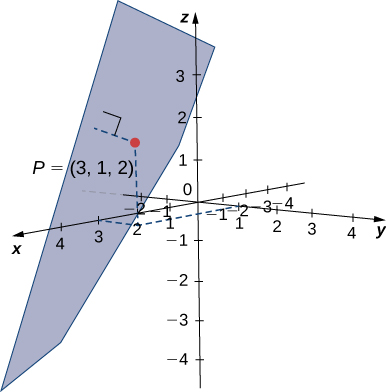 

The coefficients of the plane’s equation provide a normal vector for the plane: <math xmlns="http://www.w3.org/1998/Math/MathML"><mrow><mstyle mathvariant="bold" mathsize="normal"><mtext>n</mtext></mstyle><mo>=</mo><mrow><mo>〈</mo><mrow><mn>1</mn><mo>,</mo><mn>−2</mn><mo>,</mo><mn>1</mn></mrow><mo>〉</mo></mrow><mo>.</mo></mrow></math>

 To find vector <math xmlns="http://www.w3.org/1998/Math/MathML"><mrow><mover accent="true"><mrow><mi>Q</mi><mi>P</mi></mrow><mo stretchy="false">→</mo></mover><mo>,</mo></mrow></math>

 we need a point in the plane. Any point will work, so set <math xmlns="http://www.w3.org/1998/Math/MathML"><mrow><mi>y</mi><mo>=</mo><mi>z</mi><mo>=</mo><mn>0</mn></mrow></math>

 to see that point <math xmlns="http://www.w3.org/1998/Math/MathML"><mrow><mi>Q</mi><mo>=</mo><mrow><mo>(</mo><mrow><mn>5</mn><mo>,</mo><mn>0</mn><mo>,</mo><mn>0</mn></mrow><mo>)</mo></mrow></mrow></math>

 lies in the plane. Find the component form of the vector from <math xmlns="http://www.w3.org/1998/Math/MathML"><mrow><mi>Q</mi><mspace width="0.2em" /><mtext>to</mtext><mspace width="0.2em" /><mi>P</mi><mtext>:</mtext></mrow></math>

<math xmlns="http://www.w3.org/1998/Math/MathML"><mrow><mover accent="true"><mrow><mi>Q</mi><mi>P</mi></mrow><mo stretchy="false">→</mo></mover><mo>=</mo><mrow><mo>〈</mo><mrow><mn>3</mn><mo>−</mo><mn>5</mn><mo>,</mo><mn>1</mn><mo>−</mo><mn>0</mn><mo>,</mo><mn>2</mn><mo>−</mo><mn>0</mn></mrow><mo>〉</mo></mrow><mo>=</mo><mrow><mo>〈</mo><mrow><mn>−2</mn><mo>,</mo><mn>1</mn><mo>,</mo><mn>2</mn></mrow><mo>〉</mo></mrow><mo>.</mo></mrow></math>

Apply the distance formula from [[link]](#fs-id1163724183136):

<math xmlns="http://www.w3.org/1998/Math/MathML"><mtable><mtr><mtd columnalign="right"><mi>d</mi></mtd><mtd columnalign="left"><mo>=</mo><mfrac><mrow><mrow><mo>\|</mo><mrow><mover accent="true"><mrow><mi>Q</mi><mi>P</mi></mrow><mo stretchy="false">→</mo></mover><mo>·</mo><mstyle mathvariant="bold" mathsize="normal"><mtext>n</mtext></mstyle></mrow><mo>\|</mo></mrow></mrow><mrow><mrow><mo>‖</mo><mstyle mathvariant="bold" mathsize="normal"><mtext>n</mtext></mstyle><mo>‖</mo></mrow></mrow></mfrac></mtd></mtr><mtr><mtd /><mtd columnalign="left"><mo>=</mo><mfrac><mrow><mrow><mo>\|</mo><mrow><mrow><mo>〈</mo><mrow><mn>−2</mn><mo>,</mo><mn>1</mn><mo>,</mo><mn>2</mn></mrow><mo>〉</mo></mrow><mo>·</mo><mrow><mo>〈</mo><mrow><mn>1</mn><mo>,</mo><mn>−2</mn><mo>,</mo><mn>1</mn></mrow><mo>〉</mo></mrow></mrow><mo>\|</mo></mrow></mrow><mrow><msqrt><mrow><msup><mn>1</mn><mn>2</mn></msup><mo>+</mo><msup><mrow><mrow><mo>(</mo><mrow><mn>−2</mn></mrow><mo>)</mo></mrow></mrow><mn>2</mn></msup><mo>+</mo><msup><mn>1</mn><mn>2</mn></msup></mrow></msqrt></mrow></mfrac></mtd></mtr><mtr><mtd /><mtd columnalign="left"><mo>=</mo><mfrac><mrow><mrow><mo>\|</mo><mrow><mn>−2</mn><mo>−</mo><mn>2</mn><mo>+</mo><mn>2</mn></mrow><mo>\|</mo></mrow></mrow><mrow><msqrt><mn>6</mn></msqrt></mrow></mfrac></mtd></mtr><mtr><mtd /><mtd columnalign="left"><mo>=</mo><mfrac><mn>2</mn><mrow><msqrt><mn>6</mn></msqrt></mrow></mfrac><mo>.</mo></mtd></mtr></mtable></math>

Find the distance between point <math xmlns="http://www.w3.org/1998/Math/MathML"><mrow><mi>P</mi><mo>=</mo><mrow><mo>(</mo><mrow><mn>5</mn><mo>,</mo><mn>−1</mn><mo>,</mo><mn>0</mn></mrow><mo>)</mo></mrow></mrow></math>

 and the plane given by <math xmlns="http://www.w3.org/1998/Math/MathML"><mrow><mn>4</mn><mi>x</mi><mo>+</mo><mn>2</mn><mi>y</mi><mo>−</mo><mi>z</mi><mo>=</mo><mn>3</mn><mo>.</mo></mrow></math>

<math xmlns="http://www.w3.org/1998/Math/MathML"><mrow><mfrac><mrow><mn>15</mn></mrow><mrow><msqrt><mrow><mn>21</mn></mrow></msqrt></mrow></mfrac></mrow></math>

Hint

Point <math xmlns="http://www.w3.org/1998/Math/MathML"><mrow><mrow><mo>(</mo><mrow><mn>0</mn><mo>,</mo><mn>0</mn><mo>,</mo><mn>−3</mn></mrow><mo>)</mo></mrow></mrow></math>

 lies on the plane.

### Parallel and Intersecting Planes

We have discussed the various possible relationships between two lines in two dimensions and three dimensions. When we describe the relationship between two planes in space, we have only two possibilities: the two distinct planes are parallel or they intersect. When two planes are parallel, their normal vectors are parallel. When two planes intersect, the intersection is a line ([\[link\]](#CNX_Calc_Figure_12_05_014)).

 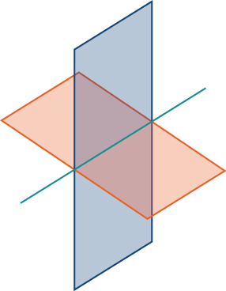{: #CNX_Calc_Figure_12_05_014}

We can use the equations of the two planes to find parametric equations for the line of intersection.

Finding the Line of Intersection for Two Planes

Find parametric and symmetric equations for the line formed by the intersection of the planes given by <math xmlns="http://www.w3.org/1998/Math/MathML"><mrow><mi>x</mi><mo>+</mo><mi>y</mi><mo>+</mo><mi>z</mi><mo>=</mo><mn>0</mn></mrow></math>

 and <math xmlns="http://www.w3.org/1998/Math/MathML"><mrow><mn>2</mn><mi>x</mi><mo>−</mo><mi>y</mi><mo>+</mo><mi>z</mi><mo>=</mo><mn>0</mn></mrow></math>

 (see the following figure).

 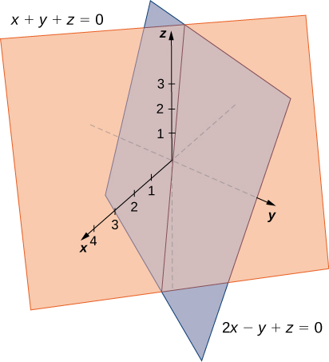 

Note that the two planes have nonparallel normals, so the planes intersect. Further, the origin satisfies each equation, so we know the line of intersection passes through the origin. Add the plane equations so we can eliminate the one of the variables, in this case, <math xmlns="http://www.w3.org/1998/Math/MathML"><mrow><mi>y</mi><mtext>:</mtext></mrow></math>

<math xmlns="http://www.w3.org/1998/Math/MathML"><mtable><mtr><mtd><munder accentunder="true"><mtable><mtr><mtd columnalign="right"><mi>x</mi></mtd><mtd><mo>+</mo></mtd><mtd><mi>y</mi></mtd><mtd><mo>+</mo></mtd><mtd><mi>z</mi></mtd><mtd><mo>=</mo></mtd><mtd><mn>0</mn></mtd></mtr><mtr><mtd columnalign="right"><mn>2</mn><mi>x</mi></mtd><mtd><mo>−</mo></mtd><mtd><mi>y</mi></mtd><mtd><mo>+</mo></mtd><mtd><mi>z</mi></mtd><mtd><mo>=</mo></mtd><mtd><mn>0</mn></mtd></mtr></mtable><mtext>\_\_\_\_\_\_\_\_\_\_\_\_\_\_\_\_\_\_\_\_</mtext></munder></mtd></mtr><mtr /><mtr><mtd columnalign="left"><mspace width="0.6em" /><mn>3</mn><mi>x</mi><mspace width="3.15em" /><mo>+</mo><mn>2</mn><mi>z</mi><mspace width="0.47em" /><mo>=</mo><mspace width="0.4em" /><mn>0</mn><mo>.</mo></mtd></mtr></mtable></math>

This gives us <math xmlns="http://www.w3.org/1998/Math/MathML"><mrow><mi>x</mi><mo>=</mo><mo>−</mo><mfrac><mn>2</mn><mn>3</mn></mfrac><mi>z</mi><mo>.</mo></mrow></math>

 We substitute this value into the first equation to express <math xmlns="http://www.w3.org/1998/Math/MathML"><mi>y</mi></math>

 in terms of <math xmlns="http://www.w3.org/1998/Math/MathML"><mrow><mi>z</mi><mtext>:</mtext></mrow></math>

<math xmlns="http://www.w3.org/1998/Math/MathML"><mtable><mtr><mtd columnalign="right"><mi>x</mi><mo>+</mo><mi>y</mi><mo>+</mo><mi>z</mi></mtd><mtd columnalign="left"><mo>=</mo></mtd><mtd columnalign="left"><mn>0</mn></mtd></mtr><mtr><mtd columnalign="right"><mo>−</mo><mfrac><mn>2</mn><mn>3</mn></mfrac><mi>z</mi><mo>+</mo><mi>y</mi><mo>+</mo><mi>z</mi></mtd><mtd columnalign="left"><mo>=</mo></mtd><mtd columnalign="left"><mn>0</mn></mtd></mtr><mtr><mtd columnalign="right"><mi>y</mi><mo>+</mo><mfrac><mn>1</mn><mn>3</mn></mfrac><mi>z</mi></mtd><mtd columnalign="left"><mo>=</mo></mtd><mtd columnalign="left"><mn>0</mn></mtd></mtr><mtr><mtd columnalign="right"><mi>y</mi></mtd><mtd columnalign="left"><mo>=</mo></mtd><mtd columnalign="left"><mo>−</mo><mfrac><mn>1</mn><mn>3</mn></mfrac><mi>z</mi><mo>.</mo></mtd></mtr></mtable></math>

We now have the first two variables, <math xmlns="http://www.w3.org/1998/Math/MathML"><mi>x</mi></math>

 and <math xmlns="http://www.w3.org/1998/Math/MathML"><mrow><mi>y</mi><mo>,</mo></mrow></math>

 in terms of the third variable, <math xmlns="http://www.w3.org/1998/Math/MathML"><mrow><mi>z</mi><mo>.</mo></mrow></math>

 Now we define <math xmlns="http://www.w3.org/1998/Math/MathML"><mi>z</mi></math>

 in terms of <math xmlns="http://www.w3.org/1998/Math/MathML"><mrow><mi>t</mi><mo>.</mo></mrow></math>

 To eliminate the need for fractions, we choose to define the parameter <math xmlns="http://www.w3.org/1998/Math/MathML"><mi>t</mi></math>

 as <math xmlns="http://www.w3.org/1998/Math/MathML"><mrow><mi>t</mi><mo>=</mo><mo>−</mo><mfrac><mn>1</mn><mn>3</mn></mfrac><mi>z</mi><mo>.</mo></mrow></math>

 Then, <math xmlns="http://www.w3.org/1998/Math/MathML"><mrow><mi>z</mi><mo>=</mo><mn>−3</mn><mi>t</mi><mo>.</mo></mrow></math>

 Substituting the parametric representation of <math xmlns="http://www.w3.org/1998/Math/MathML"><mi>z</mi></math>

 back into the other two equations, we see that the parametric equations for the line of intersection are <math xmlns="http://www.w3.org/1998/Math/MathML"><mrow><mi>x</mi><mo>=</mo><mn>2</mn><mi>t</mi><mo>,</mo><mi>y</mi><mo>=</mo><mi>t</mi><mo>,</mo><mi>z</mi><mo>=</mo><mn>−3</mn><mi>t</mi><mo>.</mo></mrow></math>

 The symmetric equations for the line are <math xmlns="http://www.w3.org/1998/Math/MathML"><mrow><mfrac><mi>x</mi><mn>2</mn></mfrac><mo>=</mo><mi>y</mi><mo>=</mo><mfrac><mi>z</mi><mrow><mn>−3</mn></mrow></mfrac><mo>.</mo></mrow></math>

Find parametric equations for the line formed by the intersection of planes <math xmlns="http://www.w3.org/1998/Math/MathML"><mrow><mi>x</mi><mo>+</mo><mi>y</mi><mo>−</mo><mi>z</mi><mo>=</mo><mn>3</mn></mrow></math>

 and <math xmlns="http://www.w3.org/1998/Math/MathML"><mrow><mn>3</mn><mi>x</mi><mo>−</mo><mi>y</mi><mo>+</mo><mn>3</mn><mi>z</mi><mo>=</mo><mn>5</mn><mo>.</mo></mrow></math>

<math xmlns="http://www.w3.org/1998/Math/MathML"><mrow><mi>x</mi><mo>=</mo><mi>t</mi><mo>,</mo><mi>y</mi><mo>=</mo><mn>7</mn><mo>−</mo><mn>3</mn><mi>t</mi><mo>,</mo><mi>z</mi><mo>=</mo><mn>4</mn><mo>−</mo><mn>2</mn><mi>t</mi></mrow></math>

Hint

Add the two equations, then express <math xmlns="http://www.w3.org/1998/Math/MathML"><mi>z</mi></math>

 in terms of <math xmlns="http://www.w3.org/1998/Math/MathML"><mrow><mi>x</mi><mo>.</mo></mrow></math>

 Then, express <math xmlns="http://www.w3.org/1998/Math/MathML"><mi>y</mi></math>

 in terms of <math xmlns="http://www.w3.org/1998/Math/MathML"><mrow><mi>x</mi><mo>.</mo></mrow></math>

In addition to finding the equation of the line of intersection between two planes, we may need to find the angle formed by the intersection of two planes. For example, builders constructing a house need to know the angle where different sections of the roof meet to know whether the roof will look good and drain properly. We can use normal vectors to calculate the angle between the two planes. We can do this because the angle between the normal vectors is the same as the angle between the planes. [\[link\]](#CNX_Calc_Figure_12_05_016) shows why this is true.

 {: #CNX_Calc_Figure_12_05_016}

We can find the measure of the angle *θ* between two intersecting planes by first finding the cosine of the angle, using the following equation:

<math xmlns="http://www.w3.org/1998/Math/MathML"><mrow><mtext>cos</mtext><mspace width="0.2em" /><mi>θ</mi><mo>=</mo><mfrac><mrow><mrow><mo>\|</mo><mrow><msub><mstyle mathvariant="bold" mathsize="normal"><mtext>n</mtext></mstyle><mn>1</mn></msub><mo>·</mo><msub><mstyle mathvariant="bold" mathsize="normal"><mtext>n</mtext></mstyle><mn>2</mn></msub></mrow><mo>\|</mo></mrow></mrow><mrow><mrow><mo>‖</mo><mrow><msub><mstyle mathvariant="bold" mathsize="normal"><mtext>n</mtext></mstyle><mn>1</mn></msub></mrow><mo>‖</mo></mrow><mrow><mo>‖</mo><mrow><msub><mstyle mathvariant="bold" mathsize="normal"><mtext>n</mtext></mstyle><mn>2</mn></msub></mrow><mo>‖</mo></mrow></mrow></mfrac><mo>.</mo></mrow></math>

We can then use the angle to determine whether two planes are parallel or orthogonal or if they intersect at some other angle.

Finding the Angle between Two Planes

Determine whether each pair of planes is parallel, orthogonal, or neither. If the planes are intersecting, but not orthogonal, find the measure of the angle between them. Give the answer in radians and round to two decimal places.

1.  <math xmlns="http://www.w3.org/1998/Math/MathML"><mrow><mi>x</mi><mo>+</mo><mn>2</mn><mi>y</mi><mo>−</mo><mi>z</mi><mo>=</mo><mn>8</mn><mspace width="0.2em" /><mtext>and</mtext><mspace width="0.2em" /><mn>2</mn><mi>x</mi><mo>+</mo><mn>4</mn><mi>y</mi><mo>−</mo><mn>2</mn><mi>z</mi><mo>=</mo><mn>10</mn></mrow></math>

2.  <math xmlns="http://www.w3.org/1998/Math/MathML"><mrow><mn>2</mn><mi>x</mi><mo>−</mo><mn>3</mn><mi>y</mi><mo>+</mo><mn>2</mn><mi>z</mi><mo>=</mo><mn>3</mn><mspace width="0.2em" /><mtext>and</mtext><mspace width="0.2em" /><mn>6</mn><mi>x</mi><mo>+</mo><mn>2</mn><mi>y</mi><mo>−</mo><mn>3</mn><mi>z</mi><mo>=</mo><mn>1</mn></mrow></math>

3.  <math xmlns="http://www.w3.org/1998/Math/MathML"><mrow><mi>x</mi><mo>+</mo><mi>y</mi><mo>+</mo><mi>z</mi><mo>=</mo><mn>4</mn><mspace width="0.2em" /><mtext>and</mtext><mspace width="0.2em" /><mi>x</mi><mo>−</mo><mn>3</mn><mi>y</mi><mo>+</mo><mn>5</mn><mi>z</mi><mo>=</mo><mn>1</mn></mrow></math>
{: type="a"}

1.  The normal vectors for these planes are
    <math xmlns="http://www.w3.org/1998/Math/MathML"><mrow><msub><mstyle mathvariant="bold" mathsize="normal"><mtext>n</mtext></mstyle><mn>1</mn></msub><mo>=</mo><mrow><mo>〈</mo><mrow><mn>1</mn><mo>,</mo><mn>2</mn><mo>,</mo><mn>−1</mn></mrow><mo>〉</mo></mrow></mrow></math>
    
    and
    <math xmlns="http://www.w3.org/1998/Math/MathML"><mrow><msub><mstyle mathvariant="bold" mathsize="normal"><mtext>n</mtext></mstyle><mn>2</mn></msub><mo>=</mo><mrow><mo>〈</mo><mrow><mn>2</mn><mo>,</mo><mn>4</mn><mo>,</mo><mn>−2</mn></mrow><mo>〉</mo></mrow><mo>.</mo></mrow></math>
    
    These two vectors are scalar multiples of each other. The normal vectors are parallel, so the planes are parallel.
2.  The normal vectors for these planes are
    <math xmlns="http://www.w3.org/1998/Math/MathML"><mrow><msub><mstyle mathvariant="bold" mathsize="normal"><mtext>n</mtext></mstyle><mn>1</mn></msub><mo>=</mo><mrow><mo>〈</mo><mrow><mn>2</mn><mo>,</mo><mn>−3</mn><mo>,</mo><mn>2</mn></mrow><mo>〉</mo></mrow></mrow></math>
    
    and
    <math xmlns="http://www.w3.org/1998/Math/MathML"><mrow><msub><mstyle mathvariant="bold" mathsize="normal"><mtext>n</mtext></mstyle><mn>2</mn></msub><mo>=</mo><mrow><mo>〈</mo><mrow><mn>6</mn><mo>,</mo><mn>2</mn><mo>,</mo><mn>−3</mn></mrow><mo>〉</mo></mrow><mo>.</mo></mrow></math>
    
    Taking the dot product of these vectors, we have
    * * *
    {: data-type="newline"}
    
    

    <math xmlns="http://www.w3.org/1998/Math/MathML"><mrow><msub><mstyle mathvariant="bold" mathsize="normal"><mtext>n</mtext></mstyle><mn>1</mn></msub><mo>·</mo><msub><mstyle mathvariant="bold" mathsize="normal"><mtext>n</mtext></mstyle><mn>2</mn></msub><mo>=</mo><mrow><mo>〈</mo><mrow><mn>2</mn><mo>,</mo><mn>−3</mn><mo>,</mo><mn>2</mn></mrow><mo>〉</mo></mrow><mo>·</mo><mrow><mo>〈</mo><mrow><mn>6</mn><mo>,</mo><mn>2</mn><mo>,</mo><mn>−3</mn></mrow><mo>〉</mo></mrow><mo>=</mo><mn>2</mn><mo stretchy="false">(</mo><mn>6</mn><mo stretchy="false">)</mo><mo>−</mo><mn>3</mn><mo stretchy="false">(</mo><mn>2</mn><mo stretchy="false">)</mo><mo>+</mo><mn>2</mn><mo stretchy="false">(</mo><mn>−3</mn><mo stretchy="false">)</mo><mo>=</mo><mn>0</mn><mo>.</mo></mrow></math>
    

    
    * * *
    {: data-type="newline"}
    
    The normal vectors are orthogonal, so the corresponding planes are orthogonal as well.
3.  The normal vectors for these planes are
    <math xmlns="http://www.w3.org/1998/Math/MathML"><mrow><msub><mstyle mathvariant="bold" mathsize="normal"><mtext>n</mtext></mstyle><mn>1</mn></msub><mo>=</mo><mrow><mo>〈</mo><mrow><mn>1</mn><mo>,</mo><mn>1</mn><mo>,</mo><mn>1</mn></mrow><mo>〉</mo></mrow></mrow></math>
    
    and
    <math xmlns="http://www.w3.org/1998/Math/MathML"><mrow><msub><mstyle mathvariant="bold" mathsize="normal"><mtext>n</mtext></mstyle><mn>2</mn></msub><mo>=</mo><mrow><mo>〈</mo><mrow><mn>1</mn><mo>,</mo><mn>−3</mn><mo>,</mo><mn>5</mn></mrow><mo>〉</mo></mrow><mtext>:</mtext></mrow></math>
    
    * * *
    {: data-type="newline"}
    
    

    <math xmlns="http://www.w3.org/1998/Math/MathML"><mtable><mtr><mtd columnalign="right"><mtext>cos</mtext><mspace width="0.2em" /><mi>θ</mi></mtd><mtd columnalign="left"><mo>=</mo><mfrac><mrow><mrow><mo>\|</mo><mrow><msub><mstyle mathvariant="bold" mathsize="normal"><mtext>n</mtext></mstyle><mn>1</mn></msub><mo>·</mo><msub><mstyle mathvariant="bold" mathsize="normal"><mtext>n</mtext></mstyle><mn>2</mn></msub></mrow><mo>\|</mo></mrow></mrow><mrow><mrow><mo>‖</mo><mrow><msub><mstyle mathvariant="bold" mathsize="normal"><mtext>n</mtext></mstyle><mn>1</mn></msub></mrow><mo>‖</mo></mrow><mrow><mo>‖</mo><mrow><msub><mstyle mathvariant="bold" mathsize="normal"><mtext>n</mtext></mstyle><mn>2</mn></msub></mrow><mo>‖</mo></mrow></mrow></mfrac></mtd></mtr><mtr><mtd /><mtd columnalign="left"><mo>=</mo><mfrac><mrow><mrow><mo>\|</mo><mrow><mrow><mo>〈</mo><mrow><mn>1</mn><mo>,</mo><mn>1</mn><mo>,</mo><mn>1</mn></mrow><mo>〉</mo></mrow><mo>·</mo><mrow><mo>〈</mo><mrow><mn>1</mn><mo>,</mo><mn>−3</mn><mo>,</mo><mn>5</mn></mrow><mo>〉</mo></mrow></mrow><mo>\|</mo></mrow></mrow><mrow><msqrt><mrow><msup><mn>1</mn><mn>2</mn></msup><mo>+</mo><msup><mn>1</mn><mn>2</mn></msup><mo>+</mo><msup><mn>1</mn><mn>2</mn></msup></mrow></msqrt><mspace width="0.2em" /><msqrt><mrow><msup><mn>1</mn><mn>2</mn></msup><mo>+</mo><msup><mrow><mo stretchy="false">(</mo><mn>−3</mn><mo stretchy="false">)</mo></mrow><mn>2</mn></msup><mo>+</mo><msup><mn>5</mn><mn>2</mn></msup></mrow></msqrt></mrow></mfrac></mtd></mtr><mtr><mtd /><mtd columnalign="left"><mo>=</mo><mfrac><mn>3</mn><mrow><msqrt><mrow><mn>105</mn></mrow></msqrt></mrow></mfrac><mo>.</mo></mtd></mtr></mtable></math>
    

    
    * * *
    {: data-type="newline"}
    
    The angle between the two planes is
    <math xmlns="http://www.w3.org/1998/Math/MathML"><mrow><mn>1.27</mn></mrow></math>
    
    rad, or approximately
    <math xmlns="http://www.w3.org/1998/Math/MathML"><mrow><mn>73</mn><mtext>°</mtext><mo>.</mo></mrow></math>
{: type="a"}

Find the measure of the angle between planes <math xmlns="http://www.w3.org/1998/Math/MathML"><mrow><mi>x</mi><mo>+</mo><mi>y</mi><mo>−</mo><mi>z</mi><mo>=</mo><mn>3</mn></mrow></math>

 and <math xmlns="http://www.w3.org/1998/Math/MathML"><mrow><mn>3</mn><mi>x</mi><mo>−</mo><mi>y</mi><mo>+</mo><mn>3</mn><mi>z</mi><mo>=</mo><mn>5</mn><mo>.</mo></mrow></math>

 Give the answer in radians and round to two decimal places.

<math xmlns="http://www.w3.org/1998/Math/MathML"><mrow><mn>1.44</mn></mrow></math>

 rad

Hint

Use the coefficients of the variables in each equation to find a normal vector for each plane.

When we find that two planes are parallel, we may need to find the distance between them. To find this distance, we simply select a point in one of the planes. The distance from this point to the other plane is the distance between the planes.

Previously, we introduced the formula for calculating this distance in [\[link\]](#fs-id1163724183136)\:

<math xmlns="http://www.w3.org/1998/Math/MathML"><mrow><mi>d</mi><mo>=</mo><mfrac><mrow><mover accent="true"><mrow><mi>Q</mi><mi>P</mi></mrow><mo stretchy="false">→</mo></mover><mo>·</mo><mstyle mathvariant="bold" mathsize="normal"><mtext>n</mtext></mstyle></mrow><mrow><mrow><mo>‖</mo><mstyle mathvariant="bold" mathsize="normal"><mtext>n</mtext></mstyle><mo>‖</mo></mrow></mrow></mfrac><mo>,</mo></mrow></math>

where <math xmlns="http://www.w3.org/1998/Math/MathML"><mi>Q</mi></math>

 is a point on the plane, <math xmlns="http://www.w3.org/1998/Math/MathML"><mi>P</mi></math>

 is a point not on the plane, and <math xmlns="http://www.w3.org/1998/Math/MathML"><mstyle mathvariant="bold" mathsize="normal"><mtext>n</mtext></mstyle></math>

 is the normal vector that passes through point <math xmlns="http://www.w3.org/1998/Math/MathML"><mrow><mi>Q</mi><mo>.</mo></mrow></math>

 Consider the distance from point <math xmlns="http://www.w3.org/1998/Math/MathML"><mrow><mrow><mo>(</mo><mrow><msub><mi>x</mi><mn>0</mn></msub><mo>,</mo><msub><mi>y</mi><mn>0</mn></msub><mo>,</mo><msub><mi>z</mi><mn>0</mn></msub></mrow><mo>)</mo></mrow></mrow></math>

 to plane <math xmlns="http://www.w3.org/1998/Math/MathML"><mrow><mi>a</mi><mi>x</mi><mo>+</mo><mi>b</mi><mi>y</mi><mo>+</mo><mi>c</mi><mi>z</mi><mo>+</mo><mi>k</mi><mo>=</mo><mn>0</mn><mo>.</mo></mrow></math>

 Let <math xmlns="http://www.w3.org/1998/Math/MathML"><mrow><mrow><mo>(</mo><mrow><msub><mi>x</mi><mn>1</mn></msub><mo>,</mo><msub><mi>y</mi><mn>1</mn></msub><mo>,</mo><msub><mi>z</mi><mn>1</mn></msub></mrow><mo>)</mo></mrow></mrow></math>

 be any point in the plane. Substituting into the formula yields

<math xmlns="http://www.w3.org/1998/Math/MathML"><mtable><mtr><mtd columnalign="right"><mi>d</mi></mtd><mtd columnalign="left"><mo>=</mo><mfrac><mrow><mrow><mo>\|</mo><mrow><mi>a</mi><mrow><mo>(</mo><mrow><msub><mi>x</mi><mn>0</mn></msub><mo>−</mo><msub><mi>x</mi><mn>1</mn></msub></mrow><mo>)</mo></mrow><mo>+</mo><mi>b</mi><mrow><mo>(</mo><mrow><msub><mi>y</mi><mn>0</mn></msub><mo>−</mo><msub><mi>y</mi><mn>1</mn></msub></mrow><mo>)</mo></mrow><mo>+</mo><mi>c</mi><mrow><mo>(</mo><mrow><msub><mi>z</mi><mn>0</mn></msub><mo>−</mo><msub><mi>z</mi><mn>1</mn></msub></mrow><mo>)</mo></mrow></mrow><mo>\|</mo></mrow></mrow><mrow><msqrt><mrow><msup><mi>a</mi><mn>2</mn></msup><mo>+</mo><msup><mi>b</mi><mn>2</mn></msup><mo>+</mo><msup><mi>c</mi><mn>2</mn></msup></mrow></msqrt></mrow></mfrac></mtd></mtr><mtr><mtd /><mtd columnalign="left"><mo>=</mo><mfrac><mrow><mrow><mo>\|</mo><mrow><mi>a</mi><msub><mi>x</mi><mn>0</mn></msub><mo>+</mo><mi>b</mi><msub><mi>y</mi><mn>0</mn></msub><mo>+</mo><mi>c</mi><msub><mi>z</mi><mn>0</mn></msub><mo>+</mo><mi>k</mi></mrow><mo>\|</mo></mrow></mrow><mrow><msqrt><mrow><msup><mi>a</mi><mn>2</mn></msup><mo>+</mo><msup><mi>b</mi><mn>2</mn></msup><mo>+</mo><msup><mi>c</mi><mn>2</mn></msup></mrow></msqrt></mrow></mfrac><mo>.</mo></mtd></mtr></mtable></math>

We state this result formally in the following theorem.

Distance from a Point to a Plane

Let <math xmlns="http://www.w3.org/1998/Math/MathML"><mrow><mi>P</mi><mrow><mo>(</mo><mrow><msub><mi>x</mi><mn>0</mn></msub><mo>,</mo><msub><mi>y</mi><mn>0</mn></msub><mo>,</mo><msub><mi>z</mi><mn>0</mn></msub></mrow><mo>)</mo></mrow></mrow></math>

 be a point. The distance from <math xmlns="http://www.w3.org/1998/Math/MathML"><mi>P</mi></math>

 to plane <math xmlns="http://www.w3.org/1998/Math/MathML"><mrow><mi>a</mi><mi>x</mi><mo>+</mo><mi>b</mi><mi>y</mi><mo>+</mo><mi>c</mi><mi>z</mi><mo>+</mo><mi>k</mi><mo>=</mo><mn>0</mn></mrow></math>

 is given by

<math xmlns="http://www.w3.org/1998/Math/MathML"><mrow><mi>d</mi><mo>=</mo><mfrac><mrow><mrow><mo>\|</mo><mrow><mi>a</mi><msub><mi>x</mi><mn>0</mn></msub><mo>+</mo><mi>b</mi><msub><mi>y</mi><mn>0</mn></msub><mo>+</mo><mi>c</mi><msub><mi>z</mi><mn>0</mn></msub><mo>+</mo><mi>k</mi></mrow><mo>\|</mo></mrow></mrow><mrow><msqrt><mrow><msup><mi>a</mi><mn>2</mn></msup><mo>+</mo><msup><mi>b</mi><mn>2</mn></msup><mo>+</mo><msup><mi>c</mi><mn>2</mn></msup></mrow></msqrt></mrow></mfrac><mo>.</mo></mrow></math>

Finding the Distance between Parallel Planes

Find the distance between the two parallel planes given by <math xmlns="http://www.w3.org/1998/Math/MathML"><mrow><mn>2</mn><mi>x</mi><mo>+</mo><mi>y</mi><mo>−</mo><mi>z</mi><mo>=</mo><mn>2</mn></mrow></math>

 and <math xmlns="http://www.w3.org/1998/Math/MathML"><mrow><mn>2</mn><mi>x</mi><mo>+</mo><mi>y</mi><mo>−</mo><mi>z</mi><mo>=</mo><mn>8</mn><mo>.</mo></mrow></math>

Point <math xmlns="http://www.w3.org/1998/Math/MathML"><mrow><mrow><mo>(</mo><mrow><mn>1</mn><mo>,</mo><mn>0</mn><mo>,</mo><mn>0</mn></mrow><mo>)</mo></mrow></mrow></math>

 lies in the first plane. The desired distance, then, is

<math xmlns="http://www.w3.org/1998/Math/MathML"><mtable><mtr><mtd columnalign="right"><mi>d</mi></mtd><mtd columnalign="left"><mo>=</mo><mfrac><mrow><mrow><mo>\|</mo><mrow><mi>a</mi><msub><mi>x</mi><mn>0</mn></msub><mo>+</mo><mi>b</mi><msub><mi>y</mi><mn>0</mn></msub><mo>+</mo><mi>c</mi><msub><mi>z</mi><mn>0</mn></msub><mo>+</mo><mi>k</mi></mrow><mo>\|</mo></mrow></mrow><mrow><msqrt><mrow><msup><mi>a</mi><mn>2</mn></msup><mo>+</mo><msup><mi>b</mi><mn>2</mn></msup><mo>+</mo><msup><mi>c</mi><mn>2</mn></msup></mrow></msqrt></mrow></mfrac></mtd></mtr><mtr><mtd /><mtd columnalign="left"><mo>=</mo><mfrac><mrow><mrow><mo>\|</mo><mrow><mn>2</mn><mo stretchy="false">(</mo><mn>1</mn><mo stretchy="false">)</mo><mo>+</mo><mn>1</mn><mo stretchy="false">(</mo><mn>0</mn><mo stretchy="false">)</mo><mo>+</mo><mo stretchy="false">(</mo><mn>−1</mn><mo stretchy="false">)</mo><mo stretchy="false">(</mo><mn>0</mn><mo stretchy="false">)</mo><mo>+</mo><mo stretchy="false">(</mo><mn>−8</mn><mo stretchy="false">)</mo></mrow><mo>\|</mo></mrow></mrow><mrow><msqrt><mrow><msup><mn>2</mn><mn>2</mn></msup><mo>+</mo><msup><mn>1</mn><mn>2</mn></msup><mo>+</mo><msup><mrow><mrow><mo>(</mo><mrow><mn>−1</mn></mrow><mo>)</mo></mrow></mrow><mn>2</mn></msup></mrow></msqrt></mrow></mfrac></mtd></mtr><mtr><mtd /><mtd columnalign="left"><mo>=</mo><mfrac><mn>6</mn><mrow><msqrt><mn>6</mn></msqrt></mrow></mfrac><mo>=</mo><msqrt><mn>6</mn></msqrt><mo>.</mo></mtd></mtr></mtable></math>

Find the distance between parallel planes <math xmlns="http://www.w3.org/1998/Math/MathML"><mrow><mn>5</mn><mi>x</mi><mo>−</mo><mn>2</mn><mi>y</mi><mo>+</mo><mi>z</mi><mo>=</mo><mn>6</mn></mrow></math>

 and <math xmlns="http://www.w3.org/1998/Math/MathML"><mrow><mn>5</mn><mi>x</mi><mo>−</mo><mn>2</mn><mi>y</mi><mo>+</mo><mi>z</mi><mo>=</mo><mn>−3</mn><mo>.</mo></mrow></math>

<math xmlns="http://www.w3.org/1998/Math/MathML"><mrow><mfrac><mn>9</mn><mrow><msqrt><mrow><mn>30</mn></mrow></msqrt></mrow></mfrac></mrow></math>

Hint

Set <math xmlns="http://www.w3.org/1998/Math/MathML"><mrow><mi>x</mi><mo>=</mo><mi>y</mi><mo>=</mo><mn>0</mn></mrow></math>

 to find a point on the first plane.

Distance between Two Skew Lines

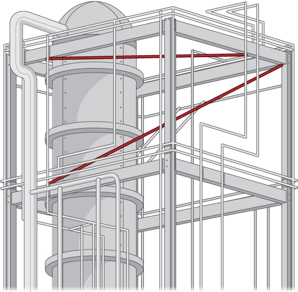{: #CNX_Calc_Figure_12_05_SP}

Finding the distance from a point to a line or from a line to a plane seems like a pretty abstract procedure. But, if the lines represent pipes in a chemical plant or tubes in an oil refinery or roads at an intersection of highways, confirming that the distance between them meets specifications can be both important and awkward to measure. One way is to model the two pipes as lines, using the techniques in this chapter, and then calculate the distance between them. The calculation involves forming vectors along the directions of the lines and using both the cross product and the dot product.

The symmetric forms of two lines, <math xmlns="http://www.w3.org/1998/Math/MathML"><mrow><msub><mi>L</mi><mn>1</mn></msub></mrow></math>

 and <math xmlns="http://www.w3.org/1998/Math/MathML"><mrow><msub><mi>L</mi><mn>2</mn></msub><mo>,</mo></mrow></math>

 are

<math xmlns="http://www.w3.org/1998/Math/MathML"><mtable><mtr /><mtr /><mtr><mtd columnalign="left"><msub><mi>L</mi><mn>1</mn></msub><mo>:</mo><mfrac><mrow><mi>x</mi><mo>−</mo><msub><mi>x</mi><mn>1</mn></msub></mrow><mrow><msub><mi>a</mi><mn>1</mn></msub></mrow></mfrac><mo>=</mo><mfrac><mrow><mi>y</mi><mo>−</mo><msub><mi>y</mi><mn>1</mn></msub></mrow><mrow><msub><mi>b</mi><mn>1</mn></msub></mrow></mfrac><mo>=</mo><mfrac><mrow><mi>z</mi><mo>−</mo><msub><mi>z</mi><mn>1</mn></msub></mrow><mrow><msub><mi>c</mi><mn>1</mn></msub></mrow></mfrac></mtd></mtr><mtr><mtd columnalign="left"><msub><mi>L</mi><mn>2</mn></msub><mo>:</mo><mfrac><mrow><mi>x</mi><mo>−</mo><msub><mi>x</mi><mn>2</mn></msub></mrow><mrow><msub><mi>a</mi><mn>2</mn></msub></mrow></mfrac><mo>=</mo><mfrac><mrow><mi>y</mi><mo>−</mo><msub><mi>y</mi><mn>2</mn></msub></mrow><mrow><msub><mi>b</mi><mn>2</mn></msub></mrow></mfrac><mo>=</mo><mfrac><mrow><mi>z</mi><mo>−</mo><msub><mi>z</mi><mn>2</mn></msub></mrow><mrow><msub><mi>c</mi><mn>2</mn></msub></mrow></mfrac><mo>.</mo></mtd></mtr></mtable></math>

You are to develop a formula for the distance <math xmlns="http://www.w3.org/1998/Math/MathML"><mi>d</mi></math>

 between these two lines, in terms of the values <math xmlns="http://www.w3.org/1998/Math/MathML"><mrow><msub><mi>a</mi><mn>1</mn></msub><mo>,</mo><msub><mi>b</mi><mn>1</mn></msub><mo>,</mo><msub><mi>c</mi><mn>1</mn></msub><mo>;</mo><msub><mi>a</mi><mn>2</mn></msub><mo>,</mo><msub><mi>b</mi><mn>2</mn></msub><mo>,</mo><msub><mi>c</mi><mn>2</mn></msub><mo>;</mo><msub><mi>x</mi><mn>1</mn></msub><mo>,</mo><msub><mi>y</mi><mn>1</mn></msub><mo>,</mo><msub><mi>z</mi><mn>1</mn></msub><mo>;</mo><mspace width="0.2em" /><mtext>and</mtext><mspace width="0.2em" /><msub><mi>x</mi><mn>2</mn></msub><mo>,</mo><msub><mi>y</mi><mn>2</mn></msub><mo>,</mo><msub><mi>z</mi><mn>2</mn></msub><mo>.</mo></mrow></math>

 The distance between two lines is usually taken to mean the minimum distance, so this is the length of a line segment or the length of a vector that is perpendicular to both lines and intersects both lines.

1.  First, write down two vectors,
    <math xmlns="http://www.w3.org/1998/Math/MathML"><mrow><msub><mstyle mathvariant="bold" mathsize="normal"><mtext>v</mtext></mstyle><mn>1</mn></msub></mrow></math>
    
    and
    <math xmlns="http://www.w3.org/1998/Math/MathML"><mrow><msub><mstyle mathvariant="bold" mathsize="normal"><mtext>v</mtext></mstyle><mn>2</mn></msub><mo>,</mo></mrow></math>
    
    that lie along
    <math xmlns="http://www.w3.org/1998/Math/MathML"><mrow><msub><mi>L</mi><mn>1</mn></msub></mrow></math>
    
    and
    <math xmlns="http://www.w3.org/1998/Math/MathML"><mrow><msub><mi>L</mi><mn>2</mn></msub><mo>,</mo></mrow></math>
    
    respectively.
2.  Find the cross product of these two vectors and call it
    <math xmlns="http://www.w3.org/1998/Math/MathML"><mstyle mathvariant="bold" mathsize="normal"><mtext>N</mtext></mstyle><mo>.</mo></math>
    
    This vector is perpendicular to
    <math xmlns="http://www.w3.org/1998/Math/MathML"><mrow><msub><mstyle mathvariant="bold" mathsize="normal"><mtext>v</mtext></mstyle><mn>1</mn></msub><mspace width="0.2em" /><mtext>and</mtext><mspace width="0.2em" /><msub><mstyle mathvariant="bold" mathsize="normal"><mtext>v</mtext></mstyle><mn>2</mn></msub><mo>,</mo></mrow></math>
    
    and hence is perpendicular to both lines.
3.  From vector
    <math xmlns="http://www.w3.org/1998/Math/MathML"><mrow><mstyle mathvariant="bold" mathsize="normal"><mtext>N</mtext></mstyle><mo>,</mo></mrow></math>
    
    form a unit vector
    <math xmlns="http://www.w3.org/1998/Math/MathML"><mstyle mathvariant="bold" mathsize="normal"><mtext>n</mtext></mstyle></math>
    
    in the same direction.
4.  Use symmetric equations to find a convenient vector
    <math xmlns="http://www.w3.org/1998/Math/MathML"><mrow><msub><mstyle mathvariant="bold" mathsize="normal"><mtext>v</mtext></mstyle><mrow><mn>12</mn></mrow></msub></mrow></math>
    
    that lies between any two points, one on each line. Again, this can be done directly from the symmetric equations.
5.  The dot product of two vectors is the magnitude of the projection of one vector onto the other—that is,
    <math xmlns="http://www.w3.org/1998/Math/MathML"><mrow><mstyle mathvariant="bold" mathsize="normal"><mtext>A</mtext></mstyle><mo>·</mo><mstyle mathvariant="bold" mathsize="normal"><mtext>B</mtext></mstyle><mo>=</mo><mrow><mo>‖</mo><mstyle mathvariant="bold" mathsize="normal"><mtext>A</mtext></mstyle><mo>‖</mo></mrow><mrow><mo>‖</mo><mstyle mathvariant="bold" mathsize="normal"><mtext>B</mtext></mstyle><mo>‖</mo></mrow><mtext>cos</mtext><mspace width="0.2em" /><mi>θ</mi><mo>,</mo></mrow></math>
    
    where
    <math xmlns="http://www.w3.org/1998/Math/MathML"><mi>θ</mi></math>
    
    is the angle between the vectors. Using the dot product, find the projection of vector
    <math xmlns="http://www.w3.org/1998/Math/MathML"><mrow><msub><mstyle mathvariant="bold" mathsize="normal"><mtext>v</mtext></mstyle><mrow><mn>12</mn></mrow></msub></mrow></math>
    
    found in step
    <math xmlns="http://www.w3.org/1998/Math/MathML"><mn>4</mn></math>
    
    onto unit vector
    <math xmlns="http://www.w3.org/1998/Math/MathML"><mstyle mathvariant="bold" mathsize="normal"><mtext>n</mtext></mstyle></math>
    
    found in step 3. This projection is perpendicular to both lines, and hence its length must be the perpendicular distance
    <math xmlns="http://www.w3.org/1998/Math/MathML"><mi>d</mi></math>
    
    between them. Note that the value of
    <math xmlns="http://www.w3.org/1998/Math/MathML"><mi>d</mi></math>
    
    may be negative, depending on your choice of vector
    <math xmlns="http://www.w3.org/1998/Math/MathML"><mrow><msub><mstyle mathvariant="bold" mathsize="normal"><mtext>v</mtext></mstyle><mrow><mn>12</mn></mrow></msub></mrow></math>
    
    or the order of the cross product, so use absolute value signs around the numerator.
6.  Check that your formula gives the correct distance of
    <math xmlns="http://www.w3.org/1998/Math/MathML"><mrow><mrow><mo>\|</mo><mrow><mn>−25</mn></mrow><mo>\|</mo></mrow><mtext>/</mtext><msqrt><mrow><mn>198</mn></mrow></msqrt><mo>≈</mo><mn>1.78</mn></mrow></math>
    
    between the following two lines:
    * * *
    {: data-type="newline"}
    
    

    <math xmlns="http://www.w3.org/1998/Math/MathML"><mtable><mtr /><mtr /><mtr><mtd columnalign="left"><msub><mi>L</mi><mn>1</mn></msub><mo>:</mo><mfrac><mrow><mi>x</mi><mo>−</mo><mn>5</mn></mrow><mn>2</mn></mfrac><mo>=</mo><mfrac><mrow><mi>y</mi><mo>−</mo><mn>3</mn></mrow><mn>4</mn></mfrac><mo>=</mo><mfrac><mrow><mi>z</mi><mo>−</mo><mn>1</mn></mrow><mn>3</mn></mfrac></mtd></mtr><mtr><mtd columnalign="left"><msub><mi>L</mi><mn>2</mn></msub><mo>:</mo><mfrac><mrow><mi>x</mi><mo>−</mo><mn>6</mn></mrow><mn>3</mn></mfrac><mo>=</mo><mfrac><mrow><mi>y</mi><mo>−</mo><mn>1</mn></mrow><mn>5</mn></mfrac><mo>=</mo><mfrac><mi>z</mi><mn>7</mn></mfrac><mo>.</mo></mtd></mtr></mtable></math>
    

7.  Is your general expression valid when the lines are parallel? If not, why not? (*Hint:* What do you know about the value of the cross product of two parallel vectors? Where would that result show up in your expression for
    <math xmlns="http://www.w3.org/1998/Math/MathML"><mrow><mi>d</mi><mo>?</mo><mo stretchy="false">)</mo></mrow></math>

8.  Demonstrate that your expression for the distance is zero when the lines intersect. Recall that two lines intersect if they are not parallel and they are in the same plane. Hence, consider the direction of
    <math xmlns="http://www.w3.org/1998/Math/MathML"><mstyle mathvariant="bold" mathsize="normal"><mtext>n</mtext></mstyle></math>
    
    and
    <math xmlns="http://www.w3.org/1998/Math/MathML"><mrow><msub><mstyle mathvariant="bold" mathsize="normal"><mtext>v</mtext></mstyle><mrow><mn>12</mn></mrow></msub><mo>.</mo></mrow></math>
    
    What is the result of their dot product?
9.  Consider the following application. Engineers at a refinery have determined they need to install support struts between many of the gas pipes to reduce damaging vibrations. To minimize cost, they plan to install these struts at the closest points between adjacent skewed pipes. Because they have detailed schematics of the structure, they are able to determine the correct lengths of the struts needed, and hence manufacture and distribute them to the installation crews without spending valuable time making measurements.
    * * *
    {: data-type="newline"}
    
    The rectangular frame structure has the dimensions
    <math xmlns="http://www.w3.org/1998/Math/MathML"><mrow><mn>4.0</mn><mspace width="0.2em" /><mo>×</mo><mspace width="0.2em" /><mn>15.0</mn><mspace width="0.2em" /><mo>×</mo><mspace width="0.2em" /><mn>10.0</mn><mspace width="0.2em" /><mtext>m</mtext></mrow></math>
    
    (height, width, and depth). One sector has a pipe entering the lower corner of the standard frame unit and exiting at the diametrically opposed corner (the one farthest away at the top); call this
    <math xmlns="http://www.w3.org/1998/Math/MathML"><mrow><msub><mi>L</mi><mn>1</mn></msub><mo>.</mo></mrow></math>
    
    A second pipe enters and exits at the two different opposite lower corners; call this
    <math xmlns="http://www.w3.org/1998/Math/MathML"><mrow><msub><mi>L</mi><mn>2</mn></msub></mrow></math>
    
    ([\[link\]](#CNX_Calc_Figure_12_05_017)).
    * * *
    {: data-type="newline"}
    
    {: #CNX_Calc_Figure_12_05_017}

    * * *
    {: data-type="newline"}
    
    Write down the vectors along the lines representing those pipes, find the cross product between them from which to create the unit vector
    <math xmlns="http://www.w3.org/1998/Math/MathML"><mrow><mstyle mathvariant="bold" mathsize="normal"><mtext>n</mtext></mstyle><mo>,</mo></mrow></math>
    
    define a vector that spans two points on each line, and finally determine the minimum distance between the lines. (Take the origin to be at the lower corner of the first pipe.) Similarly, you may also develop the symmetric equations for each line and substitute directly into your formula.
{: type="1"}

### Key Concepts

* In three dimensions, the direction of a line is described by a direction vector. The vector equation of a line with direction vector
  <math xmlns="http://www.w3.org/1998/Math/MathML"><mrow><mstyle mathvariant="bold" mathsize="normal"><mtext>v</mtext></mstyle><mo>=</mo><mrow><mo>〈</mo><mrow><mi>a</mi><mo>,</mo><mi>b</mi><mo>,</mo><mi>c</mi></mrow><mo>〉</mo></mrow></mrow></math>
  
  passing through point
  <math xmlns="http://www.w3.org/1998/Math/MathML"><mrow><mi>P</mi><mo>=</mo><mrow><mo>(</mo><mrow><msub><mi>x</mi><mn>0</mn></msub><mo>,</mo><msub><mi>y</mi><mn>0</mn></msub><mo>,</mo><msub><mi>z</mi><mn>0</mn></msub></mrow><mo>)</mo></mrow></mrow></math>
  
  is
  <math xmlns="http://www.w3.org/1998/Math/MathML"><mrow><mstyle mathvariant="bold" mathsize="normal"><mtext>r</mtext></mstyle><mo>=</mo><msub><mstyle mathvariant="bold" mathsize="normal"><mtext>r</mtext></mstyle><mn>0</mn></msub><mo>+</mo><mi>t</mi><mstyle mathvariant="bold" mathsize="normal"><mtext>v</mtext></mstyle><mo>,</mo></mrow></math>
  
  where
  <math xmlns="http://www.w3.org/1998/Math/MathML"><mrow><msub><mstyle mathvariant="bold" mathsize="normal"><mtext>r</mtext></mstyle><mn>0</mn></msub><mo>=</mo><mrow><mo>〈</mo><mrow><msub><mi>x</mi><mn>0</mn></msub><mo>,</mo><msub><mi>y</mi><mn>0</mn></msub><mo>,</mo><msub><mi>z</mi><mn>0</mn></msub></mrow><mo>〉</mo></mrow></mrow></math>
  
  is the position vector of point
  <math xmlns="http://www.w3.org/1998/Math/MathML"><mrow><mi>P</mi><mo>.</mo></mrow></math>
  
  This equation can be rewritten to form the parametric equations of the line:
  <math xmlns="http://www.w3.org/1998/Math/MathML"><mrow><mi>x</mi><mo>=</mo><msub><mi>x</mi><mn>0</mn></msub><mo>+</mo><mi>t</mi><mi>a</mi><mo>,</mo></mrow></math>
  
  <math xmlns="http://www.w3.org/1998/Math/MathML"><mrow><mi>y</mi><mo>=</mo><msub><mi>y</mi><mn>0</mn></msub><mo>+</mo><mi>t</mi><mi>b</mi><mo>,</mo></mrow></math>
  
  and
  <math xmlns="http://www.w3.org/1998/Math/MathML"><mrow><mi>z</mi><mo>=</mo><msub><mi>z</mi><mn>0</mn></msub><mo>+</mo><mi>t</mi><mi>c</mi><mo>.</mo></mrow></math>
  
  The line can also be described with the symmetric equations
  <math xmlns="http://www.w3.org/1998/Math/MathML"><mrow><mfrac><mrow><mi>x</mi><mo>−</mo><msub><mi>x</mi><mn>0</mn></msub></mrow><mi>a</mi></mfrac><mo>=</mo><mfrac><mrow><mi>y</mi><mo>−</mo><msub><mi>y</mi><mn>0</mn></msub></mrow><mi>b</mi></mfrac><mo>=</mo><mfrac><mrow><mi>z</mi><mo>−</mo><msub><mi>z</mi><mn>0</mn></msub></mrow><mi>c</mi></mfrac><mo>.</mo></mrow></math>

* Let
  <math xmlns="http://www.w3.org/1998/Math/MathML"><mi>L</mi></math>
  
  be a line in space passing through point
  <math xmlns="http://www.w3.org/1998/Math/MathML"><mi>P</mi></math>
  
  with direction vector
  <math xmlns="http://www.w3.org/1998/Math/MathML"><mrow><mstyle mathvariant="bold" mathsize="normal"><mtext>v</mtext></mstyle><mo>.</mo></mrow></math>
  
  If
  <math xmlns="http://www.w3.org/1998/Math/MathML"><mi>Q</mi></math>
  
  is any point not on
  <math xmlns="http://www.w3.org/1998/Math/MathML"><mrow><mi>L</mi><mo>,</mo></mrow></math>
  
  then the distance from
  <math xmlns="http://www.w3.org/1998/Math/MathML"><mi>Q</mi></math>
  
  to
  <math xmlns="http://www.w3.org/1998/Math/MathML"><mi>L</mi></math>
  
  is
  <math xmlns="http://www.w3.org/1998/Math/MathML"><mrow><mi>d</mi><mo>=</mo><mfrac><mrow><mrow><mo>‖</mo><mrow><mover accent="true"><mrow><mi>P</mi><mi>Q</mi></mrow><mo stretchy="false">→</mo></mover><mspace width="0.2em" /><mo>×</mo><mspace width="0.2em" /><mstyle mathvariant="bold" mathsize="normal"><mtext>v</mtext></mstyle></mrow><mo>‖</mo></mrow></mrow><mrow><mrow><mo>‖</mo><mstyle mathvariant="bold" mathsize="normal"><mtext>v</mtext></mstyle><mo>‖</mo></mrow></mrow></mfrac><mo>.</mo></mrow></math>

* In three dimensions, two lines may be parallel but not equal, equal, intersecting, or skew.
* Given a point
  <math xmlns="http://www.w3.org/1998/Math/MathML"><mi>P</mi></math>
  
  and vector
  <math xmlns="http://www.w3.org/1998/Math/MathML"><mrow><mstyle mathvariant="bold" mathsize="normal"><mtext>n</mtext></mstyle><mo>,</mo></mrow></math>
  
  the set of all points
  <math xmlns="http://www.w3.org/1998/Math/MathML"><mi>Q</mi></math>
  
  satisfying equation
  <math xmlns="http://www.w3.org/1998/Math/MathML"><mrow><mstyle mathvariant="bold" mathsize="normal"><mtext>n</mtext></mstyle><mo>·</mo><mover accent="true"><mrow><mi>P</mi><mi>Q</mi></mrow><mo stretchy="false">→</mo></mover><mo>=</mo><mn>0</mn></mrow></math>
  
  forms a plane. Equation
  <math xmlns="http://www.w3.org/1998/Math/MathML"><mrow><mstyle mathvariant="bold" mathsize="normal"><mtext>n</mtext></mstyle><mo>·</mo><mover accent="true"><mrow><mi>P</mi><mi>Q</mi></mrow><mo stretchy="false">→</mo></mover><mo>=</mo><mn>0</mn></mrow></math>
  
  is known as the *vector equation of a plane.*
* The scalar equation of a plane containing point
  <math xmlns="http://www.w3.org/1998/Math/MathML"><mrow><mi>P</mi><mo>=</mo><mrow><mo>(</mo><mrow><msub><mi>x</mi><mn>0</mn></msub><mo>,</mo><msub><mi>y</mi><mn>0</mn></msub><mo>,</mo><msub><mi>z</mi><mn>0</mn></msub></mrow><mo>)</mo></mrow></mrow></math>
  
  with normal vector
  <math xmlns="http://www.w3.org/1998/Math/MathML"><mrow><mstyle mathvariant="bold" mathsize="normal"><mtext>n</mtext></mstyle><mo>=</mo><mrow><mo>〈</mo><mrow><mi>a</mi><mo>,</mo><mi>b</mi><mo>,</mo><mi>c</mi></mrow><mo>〉</mo></mrow></mrow></math>
  
  is
  <math xmlns="http://www.w3.org/1998/Math/MathML"><mrow><mi>a</mi><mrow><mo>(</mo><mrow><mi>x</mi><mo>−</mo><msub><mi>x</mi><mn>0</mn></msub></mrow><mo>)</mo></mrow><mo>+</mo><mi>b</mi><mrow><mo>(</mo><mrow><mi>y</mi><mo>−</mo><msub><mi>y</mi><mn>0</mn></msub></mrow><mo>)</mo></mrow><mo>+</mo><mi>c</mi><mrow><mo>(</mo><mrow><mi>z</mi><mo>−</mo><msub><mi>z</mi><mn>0</mn></msub></mrow><mo>)</mo></mrow><mo>=</mo><mn>0</mn><mo>.</mo></mrow></math>
  
  This equation can be expressed as
  <math xmlns="http://www.w3.org/1998/Math/MathML"><mrow><mi>a</mi><mi>x</mi><mo>+</mo><mi>b</mi><mi>y</mi><mo>+</mo><mi>c</mi><mi>z</mi><mo>+</mo><mi>d</mi><mo>=</mo><mn>0</mn><mo>,</mo></mrow></math>
  
  where
  <math xmlns="http://www.w3.org/1998/Math/MathML"><mrow><mi>d</mi><mo>=</mo><mtext>−</mtext><mi>a</mi><msub><mi>x</mi><mn>0</mn></msub><mo>−</mo><mi>b</mi><msub><mi>y</mi><mn>0</mn></msub><mo>−</mo><mi>c</mi><msub><mi>z</mi><mn>0</mn></msub><mo>.</mo></mrow></math>
  
  This form of the equation is sometimes called the *general form of the equation of a plane*.
* Suppose a plane with normal vector **n** passes through point
  <math xmlns="http://www.w3.org/1998/Math/MathML"><mrow><mi>Q</mi><mo>.</mo></mrow></math>
  
  The distance
  <math xmlns="http://www.w3.org/1998/Math/MathML"><mi>D</mi></math>
  
  from the plane to point
  <math xmlns="http://www.w3.org/1998/Math/MathML"><mi>P</mi></math>
  
  not in the plane is given by
  * * *
  {: data-type="newline"}
  
  

  <math xmlns="http://www.w3.org/1998/Math/MathML"><mrow><mi>D</mi><mo>=</mo><mrow><mo>‖</mo><mrow><msub><mrow><mtext>proj</mtext></mrow><mstyle mathvariant="bold" mathsize="normal"><mtext>n</mtext></mstyle></msub><mover accent="true"><mrow><mi>Q</mi><mi>P</mi></mrow><mo stretchy="false">→</mo></mover></mrow><mo>‖</mo></mrow><mo>=</mo><mrow><mo>\|</mo><mrow><msub><mrow><mtext>comp</mtext></mrow><mstyle mathvariant="bold" mathsize="normal"><mtext>n</mtext></mstyle></msub><mover accent="true"><mrow><mi>Q</mi><mi>P</mi></mrow><mo stretchy="false">→</mo></mover></mrow><mo>\|</mo></mrow><mo>=</mo><mfrac><mrow><mrow><mo>\|</mo><mrow><mover accent="true"><mrow><mi>Q</mi><mi>P</mi></mrow><mo stretchy="false">→</mo></mover><mo>·</mo><mstyle mathvariant="bold" mathsize="normal"><mtext>n</mtext></mstyle></mrow><mo>\|</mo></mrow></mrow><mrow><mrow><mo>‖</mo><mstyle mathvariant="bold" mathsize="normal"><mtext>n</mtext></mstyle><mo>‖</mo></mrow></mrow></mfrac><mo>.</mo></mrow></math>
  

* The normal vectors of parallel planes are parallel. When two planes intersect, they form a line.
* The measure of the angle
  <math xmlns="http://www.w3.org/1998/Math/MathML"><mi>θ</mi></math>
  
  between two intersecting planes can be found using the equation:
  <math xmlns="http://www.w3.org/1998/Math/MathML"><mrow><mtext>cos</mtext><mspace width="0.2em" /><mi>θ</mi><mo>=</mo><mfrac><mrow><mrow><mo>\|</mo><mrow><msub><mstyle mathvariant="bold" mathsize="normal"><mtext>n</mtext></mstyle><mn>1</mn></msub><mo>·</mo><msub><mstyle mathvariant="bold" mathsize="normal"><mtext>n</mtext></mstyle><mn>2</mn></msub></mrow><mo>\|</mo></mrow></mrow><mrow><mrow><mo>‖</mo><mrow><msub><mstyle mathvariant="bold" mathsize="normal"><mtext>n</mtext></mstyle><mn>1</mn></msub></mrow><mo>‖</mo></mrow><mrow><mo>‖</mo><mrow><msub><mstyle mathvariant="bold" mathsize="normal"><mtext>n</mtext></mstyle><mn>2</mn></msub></mrow><mo>‖</mo></mrow></mrow></mfrac><mo>,</mo></mrow></math>
  
  where
  <math xmlns="http://www.w3.org/1998/Math/MathML"><mrow><msub><mstyle mathvariant="bold" mathsize="normal"><mtext>n</mtext></mstyle><mn>1</mn></msub></mrow></math>
  
  and
  <math xmlns="http://www.w3.org/1998/Math/MathML"><mrow><msub><mstyle mathvariant="bold" mathsize="normal"><mtext>n</mtext></mstyle><mn>2</mn></msub></mrow></math>
  
  are normal vectors to the planes.
* The distance
  <math xmlns="http://www.w3.org/1998/Math/MathML"><mi>D</mi></math>
  
  from point
  <math xmlns="http://www.w3.org/1998/Math/MathML"><mrow><mrow><mo>(</mo><mrow><msub><mi>x</mi><mn>0</mn></msub><mo>,</mo><msub><mi>y</mi><mn>0</mn></msub><mo>,</mo><msub><mi>z</mi><mn>0</mn></msub></mrow><mo>)</mo></mrow></mrow></math>
  
  to plane
  <math xmlns="http://www.w3.org/1998/Math/MathML"><mrow><mi>a</mi><mi>x</mi><mo>+</mo><mi>b</mi><mi>y</mi><mo>+</mo><mi>c</mi><mi>z</mi><mo>+</mo><mi>d</mi><mo>=</mo><mn>0</mn></mrow></math>
  
  is given by
  * * *
  {: data-type="newline"}
  
  

  <math xmlns="http://www.w3.org/1998/Math/MathML"><mrow><mi>D</mi><mo>=</mo><mfrac><mrow><mrow><mo>\|</mo><mrow><mi>a</mi><mrow><mo>(</mo><mrow><msub><mi>x</mi><mn>0</mn></msub><mo>−</mo><msub><mi>x</mi><mn>1</mn></msub></mrow><mo>)</mo></mrow><mo>+</mo><mi>b</mi><mrow><mo>(</mo><mrow><msub><mi>y</mi><mn>0</mn></msub><mo>−</mo><msub><mi>y</mi><mn>1</mn></msub></mrow><mo>)</mo></mrow><mo>+</mo><mi>c</mi><mrow><mo>(</mo><mrow><msub><mi>z</mi><mn>0</mn></msub><mo>−</mo><msub><mi>z</mi><mn>1</mn></msub></mrow><mo>)</mo></mrow></mrow><mo>\|</mo></mrow></mrow><mrow><msqrt><mrow><msup><mi>a</mi><mn>2</mn></msup><mo>+</mo><msup><mi>b</mi><mn>2</mn></msup><mo>+</mo><msup><mi>c</mi><mn>2</mn></msup></mrow></msqrt></mrow></mfrac><mo>=</mo><mfrac><mrow><mrow><mo>\|</mo><mrow><mi>a</mi><msub><mi>x</mi><mn>0</mn></msub><mo>+</mo><mi>b</mi><msub><mi>y</mi><mn>0</mn></msub><mo>+</mo><mi>c</mi><msub><mi>z</mi><mn>0</mn></msub><mo>+</mo><mi>d</mi></mrow><mo>\|</mo></mrow></mrow><mrow><msqrt><mrow><msup><mi>a</mi><mn>2</mn></msup><mo>+</mo><msup><mi>b</mi><mn>2</mn></msup><mo>+</mo><msup><mi>c</mi><mn>2</mn></msup></mrow></msqrt></mrow></mfrac><mo>.</mo></mrow></math>
  

{: data-bullet-style="bullet"}

### Key Equations

* **Vector Equation of a Line**
  * * *
  {: data-type="newline"}
  
  <math xmlns="http://www.w3.org/1998/Math/MathML"><mrow><mstyle mathvariant="bold" mathsize="normal"><mtext>r</mtext></mstyle><mo>=</mo><msub><mstyle mathvariant="bold" mathsize="normal"><mtext>r</mtext></mstyle><mn>0</mn></msub><mo>+</mo><mi>t</mi><mstyle mathvariant="bold" mathsize="normal"><mtext>v</mtext></mstyle></mrow></math>

* **Parametric Equations of a Line**
  * * *
  {: data-type="newline"}
  
  <math xmlns="http://www.w3.org/1998/Math/MathML"><mrow><mi>x</mi><mo>=</mo><msub><mi>x</mi><mn>0</mn></msub><mo>+</mo><mi>t</mi><mi>a</mi><mo>,</mo></mrow></math>
  
  <math xmlns="http://www.w3.org/1998/Math/MathML"><mrow><mi>y</mi><mo>=</mo><msub><mi>y</mi><mn>0</mn></msub><mo>+</mo><mi>t</mi><mi>b</mi><mo>,</mo></mrow></math>
  
  and
  <math xmlns="http://www.w3.org/1998/Math/MathML"><mrow><mi>z</mi><mo>=</mo><msub><mi>z</mi><mn>0</mn></msub><mo>+</mo><mi>t</mi><mi>c</mi></mrow></math>

* **Symmetric Equations of a Line**
  * * *
  {: data-type="newline"}
  
  <math xmlns="http://www.w3.org/1998/Math/MathML"><mrow><mfrac><mrow><mi>x</mi><mo>−</mo><msub><mi>x</mi><mn>0</mn></msub></mrow><mi>a</mi></mfrac><mo>=</mo><mfrac><mrow><mi>y</mi><mo>−</mo><msub><mi>y</mi><mn>0</mn></msub></mrow><mi>b</mi></mfrac><mo>=</mo><mfrac><mrow><mi>z</mi><mo>−</mo><msub><mi>z</mi><mn>0</mn></msub></mrow><mi>c</mi></mfrac></mrow></math>

* **Vector Equation of a Plane**
  * * *
  {: data-type="newline"}
  
  <math xmlns="http://www.w3.org/1998/Math/MathML"><mrow><mstyle mathvariant="bold" mathsize="normal"><mtext>n</mtext></mstyle><mo>·</mo><mover accent="true"><mrow><mi>P</mi><mi>Q</mi></mrow><mo stretchy="false">→</mo></mover><mo>=</mo><mn>0</mn></mrow></math>

* **Scalar Equation of a Plane**
  * * *
  {: data-type="newline"}
  
  <math xmlns="http://www.w3.org/1998/Math/MathML"><mrow><mi>a</mi><mrow><mo>(</mo><mrow><mi>x</mi><mo>−</mo><msub><mi>x</mi><mn>0</mn></msub></mrow><mo>)</mo></mrow><mo>+</mo><mi>b</mi><mrow><mo>(</mo><mrow><mi>y</mi><mo>−</mo><msub><mi>y</mi><mn>0</mn></msub></mrow><mo>)</mo></mrow><mo>+</mo><mi>c</mi><mrow><mo>(</mo><mrow><mi>z</mi><mo>−</mo><msub><mi>z</mi><mn>0</mn></msub></mrow><mo>)</mo></mrow><mo>=</mo><mn>0</mn></mrow></math>

* **Distance between a Plane and a Point**
  * * *
  {: data-type="newline"}
  
  <math xmlns="http://www.w3.org/1998/Math/MathML"><mrow><mi>d</mi><mo>=</mo><mrow><mo>‖</mo><mrow><msub><mrow><mtext>proj</mtext></mrow><mstyle mathvariant="bold" mathsize="normal"><mtext>n</mtext></mstyle></msub><mover accent="true"><mrow><mi>Q</mi><mi>P</mi></mrow><mo stretchy="false">→</mo></mover></mrow><mo>‖</mo></mrow><mo>=</mo><mrow><mo>\|</mo><mrow><msub><mrow><mtext>comp</mtext></mrow><mstyle mathvariant="bold" mathsize="normal"><mtext>n</mtext></mstyle></msub><mover accent="true"><mrow><mi>Q</mi><mi>P</mi></mrow><mo stretchy="false">→</mo></mover></mrow><mo>\|</mo></mrow><mo>=</mo><mfrac><mrow><mrow><mo>\|</mo><mrow><mover accent="true"><mrow><mi>Q</mi><mi>P</mi></mrow><mo stretchy="false">→</mo></mover><mo>·</mo><mstyle mathvariant="bold" mathsize="normal"><mtext>n</mtext></mstyle></mrow><mo>\|</mo></mrow></mrow><mrow><mrow><mo>‖</mo><mstyle mathvariant="bold" mathsize="normal"><mtext>n</mtext></mstyle><mo>‖</mo></mrow></mrow></mfrac></mrow></math>
{: data-bullet-style="bullet"}

<section data-depth="1" class="section-exercises" markdown="1">
In the following exercises, points <math xmlns="http://www.w3.org/1998/Math/MathML"><mi>P</mi></math>

 and <math xmlns="http://www.w3.org/1998/Math/MathML"><mi>Q</mi></math>

 are given. Let <math xmlns="http://www.w3.org/1998/Math/MathML"><mi>L</mi></math>

 be the line passing through points <math xmlns="http://www.w3.org/1998/Math/MathML"><mi>P</mi></math>

 and <math xmlns="http://www.w3.org/1998/Math/MathML"><mi>Q</mi><mo>.</mo></math>

1.  Find the vector equation of line
    <math xmlns="http://www.w3.org/1998/Math/MathML"><mrow><mi>L</mi><mo>.</mo></mrow></math>

2.  Find parametric equations of line
    <math xmlns="http://www.w3.org/1998/Math/MathML"><mrow><mi>L</mi><mo>.</mo></mrow></math>

3.  Find symmetric equations of line
    <math xmlns="http://www.w3.org/1998/Math/MathML"><mrow><mi>L</mi><mo>.</mo></mrow></math>

4.  Find parametric equations of the line segment determined by
    <math xmlns="http://www.w3.org/1998/Math/MathML"><mi>P</mi></math>
    
    and
    <math xmlns="http://www.w3.org/1998/Math/MathML"><mrow><mi>Q</mi><mo>.</mo></mrow></math>
{: type="a"}

<math xmlns="http://www.w3.org/1998/Math/MathML"><mrow><mi>P</mi><mrow><mo>(</mo><mrow><mn>−3</mn><mo>,</mo><mn>5</mn><mo>,</mo><mn>9</mn></mrow><mo>)</mo></mrow><mo>,</mo></mrow></math>

 <math xmlns="http://www.w3.org/1998/Math/MathML"><mrow><mi>Q</mi><mrow><mo>(</mo><mrow><mn>4</mn><mo>,</mo><mn>−7</mn><mo>,</mo><mn>2</mn></mrow><mo>)</mo></mrow></mrow></math>

a. <math xmlns="http://www.w3.org/1998/Math/MathML"><mrow><mstyle mathvariant="bold" mathsize="normal"><mtext>r</mtext></mstyle><mo>=</mo><mrow><mo>〈</mo><mrow><mn>−3</mn><mo>,</mo><mn>5</mn><mo>,</mo><mn>9</mn></mrow><mo>〉</mo></mrow><mo>+</mo><mi>t</mi><mrow><mo>〈</mo><mrow><mn>7</mn><mo>,</mo><mn>−12</mn><mo>,</mo><mn>−7</mn></mrow><mo>〉</mo></mrow><mo>,</mo></mrow></math>

 <math xmlns="http://www.w3.org/1998/Math/MathML"><mrow><mi>t</mi><mo>∈</mo><mo>ℝ</mo><mtext>;</mtext></mrow></math>

 b. <math xmlns="http://www.w3.org/1998/Math/MathML"><mrow><mi>x</mi><mo>=</mo><mn>−3</mn><mo>+</mo><mn>7</mn><mi>t</mi><mo>,</mo><mi>y</mi><mo>=</mo><mn>5</mn><mo>−</mo><mn>12</mn><mi>t</mi><mo>,</mo><mi>z</mi><mo>=</mo><mn>9</mn><mo>−</mo><mn>7</mn><mi>t</mi><mo>,</mo></mrow></math>

 <math xmlns="http://www.w3.org/1998/Math/MathML"><mrow><mi>t</mi><mo>∈</mo><mo>ℝ</mo><mtext>;</mtext></mrow></math>

 c. <math xmlns="http://www.w3.org/1998/Math/MathML"><mrow><mfrac><mrow><mi>x</mi><mo>+</mo><mn>3</mn></mrow><mn>7</mn></mfrac><mo>=</mo><mfrac><mrow><mi>y</mi><mo>−</mo><mn>5</mn></mrow><mrow><mn>−12</mn></mrow></mfrac><mo>=</mo><mfrac><mrow><mi>z</mi><mo>−</mo><mn>9</mn></mrow><mrow><mn>−7</mn></mrow></mfrac><mo>;</mo></mrow></math>

 d. <math xmlns="http://www.w3.org/1998/Math/MathML"><mrow><mi>x</mi><mo>=</mo><mn>−3</mn><mo>+</mo><mn>7</mn><mi>t</mi><mo>,</mo><mi>y</mi><mo>=</mo><mn>5</mn><mo>−</mo><mn>12</mn><mi>t</mi><mo>,</mo><mi>z</mi><mo>=</mo><mn>9</mn><mo>−</mo><mn>7</mn><mi>t</mi><mo>,</mo></mrow></math>

 <math xmlns="http://www.w3.org/1998/Math/MathML"><mrow><mi>t</mi><mo>∈</mo><mo stretchy="false">[</mo><mn>0</mn><mo>,</mo><mn>1</mn><mo stretchy="false">]</mo></mrow></math>

<math xmlns="http://www.w3.org/1998/Math/MathML"><mrow><mi>P</mi><mrow><mo>(</mo><mrow><mn>4</mn><mo>,</mo><mn>0</mn><mo>,</mo><mn>5</mn></mrow><mo>)</mo></mrow><mo>,</mo><mi>Q</mi><mrow><mo>(</mo><mrow><mn>2</mn><mo>,</mo><mn>3</mn><mo>,</mo><mn>1</mn></mrow><mo>)</mo></mrow></mrow></math>

<math xmlns="http://www.w3.org/1998/Math/MathML"><mrow><mi>P</mi><mrow><mo>(</mo><mrow><mn>−1</mn><mo>,</mo><mn>0</mn><mo>,</mo><mn>5</mn></mrow><mo>)</mo></mrow><mo>,</mo></mrow></math>

 <math xmlns="http://www.w3.org/1998/Math/MathML"><mrow><mi>Q</mi><mrow><mo>(</mo><mrow><mn>4</mn><mo>,</mo><mn>0</mn><mo>,</mo><mn>3</mn></mrow><mo>)</mo></mrow></mrow></math>

a. <math xmlns="http://www.w3.org/1998/Math/MathML"><mrow><mstyle mathvariant="bold" mathsize="normal"><mtext>r</mtext></mstyle><mo>=</mo><mrow><mo>〈</mo><mrow><mn>−1</mn><mo>,</mo><mn>0</mn><mo>,</mo><mn>5</mn></mrow><mo>〉</mo></mrow><mo>+</mo><mi>t</mi><mrow><mo>〈</mo><mrow><mn>5</mn><mo>,</mo><mn>0</mn><mo>,</mo><mn>−2</mn></mrow><mo>〉</mo></mrow><mo>,</mo></mrow></math>

 <math xmlns="http://www.w3.org/1998/Math/MathML"><mrow><mi>t</mi><mo>∈</mo><mo>ℝ</mo><mo>;</mo></mrow></math>

 b. <math xmlns="http://www.w3.org/1998/Math/MathML"><mrow><mi>x</mi><mo>=</mo><mn>−1</mn><mo>+</mo><mn>5</mn><mi>t</mi><mo>,</mo><mi>y</mi><mo>=</mo><mn>0</mn><mo>,</mo><mi>z</mi><mo>=</mo><mn>5</mn><mo>−</mo><mn>2</mn><mi>t</mi><mo>,</mo></mrow></math>

 <math xmlns="http://www.w3.org/1998/Math/MathML"><mrow><mi>t</mi><mo>∈</mo><mo>ℝ</mo><mo>;</mo></mrow></math>

 c. <math xmlns="http://www.w3.org/1998/Math/MathML"><mrow><mfrac><mrow><mi>x</mi><mo>+</mo><mn>1</mn></mrow><mn>5</mn></mfrac><mo>=</mo><mfrac><mrow><mi>z</mi><mo>−</mo><mn>5</mn></mrow><mrow><mn>−2</mn></mrow></mfrac><mo>,</mo><mi>y</mi><mo>=</mo><mn>0</mn><mo>;</mo></mrow></math>

 d. <math xmlns="http://www.w3.org/1998/Math/MathML"><mrow><mi>x</mi><mo>=</mo><mn>−1</mn><mo>+</mo><mn>5</mn><mi>t</mi><mo>,</mo><mi>y</mi><mo>=</mo><mn>0</mn><mo>,</mo><mi>z</mi><mo>=</mo><mn>5</mn><mo>−</mo><mn>2</mn><mi>t</mi><mo>,</mo></mrow></math>

 <math xmlns="http://www.w3.org/1998/Math/MathML"><mrow><mi>t</mi><mo>∈</mo><mo stretchy="false">[</mo><mn>0</mn><mo>,</mo><mn>1</mn><mo stretchy="false">]</mo></mrow></math>

<math xmlns="http://www.w3.org/1998/Math/MathML"><mrow><mi>P</mi><mrow><mo>(</mo><mrow><mn>7</mn><mo>,</mo><mn>−2</mn><mo>,</mo><mn>6</mn></mrow><mo>)</mo></mrow><mo>,</mo></mrow></math>

 <math xmlns="http://www.w3.org/1998/Math/MathML"><mrow><mi>Q</mi><mrow><mo>(</mo><mrow><mn>−3</mn><mo>,</mo><mn>0</mn><mo>,</mo><mn>6</mn></mrow><mo>)</mo></mrow></mrow></math>

For the following exercises, point <math xmlns="http://www.w3.org/1998/Math/MathML"><mi>P</mi></math>

 and vector <math xmlns="http://www.w3.org/1998/Math/MathML"><mstyle mathvariant="bold" mathsize="normal"><mtext>v</mtext></mstyle></math>

 are given. Let <math xmlns="http://www.w3.org/1998/Math/MathML"><mi>L</mi></math>

 be the line passing through point <math xmlns="http://www.w3.org/1998/Math/MathML"><mi>P</mi></math>

 with direction <math xmlns="http://www.w3.org/1998/Math/MathML"><mrow><mstyle mathvariant="bold" mathsize="normal"><mtext>v</mtext></mstyle><mo>.</mo></mrow></math>

1.  Find parametric equations of line
    <math xmlns="http://www.w3.org/1998/Math/MathML"><mrow><mi>L</mi><mo>.</mo></mrow></math>

2.  Find symmetric equations of line
    <math xmlns="http://www.w3.org/1998/Math/MathML"><mrow><mi>L</mi><mo>.</mo></mrow></math>

3.  Find the intersection of the line with the *xy*-plane.
{: type="a"}

<math xmlns="http://www.w3.org/1998/Math/MathML"><mrow><mi>P</mi><mrow><mo>(</mo><mrow><mn>1</mn><mo>,</mo><mn>−2</mn><mo>,</mo><mn>3</mn></mrow><mo>)</mo></mrow><mo>,</mo></mrow></math>

 <math xmlns="http://www.w3.org/1998/Math/MathML"><mrow><mstyle mathvariant="bold" mathsize="normal"><mtext>v</mtext></mstyle><mo>=</mo><mrow><mo>〈</mo><mrow><mn>1</mn><mo>,</mo><mn>2</mn><mo>,</mo><mn>3</mn></mrow><mo>〉</mo></mrow></mrow></math>

a. <math xmlns="http://www.w3.org/1998/Math/MathML"><mrow><mi>x</mi><mo>=</mo><mn>1</mn><mo>+</mo><mi>t</mi><mo>,</mo><mi>y</mi><mo>=</mo><mn>−2</mn><mo>+</mo><mn>2</mn><mi>t</mi><mo>,</mo><mi>z</mi><mo>=</mo><mn>3</mn><mo>+</mo><mn>3</mn><mi>t</mi><mo>,</mo></mrow></math>

 <math xmlns="http://www.w3.org/1998/Math/MathML"><mrow><mi>t</mi><mo>∈</mo><mo>ℝ</mo><mtext>;</mtext></mrow></math>

 b. <math xmlns="http://www.w3.org/1998/Math/MathML"><mrow><mfrac><mrow><mi>x</mi><mo>−</mo><mn>1</mn></mrow><mn>1</mn></mfrac><mo>=</mo><mfrac><mrow><mi>y</mi><mo>+</mo><mn>2</mn></mrow><mn>2</mn></mfrac><mo>=</mo><mfrac><mrow><mi>z</mi><mo>−</mo><mn>3</mn></mrow><mn>3</mn></mfrac><mo>;</mo></mrow></math>

 c. <math xmlns="http://www.w3.org/1998/Math/MathML"><mrow><mo stretchy="false">(</mo><mn>0</mn><mo>,</mo><mn>−4</mn><mo>,</mo><mn>0</mn><mo stretchy="false">)</mo></mrow></math>

<math xmlns="http://www.w3.org/1998/Math/MathML"><mrow><mi>P</mi><mo stretchy="false">(</mo><mn>3</mn><mo>,</mo><mn>1</mn><mo>,</mo><mn>5</mn><mo stretchy="false">)</mo><mo>,</mo></mrow></math>

 <math xmlns="http://www.w3.org/1998/Math/MathML"><mrow><mstyle mathvariant="bold" mathsize="normal"><mtext>v</mtext></mstyle><mo>=</mo><mrow><mo>〈</mo><mrow><mn>1</mn><mo>,</mo><mn>1</mn><mo>,</mo><mn>1</mn></mrow><mo>〉</mo></mrow></mrow></math>

<math xmlns="http://www.w3.org/1998/Math/MathML"><mrow><mi>P</mi><mo stretchy="false">(</mo><mn>3</mn><mo>,</mo><mn>1</mn><mo>,</mo><mn>5</mn><mo stretchy="false">)</mo><mo>,</mo></mrow></math>

 <math xmlns="http://www.w3.org/1998/Math/MathML"><mrow><mstyle mathvariant="bold" mathsize="normal"><mtext>v</mtext></mstyle><mo>=</mo><mover accent="true"><mrow><mi>Q</mi><mi>R</mi></mrow><mo stretchy="false">→</mo></mover><mo>,</mo></mrow></math>

 where <math xmlns="http://www.w3.org/1998/Math/MathML"><mrow><mi>Q</mi><mo stretchy="false">(</mo><mn>2</mn><mo>,</mo><mn>2</mn><mo>,</mo><mn>3</mn><mo stretchy="false">)</mo></mrow></math>

 and <math xmlns="http://www.w3.org/1998/Math/MathML"><mrow><mi>R</mi><mo stretchy="false">(</mo><mn>3</mn><mo>,</mo><mn>2</mn><mo>,</mo><mn>3</mn><mo stretchy="false">)</mo></mrow></math>

a. <math xmlns="http://www.w3.org/1998/Math/MathML"><mrow><mi>x</mi><mo>=</mo><mn>3</mn><mo>+</mo><mi>t</mi><mo>,</mo><mi>y</mi><mo>=</mo><mn>1</mn><mo>,</mo><mi>z</mi><mo>=</mo><mn>5</mn><mo>,</mo></mrow></math>

 <math xmlns="http://www.w3.org/1998/Math/MathML"><mrow><mi>t</mi><mo>∈</mo><mo>ℝ</mo><mo>;</mo></mrow></math>

 b. <math xmlns="http://www.w3.org/1998/Math/MathML"><mrow><mi>y</mi><mo>=</mo><mn>1</mn><mo>,</mo><mi>z</mi><mo>=</mo><mn>5</mn><mo>;</mo></mrow></math>

 c. The line does not intersect the *xy*-plane.

<math xmlns="http://www.w3.org/1998/Math/MathML"><mrow><mi>P</mi><mo stretchy="false">(</mo><mn>2</mn><mo>,</mo><mn>3</mn><mo>,</mo><mn>0</mn><mo stretchy="false">)</mo><mo>,</mo></mrow></math>

 <math xmlns="http://www.w3.org/1998/Math/MathML"><mrow><mstyle mathvariant="bold" mathsize="normal"><mtext>v</mtext></mstyle><mo>=</mo><mover accent="true"><mrow><mi>Q</mi><mi>R</mi></mrow><mo stretchy="false">→</mo></mover><mo>,</mo></mrow></math>

 where <math xmlns="http://www.w3.org/1998/Math/MathML"><mrow><mi>Q</mi><mo stretchy="false">(</mo><mn>0</mn><mo>,</mo><mn>4</mn><mo>,</mo><mn>5</mn><mo stretchy="false">)</mo></mrow></math>

 and <math xmlns="http://www.w3.org/1998/Math/MathML"><mrow><mi>R</mi><mo stretchy="false">(</mo><mn>0</mn><mo>,</mo><mn>4</mn><mo>,</mo><mn>6</mn><mo stretchy="false">)</mo></mrow></math>

For the following exercises, line <math xmlns="http://www.w3.org/1998/Math/MathML"><mi>L</mi></math>

 is given.

1.  Find point
    <math xmlns="http://www.w3.org/1998/Math/MathML"><mi>P</mi></math>
    
    that belongs to the line and direction vector
    <math xmlns="http://www.w3.org/1998/Math/MathML"><mstyle mathvariant="bold" mathsize="normal"><mtext>v</mtext></mstyle></math>
    
    of the line. Express
    <math xmlns="http://www.w3.org/1998/Math/MathML"><mstyle mathvariant="bold" mathsize="normal"><mtext>v</mtext></mstyle></math>
    
    in component form.
2.  Find the distance from the origin to line
    <math xmlns="http://www.w3.org/1998/Math/MathML"><mrow><mi>L</mi><mo>.</mo></mrow></math>
{: type="a"}

<math xmlns="http://www.w3.org/1998/Math/MathML"><mrow><mi>x</mi><mo>=</mo><mn>1</mn><mo>+</mo><mi>t</mi><mo>,</mo><mi>y</mi><mo>=</mo><mn>3</mn><mo>+</mo><mi>t</mi><mo>,</mo><mi>z</mi><mo>=</mo><mn>5</mn><mo>+</mo><mn>4</mn><mi>t</mi><mo>,</mo></mrow></math>

 <math xmlns="http://www.w3.org/1998/Math/MathML"><mrow><mi>t</mi><mo>∈</mo><mo>ℝ</mo></mrow></math>

a. <math xmlns="http://www.w3.org/1998/Math/MathML"><mrow><mi>P</mi><mo stretchy="false">(</mo><mn>1</mn><mo>,</mo><mn>3</mn><mo>,</mo><mn>5</mn><mo stretchy="false">)</mo><mo>,</mo></mrow></math>

 <math xmlns="http://www.w3.org/1998/Math/MathML"><mrow><mi>v</mi><mo>=</mo><mrow><mo>〈</mo><mrow><mn>1</mn><mo>,</mo><mn>1</mn><mo>,</mo><mn>4</mn></mrow><mo>〉</mo></mrow><mo>;</mo></mrow></math>

 b. <math xmlns="http://www.w3.org/1998/Math/MathML"><mrow><msqrt><mn>3</mn></msqrt></mrow></math>

<math xmlns="http://www.w3.org/1998/Math/MathML"><mrow><mtext>−</mtext><mi>x</mi><mo>=</mo><mi>y</mi><mo>+</mo><mn>1</mn><mo>,</mo><mi>z</mi><mo>=</mo><mn>2</mn></mrow></math>

Find the distance between point <math xmlns="http://www.w3.org/1998/Math/MathML"><mrow><mi>A</mi><mrow><mo>(</mo><mrow><mn>−3</mn><mo>,</mo><mn>1</mn><mo>,</mo><mn>1</mn></mrow><mo>)</mo></mrow></mrow></math>

 and the line of symmetric equations

<math xmlns="http://www.w3.org/1998/Math/MathML"><mrow><mi>x</mi><mo>=</mo><mtext>−</mtext><mi>y</mi><mo>=</mo><mtext>−</mtext><mi>z</mi><mo>.</mo></mrow></math>

<math xmlns="http://www.w3.org/1998/Math/MathML"><mrow><mfrac><mrow><mn>2</mn><msqrt><mn>2</mn></msqrt></mrow><mrow><msqrt><mn>3</mn></msqrt></mrow></mfrac></mrow></math>

Find the distance between point <math xmlns="http://www.w3.org/1998/Math/MathML"><mrow><mi>A</mi><mrow><mo>(</mo><mrow><mn>4</mn><mo>,</mo><mn>2</mn><mo>,</mo><mn>5</mn></mrow><mo>)</mo></mrow></mrow></math>

 and the line of parametric equations

<math xmlns="http://www.w3.org/1998/Math/MathML"><mrow><mi>x</mi><mo>=</mo><mn>−1</mn><mo>−</mo><mi>t</mi><mo>,</mo><mi>y</mi><mo>=</mo><mtext>−</mtext><mi>t</mi><mo>,</mo><mi>z</mi><mo>=</mo><mn>2</mn><mo>,</mo></mrow></math>

 <math xmlns="http://www.w3.org/1998/Math/MathML"><mrow><mi>t</mi><mo>∈</mo><mo>ℝ</mo><mo>.</mo></mrow></math>

For the following exercises, lines <math xmlns="http://www.w3.org/1998/Math/MathML"><mrow><msub><mi>L</mi><mn>1</mn></msub></mrow></math>

 and <math xmlns="http://www.w3.org/1998/Math/MathML"><mrow><msub><mi>L</mi><mn>2</mn></msub></mrow></math>

 are given.

1.  Verify whether lines
    <math xmlns="http://www.w3.org/1998/Math/MathML"><mrow><msub><mi>L</mi><mn>1</mn></msub></mrow></math>
    
    and
    <math xmlns="http://www.w3.org/1998/Math/MathML"><mrow><msub><mi>L</mi><mn>2</mn></msub></mrow></math>
    
    are parallel.
2.  If the lines
    <math xmlns="http://www.w3.org/1998/Math/MathML"><mrow><msub><mi>L</mi><mn>1</mn></msub></mrow></math>
    
    and
    <math xmlns="http://www.w3.org/1998/Math/MathML"><mrow><msub><mi>L</mi><mn>2</mn></msub></mrow></math>
    
    are parallel, then find the distance between them.
{: type="a"}

<math xmlns="http://www.w3.org/1998/Math/MathML"><mrow><msub><mi>L</mi><mn>1</mn></msub><mo>:</mo><mi>x</mi><mo>=</mo><mn>1</mn><mo>+</mo><mi>t</mi><mo>,</mo><mi>y</mi><mo>=</mo><mi>t</mi><mo>,</mo><mi>z</mi><mo>=</mo><mn>2</mn><mo>+</mo><mi>t</mi><mo>,</mo></mrow></math>

 <math xmlns="http://www.w3.org/1998/Math/MathML"><mrow><mi>t</mi><mo>∈</mo><mo>ℝ</mo><mo>,</mo></mrow></math>

 <math xmlns="http://www.w3.org/1998/Math/MathML"><mrow><msub><mi>L</mi><mn>2</mn></msub><mo>:</mo><mi>x</mi><mo>−</mo><mn>3</mn><mo>=</mo><mi>y</mi><mo>−</mo><mn>1</mn><mo>=</mo><mi>z</mi><mo>−</mo><mn>3</mn></mrow></math>

a. Parallel; b. <math xmlns="http://www.w3.org/1998/Math/MathML"><mrow><mfrac><mrow><msqrt><mn>2</mn></msqrt></mrow><mrow><msqrt><mn>3</mn></msqrt></mrow></mfrac></mrow></math>

<math xmlns="http://www.w3.org/1998/Math/MathML"><mrow><msub><mi>L</mi><mn>1</mn></msub><mo>:</mo><mi>x</mi><mo>=</mo><mn>2</mn><mo>,</mo><mi>y</mi><mo>=</mo><mn>1</mn><mo>,</mo><mi>z</mi><mo>=</mo><mi>t</mi><mo>,</mo></mrow></math>

 <math xmlns="http://www.w3.org/1998/Math/MathML"><mrow><msub><mi>L</mi><mn>2</mn></msub><mo>:</mo><mi>x</mi><mo>=</mo><mn>1</mn><mo>,</mo><mi>y</mi><mo>=</mo><mn>1</mn><mo>,</mo><mi>z</mi><mo>=</mo><mn>2</mn><mo>−</mo><mn>3</mn><mi>t</mi><mo>,</mo></mrow></math>

 <math xmlns="http://www.w3.org/1998/Math/MathML"><mrow><mi>t</mi><mo>∈</mo><mo>ℝ</mo></mrow></math>

Show that the line passing through points <math xmlns="http://www.w3.org/1998/Math/MathML"><mrow><mi>P</mi><mrow><mo>(</mo><mrow><mn>3</mn><mo>,</mo><mn>1</mn><mo>,</mo><mn>0</mn></mrow><mo>)</mo></mrow></mrow></math>

 and <math xmlns="http://www.w3.org/1998/Math/MathML"><mrow><mi>Q</mi><mrow><mo>(</mo><mrow><mn>1</mn><mo>,</mo><mn>4</mn><mo>,</mo><mn>−3</mn></mrow><mo>)</mo></mrow></mrow></math>

 is perpendicular to the line with equation <math xmlns="http://www.w3.org/1998/Math/MathML"><mrow><mi>x</mi><mo>=</mo><mn>3</mn><mi>t</mi><mo>,</mo><mi>y</mi><mo>=</mo><mn>3</mn><mo>+</mo><mn>8</mn><mi>t</mi><mo>,</mo><mi>z</mi><mo>=</mo><mn>−7</mn><mo>+</mo><mn>6</mn><mi>t</mi><mo>,</mo></mrow></math>

 <math xmlns="http://www.w3.org/1998/Math/MathML"><mrow><mi>t</mi><mo>∈</mo><mo>ℝ</mo><mo>.</mo></mrow></math>

Are the lines of equations <math xmlns="http://www.w3.org/1998/Math/MathML"><mrow><mi>x</mi><mo>=</mo><mn>−2</mn><mo>+</mo><mn>2</mn><mi>t</mi><mo>,</mo><mi>y</mi><mo>=</mo><mn>−6</mn><mo>,</mo><mi>z</mi><mo>=</mo><mn>2</mn><mo>+</mo><mn>6</mn><mi>t</mi></mrow></math>

 and <math xmlns="http://www.w3.org/1998/Math/MathML"><mrow><mi>x</mi><mo>=</mo><mn>−1</mn><mo>+</mo><mi>t</mi><mo>,</mo><mi>y</mi><mo>=</mo><mn>1</mn><mo>+</mo><mi>t</mi><mo>,</mo><mi>z</mi><mo>=</mo><mi>t</mi><mo>,</mo></mrow></math>

 <math xmlns="http://www.w3.org/1998/Math/MathML"><mrow><mi>t</mi><mo>∈</mo><mo>ℝ</mo><mo>,</mo></mrow></math>

 perpendicular to each other?

Find the point of intersection of the lines of equations <math xmlns="http://www.w3.org/1998/Math/MathML"><mrow><mi>x</mi><mo>=</mo><mn>−2</mn><mi>y</mi><mo>=</mo><mn>3</mn><mi>z</mi></mrow></math>

 and <math xmlns="http://www.w3.org/1998/Math/MathML"><mrow><mi>x</mi><mo>=</mo><mn>−5</mn><mo>−</mo><mi>t</mi><mo>,</mo><mi>y</mi><mo>=</mo><mn>−1</mn><mo>+</mo><mi>t</mi><mo>,</mo><mi>z</mi><mo>=</mo><mi>t</mi><mo>−</mo><mn>11</mn><mo>,</mo></mrow></math>

 <math xmlns="http://www.w3.org/1998/Math/MathML"><mrow><mi>t</mi><mo>∈</mo><mo>ℝ</mo><mo>.</mo></mrow></math>

<math xmlns="http://www.w3.org/1998/Math/MathML"><mrow><mrow><mo>(</mo><mrow><mn>−12</mn><mo>,</mo><mn>6</mn><mo>,</mo><mn>−4</mn></mrow><mo>)</mo></mrow></mrow></math>

Find the intersection point of the *x*-axis with the line of parametric equations

<math xmlns="http://www.w3.org/1998/Math/MathML"><mrow><mi>x</mi><mo>=</mo><mn>10</mn><mo>+</mo><mi>t</mi><mo>,</mo><mi>y</mi><mo>=</mo><mn>2</mn><mo>−</mo><mn>2</mn><mi>t</mi><mo>,</mo><mi>z</mi><mo>=</mo><mn>−3</mn><mo>+</mo><mn>3</mn><mi>t</mi><mo>,</mo></mrow></math>

 <math xmlns="http://www.w3.org/1998/Math/MathML"><mrow><mi>t</mi><mo>∈</mo><mo>ℝ</mo><mo>.</mo></mrow></math>

For the following exercises, lines <math xmlns="http://www.w3.org/1998/Math/MathML"><mrow><msub><mi>L</mi><mn>1</mn></msub></mrow></math>

 and <math xmlns="http://www.w3.org/1998/Math/MathML"><mrow><msub><mi>L</mi><mn>2</mn></msub></mrow></math>

 are given. Determine whether the lines are equal, parallel but not equal, skew, or intersecting.

<math xmlns="http://www.w3.org/1998/Math/MathML"><mrow><msub><mi>L</mi><mn>1</mn></msub><mo>:</mo><mi>x</mi><mo>=</mo><mi>y</mi><mo>−</mo><mn>1</mn><mo>=</mo><mtext>−</mtext><mi>z</mi></mrow></math>

 and <math xmlns="http://www.w3.org/1998/Math/MathML"><mrow><msub><mi>L</mi><mn>2</mn></msub><mo>:</mo><mi>x</mi><mo>−</mo><mn>2</mn><mo>=</mo><mtext>−</mtext><mi>y</mi><mo>=</mo><mfrac><mi>z</mi><mn>2</mn></mfrac></mrow></math>

The lines are skew.

<math xmlns="http://www.w3.org/1998/Math/MathML"><mrow><msub><mi>L</mi><mn>1</mn></msub><mo>:</mo><mi>x</mi><mo>=</mo><mn>2</mn><mi>t</mi><mo>,</mo><mi>y</mi><mo>=</mo><mn>0</mn><mo>,</mo><mi>z</mi><mo>=</mo><mn>3</mn><mo>,</mo></mrow></math>

 <math xmlns="http://www.w3.org/1998/Math/MathML"><mrow><mi>t</mi><mo>∈</mo><mo>ℝ</mo></mrow></math>

 and <math xmlns="http://www.w3.org/1998/Math/MathML"><mrow><msub><mi>L</mi><mn>2</mn></msub><mo>:</mo><mi>x</mi><mo>=</mo><mn>0</mn><mo>,</mo><mi>y</mi><mo>=</mo><mn>8</mn><mo>+</mo><mi>s</mi><mo>,</mo><mi>z</mi><mo>=</mo><mn>7</mn><mo>+</mo><mi>s</mi><mo>,</mo></mrow></math>

 <math xmlns="http://www.w3.org/1998/Math/MathML"><mrow><mi>s</mi><mo>∈</mo><mo>ℝ</mo></mrow></math>

<math xmlns="http://www.w3.org/1998/Math/MathML"><mrow><msub><mi>L</mi><mn>1</mn></msub><mo>:</mo><mi>x</mi><mo>=</mo><mn>−1</mn><mo>+</mo><mn>2</mn><mi>t</mi><mo>,</mo><mi>y</mi><mo>=</mo><mn>1</mn><mo>+</mo><mn>3</mn><mi>t</mi><mo>,</mo><mi>z</mi><mo>=</mo><mn>7</mn><mi>t</mi><mo>,</mo></mrow></math>

 <math xmlns="http://www.w3.org/1998/Math/MathML"><mrow><mi>t</mi><mo>∈</mo><mo>ℝ</mo></mrow></math>

 and <math xmlns="http://www.w3.org/1998/Math/MathML"><mrow><msub><mi>L</mi><mn>2</mn></msub><mo>:</mo><mi>x</mi><mo>−</mo><mn>1</mn><mo>=</mo><mfrac><mn>2</mn><mn>3</mn></mfrac><mrow><mo>(</mo><mrow><mi>y</mi><mo>−</mo><mn>4</mn></mrow><mo>)</mo></mrow><mo>=</mo><mfrac><mn>2</mn><mn>7</mn></mfrac><mi>z</mi><mo>−</mo><mn>2</mn></mrow></math>

The lines are equal.

<math xmlns="http://www.w3.org/1998/Math/MathML"><mrow><msub><mi>L</mi><mn>1</mn></msub><mo>:</mo><mn>3</mn><mi>x</mi><mo>=</mo><mi>y</mi><mo>+</mo><mn>1</mn><mo>=</mo><mn>2</mn><mi>z</mi></mrow></math>

 and <math xmlns="http://www.w3.org/1998/Math/MathML"><mrow><msub><mi>L</mi><mn>2</mn></msub><mo>:</mo><mi>x</mi><mo>=</mo><mn>6</mn><mo>+</mo><mn>2</mn><mi>t</mi><mo>,</mo><mi>y</mi><mo>=</mo><mn>17</mn><mo>+</mo><mn>6</mn><mi>t</mi><mo>,</mo><mi>z</mi><mo>=</mo><mn>9</mn><mo>+</mo><mn>3</mn><mi>t</mi><mo>,</mo></mrow></math>

 <math xmlns="http://www.w3.org/1998/Math/MathML"><mrow><mi>t</mi><mo>∈</mo><mo>ℝ</mo></mrow></math>

Consider line <math xmlns="http://www.w3.org/1998/Math/MathML"><mi>L</mi></math>

 of symmetric equations <math xmlns="http://www.w3.org/1998/Math/MathML"><mrow><mi>x</mi><mo>−</mo><mn>2</mn><mo>=</mo><mtext>−</mtext><mi>y</mi><mo>=</mo><mfrac><mi>z</mi><mn>2</mn></mfrac></mrow></math>

 and point <math xmlns="http://www.w3.org/1998/Math/MathML"><mrow><mi>A</mi><mo stretchy="false">(</mo><mn>1</mn><mo>,</mo><mn>1</mn><mo>,</mo><mn>1</mn><mo stretchy="false">)</mo><mo>.</mo></mrow></math>

1.  Find parametric equations for a line parallel to
    <math xmlns="http://www.w3.org/1998/Math/MathML"><mi>L</mi></math>
    
    that passes through point
    <math xmlns="http://www.w3.org/1998/Math/MathML"><mrow><mi>A</mi><mo>.</mo></mrow></math>

2.  Find symmetric equations of a line skew to
    <math xmlns="http://www.w3.org/1998/Math/MathML"><mi>L</mi></math>
    
    and that passes through point
    <math xmlns="http://www.w3.org/1998/Math/MathML"><mrow><mi>A</mi><mo>.</mo></mrow></math>

3.  Find symmetric equations of a line that intersects
    <math xmlns="http://www.w3.org/1998/Math/MathML"><mi>L</mi></math>
    
    and passes through point
    <math xmlns="http://www.w3.org/1998/Math/MathML"><mrow><mi>A</mi><mo>.</mo></mrow></math>
{: type="a"}

a. <math xmlns="http://www.w3.org/1998/Math/MathML"><mrow><mi>x</mi><mo>=</mo><mn>1</mn><mo>+</mo><mi>t</mi><mo>,</mo><mi>y</mi><mo>=</mo><mn>1</mn><mo>−</mo><mi>t</mi><mo>,</mo><mi>z</mi><mo>=</mo><mn>1</mn><mo>+</mo><mn>2</mn><mi>t</mi><mo>,</mo></mrow></math>

 <math xmlns="http://www.w3.org/1998/Math/MathML"><mrow><mi>t</mi><mo>∈</mo><mo>ℝ</mo><mo>;</mo></mrow></math>

 b. For instance, the line passing through <math xmlns="http://www.w3.org/1998/Math/MathML"><mi>A</mi></math>

 with direction vector <math xmlns="http://www.w3.org/1998/Math/MathML"><mrow><mtext mathvariant="bold">j</mtext><mo>:</mo><mi>x</mi><mo>=</mo><mn>1</mn><mo>,</mo><mi>z</mi><mo>=</mo><mn>1</mn><mo>;</mo></mrow></math>

 c. For instance, the line passing through <math xmlns="http://www.w3.org/1998/Math/MathML"><mi>A</mi></math>

 and point <math xmlns="http://www.w3.org/1998/Math/MathML"><mrow><mo stretchy="false">(</mo><mn>2</mn><mo>,</mo><mn>0</mn><mo>,</mo><mn>0</mn><mo stretchy="false">)</mo></mrow></math>

 that belongs to <math xmlns="http://www.w3.org/1998/Math/MathML"><mi>L</mi></math>

 is a line that intersects; <math xmlns="http://www.w3.org/1998/Math/MathML"><mrow><mi>L</mi><mo>:</mo><mfrac><mrow><mi>x</mi><mo>−</mo><mn>1</mn></mrow><mrow><mn>−1</mn></mrow></mfrac><mo>=</mo><mi>y</mi><mo>−</mo><mn>1</mn><mo>=</mo><mi>z</mi><mo>−</mo><mn>1</mn></mrow></math>

Consider line <math xmlns="http://www.w3.org/1998/Math/MathML"><mi>L</mi></math>

 of parametric equations <math xmlns="http://www.w3.org/1998/Math/MathML"><mrow><mi>x</mi><mo>=</mo><mi>t</mi><mo>,</mo><mi>y</mi><mo>=</mo><mn>2</mn><mi>t</mi><mo>,</mo><mi>z</mi><mo>=</mo><mn>3</mn><mo>,</mo></mrow></math>

 <math xmlns="http://www.w3.org/1998/Math/MathML"><mrow><mi>t</mi><mo>∈</mo><mo>ℝ</mo><mo>.</mo></mrow></math>

1.  Find parametric equations for a line parallel to
    <math xmlns="http://www.w3.org/1998/Math/MathML"><mi>L</mi></math>
    
    that passes through the origin.
2.  Find parametric equations of a line skew to
    <math xmlns="http://www.w3.org/1998/Math/MathML"><mi>L</mi></math>
    
    that passes through the origin.
3.  Find symmetric equations of a line that intersects
    <math xmlns="http://www.w3.org/1998/Math/MathML"><mi>L</mi></math>
    
    and passes through the origin.
{: type="a"}

For the following exercises, point <math xmlns="http://www.w3.org/1998/Math/MathML"><mi>P</mi></math>

 and vector <math xmlns="http://www.w3.org/1998/Math/MathML"><mstyle mathvariant="bold" mathsize="normal"><mtext>n</mtext></mstyle></math>

 are given.

1.  Find the scalar equation of the plane that passes through
    <math xmlns="http://www.w3.org/1998/Math/MathML"><mi>P</mi></math>
    
    and has normal vector
    <math xmlns="http://www.w3.org/1998/Math/MathML"><mrow><mstyle mathvariant="bold" mathsize="normal"><mtext>n</mtext></mstyle><mo>.</mo></mrow></math>

2.  Find the general form of the equation of the plane that passes through
    <math xmlns="http://www.w3.org/1998/Math/MathML"><mi>P</mi></math>
    
    and has normal vector
    <math xmlns="http://www.w3.org/1998/Math/MathML"><mrow><mstyle mathvariant="bold" mathsize="normal"><mtext>n</mtext></mstyle><mo>.</mo></mrow></math>
{: type="a"}

<math xmlns="http://www.w3.org/1998/Math/MathML"><mrow><mi>P</mi><mo stretchy="false">(</mo><mn>0</mn><mo>,</mo><mn>0</mn><mo>,</mo><mn>0</mn><mo stretchy="false">)</mo><mo>,</mo></mrow></math>

 <math xmlns="http://www.w3.org/1998/Math/MathML"><mrow><mstyle mathvariant="bold" mathsize="normal"><mtext>n</mtext></mstyle><mo>=</mo><mn>3</mn><mstyle mathvariant="bold" mathsize="normal"><mtext>i</mtext></mstyle><mo>−</mo><mn>2</mn><mstyle mathvariant="bold" mathsize="normal"><mtext>j</mtext></mstyle><mo>+</mo><mn>4</mn><mstyle mathvariant="bold" mathsize="normal"><mtext>k</mtext></mstyle></mrow></math>

a. <math xmlns="http://www.w3.org/1998/Math/MathML"><mrow><mn>3</mn><mi>x</mi><mo>−</mo><mn>2</mn><mi>y</mi><mo>+</mo><mn>4</mn><mi>z</mi><mo>=</mo><mn>0</mn><mo>;</mo></mrow></math>

 b. <math xmlns="http://www.w3.org/1998/Math/MathML"><mrow><mn>3</mn><mi>x</mi><mo>−</mo><mn>2</mn><mi>y</mi><mo>+</mo><mn>4</mn><mi>z</mi><mo>=</mo><mn>0</mn></mrow></math>

<math xmlns="http://www.w3.org/1998/Math/MathML"><mrow><mi>P</mi><mrow><mo>(</mo><mrow><mn>3</mn><mo>,</mo><mn>2</mn><mo>,</mo><mn>2</mn></mrow><mo>)</mo></mrow><mo>,</mo></mrow></math>

 <math xmlns="http://www.w3.org/1998/Math/MathML"><mrow><mstyle mathvariant="bold" mathsize="normal"><mtext>n</mtext></mstyle><mo>=</mo><mn>2</mn><mstyle mathvariant="bold" mathsize="normal"><mtext>i</mtext></mstyle><mo>+</mo><mn>3</mn><mstyle mathvariant="bold" mathsize="normal"><mtext>j</mtext></mstyle><mo>−</mo><mstyle mathvariant="bold" mathsize="normal"><mtext>k</mtext></mstyle></mrow></math>

<math xmlns="http://www.w3.org/1998/Math/MathML"><mrow><mi>P</mi><mrow><mo>(</mo><mrow><mn>1</mn><mo>,</mo><mn>2</mn><mo>,</mo><mn>3</mn></mrow><mo>)</mo></mrow><mo>,</mo></mrow></math>

 <math xmlns="http://www.w3.org/1998/Math/MathML"><mrow><mstyle mathvariant="bold" mathsize="normal"><mtext>n</mtext></mstyle><mo>=</mo><mrow><mo>〈</mo><mrow><mn>1</mn><mo>,</mo><mn>2</mn><mo>,</mo><mn>3</mn></mrow><mo>〉</mo></mrow></mrow></math>

a. <math xmlns="http://www.w3.org/1998/Math/MathML"><mrow><mrow><mo>(</mo><mrow><mi>x</mi><mo>−</mo><mn>1</mn></mrow><mo>)</mo></mrow><mo>+</mo><mn>2</mn><mrow><mo>(</mo><mrow><mi>y</mi><mo>−</mo><mn>2</mn></mrow><mo>)</mo></mrow><mo>+</mo><mn>3</mn><mrow><mo>(</mo><mrow><mi>z</mi><mo>−</mo><mn>3</mn></mrow><mo>)</mo></mrow><mo>=</mo><mn>0</mn><mo>;</mo></mrow></math>

 b. <math xmlns="http://www.w3.org/1998/Math/MathML"><mrow><mi>x</mi><mo>+</mo><mn>2</mn><mi>y</mi><mo>+</mo><mn>3</mn><mi>z</mi><mo>−</mo><mn>14</mn><mo>=</mo><mn>0</mn></mrow></math>

<math xmlns="http://www.w3.org/1998/Math/MathML"><mrow><mi>P</mi><mo stretchy="false">(</mo><mn>0</mn><mo>,</mo><mn>0</mn><mo>,</mo><mn>0</mn><mo stretchy="false">)</mo><mo>,</mo></mrow></math>

 <math xmlns="http://www.w3.org/1998/Math/MathML"><mrow><mstyle mathvariant="bold" mathsize="normal"><mtext>n</mtext></mstyle><mo>=</mo><mrow><mo>〈</mo><mrow><mn>−3</mn><mo>,</mo><mn>2</mn><mo>,</mo><mn>−1</mn></mrow><mo>〉</mo></mrow></mrow></math>

For the following exercises, the equation of a plane is given.

1.  Find normal vector
    <math xmlns="http://www.w3.org/1998/Math/MathML"><mstyle mathvariant="bold" mathsize="normal"><mtext>n</mtext></mstyle></math>
    
    to the plane. Express
    <math xmlns="http://www.w3.org/1998/Math/MathML"><mstyle mathvariant="bold" mathsize="normal"><mtext>n</mtext></mstyle></math>
    
    using standard unit vectors.
2.  Find the intersections of the plane with the axes of coordinates.
3.  Sketch the plane.
{: type="a"}

**[T]** <math xmlns="http://www.w3.org/1998/Math/MathML"><mrow><mn>4</mn><mi>x</mi><mo>+</mo><mn>5</mn><mi>y</mi><mo>+</mo><mn>10</mn><mi>z</mi><mo>−</mo><mn>20</mn><mo>=</mo><mn>0</mn></mrow></math>

a. <math xmlns="http://www.w3.org/1998/Math/MathML"><mrow><mtext mathvariant="bold">n</mtext><mo>=</mo><mn>4</mn><mstyle mathvariant="bold" mathsize="normal"><mtext>i</mtext></mstyle><mo>+</mo><mn>5</mn><mtext mathvariant="bold">j</mtext><mo>+</mo><mn>10</mn><mtext mathvariant="bold">k</mtext><mo>;</mo></mrow></math>

 b. <math xmlns="http://www.w3.org/1998/Math/MathML"><mrow><mrow><mo>(</mo><mrow><mn>5</mn><mo>,</mo><mn>0</mn><mo>,</mo><mn>0</mn></mrow><mo>)</mo></mrow><mo>,</mo></mrow></math>

 <math xmlns="http://www.w3.org/1998/Math/MathML"><mrow><mrow><mo>(</mo><mrow><mn>0</mn><mo>,</mo><mn>4</mn><mo>,</mo><mn>0</mn></mrow><mo>)</mo></mrow><mo>,</mo></mrow></math>

 and <math xmlns="http://www.w3.org/1998/Math/MathML"><mrow><mrow><mo>(</mo><mrow><mn>0</mn><mo>,</mo><mn>0</mn><mo>,</mo><mn>2</mn></mrow><mo>)</mo></mrow><mo>;</mo></mrow></math>

* * *
{: data-type="newline"}

 c.* * *
{: data-type="newline"}

 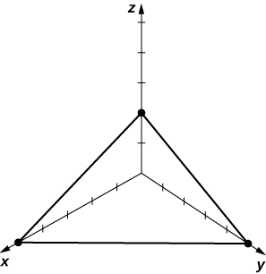 

<math xmlns="http://www.w3.org/1998/Math/MathML"><mrow><mn>3</mn><mi>x</mi><mo>+</mo><mn>4</mn><mi>y</mi><mo>−</mo><mn>12</mn><mo>=</mo><mn>0</mn></mrow></math>

<math xmlns="http://www.w3.org/1998/Math/MathML"><mrow><mn>3</mn><mi>x</mi><mo>−</mo><mn>2</mn><mi>y</mi><mo>+</mo><mn>4</mn><mi>z</mi><mo>=</mo><mn>0</mn></mrow></math>

a. <math xmlns="http://www.w3.org/1998/Math/MathML"><mrow><mstyle mathvariant="bold" mathsize="normal"><mtext>n</mtext></mstyle><mo>=</mo><mn>3</mn><mstyle mathvariant="bold" mathsize="normal"><mtext>i</mtext></mstyle><mo>−</mo><mn>2</mn><mstyle mathvariant="bold" mathsize="normal"><mtext>j</mtext></mstyle><mo>+</mo><mn>4</mn><mstyle mathvariant="bold" mathsize="normal"><mtext>k</mtext></mstyle><mo>;</mo></mrow></math>

 b. <math xmlns="http://www.w3.org/1998/Math/MathML"><mrow><mrow><mo>(</mo><mrow><mn>0</mn><mo>,</mo><mn>0</mn><mo>,</mo><mn>0</mn></mrow><mo>)</mo></mrow><mo>;</mo></mrow></math>

* * *
{: data-type="newline"}

 c.* * *
{: data-type="newline"}

 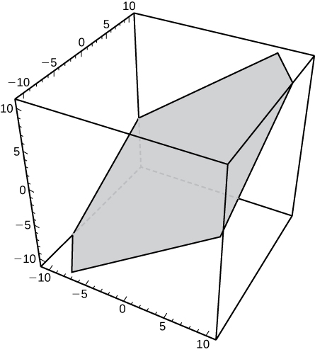 

<math xmlns="http://www.w3.org/1998/Math/MathML"><mrow><mi>x</mi><mo>+</mo><mi>z</mi><mo>=</mo><mn>0</mn></mrow></math>

Given point <math xmlns="http://www.w3.org/1998/Math/MathML"><mrow><mi>P</mi><mrow><mo>(</mo><mrow><mn>1</mn><mo>,</mo><mn>2</mn><mo>,</mo><mn>3</mn></mrow><mo>)</mo></mrow></mrow></math>

 and vector <math xmlns="http://www.w3.org/1998/Math/MathML"><mrow><mstyle mathvariant="bold" mathsize="normal"><mtext>n</mtext></mstyle><mo>=</mo><mstyle mathvariant="bold" mathsize="normal"><mtext>i</mtext></mstyle><mo>+</mo><mstyle mathvariant="bold" mathsize="normal"><mtext>j</mtext></mstyle><mo>,</mo></mrow></math>

 find point <math xmlns="http://www.w3.org/1998/Math/MathML"><mi>Q</mi></math>

 on the *x*-axis such that <math xmlns="http://www.w3.org/1998/Math/MathML"><mrow><mover accent="true"><mrow><mi>P</mi><mi>Q</mi></mrow><mo stretchy="false">→</mo></mover></mrow></math>

 and <math xmlns="http://www.w3.org/1998/Math/MathML"><mstyle mathvariant="bold" mathsize="normal"><mtext>n</mtext></mstyle></math>

 are orthogonal.

<math xmlns="http://www.w3.org/1998/Math/MathML"><mrow><mrow><mo>(</mo><mrow><mn>3</mn><mo>,</mo><mn>0</mn><mo>,</mo><mn>0</mn></mrow><mo>)</mo></mrow></mrow></math>

Show there is no plane perpendicular to <math xmlns="http://www.w3.org/1998/Math/MathML"><mrow><mstyle mathvariant="bold" mathsize="normal"><mtext>n</mtext></mstyle><mo>=</mo><mstyle mathvariant="bold" mathsize="normal"><mtext>i</mtext></mstyle><mo>+</mo><mstyle mathvariant="bold" mathsize="normal"><mtext>j</mtext></mstyle></mrow></math>

 that passes through points <math xmlns="http://www.w3.org/1998/Math/MathML"><mrow><mi>P</mi><mrow><mo>(</mo><mrow><mn>1</mn><mo>,</mo><mn>2</mn><mo>,</mo><mn>3</mn></mrow><mo>)</mo></mrow></mrow></math>

 and <math xmlns="http://www.w3.org/1998/Math/MathML"><mrow><mi>Q</mi><mrow><mo>(</mo><mrow><mn>2</mn><mo>,</mo><mn>3</mn><mo>,</mo><mn>4</mn></mrow><mo>)</mo></mrow><mo>.</mo></mrow></math>

Find parametric equations of the line passing through point <math xmlns="http://www.w3.org/1998/Math/MathML"><mrow><mi>P</mi><mo stretchy="false">(</mo><mn>−2</mn><mo>,</mo><mn>1</mn><mo>,</mo><mn>3</mn><mo stretchy="false">)</mo></mrow></math>

 that is perpendicular to the plane of equation <math xmlns="http://www.w3.org/1998/Math/MathML"><mrow><mn>2</mn><mi>x</mi><mo>−</mo><mn>3</mn><mi>y</mi><mo>+</mo><mi>z</mi><mo>=</mo><mn>7</mn><mo>.</mo></mrow></math>

<math xmlns="http://www.w3.org/1998/Math/MathML"><mrow><mi>x</mi><mo>=</mo><mn>−2</mn><mo>+</mo><mn>2</mn><mi>t</mi><mo>,</mo><mi>y</mi><mo>=</mo><mn>1</mn><mo>−</mo><mn>3</mn><mi>t</mi><mo>,</mo><mi>z</mi><mo>=</mo><mn>3</mn><mo>+</mo><mi>t</mi><mo>,</mo></mrow></math>

 <math xmlns="http://www.w3.org/1998/Math/MathML"><mrow><mi>t</mi><mo>∈</mo><mo>ℝ</mo></mrow></math>

Find symmetric equations of the line passing through point <math xmlns="http://www.w3.org/1998/Math/MathML"><mrow><mi>P</mi><mo stretchy="false">(</mo><mn>2</mn><mo>,</mo><mn>5</mn><mo>,</mo><mn>4</mn><mo stretchy="false">)</mo></mrow></math>

 that is perpendicular to the plane of equation <math xmlns="http://www.w3.org/1998/Math/MathML"><mrow><mn>2</mn><mi>x</mi><mo>+</mo><mn>3</mn><mi>y</mi><mo>−</mo><mn>5</mn><mi>z</mi><mo>=</mo><mn>0</mn><mo>.</mo></mrow></math>

Show that line <math xmlns="http://www.w3.org/1998/Math/MathML"><mrow><mfrac><mrow><mi>x</mi><mo>−</mo><mn>1</mn></mrow><mn>2</mn></mfrac><mo>=</mo><mfrac><mrow><mi>y</mi><mo>+</mo><mn>1</mn></mrow><mn>3</mn></mfrac><mo>=</mo><mfrac><mrow><mi>z</mi><mo>−</mo><mn>2</mn></mrow><mn>4</mn></mfrac></mrow></math>

 is parallel to plane <math xmlns="http://www.w3.org/1998/Math/MathML"><mrow><mi>x</mi><mo>−</mo><mn>2</mn><mi>y</mi><mo>+</mo><mi>z</mi><mo>=</mo><mn>6</mn><mo>.</mo></mrow></math>

Find the real number <math xmlns="http://www.w3.org/1998/Math/MathML"><mi>α</mi></math>

 such that the line of parametric equations <math xmlns="http://www.w3.org/1998/Math/MathML"><mrow><mi>x</mi><mo>=</mo><mi>t</mi><mo>,</mo><mi>y</mi><mo>=</mo><mn>2</mn><mo>−</mo><mi>t</mi><mo>,</mo><mi>z</mi><mo>=</mo><mn>3</mn><mo>+</mo><mi>t</mi><mo>,</mo></mrow></math>

 <math xmlns="http://www.w3.org/1998/Math/MathML"><mrow><mi>t</mi><mo>∈</mo><mo>ℝ</mo></mrow></math>

 is parallel to the plane of equation <math xmlns="http://www.w3.org/1998/Math/MathML"><mrow><mi>α</mi><mi>x</mi><mo>+</mo><mn>5</mn><mi>y</mi><mo>+</mo><mi>z</mi><mo>−</mo><mn>10</mn><mo>=</mo><mn>0.</mn></mrow></math>

For the following exercises, points <math xmlns="http://www.w3.org/1998/Math/MathML"><mrow><mi>P</mi><mo>,</mo><mi>Q</mi><mo>,</mo><mspace width="0.2em" /><mtext>and</mtext><mspace width="0.2em" /><mi>R</mi></mrow></math>

 are given.

1.  Find the general equation of the plane passing through
    <math xmlns="http://www.w3.org/1998/Math/MathML"><mrow><mi>P</mi><mo>,</mo><mi>Q</mi><mo>,</mo><mspace width="0.2em" /><mtext>and</mtext><mspace width="0.2em" /><mi>R</mi><mo>.</mo></mrow></math>

2.  Write the vector equation
    <math xmlns="http://www.w3.org/1998/Math/MathML"><mrow><mstyle mathvariant="bold" mathsize="normal"><mtext>n</mtext></mstyle><mo>·</mo><mover accent="true"><mrow><mi>P</mi><mi>S</mi></mrow><mo stretchy="false">→</mo></mover><mo>=</mo><mn>0</mn></mrow></math>
    
    of the plane at a., where
    <math xmlns="http://www.w3.org/1998/Math/MathML"><mrow><mi>S</mi><mrow><mo>(</mo><mrow><mi>x</mi><mo>,</mo><mi>y</mi><mo>,</mo><mi>z</mi></mrow><mo>)</mo></mrow></mrow></math>
    
    is an arbitrary point of the plane.
3.  Find parametric equations of the line passing through the origin that is perpendicular to the plane passing through
    <math xmlns="http://www.w3.org/1998/Math/MathML"><mrow><mi>P</mi><mo>,</mo><mi>Q</mi><mo>,</mo><mspace width="0.2em" /><mtext>and</mtext><mspace width="0.2em" /><mi>R</mi><mo>.</mo></mrow></math>
{: type="a"}

<math xmlns="http://www.w3.org/1998/Math/MathML"><mrow><mi>P</mi><mo stretchy="false">(</mo><mn>1</mn><mo>,</mo><mn>1</mn><mo>,</mo><mn>1</mn><mo stretchy="false">)</mo><mo>,</mo><mi>Q</mi><mo stretchy="false">(</mo><mn>2</mn><mo>,</mo><mn>4</mn><mo>,</mo><mn>3</mn><mo stretchy="false">)</mo><mo>,</mo></mrow></math>

 and <math xmlns="http://www.w3.org/1998/Math/MathML"><mrow><mi>R</mi><mo stretchy="false">(</mo><mn>−1</mn><mo>,</mo><mn>−2</mn><mo>,</mo><mn>−1</mn><mo stretchy="false">)</mo></mrow></math>

a. <math xmlns="http://www.w3.org/1998/Math/MathML"><mrow><mn>−2</mn><mi>y</mi><mo>+</mo><mn>3</mn><mi>z</mi><mo>−</mo><mn>1</mn><mo>=</mo><mn>0</mn><mo>;</mo></mrow></math>

 b. <math xmlns="http://www.w3.org/1998/Math/MathML"><mrow><mrow><mo>〈</mo><mrow><mn>0</mn><mo>,</mo><mn>−2</mn><mo>,</mo><mn>3</mn></mrow><mo>〉</mo></mrow><mo>·</mo><mrow><mo>〈</mo><mrow><mi>x</mi><mo>−</mo><mn>1</mn><mo>,</mo><mi>y</mi><mo>−</mo><mn>1</mn><mo>,</mo><mi>z</mi><mo>−</mo><mn>1</mn></mrow><mo>〉</mo></mrow><mo>=</mo><mn>0</mn><mo>;</mo></mrow></math>

 c. <math xmlns="http://www.w3.org/1998/Math/MathML"><mrow><mi>x</mi><mo>=</mo><mn>0</mn><mo>,</mo><mi>y</mi><mo>=</mo><mn>−2</mn><mi>t</mi><mo>,</mo><mi>z</mi><mo>=</mo><mn>3</mn><mi>t</mi><mo>,</mo></mrow></math>

 <math xmlns="http://www.w3.org/1998/Math/MathML"><mrow><mi>t</mi><mo>∈</mo><mo>ℝ</mo></mrow></math>

<math xmlns="http://www.w3.org/1998/Math/MathML"><mrow><mi>P</mi><mrow><mo>(</mo><mrow><mn>−2</mn><mo>,</mo><mn>1</mn><mo>,</mo><mn>4</mn></mrow><mo>)</mo></mrow><mo>,</mo><mi>Q</mi><mrow><mo>(</mo><mrow><mn>3</mn><mo>,</mo><mn>1</mn><mo>,</mo><mn>3</mn></mrow><mo>)</mo></mrow><mo>,</mo></mrow></math>

 and <math xmlns="http://www.w3.org/1998/Math/MathML"><mrow><mi>R</mi><mrow><mo>(</mo><mrow><mn>−2</mn><mo>,</mo><mn>1</mn><mo>,</mo><mn>0</mn></mrow><mo>)</mo></mrow></mrow></math>

Consider the planes of equations <math xmlns="http://www.w3.org/1998/Math/MathML"><mrow><mi>x</mi><mo>+</mo><mi>y</mi><mo>+</mo><mi>z</mi><mo>=</mo><mn>1</mn></mrow></math>

 and <math xmlns="http://www.w3.org/1998/Math/MathML"><mrow><mi>x</mi><mo>+</mo><mi>z</mi><mo>=</mo><mn>0</mn><mo>.</mo></mrow></math>

1.  Show that the planes intersect.
2.  Find symmetric equations of the line passing through point
    <math xmlns="http://www.w3.org/1998/Math/MathML"><mrow><mi>P</mi><mo stretchy="false">(</mo><mn>1</mn><mo>,</mo><mn>4</mn><mo>,</mo><mn>6</mn><mo stretchy="false">)</mo></mrow></math>
    
    that is parallel to the line of intersection of the planes.
{: type="a"}

a. Answers may vary; b. <math xmlns="http://www.w3.org/1998/Math/MathML"><mrow><mfrac><mrow><mi>x</mi><mo>−</mo><mn>1</mn></mrow><mn>1</mn></mfrac><mo>=</mo><mfrac><mrow><mi>z</mi><mo>−</mo><mn>6</mn></mrow><mrow><mn>−1</mn></mrow></mfrac><mo>,</mo><mi>y</mi><mo>=</mo><mn>4</mn></mrow></math>

Consider the planes of equations <math xmlns="http://www.w3.org/1998/Math/MathML"><mrow><mtext>−</mtext><mi>y</mi><mo>+</mo><mi>z</mi><mo>−</mo><mn>2</mn><mo>=</mo><mn>0</mn></mrow></math>

 and <math xmlns="http://www.w3.org/1998/Math/MathML"><mrow><mi>x</mi><mo>−</mo><mi>y</mi><mo>=</mo><mn>0</mn><mo>.</mo></mrow></math>

1.  Show that the planes intersect.
2.  Find parametric equations of the line passing through point
    <math xmlns="http://www.w3.org/1998/Math/MathML"><mrow><mi>P</mi><mo stretchy="false">(</mo><mn>−8</mn><mo>,</mo><mn>0</mn><mo>,</mo><mn>2</mn><mo stretchy="false">)</mo></mrow></math>
    
    that is parallel to the line of intersection of the planes.
{: type="a"}

Find the scalar equation of the plane that passes through point <math xmlns="http://www.w3.org/1998/Math/MathML"><mrow><mi>P</mi><mo stretchy="false">(</mo><mn>−1</mn><mo>,</mo><mn>2</mn><mo>,</mo><mn>1</mn><mo stretchy="false">)</mo></mrow></math>

 and is perpendicular to the line of intersection of planes <math xmlns="http://www.w3.org/1998/Math/MathML"><mrow><mi>x</mi><mo>+</mo><mi>y</mi><mo>−</mo><mi>z</mi><mo>−</mo><mn>2</mn><mo>=</mo><mn>0</mn></mrow></math>

 and <math xmlns="http://www.w3.org/1998/Math/MathML"><mrow><mn>2</mn><mi>x</mi><mo>−</mo><mi>y</mi><mo>+</mo><mn>3</mn><mi>z</mi><mo>−</mo><mn>1</mn><mo>=</mo><mn>0</mn><mo>.</mo></mrow></math>

<math xmlns="http://www.w3.org/1998/Math/MathML"><mrow><mn>2</mn><mi>x</mi><mo>−</mo><mn>5</mn><mi>y</mi><mo>−</mo><mn>3</mn><mi>z</mi><mo>+</mo><mn>15</mn><mo>=</mo><mn>0</mn></mrow></math>

Find the general equation of the plane that passes through the origin and is perpendicular to the line of intersection of planes <math xmlns="http://www.w3.org/1998/Math/MathML"><mrow><mtext>−</mtext><mi>x</mi><mo>+</mo><mi>y</mi><mo>+</mo><mn>2</mn><mo>=</mo><mn>0</mn></mrow></math>

 and <math xmlns="http://www.w3.org/1998/Math/MathML"><mrow><mi>z</mi><mo>−</mo><mn>3</mn><mo>=</mo><mn>0</mn><mo>.</mo></mrow></math>

Determine whether the line of parametric equations <math xmlns="http://www.w3.org/1998/Math/MathML"><mrow><mi>x</mi><mo>=</mo><mn>1</mn><mo>+</mo><mn>2</mn><mi>t</mi><mo>,</mo><mi>y</mi><mo>=</mo><mn>−2</mn><mi>t</mi><mo>,</mo><mi>z</mi><mo>=</mo><mn>2</mn><mo>+</mo><mi>t</mi><mo>,</mo></mrow></math>

 <math xmlns="http://www.w3.org/1998/Math/MathML"><mrow><mi>t</mi><mo>∈</mo><mo>ℝ</mo></mrow></math>

 intersects the plane with equation <math xmlns="http://www.w3.org/1998/Math/MathML"><mrow><mn>3</mn><mi>x</mi><mo>+</mo><mn>4</mn><mi>y</mi><mo>+</mo><mn>6</mn><mi>z</mi><mo>−</mo><mn>7</mn><mo>=</mo><mn>0</mn><mo>.</mo></mrow></math>

 If it does intersect, find the point of intersection.

The line intersects the plane at point <math xmlns="http://www.w3.org/1998/Math/MathML"><mrow><mi>P</mi><mrow><mo>(</mo><mrow><mn>−3</mn><mo>,</mo><mn>4</mn><mo>,</mo><mn>0</mn></mrow><mo>)</mo></mrow><mo>.</mo></mrow></math>

Determine whether the line of parametric equations <math xmlns="http://www.w3.org/1998/Math/MathML"><mrow><mi>x</mi><mo>=</mo><mn>5</mn><mo>,</mo><mi>y</mi><mo>=</mo><mn>4</mn><mo>−</mo><mi>t</mi><mo>,</mo><mi>z</mi><mo>=</mo><mn>2</mn><mi>t</mi><mo>,</mo></mrow></math>

 <math xmlns="http://www.w3.org/1998/Math/MathML"><mrow><mi>t</mi><mo>∈</mo><mo>ℝ</mo></mrow></math>

 intersects the plane with equation <math xmlns="http://www.w3.org/1998/Math/MathML"><mrow><mn>2</mn><mi>x</mi><mo>−</mo><mi>y</mi><mo>+</mo><mi>z</mi><mo>=</mo><mn>5</mn><mo>.</mo></mrow></math>

 If it does intersect, find the point of intersection.

Find the distance from point <math xmlns="http://www.w3.org/1998/Math/MathML"><mrow><mi>P</mi><mrow><mo>(</mo><mrow><mn>1</mn><mo>,</mo><mn>5</mn><mo>,</mo><mn>−4</mn></mrow><mo>)</mo></mrow></mrow></math>

 to the plane of equation <math xmlns="http://www.w3.org/1998/Math/MathML"><mrow><mn>3</mn><mi>x</mi><mo>−</mo><mi>y</mi><mo>+</mo><mn>2</mn><mi>z</mi><mo>−</mo><mn>6</mn><mo>=</mo><mn>0</mn><mo>.</mo></mrow></math>

<math xmlns="http://www.w3.org/1998/Math/MathML"><mrow><mfrac><mrow><mn>16</mn></mrow><mrow><msqrt><mrow><mn>14</mn></mrow></msqrt></mrow></mfrac></mrow></math>

Find the distance from point <math xmlns="http://www.w3.org/1998/Math/MathML"><mrow><mi>P</mi><mrow><mo>(</mo><mrow><mn>1</mn><mo>,</mo><mn>−2</mn><mo>,</mo><mn>3</mn></mrow><mo>)</mo></mrow></mrow></math>

 to the plane of equation <math xmlns="http://www.w3.org/1998/Math/MathML"><mrow><mrow><mo>(</mo><mrow><mi>x</mi><mo>−</mo><mn>3</mn></mrow><mo>)</mo></mrow><mo>+</mo><mn>2</mn><mrow><mo>(</mo><mrow><mi>y</mi><mo>+</mo><mn>1</mn></mrow><mo>)</mo></mrow><mo>−</mo><mn>4</mn><mi>z</mi><mo>=</mo><mn>0</mn><mo>.</mo></mrow></math>

For the following exercises, the equations of two planes are given.

1.  Determine whether the planes are parallel, orthogonal, or neither.
2.  If the planes are neither parallel nor orthogonal, then find the measure of the angle between the planes. Express the answer in degrees rounded to the nearest integer.
{: type="a"}

**[T]** <math xmlns="http://www.w3.org/1998/Math/MathML"><mrow><mi>x</mi><mo>+</mo><mi>y</mi><mo>+</mo><mi>z</mi><mo>=</mo><mn>0</mn><mo>,</mo></mrow></math>

 <math xmlns="http://www.w3.org/1998/Math/MathML"><mrow><mn>2</mn><mi>x</mi><mo>−</mo><mi>y</mi><mo>+</mo><mi>z</mi><mo>−</mo><mn>7</mn><mo>=</mo><mn>0</mn></mrow></math>

a. The planes are neither parallel nor orthogonal; b. <math xmlns="http://www.w3.org/1998/Math/MathML"><mrow><mn>62</mn><mtext>°</mtext></mrow></math>

<math xmlns="http://www.w3.org/1998/Math/MathML"><mrow><mn>5</mn><mi>x</mi><mo>−</mo><mn>3</mn><mi>y</mi><mo>+</mo><mi>z</mi><mo>=</mo><mn>4</mn><mo>,</mo></mrow></math>

 <math xmlns="http://www.w3.org/1998/Math/MathML"><mrow><mi>x</mi><mo>+</mo><mn>4</mn><mi>y</mi><mo>+</mo><mn>7</mn><mi>z</mi><mo>=</mo><mn>1</mn></mrow></math>

<math xmlns="http://www.w3.org/1998/Math/MathML"><mrow><mi>x</mi><mo>−</mo><mn>5</mn><mi>y</mi><mo>−</mo><mi>z</mi><mo>=</mo><mn>1</mn><mo>,</mo></mrow></math>

 <math xmlns="http://www.w3.org/1998/Math/MathML"><mrow><mn>5</mn><mi>x</mi><mo>−</mo><mn>25</mn><mi>y</mi><mo>−</mo><mn>5</mn><mi>z</mi><mo>=</mo><mn>−3</mn></mrow></math>

a. The planes are parallel.

**[T]** <math xmlns="http://www.w3.org/1998/Math/MathML"><mrow><mi>x</mi><mo>−</mo><mn>3</mn><mi>y</mi><mo>+</mo><mn>6</mn><mi>z</mi><mo>=</mo><mn>4</mn><mo>,</mo></mrow></math>

 <math xmlns="http://www.w3.org/1998/Math/MathML"><mrow><mn>5</mn><mi>x</mi><mo>+</mo><mi>y</mi><mo>−</mo><mi>z</mi><mo>=</mo><mn>4</mn></mrow></math>

Show that the lines of equations <math xmlns="http://www.w3.org/1998/Math/MathML"><mrow><mi>x</mi><mo>=</mo><mi>t</mi><mo>,</mo><mi>y</mi><mo>=</mo><mn>1</mn><mo>+</mo><mi>t</mi><mo>,</mo><mi>z</mi><mo>=</mo><mn>2</mn><mo>+</mo><mi>t</mi><mo>,</mo></mrow></math>

 <math xmlns="http://www.w3.org/1998/Math/MathML"><mrow><mi>t</mi><mo>∈</mo><mo>ℝ</mo><mtext>,</mtext></mrow></math>

 and <math xmlns="http://www.w3.org/1998/Math/MathML"><mrow><mfrac><mi>x</mi><mn>2</mn></mfrac><mo>=</mo><mfrac><mrow><mi>y</mi><mo>−</mo><mn>1</mn></mrow><mn>3</mn></mfrac><mo>=</mo><mi>z</mi><mo>−</mo><mn>3</mn></mrow></math>

 are skew, and find the distance between them.

<math xmlns="http://www.w3.org/1998/Math/MathML"><mrow><mfrac><mn>1</mn><mrow><msqrt><mn>6</mn></msqrt></mrow></mfrac></mrow></math>

Show that the lines of equations <math xmlns="http://www.w3.org/1998/Math/MathML"><mrow><mi>x</mi><mo>=</mo><mn>−1</mn><mo>+</mo><mi>t</mi><mo>,</mo><mi>y</mi><mo>=</mo><mn>−2</mn><mo>+</mo><mi>t</mi><mo>,</mo><mi>z</mi><mo>=</mo><mn>3</mn><mi>t</mi><mo>,</mo></mrow></math>

 <math xmlns="http://www.w3.org/1998/Math/MathML"><mrow><mi>t</mi><mo>∈</mo><mo>ℝ</mo><mo>,</mo></mrow></math>

 and <math xmlns="http://www.w3.org/1998/Math/MathML"><mrow><mi>x</mi><mo>=</mo><mn>5</mn><mo>+</mo><mi>s</mi><mo>,</mo><mi>y</mi><mo>=</mo><mn>−8</mn><mo>+</mo><mn>2</mn><mi>s</mi><mo>,</mo><mi>z</mi><mo>=</mo><mn>7</mn><mi>s</mi><mo>,</mo></mrow></math>

 <math xmlns="http://www.w3.org/1998/Math/MathML"><mrow><mi>s</mi><mo>∈</mo><mo>ℝ</mo></mrow></math>

 are skew, and find the distance between them.

Consider point <math xmlns="http://www.w3.org/1998/Math/MathML"><mrow><mi>C</mi><mrow><mo>(</mo><mrow><mn>−3</mn><mo>,</mo><mn>2</mn><mo>,</mo><mn>4</mn></mrow><mo>)</mo></mrow></mrow></math>

 and the plane of equation <math xmlns="http://www.w3.org/1998/Math/MathML"><mrow><mn>2</mn><mi>x</mi><mo>+</mo><mn>4</mn><mi>y</mi><mo>−</mo><mn>3</mn><mi>z</mi><mo>=</mo><mn>8</mn><mo>.</mo></mrow></math>

1.  Find the radius of the sphere with center
    <math xmlns="http://www.w3.org/1998/Math/MathML"><mi>C</mi></math>
    
    tangent to the given plane.
2.  Find point *P* of tangency.
{: type="a"}

a. <math xmlns="http://www.w3.org/1998/Math/MathML"><mrow><mfrac><mrow><mn>18</mn></mrow><mrow><msqrt><mrow><mn>29</mn></mrow></msqrt></mrow></mfrac><mo>;</mo></mrow></math>

 b. <math xmlns="http://www.w3.org/1998/Math/MathML"><mrow><mi>P</mi><mrow><mo>(</mo><mrow><mo>−</mo><mfrac><mrow><mn>51</mn></mrow><mrow><mn>29</mn></mrow></mfrac><mo>,</mo><mfrac><mrow><mn>130</mn></mrow><mrow><mn>29</mn></mrow></mfrac><mo>,</mo><mfrac><mrow><mn>62</mn></mrow><mrow><mn>29</mn></mrow></mfrac></mrow><mo>)</mo></mrow></mrow></math>

Consider the plane of equation <math xmlns="http://www.w3.org/1998/Math/MathML"><mrow><mi>x</mi><mo>−</mo><mi>y</mi><mo>−</mo><mi>z</mi><mo>−</mo><mn>8</mn><mo>=</mo><mn>0</mn><mo>.</mo></mrow></math>

1.  Find the equation of the sphere with center
    <math xmlns="http://www.w3.org/1998/Math/MathML"><mi>C</mi></math>
    
    at the origin that is tangent to the given plane.
2.  Find parametric equations of the line passing through the origin and the point of tangency.
{: type="a"}

Two children are playing with a ball. The girl throws the ball to the boy. The ball travels in

the air, curves <math xmlns="http://www.w3.org/1998/Math/MathML"><mn>3</mn></math>

 ft to the right, and falls <math xmlns="http://www.w3.org/1998/Math/MathML"><mn>5</mn></math>

 ft away from the girl (see the following figure). If the plane that contains the trajectory of the ball is perpendicular to the ground, find its equation.

  

<math xmlns="http://www.w3.org/1998/Math/MathML"><mrow><mn>4</mn><mi>x</mi><mo>−</mo><mn>3</mn><mi>y</mi><mo>=</mo><mn>0</mn></mrow></math>

**[T]** John allocates <math xmlns="http://www.w3.org/1998/Math/MathML"><mi>d</mi></math>

 dollars to consume monthly three goods of prices <math xmlns="http://www.w3.org/1998/Math/MathML"><mrow><mi>a</mi><mo>,</mo><mi>b</mi><mo>,</mo><mspace width="0.2em" /><mtext>and</mtext><mspace width="0.2em" /><mi>c</mi><mo>.</mo></mrow></math>

 In this context, the budget equation is defined as <math xmlns="http://www.w3.org/1998/Math/MathML"><mrow><mi>a</mi><mi>x</mi><mo>+</mo><mi>b</mi><mi>y</mi><mo>+</mo><mi>c</mi><mi>z</mi><mo>=</mo><mi>d</mi><mo>,</mo></mrow></math>

 where <math xmlns="http://www.w3.org/1998/Math/MathML"><mrow><mi>x</mi><mo>≥</mo><mn>0</mn><mo>,</mo><mi>y</mi><mo>≥</mo><mn>0</mn><mo>,</mo></mrow></math>

 and <math xmlns="http://www.w3.org/1998/Math/MathML"><mrow><mi>z</mi><mo>≥</mo><mn>0</mn></mrow></math>

 represent the number of items bought from each of the goods. The budget set is given by <math xmlns="http://www.w3.org/1998/Math/MathML"><mrow><mrow><mo>{</mo><mrow><mrow><mo>(</mo><mrow><mi>x</mi><mo>,</mo><mi>y</mi><mo>,</mo><mi>z</mi></mrow><mo>)</mo></mrow><mo>\|</mo><mi>a</mi><mi>x</mi><mo>+</mo><mi>b</mi><mi>y</mi><mo>+</mo><mi>c</mi><mi>z</mi><mo>≤</mo><mi>d</mi><mo>,</mo><mi>x</mi><mo>≥</mo><mn>0</mn><mo>,</mo><mi>y</mi><mo>≥</mo><mn>0</mn><mo>,</mo><mi>z</mi><mo>≥</mo><mn>0</mn></mrow><mo>}</mo></mrow><mo>,</mo></mrow></math>

 and the budget plane is the part of the plane of equation <math xmlns="http://www.w3.org/1998/Math/MathML"><mrow><mi>a</mi><mi>x</mi><mo>+</mo><mi>b</mi><mi>y</mi><mo>+</mo><mi>c</mi><mi>z</mi><mo>=</mo><mi>d</mi></mrow></math>

 for which <math xmlns="http://www.w3.org/1998/Math/MathML"><mrow><mi>x</mi><mo>≥</mo><mn>0</mn><mo>,</mo><mi>y</mi><mo>≥</mo><mn>0</mn><mo>,</mo></mrow></math>

 and <math xmlns="http://www.w3.org/1998/Math/MathML"><mrow><mi>z</mi><mo>≥</mo><mn>0</mn><mo>.</mo></mrow></math>

 Consider <math xmlns="http://www.w3.org/1998/Math/MathML"><mrow><mi>a</mi><mo>=</mo><mtext>$</mtext><mn>8</mn><mo>,</mo></mrow></math>

 <math xmlns="http://www.w3.org/1998/Math/MathML"><mrow><mi>b</mi><mo>=</mo><mtext>$</mtext><mn>5</mn><mo>,</mo></mrow></math>

 <math xmlns="http://www.w3.org/1998/Math/MathML"><mrow><mi>c</mi><mo>=</mo><mtext>$</mtext><mn>10</mn><mo>,</mo></mrow></math>

 and <math xmlns="http://www.w3.org/1998/Math/MathML"><mrow><mi>d</mi><mo>=</mo><mtext>$</mtext><mn>500</mn><mo>.</mo></mrow></math>

1.  Use a CAS to graph the budget set and budget plane.
2.  For
    <math xmlns="http://www.w3.org/1998/Math/MathML"><mrow><mi>z</mi><mo>=</mo><mn>25</mn><mo>,</mo></mrow></math>
    
    find the new budget equation and graph the budget set in the same system of coordinates.
{: type="a"}

**[T]** Consider <math xmlns="http://www.w3.org/1998/Math/MathML"><mrow><mstyle mathvariant="bold" mathsize="normal"><mtext>r</mtext></mstyle><mo stretchy="false">(</mo><mi>t</mi><mo stretchy="false">)</mo><mo>=</mo><mrow><mo>〈</mo><mrow><mtext>sin</mtext><mspace width="0.2em" /><mi>t</mi><mo>,</mo><mtext>cos</mtext><mspace width="0.2em" /><mi>t</mi><mo>,</mo><mn>2</mn><mi>t</mi></mrow><mo>〉</mo></mrow></mrow></math>

 the position vector of a particle at time <math xmlns="http://www.w3.org/1998/Math/MathML"><mrow><mi>t</mi><mo>∈</mo><mo stretchy="false">[</mo><mn>0</mn><mo>,</mo><mn>3</mn><mo stretchy="false">]</mo><mo>,</mo></mrow></math>

 where the components of **r** are expressed in centimeters and time is measured in seconds. Let <math xmlns="http://www.w3.org/1998/Math/MathML"><mrow><mover accent="true"><mrow><mi>O</mi><mi>P</mi></mrow><mo stretchy="false">→</mo></mover></mrow></math>

 be the position vector of the particle after <math xmlns="http://www.w3.org/1998/Math/MathML"><mn>1</mn></math>

 sec.

1.  Determine the velocity vector
    <math xmlns="http://www.w3.org/1998/Math/MathML"><mrow><mstyle mathvariant="bold" mathsize="normal"><mtext>v</mtext></mstyle><mo stretchy="false">(</mo><mn>1</mn><mo stretchy="false">)</mo></mrow></math>
    
    of the particle after
    <math xmlns="http://www.w3.org/1998/Math/MathML"><mn>1</mn></math>
    
    sec.
2.  Find the scalar equation of the plane that is perpendicular to
    <math xmlns="http://www.w3.org/1998/Math/MathML"><mrow><mstyle mathvariant="bold" mathsize="normal"><mtext>v</mtext></mstyle><mo stretchy="false">(</mo><mn>1</mn><mo stretchy="false">)</mo></mrow></math>
    
    and passes through point
    <math xmlns="http://www.w3.org/1998/Math/MathML"><mrow><mi>P</mi><mo>.</mo></mrow></math>
    
    This plane is called the *normal plane* to the path of the particle at point
    <math xmlns="http://www.w3.org/1998/Math/MathML"><mrow><mi>P</mi><mo>.</mo></mrow></math>

3.  Use a CAS to visualize the path of the particle along with the velocity vector and normal plane at point
    <math xmlns="http://www.w3.org/1998/Math/MathML"><mi>P</mi><mo>.</mo></math>
{: type="a"}

a. <math xmlns="http://www.w3.org/1998/Math/MathML"><mrow><mstyle mathvariant="bold" mathsize="normal"><mtext>v</mtext></mstyle><mo stretchy="false">(</mo><mn>1</mn><mo stretchy="false">)</mo><mo>=</mo><mrow><mo>〈</mo><mrow><mtext>cos</mtext><mspace width="0.2em" /><mn>1</mn><mo>,</mo><mtext>−</mtext><mtext>sin</mtext><mspace width="0.2em" /><mn>1</mn><mo>,</mo><mn>2</mn></mrow><mo>〉</mo></mrow><mo>;</mo></mrow></math>

 b. <math xmlns="http://www.w3.org/1998/Math/MathML"><mrow><mrow><mo>(</mo><mrow><mtext>cos</mtext><mspace width="0.2em" /><mn>1</mn></mrow><mo>)</mo></mrow><mo stretchy="false">(</mo><mi>x</mi><mo>−</mo><mtext>sin</mtext><mspace width="0.2em" /><mn>1</mn><mo stretchy="false">)</mo><mo>−</mo><mrow><mo>(</mo><mrow><mtext>sin</mtext><mspace width="0.2em" /><mn>1</mn></mrow><mo>)</mo></mrow><mo stretchy="false">(</mo><mi>y</mi><mo>−</mo><mtext>cos</mtext><mspace width="0.2em" /><mn>1</mn><mo stretchy="false">)</mo><mo>+</mo><mn>2</mn><mo stretchy="false">(</mo><mi>z</mi><mo>−</mo><mn>2</mn><mo stretchy="false">)</mo><mo>=</mo><mn>0</mn><mo>;</mo></mrow></math>

* * *
{: data-type="newline"}

 c.* * *
{: data-type="newline"}

  

**[T]** A solar panel is mounted on the roof of a house. The panel may be regarded as positioned at the points of coordinates (in meters) <math xmlns="http://www.w3.org/1998/Math/MathML"><mrow><mi>A</mi><mo stretchy="false">(</mo><mn>8</mn><mo>,</mo><mn>0</mn><mo>,</mo><mn>0</mn><mo stretchy="false">)</mo><mo>,</mo></mrow></math>

 <math xmlns="http://www.w3.org/1998/Math/MathML"><mrow><mi>B</mi><mo stretchy="false">(</mo><mn>8</mn><mo>,</mo><mn>18</mn><mo>,</mo><mn>0</mn><mo stretchy="false">)</mo><mo>,</mo></mrow></math>

 <math xmlns="http://www.w3.org/1998/Math/MathML"><mrow><mi>C</mi><mo stretchy="false">(</mo><mn>0</mn><mo>,</mo><mn>18</mn><mo>,</mo><mn>8</mn><mo stretchy="false">)</mo><mo>,</mo></mrow></math>

 and <math xmlns="http://www.w3.org/1998/Math/MathML"><mrow><mi>D</mi><mo stretchy="false">(</mo><mn>0</mn><mo>,</mo><mn>0</mn><mo>,</mo><mn>8</mn><mo stretchy="false">)</mo></mrow></math>

 (see the following figure).

  
1.  Find the general form of the equation of the plane that contains the solar panel by using points
    <math xmlns="http://www.w3.org/1998/Math/MathML"><mrow><mi>A</mi><mo>,</mo><mi>B</mi><mo>,</mo><mspace width="0.2em" /><mtext>and</mtext><mspace width="0.2em" /><mi>C</mi><mo>,</mo></mrow></math>
    
    and show that its normal vector is equivalent to
    <math xmlns="http://www.w3.org/1998/Math/MathML"><mrow><mover accent="true"><mrow><mi>A</mi><mi>B</mi></mrow><mo stretchy="false">→</mo></mover><mspace width="0.2em" /><mo>×</mo><mspace width="0.2em" /><mover accent="true"><mrow><mi>A</mi><mi>D</mi></mrow><mo stretchy="false">→</mo></mover><mo>.</mo></mrow></math>

2.  Find parametric equations of line
    <math xmlns="http://www.w3.org/1998/Math/MathML"><mrow><msub><mi>L</mi><mn>1</mn></msub></mrow></math>
    
    that passes through the center of the solar panel and has direction vector
    <math xmlns="http://www.w3.org/1998/Math/MathML"><mrow><mstyle mathvariant="bold" mathsize="normal"><mtext>s</mtext></mstyle><mo>=</mo><mfrac><mn>1</mn><mrow><msqrt><mn>3</mn></msqrt></mrow></mfrac><mstyle mathvariant="bold" mathsize="normal"><mtext>i</mtext></mstyle><mo>+</mo><mfrac><mn>1</mn><mrow><msqrt><mn>3</mn></msqrt></mrow></mfrac><mstyle mathvariant="bold" mathsize="normal"><mtext>j</mtext></mstyle><mo>+</mo><mfrac><mn>1</mn><mrow><msqrt><mn>3</mn></msqrt></mrow></mfrac><mstyle mathvariant="bold" mathsize="normal"><mtext>k</mtext></mstyle><mo>,</mo></mrow></math>
    
    which points toward the position of the Sun at a particular time of day.
3.  Find symmetric equations of line
    <math xmlns="http://www.w3.org/1998/Math/MathML"><mrow><msub><mi>L</mi><mn>2</mn></msub></mrow></math>
    
    that passes through the center of the solar panel and is perpendicular to it.
4.  Determine the angle of elevation of the Sun above the solar panel by using the angle between lines
    <math xmlns="http://www.w3.org/1998/Math/MathML"><mrow><msub><mi>L</mi><mn>1</mn></msub></mrow></math>
    
    and
    <math xmlns="http://www.w3.org/1998/Math/MathML"><mrow><msub><mi>L</mi><mn>2</mn></msub><mo>.</mo></mrow></math>
{: type="a"}

</section>

### Glossary
{: data-type="glossary-title"}

direction vector
: a vector parallel to a line that is used to describe the direction, or orientation, of the line in space
^

general form of the equation of a plane
: an equation in the form
  <math xmlns="http://www.w3.org/1998/Math/MathML"><mrow><mi>a</mi><mi>x</mi><mo>+</mo><mi>b</mi><mi>y</mi><mo>+</mo><mi>c</mi><mi>z</mi><mo>+</mo><mi>d</mi><mo>=</mo><mn>0</mn><mo>,</mo></mrow></math>
  
  where
  <math xmlns="http://www.w3.org/1998/Math/MathML"><mrow><mstyle mathvariant="bold" mathsize="normal"><mtext>n</mtext></mstyle><mo>=</mo><mrow><mo>〈</mo><mrow><mi>a</mi><mo>,</mo><mi>b</mi><mo>,</mo><mi>c</mi></mrow><mo>〉</mo></mrow></mrow></math>
  
  is a normal vector of the plane,
  <math xmlns="http://www.w3.org/1998/Math/MathML"><mrow><mi>P</mi><mo>=</mo><mrow><mo>(</mo><mrow><msub><mi>x</mi><mn>0</mn></msub><mo>,</mo><msub><mi>y</mi><mn>0</mn></msub><mo>,</mo><msub><mi>z</mi><mn>0</mn></msub></mrow><mo>)</mo></mrow></mrow></math>
  
  is a point on the plane, and
  <math xmlns="http://www.w3.org/1998/Math/MathML"><mrow><mi>d</mi><mo>=</mo><mtext>−</mtext><mi>a</mi><msub><mi>x</mi><mn>0</mn></msub><mo>−</mo><mi>b</mi><msub><mi>y</mi><mn>0</mn></msub><mo>−</mo><mi>c</mi><msub><mi>z</mi><mn>0</mn></msub></mrow></math>
^

normal vector
: a vector perpendicular to a plane
^

parametric equations of a line
: the set of equations
  <math xmlns="http://www.w3.org/1998/Math/MathML"><mrow><mi>x</mi><mo>=</mo><msub><mi>x</mi><mn>0</mn></msub><mo>+</mo><mi>t</mi><mi>a</mi><mo>,</mo></mrow></math>
  
  <math xmlns="http://www.w3.org/1998/Math/MathML"><mrow><mi>y</mi><mo>=</mo><msub><mi>y</mi><mn>0</mn></msub><mo>+</mo><mi>t</mi><mi>b</mi><mo>,</mo></mrow></math>
  
  and
  <math xmlns="http://www.w3.org/1998/Math/MathML"><mrow><mi>z</mi><mo>=</mo><msub><mi>z</mi><mn>0</mn></msub><mo>+</mo><mi>t</mi><mi>c</mi></mrow></math>
  
  describing the line with direction vector
  <math xmlns="http://www.w3.org/1998/Math/MathML"><mrow><mstyle mathvariant="bold" mathsize="normal"><mtext>v</mtext></mstyle><mo>=</mo><mrow><mo>〈</mo><mrow><mi>a</mi><mo>,</mo><mi>b</mi><mo>,</mo><mi>c</mi></mrow><mo>〉</mo></mrow></mrow></math>
  
  passing through point
  <math xmlns="http://www.w3.org/1998/Math/MathML"><mrow><mrow><mo>(</mo><mrow><msub><mi>x</mi><mn>0</mn></msub><mo>,</mo><msub><mi>y</mi><mn>0</mn></msub><mo>,</mo><msub><mi>z</mi><mn>0</mn></msub></mrow><mo>)</mo></mrow></mrow></math>
^

scalar equation of a plane
: the equation
  <math xmlns="http://www.w3.org/1998/Math/MathML"><mrow><mi>a</mi><mrow><mo>(</mo><mrow><mi>x</mi><mo>−</mo><msub><mi>x</mi><mn>0</mn></msub></mrow><mo>)</mo></mrow><mo>+</mo><mi>b</mi><mrow><mo>(</mo><mrow><mi>y</mi><mo>−</mo><msub><mi>y</mi><mn>0</mn></msub></mrow><mo>)</mo></mrow><mo>+</mo><mi>c</mi><mrow><mo>(</mo><mrow><mi>z</mi><mo>−</mo><msub><mi>z</mi><mn>0</mn></msub></mrow><mo>)</mo></mrow><mo>=</mo><mn>0</mn></mrow></math>
  
  used to describe a plane containing point
  <math xmlns="http://www.w3.org/1998/Math/MathML"><mrow><mi>P</mi><mo>=</mo><mrow><mo>(</mo><mrow><msub><mi>x</mi><mn>0</mn></msub><mo>,</mo><msub><mi>y</mi><mn>0</mn></msub><mo>,</mo><msub><mi>z</mi><mn>0</mn></msub></mrow><mo>)</mo></mrow></mrow></math>
  
  with normal vector
  <math xmlns="http://www.w3.org/1998/Math/MathML"><mrow><mstyle mathvariant="bold" mathsize="normal"><mtext>n</mtext></mstyle><mo>=</mo><mrow><mo>〈</mo><mrow><mi>a</mi><mo>,</mo><mi>b</mi><mo>,</mo><mi>c</mi></mrow><mo>〉</mo></mrow></mrow></math>
  
  or its alternate form
  <math xmlns="http://www.w3.org/1998/Math/MathML"><mrow><mi>a</mi><mi>x</mi><mo>+</mo><mi>b</mi><mi>y</mi><mo>+</mo><mi>c</mi><mi>z</mi><mo>+</mo><mi>d</mi><mo>=</mo><mn>0</mn><mo>,</mo></mrow></math>
  
  where
  <math xmlns="http://www.w3.org/1998/Math/MathML"><mrow><mi>d</mi><mo>=</mo><mtext>−</mtext><mi>a</mi><msub><mi>x</mi><mn>0</mn></msub><mo>−</mo><mi>b</mi><msub><mi>y</mi><mn>0</mn></msub><mo>−</mo><mi>c</mi><msub><mi>z</mi><mn>0</mn></msub></mrow></math>
^

skew lines
: two lines that are not parallel but do not intersect
^

symmetric equations of <math xmlns="http://www.w3.org/1998/Math/MathML"><mstyle mathvariant="bold" mathsize="normal"><mtext>a</mtext></mstyle></math>

 line
: the equations
  <math xmlns="http://www.w3.org/1998/Math/MathML"><mrow><mfrac><mrow><mi>x</mi><mo>−</mo><msub><mi>x</mi><mn>0</mn></msub></mrow><mi>a</mi></mfrac><mo>=</mo><mfrac><mrow><mi>y</mi><mo>−</mo><msub><mi>y</mi><mn>0</mn></msub></mrow><mi>b</mi></mfrac><mo>=</mo><mfrac><mrow><mi>z</mi><mo>−</mo><msub><mi>z</mi><mn>0</mn></msub></mrow><mi>c</mi></mfrac></mrow></math>
  
  describing the line with direction vector
  <math xmlns="http://www.w3.org/1998/Math/MathML"><mrow><mstyle mathvariant="bold" mathsize="normal"><mtext>v</mtext></mstyle><mo>=</mo><mrow><mo>〈</mo><mrow><mi>a</mi><mo>,</mo><mi>b</mi><mo>,</mo><mi>c</mi></mrow><mo>〉</mo></mrow></mrow></math>
  
  passing through point
  <math xmlns="http://www.w3.org/1998/Math/MathML"><mrow><mrow><mo>(</mo><mrow><msub><mi>x</mi><mn>0</mn></msub><mo>,</mo><msub><mi>y</mi><mn>0</mn></msub><mo>,</mo><msub><mi>z</mi><mn>0</mn></msub></mrow><mo>)</mo></mrow></mrow></math>
^

vector equation of a line
: the equation
  <math xmlns="http://www.w3.org/1998/Math/MathML"><mrow><mstyle mathvariant="bold" mathsize="normal"><mtext>r</mtext></mstyle><mo>=</mo><msub><mstyle mathvariant="bold" mathsize="normal"><mtext>r</mtext></mstyle><mn>0</mn></msub><mo>+</mo><mi>t</mi><mstyle mathvariant="bold" mathsize="normal"><mtext>v</mtext></mstyle></mrow></math>
  
  used to describe a line with direction vector
  <math xmlns="http://www.w3.org/1998/Math/MathML"><mrow><mstyle mathvariant="bold" mathsize="normal"><mtext>v</mtext></mstyle><mo>=</mo><mrow><mo>〈</mo><mrow><mi>a</mi><mo>,</mo><mi>b</mi><mo>,</mo><mi>c</mi></mrow><mo>〉</mo></mrow></mrow></math>
  
  passing through point
  <math xmlns="http://www.w3.org/1998/Math/MathML"><mrow><mi>P</mi><mo>=</mo><mrow><mo>(</mo><mrow><msub><mi>x</mi><mn>0</mn></msub><mo>,</mo><msub><mi>y</mi><mn>0</mn></msub><mo>,</mo><msub><mi>z</mi><mn>0</mn></msub></mrow><mo>)</mo></mrow><mo>,</mo></mrow></math>
  
  where
  <math xmlns="http://www.w3.org/1998/Math/MathML"><mrow><msub><mstyle mathvariant="bold" mathsize="normal"><mtext>r</mtext></mstyle><mn>0</mn></msub><mo>=</mo><mrow><mo>〈</mo><mrow><msub><mi>x</mi><mn>0</mn></msub><mo>,</mo><msub><mi>y</mi><mn>0</mn></msub><mo>,</mo><msub><mi>z</mi><mn>0</mn></msub></mrow><mo>〉</mo></mrow><mo>,</mo></mrow></math>
  
  is the position vector of point
  <math xmlns="http://www.w3.org/1998/Math/MathML"><mi>P</mi></math>
^

vector equation of a plane
: the equation
  <math xmlns="http://www.w3.org/1998/Math/MathML"><mrow><mstyle mathvariant="bold" mathsize="normal"><mtext>n</mtext></mstyle><mo>·</mo><mover accent="true"><mrow><mi>P</mi><mi>Q</mi></mrow><mo stretchy="false">→</mo></mover><mo>=</mo><mn>0</mn><mo>,</mo></mrow></math>
  
  where
  <math xmlns="http://www.w3.org/1998/Math/MathML"><mi>P</mi></math>
  
  is a given point in the plane,
  <math xmlns="http://www.w3.org/1998/Math/MathML"><mi>Q</mi></math>
  
  is any point in the plane, and
  <math xmlns="http://www.w3.org/1998/Math/MathML"><mstyle mathvariant="bold" mathsize="normal"><mtext>n</mtext></mstyle></math>
  
  is a normal vector of the plane

