

* Convert from cylindrical to rectangular coordinates.
* Convert from rectangular to cylindrical coordinates.
* Convert from spherical to rectangular coordinates.
* Convert from rectangular to spherical coordinates.

The Cartesian coordinate system provides a straightforward way to describe the location of points in space. Some surfaces, however, can be difficult to model with equations based on the Cartesian system. This is a familiar problem; recall that in two dimensions, polar coordinates often provide a useful alternative system for describing the location of a point in the plane, particularly in cases involving circles. In this section, we look at two different ways of describing the location of points in space, both of them based on extensions of polar coordinates. As the name suggests, cylindrical coordinates are useful for dealing with problems involving cylinders, such as calculating the volume of a round water tank or the amount of oil flowing through a pipe. Similarly, spherical coordinates are useful for dealing with problems involving spheres, such as finding the volume of domed structures.

### Cylindrical Coordinates

When we expanded the traditional Cartesian coordinate system from two dimensions to three, we simply added a new axis to model the third dimension. Starting with polar coordinates, we can follow this same process to create a new three-dimensional coordinate system, called the cylindrical coordinate system. In this way, cylindrical coordinates provide a natural extension of polar coordinates to three dimensions.

Definition

In the **cylindrical coordinate system**{: data-type="term"}, a point in space ([\[link\]](#CNX_Calc_Figure_12_07_001)) is represented by the ordered triple <math xmlns="http://www.w3.org/1998/Math/MathML"><mrow><mrow><mo>(</mo><mrow><mi>r</mi><mo>,</mo><mi>θ</mi><mo>,</mo><mi>z</mi></mrow><mo>)</mo></mrow><mo>,</mo></mrow></math>

 where

* <math xmlns="http://www.w3.org/1998/Math/MathML"><mrow><mrow><mo>(</mo><mrow><mi>r</mi><mo>,</mo><mi>θ</mi></mrow><mo>)</mo></mrow></mrow></math>
  
  are the polar coordinates of the point’s projection in the *xy*-plane
* <math xmlns="http://www.w3.org/1998/Math/MathML"><mi>z</mi></math>
  
  is the usual
  <math xmlns="http://www.w3.org/1998/Math/MathML"><mrow><mi>z</mi><mtext>-coordinate</mtext></mrow></math>
  
  in the Cartesian coordinate system
{: data-bullet-style="bullet"}

 {: #CNX_Calc_Figure_12_07_001}

In the *xy*-plane, the right triangle shown in [\[link\]](#CNX_Calc_Figure_12_07_001) provides the key to transformation between cylindrical and Cartesian, or rectangular, coordinates.

Conversion between Cylindrical and Cartesian Coordinates

The rectangular coordinates <math xmlns="http://www.w3.org/1998/Math/MathML"><mrow><mrow><mo>(</mo><mrow><mi>x</mi><mo>,</mo><mi>y</mi><mo>,</mo><mi>z</mi></mrow><mo>)</mo></mrow></mrow></math>

 and the cylindrical coordinates <math xmlns="http://www.w3.org/1998/Math/MathML"><mrow><mrow><mo>(</mo><mrow><mi>r</mi><mo>,</mo><mi>θ</mi><mo>,</mo><mi>z</mi></mrow><mo>)</mo></mrow></mrow></math>

 of a point are related as follows:

<math xmlns="http://www.w3.org/1998/Math/MathML"><mtable><mtr><mtd columnalign="right"><mi>x</mi></mtd><mtd columnalign="center"><mo>=</mo></mtd><mtd columnalign="left"><mi>r</mi><mspace width="0.2em" /><mtext>cos</mtext><mspace width="0.2em" /><mi>θ</mi></mtd><mtd /><mtd /><mtd columnalign="left"><mtext>These equations are used to convert from</mtext></mtd></mtr><mtr><mtd columnalign="right"><mi>y</mi></mtd><mtd columnalign="center"><mo>=</mo></mtd><mtd columnalign="left"><mi>r</mi><mspace width="0.2em" /><mtext>sin</mtext><mspace width="0.2em" /><mi>θ</mi></mtd><mtd /><mtd /><mtd columnalign="left"><mtext>cylindrical coordinates to rectangular</mtext></mtd></mtr><mtr><mtd columnalign="right"><mi>z</mi></mtd><mtd columnalign="center"><mo>=</mo></mtd><mtd columnalign="left"><mi>z</mi></mtd><mtd /><mtd /><mtd columnalign="left"><mtext>coordinates.</mtext></mtd></mtr><mtr><mtd /><mtd columnalign="center"><mtext>and</mtext></mtd><mtd /><mtd /><mtd /><mtd /></mtr><mtr><mtd columnalign="right"><msup><mi>r</mi><mn>2</mn></msup></mtd><mtd columnalign="center"><mo>=</mo></mtd><mtd columnalign="left"><msup><mi>x</mi><mn>2</mn></msup><mo>+</mo><msup><mi>y</mi><mn>2</mn></msup></mtd><mtd /><mtd /><mtd columnalign="left"><mtext>These equations are used to convert from</mtext></mtd></mtr><mtr><mtd columnalign="right"><mtext>tan</mtext><mspace width="0.2em" /><mi>θ</mi></mtd><mtd columnalign="center"><mo>=</mo></mtd><mtd columnalign="left"><mfrac><mi>y</mi><mi>x</mi></mfrac></mtd><mtd /><mtd /><mtd columnalign="left"><mtext>rectangular coordinates to cylindrical</mtext></mtd></mtr><mtr><mtd columnalign="right"><mi>z</mi></mtd><mtd columnalign="center"><mo>=</mo></mtd><mtd columnalign="left"><mi>z</mi></mtd><mtd /><mtd /><mtd columnalign="left"><mtext>coordinates.</mtext></mtd></mtr></mtable></math>

As when we discussed conversion from rectangular coordinates to polar coordinates in two dimensions, it should be noted that the equation <math xmlns="http://www.w3.org/1998/Math/MathML"><mrow><mtext>tan</mtext><mspace width="0.2em" /><mi>θ</mi><mo>=</mo><mfrac><mi>y</mi><mi>x</mi></mfrac></mrow></math>

 has an infinite number of solutions. However, if we restrict <math xmlns="http://www.w3.org/1998/Math/MathML"><mi>θ</mi></math>

 to values between <math xmlns="http://www.w3.org/1998/Math/MathML"><mrow><mn>0</mn></mrow></math>

 and <math xmlns="http://www.w3.org/1998/Math/MathML"><mrow><mn>2</mn><mi>π</mi><mo>,</mo></mrow></math>

 then we can find a unique solution based on the quadrant of the *xy*-plane in which original point <math xmlns="http://www.w3.org/1998/Math/MathML"><mrow><mrow><mo>(</mo><mrow><mi>x</mi><mo>,</mo><mi>y</mi><mo>,</mo><mi>z</mi></mrow><mo>)</mo></mrow></mrow></math>

 is located. Note that if <math xmlns="http://www.w3.org/1998/Math/MathML"><mrow><mi>x</mi><mo>=</mo><mn>0</mn><mo>,</mo></mrow></math>

 then the value of <math xmlns="http://www.w3.org/1998/Math/MathML"><mi>θ</mi></math>

 is either <math xmlns="http://www.w3.org/1998/Math/MathML"><mrow><mfrac><mi>π</mi><mn>2</mn></mfrac><mo>,</mo><mfrac><mrow><mn>3</mn><mi>π</mi></mrow><mn>2</mn></mfrac><mo>,</mo></mrow></math>

 or <math xmlns="http://www.w3.org/1998/Math/MathML"><mrow><mn>0</mn><mo>,</mo></mrow></math>

 depending on the value of <math xmlns="http://www.w3.org/1998/Math/MathML"><mrow><mi>y</mi><mo>.</mo></mrow></math>

Notice that these equations are derived from properties of right triangles. To make this easy to see, consider point <math xmlns="http://www.w3.org/1998/Math/MathML"><mi>P</mi></math>

 in the *xy*-plane with rectangular coordinates <math xmlns="http://www.w3.org/1998/Math/MathML"><mrow><mrow><mo>(</mo><mrow><mi>x</mi><mo>,</mo><mi>y</mi><mo>,</mo><mn>0</mn></mrow><mo>)</mo></mrow></mrow></math>

 and with cylindrical coordinates <math xmlns="http://www.w3.org/1998/Math/MathML"><mrow><mrow><mo>(</mo><mrow><mi>r</mi><mo>,</mo><mi>θ</mi><mo>,</mo><mn>0</mn></mrow><mo>)</mo></mrow><mo>,</mo></mrow></math>

 as shown in the following figure.

 {: #CNX_Calc_Figure_12_07_002}

Let’s consider the differences between rectangular and cylindrical coordinates by looking at the surfaces generated when each of the coordinates is held constant. If <math xmlns="http://www.w3.org/1998/Math/MathML"><mi>c</mi></math>

 is a constant, then in rectangular coordinates, surfaces of the form <math xmlns="http://www.w3.org/1998/Math/MathML"><mrow><mi>x</mi><mo>=</mo><mi>c</mi><mo>,</mo></mrow></math>

 <math xmlns="http://www.w3.org/1998/Math/MathML"><mrow><mi>y</mi><mo>=</mo><mi>c</mi><mo>,</mo></mrow></math>

 or <math xmlns="http://www.w3.org/1998/Math/MathML"><mrow><mi>z</mi><mo>=</mo><mi>c</mi></mrow></math>

 are all planes. Planes of these forms are parallel to the *yz*-plane, the *xz*-plane, and the *xy*-plane, respectively. When we convert to cylindrical coordinates, the *z*-coordinate does not change. Therefore, in cylindrical coordinates, surfaces of the form <math xmlns="http://www.w3.org/1998/Math/MathML"><mrow><mi>z</mi><mo>=</mo><mi>c</mi></mrow></math>

 are planes parallel to the *xy*-plane. Now, let’s think about surfaces of the form <math xmlns="http://www.w3.org/1998/Math/MathML"><mrow><mi>r</mi><mo>=</mo><mi>c</mi><mo>.</mo></mrow></math>

 The points on these surfaces are at a fixed distance from the *z*-axis. In other words, these surfaces are vertical circular cylinders. Last, what about <math xmlns="http://www.w3.org/1998/Math/MathML"><mrow><mi>θ</mi><mo>=</mo><mi>c</mi><mo>?</mo></mrow></math>

 The points on a surface of the form <math xmlns="http://www.w3.org/1998/Math/MathML"><mrow><mi>θ</mi><mo>=</mo><mi>c</mi></mrow></math>

 are at a fixed angle from the *x*-axis, which gives us a half-plane that starts at the *z*-axis ([\[link\]](#CNX_Calc_Figure_12_07_003) and [\[link\]](#CNX_Calc_Figure_12_07_004)).

  surfaces of the form x=c are planes parallel to the yz-plane, (b) surfaces of the form y=c are planes parallel to the xz-plane, and (c) surfaces of the form z=c are planes parallel to the xy-plane."){: #CNX_Calc_Figure_12_07_003}

 surfaces of the form r=c are vertical cylinders of radius r, (b) surfaces of the form &#x3B8;=c are half-planes at angle &#x3B8; from the x-axis, and (c) surfaces of the form z=c are planes parallel to the xy-plane."){: #CNX_Calc_Figure_12_07_004}

Converting from Cylindrical to Rectangular Coordinates

Plot the point with cylindrical coordinates <math xmlns="http://www.w3.org/1998/Math/MathML"><mrow><mrow><mo>(</mo><mrow><mn>4</mn><mo>,</mo><mfrac><mrow><mn>2</mn><mi>π</mi></mrow><mn>3</mn></mfrac><mo>,</mo><mn>−2</mn></mrow><mo>)</mo></mrow></mrow></math>

 and express its location in rectangular coordinates.

Conversion from cylindrical to rectangular coordinates requires a simple application of the equations listed in [[link]](#fs-id1163723500624):

<math xmlns="http://www.w3.org/1998/Math/MathML"><mtable><mtr><mtd columnalign="right"><mi>x</mi></mtd><mtd columnalign="left"><mo>=</mo></mtd><mtd columnalign="left"><mi>r</mi><mspace width="0.2em" /><mtext>cos</mtext><mspace width="0.2em" /><mi>θ</mi><mo>=</mo><mn>4</mn><mspace width="0.2em" /><mtext>cos</mtext><mspace width="0.2em" /><mfrac><mrow><mn>2</mn><mi>π</mi></mrow><mn>3</mn></mfrac><mo>=</mo><mn>−2</mn></mtd></mtr><mtr><mtd columnalign="right"><mi>y</mi></mtd><mtd columnalign="left"><mo>=</mo></mtd><mtd columnalign="left"><mi>r</mi><mspace width="0.2em" /><mtext>sin</mtext><mspace width="0.2em" /><mi>θ</mi><mo>=</mo><mn>4</mn><mspace width="0.2em" /><mtext>sin</mtext><mspace width="0.2em" /><mfrac><mrow><mn>2</mn><mi>π</mi></mrow><mn>3</mn></mfrac><mo>=</mo><mn>2</mn><msqrt><mn>3</mn></msqrt></mtd></mtr><mtr><mtd columnalign="right"><mi>z</mi></mtd><mtd columnalign="left"><mo>=</mo></mtd><mtd columnalign="left"><mn>−2.</mn></mtd></mtr></mtable></math>

The point with cylindrical coordinates <math xmlns="http://www.w3.org/1998/Math/MathML"><mrow><mrow><mo>(</mo><mrow><mn>4</mn><mo>,</mo><mfrac><mrow><mn>2</mn><mi>π</mi></mrow><mn>3</mn></mfrac><mo>,</mo><mn>−2</mn></mrow><mo>)</mo></mrow></mrow></math>

 has rectangular coordinates <math xmlns="http://www.w3.org/1998/Math/MathML"><mrow><mrow><mo>(</mo><mrow><mn>−2</mn><mo>,</mo><mn>2</mn><msqrt><mn>3</mn></msqrt><mo>,</mo><mn>−2</mn></mrow><mo>)</mo></mrow></mrow></math>

 (see the following figure).

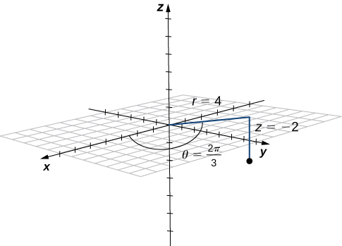{: #CNX_Calc_Figure_12_07_005}

Point <math xmlns="http://www.w3.org/1998/Math/MathML"><mi>R</mi></math>

 has cylindrical coordinates <math xmlns="http://www.w3.org/1998/Math/MathML"><mrow><mrow><mo>(</mo><mrow><mn>5</mn><mo>,</mo><mfrac><mi>π</mi><mn>6</mn></mfrac><mo>,</mo><mn>4</mn></mrow><mo>)</mo></mrow></mrow></math>

. Plot <math xmlns="http://www.w3.org/1998/Math/MathML"><mi>R</mi></math>

 and describe its location in space using rectangular, or Cartesian, coordinates.

The rectangular coordinates of the point are <math xmlns="http://www.w3.org/1998/Math/MathML"><mrow><mrow><mo>(</mo><mrow><mfrac><mrow><mn>5</mn><msqrt><mn>3</mn></msqrt></mrow><mn>2</mn></mfrac><mo>,</mo><mfrac><mn>5</mn><mn>2</mn></mfrac><mo>,</mo><mn>4</mn></mrow><mo>)</mo></mrow><mo>.</mo></mrow></math>

* * *
{: data-type="newline"}

  

Hint

The first two components match the polar coordinates of the point in the *xy*-plane.

If this process seems familiar, it is with good reason. This is exactly the same process that we followed in [Introduction to Parametric Equations and Polar Coordinates](/m53831){: .target-chapter} to convert from polar coordinates to two-dimensional rectangular coordinates.

Converting from Rectangular to Cylindrical Coordinates

Convert the rectangular coordinates <math xmlns="http://www.w3.org/1998/Math/MathML"><mrow><mo stretchy="false">(</mo><mn>1</mn><mo>,</mo><mn>−3</mn><mo>,</mo><mn>5</mn><mo stretchy="false">)</mo></mrow></math>

 to cylindrical coordinates.

Use the second set of equations from [[link]](#fs-id1163723500624) to translate from rectangular to cylindrical coordinates:

<math xmlns="http://www.w3.org/1998/Math/MathML"><mtable><mtr><mtd columnalign="right"><msup><mi>r</mi><mn>2</mn></msup></mtd><mtd columnalign="left"><mo>=</mo></mtd><mtd columnalign="left"><msup><mi>x</mi><mn>2</mn></msup><mo>+</mo><msup><mi>y</mi><mn>2</mn></msup></mtd></mtr><mtr><mtd columnalign="right"><mi>r</mi></mtd><mtd columnalign="left"><mo>=</mo></mtd><mtd columnalign="left"><mtext>±</mtext><msqrt><mrow><msup><mn>1</mn><mn>2</mn></msup><mo>+</mo><msup><mrow><mrow><mo>(</mo><mrow><mn>−3</mn></mrow><mo>)</mo></mrow></mrow><mn>2</mn></msup></mrow></msqrt><mo>=</mo><mtext>±</mtext><msqrt><mrow><mn>10</mn></mrow></msqrt><mo>.</mo></mtd></mtr></mtable></math>

We choose the positive square root, so <math xmlns="http://www.w3.org/1998/Math/MathML"><mrow><mi>r</mi><mo>=</mo><msqrt><mrow><mn>10</mn></mrow></msqrt><mo>.</mo></mrow></math>

 Now, we apply the formula to find <math xmlns="http://www.w3.org/1998/Math/MathML"><mrow><mi>θ</mi><mo>.</mo></mrow></math>

 In this case, <math xmlns="http://www.w3.org/1998/Math/MathML"><mi>y</mi></math>

 is negative and <math xmlns="http://www.w3.org/1998/Math/MathML"><mi>x</mi></math>

 is positive, which means we must select the value of <math xmlns="http://www.w3.org/1998/Math/MathML"><mi>θ</mi></math>

 between <math xmlns="http://www.w3.org/1998/Math/MathML"><mrow><mfrac><mrow><mn>3</mn><mi>π</mi></mrow><mn>2</mn></mfrac></mrow></math>

 and <math xmlns="http://www.w3.org/1998/Math/MathML"><mrow><mn>2</mn><mi>π</mi><mtext>:</mtext></mrow></math>

<math xmlns="http://www.w3.org/1998/Math/MathML"><mtable><mtr><mtd columnalign="right"><mtext>tan</mtext><mspace width="0.2em" /><mi>θ</mi></mtd><mtd columnalign="left"><mo>=</mo></mtd><mtd columnalign="left"><mfrac><mi>y</mi><mi>x</mi></mfrac><mo>=</mo><mfrac><mrow><mn>−3</mn></mrow><mn>1</mn></mfrac></mtd></mtr><mtr><mtd columnalign="right"><mi>θ</mi></mtd><mtd columnalign="left"><mo>=</mo></mtd><mtd columnalign="left"><mtext>arctan</mtext><mrow><mo>(</mo><mrow><mn>−3</mn></mrow><mo>)</mo></mrow><mo>≈</mo><mn>5.03</mn><mspace width="0.2em" /><mtext>rad</mtext><mo>.</mo></mtd></mtr></mtable></math>

In this case, the *z*-coordinates are the same in both rectangular and cylindrical coordinates:

<math xmlns="http://www.w3.org/1998/Math/MathML"><mrow><mi>z</mi><mo>=</mo><mn>5</mn><mo>.</mo></mrow></math>

The point with rectangular coordinates <math xmlns="http://www.w3.org/1998/Math/MathML"><mrow><mo stretchy="false">(</mo><mn>1</mn><mo>,</mo><mn>−3</mn><mo>,</mo><mn>5</mn><mo stretchy="false">)</mo></mrow></math>

 has cylindrical coordinates approximately equal to <math xmlns="http://www.w3.org/1998/Math/MathML"><mrow><mrow><mo>(</mo><mrow><msqrt><mrow><mn>10</mn></mrow></msqrt><mo>,</mo><mn>5.03</mn><mo>,</mo><mn>5</mn></mrow><mo>)</mo></mrow><mo>.</mo></mrow></math>

Convert point <math xmlns="http://www.w3.org/1998/Math/MathML"><mrow><mrow><mo>(</mo><mrow><mn>−8</mn><mo>,</mo><mn>8</mn><mo>,</mo><mn>−7</mn></mrow><mo>)</mo></mrow></mrow></math>

 from Cartesian coordinates to cylindrical coordinates.

<math xmlns="http://www.w3.org/1998/Math/MathML"><mrow><mrow><mo>(</mo><mrow><mn>8</mn><msqrt><mn>2</mn></msqrt><mo>,</mo><mfrac><mrow><mn>3</mn><mi>π</mi></mrow><mn>4</mn></mfrac><mo>,</mo><mn>−7</mn></mrow><mo>)</mo></mrow></mrow></math>

Hint

<math xmlns="http://www.w3.org/1998/Math/MathML"><mrow><msup><mi>r</mi><mn>2</mn></msup><mo>=</mo><msup><mi>x</mi><mn>2</mn></msup><mo>+</mo><msup><mi>y</mi><mn>2</mn></msup></mrow></math>

 and <math xmlns="http://www.w3.org/1998/Math/MathML"><mrow><mtext>tan</mtext><mspace width="0.2em" /><mi>θ</mi><mo>=</mo><mfrac><mi>y</mi><mi>x</mi></mfrac></mrow></math>

The use of cylindrical coordinates is common in fields such as physics. Physicists studying electrical charges and the capacitors used to store these charges have discovered that these systems sometimes have a cylindrical symmetry. These systems have complicated modeling equations in the Cartesian coordinate system, which make them difficult to describe and analyze. The equations can often be expressed in more simple terms using cylindrical coordinates. For example, the cylinder described by equation <math xmlns="http://www.w3.org/1998/Math/MathML"><mrow><msup><mi>x</mi><mn>2</mn></msup><mo>+</mo><msup><mi>y</mi><mn>2</mn></msup><mo>=</mo><mn>25</mn></mrow></math>

 in the Cartesian system can be represented by cylindrical equation <math xmlns="http://www.w3.org/1998/Math/MathML"><mrow><mi>r</mi><mo>=</mo><mn>5</mn><mo>.</mo></mrow></math>

Identifying Surfaces in the Cylindrical Coordinate System

Describe the surfaces with the given cylindrical equations.

1.  <math xmlns="http://www.w3.org/1998/Math/MathML"><mrow><mi>θ</mi><mo>=</mo><mfrac><mi>π</mi><mn>4</mn></mfrac></mrow></math>

2.  <math xmlns="http://www.w3.org/1998/Math/MathML"><mrow><msup><mi>r</mi><mn>2</mn></msup><mo>+</mo><msup><mi>z</mi><mn>2</mn></msup><mo>=</mo><mn>9</mn></mrow></math>

3.  <math xmlns="http://www.w3.org/1998/Math/MathML"><mrow><mi>z</mi><mo>=</mo><mi>r</mi></mrow></math>
{: type="a"}

1.  When the angle
    <math xmlns="http://www.w3.org/1998/Math/MathML"><mi>θ</mi></math>
    
    is held constant while
    <math xmlns="http://www.w3.org/1998/Math/MathML"><mi>r</mi></math>
    
    and
    <math xmlns="http://www.w3.org/1998/Math/MathML"><mi>z</mi></math>
    
    are allowed to vary, the result is a half-plane (see the following figure).
    * * *
    {: data-type="newline"}
    
    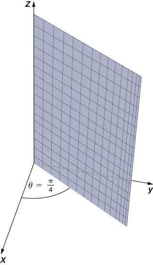{: #CNX_Calc_Figure_12_07_007}

2.  Substitute
    <math xmlns="http://www.w3.org/1998/Math/MathML"><mrow><msup><mi>r</mi><mn>2</mn></msup><mo>=</mo><msup><mi>x</mi><mn>2</mn></msup><mo>+</mo><msup><mi>y</mi><mn>2</mn></msup></mrow></math>
    
    into equation
    <math xmlns="http://www.w3.org/1998/Math/MathML"><mrow><msup><mi>r</mi><mn>2</mn></msup><mo>+</mo><msup><mi>z</mi><mn>2</mn></msup><mo>=</mo><mn>9</mn></mrow></math>
    
    to express the rectangular form of the equation:
    <math xmlns="http://www.w3.org/1998/Math/MathML"><mrow><msup><mi>x</mi><mn>2</mn></msup><mo>+</mo><msup><mi>y</mi><mn>2</mn></msup><mo>+</mo><msup><mi>z</mi><mn>2</mn></msup><mo>=</mo><mn>9</mn><mo>.</mo></mrow></math>
    
    This equation describes a sphere centered at the origin with radius
    <math xmlns="http://www.w3.org/1998/Math/MathML"><mn>3</mn></math>
    
    (see the following figure).
    * * *
    {: data-type="newline"}
    
    {: #CNX_Calc_Figure_12_07_008}

3.  To describe the surface defined by equation
    <math xmlns="http://www.w3.org/1998/Math/MathML"><mrow><mi>z</mi><mo>=</mo><mi>r</mi><mo>,</mo></mrow></math>
    
    is it useful to examine traces parallel to the *xy*-plane. For example, the trace in plane
    <math xmlns="http://www.w3.org/1998/Math/MathML"><mrow><mi>z</mi><mo>=</mo><mn>1</mn></mrow></math>
    
    is circle
    <math xmlns="http://www.w3.org/1998/Math/MathML"><mrow><mi>r</mi><mo>=</mo><mn>1</mn><mo>,</mo></mrow></math>
    
    the trace in plane
    <math xmlns="http://www.w3.org/1998/Math/MathML"><mrow><mi>z</mi><mo>=</mo><mn>3</mn></mrow></math>
    
    is circle
    <math xmlns="http://www.w3.org/1998/Math/MathML"><mrow><mi>r</mi><mo>=</mo><mn>3</mn><mo>,</mo></mrow></math>
    
    and so on. Each trace is a circle. As the value of
    <math xmlns="http://www.w3.org/1998/Math/MathML"><mi>z</mi></math>
    
    increases, the radius of the circle also increases. The resulting surface is a cone (see the following figure).
    * * *
    {: data-type="newline"}
    
    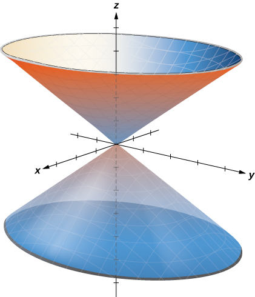{: #CNX_Calc_Figure_12_07_009}

{: type="a"}

Describe the surface with cylindrical equation <math xmlns="http://www.w3.org/1998/Math/MathML"><mrow><mi>r</mi><mo>=</mo><mn>6</mn><mo>.</mo></mrow></math>

This surface is a cylinder with radius <math xmlns="http://www.w3.org/1998/Math/MathML"><mrow><mn>6</mn><mo>.</mo></mrow></math>

* * *
{: data-type="newline"}

 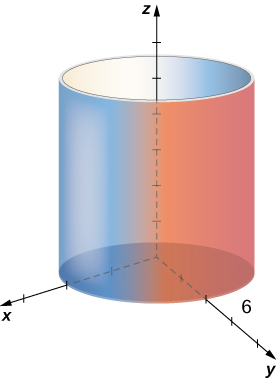 

Hint

The <math xmlns="http://www.w3.org/1998/Math/MathML"><mi>θ</mi></math>

 and <math xmlns="http://www.w3.org/1998/Math/MathML"><mi>z</mi></math>

 components of points on the surface can take any value.

### Spherical Coordinates

In the Cartesian coordinate system, the location of a point in space is described using an ordered triple in which each coordinate represents a distance. In the cylindrical coordinate system, location of a point in space is described using two distances <math xmlns="http://www.w3.org/1998/Math/MathML"><mrow><mrow><mo>(</mo><mrow><mi>r</mi><mspace width="0.2em" /><mtext>and</mtext><mspace width="0.2em" /><mi>z</mi></mrow><mo>)</mo></mrow></mrow></math>

 and an angle measure <math xmlns="http://www.w3.org/1998/Math/MathML"><mrow><mrow><mo>(</mo><mi>θ</mi><mo>)</mo></mrow><mo>.</mo></mrow></math>

 In the spherical coordinate system, we again use an ordered triple to describe the location of a point in space. In this case, the triple describes one distance and two angles. Spherical coordinates make it simple to describe a sphere, just as cylindrical coordinates make it easy to describe a cylinder. Grid lines for spherical coordinates are based on angle measures, like those for polar coordinates.

Definition

In the **spherical coordinate system**{: data-type="term"}, a point <math xmlns="http://www.w3.org/1998/Math/MathML"><mi>P</mi></math>

 in space ([\[link\]](#CNX_Calc_Figure_12_07_011)) is represented by the ordered triple <math xmlns="http://www.w3.org/1998/Math/MathML"><mrow><mo stretchy="false">(</mo><mi>ρ</mi><mo>,</mo><mi>θ</mi><mo>,</mo><mi>φ</mi><mo stretchy="false">)</mo></mrow></math>

 where

* <math xmlns="http://www.w3.org/1998/Math/MathML"><mi>ρ</mi></math>
  
  (the Greek letter rho) is the distance between
  <math xmlns="http://www.w3.org/1998/Math/MathML"><mi>P</mi></math>
  
  and the origin
  <math xmlns="http://www.w3.org/1998/Math/MathML"><mrow><mrow><mo>(</mo><mrow><mi>ρ</mi><mo>≠</mo><mn>0</mn></mrow><mo>)</mo></mrow><mo>;</mo></mrow></math>

* <math xmlns="http://www.w3.org/1998/Math/MathML"><mi>θ</mi></math>
  
  is the same angle used to describe the location in cylindrical coordinates;
* <math xmlns="http://www.w3.org/1998/Math/MathML"><mi>φ</mi></math>
  
  (the Greek letter phi) is the angle formed by the positive *z*-axis and line segment
  <math xmlns="http://www.w3.org/1998/Math/MathML"><mrow><mover accent="true"><mrow><mi>O</mi><mi>P</mi></mrow><mo stretchy="true">—</mo></mover><mo>,</mo></mrow></math>
  
  where
  <math xmlns="http://www.w3.org/1998/Math/MathML"><mi>O</mi></math>
  
  is the origin and
  <math xmlns="http://www.w3.org/1998/Math/MathML"><mrow><mn>0</mn><mo>≤</mo><mi>φ</mi><mo>≤</mo><mi>π</mi><mo>.</mo></mrow></math>
{: data-bullet-style="bullet"}

 {: #CNX_Calc_Figure_12_07_011}

By convention, the origin is represented as <math xmlns="http://www.w3.org/1998/Math/MathML"><mrow><mrow><mo>(</mo><mrow><mn>0</mn><mo>,</mo><mn>0</mn><mo>,</mo><mn>0</mn></mrow><mo>)</mo></mrow></mrow></math>

 in spherical coordinates.

Converting among Spherical, Cylindrical, and Rectangular Coordinates

Rectangular coordinates <math xmlns="http://www.w3.org/1998/Math/MathML"><mrow><mrow><mo>(</mo><mrow><mi>x</mi><mo>,</mo><mi>y</mi><mo>,</mo><mi>z</mi></mrow><mo>)</mo></mrow></mrow></math>

 and spherical coordinates <math xmlns="http://www.w3.org/1998/Math/MathML"><mrow><mrow><mo>(</mo><mrow><mi>ρ</mi><mo>,</mo><mi>θ</mi><mo>,</mo><mi>φ</mi></mrow><mo>)</mo></mrow></mrow></math>

 of a point are related as follows:

<math xmlns="http://www.w3.org/1998/Math/MathML"><mtable><mtr><mtd columnalign="right"><mi>x</mi></mtd><mtd columnalign="center"><mo>=</mo></mtd><mtd columnalign="left"><mi>ρ</mi><mspace width="0.2em" /><mtext>sin</mtext><mspace width="0.2em" /><mi>φ</mi><mspace width="0.2em" /><mtext>cos</mtext><mspace width="0.2em" /><mi>θ</mi></mtd><mtd /><mtd /><mtd columnalign="left"><mtext>These equations are used to convert from</mtext></mtd></mtr><mtr><mtd columnalign="right"><mi>y</mi></mtd><mtd columnalign="center"><mo>=</mo></mtd><mtd columnalign="left"><mi>ρ</mi><mspace width="0.2em" /><mtext>sin</mtext><mspace width="0.2em" /><mi>φ</mi><mspace width="0.2em" /><mtext>sin</mtext><mspace width="0.2em" /><mi>θ</mi></mtd><mtd /><mtd /><mtd columnalign="left"><mtext>spherical coordinates to rectangular</mtext></mtd></mtr><mtr><mtd columnalign="right"><mi>z</mi></mtd><mtd columnalign="center"><mo>=</mo></mtd><mtd columnalign="left"><mi>ρ</mi><mspace width="0.2em" /><mtext>cos</mtext><mspace width="0.2em" /><mi>φ</mi></mtd><mtd /><mtd /><mtd columnalign="left"><mtext>coordinates.</mtext></mtd></mtr><mtr><mtd /><mtd columnalign="center"><mtext>and</mtext></mtd><mtd /><mtd /><mtd /><mtd /></mtr><mtr><mtd columnalign="right"><msup><mi>ρ</mi><mn>2</mn></msup></mtd><mtd columnalign="center"><mo>=</mo></mtd><mtd columnalign="left"><msup><mi>x</mi><mn>2</mn></msup><mo>+</mo><msup><mi>y</mi><mn>2</mn></msup><mo>+</mo><msup><mi>z</mi><mn>2</mn></msup></mtd><mtd /><mtd /><mtd columnalign="left"><mtext>These equations are used to convert from</mtext></mtd></mtr><mtr><mtd columnalign="right"><mtext>tan</mtext><mspace width="0.2em" /><mi>θ</mi></mtd><mtd columnalign="center"><mo>=</mo></mtd><mtd columnalign="left"><mfrac><mi>y</mi><mi>x</mi></mfrac></mtd><mtd /><mtd /><mtd columnalign="left"><mtext>rectangular coordinates to spherical</mtext></mtd></mtr><mtr><mtd columnalign="right"><mi>φ</mi></mtd><mtd columnalign="center"><mo>=</mo></mtd><mtd columnalign="left"><mtext>arccos</mtext><mrow><mo>(</mo><mrow><mfrac><mi>z</mi><mrow><msqrt><mrow><msup><mi>x</mi><mn>2</mn></msup><mo>+</mo><msup><mi>y</mi><mn>2</mn></msup><mo>+</mo><msup><mi>z</mi><mn>2</mn></msup></mrow></msqrt></mrow></mfrac></mrow><mo>)</mo><mo>.</mo></mrow></mtd><mtd /><mtd /><mtd columnalign="left"><mtext>coordinates.</mtext></mtd></mtr></mtable></math>

If a point has cylindrical coordinates <math xmlns="http://www.w3.org/1998/Math/MathML"><mrow><mrow><mo>(</mo><mrow><mi>r</mi><mo>,</mo><mi>θ</mi><mo>,</mo><mi>z</mi></mrow><mo>)</mo></mrow><mo>,</mo></mrow></math>

 then these equations define the relationship between cylindrical and spherical coordinates.

<math xmlns="http://www.w3.org/1998/Math/MathML"><mtable><mtr><mtd columnalign="right"><mi>r</mi></mtd><mtd columnalign="center"><mo>=</mo></mtd><mtd columnalign="left"><mi>ρ</mi><mspace width="0.2em" /><mtext>sin</mtext><mspace width="0.2em" /><mi>φ</mi></mtd><mtd /><mtd /><mtd columnalign="left"><mtext>These equations are used to convert from</mtext></mtd></mtr><mtr><mtd columnalign="right"><mi>θ</mi></mtd><mtd columnalign="center"><mo>=</mo></mtd><mtd columnalign="left"><mi>θ</mi></mtd><mtd /><mtd /><mtd columnalign="left"><mtext>spherical coordinates to cylindrical</mtext></mtd></mtr><mtr><mtd columnalign="right"><mi>z</mi></mtd><mtd columnalign="center"><mo>=</mo></mtd><mtd columnalign="left"><mi>ρ</mi><mspace width="0.2em" /><mtext>cos</mtext><mspace width="0.2em" /><mi>φ</mi></mtd><mtd /><mtd /><mtd columnalign="left"><mtext>coordinates.</mtext></mtd></mtr><mtr><mtd /><mtd columnalign="center"><mtext>and</mtext></mtd><mtd /><mtd /><mtd /><mtd /></mtr><mtr><mtd columnalign="right"><mi>ρ</mi></mtd><mtd columnalign="center"><mo>=</mo></mtd><mtd columnalign="left"><msqrt><mrow><msup><mi>r</mi><mn>2</mn></msup><mo>+</mo><msup><mi>z</mi><mn>2</mn></msup></mrow></msqrt></mtd><mtd /><mtd /><mtd columnalign="left"><mtext>These equations are used to convert from</mtext></mtd></mtr><mtr><mtd columnalign="right"><mi>θ</mi></mtd><mtd columnalign="center"><mo>=</mo></mtd><mtd columnalign="left"><mi>θ</mi></mtd><mtd /><mtd /><mtd columnalign="left"><mtext>cylindrical coordinates to spherical</mtext></mtd></mtr><mtr><mtd columnalign="right"><mi>φ</mi></mtd><mtd columnalign="center"><mo>=</mo></mtd><mtd columnalign="left"><mtext>arccos</mtext><mrow><mo>(</mo><mrow><mfrac><mi>z</mi><mrow><msqrt><mrow><msup><mi>r</mi><mn>2</mn></msup><mo>+</mo><msup><mi>z</mi><mn>2</mn></msup></mrow></msqrt></mrow></mfrac></mrow><mo>)</mo></mrow></mtd><mtd /><mtd /><mtd columnalign="left"><mtext>coordinates.</mtext></mtd></mtr></mtable></math>

The formulas to convert from spherical coordinates to rectangular coordinates may seem complex, but they are straightforward applications of trigonometry. Looking at [\[link\]](#CNX_Calc_Figure_12_07_012), it is easy to see that <math xmlns="http://www.w3.org/1998/Math/MathML"><mrow><mi>r</mi><mo>=</mo><mi>ρ</mi><mspace width="0.2em" /><mtext>sin</mtext><mspace width="0.2em" /><mi>φ</mi><mo>.</mo></mrow></math>

 Then, looking at the triangle in the *xy*-plane with <math xmlns="http://www.w3.org/1998/Math/MathML"><mi>r</mi></math>

 as its hypotenuse, we have <math xmlns="http://www.w3.org/1998/Math/MathML"><mrow><mi>x</mi><mo>=</mo><mi>r</mi><mspace width="0.2em" /><mtext>cos</mtext><mspace width="0.2em" /><mi>θ</mi><mo>=</mo><mi>ρ</mi><mspace width="0.2em" /><mtext>sin</mtext><mspace width="0.2em" /><mi>φ</mi><mspace width="0.2em" /><mtext>cos</mtext><mspace width="0.2em" /><mi>θ</mi><mo>.</mo></mrow></math>

 The derivation of the formula for <math xmlns="http://www.w3.org/1998/Math/MathML"><mi>y</mi></math>

 is similar. [\[link\]](#CNX_Calc_Figure_12_07_009) also shows that <math xmlns="http://www.w3.org/1998/Math/MathML"><mrow><msup><mi>ρ</mi><mn>2</mn></msup><mo>=</mo><msup><mi>r</mi><mn>2</mn></msup><mo>+</mo><msup><mi>z</mi><mn>2</mn></msup><mo>=</mo><msup><mi>x</mi><mn>2</mn></msup><mo>+</mo><msup><mi>y</mi><mn>2</mn></msup><mo>+</mo><msup><mi>z</mi><mn>2</mn></msup></mrow></math>

 and <math xmlns="http://www.w3.org/1998/Math/MathML"><mrow><mi>z</mi><mo>=</mo><mi>ρ</mi><mspace width="0.2em" /><mtext>cos</mtext><mspace width="0.2em" /><mi>φ</mi><mo>.</mo></mrow></math>

 Solving this last equation for <math xmlns="http://www.w3.org/1998/Math/MathML"><mi>φ</mi></math>

 and then substituting <math xmlns="http://www.w3.org/1998/Math/MathML"><mrow><mi>ρ</mi><mo>=</mo><msqrt><mrow><msup><mi>r</mi><mn>2</mn></msup><mo>+</mo><msup><mi>z</mi><mn>2</mn></msup></mrow></msqrt></mrow></math>

 (from the first equation) yields <math xmlns="http://www.w3.org/1998/Math/MathML"><mrow><mi>φ</mi><mo>=</mo><mtext>arccos</mtext><mrow><mo>(</mo><mrow><mfrac><mi>z</mi><mrow><msqrt><mrow><msup><mi>r</mi><mn>2</mn></msup><mo>+</mo><msup><mi>z</mi><mn>2</mn></msup></mrow></msqrt></mrow></mfrac></mrow><mo>)</mo></mrow><mo>.</mo></mrow></math>

 Also, note that, as before, we must be careful when using the formula <math xmlns="http://www.w3.org/1998/Math/MathML"><mrow><mtext>tan</mtext><mspace width="0.2em" /><mi>θ</mi><mo>=</mo><mfrac><mi>y</mi><mi>x</mi></mfrac></mrow></math>

 to choose the correct value of <math xmlns="http://www.w3.org/1998/Math/MathML"><mrow><mi>θ</mi><mo>.</mo></mrow></math>

 ![This figure is the first quadrant of the 3-dimensional coordinate system. It has a point labeled &#x201C;(x, y, z) = (r, theta, z) = (rho, theta, phi).&#x201D; There is a line segment from the origin to the point. It is labeled &#x201C;rho.&#x201D; The angle between this line segment and the z-axis is phi. There is a line segment in the x y-plane from the origin to the shadow of the point. This segment is labeled &#x201C;r.&#x201D; The angle between the x-axis and r is theta.The distance from r to the point is labeled &#x201C;z.&#x201D;](../resources/CNX_Calc_Figure_12_07_010.jpg "The equations that convert from one system to another are derived from right-triangle relationships."){: #CNX_Calc_Figure_12_07_012}

As we did with cylindrical coordinates, let’s consider the surfaces that are generated when each of the coordinates is held constant. Let <math xmlns="http://www.w3.org/1998/Math/MathML"><mi>c</mi></math>

 be a constant, and consider surfaces of the form <math xmlns="http://www.w3.org/1998/Math/MathML"><mrow><mi>ρ</mi><mo>=</mo><mi>c</mi><mo>.</mo></mrow></math>

 Points on these surfaces are at a fixed distance from the origin and form a sphere. The coordinate <math xmlns="http://www.w3.org/1998/Math/MathML"><mi>θ</mi></math>

 in the spherical coordinate system is the same as in the cylindrical coordinate system, so surfaces of the form <math xmlns="http://www.w3.org/1998/Math/MathML"><mrow><mi>θ</mi><mo>=</mo><mi>c</mi></mrow></math>

 are half-planes, as before. Last, consider surfaces of the form <math xmlns="http://www.w3.org/1998/Math/MathML"><mrow><mi>φ</mi><mo>=</mo><mn>0</mn><mo>.</mo></mrow></math>

 The points on these surfaces are at a fixed angle from the *z*-axis and form a half-cone ([\[link\]](#CNX_Calc_Figure_12_07_013)).

 , surfaces of the form &#x3B8;=c are half-planes at an angle &#x3B8; from the x-axis (b), and surfaces of the form &#x3D5;=c are half-cones at an angle &#x3D5; from the z-axis (c)."){: #CNX_Calc_Figure_12_07_013}

Converting from Spherical Coordinates

Plot the point with spherical coordinates <math xmlns="http://www.w3.org/1998/Math/MathML"><mrow><mrow><mo>(</mo><mrow><mn>8</mn><mo>,</mo><mfrac><mi>π</mi><mn>3</mn></mfrac><mo>,</mo><mfrac><mi>π</mi><mn>6</mn></mfrac></mrow><mo>)</mo></mrow></mrow></math>

 and express its location in both rectangular and cylindrical coordinates.

Use the equations in [[link]](#fs-id1163723844895) to translate between spherical and cylindrical coordinates ([[link]](#CNX_Calc_Figure_12_07_014)):

<math xmlns="http://www.w3.org/1998/Math/MathML"><mtable><mtr /><mtr /><mtr><mtd columnalign="left"><mi>x</mi><mo>=</mo><mi>ρ</mi><mspace width="0.2em" /><mtext>sin</mtext><mspace width="0.2em" /><mi>φ</mi><mspace width="0.2em" /><mtext>cos</mtext><mspace width="0.2em" /><mi>θ</mi><mo>=</mo><mn>8</mn><mspace width="0.2em" /><mtext>sin</mtext><mrow><mo>(</mo><mrow><mfrac><mi>π</mi><mn>6</mn></mfrac></mrow><mo>)</mo></mrow><mtext>cos</mtext><mrow><mo>(</mo><mrow><mfrac><mi>π</mi><mn>3</mn></mfrac></mrow><mo>)</mo></mrow><mo>=</mo><mn>8</mn><mrow><mo>(</mo><mrow><mfrac><mn>1</mn><mn>2</mn></mfrac></mrow><mo>)</mo></mrow><mfrac><mn>1</mn><mn>2</mn></mfrac><mo>=</mo><mn>2</mn></mtd></mtr><mtr><mtd columnalign="left"><mi>y</mi><mo>=</mo><mi>ρ</mi><mspace width="0.2em" /><mtext>sin</mtext><mspace width="0.2em" /><mi>φ</mi><mspace width="0.2em" /><mtext>sin</mtext><mspace width="0.2em" /><mi>θ</mi><mo>=</mo><mn>8</mn><mspace width="0.2em" /><mtext>sin</mtext><mrow><mo>(</mo><mrow><mfrac><mi>π</mi><mn>6</mn></mfrac></mrow><mo>)</mo></mrow><mtext>sin</mtext><mrow><mo>(</mo><mrow><mfrac><mi>π</mi><mn>3</mn></mfrac></mrow><mo>)</mo></mrow><mo>=</mo><mn>8</mn><mrow><mo>(</mo><mrow><mfrac><mn>1</mn><mn>2</mn></mfrac></mrow><mo>)</mo></mrow><mfrac><mrow><msqrt><mn>3</mn></msqrt></mrow><mn>2</mn></mfrac><mo>=</mo><mn>2</mn><msqrt><mn>3</mn></msqrt></mtd></mtr><mtr><mtd columnalign="left"><mi>z</mi><mo>=</mo><mi>ρ</mi><mspace width="0.2em" /><mtext>cos</mtext><mspace width="0.2em" /><mi>φ</mi><mo>=</mo><mn>8</mn><mspace width="0.2em" /><mtext>cos</mtext><mrow><mo>(</mo><mrow><mfrac><mi>π</mi><mn>6</mn></mfrac></mrow><mo>)</mo></mrow><mo>=</mo><mn>8</mn><mrow><mo>(</mo><mrow><mfrac><mrow><msqrt><mn>3</mn></msqrt></mrow><mn>2</mn></mfrac></mrow><mo>)</mo></mrow><mo>=</mo><mn>4</mn><msqrt><mn>3</mn></msqrt><mo>.</mo></mtd></mtr></mtable></math>

{: #CNX_Calc_Figure_12_07_014}

The point with spherical coordinates <math xmlns="http://www.w3.org/1998/Math/MathML"><mrow><mrow><mo>(</mo><mrow><mn>8</mn><mo>,</mo><mfrac><mi>π</mi><mn>3</mn></mfrac><mo>,</mo><mfrac><mi>π</mi><mn>6</mn></mfrac></mrow><mo>)</mo></mrow></mrow></math>

 has rectangular coordinates <math xmlns="http://www.w3.org/1998/Math/MathML"><mrow><mrow><mo>(</mo><mrow><mn>2</mn><mo>,</mo><mn>2</mn><msqrt><mn>3</mn></msqrt><mo>,</mo><mn>4</mn><msqrt><mn>3</mn></msqrt></mrow><mo>)</mo></mrow><mo>.</mo></mrow></math>

Finding the values in cylindrical coordinates is equally straightforward:

<math xmlns="http://www.w3.org/1998/Math/MathML"><mtable><mtr /><mtr><mtd columnalign="right"><mi>r</mi></mtd><mtd columnalign="left"><mo>=</mo></mtd><mtd columnalign="left"><mi>ρ</mi><mspace width="0.2em" /><mtext>sin</mtext><mspace width="0.2em" /><mi>φ</mi><mo>=</mo><mn>8</mn><mspace width="0.2em" /><mtext>sin</mtext><mspace width="0.2em" /><mfrac><mi>π</mi><mn>6</mn></mfrac><mo>=</mo><mn>4</mn></mtd></mtr><mtr><mtd columnalign="right"><mi>θ</mi></mtd><mtd columnalign="left"><mo>=</mo></mtd><mtd columnalign="left"><mi>θ</mi></mtd></mtr><mtr><mtd columnalign="right"><mi>z</mi></mtd><mtd columnalign="left"><mo>=</mo></mtd><mtd columnalign="left"><mi>ρ</mi><mspace width="0.2em" /><mtext>cos</mtext><mspace width="0.2em" /><mi>φ</mi><mo>=</mo><mn>8</mn><mspace width="0.2em" /><mtext>cos</mtext><mspace width="0.2em" /><mfrac><mi>π</mi><mn>6</mn></mfrac><mo>=</mo><mn>4</mn><msqrt><mn>3</mn></msqrt><mo>.</mo></mtd></mtr></mtable></math>

Thus, cylindrical coordinates for the point are <math xmlns="http://www.w3.org/1998/Math/MathML"><mrow><mrow><mo>(</mo><mrow><mn>4</mn><mo>,</mo><mfrac><mi>π</mi><mn>3</mn></mfrac><mo>,</mo><mn>4</mn><msqrt><mn>3</mn></msqrt></mrow><mo>)</mo></mrow><mo>.</mo></mrow></math>

Plot the point with spherical coordinates <math xmlns="http://www.w3.org/1998/Math/MathML"><mrow><mrow><mo>(</mo><mrow><mn>2</mn><mo>,</mo><mo>−</mo><mfrac><mrow><mn>5</mn><mi>π</mi></mrow><mn>6</mn></mfrac><mo>,</mo><mfrac><mi>π</mi><mn>6</mn></mfrac></mrow><mo>)</mo></mrow></mrow></math>

 and describe its location in both rectangular and cylindrical coordinates.

* * *
{: data-type="newline"}

  
* * *
{: data-type="newline"}

 Cartesian: <math xmlns="http://www.w3.org/1998/Math/MathML"><mrow><mrow><mo>(</mo><mrow><mo>−</mo><mfrac><mrow><msqrt><mn>3</mn></msqrt></mrow><mn>2</mn></mfrac><mo>,</mo><mo>−</mo><mfrac><mn>1</mn><mn>2</mn></mfrac><mo>,</mo><msqrt><mn>3</mn></msqrt></mrow><mo>)</mo></mrow><mo>,</mo></mrow></math>

 cylindrical: <math xmlns="http://www.w3.org/1998/Math/MathML"><mrow><mrow><mo>(</mo><mrow><mn>1</mn><mo>,</mo><mo>−</mo><mfrac><mrow><mn>5</mn><mi>π</mi></mrow><mn>6</mn></mfrac><mo>,</mo><msqrt><mn>3</mn></msqrt></mrow><mo>)</mo></mrow></mrow></math>

Hint

Converting the coordinates first may help to find the location of the point in space more easily.

Converting from Rectangular Coordinates

Convert the rectangular coordinates <math xmlns="http://www.w3.org/1998/Math/MathML"><mrow><mrow><mo>(</mo><mrow><mn>−1</mn><mo>,</mo><mn>1</mn><mo>,</mo><msqrt><mn>6</mn></msqrt></mrow><mo>)</mo></mrow></mrow></math>

 to both spherical and cylindrical coordinates.

Start by converting from rectangular to spherical coordinates:

<math xmlns="http://www.w3.org/1998/Math/MathML"><mtable><mtr><mtd columnalign="left"><mtable><mtr><mtd columnalign="right"><msup><mi>ρ</mi><mn>2</mn></msup></mtd><mtd columnalign="left"><mo>=</mo></mtd><mtd columnalign="left"><msup><mi>x</mi><mn>2</mn></msup><mo>+</mo><msup><mi>y</mi><mn>2</mn></msup><mo>+</mo><msup><mi>z</mi><mn>2</mn></msup><mo>=</mo><msup><mrow><mo>(</mo><mrow><mn>−1</mn></mrow><mo>)</mo></mrow><mn>2</mn></msup><mo>+</mo><msup><mn>1</mn><mn>2</mn></msup><mo>+</mo><msup><mrow><mo>(</mo><mrow><msqrt><mn>6</mn></msqrt></mrow><mo>)</mo></mrow><mn>2</mn></msup><mo>=</mo><mn>8</mn></mtd></mtr><mtr><mtd columnalign="right"><mi>ρ</mi></mtd><mtd columnalign="left"><mo>=</mo></mtd><mtd columnalign="left"><mn>2</mn><msqrt><mn>2</mn></msqrt></mtd></mtr></mtable></mtd><mtd /><mtd /><mtd columnalign="left"><mtable><mtr><mtd columnalign="right"><mtext>tan</mtext><mspace width="0.2em" /><mi>θ</mi></mtd><mtd columnalign="left"><mo>=</mo></mtd><mtd columnalign="left"><mfrac><mn>1</mn><mrow><mn>−1</mn></mrow></mfrac></mtd></mtr><mtr><mtd columnalign="right"><mi>θ</mi></mtd><mtd columnalign="left"><mo>=</mo></mtd><mtd columnalign="left"><mtext>arctan</mtext><mrow><mo>(</mo><mrow><mn>−1</mn></mrow><mo>)</mo></mrow><mo>=</mo><mfrac><mrow><mn>3</mn><mi>π</mi></mrow><mn>4</mn></mfrac><mo>.</mo></mtd></mtr></mtable></mtd></mtr></mtable></math>

Because <math xmlns="http://www.w3.org/1998/Math/MathML"><mrow><mrow><mo>(</mo><mrow><mi>x</mi><mo>,</mo><mi>y</mi></mrow><mo>)</mo></mrow><mo>=</mo><mrow><mo>(</mo><mrow><mn>−1</mn><mo>,</mo><mn>1</mn></mrow><mo>)</mo></mrow><mo>,</mo></mrow></math>

 then the correct choice for <math xmlns="http://www.w3.org/1998/Math/MathML"><mi>θ</mi></math>

 is <math xmlns="http://www.w3.org/1998/Math/MathML"><mrow><mfrac><mrow><mn>3</mn><mi>π</mi></mrow><mn>4</mn></mfrac><mo>.</mo></mrow></math>

There are actually two ways to identify <math xmlns="http://www.w3.org/1998/Math/MathML"><mrow><mi>φ</mi><mo>.</mo></mrow></math>

 We can use the equation <math xmlns="http://www.w3.org/1998/Math/MathML"><mrow><mi>φ</mi><mo>=</mo><mtext>arccos</mtext><mrow><mo>(</mo><mrow><mfrac><mi>z</mi><mrow><msqrt><mrow><msup><mi>x</mi><mn>2</mn></msup><mo>+</mo><msup><mi>y</mi><mn>2</mn></msup><mo>+</mo><msup><mi>z</mi><mn>2</mn></msup></mrow></msqrt></mrow></mfrac></mrow><mo>)</mo></mrow><mo>.</mo></mrow></math>

 A more simple approach, however, is to use equation <math xmlns="http://www.w3.org/1998/Math/MathML"><mrow><mi>z</mi><mo>=</mo><mi>ρ</mi><mspace width="0.2em" /><mtext>cos</mtext><mspace width="0.2em" /><mi>φ</mi><mo>.</mo></mrow></math>

 We know that <math xmlns="http://www.w3.org/1998/Math/MathML"><mrow><mi>z</mi><mo>=</mo><msqrt><mn>6</mn></msqrt></mrow></math>

 and <math xmlns="http://www.w3.org/1998/Math/MathML"><mrow><mi>ρ</mi><mo>=</mo><mn>2</mn><msqrt><mn>2</mn></msqrt><mo>,</mo></mrow></math>

 so

<math xmlns="http://www.w3.org/1998/Math/MathML"><mrow><msqrt><mn>6</mn></msqrt><mo>=</mo><mn>2</mn><msqrt><mn>2</mn></msqrt><mspace width="0.2em" /><mtext>cos</mtext><mspace width="0.2em" /><mi>φ</mi><mo>,</mo><mspace width="0.2em" /><mtext>so</mtext><mspace width="0.2em" /><mtext>cos</mtext><mspace width="0.2em" /><mi>φ</mi><mo>=</mo><mfrac><mrow><msqrt><mn>6</mn></msqrt></mrow><mrow><mn>2</mn><msqrt><mn>2</mn></msqrt></mrow></mfrac><mo>=</mo><mfrac><mrow><msqrt><mn>3</mn></msqrt></mrow><mn>2</mn></mfrac></mrow></math>

and therefore <math xmlns="http://www.w3.org/1998/Math/MathML"><mrow><mi>φ</mi><mo>=</mo><mfrac><mi>π</mi><mn>6</mn></mfrac><mo>.</mo></mrow></math>

 The spherical coordinates of the point are <math xmlns="http://www.w3.org/1998/Math/MathML"><mrow><mrow><mo>(</mo><mrow><mn>2</mn><msqrt><mn>2</mn></msqrt><mo>,</mo><mfrac><mrow><mn>3</mn><mi>π</mi></mrow><mn>4</mn></mfrac><mo>,</mo><mfrac><mi>π</mi><mn>6</mn></mfrac></mrow><mo>)</mo></mrow><mo>.</mo></mrow></math>

To find the cylindrical coordinates for the point, we need only find <math xmlns="http://www.w3.org/1998/Math/MathML"><mrow><mi>r</mi><mtext>:</mtext></mrow></math>

<math xmlns="http://www.w3.org/1998/Math/MathML"><mrow><mi>r</mi><mo>=</mo><mi>ρ</mi><mspace width="0.2em" /><mtext>sin</mtext><mspace width="0.2em" /><mi>φ</mi><mo>=</mo><mn>2</mn><msqrt><mn>2</mn></msqrt><mspace width="0.2em" /><mtext>sin</mtext><mrow><mo>(</mo><mrow><mfrac><mi>π</mi><mn>6</mn></mfrac></mrow><mo>)</mo></mrow><mo>=</mo><msqrt><mn>2</mn></msqrt><mo>.</mo></mrow></math>

The cylindrical coordinates for the point are <math xmlns="http://www.w3.org/1998/Math/MathML"><mrow><mrow><mo>(</mo><mrow><msqrt><mn>2</mn></msqrt><mo>,</mo><mfrac><mrow><mn>3</mn><mi>π</mi></mrow><mn>4</mn></mfrac><mo>,</mo><msqrt><mn>6</mn></msqrt></mrow><mo>)</mo></mrow><mo>.</mo></mrow></math>

Identifying Surfaces in the Spherical Coordinate System

Describe the surfaces with the given spherical equations.

1.  <math xmlns="http://www.w3.org/1998/Math/MathML"><mrow><mi>θ</mi><mo>=</mo><mfrac><mi>π</mi><mn>3</mn></mfrac></mrow></math>

2.  <math xmlns="http://www.w3.org/1998/Math/MathML"><mrow><mi>φ</mi><mo>=</mo><mfrac><mrow><mn>5</mn><mi>π</mi></mrow><mn>6</mn></mfrac></mrow></math>

3.  <math xmlns="http://www.w3.org/1998/Math/MathML"><mrow><mi>ρ</mi><mo>=</mo><mn>6</mn></mrow></math>

4.  <math xmlns="http://www.w3.org/1998/Math/MathML"><mrow><mi>ρ</mi><mo>=</mo><mtext>sin</mtext><mspace width="0.2em" /><mi>θ</mi><mspace width="0.2em" /><mtext>sin</mtext><mspace width="0.2em" /><mi>φ</mi></mrow></math>
{: type="a"}

1.  The variable
    <math xmlns="http://www.w3.org/1998/Math/MathML"><mi>θ</mi></math>
    
    represents the measure of the same angle in both the cylindrical and spherical coordinate systems. Points with coordinates
    <math xmlns="http://www.w3.org/1998/Math/MathML"><mrow><mrow><mo>(</mo><mrow><mi>ρ</mi><mo>,</mo><mfrac><mi>π</mi><mn>3</mn></mfrac><mo>,</mo><mi>φ</mi></mrow><mo>)</mo></mrow></mrow></math>
    
    lie on the plane that forms angle
    <math xmlns="http://www.w3.org/1998/Math/MathML"><mrow><mi>θ</mi><mo>=</mo><mfrac><mi>π</mi><mn>3</mn></mfrac></mrow></math>
    
    with the positive *x*-axis. Because
    <math xmlns="http://www.w3.org/1998/Math/MathML"><mrow><mi>ρ</mi><mo>&gt;</mo><mn>0</mn><mo>,</mo></mrow></math>
    
    the surface described by equation
    <math xmlns="http://www.w3.org/1998/Math/MathML"><mrow><mi>θ</mi><mo>=</mo><mfrac><mi>π</mi><mn>3</mn></mfrac></mrow></math>
    
    is the half-plane shown in [[link]](#CNX_Calc_Figure_12_07_016).
    * * *
    {: data-type="newline"}
    
    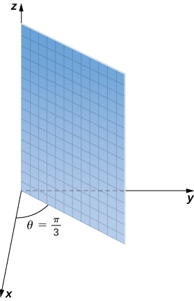{: #CNX_Calc_Figure_12_07_016}

2.  Equation
    <math xmlns="http://www.w3.org/1998/Math/MathML"><mrow><mi>φ</mi><mo>=</mo><mfrac><mrow><mn>5</mn><mi>π</mi></mrow><mn>6</mn></mfrac></mrow></math>
    
    describes all points in the spherical coordinate system that lie on a line from the origin forming an angle measuring
    <math xmlns="http://www.w3.org/1998/Math/MathML"><mrow><mfrac><mrow><mn>5</mn><mi>π</mi></mrow><mn>6</mn></mfrac></mrow></math>
    
    rad with the positive *z*-axis. These points form a half-cone ([[link]](#CNX_Calc_Figure_12_07_017)). Because there is only one value for
    <math xmlns="http://www.w3.org/1998/Math/MathML"><mi>φ</mi></math>
    
    that is measured from the positive *z*-axis, we do not get the full cone (with two pieces).
    * * *
    {: data-type="newline"}
    
    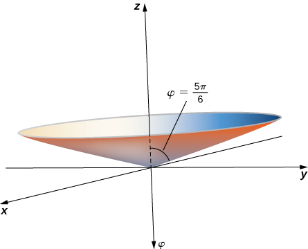{: #CNX_Calc_Figure_12_07_017}

    * * *
    {: data-type="newline"}
    
    To find the equation in rectangular coordinates, use equation
    <math xmlns="http://www.w3.org/1998/Math/MathML"><mrow><mi>φ</mi><mo>=</mo><mtext>arccos</mtext><mrow><mo>(</mo><mrow><mfrac><mi>z</mi><mrow><msqrt><mrow><msup><mi>x</mi><mn>2</mn></msup><mo>+</mo><msup><mi>y</mi><mn>2</mn></msup><mo>+</mo><msup><mi>z</mi><mn>2</mn></msup></mrow></msqrt></mrow></mfrac></mrow><mo>)</mo></mrow><mo>.</mo></mrow></math>
    
    * * *
    {: data-type="newline"}
    
    

    <math xmlns="http://www.w3.org/1998/Math/MathML"><mtable><mtr><mtd columnalign="right"><mfrac><mrow><mn>5</mn><mi>π</mi></mrow><mn>6</mn></mfrac></mtd><mtd columnalign="left"><mo>=</mo></mtd><mtd columnalign="left"><mtext>arccos</mtext><mrow><mo>(</mo><mrow><mfrac><mi>z</mi><mrow><msqrt><mrow><msup><mi>x</mi><mn>2</mn></msup><mo>+</mo><msup><mi>y</mi><mn>2</mn></msup><mo>+</mo><msup><mi>z</mi><mn>2</mn></msup></mrow></msqrt></mrow></mfrac></mrow><mo>)</mo></mrow></mtd></mtr><mtr><mtd columnalign="right"><mtext>cos</mtext><mspace width="0.2em" /><mfrac><mrow><mn>5</mn><mi>π</mi></mrow><mn>6</mn></mfrac></mtd><mtd columnalign="left"><mo>=</mo></mtd><mtd columnalign="left"><mfrac><mi>z</mi><mrow><msqrt><mrow><msup><mi>x</mi><mn>2</mn></msup><mo>+</mo><msup><mi>y</mi><mn>2</mn></msup><mo>+</mo><msup><mi>z</mi><mn>2</mn></msup></mrow></msqrt></mrow></mfrac></mtd></mtr><mtr><mtd columnalign="right"><mo>−</mo><mfrac><mrow><msqrt><mn>3</mn></msqrt></mrow><mn>2</mn></mfrac></mtd><mtd columnalign="left"><mo>=</mo></mtd><mtd columnalign="left"><mfrac><mi>z</mi><mrow><msqrt><mrow><msup><mi>x</mi><mn>2</mn></msup><mo>+</mo><msup><mi>y</mi><mn>2</mn></msup><mo>+</mo><msup><mi>z</mi><mn>2</mn></msup></mrow></msqrt></mrow></mfrac></mtd></mtr><mtr><mtd columnalign="right"><mfrac><mn>3</mn><mn>4</mn></mfrac></mtd><mtd columnalign="left"><mo>=</mo></mtd><mtd columnalign="left"><mfrac><mrow><msup><mi>z</mi><mn>2</mn></msup></mrow><mrow><msup><mi>x</mi><mn>2</mn></msup><mo>+</mo><msup><mi>y</mi><mn>2</mn></msup><mo>+</mo><msup><mi>z</mi><mn>2</mn></msup></mrow></mfrac></mtd></mtr><mtr><mtd columnalign="right"><mfrac><mrow><mn>3</mn><msup><mi>x</mi><mn>2</mn></msup></mrow><mn>4</mn></mfrac><mo>+</mo><mfrac><mrow><mn>3</mn><msup><mi>y</mi><mn>2</mn></msup></mrow><mn>4</mn></mfrac><mo>+</mo><mfrac><mrow><mn>3</mn><msup><mi>z</mi><mn>2</mn></msup></mrow><mn>4</mn></mfrac></mtd><mtd columnalign="left"><mo>=</mo></mtd><mtd columnalign="left"><msup><mi>z</mi><mn>2</mn></msup></mtd></mtr><mtr><mtd columnalign="right"><mfrac><mrow><mn>3</mn><msup><mi>x</mi><mn>2</mn></msup></mrow><mn>4</mn></mfrac><mo>+</mo><mfrac><mrow><mn>3</mn><msup><mi>y</mi><mn>2</mn></msup></mrow><mn>4</mn></mfrac><mo>−</mo><mfrac><mrow><msup><mi>z</mi><mn>2</mn></msup></mrow><mn>4</mn></mfrac></mtd><mtd columnalign="left"><mo>=</mo></mtd><mtd columnalign="left"><mn>0.</mn></mtd></mtr></mtable></math>
    

    
    * * *
    {: data-type="newline"}
    
    This is the equation of a cone centered on the *z*-axis.
3.  Equation
    <math xmlns="http://www.w3.org/1998/Math/MathML"><mrow><mi>ρ</mi><mo>=</mo><mn>6</mn></mrow></math>
    
    describes the set of all points
    <math xmlns="http://www.w3.org/1998/Math/MathML"><mn>6</mn></math>
    
    units away from the origin—a sphere with radius
    <math xmlns="http://www.w3.org/1998/Math/MathML"><mn>6</mn></math>
    
    ([[link]](#CNX_Calc_Figure_12_07_018)).
    * * *
    {: data-type="newline"}
    
    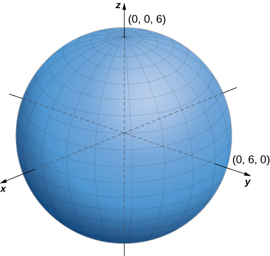{: #CNX_Calc_Figure_12_07_018}

4.  To identify this surface, convert the equation from spherical to rectangular coordinates, using equations
    <math xmlns="http://www.w3.org/1998/Math/MathML"><mrow><mi>y</mi><mo>=</mo><mi>ρ</mi><mspace width="0.2em" /><mtext>sin</mtext><mspace width="0.2em" /><mi>φ</mi><mspace width="0.2em" /><mtext>sin</mtext><mspace width="0.2em" /><mi>θ</mi></mrow></math>
    
    and
    <math xmlns="http://www.w3.org/1998/Math/MathML"><mrow><msup><mi>ρ</mi><mn>2</mn></msup><mo>=</mo><msup><mi>x</mi><mn>2</mn></msup><mo>+</mo><msup><mi>y</mi><mn>2</mn></msup><mo>+</mo><msup><mi>z</mi><mn>2</mn></msup><mtext>:</mtext></mrow></math>
    
    * * *
    {: data-type="newline"}
    
    

    <math xmlns="http://www.w3.org/1998/Math/MathML"><mtable><mtr><mtd columnalign="right"><mi>ρ</mi></mtd><mtd columnalign="left"><mo>=</mo></mtd><mtd columnalign="left"><mtext>sin</mtext><mspace width="0.2em" /><mi>θ</mi><mspace width="0.2em" /><mtext>sin</mtext><mspace width="0.2em" /><mi>φ</mi></mtd><mtd /><mtd /><mtd /></mtr><mtr><mtd columnalign="right"><msup><mi>ρ</mi><mn>2</mn></msup></mtd><mtd columnalign="left"><mo>=</mo></mtd><mtd columnalign="left"><mi>ρ</mi><mspace width="0.2em" /><mtext>sin</mtext><mspace width="0.2em" /><mi>θ</mi><mspace width="0.2em" /><mtext>sin</mtext><mspace width="0.2em" /><mi>φ</mi></mtd><mtd /><mtd /><mtd columnalign="left"><mtext>Multiply both sides of the equation by</mtext><mspace width="0.2em" /><mi>ρ</mi><mo>.</mo></mtd></mtr><mtr><mtd columnalign="right"><msup><mi>x</mi><mn>2</mn></msup><mo>+</mo><msup><mi>y</mi><mn>2</mn></msup><mo>+</mo><msup><mi>z</mi><mn>2</mn></msup></mtd><mtd columnalign="left"><mo>=</mo></mtd><mtd columnalign="left"><mi>y</mi></mtd><mtd /><mtd /><mtd columnalign="left"><mtext>Substitute rectangular variables using the equations above.</mtext></mtd></mtr><mtr><mtd columnalign="right"><msup><mi>x</mi><mn>2</mn></msup><mo>+</mo><msup><mi>y</mi><mn>2</mn></msup><mo>−</mo><mi>y</mi><mo>+</mo><msup><mi>z</mi><mn>2</mn></msup></mtd><mtd columnalign="left"><mo>=</mo></mtd><mtd columnalign="left"><mn>0</mn></mtd><mtd /><mtd /><mtd columnalign="left"><mtext>Subtract</mtext><mspace width="0.2em" /><mi>y</mi><mspace width="0.2em" /><mtext>from both sides of the equation.</mtext></mtd></mtr><mtr><mtd columnalign="right"><msup><mi>x</mi><mn>2</mn></msup><mo>+</mo><msup><mi>y</mi><mn>2</mn></msup><mo>−</mo><mi>y</mi><mo>+</mo><mfrac><mn>1</mn><mn>4</mn></mfrac><mo>+</mo><msup><mi>z</mi><mn>2</mn></msup></mtd><mtd columnalign="left"><mo>=</mo></mtd><mtd columnalign="left"><mfrac><mn>1</mn><mn>4</mn></mfrac></mtd><mtd /><mtd /><mtd columnalign="left"><mtext>Complete the square.</mtext></mtd></mtr><mtr><mtd columnalign="right"><msup><mi>x</mi><mn>2</mn></msup><mo>+</mo><msup><mrow><mrow><mo>(</mo><mrow><mi>y</mi><mo>−</mo><mfrac><mn>1</mn><mn>2</mn></mfrac></mrow><mo>)</mo></mrow></mrow><mn>2</mn></msup><mo>+</mo><msup><mi>z</mi><mn>2</mn></msup></mtd><mtd columnalign="left"><mo>=</mo></mtd><mtd columnalign="left"><mfrac><mn>1</mn><mn>4</mn></mfrac><mo>.</mo></mtd><mtd /><mtd /><mtd columnalign="left"><mtext>Rewrite the middle terms as a perfect square.</mtext></mtd></mtr></mtable></math>
    

    
    * * *
    {: data-type="newline"}
    
    The equation describes a sphere centered at point
    <math xmlns="http://www.w3.org/1998/Math/MathML"><mrow><mrow><mo>(</mo><mrow><mn>0</mn><mo>,</mo><mfrac><mn>1</mn><mn>2</mn></mfrac><mo>,</mo><mn>0</mn></mrow><mo>)</mo></mrow></mrow></math>
    
    with radius
    <math xmlns="http://www.w3.org/1998/Math/MathML"><mrow><mfrac><mn>1</mn><mn>2</mn></mfrac><mo>.</mo></mrow></math>
{: type="a"}

Describe the surfaces defined by the following equations.

1.  <math xmlns="http://www.w3.org/1998/Math/MathML"><mrow><mi>ρ</mi><mo>=</mo><mn>13</mn></mrow></math>

2.  <math xmlns="http://www.w3.org/1998/Math/MathML"><mrow><mi>θ</mi><mo>=</mo><mfrac><mrow><mn>2</mn><mi>π</mi></mrow><mn>3</mn></mfrac></mrow></math>

3.  <math xmlns="http://www.w3.org/1998/Math/MathML"><mrow><mi>φ</mi><mo>=</mo><mfrac><mi>π</mi><mn>4</mn></mfrac></mrow></math>
{: type="a"}

a. This is the set of all points <math xmlns="http://www.w3.org/1998/Math/MathML"><mrow><mn>13</mn></mrow></math>

 units from the origin. This set forms a sphere with radius <math xmlns="http://www.w3.org/1998/Math/MathML"><mrow><mn>13</mn><mo>.</mo></mrow></math>

 b. This set of points forms a half plane. The angle between the half plane and the positive *x*-axis is <math xmlns="http://www.w3.org/1998/Math/MathML"><mrow><mi>θ</mi><mo>=</mo><mfrac><mrow><mn>2</mn><mi>π</mi></mrow><mn>3</mn></mfrac><mo>.</mo></mrow></math>

 c. Let <math xmlns="http://www.w3.org/1998/Math/MathML"><mi>P</mi></math>

 be a point on this surface. The position vector of this point forms an angle of <math xmlns="http://www.w3.org/1998/Math/MathML"><mrow><mi>φ</mi><mo>=</mo><mfrac><mi>π</mi><mn>4</mn></mfrac></mrow></math>

 with the positive *z*-axis, which means that points closer to the origin are closer to the axis. These points form a half-cone.

Hint

Think about what each component represents and what it means to hold that component constant.

Spherical coordinates are useful in analyzing systems that have some degree of symmetry about a point, such as the volume of the space inside a domed stadium or wind speeds in a planet’s atmosphere. A sphere that has Cartesian equation <math xmlns="http://www.w3.org/1998/Math/MathML"><mrow><msup><mi>x</mi><mn>2</mn></msup><mo>+</mo><msup><mi>y</mi><mn>2</mn></msup><mo>+</mo><msup><mi>z</mi><mn>2</mn></msup><mo>=</mo><msup><mi>c</mi><mn>2</mn></msup></mrow></math>

 has the simple equation <math xmlns="http://www.w3.org/1998/Math/MathML"><mrow><mi>ρ</mi><mo>=</mo><mi>c</mi></mrow></math>

 in spherical coordinates.

In geography, latitude and longitude are used to describe locations on Earth’s surface, as shown in [\[link\]](#CNX_Calc_Figure_12_07_019). Although the shape of Earth is not a perfect sphere, we use spherical coordinates to communicate the locations of points on Earth. Let’s assume Earth has the shape of a sphere with radius <math xmlns="http://www.w3.org/1998/Math/MathML"><mrow><mn>4000</mn></mrow></math>

 mi. We express angle measures in degrees rather than radians because latitude and longitude are measured in degrees.

 {: #CNX_Calc_Figure_12_07_019}

Let the center of Earth be the center of the sphere, with the ray from the center through the North Pole representing the positive *z*-axis. The prime meridian represents the trace of the surface as it intersects the *xz*-plane. The equator is the trace of the sphere intersecting the *xy*-plane.

Converting Latitude and Longitude to Spherical Coordinates

The latitude of Columbus, Ohio, is <math xmlns="http://www.w3.org/1998/Math/MathML"><mrow><mn>40</mn><mtext>°</mtext></mrow></math>

 N and the longitude is <math xmlns="http://www.w3.org/1998/Math/MathML"><mrow><mn>83</mn><mtext>°</mtext></mrow></math>

 W, which means that Columbus is <math xmlns="http://www.w3.org/1998/Math/MathML"><mrow><mn>40</mn><mtext>°</mtext></mrow></math>

 north of the equator. Imagine a ray from the center of Earth through Columbus and a ray from the center of Earth through the equator directly south of Columbus. The measure of the angle formed by the rays is <math xmlns="http://www.w3.org/1998/Math/MathML"><mrow><mn>40</mn><mtext>°</mtext><mo>.</mo></mrow></math>

 In the same way, measuring from the prime meridian, Columbus lies <math xmlns="http://www.w3.org/1998/Math/MathML"><mrow><mn>83</mn><mtext>°</mtext></mrow></math>

 to the west. Express the location of Columbus in spherical coordinates.

The radius of Earth is <math xmlns="http://www.w3.org/1998/Math/MathML"><mrow><mn>4000</mn></mrow></math>

 mi, so <math xmlns="http://www.w3.org/1998/Math/MathML"><mrow><mi>ρ</mi><mo>=</mo><mn>4000</mn><mo>.</mo></mrow></math>

 The intersection of the prime meridian and the equator lies on the positive *x*-axis. Movement to the west is then described with negative angle measures, which shows that <math xmlns="http://www.w3.org/1998/Math/MathML"><mrow><mi>θ</mi><mo>=</mo><mn>−83</mn><mtext>°</mtext><mo>,</mo></mrow></math>

 Because Columbus lies <math xmlns="http://www.w3.org/1998/Math/MathML"><mrow><mn>40</mn><mtext>°</mtext></mrow></math>

 north of the equator, it lies <math xmlns="http://www.w3.org/1998/Math/MathML"><mrow><mn>50</mn><mtext>°</mtext></mrow></math>

 south of the North Pole, so <math xmlns="http://www.w3.org/1998/Math/MathML"><mrow><mi>φ</mi><mo>=</mo><mn>50</mn><mtext>°</mtext><mo>.</mo></mrow></math>

 In spherical coordinates, Columbus lies at point <math xmlns="http://www.w3.org/1998/Math/MathML"><mrow><mrow><mo>(</mo><mrow><mn>4000</mn><mo>,</mo><mn>−83</mn><mtext>°</mtext><mo>,</mo><mn>50</mn><mtext>°</mtext></mrow><mo>)</mo></mrow><mo>.</mo></mrow></math>

Sydney, Australia is at <math xmlns="http://www.w3.org/1998/Math/MathML"><mrow><mn>34</mn><mtext>°</mtext><mtext>S</mtext></mrow></math>

 and <math xmlns="http://www.w3.org/1998/Math/MathML"><mrow><mn>151</mn><mtext>°</mtext><mtext>E</mtext><mo>.</mo></mrow></math>

 Express Sydney’s location in spherical coordinates.

<math xmlns="http://www.w3.org/1998/Math/MathML"><mrow><mrow><mo>(</mo><mrow><mn>4000</mn><mo>,</mo><mn>151</mn><mtext>°</mtext><mo>,</mo><mn>124</mn><mtext>°</mtext></mrow><mo>)</mo></mrow></mrow></math>

Hint

Because Sydney lies south of the equator, we need to add <math xmlns="http://www.w3.org/1998/Math/MathML"><mrow><mn>90</mn><mtext>°</mtext></mrow></math>

 to find the angle measured from the positive *z*-axis.

Cylindrical and spherical coordinates give us the flexibility to select a coordinate system appropriate to the problem at hand. A thoughtful choice of coordinate system can make a problem much easier to solve, whereas a poor choice can lead to unnecessarily complex calculations. In the following example, we examine several different problems and discuss how to select the best coordinate system for each one.

Choosing the Best Coordinate System

In each of the following situations, we determine which coordinate system is most appropriate and describe how we would orient the coordinate axes. There could be more than one right answer for how the axes should be oriented, but we select an orientation that makes sense in the context of the problem. *Note*: There is not enough information to set up or solve these problems; we simply select the coordinate system ([[link]](#CNX_Calc_Figure_12_07_021)).

1.  Find the center of gravity of a bowling ball.
2.  Determine the velocity of a submarine subjected to an ocean current.
3.  Calculate the pressure in a conical water tank.
4.  Find the volume of oil flowing through a pipeline.
5.  Determine the amount of leather required to make a football.
    * * *
    {: data-type="newline"}
    
     modification of work by scl hua, Wikimedia, (b) modification of work by DVIDSHUB, Flickr, (c) modification of work by Michael Malak, Wikimedia, (d) modification of work by Sean Mack, Wikimedia, (e) modification of work by Elvert Barnes, Flickr)"){: #CNX_Calc_Figure_12_07_021}

{: type="a"}

1.  Clearly, a bowling ball is a sphere, so spherical coordinates would probably work best here. The origin should be located at the physical center of the ball. There is no obvious choice for how the *x*-, *y*- and *z*-axes should be oriented. Bowling balls normally have a weight block in the center. One possible choice is to align the *z*-axis with the axis of symmetry of the weight block.
2.  A submarine generally moves in a straight line. There is no rotational or spherical symmetry that applies in this situation, so rectangular coordinates are a good choice. The *z*-axis should probably point upward. The *x*- and *y*-axes could be aligned to point east and north, respectively. The origin should be some convenient physical location, such as the starting position of the submarine or the location of a particular port.
3.  A cone has several kinds of symmetry. In cylindrical coordinates, a cone can be represented by equation
    <math xmlns="http://www.w3.org/1998/Math/MathML"><mrow><mi>z</mi><mo>=</mo><mi>k</mi><mi>r</mi><mo>,</mo></mrow></math>
    
    where
    <math xmlns="http://www.w3.org/1998/Math/MathML"><mi>k</mi></math>
    
    is a constant. In spherical coordinates, we have seen that surfaces of the form
    <math xmlns="http://www.w3.org/1998/Math/MathML"><mrow><mi>φ</mi><mo>=</mo><mi>c</mi></mrow></math>
    
    are half-cones. Last, in rectangular coordinates, elliptic cones are quadric surfaces and can be represented by equations of the form
    <math xmlns="http://www.w3.org/1998/Math/MathML"><mrow><msup><mi>z</mi><mn>2</mn></msup><mo>=</mo><mfrac><mrow><msup><mi>x</mi><mn>2</mn></msup></mrow><mrow><msup><mi>a</mi><mn>2</mn></msup></mrow></mfrac><mo>+</mo><mfrac><mrow><msup><mi>y</mi><mn>2</mn></msup></mrow><mrow><msup><mi>b</mi><mn>2</mn></msup></mrow></mfrac><mo>.</mo></mrow></math>
    
    In this case, we could choose any of the three. However, the equation for the surface is more complicated in rectangular coordinates than in the other two systems, so we might want to avoid that choice. In addition, we are talking about a water tank, and the depth of the water might come into play at some point in our calculations, so it might be nice to have a component that represents height and depth directly. Based on this reasoning, cylindrical coordinates might be the best choice. Choose the *z*-axis to align with the axis of the cone. The orientation of the other two axes is arbitrary. The origin should be the bottom point of the cone.
4.  A pipeline is a cylinder, so cylindrical coordinates would be best the best choice. In this case, however, we would likely choose to orient our *z*-axis with the center axis of the pipeline. The *x*-axis could be chosen to point straight downward or to some other logical direction. The origin should be chosen based on the problem statement. Note that this puts the *z*-axis in a horizontal orientation, which is a little different from what we usually do. It may make sense to choose an unusual orientation for the axes if it makes sense for the problem.
5.  A football has rotational symmetry about a central axis, so cylindrical coordinates would work best. The *z*-axis should align with the axis of the ball. The origin could be the center of the ball or perhaps one of the ends. The position of the *x*-axis is arbitrary.
{: type="a"}

Which coordinate system is most appropriate for creating a star map, as viewed from Earth (see the following figure)?

 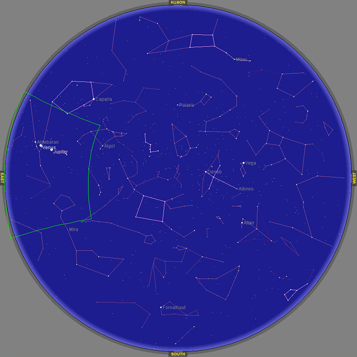 
How should we orient the coordinate axes?

Spherical coordinates with the origin located at the center of the earth, the *z*-axis aligned with the North Pole, and the *x*-axis aligned with the prime meridian

Hint

What kinds of symmetry are present in this situation?

### Key Concepts

* In the cylindrical coordinate system, a point in space is represented by the ordered triple
  <math xmlns="http://www.w3.org/1998/Math/MathML"><mrow><mrow><mo>(</mo><mrow><mi>r</mi><mo>,</mo><mi>θ</mi><mo>,</mo><mi>z</mi></mrow><mo>)</mo></mrow><mo>,</mo></mrow></math>
  
  where
  <math xmlns="http://www.w3.org/1998/Math/MathML"><mrow><mrow><mo>(</mo><mrow><mi>r</mi><mo>,</mo><mi>θ</mi></mrow><mo>)</mo></mrow></mrow></math>
  
  represents the polar coordinates of the point’s projection in the *xy*-plane and
  <math xmlns="http://www.w3.org/1998/Math/MathML"><mi>z</mi></math>
  
  represents the point’s projection onto the *z*-axis.
* To convert a point from cylindrical coordinates to Cartesian coordinates, use equations
  <math xmlns="http://www.w3.org/1998/Math/MathML"><mrow><mi>x</mi><mo>=</mo><mi>r</mi><mspace width="0.2em" /><mtext>cos</mtext><mspace width="0.2em" /><mi>θ</mi><mo>,</mo></mrow></math>
  
  <math xmlns="http://www.w3.org/1998/Math/MathML"><mrow><mi>y</mi><mo>=</mo><mi>r</mi><mspace width="0.2em" /><mtext>sin</mtext><mspace width="0.2em" /><mi>θ</mi><mo>,</mo></mrow></math>
  
  and
  <math xmlns="http://www.w3.org/1998/Math/MathML"><mrow><mi>z</mi><mo>=</mo><mi>z</mi><mo>.</mo></mrow></math>

* To convert a point from Cartesian coordinates to cylindrical coordinates, use equations
  <math xmlns="http://www.w3.org/1998/Math/MathML"><mrow><msup><mi>r</mi><mn>2</mn></msup><mo>=</mo><msup><mi>x</mi><mn>2</mn></msup><mo>+</mo><msup><mi>y</mi><mn>2</mn></msup><mo>,</mo></mrow></math>
  
  <math xmlns="http://www.w3.org/1998/Math/MathML"><mrow><mtext>tan</mtext><mspace width="0.2em" /><mi>θ</mi><mo>=</mo><mfrac><mi>y</mi><mi>x</mi></mfrac><mo>,</mo></mrow></math>
  
  and
  <math xmlns="http://www.w3.org/1998/Math/MathML"><mrow><mi>z</mi><mo>=</mo><mi>z</mi><mo>.</mo></mrow></math>

* In the spherical coordinate system, a point
  <math xmlns="http://www.w3.org/1998/Math/MathML"><mi>P</mi></math>
  
  in space is represented by the ordered triple
  <math xmlns="http://www.w3.org/1998/Math/MathML"><mrow><mrow><mo>(</mo><mrow><mi>ρ</mi><mo>,</mo><mi>θ</mi><mo>,</mo><mi>φ</mi></mrow><mo>)</mo></mrow><mo>,</mo></mrow></math>
  
  where
  <math xmlns="http://www.w3.org/1998/Math/MathML"><mi>ρ</mi></math>
  
  is the distance between
  <math xmlns="http://www.w3.org/1998/Math/MathML"><mi>P</mi></math>
  
  and the origin
  <math xmlns="http://www.w3.org/1998/Math/MathML"><mrow><mrow><mo>(</mo><mrow><mi>ρ</mi><mo>≠</mo><mn>0</mn></mrow><mo>)</mo></mrow><mo>,</mo></mrow></math>
  
  <math xmlns="http://www.w3.org/1998/Math/MathML"><mi>θ</mi></math>
  
  is the same angle used to describe the location in cylindrical coordinates, and
  <math xmlns="http://www.w3.org/1998/Math/MathML"><mi>φ</mi></math>
  
  is the angle formed by the positive *z*-axis and line segment
  <math xmlns="http://www.w3.org/1998/Math/MathML"><mrow><mover accent="true"><mrow><mi>O</mi><mi>P</mi></mrow><mo stretchy="true">—</mo></mover><mo>,</mo></mrow></math>
  
  where
  <math xmlns="http://www.w3.org/1998/Math/MathML"><mi>O</mi></math>
  
  is the origin and
  <math xmlns="http://www.w3.org/1998/Math/MathML"><mrow><mn>0</mn><mo>≤</mo><mi>φ</mi><mo>≤</mo><mi>π</mi><mo>.</mo></mrow></math>

* To convert a point from spherical coordinates to Cartesian coordinates, use equations
  <math xmlns="http://www.w3.org/1998/Math/MathML"><mrow><mi>x</mi><mo>=</mo><mi>ρ</mi><mspace width="0.2em" /><mtext>sin</mtext><mspace width="0.2em" /><mi>φ</mi><mspace width="0.2em" /><mtext>cos</mtext><mspace width="0.2em" /><mi>θ</mi><mo>,</mo></mrow></math>
  
  <math xmlns="http://www.w3.org/1998/Math/MathML"><mrow><mi>y</mi><mo>=</mo><mi>ρ</mi><mspace width="0.2em" /><mtext>sin</mtext><mspace width="0.2em" /><mi>φ</mi><mspace width="0.2em" /><mtext>sin</mtext><mspace width="0.2em" /><mi>θ</mi><mo>,</mo></mrow></math>
  
  and
  <math xmlns="http://www.w3.org/1998/Math/MathML"><mrow><mi>z</mi><mo>=</mo><mi>ρ</mi><mspace width="0.2em" /><mtext>cos</mtext><mspace width="0.2em" /><mi>φ</mi><mo>.</mo></mrow></math>

* To convert a point from Cartesian coordinates to spherical coordinates, use equations
  <math xmlns="http://www.w3.org/1998/Math/MathML"><mrow><msup><mi>ρ</mi><mn>2</mn></msup><mo>=</mo><msup><mi>x</mi><mn>2</mn></msup><mo>+</mo><msup><mi>y</mi><mn>2</mn></msup><mo>+</mo><msup><mi>z</mi><mn>2</mn></msup><mo>,</mo></mrow></math>
  
  <math xmlns="http://www.w3.org/1998/Math/MathML"><mrow><mtext>tan</mtext><mspace width="0.2em" /><mi>θ</mi><mo>=</mo><mfrac><mi>y</mi><mi>x</mi></mfrac><mo>,</mo></mrow></math>
  
  and
  <math xmlns="http://www.w3.org/1998/Math/MathML"><mrow><mi>φ</mi><mo>=</mo><mtext>arccos</mtext><mrow><mo>(</mo><mrow><mfrac><mi>z</mi><mrow><msqrt><mrow><msup><mi>x</mi><mn>2</mn></msup><mo>+</mo><msup><mi>y</mi><mn>2</mn></msup><mo>+</mo><msup><mi>z</mi><mn>2</mn></msup></mrow></msqrt></mrow></mfrac></mrow><mo>)</mo></mrow><mo>.</mo></mrow></math>

* To convert a point from spherical coordinates to cylindrical coordinates, use equations
  <math xmlns="http://www.w3.org/1998/Math/MathML"><mrow><mi>r</mi><mo>=</mo><mi>ρ</mi><mspace width="0.2em" /><mtext>sin</mtext><mspace width="0.2em" /><mi>φ</mi><mo>,</mo></mrow></math>
  
  <math xmlns="http://www.w3.org/1998/Math/MathML"><mrow><mi>θ</mi><mo>=</mo><mi>θ</mi><mo>,</mo></mrow></math>
  
  and
  <math xmlns="http://www.w3.org/1998/Math/MathML"><mrow><mi>z</mi><mo>=</mo><mi>ρ</mi><mspace width="0.2em" /><mtext>cos</mtext><mspace width="0.2em" /><mi>φ</mi><mo>.</mo></mrow></math>

* To convert a point from cylindrical coordinates to spherical coordinates, use equations
  <math xmlns="http://www.w3.org/1998/Math/MathML"><mrow><mi>ρ</mi><mo>=</mo><msqrt><mrow><msup><mi>r</mi><mn>2</mn></msup><mo>+</mo><msup><mi>z</mi><mn>2</mn></msup></mrow></msqrt><mo>,</mo></mrow></math>
  
  <math xmlns="http://www.w3.org/1998/Math/MathML"><mrow><mi>θ</mi><mo>=</mo><mi>θ</mi><mo>,</mo></mrow></math>
  
  and
  <math xmlns="http://www.w3.org/1998/Math/MathML"><mrow><mi>φ</mi><mo>=</mo><mtext>arccos</mtext><mrow><mo>(</mo><mrow><mfrac><mi>z</mi><mrow><msqrt><mrow><msup><mi>r</mi><mn>2</mn></msup><mo>+</mo><msup><mi>z</mi><mn>2</mn></msup></mrow></msqrt></mrow></mfrac></mrow><mo>)</mo></mrow><mo>.</mo></mrow></math>
{: data-bullet-style="bullet"}

<section data-depth="1" class="section-exercises" markdown="1">
Use the following figure as an aid in identifying the relationship between the rectangular, cylindrical, and spherical coordinate systems.

  
For the following exercises, the cylindrical coordinates <math xmlns="http://www.w3.org/1998/Math/MathML"><mrow><mrow><mo>(</mo><mrow><mi>r</mi><mo>,</mo><mi>θ</mi><mo>,</mo><mi>z</mi></mrow><mo>)</mo></mrow></mrow></math>

 of a point are given. Find the rectangular coordinates <math xmlns="http://www.w3.org/1998/Math/MathML"><mrow><mrow><mo>(</mo><mrow><mi>x</mi><mo>,</mo><mi>y</mi><mo>,</mo><mi>z</mi></mrow><mo>)</mo></mrow></mrow></math>

 of the point.

<math xmlns="http://www.w3.org/1998/Math/MathML"><mrow><mrow><mo>(</mo><mrow><mn>4</mn><mo>,</mo><mfrac><mi>π</mi><mn>6</mn></mfrac><mo>,</mo><mn>3</mn></mrow><mo>)</mo></mrow></mrow></math>

<math xmlns="http://www.w3.org/1998/Math/MathML"><mrow><mrow><mo>(</mo><mrow><mn>2</mn><msqrt><mn>3</mn></msqrt><mo>,</mo><mn>2</mn><mo>,</mo><mn>3</mn></mrow><mo>)</mo></mrow></mrow></math>

<math xmlns="http://www.w3.org/1998/Math/MathML"><mrow><mrow><mo>(</mo><mrow><mn>3</mn><mo>,</mo><mfrac><mi>π</mi><mn>3</mn></mfrac><mo>,</mo><mn>5</mn></mrow><mo>)</mo></mrow></mrow></math>

<math xmlns="http://www.w3.org/1998/Math/MathML"><mrow><mrow><mo>(</mo><mrow><mn>4</mn><mo>,</mo><mfrac><mrow><mn>7</mn><mi>π</mi></mrow><mn>6</mn></mfrac><mo>,</mo><mn>3</mn></mrow><mo>)</mo></mrow></mrow></math>

<math xmlns="http://www.w3.org/1998/Math/MathML"><mrow><mrow><mo>(</mo><mrow><mn>−2</mn><msqrt><mn>3</mn></msqrt><mo>,</mo><mn>−2</mn><mo>,</mo><mn>3</mn></mrow><mo>)</mo></mrow></mrow></math>

<math xmlns="http://www.w3.org/1998/Math/MathML"><mrow><mrow><mo>(</mo><mrow><mn>2</mn><mo>,</mo><mi>π</mi><mo>,</mo><mn>−4</mn></mrow><mo>)</mo></mrow></mrow></math>

For the following exercises, the rectangular coordinates <math xmlns="http://www.w3.org/1998/Math/MathML"><mrow><mrow><mo>(</mo><mrow><mi>x</mi><mo>,</mo><mi>y</mi><mo>,</mo><mi>z</mi></mrow><mo>)</mo></mrow></mrow></math>

 of a point are given. Find the cylindrical coordinates <math xmlns="http://www.w3.org/1998/Math/MathML"><mrow><mrow><mo>(</mo><mrow><mi>r</mi><mo>,</mo><mi>θ</mi><mo>,</mo><mi>z</mi></mrow><mo>)</mo></mrow></mrow></math>

 of the point.

<math xmlns="http://www.w3.org/1998/Math/MathML"><mrow><mrow><mo>(</mo><mrow><mn>1</mn><mo>,</mo><msqrt><mn>3</mn></msqrt><mo>,</mo><mn>2</mn></mrow><mo>)</mo></mrow></mrow></math>

<math xmlns="http://www.w3.org/1998/Math/MathML"><mrow><mrow><mo>(</mo><mrow><mn>2</mn><mo>,</mo><mfrac><mi>π</mi><mn>3</mn></mfrac><mo>,</mo><mn>2</mn></mrow><mo>)</mo></mrow></mrow></math>

<math xmlns="http://www.w3.org/1998/Math/MathML"><mrow><mrow><mo>(</mo><mrow><mn>1</mn><mo>,</mo><mn>1</mn><mo>,</mo><mn>5</mn></mrow><mo>)</mo></mrow></mrow></math>

<math xmlns="http://www.w3.org/1998/Math/MathML"><mrow><mrow><mo>(</mo><mrow><mn>3</mn><mo>,</mo><mn>−3</mn><mo>,</mo><mn>7</mn></mrow><mo>)</mo></mrow></mrow></math>

<math xmlns="http://www.w3.org/1998/Math/MathML"><mrow><mrow><mo>(</mo><mrow><mn>3</mn><msqrt><mn>2</mn></msqrt><mo>,</mo><mo>−</mo><mfrac><mi>π</mi><mn>4</mn></mfrac><mo>,</mo><mn>7</mn></mrow><mo>)</mo></mrow></mrow></math>

<math xmlns="http://www.w3.org/1998/Math/MathML"><mrow><mrow><mo>(</mo><mrow><mn>−2</mn><msqrt><mn>2</mn></msqrt><mo>,</mo><mn>2</mn><msqrt><mn>2</mn></msqrt><mo>,</mo><mn>4</mn></mrow><mo>)</mo></mrow></mrow></math>

For the following exercises, the equation of a surface in cylindrical coordinates is given.

Find the equation of the surface in rectangular coordinates. Identify and graph the surface.

**[T]** <math xmlns="http://www.w3.org/1998/Math/MathML"><mrow><mi>r</mi><mo>=</mo><mn>4</mn></mrow></math>

A cylinder of equation <math xmlns="http://www.w3.org/1998/Math/MathML"><mrow><msup><mi>x</mi><mn>2</mn></msup><mo>+</mo><msup><mi>y</mi><mn>2</mn></msup><mo>=</mo><mn>16</mn><mo>,</mo></mrow></math>

 with its center at the origin and rulings parallel to the *z*-axis,* * *
{: data-type="newline"}

 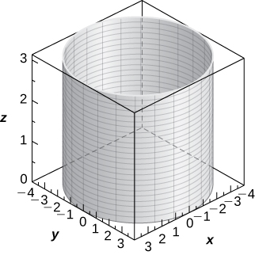 

**[T]** <math xmlns="http://www.w3.org/1998/Math/MathML"><mrow><mi>z</mi><mo>=</mo><msup><mi>r</mi><mn>2</mn></msup><msup><mrow><mtext>cos</mtext></mrow><mn>2</mn></msup><mi>θ</mi></mrow></math>

**[T]** <math xmlns="http://www.w3.org/1998/Math/MathML"><mrow><msup><mi>r</mi><mn>2</mn></msup><mtext>cos</mtext><mo stretchy="false">(</mo><mn>2</mn><mi>θ</mi><mo stretchy="false">)</mo><mo>+</mo><msup><mi>z</mi><mn>2</mn></msup><mo>+</mo><mn>1</mn><mo>=</mo><mn>0</mn></mrow></math>

Hyperboloid of two sheets of equation <math xmlns="http://www.w3.org/1998/Math/MathML"><mrow><mtext>−</mtext><msup><mi>x</mi><mn>2</mn></msup><mo>+</mo><msup><mi>y</mi><mn>2</mn></msup><mo>−</mo><msup><mi>z</mi><mn>2</mn></msup><mo>=</mo><mn>1</mn><mo>,</mo></mrow></math>

 with the *y*-axis as the axis of symmetry,* * *
{: data-type="newline"}

 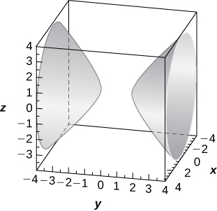 

**[T]** <math xmlns="http://www.w3.org/1998/Math/MathML"><mrow><mi>r</mi><mo>=</mo><mn>3</mn><mspace width="0.2em" /><mtext>sin</mtext><mspace width="0.2em" /><mi>θ</mi></mrow></math>

**[T]** <math xmlns="http://www.w3.org/1998/Math/MathML"><mrow><mi>r</mi><mo>=</mo><mn>2</mn><mspace width="0.2em" /><mtext>cos</mtext><mspace width="0.2em" /><mi>θ</mi></mrow></math>

Cylinder of equation <math xmlns="http://www.w3.org/1998/Math/MathML"><mrow><msup><mi>x</mi><mn>2</mn></msup><mo>−</mo><mn>2</mn><mi>x</mi><mo>+</mo><msup><mi>y</mi><mn>2</mn></msup><mo>=</mo><mn>0</mn><mo>,</mo></mrow></math>

 with a center at <math xmlns="http://www.w3.org/1998/Math/MathML"><mrow><mrow><mo>(</mo><mrow><mn>1</mn><mo>,</mo><mn>0</mn><mo>,</mo><mn>0</mn></mrow><mo>)</mo></mrow></mrow></math>

 and radius <math xmlns="http://www.w3.org/1998/Math/MathML"><mrow><mn>1</mn><mo>,</mo></mrow></math>

 with rulings parallel to the *z*-axis,* * *
{: data-type="newline"}

 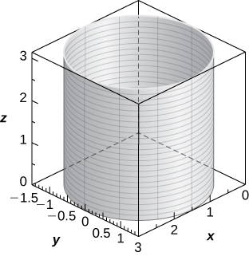 

**[T]** <math xmlns="http://www.w3.org/1998/Math/MathML"><mrow><msup><mi>r</mi><mn>2</mn></msup><mo>+</mo><msup><mi>z</mi><mn>2</mn></msup><mo>=</mo><mn>5</mn></mrow></math>

**[T]** <math xmlns="http://www.w3.org/1998/Math/MathML"><mrow><mi>r</mi><mo>=</mo><mn>2</mn><mspace width="0.2em" /><mtext>sec</mtext><mspace width="0.2em" /><mi>θ</mi></mrow></math>

Plane of equation <math xmlns="http://www.w3.org/1998/Math/MathML"><mrow><mi>x</mi><mo>=</mo><mn>2</mn><mo>,</mo></mrow></math>

* * *
{: data-type="newline"}

 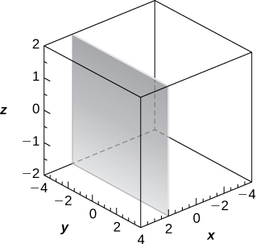 

**[T]** <math xmlns="http://www.w3.org/1998/Math/MathML"><mrow><mi>r</mi><mo>=</mo><mn>3</mn><mspace width="0.2em" /><mtext>csc</mtext><mspace width="0.2em" /><mi>θ</mi></mrow></math>

For the following exercises, the equation of a surface in rectangular coordinates is given. Find the equation of the surface in cylindrical coordinates.

<math xmlns="http://www.w3.org/1998/Math/MathML"><mrow><mi>z</mi><mo>=</mo><mn>3</mn></mrow></math>

<math xmlns="http://www.w3.org/1998/Math/MathML"><mrow><mi>z</mi><mo>=</mo><mn>3</mn></mrow></math>

<math xmlns="http://www.w3.org/1998/Math/MathML"><mrow><mi>x</mi><mo>=</mo><mn>6</mn></mrow></math>

<math xmlns="http://www.w3.org/1998/Math/MathML"><mrow><msup><mi>x</mi><mn>2</mn></msup><mo>+</mo><msup><mi>y</mi><mn>2</mn></msup><mo>+</mo><msup><mi>z</mi><mn>2</mn></msup><mo>=</mo><mn>9</mn></mrow></math>

<math xmlns="http://www.w3.org/1998/Math/MathML"><mrow><msup><mi>r</mi><mn>2</mn></msup><mo>+</mo><msup><mi>z</mi><mn>2</mn></msup><mo>=</mo><mn>9</mn></mrow></math>

<math xmlns="http://www.w3.org/1998/Math/MathML"><mrow><mi>y</mi><mo>=</mo><mn>2</mn><msup><mi>x</mi><mn>2</mn></msup></mrow></math>

<math xmlns="http://www.w3.org/1998/Math/MathML"><mrow><msup><mi>x</mi><mn>2</mn></msup><mo>+</mo><msup><mi>y</mi><mn>2</mn></msup><mo>−</mo><mn>16</mn><mi>x</mi><mo>=</mo><mn>0</mn></mrow></math>

<math xmlns="http://www.w3.org/1998/Math/MathML"><mrow><mi>r</mi><mo>=</mo><mn>16</mn><mspace width="0.2em" /><mtext>cos</mtext><mspace width="0.2em" /><mi>θ</mi><mo>,</mo><mi>r</mi><mo>=</mo><mn>0</mn></mrow></math>

<math xmlns="http://www.w3.org/1998/Math/MathML"><mrow><msup><mi>x</mi><mn>2</mn></msup><mo>+</mo><msup><mi>y</mi><mn>2</mn></msup><mo>−</mo><mn>3</mn><msqrt><mrow><msup><mi>x</mi><mn>2</mn></msup><mo>+</mo><msup><mi>y</mi><mn>2</mn></msup></mrow></msqrt><mo>+</mo><mn>2</mn><mo>=</mo><mn>0</mn></mrow></math>

For the following exercises, the spherical coordinates <math xmlns="http://www.w3.org/1998/Math/MathML"><mrow><mrow><mo>(</mo><mrow><mi>ρ</mi><mo>,</mo><mi>θ</mi><mo>,</mo><mi>φ</mi></mrow><mo>)</mo></mrow></mrow></math>

 of a point are given. Find the rectangular coordinates <math xmlns="http://www.w3.org/1998/Math/MathML"><mrow><mrow><mo>(</mo><mrow><mi>x</mi><mo>,</mo><mi>y</mi><mo>,</mo><mi>z</mi></mrow><mo>)</mo></mrow></mrow></math>

 of the point.

<math xmlns="http://www.w3.org/1998/Math/MathML"><mrow><mrow><mo>(</mo><mrow><mn>3</mn><mo>,</mo><mn>0</mn><mo>,</mo><mi>π</mi></mrow><mo>)</mo></mrow></mrow></math>

<math xmlns="http://www.w3.org/1998/Math/MathML"><mrow><mrow><mo>(</mo><mrow><mn>0</mn><mo>,</mo><mn>0</mn><mo>,</mo><mn>−3</mn></mrow><mo>)</mo></mrow></mrow></math>

<math xmlns="http://www.w3.org/1998/Math/MathML"><mrow><mrow><mo>(</mo><mrow><mn>1</mn><mo>,</mo><mfrac><mi>π</mi><mn>6</mn></mfrac><mo>,</mo><mfrac><mi>π</mi><mn>6</mn></mfrac></mrow><mo>)</mo></mrow></mrow></math>

<math xmlns="http://www.w3.org/1998/Math/MathML"><mrow><mrow><mo>(</mo><mrow><mn>12</mn><mo>,</mo><mo>−</mo><mfrac><mi>π</mi><mn>4</mn></mfrac><mo>,</mo><mfrac><mi>π</mi><mn>4</mn></mfrac></mrow><mo>)</mo></mrow></mrow></math>

<math xmlns="http://www.w3.org/1998/Math/MathML"><mrow><mrow><mo>(</mo><mrow><mn>6</mn><mo>,</mo><mn>−6</mn><mo>,</mo><msqrt><mn>2</mn></msqrt></mrow><mo>)</mo></mrow></mrow></math>

<math xmlns="http://www.w3.org/1998/Math/MathML"><mrow><mrow><mo>(</mo><mrow><mn>3</mn><mo>,</mo><mfrac><mi>π</mi><mn>4</mn></mfrac><mo>,</mo><mfrac><mi>π</mi><mn>6</mn></mfrac></mrow><mo>)</mo></mrow></mrow></math>

For the following exercises, the rectangular coordinates <math xmlns="http://www.w3.org/1998/Math/MathML"><mrow><mrow><mo>(</mo><mrow><mi>x</mi><mo>,</mo><mi>y</mi><mo>,</mo><mi>z</mi></mrow><mo>)</mo></mrow></mrow></math>

 of a point are given. Find the spherical coordinates <math xmlns="http://www.w3.org/1998/Math/MathML"><mrow><mrow><mo>(</mo><mrow><mi>ρ</mi><mo>,</mo><mi>θ</mi><mo>,</mo><mi>φ</mi></mrow><mo>)</mo></mrow></mrow></math>

 of the point. Express the measure of the angles in degrees rounded to the nearest integer.

<math xmlns="http://www.w3.org/1998/Math/MathML"><mrow><mrow><mo>(</mo><mrow><mn>4</mn><mo>,</mo><mn>0</mn><mo>,</mo><mn>0</mn></mrow><mo>)</mo></mrow></mrow></math>

<math xmlns="http://www.w3.org/1998/Math/MathML"><mrow><mrow><mo>(</mo><mrow><mn>4</mn><mo>,</mo><mn>0</mn><mo>,</mo><mn>90</mn><mtext>°</mtext></mrow><mo>)</mo></mrow></mrow></math>

<math xmlns="http://www.w3.org/1998/Math/MathML"><mrow><mrow><mo>(</mo><mrow><mn>−1</mn><mo>,</mo><mn>2</mn><mo>,</mo><mn>1</mn></mrow><mo>)</mo></mrow></mrow></math>

<math xmlns="http://www.w3.org/1998/Math/MathML"><mrow><mrow><mo>(</mo><mrow><mn>0</mn><mo>,</mo><mn>3</mn><mo>,</mo><mn>0</mn></mrow><mo>)</mo></mrow></mrow></math>

<math xmlns="http://www.w3.org/1998/Math/MathML"><mrow><mrow><mo>(</mo><mrow><mn>3</mn><mo>,</mo><mn>90</mn><mtext>°</mtext><mo>,</mo><mn>90</mn><mtext>°</mtext></mrow><mo>)</mo></mrow></mrow></math>

<math xmlns="http://www.w3.org/1998/Math/MathML"><mrow><mrow><mo>(</mo><mrow><mn>−2</mn><mo>,</mo><mn>2</mn><msqrt><mn>3</mn></msqrt><mo>,</mo><mn>4</mn></mrow><mo>)</mo></mrow></mrow></math>

For the following exercises, the equation of a surface in spherical coordinates is given. Find the equation of the surface in rectangular coordinates. Identify and graph the surface.

**[T]** <math xmlns="http://www.w3.org/1998/Math/MathML"><mrow><mi>ρ</mi><mo>=</mo><mn>3</mn></mrow></math>

Sphere of equation <math xmlns="http://www.w3.org/1998/Math/MathML"><mrow><msup><mi>x</mi><mn>2</mn></msup><mo>+</mo><msup><mi>y</mi><mn>2</mn></msup><mo>+</mo><msup><mi>z</mi><mn>2</mn></msup><mo>=</mo><mn>9</mn></mrow></math>

 centered at the origin with radius <math xmlns="http://www.w3.org/1998/Math/MathML"><mrow><mn>3</mn><mo>,</mo></mrow></math>

* * *
{: data-type="newline"}

 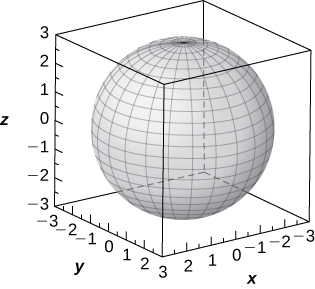 

**[T]** <math xmlns="http://www.w3.org/1998/Math/MathML"><mrow><mi>φ</mi><mo>=</mo><mfrac><mi>π</mi><mn>3</mn></mfrac></mrow></math>

**[T]** <math xmlns="http://www.w3.org/1998/Math/MathML"><mrow><mi>ρ</mi><mo>=</mo><mn>2</mn><mspace width="0.2em" /><mtext>cos</mtext><mspace width="0.2em" /><mi>φ</mi></mrow></math>

Sphere of equation <math xmlns="http://www.w3.org/1998/Math/MathML"><mrow><msup><mi>x</mi><mn>2</mn></msup><mo>+</mo><msup><mi>y</mi><mn>2</mn></msup><mo>+</mo><msup><mrow><mrow><mo>(</mo><mrow><mi>z</mi><mo>−</mo><mn>1</mn></mrow><mo>)</mo></mrow></mrow><mn>2</mn></msup><mo>=</mo><mn>1</mn></mrow></math>

 centered at <math xmlns="http://www.w3.org/1998/Math/MathML"><mrow><mrow><mo>(</mo><mrow><mn>0</mn><mo>,</mo><mn>0</mn><mo>,</mo><mn>1</mn></mrow><mo>)</mo></mrow></mrow></math>

 with radius <math xmlns="http://www.w3.org/1998/Math/MathML"><mn>1</mn><mo>,</mo></math>

* * *
{: data-type="newline"}

 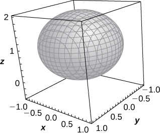 

**[T]** <math xmlns="http://www.w3.org/1998/Math/MathML"><mrow><mi>ρ</mi><mo>=</mo><mn>4</mn><mspace width="0.2em" /><mtext>csc</mtext><mspace width="0.2em" /><mi>φ</mi></mrow></math>

**[T]** <math xmlns="http://www.w3.org/1998/Math/MathML"><mrow><mi>φ</mi><mo>=</mo><mfrac><mi>π</mi><mn>2</mn></mfrac></mrow></math>

The *xy*-plane of equation <math xmlns="http://www.w3.org/1998/Math/MathML"><mrow><mi>z</mi><mo>=</mo><mn>0</mn><mo>,</mo></mrow></math>

* * *
{: data-type="newline"}

 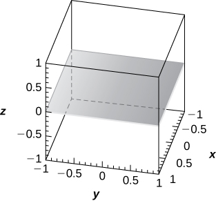 

**[T]** <math xmlns="http://www.w3.org/1998/Math/MathML"><mrow><mi>ρ</mi><mo>=</mo><mn>6</mn><mspace width="0.2em" /><mtext>csc</mtext><mspace width="0.2em" /><mi>φ</mi><mspace width="0.2em" /><mtext>sec</mtext><mspace width="0.2em" /><mi>θ</mi></mrow></math>

For the following exercises, the equation of a surface in rectangular coordinates is given. Find the equation of the surface in spherical coordinates. Identify the surface.

<math xmlns="http://www.w3.org/1998/Math/MathML"><mrow><msup><mi>x</mi><mn>2</mn></msup><mo>+</mo><msup><mi>y</mi><mn>2</mn></msup><mo>−</mo><mn>3</mn><msup><mi>z</mi><mn>2</mn></msup><mo>=</mo><mn>0</mn><mo>,</mo></mrow></math>

 <math xmlns="http://www.w3.org/1998/Math/MathML"><mrow><mi>z</mi><mo>≠</mo><mn>0</mn></mrow></math>

<math xmlns="http://www.w3.org/1998/Math/MathML"><mrow><mi>φ</mi><mo>=</mo><mfrac><mi>π</mi><mn>3</mn></mfrac></mrow></math>

 or <math xmlns="http://www.w3.org/1998/Math/MathML"><mrow><mi>φ</mi><mo>=</mo><mfrac><mrow><mn>2</mn><mi>π</mi></mrow><mn>3</mn></mfrac><mo>;</mo></mrow></math>

 Elliptic cone

<math xmlns="http://www.w3.org/1998/Math/MathML"><mrow><msup><mi>x</mi><mn>2</mn></msup><mo>+</mo><msup><mi>y</mi><mn>2</mn></msup><mo>+</mo><msup><mi>z</mi><mn>2</mn></msup><mo>−</mo><mn>4</mn><mi>z</mi><mo>=</mo><mn>0</mn></mrow></math>

<math xmlns="http://www.w3.org/1998/Math/MathML"><mrow><mi>z</mi><mo>=</mo><mn>6</mn></mrow></math>

<math xmlns="http://www.w3.org/1998/Math/MathML"><mrow><mi>ρ</mi><mspace width="0.2em" /><mtext>cos</mtext><mspace width="0.2em" /><mi>φ</mi><mo>=</mo><mn>6</mn><mo>;</mo></mrow></math>

 Plane at <math xmlns="http://www.w3.org/1998/Math/MathML"><mrow><mi>z</mi><mo>=</mo><mn>6</mn></mrow></math>

<math xmlns="http://www.w3.org/1998/Math/MathML"><mrow><msup><mi>x</mi><mn>2</mn></msup><mo>+</mo><msup><mi>y</mi><mn>2</mn></msup><mo>=</mo><mn>9</mn></mrow></math>

For the following exercises, the cylindrical coordinates of a point are given. Find its associated spherical coordinates, with the measure of the angle <math xmlns="http://www.w3.org/1998/Math/MathML"><mi>φ</mi></math>

 in radians rounded to four decimal places.

**[T]** <math xmlns="http://www.w3.org/1998/Math/MathML"><mrow><mrow><mo>(</mo><mrow><mn>1</mn><mo>,</mo><mfrac><mi>π</mi><mn>4</mn></mfrac><mo>,</mo><mn>3</mn></mrow><mo>)</mo></mrow></mrow></math>

<math xmlns="http://www.w3.org/1998/Math/MathML"><mrow><mrow><mo>(</mo><mrow><msqrt><mrow><mn>10</mn></mrow></msqrt><mo>,</mo><mfrac><mi>π</mi><mn>4</mn></mfrac><mo>,</mo><mn>0.3218</mn></mrow><mo>)</mo></mrow></mrow></math>

**[T]** <math xmlns="http://www.w3.org/1998/Math/MathML"><mrow><mrow><mo>(</mo><mrow><mn>5</mn><mo>,</mo><mi>π</mi><mo>,</mo><mn>12</mn></mrow><mo>)</mo></mrow></mrow></math>

<math xmlns="http://www.w3.org/1998/Math/MathML"><mrow><mrow><mo>(</mo><mrow><mn>3</mn><mo>,</mo><mfrac><mi>π</mi><mn>2</mn></mfrac><mo>,</mo><mn>3</mn></mrow><mo>)</mo></mrow></mrow></math>

<math xmlns="http://www.w3.org/1998/Math/MathML"><mrow><mrow><mo>(</mo><mrow><mn>3</mn><msqrt><mn>2</mn></msqrt><mo>,</mo><mfrac><mi>π</mi><mn>2</mn></mfrac><mo>,</mo><mfrac><mi>π</mi><mn>4</mn></mfrac></mrow><mo>)</mo></mrow></mrow></math>

<math xmlns="http://www.w3.org/1998/Math/MathML"><mrow><mrow><mo>(</mo><mrow><mn>3</mn><mo>,</mo><mo>−</mo><mfrac><mi>π</mi><mn>6</mn></mfrac><mo>,</mo><mn>3</mn></mrow><mo>)</mo></mrow></mrow></math>

For the following exercises, the spherical coordinates of a point are given. Find its associated cylindrical coordinates.

<math xmlns="http://www.w3.org/1998/Math/MathML"><mrow><mrow><mo>(</mo><mrow><mn>2</mn><mo>,</mo><mo>−</mo><mfrac><mi>π</mi><mn>4</mn></mfrac><mo>,</mo><mfrac><mi>π</mi><mn>2</mn></mfrac></mrow><mo>)</mo></mrow></mrow></math>

<math xmlns="http://www.w3.org/1998/Math/MathML"><mrow><mrow><mo>(</mo><mrow><mn>2</mn><mo>,</mo><mo>−</mo><mfrac><mi>π</mi><mn>4</mn></mfrac><mo>,</mo><mn>0</mn></mrow><mo>)</mo></mrow></mrow></math>

<math xmlns="http://www.w3.org/1998/Math/MathML"><mrow><mrow><mo>(</mo><mrow><mn>4</mn><mo>,</mo><mfrac><mi>π</mi><mn>4</mn></mfrac><mo>,</mo><mfrac><mi>π</mi><mn>6</mn></mfrac></mrow><mo>)</mo></mrow></mrow></math>

<math xmlns="http://www.w3.org/1998/Math/MathML"><mrow><mrow><mo>(</mo><mrow><mn>8</mn><mo>,</mo><mfrac><mi>π</mi><mn>3</mn></mfrac><mo>,</mo><mfrac><mi>π</mi><mn>2</mn></mfrac></mrow><mo>)</mo></mrow></mrow></math>

<math xmlns="http://www.w3.org/1998/Math/MathML"><mrow><mrow><mo>(</mo><mrow><mn>8</mn><mo>,</mo><mfrac><mi>π</mi><mn>3</mn></mfrac><mo>,</mo><mn>0</mn></mrow><mo>)</mo></mrow></mrow></math>

<math xmlns="http://www.w3.org/1998/Math/MathML"><mrow><mrow><mo>(</mo><mrow><mn>9</mn><mo>,</mo><mo>−</mo><mfrac><mi>π</mi><mn>6</mn></mfrac><mo>,</mo><mfrac><mi>π</mi><mn>3</mn></mfrac></mrow><mo>)</mo></mrow></mrow></math>

For the following exercises, find the most suitable system of coordinates to describe the solids.

The solid situated in the first octant with a vertex at the origin and enclosed by a cube of edge length <math xmlns="http://www.w3.org/1998/Math/MathML"><mrow><mi>a</mi><mo>,</mo></mrow></math>

 where <math xmlns="http://www.w3.org/1998/Math/MathML"><mrow><mi>a</mi><mo>&gt;</mo><mn>0</mn></mrow></math>

Cartesian system, <math xmlns="http://www.w3.org/1998/Math/MathML"><mrow><mrow><mo>{</mo><mrow><mrow><mo>(</mo><mrow><mi>x</mi><mo>,</mo><mi>y</mi><mo>,</mo><mi>z</mi></mrow><mo>)</mo></mrow><mo>\|</mo><mn>0</mn><mo>≤</mo><mi>x</mi><mo>≤</mo><mi>a</mi><mo>,</mo><mn>0</mn><mo>≤</mo><mi>y</mi><mo>≤</mo><mi>a</mi><mo>,</mo><mn>0</mn><mo>≤</mo><mi>z</mi><mo>≤</mo><mi>a</mi></mrow><mo>}</mo></mrow></mrow></math>

A spherical shell determined by the region between two concentric spheres centered at the origin, of radii of <math xmlns="http://www.w3.org/1998/Math/MathML"><mi>a</mi></math>

 and <math xmlns="http://www.w3.org/1998/Math/MathML"><mrow><mi>b</mi><mo>,</mo></mrow></math>

 respectively, where <math xmlns="http://www.w3.org/1998/Math/MathML"><mrow><mi>b</mi><mo>&gt;</mo><mi>a</mi><mo>&gt;</mo><mn>0</mn></mrow></math>

A solid inside sphere <math xmlns="http://www.w3.org/1998/Math/MathML"><mrow><msup><mi>x</mi><mn>2</mn></msup><mo>+</mo><msup><mi>y</mi><mn>2</mn></msup><mo>+</mo><msup><mi>z</mi><mn>2</mn></msup><mo>=</mo><mn>9</mn></mrow></math>

 and outside cylinder <math xmlns="http://www.w3.org/1998/Math/MathML"><mrow><msup><mrow><mrow><mo>(</mo><mrow><mi>x</mi><mo>−</mo><mfrac><mn>3</mn><mn>2</mn></mfrac></mrow><mo>)</mo></mrow></mrow><mn>2</mn></msup><mo>+</mo><msup><mi>y</mi><mn>2</mn></msup><mo>=</mo><mfrac><mn>9</mn><mn>4</mn></mfrac></mrow></math>

Cylindrical system, <math xmlns="http://www.w3.org/1998/Math/MathML"><mrow><mrow><mo>{</mo><mrow><mrow><mo>(</mo><mrow><mi>r</mi><mo>,</mo><mi>θ</mi><mo>,</mo><mi>z</mi></mrow><mo>)</mo></mrow><mo>\|</mo><msup><mi>r</mi><mn>2</mn></msup><mo>+</mo><msup><mi>z</mi><mn>2</mn></msup><mo>≤</mo><mn>9</mn><mo>,</mo><mi>r</mi><mo>≥</mo><mn>3</mn><mspace width="0.2em" /><mtext>cos</mtext><mspace width="0.2em" /><mi>θ</mi><mo>,</mo><mn>0</mn><mo>≤</mo><mi>θ</mi><mo>≤</mo><mn>2</mn><mi>π</mi></mrow><mo>}</mo></mrow></mrow></math>

A cylindrical shell of height <math xmlns="http://www.w3.org/1998/Math/MathML"><mrow><mn>10</mn></mrow></math>

 determined by the region between two cylinders with the same center, parallel rulings, and radii of <math xmlns="http://www.w3.org/1998/Math/MathML"><mn>2</mn></math>

 and <math xmlns="http://www.w3.org/1998/Math/MathML"><mrow><mn>5</mn><mo>,</mo></mrow></math>

 respectively

**[T]** Use a CAS to graph in cylindrical coordinates the region between elliptic paraboloid <math xmlns="http://www.w3.org/1998/Math/MathML"><mrow><mi>z</mi><mo>=</mo><msup><mi>x</mi><mn>2</mn></msup><mo>+</mo><msup><mi>y</mi><mn>2</mn></msup></mrow></math>

 and cone <math xmlns="http://www.w3.org/1998/Math/MathML"><mrow><msup><mi>x</mi><mn>2</mn></msup><mo>+</mo><msup><mi>y</mi><mn>2</mn></msup><mo>−</mo><msup><mi>z</mi><mn>2</mn></msup><mo>=</mo><mn>0</mn><mo>.</mo></mrow></math>

The region is described by the set of points <math xmlns="http://www.w3.org/1998/Math/MathML"><mrow><mrow><mo>{</mo><mrow><mrow><mo>(</mo><mrow><mi>r</mi><mo>,</mo><mi>θ</mi><mo>,</mo><mi>z</mi></mrow><mo>)</mo></mrow><mo>\|</mo><mn>0</mn><mo>≤</mo><mi>r</mi><mo>≤</mo><mn>1</mn><mo>,</mo><mn>0</mn><mo>≤</mo><mi>θ</mi><mo>≤</mo><mn>2</mn><mi>π</mi><mo>,</mo><msup><mi>r</mi><mn>2</mn></msup><mo>≤</mo><mi>z</mi><mo>≤</mo><mi>r</mi></mrow><mo>}</mo></mrow><mo>.</mo></mrow></math>

* * *
{: data-type="newline"}

 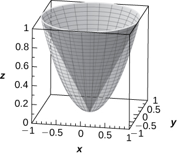 

**[T]** Use a CAS to graph in spherical coordinates the “ice cream-cone region” situated above the *xy*-plane between sphere <math xmlns="http://www.w3.org/1998/Math/MathML"><mrow><msup><mi>x</mi><mn>2</mn></msup><mo>+</mo><msup><mi>y</mi><mn>2</mn></msup><mo>+</mo><msup><mi>z</mi><mn>2</mn></msup><mo>=</mo><mn>4</mn></mrow></math>

 and elliptical cone <math xmlns="http://www.w3.org/1998/Math/MathML"><mrow><msup><mi>x</mi><mn>2</mn></msup><mo>+</mo><msup><mi>y</mi><mn>2</mn></msup><mo>−</mo><msup><mi>z</mi><mn>2</mn></msup><mo>=</mo><mn>0</mn><mo>.</mo></mrow></math>

Washington, DC, is located at <math xmlns="http://www.w3.org/1998/Math/MathML"><mrow><mn>39</mn><mtext>°</mtext></mrow></math>

 N and <math xmlns="http://www.w3.org/1998/Math/MathML"><mrow><mn>77</mn><mtext>°</mtext></mrow></math>

 W (see the following figure). Assume the radius of Earth is <math xmlns="http://www.w3.org/1998/Math/MathML"><mrow><mn>4000</mn></mrow></math>

 mi. Express the location of Washington, DC, in spherical coordinates.

 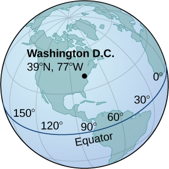 

<math xmlns="http://www.w3.org/1998/Math/MathML"><mrow><mrow><mo>(</mo><mrow><mn>4000</mn><mo>,</mo><mtext>−</mtext><mn>77</mn><mtext>°</mtext><mo>,</mo><mn>51</mn><mtext>°</mtext></mrow><mo>)</mo></mrow></mrow></math>

San Francisco is located at <math xmlns="http://www.w3.org/1998/Math/MathML"><mrow><mn>37.78</mn><mtext>°</mtext><mtext>N</mtext></mrow></math>

 and <math xmlns="http://www.w3.org/1998/Math/MathML"><mrow><mn>122.42</mn><mtext>°</mtext><mtext>W</mtext><mo>.</mo></mrow></math>

 Assume the radius of Earth is <math xmlns="http://www.w3.org/1998/Math/MathML"><mrow><mn>4000</mn></mrow></math>

 mi. Express the location of San Francisco in spherical coordinates.

Find the latitude and longitude of Rio de Janeiro if its spherical coordinates are <math xmlns="http://www.w3.org/1998/Math/MathML"><mrow><mrow><mo>(</mo><mrow><mn>4000</mn><mo>,</mo><mtext>−</mtext><mn>43.17</mn><mtext>°</mtext><mo>,</mo><mn>102.91</mn><mtext>°</mtext></mrow><mo>)</mo></mrow><mo>.</mo></mrow></math>

<math xmlns="http://www.w3.org/1998/Math/MathML"><mrow><mn>43.17</mn><mtext>°</mtext><mtext>W</mtext><mo>,</mo></mrow></math>

 <math xmlns="http://www.w3.org/1998/Math/MathML"><mrow><mn>22.91</mn><mtext>°</mtext><mtext>S</mtext></mrow></math>

Find the latitude and longitude of Berlin if its spherical coordinates are <math xmlns="http://www.w3.org/1998/Math/MathML"><mrow><mrow><mo>(</mo><mrow><mn>4000</mn><mo>,</mo><mn>13.38</mn><mtext>°</mtext><mo>,</mo><mn>37.48</mn><mtext>°</mtext></mrow><mo>)</mo></mrow><mo>.</mo></mrow></math>

**[T]** Consider the torus of equation <math xmlns="http://www.w3.org/1998/Math/MathML"><mrow><msup><mrow><mrow><mo>(</mo><mrow><msup><mi>x</mi><mn>2</mn></msup><mo>+</mo><msup><mi>y</mi><mn>2</mn></msup><mo>+</mo><msup><mi>z</mi><mn>2</mn></msup><mo>+</mo><msup><mi>R</mi><mn>2</mn></msup><mo>−</mo><msup><mi>r</mi><mn>2</mn></msup></mrow><mo>)</mo></mrow></mrow><mn>2</mn></msup><mo>=</mo><mn>4</mn><msup><mi>R</mi><mn>2</mn></msup><mrow><mo>(</mo><mrow><msup><mi>x</mi><mn>2</mn></msup><mo>+</mo><msup><mi>y</mi><mn>2</mn></msup></mrow><mo>)</mo></mrow><mo>,</mo></mrow></math>

 where <math xmlns="http://www.w3.org/1998/Math/MathML"><mrow><mi>R</mi><mo>≥</mo><mi>r</mi><mo>&gt;</mo><mn>0</mn><mo>.</mo></mrow></math>

1.  Write the equation of the torus in spherical coordinates.
2.  If
    <math xmlns="http://www.w3.org/1998/Math/MathML"><mrow><mi>R</mi><mo>=</mo><mi>r</mi><mo>,</mo></mrow></math>
    
    the surface is called a *horn torus*. Show that the equation of a horn torus in spherical coordinates is
    <math xmlns="http://www.w3.org/1998/Math/MathML"><mrow><mi>ρ</mi><mo>=</mo><mn>2</mn><mi>R</mi><mspace width="0.2em" /><mtext>sin</mtext><mspace width="0.2em" /><mi>φ</mi><mo>.</mo></mrow></math>

3.  Use a CAS to graph the horn torus with
    <math xmlns="http://www.w3.org/1998/Math/MathML"><mrow><mi>R</mi><mo>=</mo><mi>r</mi><mo>=</mo><mn>2</mn></mrow></math>
    
    in spherical coordinates.
{: type="a"}

a. <math xmlns="http://www.w3.org/1998/Math/MathML"><mrow><mi>ρ</mi><mo>=</mo><mn>0</mn><mo>,</mo></mrow></math>

 <math xmlns="http://www.w3.org/1998/Math/MathML"><mrow><mi>ρ</mi><mo>+</mo><msup><mi>R</mi><mn>2</mn></msup><mo>−</mo><msup><mi>r</mi><mn>2</mn></msup><mo>−</mo><mn>2</mn><mi>R</mi><mspace width="0.2em" /><mtext>sin</mtext><mspace width="0.2em" /><mi>φ</mi><mo>=</mo><mn>0</mn><mo>;</mo></mrow></math>

* * *
{: data-type="newline"}

 c.* * *
{: data-type="newline"}

 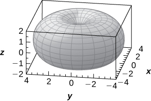 

**[T]** The “bumpy sphere” with an equation in spherical coordinates is <math xmlns="http://www.w3.org/1998/Math/MathML"><mrow><mi>ρ</mi><mo>=</mo><mi>a</mi><mo>+</mo><mi>b</mi><mspace width="0.2em" /><mtext>cos</mtext><mo stretchy="false">(</mo><mi>m</mi><mi>θ</mi><mo stretchy="false">)</mo><mtext>sin</mtext><mo stretchy="false">(</mo><mi>n</mi><mi>φ</mi><mo stretchy="false">)</mo><mo>,</mo></mrow></math>

 with <math xmlns="http://www.w3.org/1998/Math/MathML"><mrow><mi>θ</mi><mo>∈</mo><mo stretchy="false">[</mo><mn>0</mn><mo>,</mo><mn>2</mn><mi>π</mi><mo stretchy="false">]</mo></mrow></math>

 and <math xmlns="http://www.w3.org/1998/Math/MathML"><mrow><mi>φ</mi><mo>∈</mo><mo stretchy="false">[</mo><mn>0</mn><mo>,</mo><mi>π</mi><mo stretchy="false">]</mo><mo>,</mo></mrow></math>

 where <math xmlns="http://www.w3.org/1998/Math/MathML"><mi>a</mi></math>

 and <math xmlns="http://www.w3.org/1998/Math/MathML"><mi>b</mi></math>

 are positive numbers and <math xmlns="http://www.w3.org/1998/Math/MathML"><mi>m</mi></math>

 and <math xmlns="http://www.w3.org/1998/Math/MathML"><mi>n</mi></math>

 are positive integers, may be used in applied mathematics to model tumor growth.

1.  Show that the “bumpy sphere” is contained inside a sphere of equation
    <math xmlns="http://www.w3.org/1998/Math/MathML"><mrow><mi>ρ</mi><mo>=</mo><mi>a</mi><mo>+</mo><mi>b</mi><mo>.</mo></mrow></math>
    
    Find the values of
    <math xmlns="http://www.w3.org/1998/Math/MathML"><mi>θ</mi></math>
    
    and
    <math xmlns="http://www.w3.org/1998/Math/MathML"><mi>φ</mi></math>
    
    at which the two surfaces intersect.
2.  Use a CAS to graph the surface for
    <math xmlns="http://www.w3.org/1998/Math/MathML"><mrow><mi>a</mi><mo>=</mo><mn>14</mn><mo>,</mo></mrow></math>
    
    <math xmlns="http://www.w3.org/1998/Math/MathML"><mrow><mi>b</mi><mo>=</mo><mn>2</mn><mo>,</mo></mrow></math>
    
    <math xmlns="http://www.w3.org/1998/Math/MathML"><mrow><mi>m</mi><mo>=</mo><mn>4</mn><mo>,</mo></mrow></math>
    
    and
    <math xmlns="http://www.w3.org/1998/Math/MathML"><mrow><mi>n</mi><mo>=</mo><mn>6</mn></mrow></math>
    
    along with sphere
    <math xmlns="http://www.w3.org/1998/Math/MathML"><mrow><mi>ρ</mi><mo>=</mo><mi>a</mi><mo>+</mo><mi>b</mi><mo>.</mo></mrow></math>

3.  Find the equation of the intersection curve of the surface at b. with the cone
    <math xmlns="http://www.w3.org/1998/Math/MathML"><mrow><mi>φ</mi><mo>=</mo><mfrac><mi>π</mi><mrow><mn>12</mn></mrow></mfrac><mo>.</mo></mrow></math>
    
    Graph the intersection curve in the plane of intersection.
{: type="a"}

</section>

### Chapter Review Exercises

For the following exercises, determine whether the statement is *true or false*. Justify the answer with a proof or a counterexample.

For vectors <math xmlns="http://www.w3.org/1998/Math/MathML"><mstyle mathvariant="bold" mathsize="normal"><mtext>a</mtext></mstyle></math>

 and <math xmlns="http://www.w3.org/1998/Math/MathML"><mstyle mathvariant="bold" mathsize="normal"><mtext>b</mtext></mstyle></math>

 and any given scalar <math xmlns="http://www.w3.org/1998/Math/MathML"><mrow><mi>c</mi><mo>,</mo></mrow></math>

 <math xmlns="http://www.w3.org/1998/Math/MathML"><mrow><mi>c</mi><mrow><mo>(</mo><mrow><mstyle mathvariant="bold" mathsize="normal"><mtext>a</mtext></mstyle><mo>·</mo><mstyle mathvariant="bold" mathsize="normal"><mtext>b</mtext></mstyle></mrow><mo>)</mo></mrow><mo>=</mo><mrow><mo>(</mo><mrow><mi>c</mi><mstyle mathvariant="bold" mathsize="normal"><mtext>a</mtext></mstyle></mrow><mo>)</mo></mrow><mo>·</mo><mstyle mathvariant="bold" mathsize="normal"><mtext>b</mtext></mstyle><mo>.</mo></mrow></math>

True

For vectors <math xmlns="http://www.w3.org/1998/Math/MathML"><mstyle mathvariant="bold" mathsize="normal"><mtext>a</mtext></mstyle></math>

 and <math xmlns="http://www.w3.org/1998/Math/MathML"><mstyle mathvariant="bold" mathsize="normal"><mtext>b</mtext></mstyle></math>

 and any given scalar <math xmlns="http://www.w3.org/1998/Math/MathML"><mrow><mi>c</mi><mo>,</mo></mrow></math>

 <math xmlns="http://www.w3.org/1998/Math/MathML"><mrow><mi>c</mi><mrow><mo>(</mo><mrow><mstyle mathvariant="bold" mathsize="normal"><mtext>a</mtext></mstyle><mspace width="0.2em" /><mo>×</mo><mspace width="0.2em" /><mstyle mathvariant="bold" mathsize="normal"><mtext>b</mtext></mstyle></mrow><mo>)</mo></mrow><mo>=</mo><mrow><mo>(</mo><mrow><mi>c</mi><mstyle mathvariant="bold" mathsize="normal"><mtext>a</mtext></mstyle></mrow><mo>)</mo></mrow><mspace width="0.2em" /><mo>×</mo><mspace width="0.2em" /><mstyle mathvariant="bold" mathsize="normal"><mtext>b</mtext></mstyle><mo>.</mo></mrow></math>

The symmetric equation for the line of intersection between two planes <math xmlns="http://www.w3.org/1998/Math/MathML"><mrow><mi>x</mi><mo>+</mo><mi>y</mi><mo>+</mo><mi>z</mi><mo>=</mo><mn>2</mn></mrow></math>

 and <math xmlns="http://www.w3.org/1998/Math/MathML"><mrow><mi>x</mi><mo>+</mo><mn>2</mn><mi>y</mi><mo>−</mo><mn>4</mn><mi>z</mi><mo>=</mo><mn>5</mn></mrow></math>

 is given by <math xmlns="http://www.w3.org/1998/Math/MathML"><mrow><mo>−</mo><mfrac><mrow><mi>x</mi><mo>−</mo><mn>1</mn></mrow><mn>6</mn></mfrac><mo>=</mo><mfrac><mrow><mi>y</mi><mo>−</mo><mn>1</mn></mrow><mn>5</mn></mfrac><mo>=</mo><mi>z</mi><mo>.</mo></mrow></math>

False

If <math xmlns="http://www.w3.org/1998/Math/MathML"><mrow><mstyle mathvariant="bold" mathsize="normal"><mtext>a</mtext></mstyle><mo>·</mo><mstyle mathvariant="bold" mathsize="normal"><mtext>b</mtext></mstyle><mo>=</mo><mn>0</mn><mo>,</mo></mrow></math>

 then <math xmlns="http://www.w3.org/1998/Math/MathML"><mstyle mathvariant="bold" mathsize="normal"><mtext>a</mtext></mstyle></math>

 is perpendicular to <math xmlns="http://www.w3.org/1998/Math/MathML"><mrow><mstyle mathvariant="bold" mathsize="normal"><mtext>b</mtext></mstyle><mo>.</mo></mrow></math>

For the following exercises, use the given vectors to find the quantities.

<math xmlns="http://www.w3.org/1998/Math/MathML"><mrow><mstyle mathvariant="bold" mathsize="normal"><mtext>a</mtext></mstyle><mo>=</mo><mn>9</mn><mstyle mathvariant="bold" mathsize="normal"><mtext>i</mtext></mstyle><mo>−</mo><mn>2</mn><mstyle mathvariant="bold" mathsize="normal"><mtext>j</mtext></mstyle><mo>,</mo><mstyle mathvariant="bold" mathsize="normal"><mtext>b</mtext></mstyle><mo>=</mo><mn>−3</mn><mstyle mathvariant="bold" mathsize="normal"><mtext>i</mtext></mstyle><mo>+</mo><mstyle mathvariant="bold" mathsize="normal"><mtext>j</mtext></mstyle></mrow></math>

1.  <math xmlns="http://www.w3.org/1998/Math/MathML"><mrow><mn>3</mn><mstyle mathvariant="bold" mathsize="normal"><mtext>a</mtext></mstyle><mo>+</mo><mstyle mathvariant="bold" mathsize="normal"><mtext>b</mtext></mstyle></mrow></math>

2.  <math xmlns="http://www.w3.org/1998/Math/MathML"><mrow><mrow><mo>\|</mo><mstyle mathvariant="bold" mathsize="normal"><mtext>a</mtext></mstyle><mo>\|</mo></mrow></mrow></math>

3.  <math xmlns="http://www.w3.org/1998/Math/MathML"><mrow><mrow><mrow><mstyle mathvariant="bold" mathsize="normal"><mtext>a</mtext></mstyle><mspace width="0.2em" /><mo>×</mo><mspace width="0.2em" /></mrow><mo>\|</mo></mrow><mrow><mrow><mstyle mathvariant="bold" mathsize="normal"><mtext>b</mtext></mstyle><mspace width="0.2em" /><mo>×</mo><mspace width="0.2em" /></mrow><mo>\|</mo></mrow><mstyle mathvariant="bold" mathsize="normal"><mtext>a</mtext></mstyle></mrow></math>

4.  <math xmlns="http://www.w3.org/1998/Math/MathML"><mrow><mrow><mrow><mstyle mathvariant="bold" mathsize="normal"><mtext>b</mtext></mstyle><mspace width="0.2em" /><mo>×</mo><mspace width="0.2em" /></mrow><mo>\|</mo></mrow><mstyle mathvariant="bold" mathsize="normal"><mtext>a</mtext></mstyle></mrow></math>
{: type="a"}

a. <math xmlns="http://www.w3.org/1998/Math/MathML"><mrow><mrow><mo>〈</mo><mrow><mn>24</mn><mo>,</mo><mn>−5</mn></mrow><mo>〉</mo></mrow><mo>;</mo></mrow></math>

 b. <math xmlns="http://www.w3.org/1998/Math/MathML"><mrow><msqrt><mrow><mn>85</mn></mrow></msqrt><mo>;</mo></mrow></math>

 c. Can’t dot a vector with a scalar; d. <math xmlns="http://www.w3.org/1998/Math/MathML"><mrow><mn>−29</mn></mrow></math>

<math xmlns="http://www.w3.org/1998/Math/MathML"><mrow><mstyle mathvariant="bold" mathsize="normal"><mtext>a</mtext></mstyle><mo>=</mo><mn>2</mn><mstyle mathvariant="bold" mathsize="normal"><mtext>i</mtext></mstyle><mo>+</mo><mstyle mathvariant="bold" mathsize="normal"><mtext>j</mtext></mstyle><mo>−</mo><mn>9</mn><mstyle mathvariant="bold" mathsize="normal"><mtext>k</mtext></mstyle><mo>,</mo><mstyle mathvariant="bold" mathsize="normal"><mtext>b</mtext></mstyle><mo>=</mo><mtext>−</mtext><mstyle mathvariant="bold" mathsize="normal"><mtext>i</mtext></mstyle><mo>+</mo><mn>2</mn><mstyle mathvariant="bold" mathsize="normal"><mtext>k</mtext></mstyle><mo>,</mo><mstyle mathvariant="bold" mathsize="normal"><mtext>c</mtext></mstyle><mo>=</mo><mn>4</mn><mstyle mathvariant="bold" mathsize="normal"><mtext>i</mtext></mstyle><mo>−</mo><mn>2</mn><mstyle mathvariant="bold" mathsize="normal"><mtext>j</mtext></mstyle><mo>+</mo><mstyle mathvariant="bold" mathsize="normal"><mtext>k</mtext></mstyle></mrow></math>

1.  <math xmlns="http://www.w3.org/1998/Math/MathML"><mrow><mn>2</mn><mstyle mathvariant="bold" mathsize="normal"><mtext>a</mtext></mstyle><mo>−</mo><mstyle mathvariant="bold" mathsize="normal"><mtext>b</mtext></mstyle></mrow></math>

2.  <math xmlns="http://www.w3.org/1998/Math/MathML"><mrow><mrow><mo>\|</mo><mrow><mstyle mathvariant="bold" mathsize="normal"><mtext>b</mtext></mstyle><mspace width="0.2em" /><mo>×</mo><mspace width="0.2em" /><mstyle mathvariant="bold" mathsize="normal"><mtext>c</mtext></mstyle></mrow><mo>\|</mo></mrow></mrow></math>

3.  <math xmlns="http://www.w3.org/1998/Math/MathML"><mrow><mstyle mathvariant="bold" mathsize="normal"><mtext>b</mtext></mstyle><mspace width="0.2em" /><mo>×</mo><mspace width="0.2em" /><mrow><mo>\|</mo><mrow><mstyle mathvariant="bold" mathsize="normal"><mtext>b</mtext></mstyle><mspace width="0.2em" /><mo>×</mo><mspace width="0.2em" /><mstyle mathvariant="bold" mathsize="normal"><mtext>c</mtext></mstyle></mrow><mo>\|</mo></mrow></mrow></math>

4.  <math xmlns="http://www.w3.org/1998/Math/MathML"><mrow><mstyle mathvariant="bold" mathsize="normal"><mtext>c</mtext></mstyle><mspace width="0.2em" /><mo>×</mo><mspace width="0.2em" /><mrow><mo>\|</mo><mrow><mstyle mathvariant="bold" mathsize="normal"><mtext>b</mtext></mstyle><mspace width="0.2em" /><mo>×</mo><mspace width="0.2em" /><mstyle mathvariant="bold" mathsize="normal"><mtext>a</mtext></mstyle></mrow><mo>\|</mo></mrow></mrow></math>

5.  <math xmlns="http://www.w3.org/1998/Math/MathML"><mrow><msub><mrow><mtext>proj</mtext></mrow><mstyle mathvariant="bold" mathsize="normal"><mtext>a</mtext></mstyle></msub><mstyle mathvariant="bold" mathsize="normal"><mtext>b</mtext></mstyle></mrow></math>
{: type="a"}

Find the values of <math xmlns="http://www.w3.org/1998/Math/MathML"><mi>a</mi></math>

 such that vectors <math xmlns="http://www.w3.org/1998/Math/MathML"><mrow><mrow><mo>〈</mo><mrow><mn>2</mn><mo>,</mo><mn>4</mn><mo>,</mo><mi>a</mi></mrow><mo>〉</mo></mrow></mrow></math>

 and <math xmlns="http://www.w3.org/1998/Math/MathML"><mrow><mrow><mo>〈</mo><mrow><mn>0</mn><mo>,</mo><mn>−1</mn><mo>,</mo><mi>a</mi></mrow><mo>〉</mo></mrow></mrow></math>

 are orthogonal.

<math xmlns="http://www.w3.org/1998/Math/MathML"><mrow><mi>a</mi><mo>=</mo><mtext>±</mtext><mn>2</mn></mrow></math>

For the following exercises, find the unit vectors.

Find the unit vector that has the same direction as vector <math xmlns="http://www.w3.org/1998/Math/MathML"><mstyle mathvariant="bold" mathsize="normal"><mtext>v</mtext></mstyle></math>

 that begins at <math xmlns="http://www.w3.org/1998/Math/MathML"><mrow><mrow><mo>(</mo><mrow><mn>0</mn><mo>,</mo><mn>−3</mn></mrow><mo>)</mo></mrow></mrow></math>

 and ends at <math xmlns="http://www.w3.org/1998/Math/MathML"><mrow><mrow><mo>(</mo><mrow><mn>4</mn><mo>,</mo><mn>10</mn></mrow><mo>)</mo></mrow><mo>.</mo></mrow></math>

Find the unit vector that has the same direction as vector <math xmlns="http://www.w3.org/1998/Math/MathML"><mstyle mathvariant="bold" mathsize="normal"><mtext>v</mtext></mstyle></math>

 that begins at <math xmlns="http://www.w3.org/1998/Math/MathML"><mrow><mrow><mo>(</mo><mrow><mn>1</mn><mo>,</mo><mn>4</mn><mo>,</mo><mn>10</mn></mrow><mo>)</mo></mrow></mrow></math>

 and ends at <math xmlns="http://www.w3.org/1998/Math/MathML"><mrow><mrow><mo>(</mo><mrow><mn>3</mn><mo>,</mo><mn>0</mn><mo>,</mo><mn>4</mn></mrow><mo>)</mo></mrow><mo>.</mo></mrow></math>

<math xmlns="http://www.w3.org/1998/Math/MathML"><mrow><mrow><mo>〈</mo><mrow><mfrac><mn>1</mn><mrow><msqrt><mrow><mn>14</mn></mrow></msqrt></mrow></mfrac><mo>,</mo><mo>−</mo><mfrac><mn>2</mn><mrow><msqrt><mrow><mn>14</mn></mrow></msqrt></mrow></mfrac><mo>,</mo><mo>−</mo><mfrac><mn>3</mn><mrow><msqrt><mrow><mn>14</mn></mrow></msqrt></mrow></mfrac></mrow><mo>〉</mo></mrow></mrow></math>

For the following exercises, find the area or volume of the given shapes.

The parallelogram spanned by vectors <math xmlns="http://www.w3.org/1998/Math/MathML"><mrow><mstyle mathvariant="bold" mathsize="normal"><mtext>a</mtext></mstyle><mo>=</mo><mrow><mo>〈</mo><mrow><mn>1</mn><mo>,</mo><mn>13</mn></mrow><mo>〉</mo></mrow><mspace width="0.2em" /><mtext>and</mtext><mspace width="0.2em" /><mstyle mathvariant="bold" mathsize="normal"><mtext>b</mtext></mstyle><mo>=</mo><mrow><mo>〈</mo><mrow><mn>3</mn><mo>,</mo><mn>21</mn></mrow><mo>〉</mo></mrow></mrow></math>

The parallelepiped formed by <math xmlns="http://www.w3.org/1998/Math/MathML"><mrow><mstyle mathvariant="bold" mathsize="normal"><mtext>a</mtext></mstyle><mo>=</mo><mrow><mo>〈</mo><mrow><mn>1</mn><mo>,</mo><mn>4</mn><mo>,</mo><mn>1</mn></mrow><mo>〉</mo></mrow><mspace width="0.2em" /><mtext>and</mtext><mspace width="0.2em" /><mstyle mathvariant="bold" mathsize="normal"><mtext>b</mtext></mstyle><mo>=</mo><mrow><mo>〈</mo><mrow><mn>3</mn><mo>,</mo><mn>6</mn><mo>,</mo><mn>2</mn></mrow><mo>〉</mo></mrow><mo>,</mo></mrow></math>

 and <math xmlns="http://www.w3.org/1998/Math/MathML"><mrow><mstyle mathvariant="bold" mathsize="normal"><mtext>c</mtext></mstyle><mo>=</mo><mrow><mo>〈</mo><mrow><mn>−2</mn><mo>,</mo><mn>1</mn><mo>,</mo><mn>−5</mn></mrow><mo>〉</mo></mrow></mrow></math>

<math xmlns="http://www.w3.org/1998/Math/MathML"><mrow><mn>27</mn></mrow></math>

For the following exercises, find the vector and parametric equations of the line with the given properties.

The line that passes through point <math xmlns="http://www.w3.org/1998/Math/MathML"><mrow><mrow><mo>(</mo><mrow><mn>2</mn><mo>,</mo><mn>−3</mn><mo>,</mo><mn>7</mn></mrow><mo>)</mo></mrow></mrow></math>

 that is parallel to vector <math xmlns="http://www.w3.org/1998/Math/MathML"><mrow><mrow><mo>〈</mo><mrow><mn>1</mn><mo>,</mo><mn>3</mn><mo>,</mo><mn>−2</mn></mrow><mo>〉</mo></mrow></mrow></math>

The line that passes through points <math xmlns="http://www.w3.org/1998/Math/MathML"><mrow><mrow><mo>(</mo><mrow><mn>1</mn><mo>,</mo><mn>3</mn><mo>,</mo><mn>5</mn></mrow><mo>)</mo></mrow></mrow></math>

 and <math xmlns="http://www.w3.org/1998/Math/MathML"><mrow><mrow><mo>(</mo><mrow><mn>−2</mn><mo>,</mo><mn>6</mn><mo>,</mo><mn>−3</mn></mrow><mo>)</mo></mrow></mrow></math>

<math xmlns="http://www.w3.org/1998/Math/MathML"><mrow><mi>x</mi><mo>=</mo><mn>1</mn><mo>−</mo><mn>3</mn><mi>t</mi><mo>,</mo><mi>y</mi><mo>=</mo><mn>3</mn><mo>+</mo><mn>3</mn><mi>t</mi><mo>,</mo><mi>z</mi><mo>=</mo><mn>5</mn><mo>−</mo><mn>8</mn><mi>t</mi><mo>,</mo><mstyle mathvariant="bold" mathsize="normal"><mtext>r</mtext></mstyle><mrow><mo>(</mo><mi>t</mi><mo>)</mo></mrow><mo>=</mo><mrow><mo>(</mo><mrow><mn>1</mn><mo>−</mo><mn>3</mn><mi>t</mi></mrow><mo>)</mo></mrow><mstyle mathvariant="bold" mathsize="normal"><mtext>i</mtext></mstyle><mo>+</mo><mn>3</mn><mrow><mo>(</mo><mrow><mn>1</mn><mo>+</mo><mi>t</mi></mrow><mo>)</mo></mrow><mstyle mathvariant="bold" mathsize="normal"><mtext>j</mtext></mstyle><mo>+</mo><mrow><mo>(</mo><mrow><mn>5</mn><mo>−</mo><mn>8</mn><mi>t</mi></mrow><mo>)</mo></mrow><mstyle mathvariant="bold" mathsize="normal"><mtext>k</mtext></mstyle></mrow></math>

For the following exercises, find the equation of the plane with the given properties.

The plane that passes through point <math xmlns="http://www.w3.org/1998/Math/MathML"><mrow><mrow><mo>(</mo><mrow><mn>4</mn><mo>,</mo><mn>7</mn><mo>,</mo><mn>−1</mn></mrow><mo>)</mo></mrow></mrow></math>

 and has normal vector <math xmlns="http://www.w3.org/1998/Math/MathML"><mrow><mstyle mathvariant="bold" mathsize="normal"><mtext>n</mtext></mstyle><mo>=</mo><mrow><mo>〈</mo><mrow><mn>3</mn><mo>,</mo><mn>4</mn><mo>,</mo><mn>2</mn></mrow><mo>〉</mo></mrow></mrow></math>

The plane that passes through points <math xmlns="http://www.w3.org/1998/Math/MathML"><mrow><mrow><mo>(</mo><mrow><mn>0</mn><mo>,</mo><mn>1</mn><mo>,</mo><mn>5</mn></mrow><mo>)</mo></mrow><mo>,</mo><mrow><mo>(</mo><mrow><mn>2</mn><mo>,</mo><mn>−1</mn><mo>,</mo><mn>6</mn></mrow><mo>)</mo></mrow><mo>,</mo><mspace width="0.2em" /><mtext>and</mtext><mspace width="0.2em" /><mrow><mo>(</mo><mrow><mn>3</mn><mo>,</mo><mn>2</mn><mo>,</mo><mn>5</mn></mrow><mo>)</mo></mrow><mo>.</mo></mrow></math>

<math xmlns="http://www.w3.org/1998/Math/MathML"><mrow><mtext>−</mtext><mi>x</mi><mo>+</mo><mn>3</mn><mi>y</mi><mo>+</mo><mn>8</mn><mi>z</mi><mo>=</mo><mn>43</mn></mrow></math>

For the following exercises, find the traces for the surfaces in planes <math xmlns="http://www.w3.org/1998/Math/MathML"><mrow><mi>x</mi><mo>=</mo><mi>k</mi><mo>,</mo><mi>y</mi><mo>=</mo><mi>k</mi><mo>,</mo><mspace width="0.2em" /><mtext>and</mtext><mspace width="0.2em" /><mi>z</mi><mo>=</mo><mi>k</mi><mo>.</mo></mrow></math>

 Then, describe and draw the surfaces.

<math xmlns="http://www.w3.org/1998/Math/MathML"><mrow><mn>9</mn><msup><mi>x</mi><mn>2</mn></msup><mo>+</mo><mn>4</mn><msup><mi>y</mi><mn>2</mn></msup><mo>−</mo><mn>16</mn><mi>y</mi><mo>+</mo><mn>36</mn><msup><mi>z</mi><mn>2</mn></msup><mo>=</mo><mn>20</mn></mrow></math>

<math xmlns="http://www.w3.org/1998/Math/MathML"><mrow><msup><mi>x</mi><mn>2</mn></msup><mo>=</mo><msup><mi>y</mi><mn>2</mn></msup><mo>+</mo><msup><mi>z</mi><mn>2</mn></msup></mrow></math>

<math xmlns="http://www.w3.org/1998/Math/MathML"><mrow><mi>x</mi><mo>=</mo><mi>k</mi></mrow></math>

 trace: <math xmlns="http://www.w3.org/1998/Math/MathML"><mrow><msup><mi>k</mi><mn>2</mn></msup><mo>=</mo><msup><mi>y</mi><mn>2</mn></msup><mo>+</mo><msup><mi>z</mi><mn>2</mn></msup></mrow></math>

 is a circle, <math xmlns="http://www.w3.org/1998/Math/MathML"><mrow><mi>y</mi><mo>=</mo><mi>k</mi></mrow></math>

 trace: <math xmlns="http://www.w3.org/1998/Math/MathML"><mrow><msup><mi>x</mi><mn>2</mn></msup><mo>−</mo><msup><mi>z</mi><mn>2</mn></msup><mo>=</mo><msup><mi>k</mi><mn>2</mn></msup></mrow></math>

 is a hyperbola (or a pair of lines if <math xmlns="http://www.w3.org/1998/Math/MathML"><mrow><mi>k</mi><mo>=</mo><mn>0</mn><mo stretchy="false">)</mo><mo>,</mo></mrow></math>

 <math xmlns="http://www.w3.org/1998/Math/MathML"><mrow><mi>z</mi><mo>=</mo><mi>k</mi></mrow></math>

 trace: <math xmlns="http://www.w3.org/1998/Math/MathML"><mrow><msup><mi>x</mi><mn>2</mn></msup><mo>−</mo><msup><mi>y</mi><mn>2</mn></msup><mo>=</mo><msup><mi>k</mi><mn>2</mn></msup></mrow></math>

 is a hyperbola (or a pair of lines if <math xmlns="http://www.w3.org/1998/Math/MathML"><mrow><mi>k</mi><mo>=</mo><mn>0</mn><mo stretchy="false">)</mo><mo>.</mo></mrow></math>

 The surface is a cone.* * *
{: data-type="newline"}

 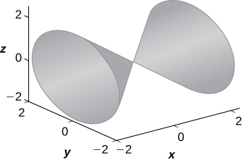 

For the following exercises, write the given equation in cylindrical coordinates and spherical coordinates.

<math xmlns="http://www.w3.org/1998/Math/MathML"><mrow><msup><mi>x</mi><mn>2</mn></msup><mo>+</mo><msup><mi>y</mi><mn>2</mn></msup><mo>+</mo><msup><mi>z</mi><mn>2</mn></msup><mo>=</mo><mn>144</mn></mrow></math>

<math xmlns="http://www.w3.org/1998/Math/MathML"><mrow><mi>z</mi><mo>=</mo><msup><mi>x</mi><mn>2</mn></msup><mo>+</mo><msup><mi>y</mi><mn>2</mn></msup><mo>−</mo><mn>1</mn></mrow></math>

Cylindrical: <math xmlns="http://www.w3.org/1998/Math/MathML"><mrow><mi>z</mi><mo>=</mo><msup><mi>r</mi><mn>2</mn></msup><mo>−</mo><mn>1</mn><mo>,</mo></mrow></math>

 spherical: <math xmlns="http://www.w3.org/1998/Math/MathML"><mrow><mtext>cos</mtext><mspace width="0.2em" /><mi>φ</mi><mo>=</mo><mi>ρ</mi><mspace width="0.2em" /><msup><mrow><mtext>sin</mtext></mrow><mn>2</mn></msup><mi>φ</mi><mo>−</mo><mfrac><mn>1</mn><mi>ρ</mi></mfrac></mrow></math>

For the following exercises, convert the given equations from cylindrical or spherical coordinates to rectangular coordinates. Identify the given surface.

<math xmlns="http://www.w3.org/1998/Math/MathML"><mrow><msup><mi>ρ</mi><mn>2</mn></msup><mrow><mo>(</mo><mrow><msup><mrow><mtext>sin</mtext></mrow><mn>2</mn></msup><mrow><mo>(</mo><mi>φ</mi><mo>)</mo></mrow><mo>−</mo><msup><mrow><mtext>cos</mtext></mrow><mn>2</mn></msup><mrow><mo>(</mo><mi>φ</mi><mo>)</mo></mrow></mrow><mo>)</mo></mrow><mo>=</mo><mn>1</mn></mrow></math>

<math xmlns="http://www.w3.org/1998/Math/MathML"><mrow><msup><mi>r</mi><mn>2</mn></msup><mo>−</mo><mn>2</mn><mi>r</mi><mspace width="0.2em" /><mtext>cos</mtext><mrow><mo>(</mo><mi>θ</mi><mo>)</mo></mrow><mo>+</mo><msup><mi>z</mi><mn>2</mn></msup><mo>=</mo><mn>1</mn></mrow></math>

<math xmlns="http://www.w3.org/1998/Math/MathML"><mrow><msup><mi>x</mi><mn>2</mn></msup><mo>−</mo><mn>2</mn><mi>x</mi><mo>+</mo><msup><mi>y</mi><mn>2</mn></msup><mo>+</mo><msup><mi>z</mi><mn>2</mn></msup><mo>=</mo><mn>1</mn><mo>,</mo></mrow></math>

 sphere

For the following exercises, consider a small boat crossing a river.

If the boat velocity is <math xmlns="http://www.w3.org/1998/Math/MathML"><mn>5</mn></math>

 km/h due north in still water and the water has a current of <math xmlns="http://www.w3.org/1998/Math/MathML"><mn>2</mn></math>

 km/h due west (see the following figure), what is the velocity of the boat relative to shore? What is the angle <math xmlns="http://www.w3.org/1998/Math/MathML"><mi>θ</mi></math>

 that the boat is actually traveling?

  

When the boat reaches the shore, two ropes are thrown to people to help pull the boat ashore. One rope is at an angle of <math xmlns="http://www.w3.org/1998/Math/MathML"><mrow><mn>25</mn><mtext>°</mtext></mrow></math>

 and the other is at <math xmlns="http://www.w3.org/1998/Math/MathML"><mrow><mn>35</mn><mtext>°</mtext><mo>.</mo></mrow></math>

 If the boat must be pulled straight and at a force of <math xmlns="http://www.w3.org/1998/Math/MathML"><mrow><mn>500</mn><mtext>N</mtext><mo>,</mo></mrow></math>

 find the magnitude of force for each rope (see the following figure).

  

331 N, and 244 N

An airplane is flying in the direction of 52° east of north with a speed of 450 mph. A strong wind has a bearing 33° east of north with a speed of 50 mph. What is the resultant ground speed and bearing of the airplane?

Calculate the work done by moving a particle from position <math xmlns="http://www.w3.org/1998/Math/MathML"><mrow><mo stretchy="false">(</mo><mn>1</mn><mo>,</mo><mn>2</mn><mo>,</mo><mn>0</mn><mo stretchy="false">)</mo></mrow></math>

 to <math xmlns="http://www.w3.org/1998/Math/MathML"><mrow><mo stretchy="false">(</mo><mn>8</mn><mo>,</mo><mn>4</mn><mo>,</mo><mn>5</mn><mo stretchy="false">)</mo></mrow></math>

 along a straight line with a force <math xmlns="http://www.w3.org/1998/Math/MathML"><mrow><mstyle mathvariant="bold" mathsize="normal"><mtext>F</mtext></mstyle><mo>=</mo><mn>2</mn><mstyle mathvariant="bold" mathsize="normal"><mtext>i</mtext></mstyle><mo>+</mo><mn>3</mn><mstyle mathvariant="bold" mathsize="normal"><mtext>j</mtext></mstyle><mo>−</mo><mstyle mathvariant="bold" mathsize="normal"><mtext>k</mtext></mstyle><mo>.</mo></mrow></math>

<math xmlns="http://www.w3.org/1998/Math/MathML"><mrow><mn>15</mn><mspace width="0.2em" /><mtext>J</mtext></mrow></math>

The following problems consider your unsuccessful attempt to take the tire off your car using a wrench to loosen the bolts. Assume the wrench is <math xmlns="http://www.w3.org/1998/Math/MathML"><mrow><mn>0.3</mn></mrow></math>

 m long and you are able to apply a 200-N force.

Because your tire is flat, you are only able to apply your force at a <math xmlns="http://www.w3.org/1998/Math/MathML"><mrow><mn>60</mn><mtext>°</mtext></mrow></math>

 angle. What is the torque at the center of the bolt? Assume this force is not enough to loosen the bolt.

Someone lends you a tire jack and you are now able to apply a 200-N force at an <math xmlns="http://www.w3.org/1998/Math/MathML"><mrow><mn>80</mn><mtext>°</mtext></mrow></math>

 angle. Is your resulting torque going to be more or less? What is the new resulting torque at the center of the bolt? Assume this force is not enough to loosen the bolt.

More, <math xmlns="http://www.w3.org/1998/Math/MathML"><mrow><mn>59.09</mn></mrow></math>

 J

### Glossary
{: data-type="glossary-title"}

cylindrical coordinate system
: a way to describe a location in space with an ordered triple
  <math xmlns="http://www.w3.org/1998/Math/MathML"><mrow><mrow><mo>(</mo><mrow><mi>r</mi><mo>,</mo><mi>θ</mi><mo>,</mo><mi>z</mi></mrow><mo>)</mo></mrow><mo>,</mo></mrow></math>
  
  where
  <math xmlns="http://www.w3.org/1998/Math/MathML"><mrow><mrow><mo>(</mo><mrow><mi>r</mi><mo>,</mo><mi>θ</mi></mrow><mo>)</mo></mrow></mrow></math>
  
  represents the polar coordinates of the point’s projection in the *xy*-plane, and
  <math xmlns="http://www.w3.org/1998/Math/MathML"><mi>z</mi></math>
  
  represents the point’s projection onto the *z*-axis
^

spherical coordinate system
: a way to describe a location in space with an ordered triple
  <math xmlns="http://www.w3.org/1998/Math/MathML"><mrow><mrow><mo>(</mo><mrow><mi>ρ</mi><mo>,</mo><mi>θ</mi><mo>,</mo><mi>φ</mi></mrow><mo>)</mo></mrow><mo>,</mo></mrow></math>
  
  where
  <math xmlns="http://www.w3.org/1998/Math/MathML"><mi>ρ</mi></math>
  
  is the distance between
  <math xmlns="http://www.w3.org/1998/Math/MathML"><mi>P</mi></math>
  
  and the origin
  <math xmlns="http://www.w3.org/1998/Math/MathML"><mrow><mrow><mo>(</mo><mrow><mi>ρ</mi><mo>≠</mo><mn>0</mn></mrow><mo>)</mo></mrow><mo>,</mo></mrow></math>
  
  <math xmlns="http://www.w3.org/1998/Math/MathML"><mi>θ</mi></math>
  
  is the same angle used to describe the location in cylindrical coordinates, and
  <math xmlns="http://www.w3.org/1998/Math/MathML"><mi>φ</mi></math>
  
  is the angle formed by the positive *z*-axis and line segment
  <math xmlns="http://www.w3.org/1998/Math/MathML"><mrow><mover accent="true"><mrow><mi>O</mi><mi>P</mi></mrow><mo stretchy="true">—</mo></mover><mo>,</mo></mrow></math>
  
  where
  <math xmlns="http://www.w3.org/1998/Math/MathML"><mi>O</mi></math>
  
  is the origin and
  <math xmlns="http://www.w3.org/1998/Math/MathML"><mrow><mn>0</mn><mo>≤</mo><mi>φ</mi><mo>≤</mo><mi>π</mi></mrow></math>

