

* Describe three-dimensional space mathematically.
* Locate points in space using coordinates.
* Write the distance formula in three dimensions.
* Write the equations for simple planes and spheres.
* Perform vector operations in
  <math xmlns="http://www.w3.org/1998/Math/MathML"><mrow><msup><mo>ℝ</mo><mn>3</mn></msup><mo>.</mo></mrow></math>

Vectors are useful tools for solving two-dimensional problems. Life, however, happens in three dimensions. To expand the use of vectors to more realistic applications, it is necessary to create a framework for describing three-dimensional space. For example, although a two-dimensional map is a useful tool for navigating from one place to another, in some cases the topography of the land is important. Does your planned route go through the mountains? Do you have to cross a river? To appreciate fully the impact of these geographic features, you must use three dimensions. This section presents a natural extension of the two-dimensional Cartesian coordinate plane into three dimensions.

### Three-Dimensional Coordinate Systems

As we have learned, the two-dimensional rectangular coordinate system contains two perpendicular axes: the horizontal *x*-axis and the vertical *y*-axis. We can add a third dimension, the *z*-axis, which is perpendicular to both the *x*-axis and the *y*-axis. We call this system the three-dimensional rectangular coordinate system. It represents the three dimensions we encounter in real life.

Definition

The **three-dimensional rectangular coordinate system**{: data-type="term"} consists of three perpendicular axes: the *x*-axis, the *y*-axis, and the *z*-axis. Because each axis is a number line representing all real numbers in <math xmlns="http://www.w3.org/1998/Math/MathML"><mrow><mo>ℝ</mo><mo>,</mo></mrow></math>

 the three-dimensional system is often denoted by <math xmlns="http://www.w3.org/1998/Math/MathML"><mrow><msup><mo>ℝ</mo><mn>3</mn></msup><mo>.</mo></mrow></math>

In [\[link\]](#CNX_Calc_Figure_12_02_001)(a), the positive *z*-axis is shown above the plane containing the *x*- and *y*-axes. The positive *x*-axis appears to the left and the positive *y*-axis is to the right. A natural question to ask is: How was arrangement determined? The system displayed follows the **right-hand rule**{: data-type="term"}. If we take our right hand and align the fingers with the positive *x*-axis, then curl the fingers so they point in the direction of the positive *y*-axis, our thumb points in the direction of the positive *z*-axis. In this text, we always work with coordinate systems set up in accordance with the right-hand rule. Some systems do follow a left-hand rule, but the right-hand rule is considered the standard representation.

  We can extend the two-dimensional rectangular coordinate system by adding a third axis, the z-axis, that is perpendicular to both the x-axis and the y-axis. (b) The right-hand rule is used to determine the placement of the coordinate axes in the standard Cartesian plane."){: #CNX_Calc_Figure_12_02_001}

In two dimensions, we describe a point in the plane with the coordinates <math xmlns="http://www.w3.org/1998/Math/MathML"><mrow><mrow><mo>(</mo><mrow><mi>x</mi><mo>,</mo><mi>y</mi></mrow><mo>)</mo></mrow><mo>.</mo></mrow></math>

 Each coordinate describes how the point aligns with the corresponding axis. In three dimensions, a new coordinate, <math xmlns="http://www.w3.org/1998/Math/MathML"><mrow><mi>z</mi><mo>,</mo></mrow></math>

 is appended to indicate alignment with the *z*-axis: <math xmlns="http://www.w3.org/1998/Math/MathML"><mrow><mrow><mo>(</mo><mrow><mi>x</mi><mo>,</mo><mi>y</mi><mo>,</mo><mi>z</mi></mrow><mo>)</mo></mrow><mo>.</mo></mrow></math>

 A point in space is identified by all three coordinates ([\[link\]](#CNX_Calc_Figure_12_02_002)). To plot the point <math xmlns="http://www.w3.org/1998/Math/MathML"><mrow><mrow><mo>(</mo><mrow><mi>x</mi><mo>,</mo><mi>y</mi><mo>,</mo><mi>z</mi></mrow><mo>)</mo></mrow><mo>,</mo></mrow></math>

 go *x* units along the *x*-axis, then <math xmlns="http://www.w3.org/1998/Math/MathML"><mi>y</mi></math>

 units in the direction of the *y*-axis, then <math xmlns="http://www.w3.org/1998/Math/MathML"><mi>z</mi></math>

 units in the direction of the *z*-axis.

  go x units along the x-axis, then y units in the direction of the y-axis, then z units in the direction of the z-axis."){: #CNX_Calc_Figure_12_02_002}

Locating Points in Space

Sketch the point <math xmlns="http://www.w3.org/1998/Math/MathML"><mrow><mrow><mo>(</mo><mrow><mn>1</mn><mo>,</mo><mn>−2</mn><mo>,</mo><mn>3</mn></mrow><mo>)</mo></mrow></mrow></math>

 in three-dimensional space.

To sketch a point, start by sketching three sides of a rectangular prism along the coordinate axes: one unit in the positive <math xmlns="http://www.w3.org/1998/Math/MathML"><mi>x</mi></math>

 direction, <math xmlns="http://www.w3.org/1998/Math/MathML"><mn>2</mn></math>

 units in the negative <math xmlns="http://www.w3.org/1998/Math/MathML"><mi>y</mi></math>

 direction, and <math xmlns="http://www.w3.org/1998/Math/MathML"><mn>3</mn></math>

 units in the positive <math xmlns="http://www.w3.org/1998/Math/MathML"><mi>z</mi></math>

 direction. Complete the prism to plot the point ([[link]](#CNX_Calc_Figure_12_02_003)).

."){: #CNX_Calc_Figure_12_02_003}

Sketch the point <math xmlns="http://www.w3.org/1998/Math/MathML"><mrow><mrow><mo>(</mo><mrow><mn>−2</mn><mo>,</mo><mn>3</mn><mo>,</mo><mn>−1</mn></mrow><mo>)</mo></mrow></mrow></math>

 in three-dimensional space.

* * *
{: data-type="newline"}

 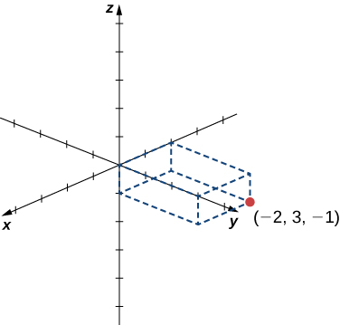 

Hint

Start by sketching the coordinate axes. Then sketch a rectangular prism to help find the point in space.

In two-dimensional space, the coordinate plane is defined by a pair of perpendicular axes. These axes allow us to name any location within the plane. In three dimensions, we define **coordinate planes**{: data-type="term"} by the coordinate axes, just as in two dimensions. There are three axes now, so there are three intersecting pairs of axes. Each pair of axes forms a coordinate plane: the *xy*-plane, the *xz*-plane, and the *yz*-plane ([\[link\]](#CNX_Calc_Figure_12_02_005)). We define the *xy*-plane formally as the following set: <math xmlns="http://www.w3.org/1998/Math/MathML"><mrow><mrow><mo>{</mo><mrow><mrow><mo>(</mo><mrow><mi>x</mi><mo>,</mo><mi>y</mi><mo>,</mo><mn>0</mn></mrow><mo>)</mo></mrow><mo>:</mo><mi>x</mi><mo>,</mo><mi>y</mi><mo>∈</mo><mo>ℝ</mo></mrow><mo>}</mo></mrow><mo>.</mo></mrow></math>

 Similarly, the *xz*-plane and the *yz*-plane are defined as <math xmlns="http://www.w3.org/1998/Math/MathML"><mrow><mrow><mo>{</mo><mrow><mrow><mo>(</mo><mrow><mi>x</mi><mo>,</mo><mn>0</mn><mo>,</mo><mi>z</mi></mrow><mo>)</mo></mrow><mo>:</mo><mi>x</mi><mo>,</mo><mi>z</mi><mo>∈</mo><mo>ℝ</mo></mrow><mo>}</mo></mrow></mrow></math>

 and <math xmlns="http://www.w3.org/1998/Math/MathML"><mrow><mrow><mo>{</mo><mrow><mrow><mo>(</mo><mrow><mn>0</mn><mo>,</mo><mi>y</mi><mo>,</mo><mi>z</mi></mrow><mo>)</mo></mrow><mo>:</mo><mi>y</mi><mo>,</mo><mi>z</mi><mo>∈</mo><mo>ℝ</mo></mrow><mo>}</mo></mrow><mo>,</mo></mrow></math>

 respectively.

To visualize this, imagine you’re building a house and are standing in a room with only two of the four walls finished. (Assume the two finished walls are adjacent to each other.) If you stand with your back to the corner where the two finished walls meet, facing out into the room, the floor is the *xy*-plane, the wall to your right is the *xz*-plane, and the wall to your left is the *yz*-plane.

 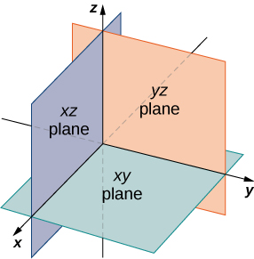{: #CNX_Calc_Figure_12_02_005}

In two dimensions, the coordinate axes partition the plane into four quadrants. Similarly, the coordinate planes divide space between them into eight regions about the origin, called **octants**{: data-type="term"}. The octants fill <math xmlns="http://www.w3.org/1998/Math/MathML"><mrow><msup><mo>ℝ</mo><mn>3</mn></msup></mrow></math>

 in the same way that quadrants fill <math xmlns="http://www.w3.org/1998/Math/MathML"><mrow><msup><mo>ℝ</mo><mn>2</mn></msup><mo>,</mo></mrow></math>

 as shown in [\[link\]](#CNX_Calc_Figure_12_02_006).

 {: #CNX_Calc_Figure_12_02_006}

Most work in three-dimensional space is a comfortable extension of the corresponding concepts in two dimensions. In this section, we use our knowledge of circles to describe spheres, then we expand our understanding of vectors to three dimensions. To accomplish these goals, we begin by adapting the distance formula to three-dimensional space.

If two points lie in the same coordinate plane, then it is straightforward to calculate the distance between them. We that the distance <math xmlns="http://www.w3.org/1998/Math/MathML"><mi>d</mi></math>

 between two points <math xmlns="http://www.w3.org/1998/Math/MathML"><mrow><mrow><mo>(</mo><mrow><msub><mi>x</mi><mn>1</mn></msub><mo>,</mo><msub><mi>y</mi><mn>1</mn></msub></mrow><mo>)</mo></mrow></mrow></math>

 and <math xmlns="http://www.w3.org/1998/Math/MathML"><mrow><mrow><mo>(</mo><mrow><msub><mi>x</mi><mn>2</mn></msub><mo>,</mo><msub><mi>y</mi><mn>2</mn></msub></mrow><mo>)</mo></mrow></mrow></math>

 in the *xy*-coordinate plane is given by the formula

<math xmlns="http://www.w3.org/1998/Math/MathML"><mrow><mi>d</mi><mo>=</mo><msqrt><mrow><msup><mrow><mrow><mo>(</mo><mrow><msub><mi>x</mi><mn>2</mn></msub><mo>−</mo><msub><mi>x</mi><mn>1</mn></msub></mrow><mo>)</mo></mrow></mrow><mn>2</mn></msup><mo>+</mo><msup><mrow><mrow><mo>(</mo><mrow><msub><mi>y</mi><mn>2</mn></msub><mo>−</mo><msub><mi>y</mi><mn>1</mn></msub></mrow><mo>)</mo></mrow></mrow><mn>2</mn></msup></mrow></msqrt><mo>.</mo></mrow></math>

The formula for the distance between two points in space is a natural extension of this formula.

The Distance between Two Points in Space

The distance <math xmlns="http://www.w3.org/1998/Math/MathML"><mi>d</mi></math>

 between points <math xmlns="http://www.w3.org/1998/Math/MathML"><mrow><mrow><mo>(</mo><mrow><msub><mi>x</mi><mn>1</mn></msub><mo>,</mo><msub><mi>y</mi><mn>1</mn></msub><mo>,</mo><msub><mi>z</mi><mn>1</mn></msub></mrow><mo>)</mo></mrow></mrow></math>

 and <math xmlns="http://www.w3.org/1998/Math/MathML"><mrow><mrow><mo>(</mo><mrow><msub><mi>x</mi><mn>2</mn></msub><mo>,</mo><msub><mi>y</mi><mn>2</mn></msub><mo>,</mo><msub><mi>z</mi><mn>2</mn></msub></mrow><mo>)</mo></mrow></mrow></math>

 is given by the formula

<math xmlns="http://www.w3.org/1998/Math/MathML"><mrow><mi>d</mi><mo>=</mo><msqrt><mrow><msup><mrow><mrow><mo>(</mo><mrow><msub><mi>x</mi><mn>2</mn></msub><mo>−</mo><msub><mi>x</mi><mn>1</mn></msub></mrow><mo>)</mo></mrow></mrow><mn>2</mn></msup><mo>+</mo><msup><mrow><mrow><mo>(</mo><mrow><msub><mi>y</mi><mn>2</mn></msub><mo>−</mo><msub><mi>y</mi><mn>1</mn></msub></mrow><mo>)</mo></mrow></mrow><mn>2</mn></msup><mo>+</mo><msup><mrow><mrow><mo>(</mo><mrow><msub><mi>z</mi><mn>2</mn></msub><mo>−</mo><msub><mi>z</mi><mn>1</mn></msub></mrow><mo>)</mo></mrow></mrow><mn>2</mn></msup></mrow></msqrt><mo>.</mo></mrow></math>

The proof of this theorem is left as an exercise. (*Hint:* First find the distance <math xmlns="http://www.w3.org/1998/Math/MathML"><mrow><msub><mi>d</mi><mn>1</mn></msub></mrow></math>

 between the points <math xmlns="http://www.w3.org/1998/Math/MathML"><mrow><mrow><mo>(</mo><mrow><msub><mi>x</mi><mn>1</mn></msub><mo>,</mo><msub><mi>y</mi><mn>1</mn></msub><mo>,</mo><msub><mi>z</mi><mn>1</mn></msub></mrow><mo>)</mo></mrow></mrow></math>

 and <math xmlns="http://www.w3.org/1998/Math/MathML"><mrow><mrow><mo>(</mo><mrow><msub><mi>x</mi><mn>2</mn></msub><mo>,</mo><msub><mi>y</mi><mn>2</mn></msub><mo>,</mo><msub><mi>z</mi><mn>1</mn></msub></mrow><mo>)</mo></mrow></mrow></math>

 as shown in [\[link\]](#CNX_Calc_Figure_12_02_007).)

 ![This figure is a rectangular prism. The lower, left back corner is labeled &#x201C;P sub 1=(x sub 1,y sub 1,z sub 1). The lower front right corner is labeled &#x201C;(x sub 2, y sub 2, z sub 1)&#x201D;. There is a line between P sub 1 and P sub 2 and is labeled &#x201C;d sub 1&#x201D;. The upper front right corner is labeled &#x201C;P sub 2=(x sub 2,y sub 2,z sub 2).&#x201D; There is a line from P sub 1 to P sub 2 and is labeled &#x201C;d (P sub 1,P sub 2).&#x201D; The front right vertical side is labeled &#x201C;\|z sub 2-z sub 1\|&#x201D;.](../resources/CNX_Calc_Figure_12_02_007.jpg "The distance between P1 and P2 is the length of the diagonal of the rectangular prism having P1 and P2 as opposite corners."){: #CNX_Calc_Figure_12_02_007}

Distance in Space

Find the distance between points <math xmlns="http://www.w3.org/1998/Math/MathML"><mrow><msub><mi>P</mi><mn>1</mn></msub><mo>=</mo><mrow><mo>(</mo><mrow><mn>3</mn><mo>,</mo><mtext>−</mtext><mn>1</mn><mo>,</mo><mn>5</mn></mrow><mo>)</mo></mrow></mrow></math>

 and <math xmlns="http://www.w3.org/1998/Math/MathML"><mrow><msub><mi>P</mi><mn>2</mn></msub><mo>=</mo><mrow><mo>(</mo><mrow><mn>2</mn><mo>,</mo><mn>1</mn><mo>,</mo><mtext>−</mtext><mn>1</mn></mrow><mo>)</mo></mrow><mo>.</mo></mrow></math>

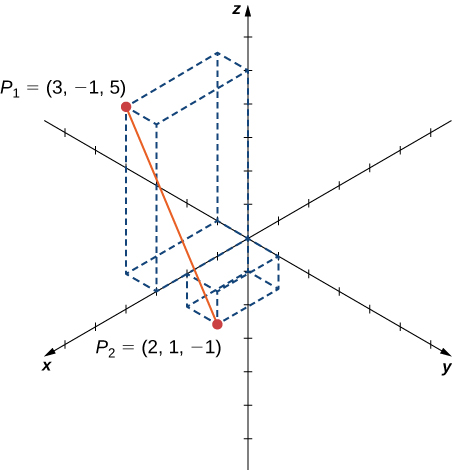{: #CNX_Calc_Figure_12_02_012}

Substitute values directly into the distance formula:

<math xmlns="http://www.w3.org/1998/Math/MathML"><mtable><mtr><mtd columnalign="right"><mi>d</mi><mrow><mo>(</mo><mrow><msub><mi>P</mi><mn>1</mn></msub><mo>,</mo><msub><mi>P</mi><mn>2</mn></msub></mrow><mo>)</mo></mrow></mtd><mtd columnalign="left"><mo>=</mo><msqrt><mrow><msup><mrow><mrow><mo>(</mo><mrow><msub><mi>x</mi><mn>2</mn></msub><mo>−</mo><msub><mi>x</mi><mn>1</mn></msub></mrow><mo>)</mo></mrow></mrow><mn>2</mn></msup><mo>+</mo><msup><mrow><mrow><mo>(</mo><mrow><msub><mi>y</mi><mn>2</mn></msub><mo>−</mo><msub><mi>y</mi><mn>1</mn></msub></mrow><mo>)</mo></mrow></mrow><mn>2</mn></msup><mo>+</mo><msup><mrow><mrow><mo>(</mo><mrow><msub><mi>z</mi><mn>2</mn></msub><mo>−</mo><msub><mi>z</mi><mn>1</mn></msub></mrow><mo>)</mo></mrow></mrow><mn>2</mn></msup></mrow></msqrt></mtd></mtr><mtr><mtd /><mtd columnalign="left"><mo>=</mo><msqrt><mrow><msup><mrow><mrow><mo>(</mo><mrow><mn>2</mn><mo>−</mo><mn>3</mn></mrow><mo>)</mo></mrow></mrow><mn>2</mn></msup><mo>+</mo><msup><mrow><mrow><mo>(</mo><mrow><mn>1</mn><mo>−</mo><mrow><mo>(</mo><mrow><mn>−1</mn></mrow><mo>)</mo></mrow></mrow><mo>)</mo></mrow></mrow><mn>2</mn></msup><mo>+</mo><msup><mrow><mrow><mo>(</mo><mrow><mn>−1</mn><mo>−</mo><mn>5</mn></mrow><mo>)</mo></mrow></mrow><mn>2</mn></msup></mrow></msqrt></mtd></mtr><mtr><mtd /><mtd columnalign="left"><mo>=</mo><msqrt><mrow><msup><mn>1</mn><mn>2</mn></msup><mo>+</mo><msup><mn>2</mn><mn>2</mn></msup><mo>+</mo><msup><mrow><mrow><mo>(</mo><mrow><mn>−6</mn></mrow><mo>)</mo></mrow></mrow><mn>2</mn></msup></mrow></msqrt></mtd></mtr><mtr><mtd /><mtd columnalign="left"><mo>=</mo><msqrt><mrow><mn>41</mn></mrow></msqrt><mo>.</mo></mtd></mtr></mtable></math>

Find the distance between points <math xmlns="http://www.w3.org/1998/Math/MathML"><mrow><msub><mi>P</mi><mn>1</mn></msub><mo>=</mo><mrow><mo>(</mo><mrow><mn>1</mn><mo>,</mo><mn>−5</mn><mo>,</mo><mn>4</mn></mrow><mo>)</mo></mrow></mrow></math>

 and <math xmlns="http://www.w3.org/1998/Math/MathML"><mrow><msub><mi>P</mi><mn>2</mn></msub><mo>=</mo><mrow><mo>(</mo><mrow><mn>4</mn><mo>,</mo><mn>−1</mn><mo>,</mo><mn>−1</mn></mrow><mo>)</mo></mrow><mo>.</mo></mrow></math>

<math xmlns="http://www.w3.org/1998/Math/MathML"><mrow><mn>5</mn><msqrt><mn>2</mn></msqrt></mrow></math>

Hint

<math xmlns="http://www.w3.org/1998/Math/MathML"><mrow><mi>d</mi><mo>=</mo><msqrt><mrow><msup><mrow><mrow><mo>(</mo><mrow><msub><mi>x</mi><mn>2</mn></msub><mo>−</mo><msub><mi>x</mi><mn>1</mn></msub></mrow><mo>)</mo></mrow></mrow><mn>2</mn></msup><mo>+</mo><msup><mrow><mrow><mo>(</mo><mrow><msub><mi>y</mi><mn>2</mn></msub><mo>−</mo><msub><mi>y</mi><mn>1</mn></msub></mrow><mo>)</mo></mrow></mrow><mn>2</mn></msup><mo>+</mo><msup><mrow><mrow><mo>(</mo><mrow><msub><mi>z</mi><mn>2</mn></msub><mo>−</mo><msub><mi>z</mi><mn>1</mn></msub></mrow><mo>)</mo></mrow></mrow><mn>2</mn></msup></mrow></msqrt></mrow></math>

Before moving on to the next section, let’s get a feel for how <math xmlns="http://www.w3.org/1998/Math/MathML"><mrow><msup><mo>ℝ</mo><mn>3</mn></msup></mrow></math>

 differs from <math xmlns="http://www.w3.org/1998/Math/MathML"><mrow><msup><mo>ℝ</mo><mn>2</mn></msup><mo>.</mo></mrow></math>

 For example, in <math xmlns="http://www.w3.org/1998/Math/MathML"><mrow><msup><mo>ℝ</mo><mn>2</mn></msup><mo>,</mo></mrow></math>

 lines that are not parallel must always intersect. This is not the case in <math xmlns="http://www.w3.org/1998/Math/MathML"><mrow><msup><mo>ℝ</mo><mn>3</mn></msup><mo>.</mo></mrow></math>

 For example, consider the line shown in [\[link\]](#CNX_Calc_Figure_12_02_013). These two lines are not parallel, nor do they intersect.

 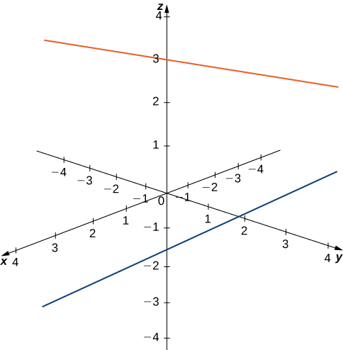{: #CNX_Calc_Figure_12_02_013}

You can also have circles that are interconnected but have no points in common, as in [\[link\]](#CNX_Calc_Figure_12_02_014).

 {: #CNX_Calc_Figure_12_02_014}

We have a lot more flexibility working in three dimensions than we do if we stuck with only two dimensions.

### Writing Equations in ℝ3

Now that we can represent points in space and find the distance between them, we can learn how to write equations of geometric objects such as lines, planes, and curved surfaces in <math xmlns="http://www.w3.org/1998/Math/MathML"><mrow><msup><mo>ℝ</mo><mn>3</mn></msup><mo>.</mo></mrow></math>

 First, we start with a simple equation. Compare the graphs of the equation <math xmlns="http://www.w3.org/1998/Math/MathML"><mrow><mi>x</mi><mo>=</mo><mn>0</mn></mrow></math>

 in <math xmlns="http://www.w3.org/1998/Math/MathML"><mrow><mo>ℝ</mo><mo>,</mo><msup><mo>ℝ</mo><mn>2</mn></msup><mo>,</mo><mspace width="0.2em" /><mtext>and</mtext><mspace width="0.2em" /><msup><mo>ℝ</mo><mn>3</mn></msup></mrow></math>

 ([\[link\]](#CNX_Calc_Figure_12_02_008)). From these graphs, we can see the same equation can describe a point, a line, or a plane.

  In &#x211D;, the equation x=0 describes a single point. (b) In &#x211D;2, the equation x=0 describes a line, the y-axis. (c) In &#x211D;3, the equation x=0 describes a plane, the yz-plane."){: #CNX_Calc_Figure_12_02_008}

In space, the equation <math xmlns="http://www.w3.org/1998/Math/MathML"><mrow><mi>x</mi><mo>=</mo><mn>0</mn></mrow></math>

 describes all points <math xmlns="http://www.w3.org/1998/Math/MathML"><mrow><mrow><mo>(</mo><mrow><mn>0</mn><mo>,</mo><mi>y</mi><mo>,</mo><mi>z</mi></mrow><mo>)</mo></mrow><mo>.</mo></mrow></math>

 This equation defines the *yz*-plane. Similarly, the *xy*-plane contains all points of the form <math xmlns="http://www.w3.org/1998/Math/MathML"><mrow><mrow><mo>(</mo><mrow><mi>x</mi><mo>,</mo><mi>y</mi><mo>,</mo><mn>0</mn></mrow><mo>)</mo></mrow><mo>.</mo></mrow></math>

 The equation <math xmlns="http://www.w3.org/1998/Math/MathML"><mrow><mi>z</mi><mo>=</mo><mn>0</mn></mrow></math>

 defines the *xy*-plane and the equation <math xmlns="http://www.w3.org/1998/Math/MathML"><mrow><mi>y</mi><mo>=</mo><mn>0</mn></mrow></math>

 describes the *xz*-plane ([\[link\]](#CNX_Calc_Figure_12_02_009)).

  In space, the equation z=0 describes the xy-plane. (b) All points in the xz-plane satisfy the equation y=0."){: #CNX_Calc_Figure_12_02_009}

Understanding the equations of the coordinate planes allows us to write an equation for any plane that is parallel to one of the coordinate planes. When a plane is parallel to the *xy*-plane, for example, the *z*-coordinate of each point in the plane has the same constant value. Only the *x*- and *y*-coordinates of points in that plane vary from point to point.

Rule: Equations of Planes Parallel to Coordinate Planes

1.  The plane in space that is parallel to the *xy*-plane and contains point
    <math xmlns="http://www.w3.org/1998/Math/MathML"><mrow><mrow><mo>(</mo><mrow><mi>a</mi><mo>,</mo><mi>b</mi><mo>,</mo><mi>c</mi></mrow><mo>)</mo></mrow></mrow></math>
    
    can be represented by the equation
    <math xmlns="http://www.w3.org/1998/Math/MathML"><mrow><mi>z</mi><mo>=</mo><mi>c</mi><mo>.</mo></mrow></math>

2.  The plane in space that is parallel to the *xz*-plane and contains point
    <math xmlns="http://www.w3.org/1998/Math/MathML"><mrow><mrow><mo>(</mo><mrow><mi>a</mi><mo>,</mo><mi>b</mi><mo>,</mo><mi>c</mi></mrow><mo>)</mo></mrow></mrow></math>
    
    can be represented by the equation
    <math xmlns="http://www.w3.org/1998/Math/MathML"><mrow><mi>y</mi><mo>=</mo><mi>b</mi><mo>.</mo></mrow></math>

3.  The plane in space that is parallel to the *yz*-plane and contains point
    <math xmlns="http://www.w3.org/1998/Math/MathML"><mrow><mrow><mo>(</mo><mrow><mi>a</mi><mo>,</mo><mi>b</mi><mo>,</mo><mi>c</mi></mrow><mo>)</mo></mrow></mrow></math>
    
    can be represented by the equation
    <math xmlns="http://www.w3.org/1998/Math/MathML"><mrow><mi>x</mi><mo>=</mo><mi>a</mi><mo>.</mo></mrow></math>
{: data-number-style="arabic"}

Writing Equations of Planes Parallel to Coordinate Planes

1.  Write an equation of the plane passing through point
    <math xmlns="http://www.w3.org/1998/Math/MathML"><mrow><mrow><mo>(</mo><mrow><mn>3</mn><mo>,</mo><mn>11</mn><mo>,</mo><mn>7</mn></mrow><mo>)</mo></mrow></mrow></math>
    
    that is parallel to the *yz*-plane.
2.  Find an equation of the plane passing through points
    <math xmlns="http://www.w3.org/1998/Math/MathML"><mrow><mrow><mo>(</mo><mrow><mn>6</mn><mo>,</mo><mn>−2</mn><mo>,</mo><mn>9</mn></mrow><mo>)</mo></mrow><mo>,</mo></mrow></math>
    
    <math xmlns="http://www.w3.org/1998/Math/MathML"><mrow><mrow><mo>(</mo><mrow><mn>0</mn><mo>,</mo><mn>−2</mn><mo>,</mo><mn>4</mn></mrow><mo>)</mo></mrow><mo>,</mo></mrow></math>
    
    and
    <math xmlns="http://www.w3.org/1998/Math/MathML"><mrow><mrow><mo>(</mo><mrow><mn>1</mn><mo>,</mo><mn>−2</mn><mo>,</mo><mn>−3</mn></mrow><mo>)</mo></mrow><mo>.</mo></mrow></math>
{: data-number-style="lower-alpha"}

1.  When a plane is parallel to the *yz*-plane, only the *y*- and *z*-coordinates may vary. The *x*-coordinate has the same constant value for all points in this plane, so this plane can be represented by the equation
    <math xmlns="http://www.w3.org/1998/Math/MathML"><mrow><mi>x</mi><mo>=</mo><mn>3</mn><mo>.</mo></mrow></math>

2.  Each of the points
    <math xmlns="http://www.w3.org/1998/Math/MathML"><mrow><mrow><mo>(</mo><mrow><mn>6</mn><mo>,</mo><mn>−2</mn><mo>,</mo><mn>9</mn></mrow><mo>)</mo></mrow><mo>,</mo></mrow></math>
    
    <math xmlns="http://www.w3.org/1998/Math/MathML"><mrow><mrow><mo>(</mo><mrow><mn>0</mn><mo>,</mo><mn>−2</mn><mo>,</mo><mn>4</mn></mrow><mo>)</mo></mrow><mo>,</mo></mrow></math>
    
    and
    <math xmlns="http://www.w3.org/1998/Math/MathML"><mrow><mrow><mo>(</mo><mrow><mn>1</mn><mo>,</mo><mn>−2</mn><mo>,</mo><mn>−3</mn></mrow><mo>)</mo></mrow></mrow></math>
    
    has the same *y*-coordinate. This plane can be represented by the equation
    <math xmlns="http://www.w3.org/1998/Math/MathML"><mrow><mi>y</mi><mo>=</mo><mn>−2</mn><mo>.</mo></mrow></math>
{: data-number-style="lower-alpha"}

Write an equation of the plane passing through point <math xmlns="http://www.w3.org/1998/Math/MathML"><mrow><mrow><mo>(</mo><mrow><mn>1</mn><mo>,</mo><mn>−6</mn><mo>,</mo><mn>−4</mn></mrow><mo>)</mo></mrow></mrow></math>

 that is parallel to the *xy*-plane.

<math xmlns="http://www.w3.org/1998/Math/MathML"><mrow><mi>z</mi><mo>=</mo><mn>−4</mn></mrow></math>

Hint

If a plane is parallel to the *xy*-plane, the *z*-coordinates of the points in that plane do not vary.

As we have seen, in <math xmlns="http://www.w3.org/1998/Math/MathML"><mrow><msup><mo>ℝ</mo><mn>2</mn></msup></mrow></math>

 the equation <math xmlns="http://www.w3.org/1998/Math/MathML"><mrow><mi>x</mi><mo>=</mo><mn>5</mn></mrow></math>

 describes the vertical line passing through point <math xmlns="http://www.w3.org/1998/Math/MathML"><mrow><mrow><mo>(</mo><mrow><mn>5</mn><mo>,</mo><mn>0</mn></mrow><mo>)</mo></mrow><mo>.</mo></mrow></math>

 This line is parallel to the *y*-axis. In a natural extension, the equation <math xmlns="http://www.w3.org/1998/Math/MathML"><mrow><mi>x</mi><mo>=</mo><mn>5</mn></mrow></math>

 in <math xmlns="http://www.w3.org/1998/Math/MathML"><mrow><msup><mo>ℝ</mo><mn>3</mn></msup></mrow></math>

 describes the plane passing through point <math xmlns="http://www.w3.org/1998/Math/MathML"><mrow><mrow><mo>(</mo><mrow><mn>5</mn><mo>,</mo><mn>0</mn><mo>,</mo><mn>0</mn></mrow><mo>)</mo></mrow><mo>,</mo></mrow></math>

 which is parallel to the *yz*-plane. Another natural extension of a familiar equation is found in the equation of a sphere.

Definition

A **sphere**{: data-type="term"} is the set of all points in space equidistant from a fixed point, the center of the sphere ([\[link\]](#CNX_Calc_Figure_12_02_010)), just as the set of all points in a plane that are equidistant from the center represents a circle. In a sphere, as in a circle, the distance from the center to a point on the sphere is called the *radius*.

  on the surface of a sphere is r units away from the center (a,b,c)."){: #CNX_Calc_Figure_12_02_010}

The equation of a circle is derived using the distance formula in two dimensions. In the same way, the equation of a sphere is based on the three-dimensional formula for distance.

Rule: Equation of a Sphere

The sphere with center <math xmlns="http://www.w3.org/1998/Math/MathML"><mrow><mrow><mo>(</mo><mrow><mi>a</mi><mo>,</mo><mi>b</mi><mo>,</mo><mi>c</mi></mrow><mo>)</mo></mrow></mrow></math>

 and radius <math xmlns="http://www.w3.org/1998/Math/MathML"><mi>r</mi></math>

 can be represented by the equation

<math xmlns="http://www.w3.org/1998/Math/MathML"><mrow><msup><mrow><mrow><mo>(</mo><mrow><mi>x</mi><mo>−</mo><mi>a</mi></mrow><mo>)</mo></mrow></mrow><mn>2</mn></msup><mo>+</mo><msup><mrow><mrow><mo>(</mo><mrow><mi>y</mi><mo>−</mo><mi>b</mi></mrow><mo>)</mo></mrow></mrow><mn>2</mn></msup><mo>+</mo><msup><mrow><mrow><mo>(</mo><mrow><mi>z</mi><mo>−</mo><mi>c</mi></mrow><mo>)</mo></mrow></mrow><mn>2</mn></msup><mo>=</mo><msup><mi>r</mi><mn>2</mn></msup><mo>.</mo></mrow></math>

This equation is known as the **standard equation of a sphere**{: data-type="term"}.

Finding an Equation of a Sphere

Find the standard equation of the sphere with center <math xmlns="http://www.w3.org/1998/Math/MathML"><mrow><mrow><mo>(</mo><mrow><mn>10</mn><mo>,</mo><mn>7</mn><mo>,</mo><mn>4</mn></mrow><mo>)</mo></mrow></mrow></math>

 and point <math xmlns="http://www.w3.org/1998/Math/MathML"><mrow><mrow><mo>(</mo><mrow><mn>−1</mn><mo>,</mo><mn>3</mn><mo>,</mo><mn>−2</mn></mrow><mo>)</mo></mrow><mo>,</mo></mrow></math>

 as shown in [[link]](#CNX_Calc_Figure_12_02_015).

 containing point (&#x2212;1,3,&#x2212;2)."){: #CNX_Calc_Figure_12_02_015}

Use the distance formula to find the radius <math xmlns="http://www.w3.org/1998/Math/MathML"><mi>r</mi></math>

 of the sphere:

<math xmlns="http://www.w3.org/1998/Math/MathML"><mtable><mtr><mtd columnalign="right"><mi>r</mi></mtd><mtd columnalign="left"><mo>=</mo><msqrt><mrow><msup><mrow><mrow><mo>(</mo><mrow><mn>−1</mn><mo>−</mo><mn>10</mn></mrow><mo>)</mo></mrow></mrow><mn>2</mn></msup><mo>+</mo><msup><mrow><mrow><mo>(</mo><mrow><mn>3</mn><mo>−</mo><mn>7</mn></mrow><mo>)</mo></mrow></mrow><mn>2</mn></msup><mo>+</mo><msup><mrow><mrow><mo>(</mo><mrow><mn>−2</mn><mo>−</mo><mn>4</mn></mrow><mo>)</mo></mrow></mrow><mn>2</mn></msup></mrow></msqrt></mtd></mtr><mtr><mtd /><mtd columnalign="left"><mo>=</mo><msqrt><mrow><msup><mrow><mo stretchy="false">(</mo><mn>−11</mn><mo stretchy="false">)</mo></mrow><mn>2</mn></msup><mo>+</mo><msup><mrow><mo stretchy="false">(</mo><mn>−4</mn><mo stretchy="false">)</mo></mrow><mn>2</mn></msup><mo>+</mo><msup><mrow><mo stretchy="false">(</mo><mn>−6</mn><mo stretchy="false">)</mo></mrow><mn>2</mn></msup></mrow></msqrt></mtd></mtr><mtr><mtd /><mtd columnalign="left"><mo>=</mo><msqrt><mrow><mn>173</mn></mrow></msqrt><mo>.</mo></mtd></mtr></mtable></math>

The standard equation of the sphere is

<math xmlns="http://www.w3.org/1998/Math/MathML"><mrow><msup><mrow><mrow><mo>(</mo><mrow><mi>x</mi><mo>−</mo><mn>10</mn></mrow><mo>)</mo></mrow></mrow><mn>2</mn></msup><mo>+</mo><msup><mrow><mrow><mo>(</mo><mrow><mi>y</mi><mo>−</mo><mn>7</mn></mrow><mo>)</mo></mrow></mrow><mn>2</mn></msup><mo>+</mo><msup><mrow><mrow><mo>(</mo><mrow><mi>z</mi><mo>−</mo><mn>4</mn></mrow><mo>)</mo></mrow></mrow><mn>2</mn></msup><mo>=</mo><mn>173</mn><mo>.</mo></mrow></math>

Find the standard equation of the sphere with center <math xmlns="http://www.w3.org/1998/Math/MathML"><mrow><mrow><mo>(</mo><mrow><mn>−2</mn><mo>,</mo><mn>4</mn><mo>,</mo><mn>−5</mn></mrow><mo>)</mo></mrow></mrow></math>

 containing point <math xmlns="http://www.w3.org/1998/Math/MathML"><mrow><mrow><mo>(</mo><mrow><mn>4</mn><mo>,</mo><mn>4</mn><mo>,</mo><mn>−1</mn></mrow><mo>)</mo></mrow><mo>.</mo></mrow></math>

<math xmlns="http://www.w3.org/1998/Math/MathML"><mrow><msup><mrow><mrow><mo>(</mo><mrow><mi>x</mi><mo>+</mo><mn>2</mn></mrow><mo>)</mo></mrow></mrow><mn>2</mn></msup><mo>+</mo><msup><mrow><mrow><mo>(</mo><mrow><mi>y</mi><mo>−</mo><mn>4</mn></mrow><mo>)</mo></mrow></mrow><mn>2</mn></msup><mo>+</mo><msup><mrow><mrow><mo>(</mo><mrow><mi>z</mi><mo>+</mo><mn>5</mn></mrow><mo>)</mo></mrow></mrow><mn>2</mn></msup><mo>=</mo><mn>52</mn></mrow></math>

Hint

First use the distance formula to find the radius of the sphere.

Finding the Equation of a Sphere

Let <math xmlns="http://www.w3.org/1998/Math/MathML"><mrow><mi>P</mi><mo>=</mo><mrow><mo>(</mo><mrow><mn>−5</mn><mo>,</mo><mn>2</mn><mo>,</mo><mn>3</mn></mrow><mo>)</mo></mrow></mrow></math>

 and <math xmlns="http://www.w3.org/1998/Math/MathML"><mrow><mi>Q</mi><mo>=</mo><mrow><mo>(</mo><mrow><mn>3</mn><mo>,</mo><mn>4</mn><mo>,</mo><mn>−1</mn></mrow><mo>)</mo></mrow><mo>,</mo></mrow></math>

 and suppose line segment <math xmlns="http://www.w3.org/1998/Math/MathML"><mrow><mi>P</mi><mi>Q</mi></mrow></math>

 forms the diameter of a sphere ([[link]](#CNX_Calc_Figure_12_02_016)). Find the equation of the sphere.

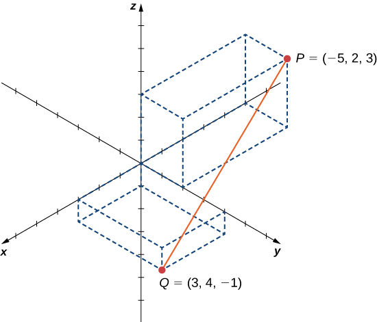{: #CNX_Calc_Figure_12_02_016}

Since <math xmlns="http://www.w3.org/1998/Math/MathML"><mrow><mi>P</mi><mi>Q</mi></mrow></math>

 is a diameter of the sphere, we know the center of the sphere is the midpoint of <math xmlns="http://www.w3.org/1998/Math/MathML"><mrow><mi>P</mi><mi>Q</mi><mo>.</mo></mrow></math>

 Then,

<math xmlns="http://www.w3.org/1998/Math/MathML"><mtable><mtr><mtd columnalign="right"><mi>C</mi></mtd><mtd columnalign="left"><mo>=</mo><mrow><mo>(</mo><mrow><mfrac><mrow><mn>−5</mn><mo>+</mo><mn>3</mn></mrow><mn>2</mn></mfrac><mo>,</mo><mfrac><mrow><mn>2</mn><mo>+</mo><mn>4</mn></mrow><mn>2</mn></mfrac><mo>,</mo><mfrac><mrow><mn>3</mn><mo>+</mo><mrow><mo>(</mo><mrow><mn>−1</mn></mrow><mo>)</mo></mrow></mrow><mn>2</mn></mfrac></mrow><mo>)</mo></mrow></mtd></mtr><mtr><mtd /><mtd columnalign="left"><mo>=</mo><mrow><mo>(</mo><mrow><mn>−1</mn><mo>,</mo><mn>3</mn><mo>,</mo><mn>1</mn></mrow><mo>)</mo></mrow><mo>.</mo></mtd></mtr></mtable></math>

Furthermore, we know the radius of the sphere is half the length of the diameter. This gives

<math xmlns="http://www.w3.org/1998/Math/MathML"><mtable><mtr><mtd columnalign="right"><mi>r</mi></mtd><mtd columnalign="left"><mo>=</mo><mfrac><mn>1</mn><mn>2</mn></mfrac><msqrt><mrow><msup><mrow><mrow><mo>(</mo><mrow><mn>−5</mn><mo>−</mo><mn>3</mn></mrow><mo>)</mo></mrow></mrow><mn>2</mn></msup><mo>+</mo><msup><mrow><mrow><mo>(</mo><mrow><mn>2</mn><mo>−</mo><mn>4</mn></mrow><mo>)</mo></mrow></mrow><mn>2</mn></msup><mo>+</mo><msup><mrow><mrow><mo>(</mo><mrow><mn>3</mn><mo>−</mo><mrow><mo>(</mo><mrow><mn>−1</mn></mrow><mo>)</mo></mrow></mrow><mo>)</mo></mrow></mrow><mn>2</mn></msup></mrow></msqrt></mtd></mtr><mtr><mtd /><mtd columnalign="left"><mo>=</mo><mfrac><mn>1</mn><mn>2</mn></mfrac><msqrt><mrow><mn>64</mn><mo>+</mo><mn>4</mn><mo>+</mo><mn>16</mn></mrow></msqrt></mtd></mtr><mtr><mtd /><mtd columnalign="left"><mo>=</mo><msqrt><mrow><mn>21</mn></mrow></msqrt><mo>.</mo></mtd></mtr></mtable></math>

Then, the equation of the sphere is <math xmlns="http://www.w3.org/1998/Math/MathML"><mrow><msup><mrow><mrow><mo>(</mo><mrow><mi>x</mi><mo>+</mo><mn>1</mn></mrow><mo>)</mo></mrow></mrow><mn>2</mn></msup><mo>+</mo><msup><mrow><mrow><mo>(</mo><mrow><mi>y</mi><mo>−</mo><mn>3</mn></mrow><mo>)</mo></mrow></mrow><mn>2</mn></msup><mo>+</mo><msup><mrow><mrow><mo>(</mo><mrow><mi>z</mi><mo>−</mo><mn>1</mn></mrow><mo>)</mo></mrow></mrow><mn>2</mn></msup><mo>=</mo><mn>21</mn><mo>.</mo></mrow></math>

Find the equation of the sphere with diameter <math xmlns="http://www.w3.org/1998/Math/MathML"><mrow><mi>P</mi><mi>Q</mi><mo>,</mo></mrow></math>

 where <math xmlns="http://www.w3.org/1998/Math/MathML"><mrow><mi>P</mi><mo>=</mo><mrow><mo>(</mo><mrow><mn>2</mn><mo>,</mo><mn>−1</mn><mo>,</mo><mn>−3</mn></mrow><mo>)</mo></mrow></mrow></math>

 and <math xmlns="http://www.w3.org/1998/Math/MathML"><mrow><mi>Q</mi><mo>=</mo><mrow><mo>(</mo><mrow><mn>−2</mn><mo>,</mo><mn>5</mn><mo>,</mo><mn>−1</mn></mrow><mo>)</mo></mrow><mo>.</mo></mrow></math>

<math xmlns="http://www.w3.org/1998/Math/MathML"><mrow><msup><mi>x</mi><mn>2</mn></msup><mo>+</mo><msup><mrow><mrow><mo>(</mo><mrow><mi>y</mi><mo>−</mo><mn>2</mn></mrow><mo>)</mo></mrow></mrow><mn>2</mn></msup><mo>+</mo><msup><mrow><mrow><mo>(</mo><mrow><mi>z</mi><mo>+</mo><mn>2</mn></mrow><mo>)</mo></mrow></mrow><mn>2</mn></msup><mo>=</mo><mn>14</mn></mrow></math>

Hint

Find the midpoint of the diameter first.

Graphing Other Equations in Three Dimensions

Describe the set of points that satisfies <math xmlns="http://www.w3.org/1998/Math/MathML"><mrow><mrow><mo>(</mo><mrow><mi>x</mi><mo>−</mo><mn>4</mn></mrow><mo>)</mo></mrow><mrow><mo>(</mo><mrow><mi>z</mi><mo>−</mo><mn>2</mn></mrow><mo>)</mo></mrow><mo>=</mo><mn>0</mn><mo>,</mo></mrow></math>

 and graph the set.

We must have either <math xmlns="http://www.w3.org/1998/Math/MathML"><mrow><mi>x</mi><mo>−</mo><mn>4</mn><mo>=</mo><mn>0</mn></mrow></math>

 or <math xmlns="http://www.w3.org/1998/Math/MathML"><mrow><mi>z</mi><mo>−</mo><mn>2</mn><mo>=</mo><mn>0</mn><mo>,</mo></mrow></math>

 so the set of points forms the two planes <math xmlns="http://www.w3.org/1998/Math/MathML"><mrow><mi>x</mi><mo>=</mo><mn>4</mn></mrow></math>

 and <math xmlns="http://www.w3.org/1998/Math/MathML"><mrow><mi>z</mi><mo>=</mo><mn>2</mn></mrow></math>

 ([[link]](#CNX_Calc_Figure_12_02_017)).* * *
{: data-type="newline"}

(z&#x2212;2)=0 forms the two planes x=4 and z=2."){: #CNX_Calc_Figure_12_02_017}

Describe the set of points that satisfies <math xmlns="http://www.w3.org/1998/Math/MathML"><mrow><mrow><mo>(</mo><mrow><mi>y</mi><mo>+</mo><mn>2</mn></mrow><mo>)</mo></mrow><mrow><mo>(</mo><mrow><mi>z</mi><mo>−</mo><mn>3</mn></mrow><mo>)</mo></mrow><mo>=</mo><mn>0</mn><mo>,</mo></mrow></math>

 and graph the set.

The set of points forms the two planes <math xmlns="http://www.w3.org/1998/Math/MathML"><mrow><mi>y</mi><mo>=</mo><mn>−2</mn></mrow></math>

 and <math xmlns="http://www.w3.org/1998/Math/MathML"><mrow><mi>z</mi><mo>=</mo><mn>3</mn><mo>.</mo></mrow></math>

* * *
{: data-type="newline"}

 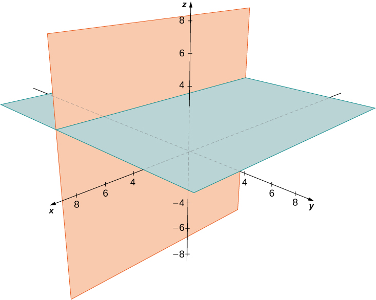 

Hint

One of the factors must be zero.

Graphing Other Equations in Three Dimensions

Describe the set of points in three-dimensional space that satisfies <math xmlns="http://www.w3.org/1998/Math/MathML"><mrow><msup><mrow><mrow><mo>(</mo><mrow><mi>x</mi><mo>−</mo><mn>2</mn></mrow><mo>)</mo></mrow></mrow><mn>2</mn></msup><mo>+</mo><msup><mrow><mrow><mo>(</mo><mrow><mi>y</mi><mo>−</mo><mn>1</mn></mrow><mo>)</mo></mrow></mrow><mn>2</mn></msup><mo>=</mo><mn>4</mn><mo>,</mo></mrow></math>

 and graph the set.

The *x*- and *y*-coordinates form a circle in the *xy*-plane of radius <math xmlns="http://www.w3.org/1998/Math/MathML"><mrow><mn>2</mn><mo>,</mo></mrow></math>

 centered at <math xmlns="http://www.w3.org/1998/Math/MathML"><mrow><mrow><mo>(</mo><mrow><mn>2</mn><mo>,</mo><mn>1</mn></mrow><mo>)</mo></mrow><mo>.</mo></mrow></math>

 Since there is no restriction on the *z*-coordinate, the three-dimensional result is a circular cylinder of radius <math xmlns="http://www.w3.org/1998/Math/MathML"><mn>2</mn></math>

 centered on the line with <math xmlns="http://www.w3.org/1998/Math/MathML"><mrow><mi>x</mi><mo>=</mo><mn>2</mn><mspace width="0.2em" /><mtext>and</mtext><mspace width="0.2em" /><mi>y</mi><mo>=</mo><mn>1</mn><mo>.</mo></mrow></math>

 The cylinder extends indefinitely in the *z*-direction ([[link]](#CNX_Calc_Figure_12_02_019)).

2+(y&#x2212;1)2=4. This is a cylinder of radius 2 centered on the line with x=2andy=1."){: #CNX_Calc_Figure_12_02_019}

Describe the set of points in three dimensional space that satisfies <math xmlns="http://www.w3.org/1998/Math/MathML"><mrow><msup><mi>x</mi><mn>2</mn></msup><mo>+</mo><msup><mrow><mo stretchy="false">(</mo><mi>z</mi><mo>−</mo><mn>2</mn><mo stretchy="false">)</mo></mrow><mn>2</mn></msup><mo>=</mo><mn>16</mn><mo>,</mo></mrow></math>

 and graph the surface.

A cylinder of radius 4 centered on the line with <math xmlns="http://www.w3.org/1998/Math/MathML"><mrow><mi>x</mi><mo>=</mo><mn>0</mn><mspace width="0.2em" /><mtext>and</mtext><mspace width="0.2em" /><mi>z</mi><mo>=</mo><mn>2</mn><mo>.</mo></mrow></math>

* * *
{: data-type="newline"}

 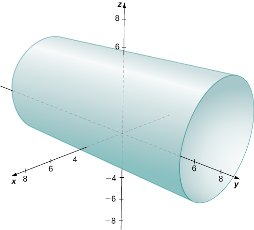 

Hint

Think about what happens if you plot this equation in two dimensions in the *xz*-plane.

### Working with Vectors in ℝ3

Just like two-dimensional vectors, three-dimensional vectors are quantities with both magnitude and direction, and they are represented by directed line segments (arrows). With a three-dimensional vector, we use a three-dimensional arrow.

Three-dimensional vectors can also be represented in component form. The notation <math xmlns="http://www.w3.org/1998/Math/MathML"><mrow><mstyle mathvariant="bold" mathsize="normal"><mtext>v</mtext></mstyle><mo>=</mo><mrow><mo>〈</mo><mrow><mi>x</mi><mo>,</mo><mi>y</mi><mo>,</mo><mi>z</mi></mrow><mo>〉</mo></mrow></mrow></math>

 is a natural extension of the two-dimensional case, representing a vector with the initial point at the origin, <math xmlns="http://www.w3.org/1998/Math/MathML"><mrow><mrow><mo>(</mo><mrow><mn>0</mn><mo>,</mo><mn>0</mn><mo>,</mo><mn>0</mn></mrow><mo>)</mo></mrow><mo>,</mo></mrow></math>

 and terminal point <math xmlns="http://www.w3.org/1998/Math/MathML"><mrow><mrow><mo>(</mo><mrow><mi>x</mi><mo>,</mo><mi>y</mi><mo>,</mo><mi>z</mi></mrow><mo>)</mo></mrow><mo>.</mo></mrow></math>

 The zero vector is <math xmlns="http://www.w3.org/1998/Math/MathML"><mrow><mstyle mathvariant="bold" mathsize="normal"><mn>0</mn></mstyle><mo>=</mo><mrow><mo>〈</mo><mrow><mn>0</mn><mo>,</mo><mn>0</mn><mo>,</mo><mn>0</mn></mrow><mo>〉</mo></mrow><mo>.</mo></mrow></math>

 So, for example, the three dimensional vector <math xmlns="http://www.w3.org/1998/Math/MathML"><mrow><mstyle mathvariant="bold" mathsize="normal"><mtext>v</mtext></mstyle><mo>=</mo><mrow><mo>〈</mo><mrow><mn>2</mn><mo>,</mo><mn>4</mn><mo>,</mo><mn>1</mn></mrow><mo>〉</mo></mrow></mrow></math>

 is represented by a directed line segment from point <math xmlns="http://www.w3.org/1998/Math/MathML"><mrow><mrow><mo>(</mo><mrow><mn>0</mn><mo>,</mo><mn>0</mn><mo>,</mo><mn>0</mn></mrow><mo>)</mo></mrow></mrow></math>

 to point <math xmlns="http://www.w3.org/1998/Math/MathML"><mrow><mrow><mo>(</mo><mrow><mn>2</mn><mo>,</mo><mn>4</mn><mo>,</mo><mn>1</mn></mrow><mo>)</mo></mrow></mrow></math>

 ([\[link\]](#CNX_Calc_Figure_12_02_021)).

  to point (2,4,1)."){: #CNX_Calc_Figure_12_02_021}

Vector addition and scalar multiplication are defined analogously to the two-dimensional case. If <math xmlns="http://www.w3.org/1998/Math/MathML"><mrow><mstyle mathvariant="bold" mathsize="normal"><mtext>v</mtext></mstyle><mo>=</mo><mrow><mo>〈</mo><mrow><msub><mi>x</mi><mn>1</mn></msub><mo>,</mo><msub><mi>y</mi><mn>1</mn></msub><mo>,</mo><msub><mi>z</mi><mn>1</mn></msub></mrow><mo>〉</mo></mrow></mrow></math>

 and <math xmlns="http://www.w3.org/1998/Math/MathML"><mrow><mstyle mathvariant="bold" mathsize="normal"><mtext>w</mtext></mstyle><mo>=</mo><mrow><mo>〈</mo><mrow><msub><mi>x</mi><mn>2</mn></msub><mo>,</mo><msub><mi>y</mi><mn>2</mn></msub><mo>,</mo><msub><mi>z</mi><mn>2</mn></msub></mrow><mo>〉</mo></mrow></mrow></math>

 are vectors, and <math xmlns="http://www.w3.org/1998/Math/MathML"><mi>k</mi></math>

 is a scalar, then

<math xmlns="http://www.w3.org/1998/Math/MathML"><mrow><mstyle mathvariant="bold" mathsize="normal"><mtext>v</mtext></mstyle><mo>+</mo><mstyle mathvariant="bold" mathsize="normal"><mtext>w</mtext></mstyle><mo>=</mo><mrow><mo>〈</mo><mrow><msub><mi>x</mi><mn>1</mn></msub><mo>+</mo><msub><mi>x</mi><mn>2</mn></msub><mo>,</mo><msub><mi>y</mi><mn>1</mn></msub><mo>+</mo><msub><mi>y</mi><mn>2</mn></msub><mo>,</mo><msub><mi>z</mi><mn>1</mn></msub><mo>+</mo><msub><mi>z</mi><mn>2</mn></msub></mrow><mo>〉</mo></mrow><mspace width="0.2em" /><mtext>and</mtext><mspace width="0.2em" /><mi>k</mi><mstyle mathvariant="bold" mathsize="normal"><mtext>v</mtext></mstyle><mo>=</mo><mrow><mo>〈</mo><mrow><mi>k</mi><msub><mi>x</mi><mn>1</mn></msub><mo>,</mo><mi>k</mi><msub><mi>y</mi><mn>1</mn></msub><mo>,</mo><mi>k</mi><msub><mi>z</mi><mn>1</mn></msub></mrow><mo>〉</mo></mrow><mo>.</mo></mrow></math>

If <math xmlns="http://www.w3.org/1998/Math/MathML"><mrow><mi>k</mi><mo>=</mo><mn>−1</mn><mo>,</mo></mrow></math>

 then <math xmlns="http://www.w3.org/1998/Math/MathML"><mrow><mi>k</mi><mstyle mathvariant="bold" mathsize="normal"><mtext>v</mtext></mstyle><mo>=</mo><mrow><mo>(</mo><mrow><mn>−1</mn></mrow><mo>)</mo></mrow><mstyle mathvariant="bold" mathsize="normal"><mtext>v</mtext></mstyle></mrow></math>

 is written as <math xmlns="http://www.w3.org/1998/Math/MathML"><mrow><mtext>−</mtext><mstyle mathvariant="bold" mathsize="normal"><mtext>v</mtext></mstyle><mo>,</mo></mrow></math>

 and vector subtraction is defined by <math xmlns="http://www.w3.org/1998/Math/MathML"><mrow><mstyle mathvariant="bold" mathsize="normal"><mtext>v</mtext></mstyle><mo>−</mo><mstyle mathvariant="bold" mathsize="normal"><mi>w</mi><mo>=</mo><mi>v</mi><mo>+</mo></mstyle><mrow><mo>(</mo><mrow><mtext>−</mtext><mstyle mathvariant="bold" mathsize="normal"><mtext>w</mtext></mstyle></mrow><mo>)</mo></mrow><mstyle mathvariant="bold" mathsize="normal"><mo>=</mo><mi>v</mi><mo>+</mo></mstyle><mrow><mo>(</mo><mrow><mn>−1</mn></mrow><mo>)</mo></mrow><mstyle mathvariant="bold" mathsize="normal"><mtext>w</mtext></mstyle><mo>.</mo></mrow></math>

The standard unit vectors extend easily into three dimensions as well—<math xmlns="http://www.w3.org/1998/Math/MathML"><mrow><mstyle mathvariant="bold" mathsize="normal"><mtext>i</mtext></mstyle><mo>=</mo><mrow><mo>〈</mo><mrow><mn>1</mn><mo>,</mo><mn>0</mn><mo>,</mo><mn>0</mn></mrow><mo>〉</mo></mrow><mo>,</mo></mrow></math>

 <math xmlns="http://www.w3.org/1998/Math/MathML"><mrow><mstyle mathvariant="bold" mathsize="normal"><mtext>j</mtext></mstyle><mo>=</mo><mrow><mo>〈</mo><mrow><mn>0</mn><mo>,</mo><mn>1</mn><mo>,</mo><mn>0</mn></mrow><mo>〉</mo></mrow><mo>,</mo></mrow></math>

 and <math xmlns="http://www.w3.org/1998/Math/MathML"><mrow><mstyle mathvariant="bold" mathsize="normal"><mtext>k</mtext></mstyle><mo>=</mo><mrow><mo>〈</mo><mrow><mn>0</mn><mo>,</mo><mn>0</mn><mo>,</mo><mn>1</mn></mrow><mo>〉</mo></mrow></mrow></math>

—and we use them in the same way we used the standard unit vectors in two dimensions. Thus, we can represent a vector in <math xmlns="http://www.w3.org/1998/Math/MathML"><mrow><msup><mo>ℝ</mo><mn>3</mn></msup></mrow></math>

 in the following ways:

<math xmlns="http://www.w3.org/1998/Math/MathML"><mrow><mstyle mathvariant="bold" mathsize="normal"><mtext>v</mtext></mstyle><mo>=</mo><mrow><mo>〈</mo><mrow><mi>x</mi><mo>,</mo><mi>y</mi><mo>,</mo><mi>z</mi></mrow><mo>〉</mo></mrow><mo>=</mo><mi>x</mi><mstyle mathvariant="bold" mathsize="normal"><mtext>i</mtext></mstyle><mo>+</mo><mi>y</mi><mstyle mathvariant="bold" mathsize="normal"><mtext>j</mtext></mstyle><mo>+</mo><mi>z</mi><mstyle mathvariant="bold" mathsize="normal"><mtext>k</mtext></mstyle><mo>.</mo></mrow></math>

Vector Representations

Let <math xmlns="http://www.w3.org/1998/Math/MathML"><mrow><mover accent="true"><mrow><mi>P</mi><mi>Q</mi></mrow><mo stretchy="false">→</mo></mover></mrow></math>

 be the vector with initial point <math xmlns="http://www.w3.org/1998/Math/MathML"><mrow><mi>P</mi><mo>=</mo><mo stretchy="false">(</mo><mn>3</mn><mo>,</mo><mn>12</mn><mo>,</mo><mn>6</mn><mo stretchy="false">)</mo></mrow></math>

 and terminal point <math xmlns="http://www.w3.org/1998/Math/MathML"><mrow><mi>Q</mi><mo>=</mo><mrow><mo>(</mo><mrow><mn>−4</mn><mo>,</mo><mn>−3</mn><mo>,</mo><mn>2</mn></mrow><mo>)</mo></mrow></mrow></math>

 as shown in [[link]](#CNX_Calc_Figure_12_02_022). Express <math xmlns="http://www.w3.org/1998/Math/MathML"><mrow><mover accent="true"><mrow><mi>P</mi><mi>Q</mi></mrow><mo stretchy="false">→</mo></mover></mrow></math>

 in both component form and using standard unit vectors.

 and terminal point Q=(&#x2212;4,&#x2212;3,2)."){: #CNX_Calc_Figure_12_02_022}

In component form,

<math xmlns="http://www.w3.org/1998/Math/MathML"><mtable><mtr><mtd columnalign="right"><mover accent="true"><mrow><mi>P</mi><mi>Q</mi></mrow><mo stretchy="false">→</mo></mover></mtd><mtd columnalign="left"><mo>=</mo><mrow><mo>〈</mo><mrow><msub><mi>x</mi><mn>2</mn></msub><mo>−</mo><msub><mi>x</mi><mn>1</mn></msub><mo>,</mo><msub><mi>y</mi><mn>2</mn></msub><mo>−</mo><msub><mi>y</mi><mn>1</mn></msub><mo>,</mo><msub><mi>z</mi><mn>2</mn></msub><mo>−</mo><msub><mi>z</mi><mn>1</mn></msub></mrow><mo>〉</mo></mrow></mtd></mtr><mtr><mtd /><mtd columnalign="left"><mo>=</mo><mrow><mo>〈</mo><mrow><mn>−4</mn><mo>−</mo><mn>3</mn><mo>,</mo><mn>−3</mn><mo>−</mo><mn>12</mn><mo>,</mo><mn>2</mn><mo>−</mo><mn>6</mn></mrow><mo>〉</mo></mrow><mo>=</mo><mrow><mo>〈</mo><mrow><mn>−7</mn><mo>,</mo><mn>−15</mn><mo>,</mo><mn>−4</mn></mrow><mo>〉</mo></mrow><mo>.</mo></mtd></mtr></mtable></math>

In standard unit form,

<math xmlns="http://www.w3.org/1998/Math/MathML"><mrow><mover accent="true"><mrow><mi>P</mi><mi>Q</mi></mrow><mo stretchy="false">→</mo></mover><mo>=</mo><mn>−7</mn><mstyle mathvariant="bold" mathsize="normal"><mtext>i</mtext></mstyle><mo>−</mo><mn>15</mn><mstyle mathvariant="bold" mathsize="normal"><mtext>j</mtext></mstyle><mo>−</mo><mn>4</mn><mstyle mathvariant="bold" mathsize="normal"><mtext>k</mtext></mstyle><mo>.</mo></mrow></math>

Let <math xmlns="http://www.w3.org/1998/Math/MathML"><mrow><mi>S</mi><mo>=</mo><mrow><mo>(</mo><mrow><mn>3</mn><mo>,</mo><mn>8</mn><mo>,</mo><mn>2</mn></mrow><mo>)</mo></mrow></mrow></math>

 and <math xmlns="http://www.w3.org/1998/Math/MathML"><mrow><mi>T</mi><mo>=</mo><mrow><mo>(</mo><mrow><mn>2</mn><mo>,</mo><mn>−1</mn><mo>,</mo><mn>3</mn></mrow><mo>)</mo></mrow><mo>.</mo></mrow></math>

 Express <math xmlns="http://www.w3.org/1998/Math/MathML"><mrow><mover accent="true"><mrow><mi>S</mi><mi>T</mi></mrow><mo stretchy="false">→</mo></mover></mrow></math>

 in component form and in standard unit form.

<math xmlns="http://www.w3.org/1998/Math/MathML"><mrow><mover accent="true"><mrow><mi>S</mi><mi>T</mi></mrow><mo stretchy="false">→</mo></mover><mo>=</mo><mrow><mo>〈</mo><mrow><mn>−1</mn><mo>,</mo><mn>−9</mn><mo>,</mo><mn>1</mn></mrow><mo>〉</mo></mrow><mo>=</mo><mtext>−</mtext><mstyle mathvariant="bold" mathsize="normal"><mtext>i</mtext></mstyle><mo>−</mo><mn>9</mn><mstyle mathvariant="bold" mathsize="normal"><mtext>j</mtext></mstyle><mo>+</mo><mstyle mathvariant="bold" mathsize="normal"><mtext>k</mtext></mstyle></mrow></math>

Hint

Write <math xmlns="http://www.w3.org/1998/Math/MathML"><mrow><mover accent="true"><mrow><mi>S</mi><mi>T</mi></mrow><mo stretchy="false">→</mo></mover></mrow></math>

 in component form first. <math xmlns="http://www.w3.org/1998/Math/MathML"><mi>T</mi></math>

 is the terminal point of <math xmlns="http://www.w3.org/1998/Math/MathML"><mrow><mover accent="true"><mrow><mi>S</mi><mi>T</mi></mrow><mo stretchy="false">→</mo></mover><mo>.</mo></mrow></math>

As described earlier, vectors in three dimensions behave in the same way as vectors in a plane. The geometric interpretation of vector addition, for example, is the same in both two- and three-dimensional space ([\[link\]](#CNX_Calc_Figure_12_02_011)).

 {: #CNX_Calc_Figure_12_02_011}

We have already seen how some of the algebraic properties of vectors, such as vector addition and scalar multiplication, can be extended to three dimensions. Other properties can be extended in similar fashion. They are summarized here for our reference.

Rule: Properties of Vectors in Space

Let <math xmlns="http://www.w3.org/1998/Math/MathML"><mrow><mstyle mathvariant="bold" mathsize="normal"><mtext>v</mtext></mstyle><mo>=</mo><mrow><mo>〈</mo><mrow><msub><mi>x</mi><mn>1</mn></msub><mo>,</mo><msub><mi>y</mi><mn>1</mn></msub><mo>,</mo><msub><mi>z</mi><mn>1</mn></msub></mrow><mo>〉</mo></mrow></mrow></math>

 and <math xmlns="http://www.w3.org/1998/Math/MathML"><mrow><mstyle mathvariant="bold" mathsize="normal"><mtext>w</mtext></mstyle><mo>=</mo><mrow><mo>〈</mo><mrow><msub><mi>x</mi><mn>2</mn></msub><mo>,</mo><msub><mi>y</mi><mn>2</mn></msub><mo>,</mo><msub><mi>z</mi><mn>2</mn></msub></mrow><mo>〉</mo></mrow></mrow></math>

 be vectors, and let <math xmlns="http://www.w3.org/1998/Math/MathML"><mi>k</mi></math>

 be a scalar.

**Scalar multiplication:** <math xmlns="http://www.w3.org/1998/Math/MathML"><mrow><mi>k</mi><mstyle mathvariant="bold" mathsize="normal"><mtext>v</mtext></mstyle><mo>=</mo><mrow><mo>〈</mo><mrow><mi>k</mi><msub><mi>x</mi><mn>1</mn></msub><mo>,</mo><mi>k</mi><msub><mi>y</mi><mn>1</mn></msub><mo>,</mo><mi>k</mi><msub><mi>z</mi><mn>1</mn></msub></mrow><mo>〉</mo></mrow></mrow></math>

**Vector addition:** <math xmlns="http://www.w3.org/1998/Math/MathML"><mrow><mstyle mathvariant="bold" mathsize="normal"><mtext>v</mtext></mstyle><mo>+</mo><mstyle mathvariant="bold" mathsize="normal"><mtext>w</mtext></mstyle><mo>=</mo><mrow><mo>〈</mo><mrow><msub><mi>x</mi><mn>1</mn></msub><mo>,</mo><msub><mi>y</mi><mn>1</mn></msub><mo>,</mo><msub><mi>z</mi><mn>1</mn></msub></mrow><mo>〉</mo></mrow><mo>+</mo><mrow><mo>〈</mo><mrow><msub><mi>x</mi><mn>2</mn></msub><mo>,</mo><msub><mi>y</mi><mn>2</mn></msub><mo>,</mo><msub><mi>z</mi><mn>2</mn></msub></mrow><mo>〉</mo></mrow><mo>=</mo><mrow><mo>〈</mo><mrow><msub><mi>x</mi><mn>1</mn></msub><mo>+</mo><msub><mi>x</mi><mn>2</mn></msub><mo>,</mo><msub><mi>y</mi><mn>1</mn></msub><mo>+</mo><msub><mi>y</mi><mn>2</mn></msub><mo>,</mo><msub><mi>z</mi><mn>1</mn></msub><mo>+</mo><msub><mi>z</mi><mn>2</mn></msub></mrow><mo>〉</mo></mrow></mrow></math>

**Vector subtraction:** <math xmlns="http://www.w3.org/1998/Math/MathML"><mrow><mstyle mathvariant="bold" mathsize="normal"><mtext>v</mtext></mstyle><mo>−</mo><mstyle mathvariant="bold" mathsize="normal"><mtext>w</mtext></mstyle><mo>=</mo><mrow><mo>〈</mo><mrow><msub><mi>x</mi><mn>1</mn></msub><mo>,</mo><msub><mi>y</mi><mn>1</mn></msub><mo>,</mo><msub><mi>z</mi><mn>1</mn></msub></mrow><mo>〉</mo></mrow><mo>−</mo><mrow><mo>〈</mo><mrow><msub><mi>x</mi><mn>2</mn></msub><mo>,</mo><msub><mi>y</mi><mn>2</mn></msub><mo>,</mo><msub><mi>z</mi><mn>2</mn></msub></mrow><mo>〉</mo></mrow><mo>=</mo><mrow><mo>〈</mo><mrow><msub><mi>x</mi><mn>1</mn></msub><mo>−</mo><msub><mi>x</mi><mn>2</mn></msub><mo>,</mo><msub><mi>y</mi><mn>1</mn></msub><mo>−</mo><msub><mi>y</mi><mn>2</mn></msub><mo>,</mo><msub><mi>z</mi><mn>1</mn></msub><mo>−</mo><msub><mi>z</mi><mn>2</mn></msub></mrow><mo>〉</mo></mrow></mrow></math>

**Vector magnitude:** <math xmlns="http://www.w3.org/1998/Math/MathML"><mrow><mrow><mo>‖</mo><mstyle mathvariant="bold" mathsize="normal"><mtext>v</mtext></mstyle><mo>‖</mo></mrow><mo>=</mo><msqrt><mrow><msub><mi>x</mi><mn>1</mn></msub><msup><mrow /><mn>2</mn></msup><mo>+</mo><msub><mi>y</mi><mn>1</mn></msub><msup><mrow /><mn>2</mn></msup><mo>+</mo><msub><mi>z</mi><mn>1</mn></msub><msup><mrow /><mn>2</mn></msup></mrow></msqrt></mrow></math>

**Unit vector in the direction of v:** <math xmlns="http://www.w3.org/1998/Math/MathML"><mrow><mfrac><mn>1</mn><mrow><mrow><mo>‖</mo><mstyle mathvariant="bold" mathsize="normal"><mtext>v</mtext></mstyle><mo>‖</mo></mrow></mrow></mfrac><mstyle mathvariant="bold" mathsize="normal"><mtext>v</mtext></mstyle><mo>=</mo><mfrac><mn>1</mn><mrow><mrow><mo>‖</mo><mstyle mathvariant="bold" mathsize="normal"><mtext>v</mtext></mstyle><mo>‖</mo></mrow></mrow></mfrac><mrow><mo>〈</mo><mrow><msub><mi>x</mi><mn>1</mn></msub><mo>,</mo><msub><mi>y</mi><mn>1</mn></msub><mo>,</mo><msub><mi>z</mi><mn>1</mn></msub></mrow><mo>〉</mo></mrow><mo>=</mo><mrow><mo>〈</mo><mrow><mfrac><mrow><msub><mi>x</mi><mn>1</mn></msub></mrow><mrow><mrow><mo>‖</mo><mstyle mathvariant="bold" mathsize="normal"><mtext>v</mtext></mstyle><mo>‖</mo></mrow></mrow></mfrac><mo>,</mo><mfrac><mrow><msub><mi>y</mi><mn>1</mn></msub></mrow><mrow><mrow><mo>‖</mo><mstyle mathvariant="bold" mathsize="normal"><mtext>v</mtext></mstyle><mo>‖</mo></mrow></mrow></mfrac><mo>,</mo><mfrac><mrow><msub><mi>z</mi><mn>1</mn></msub></mrow><mrow><mrow><mo>‖</mo><mstyle mathvariant="bold" mathsize="normal"><mtext>v</mtext></mstyle><mo>‖</mo></mrow></mrow></mfrac></mrow><mo>〉</mo></mrow><mo>,</mo></mrow></math>

 if <math xmlns="http://www.w3.org/1998/Math/MathML"><mrow><mstyle mathvariant="bold" mathsize="normal"><mtext>v</mtext></mstyle><mo>≠</mo><mstyle mathvariant="bold" mathsize="normal"><mn>0</mn></mstyle></mrow></math>

We have seen that vector addition in two dimensions satisfies the commutative, associative, and additive inverse properties. These properties of vector operations are valid for three-dimensional vectors as well. Scalar multiplication of vectors satisfies the distributive property, and the zero vector acts as an additive identity. The proofs to verify these properties in three dimensions are straightforward extensions of the proofs in two dimensions.

Vector Operations in Three Dimensions

Let <math xmlns="http://www.w3.org/1998/Math/MathML"><mrow><mstyle mathvariant="bold" mathsize="normal"><mtext>v</mtext></mstyle><mo>=</mo><mrow><mo>〈</mo><mrow><mn>−2</mn><mo>,</mo><mn>9</mn><mo>,</mo><mn>5</mn></mrow><mo>〉</mo></mrow></mrow></math>

 and <math xmlns="http://www.w3.org/1998/Math/MathML"><mrow><mstyle mathvariant="bold" mathsize="normal"><mtext>w</mtext></mstyle><mo>=</mo><mrow><mo>〈</mo><mrow><mn>1</mn><mo>,</mo><mn>−1</mn><mo>,</mo><mn>0</mn></mrow><mo>〉</mo></mrow></mrow></math>

 ([[link]](#CNX_Calc_Figure_12_02_023)). Find the following vectors.

1.  <math xmlns="http://www.w3.org/1998/Math/MathML"><mrow><mn>3</mn><mstyle mathvariant="bold" mathsize="normal"><mtext>v</mtext></mstyle><mo>−</mo><mn>2</mn><mstyle mathvariant="bold" mathsize="normal"><mtext>w</mtext></mstyle></mrow></math>

2.  <math xmlns="http://www.w3.org/1998/Math/MathML"><mrow><mn>5</mn><mrow><mo>‖</mo><mstyle mathvariant="bold" mathsize="normal"><mtext>w</mtext></mstyle><mo>‖</mo></mrow></mrow></math>

3.  <math xmlns="http://www.w3.org/1998/Math/MathML"><mrow><mrow><mo>‖</mo><mrow><mn>5</mn><mstyle mathvariant="bold" mathsize="normal"><mtext>w</mtext></mstyle></mrow><mo>‖</mo></mrow></mrow></math>

4.  A unit vector in the direction of
    <math xmlns="http://www.w3.org/1998/Math/MathML"><mstyle mathvariant="bold" mathsize="normal"><mtext>v</mtext></mstyle></math>
    
    * * *
    {: data-type="newline"}
    
    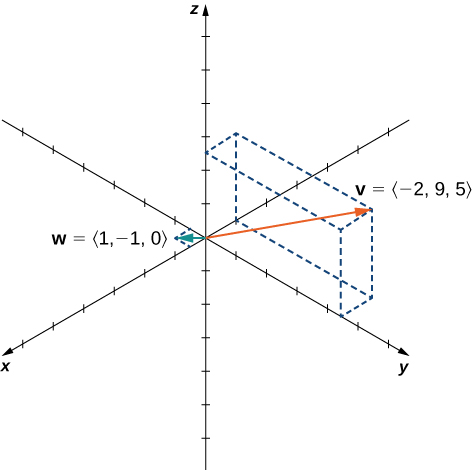{: #CNX_Calc_Figure_12_02_023}

{: data-number-style="lower-alpha"}

1.  First, use scalar multiplication of each vector, then subtract:
    * * *
    {: data-type="newline"}
    
    

    <math xmlns="http://www.w3.org/1998/Math/MathML"><mtable><mtr><mtd columnalign="right"><mn>3</mn><mstyle mathvariant="bold" mathsize="normal"><mtext>v</mtext></mstyle><mo>−</mo><mn>2</mn><mstyle mathvariant="bold" mathsize="normal"><mtext>w</mtext></mstyle></mtd><mtd columnalign="left"><mo>=</mo><mn>3</mn><mrow><mo>〈</mo><mrow><mn>−2</mn><mo>,</mo><mn>9</mn><mo>,</mo><mn>5</mn></mrow><mo>〉</mo></mrow><mo>−</mo><mn>2</mn><mrow><mo>〈</mo><mrow><mn>1</mn><mo>,</mo><mn>−1</mn><mo>,</mo><mn>0</mn></mrow><mo>〉</mo></mrow></mtd></mtr><mtr><mtd /><mtd columnalign="left"><mo>=</mo><mrow><mo>〈</mo><mrow><mn>−6</mn><mo>,</mo><mn>27</mn><mo>,</mo><mn>15</mn></mrow><mo>〉</mo></mrow><mo>−</mo><mrow><mo>〈</mo><mrow><mn>2</mn><mo>,</mo><mn>−2</mn><mo>,</mo><mn>0</mn></mrow><mo>〉</mo></mrow></mtd></mtr><mtr><mtd /><mtd columnalign="left"><mo>=</mo><mrow><mo>〈</mo><mrow><mn>−6</mn><mo>−</mo><mn>2</mn><mo>,</mo><mn>27</mn><mo>−</mo><mo stretchy="false">(</mo><mn>−2</mn><mo stretchy="false">)</mo><mo>,</mo><mn>15</mn><mo>−</mo><mn>0</mn></mrow><mo>〉</mo></mrow></mtd></mtr><mtr><mtd /><mtd columnalign="left"><mo>=</mo><mrow><mo>〈</mo><mrow><mn>−8</mn><mo>,</mo><mn>29</mn><mo>,</mo><mn>15</mn></mrow><mo>〉</mo></mrow><mo>.</mo></mtd></mtr></mtable></math>
    

2.  Write the equation for the magnitude of the vector, then use scalar multiplication:
    * * *
    {: data-type="newline"}
    
    

    <math xmlns="http://www.w3.org/1998/Math/MathML"><mrow><mn>5</mn><mrow><mo>‖</mo><mstyle mathvariant="bold" mathsize="normal"><mtext>w</mtext></mstyle><mo>‖</mo></mrow><mo>=</mo><mn>5</mn><msqrt><mrow><msup><mn>1</mn><mn>2</mn></msup><mo>+</mo><msup><mrow><mrow><mo>(</mo><mrow><mn>−1</mn></mrow><mo>)</mo></mrow></mrow><mn>2</mn></msup><mo>+</mo><msup><mn>0</mn><mn>2</mn></msup></mrow></msqrt><mo>=</mo><mn>5</mn><msqrt><mn>2</mn></msqrt><mo>.</mo></mrow></math>
    

3.  First, use scalar multiplication, then find the magnitude of the new vector. Note that the result is the same as for part b.:
    * * *
    {: data-type="newline"}
    
    

    <math xmlns="http://www.w3.org/1998/Math/MathML"><mrow><mrow><mo>‖</mo><mrow><mn>5</mn><mstyle mathvariant="bold" mathsize="normal"><mtext>w</mtext></mstyle></mrow><mo>‖</mo></mrow><mo>=</mo><mrow><mo>‖</mo><mrow><mrow><mo>〈</mo><mrow><mn>5</mn><mo>,</mo><mn>−5</mn><mo>,</mo><mn>0</mn></mrow><mo>〉</mo></mrow></mrow><mo>‖</mo></mrow><mo>=</mo><msqrt><mrow><msup><mn>5</mn><mn>2</mn></msup><mo>+</mo><msup><mrow><mrow><mo>(</mo><mrow><mn>−5</mn></mrow><mo>)</mo></mrow></mrow><mn>2</mn></msup><mo>+</mo><msup><mn>0</mn><mn>2</mn></msup></mrow></msqrt><mo>=</mo><msqrt><mrow><mn>50</mn></mrow></msqrt><mo>=</mo><mn>5</mn><msqrt><mn>2</mn></msqrt><mo>.</mo></mrow></math>
    

4.  Recall that to find a unit vector in two dimensions, we divide a vector by its magnitude. The procedure is the same in three dimensions:
    * * *
    {: data-type="newline"}
    
    

    <math xmlns="http://www.w3.org/1998/Math/MathML"><mtable><mtr><mtd columnalign="right"><mfrac><mstyle mathvariant="bold" mathsize="normal"><mtext>v</mtext></mstyle><mrow><mrow><mo>‖</mo><mstyle mathvariant="bold" mathsize="normal"><mtext>v</mtext></mstyle><mo>‖</mo></mrow></mrow></mfrac></mtd><mtd columnalign="left"><mo>=</mo><mfrac><mn>1</mn><mrow><mrow><mo>‖</mo><mstyle mathvariant="bold" mathsize="normal"><mtext>v</mtext></mstyle><mo>‖</mo></mrow></mrow></mfrac><mrow><mo>〈</mo><mrow><mn>−2</mn><mo>,</mo><mn>9</mn><mo>,</mo><mn>5</mn></mrow><mo>〉</mo></mrow></mtd></mtr><mtr><mtd /><mtd columnalign="left"><mo>=</mo><mfrac><mn>1</mn><mrow><msqrt><mrow><msup><mrow><mrow><mo>(</mo><mrow><mn>−2</mn></mrow><mo>)</mo></mrow></mrow><mn>2</mn></msup><mo>+</mo><msup><mn>9</mn><mn>2</mn></msup><mo>+</mo><msup><mn>5</mn><mn>2</mn></msup></mrow></msqrt></mrow></mfrac><mrow><mo>〈</mo><mrow><mn>−2</mn><mo>,</mo><mn>9</mn><mo>,</mo><mn>5</mn></mrow><mo>〉</mo></mrow></mtd></mtr><mtr><mtd /><mtd columnalign="left"><mo>=</mo><mfrac><mn>1</mn><mrow><msqrt><mrow><mn>110</mn></mrow></msqrt></mrow></mfrac><mrow><mo>〈</mo><mrow><mn>−2</mn><mo>,</mo><mn>9</mn><mo>,</mo><mn>5</mn></mrow><mo>〉</mo></mrow></mtd></mtr><mtr><mtd /><mtd columnalign="left"><mo>=</mo><mrow><mo>〈</mo><mrow><mfrac><mrow><mn>−2</mn></mrow><mrow><msqrt><mrow><mn>110</mn></mrow></msqrt></mrow></mfrac><mo>,</mo><mfrac><mn>9</mn><mrow><msqrt><mrow><mn>110</mn></mrow></msqrt></mrow></mfrac><mo>,</mo><mfrac><mn>5</mn><mrow><msqrt><mrow><mn>110</mn></mrow></msqrt></mrow></mfrac></mrow><mo>〉</mo></mrow><mo>.</mo></mtd></mtr></mtable></math>
    

{: data-number-style="lower-alpha"}

Let <math xmlns="http://www.w3.org/1998/Math/MathML"><mrow><mstyle mathvariant="bold" mathsize="normal"><mtext>v</mtext></mstyle><mo>=</mo><mrow><mo>〈</mo><mrow><mn>−1</mn><mo>,</mo><mn>−1</mn><mo>,</mo><mn>1</mn></mrow><mo>〉</mo></mrow></mrow></math>

 and <math xmlns="http://www.w3.org/1998/Math/MathML"><mrow><mstyle mathvariant="bold" mathsize="normal"><mtext>w</mtext></mstyle><mo>=</mo><mrow><mo>〈</mo><mrow><mn>2</mn><mo>,</mo><mn>0</mn><mo>,</mo><mn>1</mn></mrow><mo>〉</mo></mrow><mo>.</mo></mrow></math>

 Find a unit vector in the direction of <math xmlns="http://www.w3.org/1998/Math/MathML"><mrow><mn>5</mn><mstyle mathvariant="bold" mathsize="normal"><mtext>v</mtext></mstyle><mo>+</mo><mn>3</mn><mstyle mathvariant="bold" mathsize="normal"><mtext>w</mtext></mstyle><mo>.</mo></mrow></math>

<math xmlns="http://www.w3.org/1998/Math/MathML"><mrow><mrow><mo>〈</mo><mrow><mfrac><mn>1</mn><mrow><mn>3</mn><msqrt><mrow><mn>10</mn></mrow></msqrt></mrow></mfrac><mo>,</mo><mo>−</mo><mfrac><mn>5</mn><mrow><mn>3</mn><msqrt><mrow><mn>10</mn></mrow></msqrt></mrow></mfrac><mo>,</mo><mfrac><mn>8</mn><mrow><mn>3</mn><msqrt><mrow><mn>10</mn></mrow></msqrt></mrow></mfrac></mrow><mo>〉</mo></mrow></mrow></math>

Hint

Start by writing <math xmlns="http://www.w3.org/1998/Math/MathML"><mrow><mn>5</mn><mstyle mathvariant="bold" mathsize="normal"><mtext>v</mtext></mstyle><mo>+</mo><mn>3</mn><mstyle mathvariant="bold" mathsize="normal"><mtext>w</mtext></mstyle></mrow></math>

 in component form.

Throwing a Forward Pass

A quarterback is standing on the football field preparing to throw a pass. His receiver is standing 20 yd down the field and 15 yd to the quarterback’s left. The quarterback throws the ball at a velocity of 60 mph toward the receiver at an upward angle of <math xmlns="http://www.w3.org/1998/Math/MathML"><mrow><mn>30</mn><mtext>°</mtext></mrow></math>

 (see the following figure). Write the initial velocity vector of the ball, <math xmlns="http://www.w3.org/1998/Math/MathML"><mrow><mstyle mathvariant="bold" mathsize="normal"><mtext>v</mtext></mstyle><mo>,</mo></mrow></math>

 in component form.

![This figure is an image of two football players with the first one throwing the football to the second one. There is a line segment from each player to the bottom of the image. The distance from the first player to the bottom of the image is 20 yards. The distance from the second player to the same point on the bottom of the image is 15 yards. The two line segments are perpendicular. There is a broken line segment from the first player to the second player. There is a vector from the first player. The angle between the broken line and the vector is 30 degrees.](../resources/CNX_Calc_Figure_12_02_024.jpg)

The first thing we want to do is find a vector in the same direction as the velocity vector of the ball. We then scale the vector appropriately so that it has the right magnitude. Consider the vector <math xmlns="http://www.w3.org/1998/Math/MathML"><mstyle mathvariant="bold" mathsize="normal"><mtext>w</mtext></mstyle></math>

 extending from the quarterback’s arm to a point directly above the receiver’s head at an angle of <math xmlns="http://www.w3.org/1998/Math/MathML"><mrow><mn>30</mn><mtext>°</mtext></mrow></math>

 (see the following figure). This vector would have the same direction as <math xmlns="http://www.w3.org/1998/Math/MathML"><mstyle mathvariant="bold" mathsize="normal"><mtext>v</mtext></mstyle><mo>,</mo></math>

 but it may not have the right magnitude.

![This figure is the image of two football players with the first player throwing the football to the second player. The distance between the two players is represented with a broken line segment. There is a vector from the first player. The angle between the vector and the broken line segment is 30 degrees. There is a vertical broken line segment from the second player. Also, there is a right triangle formed from the two broken line segments and the vector from the first player is labeled &#x201C;w&#x201D; and is the hypotenuse.](../resources/CNX_Calc_Figure_12_02_025.jpg)

The receiver is 20 yd down the field and 15 yd to the quarterback’s left. Therefore, the straight-line distance from the quarterback to the receiver is

<math xmlns="http://www.w3.org/1998/Math/MathML"><mrow><mtext>Dist from QB to receiver</mtext><mo>=</mo><msqrt><mrow><msup><mrow><mn>15</mn></mrow><mn>2</mn></msup><mo>+</mo><msup><mrow><mn>20</mn></mrow><mn>2</mn></msup></mrow></msqrt><mo>=</mo><msqrt><mrow><mn>225</mn><mo>+</mo><mn>400</mn></mrow></msqrt><mo>=</mo><msqrt><mrow><mn>625</mn></mrow></msqrt><mo>=</mo><mn>25</mn><mspace width="0.2em" /><mtext>yd</mtext><mo>.</mo></mrow></math>

We have <math xmlns="http://www.w3.org/1998/Math/MathML"><mrow><mfrac><mrow><mn>25</mn></mrow><mrow><mrow><mo>‖</mo><mstyle mathvariant="bold" mathsize="normal"><mtext>w</mtext></mstyle><mo>‖</mo></mrow></mrow></mfrac><mo>=</mo><mtext>cos</mtext><mspace width="0.2em" /><mn>30</mn><mtext>°</mtext><mo>.</mo></mrow></math>

 Then the magnitude of <math xmlns="http://www.w3.org/1998/Math/MathML"><mstyle mathvariant="bold" mathsize="normal"><mtext>w</mtext></mstyle></math>

 is given by

<math xmlns="http://www.w3.org/1998/Math/MathML"><mrow><mrow><mo>‖</mo><mstyle mathvariant="bold" mathsize="normal"><mtext>w</mtext></mstyle><mo>‖</mo></mrow><mo>=</mo><mfrac><mrow><mn>25</mn></mrow><mrow><mtext>cos</mtext><mspace width="0.2em" /><mn>30</mn><mtext>°</mtext></mrow></mfrac><mo>=</mo><mfrac><mrow><mn>25</mn><mo>·</mo><mn>2</mn></mrow><mrow><msqrt><mn>3</mn></msqrt></mrow></mfrac><mo>=</mo><mfrac><mrow><mn>50</mn></mrow><mrow><msqrt><mn>3</mn></msqrt></mrow></mfrac><mspace width="0.2em" /><mtext>yd</mtext></mrow></math>

and the vertical distance from the receiver to the terminal point of <math xmlns="http://www.w3.org/1998/Math/MathML"><mstyle mathvariant="bold" mathsize="normal"><mtext>w</mtext></mstyle></math>

 is

<math xmlns="http://www.w3.org/1998/Math/MathML"><mrow><mtext>Vert dist from receiver to terminal point of</mtext><mspace width="0.2em" /><mstyle mathvariant="bold" mathsize="normal"><mtext>w</mtext></mstyle><mo>=</mo><mrow><mo>‖</mo><mstyle mathvariant="bold" mathsize="normal"><mtext>w</mtext></mstyle><mo>‖</mo></mrow><mtext>sin</mtext><mspace width="0.2em" /><mn>30</mn><mtext>°</mtext><mo>=</mo><mfrac><mrow><mn>50</mn></mrow><mrow><msqrt><mn>3</mn></msqrt></mrow></mfrac><mo>·</mo><mfrac><mn>1</mn><mn>2</mn></mfrac><mo>=</mo><mfrac><mrow><mn>25</mn></mrow><mrow><msqrt><mn>3</mn></msqrt></mrow></mfrac><mspace width="0.2em" /><mtext>yd</mtext><mo>.</mo></mrow></math>

Then <math xmlns="http://www.w3.org/1998/Math/MathML"><mrow><mstyle mathvariant="bold" mathsize="normal"><mtext>w</mtext></mstyle><mo>=</mo><mrow><mo>〈</mo><mrow><mn>20</mn><mo>,</mo><mn>15</mn><mo>,</mo><mfrac><mrow><mn>25</mn></mrow><mrow><msqrt><mn>3</mn></msqrt></mrow></mfrac></mrow><mo>〉</mo></mrow><mo>,</mo></mrow></math>

 and has the same direction as <math xmlns="http://www.w3.org/1998/Math/MathML"><mrow><mstyle mathvariant="bold" mathsize="normal"><mtext>v</mtext></mstyle><mo>.</mo></mrow></math>

Recall, though, that we calculated the magnitude of <math xmlns="http://www.w3.org/1998/Math/MathML"><mstyle mathvariant="bold" mathsize="normal"><mtext>w</mtext></mstyle></math>

 to be <math xmlns="http://www.w3.org/1998/Math/MathML"><mrow><mrow><mo>‖</mo><mstyle mathvariant="bold" mathsize="normal"><mtext>w</mtext></mstyle><mo>‖</mo></mrow><mo>=</mo><mfrac><mrow><mn>50</mn></mrow><mrow><msqrt><mn>3</mn></msqrt></mrow></mfrac><mo>,</mo></mrow></math>

 and <math xmlns="http://www.w3.org/1998/Math/MathML"><mstyle mathvariant="bold" mathsize="normal"><mtext>v</mtext></mstyle></math>

 has magnitude <math xmlns="http://www.w3.org/1998/Math/MathML"><mrow><mn>60</mn></mrow></math>

 mph. So, we need to multiply vector <math xmlns="http://www.w3.org/1998/Math/MathML"><mstyle mathvariant="bold" mathsize="normal"><mtext>w</mtext></mstyle></math>

 by an appropriate constant, <math xmlns="http://www.w3.org/1998/Math/MathML"><mrow><mi>k</mi><mo>.</mo></mrow></math>

 We want to find a value of <math xmlns="http://www.w3.org/1998/Math/MathML"><mi>k</mi></math>

 so that <math xmlns="http://www.w3.org/1998/Math/MathML"><mrow><mrow><mo>‖</mo><mrow><mi>k</mi><mstyle mathvariant="bold" mathsize="normal"><mtext>w</mtext></mstyle></mrow><mo>‖</mo></mrow><mo>=</mo><mn>60</mn></mrow></math>

 mph. We have

<math xmlns="http://www.w3.org/1998/Math/MathML"><mrow><mrow><mo>‖</mo><mrow><mi>k</mi><mstyle mathvariant="bold" mathsize="normal"><mtext>w</mtext></mstyle></mrow><mo>‖</mo></mrow><mo>=</mo><mi>k</mi><mrow><mo>‖</mo><mstyle mathvariant="bold" mathsize="normal"><mtext>w</mtext></mstyle><mo>‖</mo></mrow><mo>=</mo><mi>k</mi><mfrac><mrow><mn>50</mn></mrow><mrow><msqrt><mn>3</mn></msqrt></mrow></mfrac><mspace width="0.2em" /><mtext>mph,</mtext></mrow></math>

so we want

<math xmlns="http://www.w3.org/1998/Math/MathML"><mtable><mtr /><mtr /><mtr><mtd columnalign="right"><mi>k</mi><mfrac><mrow><mn>50</mn></mrow><mrow><msqrt><mn>3</mn></msqrt></mrow></mfrac></mtd><mtd columnalign="left"><mo>=</mo></mtd><mtd columnalign="left"><mn>60</mn></mtd></mtr><mtr><mtd columnalign="right"><mi>k</mi></mtd><mtd columnalign="left"><mo>=</mo></mtd><mtd columnalign="left"><mfrac><mrow><mn>60</mn><msqrt><mn>3</mn></msqrt></mrow><mrow><mn>50</mn></mrow></mfrac></mtd></mtr><mtr><mtd columnalign="right"><mi>k</mi></mtd><mtd columnalign="left"><mo>=</mo></mtd><mtd columnalign="left"><mfrac><mrow><mn>6</mn><msqrt><mn>3</mn></msqrt></mrow><mn>5</mn></mfrac><mo>.</mo></mtd></mtr></mtable></math>

Then

<math xmlns="http://www.w3.org/1998/Math/MathML"><mrow><mstyle mathvariant="bold" mathsize="normal"><mtext>v</mtext></mstyle><mo>=</mo><mi>k</mi><mstyle mathvariant="bold" mathsize="normal"><mtext>w</mtext></mstyle><mo>=</mo><mi>k</mi><mrow><mo>〈</mo><mrow><mn>20</mn><mo>,</mo><mn>15</mn><mo>,</mo><mfrac><mrow><mn>25</mn></mrow><mrow><msqrt><mn>3</mn></msqrt></mrow></mfrac></mrow><mo>〉</mo></mrow><mo>=</mo><mfrac><mrow><mn>6</mn><msqrt><mn>3</mn></msqrt></mrow><mn>5</mn></mfrac><mrow><mo>〈</mo><mrow><mn>20</mn><mo>,</mo><mn>15</mn><mo>,</mo><mfrac><mrow><mn>25</mn></mrow><mrow><msqrt><mn>3</mn></msqrt></mrow></mfrac></mrow><mo>〉</mo></mrow><mo>=</mo><mrow><mo>〈</mo><mrow><mn>24</mn><msqrt><mn>3</mn></msqrt><mo>,</mo><mn>18</mn><msqrt><mn>3</mn></msqrt><mo>,</mo><mn>30</mn></mrow><mo>〉</mo></mrow><mo>.</mo></mrow></math>

Let’s double-check that <math xmlns="http://www.w3.org/1998/Math/MathML"><mrow><mrow><mo>‖</mo><mstyle mathvariant="bold" mathsize="normal"><mtext>v</mtext></mstyle><mo>‖</mo></mrow><mo>=</mo><mn>60</mn><mo>.</mo></mrow></math>

 We have

<math xmlns="http://www.w3.org/1998/Math/MathML"><mrow><mrow><mo>‖</mo><mstyle mathvariant="bold" mathsize="normal"><mtext>v</mtext></mstyle><mo>‖</mo></mrow><mo>=</mo><msqrt><mrow><msup><mrow><mrow><mo>(</mo><mrow><mn>24</mn><msqrt><mn>3</mn></msqrt></mrow><mo>)</mo></mrow></mrow><mn>2</mn></msup><mo>+</mo><msup><mrow><mrow><mo>(</mo><mrow><mn>18</mn><msqrt><mn>3</mn></msqrt></mrow><mo>)</mo></mrow></mrow><mn>2</mn></msup><mo>+</mo><msup><mrow><mrow><mo>(</mo><mrow><mn>30</mn></mrow><mo>)</mo></mrow></mrow><mn>2</mn></msup></mrow></msqrt><mo>=</mo><msqrt><mrow><mn>1728</mn><mo>+</mo><mn>972</mn><mo>+</mo><mn>900</mn></mrow></msqrt><mo>=</mo><msqrt><mrow><mn>3600</mn></mrow></msqrt><mo>=</mo><mn>60</mn><mspace width="0.2em" /><mtext>mph</mtext><mo>.</mo></mrow></math>

So, we have found the correct components for <math xmlns="http://www.w3.org/1998/Math/MathML"><mrow><mstyle mathvariant="bold" mathsize="normal"><mtext>v</mtext></mstyle><mo>.</mo></mrow></math>

Assume the quarterback and the receiver are in the same place as in the previous example. This time, however, the quarterback throws the ball at velocity of <math xmlns="http://www.w3.org/1998/Math/MathML"><mrow><mn>40</mn></mrow></math>

 mph and an angle of <math xmlns="http://www.w3.org/1998/Math/MathML"><mrow><mn>45</mn><mtext>°</mtext><mo>.</mo></mrow></math>

 Write the initial velocity vector of the ball, <math xmlns="http://www.w3.org/1998/Math/MathML"><mrow><mstyle mathvariant="bold" mathsize="normal"><mtext>v</mtext></mstyle><mo>,</mo></mrow></math>

 in component form.

<math xmlns="http://www.w3.org/1998/Math/MathML"><mrow><mstyle mathvariant="bold" mathsize="normal"><mtext>v</mtext></mstyle><mo>=</mo><mrow><mo>〈</mo><mrow><mn>16</mn><msqrt><mn>2</mn></msqrt><mo>,</mo><mn>12</mn><msqrt><mn>2</mn></msqrt><mo>,</mo><mn>20</mn><msqrt><mn>2</mn></msqrt></mrow><mo>〉</mo></mrow></mrow></math>

Hint

Follow the process used in the previous example.

### Key Concepts

* The three-dimensional coordinate system is built around a set of three axes that intersect at right angles at a single point, the origin. Ordered triples
  <math xmlns="http://www.w3.org/1998/Math/MathML"><mrow><mrow><mo>(</mo><mrow><mi>x</mi><mo>,</mo><mi>y</mi><mo>,</mo><mi>z</mi></mrow><mo>)</mo></mrow></mrow></math>
  
  are used to describe the location of a point in space.
* The distance
  <math xmlns="http://www.w3.org/1998/Math/MathML"><mi>d</mi></math>
  
  between points
  <math xmlns="http://www.w3.org/1998/Math/MathML"><mrow><mrow><mo>(</mo><mrow><msub><mi>x</mi><mn>1</mn></msub><mo>,</mo><msub><mi>y</mi><mn>1</mn></msub><mo>,</mo><msub><mi>z</mi><mn>1</mn></msub></mrow><mo>)</mo></mrow></mrow></math>
  
  and
  <math xmlns="http://www.w3.org/1998/Math/MathML"><mrow><mrow><mo>(</mo><mrow><msub><mi>x</mi><mn>2</mn></msub><mo>,</mo><msub><mi>y</mi><mn>2</mn></msub><mo>,</mo><msub><mi>z</mi><mn>2</mn></msub></mrow><mo>)</mo></mrow></mrow></math>
  
  is given by the formula
  * * *
  {: data-type="newline"}
  
  

  <math xmlns="http://www.w3.org/1998/Math/MathML"><mrow><mi>d</mi><mo>=</mo><msqrt><mrow><msup><mrow><mrow><mo>(</mo><mrow><msub><mi>x</mi><mn>2</mn></msub><mo>−</mo><msub><mi>x</mi><mn>1</mn></msub></mrow><mo>)</mo></mrow></mrow><mn>2</mn></msup><mo>+</mo><msup><mrow><mrow><mo>(</mo><mrow><msub><mi>y</mi><mn>2</mn></msub><mo>−</mo><msub><mi>y</mi><mn>1</mn></msub></mrow><mo>)</mo></mrow></mrow><mn>2</mn></msup><mo>+</mo><msup><mrow><mrow><mo>(</mo><mrow><msub><mi>z</mi><mn>2</mn></msub><mo>−</mo><msub><mi>z</mi><mn>1</mn></msub></mrow><mo>)</mo></mrow></mrow><mn>2</mn></msup></mrow></msqrt><mo>.</mo></mrow></math>
  

* In three dimensions, the equations
  <math xmlns="http://www.w3.org/1998/Math/MathML"><mrow><mi>x</mi><mo>=</mo><mi>a</mi><mo>,</mo><mi>y</mi><mo>=</mo><mi>b</mi><mo>,</mo><mtext>and</mtext><mspace width="0.2em" /><mi>z</mi><mo>=</mo><mi>c</mi></mrow></math>
  
  describe planes that are parallel to the coordinate planes.
* The standard equation of a sphere with center
  <math xmlns="http://www.w3.org/1998/Math/MathML"><mrow><mrow><mo>(</mo><mrow><mi>a</mi><mo>,</mo><mi>b</mi><mo>,</mo><mi>c</mi></mrow><mo>)</mo></mrow></mrow></math>
  
  and radius
  <math xmlns="http://www.w3.org/1998/Math/MathML"><mi>r</mi></math>
  
  is
  * * *
  {: data-type="newline"}
  
  

  <math xmlns="http://www.w3.org/1998/Math/MathML"><mrow><msup><mrow><mrow><mo>(</mo><mrow><mi>x</mi><mo>−</mo><mi>a</mi></mrow><mo>)</mo></mrow></mrow><mn>2</mn></msup><mo>+</mo><msup><mrow><mrow><mo>(</mo><mrow><mi>y</mi><mo>−</mo><mi>b</mi></mrow><mo>)</mo></mrow></mrow><mn>2</mn></msup><mo>+</mo><msup><mrow><mrow><mo>(</mo><mrow><mi>z</mi><mo>−</mo><mi>c</mi></mrow><mo>)</mo></mrow></mrow><mn>2</mn></msup><mo>=</mo><msup><mi>r</mi><mn>2</mn></msup><mo>.</mo></mrow></math>
  

* In three dimensions, as in two, vectors are commonly expressed in component form,
  <math xmlns="http://www.w3.org/1998/Math/MathML"><mrow><mstyle mathvariant="bold" mathsize="normal"><mtext>v</mtext></mstyle><mo>=</mo><mrow><mo>〈</mo><mrow><mi>x</mi><mo>,</mo><mi>y</mi><mo>,</mo><mi>z</mi></mrow><mo>〉</mo></mrow><mo>,</mo></mrow></math>
  
  or in terms of the standard unit vectors,
  <math xmlns="http://www.w3.org/1998/Math/MathML"><mrow><mi>x</mi><mstyle mathvariant="bold" mathsize="normal"><mtext>i</mtext></mstyle><mo>+</mo><mi>y</mi><mstyle mathvariant="bold" mathsize="normal"><mtext>j</mtext></mstyle><mo>+</mo><mi>z</mi><mstyle mathvariant="bold" mathsize="normal"><mtext>k</mtext></mstyle><mo>.</mo></mrow></math>

* Properties of vectors in space are a natural extension of the properties for vectors in a plane. Let
  <math xmlns="http://www.w3.org/1998/Math/MathML"><mrow><mstyle mathvariant="bold" mathsize="normal"><mtext>v</mtext></mstyle><mo>=</mo><mrow><mo>〈</mo><mrow><msub><mi>x</mi><mn>1</mn></msub><mo>,</mo><msub><mi>y</mi><mn>1</mn></msub><mo>,</mo><msub><mi>z</mi><mn>1</mn></msub></mrow><mo>〉</mo></mrow></mrow></math>
  
  and
  <math xmlns="http://www.w3.org/1998/Math/MathML"><mrow><mstyle mathvariant="bold" mathsize="normal"><mtext>w</mtext></mstyle><mo>=</mo><mrow><mo>〈</mo><mrow><msub><mi>x</mi><mn>2</mn></msub><mo>,</mo><msub><mi>y</mi><mn>2</mn></msub><mo>,</mo><msub><mi>z</mi><mn>2</mn></msub></mrow><mo>〉</mo></mrow></mrow></math>
  
  be vectors, and let
  <math xmlns="http://www.w3.org/1998/Math/MathML"><mi>k</mi></math>
  
  be a scalar.
  * **Scalar multiplication:**
    <math xmlns="http://www.w3.org/1998/Math/MathML"><mrow><mi>k</mi><mstyle mathvariant="bold" mathsize="normal"><mtext>v</mtext></mstyle><mo>=</mo><mrow><mo>〈</mo><mrow><mi>k</mi><msub><mi>x</mi><mn>1</mn></msub><mo>,</mo><mi>k</mi><msub><mi>y</mi><mn>1</mn></msub><mo>,</mo><mi>k</mi><msub><mi>z</mi><mn>1</mn></msub></mrow><mo>〉</mo></mrow></mrow></math>
  
  * **Vector addition:**
    <math xmlns="http://www.w3.org/1998/Math/MathML"><mrow><mstyle mathvariant="bold" mathsize="normal"><mtext>v</mtext></mstyle><mo>+</mo><mstyle mathvariant="bold" mathsize="normal"><mtext>w</mtext></mstyle><mo>=</mo><mrow><mo>〈</mo><mrow><msub><mi>x</mi><mn>1</mn></msub><mo>,</mo><msub><mi>y</mi><mn>1</mn></msub><mo>,</mo><msub><mi>z</mi><mn>1</mn></msub></mrow><mo>〉</mo></mrow><mo>+</mo><mrow><mo>〈</mo><mrow><msub><mi>x</mi><mn>2</mn></msub><mo>,</mo><msub><mi>y</mi><mn>2</mn></msub><mo>,</mo><msub><mi>z</mi><mn>2</mn></msub></mrow><mo>〉</mo></mrow><mo>=</mo><mrow><mo>〈</mo><mrow><msub><mi>x</mi><mn>1</mn></msub><mo>+</mo><msub><mi>x</mi><mn>2</mn></msub><mo>,</mo><msub><mi>y</mi><mn>1</mn></msub><mo>+</mo><msub><mi>y</mi><mn>2</mn></msub><mo>,</mo><msub><mi>z</mi><mn>1</mn></msub><mo>+</mo><msub><mi>z</mi><mn>2</mn></msub></mrow><mo>〉</mo></mrow></mrow></math>
  
  * **Vector subtraction:**
    <math xmlns="http://www.w3.org/1998/Math/MathML"><mrow><mstyle mathvariant="bold" mathsize="normal"><mtext>v</mtext></mstyle><mo>−</mo><mstyle mathvariant="bold" mathsize="normal"><mtext>w</mtext></mstyle><mo>=</mo><mrow><mo>〈</mo><mrow><msub><mi>x</mi><mn>1</mn></msub><mo>,</mo><msub><mi>y</mi><mn>1</mn></msub><mo>,</mo><msub><mi>z</mi><mn>1</mn></msub></mrow><mo>〉</mo></mrow><mo>−</mo><mrow><mo>〈</mo><mrow><msub><mi>x</mi><mn>2</mn></msub><mo>,</mo><msub><mi>y</mi><mn>2</mn></msub><mo>,</mo><msub><mi>z</mi><mn>2</mn></msub></mrow><mo>〉</mo></mrow><mo>=</mo><mrow><mo>〈</mo><mrow><msub><mi>x</mi><mn>1</mn></msub><mo>−</mo><msub><mi>x</mi><mn>2</mn></msub><mo>,</mo><msub><mi>y</mi><mn>1</mn></msub><mo>−</mo><msub><mi>y</mi><mn>2</mn></msub><mo>,</mo><msub><mi>z</mi><mn>1</mn></msub><mo>−</mo><msub><mi>z</mi><mn>2</mn></msub></mrow><mo>〉</mo></mrow></mrow></math>
  
  * **Vector magnitude:**
    <math xmlns="http://www.w3.org/1998/Math/MathML"><mrow><mrow><mo>‖</mo><mstyle mathvariant="bold" mathsize="normal"><mtext>v</mtext></mstyle><mo>‖</mo></mrow><mo>=</mo><msqrt><mrow><msub><mi>x</mi><mn>1</mn></msub><msup><mrow /><mn>2</mn></msup><mo>+</mo><msub><mi>y</mi><mn>1</mn></msub><msup><mrow /><mn>2</mn></msup><mo>+</mo><msub><mi>z</mi><mn>1</mn></msub><msup><mrow /><mn>2</mn></msup></mrow></msqrt></mrow></math>
  
  * **Unit vector in the direction of v:**
    <math xmlns="http://www.w3.org/1998/Math/MathML"><mrow><mfrac><mstyle mathvariant="bold" mathsize="normal"><mtext>v</mtext></mstyle><mrow><mrow><mo>‖</mo><mstyle mathvariant="bold" mathsize="normal"><mtext>v</mtext></mstyle><mo>‖</mo></mrow></mrow></mfrac><mo>=</mo><mfrac><mn>1</mn><mrow><mrow><mo>‖</mo><mstyle mathvariant="bold" mathsize="normal"><mtext>v</mtext></mstyle><mo>‖</mo></mrow></mrow></mfrac><mrow><mo>〈</mo><mrow><msub><mi>x</mi><mn>1</mn></msub><mo>,</mo><msub><mi>y</mi><mn>1</mn></msub><mo>,</mo><msub><mi>z</mi><mn>1</mn></msub></mrow><mo>〉</mo></mrow><mo>=</mo><mrow><mo>〈</mo><mrow><mfrac><mrow><msub><mi>x</mi><mn>1</mn></msub></mrow><mrow><mrow><mo>‖</mo><mstyle mathvariant="bold" mathsize="normal"><mtext>v</mtext></mstyle><mo>‖</mo></mrow></mrow></mfrac><mo>,</mo><mfrac><mrow><msub><mi>y</mi><mn>1</mn></msub></mrow><mrow><mrow><mo>‖</mo><mstyle mathvariant="bold" mathsize="normal"><mtext>v</mtext></mstyle><mo>‖</mo></mrow></mrow></mfrac><mo>,</mo><mfrac><mrow><msub><mi>z</mi><mn>1</mn></msub></mrow><mrow><mrow><mo>‖</mo><mstyle mathvariant="bold" mathsize="normal"><mtext>v</mtext></mstyle><mo>‖</mo></mrow></mrow></mfrac></mrow><mo>〉</mo></mrow><mo>,</mo></mrow></math>
    
    <math xmlns="http://www.w3.org/1998/Math/MathML"><mrow><mstyle mathvariant="bold" mathsize="normal"><mtext>v</mtext></mstyle><mo>≠</mo><mstyle mathvariant="bold" mathsize="normal"><mn>0</mn></mstyle></mrow></math>
  {: data-bullet-style="open-circle"}
{: data-bullet-style="bullet"}

### Key Equations

* **Distance between two points in space:**
  * * *
  {: data-type="newline"}
  
  <math xmlns="http://www.w3.org/1998/Math/MathML"><mrow><mi>d</mi><mo>=</mo><msqrt><mrow><msup><mrow><mrow><mo>(</mo><mrow><msub><mi>x</mi><mn>2</mn></msub><mo>−</mo><msub><mi>x</mi><mn>1</mn></msub></mrow><mo>)</mo></mrow></mrow><mn>2</mn></msup><mo>+</mo><msup><mrow><mrow><mo>(</mo><mrow><msub><mi>y</mi><mn>2</mn></msub><mo>−</mo><msub><mi>y</mi><mn>1</mn></msub></mrow><mo>)</mo></mrow></mrow><mn>2</mn></msup><mo>+</mo><msup><mrow><mrow><mo>(</mo><mrow><msub><mi>z</mi><mn>2</mn></msub><mo>−</mo><msub><mi>z</mi><mn>1</mn></msub></mrow><mo>)</mo></mrow></mrow><mn>2</mn></msup></mrow></msqrt></mrow></math>

* **Sphere with center <math xmlns="http://www.w3.org/1998/Math/MathML"><mrow><mrow><mo>(</mo><mrow><mi>a</mi><mo>,</mo><mi>b</mi><mo>,</mo><mi>c</mi></mrow><mo>)</mo></mrow></mrow></math>
  
   and radius *r*\:**
  * * *
  {: data-type="newline"}
  
  <math xmlns="http://www.w3.org/1998/Math/MathML"><mrow><msup><mrow><mrow><mo>(</mo><mrow><mi>x</mi><mo>−</mo><mi>a</mi></mrow><mo>)</mo></mrow></mrow><mn>2</mn></msup><mo>+</mo><msup><mrow><mrow><mo>(</mo><mrow><mi>y</mi><mo>−</mo><mi>b</mi></mrow><mo>)</mo></mrow></mrow><mn>2</mn></msup><mo>+</mo><msup><mrow><mrow><mo>(</mo><mrow><mi>z</mi><mo>−</mo><mi>c</mi></mrow><mo>)</mo></mrow></mrow><mn>2</mn></msup><mo>=</mo><msup><mi>r</mi><mn>2</mn></msup></mrow></math>
{: data-bullet-style="bullet"}

<section data-depth="1" class="section-exercises" markdown="1">

Consider a rectangular box with one of the vertices at the origin, as shown in the following figure. If point <math xmlns="http://www.w3.org/1998/Math/MathML"><mrow><mi>A</mi><mo stretchy="false">(</mo><mn>2</mn><mo>,</mo><mn>3</mn><mo>,</mo><mn>5</mn><mo stretchy="false">)</mo></mrow></math>

 is the opposite vertex to the origin, then find

1.  the coordinates of the other six vertices of the box and
2.  the length of the diagonal of the box determined by the vertices
    <math xmlns="http://www.w3.org/1998/Math/MathML"><mi>O</mi></math>
    
    and
    <math xmlns="http://www.w3.org/1998/Math/MathML"><mi>A</mi><mo>.</mo></math>
{: data-number-style="lower-alpha"}

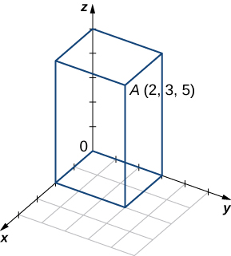

a. <math xmlns="http://www.w3.org/1998/Math/MathML"><mrow><mrow><mo>(</mo><mrow><mn>2</mn><mo>,</mo><mn>0</mn><mo>,</mo><mn>5</mn></mrow><mo>)</mo></mrow><mo>,</mo><mrow><mo>(</mo><mrow><mn>2</mn><mo>,</mo><mn>0</mn><mo>,</mo><mn>0</mn></mrow><mo>)</mo></mrow><mo>,</mo><mrow><mo>(</mo><mrow><mn>2</mn><mo>,</mo><mn>3</mn><mo>,</mo><mn>0</mn></mrow><mo>)</mo></mrow><mo>,</mo><mrow><mo>(</mo><mrow><mn>0</mn><mo>,</mo><mn>3</mn><mo>,</mo><mn>0</mn></mrow><mo>)</mo></mrow><mo>,</mo><mrow><mo>(</mo><mrow><mn>0</mn><mo>,</mo><mn>3</mn><mo>,</mo><mn>5</mn></mrow><mo>)</mo></mrow><mo>,</mo><mrow><mo>(</mo><mrow><mn>0</mn><mo>,</mo><mn>0</mn><mo>,</mo><mn>5</mn></mrow><mo>)</mo></mrow><mo>;</mo></mrow></math>

 b. <math xmlns="http://www.w3.org/1998/Math/MathML"><mrow><msqrt><mrow><mn>38</mn></mrow></msqrt></mrow></math>

Find the coordinates of point <math xmlns="http://www.w3.org/1998/Math/MathML"><mi>P</mi></math>

 and determine its distance to the origin.

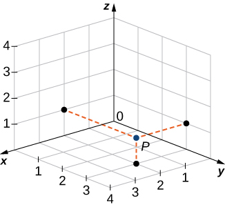

For the following exercises, describe and graph the set of points that satisfies the given equation.

<math xmlns="http://www.w3.org/1998/Math/MathML"><mrow><mrow><mo>(</mo><mrow><mi>y</mi><mo>−</mo><mn>5</mn></mrow><mo>)</mo></mrow><mrow><mo>(</mo><mrow><mi>z</mi><mo>−</mo><mn>6</mn></mrow><mo>)</mo></mrow><mo>=</mo><mn>0</mn></mrow></math>

A union of two planes: <math xmlns="http://www.w3.org/1998/Math/MathML"><mrow><mi>y</mi><mo>=</mo><mn>5</mn></mrow></math>

 (a plane parallel to the *xz*-plane) and <math xmlns="http://www.w3.org/1998/Math/MathML"><mrow><mi>z</mi><mo>=</mo><mn>6</mn></mrow></math>

 (a plane parallel to the *xy*-plane)* * *
{: data-type="newline"}

 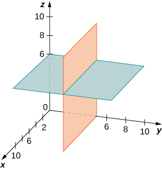 

<math xmlns="http://www.w3.org/1998/Math/MathML"><mrow><mrow><mo>(</mo><mrow><mi>z</mi><mo>−</mo><mn>2</mn></mrow><mo>)</mo></mrow><mrow><mo>(</mo><mrow><mi>z</mi><mo>−</mo><mn>5</mn></mrow><mo>)</mo></mrow><mo>=</mo><mn>0</mn></mrow></math>

<math xmlns="http://www.w3.org/1998/Math/MathML"><mrow><msup><mrow><mrow><mo>(</mo><mrow><mi>y</mi><mo>−</mo><mn>1</mn></mrow><mo>)</mo></mrow></mrow><mn>2</mn></msup><mo>+</mo><msup><mrow><mo stretchy="false">(</mo><mi>z</mi><mo>−</mo><mn>1</mn><mo stretchy="false">)</mo></mrow><mn>2</mn></msup><mo>=</mo><mn>1</mn></mrow></math>

A cylinder of radius <math xmlns="http://www.w3.org/1998/Math/MathML"><mn>1</mn></math>

 centered on the line <math xmlns="http://www.w3.org/1998/Math/MathML"><mrow><mi>y</mi><mo>=</mo><mn>1</mn><mo>,</mo><mi>z</mi><mo>=</mo><mn>1</mn></mrow></math>

* * *
{: data-type="newline"}

 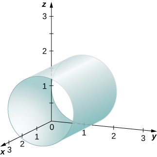 

<math xmlns="http://www.w3.org/1998/Math/MathML"><mrow><msup><mrow><mrow><mo>(</mo><mrow><mi>x</mi><mo>−</mo><mn>2</mn></mrow><mo>)</mo></mrow></mrow><mn>2</mn></msup><mo>+</mo><msup><mrow><mo stretchy="false">(</mo><mi>z</mi><mo>−</mo><mn>5</mn><mo stretchy="false">)</mo></mrow><mn>2</mn></msup><mo>=</mo><mn>4</mn></mrow></math>

Write the equation of the plane passing through point <math xmlns="http://www.w3.org/1998/Math/MathML"><mrow><mo stretchy="false">(</mo><mn>1</mn><mo>,</mo><mn>1</mn><mo>,</mo><mn>1</mn><mo stretchy="false">)</mo></mrow></math>

 that is parallel to the *xy*-plane.

<math xmlns="http://www.w3.org/1998/Math/MathML"><mrow><mi>z</mi><mo>=</mo><mn>1</mn></mrow></math>

Write the equation of the plane passing through point <math xmlns="http://www.w3.org/1998/Math/MathML"><mrow><mo stretchy="false">(</mo><mn>1</mn><mo>,</mo><mn>−3</mn><mo>,</mo><mn>2</mn><mo stretchy="false">)</mo></mrow></math>

 that is parallel to the *xz*-plane.

Find an equation of the plane passing through points <math xmlns="http://www.w3.org/1998/Math/MathML"><mrow><mo stretchy="false">(</mo><mn>1</mn><mo>,</mo><mn>−3</mn><mo>,</mo><mn>−2</mn><mo stretchy="false">)</mo><mo>,</mo></mrow></math>

 <math xmlns="http://www.w3.org/1998/Math/MathML"><mrow><mo stretchy="false">(</mo><mn>0</mn><mo>,</mo><mn>3</mn><mo>,</mo><mn>−2</mn><mo stretchy="false">)</mo><mo>,</mo></mrow></math>

 and <math xmlns="http://www.w3.org/1998/Math/MathML"><mrow><mo stretchy="false">(</mo><mn>1</mn><mo>,</mo><mn>0</mn><mo>,</mo><mn>−2</mn><mo stretchy="false">)</mo><mo>.</mo></mrow></math>

<math xmlns="http://www.w3.org/1998/Math/MathML"><mrow><mi>z</mi><mo>=</mo><mn>−2</mn></mrow></math>

Find an equation of the plane passing through points <math xmlns="http://www.w3.org/1998/Math/MathML"><mrow><mo stretchy="false">(</mo><mn>1</mn><mo>,</mo><mn>9</mn><mo>,</mo><mn>2</mn><mo stretchy="false">)</mo><mo>,</mo></mrow></math>

 <math xmlns="http://www.w3.org/1998/Math/MathML"><mrow><mo stretchy="false">(</mo><mn>1</mn><mo>,</mo><mn>3</mn><mo>,</mo><mn>6</mn><mo stretchy="false">)</mo><mo>,</mo></mrow></math>

 and <math xmlns="http://www.w3.org/1998/Math/MathML"><mrow><mo stretchy="false">(</mo><mn>1</mn><mo>,</mo><mn>−7</mn><mo>,</mo><mn>8</mn><mo stretchy="false">)</mo><mo>.</mo></mrow></math>

For the following exercises, find the equation of the sphere in standard form that satisfies the given conditions.

Center <math xmlns="http://www.w3.org/1998/Math/MathML"><mrow><mi>C</mi><mrow><mo>(</mo><mrow><mn>−1</mn><mo>,</mo><mn>7</mn><mo>,</mo><mn>4</mn></mrow><mo>)</mo></mrow></mrow></math>

 and radius <math xmlns="http://www.w3.org/1998/Math/MathML"><mn>4</mn></math>

<math xmlns="http://www.w3.org/1998/Math/MathML"><mrow><msup><mrow><mo stretchy="false">(</mo><mi>x</mi><mo>+</mo><mn>1</mn><mo stretchy="false">)</mo></mrow><mn>2</mn></msup><mo>+</mo><msup><mrow><mo stretchy="false">(</mo><mi>y</mi><mo>−</mo><mn>7</mn><mo stretchy="false">)</mo></mrow><mn>2</mn></msup><mo>+</mo><msup><mrow><mo stretchy="false">(</mo><mi>z</mi><mo>−</mo><mn>4</mn><mo stretchy="false">)</mo></mrow><mn>2</mn></msup><mo>=</mo><mn>16</mn></mrow></math>

Center <math xmlns="http://www.w3.org/1998/Math/MathML"><mrow><mi>C</mi><mrow><mo>(</mo><mrow><mn>−4</mn><mo>,</mo><mn>7</mn><mo>,</mo><mn>2</mn></mrow><mo>)</mo></mrow></mrow></math>

 and radius <math xmlns="http://www.w3.org/1998/Math/MathML"><mn>6</mn></math>

Diameter <math xmlns="http://www.w3.org/1998/Math/MathML"><mrow><mi>P</mi><mi>Q</mi><mo>,</mo></mrow></math>

 where <math xmlns="http://www.w3.org/1998/Math/MathML"><mrow><mi>P</mi><mrow><mo>(</mo><mrow><mn>−1</mn><mo>,</mo><mn>5</mn><mo>,</mo><mn>7</mn></mrow><mo>)</mo></mrow></mrow></math>

 and <math xmlns="http://www.w3.org/1998/Math/MathML"><mrow><mi>Q</mi><mrow><mo>(</mo><mrow><mn>−5</mn><mo>,</mo><mn>2</mn><mo>,</mo><mn>9</mn></mrow><mo>)</mo></mrow></mrow></math>

<math xmlns="http://www.w3.org/1998/Math/MathML"><mrow><msup><mrow><mo stretchy="false">(</mo><mi>x</mi><mo>+</mo><mn>3</mn><mo stretchy="false">)</mo></mrow><mn>2</mn></msup><mo>+</mo><msup><mrow><mo stretchy="false">(</mo><mi>y</mi><mo>−</mo><mn>3.5</mn><mo stretchy="false">)</mo></mrow><mn>2</mn></msup><mo>+</mo><msup><mrow><mo stretchy="false">(</mo><mi>z</mi><mo>−</mo><mn>8</mn><mo stretchy="false">)</mo></mrow><mn>2</mn></msup><mo>=</mo><mfrac><mrow><mn>29</mn></mrow><mn>4</mn></mfrac></mrow></math>

Diameter <math xmlns="http://www.w3.org/1998/Math/MathML"><mrow><mi>P</mi><mi>Q</mi><mo>,</mo></mrow></math>

 where <math xmlns="http://www.w3.org/1998/Math/MathML"><mrow><mi>P</mi><mrow><mo>(</mo><mrow><mn>−16</mn><mo>,</mo><mn>−3</mn><mo>,</mo><mn>9</mn></mrow><mo>)</mo></mrow></mrow></math>

 and <math xmlns="http://www.w3.org/1998/Math/MathML"><mrow><mi>Q</mi><mrow><mo>(</mo><mrow><mn>−2</mn><mo>,</mo><mn>3</mn><mo>,</mo><mn>5</mn></mrow><mo>)</mo></mrow></mrow></math>

For the following exercises, find the center and radius of the sphere with an equation in general form that is given.

<math xmlns="http://www.w3.org/1998/Math/MathML"><mrow><mi>P</mi><mo stretchy="false">(</mo><mn>1</mn><mo>,</mo><mn>2</mn><mo>,</mo><mn>3</mn><mo stretchy="false">)</mo></mrow></math>

 <math xmlns="http://www.w3.org/1998/Math/MathML"><mrow><msup><mi>x</mi><mn>2</mn></msup><mo>+</mo><msup><mi>y</mi><mn>2</mn></msup><mo>+</mo><msup><mi>z</mi><mn>2</mn></msup><mo>−</mo><mn>4</mn><mi>z</mi><mo>+</mo><mn>3</mn><mo>=</mo><mn>0</mn></mrow></math>

Center <math xmlns="http://www.w3.org/1998/Math/MathML"><mrow><mi>C</mi><mrow><mo>(</mo><mrow><mn>0</mn><mo>,</mo><mn>0</mn><mo>,</mo><mn>2</mn></mrow><mo>)</mo></mrow></mrow></math>

 and radius <math xmlns="http://www.w3.org/1998/Math/MathML"><mn>1</mn></math>

<math xmlns="http://www.w3.org/1998/Math/MathML"><mrow><msup><mi>x</mi><mn>2</mn></msup><mo>+</mo><msup><mi>y</mi><mn>2</mn></msup><mo>+</mo><msup><mi>z</mi><mn>2</mn></msup><mo>−</mo><mn>6</mn><mi>x</mi><mo>+</mo><mn>8</mn><mi>y</mi><mo>−</mo><mn>10</mn><mi>z</mi><mo>+</mo><mn>25</mn><mo>=</mo><mn>0</mn></mrow></math>

For the following exercises, express vector <math xmlns="http://www.w3.org/1998/Math/MathML"><mrow><mover accent="true"><mrow><mi>P</mi><mi>Q</mi></mrow><mo stretchy="false">→</mo></mover></mrow></math>

 with the initial point at <math xmlns="http://www.w3.org/1998/Math/MathML"><mi>P</mi></math>

 and the terminal point at <math xmlns="http://www.w3.org/1998/Math/MathML"><mi>Q</mi></math>

1.  in component form and
2.  by using standard unit vectors.
{: data-number-style="lower-alpha"}

<math xmlns="http://www.w3.org/1998/Math/MathML"><mrow><mi>P</mi><mrow><mo>(</mo><mrow><mn>3</mn><mo>,</mo><mn>0</mn><mo>,</mo><mn>2</mn></mrow><mo>)</mo></mrow></mrow></math>

 and <math xmlns="http://www.w3.org/1998/Math/MathML"><mrow><mi>Q</mi><mrow><mo>(</mo><mrow><mn>−1</mn><mo>,</mo><mn>−1</mn><mo>,</mo><mn>4</mn></mrow><mo>)</mo></mrow></mrow></math>

a. <math xmlns="http://www.w3.org/1998/Math/MathML"><mrow><mover accent="true"><mrow><mi>P</mi><mi>Q</mi></mrow><mo stretchy="false">→</mo></mover><mo>=</mo><mrow><mo>〈</mo><mrow><mn>−4</mn><mo>,</mo><mn>−1</mn><mo>,</mo><mn>2</mn></mrow><mo>〉</mo></mrow><mo>;</mo></mrow></math>

 b. <math xmlns="http://www.w3.org/1998/Math/MathML"><mrow><mover accent="true"><mrow><mi>P</mi><mi>Q</mi></mrow><mo stretchy="false">→</mo></mover><mo>=</mo><mn>−4</mn><mstyle mathvariant="bold" mathsize="normal"><mtext>i</mtext></mstyle><mo>−</mo><mstyle mathvariant="bold" mathsize="normal"><mtext>j</mtext></mstyle><mo>+</mo><mn>2</mn><mstyle mathvariant="bold" mathsize="normal"><mtext>k</mtext></mstyle></mrow></math>

<math xmlns="http://www.w3.org/1998/Math/MathML"><mrow><mi>P</mi><mrow><mo>(</mo><mrow><mn>0</mn><mo>,</mo><mn>10</mn><mo>,</mo><mn>5</mn></mrow><mo>)</mo></mrow></mrow></math>

 and <math xmlns="http://www.w3.org/1998/Math/MathML"><mrow><mi>Q</mi><mrow><mo>(</mo><mrow><mn>1</mn><mo>,</mo><mn>1</mn><mo>,</mo><mn>−3</mn></mrow><mo>)</mo></mrow></mrow></math>

<math xmlns="http://www.w3.org/1998/Math/MathML"><mrow><mi>P</mi><mrow><mo>(</mo><mrow><mn>−2</mn><mo>,</mo><mn>5</mn><mo>,</mo><mn>−8</mn></mrow><mo>)</mo></mrow></mrow></math>

 and <math xmlns="http://www.w3.org/1998/Math/MathML"><mrow><mi>M</mi><mrow><mo>(</mo><mrow><mn>1</mn><mo>,</mo><mn>−7</mn><mo>,</mo><mn>4</mn></mrow><mo>)</mo></mrow><mo>,</mo></mrow></math>

 where <math xmlns="http://www.w3.org/1998/Math/MathML"><mi>M</mi></math>

 is the midpoint of the line segment <math xmlns="http://www.w3.org/1998/Math/MathML"><mrow><mi>P</mi><mi>Q</mi></mrow></math>

a. <math xmlns="http://www.w3.org/1998/Math/MathML"><mrow><mover accent="true"><mrow><mi>P</mi><mi>Q</mi></mrow><mo stretchy="false">→</mo></mover><mo>=</mo><mrow><mo>〈</mo><mrow><mn>6</mn><mo>,</mo><mn>−24</mn><mo>,</mo><mn>24</mn></mrow><mo>〉</mo></mrow><mo>;</mo></mrow></math>

 b. <math xmlns="http://www.w3.org/1998/Math/MathML"><mrow><mover accent="true"><mrow><mi>P</mi><mi>Q</mi></mrow><mo stretchy="false">→</mo></mover><mo>=</mo><mn>6</mn><mstyle mathvariant="bold" mathsize="normal"><mtext>i</mtext></mstyle><mo>−</mo><mn>24</mn><mtext mathvariant="bold">j</mtext><mo>+</mo><mn>24</mn><mstyle mathvariant="bold" mathsize="normal"><mtext>k</mtext></mstyle></mrow></math>

<math xmlns="http://www.w3.org/1998/Math/MathML"><mrow><mi>Q</mi><mrow><mo>(</mo><mrow><mn>0</mn><mo>,</mo><mn>7</mn><mo>,</mo><mn>−6</mn></mrow><mo>)</mo></mrow></mrow></math>

 and <math xmlns="http://www.w3.org/1998/Math/MathML"><mrow><mi>M</mi><mrow><mo>(</mo><mrow><mn>−1</mn><mo>,</mo><mn>3</mn><mo>,</mo><mn>2</mn></mrow><mo>)</mo></mrow><mo>,</mo></mrow></math>

 where <math xmlns="http://www.w3.org/1998/Math/MathML"><mi>M</mi></math>

 is the midpoint of the line segment <math xmlns="http://www.w3.org/1998/Math/MathML"><mrow><mi>P</mi><mi>Q</mi></mrow></math>

Find terminal point <math xmlns="http://www.w3.org/1998/Math/MathML"><mi>Q</mi></math>

 of vector <math xmlns="http://www.w3.org/1998/Math/MathML"><mrow><mover accent="true"><mrow><mi>P</mi><mi>Q</mi></mrow><mo stretchy="false">→</mo></mover><mo>=</mo><mrow><mo>〈</mo><mrow><mn>7</mn><mo>,</mo><mn>−1</mn><mo>,</mo><mn>3</mn></mrow><mo>〉</mo></mrow></mrow></math>

 with the initial point at <math xmlns="http://www.w3.org/1998/Math/MathML"><mrow><mi>P</mi><mrow><mo>(</mo><mrow><mn>−2</mn><mo>,</mo><mn>3</mn><mo>,</mo><mn>5</mn></mrow><mo>)</mo></mrow><mo>.</mo></mrow></math>

<math xmlns="http://www.w3.org/1998/Math/MathML"><mrow><mi>Q</mi><mo stretchy="false">(</mo><mn>5</mn><mo>,</mo><mn>2</mn><mo>,</mo><mn>8</mn><mo stretchy="false">)</mo></mrow></math>

Find initial point <math xmlns="http://www.w3.org/1998/Math/MathML"><mi>P</mi></math>

 of vector <math xmlns="http://www.w3.org/1998/Math/MathML"><mrow><mover accent="true"><mrow><mi>P</mi><mi>Q</mi></mrow><mo stretchy="false">→</mo></mover><mo>=</mo><mrow><mo>〈</mo><mrow><mn>−9</mn><mo>,</mo><mn>1</mn><mo>,</mo><mn>2</mn></mrow><mo>〉</mo></mrow></mrow></math>

 with the terminal point at <math xmlns="http://www.w3.org/1998/Math/MathML"><mrow><mi>Q</mi><mrow><mo>(</mo><mrow><mn>10</mn><mo>,</mo><mn>0</mn><mo>,</mo><mn>−1</mn></mrow><mo>)</mo></mrow><mo>.</mo></mrow></math>

For the following exercises, use the given vectors <math xmlns="http://www.w3.org/1998/Math/MathML"><mstyle mathvariant="bold" mathsize="normal"><mtext>a</mtext></mstyle></math>

 and <math xmlns="http://www.w3.org/1998/Math/MathML"><mstyle mathvariant="bold" mathsize="normal"><mtext>b</mtext></mstyle></math>

 to find and express the vectors <math xmlns="http://www.w3.org/1998/Math/MathML"><mrow><mstyle mathvariant="bold" mathsize="normal"><mtext>a</mtext></mstyle><mo>+</mo><mtext mathvariant="bold">b</mtext><mo>,</mo></mrow></math>

 <math xmlns="http://www.w3.org/1998/Math/MathML"><mrow><mn>4</mn><mstyle mathvariant="bold" mathsize="normal"><mtext>a</mtext></mstyle><mo>,</mo></mrow></math>

 and <math xmlns="http://www.w3.org/1998/Math/MathML"><mrow><mn>−5</mn><mstyle mathvariant="bold" mathsize="normal"><mtext>a</mtext></mstyle><mo>+</mo><mn>3</mn><mstyle mathvariant="bold" mathsize="normal"><mtext>b</mtext></mstyle></mrow></math>

 in component form.

<math xmlns="http://www.w3.org/1998/Math/MathML"><mrow><mstyle mathvariant="bold" mathsize="normal"><mtext>a</mtext></mstyle><mo>=</mo><mrow><mo>〈</mo><mrow><mn>−1</mn><mo>,</mo><mn>−2</mn><mo>,</mo><mn>4</mn></mrow><mo>〉</mo></mrow><mo>,</mo></mrow></math>

 <math xmlns="http://www.w3.org/1998/Math/MathML"><mrow><mstyle mathvariant="bold" mathsize="normal"><mtext>b</mtext></mstyle><mo>=</mo><mrow><mo>〈</mo><mrow><mn>−5</mn><mo>,</mo><mn>6</mn><mo>,</mo><mn>−7</mn></mrow><mo>〉</mo></mrow></mrow></math>

<math xmlns="http://www.w3.org/1998/Math/MathML"><mrow><mstyle mathvariant="bold" mathsize="normal"><mtext>a</mtext></mstyle><mo>+</mo><mtext mathvariant="bold">b</mtext><mo>=</mo><mrow><mo>〈</mo><mrow><mn>−6</mn><mo>,</mo><mn>4</mn><mo>,</mo><mn>−3</mn></mrow><mo>〉</mo></mrow><mo>,</mo></mrow></math>

 <math xmlns="http://www.w3.org/1998/Math/MathML"><mrow><mn>4</mn><mstyle mathvariant="bold" mathsize="normal"><mtext>a</mtext></mstyle><mo>=</mo><mrow><mo>〈</mo><mrow><mn>−4</mn><mo>,</mo><mn>−8</mn><mo>,</mo><mn>16</mn></mrow><mo>〉</mo></mrow><mo>,</mo></mrow></math>

 <math xmlns="http://www.w3.org/1998/Math/MathML"><mrow><mn>−5</mn><mstyle mathvariant="bold" mathsize="normal"><mtext>a</mtext></mstyle><mo>+</mo><mn>3</mn><mstyle mathvariant="bold" mathsize="normal"><mtext>b</mtext></mstyle><mo>=</mo><mrow><mo>〈</mo><mrow><mn>−10</mn><mo>,</mo><mn>28</mn><mo>,</mo><mn>−41</mn></mrow><mo>〉</mo></mrow></mrow></math>

<math xmlns="http://www.w3.org/1998/Math/MathML"><mrow><mstyle mathvariant="bold" mathsize="normal"><mtext>a</mtext></mstyle><mo>=</mo><mrow><mo>〈</mo><mrow><mn>3</mn><mo>,</mo><mn>−2</mn><mo>,</mo><mn>4</mn></mrow><mo>〉</mo></mrow><mo>,</mo></mrow></math>

 <math xmlns="http://www.w3.org/1998/Math/MathML"><mrow><mstyle mathvariant="bold" mathsize="normal"><mtext>b</mtext></mstyle><mo>=</mo><mrow><mo>〈</mo><mrow><mn>−5</mn><mo>,</mo><mn>6</mn><mo>,</mo><mn>−9</mn></mrow><mo>〉</mo></mrow></mrow></math>

<math xmlns="http://www.w3.org/1998/Math/MathML"><mrow><mstyle mathvariant="bold" mathsize="normal"><mtext>a</mtext></mstyle><mo>=</mo><mtext>−</mtext><mstyle mathvariant="bold" mathsize="normal"><mtext>k</mtext></mstyle><mo>,</mo></mrow></math>

 <math xmlns="http://www.w3.org/1998/Math/MathML"><mrow><mstyle mathvariant="bold" mathsize="normal"><mtext>b</mtext></mstyle><mo>=</mo><mtext>−</mtext><mtext mathvariant="bold">i</mtext></mrow></math>

<math xmlns="http://www.w3.org/1998/Math/MathML"><mrow><mstyle mathvariant="bold" mathsize="normal"><mtext>a</mtext></mstyle><mo>+</mo><mtext mathvariant="bold">b</mtext><mo>=</mo><mrow><mo>〈</mo><mrow><mn>−1</mn><mo>,</mo><mn>0</mn><mo>,</mo><mn>−1</mn></mrow><mo>〉</mo></mrow><mo>,</mo></mrow></math>

 <math xmlns="http://www.w3.org/1998/Math/MathML"><mrow><mn>4</mn><mstyle mathvariant="bold" mathsize="normal"><mtext>a</mtext></mstyle><mo>=</mo><mrow><mo>〈</mo><mrow><mn>0</mn><mo>,</mo><mn>0</mn><mo>,</mo><mn>−4</mn></mrow><mo>〉</mo></mrow><mo>,</mo></mrow></math>

 <math xmlns="http://www.w3.org/1998/Math/MathML"><mrow><mn>−5</mn><mstyle mathvariant="bold" mathsize="normal"><mtext>a</mtext></mstyle><mo>+</mo><mn>3</mn><mstyle mathvariant="bold" mathsize="normal"><mtext>b</mtext></mstyle><mo>=</mo><mrow><mo>〈</mo><mrow><mn>−3</mn><mo>,</mo><mn>0</mn><mo>,</mo><mn>5</mn></mrow><mo>〉</mo></mrow></mrow></math>

<math xmlns="http://www.w3.org/1998/Math/MathML"><mrow><mstyle mathvariant="bold" mathsize="normal"><mtext>a</mtext></mstyle><mo>=</mo><mstyle mathvariant="bold" mathsize="normal"><mtext>i</mtext></mstyle><mo>+</mo><mstyle mathvariant="bold" mathsize="normal"><mtext>j</mtext></mstyle><mo>+</mo><mstyle mathvariant="bold" mathsize="normal"><mtext>k</mtext></mstyle><mo>,</mo></mrow></math>

 <math xmlns="http://www.w3.org/1998/Math/MathML"><mrow><mstyle mathvariant="bold" mathsize="normal"><mtext>b</mtext></mstyle><mo>=</mo><mn>2</mn><mstyle mathvariant="bold" mathsize="normal"><mtext>i</mtext></mstyle><mo>−</mo><mn>3</mn><mtext mathvariant="bold">j</mtext><mo>+</mo><mn>2</mn><mstyle mathvariant="bold" mathsize="normal"><mtext>k</mtext></mstyle></mrow></math>

For the following exercises, vectors **u** and **v** are given. Find the magnitudes of vectors <math xmlns="http://www.w3.org/1998/Math/MathML"><mrow><mstyle mathvariant="bold" mathsize="normal"><mtext>u</mtext></mstyle><mo>−</mo><mstyle mathvariant="bold" mathsize="normal"><mtext>v</mtext></mstyle></mrow></math>

 and <math xmlns="http://www.w3.org/1998/Math/MathML"><mrow><mn>−2</mn><mstyle mathvariant="bold" mathsize="normal"><mtext>u</mtext></mstyle><mo>.</mo></mrow></math>

<math xmlns="http://www.w3.org/1998/Math/MathML"><mrow><mstyle mathvariant="bold" mathsize="normal"><mtext>u</mtext></mstyle><mo>=</mo><mn>2</mn><mstyle mathvariant="bold" mathsize="normal"><mtext>i</mtext></mstyle><mo>+</mo><mn>3</mn><mstyle mathvariant="bold" mathsize="normal"><mtext>j</mtext></mstyle><mo>+</mo><mn>4</mn><mstyle mathvariant="bold" mathsize="normal"><mtext>k</mtext></mstyle><mo>,</mo></mrow></math>

 <math xmlns="http://www.w3.org/1998/Math/MathML"><mrow><mstyle mathvariant="bold" mathsize="normal"><mtext>v</mtext></mstyle><mo>=</mo><mtext>−</mtext><mstyle mathvariant="bold" mathsize="normal"><mtext>i</mtext></mstyle><mo>+</mo><mn>5</mn><mstyle mathvariant="bold" mathsize="normal"><mtext>j</mtext></mstyle><mo>−</mo><mstyle mathvariant="bold" mathsize="normal"><mtext>k</mtext></mstyle></mrow></math>

<math xmlns="http://www.w3.org/1998/Math/MathML"><mrow><mrow><mo>‖</mo><mrow><mstyle mathvariant="bold" mathsize="normal"><mtext>u</mtext></mstyle><mo>−</mo><mstyle mathvariant="bold" mathsize="normal"><mtext>v</mtext></mstyle></mrow><mo>‖</mo></mrow><mo>=</mo><msqrt><mrow><mn>38</mn></mrow></msqrt><mo>,</mo></mrow></math>

 <math xmlns="http://www.w3.org/1998/Math/MathML"><mrow><mrow><mo>‖</mo><mrow><mn>−2</mn><mstyle mathvariant="bold" mathsize="normal"><mtext>u</mtext></mstyle></mrow><mo>‖</mo></mrow><mo>=</mo><mn>2</mn><msqrt><mrow><mn>29</mn></mrow></msqrt></mrow></math>

<math xmlns="http://www.w3.org/1998/Math/MathML"><mrow><mstyle mathvariant="bold" mathsize="normal"><mtext>u</mtext></mstyle><mo>=</mo><mstyle mathvariant="bold" mathsize="normal"><mtext>i</mtext></mstyle><mo>+</mo><mstyle mathvariant="bold" mathsize="normal"><mtext>j</mtext></mstyle><mo>,</mo></mrow></math>

 <math xmlns="http://www.w3.org/1998/Math/MathML"><mrow><mstyle mathvariant="bold" mathsize="normal"><mtext>v</mtext></mstyle><mo>=</mo><mstyle mathvariant="bold" mathsize="normal"><mtext>j</mtext></mstyle><mo>−</mo><mstyle mathvariant="bold" mathsize="normal"><mtext>k</mtext></mstyle></mrow></math>

<math xmlns="http://www.w3.org/1998/Math/MathML"><mrow><mstyle mathvariant="bold" mathsize="normal"><mtext>u</mtext></mstyle><mo>=</mo><mrow><mo>〈</mo><mrow><mn>2</mn><mspace width="0.2em" /><mtext>cos</mtext><mspace width="0.2em" /><mi>t</mi><mo>,</mo><mn>−2</mn><mspace width="0.2em" /><mtext>sin</mtext><mspace width="0.2em" /><mi>t</mi><mo>,</mo><mn>3</mn></mrow><mo>〉</mo></mrow><mo>,</mo></mrow></math>

 <math xmlns="http://www.w3.org/1998/Math/MathML"><mrow><mstyle mathvariant="bold" mathsize="normal"><mtext>v</mtext></mstyle><mo>=</mo><mrow><mo>〈</mo><mrow><mn>0</mn><mo>,</mo><mn>0</mn><mo>,</mo><mn>3</mn></mrow><mo>〉</mo></mrow><mo>,</mo></mrow></math>

 where <math xmlns="http://www.w3.org/1998/Math/MathML"><mi>t</mi></math>

 is a real number.

<math xmlns="http://www.w3.org/1998/Math/MathML"><mrow><mrow><mo>‖</mo><mrow><mstyle mathvariant="bold" mathsize="normal"><mtext>u</mtext></mstyle><mo>−</mo><mstyle mathvariant="bold" mathsize="normal"><mtext>v</mtext></mstyle></mrow><mo>‖</mo></mrow><mo>=</mo><mn>2</mn><mo>,</mo></mrow></math>

 <math xmlns="http://www.w3.org/1998/Math/MathML"><mrow><mrow><mo>‖</mo><mrow><mn>−2</mn><mstyle mathvariant="bold" mathsize="normal"><mtext>u</mtext></mstyle></mrow><mo>‖</mo></mrow><mo>=</mo><mn>2</mn><msqrt><mrow><mn>13</mn></mrow></msqrt></mrow></math>

<math xmlns="http://www.w3.org/1998/Math/MathML"><mrow><mstyle mathvariant="bold" mathsize="normal"><mtext>u</mtext></mstyle><mo>=</mo><mrow><mo>〈</mo><mrow><mn>0</mn><mo>,</mo><mn>1</mn><mo>,</mo><mspace width="0.2em" /><mtext>sinh</mtext><mspace width="0.2em" /><mi>t</mi></mrow><mo>〉</mo></mrow><mo>,</mo></mrow></math>

 <math xmlns="http://www.w3.org/1998/Math/MathML"><mrow><mstyle mathvariant="bold" mathsize="normal"><mtext>v</mtext></mstyle><mo>=</mo><mrow><mo>〈</mo><mrow><mn>1</mn><mo>,</mo><mn>1</mn><mo>,</mo><mn>0</mn></mrow><mo>〉</mo></mrow><mo>,</mo></mrow></math>

 where <math xmlns="http://www.w3.org/1998/Math/MathML"><mi>t</mi></math>

 is a real number.

For the following exercises, find the unit vector in the direction of the given vector <math xmlns="http://www.w3.org/1998/Math/MathML"><mstyle mathvariant="bold" mathsize="normal"><mtext>a</mtext></mstyle></math>

 and express it using standard unit vectors.

<math xmlns="http://www.w3.org/1998/Math/MathML"><mrow><mstyle mathvariant="bold" mathsize="normal"><mtext>a</mtext></mstyle><mo>=</mo><mn>3</mn><mstyle mathvariant="bold" mathsize="normal"><mtext>i</mtext></mstyle><mo>−</mo><mn>4</mn><mstyle mathvariant="bold" mathsize="normal"><mtext>j</mtext></mstyle></mrow></math>

<math xmlns="http://www.w3.org/1998/Math/MathML"><mrow><mstyle mathvariant="bold" mathsize="normal"><mtext>a</mtext></mstyle><mo>=</mo><mfrac><mn>3</mn><mn>5</mn></mfrac><mstyle mathvariant="bold" mathsize="normal"><mtext>i</mtext></mstyle><mo>−</mo><mfrac><mn>4</mn><mn>5</mn></mfrac><mstyle mathvariant="bold" mathsize="normal"><mtext>j</mtext></mstyle></mrow></math>

<math xmlns="http://www.w3.org/1998/Math/MathML"><mrow><mstyle mathvariant="bold" mathsize="normal"><mtext>a</mtext></mstyle><mo>=</mo><mrow><mo>〈</mo><mrow><mn>4</mn><mo>,</mo><mn>−3</mn><mo>,</mo><mn>6</mn></mrow><mo>〉</mo></mrow></mrow></math>

<math xmlns="http://www.w3.org/1998/Math/MathML"><mrow><mstyle mathvariant="bold" mathsize="normal"><mtext>a</mtext></mstyle><mo>=</mo><mover accent="true"><mrow><mi>P</mi><mi>Q</mi></mrow><mo stretchy="false">→</mo></mover><mo>,</mo></mrow></math>

 where <math xmlns="http://www.w3.org/1998/Math/MathML"><mrow><mi>P</mi><mrow><mo>(</mo><mrow><mn>−2</mn><mo>,</mo><mn>3</mn><mo>,</mo><mn>1</mn></mrow><mo>)</mo></mrow></mrow></math>

 and <math xmlns="http://www.w3.org/1998/Math/MathML"><mrow><mi>Q</mi><mrow><mo>(</mo><mrow><mn>0</mn><mo>,</mo><mn>−4</mn><mo>,</mo><mn>4</mn></mrow><mo>)</mo></mrow></mrow></math>

<math xmlns="http://www.w3.org/1998/Math/MathML"><mrow><mrow><mo>〈</mo><mrow><mfrac><mn>2</mn><mrow><msqrt><mrow><mn>62</mn></mrow></msqrt></mrow></mfrac><mo>,</mo><mo>−</mo><mfrac><mn>7</mn><mrow><msqrt><mrow><mn>62</mn></mrow></msqrt></mrow></mfrac><mo>,</mo><mfrac><mn>3</mn><mrow><msqrt><mrow><mn>62</mn></mrow></msqrt></mrow></mfrac></mrow><mo>〉</mo></mrow></mrow></math>

<math xmlns="http://www.w3.org/1998/Math/MathML"><mrow><mstyle mathvariant="bold" mathsize="normal"><mtext>a</mtext></mstyle><mo>=</mo><mover accent="true"><mrow><mi>O</mi><mi>P</mi></mrow><mo stretchy="false">→</mo></mover><mo>,</mo></mrow></math>

 where <math xmlns="http://www.w3.org/1998/Math/MathML"><mrow><mi>P</mi><mrow><mo>(</mo><mrow><mn>−1</mn><mo>,</mo><mn>−1</mn><mo>,</mo><mn>1</mn></mrow><mo>)</mo></mrow></mrow></math>

<math xmlns="http://www.w3.org/1998/Math/MathML"><mrow><mstyle mathvariant="bold" mathsize="normal"><mtext>a</mtext></mstyle><mo>=</mo><mstyle mathvariant="bold" mathsize="normal"><mtext>u</mtext></mstyle><mo>−</mo><mstyle mathvariant="bold" mathsize="normal"><mtext>v</mtext></mstyle><mo>+</mo><mtext mathvariant="bold">w</mtext><mo>,</mo></mrow></math>

 where <math xmlns="http://www.w3.org/1998/Math/MathML"><mrow><mstyle mathvariant="bold" mathsize="normal"><mtext>u</mtext></mstyle><mo>=</mo><mstyle mathvariant="bold" mathsize="normal"><mtext>i</mtext></mstyle><mo>−</mo><mstyle mathvariant="bold" mathsize="normal"><mtext>j</mtext></mstyle><mo>−</mo><mstyle mathvariant="bold" mathsize="normal"><mtext>k</mtext></mstyle><mo>,</mo></mrow></math>

 <math xmlns="http://www.w3.org/1998/Math/MathML"><mrow><mstyle mathvariant="bold" mathsize="normal"><mtext>v</mtext></mstyle><mo>=</mo><mn>2</mn><mstyle mathvariant="bold" mathsize="normal"><mtext>i</mtext></mstyle><mo>−</mo><mstyle mathvariant="bold" mathsize="normal"><mtext>j</mtext></mstyle><mo>+</mo><mstyle mathvariant="bold" mathsize="normal"><mtext>k</mtext></mstyle><mo>,</mo></mrow></math>

 and <math xmlns="http://www.w3.org/1998/Math/MathML"><mrow><mstyle mathvariant="bold" mathsize="normal"><mtext>w</mtext></mstyle><mo>=</mo><mtext>−</mtext><mstyle mathvariant="bold" mathsize="normal"><mtext>i</mtext></mstyle><mo>+</mo><mstyle mathvariant="bold" mathsize="normal"><mtext>j</mtext></mstyle><mo>+</mo><mn>3</mn><mstyle mathvariant="bold" mathsize="normal"><mtext>k</mtext></mstyle></mrow></math>

<math xmlns="http://www.w3.org/1998/Math/MathML"><mrow><mrow><mo>〈</mo><mrow><mo>−</mo><mfrac><mn>2</mn><mrow><msqrt><mn>6</mn></msqrt></mrow></mfrac><mo>,</mo><mfrac><mn>1</mn><mrow><msqrt><mn>6</mn></msqrt></mrow></mfrac><mo>,</mo><mfrac><mn>1</mn><mrow><msqrt><mn>6</mn></msqrt></mrow></mfrac></mrow><mo>〉</mo></mrow></mrow></math>

<math xmlns="http://www.w3.org/1998/Math/MathML"><mrow><mstyle mathvariant="bold" mathsize="normal"><mtext>a</mtext></mstyle><mo>=</mo><mn>2</mn><mstyle mathvariant="bold" mathsize="normal"><mtext>u</mtext></mstyle><mo>+</mo><mstyle mathvariant="bold" mathsize="normal"><mtext>v</mtext></mstyle><mo>−</mo><mtext mathvariant="bold">w</mtext><mo>,</mo></mrow></math>

 where <math xmlns="http://www.w3.org/1998/Math/MathML"><mrow><mstyle mathvariant="bold" mathsize="normal"><mtext>u</mtext></mstyle><mo>=</mo><mstyle mathvariant="bold" mathsize="normal"><mtext>i</mtext></mstyle><mo>−</mo><mstyle mathvariant="bold" mathsize="normal"><mtext>k</mtext></mstyle><mo>,</mo></mrow></math>

 <math xmlns="http://www.w3.org/1998/Math/MathML"><mrow><mstyle mathvariant="bold" mathsize="normal"><mtext>v</mtext></mstyle><mo>=</mo><mn>2</mn><mstyle mathvariant="bold" mathsize="normal"><mtext>j</mtext></mstyle><mo>,</mo></mrow></math>

 and <math xmlns="http://www.w3.org/1998/Math/MathML"><mrow><mstyle mathvariant="bold" mathsize="normal"><mtext>w</mtext></mstyle><mo>=</mo><mstyle mathvariant="bold" mathsize="normal"><mtext>i</mtext></mstyle><mo>−</mo><mstyle mathvariant="bold" mathsize="normal"><mtext>j</mtext></mstyle></mrow></math>

Determine whether <math xmlns="http://www.w3.org/1998/Math/MathML"><mrow><mover accent="true"><mrow><mi>A</mi><mi>B</mi></mrow><mo stretchy="false">→</mo></mover></mrow></math>

 and <math xmlns="http://www.w3.org/1998/Math/MathML"><mrow><mover accent="true"><mrow><mi>P</mi><mi>Q</mi></mrow><mo stretchy="false">→</mo></mover></mrow></math>

 are equivalent vectors, where <math xmlns="http://www.w3.org/1998/Math/MathML"><mrow><mi>A</mi><mrow><mo>(</mo><mrow><mn>1</mn><mo>,</mo><mn>1</mn><mo>,</mo><mn>1</mn></mrow><mo>)</mo></mrow><mo>,</mo><mi>B</mi><mrow><mo>(</mo><mrow><mn>3</mn><mo>,</mo><mn>3</mn><mo>,</mo><mn>3</mn></mrow><mo>)</mo></mrow><mo>,</mo><mi>P</mi><mrow><mo>(</mo><mrow><mn>1</mn><mo>,</mo><mn>4</mn><mo>,</mo><mn>5</mn></mrow><mo>)</mo></mrow><mo>,</mo></mrow></math>

 and <math xmlns="http://www.w3.org/1998/Math/MathML"><mrow><mi>Q</mi><mrow><mo>(</mo><mrow><mn>3</mn><mo>,</mo><mn>6</mn><mo>,</mo><mn>7</mn></mrow><mo>)</mo></mrow><mo>.</mo></mrow></math>

Equivalent vectors

Determine whether the vectors <math xmlns="http://www.w3.org/1998/Math/MathML"><mrow><mover accent="true"><mrow><mi>A</mi><mi>B</mi></mrow><mo stretchy="false">→</mo></mover></mrow></math>

 and <math xmlns="http://www.w3.org/1998/Math/MathML"><mrow><mover accent="true"><mrow><mi>P</mi><mi>Q</mi></mrow><mo stretchy="false">→</mo></mover></mrow></math>

 are equivalent, where <math xmlns="http://www.w3.org/1998/Math/MathML"><mrow><mi>A</mi><mrow><mo>(</mo><mrow><mn>1</mn><mo>,</mo><mn>4</mn><mo>,</mo><mn>1</mn></mrow><mo>)</mo></mrow><mo>,</mo></mrow></math>

 <math xmlns="http://www.w3.org/1998/Math/MathML"><mrow><mi>B</mi><mrow><mo>(</mo><mrow><mn>−2</mn><mo>,</mo><mn>2</mn><mo>,</mo><mn>0</mn></mrow><mo>)</mo></mrow><mo>,</mo></mrow></math>

 <math xmlns="http://www.w3.org/1998/Math/MathML"><mrow><mi>P</mi><mrow><mo>(</mo><mrow><mn>2</mn><mo>,</mo><mn>5</mn><mo>,</mo><mn>7</mn></mrow><mo>)</mo></mrow><mo>,</mo></mrow></math>

 and <math xmlns="http://www.w3.org/1998/Math/MathML"><mrow><mi>Q</mi><mrow><mo>(</mo><mrow><mn>−3</mn><mo>,</mo><mn>2</mn><mo>,</mo><mn>1</mn></mrow><mo>)</mo></mrow><mo>.</mo></mrow></math>

For the following exercises, find vector <math xmlns="http://www.w3.org/1998/Math/MathML"><mstyle mathvariant="bold" mathsize="normal"><mtext>u</mtext></mstyle></math>

 with a magnitude that is given and satisfies the given conditions.

<math xmlns="http://www.w3.org/1998/Math/MathML"><mrow><mstyle mathvariant="bold" mathsize="normal"><mtext>v</mtext></mstyle><mo>=</mo><mrow><mo>〈</mo><mrow><mn>7</mn><mo>,</mo><mn>−1</mn><mo>,</mo><mn>3</mn></mrow><mo>〉</mo></mrow><mo>,</mo></mrow></math>

 <math xmlns="http://www.w3.org/1998/Math/MathML"><mrow><mrow><mo>‖</mo><mstyle mathvariant="bold" mathsize="normal"><mtext>u</mtext></mstyle><mo>‖</mo></mrow><mo>=</mo><mn>10</mn><mo>,</mo></mrow></math>

 <math xmlns="http://www.w3.org/1998/Math/MathML"><mstyle mathvariant="bold" mathsize="normal"><mtext>u</mtext></mstyle></math>

 and <math xmlns="http://www.w3.org/1998/Math/MathML"><mstyle mathvariant="bold" mathsize="normal"><mtext>v</mtext></mstyle></math>

 have the same direction

<math xmlns="http://www.w3.org/1998/Math/MathML"><mrow><mstyle mathvariant="bold" mathsize="normal"><mtext>u</mtext></mstyle><mo>=</mo><mrow><mo>〈</mo><mrow><mfrac><mrow><mn>70</mn></mrow><mrow><msqrt><mrow><mn>59</mn></mrow></msqrt></mrow></mfrac><mo>,</mo><mo>−</mo><mfrac><mrow><mn>10</mn></mrow><mrow><msqrt><mrow><mn>59</mn></mrow></msqrt></mrow></mfrac><mo>,</mo><mfrac><mrow><mn>30</mn></mrow><mrow><msqrt><mrow><mn>59</mn></mrow></msqrt></mrow></mfrac></mrow><mo>〉</mo></mrow></mrow></math>

<math xmlns="http://www.w3.org/1998/Math/MathML"><mrow><mstyle mathvariant="bold" mathsize="normal"><mtext>v</mtext></mstyle><mo>=</mo><mrow><mo>〈</mo><mrow><mn>2</mn><mo>,</mo><mn>4</mn><mo>,</mo><mn>1</mn></mrow><mo>〉</mo></mrow><mo>,</mo></mrow></math>

 <math xmlns="http://www.w3.org/1998/Math/MathML"><mrow><mrow><mo>‖</mo><mstyle mathvariant="bold" mathsize="normal"><mtext>u</mtext></mstyle><mo>‖</mo></mrow><mo>=</mo><mn>15</mn><mo>,</mo></mrow></math>

 <math xmlns="http://www.w3.org/1998/Math/MathML"><mstyle mathvariant="bold" mathsize="normal"><mtext>u</mtext></mstyle></math>

 and <math xmlns="http://www.w3.org/1998/Math/MathML"><mstyle mathvariant="bold" mathsize="normal"><mtext>v</mtext></mstyle></math>

 have the same direction

<math xmlns="http://www.w3.org/1998/Math/MathML"><mrow><mstyle mathvariant="bold" mathsize="normal"><mtext>v</mtext></mstyle><mo>=</mo><mrow><mo>〈</mo><mrow><mn>2</mn><mspace width="0.2em" /><mtext>sin</mtext><mspace width="0.2em" /><mi>t</mi><mo>,</mo><mn>2</mn><mspace width="0.2em" /><mtext>cos</mtext><mspace width="0.2em" /><mi>t</mi><mo>,</mo><mn>1</mn></mrow><mo>〉</mo></mrow><mo>,</mo></mrow></math>

 <math xmlns="http://www.w3.org/1998/Math/MathML"><mrow><mrow><mo>‖</mo><mstyle mathvariant="bold" mathsize="normal"><mtext>u</mtext></mstyle><mo>‖</mo></mrow><mo>=</mo><mn>2</mn><mo>,</mo></mrow></math>

 <math xmlns="http://www.w3.org/1998/Math/MathML"><mstyle mathvariant="bold" mathsize="normal"><mtext>u</mtext></mstyle></math>

 and <math xmlns="http://www.w3.org/1998/Math/MathML"><mstyle mathvariant="bold" mathsize="normal"><mtext>v</mtext></mstyle></math>

 have opposite directions for any <math xmlns="http://www.w3.org/1998/Math/MathML"><mrow><mi>t</mi><mo>,</mo></mrow></math>

 where <math xmlns="http://www.w3.org/1998/Math/MathML"><mi>t</mi></math>

 is a real number

<math xmlns="http://www.w3.org/1998/Math/MathML"><mrow><mstyle mathvariant="bold" mathsize="normal"><mtext>u</mtext></mstyle><mo>=</mo><mrow><mo>〈</mo><mrow><mo>−</mo><mfrac><mn>4</mn><mrow><msqrt><mn>5</mn></msqrt></mrow></mfrac><mtext>sin</mtext><mspace width="0.2em" /><mi>t</mi><mo>,</mo><mo>−</mo><mfrac><mn>4</mn><mrow><msqrt><mn>5</mn></msqrt></mrow></mfrac><mtext>cos</mtext><mspace width="0.2em" /><mi>t</mi><mo>,</mo><mo>−</mo><mfrac><mn>2</mn><mrow><msqrt><mn>5</mn></msqrt></mrow></mfrac></mrow><mo>〉</mo></mrow></mrow></math>

<math xmlns="http://www.w3.org/1998/Math/MathML"><mrow><mstyle mathvariant="bold" mathsize="normal"><mtext>v</mtext></mstyle><mo>=</mo><mrow><mo>〈</mo><mrow><mn>3</mn><mspace width="0.2em" /><mtext>sinh</mtext><mspace width="0.2em" /><mi>t</mi><mo>,</mo><mn>0</mn><mo>,</mo><mn>3</mn></mrow><mo>〉</mo></mrow><mo>,</mo></mrow></math>

 <math xmlns="http://www.w3.org/1998/Math/MathML"><mrow><mrow><mo>‖</mo><mstyle mathvariant="bold" mathsize="normal"><mtext>u</mtext></mstyle><mo>‖</mo></mrow><mo>=</mo><mn>5</mn><mo>,</mo></mrow></math>

 <math xmlns="http://www.w3.org/1998/Math/MathML"><mstyle mathvariant="bold" mathsize="normal"><mtext>u</mtext></mstyle></math>

 and <math xmlns="http://www.w3.org/1998/Math/MathML"><mstyle mathvariant="bold" mathsize="normal"><mtext>v</mtext></mstyle></math>

 have opposite directions for any <math xmlns="http://www.w3.org/1998/Math/MathML"><mrow><mi>t</mi><mo>,</mo></mrow></math>

 where <math xmlns="http://www.w3.org/1998/Math/MathML"><mi>t</mi></math>

 is a real number

Determine a vector of magnitude <math xmlns="http://www.w3.org/1998/Math/MathML"><mn>5</mn></math>

 in the direction of vector <math xmlns="http://www.w3.org/1998/Math/MathML"><mrow><mover accent="true"><mrow><mi>A</mi><mi>B</mi></mrow><mo stretchy="false">→</mo></mover><mo>,</mo></mrow></math>

 where <math xmlns="http://www.w3.org/1998/Math/MathML"><mrow><mi>A</mi><mo stretchy="false">(</mo><mn>2</mn><mo>,</mo><mn>1</mn><mo>,</mo><mn>5</mn><mo stretchy="false">)</mo></mrow></math>

 and <math xmlns="http://www.w3.org/1998/Math/MathML"><mrow><mi>B</mi><mo stretchy="false">(</mo><mn>3</mn><mo>,</mo><mn>4</mn><mo>,</mo><mn>−7</mn><mo stretchy="false">)</mo><mo>.</mo></mrow></math>

<math xmlns="http://www.w3.org/1998/Math/MathML"><mrow><mrow><mo>〈</mo><mrow><mfrac><mn>5</mn><mrow><msqrt><mrow><mn>154</mn></mrow></msqrt></mrow></mfrac><mo>,</mo><mfrac><mrow><mn>15</mn></mrow><mrow><msqrt><mrow><mn>154</mn></mrow></msqrt></mrow></mfrac><mo>,</mo><mo>−</mo><mfrac><mrow><mn>60</mn></mrow><mrow><msqrt><mrow><mn>154</mn></mrow></msqrt></mrow></mfrac></mrow><mo>〉</mo></mrow></mrow></math>

Find a vector of magnitude <math xmlns="http://www.w3.org/1998/Math/MathML"><mn>2</mn></math>

 that points in the opposite direction than vector <math xmlns="http://www.w3.org/1998/Math/MathML"><mrow><mover accent="true"><mrow><mi>A</mi><mi>B</mi></mrow><mo stretchy="false">→</mo></mover><mo>,</mo></mrow></math>

 where <math xmlns="http://www.w3.org/1998/Math/MathML"><mrow><mi>A</mi><mo stretchy="false">(</mo><mn>−1</mn><mo>,</mo><mn>−1</mn><mo>,</mo><mn>1</mn><mo stretchy="false">)</mo></mrow></math>

 and <math xmlns="http://www.w3.org/1998/Math/MathML"><mrow><mi>B</mi><mo stretchy="false">(</mo><mn>0</mn><mo>,</mo><mn>1</mn><mo>,</mo><mn>1</mn><mo stretchy="false">)</mo><mo>.</mo></mrow></math>

 Express the answer in component form.

Consider the points <math xmlns="http://www.w3.org/1998/Math/MathML"><mrow><mi>A</mi><mrow><mo>(</mo><mrow><mn>2</mn><mo>,</mo><mi>α</mi><mo>,</mo><mn>0</mn></mrow><mo>)</mo></mrow><mo>,</mo><mi>B</mi><mrow><mo>(</mo><mrow><mn>0</mn><mo>,</mo><mn>1</mn><mo>,</mo><mi>β</mi></mrow><mo>)</mo></mrow><mo>,</mo></mrow></math>

 and <math xmlns="http://www.w3.org/1998/Math/MathML"><mrow><mi>C</mi><mrow><mo>(</mo><mrow><mn>1</mn><mo>,</mo><mn>1</mn><mo>,</mo><mi>β</mi></mrow><mo>)</mo></mrow><mo>,</mo></mrow></math>

 where <math xmlns="http://www.w3.org/1998/Math/MathML"><mi>α</mi></math>

 and <math xmlns="http://www.w3.org/1998/Math/MathML"><mi>β</mi></math>

 are negative real numbers. Find <math xmlns="http://www.w3.org/1998/Math/MathML"><mi>α</mi></math>

 and <math xmlns="http://www.w3.org/1998/Math/MathML"><mi>β</mi></math>

 such that <math xmlns="http://www.w3.org/1998/Math/MathML"><mrow><mrow><mo>‖</mo><mrow><mover accent="true"><mrow><mi>O</mi><mi>A</mi></mrow><mo stretchy="false">→</mo></mover><mo>−</mo><mover accent="true"><mrow><mi>O</mi><mi>B</mi></mrow><mo stretchy="false">→</mo></mover><mo>+</mo><mover accent="true"><mrow><mi>O</mi><mi>C</mi></mrow><mo stretchy="false">→</mo></mover></mrow><mo>‖</mo></mrow><mo>=</mo><mrow><mo>‖</mo><mrow><mover accent="true"><mrow><mi>O</mi><mi>B</mi></mrow><mo stretchy="false">→</mo></mover></mrow><mo>‖</mo></mrow><mo>=</mo><mn>4</mn><mo>.</mo></mrow></math>

<math xmlns="http://www.w3.org/1998/Math/MathML"><mrow><mi>α</mi><mo>=</mo><mtext>−</mtext><msqrt><mn>7</mn></msqrt><mo>,</mo></mrow></math>

 <math xmlns="http://www.w3.org/1998/Math/MathML"><mrow><mi>β</mi><mo>=</mo><mtext>−</mtext><msqrt><mrow><mn>15</mn></mrow></msqrt></mrow></math>

Consider points <math xmlns="http://www.w3.org/1998/Math/MathML"><mrow><mi>A</mi><mrow><mo>(</mo><mrow><mi>α</mi><mo>,</mo><mn>0</mn><mo>,</mo><mn>0</mn></mrow><mo>)</mo></mrow><mo>,</mo><mi>B</mi><mrow><mo>(</mo><mrow><mn>0</mn><mo>,</mo><mi>β</mi><mo>,</mo><mn>0</mn></mrow><mo>)</mo></mrow><mo>,</mo></mrow></math>

 and <math xmlns="http://www.w3.org/1998/Math/MathML"><mrow><mi>C</mi><mrow><mo>(</mo><mrow><mi>α</mi><mo>,</mo><mi>β</mi><mo>,</mo><mi>β</mi></mrow><mo>)</mo></mrow><mo>,</mo></mrow></math>

 where <math xmlns="http://www.w3.org/1998/Math/MathML"><mi>α</mi></math>

 and <math xmlns="http://www.w3.org/1998/Math/MathML"><mi>β</mi></math>

 are positive real numbers. Find <math xmlns="http://www.w3.org/1998/Math/MathML"><mi>α</mi></math>

 and <math xmlns="http://www.w3.org/1998/Math/MathML"><mi>β</mi></math>

 such that <math xmlns="http://www.w3.org/1998/Math/MathML"><mrow><mrow><mo>‖</mo><mrow><mover accent="true"><mrow><mi>O</mi><mi>A</mi></mrow><mo stretchy="true">—</mo></mover><mo>+</mo><mover accent="true"><mrow><mi>O</mi><mi>B</mi></mrow><mo stretchy="true">—</mo></mover></mrow><mo>‖</mo></mrow><mo>=</mo><msqrt><mn>2</mn></msqrt><mspace width="0.2em" /><mtext>and</mtext><mspace width="0.2em" /><mrow><mo>‖</mo><mrow><mover accent="true"><mrow><mi>O</mi><mi>C</mi></mrow><mo stretchy="true">—</mo></mover></mrow><mo>‖</mo></mrow><mo>=</mo><msqrt><mn>3</mn></msqrt><mo>.</mo></mrow></math>

Let <math xmlns="http://www.w3.org/1998/Math/MathML"><mrow><mi>P</mi><mrow><mo>(</mo><mrow><mi>x</mi><mo>,</mo><mi>y</mi><mo>,</mo><mi>z</mi></mrow><mo>)</mo></mrow></mrow></math>

 be a point situated at an equal distance from points <math xmlns="http://www.w3.org/1998/Math/MathML"><mrow><mi>A</mi><mrow><mo>(</mo><mrow><mn>1</mn><mo>,</mo><mn>−1</mn><mo>,</mo><mn>0</mn></mrow><mo>)</mo></mrow></mrow></math>

 and <math xmlns="http://www.w3.org/1998/Math/MathML"><mrow><mi>B</mi><mrow><mo>(</mo><mrow><mn>−1</mn><mo>,</mo><mn>2</mn><mo>,</mo><mn>1</mn></mrow><mo>)</mo></mrow><mo>.</mo></mrow></math>

 Show that point <math xmlns="http://www.w3.org/1998/Math/MathML"><mi>P</mi></math>

 lies on the plane of equation <math xmlns="http://www.w3.org/1998/Math/MathML"><mrow><mn>−2</mn><mi>x</mi><mo>+</mo><mn>3</mn><mi>y</mi><mo>+</mo><mi>z</mi><mo>=</mo><mn>2</mn><mo>.</mo></mrow></math>

Let <math xmlns="http://www.w3.org/1998/Math/MathML"><mrow><mi>P</mi><mrow><mo>(</mo><mrow><mi>x</mi><mo>,</mo><mi>y</mi><mo>,</mo><mi>z</mi></mrow><mo>)</mo></mrow></mrow></math>

 be a point situated at an equal distance from the origin and point <math xmlns="http://www.w3.org/1998/Math/MathML"><mrow><mi>A</mi><mrow><mo>(</mo><mrow><mn>4</mn><mo>,</mo><mn>1</mn><mo>,</mo><mn>2</mn></mrow><mo>)</mo></mrow><mo>.</mo></mrow></math>

 Show that the coordinates of point <math xmlns="http://www.w3.org/1998/Math/MathML"><mi>P</mi></math>

 satisfy the equation <math xmlns="http://www.w3.org/1998/Math/MathML"><mrow><mn>8</mn><mi>x</mi><mo>+</mo><mn>2</mn><mi>y</mi><mo>+</mo><mn>4</mn><mi>z</mi><mo>=</mo><mn>21</mn><mo>.</mo></mrow></math>

The points <math xmlns="http://www.w3.org/1998/Math/MathML"><mrow><mi>A</mi><mo>,</mo><mi>B</mi><mo>,</mo></mrow></math>

 and <math xmlns="http://www.w3.org/1998/Math/MathML"><mi>C</mi></math>

 are collinear (in this order) if the relation <math xmlns="http://www.w3.org/1998/Math/MathML"><mrow><mrow><mo>‖</mo><mrow><mover accent="true"><mrow><mi>A</mi><mi>B</mi></mrow><mo stretchy="false">→</mo></mover></mrow><mo>‖</mo></mrow><mo>+</mo><mrow><mo>‖</mo><mrow><mover accent="true"><mrow><mi>B</mi><mi>C</mi></mrow><mo stretchy="false">→</mo></mover></mrow><mo>‖</mo></mrow><mo>=</mo><mrow><mo>‖</mo><mrow><mover accent="true"><mrow><mi>A</mi><mi>C</mi></mrow><mo stretchy="false">→</mo></mover></mrow><mo>‖</mo></mrow></mrow></math>

 is satisfied. Show that <math xmlns="http://www.w3.org/1998/Math/MathML"><mrow><mi>A</mi><mo stretchy="false">(</mo><mn>5</mn><mo>,</mo><mn>3</mn><mo>,</mo><mn>−1</mn><mo stretchy="false">)</mo><mo>,</mo></mrow></math>

 <math xmlns="http://www.w3.org/1998/Math/MathML"><mrow><mi>B</mi><mo stretchy="false">(</mo><mn>−5</mn><mo>,</mo><mn>−3</mn><mo>,</mo><mn>1</mn><mo stretchy="false">)</mo><mo>,</mo></mrow></math>

 and <math xmlns="http://www.w3.org/1998/Math/MathML"><mrow><mi>C</mi><mo stretchy="false">(</mo><mn>−15</mn><mo>,</mo><mn>−9</mn><mo>,</mo><mn>3</mn><mo stretchy="false">)</mo></mrow></math>

 are collinear points.

Show that points <math xmlns="http://www.w3.org/1998/Math/MathML"><mrow><mi>A</mi><mo stretchy="false">(</mo><mn>1</mn><mo>,</mo><mn>0</mn><mo>,</mo><mn>1</mn><mo stretchy="false">)</mo><mo>,</mo></mrow></math>

 <math xmlns="http://www.w3.org/1998/Math/MathML"><mrow><mi>B</mi><mo stretchy="false">(</mo><mn>0</mn><mo>,</mo><mn>1</mn><mo>,</mo><mn>1</mn><mo stretchy="false">)</mo><mo>,</mo></mrow></math>

 and <math xmlns="http://www.w3.org/1998/Math/MathML"><mrow><mi>C</mi><mo stretchy="false">(</mo><mn>1</mn><mo>,</mo><mn>1</mn><mo>,</mo><mn>1</mn><mo stretchy="false">)</mo></mrow></math>

 are not collinear.

**[T]** A force <math xmlns="http://www.w3.org/1998/Math/MathML"><mstyle mathvariant="bold" mathsize="normal"><mtext>F</mtext></mstyle></math>

 of <math xmlns="http://www.w3.org/1998/Math/MathML"><mrow><mn>50</mn><mspace width="0.2em" /><mtext>N</mtext></mrow></math>

 acts on a particle in the direction of the vector <math xmlns="http://www.w3.org/1998/Math/MathML"><mrow><mover accent="true"><mrow><mi>O</mi><mi>P</mi></mrow><mo stretchy="false">→</mo></mover><mo>,</mo></mrow></math>

 where <math xmlns="http://www.w3.org/1998/Math/MathML"><mrow><mi>P</mi><mo stretchy="false">(</mo><mn>3</mn><mo>,</mo><mn>4</mn><mo>,</mo><mn>0</mn><mo stretchy="false">)</mo><mo>.</mo></mrow></math>

1.  Express the force as a vector in component form.
2.  Find the angle between force
    <math xmlns="http://www.w3.org/1998/Math/MathML"><mstyle mathvariant="bold" mathsize="normal"><mtext>F</mtext></mstyle></math>
    
    and the positive direction of the *x*-axis. Express the answer in degrees rounded to the nearest integer.
{: data-number-style="lower-alpha"}

a. <math xmlns="http://www.w3.org/1998/Math/MathML"><mrow><mstyle mathvariant="bold" mathsize="normal"><mtext>F</mtext></mstyle><mo>=</mo><mrow><mo>〈</mo><mrow><mn>30</mn><mo>,</mo><mn>40</mn><mo>,</mo><mn>0</mn></mrow><mo>〉</mo></mrow><mo>;</mo></mrow></math>

 b. <math xmlns="http://www.w3.org/1998/Math/MathML"><mrow><mn>53</mn><mtext>°</mtext></mrow></math>

**[T]** A force <math xmlns="http://www.w3.org/1998/Math/MathML"><mstyle mathvariant="bold" mathsize="normal"><mtext>F</mtext></mstyle></math>

 of <math xmlns="http://www.w3.org/1998/Math/MathML"><mrow><mn>40</mn><mspace width="0.2em" /><mtext>N</mtext></mrow></math>

 acts on a box in the direction of the vector <math xmlns="http://www.w3.org/1998/Math/MathML"><mrow><mover accent="true"><mrow><mi>O</mi><mi>P</mi></mrow><mo stretchy="false">→</mo></mover><mo>,</mo></mrow></math>

 where <math xmlns="http://www.w3.org/1998/Math/MathML"><mrow><mi>P</mi><mo stretchy="false">(</mo><mn>1</mn><mo>,</mo><mn>0</mn><mo>,</mo><mn>2</mn><mo stretchy="false">)</mo><mo>.</mo></mrow></math>

1.  Express the force as a vector by using standard unit vectors.
2.  Find the angle between force
    <math xmlns="http://www.w3.org/1998/Math/MathML"><mstyle mathvariant="bold" mathsize="normal"><mtext>F</mtext></mstyle></math>
    
    and the positive direction of the *x*-axis.
{: data-number-style="lower-alpha"}

If <math xmlns="http://www.w3.org/1998/Math/MathML"><mstyle mathvariant="bold" mathsize="normal"><mtext>F</mtext></mstyle></math>

 is a force that moves an object from point <math xmlns="http://www.w3.org/1998/Math/MathML"><mrow><msub><mi>P</mi><mn>1</mn></msub><mrow><mo>(</mo><mrow><msub><mi>x</mi><mn>1</mn></msub><mo>,</mo><msub><mi>y</mi><mn>1</mn></msub><mo>,</mo><msub><mi>z</mi><mn>1</mn></msub></mrow><mo>)</mo></mrow></mrow></math>

 to another point <math xmlns="http://www.w3.org/1998/Math/MathML"><mrow><msub><mi>P</mi><mn>2</mn></msub><mrow><mo>(</mo><mrow><msub><mi>x</mi><mn>2</mn></msub><mo>,</mo><msub><mi>y</mi><mn>2</mn></msub><mo>,</mo><msub><mi>z</mi><mn>2</mn></msub></mrow><mo>)</mo></mrow><mo>,</mo></mrow></math>

 then the displacement vector is defined as <math xmlns="http://www.w3.org/1998/Math/MathML"><mrow><mtext mathvariant="bold">D</mtext><mo>=</mo><mrow><mo>(</mo><mrow><msub><mi>x</mi><mn>2</mn></msub><mo>−</mo><msub><mi>x</mi><mn>1</mn></msub></mrow><mo>)</mo></mrow><mstyle mathvariant="bold" mathsize="normal"><mtext>i</mtext></mstyle><mo>+</mo><mrow><mo>(</mo><mrow><msub><mi>y</mi><mn>2</mn></msub><mo>−</mo><msub><mi>y</mi><mn>1</mn></msub></mrow><mo>)</mo></mrow><mtext mathvariant="bold">j</mtext><mo>+</mo><mrow><mo>(</mo><mrow><msub><mi>z</mi><mn>2</mn></msub><mo>−</mo><msub><mi>z</mi><mn>1</mn></msub></mrow><mo>)</mo></mrow><mtext mathvariant="bold">k</mtext><mo>.</mo></mrow></math>

 A metal container is lifted <math xmlns="http://www.w3.org/1998/Math/MathML"><mrow><mn>10</mn></mrow></math>

 m vertically by a constant force <math xmlns="http://www.w3.org/1998/Math/MathML"><mrow><mstyle mathvariant="bold" mathsize="normal"><mtext>F</mtext></mstyle><mo>.</mo></mrow></math>

 Express the displacement vector <math xmlns="http://www.w3.org/1998/Math/MathML"><mstyle mathvariant="bold" mathsize="normal"><mtext>D</mtext></mstyle></math>

 by using standard unit vectors.

<math xmlns="http://www.w3.org/1998/Math/MathML"><mrow><mtext mathvariant="bold">D</mtext><mo>=</mo><mn>10</mn><mstyle mathvariant="bold" mathsize="normal"><mtext>k</mtext></mstyle></mrow></math>

A box is pulled <math xmlns="http://www.w3.org/1998/Math/MathML"><mn>4</mn></math>

 yd horizontally in the *x*-direction by a constant force <math xmlns="http://www.w3.org/1998/Math/MathML"><mrow><mstyle mathvariant="bold" mathsize="normal"><mtext>F</mtext></mstyle><mo>.</mo></mrow></math>

 Find the displacement vector in component form.

The sum of the forces acting on an object is called the *resultant* or *net force*. An object is said to be in static equilibrium if the resultant force of the forces that act on it is zero. Let <math xmlns="http://www.w3.org/1998/Math/MathML"><mrow><msub><mstyle mathvariant="bold" mathsize="normal"><mtext>F</mtext></mstyle><mn>1</mn></msub><mo>=</mo><mrow><mo>〈</mo><mrow><mn>10</mn><mo>,</mo><mn>6</mn><mo>,</mo><mn>3</mn></mrow><mo>〉</mo></mrow><mo>,</mo></mrow></math>

 <math xmlns="http://www.w3.org/1998/Math/MathML"><mrow><msub><mstyle mathvariant="bold" mathsize="normal"><mtext>F</mtext></mstyle><mn>2</mn></msub><mo>=</mo><mrow><mo>〈</mo><mrow><mn>0</mn><mo>,</mo><mn>4</mn><mo>,</mo><mn>9</mn></mrow><mo>〉</mo></mrow><mo>,</mo></mrow></math>

 and <math xmlns="http://www.w3.org/1998/Math/MathML"><mrow><msub><mstyle mathvariant="bold" mathsize="normal"><mtext>F</mtext></mstyle><mn>3</mn></msub><mo>=</mo><mrow><mo>〈</mo><mrow><mn>10</mn><mo>,</mo><mn>−3</mn><mo>,</mo><mn>−9</mn></mrow><mo>〉</mo></mrow></mrow></math>

 be three forces acting on a box. Find the force <math xmlns="http://www.w3.org/1998/Math/MathML"><mrow><msub><mstyle mathvariant="bold" mathsize="normal"><mtext>F</mtext></mstyle><mn>4</mn></msub></mrow></math>

 acting on the box such that the box is in static equilibrium. Express the answer in component form.

<math xmlns="http://www.w3.org/1998/Math/MathML"><mrow><msub><mstyle mathvariant="bold" mathsize="normal"><mtext>F</mtext></mstyle><mn>4</mn></msub><mo>=</mo><mrow><mo>〈</mo><mrow><mn>−20</mn><mo>,</mo><mn>−7</mn><mo>,</mo><mn>−3</mn></mrow><mo>〉</mo></mrow></mrow></math>

**[T]** Let <math xmlns="http://www.w3.org/1998/Math/MathML"><mrow><msub><mstyle mathvariant="bold" mathsize="normal"><mtext>F</mtext></mstyle><mi>k</mi></msub><mo>=</mo><mrow><mo>〈</mo><mrow><mn>1</mn><mo>,</mo><mi>k</mi><mo>,</mo><msup><mi>k</mi><mn>2</mn></msup></mrow><mo>〉</mo></mrow><mo>,</mo></mrow></math>

 <math xmlns="http://www.w3.org/1998/Math/MathML"><mrow><mi>k</mi><mo>=</mo><mn>1</mn><mtext>,...</mtext><mo>,</mo><mi>n</mi></mrow></math>

 be <math xmlns="http://www.w3.org/1998/Math/MathML"><mi>n</mi></math>

 forces acting on a particle, with <math xmlns="http://www.w3.org/1998/Math/MathML"><mrow><mi>n</mi><mo>≥</mo><mn>2</mn><mo>.</mo></mrow></math>

1.  Find the net force
    <math xmlns="http://www.w3.org/1998/Math/MathML"><mrow><mstyle mathvariant="bold" mathsize="normal"><mtext>F</mtext></mstyle><mo>=</mo><mstyle displaystyle="true"><munderover><mo>∑</mo><mrow><mi>k</mi><mo>=</mo><mn>1</mn></mrow><mi>n</mi></munderover><mrow><msub><mi>F</mi><mi>k</mi></msub></mrow></mstyle><mo>.</mo></mrow></math>
    
    Express the answer using standard unit vectors.
2.  Use a computer algebra system (CAS) to find *n* such that
    <math xmlns="http://www.w3.org/1998/Math/MathML"><mrow><mrow><mo>‖</mo><mtext mathvariant="bold">F</mtext><mo>‖</mo></mrow><mo>&lt;</mo><mn>100</mn><mo>.</mo></mrow></math>
{: data-number-style="lower-alpha"}

The force of gravity <math xmlns="http://www.w3.org/1998/Math/MathML"><mstyle mathvariant="bold" mathsize="normal"><mtext>F</mtext></mstyle></math>

 acting on an object is given by <math xmlns="http://www.w3.org/1998/Math/MathML"><mrow><mstyle mathvariant="bold" mathsize="normal"><mtext>F</mtext></mstyle><mo>=</mo><mi>m</mi><mstyle mathvariant="bold" mathsize="normal"><mtext>g</mtext></mstyle><mo>,</mo></mrow></math>

 where *m* is the mass of the object (expressed in kilograms) and <math xmlns="http://www.w3.org/1998/Math/MathML"><mstyle mathvariant="bold" mathsize="normal"><mtext>g</mtext></mstyle></math>

 is acceleration resulting from gravity, with <math xmlns="http://www.w3.org/1998/Math/MathML"><mrow><mrow><mo>‖</mo><mtext mathvariant="bold">g</mtext><mo>‖</mo></mrow><mo>=</mo><mn>9.8</mn></mrow></math>

 <math xmlns="http://www.w3.org/1998/Math/MathML"><mrow><mtext>N/kg</mtext><mo>.</mo></mrow></math>

 A 2-kg disco ball hangs by a chain from the ceiling of a room.

1.  Find the force of gravity
    <math xmlns="http://www.w3.org/1998/Math/MathML"><mstyle mathvariant="bold" mathsize="normal"><mtext>F</mtext></mstyle></math>
    
    acting on the disco ball and find its magnitude.
2.  Find the force of tension
    <math xmlns="http://www.w3.org/1998/Math/MathML"><mstyle mathvariant="bold" mathsize="normal"><mtext>T</mtext></mstyle></math>
    
    in the chain and its magnitude.
    * * *
    {: data-type="newline"}
    
    Express the answers using standard unit vectors.
{: data-number-style="lower-alpha"}

"){: #CNX_Calc_Figure_12_02_030}

a. <math xmlns="http://www.w3.org/1998/Math/MathML"><mrow><mstyle mathvariant="bold" mathsize="normal"><mtext>F</mtext></mstyle><mo>=</mo><mn>−19.6</mn><mstyle mathvariant="bold" mathsize="normal"><mtext>k</mtext></mstyle><mo>,</mo></mrow></math>

 <math xmlns="http://www.w3.org/1998/Math/MathML"><mrow><mrow><mo>‖</mo><mtext mathvariant="bold">F</mtext><mo>‖</mo></mrow><mo>=</mo><mn>19.6</mn></mrow></math>

 N; b. <math xmlns="http://www.w3.org/1998/Math/MathML"><mrow><mtext mathvariant="bold">T</mtext><mo>=</mo><mn>19.6</mn><mstyle mathvariant="bold" mathsize="normal"><mtext>k</mtext></mstyle><mo>,</mo></mrow></math>

 <math xmlns="http://www.w3.org/1998/Math/MathML"><mrow><mrow><mo>‖</mo><mtext mathvariant="bold">T</mtext><mo>‖</mo></mrow><mo>=</mo><mn>19.6</mn></mrow></math>

 N

A 5-kg pendant chandelier is designed such that the alabaster bowl is held by four chains of equal length, as shown in the following figure.

1.  Find the magnitude of the force of gravity acting on the chandelier.
2.  Find the magnitudes of the forces of tension for each of the four chains (assume chains are essentially vertical).
{: data-number-style="lower-alpha"}

**[T]** A 30-kg block of cement is suspended by three cables of equal length that are anchored at points <math xmlns="http://www.w3.org/1998/Math/MathML"><mrow><mi>P</mi><mo stretchy="false">(</mo><mn>−2</mn><mo>,</mo><mn>0</mn><mo>,</mo><mn>0</mn><mo stretchy="false">)</mo><mo>,</mo></mrow></math>

 <math xmlns="http://www.w3.org/1998/Math/MathML"><mrow><mi>Q</mi><mrow><mo>(</mo><mrow><mn>1</mn><mo>,</mo><msqrt><mn>3</mn></msqrt><mo>,</mo><mn>0</mn></mrow><mo>)</mo></mrow><mo>,</mo></mrow></math>

 and <math xmlns="http://www.w3.org/1998/Math/MathML"><mrow><mi>R</mi><mrow><mo>(</mo><mrow><mn>1</mn><mo>,</mo><mtext>−</mtext><msqrt><mn>3</mn></msqrt><mo>,</mo><mn>0</mn></mrow><mo>)</mo></mrow><mo>.</mo></mrow></math>

 The load is located at <math xmlns="http://www.w3.org/1998/Math/MathML"><mrow><mi>S</mi><mrow><mo>(</mo><mrow><mn>0</mn><mo>,</mo><mn>0</mn><mo>,</mo><mn>−2</mn><msqrt><mn>3</mn></msqrt></mrow><mo>)</mo></mrow><mo>,</mo></mrow></math>

 as shown in the following figure. Let <math xmlns="http://www.w3.org/1998/Math/MathML"><mrow><msub><mstyle mathvariant="bold" mathsize="normal"><mtext>F</mtext></mstyle><mn>1</mn></msub><mo>,</mo></mrow></math>

 <math xmlns="http://www.w3.org/1998/Math/MathML"><mrow><msub><mstyle mathvariant="bold" mathsize="normal"><mtext>F</mtext></mstyle><mn>2</mn></msub><mo>,</mo></mrow></math>

 and <math xmlns="http://www.w3.org/1998/Math/MathML"><mrow><msub><mstyle mathvariant="bold" mathsize="normal"><mtext>F</mtext></mstyle><mn>3</mn></msub></mrow></math>

 be the forces of tension resulting from the load in cables <math xmlns="http://www.w3.org/1998/Math/MathML"><mrow><mi>R</mi><mi>S</mi><mo>,</mo><mi>Q</mi><mi>S</mi><mo>,</mo></mrow></math>

 and <math xmlns="http://www.w3.org/1998/Math/MathML"><mrow><mi>P</mi><mi>S</mi><mo>,</mo></mrow></math>

 respectively.

1.  Find the gravitational force
    <math xmlns="http://www.w3.org/1998/Math/MathML"><mstyle mathvariant="bold" mathsize="normal"><mtext>F</mtext></mstyle></math>
    
    acting on the block of cement that counterbalances the sum
    <math xmlns="http://www.w3.org/1998/Math/MathML"><mrow><msub><mstyle mathvariant="bold" mathsize="normal"><mtext>F</mtext></mstyle><mn>1</mn></msub><mo>+</mo><msub><mtext mathvariant="bold">F</mtext><mn>2</mn></msub><mo>+</mo><msub><mtext mathvariant="bold">F</mtext><mn>3</mn></msub></mrow></math>
    
    of the forces of tension in the cables.
2.  Find forces
    <math xmlns="http://www.w3.org/1998/Math/MathML"><mrow><msub><mstyle mathvariant="bold" mathsize="normal"><mtext>F</mtext></mstyle><mn>1</mn></msub><mo>,</mo></mrow></math>
    
    <math xmlns="http://www.w3.org/1998/Math/MathML"><mrow><msub><mstyle mathvariant="bold" mathsize="normal"><mtext>F</mtext></mstyle><mn>2</mn></msub><mo>,</mo></mrow></math>
    
    and
    <math xmlns="http://www.w3.org/1998/Math/MathML"><mrow><msub><mstyle mathvariant="bold" mathsize="normal"><mtext>F</mtext></mstyle><mn>3</mn></msub><mo>.</mo></mrow></math>
    
    Express the answer in component form.
{: data-number-style="lower-alpha"}

a. <math xmlns="http://www.w3.org/1998/Math/MathML"><mrow><mstyle mathvariant="bold" mathsize="normal"><mtext>F</mtext></mstyle><mo>=</mo><mn>−294</mn><mstyle mathvariant="bold" mathsize="normal"><mtext>k</mtext></mstyle></mrow></math>

 N; b. <math xmlns="http://www.w3.org/1998/Math/MathML"><mrow><msub><mstyle mathvariant="bold" mathsize="normal"><mtext>F</mtext></mstyle><mn>1</mn></msub><mo>=</mo><mrow><mo>〈</mo><mrow><mo>−</mo><mfrac><mrow><mn>49</mn><msqrt><mn>3</mn></msqrt></mrow><mn>3</mn></mfrac><mo>,</mo><mn>49</mn><mo>,</mo><mn>−98</mn></mrow><mo>〉</mo></mrow><mo>,</mo></mrow></math>

 <math xmlns="http://www.w3.org/1998/Math/MathML"><mrow><msub><mstyle mathvariant="bold" mathsize="normal"><mtext>F</mtext></mstyle><mn>2</mn></msub><mo>=</mo><mrow><mo>〈</mo><mrow><mo>−</mo><mfrac><mrow><mn>49</mn><msqrt><mn>3</mn></msqrt></mrow><mn>3</mn></mfrac><mo>,</mo><mn>−49</mn><mo>,</mo><mn>−98</mn></mrow><mo>〉</mo></mrow><mo>,</mo></mrow></math>

 and <math xmlns="http://www.w3.org/1998/Math/MathML"><mrow><msub><mstyle mathvariant="bold" mathsize="normal"><mtext>F</mtext></mstyle><mn>3</mn></msub><mo>=</mo><mrow><mo>〈</mo><mrow><mfrac><mrow><mn>98</mn><msqrt><mn>3</mn></msqrt></mrow><mn>3</mn></mfrac><mo>,</mo><mn>0</mn><mo>,</mo><mn>−98</mn></mrow><mo>〉</mo></mrow></mrow></math>

 (each component is expressed in newtons)

Two soccer players are practicing for an upcoming game. One of them runs 10 m from point *A* to point *B*. She then turns left at <math xmlns="http://www.w3.org/1998/Math/MathML"><mrow><mn>90</mn><mtext>°</mtext></mrow></math>

 and runs 10 m until she reaches point *C*. Then she kicks the ball with a speed of 10 m/sec at an upward angle of <math xmlns="http://www.w3.org/1998/Math/MathML"><mrow><mn>45</mn><mtext>°</mtext></mrow></math>

 to her teammate, who is located at point *A*. Write the velocity of the ball in component form.

Let <math xmlns="http://www.w3.org/1998/Math/MathML"><mrow><mtext mathvariant="bold">r</mtext><mo stretchy="false">(</mo><mi>t</mi><mo stretchy="false">)</mo><mo>=</mo><mrow><mo>〈</mo><mrow><mi>x</mi><mo stretchy="false">(</mo><mi>t</mi><mo stretchy="false">)</mo><mo>,</mo><mi>y</mi><mo stretchy="false">(</mo><mi>t</mi><mo stretchy="false">)</mo><mo>,</mo><mi>z</mi><mo stretchy="false">(</mo><mi>t</mi><mo stretchy="false">)</mo></mrow><mo>〉</mo></mrow></mrow></math>

 be the position vector of a particle at the time <math xmlns="http://www.w3.org/1998/Math/MathML"><mrow><mi>t</mi><mo>∈</mo><mo stretchy="false">[</mo><mn>0</mn><mo>,</mo><mi>T</mi><mo stretchy="false">]</mo><mo>,</mo></mrow></math>

 where <math xmlns="http://www.w3.org/1998/Math/MathML"><mrow><mi>x</mi><mo>,</mo><mi>y</mi><mo>,</mo></mrow></math>

 and <math xmlns="http://www.w3.org/1998/Math/MathML"><mi>z</mi></math>

 are smooth functions on <math xmlns="http://www.w3.org/1998/Math/MathML"><mrow><mo stretchy="false">[</mo><mn>0</mn><mo>,</mo><mi>T</mi><mo stretchy="false">]</mo><mo>.</mo></mrow></math>

 The instantaneous velocity of the particle at time <math xmlns="http://www.w3.org/1998/Math/MathML"><mi>t</mi></math>

 is defined by vector <math xmlns="http://www.w3.org/1998/Math/MathML"><mrow><mstyle mathvariant="bold" mathsize="normal"><mtext>v</mtext></mstyle><mo stretchy="false">(</mo><mi>t</mi><mo stretchy="false">)</mo><mo>=</mo><mrow><mo>〈</mo><mrow><mi>x</mi><mtext>′</mtext><mo stretchy="false">(</mo><mi>t</mi><mo stretchy="false">)</mo><mo>,</mo><mi>y</mi><mtext>′</mtext><mo stretchy="false">(</mo><mi>t</mi><mo stretchy="false">)</mo><mo>,</mo><mi>z</mi><mtext>′</mtext><mo stretchy="false">(</mo><mi>t</mi><mo stretchy="false">)</mo></mrow><mo>〉</mo></mrow><mo>,</mo></mrow></math>

 with components that are the derivatives with respect to <math xmlns="http://www.w3.org/1998/Math/MathML"><mrow><mi>t</mi><mo>,</mo></mrow></math>

 of the functions *x*, *y*, and *z*, respectively. The magnitude <math xmlns="http://www.w3.org/1998/Math/MathML"><mrow><mrow><mo>‖</mo><mrow><mstyle mathvariant="bold" mathsize="normal"><mtext>v</mtext></mstyle><mo stretchy="false">(</mo><mi>t</mi><mo stretchy="false">)</mo></mrow><mo>‖</mo></mrow></mrow></math>

 of the instantaneous velocity vector is called the *speed of the particle at time* t. Vector <math xmlns="http://www.w3.org/1998/Math/MathML"><mrow><mstyle mathvariant="bold" mathsize="normal"><mtext>a</mtext></mstyle><mo stretchy="false">(</mo><mi>t</mi><mo stretchy="false">)</mo><mo>=</mo><mrow><mo>〈</mo><mrow><mi>x</mi><mtext>″</mtext><mo stretchy="false">(</mo><mi>t</mi><mo stretchy="false">)</mo><mo>,</mo><mi>y</mi><mtext>″</mtext><mo stretchy="false">(</mo><mi>t</mi><mo stretchy="false">)</mo><mo>,</mo><mi>z</mi><mtext>″</mtext><mo stretchy="false">(</mo><mi>t</mi><mo stretchy="false">)</mo></mrow><mo>〉</mo></mrow><mo>,</mo></mrow></math>

 with components that are the second derivatives with respect to <math xmlns="http://www.w3.org/1998/Math/MathML"><mrow><mi>t</mi><mo>,</mo></mrow></math>

 of the functions <math xmlns="http://www.w3.org/1998/Math/MathML"><mrow><mi>x</mi><mo>,</mo><mi>y</mi><mo>,</mo></mrow></math>

 and <math xmlns="http://www.w3.org/1998/Math/MathML"><mrow><mi>z</mi><mo>,</mo></mrow></math>

 respectively, gives the acceleration of the particle at time <math xmlns="http://www.w3.org/1998/Math/MathML"><mrow><mi>t</mi><mo>.</mo></mrow></math>

 Consider <math xmlns="http://www.w3.org/1998/Math/MathML"><mrow><mtext mathvariant="bold">r</mtext><mo stretchy="false">(</mo><mi>t</mi><mo stretchy="false">)</mo><mo>=</mo><mrow><mo>〈</mo><mrow><mtext>cos</mtext><mspace width="0.2em" /><mi>t</mi><mo>,</mo><mtext>sin</mtext><mspace width="0.2em" /><mi>t</mi><mo>,</mo><mn>2</mn><mi>t</mi></mrow><mo>〉</mo></mrow></mrow></math>

 the position vector of a particle at time <math xmlns="http://www.w3.org/1998/Math/MathML"><mrow><mi>t</mi><mo>∈</mo><mo stretchy="false">[</mo><mn>0</mn><mo>,</mo><mn>30</mn><mo stretchy="false">]</mo><mo>,</mo></mrow></math>

 where the components of <math xmlns="http://www.w3.org/1998/Math/MathML"><mstyle mathvariant="bold" mathsize="normal"><mtext>r</mtext></mstyle></math>

 are expressed in centimeters and time is expressed in seconds.

1.  Find the instantaneous velocity, speed, and acceleration of the particle after the first second. Round your answer to two decimal places.
2.  Use a CAS to visualize the path of the particle—that is, the set of all points of coordinates
    <math xmlns="http://www.w3.org/1998/Math/MathML"><mrow><mrow><mo>(</mo><mrow><mtext>cos</mtext><mspace width="0.2em" /><mi>t</mi><mo>,</mo><mtext>sin</mtext><mspace width="0.2em" /><mi>t</mi><mo>,</mo><mn>2</mn><mi>t</mi></mrow><mo>)</mo></mrow><mo>,</mo></mrow></math>
    
    where
    <math xmlns="http://www.w3.org/1998/Math/MathML"><mrow><mi>t</mi><mo>∈</mo><mo stretchy="false">[</mo><mn>0</mn><mo>,</mo><mn>30</mn><mo stretchy="false">]</mo><mo>.</mo></mrow></math>
{: data-number-style="lower-alpha"}

a. <math xmlns="http://www.w3.org/1998/Math/MathML"><mrow><mstyle mathvariant="bold" mathsize="normal"><mtext>v</mtext></mstyle><mo stretchy="false">(</mo><mn>1</mn><mo stretchy="false">)</mo><mo>=</mo><mrow><mo>〈</mo><mrow><mn>−0.84</mn><mo>,</mo><mn>0.54</mn><mo>,</mo><mn>2</mn></mrow><mo>〉</mo></mrow></mrow></math>

 (each component is expressed in centimeters per second); <math xmlns="http://www.w3.org/1998/Math/MathML"><mrow><mrow><mo>‖</mo><mrow><mstyle mathvariant="bold" mathsize="normal"><mtext>v</mtext></mstyle><mo stretchy="false">(</mo><mn>1</mn><mo stretchy="false">)</mo></mrow><mo>‖</mo></mrow><mo>=</mo><mn>2.24</mn></mrow></math>

 (expressed in centimeters per second); <math xmlns="http://www.w3.org/1998/Math/MathML"><mrow><mstyle mathvariant="bold" mathsize="normal"><mtext>a</mtext></mstyle><mo stretchy="false">(</mo><mn>1</mn><mo stretchy="false">)</mo><mo>=</mo><mrow><mo>〈</mo><mrow><mn>−0.54</mn><mo>,</mo><mn>−0.84</mn><mo>,</mo><mn>0</mn></mrow><mo>〉</mo></mrow></mrow></math>

 (each component expressed in centimeters per second squared);

b.* * *
{: data-type="newline"}

 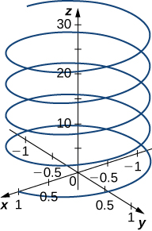 

**[T]** Let <math xmlns="http://www.w3.org/1998/Math/MathML"><mrow><mtext mathvariant="bold">r</mtext><mo stretchy="false">(</mo><mi>t</mi><mo stretchy="false">)</mo><mo>=</mo><mrow><mo>〈</mo><mrow><mi>t</mi><mo>,</mo><mn>2</mn><msup><mi>t</mi><mn>2</mn></msup><mo>,</mo><mn>4</mn><msup><mi>t</mi><mn>2</mn></msup></mrow><mo>〉</mo></mrow></mrow></math>

 be the position vector of a particle at time <math xmlns="http://www.w3.org/1998/Math/MathML"><mi>t</mi></math>

 (in seconds), where <math xmlns="http://www.w3.org/1998/Math/MathML"><mrow><mi>t</mi><mo>∈</mo><mo stretchy="false">[</mo><mn>0</mn><mo>,</mo><mn>10</mn><mo stretchy="false">]</mo></mrow></math>

 (here the components of <math xmlns="http://www.w3.org/1998/Math/MathML"><mstyle mathvariant="bold" mathsize="normal"><mtext>r</mtext></mstyle></math>

 are expressed in centimeters).

1.  Find the instantaneous velocity, speed, and acceleration of the particle after the first two seconds. Round your answer to two decimal places.
2.  Use a CAS to visualize the path of the particle defined by the points
    <math xmlns="http://www.w3.org/1998/Math/MathML"><mrow><mrow><mo>(</mo><mrow><mi>t</mi><mo>,</mo><mn>2</mn><msup><mi>t</mi><mn>2</mn></msup><mo>,</mo><mn>4</mn><msup><mi>t</mi><mn>2</mn></msup></mrow><mo>)</mo></mrow><mo>,</mo></mrow></math>
    
    where
    <math xmlns="http://www.w3.org/1998/Math/MathML"><mrow><mi>t</mi><mo>∈</mo><mo stretchy="false">[</mo><mn>0</mn><mo>,</mo><mn>60</mn><mo stretchy="false">]</mo><mo>.</mo></mrow></math>
{: data-number-style="lower-alpha"}

</section>

### Glossary
{: data-type="glossary-title"}

coordinate plane
: a plane containing two of the three coordinate axes in the three-dimensional coordinate system, named by the axes it contains: the *xy*-plane, *xz*-plane, or the *yz*-plane
^

right-hand rule
: a common way to define the orientation of the three-dimensional coordinate system; when the right hand is curved around the *z*-axis in such a way that the fingers curl from the positive *x*-axis to the positive *y*-axis, the thumb points in the direction of the positive *z*-axis
^

octants
: the eight regions of space created by the coordinate planes
^

sphere
: the set of all points equidistant from a given point known as the *center*
^

standard equation of a sphere
: <math xmlns="http://www.w3.org/1998/Math/MathML"><mrow><msup><mrow><mrow><mo>(</mo><mrow><mi>x</mi><mo>−</mo><mi>a</mi></mrow><mo>)</mo></mrow></mrow><mn>2</mn></msup><mo>+</mo><msup><mrow><mrow><mo>(</mo><mrow><mi>y</mi><mo>−</mo><mi>b</mi></mrow><mo>)</mo></mrow></mrow><mn>2</mn></msup><mo>+</mo><msup><mrow><mrow><mo>(</mo><mrow><mi>z</mi><mo>−</mo><mi>c</mi></mrow><mo>)</mo></mrow></mrow><mn>2</mn></msup><mo>=</mo><msup><mi>r</mi><mn>2</mn></msup></mrow></math>
  
  describes a sphere with center
  <math xmlns="http://www.w3.org/1998/Math/MathML"><mrow><mrow><mo>(</mo><mrow><mi>a</mi><mo>,</mo><mi>b</mi><mo>,</mo><mi>c</mi></mrow><mo>)</mo></mrow></mrow></math>
  
  and radius
  <math xmlns="http://www.w3.org/1998/Math/MathML"><mi>r</mi></math>
^

three-dimensional rectangular coordinate system
: a coordinate system defined by three lines that intersect at right angles; every point in space is described by an ordered triple
  <math xmlns="http://www.w3.org/1998/Math/MathML"><mrow><mrow><mo>(</mo><mrow><mi>x</mi><mo>,</mo><mi>y</mi><mo>,</mo><mi>z</mi></mrow><mo>)</mo></mrow></mrow></math>
  
  that plots its location relative to the defining axes

