

* Describe a plane vector, using correct notation.
* Perform basic vector operations (scalar multiplication, addition, subtraction).
* Express a vector in component form.
* Explain the formula for the magnitude of a vector.
* Express a vector in terms of unit vectors.
* Give two examples of vector quantities.

When describing the movement of an airplane in flight, it is important to communicate two pieces of information: the direction in which the plane is traveling and the plane’s speed. When measuring a force, such as the thrust of the plane’s engines, it is important to describe not only the strength of that force, but also the direction in which it is applied. Some quantities, such as or force, are defined in terms of both size (also called *magnitude*) and direction. A quantity that has magnitude and direction is called a **vector**{: data-type="term"}. In this text, we denote vectors by boldface letters, such as **v**.

Definition

A vector is a quantity that has both magnitude and direction.

### Vector Representation

A vector in a plane is represented by a directed line segment (an arrow). The endpoints of the segment are called the **initial point**{: data-type="term"} and the **terminal point**{: data-type="term"} of the vector. An arrow from the initial point to the terminal point indicates the direction of the vector. The length of the line segment represents its **magnitude**{: data-type="term"}. We use the notation <math xmlns="http://www.w3.org/1998/Math/MathML"><mrow><mrow><mo>‖</mo><mstyle mathvariant="bold" mathsize="normal"><mtext>v</mtext></mstyle><mo>‖</mo></mrow></mrow></math>

 to denote the magnitude of the vector <math xmlns="http://www.w3.org/1998/Math/MathML"><mrow><mstyle mathvariant="bold" mathsize="normal"><mtext>v</mtext></mstyle><mo>.</mo></mrow></math>

 A vector with an initial point and terminal point that are the same is called the **zero vector**{: data-type="term"}, denoted <math xmlns="http://www.w3.org/1998/Math/MathML"><mrow><mstyle mathvariant="bold" mathsize="normal"><mn>0</mn></mstyle><mo>.</mo></mrow></math>

 The zero vector is the only vector without a direction, and by convention can be considered to have any direction convenient to the problem at hand.

Vectors with the same magnitude and direction are called equivalent vectors. We treat equivalent vectors as equal, even if they have different initial points. Thus, if <math xmlns="http://www.w3.org/1998/Math/MathML"><mstyle mathvariant="bold" mathsize="normal"><mtext>v</mtext></mstyle></math>

 and <math xmlns="http://www.w3.org/1998/Math/MathML"><mstyle mathvariant="bold" mathsize="normal"><mtext>w</mtext></mstyle></math>

 are equivalent, we write

<math xmlns="http://www.w3.org/1998/Math/MathML"><mrow><mstyle mathvariant="bold" mathsize="normal"><mtext>v</mtext></mstyle><mo>=</mo><mstyle mathvariant="bold" mathsize="normal"><mtext>w</mtext></mstyle><mo>.</mo></mrow></math>

Definition

Vectors are said to be **equivalent vectors**{: data-type="term"} if they have the same magnitude and direction.

The arrows in [\[link\]](#CNX_Calc_Figure_12_01_001)(b) are equivalent. Each arrow has the same length and direction. A closely related concept is the idea of parallel vectors. Two vectors are said to be parallel if they have the same or opposite directions. We explore this idea in more detail later in the chapter. A vector is defined by its magnitude and direction, regardless of where its initial point is located.

  A vector is represented by a directed line segment from its initial point to its terminal point. (b) Vectors v1 through v5 are equivalent."){: #CNX_Calc_Figure_12_01_001}

The use of boldface, lowercase letters to name vectors is a common representation in print, but there are alternative notations. When writing the name of a vector by hand, for example, it is easier to sketch an arrow over the variable than to simulate boldface type: <math xmlns="http://www.w3.org/1998/Math/MathML"><mrow><mover accent="true"><mi>v</mi><mo stretchy="false">→</mo></mover><mo>.</mo></mrow></math>

 When a vector has initial point <math xmlns="http://www.w3.org/1998/Math/MathML"><mi>P</mi></math>

 and terminal point <math xmlns="http://www.w3.org/1998/Math/MathML"><mrow><mi>Q</mi><mo>,</mo></mrow></math>

 the notation <math xmlns="http://www.w3.org/1998/Math/MathML"><mrow><mover accent="true"><mrow><mi>P</mi><mi>Q</mi></mrow><mo stretchy="false">→</mo></mover></mrow></math>

 is useful because it indicates the direction and location of the vector.

Sketching Vectors

Sketch a vector in the plane from initial point <math xmlns="http://www.w3.org/1998/Math/MathML"><mrow><mi>P</mi><mo stretchy="false">(</mo><mn>1</mn><mo>,</mo><mn>1</mn><mo stretchy="false">)</mo></mrow></math>

 to terminal point <math xmlns="http://www.w3.org/1998/Math/MathML"><mrow><mi>Q</mi><mo stretchy="false">(</mo><mn>8</mn><mo>,</mo><mn>5</mn><mo stretchy="false">)</mo><mo>.</mo></mrow></math>

See [[link]](#CNX_Calc_Figure_12_01_002). Because the vector goes from point <math xmlns="http://www.w3.org/1998/Math/MathML"><mi>P</mi></math>

 to point <math xmlns="http://www.w3.org/1998/Math/MathML"><mrow><mi>Q</mi><mo>,</mo></mrow></math>

 we name it <math xmlns="http://www.w3.org/1998/Math/MathML"><mrow><mover accent="true"><mrow><mi>P</mi><mi>Q</mi></mrow><mo stretchy="false">→</mo></mover><mo>.</mo></mrow></math>

 and terminal point (8,5) is named PQ&#x2192;."){: #CNX_Calc_Figure_12_01_002}

Sketch the vector <math xmlns="http://www.w3.org/1998/Math/MathML"><mrow><mover accent="true"><mrow><mi>S</mi><mi>T</mi></mrow><mo stretchy="false">→</mo></mover></mrow></math>

 where <math xmlns="http://www.w3.org/1998/Math/MathML"><mi>S</mi></math>

 is point <math xmlns="http://www.w3.org/1998/Math/MathML"><mrow><mrow><mo>(</mo><mrow><mn>3</mn><mo>,</mo><mn>−1</mn></mrow><mo>)</mo></mrow></mrow></math>

 and <math xmlns="http://www.w3.org/1998/Math/MathML"><mi>T</mi></math>

 is point <math xmlns="http://www.w3.org/1998/Math/MathML"><mrow><mrow><mo>(</mo><mrow><mn>−2</mn><mo>,</mo><mn>3</mn></mrow><mo>)</mo></mrow><mo>.</mo></mrow></math>

* * *
{: data-type="newline"}

  

Hint

The first point listed in the name of the vector is the initial point of the vector.

### Combining Vectors

Vectors have many real-life applications, including situations involving force or velocity. For example, consider the forces acting on a boat crossing a river. The boat’s motor generates a force in one direction, and the current of the river generates a force in another direction. Both forces are vectors. We must take both the magnitude and direction of each force into account if we want to know where the boat will go.

A second example that involves vectors is a quarterback throwing a football. The quarterback does not throw the ball parallel to the ground; instead, he aims up into the air. The velocity of his throw can be represented by a vector. If we know how hard he throws the ball (magnitude—in this case, speed), and the angle (direction), we can tell how far the ball will travel down the field.

A real number is often called a **scalar**{: data-type="term"} in mathematics and physics. Unlike vectors, scalars are generally considered to have a magnitude only, but no direction. Multiplying a vector by a scalar changes the vector’s magnitude. This is called scalar multiplication. Note that changing the magnitude of a vector does not indicate a change in its direction. For example, wind blowing from north to south might increase or decrease in speed while maintaining its direction from north to south.

Definition

The product <math xmlns="http://www.w3.org/1998/Math/MathML"><mrow><mi>k</mi><mstyle mathvariant="bold" mathsize="normal"><mtext>v</mtext></mstyle></mrow></math>

 of a vector **v** and a scalar *k* is a vector with a magnitude that is <math xmlns="http://www.w3.org/1998/Math/MathML"><mrow><mrow><mo>\|</mo><mi>k</mi><mo>\|</mo></mrow></mrow></math>

 times the magnitude of <math xmlns="http://www.w3.org/1998/Math/MathML"><mrow><mstyle mathvariant="bold" mathsize="normal"><mtext>v</mtext></mstyle><mo>,</mo></mrow></math>

 and with a direction that is the same as the direction of <math xmlns="http://www.w3.org/1998/Math/MathML"><mstyle mathvariant="bold" mathsize="normal"><mtext>v</mtext></mstyle></math>

 if <math xmlns="http://www.w3.org/1998/Math/MathML"><mrow><mi>k</mi><mo>&gt;</mo><mn>0</mn><mo>,</mo></mrow></math>

 and opposite the direction of <math xmlns="http://www.w3.org/1998/Math/MathML"><mstyle mathvariant="bold" mathsize="normal"><mtext>v</mtext></mstyle></math>

 if <math xmlns="http://www.w3.org/1998/Math/MathML"><mrow><mi>k</mi><mo>&lt;</mo><mn>0</mn><mo>.</mo></mrow></math>

 This is called **scalar multiplication**{: data-type="term"}. If <math xmlns="http://www.w3.org/1998/Math/MathML"><mrow><mi>k</mi><mo>=</mo><mn>0</mn></mrow></math>

 or <math xmlns="http://www.w3.org/1998/Math/MathML"><mrow><mstyle mathvariant="bold" mathsize="normal"><mi>v</mi><mo>=</mo><mn>0</mn></mstyle><mo>,</mo></mrow></math>

 then <math xmlns="http://www.w3.org/1998/Math/MathML"><mrow><mi>k</mi><mstyle mathvariant="bold" mathsize="normal"><mtext>v</mtext></mstyle><mo>=</mo><mstyle mathvariant="bold" mathsize="normal"><mn>0</mn></mstyle><mo>.</mo></mrow></math>

As you might expect, if <math xmlns="http://www.w3.org/1998/Math/MathML"><mrow><mi>k</mi><mo>=</mo><mn>−1</mn><mo>,</mo></mrow></math>

 we denote the product <math xmlns="http://www.w3.org/1998/Math/MathML"><mrow><mi>k</mi><mstyle mathvariant="bold" mathsize="normal"><mtext>v</mtext></mstyle></mrow></math>

 as

<math xmlns="http://www.w3.org/1998/Math/MathML"><mrow><mi>k</mi><mstyle mathvariant="bold" mathsize="normal"><mtext>v</mtext></mstyle><mo>=</mo><mrow><mo>(</mo><mrow><mn>−1</mn></mrow><mo>)</mo></mrow><mstyle mathvariant="bold" mathsize="normal"><mtext>v</mtext></mstyle><mo>=</mo><mtext>−</mtext><mstyle mathvariant="bold" mathsize="normal"><mtext>v</mtext></mstyle><mo>.</mo></mrow></math>

Note that <math xmlns="http://www.w3.org/1998/Math/MathML"><mrow><mtext>−</mtext><mstyle mathvariant="bold" mathsize="normal"><mtext>v</mtext></mstyle></mrow></math>

 has the same magnitude as <math xmlns="http://www.w3.org/1998/Math/MathML"><mrow><mstyle mathvariant="bold" mathsize="normal"><mtext>v</mtext></mstyle><mo>,</mo></mrow></math>

 but has the opposite direction ([\[link\]](#CNX_Calc_Figure_12_01_004)).

  The original vector v has length n units. (b) The length of 2v equals 2n units. (c) The length of v/2 is n/2 units. (d) The vectors v and &#x2212;v have the same length but opposite directions."){: #CNX_Calc_Figure_12_01_004}

Another operation we can perform on vectors is to add them together in vector addition, but because each vector may have its own direction, the process is different from adding two numbers. The most common graphical method for adding two vectors is to place the initial point of the second vector at the terminal point of the first, as in [\[link\]](#CNX_Calc_Figure_12_01_005)(a). To see why this makes sense, suppose, for example, that both vectors represent displacement. If an object moves first from the initial point to the terminal point of vector <math xmlns="http://www.w3.org/1998/Math/MathML"><mrow><mstyle mathvariant="bold" mathsize="normal"><mtext>v</mtext></mstyle><mo>,</mo></mrow></math>

 then from the initial point to the terminal point of vector <math xmlns="http://www.w3.org/1998/Math/MathML"><mrow><mstyle mathvariant="bold" mathsize="normal"><mtext>w</mtext></mstyle><mo>,</mo></mrow></math>

 the overall displacement is the same as if the object had made just one movement from the initial point to the terminal point of the vector <math xmlns="http://www.w3.org/1998/Math/MathML"><mrow><mstyle mathvariant="bold" mathsize="normal"><mi>v</mi><mo>+</mo><mi>w</mi></mstyle><mo>.</mo></mrow></math>

 For obvious reasons, this approach is called the **triangle method**{: data-type="term"}. Notice that if we had switched the order, so that <math xmlns="http://www.w3.org/1998/Math/MathML"><mstyle mathvariant="bold" mathsize="normal"><mtext>w</mtext></mstyle></math>

 was our first vector and **v** was our second vector, we would have ended up in the same place. (Again, see [\[link\]](#CNX_Calc_Figure_12_01_005)(a).) Thus, <math xmlns="http://www.w3.org/1998/Math/MathML"><mrow><mstyle mathvariant="bold" mathsize="normal"><mi>v</mi><mo>+</mo><mi>w</mi><mo>=</mo><mi>w</mi><mo>+</mo><mi>v</mi></mstyle><mo>.</mo></mrow></math>

A second method for adding vectors is called the **parallelogram method**{: data-type="term"}. With this method, we place the two vectors so they have the same initial point, and then we draw a parallelogram with the vectors as two adjacent sides, as in [\[link\]](#CNX_Calc_Figure_12_01_005)(b). The length of the diagonal of the parallelogram is the sum. Comparing [\[link\]](#CNX_Calc_Figure_12_01_005)(b) and [\[link\]](#CNX_Calc_Figure_12_01_005)(a), we can see that we get the same answer using either method. The vector <math xmlns="http://www.w3.org/1998/Math/MathML"><mrow><mstyle mathvariant="bold" mathsize="normal"><mi>v</mi><mo>+</mo><mi>w</mi></mstyle></mrow></math>

 is called the **vector sum**{: data-type="term"}.

Definition

The sum of two vectors <math xmlns="http://www.w3.org/1998/Math/MathML"><mstyle mathvariant="bold" mathsize="normal"><mtext>v</mtext></mstyle></math>

 and <math xmlns="http://www.w3.org/1998/Math/MathML"><mstyle mathvariant="bold" mathsize="normal"><mtext>w</mtext></mstyle></math>

 can be constructed graphically by placing the initial point of <math xmlns="http://www.w3.org/1998/Math/MathML"><mstyle mathvariant="bold" mathsize="normal"><mtext>w</mtext></mstyle></math>

 at the terminal point of <math xmlns="http://www.w3.org/1998/Math/MathML"><mrow><mstyle mathvariant="bold" mathsize="normal"><mtext>v</mtext></mstyle><mo>.</mo></mrow></math>

 Then, the vector sum, <math xmlns="http://www.w3.org/1998/Math/MathML"><mrow><mstyle mathvariant="bold" mathsize="normal"><mi>v</mi><mo>+</mo><mi>w</mi></mstyle><mo>,</mo></mrow></math>

 is the vector with an initial point that coincides with the initial point of <math xmlns="http://www.w3.org/1998/Math/MathML"><mstyle mathvariant="bold" mathsize="normal"><mtext>v</mtext></mstyle></math>

 and has a terminal point that coincides with the terminal point of <math xmlns="http://www.w3.org/1998/Math/MathML"><mrow><mstyle mathvariant="bold" mathsize="normal"><mtext>w</mtext></mstyle><mo>.</mo></mrow></math>

 This operation is known as **vector addition**{: data-type="term"}.

 ![This image has two figures. The first has two vectors, v and w with the same initial point. A parallelogram is formed by sketching broken lines parallel to the two vectors. A diagonal line is drawn from the same initial point to the opposite corner. It is labeled &#x201C;v + w.&#x201D; The second has two vectors, v and w. Vector v begins at the terminal point of vector w. A parallelogram is formed by sketching broken lines parallel to the two vectors. A diagonal line is drawn from the same initial point as vector w to the opposite corner. It is labeled &#x201C;v + w.&#x201D;](../resources/CNX_Calc_Figure_12_01_005.jpg "(a) When adding vectors by the triangle method, the initial point of w is the terminal point of v. (b) When adding vectors by the parallelogram method, the vectors v and w have the same initial point."){: #CNX_Calc_Figure_12_01_005}

It is also appropriate here to discuss vector subtraction. We define <math xmlns="http://www.w3.org/1998/Math/MathML"><mrow><mstyle mathvariant="bold" mathsize="normal"><mtext>v</mtext></mstyle><mo>−</mo><mstyle mathvariant="bold" mathsize="normal"><mtext>w</mtext></mstyle></mrow></math>

 as <math xmlns="http://www.w3.org/1998/Math/MathML"><mrow><mstyle mathvariant="bold" mathsize="normal"><mi>v</mi><mo>+</mo></mstyle><mrow><mo>(</mo><mrow><mtext>−</mtext><mstyle mathvariant="bold" mathsize="normal"><mtext>w</mtext></mstyle></mrow><mo>)</mo></mrow><mo>=</mo><mstyle mathvariant="bold" mathsize="normal"><mi>v</mi><mo>+</mo></mstyle><mo stretchy="false">(</mo><mn>−1</mn><mo stretchy="false">)</mo><mstyle mathvariant="bold" mathsize="normal"><mtext>w</mtext></mstyle><mo>.</mo></mrow></math>

 The vector <math xmlns="http://www.w3.org/1998/Math/MathML"><mrow><mstyle mathvariant="bold" mathsize="normal"><mtext>v</mtext></mstyle><mo>−</mo><mstyle mathvariant="bold" mathsize="normal"><mtext>w</mtext></mstyle></mrow></math>

 is called the **vector difference**{: data-type="term"}. Graphically, the vector <math xmlns="http://www.w3.org/1998/Math/MathML"><mrow><mstyle mathvariant="bold" mathsize="normal"><mtext>v</mtext></mstyle><mo>−</mo><mstyle mathvariant="bold" mathsize="normal"><mtext>w</mtext></mstyle></mrow></math>

 is depicted by drawing a vector from the terminal point of <math xmlns="http://www.w3.org/1998/Math/MathML"><mstyle mathvariant="bold" mathsize="normal"><mtext>w</mtext></mstyle></math>

 to the terminal point of <math xmlns="http://www.w3.org/1998/Math/MathML"><mstyle mathvariant="bold" mathsize="normal"><mtext>v</mtext></mstyle></math>

 ([\[link\]](#CNX_Calc_Figure_12_01_006)).

 ![This image has two figures. The first figure has two vectors, one labeled &#x201C;v&#x201D; and the other labeled &#x201C;w.&#x201D; Both vectors have the same initial point. A third vector is drawn between the terminal points of v and w. It is labeled &#x201C;v &#x2013; w.&#x201D; The second figure has two vectors, one labeled &#x201C;v&#x201D; and the other labeled &#x201C;-w.&#x201D; The vector &#x201C;-w&#x201D; has its initial point at the terminal point of &#x201C;v.&#x201D; A parallelogram is created with broken lines where &#x201C;v&#x201D; is the diagonal and &#x201C;w&#x201D; is the top side.](../resources/CNX_Calc_Figure_12_01_006.jpg "(a) The vector difference v&#x2212;w is depicted by drawing a vector from the terminal point of w to the terminal point of v. (b) The vector v&#x2212;w is equivalent to the vector v+(&#x2212;w)."){: #CNX_Calc_Figure_12_01_006}

In [\[link\]](#CNX_Calc_Figure_12_01_005)(a), the initial point of <math xmlns="http://www.w3.org/1998/Math/MathML"><mrow><mstyle mathvariant="bold" mathsize="normal"><mtext>v</mtext></mstyle><mo>+</mo><mstyle mathvariant="bold" mathsize="normal"><mtext>w</mtext></mstyle></mrow></math>

 is the initial point of <math xmlns="http://www.w3.org/1998/Math/MathML"><mrow><mstyle mathvariant="bold" mathsize="normal"><mtext>v</mtext></mstyle><mo>.</mo></mrow></math>

 The terminal point of <math xmlns="http://www.w3.org/1998/Math/MathML"><mrow><mstyle mathvariant="bold" mathsize="normal"><mtext>v</mtext></mstyle><mo>+</mo><mstyle mathvariant="bold" mathsize="normal"><mtext>w</mtext></mstyle></mrow></math>

 is the terminal point of <math xmlns="http://www.w3.org/1998/Math/MathML"><mrow><mstyle mathvariant="bold" mathsize="normal"><mtext>w</mtext></mstyle><mo>.</mo></mrow></math>

 These three vectors form the sides of a triangle. It follows that the length of any one side is less than the sum of the lengths of the remaining sides. So we have

<math xmlns="http://www.w3.org/1998/Math/MathML"><mrow><mrow><mo>‖</mo><mrow><mstyle mathvariant="bold" mathsize="normal"><mtext>v</mtext></mstyle><mo>+</mo><mstyle mathvariant="bold" mathsize="normal"><mtext>w</mtext></mstyle></mrow><mo>‖</mo></mrow><mo>≤</mo><mrow><mo>‖</mo><mstyle mathvariant="bold" mathsize="normal"><mtext>v</mtext></mstyle><mo>‖</mo></mrow><mo>+</mo><mrow><mo>‖</mo><mstyle mathvariant="bold" mathsize="normal"><mtext>w</mtext></mstyle><mo>‖</mo></mrow><mo>.</mo></mrow></math>

This is known more generally as the **triangle inequality**{: data-type="term"}. There is one case, however, when the resultant vector <math xmlns="http://www.w3.org/1998/Math/MathML"><mrow><mstyle mathvariant="bold" mathsize="normal"><mtext>u</mtext></mstyle><mo>+</mo><mstyle mathvariant="bold" mathsize="normal"><mtext>v</mtext></mstyle></mrow></math>

 has the same magnitude as the sum of the magnitudes of <math xmlns="http://www.w3.org/1998/Math/MathML"><mrow><mstyle mathvariant="bold" mathsize="normal"><mtext>u</mtext></mstyle></mrow></math>

 and <math xmlns="http://www.w3.org/1998/Math/MathML"><mrow><mstyle mathvariant="bold" mathsize="normal"><mtext>v</mtext></mstyle><mo>.</mo></mrow></math>

 This happens only when <math xmlns="http://www.w3.org/1998/Math/MathML"><mrow><mstyle mathvariant="bold" mathsize="normal"><mtext>u</mtext></mstyle></mrow></math>

 and <math xmlns="http://www.w3.org/1998/Math/MathML"><mstyle mathvariant="bold" mathsize="normal"><mtext>v</mtext></mstyle></math>

 have the same direction.

Combining Vectors

Given the vectors <math xmlns="http://www.w3.org/1998/Math/MathML"><mstyle mathvariant="bold" mathsize="normal"><mtext>v</mtext></mstyle></math>

 and <math xmlns="http://www.w3.org/1998/Math/MathML"><mrow><mstyle mathvariant="bold" mathsize="normal"><mtext>w</mtext></mstyle></mrow></math>

 shown in [[link]](#CNX_Calc_Figure_12_01_025), sketch the vectors

1.  <math xmlns="http://www.w3.org/1998/Math/MathML"><mrow><mn>3</mn><mtext mathvariant="bold">w</mtext></mrow></math>

2.  <math xmlns="http://www.w3.org/1998/Math/MathML"><mrow><mstyle mathvariant="bold" mathsize="normal"><mtext>v</mtext></mstyle><mo>+</mo><mstyle mathvariant="bold" mathsize="normal"><mtext>w</mtext></mstyle></mrow></math>

3.  <math xmlns="http://www.w3.org/1998/Math/MathML"><mrow><mn>2</mn><mstyle mathvariant="bold" mathsize="normal"><mtext>v</mtext></mstyle><mo>−</mo><mstyle mathvariant="bold" mathsize="normal"><mtext>w</mtext></mstyle></mrow></math>
    
    * * *
    {: data-type="newline"}
    
    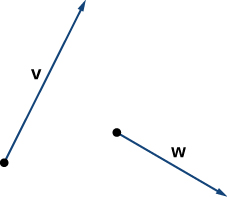{: #CNX_Calc_Figure_12_01_025}

{: data-number-style="lower-alpha"}

1.  The vector
    <math xmlns="http://www.w3.org/1998/Math/MathML"><mrow><mn>3</mn><mstyle mathvariant="bold" mathsize="normal"><mtext>w</mtext></mstyle></mrow></math>
    
    has the same direction as
    <math xmlns="http://www.w3.org/1998/Math/MathML"><mrow><mstyle mathvariant="bold" mathsize="normal"><mtext>w</mtext></mstyle><mo>;</mo></mrow></math>
    
    it is three times as long as
    <math xmlns="http://www.w3.org/1998/Math/MathML"><mrow><mstyle mathvariant="bold" mathsize="normal"><mtext>w</mtext></mstyle><mo>.</mo></mrow></math>
    
    * * *
    {: data-type="newline"}
    
    

    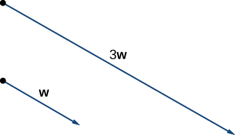
    

    
    * * *
    {: data-type="newline"}
    
    Vector
    <math xmlns="http://www.w3.org/1998/Math/MathML"><mrow><mn>3</mn><mstyle mathvariant="bold" mathsize="normal"><mtext>w</mtext></mstyle></mrow></math>
    
    has the same direction as
    <math xmlns="http://www.w3.org/1998/Math/MathML"><mrow><mstyle mathvariant="bold" mathsize="normal"><mtext>w</mtext></mstyle></mrow></math>
    
    and is three times as long.
2.  Use either addition method to find
    <math xmlns="http://www.w3.org/1998/Math/MathML"><mrow><mstyle mathvariant="bold" mathsize="normal"><mtext>v</mtext></mstyle><mo>+</mo><mstyle mathvariant="bold" mathsize="normal"><mtext>w</mtext></mstyle><mo>.</mo></mrow></math>
    
    * * *
    {: data-type="newline"}
    
     The vector v+w is the diagonal of the parallelogram with sides v and w (b) The vector v+w is the third side of a triangle formed with w placed at the terminal point of v."){: #CNX_Calc_Figure_12_01_008}

3.  To find
    <math xmlns="http://www.w3.org/1998/Math/MathML"><mrow><mn>2</mn><mstyle mathvariant="bold" mathsize="normal"><mtext>v</mtext></mstyle><mo>−</mo><mstyle mathvariant="bold" mathsize="normal"><mtext>w</mtext></mstyle><mo>,</mo></mrow></math>
    
    we can first rewrite the expression as
    <math xmlns="http://www.w3.org/1998/Math/MathML"><mrow><mn>2</mn><mstyle mathvariant="bold" mathsize="normal"><mtext>v</mtext></mstyle><mo>+</mo><mrow><mo>(</mo><mrow><mtext>−</mtext><mstyle mathvariant="bold" mathsize="normal"><mtext>w</mtext></mstyle></mrow><mo>)</mo></mrow><mo>.</mo></mrow></math>
    
    Then we can draw the vector
    <math xmlns="http://www.w3.org/1998/Math/MathML"><mrow><mtext>−</mtext><mstyle mathvariant="bold" mathsize="normal"><mtext>w</mtext></mstyle><mo>,</mo></mrow></math>
    
    then add it to the vector
    <math xmlns="http://www.w3.org/1998/Math/MathML"><mrow><mn>2</mn><mstyle mathvariant="bold" mathsize="normal"><mtext>v</mtext></mstyle><mo>.</mo></mrow></math>
    
    * * *
    {: data-type="newline"}
    
    ."){: #CNX_Calc_Figure_12_01_009}

{: data-number-style="lower-alpha"}

Using vectors <math xmlns="http://www.w3.org/1998/Math/MathML"><mstyle mathvariant="bold" mathsize="normal"><mtext>v</mtext></mstyle></math>

 and <math xmlns="http://www.w3.org/1998/Math/MathML"><mrow><mstyle mathvariant="bold" mathsize="normal"><mtext>w</mtext></mstyle></mrow></math>

 from [[link]](#fs-id1167793948832), sketch the vector <math xmlns="http://www.w3.org/1998/Math/MathML"><mrow><mn>2</mn><mstyle mathvariant="bold" mathsize="normal"><mtext>w</mtext></mstyle><mo>−</mo><mstyle mathvariant="bold" mathsize="normal"><mtext>v</mtext></mstyle><mo>.</mo></mrow></math>

* * *
{: data-type="newline"}

 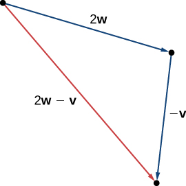 

Hint

First sketch vectors <math xmlns="http://www.w3.org/1998/Math/MathML"><mrow><mn>2</mn><mstyle mathvariant="bold" mathsize="normal"><mtext>w</mtext></mstyle></mrow></math>

 and <math xmlns="http://www.w3.org/1998/Math/MathML"><mrow><mtext>−</mtext><mstyle mathvariant="bold" mathsize="normal"><mtext>v</mtext></mstyle><mo>.</mo></mrow></math>

### Vector Components

Working with vectors in a plane is easier when we are working in a coordinate system. When the initial points and terminal points of vectors are given in Cartesian coordinates, computations become straightforward.

Comparing Vectors

Are <math xmlns="http://www.w3.org/1998/Math/MathML"><mstyle mathvariant="bold" mathsize="normal"><mtext>v</mtext></mstyle></math>

 and <math xmlns="http://www.w3.org/1998/Math/MathML"><mstyle mathvariant="bold" mathsize="normal"><mtext>w</mtext></mstyle></math>

 equivalent vectors?

1.  <math xmlns="http://www.w3.org/1998/Math/MathML"><mstyle mathvariant="bold" mathsize="normal"><mtext>v</mtext></mstyle></math>
    
    has initial point
    <math xmlns="http://www.w3.org/1998/Math/MathML"><mrow><mrow><mo>(</mo><mrow><mn>3</mn><mo>,</mo><mn>2</mn></mrow><mo>)</mo></mrow></mrow></math>
    
    and terminal point
    <math xmlns="http://www.w3.org/1998/Math/MathML"><mrow><mrow><mo>(</mo><mrow><mn>7</mn><mo>,</mo><mn>2</mn></mrow><mo>)</mo></mrow></mrow></math>
    
    * * *
    {: data-type="newline"}
    
    <math xmlns="http://www.w3.org/1998/Math/MathML"><mstyle mathvariant="bold" mathsize="normal"><mtext>w</mtext></mstyle></math>
    
    has initial point
    <math xmlns="http://www.w3.org/1998/Math/MathML"><mrow><mrow><mo>(</mo><mrow><mn>1</mn><mo>,</mo><mn>−4</mn></mrow><mo>)</mo></mrow></mrow></math>
    
    and terminal point
    <math xmlns="http://www.w3.org/1998/Math/MathML"><mrow><mrow><mo>(</mo><mrow><mn>1</mn><mo>,</mo><mn>0</mn></mrow><mo>)</mo></mrow></mrow></math>

2.  <math xmlns="http://www.w3.org/1998/Math/MathML"><mstyle mathvariant="bold" mathsize="normal"><mtext>v</mtext></mstyle></math>
    
    has initial point
    <math xmlns="http://www.w3.org/1998/Math/MathML"><mrow><mrow><mo>(</mo><mrow><mn>0</mn><mo>,</mo><mn>0</mn></mrow><mo>)</mo></mrow></mrow></math>
    
    and terminal point
    <math xmlns="http://www.w3.org/1998/Math/MathML"><mrow><mrow><mo>(</mo><mrow><mn>1</mn><mo>,</mo><mn>1</mn></mrow><mo>)</mo></mrow></mrow></math>
    
    * * *
    {: data-type="newline"}
    
    <math xmlns="http://www.w3.org/1998/Math/MathML"><mstyle mathvariant="bold" mathsize="normal"><mtext>w</mtext></mstyle></math>
    
    has initial point
    <math xmlns="http://www.w3.org/1998/Math/MathML"><mrow><mrow><mo>(</mo><mrow><mn>−2</mn><mo>,</mo><mn>2</mn></mrow><mo>)</mo></mrow></mrow></math>
    
    and terminal point
    <math xmlns="http://www.w3.org/1998/Math/MathML"><mrow><mrow><mo>(</mo><mrow><mn>−1</mn><mo>,</mo><mn>3</mn></mrow><mo>)</mo></mrow></mrow></math>
{: data-number-style="lower-alpha"}

1.  The vectors are each
    <math xmlns="http://www.w3.org/1998/Math/MathML"><mrow><mn>4</mn></mrow></math>
    
    units long, but they are oriented in different directions. So
    <math xmlns="http://www.w3.org/1998/Math/MathML"><mstyle mathvariant="bold" mathsize="normal"><mtext>v</mtext></mstyle></math>
    
    and
    <math xmlns="http://www.w3.org/1998/Math/MathML"><mstyle mathvariant="bold" mathsize="normal"><mtext>w</mtext></mstyle></math>
    
    are not equivalent ([[link]](#CNX_Calc_Figure_12_01_011)).
    * * *
    {: data-type="newline"}
    
    {: #CNX_Calc_Figure_12_01_011}

2.  Based on [[link]](#CNX_Calc_Figure_12_01_012), and using a bit of geometry, it is clear these vectors have the same length and the same direction, so
    <math xmlns="http://www.w3.org/1998/Math/MathML"><mstyle mathvariant="bold" mathsize="normal"><mtext>v</mtext></mstyle></math>
    
    and
    <math xmlns="http://www.w3.org/1998/Math/MathML"><mstyle mathvariant="bold" mathsize="normal"><mtext>w</mtext></mstyle></math>
    
    are equivalent.
    * * *
    {: data-type="newline"}
    
    {: #CNX_Calc_Figure_12_01_012}

{: data-number-style="lower-alpha"}

Which of the following vectors are equivalent?

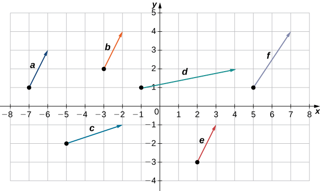

Vectors <math xmlns="http://www.w3.org/1998/Math/MathML"><mrow><mstyle mathvariant="bold" mathsize="normal"><mtext>a</mtext></mstyle><mo>,</mo></mrow></math>

 <math xmlns="http://www.w3.org/1998/Math/MathML"><mrow><mstyle mathvariant="bold" mathsize="normal"><mtext>b</mtext></mstyle><mo>,</mo></mrow></math>

 and <math xmlns="http://www.w3.org/1998/Math/MathML"><mrow><mstyle mathvariant="bold" mathsize="normal"><mtext>e</mtext></mstyle></mrow></math>

 are equivalent.

Hint

Equivalent vectors have both the same magnitude and the same direction.

We have seen how to plot a vector when we are given an initial point and a terminal point. However, because a vector can be placed anywhere in a plane, it may be easier to perform calculations with a vector when its initial point coincides with the origin. We call a vector with its initial point at the origin a **standard-position vector**{: data-type="term"}. Because the initial point of any vector in standard position is known to be <math xmlns="http://www.w3.org/1998/Math/MathML"><mrow><mrow><mo>(</mo><mrow><mn>0</mn><mo>,</mo><mn>0</mn></mrow><mo>)</mo></mrow><mo>,</mo></mrow></math>

 we can describe the vector by looking at the coordinates of its terminal point. Thus, if vector **v** has its initial point at the origin and its terminal point at <math xmlns="http://www.w3.org/1998/Math/MathML"><mrow><mrow><mo>(</mo><mrow><mi>x</mi><mo>,</mo><mi>y</mi></mrow><mo>)</mo></mrow><mo>,</mo></mrow></math>

 we write the vector in component form as

<math xmlns="http://www.w3.org/1998/Math/MathML"><mrow><mstyle mathvariant="bold" mathsize="normal"><mtext>v</mtext></mstyle><mo>=</mo><mrow><mo>〈</mo><mrow><mi>x</mi><mo>,</mo><mi>y</mi></mrow><mo>〉</mo></mrow><mo>.</mo></mrow></math>

When a vector is written in component form like this, the scalars *x* and *y* are called the **components**{: data-type="term"} of <math xmlns="http://www.w3.org/1998/Math/MathML"><mrow><mstyle mathvariant="bold" mathsize="normal"><mtext>v</mtext></mstyle><mo>.</mo></mrow></math>

Definition

The vector with initial point <math xmlns="http://www.w3.org/1998/Math/MathML"><mrow><mrow><mo>(</mo><mrow><mn>0</mn><mo>,</mo><mn>0</mn></mrow><mo>)</mo></mrow></mrow></math>

 and terminal point <math xmlns="http://www.w3.org/1998/Math/MathML"><mrow><mrow><mo>(</mo><mrow><mi>x</mi><mo>,</mo><mi>y</mi></mrow><mo>)</mo></mrow></mrow></math>

 can be written in component form as

<math xmlns="http://www.w3.org/1998/Math/MathML"><mrow><mstyle mathvariant="bold" mathsize="normal"><mtext>v</mtext></mstyle><mo>=</mo><mrow><mo>〈</mo><mrow><mi>x</mi><mo>,</mo><mi>y</mi></mrow><mo>〉</mo></mrow><mo>.</mo></mrow></math>

The scalars <math xmlns="http://www.w3.org/1998/Math/MathML"><mrow><mi>x</mi></mrow></math>

 and <math xmlns="http://www.w3.org/1998/Math/MathML"><mrow><mi>y</mi></mrow></math>

 are called the components of <math xmlns="http://www.w3.org/1998/Math/MathML"><mrow><mstyle mathvariant="bold" mathsize="normal"><mtext>v</mtext></mstyle><mo>.</mo></mrow></math>

Recall that vectors are named with lowercase letters in bold type or by drawing an arrow over their name. We have also learned that we can name a vector by its component form, with the coordinates of its terminal point in angle brackets. However, when writing the component form of a vector, it is important to distinguish between <math xmlns="http://www.w3.org/1998/Math/MathML"><mrow><mrow><mo>〈</mo><mrow><mi>x</mi><mo>,</mo><mi>y</mi></mrow><mo>〉</mo></mrow></mrow></math>

 and <math xmlns="http://www.w3.org/1998/Math/MathML"><mrow><mrow><mo>(</mo><mrow><mi>x</mi><mo>,</mo><mi>y</mi></mrow><mo>)</mo></mrow><mo>.</mo></mrow></math>

 The first ordered pair uses angle brackets to describe a vector, whereas the second uses parentheses to describe a point in a plane. The initial point of <math xmlns="http://www.w3.org/1998/Math/MathML"><mrow><mrow><mo>〈</mo><mrow><mi>x</mi><mo>,</mo><mi>y</mi></mrow><mo>〉</mo></mrow></mrow></math>

 is <math xmlns="http://www.w3.org/1998/Math/MathML"><mrow><mrow><mo>(</mo><mrow><mn>0</mn><mo>,</mo><mn>0</mn></mrow><mo>)</mo></mrow><mo>;</mo></mrow></math>

 the terminal point of <math xmlns="http://www.w3.org/1998/Math/MathML"><mrow><mrow><mo>〈</mo><mrow><mi>x</mi><mo>,</mo><mi>y</mi></mrow><mo>〉</mo></mrow></mrow></math>

 is <math xmlns="http://www.w3.org/1998/Math/MathML"><mrow><mrow><mo>(</mo><mrow><mi>x</mi><mo>,</mo><mi>y</mi></mrow><mo>)</mo></mrow><mo>.</mo></mrow></math>

When we have a vector not already in standard position, we can determine its component form in one of two ways. We can use a geometric approach, in which we sketch the vector in the coordinate plane, and then sketch an equivalent standard-position vector. Alternatively, we can find it algebraically, using the coordinates of the initial point and the terminal point. To find it algebraically, we subtract the *x*-coordinate of the initial point from the *x*-coordinate of the terminal point to get the *x* component, and we subtract the *y*-coordinate of the initial point from the *y*-coordinate of the terminal point to get the *y* component.

Rule: Component Form of a Vector

Let **v** be a vector with initial point <math xmlns="http://www.w3.org/1998/Math/MathML"><mrow><mrow><mo>(</mo><mrow><msub><mi>x</mi><mi>i</mi></msub><mo>,</mo><msub><mi>y</mi><mi>i</mi></msub></mrow><mo>)</mo></mrow></mrow></math>

 and terminal point <math xmlns="http://www.w3.org/1998/Math/MathML"><mrow><mrow><mo>(</mo><mrow><msub><mi>x</mi><mi>t</mi></msub><mo>,</mo><msub><mi>y</mi><mi>t</mi></msub></mrow><mo>)</mo></mrow><mo>.</mo></mrow></math>

 Then we can express **v** in component form as <math xmlns="http://www.w3.org/1998/Math/MathML"><mrow><mstyle mathvariant="bold" mathsize="normal"><mtext>v</mtext></mstyle><mo>=</mo><mrow><mo>〈</mo><mrow><msub><mi>x</mi><mi>t</mi></msub><mo>−</mo><msub><mi>x</mi><mi>i</mi></msub><mo>,</mo><msub><mi>y</mi><mi>t</mi></msub><mo>−</mo><msub><mi>y</mi><mi>i</mi></msub></mrow><mo>〉</mo></mrow><mo>.</mo></mrow></math>

Expressing Vectors in Component Form

Express vector <math xmlns="http://www.w3.org/1998/Math/MathML"><mrow><mstyle mathvariant="bold" mathsize="normal"><mtext>v</mtext></mstyle></mrow></math>

 with initial point <math xmlns="http://www.w3.org/1998/Math/MathML"><mrow><mrow><mo>(</mo><mrow><mn>−3</mn><mo>,</mo><mn>4</mn></mrow><mo>)</mo></mrow></mrow></math>

 and terminal point <math xmlns="http://www.w3.org/1998/Math/MathML"><mrow><mrow><mo>(</mo><mrow><mn>1</mn><mo>,</mo><mn>2</mn></mrow><mo>)</mo></mrow></mrow></math>

 in component form.

1.  Geometric
    1.  Sketch the vector in the coordinate plane ([[link]](#CNX_Calc_Figure_12_01_014)).
    2.  The terminal point is 4 units to the right and 2 units down from the initial point.
    3.  Find the point that is 4 units to the right and 2 units down from the origin.
    4.  In standard position, this vector has initial point
        <math xmlns="http://www.w3.org/1998/Math/MathML"><mrow><mrow><mo>(</mo><mrow><mn>0</mn><mo>,</mo><mn>0</mn></mrow><mo>)</mo></mrow></mrow></math>
        
        and terminal point
        <math xmlns="http://www.w3.org/1998/Math/MathML"><mrow><mrow><mo>(</mo><mrow><mn>4</mn><mo>,</mo><mn>−2</mn></mrow><mo>)</mo></mrow><mtext>:</mtext></mrow></math>
        
        * * *
        {: data-type="newline"}
        
        

        <math xmlns="http://www.w3.org/1998/Math/MathML"><mrow><mstyle mathvariant="bold" mathsize="normal"><mtext>v</mtext></mstyle><mo>=</mo><mrow><mo>〈</mo><mrow><mn>4</mn><mo>,</mo><mn>−2</mn></mrow><mo>〉</mo></mrow><mo>.</mo></mrow></math>
        

        
        ![This figure is a coordinate system. There are two vectors on the graph. The first vector has initial point at the origin and terminal point at (4, -2). The horizontal distance from the initial to the terminal point for the vector is labeled as &#x201C;4 units.&#x201D; The vertical distance from the initial to the terminal point is labeled as &#x201C;2 units.&#x201D; The second vector has initial point at (-3, 4) and terminal point at (1, 2). The horizontal distance from the initial to the terminal point for the vector is labeled as &#x201C;4 units.&#x201D; The vertical distance from the initial to the terminal point is labeled as &#x201C;2 units.&#x201D;](../resources/CNX_Calc_Figure_12_01_014.jpg "These vectors are equivalent."){: #CNX_Calc_Figure_12_01_014}

    {: data-number-style="arabic"}

2.  Algebraic
    * * *
    {: data-type="newline"}
    
    In the first solution, we used a sketch of the vector to see that the terminal point lies 4 units to the right. We can accomplish this algebraically by finding the difference of the *x*-coordinates:
    * * *
    {: data-type="newline"}
    
    

    <math xmlns="http://www.w3.org/1998/Math/MathML"><mrow><msub><mi>x</mi><mi>t</mi></msub><mo>−</mo><msub><mi>x</mi><mi>i</mi></msub><mo>=</mo><mn>1</mn><mo>−</mo><mrow><mo>(</mo><mrow><mn>−3</mn></mrow><mo>)</mo></mrow><mo>=</mo><mn>4</mn><mo>.</mo></mrow></math>
    

    
    * * *
    {: data-type="newline"}
    
    Similarly, the difference of the *y*-coordinates shows the vertical length of the vector.
    * * *
    {: data-type="newline"}
    
    

    <math xmlns="http://www.w3.org/1998/Math/MathML"><mrow><msub><mi>y</mi><mi>t</mi></msub><mo>−</mo><msub><mi>y</mi><mi>i</mi></msub><mo>=</mo><mn>2</mn><mo>−</mo><mn>4</mn><mo>=</mo><mn>−2</mn><mo>.</mo></mrow></math>
    

    
    * * *
    {: data-type="newline"}
    
    So, in component form,
    * * *
    {: data-type="newline"}
    
    

    <math xmlns="http://www.w3.org/1998/Math/MathML"><mtable><mtr><mtd columnalign="right"><mstyle mathvariant="bold" mathsize="normal"><mtext>v</mtext></mstyle></mtd><mtd columnalign="left"><mo>=</mo><mrow><mo>〈</mo><mrow><msub><mi>x</mi><mi>t</mi></msub><mo>−</mo><msub><mi>x</mi><mi>i</mi></msub><mo>,</mo><msub><mi>y</mi><mi>t</mi></msub><mo>−</mo><msub><mi>y</mi><mi>i</mi></msub></mrow><mo>〉</mo></mrow></mtd></mtr><mtr><mtd /><mtd columnalign="left"><mo>=</mo><mrow><mo>〈</mo><mrow><mn>1</mn><mo>−</mo><mrow><mo>(</mo><mrow><mn>−3</mn></mrow><mo>)</mo></mrow><mo>,</mo><mn>2</mn><mo>−</mo><mn>4</mn></mrow><mo>〉</mo></mrow></mtd></mtr><mtr><mtd /><mtd columnalign="left"><mo>=</mo><mrow><mo>〈</mo><mrow><mn>4</mn><mo>,</mo><mn>−2</mn></mrow><mo>〉</mo></mrow><mo>.</mo></mtd></mtr></mtable></math>
    

{: data-number-style="lower-alpha"}

Vector <math xmlns="http://www.w3.org/1998/Math/MathML"><mrow><mstyle mathvariant="bold" mathsize="normal"><mtext>w</mtext></mstyle></mrow></math>

 has initial point <math xmlns="http://www.w3.org/1998/Math/MathML"><mrow><mrow><mo>(</mo><mrow><mn>−4</mn><mo>,</mo><mn>−5</mn></mrow><mo>)</mo></mrow></mrow></math>

 and terminal point <math xmlns="http://www.w3.org/1998/Math/MathML"><mrow><mrow><mo>(</mo><mrow><mn>−1</mn><mo>,</mo><mn>2</mn></mrow><mo>)</mo></mrow><mo>.</mo></mrow></math>

 Express <math xmlns="http://www.w3.org/1998/Math/MathML"><mrow><mstyle mathvariant="bold" mathsize="normal"><mtext>w</mtext></mstyle></mrow></math>

 in component form.

<math xmlns="http://www.w3.org/1998/Math/MathML"><mrow><mrow><mo>〈</mo><mrow><mn>3</mn><mo>,</mo><mn>7</mn></mrow><mo>〉</mo></mrow></mrow></math>

Hint

You may use either geometric or algebraic method.

To find the magnitude of a vector, we calculate the distance between its initial point and its terminal point. The **magnitude**{: data-type="term" .no-emphasis} of vector <math xmlns="http://www.w3.org/1998/Math/MathML"><mrow><mstyle mathvariant="bold" mathsize="normal"><mtext>v</mtext></mstyle><mo>=</mo><mrow><mo>〈</mo><mrow><mi>x</mi><mo>,</mo><mi>y</mi></mrow><mo>〉</mo></mrow></mrow></math>

 is denoted <math xmlns="http://www.w3.org/1998/Math/MathML"><mrow><mrow><mo>‖</mo><mstyle mathvariant="bold" mathsize="normal"><mtext>v</mtext></mstyle><mo>‖</mo></mrow><mo>,</mo></mrow></math>

 or <math xmlns="http://www.w3.org/1998/Math/MathML"><mrow><mrow><mo>\|</mo><mstyle mathvariant="bold" mathsize="normal"><mtext>v</mtext></mstyle><mo>\|</mo></mrow><mo>,</mo></mrow></math>

 and can be computed using the formula

<math xmlns="http://www.w3.org/1998/Math/MathML"><mrow><mrow><mo>‖</mo><mstyle mathvariant="bold" mathsize="normal"><mtext>v</mtext></mstyle><mo>‖</mo></mrow><mo>=</mo><msqrt><mrow><msup><mi>x</mi><mn>2</mn></msup><mo>+</mo><msup><mi>y</mi><mn>2</mn></msup></mrow></msqrt><mo>.</mo></mrow></math>

Note that because this vector is written in component form, it is equivalent to a vector in standard position, with its initial point at the origin and terminal point <math xmlns="http://www.w3.org/1998/Math/MathML"><mrow><mrow><mo>(</mo><mrow><mi>x</mi><mo>,</mo><mi>y</mi></mrow><mo>)</mo></mrow><mo>.</mo></mrow></math>

 Thus, it suffices to calculate the magnitude of the vector in standard position. Using the distance formula to calculate the distance between initial point <math xmlns="http://www.w3.org/1998/Math/MathML"><mrow><mrow><mo>(</mo><mrow><mn>0</mn><mo>,</mo><mn>0</mn></mrow><mo>)</mo></mrow></mrow></math>

 and terminal point <math xmlns="http://www.w3.org/1998/Math/MathML"><mrow><mrow><mo>(</mo><mrow><mi>x</mi><mo>,</mo><mi>y</mi></mrow><mo>)</mo></mrow><mo>,</mo></mrow></math>

 we have

<math xmlns="http://www.w3.org/1998/Math/MathML"><mtable><mtr><mtd columnalign="right"><mrow><mo>‖</mo><mstyle mathvariant="bold" mathsize="normal"><mtext>v</mtext></mstyle><mo>‖</mo></mrow></mtd><mtd columnalign="left"><mo>=</mo><msqrt><mrow><msup><mrow><mrow><mo>(</mo><mrow><mi>x</mi><mo>−</mo><mn>0</mn></mrow><mo>)</mo></mrow></mrow><mn>2</mn></msup><mo>+</mo><msup><mrow><mrow><mo>(</mo><mrow><mi>y</mi><mo>−</mo><mn>0</mn></mrow><mo>)</mo></mrow></mrow><mn>2</mn></msup></mrow></msqrt></mtd></mtr><mtr><mtd /><mtd columnalign="left"><mo>=</mo><msqrt><mrow><msup><mi>x</mi><mn>2</mn></msup><mo>+</mo><msup><mi>y</mi><mn>2</mn></msup></mrow></msqrt><mo>.</mo></mtd></mtr></mtable></math>

Based on this formula, it is clear that for any vector <math xmlns="http://www.w3.org/1998/Math/MathML"><mrow><mstyle mathvariant="bold" mathsize="normal"><mtext>v</mtext></mstyle><mo>,</mo></mrow></math>

 <math xmlns="http://www.w3.org/1998/Math/MathML"><mrow><mrow><mo>‖</mo><mstyle mathvariant="bold" mathsize="normal"><mtext>v</mtext></mstyle><mo>‖</mo></mrow><mo>≥</mo><mn>0</mn><mo>,</mo></mrow></math>

 and <math xmlns="http://www.w3.org/1998/Math/MathML"><mrow><mrow><mo>‖</mo><mstyle mathvariant="bold" mathsize="normal"><mtext>v</mtext></mstyle><mo>‖</mo></mrow><mo>=</mo><mn>0</mn></mrow></math>

 if and only if <math xmlns="http://www.w3.org/1998/Math/MathML"><mrow><mstyle mathvariant="bold" mathsize="normal"><mi>v</mi><mo>=</mo><mn>0</mn></mstyle><mo>.</mo></mrow></math>

The magnitude of a vector can also be derived using the Pythagorean theorem, as in the following figure.

 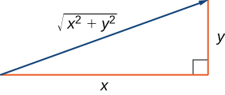{: #CNX_Calc_Figure_12_01_015}

We have defined scalar multiplication and vector addition geometrically. Expressing vectors in component form allows us to perform these same operations algebraically.

Definition

Let <math xmlns="http://www.w3.org/1998/Math/MathML"><mrow><mstyle mathvariant="bold" mathsize="normal"><mtext>v</mtext></mstyle><mo>=</mo><mrow><mo>〈</mo><mrow><msub><mi>x</mi><mn>1</mn></msub><mo>,</mo><msub><mi>y</mi><mn>1</mn></msub></mrow><mo>〉</mo></mrow></mrow></math>

 and <math xmlns="http://www.w3.org/1998/Math/MathML"><mrow><mstyle mathvariant="bold" mathsize="normal"><mtext>w</mtext></mstyle><mo>=</mo><mrow><mo>〈</mo><mrow><msub><mi>x</mi><mn>2</mn></msub><mo>,</mo><msub><mi>y</mi><mn>2</mn></msub></mrow><mo>〉</mo></mrow></mrow></math>

 be vectors, and let <math xmlns="http://www.w3.org/1998/Math/MathML"><mi>k</mi></math>

 be a scalar.

**Scalar multiplication:**<math xmlns="http://www.w3.org/1998/Math/MathML"><mrow><mi>k</mi><mstyle mathvariant="bold" mathsize="normal"><mtext>v</mtext></mstyle><mo>=</mo><mrow><mo>〈</mo><mrow><mi>k</mi><msub><mi>x</mi><mn>1</mn></msub><mo>,</mo><mi>k</mi><msub><mi>y</mi><mn>1</mn></msub></mrow><mo>〉</mo></mrow></mrow></math>

**Vector addition:**<math xmlns="http://www.w3.org/1998/Math/MathML"><mrow><mstyle mathvariant="bold" mathsize="normal"><mtext>v</mtext></mstyle><mo>+</mo><mstyle mathvariant="bold" mathsize="normal"><mtext>w</mtext></mstyle><mo>=</mo><mrow><mo>〈</mo><mrow><msub><mi>x</mi><mn>1</mn></msub><mo>,</mo><msub><mi>y</mi><mn>1</mn></msub></mrow><mo>〉</mo></mrow><mo>+</mo><mrow><mo>〈</mo><mrow><msub><mi>x</mi><mn>2</mn></msub><mo>,</mo><msub><mi>y</mi><mn>2</mn></msub></mrow><mo>〉</mo></mrow><mo>=</mo><mrow><mo>〈</mo><mrow><msub><mi>x</mi><mn>1</mn></msub><mo>+</mo><msub><mi>x</mi><mn>2</mn></msub><mo>,</mo><msub><mi>y</mi><mn>1</mn></msub><mo>+</mo><msub><mi>y</mi><mn>2</mn></msub></mrow><mo>〉</mo></mrow></mrow></math>

Performing Operations in Component Form

Let <math xmlns="http://www.w3.org/1998/Math/MathML"><mstyle mathvariant="bold" mathsize="normal"><mtext>v</mtext></mstyle></math>

 be the vector with initial point <math xmlns="http://www.w3.org/1998/Math/MathML"><mrow><mrow><mo>(</mo><mrow><mn>2</mn><mo>,</mo><mn>5</mn></mrow><mo>)</mo></mrow></mrow></math>

 and terminal point <math xmlns="http://www.w3.org/1998/Math/MathML"><mrow><mrow><mo>(</mo><mrow><mn>8</mn><mo>,</mo><mn>13</mn></mrow><mo>)</mo></mrow><mo>,</mo></mrow></math>

 and let <math xmlns="http://www.w3.org/1998/Math/MathML"><mrow><mstyle mathvariant="bold" mathsize="normal"><mtext>w</mtext></mstyle><mo>=</mo><mrow><mo>〈</mo><mrow><mn>−2</mn><mo>,</mo><mn>4</mn></mrow><mo>〉</mo></mrow><mo>.</mo></mrow></math>

1.  Express
    <math xmlns="http://www.w3.org/1998/Math/MathML"><mstyle mathvariant="bold" mathsize="normal"><mtext>v</mtext></mstyle></math>
    
    in component form and find
    <math xmlns="http://www.w3.org/1998/Math/MathML"><mrow><mrow><mo>‖</mo><mstyle mathvariant="bold" mathsize="normal"><mtext>v</mtext></mstyle><mo>‖</mo></mrow><mo>.</mo></mrow></math>
    
    Then, using algebra, find
2.  <math xmlns="http://www.w3.org/1998/Math/MathML"><mrow><mstyle mathvariant="bold" mathsize="normal"><mtext>v</mtext></mstyle><mo>+</mo><mstyle mathvariant="bold" mathsize="normal"><mtext>w</mtext></mstyle><mo>,</mo></mrow></math>

3.  <math xmlns="http://www.w3.org/1998/Math/MathML"><mrow><mn>3</mn><mstyle mathvariant="bold" mathsize="normal"><mtext>v</mtext></mstyle><mo>,</mo></mrow></math>
    
    and
4.  <math xmlns="http://www.w3.org/1998/Math/MathML"><mrow><mstyle mathvariant="bold" mathsize="normal"><mtext>v</mtext></mstyle><mo>−</mo><mn>2</mn><mstyle mathvariant="bold" mathsize="normal"><mtext>w</mtext></mstyle><mo>.</mo></mrow></math>
{: data-number-style="lower-alpha"}

1.  To place the initial point of
    <math xmlns="http://www.w3.org/1998/Math/MathML"><mstyle mathvariant="bold" mathsize="normal"><mtext>v</mtext></mstyle></math>
    
    at the origin, we must translate the vector
    <math xmlns="http://www.w3.org/1998/Math/MathML"><mn>2</mn></math>
    
    units to the left and
    <math xmlns="http://www.w3.org/1998/Math/MathML"><mn>5</mn></math>
    
    units down ([[link]](#CNX_Calc_Figure_12_01_017)). Using the algebraic method, we can express
    <math xmlns="http://www.w3.org/1998/Math/MathML"><mstyle mathvariant="bold" mathsize="normal"><mtext>v</mtext></mstyle></math>
    
    as
    <math xmlns="http://www.w3.org/1998/Math/MathML"><mrow><mstyle mathvariant="bold" mathsize="normal"><mtext>v</mtext></mstyle><mo>=</mo><mrow><mo>〈</mo><mrow><mn>8</mn><mo>−</mo><mn>2</mn><mo>,</mo><mn>13</mn><mo>−</mo><mn>5</mn></mrow><mo>〉</mo></mrow><mo>=</mo><mrow><mo>〈</mo><mrow><mn>6</mn><mo>,</mo><mn>8</mn></mrow><mo>〉</mo></mrow><mtext>:</mtext></mrow></math>
    
    * * *
    {: data-type="newline"}
    
    

    <math xmlns="http://www.w3.org/1998/Math/MathML"><mrow><mrow><mo>‖</mo><mstyle mathvariant="bold" mathsize="normal"><mtext>v</mtext></mstyle><mo>‖</mo></mrow><mo>=</mo><msqrt><mrow><msup><mn>6</mn><mn>2</mn></msup><mo>+</mo><msup><mn>8</mn><mn>2</mn></msup></mrow></msqrt><mo>=</mo><msqrt><mrow><mn>36</mn><mo>+</mo><mn>64</mn></mrow></msqrt><mo>=</mo><msqrt><mrow><mn>100</mn></mrow></msqrt><mo>=</mo><mn>10</mn><mo>.</mo></mrow></math>
    

    
    * * *
    {: data-type="newline"}
    
    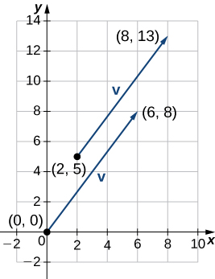{: #CNX_Calc_Figure_12_01_016}

2.  To find
    <math xmlns="http://www.w3.org/1998/Math/MathML"><mrow><mstyle mathvariant="bold" mathsize="normal"><mtext>v</mtext></mstyle><mo>+</mo><mstyle mathvariant="bold" mathsize="normal"><mtext>w</mtext></mstyle><mo>,</mo></mrow></math>
    
    add the *x*-components and the *y*-components separately:
    * * *
    {: data-type="newline"}
    
    

    <math xmlns="http://www.w3.org/1998/Math/MathML"><mrow><mstyle mathvariant="bold" mathsize="normal"><mtext>v</mtext></mstyle><mo>+</mo><mstyle mathvariant="bold" mathsize="normal"><mtext>w</mtext></mstyle><mo>=</mo><mrow><mo>〈</mo><mrow><mn>6</mn><mo>,</mo><mn>8</mn></mrow><mo>〉</mo></mrow><mo>+</mo><mrow><mo>〈</mo><mrow><mn>−2</mn><mo>,</mo><mn>4</mn></mrow><mo>〉</mo></mrow><mo>=</mo><mrow><mo>〈</mo><mrow><mn>4</mn><mo>,</mo><mn>12</mn></mrow><mo>〉</mo></mrow><mo>.</mo></mrow></math>
    

3.  To find
    <math xmlns="http://www.w3.org/1998/Math/MathML"><mrow><mn>3</mn><mstyle mathvariant="bold" mathsize="normal"><mtext>v</mtext></mstyle><mo>,</mo></mrow></math>
    
    multiply
    <math xmlns="http://www.w3.org/1998/Math/MathML"><mstyle mathvariant="bold" mathsize="normal"><mtext>v</mtext></mstyle></math>
    
    by the scalar
    <math xmlns="http://www.w3.org/1998/Math/MathML"><mrow><mi>k</mi><mo>=</mo><mn>3</mn><mtext>:</mtext></mrow></math>
    
    * * *
    {: data-type="newline"}
    
    

    <math xmlns="http://www.w3.org/1998/Math/MathML"><mrow><mn>3</mn><mstyle mathvariant="bold" mathsize="normal"><mtext>v</mtext></mstyle><mo>=</mo><mn>3</mn><mo>·</mo><mrow><mo>〈</mo><mrow><mn>6</mn><mo>,</mo><mn>8</mn></mrow><mo>〉</mo></mrow><mo>=</mo><mrow><mo>〈</mo><mrow><mn>3</mn><mo>·</mo><mn>6</mn><mo>,</mo><mn>3</mn><mo>·</mo><mn>8</mn></mrow><mo>〉</mo></mrow><mo>=</mo><mrow><mo>〈</mo><mrow><mn>18</mn><mo>,</mo><mn>24</mn></mrow><mo>〉</mo></mrow><mo>.</mo></mrow></math>
    

4.  To find
    <math xmlns="http://www.w3.org/1998/Math/MathML"><mrow><mstyle mathvariant="bold" mathsize="normal"><mtext>v</mtext></mstyle><mo>−</mo><mn>2</mn><mstyle mathvariant="bold" mathsize="normal"><mtext>w</mtext></mstyle><mo>,</mo></mrow></math>
    
    find
    <math xmlns="http://www.w3.org/1998/Math/MathML"><mrow><mn>−2</mn><mstyle mathvariant="bold" mathsize="normal"><mtext>w</mtext></mstyle></mrow></math>
    
    and add it to
    <math xmlns="http://www.w3.org/1998/Math/MathML"><mrow><mstyle mathvariant="bold" mathsize="normal"><mtext>v</mtext></mstyle><mtext>:</mtext></mrow></math>
    
    * * *
    {: data-type="newline"}
    
    

    <math xmlns="http://www.w3.org/1998/Math/MathML"><mrow><mstyle mathvariant="bold" mathsize="normal"><mtext>v</mtext></mstyle><mo>−</mo><mn>2</mn><mstyle mathvariant="bold" mathsize="normal"><mtext>w</mtext></mstyle><mo>=</mo><mrow><mo>〈</mo><mrow><mn>6</mn><mo>,</mo><mn>8</mn></mrow><mo>〉</mo></mrow><mo>−</mo><mn>2</mn><mo>·</mo><mrow><mo>〈</mo><mrow><mn>−2</mn><mo>,</mo><mn>4</mn></mrow><mo>〉</mo></mrow><mo>=</mo><mrow><mo>〈</mo><mrow><mn>6</mn><mo>,</mo><mn>8</mn></mrow><mo>〉</mo></mrow><mo>+</mo><mrow><mo>〈</mo><mrow><mn>4</mn><mo>,</mo><mn>−8</mn></mrow><mo>〉</mo></mrow><mo>=</mo><mrow><mo>〈</mo><mrow><mn>10</mn><mo>,</mo><mn>0</mn></mrow><mo>〉</mo></mrow><mo>.</mo></mrow></math>
    

{: data-number-style="lower-alpha"}

Let <math xmlns="http://www.w3.org/1998/Math/MathML"><mrow><mstyle mathvariant="bold" mathsize="normal"><mtext>a</mtext></mstyle><mo>=</mo><mrow><mo>〈</mo><mrow><mn>7</mn><mo>,</mo><mn>1</mn></mrow><mo>〉</mo></mrow></mrow></math>

 and let <math xmlns="http://www.w3.org/1998/Math/MathML"><mstyle mathvariant="bold" mathsize="normal"><mtext>b</mtext></mstyle></math>

 be the vector with initial point <math xmlns="http://www.w3.org/1998/Math/MathML"><mrow><mrow><mo>(</mo><mrow><mn>3</mn><mo>,</mo><mn>2</mn></mrow><mo>)</mo></mrow></mrow></math>

 and terminal point <math xmlns="http://www.w3.org/1998/Math/MathML"><mrow><mrow><mo>(</mo><mrow><mn>−1</mn><mo>,</mo><mn>−1</mn></mrow><mo>)</mo></mrow><mo>.</mo></mrow></math>

1.  Find
    <math xmlns="http://www.w3.org/1998/Math/MathML"><mrow><mrow><mo>‖</mo><mstyle mathvariant="bold" mathsize="normal"><mtext>a</mtext></mstyle><mo>‖</mo></mrow><mo>.</mo></mrow></math>

2.  Express
    <math xmlns="http://www.w3.org/1998/Math/MathML"><mstyle mathvariant="bold" mathsize="normal"><mtext>b</mtext></mstyle></math>
    
    in component form.
3.  Find
    <math xmlns="http://www.w3.org/1998/Math/MathML"><mrow><mn>3</mn><mstyle mathvariant="bold" mathsize="normal"><mtext>a</mtext></mstyle><mo>−</mo><mn>4</mn><mstyle mathvariant="bold" mathsize="normal"><mtext>b</mtext></mstyle><mo>.</mo></mrow></math>
{: data-number-style="lower-alpha"}

a. <math xmlns="http://www.w3.org/1998/Math/MathML"><mrow><mrow><mo>‖</mo><mstyle mathvariant="bold" mathsize="normal"><mtext>a</mtext></mstyle><mo>‖</mo></mrow><mo>=</mo><mn>5</mn><msqrt><mn>2</mn></msqrt><mo>,</mo></mrow></math>

 b. <math xmlns="http://www.w3.org/1998/Math/MathML"><mrow><mstyle mathvariant="bold" mathsize="normal"><mtext>b</mtext></mstyle><mo>=</mo><mrow><mo>〈</mo><mrow><mn>−4</mn><mo>,</mo><mn>−3</mn></mrow><mo>〉</mo></mrow><mo>,</mo></mrow></math>

 c. <math xmlns="http://www.w3.org/1998/Math/MathML"><mrow><mn>3</mn><mstyle mathvariant="bold" mathsize="normal"><mtext>a</mtext></mstyle><mo>−</mo><mn>4</mn><mstyle mathvariant="bold" mathsize="normal"><mtext>b</mtext></mstyle><mo>=</mo><mrow><mo>〈</mo><mrow><mn>37</mn><mo>,</mo><mn>15</mn></mrow><mo>〉</mo></mrow></mrow></math>

Hint

Use the Pythagorean Theorem to find <math xmlns="http://www.w3.org/1998/Math/MathML"><mrow><mrow><mo>‖</mo><mstyle mathvariant="bold" mathsize="normal"><mtext>a</mtext></mstyle><mo>‖</mo></mrow><mo>.</mo></mrow></math>

 To find <math xmlns="http://www.w3.org/1998/Math/MathML"><mrow><mn>3</mn><mstyle mathvariant="bold" mathsize="normal"><mtext>a</mtext></mstyle><mo>−</mo><mn>4</mn><mstyle mathvariant="bold" mathsize="normal"><mtext>b</mtext></mstyle><mo>,</mo></mrow></math>

 start by finding the scalar multiples <math xmlns="http://www.w3.org/1998/Math/MathML"><mrow><mn>3</mn><mstyle mathvariant="bold" mathsize="normal"><mtext>a</mtext></mstyle></mrow></math>

 and <math xmlns="http://www.w3.org/1998/Math/MathML"><mrow><mn>−4</mn><mstyle mathvariant="bold" mathsize="normal"><mtext>b</mtext></mstyle><mo>.</mo></mrow></math>

Now that we have established the basic rules of vector arithmetic, we can state the properties of vector operations. We will prove two of these properties. The others can be proved in a similar manner.

Properties of Vector Operations

Let <math xmlns="http://www.w3.org/1998/Math/MathML"><mrow><mstyle mathvariant="bold" mathsize="normal"><mtext>u</mtext></mstyle><mo>,</mo><mstyle mathvariant="bold" mathsize="normal"><mtext>v</mtext></mstyle><mo>,</mo><mspace width="0.2em" /><mtext>and</mtext><mspace width="0.2em" /><mstyle mathvariant="bold" mathsize="normal"><mtext>w</mtext></mstyle></mrow></math>

 be vectors in a plane. Let <math xmlns="http://www.w3.org/1998/Math/MathML"><mrow><mtext>r and s</mtext></mrow></math>

 be scalars.

<math xmlns="http://www.w3.org/1998/Math/MathML"><mtable><mtr><mtd columnalign="left"><mtext>i.</mtext></mtd><mtd /><mtd /><mtd columnalign="right"><mrow><mstyle mathvariant="bold" mathsize="normal"><mtext>u</mtext></mstyle><mo>+</mo><mstyle mathvariant="bold" mathsize="normal"><mtext>v</mtext></mstyle></mrow></mtd><mtd columnalign="left"><mo>=</mo></mtd><mtd columnalign="left"><mstyle mathvariant="bold" mathsize="normal"><mtext>v</mtext></mstyle><mo>+</mo><mstyle mathvariant="bold" mathsize="normal"><mtext>u</mtext></mstyle></mtd><mtd /><mtd /><mtd columnalign="left"><mtext>Commutative property</mtext></mtd></mtr><mtr><mtd columnalign="left"><mtext>ii.</mtext></mtd><mtd /><mtd /><mtd columnalign="right"><mrow><mrow><mo>(</mo><mrow><mstyle mathvariant="bold" mathsize="normal"><mtext>u</mtext></mstyle><mo>+</mo><mstyle mathvariant="bold" mathsize="normal"><mtext>v</mtext></mstyle></mrow><mo>)</mo></mrow><mo>+</mo><mstyle mathvariant="bold" mathsize="normal"><mtext>w</mtext></mstyle></mrow></mtd><mtd columnalign="left"><mo>=</mo></mtd><mtd columnalign="left"><mstyle mathvariant="bold" mathsize="normal"><mtext>u</mtext></mstyle><mo>+</mo><mrow><mo>(</mo><mrow><mstyle mathvariant="bold" mathsize="normal"><mtext>v</mtext></mstyle><mo>+</mo><mstyle mathvariant="bold" mathsize="normal"><mtext>w</mtext></mstyle></mrow><mo>)</mo></mrow></mtd><mtd /><mtd /><mtd columnalign="left"><mtext>Associative property</mtext></mtd></mtr><mtr><mtd columnalign="left"><mtext>iii.</mtext></mtd><mtd /><mtd /><mtd columnalign="right"><mrow><mstyle mathvariant="bold" mathsize="normal"><mtext>u</mtext></mstyle><mo>+</mo><mn>0</mn></mrow></mtd><mtd columnalign="left"><mo>=</mo></mtd><mtd columnalign="left"><mstyle mathvariant="bold" mathsize="normal"><mtext>u</mtext></mstyle></mtd><mtd /><mtd /><mtd columnalign="left"><mtext>Additive identity property</mtext></mtd></mtr><mtr><mtd columnalign="left"><mtext>iv.</mtext></mtd><mtd /><mtd /><mtd columnalign="right"><mrow><mstyle mathvariant="bold" mathsize="normal"><mtext>u</mtext></mstyle><mo>+</mo><mrow><mo>(</mo><mrow><mtext>−</mtext><mstyle mathvariant="bold" mathsize="normal"><mtext>u</mtext></mstyle></mrow><mo>)</mo></mrow></mrow></mtd><mtd columnalign="left"><mo>=</mo></mtd><mtd columnalign="left"><mn>0</mn></mtd><mtd /><mtd /><mtd columnalign="left"><mtext>Additive inverse property</mtext></mtd></mtr><mtr><mtd columnalign="left"><mtext>v.</mtext></mtd><mtd /><mtd /><mtd columnalign="right"><mrow><mi>r</mi><mrow><mo>(</mo><mrow><mi>s</mi><mstyle mathvariant="bold" mathsize="normal"><mtext>u</mtext></mstyle></mrow><mo>)</mo></mrow></mrow></mtd><mtd columnalign="left"><mo>=</mo></mtd><mtd columnalign="left"><mrow><mo>(</mo><mrow><mi>r</mi><mi>s</mi></mrow><mo>)</mo></mrow><mstyle mathvariant="bold" mathsize="normal"><mtext>u</mtext></mstyle></mtd><mtd /><mtd /><mtd columnalign="left"><mtext>Associativity of scalar multiplication</mtext></mtd></mtr><mtr><mtd columnalign="left"><mtext>vi.</mtext></mtd><mtd /><mtd /><mtd columnalign="right"><mrow><mrow><mo>(</mo><mrow><mi>r</mi><mo>+</mo><mi>s</mi></mrow><mo>)</mo></mrow><mstyle mathvariant="bold" mathsize="normal"><mtext>u</mtext></mstyle></mrow></mtd><mtd columnalign="left"><mo>=</mo></mtd><mtd columnalign="left"><mi>r</mi><mstyle mathvariant="bold" mathsize="normal"><mtext>u</mtext></mstyle><mo>+</mo><mi>s</mi><mstyle mathvariant="bold" mathsize="normal"><mtext>u</mtext></mstyle></mtd><mtd /><mtd /><mtd columnalign="left"><mtext>Distributive property</mtext></mtd></mtr><mtr><mtd columnalign="left"><mtext>vii.</mtext></mtd><mtd /><mtd /><mtd columnalign="right"><mrow><mi>r</mi><mrow><mo>(</mo><mrow><mstyle mathvariant="bold" mathsize="normal"><mtext>u</mtext></mstyle><mo>+</mo><mstyle mathvariant="bold" mathsize="normal"><mtext>v</mtext></mstyle></mrow><mo>)</mo></mrow></mrow></mtd><mtd columnalign="left"><mo>=</mo></mtd><mtd columnalign="left"><mi>r</mi><mstyle mathvariant="bold" mathsize="normal"><mtext>u</mtext></mstyle><mo>+</mo><mi>r</mi><mstyle mathvariant="bold" mathsize="normal"><mtext>v</mtext></mstyle></mtd><mtd /><mtd /><mtd columnalign="left"><mtext>Distributive property</mtext></mtd></mtr><mtr><mtd columnalign="left"><mtext>viii.</mtext></mtd><mtd /><mtd /><mtd columnalign="right"><mrow><mn>1</mn><mstyle mathvariant="bold" mathsize="normal"><mtext>u</mtext></mstyle></mrow></mtd><mtd columnalign="left"><mo>=</mo></mtd><mtd columnalign="left"><mstyle mathvariant="bold" mathsize="normal"><mtext>u</mtext></mstyle><mo>,</mo><mn>0</mn><mstyle mathvariant="bold" mathsize="normal"><mtext>u</mtext></mstyle><mo>=</mo><mn>0</mn></mtd><mtd /><mtd /><mtd columnalign="left"><mtext>Identity and zero properties</mtext></mtd></mtr></mtable></math>

#### Proof of Commutative Property

Let <math xmlns="http://www.w3.org/1998/Math/MathML"><mrow><mstyle mathvariant="bold" mathsize="normal"><mtext>u</mtext></mstyle><mo>=</mo><mrow><mo>〈</mo><mrow><msub><mi>x</mi><mn>1</mn></msub><mo>,</mo><msub><mi>y</mi><mn>1</mn></msub></mrow><mo>〉</mo></mrow></mrow></math>

 and <math xmlns="http://www.w3.org/1998/Math/MathML"><mrow><mstyle mathvariant="bold" mathsize="normal"><mtext>v</mtext></mstyle><mo>=</mo><mrow><mo>〈</mo><mrow><msub><mi>x</mi><mn>2</mn></msub><mo>,</mo><msub><mi>y</mi><mn>2</mn></msub></mrow><mo>〉</mo></mrow><mo>.</mo></mrow></math>

 Apply the commutative property for real numbers:

<math xmlns="http://www.w3.org/1998/Math/MathML"><mrow><mstyle mathvariant="bold" mathsize="normal"><mtext>u</mtext></mstyle><mo>+</mo><mstyle mathvariant="bold" mathsize="normal"><mtext>v</mtext></mstyle><mo>=</mo><mrow><mo>〈</mo><mrow><msub><mi>x</mi><mn>1</mn></msub><mo>+</mo><msub><mi>x</mi><mn>2</mn></msub><mo>,</mo><msub><mi>y</mi><mn>1</mn></msub><mo>+</mo><msub><mi>y</mi><mn>2</mn></msub></mrow><mo>〉</mo></mrow><mo>=</mo><mrow><mo>〈</mo><mrow><msub><mi>x</mi><mn>2</mn></msub><mo>+</mo><msub><mi>x</mi><mn>1</mn></msub><mo>,</mo><msub><mi>y</mi><mn>2</mn></msub><mo>+</mo><msub><mi>y</mi><mn>1</mn></msub></mrow><mo>〉</mo></mrow><mo>=</mo><mstyle mathvariant="bold" mathsize="normal"><mtext>v</mtext></mstyle><mo>+</mo><mstyle mathvariant="bold" mathsize="normal"><mtext>u</mtext></mstyle><mo>.</mo></mrow></math>

□

#### Proof of Distributive Property

Apply the distributive property for real numbers:

<math xmlns="http://www.w3.org/1998/Math/MathML"><mtable><mtr><mtd columnalign="right"><mi>r</mi><mrow><mo>(</mo><mrow><mstyle mathvariant="bold" mathsize="normal"><mtext>u</mtext></mstyle><mo>+</mo><mstyle mathvariant="bold" mathsize="normal"><mtext>v</mtext></mstyle></mrow><mo>)</mo></mrow></mtd><mtd columnalign="left"><mo>=</mo><mi>r</mi><mo>·</mo><mrow><mo>〈</mo><mrow><msub><mi>x</mi><mn>1</mn></msub><mo>+</mo><msub><mi>x</mi><mn>2</mn></msub><mo>,</mo><msub><mi>y</mi><mn>1</mn></msub><mo>+</mo><msub><mi>y</mi><mn>2</mn></msub></mrow><mo>〉</mo></mrow></mtd></mtr><mtr><mtd /><mtd columnalign="left"><mo>=</mo><mrow><mo>〈</mo><mrow><mi>r</mi><mrow><mo>(</mo><mrow><msub><mi>x</mi><mn>1</mn></msub><mo>+</mo><msub><mi>x</mi><mn>2</mn></msub></mrow><mo>)</mo></mrow><mo>,</mo><mi>r</mi><mrow><mo>(</mo><mrow><msub><mi>y</mi><mn>1</mn></msub><mo>+</mo><msub><mi>y</mi><mn>2</mn></msub></mrow><mo>)</mo></mrow></mrow><mo>〉</mo></mrow></mtd></mtr><mtr><mtd /><mtd columnalign="left"><mo>=</mo><mrow><mo>〈</mo><mrow><mi>r</mi><msub><mi>x</mi><mn>1</mn></msub><mo>+</mo><mi>r</mi><msub><mi>x</mi><mn>2</mn></msub><mo>,</mo><mi>r</mi><msub><mi>y</mi><mn>1</mn></msub><mo>+</mo><mi>r</mi><msub><mi>y</mi><mn>2</mn></msub></mrow><mo>〉</mo></mrow></mtd></mtr><mtr><mtd /><mtd columnalign="left"><mo>=</mo><mrow><mo>〈</mo><mrow><mi>r</mi><msub><mi>x</mi><mn>1</mn></msub><mo>,</mo><mi>r</mi><msub><mi>y</mi><mn>1</mn></msub></mrow><mo>〉</mo></mrow><mo>+</mo><mrow><mo>〈</mo><mrow><mi>r</mi><msub><mi>x</mi><mn>2</mn></msub><mo>,</mo><mi>r</mi><msub><mi>y</mi><mn>2</mn></msub></mrow><mo>〉</mo></mrow></mtd></mtr><mtr><mtd /><mtd columnalign="left"><mo>=</mo><mi>r</mi><mstyle mathvariant="bold" mathsize="normal"><mtext>u</mtext></mstyle><mo>+</mo><mi>r</mi><mstyle mathvariant="bold" mathsize="normal"><mtext>v</mtext></mstyle><mo>.</mo></mtd></mtr></mtable></math>

□

Prove the additive inverse property.

Hint

Use the component form of the vectors.

We have found the components of a vector given its initial and terminal points. In some cases, we may only have the magnitude and direction of a vector, not the points. For these vectors, we can identify the horizontal and vertical components using trigonometry ([\[link\]](#CNX_Calc_Figure_12_01_017)).

 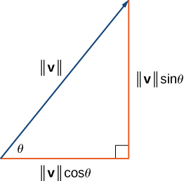{: #CNX_Calc_Figure_12_01_017}

Consider the angle <math xmlns="http://www.w3.org/1998/Math/MathML"><mi>θ</mi></math>

 formed by the vector **v** and the positive *x*-axis. We can see from the triangle that the components of vector <math xmlns="http://www.w3.org/1998/Math/MathML"><mstyle mathvariant="bold" mathsize="normal"><mtext>v</mtext></mstyle></math>

 are <math xmlns="http://www.w3.org/1998/Math/MathML"><mrow><mrow><mo>〈</mo><mrow><mrow><mo>‖</mo><mstyle mathvariant="bold" mathsize="normal"><mtext>v</mtext></mstyle><mo>‖</mo></mrow><mtext>cos</mtext><mspace width="0.2em" /><mi>θ</mi><mo>,</mo><mrow><mo>‖</mo><mstyle mathvariant="bold" mathsize="normal"><mtext>v</mtext></mstyle><mo>‖</mo></mrow><mtext>sin</mtext><mspace width="0.2em" /><mi>θ</mi></mrow><mo>〉</mo></mrow><mo>.</mo></mrow></math>

 Therefore, given an angle and the magnitude of a vector, we can use the cosine and sine of the angle to find the components of the vector.

Finding the Component Form of a Vector Using Trigonometry

Find the component form of a vector with magnitude 4 that forms an angle of <math xmlns="http://www.w3.org/1998/Math/MathML"><mrow><mn>−45</mn><mtext>°</mtext></mrow></math>

 with the *x*-axis.

Let <math xmlns="http://www.w3.org/1998/Math/MathML"><mi>x</mi></math>

 and <math xmlns="http://www.w3.org/1998/Math/MathML"><mi>y</mi></math>

 represent the components of the vector ([[link]](#CNX_Calc_Figure_12_01_018)). Then <math xmlns="http://www.w3.org/1998/Math/MathML"><mrow><mi>x</mi><mo>=</mo><mn>4</mn><mspace width="0.2em" /><mtext>cos</mtext><mrow><mo>(</mo><mrow><mn>−45</mn><mtext>°</mtext></mrow><mo>)</mo></mrow><mo>=</mo><mn>2</mn><msqrt><mn>2</mn></msqrt></mrow></math>

 and <math xmlns="http://www.w3.org/1998/Math/MathML"><mrow><mi>y</mi><mo>=</mo><mn>4</mn><mspace width="0.2em" /><mtext>sin</mtext><mrow><mo>(</mo><mrow><mn>−45</mn><mtext>°</mtext></mrow><mo>)</mo></mrow><mo>=</mo><mn>−2</mn><msqrt><mn>2</mn></msqrt><mo>.</mo></mrow></math>

 The component form of the vector is <math xmlns="http://www.w3.org/1998/Math/MathML"><mrow><mrow><mo>〈</mo><mrow><mn>2</mn><msqrt><mn>2</mn></msqrt><mo>,</mo><mn>−2</mn><msqrt><mn>2</mn></msqrt></mrow><mo>〉</mo></mrow><mo>.</mo></mrow></math>

{: #CNX_Calc_Figure_12_01_018}

Find the component form of vector <math xmlns="http://www.w3.org/1998/Math/MathML"><mstyle mathvariant="bold" mathsize="normal"><mtext>v</mtext></mstyle></math>

 with magnitude <math xmlns="http://www.w3.org/1998/Math/MathML"><mrow><mn>10</mn></mrow></math>

 that forms an angle of <math xmlns="http://www.w3.org/1998/Math/MathML"><mrow><mn>120</mn><mtext>°</mtext></mrow></math>

 with the positive *x*-axis.

<math xmlns="http://www.w3.org/1998/Math/MathML"><mrow><mstyle mathvariant="bold" mathsize="normal"><mtext>v</mtext></mstyle><mo>=</mo><mrow><mo>〈</mo><mrow><mn>−5</mn><mo>,</mo><mn>5</mn><msqrt><mn>3</mn></msqrt></mrow><mo>〉</mo></mrow></mrow></math>

Hint

<math xmlns="http://www.w3.org/1998/Math/MathML"><mrow><mi>x</mi><mo>=</mo><mrow><mo>‖</mo><mstyle mathvariant="bold" mathsize="normal"><mtext>v</mtext></mstyle><mo>‖</mo></mrow><mtext>cos</mtext><mspace width="0.2em" /><mi>θ</mi></mrow></math>

 and <math xmlns="http://www.w3.org/1998/Math/MathML"><mrow><mi>y</mi><mo>=</mo><mrow><mo>‖</mo><mstyle mathvariant="bold" mathsize="normal"><mtext>v</mtext></mstyle><mo>‖</mo></mrow><mtext>sin</mtext><mspace width="0.2em" /><mi>θ</mi></mrow></math>

### Unit Vectors

A **unit vector**{: data-type="term"} is a vector with magnitude <math xmlns="http://www.w3.org/1998/Math/MathML"><mrow><mn>1</mn><mo>.</mo></mrow></math>

 For any nonzero vector <math xmlns="http://www.w3.org/1998/Math/MathML"><mrow><mstyle mathvariant="bold" mathsize="normal"><mtext>v</mtext></mstyle><mo>,</mo></mrow></math>

 we can use scalar multiplication to find a unit vector <math xmlns="http://www.w3.org/1998/Math/MathML"><mstyle mathvariant="bold" mathsize="normal"><mtext>u</mtext></mstyle></math>

 that has the same direction as <math xmlns="http://www.w3.org/1998/Math/MathML"><mrow><mstyle mathvariant="bold" mathsize="normal"><mtext>v</mtext></mstyle><mo>.</mo></mrow></math>

 To do this, we multiply the vector by the reciprocal of its magnitude:

<math xmlns="http://www.w3.org/1998/Math/MathML"><mrow><mstyle mathvariant="bold" mathsize="normal"><mtext>u</mtext></mstyle><mo>=</mo><mfrac><mn>1</mn><mrow><mrow><mo>‖</mo><mstyle mathvariant="bold" mathsize="normal"><mtext>v</mtext></mstyle><mo>‖</mo></mrow></mrow></mfrac><mstyle mathvariant="bold" mathsize="normal"><mtext>v</mtext></mstyle><mo>.</mo></mrow></math>

Recall that when we defined scalar multiplication, we noted that <math xmlns="http://www.w3.org/1998/Math/MathML"><mrow><mrow><mo>‖</mo><mrow><mi>k</mi><mstyle mathvariant="bold" mathsize="normal"><mtext>v</mtext></mstyle></mrow><mo>‖</mo></mrow><mo>=</mo><mrow><mo>\|</mo><mi>k</mi><mo>\|</mo></mrow><mo>·</mo><mrow><mo>‖</mo><mstyle mathvariant="bold" mathsize="normal"><mtext>v</mtext></mstyle><mo>‖</mo></mrow><mo>.</mo></mrow></math>

 For <math xmlns="http://www.w3.org/1998/Math/MathML"><mrow><mstyle mathvariant="bold" mathsize="normal"><mtext>u</mtext></mstyle><mo>=</mo><mfrac><mn>1</mn><mrow><mrow><mo>‖</mo><mstyle mathvariant="bold" mathsize="normal"><mtext>v</mtext></mstyle><mo>‖</mo></mrow></mrow></mfrac><mstyle mathvariant="bold" mathsize="normal"><mtext>v</mtext></mstyle><mo>,</mo></mrow></math>

 it follows that <math xmlns="http://www.w3.org/1998/Math/MathML"><mrow><mrow><mo>‖</mo><mstyle mathvariant="bold" mathsize="normal"><mtext>u</mtext></mstyle><mo>‖</mo></mrow><mo>=</mo><mfrac><mn>1</mn><mrow><mrow><mo>‖</mo><mstyle mathvariant="bold" mathsize="normal"><mtext>v</mtext></mstyle><mo>‖</mo></mrow></mrow></mfrac><mrow><mo>(</mo><mrow><mrow><mo>‖</mo><mstyle mathvariant="bold" mathsize="normal"><mtext>v</mtext></mstyle><mo>‖</mo></mrow></mrow><mo>)</mo></mrow><mo>=</mo><mn>1</mn><mo>.</mo></mrow></math>

 We say that <math xmlns="http://www.w3.org/1998/Math/MathML"><mstyle mathvariant="bold" mathsize="normal"><mtext>u</mtext></mstyle></math>

 is the *unit vector in the direction of*<math xmlns="http://www.w3.org/1998/Math/MathML"><mstyle mathvariant="bold" mathsize="normal"><mtext>v</mtext></mstyle></math>

 ([\[link\]](#CNX_Calc_Figure_12_01_022)). The process of using scalar multiplication to find a unit vector with a given direction is called **normalization**{: data-type="term"}.

 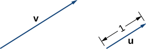{: #CNX_Calc_Figure_12_01_022}

Finding a Unit Vector

Let <math xmlns="http://www.w3.org/1998/Math/MathML"><mrow><mstyle mathvariant="bold" mathsize="normal"><mtext>v</mtext></mstyle><mo>=</mo><mrow><mo>〈</mo><mrow><mn>1</mn><mo>,</mo><mn>2</mn></mrow><mo>〉</mo></mrow><mo>.</mo></mrow></math>

1.  Find a unit vector with the same direction as
    <math xmlns="http://www.w3.org/1998/Math/MathML"><mstyle mathvariant="bold" mathsize="normal"><mtext>v</mtext></mstyle><mo>.</mo></math>

2.  Find a vector
    <math xmlns="http://www.w3.org/1998/Math/MathML"><mstyle mathvariant="bold" mathsize="normal"><mtext>w</mtext></mstyle></math>
    
    with the same direction as
    <math xmlns="http://www.w3.org/1998/Math/MathML"><mstyle mathvariant="bold" mathsize="normal"><mtext>v</mtext></mstyle></math>
    
    such that
    <math xmlns="http://www.w3.org/1998/Math/MathML"><mrow><mrow><mo>‖</mo><mstyle mathvariant="bold" mathsize="normal"><mtext>w</mtext></mstyle><mo>‖</mo></mrow><mo>=</mo><mn>7</mn><mo>.</mo></mrow></math>
{: data-number-style="lower-alpha"}

1.  First, find the magnitude of
    <math xmlns="http://www.w3.org/1998/Math/MathML"><mrow><mstyle mathvariant="bold" mathsize="normal"><mtext>v</mtext></mstyle><mo>,</mo></mrow></math>
    
    then divide the components of
    <math xmlns="http://www.w3.org/1998/Math/MathML"><mstyle mathvariant="bold" mathsize="normal"><mtext>v</mtext></mstyle></math>
    
    by the magnitude:
    * * *
    {: data-type="newline"}
    
    

    <math xmlns="http://www.w3.org/1998/Math/MathML"><mrow><mrow><mo>‖</mo><mstyle mathvariant="bold" mathsize="normal"><mtext>v</mtext></mstyle><mo>‖</mo></mrow><mo>=</mo><msqrt><mrow><msup><mn>1</mn><mn>2</mn></msup><mo>+</mo><msup><mn>2</mn><mn>2</mn></msup></mrow></msqrt><mo>=</mo><msqrt><mrow><mn>1</mn><mo>+</mo><mn>4</mn></mrow></msqrt><mo>=</mo><msqrt><mn>5</mn></msqrt></mrow></math>
    

    
    * * *
    {: data-type="newline"}
    
    

    <math xmlns="http://www.w3.org/1998/Math/MathML"><mrow><mstyle mathvariant="bold" mathsize="normal"><mtext>u</mtext></mstyle><mo>=</mo><mfrac><mn>1</mn><mrow><mrow><mo>‖</mo><mstyle mathvariant="bold" mathsize="normal"><mtext>v</mtext></mstyle><mo>‖</mo></mrow></mrow></mfrac><mstyle mathvariant="bold" mathsize="normal"><mtext>v</mtext></mstyle><mo>=</mo><mfrac><mn>1</mn><mrow><msqrt><mn>5</mn></msqrt></mrow></mfrac><mrow><mo>〈</mo><mrow><mn>1</mn><mo>,</mo><mn>2</mn></mrow><mo>〉</mo></mrow><mo>=</mo><mrow><mo>〈</mo><mrow><mfrac><mn>1</mn><mrow><msqrt><mn>5</mn></msqrt></mrow></mfrac><mo>,</mo><mfrac><mn>2</mn><mrow><msqrt><mn>5</mn></msqrt></mrow></mfrac></mrow><mo>〉</mo></mrow><mo>.</mo></mrow></math>
    

2.  The vector
    <math xmlns="http://www.w3.org/1998/Math/MathML"><mstyle mathvariant="bold" mathsize="normal"><mtext>u</mtext></mstyle></math>
    
    is in the same direction as
    <math xmlns="http://www.w3.org/1998/Math/MathML"><mstyle mathvariant="bold" mathsize="normal"><mtext>v</mtext></mstyle></math>
    
    and
    <math xmlns="http://www.w3.org/1998/Math/MathML"><mrow><mrow><mo>‖</mo><mstyle mathvariant="bold" mathsize="normal"><mtext>u</mtext></mstyle><mo>‖</mo></mrow><mo>=</mo><mn>1</mn><mo>.</mo></mrow></math>
    
    Use scalar multiplication to increase the length of
    <math xmlns="http://www.w3.org/1998/Math/MathML"><mstyle mathvariant="bold" mathsize="normal"><mtext>u</mtext></mstyle></math>
    
    without changing direction:
    * * *
    {: data-type="newline"}
    
    

    <math xmlns="http://www.w3.org/1998/Math/MathML"><mrow><mstyle mathvariant="bold" mathsize="normal"><mtext>w</mtext></mstyle><mo>=</mo><mn>7</mn><mstyle mathvariant="bold" mathsize="normal"><mtext>u</mtext></mstyle><mo>=</mo><mn>7</mn><mrow><mo>〈</mo><mrow><mfrac><mn>1</mn><mrow><msqrt><mn>5</mn></msqrt></mrow></mfrac><mo>,</mo><mfrac><mn>2</mn><mrow><msqrt><mn>5</mn></msqrt></mrow></mfrac></mrow><mo>〉</mo></mrow><mo>=</mo><mrow><mo>〈</mo><mrow><mfrac><mn>7</mn><mrow><msqrt><mn>5</mn></msqrt></mrow></mfrac><mo>,</mo><mfrac><mrow><mn>14</mn></mrow><mrow><msqrt><mn>5</mn></msqrt></mrow></mfrac></mrow><mo>〉</mo></mrow><mo>.</mo></mrow></math>
    

{: data-number-style="lower-alpha"}

Let <math xmlns="http://www.w3.org/1998/Math/MathML"><mrow><mstyle mathvariant="bold" mathsize="normal"><mtext>v</mtext></mstyle><mo>=</mo><mrow><mo>〈</mo><mrow><mn>9</mn><mo>,</mo><mn>2</mn></mrow><mo>〉</mo></mrow><mo>.</mo></mrow></math>

 Find a vector with magnitude <math xmlns="http://www.w3.org/1998/Math/MathML"><mn>5</mn></math>

 in the opposite direction as <math xmlns="http://www.w3.org/1998/Math/MathML"><mrow><mstyle mathvariant="bold" mathsize="normal"><mtext>v</mtext></mstyle><mo>.</mo></mrow></math>

<math xmlns="http://www.w3.org/1998/Math/MathML"><mrow><mrow><mo>〈</mo><mrow><mo>−</mo><mfrac><mrow><mn>45</mn></mrow><mrow><msqrt><mrow><mn>85</mn></mrow></msqrt></mrow></mfrac><mo>,</mo><mo>−</mo><mfrac><mrow><mn>10</mn></mrow><mrow><msqrt><mrow><mn>85</mn></mrow></msqrt></mrow></mfrac></mrow><mo>〉</mo></mrow></mrow></math>

Hint

First, find a unit vector in the same direction as <math xmlns="http://www.w3.org/1998/Math/MathML"><mrow><mstyle mathvariant="bold" mathsize="normal"><mtext>v</mtext></mstyle><mo>.</mo></mrow></math>

We have seen how convenient it can be to write a vector in component form. Sometimes, though, it is more convenient to write a vector as a sum of a horizontal vector and a vertical vector. To make this easier, let’s look at standard unit vectors. The **standard unit vectors**{: data-type="term"} are the vectors <math xmlns="http://www.w3.org/1998/Math/MathML"><mrow><mstyle mathvariant="bold" mathsize="normal"><mtext>i</mtext></mstyle><mo>=</mo><mrow><mo>〈</mo><mrow><mn>1</mn><mo>,</mo><mn>0</mn></mrow><mo>〉</mo></mrow></mrow></math>

 and <math xmlns="http://www.w3.org/1998/Math/MathML"><mrow><mstyle mathvariant="bold" mathsize="normal"><mtext>j</mtext></mstyle><mo>=</mo><mrow><mo>〈</mo><mrow><mn>0</mn><mo>,</mo><mn>1</mn></mrow><mo>〉</mo></mrow></mrow></math>

 ([\[link\]](#CNX_Calc_Figure_12_01_023)).

 {: #CNX_Calc_Figure_12_01_023}

By applying the properties of vectors, it is possible to express any vector in terms of <math xmlns="http://www.w3.org/1998/Math/MathML"><mstyle mathvariant="bold" mathsize="normal"><mtext>i</mtext></mstyle></math>

 and <math xmlns="http://www.w3.org/1998/Math/MathML"><mstyle mathvariant="bold" mathsize="normal"><mtext>j</mtext></mstyle></math>

 in what we call a *linear combination*\:

<math xmlns="http://www.w3.org/1998/Math/MathML"><mrow><mstyle mathvariant="bold" mathsize="normal"><mtext>v</mtext></mstyle><mo>=</mo><mrow><mo>〈</mo><mrow><mi>x</mi><mo>,</mo><mi>y</mi></mrow><mo>〉</mo></mrow><mo>=</mo><mrow><mo>〈</mo><mrow><mi>x</mi><mo>,</mo><mn>0</mn></mrow><mo>〉</mo></mrow><mo>+</mo><mrow><mo>〈</mo><mrow><mn>0</mn><mo>,</mo><mi>y</mi></mrow><mo>〉</mo></mrow><mo>=</mo><mi>x</mi><mrow><mo>〈</mo><mrow><mn>1</mn><mo>,</mo><mn>0</mn></mrow><mo>〉</mo></mrow><mo>+</mo><mi>y</mi><mrow><mo>〈</mo><mrow><mn>0</mn><mo>,</mo><mn>1</mn></mrow><mo>〉</mo></mrow><mo>=</mo><mi>x</mi><mstyle mathvariant="bold" mathsize="normal"><mtext>i</mtext></mstyle><mo>+</mo><mi>y</mi><mstyle mathvariant="bold" mathsize="normal"><mtext>j</mtext></mstyle><mo>.</mo></mrow></math>

Thus, <math xmlns="http://www.w3.org/1998/Math/MathML"><mstyle mathvariant="bold" mathsize="normal"><mtext>v</mtext></mstyle></math>

 is the sum of a horizontal vector with magnitude <math xmlns="http://www.w3.org/1998/Math/MathML"><mi>x</mi><mo>,</mo></math>

 and a vertical vector with magnitude <math xmlns="http://www.w3.org/1998/Math/MathML"><mrow><mi>y</mi><mo>,</mo></mrow></math>

 as in the following figure.

 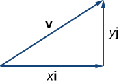{: #CNX_Calc_Figure_12_01_024}

Using Standard Unit Vectors

1.  Express the vector
    <math xmlns="http://www.w3.org/1998/Math/MathML"><mrow><mstyle mathvariant="bold" mathsize="normal"><mtext>w</mtext></mstyle><mo>=</mo><mrow><mo>〈</mo><mrow><mn>3</mn><mo>,</mo><mn>−4</mn></mrow><mo>〉</mo></mrow></mrow></math>
    
    in terms of standard unit vectors.
2.  Vector
    <math xmlns="http://www.w3.org/1998/Math/MathML"><mstyle mathvariant="bold" mathsize="normal"><mtext>u</mtext></mstyle></math>
    
    is a unit vector that forms an angle of
    <math xmlns="http://www.w3.org/1998/Math/MathML"><mrow><mn>60</mn><mtext>°</mtext></mrow></math>
    
    with the positive *x*-axis. Use standard unit vectors to describe
    <math xmlns="http://www.w3.org/1998/Math/MathML"><mrow><mstyle mathvariant="bold" mathsize="normal"><mtext>u</mtext></mstyle><mo>.</mo></mrow></math>
{: data-number-style="lower-alpha"}

1.  Resolve vector
    <math xmlns="http://www.w3.org/1998/Math/MathML"><mstyle mathvariant="bold" mathsize="normal"><mtext>w</mtext></mstyle></math>
    
    into a vector with a zero *y*-component and a vector with a zero *x*-component:
    * * *
    {: data-type="newline"}
    
    

    <math xmlns="http://www.w3.org/1998/Math/MathML"><mrow><mstyle mathvariant="bold" mathsize="normal"><mtext>w</mtext></mstyle><mo>=</mo><mrow><mo>〈</mo><mrow><mn>3</mn><mo>,</mo><mn>−4</mn></mrow><mo>〉</mo></mrow><mo>=</mo><mn>3</mn><mstyle mathvariant="bold" mathsize="normal"><mtext>i</mtext></mstyle><mo>−</mo><mn>4</mn><mstyle mathvariant="bold" mathsize="normal"><mtext>j</mtext></mstyle><mo>.</mo></mrow></math>
    

2.  Because
    <math xmlns="http://www.w3.org/1998/Math/MathML"><mstyle mathvariant="bold" mathsize="normal"><mtext>u</mtext></mstyle></math>
    
    is a unit vector, the terminal point lies on the unit circle when the vector is placed in standard position ([[link]](#CNX_Calc_Figure_12_01_019)).
    * * *
    {: data-type="newline"}
    
    

    <math xmlns="http://www.w3.org/1998/Math/MathML"><mtable><mtr><mtd columnalign="right"><mi>u</mi></mtd><mtd columnalign="left"><mo>=</mo><mrow><mo>〈</mo><mrow><mtext>cos</mtext><mspace width="0.2em" /><mn>60</mn><mtext>°</mtext><mo>,</mo><mtext>sin</mtext><mspace width="0.2em" /><mn>60</mn><mtext>°</mtext></mrow><mo>〉</mo></mrow></mtd></mtr><mtr><mtd /><mtd columnalign="left"><mo>=</mo><mrow><mo>〈</mo><mrow><mfrac><mn>1</mn><mn>2</mn></mfrac><mo>,</mo><mfrac><mrow><msqrt><mn>3</mn></msqrt></mrow><mn>2</mn></mfrac></mrow><mo>〉</mo></mrow></mtd></mtr><mtr><mtd /><mtd columnalign="left"><mo>=</mo><mfrac><mn>1</mn><mn>2</mn></mfrac><mstyle mathvariant="bold" mathsize="normal"><mtext>i</mtext></mstyle><mo>+</mo><mfrac><mrow><msqrt><mn>3</mn></msqrt></mrow><mn>2</mn></mfrac><mstyle mathvariant="bold" mathsize="normal"><mtext>j</mtext></mstyle><mo>.</mo></mtd></mtr></mtable></math>
    

    
    * * *
    {: data-type="newline"}
    
    ."){: #CNX_Calc_Figure_12_01_019}

{: data-number-style="lower-alpha"}

Let <math xmlns="http://www.w3.org/1998/Math/MathML"><mrow><mstyle mathvariant="bold" mathsize="normal"><mtext>a</mtext></mstyle><mo>=</mo><mrow><mo>〈</mo><mrow><mn>16</mn><mo>,</mo><mn>−11</mn></mrow><mo>〉</mo></mrow></mrow></math>

 and let <math xmlns="http://www.w3.org/1998/Math/MathML"><mstyle mathvariant="bold" mathsize="normal"><mtext>b</mtext></mstyle></math>

 be a unit vector that forms an angle of <math xmlns="http://www.w3.org/1998/Math/MathML"><mrow><mn>225</mn><mtext>°</mtext></mrow></math>

 with the positive *x*-axis. Express <math xmlns="http://www.w3.org/1998/Math/MathML"><mstyle mathvariant="bold" mathsize="normal"><mtext>a</mtext></mstyle></math>

 and <math xmlns="http://www.w3.org/1998/Math/MathML"><mstyle mathvariant="bold" mathsize="normal"><mtext>b</mtext></mstyle></math>

 in terms of the standard unit vectors.

<math xmlns="http://www.w3.org/1998/Math/MathML"><mrow><mstyle mathvariant="bold" mathsize="normal"><mtext>a</mtext></mstyle><mo>=</mo><mn>16</mn><mstyle mathvariant="bold" mathsize="normal"><mtext>i</mtext></mstyle><mo>−</mo><mn>11</mn><mstyle mathvariant="bold" mathsize="normal"><mtext>j</mtext></mstyle><mo>,</mo></mrow></math>

 <math xmlns="http://www.w3.org/1998/Math/MathML"><mrow><mstyle mathvariant="bold" mathsize="normal"><mtext>b</mtext></mstyle><mo>=</mo><mo>−</mo><mfrac><mrow><msqrt><mn>2</mn></msqrt></mrow><mn>2</mn></mfrac><mstyle mathvariant="bold" mathsize="normal"><mtext>i</mtext></mstyle><mo>−</mo><mfrac><mrow><msqrt><mn>2</mn></msqrt></mrow><mn>2</mn></mfrac><mstyle mathvariant="bold" mathsize="normal"><mtext>j</mtext></mstyle></mrow></math>

Hint

Use sine and cosine to find the components of <math xmlns="http://www.w3.org/1998/Math/MathML"><mrow><mstyle mathvariant="bold" mathsize="normal"><mtext>b</mtext></mstyle><mo>.</mo></mrow></math>

### Applications of Vectors

Because vectors have both direction and magnitude, they are valuable tools for solving problems involving such applications as motion and **force**{: data-type="term" .no-emphasis}. Recall the boat example and the quarterback example we described earlier. Here we look at two other examples in detail.

Finding Resultant Force

Jane’s car is stuck in the mud. Lisa and Jed come along in a truck to help pull her out. They attach one end of a tow strap to the front of the car and the other end to the truck’s trailer hitch, and the truck starts to pull. Meanwhile, Jane and Jed get behind the car and push. The truck generates a horizontal force of <math xmlns="http://www.w3.org/1998/Math/MathML"><mrow><mn>300</mn></mrow></math>

 lb on the car. Jane and Jed are pushing at a slight upward angle and generate a force of <math xmlns="http://www.w3.org/1998/Math/MathML"><mrow><mn>150</mn></mrow></math>

 lb on the car. These forces can be represented by vectors, as shown in [[link]](#CNX_Calc_Figure_12_01_020). The angle between these vectors is <math xmlns="http://www.w3.org/1998/Math/MathML"><mrow><mn>15</mn><mtext>°</mtext><mo>.</mo></mrow></math>

 Find the resultant force (the vector sum) and give its magnitude to the nearest tenth of a pound and its direction angle from the positive *x*-axis.

{: #CNX_Calc_Figure_12_01_020}

To find the effect of combining the two forces, add their representative vectors. First, express each vector in component form or in terms of the standard unit vectors. For this purpose, it is easiest if we align one of the vectors with the positive *x*-axis. The horizontal vector, then, has initial point <math xmlns="http://www.w3.org/1998/Math/MathML"><mrow><mrow><mo>(</mo><mrow><mn>0</mn><mo>,</mo><mn>0</mn></mrow><mo>)</mo></mrow></mrow></math>

 and terminal point <math xmlns="http://www.w3.org/1998/Math/MathML"><mrow><mrow><mo>(</mo><mrow><mn>300</mn><mo>,</mo><mn>0</mn></mrow><mo>)</mo></mrow><mo>.</mo></mrow></math>

 It can be expressed as <math xmlns="http://www.w3.org/1998/Math/MathML"><mrow><mrow><mo>〈</mo><mrow><mn>300</mn><mo>,</mo><mn>0</mn></mrow><mo>〉</mo></mrow></mrow></math>

 or <math xmlns="http://www.w3.org/1998/Math/MathML"><mrow><mn>300</mn><mstyle mathvariant="bold" mathsize="normal"><mtext>i</mtext></mstyle><mo>.</mo></mrow></math>

The second vector has magnitude <math xmlns="http://www.w3.org/1998/Math/MathML"><mrow><mn>150</mn></mrow></math>

 and makes an angle of <math xmlns="http://www.w3.org/1998/Math/MathML"><mrow><mn>15</mn><mtext>°</mtext></mrow></math>

 with the first, so we can express it as <math xmlns="http://www.w3.org/1998/Math/MathML"><mrow><mrow><mo>〈</mo><mrow><mn>150</mn><mspace width="0.2em" /><mtext>cos</mtext><mrow><mo>(</mo><mrow><mn>15</mn><mtext>°</mtext></mrow><mo>)</mo></mrow><mo>,</mo><mn>150</mn><mspace width="0.2em" /><mtext>sin</mtext><mrow><mo>(</mo><mrow><mn>15</mn><mtext>°</mtext></mrow><mo>)</mo></mrow></mrow><mo>〉</mo></mrow><mo>,</mo></mrow></math>

 or <math xmlns="http://www.w3.org/1998/Math/MathML"><mrow><mn>150</mn><mspace width="0.2em" /><mtext>cos</mtext><mrow><mo>(</mo><mrow><mn>15</mn><mtext>°</mtext></mrow><mo>)</mo></mrow><mstyle mathvariant="bold" mathsize="normal"><mtext>i</mtext></mstyle><mo>+</mo><mn>150</mn><mspace width="0.2em" /><mtext>sin</mtext><mrow><mo>(</mo><mrow><mn>15</mn><mtext>°</mtext></mrow><mo>)</mo></mrow><mstyle mathvariant="bold" mathsize="normal"><mtext>j</mtext></mstyle><mo>.</mo></mrow></math>

 Then, the sum of the vectors, or resultant vector, is <math xmlns="http://www.w3.org/1998/Math/MathML"><mrow><mstyle mathvariant="bold" mathsize="normal"><mtext>r</mtext></mstyle><mo>=</mo><mrow><mo>〈</mo><mrow><mn>300</mn><mo>,</mo><mn>0</mn></mrow><mo>〉</mo></mrow><mo>+</mo><mrow><mo>〈</mo><mrow><mn>150</mn><mspace width="0.2em" /><mtext>cos</mtext><mrow><mo>(</mo><mrow><mn>15</mn><mtext>°</mtext></mrow><mo>)</mo></mrow><mo>,</mo><mn>150</mn><mspace width="0.2em" /><mtext>sin</mtext><mrow><mo>(</mo><mrow><mn>15</mn><mtext>°</mtext></mrow><mo>)</mo></mrow></mrow><mo>〉</mo></mrow><mo>,</mo></mrow></math>

 and we have

<math xmlns="http://www.w3.org/1998/Math/MathML"><mtable><mtr><mtd columnalign="right"><mrow><mo>‖</mo><mstyle mathvariant="bold" mathsize="normal"><mtext>r</mtext></mstyle><mo>‖</mo></mrow></mtd><mtd columnalign="left"><mo>=</mo><msqrt><mrow><msup><mrow><mrow><mo>(</mo><mrow><mn>300</mn><mo>+</mo><mn>150</mn><mspace width="0.2em" /><mtext>cos</mtext><mrow><mo>(</mo><mrow><mn>15</mn><mtext>°</mtext></mrow><mo>)</mo></mrow></mrow><mo>)</mo></mrow></mrow><mn>2</mn></msup><mo>+</mo><msup><mrow><mrow><mo>(</mo><mrow><mn>150</mn><mspace width="0.2em" /><mtext>sin</mtext><mrow><mo>(</mo><mrow><mn>15</mn><mtext>°</mtext></mrow><mo>)</mo></mrow></mrow><mo>)</mo></mrow></mrow><mn>2</mn></msup></mrow></msqrt></mtd></mtr><mtr><mtd /><mtd columnalign="left"><mo>≈</mo><mn>446.6.</mn></mtd></mtr></mtable></math>

The angle <math xmlns="http://www.w3.org/1998/Math/MathML"><mi>θ</mi></math>

 made by <math xmlns="http://www.w3.org/1998/Math/MathML"><mstyle mathvariant="bold" mathsize="normal"><mtext>r</mtext></mstyle></math>

 and the positive *x*-axis has <math xmlns="http://www.w3.org/1998/Math/MathML"><mrow><mtext>tan</mtext><mspace width="0.2em" /><mi>θ</mi><mo>=</mo><mfrac><mrow><mn>150</mn><mspace width="0.2em" /><mtext>sin</mtext><mspace width="0.2em" /><mn>15</mn><mtext>°</mtext></mrow><mrow><mrow><mo>(</mo><mrow><mn>300</mn><mo>+</mo><mn>150</mn><mspace width="0.2em" /><mtext>cos</mtext><mspace width="0.2em" /><mn>15</mn><mtext>°</mtext></mrow><mo>)</mo></mrow></mrow></mfrac><mo>≈</mo><mn>0.09</mn><mo>,</mo></mrow></math>

 so <math xmlns="http://www.w3.org/1998/Math/MathML"><mrow><mi>θ</mi><mo>≈</mo><mi>t</mi><mi>a</mi><msup><mi>n</mi><mrow><mn>−1</mn></mrow></msup><mrow><mo>(</mo><mrow><mn>0.09</mn></mrow><mo>)</mo></mrow><mo>≈</mo><mn>5</mn><mtext>°</mtext><mo>,</mo></mrow></math>

 which means the resultant force <math xmlns="http://www.w3.org/1998/Math/MathML"><mstyle mathvariant="bold" mathsize="normal"><mtext>r</mtext></mstyle></math>

 has an angle of <math xmlns="http://www.w3.org/1998/Math/MathML"><mrow><mn>5</mn><mtext>°</mtext></mrow></math>

 above the horizontal axis.

Finding Resultant Velocity

An airplane flies due west at an airspeed of <math xmlns="http://www.w3.org/1998/Math/MathML"><mrow><mn>425</mn></mrow></math>

 mph. The wind is blowing from the northeast at <math xmlns="http://www.w3.org/1998/Math/MathML"><mrow><mn>40</mn></mrow></math>

 mph. What is the ground speed of the airplane? What is the bearing of the airplane?

Let’s start by sketching the situation described ([[link]](#CNX_Calc_Figure_12_01_021)).

"){: #CNX_Calc_Figure_12_01_021}

Set up a sketch so that the initial points of the vectors lie at the origin. Then, the plane’s velocity vector is <math xmlns="http://www.w3.org/1998/Math/MathML"><mrow><mstyle mathvariant="bold" mathsize="normal"><mtext>p</mtext></mstyle><mo>=</mo><mn>−425</mn><mstyle mathvariant="bold" mathsize="normal"><mtext>i</mtext></mstyle><mo>.</mo></mrow></math>

 The vector describing the wind makes an angle of <math xmlns="http://www.w3.org/1998/Math/MathML"><mrow><mn>225</mn><mtext>°</mtext></mrow></math>

 with the positive *x*-axis:

<math xmlns="http://www.w3.org/1998/Math/MathML"><mrow><mstyle mathvariant="bold" mathsize="normal"><mtext>w</mtext></mstyle><mo>=</mo><mrow><mo>〈</mo><mrow><mn>40</mn><mspace width="0.2em" /><mtext>cos</mtext><mrow><mo>(</mo><mrow><mn>225</mn><mtext>°</mtext></mrow><mo>)</mo></mrow><mo>,</mo><mn>40</mn><mspace width="0.2em" /><mtext>sin</mtext><mrow><mo>(</mo><mrow><mn>225</mn><mtext>°</mtext></mrow><mo>)</mo></mrow></mrow><mo>〉</mo></mrow><mo>=</mo><mrow><mo>〈</mo><mrow><mo>−</mo><mfrac><mrow><mn>40</mn></mrow><mrow><msqrt><mn>2</mn></msqrt></mrow></mfrac><mo>,</mo><mo>−</mo><mfrac><mrow><mn>40</mn></mrow><mrow><msqrt><mn>2</mn></msqrt></mrow></mfrac></mrow><mo>〉</mo></mrow><mo>=</mo><mo>−</mo><mfrac><mrow><mn>40</mn></mrow><mrow><msqrt><mn>2</mn></msqrt></mrow></mfrac><mstyle mathvariant="bold" mathsize="normal"><mtext>i</mtext></mstyle><mo>−</mo><mfrac><mrow><mn>40</mn></mrow><mrow><msqrt><mn>2</mn></msqrt></mrow></mfrac><mstyle mathvariant="bold" mathsize="normal"><mtext>j</mtext></mstyle><mo>.</mo></mrow></math>

When the airspeed and the wind act together on the plane, we can add their vectors to find the resultant force:

<math xmlns="http://www.w3.org/1998/Math/MathML"><mrow><mstyle mathvariant="bold" mathsize="normal"><mi>p</mi><mo>+</mo><mi>w</mi></mstyle><mo>=</mo><mn>−425</mn><mstyle mathvariant="bold" mathsize="normal"><mtext>i</mtext></mstyle><mo>+</mo><mrow><mo>(</mo><mrow><mo>−</mo><mfrac><mrow><mn>40</mn></mrow><mrow><msqrt><mn>2</mn></msqrt></mrow></mfrac><mstyle mathvariant="bold" mathsize="normal"><mtext>i</mtext></mstyle><mo>−</mo><mfrac><mrow><mn>40</mn></mrow><mrow><msqrt><mn>2</mn></msqrt></mrow></mfrac><mstyle mathvariant="bold" mathsize="normal"><mtext>j</mtext></mstyle></mrow><mo>)</mo></mrow><mo>=</mo><mrow><mo>(</mo><mrow><mn>−425</mn><mo>−</mo><mfrac><mrow><mn>40</mn></mrow><mrow><msqrt><mn>2</mn></msqrt></mrow></mfrac></mrow><mo>)</mo></mrow><mstyle mathvariant="bold" mathsize="normal"><mtext>i</mtext></mstyle><mo>−</mo><mfrac><mrow><mn>40</mn></mrow><mrow><msqrt><mn>2</mn></msqrt></mrow></mfrac><mstyle mathvariant="bold" mathsize="normal"><mtext>j</mtext></mstyle><mo>.</mo></mrow></math>

The magnitude of the resultant vector shows the effect of the wind on the ground speed of the airplane:

<math xmlns="http://www.w3.org/1998/Math/MathML"><mrow><mrow><mo>‖</mo><mrow><mstyle mathvariant="bold" mathsize="normal"><mi>p</mi><mo>+</mo><mi>w</mi></mstyle></mrow><mo>‖</mo></mrow><mo>=</mo><msqrt><mrow><msup><mrow><mrow><mo>(</mo><mrow><mn>−425</mn><mo>−</mo><mfrac><mrow><mn>40</mn></mrow><mrow><msqrt><mn>2</mn></msqrt></mrow></mfrac></mrow><mo>)</mo></mrow></mrow><mn>2</mn></msup><mo>+</mo><msup><mrow><mrow><mo>(</mo><mrow><mo>−</mo><mfrac><mrow><mn>40</mn></mrow><mrow><msqrt><mn>2</mn></msqrt></mrow></mfrac></mrow><mo>)</mo></mrow></mrow><mn>2</mn></msup></mrow></msqrt><mo>≈</mo><mn>454.17</mn><mspace width="0.2em" /><mtext>mph</mtext></mrow></math>

As a result of the wind, the plane is traveling at approximately <math xmlns="http://www.w3.org/1998/Math/MathML"><mrow><mn>454</mn></mrow></math>

 mph relative to the ground.

To determine the bearing of the airplane, we want to find the direction of the vector <math xmlns="http://www.w3.org/1998/Math/MathML"><mrow><mstyle mathvariant="bold" mathsize="normal"><mi>p</mi><mo>+</mo><mi>w</mi></mstyle><mtext>:</mtext></mrow></math>

<math xmlns="http://www.w3.org/1998/Math/MathML"><mtable><mtr><mtd columnalign="right"><mtext>tan</mtext><mspace width="0.2em" /><mi>θ</mi></mtd><mtd columnalign="left"><mo>=</mo></mtd><mtd columnalign="left"><mfrac><mrow><mo>−</mo><mfrac><mrow><mn>40</mn></mrow><mrow><msqrt><mn>2</mn></msqrt></mrow></mfrac></mrow><mrow><mrow><mo>(</mo><mrow><mn>−425</mn><mo>−</mo><mfrac><mrow><mn>40</mn></mrow><mrow><msqrt><mn>2</mn></msqrt></mrow></mfrac></mrow><mo>)</mo></mrow></mrow></mfrac><mo>≈</mo><mn>0.06</mn></mtd></mtr><mtr><mtd columnalign="right"><mi>θ</mi></mtd><mtd columnalign="left"><mo>≈</mo></mtd><mtd columnalign="left"><mn>3.57</mn><mtext>°</mtext><mo>.</mo></mtd></mtr></mtable></math>

The overall direction of the plane is <math xmlns="http://www.w3.org/1998/Math/MathML"><mrow><mn>3.57</mn><mtext>°</mtext></mrow></math>

 south of west.

An airplane flies due north at an airspeed of <math xmlns="http://www.w3.org/1998/Math/MathML"><mrow><mn>550</mn></mrow></math>

 mph. The wind is blowing from the northwest at <math xmlns="http://www.w3.org/1998/Math/MathML"><mrow><mn>50</mn></mrow></math>

 mph. What is the ground speed of the airplane?

Approximately <math xmlns="http://www.w3.org/1998/Math/MathML"><mrow><mn>516</mn></mrow></math>

 mph

Hint

Sketch the vectors with the same initial point and find their sum.

### Key Concepts

* Vectors are used to represent quantities that have both magnitude and direction.
* We can add vectors by using the parallelogram method or the triangle method to find the sum. We can multiply a vector by a scalar to change its length or give it the opposite direction.
* Subtraction of vectors is defined in terms of adding the negative of the vector.
* A vector is written in component form as
  <math xmlns="http://www.w3.org/1998/Math/MathML"><mrow><mstyle mathvariant="bold" mathsize="normal"><mtext>v</mtext></mstyle><mo>=</mo><mrow><mo>〈</mo><mrow><mi>x</mi><mo>,</mo><mi>y</mi></mrow><mo>〉</mo></mrow><mo>.</mo></mrow></math>

* The magnitude of a vector is a scalar:
  <math xmlns="http://www.w3.org/1998/Math/MathML"><mrow><mrow><mo>‖</mo><mstyle mathvariant="bold" mathsize="normal"><mtext>v</mtext></mstyle><mo>‖</mo></mrow><mo>=</mo><msqrt><mrow><msup><mi>x</mi><mn>2</mn></msup><mo>+</mo><msup><mi>y</mi><mn>2</mn></msup></mrow></msqrt><mo>.</mo></mrow></math>

* A unit vector
  <math xmlns="http://www.w3.org/1998/Math/MathML"><mstyle mathvariant="bold" mathsize="normal"><mtext>u</mtext></mstyle></math>
  
  has magnitude
  <math xmlns="http://www.w3.org/1998/Math/MathML"><mn>1</mn></math>
  
  and can be found by dividing a vector by its magnitude:
  <math xmlns="http://www.w3.org/1998/Math/MathML"><mrow><mstyle mathvariant="bold" mathsize="normal"><mtext>u</mtext></mstyle><mo>=</mo><mfrac><mn>1</mn><mrow><mrow><mo>‖</mo><mstyle mathvariant="bold" mathsize="normal"><mtext>v</mtext></mstyle><mo>‖</mo></mrow></mrow></mfrac><mstyle mathvariant="bold" mathsize="normal"><mtext>v</mtext></mstyle><mo>.</mo></mrow></math>
  
  The standard unit vectors are
  <math xmlns="http://www.w3.org/1998/Math/MathML"><mrow><mstyle mathvariant="bold" mathsize="normal"><mtext>i</mtext></mstyle><mo>=</mo><mrow><mo>〈</mo><mrow><mn>1</mn><mo>,</mo><mn>0</mn></mrow><mo>〉</mo></mrow><mspace width="0.2em" /><mtext>and</mtext><mspace width="0.2em" /><mstyle mathvariant="bold" mathsize="normal"><mtext>j</mtext></mstyle><mo>=</mo><mrow><mo>〈</mo><mrow><mn>0</mn><mo>,</mo><mn>1</mn></mrow><mo>〉</mo></mrow><mo>.</mo></mrow></math>
  
  A vector
  <math xmlns="http://www.w3.org/1998/Math/MathML"><mrow><mstyle mathvariant="bold" mathsize="normal"><mtext>v</mtext></mstyle><mo>=</mo><mrow><mo>〈</mo><mrow><mi>x</mi><mo>,</mo><mi>y</mi></mrow><mo>〉</mo></mrow></mrow></math>
  
  can be expressed in terms of the standard unit vectors as
  <math xmlns="http://www.w3.org/1998/Math/MathML"><mrow><mstyle mathvariant="bold" mathsize="normal"><mtext>v</mtext></mstyle><mo>=</mo><mi>x</mi><mstyle mathvariant="bold" mathsize="normal"><mtext>i</mtext></mstyle><mo>+</mo><mi>y</mi><mstyle mathvariant="bold" mathsize="normal"><mtext>j</mtext></mstyle><mo>.</mo></mrow></math>

* Vectors are often used in physics and engineering to represent forces and velocities, among other quantities.
{: data-bullet-style="bullet"}

<section data-depth="1" class="section-exercises" markdown="1">
For the following exercises, consider points <math xmlns="http://www.w3.org/1998/Math/MathML"><mrow><mi>P</mi><mrow><mo>(</mo><mrow><mn>−1</mn><mo>,</mo><mn>3</mn></mrow><mo>)</mo></mrow><mo>,</mo></mrow></math>

 <math xmlns="http://www.w3.org/1998/Math/MathML"><mrow><mi>Q</mi><mrow><mo>(</mo><mrow><mn>1</mn><mo>,</mo><mn>5</mn></mrow><mo>)</mo></mrow><mo>,</mo></mrow></math>

 and <math xmlns="http://www.w3.org/1998/Math/MathML"><mrow><mi>R</mi><mrow><mo>(</mo><mrow><mn>−3</mn><mo>,</mo><mn>7</mn></mrow><mo>)</mo></mrow><mo>.</mo></mrow></math>

 Determine the requested vectors and express each of them a. in component form and b. by using the standard unit vectors.

<math xmlns="http://www.w3.org/1998/Math/MathML"><mrow><mover accent="true"><mrow><mi>P</mi><mi>Q</mi></mrow><mo stretchy="false">→</mo></mover></mrow></math>

a. <math xmlns="http://www.w3.org/1998/Math/MathML"><mrow><mover accent="true"><mrow><mi>P</mi><mi>Q</mi></mrow><mo stretchy="false">→</mo></mover><mo>=</mo><mrow><mo>〈</mo><mrow><mn>2</mn><mo>,</mo><mn>2</mn></mrow><mo>〉</mo></mrow><mo>;</mo></mrow></math>

 b. <math xmlns="http://www.w3.org/1998/Math/MathML"><mrow><mover accent="true"><mrow><mi>P</mi><mi>Q</mi></mrow><mo stretchy="false">→</mo></mover><mo>=</mo><mn>2</mn><mtext mathvariant="bold">i</mtext><mo>+</mo><mn>2</mn><mtext mathvariant="bold">j</mtext></mrow></math>

<math xmlns="http://www.w3.org/1998/Math/MathML"><mrow><mover accent="true"><mrow><mi>P</mi><mi>R</mi></mrow><mo stretchy="false">→</mo></mover></mrow></math>

<math xmlns="http://www.w3.org/1998/Math/MathML"><mrow><mover accent="true"><mrow><mi>Q</mi><mi>P</mi></mrow><mo stretchy="false">→</mo></mover></mrow></math>

a. <math xmlns="http://www.w3.org/1998/Math/MathML"><mrow><mover accent="true"><mrow><mi>Q</mi><mi>P</mi></mrow><mo stretchy="false">→</mo></mover><mo>=</mo><mrow><mo>〈</mo><mrow><mn>−2</mn><mo>,</mo><mn>−2</mn></mrow><mo>〉</mo></mrow><mo>;</mo></mrow></math>

 b. <math xmlns="http://www.w3.org/1998/Math/MathML"><mrow><mover accent="true"><mrow><mi>Q</mi><mi>P</mi></mrow><mo stretchy="false">→</mo></mover><mo>=</mo><mn>−2</mn><mtext mathvariant="bold">i</mtext><mo>−</mo><mn>2</mn><mtext mathvariant="bold">j</mtext></mrow></math>

<math xmlns="http://www.w3.org/1998/Math/MathML"><mrow><mover accent="true"><mrow><mi>R</mi><mi>P</mi></mrow><mo stretchy="false">→</mo></mover></mrow></math>

<math xmlns="http://www.w3.org/1998/Math/MathML"><mrow><mover accent="true"><mrow><mi>P</mi><mi>Q</mi></mrow><mo stretchy="false">→</mo></mover><mo>+</mo><mover accent="true"><mrow><mi>P</mi><mi>R</mi></mrow><mo stretchy="false">→</mo></mover></mrow></math>

a. <math xmlns="http://www.w3.org/1998/Math/MathML"><mrow><mover accent="true"><mrow><mi>P</mi><mi>Q</mi></mrow><mo stretchy="false">→</mo></mover><mo>+</mo><mover accent="true"><mrow><mi>P</mi><mi>R</mi></mrow><mo stretchy="false">→</mo></mover><mo>=</mo><mrow><mo>〈</mo><mrow><mn>0</mn><mo>,</mo><mn>6</mn></mrow><mo>〉</mo></mrow><mo>;</mo></mrow></math>

 b. <math xmlns="http://www.w3.org/1998/Math/MathML"><mrow><mover accent="true"><mrow><mi>P</mi><mi>Q</mi></mrow><mo stretchy="false">→</mo></mover><mo>+</mo><mover accent="true"><mrow><mi>P</mi><mi>R</mi></mrow><mo stretchy="false">→</mo></mover><mo>=</mo><mn>6</mn><mtext mathvariant="bold">j</mtext></mrow></math>

<math xmlns="http://www.w3.org/1998/Math/MathML"><mrow><mover accent="true"><mrow><mi>P</mi><mi>Q</mi></mrow><mo stretchy="false">→</mo></mover><mo>−</mo><mover accent="true"><mrow><mi>P</mi><mi>R</mi></mrow><mo stretchy="false">→</mo></mover></mrow></math>

<math xmlns="http://www.w3.org/1998/Math/MathML"><mrow><mn>2</mn><mover accent="true"><mrow><mi>P</mi><mi>Q</mi></mrow><mo stretchy="false">→</mo></mover><mo>−</mo><mn>2</mn><mover accent="true"><mrow><mi>P</mi><mi>R</mi></mrow><mo stretchy="false">→</mo></mover></mrow></math>

a. <math xmlns="http://www.w3.org/1998/Math/MathML"><mrow><mn>2</mn><mover accent="true"><mrow><mi>P</mi><mi>Q</mi></mrow><mo stretchy="false">→</mo></mover><mo>−</mo><mn>2</mn><mover accent="true"><mrow><mi>P</mi><mi>R</mi></mrow><mo stretchy="false">→</mo></mover><mo>=</mo><mrow><mo>〈</mo><mrow><mn>8</mn><mo>,</mo><mn>−4</mn></mrow><mo>〉</mo></mrow><mo>;</mo></mrow></math>

 b. <math xmlns="http://www.w3.org/1998/Math/MathML"><mrow><mn>2</mn><mover accent="true"><mrow><mi>P</mi><mi>Q</mi></mrow><mo stretchy="false">→</mo></mover><mo>−</mo><mn>2</mn><mover accent="true"><mrow><mi>P</mi><mi>R</mi></mrow><mo stretchy="false">→</mo></mover><mo>=</mo><mn>8</mn><mtext mathvariant="bold">i</mtext><mo>−</mo><mn>4</mn><mtext mathvariant="bold">j</mtext></mrow></math>

<math xmlns="http://www.w3.org/1998/Math/MathML"><mrow><mn>2</mn><mover accent="true"><mrow><mi>P</mi><mi>Q</mi></mrow><mo stretchy="false">→</mo></mover><mo>+</mo><mfrac><mn>1</mn><mn>2</mn></mfrac><mover accent="true"><mrow><mi>P</mi><mi>R</mi></mrow><mo stretchy="false">→</mo></mover></mrow></math>

The unit vector in the direction of <math xmlns="http://www.w3.org/1998/Math/MathML"><mrow><mover accent="true"><mrow><mi>P</mi><mi>Q</mi></mrow><mo stretchy="false">→</mo></mover></mrow></math>

a. <math xmlns="http://www.w3.org/1998/Math/MathML"><mrow><mrow><mo>〈</mo><mrow><mfrac><mn>1</mn><mrow><msqrt><mn>2</mn></msqrt></mrow></mfrac><mo>,</mo><mfrac><mn>1</mn><mrow><msqrt><mn>2</mn></msqrt></mrow></mfrac></mrow><mo>〉</mo></mrow><mo>;</mo></mrow></math>

 b. <math xmlns="http://www.w3.org/1998/Math/MathML"><mrow><mfrac><mn>1</mn><mrow><msqrt><mn>2</mn></msqrt></mrow></mfrac><mtext mathvariant="bold">i</mtext><mo>+</mo><mfrac><mn>1</mn><mrow><msqrt><mn>2</mn></msqrt></mrow></mfrac><mtext mathvariant="bold">j</mtext></mrow></math>

The unit vector in the direction of <math xmlns="http://www.w3.org/1998/Math/MathML"><mrow><mover accent="true"><mrow><mi>P</mi><mi>R</mi></mrow><mo stretchy="false">→</mo></mover></mrow></math>

A vector <math xmlns="http://www.w3.org/1998/Math/MathML"><mstyle mathvariant="bold" mathsize="normal"><mtext>v</mtext></mstyle></math>

 has initial point <math xmlns="http://www.w3.org/1998/Math/MathML"><mrow><mrow><mo>(</mo><mrow><mn>−1</mn><mo>,</mo><mn>−3</mn></mrow><mo>)</mo></mrow></mrow></math>

 and terminal point <math xmlns="http://www.w3.org/1998/Math/MathML"><mrow><mrow><mo>(</mo><mrow><mn>2</mn><mo>,</mo><mn>1</mn></mrow><mo>)</mo></mrow><mo>.</mo></mrow></math>

 Find the unit vector in the direction of <math xmlns="http://www.w3.org/1998/Math/MathML"><mrow><mstyle mathvariant="bold" mathsize="normal"><mtext>v</mtext></mstyle><mo>.</mo></mrow></math>

 Express the answer in component form.

<math xmlns="http://www.w3.org/1998/Math/MathML"><mrow><mrow><mo>〈</mo><mrow><mfrac><mn>3</mn><mn>5</mn></mfrac><mo>,</mo><mfrac><mn>4</mn><mn>5</mn></mfrac></mrow><mo>〉</mo></mrow></mrow></math>

A vector <math xmlns="http://www.w3.org/1998/Math/MathML"><mstyle mathvariant="bold" mathsize="normal"><mtext>v</mtext></mstyle></math>

 has initial point <math xmlns="http://www.w3.org/1998/Math/MathML"><mrow><mrow><mo>(</mo><mrow><mn>−2</mn><mo>,</mo><mn>5</mn></mrow><mo>)</mo></mrow></mrow></math>

 and terminal point <math xmlns="http://www.w3.org/1998/Math/MathML"><mrow><mrow><mo>(</mo><mrow><mn>3</mn><mo>,</mo><mn>−1</mn></mrow><mo>)</mo></mrow><mo>.</mo></mrow></math>

 Find the unit vector in the direction of <math xmlns="http://www.w3.org/1998/Math/MathML"><mrow><mstyle mathvariant="bold" mathsize="normal"><mtext>v</mtext></mstyle><mo>.</mo></mrow></math>

 Express the answer in component form.

The vector <math xmlns="http://www.w3.org/1998/Math/MathML"><mstyle mathvariant="bold" mathsize="normal"><mtext>v</mtext></mstyle></math>

 has initial point <math xmlns="http://www.w3.org/1998/Math/MathML"><mrow><mi>P</mi><mo stretchy="false">(</mo><mn>1</mn><mo>,</mo><mn>0</mn><mo stretchy="false">)</mo></mrow></math>

 and terminal point <math xmlns="http://www.w3.org/1998/Math/MathML"><mi>Q</mi></math>

 that is on the *y*-axis and above the initial point. Find the coordinates of terminal point <math xmlns="http://www.w3.org/1998/Math/MathML"><mi>Q</mi></math>

 such that the magnitude of the vector <math xmlns="http://www.w3.org/1998/Math/MathML"><mstyle mathvariant="bold" mathsize="normal"><mtext>v</mtext></mstyle></math>

 is <math xmlns="http://www.w3.org/1998/Math/MathML"><mrow><msqrt><mn>5</mn></msqrt><mo>.</mo></mrow></math>

<math xmlns="http://www.w3.org/1998/Math/MathML"><mrow><mi>Q</mi><mo stretchy="false">(</mo><mn>0</mn><mo>,</mo><mn>2</mn><mo stretchy="false">)</mo></mrow></math>

The vector <math xmlns="http://www.w3.org/1998/Math/MathML"><mstyle mathvariant="bold" mathsize="normal"><mtext>v</mtext></mstyle></math>

 has initial point <math xmlns="http://www.w3.org/1998/Math/MathML"><mrow><mi>P</mi><mo stretchy="false">(</mo><mn>1</mn><mo>,</mo><mn>1</mn><mo stretchy="false">)</mo></mrow></math>

 and terminal point <math xmlns="http://www.w3.org/1998/Math/MathML"><mi>Q</mi></math>

 that is on the *x*-axis and left of the initial point. Find the coordinates of terminal point <math xmlns="http://www.w3.org/1998/Math/MathML"><mi>Q</mi></math>

 such that the magnitude of the vector <math xmlns="http://www.w3.org/1998/Math/MathML"><mstyle mathvariant="bold" mathsize="normal"><mtext>v</mtext></mstyle></math>

 is <math xmlns="http://www.w3.org/1998/Math/MathML"><mrow><msqrt><mrow><mn>10</mn></mrow></msqrt><mo>.</mo></mrow></math>

For the following exercises, use the given vectors <math xmlns="http://www.w3.org/1998/Math/MathML"><mtext mathvariant="bold">a</mtext></math>

 and <math xmlns="http://www.w3.org/1998/Math/MathML"><mrow><mtext mathvariant="bold">b</mtext><mo>.</mo></mrow></math>

1.  Determine the vector sum
    <math xmlns="http://www.w3.org/1998/Math/MathML"><mrow><mtext mathvariant="bold">a</mtext><mo>+</mo><mtext mathvariant="bold">b</mtext></mrow></math>
    
    and express it in both the component form and by using the standard unit vectors.
2.  Find the vector difference
    <math xmlns="http://www.w3.org/1998/Math/MathML"><mrow><mtext mathvariant="bold">a</mtext><mo>−</mo><mtext mathvariant="bold">b</mtext></mrow></math>
    
    and express it in both the component form and by using the standard unit vectors.
3.  Verify that the vectors
    <math xmlns="http://www.w3.org/1998/Math/MathML"><mrow><mtext mathvariant="bold">a</mtext><mo>,</mo></mrow></math>
    
    <math xmlns="http://www.w3.org/1998/Math/MathML"><mrow><mtext mathvariant="bold">b</mtext><mo>,</mo></mrow></math>
    
    and
    <math xmlns="http://www.w3.org/1998/Math/MathML"><mrow><mtext mathvariant="bold">a</mtext><mo>+</mo><mtext mathvariant="bold">b</mtext><mo>,</mo></mrow></math>
    
    and, respectively,
    <math xmlns="http://www.w3.org/1998/Math/MathML"><mrow><mtext mathvariant="bold">a</mtext><mo>,</mo></mrow></math>
    
    <math xmlns="http://www.w3.org/1998/Math/MathML"><mrow><mtext mathvariant="bold">b</mtext><mo>,</mo></mrow></math>
    
    and
    <math xmlns="http://www.w3.org/1998/Math/MathML"><mrow><mtext mathvariant="bold">a</mtext><mo>−</mo><mtext mathvariant="bold">b</mtext></mrow></math>
    
    satisfy the triangle inequality.
4.  Determine the vectors
    <math xmlns="http://www.w3.org/1998/Math/MathML"><mrow><mn>2</mn><mtext mathvariant="bold">a</mtext><mo>,</mo></mrow></math>
    
    <math xmlns="http://www.w3.org/1998/Math/MathML"><mrow><mtext>−</mtext><mtext mathvariant="bold">b</mtext><mo>,</mo></mrow></math>
    
    and
    <math xmlns="http://www.w3.org/1998/Math/MathML"><mrow><mn>2</mn><mtext mathvariant="bold">a</mtext><mo>−</mo><mtext mathvariant="bold">b</mtext><mo>.</mo></mrow></math>
    
    Express the vectors in both the component form and by using standard unit vectors.
{: data-number-style="lower-alpha"}

<math xmlns="http://www.w3.org/1998/Math/MathML"><mrow><mtext mathvariant="bold">a</mtext><mo>=</mo><mn>2</mn><mtext mathvariant="bold">i</mtext><mo>+</mo><mtext mathvariant="bold">j</mtext><mo>,</mo></mrow></math>

 <math xmlns="http://www.w3.org/1998/Math/MathML"><mrow><mtext mathvariant="bold">b</mtext><mo>=</mo><mtext mathvariant="bold">i</mtext><mo>+</mo><mn>3</mn><mtext mathvariant="bold">j</mtext></mrow></math>

a. <math xmlns="http://www.w3.org/1998/Math/MathML"><mrow><mtext mathvariant="bold">a</mtext><mo>+</mo><mtext mathvariant="bold">b</mtext><mo>=</mo><mn>3</mn><mtext mathvariant="bold">i</mtext><mo>+</mo><mn>4</mn><mtext mathvariant="bold">j</mtext><mo>,</mo></mrow></math>

 <math xmlns="http://www.w3.org/1998/Math/MathML"><mrow><mtext mathvariant="bold">a</mtext><mo>+</mo><mtext mathvariant="bold">b</mtext><mo>=</mo><mrow><mo>〈</mo><mrow><mn>3</mn><mo>,</mo><mn>4</mn></mrow><mo>〉</mo></mrow><mo>;</mo></mrow></math>

 b. <math xmlns="http://www.w3.org/1998/Math/MathML"><mrow><mtext mathvariant="bold">a</mtext><mo>−</mo><mtext mathvariant="bold">b</mtext><mo>=</mo><mtext mathvariant="bold">i</mtext><mo>−</mo><mn>2</mn><mtext mathvariant="bold">j</mtext><mo>,</mo></mrow></math>

 <math xmlns="http://www.w3.org/1998/Math/MathML"><mrow><mtext mathvariant="bold">a</mtext><mo>−</mo><mtext mathvariant="bold">b</mtext><mo>=</mo><mrow><mo>〈</mo><mrow><mn>1</mn><mo>,</mo><mn>−2</mn></mrow><mo>〉</mo></mrow><mo>;</mo></mrow></math>

 c. Answers will vary; d. <math xmlns="http://www.w3.org/1998/Math/MathML"><mrow><mn>2</mn><mtext mathvariant="bold">a</mtext><mo>=</mo><mn>4</mn><mtext mathvariant="bold">i</mtext><mo>+</mo><mn>2</mn><mtext mathvariant="bold">j</mtext><mo>,</mo></mrow></math>

 <math xmlns="http://www.w3.org/1998/Math/MathML"><mrow><mn>2</mn><mtext mathvariant="bold">a</mtext><mo>=</mo><mrow><mo>〈</mo><mrow><mn>4</mn><mo>,</mo><mn>2</mn></mrow><mo>〉</mo></mrow><mo>,</mo></mrow></math>

 <math xmlns="http://www.w3.org/1998/Math/MathML"><mrow><mtext>−</mtext><mtext mathvariant="bold">b</mtext><mo>=</mo><mtext>−</mtext><mtext mathvariant="bold">i</mtext><mo>−</mo><mn>3</mn><mtext mathvariant="bold">j</mtext><mo>,</mo></mrow></math>

 <math xmlns="http://www.w3.org/1998/Math/MathML"><mrow><mtext>−</mtext><mtext mathvariant="bold">b</mtext><mo>=</mo><mrow><mo>〈</mo><mrow><mn>−1</mn><mo>,</mo><mn>−3</mn></mrow><mo>〉</mo></mrow><mo>,</mo></mrow></math>

 <math xmlns="http://www.w3.org/1998/Math/MathML"><mrow><mn>2</mn><mtext mathvariant="bold">a</mtext><mo>−</mo><mtext mathvariant="bold">b</mtext><mo>=</mo><mn>3</mn><mtext mathvariant="bold">i</mtext><mo>−</mo><mtext mathvariant="bold">j</mtext><mo>,</mo></mrow></math>

 <math xmlns="http://www.w3.org/1998/Math/MathML"><mrow><mn>2</mn><mtext mathvariant="bold">a</mtext><mo>−</mo><mtext mathvariant="bold">b</mtext><mo>=</mo><mrow><mo>〈</mo><mrow><mn>3</mn><mo>,</mo><mn>−1</mn></mrow><mo>〉</mo></mrow></mrow></math>

<math xmlns="http://www.w3.org/1998/Math/MathML"><mrow><mtext mathvariant="bold">a</mtext><mo>=</mo><mn>2</mn><mtext mathvariant="bold">i</mtext><mo>,</mo></mrow></math>

 <math xmlns="http://www.w3.org/1998/Math/MathML"><mrow><mtext mathvariant="bold">b</mtext><mo>=</mo><mn>−2</mn><mtext mathvariant="bold">i</mtext><mo>+</mo><mn>2</mn><mtext mathvariant="bold">j</mtext></mrow></math>

Let <math xmlns="http://www.w3.org/1998/Math/MathML"><mtext mathvariant="bold">a</mtext></math>

 be a standard-position vector with terminal point <math xmlns="http://www.w3.org/1998/Math/MathML"><mrow><mrow><mo>(</mo><mrow><mn>−2</mn><mo>,</mo><mn>−4</mn></mrow><mo>)</mo></mrow><mo>.</mo></mrow></math>

 Let <math xmlns="http://www.w3.org/1998/Math/MathML"><mtext mathvariant="bold">b</mtext></math>

 be a vector with initial point <math xmlns="http://www.w3.org/1998/Math/MathML"><mrow><mrow><mo>(</mo><mrow><mn>1</mn><mo>,</mo><mn>2</mn></mrow><mo>)</mo></mrow></mrow></math>

 and terminal point <math xmlns="http://www.w3.org/1998/Math/MathML"><mrow><mrow><mo>(</mo><mrow><mn>−1</mn><mo>,</mo><mn>4</mn></mrow><mo>)</mo></mrow><mo>.</mo></mrow></math>

 Find the magnitude of vector <math xmlns="http://www.w3.org/1998/Math/MathML"><mrow><mn>−3</mn><mtext mathvariant="bold">a</mtext><mo>+</mo><mtext mathvariant="bold">b</mtext><mo>−</mo><mn>4</mn><mtext mathvariant="bold">i</mtext><mo>+</mo><mtext mathvariant="bold">j</mtext><mo>.</mo></mrow></math>

<math xmlns="http://www.w3.org/1998/Math/MathML"><mrow><mn>15</mn></mrow></math>

Let <math xmlns="http://www.w3.org/1998/Math/MathML"><mtext mathvariant="bold">a</mtext></math>

 be a standard-position vector with terminal point at <math xmlns="http://www.w3.org/1998/Math/MathML"><mrow><mrow><mo>(</mo><mrow><mn>2</mn><mo>,</mo><mn>5</mn></mrow><mo>)</mo></mrow><mo>.</mo></mrow></math>

 Let <math xmlns="http://www.w3.org/1998/Math/MathML"><mtext mathvariant="bold">b</mtext></math>

 be a vector with initial point <math xmlns="http://www.w3.org/1998/Math/MathML"><mrow><mrow><mo>(</mo><mrow><mn>−1</mn><mo>,</mo><mn>3</mn></mrow><mo>)</mo></mrow></mrow></math>

 and terminal point <math xmlns="http://www.w3.org/1998/Math/MathML"><mrow><mrow><mo>(</mo><mrow><mn>1</mn><mo>,</mo><mn>0</mn></mrow><mo>)</mo></mrow><mo>.</mo></mrow></math>

 Find the magnitude of vector <math xmlns="http://www.w3.org/1998/Math/MathML"><mrow><mtext mathvariant="bold">a</mtext><mo>−</mo><mn>3</mn><mtext mathvariant="bold">b</mtext><mo>+</mo><mn>14</mn><mtext mathvariant="bold">i</mtext><mo>−</mo><mn>14</mn><mtext mathvariant="bold">j</mtext><mo>.</mo></mrow></math>

Let <math xmlns="http://www.w3.org/1998/Math/MathML"><mtext mathvariant="bold">u</mtext></math>

 and <math xmlns="http://www.w3.org/1998/Math/MathML"><mtext mathvariant="bold">v</mtext></math>

 be two nonzero vectors that are nonequivalent. Consider the vectors <math xmlns="http://www.w3.org/1998/Math/MathML"><mrow><mtext mathvariant="bold">a</mtext><mo>=</mo><mn>4</mn><mtext mathvariant="bold">u</mtext><mo>+</mo><mn>5</mn><mtext mathvariant="bold">v</mtext></mrow></math>

 and <math xmlns="http://www.w3.org/1998/Math/MathML"><mrow><mtext mathvariant="bold">b</mtext><mo>=</mo><mtext mathvariant="bold">u</mtext><mo>+</mo><mn>2</mn><mtext mathvariant="bold">v</mtext></mrow></math>

 defined in terms of <math xmlns="http://www.w3.org/1998/Math/MathML"><mtext mathvariant="bold">u</mtext></math>

 and <math xmlns="http://www.w3.org/1998/Math/MathML"><mrow><mtext mathvariant="bold">v</mtext><mo>.</mo></mrow></math>

 Find the scalar <math xmlns="http://www.w3.org/1998/Math/MathML"><mi>λ</mi></math>

 such that vectors <math xmlns="http://www.w3.org/1998/Math/MathML"><mrow><mtext mathvariant="bold">a</mtext><mo>+</mo><mi>λ</mi><mtext mathvariant="bold">b</mtext></mrow></math>

 and <math xmlns="http://www.w3.org/1998/Math/MathML"><mrow><mtext mathvariant="bold">u</mtext><mo>−</mo><mtext mathvariant="bold">v</mtext></mrow></math>

 are equivalent.

<math xmlns="http://www.w3.org/1998/Math/MathML"><mrow><mi>λ</mi><mo>=</mo><mn>−3</mn></mrow></math>

Let <math xmlns="http://www.w3.org/1998/Math/MathML"><mtext mathvariant="bold">u</mtext></math>

 and <math xmlns="http://www.w3.org/1998/Math/MathML"><mtext mathvariant="bold">v</mtext></math>

 be two nonzero vectors that are nonequivalent. Consider the vectors <math xmlns="http://www.w3.org/1998/Math/MathML"><mrow><mtext mathvariant="bold">a</mtext><mo>=</mo><mn>2</mn><mtext mathvariant="bold">u</mtext><mo>−</mo><mn>4</mn><mtext mathvariant="bold">v</mtext></mrow></math>

 and <math xmlns="http://www.w3.org/1998/Math/MathML"><mrow><mtext mathvariant="bold">b</mtext><mo>=</mo><mn>3</mn><mtext mathvariant="bold">u</mtext><mo>−</mo><mn>7</mn><mtext mathvariant="bold">v</mtext></mrow></math>

 defined in terms of <math xmlns="http://www.w3.org/1998/Math/MathML"><mtext mathvariant="bold">u</mtext></math>

 and <math xmlns="http://www.w3.org/1998/Math/MathML"><mrow><mtext mathvariant="bold">v</mtext><mo>.</mo></mrow></math>

 Find the scalars <math xmlns="http://www.w3.org/1998/Math/MathML"><mi>α</mi></math>

 and <math xmlns="http://www.w3.org/1998/Math/MathML"><mi>β</mi></math>

 such that vectors <math xmlns="http://www.w3.org/1998/Math/MathML"><mrow><mi>α</mi><mtext mathvariant="bold">a</mtext><mo>+</mo><mi>β</mi><mtext mathvariant="bold">b</mtext></mrow></math>

 and <math xmlns="http://www.w3.org/1998/Math/MathML"><mrow><mtext mathvariant="bold">u</mtext><mo>−</mo><mtext mathvariant="bold">v</mtext></mrow></math>

 are equivalent.

Consider the vector <math xmlns="http://www.w3.org/1998/Math/MathML"><mrow><mtext mathvariant="bold">a</mtext><mo stretchy="false">(</mo><mi>t</mi><mo stretchy="false">)</mo><mo>=</mo><mrow><mo>〈</mo><mrow><mtext>cos</mtext><mspace width="0.2em" /><mi>t</mi><mo>,</mo><mtext>sin</mtext><mspace width="0.2em" /><mi>t</mi></mrow><mo>〉</mo></mrow></mrow></math>

 with components that depend on a real number <math xmlns="http://www.w3.org/1998/Math/MathML"><mi>t</mi><mo>.</mo></math>

 As the number <math xmlns="http://www.w3.org/1998/Math/MathML"><mi>t</mi></math>

 varies, the components of <math xmlns="http://www.w3.org/1998/Math/MathML"><mrow><mtext mathvariant="bold">a</mtext><mo stretchy="false">(</mo><mi>t</mi><mo stretchy="false">)</mo></mrow></math>

 change as well, depending on the functions that define them.

1.  Write the vectors
    <math xmlns="http://www.w3.org/1998/Math/MathML"><mrow><mtext mathvariant="bold">a</mtext><mo stretchy="false">(</mo><mn>0</mn><mo stretchy="false">)</mo></mrow></math>
    
    and
    <math xmlns="http://www.w3.org/1998/Math/MathML"><mrow><mtext mathvariant="bold">a</mtext><mo stretchy="false">(</mo><mi>π</mi><mo stretchy="false">)</mo></mrow></math>
    
    in component form.
2.  Show that the magnitude
    <math xmlns="http://www.w3.org/1998/Math/MathML"><mrow><mrow><mo>‖</mo><mrow><mtext mathvariant="bold">a</mtext><mo stretchy="false">(</mo><mi>t</mi><mo stretchy="false">)</mo></mrow><mo>‖</mo></mrow></mrow></math>
    
    of vector
    <math xmlns="http://www.w3.org/1998/Math/MathML"><mrow><mtext mathvariant="bold">a</mtext><mo stretchy="false">(</mo><mi>t</mi><mo stretchy="false">)</mo></mrow></math>
    
    remains constant for any real number
    <math xmlns="http://www.w3.org/1998/Math/MathML"><mrow><mi>t</mi><mo>.</mo></mrow></math>

3.  As
    <math xmlns="http://www.w3.org/1998/Math/MathML"><mi>t</mi></math>
    
    varies, show that the terminal point of vector
    <math xmlns="http://www.w3.org/1998/Math/MathML"><mrow><mtext mathvariant="bold">a</mtext><mo stretchy="false">(</mo><mi>t</mi><mo stretchy="false">)</mo></mrow></math>
    
    describes a circle centered at the origin of radius
    <math xmlns="http://www.w3.org/1998/Math/MathML"><mrow><mn>1</mn><mo>.</mo></mrow></math>
{: data-number-style="lower-alpha"}

a. <math xmlns="http://www.w3.org/1998/Math/MathML"><mrow><mtext mathvariant="bold">a</mtext><mo stretchy="false">(</mo><mn>0</mn><mo stretchy="false">)</mo><mo>=</mo><mrow><mo>〈</mo><mrow><mn>1</mn><mo>,</mo><mn>0</mn></mrow><mo>〉</mo></mrow><mo>,</mo></mrow></math>

 <math xmlns="http://www.w3.org/1998/Math/MathML"><mrow><mtext mathvariant="bold">a</mtext><mo stretchy="false">(</mo><mi>π</mi><mo stretchy="false">)</mo><mo>=</mo><mrow><mo>〈</mo><mrow><mn>−1</mn><mo>,</mo><mn>0</mn></mrow><mo>〉</mo></mrow><mo>;</mo></mrow></math>

 b. Answers may vary; c. Answers may vary

Consider vector <math xmlns="http://www.w3.org/1998/Math/MathML"><mrow><mtext mathvariant="bold">a</mtext><mo stretchy="false">(</mo><mi>x</mi><mo stretchy="false">)</mo><mo>=</mo><mrow><mo>〈</mo><mrow><mi>x</mi><mo>,</mo><msqrt><mrow><mn>1</mn><mo>−</mo><msup><mi>x</mi><mn>2</mn></msup></mrow></msqrt></mrow><mo>〉</mo></mrow></mrow></math>

 with components that depend on a real number <math xmlns="http://www.w3.org/1998/Math/MathML"><mrow><mi>x</mi><mo>∈</mo><mo stretchy="false">[</mo><mn>−1</mn><mo>,</mo><mn>1</mn><mo stretchy="false">]</mo><mo>.</mo></mrow></math>

 As the number <math xmlns="http://www.w3.org/1998/Math/MathML"><mi>x</mi></math>

 varies*,* the components of <math xmlns="http://www.w3.org/1998/Math/MathML"><mrow><mtext mathvariant="bold">a</mtext><mo stretchy="false">(</mo><mi>x</mi><mo stretchy="false">)</mo></mrow></math>

 change as well, depending on the functions that define them.

1.  Write the vectors
    <math xmlns="http://www.w3.org/1998/Math/MathML"><mrow><mtext mathvariant="bold">a</mtext><mo stretchy="false">(</mo><mn>0</mn><mo stretchy="false">)</mo></mrow></math>
    
    and
    <math xmlns="http://www.w3.org/1998/Math/MathML"><mrow><mtext mathvariant="bold">a</mtext><mo stretchy="false">(</mo><mn>1</mn><mo stretchy="false">)</mo></mrow></math>
    
    in component form.
2.  Show that the magnitude
    <math xmlns="http://www.w3.org/1998/Math/MathML"><mrow><mrow><mo>‖</mo><mrow><mtext mathvariant="bold">a</mtext><mo stretchy="false">(</mo><mi>x</mi><mo stretchy="false">)</mo></mrow><mo>‖</mo></mrow></mrow></math>
    
    of vector
    <math xmlns="http://www.w3.org/1998/Math/MathML"><mrow><mtext mathvariant="bold">a</mtext><mo stretchy="false">(</mo><mi>x</mi><mo stretchy="false">)</mo></mrow></math>
    
    remains constant for any real number
    <math xmlns="http://www.w3.org/1998/Math/MathML"><mi>x</mi></math>

3.  As
    <math xmlns="http://www.w3.org/1998/Math/MathML"><mi>x</mi></math>
    
    varies, show that the terminal point of vector
    <math xmlns="http://www.w3.org/1998/Math/MathML"><mrow><mtext mathvariant="bold">a</mtext><mo stretchy="false">(</mo><mi>x</mi><mo stretchy="false">)</mo></mrow></math>
    
    describes a circle centered at the origin of radius
    <math xmlns="http://www.w3.org/1998/Math/MathML"><mrow><mn>1</mn><mo>.</mo></mrow></math>
{: data-number-style="lower-alpha"}

Show that vectors <math xmlns="http://www.w3.org/1998/Math/MathML"><mrow><mtext mathvariant="bold">a</mtext><mo stretchy="false">(</mo><mi>t</mi><mo stretchy="false">)</mo><mo>=</mo><mrow><mo>〈</mo><mrow><mtext>cos</mtext><mspace width="0.2em" /><mi>t</mi><mo>,</mo><mtext>sin</mtext><mspace width="0.2em" /><mi>t</mi></mrow><mo>〉</mo></mrow></mrow></math>

 and <math xmlns="http://www.w3.org/1998/Math/MathML"><mrow><mtext mathvariant="bold">a</mtext><mo stretchy="false">(</mo><mi>x</mi><mo stretchy="false">)</mo><mo>=</mo><mrow><mo>〈</mo><mrow><mi>x</mi><mo>,</mo><msqrt><mrow><mn>1</mn><mo>−</mo><msup><mi>x</mi><mn>2</mn></msup></mrow></msqrt></mrow><mo>〉</mo></mrow></mrow></math>

 are equivalent for <math xmlns="http://www.w3.org/1998/Math/MathML"><mrow><mi>x</mi><mo>=</mo><mi>r</mi></mrow></math>

 and <math xmlns="http://www.w3.org/1998/Math/MathML"><mrow><mi>t</mi><mo>=</mo><mn>2</mn><mi>k</mi><mi>π</mi><mo>,</mo></mrow></math>

 where <math xmlns="http://www.w3.org/1998/Math/MathML"><mi>k</mi></math>

 is an integer.

Answers may vary

Show that vectors <math xmlns="http://www.w3.org/1998/Math/MathML"><mrow><mtext mathvariant="bold">a</mtext><mo stretchy="false">(</mo><mi>t</mi><mo stretchy="false">)</mo><mo>=</mo><mrow><mo>〈</mo><mrow><mtext>cos</mtext><mspace width="0.2em" /><mi>t</mi><mo>,</mo><mtext>sin</mtext><mspace width="0.2em" /><mi>t</mi></mrow><mo>〉</mo></mrow></mrow></math>

 and <math xmlns="http://www.w3.org/1998/Math/MathML"><mrow><mtext mathvariant="bold">a</mtext><mo stretchy="false">(</mo><mi>x</mi><mo stretchy="false">)</mo><mo>=</mo><mrow><mo>〈</mo><mrow><mi>x</mi><mo>,</mo><msqrt><mrow><mn>1</mn><mo>−</mo><msup><mi>x</mi><mn>2</mn></msup></mrow></msqrt></mrow><mo>〉</mo></mrow></mrow></math>

 are opposite for <math xmlns="http://www.w3.org/1998/Math/MathML"><mrow><mi>x</mi><mo>=</mo><mi>r</mi></mrow></math>

 and <math xmlns="http://www.w3.org/1998/Math/MathML"><mrow><mi>t</mi><mo>=</mo><mi>π</mi><mo>+</mo><mn>2</mn><mi>k</mi><mi>π</mi><mo>,</mo></mrow></math>

 where <math xmlns="http://www.w3.org/1998/Math/MathML"><mi>k</mi></math>

 is an integer.

For the following exercises, find vector <math xmlns="http://www.w3.org/1998/Math/MathML"><mstyle mathvariant="bold" mathsize="normal"><mtext>v</mtext></mstyle></math>

 with the given magnitude and in the same direction as vector <math xmlns="http://www.w3.org/1998/Math/MathML"><mrow><mstyle mathvariant="bold" mathsize="normal"><mtext>u</mtext></mstyle><mo>.</mo></mrow></math>

<math xmlns="http://www.w3.org/1998/Math/MathML"><mrow><mrow><mo>‖</mo><mstyle mathvariant="bold" mathsize="normal"><mtext>v</mtext></mstyle><mo>‖</mo></mrow><mo>=</mo><mn>7</mn><mo>,</mo><mstyle mathvariant="bold" mathsize="normal"><mtext>u</mtext></mstyle><mo>=</mo><mrow><mo>〈</mo><mrow><mn>3</mn><mo>,</mo><mn>4</mn></mrow><mo>〉</mo></mrow></mrow></math>

<math xmlns="http://www.w3.org/1998/Math/MathML"><mrow><mtext mathvariant="bold">v</mtext><mo>=</mo><mrow><mo>〈</mo><mrow><mfrac><mrow><mn>21</mn></mrow><mn>5</mn></mfrac><mo>,</mo><mfrac><mrow><mn>28</mn></mrow><mn>5</mn></mfrac></mrow><mo>〉</mo></mrow></mrow></math>

<math xmlns="http://www.w3.org/1998/Math/MathML"><mrow><mrow><mo>‖</mo><mstyle mathvariant="bold" mathsize="normal"><mtext>v</mtext></mstyle><mo>‖</mo></mrow><mo>=</mo><mn>3</mn><mo>,</mo><mstyle mathvariant="bold" mathsize="normal"><mtext>u</mtext></mstyle><mo>=</mo><mrow><mo>〈</mo><mrow><mn>−2</mn><mo>,</mo><mn>5</mn></mrow><mo>〉</mo></mrow></mrow></math>

<math xmlns="http://www.w3.org/1998/Math/MathML"><mrow><mrow><mo>‖</mo><mstyle mathvariant="bold" mathsize="normal"><mtext>v</mtext></mstyle><mo>‖</mo></mrow><mo>=</mo><mn>7</mn><mo>,</mo><mstyle mathvariant="bold" mathsize="normal"><mtext>u</mtext></mstyle><mo>=</mo><mrow><mo>〈</mo><mrow><mn>3</mn><mo>,</mo><mn>−5</mn></mrow><mo>〉</mo></mrow></mrow></math>

<math xmlns="http://www.w3.org/1998/Math/MathML"><mrow><mtext mathvariant="bold">v</mtext><mo>=</mo><mrow><mo>〈</mo><mrow><mfrac><mrow><mn>21</mn><msqrt><mrow><mn>34</mn></mrow></msqrt></mrow><mrow><mn>34</mn></mrow></mfrac><mo>,</mo><mo>−</mo><mfrac><mrow><mn>35</mn><msqrt><mrow><mn>34</mn></mrow></msqrt></mrow><mrow><mn>34</mn></mrow></mfrac></mrow><mo>〉</mo></mrow></mrow></math>

<math xmlns="http://www.w3.org/1998/Math/MathML"><mrow><mrow><mo>‖</mo><mstyle mathvariant="bold" mathsize="normal"><mtext>v</mtext></mstyle><mo>‖</mo></mrow><mo>=</mo><mn>10</mn><mo>,</mo><mstyle mathvariant="bold" mathsize="normal"><mtext>u</mtext></mstyle><mo>=</mo><mrow><mo>〈</mo><mrow><mn>2</mn><mo>,</mo><mn>−1</mn></mrow><mo>〉</mo></mrow></mrow></math>

For the following exercises, find the component form of vector <math xmlns="http://www.w3.org/1998/Math/MathML"><mrow><mstyle mathvariant="bold" mathsize="normal"><mtext>u</mtext></mstyle><mo>,</mo></mrow></math>

 given its magnitude and the angle the vector makes with the positive *x*-axis. Give exact answers when possible.

<math xmlns="http://www.w3.org/1998/Math/MathML"><mrow><mrow><mo>‖</mo><mtext mathvariant="bold">u</mtext><mo>‖</mo></mrow><mo>=</mo><mn>2</mn><mo>,</mo></mrow></math>

 <math xmlns="http://www.w3.org/1998/Math/MathML"><mrow><mi>θ</mi><mo>=</mo><mn>30</mn><mtext>°</mtext></mrow></math>

<math xmlns="http://www.w3.org/1998/Math/MathML"><mrow><mtext mathvariant="bold">u</mtext><mo>=</mo><mrow><mo>〈</mo><mrow><msqrt><mn>3</mn></msqrt><mo>,</mo><mn>1</mn></mrow><mo>〉</mo></mrow></mrow></math>

<math xmlns="http://www.w3.org/1998/Math/MathML"><mrow><mrow><mo>‖</mo><mtext mathvariant="bold">u</mtext><mo>‖</mo></mrow><mo>=</mo><mn>6</mn><mo>,</mo></mrow></math>

 <math xmlns="http://www.w3.org/1998/Math/MathML"><mrow><mi>θ</mi><mo>=</mo><mn>60</mn><mtext>°</mtext></mrow></math>

<math xmlns="http://www.w3.org/1998/Math/MathML"><mrow><mrow><mo>‖</mo><mtext mathvariant="bold">u</mtext><mo>‖</mo></mrow><mo>=</mo><mn>5</mn><mo>,</mo></mrow></math>

 <math xmlns="http://www.w3.org/1998/Math/MathML"><mrow><mi>θ</mi><mo>=</mo><mfrac><mi>π</mi><mn>2</mn></mfrac></mrow></math>

<math xmlns="http://www.w3.org/1998/Math/MathML"><mrow><mtext mathvariant="bold">u</mtext><mo>=</mo><mrow><mo>〈</mo><mrow><mn>0</mn><mo>,</mo><mn>5</mn></mrow><mo>〉</mo></mrow></mrow></math>

<math xmlns="http://www.w3.org/1998/Math/MathML"><mrow><mrow><mo>‖</mo><mtext mathvariant="bold">u</mtext><mo>‖</mo></mrow><mo>=</mo><mn>8</mn><mo>,</mo></mrow></math>

 <math xmlns="http://www.w3.org/1998/Math/MathML"><mrow><mi>θ</mi><mo>=</mo><mi>π</mi></mrow></math>

<math xmlns="http://www.w3.org/1998/Math/MathML"><mrow><mrow><mo>‖</mo><mstyle mathvariant="bold" mathsize="normal"><mtext>u</mtext></mstyle><mo>‖</mo></mrow><mo>=</mo><mn>10</mn><mo>,</mo></mrow></math>

 <math xmlns="http://www.w3.org/1998/Math/MathML"><mrow><mi>θ</mi><mo>=</mo><mfrac><mrow><mn>5</mn><mi>π</mi></mrow><mn>6</mn></mfrac></mrow></math>

<math xmlns="http://www.w3.org/1998/Math/MathML"><mrow><mtext mathvariant="bold">u</mtext><mo>=</mo><mrow><mo>〈</mo><mrow><mn>−5</mn><msqrt><mn>3</mn></msqrt><mo>,</mo><mn>5</mn></mrow><mo>〉</mo></mrow></mrow></math>

<math xmlns="http://www.w3.org/1998/Math/MathML"><mrow><mrow><mo>‖</mo><mstyle mathvariant="bold" mathsize="normal"><mtext>u</mtext></mstyle><mo>‖</mo></mrow><mo>=</mo><mn>50</mn><mo>,</mo></mrow></math>

 <math xmlns="http://www.w3.org/1998/Math/MathML"><mrow><mi>θ</mi><mo>=</mo><mfrac><mrow><mn>3</mn><mi>π</mi></mrow><mn>4</mn></mfrac></mrow></math>

For the following exercises, vector <math xmlns="http://www.w3.org/1998/Math/MathML"><mtext mathvariant="bold">u</mtext></math>

 is given. Find the angle <math xmlns="http://www.w3.org/1998/Math/MathML"><mrow><mi>θ</mi><mo>∈</mo><mo stretchy="false">[</mo><mn>0</mn><mo>,</mo><mn>2</mn><mi>π</mi><mo stretchy="false">)</mo></mrow></math>

 that vector <math xmlns="http://www.w3.org/1998/Math/MathML"><mtext mathvariant="bold">u</mtext></math>

 makes with the positive direction of the *x*-axis, in a counter-clockwise direction.

<math xmlns="http://www.w3.org/1998/Math/MathML"><mrow><mtext mathvariant="bold">u</mtext><mo>=</mo><mn>5</mn><msqrt><mn>2</mn></msqrt><mtext mathvariant="bold">i</mtext><mo>−</mo><mn>5</mn><msqrt><mn>2</mn></msqrt><mtext mathvariant="bold">j</mtext></mrow></math>

<math xmlns="http://www.w3.org/1998/Math/MathML"><mrow><mi>θ</mi><mo>=</mo><mfrac><mrow><mn>7</mn><mi>π</mi></mrow><mn>4</mn></mfrac></mrow></math>

<math xmlns="http://www.w3.org/1998/Math/MathML"><mrow><mtext mathvariant="bold">u</mtext><mo>=</mo><mtext>−</mtext><msqrt><mn>3</mn></msqrt><mtext mathvariant="bold">i</mtext><mo>−</mo><mtext mathvariant="bold">j</mtext></mrow></math>

Let <math xmlns="http://www.w3.org/1998/Math/MathML"><mrow><mtext mathvariant="bold">a</mtext><mo>=</mo><mrow><mo>〈</mo><mrow><msub><mi>a</mi><mn>1</mn></msub><mo>,</mo><msub><mi>a</mi><mn>2</mn></msub></mrow><mo>〉</mo></mrow><mo>,</mo></mrow></math>

 <math xmlns="http://www.w3.org/1998/Math/MathML"><mrow><mtext mathvariant="bold">b</mtext><mo>=</mo><mrow><mo>〈</mo><mrow><msub><mi>b</mi><mn>1</mn></msub><mo>,</mo><msub><mi>b</mi><mn>2</mn></msub></mrow><mo>〉</mo></mrow><mo>,</mo></mrow></math>

 and <math xmlns="http://www.w3.org/1998/Math/MathML"><mrow><mtext mathvariant="bold">c</mtext><mo>=</mo><mrow><mo>〈</mo><mrow><msub><mi>c</mi><mn>1</mn></msub><mo>,</mo><msub><mi>c</mi><mn>2</mn></msub></mrow><mo>〉</mo></mrow></mrow></math>

 be three nonzero vectors. If <math xmlns="http://www.w3.org/1998/Math/MathML"><mrow><msub><mi>a</mi><mn>1</mn></msub><msub><mi>b</mi><mn>2</mn></msub><mo>−</mo><msub><mi>a</mi><mn>2</mn></msub><msub><mi>b</mi><mn>1</mn></msub><mo>≠</mo><mn>0</mn><mo>,</mo></mrow></math>

 then show there are two scalars, <math xmlns="http://www.w3.org/1998/Math/MathML"><mi>α</mi></math>

 and <math xmlns="http://www.w3.org/1998/Math/MathML"><mrow><mi>β</mi><mo>,</mo></mrow></math>

 such that <math xmlns="http://www.w3.org/1998/Math/MathML"><mrow><mtext mathvariant="bold">c</mtext><mo>=</mo><mi>α</mi><mtext mathvariant="bold">a</mtext><mo>+</mo><mi>β</mi><mtext mathvariant="bold">b</mtext><mo>.</mo></mrow></math>

Answers may vary

Consider vectors <math xmlns="http://www.w3.org/1998/Math/MathML"><mrow><mtext mathvariant="bold">a</mtext><mo>=</mo><mrow><mo>〈</mo><mrow><mn>2</mn><mo>,</mo><mn>−4</mn></mrow><mo>〉</mo></mrow><mo>,</mo></mrow></math>

 <math xmlns="http://www.w3.org/1998/Math/MathML"><mrow><mstyle mathvariant="bold" mathsize="normal"><mtext>b</mtext></mstyle><mo>=</mo><mrow><mo>〈</mo><mrow><mn>−1</mn><mo>,</mo><mn>2</mn></mrow><mo>〉</mo></mrow><mo>,</mo></mrow></math>

 and **0** Determine the scalars <math xmlns="http://www.w3.org/1998/Math/MathML"><mi>α</mi></math>

 and <math xmlns="http://www.w3.org/1998/Math/MathML"><mi>β</mi></math>

 such that <math xmlns="http://www.w3.org/1998/Math/MathML"><mrow><mtext mathvariant="bold">c</mtext><mo>=</mo><mi>α</mi><mtext mathvariant="bold">a</mtext><mo>+</mo><mi>β</mi><mtext mathvariant="bold">b</mtext><mo>.</mo></mrow></math>

Let <math xmlns="http://www.w3.org/1998/Math/MathML"><mrow><mi>P</mi><mrow><mo>(</mo><mrow><msub><mi>x</mi><mn>0</mn></msub><mo>,</mo><mi>f</mi><mrow><mo>(</mo><mrow><msub><mi>x</mi><mn>0</mn></msub></mrow><mo>)</mo></mrow></mrow><mo>)</mo></mrow></mrow></math>

 be a fixed point on the graph of the differential function <math xmlns="http://www.w3.org/1998/Math/MathML"><mi>f</mi></math>

 with a domain that is the set of real numbers.

1.  Determine the real number
    <math xmlns="http://www.w3.org/1998/Math/MathML"><mrow><msub><mi>z</mi><mn>0</mn></msub></mrow></math>
    
    such that point
    <math xmlns="http://www.w3.org/1998/Math/MathML"><mrow><mi>Q</mi><mrow><mo>(</mo><mrow><msub><mi>x</mi><mn>0</mn></msub><mo>+</mo><mn>1</mn><mo>,</mo><msub><mi>z</mi><mn>0</mn></msub></mrow><mo>)</mo></mrow></mrow></math>
    
    is situated on the line tangent to the graph of
    <math xmlns="http://www.w3.org/1998/Math/MathML"><mi>f</mi></math>
    
    at point
    <math xmlns="http://www.w3.org/1998/Math/MathML"><mrow><mi>P</mi><mo>.</mo></mrow></math>

2.  Determine the unit vector
    <math xmlns="http://www.w3.org/1998/Math/MathML"><mstyle mathvariant="bold" mathsize="normal"><mtext>u</mtext></mstyle></math>
    
    with initial point
    <math xmlns="http://www.w3.org/1998/Math/MathML"><mi>P</mi></math>
    
    and terminal point
    <math xmlns="http://www.w3.org/1998/Math/MathML"><mrow><mi>Q</mi><mo>.</mo></mrow></math>
{: data-number-style="lower-alpha"}

a. <math xmlns="http://www.w3.org/1998/Math/MathML"><mrow><msub><mi>z</mi><mn>0</mn></msub><mo>=</mo><mi>f</mi><mo stretchy="false">(</mo><msub><mi>x</mi><mn>0</mn></msub><mo stretchy="false">)</mo><mo>+</mo><msup><mi>f</mi><mo>′</mo></msup><mo stretchy="false">(</mo><msub><mi>x</mi><mn>0</mn></msub><mo stretchy="false">)</mo><mo>;</mo></mrow></math>

 b. <math xmlns="http://www.w3.org/1998/Math/MathML"><mrow><mtext mathvariant="bold">u</mtext><mo>=</mo><mfrac><mn>1</mn><mrow><msqrt><mrow><mn>1</mn><mo>+</mo><msup><mrow><mrow><mo>[</mo><mrow><msup><mi>f</mi><mo>′</mo></msup><mo stretchy="false">(</mo><msub><mi>x</mi><mn>0</mn></msub><mo stretchy="false">)</mo></mrow><mo>]</mo></mrow></mrow><mn>2</mn></msup></mrow></msqrt></mrow></mfrac><mrow><mo>〈</mo><mrow><mn>1</mn><mo>,</mo><msup><mi>f</mi><mo>′</mo></msup><mo stretchy="false">(</mo><msub><mi>x</mi><mn>0</mn></msub><mo stretchy="false">)</mo></mrow><mo>〉</mo></mrow></mrow></math>

Consider the function <math xmlns="http://www.w3.org/1998/Math/MathML"><mrow><mi>f</mi><mo stretchy="false">(</mo><mi>x</mi><mo stretchy="false">)</mo><mo>=</mo><msup><mi>x</mi><mn>4</mn></msup><mo>,</mo></mrow></math>

 where <math xmlns="http://www.w3.org/1998/Math/MathML"><mrow><mi>x</mi><mo>∈</mo><mo>ℝ</mo><mo>.</mo></mrow></math>

1.  Determine the real number
    <math xmlns="http://www.w3.org/1998/Math/MathML"><mrow><msub><mi>z</mi><mn>0</mn></msub></mrow></math>
    
    such that point
    <math xmlns="http://www.w3.org/1998/Math/MathML"><mrow><mi>Q</mi><mrow><mo>(</mo><mrow><mn>2</mn><mo>,</mo><msub><mi>z</mi><mn>0</mn></msub></mrow><mo>)</mo></mrow></mrow></math>
    
    s situated on the line tangent to the graph of
    <math xmlns="http://www.w3.org/1998/Math/MathML"><mi>f</mi></math>
    
    at point
    <math xmlns="http://www.w3.org/1998/Math/MathML"><mrow><mi>P</mi><mrow><mo>(</mo><mrow><mn>1</mn><mo>,</mo><mn>1</mn></mrow><mo>)</mo></mrow><mo>.</mo></mrow></math>

2.  Determine the unit vector
    <math xmlns="http://www.w3.org/1998/Math/MathML"><mstyle mathvariant="bold" mathsize="normal"><mtext>u</mtext></mstyle></math>
    
    with initial point
    <math xmlns="http://www.w3.org/1998/Math/MathML"><mi>P</mi></math>
    
    and terminal point
    <math xmlns="http://www.w3.org/1998/Math/MathML"><mrow><mi>Q</mi><mo>.</mo></mrow></math>
{: data-number-style="lower-alpha"}

Consider <math xmlns="http://www.w3.org/1998/Math/MathML"><mi>f</mi></math>

 and <math xmlns="http://www.w3.org/1998/Math/MathML"><mi>g</mi></math>

 two functions defined on the same set of real numbers <math xmlns="http://www.w3.org/1998/Math/MathML"><mrow><mi>D</mi><mo>.</mo></mrow></math>

 Let <math xmlns="http://www.w3.org/1998/Math/MathML"><mrow><mtext mathvariant="bold">a</mtext><mo>=</mo><mrow><mo>〈</mo><mrow><mi>x</mi><mo>,</mo><mi>f</mi><mo stretchy="false">(</mo><mi>x</mi><mo stretchy="false">)</mo></mrow><mo>〉</mo></mrow></mrow></math>

 and <math xmlns="http://www.w3.org/1998/Math/MathML"><mrow><mtext mathvariant="bold">b</mtext><mo>=</mo><mrow><mo>〈</mo><mrow><mi>x</mi><mo>,</mo><mi>g</mi><mo stretchy="false">(</mo><mi>x</mi><mo stretchy="false">)</mo></mrow><mo>〉</mo></mrow></mrow></math>

 be two vectors that describe the graphs of the functions, where <math xmlns="http://www.w3.org/1998/Math/MathML"><mrow><mi>x</mi><mo>∈</mo><mi>D</mi><mo>.</mo></mrow></math>

 Show that if the graphs of the functions <math xmlns="http://www.w3.org/1998/Math/MathML"><mi>f</mi></math>

 and <math xmlns="http://www.w3.org/1998/Math/MathML"><mi>g</mi></math>

 do not intersect, then the vectors <math xmlns="http://www.w3.org/1998/Math/MathML"><mstyle mathvariant="bold" mathsize="normal"><mtext>a</mtext></mstyle></math>

 and <math xmlns="http://www.w3.org/1998/Math/MathML"><mstyle mathvariant="bold" mathsize="normal"><mtext>b</mtext></mstyle></math>

 are not equivalent.

Find <math xmlns="http://www.w3.org/1998/Math/MathML"><mrow><mi>x</mi><mo>∈</mo><mo>ℝ</mo></mrow></math>

 such that vectors <math xmlns="http://www.w3.org/1998/Math/MathML"><mrow><mtext mathvariant="bold">a</mtext><mo>=</mo><mrow><mo>〈</mo><mrow><mi>x</mi><mo>,</mo><mtext>sin</mtext><mspace width="0.2em" /><mi>x</mi></mrow><mo>〉</mo></mrow></mrow></math>

 and <math xmlns="http://www.w3.org/1998/Math/MathML"><mrow><mtext mathvariant="bold">b</mtext><mo>=</mo><mrow><mo>〈</mo><mrow><mi>x</mi><mo>,</mo><mtext>cos</mtext><mspace width="0.2em" /><mi>x</mi></mrow><mo>〉</mo></mrow></mrow></math>

 are equivalent.

Calculate the coordinates of point <math xmlns="http://www.w3.org/1998/Math/MathML"><mi>D</mi></math>

 such that <math xmlns="http://www.w3.org/1998/Math/MathML"><mrow><mi>A</mi><mi>B</mi><mi>C</mi><mi>D</mi></mrow></math>

 is a parallelogram, with <math xmlns="http://www.w3.org/1998/Math/MathML"><mrow><mi>A</mi><mo stretchy="false">(</mo><mn>1</mn><mo>,</mo><mn>1</mn><mo stretchy="false">)</mo><mo>,</mo></mrow></math>

 <math xmlns="http://www.w3.org/1998/Math/MathML"><mrow><mi>B</mi><mo stretchy="false">(</mo><mn>2</mn><mo>,</mo><mn>4</mn><mo stretchy="false">)</mo><mo>,</mo></mrow></math>

 and <math xmlns="http://www.w3.org/1998/Math/MathML"><mrow><mi>C</mi><mo stretchy="false">(</mo><mn>7</mn><mo>,</mo><mn>4</mn><mo stretchy="false">)</mo><mo>.</mo></mrow></math>

<math xmlns="http://www.w3.org/1998/Math/MathML"><mrow><mi>D</mi><mo stretchy="false">(</mo><mn>6</mn><mo>,</mo><mn>1</mn><mo stretchy="false">)</mo></mrow></math>

Consider the points <math xmlns="http://www.w3.org/1998/Math/MathML"><mrow><mi>A</mi><mo stretchy="false">(</mo><mn>2</mn><mo>,</mo><mn>1</mn><mo stretchy="false">)</mo><mo>,</mo></mrow></math>

 <math xmlns="http://www.w3.org/1998/Math/MathML"><mrow><mi>B</mi><mo stretchy="false">(</mo><mn>10</mn><mo>,</mo><mn>6</mn><mo stretchy="false">)</mo><mo>,</mo></mrow></math>

 <math xmlns="http://www.w3.org/1998/Math/MathML"><mrow><mi>C</mi><mo stretchy="false">(</mo><mn>13</mn><mo>,</mo><mn>4</mn><mo stretchy="false">)</mo><mo>,</mo></mrow></math>

 and <math xmlns="http://www.w3.org/1998/Math/MathML"><mrow><mi>D</mi><mo stretchy="false">(</mo><mn>16</mn><mo>,</mo><mn>−2</mn><mo stretchy="false">)</mo><mo>.</mo></mrow></math>

 Determine the component form of vector <math xmlns="http://www.w3.org/1998/Math/MathML"><mrow><mover accent="true"><mrow><mi>A</mi><mi>D</mi></mrow><mo stretchy="false">→</mo></mover><mo>.</mo></mrow></math>

The **speed**{: data-type="term" .no-emphasis} of an object is the magnitude of its related velocity vector. A football thrown by a quarterback has an initial speed of <math xmlns="http://www.w3.org/1998/Math/MathML"><mrow><mn>70</mn></mrow></math>

 mph and an angle of elevation of <math xmlns="http://www.w3.org/1998/Math/MathML"><mrow><mn>30</mn><mtext>°</mtext><mo>.</mo></mrow></math>

 Determine the velocity vector in mph and express it in component form. (Round to two decimal places.)

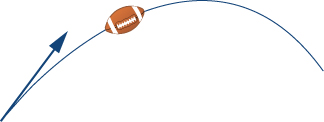

<math xmlns="http://www.w3.org/1998/Math/MathML"><mrow><mrow><mo>〈</mo><mrow><mn>60.62</mn><mo>,</mo><mn>35</mn></mrow><mo>〉</mo></mrow></mrow></math>

A baseball player throws a baseball at an angle of <math xmlns="http://www.w3.org/1998/Math/MathML"><mrow><mn>30</mn><mtext>°</mtext></mrow></math>

 with the horizontal. If the initial speed of the ball is <math xmlns="http://www.w3.org/1998/Math/MathML"><mrow><mn>100</mn></mrow></math>

 mph, find the horizontal and vertical components of the initial velocity vector of the baseball. (Round to two decimal places.)

A bullet is fired with an initial velocity of <math xmlns="http://www.w3.org/1998/Math/MathML"><mrow><mn>1500</mn></mrow></math>

 ft/sec at an angle of <math xmlns="http://www.w3.org/1998/Math/MathML"><mrow><mn>60</mn><mtext>°</mtext></mrow></math>

 with the horizontal. Find the horizontal and vertical components of the velocity vector of the bullet. (Round to two decimal places.)

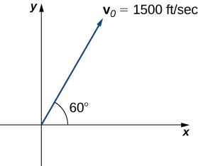

The horizontal and vertical components are <math xmlns="http://www.w3.org/1998/Math/MathML"><mrow><mn>750</mn></mrow></math>

 ft/sec and <math xmlns="http://www.w3.org/1998/Math/MathML"><mrow><mn>1299.04</mn></mrow></math>

 ft/sec, respectively.

**[T]** A 65-kg sprinter exerts a force of <math xmlns="http://www.w3.org/1998/Math/MathML"><mrow><mn>798</mn></mrow></math>

 N at a <math xmlns="http://www.w3.org/1998/Math/MathML"><mrow><mn>19</mn><mtext>°</mtext></mrow></math>

 angle with respect to the ground on the starting block at the instant a race begins. Find the horizontal component of the force. (Round to two decimal places.)

**[T]** Two forces, a horizontal force of <math xmlns="http://www.w3.org/1998/Math/MathML"><mrow><mn>45</mn></mrow></math>

 lb and another of <math xmlns="http://www.w3.org/1998/Math/MathML"><mrow><mn>52</mn></mrow></math>

 lb, act on the same object. The angle between these forces is <math xmlns="http://www.w3.org/1998/Math/MathML"><mrow><mn>25</mn><mtext>°</mtext><mo>.</mo></mrow></math>

 Find the magnitude and direction angle from the positive *x*-axis of the resultant force that acts on the object. (Round to two decimal places.)

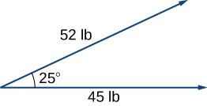

The magnitude of resultant force is <math xmlns="http://www.w3.org/1998/Math/MathML"><mrow><mn>94.71</mn></mrow></math>

 lb; the direction angle is <math xmlns="http://www.w3.org/1998/Math/MathML"><mrow><mn>13.42</mn><mtext>°</mtext><mo>.</mo></mrow></math>

**[T]** Two forces, a vertical force of <math xmlns="http://www.w3.org/1998/Math/MathML"><mrow><mn>26</mn></mrow></math>

 lb and another of <math xmlns="http://www.w3.org/1998/Math/MathML"><mrow><mn>45</mn></mrow></math>

 lb, act on the same object. The angle between these forces is <math xmlns="http://www.w3.org/1998/Math/MathML"><mrow><mn>55</mn><mtext>°</mtext><mo>.</mo></mrow></math>

 Find the magnitude and direction angle from the positive *x*-axis of the resultant force that acts on the object. (Round to two decimal places.)

**[T]** Three forces act on object. Two of the forces have the magnitudes <math xmlns="http://www.w3.org/1998/Math/MathML"><mrow><mn>58</mn></mrow></math>

 N and <math xmlns="http://www.w3.org/1998/Math/MathML"><mrow><mn>27</mn></mrow></math>

 N, and make angles <math xmlns="http://www.w3.org/1998/Math/MathML"><mrow><mn>53</mn><mtext>°</mtext></mrow></math>

 and <math xmlns="http://www.w3.org/1998/Math/MathML"><mrow><mn>152</mn><mtext>°</mtext><mo>,</mo></mrow></math>

 respectively, with the positive *x*-axis. Find the magnitude and the direction angle from the positive *x*-axis of the third force such that the resultant force acting on the object is zero. (Round to two decimal places.)

The magnitude of the third vector is <math xmlns="http://www.w3.org/1998/Math/MathML"><mrow><mn>60.03</mn></mrow></math>

 N; the direction angle is <math xmlns="http://www.w3.org/1998/Math/MathML"><mrow><mn>259.38</mn><mtext>°</mtext><mo>.</mo></mrow></math>

Three forces with magnitudes <math xmlns="http://www.w3.org/1998/Math/MathML"><mrow><mn>80</mn></mrow></math>

 lb, <math xmlns="http://www.w3.org/1998/Math/MathML"><mrow><mn>120</mn></mrow></math>

 lb, and <math xmlns="http://www.w3.org/1998/Math/MathML"><mrow><mn>60</mn></mrow></math>

 lb act on an object at angles of <math xmlns="http://www.w3.org/1998/Math/MathML"><mrow><mn>45</mn><mtext>°</mtext><mo>,</mo></mrow></math>

 <math xmlns="http://www.w3.org/1998/Math/MathML"><mrow><mn>60</mn><mtext>°</mtext></mrow></math>

 and <math xmlns="http://www.w3.org/1998/Math/MathML"><mrow><mn>30</mn><mtext>°</mtext><mo>,</mo></mrow></math>

 respectively, with the positive *x*-axis. Find the magnitude and direction angle from the positive *x*-axis of the resultant force. (Round to two decimal places.)

**[T]** An airplane is flying in the direction of <math xmlns="http://www.w3.org/1998/Math/MathML"><mrow><mn>43</mn><mtext>°</mtext></mrow></math>

 east of north (also abbreviated as <math xmlns="http://www.w3.org/1998/Math/MathML"><mrow><mtext>N</mtext><mn>43</mn><mtext>E</mtext><mo stretchy="false">)</mo></mrow></math>

 at a speed of <math xmlns="http://www.w3.org/1998/Math/MathML"><mrow><mn>550</mn></mrow></math>

 mph. A wind with speed <math xmlns="http://www.w3.org/1998/Math/MathML"><mrow><mn>25</mn></mrow></math>

 mph comes from the southwest at a bearing of <math xmlns="http://www.w3.org/1998/Math/MathML"><mrow><mtext>N</mtext><mn>15</mn><mtext>E</mtext><mo>.</mo></mrow></math>

 What are the ground speed and new direction of the airplane?

The new ground speed of the airplane is <math xmlns="http://www.w3.org/1998/Math/MathML"><mrow><mn>572.19</mn></mrow></math>

 mph; the new direction is <math xmlns="http://www.w3.org/1998/Math/MathML"><mrow><mtext>N</mtext><mn>41.82</mn><mtext>E</mtext><mo>.</mo></mrow></math>

**[T]** A boat is traveling in the water at <math xmlns="http://www.w3.org/1998/Math/MathML"><mrow><mn>30</mn></mrow></math>

 mph in a direction of <math xmlns="http://www.w3.org/1998/Math/MathML"><mrow><mtext>N</mtext><mn>20</mn><mtext>E</mtext></mrow></math>

 (that is, <math xmlns="http://www.w3.org/1998/Math/MathML"><mrow><mn>20</mn><mtext>°</mtext></mrow></math>

 east of north). A strong current is moving at <math xmlns="http://www.w3.org/1998/Math/MathML"><mrow><mn>15</mn></mrow></math>

 mph in a direction of <math xmlns="http://www.w3.org/1998/Math/MathML"><mrow><mtext>N</mtext><mn>45</mn><mtext>E</mtext><mo>.</mo></mrow></math>

 What are the new speed and direction of the boat?

**[T]** A 50-lb weight is hung by a cable so that the two portions of the cable make angles of <math xmlns="http://www.w3.org/1998/Math/MathML"><mrow><mn>40</mn><mtext>°</mtext></mrow></math>

 and <math xmlns="http://www.w3.org/1998/Math/MathML"><mrow><mn>53</mn><mtext>°</mtext><mo>,</mo></mrow></math>

 respectively, with the horizontal. Find the magnitudes of the forces of tension <math xmlns="http://www.w3.org/1998/Math/MathML"><mrow><msub><mtext>T</mtext><mn>1</mn></msub></mrow></math>

 and <math xmlns="http://www.w3.org/1998/Math/MathML"><mrow><msub><mtext>T</mtext><mn>2</mn></msub></mrow></math>

 in the cables if the resultant force acting on the object is zero. (Round to two decimal places.)

<math xmlns="http://www.w3.org/1998/Math/MathML"><mrow><mrow><mo>‖</mo><mrow><msub><mstyle mathvariant="bold" mathsize="normal"><mtext>T</mtext></mstyle><mn>1</mn></msub></mrow><mo>‖</mo></mrow><mo>=</mo><mn>30.13</mn><mspace width="0.2em" /><mtext>lb</mtext><mo>,</mo></mrow></math>

 <math xmlns="http://www.w3.org/1998/Math/MathML"><mrow><mrow><mo>‖</mo><mrow><msub><mstyle mathvariant="bold" mathsize="normal"><mtext>T</mtext></mstyle><mn>2</mn></msub></mrow><mo>‖</mo></mrow><mo>=</mo><mn>38.35</mn><mspace width="0.2em" /><mtext>lb</mtext></mrow></math>

**[T]** A 62-lb weight hangs from a rope that makes the angles of <math xmlns="http://www.w3.org/1998/Math/MathML"><mrow><mn>29</mn><mtext>°</mtext></mrow></math>

 and <math xmlns="http://www.w3.org/1998/Math/MathML"><mrow><mn>61</mn><mtext>°</mtext><mo>,</mo></mrow></math>

 respectively, with the horizontal. Find the magnitudes of the forces of tension <math xmlns="http://www.w3.org/1998/Math/MathML"><mrow><msub><mtext>T</mtext><mn>1</mn></msub></mrow></math>

 and <math xmlns="http://www.w3.org/1998/Math/MathML"><mrow><msub><mtext>T</mtext><mn>2</mn></msub></mrow></math>

 in the cables if the resultant force acting on the object is zero. (Round to two decimal places.)

**[T]** A 1500-lb boat is parked on a ramp that makes an angle of <math xmlns="http://www.w3.org/1998/Math/MathML"><mrow><mn>30</mn><mtext>°</mtext></mrow></math>

 with the horizontal. The boat’s weight vector points downward and is a sum of two vectors: a horizontal vector <math xmlns="http://www.w3.org/1998/Math/MathML"><mrow><msub><mtext mathvariant="bold">v</mtext><mn>1</mn></msub></mrow></math>

 that is parallel to the ramp and a vertical vector <math xmlns="http://www.w3.org/1998/Math/MathML"><mrow><msub><mtext mathvariant="bold">v</mtext><mn>2</mn></msub></mrow></math>

 that is perpendicular to the inclined surface. The magnitudes of vectors <math xmlns="http://www.w3.org/1998/Math/MathML"><mrow><msub><mtext mathvariant="bold">v</mtext><mn>1</mn></msub></mrow></math>

 and <math xmlns="http://www.w3.org/1998/Math/MathML"><mrow><msub><mtext mathvariant="bold">v</mtext><mn>2</mn></msub></mrow></math>

 are the horizontal and vertical component, respectively, of the boat’s weight vector. Find the magnitudes of <math xmlns="http://www.w3.org/1998/Math/MathML"><mrow><msub><mtext mathvariant="bold">v</mtext><mn>1</mn></msub></mrow></math>

 and <math xmlns="http://www.w3.org/1998/Math/MathML"><mrow><msub><mtext mathvariant="bold">v</mtext><mn>2</mn></msub></mrow><mo>.</mo></math>

 (Round to the nearest integer.)

<math xmlns="http://www.w3.org/1998/Math/MathML"><mrow><mrow><mo>‖</mo><mrow><msub><mtext mathvariant="bold">v</mtext><mn>1</mn></msub></mrow><mo>‖</mo></mrow><mo>=</mo><mn>750</mn></mrow></math>

 lb, <math xmlns="http://www.w3.org/1998/Math/MathML"><mrow><mrow><mo>‖</mo><mrow><msub><mtext mathvariant="bold">v</mtext><mn>2</mn></msub></mrow><mo>‖</mo></mrow><mo>=</mo><mn>1299</mn></mrow></math>

 lb

**[T]** An 85-lb box is at rest on a <math xmlns="http://www.w3.org/1998/Math/MathML"><mrow><mn>26</mn><mtext>°</mtext></mrow></math>

 incline. Determine the magnitude of the force parallel to the incline necessary to keep the box from sliding. (Round to the nearest integer.)

A guy-wire supports a pole that is <math xmlns="http://www.w3.org/1998/Math/MathML"><mrow><mn>75</mn></mrow></math>

 ft high. One end of the wire is attached to the top of the pole and the other end is anchored to the ground <math xmlns="http://www.w3.org/1998/Math/MathML"><mrow><mn>50</mn></mrow></math>

 ft from the base of the pole. Determine the horizontal and vertical components of the force of tension in the wire if its magnitude is <math xmlns="http://www.w3.org/1998/Math/MathML"><mrow><mn>50</mn></mrow></math>

 lb. (Round to the nearest integer.)

The two horizontal and vertical components of the force of tension are <math xmlns="http://www.w3.org/1998/Math/MathML"><mrow><mn>28</mn></mrow></math>

 lb and <math xmlns="http://www.w3.org/1998/Math/MathML"><mrow><mn>42</mn></mrow></math>

 lb, respectively.

A telephone pole guy-wire has an angle of elevation of <math xmlns="http://www.w3.org/1998/Math/MathML"><mrow><mn>35</mn><mtext>°</mtext></mrow></math>

 with respect to the ground. The force of tension in the guy-wire is <math xmlns="http://www.w3.org/1998/Math/MathML"><mrow><mn>120</mn></mrow></math>

 lb. Find the horizontal and vertical components of the force of tension. (Round to the nearest integer.)

</section>

### Glossary
{: data-type="glossary-title"}

component
: a scalar that describes either the vertical or horizontal direction of a vector
^

equivalent vectors
: vectors that have the same magnitude and the same direction
^

initial point
: the starting point of a vector
^

magnitude
: the length of a vector
^

normalization
: using scalar multiplication to find a unit vector with a given direction
^

parallelogram method
: a method for finding the sum of two vectors; position the vectors so they share the same initial point; the vectors then form two adjacent sides of a parallelogram; the sum of the vectors is the diagonal of that parallelogram
^

scalar
: a real number
^

scalar multiplication
: a vector operation that defines the product of a scalar and a vector
^

standard-position vector
: a vector with initial point
  <math xmlns="http://www.w3.org/1998/Math/MathML"><mrow><mrow><mo>(</mo><mrow><mn>0</mn><mo>,</mo><mn>0</mn></mrow><mo>)</mo></mrow></mrow></math>
^

standard unit vectors
: unit vectors along the coordinate axes:
  <math xmlns="http://www.w3.org/1998/Math/MathML"><mrow><mstyle mathvariant="bold" mathsize="normal"><mtext>i</mtext></mstyle><mo>=</mo><mrow><mo>〈</mo><mrow><mn>1</mn><mo>,</mo><mn>0</mn></mrow><mo>〉</mo></mrow><mo>,</mo><mstyle mathvariant="bold" mathsize="normal"><mtext>j</mtext></mstyle><mo>=</mo><mrow><mo>〈</mo><mrow><mn>0</mn><mo>,</mo><mn>1</mn></mrow><mo>〉</mo></mrow></mrow></math>
^

terminal point
: the endpoint of a vector
^

triangle inequality
: the length of any side of a triangle is less than the sum of the lengths of the other two sides
^

triangle method
: a method for finding the sum of two vectors; position the vectors so the terminal point of one vector is the initial point of the other; these vectors then form two sides of a triangle; the sum of the vectors is the vector that forms the third side; the initial point of the sum is the initial point of the first vector; the terminal point of the sum is the terminal point of the second vector
^

unit vector
: a vector with margnitude
  <math xmlns="http://www.w3.org/1998/Math/MathML"><mn>1</mn></math>
^

vector
: a mathematical object that has both magnitude and direction
^

vector addition
: a vector operation that defines the sum of two vectors
^

vector difference
: the vector difference
  <math xmlns="http://www.w3.org/1998/Math/MathML"><mrow><mstyle mathvariant="bold" mathsize="normal"><mtext>v</mtext></mstyle><mo>−</mo><mstyle mathvariant="bold" mathsize="normal"><mtext>w</mtext></mstyle></mrow></math>
  
  is defined as
  <math xmlns="http://www.w3.org/1998/Math/MathML"><mrow><mstyle mathvariant="bold" mathsize="normal"><mi>v</mi><mo>+</mo></mstyle><mrow><mo>(</mo><mrow><mtext>−</mtext><mstyle mathvariant="bold" mathsize="normal"><mtext>w</mtext></mstyle></mrow><mo>)</mo></mrow><mo>=</mo><mstyle mathvariant="bold" mathsize="normal"><mi>v</mi><mo>+</mo></mstyle><mo stretchy="false">(</mo><mn>−1</mn><mo stretchy="false">)</mo><mstyle mathvariant="bold" mathsize="normal"><mtext>w</mtext></mstyle></mrow></math>
^

vector sum
: the sum of two vectors,
  <math xmlns="http://www.w3.org/1998/Math/MathML"><mstyle mathvariant="bold" mathsize="normal"><mtext>v</mtext></mstyle></math>
  
  and
  <math xmlns="http://www.w3.org/1998/Math/MathML"><mrow><mstyle mathvariant="bold" mathsize="normal"><mtext>w</mtext></mstyle><mo>,</mo></mrow></math>
  
  can be constructed graphically by placing the initial point of
  <math xmlns="http://www.w3.org/1998/Math/MathML"><mstyle mathvariant="bold" mathsize="normal"><mtext>w</mtext></mstyle></math>
  
  at the terminal point of
  <math xmlns="http://www.w3.org/1998/Math/MathML"><mrow><mstyle mathvariant="bold" mathsize="normal"><mtext>v</mtext></mstyle><mo>;</mo></mrow></math>
  
  then the vector sum
  <math xmlns="http://www.w3.org/1998/Math/MathML"><mrow><mstyle mathvariant="bold" mathsize="normal"><mi>v</mi><mo>+</mo><mi>w</mi></mstyle></mrow></math>
  
  is the vector with an initial point that coincides with the initial point of
  <math xmlns="http://www.w3.org/1998/Math/MathML"><mrow><mstyle mathvariant="bold" mathsize="normal"><mtext>v</mtext></mstyle><mo>,</mo></mrow></math>
  
  and with a terminal point that coincides with the terminal point of
  <math xmlns="http://www.w3.org/1998/Math/MathML"><mstyle mathvariant="bold" mathsize="normal"><mtext>w</mtext></mstyle></math>
^

zero vector
: the vector with both initial point and terminal point
  <math xmlns="http://www.w3.org/1998/Math/MathML"><mrow><mrow><mo>(</mo><mrow><mn>0</mn><mo>,</mo><mn>0</mn></mrow><mo>)</mo></mrow></mrow></math>

