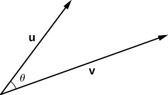
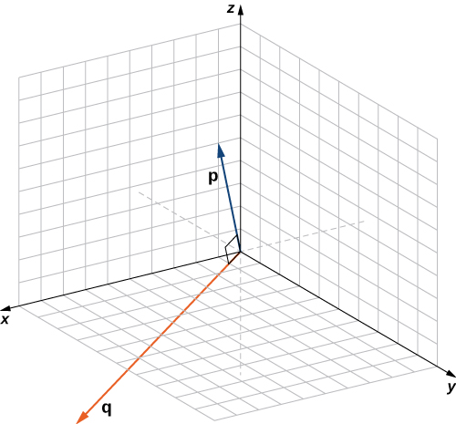
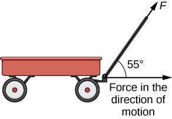
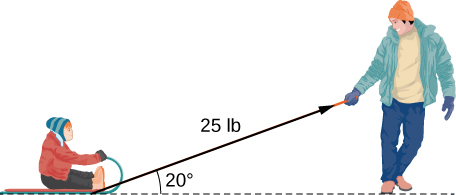

* Calculate the dot product of two given vectors.
* Determine whether two given vectors are perpendicular.
* Find the direction cosines of a given vector.
* Explain what is meant by the vector projection of one vector onto another vector, and describe how to compute it.
* Calculate the work done by a given force.

If we apply a force to an object so that the object moves, we say that *work* is done by the force. In [Introduction to Applications of Integration](/m53638){: .target-chapter} on integration applications, we looked at a constant force and we assumed the force was applied in the direction of motion of the object. Under those conditions, work can be expressed as the product of the force acting on an object and the distance the object moves. In this chapter, however, we have seen that both force and the motion of an object can be represented by vectors.

In this section, we develop an operation called the *dot product*, which allows us to calculate work in the case when the force vector and the motion vector have different directions. The dot product essentially tells us how much of the force vector is applied in the direction of the motion vector. The dot product can also help us measure the angle formed by a pair of vectors and the position of a vector relative to the coordinate axes. It even provides a simple test to determine whether two vectors meet at a right angle.

# The Dot Product and Its Properties

We have already learned how to add and subtract vectors. In this chapter, we investigate two types of vector multiplication. The first type of vector multiplication is called the dot product, based on the notation we use for it, and it is defined as follows:

Definition

The **dot product**{: data-type="term"} of vectors <math xmlns="http://www.w3.org/1998/Math/MathML"><mrow><mstyle mathvariant="bold" mathsize="normal"><mtext>u</mtext></mstyle><mo>=</mo><mrow><mo>〈</mo><mrow><msub><mi>u</mi><mn>1</mn></msub><mo>,</mo><msub><mi>u</mi><mn>2</mn></msub><mo>,</mo><msub><mi>u</mi><mn>3</mn></msub></mrow><mo>〉</mo></mrow></mrow></math>

 and <math xmlns="http://www.w3.org/1998/Math/MathML"><mrow><mstyle mathvariant="bold" mathsize="normal"><mtext>v</mtext></mstyle><mo>=</mo><mrow><mo>〈</mo><mrow><msub><mi>v</mi><mn>1</mn></msub><mo>,</mo><msub><mi>v</mi><mn>2</mn></msub><mo>,</mo><msub><mi>v</mi><mn>3</mn></msub></mrow><mo>〉</mo></mrow></mrow></math>

 is given by the sum of the products of the components

<math xmlns="http://www.w3.org/1998/Math/MathML"><mrow><mstyle mathvariant="bold" mathsize="normal"><mtext>u</mtext></mstyle><mo>·</mo><mstyle mathvariant="bold" mathsize="normal"><mtext>v</mtext></mstyle><mo>=</mo><msub><mi>u</mi><mn>1</mn></msub><msub><mi>v</mi><mn>1</mn></msub><mo>+</mo><msub><mi>u</mi><mn>2</mn></msub><msub><mi>v</mi><mn>2</mn></msub><mo>+</mo><msub><mi>u</mi><mn>3</mn></msub><msub><mi>v</mi><mn>3</mn></msub><mo>.</mo></mrow></math>

Note that if **u** and **v** are two-dimensional vectors, we calculate the dot product in a similar fashion. Thus, if <math xmlns="http://www.w3.org/1998/Math/MathML"><mrow><mstyle mathvariant="bold" mathsize="normal"><mtext>u</mtext></mstyle><mo>=</mo><mrow><mo>〈</mo><mrow><msub><mi>u</mi><mn>1</mn></msub><mo>,</mo><msub><mi>u</mi><mn>2</mn></msub></mrow><mo>〉</mo></mrow></mrow></math>

 and <math xmlns="http://www.w3.org/1998/Math/MathML"><mrow><mstyle mathvariant="bold" mathsize="normal"><mtext>v</mtext></mstyle><mo>=</mo><mrow><mo>〈</mo><mrow><msub><mi>v</mi><mn>1</mn></msub><mo>,</mo><msub><mi>v</mi><mn>2</mn></msub></mrow><mo>〉</mo></mrow><mo>,</mo></mrow></math>

 then

<math xmlns="http://www.w3.org/1998/Math/MathML"><mrow><mstyle mathvariant="bold" mathsize="normal"><mtext>u</mtext></mstyle><mo>·</mo><mstyle mathvariant="bold" mathsize="normal"><mtext>v</mtext></mstyle><mo>=</mo><msub><mi>u</mi><mn>1</mn></msub><msub><mi>v</mi><mn>1</mn></msub><mo>+</mo><msub><mi>u</mi><mn>2</mn></msub><msub><mi>v</mi><mn>2</mn></msub><mo>.</mo></mrow></math>

When two vectors are combined under addition or subtraction, the result is a vector. When two vectors are combined using the dot product, the result is a scalar. For this reason, the dot product is often called the *scalar product*. It may also be called the *inner product*.

Calculating Dot Products

1.  Find the dot product of
    <math xmlns="http://www.w3.org/1998/Math/MathML"><mrow><mstyle mathvariant="bold" mathsize="normal"><mtext>u</mtext></mstyle><mo>=</mo><mrow><mo>〈</mo><mrow><mn>3</mn><mo>,</mo><mn>5</mn><mo>,</mo><mn>2</mn></mrow><mo>〉</mo></mrow></mrow></math>
    
    and
    <math xmlns="http://www.w3.org/1998/Math/MathML"><mrow><mstyle mathvariant="bold" mathsize="normal"><mtext>v</mtext></mstyle><mo>=</mo><mrow><mo>〈</mo><mrow><mn>−1</mn><mo>,</mo><mn>3</mn><mo>,</mo><mn>0</mn></mrow><mo>〉</mo></mrow><mo>.</mo></mrow></math>

2.  Find the scalar product of
    <math xmlns="http://www.w3.org/1998/Math/MathML"><mrow><mstyle mathvariant="bold" mathsize="normal"><mtext>p</mtext></mstyle><mo>=</mo><mn>10</mn><mstyle mathvariant="bold" mathsize="normal"><mtext>i</mtext></mstyle><mo>−</mo><mn>4</mn><mstyle mathvariant="bold" mathsize="normal"><mtext>j</mtext></mstyle><mo>+</mo><mn>7</mn><mstyle mathvariant="bold" mathsize="normal"><mtext>k</mtext></mstyle></mrow></math>
    
    and
    <math xmlns="http://www.w3.org/1998/Math/MathML"><mrow><mstyle mathvariant="bold" mathsize="normal"><mtext>q</mtext></mstyle><mo>=</mo><mn>−2</mn><mstyle mathvariant="bold" mathsize="normal"><mtext>i</mtext></mstyle><mo>+</mo><mstyle mathvariant="bold" mathsize="normal"><mtext>j</mtext></mstyle><mo>+</mo><mn>6</mn><mstyle mathvariant="bold" mathsize="normal"><mtext>k</mtext></mstyle><mo>.</mo></mrow></math>
{: data-number-style="lower-alpha"}

1.  Substitute the vector components into the formula for the dot product:
    * * *
    {: data-type="newline"}
    
    

    <math xmlns="http://www.w3.org/1998/Math/MathML"><mtable><mtr><mtd columnalign="right"><mstyle mathvariant="bold" mathsize="normal"><mtext>u</mtext></mstyle><mo>·</mo><mstyle mathvariant="bold" mathsize="normal"><mtext>v</mtext></mstyle></mtd><mtd columnalign="left"><mo>=</mo><msub><mi>u</mi><mn>1</mn></msub><msub><mi>v</mi><mn>1</mn></msub><mo>+</mo><msub><mi>u</mi><mn>2</mn></msub><msub><mi>v</mi><mn>2</mn></msub><mo>+</mo><msub><mi>u</mi><mn>3</mn></msub><msub><mi>v</mi><mn>3</mn></msub></mtd></mtr><mtr><mtd /><mtd columnalign="left"><mo>=</mo><mn>3</mn><mo stretchy="false">(</mo><mn>−1</mn><mo stretchy="false">)</mo><mo>+</mo><mn>5</mn><mo stretchy="false">(</mo><mn>3</mn><mo stretchy="false">)</mo><mo>+</mo><mn>2</mn><mo stretchy="false">(</mo><mn>0</mn><mo stretchy="false">)</mo><mo>=</mo><mn>−3</mn><mo>+</mo><mn>15</mn><mo>+</mo><mn>0</mn><mo>=</mo><mn>12.</mn></mtd></mtr></mtable></math>
    

2.  The calculation is the same if the vectors are written using standard unit vectors. We still have three components for each vector to substitute into the formula for the dot product:
    * * *
    {: data-type="newline"}
    
    

    <math xmlns="http://www.w3.org/1998/Math/MathML"><mtable><mtr><mtd columnalign="right"><mstyle mathvariant="bold" mathsize="normal"><mtext>p</mtext></mstyle><mo>·</mo><mstyle mathvariant="bold" mathsize="normal"><mtext>q</mtext></mstyle></mtd><mtd columnalign="left"><mo>=</mo><msub><mi>u</mi><mn>1</mn></msub><msub><mi>v</mi><mn>1</mn></msub><mo>+</mo><msub><mi>u</mi><mn>2</mn></msub><msub><mi>v</mi><mn>2</mn></msub><mo>+</mo><msub><mi>u</mi><mn>3</mn></msub><msub><mi>v</mi><mn>3</mn></msub></mtd></mtr><mtr><mtd /><mtd columnalign="left"><mo>=</mo><mn>10</mn><mo stretchy="false">(</mo><mn>−2</mn><mo stretchy="false">)</mo><mo>+</mo><mo stretchy="false">(</mo><mn>−4</mn><mo stretchy="false">)</mo><mo stretchy="false">(</mo><mn>1</mn><mo stretchy="false">)</mo><mo>+</mo><mo stretchy="false">(</mo><mn>7</mn><mo stretchy="false">)</mo><mo stretchy="false">(</mo><mn>6</mn><mo stretchy="false">)</mo><mo>=</mo><mn>−20</mn><mo>−</mo><mn>4</mn><mo>+</mo><mn>42</mn><mo>=</mo><mn>18.</mn></mtd></mtr></mtable></math>
    

{: data-number-style="lower-alpha"}

Find <math xmlns="http://www.w3.org/1998/Math/MathML"><mrow><mstyle mathvariant="bold" mathsize="normal"><mtext>u</mtext></mstyle><mo>·</mo><mstyle mathvariant="bold" mathsize="normal"><mtext>v</mtext></mstyle><mo>,</mo></mrow></math>

 where <math xmlns="http://www.w3.org/1998/Math/MathML"><mrow><mstyle mathvariant="bold" mathsize="normal"><mtext>u</mtext></mstyle><mo>=</mo><mrow><mo>〈</mo><mrow><mn>2</mn><mo>,</mo><mn>9</mn><mo>,</mo><mn>−1</mn></mrow><mo>〉</mo></mrow></mrow></math>

 and <math xmlns="http://www.w3.org/1998/Math/MathML"><mrow><mstyle mathvariant="bold" mathsize="normal"><mtext>v</mtext></mstyle><mo>=</mo><mrow><mo>〈</mo><mrow><mn>−3</mn><mo>,</mo><mn>1</mn><mo>,</mo><mn>−4</mn></mrow><mo>〉</mo></mrow><mo>.</mo></mrow></math>

7

Hint

Multiply corresponding components and then add their products.

Like vector addition and subtraction, the dot product has several algebraic properties. We prove three of these properties and leave the rest as exercises.

Properties of the Dot Product

Let <math xmlns="http://www.w3.org/1998/Math/MathML"><mrow><mstyle mathvariant="bold" mathsize="normal"><mtext>u</mtext></mstyle><mo>,</mo></mrow></math>

 <math xmlns="http://www.w3.org/1998/Math/MathML"><mrow><mstyle mathvariant="bold" mathsize="normal"><mtext>v</mtext></mstyle><mo>,</mo></mrow></math>

 and <math xmlns="http://www.w3.org/1998/Math/MathML"><mstyle mathvariant="bold" mathsize="normal"><mtext>w</mtext></mstyle></math>

 be vectors, and let *c* be a scalar.

<math xmlns="http://www.w3.org/1998/Math/MathML"><mtable><mtr><mtd columnalign="left"><mtext>i.</mtext></mtd><mtd /><mtd /><mtd columnalign="right"><mrow><mstyle mathvariant="bold" mathsize="normal"><mtext>u</mtext></mstyle><mo>·</mo><mstyle mathvariant="bold" mathsize="normal"><mtext>v</mtext></mstyle></mrow></mtd><mtd columnalign="left"><mo>=</mo></mtd><mtd columnalign="left"><mstyle mathvariant="bold" mathsize="normal"><mtext>v</mtext></mstyle><mo>·</mo><mstyle mathvariant="bold" mathsize="normal"><mtext>u</mtext></mstyle></mtd><mtd /><mtd /><mtd columnalign="left"><mtext>Commutative property</mtext></mtd></mtr><mtr><mtd columnalign="left"><mtext>ii.</mtext></mtd><mtd /><mtd /><mtd columnalign="right"><mrow><mstyle mathvariant="bold" mathsize="normal"><mtext>u</mtext></mstyle><mo>·</mo><mrow><mo>(</mo><mrow><mstyle mathvariant="bold" mathsize="normal"><mtext>v</mtext></mstyle><mo>+</mo><mstyle mathvariant="bold" mathsize="normal"><mtext>w</mtext></mstyle></mrow><mo>)</mo></mrow></mrow></mtd><mtd columnalign="left"><mo>=</mo></mtd><mtd columnalign="left"><mstyle mathvariant="bold" mathsize="normal"><mtext>u</mtext></mstyle><mo>·</mo><mstyle mathvariant="bold" mathsize="normal"><mtext>v</mtext></mstyle><mo>+</mo><mstyle mathvariant="bold" mathsize="normal"><mtext>u</mtext></mstyle><mo>·</mo><mstyle mathvariant="bold" mathsize="normal"><mtext>w</mtext></mstyle></mtd><mtd /><mtd /><mtd columnalign="left"><mtext>Distributive property</mtext></mtd></mtr><mtr><mtd columnalign="left"><mtext>iii.</mtext></mtd><mtd /><mtd /><mtd columnalign="right"><mrow><mi>c</mi><mrow><mo>(</mo><mrow><mstyle mathvariant="bold" mathsize="normal"><mtext>u</mtext></mstyle><mo>·</mo><mstyle mathvariant="bold" mathsize="normal"><mtext>v</mtext></mstyle></mrow><mo>)</mo></mrow></mrow></mtd><mtd columnalign="left"><mo>=</mo></mtd><mtd columnalign="left"><mrow><mo>(</mo><mrow><mi>c</mi><mstyle mathvariant="bold" mathsize="normal"><mtext>u</mtext></mstyle></mrow><mo>)</mo></mrow><mo>·</mo><mstyle mathvariant="bold" mathsize="normal"><mtext>v</mtext></mstyle><mo>=</mo><mstyle mathvariant="bold" mathsize="normal"><mtext>u</mtext></mstyle><mo>·</mo><mrow><mo>(</mo><mrow><mi>c</mi><mstyle mathvariant="bold" mathsize="normal"><mtext>v</mtext></mstyle></mrow><mo>)</mo></mrow></mtd><mtd /><mtd /><mtd columnalign="left"><mtext>Associative property</mtext></mtd></mtr><mtr><mtd columnalign="left"><mtext>iv.</mtext></mtd><mtd /><mtd /><mtd columnalign="right"><mrow><mstyle mathvariant="bold" mathsize="normal"><mtext>v</mtext></mstyle><mo>·</mo><mstyle mathvariant="bold" mathsize="normal"><mtext>v</mtext></mstyle></mrow></mtd><mtd columnalign="left"><mo>=</mo></mtd><mtd columnalign="left"><msup><mrow><mrow><mo>‖</mo><mstyle mathvariant="bold" mathsize="normal"><mtext>v</mtext></mstyle><mo>‖</mo></mrow></mrow><mn>2</mn></msup></mtd><mtd /><mtd /><mtd columnalign="left"><mtext>Property of magnitude</mtext></mtd></mtr></mtable></math>

## Proof

Let <math xmlns="http://www.w3.org/1998/Math/MathML"><mrow><mstyle mathvariant="bold" mathsize="normal"><mtext>u</mtext></mstyle><mo>=</mo><mrow><mo>〈</mo><mrow><msub><mi>u</mi><mn>1</mn></msub><mo>,</mo><msub><mi>u</mi><mn>2</mn></msub><mo>,</mo><msub><mi>u</mi><mn>3</mn></msub></mrow><mo>〉</mo></mrow></mrow></math>

 and <math xmlns="http://www.w3.org/1998/Math/MathML"><mrow><mstyle mathvariant="bold" mathsize="normal"><mtext>v</mtext></mstyle><mo>=</mo><mrow><mo>〈</mo><mrow><msub><mi>v</mi><mn>1</mn></msub><mo>,</mo><msub><mi>v</mi><mn>2</mn></msub><mo>,</mo><msub><mi>v</mi><mn>3</mn></msub></mrow><mo>〉</mo></mrow><mo>.</mo></mrow></math>

 Then

<math xmlns="http://www.w3.org/1998/Math/MathML"><mtable><mtr><mtd columnalign="right"><mstyle mathvariant="bold" mathsize="normal"><mtext>u</mtext></mstyle><mo>·</mo><mstyle mathvariant="bold" mathsize="normal"><mtext>v</mtext></mstyle></mtd><mtd columnalign="left"><mo>=</mo><mrow><mo>〈</mo><mrow><msub><mi>u</mi><mn>1</mn></msub><mo>,</mo><msub><mi>u</mi><mn>2</mn></msub><mo>,</mo><msub><mi>u</mi><mn>3</mn></msub></mrow><mo>〉</mo></mrow><mo>·</mo><mrow><mo>〈</mo><mrow><msub><mi>v</mi><mn>1</mn></msub><mo>,</mo><msub><mi>v</mi><mn>2</mn></msub><mo>,</mo><msub><mi>v</mi><mn>3</mn></msub></mrow><mo>〉</mo></mrow></mtd></mtr><mtr><mtd /><mtd columnalign="left"><mo>=</mo><msub><mi>u</mi><mn>1</mn></msub><msub><mi>v</mi><mn>1</mn></msub><mo>+</mo><msub><mi>u</mi><mn>2</mn></msub><msub><mi>v</mi><mn>2</mn></msub><mo>+</mo><msub><mi>u</mi><mn>3</mn></msub><msub><mi>v</mi><mn>3</mn></msub></mtd></mtr><mtr><mtd /><mtd columnalign="left"><mo>=</mo><msub><mi>v</mi><mn>1</mn></msub><msub><mi>u</mi><mn>1</mn></msub><mo>+</mo><msub><mi>v</mi><mn>2</mn></msub><msub><mi>u</mi><mn>2</mn></msub><mo>+</mo><msub><mi>v</mi><mn>3</mn></msub><msub><mi>u</mi><mn>3</mn></msub></mtd></mtr><mtr><mtd /><mtd columnalign="left"><mo>=</mo><mrow><mo>〈</mo><mrow><msub><mi>v</mi><mn>1</mn></msub><mo>,</mo><msub><mi>v</mi><mn>2</mn></msub><mo>,</mo><msub><mi>v</mi><mn>3</mn></msub></mrow><mo>〉</mo></mrow><mo>·</mo><mrow><mo>〈</mo><mrow><msub><mi>u</mi><mn>1</mn></msub><mo>,</mo><msub><mi>u</mi><mn>2</mn></msub><mo>,</mo><msub><mi>u</mi><mn>3</mn></msub></mrow><mo>〉</mo></mrow></mtd></mtr><mtr><mtd /><mtd columnalign="left"><mo>=</mo><mstyle mathvariant="bold" mathsize="normal"><mtext>v</mtext></mstyle><mo>·</mo><mstyle mathvariant="bold" mathsize="normal"><mtext>u</mtext></mstyle><mo>.</mo></mtd></mtr></mtable></math>

The associative property looks like the associative property for real-number multiplication, but pay close attention to the difference between scalar and vector objects:

<math xmlns="http://www.w3.org/1998/Math/MathML"><mtable><mtr><mtd columnalign="right"><mi>c</mi><mrow><mo>(</mo><mrow><mstyle mathvariant="bold" mathsize="normal"><mtext>u</mtext></mstyle><mo>·</mo><mstyle mathvariant="bold" mathsize="normal"><mtext>v</mtext></mstyle></mrow><mo>)</mo></mrow></mtd><mtd columnalign="left"><mo>=</mo><mi>c</mi><mrow><mo>(</mo><mrow><msub><mi>u</mi><mn>1</mn></msub><msub><mi>v</mi><mn>1</mn></msub><mo>+</mo><msub><mi>u</mi><mn>2</mn></msub><msub><mi>v</mi><mn>2</mn></msub><mo>+</mo><msub><mi>u</mi><mn>3</mn></msub><msub><mi>v</mi><mn>3</mn></msub></mrow><mo>)</mo></mrow></mtd></mtr><mtr><mtd /><mtd columnalign="left"><mo>=</mo><mi>c</mi><mrow><mo>(</mo><mrow><msub><mi>u</mi><mn>1</mn></msub><msub><mi>v</mi><mn>1</mn></msub></mrow><mo>)</mo></mrow><mo>+</mo><mi>c</mi><mrow><mo>(</mo><mrow><msub><mi>u</mi><mn>2</mn></msub><msub><mi>v</mi><mn>2</mn></msub></mrow><mo>)</mo></mrow><mo>+</mo><mi>c</mi><mrow><mo>(</mo><mrow><msub><mi>u</mi><mn>3</mn></msub><msub><mi>v</mi><mn>3</mn></msub></mrow><mo>)</mo></mrow></mtd></mtr><mtr><mtd /><mtd columnalign="left"><mo>=</mo><mrow><mo>(</mo><mrow><mi>c</mi><msub><mi>u</mi><mn>1</mn></msub></mrow><mo>)</mo></mrow><msub><mi>v</mi><mn>1</mn></msub><mo>+</mo><mrow><mo>(</mo><mrow><mi>c</mi><msub><mi>u</mi><mn>2</mn></msub></mrow><mo>)</mo></mrow><msub><mi>v</mi><mn>2</mn></msub><mo>+</mo><mrow><mo>(</mo><mrow><mi>c</mi><msub><mi>u</mi><mn>3</mn></msub></mrow><mo>)</mo></mrow><msub><mi>v</mi><mn>3</mn></msub></mtd></mtr><mtr><mtd /><mtd columnalign="left"><mo>=</mo><mrow><mo>〈</mo><mrow><mi>c</mi><msub><mi>u</mi><mn>1</mn></msub><mo>,</mo><mi>c</mi><msub><mi>u</mi><mn>2</mn></msub><mo>,</mo><mi>c</mi><msub><mi>u</mi><mn>3</mn></msub></mrow><mo>〉</mo></mrow><mo>·</mo><mrow><mo>〈</mo><mrow><msub><mi>v</mi><mn>1</mn></msub><mo>,</mo><msub><mi>v</mi><mn>2</mn></msub><mo>,</mo><msub><mi>v</mi><mn>3</mn></msub></mrow><mo>〉</mo></mrow></mtd></mtr><mtr><mtd /><mtd columnalign="left"><mo>=</mo><mi>c</mi><mrow><mo>〈</mo><mrow><msub><mi>u</mi><mn>1</mn></msub><mo>,</mo><msub><mi>u</mi><mn>2</mn></msub><mo>,</mo><msub><mi>u</mi><mn>3</mn></msub></mrow><mo>〉</mo></mrow><mo>·</mo><mrow><mo>〈</mo><mrow><msub><mi>v</mi><mn>1</mn></msub><mo>,</mo><msub><mi>v</mi><mn>2</mn></msub><mo>,</mo><msub><mi>v</mi><mn>3</mn></msub></mrow><mo>〉</mo></mrow></mtd></mtr><mtr><mtd /><mtd columnalign="left"><mo>=</mo><mo stretchy="false">(</mo><mi>c</mi><mstyle mathvariant="bold" mathsize="normal"><mtext>u</mtext></mstyle><mo stretchy="false">)</mo><mo>·</mo><mstyle mathvariant="bold" mathsize="normal"><mtext>v</mtext></mstyle><mo>.</mo></mtd></mtr></mtable></math>

The proof that <math xmlns="http://www.w3.org/1998/Math/MathML"><mrow><mi>c</mi><mrow><mo>(</mo><mrow><mstyle mathvariant="bold" mathsize="normal"><mtext>u</mtext></mstyle><mo>·</mo><mstyle mathvariant="bold" mathsize="normal"><mtext>v</mtext></mstyle></mrow><mo>)</mo></mrow><mo>=</mo><mstyle mathvariant="bold" mathsize="normal"><mtext>u</mtext></mstyle><mo>·</mo><mrow><mo>(</mo><mrow><mi>c</mi><mstyle mathvariant="bold" mathsize="normal"><mtext>v</mtext></mstyle></mrow><mo>)</mo></mrow></mrow></math>

 is similar.

The fourth property shows the relationship between the magnitude of a vector and its dot product with itself:

<math xmlns="http://www.w3.org/1998/Math/MathML"><mtable><mtr><mtd columnalign="right"><mstyle mathvariant="bold" mathsize="normal"><mtext>v</mtext></mstyle><mo>·</mo><mstyle mathvariant="bold" mathsize="normal"><mtext>v</mtext></mstyle></mtd><mtd columnalign="left"><mo>=</mo><mrow><mo>〈</mo><mrow><msub><mi>v</mi><mn>1</mn></msub><mo>,</mo><msub><mi>v</mi><mn>2</mn></msub><mo>,</mo><msub><mi>v</mi><mn>3</mn></msub></mrow><mo>〉</mo></mrow><mo>·</mo><mrow><mo>〈</mo><mrow><msub><mi>v</mi><mn>1</mn></msub><mo>,</mo><msub><mi>v</mi><mn>2</mn></msub><mo>,</mo><msub><mi>v</mi><mn>3</mn></msub></mrow><mo>〉</mo></mrow></mtd></mtr><mtr><mtd /><mtd columnalign="left"><mo>=</mo><msup><mrow><mo>(</mo><mrow><msub><mi>v</mi><mn>1</mn></msub></mrow><mo>)</mo></mrow><mn>2</mn></msup><mo>+</mo><msup><mrow><mo>(</mo><mrow><msub><mi>v</mi><mn>2</mn></msub></mrow><mo>)</mo></mrow><mn>2</mn></msup><mo>+</mo><msup><mrow><mo>(</mo><mrow><msub><mi>v</mi><mn>3</mn></msub></mrow><mo>)</mo></mrow><mn>2</mn></msup></mtd></mtr><mtr><mtd /><mtd columnalign="left"><mo>=</mo><msup><mrow><mo>[</mo><mrow><msqrt><mrow><msup><mrow><mrow><mo>(</mo><mrow><msub><mi>v</mi><mn>1</mn></msub></mrow><mo>)</mo></mrow></mrow><mn>2</mn></msup><mo>+</mo><msup><mrow><mrow><mo>(</mo><mrow><msub><mi>v</mi><mn>2</mn></msub></mrow><mo>)</mo></mrow></mrow><mn>2</mn></msup><mo>+</mo><msup><mrow><mrow><mo>(</mo><mrow><msub><mi>v</mi><mn>3</mn></msub></mrow><mo>)</mo></mrow></mrow><mn>2</mn></msup></mrow></msqrt></mrow><mo>]</mo></mrow><mn>2</mn></msup></mtd></mtr><mtr><mtd /><mtd columnalign="left"><mo>=</mo><msup><mrow><mo>‖</mo><mstyle mathvariant="bold" mathsize="normal"><mtext>v</mtext></mstyle><mo>‖</mo></mrow><mn>2</mn></msup><mo>.</mo></mtd></mtr></mtable></math>

□

Note that by property iv. we have <math xmlns="http://www.w3.org/1998/Math/MathML"><mrow><mn>0</mn><mo>·</mo><mstyle mathvariant="bold" mathsize="normal"><mtext>v</mtext></mstyle><mo>=</mo><mstyle mathvariant="bold" mathsize="normal"><mn>0</mn></mstyle><mo>.</mo></mrow></math>

 Also by property iv. if <math xmlns="http://www.w3.org/1998/Math/MathML"><mrow><mstyle mathvariant="bold" mathsize="normal"><mtext>v</mtext></mstyle><mo>·</mo><mstyle mathvariant="bold" mathsize="normal"><mtext>v</mtext></mstyle><mo>=</mo><mn>0</mn><mo>,</mo></mrow></math>

 then <math xmlns="http://www.w3.org/1998/Math/MathML"><mrow><mstyle mathvariant="bold" mathsize="normal"><mtext>v</mtext></mstyle><mo>=</mo><mn>0</mn><mo>.</mo></mrow></math>

Using Properties of the Dot Product

Let <math xmlns="http://www.w3.org/1998/Math/MathML"><mrow><mstyle mathvariant="bold" mathsize="normal"><mtext>a</mtext></mstyle><mo>=</mo><mrow><mo>〈</mo><mrow><mn>1</mn><mo>,</mo><mn>2</mn><mo>,</mo><mn>−3</mn></mrow><mo>〉</mo></mrow><mo>,</mo></mrow></math>

 <math xmlns="http://www.w3.org/1998/Math/MathML"><mrow><mstyle mathvariant="bold" mathsize="normal"><mtext>b</mtext></mstyle><mo>=</mo><mrow><mo>〈</mo><mrow><mn>0</mn><mo>,</mo><mn>2</mn><mo>,</mo><mn>4</mn></mrow><mo>〉</mo></mrow><mo>,</mo></mrow></math>

 and <math xmlns="http://www.w3.org/1998/Math/MathML"><mrow><mstyle mathvariant="bold" mathsize="normal"><mtext>c</mtext></mstyle><mo>=</mo><mrow><mo>〈</mo><mrow><mn>5</mn><mo>,</mo><mn>−1</mn><mo>,</mo><mn>3</mn></mrow><mo>〉</mo></mrow><mo>.</mo></mrow></math>

 Find each of the following products.

1.  <math xmlns="http://www.w3.org/1998/Math/MathML"><mrow><mrow><mo>(</mo><mrow><mstyle mathvariant="bold" mathsize="normal"><mtext>a</mtext></mstyle><mo>·</mo><mstyle mathvariant="bold" mathsize="normal"><mtext>b</mtext></mstyle></mrow><mo>)</mo></mrow><mstyle mathvariant="bold" mathsize="normal"><mtext>c</mtext></mstyle></mrow></math>

2.  <math xmlns="http://www.w3.org/1998/Math/MathML"><mrow><mstyle mathvariant="bold" mathsize="normal"><mtext>a</mtext></mstyle><mo>·</mo><mrow><mo>(</mo><mrow><mn>2</mn><mstyle mathvariant="bold" mathsize="normal"><mtext>c</mtext></mstyle></mrow><mo>)</mo></mrow></mrow></math>

3.  <math xmlns="http://www.w3.org/1998/Math/MathML"><mrow><msup><mrow><mrow><mo>‖</mo><mstyle mathvariant="bold" mathsize="normal"><mtext>b</mtext></mstyle><mo>‖</mo></mrow></mrow><mn>2</mn></msup></mrow></math>
{: data-number-style="lower-alpha"}

1.  Note that this expression asks for the scalar multiple of **c** by
    <math xmlns="http://www.w3.org/1998/Math/MathML"><mrow><mstyle mathvariant="bold" mathsize="normal"><mtext>a</mtext></mstyle><mo>·</mo><mstyle mathvariant="bold" mathsize="normal"><mtext>b</mtext></mstyle><mtext>:</mtext></mrow></math>
    
    * * *
    {: data-type="newline"}
    
    

    <math xmlns="http://www.w3.org/1998/Math/MathML"><mtable><mtr><mtd columnalign="right"><mrow><mo>(</mo><mrow><mstyle mathvariant="bold" mathsize="normal"><mtext>a</mtext></mstyle><mo>·</mo><mstyle mathvariant="bold" mathsize="normal"><mtext>b</mtext></mstyle></mrow><mo>)</mo></mrow><mstyle mathvariant="bold" mathsize="normal"><mtext>c</mtext></mstyle></mtd><mtd columnalign="left"><mo>=</mo><mrow><mo>(</mo><mrow><mrow><mo>〈</mo><mrow><mn>1</mn><mo>,</mo><mn>2</mn><mo>,</mo><mn>−3</mn></mrow><mo>〉</mo></mrow><mo>·</mo><mrow><mo>〈</mo><mrow><mn>0</mn><mo>,</mo><mn>2</mn><mo>,</mo><mn>4</mn></mrow><mo>〉</mo></mrow></mrow><mo>)</mo></mrow><mrow><mo>〈</mo><mrow><mn>5</mn><mo>,</mo><mn>−1</mn><mo>,</mo><mn>3</mn></mrow><mo>〉</mo></mrow></mtd></mtr><mtr><mtd /><mtd columnalign="left"><mo>=</mo><mrow><mo>(</mo><mrow><mn>1</mn><mrow><mo>(</mo><mn>0</mn><mo>)</mo></mrow><mo>+</mo><mn>2</mn><mrow><mo>(</mo><mn>2</mn><mo>)</mo></mrow><mo>+</mo><mrow><mo>(</mo><mrow><mn>−3</mn></mrow><mo>)</mo></mrow><mrow><mo>(</mo><mn>4</mn><mo>)</mo></mrow></mrow><mo>)</mo></mrow><mrow><mo>〈</mo><mrow><mn>5</mn><mo>,</mo><mn>−1</mn><mo>,</mo><mn>3</mn></mrow><mo>〉</mo></mrow></mtd></mtr><mtr><mtd /><mtd columnalign="left"><mo>=</mo><mn>−8</mn><mrow><mo>〈</mo><mrow><mn>5</mn><mo>,</mo><mn>−1</mn><mo>,</mo><mn>3</mn></mrow><mo>〉</mo></mrow></mtd></mtr><mtr><mtd /><mtd columnalign="left"><mo>=</mo><mrow><mo>〈</mo><mrow><mn>−40</mn><mo>,</mo><mn>8</mn><mo>,</mo><mn>−24</mn></mrow><mo>〉</mo></mrow><mo>.</mo></mtd></mtr></mtable></math>
    

2.  This expression is a dot product of vector **a** and scalar multiple 2**c**:
    * * *
    {: data-type="newline"}
    
    

    <math xmlns="http://www.w3.org/1998/Math/MathML"><mtable><mtr><mtd columnalign="right"><mstyle mathvariant="bold" mathsize="normal"><mtext>a</mtext></mstyle><mo>·</mo><mrow><mo>(</mo><mrow><mn>2</mn><mstyle mathvariant="bold" mathsize="normal"><mtext>c</mtext></mstyle></mrow><mo>)</mo></mrow></mtd><mtd columnalign="left"><mo>=</mo><mn>2</mn><mrow><mo>(</mo><mrow><mstyle mathvariant="bold" mathsize="normal"><mtext>a</mtext></mstyle><mo>·</mo><mstyle mathvariant="bold" mathsize="normal"><mtext>c</mtext></mstyle></mrow><mo>)</mo></mrow></mtd></mtr><mtr><mtd /><mtd columnalign="left"><mo>=</mo><mn>2</mn><mrow><mo>(</mo><mrow><mrow><mo>〈</mo><mrow><mn>1</mn><mo>,</mo><mn>2</mn><mo>,</mo><mn>−3</mn></mrow><mo>〉</mo></mrow><mo>·</mo><mrow><mo>〈</mo><mrow><mn>5</mn><mo>,</mo><mn>−1</mn><mo>,</mo><mn>3</mn></mrow><mo>〉</mo></mrow></mrow><mo>)</mo></mrow></mtd></mtr><mtr><mtd /><mtd columnalign="left"><mo>=</mo><mn>2</mn><mrow><mo>(</mo><mrow><mn>1</mn><mrow><mo>(</mo><mn>5</mn><mo>)</mo></mrow><mo>+</mo><mn>2</mn><mrow><mo>(</mo><mrow><mn>−1</mn></mrow><mo>)</mo></mrow><mo>+</mo><mrow><mo>(</mo><mrow><mn>−3</mn></mrow><mo>)</mo></mrow><mrow><mo>(</mo><mn>3</mn><mo>)</mo></mrow></mrow><mo>)</mo></mrow></mtd></mtr><mtr><mtd /><mtd columnalign="left"><mo>=</mo><mn>2</mn><mrow><mo>(</mo><mrow><mn>−6</mn></mrow><mo>)</mo></mrow><mo>=</mo><mn>−12.</mn></mtd></mtr></mtable></math>
    

3.  Simplifying this expression is a straightforward application of the dot product:
    * * *
    {: data-type="newline"}
    
    

    <math xmlns="http://www.w3.org/1998/Math/MathML"><mrow><msup><mrow><mrow><mo>‖</mo><mstyle mathvariant="bold" mathsize="normal"><mtext>b</mtext></mstyle><mo>‖</mo></mrow></mrow><mn>2</mn></msup><mo>=</mo><mstyle mathvariant="bold" mathsize="normal"><mtext>b</mtext></mstyle><mo>·</mo><mstyle mathvariant="bold" mathsize="normal"><mtext>b</mtext></mstyle><mo>=</mo><mrow><mo>〈</mo><mrow><mn>0</mn><mo>,</mo><mn>2</mn><mo>,</mo><mn>4</mn></mrow><mo>〉</mo></mrow><mo>·</mo><mrow><mo>〈</mo><mrow><mn>0</mn><mo>,</mo><mn>2</mn><mo>,</mo><mn>4</mn></mrow><mo>〉</mo></mrow><mo>=</mo><msup><mn>0</mn><mn>2</mn></msup><mo>+</mo><msup><mn>2</mn><mn>2</mn></msup><mo>+</mo><msup><mn>4</mn><mn>2</mn></msup><mo>=</mo><mn>0</mn><mo>+</mo><mn>4</mn><mo>+</mo><mn>16</mn><mo>=</mo><mn>20</mn><mo>.</mo></mrow></math>
    

{: data-number-style="lower-alpha"}

Find the following products for <math xmlns="http://www.w3.org/1998/Math/MathML"><mrow><mstyle mathvariant="bold" mathsize="normal"><mtext>p</mtext></mstyle><mo>=</mo><mrow><mo>〈</mo><mrow><mn>7</mn><mo>,</mo><mn>0</mn><mo>,</mo><mn>2</mn></mrow><mo>〉</mo></mrow><mo>,</mo></mrow></math>

 <math xmlns="http://www.w3.org/1998/Math/MathML"><mrow><mstyle mathvariant="bold" mathsize="normal"><mtext>q</mtext></mstyle><mo>=</mo><mrow><mo>〈</mo><mrow><mn>−2</mn><mo>,</mo><mn>2</mn><mo>,</mo><mn>−2</mn></mrow><mo>〉</mo></mrow><mo>,</mo></mrow></math>

 and <math xmlns="http://www.w3.org/1998/Math/MathML"><mrow><mstyle mathvariant="bold" mathsize="normal"><mtext>r</mtext></mstyle><mo>=</mo><mrow><mo>〈</mo><mrow><mn>0</mn><mo>,</mo><mn>2</mn><mo>,</mo><mn>−3</mn></mrow><mo>〉</mo></mrow><mo>.</mo></mrow></math>

1.  <math xmlns="http://www.w3.org/1998/Math/MathML"><mrow><mrow><mo>(</mo><mrow><mstyle mathvariant="bold" mathsize="normal"><mtext>r</mtext></mstyle><mo>·</mo><mstyle mathvariant="bold" mathsize="normal"><mtext>p</mtext></mstyle></mrow><mo>)</mo></mrow><mstyle mathvariant="bold" mathsize="normal"><mtext>q</mtext></mstyle></mrow></math>

2.  <math xmlns="http://www.w3.org/1998/Math/MathML"><mrow><msup><mrow><mrow><mo>‖</mo><mstyle mathvariant="bold" mathsize="normal"><mtext>p</mtext></mstyle><mo>‖</mo></mrow></mrow><mn>2</mn></msup></mrow></math>
{: data-number-style="lower-alpha"}

a. <math xmlns="http://www.w3.org/1998/Math/MathML"><mrow><mrow><mo>(</mo><mrow><mstyle mathvariant="bold" mathsize="normal"><mtext>r</mtext></mstyle><mo>·</mo><mstyle mathvariant="bold" mathsize="normal"><mtext>p</mtext></mstyle></mrow><mo>)</mo></mrow><mstyle mathvariant="bold" mathsize="normal"><mtext>q</mtext></mstyle><mo>=</mo><mrow><mo>〈</mo><mrow><mn>12</mn><mo>,</mo><mn>−12</mn><mo>,</mo><mn>12</mn></mrow><mo>〉</mo></mrow><mo>;</mo></mrow></math>

 b. <math xmlns="http://www.w3.org/1998/Math/MathML"><mrow><msup><mrow><mrow><mo>‖</mo><mstyle mathvariant="bold" mathsize="normal"><mtext>p</mtext></mstyle><mo>‖</mo></mrow></mrow><mn>2</mn></msup><mo>=</mo><mn>53</mn></mrow></math>

Hint

<math xmlns="http://www.w3.org/1998/Math/MathML"><mrow><mstyle mathvariant="bold" mathsize="normal"><mtext>r</mtext></mstyle><mo>·</mo><mstyle mathvariant="bold" mathsize="normal"><mtext>p</mtext></mstyle></mrow></math>

 is a scalar.

# Using the Dot Product to Find the Angle between Two Vectors

When two nonzero vectors are placed in standard position, whether in two dimensions or three dimensions, they form an angle between them ([\[link\]](#CNX_Calc_Figure_12_03_001)). The dot product provides a way to find the measure of this angle. This property is a result of the fact that we can express the dot product in terms of the cosine of the angle formed by two vectors.

 {: #CNX_Calc_Figure_12_03_001}

Evaluating a Dot Product

The dot product of two vectors is the product of the magnitude of each vector and the cosine of the angle between them:

<math xmlns="http://www.w3.org/1998/Math/MathML"><mrow><mstyle mathvariant="bold" mathsize="normal"><mtext>u</mtext></mstyle><mo>·</mo><mstyle mathvariant="bold" mathsize="normal"><mtext>v</mtext></mstyle><mo>=</mo><mrow><mo>‖</mo><mstyle mathvariant="bold" mathsize="normal"><mtext>u</mtext></mstyle><mo>‖</mo></mrow><mrow><mo>‖</mo><mstyle mathvariant="bold" mathsize="normal"><mtext>v</mtext></mstyle><mo>‖</mo></mrow><mtext>cos</mtext><mspace width="0.2em" /><mi>θ</mi><mo>.</mo></mrow></math>

## Proof

Place vectors **u** and **v** in standard position and consider the vector <math xmlns="http://www.w3.org/1998/Math/MathML"><mrow><mstyle mathvariant="bold" mathsize="normal"><mtext>v</mtext></mstyle><mo>−</mo><mstyle mathvariant="bold" mathsize="normal"><mtext>u</mtext></mstyle></mrow></math>

 ([\[link\]](#CNX_Calc_Figure_12_03_002)). These three vectors form a triangle with side lengths <math xmlns="http://www.w3.org/1998/Math/MathML"><mrow><mrow><mo>‖</mo><mstyle mathvariant="bold" mathsize="normal"><mtext>u</mtext></mstyle><mo>‖</mo></mrow><mo>,</mo><mrow><mo>‖</mo><mstyle mathvariant="bold" mathsize="normal"><mtext>v</mtext></mstyle><mo>‖</mo></mrow><mo>,</mo><mspace width="0.2em" /><mtext>and</mtext><mspace width="0.2em" /><mrow><mo>‖</mo><mrow><mstyle mathvariant="bold" mathsize="normal"><mtext>v</mtext></mstyle><mo>−</mo><mstyle mathvariant="bold" mathsize="normal"><mtext>u</mtext></mstyle></mrow><mo>‖</mo></mrow><mo>.</mo></mrow></math>

 {: #CNX_Calc_Figure_12_03_002}

Recall from trigonometry that the law of cosines describes the relationship among the side lengths of the triangle and the angle *θ*. Applying the law of cosines here gives

<math xmlns="http://www.w3.org/1998/Math/MathML"><mrow><msup><mrow><mrow><mo>‖</mo><mrow><mstyle mathvariant="bold" mathsize="normal"><mtext>v</mtext></mstyle><mo>−</mo><mstyle mathvariant="bold" mathsize="normal"><mtext>u</mtext></mstyle></mrow><mo>‖</mo></mrow></mrow><mn>2</mn></msup><mo>=</mo><msup><mrow><mrow><mo>‖</mo><mstyle mathvariant="bold" mathsize="normal"><mtext>u</mtext></mstyle><mo>‖</mo></mrow></mrow><mn>2</mn></msup><mo>+</mo><msup><mrow><mrow><mo>‖</mo><mstyle mathvariant="bold" mathsize="normal"><mtext>v</mtext></mstyle><mo>‖</mo></mrow></mrow><mn>2</mn></msup><mo>−</mo><mn>2</mn><mrow><mo>‖</mo><mstyle mathvariant="bold" mathsize="normal"><mtext>u</mtext></mstyle><mo>‖</mo></mrow><mrow><mo>‖</mo><mstyle mathvariant="bold" mathsize="normal"><mtext>v</mtext></mstyle><mo>‖</mo></mrow><mtext>cos</mtext><mspace width="0.2em" /><mi>θ</mi><mo>.</mo></mrow></math>

The dot product provides a way to rewrite the left side of this equation:

<math xmlns="http://www.w3.org/1998/Math/MathML"><mtable><mtr><mtd columnalign="right"><msup><mrow><mo>‖</mo><mrow><mstyle mathvariant="bold" mathsize="normal"><mtext>v</mtext></mstyle><mo>−</mo><mstyle mathvariant="bold" mathsize="normal"><mtext>u</mtext></mstyle></mrow><mo>‖</mo></mrow><mn>2</mn></msup></mtd><mtd columnalign="left"><mo>=</mo><mrow><mo>(</mo><mrow><mstyle mathvariant="bold" mathsize="normal"><mtext>v</mtext></mstyle><mo>−</mo><mstyle mathvariant="bold" mathsize="normal"><mtext>u</mtext></mstyle></mrow><mo>)</mo></mrow><mo>·</mo><mrow><mo>(</mo><mrow><mstyle mathvariant="bold" mathsize="normal"><mtext>v</mtext></mstyle><mo>−</mo><mstyle mathvariant="bold" mathsize="normal"><mtext>u</mtext></mstyle></mrow><mo>)</mo></mrow></mtd></mtr><mtr><mtd /><mtd columnalign="left"><mo>=</mo><mrow><mo>(</mo><mrow><mstyle mathvariant="bold" mathsize="normal"><mtext>v</mtext></mstyle><mo>−</mo><mstyle mathvariant="bold" mathsize="normal"><mtext>u</mtext></mstyle></mrow><mo>)</mo></mrow><mo>·</mo><mstyle mathvariant="bold" mathsize="normal"><mtext>v</mtext></mstyle><mo>−</mo><mrow><mo>(</mo><mrow><mstyle mathvariant="bold" mathsize="normal"><mtext>v</mtext></mstyle><mo>−</mo><mstyle mathvariant="bold" mathsize="normal"><mtext>u</mtext></mstyle></mrow><mo>)</mo></mrow><mo>·</mo><mstyle mathvariant="bold" mathsize="normal"><mtext>u</mtext></mstyle></mtd></mtr><mtr><mtd /><mtd columnalign="left"><mo>=</mo><mstyle mathvariant="bold" mathsize="normal"><mtext>v</mtext></mstyle><mo>·</mo><mstyle mathvariant="bold" mathsize="normal"><mtext>v</mtext></mstyle><mo>−</mo><mstyle mathvariant="bold" mathsize="normal"><mtext>u</mtext></mstyle><mo>·</mo><mstyle mathvariant="bold" mathsize="normal"><mtext>v</mtext></mstyle><mo>−</mo><mstyle mathvariant="bold" mathsize="normal"><mtext>v</mtext></mstyle><mo>·</mo><mstyle mathvariant="bold" mathsize="normal"><mtext>u</mtext></mstyle><mo>+</mo><mstyle mathvariant="bold" mathsize="normal"><mtext>u</mtext></mstyle><mo>·</mo><mstyle mathvariant="bold" mathsize="normal"><mtext>u</mtext></mstyle></mtd></mtr><mtr><mtd /><mtd columnalign="left"><mo>=</mo><mstyle mathvariant="bold" mathsize="normal"><mtext>v</mtext></mstyle><mo>·</mo><mstyle mathvariant="bold" mathsize="normal"><mtext>v</mtext></mstyle><mo>−</mo><mstyle mathvariant="bold" mathsize="normal"><mtext>u</mtext></mstyle><mo>·</mo><mstyle mathvariant="bold" mathsize="normal"><mtext>v</mtext></mstyle><mo>−</mo><mstyle mathvariant="bold" mathsize="normal"><mtext>u</mtext></mstyle><mo>·</mo><mstyle mathvariant="bold" mathsize="normal"><mtext>v</mtext></mstyle><mo>+</mo><mstyle mathvariant="bold" mathsize="normal"><mtext>u</mtext></mstyle><mo>·</mo><mstyle mathvariant="bold" mathsize="normal"><mtext>u</mtext></mstyle></mtd></mtr><mtr><mtd /><mtd columnalign="left"><mo>=</mo><msup><mrow><mo>‖</mo><mstyle mathvariant="bold" mathsize="normal"><mtext>v</mtext></mstyle><mo>‖</mo></mrow><mn>2</mn></msup><mo>−</mo><mn>2</mn><mstyle mathvariant="bold" mathsize="normal"><mtext>u</mtext></mstyle><mo>·</mo><mstyle mathvariant="bold" mathsize="normal"><mtext>v</mtext></mstyle><mo>+</mo><msup><mrow><mo>‖</mo><mstyle mathvariant="bold" mathsize="normal"><mtext>u</mtext></mstyle><mo>‖</mo></mrow><mn>2</mn></msup><mo>.</mo></mtd></mtr></mtable></math>

Substituting into the law of cosines yields

<math xmlns="http://www.w3.org/1998/Math/MathML"><mtable><mtr><mtd columnalign="right"><msup><mrow><mo>‖</mo><mrow><mstyle mathvariant="bold" mathsize="normal"><mtext>v</mtext></mstyle><mo>−</mo><mstyle mathvariant="bold" mathsize="normal"><mtext>u</mtext></mstyle></mrow><mo>‖</mo></mrow><mn>2</mn></msup></mtd><mtd columnalign="left"><mo>=</mo></mtd><mtd columnalign="left"><msup><mrow><mo>‖</mo><mstyle mathvariant="bold" mathsize="normal"><mtext>u</mtext></mstyle><mo>‖</mo></mrow><mn>2</mn></msup><mo>+</mo><msup><mrow><mo>‖</mo><mstyle mathvariant="bold" mathsize="normal"><mtext>v</mtext></mstyle><mo>‖</mo></mrow><mn>2</mn></msup><mo>−</mo><mn>2</mn><mrow><mo>‖</mo><mstyle mathvariant="bold" mathsize="normal"><mtext>u</mtext></mstyle><mo>‖</mo></mrow><mrow><mo>‖</mo><mstyle mathvariant="bold" mathsize="normal"><mtext>v</mtext></mstyle><mo>‖</mo></mrow><mtext>cos</mtext><mspace width="0.2em" /><mi>θ</mi></mtd></mtr><mtr><mtd columnalign="right"><msup><mrow><mo>‖</mo><mstyle mathvariant="bold" mathsize="normal"><mtext>v</mtext></mstyle><mo>‖</mo></mrow><mn>2</mn></msup><mo>−</mo><mn>2</mn><mstyle mathvariant="bold" mathsize="normal"><mtext>u</mtext></mstyle><mo>·</mo><mstyle mathvariant="bold" mathsize="normal"><mtext>v</mtext></mstyle><mo>+</mo><msup><mrow><mo>‖</mo><mstyle mathvariant="bold" mathsize="normal"><mtext>u</mtext></mstyle><mo>‖</mo></mrow><mn>2</mn></msup></mtd><mtd columnalign="left"><mo>=</mo></mtd><mtd columnalign="left"><msup><mrow><mo>‖</mo><mstyle mathvariant="bold" mathsize="normal"><mtext>u</mtext></mstyle><mo>‖</mo></mrow><mn>2</mn></msup><mo>+</mo><msup><mrow><mo>‖</mo><mstyle mathvariant="bold" mathsize="normal"><mtext>v</mtext></mstyle><mo>‖</mo></mrow><mn>2</mn></msup><mo>−</mo><mn>2</mn><mrow><mo>‖</mo><mstyle mathvariant="bold" mathsize="normal"><mtext>u</mtext></mstyle><mo>‖</mo></mrow><mrow><mo>‖</mo><mstyle mathvariant="bold" mathsize="normal"><mtext>v</mtext></mstyle><mo>‖</mo></mrow><mtext>cos</mtext><mspace width="0.2em" /><mi>θ</mi></mtd></mtr><mtr><mtd columnalign="right"><mo>−</mo><mn>2</mn><mstyle mathvariant="bold" mathsize="normal"><mtext>u</mtext></mstyle><mo>·</mo><mstyle mathvariant="bold" mathsize="normal"><mtext>v</mtext></mstyle></mtd><mtd columnalign="left"><mo>=</mo></mtd><mtd columnalign="left"><mn>−2</mn><mrow><mo>‖</mo><mstyle mathvariant="bold" mathsize="normal"><mtext>u</mtext></mstyle><mo>‖</mo></mrow><mrow><mo>‖</mo><mstyle mathvariant="bold" mathsize="normal"><mtext>v</mtext></mstyle><mo>‖</mo></mrow><mtext>cos</mtext><mspace width="0.2em" /><mi>θ</mi></mtd></mtr><mtr><mtd columnalign="right"><mstyle mathvariant="bold" mathsize="normal"><mtext>u</mtext></mstyle><mo>·</mo><mstyle mathvariant="bold" mathsize="normal"><mtext>v</mtext></mstyle></mtd><mtd columnalign="left"><mo>=</mo></mtd><mtd columnalign="left"><mrow><mo>‖</mo><mstyle mathvariant="bold" mathsize="normal"><mtext>u</mtext></mstyle><mo>‖</mo></mrow><mrow><mo>‖</mo><mstyle mathvariant="bold" mathsize="normal"><mtext>v</mtext></mstyle><mo>‖</mo></mrow><mtext>cos</mtext><mspace width="0.2em" /><mi>θ</mi><mo>.</mo></mtd></mtr></mtable></math>

□

We can use this form of the dot product to find the measure of the angle between two nonzero vectors. The following equation rearranges [\[link\]](#fs-id1163723335787) to solve for the cosine of the angle:

<math xmlns="http://www.w3.org/1998/Math/MathML"><mrow><mtext>cos</mtext><mspace width="0.2em" /><mi>θ</mi><mo>=</mo><mfrac><mrow><mstyle mathvariant="bold" mathsize="normal"><mtext>u</mtext></mstyle><mo>·</mo><mstyle mathvariant="bold" mathsize="normal"><mtext>v</mtext></mstyle></mrow><mrow><mrow><mo>‖</mo><mstyle mathvariant="bold" mathsize="normal"><mtext>u</mtext></mstyle><mo>‖</mo></mrow><mrow><mo>‖</mo><mstyle mathvariant="bold" mathsize="normal"><mtext>v</mtext></mstyle><mo>‖</mo></mrow></mrow></mfrac><mo>.</mo></mrow></math>

Using this equation, we can find the cosine of the angle between two nonzero vectors. Since we are considering the smallest angle between the vectors, we assume <math xmlns="http://www.w3.org/1998/Math/MathML"><mrow><mn>0</mn><mtext>°</mtext><mo>≤</mo><mi>θ</mi><mo>≤</mo><mn>180</mn><mtext>°</mtext></mrow></math>

 (or <math xmlns="http://www.w3.org/1998/Math/MathML"><mrow><mn>0</mn><mo>≤</mo><mi>θ</mi><mo>≤</mo><mi>π</mi></mrow></math>

 if we are working in radians). The inverse cosine is unique over this range, so we are then able to determine the measure of the angle <math xmlns="http://www.w3.org/1998/Math/MathML"><mrow><mi>θ</mi><mo>.</mo></mrow></math>

Finding the Angle between Two Vectors

Find the measure of the angle between each pair of vectors.

1.  **i** + **j** + **k** and 2**i** – **j** – 3**k**
2.  <math xmlns="http://www.w3.org/1998/Math/MathML"><mrow><mrow><mo>〈</mo><mrow><mn>2</mn><mo>,</mo><mn>5</mn><mo>,</mo><mn>6</mn></mrow><mo>〉</mo></mrow></mrow></math>
    
    and
    <math xmlns="http://www.w3.org/1998/Math/MathML"><mrow><mrow><mo>〈</mo><mrow><mn>−2</mn><mo>,</mo><mn>−4</mn><mo>,</mo><mn>4</mn></mrow><mo>〉</mo></mrow></mrow></math>
{: data-number-style="lower-alpha"}

1.  To find the cosine of the angle formed by the two vectors, substitute the components of the vectors into [[link]](#fs-id1163723122506):
    * * *
    {: data-type="newline"}
    
    

    <math xmlns="http://www.w3.org/1998/Math/MathML"><mtable><mtr><mtd columnalign="right"><mtext>cos</mtext><mspace width="0.2em" /><mi>θ</mi></mtd><mtd columnalign="left"><mo>=</mo><mfrac><mrow><mo stretchy="false">(</mo><mstyle mathvariant="bold" mathsize="normal"><mtext>i</mtext></mstyle><mo>+</mo><mstyle mathvariant="bold" mathsize="normal"><mtext>j</mtext></mstyle><mo>+</mo><mstyle mathvariant="bold" mathsize="normal"><mtext>k</mtext></mstyle><mo stretchy="false">)</mo><mo>·</mo><mrow><mo>(</mo><mrow><mn>2</mn><mstyle mathvariant="bold" mathsize="normal"><mtext>i</mtext></mstyle><mo>−</mo><mstyle mathvariant="bold" mathsize="normal"><mtext>j</mtext></mstyle><mo>−</mo><mn>3</mn><mstyle mathvariant="bold" mathsize="normal"><mtext>k</mtext></mstyle></mrow><mo>)</mo></mrow></mrow><mrow><mrow><mo>‖</mo><mrow><mstyle mathvariant="bold" mathsize="normal"><mtext>i</mtext></mstyle><mo>+</mo><mstyle mathvariant="bold" mathsize="normal"><mtext>j</mtext></mstyle><mo>+</mo><mstyle mathvariant="bold" mathsize="normal"><mtext>k</mtext></mstyle></mrow><mo>‖</mo></mrow><mo>·</mo><mrow><mo>‖</mo><mrow><mn>2</mn><mstyle mathvariant="bold" mathsize="normal"><mtext>i</mtext></mstyle><mo>−</mo><mstyle mathvariant="bold" mathsize="normal"><mtext>j</mtext></mstyle><mo>−</mo><mn>3</mn><mstyle mathvariant="bold" mathsize="normal"><mtext>k</mtext></mstyle></mrow><mo>‖</mo></mrow></mrow></mfrac></mtd></mtr><mtr><mtd /><mtd columnalign="left"><mo>=</mo><mfrac><mrow><mn>1</mn><mo stretchy="false">(</mo><mn>2</mn><mo stretchy="false">)</mo><mo>+</mo><mo stretchy="false">(</mo><mn>1</mn><mo stretchy="false">)</mo><mo stretchy="false">(</mo><mn>−1</mn><mo stretchy="false">)</mo><mo>+</mo><mo stretchy="false">(</mo><mn>1</mn><mo stretchy="false">)</mo><mo stretchy="false">(</mo><mn>−3</mn><mo stretchy="false">)</mo></mrow><mrow><msqrt><mrow><msup><mn>1</mn><mn>2</mn></msup><mo>+</mo><msup><mn>1</mn><mn>2</mn></msup><mo>+</mo><msup><mn>1</mn><mn>2</mn></msup></mrow></msqrt><mspace width="0.2em" /><msqrt><mrow><msup><mn>2</mn><mn>2</mn></msup><mo>+</mo><msup><mrow><mo stretchy="false">(</mo><mn>−1</mn><mo stretchy="false">)</mo></mrow><mn>2</mn></msup><mo>+</mo><msup><mrow><mo stretchy="false">(</mo><mn>−3</mn><mo stretchy="false">)</mo></mrow><mn>2</mn></msup></mrow></msqrt></mrow></mfrac></mtd></mtr><mtr><mtd /><mtd columnalign="left"><mo>=</mo><mfrac><mrow><mn>−2</mn></mrow><mrow><msqrt><mn>3</mn></msqrt><mspace width="0.2em" /><msqrt><mrow><mn>14</mn></mrow></msqrt></mrow></mfrac><mo>=</mo><mfrac><mrow><mn>−2</mn></mrow><mrow><msqrt><mrow><mn>42</mn></mrow></msqrt></mrow></mfrac><mo>.</mo></mtd></mtr></mtable></math>
    

    
    * * *
    {: data-type="newline"}
    
    Therefore,
    <math xmlns="http://www.w3.org/1998/Math/MathML"><mrow><mi>θ</mi><mo>=</mo><mtext>arccos</mtext><mspace width="0.2em" /><mfrac><mrow><mn>−2</mn></mrow><mrow><msqrt><mrow><mn>42</mn></mrow></msqrt></mrow></mfrac></mrow></math>
    
    rad.
2.  Start by finding the value of the cosine of the angle between the vectors:
    * * *
    {: data-type="newline"}
    
    

    <math xmlns="http://www.w3.org/1998/Math/MathML"><mtable><mtr><mtd columnalign="right"><mtext>cos</mtext><mspace width="0.2em" /><mi>θ</mi></mtd><mtd columnalign="left"><mo>=</mo><mfrac><mrow><mrow><mo>〈</mo><mrow><mn>2</mn><mo>,</mo><mn>5</mn><mo>,</mo><mn>6</mn></mrow><mo>〉</mo></mrow><mo>·</mo><mrow><mo>〈</mo><mrow><mn>−2</mn><mo>,</mo><mn>−4</mn><mo>,</mo><mn>4</mn></mrow><mo>〉</mo></mrow></mrow><mrow><mrow><mo>‖</mo><mrow><mrow><mo>〈</mo><mrow><mn>2</mn><mo>,</mo><mn>5</mn><mo>,</mo><mn>6</mn></mrow><mo>〉</mo></mrow></mrow><mo>‖</mo></mrow><mo>·</mo><mrow><mo>‖</mo><mrow><mrow><mo>〈</mo><mrow><mn>−2</mn><mo>,</mo><mn>−4</mn><mo>,</mo><mn>4</mn></mrow><mo>〉</mo></mrow></mrow><mo>‖</mo></mrow></mrow></mfrac></mtd></mtr><mtr><mtd /><mtd columnalign="left"><mo>=</mo><mfrac><mrow><mn>2</mn><mo stretchy="false">(</mo><mn>−2</mn><mo stretchy="false">)</mo><mo>+</mo><mo stretchy="false">(</mo><mn>5</mn><mo stretchy="false">)</mo><mo stretchy="false">(</mo><mn>−4</mn><mo stretchy="false">)</mo><mo>+</mo><mo stretchy="false">(</mo><mn>6</mn><mo stretchy="false">)</mo><mo stretchy="false">(</mo><mn>4</mn><mo stretchy="false">)</mo></mrow><mrow><msqrt><mrow><msup><mn>2</mn><mn>2</mn></msup><mo>+</mo><msup><mn>5</mn><mn>2</mn></msup><mo>+</mo><msup><mn>6</mn><mn>2</mn></msup></mrow></msqrt><mspace width="0.2em" /><msqrt><mrow><msup><mrow><mo stretchy="false">(</mo><mn>−2</mn><mo stretchy="false">)</mo></mrow><mn>2</mn></msup><mo>+</mo><msup><mrow><mo stretchy="false">(</mo><mn>−4</mn><mo stretchy="false">)</mo></mrow><mn>2</mn></msup><mo>+</mo><msup><mn>4</mn><mn>2</mn></msup></mrow></msqrt></mrow></mfrac></mtd></mtr><mtr><mtd /><mtd columnalign="left"><mo>=</mo><mfrac><mn>0</mn><mrow><msqrt><mrow><mn>65</mn></mrow></msqrt><mspace width="0.2em" /><msqrt><mrow><mn>36</mn></mrow></msqrt></mrow></mfrac><mo>=</mo><mn>0.</mn></mtd></mtr></mtable></math>
    

    
    * * *
    {: data-type="newline"}
    
    Now,
    <math xmlns="http://www.w3.org/1998/Math/MathML"><mrow><mtext>cos</mtext><mspace width="0.2em" /><mi>θ</mi><mo>=</mo><mn>0</mn></mrow></math>
    
    and
    <math xmlns="http://www.w3.org/1998/Math/MathML"><mrow><mn>0</mn><mo>≤</mo><mi>θ</mi><mo>≤</mo><mi>π</mi><mo>,</mo></mrow></math>
    
    so
    <math xmlns="http://www.w3.org/1998/Math/MathML"><mrow><mi>θ</mi><mo>=</mo><mrow><mi>π</mi><mtext>/</mtext><mrow><mn>2.</mn></mrow></mrow></mrow></math>
{: data-number-style="lower-alpha"}

Find the measure of the angle, in radians, formed by vectors <math xmlns="http://www.w3.org/1998/Math/MathML"><mrow><mstyle mathvariant="bold" mathsize="normal"><mtext>a</mtext></mstyle><mo>=</mo><mrow><mo>〈</mo><mrow><mn>1</mn><mo>,</mo><mn>2</mn><mo>,</mo><mn>0</mn></mrow><mo>〉</mo></mrow></mrow></math>

 and <math xmlns="http://www.w3.org/1998/Math/MathML"><mrow><mstyle mathvariant="bold" mathsize="normal"><mtext>b</mtext></mstyle><mo>=</mo><mrow><mo>〈</mo><mrow><mn>2</mn><mo>,</mo><mn>4</mn><mo>,</mo><mn>1</mn></mrow><mo>〉</mo></mrow><mo>.</mo></mrow></math>

 Round to the nearest hundredth.

<math xmlns="http://www.w3.org/1998/Math/MathML"><mrow><mi>θ</mi><mo>≈</mo><mn>0.22</mn></mrow></math>

 rad

Hint

Use the equation <math xmlns="http://www.w3.org/1998/Math/MathML"><mrow><mtext>cos</mtext><mspace width="0.2em" /><mi>θ</mi><mo>=</mo><mfrac><mrow><mstyle mathvariant="bold" mathsize="normal"><mtext>u</mtext></mstyle><mo>·</mo><mstyle mathvariant="bold" mathsize="normal"><mtext>v</mtext></mstyle></mrow><mrow><mrow><mo>‖</mo><mstyle mathvariant="bold" mathsize="normal"><mtext>u</mtext></mstyle><mo>‖</mo></mrow><mo>·</mo><mrow><mo>‖</mo><mstyle mathvariant="bold" mathsize="normal"><mtext>v</mtext></mstyle><mo>‖</mo></mrow></mrow></mfrac><mo>.</mo></mrow></math>

The angle between two vectors can be acute <math xmlns="http://www.w3.org/1998/Math/MathML"><mrow><mrow><mo>(</mo><mrow><mn>0</mn><mo>&lt;</mo><mtext>cos</mtext><mspace width="0.2em" /><mi>θ</mi><mo>&lt;</mo><mn>1</mn></mrow><mo>)</mo></mrow><mo>,</mo></mrow></math>

 obtuse <math xmlns="http://www.w3.org/1998/Math/MathML"><mrow><mrow><mo>(</mo><mrow><mn>−1</mn><mo>&lt;</mo><mtext>cos</mtext><mspace width="0.2em" /><mi>θ</mi><mo>&lt;</mo><mn>0</mn></mrow><mo>)</mo></mrow><mo>,</mo></mrow></math>

 or straight <math xmlns="http://www.w3.org/1998/Math/MathML"><mrow><mrow><mo>(</mo><mrow><mtext>cos</mtext><mspace width="0.2em" /><mi>θ</mi><mo>=</mo><mn>−1</mn></mrow><mo>)</mo></mrow><mo>.</mo></mrow></math>

 If <math xmlns="http://www.w3.org/1998/Math/MathML"><mrow><mtext>cos</mtext><mspace width="0.2em" /><mi>θ</mi><mo>=</mo><mn>1</mn><mo>,</mo></mrow></math>

 then both vectors have the same direction. If <math xmlns="http://www.w3.org/1998/Math/MathML"><mrow><mtext>cos</mtext><mspace width="0.2em" /><mi>θ</mi><mo>=</mo><mn>0</mn><mo>,</mo></mrow></math>

 then the vectors, when placed in standard position, form a right angle ([\[link\]](#CNX_Calc_Figure_12_03_003)). We can formalize this result into a theorem regarding orthogonal (perpendicular) vectors.

  An acute angle has 0&lt;cos&#x3B8;&lt;1. (b) An obtuse angle has &#x2212;1&lt;cos&#x3B8;&lt;0. (c) A straight line has cos&#x3B8;=&#x2212;1. (d) If the vectors have the same direction, cos&#x3B8;=1. (e) If the vectors are orthogonal (perpendicular), cos&#x3B8;=0."){: #CNX_Calc_Figure_12_03_003}

Orthogonal Vectors

The nonzero vectors **u** and **v** are **orthogonal vectors**{: data-type="term"} if and only if <math xmlns="http://www.w3.org/1998/Math/MathML"><mrow><mstyle mathvariant="bold" mathsize="normal"><mtext>u</mtext></mstyle><mo>·</mo><mstyle mathvariant="bold" mathsize="normal"><mtext>v</mtext></mstyle><mo>=</mo><mn>0</mn><mo>.</mo></mrow></math>

## Proof

Let **u** and **v** be nonzero vectors, and let <math xmlns="http://www.w3.org/1998/Math/MathML"><mi>θ</mi></math>

 denote the angle between them. First, assume <math xmlns="http://www.w3.org/1998/Math/MathML"><mrow><mstyle mathvariant="bold" mathsize="normal"><mtext>u</mtext></mstyle><mo>·</mo><mstyle mathvariant="bold" mathsize="normal"><mtext>v</mtext></mstyle><mo>=</mo><mn>0</mn><mo>.</mo></mrow></math>

 Then

<math xmlns="http://www.w3.org/1998/Math/MathML"><mrow><mrow><mo>‖</mo><mstyle mathvariant="bold" mathsize="normal"><mtext>u</mtext></mstyle><mo>‖</mo></mrow><mrow><mo>‖</mo><mstyle mathvariant="bold" mathsize="normal"><mtext>v</mtext></mstyle><mo>‖</mo></mrow><mtext>cos</mtext><mspace width="0.2em" /><mi>θ</mi><mo>=</mo><mn>0</mn><mo>.</mo></mrow></math>

However, <math xmlns="http://www.w3.org/1998/Math/MathML"><mrow><mrow><mo>‖</mo><mstyle mathvariant="bold" mathsize="normal"><mtext>u</mtext></mstyle><mo>‖</mo></mrow><mo>≠</mo><mn>0</mn></mrow></math>

 and <math xmlns="http://www.w3.org/1998/Math/MathML"><mrow><mrow><mo>‖</mo><mstyle mathvariant="bold" mathsize="normal"><mtext>v</mtext></mstyle><mo>‖</mo></mrow><mo>≠</mo><mn>0</mn><mo>,</mo></mrow></math>

 so we must have <math xmlns="http://www.w3.org/1998/Math/MathML"><mrow><mtext>cos</mtext><mspace width="0.2em" /><mi>θ</mi><mo>=</mo><mn>0</mn><mo>.</mo></mrow></math>

 Hence, <math xmlns="http://www.w3.org/1998/Math/MathML"><mrow><mi>θ</mi><mo>=</mo><mn>90</mn><mtext>°</mtext><mo>,</mo></mrow></math>

 and the vectors are orthogonal.

Now assume **u** and **v** are orthogonal. Then <math xmlns="http://www.w3.org/1998/Math/MathML"><mrow><mi>θ</mi><mo>=</mo><mn>90</mn><mtext>°</mtext></mrow></math>

 and we have

<math xmlns="http://www.w3.org/1998/Math/MathML"><mrow><mstyle mathvariant="bold" mathsize="normal"><mtext>u</mtext></mstyle><mo>·</mo><mstyle mathvariant="bold" mathsize="normal"><mtext>v</mtext></mstyle><mo>=</mo><mrow><mo>‖</mo><mstyle mathvariant="bold" mathsize="normal"><mtext>u</mtext></mstyle><mo>‖</mo></mrow><mrow><mo>‖</mo><mstyle mathvariant="bold" mathsize="normal"><mtext>v</mtext></mstyle><mo>‖</mo></mrow><mtext>cos</mtext><mspace width="0.2em" /><mi>θ</mi><mo>=</mo><mrow><mo>‖</mo><mstyle mathvariant="bold" mathsize="normal"><mtext>u</mtext></mstyle><mo>‖</mo></mrow><mrow><mo>‖</mo><mstyle mathvariant="bold" mathsize="normal"><mtext>v</mtext></mstyle><mo>‖</mo></mrow><mtext>cos</mtext><mspace width="0.2em" /><mn>90</mn><mtext>°</mtext><mo>=</mo><mrow><mo>‖</mo><mstyle mathvariant="bold" mathsize="normal"><mtext>u</mtext></mstyle><mo>‖</mo></mrow><mrow><mo>‖</mo><mstyle mathvariant="bold" mathsize="normal"><mtext>v</mtext></mstyle><mo>‖</mo></mrow><mrow><mo>(</mo><mn>0</mn><mo>)</mo></mrow><mo>=</mo><mn>0</mn><mo>.</mo></mrow></math>

□

The terms ***orthogonal***{: data-type="term" .no-emphasis}, ***perpendicular***{: data-type="term" .no-emphasis}, and ***normal***{: data-type="term" .no-emphasis} each indicate that mathematical objects are intersecting at right angles. The use of each term is determined mainly by its context. We say that vectors are orthogonal and lines are perpendicular. The term *normal* is used most often when measuring the angle made with a plane or other surface.

Identifying Orthogonal Vectors

Determine whether <math xmlns="http://www.w3.org/1998/Math/MathML"><mrow><mstyle mathvariant="bold" mathsize="normal"><mtext>p</mtext></mstyle><mo>=</mo><mrow><mo>〈</mo><mrow><mn>1</mn><mo>,</mo><mn>0</mn><mo>,</mo><mn>5</mn></mrow><mo>〉</mo></mrow></mrow></math>

 and <math xmlns="http://www.w3.org/1998/Math/MathML"><mrow><mstyle mathvariant="bold" mathsize="normal"><mtext>q</mtext></mstyle><mo>=</mo><mrow><mo>〈</mo><mrow><mn>10</mn><mo>,</mo><mn>3</mn><mo>,</mo><mn>−2</mn></mrow><mo>〉</mo></mrow></mrow></math>

 are orthogonal vectors.

Using the definition, we need only check the dot product of the vectors:

<math xmlns="http://www.w3.org/1998/Math/MathML"><mrow><mstyle mathvariant="bold" mathsize="normal"><mtext>p</mtext></mstyle><mo>·</mo><mstyle mathvariant="bold" mathsize="normal"><mtext>q</mtext></mstyle><mo>=</mo><mn>1</mn><mo stretchy="false">(</mo><mn>10</mn><mo stretchy="false">)</mo><mo>+</mo><mo stretchy="false">(</mo><mn>0</mn><mo stretchy="false">)</mo><mo stretchy="false">(</mo><mn>3</mn><mo stretchy="false">)</mo><mo>+</mo><mo stretchy="false">(</mo><mn>5</mn><mo stretchy="false">)</mo><mo stretchy="false">(</mo><mn>−2</mn><mo stretchy="false">)</mo><mo>=</mo><mn>10</mn><mo>+</mo><mn>0</mn><mo>−</mo><mn>10</mn><mo>=</mo><mn>0</mn><mo>.</mo></mrow></math>

Because <math xmlns="http://www.w3.org/1998/Math/MathML"><mrow><mstyle mathvariant="bold" mathsize="normal"><mtext>p</mtext></mstyle><mo>·</mo><mstyle mathvariant="bold" mathsize="normal"><mtext>q</mtext></mstyle><mo>=</mo><mn>0</mn><mo>,</mo></mrow></math>

 the vectors are orthogonal ([[link]](#CNX_Calc_Figure_12_03_004)).

{: #CNX_Calc_Figure_12_03_004}

For which value of *x* is <math xmlns="http://www.w3.org/1998/Math/MathML"><mrow><mstyle mathvariant="bold" mathsize="normal"><mtext>p</mtext></mstyle><mo>=</mo><mrow><mo>〈</mo><mrow><mn>2</mn><mo>,</mo><mn>8</mn><mo>,</mo><mn>−1</mn></mrow><mo>〉</mo></mrow></mrow></math>

 orthogonal to <math xmlns="http://www.w3.org/1998/Math/MathML"><mrow><mstyle mathvariant="bold" mathsize="normal"><mtext>q</mtext></mstyle><mo>=</mo><mrow><mo>〈</mo><mrow><mi>x</mi><mo>,</mo><mn>−1</mn><mo>,</mo><mn>2</mn></mrow><mo>〉</mo></mrow><mo>?</mo></mrow></math>

<math xmlns="http://www.w3.org/1998/Math/MathML"><mrow><mi>x</mi><mo>=</mo><mn>5</mn></mrow></math>

Hint

Vectors **p** and **q** are orthogonal if and only if <math xmlns="http://www.w3.org/1998/Math/MathML"><mrow><mstyle mathvariant="bold" mathsize="normal"><mtext>p</mtext></mstyle><mo>·</mo><mstyle mathvariant="bold" mathsize="normal"><mtext>q</mtext></mstyle><mo>=</mo><mn>0</mn><mo>.</mo></mrow></math>

Measuring the Angle Formed by Two Vectors

Let <math xmlns="http://www.w3.org/1998/Math/MathML"><mrow><mstyle mathvariant="bold" mathsize="normal"><mtext>v</mtext></mstyle><mo>=</mo><mrow><mo>〈</mo><mrow><mn>2</mn><mo>,</mo><mn>3</mn><mo>,</mo><mn>3</mn></mrow><mo>〉</mo></mrow><mo>.</mo></mrow></math>

 Find the measures of the angles formed by the following vectors.

1.  **v** and **i**
2.  **v** and **j**
3.  **v** and **k**
{: data-number-style="lower-alpha"}

1.  Let *α* be the angle formed by **v** and **i:**
    * * *
    {: data-type="newline"}
    
    

    <math xmlns="http://www.w3.org/1998/Math/MathML"><mtable><mtr><mtd columnalign="right"><mtext>cos</mtext><mspace width="0.2em" /><mi>α</mi></mtd><mtd columnalign="left"><mo>=</mo><mfrac><mrow><mstyle mathvariant="bold" mathsize="normal"><mtext>v</mtext></mstyle><mo>·</mo><mstyle mathvariant="bold" mathsize="normal"><mtext>i</mtext></mstyle></mrow><mrow><mrow><mo>‖</mo><mstyle mathvariant="bold" mathsize="normal"><mtext>v</mtext></mstyle><mo>‖</mo></mrow><mo>·</mo><mrow><mo>‖</mo><mstyle mathvariant="bold" mathsize="normal"><mtext>i</mtext></mstyle><mo>‖</mo></mrow></mrow></mfrac></mtd></mtr><mtr><mtd /><mtd columnalign="left"><mo>=</mo><mfrac><mrow><mrow><mo>〈</mo><mrow><mn>2</mn><mo>,</mo><mn>3</mn><mo>,</mo><mn>3</mn></mrow><mo>〉</mo></mrow><mo>·</mo><mrow><mo>〈</mo><mrow><mn>1</mn><mo>,</mo><mn>0</mn><mo>,</mo><mn>0</mn></mrow><mo>〉</mo></mrow></mrow><mrow><msqrt><mrow><msup><mn>2</mn><mn>2</mn></msup><mo>+</mo><msup><mn>3</mn><mn>2</mn></msup><mo>+</mo><msup><mn>3</mn><mn>2</mn></msup></mrow></msqrt><mspace width="0.2em" /><msqrt><mn>1</mn></msqrt></mrow></mfrac></mtd></mtr><mtr><mtd /><mtd columnalign="left"><mo>=</mo><mfrac><mn>2</mn><mrow><msqrt><mrow><mn>22</mn></mrow></msqrt></mrow></mfrac><mo>.</mo></mtd></mtr></mtable></math>
    

    
    * * *
    {: data-type="newline"}
    
    

    <math xmlns="http://www.w3.org/1998/Math/MathML"><mrow><mi>α</mi><mo>=</mo><mtext>arccos</mtext><mspace width="0.2em" /><mfrac><mn>2</mn><mrow><msqrt><mrow><mn>22</mn></mrow></msqrt></mrow></mfrac><mo>≈</mo><mn>1.130</mn><mspace width="0.2em" /><mtext>rad</mtext><mo>.</mo></mrow></math>
    

2.  Let *β* represent the angle formed by **v** and **j**:
    * * *
    {: data-type="newline"}
    
    

    <math xmlns="http://www.w3.org/1998/Math/MathML"><mtable><mtr><mtd columnalign="right"><mtext>cos</mtext><mspace width="0.2em" /><mi>β</mi></mtd><mtd columnalign="left"><mo>=</mo><mfrac><mrow><mstyle mathvariant="bold" mathsize="normal"><mtext>v</mtext></mstyle><mo>·</mo><mstyle mathvariant="bold" mathsize="normal"><mtext>j</mtext></mstyle></mrow><mrow><mrow><mo>‖</mo><mstyle mathvariant="bold" mathsize="normal"><mtext>v</mtext></mstyle><mo>‖</mo></mrow><mo>·</mo><mrow><mo>‖</mo><mstyle mathvariant="bold" mathsize="normal"><mtext>j</mtext></mstyle><mo>‖</mo></mrow></mrow></mfrac></mtd></mtr><mtr><mtd /><mtd columnalign="left"><mo>=</mo><mfrac><mrow><mrow><mo>〈</mo><mrow><mn>2</mn><mo>,</mo><mn>3</mn><mo>,</mo><mn>3</mn></mrow><mo>〉</mo></mrow><mo>·</mo><mrow><mo>〈</mo><mrow><mn>0</mn><mo>,</mo><mn>1</mn><mo>,</mo><mn>0</mn></mrow><mo>〉</mo></mrow></mrow><mrow><msqrt><mrow><msup><mn>2</mn><mn>2</mn></msup><mo>+</mo><msup><mn>3</mn><mn>2</mn></msup><mo>+</mo><msup><mn>3</mn><mn>2</mn></msup></mrow></msqrt><mspace width="0.2em" /><msqrt><mn>1</mn></msqrt></mrow></mfrac></mtd></mtr><mtr><mtd /><mtd columnalign="left"><mo>=</mo><mfrac><mn>3</mn><mrow><msqrt><mrow><mn>22</mn></mrow></msqrt></mrow></mfrac><mo>.</mo></mtd></mtr></mtable></math>
    

    
    * * *
    {: data-type="newline"}
    
    

    <math xmlns="http://www.w3.org/1998/Math/MathML"><mrow><mi>β</mi><mo>=</mo><mtext>arccos</mtext><mspace width="0.2em" /><mfrac><mn>3</mn><mrow><msqrt><mrow><mn>22</mn></mrow></msqrt></mrow></mfrac><mo>≈</mo><mn>0.877</mn><mspace width="0.2em" /><mtext>rad.</mtext></mrow></math>
    

3.  Let *γ* represent the angle formed by **v** and **k**:
    * * *
    {: data-type="newline"}
    
    

    <math xmlns="http://www.w3.org/1998/Math/MathML"><mtable><mtr><mtd columnalign="right"><mtext>cos</mtext><mspace width="0.2em" /><mi>γ</mi></mtd><mtd columnalign="left"><mo>=</mo><mfrac><mrow><mstyle mathvariant="bold" mathsize="normal"><mtext>v</mtext></mstyle><mo>·</mo><mstyle mathvariant="bold" mathsize="normal"><mtext>k</mtext></mstyle></mrow><mrow><mrow><mo>‖</mo><mstyle mathvariant="bold" mathsize="normal"><mtext>v</mtext></mstyle><mo>‖</mo></mrow><mo>·</mo><mrow><mo>‖</mo><mstyle mathvariant="bold" mathsize="normal"><mtext>k</mtext></mstyle><mo>‖</mo></mrow></mrow></mfrac></mtd></mtr><mtr><mtd /><mtd columnalign="left"><mo>=</mo><mfrac><mrow><mrow><mo>〈</mo><mrow><mn>2</mn><mo>,</mo><mn>3</mn><mo>,</mo><mn>3</mn></mrow><mo>〉</mo></mrow><mo>·</mo><mrow><mo>〈</mo><mrow><mn>0</mn><mo>,</mo><mn>0</mn><mo>,</mo><mn>1</mn></mrow><mo>〉</mo></mrow></mrow><mrow><msqrt><mrow><msup><mn>2</mn><mn>2</mn></msup><mo>+</mo><msup><mn>3</mn><mn>2</mn></msup><mo>+</mo><msup><mn>3</mn><mn>2</mn></msup></mrow></msqrt><mspace width="0.2em" /><msqrt><mn>1</mn></msqrt></mrow></mfrac></mtd></mtr><mtr><mtd /><mtd columnalign="left"><mo>=</mo><mfrac><mn>3</mn><mrow><msqrt><mrow><mn>22</mn></mrow></msqrt></mrow></mfrac><mo>.</mo></mtd></mtr></mtable></math>
    

    
    * * *
    {: data-type="newline"}
    
    

    <math xmlns="http://www.w3.org/1998/Math/MathML"><mrow><mi>γ</mi><mo>=</mo><mtext>arccos</mtext><mspace width="0.2em" /><mfrac><mn>3</mn><mrow><msqrt><mrow><mn>22</mn></mrow></msqrt></mrow></mfrac><mo>≈</mo><mn>0.877</mn><mspace width="0.2em" /><mtext>rad.</mtext></mrow></math>
    

{: data-number-style="lower-alpha"}

Let <math xmlns="http://www.w3.org/1998/Math/MathML"><mrow><mstyle mathvariant="bold" mathsize="normal"><mtext>v</mtext></mstyle><mo>=</mo><mrow><mo>〈</mo><mrow><mn>3</mn><mo>,</mo><mn>−5</mn><mo>,</mo><mn>1</mn></mrow><mo>〉</mo></mrow><mo>.</mo></mrow></math>

 Find the measure of the angles formed by each pair of vectors.

1.  **v** and **i**
2.  **v** and **j**
3.  **v** and **k**
{: data-number-style="lower-alpha"}

a. <math xmlns="http://www.w3.org/1998/Math/MathML"><mrow><mi>α</mi><mo>≈</mo><mn>1.04</mn></mrow></math>

 rad; b. <math xmlns="http://www.w3.org/1998/Math/MathML"><mrow><mi>β</mi><mo>≈</mo><mn>2.58</mn></mrow></math>

 rad; c. <math xmlns="http://www.w3.org/1998/Math/MathML"><mrow><mi>γ</mi><mo>≈</mo><mn>1.40</mn></mrow></math>

 rad

Hint

<math xmlns="http://www.w3.org/1998/Math/MathML"><mrow><mstyle mathvariant="bold" mathsize="normal"><mtext>i</mtext></mstyle><mo>=</mo><mrow><mo>〈</mo><mrow><mn>1</mn><mo>,</mo><mn>0</mn><mo>,</mo><mn>0</mn></mrow><mo>〉</mo></mrow><mo>,</mo></mrow></math>

 <math xmlns="http://www.w3.org/1998/Math/MathML"><mrow><mstyle mathvariant="bold" mathsize="normal"><mtext>j</mtext></mstyle><mo>=</mo><mrow><mo>〈</mo><mrow><mn>0</mn><mo>,</mo><mn>1</mn><mo>,</mo><mn>0</mn></mrow><mo>〉</mo></mrow><mo>,</mo></mrow></math>

 and <math xmlns="http://www.w3.org/1998/Math/MathML"><mrow><mstyle mathvariant="bold" mathsize="normal"><mtext>k</mtext></mstyle><mo>=</mo><mrow><mo>〈</mo><mrow><mn>0</mn><mo>,</mo><mn>0</mn><mo>,</mo><mn>1</mn></mrow><mo>〉</mo></mrow></mrow></math>

The angle a vector makes with each of the coordinate axes, called a direction angle, is very important in practical computations, especially in a field such as engineering. For example, in astronautical engineering, the angle at which a rocket is launched must be determined very precisely. A very small error in the angle can lead to the rocket going hundreds of miles off course. Direction angles are often calculated by using the dot product and the cosines of the angles, called the direction cosines. Therefore, we define both these angles and their cosines.

Definition

The angles formed by a nonzero vector and the coordinate axes are called the **direction angles**{: data-type="term"} for the vector ([\[link\]](#CNX_Calc_Figure_12_03_005)). The cosines for these angles are called the **direction cosines**{: data-type="term"}.

 {: #CNX_Calc_Figure_12_03_005}

In [\[link\]](#fs-id1163723093504), the direction cosines of <math xmlns="http://www.w3.org/1998/Math/MathML"><mrow><mstyle mathvariant="bold" mathsize="normal"><mtext>v</mtext></mstyle><mo>=</mo><mrow><mo>〈</mo><mrow><mn>2</mn><mo>,</mo><mn>3</mn><mo>,</mo><mn>3</mn></mrow><mo>〉</mo></mrow></mrow></math>

 are <math xmlns="http://www.w3.org/1998/Math/MathML"><mrow><mtext>cos</mtext><mspace width="0.2em" /><mi>α</mi><mo>=</mo><mfrac><mn>2</mn><mrow><msqrt><mrow><mn>22</mn></mrow></msqrt></mrow></mfrac><mo>,</mo></mrow></math>

 <math xmlns="http://www.w3.org/1998/Math/MathML"><mrow><mtext>cos</mtext><mspace width="0.2em" /><mi>β</mi><mo>=</mo><mfrac><mn>3</mn><mrow><msqrt><mrow><mn>22</mn></mrow></msqrt></mrow></mfrac><mo>,</mo></mrow></math>

 and <math xmlns="http://www.w3.org/1998/Math/MathML"><mrow><mtext>cos</mtext><mspace width="0.2em" /><mi>γ</mi><mo>=</mo><mfrac><mn>3</mn><mrow><msqrt><mrow><mn>22</mn></mrow></msqrt></mrow></mfrac><mo>.</mo></mrow></math>

 The direction angles of **v** are <math xmlns="http://www.w3.org/1998/Math/MathML"><mrow><mi>α</mi><mo>=</mo><mn>1.130</mn><mspace width="0.2em" /><mtext>rad</mtext><mo>,</mo></mrow></math>

 <math xmlns="http://www.w3.org/1998/Math/MathML"><mrow><mi>β</mi><mo>=</mo><mn>0.877</mn><mspace width="0.2em" /><mtext>rad</mtext><mo>,</mo></mrow></math>

 and <math xmlns="http://www.w3.org/1998/Math/MathML"><mrow><mi>γ</mi><mo>=</mo><mn>0.877</mn><mspace width="0.2em" /><mtext>rad</mtext><mo>.</mo></mrow></math>

So far, we have focused mainly on vectors related to force, movement, and position in three-dimensional physical space. However, vectors are often used in more abstract ways. For example, suppose a fruit vendor sells apples, bananas, and oranges. On a given day, he sells 30 apples, 12 bananas, and 18 oranges. He might use a quantity vector, <math xmlns="http://www.w3.org/1998/Math/MathML"><mrow><mstyle mathvariant="bold" mathsize="normal"><mtext>q</mtext></mstyle><mo>=</mo><mrow><mo>〈</mo><mrow><mn>30</mn><mo>,</mo><mn>12</mn><mo>,</mo><mn>18</mn></mrow><mo>〉</mo></mrow><mo>,</mo></mrow></math>

 to represent the quantity of fruit he sold that day. Similarly, he might want to use a price vector, <math xmlns="http://www.w3.org/1998/Math/MathML"><mrow><mstyle mathvariant="bold" mathsize="normal"><mtext>p</mtext></mstyle><mo>=</mo><mrow><mo>〈</mo><mrow><mn>0.50</mn><mo>,</mo><mn>0.25</mn><mo>,</mo><mn>1</mn></mrow><mo>〉</mo></mrow><mo>,</mo></mrow></math>

 to indicate that he sells his apples for 50¢ each, bananas for 25¢ each, and oranges for $1 apiece. In this example, although we could still graph these vectors, we do not interpret them as literal representations of position in the physical world. We are simply using vectors to keep track of particular pieces of information about apples, bananas, and oranges.

This idea might seem a little strange, but if we simply regard vectors as a way to order and store data, we find they can be quite a powerful tool. Going back to the fruit vendor, let’s think about the dot product, <math xmlns="http://www.w3.org/1998/Math/MathML"><mrow><mstyle mathvariant="bold" mathsize="normal"><mtext>q</mtext></mstyle><mo>·</mo><mstyle mathvariant="bold" mathsize="normal"><mtext>p</mtext></mstyle><mo>.</mo></mrow></math>

 We compute it by multiplying the number of apples sold (30) by the price per apple (50¢), the number of bananas sold by the price per banana, and the number of oranges sold by the price per orange. We then add all these values together. So, in this example, the dot product tells us how much money the fruit vendor had in sales on that particular day.

When we use vectors in this more general way, there is no reason to limit the number of components to three. What if the fruit vendor decides to start selling grapefruit? In that case, he would want to use four-dimensional quantity and price vectors to represent the number of apples, bananas, oranges, and grapefruit sold, and their unit prices. As you might expect, to calculate the dot product of four-dimensional vectors, we simply add the products of the components as before, but the sum has four terms instead of three.

Using Vectors in an Economic Context

AAA Party Supply Store sells invitations, party favors, decorations, and food service items such as paper plates and napkins. When AAA buys its inventory, it pays 25¢ per package for invitations and party favors. Decorations cost AAA 50¢ each, and food service items cost 20¢ per package. AAA sells invitations for $2.50 per package and party favors for $1.50 per package. Decorations sell for $4.50 each and food service items for $1.25 per package.

During the month of May, AAA Party Supply Store sells 1258 invitations, 342 party favors, 2426 decorations, and 1354 food service items. Use vectors and dot products to calculate how much money AAA made in sales during the month of May. How much did the store make in profit?

The cost, price, and quantity vectors are

<math xmlns="http://www.w3.org/1998/Math/MathML"><mtable><mtr><mtd columnalign="left"><mstyle mathvariant="bold" mathsize="normal"><mtext>c</mtext></mstyle><mo>=</mo><mrow><mo>〈</mo><mrow><mn>0.25</mn><mo>,</mo><mn>0.25</mn><mo>,</mo><mn>0.50</mn><mo>,</mo><mn>0.20</mn></mrow><mo>〉</mo></mrow></mtd></mtr><mtr><mtd columnalign="left"><mstyle mathvariant="bold" mathsize="normal"><mtext>p</mtext></mstyle><mo>=</mo><mrow><mo>〈</mo><mrow><mn>2.50</mn><mo>,</mo><mn>1.50</mn><mo>,</mo><mn>4.50</mn><mo>,</mo><mn>1.25</mn></mrow><mo>〉</mo></mrow></mtd></mtr><mtr><mtd columnalign="left"><mstyle mathvariant="bold" mathsize="normal"><mtext>q</mtext></mstyle><mo>=</mo><mrow><mo>〈</mo><mrow><mn>1258</mn><mo>,</mo><mn>342</mn><mo>,</mo><mn>2426</mn><mo>,</mo><mn>1354</mn></mrow><mo>〉</mo></mrow><mo>.</mo></mtd></mtr></mtable></math>

AAA sales for the month of May can be calculated using the dot product <math xmlns="http://www.w3.org/1998/Math/MathML"><mrow><mstyle mathvariant="bold" mathsize="normal"><mtext>p</mtext></mstyle><mo>·</mo><mstyle mathvariant="bold" mathsize="normal"><mtext>q</mtext></mstyle><mo>.</mo></mrow></math>

 We have

<math xmlns="http://www.w3.org/1998/Math/MathML"><mtable><mtr><mtd columnalign="right"><mstyle mathvariant="bold" mathsize="normal"><mtext>p</mtext></mstyle><mo>·</mo><mstyle mathvariant="bold" mathsize="normal"><mtext>q</mtext></mstyle></mtd><mtd columnalign="left"><mo>=</mo><mrow><mo>〈</mo><mrow><mn>2.50</mn><mo>,</mo><mn>1.50</mn><mo>,</mo><mn>4.50</mn><mo>,</mo><mn>1.25</mn></mrow><mo>〉</mo></mrow><mo>·</mo><mrow><mo>〈</mo><mrow><mn>1258</mn><mo>,</mo><mn>342</mn><mo>,</mo><mn>2426</mn><mo>,</mo><mn>1354</mn></mrow><mo>〉</mo></mrow></mtd></mtr><mtr><mtd /><mtd columnalign="left"><mo>=</mo><mn>3145</mn><mo>+</mo><mn>513</mn><mo>+</mo><mn>10917</mn><mo>+</mo><mn>1692.5</mn></mtd></mtr><mtr><mtd /><mtd columnalign="left"><mo>=</mo><mn>16267.5.</mn></mtd></mtr></mtable></math>

So, AAA took in $16,267.50 during the month of May.

To calculate the profit, we must first calculate how much AAA paid for the items sold. We use the dot product <math xmlns="http://www.w3.org/1998/Math/MathML"><mrow><mstyle mathvariant="bold" mathsize="normal"><mtext>c</mtext></mstyle><mo>·</mo><mstyle mathvariant="bold" mathsize="normal"><mtext>q</mtext></mstyle></mrow></math>

 to get

<math xmlns="http://www.w3.org/1998/Math/MathML"><mtable><mtr><mtd columnalign="right"><mstyle mathvariant="bold" mathsize="normal"><mtext>c</mtext></mstyle><mo>·</mo><mstyle mathvariant="bold" mathsize="normal"><mtext>q</mtext></mstyle></mtd><mtd columnalign="left"><mo>=</mo><mrow><mo>〈</mo><mrow><mn>0.25</mn><mo>,</mo><mn>0.25</mn><mo>,</mo><mn>0.50</mn><mo>,</mo><mn>0.20</mn></mrow><mo>〉</mo></mrow><mo>·</mo><mrow><mo>〈</mo><mrow><mn>1258</mn><mo>,</mo><mn>342</mn><mo>,</mo><mn>2426</mn><mo>,</mo><mn>1354</mn></mrow><mo>〉</mo></mrow></mtd></mtr><mtr><mtd /><mtd columnalign="left"><mo>=</mo><mn>314.5</mn><mo>+</mo><mn>85.5</mn><mo>+</mo><mn>1213</mn><mo>+</mo><mn>270.8</mn></mtd></mtr><mtr><mtd /><mtd columnalign="left"><mo>=</mo><mn>1883.8.</mn></mtd></mtr></mtable></math>

So, AAA paid $1,883.30 for the items they sold. Their profit, then, is given by

<math xmlns="http://www.w3.org/1998/Math/MathML"><mtable><mtr><mtd columnalign="right"><mstyle mathvariant="bold" mathsize="normal"><mtext>p</mtext></mstyle><mo>·</mo><mstyle mathvariant="bold" mathsize="normal"><mtext>q</mtext></mstyle><mo>−</mo><mstyle mathvariant="bold" mathsize="normal"><mtext>c</mtext></mstyle><mo>·</mo><mstyle mathvariant="bold" mathsize="normal"><mtext>q</mtext></mstyle></mtd><mtd columnalign="left"><mo>=</mo><mn>16267.5</mn><mo>−</mo><mn>1883.8</mn></mtd></mtr><mtr><mtd /><mtd columnalign="left"><mo>=</mo><mn>14383.7.</mn></mtd></mtr></mtable></math>

Therefore, AAA Party Supply Store made $14,383.70 in May.

On June 1, AAA Party Supply Store decided to increase the price they charge for party favors to $2 per package. They also changed suppliers for their invitations, and are now able to purchase invitations for only 10¢ per package. All their other costs and prices remain the same. If AAA sells 1408 invitations, 147 party favors, 2112 decorations, and 1894 food service items in the month of June, use vectors and dot products to calculate their total sales and profit for June.

Sales = $15,685.50; profit = $14,073.15

Hint

Use four-dimensional vectors for cost, price, and quantity sold.

# Projections

As we have seen, addition combines two vectors to create a resultant vector. But what if we are given a vector and we need to find its component parts? We use vector projections to perform the opposite process; they can break down a vector into its components. The magnitude of a vector projection is a scalar projection. For example, if a child is pulling the handle of a wagon at a 55° angle, we can use projections to determine how much of the force on the handle is actually moving the wagon forward ([\[link\]](#CNX_Calc_Figure_12_03_006)). We return to this example and learn how to solve it after we see how to calculate projections.

 {: #CNX_Calc_Figure_12_03_006}

Definition

The **vector projection**{: data-type="term"} of **v** onto **u** is the vector labeled proj**uv** in [\[link\]](#CNX_Calc_Figure_12_03_007). It has the same initial point as **u** and **v** and the same direction as **u**, and represents the component of **v** that acts in the direction of **u**. If <math xmlns="http://www.w3.org/1998/Math/MathML"><mi>θ</mi></math>

 represents the angle between **u** and **v**, then, by properties of triangles, we know the length of <math xmlns="http://www.w3.org/1998/Math/MathML"><mrow><msub><mrow><mtext>proj</mtext></mrow><mstyle mathvariant="bold" mathsize="normal"><mtext>u</mtext></mstyle></msub><mstyle mathvariant="bold" mathsize="normal"><mtext>v</mtext></mstyle></mrow></math>

 is <math xmlns="http://www.w3.org/1998/Math/MathML"><mrow><mrow><mo>‖</mo><mrow><msub><mrow><mtext>proj</mtext></mrow><mstyle mathvariant="bold" mathsize="normal"><mtext>u</mtext></mstyle></msub><mstyle mathvariant="bold" mathsize="normal"><mtext>v</mtext></mstyle></mrow><mo>‖</mo></mrow><mo>=</mo><mrow><mo>‖</mo><mstyle mathvariant="bold" mathsize="normal"><mtext>v</mtext></mstyle><mo>‖</mo></mrow><mtext>cos</mtext><mspace width="0.2em" /><mi>θ</mi><mo>.</mo></mrow></math>

 When expressing <math xmlns="http://www.w3.org/1998/Math/MathML"><mrow><mtext>cos</mtext><mspace width="0.2em" /><mi>θ</mi></mrow></math>

 in terms of the dot product, this becomes

<math xmlns="http://www.w3.org/1998/Math/MathML"><mtable><mtr><mtd columnalign="right"><mrow><mo>‖</mo><mrow><msub><mrow><mtext>proj</mtext></mrow><mstyle mathvariant="bold" mathsize="normal"><mtext>u</mtext></mstyle></msub><mstyle mathvariant="bold" mathsize="normal"><mtext>v</mtext></mstyle></mrow><mo>‖</mo></mrow></mtd><mtd columnalign="left"><mo>=</mo><mrow><mo>‖</mo><mstyle mathvariant="bold" mathsize="normal"><mtext>v</mtext></mstyle><mo>‖</mo></mrow><mtext>cos</mtext><mspace width="0.2em" /><mi>θ</mi></mtd></mtr><mtr><mtd /><mtd columnalign="left"><mo>=</mo><mrow><mo>‖</mo><mstyle mathvariant="bold" mathsize="normal"><mtext>v</mtext></mstyle><mo>‖</mo></mrow><mrow><mo>(</mo><mrow><mfrac><mrow><mstyle mathvariant="bold" mathsize="normal"><mtext>u</mtext></mstyle><mo>·</mo><mstyle mathvariant="bold" mathsize="normal"><mtext>v</mtext></mstyle></mrow><mrow><mrow><mo>‖</mo><mstyle mathvariant="bold" mathsize="normal"><mtext>u</mtext></mstyle><mo>‖</mo></mrow><mrow><mo>‖</mo><mstyle mathvariant="bold" mathsize="normal"><mtext>v</mtext></mstyle><mo>‖</mo></mrow></mrow></mfrac></mrow><mo>)</mo></mrow></mtd></mtr><mtr><mtd /><mtd columnalign="left"><mo>=</mo><mfrac><mrow><mstyle mathvariant="bold" mathsize="normal"><mtext>u</mtext></mstyle><mo>·</mo><mstyle mathvariant="bold" mathsize="normal"><mtext>v</mtext></mstyle></mrow><mrow><mrow><mo>‖</mo><mstyle mathvariant="bold" mathsize="normal"><mtext>u</mtext></mstyle><mo>‖</mo></mrow></mrow></mfrac><mo>.</mo></mtd></mtr></mtable></math>

We now multiply by a unit vector in the direction of **u** to get <math xmlns="http://www.w3.org/1998/Math/MathML"><mrow><msub><mrow><mtext>proj</mtext></mrow><mstyle mathvariant="bold" mathsize="normal"><mtext>u</mtext></mstyle></msub><mstyle mathvariant="bold" mathsize="normal"><mtext>v</mtext></mstyle><mtext>:</mtext></mrow></math>

<math xmlns="http://www.w3.org/1998/Math/MathML"><mrow><msub><mrow><mtext>proj</mtext></mrow><mstyle mathvariant="bold" mathsize="normal"><mtext>u</mtext></mstyle></msub><mstyle mathvariant="bold" mathsize="normal"><mtext>v</mtext></mstyle><mo>=</mo><mfrac><mrow><mstyle mathvariant="bold" mathsize="normal"><mtext>u</mtext></mstyle><mo>·</mo><mstyle mathvariant="bold" mathsize="normal"><mtext>v</mtext></mstyle></mrow><mrow><mrow><mo>‖</mo><mstyle mathvariant="bold" mathsize="normal"><mtext>u</mtext></mstyle><mo>‖</mo></mrow></mrow></mfrac><mrow><mo>(</mo><mrow><mfrac><mn>1</mn><mrow><mrow><mo>‖</mo><mstyle mathvariant="bold" mathsize="normal"><mtext>u</mtext></mstyle><mo>‖</mo></mrow></mrow></mfrac><mstyle mathvariant="bold" mathsize="normal"><mtext>u</mtext></mstyle></mrow><mo>)</mo></mrow><mo>=</mo><mfrac><mrow><mstyle mathvariant="bold" mathsize="normal"><mtext>u</mtext></mstyle><mo>·</mo><mstyle mathvariant="bold" mathsize="normal"><mtext>v</mtext></mstyle></mrow><mrow><msup><mrow><mrow><mo>‖</mo><mstyle mathvariant="bold" mathsize="normal"><mtext>u</mtext></mstyle><mo>‖</mo></mrow></mrow><mn>2</mn></msup></mrow></mfrac><mstyle mathvariant="bold" mathsize="normal"><mtext>u</mtext></mstyle><mo>.</mo></mrow></math>

The length of this vector is also known as the **scalar projection**{: data-type="term"} of **v** onto **u** and is denoted by

<math xmlns="http://www.w3.org/1998/Math/MathML"><mrow><mrow><mo>‖</mo><mrow><msub><mrow><mtext>proj</mtext></mrow><mstyle mathvariant="bold" mathsize="normal"><mtext>u</mtext></mstyle></msub><mstyle mathvariant="bold" mathsize="normal"><mtext>v</mtext></mstyle></mrow><mo>‖</mo></mrow><mo>=</mo><msub><mrow><mtext>comp</mtext></mrow><mstyle mathvariant="bold" mathsize="normal"><mtext>u</mtext></mstyle></msub><mstyle mathvariant="bold" mathsize="normal"><mtext>v</mtext></mstyle><mo>=</mo><mfrac><mrow><mstyle mathvariant="bold" mathsize="normal"><mtext>u</mtext></mstyle><mo>·</mo><mstyle mathvariant="bold" mathsize="normal"><mtext>v</mtext></mstyle></mrow><mrow><mrow><mo>‖</mo><mstyle mathvariant="bold" mathsize="normal"><mtext>u</mtext></mstyle><mo>‖</mo></mrow></mrow></mfrac><mo>.</mo></mrow></math>

 {: #CNX_Calc_Figure_12_03_007}

Finding Projections

Find the projection of **v** onto **u.**

1.  <math xmlns="http://www.w3.org/1998/Math/MathML"><mrow><mstyle mathvariant="bold" mathsize="normal"><mtext>v</mtext></mstyle><mo>=</mo><mrow><mo>〈</mo><mrow><mn>3</mn><mo>,</mo><mn>5</mn><mo>,</mo><mn>1</mn></mrow><mo>〉</mo></mrow></mrow></math>
    
    and
    <math xmlns="http://www.w3.org/1998/Math/MathML"><mrow><mstyle mathvariant="bold" mathsize="normal"><mtext>u</mtext></mstyle><mo>=</mo><mrow><mo>〈</mo><mrow><mn>−1</mn><mo>,</mo><mn>4</mn><mo>,</mo><mn>3</mn></mrow><mo>〉</mo></mrow></mrow></math>

2.  <math xmlns="http://www.w3.org/1998/Math/MathML"><mrow><mstyle mathvariant="bold" mathsize="normal"><mtext>v</mtext></mstyle><mo>=</mo><mn>3</mn><mstyle mathvariant="bold" mathsize="normal"><mtext>i</mtext></mstyle><mo>−</mo><mn>2</mn><mstyle mathvariant="bold" mathsize="normal"><mtext>j</mtext></mstyle></mrow></math>
    
    and
    <math xmlns="http://www.w3.org/1998/Math/MathML"><mrow><mstyle mathvariant="bold" mathsize="normal"><mtext>u</mtext></mstyle><mo>=</mo><mstyle mathvariant="bold" mathsize="normal"><mtext>i</mtext></mstyle><mo>+</mo><mn>6</mn><mstyle mathvariant="bold" mathsize="normal"><mtext>j</mtext></mstyle></mrow></math>
{: data-number-style="lower-alpha"}

1.  Substitute the components of **v** and **u** into the formula for the projection:
    * * *
    {: data-type="newline"}
    
    

    <math xmlns="http://www.w3.org/1998/Math/MathML"><mtable><mtr><mtd columnalign="right"><msub><mtext>proj</mtext><mstyle mathvariant="bold" mathsize="normal"><mtext>u</mtext></mstyle></msub><mstyle mathvariant="bold" mathsize="normal"><mtext>v</mtext></mstyle></mtd><mtd columnalign="left"><mo>=</mo><mfrac><mrow><mstyle mathvariant="bold" mathsize="normal"><mtext>u</mtext></mstyle><mo>·</mo><mstyle mathvariant="bold" mathsize="normal"><mtext>v</mtext></mstyle></mrow><mrow><msup><mrow><mrow><mo>‖</mo><mstyle mathvariant="bold" mathsize="normal"><mtext>u</mtext></mstyle><mo>‖</mo></mrow></mrow><mn>2</mn></msup></mrow></mfrac><mstyle mathvariant="bold" mathsize="normal"><mtext>u</mtext></mstyle></mtd></mtr><mtr><mtd /><mtd columnalign="left"><mo>=</mo><mfrac><mrow><mrow><mo>〈</mo><mrow><mn>−1</mn><mo>,</mo><mn>4</mn><mo>,</mo><mn>3</mn></mrow><mo>〉</mo></mrow><mo>·</mo><mrow><mo>〈</mo><mrow><mn>3</mn><mo>,</mo><mn>5</mn><mo>,</mo><mn>1</mn></mrow><mo>〉</mo></mrow></mrow><mrow><msup><mrow><mrow><mo>‖</mo><mrow><mrow><mo>〈</mo><mrow><mn>−1</mn><mo>,</mo><mn>4</mn><mo>,</mo><mn>3</mn></mrow><mo>〉</mo></mrow></mrow><mo>‖</mo></mrow></mrow><mn>2</mn></msup></mrow></mfrac><mrow><mo>〈</mo><mrow><mn>−1</mn><mo>,</mo><mn>4</mn><mo>,</mo><mn>3</mn></mrow><mo>〉</mo></mrow></mtd></mtr><mtr><mtd /><mtd columnalign="left"><mo>=</mo><mfrac><mrow><mn>−3</mn><mo>+</mo><mn>20</mn><mo>+</mo><mn>3</mn></mrow><mrow><msup><mrow><mrow><mo>(</mo><mrow><mn>−1</mn></mrow><mo>)</mo></mrow></mrow><mn>2</mn></msup><mo>+</mo><msup><mn>4</mn><mn>2</mn></msup><mo>+</mo><msup><mn>3</mn><mn>2</mn></msup></mrow></mfrac><mrow><mo>〈</mo><mrow><mn>−1</mn><mo>,</mo><mn>4</mn><mo>,</mo><mn>3</mn></mrow><mo>〉</mo></mrow></mtd></mtr><mtr><mtd /><mtd columnalign="left"><mo>=</mo><mfrac><mrow><mn>20</mn></mrow><mrow><mn>26</mn></mrow></mfrac><mrow><mo>〈</mo><mrow><mn>−1</mn><mo>,</mo><mn>4</mn><mo>,</mo><mn>3</mn></mrow><mo>〉</mo></mrow></mtd></mtr><mtr><mtd /><mtd columnalign="left"><mo>=</mo><mrow><mo>〈</mo><mrow><mo>−</mo><mfrac><mrow><mn>10</mn></mrow><mrow><mn>13</mn></mrow></mfrac><mo>,</mo><mfrac><mrow><mn>40</mn></mrow><mrow><mn>13</mn></mrow></mfrac><mo>,</mo><mfrac><mrow><mn>30</mn></mrow><mrow><mn>13</mn></mrow></mfrac></mrow><mo>〉</mo></mrow><mo>.</mo></mtd></mtr></mtable></math>
    

2.  To find the two-dimensional projection, simply adapt the formula to the two-dimensional case:
    * * *
    {: data-type="newline"}
    
    

    <math xmlns="http://www.w3.org/1998/Math/MathML"><mtable><mtr><mtd columnalign="right"><msub><mtext>proj</mtext><mstyle mathvariant="bold" mathsize="normal"><mtext>u</mtext></mstyle></msub><mstyle mathvariant="bold" mathsize="normal"><mtext>v</mtext></mstyle></mtd><mtd columnalign="left"><mo>=</mo><mfrac><mrow><mstyle mathvariant="bold" mathsize="normal"><mtext>u</mtext></mstyle><mo>·</mo><mstyle mathvariant="bold" mathsize="normal"><mtext>v</mtext></mstyle></mrow><mrow><msup><mrow><mrow><mo>‖</mo><mstyle mathvariant="bold" mathsize="normal"><mtext>u</mtext></mstyle><mo>‖</mo></mrow></mrow><mn>2</mn></msup></mrow></mfrac><mstyle mathvariant="bold" mathsize="normal"><mtext>u</mtext></mstyle></mtd></mtr><mtr><mtd /><mtd columnalign="left"><mo>=</mo><mfrac><mrow><mrow><mo>(</mo><mrow><mstyle mathvariant="bold" mathsize="normal"><mtext>i</mtext></mstyle><mo>+</mo><mn>6</mn><mstyle mathvariant="bold" mathsize="normal"><mtext>j</mtext></mstyle></mrow><mo>)</mo></mrow><mo>·</mo><mrow><mo>(</mo><mrow><mn>3</mn><mstyle mathvariant="bold" mathsize="normal"><mtext>i</mtext></mstyle><mo>−</mo><mn>2</mn><mstyle mathvariant="bold" mathsize="normal"><mtext>j</mtext></mstyle></mrow><mo>)</mo></mrow></mrow><mrow><msup><mrow><mrow><mo>‖</mo><mrow><mstyle mathvariant="bold" mathsize="normal"><mtext>i</mtext></mstyle><mo>+</mo><mn>6</mn><mstyle mathvariant="bold" mathsize="normal"><mtext>j</mtext></mstyle></mrow><mo>‖</mo></mrow></mrow><mn>2</mn></msup></mrow></mfrac><mrow><mo>(</mo><mrow><mstyle mathvariant="bold" mathsize="normal"><mtext>i</mtext></mstyle><mo>+</mo><mn>6</mn><mstyle mathvariant="bold" mathsize="normal"><mtext>j</mtext></mstyle></mrow><mo>)</mo></mrow></mtd></mtr><mtr><mtd /><mtd columnalign="left"><mo>=</mo><mfrac><mrow><mn>1</mn><mo stretchy="false">(</mo><mn>3</mn><mo stretchy="false">)</mo><mo>+</mo><mn>6</mn><mo stretchy="false">(</mo><mn>−2</mn><mo stretchy="false">)</mo></mrow><mrow><msup><mn>1</mn><mn>2</mn></msup><mo>+</mo><msup><mn>6</mn><mn>2</mn></msup></mrow></mfrac><mrow><mo>(</mo><mrow><mstyle mathvariant="bold" mathsize="normal"><mtext>i</mtext></mstyle><mo>+</mo><mn>6</mn><mstyle mathvariant="bold" mathsize="normal"><mtext>j</mtext></mstyle></mrow><mo>)</mo></mrow></mtd></mtr><mtr><mtd /><mtd columnalign="left"><mo>=</mo><mo>−</mo><mfrac><mn>9</mn><mrow><mn>37</mn></mrow></mfrac><mrow><mo>(</mo><mrow><mstyle mathvariant="bold" mathsize="normal"><mtext>i</mtext></mstyle><mo>+</mo><mn>6</mn><mstyle mathvariant="bold" mathsize="normal"><mtext>j</mtext></mstyle></mrow><mo>)</mo></mrow></mtd></mtr><mtr><mtd /><mtd columnalign="left"><mo>=</mo><mo>−</mo><mfrac><mn>9</mn><mrow><mn>37</mn></mrow></mfrac><mstyle mathvariant="bold" mathsize="normal"><mtext>i</mtext></mstyle><mo>−</mo><mfrac><mrow><mn>54</mn></mrow><mrow><mn>37</mn></mrow></mfrac><mstyle mathvariant="bold" mathsize="normal"><mtext>j</mtext></mstyle><mo>.</mo></mtd></mtr></mtable></math>
    

{: data-number-style="lower-alpha"}

Sometimes it is useful to decompose vectors—that is, to break a vector apart into a sum. This process is called the ***resolution of a vector into components***{: data-type="term" .no-emphasis}. Projections allow us to identify two orthogonal vectors having a desired sum. For example, let <math xmlns="http://www.w3.org/1998/Math/MathML"><mrow><mstyle mathvariant="bold" mathsize="normal"><mtext>v</mtext></mstyle><mo>=</mo><mrow><mo>〈</mo><mrow><mn>6</mn><mo>,</mo><mn>−4</mn></mrow><mo>〉</mo></mrow></mrow></math>

 and let <math xmlns="http://www.w3.org/1998/Math/MathML"><mrow><mstyle mathvariant="bold" mathsize="normal"><mtext>u</mtext></mstyle><mo>=</mo><mrow><mo>〈</mo><mrow><mn>3</mn><mo>,</mo><mn>1</mn></mrow><mo>〉</mo></mrow><mo>.</mo></mrow></math>

 We want to decompose the vector **v** into orthogonal components such that one of the component vectors has the same direction as **u**.

We first find the component that has the same direction as **u** by projecting **v** onto **u**. Let <math xmlns="http://www.w3.org/1998/Math/MathML"><mrow><mstyle mathvariant="bold" mathsize="normal"><mtext>p</mtext></mstyle><mo>=</mo><msub><mrow><mtext>proj</mtext></mrow><mstyle mathvariant="bold" mathsize="normal"><mtext>u</mtext></mstyle></msub><mstyle mathvariant="bold" mathsize="normal"><mtext>v</mtext></mstyle><mo>.</mo></mrow></math>

 Then, we have

<math xmlns="http://www.w3.org/1998/Math/MathML"><mtable><mtr><mtd columnalign="right"><mstyle mathvariant="bold" mathsize="normal"><mtext>p</mtext></mstyle></mtd><mtd columnalign="left"><mo>=</mo><mfrac><mrow><mstyle mathvariant="bold" mathsize="normal"><mtext>u</mtext></mstyle><mo>·</mo><mstyle mathvariant="bold" mathsize="normal"><mtext>v</mtext></mstyle></mrow><mrow><msup><mrow><mrow><mo>‖</mo><mstyle mathvariant="bold" mathsize="normal"><mtext>u</mtext></mstyle><mo>‖</mo></mrow></mrow><mn>2</mn></msup></mrow></mfrac><mstyle mathvariant="bold" mathsize="normal"><mtext>u</mtext></mstyle></mtd></mtr><mtr><mtd /><mtd columnalign="left"><mo>=</mo><mfrac><mrow><mn>18</mn><mo>−</mo><mn>4</mn></mrow><mrow><mn>9</mn><mo>+</mo><mn>1</mn></mrow></mfrac><mstyle mathvariant="bold" mathsize="normal"><mtext>u</mtext></mstyle></mtd></mtr><mtr><mtd /><mtd columnalign="left"><mo>=</mo><mfrac><mn>7</mn><mn>5</mn></mfrac><mstyle mathvariant="bold" mathsize="normal"><mtext>u</mtext></mstyle><mo>=</mo><mfrac><mn>7</mn><mn>5</mn></mfrac><mrow><mo>〈</mo><mrow><mn>3</mn><mo>,</mo><mn>1</mn></mrow><mo>〉</mo></mrow><mo>=</mo><mrow><mo>〈</mo><mrow><mfrac><mrow><mn>21</mn></mrow><mn>5</mn></mfrac><mo>,</mo><mfrac><mn>7</mn><mn>5</mn></mfrac></mrow><mo>〉</mo></mrow><mo>.</mo></mtd></mtr></mtable></math>

Now consider the vector <math xmlns="http://www.w3.org/1998/Math/MathML"><mrow><mstyle mathvariant="bold" mathsize="normal"><mtext>q</mtext></mstyle><mo>=</mo><mstyle mathvariant="bold" mathsize="normal"><mtext>v</mtext></mstyle><mo>−</mo><mstyle mathvariant="bold" mathsize="normal"><mtext>p</mtext></mstyle><mo>.</mo></mrow></math>

 We have

<math xmlns="http://www.w3.org/1998/Math/MathML"><mtable><mtr><mtd columnalign="right"><mstyle mathvariant="bold" mathsize="normal"><mtext>q</mtext></mstyle></mtd><mtd columnalign="left"><mo>=</mo><mstyle mathvariant="bold" mathsize="normal"><mtext>v</mtext></mstyle><mo>−</mo><mstyle mathvariant="bold" mathsize="normal"><mtext>p</mtext></mstyle></mtd></mtr><mtr><mtd /><mtd columnalign="left"><mo>=</mo><mrow><mo>〈</mo><mrow><mn>6</mn><mo>,</mo><mn>−4</mn></mrow><mo>〉</mo></mrow><mo>−</mo><mrow><mo>〈</mo><mrow><mfrac><mrow><mn>21</mn></mrow><mn>5</mn></mfrac><mo>,</mo><mfrac><mn>7</mn><mn>5</mn></mfrac></mrow><mo>〉</mo></mrow></mtd></mtr><mtr><mtd /><mtd columnalign="left"><mo>=</mo><mrow><mo>〈</mo><mrow><mfrac><mn>9</mn><mn>5</mn></mfrac><mo>,</mo><mo>−</mo><mfrac><mrow><mn>27</mn></mrow><mn>5</mn></mfrac></mrow><mo>〉</mo></mrow><mo>.</mo></mtd></mtr></mtable></math>

Clearly, by the way we defined **q**, we have <math xmlns="http://www.w3.org/1998/Math/MathML"><mrow><mstyle mathvariant="bold" mathsize="normal"><mtext>v</mtext></mstyle><mo>=</mo><mstyle mathvariant="bold" mathsize="normal"><mtext>q</mtext></mstyle><mo>+</mo><mstyle mathvariant="bold" mathsize="normal"><mtext>p</mtext></mstyle><mo>,</mo></mrow></math>

 and

<math xmlns="http://www.w3.org/1998/Math/MathML"><mtable><mtr><mtd columnalign="right"><mstyle mathvariant="bold" mathsize="normal"><mtext>q</mtext></mstyle><mo>·</mo><mstyle mathvariant="bold" mathsize="normal"><mtext>p</mtext></mstyle></mtd><mtd columnalign="left"><mo>=</mo><mrow><mo>〈</mo><mrow><mfrac><mn>9</mn><mn>5</mn></mfrac><mo>,</mo><mo>−</mo><mfrac><mrow><mn>27</mn></mrow><mn>5</mn></mfrac></mrow><mo>〉</mo></mrow><mo>·</mo><mrow><mo>〈</mo><mrow><mfrac><mrow><mn>21</mn></mrow><mn>5</mn></mfrac><mo>,</mo><mfrac><mn>7</mn><mn>5</mn></mfrac></mrow><mo>〉</mo></mrow></mtd></mtr><mtr><mtd /><mtd columnalign="left"><mo>=</mo><mfrac><mrow><mn>9</mn><mrow><mo>(</mo><mrow><mn>21</mn></mrow><mo>)</mo></mrow></mrow><mrow><mn>25</mn></mrow></mfrac><mo>+</mo><mfrac><mrow><mn>−27</mn><mrow><mo>(</mo><mn>7</mn><mo>)</mo></mrow></mrow><mrow><mn>25</mn></mrow></mfrac></mtd></mtr><mtr><mtd /><mtd columnalign="left"><mo>=</mo><mfrac><mrow><mn>189</mn></mrow><mrow><mn>25</mn></mrow></mfrac><mo>−</mo><mfrac><mrow><mn>189</mn></mrow><mrow><mn>25</mn></mrow></mfrac><mo>=</mo><mn>0.</mn></mtd></mtr></mtable></math>

Therefore, **q** and **p** are orthogonal.

Resolving Vectors into Components

Express <math xmlns="http://www.w3.org/1998/Math/MathML"><mrow><mstyle mathvariant="bold" mathsize="normal"><mtext>v</mtext></mstyle><mo>=</mo><mrow><mo>〈</mo><mrow><mn>8</mn><mo>,</mo><mn>−3</mn><mo>,</mo><mn>−3</mn></mrow><mo>〉</mo></mrow></mrow></math>

 as a sum of orthogonal vectors such that one of the vectors has the same direction as <math xmlns="http://www.w3.org/1998/Math/MathML"><mrow><mstyle mathvariant="bold" mathsize="normal"><mtext>u</mtext></mstyle><mo>=</mo><mrow><mo>〈</mo><mrow><mn>2</mn><mo>,</mo><mn>3</mn><mo>,</mo><mn>2</mn></mrow><mo>〉</mo></mrow><mo>.</mo></mrow></math>

Let **p** represent the projection of **v** onto **u**:

<math xmlns="http://www.w3.org/1998/Math/MathML"><mtable><mtr><mtd columnalign="right"><mstyle mathvariant="bold" mathsize="normal"><mtext>p</mtext></mstyle></mtd><mtd columnalign="left"><mo>=</mo><msub><mtext>proj</mtext><mstyle mathvariant="bold" mathsize="normal"><mtext>u</mtext></mstyle></msub><mstyle mathvariant="bold" mathsize="normal"><mtext>v</mtext></mstyle></mtd></mtr><mtr><mtd /><mtd columnalign="left"><mo>=</mo><mfrac><mrow><mstyle mathvariant="bold" mathsize="normal"><mtext>u</mtext></mstyle><mo>·</mo><mstyle mathvariant="bold" mathsize="normal"><mtext>v</mtext></mstyle></mrow><mrow><msup><mrow><mrow><mo>‖</mo><mstyle mathvariant="bold" mathsize="normal"><mtext>u</mtext></mstyle><mo>‖</mo></mrow></mrow><mn>2</mn></msup></mrow></mfrac><mstyle mathvariant="bold" mathsize="normal"><mtext>u</mtext></mstyle></mtd></mtr><mtr><mtd /><mtd columnalign="left"><mo>=</mo><mfrac><mrow><mrow><mo>〈</mo><mrow><mn>2</mn><mo>,</mo><mn>3</mn><mo>,</mo><mn>2</mn></mrow><mo>〉</mo></mrow><mo>·</mo><mrow><mo>〈</mo><mrow><mn>8</mn><mo>,</mo><mn>−3</mn><mo>,</mo><mn>−3</mn></mrow><mo>〉</mo></mrow></mrow><mrow><msup><mrow><mrow><mo>‖</mo><mrow><mrow><mo>〈</mo><mrow><mn>2</mn><mo>,</mo><mn>3</mn><mo>,</mo><mn>2</mn></mrow><mo>〉</mo></mrow></mrow><mo>‖</mo></mrow></mrow><mn>2</mn></msup></mrow></mfrac><mrow><mo>〈</mo><mrow><mn>2</mn><mo>,</mo><mn>3</mn><mo>,</mo><mn>2</mn></mrow><mo>〉</mo></mrow></mtd></mtr><mtr><mtd /><mtd columnalign="left"><mo>=</mo><mfrac><mrow><mn>16</mn><mo>−</mo><mn>9</mn><mo>−</mo><mn>6</mn></mrow><mrow><msup><mn>2</mn><mn>2</mn></msup><mo>+</mo><msup><mn>3</mn><mn>2</mn></msup><mo>+</mo><msup><mn>2</mn><mn>2</mn></msup></mrow></mfrac><mrow><mo>〈</mo><mrow><mn>2</mn><mo>,</mo><mn>3</mn><mo>,</mo><mn>2</mn></mrow><mo>〉</mo></mrow></mtd></mtr><mtr><mtd /><mtd columnalign="left"><mo>=</mo><mfrac><mn>1</mn><mrow><mn>17</mn></mrow></mfrac><mrow><mo>〈</mo><mrow><mn>2</mn><mo>,</mo><mn>3</mn><mo>,</mo><mn>2</mn></mrow><mo>〉</mo></mrow></mtd></mtr><mtr><mtd /><mtd columnalign="left"><mo>=</mo><mrow><mo>〈</mo><mrow><mfrac><mn>2</mn><mrow><mn>17</mn></mrow></mfrac><mo>,</mo><mfrac><mn>3</mn><mrow><mn>17</mn></mrow></mfrac><mo>,</mo><mfrac><mn>2</mn><mrow><mn>17</mn></mrow></mfrac></mrow><mo>〉</mo></mrow><mo>.</mo></mtd></mtr></mtable></math>

Then,

<math xmlns="http://www.w3.org/1998/Math/MathML"><mrow><mstyle mathvariant="bold" mathsize="normal"><mtext>q</mtext></mstyle><mo>=</mo><mstyle mathvariant="bold" mathsize="normal"><mtext>v</mtext></mstyle><mo>−</mo><mstyle mathvariant="bold" mathsize="normal"><mtext>p</mtext></mstyle><mo>=</mo><mrow><mo>〈</mo><mrow><mn>8</mn><mo>,</mo><mn>−3</mn><mo>,</mo><mn>−3</mn></mrow><mo>〉</mo></mrow><mo>−</mo><mrow><mo>〈</mo><mrow><mfrac><mn>2</mn><mrow><mn>17</mn></mrow></mfrac><mo>,</mo><mfrac><mn>3</mn><mrow><mn>17</mn></mrow></mfrac><mo>,</mo><mfrac><mn>2</mn><mrow><mn>17</mn></mrow></mfrac></mrow><mo>〉</mo></mrow><mo>=</mo><mrow><mo>〈</mo><mrow><mfrac><mrow><mn>134</mn></mrow><mrow><mn>17</mn></mrow></mfrac><mo>,</mo><mo>−</mo><mfrac><mrow><mn>54</mn></mrow><mrow><mn>17</mn></mrow></mfrac><mo>,</mo><mo>−</mo><mfrac><mrow><mn>53</mn></mrow><mrow><mn>17</mn></mrow></mfrac></mrow><mo>〉</mo></mrow><mo>.</mo></mrow></math>

To check our work, we can use the dot product to verify that **p** and **q** are orthogonal vectors:

<math xmlns="http://www.w3.org/1998/Math/MathML"><mrow><mstyle mathvariant="bold" mathsize="normal"><mtext>p</mtext></mstyle><mo>·</mo><mstyle mathvariant="bold" mathsize="normal"><mtext>q</mtext></mstyle><mo>=</mo><mrow><mo>〈</mo><mrow><mfrac><mn>2</mn><mrow><mn>17</mn></mrow></mfrac><mo>,</mo><mfrac><mn>3</mn><mrow><mn>17</mn></mrow></mfrac><mo>,</mo><mfrac><mn>2</mn><mrow><mn>17</mn></mrow></mfrac></mrow><mo>〉</mo></mrow><mo>·</mo><mrow><mo>〈</mo><mrow><mfrac><mrow><mn>134</mn></mrow><mrow><mn>17</mn></mrow></mfrac><mo>,</mo><mo>−</mo><mfrac><mrow><mn>54</mn></mrow><mrow><mn>17</mn></mrow></mfrac><mo>,</mo><mo>−</mo><mfrac><mrow><mn>53</mn></mrow><mrow><mn>17</mn></mrow></mfrac></mrow><mo>〉</mo></mrow><mo>=</mo><mfrac><mrow><mn>268</mn></mrow><mrow><mn>17</mn></mrow></mfrac><mo>−</mo><mfrac><mrow><mn>162</mn></mrow><mrow><mn>17</mn></mrow></mfrac><mo>−</mo><mfrac><mrow><mn>106</mn></mrow><mrow><mn>17</mn></mrow></mfrac><mo>=</mo><mn>0</mn><mo>.</mo></mrow></math>

Then,

<math xmlns="http://www.w3.org/1998/Math/MathML"><mrow><mstyle mathvariant="bold" mathsize="normal"><mtext>v</mtext></mstyle><mo>=</mo><mstyle mathvariant="bold" mathsize="normal"><mtext>p</mtext></mstyle><mo>+</mo><mstyle mathvariant="bold" mathsize="normal"><mtext>q</mtext></mstyle><mo>=</mo><mrow><mo>〈</mo><mrow><mfrac><mn>2</mn><mrow><mn>17</mn></mrow></mfrac><mo>,</mo><mfrac><mn>3</mn><mrow><mn>17</mn></mrow></mfrac><mo>,</mo><mfrac><mn>2</mn><mrow><mn>17</mn></mrow></mfrac></mrow><mo>〉</mo></mrow><mo>+</mo><mrow><mo>〈</mo><mrow><mfrac><mrow><mn>134</mn></mrow><mrow><mn>17</mn></mrow></mfrac><mo>,</mo><mo>−</mo><mfrac><mrow><mn>54</mn></mrow><mrow><mn>17</mn></mrow></mfrac><mo>,</mo><mo>−</mo><mfrac><mrow><mn>53</mn></mrow><mrow><mn>17</mn></mrow></mfrac></mrow><mo>〉</mo></mrow><mo>.</mo></mrow></math>

Express <math xmlns="http://www.w3.org/1998/Math/MathML"><mrow><mstyle mathvariant="bold" mathsize="normal"><mtext>v</mtext></mstyle><mo>=</mo><mn>5</mn><mstyle mathvariant="bold" mathsize="normal"><mtext>i</mtext></mstyle><mo>−</mo><mstyle mathvariant="bold" mathsize="normal"><mtext>j</mtext></mstyle></mrow></math>

 as a sum of orthogonal vectors such that one of the vectors has the same direction as <math xmlns="http://www.w3.org/1998/Math/MathML"><mrow><mstyle mathvariant="bold" mathsize="normal"><mtext>u</mtext></mstyle><mo>=</mo><mn>4</mn><mstyle mathvariant="bold" mathsize="normal"><mtext>i</mtext></mstyle><mo>+</mo><mn>2</mn><mstyle mathvariant="bold" mathsize="normal"><mtext>j</mtext></mstyle><mo>.</mo></mrow></math>

<math xmlns="http://www.w3.org/1998/Math/MathML"><mrow><mstyle mathvariant="bold" mathsize="normal"><mtext>v</mtext></mstyle><mo>=</mo><mstyle mathvariant="bold" mathsize="normal"><mtext>p</mtext></mstyle><mo>+</mo><mstyle mathvariant="bold" mathsize="normal"><mtext>q</mtext></mstyle><mo>,</mo></mrow></math>

 where <math xmlns="http://www.w3.org/1998/Math/MathML"><mrow><mstyle mathvariant="bold" mathsize="normal"><mtext>p</mtext></mstyle><mo>=</mo><mfrac><mrow><mn>18</mn></mrow><mn>5</mn></mfrac><mstyle mathvariant="bold" mathsize="normal"><mtext>i</mtext></mstyle><mo>+</mo><mfrac><mn>9</mn><mn>5</mn></mfrac><mstyle mathvariant="bold" mathsize="normal"><mtext>j</mtext></mstyle></mrow></math>

 and <math xmlns="http://www.w3.org/1998/Math/MathML"><mrow><mstyle mathvariant="bold" mathsize="normal"><mtext>q</mtext></mstyle><mo>=</mo><mfrac><mn>7</mn><mn>5</mn></mfrac><mstyle mathvariant="bold" mathsize="normal"><mtext>i</mtext></mstyle><mo>−</mo><mfrac><mrow><mn>14</mn></mrow><mn>5</mn></mfrac><mstyle mathvariant="bold" mathsize="normal"><mtext>j</mtext></mstyle></mrow></math>

Hint

Start by finding the projection of **v** onto **u**.

Scalar Projection of Velocity

A container ship leaves port traveling <math xmlns="http://www.w3.org/1998/Math/MathML"><mrow><mn>15</mn><mtext>°</mtext></mrow></math>

 north of east. Its engine generates a speed of 20 knots along that path (see the following figure). In addition, the ocean current moves the ship northeast at a speed of 2 knots. Considering both the engine and the current, how fast is the ship moving in the direction <math xmlns="http://www.w3.org/1998/Math/MathML"><mrow><mn>15</mn><mtext>°</mtext></mrow></math>

 north of east? Round the answer to two decimal places.

  

Let **v** be the velocity vector generated by the engine, and let **w** be the velocity vector of the current. We already know <math xmlns="http://www.w3.org/1998/Math/MathML"><mrow><mrow><mo>‖</mo><mstyle mathvariant="bold" mathsize="normal"><mtext>v</mtext></mstyle><mo>‖</mo></mrow><mo>=</mo><mn>20</mn></mrow></math>

 along the desired route. We just need to add in the scalar projection of **w** onto **v**. We get

<math xmlns="http://www.w3.org/1998/Math/MathML"><mtable><mtr><mtd columnalign="right"><msub><mtext>comp</mtext><mstyle mathvariant="bold" mathsize="normal"><mtext>v</mtext></mstyle></msub><mstyle mathvariant="bold" mathsize="normal"><mtext>w</mtext></mstyle></mtd><mtd columnalign="left"><mo>=</mo><mfrac><mrow><mstyle mathvariant="bold" mathsize="normal"><mtext>v</mtext></mstyle><mo>·</mo><mstyle mathvariant="bold" mathsize="normal"><mtext>w</mtext></mstyle></mrow><mrow><mrow><mo>‖</mo><mstyle mathvariant="bold" mathsize="normal"><mtext>v</mtext></mstyle><mo>‖</mo></mrow></mrow></mfrac></mtd></mtr><mtr><mtd /><mtd columnalign="left"><mo>=</mo><mfrac><mrow><mrow><mo>‖</mo><mstyle mathvariant="bold" mathsize="normal"><mtext>v</mtext></mstyle><mo>‖</mo></mrow><mrow><mo>‖</mo><mstyle mathvariant="bold" mathsize="normal"><mtext>w</mtext></mstyle><mo>‖</mo></mrow><mtext>cos</mtext><mrow><mo>(</mo><mrow><mn>30</mn><mtext>°</mtext></mrow><mo>)</mo></mrow></mrow><mrow><mrow><mo>‖</mo><mstyle mathvariant="bold" mathsize="normal"><mtext>v</mtext></mstyle><mo>‖</mo></mrow></mrow></mfrac></mtd></mtr><mtr><mtd /><mtd columnalign="left"><mo>=</mo><mrow><mo>‖</mo><mstyle mathvariant="bold" mathsize="normal"><mtext>w</mtext></mstyle><mo>‖</mo></mrow><mtext>cos</mtext><mrow><mo>(</mo><mrow><mn>30</mn><mtext>°</mtext></mrow><mo>)</mo></mrow></mtd></mtr><mtr><mtd /><mtd columnalign="left"><mo>=</mo><mn>2</mn><mfrac><mrow><msqrt><mn>3</mn></msqrt></mrow><mn>2</mn></mfrac><mo>=</mo><msqrt><mn>3</mn></msqrt><mo>≈</mo><mn>1.73</mn><mspace width="0.2em" /><mtext>knots</mtext><mo>.</mo></mtd></mtr></mtable></math>

The ship is moving at 21.73 knots in the direction <math xmlns="http://www.w3.org/1998/Math/MathML"><mrow><mn>15</mn><mtext>°</mtext></mrow></math>

 north of east.

Repeat the previous example, but assume the ocean current is moving southeast instead of northeast, as shown in the following figure.

 ![This figure is an image of a ship. The ship is at the origin of two perpendicular axes. The horizontal axis is labeled &#x201C;east.&#x201D; The second axis is vertical and labeled &#x201C;north.&#x201D; From the ship there are two vectors. The first is labeled &#x201C;v&#x201D; and has an angle of 15 degrees between the East axis and the vector v. The second vector is labeled &#x201C;w&#x201D; and has an angle of 45 degrees between the East axis and the vector w. Vector w is below the East axis in the fourth quadrant.](../resources/CNX_Calc_Figure_12_03_011.jpg) 

21 knots

Hint

Compute the scalar projection of **w** onto **v**.

# Work

Now that we understand dot products, we can see how to apply them to real-life situations. The most common application of the dot product of two vectors is in the calculation of work.

From physics, we know that work is done when an object is moved by a force. When the force is constant and applied in the same direction the object moves, then we define the work done as the product of the force and the distance the object travels: <math xmlns="http://www.w3.org/1998/Math/MathML"><mrow><mi>W</mi><mo>=</mo><mi>F</mi><mi>d</mi><mo>.</mo></mrow></math>

 We saw several examples of this type in earlier chapters. Now imagine the direction of the force is different from the direction of motion, as with the example of a child pulling a wagon. To find the work done, we need to multiply the component of the force that acts in the direction of the motion by the magnitude of the displacement. The dot product allows us to do just that. If we represent an applied force by a vector **F** and the displacement of an object by a vector **s**, then the **work done by the force**{: data-type="term"} is the dot product of **F** and **s**.

Definition

When a constant force is applied to an object so the object moves in a straight line from point *P* to point *Q*, the work *W* done by the force **F**, acting at an angle *θ* from the line of motion, is given by

<math xmlns="http://www.w3.org/1998/Math/MathML"><mrow><mi>W</mi><mo>=</mo><mstyle mathvariant="bold" mathsize="normal"><mtext>F</mtext></mstyle><mo>·</mo><mover accent="true"><mrow><mi>P</mi><mi>Q</mi></mrow><mo stretchy="false">→</mo></mover><mo>=</mo><mrow><mo>‖</mo><mstyle mathvariant="bold" mathsize="normal"><mtext>F</mtext></mstyle><mo>‖</mo></mrow><mrow><mo>‖</mo><mrow><mover accent="true"><mrow><mi>P</mi><mi>Q</mi></mrow><mo stretchy="false">→</mo></mover></mrow><mo>‖</mo></mrow><mtext>cos</mtext><mspace width="0.2em" /><mi>θ</mi><mo>.</mo></mrow></math>

Let’s revisit the problem of the child’s wagon introduced earlier. Suppose a child is pulling a wagon with a force having a magnitude of 8 lb on the handle at an angle of 55°. If the child pulls the wagon 50 ft, find the work done by the force ([\[link\]](#CNX_Calc_Figure_12_03_010)).

 {: #CNX_Calc_Figure_12_03_010}

We have

<math xmlns="http://www.w3.org/1998/Math/MathML"><mrow><mi>W</mi><mo>=</mo><mrow><mo>‖</mo><mstyle mathvariant="bold" mathsize="normal"><mtext>F</mtext></mstyle><mo>‖</mo></mrow><mrow><mo>‖</mo><mrow><mover accent="true"><mrow><mi>P</mi><mi>Q</mi></mrow><mo stretchy="false">→</mo></mover></mrow><mo>‖</mo></mrow><mtext>cos</mtext><mspace width="0.2em" /><mi>θ</mi><mo>=</mo><mn>8</mn><mrow><mo>(</mo><mrow><mn>50</mn></mrow><mo>)</mo></mrow><mrow><mo>(</mo><mrow><mtext>cos</mtext><mrow><mo>(</mo><mrow><mn>55</mn><mtext>°</mtext></mrow><mo>)</mo></mrow></mrow><mo>)</mo></mrow><mo>≈</mo><mn>229</mn><mspace width="0.2em" /><mtext>ft</mtext><mo>·</mo><mtext>lb</mtext><mo>.</mo></mrow></math>

In U.S. standard units, we measure the magnitude of force <math xmlns="http://www.w3.org/1998/Math/MathML"><mrow><mrow><mo>‖</mo><mstyle mathvariant="bold" mathsize="normal"><mtext>F</mtext></mstyle><mo>‖</mo></mrow></mrow></math>

 in pounds. The magnitude of the displacement vector <math xmlns="http://www.w3.org/1998/Math/MathML"><mrow><mrow><mo>‖</mo><mrow><mover accent="true"><mrow><mi>P</mi><mi>Q</mi></mrow><mo stretchy="false">→</mo></mover></mrow><mo>‖</mo></mrow></mrow></math>

 tells us how far the object moved, and it is measured in feet. The customary unit of measure for work, then, is the foot-pound. One foot-pound is the amount of work required to move an object weighing 1 lb a distance of 1 ft straight up. In the metric system, the unit of measure for force is the newton (N), and the unit of measure of magnitude for work is a newton-meter (N·m), or a joule (J).

Calculating Work

A conveyor belt generates a force <math xmlns="http://www.w3.org/1998/Math/MathML"><mrow><mstyle mathvariant="bold" mathsize="normal"><mtext>F</mtext></mstyle><mo>=</mo><mn>5</mn><mstyle mathvariant="bold" mathsize="normal"><mtext>i</mtext></mstyle><mo>−</mo><mn>3</mn><mstyle mathvariant="bold" mathsize="normal"><mtext>j</mtext></mstyle><mo>+</mo><mstyle mathvariant="bold" mathsize="normal"><mtext>k</mtext></mstyle></mrow></math>

 that moves a suitcase from point <math xmlns="http://www.w3.org/1998/Math/MathML"><mrow><mrow><mo>(</mo><mrow><mn>1</mn><mo>,</mo><mn>1</mn><mo>,</mo><mn>1</mn></mrow><mo>)</mo></mrow></mrow></math>

 to point <math xmlns="http://www.w3.org/1998/Math/MathML"><mrow><mrow><mo>(</mo><mrow><mn>9</mn><mo>,</mo><mn>4</mn><mo>,</mo><mn>7</mn></mrow><mo>)</mo></mrow></mrow></math>

 along a straight line. Find the work done by the conveyor belt. The distance is measured in meters and the force is measured in newtons.

The displacement vector <math xmlns="http://www.w3.org/1998/Math/MathML"><mrow><mover accent="true"><mrow><mi>P</mi><mi>Q</mi></mrow><mo stretchy="false">→</mo></mover></mrow></math>

 has initial point <math xmlns="http://www.w3.org/1998/Math/MathML"><mrow><mrow><mo>(</mo><mrow><mn>1</mn><mo>,</mo><mn>1</mn><mo>,</mo><mn>1</mn></mrow><mo>)</mo></mrow></mrow></math>

 and terminal point <math xmlns="http://www.w3.org/1998/Math/MathML"><mrow><mrow><mo>(</mo><mrow><mn>9</mn><mo>,</mo><mn>4</mn><mo>,</mo><mn>7</mn></mrow><mo>)</mo></mrow><mtext>:</mtext></mrow></math>

<math xmlns="http://www.w3.org/1998/Math/MathML"><mrow><mover accent="true"><mrow><mi>P</mi><mi>Q</mi></mrow><mo stretchy="false">→</mo></mover><mo>=</mo><mrow><mo>〈</mo><mrow><mn>9</mn><mo>−</mo><mn>1</mn><mo>,</mo><mn>4</mn><mo>−</mo><mn>1</mn><mo>,</mo><mn>7</mn><mo>−</mo><mn>1</mn></mrow><mo>〉</mo></mrow><mo>=</mo><mrow><mo>〈</mo><mrow><mn>8</mn><mo>,</mo><mn>3</mn><mo>,</mo><mn>6</mn></mrow><mo>〉</mo></mrow><mo>=</mo><mn>8</mn><mstyle mathvariant="bold" mathsize="normal"><mtext>i</mtext></mstyle><mo>+</mo><mn>3</mn><mstyle mathvariant="bold" mathsize="normal"><mtext>j</mtext></mstyle><mo>+</mo><mn>6</mn><mstyle mathvariant="bold" mathsize="normal"><mtext>k</mtext></mstyle><mo>.</mo></mrow></math>

Work is the dot product of force and displacement:

<math xmlns="http://www.w3.org/1998/Math/MathML"><mtable><mtr><mtd columnalign="right"><mi>W</mi></mtd><mtd columnalign="left"><mo>=</mo><mstyle mathvariant="bold" mathsize="normal"><mtext>F</mtext></mstyle><mo>·</mo><mover accent="true"><mrow><mi>P</mi><mi>Q</mi></mrow><mo stretchy="false">→</mo></mover></mtd></mtr><mtr><mtd /><mtd columnalign="left"><mo>=</mo><mrow><mo>(</mo><mrow><mn>5</mn><mstyle mathvariant="bold" mathsize="normal"><mtext>i</mtext></mstyle><mo>−</mo><mn>3</mn><mstyle mathvariant="bold" mathsize="normal"><mtext>j</mtext></mstyle><mo>+</mo><mstyle mathvariant="bold" mathsize="normal"><mtext>k</mtext></mstyle></mrow><mo>)</mo></mrow><mo>·</mo><mrow><mo>(</mo><mrow><mn>8</mn><mstyle mathvariant="bold" mathsize="normal"><mtext>i</mtext></mstyle><mo>+</mo><mn>3</mn><mstyle mathvariant="bold" mathsize="normal"><mtext>j</mtext></mstyle><mo>+</mo><mn>6</mn><mstyle mathvariant="bold" mathsize="normal"><mtext>k</mtext></mstyle></mrow><mo>)</mo></mrow></mtd></mtr><mtr><mtd /><mtd columnalign="left"><mo>=</mo><mn>5</mn><mo stretchy="false">(</mo><mn>8</mn><mo stretchy="false">)</mo><mo>+</mo><mo stretchy="false">(</mo><mn>−3</mn><mo stretchy="false">)</mo><mo stretchy="false">(</mo><mn>3</mn><mo stretchy="false">)</mo><mo>+</mo><mn>1</mn><mo stretchy="false">(</mo><mn>6</mn><mo stretchy="false">)</mo></mtd></mtr><mtr><mtd /><mtd columnalign="left"><mo>=</mo><mn>37</mn><mtext>N</mtext><mo>·</mo><mtext>m</mtext></mtd></mtr><mtr><mtd /><mtd columnalign="left"><mo>=</mo><mn>37</mn><mspace width="0.2em" /><mtext>J</mtext><mo>.</mo></mtd></mtr></mtable></math>

A constant force of 30 lb is applied at an angle of 60° to pull a handcart 10 ft across the ground ([[link]](#CNX_Calc_Figure_12_03_011)). What is the work done by this force?

{: #CNX_Calc_Figure_12_03_011}

150 ft-lb

Hint

Use the definition of work as the dot product of force and distance.

# Key Concepts

* The dot product, or scalar product, of two vectors
  <math xmlns="http://www.w3.org/1998/Math/MathML"><mrow><mstyle mathvariant="bold" mathsize="normal"><mtext>u</mtext></mstyle><mo>=</mo><mrow><mo>〈</mo><mrow><msub><mi>u</mi><mn>1</mn></msub><mo>,</mo><msub><mi>u</mi><mn>2</mn></msub><mo>,</mo><msub><mi>u</mi><mn>3</mn></msub></mrow><mo>〉</mo></mrow></mrow></math>
  
  and
  <math xmlns="http://www.w3.org/1998/Math/MathML"><mrow><mstyle mathvariant="bold" mathsize="normal"><mtext>v</mtext></mstyle><mo>=</mo><mrow><mo>〈</mo><mrow><msub><mi>v</mi><mn>1</mn></msub><mo>,</mo><msub><mi>v</mi><mn>2</mn></msub><mo>,</mo><msub><mi>v</mi><mn>3</mn></msub></mrow><mo>〉</mo></mrow></mrow></math>
  
  is
  <math xmlns="http://www.w3.org/1998/Math/MathML"><mrow><mstyle mathvariant="bold" mathsize="normal"><mtext>u</mtext></mstyle><mo>·</mo><mstyle mathvariant="bold" mathsize="normal"><mtext>v</mtext></mstyle><mo>=</mo><msub><mi>u</mi><mn>1</mn></msub><msub><mi>v</mi><mn>1</mn></msub><mo>+</mo><msub><mi>u</mi><mn>2</mn></msub><msub><mi>v</mi><mn>2</mn></msub><mo>+</mo><msub><mi>u</mi><mn>3</mn></msub><msub><mi>v</mi><mn>3</mn></msub><mo>.</mo></mrow></math>

* The dot product satisfies the following properties:
  * <math xmlns="http://www.w3.org/1998/Math/MathML"><mrow><mstyle mathvariant="bold" mathsize="normal"><mtext>u</mtext></mstyle><mo>·</mo><mstyle mathvariant="bold" mathsize="normal"><mtext>v</mtext></mstyle><mo>=</mo><mstyle mathvariant="bold" mathsize="normal"><mtext>v</mtext></mstyle><mo>·</mo><mstyle mathvariant="bold" mathsize="normal"><mtext>u</mtext></mstyle></mrow></math>
  
  * <math xmlns="http://www.w3.org/1998/Math/MathML"><mrow><mstyle mathvariant="bold" mathsize="normal"><mtext>u</mtext></mstyle><mo>·</mo><mrow><mo>(</mo><mrow><mstyle mathvariant="bold" mathsize="normal"><mtext>v</mtext></mstyle><mo>+</mo><mstyle mathvariant="bold" mathsize="normal"><mtext>w</mtext></mstyle></mrow><mo>)</mo></mrow><mo>=</mo><mstyle mathvariant="bold" mathsize="normal"><mtext>u</mtext></mstyle><mo>·</mo><mstyle mathvariant="bold" mathsize="normal"><mtext>v</mtext></mstyle><mo>+</mo><mstyle mathvariant="bold" mathsize="normal"><mtext>u</mtext></mstyle><mo>·</mo><mstyle mathvariant="bold" mathsize="normal"><mtext>w</mtext></mstyle></mrow></math>
  
  * <math xmlns="http://www.w3.org/1998/Math/MathML"><mrow><mi>c</mi><mrow><mo>(</mo><mrow><mstyle mathvariant="bold" mathsize="normal"><mtext>u</mtext></mstyle><mo>·</mo><mstyle mathvariant="bold" mathsize="normal"><mtext>v</mtext></mstyle></mrow><mo>)</mo></mrow><mo>=</mo><mrow><mo>(</mo><mrow><mi>c</mi><mstyle mathvariant="bold" mathsize="normal"><mtext>u</mtext></mstyle></mrow><mo>)</mo></mrow><mo>·</mo><mstyle mathvariant="bold" mathsize="normal"><mtext>v</mtext></mstyle><mo>=</mo><mstyle mathvariant="bold" mathsize="normal"><mtext>u</mtext></mstyle><mo>·</mo><mrow><mo>(</mo><mrow><mi>c</mi><mstyle mathvariant="bold" mathsize="normal"><mtext>v</mtext></mstyle></mrow><mo>)</mo></mrow></mrow></math>
  
  * <math xmlns="http://www.w3.org/1998/Math/MathML"><mrow><mstyle mathvariant="bold" mathsize="normal"><mtext>v</mtext></mstyle><mo>·</mo><mstyle mathvariant="bold" mathsize="normal"><mtext>v</mtext></mstyle><mo>=</mo><msup><mrow><mrow><mo>‖</mo><mstyle mathvariant="bold" mathsize="normal"><mtext>v</mtext></mstyle><mo>‖</mo></mrow></mrow><mn>2</mn></msup></mrow></math>
  {: data-bullet-style="open-circle"}

* The dot product of two vectors can be expressed, alternatively, as
  <math xmlns="http://www.w3.org/1998/Math/MathML"><mrow><mstyle mathvariant="bold" mathsize="normal"><mtext>u</mtext></mstyle><mo>·</mo><mstyle mathvariant="bold" mathsize="normal"><mtext>v</mtext></mstyle><mo>=</mo><mrow><mo>‖</mo><mstyle mathvariant="bold" mathsize="normal"><mtext>u</mtext></mstyle><mo>‖</mo></mrow><mrow><mo>‖</mo><mstyle mathvariant="bold" mathsize="normal"><mtext>v</mtext></mstyle><mo>‖</mo></mrow><mtext>cos</mtext><mspace width="0.2em" /><mi>θ</mi><mo>.</mo></mrow></math>
  
  This form of the dot product is useful for finding the measure of the angle formed by two vectors.
* Vectors **u** and **v** are orthogonal if
  <math xmlns="http://www.w3.org/1998/Math/MathML"><mrow><mstyle mathvariant="bold" mathsize="normal"><mtext>u</mtext></mstyle><mo>·</mo><mstyle mathvariant="bold" mathsize="normal"><mtext>v</mtext></mstyle><mo>=</mo><mn>0</mn><mo>.</mo></mrow></math>

* The angles formed by a nonzero vector and the coordinate axes are called the *direction angles* for the vector. The cosines of these angles are known as the *direction cosines*.
* The vector projection of **v** onto **u** is the vector
  <math xmlns="http://www.w3.org/1998/Math/MathML"><mrow><msub><mrow><mtext>proj</mtext></mrow><mstyle mathvariant="bold" mathsize="normal"><mtext>u</mtext></mstyle></msub><mstyle mathvariant="bold" mathsize="normal"><mtext>v</mtext></mstyle><mo>=</mo><mfrac><mrow><mstyle mathvariant="bold" mathsize="normal"><mtext>u</mtext></mstyle><mo>·</mo><mstyle mathvariant="bold" mathsize="normal"><mtext>v</mtext></mstyle></mrow><mrow><msup><mrow><mrow><mo>‖</mo><mstyle mathvariant="bold" mathsize="normal"><mtext>u</mtext></mstyle><mo>‖</mo></mrow></mrow><mn>2</mn></msup></mrow></mfrac><mstyle mathvariant="bold" mathsize="normal"><mtext>u</mtext></mstyle><mo>.</mo></mrow></math>
  
  The magnitude of this vector is known as the *scalar projection* of **v** onto **u**, given by
  <math xmlns="http://www.w3.org/1998/Math/MathML"><mrow><msub><mrow><mtext>comp</mtext></mrow><mstyle mathvariant="bold" mathsize="normal"><mtext>u</mtext></mstyle></msub><mstyle mathvariant="bold" mathsize="normal"><mtext>v</mtext></mstyle><mo>=</mo><mfrac><mrow><mstyle mathvariant="bold" mathsize="normal"><mtext>u</mtext></mstyle><mo>·</mo><mstyle mathvariant="bold" mathsize="normal"><mtext>v</mtext></mstyle></mrow><mrow><mrow><mo>‖</mo><mstyle mathvariant="bold" mathsize="normal"><mtext>u</mtext></mstyle><mo>‖</mo></mrow></mrow></mfrac><mo>.</mo></mrow></math>

* Work is done when a force is applied to an object, causing displacement. When the force is represented by the vector **F** and the displacement is represented by the vector **s**, then the work done *W* is given by the formula
  <math xmlns="http://www.w3.org/1998/Math/MathML"><mrow><mi>W</mi><mo>=</mo><mstyle mathvariant="bold" mathsize="normal"><mtext>F</mtext></mstyle><mo>·</mo><mi>s</mi><mo>=</mo><mrow><mo>‖</mo><mstyle mathvariant="bold" mathsize="normal"><mtext>F</mtext></mstyle><mo>‖</mo></mrow><mrow><mo>‖</mo><mstyle mathvariant="bold" mathsize="normal"><mtext>s</mtext></mstyle><mo>‖</mo></mrow><mtext>cos</mtext><mspace width="0.2em" /><mi>θ</mi><mo>.</mo></mrow></math>
{: data-bullet-style="bullet"}

# Key Equations

* **Dot product of u and v**
  * * *
  {: data-type="newline"}
  
  <math xmlns="http://www.w3.org/1998/Math/MathML"><mtable><mtr><mtd columnalign="right"><mstyle mathvariant="bold" mathsize="normal"><mtext>u</mtext></mstyle><mo>·</mo><mstyle mathvariant="bold" mathsize="normal"><mtext>v</mtext></mstyle></mtd><mtd columnalign="left"><mo>=</mo><msub><mi>u</mi><mn>1</mn></msub><msub><mi>v</mi><mn>1</mn></msub><mo>+</mo><msub><mi>u</mi><mn>2</mn></msub><msub><mi>v</mi><mn>2</mn></msub><mo>+</mo><msub><mi>u</mi><mn>3</mn></msub><msub><mi>v</mi><mn>3</mn></msub></mtd></mtr><mtr><mtd /><mtd columnalign="left"><mo>=</mo><mrow><mo>‖</mo><mstyle mathvariant="bold" mathsize="normal"><mtext>u</mtext></mstyle><mo>‖</mo></mrow><mrow><mo>‖</mo><mstyle mathvariant="bold" mathsize="normal"><mtext>v</mtext></mstyle><mo>‖</mo></mrow><mtext>cos</mtext><mspace width="0.2em" /><mi>θ</mi></mtd></mtr></mtable></math>

* **Cosine of the angle formed by u and v**
  * * *
  {: data-type="newline"}
  
  <math xmlns="http://www.w3.org/1998/Math/MathML"><mrow><mtext>cos</mtext><mspace width="0.2em" /><mi>θ</mi><mo>=</mo><mfrac><mrow><mstyle mathvariant="bold" mathsize="normal"><mtext>u</mtext></mstyle><mo>·</mo><mstyle mathvariant="bold" mathsize="normal"><mtext>v</mtext></mstyle></mrow><mrow><mrow><mo>‖</mo><mstyle mathvariant="bold" mathsize="normal"><mtext>u</mtext></mstyle><mo>‖</mo></mrow><mrow><mo>‖</mo><mstyle mathvariant="bold" mathsize="normal"><mtext>v</mtext></mstyle><mo>‖</mo></mrow></mrow></mfrac></mrow></math>

* **Vector projection of v onto u**
  * * *
  {: data-type="newline"}
  
  <math xmlns="http://www.w3.org/1998/Math/MathML"><mrow><msub><mrow><mtext>proj</mtext></mrow><mstyle mathvariant="bold" mathsize="normal"><mtext>u</mtext></mstyle></msub><mstyle mathvariant="bold" mathsize="normal"><mtext>v</mtext></mstyle><mo>=</mo><mfrac><mrow><mstyle mathvariant="bold" mathsize="normal"><mtext>u</mtext></mstyle><mo>·</mo><mstyle mathvariant="bold" mathsize="normal"><mtext>v</mtext></mstyle></mrow><mrow><msup><mrow><mrow><mo>‖</mo><mstyle mathvariant="bold" mathsize="normal"><mtext>u</mtext></mstyle><mo>‖</mo></mrow></mrow><mn>2</mn></msup></mrow></mfrac><mstyle mathvariant="bold" mathsize="normal"><mtext>u</mtext></mstyle></mrow></math>

* **Scalar projection of v onto u**
  * * *
  {: data-type="newline"}
  
  <math xmlns="http://www.w3.org/1998/Math/MathML"><mrow><msub><mrow><mtext>comp</mtext></mrow><mstyle mathvariant="bold" mathsize="normal"><mtext>u</mtext></mstyle></msub><mstyle mathvariant="bold" mathsize="normal"><mtext>v</mtext></mstyle><mo>=</mo><mfrac><mrow><mstyle mathvariant="bold" mathsize="normal"><mtext>u</mtext></mstyle><mo>·</mo><mstyle mathvariant="bold" mathsize="normal"><mtext>v</mtext></mstyle></mrow><mrow><mrow><mo>‖</mo><mstyle mathvariant="bold" mathsize="normal"><mtext>u</mtext></mstyle><mo>‖</mo></mrow></mrow></mfrac></mrow></math>

* **Work done by a force F to move an object through displacement vector**
  <math xmlns="http://www.w3.org/1998/Math/MathML"><mrow><mover accent="true"><mrow><mi>P</mi><mi>Q</mi></mrow><mo stretchy="false">→</mo></mover></mrow></math>
  
  * * *
  {: data-type="newline"}
  
  <math xmlns="http://www.w3.org/1998/Math/MathML"><mrow><mi>W</mi><mo>=</mo><mstyle mathvariant="bold" mathsize="normal"><mtext>F</mtext></mstyle><mo>·</mo><mover accent="true"><mrow><mi>P</mi><mi>Q</mi></mrow><mo stretchy="false">→</mo></mover><mo>=</mo><mrow><mo>‖</mo><mstyle mathvariant="bold" mathsize="normal"><mtext>F</mtext></mstyle><mo>‖</mo></mrow><mrow><mo>‖</mo><mrow><mover accent="true"><mrow><mi>P</mi><mi>Q</mi></mrow><mo stretchy="false">→</mo></mover></mrow><mo>‖</mo></mrow><mtext>cos</mtext><mspace width="0.2em" /><mi>θ</mi></mrow></math>
{: data-bullet-style="bullet"}

<section data-depth="1" class="section-exercises" markdown="1">
For the following exercises, the vectors **u** and **v** are given. Calculate the dot product <math xmlns="http://www.w3.org/1998/Math/MathML"><mrow><mstyle mathvariant="bold" mathsize="normal"><mtext>u</mtext></mstyle><mo>·</mo><mstyle mathvariant="bold" mathsize="normal"><mtext>v</mtext></mstyle><mo>.</mo></mrow></math>

<math xmlns="http://www.w3.org/1998/Math/MathML"><mrow><mstyle mathvariant="bold" mathsize="normal"><mtext>u</mtext></mstyle><mo>=</mo><mrow><mo>〈</mo><mrow><mn>3</mn><mo>,</mo><mn>0</mn></mrow><mo>〉</mo></mrow><mo>,</mo></mrow></math>

 <math xmlns="http://www.w3.org/1998/Math/MathML"><mrow><mstyle mathvariant="bold" mathsize="normal"><mtext>v</mtext></mstyle><mo>=</mo><mrow><mo>〈</mo><mrow><mn>2</mn><mo>,</mo><mn>2</mn></mrow><mo>〉</mo></mrow></mrow></math>

6

<math xmlns="http://www.w3.org/1998/Math/MathML"><mrow><mstyle mathvariant="bold" mathsize="normal"><mtext>u</mtext></mstyle><mo>=</mo><mrow><mo>〈</mo><mrow><mn>3</mn><mo>,</mo><mn>−4</mn></mrow><mo>〉</mo></mrow><mo>,</mo></mrow></math>

 <math xmlns="http://www.w3.org/1998/Math/MathML"><mrow><mstyle mathvariant="bold" mathsize="normal"><mtext>v</mtext></mstyle><mo>=</mo><mrow><mo>〈</mo><mrow><mn>4</mn><mo>,</mo><mn>3</mn></mrow><mo>〉</mo></mrow></mrow></math>

<math xmlns="http://www.w3.org/1998/Math/MathML"><mrow><mstyle mathvariant="bold" mathsize="normal"><mtext>u</mtext></mstyle><mo>=</mo><mrow><mo>〈</mo><mrow><mn>2</mn><mo>,</mo><mn>2</mn><mo>,</mo><mn>−1</mn></mrow><mo>〉</mo></mrow><mo>,</mo></mrow></math>

 <math xmlns="http://www.w3.org/1998/Math/MathML"><mrow><mstyle mathvariant="bold" mathsize="normal"><mtext>v</mtext></mstyle><mo>=</mo><mrow><mo>〈</mo><mrow><mn>−1</mn><mo>,</mo><mn>2</mn><mo>,</mo><mn>2</mn></mrow><mo>〉</mo></mrow></mrow></math>

0

<math xmlns="http://www.w3.org/1998/Math/MathML"><mrow><mstyle mathvariant="bold" mathsize="normal"><mtext>u</mtext></mstyle><mo>=</mo><mrow><mo>〈</mo><mrow><mn>4</mn><mo>,</mo><mn>5</mn><mo>,</mo><mn>−6</mn></mrow><mo>〉</mo></mrow><mo>,</mo></mrow></math>

 <math xmlns="http://www.w3.org/1998/Math/MathML"><mrow><mstyle mathvariant="bold" mathsize="normal"><mtext>v</mtext></mstyle><mo>=</mo><mrow><mo>〈</mo><mrow><mn>0</mn><mo>,</mo><mn>−2</mn><mo>,</mo><mn>−3</mn></mrow><mo>〉</mo></mrow></mrow></math>

For the following exercises, the vectors **a**, **b**, and **c** are given. Determine the vectors <math xmlns="http://www.w3.org/1998/Math/MathML"><mrow><mrow><mo>(</mo><mrow><mstyle mathvariant="bold" mathsize="normal"><mtext>a</mtext></mstyle><mo>·</mo><mtext mathvariant="bold">b</mtext></mrow><mo>)</mo></mrow><mtext mathvariant="bold">c</mtext></mrow></math>

 and <math xmlns="http://www.w3.org/1998/Math/MathML"><mrow><mrow><mo>(</mo><mrow><mstyle mathvariant="bold" mathsize="normal"><mtext>a</mtext></mstyle><mo>·</mo><mtext mathvariant="bold">c</mtext></mrow><mo>)</mo></mrow><mtext mathvariant="bold">b</mtext><mo>.</mo></mrow></math>

 Express the vectors in component form.

<math xmlns="http://www.w3.org/1998/Math/MathML"><mrow><mstyle mathvariant="bold" mathsize="normal"><mtext>a</mtext></mstyle><mo>=</mo><mrow><mo>〈</mo><mrow><mn>2</mn><mo>,</mo><mn>0</mn><mo>,</mo><mn>−3</mn></mrow><mo>〉</mo></mrow><mo>,</mo></mrow></math>

 <math xmlns="http://www.w3.org/1998/Math/MathML"><mrow><mtext mathvariant="bold">b</mtext><mo>=</mo><mrow><mo>〈</mo><mrow><mn>−4</mn><mo>,</mo><mn>−7</mn><mo>,</mo><mn>1</mn></mrow><mo>〉</mo></mrow><mo>,</mo></mrow></math>

 <math xmlns="http://www.w3.org/1998/Math/MathML"><mrow><mtext mathvariant="bold">c</mtext><mo>=</mo><mrow><mo>〈</mo><mrow><mn>1</mn><mo>,</mo><mn>1</mn><mo>,</mo><mn>−1</mn></mrow><mo>〉</mo></mrow></mrow></math>

<math xmlns="http://www.w3.org/1998/Math/MathML"><mrow><mrow><mo>(</mo><mrow><mstyle mathvariant="bold" mathsize="normal"><mtext>a</mtext></mstyle><mo>·</mo><mtext mathvariant="bold">b</mtext></mrow><mo>)</mo></mrow><mtext mathvariant="bold">c</mtext><mo>=</mo><mrow><mo>〈</mo><mrow><mn>−11</mn><mo>,</mo><mn>−11</mn><mo>,</mo><mn>11</mn></mrow><mo>〉</mo></mrow><mo>;</mo></mrow></math>

 <math xmlns="http://www.w3.org/1998/Math/MathML"><mrow><mrow><mo>(</mo><mrow><mstyle mathvariant="bold" mathsize="normal"><mtext>a</mtext></mstyle><mo>·</mo><mtext mathvariant="bold">c</mtext></mrow><mo>)</mo></mrow><mtext mathvariant="bold">b</mtext><mo>=</mo><mrow><mo>〈</mo><mrow><mn>−20</mn><mo>,</mo><mn>−35</mn><mo>,</mo><mn>5</mn></mrow><mo>〉</mo></mrow></mrow></math>

<math xmlns="http://www.w3.org/1998/Math/MathML"><mrow><mstyle mathvariant="bold" mathsize="normal"><mtext>a</mtext></mstyle><mo>=</mo><mrow><mo>〈</mo><mrow><mn>0</mn><mo>,</mo><mn>1</mn><mo>,</mo><mn>2</mn></mrow><mo>〉</mo></mrow><mo>,</mo></mrow></math>

 <math xmlns="http://www.w3.org/1998/Math/MathML"><mrow><mtext mathvariant="bold">b</mtext><mo>=</mo><mrow><mo>〈</mo><mrow><mn>−1</mn><mo>,</mo><mn>0</mn><mo>,</mo><mn>1</mn></mrow><mo>〉</mo></mrow><mo>,</mo></mrow></math>

 <math xmlns="http://www.w3.org/1998/Math/MathML"><mrow><mtext mathvariant="bold">c</mtext><mo>=</mo><mrow><mo>〈</mo><mrow><mn>1</mn><mo>,</mo><mn>0</mn><mo>,</mo><mn>−1</mn></mrow><mo>〉</mo></mrow></mrow></math>

<math xmlns="http://www.w3.org/1998/Math/MathML"><mrow><mstyle mathvariant="bold" mathsize="normal"><mtext>a</mtext></mstyle><mo>=</mo><mstyle mathvariant="bold" mathsize="normal"><mtext>i</mtext></mstyle><mo>+</mo><mstyle mathvariant="bold" mathsize="normal"><mtext>j</mtext></mstyle><mo>,</mo></mrow></math>

 <math xmlns="http://www.w3.org/1998/Math/MathML"><mrow><mtext mathvariant="bold">b</mtext><mo>=</mo><mstyle mathvariant="bold" mathsize="normal"><mtext>i</mtext></mstyle><mo>−</mo><mstyle mathvariant="bold" mathsize="normal"><mtext>k</mtext></mstyle><mo>,</mo></mrow></math>

 <math xmlns="http://www.w3.org/1998/Math/MathML"><mrow><mtext mathvariant="bold">c</mtext><mo>=</mo><mstyle mathvariant="bold" mathsize="normal"><mtext>i</mtext></mstyle><mo>−</mo><mn>2</mn><mstyle mathvariant="bold" mathsize="normal"><mtext>k</mtext></mstyle></mrow></math>

<math xmlns="http://www.w3.org/1998/Math/MathML"><mrow><mrow><mo>(</mo><mrow><mstyle mathvariant="bold" mathsize="normal"><mtext>a</mtext></mstyle><mo>·</mo><mtext mathvariant="bold">b</mtext></mrow><mo>)</mo></mrow><mtext mathvariant="bold">c</mtext><mo>=</mo><mrow><mo>〈</mo><mrow><mn>1</mn><mo>,</mo><mn>0</mn><mo>,</mo><mn>−2</mn></mrow><mo>〉</mo></mrow><mo>;</mo></mrow></math>

 <math xmlns="http://www.w3.org/1998/Math/MathML"><mrow><mrow><mo>(</mo><mrow><mstyle mathvariant="bold" mathsize="normal"><mtext>a</mtext></mstyle><mo>·</mo><mtext mathvariant="bold">c</mtext></mrow><mo>)</mo></mrow><mtext mathvariant="bold">b</mtext><mo>=</mo><mrow><mo>〈</mo><mrow><mn>1</mn><mo>,</mo><mn>0</mn><mo>,</mo><mn>−1</mn></mrow><mo>〉</mo></mrow></mrow></math>

<math xmlns="http://www.w3.org/1998/Math/MathML"><mrow><mstyle mathvariant="bold" mathsize="normal"><mtext>a</mtext></mstyle><mo>=</mo><mstyle mathvariant="bold" mathsize="normal"><mtext>i</mtext></mstyle><mo>−</mo><mstyle mathvariant="bold" mathsize="normal"><mtext>j</mtext></mstyle><mo>+</mo><mstyle mathvariant="bold" mathsize="normal"><mtext>k</mtext></mstyle><mo>,</mo></mrow></math>

 <math xmlns="http://www.w3.org/1998/Math/MathML"><mrow><mtext mathvariant="bold">b</mtext><mo>=</mo><mstyle mathvariant="bold" mathsize="normal"><mtext>j</mtext></mstyle><mo>+</mo><mn>3</mn><mstyle mathvariant="bold" mathsize="normal"><mtext>k</mtext></mstyle><mo>,</mo></mrow></math>

 <math xmlns="http://www.w3.org/1998/Math/MathML"><mrow><mtext mathvariant="bold">c</mtext><mo>=</mo><mtext>−</mtext><mstyle mathvariant="bold" mathsize="normal"><mtext>i</mtext></mstyle><mo>+</mo><mn>2</mn><mtext mathvariant="bold">j</mtext><mo>−</mo><mn>4</mn><mstyle mathvariant="bold" mathsize="normal"><mtext>k</mtext></mstyle></mrow></math>

For the following exercises, the two-dimensional vectors **a** and **b** are given.

1.  Find the measure of the angle
    <math xmlns="http://www.w3.org/1998/Math/MathML"><mi>θ</mi></math>
    
    between **a** and **b**. Express the answer in radians rounded to two decimal places, if it is not possible to express it exactly.
2.  Is
    <math xmlns="http://www.w3.org/1998/Math/MathML"><mi>θ</mi></math>
    
    an acute angle?
{: data-number-style="lower-alpha"}

**[T]** <math xmlns="http://www.w3.org/1998/Math/MathML"><mrow><mstyle mathvariant="bold" mathsize="normal"><mtext>a</mtext></mstyle><mo>=</mo><mrow><mo>〈</mo><mrow><mn>3</mn><mo>,</mo><mn>−1</mn></mrow><mo>〉</mo></mrow><mo>,</mo></mrow></math>

 <math xmlns="http://www.w3.org/1998/Math/MathML"><mrow><mtext mathvariant="bold">b</mtext><mo>=</mo><mrow><mo>〈</mo><mrow><mn>−4</mn><mo>,</mo><mn>0</mn></mrow><mo>〉</mo></mrow></mrow></math>

a. <math xmlns="http://www.w3.org/1998/Math/MathML"><mrow><mi>θ</mi><mo>=</mo><mn>2.82</mn></mrow></math>

 rad; b. <math xmlns="http://www.w3.org/1998/Math/MathML"><mi>θ</mi></math>

 is not acute.

**[T]** <math xmlns="http://www.w3.org/1998/Math/MathML"><mrow><mstyle mathvariant="bold" mathsize="normal"><mtext>a</mtext></mstyle><mo>=</mo><mrow><mo>〈</mo><mrow><mn>2</mn><mo>,</mo><mn>1</mn></mrow><mo>〉</mo></mrow><mo>,</mo></mrow></math>

 <math xmlns="http://www.w3.org/1998/Math/MathML"><mrow><mtext mathvariant="bold">b</mtext><mo>=</mo><mrow><mo>〈</mo><mrow><mn>−1</mn><mo>,</mo><mn>3</mn></mrow><mo>〉</mo></mrow></mrow></math>

<math xmlns="http://www.w3.org/1998/Math/MathML"><mrow><mstyle mathvariant="bold" mathsize="normal"><mtext>u</mtext></mstyle><mo>=</mo><mn>3</mn><mstyle mathvariant="bold" mathsize="normal"><mtext>i</mtext></mstyle><mo>,</mo></mrow></math>

 <math xmlns="http://www.w3.org/1998/Math/MathML"><mstyle mathvariant="bold" mathsize="normal"><mtext>v</mtext></mstyle><mo>=</mo><mn>4</mn><mstyle mathvariant="bold" mathsize="normal"><mtext>i</mtext></mstyle><mo>+</mo><mn>4</mn><mstyle mathvariant="bold" mathsize="normal"><mtext>j</mtext></mstyle></math>

a. <math xmlns="http://www.w3.org/1998/Math/MathML"><mrow><mi>θ</mi><mo>=</mo><mfrac><mi>π</mi><mn>4</mn></mfrac></mrow></math>

 rad; b. <math xmlns="http://www.w3.org/1998/Math/MathML"><mi>θ</mi></math>

 is acute.

<math xmlns="http://www.w3.org/1998/Math/MathML"><mrow><mstyle mathvariant="bold" mathsize="normal"><mtext>u</mtext></mstyle><mo>=</mo><mn>5</mn><mtext mathvariant="bold">i</mtext><mo>,</mo></mrow></math>

 <math xmlns="http://www.w3.org/1998/Math/MathML"><mrow><mstyle mathvariant="bold" mathsize="normal"><mtext>v</mtext></mstyle><mo>=</mo><mn>−6</mn><mstyle mathvariant="bold" mathsize="normal"><mtext>i</mtext></mstyle><mo>+</mo><mn>6</mn><mstyle mathvariant="bold" mathsize="normal"><mtext>j</mtext></mstyle></mrow></math>

For the following exercises, find the measure of the angle between the three-dimensional vectors **a** and **b**. Express the answer in radians rounded to two decimal places, if it is not possible to express it exactly.

<math xmlns="http://www.w3.org/1998/Math/MathML"><mrow><mstyle mathvariant="bold" mathsize="normal"><mtext>a</mtext></mstyle><mo>=</mo><mrow><mo>〈</mo><mrow><mn>3</mn><mo>,</mo><mn>−1</mn><mo>,</mo><mn>2</mn></mrow><mo>〉</mo></mrow><mo>,</mo></mrow></math>

 <math xmlns="http://www.w3.org/1998/Math/MathML"><mrow><mtext mathvariant="bold">b</mtext><mo>=</mo><mrow><mo>〈</mo><mrow><mn>1</mn><mo>,</mo><mn>−1</mn><mo>,</mo><mn>−2</mn></mrow><mo>〉</mo></mrow></mrow></math>

<math xmlns="http://www.w3.org/1998/Math/MathML"><mrow><mi>θ</mi><mo>=</mo><mfrac><mi>π</mi><mn>2</mn></mfrac></mrow></math>

<math xmlns="http://www.w3.org/1998/Math/MathML"><mrow><mstyle mathvariant="bold" mathsize="normal"><mtext>a</mtext></mstyle><mo>=</mo><mrow><mo>〈</mo><mrow><mn>0</mn><mo>,</mo><mn>−1</mn><mo>,</mo><mn>−3</mn></mrow><mo>〉</mo></mrow><mo>,</mo></mrow></math>

 <math xmlns="http://www.w3.org/1998/Math/MathML"><mrow><mtext mathvariant="bold">b</mtext><mo>=</mo><mrow><mo>〈</mo><mrow><mn>2</mn><mo>,</mo><mn>3</mn><mo>,</mo><mn>−1</mn></mrow><mo>〉</mo></mrow></mrow></math>

<math xmlns="http://www.w3.org/1998/Math/MathML"><mrow><mstyle mathvariant="bold" mathsize="normal"><mtext>a</mtext></mstyle><mo>=</mo><mstyle mathvariant="bold" mathsize="normal"><mtext>i</mtext></mstyle><mo>+</mo><mstyle mathvariant="bold" mathsize="normal"><mtext>j</mtext></mstyle><mo>,</mo></mrow></math>

 <math xmlns="http://www.w3.org/1998/Math/MathML"><mrow><mtext mathvariant="bold">b</mtext><mo>=</mo><mstyle mathvariant="bold" mathsize="normal"><mtext>j</mtext></mstyle><mo>−</mo><mtext mathvariant="bold">k</mtext></mrow></math>

<math xmlns="http://www.w3.org/1998/Math/MathML"><mrow><mi>θ</mi><mo>=</mo><mfrac><mi>π</mi><mn>3</mn></mfrac></mrow></math>

<math xmlns="http://www.w3.org/1998/Math/MathML"><mrow><mstyle mathvariant="bold" mathsize="normal"><mtext>a</mtext></mstyle><mo>=</mo><mstyle mathvariant="bold" mathsize="normal"><mtext>i</mtext></mstyle><mo>−</mo><mn>2</mn><mtext mathvariant="bold">j</mtext><mo>+</mo><mstyle mathvariant="bold" mathsize="normal"><mtext>k</mtext></mstyle><mo>,</mo></mrow></math>

 <math xmlns="http://www.w3.org/1998/Math/MathML"><mrow><mtext mathvariant="bold">b</mtext><mo>=</mo><mstyle mathvariant="bold" mathsize="normal"><mtext>i</mtext></mstyle><mo>+</mo><mstyle mathvariant="bold" mathsize="normal"><mtext>j</mtext></mstyle><mo>−</mo><mn>2</mn><mstyle mathvariant="bold" mathsize="normal"><mtext>k</mtext></mstyle></mrow></math>

**[T]** <math xmlns="http://www.w3.org/1998/Math/MathML"><mrow><mstyle mathvariant="bold" mathsize="normal"><mtext>a</mtext></mstyle><mo>=</mo><mn>3</mn><mstyle mathvariant="bold" mathsize="normal"><mtext>i</mtext></mstyle><mo>−</mo><mstyle mathvariant="bold" mathsize="normal"><mtext>j</mtext></mstyle><mo>−</mo><mn>2</mn><mstyle mathvariant="bold" mathsize="normal"><mtext>k</mtext></mstyle><mo>,</mo></mrow></math>

 <math xmlns="http://www.w3.org/1998/Math/MathML"><mrow><mtext mathvariant="bold">b</mtext><mo>=</mo><mstyle mathvariant="bold" mathsize="normal"><mtext>v</mtext></mstyle><mo>+</mo><mtext mathvariant="bold">w</mtext><mo>,</mo></mrow></math>

 where <math xmlns="http://www.w3.org/1998/Math/MathML"><mrow><mstyle mathvariant="bold" mathsize="normal"><mtext>v</mtext></mstyle><mo>=</mo><mn>−2</mn><mstyle mathvariant="bold" mathsize="normal"><mtext>i</mtext></mstyle><mo>−</mo><mn>3</mn><mstyle mathvariant="bold" mathsize="normal"><mtext>j</mtext></mstyle><mo>+</mo><mn>2</mn><mstyle mathvariant="bold" mathsize="normal"><mtext>k</mtext></mstyle></mrow></math>

 and <math xmlns="http://www.w3.org/1998/Math/MathML"><mrow><mstyle mathvariant="bold" mathsize="normal"><mtext>w</mtext></mstyle><mo>=</mo><mstyle mathvariant="bold" mathsize="normal"><mtext>i</mtext></mstyle><mo>+</mo><mn>2</mn><mstyle mathvariant="bold" mathsize="normal"><mtext>k</mtext></mstyle></mrow></math>

<math xmlns="http://www.w3.org/1998/Math/MathML"><mrow><mi>θ</mi><mo>=</mo><mn>2</mn></mrow></math>

 rad

**[T]** <math xmlns="http://www.w3.org/1998/Math/MathML"><mrow><mstyle mathvariant="bold" mathsize="normal"><mtext>a</mtext></mstyle><mo>=</mo><mn>3</mn><mstyle mathvariant="bold" mathsize="normal"><mtext>i</mtext></mstyle><mo>−</mo><mstyle mathvariant="bold" mathsize="normal"><mtext>j</mtext></mstyle><mo>+</mo><mn>2</mn><mstyle mathvariant="bold" mathsize="normal"><mtext>k</mtext></mstyle><mo>,</mo></mrow></math>

 <math xmlns="http://www.w3.org/1998/Math/MathML"><mrow><mtext mathvariant="bold">b</mtext><mo>=</mo><mstyle mathvariant="bold" mathsize="normal"><mtext>v</mtext></mstyle><mo>−</mo><mtext mathvariant="bold">w</mtext><mo>,</mo></mrow></math>

 where <math xmlns="http://www.w3.org/1998/Math/MathML"><mrow><mstyle mathvariant="bold" mathsize="normal"><mtext>v</mtext></mstyle><mo>=</mo><mn>2</mn><mstyle mathvariant="bold" mathsize="normal"><mtext>i</mtext></mstyle><mo>+</mo><mstyle mathvariant="bold" mathsize="normal"><mtext>j</mtext></mstyle><mo>+</mo><mn>4</mn><mstyle mathvariant="bold" mathsize="normal"><mtext>k</mtext></mstyle></mrow></math>

 and <math xmlns="http://www.w3.org/1998/Math/MathML"><mrow><mstyle mathvariant="bold" mathsize="normal"><mtext>w</mtext></mstyle><mo>=</mo><mn>6</mn><mstyle mathvariant="bold" mathsize="normal"><mtext>i</mtext></mstyle><mo>+</mo><mstyle mathvariant="bold" mathsize="normal"><mtext>j</mtext></mstyle><mo>+</mo><mn>2</mn><mstyle mathvariant="bold" mathsize="normal"><mtext>k</mtext></mstyle></mrow></math>

For the following exercises determine whether the given vectors are orthogonal.

<math xmlns="http://www.w3.org/1998/Math/MathML"><mrow><mstyle mathvariant="bold" mathsize="normal"><mtext>a</mtext></mstyle><mo>=</mo><mrow><mo>〈</mo><mrow><mi>x</mi><mo>,</mo><mi>y</mi></mrow><mo>〉</mo></mrow><mo>,</mo></mrow></math>

 <math xmlns="http://www.w3.org/1998/Math/MathML"><mrow><mtext mathvariant="bold">b</mtext><mo>=</mo><mrow><mo>〈</mo><mrow><mtext>−</mtext><mi>y</mi><mo>,</mo><mi>x</mi></mrow><mo>〉</mo></mrow><mo>,</mo></mrow></math>

 where *x* and *y* are nonzero real numbers

Orthogonal

<math xmlns="http://www.w3.org/1998/Math/MathML"><mrow><mstyle mathvariant="bold" mathsize="normal"><mtext>a</mtext></mstyle><mo>=</mo><mrow><mo>〈</mo><mrow><mi>x</mi><mo>,</mo><mi>x</mi></mrow><mo>〉</mo></mrow><mo>,</mo></mrow></math>

 <math xmlns="http://www.w3.org/1998/Math/MathML"><mrow><mtext mathvariant="bold">b</mtext><mo>=</mo><mrow><mo>〈</mo><mrow><mtext>−</mtext><mi>y</mi><mo>,</mo><mi>y</mi></mrow><mo>〉</mo></mrow><mo>,</mo></mrow></math>

 where *x* and *y* are nonzero real numbers

<math xmlns="http://www.w3.org/1998/Math/MathML"><mrow><mstyle mathvariant="bold" mathsize="normal"><mtext>a</mtext></mstyle><mo>=</mo><mn>3</mn><mstyle mathvariant="bold" mathsize="normal"><mtext>i</mtext></mstyle><mo>−</mo><mstyle mathvariant="bold" mathsize="normal"><mtext>j</mtext></mstyle><mo>−</mo><mn>2</mn><mstyle mathvariant="bold" mathsize="normal"><mtext>k</mtext></mstyle><mo>,</mo></mrow></math>

 <math xmlns="http://www.w3.org/1998/Math/MathML"><mrow><mtext mathvariant="bold">b</mtext><mo>=</mo><mn>−2</mn><mstyle mathvariant="bold" mathsize="normal"><mtext>i</mtext></mstyle><mo>−</mo><mn>3</mn><mtext mathvariant="bold">j</mtext><mo>+</mo><mtext mathvariant="bold">k</mtext></mrow></math>

Not orthogonal

<math xmlns="http://www.w3.org/1998/Math/MathML"><mrow><mstyle mathvariant="bold" mathsize="normal"><mtext>a</mtext></mstyle><mo>=</mo><mstyle mathvariant="bold" mathsize="normal"><mtext>i</mtext></mstyle><mo>−</mo><mstyle mathvariant="bold" mathsize="normal"><mtext>j</mtext></mstyle><mo>,</mo></mrow></math>

 <math xmlns="http://www.w3.org/1998/Math/MathML"><mrow><mtext mathvariant="bold">b</mtext><mo>=</mo><mn>7</mn><mstyle mathvariant="bold" mathsize="normal"><mtext>i</mtext></mstyle><mo>+</mo><mn>2</mn><mtext mathvariant="bold">j</mtext><mo>−</mo><mtext mathvariant="bold">k</mtext></mrow></math>

Find all two-dimensional vectors **a** orthogonal to vector <math xmlns="http://www.w3.org/1998/Math/MathML"><mrow><mtext mathvariant="bold">b</mtext><mo>=</mo><mrow><mo>〈</mo><mrow><mn>3</mn><mo>,</mo><mn>4</mn></mrow><mo>〉</mo></mrow><mo>.</mo></mrow></math>

 Express the answer in component form.

<math xmlns="http://www.w3.org/1998/Math/MathML"><mrow><mstyle mathvariant="bold" mathsize="normal"><mtext>a</mtext></mstyle><mo>=</mo><mrow><mo>〈</mo><mrow><mo>−</mo><mfrac><mrow><mn>4</mn><mi>α</mi></mrow><mn>3</mn></mfrac><mo>,</mo><mi>α</mi></mrow><mo>〉</mo></mrow><mo>,</mo></mrow></math>

 where <math xmlns="http://www.w3.org/1998/Math/MathML"><mrow><mi>α</mi><mo>≠</mo><mn>0</mn></mrow></math>

 is a real number

Find all two-dimensional vectors **a** orthogonal to vector <math xmlns="http://www.w3.org/1998/Math/MathML"><mrow><mtext mathvariant="bold">b</mtext><mo>=</mo><mrow><mo>〈</mo><mrow><mn>5</mn><mo>,</mo><mn>−6</mn></mrow><mo>〉</mo></mrow><mo>.</mo></mrow></math>

 Express the answer by using standard unit vectors.

Determine all three-dimensional vectors **u** orthogonal to vector <math xmlns="http://www.w3.org/1998/Math/MathML"><mrow><mstyle mathvariant="bold" mathsize="normal"><mtext>v</mtext></mstyle><mo>=</mo><mrow><mo>〈</mo><mrow><mn>1</mn><mo>,</mo><mn>1</mn><mo>,</mo><mn>0</mn></mrow><mo>〉</mo></mrow><mo>.</mo></mrow></math>

 Express the answer by using standard unit vectors.

<math xmlns="http://www.w3.org/1998/Math/MathML"><mrow><mstyle mathvariant="bold" mathsize="normal"><mtext>u</mtext></mstyle><mo>=</mo><mtext>−</mtext><mi>α</mi><mstyle mathvariant="bold" mathsize="normal"><mtext>i</mtext></mstyle><mo>+</mo><mi>α</mi><mtext mathvariant="bold">j</mtext><mo>+</mo><mi>β</mi><mstyle mathvariant="bold" mathsize="normal"><mtext>k</mtext></mstyle><mo>,</mo></mrow></math>

 where <math xmlns="http://www.w3.org/1998/Math/MathML"><mi>α</mi></math>

 and <math xmlns="http://www.w3.org/1998/Math/MathML"><mi>β</mi></math>

 are real numbers such that <math xmlns="http://www.w3.org/1998/Math/MathML"><mrow><msup><mi>α</mi><mn>2</mn></msup><mo>+</mo><msup><mi>β</mi><mn>2</mn></msup><mo>≠</mo><mn>0</mn></mrow></math>

Determine all three-dimensional vectors **u** orthogonal to vector <math xmlns="http://www.w3.org/1998/Math/MathML"><mrow><mstyle mathvariant="bold" mathsize="normal"><mtext>v</mtext></mstyle><mo>=</mo><mstyle mathvariant="bold" mathsize="normal"><mtext>i</mtext></mstyle><mo>−</mo><mstyle mathvariant="bold" mathsize="normal"><mtext>j</mtext></mstyle><mo>−</mo><mtext mathvariant="bold">k</mtext><mo>.</mo></mrow></math>

 Express the answer in component form.

Determine the real number <math xmlns="http://www.w3.org/1998/Math/MathML"><mi>α</mi></math>

 such that vectors <math xmlns="http://www.w3.org/1998/Math/MathML"><mrow><mstyle mathvariant="bold" mathsize="normal"><mtext>a</mtext></mstyle><mo>=</mo><mn>2</mn><mstyle mathvariant="bold" mathsize="normal"><mtext>i</mtext></mstyle><mo>+</mo><mn>3</mn><mtext mathvariant="bold">j</mtext></mrow></math>

 and <math xmlns="http://www.w3.org/1998/Math/MathML"><mrow><mtext mathvariant="bold">b</mtext><mo>=</mo><mn>9</mn><mstyle mathvariant="bold" mathsize="normal"><mtext>i</mtext></mstyle><mo>+</mo><mi>α</mi><mtext mathvariant="bold">j</mtext></mrow></math>

 are orthogonal.

<math xmlns="http://www.w3.org/1998/Math/MathML"><mrow><mi>α</mi><mo>=</mo><mn>−6</mn></mrow></math>

Determine the real number <math xmlns="http://www.w3.org/1998/Math/MathML"><mi>α</mi></math>

 such that vectors <math xmlns="http://www.w3.org/1998/Math/MathML"><mrow><mstyle mathvariant="bold" mathsize="normal"><mtext>a</mtext></mstyle><mo>=</mo><mn>−3</mn><mstyle mathvariant="bold" mathsize="normal"><mtext>i</mtext></mstyle><mo>+</mo><mn>2</mn><mtext mathvariant="bold">j</mtext></mrow></math>

 and <math xmlns="http://www.w3.org/1998/Math/MathML"><mrow><mtext mathvariant="bold">b</mtext><mo>=</mo><mn>2</mn><mstyle mathvariant="bold" mathsize="normal"><mtext>i</mtext></mstyle><mo>+</mo><mi>α</mi><mtext mathvariant="bold">j</mtext></mrow></math>

 are orthogonal.

**[T]** Consider the points <math xmlns="http://www.w3.org/1998/Math/MathML"><mrow><mi>P</mi><mo stretchy="false">(</mo><mn>4</mn><mo>,</mo><mn>5</mn><mo stretchy="false">)</mo></mrow></math>

 and <math xmlns="http://www.w3.org/1998/Math/MathML"><mrow><mi>Q</mi><mo stretchy="false">(</mo><mn>5</mn><mo>,</mo><mn>−7</mn><mo stretchy="false">)</mo><mo>.</mo></mrow></math>

1.  Determine vectors
    <math xmlns="http://www.w3.org/1998/Math/MathML"><mrow><mover accent="true"><mrow><mi>O</mi><mi>P</mi></mrow><mo stretchy="false">→</mo></mover></mrow></math>
    
    and
    <math xmlns="http://www.w3.org/1998/Math/MathML"><mrow><mover accent="true"><mrow><mi>O</mi><mi>Q</mi></mrow><mo stretchy="false">→</mo></mover><mo>.</mo></mrow></math>
    
    Express the answer by using standard unit vectors.
2.  Determine the measure of angle *O* in triangle *OPQ*. Express the answer in degrees rounded to two decimal places.
{: data-number-style="lower-alpha"}

a. <math xmlns="http://www.w3.org/1998/Math/MathML"><mrow><mover accent="true"><mrow><mi>O</mi><mi>P</mi></mrow><mo stretchy="false">→</mo></mover><mo>=</mo><mn>4</mn><mstyle mathvariant="bold" mathsize="normal"><mtext>i</mtext></mstyle><mo>+</mo><mn>5</mn><mstyle mathvariant="bold" mathsize="normal"><mtext>j</mtext></mstyle><mo>,</mo></mrow></math>

 <math xmlns="http://www.w3.org/1998/Math/MathML"><mrow><mover accent="true"><mrow><mi>O</mi><mi>Q</mi></mrow><mo stretchy="false">→</mo></mover><mo>=</mo><mn>5</mn><mstyle mathvariant="bold" mathsize="normal"><mtext>i</mtext></mstyle><mo>−</mo><mn>7</mn><mtext mathvariant="bold">j</mtext><mo>;</mo></mrow></math>

 b. <math xmlns="http://www.w3.org/1998/Math/MathML"><mrow><mn>105.8</mn><mtext>°</mtext></mrow></math>

**[T]** Consider points <math xmlns="http://www.w3.org/1998/Math/MathML"><mrow><mi>A</mi><mo stretchy="false">(</mo><mn>1</mn><mo>,</mo><mn>1</mn><mo stretchy="false">)</mo><mo>,</mo></mrow></math>

 <math xmlns="http://www.w3.org/1998/Math/MathML"><mrow><mi>B</mi><mo stretchy="false">(</mo><mn>2</mn><mo>,</mo><mn>−7</mn><mo stretchy="false">)</mo><mo>,</mo></mrow></math>

 and <math xmlns="http://www.w3.org/1998/Math/MathML"><mrow><mi>C</mi><mo stretchy="false">(</mo><mn>6</mn><mo>,</mo><mn>3</mn><mo stretchy="false">)</mo><mo>.</mo></mrow></math>

1.  Determine vectors
    <math xmlns="http://www.w3.org/1998/Math/MathML"><mrow><mover accent="true"><mrow><mi>B</mi><mi>A</mi></mrow><mo stretchy="false">→</mo></mover></mrow></math>
    
    and
    <math xmlns="http://www.w3.org/1998/Math/MathML"><mrow><mover accent="true"><mrow><mi>B</mi><mi>C</mi></mrow><mo stretchy="false">→</mo></mover><mo>.</mo></mrow></math>
    
    Express the answer in component form.
2.  Determine the measure of angle *B* in triangle *ABC*. Express the answer in degrees rounded to two decimal places.
{: data-number-style="lower-alpha"}

Determine the measure of angle *A* in triangle *ABC*, where <math xmlns="http://www.w3.org/1998/Math/MathML"><mrow><mi>A</mi><mo stretchy="false">(</mo><mn>1</mn><mo>,</mo><mn>1</mn><mo>,</mo><mn>8</mn><mo stretchy="false">)</mo><mo>,</mo></mrow></math>

 <math xmlns="http://www.w3.org/1998/Math/MathML"><mrow><mi>B</mi><mo stretchy="false">(</mo><mn>4</mn><mo>,</mo><mn>−3</mn><mo>,</mo><mn>−4</mn><mo stretchy="false">)</mo><mo>,</mo></mrow></math>

 and <math xmlns="http://www.w3.org/1998/Math/MathML"><mrow><mi>C</mi><mo stretchy="false">(</mo><mn>−3</mn><mo>,</mo><mn>1</mn><mo>,</mo><mn>5</mn><mo stretchy="false">)</mo><mo>.</mo></mrow></math>

 Express your answer in degrees rounded to two decimal places.

<math xmlns="http://www.w3.org/1998/Math/MathML"><mrow><mn>68.33</mn><mtext>°</mtext></mrow></math>

Consider points <math xmlns="http://www.w3.org/1998/Math/MathML"><mrow><mi>P</mi><mo stretchy="false">(</mo><mn>3</mn><mo>,</mo><mn>7</mn><mo>,</mo><mn>−2</mn><mo stretchy="false">)</mo></mrow></math>

 and <math xmlns="http://www.w3.org/1998/Math/MathML"><mrow><mi>Q</mi><mo stretchy="false">(</mo><mn>1</mn><mo>,</mo><mn>1</mn><mo>,</mo><mn>−3</mn><mo stretchy="false">)</mo><mo>.</mo></mrow></math>

 Determine the angle between vectors <math xmlns="http://www.w3.org/1998/Math/MathML"><mrow><mover accent="true"><mrow><mi>O</mi><mi>P</mi></mrow><mo stretchy="false">→</mo></mover></mrow></math>

 and <math xmlns="http://www.w3.org/1998/Math/MathML"><mrow><mover accent="true"><mrow><mi>O</mi><mi>Q</mi></mrow><mo stretchy="false">→</mo></mover><mo>.</mo></mrow></math>

 Express the answer in degrees rounded to two decimal places.

For the following exercises, determine which (if any) pairs of the following vectors are orthogonal.

<math xmlns="http://www.w3.org/1998/Math/MathML"><mrow><mstyle mathvariant="bold" mathsize="normal"><mtext>u</mtext></mstyle><mo>=</mo><mrow><mo>〈</mo><mrow><mn>3</mn><mo>,</mo><mn>7</mn><mo>,</mo><mn>−2</mn></mrow><mo>〉</mo></mrow><mo>,</mo></mrow></math>

 <math xmlns="http://www.w3.org/1998/Math/MathML"><mrow><mstyle mathvariant="bold" mathsize="normal"><mtext>v</mtext></mstyle><mo>=</mo><mrow><mo>〈</mo><mrow><mn>5</mn><mo>,</mo><mn>−3</mn><mo>,</mo><mn>−3</mn></mrow><mo>〉</mo></mrow><mo>,</mo></mrow></math>

 <math xmlns="http://www.w3.org/1998/Math/MathML"><mrow><mstyle mathvariant="bold" mathsize="normal"><mtext>w</mtext></mstyle><mo>=</mo><mrow><mo>〈</mo><mrow><mn>0</mn><mo>,</mo><mn>1</mn><mo>,</mo><mn>−1</mn></mrow><mo>〉</mo></mrow></mrow></math>

**u** and **v** are orthogonal; **v** and **w** are orthogonal.

<math xmlns="http://www.w3.org/1998/Math/MathML"><mrow><mstyle mathvariant="bold" mathsize="normal"><mtext>u</mtext></mstyle><mo>=</mo><mstyle mathvariant="bold" mathsize="normal"><mtext>i</mtext></mstyle><mo>−</mo><mstyle mathvariant="bold" mathsize="normal"><mtext>k</mtext></mstyle><mo>,</mo></mrow></math>

 <math xmlns="http://www.w3.org/1998/Math/MathML"><mrow><mstyle mathvariant="bold" mathsize="normal"><mtext>v</mtext></mstyle><mo>=</mo><mn>5</mn><mtext mathvariant="bold">j</mtext><mo>−</mo><mn>5</mn><mstyle mathvariant="bold" mathsize="normal"><mtext>k</mtext></mstyle><mo>,</mo></mrow></math>

 <math xmlns="http://www.w3.org/1998/Math/MathML"><mrow><mstyle mathvariant="bold" mathsize="normal"><mtext>w</mtext></mstyle><mo>=</mo><mn>10</mn><mtext mathvariant="bold">j</mtext></mrow></math>

Use vectors to show that a parallelogram with equal diagonals is a square.

Use vectors to show that the diagonals of a rhombus are perpendicular.

Show that <math xmlns="http://www.w3.org/1998/Math/MathML"><mrow><mstyle mathvariant="bold" mathsize="normal"><mtext>u</mtext></mstyle><mo>·</mo><mo stretchy="false">(</mo><mstyle mathvariant="bold" mathsize="normal"><mtext>v</mtext></mstyle><mo>+</mo><mstyle mathvariant="bold" mathsize="normal"><mtext>w</mtext></mstyle><mo stretchy="false">)</mo><mo>=</mo><mstyle mathvariant="bold" mathsize="normal"><mtext>u</mtext></mstyle><mo>·</mo><mstyle mathvariant="bold" mathsize="normal"><mtext>v</mtext></mstyle><mo>+</mo><mstyle mathvariant="bold" mathsize="normal"><mtext>u</mtext></mstyle><mo>·</mo><mstyle mathvariant="bold" mathsize="normal"><mtext>w</mtext></mstyle></mrow></math>

 is true for any vectors **u**, **v**, and **w**.

Verify the identity <math xmlns="http://www.w3.org/1998/Math/MathML"><mrow><mstyle mathvariant="bold" mathsize="normal"><mtext>u</mtext></mstyle><mo>·</mo><mo stretchy="false">(</mo><mstyle mathvariant="bold" mathsize="normal"><mtext>v</mtext></mstyle><mo>+</mo><mstyle mathvariant="bold" mathsize="normal"><mtext>w</mtext></mstyle><mo stretchy="false">)</mo><mo>=</mo><mstyle mathvariant="bold" mathsize="normal"><mtext>u</mtext></mstyle><mo>·</mo><mstyle mathvariant="bold" mathsize="normal"><mtext>v</mtext></mstyle><mo>+</mo><mstyle mathvariant="bold" mathsize="normal"><mtext>u</mtext></mstyle><mo>·</mo><mstyle mathvariant="bold" mathsize="normal"><mtext>w</mtext></mstyle></mrow></math>

 for vectors <math xmlns="http://www.w3.org/1998/Math/MathML"><mrow><mstyle mathvariant="bold" mathsize="normal"><mtext>u</mtext></mstyle><mo>=</mo><mrow><mo>〈</mo><mrow><mn>1</mn><mo>,</mo><mn>0</mn><mo>,</mo><mn>4</mn></mrow><mo>〉</mo></mrow><mo>,</mo></mrow></math>

 <math xmlns="http://www.w3.org/1998/Math/MathML"><mrow><mstyle mathvariant="bold" mathsize="normal"><mtext>v</mtext></mstyle><mo>=</mo><mrow><mo>〈</mo><mrow><mn>−2</mn><mo>,</mo><mn>3</mn><mo>,</mo><mn>5</mn></mrow><mo>〉</mo></mrow><mo>,</mo></mrow></math>

 and <math xmlns="http://www.w3.org/1998/Math/MathML"><mrow><mstyle mathvariant="bold" mathsize="normal"><mtext>w</mtext></mstyle><mo>=</mo><mrow><mo>〈</mo><mrow><mn>4</mn><mo>,</mo><mn>−2</mn><mo>,</mo><mn>6</mn></mrow><mo>〉</mo></mrow><mo>.</mo></mrow></math>

For the following problems, the vector **u** is given.

1.  Find the direction cosines for the vector u.
2.  Find the direction angles for the vector u expressed in degrees. (Round the answer to the nearest integer.)
{: data-number-style="lower-alpha"}

<math xmlns="http://www.w3.org/1998/Math/MathML"><mrow><mstyle mathvariant="bold" mathsize="normal"><mtext>u</mtext></mstyle><mo>=</mo><mrow><mo>〈</mo><mrow><mn>2</mn><mo>,</mo><mn>2</mn><mo>,</mo><mn>1</mn></mrow><mo>〉</mo></mrow></mrow></math>

a. <math xmlns="http://www.w3.org/1998/Math/MathML"><mrow><mtext>cos</mtext><mspace width="0.2em" /><mi>α</mi><mo>=</mo><mfrac><mn>2</mn><mn>3</mn></mfrac><mo>,</mo><mtext>cos</mtext><mspace width="0.2em" /><mi>β</mi><mo>=</mo><mfrac><mn>2</mn><mn>3</mn></mfrac><mo>,</mo></mrow></math>

 and <math xmlns="http://www.w3.org/1998/Math/MathML"><mrow><mtext>cos</mtext><mspace width="0.2em" /><mi>γ</mi><mo>=</mo><mfrac><mn>1</mn><mn>3</mn></mfrac><mo>;</mo></mrow></math>

 b. <math xmlns="http://www.w3.org/1998/Math/MathML"><mrow><mi>α</mi><mo>=</mo><mn>48</mn><mtext>°</mtext><mo>,</mo></mrow></math>

 <math xmlns="http://www.w3.org/1998/Math/MathML"><mrow><mi>β</mi><mo>=</mo><mn>48</mn><mtext>°</mtext><mo>,</mo></mrow></math>

 and <math xmlns="http://www.w3.org/1998/Math/MathML"><mrow><mi>γ</mi><mo>=</mo><mn>71</mn><mtext>°</mtext></mrow></math>

<math xmlns="http://www.w3.org/1998/Math/MathML"><mrow><mstyle mathvariant="bold" mathsize="normal"><mtext>u</mtext></mstyle><mo>=</mo><mstyle mathvariant="bold" mathsize="normal"><mtext>i</mtext></mstyle><mo>−</mo><mn>2</mn><mstyle mathvariant="bold" mathsize="normal"><mtext>j</mtext></mstyle><mo>+</mo><mn>2</mn><mstyle mathvariant="bold" mathsize="normal"><mtext>k</mtext></mstyle></mrow></math>

<math xmlns="http://www.w3.org/1998/Math/MathML"><mrow><mstyle mathvariant="bold" mathsize="normal"><mtext>u</mtext></mstyle><mo>=</mo><mrow><mo>〈</mo><mrow><mn>−1</mn><mo>,</mo><mn>5</mn><mo>,</mo><mn>2</mn></mrow><mo>〉</mo></mrow></mrow></math>

a. <math xmlns="http://www.w3.org/1998/Math/MathML"><mrow><mtext>cos</mtext><mspace width="0.2em" /><mi>α</mi><mo>=</mo><mo>−</mo><mfrac><mn>1</mn><mrow><msqrt><mrow><mn>30</mn></mrow></msqrt></mrow></mfrac><mo>,</mo><mtext>cos</mtext><mspace width="0.2em" /><mi>β</mi><mo>=</mo><mfrac><mn>5</mn><mrow><msqrt><mrow><mn>30</mn></mrow></msqrt></mrow></mfrac><mo>,</mo></mrow></math>

 and <math xmlns="http://www.w3.org/1998/Math/MathML"><mrow><mtext>cos</mtext><mspace width="0.2em" /><mi>γ</mi><mo>=</mo><mfrac><mn>2</mn><mrow><msqrt><mrow><mn>30</mn></mrow></msqrt></mrow></mfrac><mo>;</mo></mrow></math>

 b. <math xmlns="http://www.w3.org/1998/Math/MathML"><mrow><mi>α</mi><mo>=</mo><mn>101</mn><mtext>°</mtext><mo>,</mo></mrow></math>

 <math xmlns="http://www.w3.org/1998/Math/MathML"><mrow><mi>β</mi><mo>=</mo><mn>24</mn><mtext>°</mtext><mo>,</mo></mrow></math>

 and <math xmlns="http://www.w3.org/1998/Math/MathML"><mrow><mi>γ</mi><mo>=</mo><mn>69</mn><mtext>°</mtext></mrow></math>

<math xmlns="http://www.w3.org/1998/Math/MathML"><mrow><mstyle mathvariant="bold" mathsize="normal"><mtext>u</mtext></mstyle><mo>=</mo><mrow><mo>〈</mo><mrow><mn>2</mn><mo>,</mo><mn>3</mn><mo>,</mo><mn>4</mn></mrow><mo>〉</mo></mrow></mrow></math>

Consider <math xmlns="http://www.w3.org/1998/Math/MathML"><mrow><mstyle mathvariant="bold" mathsize="normal"><mtext>u</mtext></mstyle><mo>=</mo><mrow><mo>〈</mo><mrow><mi>a</mi><mo>,</mo><mi>b</mi><mo>,</mo><mi>c</mi></mrow><mo>〉</mo></mrow></mrow></math>

 a nonzero three-dimensional vector. Let <math xmlns="http://www.w3.org/1998/Math/MathML"><mrow><mtext>cos</mtext><mspace width="0.2em" /><mi>α</mi><mo>,</mo></mrow></math>

 <math xmlns="http://www.w3.org/1998/Math/MathML"><mrow><mtext>cos</mtext><mspace width="0.2em" /><mi>β</mi><mo>,</mo></mrow></math>

 and <math xmlns="http://www.w3.org/1998/Math/MathML"><mrow><mtext>cos</mtext><mspace width="0.2em" /><mi>γ</mi></mrow></math>

 be the directions of the cosines of **u**. Show that <math xmlns="http://www.w3.org/1998/Math/MathML"><mrow><msup><mrow><mtext>cos</mtext></mrow><mn>2</mn></msup><mi>α</mi><mo>+</mo><msup><mrow><mtext>cos</mtext></mrow><mn>2</mn></msup><mi>β</mi><mo>+</mo><msup><mrow><mtext>cos</mtext></mrow><mn>2</mn></msup><mi>γ</mi><mo>=</mo><mn>1</mn><mo>.</mo></mrow></math>

Determine the direction cosines of vector <math xmlns="http://www.w3.org/1998/Math/MathML"><mrow><mstyle mathvariant="bold" mathsize="normal"><mtext>u</mtext></mstyle><mo>=</mo><mstyle mathvariant="bold" mathsize="normal"><mtext>i</mtext></mstyle><mo>+</mo><mn>2</mn><mstyle mathvariant="bold" mathsize="normal"><mtext>j</mtext></mstyle><mo>+</mo><mn>2</mn><mstyle mathvariant="bold" mathsize="normal"><mtext>k</mtext></mstyle></mrow></math>

 and show they satisfy <math xmlns="http://www.w3.org/1998/Math/MathML"><mrow><msup><mrow><mtext>cos</mtext></mrow><mn>2</mn></msup><mi>α</mi><mo>+</mo><msup><mrow><mtext>cos</mtext></mrow><mn>2</mn></msup><mi>β</mi><mo>+</mo><msup><mrow><mtext>cos</mtext></mrow><mn>2</mn></msup><mi>γ</mi><mo>=</mo><mn>1</mn><mo>.</mo></mrow></math>

For the following exercises, the vectors **u** and **v** are given.

1.  Find the vector projection
    <math xmlns="http://www.w3.org/1998/Math/MathML"><mrow><mtext>w</mtext><mo>=</mo><msub><mrow><mtext>proj</mtext></mrow><mstyle mathvariant="bold" mathsize="normal"><mtext>u</mtext></mstyle></msub><mstyle mathvariant="bold" mathsize="normal"><mtext>v</mtext></mstyle></mrow></math>
    
    of vector **v** onto vector **u**. Express your answer in component form.
2.  Find the scalar projection
    <math xmlns="http://www.w3.org/1998/Math/MathML"><mrow><msub><mrow><mtext>comp</mtext></mrow><mtext>u</mtext></msub><mtext>v</mtext></mrow></math>
    
    of vector **v** onto vector **u.**
{: data-number-style="lower-alpha"}

<math xmlns="http://www.w3.org/1998/Math/MathML"><mrow><mstyle mathvariant="bold" mathsize="normal"><mtext>u</mtext></mstyle><mo>=</mo><mn>5</mn><mstyle mathvariant="bold" mathsize="normal"><mtext>i</mtext></mstyle><mo>+</mo><mn>2</mn><mstyle mathvariant="bold" mathsize="normal"><mtext>j</mtext></mstyle><mo>,</mo></mrow></math>

 <math xmlns="http://www.w3.org/1998/Math/MathML"><mrow><mstyle mathvariant="bold" mathsize="normal"><mtext>v</mtext></mstyle><mo>=</mo><mn>2</mn><mstyle mathvariant="bold" mathsize="normal"><mtext>i</mtext></mstyle><mo>+</mo><mn>3</mn><mstyle mathvariant="bold" mathsize="normal"><mtext>j</mtext></mstyle></mrow></math>

a. <math xmlns="http://www.w3.org/1998/Math/MathML"><mrow><mstyle mathvariant="bold" mathsize="normal"><mtext>w</mtext></mstyle><mo>=</mo><mrow><mo>〈</mo><mrow><mfrac><mrow><mn>80</mn></mrow><mrow><mn>29</mn></mrow></mfrac><mo>,</mo><mfrac><mrow><mn>32</mn></mrow><mrow><mn>29</mn></mrow></mfrac></mrow><mo>〉</mo></mrow><mo>;</mo></mrow></math>

 b. <math xmlns="http://www.w3.org/1998/Math/MathML"><mrow><msub><mrow><mtext>comp</mtext></mrow><mtext>u</mtext></msub><mtext mathvariant="bold">v</mtext><mo>=</mo><mfrac><mrow><mn>16</mn></mrow><mrow><msqrt><mrow><mn>29</mn></mrow></msqrt></mrow></mfrac></mrow></math>

<math xmlns="http://www.w3.org/1998/Math/MathML"><mrow><mstyle mathvariant="bold" mathsize="normal"><mtext>u</mtext></mstyle><mo>=</mo><mrow><mo>〈</mo><mrow><mn>−4</mn><mo>,</mo><mn>7</mn></mrow><mo>〉</mo></mrow><mo>,</mo></mrow></math>

 <math xmlns="http://www.w3.org/1998/Math/MathML"><mrow><mstyle mathvariant="bold" mathsize="normal"><mtext>v</mtext></mstyle><mo>=</mo><mrow><mo>〈</mo><mrow><mn>3</mn><mo>,</mo><mn>5</mn></mrow><mo>〉</mo></mrow></mrow></math>

<math xmlns="http://www.w3.org/1998/Math/MathML"><mrow><mstyle mathvariant="bold" mathsize="normal"><mtext>u</mtext></mstyle><mo>=</mo><mn>3</mn><mstyle mathvariant="bold" mathsize="normal"><mtext>i</mtext></mstyle><mo>+</mo><mn>2</mn><mstyle mathvariant="bold" mathsize="normal"><mtext>k</mtext></mstyle><mo>,</mo></mrow></math>

 <math xmlns="http://www.w3.org/1998/Math/MathML"><mrow><mstyle mathvariant="bold" mathsize="normal"><mtext>v</mtext></mstyle><mo>=</mo><mn>2</mn><mtext mathvariant="bold">j</mtext><mo>+</mo><mn>4</mn><mstyle mathvariant="bold" mathsize="normal"><mtext>k</mtext></mstyle></mrow></math>

a. <math xmlns="http://www.w3.org/1998/Math/MathML"><mrow><mstyle mathvariant="bold" mathsize="normal"><mtext>w</mtext></mstyle><mo>=</mo><mrow><mo>〈</mo><mrow><mfrac><mrow><mn>24</mn></mrow><mrow><mn>13</mn></mrow></mfrac><mo>,</mo><mn>0</mn><mo>,</mo><mfrac><mrow><mn>16</mn></mrow><mrow><mn>13</mn></mrow></mfrac></mrow><mo>〉</mo></mrow><mo>;</mo></mrow></math>

 b. <math xmlns="http://www.w3.org/1998/Math/MathML"><mrow><msub><mrow><mtext>comp</mtext></mrow><mtext>u</mtext></msub><mtext mathvariant="bold">v</mtext><mo>=</mo><mfrac><mn>8</mn><mrow><msqrt><mrow><mn>13</mn></mrow></msqrt></mrow></mfrac></mrow></math>

<math xmlns="http://www.w3.org/1998/Math/MathML"><mrow><mstyle mathvariant="bold" mathsize="normal"><mtext>u</mtext></mstyle><mo>=</mo><mrow><mo>〈</mo><mrow><mn>4</mn><mo>,</mo><mn>4</mn><mo>,</mo><mn>0</mn></mrow><mo>〉</mo></mrow><mo>,</mo></mrow></math>

 <math xmlns="http://www.w3.org/1998/Math/MathML"><mrow><mstyle mathvariant="bold" mathsize="normal"><mtext>v</mtext></mstyle><mo>=</mo><mrow><mo>〈</mo><mrow><mn>0</mn><mo>,</mo><mn>4</mn><mo>,</mo><mn>1</mn></mrow><mo>〉</mo></mrow></mrow></math>

Consider the vectors <math xmlns="http://www.w3.org/1998/Math/MathML"><mrow><mstyle mathvariant="bold" mathsize="normal"><mtext>u</mtext></mstyle><mo>=</mo><mn>4</mn><mstyle mathvariant="bold" mathsize="normal"><mtext>i</mtext></mstyle><mo>−</mo><mn>3</mn><mstyle mathvariant="bold" mathsize="normal"><mtext>j</mtext></mstyle></mrow></math>

 and <math xmlns="http://www.w3.org/1998/Math/MathML"><mrow><mstyle mathvariant="bold" mathsize="normal"><mtext>v</mtext></mstyle><mo>=</mo><mn>3</mn><mstyle mathvariant="bold" mathsize="normal"><mtext>i</mtext></mstyle><mo>+</mo><mn>2</mn><mstyle mathvariant="bold" mathsize="normal"><mtext>j</mtext></mstyle><mo>.</mo></mrow></math>

1.  Find the component form of vector
    <math xmlns="http://www.w3.org/1998/Math/MathML"><mrow><mstyle mathvariant="bold" mathsize="normal"><mtext>w</mtext></mstyle><mo>=</mo><msub><mtext>proj</mtext><mtext mathvariant="bold">u</mtext></msub><mtext mathvariant="bold">v</mtext></mrow></math>
    
    that represents the projection of **v** onto **u**.
2.  Write the decomposition
    <math xmlns="http://www.w3.org/1998/Math/MathML"><mrow><mstyle mathvariant="bold" mathsize="normal"><mtext>v</mtext></mstyle><mo>=</mo><mtext mathvariant="bold">w</mtext><mo>+</mo><mtext mathvariant="bold">q</mtext></mrow></math>
    
    of vector **v** into the orthogonal components **w** and **q**, where **w** is the projection of **v** onto **u** and **q** is a vector orthogonal to the direction of **u**.
{: data-number-style="lower-alpha"}

a. <math xmlns="http://www.w3.org/1998/Math/MathML"><mrow><mstyle mathvariant="bold" mathsize="normal"><mtext>w</mtext></mstyle><mo>=</mo><mrow><mo>〈</mo><mrow><mfrac><mrow><mn>24</mn></mrow><mrow><mn>25</mn></mrow></mfrac><mo>,</mo><mo>−</mo><mfrac><mrow><mn>18</mn></mrow><mrow><mn>25</mn></mrow></mfrac></mrow><mo>〉</mo></mrow><mo>;</mo></mrow></math>

 b. <math xmlns="http://www.w3.org/1998/Math/MathML"><mrow><mtext mathvariant="bold">q</mtext><mo>=</mo><mrow><mo>〈</mo><mrow><mfrac><mrow><mn>51</mn></mrow><mrow><mn>25</mn></mrow></mfrac><mo>,</mo><mfrac><mrow><mn>68</mn></mrow><mrow><mn>25</mn></mrow></mfrac></mrow><mo>〉</mo></mrow><mo>,</mo></mrow></math>

 <math xmlns="http://www.w3.org/1998/Math/MathML"><mrow><mstyle mathvariant="bold" mathsize="normal"><mtext>v</mtext></mstyle><mo>=</mo><mtext mathvariant="bold">w</mtext><mo>+</mo><mtext mathvariant="bold">q</mtext><mo>=</mo><mrow><mo>〈</mo><mrow><mfrac><mrow><mn>24</mn></mrow><mrow><mn>25</mn></mrow></mfrac><mo>,</mo><mo>−</mo><mfrac><mrow><mn>18</mn></mrow><mrow><mn>25</mn></mrow></mfrac></mrow><mo>〉</mo></mrow><mo>+</mo><mrow><mo>〈</mo><mrow><mfrac><mrow><mn>51</mn></mrow><mrow><mn>25</mn></mrow></mfrac><mo>,</mo><mfrac><mrow><mn>68</mn></mrow><mrow><mn>25</mn></mrow></mfrac></mrow><mo>〉</mo></mrow></mrow></math>

Consider vectors <math xmlns="http://www.w3.org/1998/Math/MathML"><mrow><mstyle mathvariant="bold" mathsize="normal"><mtext>u</mtext></mstyle><mo>=</mo><mn>2</mn><mstyle mathvariant="bold" mathsize="normal"><mtext>i</mtext></mstyle><mo>+</mo><mn>4</mn><mtext mathvariant="bold">j</mtext></mrow></math>

 and <math xmlns="http://www.w3.org/1998/Math/MathML"><mrow><mstyle mathvariant="bold" mathsize="normal"><mtext>v</mtext></mstyle><mo>=</mo><mn>4</mn><mtext mathvariant="bold">j</mtext><mo>+</mo><mn>2</mn><mstyle mathvariant="bold" mathsize="normal"><mtext>k</mtext></mstyle><mo>.</mo></mrow></math>

1.  Find the component form of vector
    <math xmlns="http://www.w3.org/1998/Math/MathML"><mrow><mstyle mathvariant="bold" mathsize="normal"><mtext>w</mtext></mstyle><mo>=</mo><msub><mtext>proj</mtext><mtext>u</mtext></msub><mtext mathvariant="bold">v</mtext></mrow></math>
    
    that represents the projection of **v** onto **u**.
2.  Write the decomposition
    <math xmlns="http://www.w3.org/1998/Math/MathML"><mrow><mstyle mathvariant="bold" mathsize="normal"><mtext>v</mtext></mstyle><mo>=</mo><mtext mathvariant="bold">w</mtext><mo>+</mo><mtext mathvariant="bold">q</mtext></mrow></math>
    
    of vector **v** into the orthogonal components **w** and **q**, where **w** is the projection of **v** onto **u** and **q** is a vector orthogonal to the direction of **u**.
{: data-number-style="lower-alpha"}

A methane molecule has a carbon atom situated at the origin and four hydrogen atoms located at points <math xmlns="http://www.w3.org/1998/Math/MathML"><mrow><mi>P</mi><mrow><mo>(</mo><mrow><mn>1</mn><mo>,</mo><mn>1</mn><mo>,</mo><mn>−1</mn></mrow><mo>)</mo></mrow><mo>,</mo><mi>Q</mi><mrow><mo>(</mo><mrow><mn>1</mn><mo>,</mo><mn>−1</mn><mo>,</mo><mn>1</mn></mrow><mo>)</mo></mrow><mo>,</mo><mi>R</mi><mrow><mo>(</mo><mrow><mn>−1</mn><mo>,</mo><mn>1</mn><mo>,</mo><mn>1</mn></mrow><mo>)</mo></mrow><mo>,</mo><mspace width="0.2em" /><mtext>and</mtext><mspace width="0.2em" /><mi>S</mi><mrow><mo>(</mo><mrow><mn>−1</mn><mo>,</mo><mn>−1</mn><mo>,</mo><mn>−1</mn></mrow><mo>)</mo></mrow></mrow></math>

 (see figure).

1.  Find the distance between the hydrogen atoms located at *P* and *R*.
2.  Find the angle between vectors
    <math xmlns="http://www.w3.org/1998/Math/MathML"><mrow><mover accent="true"><mrow><mi>O</mi><mi>S</mi></mrow><mo stretchy="false">→</mo></mover></mrow></math>
    
    and
    <math xmlns="http://www.w3.org/1998/Math/MathML"><mrow><mover accent="true"><mrow><mi>O</mi><mi>R</mi></mrow><mo stretchy="false">→</mo></mover></mrow></math>
    
    that connect the carbon atom with the hydrogen atoms located at *S* and *R*, which is also called the *bond angle*. Express the answer in degrees rounded to two decimal places.
{: data-number-style="lower-alpha"}

 ![This figure is the 3-dimensional coordinate system. There are four points plotted. The first point is labeled &#x201C;P(1, 1, -1),&#x201D; the second point is labeled &#x201C;Q(1, -1, 1),&#x201D; the third point is labeled &#x201C;R(-1, 1, 1),&#x201D; and the fourth point is labeled &#x201C;S(-1, -1, -1).&#x201D; There are line segments from Q to P, P to R and R to P. There are also two vectors in standard position. The first has terminal point of R and the second has terminal point of S. The angle between them is represented with an arc.](../resources/CNX_Calc_Figure_12_03_012.jpg) 

a. <math xmlns="http://www.w3.org/1998/Math/MathML"><mrow><mn>2</mn><msqrt><mn>2</mn></msqrt><mo>;</mo></mrow></math>

 b. <math xmlns="http://www.w3.org/1998/Math/MathML"><mrow><mn>109.47</mn><mtext>°</mtext></mrow></math>

**[T]** Find the vectors that join the center of a clock to the hours 1:00, 2:00, and 3:00. Assume the clock is circular with a radius of 1 unit.

Find the work done by force <math xmlns="http://www.w3.org/1998/Math/MathML"><mrow><mstyle mathvariant="bold" mathsize="normal"><mtext>F</mtext></mstyle><mo>=</mo><mrow><mo>〈</mo><mrow><mn>5</mn><mo>,</mo><mn>6</mn><mo>,</mo><mn>−2</mn></mrow><mo>〉</mo></mrow></mrow></math>

 (measured in Newtons) that moves a particle from point <math xmlns="http://www.w3.org/1998/Math/MathML"><mrow><mi>P</mi><mrow><mo>(</mo><mrow><mn>3</mn><mo>,</mo><mn>−1</mn><mo>,</mo><mn>0</mn></mrow><mo>)</mo></mrow></mrow></math>

 to point <math xmlns="http://www.w3.org/1998/Math/MathML"><mrow><mi>Q</mi><mrow><mo>(</mo><mrow><mn>2</mn><mo>,</mo><mn>3</mn><mo>,</mo><mn>1</mn></mrow><mo>)</mo></mrow></mrow></math>

 along a straight line (the distance is measured in meters).

<math xmlns="http://www.w3.org/1998/Math/MathML"><mrow><mn>17</mn><mtext>N</mtext><mo>·</mo><mtext>m</mtext></mrow></math>

**[T]** A sled is pulled by exerting a force of 100 N on a rope that makes an angle of <math xmlns="http://www.w3.org/1998/Math/MathML"><mrow><mn>25</mn><mtext>°</mtext></mrow></math>

 with the horizontal. Find the work done in pulling the sled 40 m. (Round the answer to one decimal place.)

**[T]** A father is pulling his son on a sled at an angle of <math xmlns="http://www.w3.org/1998/Math/MathML"><mrow><mn>20</mn><mtext>°</mtext></mrow></math>

 with the horizontal with a force of 25 lb (see the following image). He pulls the sled in a straight path of 50 ft. How much work was done by the man pulling the sled? (Round the answer to the nearest integer.)

  

1175 <math xmlns="http://www.w3.org/1998/Math/MathML"><mrow><mtext>ft</mtext><mo>·</mo><mtext>lb</mtext></mrow></math>

**[T]** A car is towed using a force of 1600 N. The rope used to pull the car makes an angle of 25° with the horizontal. Find the work done in towing the car 2 km. Express the answer in joules <math xmlns="http://www.w3.org/1998/Math/MathML"><mrow><mo stretchy="false">(</mo><mn>1</mn><mtext>J</mtext><mo>=</mo><mn>1</mn><mtext>N</mtext><mo>·</mo><mtext>m</mtext><mo stretchy="false">)</mo></mrow></math>

 rounded to the nearest integer.

**[T]** A boat sails north aided by a wind blowing in a direction of <math xmlns="http://www.w3.org/1998/Math/MathML"><mrow><mtext>N3</mtext><mn>0</mn><mtext>°</mtext><mtext>E</mtext></mrow></math>

 with a magnitude of 500 lb. How much work is performed by the wind as the boat moves 100 ft? (Round the answer to two decimal places.)

4330\.13 <math xmlns="http://www.w3.org/1998/Math/MathML"><mrow><mtext>ft-lb</mtext></mrow></math>

Vector <math xmlns="http://www.w3.org/1998/Math/MathML"><mrow><mstyle mathvariant="bold" mathsize="normal"><mtext>p</mtext></mstyle><mo>=</mo><mrow><mo>〈</mo><mrow><mn>150</mn><mo>,</mo><mn>225</mn><mo>,</mo><mn>375</mn></mrow><mo>〉</mo></mrow></mrow></math>

 represents the price of certain models of bicycles sold by a bicycle shop. Vector <math xmlns="http://www.w3.org/1998/Math/MathML"><mrow><mstyle mathvariant="bold" mathsize="normal"><mtext>n</mtext></mstyle><mo>=</mo><mrow><mo>〈</mo><mrow><mn>10</mn><mo>,</mo><mn>7</mn><mo>,</mo><mn>9</mn></mrow><mo>〉</mo></mrow></mrow></math>

 represents the number of bicycles sold of each model, respectively. Compute the dot product <math xmlns="http://www.w3.org/1998/Math/MathML"><mrow><mstyle mathvariant="bold" mathsize="normal"><mtext>p</mtext></mstyle><mo>·</mo><mstyle mathvariant="bold" mathsize="normal"><mtext>n</mtext></mstyle></mrow></math>

 and state its meaning.

**[T]** Two forces <math xmlns="http://www.w3.org/1998/Math/MathML"><mrow><msub><mstyle mathvariant="bold" mathsize="normal"><mtext>F</mtext></mstyle><mn>1</mn></msub></mrow></math>

 and <math xmlns="http://www.w3.org/1998/Math/MathML"><mrow><msub><mstyle mathvariant="bold" mathsize="normal"><mtext>F</mtext></mstyle><mn>2</mn></msub></mrow></math>

 are represented by vectors with initial points that are at the origin. The first force has a magnitude of 20 lb and the terminal point of the vector is point <math xmlns="http://www.w3.org/1998/Math/MathML"><mrow><mi>P</mi><mo stretchy="false">(</mo><mn>1</mn><mo>,</mo><mn>1</mn><mo>,</mo><mn>0</mn><mo stretchy="false">)</mo><mo>.</mo></mrow></math>

 The second force has a magnitude of 40 lb and the terminal point of its vector is point <math xmlns="http://www.w3.org/1998/Math/MathML"><mrow><mi>Q</mi><mo stretchy="false">(</mo><mn>0</mn><mo>,</mo><mn>1</mn><mo>,</mo><mn>1</mn><mo stretchy="false">)</mo><mo>.</mo></mrow></math>

 Let **F** be the resultant force of forces <math xmlns="http://www.w3.org/1998/Math/MathML"><mrow><msub><mstyle mathvariant="bold" mathsize="normal"><mtext>F</mtext></mstyle><mn>1</mn></msub></mrow></math>

 and <math xmlns="http://www.w3.org/1998/Math/MathML"><mrow><msub><mstyle mathvariant="bold" mathsize="normal"><mtext>F</mtext></mstyle><mn>2</mn></msub><mo>.</mo></mrow></math>

1.  Find the magnitude of **F**. (Round the answer to one decimal place.)
2.  Find the direction angles of **F**. (Express the answer in degrees rounded to one decimal place.)
{: data-number-style="lower-alpha"}

a. <math xmlns="http://www.w3.org/1998/Math/MathML"><mrow><mrow><mo>‖</mo><mrow><msub><mstyle mathvariant="bold" mathsize="normal"><mtext>F</mtext></mstyle><mn>1</mn></msub><mo>+</mo><msub><mtext mathvariant="bold">F</mtext><mn>2</mn></msub></mrow><mo>‖</mo></mrow><mo>=</mo><mn>52.9</mn></mrow></math>

 lb; b. The direction angles are <math xmlns="http://www.w3.org/1998/Math/MathML"><mrow><mi>α</mi><mo>=</mo><mn>74.5</mn><mtext>°</mtext><mo>,</mo></mrow></math>

 <math xmlns="http://www.w3.org/1998/Math/MathML"><mrow><mi>β</mi><mo>=</mo><mn>36.7</mn><mtext>°</mtext><mo>,</mo></mrow></math>

 and <math xmlns="http://www.w3.org/1998/Math/MathML"><mrow><mi>γ</mi><mo>=</mo><mn>57.7</mn><mtext>°</mtext><mo>.</mo></mrow></math>

**[T]** Consider <math xmlns="http://www.w3.org/1998/Math/MathML"><mrow><mtext mathvariant="bold">r</mtext><mo stretchy="false">(</mo><mi>t</mi><mo stretchy="false">)</mo><mo>=</mo><mrow><mo>〈</mo><mrow><mtext>cos</mtext><mspace width="0.2em" /><mi>t</mi><mo>,</mo><mtext>sin</mtext><mspace width="0.2em" /><mi>t</mi><mo>,</mo><mn>2</mn><mi>t</mi></mrow><mo>〉</mo></mrow></mrow></math>

 the position vector of a particle at time <math xmlns="http://www.w3.org/1998/Math/MathML"><mrow><mi>t</mi><mo>∈</mo><mo stretchy="false">[</mo><mn>0</mn><mo>,</mo><mn>30</mn><mo stretchy="false">]</mo><mo>,</mo></mrow></math>

 where the components of **r** are expressed in centimeters and time in seconds. Let <math xmlns="http://www.w3.org/1998/Math/MathML"><mrow><mover accent="true"><mrow><mi>O</mi><mi>P</mi></mrow><mo stretchy="false">→</mo></mover></mrow></math>

 be the position vector of the particle after 1 sec.

1.  Show that all vectors
    <math xmlns="http://www.w3.org/1998/Math/MathML"><mrow><mover accent="true"><mrow><mi>P</mi><mi>Q</mi></mrow><mo stretchy="false">→</mo></mover><mo>,</mo></mrow></math>
    
    where
    <math xmlns="http://www.w3.org/1998/Math/MathML"><mrow><mi>Q</mi><mo stretchy="false">(</mo><mi>x</mi><mo>,</mo><mi>y</mi><mo>,</mo><mi>z</mi><mo stretchy="false">)</mo></mrow></math>
    
    is an arbitrary point, orthogonal to the instantaneous velocity vector
    <math xmlns="http://www.w3.org/1998/Math/MathML"><mrow><mstyle mathvariant="bold" mathsize="normal"><mtext>v</mtext></mstyle><mo stretchy="false">(</mo><mn>1</mn><mo stretchy="false">)</mo></mrow></math>
    
    of the particle after 1 sec, can be expressed as
    <math xmlns="http://www.w3.org/1998/Math/MathML"><mrow><mover accent="true"><mrow><mi>P</mi><mi>Q</mi></mrow><mo stretchy="false">→</mo></mover><mo>=</mo><mrow><mo>〈</mo><mrow><mi>x</mi><mo>−</mo><mtext>cos</mtext><mspace width="0.2em" /><mn>1</mn><mo>,</mo><mi>y</mi><mo>−</mo><mtext>sin</mtext><mspace width="0.2em" /><mn>1</mn><mo>,</mo><mi>z</mi><mo>−</mo><mn>2</mn></mrow><mo>〉</mo></mrow><mo>,</mo></mrow></math>
    
    where
    <math xmlns="http://www.w3.org/1998/Math/MathML"><mrow><mi>x</mi><mspace width="0.2em" /><mtext>sin</mtext><mspace width="0.2em" /><mn>1</mn><mo>−</mo><mi>y</mi><mspace width="0.2em" /><mtext>cos</mtext><mspace width="0.2em" /><mn>1</mn><mo>−</mo><mn>2</mn><mi>z</mi><mo>+</mo><mn>4</mn><mo>=</mo><mn>0</mn><mo>.</mo></mrow></math>
    
    The set of point *Q* describes a plane called the *normal plane* to the path of the particle at point *P*.
2.  Use a CAS to visualize the instantaneous velocity vector and the normal plane at point *P* along with the path of the particle.
{: data-number-style="lower-alpha"}

</section>

