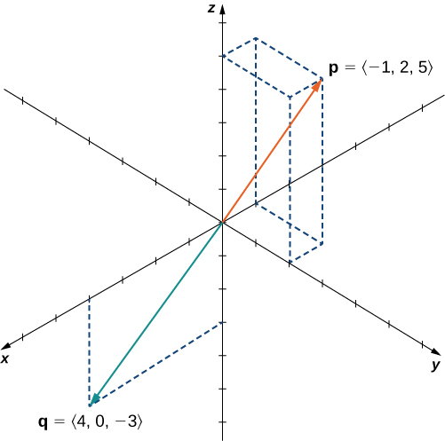
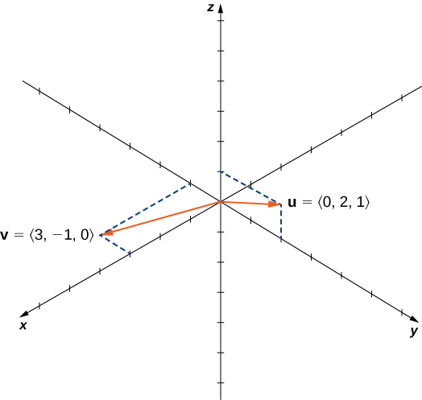
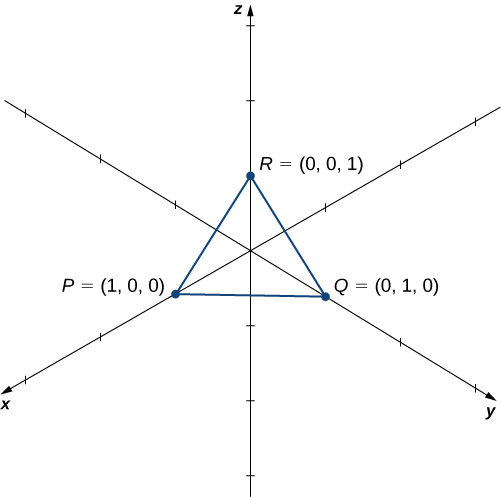
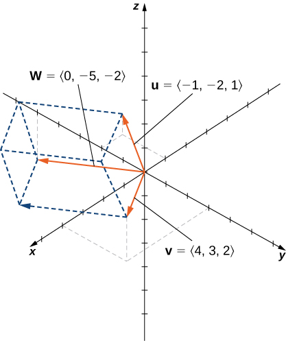
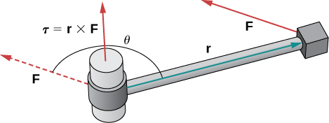
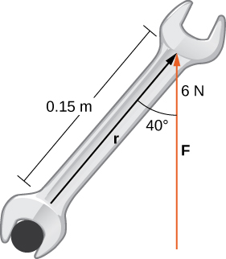
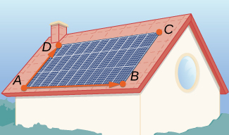

* Calculate the cross product of two given vectors.
* Use determinants to calculate a cross product.
* Find a vector orthogonal to two given vectors.
* Determine areas and volumes by using the cross product.
* Calculate the torque of a given force and position vector.

Imagine a mechanic turning a wrench to tighten a bolt. The mechanic applies a force at the end of the wrench. This creates rotation, or torque, which tightens the bolt. We can use vectors to represent the force applied by the mechanic, and the distance (radius) from the bolt to the end of the wrench. Then, we can represent torque by a vector oriented along the axis of rotation. Note that the torque vector is orthogonal to both the force vector and the radius vector.

In this section, we develop an operation called the *cross product,* which allows us to find a vector orthogonal to two given vectors. Calculating torque is an important application of cross products, and we examine torque in more detail later in the section.

# The Cross Product and Its Properties

The dot product is a multiplication of two vectors that results in a scalar. In this section, we introduce a product of two vectors that generates a third vector orthogonal to the first two. Consider how we might find such a vector. Let <math xmlns="http://www.w3.org/1998/Math/MathML"><mrow><mstyle mathvariant="bold" mathsize="normal"><mtext>u</mtext></mstyle><mo>=</mo><mrow><mo>〈</mo><mrow><msub><mi>u</mi><mn>1</mn></msub><mo>,</mo><msub><mi>u</mi><mn>2</mn></msub><mo>,</mo><msub><mi>u</mi><mn>3</mn></msub></mrow><mo>〉</mo></mrow></mrow></math>

 and <math xmlns="http://www.w3.org/1998/Math/MathML"><mrow><mstyle mathvariant="bold" mathsize="normal"><mtext>v</mtext></mstyle><mo>=</mo><mrow><mo>〈</mo><mrow><msub><mi>v</mi><mn>1</mn></msub><mo>,</mo><msub><mi>v</mi><mn>2</mn></msub><mo>,</mo><msub><mi>v</mi><mn>3</mn></msub></mrow><mo>〉</mo></mrow></mrow></math>

 be nonzero vectors. We want to find a vector <math xmlns="http://www.w3.org/1998/Math/MathML"><mrow><mstyle mathvariant="bold" mathsize="normal"><mtext>w</mtext></mstyle><mo>=</mo><mrow><mo>〈</mo><mrow><msub><mi>w</mi><mn>1</mn></msub><mo>,</mo><msub><mi>w</mi><mn>2</mn></msub><mo>,</mo><msub><mi>w</mi><mn>3</mn></msub></mrow><mo>〉</mo></mrow></mrow></math>

 orthogonal to both <math xmlns="http://www.w3.org/1998/Math/MathML"><mstyle mathvariant="bold" mathsize="normal"><mtext>u</mtext></mstyle></math>

 and <math xmlns="http://www.w3.org/1998/Math/MathML"><mstyle mathvariant="bold" mathsize="normal"><mtext>v</mtext></mstyle></math>

—that is, we want to find <math xmlns="http://www.w3.org/1998/Math/MathML"><mstyle mathvariant="bold" mathsize="normal"><mtext>w</mtext></mstyle></math>

 such that <math xmlns="http://www.w3.org/1998/Math/MathML"><mrow><mstyle mathvariant="bold" mathsize="normal"><mtext>u</mtext></mstyle><mo>·</mo><mstyle mathvariant="bold" mathsize="normal"><mtext>w</mtext></mstyle><mo>=</mo><mn>0</mn></mrow></math>

 and <math xmlns="http://www.w3.org/1998/Math/MathML"><mrow><mstyle mathvariant="bold" mathsize="normal"><mtext>v</mtext></mstyle><mo>·</mo><mstyle mathvariant="bold" mathsize="normal"><mtext>w</mtext></mstyle><mo>=</mo><mn>0</mn><mo>.</mo></mrow></math>

 Therefore, <math xmlns="http://www.w3.org/1998/Math/MathML"><mrow><msub><mi>w</mi><mn>1</mn></msub><mo>,</mo></mrow></math>

 <math xmlns="http://www.w3.org/1998/Math/MathML"><mrow><msub><mi>w</mi><mn>2</mn></msub><mo>,</mo></mrow></math>

 and <math xmlns="http://www.w3.org/1998/Math/MathML"><mrow><msub><mi>w</mi><mn>3</mn></msub></mrow></math>

 must satisfy

<math xmlns="http://www.w3.org/1998/Math/MathML"><mtable><mtr><mtd columnalign="right"><msub><mi>u</mi><mn>1</mn></msub><msub><mi>w</mi><mn>1</mn></msub><mo>+</mo><msub><mi>u</mi><mn>2</mn></msub><msub><mi>w</mi><mn>2</mn></msub><mo>+</mo><msub><mi>u</mi><mn>3</mn></msub><msub><mi>w</mi><mn>3</mn></msub></mtd><mtd columnalign="left"><mo>=</mo></mtd><mtd columnalign="left"><mn>0</mn></mtd></mtr><mtr><mtd columnalign="right"><msub><mi>v</mi><mn>1</mn></msub><msub><mi>w</mi><mn>1</mn></msub><mo>+</mo><msub><mi>v</mi><mn>2</mn></msub><msub><mi>w</mi><mn>2</mn></msub><mo>+</mo><msub><mi>v</mi><mn>3</mn></msub><msub><mi>w</mi><mn>3</mn></msub></mtd><mtd columnalign="left"><mo>=</mo></mtd><mtd columnalign="left"><mn>0.</mn></mtd></mtr></mtable></math>

If we multiply the top equation by <math xmlns="http://www.w3.org/1998/Math/MathML"><mrow><msub><mi>v</mi><mn>3</mn></msub></mrow></math>

 and the bottom equation by <math xmlns="http://www.w3.org/1998/Math/MathML"><mrow><msub><mi>u</mi><mn>3</mn></msub></mrow></math>

 and subtract, we can eliminate the variable <math xmlns="http://www.w3.org/1998/Math/MathML"><mrow><msub><mi>w</mi><mn>3</mn></msub><mo>,</mo></mrow></math>

 which gives

<math xmlns="http://www.w3.org/1998/Math/MathML"><mrow><mrow><mo>(</mo><mrow><msub><mi>u</mi><mn>1</mn></msub><msub><mi>v</mi><mn>3</mn></msub><mo>−</mo><msub><mi>v</mi><mn>1</mn></msub><msub><mi>u</mi><mn>3</mn></msub></mrow><mo>)</mo></mrow><msub><mi>w</mi><mn>1</mn></msub><mo>+</mo><mrow><mo>(</mo><mrow><msub><mi>u</mi><mn>2</mn></msub><msub><mi>v</mi><mn>3</mn></msub><mo>−</mo><msub><mi>v</mi><mn>2</mn></msub><msub><mi>u</mi><mn>3</mn></msub></mrow><mo>)</mo></mrow><msub><mi>w</mi><mn>2</mn></msub><mo>=</mo><mn>0</mn><mo>.</mo></mrow></math>

If we select

<math xmlns="http://www.w3.org/1998/Math/MathML"><mtable><mtr><mtd columnalign="right"><msub><mi>w</mi><mn>1</mn></msub></mtd><mtd columnalign="left"><mo>=</mo></mtd><mtd columnalign="left"><msub><mi>u</mi><mn>2</mn></msub><msub><mi>v</mi><mn>3</mn></msub><mo>−</mo><msub><mi>u</mi><mn>3</mn></msub><msub><mi>v</mi><mn>2</mn></msub></mtd></mtr><mtr><mtd columnalign="right"><msub><mi>w</mi><mn>2</mn></msub></mtd><mtd columnalign="left"><mo>=</mo></mtd><mtd columnalign="left"><mtext>−</mtext><mrow><mo>(</mo><mrow><msub><mi>u</mi><mn>1</mn></msub><msub><mi>v</mi><mn>3</mn></msub><mo>−</mo><msub><mi>u</mi><mn>3</mn></msub><msub><mi>v</mi><mn>1</mn></msub></mrow><mo>)</mo></mrow><mo>,</mo></mtd></mtr></mtable></math>

we get a possible solution vector. Substituting these values back into the original equations gives

<math xmlns="http://www.w3.org/1998/Math/MathML"><mrow><msub><mi>w</mi><mn>3</mn></msub><mo>=</mo><msub><mi>u</mi><mn>1</mn></msub><msub><mi>v</mi><mn>2</mn></msub><mo>−</mo><msub><mi>u</mi><mn>2</mn></msub><msub><mi>v</mi><mn>1</mn></msub><mo>.</mo></mrow></math>

That is, vector

<math xmlns="http://www.w3.org/1998/Math/MathML"><mrow><mstyle mathvariant="bold" mathsize="normal"><mtext>w</mtext></mstyle><mo>=</mo><mrow><mo>〈</mo><mrow><msub><mi>u</mi><mn>2</mn></msub><msub><mi>v</mi><mn>3</mn></msub><mo>−</mo><msub><mi>u</mi><mn>3</mn></msub><msub><mi>v</mi><mn>2</mn></msub><mo>,</mo><mtext>−</mtext><mrow><mo>(</mo><mrow><msub><mi>u</mi><mn>1</mn></msub><msub><mi>v</mi><mn>3</mn></msub><mo>−</mo><msub><mi>u</mi><mn>3</mn></msub><msub><mi>v</mi><mn>1</mn></msub></mrow><mo>)</mo></mrow><mo>,</mo><msub><mi>u</mi><mn>1</mn></msub><msub><mi>v</mi><mn>2</mn></msub><mo>−</mo><msub><mi>u</mi><mn>2</mn></msub><msub><mi>v</mi><mn>1</mn></msub></mrow><mo>〉</mo></mrow></mrow></math>

is orthogonal to both <math xmlns="http://www.w3.org/1998/Math/MathML"><mstyle mathvariant="bold" mathsize="normal"><mtext>u</mtext></mstyle></math>

 and <math xmlns="http://www.w3.org/1998/Math/MathML"><mstyle mathvariant="bold" mathsize="normal"><mtext>v</mtext></mstyle><mo>,</mo></math>

 which leads us to define the following operation, called the cross product.

Definition

Let <math xmlns="http://www.w3.org/1998/Math/MathML"><mrow><mstyle mathvariant="bold" mathsize="normal"><mtext>u</mtext></mstyle><mo>=</mo><mrow><mo>〈</mo><mrow><msub><mi>u</mi><mn>1</mn></msub><mo>,</mo><msub><mi>u</mi><mn>2</mn></msub><mo>,</mo><msub><mi>u</mi><mn>3</mn></msub></mrow><mo>〉</mo></mrow><mspace width="0.2em" /><mtext>and</mtext><mspace width="0.2em" /><mstyle mathvariant="bold" mathsize="normal"><mtext>v</mtext></mstyle><mo>=</mo><mrow><mo>〈</mo><mrow><msub><mi>v</mi><mn>1</mn></msub><mo>,</mo><msub><mi>v</mi><mn>2</mn></msub><mo>,</mo><msub><mi>v</mi><mn>3</mn></msub></mrow><mo>〉</mo></mrow><mo>.</mo></mrow></math>

 Then, the **cross product**{: data-type="term"} <math xmlns="http://www.w3.org/1998/Math/MathML"><mrow><mstyle mathvariant="bold" mathsize="normal"><mtext>u</mtext></mstyle><mspace width="0.2em" /><mo>×</mo><mspace width="0.2em" /><mstyle mathvariant="bold" mathsize="normal"><mtext>v</mtext></mstyle></mrow></math>

 is vector

<math xmlns="http://www.w3.org/1998/Math/MathML"><mtable><mtr><mtd columnalign="right"><mstyle mathvariant="bold" mathsize="normal"><mtext>u</mtext></mstyle><mspace width="0.2em" /><mo>×</mo><mspace width="0.2em" /><mstyle mathvariant="bold" mathsize="normal"><mtext>v</mtext></mstyle></mtd><mtd columnalign="left"><mo>=</mo><mrow><mo>(</mo><mrow><msub><mi>u</mi><mn>2</mn></msub><msub><mi>v</mi><mn>3</mn></msub><mo>−</mo><msub><mi>u</mi><mn>3</mn></msub><msub><mi>v</mi><mn>2</mn></msub></mrow><mo>)</mo></mrow><mstyle mathvariant="bold" mathsize="normal"><mtext>i</mtext></mstyle><mo>−</mo><mrow><mo>(</mo><mrow><msub><mi>u</mi><mn>1</mn></msub><msub><mi>v</mi><mn>3</mn></msub><mo>−</mo><msub><mi>u</mi><mn>3</mn></msub><msub><mi>v</mi><mn>1</mn></msub></mrow><mo>)</mo></mrow><mstyle mathvariant="bold" mathsize="normal"><mtext>j</mtext></mstyle><mo>+</mo><mrow><mo>(</mo><mrow><msub><mi>u</mi><mn>1</mn></msub><msub><mi>v</mi><mn>2</mn></msub><mo>−</mo><msub><mi>u</mi><mn>2</mn></msub><msub><mi>v</mi><mn>1</mn></msub></mrow><mo>)</mo></mrow><mstyle mathvariant="bold" mathsize="normal"><mtext>k</mtext></mstyle></mtd></mtr><mtr><mtd /><mtd columnalign="left"><mo>=</mo><mrow><mo>〈</mo><mrow><msub><mi>u</mi><mn>2</mn></msub><msub><mi>v</mi><mn>3</mn></msub><mo>−</mo><msub><mi>u</mi><mn>3</mn></msub><msub><mi>v</mi><mn>2</mn></msub><mo>,</mo><mtext>−</mtext><mrow><mo>(</mo><mrow><msub><mi>u</mi><mn>1</mn></msub><msub><mi>v</mi><mn>3</mn></msub><mo>−</mo><msub><mi>u</mi><mn>3</mn></msub><msub><mi>v</mi><mn>1</mn></msub></mrow><mo>)</mo></mrow><mo>,</mo><msub><mi>u</mi><mn>1</mn></msub><msub><mi>v</mi><mn>2</mn></msub><mo>−</mo><msub><mi>u</mi><mn>2</mn></msub><msub><mi>v</mi><mn>1</mn></msub></mrow><mo>〉</mo></mrow><mo>.</mo></mtd></mtr></mtable></math>

From the way we have developed <math xmlns="http://www.w3.org/1998/Math/MathML"><mrow><mstyle mathvariant="bold" mathsize="normal"><mtext>u</mtext></mstyle><mspace width="0.2em" /><mo>×</mo><mspace width="0.2em" /><mstyle mathvariant="bold" mathsize="normal"><mtext>v</mtext></mstyle><mo>,</mo></mrow></math>

 it should be clear that the cross product is orthogonal to both <math xmlns="http://www.w3.org/1998/Math/MathML"><mstyle mathvariant="bold" mathsize="normal"><mtext>u</mtext></mstyle></math>

 and <math xmlns="http://www.w3.org/1998/Math/MathML"><mrow><mstyle mathvariant="bold" mathsize="normal"><mtext>v</mtext></mstyle><mo>.</mo></mrow></math>

 However, it never hurts to check. To show that <math xmlns="http://www.w3.org/1998/Math/MathML"><mrow><mstyle mathvariant="bold" mathsize="normal"><mtext>u</mtext></mstyle><mspace width="0.2em" /><mo>×</mo><mspace width="0.2em" /><mstyle mathvariant="bold" mathsize="normal"><mtext>v</mtext></mstyle></mrow></math>

 is orthogonal to <math xmlns="http://www.w3.org/1998/Math/MathML"><mrow><mstyle mathvariant="bold" mathsize="normal"><mtext>u</mtext></mstyle><mo>,</mo></mrow></math>

 we calculate the dot product of <math xmlns="http://www.w3.org/1998/Math/MathML"><mstyle mathvariant="bold" mathsize="normal"><mtext>u</mtext></mstyle></math>

 and <math xmlns="http://www.w3.org/1998/Math/MathML"><mrow><mstyle mathvariant="bold" mathsize="normal"><mtext>u</mtext></mstyle><mspace width="0.2em" /><mo>×</mo><mspace width="0.2em" /><mstyle mathvariant="bold" mathsize="normal"><mtext>v</mtext></mstyle><mo>.</mo></mrow></math>

<math xmlns="http://www.w3.org/1998/Math/MathML"><mtable><mtr><mtd columnalign="right"><mstyle mathvariant="bold" mathsize="normal"><mtext>u</mtext></mstyle><mo>·</mo><mrow><mo>(</mo><mrow><mstyle mathvariant="bold" mathsize="normal"><mtext>u</mtext></mstyle><mspace width="0.2em" /><mo>×</mo><mspace width="0.2em" /><mstyle mathvariant="bold" mathsize="normal"><mtext>v</mtext></mstyle></mrow><mo>)</mo></mrow></mtd><mtd columnalign="left"><mo>=</mo><mrow><mo>〈</mo><mrow><msub><mi>u</mi><mn>1</mn></msub><mo>,</mo><msub><mi>u</mi><mn>2</mn></msub><mo>,</mo><msub><mi>u</mi><mn>3</mn></msub></mrow><mo>〉</mo></mrow><mo>·</mo><mrow><mo>〈</mo><mrow><msub><mi>u</mi><mn>2</mn></msub><msub><mi>v</mi><mn>3</mn></msub><mo>−</mo><msub><mi>u</mi><mn>3</mn></msub><msub><mi>v</mi><mn>2</mn></msub><mo>,</mo><mtext>−</mtext><msub><mi>u</mi><mn>1</mn></msub><msub><mi>v</mi><mn>3</mn></msub><mo>+</mo><msub><mi>u</mi><mn>3</mn></msub><msub><mi>v</mi><mn>1</mn></msub><mo>,</mo><msub><mi>u</mi><mn>1</mn></msub><msub><mi>v</mi><mn>2</mn></msub><mo>−</mo><msub><mi>u</mi><mn>2</mn></msub><msub><mi>v</mi><mn>1</mn></msub></mrow><mo>〉</mo></mrow></mtd></mtr><mtr><mtd /><mtd columnalign="left"><mo>=</mo><msub><mi>u</mi><mn>1</mn></msub><mrow><mo>(</mo><mrow><msub><mi>u</mi><mn>2</mn></msub><msub><mi>v</mi><mn>3</mn></msub><mo>−</mo><msub><mi>u</mi><mn>3</mn></msub><msub><mi>v</mi><mn>2</mn></msub></mrow><mo>)</mo></mrow><mo>+</mo><msub><mi>u</mi><mn>2</mn></msub><mrow><mo>(</mo><mrow><mtext>−</mtext><msub><mi>u</mi><mn>1</mn></msub><msub><mi>v</mi><mn>3</mn></msub><mo>+</mo><msub><mi>u</mi><mn>3</mn></msub><msub><mi>v</mi><mn>1</mn></msub></mrow><mo>)</mo></mrow><mo>+</mo><msub><mi>u</mi><mn>3</mn></msub><mrow><mo>(</mo><mrow><msub><mi>u</mi><mn>1</mn></msub><msub><mi>v</mi><mn>2</mn></msub><mo>−</mo><msub><mi>u</mi><mn>2</mn></msub><msub><mi>v</mi><mn>1</mn></msub></mrow><mo>)</mo></mrow></mtd></mtr><mtr><mtd /><mtd columnalign="left"><mo>=</mo><msub><mi>u</mi><mn>1</mn></msub><msub><mi>u</mi><mn>2</mn></msub><msub><mi>v</mi><mn>3</mn></msub><mo>−</mo><msub><mi>u</mi><mn>1</mn></msub><msub><mi>u</mi><mn>3</mn></msub><msub><mi>v</mi><mn>2</mn></msub><mo>−</mo><msub><mi>u</mi><mn>1</mn></msub><msub><mi>u</mi><mn>2</mn></msub><msub><mi>v</mi><mn>3</mn></msub><mo>+</mo><msub><mi>u</mi><mn>2</mn></msub><msub><mi>u</mi><mn>3</mn></msub><msub><mi>v</mi><mn>1</mn></msub><mo>+</mo><msub><mi>u</mi><mn>1</mn></msub><msub><mi>u</mi><mn>3</mn></msub><msub><mi>v</mi><mn>2</mn></msub><mo>−</mo><msub><mi>u</mi><mn>2</mn></msub><msub><mi>u</mi><mn>3</mn></msub><msub><mi>v</mi><mn>1</mn></msub></mtd></mtr><mtr><mtd /><mtd columnalign="left"><mo>=</mo><mrow><mo>(</mo><mrow><msub><mi>u</mi><mn>1</mn></msub><msub><mi>u</mi><mn>2</mn></msub><msub><mi>v</mi><mn>3</mn></msub><mo>−</mo><msub><mi>u</mi><mn>1</mn></msub><msub><mi>u</mi><mn>2</mn></msub><msub><mi>v</mi><mn>3</mn></msub></mrow><mo>)</mo></mrow><mo>+</mo><mrow><mo>(</mo><mrow><mtext>−</mtext><msub><mi>u</mi><mn>1</mn></msub><msub><mi>u</mi><mn>3</mn></msub><msub><mi>v</mi><mn>2</mn></msub><mo>+</mo><msub><mi>u</mi><mn>1</mn></msub><msub><mi>u</mi><mn>3</mn></msub><msub><mi>v</mi><mn>2</mn></msub></mrow><mo>)</mo></mrow><mo>+</mo><mrow><mo>(</mo><mrow><msub><mi>u</mi><mn>2</mn></msub><msub><mi>u</mi><mn>3</mn></msub><msub><mi>v</mi><mn>1</mn></msub><mo>−</mo><msub><mi>u</mi><mn>2</mn></msub><msub><mi>u</mi><mn>3</mn></msub><msub><mi>v</mi><mn>1</mn></msub></mrow><mo>)</mo></mrow></mtd></mtr><mtr><mtd /><mtd columnalign="left"><mo>=</mo><mn>0</mn></mtd></mtr></mtable></math>

In a similar manner, we can show that the cross product is also orthogonal to <math xmlns="http://www.w3.org/1998/Math/MathML"><mrow><mstyle mathvariant="bold" mathsize="normal"><mtext>v</mtext></mstyle><mo>.</mo></mrow></math>

Finding a Cross Product

Let <math xmlns="http://www.w3.org/1998/Math/MathML"><mrow><mstyle mathvariant="bold" mathsize="normal"><mtext>p</mtext></mstyle><mo>=</mo><mrow><mo>〈</mo><mrow><mn>−1</mn><mo>,</mo><mn>2</mn><mo>,</mo><mn>5</mn></mrow><mo>〉</mo></mrow><mspace width="0.2em" /><mtext>and</mtext><mspace width="0.2em" /><mstyle mathvariant="bold" mathsize="normal"><mtext>q</mtext></mstyle><mo>=</mo><mrow><mo>〈</mo><mrow><mn>4</mn><mo>,</mo><mn>0</mn><mo>,</mo><mn>−3</mn></mrow><mo>〉</mo></mrow></mrow></math>

 ([[link]](#CNX_Calc_Figure_12_04_011)). Find <math xmlns="http://www.w3.org/1998/Math/MathML"><mrow><mstyle mathvariant="bold" mathsize="normal"><mtext>p</mtext></mstyle><mspace width="0.2em" /><mo>×</mo><mspace width="0.2em" /><mstyle mathvariant="bold" mathsize="normal"><mtext>q</mtext></mstyle><mo>.</mo></mrow></math>

{: #CNX_Calc_Figure_12_04_011}

Substitute the components of the vectors into [[link]](#fs-id1163723754200):

<math xmlns="http://www.w3.org/1998/Math/MathML"><mtable><mtr><mtd columnalign="right"><mstyle mathvariant="bold" mathsize="normal"><mtext>p</mtext></mstyle><mspace width="0.2em" /><mo>×</mo><mspace width="0.2em" /><mstyle mathvariant="bold" mathsize="normal"><mtext>q</mtext></mstyle></mtd><mtd columnalign="left"><mo>=</mo><mrow><mo>〈</mo><mrow><mn>−1</mn><mo>,</mo><mn>2</mn><mo>,</mo><mn>5</mn></mrow><mo>〉</mo></mrow><mspace width="0.2em" /><mo>×</mo><mspace width="0.2em" /><mrow><mo>〈</mo><mrow><mn>4</mn><mo>,</mo><mn>0</mn><mo>,</mo><mn>−3</mn></mrow><mo>〉</mo></mrow></mtd></mtr><mtr><mtd /><mtd columnalign="left"><mo>=</mo><mrow><mo>〈</mo><mrow><msub><mi>p</mi><mn>2</mn></msub><msub><mi>q</mi><mn>3</mn></msub><mo>−</mo><msub><mi>p</mi><mn>3</mn></msub><msub><mi>q</mi><mn>2</mn></msub><mo>,</mo><msub><mi>p</mi><mn>1</mn></msub><msub><mi>q</mi><mn>3</mn></msub><mo>−</mo><msub><mi>p</mi><mn>3</mn></msub><msub><mi>q</mi><mn>1</mn></msub><mo>,</mo><msub><mi>p</mi><mn>1</mn></msub><msub><mi>q</mi><mn>2</mn></msub><mo>−</mo><msub><mi>p</mi><mn>2</mn></msub><msub><mi>q</mi><mn>1</mn></msub></mrow><mo>〉</mo></mrow></mtd></mtr><mtr><mtd /><mtd columnalign="left"><mo>=</mo><mrow><mo>〈</mo><mrow><mn>2</mn><mrow><mo>(</mo><mrow><mn>−3</mn></mrow><mo>)</mo></mrow><mo>−</mo><mn>5</mn><mrow><mo>(</mo><mn>0</mn><mo>)</mo></mrow><mo>,</mo><mtext>−</mtext><mrow><mo>(</mo><mrow><mn>−1</mn></mrow><mo>)</mo></mrow><mrow><mo>(</mo><mrow><mn>−3</mn></mrow><mo>)</mo></mrow><mo>+</mo><mn>5</mn><mrow><mo>(</mo><mn>4</mn><mo>)</mo></mrow><mo>,</mo><mrow><mo>(</mo><mrow><mn>−1</mn></mrow><mo>)</mo></mrow><mrow><mo>(</mo><mn>0</mn><mo>)</mo></mrow><mo>−</mo><mn>2</mn><mrow><mo>(</mo><mn>4</mn><mo>)</mo></mrow></mrow><mo>〉</mo></mrow></mtd></mtr><mtr><mtd /><mtd columnalign="left"><mo>=</mo><mrow><mo>〈</mo><mrow><mn>−6</mn><mo>,</mo><mn>17</mn><mo>,</mo><mn>−8</mn></mrow><mo>〉</mo></mrow><mo>.</mo></mtd></mtr></mtable></math>

Find <math xmlns="http://www.w3.org/1998/Math/MathML"><mrow><mstyle mathvariant="bold" mathsize="normal"><mtext>p</mtext></mstyle><mspace width="0.2em" /><mo>×</mo><mspace width="0.2em" /><mstyle mathvariant="bold" mathsize="normal"><mtext>q</mtext></mstyle></mrow></math>

 for <math xmlns="http://www.w3.org/1998/Math/MathML"><mrow><mstyle mathvariant="bold" mathsize="normal"><mtext>p</mtext></mstyle><mo>=</mo><mrow><mo>〈</mo><mrow><mn>5</mn><mo>,</mo><mn>1</mn><mo>,</mo><mn>2</mn></mrow><mo>〉</mo></mrow></mrow></math>

 and <math xmlns="http://www.w3.org/1998/Math/MathML"><mrow><mstyle mathvariant="bold" mathsize="normal"><mtext>q</mtext></mstyle><mo>=</mo><mrow><mo>〈</mo><mrow><mn>−2</mn><mo>,</mo><mn>0</mn><mo>,</mo><mn>1</mn></mrow><mo>〉</mo></mrow><mo>.</mo></mrow></math>

 Express the answer using standard unit vectors.

<math xmlns="http://www.w3.org/1998/Math/MathML"><mrow><mstyle mathvariant="bold" mathsize="normal"><mtext>i</mtext></mstyle><mo>−</mo><mn>9</mn><mstyle mathvariant="bold" mathsize="normal"><mtext>j</mtext></mstyle><mo>+</mo><mn>2</mn><mstyle mathvariant="bold" mathsize="normal"><mtext>k</mtext></mstyle></mrow></math>

Hint

Use the formula <math xmlns="http://www.w3.org/1998/Math/MathML"><mrow><mstyle mathvariant="bold" mathsize="normal"><mtext>u</mtext></mstyle><mspace width="0.2em" /><mo>×</mo><mspace width="0.2em" /><mstyle mathvariant="bold" mathsize="normal"><mtext>v</mtext></mstyle><mo>=</mo><mrow><mo>(</mo><mrow><msub><mi>u</mi><mn>2</mn></msub><msub><mi>v</mi><mn>3</mn></msub><mo>−</mo><msub><mi>u</mi><mn>3</mn></msub><msub><mi>v</mi><mn>2</mn></msub></mrow><mo>)</mo></mrow><mstyle mathvariant="bold" mathsize="normal"><mtext>i</mtext></mstyle><mo>−</mo><mrow><mo>(</mo><mrow><msub><mi>u</mi><mn>1</mn></msub><msub><mi>v</mi><mn>3</mn></msub><mo>−</mo><msub><mi>u</mi><mn>3</mn></msub><msub><mi>v</mi><mn>1</mn></msub></mrow><mo>)</mo></mrow><mstyle mathvariant="bold" mathsize="normal"><mtext>j</mtext></mstyle><mo>+</mo><mrow><mo>(</mo><mrow><msub><mi>u</mi><mn>1</mn></msub><msub><mi>v</mi><mn>2</mn></msub><mo>−</mo><msub><mi>u</mi><mn>2</mn></msub><msub><mi>v</mi><mn>1</mn></msub></mrow><mo>)</mo></mrow><mstyle mathvariant="bold" mathsize="normal"><mtext>k</mtext></mstyle><mo>.</mo></mrow></math>

Although it may not be obvious from [\[link\]](#fs-id1163723754200), the direction of <math xmlns="http://www.w3.org/1998/Math/MathML"><mrow><mstyle mathvariant="bold" mathsize="normal"><mtext>u</mtext></mstyle><mspace width="0.2em" /><mo>×</mo><mspace width="0.2em" /><mstyle mathvariant="bold" mathsize="normal"><mtext>v</mtext></mstyle></mrow></math>

 is given by the right-hand rule. If we hold the right hand out with the fingers pointing in the direction of <math xmlns="http://www.w3.org/1998/Math/MathML"><mrow><mstyle mathvariant="bold" mathsize="normal"><mtext>u</mtext></mstyle><mo>,</mo></mrow></math>

 then curl the fingers toward vector <math xmlns="http://www.w3.org/1998/Math/MathML"><mrow><mstyle mathvariant="bold" mathsize="normal"><mtext>v</mtext></mstyle><mo>,</mo></mrow></math>

 the thumb points in the direction of the cross product, as shown.

 ![This figure has two images. The first image has three vectors with the same initial point. Two of the vectors are labeled &#x201C;u&#x201D; and &#x201C;v.&#x201D; The angle between u and v is theta. The third vector is perpendicular to u and v. It is labeled &#x201C;u cross v.&#x201D; The second image has three vectors. The vectors are labeled &#x201C;u, v, and u cross v.&#x201D; &#x201C;u cross v&#x201D; is perpendicular to u and v. Also, on the image of these three vectors is a right hand. The fingers are in the direction of u. As the hand is closing, the direction of the closing fingers is the direction of v. The thumb is up and in the direction of &#x201C;u cross v.&#x201D;](../resources/CNX_Calc_Figure_12_04_001.jpg "The direction of u&#xD7;v is determined by the right-hand rule."){: #CNX_Calc_Figure_12_04_001}

Notice what this means for the direction of <math xmlns="http://www.w3.org/1998/Math/MathML"><mrow><mstyle mathvariant="bold" mathsize="normal"><mtext>v</mtext></mstyle><mspace width="0.2em" /><mo>×</mo><mspace width="0.2em" /><mstyle mathvariant="bold" mathsize="normal"><mtext>u</mtext></mstyle><mo>.</mo></mrow></math>

 If we apply the right-hand rule to <math xmlns="http://www.w3.org/1998/Math/MathML"><mrow><mstyle mathvariant="bold" mathsize="normal"><mtext>v</mtext></mstyle><mspace width="0.2em" /><mo>×</mo><mspace width="0.2em" /><mstyle mathvariant="bold" mathsize="normal"><mtext>u</mtext></mstyle><mo>,</mo></mrow></math>

 we start with our fingers pointed in the direction of <math xmlns="http://www.w3.org/1998/Math/MathML"><mrow><mstyle mathvariant="bold" mathsize="normal"><mtext>v</mtext></mstyle><mo>,</mo></mrow></math>

 then curl our fingers toward the vector <math xmlns="http://www.w3.org/1998/Math/MathML"><mrow><mstyle mathvariant="bold" mathsize="normal"><mtext>u</mtext></mstyle><mo>.</mo></mrow></math>

 In this case, the thumb points in the opposite direction of <math xmlns="http://www.w3.org/1998/Math/MathML"><mrow><mstyle mathvariant="bold" mathsize="normal"><mtext>u</mtext></mstyle><mspace width="0.2em" /><mo>×</mo><mspace width="0.2em" /><mstyle mathvariant="bold" mathsize="normal"><mtext>v</mtext></mstyle><mo>.</mo></mrow></math>

 (Try it!)

Anticommutativity of the Cross Product

Let <math xmlns="http://www.w3.org/1998/Math/MathML"><mrow><mstyle mathvariant="bold" mathsize="normal"><mtext>u</mtext></mstyle><mo>=</mo><mrow><mo>〈</mo><mrow><mn>0</mn><mo>,</mo><mn>2</mn><mo>,</mo><mn>1</mn></mrow><mo>〉</mo></mrow></mrow></math>

 and <math xmlns="http://www.w3.org/1998/Math/MathML"><mrow><mstyle mathvariant="bold" mathsize="normal"><mtext>v</mtext></mstyle><mo>=</mo><mrow><mo>〈</mo><mrow><mn>3</mn><mo>,</mo><mn>−1</mn><mo>,</mo><mn>0</mn></mrow><mo>〉</mo></mrow><mo>.</mo></mrow></math>

 Calculate <math xmlns="http://www.w3.org/1998/Math/MathML"><mrow><mstyle mathvariant="bold" mathsize="normal"><mtext>u</mtext></mstyle><mspace width="0.2em" /><mo>×</mo><mspace width="0.2em" /><mstyle mathvariant="bold" mathsize="normal"><mtext>v</mtext></mstyle></mrow></math>

 and <math xmlns="http://www.w3.org/1998/Math/MathML"><mrow><mstyle mathvariant="bold" mathsize="normal"><mtext>v</mtext></mstyle><mspace width="0.2em" /><mo>×</mo><mspace width="0.2em" /><mstyle mathvariant="bold" mathsize="normal"><mtext>u</mtext></mstyle></mrow></math>

 and graph them.

{: #CNX_Calc_Figure_12_04_012}

We have

<math xmlns="http://www.w3.org/1998/Math/MathML"><mtable><mtr><mtd columnalign="right"><mstyle mathvariant="bold" mathsize="normal"><mtext>u</mtext></mstyle><mspace width="0.2em" /><mo>×</mo><mspace width="0.2em" /><mstyle mathvariant="bold" mathsize="normal"><mtext>v</mtext></mstyle></mtd><mtd columnalign="left"><mo>=</mo></mtd><mtd columnalign="left"><mrow><mo>〈</mo><mrow><mrow><mo>(</mo><mrow><mn>0</mn><mo>+</mo><mn>1</mn></mrow><mo>)</mo></mrow><mo>,</mo><mtext>−</mtext><mrow><mo>(</mo><mrow><mn>0</mn><mo>−</mo><mn>3</mn></mrow><mo>)</mo></mrow><mo>,</mo><mrow><mo>(</mo><mrow><mn>0</mn><mo>−</mo><mn>6</mn></mrow><mo>)</mo></mrow></mrow><mo>〉</mo></mrow><mo>=</mo><mrow><mo>〈</mo><mrow><mn>1</mn><mo>,</mo><mn>3</mn><mo>,</mo><mn>−6</mn></mrow><mo>〉</mo></mrow></mtd></mtr><mtr><mtd columnalign="right"><mstyle mathvariant="bold" mathsize="normal"><mtext>v</mtext></mstyle><mspace width="0.2em" /><mo>×</mo><mspace width="0.2em" /><mstyle mathvariant="bold" mathsize="normal"><mtext>u</mtext></mstyle></mtd><mtd columnalign="left"><mo>=</mo></mtd><mtd columnalign="left"><mrow><mo>〈</mo><mrow><mrow><mo>(</mo><mrow><mn>−1</mn><mo>−</mo><mn>0</mn></mrow><mo>)</mo></mrow><mo>,</mo><mtext>−</mtext><mrow><mo>(</mo><mrow><mn>3</mn><mo>−</mo><mn>0</mn></mrow><mo>)</mo></mrow><mo>,</mo><mrow><mo>(</mo><mrow><mn>6</mn><mo>−</mo><mn>0</mn></mrow><mo>)</mo></mrow></mrow><mo>〉</mo></mrow><mo>=</mo><mrow><mo>〈</mo><mrow><mn>−1</mn><mo>,</mo><mn>−3</mn><mo>,</mo><mn>6</mn></mrow><mo>〉</mo></mrow><mo>.</mo></mtd></mtr></mtable></math>

We see that, in this case, <math xmlns="http://www.w3.org/1998/Math/MathML"><mrow><mstyle mathvariant="bold" mathsize="normal"><mtext>u</mtext></mstyle><mspace width="0.2em" /><mo>×</mo><mspace width="0.2em" /><mstyle mathvariant="bold" mathsize="normal"><mtext>v</mtext></mstyle><mo>=</mo><mtext>−</mtext><mrow><mo>(</mo><mrow><mstyle mathvariant="bold" mathsize="normal"><mtext>v</mtext></mstyle><mspace width="0.2em" /><mo>×</mo><mspace width="0.2em" /><mstyle mathvariant="bold" mathsize="normal"><mtext>u</mtext></mstyle></mrow><mo>)</mo></mrow></mrow></math>

 ([[link]](#CNX_Calc_Figure_12_04_013)). We prove this in general later in this section.

{: #CNX_Calc_Figure_12_04_013}

Suppose vectors <math xmlns="http://www.w3.org/1998/Math/MathML"><mstyle mathvariant="bold" mathsize="normal"><mtext>u</mtext></mstyle></math>

 and <math xmlns="http://www.w3.org/1998/Math/MathML"><mstyle mathvariant="bold" mathsize="normal"><mtext>v</mtext></mstyle></math>

 lie in the *xy*-plane (the *z*-component of each vector is zero). Now suppose the *x*- and *y*-components of <math xmlns="http://www.w3.org/1998/Math/MathML"><mstyle mathvariant="bold" mathsize="normal"><mtext>u</mtext></mstyle></math>

 and the *y*-component of <math xmlns="http://www.w3.org/1998/Math/MathML"><mstyle mathvariant="bold" mathsize="normal"><mtext>v</mtext></mstyle></math>

 are all positive, whereas the *x*-component of <math xmlns="http://www.w3.org/1998/Math/MathML"><mstyle mathvariant="bold" mathsize="normal"><mtext>v</mtext></mstyle></math>

 is negative. Assuming the coordinate axes are oriented in the usual positions, in which direction does <math xmlns="http://www.w3.org/1998/Math/MathML"><mrow><mstyle mathvariant="bold" mathsize="normal"><mtext>u</mtext></mstyle><mspace width="0.2em" /><mo>×</mo><mspace width="0.2em" /><mstyle mathvariant="bold" mathsize="normal"><mtext>v</mtext></mstyle></mrow></math>

 point?

Up (the positive *z*-direction)

Hint

Remember the right-hand rule.

The cross products of the standard unit vectors <math xmlns="http://www.w3.org/1998/Math/MathML"><mrow><mstyle mathvariant="bold" mathsize="normal"><mtext>i</mtext></mstyle><mo>,</mo><mstyle mathvariant="bold" mathsize="normal"><mtext>j</mtext></mstyle><mo>,</mo></mrow></math>

 and <math xmlns="http://www.w3.org/1998/Math/MathML"><mstyle mathvariant="bold" mathsize="normal"><mtext>k</mtext></mstyle></math>

 can be useful for simplifying some calculations, so let’s consider these cross products. A straightforward application of the definition shows that

<math xmlns="http://www.w3.org/1998/Math/MathML"><mrow><mstyle mathvariant="bold" mathsize="normal"><mtext>i</mtext></mstyle><mspace width="0.2em" /><mo>×</mo><mspace width="0.2em" /><mstyle mathvariant="bold" mathsize="normal"><mtext>i</mtext></mstyle><mo>=</mo><mstyle mathvariant="bold" mathsize="normal"><mtext>j</mtext></mstyle><mspace width="0.2em" /><mo>×</mo><mspace width="0.2em" /><mstyle mathvariant="bold" mathsize="normal"><mtext>j</mtext></mstyle><mo>=</mo><mstyle mathvariant="bold" mathsize="normal"><mtext>k</mtext></mstyle><mspace width="0.2em" /><mo>×</mo><mspace width="0.2em" /><mstyle mathvariant="bold" mathsize="normal"><mtext>k</mtext></mstyle><mo>=</mo><mstyle mathvariant="bold" mathsize="normal"><mn>0</mn></mstyle><mo>.</mo></mrow></math>

(The cross product of two vectors is a vector, so each of these products results in the zero vector, not the scalar <math xmlns="http://www.w3.org/1998/Math/MathML"><mrow><mn>0</mn><mo>.</mo><mo stretchy="false">)</mo></mrow></math>

 It’s up to you to verify the calculations on your own.

Furthermore, because the cross product of two vectors is orthogonal to each of these vectors, we know that the cross product of <math xmlns="http://www.w3.org/1998/Math/MathML"><mstyle mathvariant="bold" mathsize="normal"><mtext>i</mtext></mstyle></math>

 and <math xmlns="http://www.w3.org/1998/Math/MathML"><mstyle mathvariant="bold" mathsize="normal"><mtext>j</mtext></mstyle></math>

 is parallel to <math xmlns="http://www.w3.org/1998/Math/MathML"><mstyle mathvariant="bold" mathsize="normal"><mtext>k</mtext></mstyle><mo>.</mo></math>

 Similarly, the vector product of <math xmlns="http://www.w3.org/1998/Math/MathML"><mstyle mathvariant="bold" mathsize="normal"><mtext>i</mtext></mstyle></math>

 and <math xmlns="http://www.w3.org/1998/Math/MathML"><mstyle mathvariant="bold" mathsize="normal"><mtext>k</mtext></mstyle></math>

 is parallel to <math xmlns="http://www.w3.org/1998/Math/MathML"><mrow><mstyle mathvariant="bold" mathsize="normal"><mtext>j</mtext></mstyle><mo>,</mo></mrow></math>

 and the vector product of <math xmlns="http://www.w3.org/1998/Math/MathML"><mstyle mathvariant="bold" mathsize="normal"><mtext>j</mtext></mstyle></math>

 and <math xmlns="http://www.w3.org/1998/Math/MathML"><mstyle mathvariant="bold" mathsize="normal"><mtext>k</mtext></mstyle></math>

 is parallel to <math xmlns="http://www.w3.org/1998/Math/MathML"><mrow><mstyle mathvariant="bold" mathsize="normal"><mtext>i</mtext></mstyle><mo>.</mo></mrow></math>

 We can use the right-hand rule to determine the direction of each product. Then we have

<math xmlns="http://www.w3.org/1998/Math/MathML"><mrow><mtable><mtr><mtd columnalign="right"><mstyle mathvariant="bold" mathsize="normal"><mtext>i</mtext></mstyle><mspace width="0.2em" /><mo>×</mo><mspace width="0.2em" /><mstyle mathvariant="bold" mathsize="normal"><mtext>j</mtext></mstyle></mtd><mtd columnalign="left"><mo>=</mo></mtd><mtd columnalign="left"><mstyle mathvariant="bold" mathsize="normal"><mtext>k</mtext></mstyle></mtd><mtd /><mtd /><mtd columnalign="right"><mrow><mstyle mathvariant="bold" mathsize="normal"><mtext>j</mtext></mstyle><mspace width="0.2em" /><mo>×</mo><mspace width="0.2em" /><mstyle mathvariant="bold" mathsize="normal"><mtext>i</mtext></mstyle></mrow></mtd><mtd columnalign="left"><mo>=</mo></mtd><mtd columnalign="left"><mtext>−</mtext><mstyle mathvariant="bold" mathsize="normal"><mtext>k</mtext></mstyle></mtd></mtr><mtr><mtd columnalign="right"><mstyle mathvariant="bold" mathsize="normal"><mtext>j</mtext></mstyle><mspace width="0.2em" /><mo>×</mo><mspace width="0.2em" /><mstyle mathvariant="bold" mathsize="normal"><mtext>k</mtext></mstyle></mtd><mtd columnalign="left"><mo>=</mo></mtd><mtd columnalign="left"><mstyle mathvariant="bold" mathsize="normal"><mtext>i</mtext></mstyle></mtd><mtd /><mtd /><mtd columnalign="right"><mstyle mathvariant="bold" mathsize="normal"><mtext>k</mtext></mstyle><mspace width="0.2em" /><mo>×</mo><mspace width="0.2em" /><mstyle mathvariant="bold" mathsize="normal"><mtext>j</mtext></mstyle></mtd><mtd columnalign="left"><mo>=</mo></mtd><mtd columnalign="left"><mtext>−</mtext><mstyle mathvariant="bold" mathsize="normal"><mtext>i</mtext></mstyle></mtd></mtr><mtr><mtd columnalign="right"><mstyle mathvariant="bold" mathsize="normal"><mtext>k</mtext></mstyle><mspace width="0.2em" /><mo>×</mo><mspace width="0.2em" /><mstyle mathvariant="bold" mathsize="normal"><mtext>i</mtext></mstyle></mtd><mtd columnalign="left"><mo>=</mo></mtd><mtd columnalign="left"><mstyle mathvariant="bold" mathsize="normal"><mtext>j</mtext></mstyle></mtd><mtd /><mtd /><mtd columnalign="right"><mstyle mathvariant="bold" mathsize="normal"><mtext>i</mtext></mstyle><mspace width="0.2em" /><mo>×</mo><mspace width="0.2em" /><mstyle mathvariant="bold" mathsize="normal"><mtext>k</mtext></mstyle></mtd><mtd columnalign="left"><mo>=</mo></mtd><mtd columnalign="left"><mtext>−</mtext><mstyle mathvariant="bold" mathsize="normal"><mtext>j</mtext></mstyle><mo>.</mo></mtd></mtr></mtable></mrow></math>

These formulas come in handy later.

Cross Product of Standard Unit Vectors

Find <math xmlns="http://www.w3.org/1998/Math/MathML"><mrow><mstyle mathvariant="bold" mathsize="normal"><mtext>i</mtext></mstyle><mspace width="0.2em" /><mo>×</mo><mspace width="0.2em" /><mrow><mo>(</mo><mrow><mstyle mathvariant="bold" mathsize="normal"><mtext>j</mtext></mstyle><mspace width="0.2em" /><mo>×</mo><mspace width="0.2em" /><mstyle mathvariant="bold" mathsize="normal"><mtext>k</mtext></mstyle></mrow><mo>)</mo></mrow><mo>.</mo></mrow></math>

We know that <math xmlns="http://www.w3.org/1998/Math/MathML"><mrow><mstyle mathvariant="bold" mathsize="normal"><mtext>j</mtext></mstyle><mspace width="0.2em" /><mo>×</mo><mspace width="0.2em" /><mstyle mathvariant="bold" mathsize="normal"><mtext>k</mtext></mstyle><mo>=</mo><mstyle mathvariant="bold" mathsize="normal"><mtext>i</mtext></mstyle><mo>.</mo></mrow></math>

 Therefore, <math xmlns="http://www.w3.org/1998/Math/MathML"><mrow><mstyle mathvariant="bold" mathsize="normal"><mtext>i</mtext></mstyle><mspace width="0.2em" /><mo>×</mo><mspace width="0.2em" /><mrow><mo>(</mo><mrow><mstyle mathvariant="bold" mathsize="normal"><mtext>j</mtext></mstyle><mspace width="0.2em" /><mo>×</mo><mspace width="0.2em" /><mstyle mathvariant="bold" mathsize="normal"><mtext>k</mtext></mstyle></mrow><mo>)</mo></mrow><mo>=</mo><mstyle mathvariant="bold" mathsize="normal"><mtext>i</mtext></mstyle><mspace width="0.2em" /><mo>×</mo><mspace width="0.2em" /><mstyle mathvariant="bold" mathsize="normal"><mtext>i</mtext></mstyle><mo>=</mo><mstyle mathvariant="bold" mathsize="normal"><mn>0</mn></mstyle><mo>.</mo></mrow></math>

Find <math xmlns="http://www.w3.org/1998/Math/MathML"><mrow><mrow><mo>(</mo><mrow><mstyle mathvariant="bold" mathsize="normal"><mtext>i</mtext></mstyle><mspace width="0.2em" /><mo>×</mo><mspace width="0.2em" /><mstyle mathvariant="bold" mathsize="normal"><mtext>j</mtext></mstyle></mrow><mo>)</mo></mrow><mspace width="0.2em" /><mo>×</mo><mspace width="0.2em" /><mrow><mo>(</mo><mrow><mstyle mathvariant="bold" mathsize="normal"><mtext>k</mtext></mstyle><mspace width="0.2em" /><mo>×</mo><mspace width="0.2em" /><mstyle mathvariant="bold" mathsize="normal"><mtext>i</mtext></mstyle></mrow><mo>)</mo></mrow><mo>.</mo></mrow></math>

<math xmlns="http://www.w3.org/1998/Math/MathML"><mrow><mtext>−</mtext><mstyle mathvariant="bold" mathsize="normal"><mtext>i</mtext></mstyle></mrow></math>

Hint

Remember the right-hand rule.

As we have seen, the dot product is often called the *scalar product* because it results in a scalar. The cross product results in a vector, so it is sometimes called the **vector product**{: data-type="term"}. These operations are both versions of vector multiplication, but they have very different properties and applications. Let’s explore some properties of the cross product. We prove only a few of them. Proofs of the other properties are left as exercises.

Properties of the Cross Product

Let <math xmlns="http://www.w3.org/1998/Math/MathML"><mrow><mstyle mathvariant="bold" mathsize="normal"><mtext>u</mtext></mstyle><mo>,</mo><mstyle mathvariant="bold" mathsize="normal"><mtext>v</mtext></mstyle><mo>,</mo></mrow></math>

 and <math xmlns="http://www.w3.org/1998/Math/MathML"><mstyle mathvariant="bold" mathsize="normal"><mtext>w</mtext></mstyle></math>

 be vectors in space, and let <math xmlns="http://www.w3.org/1998/Math/MathML"><mi>c</mi></math>

 be a scalar.

<math xmlns="http://www.w3.org/1998/Math/MathML"><mrow><mtable><mtr><mtd columnalign="left"><mtext>i.</mtext></mtd><mtd /><mtd /><mtd columnalign="right"><mstyle mathvariant="bold" mathsize="normal"><mtext>u</mtext></mstyle><mspace width="0.2em" /><mo>×</mo><mspace width="0.2em" /><mstyle mathvariant="bold" mathsize="normal"><mtext>v</mtext></mstyle></mtd><mtd columnalign="left"><mo>=</mo></mtd><mtd columnalign="left"><mtext>−</mtext><mrow><mo>(</mo><mrow><mstyle mathvariant="bold" mathsize="normal"><mtext>v</mtext></mstyle><mspace width="0.2em" /><mo>×</mo><mspace width="0.2em" /><mstyle mathvariant="bold" mathsize="normal"><mtext>u</mtext></mstyle></mrow><mo>)</mo></mrow></mtd><mtd /><mtd columnalign="left"><mtext>Anticommutative property</mtext></mtd></mtr><mtr><mtd columnalign="left"><mtext>ii.</mtext></mtd><mtd /><mtd /><mtd columnalign="right"><mstyle mathvariant="bold" mathsize="normal"><mtext>u</mtext></mstyle><mspace width="0.2em" /><mo>×</mo><mspace width="0.2em" /><mrow><mo>(</mo><mrow><mstyle mathvariant="bold" mathsize="normal"><mtext>v</mtext></mstyle><mo>+</mo><mstyle mathvariant="bold" mathsize="normal"><mtext>w</mtext></mstyle></mrow><mo>)</mo></mrow></mtd><mtd columnalign="left"><mo>=</mo></mtd><mtd columnalign="left"><mstyle mathvariant="bold" mathsize="normal"><mtext>u</mtext></mstyle><mspace width="0.2em" /><mo>×</mo><mspace width="0.2em" /><mstyle mathvariant="bold" mathsize="normal"><mtext>v</mtext></mstyle><mo>+</mo><mstyle mathvariant="bold" mathsize="normal"><mtext>u</mtext></mstyle><mspace width="0.2em" /><mo>×</mo><mspace width="0.2em" /><mstyle mathvariant="bold" mathsize="normal"><mtext>w</mtext></mstyle></mtd><mtd /><mtd columnalign="left"><mtext>Distributive property</mtext></mtd></mtr><mtr><mtd columnalign="left"><mtext>iii.</mtext></mtd><mtd /><mtd /><mtd columnalign="right"><mi>c</mi><mrow><mo>(</mo><mrow><mstyle mathvariant="bold" mathsize="normal"><mtext>u</mtext></mstyle><mspace width="0.2em" /><mo>×</mo><mspace width="0.2em" /><mstyle mathvariant="bold" mathsize="normal"><mtext>v</mtext></mstyle></mrow><mo>)</mo></mrow></mtd><mtd columnalign="left"><mo>=</mo></mtd><mtd columnalign="left"><mrow><mo>(</mo><mrow><mi>c</mi><mstyle mathvariant="bold" mathsize="normal"><mtext>u</mtext></mstyle></mrow><mo>)</mo></mrow><mspace width="0.2em" /><mo>×</mo><mspace width="0.2em" /><mstyle mathvariant="bold" mathsize="normal"><mtext>v</mtext></mstyle><mo>=</mo><mstyle mathvariant="bold" mathsize="normal"><mtext>u</mtext></mstyle><mspace width="0.2em" /><mo>×</mo><mspace width="0.2em" /><mrow><mo>(</mo><mrow><mi>c</mi><mstyle mathvariant="bold" mathsize="normal"><mtext>v</mtext></mstyle></mrow><mo>)</mo></mrow></mtd><mtd /><mtd columnalign="left"><mtext>Multiplication by a constant</mtext></mtd></mtr><mtr><mtd columnalign="left"><mtext>iv.</mtext></mtd><mtd /><mtd /><mtd columnalign="right"><mstyle mathvariant="bold" mathsize="normal"><mtext>u</mtext></mstyle><mspace width="0.2em" /><mo>×</mo><mspace width="0.2em" /><mstyle mathvariant="bold" mathsize="normal"><mn>0</mn></mstyle></mtd><mtd columnalign="left"><mo>=</mo></mtd><mtd columnalign="left"><mstyle mathvariant="bold" mathsize="normal"><mn>0</mn></mstyle><mspace width="0.2em" /><mo>×</mo><mspace width="0.2em" /><mstyle mathvariant="bold" mathsize="normal"><mtext>u</mtext></mstyle><mo>=</mo><mstyle mathvariant="bold" mathsize="normal"><mn>0</mn></mstyle></mtd><mtd /><mtd columnalign="left"><mtext>Cross product of the zero vector</mtext></mtd></mtr><mtr><mtd columnalign="left"><mtext>v.</mtext></mtd><mtd /><mtd /><mtd columnalign="right"><mstyle mathvariant="bold" mathsize="normal"><mtext>v</mtext></mstyle><mspace width="0.2em" /><mo>×</mo><mspace width="0.2em" /><mstyle mathvariant="bold" mathsize="normal"><mtext>v</mtext></mstyle></mtd><mtd columnalign="left"><mo>=</mo></mtd><mtd columnalign="left"><mstyle mathvariant="bold" mathsize="normal"><mn>0</mn></mstyle></mtd><mtd /><mtd columnalign="left"><mtext>Cross product of a vector with itself</mtext></mtd></mtr><mtr><mtd columnalign="left"><mtext>vi.</mtext></mtd><mtd /><mtd /><mtd columnalign="right"><mstyle mathvariant="bold" mathsize="normal"><mtext>u</mtext></mstyle><mo>·</mo><mrow><mo>(</mo><mrow><mstyle mathvariant="bold" mathsize="normal"><mtext>v</mtext></mstyle><mspace width="0.2em" /><mo>×</mo><mspace width="0.2em" /><mstyle mathvariant="bold" mathsize="normal"><mtext>w</mtext></mstyle></mrow><mo>)</mo></mrow></mtd><mtd columnalign="left"><mo>=</mo></mtd><mtd columnalign="left"><mrow><mo>(</mo><mrow><mstyle mathvariant="bold" mathsize="normal"><mtext>u</mtext></mstyle><mspace width="0.2em" /><mo>×</mo><mspace width="0.2em" /><mstyle mathvariant="bold" mathsize="normal"><mtext>v</mtext></mstyle></mrow><mo>)</mo></mrow><mo>·</mo><mstyle mathvariant="bold" mathsize="normal"><mtext>w</mtext></mstyle></mtd><mtd /><mtd columnalign="left"><mtext>Scalar triple product</mtext></mtd></mtr></mtable></mrow></math>

## Proof

For property <math xmlns="http://www.w3.org/1998/Math/MathML"><mtext>i</mtext><mo>.,</mo></math>

 we want to show <math xmlns="http://www.w3.org/1998/Math/MathML"><mrow><mstyle mathvariant="bold" mathsize="normal"><mtext>u</mtext></mstyle><mspace width="0.2em" /><mo>×</mo><mspace width="0.2em" /><mstyle mathvariant="bold" mathsize="normal"><mtext>v</mtext></mstyle><mo>=</mo><mtext>−</mtext><mrow><mo>(</mo><mrow><mstyle mathvariant="bold" mathsize="normal"><mtext>v</mtext></mstyle><mspace width="0.2em" /><mo>×</mo><mspace width="0.2em" /><mstyle mathvariant="bold" mathsize="normal"><mtext>u</mtext></mstyle></mrow><mo>)</mo></mrow><mo>.</mo></mrow></math>

 We have

<math xmlns="http://www.w3.org/1998/Math/MathML"><mtable><mtr><mtd columnalign="right"><mstyle mathvariant="bold" mathsize="normal"><mtext>u</mtext></mstyle><mspace width="0.2em" /><mo>×</mo><mspace width="0.2em" /><mstyle mathvariant="bold" mathsize="normal"><mtext>v</mtext></mstyle></mtd><mtd columnalign="left"><mo>=</mo><mrow><mo>〈</mo><mrow><msub><mi>u</mi><mn>1</mn></msub><mo>,</mo><msub><mi>u</mi><mn>2</mn></msub><mo>,</mo><msub><mi>u</mi><mn>3</mn></msub></mrow><mo>〉</mo></mrow><mspace width="0.2em" /><mo>×</mo><mspace width="0.2em" /><mrow><mo>〈</mo><mrow><msub><mi>v</mi><mn>1</mn></msub><mo>,</mo><msub><mi>v</mi><mn>2</mn></msub><mo>,</mo><msub><mi>v</mi><mn>3</mn></msub></mrow><mo>〉</mo></mrow></mtd></mtr><mtr><mtd /><mtd columnalign="left"><mo>=</mo><mrow><mo>〈</mo><mrow><msub><mi>u</mi><mn>2</mn></msub><msub><mi>v</mi><mn>3</mn></msub><mo>−</mo><msub><mi>u</mi><mn>3</mn></msub><msub><mi>v</mi><mn>2</mn></msub><mo>,</mo><mtext>−</mtext><msub><mi>u</mi><mn>1</mn></msub><msub><mi>v</mi><mn>3</mn></msub><mo>+</mo><msub><mi>u</mi><mn>3</mn></msub><msub><mi>v</mi><mn>1</mn></msub><mo>,</mo><msub><mi>u</mi><mn>1</mn></msub><msub><mi>v</mi><mn>2</mn></msub><mo>−</mo><msub><mi>u</mi><mn>2</mn></msub><msub><mi>v</mi><mn>1</mn></msub></mrow><mo>〉</mo></mrow></mtd></mtr><mtr><mtd /><mtd columnalign="left"><mo>=</mo><mtext>−</mtext><mrow><mo>〈</mo><mrow><msub><mi>u</mi><mn>3</mn></msub><msub><mi>v</mi><mn>2</mn></msub><mo>−</mo><msub><mi>u</mi><mn>2</mn></msub><msub><mi>v</mi><mn>3</mn></msub><mo>,</mo><mtext>−</mtext><msub><mi>u</mi><mn>3</mn></msub><msub><mi>v</mi><mn>1</mn></msub><mo>+</mo><msub><mi>u</mi><mn>1</mn></msub><msub><mi>v</mi><mn>3</mn></msub><mo>,</mo><msub><mi>u</mi><mn>2</mn></msub><msub><mi>v</mi><mn>1</mn></msub><mo>−</mo><msub><mi>u</mi><mn>1</mn></msub><msub><mi>v</mi><mn>2</mn></msub></mrow><mo>〉</mo></mrow></mtd></mtr><mtr><mtd /><mtd columnalign="left"><mo>=</mo><mtext>−</mtext><mrow><mo>〈</mo><mrow><msub><mi>v</mi><mn>1</mn></msub><mo>,</mo><msub><mi>v</mi><mn>2</mn></msub><mo>,</mo><msub><mi>v</mi><mn>3</mn></msub></mrow><mo>〉</mo></mrow><mspace width="0.2em" /><mo>×</mo><mspace width="0.2em" /><mrow><mo>〈</mo><mrow><msub><mi>u</mi><mn>1</mn></msub><mo>,</mo><msub><mi>u</mi><mn>2</mn></msub><mo>,</mo><msub><mi>u</mi><mn>3</mn></msub></mrow><mo>〉</mo></mrow></mtd></mtr><mtr><mtd /><mtd columnalign="left"><mo>=</mo><mtext>−</mtext><mrow><mo>(</mo><mrow><mstyle mathvariant="bold" mathsize="normal"><mtext>v</mtext></mstyle><mspace width="0.2em" /><mo>×</mo><mspace width="0.2em" /><mstyle mathvariant="bold" mathsize="normal"><mtext>u</mtext></mstyle></mrow><mo>)</mo></mrow><mo>.</mo></mtd></mtr></mtable></math>

Unlike most operations we’ve seen, the cross product is not commutative. This makes sense if we think about the right-hand rule.

For property <math xmlns="http://www.w3.org/1998/Math/MathML"><mrow><mtext>iv</mtext><mo>.,</mo></mrow></math>

 this follows directly from the definition of the cross product. We have

<math xmlns="http://www.w3.org/1998/Math/MathML"><mtable><mtr><mtd columnalign="right"><mstyle mathvariant="bold" mathsize="normal"><mtext>u</mtext></mstyle><mspace width="0.2em" /><mo>×</mo><mspace width="0.2em" /><mstyle mathvariant="bold" mathsize="normal"><mn>0</mn></mstyle></mtd><mtd columnalign="left"><mo>=</mo><mrow><mo>〈</mo><mrow><msub><mi>u</mi><mn>2</mn></msub><mrow><mo>(</mo><mn>0</mn><mo>)</mo></mrow><mo>−</mo><msub><mi>u</mi><mn>3</mn></msub><mrow><mo>(</mo><mn>0</mn><mo>)</mo></mrow><mo>,</mo><mtext>−</mtext><mrow><mo>(</mo><mrow><msub><mi>u</mi><mn>2</mn></msub><mrow><mo>(</mo><mn>0</mn><mo>)</mo></mrow><mo>−</mo><msub><mi>u</mi><mn>3</mn></msub><mrow><mo>(</mo><mn>0</mn><mo>)</mo></mrow></mrow><mo>)</mo></mrow><mo>,</mo><msub><mi>u</mi><mn>1</mn></msub><mrow><mo>(</mo><mn>0</mn><mo>)</mo></mrow><mo>−</mo><msub><mi>u</mi><mn>2</mn></msub><mrow><mo>(</mo><mn>0</mn><mo>)</mo></mrow></mrow><mo>〉</mo></mrow></mtd></mtr><mtr><mtd /><mtd columnalign="left"><mo>=</mo><mrow><mo>〈</mo><mrow><mn>0</mn><mo>,</mo><mn>0</mn><mo>,</mo><mn>0</mn></mrow><mo>〉</mo></mrow><mo>=</mo><mstyle mathvariant="bold" mathsize="normal"><mn>0</mn></mstyle><mo>.</mo></mtd></mtr></mtable></math>

Then, by property i., <math xmlns="http://www.w3.org/1998/Math/MathML"><mrow><mstyle mathvariant="bold" mathsize="normal"><mn>0</mn></mstyle><mspace width="0.2em" /><mo>×</mo><mspace width="0.2em" /><mstyle mathvariant="bold" mathsize="normal"><mtext>u</mtext></mstyle><mo>=</mo><mstyle mathvariant="bold" mathsize="normal"><mn>0</mn></mstyle></mrow></math>

 as well. Remember that the dot product of a vector and the zero vector is the *scalar* <math xmlns="http://www.w3.org/1998/Math/MathML"><mrow><mn>0</mn><mo>,</mo></mrow></math>

 whereas the cross product of a vector with the zero vector is the *vector* <math xmlns="http://www.w3.org/1998/Math/MathML"><mrow><mstyle mathvariant="bold" mathsize="normal"><mn>0</mn></mstyle><mo>.</mo></mrow></math>

Property <math xmlns="http://www.w3.org/1998/Math/MathML"><mrow><mtext>vi</mtext><mo>.</mo></mrow></math>

 looks like the associative property, but note the change in operations:

<math xmlns="http://www.w3.org/1998/Math/MathML"><mtable><mtr><mtd columnalign="right"><mstyle mathvariant="bold" mathsize="normal"><mtext>u</mtext></mstyle><mo>·</mo><mrow><mo>(</mo><mrow><mstyle mathvariant="bold" mathsize="normal"><mtext>v</mtext></mstyle><mspace width="0.2em" /><mo>×</mo><mspace width="0.2em" /><mstyle mathvariant="bold" mathsize="normal"><mtext>w</mtext></mstyle></mrow><mo>)</mo></mrow></mtd><mtd columnalign="left"><mo>=</mo><mstyle mathvariant="bold" mathsize="normal"><mtext>u</mtext></mstyle><mo>·</mo><mrow><mo>〈</mo><mrow><msub><mi>v</mi><mn>2</mn></msub><msub><mi>w</mi><mn>3</mn></msub><mo>−</mo><msub><mi>v</mi><mn>3</mn></msub><msub><mi>w</mi><mn>2</mn></msub><mo>,</mo><mtext>−</mtext><msub><mi>v</mi><mn>1</mn></msub><msub><mi>w</mi><mn>3</mn></msub><mo>+</mo><msub><mi>v</mi><mn>3</mn></msub><msub><mi>w</mi><mn>1</mn></msub><mo>,</mo><msub><mi>v</mi><mn>1</mn></msub><msub><mi>w</mi><mn>2</mn></msub><mo>−</mo><msub><mi>v</mi><mn>2</mn></msub><msub><mi>w</mi><mn>1</mn></msub></mrow><mo>〉</mo></mrow></mtd></mtr><mtr><mtd /><mtd columnalign="left"><mo>=</mo><msub><mi>u</mi><mn>1</mn></msub><mrow><mo>(</mo><mrow><msub><mi>v</mi><mn>2</mn></msub><msub><mi>w</mi><mn>3</mn></msub><mo>−</mo><msub><mi>v</mi><mn>3</mn></msub><msub><mi>w</mi><mn>2</mn></msub></mrow><mo>)</mo></mrow><mo>+</mo><msub><mi>u</mi><mn>2</mn></msub><mrow><mo>(</mo><mrow><mtext>−</mtext><msub><mi>v</mi><mn>1</mn></msub><msub><mi>w</mi><mn>3</mn></msub><mo>+</mo><msub><mi>v</mi><mn>3</mn></msub><msub><mi>w</mi><mn>1</mn></msub></mrow><mo>)</mo></mrow><mo>+</mo><msub><mi>u</mi><mn>3</mn></msub><mrow><mo>(</mo><mrow><msub><mi>v</mi><mn>1</mn></msub><msub><mi>w</mi><mn>2</mn></msub><mo>−</mo><msub><mi>v</mi><mn>2</mn></msub><msub><mi>w</mi><mn>1</mn></msub></mrow><mo>)</mo></mrow></mtd></mtr><mtr><mtd /><mtd columnalign="left"><mo>=</mo><msub><mi>u</mi><mn>1</mn></msub><msub><mi>v</mi><mn>2</mn></msub><msub><mi>w</mi><mn>3</mn></msub><mo>−</mo><msub><mi>u</mi><mn>1</mn></msub><msub><mi>v</mi><mn>3</mn></msub><msub><mi>w</mi><mn>2</mn></msub><mo>−</mo><msub><mi>u</mi><mn>2</mn></msub><msub><mi>v</mi><mn>1</mn></msub><msub><mi>w</mi><mn>3</mn></msub><mo>+</mo><msub><mi>u</mi><mn>2</mn></msub><msub><mi>v</mi><mn>3</mn></msub><msub><mi>w</mi><mn>1</mn></msub><mo>+</mo><msub><mi>u</mi><mn>3</mn></msub><msub><mi>v</mi><mn>1</mn></msub><msub><mi>w</mi><mn>2</mn></msub><mo>−</mo><msub><mi>u</mi><mn>3</mn></msub><msub><mi>v</mi><mn>2</mn></msub><msub><mi>w</mi><mn>1</mn></msub></mtd></mtr><mtr><mtd /><mtd columnalign="left"><mo>=</mo><mrow><mo>(</mo><mrow><msub><mi>u</mi><mn>2</mn></msub><msub><mi>v</mi><mn>3</mn></msub><mo>−</mo><msub><mi>u</mi><mn>3</mn></msub><msub><mi>v</mi><mn>2</mn></msub></mrow><mo>)</mo></mrow><msub><mi>w</mi><mn>1</mn></msub><mo>+</mo><mrow><mo>(</mo><mrow><msub><mi>u</mi><mn>3</mn></msub><msub><mi>v</mi><mn>1</mn></msub><mo>−</mo><msub><mi>u</mi><mn>1</mn></msub><msub><mi>v</mi><mn>3</mn></msub></mrow><mo>)</mo></mrow><msub><mi>w</mi><mn>2</mn></msub><mo>+</mo><mrow><mo>(</mo><mrow><msub><mi>u</mi><mn>1</mn></msub><msub><mi>v</mi><mn>2</mn></msub><mo>−</mo><msub><mi>u</mi><mn>2</mn></msub><msub><mi>v</mi><mn>1</mn></msub></mrow><mo>)</mo></mrow><msub><mi>w</mi><mn>3</mn></msub></mtd></mtr><mtr><mtd /><mtd columnalign="left"><mo>=</mo><mrow><mo>〈</mo><mrow><msub><mi>u</mi><mn>2</mn></msub><msub><mi>v</mi><mn>3</mn></msub><mo>−</mo><msub><mi>u</mi><mn>3</mn></msub><msub><mi>v</mi><mn>2</mn></msub><mo>,</mo><msub><mi>u</mi><mn>3</mn></msub><msub><mi>v</mi><mn>1</mn></msub><mo>−</mo><msub><mi>u</mi><mn>1</mn></msub><msub><mi>v</mi><mn>3</mn></msub><mo>,</mo><msub><mi>u</mi><mn>1</mn></msub><msub><mi>v</mi><mn>2</mn></msub><mo>−</mo><msub><mi>u</mi><mn>2</mn></msub><msub><mi>v</mi><mn>1</mn></msub></mrow><mo>〉</mo></mrow><mo>·</mo><mrow><mo>〈</mo><mrow><msub><mi>w</mi><mn>1</mn></msub><mo>,</mo><msub><mi>w</mi><mn>2</mn></msub><mo>,</mo><msub><mi>w</mi><mn>3</mn></msub></mrow><mo>〉</mo></mrow></mtd></mtr><mtr><mtd /><mtd columnalign="left"><mo>=</mo><mrow><mo>(</mo><mrow><mstyle mathvariant="bold" mathsize="normal"><mtext>u</mtext></mstyle><mspace width="0.2em" /><mo>×</mo><mspace width="0.2em" /><mstyle mathvariant="bold" mathsize="normal"><mtext>v</mtext></mstyle></mrow><mo>)</mo></mrow><mo>·</mo><mstyle mathvariant="bold" mathsize="normal"><mtext>w</mtext></mstyle><mo>.</mo></mtd></mtr></mtable></math>

□

Using the Properties of the Cross Product

Use the cross product properties to calculate <math xmlns="http://www.w3.org/1998/Math/MathML"><mrow><mrow><mo>(</mo><mrow><mn>2</mn><mstyle mathvariant="bold" mathsize="normal"><mtext>i</mtext></mstyle><mspace width="0.2em" /><mo>×</mo><mspace width="0.2em" /><mn>3</mn><mstyle mathvariant="bold" mathsize="normal"><mtext>j</mtext></mstyle></mrow><mo>)</mo></mrow><mspace width="0.2em" /><mo>×</mo><mspace width="0.2em" /><mstyle mathvariant="bold" mathsize="normal"><mtext>j</mtext></mstyle><mo>.</mo></mrow></math>

<math xmlns="http://www.w3.org/1998/Math/MathML"><mtable><mtr><mtd columnalign="right"><mrow><mo>(</mo><mrow><mn>2</mn><mstyle mathvariant="bold" mathsize="normal"><mtext>i</mtext></mstyle><mspace width="0.2em" /><mo>×</mo><mspace width="0.2em" /><mn>3</mn><mstyle mathvariant="bold" mathsize="normal"><mtext>j</mtext></mstyle></mrow><mo>)</mo></mrow><mspace width="0.2em" /><mo>×</mo><mspace width="0.2em" /><mstyle mathvariant="bold" mathsize="normal"><mtext>j</mtext></mstyle></mtd><mtd columnalign="left"><mo>=</mo><mn>2</mn><mrow><mo>(</mo><mrow><mstyle mathvariant="bold" mathsize="normal"><mtext>i</mtext></mstyle><mspace width="0.2em" /><mo>×</mo><mspace width="0.2em" /><mn>3</mn><mstyle mathvariant="bold" mathsize="normal"><mtext>j</mtext></mstyle></mrow><mo>)</mo></mrow><mspace width="0.2em" /><mo>×</mo><mspace width="0.2em" /><mstyle mathvariant="bold" mathsize="normal"><mtext>j</mtext></mstyle></mtd></mtr><mtr><mtd /><mtd columnalign="left"><mo>=</mo><mn>2</mn><mrow><mo>(</mo><mn>3</mn><mo>)</mo></mrow><mrow><mo>(</mo><mrow><mstyle mathvariant="bold" mathsize="normal"><mtext>i</mtext></mstyle><mspace width="0.2em" /><mo>×</mo><mspace width="0.2em" /><mstyle mathvariant="bold" mathsize="normal"><mtext>j</mtext></mstyle></mrow><mo>)</mo></mrow><mspace width="0.2em" /><mo>×</mo><mspace width="0.2em" /><mstyle mathvariant="bold" mathsize="normal"><mtext>j</mtext></mstyle></mtd></mtr><mtr><mtd /><mtd columnalign="left"><mo>=</mo><mrow><mo>(</mo><mrow><mn>6</mn><mstyle mathvariant="bold" mathsize="normal"><mtext>k</mtext></mstyle></mrow><mo>)</mo></mrow><mspace width="0.2em" /><mo>×</mo><mspace width="0.2em" /><mstyle mathvariant="bold" mathsize="normal"><mtext>j</mtext></mstyle></mtd></mtr><mtr><mtd /><mtd columnalign="left"><mo>=</mo><mn>6</mn><mrow><mo>(</mo><mrow><mstyle mathvariant="bold" mathsize="normal"><mtext>k</mtext></mstyle><mspace width="0.2em" /><mo>×</mo><mspace width="0.2em" /><mstyle mathvariant="bold" mathsize="normal"><mtext>j</mtext></mstyle></mrow><mo>)</mo></mrow></mtd></mtr><mtr><mtd /><mtd columnalign="left"><mo>=</mo><mn>6</mn><mrow><mo>(</mo><mrow><mtext>−</mtext><mstyle mathvariant="bold" mathsize="normal"><mtext>i</mtext></mstyle></mrow><mo>)</mo></mrow><mo>=</mo><mn>−6</mn><mstyle mathvariant="bold" mathsize="normal"><mtext>i</mtext></mstyle><mo>.</mo></mtd></mtr></mtable></math>

Use the properties of the cross product to calculate <math xmlns="http://www.w3.org/1998/Math/MathML"><mrow><mrow><mo>(</mo><mrow><mstyle mathvariant="bold" mathsize="normal"><mtext>i</mtext></mstyle><mspace width="0.2em" /><mo>×</mo><mspace width="0.2em" /><mstyle mathvariant="bold" mathsize="normal"><mtext>k</mtext></mstyle></mrow><mo>)</mo></mrow><mspace width="0.2em" /><mo>×</mo><mspace width="0.2em" /><mrow><mo>(</mo><mrow><mstyle mathvariant="bold" mathsize="normal"><mtext>k</mtext></mstyle><mspace width="0.2em" /><mo>×</mo><mspace width="0.2em" /><mstyle mathvariant="bold" mathsize="normal"><mtext>j</mtext></mstyle></mrow><mo>)</mo></mrow><mo>.</mo></mrow></math>

<math xmlns="http://www.w3.org/1998/Math/MathML"><mrow><mtext>−</mtext><mstyle mathvariant="bold" mathsize="normal"><mtext>k</mtext></mstyle></mrow></math>

Hint

<math xmlns="http://www.w3.org/1998/Math/MathML"><mrow><mstyle mathvariant="bold" mathsize="normal"><mtext>u</mtext></mstyle><mspace width="0.2em" /><mo>×</mo><mspace width="0.2em" /><mstyle mathvariant="bold" mathsize="normal"><mtext>v</mtext></mstyle><mo>=</mo><mtext>−</mtext><mrow><mo>(</mo><mrow><mstyle mathvariant="bold" mathsize="normal"><mtext>v</mtext></mstyle><mspace width="0.2em" /><mo>×</mo><mspace width="0.2em" /><mstyle mathvariant="bold" mathsize="normal"><mtext>u</mtext></mstyle></mrow><mo>)</mo></mrow></mrow></math>

So far in this section, we have been concerned with the direction of the vector <math xmlns="http://www.w3.org/1998/Math/MathML"><mrow><mstyle mathvariant="bold" mathsize="normal"><mtext>u</mtext></mstyle><mspace width="0.2em" /><mo>×</mo><mspace width="0.2em" /><mstyle mathvariant="bold" mathsize="normal"><mtext>v</mtext></mstyle><mo>,</mo></mrow></math>

 but we have not discussed its magnitude. It turns out there is a simple expression for the magnitude of <math xmlns="http://www.w3.org/1998/Math/MathML"><mrow><mstyle mathvariant="bold" mathsize="normal"><mtext>u</mtext></mstyle><mspace width="0.2em" /><mo>×</mo><mspace width="0.2em" /><mstyle mathvariant="bold" mathsize="normal"><mtext>v</mtext></mstyle></mrow></math>

 involving the magnitudes of <math xmlns="http://www.w3.org/1998/Math/MathML"><mstyle mathvariant="bold" mathsize="normal"><mtext>u</mtext></mstyle></math>

 and <math xmlns="http://www.w3.org/1998/Math/MathML"><mrow><mstyle mathvariant="bold" mathsize="normal"><mtext>v</mtext></mstyle><mo>,</mo></mrow></math>

 and the sine of the angle between them.

Magnitude of the Cross Product

Let <math xmlns="http://www.w3.org/1998/Math/MathML"><mstyle mathvariant="bold" mathsize="normal"><mtext>u</mtext></mstyle></math>

 and <math xmlns="http://www.w3.org/1998/Math/MathML"><mstyle mathvariant="bold" mathsize="normal"><mtext>v</mtext></mstyle></math>

 be vectors, and let <math xmlns="http://www.w3.org/1998/Math/MathML"><mi>θ</mi></math>

 be the angle between them. Then, <math xmlns="http://www.w3.org/1998/Math/MathML"><mrow><mrow><mo>‖</mo><mrow><mstyle mathvariant="bold" mathsize="normal"><mtext>u</mtext></mstyle><mspace width="0.2em" /><mo>×</mo><mspace width="0.2em" /><mstyle mathvariant="bold" mathsize="normal"><mtext>v</mtext></mstyle></mrow><mo>‖</mo></mrow><mo>=</mo><mrow><mo>‖</mo><mstyle mathvariant="bold" mathsize="normal"><mtext>u</mtext></mstyle><mo>‖</mo></mrow><mo>·</mo><mrow><mo>‖</mo><mstyle mathvariant="bold" mathsize="normal"><mtext>v</mtext></mstyle><mo>‖</mo></mrow><mo>·</mo><mtext>sin</mtext><mspace width="0.2em" /><mi>θ</mi><mo>.</mo></mrow></math>

## Proof

Let <math xmlns="http://www.w3.org/1998/Math/MathML"><mrow><mstyle mathvariant="bold" mathsize="normal"><mtext>u</mtext></mstyle><mo>=</mo><mrow><mo>〈</mo><mrow><msub><mi>u</mi><mn>1</mn></msub><mo>,</mo><msub><mi>u</mi><mn>2</mn></msub><mo>,</mo><msub><mi>u</mi><mn>3</mn></msub></mrow><mo>〉</mo></mrow></mrow></math>

 and <math xmlns="http://www.w3.org/1998/Math/MathML"><mrow><mstyle mathvariant="bold" mathsize="normal"><mtext>v</mtext></mstyle><mo>=</mo><mrow><mo>〈</mo><mrow><msub><mi>v</mi><mn>1</mn></msub><mo>,</mo><msub><mi>v</mi><mn>2</mn></msub><mo>,</mo><msub><mi>v</mi><mn>3</mn></msub></mrow><mo>〉</mo></mrow></mrow></math>

 be vectors, and let <math xmlns="http://www.w3.org/1998/Math/MathML"><mi>θ</mi></math>

 denote the angle between them. Then

<math xmlns="http://www.w3.org/1998/Math/MathML"><mtable><mtr><mtd columnalign="right"><msup><mrow><mo>‖</mo><mrow><mstyle mathvariant="bold" mathsize="normal"><mtext>u</mtext></mstyle><mspace width="0.2em" /><mo>×</mo><mspace width="0.2em" /><mstyle mathvariant="bold" mathsize="normal"><mtext>v</mtext></mstyle></mrow><mo>‖</mo></mrow><mn>2</mn></msup></mtd><mtd columnalign="left"><mo>=</mo><msup><mrow><mo>(</mo><mrow><msub><mi>u</mi><mn>2</mn></msub><msub><mi>v</mi><mn>3</mn></msub><mo>−</mo><msub><mi>u</mi><mn>3</mn></msub><msub><mi>v</mi><mn>2</mn></msub></mrow><mo>)</mo></mrow><mn>2</mn></msup><mo>+</mo><msup><mrow><mo>(</mo><mrow><msub><mi>u</mi><mn>3</mn></msub><msub><mi>v</mi><mn>1</mn></msub><mo>−</mo><msub><mi>u</mi><mn>1</mn></msub><msub><mi>v</mi><mn>3</mn></msub></mrow><mo>)</mo></mrow><mn>2</mn></msup><mo>+</mo><msup><mrow><mo>(</mo><mrow><msub><mi>u</mi><mn>1</mn></msub><msub><mi>v</mi><mn>2</mn></msub><mo>−</mo><msub><mi>u</mi><mn>2</mn></msub><msub><mi>v</mi><mn>1</mn></msub></mrow><mo>)</mo></mrow><mn>2</mn></msup></mtd></mtr><mtr><mtd /><mtd columnalign="left"><mo>=</mo><msubsup><mi>u</mi><mn>2</mn><mn>2</mn></msubsup><msubsup><mi>v</mi><mn>3</mn><mn>2</mn></msubsup><mo>−</mo><mn>2</mn><msub><mi>u</mi><mn>2</mn></msub><msub><mi>u</mi><mn>3</mn></msub><msub><mi>v</mi><mn>2</mn></msub><msub><mi>v</mi><mn>3</mn></msub><mo>+</mo><msubsup><mi>u</mi><mn>3</mn><mn>2</mn></msubsup><msubsup><mi>v</mi><mn>2</mn><mn>2</mn></msubsup><mo>+</mo><msubsup><mi>u</mi><mn>3</mn><mn>2</mn></msubsup><msubsup><mi>v</mi><mn>1</mn><mn>2</mn></msubsup><mo>−</mo><mn>2</mn><msub><mi>u</mi><mn>1</mn></msub><msub><mi>u</mi><mn>3</mn></msub><msub><mi>v</mi><mn>1</mn></msub><msub><mi>v</mi><mn>3</mn></msub><mo>+</mo><msubsup><mi>u</mi><mn>1</mn><mn>2</mn></msubsup><msubsup><mi>v</mi><mn>3</mn><mn>2</mn></msubsup><mo>+</mo><msubsup><mi>u</mi><mn>1</mn><mn>2</mn></msubsup><msubsup><mi>v</mi><mn>2</mn><mn>2</mn></msubsup><mo>−</mo><mn>2</mn><msub><mi>u</mi><mn>1</mn></msub><msub><mi>u</mi><mn>2</mn></msub><msub><mi>v</mi><mn>1</mn></msub><msub><mi>v</mi><mn>2</mn></msub><mo>+</mo><msubsup><mi>u</mi><mn>2</mn><mn>2</mn></msubsup><msubsup><mi>v</mi><mn>1</mn><mn>2</mn></msubsup></mtd></mtr><mtr><mtd /><mtd columnalign="left"><mo>=</mo><msubsup><mi>u</mi><mn>1</mn><mn>2</mn></msubsup><msubsup><mi>v</mi><mn>1</mn><mn>2</mn></msubsup><mo>+</mo><msubsup><mi>u</mi><mn>1</mn><mn>2</mn></msubsup><msubsup><mi>v</mi><mn>2</mn><mn>2</mn></msubsup><mo>+</mo><msubsup><mi>u</mi><mn>1</mn><mn>2</mn></msubsup><msubsup><mi>v</mi><mn>3</mn><mn>2</mn></msubsup><mo>+</mo><msubsup><mi>u</mi><mn>2</mn><mn>2</mn></msubsup><msubsup><mi>v</mi><mn>1</mn><mn>2</mn></msubsup><mo>+</mo><msubsup><mi>u</mi><mn>2</mn><mn>2</mn></msubsup><msubsup><mi>v</mi><mn>2</mn><mn>2</mn></msubsup><mo>+</mo><msubsup><mi>u</mi><mn>2</mn><mn>2</mn></msubsup><msubsup><mi>v</mi><mn>3</mn><mn>2</mn></msubsup><mo>+</mo><msubsup><mi>u</mi><mn>3</mn><mn>2</mn></msubsup><msubsup><mi>v</mi><mn>1</mn><mn>2</mn></msubsup><mo>+</mo><msubsup><mi>u</mi><mn>3</mn><mn>2</mn></msubsup><msubsup><mi>v</mi><mn>2</mn><mn>2</mn></msubsup><mo>+</mo><msubsup><mi>u</mi><mn>3</mn><mn>2</mn></msubsup><msubsup><mi>v</mi><mn>3</mn><mn>2</mn></msubsup></mtd></mtr><mtr><mtd /><mtd columnalign="left"><mspace width="2em" /><mo>−</mo><mrow><mo>(</mo><mrow><msubsup><mi>u</mi><mn>1</mn><mn>2</mn></msubsup><msubsup><mi>v</mi><mn>1</mn><mn>2</mn></msubsup><mo>+</mo><msubsup><mi>u</mi><mn>2</mn><mn>2</mn></msubsup><msubsup><mi>v</mi><mn>2</mn><mn>2</mn></msubsup><mo>+</mo><msubsup><mi>u</mi><mn>3</mn><mn>2</mn></msubsup><msubsup><mi>v</mi><mn>3</mn><mn>2</mn></msubsup><mo>+</mo><mn>2</mn><msub><mi>u</mi><mn>1</mn></msub><msub><mi>u</mi><mn>2</mn></msub><msub><mi>v</mi><mn>1</mn></msub><msub><mi>v</mi><mn>2</mn></msub><mo>+</mo><mn>2</mn><msub><mi>u</mi><mn>1</mn></msub><msub><mi>u</mi><mn>3</mn></msub><msub><mi>v</mi><mn>1</mn></msub><msub><mi>v</mi><mn>3</mn></msub><mo>+</mo><mn>2</mn><msub><mi>u</mi><mn>2</mn></msub><msub><mi>u</mi><mn>3</mn></msub><msub><mi>v</mi><mn>2</mn></msub><msub><mi>v</mi><mn>3</mn></msub></mrow><mo>)</mo></mrow></mtd></mtr><mtr><mtd /><mtd columnalign="left"><mo>=</mo><mrow><mo>(</mo><mrow><msubsup><mi>u</mi><mn>1</mn><mn>2</mn></msubsup><mo>+</mo><msubsup><mi>u</mi><mn>2</mn><mn>2</mn></msubsup><mo>+</mo><msubsup><mi>u</mi><mn>3</mn><mn>2</mn></msubsup></mrow><mo>)</mo></mrow><mrow><mo>(</mo><mrow><msubsup><mi>v</mi><mn>1</mn><mn>2</mn></msubsup><mo>+</mo><msubsup><mi>v</mi><mn>2</mn><mn>2</mn></msubsup><mo>+</mo><msubsup><mi>v</mi><mn>3</mn><mn>2</mn></msubsup></mrow><mo>)</mo></mrow><mo>−</mo><msup><mrow><mo>(</mo><mrow><msub><mi>u</mi><mn>1</mn></msub><msub><mi>v</mi><mn>1</mn></msub><mo>+</mo><msub><mi>u</mi><mn>2</mn></msub><msub><mi>v</mi><mn>2</mn></msub><mo>+</mo><msub><mi>u</mi><mn>3</mn></msub><msub><mi>v</mi><mn>3</mn></msub></mrow><mo>)</mo></mrow><mn>2</mn></msup></mtd></mtr><mtr><mtd /><mtd columnalign="left"><mo>=</mo><msup><mrow><mo>‖</mo><mstyle mathvariant="bold" mathsize="normal"><mtext>u</mtext></mstyle><mo>‖</mo></mrow><mn>2</mn></msup><msup><mrow><mo>‖</mo><mstyle mathvariant="bold" mathsize="normal"><mtext>v</mtext></mstyle><mo>‖</mo></mrow><mn>2</mn></msup><mo>−</mo><msup><mrow><mo>(</mo><mrow><mstyle mathvariant="bold" mathsize="normal"><mtext>u</mtext></mstyle><mo>·</mo><mstyle mathvariant="bold" mathsize="normal"><mtext>v</mtext></mstyle></mrow><mo>)</mo></mrow><mn>2</mn></msup></mtd></mtr><mtr><mtd /><mtd columnalign="left"><mo>=</mo><msup><mrow><mo>‖</mo><mstyle mathvariant="bold" mathsize="normal"><mtext>u</mtext></mstyle><mo>‖</mo></mrow><mn>2</mn></msup><msup><mrow><mo>‖</mo><mstyle mathvariant="bold" mathsize="normal"><mtext>v</mtext></mstyle><mo>‖</mo></mrow><mn>2</mn></msup><mo>−</mo><msup><mrow><mo>‖</mo><mstyle mathvariant="bold" mathsize="normal"><mtext>u</mtext></mstyle><mo>‖</mo></mrow><mn>2</mn></msup><msup><mrow><mo>‖</mo><mstyle mathvariant="bold" mathsize="normal"><mtext>v</mtext></mstyle><mo>‖</mo></mrow><mn>2</mn></msup><msup><mtext>cos</mtext><mn>2</mn></msup><mi>θ</mi></mtd></mtr><mtr><mtd /><mtd columnalign="left"><mo>=</mo><msup><mrow><mo>‖</mo><mstyle mathvariant="bold" mathsize="normal"><mtext>u</mtext></mstyle><mo>‖</mo></mrow><mn>2</mn></msup><msup><mrow><mo>‖</mo><mstyle mathvariant="bold" mathsize="normal"><mtext>v</mtext></mstyle><mo>‖</mo></mrow><mn>2</mn></msup><mrow><mo>(</mo><mrow><mn>1</mn><mo>−</mo><msup><mrow><mtext>cos</mtext></mrow><mn>2</mn></msup><mi>θ</mi></mrow><mo>)</mo></mrow></mtd></mtr><mtr><mtd /><mtd columnalign="left"><mo>=</mo><msup><mrow><mo>‖</mo><mstyle mathvariant="bold" mathsize="normal"><mtext>u</mtext></mstyle><mo>‖</mo></mrow><mn>2</mn></msup><msup><mrow><mo>‖</mo><mstyle mathvariant="bold" mathsize="normal"><mtext>v</mtext></mstyle><mo>‖</mo></mrow><mn>2</mn></msup><mrow><mo>(</mo><mrow><msup><mrow><mtext>sin</mtext></mrow><mn>2</mn></msup><mi>θ</mi></mrow><mo>)</mo></mrow><mo>.</mo></mtd></mtr></mtable></math>

Taking square roots and noting that <math xmlns="http://www.w3.org/1998/Math/MathML"><mrow><msqrt><mrow><msup><mrow><mtext>sin</mtext></mrow><mn>2</mn></msup><mi>θ</mi></mrow></msqrt><mo>=</mo><mtext>sin</mtext><mspace width="0.2em" /><mi>θ</mi></mrow></math>

 for <math xmlns="http://www.w3.org/1998/Math/MathML"><mrow><mn>0</mn><mo>≤</mo><mi>θ</mi><mo>≤</mo><mn>180</mn><mtext>°</mtext><mo>,</mo></mrow></math>

 we have the desired result:

<math xmlns="http://www.w3.org/1998/Math/MathML"><mrow><mrow><mo>‖</mo><mrow><mstyle mathvariant="bold" mathsize="normal"><mtext>u</mtext></mstyle><mspace width="0.2em" /><mo>×</mo><mspace width="0.2em" /><mstyle mathvariant="bold" mathsize="normal"><mtext>v</mtext></mstyle></mrow><mo>‖</mo></mrow><mo>=</mo><mrow><mo>‖</mo><mstyle mathvariant="bold" mathsize="normal"><mtext>u</mtext></mstyle><mo>‖</mo></mrow><mrow><mo>‖</mo><mstyle mathvariant="bold" mathsize="normal"><mtext>v</mtext></mstyle><mo>‖</mo></mrow><mtext>sin</mtext><mspace width="0.2em" /><mi>θ</mi><mo>.</mo></mrow></math>

□

This definition of the cross product allows us to visualize or interpret the product geometrically. It is clear, for example, that the cross product is defined only for vectors in three dimensions, not for vectors in two dimensions. In two dimensions, it is impossible to generate a vector simultaneously orthogonal to two nonparallel vectors.

Calculating the Cross Product

Use [[link]](#fs-id1163724130388) to find the magnitude of the cross product of <math xmlns="http://www.w3.org/1998/Math/MathML"><mrow><mstyle mathvariant="bold" mathsize="normal"><mtext>u</mtext></mstyle><mo>=</mo><mrow><mo>〈</mo><mrow><mn>0</mn><mo>,</mo><mn>4</mn><mo>,</mo><mn>0</mn></mrow><mo>〉</mo></mrow></mrow></math>

 and <math xmlns="http://www.w3.org/1998/Math/MathML"><mrow><mstyle mathvariant="bold" mathsize="normal"><mtext>v</mtext></mstyle><mo>=</mo><mrow><mo>〈</mo><mrow><mn>0</mn><mo>,</mo><mn>0</mn><mo>,</mo><mn>−3</mn></mrow><mo>〉</mo></mrow><mo>.</mo></mrow></math>

We have

<math xmlns="http://www.w3.org/1998/Math/MathML"><mtable><mtr><mtd columnalign="right"><mrow><mo>‖</mo><mrow><mstyle mathvariant="bold" mathsize="normal"><mtext>u</mtext></mstyle><mspace width="0.2em" /><mo>×</mo><mspace width="0.2em" /><mstyle mathvariant="bold" mathsize="normal"><mtext>v</mtext></mstyle></mrow><mo>‖</mo></mrow></mtd><mtd columnalign="left"><mo>=</mo><mrow><mo>‖</mo><mstyle mathvariant="bold" mathsize="normal"><mtext>u</mtext></mstyle><mo>‖</mo></mrow><mo>·</mo><mrow><mo>‖</mo><mstyle mathvariant="bold" mathsize="normal"><mtext>v</mtext></mstyle><mo>‖</mo></mrow><mo>·</mo><mtext>sin</mtext><mspace width="0.2em" /><mi>θ</mi></mtd></mtr><mtr><mtd /><mtd columnalign="left"><mo>=</mo><msqrt><mrow><msup><mn>0</mn><mn>2</mn></msup><mo>+</mo><msup><mn>4</mn><mn>2</mn></msup><mo>+</mo><msup><mn>0</mn><mn>2</mn></msup></mrow></msqrt><mo>·</mo><msqrt><mrow><msup><mn>0</mn><mn>2</mn></msup><mo>+</mo><msup><mn>0</mn><mn>2</mn></msup><mo>+</mo><msup><mrow><mrow><mo>(</mo><mrow><mn>−3</mn></mrow><mo>)</mo></mrow></mrow><mn>2</mn></msup></mrow></msqrt><mo>·</mo><mtext>sin</mtext><mspace width="0.2em" /><mfrac><mi>π</mi><mn>2</mn></mfrac></mtd></mtr><mtr><mtd /><mtd columnalign="left"><mo>=</mo><mn>4</mn><mo stretchy="false">(</mo><mn>3</mn><mo stretchy="false">)</mo><mo stretchy="false">(</mo><mn>1</mn><mo stretchy="false">)</mo><mo>=</mo><mn>12.</mn></mtd></mtr></mtable></math>

Use [[link]](#fs-id1163724130388) to find the magnitude of <math xmlns="http://www.w3.org/1998/Math/MathML"><mrow><mstyle mathvariant="bold" mathsize="normal"><mtext>u</mtext></mstyle><mspace width="0.2em" /><mo>×</mo><mspace width="0.2em" /><mstyle mathvariant="bold" mathsize="normal"><mtext>v</mtext></mstyle><mo>,</mo></mrow></math>

 where <math xmlns="http://www.w3.org/1998/Math/MathML"><mrow><mstyle mathvariant="bold" mathsize="normal"><mtext>u</mtext></mstyle><mo>=</mo><mrow><mo>〈</mo><mrow><mn>−8</mn><mo>,</mo><mn>0</mn><mo>,</mo><mn>0</mn></mrow><mo>〉</mo></mrow></mrow></math>

 and <math xmlns="http://www.w3.org/1998/Math/MathML"><mrow><mstyle mathvariant="bold" mathsize="normal"><mtext>v</mtext></mstyle><mo>=</mo><mrow><mo>〈</mo><mrow><mn>0</mn><mo>,</mo><mn>2</mn><mo>,</mo><mn>0</mn></mrow><mo>〉</mo></mrow><mo>.</mo></mrow></math>

<math xmlns="http://www.w3.org/1998/Math/MathML"><mrow><mn>16</mn></mrow></math>

Hint

Vectors <math xmlns="http://www.w3.org/1998/Math/MathML"><mstyle mathvariant="bold" mathsize="normal"><mtext>u</mtext></mstyle></math>

 and <math xmlns="http://www.w3.org/1998/Math/MathML"><mstyle mathvariant="bold" mathsize="normal"><mtext>v</mtext></mstyle></math>

 are orthogonal.

# Determinants and the Cross Product

Using [\[link\]](#fs-id1163723754200) to find the cross product of two vectors is straightforward, and it presents the cross product in the useful component form. The formula, however, is complicated and difficult to remember. Fortunately, we have an alternative. We can calculate the cross product of two vectors using **determinant**{: data-type="term"} notation.

A <math xmlns="http://www.w3.org/1998/Math/MathML"><mrow><mn>2</mn><mspace width="0.2em" /><mo>×</mo><mspace width="0.2em" /><mn>2</mn></mrow></math>

 determinant is defined by

<math xmlns="http://www.w3.org/1998/Math/MathML"><mrow><mrow><mo>\|</mo><mrow><mtable><mtr><mtd columnalign="left"><mrow><msub><mi>a</mi><mn>1</mn></msub></mrow></mtd><mtd columnalign="left"><mrow><msub><mi>a</mi><mn>2</mn></msub></mrow></mtd></mtr><mtr><mtd columnalign="left"><mrow><msub><mi>b</mi><mn>1</mn></msub></mrow></mtd><mtd columnalign="left"><mrow><msub><mi>b</mi><mn>2</mn></msub></mrow></mtd></mtr></mtable></mrow><mo>\|</mo></mrow><mo>=</mo><msub><mi>a</mi><mn>1</mn></msub><msub><mi>b</mi><mn>2</mn></msub><mo>−</mo><msub><mi>b</mi><mn>1</mn></msub><msub><mi>a</mi><mn>2</mn></msub><mo>.</mo></mrow></math>

For example,

<math xmlns="http://www.w3.org/1998/Math/MathML"><mrow><mrow><mo>\|</mo><mrow><mtable><mtr><mtd columnalign="left"><mn>3</mn></mtd><mtd columnalign="right"><mrow><mn>−2</mn></mrow></mtd></mtr><mtr><mtd columnalign="left"><mn>5</mn></mtd><mtd columnalign="right"><mn>1</mn></mtd></mtr></mtable></mrow><mo>\|</mo></mrow><mo>=</mo><mn>3</mn><mrow><mo>(</mo><mn>1</mn><mo>)</mo></mrow><mo>−</mo><mn>5</mn><mrow><mo>(</mo><mrow><mn>−2</mn></mrow><mo>)</mo></mrow><mo>=</mo><mn>3</mn><mo>+</mo><mn>10</mn><mo>=</mo><mn>13</mn><mo>.</mo></mrow></math>

A <math xmlns="http://www.w3.org/1998/Math/MathML"><mrow><mn>3</mn><mspace width="0.2em" /><mo>×</mo><mspace width="0.2em" /><mn>3</mn></mrow></math>

 determinant is defined in terms of <math xmlns="http://www.w3.org/1998/Math/MathML"><mrow><mn>2</mn><mspace width="0.2em" /><mo>×</mo><mspace width="0.2em" /><mn>2</mn></mrow></math>

 determinants as follows:

<math xmlns="http://www.w3.org/1998/Math/MathML"><mrow><mrow><mo>\|</mo><mrow><mtable><mtr><mtd columnalign="left"><mrow><msub><mi>a</mi><mn>1</mn></msub></mrow></mtd><mtd columnalign="left"><mrow><msub><mi>a</mi><mn>2</mn></msub></mrow></mtd><mtd columnalign="left"><mrow><msub><mi>a</mi><mn>3</mn></msub></mrow></mtd></mtr><mtr><mtd columnalign="left"><mrow><msub><mi>b</mi><mn>1</mn></msub></mrow></mtd><mtd columnalign="left"><mrow><msub><mi>b</mi><mn>2</mn></msub></mrow></mtd><mtd columnalign="left"><mrow><msub><mi>b</mi><mn>3</mn></msub></mrow></mtd></mtr><mtr><mtd columnalign="left"><mrow><msub><mi>c</mi><mn>1</mn></msub></mrow></mtd><mtd columnalign="left"><mrow><msub><mi>c</mi><mn>2</mn></msub></mrow></mtd><mtd columnalign="left"><mrow><msub><mi>c</mi><mn>3</mn></msub></mrow></mtd></mtr></mtable></mrow><mo>\|</mo></mrow><mo>=</mo><msub><mi>a</mi><mn>1</mn></msub><mrow><mo>\|</mo><mrow><mtable><mtr><mtd columnalign="left"><mrow><msub><mi>b</mi><mn>2</mn></msub></mrow></mtd><mtd columnalign="left"><mrow><msub><mi>b</mi><mn>3</mn></msub></mrow></mtd></mtr><mtr><mtd columnalign="left"><mrow><msub><mi>c</mi><mn>2</mn></msub></mrow></mtd><mtd columnalign="left"><mrow><msub><mi>c</mi><mn>3</mn></msub></mrow></mtd></mtr></mtable></mrow><mo>\|</mo></mrow><mo>−</mo><msub><mi>a</mi><mn>2</mn></msub><mrow><mo>\|</mo><mrow><mtable><mtr><mtd columnalign="left"><mrow><msub><mi>b</mi><mn>1</mn></msub></mrow></mtd><mtd columnalign="left"><mrow><msub><mi>b</mi><mn>3</mn></msub></mrow></mtd></mtr><mtr><mtd columnalign="left"><mrow><msub><mi>c</mi><mn>1</mn></msub></mrow></mtd><mtd columnalign="left"><mrow><msub><mi>c</mi><mn>3</mn></msub></mrow></mtd></mtr></mtable></mrow><mo>\|</mo></mrow><mo>+</mo><msub><mi>a</mi><mn>3</mn></msub><mrow><mo>\|</mo><mrow><mtable><mtr><mtd columnalign="left"><mrow><msub><mi>b</mi><mn>1</mn></msub></mrow></mtd><mtd columnalign="left"><mrow><msub><mi>b</mi><mn>2</mn></msub></mrow></mtd></mtr><mtr><mtd columnalign="left"><mrow><msub><mi>c</mi><mn>1</mn></msub></mrow></mtd><mtd columnalign="left"><mrow><msub><mi>c</mi><mn>2</mn></msub></mrow></mtd></mtr></mtable></mrow><mo>\|</mo></mrow><mo>.</mo></mrow></math>

[\[link\]](#fs-id1163724066100) is referred to as the *expansion of the determinant along the first row*. Notice that the multipliers of each of the <math xmlns="http://www.w3.org/1998/Math/MathML"><mrow><mn>2</mn><mspace width="0.2em" /><mo>×</mo><mspace width="0.2em" /><mn>2</mn></mrow></math>

 determinants on the right side of this expression are the entries in the first row of the <math xmlns="http://www.w3.org/1998/Math/MathML"><mrow><mn>3</mn><mspace width="0.2em" /><mo>×</mo><mspace width="0.2em" /><mn>3</mn></mrow></math>

 determinant. Furthermore, each of the <math xmlns="http://www.w3.org/1998/Math/MathML"><mrow><mn>2</mn><mspace width="0.2em" /><mo>×</mo><mspace width="0.2em" /><mn>2</mn></mrow></math>

 determinants contains the entries from the <math xmlns="http://www.w3.org/1998/Math/MathML"><mrow><mn>3</mn><mspace width="0.2em" /><mo>×</mo><mspace width="0.2em" /><mn>3</mn></mrow></math>

 determinant that would remain if you crossed out the row and column containing the multiplier. Thus, for the first term on the right, <math xmlns="http://www.w3.org/1998/Math/MathML"><mrow><msub><mi>a</mi><mn>1</mn></msub></mrow></math>

 is the multiplier, and the <math xmlns="http://www.w3.org/1998/Math/MathML"><mrow><mn>2</mn><mspace width="0.2em" /><mo>×</mo><mspace width="0.2em" /><mn>2</mn></mrow></math>

 determinant contains the entries that remain if you cross out the first row and first column of the <math xmlns="http://www.w3.org/1998/Math/MathML"><mrow><mn>3</mn><mspace width="0.2em" /><mo>×</mo><mspace width="0.2em" /><mn>3</mn></mrow></math>

 determinant. Similarly, for the second term, the multiplier is <math xmlns="http://www.w3.org/1998/Math/MathML"><mrow><msub><mi>a</mi><mn>2</mn></msub><mo>,</mo></mrow></math>

 and the <math xmlns="http://www.w3.org/1998/Math/MathML"><mrow><mn>2</mn><mspace width="0.2em" /><mo>×</mo><mspace width="0.2em" /><mn>2</mn></mrow></math>

 determinant contains the entries that remain if you cross out the first row and second column of the <math xmlns="http://www.w3.org/1998/Math/MathML"><mrow><mn>3</mn><mspace width="0.2em" /><mo>×</mo><mspace width="0.2em" /><mn>3</mn></mrow></math>

 determinant. Notice, however, that the coefficient of the second term is negative. The third term can be calculated in similar fashion.

Using Expansion Along the First Row to Compute a
<math xmlns="http://www.w3.org/1998/Math/MathML"><mrow><mn>3</mn><mspace width="0.2em" /><mo>×</mo><mspace width="0.2em" /><mn>3</mn></mrow></math>
Determinant

Evaluate the determinant <math xmlns="http://www.w3.org/1998/Math/MathML"><mrow><mrow><mo>\|</mo><mrow><mtable><mtr><mtd columnalign="right"><mn>2</mn></mtd><mtd columnalign="right"><mn>5</mn></mtd><mtd columnalign="right"><mrow><mn>−1</mn></mrow></mtd></mtr><mtr><mtd columnalign="right"><mrow><mn>−1</mn></mrow></mtd><mtd columnalign="right"><mn>1</mn></mtd><mtd columnalign="right"><mn>3</mn></mtd></mtr><mtr><mtd columnalign="right"><mrow><mn>−2</mn></mrow></mtd><mtd columnalign="right"><mn>3</mn></mtd><mtd columnalign="right"><mn>4</mn></mtd></mtr></mtable></mrow><mo>\|</mo></mrow><mo>.</mo></mrow></math>

We have

<math xmlns="http://www.w3.org/1998/Math/MathML"><mtable><mtr><mtd columnalign="right"><mrow><mo>\|</mo><mrow><mtable><mtr><mtd columnalign="right"><mn>2</mn></mtd><mtd columnalign="right"><mn>5</mn></mtd><mtd columnalign="right"><mrow><mn>−1</mn></mrow></mtd></mtr><mtr><mtd columnalign="right"><mrow><mn>−1</mn></mrow></mtd><mtd columnalign="right"><mn>1</mn></mtd><mtd columnalign="right"><mn>3</mn></mtd></mtr><mtr><mtd columnalign="right"><mrow><mn>−2</mn></mrow></mtd><mtd columnalign="right"><mn>3</mn></mtd><mtd columnalign="right"><mn>4</mn></mtd></mtr></mtable></mrow><mo>\|</mo></mrow></mtd><mtd columnalign="left"> <mo>=</mo><mn>2</mn><mrow><mo>\|</mo><mrow><mtable><mtr><mtd columnalign="left"><mn>1</mn></mtd><mtd columnalign="left"><mn>3</mn></mtd></mtr><mtr><mtd columnalign="left"><mn>3</mn></mtd><mtd columnalign="left"><mn>4</mn></mtd></mtr></mtable></mrow><mo>\|</mo></mrow><mo>−</mo><mn>5</mn><mrow><mo>\|</mo><mrow><mtable><mtr><mtd columnalign="left"><mrow><mn>−1</mn></mrow></mtd><mtd columnalign="left"><mn>3</mn></mtd></mtr><mtr><mtd columnalign="left"><mrow><mn>−2</mn></mrow></mtd><mtd columnalign="left"><mn>4</mn></mtd></mtr></mtable></mrow><mo>\|</mo></mrow><mo>−</mo><mn>1</mn><mrow><mo>\|</mo><mrow><mtable><mtr><mtd columnalign="left"><mrow><mn>−1</mn></mrow></mtd><mtd columnalign="left"><mn>1</mn></mtd></mtr><mtr><mtd columnalign="left"><mrow><mn>−2</mn></mrow></mtd><mtd columnalign="left"><mn>3</mn></mtd></mtr></mtable></mrow><mo>\|</mo></mrow></mtd></mtr><mtr><mtd /><mtd columnalign="left"><mo>=</mo><mn>2</mn><mrow><mo>(</mo><mrow><mn>4</mn><mo>−</mo><mn>9</mn></mrow><mo>)</mo></mrow><mo>−</mo><mn>5</mn><mrow><mo>(</mo><mrow><mn>−4</mn><mo>+</mo><mn>6</mn></mrow><mo>)</mo></mrow><mo>−</mo><mn>1</mn><mrow><mo>(</mo><mrow><mn>−3</mn><mo>+</mo><mn>2</mn></mrow><mo>)</mo></mrow></mtd></mtr><mtr><mtd /><mtd columnalign="left"><mo>=</mo><mn>2</mn><mrow><mo>(</mo><mrow><mn>−5</mn></mrow><mo>)</mo></mrow><mo>−</mo><mn>5</mn><mrow><mo>(</mo><mn>2</mn><mo>)</mo></mrow><mo>−</mo><mn>1</mn><mrow><mo>(</mo><mrow><mn>−1</mn></mrow><mo>)</mo></mrow><mo>=</mo><mn>−10</mn><mo>−</mo><mn>10</mn><mo>+</mo><mn>1</mn></mtd></mtr><mtr><mtd /><mtd columnalign="left"><mo>=</mo><mn>−19.</mn></mtd></mtr></mtable></math>

Evaluate the determinant <math xmlns="http://www.w3.org/1998/Math/MathML"><mrow><mrow><mo>\|</mo><mrow><mtable><mtr><mtd columnalign="right"><mn>1</mn></mtd><mtd columnalign="right"><mrow><mn>−2</mn></mrow></mtd><mtd columnalign="right"><mrow><mn>−1</mn></mrow></mtd></mtr><mtr><mtd columnalign="right"><mn>3</mn></mtd><mtd columnalign="right"><mn>2</mn></mtd><mtd columnalign="right"><mrow><mn>−3</mn></mrow></mtd></mtr><mtr><mtd columnalign="right"><mn>1</mn></mtd><mtd columnalign="right"><mn>5</mn></mtd><mtd columnalign="right"><mn>4</mn></mtd></mtr></mtable></mrow><mo>\|</mo></mrow><mo>.</mo></mrow></math>

<math xmlns="http://www.w3.org/1998/Math/MathML"><mrow><mn>40</mn></mrow></math>

Hint

Expand along the first row. Don’t forget the second term is negative!

Technically, determinants are defined only in terms of arrays of real numbers. However, the determinant notation provides a useful mnemonic device for the cross product formula.

Rule: Cross Product Calculated by a Determinant

Let <math xmlns="http://www.w3.org/1998/Math/MathML"><mrow><mstyle mathvariant="bold" mathsize="normal"><mtext>u</mtext></mstyle><mo>=</mo><mrow><mo>〈</mo><mrow><msub><mi>u</mi><mn>1</mn></msub><mo>,</mo><msub><mi>u</mi><mn>2</mn></msub><mo>,</mo><msub><mi>u</mi><mn>3</mn></msub></mrow><mo>〉</mo></mrow></mrow></math>

 and <math xmlns="http://www.w3.org/1998/Math/MathML"><mrow><mstyle mathvariant="bold" mathsize="normal"><mtext>v</mtext></mstyle><mo>=</mo><mrow><mo>〈</mo><mrow><msub><mi>v</mi><mn>1</mn></msub><mo>,</mo><msub><mi>v</mi><mn>2</mn></msub><mo>,</mo><msub><mi>v</mi><mn>3</mn></msub></mrow><mo>〉</mo></mrow></mrow></math>

 be vectors. Then the cross product <math xmlns="http://www.w3.org/1998/Math/MathML"><mrow><mstyle mathvariant="bold" mathsize="normal"><mtext>u</mtext></mstyle><mspace width="0.2em" /><mo>×</mo><mspace width="0.2em" /><mstyle mathvariant="bold" mathsize="normal"><mtext>v</mtext></mstyle></mrow></math>

 is given by

<math xmlns="http://www.w3.org/1998/Math/MathML"><mrow><mstyle mathvariant="bold" mathsize="normal"><mtext>u</mtext></mstyle><mspace width="0.2em" /><mo>×</mo><mspace width="0.2em" /><mstyle mathvariant="bold" mathsize="normal"><mtext>v</mtext></mstyle><mo>=</mo><mrow><mo>\|</mo><mrow><mtable><mtr><mtd columnalign="left"><mstyle mathvariant="bold" mathsize="normal"><mtext>i</mtext></mstyle></mtd><mtd columnalign="left"><mstyle mathvariant="bold" mathsize="normal"><mtext>j</mtext></mstyle></mtd><mtd columnalign="left"><mstyle mathvariant="bold" mathsize="normal"><mtext>k</mtext></mstyle></mtd></mtr><mtr><mtd columnalign="left"><mrow><msub><mi>u</mi><mn>1</mn></msub></mrow></mtd><mtd columnalign="left"><mrow><msub><mi>u</mi><mn>2</mn></msub></mrow></mtd><mtd columnalign="left"><mrow><msub><mi>u</mi><mn>3</mn></msub></mrow></mtd></mtr><mtr><mtd columnalign="left"><mrow><msub><mi>v</mi><mn>1</mn></msub></mrow></mtd><mtd columnalign="left"><mrow><msub><mi>v</mi><mn>2</mn></msub></mrow></mtd><mtd columnalign="left"><mrow><msub><mi>v</mi><mn>3</mn></msub></mrow></mtd></mtr></mtable></mrow><mo>\|</mo></mrow><mo>=</mo><mrow><mo>\|</mo><mrow><mtable><mtr><mtd columnalign="left"><mrow><msub><mi>u</mi><mn>2</mn></msub></mrow></mtd><mtd columnalign="left"><mrow><msub><mi>u</mi><mn>3</mn></msub></mrow></mtd></mtr><mtr><mtd columnalign="left"><mrow><msub><mi>v</mi><mn>2</mn></msub></mrow></mtd><mtd columnalign="left"><mrow><msub><mi>v</mi><mn>3</mn></msub></mrow></mtd></mtr></mtable></mrow><mo>\|</mo></mrow><mstyle mathvariant="bold" mathsize="normal"><mtext>i</mtext></mstyle><mo>−</mo><mrow><mo>\|</mo><mrow><mtable><mtr><mtd columnalign="left"><mrow><msub><mi>u</mi><mn>1</mn></msub></mrow></mtd><mtd columnalign="left"><mrow><msub><mi>u</mi><mn>3</mn></msub></mrow></mtd></mtr><mtr><mtd columnalign="left"><mrow><msub><mi>v</mi><mn>1</mn></msub></mrow></mtd><mtd columnalign="left"><mrow><msub><mi>v</mi><mn>3</mn></msub></mrow></mtd></mtr></mtable></mrow><mo>\|</mo></mrow><mstyle mathvariant="bold" mathsize="normal"><mtext>j</mtext></mstyle><mo>+</mo><mrow><mo>\|</mo><mrow><mtable><mtr><mtd columnalign="left"><mrow><msub><mi>u</mi><mn>1</mn></msub></mrow></mtd><mtd columnalign="left"><mrow><msub><mi>u</mi><mn>2</mn></msub></mrow></mtd></mtr><mtr><mtd columnalign="left"><mrow><msub><mi>v</mi><mn>1</mn></msub></mrow></mtd><mtd columnalign="left"><mrow><msub><mi>v</mi><mn>2</mn></msub></mrow></mtd></mtr></mtable></mrow><mo>\|</mo></mrow><mstyle mathvariant="bold" mathsize="normal"><mtext>k</mtext></mstyle><mo>.</mo></mrow></math>

Using Determinant Notation to find
<math xmlns="http://www.w3.org/1998/Math/MathML"><mrow><mstyle mathvariant="bold" mathsize="normal"><mtext>p</mtext></mstyle><mspace width="0.2em" /><mo>×</mo><mspace width="0.2em" /><mstyle mathvariant="bold" mathsize="normal"><mtext>q</mtext></mstyle></mrow></math>

Let <math xmlns="http://www.w3.org/1998/Math/MathML"><mrow><mstyle mathvariant="bold" mathsize="normal"><mtext>p</mtext></mstyle><mo>=</mo><mrow><mo>〈</mo><mrow><mn>−1</mn><mo>,</mo><mn>2</mn><mo>,</mo><mn>5</mn></mrow><mo>〉</mo></mrow></mrow></math>

 and <math xmlns="http://www.w3.org/1998/Math/MathML"><mrow><mstyle mathvariant="bold" mathsize="normal"><mtext>q</mtext></mstyle><mo>=</mo><mrow><mo>〈</mo><mrow><mn>4</mn><mo>,</mo><mn>0</mn><mo>,</mo><mn>−3</mn></mrow><mo>〉</mo></mrow><mo>.</mo></mrow></math>

 Find <math xmlns="http://www.w3.org/1998/Math/MathML"><mrow><mstyle mathvariant="bold" mathsize="normal"><mtext>p</mtext></mstyle><mspace width="0.2em" /><mo>×</mo><mspace width="0.2em" /><mstyle mathvariant="bold" mathsize="normal"><mtext>q</mtext></mstyle><mo>.</mo></mrow></math>

We set up our determinant by putting the standard unit vectors across the first row, the components of <math xmlns="http://www.w3.org/1998/Math/MathML"><mstyle mathvariant="bold" mathsize="normal"><mtext>u</mtext></mstyle></math>

 in the second row, and the components of <math xmlns="http://www.w3.org/1998/Math/MathML"><mstyle mathvariant="bold" mathsize="normal"><mtext>v</mtext></mstyle></math>

 in the third row. Then, we have

<math xmlns="http://www.w3.org/1998/Math/MathML"><mtable><mtr><mtd columnalign="right"><mstyle mathvariant="bold" mathsize="normal"><mtext>p</mtext></mstyle><mspace width="0.2em" /><mo>×</mo><mspace width="0.2em" /><mstyle mathvariant="bold" mathsize="normal"><mtext>q</mtext></mstyle></mtd><mtd columnalign="left"><mo>=</mo> <mrow><mo>\|</mo><mrow><mtable><mtr><mtd columnalign="right"><mstyle mathvariant="bold" mathsize="normal"><mtext>i</mtext></mstyle></mtd><mtd columnalign="right"><mstyle mathvariant="bold" mathsize="normal"><mtext>j</mtext></mstyle></mtd><mtd columnalign="right"><mstyle mathvariant="bold" mathsize="normal"><mtext>k</mtext></mstyle></mtd></mtr><mtr><mtd columnalign="right"><mrow><mn>−1</mn></mrow></mtd><mtd columnalign="right"><mn>2</mn></mtd><mtd columnalign="right"><mn>5</mn></mtd></mtr><mtr><mtd columnalign="right"><mn>4</mn></mtd><mtd columnalign="right"><mn>0</mn></mtd><mtd columnalign="right"><mrow><mn>−3</mn></mrow></mtd></mtr></mtable></mrow><mo>\|</mo></mrow><mo>=</mo><mrow><mo>\|</mo><mrow><mtable><mtr><mtd columnalign="right"><mn>2</mn></mtd><mtd columnalign="right"><mn>5</mn></mtd></mtr><mtr><mtd columnalign="right"><mn>0</mn></mtd><mtd columnalign="right"><mrow><mn>−3</mn></mrow></mtd></mtr></mtable></mrow><mo>\|</mo></mrow><mstyle mathvariant="bold" mathsize="normal"><mtext>i</mtext></mstyle><mo>−</mo><mrow><mo>\|</mo><mrow><mtable><mtr><mtd columnalign="right"><mrow><mn>−1</mn></mrow></mtd><mtd columnalign="right"><mn>5</mn></mtd></mtr><mtr><mtd columnalign="right"><mn>4</mn></mtd><mtd columnalign="right"><mrow><mn>−3</mn></mrow></mtd></mtr></mtable></mrow><mo>\|</mo></mrow><mstyle mathvariant="bold" mathsize="normal"><mtext>j</mtext></mstyle><mo>+</mo><mrow><mo>\|</mo><mrow><mtable><mtr><mtd columnalign="right"><mrow><mn>−1</mn></mrow></mtd><mtd columnalign="right"><mn>2</mn></mtd></mtr><mtr><mtd columnalign="right"><mn>4</mn></mtd><mtd columnalign="right"><mn>0</mn></mtd></mtr></mtable></mrow><mo>\|</mo></mrow><mstyle mathvariant="bold" mathsize="normal"><mtext>k</mtext></mstyle></mtd> </mtr><mtr><mtd /><mtd columnalign="left"><mo>=</mo><mrow><mo>(</mo><mrow><mn>−6</mn><mo>−</mo><mn>0</mn></mrow><mo>)</mo></mrow><mstyle mathvariant="bold" mathsize="normal"><mtext>i</mtext></mstyle><mo>−</mo><mrow><mo>(</mo><mrow><mn>3</mn><mo>−</mo><mn>20</mn></mrow><mo>)</mo></mrow><mstyle mathvariant="bold" mathsize="normal"><mtext>j</mtext></mstyle><mo>+</mo><mrow><mo>(</mo><mrow><mn>0</mn><mo>−</mo><mn>8</mn></mrow><mo>)</mo></mrow><mstyle mathvariant="bold" mathsize="normal"><mtext>k</mtext></mstyle></mtd></mtr><mtr><mtd /><mtd columnalign="left"><mo>=</mo><mn>−6</mn><mstyle mathvariant="bold" mathsize="normal"><mtext>i</mtext></mstyle><mo>+</mo><mn>17</mn><mstyle mathvariant="bold" mathsize="normal"><mtext>j</mtext></mstyle><mo>−</mo><mn>8</mn><mstyle mathvariant="bold" mathsize="normal"><mtext>k</mtext></mstyle><mo>.</mo></mtd></mtr></mtable></math>

Notice that this answer confirms the calculation of the cross product in [[link]](#fs-id1163723497714).

Use determinant notation to find <math xmlns="http://www.w3.org/1998/Math/MathML"><mrow><mstyle mathvariant="bold" mathsize="normal"><mtext>a</mtext></mstyle><mspace width="0.2em" /><mo>×</mo><mspace width="0.2em" /><mstyle mathvariant="bold" mathsize="normal"><mtext>b</mtext></mstyle><mo>,</mo></mrow></math>

 where <math xmlns="http://www.w3.org/1998/Math/MathML"><mrow><mstyle mathvariant="bold" mathsize="normal"><mtext>a</mtext></mstyle><mo>=</mo><mrow><mo>〈</mo><mrow><mn>8</mn><mo>,</mo><mn>2</mn><mo>,</mo><mn>3</mn></mrow><mo>〉</mo></mrow></mrow></math>

 and <math xmlns="http://www.w3.org/1998/Math/MathML"><mrow><mstyle mathvariant="bold" mathsize="normal"><mtext>b</mtext></mstyle><mo>=</mo><mrow><mo>〈</mo><mrow><mn>−1</mn><mo>,</mo><mn>0</mn><mo>,</mo><mn>4</mn></mrow><mo>〉</mo></mrow><mo>.</mo></mrow></math>

<math xmlns="http://www.w3.org/1998/Math/MathML"><mrow><mn>8</mn><mstyle mathvariant="bold" mathsize="normal"><mtext>i</mtext></mstyle><mo>−</mo><mn>35</mn><mstyle mathvariant="bold" mathsize="normal"><mtext>j</mtext></mstyle><mo>+</mo><mn>2</mn><mstyle mathvariant="bold" mathsize="normal"><mtext>k</mtext></mstyle></mrow></math>

Hint

Calculate the determinant <math xmlns="http://www.w3.org/1998/Math/MathML"><mrow><mrow><mo>\|</mo><mrow><mtable><mtr><mtd columnalign="right"><mstyle mathvariant="bold" mathsize="normal"><mtext>i</mtext></mstyle></mtd><mtd columnalign="right"><mstyle mathvariant="bold" mathsize="normal"><mtext>j</mtext></mstyle></mtd><mtd columnalign="right"><mstyle mathvariant="bold" mathsize="normal"><mtext>k</mtext></mstyle></mtd></mtr><mtr><mtd columnalign="right"><mn>8</mn></mtd><mtd columnalign="right"><mn>2</mn></mtd><mtd columnalign="right"><mn>3</mn></mtd></mtr><mtr><mtd columnalign="right"><mrow><mn>−1</mn></mrow></mtd><mtd columnalign="right"><mn>0</mn></mtd><mtd columnalign="right"><mn>4</mn></mtd></mtr></mtable></mrow><mo>\|</mo></mrow><mo>.</mo></mrow></math>

# Using the Cross Product

The cross product is very useful for several types of calculations, including finding a vector orthogonal to two given vectors, computing areas of triangles and parallelograms, and even determining the volume of the three-dimensional geometric shape made of parallelograms known as a *parallelepiped*. The following examples illustrate these calculations.

Finding a Unit Vector Orthogonal to Two Given Vectors

Let <math xmlns="http://www.w3.org/1998/Math/MathML"><mrow><mstyle mathvariant="bold" mathsize="normal"><mtext>a</mtext></mstyle><mo>=</mo><mrow><mo>〈</mo><mrow><mn>5</mn><mo>,</mo><mn>2</mn><mo>,</mo><mn>−1</mn></mrow><mo>〉</mo></mrow></mrow></math>

 and <math xmlns="http://www.w3.org/1998/Math/MathML"><mrow><mstyle mathvariant="bold" mathsize="normal"><mtext>b</mtext></mstyle><mo>=</mo><mrow><mo>〈</mo><mrow><mn>0</mn><mo>,</mo><mn>−1</mn><mo>,</mo><mn>4</mn></mrow><mo>〉</mo></mrow><mo>.</mo></mrow></math>

 Find a unit vector orthogonal to both <math xmlns="http://www.w3.org/1998/Math/MathML"><mstyle mathvariant="bold" mathsize="normal"><mtext>a</mtext></mstyle></math>

 and <math xmlns="http://www.w3.org/1998/Math/MathML"><mrow><mstyle mathvariant="bold" mathsize="normal"><mtext>b</mtext></mstyle><mo>.</mo></mrow></math>

The cross product <math xmlns="http://www.w3.org/1998/Math/MathML"><mrow><mstyle mathvariant="bold" mathsize="normal"><mtext>a</mtext></mstyle><mspace width="0.2em" /><mo>×</mo><mspace width="0.2em" /><mstyle mathvariant="bold" mathsize="normal"><mtext>b</mtext></mstyle></mrow></math>

 is orthogonal to both vectors <math xmlns="http://www.w3.org/1998/Math/MathML"><mstyle mathvariant="bold" mathsize="normal"><mtext>a</mtext></mstyle></math>

 and <math xmlns="http://www.w3.org/1998/Math/MathML"><mrow><mstyle mathvariant="bold" mathsize="normal"><mtext>b</mtext></mstyle><mo>.</mo></mrow></math>

 We can calculate it with a determinant:

<math xmlns="http://www.w3.org/1998/Math/MathML"><mtable><mtr><mtd columnalign="right"><mstyle mathvariant="bold" mathsize="normal"><mtext>a</mtext></mstyle><mspace width="0.2em" /><mo>×</mo><mspace width="0.2em" /><mstyle mathvariant="bold" mathsize="normal"><mtext>b</mtext></mstyle></mtd><mtd columnalign="left"><mo>=</mo><mrow> <mo>\|</mo><mrow><mtable><mtr><mtd columnalign="right"><mstyle mathvariant="bold" mathsize="normal"><mtext>i</mtext></mstyle></mtd><mtd columnalign="right"><mstyle mathvariant="bold" mathsize="normal"><mtext>j</mtext></mstyle></mtd><mtd columnalign="right"><mstyle mathvariant="bold" mathsize="normal"><mtext>k</mtext></mstyle></mtd></mtr><mtr><mtd columnalign="right"><mn>5</mn></mtd><mtd columnalign="right"><mn>2</mn></mtd><mtd columnalign="right"><mrow><mn>−1</mn></mrow></mtd></mtr><mtr><mtd columnalign="right"><mn>0</mn></mtd><mtd columnalign="right"><mrow><mn>−1</mn></mrow></mtd><mtd columnalign="right"><mn>4</mn></mtd></mtr></mtable></mrow><mo>\|</mo></mrow><mo>=</mo><mrow><mo>\|</mo><mrow><mtable><mtr><mtd columnalign="right"><mn>2</mn></mtd><mtd columnalign="right"><mrow><mn>−1</mn></mrow></mtd></mtr><mtr><mtd columnalign="right"><mrow><mn>−1</mn></mrow></mtd><mtd columnalign="right"><mn>4</mn></mtd></mtr></mtable></mrow><mo>\|</mo></mrow><mstyle mathvariant="bold" mathsize="normal"><mtext>i</mtext></mstyle><mo>−</mo><mrow><mo>\|</mo><mrow><mtable><mtr><mtd columnalign="right"><mn>5</mn></mtd><mtd columnalign="right"><mrow><mn>−1</mn></mrow></mtd></mtr><mtr><mtd columnalign="right"><mn>0</mn></mtd><mtd columnalign="right"><mn>4</mn></mtd></mtr></mtable></mrow><mo>\|</mo></mrow><mstyle mathvariant="bold" mathsize="normal"><mtext>j</mtext></mstyle><mo>+</mo><mrow><mo>\|</mo><mrow><mtable><mtr><mtd columnalign="right"><mn>5</mn></mtd><mtd columnalign="right"><mn>2</mn></mtd></mtr><mtr><mtd columnalign="right"><mn>0</mn></mtd><mtd columnalign="right"><mrow><mn>−1</mn></mrow></mtd></mtr></mtable></mrow><mo>\|</mo></mrow><mstyle mathvariant="bold" mathsize="normal"><mtext>k</mtext></mstyle></mtd> </mtr><mtr><mtd /><mtd columnalign="left"><mo>=</mo><mrow><mo>(</mo><mrow><mn>8</mn><mo>−</mo><mn>1</mn></mrow><mo>)</mo></mrow><mstyle mathvariant="bold" mathsize="normal"><mtext>i</mtext></mstyle><mo>−</mo><mrow><mo>(</mo><mrow><mn>20</mn><mo>−</mo><mn>0</mn></mrow><mo>)</mo></mrow><mstyle mathvariant="bold" mathsize="normal"><mtext>j</mtext></mstyle><mo>+</mo><mrow><mo>(</mo><mrow><mn>−5</mn><mo>−</mo><mn>0</mn></mrow><mo>)</mo></mrow><mstyle mathvariant="bold" mathsize="normal"><mtext>k</mtext></mstyle></mtd></mtr><mtr><mtd /><mtd columnalign="left"><mo>=</mo><mn>7</mn><mstyle mathvariant="bold" mathsize="normal"><mtext>i</mtext></mstyle><mo>−</mo><mn>20</mn><mstyle mathvariant="bold" mathsize="normal"><mtext>j</mtext></mstyle><mo>−</mo><mn>5</mn><mstyle mathvariant="bold" mathsize="normal"><mtext>k</mtext></mstyle><mo>.</mo></mtd></mtr></mtable></math>

Normalize this vector to find a unit vector in the same direction:

<math xmlns="http://www.w3.org/1998/Math/MathML"><mrow><mrow><mo>‖</mo><mrow><mstyle mathvariant="bold" mathsize="normal"><mtext>a</mtext></mstyle><mspace width="0.2em" /><mo>×</mo><mspace width="0.2em" /><mstyle mathvariant="bold" mathsize="normal"><mtext>b</mtext></mstyle></mrow><mo>‖</mo></mrow><mo>=</mo><msqrt><mrow><msup><mrow><mrow><mo>(</mo><mn>7</mn><mo>)</mo></mrow></mrow><mn>2</mn></msup><mo>+</mo><msup><mrow><mrow><mo>(</mo><mrow><mn>−20</mn></mrow><mo>)</mo></mrow></mrow><mn>2</mn></msup><mo>+</mo><msup><mrow><mrow><mo>(</mo><mrow><mn>−5</mn></mrow><mo>)</mo></mrow></mrow><mn>2</mn></msup></mrow></msqrt><mo>=</mo><msqrt><mrow><mn>474</mn></mrow></msqrt><mo>.</mo></mrow></math>

Thus, <math xmlns="http://www.w3.org/1998/Math/MathML"><mrow><mrow><mo>〈</mo><mrow><mfrac><mn>7</mn><mrow><msqrt><mrow><mn>474</mn></mrow></msqrt></mrow></mfrac><mo>,</mo><mfrac><mrow><mn>−20</mn></mrow><mrow><msqrt><mrow><mn>474</mn></mrow></msqrt></mrow></mfrac><mo>,</mo><mfrac><mrow><mn>−5</mn></mrow><mrow><msqrt><mrow><mn>474</mn></mrow></msqrt></mrow></mfrac></mrow><mo>〉</mo></mrow></mrow></math>

 is a unit vector orthogonal to <math xmlns="http://www.w3.org/1998/Math/MathML"><mstyle mathvariant="bold" mathsize="normal"><mtext>a</mtext></mstyle></math>

 and <math xmlns="http://www.w3.org/1998/Math/MathML"><mrow><mstyle mathvariant="bold" mathsize="normal"><mtext>b</mtext></mstyle><mo>.</mo></mrow></math>

Find a unit vector orthogonal to both <math xmlns="http://www.w3.org/1998/Math/MathML"><mstyle mathvariant="bold" mathsize="normal"><mtext>a</mtext></mstyle></math>

 and <math xmlns="http://www.w3.org/1998/Math/MathML"><mrow><mstyle mathvariant="bold" mathsize="normal"><mtext>b</mtext></mstyle><mo>,</mo></mrow></math>

 where <math xmlns="http://www.w3.org/1998/Math/MathML"><mrow><mstyle mathvariant="bold" mathsize="normal"><mtext>a</mtext></mstyle><mo>=</mo><mrow><mo>〈</mo><mrow><mn>4</mn><mo>,</mo><mn>0</mn><mo>,</mo><mn>3</mn></mrow><mo>〉</mo></mrow></mrow></math>

 and <math xmlns="http://www.w3.org/1998/Math/MathML"><mrow><mstyle mathvariant="bold" mathsize="normal"><mtext>b</mtext></mstyle><mo>=</mo><mrow><mo>〈</mo><mrow><mn>1</mn><mo>,</mo><mn>1</mn><mo>,</mo><mn>4</mn></mrow><mo>〉</mo></mrow><mo>.</mo></mrow></math>

<math xmlns="http://www.w3.org/1998/Math/MathML"><mrow><mrow><mo>〈</mo><mrow><mfrac><mrow><mn>−3</mn></mrow><mrow><msqrt><mrow><mn>194</mn></mrow></msqrt></mrow></mfrac><mo>,</mo><mfrac><mrow><mn>−13</mn></mrow><mrow><msqrt><mrow><mn>194</mn></mrow></msqrt></mrow></mfrac><mo>,</mo><mfrac><mn>4</mn><mrow><msqrt><mrow><mn>194</mn></mrow></msqrt></mrow></mfrac></mrow><mo>〉</mo></mrow></mrow></math>

Hint

Normalize the cross product.

To use the cross product for calculating areas, we state and prove the following theorem.

Area of a Parallelogram

If we locate vectors <math xmlns="http://www.w3.org/1998/Math/MathML"><mstyle mathvariant="bold" mathsize="normal"><mtext>u</mtext></mstyle></math>

 and <math xmlns="http://www.w3.org/1998/Math/MathML"><mstyle mathvariant="bold" mathsize="normal"><mtext>v</mtext></mstyle></math>

 such that they form adjacent sides of a parallelogram, then the area of the parallelogram is given by <math xmlns="http://www.w3.org/1998/Math/MathML"><mrow><mrow><mo>‖</mo><mrow><mstyle mathvariant="bold" mathsize="normal"><mtext>u</mtext></mstyle><mspace width="0.2em" /><mo>×</mo><mspace width="0.2em" /><mstyle mathvariant="bold" mathsize="normal"><mtext>v</mtext></mstyle></mrow><mo>‖</mo></mrow></mrow></math>

 ([\[link\]](#CNX_Calc_Figure_12_04_005)).

 {: #CNX_Calc_Figure_12_04_005}

## Proof

We show that the magnitude of the cross product is equal to the base times height of the parallelogram.

<math xmlns="http://www.w3.org/1998/Math/MathML"><mtable><mtr><mtd columnalign="right"><mtext>Area of a parallelogram</mtext></mtd><mtd columnalign="left"><mo>=</mo><mtext>base</mtext><mspace width="0.2em" /><mo>×</mo><mspace width="0.2em" /><mtext>height</mtext></mtd></mtr><mtr><mtd /><mtd columnalign="left"><mo>=</mo><mrow><mo>‖</mo><mstyle mathvariant="bold" mathsize="normal"><mtext>u</mtext></mstyle><mo>‖</mo></mrow><mrow><mo>(</mo><mrow><mrow><mo>‖</mo><mstyle mathvariant="bold" mathsize="normal"><mtext>v</mtext></mstyle><mo>‖</mo></mrow><mtext>sin</mtext><mspace width="0.2em" /><mi>θ</mi></mrow><mo>)</mo></mrow></mtd></mtr><mtr><mtd /><mtd columnalign="left"><mo>=</mo><mrow><mo>‖</mo><mrow><mstyle mathvariant="bold" mathsize="normal"><mtext>u</mtext></mstyle><mspace width="0.2em" /><mo>×</mo><mspace width="0.2em" /><mstyle mathvariant="bold" mathsize="normal"><mtext>v</mtext></mstyle></mrow><mo>‖</mo></mrow></mtd></mtr></mtable></math>

□

Finding the Area of a Triangle

Let <math xmlns="http://www.w3.org/1998/Math/MathML"><mrow><mi>P</mi><mo>=</mo><mrow><mo>(</mo><mrow><mn>1</mn><mo>,</mo><mn>0</mn><mo>,</mo><mn>0</mn></mrow><mo>)</mo></mrow><mo>,</mo><mi>Q</mi><mo>=</mo><mrow><mo>(</mo><mrow><mn>0</mn><mo>,</mo><mn>1</mn><mo>,</mo><mn>0</mn></mrow><mo>)</mo></mrow><mo>,</mo><mspace width="0.2em" /><mtext>and</mtext><mspace width="0.2em" /><mi>R</mi><mo>=</mo><mrow><mo>(</mo><mrow><mn>0</mn><mo>,</mo><mn>0</mn><mo>,</mo><mn>1</mn></mrow><mo>)</mo></mrow></mrow></math>

 be the vertices of a triangle ([[link]](#CNX_Calc_Figure_12_04_014)). Find its area.

{: #CNX_Calc_Figure_12_04_014}

We have <math xmlns="http://www.w3.org/1998/Math/MathML"><mrow><mover accent="true"><mrow><mi>P</mi><mi>Q</mi></mrow><mo stretchy="false">→</mo></mover><mo>=</mo><mrow><mo>〈</mo><mrow><mn>0</mn><mo>−</mo><mn>1</mn><mo>,</mo><mn>1</mn><mo>−</mo><mn>0</mn><mo>,</mo><mn>0</mn><mo>−</mo><mn>0</mn></mrow><mo>〉</mo></mrow><mo>=</mo><mrow><mo>〈</mo><mrow><mn>−1</mn><mo>,</mo><mn>1</mn><mo>,</mo><mn>0</mn></mrow><mo>〉</mo></mrow></mrow></math>

 and <math xmlns="http://www.w3.org/1998/Math/MathML"><mrow><mover accent="true"><mrow><mi>P</mi><mi>R</mi></mrow><mo stretchy="false">→</mo></mover><mo>=</mo><mrow><mo>〈</mo><mrow><mn>0</mn><mo>−</mo><mn>1</mn><mo>,</mo><mn>0</mn><mo>−</mo><mn>0</mn><mo>,</mo><mn>1</mn><mo>−</mo><mn>0</mn></mrow><mo>〉</mo></mrow><mo>=</mo><mrow><mo>〈</mo><mrow><mn>−1</mn><mo>,</mo><mn>0</mn><mo>,</mo><mn>1</mn></mrow><mo>〉</mo></mrow><mo>.</mo></mrow></math>

 The area of the parallelogram with adjacent sides <math xmlns="http://www.w3.org/1998/Math/MathML"><mrow><mover accent="true"><mrow><mi>P</mi><mi>Q</mi></mrow><mo stretchy="false">→</mo></mover></mrow></math>

 and <math xmlns="http://www.w3.org/1998/Math/MathML"><mrow><mover accent="true"><mrow><mi>P</mi><mi>R</mi></mrow><mo stretchy="false">→</mo></mover></mrow></math>

 is given by <math xmlns="http://www.w3.org/1998/Math/MathML"><mrow><mrow><mo>‖</mo><mrow><mover accent="true"><mrow><mi>P</mi><mi>Q</mi></mrow><mo stretchy="false">→</mo></mover><mspace width="0.2em" /><mo>×</mo><mspace width="0.2em" /><mover accent="true"><mrow><mi>P</mi><mi>R</mi></mrow><mo stretchy="false">→</mo></mover></mrow><mo>‖</mo></mrow><mtext>:</mtext></mrow></math>

<math xmlns="http://www.w3.org/1998/Math/MathML"><mtable><mtr><mtd columnalign="right"><mover accent="true"><mrow><mi>P</mi><mi>Q</mi></mrow><mo stretchy="false">→</mo></mover><mspace width="0.2em" /><mo>×</mo><mspace width="0.2em" /><mover accent="true"><mrow><mi>P</mi><mi>R</mi></mrow><mo stretchy="false">→</mo></mover></mtd><mtd columnalign="left"><mo>=</mo></mtd><mtd columnalign="left"><mrow> <mo>\|</mo><mrow><mtable><mtr><mtd columnalign="right"><mstyle mathvariant="bold" mathsize="normal"><mtext>i</mtext></mstyle></mtd><mtd columnalign="right"><mstyle mathvariant="bold" mathsize="normal"><mtext>j</mtext></mstyle></mtd><mtd columnalign="right"><mstyle mathvariant="bold" mathsize="normal"><mtext>k</mtext></mstyle></mtd></mtr><mtr><mtd columnalign="right"><mrow><mn>−1</mn></mrow></mtd><mtd columnalign="right"><mn>1</mn></mtd><mtd columnalign="right"><mn>0</mn></mtd></mtr><mtr><mtd columnalign="right"><mrow><mn>−1</mn></mrow></mtd><mtd columnalign="right"><mn>0</mn></mtd><mtd columnalign="right"><mn>1</mn></mtd></mtr></mtable></mrow><mo>\|</mo> </mrow><mo>=</mo><mrow><mo>(</mo><mrow><mn>1</mn><mo>−</mo><mn>0</mn></mrow><mo>)</mo></mrow><mstyle mathvariant="bold" mathsize="normal"><mtext>i</mtext></mstyle><mo>−</mo><mrow><mo>(</mo><mrow><mn>−1</mn><mo>−</mo><mn>0</mn></mrow><mo>)</mo></mrow><mstyle mathvariant="bold" mathsize="normal"><mtext>j</mtext></mstyle><mo>+</mo><mrow><mo>(</mo><mrow><mn>0</mn><mo>−</mo><mrow><mo>(</mo><mrow><mn>−1</mn></mrow><mo>)</mo></mrow></mrow><mo>)</mo></mrow><mstyle mathvariant="bold" mathsize="normal"><mtext>k</mtext></mstyle><mo>=</mo><mstyle mathvariant="bold" mathsize="normal"><mtext>i</mtext></mstyle><mo>+</mo><mstyle mathvariant="bold" mathsize="normal"><mtext>j</mtext></mstyle><mo>+</mo><mstyle mathvariant="bold" mathsize="normal"><mtext>k</mtext></mstyle></mtd></mtr><mtr><mtd columnalign="right"><mrow><mo>‖</mo><mrow><mover accent="true"><mrow><mi>P</mi><mi>Q</mi></mrow><mo stretchy="false">→</mo></mover><mspace width="0.2em" /><mo>×</mo><mspace width="0.2em" /><mover accent="true"><mrow><mi>P</mi><mi>R</mi></mrow><mo stretchy="false">→</mo></mover></mrow><mo>‖</mo></mrow></mtd><mtd columnalign="left"><mo>=</mo></mtd><mtd columnalign="left"><mrow><mo>‖</mo><mrow><mrow><mo>〈</mo><mrow><mn>1</mn><mo>,</mo><mn>1</mn><mo>,</mo><mn>1</mn></mrow><mo>〉</mo></mrow></mrow><mo>‖</mo></mrow><mo>=</mo><msqrt><mrow><msup><mn>1</mn><mn>2</mn></msup><mo>+</mo><msup><mn>1</mn><mn>2</mn></msup><mo>+</mo><msup><mn>1</mn><mn>2</mn></msup></mrow></msqrt><mo>=</mo><msqrt><mn>3</mn></msqrt><mo>.</mo></mtd></mtr></mtable></math>

The area of <math xmlns="http://www.w3.org/1998/Math/MathML"><mrow><mtext>Δ</mtext><mi>P</mi><mi>Q</mi><mi>R</mi></mrow></math>

 is half the area of the parallelogram, or <math xmlns="http://www.w3.org/1998/Math/MathML"><mrow><msqrt><mn>3</mn></msqrt><mtext>/</mtext><mn>2</mn><mo>.</mo></mrow></math>

Find the area of the parallelogram <math xmlns="http://www.w3.org/1998/Math/MathML"><mrow><mi>P</mi><mi>Q</mi><mi>R</mi><mi>S</mi></mrow></math>

 with vertices <math xmlns="http://www.w3.org/1998/Math/MathML"><mrow><mi>P</mi><mrow><mo>(</mo><mrow><mn>1</mn><mo>,</mo><mn>1</mn><mo>,</mo><mn>0</mn></mrow><mo>)</mo></mrow><mo>,</mo><mi>Q</mi><mrow><mo>(</mo><mrow><mn>7</mn><mo>,</mo><mn>1</mn><mo>,</mo><mn>0</mn></mrow><mo>)</mo></mrow><mo>,</mo><mi>R</mi><mrow><mo>(</mo><mrow><mn>9</mn><mo>,</mo><mn>4</mn><mo>,</mo><mn>2</mn></mrow><mo>)</mo></mrow><mo>,</mo></mrow></math>

 and <math xmlns="http://www.w3.org/1998/Math/MathML"><mrow><mi>S</mi><mrow><mo>(</mo><mrow><mn>3</mn><mo>,</mo><mn>4</mn><mo>,</mo><mn>2</mn></mrow><mo>)</mo></mrow><mo>.</mo></mrow></math>

<math xmlns="http://www.w3.org/1998/Math/MathML"><mrow><mn>6</mn><msqrt><mrow><mn>13</mn></mrow></msqrt></mrow></math>

Hint

Sketch the parallelogram and identify two vectors that form adjacent sides of the parallelogram.

# The Triple Scalar Product

Because the cross product of two vectors is a vector, it is possible to combine the dot product and the cross product. The dot product of a vector with the cross product of two other vectors is called the triple scalar product because the result is a scalar.

Definition

The **triple scalar product**{: data-type="term"} of vectors <math xmlns="http://www.w3.org/1998/Math/MathML"><mrow><mstyle mathvariant="bold" mathsize="normal"><mtext>u</mtext></mstyle><mo>,</mo></mrow></math>

 <math xmlns="http://www.w3.org/1998/Math/MathML"><mrow><mstyle mathvariant="bold" mathsize="normal"><mtext>v</mtext></mstyle><mo>,</mo></mrow></math>

 and <math xmlns="http://www.w3.org/1998/Math/MathML"><mstyle mathvariant="bold" mathsize="normal"><mtext>w</mtext></mstyle></math>

 is <math xmlns="http://www.w3.org/1998/Math/MathML"><mrow><mstyle mathvariant="bold" mathsize="normal"><mtext>u</mtext></mstyle><mo>·</mo><mrow><mo>(</mo><mrow><mstyle mathvariant="bold" mathsize="normal"><mtext>v</mtext></mstyle><mspace width="0.2em" /><mo>×</mo><mspace width="0.2em" /><mstyle mathvariant="bold" mathsize="normal"><mtext>w</mtext></mstyle></mrow><mo>)</mo></mrow><mo>.</mo></mrow></math>

Calculating a Triple Scalar Product

The triple scalar product of vectors <math xmlns="http://www.w3.org/1998/Math/MathML"><mrow><mstyle mathvariant="bold" mathsize="normal"><mtext>u</mtext></mstyle><mo>=</mo><msub><mi>u</mi><mn>1</mn></msub><mstyle mathvariant="bold" mathsize="normal"><mtext>i</mtext></mstyle><mo>+</mo><msub><mi>u</mi><mn>2</mn></msub><mstyle mathvariant="bold" mathsize="normal"><mtext>j</mtext></mstyle><mo>+</mo><msub><mi>u</mi><mn>3</mn></msub><mstyle mathvariant="bold" mathsize="normal"><mtext>k</mtext></mstyle><mo>,</mo></mrow></math>

 <math xmlns="http://www.w3.org/1998/Math/MathML"><mrow><mstyle mathvariant="bold" mathsize="normal"><mtext>v</mtext></mstyle><mo>=</mo><msub><mi>v</mi><mn>1</mn></msub><mstyle mathvariant="bold" mathsize="normal"><mtext>i</mtext></mstyle><mo>+</mo><msub><mi>v</mi><mn>2</mn></msub><mstyle mathvariant="bold" mathsize="normal"><mtext>j</mtext></mstyle><mo>+</mo><msub><mi>v</mi><mn>3</mn></msub><mstyle mathvariant="bold" mathsize="normal"><mtext>k</mtext></mstyle><mo>,</mo></mrow></math>

 and <math xmlns="http://www.w3.org/1998/Math/MathML"><mrow><mstyle mathvariant="bold" mathsize="normal"><mtext>w</mtext></mstyle><mo>=</mo><msub><mi>w</mi><mn>1</mn></msub><mstyle mathvariant="bold" mathsize="normal"><mtext>i</mtext></mstyle><mo>+</mo><msub><mi>w</mi><mn>2</mn></msub><mstyle mathvariant="bold" mathsize="normal"><mtext>j</mtext></mstyle><mo>+</mo><msub><mi>w</mi><mn>3</mn></msub><mstyle mathvariant="bold" mathsize="normal"><mtext>k</mtext></mstyle></mrow></math>

 is the determinant of the <math xmlns="http://www.w3.org/1998/Math/MathML"><mrow><mn>3</mn><mspace width="0.2em" /><mo>×</mo><mspace width="0.2em" /><mn>3</mn></mrow></math>

 matrix formed by the components of the vectors:

<math xmlns="http://www.w3.org/1998/Math/MathML"><mrow><mstyle mathvariant="bold" mathsize="normal"><mtext>u</mtext></mstyle><mo>·</mo><mrow><mo>(</mo><mrow><mstyle mathvariant="bold" mathsize="normal"><mtext>v</mtext></mstyle><mspace width="0.2em" /><mo>×</mo><mspace width="0.2em" /><mstyle mathvariant="bold" mathsize="normal"><mtext>w</mtext></mstyle></mrow><mo>)</mo></mrow><mo>=</mo><mrow><mo>\|</mo><mtable><mtr><mtd columnalign="left"><msub><mi>u</mi><mn>1</mn></msub></mtd><mtd columnalign="left"><msub><mi>u</mi><mn>2</mn></msub></mtd><mtd columnalign="left"><msub><mi>u</mi><mn>3</mn></msub></mtd></mtr><mtr><mtd columnalign="left"><msub><mi>v</mi><mn>1</mn></msub></mtd><mtd columnalign="left"><msub><mi>v</mi><mn>2</mn></msub></mtd><mtd columnalign="left"><msub><mi>v</mi><mn>3</mn></msub></mtd></mtr><mtr><mtd columnalign="left"><msub><mi>w</mi><mn>1</mn></msub></mtd><mtd columnalign="left"><msub><mi>w</mi><mn>2</mn></msub></mtd><mtd columnalign="left"><msub><mi>w</mi><mn>3</mn></msub></mtd></mtr></mtable><mo>\|</mo></mrow><mo>.</mo></mrow></math>

## Proof

The calculation is straightforward.

<math xmlns="http://www.w3.org/1998/Math/MathML"><mtable><mtr><mtd columnalign="right"><mstyle mathvariant="bold" mathsize="normal"><mtext>u</mtext></mstyle><mo>·</mo><mrow><mo>(</mo><mrow><mstyle mathvariant="bold" mathsize="normal"><mtext>v</mtext></mstyle><mspace width="0.2em" /><mo>×</mo><mspace width="0.2em" /><mstyle mathvariant="bold" mathsize="normal"><mtext>w</mtext></mstyle></mrow><mo>)</mo></mrow></mtd><mtd columnalign="left"><mo>=</mo><mrow><mo>〈</mo><mrow><msub><mi>u</mi><mn>1</mn></msub><mo>,</mo><msub><mi>u</mi><mn>2</mn></msub><mo>,</mo><msub><mi>u</mi><mn>3</mn></msub></mrow><mo>〉</mo></mrow><mo>·</mo><mrow><mo>〈</mo><mrow><msub><mi>v</mi><mn>2</mn></msub><msub><mi>w</mi><mn>3</mn></msub><mo>−</mo><msub><mi>v</mi><mn>3</mn></msub><msub><mi>w</mi><mn>2</mn></msub><mo>,</mo><mtext>−</mtext><msub><mi>v</mi><mn>1</mn></msub><msub><mi>w</mi><mn>3</mn></msub><mo>+</mo><msub><mi>v</mi><mn>3</mn></msub><msub><mi>w</mi><mn>1</mn></msub><mo>,</mo><msub><mi>v</mi><mn>1</mn></msub><msub><mi>w</mi><mn>2</mn></msub><mo>−</mo><msub><mi>v</mi><mn>2</mn></msub><msub><mi>w</mi><mn>1</mn></msub></mrow><mo>〉</mo></mrow></mtd></mtr><mtr><mtd /><mtd columnalign="left"><mo>=</mo><msub><mi>u</mi><mn>1</mn></msub><mrow><mo>(</mo><mrow><msub><mi>v</mi><mn>2</mn></msub><msub><mi>w</mi><mn>3</mn></msub><mo>−</mo><msub><mi>v</mi><mn>3</mn></msub><msub><mi>w</mi><mn>2</mn></msub></mrow><mo>)</mo></mrow><mo>+</mo><msub><mi>u</mi><mn>2</mn></msub><mrow><mo>(</mo><mrow><mtext>−</mtext><msub><mi>v</mi><mn>1</mn></msub><msub><mi>w</mi><mn>3</mn></msub><mo>+</mo><msub><mi>v</mi><mn>3</mn></msub><msub><mi>w</mi><mn>1</mn></msub></mrow><mo>)</mo></mrow><mo>+</mo><msub><mi>u</mi><mn>3</mn></msub><mrow><mo>(</mo><mrow><msub><mi>v</mi><mn>1</mn></msub><msub><mi>w</mi><mn>2</mn></msub><mo>−</mo><msub><mi>v</mi><mn>2</mn></msub><msub><mi>w</mi><mn>1</mn></msub></mrow><mo>)</mo></mrow></mtd></mtr><mtr><mtd /><mtd columnalign="left"><mo>=</mo><msub><mi>u</mi><mn>1</mn></msub><mrow><mo>(</mo><mrow><msub><mi>v</mi><mn>2</mn></msub><msub><mi>w</mi><mn>3</mn></msub><mo>−</mo><msub><mi>v</mi><mn>3</mn></msub><msub><mi>w</mi><mn>2</mn></msub></mrow><mo>)</mo></mrow><mo>−</mo><msub><mi>u</mi><mn>2</mn></msub><mrow><mo>(</mo><mrow><msub><mi>v</mi><mn>1</mn></msub><msub><mi>w</mi><mn>3</mn></msub><mo>−</mo><msub><mi>v</mi><mn>3</mn></msub><msub><mi>w</mi><mn>1</mn></msub></mrow><mo>)</mo></mrow><mo>+</mo><msub><mi>u</mi><mn>3</mn></msub><mrow><mo>(</mo><mrow><msub><mi>v</mi><mn>1</mn></msub><msub><mi>w</mi><mn>2</mn></msub><mo>−</mo><msub><mi>v</mi><mn>2</mn></msub><msub><mi>w</mi><mn>1</mn></msub></mrow><mo>)</mo></mrow></mtd></mtr><mtr><mtd /><mtd columnalign="left"><mo>=</mo><mrow><mo>\|</mo><mrow><mtable><mtr><mtd columnalign="left"><mrow><msub><mi>u</mi><mn>1</mn></msub></mrow></mtd><mtd columnalign="left"><mrow><msub><mi>u</mi><mn>2</mn></msub></mrow></mtd><mtd columnalign="left"><mrow><msub><mi>u</mi><mn>3</mn></msub></mrow></mtd></mtr><mtr><mtd columnalign="left"><mrow><msub><mi>v</mi><mn>1</mn></msub></mrow></mtd><mtd columnalign="left"><mrow><msub><mi>v</mi><mn>2</mn></msub></mrow></mtd><mtd columnalign="left"><mrow><msub><mi>v</mi><mn>3</mn></msub></mrow></mtd></mtr><mtr><mtd columnalign="left"><mrow><msub><mi>w</mi><mn>1</mn></msub></mrow></mtd><mtd columnalign="left"><mrow><msub><mi>w</mi><mn>2</mn></msub></mrow></mtd><mtd columnalign="left"><mrow><msub><mi>w</mi><mn>3</mn></msub></mrow></mtd></mtr></mtable></mrow><mo>\|</mo></mrow></mtd></mtr></mtable></math>

□

Calculating the Triple Scalar Product

Let <math xmlns="http://www.w3.org/1998/Math/MathML"><mrow><mstyle mathvariant="bold" mathsize="normal"><mtext>u</mtext></mstyle><mo>=</mo><mrow><mo>〈</mo><mrow><mn>1</mn><mo>,</mo><mn>3</mn><mo>,</mo><mn>5</mn></mrow><mo>〉</mo></mrow><mo>,</mo><mstyle mathvariant="bold" mathsize="normal"><mtext>v</mtext></mstyle><mo>=</mo><mrow><mo>〈</mo><mrow><mn>2</mn><mo>,</mo><mn>−1</mn><mo>,</mo><mn>0</mn></mrow><mo>〉</mo></mrow><mspace width="0.2em" /><mtext>and</mtext><mspace width="0.2em" /><mstyle mathvariant="bold" mathsize="normal"><mtext>w</mtext></mstyle><mo>=</mo><mrow><mo>〈</mo><mrow><mn>−3</mn><mo>,</mo><mn>0</mn><mo>,</mo><mn>−1</mn></mrow><mo>〉</mo></mrow><mo>.</mo></mrow></math>

 Calculate the triple scalar product <math xmlns="http://www.w3.org/1998/Math/MathML"><mrow><mstyle mathvariant="bold" mathsize="normal"><mtext>u</mtext></mstyle><mo>·</mo><mrow><mo>(</mo><mrow><mstyle mathvariant="bold" mathsize="normal"><mtext>v</mtext></mstyle><mspace width="0.2em" /><mo>×</mo><mspace width="0.2em" /><mstyle mathvariant="bold" mathsize="normal"><mtext>w</mtext></mstyle></mrow><mo>)</mo></mrow><mo>.</mo></mrow></math>

Apply [[link]](#fs-id1163723326854) directly:

<math xmlns="http://www.w3.org/1998/Math/MathML"><mtable><mtr><mtd columnalign="right"><mstyle mathvariant="bold" mathsize="normal"><mtext>u</mtext></mstyle><mo>·</mo><mrow><mo>(</mo><mrow><mstyle mathvariant="bold" mathsize="normal"><mtext>v</mtext></mstyle><mspace width="0.2em" /><mo>×</mo><mspace width="0.2em" /><mstyle mathvariant="bold" mathsize="normal"><mtext>w</mtext></mstyle></mrow><mo>)</mo></mrow></mtd><mtd columnalign="left"><mo>=</mo> <mrow><mo>\|</mo><mrow><mtable><mtr><mtd columnalign="right"><mn>1</mn></mtd><mtd columnalign="right"><mn>3</mn></mtd><mtd columnalign="right"><mn>5</mn></mtd></mtr><mtr><mtd columnalign="right"><mn>2</mn></mtd><mtd columnalign="right"><mrow><mn>−1</mn></mrow></mtd><mtd columnalign="right"><mn>0</mn></mtd></mtr><mtr><mtd columnalign="right"><mrow><mn>−3</mn></mrow></mtd><mtd columnalign="right"><mn>0</mn></mtd><mtd columnalign="right"><mrow><mn>−1</mn></mrow></mtd></mtr></mtable></mrow><mo>\|</mo></mrow></mtd></mtr><mtr><mtd /><mtd columnalign="left"><mo>=</mo><mn>1</mn><mrow><mo>\|</mo><mrow><mtable><mtr><mtd columnalign="right"><mrow><mn>−1</mn></mrow></mtd><mtd columnalign="right"><mn>0</mn></mtd></mtr><mtr><mtd columnalign="right"><mn>0</mn></mtd><mtd columnalign="right"><mrow><mn>−1</mn></mrow></mtd></mtr></mtable></mrow><mo>\|</mo></mrow><mo>−</mo><mn>3</mn><mrow><mo>\|</mo><mrow><mtable><mtr><mtd columnalign="right"><mn>2</mn></mtd><mtd columnalign="right"><mn>0</mn></mtd></mtr><mtr><mtd columnalign="right"><mrow><mn>−3</mn></mrow></mtd><mtd columnalign="right"><mrow><mn>−1</mn></mrow></mtd></mtr></mtable></mrow><mo>\|</mo></mrow><mo>+</mo><mn>5</mn><mrow><mo>\|</mo><mrow><mtable><mtr><mtd columnalign="right"><mn>2</mn></mtd><mtd columnalign="right"><mrow><mn>−1</mn></mrow></mtd></mtr><mtr><mtd columnalign="right"><mrow><mn>−3</mn></mrow></mtd><mtd columnalign="right"><mn>0</mn></mtd></mtr></mtable></mrow><mo>\|</mo></mrow> </mtd></mtr><mtr><mtd /><mtd columnalign="left"><mo>=</mo><mrow><mo>(</mo><mrow><mn>1</mn><mo>−</mo><mn>0</mn></mrow><mo>)</mo></mrow><mo>−</mo><mn>3</mn><mrow><mo>(</mo><mrow><mn>−2</mn><mo>−</mo><mn>0</mn></mrow><mo>)</mo></mrow><mo>+</mo><mn>5</mn><mrow><mo>(</mo><mrow><mn>0</mn><mo>−</mo><mn>3</mn></mrow><mo>)</mo></mrow></mtd></mtr><mtr><mtd /><mtd columnalign="left"><mo>=</mo><mn>1</mn><mo>+</mo><mn>6</mn><mo>−</mo><mn>15</mn><mo>=</mo><mn>−8</mn><mo>.</mo></mtd></mtr></mtable></math>

Calculate the triple scalar product <math xmlns="http://www.w3.org/1998/Math/MathML"><mrow><mstyle mathvariant="bold" mathsize="normal"><mtext>a</mtext></mstyle><mo>·</mo><mrow><mo>(</mo><mrow><mstyle mathvariant="bold" mathsize="normal"><mtext>b</mtext></mstyle><mspace width="0.2em" /><mo>×</mo><mspace width="0.2em" /><mstyle mathvariant="bold" mathsize="normal"><mtext>c</mtext></mstyle></mrow><mo>)</mo></mrow><mo>,</mo></mrow></math>

 where <math xmlns="http://www.w3.org/1998/Math/MathML"><mrow><mstyle mathvariant="bold" mathsize="normal"><mtext>a</mtext></mstyle><mo>=</mo><mrow><mo>〈</mo><mrow><mn>2</mn><mo>,</mo><mn>−4</mn><mo>,</mo><mn>1</mn></mrow><mo>〉</mo></mrow><mo>,</mo></mrow></math>

 <math xmlns="http://www.w3.org/1998/Math/MathML"><mrow><mstyle mathvariant="bold" mathsize="normal"><mtext>b</mtext></mstyle><mo>=</mo><mrow><mo>〈</mo><mrow><mn>0</mn><mo>,</mo><mn>3</mn><mo>,</mo><mn>−1</mn></mrow><mo>〉</mo></mrow><mo>,</mo></mrow></math>

 and <math xmlns="http://www.w3.org/1998/Math/MathML"><mrow><mstyle mathvariant="bold" mathsize="normal"><mtext>c</mtext></mstyle><mo>=</mo><mrow><mo>〈</mo><mrow><mn>5</mn><mo>,</mo><mn>−3</mn><mo>,</mo><mn>3</mn></mrow><mo>〉</mo></mrow><mo>.</mo></mrow></math>

<math xmlns="http://www.w3.org/1998/Math/MathML"><mrow><mn>17</mn></mrow></math>

Hint

Place the vectors as the rows of a <math xmlns="http://www.w3.org/1998/Math/MathML"><mrow><mn>3</mn><mspace width="0.2em" /><mo>×</mo><mspace width="0.2em" /><mn>3</mn></mrow></math>

 matrix, then calculate the determinant.

When we create a matrix from three vectors, we must be careful about the order in which we list the vectors. If we list them in a matrix in one order and then rearrange the rows, the absolute value of the determinant remains unchanged. However, each time two rows switch places, the determinant changes sign:

<math xmlns="http://www.w3.org/1998/Math/MathML"><mrow><mrow><mo>\|</mo><mrow><mtable><mtr><mtd columnalign="left"><mrow><msub><mi>a</mi><mn>1</mn></msub></mrow></mtd><mtd columnalign="left"><mrow><msub><mi>a</mi><mn>2</mn></msub></mrow></mtd><mtd columnalign="left"><mrow><msub><mi>a</mi><mn>3</mn></msub></mrow></mtd></mtr><mtr><mtd columnalign="left"><mrow><msub><mi>b</mi><mn>1</mn></msub></mrow></mtd><mtd columnalign="left"><mrow><msub><mi>b</mi><mn>2</mn></msub></mrow></mtd><mtd columnalign="left"><mrow><msub><mi>b</mi><mn>3</mn></msub></mrow></mtd></mtr><mtr><mtd columnalign="left"><mrow><msub><mi>c</mi><mn>1</mn></msub></mrow></mtd><mtd columnalign="left"><mrow><msub><mi>c</mi><mn>2</mn></msub></mrow></mtd><mtd columnalign="left"><mrow><msub><mi>c</mi><mn>3</mn></msub></mrow></mtd></mtr></mtable></mrow><mo>\|</mo></mrow><mo>=</mo><mi>d</mi><mspace width="2em" /><mrow><mo>\|</mo><mrow><mtable><mtr><mtd columnalign="left"><mrow><msub><mi>b</mi><mn>1</mn></msub></mrow></mtd><mtd columnalign="left"><mrow><msub><mi>b</mi><mn>2</mn></msub></mrow></mtd><mtd columnalign="left"><mrow><msub><mi>b</mi><mn>3</mn></msub></mrow></mtd></mtr><mtr><mtd columnalign="left"><mrow><msub><mi>a</mi><mn>1</mn></msub></mrow></mtd><mtd columnalign="left"><mrow><msub><mi>a</mi><mn>2</mn></msub></mrow></mtd><mtd columnalign="left"><mrow><msub><mi>a</mi><mn>3</mn></msub></mrow></mtd></mtr><mtr><mtd columnalign="left"><mrow><msub><mi>c</mi><mn>1</mn></msub></mrow></mtd><mtd columnalign="left"><mrow><msub><mi>c</mi><mn>2</mn></msub></mrow></mtd><mtd columnalign="left"><mrow><msub><mi>c</mi><mn>3</mn></msub></mrow></mtd></mtr></mtable></mrow><mo>\|</mo></mrow><mo>=</mo><mtext>−</mtext><mi>d</mi><mspace width="2em" /><mrow><mo>\|</mo><mrow><mtable><mtr><mtd columnalign="left"><mrow><msub><mi>b</mi><mn>1</mn></msub></mrow></mtd><mtd columnalign="left"><mrow><msub><mi>b</mi><mn>2</mn></msub></mrow></mtd><mtd columnalign="left"><mrow><msub><mi>b</mi><mn>3</mn></msub></mrow></mtd></mtr><mtr><mtd columnalign="left"><mrow><msub><mi>c</mi><mn>1</mn></msub></mrow></mtd><mtd columnalign="left"><mrow><msub><mi>c</mi><mn>2</mn></msub></mrow></mtd><mtd columnalign="left"><mrow><msub><mi>c</mi><mn>3</mn></msub></mrow></mtd></mtr><mtr><mtd columnalign="left"><mrow><msub><mi>a</mi><mn>1</mn></msub></mrow></mtd><mtd columnalign="left"><mrow><msub><mi>a</mi><mn>2</mn></msub></mrow></mtd><mtd columnalign="left"><mrow><msub><mi>a</mi><mn>3</mn></msub></mrow></mtd></mtr></mtable></mrow><mo>\|</mo></mrow><mo>=</mo><mi>d</mi><mspace width="2em" /><mrow><mo>\|</mo><mrow><mtable><mtr><mtd columnalign="left"><mrow><msub><mi>c</mi><mn>1</mn></msub></mrow></mtd><mtd columnalign="left"><mrow><msub><mi>c</mi><mn>2</mn></msub></mrow></mtd><mtd columnalign="left"><mrow><msub><mi>c</mi><mn>3</mn></msub></mrow></mtd></mtr><mtr><mtd columnalign="left"><mrow><msub><mi>b</mi><mn>1</mn></msub></mrow></mtd><mtd columnalign="left"><mrow><msub><mi>b</mi><mn>2</mn></msub></mrow></mtd><mtd columnalign="left"><mrow><msub><mi>b</mi><mn>3</mn></msub></mrow></mtd></mtr><mtr><mtd columnalign="left"><mrow><msub><mi>a</mi><mn>1</mn></msub></mrow></mtd><mtd columnalign="left"><mrow><msub><mi>a</mi><mn>2</mn></msub></mrow></mtd><mtd columnalign="left"><mrow><msub><mi>a</mi><mn>3</mn></msub></mrow></mtd></mtr></mtable></mrow><mo>\|</mo></mrow><mo>=</mo><mtext>−</mtext><mi>d</mi><mo>.</mo></mrow></math>

Verifying this fact is straightforward, but rather messy. Let’s take a look at this with an example:

<math xmlns="http://www.w3.org/1998/Math/MathML"><mtable><mtr><mtd columnalign="right"><mrow><mo>\|</mo><mrow><mtable><mtr><mtd columnalign="right"><mn>1</mn></mtd><mtd columnalign="left"><mn>2</mn></mtd><mtd columnalign="right"><mn>1</mn></mtd></mtr><mtr><mtd columnalign="right"><mrow><mn>−2</mn></mrow></mtd><mtd columnalign="left"><mn>0</mn></mtd><mtd columnalign="right"><mn>3</mn></mtd></mtr><mtr><mtd columnalign="right"><mn>4</mn></mtd><mtd columnalign="left"><mn>1</mn></mtd><mtd columnalign="right"><mrow><mn>−1</mn></mrow></mtd></mtr></mtable></mrow><mo>\|</mo></mrow></mtd><mtd columnalign="left"><mo>=</mo><mrow><mo>\|</mo><mrow><mtable><mtr><mtd columnalign="left"><mn>0</mn></mtd><mtd columnalign="right"><mn>3</mn></mtd></mtr><mtr><mtd columnalign="left"><mn>1</mn></mtd><mtd columnalign="right"><mn>−1</mn></mtd></mtr></mtable></mrow><mo>\|</mo></mrow><mo>−</mo><mn>2</mn><mrow><mo>\|</mo><mrow><mtable><mtr><mtd columnalign="right"><mrow><mn>−2</mn></mrow></mtd><mtd columnalign="right"><mn>3</mn></mtd></mtr><mtr><mtd columnalign="right"><mn>4</mn></mtd><mtd columnalign="right"><mrow><mn>−1</mn></mrow></mtd></mtr></mtable></mrow><mo>\|</mo></mrow><mo>+</mo><mrow><mo>\|</mo><mrow><mtable><mtr><mtd columnalign="right"><mrow><mn>−2</mn></mrow></mtd><mtd columnalign="left"><mn>0</mn></mtd></mtr><mtr><mtd columnalign="right"><mn>4</mn></mtd><mtd columnalign="left"><mn>1</mn></mtd></mtr></mtable></mrow><mo>\|</mo></mrow></mtd></mtr><mtr><mtd /><mtd columnalign="left"><mo>=</mo><mrow><mo>(</mo><mrow><mn>0</mn><mo>−</mo><mn>3</mn></mrow><mo>)</mo></mrow><mo>−</mo><mn>2</mn><mrow><mo>(</mo><mrow><mn>2</mn><mo>−</mo><mn>12</mn></mrow><mo>)</mo></mrow><mo>+</mo><mrow><mo>(</mo><mrow><mn>−2</mn><mo>−</mo><mn>0</mn></mrow><mo>)</mo></mrow><mo>=</mo><mn>−3</mn><mo>+</mo><mn>20</mn><mo>−</mo><mn>2</mn><mo>=</mo><mn>15.</mn></mtd></mtr></mtable></math>

Switching the top two rows we have

<math xmlns="http://www.w3.org/1998/Math/MathML"><mrow><mrow><mo>\|</mo><mrow><mtable><mtr><mtd columnalign="right"><mrow><mn>−2</mn></mrow></mtd><mtd columnalign="left"><mn>0</mn></mtd><mtd columnalign="right"><mn>3</mn></mtd></mtr><mtr><mtd columnalign="right"><mn>1</mn></mtd><mtd columnalign="left"><mn>2</mn></mtd><mtd columnalign="right"><mn>1</mn></mtd></mtr><mtr><mtd columnalign="right"><mn>4</mn></mtd><mtd columnalign="left"><mn>1</mn></mtd><mtd columnalign="right"><mrow><mn>−1</mn></mrow></mtd></mtr></mtable></mrow><mo>\|</mo></mrow><mo>=</mo><mn>−2</mn><mrow><mo>\|</mo><mrow><mtable><mtr><mtd columnalign="left"><mn>2</mn></mtd><mtd columnalign="right"><mn>1</mn></mtd></mtr><mtr><mtd columnalign="left"><mn>1</mn></mtd><mtd columnalign="right"><mrow><mn>−1</mn></mrow></mtd></mtr></mtable></mrow><mo>\|</mo></mrow><mo>+</mo><mn>3</mn><mrow><mo>\|</mo><mrow><mtable><mtr><mtd columnalign="left"><mn>1</mn></mtd><mtd columnalign="left"><mn>2</mn></mtd></mtr><mtr><mtd columnalign="left"><mn>4</mn></mtd><mtd columnalign="left"><mn>1</mn></mtd></mtr></mtable></mrow><mo>\|</mo></mrow><mo>=</mo><mn>−2</mn><mrow><mo>(</mo><mrow><mn>−2</mn><mo>−</mo><mn>1</mn></mrow><mo>)</mo></mrow><mo>+</mo><mn>3</mn><mrow><mo>(</mo><mrow><mn>1</mn><mo>−</mo><mn>8</mn></mrow><mo>)</mo></mrow><mo>=</mo><mn>6</mn><mo>−</mo><mn>21</mn><mo>=</mo><mn>−15</mn><mo>.</mo></mrow></math>

Rearranging vectors in the triple products is equivalent to reordering the rows in the matrix of the determinant. Let <math xmlns="http://www.w3.org/1998/Math/MathML"><mrow><mstyle mathvariant="bold" mathsize="normal"><mtext>u</mtext></mstyle><mo>=</mo><msub><mi>u</mi><mn>1</mn></msub><mstyle mathvariant="bold" mathsize="normal"><mtext>i</mtext></mstyle><mo>+</mo><msub><mi>u</mi><mn>2</mn></msub><mstyle mathvariant="bold" mathsize="normal"><mtext>j</mtext></mstyle><mo>+</mo><msub><mi>u</mi><mn>3</mn></msub><mstyle mathvariant="bold" mathsize="normal"><mtext>k</mtext></mstyle><mo>,</mo></mrow></math>

 <math xmlns="http://www.w3.org/1998/Math/MathML"><mrow><mstyle mathvariant="bold" mathsize="normal"><mtext>v</mtext></mstyle><mo>=</mo><msub><mi>v</mi><mn>1</mn></msub><mstyle mathvariant="bold" mathsize="normal"><mtext>i</mtext></mstyle><mo>+</mo><msub><mi>v</mi><mn>2</mn></msub><mstyle mathvariant="bold" mathsize="normal"><mtext>j</mtext></mstyle><mo>+</mo><msub><mi>v</mi><mn>3</mn></msub><mstyle mathvariant="bold" mathsize="normal"><mtext>k</mtext></mstyle><mo>,</mo></mrow></math>

 and <math xmlns="http://www.w3.org/1998/Math/MathML"><mrow><mstyle mathvariant="bold" mathsize="normal"><mtext>w</mtext></mstyle><mo>=</mo><msub><mi>w</mi><mn>1</mn></msub><mstyle mathvariant="bold" mathsize="normal"><mtext>i</mtext></mstyle><mo>+</mo><msub><mi>w</mi><mn>2</mn></msub><mstyle mathvariant="bold" mathsize="normal"><mtext>j</mtext></mstyle><mo>+</mo><msub><mi>w</mi><mn>3</mn></msub><mstyle mathvariant="bold" mathsize="normal"><mtext>k</mtext></mstyle><mo>.</mo></mrow></math>

 Applying [\[link\]](#fs-id1163723326854), we have

<math xmlns="http://www.w3.org/1998/Math/MathML"><mrow><mstyle mathvariant="bold" mathsize="normal"><mtext>u</mtext></mstyle><mo>·</mo><mrow><mo>(</mo><mrow><mstyle mathvariant="bold" mathsize="normal"><mtext>v</mtext></mstyle><mspace width="0.2em" /><mo>×</mo><mspace width="0.2em" /><mstyle mathvariant="bold" mathsize="normal"><mtext>w</mtext></mstyle></mrow><mo>)</mo></mrow><mo>=</mo><mrow><mo>\|</mo><mrow><mtable><mtr><mtd columnalign="left"><mrow><msub><mi>u</mi><mn>1</mn></msub></mrow></mtd><mtd columnalign="left"><mrow><msub><mi>u</mi><mn>2</mn></msub></mrow></mtd><mtd columnalign="left"><mrow><msub><mi>u</mi><mn>3</mn></msub></mrow></mtd></mtr><mtr><mtd columnalign="left"><mrow><msub><mi>v</mi><mn>1</mn></msub></mrow></mtd><mtd columnalign="left"><mrow><msub><mi>v</mi><mn>2</mn></msub></mrow></mtd><mtd columnalign="left"><mrow><msub><mi>v</mi><mn>3</mn></msub></mrow></mtd></mtr><mtr><mtd columnalign="left"><mrow><msub><mi>w</mi><mn>1</mn></msub></mrow></mtd><mtd columnalign="left"><mrow><msub><mi>w</mi><mn>2</mn></msub></mrow></mtd><mtd columnalign="left"><mrow><msub><mi>w</mi><mn>3</mn></msub></mrow></mtd></mtr></mtable></mrow><mo>\|</mo></mrow><mspace width="1em" /><mtext>and</mtext><mspace width="1em" /><mstyle mathvariant="bold" mathsize="normal"><mtext>u</mtext></mstyle><mo>·</mo><mrow><mo>(</mo><mrow><mstyle mathvariant="bold" mathsize="normal"><mtext>w</mtext></mstyle><mspace width="0.2em" /><mo>×</mo><mspace width="0.2em" /><mstyle mathvariant="bold" mathsize="normal"><mtext>v</mtext></mstyle></mrow><mo>)</mo></mrow><mo>=</mo><mrow><mo>\|</mo><mrow><mtable><mtr><mtd columnalign="left"><mrow><msub><mi>u</mi><mn>1</mn></msub></mrow></mtd><mtd columnalign="left"><mrow><msub><mi>u</mi><mn>2</mn></msub></mrow></mtd><mtd columnalign="left"><mrow><msub><mi>u</mi><mn>3</mn></msub></mrow></mtd></mtr><mtr><mtd columnalign="left"><mrow><msub><mi>w</mi><mn>1</mn></msub></mrow></mtd><mtd columnalign="left"><mrow><msub><mi>w</mi><mn>2</mn></msub></mrow></mtd><mtd columnalign="left"><mrow><msub><mi>w</mi><mn>3</mn></msub></mrow></mtd></mtr><mtr><mtd columnalign="left"><mrow><msub><mi>v</mi><mn>1</mn></msub></mrow></mtd><mtd columnalign="left"><mrow><msub><mi>v</mi><mn>2</mn></msub></mrow></mtd><mtd columnalign="left"><mrow><msub><mi>v</mi><mn>3</mn></msub></mrow></mtd></mtr></mtable></mrow><mo>\|</mo></mrow><mo>.</mo></mrow></math>

We can obtain the determinant for calculating <math xmlns="http://www.w3.org/1998/Math/MathML"><mrow><mstyle mathvariant="bold" mathsize="normal"><mtext>u</mtext></mstyle><mo>·</mo><mrow><mo>(</mo><mrow><mstyle mathvariant="bold" mathsize="normal"><mtext>w</mtext></mstyle><mspace width="0.2em" /><mo>×</mo><mspace width="0.2em" /><mstyle mathvariant="bold" mathsize="normal"><mtext>v</mtext></mstyle></mrow><mo>)</mo></mrow></mrow></math>

 by switching the bottom two rows of <math xmlns="http://www.w3.org/1998/Math/MathML"><mrow><mstyle mathvariant="bold" mathsize="normal"><mtext>u</mtext></mstyle><mo>·</mo><mrow><mo>(</mo><mrow><mstyle mathvariant="bold" mathsize="normal"><mtext>v</mtext></mstyle><mspace width="0.2em" /><mo>×</mo><mspace width="0.2em" /><mstyle mathvariant="bold" mathsize="normal"><mtext>w</mtext></mstyle></mrow><mo>)</mo></mrow><mo>.</mo></mrow></math>

 Therefore, <math xmlns="http://www.w3.org/1998/Math/MathML"><mrow><mstyle mathvariant="bold" mathsize="normal"><mtext>u</mtext></mstyle><mo>·</mo><mrow><mo>(</mo><mrow><mstyle mathvariant="bold" mathsize="normal"><mtext>v</mtext></mstyle><mspace width="0.2em" /><mo>×</mo><mspace width="0.2em" /><mstyle mathvariant="bold" mathsize="normal"><mtext>w</mtext></mstyle></mrow><mo>)</mo></mrow><mo>=</mo><mtext>−</mtext><mstyle mathvariant="bold" mathsize="normal"><mtext>u</mtext></mstyle><mo>·</mo><mrow><mo>(</mo><mrow><mstyle mathvariant="bold" mathsize="normal"><mtext>w</mtext></mstyle><mspace width="0.2em" /><mo>×</mo><mspace width="0.2em" /><mstyle mathvariant="bold" mathsize="normal"><mtext>v</mtext></mstyle></mrow><mo>)</mo></mrow><mo>.</mo></mrow></math>

Following this reasoning and exploring the different ways we can interchange variables in the triple scalar product lead to the following identities:

<math xmlns="http://www.w3.org/1998/Math/MathML"><mtable><mtr><mtd columnalign="right"><mstyle mathvariant="bold" mathsize="normal"><mtext>u</mtext></mstyle><mo>·</mo><mrow><mo>(</mo><mrow><mstyle mathvariant="bold" mathsize="normal"><mtext>v</mtext></mstyle><mspace width="0.2em" /><mo>×</mo><mspace width="0.2em" /><mstyle mathvariant="bold" mathsize="normal"><mtext>w</mtext></mstyle></mrow><mo>)</mo></mrow></mtd><mtd columnalign="left"><mo>=</mo></mtd><mtd columnalign="left"><mtext>−</mtext><mstyle mathvariant="bold" mathsize="normal"><mtext>u</mtext></mstyle><mo>·</mo><mrow><mo>(</mo><mrow><mstyle mathvariant="bold" mathsize="normal"><mtext>w</mtext></mstyle><mspace width="0.2em" /><mo>×</mo><mspace width="0.2em" /><mstyle mathvariant="bold" mathsize="normal"><mtext>v</mtext></mstyle></mrow><mo>)</mo></mrow></mtd></mtr><mtr><mtd columnalign="right"><mstyle mathvariant="bold" mathsize="normal"><mtext>u</mtext></mstyle><mo>·</mo><mrow><mo>(</mo><mrow><mstyle mathvariant="bold" mathsize="normal"><mtext>v</mtext></mstyle><mspace width="0.2em" /><mo>×</mo><mspace width="0.2em" /><mstyle mathvariant="bold" mathsize="normal"><mtext>w</mtext></mstyle></mrow><mo>)</mo></mrow></mtd><mtd columnalign="left"><mo>=</mo></mtd><mtd columnalign="left"><mstyle mathvariant="bold" mathsize="normal"><mtext>v</mtext></mstyle><mo>·</mo><mrow><mo>(</mo><mrow><mstyle mathvariant="bold" mathsize="normal"><mtext>w</mtext></mstyle><mspace width="0.2em" /><mo>×</mo><mspace width="0.2em" /><mstyle mathvariant="bold" mathsize="normal"><mtext>u</mtext></mstyle></mrow><mo>)</mo></mrow><mo>=</mo><mstyle mathvariant="bold" mathsize="normal"><mtext>w</mtext></mstyle><mo>·</mo><mrow><mo>(</mo><mrow><mstyle mathvariant="bold" mathsize="normal"><mtext>u</mtext></mstyle><mspace width="0.2em" /><mo>×</mo><mspace width="0.2em" /><mstyle mathvariant="bold" mathsize="normal"><mtext>v</mtext></mstyle></mrow><mo>)</mo></mrow><mo>.</mo></mtd></mtr></mtable></math>

Let <math xmlns="http://www.w3.org/1998/Math/MathML"><mstyle mathvariant="bold" mathsize="normal"><mtext>u</mtext></mstyle></math>

 and <math xmlns="http://www.w3.org/1998/Math/MathML"><mstyle mathvariant="bold" mathsize="normal"><mtext>v</mtext></mstyle></math>

 be two vectors in standard position. If <math xmlns="http://www.w3.org/1998/Math/MathML"><mstyle mathvariant="bold" mathsize="normal"><mtext>u</mtext></mstyle></math>

 and <math xmlns="http://www.w3.org/1998/Math/MathML"><mstyle mathvariant="bold" mathsize="normal"><mtext>v</mtext></mstyle></math>

 are not scalar multiples of each other, then these vectors form adjacent sides of a parallelogram. We saw in [\[link\]](#fs-id1163723995104) that the area of this parallelogram is <math xmlns="http://www.w3.org/1998/Math/MathML"><mrow><mrow><mo>‖</mo><mrow><mstyle mathvariant="bold" mathsize="normal"><mtext>u</mtext></mstyle><mspace width="0.2em" /><mo>×</mo><mspace width="0.2em" /><mstyle mathvariant="bold" mathsize="normal"><mtext>v</mtext></mstyle></mrow><mo>‖</mo></mrow><mo>.</mo></mrow></math>

 Now suppose we add a third vector <math xmlns="http://www.w3.org/1998/Math/MathML"><mstyle mathvariant="bold" mathsize="normal"><mtext>w</mtext></mstyle></math>

 that does not lie in the same plane as <math xmlns="http://www.w3.org/1998/Math/MathML"><mstyle mathvariant="bold" mathsize="normal"><mtext>u</mtext></mstyle></math>

 and <math xmlns="http://www.w3.org/1998/Math/MathML"><mstyle mathvariant="bold" mathsize="normal"><mtext>v</mtext></mstyle></math>

 but still shares the same initial point. Then these vectors form three edges of a **parallelepiped**{: data-type="term"}, a three-dimensional prism with six faces that are each parallelograms, as shown in [\[link\]](#CNX_Calc_Figure_12_04_008). The volume of this prism is the product of the figure’s height and the area of its base. The triple scalar product of <math xmlns="http://www.w3.org/1998/Math/MathML"><mrow><mstyle mathvariant="bold" mathsize="normal"><mtext>u</mtext></mstyle><mo>,</mo><mstyle mathvariant="bold" mathsize="normal"><mtext>v</mtext></mstyle><mo>,</mo></mrow></math>

 and <math xmlns="http://www.w3.org/1998/Math/MathML"><mstyle mathvariant="bold" mathsize="normal"><mtext>w</mtext></mstyle></math>

 provides a simple method for calculating the volume of the parallelepiped defined by these vectors.

Volume of a Parallelepiped

The volume of a parallelepiped with adjacent edges given by the vectors <math xmlns="http://www.w3.org/1998/Math/MathML"><mrow><mstyle mathvariant="bold" mathsize="normal"><mtext>u</mtext></mstyle><mo>,</mo><mstyle mathvariant="bold" mathsize="normal"><mtext>v</mtext></mstyle><mo>,</mo><mspace width="0.2em" /><mtext>and</mtext><mspace width="0.2em" /><mstyle mathvariant="bold" mathsize="normal"><mtext>w</mtext></mstyle></mrow></math>

 is the absolute value of the triple scalar product:

<math xmlns="http://www.w3.org/1998/Math/MathML"><mrow><mi>V</mi><mo>=</mo><mrow><mo>\|</mo><mrow><mstyle mathvariant="bold" mathsize="normal"><mtext>u</mtext></mstyle><mo>·</mo><mrow><mo>(</mo><mrow><mstyle mathvariant="bold" mathsize="normal"><mtext>v</mtext></mstyle><mspace width="0.2em" /><mo>×</mo><mspace width="0.2em" /><mstyle mathvariant="bold" mathsize="normal"><mtext>w</mtext></mstyle></mrow><mo>)</mo></mrow></mrow><mo>\|</mo></mrow><mo>.</mo></mrow></math>

See [\[link\]](#CNX_Calc_Figure_12_04_008).

Note that, as the name indicates, the triple scalar product produces a scalar. The volume formula just presented uses the absolute value of a scalar quantity.

 {: #CNX_Calc_Figure_12_04_008}

## Proof

The area of the base of the parallelepiped is given by <math xmlns="http://www.w3.org/1998/Math/MathML"><mrow><mrow><mo>‖</mo><mrow><mstyle mathvariant="bold" mathsize="normal"><mtext>v</mtext></mstyle><mspace width="0.2em" /><mo>×</mo><mspace width="0.2em" /><mstyle mathvariant="bold" mathsize="normal"><mtext>w</mtext></mstyle></mrow><mo>‖</mo></mrow><mo>.</mo></mrow></math>

 The height of the figure is given by <math xmlns="http://www.w3.org/1998/Math/MathML"><mrow><mrow><mo>‖</mo><mrow><msub><mrow><mtext>proj</mtext></mrow><mrow><mtext>v×w</mtext></mrow></msub><mstyle mathvariant="bold" mathsize="normal"><mtext>u</mtext></mstyle></mrow><mo>‖</mo></mrow><mo>.</mo></mrow></math>

 The volume of the parallelepiped is the product of the height and the area of the base, so we have

<math xmlns="http://www.w3.org/1998/Math/MathML"><mtable><mtr><mtd columnalign="right"><mi>V</mi></mtd><mtd columnalign="left"><mo>=</mo><mrow><mo>‖</mo><mrow><msub><mrow><mtext>proj</mtext></mrow><mrow><mstyle mathvariant="bold" mathsize="normal"><mtext>v</mtext></mstyle><mspace width="0.2em" /><mo>×</mo><mspace width="0.2em" /><mstyle mathvariant="bold" mathsize="normal"><mtext>w</mtext></mstyle></mrow></msub><mstyle mathvariant="bold" mathsize="normal"><mtext>u</mtext></mstyle></mrow><mo>‖</mo></mrow><mrow><mo>‖</mo><mrow><mstyle mathvariant="bold" mathsize="normal"><mtext>v</mtext></mstyle><mspace width="0.2em" /><mo>×</mo><mspace width="0.2em" /><mstyle mathvariant="bold" mathsize="normal"><mtext>w</mtext></mstyle></mrow><mo>‖</mo></mrow></mtd></mtr><mtr><mtd /><mtd columnalign="left"><mo>=</mo><mrow><mo>\|</mo><mrow><mfrac><mrow><mstyle mathvariant="bold" mathsize="normal"><mtext>u</mtext></mstyle><mo>·</mo><mrow><mo>(</mo><mrow><mstyle mathvariant="bold" mathsize="normal"><mtext>v</mtext></mstyle><mspace width="0.2em" /><mo>×</mo><mspace width="0.2em" /><mstyle mathvariant="bold" mathsize="normal"><mtext>w</mtext></mstyle></mrow><mo>)</mo></mrow></mrow><mrow><mrow><mo>‖</mo><mrow><mstyle mathvariant="bold" mathsize="normal"><mtext>v</mtext></mstyle><mspace width="0.2em" /><mo>×</mo><mspace width="0.2em" /><mstyle mathvariant="bold" mathsize="normal"><mtext>w</mtext></mstyle></mrow><mo>‖</mo></mrow></mrow></mfrac></mrow><mo>\|</mo></mrow><mrow><mo>‖</mo><mrow><mstyle mathvariant="bold" mathsize="normal"><mtext>v</mtext></mstyle><mspace width="0.2em" /><mo>×</mo><mspace width="0.2em" /><mstyle mathvariant="bold" mathsize="normal"><mtext>w</mtext></mstyle></mrow><mo>‖</mo></mrow></mtd></mtr><mtr><mtd /><mtd columnalign="left"><mo>=</mo><mrow><mo>\|</mo><mrow><mstyle mathvariant="bold" mathsize="normal"><mtext>u</mtext></mstyle><mo>·</mo><mrow><mo>(</mo><mrow><mstyle mathvariant="bold" mathsize="normal"><mtext>v</mtext></mstyle><mspace width="0.2em" /><mo>×</mo><mspace width="0.2em" /><mstyle mathvariant="bold" mathsize="normal"><mtext>w</mtext></mstyle></mrow><mo>)</mo></mrow></mrow><mo>\|</mo></mrow><mo>.</mo></mtd></mtr></mtable></math>

□

Calculating the Volume of a Parallelepiped

Let <math xmlns="http://www.w3.org/1998/Math/MathML"><mrow><mstyle mathvariant="bold" mathsize="normal"><mtext>u</mtext></mstyle><mo>=</mo><mrow><mo>〈</mo><mrow><mn>−1</mn><mo>,</mo><mn>−2</mn><mo>,</mo><mn>1</mn></mrow><mo>〉</mo></mrow><mo>,</mo><mstyle mathvariant="bold" mathsize="normal"><mtext>v</mtext></mstyle><mo>=</mo><mrow><mo>〈</mo><mrow><mn>4</mn><mo>,</mo><mn>3</mn><mo>,</mo><mn>2</mn></mrow><mo>〉</mo></mrow><mo>,</mo><mspace width="0.2em" /><mtext>and</mtext><mspace width="0.2em" /><mstyle mathvariant="bold" mathsize="normal"><mtext>w</mtext></mstyle><mo>=</mo><mrow><mo>〈</mo><mrow><mn>0</mn><mo>,</mo><mn>−5</mn><mo>,</mo><mn>−2</mn></mrow><mo>〉</mo></mrow><mo>.</mo></mrow></math>

 Find the volume of the parallelepiped with adjacent edges <math xmlns="http://www.w3.org/1998/Math/MathML"><mrow><mstyle mathvariant="bold" mathsize="normal"><mtext>u</mtext></mstyle><mo>,</mo><mstyle mathvariant="bold" mathsize="normal"><mtext>v</mtext></mstyle><mo>,</mo><mspace width="0.2em" /><mtext>and</mtext><mspace width="0.2em" /><mstyle mathvariant="bold" mathsize="normal"><mtext>w</mtext></mstyle></mrow></math>

 ([[link]](#CNX_Calc_Figure_12_04_015)).

{: #CNX_Calc_Figure_12_04_015}

We have

<math xmlns="http://www.w3.org/1998/Math/MathML"><mtable><mtr><mtd columnalign="right"><mstyle mathvariant="bold" mathsize="normal"><mtext>u</mtext></mstyle><mo>·</mo><mrow><mo>(</mo><mrow><mstyle mathvariant="bold" mathsize="normal"><mtext>v</mtext></mstyle><mspace width="0.2em" /><mo>×</mo><mspace width="0.2em" /><mstyle mathvariant="bold" mathsize="normal"><mtext>w</mtext></mstyle></mrow><mo>)</mo></mrow></mtd><mtd columnalign="left"><mo>=</mo><mrow><mo>\|</mo><mrow><mtable><mtr><mtd columnalign="right"><mrow><mn>−1</mn></mrow></mtd><mtd columnalign="right"><mrow><mn>−2</mn></mrow></mtd><mtd columnalign="right"><mn>1</mn></mtd></mtr><mtr><mtd columnalign="right"><mn>4</mn></mtd><mtd columnalign="right"><mn>3</mn></mtd><mtd columnalign="right"><mn>2</mn></mtd></mtr><mtr><mtd columnalign="right"><mn>0</mn></mtd><mtd columnalign="right"><mrow><mn>−5</mn></mrow></mtd><mtd columnalign="right"><mrow><mn>−2</mn></mrow></mtd></mtr></mtable></mrow><mo>\|</mo></mrow><mo>=</mo><mrow><mo>(</mo><mrow><mn>−1</mn></mrow><mo>)</mo></mrow> <mrow><mo>\|</mo><mrow><mtable><mtr><mtd columnalign="right"><mn>3</mn></mtd><mtd columnalign="right"><mn>2</mn></mtd></mtr><mtr><mtd columnalign="right"><mrow><mn>−5</mn></mrow></mtd><mtd columnalign="right"><mrow><mn>−2</mn></mrow></mtd></mtr></mtable></mrow><mo>\|</mo></mrow><mo>+</mo><mn>2</mn><mrow><mo>\|</mo><mrow><mtable><mtr><mtd columnalign="right"><mn>4</mn></mtd><mtd columnalign="right"><mn>2</mn></mtd></mtr><mtr><mtd columnalign="right"><mn>0</mn></mtd><mtd columnalign="right"><mrow><mn>−2</mn></mrow></mtd></mtr></mtable></mrow><mo>\|</mo></mrow><mo>+</mo><mrow><mo>\|</mo><mrow><mtable><mtr><mtd columnalign="right"><mn>4</mn></mtd><mtd columnalign="right"><mn>3</mn></mtd></mtr><mtr><mtd columnalign="right"><mn>0</mn></mtd><mtd columnalign="right"><mrow><mn>−5</mn></mrow></mtd></mtr></mtable></mrow><mo>\|</mo></mrow></mtd> </mtr><mtr><mtd /><mtd columnalign="left"><mo>=</mo><mrow><mo>(</mo><mrow><mn>−1</mn></mrow><mo>)</mo></mrow><mrow><mo>(</mo><mrow><mn>−6</mn><mo>+</mo><mn>10</mn></mrow><mo>)</mo></mrow><mo>+</mo><mn>2</mn><mrow><mo>(</mo><mrow><mn>−8</mn><mo>−</mo><mn>0</mn></mrow><mo>)</mo></mrow><mo>+</mo><mrow><mo>(</mo><mrow><mn>−20</mn><mo>−</mo><mn>0</mn></mrow><mo>)</mo></mrow></mtd></mtr><mtr><mtd /><mtd columnalign="left"><mo>=</mo><mn>−4</mn><mo>−</mo><mn>16</mn><mo>−</mo><mn>20</mn></mtd></mtr><mtr><mtd /><mtd columnalign="left"><mo>=</mo><mn>−40.</mn></mtd></mtr></mtable></math>

Thus, the volume of the parallelepiped is <math xmlns="http://www.w3.org/1998/Math/MathML"><mrow><mrow><mo>\|</mo><mrow><mn>−40</mn></mrow><mo>\|</mo></mrow><mo>=</mo><mn>40</mn></mrow></math>

 units3.

Find the volume of the parallelepiped formed by the vectors <math xmlns="http://www.w3.org/1998/Math/MathML"><mrow><mstyle mathvariant="bold" mathsize="normal"><mtext>a</mtext></mstyle><mo>=</mo><mn>3</mn><mstyle mathvariant="bold" mathsize="normal"><mtext>i</mtext></mstyle><mo>+</mo><mn>4</mn><mstyle mathvariant="bold" mathsize="normal"><mtext>j</mtext></mstyle><mo>−</mo><mstyle mathvariant="bold" mathsize="normal"><mtext>k</mtext></mstyle><mo>,</mo></mrow></math>

 <math xmlns="http://www.w3.org/1998/Math/MathML"><mrow><mstyle mathvariant="bold" mathsize="normal"><mtext>b</mtext></mstyle><mo>=</mo><mn>2</mn><mstyle mathvariant="bold" mathsize="normal"><mtext>i</mtext></mstyle><mo>−</mo><mstyle mathvariant="bold" mathsize="normal"><mtext>j</mtext></mstyle><mo>−</mo><mstyle mathvariant="bold" mathsize="normal"><mtext>k</mtext></mstyle><mo>,</mo></mrow></math>

 and <math xmlns="http://www.w3.org/1998/Math/MathML"><mrow><mstyle mathvariant="bold" mathsize="normal"><mtext>c</mtext></mstyle><mo>=</mo><mn>3</mn><mstyle mathvariant="bold" mathsize="normal"><mtext>j</mtext></mstyle><mo>+</mo><mstyle mathvariant="bold" mathsize="normal"><mtext>k</mtext></mstyle><mo>.</mo></mrow></math>

<math xmlns="http://www.w3.org/1998/Math/MathML"><mn>8</mn></math>

 units3

Hint

Calculate the triple scalar product by finding a determinant.

# Applications of the Cross Product

The cross product appears in many practical applications in mathematics, physics, and engineering. Let’s examine some of these applications here, including the idea of torque, with which we began this section. Other applications show up in later chapters, particularly in our study of vector fields such as gravitational and electromagnetic fields ([Introduction to Vector Calculus](/m54017){: .target-chapter}).

Using the Triple Scalar Product

Use the triple scalar product to show that vectors <math xmlns="http://www.w3.org/1998/Math/MathML"><mrow><mstyle mathvariant="bold" mathsize="normal"><mtext>u</mtext></mstyle><mo>=</mo><mrow><mo>〈</mo><mrow><mn>2</mn><mo>,</mo><mn>0</mn><mo>,</mo><mn>5</mn></mrow><mo>〉</mo></mrow><mo>,</mo><mstyle mathvariant="bold" mathsize="normal"><mtext>v</mtext></mstyle><mo>=</mo><mrow><mo>〈</mo><mrow><mn>2</mn><mo>,</mo><mn>2</mn><mo>,</mo><mn>4</mn></mrow><mo>〉</mo></mrow><mo>,</mo><mspace width="0.2em" /><mtext>and</mtext><mspace width="0.2em" /><mstyle mathvariant="bold" mathsize="normal"><mtext>w</mtext></mstyle><mo>=</mo><mrow><mo>〈</mo><mrow><mn>1</mn><mo>,</mo><mn>−1</mn><mo>,</mo><mn>3</mn></mrow><mo>〉</mo></mrow></mrow></math>

 are coplanar—that is, show that these vectors lie in the same plane.

Start by calculating the triple scalar product to find the volume of the parallelepiped defined by <math xmlns="http://www.w3.org/1998/Math/MathML"><mrow><mstyle mathvariant="bold" mathsize="normal"><mtext>u</mtext></mstyle><mo>,</mo><mstyle mathvariant="bold" mathsize="normal"><mtext>v</mtext></mstyle><mo>,</mo><mspace width="0.2em" /><mtext>and</mtext><mspace width="0.2em" /><mstyle mathvariant="bold" mathsize="normal"><mtext>w</mtext></mstyle><mtext>:</mtext></mrow></math>

<math xmlns="http://www.w3.org/1998/Math/MathML"><mtable><mtr><mtd columnalign="right"><mstyle mathvariant="bold" mathsize="normal"><mtext>u</mtext></mstyle><mo>·</mo><mrow><mo>(</mo><mrow><mstyle mathvariant="bold" mathsize="normal"><mtext>v</mtext></mstyle><mspace width="0.2em" /><mo>×</mo><mspace width="0.2em" /><mstyle mathvariant="bold" mathsize="normal"><mtext>w</mtext></mstyle></mrow><mo>)</mo></mrow></mtd><mtd columnalign="left"><mo>=</mo> <mrow><mo>\|</mo><mtable><mtr><mtd columnalign="right"><mn>2</mn></mtd><mtd columnalign="right"><mn>0</mn></mtd><mtd columnalign="right"><mn>5</mn></mtd></mtr><mtr><mtd columnalign="right"><mn>2</mn></mtd><mtd columnalign="right"><mn>2</mn></mtd><mtd columnalign="right"><mn>4</mn></mtd></mtr><mtr><mtd columnalign="right"><mn>1</mn></mtd><mtd columnalign="right"><mn>−1</mn></mtd><mtd columnalign="right"><mn>3</mn></mtd></mtr></mtable><mo>\|</mo></mrow></mtd> </mtr><mtr><mtd /><mtd columnalign="left"><mo>=</mo><mrow><mo>[</mo><mrow><mn>2</mn><mrow><mo>(</mo><mn>2</mn><mo>)</mo></mrow><mrow><mo>(</mo><mn>3</mn><mo>)</mo></mrow><mo>+</mo><mrow><mo>(</mo><mn>0</mn><mo>)</mo></mrow><mrow><mo>(</mo><mn>4</mn><mo>)</mo></mrow><mrow><mo>(</mo><mn>1</mn><mo>)</mo></mrow><mo>+</mo><mn>5</mn><mrow><mo>(</mo><mn>2</mn><mo>)</mo></mrow><mrow><mo>(</mo><mrow><mn>−1</mn></mrow><mo>)</mo></mrow></mrow><mo>]</mo></mrow><mo>−</mo><mrow><mo>[</mo><mrow><mn>5</mn><mrow><mo>(</mo><mn>2</mn><mo>)</mo></mrow><mrow><mo>(</mo><mn>1</mn><mo>)</mo></mrow><mo>+</mo><mrow><mo>(</mo><mn>2</mn><mo>)</mo></mrow><mrow><mo>(</mo><mn>4</mn><mo>)</mo></mrow><mrow><mo>(</mo><mrow><mn>−1</mn></mrow><mo>)</mo></mrow><mo>+</mo><mrow><mo>(</mo><mn>0</mn><mo>)</mo></mrow><mrow><mo>(</mo><mn>2</mn><mo>)</mo></mrow><mrow><mo>(</mo><mn>3</mn><mo>)</mo></mrow></mrow><mo>]</mo></mrow></mtd></mtr><mtr><mtd /><mtd columnalign="left"><mo>=</mo><mn>2</mn><mo>−</mo><mn>2</mn></mtd></mtr><mtr><mtd /><mtd columnalign="left"><mo>=</mo><mn>0</mn><mo>.</mo></mtd></mtr></mtable></math>

The volume of the parallelepiped is <math xmlns="http://www.w3.org/1998/Math/MathML"><mn>0</mn></math>

 units3, so one of the dimensions must be zero. Therefore, the three vectors all lie in the same plane.

Are the vectors <math xmlns="http://www.w3.org/1998/Math/MathML"><mrow><mstyle mathvariant="bold" mathsize="normal"><mtext>a</mtext></mstyle><mo>=</mo><mstyle mathvariant="bold" mathsize="normal"><mtext>i</mtext></mstyle><mo>+</mo><mstyle mathvariant="bold" mathsize="normal"><mtext>j</mtext></mstyle><mo>−</mo><mstyle mathvariant="bold" mathsize="normal"><mtext>k</mtext></mstyle><mo>,</mo></mrow></math>

 <math xmlns="http://www.w3.org/1998/Math/MathML"><mrow><mstyle mathvariant="bold" mathsize="normal"><mtext>b</mtext></mstyle><mo>=</mo><mstyle mathvariant="bold" mathsize="normal"><mtext>i</mtext></mstyle><mo>−</mo><mstyle mathvariant="bold" mathsize="normal"><mtext>j</mtext></mstyle><mo>+</mo><mstyle mathvariant="bold" mathsize="normal"><mtext>k</mtext></mstyle><mo>,</mo></mrow></math>

 and <math xmlns="http://www.w3.org/1998/Math/MathML"><mrow><mstyle mathvariant="bold" mathsize="normal"><mtext>c</mtext></mstyle><mo>=</mo><mstyle mathvariant="bold" mathsize="normal"><mtext>i</mtext></mstyle><mo>+</mo><mstyle mathvariant="bold" mathsize="normal"><mtext>j</mtext></mstyle><mo>+</mo><mstyle mathvariant="bold" mathsize="normal"><mtext>k</mtext></mstyle></mrow></math>

 coplanar?

No, the triple scalar product is <math xmlns="http://www.w3.org/1998/Math/MathML"><mrow><mn>−4</mn><mo>≠</mo><mn>0</mn><mo>,</mo></mrow></math>

 so the three vectors form the adjacent edges of a parallelepiped. They are not coplanar.

Hint

Calculate the triple scalar product.

Finding an Orthogonal Vector

Only a single plane can pass through any set of three noncolinear points. Find a vector orthogonal to the plane containing points <math xmlns="http://www.w3.org/1998/Math/MathML"><mrow><mi>P</mi><mo>=</mo><mrow><mo>(</mo><mrow><mn>9</mn><mo>,</mo><mn>−3</mn><mo>,</mo><mn>−2</mn></mrow><mo>)</mo></mrow><mo>,</mo><mi>Q</mi><mo>=</mo><mrow><mo>(</mo><mrow><mn>1</mn><mo>,</mo><mn>3</mn><mo>,</mo><mn>0</mn></mrow><mo>)</mo></mrow><mo>,</mo></mrow></math>

 and <math xmlns="http://www.w3.org/1998/Math/MathML"><mrow><mi>R</mi><mo>=</mo><mrow><mo>(</mo><mrow><mn>−2</mn><mo>,</mo><mn>5</mn><mo>,</mo><mn>0</mn></mrow><mo>)</mo></mrow><mo>.</mo></mrow></math>

The plane must contain vectors <math xmlns="http://www.w3.org/1998/Math/MathML"><mrow><mover accent="true"><mrow><mi>P</mi><mi>Q</mi></mrow><mo stretchy="false">→</mo></mover></mrow></math>

 and <math xmlns="http://www.w3.org/1998/Math/MathML"><mrow><mover accent="true"><mrow><mi>Q</mi><mi>R</mi></mrow><mo stretchy="false">→</mo></mover><mtext>:</mtext></mrow></math>

<math xmlns="http://www.w3.org/1998/Math/MathML"><mtable><mtr><mtd columnalign="left"><mover accent="true"><mrow><mi>P</mi><mi>Q</mi></mrow><mo stretchy="false">→</mo></mover><mo>=</mo><mrow><mo>〈</mo><mrow><mn>1</mn><mo>−</mo><mn>9</mn><mo>,</mo><mn>3</mn><mo>−</mo><mrow><mo>(</mo><mrow><mn>−3</mn></mrow><mo>)</mo></mrow><mo>,</mo><mn>0</mn><mo>−</mo><mrow><mo>(</mo><mrow><mn>−2</mn></mrow><mo>)</mo></mrow></mrow><mo>〉</mo></mrow><mo>=</mo><mrow><mo>〈</mo><mrow><mn>−8</mn><mo>,</mo><mn>6</mn><mo>,</mo><mn>2</mn></mrow><mo>〉</mo></mrow></mtd></mtr><mtr><mtd columnalign="left"><mover accent="true"><mrow><mi>Q</mi><mi>R</mi></mrow><mo stretchy="false">→</mo></mover><mo>=</mo><mrow><mo>〈</mo><mrow><mn>−2</mn><mo>−</mo><mn>1</mn><mo>,</mo><mn>5</mn><mo>−</mo><mn>3</mn><mo>,</mo><mn>0</mn><mo>−</mo><mn>0</mn></mrow><mo>〉</mo></mrow><mo>=</mo><mrow><mo>〈</mo><mrow><mn>−3</mn><mo>,</mo><mn>2</mn><mo>,</mo><mn>0</mn></mrow><mo>〉</mo></mrow><mo>.</mo></mtd></mtr></mtable></math>

The cross product <math xmlns="http://www.w3.org/1998/Math/MathML"><mrow><mover accent="true"><mrow><mi>P</mi><mi>Q</mi></mrow><mo stretchy="false">→</mo></mover><mspace width="0.2em" /><mo>×</mo><mspace width="0.2em" /><mover accent="true"><mrow><mi>Q</mi><mi>R</mi></mrow><mo stretchy="false">→</mo></mover></mrow></math>

 produces a vector orthogonal to both <math xmlns="http://www.w3.org/1998/Math/MathML"><mrow><mover accent="true"><mrow><mi>P</mi><mi>Q</mi></mrow><mo stretchy="false">→</mo></mover></mrow></math>

 and <math xmlns="http://www.w3.org/1998/Math/MathML"><mrow><mover accent="true"><mrow><mi>Q</mi><mi>R</mi></mrow><mo stretchy="false">→</mo></mover><mo>.</mo></mrow></math>

 Therefore, the cross product is orthogonal to the plane that contains these two vectors:

<math xmlns="http://www.w3.org/1998/Math/MathML"><mtable><mtr><mtd columnalign="right"><mover accent="true"><mrow><mi>P</mi><mi>Q</mi></mrow><mo stretchy="false">→</mo></mover><mspace width="0.2em" /><mo>×</mo><mspace width="0.2em" /><mover accent="true"><mrow><mi>Q</mi><mi>R</mi></mrow><mo stretchy="false">→</mo></mover></mtd><mtd columnalign="left"><mo>=</mo> <mrow><mo>\|</mo><mrow><mrow><mtable><mtr><mtd columnalign="right"><mstyle mathvariant="bold" mathsize="normal"><mtext>i</mtext></mstyle></mtd><mtd columnalign="right"><mstyle mathvariant="bold" mathsize="normal"><mtext>j</mtext></mstyle></mtd><mtd columnalign="right"><mstyle mathvariant="bold" mathsize="normal"><mtext>k</mtext></mstyle></mtd></mtr><mtr><mtd columnalign="right"><mo>−</mo><mn>8</mn></mtd><mtd columnalign="right"><mn>6</mn></mtd><mtd columnalign="right"><mn>2</mn></mtd></mtr><mtr><mtd columnalign="right"><mo>−</mo><mn>3</mn></mtd><mtd columnalign="right"><mn>2</mn></mtd><mtd columnalign="right"><mn>0</mn></mtd></mtr></mtable><mo>\|</mo> </mrow></mrow></mrow></mtd></mtr><mtr><mtd /><mtd columnalign="left"><mo>=</mo><mn>0</mn><mstyle mathvariant="bold" mathsize="normal"><mtext>i</mtext></mstyle><mo>−</mo><mn>6</mn><mstyle mathvariant="bold" mathsize="normal"><mtext>j</mtext></mstyle><mo>−</mo><mn>16</mn><mstyle mathvariant="bold" mathsize="normal"><mtext>k</mtext></mstyle><mo>−</mo><mrow><mo>(</mo><mrow><mn>−18</mn><mstyle mathvariant="bold" mathsize="normal"><mtext>k</mtext></mstyle><mo>+</mo><mn>4</mn><mstyle mathvariant="bold" mathsize="normal"><mtext>i</mtext></mstyle><mo>+</mo><mn>0</mn><mstyle mathvariant="bold" mathsize="normal"><mtext>j</mtext></mstyle></mrow><mo>)</mo></mrow></mtd></mtr><mtr><mtd /><mtd columnalign="left"><mo>=</mo><mn>−4</mn><mstyle mathvariant="bold" mathsize="normal"><mtext>i</mtext></mstyle><mo>−</mo><mn>6</mn><mstyle mathvariant="bold" mathsize="normal"><mtext>j</mtext></mstyle><mo>+</mo><mn>2</mn><mstyle mathvariant="bold" mathsize="normal"><mtext>k</mtext></mstyle><mo>.</mo></mtd></mtr></mtable></math>

We have seen how to use the triple scalar product and how to find a vector orthogonal to a plane. Now we apply the cross product to real-world situations.

Sometimes a force causes an object to rotate. For example, turning a screwdriver or a wrench creates this kind of rotational effect, called torque.

Definition

**Torque**{: data-type="term"}, <math xmlns="http://www.w3.org/1998/Math/MathML"><mi>τ</mi></math>

 (the Greek letter *tau*), measures the tendency of a force to produce rotation about an axis of rotation. Let <math xmlns="http://www.w3.org/1998/Math/MathML"><mstyle mathvariant="bold" mathsize="normal"><mtext>r</mtext></mstyle></math>

 be a vector with an initial point located on the axis of rotation and with a terminal point located at the point where the force is applied, and let vector <math xmlns="http://www.w3.org/1998/Math/MathML"><mstyle mathvariant="bold" mathsize="normal"><mtext>F</mtext></mstyle></math>

 represent the force. Then torque is equal to the cross product of <math xmlns="http://www.w3.org/1998/Math/MathML"><mstyle mathvariant="bold" mathsize="normal"><mtext>r</mtext></mstyle></math>

 and <math xmlns="http://www.w3.org/1998/Math/MathML"><mrow><mstyle mathvariant="bold" mathsize="normal"><mtext>F</mtext></mstyle><mtext>:</mtext></mrow></math>

<math xmlns="http://www.w3.org/1998/Math/MathML"><mrow><mi>τ</mi><mo>=</mo><mstyle mathvariant="bold" mathsize="normal"><mtext>r</mtext></mstyle><mspace width="0.2em" /><mo>×</mo><mspace width="0.2em" /><mstyle mathvariant="bold" mathsize="normal"><mtext>F</mtext></mstyle><mo>.</mo></mrow></math>

See [\[link\]](#CNX_Calc_Figure_12_04_009).

 {: #CNX_Calc_Figure_12_04_009}

Think about using a wrench to tighten a bolt. The torque <math xmlns="http://www.w3.org/1998/Math/MathML"><mi>τ</mi></math>

 applied to the bolt depends on how hard we push the wrench (force) and how far up the handle we apply the force (distance). The torque increases with a greater force on the wrench at a greater distance from the bolt. Common units of torque are the newton-meter or foot-pound. Although torque is dimensionally equivalent to work (it has the same units), the two concepts are distinct. Torque is used specifically in the context of rotation, whereas work typically involves motion along a line.

Evaluating Torque

A bolt is tightened by applying a force of <math xmlns="http://www.w3.org/1998/Math/MathML"><mn>6</mn></math>

 N to a 0.15-m wrench ([[link]](#CNX_Calc_Figure_12_04_010)). The angle between the wrench and the force vector is <math xmlns="http://www.w3.org/1998/Math/MathML"><mrow><mn>40</mn><mtext>°</mtext><mo>.</mo></mrow></math>

 Find the magnitude of the torque about the center of the bolt. Round the answer to two decimal places.

{: #CNX_Calc_Figure_12_04_010}

Substitute the given information into the equation defining torque:

<math xmlns="http://www.w3.org/1998/Math/MathML"><mrow><mrow><mo>‖</mo><mi>τ</mi><mo>‖</mo></mrow><mo>=</mo><mrow><mo>‖</mo><mrow><mstyle mathvariant="bold" mathsize="normal"><mtext>r</mtext></mstyle><mspace width="0.2em" /><mo>×</mo><mspace width="0.2em" /><mstyle mathvariant="bold" mathsize="normal"><mtext>F</mtext></mstyle></mrow><mo>‖</mo></mrow><mo>=</mo><mrow><mo>‖</mo><mstyle mathvariant="bold" mathsize="normal"><mtext>r</mtext></mstyle><mo>‖</mo></mrow><mrow><mo>‖</mo><mstyle mathvariant="bold" mathsize="normal"><mtext>F</mtext></mstyle><mo>‖</mo></mrow><mtext>sin</mtext><mspace width="0.2em" /><mi>θ</mi><mo>=</mo><mo stretchy="false">(</mo><mn>0.15</mn><mspace width="0.2em" /><mtext>m</mtext><mo stretchy="false">)</mo><mo stretchy="false">(</mo><mn>6</mn><mspace width="0.2em" /><mtext>N</mtext><mo stretchy="false">)</mo><mtext>sin</mtext><mspace width="0.2em" /><mn>40</mn><mtext>°</mtext><mo>≈</mo><mn>0.58</mn><mspace width="0.2em" /><mtext>N</mtext><mo>·</mo><mtext>m</mtext><mo>.</mo></mrow></math>

Calculate the force required to produce <math xmlns="http://www.w3.org/1998/Math/MathML"><mrow><mn>15</mn><mspace width="0.2em" /><mtext>N</mtext><mo>·</mo><mtext>m</mtext></mrow></math>

 torque at an angle of <math xmlns="http://www.w3.org/1998/Math/MathML"><mrow><mn>30</mn><mo>º</mo></mrow></math>

 from a 150-cm rod.

<math xmlns="http://www.w3.org/1998/Math/MathML"><mrow><mn>20</mn></mrow></math>

 N

Hint

<math xmlns="http://www.w3.org/1998/Math/MathML"><mrow><mrow><mo>‖</mo><mstyle mathvariant="bold" mathsize="normal"><mi>τ</mi></mstyle><mo>‖</mo></mrow><mo>=</mo><mn>15</mn><mtext>N</mtext><mo>·</mo><mtext>m</mtext></mrow></math>

 and <math xmlns="http://www.w3.org/1998/Math/MathML"><mrow><mrow><mo>‖</mo><mstyle mathvariant="bold" mathsize="normal"><mtext>r</mtext></mstyle><mo>‖</mo></mrow><mo>=</mo><mn>1.5</mn><mtext>m</mtext></mrow></math>

# Key Concepts

* The cross product
  <math xmlns="http://www.w3.org/1998/Math/MathML"><mrow><mstyle mathvariant="bold" mathsize="normal"><mtext>u</mtext></mstyle><mspace width="0.2em" /><mo>×</mo><mspace width="0.2em" /><mstyle mathvariant="bold" mathsize="normal"><mtext>v</mtext></mstyle></mrow></math>
  
  of two vectors
  <math xmlns="http://www.w3.org/1998/Math/MathML"><mrow><mstyle mathvariant="bold" mathsize="normal"><mtext>u</mtext></mstyle><mo>=</mo><mrow><mo>〈</mo><mrow><msub><mi>u</mi><mn>1</mn></msub><mo>,</mo><msub><mi>u</mi><mn>2</mn></msub><mo>,</mo><msub><mi>u</mi><mn>3</mn></msub></mrow><mo>〉</mo></mrow></mrow></math>
  
  and
  <math xmlns="http://www.w3.org/1998/Math/MathML"><mrow><mstyle mathvariant="bold" mathsize="normal"><mtext>v</mtext></mstyle><mo>=</mo><mrow><mo>〈</mo><mrow><msub><mi>v</mi><mn>1</mn></msub><mo>,</mo><msub><mi>v</mi><mn>2</mn></msub><mo>,</mo><msub><mi>v</mi><mn>3</mn></msub></mrow><mo>〉</mo></mrow></mrow></math>
  
  is a vector orthogonal to both
  <math xmlns="http://www.w3.org/1998/Math/MathML"><mstyle mathvariant="bold" mathsize="normal"><mtext>u</mtext></mstyle></math>
  
  and
  <math xmlns="http://www.w3.org/1998/Math/MathML"><mrow><mstyle mathvariant="bold" mathsize="normal"><mtext>v</mtext></mstyle><mo>.</mo></mrow></math>
  
  Its length is given by
  <math xmlns="http://www.w3.org/1998/Math/MathML"><mrow><mrow><mo>‖</mo><mrow><mstyle mathvariant="bold" mathsize="normal"><mtext>u</mtext></mstyle><mspace width="0.2em" /><mo>×</mo><mspace width="0.2em" /><mstyle mathvariant="bold" mathsize="normal"><mtext>v</mtext></mstyle></mrow><mo>‖</mo></mrow><mo>=</mo><mrow><mo>‖</mo><mstyle mathvariant="bold" mathsize="normal"><mtext>u</mtext></mstyle><mo>‖</mo></mrow><mo>·</mo><mrow><mo>‖</mo><mstyle mathvariant="bold" mathsize="normal"><mtext>v</mtext></mstyle><mo>‖</mo></mrow><mo>·</mo><mtext>sin</mtext><mspace width="0.2em" /><mi>θ</mi><mo>,</mo></mrow></math>
  
  where
  <math xmlns="http://www.w3.org/1998/Math/MathML"><mi>θ</mi></math>
  
  is the angle between
  <math xmlns="http://www.w3.org/1998/Math/MathML"><mstyle mathvariant="bold" mathsize="normal"><mtext>u</mtext></mstyle></math>
  
  and
  <math xmlns="http://www.w3.org/1998/Math/MathML"><mrow><mstyle mathvariant="bold" mathsize="normal"><mtext>v</mtext></mstyle><mo>.</mo></mrow></math>
  
  Its direction is given by the right-hand rule.
* The algebraic formula for calculating the cross product of two vectors,
  * * *
  {: data-type="newline"}
  
  <math xmlns="http://www.w3.org/1998/Math/MathML"><mrow><mstyle mathvariant="bold" mathsize="normal"><mtext>u</mtext></mstyle><mo>=</mo><mrow><mo>〈</mo><mrow><msub><mi>u</mi><mn>1</mn></msub><mo>,</mo><msub><mi>u</mi><mn>2</mn></msub><mo>,</mo><msub><mi>u</mi><mn>3</mn></msub></mrow><mo>〉</mo></mrow><mspace width="0.2em" /><mtext>and</mtext><mspace width="0.2em" /><mstyle mathvariant="bold" mathsize="normal"><mtext>v</mtext></mstyle><mo>=</mo><mrow><mo>〈</mo><mrow><msub><mi>v</mi><mn>1</mn></msub><mo>,</mo><msub><mi>v</mi><mn>2</mn></msub><mo>,</mo><msub><mi>v</mi><mn>3</mn></msub></mrow><mo>〉</mo></mrow><mo>,</mo></mrow></math>
  
  is
  * * *
  {: data-type="newline"}
  
  <math xmlns="http://www.w3.org/1998/Math/MathML"><mrow><mstyle mathvariant="bold" mathsize="normal"><mtext>u</mtext></mstyle><mspace width="0.2em" /><mo>×</mo><mspace width="0.2em" /><mstyle mathvariant="bold" mathsize="normal"><mtext>v</mtext></mstyle><mo>=</mo><mrow><mo>(</mo><mrow><msub><mi>u</mi><mn>2</mn></msub><msub><mi>v</mi><mn>3</mn></msub><mo>−</mo><msub><mi>u</mi><mn>3</mn></msub><msub><mi>v</mi><mn>2</mn></msub></mrow><mo>)</mo></mrow><mstyle mathvariant="bold" mathsize="normal"><mtext>i</mtext></mstyle><mo>−</mo><mrow><mo>(</mo><mrow><msub><mi>u</mi><mn>1</mn></msub><msub><mi>v</mi><mn>3</mn></msub><mo>−</mo><msub><mi>u</mi><mn>3</mn></msub><msub><mi>v</mi><mn>1</mn></msub></mrow><mo>)</mo></mrow><mstyle mathvariant="bold" mathsize="normal"><mtext>j</mtext></mstyle><mo>+</mo><mrow><mo>(</mo><mrow><msub><mi>u</mi><mn>1</mn></msub><msub><mi>v</mi><mn>2</mn></msub><mo>−</mo><msub><mi>u</mi><mn>2</mn></msub><msub><mi>v</mi><mn>1</mn></msub></mrow><mo>)</mo></mrow><mstyle mathvariant="bold" mathsize="normal"><mtext>k</mtext></mstyle><mo>.</mo></mrow></math>

* The cross product satisfies the following properties for vectors
  <math xmlns="http://www.w3.org/1998/Math/MathML"><mrow><mstyle mathvariant="bold" mathsize="normal"><mtext>u</mtext></mstyle><mo>,</mo><mstyle mathvariant="bold" mathsize="normal"><mtext>v</mtext></mstyle><mo>,</mo><mspace width="0.2em" /><mtext>and</mtext><mspace width="0.2em" /><mstyle mathvariant="bold" mathsize="normal"><mtext>w</mtext></mstyle><mo>,</mo></mrow></math>
  
  and scalar
  <math xmlns="http://www.w3.org/1998/Math/MathML"><mrow><mi>c</mi><mtext>:</mtext></mrow></math>
  
  * <math xmlns="http://www.w3.org/1998/Math/MathML"><mrow><mstyle mathvariant="bold" mathsize="normal"><mtext>u</mtext></mstyle><mspace width="0.2em" /><mo>×</mo><mspace width="0.2em" /><mstyle mathvariant="bold" mathsize="normal"><mtext>v</mtext></mstyle><mo>=</mo><mtext>−</mtext><mrow><mo>(</mo><mrow><mstyle mathvariant="bold" mathsize="normal"><mtext>v</mtext></mstyle><mspace width="0.2em" /><mo>×</mo><mspace width="0.2em" /><mstyle mathvariant="bold" mathsize="normal"><mtext>u</mtext></mstyle></mrow><mo>)</mo></mrow></mrow></math>
  
  * <math xmlns="http://www.w3.org/1998/Math/MathML"><mrow><mstyle mathvariant="bold" mathsize="normal"><mtext>u</mtext></mstyle><mspace width="0.2em" /><mo>×</mo><mspace width="0.2em" /><mrow><mo>(</mo><mrow><mstyle mathvariant="bold" mathsize="normal"><mtext>v</mtext></mstyle><mo>+</mo><mstyle mathvariant="bold" mathsize="normal"><mtext>w</mtext></mstyle></mrow><mo>)</mo></mrow><mo>=</mo><mstyle mathvariant="bold" mathsize="normal"><mtext>u</mtext></mstyle><mspace width="0.2em" /><mo>×</mo><mspace width="0.2em" /><mstyle mathvariant="bold" mathsize="normal"><mtext>v</mtext></mstyle><mo>+</mo><mstyle mathvariant="bold" mathsize="normal"><mtext>u</mtext></mstyle><mspace width="0.2em" /><mo>×</mo><mspace width="0.2em" /><mstyle mathvariant="bold" mathsize="normal"><mtext>w</mtext></mstyle></mrow></math>
  
  * <math xmlns="http://www.w3.org/1998/Math/MathML"><mrow><mi>c</mi><mrow><mo>(</mo><mrow><mstyle mathvariant="bold" mathsize="normal"><mtext>u</mtext></mstyle><mspace width="0.2em" /><mo>×</mo><mspace width="0.2em" /><mstyle mathvariant="bold" mathsize="normal"><mtext>v</mtext></mstyle></mrow><mo>)</mo></mrow><mo>=</mo><mrow><mo>(</mo><mrow><mi>c</mi><mstyle mathvariant="bold" mathsize="normal"><mtext>u</mtext></mstyle></mrow><mo>)</mo></mrow><mspace width="0.2em" /><mo>×</mo><mspace width="0.2em" /><mstyle mathvariant="bold" mathsize="normal"><mtext>v</mtext></mstyle><mo>=</mo><mstyle mathvariant="bold" mathsize="normal"><mtext>u</mtext></mstyle><mspace width="0.2em" /><mo>×</mo><mspace width="0.2em" /><mrow><mo>(</mo><mrow><mi>c</mi><mstyle mathvariant="bold" mathsize="normal"><mtext>v</mtext></mstyle></mrow><mo>)</mo></mrow></mrow></math>
  
  * <math xmlns="http://www.w3.org/1998/Math/MathML"><mrow><mstyle mathvariant="bold" mathsize="normal"><mtext>u</mtext></mstyle><mspace width="0.2em" /><mo>×</mo><mspace width="0.2em" /><mstyle mathvariant="bold" mathsize="normal"><mn>0</mn></mstyle><mo>=</mo><mstyle mathvariant="bold" mathsize="normal"><mn>0</mn></mstyle><mspace width="0.2em" /><mo>×</mo><mspace width="0.2em" /><mstyle mathvariant="bold" mathsize="normal"><mtext>u</mtext></mstyle><mo>=</mo><mstyle mathvariant="bold" mathsize="normal"><mn>0</mn></mstyle></mrow></math>
  
  * <math xmlns="http://www.w3.org/1998/Math/MathML"><mrow><mstyle mathvariant="bold" mathsize="normal"><mtext>v</mtext></mstyle><mspace width="0.2em" /><mo>×</mo><mspace width="0.2em" /><mstyle mathvariant="bold" mathsize="normal"><mtext>v</mtext></mstyle><mo>=</mo><mn>0</mn></mrow></math>
  
  * <math xmlns="http://www.w3.org/1998/Math/MathML"><mrow><mstyle mathvariant="bold" mathsize="normal"><mtext>u</mtext></mstyle><mo>·</mo><mrow><mo>(</mo><mrow><mstyle mathvariant="bold" mathsize="normal"><mtext>v</mtext></mstyle><mspace width="0.2em" /><mo>×</mo><mspace width="0.2em" /><mstyle mathvariant="bold" mathsize="normal"><mtext>w</mtext></mstyle></mrow><mo>)</mo></mrow><mo>=</mo><mrow><mo>(</mo><mrow><mstyle mathvariant="bold" mathsize="normal"><mtext>u</mtext></mstyle><mspace width="0.2em" /><mo>×</mo><mspace width="0.2em" /><mstyle mathvariant="bold" mathsize="normal"><mtext>v</mtext></mstyle></mrow><mo>)</mo></mrow><mo>·</mo><mstyle mathvariant="bold" mathsize="normal"><mtext>w</mtext></mstyle></mrow></math>
  {: data-bullet-style="open-circle"}

* The cross product of vectors
  <math xmlns="http://www.w3.org/1998/Math/MathML"><mrow><mstyle mathvariant="bold" mathsize="normal"><mtext>u</mtext></mstyle><mo>=</mo><mrow><mo>〈</mo><mrow><msub><mi>u</mi><mn>1</mn></msub><mo>,</mo><msub><mi>u</mi><mn>2</mn></msub><mo>,</mo><msub><mi>u</mi><mn>3</mn></msub></mrow><mo>〉</mo></mrow></mrow></math>
  
  and
  <math xmlns="http://www.w3.org/1998/Math/MathML"><mrow><mstyle mathvariant="bold" mathsize="normal"><mtext>v</mtext></mstyle><mo>=</mo><mrow><mo>〈</mo><mrow><msub><mi>v</mi><mn>1</mn></msub><mo>,</mo><msub><mi>v</mi><mn>2</mn></msub><mo>,</mo><msub><mi>v</mi><mn>3</mn></msub></mrow><mo>〉</mo></mrow></mrow></math>
  
  is the determinant
  <math xmlns="http://www.w3.org/1998/Math/MathML"><mrow><mrow><mo>\|</mo><mrow><mtable><mtr><mtd columnalign="left"><mstyle mathvariant="bold" mathsize="normal"><mtext>i</mtext></mstyle></mtd><mtd columnalign="left"><mstyle mathvariant="bold" mathsize="normal"><mtext>j</mtext></mstyle></mtd><mtd columnalign="left"><mstyle mathvariant="bold" mathsize="normal"><mtext>k</mtext></mstyle></mtd></mtr><mtr><mtd columnalign="left"><mrow><msub><mi>u</mi><mn>1</mn></msub></mrow></mtd><mtd columnalign="left"><mrow><msub><mi>u</mi><mn>2</mn></msub></mrow></mtd><mtd columnalign="left"><mrow><msub><mi>u</mi><mn>3</mn></msub></mrow></mtd></mtr><mtr><mtd columnalign="left"><mrow><msub><mi>v</mi><mn>1</mn></msub></mrow></mtd><mtd columnalign="left"><mrow><msub><mi>v</mi><mn>2</mn></msub></mrow></mtd><mtd columnalign="left"><mrow><msub><mi>v</mi><mn>3</mn></msub></mrow></mtd></mtr></mtable></mrow><mo>\|</mo></mrow><mo>.</mo></mrow></math>

* If vectors
  <math xmlns="http://www.w3.org/1998/Math/MathML"><mstyle mathvariant="bold" mathsize="normal"><mtext>u</mtext></mstyle></math>
  
  and
  <math xmlns="http://www.w3.org/1998/Math/MathML"><mstyle mathvariant="bold" mathsize="normal"><mtext>v</mtext></mstyle></math>
  
  form adjacent sides of a parallelogram, then the area of the parallelogram is given by
  <math xmlns="http://www.w3.org/1998/Math/MathML"><mrow><mrow><mo>‖</mo><mrow><mstyle mathvariant="bold" mathsize="normal"><mtext>u</mtext></mstyle><mspace width="0.2em" /><mo>×</mo><mspace width="0.2em" /><mstyle mathvariant="bold" mathsize="normal"><mtext>v</mtext></mstyle></mrow><mo>‖</mo></mrow><mo>.</mo></mrow></math>

* The triple scalar product of vectors
  <math xmlns="http://www.w3.org/1998/Math/MathML"><mrow><mstyle mathvariant="bold" mathsize="normal"><mtext>u</mtext></mstyle><mo>,</mo></mrow></math>
  
  <math xmlns="http://www.w3.org/1998/Math/MathML"><mrow><mstyle mathvariant="bold" mathsize="normal"><mtext>v</mtext></mstyle><mo>,</mo></mrow></math>
  
  and
  <math xmlns="http://www.w3.org/1998/Math/MathML"><mstyle mathvariant="bold" mathsize="normal"><mtext>w</mtext></mstyle></math>
  
  is
  <math xmlns="http://www.w3.org/1998/Math/MathML"><mrow><mstyle mathvariant="bold" mathsize="normal"><mtext>u</mtext></mstyle><mo>·</mo><mrow><mo>(</mo><mrow><mstyle mathvariant="bold" mathsize="normal"><mtext>v</mtext></mstyle><mspace width="0.2em" /><mo>×</mo><mspace width="0.2em" /><mstyle mathvariant="bold" mathsize="normal"><mtext>w</mtext></mstyle></mrow><mo>)</mo></mrow><mo>.</mo></mrow></math>

* The volume of a parallelepiped with adjacent edges given by vectors
  <math xmlns="http://www.w3.org/1998/Math/MathML"><mrow><mstyle mathvariant="bold" mathsize="normal"><mtext>u</mtext></mstyle><mo>,</mo><mstyle mathvariant="bold" mathsize="normal"><mtext>v</mtext></mstyle><mo>,</mo><mspace width="0.2em" /><mtext>and</mtext><mspace width="0.2em" /><mstyle mathvariant="bold" mathsize="normal"><mtext>w</mtext></mstyle></mrow></math>
  
  is
  <math xmlns="http://www.w3.org/1998/Math/MathML"><mrow><mi>V</mi><mo>=</mo><mrow><mo>\|</mo><mrow><mstyle mathvariant="bold" mathsize="normal"><mtext>u</mtext></mstyle><mo>·</mo><mrow><mo>(</mo><mrow><mstyle mathvariant="bold" mathsize="normal"><mtext>v</mtext></mstyle><mspace width="0.2em" /><mo>×</mo><mspace width="0.2em" /><mstyle mathvariant="bold" mathsize="normal"><mtext>w</mtext></mstyle></mrow><mo>)</mo></mrow></mrow><mo>\|</mo></mrow><mo>.</mo></mrow></math>

* If the triple scalar product of vectors
  <math xmlns="http://www.w3.org/1998/Math/MathML"><mrow><mstyle mathvariant="bold" mathsize="normal"><mtext>u</mtext></mstyle><mo>,</mo><mstyle mathvariant="bold" mathsize="normal"><mtext>v</mtext></mstyle><mo>,</mo><mspace width="0.2em" /><mtext>and</mtext><mspace width="0.2em" /><mstyle mathvariant="bold" mathsize="normal"><mtext>w</mtext></mstyle></mrow></math>
  
  is zero, then the vectors are coplanar. The converse is also true: If the vectors are coplanar, then their triple scalar product is zero.
* The cross product can be used to identify a vector orthogonal to two given vectors or to a plane.
* Torque
  <math xmlns="http://www.w3.org/1998/Math/MathML"><mi>τ</mi></math>
  
  measures the tendency of a force to produce rotation about an axis of rotation. If force
  <math xmlns="http://www.w3.org/1998/Math/MathML"><mstyle mathvariant="bold" mathsize="normal"><mtext>F</mtext></mstyle></math>
  
  is acting at a distance
  <math xmlns="http://www.w3.org/1998/Math/MathML"><mstyle mathvariant="bold" mathsize="normal"><mtext>r</mtext></mstyle></math>
  
  from the axis, then torque is equal to the cross product of
  <math xmlns="http://www.w3.org/1998/Math/MathML"><mstyle mathvariant="bold" mathsize="normal"><mtext>r</mtext></mstyle></math>
  
  and
  <math xmlns="http://www.w3.org/1998/Math/MathML"><mrow><mstyle mathvariant="bold" mathsize="normal"><mtext>F</mtext></mstyle><mtext>:</mtext></mrow></math>
  
  <math xmlns="http://www.w3.org/1998/Math/MathML"><mrow><mi>τ</mi><mo>=</mo><mstyle mathvariant="bold" mathsize="normal"><mtext>r</mtext></mstyle><mspace width="0.2em" /><mo>×</mo><mspace width="0.2em" /><mstyle mathvariant="bold" mathsize="normal"><mtext>F</mtext></mstyle><mo>.</mo></mrow></math>
{: data-bullet-style="bullet"}

# Key Equations

* **The cross product of two vectors in terms of the unit vectors**
  * * *
  {: data-type="newline"}
  
  <math xmlns="http://www.w3.org/1998/Math/MathML"><mrow><mstyle mathvariant="bold" mathsize="normal"><mtext>u</mtext></mstyle><mspace width="0.2em" /><mo>×</mo><mspace width="0.2em" /><mstyle mathvariant="bold" mathsize="normal"><mtext>v</mtext></mstyle><mo>=</mo><mo stretchy="false">(</mo><msub><mi>u</mi><mn>2</mn></msub><msub><mi>v</mi><mn>3</mn></msub><mo>−</mo><msub><mi>u</mi><mn>3</mn></msub><msub><mi>v</mi><mn>2</mn></msub><mo stretchy="false">)</mo><mstyle mathvariant="bold" mathsize="normal"><mtext>i</mtext></mstyle><mo>−</mo><mo stretchy="false">(</mo><msub><mi>u</mi><mn>1</mn></msub><msub><mi>v</mi><mn>3</mn></msub><mo>−</mo><msub><mi>u</mi><mn>3</mn></msub><msub><mi>v</mi><mn>1</mn></msub><mo stretchy="false">)</mo><mstyle mathvariant="bold" mathsize="normal"><mtext>j</mtext></mstyle><mo>+</mo><mo stretchy="false">(</mo><msub><mi>u</mi><mn>1</mn></msub><msub><mi>v</mi><mn>2</mn></msub><mo>−</mo><msub><mi>u</mi><mn>2</mn></msub><msub><mi>v</mi><mn>1</mn></msub><mo stretchy="false">)</mo><mstyle mathvariant="bold" mathsize="normal"><mtext>k</mtext></mstyle></mrow></math>
{: data-bullet-style="bullet"}

<section data-depth="1" class="section-exercises" markdown="1">
For the following exercises, the vectors <math xmlns="http://www.w3.org/1998/Math/MathML"><mstyle mathvariant="bold" mathsize="normal"><mtext>u</mtext></mstyle></math>

 and <math xmlns="http://www.w3.org/1998/Math/MathML"><mstyle mathvariant="bold" mathsize="normal"><mtext>v</mtext></mstyle></math>

 are given.

1.  Find the cross product
    <math xmlns="http://www.w3.org/1998/Math/MathML"><mrow><mstyle mathvariant="bold" mathsize="normal"><mtext>u</mtext></mstyle><mspace width="0.2em" /><mo>×</mo><mspace width="0.2em" /><mstyle mathvariant="bold" mathsize="normal"><mtext>v</mtext></mstyle></mrow></math>
    
    of the vectors
    <math xmlns="http://www.w3.org/1998/Math/MathML"><mstyle mathvariant="bold" mathsize="normal"><mtext>u</mtext></mstyle></math>
    
    and
    <math xmlns="http://www.w3.org/1998/Math/MathML"><mrow><mstyle mathvariant="bold" mathsize="normal"><mtext>v</mtext></mstyle><mo>.</mo></mrow></math>
    
    Express the answer in component form.
2.  Sketch the vectors
    <math xmlns="http://www.w3.org/1998/Math/MathML"><mrow><mstyle mathvariant="bold" mathsize="normal"><mtext>u</mtext></mstyle><mo>,</mo><mstyle mathvariant="bold" mathsize="normal"><mtext>v</mtext></mstyle><mo>,</mo></mrow></math>
    
    and
    <math xmlns="http://www.w3.org/1998/Math/MathML"><mrow><mstyle mathvariant="bold" mathsize="normal"><mtext>u</mtext></mstyle><mspace width="0.2em" /><mo>×</mo><mspace width="0.2em" /><mstyle mathvariant="bold" mathsize="normal"><mtext>v</mtext></mstyle><mo>.</mo></mrow></math>
{: data-number-style="lower-alpha"}

<math xmlns="http://www.w3.org/1998/Math/MathML"><mrow><mstyle mathvariant="bold" mathsize="normal"><mtext>u</mtext></mstyle><mo>=</mo><mrow><mo>〈</mo><mrow><mn>2</mn><mo>,</mo><mn>0</mn><mo>,</mo><mn>0</mn></mrow><mo>〉</mo></mrow><mo>,</mo></mrow></math>

 <math xmlns="http://www.w3.org/1998/Math/MathML"><mrow><mstyle mathvariant="bold" mathsize="normal"><mtext>v</mtext></mstyle><mo>=</mo><mrow><mo>〈</mo><mrow><mn>2</mn><mo>,</mo><mn>2</mn><mo>,</mo><mn>0</mn></mrow><mo>〉</mo></mrow></mrow></math>

a. <math xmlns="http://www.w3.org/1998/Math/MathML"><mrow><mstyle mathvariant="bold" mathsize="normal"><mtext>u</mtext></mstyle><mspace width="0.2em" /><mo>×</mo><mspace width="0.2em" /><mstyle mathvariant="bold" mathsize="normal"><mtext>v</mtext></mstyle><mo>=</mo><mrow><mo>〈</mo><mrow><mn>0</mn><mo>,</mo><mn>0</mn><mo>,</mo><mn>4</mn></mrow><mo>〉</mo></mrow><mo>;</mo></mrow></math>

* * *
{: data-type="newline"}

 b.* * *
{: data-type="newline"}

 

<math xmlns="http://www.w3.org/1998/Math/MathML"><mrow><mstyle mathvariant="bold" mathsize="normal"><mtext>u</mtext></mstyle><mo>=</mo><mrow><mo>〈</mo><mrow><mn>3</mn><mo>,</mo><mn>2</mn><mo>,</mo><mn>−1</mn></mrow><mo>〉</mo></mrow><mo>,</mo></mrow></math>

 <math xmlns="http://www.w3.org/1998/Math/MathML"><mrow><mstyle mathvariant="bold" mathsize="normal"><mtext>v</mtext></mstyle><mo>=</mo><mrow><mo>〈</mo><mrow><mn>1</mn><mo>,</mo><mn>1</mn><mo>,</mo><mn>0</mn></mrow><mo>〉</mo></mrow></mrow></math>

<math xmlns="http://www.w3.org/1998/Math/MathML"><mrow><mstyle mathvariant="bold" mathsize="normal"><mtext>u</mtext></mstyle><mo>=</mo><mn>2</mn><mstyle mathvariant="bold" mathsize="normal"><mtext>i</mtext></mstyle><mo>+</mo><mn>3</mn><mstyle mathvariant="bold" mathsize="normal"><mtext>j</mtext></mstyle><mo>,</mo></mrow></math>

 <math xmlns="http://www.w3.org/1998/Math/MathML"><mrow><mstyle mathvariant="bold" mathsize="normal"><mtext>v</mtext></mstyle><mo>=</mo><mstyle mathvariant="bold" mathsize="normal"><mtext>j</mtext></mstyle><mo>+</mo><mn>2</mn><mstyle mathvariant="bold" mathsize="normal"><mtext>k</mtext></mstyle></mrow></math>

a. <math xmlns="http://www.w3.org/1998/Math/MathML"><mrow><mstyle mathvariant="bold" mathsize="normal"><mtext>u</mtext></mstyle><mspace width="0.2em" /><mo>×</mo><mspace width="0.2em" /><mstyle mathvariant="bold" mathsize="normal"><mtext>v</mtext></mstyle><mo>=</mo><mrow><mo>〈</mo><mrow><mn>6</mn><mo>,</mo><mn>−4</mn><mo>,</mo><mn>2</mn></mrow><mo>〉</mo></mrow><mo>;</mo></mrow></math>

* * *
{: data-type="newline"}

 b.* * *
{: data-type="newline"}

 

<math xmlns="http://www.w3.org/1998/Math/MathML"><mrow><mstyle mathvariant="bold" mathsize="normal"><mtext>u</mtext></mstyle><mo>=</mo><mn>2</mn><mstyle mathvariant="bold" mathsize="normal"><mtext>j</mtext></mstyle><mo>+</mo><mn>3</mn><mstyle mathvariant="bold" mathsize="normal"><mtext>k</mtext></mstyle><mo>,</mo></mrow></math>

 <math xmlns="http://www.w3.org/1998/Math/MathML"><mrow><mstyle mathvariant="bold" mathsize="normal"><mtext>v</mtext></mstyle><mo>=</mo><mn>3</mn><mstyle mathvariant="bold" mathsize="normal"><mtext>i</mtext></mstyle><mo>+</mo><mstyle mathvariant="bold" mathsize="normal"><mtext>k</mtext></mstyle></mrow></math>

Simplify <math xmlns="http://www.w3.org/1998/Math/MathML"><mrow><mrow><mo>(</mo><mrow><mstyle mathvariant="bold" mathsize="normal"><mtext>i</mtext></mstyle><mspace width="0.2em" /><mo>×</mo><mspace width="0.2em" /><mstyle mathvariant="bold" mathsize="normal"><mtext>i</mtext></mstyle><mo>−</mo><mn>2</mn><mstyle mathvariant="bold" mathsize="normal"><mtext>i</mtext></mstyle><mspace width="0.2em" /><mo>×</mo><mspace width="0.2em" /><mstyle mathvariant="bold" mathsize="normal"><mtext>j</mtext></mstyle><mo>−</mo><mn>4</mn><mstyle mathvariant="bold" mathsize="normal"><mtext>i</mtext></mstyle><mspace width="0.2em" /><mo>×</mo><mspace width="0.2em" /><mstyle mathvariant="bold" mathsize="normal"><mtext>k</mtext></mstyle><mo>+</mo><mn>3</mn><mstyle mathvariant="bold" mathsize="normal"><mtext>j</mtext></mstyle><mspace width="0.2em" /><mo>×</mo><mspace width="0.2em" /><mstyle mathvariant="bold" mathsize="normal"><mtext>k</mtext></mstyle></mrow><mo>)</mo></mrow><mspace width="0.2em" /><mo>×</mo><mspace width="0.2em" /><mstyle mathvariant="bold" mathsize="normal"><mtext>i</mtext></mstyle><mo>.</mo></mrow></math>

<math xmlns="http://www.w3.org/1998/Math/MathML"><mrow><mn>−2</mn><mstyle mathvariant="bold" mathsize="normal"><mtext>j</mtext></mstyle><mo>−</mo><mn>4</mn><mstyle mathvariant="bold" mathsize="normal"><mtext>k</mtext></mstyle></mrow></math>

Simplify <math xmlns="http://www.w3.org/1998/Math/MathML"><mrow><mstyle mathvariant="bold" mathsize="normal"><mtext>j</mtext></mstyle><mspace width="0.2em" /><mo>×</mo><mspace width="0.2em" /><mrow><mo>(</mo><mrow><mstyle mathvariant="bold" mathsize="normal"><mtext>k</mtext></mstyle><mspace width="0.2em" /><mo>×</mo><mspace width="0.2em" /><mstyle mathvariant="bold" mathsize="normal"><mtext>j</mtext></mstyle><mo>+</mo><mn>2</mn><mstyle mathvariant="bold" mathsize="normal"><mtext>j</mtext></mstyle><mspace width="0.2em" /><mo>×</mo><mspace width="0.2em" /><mstyle mathvariant="bold" mathsize="normal"><mtext>i</mtext></mstyle><mo>−</mo><mn>3</mn><mstyle mathvariant="bold" mathsize="normal"><mtext>j</mtext></mstyle><mspace width="0.2em" /><mo>×</mo><mspace width="0.2em" /><mstyle mathvariant="bold" mathsize="normal"><mtext>j</mtext></mstyle><mo>+</mo><mn>5</mn><mstyle mathvariant="bold" mathsize="normal"><mtext>i</mtext></mstyle><mspace width="0.2em" /><mo>×</mo><mspace width="0.2em" /><mstyle mathvariant="bold" mathsize="normal"><mtext>k</mtext></mstyle></mrow><mo>)</mo></mrow><mo>.</mo></mrow></math>

In the following exercises, vectors <math xmlns="http://www.w3.org/1998/Math/MathML"><mstyle mathvariant="bold" mathsize="normal"><mtext>u</mtext></mstyle></math>

 and <math xmlns="http://www.w3.org/1998/Math/MathML"><mstyle mathvariant="bold" mathsize="normal"><mtext>v</mtext></mstyle></math>

 are given. Find unit vector <math xmlns="http://www.w3.org/1998/Math/MathML"><mstyle mathvariant="bold" mathsize="normal"><mtext>w</mtext></mstyle></math>

 in the direction of the cross product vector <math xmlns="http://www.w3.org/1998/Math/MathML"><mrow><mstyle mathvariant="bold" mathsize="normal"><mtext>u</mtext></mstyle><mspace width="0.2em" /><mo>×</mo><mspace width="0.2em" /><mstyle mathvariant="bold" mathsize="normal"><mtext>v</mtext></mstyle><mo>.</mo></mrow></math>

 Express your answer using standard unit vectors.

<math xmlns="http://www.w3.org/1998/Math/MathML"><mrow><mstyle mathvariant="bold" mathsize="normal"><mtext>u</mtext></mstyle><mo>=</mo><mrow><mo>〈</mo><mrow><mn>3</mn><mo>,</mo><mn>−1</mn><mo>,</mo><mn>2</mn></mrow><mo>〉</mo></mrow><mo>,</mo></mrow></math>

 <math xmlns="http://www.w3.org/1998/Math/MathML"><mrow><mstyle mathvariant="bold" mathsize="normal"><mtext>v</mtext></mstyle><mo>=</mo><mrow><mo>〈</mo><mrow><mn>−2</mn><mo>,</mo><mn>0</mn><mo>,</mo><mn>1</mn></mrow><mo>〉</mo></mrow></mrow></math>

<math xmlns="http://www.w3.org/1998/Math/MathML"><mrow><mstyle mathvariant="bold" mathsize="normal"><mtext>w</mtext></mstyle><mo>=</mo><mo>−</mo><mfrac><mn>1</mn><mrow><mn>3</mn><msqrt><mn>6</mn></msqrt></mrow></mfrac><mstyle mathvariant="bold" mathsize="normal"><mtext>i</mtext></mstyle><mo>−</mo><mfrac><mn>7</mn><mrow><mn>3</mn><msqrt><mn>6</mn></msqrt></mrow></mfrac><mstyle mathvariant="bold" mathsize="normal"><mtext>j</mtext></mstyle><mo>−</mo><mfrac><mn>2</mn><mrow><mn>3</mn><msqrt><mn>6</mn></msqrt></mrow></mfrac><mstyle mathvariant="bold" mathsize="normal"><mtext>k</mtext></mstyle></mrow></math>

<math xmlns="http://www.w3.org/1998/Math/MathML"><mrow><mstyle mathvariant="bold" mathsize="normal"><mtext>u</mtext></mstyle><mo>=</mo><mrow><mo>〈</mo><mrow><mn>2</mn><mo>,</mo><mn>6</mn><mo>,</mo><mn>1</mn></mrow><mo>〉</mo></mrow><mo>,</mo></mrow></math>

 <math xmlns="http://www.w3.org/1998/Math/MathML"><mrow><mstyle mathvariant="bold" mathsize="normal"><mtext>v</mtext></mstyle><mo>=</mo><mrow><mo>〈</mo><mrow><mn>3</mn><mo>,</mo><mn>0</mn><mo>,</mo><mn>1</mn></mrow><mo>〉</mo></mrow></mrow></math>

<math xmlns="http://www.w3.org/1998/Math/MathML"><mrow><mstyle mathvariant="bold" mathsize="normal"><mtext>u</mtext></mstyle><mo>=</mo><mover accent="true"><mrow><mi>A</mi><mi>B</mi></mrow><mo stretchy="false">→</mo></mover><mo>,</mo></mrow></math>

 <math xmlns="http://www.w3.org/1998/Math/MathML"><mrow><mstyle mathvariant="bold" mathsize="normal"><mtext>v</mtext></mstyle><mo>=</mo><mover accent="true"><mrow><mi>A</mi><mi>C</mi></mrow><mo stretchy="false">→</mo></mover><mo>,</mo></mrow></math>

 where <math xmlns="http://www.w3.org/1998/Math/MathML"><mrow><mi>A</mi><mo stretchy="false">(</mo><mn>1</mn><mo>,</mo><mn>0</mn><mo>,</mo><mn>1</mn><mo stretchy="false">)</mo><mo>,</mo></mrow></math>

 <math xmlns="http://www.w3.org/1998/Math/MathML"><mrow><mi>B</mi><mo stretchy="false">(</mo><mn>1</mn><mo>,</mo><mn>−1</mn><mo>,</mo><mn>3</mn><mo stretchy="false">)</mo><mo>,</mo></mrow></math>

 and <math xmlns="http://www.w3.org/1998/Math/MathML"><mrow><mi>C</mi><mo stretchy="false">(</mo><mn>0</mn><mo>,</mo><mn>0</mn><mo>,</mo><mn>5</mn><mo stretchy="false">)</mo></mrow></math>

<math xmlns="http://www.w3.org/1998/Math/MathML"><mrow><mstyle mathvariant="bold" mathsize="normal"><mtext>w</mtext></mstyle><mo>=</mo><mo>−</mo><mfrac><mn>4</mn><mrow><msqrt><mrow><mn>21</mn></mrow></msqrt></mrow></mfrac><mstyle mathvariant="bold" mathsize="normal"><mtext>i</mtext></mstyle><mo>−</mo><mfrac><mn>2</mn><mrow><msqrt><mrow><mn>21</mn></mrow></msqrt></mrow></mfrac><mstyle mathvariant="bold" mathsize="normal"><mtext>j</mtext></mstyle><mo>−</mo><mfrac><mn>1</mn><mrow><msqrt><mrow><mn>21</mn></mrow></msqrt></mrow></mfrac><mstyle mathvariant="bold" mathsize="normal"><mtext>k</mtext></mstyle></mrow></math>

<math xmlns="http://www.w3.org/1998/Math/MathML"><mrow><mstyle mathvariant="bold" mathsize="normal"><mtext>u</mtext></mstyle><mo>=</mo><mover accent="true"><mrow><mi>O</mi><mi>P</mi></mrow><mo stretchy="false">→</mo></mover><mo>,</mo></mrow></math>

 <math xmlns="http://www.w3.org/1998/Math/MathML"><mrow><mstyle mathvariant="bold" mathsize="normal"><mtext>v</mtext></mstyle><mo>=</mo><mover accent="true"><mrow><mi>P</mi><mi>Q</mi></mrow><mo stretchy="false">→</mo></mover><mo>,</mo></mrow></math>

 where <math xmlns="http://www.w3.org/1998/Math/MathML"><mrow><mi>P</mi><mo stretchy="false">(</mo><mn>−1</mn><mo>,</mo><mn>1</mn><mo>,</mo><mn>0</mn><mo stretchy="false">)</mo></mrow></math>

 and <math xmlns="http://www.w3.org/1998/Math/MathML"><mrow><mi>Q</mi><mo stretchy="false">(</mo><mn>0</mn><mo>,</mo><mn>2</mn><mo>,</mo><mn>1</mn><mo stretchy="false">)</mo></mrow></math>

Determine the real number <math xmlns="http://www.w3.org/1998/Math/MathML"><mi>α</mi></math>

 such that <math xmlns="http://www.w3.org/1998/Math/MathML"><mrow><mstyle mathvariant="bold" mathsize="normal"><mtext>u</mtext></mstyle><mspace width="0.2em" /><mo>×</mo><mspace width="0.2em" /><mstyle mathvariant="bold" mathsize="normal"><mtext>v</mtext></mstyle></mrow></math>

 and <math xmlns="http://www.w3.org/1998/Math/MathML"><mstyle mathvariant="bold" mathsize="normal"><mtext>i</mtext></mstyle></math>

 are orthogonal, where <math xmlns="http://www.w3.org/1998/Math/MathML"><mrow><mstyle mathvariant="bold" mathsize="normal"><mtext>u</mtext></mstyle><mo>=</mo><mn>3</mn><mstyle mathvariant="bold" mathsize="normal"><mtext>i</mtext></mstyle><mo>+</mo><mstyle mathvariant="bold" mathsize="normal"><mtext>j</mtext></mstyle><mo>−</mo><mn>5</mn><mstyle mathvariant="bold" mathsize="normal"><mtext>k</mtext></mstyle></mrow></math>

 and <math xmlns="http://www.w3.org/1998/Math/MathML"><mrow><mstyle mathvariant="bold" mathsize="normal"><mtext>v</mtext></mstyle><mo>=</mo><mn>4</mn><mstyle mathvariant="bold" mathsize="normal"><mtext>i</mtext></mstyle><mo>−</mo><mn>2</mn><mstyle mathvariant="bold" mathsize="normal"><mtext>j</mtext></mstyle><mo>+</mo><mi>α</mi><mstyle mathvariant="bold" mathsize="normal"><mtext>k</mtext></mstyle><mo>.</mo></mrow></math>

<math xmlns="http://www.w3.org/1998/Math/MathML"><mrow><mi>α</mi><mo>=</mo><mn>10</mn></mrow></math>

Show that <math xmlns="http://www.w3.org/1998/Math/MathML"><mrow><mstyle mathvariant="bold" mathsize="normal"><mtext>u</mtext></mstyle><mspace width="0.2em" /><mo>×</mo><mspace width="0.2em" /><mstyle mathvariant="bold" mathsize="normal"><mtext>v</mtext></mstyle></mrow></math>

 and <math xmlns="http://www.w3.org/1998/Math/MathML"><mrow><mn>2</mn><mstyle mathvariant="bold" mathsize="normal"><mtext>i</mtext></mstyle><mo>−</mo><mn>14</mn><mstyle mathvariant="bold" mathsize="normal"><mtext>j</mtext></mstyle><mo>+</mo><mn>2</mn><mstyle mathvariant="bold" mathsize="normal"><mtext>k</mtext></mstyle></mrow></math>

 cannot be orthogonal for any <math xmlns="http://www.w3.org/1998/Math/MathML"><mi>α</mi></math>

 real number, where <math xmlns="http://www.w3.org/1998/Math/MathML"><mrow><mstyle mathvariant="bold" mathsize="normal"><mtext>u</mtext></mstyle><mo>=</mo><mstyle mathvariant="bold" mathsize="normal"><mtext>i</mtext></mstyle><mo>+</mo><mn>7</mn><mstyle mathvariant="bold" mathsize="normal"><mtext>j</mtext></mstyle><mo>−</mo><mstyle mathvariant="bold" mathsize="normal"><mtext>k</mtext></mstyle></mrow></math>

 and <math xmlns="http://www.w3.org/1998/Math/MathML"><mrow><mstyle mathvariant="bold" mathsize="normal"><mtext>v</mtext></mstyle><mo>=</mo><mi>α</mi><mstyle mathvariant="bold" mathsize="normal"><mtext>i</mtext></mstyle><mo>+</mo><mn>5</mn><mstyle mathvariant="bold" mathsize="normal"><mtext>j</mtext></mstyle><mo>+</mo><mstyle mathvariant="bold" mathsize="normal"><mtext>k</mtext></mstyle><mo>.</mo></mrow></math>

Show that <math xmlns="http://www.w3.org/1998/Math/MathML"><mrow><mstyle mathvariant="bold" mathsize="normal"><mtext>u</mtext></mstyle><mspace width="0.2em" /><mo>×</mo><mspace width="0.2em" /><mstyle mathvariant="bold" mathsize="normal"><mtext>v</mtext></mstyle></mrow></math>

 is orthogonal to <math xmlns="http://www.w3.org/1998/Math/MathML"><mrow><mstyle mathvariant="bold" mathsize="normal"><mtext>u</mtext></mstyle><mo>+</mo><mstyle mathvariant="bold" mathsize="normal"><mtext>v</mtext></mstyle></mrow></math>

 and <math xmlns="http://www.w3.org/1998/Math/MathML"><mrow><mstyle mathvariant="bold" mathsize="normal"><mtext>u</mtext></mstyle><mo>−</mo><mstyle mathvariant="bold" mathsize="normal"><mtext>v</mtext></mstyle><mo>,</mo></mrow></math>

 where <math xmlns="http://www.w3.org/1998/Math/MathML"><mstyle mathvariant="bold" mathsize="normal"><mtext>u</mtext></mstyle></math>

 and <math xmlns="http://www.w3.org/1998/Math/MathML"><mstyle mathvariant="bold" mathsize="normal"><mtext>v</mtext></mstyle></math>

 are nonzero vectors.

Show that <math xmlns="http://www.w3.org/1998/Math/MathML"><mrow><mstyle mathvariant="bold" mathsize="normal"><mtext>v</mtext></mstyle><mspace width="0.2em" /><mo>×</mo><mspace width="0.2em" /><mstyle mathvariant="bold" mathsize="normal"><mtext>u</mtext></mstyle></mrow></math>

 is orthogonal to <math xmlns="http://www.w3.org/1998/Math/MathML"><mrow><mrow><mo>(</mo><mrow><mstyle mathvariant="bold" mathsize="normal"><mtext>u</mtext></mstyle><mo>·</mo><mstyle mathvariant="bold" mathsize="normal"><mtext>v</mtext></mstyle></mrow><mo>)</mo></mrow><mrow><mo>(</mo><mrow><mstyle mathvariant="bold" mathsize="normal"><mtext>u</mtext></mstyle><mo>+</mo><mstyle mathvariant="bold" mathsize="normal"><mtext>v</mtext></mstyle></mrow><mo>)</mo></mrow><mo>+</mo><mtext mathvariant="bold">u</mtext><mo>,</mo></mrow></math>

 where <math xmlns="http://www.w3.org/1998/Math/MathML"><mstyle mathvariant="bold" mathsize="normal"><mtext>u</mtext></mstyle></math>

 and <math xmlns="http://www.w3.org/1998/Math/MathML"><mstyle mathvariant="bold" mathsize="normal"><mtext>v</mtext></mstyle></math>

 are nonzero vectors.

Calculate the determinant <math xmlns="http://www.w3.org/1998/Math/MathML"><mrow><mrow><mo>\|</mo><mrow><mtable><mtr><mtd columnalign="left"><mstyle mathvariant="bold" mathsize="normal"><mtext>i</mtext></mstyle></mtd><mtd columnalign="right"><mstyle mathvariant="bold" mathsize="normal"><mtext>j</mtext></mstyle></mtd><mtd columnalign="right"><mstyle mathvariant="bold" mathsize="normal"><mtext>k</mtext></mstyle></mtd></mtr><mtr><mtd columnalign="left"><mn>1</mn></mtd><mtd columnalign="right"><mrow><mn>−1</mn></mrow></mtd><mtd columnalign="right"><mn>7</mn></mtd></mtr><mtr><mtd columnalign="left"><mn>2</mn></mtd><mtd columnalign="right"><mn>0</mn></mtd><mtd columnalign="right"><mn>3</mn></mtd></mtr></mtable></mrow><mo>\|</mo></mrow><mo>.</mo></mrow></math>

<math xmlns="http://www.w3.org/1998/Math/MathML"><mrow><mn>−3</mn><mstyle mathvariant="bold" mathsize="normal"><mtext>i</mtext></mstyle><mo>+</mo><mn>11</mn><mstyle mathvariant="bold" mathsize="normal"><mtext>j</mtext></mstyle><mo>+</mo><mn>2</mn><mstyle mathvariant="bold" mathsize="normal"><mtext>k</mtext></mstyle></mrow></math>

Calculate the determinant <math xmlns="http://www.w3.org/1998/Math/MathML"><mrow><mrow><mo>\|</mo><mrow><mtable><mtr><mtd columnalign="left"><mstyle mathvariant="bold" mathsize="normal"><mtext>i</mtext></mstyle></mtd><mtd columnalign="right"><mstyle mathvariant="bold" mathsize="normal"><mtext>j</mtext></mstyle></mtd><mtd columnalign="right"><mstyle mathvariant="bold" mathsize="normal"><mtext>k</mtext></mstyle></mtd></mtr><mtr><mtd columnalign="left"><mn>0</mn></mtd><mtd columnalign="right"><mn>3</mn></mtd><mtd columnalign="right"><mrow><mn>−4</mn></mrow></mtd></mtr><mtr><mtd columnalign="left"><mn>1</mn></mtd><mtd columnalign="right"><mn>6</mn></mtd><mtd columnalign="right"><mrow><mn>−1</mn></mrow></mtd></mtr></mtable></mrow><mo>\|</mo></mrow><mo>.</mo></mrow></math>

For the following exercises, the vectors <math xmlns="http://www.w3.org/1998/Math/MathML"><mstyle mathvariant="bold" mathsize="normal"><mtext>u</mtext></mstyle></math>

 and <math xmlns="http://www.w3.org/1998/Math/MathML"><mstyle mathvariant="bold" mathsize="normal"><mtext>v</mtext></mstyle></math>

 are given. Use determinant notation to find vector <math xmlns="http://www.w3.org/1998/Math/MathML"><mstyle mathvariant="bold" mathsize="normal"><mtext>w</mtext></mstyle></math>

 orthogonal to vectors <math xmlns="http://www.w3.org/1998/Math/MathML"><mstyle mathvariant="bold" mathsize="normal"><mtext>u</mtext></mstyle></math>

 and <math xmlns="http://www.w3.org/1998/Math/MathML"><mrow><mstyle mathvariant="bold" mathsize="normal"><mtext>v</mtext></mstyle><mo>.</mo></mrow></math>

<math xmlns="http://www.w3.org/1998/Math/MathML"><mrow><mstyle mathvariant="bold" mathsize="normal"><mtext>u</mtext></mstyle><mo>=</mo><mrow><mo>〈</mo><mrow><mn>−1</mn><mo>,</mo><mn>0</mn><mo>,</mo><msup><mi>e</mi><mi>t</mi></msup></mrow><mo>〉</mo></mrow><mo>,</mo></mrow></math>

 <math xmlns="http://www.w3.org/1998/Math/MathML"><mrow><mstyle mathvariant="bold" mathsize="normal"><mtext>v</mtext></mstyle><mo>=</mo><mrow><mo>〈</mo><mrow><mn>1</mn><mo>,</mo><msup><mi>e</mi><mrow><mtext>−</mtext><mi>t</mi></mrow></msup><mo>,</mo><mn>0</mn></mrow><mo>〉</mo></mrow><mo>,</mo></mrow></math>

 where <math xmlns="http://www.w3.org/1998/Math/MathML"><mi>t</mi></math>

 is a real number

<math xmlns="http://www.w3.org/1998/Math/MathML"><mrow><mstyle mathvariant="bold" mathsize="normal"><mtext>w</mtext></mstyle><mo>=</mo><mrow><mo>〈</mo><mrow><mn>−1</mn><mo>,</mo><msup><mi>e</mi><mi>t</mi></msup><mo>,</mo><mtext>−</mtext><msup><mi>e</mi><mrow><mtext>−</mtext><mi>t</mi></mrow></msup></mrow><mo>〉</mo></mrow></mrow></math>

<math xmlns="http://www.w3.org/1998/Math/MathML"><mrow><mstyle mathvariant="bold" mathsize="normal"><mtext>u</mtext></mstyle><mo>=</mo><mrow><mo>〈</mo><mrow><mn>1</mn><mo>,</mo><mn>0</mn><mo>,</mo><mi>x</mi></mrow><mo>〉</mo></mrow><mo>,</mo></mrow></math>

 <math xmlns="http://www.w3.org/1998/Math/MathML"><mrow><mstyle mathvariant="bold" mathsize="normal"><mtext>v</mtext></mstyle><mo>=</mo><mrow><mo>〈</mo><mrow><mfrac><mn>2</mn><mi>x</mi></mfrac><mo>,</mo><mn>1</mn><mo>,</mo><mn>0</mn></mrow><mo>〉</mo></mrow><mo>,</mo></mrow></math>

 where <math xmlns="http://www.w3.org/1998/Math/MathML"><mi>x</mi></math>

 is a nonzero real number

Find vector <math xmlns="http://www.w3.org/1998/Math/MathML"><mrow><mrow><mo>(</mo><mrow><mstyle mathvariant="bold" mathsize="normal"><mtext>a</mtext></mstyle><mo>−</mo><mn>2</mn><mtext mathvariant="bold">b</mtext></mrow><mo>)</mo></mrow><mspace width="0.2em" /><mo>×</mo><mspace width="0.2em" /><mtext mathvariant="bold">c</mtext><mo>,</mo></mrow></math>

 where <math xmlns="http://www.w3.org/1998/Math/MathML"><mrow><mstyle mathvariant="bold" mathsize="normal"><mtext>a</mtext></mstyle><mo>=</mo><mrow> <mo>\|</mo><mrow><mtable><mtr><mtd columnalign="left"><mstyle mathvariant="bold" mathsize="normal"><mtext>i</mtext></mstyle></mtd><mtd columnalign="right"><mstyle mathvariant="bold" mathsize="normal"><mtext>j</mtext></mstyle></mtd><mtd columnalign="right"><mstyle mathvariant="bold" mathsize="normal"><mtext>k</mtext></mstyle></mtd></mtr><mtr><mtd columnalign="left"><mn>2</mn></mtd><mtd columnalign="right"><mrow><mn>−1</mn></mrow></mtd><mtd columnalign="right"><mn>5</mn></mtd></mtr><mtr><mtd columnalign="left"><mn>0</mn></mtd><mtd columnalign="right"><mn>1</mn></mtd><mtd columnalign="right"><mn>8</mn></mtd></mtr></mtable></mrow><mo>\|</mo> </mrow><mo>,</mo></mrow></math>

 <math xmlns="http://www.w3.org/1998/Math/MathML"><mrow><mtext mathvariant="bold">b</mtext><mo>=</mo><mrow> <mo>\|</mo><mrow><mtable><mtr><mtd columnalign="left"><mtext mathvariant="bold">i</mtext></mtd><mtd columnalign="right"><mtext mathvariant="bold">j</mtext></mtd><mtd columnalign="right"><mtext mathvariant="bold">k</mtext></mtd></mtr><mtr><mtd columnalign="left"><mn>0</mn></mtd><mtd columnalign="right"><mn>1</mn></mtd><mtd columnalign="right"><mn>1</mn></mtd></mtr><mtr><mtd columnalign="left"><mn>2</mn></mtd><mtd columnalign="right"><mrow><mn>−1</mn></mrow></mtd><mtd columnalign="right"><mrow><mn>−2</mn></mrow></mtd></mtr></mtable></mrow><mo>\|</mo> </mrow><mo>,</mo></mrow></math>

 and <math xmlns="http://www.w3.org/1998/Math/MathML"><mrow><mtext mathvariant="bold">c</mtext><mo>=</mo><mstyle mathvariant="bold" mathsize="normal"><mtext>i</mtext></mstyle><mo>+</mo><mstyle mathvariant="bold" mathsize="normal"><mtext>j</mtext></mstyle><mo>+</mo><mtext mathvariant="bold">k</mtext><mo>.</mo></mrow></math>

<math xmlns="http://www.w3.org/1998/Math/MathML"><mrow><mn>−26</mn><mstyle mathvariant="bold" mathsize="normal"><mtext>i</mtext></mstyle><mo>+</mo><mn>17</mn><mstyle mathvariant="bold" mathsize="normal"><mtext>j</mtext></mstyle><mo>+</mo><mn>9</mn><mstyle mathvariant="bold" mathsize="normal"><mtext>k</mtext></mstyle></mrow></math>

Find vector <math xmlns="http://www.w3.org/1998/Math/MathML"><mrow><mtext mathvariant="bold">c</mtext><mspace width="0.2em" /><mo>×</mo><mspace width="0.2em" /><mrow><mo>(</mo><mrow><mstyle mathvariant="bold" mathsize="normal"><mtext>a</mtext></mstyle><mo>+</mo><mn>3</mn><mtext mathvariant="bold">b</mtext></mrow><mo>)</mo></mrow><mo>,</mo></mrow></math>

 where <math xmlns="http://www.w3.org/1998/Math/MathML"><mrow><mstyle mathvariant="bold" mathsize="normal"><mtext>a</mtext></mstyle><mo>=</mo><mrow><mo>\|</mo><mrow><mtable><mtr><mtd columnalign="left"><mstyle mathvariant="bold" mathsize="normal"><mtext>i</mtext></mstyle></mtd><mtd columnalign="left"><mstyle mathvariant="bold" mathsize="normal"><mtext>j</mtext></mstyle></mtd><mtd columnalign="left"><mstyle mathvariant="bold" mathsize="normal"><mtext>k</mtext></mstyle></mtd></mtr><mtr><mtd columnalign="left"><mn>5</mn></mtd><mtd columnalign="left"><mn>0</mn></mtd><mtd columnalign="left"><mn>9</mn></mtd></mtr><mtr><mtd columnalign="left"><mn>0</mn></mtd><mtd columnalign="left"><mn>1</mn></mtd><mtd columnalign="left"><mn>0</mn></mtd></mtr></mtable></mrow><mo>\|</mo></mrow><mo>,</mo></mrow></math>

 <math xmlns="http://www.w3.org/1998/Math/MathML"><mrow><mtext mathvariant="bold">b</mtext><mo>=</mo><mrow><mo>\|</mo><mrow><mtable><mtr><mtd columnalign="left"><mstyle mathvariant="bold" mathsize="normal"><mtext>i</mtext></mstyle></mtd><mtd columnalign="right"><mstyle mathvariant="bold" mathsize="normal"><mtext>j</mtext></mstyle></mtd><mtd columnalign="right"><mstyle mathvariant="bold" mathsize="normal"><mtext>k</mtext></mstyle></mtd></mtr><mtr><mtd columnalign="left"><mn>0</mn></mtd><mtd columnalign="right"><mrow><mn>−1</mn></mrow></mtd><mtd columnalign="right"><mn>1</mn></mtd></mtr><mtr><mtd columnalign="left"><mn>7</mn></mtd><mtd columnalign="right"><mn>1</mn></mtd><mtd columnalign="right"><mrow><mn>−1</mn></mrow></mtd></mtr></mtable></mrow><mo>\|</mo></mrow><mo>,</mo></mrow></math>

 and <math xmlns="http://www.w3.org/1998/Math/MathML"><mrow><mtext mathvariant="bold">c</mtext><mo>=</mo><mstyle mathvariant="bold" mathsize="normal"><mtext>i</mtext></mstyle><mo>−</mo><mstyle mathvariant="bold" mathsize="normal"><mtext>k</mtext></mstyle><mo>.</mo></mrow></math>

**[T]** Use the cross product <math xmlns="http://www.w3.org/1998/Math/MathML"><mrow><mstyle mathvariant="bold" mathsize="normal"><mtext>u</mtext></mstyle><mspace width="0.2em" /><mo>×</mo><mspace width="0.2em" /><mstyle mathvariant="bold" mathsize="normal"><mtext>v</mtext></mstyle></mrow></math>

 to find the acute angle between vectors <math xmlns="http://www.w3.org/1998/Math/MathML"><mstyle mathvariant="bold" mathsize="normal"><mtext>u</mtext></mstyle></math>

 and <math xmlns="http://www.w3.org/1998/Math/MathML"><mrow><mstyle mathvariant="bold" mathsize="normal"><mtext>v</mtext></mstyle><mo>,</mo></mrow></math>

 where <math xmlns="http://www.w3.org/1998/Math/MathML"><mrow><mstyle mathvariant="bold" mathsize="normal"><mtext>u</mtext></mstyle><mo>=</mo><mstyle mathvariant="bold" mathsize="normal"><mtext>i</mtext></mstyle><mo>+</mo><mn>2</mn><mstyle mathvariant="bold" mathsize="normal"><mtext>j</mtext></mstyle></mrow></math>

 and <math xmlns="http://www.w3.org/1998/Math/MathML"><mrow><mstyle mathvariant="bold" mathsize="normal"><mtext>v</mtext></mstyle><mo>=</mo><mstyle mathvariant="bold" mathsize="normal"><mtext>i</mtext></mstyle><mo>+</mo><mstyle mathvariant="bold" mathsize="normal"><mtext>k</mtext></mstyle><mo>.</mo></mrow></math>

 Express the answer in degrees rounded to the nearest integer.

<math xmlns="http://www.w3.org/1998/Math/MathML"><mrow><mn>72</mn><mtext>°</mtext></mrow></math>

**[T]** Use the cross product <math xmlns="http://www.w3.org/1998/Math/MathML"><mrow><mstyle mathvariant="bold" mathsize="normal"><mtext>u</mtext></mstyle><mspace width="0.2em" /><mo>×</mo><mspace width="0.2em" /><mstyle mathvariant="bold" mathsize="normal"><mtext>v</mtext></mstyle></mrow></math>

 to find the obtuse angle between vectors <math xmlns="http://www.w3.org/1998/Math/MathML"><mstyle mathvariant="bold" mathsize="normal"><mtext>u</mtext></mstyle></math>

 and <math xmlns="http://www.w3.org/1998/Math/MathML"><mrow><mstyle mathvariant="bold" mathsize="normal"><mtext>v</mtext></mstyle><mo>,</mo></mrow></math>

 where <math xmlns="http://www.w3.org/1998/Math/MathML"><mrow><mstyle mathvariant="bold" mathsize="normal"><mtext>u</mtext></mstyle><mo>=</mo><mtext>−</mtext><mstyle mathvariant="bold" mathsize="normal"><mtext>i</mtext></mstyle><mo>+</mo><mn>3</mn><mstyle mathvariant="bold" mathsize="normal"><mtext>j</mtext></mstyle><mo>+</mo><mstyle mathvariant="bold" mathsize="normal"><mtext>k</mtext></mstyle></mrow></math>

 and <math xmlns="http://www.w3.org/1998/Math/MathML"><mrow><mstyle mathvariant="bold" mathsize="normal"><mtext>v</mtext></mstyle><mo>=</mo><mstyle mathvariant="bold" mathsize="normal"><mtext>i</mtext></mstyle><mo>−</mo><mn>2</mn><mstyle mathvariant="bold" mathsize="normal"><mtext>j</mtext></mstyle><mo>.</mo></mrow></math>

 Express the answer in degrees rounded to the nearest integer.

Use the sine and cosine of the angle between two nonzero vectors <math xmlns="http://www.w3.org/1998/Math/MathML"><mstyle mathvariant="bold" mathsize="normal"><mtext>u</mtext></mstyle></math>

 and <math xmlns="http://www.w3.org/1998/Math/MathML"><mstyle mathvariant="bold" mathsize="normal"><mtext>v</mtext></mstyle></math>

 to prove Lagrange’s identity: <math xmlns="http://www.w3.org/1998/Math/MathML"><mrow><msup><mrow><mrow><mo>‖</mo><mrow><mstyle mathvariant="bold" mathsize="normal"><mtext>u</mtext></mstyle><mspace width="0.2em" /><mo>×</mo><mspace width="0.2em" /><mstyle mathvariant="bold" mathsize="normal"><mtext>v</mtext></mstyle></mrow><mo>‖</mo></mrow></mrow><mn>2</mn></msup><mo>=</mo><msup><mrow><mrow><mo>‖</mo><mstyle mathvariant="bold" mathsize="normal"><mtext>u</mtext></mstyle><mo>‖</mo></mrow></mrow><mn>2</mn></msup><msup><mrow><mrow><mo>‖</mo><mstyle mathvariant="bold" mathsize="normal"><mtext>v</mtext></mstyle><mo>‖</mo></mrow></mrow><mn>2</mn></msup><mo>−</mo><msup><mrow><mrow><mo>(</mo><mrow><mstyle mathvariant="bold" mathsize="normal"><mtext>u</mtext></mstyle><mo>·</mo><mstyle mathvariant="bold" mathsize="normal"><mtext>v</mtext></mstyle></mrow><mo>)</mo></mrow></mrow><mn>2</mn></msup><mo>.</mo></mrow></math>

Verify Lagrange’s identity <math xmlns="http://www.w3.org/1998/Math/MathML"><mrow><msup><mrow><mrow><mo>‖</mo><mrow><mstyle mathvariant="bold" mathsize="normal"><mtext>u</mtext></mstyle><mspace width="0.2em" /><mo>×</mo><mspace width="0.2em" /><mstyle mathvariant="bold" mathsize="normal"><mtext>v</mtext></mstyle></mrow><mo>‖</mo></mrow></mrow><mn>2</mn></msup><mo>=</mo><msup><mrow><mrow><mo>‖</mo><mstyle mathvariant="bold" mathsize="normal"><mtext>u</mtext></mstyle><mo>‖</mo></mrow></mrow><mn>2</mn></msup><msup><mrow><mrow><mo>‖</mo><mstyle mathvariant="bold" mathsize="normal"><mtext>v</mtext></mstyle><mo>‖</mo></mrow></mrow><mn>2</mn></msup><mo>−</mo><msup><mrow><mrow><mo>(</mo><mrow><mstyle mathvariant="bold" mathsize="normal"><mtext>u</mtext></mstyle><mo>·</mo><mstyle mathvariant="bold" mathsize="normal"><mtext>v</mtext></mstyle></mrow><mo>)</mo></mrow></mrow><mn>2</mn></msup></mrow></math>

 for vectors <math xmlns="http://www.w3.org/1998/Math/MathML"><mrow><mstyle mathvariant="bold" mathsize="normal"><mtext>u</mtext></mstyle><mo>=</mo><mtext>−</mtext><mstyle mathvariant="bold" mathsize="normal"><mtext>i</mtext></mstyle><mo>+</mo><mstyle mathvariant="bold" mathsize="normal"><mtext>j</mtext></mstyle><mo>−</mo><mn>2</mn><mstyle mathvariant="bold" mathsize="normal"><mtext>k</mtext></mstyle></mrow></math>

 and <math xmlns="http://www.w3.org/1998/Math/MathML"><mrow><mstyle mathvariant="bold" mathsize="normal"><mtext>v</mtext></mstyle><mo>=</mo><mn>2</mn><mstyle mathvariant="bold" mathsize="normal"><mtext>i</mtext></mstyle><mo>−</mo><mstyle mathvariant="bold" mathsize="normal"><mtext>j</mtext></mstyle><mo>.</mo></mrow></math>

Nonzero vectors <math xmlns="http://www.w3.org/1998/Math/MathML"><mstyle mathvariant="bold" mathsize="normal"><mtext>u</mtext></mstyle></math>

 and <math xmlns="http://www.w3.org/1998/Math/MathML"><mstyle mathvariant="bold" mathsize="normal"><mtext>v</mtext></mstyle></math>

 are called *collinear* if there exists a nonzero scalar <math xmlns="http://www.w3.org/1998/Math/MathML"><mi>α</mi></math>

 such that <math xmlns="http://www.w3.org/1998/Math/MathML"><mrow><mstyle mathvariant="bold" mathsize="normal"><mtext>v</mtext></mstyle><mo>=</mo><mi>α</mi><mstyle mathvariant="bold" mathsize="normal"><mtext>u</mtext></mstyle><mo>.</mo></mrow></math>

 Show that <math xmlns="http://www.w3.org/1998/Math/MathML"><mstyle mathvariant="bold" mathsize="normal"><mtext>u</mtext></mstyle></math>

 and <math xmlns="http://www.w3.org/1998/Math/MathML"><mstyle mathvariant="bold" mathsize="normal"><mtext>v</mtext></mstyle></math>

 are collinear if and only if <math xmlns="http://www.w3.org/1998/Math/MathML"><mrow><mstyle mathvariant="bold" mathsize="normal"><mtext>u</mtext></mstyle><mspace width="0.2em" /><mo>×</mo><mspace width="0.2em" /><mstyle mathvariant="bold" mathsize="normal"><mtext>v</mtext></mstyle><mo>=</mo><mstyle mathvariant="bold" mathsize="normal"><mn>0</mn></mstyle><mo>.</mo></mrow></math>

Nonzero vectors <math xmlns="http://www.w3.org/1998/Math/MathML"><mstyle mathvariant="bold" mathsize="normal"><mtext>u</mtext></mstyle></math>

 and <math xmlns="http://www.w3.org/1998/Math/MathML"><mstyle mathvariant="bold" mathsize="normal"><mtext>v</mtext></mstyle></math>

 are called *collinear* if there exists a nonzero scalar <math xmlns="http://www.w3.org/1998/Math/MathML"><mi>α</mi></math>

 such that <math xmlns="http://www.w3.org/1998/Math/MathML"><mrow><mstyle mathvariant="bold" mathsize="normal"><mtext>v</mtext></mstyle><mo>=</mo><mi>α</mi><mstyle mathvariant="bold" mathsize="normal"><mtext>u</mtext></mstyle><mo>.</mo></mrow></math>

 Show that vectors <math xmlns="http://www.w3.org/1998/Math/MathML"><mrow><mover accent="true"><mrow><mi>A</mi><mi>B</mi></mrow><mo stretchy="false">→</mo></mover></mrow></math>

 and <math xmlns="http://www.w3.org/1998/Math/MathML"><mrow><mover accent="true"><mrow><mi>A</mi><mi>C</mi></mrow><mo stretchy="false">→</mo></mover></mrow></math>

 are collinear, where <math xmlns="http://www.w3.org/1998/Math/MathML"><mrow><mi>A</mi><mrow><mo>(</mo><mrow><mn>4</mn><mo>,</mo><mn>1</mn><mo>,</mo><mn>0</mn></mrow><mo>)</mo></mrow><mo>,</mo></mrow></math>

 <math xmlns="http://www.w3.org/1998/Math/MathML"><mrow><mi>B</mi><mrow><mo>(</mo><mrow><mn>6</mn><mo>,</mo><mn>5</mn><mo>,</mo><mn>−2</mn></mrow><mo>)</mo></mrow><mo>,</mo></mrow></math>

 and <math xmlns="http://www.w3.org/1998/Math/MathML"><mrow><mi>C</mi><mrow><mo>(</mo><mrow><mn>5</mn><mo>,</mo><mn>3</mn><mo>,</mo><mn>−1</mn></mrow><mo>)</mo></mrow><mo>.</mo></mrow></math>

Find the area of the parallelogram with adjacent sides <math xmlns="http://www.w3.org/1998/Math/MathML"><mrow><mstyle mathvariant="bold" mathsize="normal"><mtext>u</mtext></mstyle><mo>=</mo><mrow><mo>〈</mo><mrow><mn>3</mn><mo>,</mo><mn>2</mn><mo>,</mo><mn>0</mn></mrow><mo>〉</mo></mrow></mrow></math>

 and <math xmlns="http://www.w3.org/1998/Math/MathML"><mrow><mstyle mathvariant="bold" mathsize="normal"><mtext>v</mtext></mstyle><mo>=</mo><mrow><mo>〈</mo><mrow><mn>0</mn><mo>,</mo><mn>2</mn><mo>,</mo><mn>1</mn></mrow><mo>〉</mo></mrow><mo>.</mo></mrow></math>

<math xmlns="http://www.w3.org/1998/Math/MathML"><mn>7</mn></math>

Find the area of the parallelogram with adjacent sides <math xmlns="http://www.w3.org/1998/Math/MathML"><mrow><mstyle mathvariant="bold" mathsize="normal"><mtext>u</mtext></mstyle><mo>=</mo><mstyle mathvariant="bold" mathsize="normal"><mtext>i</mtext></mstyle><mo>+</mo><mstyle mathvariant="bold" mathsize="normal"><mtext>j</mtext></mstyle></mrow></math>

 and <math xmlns="http://www.w3.org/1998/Math/MathML"><mrow><mstyle mathvariant="bold" mathsize="normal"><mtext>v</mtext></mstyle><mo>=</mo><mstyle mathvariant="bold" mathsize="normal"><mtext>i</mtext></mstyle><mo>+</mo><mstyle mathvariant="bold" mathsize="normal"><mtext>k</mtext></mstyle><mo>.</mo></mrow></math>

Consider points <math xmlns="http://www.w3.org/1998/Math/MathML"><mrow><mi>A</mi><mrow><mo>(</mo><mrow><mn>3</mn><mo>,</mo><mn>−1</mn><mo>,</mo><mn>2</mn></mrow><mo>)</mo></mrow><mo>,</mo><mi>B</mi><mrow><mo>(</mo><mrow><mn>2</mn><mo>,</mo><mn>1</mn><mo>,</mo><mn>5</mn></mrow><mo>)</mo></mrow><mo>,</mo></mrow></math>

 and <math xmlns="http://www.w3.org/1998/Math/MathML"><mrow><mi>C</mi><mrow><mo>(</mo><mrow><mn>1</mn><mo>,</mo><mn>−2</mn><mo>,</mo><mn>−2</mn></mrow><mo>)</mo></mrow><mo>.</mo></mrow></math>

1.  Find the area of parallelogram
    <math xmlns="http://www.w3.org/1998/Math/MathML"><mrow><mi>A</mi><mi>B</mi><mi>C</mi><mi>D</mi></mrow></math>
    
    with adjacent sides
    <math xmlns="http://www.w3.org/1998/Math/MathML"><mrow><mover accent="true"><mrow><mi>A</mi><mi>B</mi></mrow><mo stretchy="false">→</mo></mover></mrow></math>
    
    and
    <math xmlns="http://www.w3.org/1998/Math/MathML"><mrow><mover accent="true"><mrow><mi>A</mi><mi>C</mi></mrow><mo stretchy="false">→</mo></mover><mo>.</mo></mrow></math>

2.  Find the area of triangle
    <math xmlns="http://www.w3.org/1998/Math/MathML"><mrow><mi>A</mi><mi>B</mi><mi>C</mi><mo>.</mo></mrow></math>

3.  Find the distance from point
    <math xmlns="http://www.w3.org/1998/Math/MathML"><mi>A</mi></math>
    
    to line
    <math xmlns="http://www.w3.org/1998/Math/MathML"><mrow><mi>B</mi><mi>C</mi><mo>.</mo></mrow></math>
{: data-number-style="lower-alpha"}

a. <math xmlns="http://www.w3.org/1998/Math/MathML"><mrow><mn>5</mn><msqrt><mn>6</mn></msqrt><mo>;</mo></mrow></math>

 b. <math xmlns="http://www.w3.org/1998/Math/MathML"><mrow><mfrac><mrow><mn>5</mn><msqrt><mn>6</mn></msqrt></mrow><mn>2</mn></mfrac><mo>;</mo></mrow></math>

 c. <math xmlns="http://www.w3.org/1998/Math/MathML"><mrow><mfrac><mrow><mn>5</mn><msqrt><mn>6</mn></msqrt></mrow><mrow><msqrt><mrow><mn>59</mn></mrow></msqrt></mrow></mfrac></mrow></math>

Consider points <math xmlns="http://www.w3.org/1998/Math/MathML"><mrow><mi>A</mi><mrow><mo>(</mo><mrow><mn>2</mn><mo>,</mo><mn>−3</mn><mo>,</mo><mn>4</mn></mrow><mo>)</mo></mrow><mo>,</mo><mi>B</mi><mrow><mo>(</mo><mrow><mn>0</mn><mo>,</mo><mn>1</mn><mo>,</mo><mn>2</mn></mrow><mo>)</mo></mrow><mo>,</mo></mrow></math>

 and <math xmlns="http://www.w3.org/1998/Math/MathML"><mrow><mi>C</mi><mo stretchy="false">(</mo><mn>−1</mn><mo>,</mo><mn>2</mn><mo>,</mo><mn>0</mn><mo stretchy="false">)</mo><mo>.</mo></mrow></math>

1.  Find the area of parallelogram
    <math xmlns="http://www.w3.org/1998/Math/MathML"><mrow><mi>A</mi><mi>B</mi><mi>C</mi><mi>D</mi></mrow></math>
    
    with adjacent sides
    <math xmlns="http://www.w3.org/1998/Math/MathML"><mrow><mover accent="true"><mrow><mi>A</mi><mi>B</mi></mrow><mo stretchy="false">→</mo></mover></mrow></math>
    
    and
    <math xmlns="http://www.w3.org/1998/Math/MathML"><mrow><mover accent="true"><mrow><mi>A</mi><mi>C</mi></mrow><mo stretchy="false">→</mo></mover><mo>.</mo></mrow></math>

2.  Find the area of triangle
    <math xmlns="http://www.w3.org/1998/Math/MathML"><mrow><mi>A</mi><mi>B</mi><mi>C</mi><mo>.</mo></mrow></math>

3.  Find the distance from point
    <math xmlns="http://www.w3.org/1998/Math/MathML"><mi>B</mi></math>
    
    to line
    <math xmlns="http://www.w3.org/1998/Math/MathML"><mrow><mi>A</mi><mi>C</mi><mo>.</mo></mrow></math>
{: data-number-style="lower-alpha"}

In the following exercises, vectors <math xmlns="http://www.w3.org/1998/Math/MathML"><mrow><mstyle mathvariant="bold" mathsize="normal"><mtext>u</mtext></mstyle><mo>,</mo><mstyle mathvariant="bold" mathsize="normal"><mtext>v</mtext></mstyle><mo>,</mo><mtext>and</mtext><mspace width="0.2em" /><mstyle mathvariant="bold" mathsize="normal"><mtext>w</mtext></mstyle></mrow></math>

 are given.

1.  Find the triple scalar product
    <math xmlns="http://www.w3.org/1998/Math/MathML"><mrow><mstyle mathvariant="bold" mathsize="normal"><mtext>u</mtext></mstyle><mo>·</mo><mo stretchy="false">(</mo><mstyle mathvariant="bold" mathsize="normal"><mtext>v</mtext></mstyle><mspace width="0.2em" /><mo>×</mo><mspace width="0.2em" /><mtext mathvariant="bold">w</mtext><mo stretchy="false">)</mo><mo>.</mo></mrow></math>

2.  Find the volume of the parallelepiped with the adjacent edges
    <math xmlns="http://www.w3.org/1998/Math/MathML"><mrow><mstyle mathvariant="bold" mathsize="normal"><mtext>u</mtext></mstyle><mo>,</mo><mstyle mathvariant="bold" mathsize="normal"><mtext>v</mtext></mstyle><mo>,</mo><mtext>and</mtext><mspace width="0.2em" /><mstyle mathvariant="bold" mathsize="normal"><mtext>w</mtext></mstyle><mo>.</mo></mrow></math>
{: data-number-style="lower-alpha"}

<math xmlns="http://www.w3.org/1998/Math/MathML"><mrow><mstyle mathvariant="bold" mathsize="normal"><mtext>u</mtext></mstyle><mo>=</mo><mstyle mathvariant="bold" mathsize="normal"><mtext>i</mtext></mstyle><mo>+</mo><mstyle mathvariant="bold" mathsize="normal"><mtext>j</mtext></mstyle><mo>,</mo></mrow></math>

 <math xmlns="http://www.w3.org/1998/Math/MathML"><mrow><mstyle mathvariant="bold" mathsize="normal"><mtext>v</mtext></mstyle><mo>=</mo><mstyle mathvariant="bold" mathsize="normal"><mtext>j</mtext></mstyle><mo>+</mo><mstyle mathvariant="bold" mathsize="normal"><mtext>k</mtext></mstyle><mo>,</mo></mrow></math>

 and <math xmlns="http://www.w3.org/1998/Math/MathML"><mrow><mstyle mathvariant="bold" mathsize="normal"><mtext>w</mtext></mstyle><mo>=</mo><mstyle mathvariant="bold" mathsize="normal"><mtext>i</mtext></mstyle><mo>+</mo><mstyle mathvariant="bold" mathsize="normal"><mtext>k</mtext></mstyle></mrow></math>

a. <math xmlns="http://www.w3.org/1998/Math/MathML"><mrow><mn>2</mn><mo>;</mo></mrow></math>

 b. <math xmlns="http://www.w3.org/1998/Math/MathML"><mn>2</mn></math>

<math xmlns="http://www.w3.org/1998/Math/MathML"><mrow><mstyle mathvariant="bold" mathsize="normal"><mtext>u</mtext></mstyle><mo>=</mo><mrow><mo>〈</mo><mrow><mn>−3</mn><mo>,</mo><mn>5</mn><mo>,</mo><mn>−1</mn></mrow><mo>〉</mo></mrow><mo>,</mo></mrow></math>

 <math xmlns="http://www.w3.org/1998/Math/MathML"><mrow><mstyle mathvariant="bold" mathsize="normal"><mtext>v</mtext></mstyle><mo>=</mo><mrow><mo>〈</mo><mrow><mn>0</mn><mo>,</mo><mn>2</mn><mo>,</mo><mn>−2</mn></mrow><mo>〉</mo></mrow><mo>,</mo></mrow></math>

 and <math xmlns="http://www.w3.org/1998/Math/MathML"><mrow><mstyle mathvariant="bold" mathsize="normal"><mtext>w</mtext></mstyle><mo>=</mo><mrow><mo>〈</mo><mrow><mn>3</mn><mo>,</mo><mn>1</mn><mo>,</mo><mn>1</mn></mrow><mo>〉</mo></mrow></mrow></math>

Calculate the triple scalar products <math xmlns="http://www.w3.org/1998/Math/MathML"><mrow><mstyle mathvariant="bold" mathsize="normal"><mtext>v</mtext></mstyle><mo>·</mo><mo stretchy="false">(</mo><mstyle mathvariant="bold" mathsize="normal"><mtext>u</mtext></mstyle><mspace width="0.2em" /><mo>×</mo><mspace width="0.2em" /><mtext mathvariant="bold">w</mtext><mo stretchy="false">)</mo></mrow></math>

 and <math xmlns="http://www.w3.org/1998/Math/MathML"><mrow><mstyle mathvariant="bold" mathsize="normal"><mtext>w</mtext></mstyle><mo>·</mo><mo stretchy="false">(</mo><mstyle mathvariant="bold" mathsize="normal"><mtext>u</mtext></mstyle><mspace width="0.2em" /><mo>×</mo><mspace width="0.2em" /><mstyle mathvariant="bold" mathsize="normal"><mtext>v</mtext></mstyle><mo stretchy="false">)</mo><mo>,</mo></mrow></math>

 where <math xmlns="http://www.w3.org/1998/Math/MathML"><mrow><mstyle mathvariant="bold" mathsize="normal"><mtext>u</mtext></mstyle><mo>=</mo><mrow><mo>〈</mo><mrow><mn>1</mn><mo>,</mo><mn>1</mn><mo>,</mo><mn>1</mn></mrow><mo>〉</mo></mrow><mo>,</mo></mrow></math>

 <math xmlns="http://www.w3.org/1998/Math/MathML"><mrow><mstyle mathvariant="bold" mathsize="normal"><mtext>v</mtext></mstyle><mo>=</mo><mrow><mo>〈</mo><mrow><mn>7</mn><mo>,</mo><mn>6</mn><mo>,</mo><mn>9</mn></mrow><mo>〉</mo></mrow><mo>,</mo></mrow></math>

 and <math xmlns="http://www.w3.org/1998/Math/MathML"><mrow><mstyle mathvariant="bold" mathsize="normal"><mtext>w</mtext></mstyle><mo>=</mo><mrow><mo>〈</mo><mrow><mn>4</mn><mo>,</mo><mn>2</mn><mo>,</mo><mn>7</mn></mrow><mo>〉</mo></mrow><mo>.</mo></mrow></math>

<math xmlns="http://www.w3.org/1998/Math/MathML"><mrow><mstyle mathvariant="bold" mathsize="normal"><mtext>v</mtext></mstyle><mo>·</mo><mo stretchy="false">(</mo><mstyle mathvariant="bold" mathsize="normal"><mtext>u</mtext></mstyle><mspace width="0.2em" /><mo>×</mo><mspace width="0.2em" /><mtext>w</mtext><mo stretchy="false">)</mo><mo>=</mo><mn>−1</mn><mo>,</mo></mrow></math>

 <math xmlns="http://www.w3.org/1998/Math/MathML"><mrow><mstyle mathvariant="bold" mathsize="normal"><mtext>w</mtext></mstyle><mo>·</mo><mo stretchy="false">(</mo><mstyle mathvariant="bold" mathsize="normal"><mtext>u</mtext></mstyle><mspace width="0.2em" /><mo>×</mo><mspace width="0.2em" /><mstyle mathvariant="bold" mathsize="normal"><mtext>v</mtext></mstyle><mo stretchy="false">)</mo><mo>=</mo><mn>1</mn></mrow></math>

Calculate the triple scalar products <math xmlns="http://www.w3.org/1998/Math/MathML"><mrow><mstyle mathvariant="bold" mathsize="normal"><mtext>w</mtext></mstyle><mo>·</mo><mo stretchy="false">(</mo><mstyle mathvariant="bold" mathsize="normal"><mtext>v</mtext></mstyle><mspace width="0.2em" /><mo>×</mo><mspace width="0.2em" /><mstyle mathvariant="bold" mathsize="normal"><mtext>u</mtext></mstyle><mo stretchy="false">)</mo></mrow></math>

 and <math xmlns="http://www.w3.org/1998/Math/MathML"><mrow><mstyle mathvariant="bold" mathsize="normal"><mtext>u</mtext></mstyle><mo>·</mo><mo stretchy="false">(</mo><mtext mathvariant="bold">w</mtext><mspace width="0.2em" /><mo>×</mo><mspace width="0.2em" /><mstyle mathvariant="bold" mathsize="normal"><mtext>v</mtext></mstyle><mo stretchy="false">)</mo><mo>,</mo></mrow></math>

 where <math xmlns="http://www.w3.org/1998/Math/MathML"><mrow><mstyle mathvariant="bold" mathsize="normal"><mtext>u</mtext></mstyle><mo>=</mo><mrow><mo>〈</mo><mrow><mn>4</mn><mo>,</mo><mn>2</mn><mo>,</mo><mn>−1</mn></mrow><mo>〉</mo></mrow><mo>,</mo></mrow></math>

 <math xmlns="http://www.w3.org/1998/Math/MathML"><mrow><mstyle mathvariant="bold" mathsize="normal"><mtext>v</mtext></mstyle><mo>=</mo><mrow><mo>〈</mo><mrow><mn>2</mn><mo>,</mo><mn>5</mn><mo>,</mo><mn>−3</mn></mrow><mo>〉</mo></mrow><mo>,</mo></mrow></math>

 and <math xmlns="http://www.w3.org/1998/Math/MathML"><mrow><mstyle mathvariant="bold" mathsize="normal"><mtext>w</mtext></mstyle><mo>=</mo><mrow><mo>〈</mo><mrow><mn>9</mn><mo>,</mo><mn>5</mn><mo>,</mo><mn>−10</mn></mrow><mo>〉</mo></mrow><mo>.</mo></mrow></math>

Find vectors <math xmlns="http://www.w3.org/1998/Math/MathML"><mrow><mstyle mathvariant="bold" mathsize="normal"><mtext>a</mtext></mstyle><mo>,</mo><mstyle mathvariant="bold" mathsize="normal"><mtext>b</mtext></mstyle><mo>,</mo><mspace width="0.2em" /><mtext>and</mtext><mspace width="0.2em" /><mstyle mathvariant="bold" mathsize="normal"><mtext>c</mtext></mstyle></mrow></math>

 with a triple scalar product given by the determinant

<math xmlns="http://www.w3.org/1998/Math/MathML"><mrow><mrow><mo>\|</mo><mrow><mtable><mtr><mtd columnalign="left"><mn>1</mn></mtd><mtd columnalign="left"><mn>2</mn></mtd><mtd columnalign="left"><mn>3</mn></mtd></mtr><mtr><mtd columnalign="left"><mn>0</mn></mtd><mtd columnalign="left"><mn>2</mn></mtd><mtd columnalign="left"><mn>5</mn></mtd></mtr><mtr><mtd columnalign="left"><mn>8</mn></mtd><mtd columnalign="left"><mn>9</mn></mtd><mtd columnalign="left"><mn>2</mn></mtd></mtr></mtable></mrow><mo>\|</mo></mrow><mo>.</mo></mrow></math>

 Determine their triple scalar product.

<math xmlns="http://www.w3.org/1998/Math/MathML"><mrow><mstyle mathvariant="bold" mathsize="normal"><mtext>a</mtext></mstyle><mo>=</mo><mrow><mo>〈</mo><mrow><mn>1</mn><mo>,</mo><mn>2</mn><mo>,</mo><mn>3</mn></mrow><mo>〉</mo></mrow><mo>,</mo></mrow></math>

 <math xmlns="http://www.w3.org/1998/Math/MathML"><mrow><mtext mathvariant="bold">b</mtext><mo>=</mo><mrow><mo>〈</mo><mrow><mn>0</mn><mo>,</mo><mn>2</mn><mo>,</mo><mn>5</mn></mrow><mo>〉</mo></mrow><mo>,</mo></mrow></math>

 <math xmlns="http://www.w3.org/1998/Math/MathML"><mrow><mtext mathvariant="bold">c</mtext><mo>=</mo><mrow><mo>〈</mo><mrow><mn>8</mn><mo>,</mo><mn>9</mn><mo>,</mo><mn>2</mn></mrow><mo>〉</mo></mrow><mo>;</mo></mrow></math>

 <math xmlns="http://www.w3.org/1998/Math/MathML"><mrow><mstyle mathvariant="bold" mathsize="normal"><mtext>a</mtext></mstyle><mo>·</mo><mo stretchy="false">(</mo><mtext>b</mtext><mspace width="0.2em" /><mo>×</mo><mspace width="0.2em" /><mtext>c</mtext><mo stretchy="false">)</mo><mo>=</mo><mn>−9</mn></mrow></math>

The triple scalar product of vectors <math xmlns="http://www.w3.org/1998/Math/MathML"><mrow><mstyle mathvariant="bold" mathsize="normal"><mtext>a</mtext></mstyle><mo>,</mo><mstyle mathvariant="bold" mathsize="normal"><mtext>b</mtext></mstyle><mo>,</mo><mspace width="0.2em" /><mtext>and</mtext><mspace width="0.2em" /><mstyle mathvariant="bold" mathsize="normal"><mtext>c</mtext></mstyle></mrow></math>

 is given by the determinant

<math xmlns="http://www.w3.org/1998/Math/MathML"><mrow><mrow><mo>\|</mo><mrow><mtable><mtr><mtd columnalign="right"><mn>0</mn></mtd><mtd columnalign="right"><mrow><mn>−2</mn></mrow></mtd><mtd columnalign="right"><mn>1</mn></mtd></mtr><mtr><mtd columnalign="right"><mn>0</mn></mtd><mtd columnalign="right"><mn>1</mn></mtd><mtd columnalign="right"><mn>4</mn></mtd></mtr><mtr><mtd columnalign="right"><mn>1</mn></mtd><mtd columnalign="right"><mrow><mn>−3</mn></mrow></mtd><mtd columnalign="right"><mn>7</mn></mtd></mtr></mtable></mrow><mo>\|</mo></mrow><mo>.</mo></mrow></math>

 Find vector <math xmlns="http://www.w3.org/1998/Math/MathML"><mrow><mstyle mathvariant="bold" mathsize="normal"><mtext>a</mtext></mstyle><mo>−</mo><mtext mathvariant="bold">b</mtext><mo>+</mo><mtext mathvariant="bold">c</mtext><mo>.</mo></mrow></math>

Consider the parallelepiped with edges <math xmlns="http://www.w3.org/1998/Math/MathML"><mrow><mi>O</mi><mi>A</mi><mo>,</mo><mi>O</mi><mi>B</mi><mo>,</mo></mrow></math>

 and <math xmlns="http://www.w3.org/1998/Math/MathML"><mrow><mi>O</mi><mi>C</mi><mo>,</mo></mrow></math>

 where <math xmlns="http://www.w3.org/1998/Math/MathML"><mrow><mi>A</mi><mrow><mo>(</mo><mrow><mn>2</mn><mo>,</mo><mn>1</mn><mo>,</mo><mn>0</mn></mrow><mo>)</mo></mrow><mo>,</mo><mi>B</mi><mrow><mo>(</mo><mrow><mn>1</mn><mo>,</mo><mn>2</mn><mo>,</mo><mn>0</mn></mrow><mo>)</mo></mrow><mo>,</mo></mrow></math>

 and <math xmlns="http://www.w3.org/1998/Math/MathML"><mrow><mi>C</mi><mrow><mo>(</mo><mrow><mn>0</mn><mo>,</mo><mn>1</mn><mo>,</mo><mi>α</mi></mrow><mo>)</mo></mrow><mo>.</mo></mrow></math>

1.  Find the real number
    <math xmlns="http://www.w3.org/1998/Math/MathML"><mrow><mi>α</mi><mo>&gt;</mo><mn>0</mn></mrow></math>
    
    such that the volume of the parallelepiped is
    <math xmlns="http://www.w3.org/1998/Math/MathML"><mn>3</mn></math>
    
    units3.
2.  For
    <math xmlns="http://www.w3.org/1998/Math/MathML"><mrow><mi>α</mi><mo>=</mo><mn>1</mn><mo>,</mo></mrow></math>
    
    find the height
    <math xmlns="http://www.w3.org/1998/Math/MathML"><mi>h</mi></math>
    
    from vertex
    <math xmlns="http://www.w3.org/1998/Math/MathML"><mi>C</mi></math>
    
    of the parallelepiped. Sketch the parallelepiped.
{: data-number-style="lower-alpha"}

a. <math xmlns="http://www.w3.org/1998/Math/MathML"><mrow><mi>α</mi><mo>=</mo><mn>1</mn><mo>;</mo></mrow></math>

 b. <math xmlns="http://www.w3.org/1998/Math/MathML"><mrow><mi>h</mi><mo>=</mo><mn>1</mn><mo>,</mo></mrow></math>

* * *
{: data-type="newline"}

 

Consider points <math xmlns="http://www.w3.org/1998/Math/MathML"><mrow><mi>A</mi><mrow><mo>(</mo><mrow><mi>α</mi><mo>,</mo><mn>0</mn><mo>,</mo><mn>0</mn></mrow><mo>)</mo></mrow><mo>,</mo><mi>B</mi><mrow><mo>(</mo><mrow><mn>0</mn><mo>,</mo><mi>β</mi><mo>,</mo><mn>0</mn></mrow><mo>)</mo></mrow><mo>,</mo></mrow></math>

 and <math xmlns="http://www.w3.org/1998/Math/MathML"><mrow><mi>C</mi><mrow><mo>(</mo><mrow><mn>0</mn><mo>,</mo><mn>0</mn><mo>,</mo><mi>γ</mi></mrow><mo>)</mo></mrow><mo>,</mo></mrow></math>

 with <math xmlns="http://www.w3.org/1998/Math/MathML"><mrow><mi>α</mi><mo>,</mo></mrow></math>

 <math xmlns="http://www.w3.org/1998/Math/MathML"><mrow><mi>β</mi><mo>,</mo></mrow></math>

 and <math xmlns="http://www.w3.org/1998/Math/MathML"><mi>γ</mi></math>

 positive real numbers.

1.  Determine the volume of the parallelepiped with adjacent sides
    <math xmlns="http://www.w3.org/1998/Math/MathML"><mrow><mover accent="true"><mrow><mi>O</mi><mi>A</mi></mrow><mo stretchy="false">→</mo></mover><mo>,</mo></mrow></math>
    
    <math xmlns="http://www.w3.org/1998/Math/MathML"><mrow><mover accent="true"><mrow><mi>O</mi><mi>B</mi></mrow><mo stretchy="false">→</mo></mover><mo>,</mo></mrow></math>
    
    and
    <math xmlns="http://www.w3.org/1998/Math/MathML"><mrow><mover accent="true"><mrow><mi>O</mi><mi>C</mi></mrow><mo stretchy="false">→</mo></mover><mo>.</mo></mrow></math>

2.  Find the volume of the tetrahedron with vertices
    <math xmlns="http://www.w3.org/1998/Math/MathML"><mrow><mi>O</mi><mo>,</mo><mi>A</mi><mo>,</mo><mi>B</mi><mo>,</mo><mspace width="0.2em" /><mtext>and</mtext><mspace width="0.2em" /><mi>C</mi><mo>.</mo></mrow></math>
    
    (*Hint*: The volume of the tetrahedron is
    <math xmlns="http://www.w3.org/1998/Math/MathML"><mrow><mn>1</mn><mtext>/</mtext><mn>6</mn></mrow></math>
    
    of the volume of the parallelepiped.)
3.  Find the distance from the origin to the plane determined by
    <math xmlns="http://www.w3.org/1998/Math/MathML"><mrow><mi>A</mi><mo>,</mo><mi>B</mi><mo>,</mo><mspace width="0.2em" /><mtext>and</mtext><mspace width="0.2em" /><mi>C</mi><mo>.</mo></mrow></math>
    
    Sketch the parallelepiped and tetrahedron.
{: data-number-style="lower-alpha"}

Let <math xmlns="http://www.w3.org/1998/Math/MathML"><mrow><mstyle mathvariant="bold" mathsize="normal"><mtext>u</mtext></mstyle><mo>,</mo><mstyle mathvariant="bold" mathsize="normal"><mtext>v</mtext></mstyle><mo>,</mo><mspace width="0.2em" /><mtext>and</mtext><mspace width="0.2em" /><mstyle mathvariant="bold" mathsize="normal"><mtext>w</mtext></mstyle></mrow></math>

 be three-dimensional vectors and <math xmlns="http://www.w3.org/1998/Math/MathML"><mi>c</mi></math>

 be a real number. Prove the following properties of the cross product.

1.  <math xmlns="http://www.w3.org/1998/Math/MathML"><mrow><mstyle mathvariant="bold" mathsize="normal"><mtext>u</mtext></mstyle><mspace width="0.2em" /><mo>×</mo><mspace width="0.2em" /><mstyle mathvariant="bold" mathsize="normal"><mtext>u</mtext></mstyle><mo>=</mo><mn>0</mn></mrow></math>

2.  <math xmlns="http://www.w3.org/1998/Math/MathML"><mrow><mstyle mathvariant="bold" mathsize="normal"><mtext>u</mtext></mstyle><mspace width="0.2em" /><mo>×</mo><mspace width="0.2em" /><mrow><mo>(</mo><mrow><mstyle mathvariant="bold" mathsize="normal"><mtext>v</mtext></mstyle><mo>+</mo><mstyle mathvariant="bold" mathsize="normal"><mtext>w</mtext></mstyle></mrow><mo>)</mo></mrow><mo>=</mo><mrow><mo>(</mo><mrow><mstyle mathvariant="bold" mathsize="normal"><mtext>u</mtext></mstyle><mspace width="0.2em" /><mo>×</mo><mspace width="0.2em" /><mstyle mathvariant="bold" mathsize="normal"><mtext>v</mtext></mstyle></mrow><mo>)</mo></mrow><mo>+</mo><mrow><mo>(</mo><mrow><mstyle mathvariant="bold" mathsize="normal"><mtext>u</mtext></mstyle><mspace width="0.2em" /><mo>×</mo><mspace width="0.2em" /><mstyle mathvariant="bold" mathsize="normal"><mtext>w</mtext></mstyle></mrow><mo>)</mo></mrow></mrow></math>

3.  <math xmlns="http://www.w3.org/1998/Math/MathML"><mrow><mi>c</mi><mrow><mo>(</mo><mrow><mstyle mathvariant="bold" mathsize="normal"><mtext>u</mtext></mstyle><mspace width="0.2em" /><mo>×</mo><mspace width="0.2em" /><mstyle mathvariant="bold" mathsize="normal"><mtext>v</mtext></mstyle></mrow><mo>)</mo></mrow><mo>=</mo><mrow><mo>(</mo><mrow><mi>c</mi><mstyle mathvariant="bold" mathsize="normal"><mtext>u</mtext></mstyle></mrow><mo>)</mo></mrow><mspace width="0.2em" /><mo>×</mo><mspace width="0.2em" /><mstyle mathvariant="bold" mathsize="normal"><mtext>v</mtext></mstyle><mo>=</mo><mstyle mathvariant="bold" mathsize="normal"><mtext>u</mtext></mstyle><mspace width="0.2em" /><mo>×</mo><mspace width="0.2em" /><mrow><mo>(</mo><mrow><mi>c</mi><mstyle mathvariant="bold" mathsize="normal"><mtext>v</mtext></mstyle></mrow><mo>)</mo></mrow></mrow></math>

4.  <math xmlns="http://www.w3.org/1998/Math/MathML"><mrow><mstyle mathvariant="bold" mathsize="normal"><mtext>u</mtext></mstyle><mo>·</mo><mstyle mathvariant="bold" mathsize="normal"><mo stretchy="false">(</mo></mstyle><mstyle mathvariant="bold" mathsize="normal"><mtext>u</mtext></mstyle><mspace width="0.2em" /><mo>×</mo><mspace width="0.2em" /><mstyle mathvariant="bold" mathsize="normal"><mtext>v</mtext></mstyle><mstyle mathvariant="bold" mathsize="normal"><mo stretchy="false">)</mo><mo>=</mo><mn>0</mn></mstyle></mrow></math>
{: data-number-style="lower-alpha"}

Show that vectors <math xmlns="http://www.w3.org/1998/Math/MathML"><mrow><mstyle mathvariant="bold" mathsize="normal"><mtext>u</mtext></mstyle><mo>=</mo><mrow><mo>〈</mo><mrow><mn>1</mn><mo>,</mo><mn>0</mn><mo>,</mo><mn>−8</mn></mrow><mo>〉</mo></mrow><mo>,</mo></mrow></math>

 <math xmlns="http://www.w3.org/1998/Math/MathML"><mrow><mstyle mathvariant="bold" mathsize="normal"><mtext>v</mtext></mstyle><mo>=</mo><mrow><mo>〈</mo><mrow><mn>0</mn><mo>,</mo><mn>1</mn><mo>,</mo><mn>6</mn></mrow><mo>〉</mo></mrow><mo>,</mo></mrow></math>

 and <math xmlns="http://www.w3.org/1998/Math/MathML"><mrow><mstyle mathvariant="bold" mathsize="normal"><mtext>w</mtext></mstyle><mo>=</mo><mrow><mo>〈</mo><mrow><mn>−1</mn><mo>,</mo><mn>9</mn><mo>,</mo><mn>3</mn></mrow><mo>〉</mo></mrow></mrow></math>

 satisfy the following properties of the cross product.

1.  <math xmlns="http://www.w3.org/1998/Math/MathML"><mrow><mstyle mathvariant="bold" mathsize="normal"><mtext>u</mtext></mstyle><mspace width="0.2em" /><mo>×</mo><mspace width="0.2em" /><mstyle mathvariant="bold" mathsize="normal"><mtext>u</mtext></mstyle><mo>=</mo><mn>0</mn></mrow></math>

2.  <math xmlns="http://www.w3.org/1998/Math/MathML"><mrow><mstyle mathvariant="bold" mathsize="normal"><mtext>u</mtext></mstyle><mspace width="0.2em" /><mo>×</mo><mspace width="0.2em" /><mrow><mo>(</mo><mrow><mstyle mathvariant="bold" mathsize="normal"><mtext>v</mtext></mstyle><mo>+</mo><mstyle mathvariant="bold" mathsize="normal"><mtext>w</mtext></mstyle></mrow><mo>)</mo></mrow><mo>=</mo><mrow><mo>(</mo><mrow><mstyle mathvariant="bold" mathsize="normal"><mtext>u</mtext></mstyle><mspace width="0.2em" /><mo>×</mo><mspace width="0.2em" /><mstyle mathvariant="bold" mathsize="normal"><mtext>v</mtext></mstyle></mrow><mo>)</mo></mrow><mo>+</mo><mrow><mo>(</mo><mrow><mstyle mathvariant="bold" mathsize="normal"><mtext>u</mtext></mstyle><mspace width="0.2em" /><mo>×</mo><mspace width="0.2em" /><mstyle mathvariant="bold" mathsize="normal"><mtext>w</mtext></mstyle></mrow><mo>)</mo></mrow></mrow></math>

3.  <math xmlns="http://www.w3.org/1998/Math/MathML"><mrow><mi>c</mi><mrow><mo>(</mo><mrow><mstyle mathvariant="bold" mathsize="normal"><mtext>u</mtext></mstyle><mspace width="0.2em" /><mo>×</mo><mspace width="0.2em" /><mstyle mathvariant="bold" mathsize="normal"><mtext>v</mtext></mstyle></mrow><mo>)</mo></mrow><mo>=</mo><mrow><mo>(</mo><mrow><mi>c</mi><mstyle mathvariant="bold" mathsize="normal"><mtext>u</mtext></mstyle></mrow><mo>)</mo></mrow><mspace width="0.2em" /><mo>×</mo><mspace width="0.2em" /><mstyle mathvariant="bold" mathsize="normal"><mtext>v</mtext></mstyle><mo>=</mo><mstyle mathvariant="bold" mathsize="normal"><mtext>u</mtext></mstyle><mspace width="0.2em" /><mo>×</mo><mspace width="0.2em" /><mrow><mo>(</mo><mrow><mi>c</mi><mstyle mathvariant="bold" mathsize="normal"><mtext>v</mtext></mstyle></mrow><mo>)</mo></mrow></mrow></math>

4.  <math xmlns="http://www.w3.org/1998/Math/MathML"><mrow><mstyle mathvariant="bold" mathsize="normal"><mtext>u</mtext></mstyle><mo>·</mo><mstyle mathvariant="bold" mathsize="normal"><mo stretchy="false">(</mo></mstyle><mstyle mathvariant="bold" mathsize="normal"><mtext>u</mtext></mstyle><mspace width="0.2em" /><mo>×</mo><mspace width="0.2em" /><mstyle mathvariant="bold" mathsize="normal"><mtext>v</mtext></mstyle><mstyle mathvariant="bold" mathsize="normal"><mo stretchy="false">)</mo><mo>=</mo><mn>0</mn></mstyle></mrow></math>
{: data-number-style="lower-alpha"}

Nonzero vectors <math xmlns="http://www.w3.org/1998/Math/MathML"><mrow><mstyle mathvariant="bold" mathsize="normal"><mtext>u</mtext></mstyle><mo>,</mo><mstyle mathvariant="bold" mathsize="normal"><mtext>v</mtext></mstyle><mo>,</mo><mspace width="0.2em" /><mtext>and</mtext><mspace width="0.2em" /><mstyle mathvariant="bold" mathsize="normal"><mtext>w</mtext></mstyle></mrow></math>

 are said to be *linearly dependent* if one of the vectors is a linear combination of the other two. For instance, there exist two nonzero real numbers <math xmlns="http://www.w3.org/1998/Math/MathML"><mi>α</mi></math>

 and <math xmlns="http://www.w3.org/1998/Math/MathML"><mi>β</mi></math>

 such that <math xmlns="http://www.w3.org/1998/Math/MathML"><mrow><mstyle mathvariant="bold" mathsize="normal"><mtext>w</mtext></mstyle><mo>=</mo><mi>α</mi><mstyle mathvariant="bold" mathsize="normal"><mtext>u</mtext></mstyle><mo>+</mo><mi>β</mi><mstyle mathvariant="bold" mathsize="normal"><mtext>v</mtext></mstyle><mo>.</mo></mrow></math>

 Otherwise, the vectors are called *linearly independent*. Show that <math xmlns="http://www.w3.org/1998/Math/MathML"><mrow><mstyle mathvariant="bold" mathsize="normal"><mtext>u</mtext></mstyle><mo>,</mo><mstyle mathvariant="bold" mathsize="normal"><mtext>v</mtext></mstyle><mo>,</mo><mspace width="0.2em" /><mtext>and</mtext><mspace width="0.2em" /><mstyle mathvariant="bold" mathsize="normal"><mtext>w</mtext></mstyle></mrow></math>

 are coplanar if and only if they are linear dependent.

Consider vectors <math xmlns="http://www.w3.org/1998/Math/MathML"><mrow><mstyle mathvariant="bold" mathsize="normal"><mtext>u</mtext></mstyle><mo>=</mo><mrow><mo>〈</mo><mrow><mn>1</mn><mo>,</mo><mn>4</mn><mo>,</mo><mn>−7</mn></mrow><mo>〉</mo></mrow><mo>,</mo></mrow></math>

 <math xmlns="http://www.w3.org/1998/Math/MathML"><mrow><mstyle mathvariant="bold" mathsize="normal"><mtext>v</mtext></mstyle><mo>=</mo><mrow><mo>〈</mo><mrow><mn>2</mn><mo>,</mo><mn>−1</mn><mo>,</mo><mn>4</mn></mrow><mo>〉</mo></mrow><mo>,</mo></mrow></math>

 <math xmlns="http://www.w3.org/1998/Math/MathML"><mrow><mstyle mathvariant="bold" mathsize="normal"><mtext>w</mtext></mstyle><mo>=</mo><mrow><mo>〈</mo><mrow><mn>0</mn><mo>,</mo><mn>−9</mn><mo>,</mo><mn>18</mn></mrow><mo>〉</mo></mrow><mo>,</mo></mrow></math>

 and <math xmlns="http://www.w3.org/1998/Math/MathML"><mrow><mtext mathvariant="bold">p</mtext><mo>=</mo><mrow><mo>〈</mo><mrow><mn>0</mn><mo>,</mo><mn>−9</mn><mo>,</mo><mn>17</mn></mrow><mo>〉</mo></mrow><mo>.</mo></mrow></math>

1.  Show that
    <math xmlns="http://www.w3.org/1998/Math/MathML"><mrow><mstyle mathvariant="bold" mathsize="normal"><mtext>u</mtext></mstyle><mo>,</mo><mstyle mathvariant="bold" mathsize="normal"><mtext>v</mtext></mstyle><mo>,</mo><mspace width="0.2em" /><mtext>and</mtext><mspace width="0.2em" /><mstyle mathvariant="bold" mathsize="normal"><mtext>w</mtext></mstyle></mrow></math>
    
    are coplanar by using their triple scalar product
2.  Show that
    <math xmlns="http://www.w3.org/1998/Math/MathML"><mrow><mstyle mathvariant="bold" mathsize="normal"><mtext>u</mtext></mstyle><mo>,</mo><mstyle mathvariant="bold" mathsize="normal"><mtext>v</mtext></mstyle><mo>,</mo><mspace width="0.2em" /><mtext>and</mtext><mspace width="0.2em" /><mstyle mathvariant="bold" mathsize="normal"><mtext>w</mtext></mstyle></mrow></math>
    
    are coplanar, using the definition that there exist two nonzero real numbers
    <math xmlns="http://www.w3.org/1998/Math/MathML"><mi>α</mi></math>
    
    and
    <math xmlns="http://www.w3.org/1998/Math/MathML"><mi>β</mi></math>
    
    such that
    <math xmlns="http://www.w3.org/1998/Math/MathML"><mrow><mstyle mathvariant="bold" mathsize="normal"><mtext>w</mtext></mstyle><mo>=</mo><mi>α</mi><mstyle mathvariant="bold" mathsize="normal"><mtext>u</mtext></mstyle><mo>+</mo><mi>β</mi><mstyle mathvariant="bold" mathsize="normal"><mtext>v</mtext></mstyle><mo>.</mo></mrow></math>

3.  Show that
    <math xmlns="http://www.w3.org/1998/Math/MathML"><mrow><mstyle mathvariant="bold" mathsize="normal"><mtext>u</mtext></mstyle><mo>,</mo><mstyle mathvariant="bold" mathsize="normal"><mtext>v</mtext></mstyle><mo>,</mo><mspace width="0.2em" /><mtext>and</mtext><mspace width="0.2em" /><mstyle mathvariant="bold" mathsize="normal"><mtext>p</mtext></mstyle></mrow></math>
    
    are linearly independent—that is, none of the vectors is a linear combination of the other two.
{: data-number-style="lower-alpha"}

Consider points <math xmlns="http://www.w3.org/1998/Math/MathML"><mrow><mi>A</mi><mo stretchy="false">(</mo><mn>0</mn><mo>,</mo><mn>0</mn><mo>,</mo><mn>2</mn><mo stretchy="false">)</mo><mo>,</mo></mrow></math>

 <math xmlns="http://www.w3.org/1998/Math/MathML"><mrow><mi>B</mi><mrow><mo>(</mo><mrow><mn>1</mn><mo>,</mo><mn>0</mn><mo>,</mo><mn>2</mn></mrow><mo>)</mo></mrow><mo>,</mo></mrow></math>

 <math xmlns="http://www.w3.org/1998/Math/MathML"><mrow><mi>C</mi><mrow><mo>(</mo><mrow><mn>1</mn><mo>,</mo><mn>1</mn><mo>,</mo><mn>2</mn></mrow><mo>)</mo></mrow><mo>,</mo></mrow></math>

 and <math xmlns="http://www.w3.org/1998/Math/MathML"><mrow><mi>D</mi><mrow><mo>(</mo><mrow><mn>0</mn><mo>,</mo><mn>1</mn><mo>,</mo><mn>2</mn></mrow><mo>)</mo></mrow><mo>.</mo></mrow></math>

 Are vectors <math xmlns="http://www.w3.org/1998/Math/MathML"><mrow><mover accent="true"><mrow><mi>A</mi><mi>B</mi></mrow><mo stretchy="false">→</mo></mover><mo>,</mo></mrow></math>

 <math xmlns="http://www.w3.org/1998/Math/MathML"><mrow><mover accent="true"><mrow><mi>A</mi><mi>C</mi></mrow><mo stretchy="false">→</mo></mover><mo>,</mo></mrow></math>

 and <math xmlns="http://www.w3.org/1998/Math/MathML"><mrow><mover accent="true"><mrow><mi>A</mi><mi>D</mi></mrow><mo stretchy="false">→</mo></mover></mrow></math>

 linearly dependent (that is, one of the vectors is a linear combination of the other two)?

Yes, <math xmlns="http://www.w3.org/1998/Math/MathML"><mrow><mover accent="true"><mrow><mi>A</mi><mi>D</mi></mrow><mo stretchy="false">→</mo></mover><mo>=</mo><mi>α</mi><mover accent="true"><mrow><mi>A</mi><mi>B</mi></mrow><mo stretchy="false">→</mo></mover><mo>+</mo><mi>β</mi><mover accent="true"><mrow><mi>A</mi><mi>C</mi></mrow><mo stretchy="false">→</mo></mover><mo>,</mo></mrow></math>

 where <math xmlns="http://www.w3.org/1998/Math/MathML"><mrow><mi>α</mi><mo>=</mo><mn>−1</mn></mrow></math>

 and <math xmlns="http://www.w3.org/1998/Math/MathML"><mrow><mi>β</mi><mo>=</mo><mn>1</mn><mo>.</mo></mrow></math>

Show that vectors <math xmlns="http://www.w3.org/1998/Math/MathML"><mrow><mstyle mathvariant="bold" mathsize="normal"><mtext>i</mtext></mstyle><mo>+</mo><mstyle mathvariant="bold" mathsize="normal"><mtext>j</mtext></mstyle><mo>,</mo></mrow></math>

 <math xmlns="http://www.w3.org/1998/Math/MathML"><mrow><mstyle mathvariant="bold" mathsize="normal"><mtext>i</mtext></mstyle><mo>−</mo><mstyle mathvariant="bold" mathsize="normal"><mtext>j</mtext></mstyle><mo>,</mo></mrow></math>

 and <math xmlns="http://www.w3.org/1998/Math/MathML"><mrow><mstyle mathvariant="bold" mathsize="normal"><mtext>i</mtext></mstyle><mo>+</mo><mstyle mathvariant="bold" mathsize="normal"><mtext>j</mtext></mstyle><mo>+</mo><mstyle mathvariant="bold" mathsize="normal"><mtext>k</mtext></mstyle></mrow></math>

 are linearly independent—that is, there exist two nonzero real numbers <math xmlns="http://www.w3.org/1998/Math/MathML"><mi>α</mi></math>

 and <math xmlns="http://www.w3.org/1998/Math/MathML"><mi>β</mi></math>

 such that <math xmlns="http://www.w3.org/1998/Math/MathML"><mrow><mstyle mathvariant="bold" mathsize="normal"><mtext>i</mtext></mstyle><mo>+</mo><mstyle mathvariant="bold" mathsize="normal"><mtext>j</mtext></mstyle><mo>+</mo><mstyle mathvariant="bold" mathsize="normal"><mtext>k</mtext></mstyle><mo>=</mo><mi>α</mi><mrow><mo>(</mo><mrow><mstyle mathvariant="bold" mathsize="normal"><mtext>i</mtext></mstyle><mo>+</mo><mstyle mathvariant="bold" mathsize="normal"><mtext>j</mtext></mstyle></mrow><mo>)</mo></mrow><mo>+</mo><mi>β</mi><mrow><mo>(</mo><mrow><mstyle mathvariant="bold" mathsize="normal"><mtext>i</mtext></mstyle><mo>−</mo><mstyle mathvariant="bold" mathsize="normal"><mtext>j</mtext></mstyle></mrow><mo>)</mo></mrow><mo>.</mo></mrow></math>

Let <math xmlns="http://www.w3.org/1998/Math/MathML"><mrow><mstyle mathvariant="bold" mathsize="normal"><mtext>u</mtext></mstyle><mo>=</mo><mrow><mo>〈</mo><mrow><msub><mi>u</mi><mn>1</mn></msub><mo>,</mo><msub><mi>u</mi><mn>2</mn></msub></mrow><mo>〉</mo></mrow></mrow></math>

 and <math xmlns="http://www.w3.org/1998/Math/MathML"><mrow><mstyle mathvariant="bold" mathsize="normal"><mtext>v</mtext></mstyle><mo>=</mo><mrow><mo>〈</mo><mrow><msub><mi>v</mi><mn>1</mn></msub><mo>,</mo><msub><mi>v</mi><mn>2</mn></msub></mrow><mo>〉</mo></mrow></mrow></math>

 be two-dimensional vectors. The cross product of vectors <math xmlns="http://www.w3.org/1998/Math/MathML"><mstyle mathvariant="bold" mathsize="normal"><mtext>u</mtext></mstyle></math>

 and <math xmlns="http://www.w3.org/1998/Math/MathML"><mstyle mathvariant="bold" mathsize="normal"><mtext>v</mtext></mstyle></math>

 is not defined. However, if the vectors are regarded as the three-dimensional vectors <math xmlns="http://www.w3.org/1998/Math/MathML"><mrow><mover accent="true"><mstyle mathvariant="bold" mathsize="normal"><mtext>u</mtext></mstyle><mo stretchy="true">˜</mo></mover><mo>=</mo><mrow><mo>〈</mo><mrow><msub><mi>u</mi><mn>1</mn></msub><mo>,</mo><msub><mi>u</mi><mn>2</mn></msub><mo>,</mo><mn>0</mn></mrow><mo>〉</mo></mrow></mrow></math>

 and <math xmlns="http://www.w3.org/1998/Math/MathML"><mrow><mover accent="true"><mstyle mathvariant="bold" mathsize="normal"><mtext>v</mtext></mstyle><mo stretchy="true">˜</mo></mover><mo>=</mo><mrow><mo>〈</mo><mrow><msub><mi>v</mi><mn>1</mn></msub><mo>,</mo><msub><mi>v</mi><mn>2</mn></msub><mo>,</mo><mn>0</mn></mrow><mo>〉</mo></mrow><mo>,</mo></mrow></math>

 respectively, then, in this case, we can define the cross product of <math xmlns="http://www.w3.org/1998/Math/MathML"><mrow><mover accent="true"><mstyle mathvariant="bold" mathsize="normal"><mtext>u</mtext></mstyle><mo stretchy="true">˜</mo></mover></mrow></math>

 and <math xmlns="http://www.w3.org/1998/Math/MathML"><mrow><mover accent="true"><mstyle mathvariant="bold" mathsize="normal"><mtext>v</mtext></mstyle><mo stretchy="true">˜</mo></mover><mo>.</mo></mrow></math>

 In particular, in determinant notation, the cross product of <math xmlns="http://www.w3.org/1998/Math/MathML"><mrow><mover accent="true"><mstyle mathvariant="bold" mathsize="normal"><mtext>u</mtext></mstyle><mo stretchy="true">˜</mo></mover></mrow></math>

 and <math xmlns="http://www.w3.org/1998/Math/MathML"><mrow><mover accent="true"><mstyle mathvariant="bold" mathsize="normal"><mtext>v</mtext></mstyle><mo stretchy="true">˜</mo></mover></mrow></math>

 is given by

<math xmlns="http://www.w3.org/1998/Math/MathML"><mrow><mover accent="true"><mstyle mathvariant="bold" mathsize="normal"><mtext>u</mtext></mstyle><mo stretchy="true">˜</mo></mover><mspace width="0.2em" /><mo>×</mo><mspace width="0.2em" /><mover accent="true"><mstyle mathvariant="bold" mathsize="normal"><mtext>v</mtext></mstyle><mo stretchy="true">˜</mo></mover><mo>=</mo><mrow><mo>\|</mo><mrow><mtable><mtr><mtd columnalign="left"><mstyle mathvariant="bold" mathsize="normal"><mtext>i</mtext></mstyle></mtd><mtd columnalign="left"><mstyle mathvariant="bold" mathsize="normal"><mtext>j</mtext></mstyle></mtd><mtd columnalign="left"><mstyle mathvariant="bold" mathsize="normal"><mtext>k</mtext></mstyle></mtd></mtr><mtr><mtd columnalign="left"><mrow><msub><mi>u</mi><mn>1</mn></msub></mrow></mtd><mtd columnalign="left"><mrow><msub><mi>u</mi><mn>2</mn></msub></mrow></mtd><mtd columnalign="left"><mn>0</mn></mtd></mtr><mtr><mtd columnalign="left"><mrow><msub><mi>v</mi><mn>1</mn></msub></mrow></mtd><mtd columnalign="left"><mrow><msub><mi>v</mi><mn>2</mn></msub></mrow></mtd><mtd columnalign="left"><mn>0</mn></mtd></mtr></mtable></mrow><mo>\|</mo></mrow><mo>.</mo></mrow></math>

Use this result to compute <math xmlns="http://www.w3.org/1998/Math/MathML"><mrow><mo stretchy="false">(</mo><mstyle mathvariant="bold" mathsize="normal"><mtext>i</mtext></mstyle><mtext>cos</mtext><mspace width="0.2em" /><mi>θ</mi><mo>+</mo><mstyle mathvariant="bold" mathsize="normal"><mtext>j</mtext></mstyle><mtext>sin</mtext><mspace width="0.2em" /><mi>θ</mi><mo stretchy="false">)</mo><mspace width="0.2em" /><mo>×</mo><mspace width="0.2em" /><mo stretchy="false">(</mo><mstyle mathvariant="bold" mathsize="normal"><mtext>i</mtext></mstyle><mi>s</mi><mi>i</mi><mi>n</mi><mi>θ</mi><mo>−</mo><mstyle mathvariant="bold" mathsize="normal"><mtext>j</mtext></mstyle><mi>c</mi><mi>o</mi><mi>s</mi><mi>θ</mi><mo stretchy="false">)</mo><mo>,</mo></mrow></math>

 where <math xmlns="http://www.w3.org/1998/Math/MathML"><mi>θ</mi></math>

 is a real number.

<math xmlns="http://www.w3.org/1998/Math/MathML"><mrow><mtext>−</mtext><mstyle mathvariant="bold" mathsize="normal"><mtext>k</mtext></mstyle></mrow></math>

Consider points <math xmlns="http://www.w3.org/1998/Math/MathML"><mrow><mi>P</mi><mrow><mo>(</mo><mrow><mn>2</mn><mo>,</mo><mn>1</mn></mrow><mo>)</mo></mrow><mo>,</mo></mrow></math>

 <math xmlns="http://www.w3.org/1998/Math/MathML"><mrow><mi>Q</mi><mrow><mo>(</mo><mrow><mn>4</mn><mo>,</mo><mn>2</mn></mrow><mo>)</mo></mrow><mo>,</mo></mrow></math>

 and <math xmlns="http://www.w3.org/1998/Math/MathML"><mrow><mi>R</mi><mrow><mo>(</mo><mrow><mn>1</mn><mo>,</mo><mn>2</mn></mrow><mo>)</mo></mrow><mo>.</mo></mrow></math>

1.  Find the area of triangle
    <math xmlns="http://www.w3.org/1998/Math/MathML"><mrow><mi>P</mi><mo>,</mo><mi>Q</mi><mo>,</mo><mspace width="0.2em" /><mtext>and</mtext><mspace width="0.2em" /><mi>R</mi><mo>.</mo></mrow></math>

2.  Determine the distance from point
    <math xmlns="http://www.w3.org/1998/Math/MathML"><mi>R</mi></math>
    
    to the line passing through
    <math xmlns="http://www.w3.org/1998/Math/MathML"><mrow><mi>P</mi><mspace width="0.2em" /><mtext>and</mtext><mspace width="0.2em" /><mi>Q</mi><mo>.</mo></mrow></math>
{: data-number-style="lower-alpha"}

Determine a vector of magnitude <math xmlns="http://www.w3.org/1998/Math/MathML"><mrow><mn>10</mn></mrow></math>

 perpendicular to the plane passing through the *x*-axis and point <math xmlns="http://www.w3.org/1998/Math/MathML"><mrow><mi>P</mi><mrow><mo>(</mo><mrow><mn>1</mn><mo>,</mo><mn>2</mn><mo>,</mo><mn>4</mn></mrow><mo>)</mo></mrow><mo>.</mo></mrow></math>

<math xmlns="http://www.w3.org/1998/Math/MathML"><mrow><mrow><mo>〈</mo><mrow><mn>0</mn><mo>,</mo><mtext>±</mtext><mn>4</mn><msqrt><mn>5</mn></msqrt><mo>,</mo><mn>2</mn><msqrt><mn>5</mn></msqrt></mrow><mo>〉</mo></mrow></mrow></math>

Determine a unit vector perpendicular to the plane passing through the *z*-axis and point <math xmlns="http://www.w3.org/1998/Math/MathML"><mrow><mi>A</mi><mrow><mo>(</mo><mrow><mn>3</mn><mo>,</mo><mn>1</mn><mo>,</mo><mn>−2</mn></mrow><mo>)</mo></mrow><mo>.</mo></mrow></math>

Consider <math xmlns="http://www.w3.org/1998/Math/MathML"><mstyle mathvariant="bold" mathsize="normal"><mtext>u</mtext></mstyle></math>

 and <math xmlns="http://www.w3.org/1998/Math/MathML"><mstyle mathvariant="bold" mathsize="normal"><mtext>v</mtext></mstyle></math>

 two three-dimensional vectors. If the magnitude of the cross product vector <math xmlns="http://www.w3.org/1998/Math/MathML"><mrow><mstyle mathvariant="bold" mathsize="normal"><mtext>u</mtext></mstyle><mspace width="0.2em" /><mo>×</mo><mspace width="0.2em" /><mstyle mathvariant="bold" mathsize="normal"><mtext>v</mtext></mstyle></mrow></math>

 is <math xmlns="http://www.w3.org/1998/Math/MathML"><mi>k</mi></math>

 times larger than the magnitude of vector <math xmlns="http://www.w3.org/1998/Math/MathML"><mrow><mstyle mathvariant="bold" mathsize="normal"><mtext>u</mtext></mstyle><mo>,</mo></mrow></math>

 show that the magnitude of <math xmlns="http://www.w3.org/1998/Math/MathML"><mstyle mathvariant="bold" mathsize="normal"><mtext>v</mtext></mstyle></math>

 is greater than or equal to <math xmlns="http://www.w3.org/1998/Math/MathML"><mrow><mi>k</mi><mo>,</mo></mrow></math>

 where <math xmlns="http://www.w3.org/1998/Math/MathML"><mi>k</mi></math>

 is a natural number.

**[T]** Assume that the magnitudes of two nonzero vectors <math xmlns="http://www.w3.org/1998/Math/MathML"><mstyle mathvariant="bold" mathsize="normal"><mtext>u</mtext></mstyle></math>

 and <math xmlns="http://www.w3.org/1998/Math/MathML"><mstyle mathvariant="bold" mathsize="normal"><mtext>v</mtext></mstyle></math>

 are known. The function <math xmlns="http://www.w3.org/1998/Math/MathML"><mrow><mi>f</mi><mo stretchy="false">(</mo><mi>θ</mi><mo stretchy="false">)</mo><mo>=</mo><mrow><mo>‖</mo><mstyle mathvariant="bold" mathsize="normal"><mtext>u</mtext></mstyle><mo>‖</mo></mrow><mrow><mo>‖</mo><mstyle mathvariant="bold" mathsize="normal"><mtext>v</mtext></mstyle><mo>‖</mo></mrow><mtext>sin</mtext><mspace width="0.2em" /><mi>θ</mi></mrow></math>

 defines the magnitude of the cross product vector <math xmlns="http://www.w3.org/1998/Math/MathML"><mrow><mstyle mathvariant="bold" mathsize="normal"><mtext>u</mtext></mstyle><mspace width="0.2em" /><mo>×</mo><mspace width="0.2em" /><mtext mathvariant="bold">v</mtext><mo>,</mo></mrow></math>

 where <math xmlns="http://www.w3.org/1998/Math/MathML"><mrow><mi>θ</mi><mo>∈</mo><mo stretchy="false">[</mo><mn>0</mn><mo>,</mo><mi>π</mi><mo stretchy="false">]</mo></mrow></math>

 is the angle between <math xmlns="http://www.w3.org/1998/Math/MathML"><mrow><mstyle mathvariant="bold" mathsize="normal"><mtext>u</mtext></mstyle><mspace width="0.2em" /><mtext>and</mtext><mspace width="0.2em" /><mstyle mathvariant="bold" mathsize="normal"><mtext>v</mtext></mstyle><mo>.</mo></mrow></math>

1.  Graph the function
    <math xmlns="http://www.w3.org/1998/Math/MathML"><mrow><mi>f</mi><mo>.</mo></mrow></math>

2.  Find the absolute minimum and maximum of function
    <math xmlns="http://www.w3.org/1998/Math/MathML"><mrow><mi>f</mi><mo>.</mo></mrow></math>
    
    Interpret the results.
3.  If
    <math xmlns="http://www.w3.org/1998/Math/MathML"><mrow><mrow><mo>‖</mo><mstyle mathvariant="bold" mathsize="normal"><mtext>u</mtext></mstyle><mo>‖</mo></mrow><mo>=</mo><mn>5</mn></mrow></math>
    
    and
    <math xmlns="http://www.w3.org/1998/Math/MathML"><mrow><mrow><mo>‖</mo><mstyle mathvariant="bold" mathsize="normal"><mtext>v</mtext></mstyle><mo>‖</mo></mrow><mo>=</mo><mn>2</mn><mo>,</mo></mrow></math>
    
    find the angle between
    <math xmlns="http://www.w3.org/1998/Math/MathML"><mrow><mstyle mathvariant="bold" mathsize="normal"><mtext>u</mtext></mstyle><mspace width="0.2em" /><mtext>and</mtext><mspace width="0.2em" /><mstyle mathvariant="bold" mathsize="normal"><mtext>v</mtext></mstyle></mrow></math>
    
    if the magnitude of their cross product vector is equal to
    <math xmlns="http://www.w3.org/1998/Math/MathML"><mrow><mn>9</mn><mo>.</mo></mrow></math>
{: data-number-style="lower-alpha"}

Find all vectors <math xmlns="http://www.w3.org/1998/Math/MathML"><mrow><mstyle mathvariant="bold" mathsize="normal"><mtext>w</mtext></mstyle><mo>=</mo><mrow><mo>〈</mo><mrow><msub><mi>w</mi><mn>1</mn></msub><mo>,</mo><msub><mi>w</mi><mn>2</mn></msub><mo>,</mo><msub><mi>w</mi><mn>3</mn></msub></mrow><mo>〉</mo></mrow></mrow></math>

 that satisfy the equation <math xmlns="http://www.w3.org/1998/Math/MathML"><mrow><mrow><mo>〈</mo><mrow><mn>1</mn><mo>,</mo><mn>1</mn><mo>,</mo><mn>1</mn></mrow><mo>〉</mo></mrow><mspace width="0.2em" /><mo>×</mo><mspace width="0.2em" /><mstyle mathvariant="bold" mathsize="normal"><mtext>w</mtext></mstyle><mo>=</mo><mrow><mo>〈</mo><mrow><mn>−1</mn><mo>,</mo><mn>−1</mn><mo>,</mo><mn>2</mn></mrow><mo>〉</mo></mrow><mo>.</mo></mrow></math>

<math xmlns="http://www.w3.org/1998/Math/MathML"><mrow><mstyle mathvariant="bold" mathsize="normal"><mtext>w</mtext></mstyle><mo>=</mo><mrow><mo>〈</mo><mrow><msub><mi>w</mi><mn>3</mn></msub><mo>−</mo><mn>1</mn><mo>,</mo><msub><mi>w</mi><mn>3</mn></msub><mo>+</mo><mn>1</mn><mo>,</mo><msub><mi>w</mi><mn>3</mn></msub></mrow><mo>〉</mo></mrow><mo>,</mo></mrow></math>

 where <math xmlns="http://www.w3.org/1998/Math/MathML"><mrow><msub><mi>w</mi><mn>3</mn></msub></mrow></math>

 is any real number

Solve the equation <math xmlns="http://www.w3.org/1998/Math/MathML"><mrow><mstyle mathvariant="bold" mathsize="normal"><mtext>w</mtext></mstyle><mspace width="0.2em" /><mo>×</mo><mspace width="0.2em" /><mrow><mo>〈</mo><mrow><mn>1</mn><mo>,</mo><mn>0</mn><mo>,</mo><mn>−1</mn></mrow><mo>〉</mo></mrow><mo>=</mo><mrow><mo>〈</mo><mrow><mn>3</mn><mo>,</mo><mn>0</mn><mo>,</mo><mn>3</mn></mrow><mo>〉</mo></mrow><mo>,</mo></mrow></math>

 where <math xmlns="http://www.w3.org/1998/Math/MathML"><mrow><mstyle mathvariant="bold" mathsize="normal"><mtext>w</mtext></mstyle><mo>=</mo><mrow><mo>〈</mo><mrow><msub><mi>w</mi><mn>1</mn></msub><mo>,</mo><msub><mi>w</mi><mn>2</mn></msub><mo>,</mo><msub><mi>w</mi><mn>3</mn></msub></mrow><mo>〉</mo></mrow></mrow></math>

 is a nonzero vector with a magnitude of <math xmlns="http://www.w3.org/1998/Math/MathML"><mrow><mn>3</mn><mo>.</mo></mrow></math>

**[T]** A mechanic uses a 12-in. wrench to turn a bolt. The wrench makes a <math xmlns="http://www.w3.org/1998/Math/MathML"><mrow><mn>30</mn><mtext>°</mtext></mrow></math>

 angle with the horizontal. If the mechanic applies a vertical force of <math xmlns="http://www.w3.org/1998/Math/MathML"><mrow><mn>10</mn></mrow></math>

 lb on the wrench handle, what is the magnitude of the torque at point <math xmlns="http://www.w3.org/1998/Math/MathML"><mi>P</mi></math>

 (see the following figure)? Express the answer in foot-pounds rounded to two decimal places.

 

8\.66 ft-lb

**[T]** A boy applies the brakes on a bicycle by applying a downward force of <math xmlns="http://www.w3.org/1998/Math/MathML"><mrow><mn>20</mn></mrow></math>

 lb on the pedal when the 6-in. crank makes a <math xmlns="http://www.w3.org/1998/Math/MathML"><mrow><mn>40</mn><mtext>°</mtext></mrow></math>

 angle with the horizontal (see the following figure). Find the torque at point <math xmlns="http://www.w3.org/1998/Math/MathML"><mrow><mi>P</mi><mo>.</mo></mrow></math>

 Express your answer in foot-pounds rounded to two decimal places.

 

**[T]** Find the magnitude of the force that needs to be applied to the end of a 20-cm wrench located on the positive direction of the *y*-axis if the force is applied in the direction <math xmlns="http://www.w3.org/1998/Math/MathML"><mrow><mrow><mo>〈</mo><mrow><mn>0</mn><mo>,</mo><mn>1</mn><mo>,</mo><mn>−2</mn></mrow><mo>〉</mo></mrow></mrow></math>

 and it produces a <math xmlns="http://www.w3.org/1998/Math/MathML"><mrow><mn>100</mn></mrow></math>

 N·m torque to the bolt located at the origin.

250 N

**[T]** What is the magnitude of the force required to be applied to the end of a 1-ft wrench at an angle of <math xmlns="http://www.w3.org/1998/Math/MathML"><mrow><mn>35</mn><mtext>°</mtext></mrow></math>

 to produce a torque of <math xmlns="http://www.w3.org/1998/Math/MathML"><mrow><mn>20</mn></mrow></math>

 N·m?

**[T]** The force vector <math xmlns="http://www.w3.org/1998/Math/MathML"><mstyle mathvariant="bold" mathsize="normal"><mtext>F</mtext></mstyle></math>

 acting on a proton with an electric charge of <math xmlns="http://www.w3.org/1998/Math/MathML"><mrow><mn>1.6</mn><mspace width="0.2em" /><mo>×</mo><mspace width="0.2em" /><msup><mrow><mn>10</mn></mrow><mrow><mn>−19</mn></mrow></msup><mtext>C</mtext></mrow></math>

 (in coulombs) moving in a magnetic field <math xmlns="http://www.w3.org/1998/Math/MathML"><mstyle mathvariant="bold" mathsize="normal"><mtext>B</mtext></mstyle></math>

 where the velocity vector <math xmlns="http://www.w3.org/1998/Math/MathML"><mstyle mathvariant="bold" mathsize="normal"><mtext>v</mtext></mstyle></math>

 is given by <math xmlns="http://www.w3.org/1998/Math/MathML"><mrow><mstyle mathvariant="bold" mathsize="normal"><mtext>F</mtext></mstyle><mo>=</mo><mn>1.6</mn><mspace width="0.2em" /><mo>×</mo><mspace width="0.2em" /><msup><mrow><mn>10</mn></mrow><mrow><mn>−19</mn></mrow></msup><mrow><mo>(</mo><mrow><mstyle mathvariant="bold" mathsize="normal"><mtext>v</mtext></mstyle><mspace width="0.2em" /><mo>×</mo><mspace width="0.2em" /><mtext mathvariant="bold">B</mtext></mrow><mo>)</mo></mrow></mrow></math>

 (here, <math xmlns="http://www.w3.org/1998/Math/MathML"><mstyle mathvariant="bold" mathsize="normal"><mtext>v</mtext></mstyle></math>

 is expressed in meters per second, <math xmlns="http://www.w3.org/1998/Math/MathML"><mstyle mathvariant="bold" mathsize="normal"><mtext>B</mtext></mstyle></math>

 is in tesla [T], and <math xmlns="http://www.w3.org/1998/Math/MathML"><mstyle mathvariant="bold" mathsize="normal"><mtext>F</mtext></mstyle></math>

 is in newtons [N]). Find the force that acts on a proton that moves in the *xy*-plane at velocity <math xmlns="http://www.w3.org/1998/Math/MathML"><mrow><mstyle mathvariant="bold" mathsize="normal"><mtext>v</mtext></mstyle><mo>=</mo><msup><mrow><mn>10</mn></mrow><mn>5</mn></msup><mstyle mathvariant="bold" mathsize="normal"><mtext>i</mtext></mstyle><mo>+</mo><msup><mrow><mn>10</mn></mrow><mn>5</mn></msup><mstyle mathvariant="bold" mathsize="normal"><mtext>j</mtext></mstyle></mrow></math>

 (in meters per second) in a magnetic field given by <math xmlns="http://www.w3.org/1998/Math/MathML"><mrow><mtext mathvariant="bold">B</mtext><mo>=</mo><mn>0.3</mn><mstyle mathvariant="bold" mathsize="normal"><mtext>j</mtext></mstyle><mo>.</mo></mrow></math>

<math xmlns="http://www.w3.org/1998/Math/MathML"><mrow><mstyle mathvariant="bold" mathsize="normal"><mtext>F</mtext></mstyle><mo>=</mo><mn>4.8</mn><mspace width="0.2em" /><mo>×</mo><mspace width="0.2em" /><msup><mrow><mn>10</mn></mrow><mrow><mn>−15</mn></mrow></msup><mstyle mathvariant="bold" mathsize="normal"><mtext>k</mtext></mstyle><mspace width="0.2em" /><mtext mathvariant="bold">N</mtext></mrow></math>

**[T]** The force vector <math xmlns="http://www.w3.org/1998/Math/MathML"><mstyle mathvariant="bold" mathsize="normal"><mtext>F</mtext></mstyle></math>

 acting on a proton with an electric charge of <math xmlns="http://www.w3.org/1998/Math/MathML"><mrow><mn>1.6</mn><mspace width="0.2em" /><mo>×</mo><mspace width="0.2em" /><msup><mrow><mn>10</mn></mrow><mrow><mn>−19</mn></mrow></msup><mtext>C</mtext></mrow></math>

 moving in a magnetic field <math xmlns="http://www.w3.org/1998/Math/MathML"><mstyle mathvariant="bold" mathsize="normal"><mtext>B</mtext></mstyle></math>

 where the velocity vector **v** is given by <math xmlns="http://www.w3.org/1998/Math/MathML"><mrow><mstyle mathvariant="bold" mathsize="normal"><mtext>F</mtext></mstyle><mo>=</mo><mn>1.6</mn><mspace width="0.2em" /><mo>×</mo><mspace width="0.2em" /><msup><mrow><mn>10</mn></mrow><mrow><mn>−19</mn></mrow></msup><mrow><mo>(</mo><mrow><mstyle mathvariant="bold" mathsize="normal"><mtext>v</mtext></mstyle><mspace width="0.2em" /><mo>×</mo><mspace width="0.2em" /><mtext mathvariant="bold">B</mtext></mrow><mo>)</mo></mrow></mrow></math>

 (here, <math xmlns="http://www.w3.org/1998/Math/MathML"><mstyle mathvariant="bold" mathsize="normal"><mtext>v</mtext></mstyle></math>

 is expressed in meters per second, <math xmlns="http://www.w3.org/1998/Math/MathML"><mstyle mathvariant="bold" mathsize="normal"><mtext>B</mtext></mstyle></math>

 in <math xmlns="http://www.w3.org/1998/Math/MathML"><mrow><mtext>T</mtext><mo>,</mo></mrow></math>

 and <math xmlns="http://www.w3.org/1998/Math/MathML"><mstyle mathvariant="bold" mathsize="normal"><mtext>F</mtext></mstyle></math>

 in <math xmlns="http://www.w3.org/1998/Math/MathML"><mtext>N</mtext><mo stretchy="false">)</mo><mo>.</mo></math>

 If the magnitude of force <math xmlns="http://www.w3.org/1998/Math/MathML"><mstyle mathvariant="bold" mathsize="normal"><mtext>F</mtext></mstyle></math>

 acting on a proton is <math xmlns="http://www.w3.org/1998/Math/MathML"><mrow><mn>5.9</mn><mspace width="0.2em" /><mo>×</mo><mspace width="0.2em" /><msup><mrow><mn>10</mn></mrow><mrow><mn>−17</mn></mrow></msup></mrow></math>

 N and the proton is moving at the speed of 300 m/sec in magnetic field <math xmlns="http://www.w3.org/1998/Math/MathML"><mstyle mathvariant="bold" mathsize="normal"><mtext>B</mtext></mstyle></math>

 of magnitude 2.4 T, find the angle between velocity vector <math xmlns="http://www.w3.org/1998/Math/MathML"><mstyle mathvariant="bold" mathsize="normal"><mtext>v</mtext></mstyle></math>

 of the proton and magnetic field <math xmlns="http://www.w3.org/1998/Math/MathML"><mrow><mstyle mathvariant="bold" mathsize="normal"><mtext>B</mtext></mstyle><mo>.</mo></mrow></math>

 Express the answer in degrees rounded to the nearest integer.

**[T]** Consider <math xmlns="http://www.w3.org/1998/Math/MathML"><mrow><mtext mathvariant="bold">r</mtext><mo stretchy="false">(</mo><mi>t</mi><mo stretchy="false">)</mo><mo>=</mo><mrow><mo>〈</mo><mrow><mtext>cos</mtext><mspace width="0.2em" /><mi>t</mi><mo>,</mo><mtext>sin</mtext><mspace width="0.2em" /><mi>t</mi><mo>,</mo><mn>2</mn><mi>t</mi></mrow><mo>〉</mo></mrow></mrow></math>

 the position vector of a particle at time <math xmlns="http://www.w3.org/1998/Math/MathML"><mrow><mi>t</mi><mo>∈</mo><mo stretchy="false">[</mo><mn>0</mn><mo>,</mo><mn>30</mn><mo stretchy="false">]</mo><mo>,</mo></mrow></math>

 where the components of <math xmlns="http://www.w3.org/1998/Math/MathML"><mstyle mathvariant="bold" mathsize="normal"><mtext>r</mtext></mstyle></math>

 are expressed in centimeters and time in seconds. Let <math xmlns="http://www.w3.org/1998/Math/MathML"><mrow><mover accent="true"><mrow><mi>O</mi><mi>P</mi></mrow><mo stretchy="false">→</mo></mover></mrow></math>

 be the position vector of the particle after <math xmlns="http://www.w3.org/1998/Math/MathML"><mn>1</mn></math>

 sec.

1.  Determine unit vector
    <math xmlns="http://www.w3.org/1998/Math/MathML"><mrow><mtext mathvariant="bold">B</mtext><mo stretchy="false">(</mo><mi>t</mi><mo stretchy="false">)</mo></mrow></math>
    
    (called the *binormal unit vector*) that has the direction of cross product vector
    <math xmlns="http://www.w3.org/1998/Math/MathML"><mrow><mstyle mathvariant="bold" mathsize="normal"><mtext>v</mtext></mstyle><mo stretchy="false">(</mo><mi>t</mi><mo stretchy="false">)</mo><mspace width="0.2em" /><mo>×</mo><mspace width="0.2em" /><mtext mathvariant="bold">a</mtext><mo stretchy="false">(</mo><mi>t</mi><mo stretchy="false">)</mo><mo>,</mo></mrow></math>
    
    where
    <math xmlns="http://www.w3.org/1998/Math/MathML"><mrow><mstyle mathvariant="bold" mathsize="normal"><mtext>v</mtext></mstyle><mo stretchy="false">(</mo><mi>t</mi><mo stretchy="false">)</mo></mrow></math>
    
    and
    <math xmlns="http://www.w3.org/1998/Math/MathML"><mrow><mstyle mathvariant="bold" mathsize="normal"><mtext>a</mtext></mstyle><mo stretchy="false">(</mo><mi>t</mi><mo stretchy="false">)</mo></mrow></math>
    
    are the instantaneous velocity vector and, respectively, the acceleration vector of the particle after
    <math xmlns="http://www.w3.org/1998/Math/MathML"><mi>t</mi></math>
    
    seconds.
2.  Use a CAS to visualize vectors
    <math xmlns="http://www.w3.org/1998/Math/MathML"><mrow><mstyle mathvariant="bold" mathsize="normal"><mtext>v</mtext></mstyle><mo stretchy="false">(</mo><mn>1</mn><mo stretchy="false">)</mo><mo>,</mo></mrow></math>
    
    <math xmlns="http://www.w3.org/1998/Math/MathML"><mrow><mstyle mathvariant="bold" mathsize="normal"><mtext>a</mtext></mstyle><mo stretchy="false">(</mo><mn>1</mn><mo stretchy="false">)</mo><mo>,</mo></mrow></math>
    
    and
    <math xmlns="http://www.w3.org/1998/Math/MathML"><mrow><mtext mathvariant="bold">B</mtext><mo stretchy="false">(</mo><mn>1</mn><mo stretchy="false">)</mo></mrow></math>
    
    as vectors starting at point
    <math xmlns="http://www.w3.org/1998/Math/MathML"><mi>P</mi></math>
    
    along with the path of the particle.
{: data-number-style="lower-alpha"}

a. <math xmlns="http://www.w3.org/1998/Math/MathML"><mrow><mtext mathvariant="bold">B</mtext><mo stretchy="false">(</mo><mi>t</mi><mo stretchy="false">)</mo><mo>=</mo><mrow><mo>〈</mo><mrow><mfrac><mrow><mn>2</mn><mspace width="0.2em" /><mtext>sin</mtext><mspace width="0.2em" /><mi>t</mi></mrow><mrow><msqrt><mn>5</mn></msqrt></mrow></mfrac><mo>,</mo><mo>−</mo><mfrac><mrow><mn>2</mn><mspace width="0.2em" /><mtext>cos</mtext><mspace width="0.2em" /><mi>t</mi></mrow><mrow><msqrt><mn>5</mn></msqrt></mrow></mfrac><mo>,</mo><mfrac><mn>1</mn><mrow><msqrt><mn>5</mn></msqrt></mrow></mfrac></mrow><mo>〉</mo></mrow><mo>;</mo></mrow></math>

* * *
{: data-type="newline"}

 b.* * *
{: data-type="newline"}

 

A solar panel is mounted on the roof of a house. The panel may be regarded as positioned at the points of coordinates (in meters) <math xmlns="http://www.w3.org/1998/Math/MathML"><mrow><mi>A</mi><mo stretchy="false">(</mo><mn>8</mn><mo>,</mo><mn>0</mn><mo>,</mo><mn>0</mn><mo stretchy="false">)</mo><mo>,</mo></mrow></math>

 <math xmlns="http://www.w3.org/1998/Math/MathML"><mrow><mi>B</mi><mo stretchy="false">(</mo><mn>8</mn><mo>,</mo><mn>18</mn><mo>,</mo><mn>0</mn><mo stretchy="false">)</mo><mo>,</mo></mrow></math>

 <math xmlns="http://www.w3.org/1998/Math/MathML"><mrow><mi>C</mi><mo stretchy="false">(</mo><mn>0</mn><mo>,</mo><mn>18</mn><mo>,</mo><mn>8</mn><mo stretchy="false">)</mo><mo>,</mo></mrow></math>

 and <math xmlns="http://www.w3.org/1998/Math/MathML"><mrow><mi>D</mi><mo stretchy="false">(</mo><mn>0</mn><mo>,</mo><mn>0</mn><mo>,</mo><mn>8</mn><mo stretchy="false">)</mo></mrow></math>

 (see the following figure).

 
1.  Find vector
    <math xmlns="http://www.w3.org/1998/Math/MathML"><mrow><mtext mathvariant="bold">n</mtext><mo>=</mo><mover accent="true"><mrow><mi>A</mi><mi>B</mi></mrow><mo stretchy="false">→</mo></mover><mspace width="0.2em" /><mo>×</mo><mspace width="0.2em" /><mover accent="true"><mrow><mi>A</mi><mi>D</mi></mrow><mo stretchy="false">→</mo></mover></mrow></math>
    
    perpendicular to the surface of the solar panels. Express the answer using standard unit vectors.
2.  Assume unit vector
    <math xmlns="http://www.w3.org/1998/Math/MathML"><mrow><mtext mathvariant="bold">s</mtext><mo>=</mo><mfrac><mn>1</mn><mrow><msqrt><mn>3</mn></msqrt></mrow></mfrac><mstyle mathvariant="bold" mathsize="normal"><mtext>i</mtext></mstyle><mo>+</mo><mfrac><mn>1</mn><mrow><msqrt><mn>3</mn></msqrt></mrow></mfrac><mstyle mathvariant="bold" mathsize="normal"><mtext>j</mtext></mstyle><mo>+</mo><mfrac><mn>1</mn><mrow><msqrt><mn>3</mn></msqrt></mrow></mfrac><mstyle mathvariant="bold" mathsize="normal"><mtext>k</mtext></mstyle></mrow></math>
    
    points toward the Sun at a particular time of the day and the flow of solar energy is
    <math xmlns="http://www.w3.org/1998/Math/MathML"><mrow><mstyle mathvariant="bold" mathsize="normal"><mtext>F</mtext></mstyle><mo>=</mo><mn>900</mn><mtext mathvariant="bold">s</mtext></mrow></math>
    
    (in watts per square meter [
    <math xmlns="http://www.w3.org/1998/Math/MathML"><mrow><msup><mrow><mtext>W/m</mtext></mrow><mn>2</mn></msup></mrow></math>
    
    ]). Find the predicted amount of electrical power the panel can produce, which is given by the dot product of vectors
    <math xmlns="http://www.w3.org/1998/Math/MathML"><mstyle mathvariant="bold" mathsize="normal"><mtext>F</mtext></mstyle></math>
    
    and
    <math xmlns="http://www.w3.org/1998/Math/MathML"><mstyle mathvariant="bold" mathsize="normal"><mtext>n</mtext></mstyle></math>
    
    (expressed in watts).
3.  Determine the angle of elevation of the Sun above the solar panel. Express the answer in degrees rounded to the nearest whole number. (*Hint*: The angle between vectors
    <math xmlns="http://www.w3.org/1998/Math/MathML"><mstyle mathvariant="bold" mathsize="normal"><mtext>n</mtext></mstyle></math>
    
    and
    <math xmlns="http://www.w3.org/1998/Math/MathML"><mstyle mathvariant="bold" mathsize="normal"><mtext>s</mtext></mstyle></math>
    
    and the angle of elevation are complementary.)
{: data-number-style="lower-alpha"}

</section>

## Glossary
{: data-type="glossary-title"}

cross product
: <math xmlns="http://www.w3.org/1998/Math/MathML"><mrow><mstyle mathvariant="bold" mathsize="normal"><mtext>u</mtext></mstyle><mspace width="0.2em" /><mo>×</mo><mspace width="0.2em" /><mstyle mathvariant="bold" mathsize="normal"><mtext>v</mtext></mstyle><mo>=</mo><mrow><mo>(</mo><mrow><msub><mi>u</mi><mn>2</mn></msub><msub><mi>v</mi><mn>3</mn></msub><mo>−</mo><msub><mi>u</mi><mn>3</mn></msub><msub><mi>v</mi><mn>2</mn></msub></mrow><mo>)</mo></mrow><mstyle mathvariant="bold" mathsize="normal"><mtext>i</mtext></mstyle><mo>−</mo><mrow><mo>(</mo><mrow><msub><mi>u</mi><mn>1</mn></msub><msub><mi>v</mi><mn>3</mn></msub><mo>−</mo><msub><mi>u</mi><mn>3</mn></msub><msub><mi>v</mi><mn>1</mn></msub></mrow><mo>)</mo></mrow><mstyle mathvariant="bold" mathsize="normal"><mtext>j</mtext></mstyle><mo>+</mo><mrow><mo>(</mo><mrow><msub><mi>u</mi><mn>1</mn></msub><msub><mi>v</mi><mn>2</mn></msub><mo>−</mo><msub><mi>u</mi><mn>2</mn></msub><msub><mi>v</mi><mn>1</mn></msub></mrow><mo>)</mo></mrow><mstyle mathvariant="bold" mathsize="normal"><mtext>k</mtext></mstyle><mo>,</mo></mrow></math>
  
  where
  <math xmlns="http://www.w3.org/1998/Math/MathML"><mrow><mstyle mathvariant="bold" mathsize="normal"><mtext>u</mtext></mstyle><mo>=</mo><mrow><mo>〈</mo><mrow><msub><mi>u</mi><mn>1</mn></msub><mo>,</mo><msub><mi>u</mi><mn>2</mn></msub><mo>,</mo><msub><mi>u</mi><mn>3</mn></msub></mrow><mo>〉</mo></mrow></mrow></math>
  
  and
  <math xmlns="http://www.w3.org/1998/Math/MathML"><mrow><mstyle mathvariant="bold" mathsize="normal"><mtext>v</mtext></mstyle><mo>=</mo><mrow><mo>〈</mo><mrow><msub><mi>v</mi><mn>1</mn></msub><mo>,</mo><msub><mi>v</mi><mn>2</mn></msub><mo>,</mo><msub><mi>v</mi><mn>3</mn></msub></mrow><mo>〉</mo></mrow></mrow></math>
{: .definition}

determinant
: a real number associated with a square matrix
{: .definition}

parallelepiped
: a three-dimensional prism with six faces that are parallelograms
{: .definition}

torque
: the effect of a force that causes an object to rotate
{: .definition}

triple scalar product
: the dot product of a vector with the cross product of two other vectors:
  <math xmlns="http://www.w3.org/1998/Math/MathML"><mrow><mstyle mathvariant="bold" mathsize="normal"><mtext>u</mtext></mstyle><mo>·</mo><mrow><mo>(</mo><mrow><mstyle mathvariant="bold" mathsize="normal"><mtext>v</mtext></mstyle><mspace width="0.2em" /><mo>×</mo><mspace width="0.2em" /><mstyle mathvariant="bold" mathsize="normal"><mtext>w</mtext></mstyle></mrow><mo>)</mo></mrow></mrow></math>
{: .definition}

vector product
: the cross product of two vectors
{: .definition}

