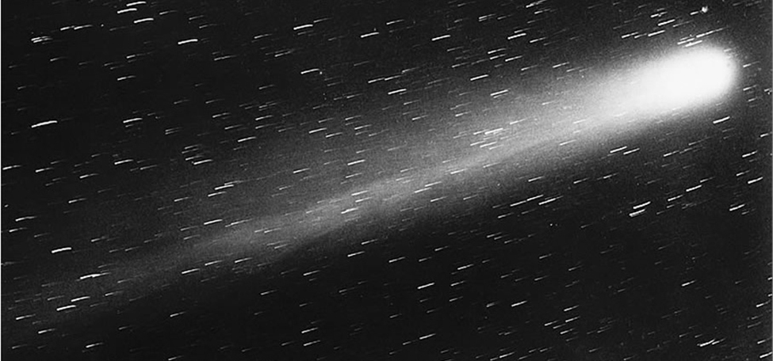

<?cnx.eoc class="key-equations" title="Key Equations"?>

<?cnx.eoc class="key-concepts" title="Key Concepts"?>

<?cnx.eoc class="review-exercises" title="Review Exercises"?>

<?cnx.eoc class="practice-test" title="Practice Test"?>

<?cnx.answers class="try"?>

<?cnx.answers class="checkpoint"?>

<?cnx.answers class="section-exercises"?>

 {: #CNX_Calc_Figure_13_00_001}

In 1705, using Sir Isaac Newton’s new laws of motion, the astronomer Edmond Halley made a prediction. He stated that comets that had appeared in 1531, 1607, and 1682 were actually the same comet and that it would reappear in 1758. Halley was proved to be correct, although he did not live to see it. However, the comet was later named in his honor.

Halley’s Comet follows an elliptical path through the solar system, with the Sun appearing at one focus of the ellipse. This motion is predicted by Johannes Kepler’s first law of planetary motion, which we mentioned briefly in the [Introduction to Parametric Equations and Polar Coordinates](/m53831){: .target-chapter}. In [\[link\]](/m53930#fs-id1169737857156), we show how to use Kepler’s third law of planetary motion along with the calculus of vector-valued functions to find the average distance of Halley’s Comet from the Sun.

Vector-valued functions provide a useful method for studying various curves both in the plane and in three-dimensional space. We can apply this concept to calculate the velocity, acceleration, arc length, and curvature of an object’s trajectory. In this chapter, we examine these methods and show how they are used.

