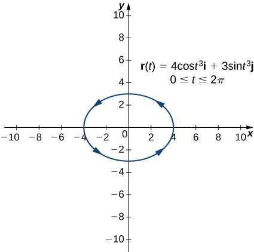
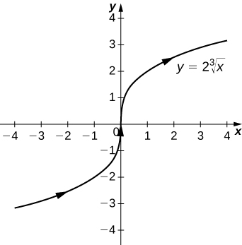
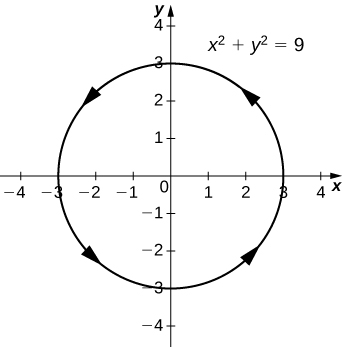
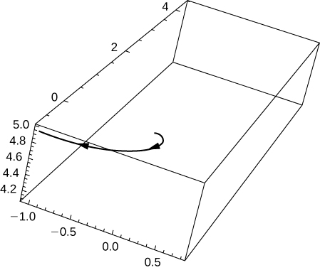
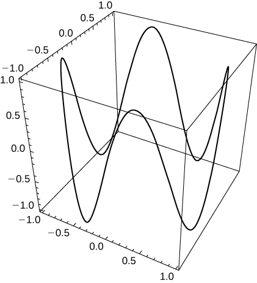

* Write the general equation of a vector-valued function in component form and unit-vector form.
* Recognize parametric equations for a space curve.
* Describe the shape of a helix and write its equation.
* Define the limit of a vector-valued function.

Our study of vector-valued functions combines ideas from our earlier examination of single-variable calculus with our description of vectors in three dimensions from the preceding chapter. In this section we extend concepts from earlier chapters and also examine new ideas concerning curves in three-dimensional space. These definitions and theorems support the presentation of material in the rest of this chapter and also in the remaining chapters of the text.

# Definition of a Vector-Valued Function

Our first step in studying the calculus of vector-valued functions is to define what exactly a vector-valued function is. We can then look at graphs of vector-valued functions and see how they define curves in both two and three dimensions.

Definition

A **vector-valued function**{: data-type="term"} is a function of the form

<math xmlns="http://www.w3.org/1998/Math/MathML"><mrow><mstyle mathvariant="bold" mathsize="normal"><mtext>r</mtext></mstyle><mo stretchy="false">(</mo><mi>t</mi><mo stretchy="false">)</mo><mo>=</mo><mi>f</mi><mrow><mo>(</mo><mi>t</mi><mo>)</mo></mrow><mspace width="0.1em" /><mstyle mathvariant="bold" mathsize="normal"><mtext>i</mtext></mstyle><mo>+</mo><mi>g</mi><mrow><mo>(</mo><mi>t</mi><mo>)</mo></mrow><mspace width="0.1em" /><mstyle mathvariant="bold" mathsize="normal"><mtext>j</mtext></mstyle><mspace width="1em" /><mtext>or</mtext><mspace width="1em" /><mstyle mathvariant="bold" mathsize="normal"><mtext>r</mtext></mstyle><mrow><mo>(</mo><mi>t</mi><mo>)</mo></mrow><mo>=</mo><mi>f</mi><mrow><mo>(</mo><mi>t</mi><mo>)</mo></mrow><mspace width="0.1em" /><mstyle mathvariant="bold" mathsize="normal"><mtext>i</mtext></mstyle><mo>+</mo><mi>g</mi><mrow><mo>(</mo><mi>t</mi><mo>)</mo></mrow><mspace width="0.1em" /><mstyle mathvariant="bold" mathsize="normal"><mtext>j</mtext></mstyle><mo>+</mo><mi>h</mi><mrow><mo>(</mo><mi>t</mi><mo>)</mo></mrow><mspace width="0.1em" /><mstyle mathvariant="bold" mathsize="normal"><mtext>k</mtext></mstyle><mo>,</mo></mrow></math>

where the **component functions**{: data-type="term"} *f, g,* and *h*, are real-valued functions of the parameter *t.* Vector-valued functions are also written in the form

<math xmlns="http://www.w3.org/1998/Math/MathML"><mrow><mstyle mathvariant="bold" mathsize="normal"><mtext>r</mtext></mstyle><mrow><mo>(</mo><mi>t</mi><mo>)</mo></mrow><mo>=</mo><mrow><mo>〈</mo><mrow><mi>f</mi><mrow><mo>(</mo><mi>t</mi><mo>)</mo></mrow><mo>,</mo><mi>g</mi><mrow><mo>(</mo><mi>t</mi><mo>)</mo></mrow></mrow><mo>〉</mo></mrow><mspace width="1em" /><mtext>or</mtext><mspace width="1em" /><mstyle mathvariant="bold" mathsize="normal"><mtext>r</mtext></mstyle><mrow><mo>(</mo><mi>t</mi><mo>)</mo></mrow><mo>=</mo><mrow><mo>〈</mo><mrow><mi>f</mi><mrow><mo>(</mo><mi>t</mi><mo>)</mo></mrow><mo>,</mo><mi>g</mi><mrow><mo>(</mo><mi>t</mi><mo>)</mo></mrow><mo>,</mo><mi>h</mi><mrow><mo>(</mo><mi>t</mi><mo>)</mo></mrow></mrow><mo>〉</mo></mrow><mo>.</mo></mrow></math>

In both cases, the first form of the function defines a two-dimensional vector-valued function; the second form describes a three-dimensional vector-valued function.

The parameter *t* can lie between two real numbers: <math xmlns="http://www.w3.org/1998/Math/MathML"><mrow><mi>a</mi><mo>≤</mo><mi>t</mi><mo>≤</mo><mi>b</mi><mo>.</mo></mrow></math>

 Another possibility is that the value of *t* might take on all real numbers. Last, the component functions themselves may have domain restrictions that enforce restrictions on the value of *t.* We often use *t* as a parameter because *t* can represent time.

Evaluating Vector-Valued Functions and Determining Domains

For each of the following vector-valued functions, evaluate <math xmlns="http://www.w3.org/1998/Math/MathML"><mrow><mstyle mathvariant="bold" mathsize="normal"><mtext>r</mtext></mstyle><mrow><mo>(</mo><mn>0</mn><mo>)</mo></mrow><mo>,</mo><mspace width="0.1em" /><mstyle mathvariant="bold" mathsize="normal"><mtext>r</mtext></mstyle><mrow><mo>(</mo><mrow><mfrac><mi>π</mi><mn>2</mn></mfrac></mrow><mo>)</mo></mrow><mo>,</mo><mtext>and</mtext><mspace width="0.2em" /><mstyle mathvariant="bold" mathsize="normal"><mtext>r</mtext></mstyle><mrow><mo>(</mo><mrow><mfrac><mrow><mn>2</mn><mi>π</mi></mrow><mn>3</mn></mfrac></mrow><mo>)</mo></mrow><mo>.</mo></mrow></math>

 Do any of these functions have domain restrictions?

1.  <math xmlns="http://www.w3.org/1998/Math/MathML"><mrow><mstyle mathvariant="bold" mathsize="normal"><mtext>r</mtext></mstyle><mrow><mo>(</mo><mi>t</mi><mo>)</mo></mrow><mo>=</mo><mn>4</mn><mspace width="0.1em" /><mtext>cos</mtext><mspace width="0.1em" /><mi>t</mi><mspace width="0.1em" /><mstyle mathvariant="bold" mathsize="normal"><mtext>i</mtext></mstyle><mo>+</mo><mn>3</mn><mspace width="0.1em" /><mtext>sin</mtext><mspace width="0.1em" /><mi>t</mi><mspace width="0.1em" /><mstyle mathvariant="bold" mathsize="normal"><mtext>j</mtext></mstyle></mrow></math>

2.  <math xmlns="http://www.w3.org/1998/Math/MathML"><mrow><mstyle mathvariant="bold" mathsize="normal"><mtext>r</mtext></mstyle><mrow><mo>(</mo><mi>t</mi><mo>)</mo></mrow><mo>=</mo><mn>3</mn><mspace width="0.1em" /><mtext>tan</mtext><mspace width="0.1em" /><mi>t</mi><mspace width="0.1em" /><mstyle mathvariant="bold" mathsize="normal"><mtext>i</mtext></mstyle><mo>+</mo><mn>4</mn><mspace width="0.1em" /><mtext>sec</mtext><mspace width="0.1em" /><mi>t</mi><mspace width="0.1em" /><mstyle mathvariant="bold" mathsize="normal"><mtext>j</mtext></mstyle><mo>+</mo><mn>5</mn><mi>t</mi><mspace width="0.1em" /><mstyle mathvariant="bold" mathsize="normal"><mtext>k</mtext></mstyle></mrow></math>
{: data-number-style="lower-alpha"}

1.  To calculate each of the function values, substitute the appropriate value of *t* into the function:
    * * *
    {: data-type="newline"}
    
    

    <math xmlns="http://www.w3.org/1998/Math/MathML"><mtable><mtr><mtd columnalign="right"><mstyle mathvariant="bold" mathsize="normal"><mtext>r</mtext></mstyle><mrow><mo>(</mo><mn>0</mn><mo>)</mo></mrow></mtd><mtd columnalign="left"><mo>=</mo></mtd><mtd columnalign="left"><mn>4</mn><mspace width="0.1em" /><mtext>cos</mtext><mrow><mo>(</mo><mn>0</mn><mo>)</mo></mrow><mspace width="0.1em" /><mstyle mathvariant="bold" mathsize="normal"><mtext>i</mtext></mstyle><mo>+</mo><mn>3</mn><mspace width="0.1em" /><mtext>sin</mtext><mrow><mo>(</mo><mn>0</mn><mo>)</mo></mrow><mspace width="0.1em" /><mstyle mathvariant="bold" mathsize="normal"><mtext>j</mtext></mstyle></mtd></mtr><mtr><mtd /><mtd columnalign="left"><mo>=</mo></mtd><mtd columnalign="left"><mn>4</mn><mspace width="0.1em" /><mstyle mathvariant="bold" mathsize="normal"><mtext>i</mtext></mstyle><mo>+</mo><mn>0</mn><mspace width="0.1em" /><mstyle mathvariant="bold" mathsize="normal"><mtext>j</mtext></mstyle><mo>=</mo><mn>4</mn><mspace width="0.1em" /><mstyle mathvariant="bold" mathsize="normal"><mtext>i</mtext></mstyle></mtd></mtr><mtr><mtd columnalign="right"><mstyle mathvariant="bold" mathsize="normal"><mtext>r</mtext></mstyle><mrow><mo>(</mo><mrow><mfrac><mi>π</mi><mn>2</mn></mfrac></mrow><mo>)</mo></mrow></mtd><mtd columnalign="left"><mo>=</mo></mtd><mtd columnalign="left"><mn>4</mn><mspace width="0.1em" /><mtext>cos</mtext><mrow><mo>(</mo><mrow><mfrac><mi>π</mi><mn>2</mn></mfrac></mrow><mo>)</mo></mrow><mspace width="0.1em" /><mstyle mathvariant="bold" mathsize="normal"><mtext>i</mtext></mstyle><mo>+</mo><mn>3</mn><mspace width="0.1em" /><mtext>sin</mtext><mrow><mo>(</mo><mrow><mfrac><mi>π</mi><mn>2</mn></mfrac></mrow><mo>)</mo></mrow><mspace width="0.1em" /><mstyle mathvariant="bold" mathsize="normal"><mtext>j</mtext></mstyle></mtd></mtr><mtr><mtd /><mtd columnalign="left"><mo>=</mo></mtd><mtd columnalign="left"><mn>0</mn><mspace width="0.1em" /><mstyle mathvariant="bold" mathsize="normal"><mtext>i</mtext></mstyle><mo>+</mo><mn>3</mn><mspace width="0.1em" /><mstyle mathvariant="bold" mathsize="normal"><mtext>j</mtext></mstyle><mo>=</mo><mn>3</mn><mspace width="0.1em" /><mstyle mathvariant="bold" mathsize="normal"><mtext>j</mtext></mstyle></mtd></mtr><mtr><mtd columnalign="right"><mstyle mathvariant="bold" mathsize="normal"><mtext>r</mtext></mstyle><mrow><mo>(</mo><mrow><mfrac><mrow><mn>2</mn><mi>π</mi></mrow><mn>3</mn></mfrac></mrow><mo>)</mo></mrow></mtd><mtd columnalign="left"><mo>=</mo></mtd><mtd columnalign="left"><mn>4</mn><mspace width="0.1em" /><mtext>cos</mtext><mrow><mo>(</mo><mrow><mfrac><mrow><mn>2</mn><mi>π</mi></mrow><mn>3</mn></mfrac></mrow><mo>)</mo></mrow><mspace width="0.1em" /><mstyle mathvariant="bold" mathsize="normal"><mtext>i</mtext></mstyle><mo>+</mo><mn>3</mn><mspace width="0.1em" /><mtext>sin</mtext><mrow><mo>(</mo><mrow><mfrac><mrow><mn>2</mn><mi>π</mi></mrow><mn>3</mn></mfrac></mrow><mo>)</mo></mrow><mspace width="0.1em" /><mstyle mathvariant="bold" mathsize="normal"><mtext>j</mtext></mstyle></mtd></mtr><mtr><mtd /><mtd columnalign="left"><mo>=</mo></mtd><mtd columnalign="left"><mn>4</mn><mrow><mo>(</mo><mrow><mo>−</mo><mfrac><mn>1</mn><mn>2</mn></mfrac></mrow><mo>)</mo></mrow><mspace width="0.1em" /><mstyle mathvariant="bold" mathsize="normal"><mtext>i</mtext></mstyle><mo>+</mo><mn>3</mn><mrow><mo>(</mo><mrow><mfrac><mrow><msqrt><mn>3</mn></msqrt></mrow><mn>2</mn></mfrac></mrow><mo>)</mo></mrow><mspace width="0.1em" /><mstyle mathvariant="bold" mathsize="normal"><mtext>j</mtext></mstyle><mo>=</mo><mn>−2</mn><mspace width="0.1em" /><mstyle mathvariant="bold" mathsize="normal"><mtext>i</mtext></mstyle><mo>+</mo><mfrac><mrow><mn>3</mn><msqrt><mn>3</mn></msqrt></mrow><mn>2</mn></mfrac><mspace width="0.1em" /><mstyle mathvariant="bold" mathsize="normal"><mtext>j</mtext></mstyle><mo>.</mo></mtd></mtr></mtable></math>
    

    
    * * *
    {: data-type="newline"}
    
    To determine whether this function has any domain restrictions, consider the component functions separately. The first component function is
    <math xmlns="http://www.w3.org/1998/Math/MathML"><mrow><mi>f</mi><mrow><mo>(</mo><mi>t</mi><mo>)</mo></mrow><mo>=</mo><mn>4</mn><mspace width="0.1em" /><mtext>cos</mtext><mspace width="0.1em" /><mi>t</mi></mrow></math>
    
    and the second component function is
    <math xmlns="http://www.w3.org/1998/Math/MathML"><mrow><mi>g</mi><mrow><mo>(</mo><mi>t</mi><mo>)</mo></mrow><mo>=</mo><mn>3</mn><mspace width="0.1em" /><mtext>sin</mtext><mspace width="0.1em" /><mi>t</mi><mo>.</mo></mrow></math>
    
    Neither of these functions has a domain restriction, so the domain of
    <math xmlns="http://www.w3.org/1998/Math/MathML"><mrow><mstyle mathvariant="bold" mathsize="normal"><mtext>r</mtext></mstyle><mrow><mo>(</mo><mi>t</mi><mo>)</mo></mrow><mo>=</mo><mn>4</mn><mspace width="0.1em" /><mtext>cos</mtext><mspace width="0.1em" /><mi>t</mi><mspace width="0.1em" /><mstyle mathvariant="bold" mathsize="normal"><mtext>i</mtext></mstyle><mo>+</mo><mn>3</mn><mspace width="0.1em" /><mtext>sin</mtext><mspace width="0.1em" /><mi>t</mi><mspace width="0.1em" /><mstyle mathvariant="bold" mathsize="normal"><mtext>j</mtext></mstyle></mrow></math>
    
    is all real numbers.
2.  To calculate each of the function values, substitute the appropriate value of *t* into the function:
    * * *
    {: data-type="newline"}
    
    

    <math xmlns="http://www.w3.org/1998/Math/MathML"><mtable><mtr><mtd columnalign="right"><mspace width="0.1em" /><mstyle mathvariant="bold" mathsize="normal"><mtext>r</mtext></mstyle><mrow><mo>(</mo><mn>0</mn><mo>)</mo></mrow></mtd><mtd columnalign="left"><mo>=</mo></mtd><mtd columnalign="left"><mn>3</mn><mspace width="0.1em" /><mtext>tan</mtext><mrow><mo>(</mo><mn>0</mn><mo>)</mo></mrow><mspace width="0.1em" /><mstyle mathvariant="bold" mathsize="normal"><mtext>i</mtext></mstyle><mo>+</mo><mn>4</mn><mspace width="0.1em" /><mtext>sec</mtext><mrow><mo>(</mo><mn>0</mn><mo>)</mo></mrow><mspace width="0.1em" /><mstyle mathvariant="bold" mathsize="normal"><mtext>j</mtext></mstyle><mo>+</mo><mn>5</mn><mrow><mo>(</mo><mn>0</mn><mo>)</mo></mrow><mspace width="0.1em" /><mstyle mathvariant="bold" mathsize="normal"><mtext>k</mtext></mstyle></mtd></mtr><mtr><mtd /><mtd columnalign="left"><mo>=</mo></mtd><mtd columnalign="left"><mn>0</mn><mspace width="0.1em" /><mstyle mathvariant="bold" mathsize="normal"><mtext>i</mtext></mstyle><mo>+</mo><mn>4</mn><mspace width="0.1em" /><mstyle mathvariant="bold" mathsize="normal"><mtext>j</mtext></mstyle><mo>+</mo><mn>0</mn><mspace width="0.1em" /><mstyle mathvariant="bold" mathsize="normal"><mtext>k</mtext></mstyle><mo>=</mo><mn>4</mn><mspace width="0.1em" /><mstyle mathvariant="bold" mathsize="normal"><mtext>j</mtext></mstyle></mtd></mtr><mtr><mtd columnalign="right"><mspace width="0.1em" /><mstyle mathvariant="bold" mathsize="normal"><mtext>r</mtext></mstyle><mrow><mo>(</mo><mrow><mfrac><mi>π</mi><mn>2</mn></mfrac></mrow><mo>)</mo></mrow></mtd><mtd columnalign="left"><mo>=</mo></mtd><mtd columnalign="left"><mn>3</mn><mspace width="0.1em" /><mtext>tan</mtext><mrow><mo>(</mo><mrow><mfrac><mi>π</mi><mn>2</mn></mfrac></mrow><mo>)</mo></mrow><mspace width="0.1em" /><mstyle mathvariant="bold" mathsize="normal"><mtext>i</mtext></mstyle><mo>+</mo><mn>4</mn><mspace width="0.1em" /><mtext>sec</mtext><mrow><mo>(</mo><mrow><mfrac><mi>π</mi><mn>2</mn></mfrac></mrow><mo>)</mo></mrow><mspace width="0.1em" /><mstyle mathvariant="bold" mathsize="normal"><mtext>j</mtext></mstyle><mo>+</mo><mn>5</mn><mrow><mo>(</mo><mrow><mfrac><mi>π</mi><mn>2</mn></mfrac></mrow><mo>)</mo></mrow><mspace width="0.1em" /><mstyle mathvariant="bold" mathsize="normal"><mtext>k</mtext></mstyle><mo>,</mo><mtext>which does not exist</mtext></mtd></mtr><mtr><mtd columnalign="right"><mspace width="0.1em" /><mstyle mathvariant="bold" mathsize="normal"><mtext>r</mtext></mstyle><mrow><mo>(</mo><mrow><mfrac><mrow><mn>2</mn><mi>π</mi></mrow><mn>3</mn></mfrac></mrow><mo>)</mo></mrow></mtd><mtd columnalign="left"><mo>=</mo></mtd><mtd columnalign="left"><mn>3</mn><mspace width="0.1em" /><mtext>tan</mtext><mrow><mo>(</mo><mrow><mfrac><mrow><mn>2</mn><mi>π</mi></mrow><mn>3</mn></mfrac></mrow><mo>)</mo></mrow><mspace width="0.1em" /><mstyle mathvariant="bold" mathsize="normal"><mtext>i</mtext></mstyle><mo>+</mo><mn>4</mn><mspace width="0.1em" /><mtext>sec</mtext><mrow><mo>(</mo><mrow><mfrac><mrow><mn>2</mn><mi>π</mi></mrow><mn>3</mn></mfrac></mrow><mo>)</mo></mrow><mspace width="0.1em" /><mstyle mathvariant="bold" mathsize="normal"><mtext>j</mtext></mstyle><mo>+</mo><mn>5</mn><mrow><mo>(</mo><mrow><mfrac><mrow><mn>2</mn><mi>π</mi></mrow><mn>3</mn></mfrac></mrow><mo>)</mo></mrow><mspace width="0.1em" /><mstyle mathvariant="bold" mathsize="normal"><mtext>k</mtext></mstyle></mtd></mtr><mtr><mtd /><mtd columnalign="left"><mo>=</mo></mtd><mtd columnalign="left"><mn>3</mn><mrow><mo>(</mo><mrow><mo>−</mo><msqrt><mn>3</mn></msqrt></mrow><mo>)</mo></mrow><mspace width="0.1em" /><mstyle mathvariant="bold" mathsize="normal"><mtext>i</mtext></mstyle><mo>+</mo><mn>4</mn><mrow><mo>(</mo><mrow><mn>−2</mn></mrow><mo>)</mo></mrow><mspace width="0.1em" /><mstyle mathvariant="bold" mathsize="normal"><mtext>j</mtext></mstyle><mo>+</mo><mfrac><mrow><mn>10</mn><mi>π</mi></mrow><mn>3</mn></mfrac><mspace width="0.1em" /><mstyle mathvariant="bold" mathsize="normal"><mtext>k</mtext></mstyle></mtd></mtr><mtr><mtd /><mtd columnalign="left"><mo>=</mo></mtd><mtd columnalign="left"><mn>−3</mn><msqrt><mn>3</mn></msqrt><mspace width="0.1em" /><mstyle mathvariant="bold" mathsize="normal"><mtext>i</mtext></mstyle><mo>−</mo><mn>8</mn><mspace width="0.1em" /><mstyle mathvariant="bold" mathsize="normal"><mtext>j</mtext></mstyle><mo>+</mo><mfrac><mrow><mn>10</mn><mi>π</mi></mrow><mn>3</mn></mfrac><mspace width="0.1em" /><mstyle mathvariant="bold" mathsize="normal"><mtext>k</mtext></mstyle><mo>.</mo></mtd></mtr></mtable></math>
    

    
    * * *
    {: data-type="newline"}
    
    To determine whether this function has any domain restrictions, consider the component functions separately. The first component function is
    <math xmlns="http://www.w3.org/1998/Math/MathML"><mrow><mi>f</mi><mrow><mo>(</mo><mi>t</mi><mo>)</mo></mrow><mo>=</mo><mn>3</mn><mspace width="0.1em" /><mtext>tan</mtext><mspace width="0.1em" /><mi>t</mi><mo>,</mo></mrow></math>
    
    the second component function is
    <math xmlns="http://www.w3.org/1998/Math/MathML"><mrow><mi>g</mi><mrow><mo>(</mo><mi>t</mi><mo>)</mo></mrow><mo>=</mo><mn>4</mn><mspace width="0.1em" /><mtext>sec</mtext><mspace width="0.1em" /><mi>t</mi><mo>,</mo></mrow></math>
    
    and the third component function is
    <math xmlns="http://www.w3.org/1998/Math/MathML"><mrow><mi>h</mi><mrow><mo>(</mo><mi>t</mi><mo>)</mo></mrow><mo>=</mo><mn>5</mn><mi>t</mi><mo>.</mo></mrow></math>
    
    The first two functions are not defined for odd multiples of
    <math xmlns="http://www.w3.org/1998/Math/MathML"><mrow><mi>π</mi><mtext>/</mtext><mn>2</mn><mo>,</mo></mrow></math>
    
    so the function is not defined for odd multiples of
    <math xmlns="http://www.w3.org/1998/Math/MathML"><mrow><mi>π</mi><mtext>/</mtext><mn>2</mn><mo>.</mo></mrow></math>
    
    Therefore,
    <math xmlns="http://www.w3.org/1998/Math/MathML"><mrow><mtext>dom</mtext><mrow><mo>(</mo><mrow><mspace width="0.1em" /><mstyle mathvariant="bold" mathsize="normal"><mtext>r</mtext></mstyle><mrow><mo>(</mo><mi>t</mi><mo>)</mo></mrow></mrow><mo>)</mo></mrow><mo>=</mo><mrow><mo>{</mo><mrow><mi>t</mi><mspace width="0.1em" /><mrow><mo>\|</mo><mrow><mi>t</mi><mo>≠</mo><mfrac><mrow><mrow><mo>(</mo><mrow><mn>2</mn><mi>n</mi><mo>+</mo><mn>1</mn></mrow><mo>)</mo></mrow><mi>π</mi></mrow><mn>2</mn></mfrac></mrow></mrow></mrow><mo>}</mo></mrow><mo>,</mo></mrow></math>
    
    where *n* is any integer.
{: data-number-style="lower-alpha"}

For the vector-valued function <math xmlns="http://www.w3.org/1998/Math/MathML"><mrow><mstyle mathvariant="bold" mathsize="normal"><mtext>r</mtext></mstyle><mrow><mo>(</mo><mi>t</mi><mo>)</mo></mrow><mo>=</mo><mrow><mo>(</mo><mrow><msup><mi>t</mi><mn>2</mn></msup><mo>−</mo><mn>3</mn><mi>t</mi></mrow><mo>)</mo></mrow><mspace width="0.1em" /><mstyle mathvariant="bold" mathsize="normal"><mtext>i</mtext></mstyle><mo>+</mo><mrow><mo>(</mo><mrow><mn>4</mn><mi>t</mi><mo>+</mo><mn>1</mn></mrow><mo>)</mo></mrow><mspace width="0.1em" /><mstyle mathvariant="bold" mathsize="normal"><mtext>j</mtext></mstyle><mo>,</mo></mrow></math>

 evaluate <math xmlns="http://www.w3.org/1998/Math/MathML"><mrow><mstyle mathvariant="bold" mathsize="normal"><mtext>r</mtext></mstyle><mrow><mo>(</mo><mn>0</mn><mo>)</mo></mrow><mo>,</mo><mspace width="0.1em" /><mstyle mathvariant="bold" mathsize="normal"><mtext>r</mtext></mstyle><mrow><mo>(</mo><mn>1</mn><mo>)</mo></mrow><mo>,</mo><mtext>and</mtext><mspace width="0.2em" /><mstyle mathvariant="bold" mathsize="normal"><mtext>r</mtext></mstyle><mrow><mo>(</mo><mrow><mn>−4</mn></mrow><mo>)</mo></mrow><mo>.</mo></mrow></math>

 Does this function have any domain restrictions?

<math xmlns="http://www.w3.org/1998/Math/MathML"><mrow><mstyle mathvariant="bold" mathsize="normal"><mtext>r</mtext></mstyle><mrow><mo>(</mo><mn>0</mn><mo>)</mo></mrow><mo>=</mo><mstyle mathvariant="bold" mathsize="normal"><mtext>j</mtext></mstyle><mo>,</mo><mspace width="0.1em" /><mstyle mathvariant="bold" mathsize="normal"><mtext>r</mtext></mstyle><mrow><mo>(</mo><mn>1</mn><mo>)</mo></mrow><mo>=</mo><mn>−2</mn><mspace width="0.1em" /><mstyle mathvariant="bold" mathsize="normal"><mtext>i</mtext></mstyle><mo>+</mo><mn>5</mn><mspace width="0.1em" /><mstyle mathvariant="bold" mathsize="normal"><mtext>j</mtext></mstyle><mo>,</mo><mspace width="0.1em" /><mstyle mathvariant="bold" mathsize="normal"><mtext>r</mtext></mstyle><mrow><mo>(</mo><mrow><mn>−4</mn></mrow><mo>)</mo></mrow><mo>=</mo><mn>28</mn><mspace width="0.1em" /><mstyle mathvariant="bold" mathsize="normal"><mtext>i</mtext></mstyle><mo>−</mo><mn>15</mn><mspace width="0.1em" /><mstyle mathvariant="bold" mathsize="normal"><mtext>j</mtext></mstyle></mrow></math>

The domain of <math xmlns="http://www.w3.org/1998/Math/MathML"><mrow><mstyle mathvariant="bold" mathsize="normal"><mtext>r</mtext></mstyle><mrow><mo>(</mo><mi>t</mi><mo>)</mo></mrow><mo>=</mo><mrow><mo>(</mo><mrow><msup><mi>t</mi><mn>2</mn></msup><mo>−</mo><mn>3</mn><mi>t</mi></mrow><mo>)</mo></mrow><mspace width="0.1em" /><mstyle mathvariant="bold" mathsize="normal"><mtext>i</mtext></mstyle><mo>+</mo><mrow><mo>(</mo><mrow><mn>4</mn><mi>t</mi><mo>+</mo><mn>1</mn></mrow><mo>)</mo></mrow><mspace width="0.1em" /><mstyle mathvariant="bold" mathsize="normal"><mtext>j</mtext></mstyle></mrow></math>

 is all real numbers.

Hint

Substitute the appropriate values of *t* into the function.

[\[link\]](#fs-id1169737841797) illustrates an important concept. The domain of a vector-valued function consists of real numbers. The domain can be all real numbers or a subset of the real numbers. The range of a vector-valued function consists of vectors. Each real number in the domain of a vector-valued function is mapped to either a two- or a three-dimensional vector.

# Graphing Vector-Valued Functions

Recall that a plane vector consists of two quantities: direction and magnitude. Given any point in the plane (the ***initial point***{: data-type="term" .no-emphasis}), if we move in a specific direction for a specific distance, we arrive at a second point. This represents the ***terminal point***{: data-type="term" .no-emphasis} of the vector. We calculate the components of the vector by subtracting the coordinates of the initial point from the coordinates of the terminal point.

A vector is considered to be in ***standard position***{: data-type="term" .no-emphasis} if the initial point is located at the origin. When graphing a vector-valued function, we typically graph the vectors in the domain of the function in standard position, because doing so guarantees the uniqueness of the graph. This convention applies to the graphs of three-dimensional vector-valued functions as well. The graph of a vector-valued function of the form <math xmlns="http://www.w3.org/1998/Math/MathML"><mrow><mstyle mathvariant="bold" mathsize="normal"><mtext>r</mtext></mstyle><mrow><mo>(</mo><mi>t</mi><mo>)</mo></mrow><mo>=</mo><mi>f</mi><mrow><mo>(</mo><mi>t</mi><mo>)</mo></mrow><mspace width="0.1em" /><mstyle mathvariant="bold" mathsize="normal"><mtext>i</mtext></mstyle><mo>+</mo><mi>g</mi><mrow><mo>(</mo><mi>t</mi><mo>)</mo></mrow><mspace width="0.1em" /><mstyle mathvariant="bold" mathsize="normal"><mtext>j</mtext></mstyle></mrow></math>

 consists of the set of all <math xmlns="http://www.w3.org/1998/Math/MathML"><mrow><mrow><mo>(</mo><mrow><mi>t</mi><mo>,</mo><mspace width="0.1em" /><mstyle mathvariant="bold" mathsize="normal"><mtext>r</mtext></mstyle><mrow><mo>(</mo><mi>t</mi><mo>)</mo></mrow></mrow><mo>)</mo></mrow><mo>,</mo></mrow></math>

 and the path it traces is called a **plane curve**{: data-type="term"}. The graph of a vector-valued function of the form <math xmlns="http://www.w3.org/1998/Math/MathML"><mrow><mstyle mathvariant="bold" mathsize="normal"><mtext>r</mtext></mstyle><mrow><mo>(</mo><mi>t</mi><mo>)</mo></mrow><mo>=</mo><mi>f</mi><mrow><mo>(</mo><mi>t</mi><mo>)</mo></mrow><mspace width="0.1em" /><mstyle mathvariant="bold" mathsize="normal"><mtext>i</mtext></mstyle><mo>+</mo><mi>g</mi><mrow><mo>(</mo><mi>t</mi><mo>)</mo></mrow><mspace width="0.1em" /><mstyle mathvariant="bold" mathsize="normal"><mtext>j</mtext></mstyle><mo>+</mo><mi>h</mi><mrow><mo>(</mo><mi>t</mi><mo>)</mo></mrow><mspace width="0.1em" /><mstyle mathvariant="bold" mathsize="normal"><mtext>k</mtext></mstyle></mrow></math>

 consists of the set of all <math xmlns="http://www.w3.org/1998/Math/MathML"><mrow><mrow><mo>(</mo><mrow><mi>t</mi><mo>,</mo><mspace width="0.1em" /><mstyle mathvariant="bold" mathsize="normal"><mtext>r</mtext></mstyle><mrow><mo>(</mo><mi>t</mi><mo>)</mo></mrow></mrow><mo>)</mo></mrow><mo>,</mo></mrow></math>

 and the path it traces is called a **space curve**{: data-type="term"}. Any representation of a plane curve or space curve using a vector-valued function is called a **vector parameterization**{: data-type="term"} of the curve.

Graphing a Vector-Valued Function

Create a graph of each of the following vector-valued functions:

1.  The plane curve represented by
    <math xmlns="http://www.w3.org/1998/Math/MathML"><mrow><mstyle mathvariant="bold" mathsize="normal"><mtext>r</mtext></mstyle><mrow><mo>(</mo><mi>t</mi><mo>)</mo></mrow><mo>=</mo><mn>4</mn><mspace width="0.1em" /><mtext>cos</mtext><mspace width="0.1em" /><mi>t</mi><mspace width="0.1em" /><mstyle mathvariant="bold" mathsize="normal"><mtext>i</mtext></mstyle><mo>+</mo><mn>3</mn><mspace width="0.1em" /><mtext>sin</mtext><mspace width="0.1em" /><mi>t</mi><mspace width="0.1em" /><mstyle mathvariant="bold" mathsize="normal"><mtext>j</mtext></mstyle><mo>,</mo></mrow></math>
    
    <math xmlns="http://www.w3.org/1998/Math/MathML"><mrow><mn>0</mn><mo>≤</mo><mi>t</mi><mo>≤</mo><mn>2</mn><mi>π</mi></mrow></math>

2.  The plane curve represented by
    <math xmlns="http://www.w3.org/1998/Math/MathML"><mrow><mstyle mathvariant="bold" mathsize="normal"><mtext>r</mtext></mstyle><mrow><mo>(</mo><mi>t</mi><mo>)</mo></mrow><mo>=</mo><mn>4</mn><mspace width="0.1em" /><mtext>cos</mtext><mspace width="0.1em" /><msup><mi>t</mi><mn>3</mn></msup><mspace width="0.1em" /><mstyle mathvariant="bold" mathsize="normal"><mtext>i</mtext></mstyle><mo>+</mo><mn>3</mn><mspace width="0.1em" /><mtext>sin</mtext><mspace width="0.1em" /><msup><mi>t</mi><mn>3</mn></msup><mspace width="0.1em" /><mstyle mathvariant="bold" mathsize="normal"><mtext>j</mtext></mstyle><mo>,</mo></mrow></math>
    
    <math xmlns="http://www.w3.org/1998/Math/MathML"><mrow><mn>0</mn><mo>≤</mo><mi>t</mi><mo>≤</mo><mn>2</mn><mi>π</mi></mrow></math>

3.  The space curve represented by
    <math xmlns="http://www.w3.org/1998/Math/MathML"><mrow><mstyle mathvariant="bold" mathsize="normal"><mtext>r</mtext></mstyle><mrow><mo>(</mo><mi>t</mi><mo>)</mo></mrow><mo>=</mo><mtext>cos</mtext><mspace width="0.1em" /><mi>t</mi><mspace width="0.1em" /><mstyle mathvariant="bold" mathsize="normal"><mtext>i</mtext></mstyle><mo>+</mo><mtext>sin</mtext><mspace width="0.1em" /><mi>t</mi><mspace width="0.1em" /><mstyle mathvariant="bold" mathsize="normal"><mtext>j</mtext></mstyle><mo>+</mo><mi>t</mi><mspace width="0.1em" /><mstyle mathvariant="bold" mathsize="normal"><mtext>k</mtext></mstyle><mo>,</mo></mrow></math>
    
    <math xmlns="http://www.w3.org/1998/Math/MathML"><mrow><mn>0</mn><mo>≤</mo><mi>t</mi><mo>≤</mo><mn>4</mn><mi>π</mi></mrow></math>
{: data-number-style="lower-alpha"}

1.  As with any graph, we start with a table of values. We then graph each of the vectors in the second column of the table in standard position and connect the terminal points of each vector to form a curve ([[link]](#CNX_Calc_Figure_13_01_001)). This curve turns out to be an ellipse centered at the origin.
    * * *
    {: data-type="newline"}
    
    <table summary="This is a table with two columns. The first column is labeled with &#x201C;t&#x201D;. The second column is labeled with the function &#x201C;r(t)&#x201D;. There are 9 rows in the table. The first row contains the entries 0 and 4i for the first and the second column. The second row contains the entries pi/4 and 2(the square root of 2)i + 2(the square root of 3)/2 j. The third row contains the entries pi/2 and 3j. The fourth row contains the entries 3pi/4 and -2(the square root of 2)i + 2(the square root of 3)/2 j. The fifth row contains the entries pi and -4i. The sixth row contains the entries 5pi/4 and -2(the square root of 2)i - 2(the square root of 3)/2 j. The seventh row contains the entries 3pi/2 and -3j. The eighth row contains the entries 7pi/4 and 2(the square root of 2)i - 2(the square root of 3)/2 j. The ninth row contains the entries 2pi and 4i."><caption>Table of Values for <math xmlns="http://www.w3.org/1998/Math/MathML"><mrow><mstyle mathvariant="bold" mathsize="normal"><mtext>r</mtext></mstyle><mrow><mo>(</mo><mi>t</mi><mo>)</mo></mrow><mo>=</mo><mn>4</mn><mspace width="0.1em" /><mtext>cos</mtext><mspace width="0.1em" /><mi>t</mi><mspace width="0.1em" /><mstyle mathvariant="bold" mathsize="normal"><mtext>i</mtext></mstyle><mo>+</mo><mn>3</mn><mspace width="0.1em" /><mtext>sin</mtext><mspace width="0.1em" /><mi>t</mi><mspace width="0.1em" /><mstyle mathvariant="bold" mathsize="normal"><mtext>j</mtext></mstyle><mo>,</mo></mrow></math> <math xmlns="http://www.w3.org/1998/Math/MathML"><mrow><mn>0</mn><mo>≤</mo><mi>t</mi><mo>≤</mo><mn>2</mn><mi>π</mi></mrow></math></caption><tbody>
    <tr valign="top">
    <td><em>t</em></td>
    <td><math xmlns="http://www.w3.org/1998/Math/MathML"><mrow><mstyle mathvariant="bold" mathsize="normal"><mtext>r</mtext></mstyle><mrow><mo>(</mo><mi>t</mi><mo>)</mo></mrow></mrow></math></td>
    <td><em>t</em></td>
    <td><math xmlns="http://www.w3.org/1998/Math/MathML"><mrow><mstyle mathvariant="bold" mathsize="normal"><mtext>r</mtext></mstyle><mrow><mo>(</mo><mi>t</mi><mo>)</mo></mrow></mrow></math></td>
    </tr>
    <tr valign="top">
    <td>0</td>
    <td><math xmlns="http://www.w3.org/1998/Math/MathML"><mrow><mn>4</mn><mspace width="0.1em" /><mstyle mathvariant="bold" mathsize="normal"><mtext>i</mtext></mstyle></mrow></math></td>
    <td><math xmlns="http://www.w3.org/1998/Math/MathML"><mi>π</mi></math></td>
    <td><math xmlns="http://www.w3.org/1998/Math/MathML"><mrow><mn>−4</mn><mspace width="0.1em" /><mstyle mathvariant="bold" mathsize="normal"><mtext>i</mtext></mstyle></mrow></math></td>
    </tr>
    <tr valign="top">
    <td><math xmlns="http://www.w3.org/1998/Math/MathML"><mrow><mfrac><mi>π</mi><mn>4</mn></mfrac></mrow></math></td>
    <td><math xmlns="http://www.w3.org/1998/Math/MathML"><mrow><mn>2</mn><msqrt><mn>2</mn></msqrt><mspace width="0.1em" /><mstyle mathvariant="bold" mathsize="normal"><mtext>i</mtext></mstyle><mo>+</mo><mfrac><mrow><mn>3</mn><msqrt><mn>2</mn></msqrt></mrow><mn>2</mn></mfrac><mspace width="0.1em" /><mstyle mathvariant="bold" mathsize="normal"><mtext>j</mtext></mstyle></mrow></math></td>
    <td><math xmlns="http://www.w3.org/1998/Math/MathML"><mrow><mfrac><mrow><mn>5</mn><mi>π</mi></mrow><mn>4</mn></mfrac></mrow></math></td>
    <td><math xmlns="http://www.w3.org/1998/Math/MathML"><mrow><mn>−2</mn><msqrt><mn>2</mn></msqrt><mspace width="0.1em" /><mstyle mathvariant="bold" mathsize="normal"><mtext>i</mtext></mstyle><mo>−</mo><mfrac><mrow><mn>3</mn><msqrt><mn>2</mn></msqrt></mrow><mn>2</mn></mfrac><mspace width="0.1em" /><mstyle mathvariant="bold" mathsize="normal"><mtext>j</mtext></mstyle></mrow></math></td>
    </tr>
    <tr valign="top">
    <td><math xmlns="http://www.w3.org/1998/Math/MathML"><mrow><mfrac><mi>π</mi><mn>2</mn></mfrac></mrow></math></td>
    <td><math xmlns="http://www.w3.org/1998/Math/MathML"><mrow><mn>3</mn><mspace width="0.1em" /><mstyle mathvariant="bold" mathsize="normal"><mtext>j</mtext></mstyle></mrow></math></td>
    <td><math xmlns="http://www.w3.org/1998/Math/MathML"><mrow><mfrac><mrow><mn>3</mn><mi>π</mi></mrow><mn>2</mn></mfrac></mrow></math></td>
    <td><math xmlns="http://www.w3.org/1998/Math/MathML"><mrow><mn>−3</mn><mspace width="0.1em" /><mstyle mathvariant="bold" mathsize="normal"><mtext>j</mtext></mstyle></mrow></math></td>
    </tr>
    <tr valign="top">
    <td><math xmlns="http://www.w3.org/1998/Math/MathML"><mrow><mfrac><mrow><mn>3</mn><mi>π</mi></mrow><mn>4</mn></mfrac></mrow></math></td>
    <td><math xmlns="http://www.w3.org/1998/Math/MathML"><mrow><mn>−2</mn><msqrt><mn>2</mn></msqrt><mspace width="0.1em" /><mstyle mathvariant="bold" mathsize="normal"><mtext>i</mtext></mstyle><mo>+</mo><mfrac><mrow><mn>3</mn><msqrt><mn>2</mn></msqrt></mrow><mn>2</mn></mfrac><mspace width="0.1em" /><mstyle mathvariant="bold" mathsize="normal"><mtext>j</mtext></mstyle></mrow></math></td>
    <td><math xmlns="http://www.w3.org/1998/Math/MathML"><mrow><mfrac><mrow><mn>7</mn><mi>π</mi></mrow><mn>4</mn></mfrac></mrow></math></td>
    <td><math xmlns="http://www.w3.org/1998/Math/MathML"><mrow><mn>2</mn><msqrt><mn>2</mn></msqrt><mspace width="0.1em" /><mstyle mathvariant="bold" mathsize="normal"><mtext>i</mtext></mstyle><mo>−</mo><mfrac><mrow><mn>3</mn><msqrt><mn>2</mn></msqrt></mrow><mn>2</mn></mfrac><mspace width="0.1em" /><mstyle mathvariant="bold" mathsize="normal"><mtext>j</mtext></mstyle></mrow></math></td>
    </tr>
    <tr valign="top">
    <td><math xmlns="http://www.w3.org/1998/Math/MathML"><mrow><mn>2</mn><mi>π</mi></mrow></math></td>
    <td><math xmlns="http://www.w3.org/1998/Math/MathML"><mrow><mn>4</mn><mspace width="0.1em" /><mstyle mathvariant="bold" mathsize="normal"><mtext>i</mtext></mstyle></mrow></math></td>
    <td />
    <td />
    </tr>
    </tbody></table>
    
    {: #CNX_Calc_Figure_13_01_001}

2.  The table of values for
    <math xmlns="http://www.w3.org/1998/Math/MathML"><mrow><mstyle mathvariant="bold" mathsize="normal"><mtext>r</mtext></mstyle><mrow><mo>(</mo><mi>t</mi><mo>)</mo></mrow><mo>=</mo><mn>4</mn><mspace width="0.1em" /><mtext>cos</mtext><mspace width="0.1em" /><mi>t</mi><mspace width="0.1em" /><mstyle mathvariant="bold" mathsize="normal"><mtext>i</mtext></mstyle><mo>+</mo><mn>3</mn><mspace width="0.1em" /><mtext>sin</mtext><mspace width="0.1em" /><mi>t</mi><mspace width="0.1em" /><mstyle mathvariant="bold" mathsize="normal"><mtext>j</mtext></mstyle><mo>,</mo></mrow></math>
    
    <math xmlns="http://www.w3.org/1998/Math/MathML"><mrow><mn>0</mn><mo>≤</mo><mi>t</mi><mo>≤</mo><mn>2</mn><mi>π</mi></mrow></math>
    
    is as follows:
    * * *
    {: data-type="newline"}
    
    <table summary="This is a table with two columns. The first column is labeled with &#x201C;t&#x201D;. The second column is labeled with the function &#x201C;r(t)&#x201D;. There are 9 rows in the table. The first row contains the entries 0 and 4i for the first and the second column. The second row contains the entries pi/4 and 2(the square root of 2)i + 2(the square root of 3)/2 j. The third row contains the entries pi/2 and 3j. The fourth row contains the entries 3pi/4 and -2(the square root of 2)i + 2(the square root of 3)/2 j. The fifth row contains the entries pi and -4i. The sixth row contains the entries 5pi/4 and -2(the square root of 2)i - 2(the square root of 3)/2 j. The seventh row contains the entries 3pi/2 and -3j. The eighth row contains the entries 7pi/4 and 2(the square root of 2)i - 2(the square root of 3)/2 j. The ninth row contains the entries 2pi and 4i."><caption>Table of Values for <math xmlns="http://www.w3.org/1998/Math/MathML"><mrow><mstyle mathvariant="bold" mathsize="normal"><mtext>r</mtext></mstyle><mrow><mo>(</mo><mi>t</mi><mo>)</mo></mrow><mo>=</mo><mn>4</mn><mspace width="0.1em" /><mtext>cos</mtext><mspace width="0.1em" /><mi>t</mi><mspace width="0.1em" /><mstyle mathvariant="bold" mathsize="normal"><mtext>i</mtext></mstyle><mo>+</mo><mn>3</mn><mspace width="0.1em" /><mtext>sin</mtext><mspace width="0.1em" /><mi>t</mi><mspace width="0.1em" /><mstyle mathvariant="bold" mathsize="normal"><mtext>j</mtext></mstyle><mo>,</mo></mrow></math> <math xmlns="http://www.w3.org/1998/Math/MathML"><mrow><mn>0</mn><mo>≤</mo><mi>t</mi><mo>≤</mo><mn>2</mn><mi>π</mi></mrow></math></caption><tbody>
    <tr valign="top">
    <td><em>t</em></td>
    <td><math xmlns="http://www.w3.org/1998/Math/MathML"><mrow><mstyle mathvariant="bold" mathsize="normal"><mtext>r</mtext></mstyle><mrow><mo>(</mo><mi>t</mi><mo>)</mo></mrow></mrow></math></td>
    <td><em>t</em></td>
    <td><math xmlns="http://www.w3.org/1998/Math/MathML"><mrow><mstyle mathvariant="bold" mathsize="normal"><mtext>r</mtext></mstyle><mrow><mo>(</mo><mi>t</mi><mo>)</mo></mrow></mrow></math></td>
    </tr>
    <tr valign="top">
    <td>0</td>
    <td><math xmlns="http://www.w3.org/1998/Math/MathML"><mrow><mn>4</mn><mspace width="0.1em" /><mstyle mathvariant="bold" mathsize="normal"><mtext>i</mtext></mstyle></mrow></math></td>
    <td><math xmlns="http://www.w3.org/1998/Math/MathML"><mi>π</mi></math></td>
    <td><math xmlns="http://www.w3.org/1998/Math/MathML"><mrow><mn>−4</mn><mspace width="0.1em" /><mstyle mathvariant="bold" mathsize="normal"><mtext>i</mtext></mstyle></mrow></math></td>
    </tr>
    <tr valign="top">
    <td><math xmlns="http://www.w3.org/1998/Math/MathML"><mrow><mfrac><mi>π</mi><mn>4</mn></mfrac></mrow></math></td>
    <td><math xmlns="http://www.w3.org/1998/Math/MathML"><mrow><mn>2</mn><msqrt><mn>2</mn></msqrt><mspace width="0.1em" /><mstyle mathvariant="bold" mathsize="normal"><mtext>i</mtext></mstyle><mo>+</mo><mfrac><mrow><mn>3</mn><msqrt><mn>2</mn></msqrt></mrow><mn>2</mn></mfrac><mspace width="0.1em" /><mstyle mathvariant="bold" mathsize="normal"><mtext>j</mtext></mstyle></mrow></math></td>
    <td><math xmlns="http://www.w3.org/1998/Math/MathML"><mrow><mfrac><mrow><mn>5</mn><mi>π</mi></mrow><mn>4</mn></mfrac></mrow></math></td>
    <td><math xmlns="http://www.w3.org/1998/Math/MathML"><mrow><mn>−2</mn><msqrt><mn>2</mn></msqrt><mspace width="0.1em" /><mstyle mathvariant="bold" mathsize="normal"><mtext>i</mtext></mstyle><mo>−</mo><mfrac><mrow><mn>3</mn><msqrt><mn>2</mn></msqrt></mrow><mn>2</mn></mfrac><mspace width="0.1em" /><mstyle mathvariant="bold" mathsize="normal"><mtext>j</mtext></mstyle></mrow></math></td>
    </tr>
    <tr valign="top">
    <td><math xmlns="http://www.w3.org/1998/Math/MathML"><mrow><mfrac><mi>π</mi><mn>2</mn></mfrac></mrow></math></td>
    <td><math xmlns="http://www.w3.org/1998/Math/MathML"><mrow><mn>3</mn><mspace width="0.1em" /><mstyle mathvariant="bold" mathsize="normal"><mtext>j</mtext></mstyle></mrow></math></td>
    <td><math xmlns="http://www.w3.org/1998/Math/MathML"><mrow><mfrac><mrow><mn>3</mn><mi>π</mi></mrow><mn>2</mn></mfrac></mrow></math></td>
    <td><math xmlns="http://www.w3.org/1998/Math/MathML"><mrow><mn>−3</mn><mspace width="0.1em" /><mstyle mathvariant="bold" mathsize="normal"><mtext>j</mtext></mstyle></mrow></math></td>
    </tr>
    <tr valign="top">
    <td><math xmlns="http://www.w3.org/1998/Math/MathML"><mrow><mfrac><mrow><mn>3</mn><mi>π</mi></mrow><mn>4</mn></mfrac></mrow></math></td>
    <td><math xmlns="http://www.w3.org/1998/Math/MathML"><mrow><mn>−2</mn><msqrt><mn>2</mn></msqrt><mspace width="0.1em" /><mstyle mathvariant="bold" mathsize="normal"><mtext>i</mtext></mstyle><mo>+</mo><mfrac><mrow><mn>3</mn><msqrt><mn>2</mn></msqrt></mrow><mn>2</mn></mfrac><mspace width="0.1em" /><mstyle mathvariant="bold" mathsize="normal"><mtext>j</mtext></mstyle></mrow></math></td>
    <td><math xmlns="http://www.w3.org/1998/Math/MathML"><mrow><mfrac><mrow><mn>7</mn><mi>π</mi></mrow><mn>4</mn></mfrac></mrow></math></td>
    <td><math xmlns="http://www.w3.org/1998/Math/MathML"><mrow><mn>2</mn><msqrt><mn>2</mn></msqrt><mspace width="0.1em" /><mstyle mathvariant="bold" mathsize="normal"><mtext>i</mtext></mstyle><mo>−</mo><mfrac><mrow><mn>3</mn><msqrt><mn>2</mn></msqrt></mrow><mn>2</mn></mfrac><mspace width="0.1em" /><mstyle mathvariant="bold" mathsize="normal"><mtext>j</mtext></mstyle></mrow></math></td>
    </tr>
    <tr valign="top">
    <td><math xmlns="http://www.w3.org/1998/Math/MathML"><mrow><mn>2</mn><mi>π</mi></mrow></math></td>
    <td><math xmlns="http://www.w3.org/1998/Math/MathML"><mrow><mn>4</mn><mspace width="0.1em" /><mstyle mathvariant="bold" mathsize="normal"><mtext>i</mtext></mstyle></mrow></math></td>
    <td />
    <td />
    </tr>
    </tbody></table>
    
    * * *
    {: data-type="newline"}
    
    The graph of this curve is also an ellipse centered at the origin.
    * * *
    {: data-type="newline"}
    
    {: #CNX_Calc_Figure_13_01_002}

3.  We go through the same procedure for a three-dimensional vector function.
    * * *
    {: data-type="newline"}
    
    <table summary="This is a table with two columns. The first column is labeled with &#x201C;t&#x201D;. The second column is labeled with the function &#x201C;r(t)&#x201D;. There are 9 rows in the table. The first row contains the entries 0 and 4i for the first and the second column. The second row contains the entries pi/4 and 2(the square root of 2)i + 2(the square root of 3)/2 j + pi/4 k. The third row contains the entries pi/2 and 3j + pi/2k. The fourth row contains the entries 3pi/4 and -2(the square root of 2)i + 2(the square root of 3)/2 j + 3pi/4 k. The fifth row contains the entries pi and -4i + pik. The sixth row contains the entries 5pi/4 and -2(the square root of 2)i - 2(the square root of 3)/2 j + 5pi/4 k. The seventh row contains the entries 3pi/2 and -3j + 3pi/2 k. The eighth row contains the entries 7pi/4 and 2(the square root of 2)i - 2(the square root of 3)/2 j + 7pi/4 k. The ninth row contains the entries 2pi and 4i +2pik."><caption>Table of Values for <math xmlns="http://www.w3.org/1998/Math/MathML"><mrow><mstyle mathvariant="bold" mathsize="normal"><mtext>r</mtext></mstyle><mrow><mo>(</mo><mi>t</mi><mo>)</mo></mrow><mo>=</mo><mtext>cos</mtext><mspace width="0.1em" /><mi>t</mi><mspace width="0.1em" /><mstyle mathvariant="bold" mathsize="normal"><mtext>i</mtext></mstyle><mo>+</mo><mtext>sin</mtext><mspace width="0.1em" /><mi>t</mi><mspace width="0.1em" /><mstyle mathvariant="bold" mathsize="normal"><mtext>j</mtext></mstyle><mo>+</mo><mi>t</mi><mspace width="0.1em" /><mstyle mathvariant="bold" mathsize="normal"><mtext>k</mtext></mstyle><mo>,</mo></mrow></math> <math xmlns="http://www.w3.org/1998/Math/MathML"><mrow><mn>0</mn><mo>≤</mo><mi>t</mi><mo>≤</mo><mn>4</mn><mi>π</mi></mrow></math></caption><tbody>
    <tr valign="top">
    <td><em>t</em></td>
    <td><math xmlns="http://www.w3.org/1998/Math/MathML"><mrow><mstyle mathvariant="bold" mathsize="normal"><mtext>r</mtext></mstyle><mrow><mo>(</mo><mi>t</mi><mo>)</mo></mrow></mrow></math></td>
    <td><em>t</em></td>
    <td><math xmlns="http://www.w3.org/1998/Math/MathML"><mrow><mstyle mathvariant="bold" mathsize="normal"><mtext>r</mtext></mstyle><mrow><mo>(</mo><mi>t</mi><mo>)</mo></mrow></mrow></math></td>
    </tr>
    <tr valign="top">
    <td>0</td>
    <td><math xmlns="http://www.w3.org/1998/Math/MathML"><mrow><mn>4</mn><mspace width="0.1em" /><mstyle mathvariant="bold" mathsize="normal"><mtext>i</mtext></mstyle></mrow></math></td>
    <td><math xmlns="http://www.w3.org/1998/Math/MathML"><mi>π</mi></math></td>
    <td><math xmlns="http://www.w3.org/1998/Math/MathML"><mrow><mn>−4</mn><mspace width="0.1em" /><mstyle mathvariant="bold" mathsize="normal"><mtext>j</mtext></mstyle><mo>+</mo><mi>π</mi><mspace width="0.1em" /><mstyle mathvariant="bold" mathsize="normal"><mtext>k</mtext></mstyle></mrow></math></td>
    </tr>
    <tr valign="top">
    <td><math xmlns="http://www.w3.org/1998/Math/MathML"><mrow><mfrac><mi>π</mi><mn>4</mn></mfrac></mrow></math></td>
    <td><math xmlns="http://www.w3.org/1998/Math/MathML"><mrow><mn>2</mn><msqrt><mn>2</mn></msqrt><mspace width="0.1em" /><mstyle mathvariant="bold" mathsize="normal"><mtext>i</mtext></mstyle><mo>+</mo><mn>2</mn><msqrt><mn>2</mn></msqrt><mspace width="0.1em" /><mstyle mathvariant="bold" mathsize="normal"><mtext>j</mtext></mstyle><mo>+</mo><mfrac><mi>π</mi><mn>4</mn></mfrac><mspace width="0.1em" /><mstyle mathvariant="bold" mathsize="normal"><mtext>k</mtext></mstyle></mrow></math></td>
    <td><math xmlns="http://www.w3.org/1998/Math/MathML"><mrow><mfrac><mrow><mn>5</mn><mi>π</mi></mrow><mn>4</mn></mfrac></mrow></math></td>
    <td><math xmlns="http://www.w3.org/1998/Math/MathML"><mrow><mn>−2</mn><msqrt><mn>2</mn></msqrt><mspace width="0.1em" /><mstyle mathvariant="bold" mathsize="normal"><mtext>i</mtext></mstyle><mo>−</mo><mn>2</mn><msqrt><mn>2</mn></msqrt><mspace width="0.1em" /><mstyle mathvariant="bold" mathsize="normal"><mtext>j</mtext></mstyle><mo>+</mo><mfrac><mrow><mn>5</mn><mi>π</mi></mrow><mn>4</mn></mfrac><mspace width="0.1em" /><mstyle mathvariant="bold" mathsize="normal"><mtext>k</mtext></mstyle></mrow></math></td>
    </tr>
    <tr valign="top">
    <td><math xmlns="http://www.w3.org/1998/Math/MathML"><mrow><mfrac><mi>π</mi><mn>2</mn></mfrac></mrow></math></td>
    <td><math xmlns="http://www.w3.org/1998/Math/MathML"><mrow><mn>4</mn><mspace width="0.1em" /><mstyle mathvariant="bold" mathsize="normal"><mtext>j</mtext></mstyle><mo>+</mo><mfrac><mi>π</mi><mn>2</mn></mfrac><mspace width="0.1em" /><mstyle mathvariant="bold" mathsize="normal"><mtext>k</mtext></mstyle></mrow></math></td>
    <td><math xmlns="http://www.w3.org/1998/Math/MathML"><mrow><mfrac><mrow><mn>3</mn><mi>π</mi></mrow><mn>2</mn></mfrac></mrow></math></td>
    <td><math xmlns="http://www.w3.org/1998/Math/MathML"><mrow><mn>−4</mn><mspace width="0.1em" /><mstyle mathvariant="bold" mathsize="normal"><mtext>j</mtext></mstyle><mo>+</mo><mfrac><mrow><mn>3</mn><mi>π</mi></mrow><mn>2</mn></mfrac><mspace width="0.1em" /><mstyle mathvariant="bold" mathsize="normal"><mtext>k</mtext></mstyle></mrow></math></td>
    </tr>
    <tr valign="top">
    <td><math xmlns="http://www.w3.org/1998/Math/MathML"><mrow><mfrac><mrow><mn>3</mn><mi>π</mi></mrow><mn>4</mn></mfrac></mrow></math></td>
    <td><math xmlns="http://www.w3.org/1998/Math/MathML"><mrow><mn>−2</mn><msqrt><mn>2</mn></msqrt><mspace width="0.1em" /><mstyle mathvariant="bold" mathsize="normal"><mtext>i</mtext></mstyle><mo>+</mo><mn>2</mn><msqrt><mn>2</mn></msqrt><mspace width="0.1em" /><mstyle mathvariant="bold" mathsize="normal"><mtext>j</mtext></mstyle><mo>+</mo><mfrac><mrow><mn>3</mn><mi>π</mi></mrow><mn>4</mn></mfrac><mspace width="0.1em" /><mstyle mathvariant="bold" mathsize="normal"><mtext>k</mtext></mstyle></mrow></math></td>
    <td><math xmlns="http://www.w3.org/1998/Math/MathML"><mrow><mfrac><mrow><mn>7</mn><mi>π</mi></mrow><mn>4</mn></mfrac></mrow></math></td>
    <td><math xmlns="http://www.w3.org/1998/Math/MathML"><mrow><mn>2</mn><msqrt><mn>2</mn></msqrt><mspace width="0.1em" /><mstyle mathvariant="bold" mathsize="normal"><mtext>i</mtext></mstyle><mo>−</mo><mn>2</mn><msqrt><mn>2</mn></msqrt><mspace width="0.1em" /><mstyle mathvariant="bold" mathsize="normal"><mtext>j</mtext></mstyle><mo>+</mo><mfrac><mrow><mn>7</mn><mi>π</mi></mrow><mn>4</mn></mfrac><mspace width="0.1em" /><mstyle mathvariant="bold" mathsize="normal"><mtext>k</mtext></mstyle></mrow></math></td>
    </tr>
    <tr valign="top">
    <td><math xmlns="http://www.w3.org/1998/Math/MathML"><mrow><mn>2</mn><mi>π</mi></mrow></math></td>
    <td><math xmlns="http://www.w3.org/1998/Math/MathML"><mrow><mn>4</mn><mspace width="0.1em" /><mstyle mathvariant="bold" mathsize="normal"><mtext>i</mtext></mstyle><mo>+</mo><mn>2</mn><mi>π</mi><mspace width="0.1em" /><mstyle mathvariant="bold" mathsize="normal"><mtext>k</mtext></mstyle></mrow></math></td>
    <td />
    <td />
    </tr>
    </tbody></table>
    
    * * *
    {: data-type="newline"}
    
    The values then repeat themselves, except for the fact that the coefficient of k is always increasing ([[link]](#CNX_Calc_Figure_13_01_003)). This curve is called a **helix**{: data-type="term"}. Notice that if the **k** component is eliminated, then the function becomes
    <math xmlns="http://www.w3.org/1998/Math/MathML"><mrow><mstyle mathvariant="bold" mathsize="normal"><mtext>r</mtext></mstyle><mrow><mo>(</mo><mi>t</mi><mo>)</mo></mrow><mo>=</mo><mtext>cos</mtext><mspace width="0.1em" /><mi>t</mi><mspace width="0.1em" /><mstyle mathvariant="bold" mathsize="normal"><mtext>i</mtext></mstyle><mo>+</mo><mtext>sin</mtext><mspace width="0.1em" /><mi>t</mi><mspace width="0.1em" /><mstyle mathvariant="bold" mathsize="normal"><mtext>j</mtext></mstyle><mo>,</mo></mrow></math>
    
    which is a unit circle centered at the origin.
    * * *
    {: data-type="newline"}
    
    {: #CNX_Calc_Figure_13_01_003}

{: data-number-style="lower-alpha"}

You may notice that the graphs in parts a. and b. are identical. This happens because the function describing curve b is a so-called **reparameterization**{: data-type="term"} of the function describing curve a. In fact, any curve has an infinite number of reparameterizations; for example, we can replace *t* with <math xmlns="http://www.w3.org/1998/Math/MathML"><mrow><mn>2</mn><mi>t</mi></mrow></math>

 in any of the three previous curves without changing the shape of the curve. The interval over which *t* is defined may change, but that is all. We return to this idea later in this chapter when we study arc-length parameterization.

As mentioned, the name of the shape of the curve of the graph in [\[link\]](#fs-id1169738008664)c. is a **helix**{: data-type="term"} ([\[link\]](#CNX_Calc_Figure_13_01_003)). The curve resembles a spring, with a circular cross-section looking down along the *z*-axis. It is possible for a helix to be elliptical in cross-section as well. For example, the vector-valued function <math xmlns="http://www.w3.org/1998/Math/MathML"><mrow><mstyle mathvariant="bold" mathsize="normal"><mtext>r</mtext></mstyle><mrow><mo>(</mo><mi>t</mi><mo>)</mo></mrow><mo>=</mo><mn>4</mn><mspace width="0.1em" /><mtext>cos</mtext><mspace width="0.1em" /><mi>t</mi><mspace width="0.1em" /><mstyle mathvariant="bold" mathsize="normal"><mtext>i</mtext></mstyle><mo>+</mo><mn>3</mn><mspace width="0.1em" /><mtext>sin</mtext><mspace width="0.1em" /><mi>t</mi><mspace width="0.1em" /><mstyle mathvariant="bold" mathsize="normal"><mtext>j</mtext></mstyle><mo>+</mo><mi>t</mi><mspace width="0.1em" /><mstyle mathvariant="bold" mathsize="normal"><mtext>k</mtext></mstyle></mrow></math>

 describes an elliptical helix. The projection of this helix into the <math xmlns="http://www.w3.org/1998/Math/MathML"><mrow><mi>x</mi><mo>,</mo><mi>y</mi><mtext>-plane</mtext></mrow></math>

 is an ellipse. Last, the arrows in the graph of this helix indicate the orientation of the curve as *t* progresses from 0 to <math xmlns="http://www.w3.org/1998/Math/MathML"><mrow><mn>4</mn><mi>π</mi><mo>.</mo></mrow></math>

Create a graph of the vector-valued function <math xmlns="http://www.w3.org/1998/Math/MathML"><mrow><mstyle mathvariant="bold" mathsize="normal"><mtext>r</mtext></mstyle><mrow><mo>(</mo><mi>t</mi><mo>)</mo></mrow><mo>=</mo><mrow><mo>(</mo><mrow><msup><mi>t</mi><mn>2</mn></msup><mo>−</mo><mn>1</mn></mrow><mo>)</mo></mrow><mspace width="0.1em" /><mstyle mathvariant="bold" mathsize="normal"><mtext>i</mtext></mstyle><mo>+</mo><mrow><mo>(</mo><mrow><mn>2</mn><mi>t</mi><mo>−</mo><mn>3</mn></mrow><mo>)</mo></mrow><mspace width="0.1em" /><mstyle mathvariant="bold" mathsize="normal"><mtext>j</mtext></mstyle><mo>,</mo></mrow></math>

 <math xmlns="http://www.w3.org/1998/Math/MathML"><mrow><mn>0</mn><mo>≤</mo><mi>t</mi><mo>≤</mo><mn>3</mn><mo>.</mo></mrow></math>

  

Hint

Start by making a table of values, then graph the vectors for each value of *t*.

At this point, you may notice a similarity between vector-valued functions and parameterized curves. Indeed, given a vector-valued function <math xmlns="http://www.w3.org/1998/Math/MathML"><mrow><mstyle mathvariant="bold" mathsize="normal"><mtext>r</mtext></mstyle><mrow><mo>(</mo><mi>t</mi><mo>)</mo></mrow><mo>=</mo><mi>f</mi><mrow><mo>(</mo><mi>t</mi><mo>)</mo></mrow><mspace width="0.1em" /><mstyle mathvariant="bold" mathsize="normal"><mtext>i</mtext></mstyle><mo>+</mo><mi>g</mi><mrow><mo>(</mo><mi>t</mi><mo>)</mo></mrow><mspace width="0.1em" /><mstyle mathvariant="bold" mathsize="normal"><mtext>j</mtext></mstyle><mo>,</mo></mrow></math>

 we can define <math xmlns="http://www.w3.org/1998/Math/MathML"><mrow><mi>x</mi><mo>=</mo><mi>f</mi><mrow><mo>(</mo><mi>t</mi><mo>)</mo></mrow></mrow></math>

 and <math xmlns="http://www.w3.org/1998/Math/MathML"><mrow><mi>y</mi><mo>=</mo><mi>g</mi><mrow><mo>(</mo><mi>t</mi><mo>)</mo></mrow><mo>.</mo></mrow></math>

 If a restriction exists on the values of *t* (for example, *t* is restricted to the interval <math xmlns="http://www.w3.org/1998/Math/MathML"><mrow><mrow><mo>[</mo><mrow><mi>a</mi><mo>,</mo><mi>b</mi></mrow><mo>]</mo></mrow></mrow></math>

 for some constants <math xmlns="http://www.w3.org/1998/Math/MathML"><mrow><mi>a</mi><mo>&lt;</mo><mi>b</mi><mo stretchy="false">)</mo><mo>,</mo></mrow></math>

 then this restriction is enforced on the parameter. The graph of the parameterized function would then agree with the graph of the vector-valued function, except that the vector-valued graph would represent vectors rather than points. Since we can parameterize a curve defined by a function <math xmlns="http://www.w3.org/1998/Math/MathML"><mrow><mi>y</mi><mo>=</mo><mi>f</mi><mrow><mo>(</mo><mi>x</mi><mo>)</mo></mrow><mo>,</mo></mrow></math>

 it is also possible to represent an arbitrary plane curve by a vector-valued function.

# Limits and Continuity of a Vector-Valued Function

We now take a look at the **limit of a vector-valued function**{: data-type="term"}. This is important to understand to study the calculus of vector-valued functions.

Definition

A vector-valued function **r** approaches the limit **L** as *t* approaches *a,* written

<math xmlns="http://www.w3.org/1998/Math/MathML"><mrow><munder><mrow><mtext>lim</mtext></mrow><mrow><mi>t</mi><mo stretchy="false">→</mo><mi>a</mi></mrow></munder><mspace width="0.1em" /><mstyle mathvariant="bold" mathsize="normal"><mtext>r</mtext></mstyle><mrow><mo>(</mo><mi>t</mi><mo>)</mo></mrow><mo>=</mo><mstyle mathvariant="bold" mathsize="normal"><mtext>L</mtext></mstyle><mo>,</mo></mrow></math>

provided

<math xmlns="http://www.w3.org/1998/Math/MathML"><mrow><munder><mrow><mtext>lim</mtext></mrow><mrow><mi>t</mi><mo stretchy="false">→</mo><mi>a</mi></mrow></munder><mrow><mo>\|</mo><mrow><mspace width="0.1em" /><mstyle mathvariant="bold" mathsize="normal"><mtext>r</mtext></mstyle><mrow><mo>(</mo><mi>t</mi><mo>)</mo></mrow><mo>−</mo><mstyle mathvariant="bold" mathsize="normal"><mtext>L</mtext></mstyle></mrow><mo>\|</mo></mrow><mo>=</mo><mn>0</mn><mo>.</mo></mrow></math>

This is a rigorous definition of the limit of a vector-valued function. In practice, we use the following theorem:

Limit of a Vector-Valued Function

Let *f, g,* and *h* be functions of *t.* Then the limit of the vector-valued function <math xmlns="http://www.w3.org/1998/Math/MathML"><mrow><mstyle mathvariant="bold" mathsize="normal"><mtext>r</mtext></mstyle><mrow><mo>(</mo><mi>t</mi><mo>)</mo></mrow><mo>=</mo><mi>f</mi><mrow><mo>(</mo><mi>t</mi><mo>)</mo></mrow><mspace width="0.1em" /><mstyle mathvariant="bold" mathsize="normal"><mtext>i</mtext></mstyle><mo>+</mo><mi>g</mi><mrow><mo>(</mo><mi>t</mi><mo>)</mo></mrow><mspace width="0.1em" /><mstyle mathvariant="bold" mathsize="normal"><mtext>j</mtext></mstyle></mrow></math>

 as *t* approaches *a* is given by

<math xmlns="http://www.w3.org/1998/Math/MathML"><mrow><munder><mrow><mtext>lim</mtext></mrow><mrow><mi>t</mi><mo stretchy="false">→</mo><mi>a</mi></mrow></munder><mspace width="0.1em" /><mstyle mathvariant="bold" mathsize="normal"><mtext>r</mtext></mstyle><mrow><mo>(</mo><mi>t</mi><mo>)</mo></mrow><mo>=</mo><mrow><mo>[</mo><mrow><munder><mrow><mtext>lim</mtext></mrow><mrow><mi>t</mi><mo stretchy="false">→</mo><mi>a</mi></mrow></munder><mi>f</mi><mrow><mo>(</mo><mi>t</mi><mo>)</mo></mrow></mrow><mo>]</mo></mrow><mspace width="0.1em" /><mstyle mathvariant="bold" mathsize="normal"><mtext>i</mtext></mstyle><mo>+</mo><mrow><mo>[</mo><mrow><munder><mrow><mtext>lim</mtext></mrow><mrow><mi>t</mi><mo stretchy="false">→</mo><mi>a</mi></mrow></munder><mi>g</mi><mrow><mo>(</mo><mi>t</mi><mo>)</mo></mrow></mrow><mo>]</mo></mrow><mspace width="0.1em" /><mstyle mathvariant="bold" mathsize="normal"><mtext>j</mtext></mstyle><mo>,</mo></mrow></math>

provided the limits <math xmlns="http://www.w3.org/1998/Math/MathML"><mrow><munder><mrow><mtext>lim</mtext></mrow><mrow><mi>t</mi><mo stretchy="false">→</mo><mi>a</mi></mrow></munder><mi>f</mi><mrow><mo>(</mo><mi>t</mi><mo>)</mo></mrow><mspace width="0.2em" /><mtext>and</mtext><mspace width="0.2em" /><munder><mrow><mtext>lim</mtext></mrow><mrow><mi>t</mi><mo stretchy="false">→</mo><mi>a</mi></mrow></munder><mi>g</mi><mrow><mo>(</mo><mi>t</mi><mo>)</mo></mrow></mrow></math>

 exist. Similarly, the limit of the vector-valued function <math xmlns="http://www.w3.org/1998/Math/MathML"><mrow><mstyle mathvariant="bold" mathsize="normal"><mtext>r</mtext></mstyle><mrow><mo>(</mo><mi>t</mi><mo>)</mo></mrow><mo>=</mo><mi>f</mi><mrow><mo>(</mo><mi>t</mi><mo>)</mo></mrow><mspace width="0.1em" /><mstyle mathvariant="bold" mathsize="normal"><mtext>i</mtext></mstyle><mo>+</mo><mi>g</mi><mrow><mo>(</mo><mi>t</mi><mo>)</mo></mrow><mspace width="0.1em" /><mstyle mathvariant="bold" mathsize="normal"><mtext>j</mtext></mstyle><mo>+</mo><mi>h</mi><mrow><mo>(</mo><mi>t</mi><mo>)</mo></mrow><mspace width="0.1em" /><mstyle mathvariant="bold" mathsize="normal"><mtext>k</mtext></mstyle></mrow></math>

**** as *t* approaches *a* is given by

<math xmlns="http://www.w3.org/1998/Math/MathML"><mrow><munder><mrow><mtext>lim</mtext></mrow><mrow><mi>t</mi><mo stretchy="false">→</mo><mi>a</mi></mrow></munder><mspace width="0.1em" /><mstyle mathvariant="bold" mathsize="normal"><mtext>r</mtext></mstyle><mrow><mo>(</mo><mi>t</mi><mo>)</mo></mrow><mo>=</mo><mrow><mo>[</mo><mrow><munder><mrow><mtext>lim</mtext></mrow><mrow><mi>t</mi><mo stretchy="false">→</mo><mi>a</mi></mrow></munder><mi>f</mi><mrow><mo>(</mo><mi>t</mi><mo>)</mo></mrow></mrow><mo>]</mo></mrow><mspace width="0.1em" /><mstyle mathvariant="bold" mathsize="normal"><mtext>i</mtext></mstyle><mo>+</mo><mrow><mo>[</mo><mrow><munder><mrow><mtext>lim</mtext></mrow><mrow><mi>t</mi><mo stretchy="false">→</mo><mi>a</mi></mrow></munder><mi>g</mi><mrow><mo>(</mo><mi>t</mi><mo>)</mo></mrow></mrow><mo>]</mo></mrow><mspace width="0.1em" /><mstyle mathvariant="bold" mathsize="normal"><mtext>j</mtext></mstyle><mo>+</mo><mrow><mo>[</mo><mrow><munder><mrow><mtext>lim</mtext></mrow><mrow><mi>t</mi><mo stretchy="false">→</mo><mi>a</mi></mrow></munder><mi>h</mi><mrow><mo>(</mo><mi>t</mi><mo>)</mo></mrow></mrow><mo>]</mo></mrow><mspace width="0.1em" /><mstyle mathvariant="bold" mathsize="normal"><mtext>k</mtext></mstyle><mo>,</mo></mrow></math>

provided the limits <math xmlns="http://www.w3.org/1998/Math/MathML"><mrow><munder><mrow><mtext>lim</mtext></mrow><mrow><mi>t</mi><mo stretchy="false">→</mo><mi>a</mi></mrow></munder><mi>f</mi><mrow><mo>(</mo><mi>t</mi><mo>)</mo></mrow><mo>,</mo><mspace width="0.2em" /><munder><mrow><mtext>lim</mtext></mrow><mrow><mi>t</mi><mo stretchy="false">→</mo><mi>a</mi></mrow></munder><mi>g</mi><mrow><mo>(</mo><mi>t</mi><mo>)</mo></mrow><mtext>and</mtext><mspace width="0.2em" /><munder><mrow><mtext>lim</mtext></mrow><mrow><mi>t</mi><mo stretchy="false">→</mo><mi>a</mi></mrow></munder><mi>h</mi><mrow><mo>(</mo><mi>t</mi><mo>)</mo></mrow></mrow></math>

 exist.

In the following example, we show how to calculate the limit of a vector-valued function.

Evaluating the Limit of a Vector-Valued Function

For each of the following vector-valued functions, calculate <math xmlns="http://www.w3.org/1998/Math/MathML"><mrow><munder><mrow><mtext>lim</mtext></mrow><mrow><mi>t</mi><mo stretchy="false">→</mo><mn>3</mn></mrow></munder><mspace width="0.1em" /><mstyle mathvariant="bold" mathsize="normal"><mtext>r</mtext></mstyle><mrow><mo>(</mo><mi>t</mi><mo>)</mo></mrow></mrow></math>

 for

1.  <math xmlns="http://www.w3.org/1998/Math/MathML"><mrow><mstyle mathvariant="bold" mathsize="normal"><mtext>r</mtext></mstyle><mrow><mo>(</mo><mi>t</mi><mo>)</mo></mrow><mo>=</mo><mrow><mo>(</mo><mrow><msup><mi>t</mi><mn>2</mn></msup><mo>−</mo><mn>3</mn><mi>t</mi><mo>+</mo><mn>4</mn></mrow><mo>)</mo></mrow><mspace width="0.1em" /><mstyle mathvariant="bold" mathsize="normal"><mtext>i</mtext></mstyle><mo>+</mo><mrow><mo>(</mo><mrow><mn>4</mn><mi>t</mi><mo>+</mo><mn>3</mn></mrow><mo>)</mo></mrow><mspace width="0.1em" /><mstyle mathvariant="bold" mathsize="normal"><mtext>j</mtext></mstyle></mrow></math>

2.  <math xmlns="http://www.w3.org/1998/Math/MathML"><mrow><mstyle mathvariant="bold" mathsize="normal"><mtext>r</mtext></mstyle><mrow><mo>(</mo><mi>t</mi><mo>)</mo></mrow><mo>=</mo><mfrac><mrow><mn>2</mn><mi>t</mi><mo>−</mo><mn>4</mn></mrow><mrow><mi>t</mi><mo>+</mo><mn>1</mn></mrow></mfrac><mspace width="0.1em" /><mstyle mathvariant="bold" mathsize="normal"><mtext>i</mtext></mstyle><mo>+</mo><mfrac><mi>t</mi><mrow><msup><mi>t</mi><mn>2</mn></msup><mo>+</mo><mn>1</mn></mrow></mfrac><mspace width="0.1em" /><mstyle mathvariant="bold" mathsize="normal"><mtext>j</mtext></mstyle><mo>+</mo><mrow><mo>(</mo><mrow><mn>4</mn><mi>t</mi><mo>−</mo><mn>3</mn></mrow><mo>)</mo></mrow><mspace width="0.1em" /><mstyle mathvariant="bold" mathsize="normal"><mtext>k</mtext></mstyle></mrow></math>
{: data-number-style="lower-alpha"}

1.  Use [[link]](#fs-id1169737903941) and substitute the value
    <math xmlns="http://www.w3.org/1998/Math/MathML"><mrow><mi>t</mi><mo>=</mo><mn>3</mn></mrow></math>
    
    into the two component expressions:
    * * *
    {: data-type="newline"}
    
    

    <math xmlns="http://www.w3.org/1998/Math/MathML"><mtable><mtr><mtd columnalign="right"><munder><mrow><mtext>lim</mtext></mrow><mrow><mi>t</mi><mo stretchy="false">→</mo><mn>3</mn></mrow></munder><mspace width="0.1em" /><mstyle mathvariant="bold" mathsize="normal"><mtext>r</mtext></mstyle><mrow><mo>(</mo><mi>t</mi><mo>)</mo></mrow></mtd><mtd columnalign="left"><mo>=</mo><munder><mrow><mtext>lim</mtext></mrow><mrow><mi>t</mi><mo stretchy="false">→</mo><mn>3</mn></mrow></munder><mrow><mo>[</mo><mrow><mrow><mo>(</mo><mrow><msup><mi>t</mi><mn>2</mn></msup><mo>−</mo><mn>3</mn><mi>t</mi><mo>+</mo><mn>4</mn></mrow><mo>)</mo></mrow><mspace width="0.1em" /><mstyle mathvariant="bold" mathsize="normal"><mtext>i</mtext></mstyle><mo>+</mo><mrow><mo>(</mo><mrow><mn>4</mn><mi>t</mi><mo>+</mo><mn>3</mn></mrow><mo>)</mo></mrow><mspace width="0.1em" /><mstyle mathvariant="bold" mathsize="normal"><mtext>j</mtext></mstyle></mrow><mo>]</mo></mrow></mtd></mtr><mtr><mtd /><mtd columnalign="left"><mo>=</mo><mrow><mo>[</mo><mrow><munder><mrow><mtext>lim</mtext></mrow><mrow><mi>t</mi><mo stretchy="false">→</mo><mn>3</mn></mrow></munder><mrow><mo>(</mo><mrow><msup><mi>t</mi><mn>2</mn></msup><mo>−</mo><mn>3</mn><mi>t</mi><mo>+</mo><mn>4</mn></mrow><mo>)</mo></mrow></mrow><mo>]</mo></mrow><mspace width="0.1em" /><mstyle mathvariant="bold" mathsize="normal"><mtext>i</mtext></mstyle><mo>+</mo><mrow><mo>[</mo><mrow><munder><mrow><mtext>lim</mtext></mrow><mrow><mi>t</mi><mo stretchy="false">→</mo><mn>3</mn></mrow></munder><mrow><mo>(</mo><mrow><mn>4</mn><mi>t</mi><mo>+</mo><mn>3</mn></mrow><mo>)</mo></mrow></mrow><mo>]</mo></mrow><mspace width="0.1em" /><mstyle mathvariant="bold" mathsize="normal"><mtext>j</mtext></mstyle></mtd></mtr><mtr><mtd /><mtd columnalign="left"><mo>=</mo><mn>4</mn><mspace width="0.1em" /><mstyle mathvariant="bold" mathsize="normal"><mtext>i</mtext></mstyle><mo>+</mo><mn>15</mn><mspace width="0.1em" /><mstyle mathvariant="bold" mathsize="normal"><mtext>j</mtext></mstyle><mo>.</mo></mtd></mtr></mtable></math>
    

2.  Use [[link]](#fs-id1169737911304) and substitute the value
    <math xmlns="http://www.w3.org/1998/Math/MathML"><mrow><mi>t</mi><mo>=</mo><mn>3</mn></mrow></math>
    
    into the three component expressions:
    * * *
    {: data-type="newline"}
    
    

    <math xmlns="http://www.w3.org/1998/Math/MathML"><mtable><mtr><mtd columnalign="right"><munder><mrow><mtext>lim</mtext></mrow><mrow><mi>t</mi><mo stretchy="false">→</mo><mn>3</mn></mrow></munder><mspace width="0.1em" /><mstyle mathvariant="bold" mathsize="normal"><mtext>r</mtext></mstyle><mrow><mo>(</mo><mi>t</mi><mo>)</mo></mrow></mtd><mtd columnalign="left"><mo>=</mo><munder><mrow><mtext>lim</mtext></mrow><mrow><mi>t</mi><mo stretchy="false">→</mo><mn>3</mn></mrow></munder><mrow><mo>(</mo><mrow><mfrac><mrow><mn>2</mn><mi>t</mi><mo>−</mo><mn>4</mn></mrow><mrow><mi>t</mi><mo>+</mo><mn>1</mn></mrow></mfrac><mspace width="0.1em" /><mstyle mathvariant="bold" mathsize="normal"><mtext>i</mtext></mstyle><mo>+</mo><mfrac><mi>t</mi><mrow><msup><mi>t</mi><mn>2</mn></msup><mo>+</mo><mn>1</mn></mrow></mfrac><mspace width="0.1em" /><mstyle mathvariant="bold" mathsize="normal"><mtext>j</mtext></mstyle><mo>+</mo><mrow><mo>(</mo><mrow><mn>4</mn><mi>t</mi><mo>−</mo><mn>3</mn></mrow><mo>)</mo></mrow><mspace width="0.1em" /><mstyle mathvariant="bold" mathsize="normal"><mtext>k</mtext></mstyle></mrow><mo>)</mo></mrow></mtd></mtr><mtr><mtd /><mtd columnalign="left"><mo>=</mo><mrow><mo>[</mo><mrow><munder><mrow><mtext>lim</mtext></mrow><mrow><mi>t</mi><mo stretchy="false">→</mo><mn>3</mn></mrow></munder><mrow><mo>(</mo><mrow><mfrac><mrow><mn>2</mn><mi>t</mi><mo>−</mo><mn>4</mn></mrow><mrow><mi>t</mi><mo>+</mo><mn>1</mn></mrow></mfrac></mrow><mo>)</mo></mrow></mrow><mo>]</mo></mrow><mspace width="0.1em" /><mstyle mathvariant="bold" mathsize="normal"><mtext>i</mtext></mstyle><mo>+</mo><mrow><mo>[</mo><mrow><munder><mrow><mtext>lim</mtext></mrow><mrow><mi>t</mi><mo stretchy="false">→</mo><mn>3</mn></mrow></munder><mrow><mo>(</mo><mrow><mfrac><mi>t</mi><mrow><msup><mi>t</mi><mn>2</mn></msup><mo>+</mo><mn>1</mn></mrow></mfrac></mrow><mo>)</mo></mrow></mrow><mo>]</mo></mrow><mspace width="0.1em" /><mstyle mathvariant="bold" mathsize="normal"><mtext>j</mtext></mstyle><mo>+</mo><mrow><mo>[</mo><mrow><munder><mrow><mtext>lim</mtext></mrow><mrow><mi>t</mi><mo stretchy="false">→</mo><mn>3</mn></mrow></munder><mrow><mo>(</mo><mrow><mn>4</mn><mi>t</mi><mo>−</mo><mn>3</mn></mrow><mo>)</mo></mrow></mrow><mo>]</mo></mrow><mspace width="0.1em" /><mstyle mathvariant="bold" mathsize="normal"><mtext>k</mtext></mstyle></mtd></mtr><mtr><mtd /><mtd columnalign="left"><mo>=</mo><mfrac><mn>1</mn><mn>2</mn></mfrac><mspace width="0.1em" /><mstyle mathvariant="bold" mathsize="normal"><mtext>i</mtext></mstyle><mo>+</mo><mfrac><mn>3</mn><mrow><mn>10</mn></mrow></mfrac><mspace width="0.1em" /><mstyle mathvariant="bold" mathsize="normal"><mtext>j</mtext></mstyle><mo>+</mo><mn>9</mn><mspace width="0.1em" /><mstyle mathvariant="bold" mathsize="normal"><mtext>k</mtext></mstyle><mo>.</mo></mtd></mtr></mtable></math>
    

{: data-number-style="lower-alpha"}

Calculate <math xmlns="http://www.w3.org/1998/Math/MathML"><mrow><munder><mrow><mtext>lim</mtext></mrow><mrow><mi>t</mi><mo stretchy="false">→</mo><mn>−2</mn></mrow></munder><mspace width="0.1em" /><mstyle mathvariant="bold" mathsize="normal"><mtext>r</mtext></mstyle><mrow><mo>(</mo><mi>t</mi><mo>)</mo></mrow></mrow></math>

 for the function <math xmlns="http://www.w3.org/1998/Math/MathML"><mrow><mstyle mathvariant="bold" mathsize="normal"><mtext>r</mtext></mstyle><mrow><mo>(</mo><mi>t</mi><mo>)</mo></mrow><mo>=</mo><msqrt><mrow><msup><mi>t</mi><mn>2</mn></msup><mo>−</mo><mn>3</mn><mi>t</mi><mo>−</mo><mn>1</mn></mrow></msqrt><mspace width="0.1em" /><mstyle mathvariant="bold" mathsize="normal"><mtext>i</mtext></mstyle><mo>+</mo><mrow><mo>(</mo><mrow><mn>4</mn><mi>t</mi><mo>+</mo><mn>3</mn></mrow><mo>)</mo></mrow><mspace width="0.1em" /><mstyle mathvariant="bold" mathsize="normal"><mtext>j</mtext></mstyle><mo>+</mo><mtext>sin</mtext><mspace width="0.2em" /><mfrac><mrow><mrow><mo>(</mo><mrow><mi>t</mi><mo>+</mo><mn>1</mn></mrow><mo>)</mo></mrow><mi>π</mi></mrow><mn>2</mn></mfrac><mspace width="0.1em" /><mstyle mathvariant="bold" mathsize="normal"><mtext>k</mtext></mstyle><mo>.</mo></mrow></math>

<math xmlns="http://www.w3.org/1998/Math/MathML"><mrow><munder><mrow><mtext>lim</mtext></mrow><mrow><mi>t</mi><mo stretchy="false">→</mo><mn>−2</mn></mrow></munder><mspace width="0.1em" /><mstyle mathvariant="bold" mathsize="normal"><mtext>r</mtext></mstyle><mrow><mo>(</mo><mi>t</mi><mo>)</mo></mrow><mo>=</mo><mn>3</mn><mspace width="0.1em" /><mstyle mathvariant="bold" mathsize="normal"><mtext>i</mtext></mstyle><mo>−</mo><mn>5</mn><mspace width="0.1em" /><mstyle mathvariant="bold" mathsize="normal"><mtext>j</mtext></mstyle><mo>−</mo><mstyle mathvariant="bold" mathsize="normal"><mtext>k</mtext></mstyle></mrow></math>

Hint

Use [[link]](#fs-id1169737911304) from the preceding theorem.

Now that we know how to calculate the limit of a vector-valued function, we can define continuity at a point for such a function.

Definition

Let *f, g,* and *h* be functions of *t.* Then, the vector-valued function <math xmlns="http://www.w3.org/1998/Math/MathML"><mrow><mstyle mathvariant="bold" mathsize="normal"><mtext>r</mtext></mstyle><mrow><mo>(</mo><mi>t</mi><mo>)</mo></mrow><mo>=</mo><mi>f</mi><mrow><mo>(</mo><mi>t</mi><mo>)</mo></mrow><mspace width="0.1em" /><mstyle mathvariant="bold" mathsize="normal"><mtext>i</mtext></mstyle><mo>+</mo><mi>g</mi><mrow><mo>(</mo><mi>t</mi><mo>)</mo></mrow><mspace width="0.1em" /><mstyle mathvariant="bold" mathsize="normal"><mtext>j</mtext></mstyle></mrow></math>

 is continuous at point <math xmlns="http://www.w3.org/1998/Math/MathML"><mrow><mi>t</mi><mo>=</mo><mi>a</mi></mrow></math>

 if the following three conditions hold:

1.  <math xmlns="http://www.w3.org/1998/Math/MathML"><mrow><mstyle mathvariant="bold" mathsize="normal"><mtext>r</mtext></mstyle><mrow><mo>(</mo><mi>a</mi><mo>)</mo></mrow></mrow></math>
    
    exists
2.  <math xmlns="http://www.w3.org/1998/Math/MathML"><mrow><munder><mrow><mtext>lim</mtext></mrow><mrow><mi>t</mi><mo stretchy="false">→</mo><mi>a</mi></mrow></munder><mspace width="0.1em" /><mstyle mathvariant="bold" mathsize="normal"><mtext>r</mtext></mstyle><mrow><mo>(</mo><mi>t</mi><mo>)</mo></mrow></mrow></math>
    
    exists
3.  <math xmlns="http://www.w3.org/1998/Math/MathML"><mrow><munder><mrow><mtext>lim</mtext></mrow><mrow><mi>t</mi><mo stretchy="false">→</mo><mi>a</mi></mrow></munder><mspace width="0.1em" /><mstyle mathvariant="bold" mathsize="normal"><mtext>r</mtext></mstyle><mrow><mo>(</mo><mi>t</mi><mo>)</mo></mrow><mo>=</mo><mstyle mathvariant="bold" mathsize="normal"><mtext>r</mtext></mstyle><mrow><mo>(</mo><mi>a</mi><mo>)</mo></mrow></mrow></math>
{: data-number-style="arabic"}

Similarly, the vector-valued function <math xmlns="http://www.w3.org/1998/Math/MathML"><mrow><mstyle mathvariant="bold" mathsize="normal"><mtext>r</mtext></mstyle><mrow><mo>(</mo><mi>t</mi><mo>)</mo></mrow><mo>=</mo><mi>f</mi><mrow><mo>(</mo><mi>t</mi><mo>)</mo></mrow><mspace width="0.1em" /><mstyle mathvariant="bold" mathsize="normal"><mtext>i</mtext></mstyle><mo>+</mo><mi>g</mi><mrow><mo>(</mo><mi>t</mi><mo>)</mo></mrow><mspace width="0.1em" /><mstyle mathvariant="bold" mathsize="normal"><mtext>j</mtext></mstyle><mo>+</mo><mi>h</mi><mrow><mo>(</mo><mi>t</mi><mo>)</mo></mrow><mspace width="0.1em" /><mstyle mathvariant="bold" mathsize="normal"><mtext>k</mtext></mstyle></mrow></math>

 is continuous at point <math xmlns="http://www.w3.org/1998/Math/MathML"><mrow><mi>t</mi><mo>=</mo><mi>a</mi></mrow></math>

 if the following three conditions hold:

1.  <math xmlns="http://www.w3.org/1998/Math/MathML"><mrow><mstyle mathvariant="bold" mathsize="normal"><mtext>r</mtext></mstyle><mrow><mo>(</mo><mi>a</mi><mo>)</mo></mrow></mrow></math>
    
    exists
2.  <math xmlns="http://www.w3.org/1998/Math/MathML"><mrow><munder><mrow><mtext>lim</mtext></mrow><mrow><mi>t</mi><mo stretchy="false">→</mo><mi>a</mi></mrow></munder><mspace width="0.1em" /><mstyle mathvariant="bold" mathsize="normal"><mtext>r</mtext></mstyle><mrow><mo>(</mo><mi>t</mi><mo>)</mo></mrow></mrow></math>
    
    exists
3.  <math xmlns="http://www.w3.org/1998/Math/MathML"><mrow><munder><mrow><mtext>lim</mtext></mrow><mrow><mi>t</mi><mo stretchy="false">→</mo><mi>a</mi></mrow></munder><mspace width="0.1em" /><mstyle mathvariant="bold" mathsize="normal"><mtext>r</mtext></mstyle><mrow><mo>(</mo><mi>t</mi><mo>)</mo></mrow><mo>=</mo><mstyle mathvariant="bold" mathsize="normal"><mtext>r</mtext></mstyle><mrow><mo>(</mo><mi>a</mi><mo>)</mo></mrow></mrow></math>
{: data-number-style="arabic"}

# Key Concepts

* A vector-valued function is a function of the form
  <math xmlns="http://www.w3.org/1998/Math/MathML"><mrow><mstyle mathvariant="bold" mathsize="normal"><mtext>r</mtext></mstyle><mo stretchy="false">(</mo><mi>t</mi><mo stretchy="false">)</mo><mo>=</mo><mi>f</mi><mrow><mo>(</mo><mi>t</mi><mo>)</mo></mrow><mspace width="0.1em" /><mstyle mathvariant="bold" mathsize="normal"><mtext>i</mtext></mstyle><mo>+</mo><mi>g</mi><mrow><mo>(</mo><mi>t</mi><mo>)</mo></mrow><mspace width="0.1em" /><mstyle mathvariant="bold" mathsize="normal"><mtext>j</mtext></mstyle></mrow></math>
  
  or
  <math xmlns="http://www.w3.org/1998/Math/MathML"><mrow><mstyle mathvariant="bold" mathsize="normal"><mtext>r</mtext></mstyle><mrow><mo>(</mo><mi>t</mi><mo>)</mo></mrow><mo>=</mo><mi>f</mi><mrow><mo>(</mo><mi>t</mi><mo>)</mo></mrow><mspace width="0.1em" /><mstyle mathvariant="bold" mathsize="normal"><mtext>i</mtext></mstyle><mo>+</mo><mi>g</mi><mrow><mo>(</mo><mi>t</mi><mo>)</mo></mrow><mspace width="0.1em" /><mstyle mathvariant="bold" mathsize="normal"><mtext>j</mtext></mstyle><mo>+</mo><mi>h</mi><mrow><mo>(</mo><mi>t</mi><mo>)</mo></mrow><mspace width="0.1em" /><mstyle mathvariant="bold" mathsize="normal"><mtext>k</mtext></mstyle><mo>,</mo></mrow></math>
  
  where the component functions *f, g,* and *h* are real-valued functions of the parameter *t*.
* The graph of a vector-valued function of the form
  <math xmlns="http://www.w3.org/1998/Math/MathML"><mrow><mstyle mathvariant="bold" mathsize="normal"><mtext>r</mtext></mstyle><mrow><mo>(</mo><mi>t</mi><mo>)</mo></mrow><mo>=</mo><mi>f</mi><mrow><mo>(</mo><mi>t</mi><mo>)</mo></mrow><mspace width="0.1em" /><mstyle mathvariant="bold" mathsize="normal"><mtext>i</mtext></mstyle><mo>+</mo><mi>g</mi><mrow><mo>(</mo><mi>t</mi><mo>)</mo></mrow><mspace width="0.1em" /><mstyle mathvariant="bold" mathsize="normal"><mtext>j</mtext></mstyle></mrow></math>
  
  is called a *plane curve*. The graph of a vector-valued function of the form
  <math xmlns="http://www.w3.org/1998/Math/MathML"><mrow><mstyle mathvariant="bold" mathsize="normal"><mtext>r</mtext></mstyle><mrow><mo>(</mo><mi>t</mi><mo>)</mo></mrow><mo>=</mo><mi>f</mi><mrow><mo>(</mo><mi>t</mi><mo>)</mo></mrow><mspace width="0.1em" /><mstyle mathvariant="bold" mathsize="normal"><mtext>i</mtext></mstyle><mo>+</mo><mi>g</mi><mrow><mo>(</mo><mi>t</mi><mo>)</mo></mrow><mspace width="0.1em" /><mstyle mathvariant="bold" mathsize="normal"><mtext>j</mtext></mstyle><mo>+</mo><mi>h</mi><mrow><mo>(</mo><mi>t</mi><mo>)</mo></mrow><mspace width="0.1em" /><mstyle mathvariant="bold" mathsize="normal"><mtext>k</mtext></mstyle></mrow></math>
  
  is called a *space curve*.
* It is possible to represent an arbitrary plane curve by a vector-valued function.
* To calculate the limit of a vector-valued function, calculate the limits of the component functions separately.
{: data-bullet-style="bullet"}

# Key Equations

* **Vector-valued function**
  * * *
  {: data-type="newline"}
  
  <math xmlns="http://www.w3.org/1998/Math/MathML"><mrow><mstyle mathvariant="bold" mathsize="normal"><mtext>r</mtext></mstyle><mo stretchy="false">(</mo><mi>t</mi><mo stretchy="false">)</mo><mo>=</mo><mi>f</mi><mrow><mo>(</mo><mi>t</mi><mo>)</mo></mrow><mspace width="0.1em" /><mstyle mathvariant="bold" mathsize="normal"><mtext>i</mtext></mstyle><mo>+</mo><mi>g</mi><mrow><mo>(</mo><mi>t</mi><mo>)</mo></mrow><mspace width="0.1em" /><mstyle mathvariant="bold" mathsize="normal"><mtext>j</mtext></mstyle><mspace width="0.5em" /><mtext>or</mtext><mspace width="0.5em" /><mstyle mathvariant="bold" mathsize="normal"><mtext>r</mtext></mstyle><mrow><mo>(</mo><mi>t</mi><mo>)</mo></mrow><mo>=</mo><mi>f</mi><mrow><mo>(</mo><mi>t</mi><mo>)</mo></mrow><mspace width="0.1em" /><mstyle mathvariant="bold" mathsize="normal"><mtext>i</mtext></mstyle><mo>+</mo><mi>g</mi><mrow><mo>(</mo><mi>t</mi><mo>)</mo></mrow><mspace width="0.1em" /><mstyle mathvariant="bold" mathsize="normal"><mtext>j</mtext></mstyle><mo>+</mo><mi>h</mi><mrow><mo>(</mo><mi>t</mi><mo>)</mo></mrow><mspace width="0.1em" /><mstyle mathvariant="bold" mathsize="normal"><mtext>k</mtext></mstyle><mo>,</mo><mspace width="0.2em" /><mtext>or</mtext><mspace width="0.5em" /><mstyle mathvariant="bold" mathsize="normal"><mtext>r</mtext></mstyle><mrow><mo>(</mo><mi>t</mi><mo>)</mo></mrow><mo>=</mo><mrow><mo>〈</mo><mrow><mi>f</mi><mrow><mo>(</mo><mi>t</mi><mo>)</mo></mrow><mo>,</mo><mi>g</mi><mrow><mo>(</mo><mi>t</mi><mo>)</mo></mrow></mrow><mo>〉</mo></mrow><mspace width="0.2em" /><mtext>or</mtext><mspace width="0.5em" /><mstyle mathvariant="bold" mathsize="normal"><mtext>r</mtext></mstyle><mrow><mo>(</mo><mi>t</mi><mo>)</mo></mrow><mo>=</mo><mrow><mo>〈</mo><mrow><mi>f</mi><mrow><mo>(</mo><mi>t</mi><mo>)</mo></mrow><mo>,</mo><mi>g</mi><mrow><mo>(</mo><mi>t</mi><mo>)</mo></mrow><mo>,</mo><mi>h</mi><mrow><mo>(</mo><mi>t</mi><mo>)</mo></mrow></mrow><mo>〉</mo></mrow></mrow></math>

* **Limit of a vector-valued function**
  * * *
  {: data-type="newline"}
  
  <math xmlns="http://www.w3.org/1998/Math/MathML"><mrow><munder><mrow><mtext>lim</mtext></mrow><mrow><mi>t</mi><mo stretchy="false">→</mo><mi>a</mi></mrow></munder><mspace width="0.1em" /><mstyle mathvariant="bold" mathsize="normal"><mtext>r</mtext></mstyle><mrow><mo>(</mo><mi>t</mi><mo>)</mo></mrow><mo>=</mo><mrow><mo>[</mo><mrow><munder><mrow><mtext>lim</mtext></mrow><mrow><mi>t</mi><mo stretchy="false">→</mo><mi>a</mi></mrow></munder><mi>f</mi><mrow><mo>(</mo><mi>t</mi><mo>)</mo></mrow></mrow><mo>]</mo></mrow><mspace width="0.1em" /><mstyle mathvariant="bold" mathsize="normal"><mtext>i</mtext></mstyle><mo>+</mo><mrow><mo>[</mo><mrow><munder><mrow><mtext>lim</mtext></mrow><mrow><mi>t</mi><mo stretchy="false">→</mo><mi>a</mi></mrow></munder><mi>g</mi><mrow><mo>(</mo><mi>t</mi><mo>)</mo></mrow></mrow><mo>]</mo></mrow><mspace width="0.1em" /><mstyle mathvariant="bold" mathsize="normal"><mtext>j</mtext></mstyle><mspace width="0.2em" /><mtext>or</mtext><mspace width="0.2em" /><munder><mrow><mtext>lim</mtext></mrow><mrow><mi>t</mi><mo stretchy="false">→</mo><mi>a</mi></mrow></munder><mspace width="0.1em" /><mstyle mathvariant="bold" mathsize="normal"><mtext>r</mtext></mstyle><mrow><mo>(</mo><mi>t</mi><mo>)</mo></mrow><mo>=</mo><mrow><mo>[</mo><mrow><munder><mrow><mtext>lim</mtext></mrow><mrow><mi>t</mi><mo stretchy="false">→</mo><mi>a</mi></mrow></munder><mi>f</mi><mrow><mo>(</mo><mi>t</mi><mo>)</mo></mrow></mrow><mo>]</mo></mrow><mspace width="0.1em" /><mstyle mathvariant="bold" mathsize="normal"><mtext>i</mtext></mstyle><mo>+</mo><mrow><mo>[</mo><mrow><munder><mrow><mtext>lim</mtext></mrow><mrow><mi>t</mi><mo stretchy="false">→</mo><mi>a</mi></mrow></munder><mi>g</mi><mrow><mo>(</mo><mi>t</mi><mo>)</mo></mrow></mrow><mo>]</mo></mrow><mspace width="0.1em" /><mstyle mathvariant="bold" mathsize="normal"><mtext>j</mtext></mstyle><mo>+</mo><mrow><mo>[</mo><mrow><munder><mrow><mtext>lim</mtext></mrow><mrow><mi>t</mi><mo stretchy="false">→</mo><mi>a</mi></mrow></munder><mi>h</mi><mrow><mo>(</mo><mi>t</mi><mo>)</mo></mrow></mrow><mo>]</mo></mrow><mspace width="0.1em" /><mstyle mathvariant="bold" mathsize="normal"><mtext>k</mtext></mstyle></mrow></math>
{: data-bullet-style="bullet"}

<section data-depth="1" class="section-exercises" markdown="1">

Give the component functions <math xmlns="http://www.w3.org/1998/Math/MathML"><mrow><mi>x</mi><mo>=</mo><mi>f</mi><mo stretchy="false">(</mo><mi>t</mi><mo stretchy="false">)</mo></mrow></math>

 and <math xmlns="http://www.w3.org/1998/Math/MathML"><mrow><mi>y</mi><mo>=</mo><mi>g</mi><mo stretchy="false">(</mo><mi>t</mi><mo stretchy="false">)</mo></mrow></math>

 for the vector-valued function <math xmlns="http://www.w3.org/1998/Math/MathML"><mrow><mstyle mathvariant="bold" mathsize="normal"><mtext>r</mtext></mstyle><mo stretchy="false">(</mo><mi>t</mi><mo stretchy="false">)</mo><mo>=</mo><mn>3</mn><mspace width="0.1em" /><mtext>sec</mtext><mspace width="0.1em" /><mi>t</mi><mspace width="0.1em" /><mstyle mathvariant="bold" mathsize="normal"><mtext>i</mtext></mstyle><mo>+</mo><mn>2</mn><mspace width="0.1em" /><mtext>tan</mtext><mspace width="0.1em" /><mi>t</mi><mspace width="0.1em" /><mstyle mathvariant="bold" mathsize="normal"><mtext>j</mtext></mstyle><mo>.</mo></mrow></math>

<math xmlns="http://www.w3.org/1998/Math/MathML"><mrow><mi>f</mi><mo stretchy="false">(</mo><mi>t</mi><mo stretchy="false">)</mo><mo>=</mo><mn>3</mn><mspace width="0.1em" /><mtext>sec</mtext><mspace width="0.1em" /><mi>t</mi><mo>,</mo><mi>g</mi><mo stretchy="false">(</mo><mi>t</mi><mo stretchy="false">)</mo><mo>=</mo><mn>2</mn><mspace width="0.1em" /><mtext>tan</mtext><mspace width="0.1em" /><mi>t</mi></mrow></math>

Given <math xmlns="http://www.w3.org/1998/Math/MathML"><mrow><mstyle mathvariant="bold" mathsize="normal"><mtext>r</mtext></mstyle><mo stretchy="false">(</mo><mi>t</mi><mo stretchy="false">)</mo><mo>=</mo><mn>3</mn><mspace width="0.1em" /><mtext>sec</mtext><mspace width="0.1em" /><mi>t</mi><mspace width="0.1em" /><mstyle mathvariant="bold" mathsize="normal"><mtext>i</mtext></mstyle><mo>+</mo><mn>2</mn><mspace width="0.1em" /><mtext>tan</mtext><mspace width="0.1em" /><mi>t</mi><mspace width="0.1em" /><mstyle mathvariant="bold" mathsize="normal"><mtext>j</mtext></mstyle><mo>,</mo></mrow></math>

 find the following values (if possible).

1.  <math xmlns="http://www.w3.org/1998/Math/MathML"><mrow><mstyle mathvariant="bold" mathsize="normal"><mtext>r</mtext></mstyle><mrow><mo>(</mo><mrow><mfrac><mi>π</mi><mn>4</mn></mfrac></mrow><mo>)</mo></mrow></mrow></math>

2.  <math xmlns="http://www.w3.org/1998/Math/MathML"><mrow><mstyle mathvariant="bold" mathsize="normal"><mtext>r</mtext></mstyle><mrow><mo>(</mo><mi>π</mi><mo>)</mo></mrow></mrow></math>

3.  <math xmlns="http://www.w3.org/1998/Math/MathML"><mrow><mstyle mathvariant="bold" mathsize="normal"><mtext>r</mtext></mstyle><mrow><mo>(</mo><mrow><mfrac><mi>π</mi><mn>2</mn></mfrac></mrow><mo>)</mo></mrow></mrow></math>
{: data-number-style="lower-alpha"}

Sketch the curve of the vector-valued function <math xmlns="http://www.w3.org/1998/Math/MathML"><mrow><mstyle mathvariant="bold" mathsize="normal"><mtext>r</mtext></mstyle><mo stretchy="false">(</mo><mi>t</mi><mo stretchy="false">)</mo><mo>=</mo><mn>3</mn><mspace width="0.1em" /><mtext>sec</mtext><mspace width="0.1em" /><mi>t</mi><mspace width="0.1em" /><mstyle mathvariant="bold" mathsize="normal"><mtext>i</mtext></mstyle><mo>+</mo><mn>2</mn><mspace width="0.1em" /><mtext>tan</mtext><mspace width="0.1em" /><mi>t</mi><mspace width="0.1em" /><mstyle mathvariant="bold" mathsize="normal"><mtext>j</mtext></mstyle></mrow></math>

 and give the orientation of the curve. Sketch asymptotes as a guide to the graph.

* * *
{: data-type="newline"}

   

Evaluate <math xmlns="http://www.w3.org/1998/Math/MathML"><mrow><munder><mrow><mtext>lim</mtext></mrow><mrow><mi>t</mi><mo stretchy="false">→</mo><mn>0</mn></mrow></munder><mrow><mo>〈</mo><mrow><msup><mi>e</mi><mi>t</mi></msup><mspace width="0.1em" /><mstyle mathvariant="bold" mathsize="normal"><mtext>i</mtext></mstyle><mo>+</mo><mfrac><mrow><mtext>sin</mtext><mspace width="0.1em" /><mi>t</mi></mrow><mi>t</mi></mfrac><mspace width="0.1em" /><mstyle mathvariant="bold" mathsize="normal"><mtext>j</mtext></mstyle><mo>+</mo><msup><mi>e</mi><mrow><mtext>−</mtext><mi>t</mi></mrow></msup><mspace width="0.1em" /><mstyle mathvariant="bold" mathsize="normal"><mtext>k</mtext></mstyle></mrow><mo>〉</mo></mrow><mo>.</mo></mrow></math>

Given the vector-valued function <math xmlns="http://www.w3.org/1998/Math/MathML"><mrow><mstyle mathvariant="bold" mathsize="normal"><mtext>r</mtext></mstyle><mo stretchy="false">(</mo><mi>t</mi><mo stretchy="false">)</mo><mo>=</mo><mrow><mo>〈</mo><mrow><mtext>cos</mtext><mspace width="0.1em" /><mi>t</mi><mo>,</mo><mtext>sin</mtext><mspace width="0.1em" /><mi>t</mi></mrow><mo>〉</mo></mrow><mo>,</mo></mrow></math>

 find the following values:

1.  <math xmlns="http://www.w3.org/1998/Math/MathML"><mrow><munder><mrow><mtext>lim</mtext></mrow><mrow><mi>t</mi><mo stretchy="false">→</mo><mfrac><mi>π</mi><mn>4</mn></mfrac></mrow></munder><mspace width="0.1em" /><mstyle mathvariant="bold" mathsize="normal"><mtext>r</mtext></mstyle><mo stretchy="false">(</mo><mi>t</mi><mo stretchy="false">)</mo></mrow></math>

2.  <math xmlns="http://www.w3.org/1998/Math/MathML"><mrow><mstyle mathvariant="bold" mathsize="normal"><mtext>r</mtext></mstyle><mrow><mo>(</mo><mrow><mfrac><mi>π</mi><mn>3</mn></mfrac></mrow><mo>)</mo></mrow></mrow></math>

3.  Is
    <math xmlns="http://www.w3.org/1998/Math/MathML"><mrow><mstyle mathvariant="bold" mathsize="normal"><mtext>r</mtext></mstyle><mo stretchy="false">(</mo><mi>t</mi><mo stretchy="false">)</mo></mrow></math>
    
    continuous at
    <math xmlns="http://www.w3.org/1998/Math/MathML"><mrow><mi>t</mi><mo>=</mo><mfrac><mi>π</mi><mn>3</mn></mfrac><mo>?</mo></mrow></math>

4.  Graph
    <math xmlns="http://www.w3.org/1998/Math/MathML"><mrow><mstyle mathvariant="bold" mathsize="normal"><mtext>r</mtext></mstyle><mo stretchy="false">(</mo><mi>t</mi><mo stretchy="false">)</mo><mo>.</mo></mrow></math>
{: data-number-style="lower-alpha"}

a. <math xmlns="http://www.w3.org/1998/Math/MathML"><mrow><mrow><mo>〈</mo><mrow><mfrac><mrow><msqrt><mn>2</mn></msqrt></mrow><mn>2</mn></mfrac><mo>,</mo><mfrac><mrow><msqrt><mn>2</mn></msqrt></mrow><mn>2</mn></mfrac></mrow><mo>〉</mo></mrow><mo>,</mo></mrow></math>

 b. <math xmlns="http://www.w3.org/1998/Math/MathML"><mrow><mrow><mo>〈</mo><mrow><mfrac><mn>1</mn><mn>2</mn></mfrac><mo>,</mo><mfrac><mrow><msqrt><mn>3</mn></msqrt></mrow><mn>2</mn></mfrac></mrow><mo>〉</mo></mrow><mo>,</mo></mrow></math>

 c. Yes, the limit as *t* approaches <math xmlns="http://www.w3.org/1998/Math/MathML"><mrow><mrow><mi>π</mi><mtext>/</mtext><mn>3</mn></mrow></mrow></math>

 is equal to <math xmlns="http://www.w3.org/1998/Math/MathML"><mrow><mstyle mathvariant="bold" mathsize="normal"><mtext>r</mtext></mstyle><mrow><mo>(</mo><mrow><mrow><mi>π</mi><mtext>/</mtext><mn>3</mn></mrow></mrow><mo>)</mo></mrow><mo>,</mo></mrow></math>

 d.* * *
{: data-type="newline"}

   

Given the vector-valued function <math xmlns="http://www.w3.org/1998/Math/MathML"><mrow><mstyle mathvariant="bold" mathsize="normal"><mtext>r</mtext></mstyle><mo stretchy="false">(</mo><mi>t</mi><mo stretchy="false">)</mo><mo>=</mo><mrow><mo>〈</mo><mrow><mi>t</mi><mo>,</mo><msup><mi>t</mi><mn>2</mn></msup><mo>+</mo><mn>1</mn></mrow><mo>〉</mo></mrow><mo>,</mo></mrow></math>

 find the following values:

1.  <math xmlns="http://www.w3.org/1998/Math/MathML"><mrow><munder><mrow><mtext>lim</mtext></mrow><mrow><mi>t</mi><mo stretchy="false">→</mo><mn>−3</mn></mrow></munder><mspace width="0.1em" /><mstyle mathvariant="bold" mathsize="normal"><mtext>r</mtext></mstyle><mo stretchy="false">(</mo><mi>t</mi><mo stretchy="false">)</mo></mrow></math>

2.  <math xmlns="http://www.w3.org/1998/Math/MathML"><mrow><mstyle mathvariant="bold" mathsize="normal"><mtext>r</mtext></mstyle><mo stretchy="false">(</mo><mn>−3</mn><mo stretchy="false">)</mo></mrow></math>

3.  Is
    <math xmlns="http://www.w3.org/1998/Math/MathML"><mrow><mstyle mathvariant="bold" mathsize="normal"><mtext>r</mtext></mstyle><mo stretchy="false">(</mo><mi>t</mi><mo stretchy="false">)</mo></mrow></math>
    
    continuous at
    <math xmlns="http://www.w3.org/1998/Math/MathML"><mrow><mi>x</mi><mo>=</mo><mn>−3</mn><mo>?</mo></mrow></math>

4.  <math xmlns="http://www.w3.org/1998/Math/MathML"><mrow><mstyle mathvariant="bold" mathsize="normal"><mtext>r</mtext></mstyle><mo stretchy="false">(</mo><mi>t</mi><mo>+</mo><mn>2</mn><mo stretchy="false">)</mo><mo>−</mo><mstyle mathvariant="bold" mathsize="normal"><mtext>r</mtext></mstyle><mo stretchy="false">(</mo><mi>t</mi><mo stretchy="false">)</mo></mrow></math>
{: data-number-style="lower-alpha"}

Let <math xmlns="http://www.w3.org/1998/Math/MathML"><mrow><mstyle mathvariant="bold" mathsize="normal"><mtext>r</mtext></mstyle><mo stretchy="false">(</mo><mi>t</mi><mo stretchy="false">)</mo><mo>=</mo><msup><mi>e</mi><mi>t</mi></msup><mspace width="0.1em" /><mstyle mathvariant="bold" mathsize="normal"><mtext>i</mtext></mstyle><mo>+</mo><mtext>sin</mtext><mspace width="0.1em" /><mi>t</mi><mspace width="0.1em" /><mstyle mathvariant="bold" mathsize="normal"><mtext>j</mtext></mstyle><mo>+</mo><mtext>ln</mtext><mspace width="0.1em" /><mi>t</mi><mspace width="0.1em" /><mstyle mathvariant="bold" mathsize="normal"><mtext>k</mtext></mstyle><mo>.</mo></mrow></math>

 Find the following values:

1.  <math xmlns="http://www.w3.org/1998/Math/MathML"><mrow><mstyle mathvariant="bold" mathsize="normal"><mtext>r</mtext></mstyle><mrow><mo>(</mo><mrow><mfrac><mi>π</mi><mn>4</mn></mfrac></mrow><mo>)</mo></mrow></mrow></math>

2.  <math xmlns="http://www.w3.org/1998/Math/MathML"><mrow><munder><mrow><mtext>lim</mtext></mrow><mrow><mi>t</mi><mo stretchy="false">→</mo><mi>π</mi><mtext>/</mtext><mn>4</mn></mrow></munder><mspace width="0.1em" /><mstyle mathvariant="bold" mathsize="normal"><mtext>r</mtext></mstyle><mo stretchy="false">(</mo><mi>t</mi><mo stretchy="false">)</mo></mrow></math>

3.  Is
    <math xmlns="http://www.w3.org/1998/Math/MathML"><mrow><mstyle mathvariant="bold" mathsize="normal"><mtext>r</mtext></mstyle><mo stretchy="false">(</mo><mi>t</mi><mo stretchy="false">)</mo></mrow></math>
    
    continuous at
    <math xmlns="http://www.w3.org/1998/Math/MathML"><mrow><mi>t</mi><mo>=</mo><mi>t</mi><mo>=</mo><mfrac><mi>π</mi><mn>4</mn></mfrac><mo>?</mo></mrow></math>
{: data-number-style="lower-alpha"}

a. <math xmlns="http://www.w3.org/1998/Math/MathML"><mrow><mrow><mo>〈</mo><mrow><msup><mi>e</mi><mrow><mi>π</mi><mtext>/</mtext><mn>4</mn></mrow></msup><mo>,</mo><mfrac><mrow><msqrt><mn>2</mn></msqrt></mrow><mn>2</mn></mfrac><mo>,</mo><mtext>ln</mtext><mrow><mo>(</mo><mrow><mfrac><mi>π</mi><mn>4</mn></mfrac></mrow><mo>)</mo></mrow></mrow><mo>〉</mo></mrow><mo>;</mo></mrow></math>

 b. <math xmlns="http://www.w3.org/1998/Math/MathML"><mrow><mrow><mo>〈</mo><mrow><msup><mi>e</mi><mrow><mi>π</mi><mtext>/</mtext><mn>4</mn></mrow></msup><mo>,</mo><mfrac><mrow><msqrt><mn>2</mn></msqrt></mrow><mn>2</mn></mfrac><mo>,</mo><mtext>ln</mtext><mrow><mo>(</mo><mrow><mfrac><mi>π</mi><mn>4</mn></mfrac></mrow><mo>)</mo></mrow></mrow><mo>〉</mo></mrow><mo>;</mo></mrow></math>

 c. Yes

Find the limit of the following vector-valued functions at the indicated value of *t*.

<math xmlns="http://www.w3.org/1998/Math/MathML"><mrow><munder><mrow><mtext>lim</mtext></mrow><mrow><mi>t</mi><mo stretchy="false">→</mo><mn>4</mn></mrow></munder><mrow><mo>〈</mo><mrow><msqrt><mrow><mi>t</mi><mo>−</mo><mn>3</mn></mrow></msqrt><mo>,</mo><mfrac><mrow><msqrt><mi>t</mi></msqrt><mo>−</mo><mn>2</mn></mrow><mrow><mi>t</mi><mo>−</mo><mn>4</mn></mrow></mfrac><mo>,</mo><mtext>tan</mtext><mrow><mo>(</mo><mrow><mfrac><mi>π</mi><mi>t</mi></mfrac></mrow><mo>)</mo></mrow></mrow><mo>〉</mo></mrow></mrow></math>

<math xmlns="http://www.w3.org/1998/Math/MathML"><mrow><munder><mrow><mtext>lim</mtext></mrow><mrow><mi>t</mi><mo stretchy="false">→</mo><mi>π</mi><mtext>/</mtext><mn>2</mn></mrow></munder><mspace width="0.1em" /><mstyle mathvariant="bold" mathsize="normal"><mtext>r</mtext></mstyle><mo stretchy="false">(</mo><mi>t</mi><mo stretchy="false">)</mo></mrow></math>

 for <math xmlns="http://www.w3.org/1998/Math/MathML"><mrow><mstyle mathvariant="bold" mathsize="normal"><mtext>r</mtext></mstyle><mo stretchy="false">(</mo><mi>t</mi><mo stretchy="false">)</mo><mo>=</mo><msup><mi>e</mi><mi>t</mi></msup><mspace width="0.1em" /><mstyle mathvariant="bold" mathsize="normal"><mtext>i</mtext></mstyle><mo>+</mo><mtext>sin</mtext><mspace width="0.1em" /><mi>t</mi><mspace width="0.1em" /><mstyle mathvariant="bold" mathsize="normal"><mtext>j</mtext></mstyle><mo>+</mo><mtext>ln</mtext><mspace width="0.1em" /><mi>t</mi><mspace width="0.1em" /><mstyle mathvariant="bold" mathsize="normal"><mtext>k</mtext></mstyle></mrow></math>

<math xmlns="http://www.w3.org/1998/Math/MathML"><mrow><mrow><mo>〈</mo><mrow><msup><mi>e</mi><mrow><mi>π</mi><mtext>/</mtext><mn>2</mn></mrow></msup><mo>,</mo><mn>1</mn><mo>,</mo><mtext>ln</mtext><mrow><mo>(</mo><mrow><mfrac><mi>π</mi><mn>2</mn></mfrac></mrow><mo>)</mo></mrow></mrow><mo>〉</mo></mrow></mrow></math>

<math xmlns="http://www.w3.org/1998/Math/MathML"><mrow><munder><mrow><mtext>lim</mtext></mrow><mrow><mi>t</mi><mo stretchy="false">→</mo><mi>∞</mi></mrow></munder><mrow><mo>〈</mo><mrow><msup><mi>e</mi><mrow><mn>−2</mn><mi>t</mi></mrow></msup><mo>,</mo><mfrac><mrow><mn>2</mn><mi>t</mi><mo>+</mo><mn>3</mn></mrow><mrow><mn>3</mn><mi>t</mi><mo>−</mo><mn>1</mn></mrow></mfrac><mo>,</mo><mtext>arctan</mtext><mo stretchy="false">(</mo><mn>2</mn><mi>t</mi><mo stretchy="false">)</mo></mrow><mo>〉</mo></mrow></mrow></math>

<math xmlns="http://www.w3.org/1998/Math/MathML"><mrow><munder><mrow><mtext>lim</mtext></mrow><mrow><mi>t</mi><mo stretchy="false">→</mo><msup><mi>e</mi><mn>2</mn></msup></mrow></munder><mrow><mo>〈</mo><mrow><mi>t</mi><mspace width="0.1em" /><mtext>ln</mtext><mo stretchy="false">(</mo><mi>t</mi><mo stretchy="false">)</mo><mo>,</mo><mfrac><mrow><mtext>ln</mtext><mspace width="0.1em" /><mi>t</mi></mrow><mrow><msup><mi>t</mi><mn>2</mn></msup></mrow></mfrac><mo>,</mo><msqrt><mrow><mtext>ln</mtext><mspace width="0.1em" /><mo>(</mo><msup><mi>t</mi><mn>2</mn></msup><mo>)</mo></mrow></msqrt></mrow><mo>〉</mo></mrow></mrow></math>

<math xmlns="http://www.w3.org/1998/Math/MathML"><mrow><mn>2</mn><msup><mi>e</mi><mn>2</mn></msup><mspace width="0.1em" /><mstyle mathvariant="bold" mathsize="normal"><mtext>i</mtext></mstyle><mo>+</mo><mfrac><mn>2</mn><mrow><msup><mi>e</mi><mn>4</mn></msup></mrow></mfrac><mspace width="0.1em" /><mstyle mathvariant="bold" mathsize="normal"><mtext>j</mtext></mstyle><mo>+</mo><mn>2</mn><mspace width="0.1em" /><mstyle mathvariant="bold" mathsize="normal"><mtext>k</mtext></mstyle></mrow></math>

<math xmlns="http://www.w3.org/1998/Math/MathML"><mrow><munder><mrow><mtext>lim</mtext></mrow><mrow><mi>t</mi><mo stretchy="false">→</mo><mi>π</mi><mtext>/</mtext><mn>6</mn></mrow></munder><mrow><mo>〈</mo><mrow><msup><mrow><mtext>cos</mtext></mrow><mn>2</mn></msup><mi>t</mi><mo>,</mo><msup><mrow><mtext>sin</mtext></mrow><mn>2</mn></msup><mi>t</mi><mo>,</mo><mn>1</mn></mrow><mo>〉</mo></mrow></mrow></math>

<math xmlns="http://www.w3.org/1998/Math/MathML"><mrow><munder><mrow><mtext>lim</mtext></mrow><mrow><mi>t</mi><mo stretchy="false">→</mo><mi>∞</mi></mrow></munder><mspace width="0.1em" /><mstyle mathvariant="bold" mathsize="normal"><mtext>r</mtext></mstyle><mo stretchy="false">(</mo><mi>t</mi><mo stretchy="false">)</mo></mrow></math>

 for <math xmlns="http://www.w3.org/1998/Math/MathML"><mrow><mstyle mathvariant="bold" mathsize="normal"><mtext>r</mtext></mstyle><mo stretchy="false">(</mo><mi>t</mi><mo stretchy="false">)</mo><mo>=</mo><mn>2</mn><msup><mi>e</mi><mrow><mtext>−</mtext><mi>t</mi></mrow></msup><mspace width="0.1em" /><mstyle mathvariant="bold" mathsize="normal"><mtext>i</mtext></mstyle><mo>+</mo><msup><mi>e</mi><mrow><mtext>−</mtext><mi>t</mi></mrow></msup><mspace width="0.1em" /><mstyle mathvariant="bold" mathsize="normal"><mtext>j</mtext></mstyle><mo>+</mo><mtext>ln</mtext><mo stretchy="false">(</mo><mi>t</mi><mo>−</mo><mn>1</mn><mo stretchy="false">)</mo><mspace width="0.1em" /><mstyle mathvariant="bold" mathsize="normal"><mtext>k</mtext></mstyle></mrow></math>

The limit does not exist because the limit of <math xmlns="http://www.w3.org/1998/Math/MathML"><mrow><mtext>ln</mtext><mo stretchy="false">(</mo><mi>t</mi><mo>−</mo><mn>1</mn><mo stretchy="false">)</mo></mrow></math>

 as *t* approaches infinity does not exist.

Describe the curve defined by the vector-valued function <math xmlns="http://www.w3.org/1998/Math/MathML"><mrow><mstyle mathvariant="bold" mathsize="normal"><mtext>r</mtext></mstyle><mo stretchy="false">(</mo><mi>t</mi><mo stretchy="false">)</mo><mo>=</mo><mo stretchy="false">(</mo><mn>1</mn><mo>+</mo><mi>t</mi><mo stretchy="false">)</mo><mspace width="0.1em" /><mstyle mathvariant="bold" mathsize="normal"><mtext>i</mtext></mstyle><mo>+</mo><mo stretchy="false">(</mo><mn>2</mn><mo>+</mo><mn>5</mn><mi>t</mi><mo stretchy="false">)</mo><mspace width="0.1em" /><mstyle mathvariant="bold" mathsize="normal"><mtext>j</mtext></mstyle><mo>+</mo><mo stretchy="false">(</mo><mn>−1</mn><mo>+</mo><mn>6</mn><mi>t</mi><mo stretchy="false">)</mo><mspace width="0.1em" /><mstyle mathvariant="bold" mathsize="normal"><mtext>k</mtext></mstyle><mo>.</mo></mrow></math>

Find the domain of the vector-valued functions.

Domain: <math xmlns="http://www.w3.org/1998/Math/MathML"><mrow><mstyle mathvariant="bold" mathsize="normal"><mtext>r</mtext></mstyle><mo stretchy="false">(</mo><mi>t</mi><mo stretchy="false">)</mo><mo>=</mo><mrow><mo>〈</mo><mrow><msup><mi>t</mi><mn>2</mn></msup><mo>,</mo><mtext>tan</mtext><mspace width="0.1em" /><mi>t</mi><mo>,</mo><mtext>ln</mtext><mspace width="0.1em" /><mi>t</mi></mrow><mo>〉</mo></mrow></mrow></math>

<math xmlns="http://www.w3.org/1998/Math/MathML"><mrow><mi>t</mi><mo>&gt;</mo><mn>0</mn><mo>,</mo><mi>t</mi><mo>≠</mo><mo stretchy="false">(</mo><mn>2</mn><mi>k</mi><mo>+</mo><mn>1</mn><mo stretchy="false">)</mo><mfrac><mi>π</mi><mn>2</mn></mfrac><mo>,</mo></mrow></math>

 where k is an integer

Domain: <math xmlns="http://www.w3.org/1998/Math/MathML"><mrow><mstyle mathvariant="bold" mathsize="normal"><mtext>r</mtext></mstyle><mo stretchy="false">(</mo><mi>t</mi><mo stretchy="false">)</mo><mo>=</mo><mrow><mo>〈</mo><mrow><msup><mi>t</mi><mn>2</mn></msup><mo>,</mo><msqrt><mrow><mi>t</mi><mo>−</mo><mn>3</mn></mrow></msqrt><mo>,</mo><mfrac><mn>3</mn><mrow><mn>2</mn><mi>t</mi><mo>+</mo><mn>1</mn></mrow></mfrac></mrow><mo>〉</mo></mrow></mrow></math>

Domain: <math xmlns="http://www.w3.org/1998/Math/MathML"><mrow><mstyle mathvariant="bold" mathsize="normal"><mtext>r</mtext></mstyle><mo stretchy="false">(</mo><mi>t</mi><mo stretchy="false">)</mo><mo>=</mo><mrow><mo>〈</mo><mrow><mtext>csc</mtext><mo stretchy="false">(</mo><mi>t</mi><mo stretchy="false">)</mo><mo>,</mo><mfrac><mn>1</mn><mrow><msqrt><mrow><mi>t</mi><mo>−</mo><mn>3</mn></mrow></msqrt></mrow></mfrac><mo>,</mo><mtext>ln</mtext><mo stretchy="false">(</mo><mi>t</mi><mo>−</mo><mn>2</mn><mo stretchy="false">)</mo></mrow><mo>〉</mo></mrow></mrow></math>

<math xmlns="http://www.w3.org/1998/Math/MathML"><mrow><mi>t</mi><mo>&gt;</mo><mn>3</mn><mo>,</mo><mi>t</mi><mo>≠</mo><mi>n</mi><mi>π</mi><mo>,</mo></mrow></math>

 where *n* is an integer

Let <math xmlns="http://www.w3.org/1998/Math/MathML"><mrow><mstyle mathvariant="bold" mathsize="normal"><mtext>r</mtext></mstyle><mo stretchy="false">(</mo><mi>t</mi><mo stretchy="false">)</mo><mo>=</mo><mrow><mo>〈</mo><mrow><mtext>cos</mtext><mspace width="0.1em" /><mi>t</mi><mo>,</mo><mi>t</mi><mo>,</mo><mtext>sin</mtext><mspace width="0.1em" /><mi>t</mi></mrow><mo>〉</mo></mrow></mrow></math>

 and use it to answer the following questions.

For what values of *t* is <math xmlns="http://www.w3.org/1998/Math/MathML"><mrow><mstyle mathvariant="bold" mathsize="normal"><mtext>r</mtext></mstyle><mo stretchy="false">(</mo><mi>t</mi><mo stretchy="false">)</mo></mrow></math>

 continuous?

Sketch the graph of <math xmlns="http://www.w3.org/1998/Math/MathML"><mrow><mstyle mathvariant="bold" mathsize="normal"><mtext>r</mtext></mstyle><mo stretchy="false">(</mo><mi>t</mi><mo stretchy="false">)</mo><mo>.</mo></mrow></math>

* * *
{: data-type="newline"}

   

Find the domain of <math xmlns="http://www.w3.org/1998/Math/MathML"><mrow><mstyle mathvariant="bold" mathsize="normal"><mtext>r</mtext></mstyle><mo stretchy="false">(</mo><mi>t</mi><mo stretchy="false">)</mo><mo>=</mo><mn>2</mn><msup><mi>e</mi><mrow><mtext>−</mtext><mi>t</mi></mrow></msup><mspace width="0.1em" /><mstyle mathvariant="bold" mathsize="normal"><mtext>i</mtext></mstyle><mo>+</mo><msup><mi>e</mi><mrow><mtext>−</mtext><mi>t</mi></mrow></msup><mspace width="0.1em" /><mstyle mathvariant="bold" mathsize="normal"><mtext>j</mtext></mstyle><mo>+</mo><mtext>ln</mtext><mo stretchy="false">(</mo><mi>t</mi><mo>−</mo><mn>1</mn><mo stretchy="false">)</mo><mspace width="0.1em" /><mstyle mathvariant="bold" mathsize="normal"><mtext>k</mtext></mstyle><mo>.</mo></mrow></math>

For what values of *t* is <math xmlns="http://www.w3.org/1998/Math/MathML"><mrow><mstyle mathvariant="bold" mathsize="normal"><mtext>r</mtext></mstyle><mo stretchy="false">(</mo><mi>t</mi><mo stretchy="false">)</mo><mo>=</mo><mn>2</mn><msup><mi>e</mi><mrow><mtext>−</mtext><mi>t</mi></mrow></msup><mspace width="0.1em" /><mstyle mathvariant="bold" mathsize="normal"><mtext>i</mtext></mstyle><mo>+</mo><msup><mi>e</mi><mrow><mtext>−</mtext><mi>t</mi></mrow></msup><mspace width="0.1em" /><mstyle mathvariant="bold" mathsize="normal"><mtext>j</mtext></mstyle><mo>+</mo><mtext>ln</mtext><mo stretchy="false">(</mo><mi>t</mi><mo>−</mo><mn>1</mn><mo stretchy="false">)</mo><mspace width="0.1em" /><mstyle mathvariant="bold" mathsize="normal"><mtext>k</mtext></mstyle></mrow></math>

 continuous?

All *t* such that <math xmlns="http://www.w3.org/1998/Math/MathML"><mrow><mi>t</mi><mo>∈</mo><mrow><mo>(</mo><mrow><mn>1</mn><mo>,</mo><mi>∞</mi></mrow><mo>)</mo></mrow></mrow></math>

Eliminate the parameter *t*, write the equation in Cartesian coordinates, then sketch the graphs of the vector-valued functions. (*Hint:* Let <math xmlns="http://www.w3.org/1998/Math/MathML"><mrow><mi>x</mi><mo>=</mo><mn>2</mn><mi>t</mi></mrow></math>

 and <math xmlns="http://www.w3.org/1998/Math/MathML"><mrow><mi>y</mi><mo>=</mo><msup><mi>t</mi><mn>2</mn></msup><mo>.</mo></mrow></math>

 Solve the first equation for *x* in terms of *t* and substitute this result into the second equation.)

<math xmlns="http://www.w3.org/1998/Math/MathML"><mrow><mstyle mathvariant="bold" mathsize="normal"><mtext>r</mtext></mstyle><mo stretchy="false">(</mo><mi>t</mi><mo stretchy="false">)</mo><mo>=</mo><mn>2</mn><mi>t</mi><mspace width="0.1em" /><mstyle mathvariant="bold" mathsize="normal"><mtext>i</mtext></mstyle><mo>+</mo><msup><mi>t</mi><mn>2</mn></msup><mspace width="0.1em" /><mstyle mathvariant="bold" mathsize="normal"><mtext>j</mtext></mstyle></mrow></math>

<math xmlns="http://www.w3.org/1998/Math/MathML"><mrow><mstyle mathvariant="bold" mathsize="normal"><mtext>r</mtext></mstyle><mo stretchy="false">(</mo><mi>t</mi><mo stretchy="false">)</mo><mo>=</mo><msup><mi>t</mi><mn>3</mn></msup><mspace width="0.1em" /><mstyle mathvariant="bold" mathsize="normal"><mtext>i</mtext></mstyle><mo>+</mo><mn>2</mn><mi>t</mi><mspace width="0.1em" /><mstyle mathvariant="bold" mathsize="normal"><mtext>j</mtext></mstyle></mrow></math>

<math xmlns="http://www.w3.org/1998/Math/MathML"><mrow><mi>y</mi><mo>=</mo><mn>2</mn><mroot><mi>x</mi><mn>3</mn></mroot><mo>,</mo></mrow></math>

 a variation of the cube-root function* * *
{: data-type="newline"}

   

<math xmlns="http://www.w3.org/1998/Math/MathML"><mrow><mstyle mathvariant="bold" mathsize="normal"><mtext>r</mtext></mstyle><mo stretchy="false">(</mo><mi>t</mi><mo stretchy="false">)</mo><mo>=</mo><mn>2</mn><mrow><mo>(</mo><mrow><mtext>sinh</mtext><mspace width="0.1em" /><mi>t</mi></mrow><mo>)</mo></mrow><mspace width="0.1em" /><mstyle mathvariant="bold" mathsize="normal"><mtext>i</mtext></mstyle><mo>+</mo><mn>2</mn><mrow><mo>(</mo><mrow><mtext>cosh</mtext><mspace width="0.1em" /><mi>t</mi></mrow><mo>)</mo></mrow><mspace width="0.1em" /><mstyle mathvariant="bold" mathsize="normal"><mtext>j</mtext></mstyle><mo>,</mo><mi>t</mi><mo>&gt;</mo><mn>0</mn></mrow></math>

<math xmlns="http://www.w3.org/1998/Math/MathML"><mrow><mstyle mathvariant="bold" mathsize="normal"><mtext>r</mtext></mstyle><mo stretchy="false">(</mo><mi>t</mi><mo stretchy="false">)</mo><mo>=</mo><mn>3</mn><mrow><mo>(</mo><mrow><mtext>cos</mtext><mspace width="0.1em" /><mi>t</mi></mrow><mo>)</mo></mrow><mspace width="0.1em" /><mstyle mathvariant="bold" mathsize="normal"><mtext>i</mtext></mstyle><mo>+</mo><mn>3</mn><mrow><mo>(</mo><mrow><mtext>sin</mtext><mspace width="0.1em" /><mi>t</mi></mrow><mo>)</mo></mrow><mspace width="0.1em" /><mstyle mathvariant="bold" mathsize="normal"><mtext>j</mtext></mstyle></mrow></math>

<math xmlns="http://www.w3.org/1998/Math/MathML"><mrow><msup><mi>x</mi><mn>2</mn></msup><mo>+</mo><msup><mi>y</mi><mn>2</mn></msup><mo>=</mo><mn>9</mn><mo>,</mo></mrow></math>

 a circle centered at <math xmlns="http://www.w3.org/1998/Math/MathML"><mrow><mrow><mo>(</mo><mrow><mn>0</mn><mo>,</mo><mn>0</mn></mrow><mo>)</mo></mrow></mrow></math>

 with radius 3, and a counterclockwise orientation* * *
{: data-type="newline"}

   

<math xmlns="http://www.w3.org/1998/Math/MathML"><mrow><mstyle mathvariant="bold" mathsize="normal"><mtext>r</mtext></mstyle><mo stretchy="false">(</mo><mi>t</mi><mo stretchy="false">)</mo><mo>=</mo><mrow><mo>〈</mo><mrow><mn>3</mn><mspace width="0.1em" /><mtext>sin</mtext><mspace width="0.1em" /><mi>t</mi><mo>,</mo><mn>3</mn><mspace width="0.1em" /><mtext>cos</mtext><mspace width="0.1em" /><mi>t</mi></mrow><mo>〉</mo></mrow></mrow></math>

Use a graphing utility to sketch each of the following vector-valued functions:

**[T]** <math xmlns="http://www.w3.org/1998/Math/MathML"><mrow><mstyle mathvariant="bold" mathsize="normal"><mtext>r</mtext></mstyle><mo stretchy="false">(</mo><mi>t</mi><mo stretchy="false">)</mo><mo>=</mo><mn>2</mn><mspace width="0.1em" /><mtext>cos</mtext><mspace width="0.1em" /><msup><mi>t</mi><mn>2</mn></msup><mspace width="0.1em" /><mstyle mathvariant="bold" mathsize="normal"><mtext>i</mtext></mstyle><mo>+</mo><mo stretchy="false">(</mo><mn>2</mn><mo>−</mo><msqrt><mi>t</mi></msqrt><mo stretchy="false">)</mo><mspace width="0.1em" /><mstyle mathvariant="bold" mathsize="normal"><mtext>j</mtext></mstyle></mrow></math>

* * *
{: data-type="newline"}

   

**[T]** <math xmlns="http://www.w3.org/1998/Math/MathML"><mrow><mstyle mathvariant="bold" mathsize="normal"><mtext>r</mtext></mstyle><mo stretchy="false">(</mo><mi>t</mi><mo stretchy="false">)</mo><mo>=</mo><mrow><mo>〈</mo><mrow><msup><mi>e</mi><mrow><mtext>cos</mtext><mo stretchy="false">(</mo><mn>3</mn><mi>t</mi><mo stretchy="false">)</mo></mrow></msup><mo>,</mo><msup><mi>e</mi><mrow><mtext>−</mtext><mtext>sin</mtext><mo stretchy="false">(</mo><mi>t</mi><mo stretchy="false">)</mo></mrow></msup></mrow><mo>〉</mo></mrow></mrow></math>

**[T]** <math xmlns="http://www.w3.org/1998/Math/MathML"><mrow><mstyle mathvariant="bold" mathsize="normal"><mtext>r</mtext></mstyle><mo stretchy="false">(</mo><mi>t</mi><mo stretchy="false">)</mo><mo>=</mo><mrow><mo>〈</mo><mrow><mn>2</mn><mo>−</mo><mtext>sin</mtext><mo stretchy="false">(</mo><mn>2</mn><mi>t</mi><mo stretchy="false">)</mo><mo>,</mo><mn>3</mn><mo>+</mo><mn>2</mn><mspace width="0.1em" /><mtext>cos</mtext><mspace width="0.1em" /><mi>t</mi></mrow><mo>〉</mo></mrow></mrow></math>

* * *
{: data-type="newline"}

   * * *
{: data-type="newline"}

 Find a vector-valued function that traces out the given curve in the indicated direction.

<math xmlns="http://www.w3.org/1998/Math/MathML"><mrow><mn>4</mn><msup><mi>x</mi><mn>2</mn></msup><mo>+</mo><mn>9</mn><msup><mi>y</mi><mn>2</mn></msup><mo>=</mo><mn>36</mn><mo>;</mo></mrow></math>

 clockwise and counterclockwise

<math xmlns="http://www.w3.org/1998/Math/MathML"><mrow><mstyle mathvariant="bold" mathsize="normal"><mtext>r</mtext></mstyle><mo stretchy="false">(</mo><mi>t</mi><mo stretchy="false">)</mo><mo>=</mo><mrow><mo>〈</mo><mrow><mi>t</mi><mo>,</mo><msup><mi>t</mi><mn>2</mn></msup></mrow><mo>〉</mo></mrow><mo>;</mo></mrow></math>

 from left to right

For left to right, <math xmlns="http://www.w3.org/1998/Math/MathML"><mrow><mi>y</mi><mo>=</mo><msup><mi>x</mi><mn>2</mn></msup><mo>,</mo></mrow></math>

 where t increases

The line through *P* and *Q* where *P* is <math xmlns="http://www.w3.org/1998/Math/MathML"><mrow><mrow><mo>(</mo><mrow><mn>1</mn><mo>,</mo><mn>4</mn><mo>,</mo><mn>−2</mn></mrow><mo>)</mo></mrow></mrow></math>

 and *Q* is <math xmlns="http://www.w3.org/1998/Math/MathML"><mrow><mrow><mo>(</mo><mrow><mn>3</mn><mo>,</mo><mn>9</mn><mo>,</mo><mn>6</mn></mrow><mo>)</mo></mrow></mrow></math>

Consider the curve described by the vector-valued function <math xmlns="http://www.w3.org/1998/Math/MathML"><mrow><mstyle mathvariant="bold" mathsize="normal"><mtext>r</mtext></mstyle><mo stretchy="false">(</mo><mi>t</mi><mo stretchy="false">)</mo><mo>=</mo><mrow><mo>(</mo><mrow><mn>50</mn><msup><mi>e</mi><mrow><mtext>−</mtext><mi>t</mi></mrow></msup><mtext>cos</mtext><mspace width="0.1em" /><mi>t</mi></mrow><mo>)</mo></mrow><mspace width="0.1em" /><mstyle mathvariant="bold" mathsize="normal"><mtext>i</mtext></mstyle><mo>+</mo><mrow><mo>(</mo><mrow><mn>50</mn><msup><mi>e</mi><mrow><mtext>−</mtext><mi>t</mi></mrow></msup><mtext>sin</mtext><mspace width="0.1em" /><mi>t</mi></mrow><mo>)</mo></mrow><mspace width="0.1em" /><mstyle mathvariant="bold" mathsize="normal"><mtext>j</mtext></mstyle><mo>+</mo><mo stretchy="false">(</mo><mn>5</mn><mo>−</mo><mn>5</mn><msup><mi>e</mi><mrow><mtext>−</mtext><mi>t</mi></mrow></msup><mo stretchy="false">)</mo><mspace width="0.1em" /><mstyle mathvariant="bold" mathsize="normal"><mtext>k</mtext></mstyle><mo>.</mo></mrow></math>

What is the initial point of the path corresponding to <math xmlns="http://www.w3.org/1998/Math/MathML"><mrow><mstyle mathvariant="bold" mathsize="normal"><mtext>r</mtext></mstyle><mo stretchy="false">(</mo><mn>0</mn><mo stretchy="false">)</mo><mo>?</mo></mrow></math>

<math xmlns="http://www.w3.org/1998/Math/MathML"><mrow><mo stretchy="false">(</mo><mn>50</mn><mo>,</mo><mn>0</mn><mo>,</mo><mn>0</mn><mo stretchy="false">)</mo></mrow></math>

What is <math xmlns="http://www.w3.org/1998/Math/MathML"><mrow><munder><mrow><mtext>lim</mtext></mrow><mrow><mi>t</mi><mo stretchy="false">→</mo><mi>∞</mi></mrow></munder><mspace width="0.1em" /><mstyle mathvariant="bold" mathsize="normal"><mtext>r</mtext></mstyle><mo stretchy="false">(</mo><mi>t</mi><mo stretchy="false">)</mo><mo>?</mo></mrow></math>

**[T]** Use technology to sketch the curve.

* * *
{: data-type="newline"}

   

Eliminate the parameter *t* to show that <math xmlns="http://www.w3.org/1998/Math/MathML"><mrow><mi>z</mi><mo>=</mo><mn>5</mn><mo>−</mo><mfrac><mi>r</mi><mrow><mn>10</mn></mrow></mfrac></mrow></math>

 where <math xmlns="http://www.w3.org/1998/Math/MathML"><mrow><mi>r</mi><mo>=</mo><msup><mi>x</mi><mn>2</mn></msup><mo>+</mo><msup><mi>y</mi><mn>2</mn></msup><mo>.</mo></mrow></math>

**[T]** Let <math xmlns="http://www.w3.org/1998/Math/MathML"><mrow><mi>r</mi><mo stretchy="false">(</mo><mi>t</mi><mo stretchy="false">)</mo><mo>=</mo><mtext>cos</mtext><mspace width="0.1em" /><mi>t</mi><mspace width="0.1em" /><mstyle mathvariant="bold" mathsize="normal"><mtext>i</mtext></mstyle><mo>+</mo><mtext>sin</mtext><mspace width="0.1em" /><mi>t</mi><mspace width="0.1em" /><mstyle mathvariant="bold" mathsize="normal"><mtext>j</mtext></mstyle><mo>+</mo><mn>0.3</mn><mspace width="0.1em" /><mtext>sin</mtext><mo stretchy="false">(</mo><mn>2</mn><mi>t</mi><mo stretchy="false">)</mo><mspace width="0.1em" /><mstyle mathvariant="bold" mathsize="normal"><mtext>k</mtext></mstyle><mo>.</mo></mrow></math>

 Use technology to graph the curve (called the *roller-coaster curve*) over the interval <math xmlns="http://www.w3.org/1998/Math/MathML"><mrow><mrow><mo>[</mo><mrow><mn>0</mn><mo>,</mo><mn>2</mn><mi>π</mi></mrow><mo>)</mo></mrow><mo>.</mo></mrow></math>

 Choose at least two views to determine the peaks and valleys.

* * *
{: data-type="newline"}

   

**[T]** Use the result of the preceding problem to construct an equation of a roller coaster with a steep drop from the peak and steep incline from the “valley.” Then, use technology to graph the equation.

Use the results of the preceding two problems to construct an equation of a path of a roller coaster with more than two turning points (peaks and valleys).

One possibility is <math xmlns="http://www.w3.org/1998/Math/MathML"><mrow><mi>r</mi><mo stretchy="false">(</mo><mi>t</mi><mo stretchy="false">)</mo><mo>=</mo><mtext>cos</mtext><mspace width="0.1em" /><mi>t</mi><mspace width="0.1em" /><mstyle mathvariant="bold" mathsize="normal"><mtext>i</mtext></mstyle><mo>+</mo><mtext>sin</mtext><mspace width="0.1em" /><mi>t</mi><mspace width="0.1em" /><mstyle mathvariant="bold" mathsize="normal"><mtext>j</mtext></mstyle><mo>+</mo><mtext>sin</mtext><mo stretchy="false">(</mo><mn>4</mn><mi>t</mi><mo stretchy="false">)</mo><mspace width="0.1em" /><mstyle mathvariant="bold" mathsize="normal"><mtext>k</mtext></mstyle><mo>.</mo></mrow></math>

 By increasing the coefficient of *t* in the third component, the number of turning points will increase.* * *
{: data-type="newline"}

   

1.  Graph the curve
    <math xmlns="http://www.w3.org/1998/Math/MathML"><mrow><mstyle mathvariant="bold" mathsize="normal"><mtext>r</mtext></mstyle><mo stretchy="false">(</mo><mi>t</mi><mo stretchy="false">)</mo><mo>=</mo><mrow><mo>(</mo><mrow><mn>4</mn><mo>+</mo><mtext>cos</mtext><mo stretchy="false">(</mo><mn>18</mn><mi>t</mi><mo stretchy="false">)</mo></mrow><mo>)</mo></mrow><mtext>cos</mtext><mo stretchy="false">(</mo><mi>t</mi><mo stretchy="false">)</mo><mspace width="0.1em" /><mstyle mathvariant="bold" mathsize="normal"><mtext>i</mtext></mstyle><mo>+</mo><mrow><mo>(</mo><mrow><mn>4</mn><mo>+</mo><mtext>cos</mtext><mo stretchy="false">(</mo><mn>18</mn><mi>t</mi><mo stretchy="false">)</mo><mtext>sin</mtext><mo stretchy="false">(</mo><mi>t</mi><mo stretchy="false">)</mo></mrow><mo>)</mo></mrow><mspace width="0.1em" /><mstyle mathvariant="bold" mathsize="normal"><mtext>j</mtext></mstyle><mo>+</mo><mn>0.3</mn><mspace width="0.1em" /><mtext>sin</mtext><mo stretchy="false">(</mo><mn>18</mn><mi>t</mi><mo stretchy="false">)</mo><mspace width="0.1em" /><mstyle mathvariant="bold" mathsize="normal"><mtext>k</mtext></mstyle></mrow></math>
    
    using two viewing angles of your choice to see the overall shape of the curve.
2.  Does the curve resemble a “slinky”?
3.  What changes to the equation should be made to increase the number of coils of the slinky?
{: data-number-style="lower-alpha"}

</section>

