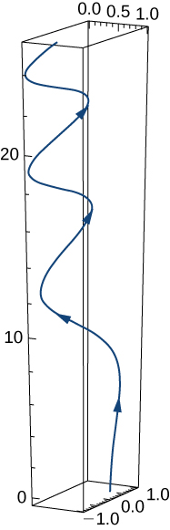
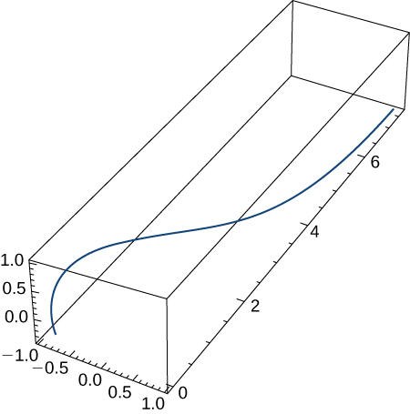
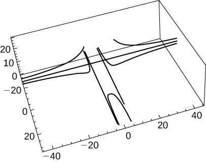
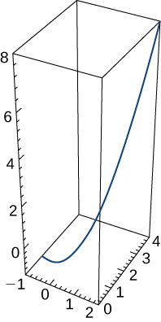
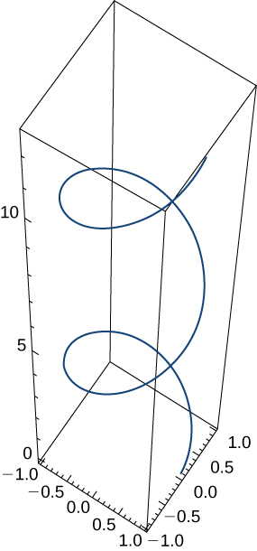
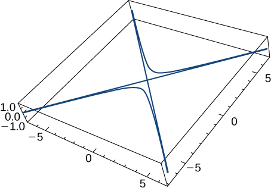
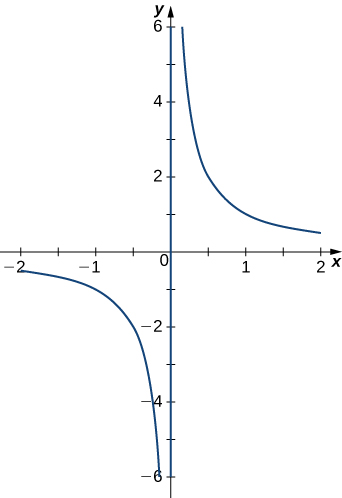

* Write an expression for the derivative of a vector-valued function.
* Find the tangent vector at a point for a given position vector.
* Find the unit tangent vector at a point for a given position vector and explain its significance.
* Calculate the definite integral of a vector-valued function.

To study the calculus of vector-valued functions, we follow a similar path to the one we took in studying real-valued functions. First, we define the derivative, then we examine applications of the **derivative**{: data-type="term" .no-emphasis}, then we move on to defining integrals. However, we will find some interesting new ideas along the way as a result of the vector nature of these functions and the properties of space curves.

# Derivatives of Vector-Valued Functions

Now that we have seen what a vector-valued function is and how to take its limit, the next step is to learn how to differentiate a vector-valued function. The definition of the derivative of a vector-valued function is nearly identical to the definition of a real-valued function of one variable. However, because the range of a vector-valued function consists of vectors, the same is true for the range of the derivative of a vector-valued function.

Definition

The **derivative of a vector-valued function**{: data-type="term"} <math xmlns="http://www.w3.org/1998/Math/MathML"><mrow><mstyle mathvariant="bold" mathsize="normal"><mtext>r</mtext></mstyle><mrow><mo>(</mo><mi>t</mi><mo>)</mo></mrow></mrow></math>

 is

<math xmlns="http://www.w3.org/1998/Math/MathML"><mrow><mstyle mathvariant="bold" mathsize="normal"><msup><mi>r</mi><mo>′</mo></msup></mstyle><mrow><mo>(</mo><mi>t</mi><mo>)</mo></mrow><mo>=</mo><munder><mrow><mtext>lim</mtext></mrow><mrow><mtext>Δ</mtext><mi>t</mi><mo stretchy="false">→</mo><mn>0</mn></mrow></munder><mfrac><mrow><mstyle mathvariant="bold" mathsize="normal"><mtext>r</mtext></mstyle><mrow><mo>(</mo><mrow><mi>t</mi><mo>+</mo><mtext>Δ</mtext><mi>t</mi></mrow><mo>)</mo></mrow><mo>−</mo><mstyle mathvariant="bold" mathsize="normal"><mtext>r</mtext></mstyle><mrow><mo>(</mo><mi>t</mi><mo>)</mo></mrow></mrow><mrow><mtext>Δ</mtext><mi>t</mi></mrow></mfrac><mo>,</mo></mrow></math>

provided the limit exists. If <math xmlns="http://www.w3.org/1998/Math/MathML"><mrow><mstyle mathvariant="bold" mathsize="normal"><msup><mi>r</mi><mo>′</mo></msup></mstyle><mrow><mo>(</mo><mi>t</mi><mo>)</mo></mrow></mrow></math>

 exists, then **r** is differentiable at *t.* If <math xmlns="http://www.w3.org/1998/Math/MathML"><mrow><mstyle mathvariant="bold" mathsize="normal"><msup><mi>r</mi><mo>′</mo></msup></mstyle><mrow><mo>(</mo><mi>t</mi><mo>)</mo></mrow></mrow></math>

 exists for all *t* in an open interval <math xmlns="http://www.w3.org/1998/Math/MathML"><mrow><mrow><mo>(</mo><mrow><mi>a</mi><mo>,</mo><mi>b</mi></mrow><mo>)</mo></mrow><mo>,</mo></mrow></math>

 then **r** is differentiable over the interval <math xmlns="http://www.w3.org/1998/Math/MathML"><mrow><mrow><mo>(</mo><mrow><mi>a</mi><mo>,</mo><mi>b</mi></mrow><mo>)</mo></mrow><mo>.</mo></mrow></math>

 For the function to be differentiable over the closed interval <math xmlns="http://www.w3.org/1998/Math/MathML"><mrow><mrow><mo>[</mo><mrow><mi>a</mi><mo>,</mo><mi>b</mi></mrow><mo>]</mo></mrow><mo>,</mo></mrow></math>

 the following two limits must exist as well:

<math xmlns="http://www.w3.org/1998/Math/MathML"><mrow><mstyle mathvariant="bold" mathsize="normal"><msup><mi>r</mi><mo>′</mo></msup></mstyle><mrow><mo>(</mo><mi>a</mi><mo>)</mo></mrow><mo>=</mo><munder><mrow><mtext>lim</mtext></mrow><mrow><mtext>Δ</mtext><mi>t</mi><mo stretchy="false">→</mo><msup><mn>0</mn><mo>+</mo></msup></mrow></munder><mfrac><mrow><mstyle mathvariant="bold" mathsize="normal"><mtext>r</mtext></mstyle><mrow><mo>(</mo><mrow><mi>a</mi><mo>+</mo><mtext>Δ</mtext><mi>t</mi></mrow><mo>)</mo></mrow><mo>−</mo><mstyle mathvariant="bold" mathsize="normal"><mtext>r</mtext></mstyle><mrow><mo>(</mo><mi>a</mi><mo>)</mo></mrow></mrow><mrow><mtext>Δ</mtext><mi>t</mi></mrow></mfrac><mspace width="0.4em" /><mtext>and</mtext><mspace width="0.4em" /><mstyle mathvariant="bold" mathsize="normal"><msup><mi>r</mi><mo>′</mo></msup></mstyle><mrow><mo>(</mo><mi>b</mi><mo>)</mo></mrow><mo>=</mo><munder><mrow><mtext>lim</mtext></mrow><mrow><mtext>Δ</mtext><mi>t</mi><mo stretchy="false">→</mo><msup><mn>0</mn><mo>−</mo></msup></mrow></munder><mfrac><mrow><mstyle mathvariant="bold" mathsize="normal"><mtext>r</mtext></mstyle><mrow><mo>(</mo><mrow><mi>b</mi><mo>+</mo><mtext>Δ</mtext><mi>t</mi></mrow><mo>)</mo></mrow><mo>−</mo><mstyle mathvariant="bold" mathsize="normal"><mtext>r</mtext></mstyle><mrow><mo>(</mo><mi>b</mi><mo>)</mo></mrow></mrow><mrow><mtext>Δ</mtext><mi>t</mi></mrow></mfrac><mo>.</mo></mrow></math>

Many of the rules for calculating derivatives of real-valued functions can be applied to calculating the derivatives of vector-valued functions as well. Recall that the derivative of a real-valued function can be interpreted as the slope of a tangent line or the instantaneous rate of change of the function. The derivative of a vector-valued function can be understood to be an instantaneous rate of change as well; for example, when the function represents the position of an object at a given point in time, the derivative represents its velocity at that same point in time.

We now demonstrate taking the derivative of a vector-valued function.

Finding the Derivative of a Vector-Valued Function

Use the definition to calculate the derivative of the function

<math xmlns="http://www.w3.org/1998/Math/MathML"><mrow><mstyle mathvariant="bold" mathsize="normal"><mtext>r</mtext></mstyle><mrow><mo>(</mo><mi>t</mi><mo>)</mo></mrow><mo>=</mo><mrow><mo>(</mo><mrow><mn>3</mn><mi>t</mi><mo>+</mo><mn>4</mn></mrow><mo>)</mo></mrow><mspace width="0.1em" /><mstyle mathvariant="bold" mathsize="normal"><mtext>i</mtext></mstyle><mo>+</mo><mrow><mo>(</mo><mrow><msup><mi>t</mi><mn>2</mn></msup><mo>−</mo><mn>4</mn><mi>t</mi><mo>+</mo><mn>3</mn></mrow><mo>)</mo></mrow><mspace width="0.1em" /><mstyle mathvariant="bold" mathsize="normal"><mtext>j</mtext></mstyle><mo>.</mo></mrow></math>

Let’s use [[link]](#fs-id1169739012267):

<math xmlns="http://www.w3.org/1998/Math/MathML"><mtable><mtr><mtd columnalign="right"><mstyle mathvariant="bold" mathsize="normal"><msup><mi>r</mi><mo>′</mo></msup></mstyle><mrow><mo>(</mo><mi>t</mi><mo>)</mo></mrow></mtd><mtd columnalign="left"><mo>=</mo><munder><mrow><mtext>lim</mtext></mrow><mrow><mtext>Δ</mtext><mi>t</mi><mo stretchy="false">→</mo><mn>0</mn></mrow></munder><mfrac><mrow><mstyle mathvariant="bold" mathsize="normal"><mtext>r</mtext></mstyle><mrow><mo>(</mo><mrow><mi>t</mi><mo>+</mo><mtext>Δ</mtext><mi>t</mi></mrow><mo>)</mo></mrow><mo>−</mo><mstyle mathvariant="bold" mathsize="normal"><mtext>r</mtext></mstyle><mrow><mo>(</mo><mi>t</mi><mo>)</mo></mrow></mrow><mrow><mtext>Δ</mtext><mi>t</mi></mrow></mfrac></mtd></mtr><mtr><mtd /><mtd columnalign="left"><mo>=</mo><munder><mrow><mtext>lim</mtext></mrow><mrow><mtext>Δ</mtext><mi>t</mi><mo stretchy="false">→</mo><mn>0</mn></mrow></munder><mfrac><mrow><mrow><mo>[</mo><mrow><mrow><mo>(</mo><mrow><mn>3</mn><mrow><mo>(</mo><mrow><mi>t</mi><mo>+</mo><mtext>Δ</mtext><mi>t</mi></mrow><mo>)</mo></mrow><mo>+</mo><mn>4</mn></mrow><mo>)</mo></mrow><mspace width="0.1em" /><mstyle mathvariant="bold" mathsize="normal"><mtext>i</mtext></mstyle><mo>+</mo><mrow><mo>(</mo><mrow><msup><mrow><mrow><mo>(</mo><mrow><mi>t</mi><mo>+</mo><mtext>Δ</mtext><mi>t</mi></mrow><mo>)</mo></mrow></mrow><mn>2</mn></msup><mo>−</mo><mn>4</mn><mrow><mo>(</mo><mrow><mi>t</mi><mo>+</mo><mtext>Δ</mtext><mi>t</mi></mrow><mo>)</mo></mrow><mo>+</mo><mn>3</mn></mrow><mo>)</mo></mrow><mspace width="0.1em" /><mstyle mathvariant="bold" mathsize="normal"><mtext>j</mtext></mstyle></mrow><mo>]</mo></mrow><mo>−</mo><mrow><mo>[</mo><mrow><mrow><mo>(</mo><mrow><mn>3</mn><mi>t</mi><mo>+</mo><mn>4</mn></mrow><mo>)</mo></mrow><mspace width="0.1em" /><mstyle mathvariant="bold" mathsize="normal"><mtext>i</mtext></mstyle><mo>+</mo><mrow><mo>(</mo><mrow><msup><mi>t</mi><mn>2</mn></msup><mo>−</mo><mn>4</mn><mi>t</mi><mo>+</mo><mn>3</mn></mrow><mo>)</mo></mrow><mspace width="0.1em" /><mstyle mathvariant="bold" mathsize="normal"><mtext>j</mtext></mstyle></mrow><mo>]</mo></mrow></mrow><mrow><mtext>Δ</mtext><mi>t</mi></mrow></mfrac></mtd></mtr><mtr><mtd /><mtd columnalign="left"><mo>=</mo><munder><mrow><mtext>lim</mtext></mrow><mrow><mtext>Δ</mtext><mi>t</mi><mo stretchy="false">→</mo><mn>0</mn></mrow></munder><mfrac><mrow><mrow><mo>(</mo><mrow><mn>3</mn><mi>t</mi><mo>+</mo><mn>3</mn><mtext>Δ</mtext><mi>t</mi><mo>+</mo><mn>4</mn></mrow><mo>)</mo></mrow><mspace width="0.1em" /><mstyle mathvariant="bold" mathsize="normal"><mtext>i</mtext></mstyle><mo>−</mo><mrow><mo>(</mo><mrow><mn>3</mn><mi>t</mi><mo>+</mo><mn>4</mn></mrow><mo>)</mo></mrow><mspace width="0.1em" /><mstyle mathvariant="bold" mathsize="normal"><mtext>i</mtext></mstyle><mo>+</mo><mrow><mo>(</mo><mrow><msup><mi>t</mi><mn>2</mn></msup><mo>+</mo><mn>2</mn><mi>t</mi><mtext>Δ</mtext><mi>t</mi><mo>+</mo><msup><mrow><mrow><mo>(</mo><mrow><mtext>Δ</mtext><mi>t</mi></mrow><mo>)</mo></mrow></mrow><mn>2</mn></msup><mo>−</mo><mn>4</mn><mi>t</mi><mo>−</mo><mn>4</mn><mtext>Δ</mtext><mi>t</mi><mo>+</mo><mn>3</mn></mrow><mo>)</mo></mrow><mspace width="0.1em" /><mstyle mathvariant="bold" mathsize="normal"><mtext>j</mtext></mstyle><mo>−</mo><mrow><mo>(</mo><mrow><msup><mi>t</mi><mn>2</mn></msup><mo>−</mo><mn>4</mn><mi>t</mi><mo>+</mo><mn>3</mn></mrow><mo>)</mo></mrow><mspace width="0.1em" /><mstyle mathvariant="bold" mathsize="normal"><mtext>j</mtext></mstyle></mrow><mrow><mtext>Δ</mtext><mi>t</mi></mrow></mfrac></mtd></mtr><mtr><mtd /><mtd columnalign="left"><mo>=</mo><munder><mrow><mtext>lim</mtext></mrow><mrow><mtext>Δ</mtext><mi>t</mi><mo stretchy="false">→</mo><mn>0</mn></mrow></munder><mfrac><mrow><mrow><mo>(</mo><mrow><mn>3</mn><mtext>Δ</mtext><mi>t</mi></mrow><mo>)</mo></mrow><mspace width="0.1em" /><mstyle mathvariant="bold" mathsize="normal"><mtext>i</mtext></mstyle><mo>+</mo><mrow><mo>(</mo><mrow><mn>2</mn><mi>t</mi><mtext>Δ</mtext><mi>t</mi><mo>+</mo><msup><mrow><mrow><mo>(</mo><mrow><mtext>Δ</mtext><mi>t</mi></mrow><mo>)</mo></mrow></mrow><mn>2</mn></msup><mo>−</mo><mn>4</mn><mtext>Δ</mtext><mi>t</mi></mrow><mo>)</mo></mrow><mspace width="0.1em" /><mstyle mathvariant="bold" mathsize="normal"><mtext>j</mtext></mstyle></mrow><mrow><mtext>Δ</mtext><mi>t</mi></mrow></mfrac></mtd></mtr><mtr><mtd /><mtd columnalign="left"><mo>=</mo><munder><mrow><mtext>lim</mtext></mrow><mrow><mtext>Δ</mtext><mi>t</mi><mo stretchy="false">→</mo><mn>0</mn></mrow></munder><mrow><mo>(</mo><mrow><mn>3</mn><mspace width="0.1em" /><mstyle mathvariant="bold" mathsize="normal"><mtext>i</mtext></mstyle><mo>+</mo><mrow><mo>(</mo><mrow><mn>2</mn><mi>t</mi><mo>+</mo><mtext>Δ</mtext><mi>t</mi><mo>−</mo><mn>4</mn></mrow><mo>)</mo></mrow><mspace width="0.1em" /><mstyle mathvariant="bold" mathsize="normal"><mtext>j</mtext></mstyle></mrow><mo>)</mo></mrow></mtd></mtr><mtr><mtd /><mtd columnalign="left"><mo>=</mo><mn>3</mn><mspace width="0.1em" /><mstyle mathvariant="bold" mathsize="normal"><mtext>i</mtext></mstyle><mo>+</mo><mrow><mo>(</mo><mrow><mn>2</mn><mi>t</mi><mo>−</mo><mn>4</mn></mrow><mo>)</mo></mrow><mspace width="0.1em" /><mstyle mathvariant="bold" mathsize="normal"><mtext>j</mtext></mstyle><mo>.</mo></mtd></mtr></mtable></math>

Use the definition to calculate the derivative of the function <math xmlns="http://www.w3.org/1998/Math/MathML"><mrow><mstyle mathvariant="bold" mathsize="normal"><mtext>r</mtext></mstyle><mrow><mo>(</mo><mi>t</mi><mo>)</mo></mrow><mo>=</mo><mrow><mo>(</mo><mrow><mn>2</mn><msup><mi>t</mi><mn>2</mn></msup><mo>+</mo><mn>3</mn></mrow><mo>)</mo></mrow><mspace width="0.1em" /><mstyle mathvariant="bold" mathsize="normal"><mtext>i</mtext></mstyle><mo>+</mo><mrow><mo>(</mo><mrow><mn>5</mn><mi>t</mi><mo>−</mo><mn>6</mn></mrow><mo>)</mo></mrow><mspace width="0.1em" /><mstyle mathvariant="bold" mathsize="normal"><mtext>j</mtext></mstyle><mo>.</mo></mrow></math>

<math xmlns="http://www.w3.org/1998/Math/MathML"><mrow><mstyle mathvariant="bold" mathsize="normal"><msup><mi>r</mi><mo>′</mo></msup></mstyle><mrow><mo>(</mo><mi>t</mi><mo>)</mo></mrow><mo>=</mo><mn>4</mn><mi>t</mi><mspace width="0.1em" /><mstyle mathvariant="bold" mathsize="normal"><mtext>i</mtext></mstyle><mo>+</mo><mn>5</mn><mspace width="0.1em" /><mstyle mathvariant="bold" mathsize="normal"><mtext>j</mtext></mstyle></mrow></math>

Hint

Use [[link]](#fs-id1169739012267).

Notice that in the calculations in [\[link\]](#fs-id1169738904898), we could also obtain the answer by first calculating the derivative of each component function, then putting these derivatives back into the vector-valued function. This is always true for calculating the derivative of a vector-valued function, whether it is in two or three dimensions. We state this in the following theorem. The proof of this theorem follows directly from the definitions of the limit of a vector-valued function and the derivative of a vector-valued function.

Differentiation of Vector-Valued Functions

Let *f, g,* and *h* be differentiable functions of *t.*

1.  If
    <math xmlns="http://www.w3.org/1998/Math/MathML"><mrow><mstyle mathvariant="bold" mathsize="normal"><mtext>r</mtext></mstyle><mrow><mo>(</mo><mi>t</mi><mo>)</mo></mrow><mo>=</mo><mi>f</mi><mrow><mo>(</mo><mi>t</mi><mo>)</mo></mrow><mspace width="0.1em" /><mstyle mathvariant="bold" mathsize="normal"><mtext>i</mtext></mstyle><mo>+</mo><mi>g</mi><mrow><mo>(</mo><mi>t</mi><mo>)</mo></mrow><mspace width="0.1em" /><mstyle mathvariant="bold" mathsize="normal"><mtext>j</mtext></mstyle><mo>,</mo></mrow></math>
    
    then
    <math xmlns="http://www.w3.org/1998/Math/MathML"><mrow><mstyle mathvariant="bold" mathsize="normal"><msup><mi>r</mi><mo>′</mo></msup></mstyle><mrow><mo>(</mo><mi>t</mi><mo>)</mo></mrow><mo>=</mo><msup><mi>f</mi><mo>′</mo></msup><mrow><mo>(</mo><mi>t</mi><mo>)</mo></mrow><mspace width="0.1em" /><mstyle mathvariant="bold" mathsize="normal"><mtext>i</mtext></mstyle><mo>+</mo><msup><mi>g</mi><mo>′</mo></msup><mrow><mo>(</mo><mi>t</mi><mo>)</mo></mrow><mspace width="0.1em" /><mstyle mathvariant="bold" mathsize="normal"><mtext>j</mtext></mstyle><mo>.</mo></mrow></math>

2.  If
    <math xmlns="http://www.w3.org/1998/Math/MathML"><mrow><mstyle mathvariant="bold" mathsize="normal"><mtext>r</mtext></mstyle><mrow><mo>(</mo><mi>t</mi><mo>)</mo></mrow><mo>=</mo><mi>f</mi><mrow><mo>(</mo><mi>t</mi><mo>)</mo></mrow><mspace width="0.1em" /><mstyle mathvariant="bold" mathsize="normal"><mtext>i</mtext></mstyle><mo>+</mo><mi>g</mi><mrow><mo>(</mo><mi>t</mi><mo>)</mo></mrow><mspace width="0.1em" /><mstyle mathvariant="bold" mathsize="normal"><mtext>j</mtext></mstyle><mo>+</mo><mi>h</mi><mrow><mo>(</mo><mi>t</mi><mo>)</mo></mrow><mspace width="0.1em" /><mstyle mathvariant="bold" mathsize="normal"><mtext>k</mtext></mstyle><mo>,</mo></mrow></math>
    
    then
    <math xmlns="http://www.w3.org/1998/Math/MathML"><mrow><mstyle mathvariant="bold" mathsize="normal"><msup><mi>r</mi><mo>′</mo></msup></mstyle><mrow><mo>(</mo><mi>t</mi><mo>)</mo></mrow><mo>=</mo><msup><mi>f</mi><mo>′</mo></msup><mrow><mo>(</mo><mi>t</mi><mo>)</mo></mrow><mspace width="0.1em" /><mstyle mathvariant="bold" mathsize="normal"><mtext>i</mtext></mstyle><mo>+</mo><msup><mi>g</mi><mo>′</mo></msup><mrow><mo>(</mo><mi>t</mi><mo>)</mo></mrow><mspace width="0.1em" /><mstyle mathvariant="bold" mathsize="normal"><mtext>j</mtext></mstyle><mo>+</mo><msup><mi>h</mi><mo>′</mo></msup><mrow><mo>(</mo><mi>t</mi><mo>)</mo></mrow><mspace width="0.1em" /><mstyle mathvariant="bold" mathsize="normal"><mtext>k</mtext></mstyle><mo>.</mo></mrow></math>
{: data-number-style="lower-roman"}

Calculating the Derivative of Vector-Valued Functions

Use [[link]](#fs-id1169739242722) to calculate the derivative of each of the following functions.

1.  <math xmlns="http://www.w3.org/1998/Math/MathML"><mrow><mstyle mathvariant="bold" mathsize="normal"><mtext>r</mtext></mstyle><mrow><mo>(</mo><mi>t</mi><mo>)</mo></mrow><mo>=</mo><mrow><mo>(</mo><mrow><mn>6</mn><mi>t</mi><mo>+</mo><mn>8</mn></mrow><mo>)</mo></mrow><mspace width="0.1em" /><mstyle mathvariant="bold" mathsize="normal"><mtext>i</mtext></mstyle><mo>+</mo><mrow><mo>(</mo><mrow><mn>4</mn><msup><mi>t</mi><mn>2</mn></msup><mo>+</mo><mn>2</mn><mi>t</mi><mo>−</mo><mn>3</mn></mrow><mo>)</mo></mrow><mspace width="0.1em" /><mstyle mathvariant="bold" mathsize="normal"><mtext>j</mtext></mstyle></mrow></math>

2.  <math xmlns="http://www.w3.org/1998/Math/MathML"><mrow><mstyle mathvariant="bold" mathsize="normal"><mtext>r</mtext></mstyle><mrow><mo>(</mo><mi>t</mi><mo>)</mo></mrow><mo>=</mo><mn>3</mn><mspace width="0.1em" /><mtext>cos</mtext><mspace width="0.1em" /><mi>t</mi><mspace width="0.1em" /><mstyle mathvariant="bold" mathsize="normal"><mtext>i</mtext></mstyle><mo>+</mo><mn>4</mn><mspace width="0.1em" /><mtext>sin</mtext><mspace width="0.1em" /><mi>t</mi><mspace width="0.1em" /><mstyle mathvariant="bold" mathsize="normal"><mtext>j</mtext></mstyle></mrow></math>

3.  <math xmlns="http://www.w3.org/1998/Math/MathML"><mrow><mstyle mathvariant="bold" mathsize="normal"><mtext>r</mtext></mstyle><mrow><mo>(</mo><mi>t</mi><mo>)</mo></mrow><mo>=</mo><msup><mi>e</mi><mi>t</mi></msup><mtext>sin</mtext><mspace width="0.1em" /><mi>t</mi><mspace width="0.1em" /><mstyle mathvariant="bold" mathsize="normal"><mtext>i</mtext></mstyle><mo>+</mo><msup><mi>e</mi><mi>t</mi></msup><mtext>cos</mtext><mspace width="0.1em" /><mi>t</mi><mspace width="0.1em" /><mstyle mathvariant="bold" mathsize="normal"><mtext>j</mtext></mstyle><mo>−</mo><msup><mi>e</mi><mrow><mn>2</mn><mi>t</mi></mrow></msup><mspace width="0.1em" /><mstyle mathvariant="bold" mathsize="normal"><mtext>k</mtext></mstyle></mrow></math>
{: data-number-style="lower-alpha"}

We use [[link]](#fs-id1169739242722) and what we know about differentiating functions of one variable.

1.  The first component of
    <math xmlns="http://www.w3.org/1998/Math/MathML"><mrow><mstyle mathvariant="bold" mathsize="normal"><mtext>r</mtext></mstyle><mrow><mo>(</mo><mi>t</mi><mo>)</mo></mrow><mo>=</mo><mrow><mo>(</mo><mrow><mn>6</mn><mi>t</mi><mo>+</mo><mn>8</mn></mrow><mo>)</mo></mrow><mspace width="0.1em" /><mstyle mathvariant="bold" mathsize="normal"><mtext>i</mtext></mstyle><mo>+</mo><mrow><mo>(</mo><mrow><mn>4</mn><msup><mi>t</mi><mn>2</mn></msup><mo>+</mo><mn>2</mn><mi>t</mi><mo>−</mo><mn>3</mn></mrow><mo>)</mo></mrow><mspace width="0.1em" /><mstyle mathvariant="bold" mathsize="normal"><mtext>j</mtext></mstyle></mrow></math>
    
    is
    <math xmlns="http://www.w3.org/1998/Math/MathML"><mrow><mi>f</mi><mrow><mo>(</mo><mi>t</mi><mo>)</mo></mrow><mo>=</mo><mn>6</mn><mi>t</mi><mo>+</mo><mn>8</mn><mo>.</mo></mrow></math>
    
    The second component is
    <math xmlns="http://www.w3.org/1998/Math/MathML"><mrow><mi>g</mi><mrow><mo>(</mo><mi>t</mi><mo>)</mo></mrow><mo>=</mo><mn>4</mn><msup><mi>t</mi><mn>2</mn></msup><mo>+</mo><mn>2</mn><mi>t</mi><mo>−</mo><mn>3</mn><mo>.</mo></mrow></math>
    
    We have
    <math xmlns="http://www.w3.org/1998/Math/MathML"><mrow><msup><mi>f</mi><mo>′</mo></msup><mrow><mo>(</mo><mi>t</mi><mo>)</mo></mrow><mo>=</mo><mn>6</mn></mrow></math>
    
    and
    <math xmlns="http://www.w3.org/1998/Math/MathML"><mrow><msup><mi>g</mi><mo>′</mo></msup><mrow><mo>(</mo><mi>t</mi><mo>)</mo></mrow><mo>=</mo><mn>8</mn><mi>t</mi><mo>+</mo><mn>2</mn><mo>,</mo></mrow></math>
    
    so the theorem gives
    <math xmlns="http://www.w3.org/1998/Math/MathML"><mrow><mstyle mathvariant="bold" mathsize="normal"><msup><mi>r</mi><mo>′</mo></msup></mstyle><mrow><mo>(</mo><mi>t</mi><mo>)</mo></mrow><mo>=</mo><mn>6</mn><mspace width="0.1em" /><mstyle mathvariant="bold" mathsize="normal"><mtext>i</mtext></mstyle><mo>+</mo><mrow><mo>(</mo><mrow><mn>8</mn><mi>t</mi><mo>+</mo><mn>2</mn></mrow><mo>)</mo></mrow><mspace width="0.1em" /><mstyle mathvariant="bold" mathsize="normal"><mtext>j</mtext></mstyle><mo>.</mo></mrow></math>

2.  The first component is
    <math xmlns="http://www.w3.org/1998/Math/MathML"><mrow><mi>f</mi><mrow><mo>(</mo><mi>t</mi><mo>)</mo></mrow><mo>=</mo><mn>3</mn><mspace width="0.1em" /><mtext>cos</mtext><mspace width="0.1em" /><mi>t</mi></mrow></math>
    
    and the second component is
    <math xmlns="http://www.w3.org/1998/Math/MathML"><mrow><mi>g</mi><mrow><mo>(</mo><mi>t</mi><mo>)</mo></mrow><mo>=</mo><mn>4</mn><mspace width="0.1em" /><mtext>sin</mtext><mspace width="0.1em" /><mi>t</mi><mo>.</mo></mrow></math>
    
    We have
    <math xmlns="http://www.w3.org/1998/Math/MathML"><mrow><msup><mi>f</mi><mo>′</mo></msup><mrow><mo>(</mo><mi>t</mi><mo>)</mo></mrow><mo>=</mo><mn>−3</mn><mspace width="0.1em" /><mtext>sin</mtext><mspace width="0.1em" /><mi>t</mi></mrow></math>
    
    and
    <math xmlns="http://www.w3.org/1998/Math/MathML"><mrow><msup><mi>g</mi><mo>′</mo></msup><mrow><mo>(</mo><mi>t</mi><mo>)</mo></mrow><mo>=</mo><mn>4</mn><mspace width="0.1em" /><mtext>cos</mtext><mspace width="0.1em" /><mi>t</mi><mo>,</mo></mrow></math>
    
    so we obtain
    <math xmlns="http://www.w3.org/1998/Math/MathML"><mrow><mstyle mathvariant="bold" mathsize="normal"><msup><mi>r</mi><mo>′</mo></msup></mstyle><mrow><mo>(</mo><mi>t</mi><mo>)</mo></mrow><mo>=</mo><mn>−3</mn><mspace width="0.1em" /><mtext>sin</mtext><mspace width="0.1em" /><mi>t</mi><mspace width="0.1em" /><mstyle mathvariant="bold" mathsize="normal"><mtext>i</mtext></mstyle><mo>+</mo><mn>4</mn><mspace width="0.1em" /><mtext>cos</mtext><mspace width="0.1em" /><mi>t</mi><mspace width="0.1em" /><mstyle mathvariant="bold" mathsize="normal"><mtext>j</mtext></mstyle><mo>.</mo></mrow></math>

3.  The first component of
    <math xmlns="http://www.w3.org/1998/Math/MathML"><mrow><mstyle mathvariant="bold" mathsize="normal"><mtext>r</mtext></mstyle><mrow><mo>(</mo><mi>t</mi><mo>)</mo></mrow><mo>=</mo><msup><mi>e</mi><mi>t</mi></msup><mtext>sin</mtext><mspace width="0.1em" /><mi>t</mi><mspace width="0.1em" /><mstyle mathvariant="bold" mathsize="normal"><mtext>i</mtext></mstyle><mo>+</mo><msup><mi>e</mi><mi>t</mi></msup><mtext>cos</mtext><mspace width="0.1em" /><mi>t</mi><mspace width="0.1em" /><mstyle mathvariant="bold" mathsize="normal"><mtext>j</mtext></mstyle><mo>−</mo><msup><mi>e</mi><mrow><mn>2</mn><mi>t</mi></mrow></msup><mspace width="0.1em" /><mstyle mathvariant="bold" mathsize="normal"><mtext>k</mtext></mstyle></mrow></math>
    
    is
    <math xmlns="http://www.w3.org/1998/Math/MathML"><mrow><mi>f</mi><mrow><mo>(</mo><mi>t</mi><mo>)</mo></mrow><mo>=</mo><msup><mi>e</mi><mi>t</mi></msup><mtext>sin</mtext><mspace width="0.1em" /><mi>t</mi><mo>,</mo></mrow></math>
    
    the second component is
    <math xmlns="http://www.w3.org/1998/Math/MathML"><mrow><mi>g</mi><mrow><mo>(</mo><mi>t</mi><mo>)</mo></mrow><mo>=</mo><msup><mi>e</mi><mi>t</mi></msup><mtext>cos</mtext><mspace width="0.1em" /><mi>t</mi><mo>,</mo></mrow></math>
    
    and the third component is
    <math xmlns="http://www.w3.org/1998/Math/MathML"><mrow><mi>h</mi><mrow><mo>(</mo><mi>t</mi><mo>)</mo></mrow><mo>=</mo><mo>−</mo><msup><mi>e</mi><mrow><mn>2</mn><mi>t</mi></mrow></msup><mo>.</mo></mrow></math>
    
    We have
    <math xmlns="http://www.w3.org/1998/Math/MathML"><mrow><msup><mi>f</mi><mo>′</mo></msup><mrow><mo>(</mo><mi>t</mi><mo>)</mo></mrow><mo>=</mo><msup><mi>e</mi><mi>t</mi></msup><mrow><mo>(</mo><mrow><mtext>sin</mtext><mspace width="0.1em" /><mi>t</mi><mo>+</mo><mtext>cos</mtext><mspace width="0.1em" /><mi>t</mi></mrow><mo>)</mo></mrow><mo>,</mo></mrow></math>
    
    <math xmlns="http://www.w3.org/1998/Math/MathML"><mrow><msup><mi>g</mi><mo>′</mo></msup><mrow><mo>(</mo><mi>t</mi><mo>)</mo></mrow><mo>=</mo><msup><mi>e</mi><mi>t</mi></msup><mrow><mo>(</mo><mrow><mtext>cos</mtext><mspace width="0.1em" /><mi>t</mi><mo>−</mo><mtext>sin</mtext><mspace width="0.1em" /><mi>t</mi></mrow><mo>)</mo></mrow><mo>,</mo></mrow></math>
    
    and
    <math xmlns="http://www.w3.org/1998/Math/MathML"><mrow><msup><mi>h</mi><mo>′</mo></msup><mrow><mo>(</mo><mi>t</mi><mo>)</mo></mrow><mo>=</mo><mn>−2</mn><msup><mi>e</mi><mrow><mn>2</mn><mi>t</mi></mrow></msup><mo>,</mo></mrow></math>
    
    so the theorem gives
    <math xmlns="http://www.w3.org/1998/Math/MathML"><mrow><mstyle mathvariant="bold" mathsize="normal"><msup><mi>r</mi><mo>′</mo></msup></mstyle><mrow><mo>(</mo><mi>t</mi><mo>)</mo></mrow><mo>=</mo><msup><mi>e</mi><mi>t</mi></msup><mrow><mo>(</mo><mrow><mtext>sin</mtext><mspace width="0.1em" /><mi>t</mi><mo>+</mo><mtext>cos</mtext><mspace width="0.1em" /><mi>t</mi></mrow><mo>)</mo></mrow><mspace width="0.1em" /><mstyle mathvariant="bold" mathsize="normal"><mtext>i</mtext></mstyle><mo>+</mo><msup><mi>e</mi><mi>t</mi></msup><mrow><mo>(</mo><mrow><mtext>cos</mtext><mspace width="0.1em" /><mi>t</mi><mo>−</mo><mtext>sin</mtext><mspace width="0.1em" /><mi>t</mi></mrow><mo>)</mo></mrow><mspace width="0.1em" /><mstyle mathvariant="bold" mathsize="normal"><mtext>j</mtext></mstyle><mo>−</mo><mn>2</mn><msup><mi>e</mi><mrow><mn>2</mn><mi>t</mi></mrow></msup><mspace width="0.1em" /><mstyle mathvariant="bold" mathsize="normal"><mtext>k</mtext></mstyle><mo>.</mo></mrow></math>
{: data-number-style="lower-alpha"}

Calculate the derivative of the function

<math xmlns="http://www.w3.org/1998/Math/MathML"><mrow><mstyle mathvariant="bold" mathsize="normal"><mtext>r</mtext></mstyle><mrow><mo>(</mo><mi>t</mi><mo>)</mo></mrow><mo>=</mo><mrow><mo>(</mo><mrow><mi>t</mi><mspace width="0.1em" /><mtext>ln</mtext><mspace width="0.1em" /><mi>t</mi></mrow><mo>)</mo></mrow><mspace width="0.1em" /><mstyle mathvariant="bold" mathsize="normal"><mtext>i</mtext></mstyle><mo>+</mo><mrow><mo>(</mo><mrow><mn>5</mn><msup><mi>e</mi><mi>t</mi></msup></mrow><mo>)</mo></mrow><mspace width="0.1em" /><mstyle mathvariant="bold" mathsize="normal"><mtext>j</mtext></mstyle><mo>+</mo><mrow><mo>(</mo><mrow><mtext>cos</mtext><mspace width="0.1em" /><mi>t</mi><mo>−</mo><mtext>sin</mtext><mspace width="0.1em" /><mi>t</mi></mrow><mo>)</mo></mrow><mspace width="0.1em" /><mstyle mathvariant="bold" mathsize="normal"><mtext>k</mtext></mstyle><mo>.</mo></mrow></math>

<math xmlns="http://www.w3.org/1998/Math/MathML"><mrow><mstyle mathvariant="bold" mathsize="normal"><msup><mi>r</mi><mo>′</mo></msup></mstyle><mrow><mo>(</mo><mi>t</mi><mo>)</mo></mrow><mo>=</mo><mrow><mo>(</mo><mrow><mn>1</mn><mo>+</mo><mtext>ln</mtext><mspace width="0.1em" /><mi>t</mi></mrow><mo>)</mo></mrow><mspace width="0.1em" /><mstyle mathvariant="bold" mathsize="normal"><mtext>i</mtext></mstyle><mo>+</mo><mn>5</mn><msup><mi>e</mi><mi>t</mi></msup><mspace width="0.1em" /><mstyle mathvariant="bold" mathsize="normal"><mtext>j</mtext></mstyle><mo>−</mo><mrow><mo>(</mo><mrow><mtext>sin</mtext><mspace width="0.1em" /><mi>t</mi><mo>+</mo><mtext>cos</mtext><mspace width="0.1em" /><mi>t</mi></mrow><mo>)</mo></mrow><mspace width="0.1em" /><mstyle mathvariant="bold" mathsize="normal"><mtext>k</mtext></mstyle></mrow></math>

Hint

Identify the component functions and use [[link]](#fs-id1169739242722).

We can extend to vector-valued functions the properties of the derivative that we presented in the [Introduction to Derivatives](/m53494){: .target-chapter}. In particular, the **constant multiple rule**{: data-type="term" .no-emphasis}, the **sum and difference rules**{: data-type="term" .no-emphasis}, the **product rule**{: data-type="term" .no-emphasis}, and the **chain rule**{: data-type="term" .no-emphasis} all extend to vector-valued functions. However, in the case of the product rule, there are actually three extensions: (1) for a real-valued function multiplied by a vector-valued function, (2) for the dot product of two vector-valued functions, and (3) for the cross product of two vector-valued functions.

Properties of the Derivative of Vector-Valued Functions

Let **r** and **u** be differentiable vector-valued functions of *t*, let *f* be a differentiable real-valued function of *t,* and let *c* be a scalar.

<math xmlns="http://www.w3.org/1998/Math/MathML"><mrow><mtable> <mtr><mtd columnalign="left"><mtext>i.</mtext></mtd><mtd /><mtd columnalign="right"><mfrac><mi>d</mi><mrow><mi>d</mi><mi>t</mi></mrow></mfrac><mrow><mo>[</mo><mrow><mi>c</mi><mspace width="0.1em" /><mstyle mathvariant="bold" mathsize="normal"><mtext>r</mtext></mstyle><mrow><mo>(</mo><mi>t</mi><mo>)</mo></mrow></mrow><mo>]</mo></mrow></mtd><mtd columnalign="left"><mo>=</mo></mtd><mtd columnalign="left"><mi>c</mi><mspace width="0.1em" /><mstyle mathvariant="bold" mathsize="normal"><msup><mi>r</mi><mo>′</mo></msup></mstyle><mrow><mo>(</mo><mi>t</mi><mo>)</mo></mrow></mtd><mtd /><mtd columnalign="left"><mtext>Scalar multiple</mtext></mtd></mtr> <mtr><mtd columnalign="left"><mtext>ii.</mtext></mtd><mtd /><mtd columnalign="right"><mfrac><mi>d</mi><mrow><mi>d</mi><mi>t</mi></mrow></mfrac><mrow><mo>[</mo><mrow><mspace width="0.1em" /><mstyle mathvariant="bold" mathsize="normal"><mtext>r</mtext></mstyle><mrow><mo>(</mo><mi>t</mi><mo>)</mo></mrow><mo>±</mo><mspace width="0.1em" /><mstyle mathvariant="bold" mathsize="normal"><mtext>u</mtext></mstyle><mrow><mo>(</mo><mi>t</mi><mo>)</mo></mrow></mrow><mo>]</mo></mrow></mtd><mtd columnalign="left"><mo>=</mo></mtd><mtd columnalign="left"><mstyle mathvariant="bold" mathsize="normal"><msup><mi>r</mi><mo>′</mo></msup></mstyle><mrow><mo>(</mo><mi>t</mi><mo>)</mo></mrow><mo>±</mo><mspace width="0.1em" /><mstyle mathvariant="bold" mathsize="normal"><msup><mi>u</mi><mo>′</mo></msup></mstyle><mrow><mo>(</mo><mi>t</mi><mo>)</mo></mrow></mtd><mtd /><mtd columnalign="left"><mtext>Sum and difference</mtext></mtd></mtr> <mtr><mtd columnalign="left"><mtext>iii.</mtext></mtd><mtd /><mtd columnalign="right"><mfrac><mi>d</mi><mrow><mi>d</mi><mi>t</mi></mrow></mfrac><mrow><mo>[</mo><mrow><mi>f</mi><mrow><mo>(</mo><mi>t</mi><mo>)</mo></mrow><mspace width="0.1em" /><mstyle mathvariant="bold" mathsize="normal"><mtext>u</mtext></mstyle><mrow><mo>(</mo><mi>t</mi><mo>)</mo></mrow></mrow><mo>]</mo></mrow></mtd><mtd columnalign="left"><mo>=</mo></mtd><mtd columnalign="left"><msup><mi>f</mi><mo>′</mo></msup><mrow><mo>(</mo><mi>t</mi><mo>)</mo></mrow><mspace width="0.1em" /><mstyle mathvariant="bold" mathsize="normal"><mtext>u</mtext></mstyle><mrow><mo>(</mo><mi>t</mi><mo>)</mo></mrow><mo>+</mo><mi>f</mi><mrow><mo>(</mo><mi>t</mi><mo>)</mo></mrow><mspace width="0.1em" /><mstyle mathvariant="bold" mathsize="normal"><msup><mi>u</mi><mo>′</mo></msup></mstyle><mrow><mo>(</mo><mi>t</mi><mo>)</mo></mrow></mtd><mtd /><mtd columnalign="left"><mtext>Scalar product</mtext></mtd></mtr> <mtr><mtd columnalign="left"><mtext>iv.</mtext></mtd><mtd /><mtd columnalign="right"><mfrac><mi>d</mi><mrow><mi>d</mi><mi>t</mi></mrow></mfrac><mrow><mo>[</mo><mrow><mspace width="0.1em" /><mstyle mathvariant="bold" mathsize="normal"><mtext>r</mtext></mstyle><mrow><mo>(</mo><mi>t</mi><mo>)</mo></mrow><mo>·</mo><mspace width="0.1em" /><mstyle mathvariant="bold" mathsize="normal"><mtext>u</mtext></mstyle><mrow><mo>(</mo><mi>t</mi><mo>)</mo></mrow></mrow><mo>]</mo></mrow></mtd><mtd columnalign="left"><mo>=</mo></mtd><mtd columnalign="left"><mstyle mathvariant="bold" mathsize="normal"><msup><mi>r</mi><mo>′</mo></msup></mstyle><mrow><mo>(</mo><mi>t</mi><mo>)</mo></mrow><mo>·</mo><mspace width="0.1em" /><mstyle mathvariant="bold" mathsize="normal"><mtext>u</mtext></mstyle><mrow><mo>(</mo><mi>t</mi><mo>)</mo></mrow><mo>+</mo><mspace width="0.1em" /><mstyle mathvariant="bold" mathsize="normal"><mtext>r</mtext></mstyle><mrow><mo>(</mo><mi>t</mi><mo>)</mo></mrow><mo>·</mo><mspace width="0.1em" /><mstyle mathvariant="bold" mathsize="normal"><msup><mi>u</mi><mo>′</mo></msup></mstyle><mrow><mo>(</mo><mi>t</mi><mo>)</mo></mrow></mtd><mtd /><mtd columnalign="left"><mtext>Dot product</mtext></mtd></mtr> <mtr><mtd columnalign="left"><mtext>v.</mtext></mtd><mtd /><mtd columnalign="right"><mfrac><mi>d</mi><mrow><mi>d</mi><mi>t</mi></mrow></mfrac><mrow><mo>[</mo><mrow><mspace width="0.1em" /><mstyle mathvariant="bold" mathsize="normal"><mtext>r</mtext></mstyle><mrow><mo>(</mo><mi>t</mi><mo>)</mo></mrow><mspace width="0.2em" /><mo>×</mo><mspace width="0.2em" /><mstyle mathvariant="bold" mathsize="normal"><mtext>u</mtext></mstyle><mrow><mo>(</mo><mi>t</mi><mo>)</mo></mrow></mrow><mo>]</mo></mrow></mtd><mtd columnalign="left"><mo>=</mo></mtd><mtd columnalign="left"><mstyle mathvariant="bold" mathsize="normal"><msup><mi>r</mi><mo>′</mo></msup></mstyle><mrow><mo>(</mo><mi>t</mi><mo>)</mo></mrow><mspace width="0.2em" /><mo>×</mo><mspace width="0.2em" /><mstyle mathvariant="bold" mathsize="normal"><mtext>u</mtext></mstyle><mrow><mo>(</mo><mi>t</mi><mo>)</mo></mrow><mo>+</mo><mspace width="0.1em" /><mstyle mathvariant="bold" mathsize="normal"><mtext>r</mtext></mstyle><mrow><mo>(</mo><mi>t</mi><mo>)</mo></mrow><mspace width="0.2em" /><mo>×</mo><mspace width="0.2em" /><mstyle mathvariant="bold" mathsize="normal"><msup><mi>u</mi><mo>′</mo></msup></mstyle><mrow><mo>(</mo><mi>t</mi><mo>)</mo></mrow></mtd><mtd /><mtd columnalign="left"><mtext>Cross product</mtext></mtd></mtr> <mtr><mtd columnalign="left"><mtext>vi.</mtext></mtd><mtd /><mtd columnalign="right"><mfrac><mi>d</mi><mrow><mi>d</mi><mi>t</mi></mrow></mfrac><mrow><mo>[</mo><mrow><mspace width="0.1em" /><mstyle mathvariant="bold" mathsize="normal"><mtext>r</mtext></mstyle><mrow><mo>(</mo><mrow><mi>f</mi><mrow><mo>(</mo><mi>t</mi><mo>)</mo></mrow></mrow><mo>)</mo></mrow></mrow><mo>]</mo></mrow></mtd><mtd columnalign="left"><mo>=</mo></mtd><mtd columnalign="left"><mstyle mathvariant="bold" mathsize="normal"><msup><mi>r</mi><mo>′</mo></msup></mstyle><mrow><mo>(</mo><mrow><mi>f</mi><mrow><mo>(</mo><mi>t</mi><mo>)</mo></mrow></mrow><mo>)</mo></mrow><mo>·</mo><msup><mi>f</mi><mo>′</mo></msup><mrow><mo>(</mo><mi>t</mi><mo>)</mo></mrow></mtd><mtd /><mtd columnalign="left"><mtext>Chain rule</mtext></mtd></mtr> <mtr><mtd columnalign="left"><mtext>vii.</mtext></mtd><mtd /><mtd columnalign="right"><mtext>If</mtext><mspace width="0.2em" /><mstyle mathvariant="bold" mathsize="normal"><mtext>r</mtext></mstyle><mrow><mo>(</mo><mi>t</mi><mo>)</mo></mrow><mo>·</mo><mspace width="0.1em" /><mstyle mathvariant="bold" mathsize="normal"><mtext>r</mtext></mstyle><mrow><mo>(</mo><mi>t</mi><mo>)</mo></mrow></mtd><mtd columnalign="left"><mo>=</mo></mtd><mtd columnalign="left"><mi>c</mi><mo>,</mo><mspace width="0.2em" /><mtext>then</mtext><mspace width="0.2em" /><mstyle mathvariant="bold" mathsize="normal"><mtext>r</mtext></mstyle><mrow><mo>(</mo><mi>t</mi><mo>)</mo></mrow><mo>·</mo><mspace width="0.1em" /><mstyle mathvariant="bold" mathsize="normal"><msup><mi>r</mi><mo>′</mo></msup></mstyle><mrow><mo>(</mo><mi>t</mi><mo>)</mo></mrow><mo>=</mo><mn>0</mn><mo>.</mo></mtd><mtd /><mtd /></mtr></mtable></mrow></math>

## Proof

The proofs of the first two properties follow directly from the definition of the derivative of a vector-valued function. The third property can be derived from the first two properties, along with the product rule from the [Introduction to Derivatives](/m53494){: .target-chapter}. Let <math xmlns="http://www.w3.org/1998/Math/MathML"><mrow><mstyle mathvariant="bold" mathsize="normal"><mtext>u</mtext></mstyle><mrow><mo>(</mo><mi>t</mi><mo>)</mo></mrow><mo>=</mo><mi>g</mi><mrow><mo>(</mo><mi>t</mi><mo>)</mo></mrow><mspace width="0.1em" /><mstyle mathvariant="bold" mathsize="normal"><mtext>i</mtext></mstyle><mo>+</mo><mi>h</mi><mrow><mo>(</mo><mi>t</mi><mo>)</mo></mrow><mspace width="0.1em" /><mstyle mathvariant="bold" mathsize="normal"><mtext>j</mtext></mstyle><mo>.</mo></mrow></math>

 Then

<math xmlns="http://www.w3.org/1998/Math/MathML"><mtable><mtr><mtd columnalign="right"><mfrac><mi>d</mi><mrow><mi>d</mi><mi>t</mi></mrow></mfrac><mrow><mo>[</mo><mrow><mi>f</mi><mrow><mo>(</mo><mi>t</mi><mo>)</mo></mrow><mspace width="0.1em" /><mstyle mathvariant="bold" mathsize="normal"><mtext>u</mtext></mstyle><mrow><mo>(</mo><mi>t</mi><mo>)</mo></mrow></mrow><mo>]</mo></mrow></mtd><mtd columnalign="left"><mo>=</mo><mfrac><mi>d</mi><mrow><mi>d</mi><mi>t</mi></mrow></mfrac><mrow><mo>[</mo><mrow><mi>f</mi><mrow><mo>(</mo><mi>t</mi><mo>)</mo></mrow><mrow><mo>(</mo><mrow><mi>g</mi><mrow><mo>(</mo><mi>t</mi><mo>)</mo></mrow><mspace width="0.1em" /><mstyle mathvariant="bold" mathsize="normal"><mtext>i</mtext></mstyle><mo>+</mo><mi>h</mi><mrow><mo>(</mo><mi>t</mi><mo>)</mo></mrow><mspace width="0.1em" /><mstyle mathvariant="bold" mathsize="normal"><mtext>j</mtext></mstyle></mrow><mo>)</mo></mrow></mrow><mo>]</mo></mrow></mtd></mtr><mtr><mtd /><mtd columnalign="left"><mo>=</mo><mfrac><mi>d</mi><mrow><mi>d</mi><mi>t</mi></mrow></mfrac><mrow><mo>[</mo><mrow><mi>f</mi><mrow><mo>(</mo><mi>t</mi><mo>)</mo></mrow><mi>g</mi><mrow><mo>(</mo><mi>t</mi><mo>)</mo></mrow><mspace width="0.1em" /><mstyle mathvariant="bold" mathsize="normal"><mtext>i</mtext></mstyle><mo>+</mo><mi>f</mi><mrow><mo>(</mo><mi>t</mi><mo>)</mo></mrow><mi>h</mi><mrow><mo>(</mo><mi>t</mi><mo>)</mo></mrow><mspace width="0.1em" /><mstyle mathvariant="bold" mathsize="normal"><mtext>j</mtext></mstyle></mrow><mo>]</mo></mrow></mtd></mtr><mtr><mtd /><mtd columnalign="left"><mo>=</mo><mfrac><mi>d</mi><mrow><mi>d</mi><mi>t</mi></mrow></mfrac><mrow><mo>[</mo><mrow><mi>f</mi><mrow><mo>(</mo><mi>t</mi><mo>)</mo></mrow><mi>g</mi><mrow><mo>(</mo><mi>t</mi><mo>)</mo></mrow></mrow><mo>]</mo></mrow><mspace width="0.1em" /><mstyle mathvariant="bold" mathsize="normal"><mtext>i</mtext></mstyle><mo>+</mo><mfrac><mi>d</mi><mrow><mi>d</mi><mi>t</mi></mrow></mfrac><mrow><mo>[</mo><mrow><mi>f</mi><mrow><mo>(</mo><mi>t</mi><mo>)</mo></mrow><mi>h</mi><mrow><mo>(</mo><mi>t</mi><mo>)</mo></mrow></mrow><mo>]</mo></mrow><mspace width="0.1em" /><mstyle mathvariant="bold" mathsize="normal"><mtext>j</mtext></mstyle></mtd></mtr><mtr><mtd /><mtd columnalign="left"><mo>=</mo><mrow><mo>(</mo><mrow><msup><mi>f</mi><mo>′</mo></msup><mrow><mo>(</mo><mi>t</mi><mo>)</mo></mrow><mi>g</mi><mrow><mo>(</mo><mi>t</mi><mo>)</mo></mrow><mo>+</mo><mi>f</mi><mrow><mo>(</mo><mi>t</mi><mo>)</mo></mrow><msup><mi>g</mi><mo>′</mo></msup><mrow><mo>(</mo><mi>t</mi><mo>)</mo></mrow></mrow><mo>)</mo></mrow><mspace width="0.1em" /><mstyle mathvariant="bold" mathsize="normal"><mtext>i</mtext></mstyle><mo>+</mo><mrow><mo>(</mo><mrow><msup><mi>f</mi><mo>′</mo></msup><mrow><mo>(</mo><mi>t</mi><mo>)</mo></mrow><mi>h</mi><mrow><mo>(</mo><mi>t</mi><mo>)</mo></mrow><mo>+</mo><mi>f</mi><mrow><mo>(</mo><mi>t</mi><mo>)</mo></mrow><msup><mi>h</mi><mo>′</mo></msup><mrow><mo>(</mo><mi>t</mi><mo>)</mo></mrow></mrow><mo>)</mo></mrow><mspace width="0.1em" /><mstyle mathvariant="bold" mathsize="normal"><mtext>j</mtext></mstyle></mtd></mtr><mtr><mtd /><mtd columnalign="left"><mo>=</mo><msup><mi>f</mi><mo>′</mo></msup><mrow><mo>(</mo><mi>t</mi><mo>)</mo></mrow><mspace width="0.1em" /><mstyle mathvariant="bold" mathsize="normal"><mtext>u</mtext></mstyle><mrow><mo>(</mo><mi>t</mi><mo>)</mo></mrow><mo>+</mo><mi>f</mi><mrow><mo>(</mo><mi>t</mi><mo>)</mo></mrow><mspace width="0.1em" /><mstyle mathvariant="bold" mathsize="normal"><msup><mi>u</mi><mo>′</mo></msup></mstyle><mrow><mo>(</mo><mi>t</mi><mo>)</mo></mrow><mo>.</mo></mtd></mtr></mtable></math>

To prove property iv. let <math xmlns="http://www.w3.org/1998/Math/MathML"><mrow><mstyle mathvariant="bold" mathsize="normal"><mtext>r</mtext></mstyle><mrow><mo>(</mo><mi>t</mi><mo>)</mo></mrow><mo>=</mo><msub><mi>f</mi><mn>1</mn></msub><mrow><mo>(</mo><mi>t</mi><mo>)</mo></mrow><mspace width="0.1em" /><mstyle mathvariant="bold" mathsize="normal"><mtext>i</mtext></mstyle><mo>+</mo><msub><mi>g</mi><mn>1</mn></msub><mrow><mo>(</mo><mi>t</mi><mo>)</mo></mrow><mspace width="0.1em" /><mstyle mathvariant="bold" mathsize="normal"><mtext>j</mtext></mstyle></mrow></math>

 and <math xmlns="http://www.w3.org/1998/Math/MathML"><mrow><mstyle mathvariant="bold" mathsize="normal"><mtext>u</mtext></mstyle><mrow><mo>(</mo><mi>t</mi><mo>)</mo></mrow><mo>=</mo><msub><mi>f</mi><mn>2</mn></msub><mrow><mo>(</mo><mi>t</mi><mo>)</mo></mrow><mspace width="0.1em" /><mstyle mathvariant="bold" mathsize="normal"><mtext>i</mtext></mstyle><mo>+</mo><msub><mi>g</mi><mn>2</mn></msub><mrow><mo>(</mo><mi>t</mi><mo>)</mo></mrow><mspace width="0.1em" /><mstyle mathvariant="bold" mathsize="normal"><mtext>j</mtext></mstyle><mo>.</mo></mrow></math>

 Then

<math xmlns="http://www.w3.org/1998/Math/MathML"><mtable><mtr><mtd columnalign="right"><mfrac><mi>d</mi><mrow><mi>d</mi><mi>t</mi></mrow></mfrac><mrow><mo>[</mo><mrow><mspace width="0.1em" /><mstyle mathvariant="bold" mathsize="normal"><mtext>r</mtext></mstyle><mrow><mo>(</mo><mi>t</mi><mo>)</mo></mrow><mo>·</mo><mspace width="0.1em" /><mstyle mathvariant="bold" mathsize="normal"><mtext>u</mtext></mstyle><mrow><mo>(</mo><mi>t</mi><mo>)</mo></mrow></mrow><mo>]</mo></mrow></mtd><mtd columnalign="left"><mo>=</mo><mfrac><mi>d</mi><mrow><mi>d</mi><mi>t</mi></mrow></mfrac><mrow><mo>[</mo><mrow><msub><mi>f</mi><mn>1</mn></msub><mrow><mo>(</mo><mi>t</mi><mo>)</mo></mrow><msub><mi>f</mi><mn>2</mn></msub><mrow><mo>(</mo><mi>t</mi><mo>)</mo></mrow><mo>+</mo><msub><mi>g</mi><mn>1</mn></msub><mrow><mo>(</mo><mi>t</mi><mo>)</mo></mrow><msub><mi>g</mi><mn>2</mn></msub><mrow><mo>(</mo><mi>t</mi><mo>)</mo></mrow></mrow><mo>]</mo></mrow></mtd></mtr><mtr><mtd /><mtd columnalign="left"><mo>=</mo><msub><mi>f</mi><mn>1</mn></msub><msup><mrow /><mo>′</mo></msup><mrow><mo>(</mo><mi>t</mi><mo>)</mo></mrow><msub><mi>f</mi><mn>2</mn></msub><mrow><mo>(</mo><mi>t</mi><mo>)</mo></mrow><mo>+</mo><msub><mi>f</mi><mn>1</mn></msub><mrow><mo>(</mo><mi>t</mi><mo>)</mo></mrow><msub><mi>f</mi><mn>2</mn></msub><msup><mrow /><mo>′</mo></msup><mrow><mo>(</mo><mi>t</mi><mo>)</mo></mrow><mo>+</mo><msub><mi>g</mi><mn>1</mn></msub><msup><mrow /><mo>′</mo></msup><mrow><mo>(</mo><mi>t</mi><mo>)</mo></mrow><msub><mi>g</mi><mn>2</mn></msub><mrow><mo>(</mo><mi>t</mi><mo>)</mo></mrow><mo>+</mo><msub><mi>g</mi><mn>1</mn></msub><mrow><mo>(</mo><mi>t</mi><mo>)</mo></mrow><msub><mi>g</mi><mn>2</mn></msub><msup><mrow /><mo>′</mo></msup><mrow><mo>(</mo><mi>t</mi><mo>)</mo></mrow></mtd></mtr><mtr><mtd /><mtd columnalign="left"><mo>=</mo><msub><mi>f</mi><mn>1</mn></msub><msup><mrow /><mo>′</mo></msup><mrow><mo>(</mo><mi>t</mi><mo>)</mo></mrow><msub><mi>f</mi><mn>2</mn></msub><mrow><mo>(</mo><mi>t</mi><mo>)</mo></mrow><mo>+</mo><msub><mi>g</mi><mn>1</mn></msub><msup><mrow /><mo>′</mo></msup><mrow><mo>(</mo><mi>t</mi><mo>)</mo></mrow><msub><mi>g</mi><mn>2</mn></msub><mrow><mo>(</mo><mi>t</mi><mo>)</mo></mrow><mo>+</mo><msub><mi>f</mi><mn>1</mn></msub><mrow><mo>(</mo><mi>t</mi><mo>)</mo></mrow><msub><mi>f</mi><mn>2</mn></msub><msup><mrow /><mo>′</mo></msup><mrow><mo>(</mo><mi>t</mi><mo>)</mo></mrow><mo>+</mo><msub><mi>g</mi><mn>1</mn></msub><mrow><mo>(</mo><mi>t</mi><mo>)</mo></mrow><msub><mi>g</mi><mn>2</mn></msub><msup><mrow /><mo>′</mo></msup><mrow><mo>(</mo><mi>t</mi><mo>)</mo></mrow></mtd></mtr><mtr><mtd /><mtd columnalign="left"><mo>=</mo><mrow><mo>(</mo><mrow><msub><mi>f</mi><mn>1</mn></msub><msup><mrow /><mo>′</mo></msup><mspace width="0.1em" /><mstyle mathvariant="bold" mathsize="normal"><mtext>i</mtext></mstyle><mo>+</mo><msub><mi>g</mi><mn>1</mn></msub><msup><mrow /><mo>′</mo></msup><mspace width="0.1em" /><mstyle mathvariant="bold" mathsize="normal"><mtext>j</mtext></mstyle></mrow><mo>)</mo></mrow><mo>·</mo><mrow><mo>(</mo><mrow><msub><mi>f</mi><mn>2</mn></msub><mspace width="0.1em" /><mstyle mathvariant="bold" mathsize="normal"><mtext>i</mtext></mstyle><mo>+</mo><msub><mi>g</mi><mn>2</mn></msub><mspace width="0.1em" /><mstyle mathvariant="bold" mathsize="normal"><mtext>j</mtext></mstyle></mrow><mo>)</mo></mrow><mo>+</mo><mrow><mo>(</mo><mrow><msub><mi>f</mi><mn>1</mn></msub><mspace width="0.1em" /><mstyle mathvariant="bold" mathsize="normal"><mtext>i</mtext></mstyle><mo>+</mo><msub><mi>g</mi><mn>1</mn></msub><mspace width="0.1em" /><mstyle mathvariant="bold" mathsize="normal"><mtext>j</mtext></mstyle></mrow><mo>)</mo></mrow><mo>·</mo><mrow><mo>(</mo><mrow><msub><mi>f</mi><mn>2</mn></msub><msup><mrow /><mo>′</mo></msup><mspace width="0.1em" /><mstyle mathvariant="bold" mathsize="normal"><mtext>i</mtext></mstyle><mo>+</mo><msub><mi>g</mi><mn>2</mn></msub><msup><mrow /><mo>′</mo></msup><mspace width="0.1em" /><mstyle mathvariant="bold" mathsize="normal"><mtext>j</mtext></mstyle></mrow><mo>)</mo></mrow></mtd></mtr><mtr><mtd /><mtd columnalign="left"><mo>=</mo><mstyle mathvariant="bold" mathsize="normal"><msup><mi>r</mi><mo>′</mo></msup></mstyle><mrow><mo>(</mo><mi>t</mi><mo>)</mo></mrow><mo>·</mo><mspace width="0.1em" /><mstyle mathvariant="bold" mathsize="normal"><mtext>u</mtext></mstyle><mrow><mo>(</mo><mi>t</mi><mo>)</mo></mrow><mo>+</mo><mspace width="0.1em" /><mstyle mathvariant="bold" mathsize="normal"><mtext>r</mtext></mstyle><mrow><mo>(</mo><mi>t</mi><mo>)</mo></mrow><mo>·</mo><mspace width="0.1em" /><mstyle mathvariant="bold" mathsize="normal"><msup><mi>u</mi><mo>′</mo></msup></mstyle><mrow><mo>(</mo><mi>t</mi><mo>)</mo></mrow><mo>.</mo></mtd></mtr></mtable></math>

The proof of property v. is similar to that of property iv. Property vi. can be proved using the chain rule. Last, property vii. follows from property iv:

<math xmlns="http://www.w3.org/1998/Math/MathML"><mtable><mtr><mtd columnalign="right"><mfrac><mi>d</mi><mrow><mi>d</mi><mi>t</mi></mrow></mfrac><mrow><mo>[</mo><mrow><mspace width="0.1em" /><mstyle mathvariant="bold" mathsize="normal"><mtext>r</mtext></mstyle><mrow><mo>(</mo><mi>t</mi><mo>)</mo></mrow><mo>·</mo><mspace width="0.1em" /><mstyle mathvariant="bold" mathsize="normal"><mtext>r</mtext></mstyle><mrow><mo>(</mo><mi>t</mi><mo>)</mo></mrow></mrow><mo>]</mo></mrow></mtd><mtd columnalign="left"><mo>=</mo></mtd><mtd columnalign="left"><mfrac><mi>d</mi><mrow><mi>d</mi><mi>t</mi></mrow></mfrac><mrow><mo>[</mo><mi>c</mi><mo>]</mo></mrow></mtd></mtr><mtr><mtd columnalign="right"><mstyle mathvariant="bold" mathsize="normal"><msup><mi>r</mi><mo>′</mo></msup></mstyle><mrow><mo>(</mo><mi>t</mi><mo>)</mo></mrow><mo>·</mo><mspace width="0.1em" /><mstyle mathvariant="bold" mathsize="normal"><mtext>r</mtext></mstyle><mrow><mo>(</mo><mi>t</mi><mo>)</mo></mrow><mo>+</mo><mspace width="0.1em" /><mstyle mathvariant="bold" mathsize="normal"><mtext>r</mtext></mstyle><mrow><mo>(</mo><mi>t</mi><mo>)</mo></mrow><mo>·</mo><mspace width="0.1em" /><mstyle mathvariant="bold" mathsize="normal"><msup><mi>r</mi><mo>′</mo></msup></mstyle><mrow><mo>(</mo><mi>t</mi><mo>)</mo></mrow></mtd><mtd columnalign="left"><mo>=</mo></mtd><mtd columnalign="left"><mn>0</mn></mtd></mtr><mtr><mtd columnalign="right"><mn>2</mn><mspace width="0.1em" /><mstyle mathvariant="bold" mathsize="normal"><mtext>r</mtext></mstyle><mrow><mo>(</mo><mi>t</mi><mo>)</mo></mrow><mo>·</mo><mspace width="0.1em" /><mstyle mathvariant="bold" mathsize="normal"><msup><mi>r</mi><mo>′</mo></msup></mstyle><mrow><mo>(</mo><mi>t</mi><mo>)</mo></mrow></mtd><mtd columnalign="left"><mo>=</mo></mtd><mtd columnalign="left"><mn>0</mn></mtd></mtr><mtr><mtd columnalign="right"><mstyle mathvariant="bold" mathsize="normal"><mtext>r</mtext></mstyle><mrow><mo>(</mo><mi>t</mi><mo>)</mo></mrow><mo>·</mo><mspace width="0.1em" /><mstyle mathvariant="bold" mathsize="normal"><msup><mi>r</mi><mo>′</mo></msup></mstyle><mrow><mo>(</mo><mi>t</mi><mo>)</mo></mrow></mtd><mtd columnalign="left"><mo>=</mo></mtd><mtd columnalign="left"><mn>0</mn><mo>.</mo></mtd></mtr></mtable></math>

□

Now for some examples using these properties.

Using the Properties of Derivatives of Vector-Valued Functions

Given the vector-valued functions

<math xmlns="http://www.w3.org/1998/Math/MathML"><mrow><mstyle mathvariant="bold" mathsize="normal"><mtext>r</mtext></mstyle><mrow><mo>(</mo><mi>t</mi><mo>)</mo></mrow><mo>=</mo><mrow><mo>(</mo><mrow><mn>6</mn><mi>t</mi><mo>+</mo><mn>8</mn></mrow><mo>)</mo></mrow><mspace width="0.1em" /><mstyle mathvariant="bold" mathsize="normal"><mtext>i</mtext></mstyle><mo>+</mo><mrow><mo>(</mo><mrow><mn>4</mn><msup><mi>t</mi><mn>2</mn></msup><mo>+</mo><mn>2</mn><mi>t</mi><mo>−</mo><mn>3</mn></mrow><mo>)</mo></mrow><mspace width="0.1em" /><mstyle mathvariant="bold" mathsize="normal"><mtext>j</mtext></mstyle><mo>+</mo><mn>5</mn><mi>t</mi><mspace width="0.1em" /><mstyle mathvariant="bold" mathsize="normal"><mtext>k</mtext></mstyle></mrow></math>

and

<math xmlns="http://www.w3.org/1998/Math/MathML"><mrow><mstyle mathvariant="bold" mathsize="normal"><mtext>u</mtext></mstyle><mrow><mo>(</mo><mi>t</mi><mo>)</mo></mrow><mo>=</mo><mrow><mo>(</mo><mrow><msup><mi>t</mi><mn>2</mn></msup><mo>−</mo><mn>3</mn></mrow><mo>)</mo></mrow><mspace width="0.1em" /><mstyle mathvariant="bold" mathsize="normal"><mtext>i</mtext></mstyle><mo>+</mo><mrow><mo>(</mo><mrow><mn>2</mn><mi>t</mi><mo>+</mo><mn>4</mn></mrow><mo>)</mo></mrow><mspace width="0.1em" /><mstyle mathvariant="bold" mathsize="normal"><mtext>j</mtext></mstyle><mo>+</mo><mrow><mo>(</mo><mrow><msup><mi>t</mi><mn>3</mn></msup><mo>−</mo><mn>3</mn><mi>t</mi></mrow><mo>)</mo></mrow><mspace width="0.1em" /><mstyle mathvariant="bold" mathsize="normal"><mtext>k</mtext></mstyle><mo>,</mo></mrow></math>

calculate each of the following derivatives using the properties of the derivative of vector-valued functions.

1.  <math xmlns="http://www.w3.org/1998/Math/MathML"><mrow><mfrac><mi>d</mi><mrow><mi>d</mi><mi>t</mi></mrow></mfrac><mrow><mo>[</mo><mrow><mspace width="0.1em" /><mstyle mathvariant="bold" mathsize="normal"><mtext>r</mtext></mstyle><mrow><mo>(</mo><mi>t</mi><mo>)</mo></mrow><mo>·</mo><mspace width="0.1em" /><mstyle mathvariant="bold" mathsize="normal"><mtext>u</mtext></mstyle><mrow><mo>(</mo><mi>t</mi><mo>)</mo></mrow></mrow><mo>]</mo></mrow></mrow></math>

2.  <math xmlns="http://www.w3.org/1998/Math/MathML"><mrow><mfrac><mi>d</mi><mrow><mi>d</mi><mi>t</mi></mrow></mfrac><mrow><mo>[</mo><mrow><mspace width="0.1em" /><mstyle mathvariant="bold" mathsize="normal"><mtext>u</mtext></mstyle><mrow><mo>(</mo><mi>t</mi><mo>)</mo></mrow><mspace width="0.2em" /><mo>×</mo><mspace width="0.2em" /><mstyle mathvariant="bold" mathsize="normal"><msup><mi>u</mi><mo>′</mo></msup></mstyle><mrow><mo>(</mo><mi>t</mi><mo>)</mo></mrow></mrow><mo>]</mo></mrow></mrow></math>
{: data-number-style="lower-alpha"}

1.  We have
    <math xmlns="http://www.w3.org/1998/Math/MathML"><mrow><mstyle mathvariant="bold" mathsize="normal"><msup><mi>r</mi><mo>′</mo></msup></mstyle><mrow><mo>(</mo><mi>t</mi><mo>)</mo></mrow><mo>=</mo><mn>6</mn><mspace width="0.1em" /><mstyle mathvariant="bold" mathsize="normal"><mtext>i</mtext></mstyle><mo>+</mo><mrow><mo>(</mo><mrow><mn>8</mn><mi>t</mi><mo>+</mo><mn>2</mn></mrow><mo>)</mo></mrow><mspace width="0.1em" /><mstyle mathvariant="bold" mathsize="normal"><mtext>j</mtext></mstyle><mo>+</mo><mn>5</mn><mspace width="0.1em" /><mstyle mathvariant="bold" mathsize="normal"><mtext>k</mtext></mstyle></mrow></math>
    
    and
    <math xmlns="http://www.w3.org/1998/Math/MathML"><mrow><mstyle mathvariant="bold" mathsize="normal"><msup><mi>u</mi><mo>′</mo></msup></mstyle><mrow><mo>(</mo><mi>t</mi><mo>)</mo></mrow><mo>=</mo><mn>2</mn><mi>t</mi><mspace width="0.1em" /><mstyle mathvariant="bold" mathsize="normal"><mtext>i</mtext></mstyle><mo>+</mo><mn>2</mn><mspace width="0.1em" /><mstyle mathvariant="bold" mathsize="normal"><mtext>j</mtext></mstyle><mo>+</mo><mrow><mo>(</mo><mrow><mn>3</mn><msup><mi>t</mi><mn>2</mn></msup><mo>−</mo><mn>3</mn></mrow><mo>)</mo></mrow><mspace width="0.1em" /><mstyle mathvariant="bold" mathsize="normal"><mtext>k</mtext></mstyle><mo>.</mo></mrow></math>
    
    Therefore, according to property iv.:
    * * *
    {: data-type="newline"}
    
    

    <math xmlns="http://www.w3.org/1998/Math/MathML"><mtable><mtr><mtd columnalign="right"><mfrac><mi>d</mi><mrow><mi>d</mi><mi>t</mi></mrow></mfrac><mrow><mo>[</mo><mrow><mspace width="0.1em" /><mstyle mathvariant="bold" mathsize="normal"><mtext>r</mtext></mstyle><mrow><mo>(</mo><mi>t</mi><mo>)</mo></mrow><mo>·</mo><mspace width="0.1em" /><mstyle mathvariant="bold" mathsize="normal"><mtext>u</mtext></mstyle><mrow><mo>(</mo><mi>t</mi><mo>)</mo></mrow></mrow><mo>]</mo></mrow></mtd><mtd columnalign="left"><mo>=</mo><mstyle mathvariant="bold" mathsize="normal"><msup><mi>r</mi><mo>′</mo></msup></mstyle><mrow><mo>(</mo><mi>t</mi><mo>)</mo></mrow><mo>·</mo><mspace width="0.1em" /><mstyle mathvariant="bold" mathsize="normal"><mtext>u</mtext></mstyle><mrow><mo>(</mo><mi>t</mi><mo>)</mo></mrow><mo>+</mo><mspace width="0.1em" /><mstyle mathvariant="bold" mathsize="normal"><mtext>r</mtext></mstyle><mrow><mo>(</mo><mi>t</mi><mo>)</mo></mrow><mo>·</mo><mspace width="0.1em" /><mstyle mathvariant="bold" mathsize="normal"><msup><mi>u</mi><mo>′</mo></msup></mstyle><mrow><mo>(</mo><mi>t</mi><mo>)</mo></mrow></mtd></mtr><mtr><mtd /><mtd columnalign="left"><mo>=</mo><mrow><mo>(</mo><mrow><mn>6</mn><mspace width="0.1em" /><mstyle mathvariant="bold" mathsize="normal"><mtext>i</mtext></mstyle><mo>+</mo><mrow><mo>(</mo><mrow><mn>8</mn><mi>t</mi><mo>+</mo><mn>2</mn></mrow><mo>)</mo></mrow><mspace width="0.1em" /><mstyle mathvariant="bold" mathsize="normal"><mtext>j</mtext></mstyle><mo>+</mo><mn>5</mn><mspace width="0.1em" /><mstyle mathvariant="bold" mathsize="normal"><mtext>k</mtext></mstyle></mrow><mo>)</mo></mrow><mo>·</mo><mrow><mo>(</mo><mrow><mrow><mo>(</mo><mrow><msup><mi>t</mi><mn>2</mn></msup><mo>−</mo><mn>3</mn></mrow><mo>)</mo></mrow><mspace width="0.1em" /><mstyle mathvariant="bold" mathsize="normal"><mtext>i</mtext></mstyle><mo>+</mo><mrow><mo>(</mo><mrow><mn>2</mn><mi>t</mi><mo>+</mo><mn>4</mn></mrow><mo>)</mo></mrow><mspace width="0.1em" /><mstyle mathvariant="bold" mathsize="normal"><mtext>j</mtext></mstyle><mo>+</mo><mrow><mo>(</mo><mrow><msup><mi>t</mi><mn>3</mn></msup><mo>−</mo><mn>3</mn><mi>t</mi></mrow><mo>)</mo></mrow><mspace width="0.1em" /><mstyle mathvariant="bold" mathsize="normal"><mtext>k</mtext></mstyle></mrow><mo>)</mo></mrow></mtd></mtr><mtr><mtd /><mtd columnalign="left"><mspace width="1em" /><mo>+</mo><mrow><mo>(</mo><mrow><mrow><mo>(</mo><mrow><mn>6</mn><mi>t</mi><mo>+</mo><mn>8</mn></mrow><mo>)</mo></mrow><mspace width="0.1em" /><mstyle mathvariant="bold" mathsize="normal"><mtext>i</mtext></mstyle><mo>+</mo><mrow><mo>(</mo><mrow><mn>4</mn><msup><mi>t</mi><mn>2</mn></msup><mo>+</mo><mn>2</mn><mi>t</mi><mo>−</mo><mn>3</mn></mrow><mo>)</mo></mrow><mspace width="0.1em" /><mstyle mathvariant="bold" mathsize="normal"><mtext>j</mtext></mstyle><mo>+</mo><mn>5</mn><mi>t</mi><mspace width="0.1em" /><mstyle mathvariant="bold" mathsize="normal"><mtext>k</mtext></mstyle></mrow><mo>)</mo></mrow><mo>·</mo><mrow><mo>(</mo><mrow><mn>2</mn><mi>t</mi><mspace width="0.1em" /><mstyle mathvariant="bold" mathsize="normal"><mtext>i</mtext></mstyle><mo>+</mo><mn>2</mn><mspace width="0.1em" /><mstyle mathvariant="bold" mathsize="normal"><mtext>j</mtext></mstyle><mo>+</mo><mrow><mo>(</mo><mrow><mn>3</mn><msup><mi>t</mi><mn>2</mn></msup><mo>−</mo><mn>3</mn></mrow><mo>)</mo></mrow><mspace width="0.1em" /><mstyle mathvariant="bold" mathsize="normal"><mtext>k</mtext></mstyle></mrow><mo>)</mo></mrow></mtd></mtr><mtr><mtd /><mtd columnalign="left"><mo>=</mo><mn>6</mn><mrow><mo>(</mo><mrow><msup><mi>t</mi><mn>2</mn></msup><mo>−</mo><mn>3</mn></mrow><mo>)</mo></mrow><mo>+</mo><mrow><mo>(</mo><mrow><mn>8</mn><mi>t</mi><mo>+</mo><mn>2</mn></mrow><mo>)</mo></mrow><mrow><mo>(</mo><mrow><mn>2</mn><mi>t</mi><mo>+</mo><mn>4</mn></mrow><mo>)</mo></mrow><mo>+</mo><mn>5</mn><mrow><mo>(</mo><mrow><msup><mi>t</mi><mn>3</mn></msup><mo>−</mo><mn>3</mn><mi>t</mi></mrow><mo>)</mo></mrow></mtd></mtr><mtr><mtd /><mtd columnalign="left"><mspace width="1em" /><mo>+</mo><mn>2</mn><mi>t</mi><mrow><mo>(</mo><mrow><mn>6</mn><mi>t</mi><mo>+</mo><mn>8</mn></mrow><mo>)</mo></mrow><mo>+</mo><mn>2</mn><mrow><mo>(</mo><mrow><mn>4</mn><msup><mi>t</mi><mn>2</mn></msup><mo>+</mo><mn>2</mn><mi>t</mi><mo>−</mo><mn>3</mn></mrow><mo>)</mo></mrow><mo>+</mo><mn>5</mn><mi>t</mi><mrow><mo>(</mo><mrow><mn>3</mn><msup><mi>t</mi><mn>2</mn></msup><mo>−</mo><mn>3</mn></mrow><mo>)</mo></mrow></mtd></mtr><mtr><mtd /><mtd columnalign="left"><mo>=</mo><mn>20</mn><msup><mi>t</mi><mn>3</mn></msup><mo>+</mo><mn>42</mn><msup><mi>t</mi><mn>2</mn></msup><mo>+</mo><mn>26</mn><mi>t</mi><mo>−</mo><mn>16</mn><mo>.</mo></mtd></mtr></mtable></math>
    

2.  First, we need to adapt property v. for this problem:
    * * *
    {: data-type="newline"}
    
    

    <math xmlns="http://www.w3.org/1998/Math/MathML"><mrow><mfrac><mi>d</mi><mrow><mi>d</mi><mi>t</mi></mrow></mfrac><mrow><mo>[</mo><mrow><mspace width="0.1em" /><mstyle mathvariant="bold" mathsize="normal"><mtext>u</mtext></mstyle><mrow><mo>(</mo><mi>t</mi><mo>)</mo></mrow><mspace width="0.2em" /><mo>×</mo><mspace width="0.2em" /><mstyle mathvariant="bold" mathsize="normal"><msup><mi>u</mi><mo>′</mo></msup></mstyle><mrow><mo>(</mo><mi>t</mi><mo>)</mo></mrow></mrow><mo>]</mo></mrow><mo>=</mo><mstyle mathvariant="bold" mathsize="normal"><msup><mi>u</mi><mo>′</mo></msup></mstyle><mrow><mo>(</mo><mi>t</mi><mo>)</mo></mrow><mspace width="0.2em" /><mo>×</mo><mspace width="0.2em" /><mstyle mathvariant="bold" mathsize="normal"><msup><mi>u</mi><mo>′</mo></msup></mstyle><mrow><mo>(</mo><mi>t</mi><mo>)</mo></mrow><mo>+</mo><mspace width="0.1em" /><mstyle mathvariant="bold" mathsize="normal"><mtext>u</mtext></mstyle><mrow><mo>(</mo><mi>t</mi><mo>)</mo></mrow><mspace width="0.2em" /><mo>×</mo><mspace width="0.2em" /><mstyle mathvariant="bold" mathsize="normal"><mtext>u″</mtext></mstyle><mrow><mo>(</mo><mi>t</mi><mo>)</mo></mrow><mo>.</mo></mrow></math>
    

    
    * * *
    {: data-type="newline"}
    
    Recall that the cross product of any vector with itself is zero. Furthermore, <math xmlns="http://www.w3.org/1998/Math/MathML"><mrow><mstyle mathvariant="bold" mathsize="normal"><mtext>u″</mtext></mstyle><mrow><mo>(</mo><mi>t</mi><mo>)</mo></mrow></mrow></math>
    
     represents the second derivative of <math xmlns="http://www.w3.org/1998/Math/MathML"><mrow><mstyle mathvariant="bold" mathsize="normal"><mtext>u</mtext></mstyle><mrow><mo>(</mo><mi>t</mi><mo>)</mo></mrow><mtext>:</mtext></mrow></math>
    
    * * *
    {: data-type="newline"}
    
    

    <math xmlns="http://www.w3.org/1998/Math/MathML"><mrow><mstyle mathvariant="bold" mathsize="normal"><mtext>u″</mtext></mstyle><mrow><mo>(</mo><mi>t</mi><mo>)</mo></mrow><mo>=</mo><mfrac><mi>d</mi><mrow><mi>d</mi><mi>t</mi></mrow></mfrac><mrow><mo>[</mo><mrow><mspace width="0.1em" /><mstyle mathvariant="bold" mathsize="normal"><msup><mi>u</mi><mo>′</mo></msup></mstyle><mrow><mo>(</mo><mi>t</mi><mo>)</mo></mrow></mrow><mo>]</mo></mrow><mo>=</mo><mfrac><mi>d</mi><mrow><mi>d</mi><mi>t</mi></mrow></mfrac><mrow><mo>[</mo><mrow><mn>2</mn><mi>t</mi><mspace width="0.1em" /><mstyle mathvariant="bold" mathsize="normal"><mtext>i</mtext></mstyle><mo>+</mo><mn>2</mn><mspace width="0.1em" /><mstyle mathvariant="bold" mathsize="normal"><mtext>j</mtext></mstyle><mo>+</mo><mrow><mo>(</mo><mrow><mn>3</mn><msup><mi>t</mi><mn>2</mn></msup><mo>−</mo><mn>3</mn></mrow><mo>)</mo></mrow><mspace width="0.1em" /><mstyle mathvariant="bold" mathsize="normal"><mtext>k</mtext></mstyle></mrow><mo>]</mo></mrow><mo>=</mo><mn>2</mn><mspace width="0.1em" /><mstyle mathvariant="bold" mathsize="normal"><mtext>i</mtext></mstyle><mo>+</mo><mn>6</mn><mi>t</mi><mspace width="0.1em" /><mstyle mathvariant="bold" mathsize="normal"><mtext>k</mtext></mstyle><mo>.</mo></mrow></math>
    

    
    * * *
    {: data-type="newline"}
    
    Therefore,
    
    * * *
    {: data-type="newline"}
    
    

    <math xmlns="http://www.w3.org/1998/Math/MathML"><mtable><mtr><mtd columnalign="right"><mfrac><mi>d</mi><mrow><mi>d</mi><mi>t</mi></mrow></mfrac><mrow><mo>[</mo><mrow><mspace width="0.1em" /><mstyle mathvariant="bold" mathsize="normal"><mtext>u</mtext></mstyle><mrow><mo>(</mo><mi>t</mi><mo>)</mo></mrow><mspace width="0.2em" /><mo>×</mo><mspace width="0.2em" /><mstyle mathvariant="bold" mathsize="normal"><msup><mi>u</mi><mo>′</mo></msup></mstyle><mrow><mo>(</mo><mi>t</mi><mo>)</mo></mrow></mrow><mo>]</mo></mrow></mtd><mtd columnalign="left"><mo>=</mo><mstyle mathvariant="bold" mathsize="normal"><mn>0</mn></mstyle><mo>+</mo><mrow><mo>(</mo><mrow><mrow><mo>(</mo><mrow><msup><mi>t</mi><mn>2</mn></msup><mo>−</mo><mn>3</mn></mrow><mo>)</mo></mrow><mspace width="0.1em" /><mstyle mathvariant="bold" mathsize="normal"><mtext>i</mtext></mstyle><mo>+</mo><mrow><mo>(</mo><mrow><mn>2</mn><mi>t</mi><mo>+</mo><mn>4</mn></mrow><mo>)</mo></mrow><mspace width="0.1em" /><mstyle mathvariant="bold" mathsize="normal"><mtext>j</mtext></mstyle><mo>+</mo><mrow><mo>(</mo><mrow><msup><mi>t</mi><mn>3</mn></msup><mo>−</mo><mn>3</mn><mi>t</mi></mrow><mo>)</mo></mrow><mspace width="0.1em" /><mstyle mathvariant="bold" mathsize="normal"><mtext>k</mtext></mstyle></mrow><mo>)</mo></mrow><mspace width="0.2em" /><mo>×</mo><mspace width="0.2em" /><mrow><mo>(</mo><mrow><mn>2</mn><mspace width="0.1em" /><mstyle mathvariant="bold" mathsize="normal"><mtext>i</mtext></mstyle><mo>+</mo><mn>6</mn><mi>t</mi><mspace width="0.1em" /><mstyle mathvariant="bold" mathsize="normal"><mtext>k</mtext></mstyle></mrow><mo>)</mo></mrow></mtd></mtr><mtr><mtd /><mtd columnalign="left"><mo>=</mo><mrow><mo>\|</mo><mrow><mtable><mtr><mtd><mstyle mathvariant="bold" mathsize="normal"><mtext>i</mtext></mstyle></mtd><mtd><mstyle mathvariant="bold" mathsize="normal"><mtext>j</mtext></mstyle></mtd><mtd><mstyle mathvariant="bold" mathsize="normal"><mtext>k</mtext></mstyle></mtd></mtr><mtr><mtd><mrow><msup><mi>t</mi><mn>2</mn></msup><mo>−</mo><mn>3</mn></mrow></mtd><mtd><mrow><mn>2</mn><mi>t</mi><mo>+</mo><mn>4</mn></mrow></mtd><mtd><mrow><msup><mi>t</mi><mn>3</mn></msup><mo>−</mo><mn>3</mn><mi>t</mi></mrow></mtd></mtr><mtr><mtd><mn>2</mn></mtd><mtd><mn>0</mn></mtd><mtd><mrow><mn>6</mn><mi>t</mi></mrow></mtd></mtr></mtable></mrow><mo>\|</mo></mrow></mtd></mtr><mtr><mtd /><mtd columnalign="left"><mo>=</mo><mn>6</mn><mi>t</mi><mrow><mo>(</mo><mrow><mn>2</mn><mi>t</mi><mo>+</mo><mn>4</mn></mrow><mo>)</mo></mrow><mspace width="0.1em" /><mstyle mathvariant="bold" mathsize="normal"><mtext>i</mtext></mstyle><mo>−</mo><mrow><mo>(</mo><mrow><mn>6</mn><mi>t</mi><mrow><mo>(</mo><mrow><msup><mi>t</mi><mn>2</mn></msup><mo>−</mo><mn>3</mn></mrow><mo>)</mo></mrow><mo>−</mo><mn>2</mn><mrow><mo>(</mo><mrow><msup><mi>t</mi><mn>3</mn></msup><mo>−</mo><mn>3</mn><mi>t</mi></mrow><mo>)</mo></mrow></mrow><mo>)</mo></mrow><mspace width="0.1em" /><mstyle mathvariant="bold" mathsize="normal"><mtext>j</mtext></mstyle><mo>−</mo><mn>2</mn><mrow><mo>(</mo><mrow><mn>2</mn><mi>t</mi><mo>+</mo><mn>4</mn></mrow><mo>)</mo></mrow><mspace width="0.1em" /><mstyle mathvariant="bold" mathsize="normal"><mtext>k</mtext></mstyle></mtd></mtr><mtr><mtd /><mtd columnalign="left"><mo>=</mo><mrow><mo>(</mo><mrow><mn>12</mn><msup><mi>t</mi><mn>2</mn></msup><mo>+</mo><mn>24</mn><mi>t</mi></mrow><mo>)</mo></mrow><mspace width="0.1em" /><mstyle mathvariant="bold" mathsize="normal"><mtext>i</mtext></mstyle><mo>+</mo><mrow><mo>(</mo><mrow><mn>12</mn><mi>t</mi><mo>−</mo><mn>4</mn><msup><mi>t</mi><mn>3</mn></msup></mrow><mo>)</mo></mrow><mspace width="0.1em" /><mstyle mathvariant="bold" mathsize="normal"><mtext>j</mtext></mstyle><mo>−</mo><mrow><mo>(</mo><mrow><mn>4</mn><mi>t</mi><mo>+</mo><mn>8</mn></mrow><mo>)</mo></mrow><mspace width="0.1em" /><mstyle mathvariant="bold" mathsize="normal"><mtext>k</mtext></mstyle><mo>.</mo></mtd></mtr></mtable></math>
    

{: data-number-style="lower-alpha"}

Given the vector-valued functions <math xmlns="http://www.w3.org/1998/Math/MathML"><mrow><mstyle mathvariant="bold" mathsize="normal"><mtext>r</mtext></mstyle><mrow><mo>(</mo><mi>t</mi><mo>)</mo></mrow><mo>=</mo><mtext>cos</mtext><mspace width="0.1em" /><mi>t</mi><mspace width="0.1em" /><mstyle mathvariant="bold" mathsize="normal"><mtext>i</mtext></mstyle><mo>+</mo><mtext>sin</mtext><mspace width="0.1em" /><mi>t</mi><mspace width="0.1em" /><mstyle mathvariant="bold" mathsize="normal"><mtext>j</mtext></mstyle><mo>−</mo><msup><mi>e</mi><mrow><mn>2</mn><mi>t</mi></mrow></msup><mspace width="0.1em" /><mstyle mathvariant="bold" mathsize="normal"><mtext>k</mtext></mstyle></mrow></math>

 and <math xmlns="http://www.w3.org/1998/Math/MathML"><mrow><mstyle mathvariant="bold" mathsize="normal"><mtext>u</mtext></mstyle><mrow><mo>(</mo><mi>t</mi><mo>)</mo></mrow><mo>=</mo><mi>t</mi><mspace width="0.1em" /><mstyle mathvariant="bold" mathsize="normal"><mtext>i</mtext></mstyle><mo>+</mo><mtext>sin</mtext><mspace width="0.1em" /><mi>t</mi><mspace width="0.1em" /><mstyle mathvariant="bold" mathsize="normal"><mtext>j</mtext></mstyle><mo>+</mo><mtext>cos</mtext><mspace width="0.1em" /><mi>t</mi><mspace width="0.1em" /><mstyle mathvariant="bold" mathsize="normal"><mtext>k</mtext></mstyle><mo>,</mo></mrow></math>

 calculate <math xmlns="http://www.w3.org/1998/Math/MathML"><mrow><mfrac><mi>d</mi><mrow><mi>d</mi><mi>t</mi></mrow></mfrac><mrow><mo>[</mo><mrow><mspace width="0.1em" /><mstyle mathvariant="bold" mathsize="normal"><mtext>r</mtext></mstyle><mrow><mo>(</mo><mi>t</mi><mo>)</mo></mrow><mo>·</mo><mspace width="0.1em" /><mstyle mathvariant="bold" mathsize="normal"><msup><mi>r</mi><mo>′</mo></msup></mstyle><mrow><mo>(</mo><mi>t</mi><mo>)</mo></mrow></mrow><mo>]</mo></mrow></mrow></math>

 and <math xmlns="http://www.w3.org/1998/Math/MathML"><mrow><mfrac><mi>d</mi><mrow><mi>d</mi><mi>t</mi></mrow></mfrac><mrow><mo>[</mo><mrow><mspace width="0.1em" /><mstyle mathvariant="bold" mathsize="normal"><mtext>u</mtext></mstyle><mrow><mo>(</mo><mi>t</mi><mo>)</mo></mrow><mspace width="0.2em" /><mo>×</mo><mspace width="0.2em" /><mstyle mathvariant="bold" mathsize="normal"><mtext>r</mtext></mstyle><mrow><mo>(</mo><mi>t</mi><mo>)</mo></mrow></mrow><mo>]</mo></mrow><mo>.</mo></mrow></math>

<math xmlns="http://www.w3.org/1998/Math/MathML"><mrow><mfrac><mi>d</mi><mrow><mi>d</mi><mi>t</mi></mrow></mfrac><mrow><mo>[</mo><mrow><mspace width="0.1em" /><mstyle mathvariant="bold" mathsize="normal"><mtext>r</mtext></mstyle><mrow><mo>(</mo><mi>t</mi><mo>)</mo></mrow><mo>·</mo><mspace width="0.1em" /><mstyle mathvariant="bold" mathsize="normal"><msup><mi>r</mi><mo>′</mo></msup></mstyle><mrow><mo>(</mo><mi>t</mi><mo>)</mo></mrow></mrow><mo>]</mo></mrow><mo>=</mo><mn>8</mn><msup><mi>e</mi><mrow><mn>4</mn><mi>t</mi></mrow></msup></mrow></math>

<math xmlns="http://www.w3.org/1998/Math/MathML"><mtable columnalign="left"><mtr><mtd><mfrac><mi>d</mi><mrow><mi>d</mi><mi>t</mi></mrow></mfrac><mrow><mo>[</mo><mrow><mspace width="0.1em" /><mstyle mathvariant="bold" mathsize="normal"><mtext>u</mtext></mstyle><mrow><mo>(</mo><mi>t</mi><mo>)</mo></mrow><mspace width="0.2em" /><mo>×</mo><mspace width="0.2em" /><mstyle mathvariant="bold" mathsize="normal"><mtext>r</mtext></mstyle><mrow><mo>(</mo><mi>t</mi><mo>)</mo></mrow></mrow><mo>]</mo></mrow></mtd></mtr><mtr><mtd><mo>=</mo><mo>−</mo><mrow><mo>(</mo><mrow><msup><mi>e</mi><mrow><mn>2</mn><mi>t</mi></mrow></msup><mrow><mo>(</mo><mrow><mtext>cos</mtext><mspace width="0.1em" /><mi>t</mi><mo>+</mo><mn>2</mn><mspace width="0.1em" /><mtext>sin</mtext><mspace width="0.1em" /><mi>t</mi></mrow><mo>)</mo></mrow><mo>+</mo><mtext>cos</mtext><mspace width="0.1em" /><mn>2</mn><mi>t</mi></mrow><mo>)</mo></mrow><mspace width="0.1em" /><mstyle mathvariant="bold" mathsize="normal"><mtext>i</mtext></mstyle><mo>+</mo><mrow><mo>(</mo><mrow><msup><mi>e</mi><mrow><mn>2</mn><mi>t</mi></mrow></msup><mrow><mo>(</mo><mrow><mn>2</mn><mi>t</mi><mo>+</mo><mn>1</mn></mrow><mo>)</mo></mrow><mo>−</mo><mtext>sin</mtext><mspace width="0.1em" /><mn>2</mn><mi>t</mi></mrow><mo>)</mo></mrow><mspace width="0.1em" /><mstyle mathvariant="bold" mathsize="normal"><mtext>j</mtext></mstyle><mo>+</mo><mrow><mo>(</mo><mrow><mi>t</mi><mspace width="0.1em" /><mtext>cos</mtext><mspace width="0.1em" /><mi>t</mi><mo>+</mo><mtext>sin</mtext><mspace width="0.1em" /><mi>t</mi><mo>−</mo><mtext>cos</mtext><mspace width="0.1em" /><mn>2</mn><mi>t</mi></mrow><mo>)</mo></mrow><mspace width="0.1em" /><mstyle mathvariant="bold" mathsize="normal"><mtext>k</mtext></mstyle></mtd></mtr></mtable></math>

Hint

Follow the same steps as in [[link]](#fs-id1169736876498).

# Tangent Vectors and Unit Tangent Vectors

Recall from the [Introduction to Derivatives](/m53494){: .target-chapter} that the derivative at a point can be interpreted as the slope of the tangent line to the graph at that point. In the case of a vector-valued function, the derivative provides a tangent vector to the curve represented by the function. Consider the vector-valued function <math xmlns="http://www.w3.org/1998/Math/MathML"><mrow><mstyle mathvariant="bold" mathsize="normal"><mtext>r</mtext></mstyle><mrow><mo>(</mo><mi>t</mi><mo>)</mo></mrow><mo>=</mo><mtext>cos</mtext><mspace width="0.1em" /><mi>t</mi><mspace width="0.1em" /><mstyle mathvariant="bold" mathsize="normal"><mtext>i</mtext></mstyle><mo>+</mo><mtext>sin</mtext><mspace width="0.1em" /><mi>t</mi><mspace width="0.1em" /><mstyle mathvariant="bold" mathsize="normal"><mtext>j</mtext></mstyle><mo>.</mo></mrow></math>

 The derivative of this function is <math xmlns="http://www.w3.org/1998/Math/MathML"><mrow><mstyle mathvariant="bold" mathsize="normal"><msup><mi>r</mi><mo>′</mo></msup></mstyle><mrow><mo>(</mo><mi>t</mi><mo>)</mo></mrow><mo>=</mo><mo>−</mo><mtext>sin</mtext><mspace width="0.1em" /><mi>t</mi><mspace width="0.1em" /><mstyle mathvariant="bold" mathsize="normal"><mtext>i</mtext></mstyle><mo>+</mo><mtext>cos</mtext><mspace width="0.1em" /><mi>t</mi><mspace width="0.1em" /><mstyle mathvariant="bold" mathsize="normal"><mtext>j</mtext></mstyle><mo>.</mo></mrow></math>

 If we substitute the value <math xmlns="http://www.w3.org/1998/Math/MathML"><mrow><mi>t</mi><mo>=</mo><mrow><mi>π</mi><mtext>/</mtext><mn>6</mn></mrow></mrow></math>

 into both functions we get

<math xmlns="http://www.w3.org/1998/Math/MathML"><mrow><mstyle mathvariant="bold" mathsize="normal"><mtext>r</mtext></mstyle><mrow><mo>(</mo><mrow><mfrac><mi>π</mi><mn>6</mn></mfrac></mrow><mo>)</mo></mrow><mo>=</mo><mfrac><mrow><msqrt><mn>3</mn></msqrt></mrow><mn>2</mn></mfrac><mspace width="0.1em" /><mstyle mathvariant="bold" mathsize="normal"><mtext>i</mtext></mstyle><mo>+</mo><mfrac><mn>1</mn><mn>2</mn></mfrac><mspace width="0.1em" /><mstyle mathvariant="bold" mathsize="normal"><mtext>j</mtext></mstyle><mspace width="1em" /><mtext>and</mtext><mspace width="1em" /><mstyle mathvariant="bold" mathsize="normal"><msup><mi>r</mi><mo>′</mo></msup></mstyle><mrow><mo>(</mo><mrow><mfrac><mi>π</mi><mn>6</mn></mfrac></mrow><mo>)</mo></mrow><mo>=</mo><mo>−</mo><mfrac><mn>1</mn><mn>2</mn></mfrac><mspace width="0.1em" /><mstyle mathvariant="bold" mathsize="normal"><mtext>i</mtext></mstyle><mo>+</mo><mfrac><mrow><msqrt><mn>3</mn></msqrt></mrow><mn>2</mn></mfrac><mspace width="0.1em" /><mstyle mathvariant="bold" mathsize="normal"><mtext>j</mtext></mstyle><mo>.</mo></mrow></math>

The graph of this function appears in [\[link\]](#CNX_Calc_Figure_13_02_001), along with the vectors <math xmlns="http://www.w3.org/1998/Math/MathML"><mrow><mstyle mathvariant="bold" mathsize="normal"><mtext>r</mtext></mstyle><mrow><mo>(</mo><mrow><mfrac><mi>π</mi><mn>6</mn></mfrac></mrow><mo>)</mo></mrow></mrow></math>

 and <math xmlns="http://www.w3.org/1998/Math/MathML"><mrow><mstyle mathvariant="bold" mathsize="normal"><msup><mi>r</mi><mo>′</mo></msup></mstyle><mrow><mo>(</mo><mrow><mfrac><mi>π</mi><mn>6</mn></mfrac></mrow><mo>)</mo></mrow><mo>.</mo></mrow></math>

 ."){: #CNX_Calc_Figure_13_02_001}

Notice that the vector <math xmlns="http://www.w3.org/1998/Math/MathML"><mrow><mstyle mathvariant="bold" mathsize="normal"><msup><mi>r</mi><mo>′</mo></msup></mstyle><mrow><mo>(</mo><mrow><mfrac><mi>π</mi><mn>6</mn></mfrac></mrow><mo>)</mo></mrow></mrow></math>

 is tangent to the circle at the point corresponding to <math xmlns="http://www.w3.org/1998/Math/MathML"><mrow><mi>t</mi><mo>=</mo><mrow><mi>π</mi><mtext>/</mtext><mn>6</mn></mrow><mo>.</mo></mrow></math>

 This is an example of a **tangent vector**{: data-type="term"} to the plane curve defined by <math xmlns="http://www.w3.org/1998/Math/MathML"><mrow><mstyle mathvariant="bold" mathsize="normal"><mtext>r</mtext></mstyle><mrow><mo>(</mo><mi>t</mi><mo>)</mo></mrow><mo>=</mo><mtext>cos</mtext><mspace width="0.1em" /><mi>t</mi><mspace width="0.1em" /><mstyle mathvariant="bold" mathsize="normal"><mtext>i</mtext></mstyle><mo>+</mo><mtext>sin</mtext><mspace width="0.1em" /><mi>t</mi><mspace width="0.1em" /><mstyle mathvariant="bold" mathsize="normal"><mtext>j</mtext></mstyle><mo>.</mo></mrow></math>

Definition

Let C be a curve defined by a vector-valued function **r,** and assume that <math xmlns="http://www.w3.org/1998/Math/MathML"><mrow><mstyle mathvariant="bold" mathsize="normal"><msup><mi>r</mi><mo>′</mo></msup></mstyle><mrow><mo>(</mo><mi>t</mi><mo>)</mo></mrow></mrow></math>

 exists when <math xmlns="http://www.w3.org/1998/Math/MathML"><mrow><mi>t</mi><mo>=</mo><msub><mi>t</mi><mn>0</mn></msub><mo>.</mo></mrow></math>

 A tangent vector **v** at <math xmlns="http://www.w3.org/1998/Math/MathML"><mrow><mi>t</mi><mo>=</mo><msub><mi>t</mi><mn>0</mn></msub></mrow></math>

 is any vector such that, when the tail of the vector is placed at point <math xmlns="http://www.w3.org/1998/Math/MathML"><mrow><mstyle mathvariant="bold" mathsize="normal"><mtext>r</mtext></mstyle><mrow><mo>(</mo><mrow><msub><mi>t</mi><mn>0</mn></msub></mrow><mo>)</mo></mrow></mrow></math>

 on the graph, vector **v** is tangent to curve *C.* Vector <math xmlns="http://www.w3.org/1998/Math/MathML"><mrow><mstyle mathvariant="bold" mathsize="normal"><msup><mi>r</mi><mo>′</mo></msup></mstyle><mrow><mo>(</mo><mrow><msub><mi>t</mi><mn>0</mn></msub></mrow><mo>)</mo></mrow></mrow></math>

 is an example of a tangent vector at point <math xmlns="http://www.w3.org/1998/Math/MathML"><mrow><mi>t</mi><mo>=</mo><msub><mi>t</mi><mn>0</mn></msub><mo>.</mo></mrow></math>

 Furthermore, assume that <math xmlns="http://www.w3.org/1998/Math/MathML"><mrow><mstyle mathvariant="bold" mathsize="normal"><msup><mi>r</mi><mo>′</mo></msup></mstyle><mrow><mo>(</mo><mi>t</mi><mo>)</mo></mrow><mo>≠</mo><mspace width="0.1em" /><mstyle mathvariant="bold" mathsize="normal"><mn>0</mn></mstyle><mo>.</mo></mrow></math>

 The **principal unit tangent vector**{: data-type="term"} at *t* is defined to be

<math xmlns="http://www.w3.org/1998/Math/MathML"><mrow><mstyle mathvariant="bold" mathsize="normal"><mtext>T</mtext></mstyle><mrow><mo>(</mo><mi>t</mi><mo>)</mo></mrow><mo>=</mo><mfrac><mrow><mstyle mathvariant="bold" mathsize="normal"><msup><mi>r</mi><mo>′</mo></msup></mstyle><mrow><mo>(</mo><mi>t</mi><mo>)</mo></mrow></mrow><mrow><mrow><mtext>‖</mtext><mrow><mspace width="0.1em" /><mstyle mathvariant="bold" mathsize="normal"><msup><mi>r</mi><mo>′</mo></msup></mstyle><mrow><mo>(</mo><mi>t</mi><mo>)</mo></mrow></mrow><mtext>‖</mtext></mrow></mrow></mfrac><mo>,</mo></mrow></math>

provided <math xmlns="http://www.w3.org/1998/Math/MathML"><mrow><mrow><mtext>‖</mtext><mrow><mspace width="0.1em" /><mstyle mathvariant="bold" mathsize="normal"><msup><mi>r</mi><mo>′</mo></msup></mstyle><mrow><mo>(</mo><mi>t</mi><mo>)</mo></mrow></mrow><mtext>‖</mtext></mrow><mo>≠</mo><mn>0</mn><mo>.</mo></mrow></math>

The unit tangent vector is exactly what it sounds like: a unit vector that is tangent to the curve. To calculate a unit tangent vector, first find the derivative <math xmlns="http://www.w3.org/1998/Math/MathML"><mrow><mstyle mathvariant="bold" mathsize="normal"><msup><mi>r</mi><mo>′</mo></msup></mstyle><mrow><mo>(</mo><mi>t</mi><mo>)</mo></mrow><mo>.</mo></mrow></math>

 Second, calculate the magnitude of the derivative. The third step is to divide the derivative by its magnitude.

Finding a Unit Tangent Vector

Find the unit tangent vector for each of the following vector-valued functions:

1.  <math xmlns="http://www.w3.org/1998/Math/MathML"><mrow><mstyle mathvariant="bold" mathsize="normal"><mtext>r</mtext></mstyle><mrow><mo>(</mo><mi>t</mi><mo>)</mo></mrow><mo>=</mo><mtext>cos</mtext><mspace width="0.1em" /><mi>t</mi><mspace width="0.1em" /><mstyle mathvariant="bold" mathsize="normal"><mtext>i</mtext></mstyle><mo>+</mo><mtext>sin</mtext><mspace width="0.1em" /><mi>t</mi><mspace width="0.1em" /><mstyle mathvariant="bold" mathsize="normal"><mtext>j</mtext></mstyle></mrow></math>

2.  <math xmlns="http://www.w3.org/1998/Math/MathML"><mrow><mstyle mathvariant="bold" mathsize="normal"><mtext>u</mtext></mstyle><mrow><mo>(</mo><mi>t</mi><mo>)</mo></mrow><mo>=</mo><mrow><mo>(</mo><mrow><mn>3</mn><msup><mi>t</mi><mn>2</mn></msup><mo>+</mo><mn>2</mn><mi>t</mi></mrow><mo>)</mo></mrow><mspace width="0.1em" /><mstyle mathvariant="bold" mathsize="normal"><mtext>i</mtext></mstyle><mo>+</mo><mrow><mo>(</mo><mrow><mn>2</mn><mo>−</mo><mn>4</mn><msup><mi>t</mi><mn>3</mn></msup></mrow><mo>)</mo></mrow><mspace width="0.1em" /><mstyle mathvariant="bold" mathsize="normal"><mtext>j</mtext></mstyle><mo>+</mo><mrow><mo>(</mo><mrow><mn>6</mn><mi>t</mi><mo>+</mo><mn>5</mn></mrow><mo>)</mo></mrow><mspace width="0.1em" /><mstyle mathvariant="bold" mathsize="normal"><mtext>k</mtext></mstyle></mrow></math>
{: data-number-style="lower-alpha"}

1.  * * *
    {: data-type="newline"}
    
    <math xmlns="http://www.w3.org/1998/Math/MathML"><mrow><mtable><mtr><mtd columnalign="left"><mtext>First step:</mtext></mtd><mtd columnalign="right"><mstyle mathvariant="bold" mathsize="normal"><msup><mi>r</mi><mo>′</mo></msup></mstyle><mrow><mo>(</mo><mi>t</mi><mo>)</mo></mrow></mtd><mtd columnalign="left"><mo>=</mo></mtd><mtd columnalign="left"><mi>−sin</mi><mspace width="0.1em" /><mi>t</mi><mspace width="0.1em" /><mstyle mathvariant="bold" mathsize="normal"><mtext>i</mtext></mstyle><mo>+</mo><mtext>cos</mtext><mspace width="0.1em" /><mi>t</mi><mspace width="0.1em" /><mstyle mathvariant="bold" mathsize="normal"><mtext>j</mtext></mstyle></mtd></mtr><mtr><mtd columnalign="left"><mtext>Second step:</mtext></mtd><mtd columnalign="right"><mtext>‖</mtext><mrow><mspace width="0.1em" /><mstyle mathvariant="bold" mathsize="normal"><msup><mi>r</mi><mo>′</mo></msup></mstyle><mrow><mo>(</mo><mi>t</mi><mo>)</mo></mrow></mrow><mtext>‖</mtext></mtd><mtd columnalign="left"><mo>=</mo></mtd><mtd columnalign="left"><msqrt><mrow><msup><mrow><mrow><mo>(</mo><mrow><mtext>−</mtext><mtext>sin</mtext><mspace width="0.1em" /><mi>t</mi></mrow><mo>)</mo></mrow></mrow><mn>2</mn></msup><mo>+</mo><msup><mrow><mrow><mo>(</mo><mrow><mtext>cos</mtext><mspace width="0.1em" /><mi>t</mi></mrow><mo>)</mo></mrow></mrow><mn>2</mn></msup></mrow></msqrt><mo>=</mo><mn>1</mn></mtd></mtr><mtr><mtd columnalign="left"><mtext>Third step:</mtext></mtd><mtd columnalign="right"><mstyle mathvariant="bold" mathsize="normal"><mtext>T</mtext></mstyle><mrow><mo>(</mo><mi>t</mi><mo>)</mo></mrow></mtd><mtd columnalign="left"><mo>=</mo></mtd><mtd columnalign="left"><mfrac><mrow><mstyle mathvariant="bold" mathsize="normal"><msup><mi>r</mi><mo>′</mo></msup></mstyle><mrow><mo>(</mo><mi>t</mi><mo>)</mo></mrow></mrow><mrow><mrow><mtext>‖</mtext><mrow><mspace width="0.1em" /><mstyle mathvariant="bold" mathsize="normal"><msup><mi>r</mi><mo>′</mo></msup></mstyle><mrow><mo>(</mo><mi>t</mi><mo>)</mo></mrow></mrow><mtext>‖</mtext></mrow></mrow></mfrac><mo>=</mo><mfrac><mrow><mtext>−sin</mtext><mspace width="0.1em" /><mi>t</mi><mspace width="0.1em" /><mstyle mathvariant="bold" mathsize="normal"><mtext>i</mtext></mstyle><mo>+</mo><mtext>cos</mtext><mspace width="0.1em" /><mi>t</mi><mspace width="0.1em" /><mstyle mathvariant="bold" mathsize="normal"><mtext>j</mtext></mstyle></mrow><mn>1</mn></mfrac><mo>=</mo><mtext>−sin</mtext><mspace width="0.1em" /><mi>t</mi><mspace width="0.1em" /><mstyle mathvariant="bold" mathsize="normal"><mtext>i</mtext></mstyle><mo>+</mo><mtext>cos</mtext><mspace width="0.1em" /><mi>t</mi><mspace width="0.1em" /><mstyle mathvariant="bold" mathsize="normal"><mtext>j</mtext></mstyle></mtd></mtr></mtable></mrow></math>

2.  * * *
    {: data-type="newline"}
    
    <math xmlns="http://www.w3.org/1998/Math/MathML"><mrow><mtable><mtr><mtd columnalign="left"><mtext>First step:</mtext></mtd><mtd columnalign="right"><mstyle mathvariant="bold" mathsize="normal"><msup><mi>u</mi><mo>′</mo></msup></mstyle><mrow><mo>(</mo><mi>t</mi><mo>)</mo></mrow></mtd><mtd columnalign="left"><mo>=</mo></mtd><mtd columnalign="left"><mrow><mo>(</mo><mrow><mn>6</mn><mi>t</mi><mo>+</mo><mn>2</mn></mrow><mo>)</mo></mrow><mspace width="0.1em" /><mstyle mathvariant="bold" mathsize="normal"><mtext>i</mtext></mstyle><mo>−</mo><mn>12</mn><msup><mi>t</mi><mn>2</mn></msup><mspace width="0.1em" /><mstyle mathvariant="bold" mathsize="normal"><mtext>j</mtext></mstyle><mo>+</mo><mn>6</mn><mspace width="0.1em" /><mstyle mathvariant="bold" mathsize="normal"><mtext>k</mtext></mstyle></mtd></mtr><mtr><mtd columnalign="left"><mtext>Second step:</mtext></mtd><mtd columnalign="right"><mtext>‖</mtext><mrow><mspace width="0.1em" /><mstyle mathvariant="bold" mathsize="normal"><msup><mi>u</mi><mo>′</mo></msup></mstyle><mrow><mo>(</mo><mi>t</mi><mo>)</mo></mrow></mrow><mtext>‖</mtext></mtd><mtd columnalign="left"><mo>=</mo></mtd><mtd columnalign="left"><msqrt><mrow><msup><mrow><mrow><mo>(</mo><mrow><mn>6</mn><mi>t</mi><mo>+</mo><mn>2</mn></mrow><mo>)</mo></mrow></mrow><mn>2</mn></msup><mo>+</mo><msup><mrow><mrow><mo>(</mo><mrow><mn>−12</mn><msup><mi>t</mi><mn>2</mn></msup></mrow><mo>)</mo></mrow></mrow><mn>2</mn></msup><mo>+</mo><msup><mn>6</mn><mn>2</mn></msup></mrow></msqrt></mtd></mtr><mtr><mtd /><mtd /><mtd><mo>=</mo></mtd><mtd columnalign="left"><msqrt><mrow><mn>144</mn><msup><mi>t</mi><mn>4</mn></msup><mo>+</mo><mn>36</mn><msup><mi>t</mi><mn>2</mn></msup><mo>+</mo><mn>24</mn><mi>t</mi><mo>+</mo><mn>40</mn></mrow></msqrt></mtd></mtr><mtr><mtd /><mtd /><mtd columnalign="left"><mo>=</mo></mtd><mtd columnalign="left"><mn>2</mn><msqrt><mrow><mn>36</mn><msup><mi>t</mi><mn>4</mn></msup><mo>+</mo><mn>9</mn><msup><mi>t</mi><mn>2</mn></msup><mo>+</mo><mn>6</mn><mi>t</mi><mo>+</mo><mn>10</mn></mrow></msqrt></mtd></mtr><mtr><mtd columnalign="left"><mtext>Third step:</mtext></mtd><mtd columnalign="right"><mstyle mathvariant="bold" mathsize="normal"><mtext>T</mtext></mstyle><mrow><mo>(</mo><mi>t</mi><mo>)</mo></mrow></mtd><mtd columnalign="left"><mo>=</mo></mtd><mtd columnalign="left"><mfrac><mrow><mstyle mathvariant="bold" mathsize="normal"><msup><mi>u</mi><mo>′</mo></msup></mstyle><mrow><mo>(</mo><mi>t</mi><mo>)</mo></mrow></mrow><mrow><mrow><mtext>‖</mtext><mrow><mspace width="0.1em" /><mstyle mathvariant="bold" mathsize="normal"><msup><mi>u</mi><mo>′</mo></msup></mstyle><mrow><mo>(</mo><mi>t</mi><mo>)</mo></mrow></mrow><mtext>‖</mtext></mrow></mrow></mfrac><mo>=</mo><mfrac><mrow><mrow><mo>(</mo><mrow><mn>6</mn><mi>t</mi><mo>+</mo><mn>2</mn></mrow><mo>)</mo></mrow><mspace width="0.1em" /><mstyle mathvariant="bold" mathsize="normal"><mtext>i</mtext></mstyle><mo>−</mo><mn>12</mn><msup><mi>t</mi><mn>2</mn></msup><mspace width="0.1em" /><mstyle mathvariant="bold" mathsize="normal"><mtext>j</mtext></mstyle><mo>+</mo><mn>6</mn><mspace width="0.1em" /><mstyle mathvariant="bold" mathsize="normal"><mtext>k</mtext></mstyle></mrow><mrow><mn>2</mn><msqrt><mrow><mn>36</mn><msup><mi>t</mi><mn>4</mn></msup><mo>+</mo><mn>9</mn><msup><mi>t</mi><mn>2</mn></msup><mo>+</mo><mn>6</mn><mi>t</mi><mo>+</mo><mn>10</mn></mrow></msqrt></mrow></mfrac></mtd></mtr><mtr><mtd /><mtd /><mtd columnalign="left"><mo>=</mo></mtd><mtd columnalign="left"><mfrac><mrow><mn>3</mn><mi>t</mi><mo>+</mo><mn>1</mn></mrow><mrow><msqrt><mrow><mn>36</mn><msup><mi>t</mi><mn>4</mn></msup><mo>+</mo><mn>9</mn><msup><mi>t</mi><mn>2</mn></msup><mo>+</mo><mn>6</mn><mi>t</mi><mo>+</mo><mn>10</mn></mrow></msqrt></mrow></mfrac><mspace width="0.1em" /><mstyle mathvariant="bold" mathsize="normal"><mtext>i</mtext></mstyle><mo>−</mo><mfrac><mrow><mn>6</mn><msup><mi>t</mi><mn>2</mn></msup></mrow><mrow><msqrt><mrow><mn>36</mn><msup><mi>t</mi><mn>4</mn></msup><mo>+</mo><mn>9</mn><msup><mi>t</mi><mn>2</mn></msup><mo>+</mo><mn>6</mn><mi>t</mi><mo>+</mo><mn>10</mn></mrow></msqrt></mrow></mfrac><mspace width="0.1em" /><mstyle mathvariant="bold" mathsize="normal"><mtext>j</mtext></mstyle><mo>+</mo><mfrac><mn>3</mn><mrow><msqrt><mrow><mn>36</mn><msup><mi>t</mi><mn>4</mn></msup><mo>+</mo><mn>9</mn><msup><mi>t</mi><mn>2</mn></msup><mo>+</mo><mn>6</mn><mi>t</mi><mo>+</mo><mn>10</mn></mrow></msqrt></mrow></mfrac><mspace width="0.1em" /><mstyle mathvariant="bold" mathsize="normal"><mtext>k</mtext></mstyle></mtd></mtr></mtable></mrow></math>
{: data-number-style="lower-alpha"}

Find the unit tangent vector for the vector-valued function

<math xmlns="http://www.w3.org/1998/Math/MathML"><mrow><mstyle mathvariant="bold" mathsize="normal"><mtext>r</mtext></mstyle><mrow><mo>(</mo><mi>t</mi><mo>)</mo></mrow><mo>=</mo><mrow><mo>(</mo><mrow><msup><mi>t</mi><mn>2</mn></msup><mo>−</mo><mn>3</mn></mrow><mo>)</mo></mrow><mspace width="0.1em" /><mstyle mathvariant="bold" mathsize="normal"><mtext>i</mtext></mstyle><mo>+</mo><mrow><mo>(</mo><mrow><mn>2</mn><mi>t</mi><mo>+</mo><mn>1</mn></mrow><mo>)</mo></mrow><mspace width="0.1em" /><mstyle mathvariant="bold" mathsize="normal"><mtext>j</mtext></mstyle><mo>+</mo><mrow><mo>(</mo><mrow><mi>t</mi><mo>−</mo><mn>2</mn></mrow><mo>)</mo></mrow><mspace width="0.1em" /><mstyle mathvariant="bold" mathsize="normal"><mtext>k</mtext></mstyle><mo>.</mo></mrow></math>

<math xmlns="http://www.w3.org/1998/Math/MathML"><mrow><mstyle mathvariant="bold" mathsize="normal"><mtext>T</mtext></mstyle><mrow><mo>(</mo><mi>t</mi><mo>)</mo></mrow><mo>=</mo><mfrac><mrow><mn>2</mn><mi>t</mi></mrow><mrow><msqrt><mrow><mn>4</mn><msup><mi>t</mi><mn>2</mn></msup><mo>+</mo><mn>5</mn></mrow></msqrt></mrow></mfrac><mspace width="0.1em" /><mstyle mathvariant="bold" mathsize="normal"><mtext>i</mtext></mstyle><mo>+</mo><mfrac><mn>2</mn><mrow><msqrt><mrow><mn>4</mn><msup><mi>t</mi><mn>2</mn></msup><mo>+</mo><mn>5</mn></mrow></msqrt></mrow></mfrac><mspace width="0.1em" /><mstyle mathvariant="bold" mathsize="normal"><mtext>j</mtext></mstyle><mo>+</mo><mfrac><mn>1</mn><mrow><msqrt><mrow><mn>4</mn><msup><mi>t</mi><mn>2</mn></msup><mo>+</mo><mn>5</mn></mrow></msqrt></mrow></mfrac><mspace width="0.1em" /><mstyle mathvariant="bold" mathsize="normal"><mtext>k</mtext></mstyle></mrow></math>

Hint

Follow the same steps as in [[link]](#fs-id1169738935172).

# Integrals of Vector-Valued Functions

We introduced antiderivatives of real-valued functions in [Antiderivatives](/m53621){: .target-chapter} and definite integrals of real-valued functions in [The Definite Integral](/m53631){: .target-chapter}. Each of these concepts can be extended to vector-valued functions. Also, just as we can calculate the derivative of a vector-valued function by differentiating the component functions separately, we can calculate the antiderivative in the same manner. Furthermore, the Fundamental Theorem of Calculus applies to vector-valued functions as well.

The antiderivative of a vector-valued function appears in applications. For example, if a vector-valued function represents the velocity of an object at time *t*, then its antiderivative represents position. Or, if the function represents the acceleration of the object at a given time, then the antiderivative represents its velocity.

Definition

Let *f, g,* and *h* be integrable real-valued functions over the closed interval <math xmlns="http://www.w3.org/1998/Math/MathML"><mrow><mrow><mo>[</mo><mrow><mi>a</mi><mo>,</mo><mi>b</mi></mrow><mo>]</mo></mrow><mo>.</mo></mrow></math>

1.  The **indefinite integral of a vector-valued function**{: data-type="term"}
    <math xmlns="http://www.w3.org/1998/Math/MathML"><mrow><mstyle mathvariant="bold" mathsize="normal"><mtext>r</mtext></mstyle><mrow><mo>(</mo><mi>t</mi><mo>)</mo></mrow><mo>=</mo><mi>f</mi><mrow><mo>(</mo><mi>t</mi><mo>)</mo></mrow><mspace width="0.1em" /><mstyle mathvariant="bold" mathsize="normal"><mtext>i</mtext></mstyle><mo>+</mo><mi>g</mi><mrow><mo>(</mo><mi>t</mi><mo>)</mo></mrow><mspace width="0.1em" /><mstyle mathvariant="bold" mathsize="normal"><mtext>j</mtext></mstyle></mrow></math>
    
    is
    * * *
    {: data-type="newline"}
    
    

    <math xmlns="http://www.w3.org/1998/Math/MathML"><mrow><mstyle displaystyle="true"><mrow><mo stretchy="false">∫</mo><mrow><mrow><mo>[</mo><mrow><mi>f</mi><mrow><mo>(</mo><mi>t</mi><mo>)</mo></mrow><mspace width="0.1em" /><mstyle mathvariant="bold" mathsize="normal"><mtext>i</mtext></mstyle><mo>+</mo><mi>g</mi><mrow><mo>(</mo><mi>t</mi><mo>)</mo></mrow><mspace width="0.1em" /><mstyle mathvariant="bold" mathsize="normal"><mtext>j</mtext></mstyle></mrow><mo>]</mo></mrow><mi>d</mi><mi>t</mi></mrow></mrow></mstyle><mo>=</mo><mrow><mo>[</mo><mrow><mspace width="0.1em" /><mstyle displaystyle="true"><mrow><mo stretchy="false">∫</mo><mrow><mi>f</mi><mrow><mo>(</mo><mi>t</mi><mo>)</mo></mrow><mi>d</mi><mi>t</mi></mrow></mrow></mstyle></mrow><mo>]</mo></mrow><mspace width="0.1em" /><mstyle mathvariant="bold" mathsize="normal"><mtext>i</mtext></mstyle><mo>+</mo><mrow><mo>[</mo><mrow><mspace width="0.1em" /><mstyle displaystyle="true"><mrow><mo stretchy="false">∫</mo><mrow><mi>g</mi><mrow><mo>(</mo><mi>t</mi><mo>)</mo></mrow><mi>d</mi><mi>t</mi></mrow></mrow></mstyle></mrow><mo>]</mo></mrow><mspace width="0.1em" /><mstyle mathvariant="bold" mathsize="normal"><mtext>j</mtext></mstyle><mo>.</mo></mrow></math>
    

    
    * * *
    {: data-type="newline"}
    
    The **definite integral of a vector-valued function**{: data-type="term"} is
    * * *
    {: data-type="newline"}
    
    

    <math xmlns="http://www.w3.org/1998/Math/MathML"><mrow><mstyle displaystyle="true"><mrow><msubsup><mo stretchy="false">∫</mo><mi>a</mi><mi>b</mi></msubsup><mrow><mrow><mo>[</mo><mrow><mi>f</mi><mrow><mo>(</mo><mi>t</mi><mo>)</mo></mrow><mspace width="0.1em" /><mstyle mathvariant="bold" mathsize="normal"><mtext>i</mtext></mstyle><mo>+</mo><mi>g</mi><mrow><mo>(</mo><mi>t</mi><mo>)</mo></mrow><mspace width="0.1em" /><mstyle mathvariant="bold" mathsize="normal"><mtext>j</mtext></mstyle></mrow><mo>]</mo></mrow><mi>d</mi><mi>t</mi></mrow></mrow></mstyle><mo>=</mo><mrow><mo>[</mo><mrow><mspace width="0.1em" /><mstyle displaystyle="true"><mrow><msubsup><mo stretchy="false">∫</mo><mi>a</mi><mi>b</mi></msubsup><mrow><mi>f</mi><mrow><mo>(</mo><mi>t</mi><mo>)</mo></mrow><mi>d</mi><mi>t</mi></mrow></mrow></mstyle></mrow><mo>]</mo></mrow><mspace width="0.1em" /><mstyle mathvariant="bold" mathsize="normal"><mtext>i</mtext></mstyle><mo>+</mo><mrow><mo>[</mo><mrow><mspace width="0.1em" /><mstyle displaystyle="true"><mrow><msubsup><mo stretchy="false">∫</mo><mi>a</mi><mi>b</mi></msubsup><mrow><mi>g</mi><mrow><mo>(</mo><mi>t</mi><mo>)</mo></mrow><mi>d</mi><mi>t</mi></mrow></mrow></mstyle></mrow><mo>]</mo></mrow><mspace width="0.1em" /><mstyle mathvariant="bold" mathsize="normal"><mtext>j</mtext></mstyle><mo>.</mo></mrow></math>
    

2.  The indefinite integral of a vector-valued function
    <math xmlns="http://www.w3.org/1998/Math/MathML"><mrow><mstyle mathvariant="bold" mathsize="normal"><mtext>r</mtext></mstyle><mrow><mo>(</mo><mi>t</mi><mo>)</mo></mrow><mo>=</mo><mi>f</mi><mrow><mo>(</mo><mi>t</mi><mo>)</mo></mrow><mspace width="0.1em" /><mstyle mathvariant="bold" mathsize="normal"><mtext>i</mtext></mstyle><mo>+</mo><mi>g</mi><mrow><mo>(</mo><mi>t</mi><mo>)</mo></mrow><mspace width="0.1em" /><mstyle mathvariant="bold" mathsize="normal"><mtext>j</mtext></mstyle><mo>+</mo><mi>h</mi><mrow><mo>(</mo><mi>t</mi><mo>)</mo></mrow><mspace width="0.1em" /><mstyle mathvariant="bold" mathsize="normal"><mtext>k</mtext></mstyle></mrow></math>
    
    is
    * * *
    {: data-type="newline"}
    
    

    <math xmlns="http://www.w3.org/1998/Math/MathML"><mrow><mstyle displaystyle="true"><mrow><mo stretchy="false">∫</mo><mrow><mrow><mo>[</mo><mrow><mi>f</mi><mrow><mo>(</mo><mi>t</mi><mo>)</mo></mrow><mspace width="0.1em" /><mstyle mathvariant="bold" mathsize="normal"><mtext>i</mtext></mstyle><mo>+</mo><mi>g</mi><mrow><mo>(</mo><mi>t</mi><mo>)</mo></mrow><mspace width="0.1em" /><mstyle mathvariant="bold" mathsize="normal"><mtext>j</mtext></mstyle><mo>+</mo><mi>h</mi><mrow><mo>(</mo><mi>t</mi><mo>)</mo></mrow><mspace width="0.1em" /><mstyle mathvariant="bold" mathsize="normal"><mtext>k</mtext></mstyle></mrow><mo>]</mo></mrow><mi>d</mi><mi>t</mi></mrow></mrow></mstyle><mo>=</mo><mrow><mo>[</mo><mrow><mspace width="0.1em" /><mstyle displaystyle="true"><mrow><mo stretchy="false">∫</mo><mrow><mi>f</mi><mrow><mo>(</mo><mi>t</mi><mo>)</mo></mrow><mi>d</mi><mi>t</mi></mrow></mrow></mstyle></mrow><mo>]</mo></mrow><mspace width="0.1em" /><mstyle mathvariant="bold" mathsize="normal"><mtext>i</mtext></mstyle><mo>+</mo><mrow><mo>[</mo><mrow><mspace width="0.1em" /><mstyle displaystyle="true"><mrow><mo stretchy="false">∫</mo><mrow><mi>g</mi><mrow><mo>(</mo><mi>t</mi><mo>)</mo></mrow><mi>d</mi><mi>t</mi></mrow></mrow></mstyle></mrow><mo>]</mo></mrow><mspace width="0.1em" /><mstyle mathvariant="bold" mathsize="normal"><mtext>j</mtext></mstyle><mo>+</mo><mrow><mo>[</mo><mrow><mspace width="0.1em" /><mstyle displaystyle="true"><mrow><mo stretchy="false">∫</mo><mrow><mi>h</mi><mrow><mo>(</mo><mi>t</mi><mo>)</mo></mrow><mi>d</mi><mi>t</mi></mrow></mrow></mstyle></mrow><mo>]</mo></mrow><mspace width="0.1em" /><mstyle mathvariant="bold" mathsize="normal"><mtext>k</mtext></mstyle><mo>.</mo></mrow></math>
    

    
    * * *
    {: data-type="newline"}
    
    The definite integral of the vector-valued function is
    * * *
    {: data-type="newline"}
    
    

    <math xmlns="http://www.w3.org/1998/Math/MathML"><mrow><mstyle displaystyle="true"><mrow><msubsup><mo stretchy="false">∫</mo><mi>a</mi><mi>b</mi></msubsup><mrow><mrow><mo>[</mo><mrow><mi>f</mi><mrow><mo>(</mo><mi>t</mi><mo>)</mo></mrow><mspace width="0.1em" /><mstyle mathvariant="bold" mathsize="normal"><mtext>i</mtext></mstyle><mo>+</mo><mi>g</mi><mrow><mo>(</mo><mi>t</mi><mo>)</mo></mrow><mspace width="0.1em" /><mstyle mathvariant="bold" mathsize="normal"><mtext>j</mtext></mstyle><mo>+</mo><mi>h</mi><mrow><mo>(</mo><mi>t</mi><mo>)</mo></mrow><mspace width="0.1em" /><mstyle mathvariant="bold" mathsize="normal"><mtext>k</mtext></mstyle></mrow><mo>]</mo></mrow><mi>d</mi><mi>t</mi></mrow></mrow></mstyle><mo>=</mo><mrow><mo>[</mo><mrow><mspace width="0.1em" /><mstyle displaystyle="true"><mrow><msubsup><mo stretchy="false">∫</mo><mi>a</mi><mi>b</mi></msubsup><mrow><mi>f</mi><mrow><mo>(</mo><mi>t</mi><mo>)</mo></mrow><mi>d</mi><mi>t</mi></mrow></mrow></mstyle></mrow><mo>]</mo></mrow><mspace width="0.1em" /><mstyle mathvariant="bold" mathsize="normal"><mtext>i</mtext></mstyle><mo>+</mo><mrow><mo>[</mo><mrow><mspace width="0.1em" /><mstyle displaystyle="true"><mrow><msubsup><mo stretchy="false">∫</mo><mi>a</mi><mi>b</mi></msubsup><mrow><mi>g</mi><mrow><mo>(</mo><mi>t</mi><mo>)</mo></mrow><mi>d</mi><mi>t</mi></mrow></mrow></mstyle></mrow><mo>]</mo></mrow><mspace width="0.1em" /><mstyle mathvariant="bold" mathsize="normal"><mtext>j</mtext></mstyle><mo>+</mo><mrow><mo>[</mo><mrow><mspace width="0.1em" /><mstyle displaystyle="true"><mrow><msubsup><mo stretchy="false">∫</mo><mi>a</mi><mi>b</mi></msubsup><mrow><mi>h</mi><mrow><mo>(</mo><mi>t</mi><mo>)</mo></mrow><mi>d</mi><mi>t</mi></mrow></mrow></mstyle></mrow><mo>]</mo></mrow><mspace width="0.1em" /><mstyle mathvariant="bold" mathsize="normal"><mtext>k</mtext></mstyle><mo>.</mo></mrow></math>
    

{: data-number-style="arabic"}

Since the indefinite integral of a vector-valued function involves indefinite integrals of the component functions, each of these component integrals contains an integration constant. They can all be different. For example, in the two-dimensional case, we can have

<math xmlns="http://www.w3.org/1998/Math/MathML"><mrow><mstyle displaystyle="true"><mrow><mo stretchy="false">∫</mo><mrow><mi>f</mi><mrow><mo>(</mo><mi>t</mi><mo>)</mo></mrow><mi>d</mi><mi>t</mi></mrow></mrow></mstyle><mo>=</mo><mi>F</mi><mrow><mo>(</mo><mi>t</mi><mo>)</mo></mrow><mo>+</mo><msub><mi>C</mi><mn>1</mn></msub><mspace width="0.2em" /><mtext>and</mtext><mspace width="0.2em" /><mstyle displaystyle="true"><mrow><mo stretchy="false">∫</mo><mrow><mi>g</mi><mrow><mo>(</mo><mi>t</mi><mo>)</mo></mrow><mi>d</mi><mi>t</mi></mrow></mrow></mstyle><mo>=</mo><mi>G</mi><mrow><mo>(</mo><mi>t</mi><mo>)</mo></mrow><mo>+</mo><msub><mi>C</mi><mn>2</mn></msub><mo>,</mo></mrow></math>

where *F* and *G* are antiderivatives of *f* and *g,* respectively. Then

<math xmlns="http://www.w3.org/1998/Math/MathML"><mtable><mtr><mtd columnalign="right"><mstyle displaystyle="true"><mrow><mo stretchy="false">∫</mo><mrow><mrow><mo>[</mo><mrow><mi>f</mi><mrow><mo>(</mo><mi>t</mi><mo>)</mo></mrow><mspace width="0.1em" /><mstyle mathvariant="bold" mathsize="normal"><mtext>i</mtext></mstyle><mo>+</mo><mi>g</mi><mrow><mo>(</mo><mi>t</mi><mo>)</mo></mrow><mspace width="0.1em" /><mstyle mathvariant="bold" mathsize="normal"><mtext>j</mtext></mstyle></mrow><mo>]</mo></mrow><mi>d</mi><mi>t</mi></mrow></mrow></mstyle></mtd><mtd columnalign="left"><mo>=</mo><mrow><mo>[</mo><mrow><mspace width="0.1em" /><mstyle displaystyle="true"><mrow><mo stretchy="false">∫</mo><mrow><mi>f</mi><mrow><mo>(</mo><mi>t</mi><mo>)</mo></mrow><mi>d</mi><mi>t</mi></mrow></mrow></mstyle></mrow><mo>]</mo></mrow><mspace width="0.1em" /><mstyle mathvariant="bold" mathsize="normal"><mtext>i</mtext></mstyle><mo>+</mo><mrow><mo>[</mo><mrow><mspace width="0.1em" /><mstyle displaystyle="true"><mrow><mo stretchy="false">∫</mo><mrow><mi>g</mi><mrow><mo>(</mo><mi>t</mi><mo>)</mo></mrow><mi>d</mi><mi>t</mi></mrow></mrow></mstyle></mrow><mo>]</mo></mrow><mspace width="0.1em" /><mstyle mathvariant="bold" mathsize="normal"><mtext>j</mtext></mstyle></mtd></mtr><mtr><mtd /><mtd columnalign="left"><mo>=</mo><mrow><mo>(</mo><mrow><mi>F</mi><mrow><mo>(</mo><mi>t</mi><mo>)</mo></mrow><mo>+</mo><msub><mi>C</mi><mn>1</mn></msub></mrow><mo>)</mo></mrow><mspace width="0.1em" /><mstyle mathvariant="bold" mathsize="normal"><mtext>i</mtext></mstyle><mo>+</mo><mrow><mo>(</mo><mrow><mi>G</mi><mrow><mo>(</mo><mi>t</mi><mo>)</mo></mrow><mo>+</mo><msub><mi>C</mi><mn>2</mn></msub></mrow><mo>)</mo></mrow><mspace width="0.1em" /><mstyle mathvariant="bold" mathsize="normal"><mtext>j</mtext></mstyle></mtd></mtr><mtr><mtd /><mtd columnalign="left"><mo>=</mo><mi>F</mi><mrow><mo>(</mo><mi>t</mi><mo>)</mo></mrow><mspace width="0.1em" /><mstyle mathvariant="bold" mathsize="normal"><mtext>i</mtext></mstyle><mo>+</mo><mi>G</mi><mrow><mo>(</mo><mi>t</mi><mo>)</mo></mrow><mspace width="0.1em" /><mstyle mathvariant="bold" mathsize="normal"><mtext>j</mtext></mstyle><mo>+</mo><msub><mi>C</mi><mn>1</mn></msub><mspace width="0.1em" /><mstyle mathvariant="bold" mathsize="normal"><mtext>i</mtext></mstyle><mo>+</mo><msub><mi>C</mi><mn>2</mn></msub><mspace width="0.1em" /><mstyle mathvariant="bold" mathsize="normal"><mtext>j</mtext></mstyle></mtd></mtr><mtr><mtd /><mtd columnalign="left"><mo>=</mo><mi>F</mi><mrow><mo>(</mo><mi>t</mi><mo>)</mo></mrow><mspace width="0.1em" /><mstyle mathvariant="bold" mathsize="normal"><mtext>i</mtext></mstyle><mo>+</mo><mi>G</mi><mrow><mo>(</mo><mi>t</mi><mo>)</mo></mrow><mspace width="0.1em" /><mstyle mathvariant="bold" mathsize="normal"><mtext>j</mtext></mstyle><mo>+</mo><mspace width="0.1em" /><mstyle mathvariant="bold" mathsize="normal"><mtext>C</mtext></mstyle><mo>,</mo></mtd></mtr></mtable></math>

where <math xmlns="http://www.w3.org/1998/Math/MathML"><mrow><mstyle mathvariant="bold" mathsize="normal"><mtext>C</mtext></mstyle><mo>=</mo><msub><mi>C</mi><mn>1</mn></msub><mspace width="0.1em" /><mstyle mathvariant="bold" mathsize="normal"><mtext>i</mtext></mstyle><mo>+</mo><msub><mi>C</mi><mn>2</mn></msub><mspace width="0.1em" /><mstyle mathvariant="bold" mathsize="normal"><mtext>j</mtext></mstyle><mo>.</mo></mrow></math>

 Therefore, the integration constant becomes a constant vector.

Integrating Vector-Valued Functions

Calculate each of the following integrals:

1.  <math xmlns="http://www.w3.org/1998/Math/MathML"><mrow><mstyle displaystyle="true"><mrow><mo stretchy="false">∫</mo><mrow><mrow><mo>[</mo><mrow><mrow><mo>(</mo><mrow><mn>3</mn><msup><mi>t</mi><mn>2</mn></msup><mo>+</mo><mn>2</mn><mi>t</mi></mrow><mo>)</mo></mrow><mspace width="0.1em" /><mstyle mathvariant="bold" mathsize="normal"><mtext>i</mtext></mstyle><mo>+</mo><mrow><mo>(</mo><mrow><mn>3</mn><mi>t</mi><mo>−</mo><mn>6</mn></mrow><mo>)</mo></mrow><mspace width="0.1em" /><mstyle mathvariant="bold" mathsize="normal"><mtext>j</mtext></mstyle><mo>+</mo><mrow><mo>(</mo><mrow><mn>6</mn><msup><mi>t</mi><mn>3</mn></msup><mo>+</mo><mn>5</mn><msup><mi>t</mi><mn>2</mn></msup><mo>−</mo><mn>4</mn></mrow><mo>)</mo></mrow><mspace width="0.1em" /><mstyle mathvariant="bold" mathsize="normal"><mtext>k</mtext></mstyle></mrow><mo>]</mo></mrow></mrow></mrow></mstyle><mspace width="0.1em" /><mi>d</mi><mi>t</mi></mrow></math>

2.  <math xmlns="http://www.w3.org/1998/Math/MathML"><mrow><mstyle displaystyle="true"><mrow><mo stretchy="false">∫</mo><mrow><mrow><mo>[</mo><mrow><mrow><mo>〈</mo><mrow><mi>t</mi><mo>,</mo><msup><mi>t</mi><mn>2</mn></msup><mo>,</mo><msup><mi>t</mi><mn>3</mn></msup></mrow><mo>〉</mo></mrow><mspace width="0.2em" /><mo>×</mo><mspace width="0.2em" /><mrow><mo>〈</mo><mrow><msup><mi>t</mi><mn>3</mn></msup><mo>,</mo><msup><mi>t</mi><mn>2</mn></msup><mo>,</mo><mi>t</mi></mrow><mo>〉</mo></mrow></mrow><mo>]</mo></mrow></mrow></mrow></mstyle><mspace width="0.1em" /><mi>d</mi><mi>t</mi></mrow></math>

3.  <math xmlns="http://www.w3.org/1998/Math/MathML"><mrow><mstyle displaystyle="true"><mrow><msubsup><mo stretchy="false">∫</mo><mn>0</mn><mrow><mi>π</mi><mtext>/</mtext><mn>3</mn></mrow></msubsup><mrow><mrow><mo>[</mo><mrow><mtext>sin</mtext><mspace width="0.1em" /><mn>2</mn><mi>t</mi><mspace width="0.1em" /><mstyle mathvariant="bold" mathsize="normal"><mtext>i</mtext></mstyle><mo>+</mo><mtext>tan</mtext><mspace width="0.1em" /><mi>t</mi><mspace width="0.1em" /><mstyle mathvariant="bold" mathsize="normal"><mtext>j</mtext></mstyle><mo>+</mo><msup><mi>e</mi><mrow><mn>−2</mn><mi>t</mi></mrow></msup><mspace width="0.1em" /><mstyle mathvariant="bold" mathsize="normal"><mtext>k</mtext></mstyle></mrow><mo>]</mo></mrow><mspace width="0.1em" /><mi>d</mi><mi>t</mi></mrow></mrow></mstyle></mrow></math>
{: data-number-style="lower-alpha"}

1.  We use the first part of the definition of the integral of a space curve:
    * * *
    {: data-type="newline"}
    
    

    <math xmlns="http://www.w3.org/1998/Math/MathML"><mrow><mtable><mtr><mtd columnalign="left"><mstyle displaystyle="true"><mrow><mo stretchy="false">∫</mo><mrow><mrow><mo>[</mo><mrow><mrow><mo>(</mo><mrow><mn>3</mn><msup><mi>t</mi><mn>2</mn></msup><mo>+</mo><mn>2</mn><mi>t</mi></mrow><mo>)</mo></mrow><mspace width="0.1em" /><mstyle mathvariant="bold" mathsize="normal"><mtext>i</mtext></mstyle><mo>+</mo><mrow><mo>(</mo><mrow><mn>3</mn><mi>t</mi><mo>−</mo><mn>6</mn></mrow><mo>)</mo></mrow><mspace width="0.1em" /><mstyle mathvariant="bold" mathsize="normal"><mtext>j</mtext></mstyle><mo>+</mo><mrow><mo>(</mo><mrow><mn>6</mn><msup><mi>t</mi><mn>3</mn></msup><mo>+</mo><mn>5</mn><msup><mi>t</mi><mn>2</mn></msup><mo>−</mo><mn>4</mn></mrow><mo>)</mo></mrow><mspace width="0.1em" /><mstyle mathvariant="bold" mathsize="normal"><mtext>k</mtext></mstyle></mrow><mo>]</mo></mrow></mrow></mrow></mstyle><mi>d</mi><mi>t</mi></mtd></mtr><mtr /><mtr><mtd columnalign="left"><mspace width="3em" /><mo>=</mo><mrow><mo>[</mo><mrow><mspace width="0.1em" /><mstyle displaystyle="true"><mrow><mo stretchy="false">∫</mo><mrow><mn>3</mn><msup><mi>t</mi><mn>2</mn></msup><mo>+</mo><mn>2</mn><mi>t</mi><mspace width="0.1em" /><mi>d</mi><mi>t</mi></mrow></mrow></mstyle></mrow><mo>]</mo></mrow><mspace width="0.1em" /><mstyle mathvariant="bold" mathsize="normal"><mtext>i</mtext></mstyle><mo>+</mo><mrow><mo>[</mo><mrow><mspace width="0.1em" /><mstyle displaystyle="true"><mrow><mo stretchy="false">∫</mo><mrow><mn>3</mn><mi>t</mi><mo>−</mo><mn>6</mn></mrow></mrow></mstyle><mi>d</mi><mi>t</mi></mrow><mo>]</mo></mrow><mspace width="0.1em" /><mstyle mathvariant="bold" mathsize="normal"><mtext>j</mtext></mstyle><mo>+</mo><mrow><mo>[</mo><mrow><mspace width="0.1em" /><mstyle displaystyle="true"><mrow><mo stretchy="false">∫</mo><mrow><mn>6</mn><msup><mi>t</mi><mn>3</mn></msup><mo>+</mo><mn>5</mn><msup><mi>t</mi><mn>2</mn></msup><mo>−</mo><mn>4</mn></mrow></mrow></mstyle><mi>d</mi><mi>t</mi></mrow><mo>]</mo></mrow><mspace width="0.1em" /><mstyle mathvariant="bold" mathsize="normal"><mtext>k</mtext></mstyle></mtd></mtr><mtr><mtd columnalign="left"><mspace width="3em" /><mo>=</mo><mrow><mo>(</mo><mrow><msup><mi>t</mi><mn>3</mn></msup><mo>+</mo><msup><mi>t</mi><mn>2</mn></msup></mrow><mo>)</mo></mrow><mspace width="0.1em" /><mstyle mathvariant="bold" mathsize="normal"><mtext>i</mtext></mstyle><mo>+</mo><mrow><mo>(</mo><mrow><mfrac><mn>3</mn><mn>2</mn></mfrac><msup><mi>t</mi><mn>2</mn></msup><mo>−</mo><mn>6</mn><mi>t</mi></mrow><mo>)</mo></mrow><mspace width="0.1em" /><mstyle mathvariant="bold" mathsize="normal"><mtext>j</mtext></mstyle><mo>+</mo><mrow><mo>(</mo><mrow><mfrac><mn>3</mn><mn>2</mn></mfrac><msup><mi>t</mi><mn>4</mn></msup><mo>+</mo><mfrac><mn>5</mn><mn>3</mn></mfrac><msup><mi>t</mi><mn>3</mn></msup><mo>−</mo><mn>4</mn><mi>t</mi></mrow><mo>)</mo></mrow><mspace width="0.1em" /><mstyle mathvariant="bold" mathsize="normal"><mtext>k</mtext></mstyle><mo>+</mo><mspace width="0.1em" /><mstyle mathvariant="bold" mathsize="normal"><mtext>C</mtext></mstyle><mo>.</mo></mtd></mtr></mtable></mrow></math>
    

2.  First calculate
    <math xmlns="http://www.w3.org/1998/Math/MathML"><mrow><mrow><mo>〈</mo><mrow><mi>t</mi><mo>,</mo><msup><mi>t</mi><mn>2</mn></msup><mo>,</mo><msup><mi>t</mi><mn>3</mn></msup></mrow><mo>〉</mo></mrow><mspace width="0.2em" /><mo>×</mo><mspace width="0.2em" /><mrow><mo>〈</mo><mrow><msup><mi>t</mi><mn>3</mn></msup><mo>,</mo><msup><mi>t</mi><mn>2</mn></msup><mo>,</mo><mi>t</mi></mrow><mo>〉</mo></mrow><mtext>:</mtext></mrow></math>
    
    * * *
    {: data-type="newline"}
    
    

    <math xmlns="http://www.w3.org/1998/Math/MathML"><mtable><mtr><mtd columnalign="right"><mrow><mo>〈</mo><mrow><mi>t</mi><mo>,</mo><msup><mi>t</mi><mn>2</mn></msup><mo>,</mo><msup><mi>t</mi><mn>3</mn></msup></mrow><mo>〉</mo></mrow><mspace width="0.2em" /><mo>×</mo><mspace width="0.2em" /><mrow><mo>〈</mo><mrow><msup><mi>t</mi><mn>3</mn></msup><mo>,</mo><msup><mi>t</mi><mn>2</mn></msup><mo>,</mo><mi>t</mi></mrow><mo>〉</mo></mrow></mtd><mtd columnalign="left"><mo>=</mo><mrow><mo>\|</mo><mrow><mtable><mtr><mtd><mstyle mathvariant="bold" mathsize="normal"><mtext>i</mtext></mstyle></mtd><mtd><mstyle mathvariant="bold" mathsize="normal"><mtext>j</mtext></mstyle></mtd><mtd><mstyle mathvariant="bold" mathsize="normal"><mtext>k</mtext></mstyle></mtd></mtr><mtr><mtd><mi>t</mi></mtd><mtd><mrow><msup><mi>t</mi><mn>2</mn></msup></mrow></mtd><mtd><mrow><msup><mi>t</mi><mn>3</mn></msup></mrow></mtd></mtr><mtr><mtd><mrow><msup><mi>t</mi><mn>3</mn></msup></mrow></mtd><mtd><mrow><msup><mi>t</mi><mn>2</mn></msup></mrow></mtd><mtd><mi>t</mi></mtd></mtr></mtable></mrow><mo>\|</mo></mrow></mtd></mtr><mtr><mtd /><mtd columnalign="left"><mo>=</mo><mrow><mo>(</mo><mrow><msup><mi>t</mi><mn>2</mn></msup><mrow><mo>(</mo><mi>t</mi><mo>)</mo></mrow><mo>−</mo><msup><mi>t</mi><mn>3</mn></msup><mrow><mo>(</mo><mrow><msup><mi>t</mi><mn>2</mn></msup></mrow><mo>)</mo></mrow></mrow><mo>)</mo></mrow><mspace width="0.1em" /><mstyle mathvariant="bold" mathsize="normal"><mtext>i</mtext></mstyle><mo>−</mo><mrow><mo>(</mo><mrow><msup><mi>t</mi><mn>2</mn></msup><mo>−</mo><msup><mi>t</mi><mn>3</mn></msup><mrow><mo>(</mo><mrow><msup><mi>t</mi><mn>3</mn></msup></mrow><mo>)</mo></mrow></mrow><mo>)</mo></mrow><mspace width="0.1em" /><mstyle mathvariant="bold" mathsize="normal"><mtext>j</mtext></mstyle><mo>+</mo><mrow><mo>(</mo><mrow><mi>t</mi><mrow><mo>(</mo><mrow><msup><mi>t</mi><mn>2</mn></msup></mrow><mo>)</mo></mrow><mo>−</mo><msup><mi>t</mi><mn>2</mn></msup><mrow><mo>(</mo><mrow><msup><mi>t</mi><mn>3</mn></msup></mrow><mo>)</mo></mrow></mrow><mo>)</mo></mrow><mspace width="0.1em" /><mstyle mathvariant="bold" mathsize="normal"><mtext>k</mtext></mstyle></mtd></mtr><mtr><mtd /><mtd columnalign="left"><mo>=</mo><mrow><mo>(</mo><mrow><msup><mi>t</mi><mn>3</mn></msup><mo>−</mo><msup><mi>t</mi><mn>5</mn></msup></mrow><mo>)</mo></mrow><mspace width="0.1em" /><mstyle mathvariant="bold" mathsize="normal"><mtext>i</mtext></mstyle><mo>+</mo><mrow><mo>(</mo><mrow><msup><mi>t</mi><mn>6</mn></msup><mo>−</mo><msup><mi>t</mi><mn>2</mn></msup></mrow><mo>)</mo></mrow><mspace width="0.1em" /><mstyle mathvariant="bold" mathsize="normal"><mtext>j</mtext></mstyle><mo>+</mo><mrow><mo>(</mo><mrow><msup><mi>t</mi><mn>3</mn></msup><mo>−</mo><msup><mi>t</mi><mn>5</mn></msup></mrow><mo>)</mo></mrow><mspace width="0.1em" /><mstyle mathvariant="bold" mathsize="normal"><mtext>k</mtext></mstyle><mo>.</mo></mtd></mtr></mtable></math>
    

    
    * * *
    {: data-type="newline"}
    
    Next, substitute this back into the integral and integrate:
    * * *
    {: data-type="newline"}
    
    

    <math xmlns="http://www.w3.org/1998/Math/MathML"><mtable><mtr><mtd columnalign="right"><mstyle displaystyle="true"><mrow><mo stretchy="false">∫</mo><mrow><mrow><mo>[</mo><mrow><mrow><mo>〈</mo><mrow><mi>t</mi><mo>,</mo><msup><mi>t</mi><mn>2</mn></msup><mo>,</mo><msup><mi>t</mi><mn>3</mn></msup></mrow><mo>〉</mo></mrow><mspace width="0.2em" /><mo>×</mo><mspace width="0.2em" /><mrow><mo>〈</mo><mrow><msup><mi>t</mi><mn>3</mn></msup><mo>,</mo><msup><mi>t</mi><mn>2</mn></msup><mo>,</mo><mi>t</mi></mrow><mo>〉</mo></mrow></mrow><mo>]</mo></mrow></mrow></mrow></mstyle><mi>d</mi><mi>t</mi></mtd><mtd columnalign="left"><mo>=</mo><mstyle displaystyle="true"><mrow><mo stretchy="false">∫</mo><mrow><mrow><mo>(</mo><mrow><msup><mi>t</mi><mn>3</mn></msup><mo>−</mo><msup><mi>t</mi><mn>5</mn></msup></mrow><mo>)</mo></mrow><mspace width="0.1em" /><mstyle mathvariant="bold" mathsize="normal"><mtext>i</mtext></mstyle><mo>+</mo><mrow><mo>(</mo><mrow><msup><mi>t</mi><mn>6</mn></msup><mo>−</mo><msup><mi>t</mi><mn>2</mn></msup></mrow><mo>)</mo></mrow><mspace width="0.1em" /><mstyle mathvariant="bold" mathsize="normal"><mtext>j</mtext></mstyle><mo>+</mo><mrow><mo>(</mo><mrow><msup><mi>t</mi><mn>3</mn></msup><mo>−</mo><msup><mi>t</mi><mn>5</mn></msup></mrow><mo>)</mo></mrow><mspace width="0.1em" /><mstyle mathvariant="bold" mathsize="normal"><mtext>k</mtext></mstyle><mspace width="0.1em" /><mi>d</mi><mi>t</mi></mrow></mrow></mstyle></mtd></mtr><mtr><mtd /><mtd columnalign="left"><mo>=</mo><mrow><mo>(</mo><mrow><mfrac><mrow><msup><mi>t</mi><mn>4</mn></msup></mrow><mn>4</mn></mfrac><mo>−</mo><mfrac><mrow><msup><mi>t</mi><mn>6</mn></msup></mrow><mn>6</mn></mfrac></mrow><mo>)</mo></mrow><mspace width="0.1em" /><mstyle mathvariant="bold" mathsize="normal"><mtext>i</mtext></mstyle><mo>+</mo><mrow><mo>(</mo><mrow><mfrac><mrow><msup><mi>t</mi><mn>7</mn></msup></mrow><mn>7</mn></mfrac><mo>−</mo><mfrac><mrow><msup><mi>t</mi><mn>3</mn></msup></mrow><mn>3</mn></mfrac></mrow><mo>)</mo></mrow><mspace width="0.1em" /><mstyle mathvariant="bold" mathsize="normal"><mtext>j</mtext></mstyle><mo>+</mo><mrow><mo>(</mo><mrow><mfrac><mrow><msup><mi>t</mi><mn>4</mn></msup></mrow><mn>4</mn></mfrac><mo>−</mo><mfrac><mrow><msup><mi>t</mi><mn>6</mn></msup></mrow><mn>6</mn></mfrac></mrow><mo>)</mo></mrow><mspace width="0.1em" /><mstyle mathvariant="bold" mathsize="normal"><mtext>k</mtext></mstyle><mo>+</mo><mspace width="0.1em" /><mstyle mathvariant="bold" mathsize="normal"><mtext>C</mtext></mstyle><mo>.</mo></mtd></mtr></mtable></math>
    

3.  Use the second part of the definition of the integral of a space curve:
    * * *
    {: data-type="newline"}
    
    

    <math xmlns="http://www.w3.org/1998/Math/MathML"><mtable><mtr><mtd columnalign="left"><mstyle displaystyle="true"><mrow><msubsup><mo stretchy="false">∫</mo><mn>0</mn><mrow><mi>π</mi><mtext>/</mtext><mn>3</mn></mrow></msubsup><mrow><mrow><mo>[</mo><mrow><mtext>sin</mtext><mspace width="0.1em" /><mn>2</mn><mi>t</mi><mspace width="0.1em" /><mstyle mathvariant="bold" mathsize="normal"><mtext>i</mtext></mstyle><mo>+</mo><mtext>tan</mtext><mspace width="0.1em" /><mi>t</mi><mspace width="0.1em" /><mstyle mathvariant="bold" mathsize="normal"><mtext>j</mtext></mstyle><mo>+</mo><msup><mi>e</mi><mrow><mn>−2</mn><mi>t</mi></mrow></msup><mspace width="0.1em" /><mstyle mathvariant="bold" mathsize="normal"><mtext>k</mtext></mstyle></mrow><mo>]</mo></mrow><mi>d</mi><mi>t</mi></mrow></mrow></mstyle></mtd></mtr><mtr /><mtr><mtd columnalign="left"><mo>=</mo><mrow><mo>[</mo><mrow><mspace width="0.1em" /><mstyle displaystyle="true"><mrow><msubsup><mo stretchy="false">∫</mo><mn>0</mn><mrow><mi>π</mi><mtext>/</mtext><mn>3</mn></mrow></msubsup><mrow><mtext>sin</mtext><mspace width="0.1em" /><mn>2</mn><mi>t</mi></mrow></mrow></mstyle><mi>d</mi><mi>t</mi></mrow><mo>]</mo></mrow><mspace width="0.1em" /><mstyle mathvariant="bold" mathsize="normal"><mtext>i</mtext></mstyle><mo>+</mo><mrow><mo>[</mo><mrow><mspace width="0.1em" /><mstyle displaystyle="true"><mrow><msubsup><mo stretchy="false">∫</mo><mn>0</mn><mrow><mi>π</mi><mtext>/</mtext><mn>3</mn></mrow></msubsup><mrow><mtext>tan</mtext><mspace width="0.1em" /><mi>t</mi></mrow></mrow></mstyle><mi>d</mi><mi>t</mi></mrow><mo>]</mo></mrow><mspace width="0.1em" /><mstyle mathvariant="bold" mathsize="normal"><mtext>j</mtext></mstyle><mo>+</mo><mrow><mo>[</mo><mrow><mspace width="0.1em" /><mstyle displaystyle="true"><mrow><msubsup><mo stretchy="false">∫</mo><mn>0</mn><mrow><mi>π</mi><mtext>/</mtext><mn>3</mn></mrow></msubsup><mrow><msup><mi>e</mi><mrow><mn>−2</mn><mi>t</mi></mrow></msup></mrow></mrow></mstyle><mi>d</mi><mi>t</mi></mrow><mo>]</mo></mrow><mspace width="0.1em" /><mstyle mathvariant="bold" mathsize="normal"><mtext>k</mtext></mstyle></mtd></mtr><mtr><mtd columnalign="left"><mo>=</mo><msubsup><mrow><mrow><mrow><mo>(</mo><mrow><mo>−</mo><mfrac><mn>1</mn><mn>2</mn></mfrac><mtext>cos</mtext><mspace width="0.1em" /><mn>2</mn><mi>t</mi></mrow><mo>)</mo></mrow></mrow><mo>\|</mo></mrow><mn>0</mn><mrow><mi>π</mi><mtext>/</mtext><mn>3</mn></mrow></msubsup><mspace width="0.1em" /><mstyle mathvariant="bold" mathsize="normal"><mtext>i</mtext></mstyle><mo>−</mo><msubsup><mrow><mrow><mrow><mo>(</mo><mrow><mtext>ln</mtext><mrow><mo>(</mo><mrow><mtext>cos</mtext><mspace width="0.1em" /><mi>t</mi></mrow><mo>)</mo></mrow></mrow><mo>)</mo></mrow></mrow><mo>\|</mo></mrow><mn>0</mn><mrow><mi>π</mi><mtext>/</mtext><mn>3</mn></mrow></msubsup><mspace width="0.1em" /><mstyle mathvariant="bold" mathsize="normal"><mtext>j</mtext></mstyle><mo>−</mo><msubsup><mrow><mrow><mrow><mo>(</mo><mrow><mfrac><mn>1</mn><mn>2</mn></mfrac><msup><mi>e</mi><mrow><mn>−2</mn><mi>t</mi></mrow></msup></mrow><mo>)</mo></mrow></mrow><mo>\|</mo></mrow><mn>0</mn><mrow><mi>π</mi><mtext>/</mtext><mn>3</mn></mrow></msubsup><mspace width="0.1em" /><mstyle mathvariant="bold" mathsize="normal"><mtext>k</mtext></mstyle></mtd></mtr><mtr><mtd columnalign="left"><mo>=</mo><mrow><mo>(</mo><mrow><mo>−</mo><mfrac><mn>1</mn><mn>2</mn></mfrac><mtext>cos</mtext><mspace width="0.2em" /><mfrac><mrow><mn>2</mn><mi>π</mi></mrow><mn>3</mn></mfrac><mo>+</mo><mfrac><mn>1</mn><mn>2</mn></mfrac><mtext>cos</mtext><mspace width="0.1em" /><mn>0</mn></mrow><mo>)</mo></mrow><mspace width="0.1em" /><mstyle mathvariant="bold" mathsize="normal"><mtext>i</mtext></mstyle><mo>−</mo><mrow><mo>(</mo><mrow><mtext>ln</mtext><mrow><mo>(</mo><mrow><mtext>cos</mtext><mspace width="0.2em" /><mfrac><mi>π</mi><mn>3</mn></mfrac></mrow><mo>)</mo></mrow><mo>−</mo><mtext>ln</mtext><mrow><mo>(</mo><mrow><mtext>cos</mtext><mspace width="0.1em" /><mn>0</mn></mrow><mo>)</mo></mrow></mrow><mo>)</mo></mrow><mspace width="0.1em" /><mstyle mathvariant="bold" mathsize="normal"><mtext>j</mtext></mstyle><mo>−</mo><mrow><mo>(</mo><mrow><mfrac><mn>1</mn><mn>2</mn></mfrac><msup><mi>e</mi><mrow><mn>−2</mn><mi>π</mi><mtext>/</mtext><mn>3</mn></mrow></msup><mo>−</mo><mfrac><mn>1</mn><mn>2</mn></mfrac><msup><mi>e</mi><mrow><mn>−2</mn><mrow><mo>(</mo><mn>0</mn><mo>)</mo></mrow></mrow></msup></mrow><mo>)</mo></mrow><mspace width="0.1em" /><mstyle mathvariant="bold" mathsize="normal"><mtext>k</mtext></mstyle></mtd></mtr><mtr><mtd columnalign="left"><mo>=</mo><mrow><mo>(</mo><mrow><mfrac><mn>1</mn><mn>4</mn></mfrac><mo>+</mo><mfrac><mn>1</mn><mn>2</mn></mfrac></mrow><mo>)</mo></mrow><mspace width="0.1em" /><mstyle mathvariant="bold" mathsize="normal"><mtext>i</mtext></mstyle><mo>−</mo><mrow><mo>(</mo><mrow><mtext>−</mtext><mtext>ln</mtext><mspace width="0.1em" /><mn>2</mn></mrow><mo>)</mo></mrow><mspace width="0.1em" /><mstyle mathvariant="bold" mathsize="normal"><mtext>j</mtext></mstyle><mo>−</mo><mrow><mo>(</mo><mrow><mfrac><mn>1</mn><mn>2</mn></mfrac><msup><mi>e</mi><mrow><mn>−2</mn><mi>π</mi><mtext>/</mtext><mn>3</mn></mrow></msup><mo>−</mo><mfrac><mn>1</mn><mn>2</mn></mfrac></mrow><mo>)</mo></mrow><mspace width="0.1em" /><mstyle mathvariant="bold" mathsize="normal"><mtext>k</mtext></mstyle></mtd></mtr><mtr><mtd columnalign="left"><mo>=</mo><mfrac><mn>3</mn><mn>4</mn></mfrac><mspace width="0.1em" /><mstyle mathvariant="bold" mathsize="normal"><mtext>i</mtext></mstyle><mo>+</mo><mrow><mo>(</mo><mrow><mtext>ln</mtext><mspace width="0.1em" /><mn>2</mn></mrow><mo>)</mo></mrow><mspace width="0.1em" /><mstyle mathvariant="bold" mathsize="normal"><mtext>j</mtext></mstyle><mo>+</mo><mrow><mo>(</mo><mrow><mfrac><mn>1</mn><mn>2</mn></mfrac><mo>−</mo><mfrac><mn>1</mn><mn>2</mn></mfrac><msup><mi>e</mi><mrow><mn>−2</mn><mi>π</mi><mtext>/</mtext><mn>3</mn></mrow></msup></mrow><mo>)</mo></mrow><mspace width="0.1em" /><mstyle mathvariant="bold" mathsize="normal"><mtext>k</mtext></mstyle><mo>.</mo></mtd></mtr></mtable></math>
    

{: data-number-style="lower-alpha"}

Calculate the following integral:

<math xmlns="http://www.w3.org/1998/Math/MathML"><mrow><mstyle displaystyle="true"><mrow><msubsup><mo stretchy="false">∫</mo><mn>1</mn><mn>3</mn></msubsup><mrow><mrow><mo>[</mo><mrow><mrow><mo>(</mo><mrow><mn>2</mn><mi>t</mi><mo>+</mo><mn>4</mn></mrow><mo>)</mo></mrow><mspace width="0.1em" /><mstyle mathvariant="bold" mathsize="normal"><mtext>i</mtext></mstyle><mo>+</mo><mrow><mo>(</mo><mrow><mn>3</mn><msup><mi>t</mi><mn>2</mn></msup><mo>−</mo><mn>4</mn><mi>t</mi></mrow><mo>)</mo></mrow><mspace width="0.1em" /><mstyle mathvariant="bold" mathsize="normal"><mtext>j</mtext></mstyle></mrow><mo>]</mo></mrow><mi>d</mi><mi>t</mi></mrow></mrow></mstyle><mo>.</mo></mrow></math>

<math xmlns="http://www.w3.org/1998/Math/MathML"><mrow><mstyle displaystyle="true"><mrow><msubsup><mo stretchy="false">∫</mo><mn>1</mn><mn>3</mn></msubsup><mrow><mrow><mo>[</mo><mrow><mrow><mo>(</mo><mrow><mn>2</mn><mi>t</mi><mo>+</mo><mn>4</mn></mrow><mo>)</mo></mrow><mspace width="0.1em" /><mstyle mathvariant="bold" mathsize="normal"><mtext>i</mtext></mstyle><mo>+</mo><mrow><mo>(</mo><mrow><mn>3</mn><msup><mi>t</mi><mn>2</mn></msup><mo>−</mo><mn>4</mn><mi>t</mi></mrow><mo>)</mo></mrow><mspace width="0.1em" /><mstyle mathvariant="bold" mathsize="normal"><mtext>j</mtext></mstyle></mrow><mo>]</mo></mrow><mi>d</mi><mi>t</mi></mrow></mrow></mstyle><mo>=</mo><mn>16</mn><mspace width="0.1em" /><mstyle mathvariant="bold" mathsize="normal"><mtext>i</mtext></mstyle><mo>+</mo><mn>10</mn><mspace width="0.1em" /><mstyle mathvariant="bold" mathsize="normal"><mtext>j</mtext></mstyle></mrow></math>

Hint

Use the definition of the definite integral of a plane curve.

# Key Concepts

* To calculate the derivative of a vector-valued function, calculate the derivatives of the component functions, then put them back into a new vector-valued function.
* Many of the properties of differentiation from the [Introduction to Derivatives](/m53494){: .target-chapter} also apply to vector-valued functions.
* The derivative of a vector-valued function
  <math xmlns="http://www.w3.org/1998/Math/MathML"><mrow><mstyle mathvariant="bold" mathsize="normal"><mtext>r</mtext></mstyle><mrow><mo>(</mo><mi>t</mi><mo>)</mo></mrow></mrow></math>
  
  is also a tangent vector to the curve. The unit tangent vector
  <math xmlns="http://www.w3.org/1998/Math/MathML"><mrow><mstyle mathvariant="bold" mathsize="normal"><mtext>T</mtext></mstyle><mrow><mo>(</mo><mi>t</mi><mo>)</mo></mrow></mrow></math>
  
  is calculated by dividing the derivative of a vector-valued function by its magnitude.
* The antiderivative of a vector-valued function is found by finding the antiderivatives of the component functions, then putting them back together in a vector-valued function.
* The definite integral of a vector-valued function is found by finding the definite integrals of the component functions, then putting them back together in a vector-valued function.
{: data-bullet-style="bullet"}

# Key Equations

* **Derivative of a vector-valued function**
  * * *
  {: data-type="newline"}
  
  <math xmlns="http://www.w3.org/1998/Math/MathML"><mrow><mstyle mathvariant="bold" mathsize="normal"><msup><mi>r</mi><mo>′</mo></msup></mstyle><mrow><mo>(</mo><mi>t</mi><mo>)</mo></mrow><mo>=</mo><munder><mrow><mtext>lim</mtext></mrow><mrow><mtext>Δ</mtext><mi>t</mi><mo stretchy="false">→</mo><mn>0</mn></mrow></munder><mfrac><mrow><mstyle mathvariant="bold" mathsize="normal"><mtext>r</mtext></mstyle><mrow><mo>(</mo><mrow><mi>t</mi><mo>+</mo><mtext>Δ</mtext><mi>t</mi></mrow><mo>)</mo></mrow><mo>−</mo><mstyle mathvariant="bold" mathsize="normal"><mtext>r</mtext></mstyle><mrow><mo>(</mo><mi>t</mi><mo>)</mo></mrow></mrow><mrow><mtext>Δ</mtext><mi>t</mi></mrow></mfrac></mrow></math>

* **Principal unit tangent vector**
  * * *
  {: data-type="newline"}
  
  <math xmlns="http://www.w3.org/1998/Math/MathML"><mrow><mstyle mathvariant="bold" mathsize="normal"><mtext>T</mtext></mstyle><mrow><mo>(</mo><mi>t</mi><mo>)</mo></mrow><mo>=</mo><mfrac><mrow><mstyle mathvariant="bold" mathsize="normal"><msup><mi>r</mi><mo>′</mo></msup></mstyle><mrow><mo>(</mo><mi>t</mi><mo>)</mo></mrow></mrow><mrow><mrow><mtext>‖</mtext><mrow><mspace width="0.1em" /><mstyle mathvariant="bold" mathsize="normal"><msup><mi>r</mi><mo>′</mo></msup></mstyle><mrow><mo>(</mo><mi>t</mi><mo>)</mo></mrow></mrow><mtext>‖</mtext></mrow></mrow></mfrac></mrow></math>

* **Indefinite integral of a vector-valued function**
  * * *
  {: data-type="newline"}
  
  <math xmlns="http://www.w3.org/1998/Math/MathML"><mrow><mstyle displaystyle="true"><mrow><mo stretchy="false">∫</mo><mrow><mrow><mo>[</mo><mrow><mi>f</mi><mrow><mo>(</mo><mi>t</mi><mo>)</mo></mrow><mspace width="0.1em" /><mstyle mathvariant="bold" mathsize="normal"><mtext>i</mtext></mstyle><mo>+</mo><mi>g</mi><mrow><mo>(</mo><mi>t</mi><mo>)</mo></mrow><mspace width="0.1em" /><mstyle mathvariant="bold" mathsize="normal"><mtext>j</mtext></mstyle><mo>+</mo><mi>h</mi><mrow><mo>(</mo><mi>t</mi><mo>)</mo></mrow><mspace width="0.1em" /><mstyle mathvariant="bold" mathsize="normal"><mtext>k</mtext></mstyle></mrow><mo>]</mo></mrow><mi>d</mi><mi>t</mi></mrow></mrow></mstyle><mo>=</mo><mrow><mo>[</mo><mrow><mspace width="0.1em" /><mstyle displaystyle="true"><mrow><mo stretchy="false">∫</mo><mrow><mi>f</mi><mrow><mo>(</mo><mi>t</mi><mo>)</mo></mrow><mi>d</mi><mi>t</mi></mrow></mrow></mstyle></mrow><mo>]</mo></mrow><mspace width="0.1em" /><mstyle mathvariant="bold" mathsize="normal"><mtext>i</mtext></mstyle><mo>+</mo><mrow><mo>[</mo><mrow><mspace width="0.1em" /><mstyle displaystyle="true"><mrow><mo stretchy="false">∫</mo><mrow><mi>g</mi><mrow><mo>(</mo><mi>t</mi><mo>)</mo></mrow><mi>d</mi><mi>t</mi></mrow></mrow></mstyle></mrow><mo>]</mo></mrow><mspace width="0.1em" /><mstyle mathvariant="bold" mathsize="normal"><mtext>j</mtext></mstyle><mo>+</mo><mrow><mo>[</mo><mrow><mspace width="0.1em" /><mstyle displaystyle="true"><mrow><mo stretchy="false">∫</mo><mrow><mi>h</mi><mrow><mo>(</mo><mi>t</mi><mo>)</mo></mrow><mi>d</mi><mi>t</mi></mrow></mrow></mstyle></mrow><mo>]</mo></mrow><mspace width="0.1em" /><mstyle mathvariant="bold" mathsize="normal"><mtext>k</mtext></mstyle></mrow></math>

* **Definite integral of a vector-valued function**
  * * *
  {: data-type="newline"}
  
  <math xmlns="http://www.w3.org/1998/Math/MathML"><mrow><mstyle displaystyle="true"><mrow><msubsup><mo stretchy="false">∫</mo><mi>a</mi><mi>b</mi></msubsup><mrow><mrow><mo>[</mo><mrow><mi>f</mi><mrow><mo>(</mo><mi>t</mi><mo>)</mo></mrow><mspace width="0.1em" /><mstyle mathvariant="bold" mathsize="normal"><mtext>i</mtext></mstyle><mo>+</mo><mi>g</mi><mrow><mo>(</mo><mi>t</mi><mo>)</mo></mrow><mspace width="0.1em" /><mstyle mathvariant="bold" mathsize="normal"><mtext>j</mtext></mstyle><mo>+</mo><mi>h</mi><mrow><mo>(</mo><mi>t</mi><mo>)</mo></mrow><mspace width="0.1em" /><mstyle mathvariant="bold" mathsize="normal"><mtext>k</mtext></mstyle></mrow><mo>]</mo></mrow><mi>d</mi><mi>t</mi></mrow></mrow></mstyle><mo>=</mo><mrow><mo>[</mo><mrow><mspace width="0.1em" /><mstyle displaystyle="true"><mrow><msubsup><mo stretchy="false">∫</mo><mi>a</mi><mi>b</mi></msubsup><mrow><mi>f</mi><mrow><mo>(</mo><mi>t</mi><mo>)</mo></mrow><mi>d</mi><mi>t</mi></mrow></mrow></mstyle></mrow><mo>]</mo></mrow><mspace width="0.1em" /><mstyle mathvariant="bold" mathsize="normal"><mtext>i</mtext></mstyle><mo>+</mo><mrow><mo>[</mo><mrow><mspace width="0.1em" /><mstyle displaystyle="true"><mrow><msubsup><mo stretchy="false">∫</mo><mi>a</mi><mi>b</mi></msubsup><mrow><mi>g</mi><mrow><mo>(</mo><mi>t</mi><mo>)</mo></mrow><mi>d</mi><mi>t</mi></mrow></mrow></mstyle></mrow><mo>]</mo></mrow><mspace width="0.1em" /><mstyle mathvariant="bold" mathsize="normal"><mtext>j</mtext></mstyle><mo>+</mo><mrow><mo>[</mo><mrow><mspace width="0.1em" /><mstyle displaystyle="true"><mrow><msubsup><mo stretchy="false">∫</mo><mi>a</mi><mi>b</mi></msubsup><mrow><mi>h</mi><mrow><mo>(</mo><mi>t</mi><mo>)</mo></mrow><mi>d</mi><mi>t</mi></mrow></mrow></mstyle></mrow><mo>]</mo></mrow><mspace width="0.1em" /><mstyle mathvariant="bold" mathsize="normal"><mtext>k</mtext></mstyle></mrow></math>
{: data-bullet-style="bullet"}

<section data-depth="1" class="section-exercises" markdown="1">
Compute the derivatives of the vector-valued functions.

<math xmlns="http://www.w3.org/1998/Math/MathML"><mrow><mstyle mathvariant="bold" mathsize="normal"><mtext>r</mtext></mstyle><mo stretchy="false">(</mo><mi>t</mi><mo stretchy="false">)</mo><mo>=</mo><msup><mi>t</mi><mn>3</mn></msup><mspace width="0.1em" /><mstyle mathvariant="bold" mathsize="normal"><mtext>i</mtext></mstyle><mo>+</mo><mn>3</mn><msup><mi>t</mi><mn>2</mn></msup><mspace width="0.1em" /><mstyle mathvariant="bold" mathsize="normal"><mtext>j</mtext></mstyle><mo>+</mo><mfrac><mrow><msup><mi>t</mi><mn>3</mn></msup></mrow><mn>6</mn></mfrac><mspace width="0.1em" /><mstyle mathvariant="bold" mathsize="normal"><mtext>k</mtext></mstyle></mrow></math>

<math xmlns="http://www.w3.org/1998/Math/MathML"><mrow><mrow><mo>〈</mo><mrow><mn>3</mn><msup><mi>t</mi><mn>2</mn></msup><mo>,</mo><mn>6</mn><mi>t</mi><mo>,</mo><mfrac><mn>1</mn><mn>2</mn></mfrac><msup><mi>t</mi><mn>2</mn></msup></mrow><mo>〉</mo></mrow></mrow></math>

<math xmlns="http://www.w3.org/1998/Math/MathML"><mrow><mstyle mathvariant="bold" mathsize="normal"><mtext>r</mtext></mstyle><mo stretchy="false">(</mo><mi>t</mi><mo stretchy="false">)</mo><mo>=</mo><mtext>sin</mtext><mo stretchy="false">(</mo><mi>t</mi><mo stretchy="false">)</mo><mspace width="0.1em" /><mstyle mathvariant="bold" mathsize="normal"><mtext>i</mtext></mstyle><mo>+</mo><mtext>cos</mtext><mo stretchy="false">(</mo><mi>t</mi><mo stretchy="false">)</mo><mspace width="0.1em" /><mstyle mathvariant="bold" mathsize="normal"><mtext>j</mtext></mstyle><mo>+</mo><msup><mi>e</mi><mi>t</mi></msup><mspace width="0.1em" /><mstyle mathvariant="bold" mathsize="normal"><mtext>k</mtext></mstyle></mrow></math>

<math xmlns="http://www.w3.org/1998/Math/MathML"><mrow><mstyle mathvariant="bold" mathsize="normal"><mtext>r</mtext></mstyle><mo stretchy="false">(</mo><mi>t</mi><mo stretchy="false">)</mo><mo>=</mo><msup><mi>e</mi><mrow><mtext>−</mtext><mi>t</mi></mrow></msup><mspace width="0.1em" /><mstyle mathvariant="bold" mathsize="normal"><mtext>i</mtext></mstyle><mo>+</mo><mtext>sin</mtext><mo stretchy="false">(</mo><mn>3</mn><mi>t</mi><mo stretchy="false">)</mo><mtext>​</mtext><mspace width="0.1em" /><mstyle mathvariant="bold" mathsize="normal"><mtext>j</mtext></mstyle><mo>+</mo><mn>10</mn><msqrt><mrow><mi>t</mi></mrow></msqrt><mspace width="0.1em" /><mstyle mathvariant="bold" mathsize="normal"><mtext>k</mtext></mstyle><mo>.</mo></mrow></math>

 A sketch of the graph is shown here. Notice the varying periodic nature of the graph.

 

<math xmlns="http://www.w3.org/1998/Math/MathML"><mrow><mrow><mo>〈</mo><mrow><mtext>−</mtext><msup><mi>e</mi><mrow><mtext>−</mtext><mi>t</mi></mrow></msup><mo>,</mo><mn>3</mn><mspace width="0.1em" /><mtext>cos</mtext><mo stretchy="false">(</mo><mn>3</mn><mi>t</mi><mo stretchy="false">)</mo><mo>,</mo><mfrac><mn>5</mn><mrow><msqrt><mi>t</mi></msqrt></mrow></mfrac></mrow><mo>〉</mo></mrow></mrow></math>

<math xmlns="http://www.w3.org/1998/Math/MathML"><mrow><mstyle mathvariant="bold" mathsize="normal"><mtext>r</mtext></mstyle><mo stretchy="false">(</mo><mi>t</mi><mo stretchy="false">)</mo><mo>=</mo><msup><mi>e</mi><mi>t</mi></msup><mspace width="0.1em" /><mstyle mathvariant="bold" mathsize="normal"><mtext>i</mtext></mstyle><mo>+</mo><mn>2</mn><msup><mi>e</mi><mi>t</mi></msup><mspace width="0.1em" /><mstyle mathvariant="bold" mathsize="normal"><mtext>j</mtext></mstyle><mo>+</mo><mspace width="0.1em" /><mstyle mathvariant="bold" mathsize="normal"><mtext>k</mtext></mstyle></mrow></math>

<math xmlns="http://www.w3.org/1998/Math/MathML"><mrow><mstyle mathvariant="bold" mathsize="normal"><mtext>r</mtext></mstyle><mo stretchy="false">(</mo><mi>t</mi><mo stretchy="false">)</mo><mo>=</mo><mstyle mathvariant="bold" mathsize="normal"><mtext>i</mtext></mstyle><mo>+</mo><mspace width="0.1em" /><mstyle mathvariant="bold" mathsize="normal"><mtext>j</mtext></mstyle><mo>+</mo><mspace width="0.1em" /><mstyle mathvariant="bold" mathsize="normal"><mtext>k</mtext></mstyle></mrow></math>

<math xmlns="http://www.w3.org/1998/Math/MathML"><mrow><mrow><mo>〈</mo><mrow><mn>0</mn><mo>,</mo><mn>0</mn><mo>,</mo><mn>0</mn></mrow><mo>〉</mo></mrow></mrow></math>

<math xmlns="http://www.w3.org/1998/Math/MathML"><mrow><mstyle mathvariant="bold" mathsize="normal"><mtext>r</mtext></mstyle><mo stretchy="false">(</mo><mi>t</mi><mo stretchy="false">)</mo><mo>=</mo><mi>t</mi><msup><mi>e</mi><mi>t</mi></msup><mspace width="0.1em" /><mstyle mathvariant="bold" mathsize="normal"><mtext>i</mtext></mstyle><mo>+</mo><mi>t</mi><mspace width="0.1em" /><mtext>ln</mtext><mo stretchy="false">(</mo><mi>t</mi><mo stretchy="false">)</mo><mspace width="0.1em" /><mstyle mathvariant="bold" mathsize="normal"><mtext>j</mtext></mstyle><mo>+</mo><mtext>sin</mtext><mo stretchy="false">(</mo><mn>3</mn><mi>t</mi><mo stretchy="false">)</mo><mspace width="0.1em" /><mstyle mathvariant="bold" mathsize="normal"><mtext>k</mtext></mstyle></mrow></math>

<math xmlns="http://www.w3.org/1998/Math/MathML"><mrow><mstyle mathvariant="bold" mathsize="normal"><mtext>r</mtext></mstyle><mo stretchy="false">(</mo><mi>t</mi><mo stretchy="false">)</mo><mo>=</mo><mfrac><mn>1</mn><mrow><mi>t</mi><mo>+</mo><mn>1</mn></mrow></mfrac><mspace width="0.1em" /><mstyle mathvariant="bold" mathsize="normal"><mtext>i</mtext></mstyle><mo>+</mo><mtext>arctan</mtext><mo stretchy="false">(</mo><mi>t</mi><mo stretchy="false">)</mo><mspace width="0.1em" /><mstyle mathvariant="bold" mathsize="normal"><mtext>j</mtext></mstyle><mo>+</mo><mtext>ln</mtext><mspace width="0.1em" /><msup><mi>t</mi><mn>3</mn></msup><mspace width="0.1em" /><mstyle mathvariant="bold" mathsize="normal"><mtext>k</mtext></mstyle></mrow></math>

<math xmlns="http://www.w3.org/1998/Math/MathML"><mrow><mrow><mo>〈</mo><mrow><mfrac><mrow><mn>−1</mn></mrow><mrow><msup><mrow><mrow><mo>(</mo><mrow><mi>t</mi><mo>+</mo><mn>1</mn></mrow><mo>)</mo></mrow></mrow><mn>2</mn></msup></mrow></mfrac><mo>,</mo><mfrac><mn>1</mn><mrow><mn>1</mn><mo>+</mo><msup><mi>t</mi><mn>2</mn></msup></mrow></mfrac><mo>,</mo><mfrac><mn>3</mn><mi>t</mi></mfrac></mrow><mo>〉</mo></mrow></mrow></math>

<math xmlns="http://www.w3.org/1998/Math/MathML"><mrow><mstyle mathvariant="bold" mathsize="normal"><mtext>r</mtext></mstyle><mo stretchy="false">(</mo><mi>t</mi><mo stretchy="false">)</mo><mo>=</mo><mtext>tan</mtext><mo stretchy="false">(</mo><mn>2</mn><mi>t</mi><mo stretchy="false">)</mo><mspace width="0.1em" /><mstyle mathvariant="bold" mathsize="normal"><mtext>i</mtext></mstyle><mo>+</mo><mtext>sec</mtext><mo stretchy="false">(</mo><mn>2</mn><mi>t</mi><mo stretchy="false">)</mo><mspace width="0.1em" /><mstyle mathvariant="bold" mathsize="normal"><mtext>j</mtext></mstyle><mo>+</mo><msup><mrow><mtext>sin</mtext></mrow><mn>2</mn></msup><mo stretchy="false">(</mo><mi>t</mi><mo stretchy="false">)</mo><mspace width="0.1em" /><mstyle mathvariant="bold" mathsize="normal"><mtext>k</mtext></mstyle></mrow></math>

<math xmlns="http://www.w3.org/1998/Math/MathML"><mrow><mstyle mathvariant="bold" mathsize="normal"><mtext>r</mtext></mstyle><mo stretchy="false">(</mo><mi>t</mi><mo stretchy="false">)</mo><mo>=</mo><mn>3</mn><mspace width="0.1em" /><mstyle mathvariant="bold" mathsize="normal"><mtext>i</mtext></mstyle><mo>+</mo><mn>4</mn><mspace width="0.1em" /><mtext>sin</mtext><mo stretchy="false">(</mo><mn>3</mn><mi>t</mi><mo stretchy="false">)</mo><mspace width="0.1em" /><mstyle mathvariant="bold" mathsize="normal"><mtext>j</mtext></mstyle><mo>+</mo><mi>t</mi><mspace width="0.1em" /><mtext>cos</mtext><mo stretchy="false">(</mo><mi>t</mi><mo stretchy="false">)</mo><mspace width="0.1em" /><mstyle mathvariant="bold" mathsize="normal"><mtext>k</mtext></mstyle></mrow></math>

<math xmlns="http://www.w3.org/1998/Math/MathML"><mrow><mrow><mo>〈</mo><mrow><mn>0</mn><mo>,</mo><mn>12</mn><mspace width="0.1em" /><mtext>cos</mtext><mo stretchy="false">(</mo><mn>3</mn><mi>t</mi><mo stretchy="false">)</mo><mo>,</mo><mtext>cos</mtext><mspace width="0.1em" /><mi>t</mi><mo>−</mo><mi>t</mi><mspace width="0.1em" /><mtext>sin</mtext><mspace width="0.1em" /><mi>t</mi></mrow><mo>〉</mo></mrow></mrow></math>

<math xmlns="http://www.w3.org/1998/Math/MathML"><mrow><mstyle mathvariant="bold" mathsize="normal"><mtext>r</mtext></mstyle><mo stretchy="false">(</mo><mi>t</mi><mo stretchy="false">)</mo><mo>=</mo><msup><mi>t</mi><mn>2</mn></msup><mspace width="0.1em" /><mstyle mathvariant="bold" mathsize="normal"><mtext>i</mtext></mstyle><mo>+</mo><mi>t</mi><msup><mi>e</mi><mrow><mn>−2</mn><mi>t</mi></mrow></msup><mspace width="0.1em" /><mstyle mathvariant="bold" mathsize="normal"><mtext>j</mtext></mstyle><mo>−</mo><mn>5</mn><msup><mi>e</mi><mrow><mn>−4</mn><mi>t</mi></mrow></msup><mspace width="0.1em" /><mstyle mathvariant="bold" mathsize="normal"><mtext>k</mtext></mstyle></mrow></math>

For the following problems, find a tangent vector at the indicated value of *t*.

<math xmlns="http://www.w3.org/1998/Math/MathML"><mrow><mstyle mathvariant="bold" mathsize="normal"><mtext>r</mtext></mstyle><mo stretchy="false">(</mo><mi>t</mi><mo stretchy="false">)</mo><mo>=</mo><mi>t</mi><mspace width="0.1em" /><mstyle mathvariant="bold" mathsize="normal"><mtext>i</mtext></mstyle><mo>+</mo><mtext>sin</mtext><mo stretchy="false">(</mo><mn>2</mn><mi>t</mi><mo stretchy="false">)</mo><mspace width="0.1em" /><mstyle mathvariant="bold" mathsize="normal"><mtext>j</mtext></mstyle><mo>+</mo><mtext>cos</mtext><mo stretchy="false">(</mo><mn>3</mn><mi>t</mi><mo stretchy="false">)</mo><mspace width="0.1em" /><mstyle mathvariant="bold" mathsize="normal"><mtext>k</mtext></mstyle><mo>;</mo><mi>t</mi><mo>=</mo><mfrac><mi>π</mi><mn>3</mn></mfrac></mrow></math>

<math xmlns="http://www.w3.org/1998/Math/MathML"><mrow><mfrac><mn>1</mn><mrow><msqrt><mn>2</mn></msqrt></mrow></mfrac><mrow><mo>〈</mo><mrow><mn>1</mn><mo>,</mo><mn>−1</mn><mo>,</mo><mn>0</mn></mrow><mo>〉</mo></mrow></mrow></math>

<math xmlns="http://www.w3.org/1998/Math/MathML"><mrow><mstyle mathvariant="bold" mathsize="normal"><mtext>r</mtext></mstyle><mo stretchy="false">(</mo><mi>t</mi><mo stretchy="false">)</mo><mo>=</mo><mn>3</mn><msup><mi>t</mi><mn>3</mn></msup><mspace width="0.1em" /><mstyle mathvariant="bold" mathsize="normal"><mtext>i</mtext></mstyle><mo>+</mo><mn>2</mn><msup><mi>t</mi><mn>2</mn></msup><mspace width="0.1em" /><mstyle mathvariant="bold" mathsize="normal"><mtext>j</mtext></mstyle><mo>+</mo><mfrac><mn>1</mn><mi>t</mi></mfrac><mspace width="0.1em" /><mstyle mathvariant="bold" mathsize="normal"><mtext>k</mtext></mstyle><mo>;</mo><mi>t</mi><mo>=</mo><mn>1</mn></mrow></math>

<math xmlns="http://www.w3.org/1998/Math/MathML"><mrow><mstyle mathvariant="bold" mathsize="normal"><mtext>r</mtext></mstyle><mo stretchy="false">(</mo><mi>t</mi><mo stretchy="false">)</mo><mo>=</mo><mn>3</mn><msup><mi>e</mi><mi>t</mi></msup><mspace width="0.1em" /><mstyle mathvariant="bold" mathsize="normal"><mtext>i</mtext></mstyle><mo>+</mo><mn>2</mn><msup><mi>e</mi><mrow><mn>−3</mn><mi>t</mi></mrow></msup><mspace width="0.1em" /><mstyle mathvariant="bold" mathsize="normal"><mtext>j</mtext></mstyle><mo>+</mo><mn>4</mn><msup><mi>e</mi><mrow><mn>2</mn><mi>t</mi></mrow></msup><mspace width="0.1em" /><mstyle mathvariant="bold" mathsize="normal"><mtext>k</mtext></mstyle><mo>;</mo></mrow></math>

 <math xmlns="http://www.w3.org/1998/Math/MathML"><mrow><mi>t</mi><mo>=</mo><mtext>ln</mtext><mo stretchy="false">(</mo><mn>2</mn><mo stretchy="false">)</mo></mrow></math>

<math xmlns="http://www.w3.org/1998/Math/MathML"><mrow><mfrac><mn>1</mn><mrow><msqrt><mrow><mn>1060.5625</mn></mrow></msqrt></mrow></mfrac><mrow><mo>〈</mo><mrow><mn>6</mn><mo>,</mo><mo>−</mo><mfrac><mn>3</mn><mn>4</mn></mfrac><mo>,</mo><mn>32</mn></mrow><mo>〉</mo></mrow></mrow></math>

<math xmlns="http://www.w3.org/1998/Math/MathML"><mrow><mstyle mathvariant="bold" mathsize="normal"><mtext>r</mtext></mstyle><mo stretchy="false">(</mo><mi>t</mi><mo stretchy="false">)</mo><mo>=</mo><mtext>cos</mtext><mo stretchy="false">(</mo><mn>2</mn><mi>t</mi><mo stretchy="false">)</mo><mspace width="0.1em" /><mstyle mathvariant="bold" mathsize="normal"><mtext>i</mtext></mstyle><mo>+</mo><mn>2</mn><mspace width="0.1em" /><mtext>sin</mtext><mspace width="0.1em" /><mi>t</mi><mspace width="0.1em" /><mstyle mathvariant="bold" mathsize="normal"><mtext>j</mtext></mstyle><mo>+</mo><msup><mi>t</mi><mn>2</mn></msup><mspace width="0.1em" /><mstyle mathvariant="bold" mathsize="normal"><mtext>k</mtext></mstyle><mo>;</mo><mi>t</mi><mo>=</mo><mfrac><mi>π</mi><mn>2</mn></mfrac></mrow></math>

Find the unit tangent vector for the following parameterized curves.

<math xmlns="http://www.w3.org/1998/Math/MathML"><mrow><mstyle mathvariant="bold" mathsize="normal"><mtext>r</mtext></mstyle><mo stretchy="false">(</mo><mi>t</mi><mo stretchy="false">)</mo><mo>=</mo><mn>6</mn><mspace width="0.1em" /><mstyle mathvariant="bold" mathsize="normal"><mtext>i</mtext></mstyle><mo>+</mo><mtext>cos</mtext><mo stretchy="false">(</mo><mn>3</mn><mi>t</mi><mo stretchy="false">)</mo><mspace width="0.1em" /><mstyle mathvariant="bold" mathsize="normal"><mtext>j</mtext></mstyle><mo>+</mo><mn>3</mn><mspace width="0.1em" /><mtext>sin</mtext><mo stretchy="false">(</mo><mn>4</mn><mi>t</mi><mo stretchy="false">)</mo><mspace width="0.1em" /><mstyle mathvariant="bold" mathsize="normal"><mtext>k</mtext></mstyle><mo>,</mo></mrow></math>

 <math xmlns="http://www.w3.org/1998/Math/MathML"><mrow><mn>0</mn><mo>≤</mo><mi>t</mi><mo>&lt;</mo><mn>2</mn><mi>π</mi></mrow></math>

<math xmlns="http://www.w3.org/1998/Math/MathML"><mrow><mfrac><mn>1</mn><mrow><msqrt><mrow><mn>9</mn><mspace width="0.1em" /><msup><mrow><mtext>sin</mtext></mrow><mn>2</mn></msup><mo stretchy="false">(</mo><mn>3</mn><mi>t</mi><mo stretchy="false">)</mo><mo>+</mo><mn>144</mn><mspace width="0.1em" /><msup><mrow><mtext>cos</mtext></mrow><mn>2</mn></msup><mo stretchy="false">(</mo><mn>4</mn><mi>t</mi><mo stretchy="false">)</mo></mrow></msqrt></mrow></mfrac><mrow><mo>〈</mo><mrow><mn>0</mn><mo>,</mo><mn>−3</mn><mspace width="0.1em" /><mtext>sin</mtext><mo stretchy="false">(</mo><mn>3</mn><mi>t</mi><mo stretchy="false">)</mo><mo>,</mo><mn>12</mn><mspace width="0.1em" /><mtext>cos</mtext><mo stretchy="false">(</mo><mn>4</mn><mi>t</mi><mo stretchy="false">)</mo></mrow><mo>〉</mo></mrow></mrow></math>

<math xmlns="http://www.w3.org/1998/Math/MathML"><mrow><mstyle mathvariant="bold" mathsize="normal"><mtext>r</mtext></mstyle><mo stretchy="false">(</mo><mi>t</mi><mo stretchy="false">)</mo><mo>=</mo><mtext>cos</mtext><mspace width="0.1em" /><mi>t</mi><mspace width="0.1em" /><mstyle mathvariant="bold" mathsize="normal"><mtext>i</mtext></mstyle><mo>+</mo><mtext>sin</mtext><mspace width="0.1em" /><mi>t</mi><mspace width="0.1em" /><mstyle mathvariant="bold" mathsize="normal"><mtext>j</mtext></mstyle><mo>+</mo><mtext>sin</mtext><mspace width="0.1em" /><mi>t</mi><mspace width="0.1em" /><mstyle mathvariant="bold" mathsize="normal"><mtext>k</mtext></mstyle><mo>,</mo></mrow></math>

 <math xmlns="http://www.w3.org/1998/Math/MathML"><mrow><mn>0</mn><mo>≤</mo><mi>t</mi><mo>&lt;</mo><mn>2</mn><mi>π</mi><mo>.</mo></mrow></math>

 Two views of this curve are presented here:

 

<math xmlns="http://www.w3.org/1998/Math/MathML"><mrow><mstyle mathvariant="bold" mathsize="normal"><mtext>r</mtext></mstyle><mo stretchy="false">(</mo><mi>t</mi><mo stretchy="false">)</mo><mo>=</mo><mn>3</mn><mspace width="0.1em" /><mtext>cos</mtext><mo stretchy="false">(</mo><mn>4</mn><mi>t</mi><mo stretchy="false">)</mo><mspace width="0.1em" /><mstyle mathvariant="bold" mathsize="normal"><mtext>i</mtext></mstyle><mo>+</mo><mn>3</mn><mspace width="0.1em" /><mtext>sin</mtext><mo stretchy="false">(</mo><mn>4</mn><mi>t</mi><mo stretchy="false">)</mo><mspace width="0.1em" /><mstyle mathvariant="bold" mathsize="normal"><mtext>j</mtext></mstyle><mo>+</mo><mn>5</mn><mi>t</mi><mspace width="0.1em" /><mstyle mathvariant="bold" mathsize="normal"><mtext>k</mtext></mstyle><mo>,</mo><mn>1</mn><mo>≤</mo><mi>t</mi><mo>≤</mo><mn>2</mn></mrow></math>

<math xmlns="http://www.w3.org/1998/Math/MathML"><mrow><mstyle mathvariant="bold" mathsize="normal"><mtext>T</mtext></mstyle><mo stretchy="false">(</mo><mi>t</mi><mo stretchy="false">)</mo><mo>=</mo><mfrac><mrow><mn>−12</mn></mrow><mrow><mn>13</mn></mrow></mfrac><mtext>sin</mtext><mo stretchy="false">(</mo><mn>4</mn><mi>t</mi><mo stretchy="false">)</mo><mspace width="0.1em" /><mstyle mathvariant="bold" mathsize="normal"><mtext>i</mtext></mstyle><mo>+</mo><mfrac><mrow><mn>12</mn></mrow><mrow><mn>13</mn></mrow></mfrac><mtext>cos</mtext><mo stretchy="false">(</mo><mn>4</mn><mi>t</mi><mo stretchy="false">)</mo><mspace width="0.1em" /><mstyle mathvariant="bold" mathsize="normal"><mtext>j</mtext></mstyle><mo>+</mo><mfrac><mn>5</mn><mrow><mn>13</mn></mrow></mfrac><mspace width="0.1em" /><mstyle mathvariant="bold" mathsize="normal"><mtext>k</mtext></mstyle></mrow></math>

<math xmlns="http://www.w3.org/1998/Math/MathML"><mrow><mstyle mathvariant="bold" mathsize="normal"><mtext>r</mtext></mstyle><mo stretchy="false">(</mo><mi>t</mi><mo stretchy="false">)</mo><mo>=</mo><mi>t</mi><mspace width="0.1em" /><mstyle mathvariant="bold" mathsize="normal"><mtext>i</mtext></mstyle><mo>+</mo><mn>3</mn><mi>t</mi><mspace width="0.1em" /><mstyle mathvariant="bold" mathsize="normal"><mtext>j</mtext></mstyle><mo>+</mo><msup><mi>t</mi><mn>2</mn></msup><mspace width="0.1em" /><mstyle mathvariant="bold" mathsize="normal"><mtext>k</mtext></mstyle></mrow></math>

Let <math xmlns="http://www.w3.org/1998/Math/MathML"><mrow><mstyle mathvariant="bold" mathsize="normal"><mtext>r</mtext></mstyle><mo stretchy="false">(</mo><mi>t</mi><mo stretchy="false">)</mo><mo>=</mo><mi>t</mi><mspace width="0.1em" /><mstyle mathvariant="bold" mathsize="normal"><mtext>i</mtext></mstyle><mo>+</mo><msup><mi>t</mi><mn>2</mn></msup><mspace width="0.1em" /><mstyle mathvariant="bold" mathsize="normal"><mtext>j</mtext></mstyle><mo>−</mo><msup><mi>t</mi><mn>4</mn></msup><mspace width="0.1em" /><mstyle mathvariant="bold" mathsize="normal"><mtext>k</mtext></mstyle></mrow></math>

 and <math xmlns="http://www.w3.org/1998/Math/MathML"><mrow><mi>s</mi><mo stretchy="false">(</mo><mi>t</mi><mo stretchy="false">)</mo><mo>=</mo><mtext>sin</mtext><mo stretchy="false">(</mo><mi>t</mi><mo stretchy="false">)</mo><mspace width="0.1em" /><mstyle mathvariant="bold" mathsize="normal"><mtext>i</mtext></mstyle><mo>+</mo><msup><mi>e</mi><mi>t</mi></msup><mspace width="0.1em" /><mstyle mathvariant="bold" mathsize="normal"><mtext>j</mtext></mstyle><mo>+</mo><mtext>cos</mtext><mo stretchy="false">(</mo><mi>t</mi><mo stretchy="false">)</mo><mspace width="0.1em" /><mstyle mathvariant="bold" mathsize="normal"><mtext>k</mtext></mstyle><mo>.</mo></mrow></math>

 Here is the graph of the function:

 
Find the following.

<math xmlns="http://www.w3.org/1998/Math/MathML"><mrow><mfrac><mi>d</mi><mrow><mi>d</mi><mi>t</mi></mrow></mfrac><mrow><mo>[</mo><mrow><mi>r</mi><mrow><mo>(</mo><mrow><msup><mi>t</mi><mn>2</mn></msup></mrow><mo>)</mo></mrow></mrow><mo>]</mo></mrow></mrow></math>

<math xmlns="http://www.w3.org/1998/Math/MathML"><mrow><mrow><mo>〈</mo><mrow><mn>2</mn><mi>t</mi><mo>,</mo><mn>4</mn><msup><mi>t</mi><mn>3</mn></msup><mo>,</mo><mn>−8</mn><msup><mi>t</mi><mn>7</mn></msup></mrow><mo>〉</mo></mrow></mrow></math>

<math xmlns="http://www.w3.org/1998/Math/MathML"><mrow><mfrac><mi>d</mi><mrow><mi>d</mi><mi>t</mi></mrow></mfrac><mrow><mo>[</mo><mrow><msup><mi>t</mi><mn>2</mn></msup><mo>·</mo><mi>s</mi><mo stretchy="false">(</mo><mi>t</mi><mo stretchy="false">)</mo></mrow><mo>]</mo></mrow></mrow></math>

<math xmlns="http://www.w3.org/1998/Math/MathML"><mrow><mfrac><mi>d</mi><mrow><mi>d</mi><mi>t</mi></mrow></mfrac><mrow><mo>[</mo><mrow><mi>r</mi><mo stretchy="false">(</mo><mi>t</mi><mo stretchy="false">)</mo><mo>·</mo><mi>s</mi><mo stretchy="false">(</mo><mi>t</mi><mo stretchy="false">)</mo></mrow><mo>]</mo></mrow></mrow></math>

<math xmlns="http://www.w3.org/1998/Math/MathML"><mrow><mtext>sin</mtext><mo stretchy="false">(</mo><mi>t</mi><mo stretchy="false">)</mo><mo>+</mo><mn>2</mn><mi>t</mi><msup><mi>e</mi><mi>t</mi></msup><mo>−</mo><mn>4</mn><msup><mi>t</mi><mn>3</mn></msup><mtext>cos</mtext><mo stretchy="false">(</mo><mi>t</mi><mo stretchy="false">)</mo><mo>+</mo><mi>t</mi><mspace width="0.1em" /><mtext>cos</mtext><mo stretchy="false">(</mo><mi>t</mi><mo stretchy="false">)</mo><mo>+</mo><msup><mi>t</mi><mn>2</mn></msup><msup><mi>e</mi><mi>t</mi></msup><mo>+</mo><msup><mi>t</mi><mn>4</mn></msup><mtext>sin</mtext><mo stretchy="false">(</mo><mi>t</mi><mo stretchy="false">)</mo></mrow></math>

Compute the first, second, and third derivatives of <math xmlns="http://www.w3.org/1998/Math/MathML"><mrow><mstyle mathvariant="bold" mathsize="normal"><mtext>r</mtext></mstyle><mo stretchy="false">(</mo><mi>t</mi><mo stretchy="false">)</mo><mo>=</mo><mn>3</mn><mi>t</mi><mspace width="0.1em" /><mstyle mathvariant="bold" mathsize="normal"><mtext>i</mtext></mstyle><mo>+</mo><mn>6</mn><mspace width="0.1em" /><mtext>ln</mtext><mo stretchy="false">(</mo><mi>t</mi><mo stretchy="false">)</mo><mspace width="0.1em" /><mstyle mathvariant="bold" mathsize="normal"><mtext>j</mtext></mstyle><mo>+</mo><mn>5</mn><msup><mi>e</mi><mrow><mn>−3</mn><mi>t</mi></mrow></msup><mspace width="0.1em" /><mstyle mathvariant="bold" mathsize="normal"><mtext>k</mtext></mstyle><mo>.</mo></mrow></math>

Find <math xmlns="http://www.w3.org/1998/Math/MathML"><mrow><mstyle mathvariant="bold" mathsize="normal"><mtext>r</mtext></mstyle><mo>′</mo><mo stretchy="false">(</mo><mi>t</mi><mo stretchy="false">)</mo><mo>·</mo><mspace width="0.1em" /><mstyle mathvariant="bold" mathsize="normal"><mtext>r</mtext></mstyle><mtext>″</mtext><mo stretchy="false">(</mo><mi>t</mi><mo stretchy="false">)</mo><mspace width="0.2em" /><mtext>for</mtext><mspace width="0.2em" /><mstyle mathvariant="bold" mathsize="normal"><mtext>r</mtext></mstyle><mo stretchy="false">(</mo><mi>t</mi><mo stretchy="false">)</mo><mo>=</mo><mn>−3</mn><msup><mi>t</mi><mn>5</mn></msup><mspace width="0.1em" /><mstyle mathvariant="bold" mathsize="normal"><mtext>i</mtext></mstyle><mo>+</mo><mn>5</mn><mi>t</mi><mspace width="0.1em" /><mstyle mathvariant="bold" mathsize="normal"><mtext>j</mtext></mstyle><mo>+</mo><mn>2</mn><msup><mi>t</mi><mn>2</mn></msup><mspace width="0.1em" /><mstyle mathvariant="bold" mathsize="normal"><mtext>k</mtext></mstyle><mo>.</mo></mrow></math>

<math xmlns="http://www.w3.org/1998/Math/MathML"><mrow><mn>900</mn><msup><mi>t</mi><mn>7</mn></msup><mo>+</mo><mn>16</mn><mi>t</mi></mrow></math>

The acceleration function, initial velocity, and initial position of a particle are* * *
{: data-type="newline"}

 <math xmlns="http://www.w3.org/1998/Math/MathML"><mrow><mstyle mathvariant="bold" mathsize="normal"><mtext>a</mtext></mstyle><mo stretchy="false">(</mo><mi>t</mi><mo stretchy="false">)</mo><mo>=</mo><mn>−5</mn><mspace width="0.1em" /><mtext>cos</mtext><mspace width="0.1em" /><mi>t</mi><mspace width="0.1em" /><mstyle mathvariant="bold" mathsize="normal"><mtext>i</mtext></mstyle><mo>−</mo><mn>5</mn><mspace width="0.1em" /><mtext>sin</mtext><mspace width="0.1em" /><mi>t</mi><mspace width="0.1em" /><mstyle mathvariant="bold" mathsize="normal"><mtext>j</mtext></mstyle><mo>,</mo><mspace width="0.1em" /><mstyle mathvariant="bold" mathsize="normal"><mtext>v</mtext></mstyle><mo stretchy="false">(</mo><mn>0</mn><mo stretchy="false">)</mo><mo>=</mo><mn>9</mn><mspace width="0.1em" /><mstyle mathvariant="bold" mathsize="normal"><mtext>i</mtext></mstyle><mo>+</mo><mn>2</mn><mspace width="0.1em" /><mstyle mathvariant="bold" mathsize="normal"><mtext>j</mtext></mstyle><mo>,</mo><mspace width="0.2em" /><mtext>and</mtext><mspace width="0.2em" /><mstyle mathvariant="bold" mathsize="normal"><mtext>r</mtext></mstyle><mo stretchy="false">(</mo><mn>0</mn><mo stretchy="false">)</mo><mo>=</mo><mn>5</mn><mspace width="0.1em" /><mstyle mathvariant="bold" mathsize="normal"><mtext>i</mtext></mstyle><mo>.</mo></mrow></math>

* * *
{: data-type="newline"}

 Find <math xmlns="http://www.w3.org/1998/Math/MathML"><mrow><mstyle mathvariant="bold" mathsize="normal"><mtext>v</mtext></mstyle><mo stretchy="false">(</mo><mi>t</mi><mo stretchy="false">)</mo><mspace width="0.2em" /><mtext>and</mtext><mspace width="0.2em" /><mstyle mathvariant="bold" mathsize="normal"><mtext>r</mtext></mstyle><mo stretchy="false">(</mo><mi>t</mi><mo stretchy="false">)</mo><mo>.</mo></mrow></math>

The position vector of a particle is <math xmlns="http://www.w3.org/1998/Math/MathML"><mrow><mstyle mathvariant="bold" mathsize="normal"><mtext>r</mtext></mstyle><mo stretchy="false">(</mo><mi>t</mi><mo stretchy="false">)</mo><mo>=</mo><mn>5</mn><mspace width="0.1em" /><mtext>sec</mtext><mo stretchy="false">(</mo><mn>2</mn><mi>t</mi><mo stretchy="false">)</mo><mspace width="0.1em" /><mstyle mathvariant="bold" mathsize="normal"><mtext>i</mtext></mstyle><mo>−</mo><mn>4</mn><mspace width="0.1em" /><mtext>tan</mtext><mo stretchy="false">(</mo><mi>t</mi><mo stretchy="false">)</mo><mspace width="0.1em" /><mstyle mathvariant="bold" mathsize="normal"><mtext>j</mtext></mstyle><mo>+</mo><mn>7</mn><msup><mi>t</mi><mn>2</mn></msup><mspace width="0.1em" /><mstyle mathvariant="bold" mathsize="normal"><mtext>k</mtext></mstyle><mo>.</mo></mrow></math>

1.  Graph the position function and display a view of the graph that illustrates the asymptotic behavior of the function.
2.  Find the velocity as *t* approaches but is not equal to
    <math xmlns="http://www.w3.org/1998/Math/MathML"><mrow><mrow><mi>π</mi><mtext>/</mtext><mn>4</mn></mrow></mrow></math>
    
    (if it exists).
{: data-number-style="lower-alpha"}

1.  * * *
    {: data-type="newline"}
    
      

2.  Undefined or infinite
{: data-number-style="lower-alpha"}

Find the velocity and the speed of a particle with the position function <math xmlns="http://www.w3.org/1998/Math/MathML"><mrow><mstyle mathvariant="bold" mathsize="normal"><mtext>r</mtext></mstyle><mo stretchy="false">(</mo><mi>t</mi><mo stretchy="false">)</mo><mo>=</mo><mrow><mo>(</mo><mrow><mfrac><mrow><mn>2</mn><mi>t</mi><mo>−</mo><mn>1</mn></mrow><mrow><mn>2</mn><mi>t</mi><mo>+</mo><mn>1</mn></mrow></mfrac></mrow><mo>)</mo></mrow><mspace width="0.1em" /><mstyle mathvariant="bold" mathsize="normal"><mtext>i</mtext></mstyle><mo>+</mo><mtext>ln</mtext><mo stretchy="false">(</mo><mn>1</mn><mo>−</mo><mn>4</mn><msup><mi>t</mi><mn>2</mn></msup><mo stretchy="false">)</mo><mspace width="0.1em" /><mstyle mathvariant="bold" mathsize="normal"><mtext>j</mtext></mstyle><mo>.</mo></mrow></math>

 The speed of a particle is the magnitude of the velocity and is represented by <math xmlns="http://www.w3.org/1998/Math/MathML"><mrow><mrow><mtext>‖</mtext><mrow><msup><mi>r</mi><mo>'</mo></msup><mo stretchy="false">(</mo><mi>t</mi><mo stretchy="false">)</mo></mrow><mtext>‖</mtext></mrow><mo>.</mo></mrow></math>

A particle moves on a circular path of radius *b* according to the function <math xmlns="http://www.w3.org/1998/Math/MathML"><mrow><mstyle mathvariant="bold" mathsize="normal"><mtext>r</mtext></mstyle><mo stretchy="false">(</mo><mi>t</mi><mo stretchy="false">)</mo><mo>=</mo><mi>b</mi><mspace width="0.1em" /><mtext>cos</mtext><mo stretchy="false">(</mo><mi>ω</mi><mi>t</mi><mo stretchy="false">)</mo><mspace width="0.1em" /><mstyle mathvariant="bold" mathsize="normal"><mtext>i</mtext></mstyle><mo>+</mo><mi>b</mi><mspace width="0.1em" /><mtext>sin</mtext><mo stretchy="false">(</mo><mi>ω</mi><mi>t</mi><mo stretchy="false">)</mo><mspace width="0.1em" /><mstyle mathvariant="bold" mathsize="normal"><mtext>j</mtext></mstyle><mo>,</mo></mrow></math>

 where <math xmlns="http://www.w3.org/1998/Math/MathML"><mi>ω</mi></math>

 is the angular velocity, <math xmlns="http://www.w3.org/1998/Math/MathML"><mrow><mrow><mrow><mi>d</mi><mi>θ</mi></mrow><mtext>/</mtext><mrow><mi>d</mi><mi>t</mi></mrow></mrow><mo>.</mo></mrow></math>

 

Find the velocity function and show that <math xmlns="http://www.w3.org/1998/Math/MathML"><mrow><mstyle mathvariant="bold" mathsize="normal"><mtext>v</mtext></mstyle><mo stretchy="false">(</mo><mi>t</mi><mo stretchy="false">)</mo></mrow></math>

 is always orthogonal to <math xmlns="http://www.w3.org/1998/Math/MathML"><mrow><mstyle mathvariant="bold" mathsize="normal"><mtext>r</mtext></mstyle><mo stretchy="false">(</mo><mi>t</mi><mo stretchy="false">)</mo><mo>.</mo></mrow></math>

<math xmlns="http://www.w3.org/1998/Math/MathML"><mrow><mstyle mathvariant="bold" mathsize="normal"><mtext>r</mtext></mstyle><mo>'</mo><mo stretchy="false">(</mo><mi>t</mi><mo stretchy="false">)</mo><mo>=</mo><mo>−</mo><mi>b</mi><mi>ω</mi><mspace width="0.1em" /><mtext>sin</mtext><mo stretchy="false">(</mo><mi>ω</mi><mi>t</mi><mo stretchy="false">)</mo><mspace width="0.1em" /><mstyle mathvariant="bold" mathsize="normal"><mtext>i</mtext></mstyle><mo>+</mo><mi>b</mi><mi>ω</mi><mspace width="0.1em" /><mtext>cos</mtext><mo stretchy="false">(</mo><mi>ω</mi><mi>t</mi><mo stretchy="false">)</mo><mspace width="0.1em" /><mstyle mathvariant="bold" mathsize="normal"><mtext>j</mtext></mstyle><mo>.</mo></mrow></math>

 To show orthogonality, note that <math xmlns="http://www.w3.org/1998/Math/MathML"><mrow><mstyle mathvariant="bold" mathsize="normal"><mtext>r</mtext></mstyle><mo>'</mo><mo stretchy="false">(</mo><mi>t</mi><mo stretchy="false">)</mo><mo>·</mo><mspace width="0.1em" /><mstyle mathvariant="bold" mathsize="normal"><mtext>r</mtext></mstyle><mo stretchy="false">(</mo><mi>t</mi><mo stretchy="false">)</mo><mo>=</mo><mn>0</mn><mo>.</mo></mrow></math>

Show that the speed of the particle is proportional to the angular velocity.

Evaluate <math xmlns="http://www.w3.org/1998/Math/MathML"><mrow><mfrac><mi>d</mi><mrow><mi>d</mi><mi>t</mi></mrow></mfrac><mrow><mo>[</mo><mrow><mspace width="0.1em" /><mstyle mathvariant="bold" mathsize="normal"><mtext>u</mtext></mstyle><mo stretchy="false">(</mo><mi>t</mi><mo stretchy="false">)</mo><mspace width="0.2em" /><mo>×</mo><mspace width="0.2em" /><mstyle mathvariant="bold" mathsize="normal"><msup><mi>u</mi><mo>′</mo></msup></mstyle><mo stretchy="false">(</mo><mi>t</mi><mo stretchy="false">)</mo></mrow><mo>]</mo></mrow></mrow></math>

 given <math xmlns="http://www.w3.org/1998/Math/MathML"><mrow><mstyle mathvariant="bold" mathsize="normal"><mtext>u</mtext></mstyle><mo stretchy="false">(</mo><mi>t</mi><mo stretchy="false">)</mo><mo>=</mo><msup><mi>t</mi><mn>2</mn></msup><mspace width="0.1em" /><mstyle mathvariant="bold" mathsize="normal"><mtext>i</mtext></mstyle><mo>−</mo><mn>2</mn><mi>t</mi><mspace width="0.1em" /><mstyle mathvariant="bold" mathsize="normal"><mtext>j</mtext></mstyle><mo>+</mo><mspace width="0.1em" /><mstyle mathvariant="bold" mathsize="normal"><mtext>k</mtext></mstyle><mo>.</mo></mrow></math>

<math xmlns="http://www.w3.org/1998/Math/MathML"><mrow><mn>0</mn><mspace width="0.1em" /><mstyle mathvariant="bold" mathsize="normal"><mtext>i</mtext></mstyle><mo>+</mo><mn>2</mn><mspace width="0.1em" /><mstyle mathvariant="bold" mathsize="normal"><mtext>j</mtext></mstyle><mo>+</mo><mn>4</mn><mi>t</mi><mspace width="0.1em" /><mstyle mathvariant="bold" mathsize="normal"><mtext>j</mtext></mstyle></mrow></math>

Find the antiderivative of <math xmlns="http://www.w3.org/1998/Math/MathML"><mrow><mstyle mathvariant="bold" mathsize="normal"><mtext>r</mtext></mstyle><mo>'</mo><mo stretchy="false">(</mo><mi>t</mi><mo stretchy="false">)</mo><mo>=</mo><mtext>cos</mtext><mo stretchy="false">(</mo><mn>2</mn><mi>t</mi><mo stretchy="false">)</mo><mspace width="0.1em" /><mstyle mathvariant="bold" mathsize="normal"><mtext>i</mtext></mstyle><mo>−</mo><mn>2</mn><mspace width="0.1em" /><mtext>sin</mtext><mspace width="0.1em" /><mi>t</mi><mspace width="0.1em" /><mstyle mathvariant="bold" mathsize="normal"><mtext>j</mtext></mstyle><mo>+</mo><mfrac><mn>1</mn><mrow><mn>1</mn><mo>+</mo><msup><mi>t</mi><mn>2</mn></msup></mrow></mfrac><mspace width="0.1em" /><mstyle mathvariant="bold" mathsize="normal"><mtext>k</mtext></mstyle></mrow></math>

 that satisfies the initial condition <math xmlns="http://www.w3.org/1998/Math/MathML"><mrow><mstyle mathvariant="bold" mathsize="normal"><mtext>r</mtext></mstyle><mo stretchy="false">(</mo><mn>0</mn><mo stretchy="false">)</mo><mo>=</mo><mn>3</mn><mspace width="0.1em" /><mstyle mathvariant="bold" mathsize="normal"><mtext>i</mtext></mstyle><mo>−</mo><mn>2</mn><mspace width="0.1em" /><mstyle mathvariant="bold" mathsize="normal"><mtext>j</mtext></mstyle><mo>+</mo><mspace width="0.1em" /><mstyle mathvariant="bold" mathsize="normal"><mtext>k</mtext></mstyle><mo>.</mo></mrow></math>

Evaluate <math xmlns="http://www.w3.org/1998/Math/MathML"><mrow><mstyle displaystyle="true"><mrow><msubsup><mo stretchy="false">∫</mo><mn>0</mn><mn>3</mn></msubsup><mrow><mrow><mtext>‖</mtext><mrow><mi>t</mi><mspace width="0.1em" /><mstyle mathvariant="bold" mathsize="normal"><mtext>i</mtext></mstyle><mo>+</mo><msup><mi>t</mi><mn>2</mn></msup><mspace width="0.1em" /><mstyle mathvariant="bold" mathsize="normal"><mtext>j</mtext></mstyle></mrow><mtext>‖</mtext></mrow><mi>d</mi><mi>t</mi><mo>.</mo></mrow></mrow></mstyle></mrow></math>

<math xmlns="http://www.w3.org/1998/Math/MathML"><mrow><mfrac><mn>1</mn><mn>3</mn></mfrac><mrow><mo>(</mo><mrow><msup><mrow><mn>10</mn></mrow><mrow><mrow><mn>3</mn><mtext>/</mtext><mn>2</mn></mrow></mrow></msup><mo>−</mo><mn>1</mn></mrow><mo>)</mo></mrow></mrow></math>

An object starts from rest at point <math xmlns="http://www.w3.org/1998/Math/MathML"><mrow><mi>P</mi><mrow><mo>(</mo><mrow><mn>1</mn><mo>,</mo><mn>2</mn><mo>,</mo><mn>0</mn></mrow><mo>)</mo></mrow></mrow></math>

 and moves with an acceleration of <math xmlns="http://www.w3.org/1998/Math/MathML"><mrow><mstyle mathvariant="bold" mathsize="normal"><mtext>a</mtext></mstyle><mo stretchy="false">(</mo><mi>t</mi><mo stretchy="false">)</mo><mo>=</mo><mstyle mathvariant="bold" mathsize="normal"><mtext>j</mtext></mstyle><mo>+</mo><mn>2</mn><mspace width="0.1em" /><mstyle mathvariant="bold" mathsize="normal"><mtext>k</mtext></mstyle><mo>,</mo></mrow></math>

 where <math xmlns="http://www.w3.org/1998/Math/MathML"><mrow><mrow><mtext>‖</mtext><mrow><mspace width="0.1em" /><mstyle mathvariant="bold" mathsize="normal"><mtext>a</mtext></mstyle><mo stretchy="false">(</mo><mi>t</mi><mo stretchy="false">)</mo></mrow><mtext>‖</mtext></mrow></mrow></math>

 is measured in feet per second per second. Find the location of the object after <math xmlns="http://www.w3.org/1998/Math/MathML"><mrow><mi>t</mi><mo>=</mo><mn>2</mn></mrow></math>

 sec.

Show that if the speed of a particle traveling along a curve represented by a vector-valued function is constant, then the velocity function is always perpendicular to the acceleration function.

* * *
{: data-type="newline"}

<math xmlns="http://www.w3.org/1998/Math/MathML"><mtable><mtr><mtd columnalign="right"><mrow><mtext>‖</mtext><mrow><mspace width="0.1em" /><mstyle mathvariant="bold" mathsize="normal"><mtext>v</mtext></mstyle><mo stretchy="false">(</mo><mi>t</mi><mo stretchy="false">)</mo></mrow><mtext>‖</mtext></mrow></mtd><mtd columnalign="left"><mo>=</mo></mtd><mtd columnalign="left"><mi>k</mi></mtd></mtr><mtr><mtd columnalign="right"><mstyle mathvariant="bold" mathsize="normal"><mtext>v</mtext></mstyle><mo stretchy="false">(</mo><mi>t</mi><mo stretchy="false">)</mo><mo>·</mo><mspace width="0.1em" /><mstyle mathvariant="bold" mathsize="normal"><mtext>v</mtext></mstyle><mo stretchy="false">(</mo><mi>t</mi><mo stretchy="false">)</mo></mtd><mtd columnalign="left"><mo>=</mo></mtd><mtd columnalign="left"><mi>k</mi></mtd></mtr><mtr><mtd columnalign="right"><mfrac><mi>d</mi><mrow><mi>d</mi><mi>t</mi></mrow></mfrac><mrow><mo>(</mo><mrow><mspace width="0.1em" /><mstyle mathvariant="bold" mathsize="normal"><mtext>v</mtext></mstyle><mo stretchy="false">(</mo><mi>t</mi><mo stretchy="false">)</mo><mo>·</mo><mspace width="0.1em" /><mstyle mathvariant="bold" mathsize="normal"><mtext>v</mtext></mstyle><mo stretchy="false">(</mo><mi>t</mi><mo stretchy="false">)</mo></mrow><mo>)</mo></mrow></mtd><mtd columnalign="left"><mo>=</mo></mtd><mtd columnalign="left"><mfrac><mi>d</mi><mrow><mi>d</mi><mi>t</mi></mrow></mfrac><mi>k</mi><mo>=</mo><mn>0</mn></mtd></mtr><mtr><mtd columnalign="right"><mstyle mathvariant="bold" mathsize="normal"><mtext>v</mtext></mstyle><mo stretchy="false">(</mo><mi>t</mi><mo stretchy="false">)</mo><mo>·</mo><mspace width="0.1em" /><mstyle mathvariant="bold" mathsize="normal"><mtext>v</mtext></mstyle><mo>'</mo><mo stretchy="false">(</mo><mi>t</mi><mo stretchy="false">)</mo><mo>+</mo><mspace width="0.1em" /><mstyle mathvariant="bold" mathsize="normal"><mtext>v</mtext></mstyle><mo>'</mo><mo stretchy="false">(</mo><mi>t</mi><mo stretchy="false">)</mo><mo>·</mo><mspace width="0.1em" /><mstyle mathvariant="bold" mathsize="normal"><mtext>v</mtext></mstyle><mo stretchy="false">(</mo><mi>t</mi><mo stretchy="false">)</mo></mtd><mtd columnalign="left"><mo>=</mo></mtd><mtd columnalign="left"><mn>0</mn></mtd></mtr><mtr><mtd columnalign="right"><mn>2</mn><mspace width="0.1em" /><mstyle mathvariant="bold" mathsize="normal"><mtext>v</mtext></mstyle><mo stretchy="false">(</mo><mi>t</mi><mo stretchy="false">)</mo><mo>·</mo><mspace width="0.1em" /><mstyle mathvariant="bold" mathsize="normal"><mtext>v</mtext></mstyle><mo>'</mo><mo stretchy="false">(</mo><mi>t</mi><mo stretchy="false">)</mo></mtd><mtd columnalign="left"><mo>=</mo></mtd><mtd columnalign="left"><mn>0</mn></mtd></mtr><mtr><mtd columnalign="right"><mstyle mathvariant="bold" mathsize="normal"><mtext>v</mtext></mstyle><mo stretchy="false">(</mo><mi>t</mi><mo stretchy="false">)</mo><mo>·</mo><mspace width="0.1em" /><mstyle mathvariant="bold" mathsize="normal"><mtext>v</mtext></mstyle><mo>'</mo><mo stretchy="false">(</mo><mi>t</mi><mo stretchy="false">)</mo></mtd><mtd columnalign="left"><mo>=</mo></mtd><mtd columnalign="left"><mn>0</mn><mo>.</mo></mtd></mtr></mtable></math>

* * *
{: data-type="newline"}

 The last statement implies that the velocity and acceleration are perpendicular or orthogonal.* * *
{: data-type="newline"}

Given <math xmlns="http://www.w3.org/1998/Math/MathML"><mrow><mstyle mathvariant="bold" mathsize="normal"><mtext>r</mtext></mstyle><mo stretchy="false">(</mo><mi>t</mi><mo stretchy="false">)</mo><mo>=</mo><mi>t</mi><mspace width="0.1em" /><mstyle mathvariant="bold" mathsize="normal"><mtext>i</mtext></mstyle><mo>+</mo><mn>3</mn><mi>t</mi><mspace width="0.1em" /><mstyle mathvariant="bold" mathsize="normal"><mtext>j</mtext></mstyle><mo>+</mo><msup><mi>t</mi><mn>2</mn></msup><mspace width="0.1em" /><mstyle mathvariant="bold" mathsize="normal"><mtext>k</mtext></mstyle></mrow></math>

 and <math xmlns="http://www.w3.org/1998/Math/MathML"><mrow><mstyle mathvariant="bold" mathsize="normal"><mtext>u</mtext></mstyle><mo stretchy="false">(</mo><mi>t</mi><mo stretchy="false">)</mo><mo>=</mo><mn>4</mn><mi>t</mi><mspace width="0.1em" /><mstyle mathvariant="bold" mathsize="normal"><mtext>i</mtext></mstyle><mo>+</mo><msup><mi>t</mi><mn>2</mn></msup><mspace width="0.1em" /><mstyle mathvariant="bold" mathsize="normal"><mtext>j</mtext></mstyle><mo>+</mo><msup><mi>t</mi><mn>3</mn></msup><mspace width="0.1em" /><mstyle mathvariant="bold" mathsize="normal"><mtext>k</mtext></mstyle><mo>,</mo></mrow></math>

 find <math xmlns="http://www.w3.org/1998/Math/MathML"><mrow><mfrac><mi>d</mi><mrow><mi>d</mi><mi>t</mi></mrow></mfrac><mrow><mo>(</mo><mrow><mspace width="0.1em" /><mstyle mathvariant="bold" mathsize="normal"><mtext>r</mtext></mstyle><mo stretchy="false">(</mo><mi>t</mi><mo stretchy="false">)</mo><mspace width="0.2em" /><mo>×</mo><mspace width="0.2em" /><mstyle mathvariant="bold" mathsize="normal"><mtext>u</mtext></mstyle><mo stretchy="false">(</mo><mi>t</mi><mo stretchy="false">)</mo></mrow><mo>)</mo></mrow><mo>.</mo></mrow></math>

Given <math xmlns="http://www.w3.org/1998/Math/MathML"><mrow><mstyle mathvariant="bold" mathsize="normal"><mtext>r</mtext></mstyle><mrow><mo>(</mo><mi>t</mi><mo>)</mo></mrow><mo>=</mo><mrow><mo>〈</mo><mrow><mi>t</mi><mo>+</mo><mtext>cos</mtext><mspace width="0.1em" /><mi>t</mi><mo>,</mo><mi>t</mi><mo>−</mo><mtext>sin</mtext><mspace width="0.1em" /><mi>t</mi></mrow><mo>〉</mo></mrow><mo>,</mo></mrow></math>

 find the velocity and the speed at any time.

<math xmlns="http://www.w3.org/1998/Math/MathML"><mrow><mstyle mathvariant="bold" mathsize="normal"><mtext>v</mtext></mstyle><mo stretchy="false">(</mo><mi>t</mi><mo stretchy="false">)</mo><mo>=</mo><mrow><mo>〈</mo><mrow><mn>1</mn><mo>−</mo><mtext>sin</mtext><mspace width="0.1em" /><mi>t</mi><mo>,</mo><mn>1</mn><mo>−</mo><mtext>cos</mtext><mspace width="0.1em" /><mi>t</mi></mrow><mo>〉</mo></mrow><mo>,</mo></mrow></math>

 <math xmlns="http://www.w3.org/1998/Math/MathML"><mrow><mtext>speed</mtext><mspace width="0.2em" /><mo>=</mo><mo>−</mo><mrow><mspace width="0.1em" /><mstyle mathvariant="bold" mathsize="normal"><mtext>v</mtext></mstyle><mo stretchy="false">(</mo><mi>t</mi><mo stretchy="false">)</mo></mrow><mtext>‖</mtext></mrow><mo>=</mo><msqrt><mrow><mn>4</mn><mo>−</mo><mn>2</mn><mo stretchy="false">(</mo><mtext>sin</mtext><mspace width="0.1em" /><mi>t</mi><mo>+</mo><mtext>cos</mtext><mspace width="0.1em" /><mi>t</mi><mo stretchy="false">)</mo></mrow></msqrt></math>

Find the velocity vector for the function <math xmlns="http://www.w3.org/1998/Math/MathML"><mrow><mstyle mathvariant="bold" mathsize="normal"><mtext>r</mtext></mstyle><mo stretchy="false">(</mo><mi>t</mi><mo stretchy="false">)</mo><mo>=</mo><mrow><mo>〈</mo><mrow><msup><mi>e</mi><mi>t</mi></msup><mo>,</mo><msup><mi>e</mi><mrow><mtext>−</mtext><mi>t</mi></mrow></msup><mo>,</mo><mn>0</mn></mrow><mo>〉</mo></mrow><mo>.</mo></mrow></math>

Find the equation of the tangent line to the curve <math xmlns="http://www.w3.org/1998/Math/MathML"><mrow><mstyle mathvariant="bold" mathsize="normal"><mtext>r</mtext></mstyle><mo stretchy="false">(</mo><mi>t</mi><mo stretchy="false">)</mo><mo>=</mo><mrow><mo>〈</mo><mrow><msup><mi>e</mi><mi>t</mi></msup><mo>,</mo><msup><mi>e</mi><mrow><mtext>−</mtext><mi>t</mi></mrow></msup><mo>,</mo><mn>0</mn></mrow><mo>〉</mo></mrow></mrow></math>

 at <math xmlns="http://www.w3.org/1998/Math/MathML"><mrow><mi>t</mi><mo>=</mo><mn>0</mn><mo>.</mo></mrow></math>

<math xmlns="http://www.w3.org/1998/Math/MathML"><mrow><mi>x</mi><mo>−</mo><mn>1</mn><mo>=</mo><mi>t</mi><mo>,</mo><mi>y</mi><mo>−</mo><mn>1</mn><mo>=</mo><mo>−</mo><mi>t</mi><mo>,</mo><mi>z</mi><mo>−</mo><mn>0</mn><mo>=</mo><mn>0</mn></mrow></math>

Describe and sketch the curve represented by the vector-valued function <math xmlns="http://www.w3.org/1998/Math/MathML"><mrow><mstyle mathvariant="bold" mathsize="normal"><mtext>r</mtext></mstyle><mo stretchy="false">(</mo><mi>t</mi><mo stretchy="false">)</mo><mo>=</mo><mrow><mo>〈</mo><mrow><mn>6</mn><mi>t</mi><mo>,</mo><mn>6</mn><mi>t</mi><mo>−</mo><msup><mi>t</mi><mn>2</mn></msup></mrow><mo>〉</mo></mrow><mo>.</mo></mrow></math>

Locate the highest point on the curve <math xmlns="http://www.w3.org/1998/Math/MathML"><mrow><mstyle mathvariant="bold" mathsize="normal"><mtext>r</mtext></mstyle><mo stretchy="false">(</mo><mi>t</mi><mo stretchy="false">)</mo><mo>=</mo><mrow><mo>〈</mo><mrow><mn>6</mn><mi>t</mi><mo>,</mo><mn>6</mn><mi>t</mi><mo>−</mo><msup><mi>t</mi><mn>2</mn></msup></mrow><mo>〉</mo></mrow></mrow></math>

 and give the value of the function at this point.

<math xmlns="http://www.w3.org/1998/Math/MathML"><mrow><mstyle mathvariant="bold" mathsize="normal"><mtext>r</mtext></mstyle><mo stretchy="false">(</mo><mi>t</mi><mo stretchy="false">)</mo><mo>=</mo><mrow><mo>〈</mo><mrow><mn>18</mn><mo>,</mo><mn>9</mn></mrow><mo>〉</mo></mrow></mrow></math>

 at <math xmlns="http://www.w3.org/1998/Math/MathML"><mrow><mi>t</mi><mo>=</mo><mn>3</mn></mrow></math>

The position vector for a particle is <math xmlns="http://www.w3.org/1998/Math/MathML"><mrow><mstyle mathvariant="bold" mathsize="normal"><mtext>r</mtext></mstyle><mo stretchy="false">(</mo><mi>t</mi><mo stretchy="false">)</mo><mo>=</mo><mi>t</mi><mspace width="0.1em" /><mstyle mathvariant="bold" mathsize="normal"><mtext>i</mtext></mstyle><mo>+</mo><msup><mi>t</mi><mn>2</mn></msup><mspace width="0.1em" /><mstyle mathvariant="bold" mathsize="normal"><mtext>j</mtext></mstyle><mo>+</mo><msup><mi>t</mi><mn>3</mn></msup><mspace width="0.1em" /><mstyle mathvariant="bold" mathsize="normal"><mtext>k</mtext></mstyle><mo>.</mo></mrow></math>

 The graph is shown here:

 

Find the velocity vector at any time.

Find the speed of the particle at time <math xmlns="http://www.w3.org/1998/Math/MathML"><mrow><mi>t</mi><mo>=</mo><mn>2</mn></mrow></math>

 sec.

<math xmlns="http://www.w3.org/1998/Math/MathML"><mrow><msqrt><mrow><mn>593</mn></mrow></msqrt></mrow></math>

Find the acceleration at time <math xmlns="http://www.w3.org/1998/Math/MathML"><mrow><mi>t</mi><mo>=</mo><mn>2</mn></mrow></math>

 sec.

A particle travels along the path of a helix with the equation <math xmlns="http://www.w3.org/1998/Math/MathML"><mrow><mstyle mathvariant="bold" mathsize="normal"><mtext>r</mtext></mstyle><mo stretchy="false">(</mo><mi>t</mi><mo stretchy="false">)</mo><mo>=</mo><mtext>cos</mtext><mo stretchy="false">(</mo><mi>t</mi><mo stretchy="false">)</mo><mspace width="0.1em" /><mstyle mathvariant="bold" mathsize="normal"><mtext>i</mtext></mstyle><mo>+</mo><mtext>sin</mtext><mo stretchy="false">(</mo><mi>t</mi><mo stretchy="false">)</mo><mspace width="0.1em" /><mstyle mathvariant="bold" mathsize="normal"><mtext>j</mtext></mstyle><mo>+</mo><mi>t</mi><mspace width="0.1em" /><mstyle mathvariant="bold" mathsize="normal"><mtext>k</mtext></mstyle><mo>.</mo></mrow></math>

 See the graph presented here:

 
Find the following:

Velocity of the particle at any time

<math xmlns="http://www.w3.org/1998/Math/MathML"><mrow><mstyle mathvariant="bold" mathsize="normal"><mtext>v</mtext></mstyle><mo stretchy="false">(</mo><mi>t</mi><mo stretchy="false">)</mo><mo>=</mo><mrow><mo>〈</mo><mrow><mtext>−</mtext><mtext>sin</mtext><mspace width="0.1em" /><mi>t</mi><mo>,</mo><mtext>cos</mtext><mspace width="0.1em" /><mi>t</mi><mo>,</mo><mn>1</mn></mrow><mo>〉</mo></mrow></mrow></math>

Speed of the particle at any time

Acceleration of the particle at any time

<math xmlns="http://www.w3.org/1998/Math/MathML"><mrow><mstyle mathvariant="bold" mathsize="normal"><mtext>a</mtext></mstyle><mo stretchy="false">(</mo><mi>t</mi><mo stretchy="false">)</mo><mo>=</mo><mo>−</mo><mtext>cos</mtext><mspace width="0.1em" /><mi>t</mi><mspace width="0.1em" /><mstyle mathvariant="bold" mathsize="normal"><mtext>i</mtext></mstyle><mo>−</mo><mtext>sin</mtext><mspace width="0.1em" /><mi>t</mi><mspace width="0.1em" /><mstyle mathvariant="bold" mathsize="normal"><mtext>j</mtext></mstyle><mo>+</mo><mn>0</mn><mspace width="0.1em" /><mstyle mathvariant="bold" mathsize="normal"><mtext>j</mtext></mstyle></mrow></math>

Find the unit tangent vector for the helix.

A particle travels along the path of an ellipse with the equation <math xmlns="http://www.w3.org/1998/Math/MathML"><mrow><mstyle mathvariant="bold" mathsize="normal"><mtext>r</mtext></mstyle><mo stretchy="false">(</mo><mi>t</mi><mo stretchy="false">)</mo><mo>=</mo><mtext>cos</mtext><mspace width="0.1em" /><mi>t</mi><mspace width="0.1em" /><mstyle mathvariant="bold" mathsize="normal"><mtext>i</mtext></mstyle><mo>+</mo><mn>2</mn><mspace width="0.1em" /><mtext>sin</mtext><mspace width="0.1em" /><mi>t</mi><mspace width="0.1em" /><mstyle mathvariant="bold" mathsize="normal"><mtext>j</mtext></mstyle><mo>+</mo><mn>0</mn><mspace width="0.1em" /><mstyle mathvariant="bold" mathsize="normal"><mtext>k</mtext></mstyle><mo>.</mo></mrow></math>

 Find the following:

Velocity of the particle

<math xmlns="http://www.w3.org/1998/Math/MathML"><mrow><mstyle mathvariant="bold" mathsize="normal"><mtext>v</mtext></mstyle><mo stretchy="false">(</mo><mi>t</mi><mo stretchy="false">)</mo><mo>=</mo><mrow><mo>〈</mo><mrow><mtext>−</mtext><mtext>sin</mtext><mspace width="0.1em" /><mi>t</mi><mo>,</mo><mn>2</mn><mspace width="0.1em" /><mtext>cos</mtext><mspace width="0.1em" /><mi>t</mi><mo>,</mo><mn>0</mn></mrow><mo>〉</mo></mrow></mrow></math>

Speed of the particle at <math xmlns="http://www.w3.org/1998/Math/MathML"><mrow><mi>t</mi><mo>=</mo><mfrac><mi>π</mi><mn>4</mn></mfrac></mrow></math>

Acceleration of the particle at <math xmlns="http://www.w3.org/1998/Math/MathML"><mrow><mi>t</mi><mo>=</mo><mfrac><mi>π</mi><mn>4</mn></mfrac></mrow></math>

<math xmlns="http://www.w3.org/1998/Math/MathML"><mrow><mstyle mathvariant="bold" mathsize="normal"><mtext>a</mtext></mstyle><mo stretchy="false">(</mo><mi>t</mi><mo stretchy="false">)</mo><mo>=</mo><mrow><mo>〈</mo><mrow><mo>−</mo><mfrac><mrow><msqrt><mn>2</mn></msqrt></mrow><mn>2</mn></mfrac><mo>,</mo><mo>−</mo><msqrt><mn>2</mn></msqrt><mo>,</mo><mn>0</mn></mrow><mo>〉</mo></mrow></mrow></math>

Given the vector-valued function <math xmlns="http://www.w3.org/1998/Math/MathML"><mrow><mstyle mathvariant="bold" mathsize="normal"><mtext>r</mtext></mstyle><mo stretchy="false">(</mo><mi>t</mi><mo stretchy="false">)</mo><mo>=</mo><mrow><mo>〈</mo><mrow><mtext>tan</mtext><mspace width="0.1em" /><mi>t</mi><mo>,</mo><mtext>sec</mtext><mspace width="0.1em" /><mi>t</mi><mo>,</mo><mn>0</mn></mrow><mo>〉</mo></mrow></mrow></math>

 (graph is shown here), find the following:

 

Velocity

Speed

<math xmlns="http://www.w3.org/1998/Math/MathML"><mrow><mrow><mtext>‖</mtext><mrow><mspace width="0.1em" /><mstyle mathvariant="bold" mathsize="normal"><mtext>v</mtext></mstyle><mo stretchy="false">(</mo><mi>t</mi><mo stretchy="false">)</mo></mrow><mtext>‖</mtext></mrow><mo>=</mo><msqrt><mrow><msup><mrow><mtext>sec</mtext></mrow><mn>4</mn></msup><mi>t</mi><mo>+</mo><msup><mrow><mtext>sec</mtext></mrow><mn>2</mn></msup><mi>t</mi><mspace width="0.1em" /><msup><mrow><mtext>tan</mtext></mrow><mn>2</mn></msup><mi>t</mi></mrow></msqrt><mo>=</mo><msqrt><mrow><msup><mrow><mtext>sec</mtext></mrow><mn>2</mn></msup><mi>t</mi><mo stretchy="false">(</mo><msup><mrow><mtext>sec</mtext></mrow><mn>2</mn></msup><mi>t</mi><mo>+</mo><msup><mrow><mtext>tan</mtext></mrow><mn>2</mn></msup><mi>t</mi><mo stretchy="false">)</mo></mrow></msqrt></mrow></math>

Acceleration

Find the minimum speed of a particle traveling along the curve <math xmlns="http://www.w3.org/1998/Math/MathML"><mrow><mstyle mathvariant="bold" mathsize="normal"><mtext>r</mtext></mstyle><mo stretchy="false">(</mo><mi>t</mi><mo stretchy="false">)</mo><mo>=</mo><mrow><mo>〈</mo><mrow><mi>t</mi><mo>+</mo><mtext>cos</mtext><mspace width="0.1em" /><mi>t</mi><mo>,</mo><mi>t</mi><mo>−</mo><mtext>sin</mtext><mspace width="0.1em" /><mi>t</mi></mrow><mo>〉</mo></mrow></mrow></math>

 <math xmlns="http://www.w3.org/1998/Math/MathML"><mrow><mi>t</mi><mo>∈</mo><mo stretchy="false">[</mo><mn>0</mn><mo>,</mo><mn>2</mn><mi>π</mi><mo stretchy="false">)</mo><mo>.</mo></mrow></math>

2

Given <math xmlns="http://www.w3.org/1998/Math/MathML"><mrow><mstyle mathvariant="bold" mathsize="normal"><mtext>r</mtext></mstyle><mo stretchy="false">(</mo><mi>t</mi><mo stretchy="false">)</mo><mo>=</mo><mi>t</mi><mspace width="0.1em" /><mstyle mathvariant="bold" mathsize="normal"><mtext>i</mtext></mstyle><mo>+</mo><mn>2</mn><mspace width="0.1em" /><mtext>sin</mtext><mspace width="0.1em" /><mi>t</mi><mspace width="0.1em" /><mstyle mathvariant="bold" mathsize="normal"><mtext>j</mtext></mstyle><mo>+</mo><mn>2</mn><mspace width="0.1em" /><mtext>cos</mtext><mspace width="0.1em" /><mi>t</mi><mspace width="0.1em" /><mstyle mathvariant="bold" mathsize="normal"><mtext>k</mtext></mstyle></mrow></math>

 and <math xmlns="http://www.w3.org/1998/Math/MathML"><mrow><mstyle mathvariant="bold" mathsize="normal"><mtext>u</mtext></mstyle><mo stretchy="false">(</mo><mi>t</mi><mo stretchy="false">)</mo><mo>=</mo><mfrac><mn>1</mn><mi>t</mi></mfrac><mspace width="0.1em" /><mstyle mathvariant="bold" mathsize="normal"><mtext>i</mtext></mstyle><mo>+</mo><mn>2</mn><mspace width="0.1em" /><mtext>sin</mtext><mspace width="0.1em" /><mi>t</mi><mspace width="0.1em" /><mstyle mathvariant="bold" mathsize="normal"><mtext>j</mtext></mstyle><mo>+</mo><mn>2</mn><mspace width="0.1em" /><mtext>cos</mtext><mspace width="0.1em" /><mi>t</mi><mspace width="0.1em" /><mstyle mathvariant="bold" mathsize="normal"><mtext>k</mtext></mstyle><mo>,</mo></mrow></math>

 find the following:

<math xmlns="http://www.w3.org/1998/Math/MathML"><mrow><mstyle mathvariant="bold" mathsize="normal"><mtext>r</mtext></mstyle><mo stretchy="false">(</mo><mi>t</mi><mo stretchy="false">)</mo><mspace width="0.2em" /><mo>×</mo><mspace width="0.2em" /><mstyle mathvariant="bold" mathsize="normal"><mtext>u</mtext></mstyle><mo stretchy="false">(</mo><mi>t</mi><mo stretchy="false">)</mo></mrow></math>

<math xmlns="http://www.w3.org/1998/Math/MathML"><mrow><mfrac><mi>d</mi><mrow><mi>d</mi><mi>t</mi></mrow></mfrac><mrow><mo>(</mo><mrow><mspace width="0.1em" /><mstyle mathvariant="bold" mathsize="normal"><mtext>r</mtext></mstyle><mo stretchy="false">(</mo><mi>t</mi><mo stretchy="false">)</mo><mspace width="0.2em" /><mo>×</mo><mspace width="0.2em" /><mstyle mathvariant="bold" mathsize="normal"><mtext>u</mtext></mstyle><mo stretchy="false">(</mo><mi>t</mi><mo stretchy="false">)</mo></mrow><mo>)</mo></mrow></mrow></math>

<math xmlns="http://www.w3.org/1998/Math/MathML"><mrow><mrow><mo>〈</mo><mrow><mn>0</mn><mo>,</mo><mn>2</mn><mspace width="0.1em" /><mtext>sin</mtext><mspace width="0.1em" /><mi>t</mi><mrow><mo>(</mo><mrow><mi>t</mi><mo>−</mo><mfrac><mn>1</mn><mi>t</mi></mfrac></mrow><mo>)</mo></mrow><mo>−</mo><mn>2</mn><mspace width="0.1em" /><mtext>cos</mtext><mspace width="0.1em" /><mi>t</mi><mrow><mo>(</mo><mrow><mn>1</mn><mo>+</mo><mfrac><mn>1</mn><mrow><msup><mi>t</mi><mn>2</mn></msup></mrow></mfrac></mrow><mo>)</mo></mrow><mo>,</mo><mn>2</mn><mspace width="0.1em" /><mtext>sin</mtext><mspace width="0.1em" /><mi>t</mi><mrow><mo>(</mo><mrow><mn>1</mn><mo>+</mo><mfrac><mn>1</mn><mrow><msup><mi>t</mi><mn>2</mn></msup></mrow></mfrac></mrow><mo>)</mo></mrow><mo>+</mo><mn>2</mn><mspace width="0.1em" /><mtext>cos</mtext><mspace width="0.1em" /><mi>t</mi><mrow><mo>(</mo><mrow><mi>t</mi><mo>−</mo><mfrac><mn>2</mn><mi>t</mi></mfrac></mrow><mo>)</mo></mrow></mrow><mo>〉</mo></mrow></mrow></math>

Now, use the product rule for the derivative of the cross product of two vectors and show this result is the same as the answer for the preceding problem.

Find the unit tangent vector **T**(t) for the following vector-valued functions.

<math xmlns="http://www.w3.org/1998/Math/MathML"><mrow><mstyle mathvariant="bold" mathsize="normal"><mtext>r</mtext></mstyle><mo stretchy="false">(</mo><mi>t</mi><mo stretchy="false">)</mo><mo>=</mo><mrow><mo>〈</mo><mrow><mi>t</mi><mo>,</mo><mfrac><mn>1</mn><mi>t</mi></mfrac></mrow><mo>〉</mo></mrow><mo>.</mo></mrow></math>

 The graph is shown here:

 

<math xmlns="http://www.w3.org/1998/Math/MathML"><mrow><mstyle mathvariant="bold" mathsize="normal"><mtext>T</mtext></mstyle><mo stretchy="false">(</mo><mi>t</mi><mo stretchy="false">)</mo><mo>=</mo><mrow><mo>〈</mo><mrow><mfrac><mrow><msup><mi>t</mi><mn>2</mn></msup></mrow><mrow><msqrt><mrow><msup><mi>t</mi><mn>4</mn></msup><mo>+</mo><mn>1</mn></mrow></msqrt></mrow></mfrac><mo>,</mo><mfrac><mrow><mn>−1</mn></mrow><mrow><msqrt><mrow><msup><mi>t</mi><mn>4</mn></msup><mo>+</mo><mn>1</mn></mrow></msqrt></mrow></mfrac></mrow><mo>〉</mo></mrow></mrow></math>

<math xmlns="http://www.w3.org/1998/Math/MathML"><mrow><mstyle mathvariant="bold" mathsize="normal"><mtext>r</mtext></mstyle><mo stretchy="false">(</mo><mi>t</mi><mo stretchy="false">)</mo><mo>=</mo><mrow><mo>〈</mo><mrow><mi>t</mi><mspace width="0.1em" /><mtext>cos</mtext><mspace width="0.1em" /><mi>t</mi><mo>,</mo><mi>t</mi><mspace width="0.1em" /><mtext>sin</mtext><mspace width="0.1em" /><mi>t</mi></mrow><mo>〉</mo></mrow></mrow></math>

<math xmlns="http://www.w3.org/1998/Math/MathML"><mrow><mstyle mathvariant="bold" mathsize="normal"><mtext>r</mtext></mstyle><mo stretchy="false">(</mo><mi>t</mi><mo stretchy="false">)</mo><mo>=</mo><mrow><mo>〈</mo><mrow><mi>t</mi><mo>+</mo><mn>1</mn><mo>,</mo><mn>2</mn><mi>t</mi><mo>+</mo><mn>1</mn><mo>,</mo><mn>2</mn><mi>t</mi><mo>+</mo><mn>2</mn></mrow><mo>〉</mo></mrow></mrow></math>

<math xmlns="http://www.w3.org/1998/Math/MathML"><mrow><mstyle mathvariant="bold" mathsize="normal"><mtext>T</mtext></mstyle><mo stretchy="false">(</mo><mi>t</mi><mo stretchy="false">)</mo><mo>=</mo><mfrac><mn>1</mn><mn>3</mn></mfrac><mrow><mo>〈</mo><mrow><mn>1</mn><mo>,</mo><mn>2</mn><mo>,</mo><mn>2</mn></mrow><mo>〉</mo></mrow></mrow></math>

Evaluate the following integrals:

<math xmlns="http://www.w3.org/1998/Math/MathML"><mrow><mstyle displaystyle="true"><mrow><mo stretchy="false">∫</mo><mrow><mrow><mo>(</mo><mrow><msup><mi>e</mi><mi>t</mi></msup><mspace width="0.1em" /><mstyle mathvariant="bold" mathsize="normal"><mtext>i</mtext></mstyle><mo>+</mo><mtext>sin</mtext><mspace width="0.1em" /><mi>t</mi><mspace width="0.1em" /><mstyle mathvariant="bold" mathsize="normal"><mtext>j</mtext></mstyle><mo>+</mo><mfrac><mn>1</mn><mrow><mn>2</mn><mi>t</mi><mo>−</mo><mn>1</mn></mrow></mfrac><mspace width="0.1em" /><mstyle mathvariant="bold" mathsize="normal"><mtext>k</mtext></mstyle></mrow><mo>)</mo></mrow><mi>d</mi><mi>t</mi></mrow></mrow></mstyle></mrow></math>

<math xmlns="http://www.w3.org/1998/Math/MathML"><mrow><mstyle displaystyle="true"><mrow><msubsup><mo stretchy="false">∫</mo><mn>0</mn><mn>1</mn></msubsup><mrow><mspace width="0.1em" /><mstyle mathvariant="bold" mathsize="normal"><mtext>r</mtext></mstyle><mo stretchy="false">(</mo><mi>t</mi><mo stretchy="false">)</mo><mi>d</mi><mi>t</mi></mrow></mrow></mstyle><mo>,</mo></mrow></math>

 where <math xmlns="http://www.w3.org/1998/Math/MathML"><mrow><mstyle mathvariant="bold" mathsize="normal"><mtext>r</mtext></mstyle><mo stretchy="false">(</mo><mi>t</mi><mo stretchy="false">)</mo><mo>=</mo><mrow><mo>〈</mo><mrow><mroot><mi>t</mi><mn>3</mn></mroot><mo>,</mo><mfrac><mn>1</mn><mrow><mi>t</mi><mo>+</mo><mn>1</mn></mrow></mfrac><mo>,</mo><msup><mi>e</mi><mrow><mtext>−</mtext><mi>t</mi></mrow></msup></mrow><mo>〉</mo></mrow></mrow></math>

<math xmlns="http://www.w3.org/1998/Math/MathML"><mrow><mfrac><mn>3</mn><mn>4</mn></mfrac><mspace width="0.1em" /><mstyle mathvariant="bold" mathsize="normal"><mtext>i</mtext></mstyle><mo>+</mo><mtext>ln</mtext><mo stretchy="false">(</mo><mn>2</mn><mo stretchy="false">)</mo><mspace width="0.1em" /><mstyle mathvariant="bold" mathsize="normal"><mtext>j</mtext></mstyle><mo>+</mo><mrow><mo>(</mo><mrow><mn>1</mn><mo>−</mo><mfrac><mn>1</mn><mi>e</mi></mfrac></mrow><mo>)</mo></mrow><mspace width="0.1em" /><mstyle mathvariant="bold" mathsize="normal"><mtext>j</mtext></mstyle></mrow></math>

</section>

## Glossary
{: data-type="glossary-title"}

definite integral of a vector-valued function
: the vector obtained by calculating the definite integral of each of the component functions of a given vector-valued function, then using the results as the components of the resulting function
{: .definition}

derivative of a vector-valued function
: the derivative of a vector-valued function
  <math xmlns="http://www.w3.org/1998/Math/MathML"><mrow><mstyle mathvariant="bold" mathsize="normal"><mtext>r</mtext></mstyle><mrow><mo>(</mo><mi>t</mi><mo>)</mo></mrow></mrow></math>
  
  is
  <math xmlns="http://www.w3.org/1998/Math/MathML"><mrow><mstyle mathvariant="bold" mathsize="normal"><msup><mi>r</mi><mo>′</mo></msup></mstyle><mrow><mo>(</mo><mi>t</mi><mo>)</mo></mrow><mo>=</mo><munder><mrow><mtext>lim</mtext></mrow><mrow><mtext>Δ</mtext><mi>t</mi><mo stretchy="false">→</mo><mn>0</mn></mrow></munder><mfrac><mrow><mstyle mathvariant="bold" mathsize="normal"><mtext>r</mtext></mstyle><mrow><mo>(</mo><mrow><mi>t</mi><mo>+</mo><mtext>Δ</mtext><mi>t</mi></mrow><mo>)</mo></mrow><mo>−</mo><mstyle mathvariant="bold" mathsize="normal"><mtext>r</mtext></mstyle><mrow><mo>(</mo><mi>t</mi><mo>)</mo></mrow></mrow><mrow><mtext>Δ</mtext><mi>t</mi></mrow></mfrac><mo>,</mo></mrow></math>
  
  provided the limit exists
{: .definition}

indefinite integral of a vector-valued function
: a vector-valued function with a derivative that is equal to a given vector-valued function
{: .definition}

principal unit tangent vector
: a unit vector tangent to a curve *C*
{: .definition}

tangent vector
: to
  <math xmlns="http://www.w3.org/1998/Math/MathML"><mrow><mstyle mathvariant="bold" mathsize="normal"><mtext>r</mtext></mstyle><mrow><mo>(</mo><mi>t</mi><mo>)</mo></mrow></mrow></math>
  
  at
  <math xmlns="http://www.w3.org/1998/Math/MathML"><mrow><mi>t</mi><mo>=</mo><msub><mi>t</mi><mn>0</mn></msub></mrow></math>
  
  any vector **v** such that, when the tail of the vector is placed at point
  <math xmlns="http://www.w3.org/1998/Math/MathML"><mrow><mstyle mathvariant="bold" mathsize="normal"><mtext>r</mtext></mstyle><mrow><mo>(</mo><mrow><msub><mi>t</mi><mn>0</mn></msub></mrow><mo>)</mo></mrow></mrow></math>
  
  on the graph, vector **v** is tangent to curve *C*
{: .definition}

