

* Determine the length of a particle’s path in space by using the arc-length function.
* Explain the meaning of the curvature of a curve in space and state its formula.
* Describe the meaning of the normal and binormal vectors of a curve in space.

In this section, we study formulas related to curves in both two and three dimensions, and see how they are related to various properties of the same curve. For example, suppose a vector-valued function describes the motion of a particle in space. We would like to determine how far the particle has traveled over a given time interval, which can be described by the arc length of the path it follows. Or, suppose that the vector-valued function describes a road we are building and we want to determine how sharply the road curves at a given point. This is described by the curvature of the function at that point. We explore each of these concepts in this section.

### Arc Length for Vector Functions

We have seen how a vector-valued function describes a curve in either two or three dimensions. Recall [\[link\]](#fs-id1169738214420), which states that the formula for the arc length of a curve defined by the parametric functions <math xmlns="http://www.w3.org/1998/Math/MathML"><mrow><mi>x</mi><mo>=</mo><mi>x</mi><mrow><mo>(</mo><mi>t</mi><mo>)</mo></mrow><mo>,</mo><mi>y</mi><mo>=</mo><mi>y</mi><mrow><mo>(</mo><mi>t</mi><mo>)</mo></mrow><mo>,</mo><msub><mi>t</mi><mn>1</mn></msub><mo>≤</mo><mi>t</mi><mo>≤</mo><msub><mi>t</mi><mn>2</mn></msub></mrow></math>

 is given by

<math xmlns="http://www.w3.org/1998/Math/MathML"><mrow><mi>s</mi><mo>=</mo><mstyle displaystyle="true"><mrow><msubsup><mo stretchy="false">∫</mo><mrow><msub><mi>t</mi><mn>1</mn></msub></mrow><mrow><msub><mi>t</mi><mn>2</mn></msub></mrow></msubsup><mrow><msqrt><mrow><msup><mrow><mrow><mo>(</mo><mrow><msup><mi>x</mi><mo>′</mo></msup><mrow><mo>(</mo><mi>t</mi><mo>)</mo></mrow></mrow><mo>)</mo></mrow></mrow><mn>2</mn></msup><mo>+</mo><msup><mrow><mrow><mo>(</mo><mrow><msup><mi>y</mi><mo>′</mo></msup><mrow><mo>(</mo><mi>t</mi><mo>)</mo></mrow></mrow><mo>)</mo></mrow></mrow><mn>2</mn></msup></mrow></msqrt><mi>d</mi><mi>t</mi><mo>.</mo></mrow></mrow></mstyle></mrow></math>

In a similar fashion, if we define a smooth curve using a vector-valued function <math xmlns="http://www.w3.org/1998/Math/MathML"><mrow><mstyle mathvariant="bold" mathsize="normal"><mtext>r</mtext></mstyle><mrow><mo>(</mo><mi>t</mi><mo>)</mo></mrow><mo>=</mo><mi>f</mi><mrow><mo>(</mo><mi>t</mi><mo>)</mo></mrow><mspace width="0.2em" /><mstyle mathvariant="bold" mathsize="normal"><mtext>i</mtext></mstyle><mo>+</mo><mi>g</mi><mrow><mo>(</mo><mi>t</mi><mo>)</mo></mrow><mspace width="0.2em" /><mstyle mathvariant="bold" mathsize="normal"><mtext>j</mtext></mstyle><mo>,</mo></mrow></math>

 where <math xmlns="http://www.w3.org/1998/Math/MathML"><mrow><mi>a</mi><mo>≤</mo><mi>t</mi><mo>≤</mo><mi>b</mi><mo>,</mo></mrow></math>

 the arc length is given by the formula

<math xmlns="http://www.w3.org/1998/Math/MathML"><mrow><mi>s</mi><mo>=</mo><mstyle displaystyle="true"><mrow><msubsup><mo stretchy="false">∫</mo><mi>a</mi><mi>b</mi></msubsup><mrow><msqrt><mrow><msup><mrow><mrow><mo>(</mo><mrow><msup><mi>f</mi><mo>′</mo></msup><mrow><mo>(</mo><mi>t</mi><mo>)</mo></mrow></mrow><mo>)</mo></mrow></mrow><mn>2</mn></msup><mo>+</mo><msup><mrow><mrow><mo>(</mo><mrow><msup><mi>g</mi><mo>′</mo></msup><mrow><mo>(</mo><mi>t</mi><mo>)</mo></mrow></mrow><mo>)</mo></mrow></mrow><mn>2</mn></msup></mrow></msqrt></mrow></mrow></mstyle><mi>d</mi><mi>t</mi><mo>.</mo></mrow></math>

In three dimensions, if the vector-valued function is described by <math xmlns="http://www.w3.org/1998/Math/MathML"><mrow><mstyle mathvariant="bold" mathsize="normal"><mtext>r</mtext></mstyle><mrow><mo>(</mo><mi>t</mi><mo>)</mo></mrow><mo>=</mo><mi>f</mi><mrow><mo>(</mo><mi>t</mi><mo>)</mo></mrow><mspace width="0.2em" /><mstyle mathvariant="bold" mathsize="normal"><mtext>i</mtext></mstyle><mo>+</mo><mi>g</mi><mrow><mo>(</mo><mi>t</mi><mo>)</mo></mrow><mspace width="0.2em" /><mstyle mathvariant="bold" mathsize="normal"><mtext>j</mtext></mstyle><mo>+</mo><mi>h</mi><mrow><mo>(</mo><mi>t</mi><mo>)</mo></mrow><mspace width="0.1em" /><mstyle mathvariant="bold" mathsize="normal"><mtext>k</mtext></mstyle></mrow></math>

 over the same interval <math xmlns="http://www.w3.org/1998/Math/MathML"><mrow><mi>a</mi><mo>≤</mo><mi>t</mi><mo>≤</mo><mi>b</mi><mo>,</mo></mrow></math>

 the arc length is given by

<math xmlns="http://www.w3.org/1998/Math/MathML"><mrow><mi>s</mi><mo>=</mo><mstyle displaystyle="true"><mrow><msubsup><mo stretchy="false">∫</mo><mi>a</mi><mi>b</mi></msubsup><mrow><msqrt><mrow><msup><mrow><mrow><mo>(</mo><mrow><msup><mi>f</mi><mo>′</mo></msup><mrow><mo>(</mo><mi>t</mi><mo>)</mo></mrow></mrow><mo>)</mo></mrow></mrow><mn>2</mn></msup><mo>+</mo><msup><mrow><mrow><mo>(</mo><mrow><msup><mi>g</mi><mo>′</mo></msup><mrow><mo>(</mo><mi>t</mi><mo>)</mo></mrow></mrow><mo>)</mo></mrow></mrow><mn>2</mn></msup><mo>+</mo><msup><mrow><mrow><mo>(</mo><mrow><msup><mi>h</mi><mo>′</mo></msup><mrow><mo>(</mo><mi>t</mi><mo>)</mo></mrow></mrow><mo>)</mo></mrow></mrow><mn>2</mn></msup></mrow></msqrt></mrow></mrow></mstyle><mi>d</mi><mi>t</mi><mo>.</mo></mrow></math>

Arc-Length Formulas

1.  *Plane curve*\: Given a smooth curve *C* defined by the function
    <math xmlns="http://www.w3.org/1998/Math/MathML"><mrow><mstyle mathvariant="bold" mathsize="normal"><mtext>r</mtext></mstyle><mrow><mo>(</mo><mi>t</mi><mo>)</mo></mrow><mo>=</mo><mi>f</mi><mrow><mo>(</mo><mi>t</mi><mo>)</mo></mrow><mspace width="0.2em" /><mstyle mathvariant="bold" mathsize="normal"><mtext>i</mtext></mstyle><mo>+</mo><mi>g</mi><mrow><mo>(</mo><mi>t</mi><mo>)</mo></mrow><mspace width="0.2em" /><mstyle mathvariant="bold" mathsize="normal"><mtext>j</mtext></mstyle><mo>,</mo></mrow></math>
    
    where *t* lies within the interval
    <math xmlns="http://www.w3.org/1998/Math/MathML"><mrow><mrow><mo>[</mo><mrow><mi>a</mi><mo>,</mo><mi>b</mi></mrow><mo>]</mo></mrow><mo>,</mo></mrow></math>
    
    the arc length of *C* over the interval is
    * * *
    {: data-type="newline"}
    
    

    <math xmlns="http://www.w3.org/1998/Math/MathML"><mrow><mi>s</mi><mo>=</mo><mstyle displaystyle="true"><mrow><msubsup><mo stretchy="false">∫</mo><mi>a</mi><mi>b</mi></msubsup><mrow><msqrt><mrow><mspace width="0.2em" /><msup><mrow><mrow><mo>[</mo><mrow><msup><mi>f</mi><mo>′</mo></msup><mrow><mo>(</mo><mi>t</mi><mo>)</mo></mrow></mrow><mo>]</mo></mrow></mrow><mn>2</mn></msup><mo>+</mo><msup><mrow><mrow><mo>[</mo><mrow><msup><mi>g</mi><mo>′</mo></msup><mrow><mo>(</mo><mi>t</mi><mo>)</mo></mrow></mrow><mo>]</mo></mrow></mrow><mn>2</mn></msup></mrow></msqrt></mrow></mrow></mstyle><mi>d</mi><mi>t</mi><mo>=</mo><mstyle displaystyle="true"><mrow><msubsup><mo stretchy="false">∫</mo><mi>a</mi><mi>b</mi></msubsup><mrow><mrow><mo>‖</mo><mrow><mstyle mathvariant="bold" mathsize="normal"><msup><mi>r</mi><mo>′</mo></msup></mstyle><mrow><mo>(</mo><mi>t</mi><mo>)</mo></mrow></mrow><mo>‖</mo></mrow></mrow></mrow></mstyle><mspace width="0.2em" /><mi>d</mi><mi>t</mi><mo>.</mo></mrow></math>
    

2.  *Space curve*\: Given a smooth curve *C* defined by the function
    <math xmlns="http://www.w3.org/1998/Math/MathML"><mrow><mstyle mathvariant="bold" mathsize="normal"><mtext>r</mtext></mstyle><mrow><mo>(</mo><mi>t</mi><mo>)</mo></mrow><mo>=</mo><mi>f</mi><mrow><mo>(</mo><mi>t</mi><mo>)</mo></mrow><mspace width="0.2em" /><mstyle mathvariant="bold" mathsize="normal"><mtext>i</mtext></mstyle><mo>+</mo><mi>g</mi><mrow><mo>(</mo><mi>t</mi><mo>)</mo></mrow><mspace width="0.2em" /><mstyle mathvariant="bold" mathsize="normal"><mtext>j</mtext></mstyle><mo>+</mo><mi>h</mi><mrow><mo>(</mo><mi>t</mi><mo>)</mo></mrow><mspace width="0.2em" /><mstyle mathvariant="bold" mathsize="normal"><mtext>k</mtext></mstyle><mo>,</mo></mrow></math>
    
    where *t* lies within the interval
    <math xmlns="http://www.w3.org/1998/Math/MathML"><mrow><mrow><mo>[</mo><mrow><mi>a</mi><mo>,</mo><mi>b</mi></mrow><mo>]</mo></mrow><mo>,</mo></mrow></math>
    
    the arc length of *C* over the interval is
    * * *
    {: data-type="newline"}
    
    

    <math xmlns="http://www.w3.org/1998/Math/MathML"><mrow><mi>s</mi><mo>=</mo><mstyle displaystyle="true"><mrow><msubsup><mo stretchy="false">∫</mo><mi>a</mi><mi>b</mi></msubsup><mrow><msqrt><mrow><mspace width="0.2em" /><msup><mrow><mrow><mo>[</mo><mrow><msup><mi>f</mi><mo>′</mo></msup><mrow><mo>(</mo><mi>t</mi><mo>)</mo></mrow></mrow><mo>]</mo></mrow></mrow><mn>2</mn></msup><mo>+</mo><msup><mrow><mrow><mo>[</mo><mrow><msup><mi>g</mi><mo>′</mo></msup><mrow><mo>(</mo><mi>t</mi><mo>)</mo></mrow></mrow><mo>]</mo></mrow></mrow><mn>2</mn></msup><mo>+</mo><msup><mrow><mrow><mo>[</mo><mrow><msup><mi>h</mi><mo>′</mo></msup><mrow><mo>(</mo><mi>t</mi><mo>)</mo></mrow></mrow><mo>]</mo></mrow></mrow><mn>2</mn></msup></mrow></msqrt><mi>d</mi><mi>t</mi></mrow></mrow></mstyle><mo>=</mo><mstyle displaystyle="true"><mrow><msubsup><mo stretchy="false">∫</mo><mi>a</mi><mi>b</mi></msubsup><mrow><mrow><mo>‖</mo><mrow><mstyle mathvariant="bold" mathsize="normal"><msup><mi>r</mi><mo>′</mo></msup></mstyle><mrow><mo>(</mo><mi>t</mi><mo>)</mo></mrow></mrow><mo>‖</mo></mrow></mrow></mrow></mstyle><mspace width="0.2em" /><mi>d</mi><mi>t</mi><mo>.</mo></mrow></math>
    

{: data-number-style="lower-roman"}

The two formulas are very similar; they differ only in the fact that a space curve has three component functions instead of two. Note that the formulas are defined for smooth curves: curves where the vector-valued function <math xmlns="http://www.w3.org/1998/Math/MathML"><mrow><mstyle mathvariant="bold" mathsize="normal"><mtext>r</mtext></mstyle><mo stretchy="false">(</mo><mi>t</mi><mo stretchy="false">)</mo></mrow></math>

 is differentiable with a non-zero derivative. The smoothness condition guarantees that the curve has no cusps (or corners) that could make the formula problematic.

Finding the Arc Length

Calculate the arc length for each of the following vector-valued functions:

1.  <math xmlns="http://www.w3.org/1998/Math/MathML"><mrow><mstyle mathvariant="bold" mathsize="normal"><mtext>r</mtext></mstyle><mrow><mo>(</mo><mi>t</mi><mo>)</mo></mrow><mo>=</mo><mrow><mo>(</mo><mrow><mn>3</mn><mi>t</mi><mo>−</mo><mn>2</mn></mrow><mo>)</mo></mrow><mspace width="0.1em" /><mstyle mathvariant="bold" mathsize="normal"><mtext>i</mtext></mstyle><mo>+</mo><mrow><mo>(</mo><mrow><mn>4</mn><mi>t</mi><mo>+</mo><mn>5</mn></mrow><mo>)</mo></mrow><mspace width="0.1em" /><mstyle mathvariant="bold" mathsize="normal"><mtext>j</mtext></mstyle><mo>,</mo><mn>1</mn><mo>≤</mo><mi>t</mi><mo>≤</mo><mn>5</mn></mrow></math>

2.  <math xmlns="http://www.w3.org/1998/Math/MathML"><mrow><mstyle mathvariant="bold" mathsize="normal"><mtext>r</mtext></mstyle><mrow><mo>(</mo><mi>t</mi><mo>)</mo></mrow><mo>=</mo><mrow><mo>〈</mo><mrow><mi>t</mi><mspace width="0.1em" /><mtext>cos</mtext><mspace width="0.1em" /><mi>t</mi><mo>,</mo><mi>t</mi><mspace width="0.1em" /><mtext>sin</mtext><mspace width="0.1em" /><mi>t</mi><mo>,</mo><mn>2</mn><mi>t</mi></mrow><mo>〉</mo></mrow><mo>,</mo><mn>0</mn><mo>≤</mo><mi>t</mi><mo>≤</mo><mn>2</mn><mi>π</mi></mrow></math>
{: data-number-style="lower-alpha"}

1.  Using [[link]](#fs-id1169738187798),
    <math xmlns="http://www.w3.org/1998/Math/MathML"><mrow><mstyle mathvariant="bold" mathsize="normal"><msup><mi>r</mi><mo>′</mo></msup></mstyle><mo stretchy="false">(</mo><mi>t</mi><mo stretchy="false">)</mo><mo>=</mo><mn>3</mn><mstyle mathvariant="bold" mathsize="normal"><mtext>i</mtext></mstyle><mo>+</mo><mn>4</mn><mstyle mathvariant="bold" mathsize="normal"><mtext>j</mtext></mstyle><mo>,</mo></mrow></math>
    
    so
    * * *
    {: data-type="newline"}
    
    

    <math xmlns="http://www.w3.org/1998/Math/MathML"><mtable><mtr><mtd columnalign="right"><mi>s</mi></mtd><mtd columnalign="left"><mo>=</mo><mstyle displaystyle="true"><mrow><msubsup><mo stretchy="false">∫</mo><mi>a</mi><mi>b</mi></msubsup><mrow><mrow><mo>‖</mo><mrow><mstyle mathvariant="bold" mathsize="normal"><msup><mi>r</mi><mo>′</mo></msup></mstyle><mrow><mo>(</mo><mi>t</mi><mo>)</mo></mrow></mrow><mo>‖</mo></mrow></mrow></mrow></mstyle><mspace width="0.2em" /><mi>d</mi><mi>t</mi></mtd></mtr><mtr><mtd /><mtd columnalign="left"><mo>=</mo><mstyle displaystyle="true"><mrow><msubsup><mo stretchy="false">∫</mo><mi>a</mi><mn>5</mn></msubsup><mrow><msqrt><mrow><msup><mn>3</mn><mn>2</mn></msup><mo>+</mo><msup><mn>4</mn><mn>2</mn></msup></mrow></msqrt></mrow></mrow></mstyle><mi>d</mi><mi>t</mi></mtd></mtr><mtr><mtd /><mtd columnalign="left"><mo>=</mo><mstyle displaystyle="true"><mrow><msubsup><mo stretchy="false">∫</mo><mn>1</mn><mn>5</mn></msubsup><mrow><mn>5</mn><mspace width="0.2em" /><mi>d</mi><mi>t</mi></mrow></mrow></mstyle><mo>=</mo><msubsup><mrow><mrow><mn>5</mn><mi>t</mi></mrow><mo>\|</mo></mrow><mn>1</mn><mn>5</mn></msubsup><mo>=</mo><mn>20.</mn></mtd></mtr></mtable></math>
    

2.  Using [[link]](#fs-id1169738053435),
    <math xmlns="http://www.w3.org/1998/Math/MathML"><mrow><mstyle mathvariant="bold" mathsize="normal"><msup><mi>r</mi><mo>′</mo></msup></mstyle><mrow><mo>(</mo><mi>t</mi><mo>)</mo></mrow><mo>=</mo><mrow><mo>〈</mo><mrow><mtext>cos</mtext><mspace width="0.1em" /><mi>t</mi><mo>−</mo><mi>t</mi><mspace width="0.1em" /><mtext>sin</mtext><mspace width="0.1em" /><mi>t</mi><mo>,</mo><mtext>sin</mtext><mspace width="0.1em" /><mi>t</mi><mo>+</mo><mi>t</mi><mspace width="0.1em" /><mtext>cos</mtext><mspace width="0.1em" /><mi>t</mi><mo>,</mo><mn>2</mn></mrow><mo>〉</mo></mrow><mo>,</mo></mrow></math>
    
    so
    * * *
    {: data-type="newline"}
    
    

    <math xmlns="http://www.w3.org/1998/Math/MathML"><mtable><mtr><mtd columnalign="right"><mi>s</mi></mtd><mtd columnalign="left"><mo>=</mo><mstyle displaystyle="true"><mrow><msubsup><mo stretchy="false">∫</mo><mi>a</mi><mi>b</mi></msubsup><mrow><mrow><mo>‖</mo><mrow><mstyle mathvariant="bold" mathsize="normal"><msup><mi>r</mi><mo>′</mo></msup></mstyle><mrow><mo>(</mo><mi>t</mi><mo>)</mo></mrow></mrow><mo>‖</mo></mrow></mrow></mrow></mstyle><mspace width="0.2em" /><mi>d</mi><mi>t</mi></mtd></mtr><mtr><mtd /><mtd columnalign="left"><mo>=</mo><mstyle displaystyle="true"><mrow><msubsup><mo stretchy="false">∫</mo><mn>0</mn><mrow><mn>2</mn><mi>π</mi></mrow></msubsup><mrow><msqrt><mrow><msup><mrow><mrow><mo>(</mo><mrow><mtext>cos</mtext><mspace width="0.1em" /><mi>t</mi><mo>−</mo><mi>t</mi><mspace width="0.1em" /><mtext>sin</mtext><mspace width="0.1em" /><mi>t</mi></mrow><mo>)</mo></mrow></mrow><mn>2</mn></msup><mo>+</mo><msup><mrow><mrow><mo>(</mo><mrow><mtext>sin</mtext><mspace width="0.1em" /><mi>t</mi><mo>+</mo><mi>t</mi><mspace width="0.1em" /><mtext>cos</mtext><mspace width="0.1em" /><mi>t</mi></mrow><mo>)</mo></mrow></mrow><mn>2</mn></msup><mo>+</mo><msup><mn>2</mn><mn>2</mn></msup></mrow></msqrt></mrow></mrow></mstyle><mi>d</mi><mi>t</mi></mtd></mtr><mtr><mtd /><mtd columnalign="left"><mo>=</mo><mstyle displaystyle="true"><mrow><msubsup><mo stretchy="false">∫</mo><mn>0</mn><mrow><mn>2</mn><mi>π</mi></mrow></msubsup><mrow><msqrt><mrow><mrow><mo>(</mo><mrow><msup><mrow><mtext>cos</mtext></mrow><mn>2</mn></msup><mi>t</mi><mo>−</mo><mn>2</mn><mi>t</mi><mspace width="0.1em" /><mtext>sin</mtext><mspace width="0.1em" /><mi>t</mi><mspace width="0.1em" /><mtext>cos</mtext><mspace width="0.1em" /><mi>t</mi><mo>+</mo><msup><mi>t</mi><mn>2</mn></msup><msup><mrow><mtext>sin</mtext></mrow><mn>2</mn></msup><mi>t</mi></mrow><mo>)</mo></mrow><mo>+</mo><mrow><mo>(</mo><mrow><msup><mrow><mtext>sin</mtext></mrow><mn>2</mn></msup><mi>t</mi><mo>+</mo><mn>2</mn><mi>t</mi><mspace width="0.1em" /><mtext>sin</mtext><mspace width="0.1em" /><mi>t</mi><mspace width="0.1em" /><mtext>cos</mtext><mspace width="0.1em" /><mi>t</mi><mo>+</mo><msup><mi>t</mi><mn>2</mn></msup><msup><mrow><mtext>cos</mtext></mrow><mn>2</mn></msup><mi>t</mi></mrow><mo>)</mo></mrow><mo>+</mo><mn>4</mn></mrow></msqrt><mspace width="0.2em" /><mi>d</mi><mi>t</mi></mrow></mrow></mstyle></mtd></mtr><mtr><mtd /><mtd columnalign="left"><mo>=</mo><mstyle displaystyle="true"><mrow><msubsup><mo stretchy="false">∫</mo><mn>0</mn><mrow><mn>2</mn><mi>π</mi></mrow></msubsup><mrow><msqrt><mrow><msup><mrow><mtext>cos</mtext></mrow><mn>2</mn></msup><mi>t</mi><mo>+</mo><msup><mrow><mtext>sin</mtext></mrow><mn>2</mn></msup><mi>t</mi><mo>+</mo><msup><mi>t</mi><mn>2</mn></msup><mrow><mo>(</mo><mrow><msup><mrow><mtext>cos</mtext></mrow><mn>2</mn></msup><mi>t</mi><mo>+</mo><msup><mrow><mtext>sin</mtext></mrow><mn>2</mn></msup><mi>t</mi></mrow><mo>)</mo></mrow><mo>+</mo><mn>4</mn></mrow></msqrt><mspace width="0.2em" /><mi>d</mi><mi>t</mi></mrow></mrow></mstyle></mtd></mtr><mtr><mtd /><mtd columnalign="left"><mo>=</mo><mstyle displaystyle="true"><mrow><msubsup><mo stretchy="false">∫</mo><mn>0</mn><mrow><mn>2</mn><mi>π</mi></mrow></msubsup><mrow><msqrt><mrow><msup><mi>t</mi><mn>2</mn></msup><mo>+</mo><mn>5</mn></mrow></msqrt><mspace width="0.2em" /><mi>d</mi><mi>t</mi></mrow></mrow></mstyle><mo>.</mo></mtd></mtr></mtable></math>
    

    
    * * *
    {: data-type="newline"}
    
    Here we can use a table integration formula
    * * *
    {: data-type="newline"}
    
    

    <math xmlns="http://www.w3.org/1998/Math/MathML"><mrow><mstyle displaystyle="true"><mrow><mo stretchy="false">∫</mo><mrow><msqrt><mrow><msup><mi>u</mi><mn>2</mn></msup><mo>+</mo><msup><mi>a</mi><mn>2</mn></msup></mrow></msqrt><mspace width="0.2em" /><mi>d</mi><mi>u</mi></mrow></mrow></mstyle><mo>=</mo><mfrac><mi>u</mi><mn>2</mn></mfrac><msqrt><mrow><msup><mi>u</mi><mn>2</mn></msup><mo>+</mo><msup><mi>a</mi><mn>2</mn></msup></mrow></msqrt><mo>+</mo><mfrac><mrow><msup><mi>a</mi><mn>2</mn></msup></mrow><mn>2</mn></mfrac><mtext>ln</mtext><mspace width="0.1em" /><mrow><mo>\|</mo><mrow><mi>u</mi><mo>+</mo><msqrt><mrow><msup><mi>u</mi><mn>2</mn></msup><mo>+</mo><msup><mi>a</mi><mn>2</mn></msup></mrow></msqrt></mrow><mo>\|</mo></mrow><mo>+</mo><mi>C</mi><mo>,</mo></mrow></math>
    

    
    * * *
    {: data-type="newline"}
    
    so we obtain
    * * *
    {: data-type="newline"}
    
    

    <math xmlns="http://www.w3.org/1998/Math/MathML"><mtable><mtr><mtd columnalign="right"><mstyle displaystyle="true"><mrow><msubsup><mo stretchy="false">∫</mo><mn>0</mn><mrow><mn>2</mn><mi>π</mi></mrow></msubsup><mrow><msqrt><mrow><msup><mi>t</mi><mn>2</mn></msup><mo>+</mo><mn>5</mn></mrow></msqrt><mspace width="0.2em" /><mi>d</mi><mi>t</mi></mrow></mrow></mstyle></mtd><mtd columnalign="left"><mo>=</mo><mfrac><mn>1</mn><mn>2</mn></mfrac><msubsup><mrow><mo>(</mo><mrow><mi>t</mi><msqrt><mrow><msup><mi>t</mi><mn>2</mn></msup><mo>+</mo><mn>5</mn></mrow></msqrt><mo>+</mo><mn>5</mn><mspace width="0.1em" /><mtext>ln</mtext><mspace width="0.1em" /><mrow><mo>\|</mo><mrow><mi>t</mi><mo>+</mo><msqrt><mrow><msup><mi>t</mi><mn>2</mn></msup><mo>+</mo><mn>5</mn></mrow></msqrt></mrow><mo>\|</mo></mrow></mrow><mo>)</mo></mrow><mn>0</mn><mrow><mn>2</mn><mi>π</mi></mrow></msubsup></mtd></mtr><mtr><mtd /><mtd columnalign="left"><mo>=</mo><mfrac><mn>1</mn><mn>2</mn></mfrac><mrow><mo>(</mo><mrow><mn>2</mn><mi>π</mi><msqrt><mrow><mn>4</mn><msup><mi>π</mi><mn>2</mn></msup><mo>+</mo><mn>5</mn></mrow></msqrt><mo>+</mo><mn>5</mn><mspace width="0.1em" /><mtext>ln</mtext><mspace width="0.1em" /><mrow><mo>(</mo><mrow><mn>2</mn><mi>π</mi><mo>+</mo><msqrt><mrow><mn>4</mn><msup><mi>π</mi><mn>2</mn></msup><mo>+</mo><mn>5</mn></mrow></msqrt></mrow><mo>)</mo></mrow></mrow><mo>)</mo></mrow><mo>−</mo><mfrac><mn>5</mn><mn>2</mn></mfrac><mspace width="0.1em" /><mtext>ln</mtext><mspace width="0.1em" /><msqrt><mn>5</mn></msqrt></mtd></mtr><mtr><mtd /><mtd columnalign="left"><mo>≈</mo><mn>25.343.</mn></mtd></mtr></mtable></math>
    

{: data-number-style="lower-alpha"}

Calculate the arc length of the parameterized curve

<math xmlns="http://www.w3.org/1998/Math/MathML"><mrow><mstyle mathvariant="bold" mathsize="normal"><mtext>r</mtext></mstyle><mrow><mo>(</mo><mi>t</mi><mo>)</mo></mrow><mo>=</mo><mrow><mo>〈</mo><mrow><mn>2</mn><msup><mi>t</mi><mn>2</mn></msup><mo>+</mo><mn>1</mn><mo>,</mo><mn>2</mn><msup><mi>t</mi><mn>2</mn></msup><mo>−</mo><mn>1</mn><mo>,</mo><msup><mi>t</mi><mn>3</mn></msup></mrow><mo>〉</mo></mrow><mo>,</mo><mn>0</mn><mo>≤</mo><mi>t</mi><mo>≤</mo><mn>3.</mn></mrow></math>

<math xmlns="http://www.w3.org/1998/Math/MathML"><mrow><mstyle mathvariant="bold" mathsize="normal"><msup><mi>r</mi><mo>′</mo></msup></mstyle><mrow><mo>(</mo><mi>t</mi><mo>)</mo></mrow><mo>=</mo><mrow><mo>〈</mo><mrow><mn>4</mn><mi>t</mi><mo>,</mo><mn>4</mn><mi>t</mi><mo>,</mo><mn>3</mn><msup><mi>t</mi><mn>2</mn></msup></mrow><mo>〉</mo></mrow><mo>,</mo></mrow></math>

 so <math xmlns="http://www.w3.org/1998/Math/MathML"><mrow><mi>s</mi><mo>=</mo><mfrac><mn>1</mn><mrow><mn>27</mn></mrow></mfrac><mrow><mo>(</mo><mrow><msup><mrow><mn>113</mn></mrow><mrow><mn>3</mn><mtext>/</mtext><mn>2</mn></mrow></msup><mo>−</mo><msup><mrow><mn>32</mn></mrow><mrow><mn>3</mn><mtext>/</mtext><mn>2</mn></mrow></msup></mrow><mo>)</mo></mrow><mo>≈</mo><mn>37.785</mn></mrow></math>

Hint

Use [[link]](#fs-id1169738053435).

We now return to the helix introduced earlier in this chapter. A vector-valued function that describes a helix can be written in the form

<math xmlns="http://www.w3.org/1998/Math/MathML"><mrow><mstyle mathvariant="bold" mathsize="normal"><mtext>r</mtext></mstyle><mrow><mo>(</mo><mi>t</mi><mo>)</mo></mrow><mo>=</mo><mi>R</mi><mspace width="0.1em" /><mtext>cos</mtext><mrow><mo>(</mo><mrow><mfrac><mrow><mn>2</mn><mi>π</mi><mi>N</mi><mi>t</mi></mrow><mi>h</mi></mfrac></mrow><mo>)</mo></mrow><mspace width="0.1em" /><mstyle mathvariant="bold" mathsize="normal"><mtext>i</mtext></mstyle><mo>+</mo><mi>R</mi><mspace width="0.1em" /><mtext>sin</mtext><mrow><mo>(</mo><mrow><mfrac><mrow><mn>2</mn><mi>π</mi><mi>N</mi><mi>t</mi></mrow><mi>h</mi></mfrac></mrow><mo>)</mo></mrow><mspace width="0.1em" /><mstyle mathvariant="bold" mathsize="normal"><mtext>j</mtext></mstyle><mo>+</mo><mi>t</mi><mspace width="0.2em" /><mstyle mathvariant="bold" mathsize="normal"><mtext>k</mtext></mstyle><mo>,</mo><mspace width="0.2em" /><mn>0</mn><mo>≤</mo><mi>t</mi><mo>≤</mo><mi>h</mi><mo>,</mo></mrow></math>

where *R* represents the radius of the helix, *h* represents the height (distance between two consecutive turns), and the helix completes *N* turns. Let’s derive a formula for the arc length of this helix using [\[link\]](#fs-id1169738053435). First of all,

<math xmlns="http://www.w3.org/1998/Math/MathML"><mrow><mstyle mathvariant="bold" mathsize="normal"><msup><mi>r</mi><mo>′</mo></msup></mstyle><mrow><mo>(</mo><mi>t</mi><mo>)</mo></mrow><mo>=</mo><mo>−</mo><mfrac><mrow><mn>2</mn><mi>π</mi><mi>N</mi><mi>R</mi></mrow><mi>h</mi></mfrac><mtext>sin</mtext><mrow><mo>(</mo><mrow><mfrac><mrow><mn>2</mn><mi>π</mi><mi>N</mi><mi>t</mi></mrow><mi>h</mi></mfrac></mrow><mo>)</mo></mrow><mspace width="0.1em" /><mstyle mathvariant="bold" mathsize="normal"><mtext>i</mtext></mstyle><mo>+</mo><mfrac><mrow><mn>2</mn><mi>π</mi><mi>N</mi><mi>R</mi></mrow><mi>h</mi></mfrac><mtext>cos</mtext><mrow><mo>(</mo><mrow><mfrac><mrow><mn>2</mn><mi>π</mi><mi>N</mi><mi>t</mi></mrow><mi>h</mi></mfrac></mrow><mo>)</mo></mrow><mspace width="0.1em" /><mstyle mathvariant="bold" mathsize="normal"><mtext>j</mtext></mstyle><mo>+</mo><mstyle mathvariant="bold" mathsize="normal"><mtext>k</mtext></mstyle><mo>.</mo></mrow></math>

Therefore,

<math xmlns="http://www.w3.org/1998/Math/MathML"><mtable><mtr><mtd columnalign="right"><mi>s</mi></mtd><mtd columnalign="left"><mo>=</mo><mstyle displaystyle="true"><mrow><msubsup><mo stretchy="false">∫</mo><mi>a</mi><mi>b</mi></msubsup><mrow><mrow><mo>‖</mo><mrow><mstyle mathvariant="bold" mathsize="normal"><msup><mi>r</mi><mo>′</mo></msup></mstyle><mrow><mo>(</mo><mi>t</mi><mo>)</mo></mrow></mrow><mo>‖</mo></mrow></mrow></mrow></mstyle><mspace width="0.2em" /><mi>d</mi><mi>t</mi></mtd></mtr><mtr><mtd /><mtd columnalign="left"><mo>=</mo><mstyle displaystyle="true"><mrow><msubsup><mo stretchy="false">∫</mo><mn>0</mn><mi>h</mi></msubsup><mrow><msqrt><mrow><msup><mrow><mrow><mo>(</mo><mrow><mo>−</mo><mfrac><mrow><mn>2</mn><mi>π</mi><mi>N</mi><mi>R</mi></mrow><mi>h</mi></mfrac><mtext>sin</mtext><mrow><mo>(</mo><mrow><mfrac><mrow><mn>2</mn><mi>π</mi><mi>N</mi><mi>t</mi></mrow><mi>h</mi></mfrac></mrow><mo>)</mo></mrow></mrow><mo>)</mo></mrow></mrow><mn>2</mn></msup><mo>+</mo><msup><mrow><mrow><mo>(</mo><mrow><mfrac><mrow><mn>2</mn><mi>π</mi><mi>N</mi><mi>R</mi></mrow><mi>h</mi></mfrac><mtext>cos</mtext><mrow><mo>(</mo><mrow><mfrac><mrow><mn>2</mn><mi>π</mi><mi>N</mi><mi>t</mi></mrow><mi>h</mi></mfrac></mrow><mo>)</mo></mrow></mrow><mo>)</mo></mrow></mrow><mn>2</mn></msup><mo>+</mo><msup><mn>1</mn><mn>2</mn></msup></mrow></msqrt><mi>d</mi><mi>t</mi></mrow></mrow></mstyle></mtd></mtr><mtr><mtd /><mtd columnalign="left"><mo>=</mo><mstyle displaystyle="true"><mrow><msubsup><mo stretchy="false">∫</mo><mn>0</mn><mi>h</mi></msubsup><mrow><msqrt><mrow><mfrac><mrow><mn>4</mn><msup><mi>π</mi><mn>2</mn></msup><msup><mi>N</mi><mn>2</mn></msup><msup><mi>R</mi><mn>2</mn></msup></mrow><mrow><msup><mi>h</mi><mn>2</mn></msup></mrow></mfrac><mrow><mo>(</mo><mrow><msup><mrow><mtext>sin</mtext></mrow><mn>2</mn></msup><mrow><mo>(</mo><mrow><mfrac><mrow><mn>2</mn><mi>π</mi><mi>N</mi><mi>t</mi></mrow><mi>h</mi></mfrac></mrow><mo>)</mo></mrow><mo>+</mo><msup><mrow><mtext>cos</mtext></mrow><mn>2</mn></msup><mrow><mo>(</mo><mrow><mfrac><mrow><mn>2</mn><mi>π</mi><mi>N</mi><mi>t</mi></mrow><mi>h</mi></mfrac></mrow><mo>)</mo></mrow></mrow><mo>)</mo></mrow><mo>+</mo><mn>1</mn></mrow></msqrt></mrow></mrow></mstyle><mi>d</mi><mi>t</mi></mtd></mtr><mtr><mtd /><mtd columnalign="left"><mo>=</mo><mstyle displaystyle="true"><mrow><msubsup><mo stretchy="false">∫</mo><mn>0</mn><mi>h</mi></msubsup><mrow><msqrt><mrow><mfrac><mrow><mn>4</mn><msup><mi>π</mi><mn>2</mn></msup><msup><mi>N</mi><mn>2</mn></msup><msup><mi>R</mi><mn>2</mn></msup></mrow><mrow><msup><mi>h</mi><mn>2</mn></msup></mrow></mfrac><mo>+</mo><mn>1</mn></mrow></msqrt></mrow></mrow></mstyle><mi>d</mi><mi>t</mi></mtd></mtr><mtr><mtd /><mtd columnalign="left"><mo>=</mo><msubsup><mrow><mo>[</mo><mrow><mi>t</mi><msqrt><mrow><mfrac><mrow><mn>4</mn><msup><mi>π</mi><mn>2</mn></msup><msup><mi>N</mi><mn>2</mn></msup><msup><mi>R</mi><mn>2</mn></msup></mrow><mrow><msup><mi>h</mi><mn>2</mn></msup></mrow></mfrac><mo>+</mo><mn>1</mn></mrow></msqrt></mrow><mo>]</mo></mrow><mn>0</mn><mi>h</mi></msubsup></mtd></mtr><mtr><mtd /><mtd columnalign="left"><mo>=</mo><mi>h</mi><msqrt><mrow><mfrac><mrow><mn>4</mn><msup><mi>π</mi><mn>2</mn></msup><msup><mi>N</mi><mn>2</mn></msup><msup><mi>R</mi><mn>2</mn></msup><mo>+</mo><msup><mi>h</mi><mn>2</mn></msup></mrow><mrow><msup><mi>h</mi><mn>2</mn></msup></mrow></mfrac></mrow></msqrt></mtd></mtr><mtr><mtd /><mtd columnalign="left"><mo>=</mo><msqrt><mrow><mn>4</mn><msup><mi>π</mi><mn>2</mn></msup><msup><mi>N</mi><mn>2</mn></msup><msup><mi>R</mi><mn>2</mn></msup><mo>+</mo><msup><mi>h</mi><mn>2</mn></msup></mrow></msqrt><mo>.</mo></mtd></mtr></mtable></math>

This gives a formula for the length of a wire needed to form a helix with *N* turns that has radius *R* and height *h.*

### Arc-Length Parameterization

We now have a formula for the arc length of a curve defined by a vector-valued function. Let’s take this one step further and examine what an **arc-length function**{: data-type="term"} is.

If a vector-valued function represents the position of a particle in space as a function of time, then the arc-length function measures how far that particle travels as a function of time. The formula for the arc-length function follows directly from the formula for arc length:

<math xmlns="http://www.w3.org/1998/Math/MathML"><mrow><mi>s</mi><mrow><mo>(</mo><mi>t</mi><mo>)</mo></mrow><mo>=</mo><mstyle displaystyle="true"><mrow><msubsup><mo stretchy="false">∫</mo><mi>a</mi><mi>t</mi></msubsup><mrow><msqrt><mrow><msup><mrow><mrow><mo>(</mo><mrow><msup><mi>f</mi><mo>′</mo></msup><mrow><mo>(</mo><mi>u</mi><mo>)</mo></mrow></mrow><mo>)</mo></mrow></mrow><mn>2</mn></msup><mo>+</mo><msup><mrow><mrow><mo>(</mo><mrow><msup><mi>g</mi><mo>′</mo></msup><mrow><mo>(</mo><mi>u</mi><mo>)</mo></mrow></mrow><mo>)</mo></mrow></mrow><mn>2</mn></msup><mo>+</mo><msup><mrow><mrow><mo>(</mo><mrow><msup><mi>h</mi><mo>′</mo></msup><mrow><mo>(</mo><mi>u</mi><mo>)</mo></mrow></mrow><mo>)</mo></mrow></mrow><mn>2</mn></msup></mrow></msqrt></mrow></mrow></mstyle><mi>d</mi><mi>u</mi><mo>.</mo></mrow></math>

If the curve is in two dimensions, then only two terms appear under the square root inside the integral. The reason for using the independent variable *u* is to distinguish between time and the variable of integration. Since <math xmlns="http://www.w3.org/1998/Math/MathML"><mrow><mi>s</mi><mrow><mo>(</mo><mi>t</mi><mo>)</mo></mrow></mrow></math>

 measures distance traveled as a function of time, <math xmlns="http://www.w3.org/1998/Math/MathML"><mrow><msup><mi>s</mi><mo>′</mo></msup><mrow><mo>(</mo><mi>t</mi><mo>)</mo></mrow></mrow></math>

 measures the speed of the particle at any given time. Since we have a formula for <math xmlns="http://www.w3.org/1998/Math/MathML"><mrow><mi>s</mi><mrow><mo>(</mo><mi>t</mi><mo>)</mo></mrow></mrow></math>

 in [\[link\]](#fs-id1169737914271), we can differentiate both sides of the equation:

<math xmlns="http://www.w3.org/1998/Math/MathML"><mtable><mtr><mtd columnalign="right"><msup><mi>s</mi><mo>′</mo></msup><mrow><mo>(</mo><mi>t</mi><mo>)</mo></mrow></mtd><mtd columnalign="left"><mo>=</mo><mfrac><mi>d</mi><mrow><mi>d</mi><mi>t</mi></mrow></mfrac><mrow><mo>[</mo><mrow><mstyle displaystyle="true"><mrow><msubsup><mo stretchy="false">∫</mo><mi>a</mi><mi>t</mi></msubsup><mrow><msqrt><mrow><msup><mrow><mrow><mo>(</mo><mrow><msup><mi>f</mi><mo>′</mo></msup><mrow><mo>(</mo><mi>u</mi><mo>)</mo></mrow></mrow><mo>)</mo></mrow></mrow><mn>2</mn></msup><mo>+</mo><msup><mrow><mrow><mo>(</mo><mrow><msup><mi>g</mi><mo>′</mo></msup><mrow><mo>(</mo><mi>u</mi><mo>)</mo></mrow></mrow><mo>)</mo></mrow></mrow><mn>2</mn></msup><mo>+</mo><msup><mrow><mrow><mo>(</mo><mrow><msup><mi>h</mi><mo>′</mo></msup><mrow><mo>(</mo><mi>u</mi><mo>)</mo></mrow></mrow><mo>)</mo></mrow></mrow><mn>2</mn></msup></mrow></msqrt></mrow></mrow></mstyle><mi>d</mi><mi>u</mi></mrow><mo>]</mo></mrow></mtd></mtr><mtr><mtd /><mtd columnalign="left"><mo>=</mo><mfrac><mi>d</mi><mrow><mi>d</mi><mi>t</mi></mrow></mfrac><mrow><mo>[</mo><mrow><mstyle displaystyle="true"><mrow><msubsup><mo stretchy="false">∫</mo><mi>a</mi><mi>t</mi></msubsup><mrow><mrow><mo>‖</mo><mrow><mstyle mathvariant="bold" mathsize="normal"><msup><mi>r</mi><mo>′</mo></msup></mstyle><mrow><mo>(</mo><mi>u</mi><mo>)</mo></mrow></mrow><mo>‖</mo></mrow><mspace width="0.2em" /><mi>d</mi><mi>u</mi></mrow></mrow></mstyle></mrow><mo>]</mo></mrow></mtd></mtr><mtr><mtd /><mtd columnalign="left"><mo>=</mo><mrow><mo>‖</mo><mrow><mstyle mathvariant="bold" mathsize="normal"><msup><mi>r</mi><mo>′</mo></msup></mstyle><mrow><mo>(</mo><mi>t</mi><mo>)</mo></mrow></mrow><mo>‖</mo></mrow><mo>.</mo></mtd></mtr></mtable></math>

If we assume that <math xmlns="http://www.w3.org/1998/Math/MathML"><mrow><mstyle mathvariant="bold" mathsize="normal"><mtext>r</mtext></mstyle><mrow><mo>(</mo><mi>t</mi><mo>)</mo></mrow></mrow></math>

 defines a smooth curve, then the arc length is always increasing, so <math xmlns="http://www.w3.org/1998/Math/MathML"><mrow><msup><mi>s</mi><mo>′</mo></msup><mrow><mo>(</mo><mi>t</mi><mo>)</mo></mrow><mo>&gt;</mo><mn>0</mn></mrow></math>

 for <math xmlns="http://www.w3.org/1998/Math/MathML"><mrow><mi>t</mi><mo>&gt;</mo><mi>a</mi><mo>.</mo></mrow></math>

 Last, if <math xmlns="http://www.w3.org/1998/Math/MathML"><mrow><mstyle mathvariant="bold" mathsize="normal"><mtext>r</mtext></mstyle><mrow><mo>(</mo><mi>t</mi><mo>)</mo></mrow></mrow></math>

 is a curve on which <math xmlns="http://www.w3.org/1998/Math/MathML"><mrow><mrow><mo>‖</mo><mrow><mstyle mathvariant="bold" mathsize="normal"><msup><mi>r</mi><mo>′</mo></msup></mstyle><mrow><mo>(</mo><mi>t</mi><mo>)</mo></mrow></mrow><mo>‖</mo></mrow><mo>=</mo><mn>1</mn></mrow></math>

 for all *t*, then

<math xmlns="http://www.w3.org/1998/Math/MathML"><mrow><mi>s</mi><mrow><mo>(</mo><mi>t</mi><mo>)</mo></mrow><mo>=</mo><mstyle displaystyle="true"><mrow><msubsup><mo stretchy="false">∫</mo><mi>a</mi><mi>t</mi></msubsup><mrow><mrow><mo>‖</mo><mrow><mstyle mathvariant="bold" mathsize="normal"><msup><mi>r</mi><mo>′</mo></msup></mstyle><mrow><mo>(</mo><mi>u</mi><mo>)</mo></mrow></mrow><mo>‖</mo></mrow><mspace width="0.2em" /><mi>d</mi><mi>u</mi></mrow></mrow></mstyle><mo>=</mo><mstyle displaystyle="true"><mrow><msubsup><mo stretchy="false">∫</mo><mi>a</mi><mi>t</mi></msubsup><mrow><mn>1</mn><mspace width="0.2em" /><mi>d</mi><mi>u</mi></mrow></mrow></mstyle><mo>=</mo><mi>t</mi><mo>−</mo><mi>a</mi><mo>,</mo></mrow></math>

which means that *t* represents the arc length as long as <math xmlns="http://www.w3.org/1998/Math/MathML"><mrow><mi>a</mi><mo>=</mo><mn>0.</mn></mrow></math>

Arc-Length Function

Let <math xmlns="http://www.w3.org/1998/Math/MathML"><mrow><mstyle mathvariant="bold" mathsize="normal"><mtext>r</mtext></mstyle><mrow><mo>(</mo><mi>t</mi><mo>)</mo></mrow></mrow></math>

 describe a smooth curve for <math xmlns="http://www.w3.org/1998/Math/MathML"><mrow><mi>t</mi><mo>≥</mo><mi>a</mi><mo>.</mo></mrow></math>

 Then the arc-length function is given by

<math xmlns="http://www.w3.org/1998/Math/MathML"><mrow><mi>s</mi><mrow><mo>(</mo><mi>t</mi><mo>)</mo></mrow><mo>=</mo><mstyle displaystyle="true"><mrow><msubsup><mo stretchy="false">∫</mo><mi>a</mi><mi>t</mi></msubsup><mrow><mrow><mo>‖</mo><mrow><mstyle mathvariant="bold" mathsize="normal"><msup><mi>r</mi><mo>′</mo></msup></mstyle><mrow><mo>(</mo><mi>u</mi><mo>)</mo></mrow></mrow><mo>‖</mo></mrow><mspace width="0.2em" /><mi>d</mi><mi>u</mi></mrow></mrow></mstyle><mo>.</mo></mrow></math>

Furthermore, <math xmlns="http://www.w3.org/1998/Math/MathML"><mrow><mfrac><mrow><mi>d</mi><mi>s</mi></mrow><mrow><mi>d</mi><mi>t</mi></mrow></mfrac><mo>=</mo><mrow><mo>‖</mo><mrow><mstyle mathvariant="bold" mathsize="normal"><msup><mi>r</mi><mo>′</mo></msup></mstyle><mrow><mo>(</mo><mi>t</mi><mo>)</mo></mrow></mrow><mo>‖</mo></mrow><mo>&gt;</mo><mn>0.</mn></mrow></math>

 If <math xmlns="http://www.w3.org/1998/Math/MathML"><mrow><mrow><mo>‖</mo><mrow><mstyle mathvariant="bold" mathsize="normal"><msup><mi>r</mi><mo>′</mo></msup></mstyle><mrow><mo>(</mo><mi>t</mi><mo>)</mo></mrow></mrow><mo>‖</mo></mrow><mo>=</mo><mn>1</mn></mrow></math>

 for all <math xmlns="http://www.w3.org/1998/Math/MathML"><mrow><mi>t</mi><mo>≥</mo><mi>a</mi><mo>,</mo></mrow></math>

 then the parameter *t* represents the arc length from the starting point at <math xmlns="http://www.w3.org/1998/Math/MathML"><mrow><mi>t</mi><mo>=</mo><mi>a</mi><mo>.</mo></mrow></math>

A useful application of this theorem is to find an alternative parameterization of a given curve, called an **arc-length parameterization**{: data-type="term"}. Recall that any vector-valued function can be reparameterized via a change of variables. For example, if we have a function <math xmlns="http://www.w3.org/1998/Math/MathML"><mrow><mstyle mathvariant="bold" mathsize="normal"><mtext>r</mtext></mstyle><mrow><mo>(</mo><mi>t</mi><mo>)</mo></mrow><mo>=</mo><mrow><mo>〈</mo><mrow><mn>3</mn><mspace width="0.1em" /><mtext>cos</mtext><mspace width="0.1em" /><mi>t</mi><mo>,</mo><mn>3</mn><mspace width="0.1em" /><mtext>sin</mtext><mspace width="0.1em" /><mi>t</mi></mrow><mo>〉</mo></mrow><mo>,</mo><mn>0</mn><mo>≤</mo><mi>t</mi><mo>≤</mo><mn>2</mn><mi>π</mi></mrow></math>

 that parameterizes a circle of radius 3, we can change the parameter from *t* to <math xmlns="http://www.w3.org/1998/Math/MathML"><mrow><mn>4</mn><mi>t</mi><mo>,</mo></mrow></math>

 obtaining a new parameterization <math xmlns="http://www.w3.org/1998/Math/MathML"><mrow><mstyle mathvariant="bold" mathsize="normal"><mtext>r</mtext></mstyle><mrow><mo>(</mo><mi>t</mi><mo>)</mo></mrow><mo>=</mo><mrow><mo>〈</mo><mrow><mn>3</mn><mspace width="0.1em" /><mtext>cos</mtext><mspace width="0.1em" /><mn>4</mn><mi>t</mi><mo>,</mo><mn>3</mn><mspace width="0.1em" /><mtext>sin</mtext><mspace width="0.1em" /><mn>4</mn><mi>t</mi></mrow><mo>〉</mo></mrow><mo>.</mo></mrow></math>

 The new parameterization still defines a circle of radius 3, but now we need only use the values <math xmlns="http://www.w3.org/1998/Math/MathML"><mrow><mn>0</mn><mo>≤</mo><mi>t</mi><mo>≤</mo><mrow><mi>π</mi><mtext>/</mtext><mn>2</mn></mrow></mrow></math>

 to traverse the circle once.

Suppose that we find the arc-length function <math xmlns="http://www.w3.org/1998/Math/MathML"><mrow><mi>s</mi><mrow><mo>(</mo><mi>t</mi><mo>)</mo></mrow></mrow></math>

 and are able to solve this function for *t* as a function of *s.* We can then reparameterize the original function <math xmlns="http://www.w3.org/1998/Math/MathML"><mrow><mstyle mathvariant="bold" mathsize="normal"><mtext>r</mtext></mstyle><mrow><mo>(</mo><mi>t</mi><mo>)</mo></mrow></mrow></math>

 by substituting the expression for *t* back into <math xmlns="http://www.w3.org/1998/Math/MathML"><mrow><mstyle mathvariant="bold" mathsize="normal"><mtext>r</mtext></mstyle><mrow><mo>(</mo><mi>t</mi><mo>)</mo></mrow><mo>.</mo></mrow></math>

 The vector-valued function is now written in terms of the parameter *s.* Since the variable *s* represents the arc length, we call this an *arc-length parameterization* of the original function <math xmlns="http://www.w3.org/1998/Math/MathML"><mrow><mstyle mathvariant="bold" mathsize="normal"><mtext>r</mtext></mstyle><mrow><mo>(</mo><mi>t</mi><mo>)</mo></mrow><mo>.</mo></mrow></math>

 One advantage of finding the arc-length parameterization is that the distance traveled along the curve starting from <math xmlns="http://www.w3.org/1998/Math/MathML"><mrow><mi>s</mi><mo>=</mo><mn>0</mn></mrow></math>

 is now equal to the parameter *s.* The arc-length parameterization also appears in the context of curvature (which we examine later in this section) and line integrals, which we study in the [Introduction to Vector Calculus](/m54017){: .target-chapter}.

Finding an Arc-Length Parameterization

Find the arc-length parameterization for each of the following curves:

1.  <math xmlns="http://www.w3.org/1998/Math/MathML"><mrow><mstyle mathvariant="bold" mathsize="normal"><mtext>r</mtext></mstyle><mrow><mo>(</mo><mi>t</mi><mo>)</mo></mrow><mo>=</mo><mn>4</mn><mspace width="0.1em" /><mtext>cos</mtext><mspace width="0.1em" /><mi>t</mi><mspace width="0.2em" /><mstyle mathvariant="bold" mathsize="normal"><mtext>i</mtext></mstyle><mo>+</mo><mn>4</mn><mspace width="0.1em" /><mtext>sin</mtext><mspace width="0.1em" /><mi>t</mi><mspace width="0.2em" /><mstyle mathvariant="bold" mathsize="normal"><mtext>j</mtext></mstyle><mo>,</mo><mi>t</mi><mo>≥</mo><mn>0</mn></mrow></math>

2.  <math xmlns="http://www.w3.org/1998/Math/MathML"><mrow><mstyle mathvariant="bold" mathsize="normal"><mtext>r</mtext></mstyle><mrow><mo>(</mo><mi>t</mi><mo>)</mo></mrow><mo>=</mo><mrow><mo>〈</mo><mrow><mi>t</mi><mo>+</mo><mn>3</mn><mo>,</mo><mspace width="0.2em" /><mn>2</mn><mi>t</mi><mo>−</mo><mn>4</mn><mo>,</mo><mn>2</mn><mi>t</mi></mrow><mo>〉</mo></mrow><mo>,</mo><mi>t</mi><mo>≥</mo><mn>3</mn></mrow></math>
{: data-number-style="lower-alpha"}

1.  First we find the arc-length function using [[link]](#fs-id1169737151922):
    * * *
    {: data-type="newline"}
    
    

    <math xmlns="http://www.w3.org/1998/Math/MathML"><mtable><mtr><mtd columnalign="right"><mi>s</mi><mrow><mo>(</mo><mi>t</mi><mo>)</mo></mrow></mtd><mtd columnalign="left"><mo>=</mo><mstyle displaystyle="true"><mrow><msubsup><mo stretchy="false">∫</mo><mi>a</mi><mi>t</mi></msubsup><mrow><mrow><mo>‖</mo><mrow><mstyle mathvariant="bold" mathsize="normal"><msup><mi>r</mi><mo>′</mo></msup></mstyle><mrow><mo>(</mo><mi>u</mi><mo>)</mo></mrow></mrow><mo>‖</mo></mrow><mspace width="0.2em" /><mi>d</mi><mi>u</mi></mrow></mrow></mstyle></mtd></mtr><mtr><mtd /><mtd columnalign="left"><mo>=</mo><mstyle displaystyle="true"><mrow><msubsup><mo stretchy="false">∫</mo><mn>0</mn><mi>t</mi></msubsup><mrow><mrow><mo>‖</mo><mrow><mrow><mo>〈</mo><mrow><mn>−4</mn><mspace width="0.1em" /><mtext>sin</mtext><mspace width="0.1em" /><mi>u</mi><mo>,</mo><mn>4</mn><mspace width="0.1em" /><mtext>cos</mtext><mspace width="0.1em" /><mi>u</mi></mrow><mo>〉</mo></mrow></mrow><mo>‖</mo></mrow><mspace width="0.2em" /><mi>d</mi><mi>u</mi></mrow></mrow></mstyle></mtd></mtr><mtr><mtd /><mtd columnalign="left"><mo>=</mo><mstyle displaystyle="true"><mrow><msubsup><mo stretchy="false">∫</mo><mn>0</mn><mi>t</mi></msubsup><mrow><msqrt><mrow><msup><mrow><mrow><mo>(</mo><mrow><mn>−4</mn><mspace width="0.1em" /><mtext>sin</mtext><mspace width="0.1em" /><mi>u</mi></mrow><mo>)</mo></mrow></mrow><mn>2</mn></msup><mo>+</mo><msup><mrow><mrow><mo>(</mo><mrow><mn>4</mn><mspace width="0.1em" /><mtext>cos</mtext><mspace width="0.1em" /><mi>u</mi></mrow><mo>)</mo></mrow></mrow><mn>2</mn></msup></mrow></msqrt><mspace width="0.2em" /><mi>d</mi><mi>u</mi></mrow></mrow></mstyle></mtd></mtr><mtr><mtd /><mtd columnalign="left"><mo>=</mo><mstyle displaystyle="true"><mrow><msubsup><mo stretchy="false">∫</mo><mn>0</mn><mi>t</mi></msubsup><mrow><msqrt><mrow><mn>16</mn><mspace width="0.1em" /><msup><mrow><mtext>sin</mtext></mrow><mn>2</mn></msup><mi>u</mi><mo>+</mo><mn>16</mn><mspace width="0.1em" /><msup><mrow><mtext>cos</mtext></mrow><mn>2</mn></msup><mi>u</mi></mrow></msqrt><mspace width="0.2em" /><mi>d</mi><mi>u</mi></mrow></mrow></mstyle></mtd></mtr><mtr><mtd /><mtd columnalign="left"><mo>=</mo><mstyle displaystyle="true"><mrow><msubsup><mo stretchy="false">∫</mo><mn>0</mn><mi>t</mi></msubsup><mrow><mn>4</mn><mspace width="0.2em" /><mi>d</mi><mi>u</mi></mrow></mrow></mstyle><mo>=</mo><mn>4</mn><mi>t</mi><mo>,</mo></mtd></mtr></mtable></math>
    

    
    * * *
    {: data-type="newline"}
    
    which gives the relationship between the arc length *s* and the parameter *t* as
    <math xmlns="http://www.w3.org/1998/Math/MathML"><mrow><mi>s</mi><mo>=</mo><mn>4</mn><mi>t</mi><mo>;</mo></mrow></math>
    
    so,
    <math xmlns="http://www.w3.org/1998/Math/MathML"><mrow><mi>t</mi><mo>=</mo><mrow><mi>s</mi><mtext>/</mtext><mrow><mn>4.</mn></mrow></mrow></mrow></math>
    
    Next we replace the variable *t* in the original function
    <math xmlns="http://www.w3.org/1998/Math/MathML"><mrow><mstyle mathvariant="bold" mathsize="normal"><mtext>r</mtext></mstyle><mrow><mo>(</mo><mi>t</mi><mo>)</mo></mrow><mo>=</mo><mn>4</mn><mspace width="0.1em" /><mtext>cos</mtext><mspace width="0.1em" /><mi>t</mi><mspace width="0.2em" /><mstyle mathvariant="bold" mathsize="normal"><mtext>i</mtext></mstyle><mo>+</mo><mn>4</mn><mspace width="0.1em" /><mtext>sin</mtext><mspace width="0.1em" /><mi>t</mi><mspace width="0.2em" /><mstyle mathvariant="bold" mathsize="normal"><mtext>j</mtext></mstyle></mrow></math>
    
    with the expression
    <math xmlns="http://www.w3.org/1998/Math/MathML"><mrow><mrow><mi>s</mi><mtext>/</mtext><mn>4</mn></mrow></mrow></math>
    
    to obtain
    * * *
    {: data-type="newline"}
    
    

    <math xmlns="http://www.w3.org/1998/Math/MathML"><mrow><mstyle mathvariant="bold" mathsize="normal"><mtext>r</mtext></mstyle><mrow><mo>(</mo><mi>s</mi><mo>)</mo></mrow><mo>=</mo><mn>4</mn><mspace width="0.1em" /><mtext>cos</mtext><mrow><mo>(</mo><mrow><mfrac><mi>s</mi><mn>4</mn></mfrac></mrow><mo>)</mo></mrow><mspace width="0.1em" /><mstyle mathvariant="bold" mathsize="normal"><mtext>i</mtext></mstyle><mo>+</mo><mn>4</mn><mspace width="0.1em" /><mtext>sin</mtext><mrow><mo>(</mo><mrow><mfrac><mi>s</mi><mn>4</mn></mfrac></mrow><mo>)</mo></mrow><mspace width="0.1em" /><mstyle mathvariant="bold" mathsize="normal"><mtext>j</mtext></mstyle><mtext>.</mtext></mrow></math>
    

    
    * * *
    {: data-type="newline"}
    
    This is the arc-length parameterization of
    <math xmlns="http://www.w3.org/1998/Math/MathML"><mrow><mstyle mathvariant="bold" mathsize="normal"><mtext>r</mtext></mstyle><mrow><mo>(</mo><mi>t</mi><mo>)</mo></mrow><mo>.</mo></mrow></math>
    
    Since the original restriction on *t* was given by
    <math xmlns="http://www.w3.org/1998/Math/MathML"><mrow><mi>t</mi><mo>≥</mo><mn>0</mn><mo>,</mo></mrow></math>
    
    the restriction on *s* becomes
    <math xmlns="http://www.w3.org/1998/Math/MathML"><mrow><mrow><mi>s</mi><mtext>/</mtext><mn>4</mn></mrow><mo>≥</mo><mn>0</mn><mo>,</mo></mrow></math>
    
    or
    <math xmlns="http://www.w3.org/1998/Math/MathML"><mrow><mi>s</mi><mo>≥</mo><mn>0.</mn></mrow></math>

2.  The arc-length function is given by [[link]](#fs-id1169737151922):
    * * *
    {: data-type="newline"}
    
    

    <math xmlns="http://www.w3.org/1998/Math/MathML"><mtable><mtr><mtd columnalign="right"><mi>s</mi><mrow><mo>(</mo><mi>t</mi><mo>)</mo></mrow></mtd><mtd columnalign="left"><mo>=</mo><mstyle displaystyle="true"><mrow><msubsup><mo stretchy="false">∫</mo><mi>a</mi><mi>t</mi></msubsup><mrow><mrow><mo>‖</mo><mrow><mstyle mathvariant="bold" mathsize="normal"><msup><mi>r</mi><mo>′</mo></msup></mstyle><mrow><mo>(</mo><mi>u</mi><mo>)</mo></mrow></mrow><mo>‖</mo></mrow><mspace width="0.2em" /><mi>d</mi><mi>u</mi></mrow></mrow></mstyle></mtd></mtr><mtr><mtd /><mtd columnalign="left"><mo>=</mo><mstyle displaystyle="true"><mrow><msubsup><mo stretchy="false">∫</mo><mn>3</mn><mi>t</mi></msubsup><mrow><mrow><mo>‖</mo><mrow><mrow><mo>〈</mo><mrow><mn>1</mn><mo>,</mo><mn>2</mn><mo>,</mo><mn>2</mn></mrow><mo>〉</mo></mrow></mrow><mo>‖</mo></mrow><mspace width="0.2em" /><mi>d</mi><mi>u</mi></mrow></mrow></mstyle></mtd></mtr><mtr><mtd /><mtd columnalign="left"><mo>=</mo><mstyle displaystyle="true"><mrow><msubsup><mo stretchy="false">∫</mo><mn>3</mn><mi>t</mi></msubsup><mrow><msqrt><mrow><msup><mn>1</mn><mn>2</mn></msup><mo>+</mo><msup><mn>2</mn><mn>2</mn></msup><mo>+</mo><msup><mn>2</mn><mn>2</mn></msup></mrow></msqrt><mspace width="0.2em" /><mi>d</mi><mi>u</mi></mrow></mrow></mstyle></mtd></mtr><mtr><mtd /><mtd columnalign="left"><mo>=</mo><mstyle displaystyle="true"><mrow><msubsup><mo stretchy="false">∫</mo><mn>3</mn><mi>t</mi></msubsup><mrow><mn>3</mn><mspace width="0.2em" /><mi>d</mi><mi>u</mi></mrow></mrow></mstyle></mtd></mtr><mtr><mtd /><mtd columnalign="left"><mo>=</mo><mn>3</mn><mi>t</mi><mo>−</mo><mn>9.</mn></mtd></mtr></mtable></math>
    

    
    * * *
    {: data-type="newline"}
    
    Therefore, the relationship between the arc length *s* and the parameter *t* is
    <math xmlns="http://www.w3.org/1998/Math/MathML"><mrow><mi>s</mi><mo>=</mo><mn>3</mn><mi>t</mi><mo>−</mo><mn>9</mn><mo>,</mo></mrow></math>
    
    so
    <math xmlns="http://www.w3.org/1998/Math/MathML"><mrow><mi>t</mi><mo>=</mo><mfrac><mi>s</mi><mn>3</mn></mfrac><mo>+</mo><mn>3.</mn></mrow></math>
    
    Substituting this into the original function
    <math xmlns="http://www.w3.org/1998/Math/MathML"><mrow><mstyle mathvariant="bold" mathsize="normal"><mtext>r</mtext></mstyle><mrow><mo>(</mo><mi>t</mi><mo>)</mo></mrow><mo>=</mo><mrow><mo>〈</mo><mrow><mi>t</mi><mo>+</mo><mn>3</mn><mo>,</mo><mspace width="0.2em" /><mn>2</mn><mi>t</mi><mo>−</mo><mn>4</mn><mo>,</mo><mn>2</mn><mi>t</mi></mrow><mo>〉</mo></mrow></mrow></math>
    
    yields
    * * *
    {: data-type="newline"}
    
    

    <math xmlns="http://www.w3.org/1998/Math/MathML"><mrow><mstyle mathvariant="bold" mathsize="normal"><mtext>r</mtext></mstyle><mrow><mo>(</mo><mi>s</mi><mo>)</mo></mrow><mo>=</mo><mrow><mo>〈</mo><mrow><mrow><mo>(</mo><mrow><mfrac><mi>s</mi><mn>3</mn></mfrac><mo>+</mo><mn>3</mn></mrow><mo>)</mo></mrow><mo>+</mo><mn>3</mn><mo>,</mo><mspace width="0.2em" /><mn>2</mn><mrow><mo>(</mo><mrow><mfrac><mi>s</mi><mn>3</mn></mfrac><mo>+</mo><mn>3</mn></mrow><mo>)</mo></mrow><mo>−</mo><mn>4</mn><mo>,</mo><mn>2</mn><mrow><mo>(</mo><mrow><mfrac><mi>s</mi><mn>3</mn></mfrac><mo>+</mo><mn>3</mn></mrow><mo>)</mo></mrow></mrow><mo>〉</mo></mrow><mo>=</mo><mrow><mo>〈</mo><mrow><mfrac><mi>s</mi><mn>3</mn></mfrac><mo>+</mo><mn>6</mn><mo>,</mo><mspace width="0.2em" /><mfrac><mrow><mn>2</mn><mi>s</mi></mrow><mn>3</mn></mfrac><mo>+</mo><mn>2</mn><mo>,</mo><mfrac><mrow><mn>2</mn><mi>s</mi></mrow><mn>3</mn></mfrac><mo>+</mo><mn>6</mn></mrow><mo>〉</mo></mrow><mo>.</mo></mrow></math>
    

    
    * * *
    {: data-type="newline"}
    
    This is an arc-length parameterization of
    <math xmlns="http://www.w3.org/1998/Math/MathML"><mrow><mstyle mathvariant="bold" mathsize="normal"><mtext>r</mtext></mstyle><mrow><mo>(</mo><mi>t</mi><mo>)</mo></mrow><mo>.</mo></mrow></math>
    
    The original restriction on the parameter
    <math xmlns="http://www.w3.org/1998/Math/MathML"><mi>t</mi></math>
    
    was
    <math xmlns="http://www.w3.org/1998/Math/MathML"><mrow><mi>t</mi><mo>≥</mo><mn>3</mn><mo>,</mo></mrow></math>
    
    so the restriction on *s* is
    <math xmlns="http://www.w3.org/1998/Math/MathML"><mrow><mrow><mo>(</mo><mrow><mrow><mi>s</mi><mtext>/</mtext><mn>3</mn></mrow></mrow><mo>)</mo></mrow><mo>+</mo><mn>3</mn><mo>≥</mo><mn>3</mn><mo>,</mo></mrow></math>
    
    or
    <math xmlns="http://www.w3.org/1998/Math/MathML"><mrow><mi>s</mi><mo>≥</mo><mn>0.</mn></mrow></math>
{: data-number-style="lower-alpha"}

Find the arc-length function for the helix

<math xmlns="http://www.w3.org/1998/Math/MathML"><mrow><mstyle mathvariant="bold" mathsize="normal"><mtext>r</mtext></mstyle><mrow><mo>(</mo><mi>t</mi><mo>)</mo></mrow><mo>=</mo><mrow><mo>〈</mo><mrow><mn>3</mn><mspace width="0.1em" /><mtext>cos</mtext><mspace width="0.1em" /><mi>t</mi><mo>,</mo><mn>3</mn><mspace width="0.1em" /><mtext>sin</mtext><mspace width="0.1em" /><mi>t</mi><mo>,</mo><mn>4</mn><mi>t</mi></mrow><mo>〉</mo></mrow><mo>,</mo><mi>t</mi><mo>≥</mo><mn>0.</mn></mrow></math>

Then, use the relationship between the arc length and the parameter *t* to find an arc-length parameterization of <math xmlns="http://www.w3.org/1998/Math/MathML"><mrow><mstyle mathvariant="bold" mathsize="normal"><mtext>r</mtext></mstyle><mrow><mo>(</mo><mi>t</mi><mo>)</mo></mrow><mo>.</mo></mrow></math>

<math xmlns="http://www.w3.org/1998/Math/MathML"><mrow><mi>s</mi><mo>=</mo><mn>5</mn><mi>t</mi><mo>,</mo></mrow></math>

 or <math xmlns="http://www.w3.org/1998/Math/MathML"><mrow><mi>t</mi><mo>=</mo><mrow><mi>s</mi><mtext>/</mtext><mn>5</mn></mrow><mo>.</mo></mrow></math>

 Substituting this into <math xmlns="http://www.w3.org/1998/Math/MathML"><mrow><mstyle mathvariant="bold" mathsize="normal"><mtext>r</mtext></mstyle><mrow><mo>(</mo><mi>t</mi><mo>)</mo></mrow><mo>=</mo><mrow><mo>〈</mo><mrow><mn>3</mn><mspace width="0.1em" /><mtext>cos</mtext><mspace width="0.1em" /><mi>t</mi><mo>,</mo><mn>3</mn><mspace width="0.1em" /><mtext>sin</mtext><mspace width="0.1em" /><mi>t</mi><mo>,</mo><mn>4</mn><mi>t</mi></mrow><mo>〉</mo></mrow></mrow></math>

 gives

<math xmlns="http://www.w3.org/1998/Math/MathML"><mrow><mstyle mathvariant="bold" mathsize="normal"><mtext>r</mtext></mstyle><mrow><mo>(</mo><mi>s</mi><mo>)</mo></mrow><mo>=</mo><mrow><mo>〈</mo><mrow><mn>3</mn><mspace width="0.1em" /><mtext>cos</mtext><mrow><mo>(</mo><mrow><mfrac><mi>s</mi><mn>5</mn></mfrac></mrow><mo>)</mo></mrow><mo>,</mo><mspace width="0.2em" /><mn>3</mn><mspace width="0.1em" /><mtext>sin</mtext><mrow><mo>(</mo><mrow><mfrac><mi>s</mi><mn>5</mn></mfrac></mrow><mo>)</mo></mrow><mo>,</mo><mfrac><mrow><mn>4</mn><mi>s</mi></mrow><mn>5</mn></mfrac></mrow><mo>〉</mo></mrow><mo>,</mo><mi>s</mi><mo>≥</mo><mn>0.</mn></mrow></math>

Hint

Start by finding the arc-length function.

### Curvature

An important topic related to arc length is curvature. The concept of curvature provides a way to measure how sharply a smooth curve turns. A circle has constant curvature. The smaller the radius of the circle, the greater the curvature.

Think of driving down a road. Suppose the road lies on an arc of a large circle. In this case you would barely have to turn the wheel to stay on the road. Now suppose the radius is smaller. In this case you would need to turn more sharply to stay on the road. In the case of a curve other than a circle, it is often useful first to inscribe a circle to the curve at a given point so that it is tangent to the curve at that point and “hugs” the curve as closely as possible in a neighborhood of the point ([\[link\]](#CNX_Calc_Figure_13_03_001)). The curvature of the graph at that point is then defined to be the same as the curvature of the inscribed circle.

 . The sharper the turn in the graph, the greater the curvature, and the smaller the radius of the inscribed circle."){: #CNX_Calc_Figure_13_03_001}

Definition

Let *C* be a smooth curve in the plane or in space given by <math xmlns="http://www.w3.org/1998/Math/MathML"><mrow><mstyle mathvariant="bold" mathsize="normal"><mtext>r</mtext></mstyle><mrow><mo>(</mo><mi>s</mi><mo>)</mo></mrow><mo>,</mo></mrow></math>

 where <math xmlns="http://www.w3.org/1998/Math/MathML"><mi>s</mi></math>

 is the arc-length parameter. The **curvature**{: data-type="term"} <math xmlns="http://www.w3.org/1998/Math/MathML"><mi>κ</mi></math>

 at *s* is

<math xmlns="http://www.w3.org/1998/Math/MathML"><mrow><mi>κ</mi><mo>=</mo><mrow><mo>‖</mo><mrow><mfrac><mrow><mi>d</mi><mspace width="0.2em" /><mstyle mathvariant="bold" mathsize="normal"><mtext>T</mtext></mstyle></mrow><mrow><mi>d</mi><mi>s</mi></mrow></mfrac></mrow><mo>‖</mo></mrow><mo>=</mo><mrow><mo>‖</mo><mrow><mstyle mathvariant="bold" mathsize="normal"><msup><mi>T</mi><mo>′</mo></msup></mstyle><mrow><mo>(</mo><mi>s</mi><mo>)</mo></mrow></mrow><mo>‖</mo></mrow><mo>.</mo></mrow></math>

Visit this [website][1] for more information about the curvature of a space curve.

The formula in the definition of curvature is very useful in terms of calculation. In particular, recall that <math xmlns="http://www.w3.org/1998/Math/MathML"><mrow><mstyle mathvariant="bold" mathsize="normal"><mtext>T</mtext></mstyle><mrow><mo>(</mo><mi>t</mi><mo>)</mo></mrow></mrow></math>

 represents the unit tangent vector to a given vector-valued function <math xmlns="http://www.w3.org/1998/Math/MathML"><mrow><mstyle mathvariant="bold" mathsize="normal"><mtext>r</mtext></mstyle><mrow><mo>(</mo><mi>t</mi><mo>)</mo></mrow><mo>,</mo></mrow></math>

 and the formula for <math xmlns="http://www.w3.org/1998/Math/MathML"><mrow><mstyle mathvariant="bold" mathsize="normal"><mtext>T</mtext></mstyle><mrow><mo>(</mo><mi>t</mi><mo>)</mo></mrow></mrow></math>

 is <math xmlns="http://www.w3.org/1998/Math/MathML"><mrow><mstyle mathvariant="bold" mathsize="normal"><mtext>T</mtext></mstyle><mrow><mo>(</mo><mi>t</mi><mo>)</mo></mrow><mo>=</mo><mfrac><mrow><mstyle mathvariant="bold" mathsize="normal"><msup><mi>r</mi><mo>′</mo></msup></mstyle><mrow><mo>(</mo><mi>t</mi><mo>)</mo></mrow></mrow><mrow><mrow><mo>‖</mo><mrow><mstyle mathvariant="bold" mathsize="normal"><msup><mi>r</mi><mo>′</mo></msup></mstyle><mrow><mo>(</mo><mi>t</mi><mo>)</mo></mrow></mrow><mo>‖</mo></mrow></mrow></mfrac><mo>.</mo></mrow></math>

 To use the formula for curvature, it is first necessary to express <math xmlns="http://www.w3.org/1998/Math/MathML"><mrow><mstyle mathvariant="bold" mathsize="normal"><mtext>r</mtext></mstyle><mrow><mo>(</mo><mi>t</mi><mo>)</mo></mrow></mrow></math>

 in terms of the arc-length parameter *s*, then find the unit tangent vector <math xmlns="http://www.w3.org/1998/Math/MathML"><mrow><mstyle mathvariant="bold" mathsize="normal"><mtext>T</mtext></mstyle><mrow><mo>(</mo><mi>s</mi><mo>)</mo></mrow></mrow></math>

 for the function <math xmlns="http://www.w3.org/1998/Math/MathML"><mrow><mstyle mathvariant="bold" mathsize="normal"><mtext>r</mtext></mstyle><mrow><mo>(</mo><mi>s</mi><mo>)</mo></mrow><mo>,</mo></mrow></math>

 then take the derivative of <math xmlns="http://www.w3.org/1998/Math/MathML"><mrow><mstyle mathvariant="bold" mathsize="normal"><mtext>T</mtext></mstyle><mrow><mo>(</mo><mi>s</mi><mo>)</mo></mrow></mrow></math>

 with respect to *s.* This is a tedious process. Fortunately, there are equivalent formulas for curvature.

Alternative Formulas for Curvature

If *C* is a smooth curve given by <math xmlns="http://www.w3.org/1998/Math/MathML"><mrow><mstyle mathvariant="bold" mathsize="normal"><mtext>r</mtext></mstyle><mrow><mo>(</mo><mi>t</mi><mo>)</mo></mrow><mo>,</mo></mrow></math>

 then the curvature <math xmlns="http://www.w3.org/1998/Math/MathML"><mi>κ</mi></math>

 of *C* at *t* is given by

<math xmlns="http://www.w3.org/1998/Math/MathML"><mrow><mi>κ</mi><mo>=</mo><mfrac><mrow><mrow><mo>‖</mo><mrow><mstyle mathvariant="bold" mathsize="normal"><msup><mi>T</mi><mo>′</mo></msup></mstyle><mrow><mo>(</mo><mi>t</mi><mo>)</mo></mrow></mrow><mo>‖</mo></mrow></mrow><mrow><mrow><mo>‖</mo><mrow><mstyle mathvariant="bold" mathsize="normal"><msup><mi>r</mi><mo>′</mo></msup></mstyle><mrow><mo>(</mo><mi>t</mi><mo>)</mo></mrow></mrow><mo>‖</mo></mrow></mrow></mfrac><mo>.</mo></mrow></math>

If *C* is a three-dimensional curve, then the curvature can be given by the formula

<math xmlns="http://www.w3.org/1998/Math/MathML"><mrow><mi>κ</mi><mo>=</mo><mfrac><mrow><mrow><mo>‖</mo><mrow><mstyle mathvariant="bold" mathsize="normal"><msup><mi>r</mi><mo>′</mo></msup></mstyle><mrow><mo>(</mo><mi>t</mi><mo>)</mo></mrow><mspace width="0.2em" /><mo>×</mo><mspace width="0.2em" /><mstyle mathvariant="bold" mathsize="normal"><mtext>r″</mtext></mstyle><mrow><mo>(</mo><mi>t</mi><mo>)</mo></mrow></mrow><mo>‖</mo></mrow></mrow><mrow><msup><mrow><mrow><mo>‖</mo><mrow><mstyle mathvariant="bold" mathsize="normal"><msup><mi>r</mi><mo>′</mo></msup></mstyle><mrow><mo>(</mo><mi>t</mi><mo>)</mo></mrow></mrow><mo>‖</mo></mrow></mrow><mn>3</mn></msup></mrow></mfrac><mo>.</mo></mrow></math>

If *C* is the graph of a function <math xmlns="http://www.w3.org/1998/Math/MathML"><mrow><mi>y</mi><mo>=</mo><mi>f</mi><mrow><mo>(</mo><mi>x</mi><mo>)</mo></mrow></mrow></math>

 and both <math xmlns="http://www.w3.org/1998/Math/MathML"><msup><mi>y</mi><mo>′</mo></msup></math>

 and <math xmlns="http://www.w3.org/1998/Math/MathML"><mi>y</mi><mtext>″</mtext></math>

 exist, then the curvature <math xmlns="http://www.w3.org/1998/Math/MathML"><mi>κ</mi></math>

 at point <math xmlns="http://www.w3.org/1998/Math/MathML"><mrow><mrow><mo>(</mo><mrow><mi>x</mi><mo>,</mo><mi>y</mi></mrow><mo>)</mo></mrow></mrow></math>

 is given by

<math xmlns="http://www.w3.org/1998/Math/MathML"><mrow><mi>κ</mi><mo>=</mo><mfrac><mrow><mrow><mo>\|</mo><mi>y</mi><mtext>″</mtext><mo>\|</mo></mrow></mrow><mrow><msup><mrow><mrow><mo>[</mo><mrow><mn>1</mn><mo>+</mo><msup><mrow><mrow><mo>(</mo><msup><mi>y</mi><mo>′</mo></msup><mo>)</mo></mrow></mrow><mn>2</mn></msup></mrow><mo>]</mo></mrow></mrow><mrow><mrow><mn>3</mn><mtext>/</mtext><mn>2</mn></mrow></mrow></msup></mrow></mfrac><mo>.</mo></mrow></math>

#### Proof

The first formula follows directly from the chain rule:

<math xmlns="http://www.w3.org/1998/Math/MathML"><mrow><mfrac><mrow><mi>d</mi><mstyle mathvariant="bold" mathsize="normal"><mtext>T</mtext></mstyle></mrow><mrow><mi>d</mi><mi>t</mi></mrow></mfrac><mo>=</mo><mfrac><mrow><mi>d</mi><mstyle mathvariant="bold" mathsize="normal"><mtext>T</mtext></mstyle></mrow><mrow><mi>d</mi><mi>s</mi></mrow></mfrac><mspace width="0.2em" /><mfrac><mrow><mi>d</mi><mi>s</mi></mrow><mrow><mi>d</mi><mi>t</mi></mrow></mfrac><mo>,</mo></mrow></math>

where *s* is the arc length along the curve *C.* Dividing both sides by <math xmlns="http://www.w3.org/1998/Math/MathML"><mrow><mrow><mrow><mi>d</mi><mi>s</mi></mrow><mtext>/</mtext><mrow><mi>d</mi><mi>t</mi><mo>,</mo></mrow></mrow></mrow></math>

 and taking the magnitude of both sides gives

<math xmlns="http://www.w3.org/1998/Math/MathML"><mrow><mrow><mo>‖</mo><mrow><mfrac><mrow><mi>d</mi><mstyle mathvariant="bold" mathsize="normal"><mtext>T</mtext></mstyle></mrow><mrow><mi>d</mi><mi>s</mi></mrow></mfrac></mrow><mo>‖</mo></mrow><mo>=</mo><mrow><mo>‖</mo><mrow><mfrac><mrow><mstyle mathvariant="bold" mathsize="normal"><msup><mi>T</mi><mo>′</mo></msup></mstyle><mrow><mo>(</mo><mi>t</mi><mo>)</mo></mrow></mrow><mrow><mfrac><mrow><mi>d</mi><mi>s</mi></mrow><mrow><mi>d</mi><mi>t</mi></mrow></mfrac></mrow></mfrac></mrow><mo>‖</mo></mrow><mo>.</mo></mrow></math>

Since <math xmlns="http://www.w3.org/1998/Math/MathML"><mrow><mrow><mrow><mi>d</mi><mi>s</mi></mrow><mtext>/</mtext><mrow><mi>d</mi><mi>t</mi></mrow></mrow><mo>=</mo><mrow><mo>‖</mo><mrow><mstyle mathvariant="bold" mathsize="normal"><msup><mi>r</mi><mo>′</mo></msup></mstyle><mrow><mo>(</mo><mi>t</mi><mo>)</mo></mrow></mrow><mo>‖</mo></mrow><mo>,</mo></mrow></math>

 this gives the formula for the curvature <math xmlns="http://www.w3.org/1998/Math/MathML"><mi>κ</mi></math>

 of a curve *C* in terms of any parameterization of *C*\:

<math xmlns="http://www.w3.org/1998/Math/MathML"><mrow><mi>κ</mi><mo>=</mo><mfrac><mrow><mrow><mo>‖</mo><mrow><mstyle mathvariant="bold" mathsize="normal"><msup><mi>T</mi><mo>′</mo></msup></mstyle><mrow><mo>(</mo><mi>t</mi><mo>)</mo></mrow></mrow><mo>‖</mo></mrow></mrow><mrow><mrow><mo>‖</mo><mrow><mstyle mathvariant="bold" mathsize="normal"><msup><mi>r</mi><mo>′</mo></msup></mstyle><mrow><mo>(</mo><mi>t</mi><mo>)</mo></mrow></mrow><mo>‖</mo></mrow></mrow></mfrac><mo>.</mo></mrow></math>

In the case of a three-dimensional curve, we start with the formulas <math xmlns="http://www.w3.org/1998/Math/MathML"><mrow><mstyle mathvariant="bold" mathsize="normal"><mtext>T</mtext></mstyle><mrow><mo>(</mo><mi>t</mi><mo>)</mo></mrow><mo>=</mo><mrow><mrow><mrow><mo>(</mo><mrow><mstyle mathvariant="bold" mathsize="normal"><msup><mi>r</mi><mo>′</mo></msup></mstyle><mrow><mo>(</mo><mi>t</mi><mo>)</mo></mrow></mrow><mo>)</mo></mrow></mrow><mtext>/</mtext><mrow><mrow><mo>‖</mo><mrow><mstyle mathvariant="bold" mathsize="normal"><msup><mi>r</mi><mo>′</mo></msup></mstyle><mrow><mo>(</mo><mi>t</mi><mo>)</mo></mrow></mrow><mo>‖</mo></mrow></mrow></mrow></mrow></math>

 and <math xmlns="http://www.w3.org/1998/Math/MathML"><mrow><mrow><mrow><mi>d</mi><mi>s</mi></mrow><mtext>/</mtext><mrow><mi>d</mi><mi>t</mi></mrow></mrow><mo>=</mo><mrow><mo>‖</mo><mrow><mstyle mathvariant="bold" mathsize="normal"><msup><mi>r</mi><mo>′</mo></msup></mstyle><mrow><mo>(</mo><mi>t</mi><mo>)</mo></mrow></mrow><mo>‖</mo></mrow><mo>.</mo></mrow></math>

 Therefore, <math xmlns="http://www.w3.org/1998/Math/MathML"><mrow><mstyle mathvariant="bold" mathsize="normal"><msup><mi>r</mi><mo>′</mo></msup></mstyle><mrow><mo>(</mo><mi>t</mi><mo>)</mo></mrow><mo>=</mo><mrow><mo>(</mo><mrow><mrow><mrow><mi>d</mi><mi>s</mi></mrow><mtext>/</mtext><mrow><mi>d</mi><mi>t</mi></mrow></mrow></mrow><mo>)</mo></mrow><mspace width="0.1em" /><mstyle mathvariant="bold" mathsize="normal"><mtext>T</mtext></mstyle><mrow><mo>(</mo><mi>t</mi><mo>)</mo></mrow><mo>.</mo></mrow></math>

 We can take the derivative of this function using the scalar product formula:

<math xmlns="http://www.w3.org/1998/Math/MathML"><mrow><mstyle mathvariant="bold" mathsize="normal"><mtext>r″</mtext></mstyle><mrow><mo>(</mo><mi>t</mi><mo>)</mo></mrow><mo>=</mo><mfrac><mrow><msup><mi>d</mi><mn>2</mn></msup><mi>s</mi></mrow><mrow><mi>d</mi><msup><mi>t</mi><mn>2</mn></msup></mrow></mfrac><mstyle mathvariant="bold" mathsize="normal"><mtext>T</mtext></mstyle><mrow><mo>(</mo><mi>t</mi><mo>)</mo></mrow><mo>+</mo><mfrac><mrow><mi>d</mi><mi>s</mi></mrow><mrow><mi>d</mi><mi>t</mi></mrow></mfrac><mstyle mathvariant="bold" mathsize="normal"><msup><mi>T</mi><mo>′</mo></msup></mstyle><mrow><mo>(</mo><mi>t</mi><mo>)</mo></mrow><mo>.</mo></mrow></math>

Using these last two equations we get

<math xmlns="http://www.w3.org/1998/Math/MathML"><mtable><mtr><mtd columnalign="right"><mstyle mathvariant="bold" mathsize="normal"><msup><mi>r</mi><mo>′</mo></msup></mstyle><mrow><mo>(</mo><mi>t</mi><mo>)</mo></mrow><mspace width="0.2em" /><mo>×</mo><mspace width="0.2em" /><mstyle mathvariant="bold" mathsize="normal"><mtext>r″</mtext></mstyle><mrow><mo>(</mo><mi>t</mi><mo>)</mo></mrow></mtd><mtd columnalign="left"><mo>=</mo><mfrac><mrow><mi>d</mi><mi>s</mi></mrow><mrow><mi>d</mi><mi>t</mi></mrow></mfrac><mstyle mathvariant="bold" mathsize="normal"><mtext>T</mtext></mstyle><mrow><mo>(</mo><mi>t</mi><mo>)</mo></mrow><mspace width="0.2em" /><mo>×</mo><mspace width="0.2em" /><mrow><mo>(</mo><mrow><mfrac><mrow><msup><mi>d</mi><mn>2</mn></msup><mi>s</mi></mrow><mrow><mi>d</mi><msup><mi>t</mi><mn>2</mn></msup></mrow></mfrac><mstyle mathvariant="bold" mathsize="normal"><mtext>T</mtext></mstyle><mrow><mo>(</mo><mi>t</mi><mo>)</mo></mrow><mo>+</mo><mfrac><mrow><mi>d</mi><mi>s</mi></mrow><mrow><mi>d</mi><mi>t</mi></mrow></mfrac><mstyle mathvariant="bold" mathsize="normal"><msup><mi>T</mi><mo>′</mo></msup></mstyle><mrow><mo>(</mo><mi>t</mi><mo>)</mo></mrow></mrow><mo>)</mo></mrow></mtd></mtr><mtr><mtd /><mtd columnalign="left"><mo>=</mo><mfrac><mrow><mi>d</mi><mi>s</mi></mrow><mrow><mi>d</mi><mi>t</mi></mrow></mfrac><mspace width="0.2em" /><mfrac><mrow><msup><mi>d</mi><mn>2</mn></msup><mi>s</mi></mrow><mrow><mi>d</mi><msup><mi>t</mi><mn>2</mn></msup></mrow></mfrac><mstyle mathvariant="bold" mathsize="normal"><mtext>T</mtext></mstyle><mrow><mo>(</mo><mi>t</mi><mo>)</mo></mrow><mspace width="0.2em" /><mo>×</mo><mspace width="0.2em" /><mstyle mathvariant="bold" mathsize="normal"><mtext>T</mtext></mstyle><mrow><mo>(</mo><mi>t</mi><mo>)</mo></mrow><mo>+</mo><msup><mrow><mo>(</mo><mrow><mfrac><mrow><mi>d</mi><mi>s</mi></mrow><mrow><mi>d</mi><mi>t</mi></mrow></mfrac></mrow><mo>)</mo></mrow><mn>2</mn></msup><mstyle mathvariant="bold" mathsize="normal"><mtext>T</mtext></mstyle><mrow><mo>(</mo><mi>t</mi><mo>)</mo></mrow><mspace width="0.2em" /><mo>×</mo><mspace width="0.2em" /><mstyle mathvariant="bold" mathsize="normal"><msup><mi>T</mi><mo>′</mo></msup></mstyle><mrow><mo>(</mo><mi>t</mi><mo>)</mo></mrow><mo>.</mo></mtd></mtr></mtable></math>

Since <math xmlns="http://www.w3.org/1998/Math/MathML"><mrow><mstyle mathvariant="bold" mathsize="normal"><mtext>T</mtext></mstyle><mrow><mo>(</mo><mi>t</mi><mo>)</mo></mrow><mspace width="0.2em" /><mo>×</mo><mspace width="0.2em" /><mstyle mathvariant="bold" mathsize="normal"><mtext>T</mtext></mstyle><mrow><mo>(</mo><mi>t</mi><mo>)</mo></mrow><mo>=</mo><mstyle mathvariant="bold" mathsize="normal"><mn>0</mn></mstyle><mo>,</mo></mrow></math>

 this reduces to

<math xmlns="http://www.w3.org/1998/Math/MathML"><mrow><mstyle mathvariant="bold" mathsize="normal"><msup><mi>r</mi><mo>′</mo></msup></mstyle><mrow><mo>(</mo><mi>t</mi><mo>)</mo></mrow><mspace width="0.2em" /><mo>×</mo><mspace width="0.2em" /><mstyle mathvariant="bold" mathsize="normal"><mtext>r″</mtext></mstyle><mrow><mo>(</mo><mi>t</mi><mo>)</mo></mrow><mo>=</mo><msup><mrow><mrow><mo>(</mo><mrow><mfrac><mrow><mi>d</mi><mi>s</mi></mrow><mrow><mi>d</mi><mi>t</mi></mrow></mfrac></mrow><mo>)</mo></mrow></mrow><mn>2</mn></msup><mstyle mathvariant="bold" mathsize="normal"><mtext>T</mtext></mstyle><mrow><mo>(</mo><mi>t</mi><mo>)</mo></mrow><mspace width="0.2em" /><mo>×</mo><mspace width="0.2em" /><mstyle mathvariant="bold" mathsize="normal"><msup><mi>T</mi><mo>′</mo></msup></mstyle><mrow><mo>(</mo><mi>t</mi><mo>)</mo></mrow><mo>.</mo></mrow></math>

Since <math xmlns="http://www.w3.org/1998/Math/MathML"><mstyle mathvariant="bold" mathsize="normal"><msup><mi>T</mi><mo>′</mo></msup></mstyle></math>

 is parallel to <math xmlns="http://www.w3.org/1998/Math/MathML"><mrow><mstyle mathvariant="bold" mathsize="normal"><mtext>N</mtext></mstyle><mo>,</mo></mrow></math>

 and <math xmlns="http://www.w3.org/1998/Math/MathML"><mstyle mathvariant="bold" mathsize="normal"><mtext>T</mtext></mstyle></math>

 is orthogonal to <math xmlns="http://www.w3.org/1998/Math/MathML"><mrow><mstyle mathvariant="bold" mathsize="normal"><mtext>N</mtext></mstyle><mo>,</mo></mrow></math>

 it follows that <math xmlns="http://www.w3.org/1998/Math/MathML"><mstyle mathvariant="bold" mathsize="normal"><mtext>T</mtext></mstyle></math>

 and <math xmlns="http://www.w3.org/1998/Math/MathML"><mstyle mathvariant="bold" mathsize="normal"><msup><mi>T</mi><mo>′</mo></msup></mstyle></math>

 are orthogonal. This means that <math xmlns="http://www.w3.org/1998/Math/MathML"><mrow><mrow><mo>‖</mo><mrow><mstyle mathvariant="bold" mathsize="normal"><mtext>T</mtext></mstyle><mspace width="0.2em" /><mo>×</mo><mspace width="0.2em" /><mstyle mathvariant="bold" mathsize="normal"><msup><mi>T</mi><mo>′</mo></msup></mstyle></mrow><mo>‖</mo></mrow><mo>=</mo><mrow><mo>‖</mo><mstyle mathvariant="bold" mathsize="normal"><mtext>T</mtext></mstyle><mo>‖</mo></mrow><mrow><mo>‖</mo><mstyle mathvariant="bold" mathsize="normal"><msup><mi>T</mi><mo>′</mo></msup></mstyle><mo>‖</mo></mrow><mtext>sin</mtext><mrow><mo>(</mo><mrow><mrow><mi>π</mi><mtext>/</mtext><mn>2</mn></mrow></mrow><mo>)</mo></mrow><mo>=</mo><mrow><mo>‖</mo><mstyle mathvariant="bold" mathsize="normal"><msup><mi>T</mi><mo>′</mo></msup></mstyle><mo>‖</mo></mrow><mo>,</mo></mrow></math>

 so

<math xmlns="http://www.w3.org/1998/Math/MathML"><mrow><mstyle mathvariant="bold" mathsize="normal"><msup><mi>r</mi><mo>′</mo></msup></mstyle><mrow><mo>(</mo><mi>t</mi><mo>)</mo></mrow><mspace width="0.2em" /><mo>×</mo><mspace width="0.2em" /><mstyle mathvariant="bold" mathsize="normal"><mtext>r″</mtext></mstyle><mrow><mo>(</mo><mi>t</mi><mo>)</mo></mrow><mo>=</mo><msup><mrow><mrow><mo>(</mo><mrow><mfrac><mrow><mi>d</mi><mi>s</mi></mrow><mrow><mi>d</mi><mi>t</mi></mrow></mfrac></mrow><mo>)</mo></mrow></mrow><mn>2</mn></msup><mrow><mo>‖</mo><mrow><mstyle mathvariant="bold" mathsize="normal"><msup><mi>T</mi><mo>′</mo></msup></mstyle><mrow><mo>(</mo><mi>t</mi><mo>)</mo></mrow></mrow><mo>‖</mo></mrow><mo>.</mo></mrow></math>

Now we solve this equation for <math xmlns="http://www.w3.org/1998/Math/MathML"><mrow><mrow><mo>‖</mo><mrow><mstyle mathvariant="bold" mathsize="normal"><msup><mi>T</mi><mo>′</mo></msup></mstyle><mrow><mo>(</mo><mi>t</mi><mo>)</mo></mrow></mrow><mo>‖</mo></mrow></mrow></math>

 and use the fact that <math xmlns="http://www.w3.org/1998/Math/MathML"><mrow><mrow><mrow><mi>d</mi><mi>s</mi></mrow><mtext>/</mtext><mrow><mi>d</mi><mi>t</mi></mrow></mrow><mo>=</mo><mrow><mo>‖</mo><mrow><mstyle mathvariant="bold" mathsize="normal"><msup><mi>r</mi><mo>′</mo></msup></mstyle><mrow><mo>(</mo><mi>t</mi><mo>)</mo></mrow></mrow><mo>‖</mo></mrow><mtext>:</mtext></mrow></math>

<math xmlns="http://www.w3.org/1998/Math/MathML"><mrow><mrow><mo>‖</mo><mrow><mstyle mathvariant="bold" mathsize="normal"><msup><mi>T</mi><mo>′</mo></msup></mstyle><mrow><mo>(</mo><mi>t</mi><mo>)</mo></mrow></mrow><mo>‖</mo></mrow><mo>=</mo><mfrac><mrow><mrow><mo>‖</mo><mrow><mstyle mathvariant="bold" mathsize="normal"><msup><mi>r</mi><mo>′</mo></msup></mstyle><mrow><mo>(</mo><mi>t</mi><mo>)</mo></mrow><mspace width="0.2em" /><mo>×</mo><mspace width="0.2em" /><mstyle mathvariant="bold" mathsize="normal"><mtext>r″</mtext></mstyle><mrow><mo>(</mo><mi>t</mi><mo>)</mo></mrow></mrow><mo>‖</mo></mrow></mrow><mrow><msup><mrow><mrow><mo>‖</mo><mrow><mstyle mathvariant="bold" mathsize="normal"><msup><mi>r</mi><mo>′</mo></msup></mstyle><mrow><mo>(</mo><mi>t</mi><mo>)</mo></mrow></mrow><mo>‖</mo></mrow></mrow><mn>2</mn></msup></mrow></mfrac><mo>.</mo></mrow></math>

Then, we divide both sides by <math xmlns="http://www.w3.org/1998/Math/MathML"><mrow><mrow><mo>‖</mo><mrow><mstyle mathvariant="bold" mathsize="normal"><msup><mi>r</mi><mo>′</mo></msup></mstyle><mrow><mo>(</mo><mi>t</mi><mo>)</mo></mrow></mrow><mo>‖</mo></mrow><mo>.</mo></mrow></math>

 This gives

<math xmlns="http://www.w3.org/1998/Math/MathML"><mrow><mi>κ</mi><mo>=</mo><mfrac><mrow><mrow><mo>‖</mo><mrow><mstyle mathvariant="bold" mathsize="normal"><msup><mi>T</mi><mo>′</mo></msup></mstyle><mrow><mo>(</mo><mi>t</mi><mo>)</mo></mrow></mrow><mo>‖</mo></mrow></mrow><mrow><mrow><mo>‖</mo><mrow><mstyle mathvariant="bold" mathsize="normal"><msup><mi>r</mi><mo>′</mo></msup></mstyle><mrow><mo>(</mo><mi>t</mi><mo>)</mo></mrow></mrow><mo>‖</mo></mrow></mrow></mfrac><mo>=</mo><mfrac><mrow><mrow><mo>‖</mo><mrow><mstyle mathvariant="bold" mathsize="normal"><msup><mi>r</mi><mo>′</mo></msup></mstyle><mrow><mo>(</mo><mi>t</mi><mo>)</mo></mrow><mspace width="0.2em" /><mo>×</mo><mspace width="0.2em" /><mstyle mathvariant="bold" mathsize="normal"><mtext>r″</mtext></mstyle><mrow><mo>(</mo><mi>t</mi><mo>)</mo></mrow></mrow><mo>‖</mo></mrow></mrow><mrow><msup><mrow><mrow><mo>‖</mo><mrow><mstyle mathvariant="bold" mathsize="normal"><msup><mi>r</mi><mo>′</mo></msup></mstyle><mrow><mo>(</mo><mi>t</mi><mo>)</mo></mrow></mrow><mo>‖</mo></mrow></mrow><mn>3</mn></msup></mrow></mfrac><mo>.</mo></mrow></math>

This proves [\[link\]](#fs-id1169738153497). To prove [\[link\]](#fs-id1169738200809), we start with the assumption that curve *C* is defined by the function <math xmlns="http://www.w3.org/1998/Math/MathML"><mrow><mi>y</mi><mo>=</mo><mi>f</mi><mrow><mo>(</mo><mi>x</mi><mo>)</mo></mrow><mo>.</mo></mrow></math>

 Then, we can define <math xmlns="http://www.w3.org/1998/Math/MathML"><mrow><mstyle mathvariant="bold" mathsize="normal"><mtext>r</mtext></mstyle><mrow><mo>(</mo><mi>t</mi><mo>)</mo></mrow><mo>=</mo><mi>x</mi><mspace width="0.2em" /><mstyle mathvariant="bold" mathsize="normal"><mtext>i</mtext></mstyle><mo>+</mo><mi>f</mi><mrow><mo>(</mo><mi>x</mi><mo>)</mo></mrow><mspace width="0.2em" /><mstyle mathvariant="bold" mathsize="normal"><mtext>j</mtext></mstyle><mo>+</mo><mn>0</mn><mspace width="0.2em" /><mstyle mathvariant="bold" mathsize="normal"><mtext>k</mtext></mstyle><mo>.</mo></mrow></math>

 Using the previous formula for curvature:

<math xmlns="http://www.w3.org/1998/Math/MathML"><mtable><mtr><mtd columnalign="right"><mstyle mathvariant="bold" mathsize="normal"><msup><mi>r</mi><mo>′</mo></msup></mstyle><mrow><mo>(</mo><mi>t</mi><mo>)</mo></mrow></mtd><mtd columnalign="left"><mo>=</mo><mstyle mathvariant="bold" mathsize="normal"><mtext>i</mtext></mstyle><mo>+</mo><msup><mi>f</mi><mo>′</mo></msup><mrow><mo>(</mo><mi>x</mi><mo>)</mo></mrow><mspace width="0.2em" /><mstyle mathvariant="bold" mathsize="normal"><mtext>j</mtext></mstyle></mtd></mtr><mtr><mtd columnalign="right"><mstyle mathvariant="bold" mathsize="normal"><mtext>r″</mtext></mstyle><mrow><mo>(</mo><mi>t</mi><mo>)</mo></mrow></mtd><mtd columnalign="left"><mo>=</mo><mi>f</mi><mtext>″</mtext><mrow><mo>(</mo><mi>x</mi><mo>)</mo></mrow><mspace width="0.2em" /><mstyle mathvariant="bold" mathsize="normal"><mtext>j</mtext></mstyle></mtd></mtr><mtr><mtd columnalign="right"><mstyle mathvariant="bold" mathsize="normal"><msup><mi>r</mi><mo>′</mo></msup></mstyle><mrow><mo>(</mo><mi>t</mi><mo>)</mo></mrow><mspace width="0.2em" /><mo>×</mo><mspace width="0.2em" /><mstyle mathvariant="bold" mathsize="normal"><mtext>r″</mtext></mstyle><mrow><mo>(</mo><mi>t</mi><mo>)</mo></mrow></mtd><mtd columnalign="left"><mo>=</mo><mrow><mo>\|</mo><mrow><mtable><mtr><mtd><mstyle mathvariant="bold" mathsize="normal"><mtext>i</mtext></mstyle></mtd><mtd><mstyle mathvariant="bold" mathsize="normal"><mtext>j</mtext></mstyle></mtd><mtd><mstyle mathvariant="bold" mathsize="normal"><mtext>k</mtext></mstyle></mtd></mtr><mtr><mtd><mn>1</mn></mtd><mtd><mrow><msup><mi>f</mi><mo>′</mo></msup><mrow><mo>(</mo><mi>x</mi><mo>)</mo></mrow></mrow></mtd><mtd><mn>0</mn></mtd></mtr><mtr><mtd><mn>0</mn></mtd><mtd><mrow><mi>f</mi><mtext>″</mtext><mrow><mo>(</mo><mi>x</mi><mo>)</mo></mrow></mrow></mtd><mtd><mn>0</mn></mtd></mtr></mtable></mrow><mo>\|</mo></mrow><mo>=</mo><mi>f</mi><mtext>″</mtext><mrow><mo>(</mo><mi>x</mi><mo>)</mo></mrow><mspace width="0.2em" /><mstyle mathvariant="bold" mathsize="normal"><mtext>k</mtext></mstyle><mo>.</mo></mtd></mtr></mtable></math>

Therefore,

<math xmlns="http://www.w3.org/1998/Math/MathML"><mrow><mi>κ</mi><mo>=</mo><mfrac><mrow><mrow><mo>‖</mo><mrow><mstyle mathvariant="bold" mathsize="normal"><msup><mi>r</mi><mo>′</mo></msup></mstyle><mrow><mo>(</mo><mi>t</mi><mo>)</mo></mrow><mspace width="0.2em" /><mo>×</mo><mspace width="0.2em" /><mstyle mathvariant="bold" mathsize="normal"><mtext>r″</mtext></mstyle><mrow><mo>(</mo><mi>t</mi><mo>)</mo></mrow></mrow><mo>‖</mo></mrow></mrow><mrow><msup><mrow><mrow><mo>‖</mo><mrow><mstyle mathvariant="bold" mathsize="normal"><msup><mi>r</mi><mo>′</mo></msup></mstyle><mrow><mo>(</mo><mi>t</mi><mo>)</mo></mrow></mrow><mo>‖</mo></mrow></mrow><mn>3</mn></msup></mrow></mfrac><mo>=</mo><mfrac><mrow><mrow><mo>\|</mo><mrow><mi>f</mi><mtext>″</mtext><mrow><mo>(</mo><mi>x</mi><mo>)</mo></mrow></mrow><mo>\|</mo></mrow></mrow><mrow><msup><mrow><mrow><mo>(</mo><mrow><mn>1</mn><mo>+</mo><mrow><mo>[</mo><mrow><msup><mi>f</mi><mo>′</mo></msup><mrow><mo>(</mo><mi>x</mi><mo>)</mo></mrow></mrow><mo>]</mo></mrow></mrow><mo>)</mo></mrow></mrow><mrow><mrow><mn>3</mn><mtext>/</mtext><mn>2</mn></mrow></mrow></msup></mrow></mfrac><mo>.</mo></mrow></math>

□

Finding Curvature

Find the curvature for each of the following curves at the given point:

1.  <math xmlns="http://www.w3.org/1998/Math/MathML"><mrow><mstyle mathvariant="bold" mathsize="normal"><mtext>r</mtext></mstyle><mrow><mo>(</mo><mi>t</mi><mo>)</mo></mrow><mo>=</mo><mn>4</mn><mspace width="0.1em" /><mtext>cos</mtext><mspace width="0.1em" /><mi>t</mi><mspace width="0.2em" /><mstyle mathvariant="bold" mathsize="normal"><mtext>i</mtext></mstyle><mo>+</mo><mn>4</mn><mspace width="0.1em" /><mtext>sin</mtext><mspace width="0.1em" /><mi>t</mi><mspace width="0.2em" /><mstyle mathvariant="bold" mathsize="normal"><mtext>j</mtext></mstyle><mo>+</mo><mn>3</mn><mi>t</mi><mspace width="0.2em" /><mstyle mathvariant="bold" mathsize="normal"><mtext>k</mtext></mstyle><mo>,</mo><mi>t</mi><mo>=</mo><mfrac><mrow><mn>4</mn><mi>π</mi></mrow><mn>3</mn></mfrac></mrow></math>

2.  <math xmlns="http://www.w3.org/1998/Math/MathML"><mrow><mi>f</mi><mrow><mo>(</mo><mi>x</mi><mo>)</mo></mrow><mo>=</mo><msqrt><mrow><mn>4</mn><mi>x</mi><mo>−</mo><msup><mi>x</mi><mn>2</mn></msup></mrow></msqrt><mo>,</mo><mi>x</mi><mo>=</mo><mn>2</mn></mrow></math>
{: data-number-style="lower-alpha"}

1.  This function describes a helix.
    * * *
    {: data-type="newline"}
    
    

    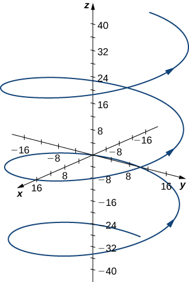
    

    
    * * *
    {: data-type="newline"}
    
    The curvature of the helix at
    <math xmlns="http://www.w3.org/1998/Math/MathML"><mrow><mi>t</mi><mo>=</mo><mrow><mrow><mrow><mo>(</mo><mrow><mn>4</mn><mi>π</mi></mrow><mo>)</mo></mrow></mrow><mtext>/</mtext><mn>3</mn></mrow></mrow></math>
    
    can be found by using [[link]](#fs-id1169737287184). First, calculate
    <math xmlns="http://www.w3.org/1998/Math/MathML"><mrow><mstyle mathvariant="bold" mathsize="normal"><mtext>T</mtext></mstyle><mrow><mo>(</mo><mi>t</mi><mo>)</mo></mrow><mtext>:</mtext></mrow></math>
    
    * * *
    {: data-type="newline"}
    
    

    <math xmlns="http://www.w3.org/1998/Math/MathML"><mtable><mtr><mtd columnalign="right"><mstyle mathvariant="bold" mathsize="normal"><mtext>T</mtext></mstyle><mrow><mo>(</mo><mi>t</mi><mo>)</mo></mrow></mtd><mtd columnalign="left"><mo>=</mo><mfrac><mrow><mstyle mathvariant="bold" mathsize="normal"><msup><mi>r</mi><mo>′</mo></msup></mstyle><mrow><mo>(</mo><mi>t</mi><mo>)</mo></mrow></mrow><mrow><mrow><mo>‖</mo><mrow><mstyle mathvariant="bold" mathsize="normal"><msup><mi>r</mi><mo>′</mo></msup></mstyle><mrow><mo>(</mo><mi>t</mi><mo>)</mo></mrow></mrow><mo>‖</mo></mrow></mrow></mfrac></mtd></mtr><mtr><mtd /><mtd columnalign="left"><mo>=</mo><mfrac><mrow><mrow><mo>〈</mo><mrow><mn>−4</mn><mspace width="0.1em" /><mtext>sin</mtext><mspace width="0.1em" /><mi>t</mi><mo>,</mo><mn>4</mn><mspace width="0.1em" /><mtext>cos</mtext><mspace width="0.1em" /><mi>t</mi><mo>,</mo><mn>3</mn></mrow><mo>〉</mo></mrow></mrow><mrow><msqrt><mrow><msup><mrow><mrow><mo>(</mo><mrow><mn>−4</mn><mspace width="0.1em" /><mtext>sin</mtext><mspace width="0.1em" /><mi>t</mi></mrow><mo>)</mo></mrow></mrow><mn>2</mn></msup><mo>+</mo><msup><mrow><mrow><mo>(</mo><mrow><mn>4</mn><mspace width="0.1em" /><mtext>cos</mtext><mspace width="0.1em" /><mi>t</mi></mrow><mo>)</mo></mrow></mrow><mn>2</mn></msup><mo>+</mo><msup><mn>3</mn><mn>2</mn></msup></mrow></msqrt></mrow></mfrac></mtd></mtr><mtr><mtd /><mtd columnalign="left"><mo>=</mo><mrow><mo>〈</mo><mrow><mo>−</mo><mfrac><mn>4</mn><mn>5</mn></mfrac><mtext>sin</mtext><mspace width="0.1em" /><mi>t</mi><mo>,</mo><mfrac><mn>4</mn><mn>5</mn></mfrac><mtext>cos</mtext><mspace width="0.1em" /><mi>t</mi><mo>,</mo><mfrac><mn>3</mn><mn>5</mn></mfrac></mrow><mo>〉</mo></mrow><mo>.</mo></mtd></mtr></mtable></math>
    

    
    * * *
    {: data-type="newline"}
    
    Next, calculate
    <math xmlns="http://www.w3.org/1998/Math/MathML"><mrow><mstyle mathvariant="bold" mathsize="normal"><msup><mi>T</mi><mo>′</mo></msup></mstyle><mrow><mo>(</mo><mi>t</mi><mo>)</mo></mrow><mtext>:</mtext></mrow></math>
    
    * * *
    {: data-type="newline"}
    
    

    <math xmlns="http://www.w3.org/1998/Math/MathML"><mrow><mstyle mathvariant="bold" mathsize="normal"><msup><mi>T</mi><mo>′</mo></msup></mstyle><mrow><mo>(</mo><mi>t</mi><mo>)</mo></mrow><mo>=</mo><mrow><mo>〈</mo><mrow><mo>−</mo><mfrac><mn>4</mn><mn>5</mn></mfrac><mtext>cos</mtext><mspace width="0.1em" /><mi>t</mi><mo>,</mo><mo>−</mo><mfrac><mn>4</mn><mn>5</mn></mfrac><mtext>sin</mtext><mspace width="0.1em" /><mi>t</mi><mo>,</mo><mn>0</mn></mrow><mo>〉</mo></mrow><mo>.</mo></mrow></math>
    

    
    * * *
    {: data-type="newline"}
    
    Last, apply [[link]](#fs-id1169737287184):
    * * *
    {: data-type="newline"}
    
    

    <math xmlns="http://www.w3.org/1998/Math/MathML"><mtable><mtr><mtd columnalign="right"><mi>κ</mi></mtd><mtd columnalign="left"><mo>=</mo><mfrac><mrow><mrow><mo>‖</mo><mrow><mstyle mathvariant="bold" mathsize="normal"><msup><mi>T</mi><mo>′</mo></msup></mstyle><mrow><mo>(</mo><mi>t</mi><mo>)</mo></mrow></mrow><mo>‖</mo></mrow></mrow><mrow><mrow><mo>‖</mo><mrow><mstyle mathvariant="bold" mathsize="normal"><msup><mi>r</mi><mo>′</mo></msup></mstyle><mrow><mo>(</mo><mi>t</mi><mo>)</mo></mrow></mrow><mo>‖</mo></mrow></mrow></mfrac><mo>=</mo><mfrac><mrow><mrow><mo>‖</mo><mrow><mrow><mo>〈</mo><mrow><mo>−</mo><mfrac><mn>4</mn><mn>5</mn></mfrac><mtext>cos</mtext><mspace width="0.1em" /><mi>t</mi><mo>,</mo><mo>−</mo><mfrac><mn>4</mn><mn>5</mn></mfrac><mtext>sin</mtext><mspace width="0.1em" /><mi>t</mi><mo>,</mo><mn>0</mn></mrow><mo>〉</mo></mrow></mrow><mo>‖</mo></mrow></mrow><mrow><mrow><mo>‖</mo><mrow><mrow><mo>〈</mo><mrow><mn>−4</mn><mspace width="0.1em" /><mtext>sin</mtext><mspace width="0.1em" /><mi>t</mi><mo>,</mo><mn>4</mn><mspace width="0.1em" /><mtext>cos</mtext><mspace width="0.1em" /><mi>t</mi><mo>,</mo><mn>3</mn></mrow><mo>〉</mo></mrow></mrow><mo>‖</mo></mrow></mrow></mfrac></mtd></mtr><mtr><mtd /><mtd columnalign="left"><mo>=</mo><mfrac><mrow><msqrt><mrow><msup><mrow><mrow><mo>(</mo><mrow><mo>−</mo><mfrac><mn>4</mn><mn>5</mn></mfrac><mtext>cos</mtext><mspace width="0.1em" /><mi>t</mi></mrow><mo>)</mo></mrow></mrow><mn>2</mn></msup><mo>+</mo><msup><mrow><mrow><mo>(</mo><mrow><mo>−</mo><mfrac><mn>4</mn><mn>5</mn></mfrac><mtext>sin</mtext><mspace width="0.1em" /><mi>t</mi></mrow><mo>)</mo></mrow></mrow><mn>2</mn></msup><mo>+</mo><msup><mn>0</mn><mn>2</mn></msup></mrow></msqrt></mrow><mrow><msqrt><mrow><msup><mrow><mrow><mo>(</mo><mrow><mn>−4</mn><mspace width="0.1em" /><mtext>sin</mtext><mspace width="0.1em" /><mi>t</mi></mrow><mo>)</mo></mrow></mrow><mn>2</mn></msup><mo>+</mo><msup><mrow><mrow><mo>(</mo><mrow><mn>4</mn><mspace width="0.1em" /><mtext>cos</mtext><mspace width="0.1em" /><mi>t</mi></mrow><mo>)</mo></mrow></mrow><mn>2</mn></msup><mo>+</mo><msup><mn>3</mn><mn>2</mn></msup></mrow></msqrt></mrow></mfrac></mtd></mtr><mtr><mtd /><mtd columnalign="left"><mo>=</mo><mfrac><mrow><mrow><mn>4</mn><mtext>/</mtext><mn>5</mn></mrow></mrow><mn>5</mn></mfrac><mo>=</mo><mfrac><mn>4</mn><mrow><mn>25</mn></mrow></mfrac><mo>.</mo></mtd></mtr></mtable></math>
    

    
    * * *
    {: data-type="newline"}
    
    The curvature of this helix is constant at all points on the helix.
2.  This function describes a semicircle.
    * * *
    {: data-type="newline"}
    
    

    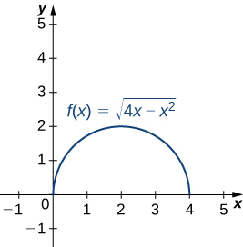
    

    
    * * *
    {: data-type="newline"}
    
    To find the curvature of this graph, we must use [[link]](#fs-id1169738153497). First, we calculate
    <math xmlns="http://www.w3.org/1998/Math/MathML"><msup><mi>y</mi><mo>′</mo></msup></math>
    
    and
    <math xmlns="http://www.w3.org/1998/Math/MathML"><mrow><mi>y</mi><mtext>″</mtext><mtext>:</mtext></mrow></math>
    
    * * *
    {: data-type="newline"}
    
    

    <math xmlns="http://www.w3.org/1998/Math/MathML"><mtable><mtr><mtd columnalign="right"><mi>y</mi></mtd><mtd columnalign="left"><mo>=</mo><msqrt><mrow><mn>4</mn><mi>x</mi><mo>−</mo><msup><mi>x</mi><mn>2</mn></msup></mrow></msqrt><mo>=</mo><msup><mrow><mo>(</mo><mrow><mn>4</mn><mi>x</mi><mo>−</mo><msup><mi>x</mi><mn>2</mn></msup></mrow><mo>)</mo></mrow><mrow><mrow><mn>1</mn><mtext>/</mtext><mn>2</mn></mrow></mrow></msup></mtd></mtr><mtr><mtd columnalign="right"><msup><mi>y</mi><mo>′</mo></msup></mtd><mtd columnalign="left"><mo>=</mo><mfrac><mn>1</mn><mn>2</mn></mfrac><msup><mrow><mo>(</mo><mrow><mn>4</mn><mi>x</mi><mo>−</mo><msup><mi>x</mi><mn>2</mn></msup></mrow><mo>)</mo></mrow><mrow><mo>−</mo><mrow><mn>1</mn><mtext>/</mtext><mn>2</mn></mrow></mrow></msup><mrow><mo>(</mo><mrow><mn>4</mn><mo>−</mo><mn>2</mn><mi>x</mi></mrow><mo>)</mo></mrow><mo>=</mo><mrow><mo>(</mo><mrow><mn>2</mn><mo>−</mo><mi>x</mi></mrow><mo>)</mo></mrow><msup><mrow><mo>(</mo><mrow><mn>4</mn><mi>x</mi><mo>−</mo><msup><mi>x</mi><mn>2</mn></msup></mrow><mo>)</mo></mrow><mrow><mo>−</mo><mrow><mn>1</mn><mtext>/</mtext><mn>2</mn></mrow></mrow></msup></mtd></mtr><mtr><mtd columnalign="right"><mi>y</mi><mtext>″</mtext></mtd><mtd columnalign="left"><mo>=</mo><mo>−</mo><msup><mrow><mo>(</mo><mrow><mn>4</mn><mi>x</mi><mo>−</mo><msup><mi>x</mi><mn>2</mn></msup></mrow><mo>)</mo></mrow><mrow><mo>−</mo><mrow><mn>1</mn><mtext>/</mtext><mn>2</mn></mrow></mrow></msup><mo>+</mo><mrow><mo>(</mo><mrow><mn>2</mn><mo>−</mo><mi>x</mi></mrow><mo>)</mo></mrow><mrow><mo>(</mo><mrow><mo>−</mo><mfrac><mn>1</mn><mn>2</mn></mfrac></mrow><mo>)</mo></mrow><msup><mrow><mo>(</mo><mrow><mn>4</mn><mi>x</mi><mo>−</mo><msup><mi>x</mi><mn>2</mn></msup></mrow><mo>)</mo></mrow><mrow><mo>−</mo><mrow><mn>3</mn><mtext>/</mtext><mn>2</mn></mrow></mrow></msup><mrow><mo>(</mo><mrow><mn>4</mn><mo>−</mo><mn>2</mn><mi>x</mi></mrow><mo>)</mo></mrow></mtd></mtr><mtr><mtd /><mtd columnalign="left"><mo>=</mo><mo>−</mo><mfrac><mrow><mn>4</mn><mi>x</mi><mo>−</mo><msup><mi>x</mi><mn>2</mn></msup></mrow><mrow><msup><mrow><mrow><mo>(</mo><mrow><mn>4</mn><mi>x</mi><mo>−</mo><msup><mi>x</mi><mn>2</mn></msup></mrow><mo>)</mo></mrow></mrow><mrow><mrow><mn>3</mn><mtext>/</mtext><mn>2</mn></mrow></mrow></msup></mrow></mfrac><mo>−</mo><mfrac><mrow><msup><mrow><mrow><mo>(</mo><mrow><mn>2</mn><mo>−</mo><mi>x</mi></mrow><mo>)</mo></mrow></mrow><mn>2</mn></msup></mrow><mrow><msup><mrow><mrow><mo>(</mo><mrow><mn>4</mn><mi>x</mi><mo>−</mo><msup><mi>x</mi><mn>2</mn></msup></mrow><mo>)</mo></mrow></mrow><mrow><mrow><mn>3</mn><mtext>/</mtext><mn>2</mn></mrow></mrow></msup></mrow></mfrac></mtd></mtr><mtr><mtd /><mtd columnalign="left"><mo>=</mo><mfrac><mrow><msup><mi>x</mi><mn>2</mn></msup><mo>−</mo><mn>4</mn><mi>x</mi><mo>−</mo><mrow><mo>(</mo><mrow><mn>4</mn><mo>−</mo><mn>4</mn><mi>x</mi><mo>+</mo><msup><mi>x</mi><mn>2</mn></msup></mrow><mo>)</mo></mrow></mrow><mrow><msup><mrow><mrow><mo>(</mo><mrow><mn>4</mn><mi>x</mi><mo>−</mo><msup><mi>x</mi><mn>2</mn></msup></mrow><mo>)</mo></mrow></mrow><mrow><mrow><mn>3</mn><mtext>/</mtext><mn>2</mn></mrow></mrow></msup></mrow></mfrac></mtd></mtr><mtr><mtd /><mtd columnalign="left"><mo>=</mo><mo>−</mo><mfrac><mn>4</mn><mrow><msup><mrow><mrow><mo>(</mo><mrow><mn>4</mn><mi>x</mi><mo>−</mo><msup><mi>x</mi><mn>2</mn></msup></mrow><mo>)</mo></mrow></mrow><mrow><mrow><mn>3</mn><mtext>/</mtext><mn>2</mn></mrow></mrow></msup></mrow></mfrac><mo>.</mo></mtd></mtr></mtable></math>
    

    
    * * *
    {: data-type="newline"}
    
    Then, we apply [[link]](#fs-id1169738200809):
    * * *
    {: data-type="newline"}
    
    

    <math xmlns="http://www.w3.org/1998/Math/MathML"><mtable><mtr><mtd columnalign="right"><mi>κ</mi></mtd><mtd columnalign="left"><mo>=</mo><mfrac><mrow><mrow><mo>\|</mo><mi>y</mi><mtext>″</mtext><mo>\|</mo></mrow></mrow><mrow><msup><mrow><mrow><mo>[</mo><mrow><mn>1</mn><mo>+</mo><msup><mrow><mrow><mo>(</mo><msup><mi>y</mi><mo>′</mo></msup><mo>)</mo></mrow></mrow><mn>2</mn></msup></mrow><mo>]</mo></mrow></mrow><mrow><mrow><mn>3</mn><mtext>/</mtext><mn>2</mn></mrow></mrow></msup></mrow></mfrac></mtd></mtr><mtr><mtd /><mtd columnalign="left"><mo>=</mo><mfrac><mrow><mrow><mo>\|</mo><mrow><mo>−</mo><mfrac><mn>4</mn><mrow><msup><mrow><mrow><mo>(</mo><mrow><mn>4</mn><mi>x</mi><mo>−</mo><msup><mi>x</mi><mn>2</mn></msup></mrow><mo>)</mo></mrow></mrow><mrow><mrow><mn>3</mn><mtext>/</mtext><mn>2</mn></mrow></mrow></msup></mrow></mfrac></mrow><mo>\|</mo></mrow></mrow><mrow><msup><mrow><mrow><mo>[</mo><mrow><mn>1</mn><mo>+</mo><msup><mrow><mrow><mo>(</mo><mrow><mrow><mo>(</mo><mrow><mn>2</mn><mo>−</mo><mi>x</mi></mrow><mo>)</mo></mrow><msup><mrow><mrow><mo>(</mo><mrow><mn>4</mn><mi>x</mi><mo>−</mo><msup><mi>x</mi><mn>2</mn></msup></mrow><mo>)</mo></mrow></mrow><mrow><mo>−</mo><mrow><mn>1</mn><mtext>/</mtext><mn>2</mn></mrow></mrow></msup></mrow><mo>)</mo></mrow></mrow><mn>2</mn></msup></mrow><mo>]</mo></mrow></mrow><mrow><mrow><mn>3</mn><mtext>/</mtext><mn>2</mn></mrow></mrow></msup></mrow></mfrac><mo>=</mo><mfrac><mrow><mrow><mo>\|</mo><mrow><mfrac><mn>4</mn><mrow><msup><mrow><mrow><mo>(</mo><mrow><mn>4</mn><mi>x</mi><mo>−</mo><msup><mi>x</mi><mn>2</mn></msup></mrow><mo>)</mo></mrow></mrow><mrow><mrow><mn>3</mn><mtext>/</mtext><mn>2</mn></mrow></mrow></msup></mrow></mfrac></mrow><mo>\|</mo></mrow></mrow><mrow><msup><mrow><mrow><mo>[</mo><mrow><mn>1</mn><mo>+</mo><mfrac><mrow><msup><mrow><mrow><mo>(</mo><mrow><mn>2</mn><mo>−</mo><mi>x</mi></mrow><mo>)</mo></mrow></mrow><mn>2</mn></msup></mrow><mrow><mn>4</mn><mi>x</mi><mo>−</mo><msup><mi>x</mi><mn>2</mn></msup></mrow></mfrac></mrow><mo>]</mo></mrow></mrow><mrow><mrow><mn>3</mn><mtext>/</mtext><mn>2</mn></mrow></mrow></msup></mrow></mfrac></mtd></mtr><mtr><mtd /><mtd columnalign="left"><mo>=</mo><mfrac><mrow><mrow><mo>\|</mo><mrow><mfrac><mn>4</mn><mrow><msup><mrow><mrow><mo>(</mo><mrow><mn>4</mn><mi>x</mi><mo>−</mo><msup><mi>x</mi><mn>2</mn></msup></mrow><mo>)</mo></mrow></mrow><mrow><mrow><mn>3</mn><mtext>/</mtext><mn>2</mn></mrow></mrow></msup></mrow></mfrac></mrow><mo>\|</mo></mrow></mrow><mrow><msup><mrow><mrow><mo>[</mo><mrow><mfrac><mrow><mn>4</mn><mi>x</mi><mo>−</mo><msup><mi>x</mi><mn>2</mn></msup><mo>+</mo><msup><mi>x</mi><mn>2</mn></msup><mo>−</mo><mn>4</mn><mi>x</mi><mo>+</mo><mn>4</mn></mrow><mrow><mn>4</mn><mi>x</mi><mo>−</mo><msup><mi>x</mi><mn>2</mn></msup></mrow></mfrac></mrow><mo>]</mo></mrow></mrow><mrow><mrow><mn>3</mn><mtext>/</mtext><mn>2</mn></mrow></mrow></msup></mrow></mfrac><mo>=</mo><mrow><mo>\|</mo><mrow><mfrac><mn>4</mn><mrow><msup><mrow><mrow><mo>(</mo><mrow><mn>4</mn><mi>x</mi><mo>−</mo><msup><mi>x</mi><mn>2</mn></msup></mrow><mo>)</mo></mrow></mrow><mrow><mrow><mn>3</mn><mtext>/</mtext><mn>2</mn></mrow></mrow></msup></mrow></mfrac></mrow><mo>\|</mo></mrow><mo>·</mo><mfrac><mrow><msup><mrow><mrow><mo>(</mo><mrow><mn>4</mn><mi>x</mi><mo>−</mo><msup><mi>x</mi><mn>2</mn></msup></mrow><mo>)</mo></mrow></mrow><mrow><mrow><mn>3</mn><mtext>/</mtext><mn>2</mn></mrow></mrow></msup></mrow><mn>8</mn></mfrac></mtd></mtr><mtr><mtd /><mtd columnalign="left"><mo>=</mo><mfrac><mn>1</mn><mn>2</mn></mfrac><mo>.</mo></mtd></mtr></mtable></math>
    

    
    * * *
    {: data-type="newline"}
    
    The curvature of this circle is equal to the reciprocal of its radius. There is a minor issue with the absolute value in [[link]](#fs-id1169738153497); however, a closer look at the calculation reveals that the denominator is positive for any value of *x.*
{: data-number-style="lower-alpha"}

Find the curvature of the curve defined by the function

<math xmlns="http://www.w3.org/1998/Math/MathML"><mrow><mi>y</mi><mo>=</mo><mn>3</mn><msup><mi>x</mi><mn>2</mn></msup><mo>−</mo><mn>2</mn><mi>x</mi><mo>+</mo><mn>4</mn></mrow></math>

at the point <math xmlns="http://www.w3.org/1998/Math/MathML"><mrow><mi>x</mi><mo>=</mo><mn>2.</mn></mrow></math>

<math xmlns="http://www.w3.org/1998/Math/MathML"><mrow><mi>κ</mi><mo>=</mo><mfrac><mn>6</mn><mrow><msup><mrow><mn>101</mn></mrow><mrow><mrow><mn>3</mn><mtext>/</mtext><mn>2</mn></mrow></mrow></msup></mrow></mfrac><mo>≈</mo><mn>0.0059</mn></mrow></math>

Hint

Use [[link]](#fs-id1169738200809).

### The Normal and Binormal Vectors

We have seen that the derivative <math xmlns="http://www.w3.org/1998/Math/MathML"><mrow><mstyle mathvariant="bold" mathsize="normal"><msup><mi>r</mi><mo>′</mo></msup></mstyle><mrow><mo>(</mo><mi>t</mi><mo>)</mo></mrow></mrow></math>

 of a vector-valued function is a tangent vector to the curve defined by <math xmlns="http://www.w3.org/1998/Math/MathML"><mrow><mstyle mathvariant="bold" mathsize="normal"><mtext>r</mtext></mstyle><mrow><mo>(</mo><mi>t</mi><mo>)</mo></mrow><mo>,</mo></mrow></math>

 and the unit tangent vector <math xmlns="http://www.w3.org/1998/Math/MathML"><mrow><mstyle mathvariant="bold" mathsize="normal"><mtext>T</mtext></mstyle><mrow><mo>(</mo><mi>t</mi><mo>)</mo></mrow></mrow></math>

 can be calculated by dividing <math xmlns="http://www.w3.org/1998/Math/MathML"><mrow><mstyle mathvariant="bold" mathsize="normal"><msup><mi>r</mi><mo>′</mo></msup></mstyle><mrow><mo>(</mo><mi>t</mi><mo>)</mo></mrow></mrow></math>

 by its magnitude. When studying motion in three dimensions, two other vectors are useful in describing the motion of a particle along a path in space: the **principal unit normal vector**{: data-type="term"} and the **binormal vector**{: data-type="term"}.

Definition

Let *C* be a three-dimensional **smooth**{: data-type="term"} curve represented by **r** over an open interval *I.* If <math xmlns="http://www.w3.org/1998/Math/MathML"><mrow><mstyle mathvariant="bold" mathsize="normal"><msup><mi>T</mi><mo>′</mo></msup></mstyle><mrow><mo>(</mo><mi>t</mi><mo>)</mo></mrow><mo>≠</mo><mstyle mathvariant="bold" mathsize="normal"><mn>0</mn></mstyle><mo>,</mo></mrow></math>

 then the principal unit normal vector at *t* is defined to be

<math xmlns="http://www.w3.org/1998/Math/MathML"><mrow><mstyle mathvariant="bold" mathsize="normal"><mtext>N</mtext></mstyle><mrow><mo>(</mo><mi>t</mi><mo>)</mo></mrow><mo>=</mo><mfrac><mrow><mstyle mathvariant="bold" mathsize="normal"><msup><mi>T</mi><mo>′</mo></msup></mstyle><mrow><mo>(</mo><mi>t</mi><mo>)</mo></mrow></mrow><mrow><mrow><mo>‖</mo><mrow><mstyle mathvariant="bold" mathsize="normal"><msup><mi>T</mi><mo>′</mo></msup></mstyle><mrow><mo>(</mo><mi>t</mi><mo>)</mo></mrow></mrow><mo>‖</mo></mrow></mrow></mfrac><mo>.</mo></mrow></math>

The binormal vector at *t* is defined as

<math xmlns="http://www.w3.org/1998/Math/MathML"><mrow><mstyle mathvariant="bold" mathsize="normal"><mtext>B</mtext></mstyle><mrow><mo>(</mo><mi>t</mi><mo>)</mo></mrow><mo>=</mo><mstyle mathvariant="bold" mathsize="normal"><mtext>T</mtext></mstyle><mrow><mo>(</mo><mi>t</mi><mo>)</mo></mrow><mspace width="0.2em" /><mo>×</mo><mspace width="0.2em" /><mstyle mathvariant="bold" mathsize="normal"><mtext>N</mtext></mstyle><mrow><mo>(</mo><mi>t</mi><mo>)</mo></mrow><mo>,</mo></mrow></math>

where <math xmlns="http://www.w3.org/1998/Math/MathML"><mrow><mstyle mathvariant="bold" mathsize="normal"><mtext>T</mtext></mstyle><mrow><mo>(</mo><mi>t</mi><mo>)</mo></mrow></mrow></math>

 is the unit tangent vector.

Note that, by definition, the binormal vector is orthogonal to both the unit tangent vector and the normal vector. Furthermore, <math xmlns="http://www.w3.org/1998/Math/MathML"><mrow><mstyle mathvariant="bold" mathsize="normal"><mtext>B</mtext></mstyle><mrow><mo>(</mo><mi>t</mi><mo>)</mo></mrow></mrow></math>

 is always a unit vector. This can be shown using the formula for the magnitude of a cross product

<math xmlns="http://www.w3.org/1998/Math/MathML"><mrow><mrow><mo>‖</mo><mrow><mstyle mathvariant="bold" mathsize="normal"><mtext>B</mtext></mstyle><mrow><mo>(</mo><mi>t</mi><mo>)</mo></mrow></mrow><mo>‖</mo></mrow><mo>=</mo><mrow><mo>‖</mo><mrow><mstyle mathvariant="bold" mathsize="normal"><mtext>T</mtext></mstyle><mrow><mo>(</mo><mi>t</mi><mo>)</mo></mrow><mspace width="0.2em" /><mo>×</mo><mspace width="0.2em" /><mstyle mathvariant="bold" mathsize="normal"><mtext>N</mtext></mstyle><mrow><mo>(</mo><mi>t</mi><mo>)</mo></mrow></mrow><mo>‖</mo></mrow><mo>=</mo><mrow><mo>‖</mo><mrow><mstyle mathvariant="bold" mathsize="normal"><mtext>T</mtext></mstyle><mrow><mo>(</mo><mi>t</mi><mo>)</mo></mrow></mrow><mo>‖</mo></mrow><mrow><mo>‖</mo><mrow><mstyle mathvariant="bold" mathsize="normal"><mtext>N</mtext></mstyle><mrow><mo>(</mo><mi>t</mi><mo>)</mo></mrow></mrow><mo>‖</mo></mrow><mtext>sin</mtext><mspace width="0.1em" /><mi>θ</mi><mo>,</mo></mrow></math>

where <math xmlns="http://www.w3.org/1998/Math/MathML"><mi>θ</mi></math>

 is the angle between <math xmlns="http://www.w3.org/1998/Math/MathML"><mrow><mstyle mathvariant="bold" mathsize="normal"><mtext>T</mtext></mstyle><mrow><mo>(</mo><mi>t</mi><mo>)</mo></mrow></mrow></math>

 and <math xmlns="http://www.w3.org/1998/Math/MathML"><mrow><mstyle mathvariant="bold" mathsize="normal"><mtext>N</mtext></mstyle><mrow><mo>(</mo><mi>t</mi><mo>)</mo></mrow><mo>.</mo></mrow></math>

 Since <math xmlns="http://www.w3.org/1998/Math/MathML"><mrow><mstyle mathvariant="bold" mathsize="normal"><mtext>N</mtext></mstyle><mrow><mo>(</mo><mi>t</mi><mo>)</mo></mrow></mrow></math>

 is the derivative of a unit vector, property (vii) of the derivative of a vector-valued function tells us that <math xmlns="http://www.w3.org/1998/Math/MathML"><mrow><mstyle mathvariant="bold" mathsize="normal"><mtext>T</mtext></mstyle><mrow><mo>(</mo><mi>t</mi><mo>)</mo></mrow></mrow></math>

 and <math xmlns="http://www.w3.org/1998/Math/MathML"><mrow><mstyle mathvariant="bold" mathsize="normal"><mtext>N</mtext></mstyle><mrow><mo>(</mo><mi>t</mi><mo>)</mo></mrow></mrow></math>

 are orthogonal to each other, so <math xmlns="http://www.w3.org/1998/Math/MathML"><mrow><mi>θ</mi><mo>=</mo><mrow><mi>π</mi><mtext>/</mtext><mn>2</mn></mrow><mo>.</mo></mrow></math>

 Furthermore, they are both unit vectors, so their magnitude is 1. Therefore, <math xmlns="http://www.w3.org/1998/Math/MathML"><mrow><mrow><mo>‖</mo><mrow><mstyle mathvariant="bold" mathsize="normal"><mtext>T</mtext></mstyle><mrow><mo>(</mo><mi>t</mi><mo>)</mo></mrow></mrow><mo>‖</mo></mrow><mrow><mo>‖</mo><mrow><mstyle mathvariant="bold" mathsize="normal"><mtext>N</mtext></mstyle><mrow><mo>(</mo><mi>t</mi><mo>)</mo></mrow></mrow><mo>‖</mo></mrow><mtext>sin</mtext><mspace width="0.1em" /><mi>θ</mi><mo>=</mo><mrow><mo>(</mo><mn>1</mn><mo>)</mo></mrow><mrow><mo>(</mo><mn>1</mn><mo>)</mo></mrow><mtext>sin</mtext><mrow><mo>(</mo><mrow><mrow><mi>π</mi><mtext>/</mtext><mn>2</mn></mrow></mrow><mo>)</mo></mrow><mo>=</mo><mn>1</mn></mrow></math>

 and <math xmlns="http://www.w3.org/1998/Math/MathML"><mrow><mstyle mathvariant="bold" mathsize="normal"><mtext>B</mtext></mstyle><mrow><mo>(</mo><mi>t</mi><mo>)</mo></mrow></mrow></math>

 is a unit vector.

The principal unit normal vector can be challenging to calculate because the unit tangent vector involves a quotient, and this quotient often has a square root in the denominator. In the three-dimensional case, finding the cross product of the unit tangent vector and the unit normal vector can be even more cumbersome. Fortunately, we have alternative formulas for finding these two vectors, and they are presented in [Motion in Space](/m53930){: .target-chapter}.

Finding the Principal Unit Normal Vector and Binormal Vector

For each of the following vector-valued functions, find the principal unit normal vector. Then, if possible, find the binormal vector.

1.  <math xmlns="http://www.w3.org/1998/Math/MathML"><mrow><mstyle mathvariant="bold" mathsize="normal"><mtext>r</mtext></mstyle><mrow><mo>(</mo><mi>t</mi><mo>)</mo></mrow><mo>=</mo><mn>4</mn><mspace width="0.1em" /><mtext>cos</mtext><mspace width="0.1em" /><mi>t</mi><mspace width="0.2em" /><mstyle mathvariant="bold" mathsize="normal"><mtext>i</mtext></mstyle><mo>−</mo><mn>4</mn><mspace width="0.1em" /><mtext>sin</mtext><mspace width="0.1em" /><mi>t</mi><mspace width="0.2em" /><mstyle mathvariant="bold" mathsize="normal"><mtext>j</mtext></mstyle></mrow></math>

2.  <math xmlns="http://www.w3.org/1998/Math/MathML"><mrow><mstyle mathvariant="bold" mathsize="normal"><mtext>r</mtext></mstyle><mrow><mo>(</mo><mi>t</mi><mo>)</mo></mrow><mo>=</mo><mrow><mo>(</mo><mrow><mn>6</mn><mi>t</mi><mo>+</mo><mn>2</mn></mrow><mo>)</mo></mrow><mspace width="0.2em" /><mstyle mathvariant="bold" mathsize="normal"><mtext>i</mtext></mstyle><mo>+</mo><mn>5</mn><msup><mi>t</mi><mn>2</mn></msup><mspace width="0.2em" /><mstyle mathvariant="bold" mathsize="normal"><mtext>j</mtext></mstyle><mo>−</mo><mn>8</mn><mi>t</mi><mspace width="0.2em" /><mstyle mathvariant="bold" mathsize="normal"><mtext>k</mtext></mstyle></mrow></math>
{: data-number-style="lower-alpha"}

1.  This function describes a circle.
    * * *
    {: data-type="newline"}
    
    

    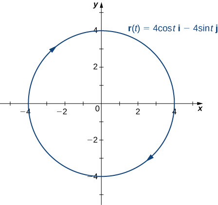
    

    
    * * *
    {: data-type="newline"}
    
    To find the principal unit normal vector, we first must find the unit tangent vector
    <math xmlns="http://www.w3.org/1998/Math/MathML"><mrow><mstyle mathvariant="bold" mathsize="normal"><mtext>T</mtext></mstyle><mrow><mo>(</mo><mi>t</mi><mo>)</mo></mrow><mtext>:</mtext></mrow></math>
    
    * * *
    {: data-type="newline"}
    
    

    <math xmlns="http://www.w3.org/1998/Math/MathML"><mtable><mtr><mtd columnalign="right"><mstyle mathvariant="bold" mathsize="normal"><mtext>T</mtext></mstyle><mrow><mo>(</mo><mi>t</mi><mo>)</mo></mrow></mtd><mtd columnalign="left"><mo>=</mo><mfrac><mrow><mstyle mathvariant="bold" mathsize="normal"><msup><mi>r</mi><mo>′</mo></msup></mstyle><mrow><mo>(</mo><mi>t</mi><mo>)</mo></mrow></mrow><mrow><mrow><mo>‖</mo><mrow><mstyle mathvariant="bold" mathsize="normal"><msup><mi>r</mi><mo>′</mo></msup></mstyle><mrow><mo>(</mo><mi>t</mi><mo>)</mo></mrow></mrow><mo>‖</mo></mrow></mrow></mfrac></mtd></mtr><mtr><mtd /><mtd columnalign="left"><mo>=</mo><mfrac><mrow><mn>−4</mn><mspace width="0.1em" /><mtext>sin</mtext><mspace width="0.1em" /><mi>t</mi><mspace width="0.2em" /><mstyle mathvariant="bold" mathsize="normal"><mtext>i</mtext></mstyle><mo>−</mo><mn>4</mn><mspace width="0.1em" /><mtext>cos</mtext><mspace width="0.1em" /><mi>t</mi><mspace width="0.2em" /><mstyle mathvariant="bold" mathsize="normal"><mtext>j</mtext></mstyle></mrow><mrow><msqrt><mrow><msup><mrow><mrow><mo>(</mo><mrow><mn>−4</mn><mspace width="0.1em" /><mtext>sin</mtext><mspace width="0.1em" /><mi>t</mi></mrow><mo>)</mo></mrow></mrow><mn>2</mn></msup><mo>+</mo><msup><mrow><mrow><mo>(</mo><mrow><mn>−4</mn><mspace width="0.1em" /><mtext>cos</mtext><mspace width="0.1em" /><mi>t</mi></mrow><mo>)</mo></mrow></mrow><mn>2</mn></msup></mrow></msqrt></mrow></mfrac></mtd></mtr><mtr><mtd /><mtd columnalign="left"><mo>=</mo><mfrac><mrow><mn>−4</mn><mspace width="0.1em" /><mtext>sin</mtext><mspace width="0.1em" /><mi>t</mi><mspace width="0.2em" /><mstyle mathvariant="bold" mathsize="normal"><mtext>i</mtext></mstyle><mo>−</mo><mn>4</mn><mspace width="0.1em" /><mtext>cos</mtext><mspace width="0.1em" /><mi>t</mi><mspace width="0.2em" /><mstyle mathvariant="bold" mathsize="normal"><mtext>j</mtext></mstyle></mrow><mrow><msqrt><mrow><mn>16</mn><mspace width="0.1em" /><msup><mrow><mtext>sin</mtext></mrow><mn>2</mn></msup><mi>t</mi><mo>+</mo><mn>16</mn><mspace width="0.1em" /><msup><mrow><mtext>cos</mtext></mrow><mn>2</mn></msup><mi>t</mi></mrow></msqrt></mrow></mfrac></mtd></mtr><mtr><mtd /><mtd columnalign="left"><mo>=</mo><mfrac><mrow><mn>−4</mn><mspace width="0.1em" /><mtext>sin</mtext><mspace width="0.1em" /><mi>t</mi><mspace width="0.2em" /><mstyle mathvariant="bold" mathsize="normal"><mtext>i</mtext></mstyle><mo>−</mo><mn>4</mn><mspace width="0.1em" /><mtext>cos</mtext><mspace width="0.1em" /><mi>t</mi><mspace width="0.2em" /><mstyle mathvariant="bold" mathsize="normal"><mtext>j</mtext></mstyle></mrow><mrow><msqrt><mrow><mn>16</mn><mrow><mo>(</mo><mrow><msup><mrow><mtext>sin</mtext></mrow><mn>2</mn></msup><mi>t</mi><mo>+</mo><msup><mrow><mtext>cos</mtext></mrow><mn>2</mn></msup><mi>t</mi></mrow><mo>)</mo></mrow></mrow></msqrt></mrow></mfrac></mtd></mtr><mtr><mtd /><mtd columnalign="left"><mo>=</mo><mfrac><mrow><mn>−4</mn><mspace width="0.1em" /><mtext>sin</mtext><mspace width="0.1em" /><mi>t</mi><mspace width="0.2em" /><mstyle mathvariant="bold" mathsize="normal"><mtext>i</mtext></mstyle><mo>−</mo><mn>4</mn><mspace width="0.1em" /><mtext>cos</mtext><mspace width="0.1em" /><mi>t</mi><mspace width="0.2em" /><mstyle mathvariant="bold" mathsize="normal"><mtext>j</mtext></mstyle></mrow><mn>4</mn></mfrac></mtd></mtr><mtr><mtd /><mtd columnalign="left"><mo>=</mo><mo>−</mo><mtext>sin</mtext><mspace width="0.1em" /><mi>t</mi><mspace width="0.2em" /><mstyle mathvariant="bold" mathsize="normal"><mtext>i</mtext></mstyle><mo>−</mo><mtext>cos</mtext><mspace width="0.1em" /><mi>t</mi><mspace width="0.2em" /><mstyle mathvariant="bold" mathsize="normal"><mtext>j</mtext></mstyle><mo>.</mo></mtd></mtr></mtable></math>
    

    
    * * *
    {: data-type="newline"}
    
    Next, we use [[link]](#fs-id1169737271064):
    * * *
    {: data-type="newline"}
    
    

    <math xmlns="http://www.w3.org/1998/Math/MathML"><mtable><mtr><mtd columnalign="right"><mstyle mathvariant="bold" mathsize="normal"><mtext>N</mtext></mstyle><mrow><mo>(</mo><mi>t</mi><mo>)</mo></mrow></mtd><mtd columnalign="left"><mo>=</mo><mfrac><mrow><mstyle mathvariant="bold" mathsize="normal"><msup><mi>T</mi><mo>′</mo></msup></mstyle><mrow><mo>(</mo><mi>t</mi><mo>)</mo></mrow></mrow><mrow><mrow><mo>‖</mo><mrow><mstyle mathvariant="bold" mathsize="normal"><msup><mi>T</mi><mo>′</mo></msup></mstyle><mrow><mo>(</mo><mi>t</mi><mo>)</mo></mrow></mrow><mo>‖</mo></mrow></mrow></mfrac></mtd></mtr><mtr><mtd /><mtd columnalign="left"><mo>=</mo><mfrac><mrow><mtext>−</mtext><mtext>cos</mtext><mspace width="0.1em" /><mi>t</mi><mspace width="0.2em" /><mstyle mathvariant="bold" mathsize="normal"><mtext>i</mtext></mstyle><mo>+</mo><mtext>sin</mtext><mspace width="0.1em" /><mi>t</mi><mspace width="0.2em" /><mstyle mathvariant="bold" mathsize="normal"><mtext>j</mtext></mstyle></mrow><mrow><msqrt><mrow><msup><mrow><mrow><mo>(</mo><mrow><mtext>−</mtext><mtext>cos</mtext><mspace width="0.1em" /><mi>t</mi></mrow><mo>)</mo></mrow></mrow><mn>2</mn></msup><mo>+</mo><msup><mrow><mrow><mo>(</mo><mrow><mtext>sin</mtext><mspace width="0.1em" /><mi>t</mi></mrow><mo>)</mo></mrow></mrow><mn>2</mn></msup></mrow></msqrt></mrow></mfrac></mtd></mtr><mtr><mtd /><mtd columnalign="left"><mo>=</mo><mfrac><mrow><mtext>−</mtext><mtext>cos</mtext><mspace width="0.1em" /><mi>t</mi><mspace width="0.2em" /><mstyle mathvariant="bold" mathsize="normal"><mtext>i</mtext></mstyle><mo>+</mo><mtext>sin</mtext><mspace width="0.1em" /><mi>t</mi><mspace width="0.2em" /><mstyle mathvariant="bold" mathsize="normal"><mtext>j</mtext></mstyle></mrow><mrow><msqrt><mrow><msup><mrow><mtext>cos</mtext></mrow><mn>2</mn></msup><mi>t</mi><mo>+</mo><msup><mrow><mtext>sin</mtext></mrow><mn>2</mn></msup><mi>t</mi></mrow></msqrt></mrow></mfrac></mtd></mtr><mtr><mtd /><mtd columnalign="left"><mo>=</mo><mo>−</mo><mtext>cos</mtext><mspace width="0.1em" /><mi>t</mi><mspace width="0.2em" /><mstyle mathvariant="bold" mathsize="normal"><mtext>i</mtext></mstyle><mo>+</mo><mtext>sin</mtext><mspace width="0.1em" /><mi>t</mi><mspace width="0.2em" /><mstyle mathvariant="bold" mathsize="normal"><mtext>j</mtext></mstyle><mo>.</mo></mtd></mtr></mtable></math>
    

    
    * * *
    {: data-type="newline"}
    
    Notice that the unit tangent vector and the principal unit normal vector are orthogonal to each other for all values of *t*:
    * * *
    {: data-type="newline"}
    
    

    <math xmlns="http://www.w3.org/1998/Math/MathML"><mtable><mtr><mtd columnalign="right"><mstyle mathvariant="bold" mathsize="normal"><mtext>T</mtext></mstyle><mrow><mo>(</mo><mi>t</mi><mo>)</mo></mrow><mo>·</mo><mstyle mathvariant="bold" mathsize="normal"><mtext>N</mtext></mstyle><mrow><mo>(</mo><mi>t</mi><mo>)</mo></mrow></mtd><mtd columnalign="left"><mo>=</mo><mrow><mo>〈</mo><mrow><mtext>−</mtext><mtext>sin</mtext><mspace width="0.1em" /><mi>t</mi><mo>,</mo><mo>−</mo><mtext>cos</mtext><mspace width="0.1em" /><mi>t</mi></mrow><mo>〉</mo></mrow><mo>·</mo><mrow><mo>〈</mo><mrow><mtext>−</mtext><mtext>cos</mtext><mspace width="0.1em" /><mi>t</mi><mo>,</mo><mtext>sin</mtext><mspace width="0.1em" /><mi>t</mi></mrow><mo>〉</mo></mrow></mtd></mtr><mtr><mtd /><mtd columnalign="left"><mo>=</mo><mtext>sin</mtext><mspace width="0.1em" /><mi>t</mi><mspace width="0.1em" /><mtext>cos</mtext><mspace width="0.1em" /><mi>t</mi><mo>−</mo><mtext>cos</mtext><mspace width="0.1em" /><mi>t</mi><mspace width="0.1em" /><mtext>sin</mtext><mspace width="0.1em" /><mi>t</mi></mtd></mtr><mtr><mtd /><mtd columnalign="left"><mo>=</mo><mn>0.</mn></mtd></mtr></mtable></math>
    

    
    * * *
    {: data-type="newline"}
    
    Furthermore, the principal unit normal vector points toward the center of the circle from every point on the circle. Since
    <math xmlns="http://www.w3.org/1998/Math/MathML"><mrow><mstyle mathvariant="bold" mathsize="normal"><mtext>r</mtext></mstyle><mrow><mo>(</mo><mi>t</mi><mo>)</mo></mrow></mrow></math>
    
    defines a curve in two dimensions, we cannot calculate the binormal vector.
    * * *
    {: data-type="newline"}
    
    

    
    

2.  This function looks like this:
    * * *
    {: data-type="newline"}
    
    

    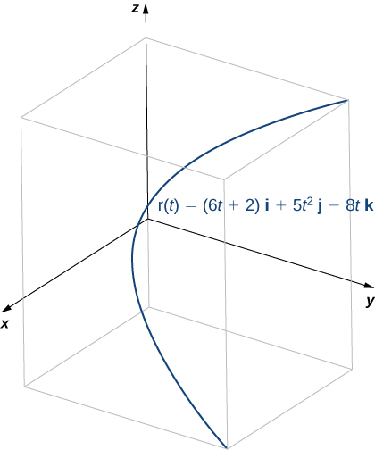
    

    
    * * *
    {: data-type="newline"}
    
    To find the principal unit normal vector, we first find the unit tangent vector
    <math xmlns="http://www.w3.org/1998/Math/MathML"><mrow><mstyle mathvariant="bold" mathsize="normal"><mtext>T</mtext></mstyle><mrow><mo>(</mo><mi>t</mi><mo>)</mo></mrow><mtext>:</mtext></mrow></math>
    
    * * *
    {: data-type="newline"}
    
    

    <math xmlns="http://www.w3.org/1998/Math/MathML"><mtable><mtr><mtd columnalign="right"><mstyle mathvariant="bold" mathsize="normal"><mtext>T</mtext></mstyle><mrow><mo>(</mo><mi>t</mi><mo>)</mo></mrow></mtd><mtd columnalign="left"><mo>=</mo><mfrac><mrow><mstyle mathvariant="bold" mathsize="normal"><msup><mi>r</mi><mo>′</mo></msup></mstyle><mrow><mo>(</mo><mi>t</mi><mo>)</mo></mrow></mrow><mrow><mrow><mo>‖</mo><mrow><mstyle mathvariant="bold" mathsize="normal"><msup><mi>r</mi><mo>′</mo></msup></mstyle><mrow><mo>(</mo><mi>t</mi><mo>)</mo></mrow></mrow><mo>‖</mo></mrow></mrow></mfrac></mtd></mtr><mtr><mtd /><mtd columnalign="left"><mo>=</mo><mfrac><mrow><mn>6</mn><mspace width="0.2em" /><mstyle mathvariant="bold" mathsize="normal"><mtext>i</mtext></mstyle><mo>+</mo><mn>10</mn><mi>t</mi><mspace width="0.2em" /><mstyle mathvariant="bold" mathsize="normal"><mtext>j</mtext></mstyle><mo>−</mo><mn>8</mn><mspace width="0.2em" /><mstyle mathvariant="bold" mathsize="normal"><mtext>k</mtext></mstyle></mrow><mrow><msqrt><mrow><msup><mn>6</mn><mn>2</mn></msup><mo>+</mo><msup><mrow><mrow><mo>(</mo><mrow><mn>10</mn><mi>t</mi></mrow><mo>)</mo></mrow></mrow><mn>2</mn></msup><mo>+</mo><msup><mrow><mrow><mo>(</mo><mrow><mn>−8</mn></mrow><mo>)</mo></mrow></mrow><mn>2</mn></msup></mrow></msqrt></mrow></mfrac></mtd></mtr><mtr><mtd /><mtd columnalign="left"><mo>=</mo><mfrac><mrow><mn>6</mn><mspace width="0.2em" /><mstyle mathvariant="bold" mathsize="normal"><mtext>i</mtext></mstyle><mo>+</mo><mn>10</mn><mi>t</mi><mspace width="0.2em" /><mstyle mathvariant="bold" mathsize="normal"><mtext>j</mtext></mstyle><mo>−</mo><mn>8</mn><mspace width="0.2em" /><mstyle mathvariant="bold" mathsize="normal"><mtext>k</mtext></mstyle></mrow><mrow><msqrt><mrow><mn>36</mn><mo>+</mo><mn>100</mn><msup><mi>t</mi><mn>2</mn></msup><mo>+</mo><mn>64</mn></mrow></msqrt></mrow></mfrac></mtd></mtr><mtr><mtd /><mtd columnalign="left"><mo>=</mo><mfrac><mrow><mn>6</mn><mspace width="0.2em" /><mstyle mathvariant="bold" mathsize="normal"><mtext>i</mtext></mstyle><mo>+</mo><mn>10</mn><mi>t</mi><mspace width="0.2em" /><mstyle mathvariant="bold" mathsize="normal"><mtext>j</mtext></mstyle><mo>−</mo><mn>8</mn><mstyle mathvariant="bold" mathsize="normal"><mtext>k</mtext></mstyle></mrow><mrow><msqrt><mrow><mn>100</mn><mrow><mo>(</mo><mrow><msup><mi>t</mi><mn>2</mn></msup><mo>+</mo><mn>1</mn></mrow><mo>)</mo></mrow></mrow></msqrt></mrow></mfrac></mtd></mtr><mtr><mtd /><mtd columnalign="left"><mo>=</mo><mfrac><mrow><mn>3</mn><mspace width="0.2em" /><mstyle mathvariant="bold" mathsize="normal"><mtext>i</mtext></mstyle><mo>−</mo><mn>5</mn><mi>t</mi><mspace width="0.2em" /><mstyle mathvariant="bold" mathsize="normal"><mtext>j</mtext></mstyle><mo>−</mo><mn>4</mn><mstyle mathvariant="bold" mathsize="normal"><mtext>k</mtext></mstyle></mrow><mrow><mn>5</mn><msqrt><mrow><msup><mi>t</mi><mn>2</mn></msup><mo>+</mo><mn>1</mn></mrow></msqrt></mrow></mfrac></mtd></mtr><mtr><mtd /><mtd columnalign="left"><mo>=</mo><mfrac><mn>3</mn><mn>5</mn></mfrac><msup><mrow><mo>(</mo><mrow><msup><mi>t</mi><mn>2</mn></msup><mo>+</mo><mn>1</mn></mrow><mo>)</mo></mrow><mrow><mo>−</mo><mrow><mn>1</mn><mtext>/</mtext><mn>2</mn></mrow></mrow></msup><mstyle mathvariant="bold" mathsize="normal"><mtext>i</mtext></mstyle><mo>−</mo><mi>t</mi><msup><mrow><mo>(</mo><mrow><msup><mi>t</mi><mn>2</mn></msup><mo>+</mo><mn>1</mn></mrow><mo>)</mo></mrow><mrow><mo>−</mo><mrow><mn>1</mn><mtext>/</mtext><mn>2</mn></mrow></mrow></msup><mstyle mathvariant="bold" mathsize="normal"><mtext>j</mtext></mstyle><mo>−</mo><mfrac><mn>4</mn><mn>5</mn></mfrac><msup><mrow><mo>(</mo><mrow><msup><mi>t</mi><mn>2</mn></msup><mo>+</mo><mn>1</mn></mrow><mo>)</mo></mrow><mrow><mo>−</mo><mrow><mn>1</mn><mtext>/</mtext><mn>2</mn></mrow></mrow></msup><mstyle mathvariant="bold" mathsize="normal"><mtext>k</mtext></mstyle><mo>.</mo></mtd></mtr></mtable></math>
    

    
    * * *
    {: data-type="newline"}
    
    Next, we calculate
    <math xmlns="http://www.w3.org/1998/Math/MathML"><mrow><mstyle mathvariant="bold" mathsize="normal"><msup><mi>T</mi><mo>′</mo></msup></mstyle><mrow><mo>(</mo><mi>t</mi><mo>)</mo></mrow></mrow></math>
    
    and
    <math xmlns="http://www.w3.org/1998/Math/MathML"><mrow><mrow><mo>‖</mo><mrow><mstyle mathvariant="bold" mathsize="normal"><msup><mi>T</mi><mo>′</mo></msup></mstyle><mrow><mo>(</mo><mi>t</mi><mo>)</mo></mrow></mrow><mo>‖</mo></mrow><mtext>:</mtext></mrow></math>
    
    * * *
    {: data-type="newline"}
    
    

    <math xmlns="http://www.w3.org/1998/Math/MathML"><mtable><mtr><mtd columnalign="right"><mstyle mathvariant="bold" mathsize="normal"><msup><mi>T</mi><mo>′</mo></msup></mstyle><mrow><mo>(</mo><mi>t</mi><mo>)</mo></mrow></mtd><mtd columnalign="left"><mo>=</mo><mfrac><mn>3</mn><mn>5</mn></mfrac><mrow><mo>(</mo><mrow><mo>−</mo><mfrac><mn>1</mn><mn>2</mn></mfrac></mrow><mo>)</mo></mrow><msup><mrow><mo>(</mo><mrow><msup><mi>t</mi><mn>2</mn></msup><mo>+</mo><mn>1</mn></mrow><mo>)</mo></mrow><mrow><mo>−</mo><mrow><mn>3</mn><mtext>/</mtext><mn>2</mn></mrow></mrow></msup><mrow><mo>(</mo><mrow><mn>2</mn><mi>t</mi></mrow><mo>)</mo></mrow><mspace width="0.1em" /><mstyle mathvariant="bold" mathsize="normal"><mtext>i</mtext></mstyle><mo>−</mo><mrow><mo>(</mo><mrow><msup><mrow><mrow><mo>(</mo><mrow><msup><mi>t</mi><mn>2</mn></msup><mo>+</mo><mn>1</mn></mrow><mo>)</mo></mrow></mrow><mrow><mo>−</mo><mrow><mn>1</mn><mtext>/</mtext><mn>2</mn></mrow></mrow></msup><mo>−</mo><mi>t</mi><mrow><mo>(</mo><mrow><mfrac><mn>1</mn><mn>2</mn></mfrac></mrow><mo>)</mo></mrow><msup><mrow><mrow><mo>(</mo><mrow><msup><mi>t</mi><mn>2</mn></msup><mo>+</mo><mn>1</mn></mrow><mo>)</mo></mrow></mrow><mrow><mo>−</mo><mrow><mn>3</mn><mtext>/</mtext><mn>2</mn></mrow></mrow></msup><mrow><mo>(</mo><mrow><mn>2</mn><mi>t</mi></mrow><mo>)</mo></mrow></mrow><mo>)</mo></mrow><mspace width="0.1em" /><mstyle mathvariant="bold" mathsize="normal"><mtext>j</mtext></mstyle></mtd></mtr><mtr><mtd /><mtd columnalign="left"><mspace width="3em" /><mo>−</mo><mfrac><mn>4</mn><mn>5</mn></mfrac><mrow><mo>(</mo><mrow><mo>−</mo><mfrac><mn>1</mn><mn>2</mn></mfrac></mrow><mo>)</mo></mrow><msup><mrow><mo>(</mo><mrow><msup><mi>t</mi><mn>2</mn></msup><mo>+</mo><mn>1</mn></mrow><mo>)</mo></mrow><mrow><mo>−</mo><mrow><mn>3</mn><mtext>/</mtext><mn>2</mn></mrow></mrow></msup><mrow><mo>(</mo><mrow><mn>2</mn><mi>t</mi></mrow><mo>)</mo></mrow><mspace width="0.1em" /><mstyle mathvariant="bold" mathsize="normal"><mtext>k</mtext></mstyle></mtd></mtr><mtr><mtd /><mtd columnalign="left"><mo>=</mo><mo>−</mo><mfrac><mrow><mn>3</mn><mi>t</mi></mrow><mrow><mn>5</mn><msup><mrow><mrow><mo>(</mo><mrow><msup><mi>t</mi><mn>2</mn></msup><mo>+</mo><mn>1</mn></mrow><mo>)</mo></mrow></mrow><mrow><mrow><mn>3</mn><mtext>/</mtext><mn>2</mn></mrow></mrow></msup></mrow></mfrac><mstyle mathvariant="bold" mathsize="normal"><mtext>i</mtext></mstyle><mo>−</mo><mfrac><mn>1</mn><mrow><msup><mrow><mrow><mo>(</mo><mrow><msup><mi>t</mi><mn>2</mn></msup><mo>+</mo><mn>1</mn></mrow><mo>)</mo></mrow></mrow><mrow><mrow><mn>3</mn><mtext>/</mtext><mn>2</mn></mrow></mrow></msup></mrow></mfrac><mstyle mathvariant="bold" mathsize="normal"><mtext>j</mtext></mstyle><mo>+</mo><mfrac><mrow><mn>4</mn><mi>t</mi></mrow><mrow><mn>5</mn><msup><mrow><mrow><mo>(</mo><mrow><msup><mi>t</mi><mn>2</mn></msup><mo>+</mo><mn>1</mn></mrow><mo>)</mo></mrow></mrow><mrow><mrow><mn>3</mn><mtext>/</mtext><mn>2</mn></mrow></mrow></msup></mrow></mfrac><mstyle mathvariant="bold" mathsize="normal"><mtext>k</mtext></mstyle></mtd></mtr><mtr><mtd columnalign="right"><mrow><mo>‖</mo><mrow><mstyle mathvariant="bold" mathsize="normal"><msup><mi>T</mi><mo>′</mo></msup></mstyle><mrow><mo>(</mo><mi>t</mi><mo>)</mo></mrow></mrow><mo>‖</mo></mrow></mtd><mtd columnalign="left"><mo>=</mo><msqrt><mrow><msup><mrow><mrow><mo>(</mo><mrow><mo>−</mo><mfrac><mrow><mn>3</mn><mi>t</mi></mrow><mrow><mn>5</mn><msup><mrow><mrow><mo>(</mo><mrow><msup><mi>t</mi><mn>2</mn></msup><mo>+</mo><mn>1</mn></mrow><mo>)</mo></mrow></mrow><mrow><mrow><mn>3</mn><mtext>/</mtext><mn>2</mn></mrow></mrow></msup></mrow></mfrac></mrow><mo>)</mo></mrow></mrow><mn>2</mn></msup><mo>+</mo><msup><mrow><mrow><mo>(</mo><mrow><mo>−</mo><mfrac><mn>1</mn><mrow><msup><mrow><mrow><mo>(</mo><mrow><msup><mi>t</mi><mn>2</mn></msup><mo>+</mo><mn>1</mn></mrow><mo>)</mo></mrow></mrow><mrow><mrow><mn>3</mn><mtext>/</mtext><mn>2</mn></mrow></mrow></msup></mrow></mfrac></mrow><mo>)</mo></mrow></mrow><mn>2</mn></msup><mo>+</mo><msup><mrow><mrow><mo>(</mo><mrow><mfrac><mrow><mn>4</mn><mi>t</mi></mrow><mrow><mn>5</mn><msup><mrow><mrow><mo>(</mo><mrow><msup><mi>t</mi><mn>2</mn></msup><mo>+</mo><mn>1</mn></mrow><mo>)</mo></mrow></mrow><mrow><mrow><mn>3</mn><mtext>/</mtext><mn>2</mn></mrow></mrow></msup></mrow></mfrac></mrow><mo>)</mo></mrow></mrow><mn>2</mn></msup></mrow></msqrt></mtd></mtr><mtr><mtd /><mtd columnalign="left"><mo>=</mo><msqrt><mrow><mfrac><mrow><mn>9</mn><msup><mi>t</mi><mn>2</mn></msup></mrow><mrow><mn>25</mn><msup><mrow><mrow><mo>(</mo><mrow><msup><mi>t</mi><mn>2</mn></msup><mo>+</mo><mn>1</mn></mrow><mo>)</mo></mrow></mrow><mn>3</mn></msup></mrow></mfrac><mo>+</mo><mfrac><mn>1</mn><mrow><msup><mrow><mrow><mo>(</mo><mrow><msup><mi>t</mi><mn>2</mn></msup><mo>+</mo><mn>1</mn></mrow><mo>)</mo></mrow></mrow><mn>3</mn></msup></mrow></mfrac><mo>+</mo><mfrac><mrow><mn>16</mn><msup><mi>t</mi><mn>2</mn></msup></mrow><mrow><mn>25</mn><msup><mrow><mrow><mo>(</mo><mrow><msup><mi>t</mi><mn>2</mn></msup><mo>+</mo><mn>1</mn></mrow><mo>)</mo></mrow></mrow><mn>3</mn></msup></mrow></mfrac></mrow></msqrt></mtd></mtr><mtr><mtd /><mtd columnalign="left"><mo>=</mo><msqrt><mrow><mfrac><mrow><mn>25</mn><msup><mi>t</mi><mn>2</mn></msup><mo>+</mo><mn>25</mn></mrow><mrow><mn>25</mn><msup><mrow><mrow><mo>(</mo><mrow><msup><mi>t</mi><mn>2</mn></msup><mo>+</mo><mn>1</mn></mrow><mo>)</mo></mrow></mrow><mn>3</mn></msup></mrow></mfrac></mrow></msqrt></mtd></mtr><mtr><mtd /><mtd columnalign="left"><mo>=</mo><msqrt><mrow><mfrac><mn>1</mn><mrow><msup><mrow><mrow><mo>(</mo><mrow><msup><mi>t</mi><mn>2</mn></msup><mo>+</mo><mn>1</mn></mrow><mo>)</mo></mrow></mrow><mn>2</mn></msup></mrow></mfrac></mrow></msqrt></mtd></mtr><mtr><mtd /><mtd columnalign="left"><mo>=</mo><mfrac><mn>1</mn><mrow><msup><mi>t</mi><mn>2</mn></msup><mo>+</mo><mn>1</mn></mrow></mfrac><mo>.</mo></mtd></mtr></mtable></math>
    

    
    * * *
    {: data-type="newline"}
    
    Therefore, according to [[link]](#fs-id1169737271064):
    * * *
    {: data-type="newline"}
    
    

    <math xmlns="http://www.w3.org/1998/Math/MathML"><mtable><mtr><mtd columnalign="right"><mstyle mathvariant="bold" mathsize="normal"><mtext>N</mtext></mstyle><mrow><mo>(</mo><mi>t</mi><mo>)</mo></mrow></mtd><mtd columnalign="left"><mo>=</mo><mfrac><mrow><mstyle mathvariant="bold" mathsize="normal"><msup><mi>T</mi><mo>′</mo></msup></mstyle><mrow><mo>(</mo><mi>t</mi><mo>)</mo></mrow></mrow><mrow><mrow><mo>‖</mo><mrow><mstyle mathvariant="bold" mathsize="normal"><msup><mi>T</mi><mo>′</mo></msup></mstyle><mrow><mo>(</mo><mi>t</mi><mo>)</mo></mrow></mrow><mo>‖</mo></mrow></mrow></mfrac></mtd></mtr><mtr><mtd /><mtd columnalign="left"><mo>=</mo><mrow><mo>(</mo><mrow><mo>−</mo><mfrac><mrow><mn>3</mn><mi>t</mi></mrow><mrow><mn>5</mn><msup><mrow><mrow><mo>(</mo><mrow><msup><mi>t</mi><mn>2</mn></msup><mo>+</mo><mn>1</mn></mrow><mo>)</mo></mrow></mrow><mrow><mrow><mn>3</mn><mtext>/</mtext><mn>2</mn></mrow></mrow></msup></mrow></mfrac><mstyle mathvariant="bold" mathsize="normal"><mtext>i</mtext></mstyle><mo>−</mo><mfrac><mn>1</mn><mrow><msup><mrow><mrow><mo>(</mo><mrow><msup><mi>t</mi><mn>2</mn></msup><mo>+</mo><mn>1</mn></mrow><mo>)</mo></mrow></mrow><mrow><mrow><mn>3</mn><mtext>/</mtext><mn>2</mn></mrow></mrow></msup></mrow></mfrac><mstyle mathvariant="bold" mathsize="normal"><mtext>j</mtext></mstyle><mo>+</mo><mfrac><mrow><mn>4</mn><mi>t</mi></mrow><mrow><mn>5</mn><msup><mrow><mrow><mo>(</mo><mrow><msup><mi>t</mi><mn>2</mn></msup><mo>+</mo><mn>1</mn></mrow><mo>)</mo></mrow></mrow><mrow><mrow><mn>3</mn><mtext>/</mtext><mn>2</mn></mrow></mrow></msup></mrow></mfrac><mstyle mathvariant="bold" mathsize="normal"><mtext>k</mtext></mstyle></mrow><mo>)</mo></mrow><mrow><mo>(</mo><mrow><msup><mi>t</mi><mn>2</mn></msup><mo>+</mo><mn>1</mn></mrow><mo>)</mo></mrow></mtd></mtr><mtr><mtd /><mtd columnalign="left"><mo>=</mo><mo>−</mo><mfrac><mrow><mn>3</mn><mi>t</mi></mrow><mrow><mn>5</mn><msup><mrow><mrow><mo>(</mo><mrow><msup><mi>t</mi><mn>2</mn></msup><mo>+</mo><mn>1</mn></mrow><mo>)</mo></mrow></mrow><mrow><mrow><mn>1</mn><mtext>/</mtext><mn>2</mn></mrow></mrow></msup></mrow></mfrac><mstyle mathvariant="bold" mathsize="normal"><mtext>i</mtext></mstyle><mo>−</mo><mfrac><mn>5</mn><mrow><mn>5</mn><msup><mrow><mrow><mo>(</mo><mrow><msup><mi>t</mi><mn>2</mn></msup><mo>+</mo><mn>1</mn></mrow><mo>)</mo></mrow></mrow><mrow><mrow><mn>1</mn><mtext>/</mtext><mn>2</mn></mrow></mrow></msup></mrow></mfrac><mstyle mathvariant="bold" mathsize="normal"><mtext>j</mtext></mstyle><mo>+</mo><mfrac><mrow><mn>4</mn><mi>t</mi></mrow><mrow><mn>5</mn><msup><mrow><mrow><mo>(</mo><mrow><msup><mi>t</mi><mn>2</mn></msup><mo>+</mo><mn>1</mn></mrow><mo>)</mo></mrow></mrow><mrow><mrow><mn>1</mn><mtext>/</mtext><mn>2</mn></mrow></mrow></msup></mrow></mfrac><mstyle mathvariant="bold" mathsize="normal"><mtext>k</mtext></mstyle></mtd></mtr><mtr><mtd /><mtd columnalign="left"><mo>=</mo><mo>−</mo><mfrac><mrow><mn>3</mn><mi>t</mi><mspace width="0.2em" /><mstyle mathvariant="bold" mathsize="normal"><mtext>i</mtext></mstyle><mo>+</mo><mn>5</mn><mstyle mathvariant="bold" mathsize="normal"><mtext>j</mtext></mstyle><mo>−</mo><mn>4</mn><mi>t</mi><mspace width="0.2em" /><mstyle mathvariant="bold" mathsize="normal"><mtext>k</mtext></mstyle></mrow><mrow><mn>5</mn><msqrt><mrow><msup><mi>t</mi><mn>2</mn></msup><mo>+</mo><mn>1</mn></mrow></msqrt></mrow></mfrac><mo>.</mo></mtd></mtr></mtable></math>
    

    
    * * *
    {: data-type="newline"}
    
    Once again, the unit tangent vector and the principal unit normal vector are orthogonal to each other for all values of *t*:
    * * *
    {: data-type="newline"}
    
    

    <math xmlns="http://www.w3.org/1998/Math/MathML"><mtable><mtr><mtd columnalign="right"><mstyle mathvariant="bold" mathsize="normal"><mtext>T</mtext></mstyle><mrow><mo>(</mo><mi>t</mi><mo>)</mo></mrow><mo>·</mo><mstyle mathvariant="bold" mathsize="normal"><mtext>N</mtext></mstyle><mrow><mo>(</mo><mi>t</mi><mo>)</mo></mrow></mtd><mtd columnalign="left"><mo>=</mo><mrow><mo>(</mo><mrow><mfrac><mrow><mn>3</mn><mspace width="0.2em" /><mstyle mathvariant="bold" mathsize="normal"><mtext>i</mtext></mstyle><mo>−</mo><mn>5</mn><mi>t</mi><mspace width="0.2em" /><mstyle mathvariant="bold" mathsize="normal"><mtext>j</mtext></mstyle><mo>−</mo><mn>4</mn><mstyle mathvariant="bold" mathsize="normal"><mtext>k</mtext></mstyle></mrow><mrow><mn>5</mn><msqrt><mrow><msup><mi>t</mi><mn>2</mn></msup><mo>+</mo><mn>1</mn></mrow></msqrt></mrow></mfrac></mrow><mo>)</mo></mrow><mo>·</mo><mrow><mo>(</mo><mrow><mo>−</mo><mfrac><mrow><mn>3</mn><mi>t</mi><mspace width="0.2em" /><mstyle mathvariant="bold" mathsize="normal"><mtext>i</mtext></mstyle><mo>+</mo><mn>5</mn><mstyle mathvariant="bold" mathsize="normal"><mtext>j</mtext></mstyle><mo>−</mo><mn>4</mn><mi>t</mi><mspace width="0.2em" /><mstyle mathvariant="bold" mathsize="normal"><mtext>k</mtext></mstyle></mrow><mrow><mn>5</mn><msqrt><mrow><msup><mi>t</mi><mn>2</mn></msup><mo>+</mo><mn>1</mn></mrow></msqrt></mrow></mfrac></mrow><mo>)</mo></mrow></mtd></mtr><mtr><mtd /><mtd columnalign="left"><mo>=</mo><mfrac><mrow><mn>3</mn><mrow><mo>(</mo><mrow><mn>−3</mn><mi>t</mi></mrow><mo>)</mo></mrow><mo>−</mo><mn>5</mn><mi>t</mi><mrow><mo>(</mo><mrow><mn>−5</mn></mrow><mo>)</mo></mrow><mo>−</mo><mn>4</mn><mrow><mo>(</mo><mrow><mn>4</mn><mi>t</mi></mrow><mo>)</mo></mrow></mrow><mrow><mn>5</mn><msqrt><mrow><msup><mi>t</mi><mn>2</mn></msup><mo>+</mo><mn>1</mn></mrow></msqrt></mrow></mfrac></mtd></mtr><mtr><mtd /><mtd columnalign="left"><mo>=</mo><mfrac><mrow><mn>−9</mn><mi>t</mi><mo>+</mo><mn>25</mn><mi>t</mi><mo>−</mo><mn>16</mn><mi>t</mi></mrow><mrow><mn>5</mn><msqrt><mrow><msup><mi>t</mi><mn>2</mn></msup><mo>+</mo><mn>1</mn></mrow></msqrt></mrow></mfrac></mtd></mtr><mtr><mtd /><mtd columnalign="left"><mo>=</mo><mn>0.</mn></mtd></mtr></mtable></math>
    

    
    * * *
    {: data-type="newline"}
    
    Last, since
    <math xmlns="http://www.w3.org/1998/Math/MathML"><mrow><mstyle mathvariant="bold" mathsize="normal"><mtext>r</mtext></mstyle><mrow><mo>(</mo><mi>t</mi><mo>)</mo></mrow></mrow></math>
    
    represents a three-dimensional curve, we can calculate the binormal vector using [[link]](#fs-id1169738200809):
    * * *
    {: data-type="newline"}
    
    

    <math xmlns="http://www.w3.org/1998/Math/MathML"><mtable><mtr><mtd columnalign="right"><mstyle mathvariant="bold" mathsize="normal"><mtext>B</mtext></mstyle><mrow><mo>(</mo><mi>t</mi><mo>)</mo></mrow></mtd><mtd columnalign="left"><mo>=</mo><mstyle mathvariant="bold" mathsize="normal"><mtext>T</mtext></mstyle><mrow><mo>(</mo><mi>t</mi><mo>)</mo></mrow><mspace width="0.2em" /><mo>×</mo><mspace width="0.2em" /><mstyle mathvariant="bold" mathsize="normal"><mtext>N</mtext></mstyle><mrow><mo>(</mo><mi>t</mi><mo>)</mo></mrow></mtd></mtr><mtr><mtd /><mtd columnalign="left"><mo>=</mo><mrow><mo>\|</mo><mrow><mtable><mtr><mtd><mstyle mathvariant="bold" mathsize="normal"><mtext>i</mtext></mstyle></mtd><mtd><mstyle mathvariant="bold" mathsize="normal"><mtext>j</mtext></mstyle></mtd><mtd><mstyle mathvariant="bold" mathsize="normal"><mtext>k</mtext></mstyle></mtd></mtr><mtr><mtd><mrow><mfrac><mn>3</mn><mrow><mn>5</mn><msqrt><mrow><msup><mi>t</mi><mn>2</mn></msup><mo>+</mo><mn>1</mn></mrow></msqrt></mrow></mfrac></mrow></mtd><mtd><mrow><mo>−</mo><mfrac><mrow><mn>5</mn><mi>t</mi></mrow><mrow><mn>5</mn><msqrt><mrow><msup><mi>t</mi><mn>2</mn></msup><mo>+</mo><mn>1</mn></mrow></msqrt></mrow></mfrac></mrow></mtd><mtd><mrow><mo>−</mo><mfrac><mn>4</mn><mrow><mn>5</mn><msqrt><mrow><msup><mi>t</mi><mn>2</mn></msup><mo>+</mo><mn>1</mn></mrow></msqrt></mrow></mfrac></mrow></mtd></mtr><mtr><mtd><mrow><mo>−</mo><mfrac><mrow><mn>3</mn><mi>t</mi></mrow><mrow><mn>5</mn><msqrt><mrow><msup><mi>t</mi><mn>2</mn></msup><mo>+</mo><mn>1</mn></mrow></msqrt></mrow></mfrac></mrow></mtd><mtd><mrow><mo>−</mo><mfrac><mn>5</mn><mrow><mn>5</mn><msqrt><mrow><msup><mi>t</mi><mn>2</mn></msup><mo>+</mo><mn>1</mn></mrow></msqrt></mrow></mfrac></mrow></mtd><mtd><mrow><mfrac><mrow><mn>4</mn><mi>t</mi></mrow><mrow><mn>5</mn><msqrt><mrow><msup><mi>t</mi><mn>2</mn></msup><mo>+</mo><mn>1</mn></mrow></msqrt></mrow></mfrac></mrow></mtd></mtr></mtable></mrow><mo>\|</mo></mrow></mtd></mtr><mtr><mtd /><mtd columnalign="left"><mo>=</mo><mrow><mo>(</mo><mrow><mrow><mo>(</mo><mrow><mo>−</mo><mfrac><mrow><mn>5</mn><mi>t</mi></mrow><mrow><mn>5</mn><msqrt><mrow><msup><mi>t</mi><mn>2</mn></msup><mo>+</mo><mn>1</mn></mrow></msqrt></mrow></mfrac></mrow><mo>)</mo></mrow><mrow><mo>(</mo><mrow><mfrac><mrow><mn>4</mn><mi>t</mi></mrow><mrow><mn>5</mn><msqrt><mrow><msup><mi>t</mi><mn>2</mn></msup><mo>+</mo><mn>1</mn></mrow></msqrt></mrow></mfrac></mrow><mo>)</mo></mrow><mo>−</mo><mrow><mo>(</mo><mrow><mo>−</mo><mfrac><mn>4</mn><mrow><mn>5</mn><msqrt><mrow><msup><mi>t</mi><mn>2</mn></msup><mo>+</mo><mn>1</mn></mrow></msqrt></mrow></mfrac></mrow><mo>)</mo></mrow><mrow><mo>(</mo><mrow><mo>−</mo><mfrac><mn>5</mn><mrow><mn>5</mn><msqrt><mrow><msup><mi>t</mi><mn>2</mn></msup><mo>+</mo><mn>1</mn></mrow></msqrt></mrow></mfrac></mrow><mo>)</mo></mrow></mrow><mo>)</mo></mrow><mspace width="0.1em" /><mstyle mathvariant="bold" mathsize="normal"><mtext>i</mtext></mstyle></mtd></mtr><mtr><mtd /><mtd columnalign="left"><mspace width="1em" /><mo>−</mo><mrow><mo>(</mo><mrow><mrow><mo>(</mo><mrow><mfrac><mn>3</mn><mrow><mn>5</mn><msqrt><mrow><msup><mi>t</mi><mn>2</mn></msup><mo>+</mo><mn>1</mn></mrow></msqrt></mrow></mfrac></mrow><mo>)</mo></mrow><mrow><mo>(</mo><mrow><mfrac><mrow><mn>4</mn><mi>t</mi></mrow><mrow><mn>5</mn><msqrt><mrow><msup><mi>t</mi><mn>2</mn></msup><mo>+</mo><mn>1</mn></mrow></msqrt></mrow></mfrac></mrow><mo>)</mo></mrow><mo>−</mo><mrow><mo>(</mo><mrow><mo>−</mo><mfrac><mn>4</mn><mrow><mn>5</mn><msqrt><mrow><msup><mi>t</mi><mn>2</mn></msup><mo>+</mo><mn>1</mn></mrow></msqrt></mrow></mfrac></mrow><mo>)</mo></mrow><mrow><mo>(</mo><mrow><mo>−</mo><mfrac><mrow><mn>3</mn><mi>t</mi></mrow><mrow><mn>5</mn><msqrt><mrow><msup><mi>t</mi><mn>2</mn></msup><mo>+</mo><mn>1</mn></mrow></msqrt></mrow></mfrac></mrow><mo>)</mo></mrow></mrow><mo>)</mo></mrow><mspace width="0.1em" /><mstyle mathvariant="bold" mathsize="normal"><mtext>j</mtext></mstyle></mtd></mtr><mtr><mtd /><mtd columnalign="left"><mspace width="1em" /><mo>+</mo><mrow><mo>(</mo><mrow><mrow><mo>(</mo><mrow><mfrac><mn>3</mn><mrow><mn>5</mn><msqrt><mrow><msup><mi>t</mi><mn>2</mn></msup><mo>+</mo><mn>1</mn></mrow></msqrt></mrow></mfrac></mrow><mo>)</mo></mrow><mrow><mo>(</mo><mrow><mo>−</mo><mfrac><mn>5</mn><mrow><mn>5</mn><msqrt><mrow><msup><mi>t</mi><mn>2</mn></msup><mo>+</mo><mn>1</mn></mrow></msqrt></mrow></mfrac></mrow><mo>)</mo></mrow><mo>−</mo><mrow><mo>(</mo><mrow><mo>−</mo><mfrac><mrow><mn>5</mn><mi>t</mi></mrow><mrow><mn>5</mn><msqrt><mrow><msup><mi>t</mi><mn>2</mn></msup><mo>+</mo><mn>1</mn></mrow></msqrt></mrow></mfrac></mrow><mo>)</mo></mrow><mrow><mo>(</mo><mrow><mo>−</mo><mfrac><mrow><mn>3</mn><mi>t</mi></mrow><mrow><mn>5</mn><msqrt><mrow><msup><mi>t</mi><mn>2</mn></msup><mo>+</mo><mn>1</mn></mrow></msqrt></mrow></mfrac></mrow><mo>)</mo></mrow></mrow><mo>)</mo></mrow><mspace width="0.1em" /><mstyle mathvariant="bold" mathsize="normal"><mtext>k</mtext></mstyle></mtd></mtr><mtr><mtd /><mtd columnalign="left"><mo>=</mo><mrow><mo>(</mo><mrow><mfrac><mrow><mn>−20</mn><msup><mi>t</mi><mn>2</mn></msup><mo>−</mo><mn>20</mn></mrow><mrow><mn>25</mn><mrow><mo>(</mo><mrow><msup><mi>t</mi><mn>2</mn></msup><mo>+</mo><mn>1</mn></mrow><mo>)</mo></mrow></mrow></mfrac></mrow><mo>)</mo></mrow><mspace width="0.1em" /><mstyle mathvariant="bold" mathsize="normal"><mtext>i</mtext></mstyle><mo>+</mo><mrow><mo>(</mo><mrow><mfrac><mrow><mn>−15</mn><mo>−</mo><mn>15</mn><msup><mi>t</mi><mn>2</mn></msup></mrow><mrow><mn>25</mn><mrow><mo>(</mo><mrow><msup><mi>t</mi><mn>2</mn></msup><mo>+</mo><mn>1</mn></mrow><mo>)</mo></mrow></mrow></mfrac></mrow><mo>)</mo></mrow><mspace width="0.1em" /><mstyle mathvariant="bold" mathsize="normal"><mtext>k</mtext></mstyle></mtd></mtr><mtr><mtd /><mtd columnalign="left"><mo>=</mo><mn>−20</mn><mrow><mo>(</mo><mrow><mfrac><mrow><msup><mi>t</mi><mn>2</mn></msup><mo>+</mo><mn>1</mn></mrow><mrow><mn>25</mn><mrow><mo>(</mo><mrow><msup><mi>t</mi><mn>2</mn></msup><mo>+</mo><mn>1</mn></mrow><mo>)</mo></mrow></mrow></mfrac></mrow><mo>)</mo></mrow><mspace width="0.1em" /><mstyle mathvariant="bold" mathsize="normal"><mtext>i</mtext></mstyle><mo>−</mo><mn>15</mn><mrow><mo>(</mo><mrow><mfrac><mrow><msup><mi>t</mi><mn>2</mn></msup><mo>+</mo><mn>1</mn></mrow><mrow><mn>25</mn><mrow><mo>(</mo><mrow><msup><mi>t</mi><mn>2</mn></msup><mo>+</mo><mn>1</mn></mrow><mo>)</mo></mrow></mrow></mfrac></mrow><mo>)</mo></mrow><mspace width="0.1em" /><mstyle mathvariant="bold" mathsize="normal"><mtext>k</mtext></mstyle></mtd></mtr><mtr><mtd /><mtd columnalign="left"><mo>=</mo><mo>−</mo><mfrac><mn>4</mn><mn>5</mn></mfrac><mstyle mathvariant="bold" mathsize="normal"><mtext>i</mtext></mstyle><mo>−</mo><mfrac><mn>3</mn><mn>5</mn></mfrac><mstyle mathvariant="bold" mathsize="normal"><mtext>k</mtext></mstyle><mo>.</mo></mtd></mtr></mtable></math>
    

{: data-number-style="lower-alpha"}

Find the unit normal vector for the vector-valued function <math xmlns="http://www.w3.org/1998/Math/MathML"><mrow><mstyle mathvariant="bold" mathsize="normal"><mtext>r</mtext></mstyle><mrow><mo>(</mo><mi>t</mi><mo>)</mo></mrow><mo>=</mo><mrow><mo>(</mo><mrow><msup><mi>t</mi><mn>2</mn></msup><mo>−</mo><mn>3</mn><mi>t</mi></mrow><mo>)</mo></mrow><mspace width="0.2em" /><mstyle mathvariant="bold" mathsize="normal"><mtext>i</mtext></mstyle><mo>+</mo><mrow><mo>(</mo><mrow><mn>4</mn><mi>t</mi><mo>+</mo><mn>1</mn></mrow><mo>)</mo></mrow><mspace width="0.2em" /><mstyle mathvariant="bold" mathsize="normal"><mtext>j</mtext></mstyle></mrow></math>

 and evaluate it at <math xmlns="http://www.w3.org/1998/Math/MathML"><mrow><mi>t</mi><mo>=</mo><mn>2.</mn></mrow></math>

<math xmlns="http://www.w3.org/1998/Math/MathML"><mrow><mstyle mathvariant="bold" mathsize="normal"><mtext>N</mtext></mstyle><mrow><mo>(</mo><mn>2</mn><mo>)</mo></mrow><mo>=</mo><mfrac><mrow><msqrt><mn>2</mn></msqrt></mrow><mn>2</mn></mfrac><mrow><mo>(</mo><mrow><mstyle mathvariant="bold" mathsize="normal"><mtext>i</mtext></mstyle><mo>−</mo><mstyle mathvariant="bold" mathsize="normal"><mtext>j</mtext></mstyle></mrow><mo>)</mo></mrow></mrow></math>

Hint

First, find <math xmlns="http://www.w3.org/1998/Math/MathML"><mrow><mstyle mathvariant="bold" mathsize="normal"><mtext>T</mtext></mstyle><mrow><mo>(</mo><mi>t</mi><mo>)</mo></mrow><mo>,</mo></mrow></math>

 then use [[link]](#fs-id1169737914271).

For any smooth curve in three dimensions that is defined by a vector-valued function, we now have formulas for the unit tangent vector **T**, the unit normal vector **N**, and the binormal vector **B**. The unit normal vector and the binormal vector form a plane that is perpendicular to the curve at any point on the curve, called the **normal plane**{: data-type="term"}. In addition, these three vectors form a frame of reference in three-dimensional space called the **Frenet frame of reference**{: data-type="term"} (also called the **TNB** frame) ([\[link\]](#CNX_Calc_Figure_13_03_006)). Lat, the plane determined by the vectors **T** and **N** forms the osculating plane of *C* at any point *P* on the curve.

 {: #CNX_Calc_Figure_13_03_006}

Suppose we form a circle in the osculating plane of *C* at point *P* on the curve. Assume that the circle has the same curvature as the curve does at point *P* and let the circle have radius *r.* Then, the curvature of the circle is given by <math xmlns="http://www.w3.org/1998/Math/MathML"><mrow><mrow><mn>1</mn><mtext>/</mtext><mi>r</mi></mrow><mo>.</mo></mrow></math>

 We call *r* the **radius of curvature**{: data-type="term"} of the curve, and it is equal to the reciprocal of the curvature. If this circle lies on the concave side of the curve and is tangent to the curve at point *P,* then this circle is called the **osculating circle**{: data-type="term"} of *C* at *P*, as shown in the following figure.

 {: #CNX_Calc_Figure_13_03_007}

For more information on osculating circles, see this [demonstration][2] on curvature and torsion, this [article][3] on osculating circles, and this [discussion][4] of Serret formulas.

To find the equation of an osculating circle in two dimensions, we need find only the center and radius of the circle.

Finding the Equation of an Osculating Circle

Find the equation of the osculating circle of the helix defined by the function <math xmlns="http://www.w3.org/1998/Math/MathML"><mrow><mi>y</mi><mo>=</mo><msup><mi>x</mi><mn>3</mn></msup><mo>−</mo><mn>3</mn><mi>x</mi><mo>+</mo><mn>1</mn></mrow></math>

 at <math xmlns="http://www.w3.org/1998/Math/MathML"><mrow><mi>t</mi><mo>=</mo><mn>1.</mn></mrow></math>

[[link]](#CNX_Calc_Figure_13_03_008) shows the graph of <math xmlns="http://www.w3.org/1998/Math/MathML"><mrow><mi>y</mi><mo>=</mo><msup><mi>x</mi><mn>3</mn></msup><mo>−</mo><mn>3</mn><mi>x</mi><mo>+</mo><mn>1.</mn></mrow></math>

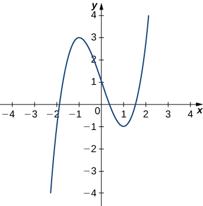{: #CNX_Calc_Figure_13_03_008}

First, let’s calculate the curvature at <math xmlns="http://www.w3.org/1998/Math/MathML"><mrow><mi>x</mi><mo>=</mo><mn>1</mn><mtext>:</mtext></mrow></math>

<math xmlns="http://www.w3.org/1998/Math/MathML"><mrow><mi>κ</mi><mo>=</mo><mfrac><mrow><mrow><mo>\|</mo><mrow><mi>f</mi><mtext>″</mtext><mrow><mo>(</mo><mi>x</mi><mo>)</mo></mrow></mrow><mo>\|</mo></mrow></mrow><mrow><msup><mrow><mrow><mo>(</mo><mrow><mn>1</mn><mo>+</mo><msup><mrow><mrow><mo>[</mo><mrow><msup><mi>f</mi><mo>′</mo></msup><mrow><mo>(</mo><mi>x</mi><mo>)</mo></mrow></mrow><mo>]</mo></mrow></mrow><mn>2</mn></msup></mrow><mo>)</mo></mrow></mrow><mrow><mrow><mn>3</mn><mtext>/</mtext><mn>2</mn></mrow></mrow></msup></mrow></mfrac><mo>=</mo><mfrac><mrow><mrow><mo>\|</mo><mrow><mn>6</mn><mi>x</mi></mrow><mo>\|</mo></mrow></mrow><mrow><msup><mrow><mrow><mo>(</mo><mrow><mn>1</mn><mo>+</mo><msup><mrow><mrow><mo>[</mo><mrow><mn>3</mn><msup><mi>x</mi><mn>2</mn></msup><mo>−</mo><mn>3</mn></mrow><mo>]</mo></mrow></mrow><mn>2</mn></msup></mrow><mo>)</mo></mrow></mrow><mrow><mrow><mn>3</mn><mtext>/</mtext><mn>2</mn></mrow></mrow></msup></mrow></mfrac><mo>.</mo></mrow></math>

This gives <math xmlns="http://www.w3.org/1998/Math/MathML"><mrow><mi>κ</mi><mo>=</mo><mn>6.</mn></mrow></math>

 Therefore, the radius of the osculating circle is given by <math xmlns="http://www.w3.org/1998/Math/MathML"><mrow><mi>R</mi><mo>=</mo><mfrac><mn>1</mn><mi>κ</mi></mfrac><mo>=</mo><mfrac><mn>1</mn><mn>6</mn></mfrac><mo>.</mo></mrow></math>

 Next, we then calculate the coordinates of the center of the circle. When <math xmlns="http://www.w3.org/1998/Math/MathML"><mrow><mi>x</mi><mo>=</mo><mn>1</mn><mo>,</mo></mrow></math>

 the slope of the tangent line is zero. Therefore, the center of the osculating circle is directly above the point on the graph with coordinates <math xmlns="http://www.w3.org/1998/Math/MathML"><mrow><mrow><mo>(</mo><mrow><mn>1</mn><mo>,</mo><mn>−1</mn></mrow><mo>)</mo></mrow><mo>.</mo></mrow></math>

 The center is located at <math xmlns="http://www.w3.org/1998/Math/MathML"><mrow><mrow><mo>(</mo><mrow><mn>1</mn><mo>,</mo><mo>−</mo><mfrac><mn>5</mn><mn>6</mn></mfrac></mrow><mo>)</mo></mrow><mo>.</mo></mrow></math>

 The formula for a circle with radius *r* and center <math xmlns="http://www.w3.org/1998/Math/MathML"><mrow><mrow><mo>(</mo><mrow><mi>h</mi><mo>,</mo><mi>k</mi></mrow><mo>)</mo></mrow></mrow></math>

 is given by <math xmlns="http://www.w3.org/1998/Math/MathML"><mrow><msup><mrow><mrow><mo>(</mo><mrow><mi>x</mi><mo>−</mo><mi>h</mi></mrow><mo>)</mo></mrow></mrow><mn>2</mn></msup><mo>+</mo><msup><mrow><mrow><mo>(</mo><mrow><mi>y</mi><mo>−</mo><mi>k</mi></mrow><mo>)</mo></mrow></mrow><mn>2</mn></msup><mo>=</mo><msup><mi>r</mi><mn>2</mn></msup><mo>.</mo></mrow></math>

 Therefore, the equation of the osculating circle is <math xmlns="http://www.w3.org/1998/Math/MathML"><mrow><msup><mrow><mrow><mo>(</mo><mrow><mi>x</mi><mo>−</mo><mn>1</mn></mrow><mo>)</mo></mrow></mrow><mn>2</mn></msup><mo>+</mo><msup><mrow><mrow><mo>(</mo><mrow><mi>y</mi><mo>+</mo><mfrac><mn>5</mn><mn>6</mn></mfrac></mrow><mo>)</mo></mrow></mrow><mn>2</mn></msup><mo>=</mo><mfrac><mn>1</mn><mrow><mn>36</mn></mrow></mfrac><mo>.</mo></mrow></math>

 The graph and its osculating circle appears in the following graph.

{: #CNX_Calc_Figure_13_03_009}

Find the equation of the osculating circle of the curve defined by the vector-valued function <math xmlns="http://www.w3.org/1998/Math/MathML"><mrow><mi>y</mi><mo>=</mo><mn>2</mn><msup><mi>x</mi><mn>2</mn></msup><mo>−</mo><mn>4</mn><mi>x</mi><mo>+</mo><mn>5</mn></mrow></math>

 at <math xmlns="http://www.w3.org/1998/Math/MathML"><mrow><mi>x</mi><mo>=</mo><mn>1.</mn></mrow></math>

<math xmlns="http://www.w3.org/1998/Math/MathML"><mrow><mi>κ</mi><mo>=</mo><mfrac><mn>4</mn><mrow><msup><mrow><mrow><mo>[</mo><mrow><mn>1</mn><mo>+</mo><msup><mrow><mrow><mo>(</mo><mrow><mn>4</mn><mi>x</mi><mo>−</mo><mn>4</mn></mrow><mo>)</mo></mrow></mrow><mn>2</mn></msup></mrow><mo>]</mo></mrow></mrow><mrow><mrow><mn>3</mn><mtext>/</mtext><mn>2</mn></mrow></mrow></msup></mrow></mfrac></mrow></math>

At the point <math xmlns="http://www.w3.org/1998/Math/MathML"><mrow><mi>x</mi><mo>=</mo><mn>1</mn><mo>,</mo></mrow></math>

 the curvature is equal to 4. Therefore, the radius of the osculating circle is <math xmlns="http://www.w3.org/1998/Math/MathML"><mrow><mfrac><mn>1</mn><mn>4</mn></mfrac><mo>.</mo></mrow></math>

A graph of this function appears next:* * *
{: data-type="newline"}

  
The vertex of this parabola is located at the point <math xmlns="http://www.w3.org/1998/Math/MathML"><mrow><mrow><mo>(</mo><mrow><mn>1</mn><mo>,</mo><mn>3</mn></mrow><mo>)</mo></mrow><mo>.</mo></mrow></math>

 Furthermore, the center of the osculating circle is directly above the vertex. Therefore, the coordinates of the center are <math xmlns="http://www.w3.org/1998/Math/MathML"><mrow><mrow><mo>(</mo><mrow><mn>1</mn><mo>,</mo><mfrac><mrow><mn>13</mn></mrow><mn>4</mn></mfrac></mrow><mo>)</mo></mrow><mo>.</mo></mrow></math>

 The equation of the osculating circle is

<math xmlns="http://www.w3.org/1998/Math/MathML"><mrow><msup><mrow><mrow><mo>(</mo><mrow><mi>x</mi><mo>−</mo><mn>1</mn></mrow><mo>)</mo></mrow></mrow><mn>2</mn></msup><mo>+</mo><msup><mrow><mrow><mo>(</mo><mrow><mi>y</mi><mo>−</mo><mfrac><mrow><mn>13</mn></mrow><mn>4</mn></mfrac></mrow><mo>)</mo></mrow></mrow><mn>2</mn></msup><mo>=</mo><mfrac><mn>1</mn><mrow><mn>16</mn></mrow></mfrac><mo>.</mo></mrow></math>

Hint

Use [[link]](#fs-id1169738200809) to find the curvature of the graph, then draw a graph of the function around <math xmlns="http://www.w3.org/1998/Math/MathML"><mrow><mi>x</mi><mo>=</mo><mn>1</mn></mrow></math>

 to help visualize the circle in relation to the graph.

### Key Concepts

* The arc-length function for a vector-valued function is calculated using the integral formula
  <math xmlns="http://www.w3.org/1998/Math/MathML"><mrow><mi>s</mi><mrow><mo>(</mo><mi>t</mi><mo>)</mo></mrow><mo>=</mo><mstyle displaystyle="true"><mrow><msubsup><mo stretchy="false">∫</mo><mi>a</mi><mi>t</mi></msubsup><mrow><mrow><mo>‖</mo><mrow><mstyle mathvariant="bold" mathsize="normal"><msup><mi>r</mi><mo>′</mo></msup></mstyle><mrow><mo>(</mo><mi>u</mi><mo>)</mo></mrow></mrow><mo>‖</mo></mrow><mspace width="0.2em" /><mi>d</mi><mi>u</mi></mrow></mrow></mstyle><mo>.</mo></mrow></math>
  
  This formula is valid in both two and three dimensions.
* The curvature of a curve at a point in either two or three dimensions is defined to be the curvature of the inscribed circle at that point. The arc-length parameterization is used in the definition of curvature.
* There are several different formulas for curvature. The curvature of a circle is equal to the reciprocal of its radius.
* The principal unit normal vector at *t* is defined to be
  * * *
  {: data-type="newline"}
  
  

  <math xmlns="http://www.w3.org/1998/Math/MathML"><mrow><mstyle mathvariant="bold" mathsize="normal"><mtext>N</mtext></mstyle><mrow><mo>(</mo><mi>t</mi><mo>)</mo></mrow><mo>=</mo><mfrac><mrow><mstyle mathvariant="bold" mathsize="normal"><msup><mi>T</mi><mo>′</mo></msup></mstyle><mrow><mo>(</mo><mi>t</mi><mo>)</mo></mrow></mrow><mrow><mrow><mo>‖</mo><mrow><mstyle mathvariant="bold" mathsize="normal"><msup><mi>T</mi><mo>′</mo></msup></mstyle><mrow><mo>(</mo><mi>t</mi><mo>)</mo></mrow></mrow><mo>‖</mo></mrow></mrow></mfrac><mo>.</mo></mrow></math>
  

* The binormal vector at *t* is defined as
  <math xmlns="http://www.w3.org/1998/Math/MathML"><mrow><mstyle mathvariant="bold" mathsize="normal"><mtext>B</mtext></mstyle><mrow><mo>(</mo><mi>t</mi><mo>)</mo></mrow><mo>=</mo><mstyle mathvariant="bold" mathsize="normal"><mtext>T</mtext></mstyle><mrow><mo>(</mo><mi>t</mi><mo>)</mo></mrow><mspace width="0.2em" /><mo>×</mo><mspace width="0.2em" /><mstyle mathvariant="bold" mathsize="normal"><mtext>N</mtext></mstyle><mrow><mo>(</mo><mi>t</mi><mo>)</mo></mrow><mo>,</mo></mrow></math>
  
  where
  <math xmlns="http://www.w3.org/1998/Math/MathML"><mrow><mstyle mathvariant="bold" mathsize="normal"><mtext>T</mtext></mstyle><mrow><mo>(</mo><mi>t</mi><mo>)</mo></mrow></mrow></math>
  
  is the unit tangent vector.
* The Frenet frame of reference is formed by the unit tangent vector, the principal unit normal vector, and the binormal vector.
* The osculating circle is tangent to a curve at a point and has the same curvature as the tangent curve at that point.
{: data-bullet-style="bullet"}

### Key Equations

* **Arc length of space curve**
  * * *
  {: data-type="newline"}
  
  <math xmlns="http://www.w3.org/1998/Math/MathML"><mrow><mi>s</mi><mo>=</mo><mstyle displaystyle="true"><mrow><msubsup><mo stretchy="false">∫</mo><mi>a</mi><mi>b</mi></msubsup><mrow><msqrt><mrow><mspace width="0.2em" /><msup><mrow><mrow><mo>[</mo><mrow><msup><mi>f</mi><mo>′</mo></msup><mrow><mo>(</mo><mi>t</mi><mo>)</mo></mrow></mrow><mo>]</mo></mrow></mrow><mn>2</mn></msup><mo>+</mo><msup><mrow><mrow><mo>[</mo><mrow><msup><mi>g</mi><mo>′</mo></msup><mrow><mo>(</mo><mi>t</mi><mo>)</mo></mrow></mrow><mo>]</mo></mrow></mrow><mn>2</mn></msup><mo>+</mo><msup><mrow><mrow><mo>[</mo><mrow><msup><mi>h</mi><mo>′</mo></msup><mrow><mo>(</mo><mi>t</mi><mo>)</mo></mrow></mrow><mo>]</mo></mrow></mrow><mn>2</mn></msup></mrow></msqrt></mrow></mrow></mstyle><mspace width="0.2em" /><mi>d</mi><mi>t</mi><mo>=</mo><mstyle displaystyle="true"><mrow><msubsup><mo stretchy="false">∫</mo><mi>a</mi><mi>b</mi></msubsup><mrow><mrow><mo>‖</mo><mrow><mstyle mathvariant="bold" mathsize="normal"><msup><mi>r</mi><mo>′</mo></msup></mstyle><mrow><mo>(</mo><mi>t</mi><mo>)</mo></mrow></mrow><mo>‖</mo></mrow></mrow></mrow></mstyle><mi>d</mi><mi>t</mi></mrow></math>

* **Arc-length function**
  * * *
  {: data-type="newline"}
  
  <math xmlns="http://www.w3.org/1998/Math/MathML"><mrow><mi>s</mi><mrow><mo>(</mo><mi>t</mi><mo>)</mo></mrow><mo>=</mo><mstyle displaystyle="true"><mrow><msubsup><mo stretchy="false">∫</mo><mi>a</mi><mi>t</mi></msubsup><mrow><msqrt><mrow><msup><mrow><mrow><mo>(</mo><mrow><msup><mi>f</mi><mo>′</mo></msup><mrow><mo>(</mo><mi>u</mi><mo>)</mo></mrow></mrow><mo>)</mo></mrow></mrow><mn>2</mn></msup><mo>+</mo><msup><mrow><mrow><mo>(</mo><mrow><msup><mi>g</mi><mo>′</mo></msup><mrow><mo>(</mo><mi>u</mi><mo>)</mo></mrow></mrow><mo>)</mo></mrow></mrow><mn>2</mn></msup><mo>+</mo><msup><mrow><mrow><mo>(</mo><mrow><msup><mi>h</mi><mo>′</mo></msup><mrow><mo>(</mo><mi>u</mi><mo>)</mo></mrow></mrow><mo>)</mo></mrow></mrow><mn>2</mn></msup></mrow></msqrt></mrow></mrow></mstyle><mi>d</mi><mi>u</mi><mspace width="0.2em" /><mtext>or</mtext><mspace width="0.2em" /><mi>s</mi><mrow><mo>(</mo><mi>t</mi><mo>)</mo></mrow><mo>=</mo><mstyle displaystyle="true"><mrow><msubsup><mo stretchy="false">∫</mo><mi>a</mi><mi>t</mi></msubsup><mrow><mrow><mo>‖</mo><mrow><mstyle mathvariant="bold" mathsize="normal"><msup><mi>r</mi><mo>′</mo></msup></mstyle><mrow><mo>(</mo><mi>u</mi><mo>)</mo></mrow></mrow><mo>‖</mo></mrow><mspace width="0.2em" /><mi>d</mi><mi>u</mi></mrow></mrow></mstyle></mrow></math>

* **Curvature**
  * * *
  {: data-type="newline"}
  
  <math xmlns="http://www.w3.org/1998/Math/MathML"><mrow><mi>κ</mi><mo>=</mo><mfrac><mrow><mrow><mo>‖</mo><mrow><mstyle mathvariant="bold" mathsize="normal"><msup><mi>T</mi><mo>′</mo></msup></mstyle><mrow><mo>(</mo><mi>t</mi><mo>)</mo></mrow></mrow><mo>‖</mo></mrow></mrow><mrow><mrow><mo>‖</mo><mrow><mstyle mathvariant="bold" mathsize="normal"><msup><mi>r</mi><mo>′</mo></msup></mstyle><mrow><mo>(</mo><mi>t</mi><mo>)</mo></mrow></mrow><mo>‖</mo></mrow></mrow></mfrac><mspace width="0.2em" /><mtext>or</mtext><mspace width="0.2em" /><mi>κ</mi><mo>=</mo><mfrac><mrow><mrow><mo>‖</mo><mrow><mstyle mathvariant="bold" mathsize="normal"><msup><mi>r</mi><mo>′</mo></msup></mstyle><mrow><mo>(</mo><mi>t</mi><mo>)</mo></mrow><mspace width="0.2em" /><mo>×</mo><mspace width="0.2em" /><mstyle mathvariant="bold" mathsize="normal"><mtext>r″</mtext></mstyle><mrow><mo>(</mo><mi>t</mi><mo>)</mo></mrow></mrow><mo>‖</mo></mrow></mrow><mrow><msup><mrow><mrow><mo>‖</mo><mrow><mstyle mathvariant="bold" mathsize="normal"><msup><mi>r</mi><mo>′</mo></msup></mstyle><mrow><mo>(</mo><mi>t</mi><mo>)</mo></mrow></mrow><mo>‖</mo></mrow></mrow><mn>3</mn></msup></mrow></mfrac><mspace width="0.2em" /><mtext>or</mtext><mspace width="0.2em" /><mi>κ</mi><mo>=</mo><mfrac><mrow><mrow><mo>\|</mo><mi>y</mi><mtext>″</mtext><mo>\|</mo></mrow></mrow><mrow><msup><mrow><mrow><mo>[</mo><mrow><mn>1</mn><mo>+</mo><msup><mrow><mrow><mo>(</mo><msup><mi>y</mi><mo>′</mo></msup><mo>)</mo></mrow></mrow><mn>2</mn></msup></mrow><mo>]</mo></mrow></mrow><mrow><mrow><mn>3</mn><mtext>/</mtext><mn>2</mn></mrow></mrow></msup></mrow></mfrac></mrow></math>

* **Principal unit normal vector**
  * * *
  {: data-type="newline"}
  
  <math xmlns="http://www.w3.org/1998/Math/MathML"><mrow><mstyle mathvariant="bold" mathsize="normal"><mtext>N</mtext></mstyle><mrow><mo>(</mo><mi>t</mi><mo>)</mo></mrow><mo>=</mo><mfrac><mrow><mstyle mathvariant="bold" mathsize="normal"><msup><mi>T</mi><mo>′</mo></msup></mstyle><mrow><mo>(</mo><mi>t</mi><mo>)</mo></mrow></mrow><mrow><mrow><mo>‖</mo><mrow><mstyle mathvariant="bold" mathsize="normal"><msup><mi>T</mi><mo>′</mo></msup></mstyle><mrow><mo>(</mo><mi>t</mi><mo>)</mo></mrow></mrow><mo>‖</mo></mrow></mrow></mfrac></mrow></math>

* **Binormal vector**
  * * *
  {: data-type="newline"}
  
  <math xmlns="http://www.w3.org/1998/Math/MathML"><mrow><mstyle mathvariant="bold" mathsize="normal"><mtext>B</mtext></mstyle><mrow><mo>(</mo><mi>t</mi><mo>)</mo></mrow><mo>=</mo><mstyle mathvariant="bold" mathsize="normal"><mtext>T</mtext></mstyle><mrow><mo>(</mo><mi>t</mi><mo>)</mo></mrow><mspace width="0.2em" /><mo>×</mo><mspace width="0.2em" /><mstyle mathvariant="bold" mathsize="normal"><mtext>N</mtext></mstyle><mrow><mo>(</mo><mi>t</mi><mo>)</mo></mrow></mrow></math>
{: data-bullet-style="bullet"}

<section data-depth="1" class="section-exercises" markdown="1">
Find the arc length of the curve on the given interval.

<math xmlns="http://www.w3.org/1998/Math/MathML"><mrow><mstyle mathvariant="bold" mathsize="normal"><mtext>r</mtext></mstyle><mo stretchy="false">(</mo><mi>t</mi><mo stretchy="false">)</mo><mo>=</mo><msup><mi>t</mi><mn>2</mn></msup><mstyle mathvariant="bold" mathsize="normal"><mtext>i</mtext></mstyle><mo>+</mo><mn>14</mn><mi>t</mi><mstyle mathvariant="bold" mathsize="normal"><mtext>j</mtext></mstyle><mo>,</mo><mspace width="0.2em" /><mn>0</mn><mo>≤</mo><mi>t</mi><mo>≤</mo><mn>7.</mn></mrow></math>

 This portion of the graph is shown here:

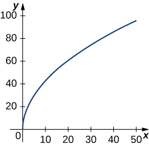

<math xmlns="http://www.w3.org/1998/Math/MathML"><mrow><mstyle mathvariant="bold" mathsize="normal"><mtext>r</mtext></mstyle><mo stretchy="false">(</mo><mi>t</mi><mo stretchy="false">)</mo><mo>=</mo><msup><mi>t</mi><mn>2</mn></msup><mstyle mathvariant="bold" mathsize="normal"><mtext>i</mtext></mstyle><mo>+</mo><mo stretchy="false">(</mo><mn>2</mn><msup><mi>t</mi><mn>2</mn></msup><mo>+</mo><mn>1</mn><mo stretchy="false">)</mo><mstyle mathvariant="bold" mathsize="normal"><mtext>j</mtext></mstyle><mo>,</mo><mspace width="0.2em" /><mn>1</mn><mo>≤</mo><mi>t</mi><mo>≤</mo><mn>3</mn></mrow></math>

<math xmlns="http://www.w3.org/1998/Math/MathML"><mrow><mn>8</mn><msqrt><mn>5</mn></msqrt></mrow></math>

<math xmlns="http://www.w3.org/1998/Math/MathML"><mrow><mstyle mathvariant="bold" mathsize="normal"><mtext>r</mtext></mstyle><mo stretchy="false">(</mo><mi>t</mi><mo stretchy="false">)</mo><mo>=</mo><mrow><mo>〈</mo><mrow><mn>2</mn><mspace width="0.1em" /><mtext>sin</mtext><mspace width="0.1em" /><mi>t</mi><mo>,</mo><mn>5</mn><mi>t</mi><mo>,</mo><mn>2</mn><mspace width="0.1em" /><mtext>cos</mtext><mspace width="0.1em" /><mi>t</mi></mrow><mo>〉</mo></mrow><mo>,</mo><mn>0</mn><mo>≤</mo><mi>t</mi><mo>≤</mo><mi>π</mi><mo>.</mo></mrow></math>

 This portion of the graph is shown here:

<math xmlns="http://www.w3.org/1998/Math/MathML"><mrow><mstyle mathvariant="bold" mathsize="normal"><mtext>r</mtext></mstyle><mo stretchy="false">(</mo><mi>t</mi><mo stretchy="false">)</mo><mo>=</mo><mrow><mo>〈</mo><mrow><msup><mi>t</mi><mn>2</mn></msup><mo>+</mo><mn>1</mn><mo>,</mo><mn>4</mn><msup><mi>t</mi><mn>3</mn></msup><mo>+</mo><mn>3</mn></mrow><mo>〉</mo></mrow><mo>,</mo><mspace width="0.2em" /><mo>−</mo><mn>1</mn><mo>≤</mo><mi>t</mi><mo>≤</mo><mn>0</mn></mrow></math>

<math xmlns="http://www.w3.org/1998/Math/MathML"><mrow><mfrac><mn>1</mn><mrow><mn>54</mn></mrow></mfrac><mrow><mo>(</mo><mrow><msup><mrow><mn>37</mn></mrow><mrow><mrow><mn>3</mn><mtext>/</mtext><mn>2</mn></mrow></mrow></msup><mo>−</mo><mn>1</mn></mrow><mo>)</mo></mrow></mrow></math>

<math xmlns="http://www.w3.org/1998/Math/MathML"><mrow><mstyle mathvariant="bold" mathsize="normal"><mtext>r</mtext></mstyle><mo stretchy="false">(</mo><mi>t</mi><mo stretchy="false">)</mo><mo>=</mo><mrow><mo>〈</mo><mrow><msup><mi>e</mi><mrow><mtext>−</mtext><mi>t</mi></mrow></msup><mtext>cos</mtext><mspace width="0.1em" /><mi>t</mi><mo>,</mo><msup><mi>e</mi><mrow><mtext>−</mtext><mi>t</mi></mrow></msup><mtext>sin</mtext><mspace width="0.1em" /><mi>t</mi></mrow><mo>〉</mo></mrow></mrow></math>

 over the interval <math xmlns="http://www.w3.org/1998/Math/MathML"><mrow><mrow><mo>[</mo><mrow><mn>0</mn><mo>,</mo><mfrac><mi>π</mi><mn>2</mn></mfrac></mrow><mo>]</mo></mrow><mo>.</mo></mrow></math>

 Here is the portion of the graph on the indicated interval:

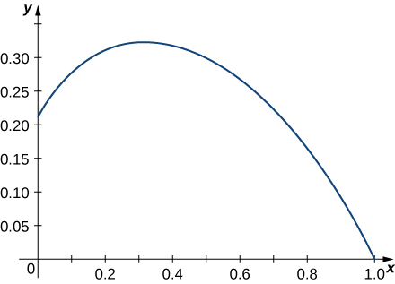

Find the length of one turn of the helix given by <math xmlns="http://www.w3.org/1998/Math/MathML"><mrow><mstyle mathvariant="bold" mathsize="normal"><mtext>r</mtext></mstyle><mo stretchy="false">(</mo><mi>t</mi><mo stretchy="false">)</mo><mo>=</mo><mfrac><mn>1</mn><mn>2</mn></mfrac><mtext>cos</mtext><mspace width="0.1em" /><mi>t</mi><mstyle mathvariant="bold" mathsize="normal"><mtext>i</mtext></mstyle><mo>+</mo><mfrac><mn>1</mn><mn>2</mn></mfrac><mtext>sin</mtext><mspace width="0.1em" /><mi>t</mi><mstyle mathvariant="bold" mathsize="normal"><mtext>j</mtext></mstyle><mo>+</mo><msqrt><mrow><mfrac><mn>3</mn><mn>4</mn></mfrac></mrow></msqrt><mspace width="0.2em" /><mi>t</mi><mspace width="0.2em" /><mstyle mathvariant="bold" mathsize="normal"><mtext>k</mtext></mstyle><mo>.</mo></mrow></math>

Length <math xmlns="http://www.w3.org/1998/Math/MathML"><mrow><mo>=</mo><mn>2</mn><mi>π</mi></mrow></math>

Find the arc length of the vector-valued function <math xmlns="http://www.w3.org/1998/Math/MathML"><mrow><mstyle mathvariant="bold" mathsize="normal"><mtext>r</mtext></mstyle><mo stretchy="false">(</mo><mi>t</mi><mo stretchy="false">)</mo><mo>=</mo><mo>−</mo><mi>t</mi><mstyle mathvariant="bold" mathsize="normal"><mtext>i</mtext></mstyle><mo>+</mo><mn>4</mn><mi>t</mi><mstyle mathvariant="bold" mathsize="normal"><mtext>j</mtext></mstyle><mo>+</mo><mn>3</mn><mi>t</mi><mstyle mathvariant="bold" mathsize="normal"><mtext>k</mtext></mstyle></mrow></math>

 over <math xmlns="http://www.w3.org/1998/Math/MathML"><mrow><mo stretchy="false">[</mo><mn>0</mn><mo>,</mo><mn>1</mn><mo stretchy="false">]</mo><mo>.</mo></mrow></math>

A particle travels in a circle with the equation of motion <math xmlns="http://www.w3.org/1998/Math/MathML"><mrow><mstyle mathvariant="bold" mathsize="normal"><mtext>r</mtext></mstyle><mo stretchy="false">(</mo><mi>t</mi><mo stretchy="false">)</mo><mo>=</mo><mn>3</mn><mspace width="0.1em" /><mtext>cos</mtext><mspace width="0.1em" /><mi>t</mi><mstyle mathvariant="bold" mathsize="normal"><mtext>i</mtext></mstyle><mo>+</mo><mn>3</mn><mspace width="0.1em" /><mtext>sin</mtext><mspace width="0.1em" /><mi>t</mi><mstyle mathvariant="bold" mathsize="normal"><mtext>j</mtext></mstyle><mo>+</mo><mn>0</mn><mstyle mathvariant="bold" mathsize="normal"><mtext>k</mtext></mstyle><mo>.</mo></mrow></math>

 Find the distance traveled around the circle by the particle.

<math xmlns="http://www.w3.org/1998/Math/MathML"><mrow><mn>6</mn><mi>π</mi></mrow></math>

Set up an integral to find the circumference of the ellipse with the equation <math xmlns="http://www.w3.org/1998/Math/MathML"><mrow><mstyle mathvariant="bold" mathsize="normal"><mtext>r</mtext></mstyle><mo stretchy="false">(</mo><mi>t</mi><mo stretchy="false">)</mo><mo>=</mo><mtext>cos</mtext><mspace width="0.1em" /><mi>t</mi><mstyle mathvariant="bold" mathsize="normal"><mtext>i</mtext></mstyle><mo>+</mo><mn>2</mn><mspace width="0.1em" /><mtext>sin</mtext><mspace width="0.1em" /><mi>t</mi><mstyle mathvariant="bold" mathsize="normal"><mtext>j</mtext></mstyle><mo>+</mo><mn>0</mn><mstyle mathvariant="bold" mathsize="normal"><mtext>k</mtext></mstyle><mo>.</mo></mrow></math>

Find the length of the curve <math xmlns="http://www.w3.org/1998/Math/MathML"><mrow><mstyle mathvariant="bold" mathsize="normal"><mtext>r</mtext></mstyle><mo stretchy="false">(</mo><mi>t</mi><mo stretchy="false">)</mo><mo>=</mo><mrow><mo>〈</mo><mrow><msqrt><mn>2</mn></msqrt><mi>t</mi><mo>,</mo><msup><mi>e</mi><mi>t</mi></msup><mo>,</mo><msup><mi>e</mi><mrow><mtext>−</mtext><mi>t</mi></mrow></msup></mrow><mo>〉</mo></mrow></mrow></math>

 over the interval <math xmlns="http://www.w3.org/1998/Math/MathML"><mrow><mn>0</mn><mo>≤</mo><mi>t</mi><mo>≤</mo><mn>1.</mn></mrow></math>

 The graph is shown here:

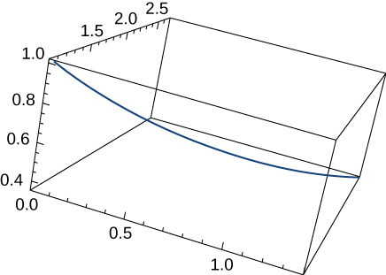

<math xmlns="http://www.w3.org/1998/Math/MathML"><mrow><mi>e</mi><mo>−</mo><mfrac><mn>1</mn><mi>e</mi></mfrac></mrow></math>

Find the length of the curve <math xmlns="http://www.w3.org/1998/Math/MathML"><mrow><mstyle mathvariant="bold" mathsize="normal"><mtext>r</mtext></mstyle><mo stretchy="false">(</mo><mi>t</mi><mo stretchy="false">)</mo><mo>=</mo><mrow><mo>〈</mo><mrow><mn>2</mn><mspace width="0.1em" /><mtext>sin</mtext><mspace width="0.1em" /><mi>t</mi><mo>,</mo><mn>5</mn><mi>t</mi><mo>,</mo><mn>2</mn><mspace width="0.1em" /><mtext>cos</mtext><mspace width="0.1em" /><mi>t</mi></mrow><mo>〉</mo></mrow></mrow></math>

 for <math xmlns="http://www.w3.org/1998/Math/MathML"><mrow><mi>t</mi><mo>∈</mo><mrow><mo>[</mo><mrow><mn>−10</mn><mo>,</mo><mn>10</mn></mrow><mo>]</mo></mrow><mo>.</mo></mrow></math>

The position function for a particle is <math xmlns="http://www.w3.org/1998/Math/MathML"><mrow><mstyle mathvariant="bold" mathsize="normal"><mtext>r</mtext></mstyle><mo stretchy="false">(</mo><mi>t</mi><mo stretchy="false">)</mo><mo>=</mo><mi>a</mi><mspace width="0.1em" /><mtext>cos</mtext><mo stretchy="false">(</mo><mi>ω</mi><mi>t</mi><mo stretchy="false">)</mo><mstyle mathvariant="bold" mathsize="normal"><mtext>i</mtext></mstyle><mo>+</mo><mi>b</mi><mspace width="0.1em" /><mtext>sin</mtext><mo stretchy="false">(</mo><mi>ω</mi><mi>t</mi><mo stretchy="false">)</mo><mstyle mathvariant="bold" mathsize="normal"><mtext>j</mtext></mstyle><mo>.</mo></mrow></math>

 Find the unit tangent vector and the unit normal vector at <math xmlns="http://www.w3.org/1998/Math/MathML"><mrow><mi>t</mi><mo>=</mo><mn>0.</mn></mrow></math>

<math xmlns="http://www.w3.org/1998/Math/MathML"><mrow><mstyle mathvariant="bold" mathsize="normal"><mtext>T</mtext></mstyle><mo stretchy="false">(</mo><mn>0</mn><mo stretchy="false">)</mo><mo>=</mo><mstyle mathvariant="bold" mathsize="normal"><mtext>j</mtext></mstyle><mo>,</mo></mrow></math>

 <math xmlns="http://www.w3.org/1998/Math/MathML"><mrow><mstyle mathvariant="bold" mathsize="normal"><mtext>N</mtext></mstyle><mo stretchy="false">(</mo><mn>0</mn><mo stretchy="false">)</mo><mo>=</mo><mo>−</mo><mstyle mathvariant="bold" mathsize="normal"><mtext>i</mtext></mstyle></mrow></math>

Given <math xmlns="http://www.w3.org/1998/Math/MathML"><mrow><mstyle mathvariant="bold" mathsize="normal"><mtext>r</mtext></mstyle><mo stretchy="false">(</mo><mi>t</mi><mo stretchy="false">)</mo><mo>=</mo><mi>a</mi><mspace width="0.1em" /><mtext>cos</mtext><mo stretchy="false">(</mo><mi>ω</mi><mi>t</mi><mo stretchy="false">)</mo><mstyle mathvariant="bold" mathsize="normal"><mtext>i</mtext></mstyle><mo>+</mo><mi>b</mi><mspace width="0.1em" /><mtext>sin</mtext><mo stretchy="false">(</mo><mi>ω</mi><mi>t</mi><mo stretchy="false">)</mo><mstyle mathvariant="bold" mathsize="normal"><mtext>j</mtext></mstyle><mo>,</mo></mrow></math>

 find the binormal vector <math xmlns="http://www.w3.org/1998/Math/MathML"><mrow><mstyle mathvariant="bold" mathsize="normal"><mtext>B</mtext></mstyle><mo stretchy="false">(</mo><mn>0</mn><mo stretchy="false">)</mo><mo>.</mo></mrow></math>

Given <math xmlns="http://www.w3.org/1998/Math/MathML"><mrow><mstyle mathvariant="bold" mathsize="normal"><mtext>r</mtext></mstyle><mo stretchy="false">(</mo><mi>t</mi><mo stretchy="false">)</mo><mo>=</mo><mrow><mo>〈</mo><mrow><mn>2</mn><msup><mi>e</mi><mi>t</mi></msup><mo>,</mo><msup><mi>e</mi><mi>t</mi></msup><mtext>cos</mtext><mspace width="0.1em" /><mi>t</mi><mo>,</mo><msup><mi>e</mi><mi>t</mi></msup><mtext>sin</mtext><mspace width="0.1em" /><mi>t</mi></mrow><mo>〉</mo></mrow><mo>,</mo></mrow></math>

 determine the unit tangent vector <math xmlns="http://www.w3.org/1998/Math/MathML"><mrow><mstyle mathvariant="bold" mathsize="normal"><mtext>T</mtext></mstyle><mo stretchy="false">(</mo><mi>t</mi><mo stretchy="false">)</mo><mo>.</mo></mrow></math>

<math xmlns="http://www.w3.org/1998/Math/MathML"><mrow><mstyle mathvariant="bold" mathsize="normal"><mtext>T</mtext></mstyle><mo stretchy="false">(</mo><mi>t</mi><mo stretchy="false">)</mo><mo>=</mo><mrow><mo>〈</mo><mrow><mn>2</mn><msup><mi>e</mi><mi>t</mi></msup><mo>,</mo><msup><mi>e</mi><mi>t</mi></msup><mtext>cos</mtext><mspace width="0.1em" /><mi>t</mi><mo>−</mo><msup><mi>e</mi><mi>t</mi></msup><mtext>sin</mtext><mspace width="0.1em" /><mi>t</mi><mo>,</mo><msup><mi>e</mi><mi>t</mi></msup><mtext>cos</mtext><mspace width="0.1em" /><mi>t</mi><mo>+</mo><msup><mi>e</mi><mi>t</mi></msup><mtext>sin</mtext><mspace width="0.1em" /><mi>t</mi></mrow><mo>〉</mo></mrow></mrow></math>

Given <math xmlns="http://www.w3.org/1998/Math/MathML"><mrow><mstyle mathvariant="bold" mathsize="normal"><mtext>r</mtext></mstyle><mo stretchy="false">(</mo><mi>t</mi><mo stretchy="false">)</mo><mo>=</mo><mrow><mo>〈</mo><mrow><mn>2</mn><msup><mi>e</mi><mi>t</mi></msup><mo>,</mo><msup><mi>e</mi><mi>t</mi></msup><mtext>cos</mtext><mspace width="0.1em" /><mi>t</mi><mo>,</mo><msup><mi>e</mi><mi>t</mi></msup><mtext>sin</mtext><mspace width="0.1em" /><mi>t</mi></mrow><mo>〉</mo></mrow><mo>,</mo></mrow></math>

 determine the unit tangent vector <math xmlns="http://www.w3.org/1998/Math/MathML"><mrow><mstyle mathvariant="bold" mathsize="normal"><mtext>T</mtext></mstyle><mo stretchy="false">(</mo><mi>t</mi><mo stretchy="false">)</mo></mrow></math>

 evaluated at <math xmlns="http://www.w3.org/1998/Math/MathML"><mrow><mi>t</mi><mo>=</mo><mn>0.</mn></mrow></math>

Given <math xmlns="http://www.w3.org/1998/Math/MathML"><mrow><mstyle mathvariant="bold" mathsize="normal"><mtext>r</mtext></mstyle><mo stretchy="false">(</mo><mi>t</mi><mo stretchy="false">)</mo><mo>=</mo><mrow><mo>〈</mo><mrow><mn>2</mn><msup><mi>e</mi><mi>t</mi></msup><mo>,</mo><msup><mi>e</mi><mi>t</mi></msup><mtext>cos</mtext><mspace width="0.1em" /><mi>t</mi><mo>,</mo><msup><mi>e</mi><mi>t</mi></msup><mtext>sin</mtext><mspace width="0.1em" /><mi>t</mi></mrow><mo>〉</mo></mrow><mo>,</mo></mrow></math>

 find the unit normal vector <math xmlns="http://www.w3.org/1998/Math/MathML"><mrow><mstyle mathvariant="bold" mathsize="normal"><mtext>N</mtext></mstyle><mo stretchy="false">(</mo><mi>t</mi><mo stretchy="false">)</mo></mrow></math>

 evaluated at <math xmlns="http://www.w3.org/1998/Math/MathML"><mrow><mi>t</mi><mo>=</mo><mn>0</mn><mo>,</mo></mrow></math>

 <math xmlns="http://www.w3.org/1998/Math/MathML"><mrow><mstyle mathvariant="bold" mathsize="normal"><mtext>N</mtext></mstyle><mo stretchy="false">(</mo><mn>0</mn><mo stretchy="false">)</mo><mo>.</mo></mrow></math>

<math xmlns="http://www.w3.org/1998/Math/MathML"><mrow><mstyle mathvariant="bold" mathsize="normal"><mtext>N</mtext></mstyle><mo stretchy="false">(</mo><mn>0</mn><mo stretchy="false">)</mo><mo>=</mo><mrow><mo>〈</mo><mrow><mfrac><mrow><msqrt><mn>2</mn></msqrt></mrow><mn>2</mn></mfrac><mo>,</mo><mn>0</mn><mo>,</mo><mfrac><mrow><msqrt><mn>2</mn></msqrt></mrow><mn>2</mn></mfrac></mrow><mo>〉</mo></mrow></mrow></math>

Given <math xmlns="http://www.w3.org/1998/Math/MathML"><mrow><mstyle mathvariant="bold" mathsize="normal"><mtext>r</mtext></mstyle><mo stretchy="false">(</mo><mi>t</mi><mo stretchy="false">)</mo><mo>=</mo><mrow><mo>〈</mo><mrow><mn>2</mn><msup><mi>e</mi><mi>t</mi></msup><mo>,</mo><msup><mi>e</mi><mi>t</mi></msup><mtext>cos</mtext><mspace width="0.1em" /><mi>t</mi><mo>,</mo><msup><mi>e</mi><mi>t</mi></msup><mtext>sin</mtext><mspace width="0.1em" /><mi>t</mi></mrow><mo>〉</mo></mrow><mo>,</mo></mrow></math>

 find the unit normal vector evaluated at <math xmlns="http://www.w3.org/1998/Math/MathML"><mrow><mi>t</mi><mo>=</mo><mn>0.</mn></mrow></math>

Given <math xmlns="http://www.w3.org/1998/Math/MathML"><mrow><mstyle mathvariant="bold" mathsize="normal"><mtext>r</mtext></mstyle><mo stretchy="false">(</mo><mi>t</mi><mo stretchy="false">)</mo><mo>=</mo><mi>t</mi><mstyle mathvariant="bold" mathsize="normal"><mtext>i</mtext></mstyle><mo>+</mo><msup><mi>t</mi><mn>2</mn></msup><mstyle mathvariant="bold" mathsize="normal"><mtext>j</mtext></mstyle><mo>+</mo><mi>t</mi><mstyle mathvariant="bold" mathsize="normal"><mtext>k</mtext></mstyle><mo>,</mo></mrow></math>

 find the unit tangent vector <math xmlns="http://www.w3.org/1998/Math/MathML"><mrow><mstyle mathvariant="bold" mathsize="normal"><mtext>T</mtext></mstyle><mo stretchy="false">(</mo><mi>t</mi><mo stretchy="false">)</mo><mo>.</mo></mrow></math>

 The graph is shown here:

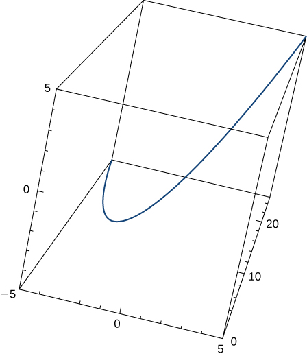

<math xmlns="http://www.w3.org/1998/Math/MathML"><mrow><mstyle mathvariant="bold" mathsize="normal"><mtext>T</mtext></mstyle><mo stretchy="false">(</mo><mi>t</mi><mo stretchy="false">)</mo><mo>=</mo><mfrac><mn>1</mn><mrow><msqrt><mrow><mn>4</mn><msup><mi>t</mi><mn>2</mn></msup><mo>+</mo><mn>2</mn></mrow></msqrt></mrow></mfrac><mo>&lt;</mo><mn>1</mn><mo>,</mo><mn>2</mn><mi>t</mi><mo>,</mo><mn>1</mn><mo>&gt;</mo></mrow></math>

Find the unit tangent vector <math xmlns="http://www.w3.org/1998/Math/MathML"><mrow><mstyle mathvariant="bold" mathsize="normal"><mtext>T</mtext></mstyle><mo stretchy="false">(</mo><mi>t</mi><mo stretchy="false">)</mo></mrow></math>

 and unit normal vector <math xmlns="http://www.w3.org/1998/Math/MathML"><mrow><mstyle mathvariant="bold" mathsize="normal"><mtext>N</mtext></mstyle><mo stretchy="false">(</mo><mi>t</mi><mo stretchy="false">)</mo></mrow></math>

 at <math xmlns="http://www.w3.org/1998/Math/MathML"><mrow><mi>t</mi><mo>=</mo><mn>0</mn></mrow></math>

 for the plane curve <math xmlns="http://www.w3.org/1998/Math/MathML"><mrow><mstyle mathvariant="bold" mathsize="normal"><mtext>r</mtext></mstyle><mo stretchy="false">(</mo><mi>t</mi><mo stretchy="false">)</mo><mo>=</mo><mrow><mo>〈</mo><mrow><msup><mi>t</mi><mn>3</mn></msup><mo>−</mo><mn>4</mn><mi>t</mi><mo>,</mo><mn>5</mn><msup><mi>t</mi><mn>2</mn></msup><mo>−</mo><mn>2</mn></mrow><mo>〉</mo></mrow><mo>.</mo></mrow></math>

 The graph is shown here:

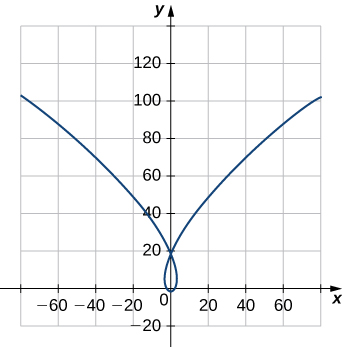

Find the unit tangent vector <math xmlns="http://www.w3.org/1998/Math/MathML"><mrow><mstyle mathvariant="bold" mathsize="normal"><mtext>T</mtext></mstyle><mo stretchy="false">(</mo><mi>t</mi><mo stretchy="false">)</mo></mrow></math>

 for <math xmlns="http://www.w3.org/1998/Math/MathML"><mrow><mstyle mathvariant="bold" mathsize="normal"><mtext>r</mtext></mstyle><mo stretchy="false">(</mo><mi>t</mi><mo stretchy="false">)</mo><mo>=</mo><mn>3</mn><mi>t</mi><mstyle mathvariant="bold" mathsize="normal"><mtext>i</mtext></mstyle><mo>+</mo><mn>5</mn><msup><mi>t</mi><mn>2</mn></msup><mstyle mathvariant="bold" mathsize="normal"><mtext>j</mtext></mstyle><mo>+</mo><mn>2</mn><mi>t</mi><mstyle mathvariant="bold" mathsize="normal"><mtext>k</mtext></mstyle></mrow></math>

<math xmlns="http://www.w3.org/1998/Math/MathML"><mrow><mstyle mathvariant="bold" mathsize="normal"><mtext>T</mtext></mstyle><mo stretchy="false">(</mo><mi>t</mi><mo stretchy="false">)</mo><mo>=</mo><mfrac><mn>1</mn><mrow><msqrt><mrow><mn>100</mn><msup><mi>t</mi><mn>2</mn></msup><mo>+</mo><mn>13</mn></mrow></msqrt></mrow></mfrac><mrow><mo>(</mo><mrow><mn>3</mn><mstyle mathvariant="bold" mathsize="normal"><mtext>i</mtext></mstyle><mo>+</mo><mn>10</mn><mi>t</mi><mstyle mathvariant="bold" mathsize="normal"><mtext>j</mtext></mstyle><mo>+</mo><mn>2</mn><mstyle mathvariant="bold" mathsize="normal"><mtext>k</mtext></mstyle></mrow><mo>)</mo></mrow></mrow></math>

Find the principal normal vector to the curve <math xmlns="http://www.w3.org/1998/Math/MathML"><mrow><mstyle mathvariant="bold" mathsize="normal"><mtext>r</mtext></mstyle><mo stretchy="false">(</mo><mi>t</mi><mo stretchy="false">)</mo><mo>=</mo><mrow><mo>〈</mo><mrow><mn>6</mn><mspace width="0.1em" /><mtext>cos</mtext><mspace width="0.1em" /><mi>t</mi><mo>,</mo><mn>6</mn><mspace width="0.1em" /><mtext>sin</mtext><mspace width="0.1em" /><mi>t</mi></mrow><mo>〉</mo></mrow></mrow></math>

 at the point determined by <math xmlns="http://www.w3.org/1998/Math/MathML"><mrow><mi>t</mi><mo>=</mo><mrow><mi>π</mi><mtext>/</mtext><mn>3</mn></mrow><mo>.</mo></mrow></math>

Find <math xmlns="http://www.w3.org/1998/Math/MathML"><mrow><mstyle mathvariant="bold" mathsize="normal"><mtext>T</mtext></mstyle><mo stretchy="false">(</mo><mi>t</mi><mo stretchy="false">)</mo></mrow></math>

 for the curve <math xmlns="http://www.w3.org/1998/Math/MathML"><mrow><mstyle mathvariant="bold" mathsize="normal"><mtext>r</mtext></mstyle><mo stretchy="false">(</mo><mi>t</mi><mo stretchy="false">)</mo><mo>=</mo><mrow><mo>(</mo><mrow><msup><mi>t</mi><mn>3</mn></msup><mo>−</mo><mn>4</mn><mi>t</mi></mrow><mo>)</mo></mrow><mspace width="0.1em" /><mstyle mathvariant="bold" mathsize="normal"><mtext>i</mtext></mstyle><mo>+</mo><mrow><mo>(</mo><mrow><mn>5</mn><msup><mi>t</mi><mn>2</mn></msup><mo>−</mo><mn>2</mn></mrow><mo>)</mo></mrow><mspace width="0.1em" /><mstyle mathvariant="bold" mathsize="normal"><mtext>j</mtext></mstyle><mo>.</mo></mrow></math>

<math xmlns="http://www.w3.org/1998/Math/MathML"><mrow><mstyle mathvariant="bold" mathsize="normal"><mtext>T</mtext></mstyle><mo stretchy="false">(</mo><mi>t</mi><mo stretchy="false">)</mo><mo>=</mo><mfrac><mn>1</mn><mrow><msqrt><mrow><mn>9</mn><msup><mi>t</mi><mn>4</mn></msup><mo>+</mo><mn>76</mn><msup><mi>t</mi><mn>2</mn></msup><mo>+</mo><mn>16</mn></mrow></msqrt></mrow></mfrac><mrow><mo>(</mo><mrow><mrow><mo>[</mo><mrow><mn>3</mn><msup><mi>t</mi><mn>2</mn></msup><mo>−</mo><mn>4</mn></mrow><mo>]</mo></mrow><mstyle mathvariant="bold" mathsize="normal"><mtext>i</mtext></mstyle><mo>+</mo><mn>10</mn><mi>t</mi><mstyle mathvariant="bold" mathsize="normal"><mtext>j</mtext></mstyle></mrow><mo>)</mo></mrow></mrow></math>

Find <math xmlns="http://www.w3.org/1998/Math/MathML"><mrow><mstyle mathvariant="bold" mathsize="normal"><mtext>N</mtext></mstyle><mo stretchy="false">(</mo><mi>t</mi><mo stretchy="false">)</mo></mrow></math>

 for the curve <math xmlns="http://www.w3.org/1998/Math/MathML"><mrow><mstyle mathvariant="bold" mathsize="normal"><mtext>r</mtext></mstyle><mo stretchy="false">(</mo><mi>t</mi><mo stretchy="false">)</mo><mo>=</mo><mrow><mo>(</mo><mrow><msup><mi>t</mi><mn>3</mn></msup><mo>−</mo><mn>4</mn><mi>t</mi></mrow><mo>)</mo></mrow><mspace width="0.1em" /><mstyle mathvariant="bold" mathsize="normal"><mtext>i</mtext></mstyle><mo>+</mo><mrow><mo>(</mo><mrow><mn>5</mn><msup><mi>t</mi><mn>2</mn></msup><mo>−</mo><mn>2</mn></mrow><mo>)</mo></mrow><mspace width="0.1em" /><mstyle mathvariant="bold" mathsize="normal"><mtext>j</mtext></mstyle><mo>.</mo></mrow></math>

Find the unit normal vector <math xmlns="http://www.w3.org/1998/Math/MathML"><mrow><mstyle mathvariant="bold" mathsize="normal"><mtext>N</mtext></mstyle><mo stretchy="false">(</mo><mi>t</mi><mo stretchy="false">)</mo></mrow></math>

 for <math xmlns="http://www.w3.org/1998/Math/MathML"><mrow><mstyle mathvariant="bold" mathsize="normal"><mtext>r</mtext></mstyle><mo stretchy="false">(</mo><mi>t</mi><mo stretchy="false">)</mo><mo>=</mo><mrow><mo>〈</mo><mrow><mn>2</mn><mspace width="0.1em" /><mtext>sin</mtext><mspace width="0.1em" /><mi>t</mi><mo>,</mo><mn>5</mn><mi>t</mi><mo>,</mo><mn>2</mn><mspace width="0.1em" /><mtext>cos</mtext><mspace width="0.1em" /><mi>t</mi></mrow><mo>〉</mo></mrow><mo>.</mo></mrow></math>

<math xmlns="http://www.w3.org/1998/Math/MathML"><mrow><mstyle mathvariant="bold" mathsize="normal"><mtext>N</mtext></mstyle><mo stretchy="false">(</mo><mi>t</mi><mo stretchy="false">)</mo><mo>=</mo><mrow><mo>〈</mo><mrow><mtext>−</mtext><mtext>sin</mtext><mspace width="0.1em" /><mi>t</mi><mo>,</mo><mn>0</mn><mo>,</mo><mo>−</mo><mtext>cos</mtext><mspace width="0.1em" /><mi>t</mi></mrow><mo>〉</mo></mrow></mrow></math>

Find the unit tangent vector <math xmlns="http://www.w3.org/1998/Math/MathML"><mrow><mstyle mathvariant="bold" mathsize="normal"><mtext>T</mtext></mstyle><mo stretchy="false">(</mo><mi>t</mi><mo stretchy="false">)</mo></mrow></math>

 for <math xmlns="http://www.w3.org/1998/Math/MathML"><mrow><mstyle mathvariant="bold" mathsize="normal"><mtext>r</mtext></mstyle><mo stretchy="false">(</mo><mi>t</mi><mo stretchy="false">)</mo><mo>=</mo><mrow><mo>〈</mo><mrow><mn>2</mn><mspace width="0.1em" /><mtext>sin</mtext><mspace width="0.1em" /><mi>t</mi><mo>,</mo><mn>5</mn><mi>t</mi><mo>,</mo><mn>2</mn><mspace width="0.1em" /><mtext>cos</mtext><mspace width="0.1em" /><mi>t</mi></mrow><mo>〉</mo></mrow><mo>.</mo></mrow></math>

Find the arc-length function <math xmlns="http://www.w3.org/1998/Math/MathML"><mrow><mi>s</mi><mo stretchy="false">(</mo><mi>t</mi><mo stretchy="false">)</mo></mrow></math>

 for the line segment given by <math xmlns="http://www.w3.org/1998/Math/MathML"><mrow><mstyle mathvariant="bold" mathsize="normal"><mtext>r</mtext></mstyle><mo stretchy="false">(</mo><mi>t</mi><mo stretchy="false">)</mo><mo>=</mo><mrow><mo>〈</mo><mrow><mn>3</mn><mo>−</mo><mn>3</mn><mi>t</mi><mo>,</mo><mn>4</mn><mi>t</mi></mrow><mo>〉</mo></mrow><mo>.</mo></mrow></math>

 Write *r* as a parameter of *s.*

Arc-length function: <math xmlns="http://www.w3.org/1998/Math/MathML"><mrow><mi>s</mi><mo stretchy="false">(</mo><mi>t</mi><mo stretchy="false">)</mo><mo>=</mo><mn>5</mn><mi>t</mi><mo>;</mo></mrow></math>

 r as a parameter of *s*: <math xmlns="http://www.w3.org/1998/Math/MathML"><mrow><mstyle mathvariant="bold" mathsize="normal"><mtext>r</mtext></mstyle><mo stretchy="false">(</mo><mi>s</mi><mo stretchy="false">)</mo><mo>=</mo><mrow><mo>(</mo><mrow><mn>3</mn><mo>−</mo><mfrac><mrow><mn>3</mn><mi>s</mi></mrow><mn>5</mn></mfrac></mrow><mo>)</mo></mrow><mspace width="0.1em" /><mstyle mathvariant="bold" mathsize="normal"><mtext>i</mtext></mstyle><mo>+</mo><mfrac><mrow><mn>4</mn><mi>s</mi></mrow><mn>5</mn></mfrac><mstyle mathvariant="bold" mathsize="normal"><mtext>j</mtext></mstyle></mrow></math>

Parameterize the helix <math xmlns="http://www.w3.org/1998/Math/MathML"><mrow><mstyle mathvariant="bold" mathsize="normal"><mtext>r</mtext></mstyle><mo stretchy="false">(</mo><mi>t</mi><mo stretchy="false">)</mo><mo>=</mo><mtext>cos</mtext><mspace width="0.1em" /><mi>t</mi><mstyle mathvariant="bold" mathsize="normal"><mtext>i</mtext></mstyle><mo>+</mo><mtext>sin</mtext><mspace width="0.1em" /><mi>t</mi><mstyle mathvariant="bold" mathsize="normal"><mtext>j</mtext></mstyle><mo>+</mo><mi>t</mi><mstyle mathvariant="bold" mathsize="normal"><mtext>k</mtext></mstyle></mrow></math>

 using the arc-length parameter *s*, from <math xmlns="http://www.w3.org/1998/Math/MathML"><mrow><mi>t</mi><mo>=</mo><mn>0.</mn></mrow></math>

Parameterize the curve using the arc-length parameter *s*, at the point at which <math xmlns="http://www.w3.org/1998/Math/MathML"><mrow><mi>t</mi><mo>=</mo><mn>0</mn></mrow></math>

 for <math xmlns="http://www.w3.org/1998/Math/MathML"><mrow><mstyle mathvariant="bold" mathsize="normal"><mtext>r</mtext></mstyle><mo stretchy="false">(</mo><mi>t</mi><mo stretchy="false">)</mo><mo>=</mo><msup><mi>e</mi><mi>t</mi></msup><mtext>sin</mtext><mspace width="0.1em" /><mi>t</mi><mstyle mathvariant="bold" mathsize="normal"><mtext>i</mtext></mstyle><mo>+</mo><msup><mi>e</mi><mi>t</mi></msup><mtext>cos</mtext><mspace width="0.1em" /><mi>t</mi><mstyle mathvariant="bold" mathsize="normal"><mtext>j</mtext></mstyle><mo>.</mo></mrow></math>

<math xmlns="http://www.w3.org/1998/Math/MathML"><mrow><mstyle mathvariant="bold" mathsize="normal"><mtext>r</mtext></mstyle><mo stretchy="false">(</mo><mi>s</mi><mo stretchy="false">)</mo><mo>=</mo><mrow><mo>(</mo><mrow><mn>1</mn><mo>+</mo><mfrac><mi>s</mi><mrow><msqrt><mn>2</mn></msqrt></mrow></mfrac></mrow><mo>)</mo></mrow><mspace width="0.2em" /><mtext>sin</mtext><mrow><mo>(</mo><mrow><mtext>ln</mtext><mo stretchy="false">(</mo><mn>1</mn><mo>+</mo><mfrac><mi>s</mi><mrow><msqrt><mn>2</mn></msqrt></mrow></mfrac><mo stretchy="false">)</mo></mrow><mo>)</mo></mrow><mspace width="0.1em" /><mstyle mathvariant="bold" mathsize="normal"><mtext>i</mtext></mstyle><mo>+</mo><mrow><mo>(</mo><mrow><mn>1</mn><mo>+</mo><mfrac><mi>s</mi><mrow><msqrt><mn>2</mn></msqrt></mrow></mfrac></mrow><mo>)</mo></mrow><mspace width="0.2em" /><mtext>cos</mtext><mrow><mo>[</mo><mrow><mtext>ln</mtext><mrow><mo>(</mo><mrow><mn>1</mn><mo>+</mo><mfrac><mi>s</mi><mrow><msqrt><mn>2</mn></msqrt></mrow></mfrac></mrow><mo>)</mo></mrow></mrow><mo>]</mo></mrow><mstyle mathvariant="bold" mathsize="normal"><mtext>j</mtext></mstyle></mrow></math>

Find the curvature of the curve <math xmlns="http://www.w3.org/1998/Math/MathML"><mrow><mstyle mathvariant="bold" mathsize="normal"><mtext>r</mtext></mstyle><mo stretchy="false">(</mo><mi>t</mi><mo stretchy="false">)</mo><mo>=</mo><mn>5</mn><mspace width="0.1em" /><mtext>cos</mtext><mspace width="0.1em" /><mi>t</mi><mstyle mathvariant="bold" mathsize="normal"><mtext>i</mtext></mstyle><mo>+</mo><mn>4</mn><mspace width="0.1em" /><mtext>sin</mtext><mspace width="0.1em" /><mi>t</mi><mstyle mathvariant="bold" mathsize="normal"><mtext>j</mtext></mstyle></mrow></math>

 at <math xmlns="http://www.w3.org/1998/Math/MathML"><mrow><mi>t</mi><mo>=</mo><mrow><mi>π</mi><mtext>/</mtext><mn>3</mn></mrow><mo>.</mo></mrow></math>

 (*Note:* The graph is an ellipse.)

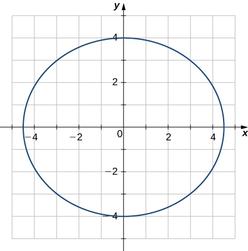

Find the *x*-coordinate at which the curvature of the curve <math xmlns="http://www.w3.org/1998/Math/MathML"><mrow><mi>y</mi><mo>=</mo><mrow><mn>1</mn><mtext>/</mtext><mi>x</mi></mrow></mrow></math>

 is a maximum value.

The maximum value of the curvature occurs at <math xmlns="http://www.w3.org/1998/Math/MathML"><mrow><mi>x</mi><mo>=</mo><mroot><mn>5</mn><mn>4</mn></mroot><mo>.</mo></mrow></math>

Find the curvature of the curve <math xmlns="http://www.w3.org/1998/Math/MathML"><mrow><mstyle mathvariant="bold" mathsize="normal"><mtext>r</mtext></mstyle><mo stretchy="false">(</mo><mi>t</mi><mo stretchy="false">)</mo><mo>=</mo><mn>5</mn><mspace width="0.1em" /><mtext>cos</mtext><mspace width="0.1em" /><mi>t</mi><mstyle mathvariant="bold" mathsize="normal"><mtext>i</mtext></mstyle><mo>+</mo><mn>5</mn><mspace width="0.1em" /><mtext>sin</mtext><mspace width="0.1em" /><mi>t</mi><mstyle mathvariant="bold" mathsize="normal"><mtext>j</mtext></mstyle><mo>.</mo></mrow></math>

 Does the curvature depend upon the parameter *t*?

Find the curvature <math xmlns="http://www.w3.org/1998/Math/MathML"><mi>κ</mi></math>

 for the curve <math xmlns="http://www.w3.org/1998/Math/MathML"><mrow><mi>y</mi><mo>=</mo><mi>x</mi><mo>−</mo><mfrac><mn>1</mn><mn>4</mn></mfrac><msup><mi>x</mi><mn>2</mn></msup></mrow></math>

 at the point <math xmlns="http://www.w3.org/1998/Math/MathML"><mrow><mi>x</mi><mo>=</mo><mn>2.</mn></mrow></math>

<math xmlns="http://www.w3.org/1998/Math/MathML"><mrow><mfrac><mn>1</mn><mn>2</mn></mfrac></mrow></math>

Find the curvature <math xmlns="http://www.w3.org/1998/Math/MathML"><mi>κ</mi></math>

 for the curve <math xmlns="http://www.w3.org/1998/Math/MathML"><mrow><mi>y</mi><mo>=</mo><mfrac><mn>1</mn><mn>3</mn></mfrac><msup><mi>x</mi><mn>3</mn></msup></mrow></math>

 at the point <math xmlns="http://www.w3.org/1998/Math/MathML"><mrow><mi>x</mi><mo>=</mo><mn>1.</mn></mrow></math>

Find the curvature <math xmlns="http://www.w3.org/1998/Math/MathML"><mi>κ</mi></math>

 of the curve <math xmlns="http://www.w3.org/1998/Math/MathML"><mrow><mstyle mathvariant="bold" mathsize="normal"><mtext>r</mtext></mstyle><mo stretchy="false">(</mo><mi>t</mi><mo stretchy="false">)</mo><mo>=</mo><mi>t</mi><mstyle mathvariant="bold" mathsize="normal"><mtext>i</mtext></mstyle><mo>+</mo><mn>6</mn><msup><mi>t</mi><mn>2</mn></msup><mstyle mathvariant="bold" mathsize="normal"><mtext>j</mtext></mstyle><mo>+</mo><mn>4</mn><mi>t</mi><mspace width="0.1em" /><mstyle mathvariant="bold" mathsize="normal"><mtext>k</mtext></mstyle><mo>.</mo></mrow></math>

 The graph is shown here:

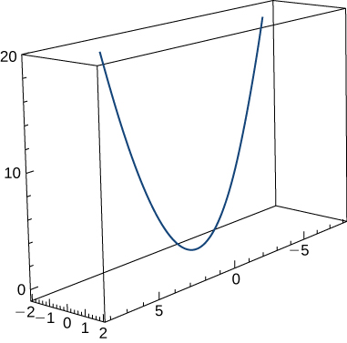

<math xmlns="http://www.w3.org/1998/Math/MathML"><mrow><mi>κ</mi><mo>≈</mo><mfrac><mrow><mn>49.477</mn></mrow><mrow><msup><mrow><mrow><mo>(</mo><mrow><mn>17</mn><mo>+</mo><mn>144</mn><msup><mi>t</mi><mn>2</mn></msup></mrow><mo>)</mo></mrow></mrow><mrow><mn>3</mn><mtext>/</mtext><mn>2</mn></mrow></msup></mrow></mfrac></mrow></math>

Find the curvature of <math xmlns="http://www.w3.org/1998/Math/MathML"><mrow><mstyle mathvariant="bold" mathsize="normal"><mtext>r</mtext></mstyle><mo stretchy="false">(</mo><mi>t</mi><mo stretchy="false">)</mo><mo>=</mo><mrow><mo>〈</mo><mrow><mn>2</mn><mspace width="0.1em" /><mtext>sin</mtext><mspace width="0.1em" /><mi>t</mi><mo>,</mo><mn>5</mn><mi>t</mi><mo>,</mo><mn>2</mn><mspace width="0.1em" /><mtext>cos</mtext><mspace width="0.1em" /><mi>t</mi></mrow><mo>〉</mo></mrow><mo>.</mo></mrow></math>

Find the curvature of <math xmlns="http://www.w3.org/1998/Math/MathML"><mrow><mstyle mathvariant="bold" mathsize="normal"><mtext>r</mtext></mstyle><mo stretchy="false">(</mo><mi>t</mi><mo stretchy="false">)</mo><mo>=</mo><msqrt><mn>2</mn></msqrt><mi>t</mi><mstyle mathvariant="bold" mathsize="normal"><mtext>i</mtext></mstyle><mo>+</mo><msup><mi>e</mi><mi>t</mi></msup><mstyle mathvariant="bold" mathsize="normal"><mtext>j</mtext></mstyle><mo>+</mo><msup><mi>e</mi><mrow><mtext>−</mtext><mi>t</mi></mrow></msup><mstyle mathvariant="bold" mathsize="normal"><mtext>k</mtext></mstyle></mrow></math>

 at point <math xmlns="http://www.w3.org/1998/Math/MathML"><mrow><mi>P</mi><mrow><mo>(</mo><mrow><mn>0</mn><mo>,</mo><mn>1</mn><mo>,</mo><mn>1</mn></mrow><mo>)</mo></mrow><mo>.</mo></mrow></math>

<math xmlns="http://www.w3.org/1998/Math/MathML"><mrow><mfrac><mn>1</mn><mrow><mn>2</mn><msqrt><mn>2</mn></msqrt></mrow></mfrac></mrow></math>

At what point does the curve <math xmlns="http://www.w3.org/1998/Math/MathML"><mrow><mi>y</mi><mo>=</mo><msup><mi>e</mi><mi>x</mi></msup></mrow></math>

 have maximum curvature?

What happens to the curvature as <math xmlns="http://www.w3.org/1998/Math/MathML"><mrow><mi>x</mi><mo stretchy="false">→</mo><mi>∞</mi></mrow></math>

 for the curve <math xmlns="http://www.w3.org/1998/Math/MathML"><mrow><mi>y</mi><mo>=</mo><msup><mi>e</mi><mi>x</mi></msup><mo>?</mo></mrow></math>

The curvature approaches zero.

Find the point of maximum curvature on the curve <math xmlns="http://www.w3.org/1998/Math/MathML"><mrow><mi>y</mi><mo>=</mo><mtext>ln</mtext><mspace width="0.1em" /><mi>x</mi><mo>.</mo></mrow></math>

Find the equations of the normal plane and the osculating plane of the curve <math xmlns="http://www.w3.org/1998/Math/MathML"><mrow><mstyle mathvariant="bold" mathsize="normal"><mtext>r</mtext></mstyle><mo stretchy="false">(</mo><mi>t</mi><mo stretchy="false">)</mo><mo>=</mo><mrow><mo>〈</mo><mrow><mn>2</mn><mspace width="0.1em" /><mtext>sin</mtext><mo stretchy="false">(</mo><mn>3</mn><mi>t</mi><mo stretchy="false">)</mo><mo>,</mo><mi>t</mi><mo>,</mo><mn>2</mn><mspace width="0.1em" /><mtext>cos</mtext><mo stretchy="false">(</mo><mn>3</mn><mi>t</mi><mo stretchy="false">)</mo></mrow><mo>〉</mo></mrow></mrow></math>

 at point <math xmlns="http://www.w3.org/1998/Math/MathML"><mrow><mrow><mo>(</mo><mrow><mn>0</mn><mo>,</mo><mi>π</mi><mo>,</mo><mn>−2</mn></mrow><mo>)</mo></mrow><mo>.</mo></mrow></math>

<math xmlns="http://www.w3.org/1998/Math/MathML"><mrow><mi>y</mi><mo>=</mo><mn>6</mn><mi>x</mi><mo>+</mo><mi>π</mi></mrow></math>

 and <math xmlns="http://www.w3.org/1998/Math/MathML"><mrow><mi>x</mi><mo>+</mo><mn>6</mn><mo>=</mo><mn>6</mn><mi>π</mi></mrow></math>

Find equations of the osculating circles of the ellipse <math xmlns="http://www.w3.org/1998/Math/MathML"><mrow><mn>4</mn><msup><mi>y</mi><mn>2</mn></msup><mo>+</mo><mn>9</mn><msup><mi>x</mi><mn>2</mn></msup><mo>=</mo><mn>36</mn></mrow></math>

 at the points <math xmlns="http://www.w3.org/1998/Math/MathML"><mrow><mo stretchy="false">(</mo><mn>2</mn><mo>,</mo><mn>0</mn><mo stretchy="false">)</mo></mrow></math>

 and <math xmlns="http://www.w3.org/1998/Math/MathML"><mrow><mo stretchy="false">(</mo><mn>0</mn><mo>,</mo><mn>3</mn><mo stretchy="false">)</mo><mo>.</mo></mrow></math>

Find the equation for the osculating plane at point <math xmlns="http://www.w3.org/1998/Math/MathML"><mrow><mi>t</mi><mo>=</mo><mrow><mi>π</mi><mtext>/</mtext><mn>4</mn></mrow></mrow></math>

 on the curve <math xmlns="http://www.w3.org/1998/Math/MathML"><mrow><mstyle mathvariant="bold" mathsize="normal"><mtext>r</mtext></mstyle><mo stretchy="false">(</mo><mi>t</mi><mo stretchy="false">)</mo><mo>=</mo><mtext>cos</mtext><mo stretchy="false">(</mo><mn>2</mn><mi>t</mi><mo stretchy="false">)</mo><mstyle mathvariant="bold" mathsize="normal"><mtext>i</mtext></mstyle><mo>+</mo><mtext>sin</mtext><mo stretchy="false">(</mo><mn>2</mn><mi>t</mi><mo stretchy="false">)</mo><mstyle mathvariant="bold" mathsize="normal"><mtext>j</mtext></mstyle><mo>+</mo><mi>t</mi><mo>.</mo></mrow></math>

<math xmlns="http://www.w3.org/1998/Math/MathML"><mrow><mi>x</mi><mo>+</mo><mn>2</mn><mi>z</mi><mo>=</mo><mfrac><mi>π</mi><mn>2</mn></mfrac></mrow></math>

Find the radius of curvature of <math xmlns="http://www.w3.org/1998/Math/MathML"><mrow><mn>6</mn><mi>y</mi><mo>=</mo><msup><mi>x</mi><mn>3</mn></msup></mrow></math>

 at the point <math xmlns="http://www.w3.org/1998/Math/MathML"><mrow><mrow><mo>(</mo><mrow><mn>2</mn><mo>,</mo><mfrac><mn>4</mn><mn>3</mn></mfrac></mrow><mo>)</mo></mrow><mo>.</mo></mrow></math>

Find the curvature at each point <math xmlns="http://www.w3.org/1998/Math/MathML"><mrow><mrow><mo>(</mo><mrow><mi>x</mi><mo>,</mo><mi>y</mi></mrow><mo>)</mo></mrow></mrow></math>

 on the hyperbola <math xmlns="http://www.w3.org/1998/Math/MathML"><mrow><mstyle mathvariant="bold" mathsize="normal"><mtext>r</mtext></mstyle><mo stretchy="false">(</mo><mi>t</mi><mo stretchy="false">)</mo><mo>=</mo><mrow><mo>〈</mo><mrow><mi>a</mi><mspace width="0.1em" /><mtext>cosh</mtext><mo stretchy="false">(</mo><mi>t</mi><mo stretchy="false">)</mo><mo>,</mo><mi>b</mi><mspace width="0.1em" /><mtext>sinh</mtext><mo stretchy="false">(</mo><mi>t</mi><mo stretchy="false">)</mo></mrow><mo>〉</mo></mrow><mo>.</mo></mrow></math>

<math xmlns="http://www.w3.org/1998/Math/MathML"><mrow><mfrac><mrow><msup><mi>a</mi><mn>4</mn></msup><msup><mi>b</mi><mn>4</mn></msup></mrow><mrow><msup><mrow><mrow><mo>(</mo><mrow><msup><mi>b</mi><mn>4</mn></msup><msup><mi>x</mi><mn>2</mn></msup><mo>+</mo><msup><mi>a</mi><mn>4</mn></msup><msup><mi>y</mi><mn>2</mn></msup></mrow><mo>)</mo></mrow></mrow><mrow><mn>3</mn><mtext>/</mtext><mn>2</mn></mrow></msup></mrow></mfrac></mrow></math>

Calculate the curvature of the circular helix <math xmlns="http://www.w3.org/1998/Math/MathML"><mrow><mstyle mathvariant="bold" mathsize="normal"><mtext>r</mtext></mstyle><mo stretchy="false">(</mo><mi>t</mi><mo stretchy="false">)</mo><mo>=</mo><mi>r</mi><mspace width="0.1em" /><mtext>sin</mtext><mo stretchy="false">(</mo><mi>t</mi><mo stretchy="false">)</mo><mstyle mathvariant="bold" mathsize="normal"><mtext>i</mtext></mstyle><mo>+</mo><mi>r</mi><mspace width="0.1em" /><mtext>cos</mtext><mo stretchy="false">(</mo><mi>t</mi><mo stretchy="false">)</mo><mstyle mathvariant="bold" mathsize="normal"><mtext>j</mtext></mstyle><mo>+</mo><mi>t</mi><mspace width="0.1em" /><mstyle mathvariant="bold" mathsize="normal"><mtext>k</mtext></mstyle><mo>.</mo></mrow></math>

Find the radius of curvature of <math xmlns="http://www.w3.org/1998/Math/MathML"><mrow><mi>y</mi><mo>=</mo><mtext>ln</mtext><mo stretchy="false">(</mo><mi>x</mi><mo>+</mo><mn>1</mn><mo stretchy="false">)</mo></mrow></math>

 at point <math xmlns="http://www.w3.org/1998/Math/MathML"><mrow><mrow><mo>(</mo><mrow><mn>2</mn><mo>,</mo><mtext>ln</mtext><mspace width="0.1em" /><mn>3</mn></mrow><mo>)</mo></mrow><mo>.</mo></mrow></math>

<math xmlns="http://www.w3.org/1998/Math/MathML"><mrow><mfrac><mrow><mn>10</mn><msqrt><mrow><mn>10</mn></mrow></msqrt></mrow><mn>3</mn></mfrac></mrow></math>

Find the radius of curvature of the hyperbola <math xmlns="http://www.w3.org/1998/Math/MathML"><mrow><mi>x</mi><mi>y</mi><mo>=</mo><mn>1</mn></mrow></math>

 at point <math xmlns="http://www.w3.org/1998/Math/MathML"><mrow><mo stretchy="false">(</mo><mn>1</mn><mo>,</mo><mn>1</mn><mo stretchy="false">)</mo><mo>.</mo></mrow></math>

A particle moves along the plane curve C described by <math xmlns="http://www.w3.org/1998/Math/MathML"><mrow><mstyle mathvariant="bold" mathsize="normal"><mtext>r</mtext></mstyle><mo stretchy="false">(</mo><mi>t</mi><mo stretchy="false">)</mo><mo>=</mo><mi>t</mi><mstyle mathvariant="bold" mathsize="normal"><mtext>i</mtext></mstyle><mo>+</mo><msup><mi>t</mi><mn>2</mn></msup><mstyle mathvariant="bold" mathsize="normal"><mtext>j</mtext></mstyle><mo>.</mo></mrow></math>

 Solve the following problems.

Find the length of the curve over the interval <math xmlns="http://www.w3.org/1998/Math/MathML"><mrow><mrow><mo>[</mo><mrow><mn>0</mn><mo>,</mo><mn>2</mn></mrow><mo>]</mo></mrow><mo>.</mo></mrow></math>

<math xmlns="http://www.w3.org/1998/Math/MathML"><mrow><mfrac><mrow><mn>38</mn></mrow><mn>3</mn></mfrac></mrow></math>

Find the curvature of the plane curve at <math xmlns="http://www.w3.org/1998/Math/MathML"><mrow><mi>t</mi><mo>=</mo><mn>0</mn><mo>,</mo><mn>1</mn><mo>,</mo><mn>2.</mn></mrow></math>

Describe the curvature as *t* increases from <math xmlns="http://www.w3.org/1998/Math/MathML"><mrow><mi>t</mi><mo>=</mo><mn>0</mn></mrow></math>

 to <math xmlns="http://www.w3.org/1998/Math/MathML"><mrow><mi>t</mi><mo>=</mo><mn>2.</mn></mrow></math>

The curvature is decreasing over this interval.

The surface of a large cup is formed by revolving the graph of the function <math xmlns="http://www.w3.org/1998/Math/MathML"><mrow><mi>y</mi><mo>=</mo><mn>0.25</mn><msup><mi>x</mi><mrow><mn>1.6</mn></mrow></msup></mrow></math>

 from <math xmlns="http://www.w3.org/1998/Math/MathML"><mrow><mi>x</mi><mo>=</mo><mn>0</mn></mrow></math>

 to <math xmlns="http://www.w3.org/1998/Math/MathML"><mrow><mi>x</mi><mo>=</mo><mn>5</mn></mrow></math>

 about the *y*-axis (measured in centimeters).

**[T]** Use technology to graph the surface.

Find the curvature <math xmlns="http://www.w3.org/1998/Math/MathML"><mi>κ</mi></math>

 of the generating curve as a function of *x.*

<math xmlns="http://www.w3.org/1998/Math/MathML"><mrow><mi>κ</mi><mo>=</mo><mfrac><mn>6</mn><mrow><msup><mi>x</mi><mrow><mn>2</mn><mtext>/</mtext><mn>5</mn></mrow></msup><mrow><mo>(</mo><mrow><mn>25</mn><mo>+</mo><mn>4</mn><msup><mi>x</mi><mrow><mn>6</mn><mtext>/</mtext><mn>5</mn></mrow></msup></mrow><mo>)</mo></mrow></mrow></mfrac></mrow></math>

**[T]** Use technology to graph the curvature function.

</section>

### Glossary
{: data-type="glossary-title"}

arc-length function
: a function
  <math xmlns="http://www.w3.org/1998/Math/MathML"><mrow><mi>s</mi><mrow><mo>(</mo><mi>t</mi><mo>)</mo></mrow></mrow></math>
  
  that describes the arc length of curve *C* as a function of *t*
^

arc-length parameterization
: a reparameterization of a vector-valued function in which the parameter is equal to the arc length
^

binormal vector
: a unit vector orthogonal to the unit tangent vector and the unit normal vector
^

curvature
: the derivative of the unit tangent vector with respect to the arc-length parameter
^

Frenet frame of reference
: (TNB frame) a frame of reference in three-dimensional space formed by the unit tangent vector, the unit normal vector, and the binormal vector
^

normal plane
: a plane that is perpendicular to a curve at any point on the curve
^

osculating circle
: a circle that is tangent to a curve *C* at a point *P* and that shares the same curvature
^

osculating plane
: the plane determined by the unit tangent and the unit normal vector
^

principal unit normal vector
: a vector orthogonal to the unit tangent vector, given by the formula
  <math xmlns="http://www.w3.org/1998/Math/MathML"><mrow><mfrac><mrow><mstyle mathvariant="bold" mathsize="normal"><msup><mi>T</mi><mo>′</mo></msup></mstyle><mrow><mo>(</mo><mi>t</mi><mo>)</mo></mrow></mrow><mrow><mrow><mo>‖</mo><mrow><mstyle mathvariant="bold" mathsize="normal"><msup><mi>T</mi><mo>′</mo></msup></mstyle><mrow><mo>(</mo><mi>t</mi><mo>)</mo></mrow></mrow><mo>‖</mo></mrow></mrow></mfrac></mrow></math>
^

radius of curvature
: the reciprocal of the curvature
^

smooth
: curves where the vector-valued function
  <math xmlns="http://www.w3.org/1998/Math/MathML"><mrow><mstyle mathvariant="bold" mathsize="normal"><mtext>r</mtext></mstyle><mo stretchy="false">(</mo><mi>t</mi><mo stretchy="false">)</mo></mrow></math>
  
  is differentiable with a non-zero derivative

[1]: http://www.openstaxcollege.org/l/20_spacecurve
[2]: http://www.openstaxcollege.org/l/20_OsculCircle1
[3]: http://www.openstaxcollege.org/l/20_OsculCircle3
[4]: http://www.openstaxcollege.org/l/20_OsculCircle2
