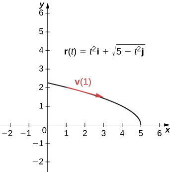
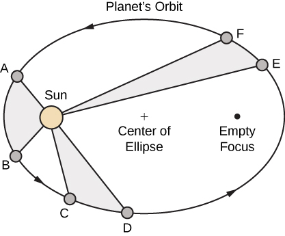
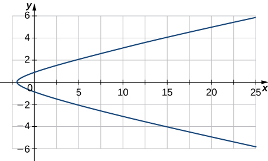
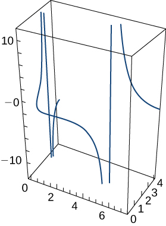
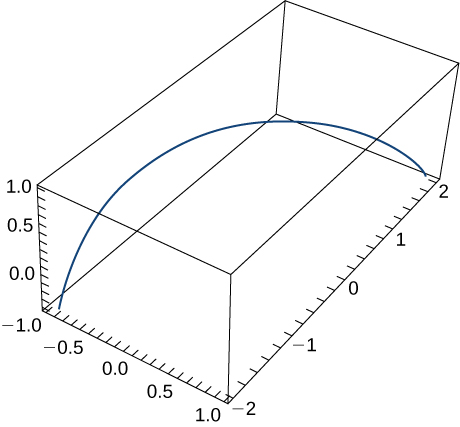
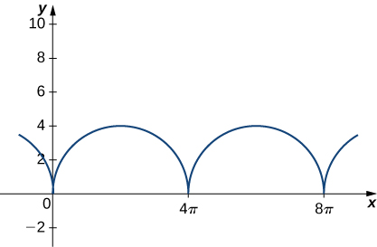
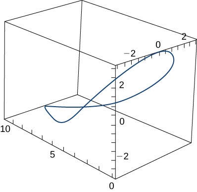
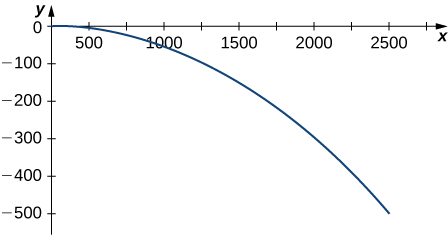
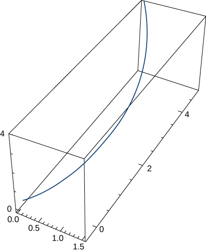
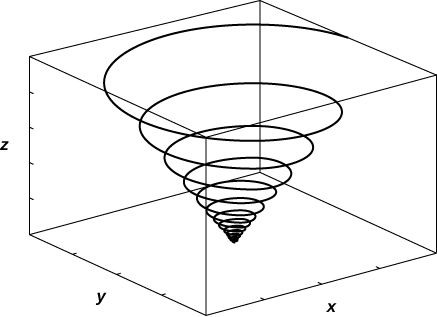

* Describe the velocity and acceleration vectors of a particle moving in space.
* Explain the tangential and normal components of acceleration.
* State Kepler’s laws of planetary motion.

We have now seen how to describe curves in the plane and in space, and how to determine their properties, such as arc length and curvature. All of this leads to the main goal of this chapter, which is the description of motion along plane curves and space curves. We now have all the tools we need; in this section, we put these ideas together and look at how to use them.

# Motion Vectors in the Plane and in Space

Our starting point is using **vector-valued functions**{: data-type="term" .no-emphasis} to represent the position of an object as a function of time. All of the following material can be applied either to curves in the plane or to space curves. For example, when we look at the orbit of the planets, the curves defining these orbits all lie in a plane because they are elliptical. However, a particle traveling along a helix moves on a curve in three dimensions.

Definition

Let <math xmlns="http://www.w3.org/1998/Math/MathML"><mrow><mstyle mathvariant="bold" mathsize="normal"><mtext>r</mtext></mstyle><mrow><mo>(</mo><mi>t</mi><mo>)</mo></mrow></mrow></math>

 be a twice-differentiable vector-valued function of the parameter *t* that represents the position of an object as a function of time. The **velocity vector**{: data-type="term"} <math xmlns="http://www.w3.org/1998/Math/MathML"><mrow><mstyle mathvariant="bold" mathsize="normal"><mtext>v</mtext></mstyle><mrow><mo>(</mo><mi>t</mi><mo>)</mo></mrow></mrow></math>

 of the object is given by

<math xmlns="http://www.w3.org/1998/Math/MathML"><mrow><mtext>Velocity</mtext><mo>=</mo><mstyle mathvariant="bold" mathsize="normal"><mtext>v</mtext></mstyle><mrow><mo>(</mo><mi>t</mi><mo>)</mo></mrow><mo>=</mo><mstyle mathvariant="bold" mathsize="normal"><msup><mi>r</mi><mo>′</mo></msup></mstyle><mrow><mo>(</mo><mi>t</mi><mo>)</mo></mrow><mo>.</mo></mrow></math>

The **acceleration vector**{: data-type="term"} <math xmlns="http://www.w3.org/1998/Math/MathML"><mrow><mstyle mathvariant="bold" mathsize="normal"><mtext>a</mtext></mstyle><mrow><mo>(</mo><mi>t</mi><mo>)</mo></mrow></mrow></math>

 is defined to be

<math xmlns="http://www.w3.org/1998/Math/MathML"><mrow><mtext>Acceleration</mtext><mo>=</mo><mstyle mathvariant="bold" mathsize="normal"><mtext>a</mtext></mstyle><mrow><mo>(</mo><mi>t</mi><mo>)</mo></mrow><mo>=</mo><mstyle mathvariant="bold" mathsize="normal"><msup><mi>v</mi><mo>′</mo></msup></mstyle><mrow><mo>(</mo><mi>t</mi><mo>)</mo></mrow><mo>=</mo><mstyle mathvariant="bold" mathsize="normal"><mtext>r″</mtext></mstyle><mrow><mo>(</mo><mi>t</mi><mo>)</mo></mrow><mo>.</mo></mrow></math>

The *speed* is defined to be

<math xmlns="http://www.w3.org/1998/Math/MathML"><mrow><mtext>Speed</mtext><mo>=</mo><mi>v</mi><mrow><mo>(</mo><mi>t</mi><mo>)</mo></mrow><mo>=</mo><mrow><mo>‖</mo><mrow><mstyle mathvariant="bold" mathsize="normal"><mtext>v</mtext></mstyle><mrow><mo>(</mo><mi>t</mi><mo>)</mo></mrow></mrow><mo>‖</mo></mrow><mo>=</mo><mrow><mo>‖</mo><mrow><mstyle mathvariant="bold" mathsize="normal"><msup><mi>r</mi><mo>′</mo></msup></mstyle><mrow><mo>(</mo><mi>t</mi><mo>)</mo></mrow></mrow><mo>‖</mo></mrow><mo>=</mo><mfrac><mrow><mi>d</mi><mi>s</mi></mrow><mrow><mi>d</mi><mi>t</mi></mrow></mfrac><mo>.</mo></mrow></math>

Since <math xmlns="http://www.w3.org/1998/Math/MathML"><mrow><mstyle mathvariant="bold" mathsize="normal"><mtext>r</mtext></mstyle><mrow><mo>(</mo><mi>t</mi><mo>)</mo></mrow></mrow></math>

 can be in either two or three dimensions, these vector-valued functions can have either two or three components. In two dimensions, we define <math xmlns="http://www.w3.org/1998/Math/MathML"><mrow><mstyle mathvariant="bold" mathsize="normal"><mtext>r</mtext></mstyle><mrow><mo>(</mo><mi>t</mi><mo>)</mo></mrow><mo>=</mo><mi>x</mi><mrow><mo>(</mo><mi>t</mi><mo>)</mo></mrow><mspace width="0.1em" /><mstyle mathvariant="bold" mathsize="normal"><mtext>i</mtext></mstyle><mo>+</mo><mi>y</mi><mrow><mo>(</mo><mi>t</mi><mo>)</mo></mrow><mspace width="0.1em" /><mstyle mathvariant="bold" mathsize="normal"><mtext>j</mtext></mstyle></mrow></math>

 and in three dimensions <math xmlns="http://www.w3.org/1998/Math/MathML"><mrow><mstyle mathvariant="bold" mathsize="normal"><mtext>r</mtext></mstyle><mrow><mo>(</mo><mi>t</mi><mo>)</mo></mrow><mo>=</mo><mi>x</mi><mrow><mo>(</mo><mi>t</mi><mo>)</mo></mrow><mspace width="0.1em" /><mstyle mathvariant="bold" mathsize="normal"><mtext>i</mtext></mstyle><mo>+</mo><mi>y</mi><mrow><mo>(</mo><mi>t</mi><mo>)</mo></mrow><mspace width="0.1em" /><mstyle mathvariant="bold" mathsize="normal"><mtext>j</mtext></mstyle><mo>+</mo><mi>z</mi><mrow><mo>(</mo><mi>t</mi><mo>)</mo></mrow><mspace width="0.1em" /><mstyle mathvariant="bold" mathsize="normal"><mtext>k</mtext></mstyle><mo>.</mo></mrow></math>

 Then the velocity, acceleration, and speed can be written as shown in the following table.

<table summary="This is a table with three columns and five rows. The first row is a header row, and contains the labels Quantity, Two Dimensions, and Three Dimensions. The second row contains the entries Position, r(t) equals x(t)i + y(t)j, and r(t) equals x(t)i + y(t)j +z(t)k. The third row contains the entries Velocity, v(t) equals x&#x2019;(t)i + y&#x2019;(t)j, and v(t) equals x&#x2019;(t)i = y&#x2019;(t)j + z&#x2019;(t)k. The fourth row contains the entries Acceleration, a(t) equals x&#x2019;&#x2019;(t)i + y&#x2019;&#x2019;(t)j, and a(t) equals x&#x2019;&#x2019;(t)i + y&#x2019;&#x2019;(t)j + z&#x2019;&#x2019;(t)k. The fifth row contains the entries Speed, v(t) equals the square root of ((x&#x2019;(t))squared + (y&#x2019;(t))squared), and v(t) equals the square root of ((x&#x2019;(t))squared + (y&#x2019;(t))squared + (z&#x2019;(t))squared)."><caption>Formulas for Position, Velocity, Acceleration, and Speed</caption><thead>
<tr valign="top">
<th><strong>Quantity</strong></th>
<th><strong>Two Dimensions</strong></th>
<th><strong>Three Dimensions</strong></th>
</tr>
</thead><tbody>
<tr valign="top">
<td>Position</td>
<td><math xmlns="http://www.w3.org/1998/Math/MathML"><mrow><mstyle mathvariant="bold" mathsize="normal"><mtext>r</mtext></mstyle><mrow><mo>(</mo><mi>t</mi><mo>)</mo></mrow><mo>=</mo><mi>x</mi><mrow><mo>(</mo><mi>t</mi><mo>)</mo></mrow><mspace width="0.1em" /><mstyle mathvariant="bold" mathsize="normal"><mtext>i</mtext></mstyle><mo>+</mo><mi>y</mi><mrow><mo>(</mo><mi>t</mi><mo>)</mo></mrow><mspace width="0.1em" /><mstyle mathvariant="bold" mathsize="normal"><mtext>j</mtext></mstyle></mrow></math></td>
<td><math xmlns="http://www.w3.org/1998/Math/MathML"><mrow><mstyle mathvariant="bold" mathsize="normal"><mtext>r</mtext></mstyle><mrow><mo>(</mo><mi>t</mi><mo>)</mo></mrow><mo>=</mo><mi>x</mi><mrow><mo>(</mo><mi>t</mi><mo>)</mo></mrow><mspace width="0.1em" /><mstyle mathvariant="bold" mathsize="normal"><mtext>i</mtext></mstyle><mo>+</mo><mi>y</mi><mrow><mo>(</mo><mi>t</mi><mo>)</mo></mrow><mspace width="0.1em" /><mstyle mathvariant="bold" mathsize="normal"><mtext>j</mtext></mstyle><mo>+</mo><mi>z</mi><mrow><mo>(</mo><mi>t</mi><mo>)</mo></mrow><mspace width="0.1em" /><mstyle mathvariant="bold" mathsize="normal"><mtext>k</mtext></mstyle></mrow></math></td>
</tr>
<tr valign="top">
<td>Velocity</td>
<td><math xmlns="http://www.w3.org/1998/Math/MathML"><mrow><mstyle mathvariant="bold" mathsize="normal"><mtext>v</mtext></mstyle><mrow><mo>(</mo><mi>t</mi><mo>)</mo></mrow><mo>=</mo><msup><mi>x</mi><mo>′</mo></msup><mrow><mo>(</mo><mi>t</mi><mo>)</mo></mrow><mspace width="0.1em" /><mstyle mathvariant="bold" mathsize="normal"><mtext>i</mtext></mstyle><mo>+</mo><msup><mi>y</mi><mo>′</mo></msup><mrow><mo>(</mo><mi>t</mi><mo>)</mo></mrow><mspace width="0.1em" /><mstyle mathvariant="bold" mathsize="normal"><mtext>j</mtext></mstyle></mrow></math></td>
<td><math xmlns="http://www.w3.org/1998/Math/MathML"><mrow><mstyle mathvariant="bold" mathsize="normal"><mtext>v</mtext></mstyle><mrow><mo>(</mo><mi>t</mi><mo>)</mo></mrow><mo>=</mo><msup><mi>x</mi><mo>′</mo></msup><mrow><mo>(</mo><mi>t</mi><mo>)</mo></mrow><mspace width="0.1em" /><mstyle mathvariant="bold" mathsize="normal"><mtext>i</mtext></mstyle><mo>+</mo><msup><mi>y</mi><mo>′</mo></msup><mrow><mo>(</mo><mi>t</mi><mo>)</mo></mrow><mspace width="0.1em" /><mstyle mathvariant="bold" mathsize="normal"><mtext>j</mtext></mstyle><mo>+</mo><msup><mi>z</mi><mo>′</mo></msup><mrow><mo>(</mo><mi>t</mi><mo>)</mo></mrow><mspace width="0.1em" /><mstyle mathvariant="bold" mathsize="normal"><mtext>k</mtext></mstyle></mrow></math></td>
</tr>
<tr valign="top">
<td>Acceleration</td>
<td><math xmlns="http://www.w3.org/1998/Math/MathML"><mrow><mstyle mathvariant="bold" mathsize="normal"><mtext>a</mtext></mstyle><mrow><mo>(</mo><mi>t</mi><mo>)</mo></mrow><mo>=</mo><mi>x</mi><mtext>″</mtext><mrow><mo>(</mo><mi>t</mi><mo>)</mo></mrow><mspace width="0.1em" /><mstyle mathvariant="bold" mathsize="normal"><mtext>i</mtext></mstyle><mo>+</mo><mi>y</mi><mtext>″</mtext><mrow><mo>(</mo><mi>t</mi><mo>)</mo></mrow><mspace width="0.1em" /><mstyle mathvariant="bold" mathsize="normal"><mtext>j</mtext></mstyle></mrow></math></td>
<td><math xmlns="http://www.w3.org/1998/Math/MathML"><mrow><mstyle mathvariant="bold" mathsize="normal"><mtext>a</mtext></mstyle><mrow><mo>(</mo><mi>t</mi><mo>)</mo></mrow><mo>=</mo><mi>x</mi><mtext>″</mtext><mrow><mo>(</mo><mi>t</mi><mo>)</mo></mrow><mspace width="0.1em" /><mstyle mathvariant="bold" mathsize="normal"><mtext>i</mtext></mstyle><mo>+</mo><mi>y</mi><mtext>″</mtext><mrow><mo>(</mo><mi>t</mi><mo>)</mo></mrow><mspace width="0.1em" /><mstyle mathvariant="bold" mathsize="normal"><mtext>j</mtext></mstyle><mo>+</mo><mi>z</mi><mtext>″</mtext><mrow><mo>(</mo><mi>t</mi><mo>)</mo></mrow><mspace width="0.1em" /><mstyle mathvariant="bold" mathsize="normal"><mtext>k</mtext></mstyle></mrow></math></td>
</tr>
<tr valign="top">
<td>Speed</td>
<td><math xmlns="http://www.w3.org/1998/Math/MathML"><mrow><mi>v</mi><mrow><mo>(</mo><mi>t</mi><mo>)</mo></mrow><mo>=</mo><msqrt><mrow><msup><mrow><mrow><mo>(</mo><mrow><msup><mi>x</mi><mo>′</mo></msup><mrow><mo>(</mo><mi>t</mi><mo>)</mo></mrow></mrow><mo>)</mo></mrow></mrow><mn>2</mn></msup><mo>+</mo><msup><mrow><mrow><mo>(</mo><mrow><msup><mi>y</mi><mo>′</mo></msup><mrow><mo>(</mo><mi>t</mi><mo>)</mo></mrow></mrow><mo>)</mo></mrow></mrow><mn>2</mn></msup></mrow></msqrt></mrow></math></td>
<td><math xmlns="http://www.w3.org/1998/Math/MathML"><mrow><mi>v</mi><mrow><mo>(</mo><mi>t</mi><mo>)</mo></mrow><mo>=</mo><msqrt><mrow><msup><mrow><mrow><mo>(</mo><mrow><msup><mi>x</mi><mo>′</mo></msup><mrow><mo>(</mo><mi>t</mi><mo>)</mo></mrow></mrow><mo>)</mo></mrow></mrow><mn>2</mn></msup><mo>+</mo><msup><mrow><mrow><mo>(</mo><mrow><msup><mi>y</mi><mo>′</mo></msup><mrow><mo>(</mo><mi>t</mi><mo>)</mo></mrow></mrow><mo>)</mo></mrow></mrow><mn>2</mn></msup><mo>+</mo><msup><mrow><mrow><mo>(</mo><mrow><msup><mi>z</mi><mo>′</mo></msup><mrow><mo>(</mo><mi>t</mi><mo>)</mo></mrow></mrow><mo>)</mo></mrow></mrow><mn>2</mn></msup></mrow></msqrt></mrow></math></td>
</tr>
</tbody></table>

Studying Motion Along a Parabola

A particle moves in a parabolic path defined by the vector-valued function <math xmlns="http://www.w3.org/1998/Math/MathML"><mrow><mstyle mathvariant="bold" mathsize="normal"><mtext>r</mtext></mstyle><mrow><mo>(</mo><mi>t</mi><mo>)</mo></mrow><mo>=</mo><msup><mi>t</mi><mn>2</mn></msup><mstyle mathvariant="bold" mathsize="normal"><mtext>i</mtext></mstyle><mo>+</mo><msqrt><mrow><mn>5</mn><mo>−</mo><msup><mi>t</mi><mn>2</mn></msup></mrow></msqrt><mstyle mathvariant="bold" mathsize="normal"><mtext>j</mtext></mstyle><mo>,</mo></mrow></math>

 where *t* measures time in seconds.

1.  Find the velocity, acceleration, and speed as functions of time.
2.  Sketch the curve along with the velocity vector at time
    <math xmlns="http://www.w3.org/1998/Math/MathML"><mrow><mi>t</mi><mo>=</mo><mn>1</mn><mo>.</mo></mrow></math>
{: data-number-style="lower-alpha"}

1.  We use [[link]](#fs-id1169738144149), [[link]](#fs-id1169738166350), and [[link]](#fs-id1169737947455):
    * * *
    {: data-type="newline"}
    
    

    <math xmlns="http://www.w3.org/1998/Math/MathML"><mtable><mtr><mtd columnalign="right"><mstyle mathvariant="bold" mathsize="normal"><mtext>v</mtext></mstyle><mrow><mo>(</mo><mi>t</mi><mo>)</mo></mrow></mtd><mtd columnalign="left"><mo>=</mo></mtd><mtd columnalign="left"><mstyle mathvariant="bold" mathsize="normal"><msup><mi>r</mi><mo>′</mo></msup></mstyle><mrow><mo>(</mo><mi>t</mi><mo>)</mo></mrow><mo>=</mo><mn>2</mn><mi>t</mi><mspace width="0.1em" /><mstyle mathvariant="bold" mathsize="normal"><mtext>i</mtext></mstyle><mo>−</mo><mfrac><mi>t</mi><mrow><msqrt><mrow><mn>5</mn><mo>−</mo><msup><mi>t</mi><mn>2</mn></msup></mrow></msqrt></mrow></mfrac><mstyle mathvariant="bold" mathsize="normal"><mtext>j</mtext></mstyle></mtd></mtr><mtr><mtd columnalign="right"><mstyle mathvariant="bold" mathsize="normal"><mtext>a</mtext></mstyle><mrow><mo>(</mo><mi>t</mi><mo>)</mo></mrow></mtd><mtd columnalign="left"><mo>=</mo></mtd><mtd columnalign="left"><mstyle mathvariant="bold" mathsize="normal"><msup><mi>v</mi><mo>′</mo></msup></mstyle><mrow><mo>(</mo><mi>t</mi><mo>)</mo></mrow><mo>=</mo><mn>2</mn><mstyle mathvariant="bold" mathsize="normal"><mtext>i</mtext></mstyle><mo>−</mo><mn>5</mn><msup><mrow><mo>(</mo><mrow><mn>5</mn><mo>−</mo><msup><mi>t</mi><mn>2</mn></msup></mrow><mo>)</mo></mrow><mrow><mo>−</mo><mfrac bevelled="true"><mn>3</mn><mn>2</mn></mfrac></mrow></msup><mstyle mathvariant="bold" mathsize="normal"><mtext>j</mtext></mstyle></mtd></mtr><mtr><mtd columnalign="right"><mi>v</mi><mrow><mo>(</mo><mi>t</mi><mo>)</mo></mrow></mtd><mtd columnalign="left"><mo>=</mo></mtd><mtd columnalign="left"><mrow><mo>‖</mo><mrow><mstyle mathvariant="bold" mathsize="normal"><msup><mi>r</mi><mo>′</mo></msup></mstyle><mrow><mo>(</mo><mi>t</mi><mo>)</mo></mrow></mrow><mo>‖</mo></mrow></mtd></mtr><mtr><mtd /><mtd columnalign="left"><mo>=</mo></mtd><mtd columnalign="left"><msqrt><mrow><msup><mrow><mrow><mo>(</mo><mrow><mn>2</mn><mi>t</mi></mrow><mo>)</mo></mrow></mrow><mn>2</mn></msup><mo>+</mo><msup><mrow><mrow><mo>(</mo><mrow><mo>−</mo><mfrac><mi>t</mi><mrow><msqrt><mrow><mn>5</mn><mo>−</mo><msup><mi>t</mi><mn>2</mn></msup></mrow></msqrt></mrow></mfrac></mrow><mo>)</mo></mrow></mrow><mn>2</mn></msup></mrow></msqrt></mtd></mtr><mtr><mtd /><mtd columnalign="left"><mo>=</mo></mtd><mtd columnalign="left"><msqrt><mrow><mn>4</mn><msup><mi>t</mi><mn>2</mn></msup><mo>+</mo><mfrac><mrow><msup><mi>t</mi><mn>2</mn></msup></mrow><mrow><mn>5</mn><mo>−</mo><msup><mi>t</mi><mn>2</mn></msup></mrow></mfrac></mrow></msqrt></mtd></mtr><mtr><mtd /><mtd columnalign="left"><mo>=</mo></mtd><mtd columnalign="left"><msqrt><mrow><mfrac><mrow><mn>21</mn><msup><mi>t</mi><mn>2</mn></msup><mo>−</mo><mn>4</mn><msup><mi>t</mi><mn>4</mn></msup></mrow><mrow><mn>5</mn><mo>−</mo><msup><mi>t</mi><mn>2</mn></msup></mrow></mfrac></mrow></msqrt><mo>.</mo></mtd></mtr></mtable></math>
    

2.  The graph of
    <math xmlns="http://www.w3.org/1998/Math/MathML"><mrow><mstyle mathvariant="bold" mathsize="normal"><mtext>r</mtext></mstyle><mrow><mo>(</mo><mi>t</mi><mo>)</mo></mrow><mo>=</mo><msup><mi>t</mi><mn>2</mn></msup><mstyle mathvariant="bold" mathsize="normal"><mtext>i</mtext></mstyle><mo>+</mo><msqrt><mrow><mn>5</mn><mo>−</mo><msup><mi>t</mi><mn>2</mn></msup></mrow></msqrt><mstyle mathvariant="bold" mathsize="normal"><mtext>j</mtext></mstyle></mrow></math>
    
    is a portion of a parabola ([[link]](#CNX_Calc_Figure_13_04_001)). The velocity vector at
    <math xmlns="http://www.w3.org/1998/Math/MathML"><mrow><mi>t</mi><mo>=</mo><mn>1</mn></mrow></math>
    
    is
    * * *
    {: data-type="newline"}
    
    

    <math xmlns="http://www.w3.org/1998/Math/MathML"><mrow><mstyle mathvariant="bold" mathsize="normal"><mtext>v</mtext></mstyle><mrow><mo>(</mo><mn>1</mn><mo>)</mo></mrow><mo>=</mo><mstyle mathvariant="bold" mathsize="normal"><msup><mi>r</mi><mo>′</mo></msup></mstyle><mrow><mo>(</mo><mn>1</mn><mo>)</mo></mrow><mo>=</mo><mn>2</mn><mrow><mo>(</mo><mn>1</mn><mo>)</mo></mrow><mspace width="0.1em" /><mstyle mathvariant="bold" mathsize="normal"><mtext>i</mtext></mstyle><mo>−</mo><mfrac><mn>1</mn><mrow><msqrt><mrow><mn>5</mn><mo>−</mo><msup><mrow><mrow><mo>(</mo><mn>1</mn><mo>)</mo></mrow></mrow><mn>2</mn></msup></mrow></msqrt></mrow></mfrac><mstyle mathvariant="bold" mathsize="normal"><mtext>j</mtext></mstyle><mo>=</mo><mn>2</mn><mstyle mathvariant="bold" mathsize="normal"><mtext>i</mtext></mstyle><mo>−</mo><mfrac><mn>1</mn><mn>2</mn></mfrac><mstyle mathvariant="bold" mathsize="normal"><mtext>j</mtext></mstyle></mrow></math>
    

    
    * * *
    {: data-type="newline"}
    
    and the acceleration vector at
    <math xmlns="http://www.w3.org/1998/Math/MathML"><mrow><mi>t</mi><mo>=</mo><mn>1</mn></mrow></math>
    
    is
    * * *
    {: data-type="newline"}
    
    

    <math xmlns="http://www.w3.org/1998/Math/MathML"><mrow><mstyle mathvariant="bold" mathsize="normal"><mtext>a</mtext></mstyle><mrow><mo>(</mo><mn>1</mn><mo>)</mo></mrow><mo>=</mo><mstyle mathvariant="bold" mathsize="normal"><msup><mi>v</mi><mo>′</mo></msup></mstyle><mrow><mo>(</mo><mn>1</mn><mo>)</mo></mrow><mo>=</mo><mn>2</mn><mstyle mathvariant="bold" mathsize="normal"><mtext>i</mtext></mstyle><mo>−</mo><mn>5</mn><msup><mrow><mrow><mo>(</mo><mrow><mn>5</mn><mo>−</mo><msup><mrow><mrow><mo>(</mo><mn>1</mn><mo>)</mo></mrow></mrow><mn>2</mn></msup></mrow><mo>)</mo></mrow></mrow><mrow><mtext>−</mtext><mrow><mn>3</mn><mtext>/</mtext><mn>2</mn></mrow></mrow></msup><mstyle mathvariant="bold" mathsize="normal"><mtext>j</mtext></mstyle><mo>=</mo><mn>2</mn><mstyle mathvariant="bold" mathsize="normal"><mtext>i</mtext></mstyle><mo>−</mo><mfrac><mn>5</mn><mn>8</mn></mfrac><mstyle mathvariant="bold" mathsize="normal"><mtext>j</mtext></mstyle><mo>.</mo></mrow></math>
    

    
    * * *
    {: data-type="newline"}
    
    Notice that the velocity vector is tangent to the path, as is always the case.
    * * *
    {: data-type="newline"}
    
    {: #CNX_Calc_Figure_13_04_001}

{: data-number-style="lower-alpha"}

A particle moves in a path defined by the vector-valued function <math xmlns="http://www.w3.org/1998/Math/MathML"><mrow><mstyle mathvariant="bold" mathsize="normal"><mtext>r</mtext></mstyle><mrow><mo>(</mo><mi>t</mi><mo>)</mo></mrow><mo>=</mo><mrow><mo>(</mo><mrow><msup><mi>t</mi><mn>2</mn></msup><mo>−</mo><mn>3</mn><mi>t</mi></mrow><mo>)</mo></mrow><mspace width="0.1em" /><mstyle mathvariant="bold" mathsize="normal"><mtext>i</mtext></mstyle><mo>+</mo><mrow><mo>(</mo><mrow><mn>2</mn><mi>t</mi><mo>−</mo><mn>4</mn></mrow><mo>)</mo></mrow><mspace width="0.1em" /><mstyle mathvariant="bold" mathsize="normal"><mtext>j</mtext></mstyle><mo>+</mo><mo stretchy="false">(</mo><mi>t</mi><mo>+</mo><mn>2</mn><mo stretchy="false">)</mo><mstyle mathvariant="bold" mathsize="normal"><mtext>k</mtext></mstyle><mo>,</mo></mrow></math>

 where *t* measures time in seconds and where distance is measured in feet. Find the velocity, acceleration, and speed as functions of time.

<math xmlns="http://www.w3.org/1998/Math/MathML"><mtable><mtr><mtd columnalign="left"><mstyle mathvariant="bold" mathsize="normal"><mtext>v</mtext></mstyle><mrow><mo>(</mo><mi>t</mi><mo>)</mo></mrow><mo>=</mo><mstyle mathvariant="bold" mathsize="normal"><msup><mi>r</mi><mo>′</mo></msup></mstyle><mrow><mo>(</mo><mi>t</mi><mo>)</mo></mrow><mo>=</mo><mrow><mo>(</mo><mrow><mn>2</mn><mi>t</mi><mo>−</mo><mn>3</mn></mrow><mo>)</mo></mrow><mspace width="0.1em" /><mstyle mathvariant="bold" mathsize="normal"><mtext>i</mtext></mstyle><mo>+</mo><mn>2</mn><mstyle mathvariant="bold" mathsize="normal"><mtext>j</mtext></mstyle><mo>+</mo><mstyle mathvariant="bold" mathsize="normal"><mtext>k</mtext></mstyle></mtd></mtr><mtr><mtd columnalign="left"><mstyle mathvariant="bold" mathsize="normal"><mtext>a</mtext></mstyle><mrow><mo>(</mo><mi>t</mi><mo>)</mo></mrow><mo>=</mo><mstyle mathvariant="bold" mathsize="normal"><msup><mi>v</mi><mo>′</mo></msup></mstyle><mrow><mo>(</mo><mi>t</mi><mo>)</mo></mrow><mo>=</mo><mn>2</mn><mstyle mathvariant="bold" mathsize="normal"><mtext>i</mtext></mstyle></mtd></mtr><mtr><mtd columnalign="left"><mi>v</mi><mrow><mo>(</mo><mi>t</mi><mo>)</mo></mrow><mo>=</mo><mrow><mo>‖</mo><mrow><mstyle mathvariant="bold" mathsize="normal"><msup><mi>r</mi><mo>′</mo></msup></mstyle><mrow><mo>(</mo><mi>t</mi><mo>)</mo></mrow></mrow><mo>‖</mo></mrow><mo>=</mo><msqrt><mrow><msup><mrow><mrow><mo>(</mo><mrow><mn>2</mn><mi>t</mi><mo>−</mo><mn>3</mn></mrow><mo>)</mo></mrow></mrow><mn>2</mn></msup><mo>+</mo><msup><mn>2</mn><mn>2</mn></msup><mo>+</mo><msup><mn>1</mn><mn>2</mn></msup></mrow></msqrt><mo>=</mo><msqrt><mrow><mn>4</mn><msup><mi>t</mi><mn>2</mn></msup><mo>−</mo><mn>12</mn><mi>t</mi><mo>+</mo><mn>14</mn></mrow></msqrt></mtd></mtr></mtable></math>

The units for velocity and speed are feet per second, and the units for acceleration are feet per second squared.

Hint

Use [[link]](#fs-id1169738144149), [[link]](#fs-id1169738166350), and [[link]](#fs-id1169737947455).

To gain a better understanding of the velocity and acceleration vectors, imagine you are driving along a curvy road. If you do not turn the steering wheel, you would continue in a straight line and run off the road. The speed at which you are traveling when you run off the road, coupled with the direction, gives a vector representing your velocity, as illustrated in the following figure.

 {: #CNX_Calc_Figure_13_04_002}

However, the fact that you must turn the steering wheel to stay on the road indicates that your velocity is always changing (even if your speed is not) because your *direction* is constantly changing to keep you on the road. As you turn to the right, your acceleration vector also points to the right. As you turn to the left, your acceleration vector points to the left. This indicates that your velocity and acceleration vectors are constantly changing, regardless of whether your actual speed varies ([\[link\]](#CNX_Calc_Figure_13_04_003)).

 . The acceleration vector points toward the inside of the turn at all times."){: #CNX_Calc_Figure_13_04_003}

# Components of the Acceleration Vector

We can combine some of the concepts discussed in [Arc Length and Curvature](/m53919){: .target-chapter} with the acceleration vector to gain a deeper understanding of how this vector relates to motion in the plane and in space. Recall that the unit tangent vector **T** and the unit normal vector **N** form an osculating plane at any point *P* on the curve defined by a vector-valued function <math xmlns="http://www.w3.org/1998/Math/MathML"><mrow><mstyle mathvariant="bold" mathsize="normal"><mtext>r</mtext></mstyle><mrow><mo>(</mo><mi>t</mi><mo>)</mo></mrow><mo>.</mo></mrow></math>

 The following theorem shows that the acceleration vector <math xmlns="http://www.w3.org/1998/Math/MathML"><mrow><mstyle mathvariant="bold" mathsize="normal"><mtext>a</mtext></mstyle><mrow><mo>(</mo><mi>t</mi><mo>)</mo></mrow></mrow></math>

 lies in the osculating plane and can be written as a linear combination of the unit tangent and the unit normal vectors.

The Plane of the Acceleration Vector

The acceleration vector <math xmlns="http://www.w3.org/1998/Math/MathML"><mrow><mstyle mathvariant="bold" mathsize="normal"><mtext>a</mtext></mstyle><mrow><mo>(</mo><mi>t</mi><mo>)</mo></mrow></mrow></math>

 of an object moving along a curve traced out by a twice-differentiable function <math xmlns="http://www.w3.org/1998/Math/MathML"><mrow><mstyle mathvariant="bold" mathsize="normal"><mtext>r</mtext></mstyle><mrow><mo>(</mo><mi>t</mi><mo>)</mo></mrow></mrow></math>

 lies in the plane formed by the unit tangent vector <math xmlns="http://www.w3.org/1998/Math/MathML"><mrow><mstyle mathvariant="bold" mathsize="normal"><mtext>T</mtext></mstyle><mrow><mo>(</mo><mi>t</mi><mo>)</mo></mrow></mrow></math>

 and the principal unit normal vector <math xmlns="http://www.w3.org/1998/Math/MathML"><mrow><mstyle mathvariant="bold" mathsize="normal"><mtext>N</mtext></mstyle><mrow><mo>(</mo><mi>t</mi><mo>)</mo></mrow></mrow></math>

 to *C.* Furthermore,

<math xmlns="http://www.w3.org/1998/Math/MathML"><mrow><mstyle mathvariant="bold" mathsize="normal"><mtext>a</mtext></mstyle><mrow><mo>(</mo><mi>t</mi><mo>)</mo></mrow><mo>=</mo><msup><mi>v</mi><mo>′</mo></msup><mrow><mo>(</mo><mi>t</mi><mo>)</mo></mrow><mspace width="0.1em" /><mstyle mathvariant="bold" mathsize="normal"><mtext>T</mtext></mstyle><mrow><mo>(</mo><mi>t</mi><mo>)</mo></mrow><mo>+</mo><msup><mrow><mrow><mo>[</mo><mrow><mi>v</mi><mrow><mo>(</mo><mi>t</mi><mo>)</mo></mrow></mrow><mo>]</mo></mrow></mrow><mn>2</mn></msup><mi>κ</mi><mspace width="0.1em" /><mstyle mathvariant="bold" mathsize="normal"><mtext>N</mtext></mstyle><mrow><mo>(</mo><mi>t</mi><mo>)</mo></mrow><mo>.</mo></mrow></math>

Here, <math xmlns="http://www.w3.org/1998/Math/MathML"><mrow><mi>v</mi><mrow><mo>(</mo><mi>t</mi><mo>)</mo></mrow></mrow></math>

 is the speed of the object and <math xmlns="http://www.w3.org/1998/Math/MathML"><mi>κ</mi></math>

 is the curvature of *C* traced out by <math xmlns="http://www.w3.org/1998/Math/MathML"><mrow><mstyle mathvariant="bold" mathsize="normal"><mtext>r</mtext></mstyle><mrow><mo>(</mo><mi>t</mi><mo>)</mo></mrow><mo>.</mo></mrow></math>

## Proof

Because <math xmlns="http://www.w3.org/1998/Math/MathML"><mrow><mstyle mathvariant="bold" mathsize="normal"><mtext>v</mtext></mstyle><mrow><mo>(</mo><mi>t</mi><mo>)</mo></mrow><mo>=</mo><mstyle mathvariant="bold" mathsize="normal"><msup><mi>r</mi><mo>′</mo></msup></mstyle><mrow><mo>(</mo><mi>t</mi><mo>)</mo></mrow></mrow></math>

 and <math xmlns="http://www.w3.org/1998/Math/MathML"><mrow><mstyle mathvariant="bold" mathsize="normal"><mtext>T</mtext></mstyle><mrow><mo>(</mo><mi>t</mi><mo>)</mo></mrow><mo>=</mo><mfrac><mrow><mstyle mathvariant="bold" mathsize="normal"><msup><mi>r</mi><mo>′</mo></msup></mstyle><mrow><mo>(</mo><mi>t</mi><mo>)</mo></mrow></mrow><mrow><mrow><mo>‖</mo><mrow><mstyle mathvariant="bold" mathsize="normal"><msup><mi>r</mi><mo>′</mo></msup></mstyle><mrow><mo>(</mo><mi>t</mi><mo>)</mo></mrow></mrow><mo>‖</mo></mrow></mrow></mfrac><mo>,</mo></mrow></math>

 we have <math xmlns="http://www.w3.org/1998/Math/MathML"><mrow><mstyle mathvariant="bold" mathsize="normal"><mtext>v</mtext></mstyle><mrow><mo>(</mo><mi>t</mi><mo>)</mo></mrow><mo>=</mo><mrow><mo>‖</mo><mrow><mstyle mathvariant="bold" mathsize="normal"><msup><mi>r</mi><mo>′</mo></msup></mstyle><mrow><mo>(</mo><mi>t</mi><mo>)</mo></mrow></mrow><mo>‖</mo></mrow><mstyle mathvariant="bold" mathsize="normal"><mtext>T</mtext></mstyle><mrow><mo>(</mo><mi>t</mi><mo>)</mo></mrow><mo>=</mo><mi>v</mi><mrow><mo>(</mo><mi>t</mi><mo>)</mo></mrow><mspace width="0.1em" /><mstyle mathvariant="bold" mathsize="normal"><mtext>T</mtext></mstyle><mrow><mo>(</mo><mi>t</mi><mo>)</mo></mrow><mo>.</mo></mrow></math>

 Now we differentiate this equation:

<math xmlns="http://www.w3.org/1998/Math/MathML"><mrow><mstyle mathvariant="bold" mathsize="normal"><mtext>a</mtext></mstyle><mrow><mo>(</mo><mi>t</mi><mo>)</mo></mrow><mo>=</mo><mstyle mathvariant="bold" mathsize="normal"><msup><mi>v</mi><mo>′</mo></msup></mstyle><mrow><mo>(</mo><mi>t</mi><mo>)</mo></mrow><mo>=</mo><mfrac><mi>d</mi><mrow><mi>d</mi><mi>t</mi></mrow></mfrac><mrow><mo>(</mo><mrow><mi>v</mi><mrow><mo>(</mo><mi>t</mi><mo>)</mo></mrow><mspace width="0.1em" /><mstyle mathvariant="bold" mathsize="normal"><mtext>T</mtext></mstyle><mrow><mo>(</mo><mi>t</mi><mo>)</mo></mrow></mrow><mo>)</mo></mrow><mo>=</mo><msup><mi>v</mi><mo>′</mo></msup><mrow><mo>(</mo><mi>t</mi><mo>)</mo></mrow><mspace width="0.1em" /><mstyle mathvariant="bold" mathsize="normal"><mtext>T</mtext></mstyle><mrow><mo>(</mo><mi>t</mi><mo>)</mo></mrow><mo>+</mo><mi>v</mi><mrow><mo>(</mo><mi>t</mi><mo>)</mo></mrow><mspace width="0.1em" /><mstyle mathvariant="bold" mathsize="normal"><msup><mi>T</mi><mo>′</mo></msup></mstyle><mrow><mo>(</mo><mi>t</mi><mo>)</mo></mrow><mo>.</mo></mrow></math>

Since <math xmlns="http://www.w3.org/1998/Math/MathML"><mrow><mstyle mathvariant="bold" mathsize="normal"><mtext>N</mtext></mstyle><mrow><mo>(</mo><mi>t</mi><mo>)</mo></mrow><mo>=</mo><mfrac><mrow><mstyle mathvariant="bold" mathsize="normal"><msup><mi>T</mi><mo>′</mo></msup></mstyle><mrow><mo>(</mo><mi>t</mi><mo>)</mo></mrow></mrow><mrow><mrow><mo>‖</mo><mrow><mstyle mathvariant="bold" mathsize="normal"><msup><mi>T</mi><mo>′</mo></msup></mstyle><mrow><mo>(</mo><mi>t</mi><mo>)</mo></mrow></mrow><mo>‖</mo></mrow></mrow></mfrac><mo>,</mo></mrow></math>

 we know <math xmlns="http://www.w3.org/1998/Math/MathML"><mrow><mstyle mathvariant="bold" mathsize="normal"><msup><mi>T</mi><mo>′</mo></msup></mstyle><mrow><mo>(</mo><mi>t</mi><mo>)</mo></mrow><mo>=</mo><mrow><mo>‖</mo><mrow><mstyle mathvariant="bold" mathsize="normal"><msup><mi>T</mi><mo>′</mo></msup></mstyle><mrow><mo>(</mo><mi>t</mi><mo>)</mo></mrow></mrow><mo>‖</mo></mrow><mstyle mathvariant="bold" mathsize="normal"><mtext>N</mtext></mstyle><mrow><mo>(</mo><mi>t</mi><mo>)</mo></mrow><mo>,</mo></mrow></math>

 so

<math xmlns="http://www.w3.org/1998/Math/MathML"><mrow><mstyle mathvariant="bold" mathsize="normal"><mtext>a</mtext></mstyle><mrow><mo>(</mo><mi>t</mi><mo>)</mo></mrow><mo>=</mo><msup><mi>v</mi><mo>′</mo></msup><mrow><mo>(</mo><mi>t</mi><mo>)</mo></mrow><mspace width="0.1em" /><mstyle mathvariant="bold" mathsize="normal"><mtext>T</mtext></mstyle><mrow><mo>(</mo><mi>t</mi><mo>)</mo></mrow><mo>+</mo><mi>v</mi><mrow><mo>(</mo><mi>t</mi><mo>)</mo></mrow><mrow><mo>‖</mo><mrow><mstyle mathvariant="bold" mathsize="normal"><msup><mi>T</mi><mo>′</mo></msup></mstyle><mrow><mo>(</mo><mi>t</mi><mo>)</mo></mrow></mrow><mo>‖</mo></mrow><mstyle mathvariant="bold" mathsize="normal"><mtext>N</mtext></mstyle><mrow><mo>(</mo><mi>t</mi><mo>)</mo></mrow><mo>.</mo></mrow></math>

A formula for curvature is <math xmlns="http://www.w3.org/1998/Math/MathML"><mrow><mi>κ</mi><mo>=</mo><mfrac><mrow><mrow><mo>‖</mo><mrow><mstyle mathvariant="bold" mathsize="normal"><msup><mi>T</mi><mo>′</mo></msup></mstyle><mrow><mo>(</mo><mi>t</mi><mo>)</mo></mrow></mrow><mo>‖</mo></mrow></mrow><mrow><mrow><mo>‖</mo><mrow><mstyle mathvariant="bold" mathsize="normal"><msup><mi>r</mi><mo>′</mo></msup></mstyle><mrow><mo>(</mo><mi>t</mi><mo>)</mo></mrow></mrow><mo>‖</mo></mrow></mrow></mfrac><mo>,</mo></mrow></math>

 so <math xmlns="http://www.w3.org/1998/Math/MathML"><mrow><mrow><mo>‖</mo><mrow><mstyle mathvariant="bold" mathsize="normal"><msup><mi>T</mi><mo>′</mo></msup></mstyle><mrow><mo>(</mo><mi>t</mi><mo>)</mo></mrow></mrow><mo>‖</mo></mrow><mo>=</mo><mi>κ</mi><mrow><mo>‖</mo><mrow><mstyle mathvariant="bold" mathsize="normal"><msup><mi>r</mi><mo>′</mo></msup></mstyle><mrow><mo>(</mo><mi>t</mi><mo>)</mo></mrow></mrow><mo>‖</mo></mrow><mo>=</mo><mi>κ</mi><mi>v</mi><mrow><mo>(</mo><mi>t</mi><mo>)</mo></mrow><mo>.</mo></mrow></math>

 This gives <math xmlns="http://www.w3.org/1998/Math/MathML"><mrow><mstyle mathvariant="bold" mathsize="normal"><mtext>a</mtext></mstyle><mrow><mo>(</mo><mi>t</mi><mo>)</mo></mrow><mo>=</mo><msup><mi>v</mi><mo>′</mo></msup><mrow><mo>(</mo><mi>t</mi><mo>)</mo></mrow><mspace width="0.1em" /><mstyle mathvariant="bold" mathsize="normal"><mtext>T</mtext></mstyle><mrow><mo>(</mo><mi>t</mi><mo>)</mo></mrow><mo>+</mo><mi>κ</mi><msup><mrow><mrow><mo>(</mo><mrow><mi>v</mi><mrow><mo>(</mo><mi>t</mi><mo>)</mo></mrow></mrow><mo>)</mo></mrow></mrow><mn>2</mn></msup><mstyle mathvariant="bold" mathsize="normal"><mtext>N</mtext></mstyle><mrow><mo>(</mo><mi>t</mi><mo>)</mo></mrow><mo>.</mo></mrow></math>

□

The coefficients of <math xmlns="http://www.w3.org/1998/Math/MathML"><mrow><mstyle mathvariant="bold" mathsize="normal"><mtext>T</mtext></mstyle><mrow><mo>(</mo><mi>t</mi><mo>)</mo></mrow></mrow></math>

 and <math xmlns="http://www.w3.org/1998/Math/MathML"><mrow><mstyle mathvariant="bold" mathsize="normal"><mtext>N</mtext></mstyle><mrow><mo>(</mo><mi>t</mi><mo>)</mo></mrow></mrow></math>

 are referred to as the **tangential component of acceleration**{: data-type="term"} and the **normal component of acceleration**{: data-type="term"}, respectively. We write <math xmlns="http://www.w3.org/1998/Math/MathML"><mrow><msub><mi>a</mi><mstyle mathvariant="bold" mathsize="normal"><mtext>T</mtext></mstyle></msub></mrow></math>

 to denote the tangential component and <math xmlns="http://www.w3.org/1998/Math/MathML"><mrow><msub><mi>a</mi><mstyle mathvariant="bold" mathsize="normal"><mtext>N</mtext></mstyle></msub></mrow></math>

 to denote the normal component.

Tangential and Normal Components of Acceleration

Let <math xmlns="http://www.w3.org/1998/Math/MathML"><mrow><mstyle mathvariant="bold" mathsize="normal"><mtext>r</mtext></mstyle><mrow><mo>(</mo><mi>t</mi><mo>)</mo></mrow></mrow></math>

 be a vector-valued function that denotes the position of an object as a function of time. Then <math xmlns="http://www.w3.org/1998/Math/MathML"><mrow><mstyle mathvariant="bold" mathsize="normal"><mtext>a</mtext></mstyle><mrow><mo>(</mo><mi>t</mi><mo>)</mo></mrow><mo>=</mo><mstyle mathvariant="bold" mathsize="normal"><mtext>r″</mtext></mstyle><mrow><mo>(</mo><mi>t</mi><mo>)</mo></mrow></mrow></math>

 is the acceleration vector. The tangential and normal components of acceleration <math xmlns="http://www.w3.org/1998/Math/MathML"><mrow><msub><mi>a</mi><mstyle mathvariant="bold" mathsize="normal"><mtext>T</mtext></mstyle></msub></mrow></math>

 and <math xmlns="http://www.w3.org/1998/Math/MathML"><mrow><msub><mi>a</mi><mstyle mathvariant="bold" mathsize="normal"><mtext>N</mtext></mstyle></msub></mrow></math>

 are given by the formulas

<math xmlns="http://www.w3.org/1998/Math/MathML"><mrow><msub><mi>a</mi><mstyle mathvariant="bold" mathsize="normal"><mtext>T</mtext></mstyle></msub><mo>=</mo><mstyle mathvariant="bold" mathsize="normal"><mtext>a</mtext></mstyle><mo>·</mo><mstyle mathvariant="bold" mathsize="normal"><mtext>T</mtext></mstyle><mo>=</mo><mfrac><mrow><mstyle mathvariant="bold" mathsize="normal"><mtext>v</mtext></mstyle><mo>·</mo><mstyle mathvariant="bold" mathsize="normal"><mtext>a</mtext></mstyle></mrow><mrow><mrow><mo>‖</mo><mstyle mathvariant="bold" mathsize="normal"><mtext>v</mtext></mstyle><mo>‖</mo></mrow></mrow></mfrac></mrow></math>

and

<math xmlns="http://www.w3.org/1998/Math/MathML"><mrow><msub><mi>a</mi><mstyle mathvariant="bold" mathsize="normal"><mtext>N</mtext></mstyle></msub><mo>=</mo><mstyle mathvariant="bold" mathsize="normal"><mtext>a</mtext></mstyle><mo>·</mo><mstyle mathvariant="bold" mathsize="normal"><mtext>N</mtext></mstyle><mo>=</mo><mfrac><mrow><mrow><mo>‖</mo><mrow><mstyle mathvariant="bold" mathsize="normal"><mtext>v</mtext></mstyle><mspace width="0.2em" /><mo>×</mo><mspace width="0.2em" /><mstyle mathvariant="bold" mathsize="normal"><mtext>a</mtext></mstyle></mrow><mo>‖</mo></mrow></mrow><mrow><mrow><mo>‖</mo><mstyle mathvariant="bold" mathsize="normal"><mtext>v</mtext></mstyle><mo>‖</mo></mrow></mrow></mfrac><mo>=</mo><msqrt><mrow><msup><mrow><mrow><mo>‖</mo><mstyle mathvariant="bold" mathsize="normal"><mtext>a</mtext></mstyle><mo>‖</mo></mrow></mrow><mn>2</mn></msup><mo>−</mo><msubsup><mi>a</mi><mstyle mathvariant="bold" mathsize="normal"><mtext>T</mtext></mstyle><mn>2</mn></msubsup></mrow></msqrt><mo>.</mo></mrow></math>

These components are related by the formula

<math xmlns="http://www.w3.org/1998/Math/MathML"><mrow><mstyle mathvariant="bold" mathsize="normal"><mtext>a</mtext></mstyle><mrow><mo>(</mo><mi>t</mi><mo>)</mo></mrow><mo>=</mo><msub><mi>a</mi><mstyle mathvariant="bold" mathsize="normal"><mtext>T</mtext></mstyle></msub><mstyle mathvariant="bold" mathsize="normal"><mtext>T</mtext></mstyle><mrow><mo>(</mo><mi>t</mi><mo>)</mo></mrow><mo>+</mo><msub><mi>a</mi><mstyle mathvariant="bold" mathsize="normal"><mtext>N</mtext></mstyle></msub><mstyle mathvariant="bold" mathsize="normal"><mtext>N</mtext></mstyle><mrow><mo>(</mo><mi>t</mi><mo>)</mo></mrow><mo>.</mo></mrow></math>

Here <math xmlns="http://www.w3.org/1998/Math/MathML"><mrow><mstyle mathvariant="bold" mathsize="normal"><mtext>T</mtext></mstyle><mrow><mo>(</mo><mi>t</mi><mo>)</mo></mrow></mrow></math>

 is the unit tangent vector to the curve defined by <math xmlns="http://www.w3.org/1998/Math/MathML"><mrow><mstyle mathvariant="bold" mathsize="normal"><mtext>r</mtext></mstyle><mrow><mo>(</mo><mi>t</mi><mo>)</mo></mrow><mo>,</mo></mrow></math>

 and <math xmlns="http://www.w3.org/1998/Math/MathML"><mrow><mstyle mathvariant="bold" mathsize="normal"><mtext>N</mtext></mstyle><mrow><mo>(</mo><mi>t</mi><mo>)</mo></mrow></mrow></math>

 is the unit normal vector to the curve defined by <math xmlns="http://www.w3.org/1998/Math/MathML"><mrow><mstyle mathvariant="bold" mathsize="normal"><mtext>r</mtext></mstyle><mrow><mo>(</mo><mi>t</mi><mo>)</mo></mrow><mo>.</mo></mrow></math>

The normal component of acceleration is also called the *centripetal component of acceleration* or sometimes the *radial component of acceleration*. To understand centripetal acceleration, suppose you are traveling in a car on a circular track at a constant speed. Then, as we saw earlier, the acceleration vector points toward the center of the track at all times. As a rider in the car, you feel a pull toward the *outside* of the track because you are constantly turning. This sensation acts in the opposite direction of centripetal acceleration. The same holds true for noncircular paths. The reason is that your body tends to travel in a straight line and resists the force resulting from acceleration that push it toward the side. Note that at point *B* in [\[link\]](#CNX_Calc_Figure_13_04_004) the acceleration vector is pointing backward. This is because the car is decelerating as it goes into the curve.

 ![This figure has a curve representing the path of a car. The curve decreases and increases. There are two circles along the path The first circle has point A where the curve meets the circle. At point A there are three vectors. The first vector is asubt and is tangent to the curve at A. The second vector is asubr and is orthogonal to vector asubt. In between these vectors is vector a. The second circle has point B where the curve meets the circle. At point A there are three vectors. The first vector is asubt and is tangent to the curve at A. The second vector is asubr and is orthogonal to vector asubt. In between these vectors is vector a.](../resources/CNX_Calc_Figure_13_04_004.jpg "The tangential and normal components of acceleration can be used to describe the acceleration vector."){: #CNX_Calc_Figure_13_04_004}

The tangential and normal unit vectors at any given point on the curve provide a frame of reference at that point. The tangential and normal components of acceleration are the projections of the acceleration vector onto **T** and **N**, respectively.

Finding Components of Acceleration

A particle moves in a path defined by the vector-valued function <math xmlns="http://www.w3.org/1998/Math/MathML"><mrow><mstyle mathvariant="bold" mathsize="normal"><mtext>r</mtext></mstyle><mrow><mo>(</mo><mi>t</mi><mo>)</mo></mrow><mo>=</mo><msup><mi>t</mi><mn>2</mn></msup><mstyle mathvariant="bold" mathsize="normal"><mtext>i</mtext></mstyle><mo>+</mo><mrow><mo>(</mo><mrow><mn>2</mn><mi>t</mi><mo>−</mo><mn>3</mn></mrow><mo>)</mo></mrow><mspace width="0.1em" /><mstyle mathvariant="bold" mathsize="normal"><mtext>j</mtext></mstyle><mo>+</mo><mrow><mo>(</mo><mrow><mn>3</mn><msup><mi>t</mi><mn>2</mn></msup><mo>−</mo><mn>3</mn><mi>t</mi></mrow><mo>)</mo></mrow><mspace width="0.1em" /><mstyle mathvariant="bold" mathsize="normal"><mtext>k</mtext></mstyle><mo>,</mo></mrow></math>

 where *t* measures time in seconds and distance is measured in feet.

1.  Find
    <math xmlns="http://www.w3.org/1998/Math/MathML"><mrow><msub><mi>a</mi><mstyle mathvariant="bold" mathsize="normal"><mtext>T</mtext></mstyle></msub></mrow></math>
    
    and
    <math xmlns="http://www.w3.org/1998/Math/MathML"><mrow><msub><mi>a</mi><mstyle mathvariant="bold" mathsize="normal"><mtext>N</mtext></mstyle></msub></mrow></math>
    
    as functions of *t*.
2.  Find
    <math xmlns="http://www.w3.org/1998/Math/MathML"><mrow><msub><mi>a</mi><mstyle mathvariant="bold" mathsize="normal"><mtext>T</mtext></mstyle></msub></mrow></math>
    
    and
    <math xmlns="http://www.w3.org/1998/Math/MathML"><mrow><msub><mi>a</mi><mstyle mathvariant="bold" mathsize="normal"><mtext>N</mtext></mstyle></msub></mrow></math>
    
    at time
    <math xmlns="http://www.w3.org/1998/Math/MathML"><mrow><mi>t</mi><mo>=</mo><mn>2</mn><mo>.</mo></mrow></math>
{: data-number-style="lower-alpha"}

1.  Let’s start with [[link]](#fs-id1169738185179):
    * * *
    {: data-type="newline"}
    
    

    <math xmlns="http://www.w3.org/1998/Math/MathML"><mtable><mtr><mtd columnalign="right"><mstyle mathvariant="bold" mathsize="normal"><mtext>v</mtext></mstyle><mrow><mo>(</mo><mi>t</mi><mo>)</mo></mrow></mtd><mtd columnalign="left"><mo>=</mo></mtd><mtd columnalign="left"><mstyle mathvariant="bold" mathsize="normal"><msup><mi>r</mi><mo>′</mo></msup></mstyle><mrow><mo>(</mo><mi>t</mi><mo>)</mo></mrow><mo>=</mo><mn>2</mn><mi>t</mi><mspace width="0.1em" /><mstyle mathvariant="bold" mathsize="normal"><mtext>i</mtext></mstyle><mo>+</mo><mn>2</mn><mstyle mathvariant="bold" mathsize="normal"><mtext>j</mtext></mstyle><mo>+</mo><mrow><mo>(</mo><mrow><mn>6</mn><mi>t</mi><mo>−</mo><mn>3</mn></mrow><mo>)</mo></mrow><mspace width="0.1em" /><mstyle mathvariant="bold" mathsize="normal"><mtext>k</mtext></mstyle></mtd></mtr><mtr><mtd columnalign="right"><mstyle mathvariant="bold" mathsize="normal"><mtext>a</mtext></mstyle><mrow><mo>(</mo><mi>t</mi><mo>)</mo></mrow></mtd><mtd columnalign="left"><mo>=</mo></mtd><mtd columnalign="left"><mstyle mathvariant="bold" mathsize="normal"><msup><mi>v</mi><mo>′</mo></msup></mstyle><mrow><mo>(</mo><mi>t</mi><mo>)</mo></mrow><mo>=</mo><mn>2</mn><mstyle mathvariant="bold" mathsize="normal"><mtext>i</mtext></mstyle><mo>+</mo><mn>6</mn><mstyle mathvariant="bold" mathsize="normal"><mtext>k</mtext></mstyle></mtd></mtr><mtr><mtd columnalign="right"><msub><mi>a</mi><mstyle mathvariant="bold" mathsize="normal"><mtext>T</mtext></mstyle></msub></mtd><mtd columnalign="left"><mo>=</mo></mtd><mtd columnalign="left"><mfrac><mrow><mstyle mathvariant="bold" mathsize="normal"><mtext>v</mtext></mstyle><mo>·</mo><mstyle mathvariant="bold" mathsize="normal"><mtext>a</mtext></mstyle></mrow><mrow><mrow><mo>‖</mo><mstyle mathvariant="bold" mathsize="normal"><mtext>v</mtext></mstyle><mo>‖</mo></mrow></mrow></mfrac></mtd></mtr><mtr><mtd /><mtd columnalign="left"><mo>=</mo></mtd><mtd columnalign="left"><mfrac><mrow><mrow><mo>(</mo><mrow><mn>2</mn><mi>t</mi><mspace width="0.1em" /><mstyle mathvariant="bold" mathsize="normal"><mtext>i</mtext></mstyle><mo>+</mo><mn>2</mn><mstyle mathvariant="bold" mathsize="normal"><mtext>j</mtext></mstyle><mo>+</mo><mrow><mo>(</mo><mrow><mn>6</mn><mi>t</mi><mo>−</mo><mn>3</mn></mrow><mo>)</mo></mrow><mspace width="0.1em" /><mstyle mathvariant="bold" mathsize="normal"><mtext>k</mtext></mstyle></mrow><mo>)</mo></mrow><mo>·</mo><mrow><mo>(</mo><mrow><mn>2</mn><mstyle mathvariant="bold" mathsize="normal"><mtext>i</mtext></mstyle><mo>+</mo><mn>6</mn><mstyle mathvariant="bold" mathsize="normal"><mtext>k</mtext></mstyle></mrow><mo>)</mo></mrow></mrow><mrow><mrow><mo>‖</mo><mrow><mn>2</mn><mi>t</mi><mspace width="0.1em" /><mstyle mathvariant="bold" mathsize="normal"><mtext>i</mtext></mstyle><mo>+</mo><mn>2</mn><mstyle mathvariant="bold" mathsize="normal"><mtext>j</mtext></mstyle><mo>+</mo><mrow><mo>(</mo><mrow><mn>6</mn><mi>t</mi><mo>−</mo><mn>3</mn></mrow><mo>)</mo></mrow><mspace width="0.1em" /><mstyle mathvariant="bold" mathsize="normal"><mtext>k</mtext></mstyle></mrow><mo>‖</mo></mrow></mrow></mfrac></mtd></mtr><mtr><mtd /><mtd columnalign="left"><mo>=</mo></mtd><mtd columnalign="left"><mfrac><mrow><mn>4</mn><mi>t</mi><mo>+</mo><mn>6</mn><mrow><mo>(</mo><mrow><mn>6</mn><mi>t</mi><mo>−</mo><mn>3</mn></mrow><mo>)</mo></mrow></mrow><mrow><msqrt><mrow><msup><mrow><mrow><mo>(</mo><mrow><mn>2</mn><mi>t</mi></mrow><mo>)</mo></mrow></mrow><mn>2</mn></msup><mo>+</mo><msup><mn>2</mn><mn>2</mn></msup><mo>+</mo><msup><mrow><mrow><mo>(</mo><mrow><mn>6</mn><mi>t</mi><mo>−</mo><mn>3</mn></mrow><mo>)</mo></mrow></mrow><mn>2</mn></msup></mrow></msqrt></mrow></mfrac></mtd></mtr><mtr><mtd /><mtd columnalign="left"><mo>=</mo></mtd><mtd columnalign="left"><mfrac><mrow><mn>40</mn><mi>t</mi><mo>−</mo><mn>18</mn></mrow><mrow><msqrt><mrow><mn>40</mn><msup><mi>t</mi><mn>2</mn></msup><mo>−</mo><mn>36</mn><mi>t</mi><mo>+</mo><mn>13</mn></mrow></msqrt></mrow></mfrac><mo>.</mo></mtd></mtr></mtable></math>
    

    
    * * *
    {: data-type="newline"}
    
    Then we apply [[link]](#fs-id1169738191530):
    * * *
    {: data-type="newline"}
    
    

    <math xmlns="http://www.w3.org/1998/Math/MathML"><mtable><mtr><mtd columnalign="right"><msub><mi>a</mi><mstyle mathvariant="bold" mathsize="normal"><mtext>N</mtext></mstyle></msub></mtd><mtd columnalign="left"><mo>=</mo><msqrt><mrow><msup><mrow><mrow><mo>‖</mo><mstyle mathvariant="bold" mathsize="normal"><mtext>a</mtext></mstyle><mo>‖</mo></mrow></mrow><mn>2</mn></msup><mo>−</mo><msubsup><mi>a</mi><mspace width="0.1em" /><mstyle mathvariant="bold" mathsize="normal"><mtext>T</mtext></mstyle><mn>2</mn></msubsup></mrow></msqrt></mtd></mtr><mtr><mtd /><mtd columnalign="left"><mo>=</mo><msqrt><mrow><msup><mrow><mrow><mo>‖</mo><mrow><mn>2</mn><mstyle mathvariant="bold" mathsize="normal"><mtext>i</mtext></mstyle><mo>+</mo><mn>6</mn><mstyle mathvariant="bold" mathsize="normal"><mtext>k</mtext></mstyle></mrow><mo>‖</mo></mrow></mrow><mn>2</mn></msup><mo>−</mo><msup><mrow><mrow><mo>(</mo><mrow><mfrac><mrow><mn>40</mn><mi>t</mi><mo>−</mo><mn>18</mn></mrow><mrow><msqrt><mrow><mn>40</mn><msup><mi>t</mi><mn>2</mn></msup><mo>−</mo><mn>36</mn><mi>t</mi><mo>+</mo><mn>13</mn></mrow></msqrt></mrow></mfrac></mrow><mo>)</mo></mrow></mrow><mn>2</mn></msup></mrow></msqrt></mtd></mtr><mtr><mtd /><mtd columnalign="left"><mo>=</mo><msqrt><mrow><mn>4</mn><mo>+</mo><mn>36</mn><mo>−</mo><mfrac><mrow><msup><mrow><mrow><mo>(</mo><mrow><mn>40</mn><mi>t</mi><mo>−</mo><mn>18</mn></mrow><mo>)</mo></mrow></mrow><mn>2</mn></msup></mrow><mrow><mn>40</mn><msup><mi>t</mi><mn>2</mn></msup><mo>−</mo><mn>36</mn><mi>t</mi><mo>+</mo><mn>13</mn></mrow></mfrac></mrow></msqrt></mtd></mtr><mtr><mtd /><mtd columnalign="left"><mo>=</mo><msqrt><mrow><mfrac><mrow><mn>40</mn><mrow><mo>(</mo><mrow><mn>40</mn><msup><mi>t</mi><mn>2</mn></msup><mo>−</mo><mn>36</mn><mi>t</mi><mo>+</mo><mn>13</mn></mrow><mo>)</mo></mrow><mo>−</mo><mrow><mo>(</mo><mrow><mn>1600</mn><msup><mi>t</mi><mn>2</mn></msup><mo>−</mo><mn>1440</mn><mi>t</mi><mo>+</mo><mn>324</mn></mrow><mo>)</mo></mrow></mrow><mrow><mn>40</mn><msup><mi>t</mi><mn>2</mn></msup><mo>−</mo><mn>36</mn><mi>t</mi><mo>+</mo><mn>13</mn></mrow></mfrac></mrow></msqrt></mtd></mtr><mtr><mtd /><mtd columnalign="left"><mo>=</mo><msqrt><mrow><mfrac><mrow><mn>196</mn></mrow><mrow><mn>40</mn><msup><mi>t</mi><mn>2</mn></msup><mo>−</mo><mn>36</mn><mi>t</mi><mo>+</mo><mn>13</mn></mrow></mfrac></mrow></msqrt></mtd></mtr><mtr><mtd /><mtd columnalign="left"><mo>=</mo><mfrac><mrow><mn>14</mn></mrow><mrow><msqrt><mrow><mn>40</mn><msup><mi>t</mi><mn>2</mn></msup><mo>−</mo><mn>36</mn><mi>t</mi><mo>+</mo><mn>13</mn></mrow></msqrt></mrow></mfrac><mo>.</mo></mtd></mtr></mtable></math>
    

2.  We must evaluate each of the answers from part a. at
    <math xmlns="http://www.w3.org/1998/Math/MathML"><mrow><mi>t</mi><mo>=</mo><mn>2</mn><mtext>:</mtext></mrow></math>
    
    * * *
    {: data-type="newline"}
    
    

    <math xmlns="http://www.w3.org/1998/Math/MathML"><mtable><mtr><mtd columnalign="right"><msub><mi>a</mi><mstyle mathvariant="bold" mathsize="normal"><mtext>T</mtext></mstyle></msub><mrow><mo>(</mo><mn>2</mn><mo>)</mo></mrow></mtd><mtd columnalign="left"><mo>=</mo></mtd><mtd columnalign="left"><mfrac><mrow><mn>40</mn><mrow><mo>(</mo><mn>2</mn><mo>)</mo></mrow><mo>−</mo><mn>18</mn></mrow><mrow><msqrt><mrow><mn>40</mn><msup><mrow><mrow><mo>(</mo><mn>2</mn><mo>)</mo></mrow></mrow><mn>2</mn></msup><mo>−</mo><mn>36</mn><mrow><mo>(</mo><mn>2</mn><mo>)</mo></mrow><mo>+</mo><mn>13</mn></mrow></msqrt></mrow></mfrac></mtd></mtr><mtr><mtd /><mtd columnalign="left"><mo>=</mo></mtd><mtd columnalign="left"><mfrac><mrow><mn>80</mn><mo>−</mo><mn>18</mn></mrow><mrow><msqrt><mrow><mn>160</mn><mo>−</mo><mn>72</mn><mo>+</mo><mn>13</mn></mrow></msqrt></mrow></mfrac><mo>=</mo><mfrac><mrow><mn>62</mn></mrow><mrow><msqrt><mrow><mn>101</mn></mrow></msqrt></mrow></mfrac></mtd></mtr><mtr><mtd columnalign="right"><msub><mi>a</mi><mstyle mathvariant="bold" mathsize="normal"><mtext>N</mtext></mstyle></msub><mrow><mo>(</mo><mn>2</mn><mo>)</mo></mrow></mtd><mtd columnalign="left"><mo>=</mo></mtd><mtd columnalign="left"><mfrac><mrow><mn>14</mn></mrow><mrow><msqrt><mrow><mn>40</mn><msup><mrow><mrow><mo>(</mo><mn>2</mn><mo>)</mo></mrow></mrow><mn>2</mn></msup><mo>−</mo><mn>36</mn><mrow><mo>(</mo><mn>2</mn><mo>)</mo></mrow><mo>+</mo><mn>13</mn></mrow></msqrt></mrow></mfrac></mtd></mtr><mtr><mtd /><mtd columnalign="left"><mo>=</mo></mtd><mtd columnalign="left"><mfrac><mrow><mn>14</mn></mrow><mrow><msqrt><mrow><mn>160</mn><mo>−</mo><mn>72</mn><mo>+</mo><mn>13</mn></mrow></msqrt></mrow></mfrac><mo>=</mo><mfrac><mrow><mn>14</mn></mrow><mrow><msqrt><mrow><mn>101</mn></mrow></msqrt></mrow></mfrac><mo>.</mo></mtd></mtr></mtable></math>
    

    
    * * *
    {: data-type="newline"}
    
    The units of acceleration are feet per second squared, as are the units of the normal and tangential components of acceleration.
{: data-number-style="lower-alpha"}

An object moves in a path defined by the vector-valued function <math xmlns="http://www.w3.org/1998/Math/MathML"><mrow><mstyle mathvariant="bold" mathsize="normal"><mtext>r</mtext></mstyle><mrow><mo>(</mo><mi>t</mi><mo>)</mo></mrow><mo>=</mo><mn>4</mn><mi>t</mi><mspace width="0.1em" /><mstyle mathvariant="bold" mathsize="normal"><mtext>i</mtext></mstyle><mo>+</mo><msup><mi>t</mi><mn>2</mn></msup><mstyle mathvariant="bold" mathsize="normal"><mtext>j</mtext></mstyle><mo>,</mo></mrow></math>

 where *t* measures time in seconds.

1.  Find
    <math xmlns="http://www.w3.org/1998/Math/MathML"><mrow><msub><mi>a</mi><mstyle mathvariant="bold" mathsize="normal"><mtext>T</mtext></mstyle></msub></mrow></math>
    
    and
    <math xmlns="http://www.w3.org/1998/Math/MathML"><mrow><msub><mi>a</mi><mstyle mathvariant="bold" mathsize="normal"><mtext>N</mtext></mstyle></msub></mrow></math>
    
    as functions of *t*.
2.  Find
    <math xmlns="http://www.w3.org/1998/Math/MathML"><mrow><msub><mi>a</mi><mstyle mathvariant="bold" mathsize="normal"><mtext>T</mtext></mstyle></msub></mrow></math>
    
    and
    <math xmlns="http://www.w3.org/1998/Math/MathML"><mrow><msub><mi>a</mi><mstyle mathvariant="bold" mathsize="normal"><mtext>N</mtext></mstyle></msub></mrow></math>
    
    at time
    <math xmlns="http://www.w3.org/1998/Math/MathML"><mrow><mi>t</mi><mo>=</mo><mn>−3</mn><mo>.</mo></mrow></math>
{: data-number-style="lower-alpha"}

1.  <math xmlns="http://www.w3.org/1998/Math/MathML"><mtable><mtr><mtd columnalign="right"><mstyle mathvariant="bold" mathsize="normal"><mtext>v</mtext></mstyle><mrow><mo>(</mo><mi>t</mi><mo>)</mo></mrow></mtd><mtd columnalign="left"><mo>=</mo></mtd><mtd columnalign="left"><mstyle mathvariant="bold" mathsize="normal"><msup><mi>r</mi><mo>′</mo></msup></mstyle><mrow><mo>(</mo><mi>t</mi><mo>)</mo></mrow><mo>=</mo><mn>4</mn><mstyle mathvariant="bold" mathsize="normal"><mtext>i</mtext></mstyle><mo>+</mo><mn>2</mn><mi>t</mi><mspace width="0.1em" /><mstyle mathvariant="bold" mathsize="normal"><mtext>j</mtext></mstyle></mtd></mtr><mtr><mtd columnalign="right"><mstyle mathvariant="bold" mathsize="normal"><mtext>a</mtext></mstyle><mrow><mo>(</mo><mi>t</mi><mo>)</mo></mrow></mtd><mtd columnalign="left"><mo>=</mo></mtd><mtd columnalign="left"><mstyle mathvariant="bold" mathsize="normal"><msup><mi>v</mi><mo>′</mo></msup></mstyle><mrow><mo>(</mo><mi>t</mi><mo>)</mo></mrow><mo>=</mo><mn>2</mn><mstyle mathvariant="bold" mathsize="normal"><mtext>j</mtext></mstyle></mtd></mtr><mtr><mtd columnalign="right"><msub><mi>a</mi><mstyle mathvariant="bold" mathsize="normal"><mtext>T</mtext></mstyle></msub></mtd><mtd columnalign="left"><mo>=</mo></mtd><mtd columnalign="left"><mfrac><mrow><mn>2</mn><mi>t</mi></mrow><mrow><msqrt><mrow><msup><mi>t</mi><mn>2</mn></msup><mo>+</mo><mn>4</mn></mrow></msqrt></mrow></mfrac><mo>,</mo><msub><mi>a</mi><mstyle mathvariant="bold" mathsize="normal"><mtext>N</mtext></mstyle></msub><mo>=</mo><mfrac><mn>2</mn><mrow><msqrt><mrow><msup><mi>t</mi><mn>2</mn></msup><mo>+</mo><mn>4</mn></mrow></msqrt></mrow></mfrac></mtd></mtr></mtable></math>

2.  <math xmlns="http://www.w3.org/1998/Math/MathML"><mrow><msub><mi>a</mi><mstyle mathvariant="bold" mathsize="normal"><mtext>T</mtext></mstyle></msub><mrow><mo>(</mo><mrow><mn>−3</mn></mrow><mo>)</mo></mrow><mo>=</mo><mo>−</mo><mfrac><mrow><mn>6</mn><msqrt><mrow><mn>13</mn></mrow></msqrt></mrow><mrow><mn>13</mn></mrow></mfrac><mo>,</mo><msub><mi>a</mi><mstyle mathvariant="bold" mathsize="normal"><mtext>N</mtext></mstyle></msub><mrow><mo>(</mo><mrow><mn>−3</mn></mrow><mo>)</mo></mrow><mo>=</mo><mfrac><mrow><mn>2</mn><msqrt><mrow><mn>13</mn></mrow></msqrt></mrow><mrow><mn>13</mn></mrow></mfrac></mrow></math>
{: data-number-style="lower-alpha"}

Hint

Use [[link]](#fs-id1169738185179) and [[link]](#fs-id1169738191530).

# Projectile Motion

Now let’s look at an application of vector functions. In particular, let’s consider the effect of gravity on the motion of an object as it travels through the air, and how it determines the resulting trajectory of that object. In the following, we ignore the effect of air resistance. This situation, with an object moving with an initial velocity but with no forces acting on it other than gravity, is known as **projectile motion**{: data-type="term"}. It describes the motion of objects from golf balls to baseballs, and from arrows to cannonballs.

First we need to choose a coordinate system. If we are standing at the origin of this coordinate system, then we choose the positive *y*-axis to be up, the negative *y-*axis to be down, and the positive *x-*axis to be forward (i.e., away from the thrower of the object). The effect of gravity is in a downward direction, so Newton’s second law tells us that the force on the object resulting from gravity is equal to the mass of the object times the acceleration resulting from to gravity, or <math xmlns="http://www.w3.org/1998/Math/MathML"><mrow><msub><mi>F</mi><mi>g</mi></msub><mo>=</mo><mi>m</mi><mi>g</mi><mo>,</mo></mrow></math>

 where <math xmlns="http://www.w3.org/1998/Math/MathML"><mrow><msub><mi>F</mi><mi>g</mi></msub></mrow></math>

 represents the force from gravity and *g* represents the acceleration resulting from gravity at Earth’s surface. The value of *g* in the English system of measurement is approximately 32 ft/sec2 and it is approximately 9.8 m/sec2 in the metric system. This is the only force acting on the object. Since gravity acts in a downward direction, we can write the force resulting from gravity in the form <math xmlns="http://www.w3.org/1998/Math/MathML"><mrow><msub><mi>F</mi><mi>g</mi></msub><mo>=</mo><mtext>−</mtext><mi>m</mi><mi>g</mi><mspace width="0.1em" /><mstyle mathvariant="bold" mathsize="normal"><mtext>j</mtext></mstyle><mo>,</mo></mrow></math>

 as shown in the following figure.

 {: #CNX_Calc_Figure_13_04_005}

Visit this [website][1] for a video showing projectile motion.

Newton’s second law also tells us that <math xmlns="http://www.w3.org/1998/Math/MathML"><mrow><mi>F</mi><mo>=</mo><mi>m</mi><mspace width="0.1em" /><mstyle mathvariant="bold" mathsize="normal"><mtext>a</mtext></mstyle><mo>,</mo></mrow></math>

 where **a** represents the acceleration vector of the object. This force must be equal to the force of gravity at all times, so we therefore know that

<math xmlns="http://www.w3.org/1998/Math/MathML"><mtable><mtr><mtd columnalign="right"><mi>F</mi></mtd><mtd columnalign="left"><mo>=</mo></mtd><mtd columnalign="left"><msub><mi>F</mi><mi>g</mi></msub></mtd></mtr><mtr><mtd columnalign="right"><mi>m</mi><mspace width="0.1em" /><mstyle mathvariant="bold" mathsize="normal"><mtext>a</mtext></mstyle></mtd><mtd columnalign="left"><mo>=</mo></mtd><mtd columnalign="left"><mtext>−</mtext><mi>m</mi><mi>g</mi><mspace width="0.1em" /><mstyle mathvariant="bold" mathsize="normal"><mtext>j</mtext></mstyle></mtd></mtr><mtr><mtd columnalign="right"><mstyle mathvariant="bold" mathsize="normal"><mtext>a</mtext></mstyle></mtd><mtd columnalign="left"><mo>=</mo></mtd><mtd columnalign="left"><mtext>−</mtext><mi>g</mi><mspace width="0.1em" /><mstyle mathvariant="bold" mathsize="normal"><mtext>j</mtext></mstyle><mo>.</mo></mtd></mtr></mtable></math>

Now we use the fact that the acceleration vector is the first derivative of the velocity vector. Therefore, we can rewrite the last equation in the form

<math xmlns="http://www.w3.org/1998/Math/MathML"><mrow><mstyle mathvariant="bold" mathsize="normal"><msup><mi>v</mi><mo>′</mo></msup></mstyle><mrow><mo>(</mo><mi>t</mi><mo>)</mo></mrow><mo>=</mo><mtext>−</mtext><mi>g</mi><mspace width="0.1em" /><mstyle mathvariant="bold" mathsize="normal"><mtext>j</mtext></mstyle><mo>.</mo></mrow></math>

By taking the antiderivative of each side of this equation we obtain

<math xmlns="http://www.w3.org/1998/Math/MathML"><mtable><mtr><mtd columnalign="right"><mstyle mathvariant="bold" mathsize="normal"><mtext>v</mtext></mstyle><mrow><mo>(</mo><mi>t</mi><mo>)</mo></mrow></mtd><mtd columnalign="left"><mo>=</mo><mstyle displaystyle="true"><mrow><mo stretchy="false">∫</mo><mrow><mtext>−</mtext><mi>g</mi><mspace width="0.1em" /><mstyle mathvariant="bold" mathsize="normal"><mtext>j</mtext></mstyle><mi>d</mi><mi>t</mi></mrow></mrow></mstyle></mtd></mtr><mtr><mtd /><mtd columnalign="left"><mo>=</mo><mtext>−</mtext><mi>g</mi><mi>t</mi><mspace width="0.1em" /><mstyle mathvariant="bold" mathsize="normal"><mtext>j</mtext></mstyle><mo>+</mo><msub><mstyle mathvariant="bold" mathsize="normal"><mtext>C</mtext></mstyle><mn>1</mn></msub></mtd></mtr></mtable></math>

for some constant vector <math xmlns="http://www.w3.org/1998/Math/MathML"><mrow><msub><mstyle mathvariant="bold" mathsize="normal"><mtext>C</mtext></mstyle><mn>1</mn></msub><mo>.</mo></mrow></math>

 To determine the value of this vector, we can use the velocity of the object at a fixed time, say at time <math xmlns="http://www.w3.org/1998/Math/MathML"><mrow><mi>t</mi><mo>=</mo><mn>0</mn><mo>.</mo></mrow></math>

 We call this velocity the *initial velocity*\: <math xmlns="http://www.w3.org/1998/Math/MathML"><mrow><mstyle mathvariant="bold" mathsize="normal"><mtext>v</mtext></mstyle><mrow><mo>(</mo><mn>0</mn><mo>)</mo></mrow><mo>=</mo><msub><mstyle mathvariant="bold" mathsize="normal"><mtext>v</mtext></mstyle><mn>0</mn></msub><mo>.</mo></mrow></math>

 Therefore, <math xmlns="http://www.w3.org/1998/Math/MathML"><mrow><mstyle mathvariant="bold" mathsize="normal"><mtext>v</mtext></mstyle><mrow><mo>(</mo><mn>0</mn><mo>)</mo></mrow><mo>=</mo><mtext>−</mtext><mi>g</mi><mrow><mo>(</mo><mn>0</mn><mo>)</mo></mrow><mspace width="0.1em" /><mstyle mathvariant="bold" mathsize="normal"><mtext>j</mtext></mstyle><mo>+</mo><msub><mstyle mathvariant="bold" mathsize="normal"><mtext>C</mtext></mstyle><mn>1</mn></msub><mo>=</mo><msub><mstyle mathvariant="bold" mathsize="normal"><mtext>v</mtext></mstyle><mn>0</mn></msub></mrow></math>

 and <math xmlns="http://www.w3.org/1998/Math/MathML"><mrow><msub><mstyle mathvariant="bold" mathsize="normal"><mtext>C</mtext></mstyle><mn>1</mn></msub><mo>=</mo><msub><mstyle mathvariant="bold" mathsize="normal"><mtext>v</mtext></mstyle><mn>0</mn></msub><mo>.</mo></mrow></math>

 This gives the velocity vector as <math xmlns="http://www.w3.org/1998/Math/MathML"><mrow><mstyle mathvariant="bold" mathsize="normal"><mtext>v</mtext></mstyle><mrow><mo>(</mo><mi>t</mi><mo>)</mo></mrow><mo>=</mo><mtext>−</mtext><mi>g</mi><mi>t</mi><mspace width="0.1em" /><mstyle mathvariant="bold" mathsize="normal"><mtext>j</mtext></mstyle><mo>+</mo><msub><mstyle mathvariant="bold" mathsize="normal"><mtext>v</mtext></mstyle><mn>0</mn></msub><mo>.</mo></mrow></math>

Next we use the fact that velocity <math xmlns="http://www.w3.org/1998/Math/MathML"><mrow><mstyle mathvariant="bold" mathsize="normal"><mtext>v</mtext></mstyle><mrow><mo>(</mo><mi>t</mi><mo>)</mo></mrow></mrow></math>

 is the derivative of position <math xmlns="http://www.w3.org/1998/Math/MathML"><mrow><mstyle mathvariant="bold" mathsize="normal"><mtext>s</mtext></mstyle><mrow><mo>(</mo><mi>t</mi><mo>)</mo></mrow><mo>.</mo></mrow></math>

 This gives the equation

<math xmlns="http://www.w3.org/1998/Math/MathML"><mrow><mstyle mathvariant="bold" mathsize="normal"><msup><mi>s</mi><mo>′</mo></msup></mstyle><mrow><mo>(</mo><mi>t</mi><mo>)</mo></mrow><mo>=</mo><mtext>−</mtext><mi>g</mi><mi>t</mi><mspace width="0.1em" /><mstyle mathvariant="bold" mathsize="normal"><mtext>j</mtext></mstyle><mo>+</mo><msub><mstyle mathvariant="bold" mathsize="normal"><mtext>v</mtext></mstyle><mn>0</mn></msub><mo>.</mo></mrow></math>

Taking the antiderivative of both sides of this equation leads to

<math xmlns="http://www.w3.org/1998/Math/MathML"><mtable><mtr><mtd columnalign="right"><mstyle mathvariant="bold" mathsize="normal"><mtext>s</mtext></mstyle><mrow><mo>(</mo><mi>t</mi><mo>)</mo></mrow></mtd><mtd columnalign="left"><mo>=</mo><mstyle displaystyle="true"><mrow><mo stretchy="false">∫</mo><mrow><mtext>−</mtext><mi>g</mi><mi>t</mi><mspace width="0.1em" /><mstyle mathvariant="bold" mathsize="normal"><mtext>j</mtext></mstyle><mo>+</mo><msub><mstyle mathvariant="bold" mathsize="normal"><mtext>v</mtext></mstyle><mn>0</mn></msub><mi>d</mi><mi>t</mi></mrow></mrow></mstyle></mtd></mtr><mtr><mtd /><mtd columnalign="left"><mo>=</mo><mo>−</mo><mfrac><mn>1</mn><mn>2</mn></mfrac><mi>g</mi><msup><mi>t</mi><mn>2</mn></msup><mstyle mathvariant="bold" mathsize="normal"><mtext>j</mtext></mstyle><mo>+</mo><msub><mstyle mathvariant="bold" mathsize="normal"><mtext>v</mtext></mstyle><mn>0</mn></msub><mi>t</mi><mo>+</mo><msub><mstyle mathvariant="bold" mathsize="normal"><mtext>C</mtext></mstyle><mn>2</mn></msub><mo>,</mo></mtd></mtr></mtable></math>

with another unknown constant vector <math xmlns="http://www.w3.org/1998/Math/MathML"><mrow><msub><mstyle mathvariant="bold" mathsize="normal"><mtext>C</mtext></mstyle><mn>2</mn></msub><mo>.</mo></mrow></math>

 To determine the value of <math xmlns="http://www.w3.org/1998/Math/MathML"><mrow><msub><mstyle mathvariant="bold" mathsize="normal"><mtext>C</mtext></mstyle><mn>2</mn></msub><mo>,</mo></mrow></math>

 we can use the position of the object at a given time, say at time <math xmlns="http://www.w3.org/1998/Math/MathML"><mrow><mi>t</mi><mo>=</mo><mn>0</mn><mo>.</mo></mrow></math>

 We call this position the *initial position*\: <math xmlns="http://www.w3.org/1998/Math/MathML"><mrow><mstyle mathvariant="bold" mathsize="normal"><mtext>s</mtext></mstyle><mrow><mo>(</mo><mn>0</mn><mo>)</mo></mrow><mo>=</mo><msub><mstyle mathvariant="bold" mathsize="normal"><mtext>s</mtext></mstyle><mn>0</mn></msub><mo>.</mo></mrow></math>

 Therefore, <math xmlns="http://www.w3.org/1998/Math/MathML"><mrow><mstyle mathvariant="bold" mathsize="normal"><mtext>s</mtext></mstyle><mrow><mo>(</mo><mn>0</mn><mo>)</mo></mrow><mo>=</mo><mtext>−</mtext><mrow><mo>(</mo><mrow><mrow><mn>1</mn><mtext>/</mtext><mn>2</mn></mrow></mrow><mo>)</mo></mrow><mi>g</mi><msup><mrow><mrow><mo>(</mo><mn>0</mn><mo>)</mo></mrow></mrow><mn>2</mn></msup><mstyle mathvariant="bold" mathsize="normal"><mtext>j</mtext></mstyle><mo>+</mo><msub><mstyle mathvariant="bold" mathsize="normal"><mtext>v</mtext></mstyle><mn>0</mn></msub><mrow><mo>(</mo><mn>0</mn><mo>)</mo></mrow><mo>+</mo><msub><mstyle mathvariant="bold" mathsize="normal"><mtext>C</mtext></mstyle><mn>2</mn></msub><mo>=</mo><msub><mstyle mathvariant="bold" mathsize="normal"><mtext>s</mtext></mstyle><mn>0</mn></msub></mrow></math>

 and <math xmlns="http://www.w3.org/1998/Math/MathML"><mrow><msub><mstyle mathvariant="bold" mathsize="normal"><mtext>C</mtext></mstyle><mn>2</mn></msub><mo>=</mo><msub><mstyle mathvariant="bold" mathsize="normal"><mtext>s</mtext></mstyle><mn>0</mn></msub><mo>.</mo></mrow></math>

 This gives the position of the object at any time as

<math xmlns="http://www.w3.org/1998/Math/MathML"><mrow><mstyle mathvariant="bold" mathsize="normal"><mtext>s</mtext></mstyle><mrow><mo>(</mo><mi>t</mi><mo>)</mo></mrow><mo>=</mo><mo>−</mo><mfrac><mn>1</mn><mn>2</mn></mfrac><mi>g</mi><msup><mi>t</mi><mn>2</mn></msup><mstyle mathvariant="bold" mathsize="normal"><mtext>j</mtext></mstyle><mo>+</mo><msub><mstyle mathvariant="bold" mathsize="normal"><mtext>v</mtext></mstyle><mn>0</mn></msub><mi>t</mi><mo>+</mo><msub><mstyle mathvariant="bold" mathsize="normal"><mtext>s</mtext></mstyle><mn>0</mn></msub><mo>.</mo></mrow></math>

Let’s take a closer look at the initial velocity and initial position. In particular, suppose the object is thrown upward from the origin at an angle <math xmlns="http://www.w3.org/1998/Math/MathML"><mi>θ</mi></math>

 to the horizontal, with initial speed <math xmlns="http://www.w3.org/1998/Math/MathML"><mrow><msub><mi>v</mi><mn>0</mn></msub><mo>.</mo></mrow></math>

 How can we modify the previous result to reflect this scenario? First, we can assume it is thrown from the origin. If not, then we can move the origin to the point from where it is thrown. Therefore, <math xmlns="http://www.w3.org/1998/Math/MathML"><mrow><msub><mstyle mathvariant="bold" mathsize="normal"><mtext>s</mtext></mstyle><mn>0</mn></msub><mo>=</mo><mstyle mathvariant="bold" mathsize="normal"><mn>0</mn></mstyle><mo>,</mo></mrow></math>

 as shown in the following figure.

 ![This figure has an upside down parabolic curve representing projectile motion. The figure is labeled &#x201C;constant horizontal velocity; constant vertical acceleration&#x201D;. The curve is in the first quadrant beginning and ending on the x-axis. The height of the curve is labeled &#x201C;H&#x201D;. The distance on the x-axis is labeled &#x201C;R&#x201D;. Angle theta represents the direction of the projectile at the origin. Five points are labeled on the graph with vectors. The vectors are labeled &#x201C;v&#x201D; with subscripts representing directions.](../resources/CNX_Calc_Figure_13_04_006.jpg "Projectile motion when the object is thrown upward at an angle &#x3B8;. The horizontal motion is at constant velocity and the vertical motion is at constant acceleration."){: #CNX_Calc_Figure_13_04_006}

We can rewrite the initial velocity vector in the form <math xmlns="http://www.w3.org/1998/Math/MathML"><mrow><msub><mstyle mathvariant="bold" mathsize="normal"><mtext>v</mtext></mstyle><mn>0</mn></msub><mo>=</mo><msub><mi>v</mi><mn>0</mn></msub><mtext>cos</mtext><mspace width="0.1em" /><mi>θ</mi><mspace width="0.1em" /><mstyle mathvariant="bold" mathsize="normal"><mtext>i</mtext></mstyle><mo>+</mo><msub><mi>v</mi><mn>0</mn></msub><mtext>sin</mtext><mspace width="0.1em" /><mi>θ</mi><mspace width="0.1em" /><mstyle mathvariant="bold" mathsize="normal"><mtext>j</mtext></mstyle><mo>.</mo></mrow></math>

 Then the equation for the position function <math xmlns="http://www.w3.org/1998/Math/MathML"><mrow><mstyle mathvariant="bold" mathsize="normal"><mtext>s</mtext></mstyle><mrow><mo>(</mo><mi>t</mi><mo>)</mo></mrow></mrow></math>

 becomes

<math xmlns="http://www.w3.org/1998/Math/MathML"><mtable><mtr><mtd columnalign="right"><mstyle mathvariant="bold" mathsize="normal"><mtext>s</mtext></mstyle><mrow><mo>(</mo><mi>t</mi><mo>)</mo></mrow></mtd><mtd columnalign="left"><mo>=</mo><mo>−</mo><mfrac><mn>1</mn><mn>2</mn></mfrac><mi>g</mi><msup><mi>t</mi><mn>2</mn></msup><mspace width="0.1em" /><mstyle mathvariant="bold" mathsize="normal"><mtext>j</mtext></mstyle><mo>+</mo><msub><mi>v</mi><mn>0</mn></msub><mi>t</mi><mspace width="0.1em" /><mtext>cos</mtext><mspace width="0.1em" /><mi>θ</mi><mspace width="0.1em" /><mstyle mathvariant="bold" mathsize="normal"><mtext>i</mtext></mstyle><mo>+</mo><msub><mi>v</mi><mn>0</mn></msub><mi>t</mi><mspace width="0.1em" /><mtext>sin</mtext><mspace width="0.1em" /><mi>θ</mi><mspace width="0.1em" /><mstyle mathvariant="bold" mathsize="normal"><mtext>j</mtext></mstyle></mtd></mtr><mtr><mtd /><mtd columnalign="left"><mo>=</mo><msub><mi>v</mi><mn>0</mn></msub><mi>t</mi><mspace width="0.1em" /><mtext>cos</mtext><mspace width="0.1em" /><mi>θ</mi><mspace width="0.1em" /><mstyle mathvariant="bold" mathsize="normal"><mtext>i</mtext></mstyle><mo>+</mo><msub><mi>v</mi><mn>0</mn></msub><mi>t</mi><mspace width="0.1em" /><mtext>sin</mtext><mspace width="0.1em" /><mi>θ</mi><mspace width="0.1em" /><mstyle mathvariant="bold" mathsize="normal"><mtext>j</mtext></mstyle><mo>−</mo><mfrac><mn>1</mn><mn>2</mn></mfrac><mi>g</mi><msup><mi>t</mi><mn>2</mn></msup><mspace width="0.1em" /><mstyle mathvariant="bold" mathsize="normal"><mtext>j</mtext></mstyle></mtd></mtr><mtr><mtd /><mtd columnalign="left"><mo>=</mo><msub><mi>v</mi><mn>0</mn></msub><mi>t</mi><mspace width="0.1em" /><mtext>cos</mtext><mspace width="0.1em" /><mi>θ</mi><mspace width="0.1em" /><mstyle mathvariant="bold" mathsize="normal"><mtext>i</mtext></mstyle><mo>+</mo><mrow><mo>(</mo><mrow><msub><mi>v</mi><mn>0</mn></msub><mi>t</mi><mspace width="0.1em" /><mtext>sin</mtext><mspace width="0.1em" /><mi>θ</mi><mspace width="0.1em" /><mo>−</mo><mfrac><mn>1</mn><mn>2</mn></mfrac><mi>g</mi><msup><mi>t</mi><mn>2</mn></msup></mrow><mo>)</mo></mrow><mspace width="0.1em" /><mstyle mathvariant="bold" mathsize="normal"><mtext>j</mtext></mstyle><mo>.</mo></mtd></mtr></mtable></math>

The coefficient of **i** represents the horizontal component of <math xmlns="http://www.w3.org/1998/Math/MathML"><mrow><mstyle mathvariant="bold" mathsize="normal"><mtext>s</mtext></mstyle><mrow><mo>(</mo><mi>t</mi><mo>)</mo></mrow></mrow></math>

 and is the horizontal distance of the object from the origin at time *t.* The maximum value of the horizontal distance (measured at the same initial and final altitude) is called the range *R*. The coefficient of **j** represents the vertical component of <math xmlns="http://www.w3.org/1998/Math/MathML"><mrow><mstyle mathvariant="bold" mathsize="normal"><mtext>s</mtext></mstyle><mrow><mo>(</mo><mi>t</mi><mo>)</mo></mrow></mrow></math>

 and is the altitude of the object at time *t.* The maximum value of the vertical distance is the height *H*.

Motion of a Cannonball

During an Independence Day celebration, a cannonball is fired from a cannon on a cliff toward the water. The cannon is aimed at an angle of 30° above horizontal and the initial speed of the cannonball is <math xmlns="http://www.w3.org/1998/Math/MathML"><mrow><mn>600</mn><mspace width="0.2em" /><mtext>ft/sec</mtext><mtext>.</mtext></mrow></math>

 The cliff is 100 ft above the water ([[link]](#CNX_Calc_Figure_13_04_007)).

1.  Find the maximum height of the cannonball.
2.  How long will it take for the cannonball to splash into the sea?
3.  How far out to sea will the cannonball hit the water?
    * * *
    {: data-type="newline"}
    
     is projectile motion."){: #CNX_Calc_Figure_13_04_007}

{: data-number-style="lower-alpha"}

We use the equation

<math xmlns="http://www.w3.org/1998/Math/MathML"><mrow><mstyle mathvariant="bold" mathsize="normal"><mtext>s</mtext></mstyle><mrow><mo>(</mo><mi>t</mi><mo>)</mo></mrow><mo>=</mo><msub><mi>v</mi><mn>0</mn></msub><mi>t</mi><mspace width="0.1em" /><mtext>cos</mtext><mspace width="0.1em" /><mi>θ</mi><mspace width="0.1em" /><mstyle mathvariant="bold" mathsize="normal"><mtext>i</mtext></mstyle><mo>+</mo><mrow><mo>(</mo><mrow><msub><mi>v</mi><mn>0</mn></msub><mi>t</mi><mspace width="0.1em" /><mtext>sin</mtext><mspace width="0.1em" /><mi>θ</mi><mo>−</mo><mfrac><mn>1</mn><mn>2</mn></mfrac><mi>g</mi><msup><mi>t</mi><mn>2</mn></msup></mrow><mo>)</mo></mrow><mspace width="0.1em" /><mstyle mathvariant="bold" mathsize="normal"><mtext>j</mtext></mstyle></mrow></math>

with <math xmlns="http://www.w3.org/1998/Math/MathML"><mrow><mi>θ</mi><mo>=</mo><mn>30</mn><mtext>°</mtext><mo>,</mo></mrow></math>

 <math xmlns="http://www.w3.org/1998/Math/MathML"><mrow><mi>g</mi><mo>=</mo><mn>32</mn><msup><mrow><mspace width="0.2em" /><mtext>ft/sec</mtext></mrow><mn>2</mn></msup><mo>,</mo></mrow></math>

 and <math xmlns="http://www.w3.org/1998/Math/MathML"><mrow><msub><mi>v</mi><mn>0</mn></msub><mo>=</mo><mn>600</mn></mrow></math>

 ft/sec. Then the position equation becomes

<math xmlns="http://www.w3.org/1998/Math/MathML"><mtable><mtr><mtd columnalign="right"><mstyle mathvariant="bold" mathsize="normal"><mtext>s</mtext></mstyle><mrow><mo>(</mo><mi>t</mi><mo>)</mo></mrow></mtd><mtd columnalign="left"><mo>=</mo><mn>600</mn><mi>t</mi><mrow><mo>(</mo><mrow><mtext>cos</mtext><mspace width="0.1em" /><mn>30</mn></mrow><mo>)</mo></mrow><mspace width="0.1em" /><mstyle mathvariant="bold" mathsize="normal"><mtext>i</mtext></mstyle><mo>+</mo><mrow><mo>(</mo><mrow><mn>600</mn><mi>t</mi><mspace width="0.1em" /><mtext>sin</mtext><mspace width="0.1em" /><mn>30</mn><mo>−</mo><mfrac><mn>1</mn><mn>2</mn></mfrac><mrow><mo>(</mo><mrow><mn>32</mn></mrow><mo>)</mo></mrow><msup><mi>t</mi><mn>2</mn></msup></mrow><mo>)</mo></mrow><mspace width="0.1em" /><mstyle mathvariant="bold" mathsize="normal"><mtext>j</mtext></mstyle></mtd></mtr><mtr><mtd /><mtd columnalign="left"><mo>=</mo><mn>300</mn><mi>t</mi><msqrt><mn>3</mn></msqrt><mstyle mathvariant="bold" mathsize="normal"><mtext>i</mtext></mstyle><mo>+</mo><mrow><mo>(</mo><mrow><mn>300</mn><mi>t</mi><mo>−</mo><mn>16</mn><msup><mi>t</mi><mn>2</mn></msup></mrow><mo>)</mo></mrow><mspace width="0.1em" /><mstyle mathvariant="bold" mathsize="normal"><mtext>j</mtext></mstyle><mo>.</mo></mtd></mtr></mtable></math>

1.  The cannonball reaches its maximum height when the vertical component of its velocity is zero, because the cannonball is neither rising nor falling at that point. The velocity vector is
    * * *
    {: data-type="newline"}
    
    

    <math xmlns="http://www.w3.org/1998/Math/MathML"><mtable><mtr><mtd columnalign="right"><mstyle mathvariant="bold" mathsize="normal"><mtext>v</mtext></mstyle><mrow><mo>(</mo><mi>t</mi><mo>)</mo></mrow></mtd><mtd columnalign="left"><mo>=</mo><mstyle mathvariant="bold" mathsize="normal"><msup><mi>s</mi><mo>′</mo></msup></mstyle><mrow><mo>(</mo><mi>t</mi><mo>)</mo></mrow></mtd></mtr><mtr><mtd /><mtd columnalign="left"><mo>=</mo><mn>300</mn><msqrt><mn>3</mn></msqrt><mstyle mathvariant="bold" mathsize="normal"><mtext>i</mtext></mstyle><mo>+</mo><mrow><mo>(</mo><mrow><mn>300</mn><mo>−</mo><mn>32</mn><mi>t</mi></mrow><mo>)</mo></mrow><mspace width="0.1em" /><mstyle mathvariant="bold" mathsize="normal"><mtext>j</mtext></mstyle><mo>.</mo></mtd></mtr></mtable></math>
    

    
    * * *
    {: data-type="newline"}
    
    Therefore, the vertical component of velocity is given by the expression
    <math xmlns="http://www.w3.org/1998/Math/MathML"><mrow><mn>300</mn><mo>−</mo><mn>32</mn><mi>t</mi><mo>.</mo></mrow></math>
    
    Setting this expression equal to zero and solving for *t* gives
    <math xmlns="http://www.w3.org/1998/Math/MathML"><mrow><mi>t</mi><mo>=</mo><mn>9.375</mn></mrow></math>
    
    sec. The height of the cannonball at this time is given by the vertical component of the position vector, evaluated at
    <math xmlns="http://www.w3.org/1998/Math/MathML"><mrow><mi>t</mi><mo>=</mo><mn>9.375</mn><mo>.</mo></mrow></math>
    
    * * *
    {: data-type="newline"}
    
    

    <math xmlns="http://www.w3.org/1998/Math/MathML"><mtable><mtr><mtd columnalign="right"><mstyle mathvariant="bold" mathsize="normal"><mtext>s</mtext></mstyle><mrow><mo>(</mo><mrow><mn>9.375</mn></mrow><mo>)</mo></mrow></mtd><mtd columnalign="left"><mo>=</mo><mn>300</mn><mrow><mo>(</mo><mrow><mn>9.375</mn></mrow><mo>)</mo></mrow><msqrt><mn>3</mn></msqrt><mstyle mathvariant="bold" mathsize="normal"><mtext>i</mtext></mstyle><mo>+</mo><mrow><mo>(</mo><mrow><mn>300</mn><mrow><mo>(</mo><mrow><mn>9.375</mn></mrow><mo>)</mo></mrow><mo>−</mo><mn>16</mn><msup><mrow><mrow><mo>(</mo><mrow><mn>9.375</mn></mrow><mo>)</mo></mrow></mrow><mn>2</mn></msup></mrow><mo>)</mo></mrow><mspace width="0.1em" /><mstyle mathvariant="bold" mathsize="normal"><mtext>j</mtext></mstyle></mtd></mtr><mtr><mtd /><mtd columnalign="left"><mo>=</mo><mn>4871.39</mn><mstyle mathvariant="bold" mathsize="normal"><mtext>i</mtext></mstyle><mo>+</mo><mn>1406.25</mn><mstyle mathvariant="bold" mathsize="normal"><mtext>j</mtext></mstyle></mtd></mtr></mtable></math>
    

    
    * * *
    {: data-type="newline"}
    
    Therefore, the maximum height of the cannonball is 1406.39 ft above the cannon, or 1506.39 ft above sea level.
2.  When the cannonball lands in the water, it is 100 ft below the cannon. Therefore, the vertical component of the position vector is equal to
    <math xmlns="http://www.w3.org/1998/Math/MathML"><mrow><mn>−100</mn><mo>.</mo></mrow></math>
    
    Setting the vertical component of
    <math xmlns="http://www.w3.org/1998/Math/MathML"><mrow><mstyle mathvariant="bold" mathsize="normal"><mtext>s</mtext></mstyle><mrow><mo>(</mo><mi>t</mi><mo>)</mo></mrow></mrow></math>
    
    equal to
    <math xmlns="http://www.w3.org/1998/Math/MathML"><mrow><mn>−100</mn></mrow></math>
    
    and solving, we obtain
    * * *
    {: data-type="newline"}
    
    

    <math xmlns="http://www.w3.org/1998/Math/MathML"><mtable><mtr /><mtr><mtd columnalign="right"><mn>300</mn><mi>t</mi><mo>−</mo><mn>16</mn><msup><mi>t</mi><mn>2</mn></msup></mtd><mtd columnalign="left"><mo>=</mo></mtd><mtd columnalign="left"><mn>−100</mn></mtd></mtr><mtr><mtd columnalign="right"><mn>16</mn><msup><mi>t</mi><mn>2</mn></msup><mo>−</mo><mn>300</mn><mi>t</mi><mo>−</mo><mn>100</mn></mtd><mtd columnalign="left"><mo>=</mo></mtd><mtd columnalign="left"><mn>0</mn></mtd></mtr><mtr><mtd columnalign="right"><mn>4</mn><msup><mi>t</mi><mn>2</mn></msup><mo>−</mo><mn>75</mn><mi>t</mi><mo>−</mo><mn>25</mn></mtd><mtd columnalign="left"><mo>=</mo></mtd><mtd columnalign="left"><mn>0</mn></mtd></mtr><mtr><mtd columnalign="right"><mi>t</mi></mtd><mtd columnalign="left"><mo>=</mo></mtd><mtd columnalign="left"><mfrac><mrow><mn>75</mn><mo>±</mo><msqrt><mrow><msup><mrow><mrow><mo>(</mo><mrow><mn>−75</mn></mrow><mo>)</mo></mrow></mrow><mn>2</mn></msup><mo>−</mo><mn>4</mn><mrow><mo>(</mo><mn>4</mn><mo>)</mo></mrow><mrow><mo>(</mo><mrow><mn>−25</mn></mrow><mo>)</mo></mrow></mrow></msqrt></mrow><mrow><mn>2</mn><mrow><mo>(</mo><mn>4</mn><mo>)</mo></mrow></mrow></mfrac></mtd></mtr><mtr><mtd /><mtd columnalign="left"><mo>=</mo></mtd><mtd columnalign="left"><mfrac><mrow><mn>75</mn><mo>±</mo><msqrt><mrow><mn>6025</mn></mrow></msqrt></mrow><mn>8</mn></mfrac></mtd></mtr><mtr><mtd /><mtd columnalign="left"><mo>=</mo></mtd><mtd columnalign="left"><mfrac><mrow><mn>75</mn><mo>±</mo><mn>5</mn><msqrt><mrow><mn>241</mn></mrow></msqrt></mrow><mn>8</mn></mfrac><mo>.</mo></mtd></mtr></mtable></math>
    

    
    * * *
    {: data-type="newline"}
    
    The positive value of *t* that solves this equation is approximately 19.08. Therefore, the cannonball hits the water after approximately 19.08 sec.
3.  To find the distance out to sea, we simply substitute the answer from part (b) into
    <math xmlns="http://www.w3.org/1998/Math/MathML"><mrow><mstyle mathvariant="bold" mathsize="normal"><mtext>s</mtext></mstyle><mrow><mo>(</mo><mi>t</mi><mo>)</mo></mrow><mtext>:</mtext></mrow></math>
    
    * * *
    {: data-type="newline"}
    
    

    <math xmlns="http://www.w3.org/1998/Math/MathML"><mtable><mtr><mtd columnalign="right"><mstyle mathvariant="bold" mathsize="normal"><mtext>s</mtext></mstyle><mrow><mo>(</mo><mrow><mn>19.08</mn></mrow><mo>)</mo></mrow></mtd><mtd columnalign="left"><mo>=</mo><mn>300</mn><mrow><mo>(</mo><mrow><mn>19.08</mn></mrow><mo>)</mo></mrow><msqrt><mn>3</mn></msqrt><mstyle mathvariant="bold" mathsize="normal"><mtext>i</mtext></mstyle><mo>+</mo><mrow><mo>(</mo><mrow><mn>300</mn><mrow><mo>(</mo><mrow><mn>19.08</mn></mrow><mo>)</mo></mrow><mo>−</mo><mn>16</mn><msup><mrow><mrow><mo>(</mo><mrow><mn>19.08</mn></mrow><mo>)</mo></mrow></mrow><mn>2</mn></msup></mrow><mo>)</mo></mrow><mspace width="0.1em" /><mstyle mathvariant="bold" mathsize="normal"><mtext>j</mtext></mstyle></mtd></mtr><mtr><mtd /><mtd columnalign="left"><mo>=</mo><mn>9914.26</mn><mspace width="0.1em" /><mstyle mathvariant="bold" mathsize="normal"><mtext>i</mtext></mstyle><mo>−</mo><mn>100.7424</mn><mspace width="0.1em" /><mstyle mathvariant="bold" mathsize="normal"><mtext>j</mtext></mstyle><mo>.</mo></mtd></mtr></mtable></math>
    

    
    * * *
    {: data-type="newline"}
    
    Therefore, the ball hits the water about 9914.26 ft away from the base of the cliff. Notice that the vertical component of the position vector is very close to
    <math xmlns="http://www.w3.org/1998/Math/MathML"><mrow><mn>−100</mn><mo>,</mo></mrow></math>
    
    which tells us that the ball just hit the water. Note that 9914.26 feet is not the true range of the cannon since the cannonball lands in the ocean at a location below the cannon. The range of the cannon would be determined by finding how far out the cannonball is when its height is 100 ft above the water (the same as the altitude of the cannon).
{: data-number-style="lower-alpha"}

An archer fires an arrow at an angle of 40° above the horizontal with an initial speed of 98 m/sec. The height of the archer is 171.5 cm. Find the horizontal distance the arrow travels before it hits the ground.

967\.15 m

Hint

The equation for the position vector needs to account for the height of the archer in meters.

One final question remains: In general, what is the maximum distance a projectile can travel, given its initial speed? To determine this distance, we assume the projectile is fired from ground level and we wish it to return to ground level. In other words, we want to determine an equation for the range. In this case, the equation of projectile motion is

<math xmlns="http://www.w3.org/1998/Math/MathML"><mrow><mstyle mathvariant="bold" mathsize="normal"><mtext>s</mtext></mstyle><mrow><mo>(</mo><mi>t</mi><mo>)</mo></mrow><mo>=</mo><msub><mi>v</mi><mn>0</mn></msub><mi>t</mi><mspace width="0.1em" /><mtext>cos</mtext><mspace width="0.1em" /><mi>θ</mi><mspace width="0.1em" /><mstyle mathvariant="bold" mathsize="normal"><mtext>i</mtext></mstyle><mo>+</mo><mrow><mo>(</mo><mrow><msub><mi>v</mi><mn>0</mn></msub><mi>t</mi><mspace width="0.1em" /><mtext>sin</mtext><mspace width="0.1em" /><mi>θ</mi><mo>−</mo><mfrac><mn>1</mn><mn>2</mn></mfrac><mi>g</mi><msup><mi>t</mi><mn>2</mn></msup></mrow><mo>)</mo></mrow><mspace width="0.1em" /><mstyle mathvariant="bold" mathsize="normal"><mtext>j</mtext></mstyle><mo>.</mo></mrow></math>

Setting the second component equal to zero and solving for *t* yields

<math xmlns="http://www.w3.org/1998/Math/MathML"><mtable><mtr /><mtr><mtd columnalign="right"><msub><mi>v</mi><mn>0</mn></msub><mi>t</mi><mspace width="0.1em" /><mtext>sin</mtext><mspace width="0.1em" /><mi>θ</mi><mo>−</mo><mfrac><mn>1</mn><mn>2</mn></mfrac><mi>g</mi><msup><mi>t</mi><mn>2</mn></msup></mtd><mtd columnalign="left"><mo>=</mo></mtd><mtd columnalign="left"><mn>0</mn></mtd></mtr><mtr><mtd columnalign="right"><mi>t</mi><mrow><mo>(</mo><mrow><msub><mi>v</mi><mn>0</mn></msub><mtext>sin</mtext><mspace width="0.1em" /><mi>θ</mi><mo>−</mo><mfrac><mn>1</mn><mn>2</mn></mfrac><mi>g</mi><mi>t</mi></mrow><mo>)</mo></mrow></mtd><mtd columnalign="left"><mo>=</mo></mtd><mtd columnalign="left"><mn>0.</mn></mtd></mtr></mtable></math>

Therefore, either <math xmlns="http://www.w3.org/1998/Math/MathML"><mrow><mi>t</mi><mo>=</mo><mn>0</mn></mrow></math>

 or <math xmlns="http://www.w3.org/1998/Math/MathML"><mrow><mi>t</mi><mo>=</mo><mfrac><mrow><mn>2</mn><msub><mi>v</mi><mn>0</mn></msub><mtext>sin</mtext><mspace width="0.1em" /><mi>θ</mi></mrow><mi>g</mi></mfrac><mo>.</mo></mrow></math>

 We are interested in the second value of *t*, so we substitute this into <math xmlns="http://www.w3.org/1998/Math/MathML"><mrow><mstyle mathvariant="bold" mathsize="normal"><mtext>s</mtext></mstyle><mrow><mo>(</mo><mi>t</mi><mo>)</mo></mrow><mo>,</mo></mrow></math>

 which gives

<math xmlns="http://www.w3.org/1998/Math/MathML"><mtable><mtr><mtd columnalign="right"><mstyle mathvariant="bold" mathsize="normal"><mtext>s</mtext></mstyle><mrow><mo>(</mo><mrow><mfrac><mrow><mn>2</mn><msub><mi>v</mi><mn>0</mn></msub><mtext>sin</mtext><mspace width="0.1em" /><mi>θ</mi></mrow><mi>g</mi></mfrac></mrow><mo>)</mo></mrow></mtd><mtd columnalign="left"><mo>=</mo><msub><mi>v</mi><mn>0</mn></msub><mrow><mo>(</mo><mrow><mfrac><mrow><mn>2</mn><msub><mi>v</mi><mn>0</mn></msub><mtext>sin</mtext><mspace width="0.1em" /><mi>θ</mi></mrow><mi>g</mi></mfrac></mrow><mo>)</mo></mrow><mtext>cos</mtext><mspace width="0.1em" /><mi>θ</mi><mspace width="0.1em" /><mstyle mathvariant="bold" mathsize="normal"><mtext>i</mtext></mstyle><mo>+</mo><mrow><mo>(</mo><mrow><msub><mi>v</mi><mn>0</mn></msub><mrow><mo>(</mo><mrow><mfrac><mrow><mn>2</mn><msub><mi>v</mi><mn>0</mn></msub><mtext>sin</mtext><mspace width="0.1em" /><mi>θ</mi></mrow><mi>g</mi></mfrac></mrow><mo>)</mo></mrow><mtext>sin</mtext><mspace width="0.1em" /><mi>θ</mi><mo>−</mo><mfrac><mn>1</mn><mn>2</mn></mfrac><mi>g</mi><msup><mrow><mrow><mo>(</mo><mrow><mfrac><mrow><mn>2</mn><msub><mi>v</mi><mn>0</mn></msub><mtext>sin</mtext><mspace width="0.1em" /><mi>θ</mi></mrow><mi>g</mi></mfrac></mrow><mo>)</mo></mrow></mrow><mn>2</mn></msup></mrow><mo>)</mo></mrow><mspace width="0.1em" /><mstyle mathvariant="bold" mathsize="normal"><mtext>j</mtext></mstyle></mtd></mtr><mtr><mtd /><mtd columnalign="left"><mo>=</mo><mrow><mo>(</mo><mrow><mfrac><mrow><mn>2</mn><msubsup><mi>v</mi><mn>0</mn><mn>2</mn></msubsup><mtext>sin</mtext><mspace width="0.1em" /><mi>θ</mi><mspace width="0.1em" /><mtext>cos</mtext><mspace width="0.1em" /><mi>θ</mi></mrow><mi>g</mi></mfrac></mrow><mo>)</mo></mrow><mspace width="0.1em" /><mstyle mathvariant="bold" mathsize="normal"><mtext>i</mtext></mstyle></mtd></mtr><mtr><mtd /><mtd columnalign="left"><mo>=</mo><mfrac><mrow><msubsup><mi>v</mi><mn>0</mn><mn>2</mn></msubsup><mtext>sin</mtext><mspace width="0.1em" /><mn>2</mn><mi>θ</mi></mrow><mi>g</mi></mfrac><mstyle mathvariant="bold" mathsize="normal"><mtext>i</mtext></mstyle><mo>.</mo></mtd></mtr></mtable></math>

Thus, the expression for the range of a projectile fired at an angle <math xmlns="http://www.w3.org/1998/Math/MathML"><mi>θ</mi></math>

 is

<math xmlns="http://www.w3.org/1998/Math/MathML"><mrow><mi>R</mi><mo>=</mo><mfrac><mrow><msubsup><mi>v</mi><mn>0</mn><mn>2</mn></msubsup><mtext>sin</mtext><mspace width="0.1em" /><mn>2</mn><mi>θ</mi></mrow><mi>g</mi></mfrac><mstyle mathvariant="bold" mathsize="normal"><mtext>i</mtext></mstyle><mo>.</mo></mrow></math>

The only variable in this expression is <math xmlns="http://www.w3.org/1998/Math/MathML"><mrow><mi>θ</mi><mo>.</mo></mrow></math>

 To maximize the distance traveled, take the derivative of the coefficient of **i** with respect to <math xmlns="http://www.w3.org/1998/Math/MathML"><mi>θ</mi></math>

 and set it equal to zero:

<math xmlns="http://www.w3.org/1998/Math/MathML"><mtable><mtr /><mtr /><mtr><mtd columnalign="right"><mfrac><mi>d</mi><mrow><mi>d</mi><mi>θ</mi></mrow></mfrac><mrow><mo>(</mo><mrow><mfrac><mrow><msubsup><mi>v</mi><mn>0</mn><mn>2</mn></msubsup><mtext>sin</mtext><mspace width="0.1em" /><mn>2</mn><mi>θ</mi></mrow><mi>g</mi></mfrac></mrow><mo>)</mo></mrow></mtd><mtd columnalign="left"><mo>=</mo></mtd><mtd columnalign="left"><mn>0</mn></mtd></mtr><mtr><mtd columnalign="right"><mfrac><mrow><mn>2</mn><msubsup><mi>v</mi><mn>0</mn><mn>2</mn></msubsup><mtext>cos</mtext><mspace width="0.1em" /><mn>2</mn><mi>θ</mi></mrow><mi>g</mi></mfrac></mtd><mtd columnalign="left"><mo>=</mo></mtd><mtd columnalign="left"><mn>0</mn></mtd></mtr><mtr><mtd columnalign="right"><mi>θ</mi></mtd><mtd columnalign="left"><mo>=</mo></mtd><mtd columnalign="left"><mn>45</mn><mtext>°</mtext><mo>.</mo></mtd></mtr></mtable></math>

This value of <math xmlns="http://www.w3.org/1998/Math/MathML"><mi>θ</mi></math>

 is the smallest positive value that makes the derivative equal to zero. Therefore, in the absence of air resistance, the best angle to fire a projectile (to maximize the range) is at a <math xmlns="http://www.w3.org/1998/Math/MathML"><mrow><mn>45</mn><mtext>°</mtext></mrow></math>

 angle. The distance it travels is given by

<math xmlns="http://www.w3.org/1998/Math/MathML"><mrow><mstyle mathvariant="bold" mathsize="normal"><mtext>s</mtext></mstyle><mrow><mo>(</mo><mrow><mfrac><mrow><mn>2</mn><msub><mi>v</mi><mn>0</mn></msub><mtext>sin</mtext><mspace width="0.1em" /><mn>45</mn></mrow><mi>g</mi></mfrac></mrow><mo>)</mo></mrow><mo>=</mo><mfrac><mrow><msubsup><mi>v</mi><mn>0</mn><mn>2</mn></msubsup><mtext>sin</mtext><mspace width="0.1em" /><mn>90</mn></mrow><mi>g</mi></mfrac><mstyle mathvariant="bold" mathsize="normal"><mtext>i</mtext></mstyle><mo>=</mo><mfrac><mrow><msubsup><mi>v</mi><mn>0</mn><mn>2</mn></msubsup></mrow><mi>g</mi></mfrac><mstyle mathvariant="bold" mathsize="normal"><mtext>j</mtext></mstyle><mo>.</mo></mrow></math>

Therefore, the range for an angle of <math xmlns="http://www.w3.org/1998/Math/MathML"><mrow><mn>45</mn><mtext>°</mtext></mrow></math>

 is <math xmlns="http://www.w3.org/1998/Math/MathML"><mrow><mrow><mrow><msubsup><mi>v</mi><mn>0</mn><mn>2</mn></msubsup></mrow><mtext>/</mtext><mrow><mi>g</mi><mo>.</mo></mrow></mrow></mrow></math>

# Kepler’s Laws

During the early 1600s, Johannes **Kepler**{: data-type="term" .no-emphasis} was able to use the amazingly accurate data from his mentor Tycho **Brahe**{: data-type="term" .no-emphasis} to formulate his three laws of planetary motion, now known as **Kepler’s laws of planetary motion**{: data-type="term"}. These laws also apply to other objects in the solar system in orbit around the Sun, such as comets (e.g., Halley’s comet) and asteroids. Variations of these laws apply to satellites in orbit around Earth.

Kepler’s Laws of Planetary Motion

1.  The path of any planet about the Sun is elliptical in shape, with the center of the Sun located at one focus of the ellipse (the law of ellipses).
2.  A line drawn from the center of the Sun to the center of a planet sweeps out equal areas in equal time intervals (the law of equal areas) ([\[link\]](#CNX_Calc_Figure_13_04_008)).
3.  The ratio of the squares of the periods of any two planets is equal to the ratio of the cubes of the lengths of their semimajor orbital axes (the law of harmonies).
{: data-number-style="lower-roman"}

 {: #CNX_Calc_Figure_13_04_008}

Kepler’s third law is especially useful when using appropriate units. In particular, *1 astronomical unit* is defined to be the average distance from Earth to the Sun, and is now recognized to be 149,597,870,700 m or, approximately 93,000,000 mi. We therefore write 1 A.U. = 93,000,000 mi. Since the time it takes for Earth to orbit the Sun is 1 year, we use Earth years for units of time. Then, substituting 1 year for the period of Earth and 1 A.U. for the average distance to the Sun, Kepler’s third law can be written as

<math xmlns="http://www.w3.org/1998/Math/MathML"><mrow><msubsup><mi>T</mi><mi>p</mi><mn>2</mn></msubsup><mo>=</mo><msubsup><mi>D</mi><mi>p</mi><mn>3</mn></msubsup></mrow></math>

for any planet in the solar system, where <math xmlns="http://www.w3.org/1998/Math/MathML"><mrow><msub><mi>T</mi><mi>P</mi></msub></mrow></math>

 is the period of that planet measured in Earth years and <math xmlns="http://www.w3.org/1998/Math/MathML"><mrow><msub><mi>D</mi><mi>P</mi></msub></mrow></math>

 is the average distance from that planet to the Sun measured in astronomical units. Therefore, if we know the average distance from a planet to the Sun (in astronomical units), we can then calculate the length of its year (in Earth years), and vice versa.

Kepler’s laws were formulated based on observations from Brahe; however, they were not proved formally until Sir Isaac Newton was able to apply calculus. Furthermore, Newton was able to generalize Kepler’s third law to other orbital systems, such as a moon orbiting around a planet. Kepler’s original third law only applies to objects orbiting the Sun.

## Proof

Let’s now prove Kepler’s first law using the calculus of vector-valued functions. First we need a coordinate system. Let’s place the Sun at the origin of the coordinate system and let the vector-valued function <math xmlns="http://www.w3.org/1998/Math/MathML"><mrow><mstyle mathvariant="bold" mathsize="normal"><mtext>r</mtext></mstyle><mrow><mo>(</mo><mi>t</mi><mo>)</mo></mrow></mrow></math>

 represent the location of a planet as a function of time. Newton proved Kepler’s law using his second law of motion and his law of universal gravitation. Newton’s second law of motion can be written as <math xmlns="http://www.w3.org/1998/Math/MathML"><mrow><mstyle mathvariant="bold" mathsize="normal"><mtext>F</mtext></mstyle><mo>=</mo><mi>m</mi><mspace width="0.1em" /><mstyle mathvariant="bold" mathsize="normal"><mtext>a</mtext></mstyle><mo>,</mo></mrow></math>

 where **F** represents the net force acting on the planet. His law of universal gravitation can be written in the form <math xmlns="http://www.w3.org/1998/Math/MathML"><mrow><mstyle mathvariant="bold" mathsize="normal"><mtext>F</mtext></mstyle><mo>=</mo><mo>−</mo><mfrac><mrow><mi>G</mi><mi>m</mi><mi>M</mi></mrow><mrow><msup><mrow><mrow><mo>‖</mo><mstyle mathvariant="bold" mathsize="normal"><mtext>r</mtext></mstyle><mo>‖</mo></mrow></mrow><mn>2</mn></msup></mrow></mfrac><mo>·</mo><mfrac><mstyle mathvariant="bold" mathsize="normal"><mtext>r</mtext></mstyle><mrow><mrow><mo>‖</mo><mstyle mathvariant="bold" mathsize="normal"><mtext>r</mtext></mstyle><mo>‖</mo></mrow></mrow></mfrac><mo>,</mo></mrow></math>

 which indicates that the force resulting from the gravitational attraction of the Sun points back toward the Sun, and has magnitude <math xmlns="http://www.w3.org/1998/Math/MathML"><mrow><mfrac><mrow><mi>G</mi><mi>m</mi><mi>M</mi></mrow><mrow><msup><mrow><mrow><mo>‖</mo><mstyle mathvariant="bold" mathsize="normal"><mtext>r</mtext></mstyle><mo>‖</mo></mrow></mrow><mn>2</mn></msup></mrow></mfrac></mrow></math>

 ([\[link\]](#CNX_Calc_Figure_13_04_009)).

 {: #CNX_Calc_Figure_13_04_009}

Setting these two forces equal to each other, and using the fact that <math xmlns="http://www.w3.org/1998/Math/MathML"><mrow><mstyle mathvariant="bold" mathsize="normal"><mtext>a</mtext></mstyle><mrow><mo>(</mo><mi>t</mi><mo>)</mo></mrow><mo>=</mo><mstyle mathvariant="bold" mathsize="normal"><msup><mi>v</mi><mo>′</mo></msup></mstyle><mrow><mo>(</mo><mi>t</mi><mo>)</mo></mrow><mo>,</mo></mrow></math>

 we obtain

<math xmlns="http://www.w3.org/1998/Math/MathML"><mrow><mi>m</mi><mspace width="0.1em" /><mstyle mathvariant="bold" mathsize="normal"><msup><mi>v</mi><mo>′</mo></msup></mstyle><mrow><mo>(</mo><mi>t</mi><mo>)</mo></mrow><mo>=</mo><mo>−</mo><mfrac><mrow><mi>G</mi><mi>m</mi><mi>M</mi></mrow><mrow><msup><mrow><mrow><mo>‖</mo><mstyle mathvariant="bold" mathsize="normal"><mtext>r</mtext></mstyle><mo>‖</mo></mrow></mrow><mn>2</mn></msup></mrow></mfrac><mo>·</mo><mfrac><mstyle mathvariant="bold" mathsize="normal"><mtext>r</mtext></mstyle><mrow><mrow><mo>‖</mo><mstyle mathvariant="bold" mathsize="normal"><mtext>r</mtext></mstyle><mo>‖</mo></mrow></mrow></mfrac><mo>,</mo></mrow></math>

which can be rewritten as

<math xmlns="http://www.w3.org/1998/Math/MathML"><mrow><mfrac><mrow><mi>d</mi><mspace width="0.1em" /><mstyle mathvariant="bold" mathsize="normal"><mtext>v</mtext></mstyle></mrow><mrow><mi>d</mi><mi>t</mi></mrow></mfrac><mo>=</mo><mo>−</mo><mfrac><mrow><mi>G</mi><mi>M</mi></mrow><mrow><msup><mrow><mrow><mo>‖</mo><mstyle mathvariant="bold" mathsize="normal"><mtext>r</mtext></mstyle><mo>‖</mo></mrow></mrow><mn>3</mn></msup></mrow></mfrac><mstyle mathvariant="bold" mathsize="normal"><mtext>r</mtext></mstyle><mo>.</mo></mrow></math>

This equation shows that the vectors <math xmlns="http://www.w3.org/1998/Math/MathML"><mrow><mrow><mrow><mi>d</mi><mspace width="0.1em" /><mstyle mathvariant="bold" mathsize="normal"><mtext>v</mtext></mstyle></mrow><mtext>/</mtext><mrow><mi>d</mi><mi>t</mi></mrow></mrow></mrow></math>

 and **r** are parallel to each other, so <math xmlns="http://www.w3.org/1998/Math/MathML"><mrow><mrow><mrow><mi>d</mi><mspace width="0.1em" /><mstyle mathvariant="bold" mathsize="normal"><mtext>v</mtext></mstyle></mrow><mtext>/</mtext><mrow><mi>d</mi><mi>t</mi></mrow></mrow><mspace width="0.2em" /><mo>×</mo><mspace width="0.2em" /><mstyle mathvariant="bold" mathsize="normal"><mtext>r</mtext></mstyle><mo>=</mo><mstyle mathvariant="bold" mathsize="normal"><mn>0</mn></mstyle><mo>.</mo></mrow></math>

 Next, let’s differentiate <math xmlns="http://www.w3.org/1998/Math/MathML"><mrow><mstyle mathvariant="bold" mathsize="normal"><mtext>r</mtext></mstyle><mspace width="0.2em" /><mo>×</mo><mspace width="0.2em" /><mstyle mathvariant="bold" mathsize="normal"><mtext>v</mtext></mstyle></mrow></math>

 with respect to time:

<math xmlns="http://www.w3.org/1998/Math/MathML"><mrow><mfrac><mi>d</mi><mrow><mi>d</mi><mi>t</mi></mrow></mfrac><mrow><mo>(</mo><mrow><mstyle mathvariant="bold" mathsize="normal"><mtext>r</mtext></mstyle><mspace width="0.2em" /><mo>×</mo><mspace width="0.2em" /><mstyle mathvariant="bold" mathsize="normal"><mtext>v</mtext></mstyle></mrow><mo>)</mo></mrow><mo>=</mo><mfrac><mrow><mi>d</mi><mspace width="0.1em" /><mstyle mathvariant="bold" mathsize="normal"><mtext>r</mtext></mstyle></mrow><mrow><mi>d</mi><mi>t</mi></mrow></mfrac><mspace width="0.2em" /><mo>×</mo><mspace width="0.2em" /><mstyle mathvariant="bold" mathsize="normal"><mtext>v</mtext></mstyle><mo>+</mo><mstyle mathvariant="bold" mathsize="normal"><mtext>r</mtext></mstyle><mspace width="0.2em" /><mo>×</mo><mspace width="0.2em" /><mfrac><mrow><mi>d</mi><mspace width="0.1em" /><mstyle mathvariant="bold" mathsize="normal"><mtext>v</mtext></mstyle></mrow><mrow><mi>d</mi><mi>t</mi></mrow></mfrac><mo>=</mo><mstyle mathvariant="bold" mathsize="normal"><mtext>v</mtext></mstyle><mspace width="0.2em" /><mo>×</mo><mspace width="0.2em" /><mstyle mathvariant="bold" mathsize="normal"><mtext>v</mtext></mstyle><mo>+</mo><mstyle mathvariant="bold" mathsize="normal"><mn>0</mn></mstyle><mo>=</mo><mstyle mathvariant="bold" mathsize="normal"><mn>0</mn></mstyle><mo>.</mo></mrow></math>

This proves that <math xmlns="http://www.w3.org/1998/Math/MathML"><mrow><mstyle mathvariant="bold" mathsize="normal"><mtext>r</mtext></mstyle><mspace width="0.2em" /><mo>×</mo><mspace width="0.2em" /><mstyle mathvariant="bold" mathsize="normal"><mtext>v</mtext></mstyle></mrow></math>

 is a constant vector, which we call **C**. Since <math xmlns="http://www.w3.org/1998/Math/MathML"><mstyle mathvariant="bold" mathsize="normal"><mtext>r</mtext></mstyle></math>

 and **v** are both perpendicular to **C** for all values of *t*, they must lie in a plane perpendicular to **C**. Therefore, the motion of the planet lies in a plane.

Next we calculate the expression <math xmlns="http://www.w3.org/1998/Math/MathML"><mrow><mrow><mrow><mi>d</mi><mspace width="0.1em" /><mstyle mathvariant="bold" mathsize="normal"><mtext>v</mtext></mstyle></mrow><mtext>/</mtext><mrow><mi>d</mi><mi>t</mi></mrow></mrow><mspace width="0.2em" /><mo>×</mo><mspace width="0.2em" /><mstyle mathvariant="bold" mathsize="normal"><mtext>C</mtext></mstyle><mtext>:</mtext></mrow></math>

<math xmlns="http://www.w3.org/1998/Math/MathML"><mrow><mfrac><mrow><mi>d</mi><mspace width="0.1em" /><mstyle mathvariant="bold" mathsize="normal"><mtext>v</mtext></mstyle></mrow><mrow><mi>d</mi><mi>t</mi></mrow></mfrac><mspace width="0.2em" /><mo>×</mo><mspace width="0.2em" /><mstyle mathvariant="bold" mathsize="normal"><mtext>C</mtext></mstyle><mo>=</mo><mo>−</mo><mfrac><mrow><mi>G</mi><mi>M</mi></mrow><mrow><msup><mrow><mrow><mo>‖</mo><mstyle mathvariant="bold" mathsize="normal"><mtext>r</mtext></mstyle><mo>‖</mo></mrow></mrow><mn>3</mn></msup></mrow></mfrac><mstyle mathvariant="bold" mathsize="normal"><mtext>r</mtext></mstyle><mspace width="0.2em" /><mo>×</mo><mspace width="0.2em" /><mrow><mo>(</mo><mrow><mstyle mathvariant="bold" mathsize="normal"><mtext>r</mtext></mstyle><mspace width="0.2em" /><mo>×</mo><mspace width="0.2em" /><mstyle mathvariant="bold" mathsize="normal"><mtext>v</mtext></mstyle></mrow><mo>)</mo></mrow><mo>=</mo><mo>−</mo><mfrac><mrow><mi>G</mi><mi>M</mi></mrow><mrow><msup><mrow><mrow><mo>‖</mo><mstyle mathvariant="bold" mathsize="normal"><mtext>r</mtext></mstyle><mo>‖</mo></mrow></mrow><mn>3</mn></msup></mrow></mfrac><mrow><mo>[</mo><mrow><mrow><mo>(</mo><mrow><mstyle mathvariant="bold" mathsize="normal"><mtext>r</mtext></mstyle><mo>·</mo><mstyle mathvariant="bold" mathsize="normal"><mtext>v</mtext></mstyle></mrow><mo>)</mo></mrow><mspace width="0.1em" /><mstyle mathvariant="bold" mathsize="normal"><mtext>r</mtext></mstyle><mo>−</mo><mrow><mo>(</mo><mrow><mstyle mathvariant="bold" mathsize="normal"><mtext>r</mtext></mstyle><mo>·</mo><mstyle mathvariant="bold" mathsize="normal"><mtext>r</mtext></mstyle></mrow><mo>)</mo></mrow><mspace width="0.1em" /><mstyle mathvariant="bold" mathsize="normal"><mtext>v</mtext></mstyle></mrow><mo>]</mo><mo>.</mo></mrow></mrow></math>

The last equality in [\[link\]](#fs-id1169737178273) is from the triple cross product formula ([Introduction to Vectors in Space](/m53906){: .target-chapter}). We need an expression for <math xmlns="http://www.w3.org/1998/Math/MathML"><mrow><mstyle mathvariant="bold" mathsize="normal"><mtext>r</mtext></mstyle><mo>·</mo><mstyle mathvariant="bold" mathsize="normal"><mtext>v</mtext></mstyle><mo>.</mo></mrow></math>

 To calculate this, we differentiate <math xmlns="http://www.w3.org/1998/Math/MathML"><mrow><mstyle mathvariant="bold" mathsize="normal"><mtext>r</mtext></mstyle><mo>·</mo><mstyle mathvariant="bold" mathsize="normal"><mtext>r</mtext></mstyle></mrow></math>

 with respect to time:

<math xmlns="http://www.w3.org/1998/Math/MathML"><mrow><mfrac><mi>d</mi><mrow><mi>d</mi><mi>t</mi></mrow></mfrac><mrow><mo>(</mo><mrow><mstyle mathvariant="bold" mathsize="normal"><mtext>r</mtext></mstyle><mo>·</mo><mstyle mathvariant="bold" mathsize="normal"><mtext>r</mtext></mstyle></mrow><mo>)</mo></mrow><mo>=</mo><mfrac><mrow><mi>d</mi><mspace width="0.1em" /><mstyle mathvariant="bold" mathsize="normal"><mtext>r</mtext></mstyle></mrow><mrow><mi>d</mi><mi>t</mi></mrow></mfrac><mo>·</mo><mstyle mathvariant="bold" mathsize="normal"><mtext>r</mtext></mstyle><mo>+</mo><mstyle mathvariant="bold" mathsize="normal"><mtext>r</mtext></mstyle><mo>·</mo><mfrac><mrow><mi>d</mi><mspace width="0.1em" /><mstyle mathvariant="bold" mathsize="normal"><mtext>r</mtext></mstyle></mrow><mrow><mi>d</mi><mi>t</mi></mrow></mfrac><mo>=</mo><mn>2</mn><mstyle mathvariant="bold" mathsize="normal"><mtext>r</mtext></mstyle><mo>·</mo><mfrac><mrow><mi>d</mi><mspace width="0.1em" /><mstyle mathvariant="bold" mathsize="normal"><mtext>r</mtext></mstyle></mrow><mrow><mi>d</mi><mi>t</mi></mrow></mfrac><mo>=</mo><mn>2</mn><mstyle mathvariant="bold" mathsize="normal"><mtext>r</mtext></mstyle><mo>·</mo><mstyle mathvariant="bold" mathsize="normal"><mtext>v</mtext></mstyle><mo>.</mo></mrow></math>

Since <math xmlns="http://www.w3.org/1998/Math/MathML"><mrow><mstyle mathvariant="bold" mathsize="normal"><mtext>r</mtext></mstyle><mo>·</mo><mstyle mathvariant="bold" mathsize="normal"><mtext>r</mtext></mstyle><mo>=</mo><msup><mrow><mrow><mo>‖</mo><mstyle mathvariant="bold" mathsize="normal"><mtext>r</mtext></mstyle><mo>‖</mo></mrow></mrow><mn>2</mn></msup><mo>,</mo></mrow></math>

 we also have

<math xmlns="http://www.w3.org/1998/Math/MathML"><mrow><mfrac><mi>d</mi><mrow><mi>d</mi><mi>t</mi></mrow></mfrac><mrow><mo>(</mo><mrow><mstyle mathvariant="bold" mathsize="normal"><mtext>r</mtext></mstyle><mo>·</mo><mstyle mathvariant="bold" mathsize="normal"><mtext>r</mtext></mstyle></mrow><mo>)</mo></mrow><mo>=</mo><mfrac><mi>d</mi><mrow><mi>d</mi><mi>t</mi></mrow></mfrac><msup><mrow><mrow><mo>‖</mo><mstyle mathvariant="bold" mathsize="normal"><mtext>r</mtext></mstyle><mo>‖</mo></mrow></mrow><mn>2</mn></msup><mo>=</mo><mn>2</mn><mrow><mo>‖</mo><mstyle mathvariant="bold" mathsize="normal"><mtext>r</mtext></mstyle><mo>‖</mo></mrow><mfrac><mi>d</mi><mrow><mi>d</mi><mi>t</mi></mrow></mfrac><mrow><mo>‖</mo><mstyle mathvariant="bold" mathsize="normal"><mtext>r</mtext></mstyle><mo>‖</mo></mrow><mo>.</mo></mrow></math>

Combining [\[link\]](#fs-id1169737757050) and [\[link\]](#fs-id1169737831128), we get

<math xmlns="http://www.w3.org/1998/Math/MathML"><mtable><mtr><mtd columnalign="right"><mn>2</mn><mstyle mathvariant="bold" mathsize="normal"><mtext>r</mtext></mstyle><mo>·</mo><mstyle mathvariant="bold" mathsize="normal"><mtext>v</mtext></mstyle></mtd><mtd columnalign="left"><mo>=</mo></mtd><mtd columnalign="left"><mn>2</mn><mrow><mo>‖</mo><mstyle mathvariant="bold" mathsize="normal"><mtext>r</mtext></mstyle><mo>‖</mo></mrow><mfrac><mi>d</mi><mrow><mi>d</mi><mi>t</mi></mrow></mfrac><mrow><mo>‖</mo><mstyle mathvariant="bold" mathsize="normal"><mtext>r</mtext></mstyle><mo>‖</mo></mrow></mtd></mtr><mtr><mtd columnalign="right"><mstyle mathvariant="bold" mathsize="normal"><mtext>r</mtext></mstyle><mo>·</mo><mstyle mathvariant="bold" mathsize="normal"><mtext>v</mtext></mstyle></mtd><mtd columnalign="left"><mo>=</mo></mtd><mtd columnalign="left"><mrow><mo>‖</mo><mstyle mathvariant="bold" mathsize="normal"><mtext>r</mtext></mstyle><mo>‖</mo></mrow><mfrac><mi>d</mi><mrow><mi>d</mi><mi>t</mi></mrow></mfrac><mrow><mo>‖</mo><mstyle mathvariant="bold" mathsize="normal"><mtext>r</mtext></mstyle><mo>‖</mo></mrow><mo>.</mo></mtd></mtr></mtable></math>

Substituting this into [\[link\]](#fs-id1169737178273) gives us

<math xmlns="http://www.w3.org/1998/Math/MathML"><mtable><mtr><mtd columnalign="right"><mfrac><mrow><mi>d</mi><mspace width="0.1em" /><mstyle mathvariant="bold" mathsize="normal"><mtext>v</mtext></mstyle></mrow><mrow><mi>d</mi><mi>t</mi></mrow></mfrac><mspace width="0.2em" /><mo>×</mo><mspace width="0.2em" /><mstyle mathvariant="bold" mathsize="normal"><mtext>C</mtext></mstyle></mtd><mtd columnalign="left"><mo>=</mo><mo>−</mo><mfrac><mrow><mi>G</mi><mi>M</mi></mrow><mrow><msup><mrow><mrow><mo>‖</mo><mstyle mathvariant="bold" mathsize="normal"><mtext>r</mtext></mstyle><mo>‖</mo></mrow></mrow><mn>3</mn></msup></mrow></mfrac><mrow><mo>[</mo><mrow><mrow><mo>(</mo><mrow><mstyle mathvariant="bold" mathsize="normal"><mtext>r</mtext></mstyle><mo>·</mo><mstyle mathvariant="bold" mathsize="normal"><mtext>v</mtext></mstyle></mrow><mo>)</mo></mrow><mspace width="0.1em" /><mstyle mathvariant="bold" mathsize="normal"><mtext>r</mtext></mstyle><mo>−</mo><mrow><mo>(</mo><mrow><mstyle mathvariant="bold" mathsize="normal"><mtext>r</mtext></mstyle><mo>·</mo><mstyle mathvariant="bold" mathsize="normal"><mtext>r</mtext></mstyle></mrow><mo>)</mo></mrow><mspace width="0.1em" /><mstyle mathvariant="bold" mathsize="normal"><mtext>v</mtext></mstyle></mrow><mo>]</mo></mrow></mtd></mtr><mtr><mtd /><mtd columnalign="left"><mo>=</mo><mo>−</mo><mfrac><mrow><mi>G</mi><mi>M</mi></mrow><mrow><msup><mrow><mrow><mo>‖</mo><mstyle mathvariant="bold" mathsize="normal"><mtext>r</mtext></mstyle><mo>‖</mo></mrow></mrow><mn>3</mn></msup></mrow></mfrac><mrow><mo>[</mo><mrow><mrow><mo>‖</mo><mstyle mathvariant="bold" mathsize="normal"><mtext>r</mtext></mstyle><mo>‖</mo></mrow><mrow><mo>(</mo><mrow><mfrac><mi>d</mi><mrow><mi>d</mi><mi>t</mi></mrow></mfrac><mrow><mo>‖</mo><mstyle mathvariant="bold" mathsize="normal"><mtext>r</mtext></mstyle><mo>‖</mo></mrow></mrow><mo>)</mo></mrow><mspace width="0.1em" /><mstyle mathvariant="bold" mathsize="normal"><mtext>r</mtext></mstyle><mo>−</mo><msup><mrow><mrow><mo>‖</mo><mstyle mathvariant="bold" mathsize="normal"><mtext>r</mtext></mstyle><mo>‖</mo></mrow></mrow><mn>2</mn></msup><mstyle mathvariant="bold" mathsize="normal"><mtext>v</mtext></mstyle></mrow><mo>]</mo></mrow></mtd></mtr><mtr><mtd /><mtd columnalign="left"><mo>=</mo><mtext>−</mtext><mi>G</mi><mi>M</mi><mrow><mo>[</mo><mrow><mfrac><mn>1</mn><mrow><msup><mrow><mrow><mo>‖</mo><mstyle mathvariant="bold" mathsize="normal"><mtext>r</mtext></mstyle><mo>‖</mo></mrow></mrow><mn>2</mn></msup></mrow></mfrac><mrow><mo>(</mo><mrow><mfrac><mi>d</mi><mrow><mi>d</mi><mi>t</mi></mrow></mfrac><mrow><mo>‖</mo><mstyle mathvariant="bold" mathsize="normal"><mtext>r</mtext></mstyle><mo>‖</mo></mrow></mrow><mo>)</mo></mrow><mspace width="0.1em" /><mstyle mathvariant="bold" mathsize="normal"><mtext>r</mtext></mstyle><mo>−</mo><mfrac><mn>1</mn><mrow><mrow><mo>‖</mo><mstyle mathvariant="bold" mathsize="normal"><mtext>r</mtext></mstyle><mo>‖</mo></mrow></mrow></mfrac><mstyle mathvariant="bold" mathsize="normal"><mtext>v</mtext></mstyle></mrow><mo>]</mo></mrow></mtd></mtr><mtr><mtd /><mtd columnalign="left"><mo>=</mo><mi>G</mi><mi>M</mi><mrow><mo>[</mo><mrow><mfrac><mstyle mathvariant="bold" mathsize="normal"><mtext>v</mtext></mstyle><mrow><mrow><mo>‖</mo><mstyle mathvariant="bold" mathsize="normal"><mtext>r</mtext></mstyle><mo>‖</mo></mrow></mrow></mfrac><mo>−</mo><mfrac><mstyle mathvariant="bold" mathsize="normal"><mtext>r</mtext></mstyle><mrow><msup><mrow><mrow><mo>‖</mo><mstyle mathvariant="bold" mathsize="normal"><mtext>r</mtext></mstyle><mo>‖</mo></mrow></mrow><mn>2</mn></msup></mrow></mfrac><mrow><mo>(</mo><mrow><mfrac><mi>d</mi><mrow><mi>d</mi><mi>t</mi></mrow></mfrac><mrow><mo>‖</mo><mstyle mathvariant="bold" mathsize="normal"><mtext>r</mtext></mstyle><mo>‖</mo></mrow></mrow><mo>)</mo></mrow></mrow><mo>]</mo></mrow><mo>.</mo></mtd></mtr></mtable></math>

However,

<math xmlns="http://www.w3.org/1998/Math/MathML"><mtable><mtr><mtd columnalign="right"><mfrac><mi>d</mi><mrow><mi>d</mi><mi>t</mi></mrow></mfrac><mspace width="0.2em" /><mfrac><mstyle mathvariant="bold" mathsize="normal"><mtext>r</mtext></mstyle><mrow><mrow><mo>‖</mo><mstyle mathvariant="bold" mathsize="normal"><mtext>r</mtext></mstyle><mo>‖</mo></mrow></mrow></mfrac></mtd><mtd columnalign="left"><mo>=</mo><mfrac><mrow><mfrac><mi>d</mi><mrow><mi>d</mi><mi>t</mi></mrow></mfrac><mrow><mo>(</mo><mstyle mathvariant="bold" mathsize="normal"><mtext>r</mtext></mstyle><mo>)</mo></mrow><mrow><mo>‖</mo><mstyle mathvariant="bold" mathsize="normal"><mtext>r</mtext></mstyle><mo>‖</mo></mrow><mo>−</mo><mstyle mathvariant="bold" mathsize="normal"><mtext>r</mtext></mstyle><mfrac><mi>d</mi><mrow><mi>d</mi><mi>t</mi></mrow></mfrac><mrow><mo>‖</mo><mstyle mathvariant="bold" mathsize="normal"><mtext>r</mtext></mstyle><mo>‖</mo></mrow></mrow><mrow><msup><mrow><mrow><mo>‖</mo><mstyle mathvariant="bold" mathsize="normal"><mtext>r</mtext></mstyle><mo>‖</mo></mrow></mrow><mn>2</mn></msup></mrow></mfrac></mtd></mtr><mtr><mtd /><mtd columnalign="left"><mo>=</mo><mfrac><mrow><mfrac><mrow><mi>d</mi><mspace width="0.1em" /><mstyle mathvariant="bold" mathsize="normal"><mtext>r</mtext></mstyle></mrow><mrow><mi>d</mi><mi>t</mi></mrow></mfrac></mrow><mrow><mrow><mo>‖</mo><mstyle mathvariant="bold" mathsize="normal"><mtext>r</mtext></mstyle><mo>‖</mo></mrow></mrow></mfrac><mo>−</mo><mfrac><mstyle mathvariant="bold" mathsize="normal"><mtext>r</mtext></mstyle><mrow><msup><mrow><mrow><mo>‖</mo><mstyle mathvariant="bold" mathsize="normal"><mtext>r</mtext></mstyle><mo>‖</mo></mrow></mrow><mn>2</mn></msup></mrow></mfrac><mspace width="0.2em" /><mfrac><mi>d</mi><mrow><mi>d</mi><mi>t</mi></mrow></mfrac><mrow><mo>‖</mo><mstyle mathvariant="bold" mathsize="normal"><mtext>r</mtext></mstyle><mo>‖</mo></mrow></mtd></mtr><mtr><mtd /><mtd columnalign="left"><mo>=</mo><mfrac><mstyle mathvariant="bold" mathsize="normal"><mtext>v</mtext></mstyle><mrow><mrow><mo>‖</mo><mstyle mathvariant="bold" mathsize="normal"><mtext>r</mtext></mstyle><mo>‖</mo></mrow></mrow></mfrac><mo>−</mo><mfrac><mstyle mathvariant="bold" mathsize="normal"><mtext>r</mtext></mstyle><mrow><msup><mrow><mrow><mo>‖</mo><mstyle mathvariant="bold" mathsize="normal"><mtext>r</mtext></mstyle><mo>‖</mo></mrow></mrow><mn>2</mn></msup></mrow></mfrac><mspace width="0.2em" /><mfrac><mi>d</mi><mrow><mi>d</mi><mi>t</mi></mrow></mfrac><mrow><mo>‖</mo><mstyle mathvariant="bold" mathsize="normal"><mtext>r</mtext></mstyle><mo>‖</mo></mrow><mo>.</mo></mtd></mtr></mtable></math>

Therefore, [\[link\]](#fs-id1169738184865) becomes

<math xmlns="http://www.w3.org/1998/Math/MathML"><mrow><mfrac><mrow><mi>d</mi><mspace width="0.1em" /><mstyle mathvariant="bold" mathsize="normal"><mtext>v</mtext></mstyle></mrow><mrow><mi>d</mi><mi>t</mi></mrow></mfrac><mspace width="0.2em" /><mo>×</mo><mspace width="0.2em" /><mstyle mathvariant="bold" mathsize="normal"><mtext>C</mtext></mstyle><mo>=</mo><mi>G</mi><mi>M</mi><mrow><mo>(</mo><mrow><mfrac><mi>d</mi><mrow><mi>d</mi><mi>t</mi></mrow></mfrac><mspace width="0.2em" /><mfrac><mstyle mathvariant="bold" mathsize="normal"><mtext>r</mtext></mstyle><mrow><mrow><mo>‖</mo><mstyle mathvariant="bold" mathsize="normal"><mtext>r</mtext></mstyle><mo>‖</mo></mrow></mrow></mfrac></mrow><mo>)</mo></mrow><mo>.</mo></mrow></math>

Since **C** is a constant vector, we can integrate both sides and obtain

<math xmlns="http://www.w3.org/1998/Math/MathML"><mrow><mstyle mathvariant="bold" mathsize="normal"><mtext>v</mtext></mstyle><mspace width="0.2em" /><mo>×</mo><mspace width="0.2em" /><mstyle mathvariant="bold" mathsize="normal"><mtext>C</mtext></mstyle><mo>=</mo><mi>G</mi><mi>M</mi><mfrac><mstyle mathvariant="bold" mathsize="normal"><mtext>r</mtext></mstyle><mrow><mrow><mo>‖</mo><mstyle mathvariant="bold" mathsize="normal"><mtext>r</mtext></mstyle><mo>‖</mo></mrow></mrow></mfrac><mo>+</mo><mstyle mathvariant="bold" mathsize="normal"><mtext>D</mtext></mstyle><mo>,</mo></mrow></math>

where **D** is a constant vector. Our goal is to solve for <math xmlns="http://www.w3.org/1998/Math/MathML"><mrow><mrow><mo>‖</mo><mstyle mathvariant="bold" mathsize="normal"><mtext>r</mtext></mstyle><mo>‖</mo></mrow><mo>.</mo></mrow></math>

 Let’s start by calculating <math xmlns="http://www.w3.org/1998/Math/MathML"><mrow><mstyle mathvariant="bold" mathsize="normal"><mtext>r</mtext></mstyle><mo>·</mo><mrow><mo>(</mo><mrow><mstyle mathvariant="bold" mathsize="normal"><mtext>v</mtext></mstyle><mspace width="0.2em" /><mo>×</mo><mspace width="0.2em" /><mstyle mathvariant="bold" mathsize="normal"><mtext>C</mtext></mstyle></mrow><mo>)</mo></mrow><mtext>:</mtext></mrow></math>

<math xmlns="http://www.w3.org/1998/Math/MathML"><mrow><mstyle mathvariant="bold" mathsize="normal"><mtext>r</mtext></mstyle><mo>·</mo><mrow><mo>(</mo><mrow><mstyle mathvariant="bold" mathsize="normal"><mtext>v</mtext></mstyle><mspace width="0.2em" /><mo>×</mo><mspace width="0.2em" /><mstyle mathvariant="bold" mathsize="normal"><mtext>C</mtext></mstyle></mrow><mo>)</mo></mrow><mo>=</mo><mstyle mathvariant="bold" mathsize="normal"><mtext>r</mtext></mstyle><mo>·</mo><mrow><mo>(</mo><mrow><mi>G</mi><mi>M</mi><mfrac><mstyle mathvariant="bold" mathsize="normal"><mtext>r</mtext></mstyle><mrow><mrow><mo>‖</mo><mstyle mathvariant="bold" mathsize="normal"><mtext>r</mtext></mstyle><mo>‖</mo></mrow></mrow></mfrac><mo>+</mo><mstyle mathvariant="bold" mathsize="normal"><mtext>D</mtext></mstyle></mrow><mo>)</mo></mrow><mo>=</mo><mi>G</mi><mi>M</mi><mfrac><mrow><msup><mrow><mrow><mo>‖</mo><mstyle mathvariant="bold" mathsize="normal"><mtext>r</mtext></mstyle><mo>‖</mo></mrow></mrow><mn>2</mn></msup></mrow><mrow><mrow><mo>‖</mo><mstyle mathvariant="bold" mathsize="normal"><mtext>r</mtext></mstyle><mo>‖</mo></mrow></mrow></mfrac><mo>+</mo><mstyle mathvariant="bold" mathsize="normal"><mtext>r</mtext></mstyle><mo>·</mo><mstyle mathvariant="bold" mathsize="normal"><mtext>D</mtext></mstyle><mo>=</mo><mi>G</mi><mi>M</mi><mrow><mo>‖</mo><mstyle mathvariant="bold" mathsize="normal"><mtext>r</mtext></mstyle><mo>‖</mo></mrow><mo>+</mo><mstyle mathvariant="bold" mathsize="normal"><mtext>r</mtext></mstyle><mo>·</mo><mstyle mathvariant="bold" mathsize="normal"><mtext>D</mtext></mstyle><mo>.</mo></mrow></math>

However, <math xmlns="http://www.w3.org/1998/Math/MathML"><mrow><mstyle mathvariant="bold" mathsize="normal"><mtext>r</mtext></mstyle><mo>·</mo><mrow><mo>(</mo><mrow><mstyle mathvariant="bold" mathsize="normal"><mtext>v</mtext></mstyle><mspace width="0.2em" /><mo>×</mo><mspace width="0.2em" /><mstyle mathvariant="bold" mathsize="normal"><mtext>C</mtext></mstyle></mrow><mo>)</mo></mrow><mo>=</mo><mrow><mo>(</mo><mrow><mstyle mathvariant="bold" mathsize="normal"><mtext>r</mtext></mstyle><mspace width="0.2em" /><mo>×</mo><mspace width="0.2em" /><mstyle mathvariant="bold" mathsize="normal"><mtext>v</mtext></mstyle></mrow><mo>)</mo></mrow><mo>·</mo><mstyle mathvariant="bold" mathsize="normal"><mtext>C</mtext></mstyle><mo>,</mo></mrow></math>

 so

<math xmlns="http://www.w3.org/1998/Math/MathML"><mrow><mrow><mo>(</mo><mrow><mstyle mathvariant="bold" mathsize="normal"><mtext>r</mtext></mstyle><mspace width="0.2em" /><mo>×</mo><mspace width="0.2em" /><mstyle mathvariant="bold" mathsize="normal"><mtext>v</mtext></mstyle></mrow><mo>)</mo></mrow><mo>·</mo><mstyle mathvariant="bold" mathsize="normal"><mtext>C</mtext></mstyle><mo>=</mo><mi>G</mi><mi>M</mi><mrow><mo>‖</mo><mstyle mathvariant="bold" mathsize="normal"><mtext>r</mtext></mstyle><mo>‖</mo></mrow><mo>+</mo><mstyle mathvariant="bold" mathsize="normal"><mtext>r</mtext></mstyle><mo>·</mo><mstyle mathvariant="bold" mathsize="normal"><mtext>D</mtext></mstyle><mo>.</mo></mrow></math>

Since <math xmlns="http://www.w3.org/1998/Math/MathML"><mrow><mstyle mathvariant="bold" mathsize="normal"><mtext>r</mtext></mstyle><mspace width="0.2em" /><mo>×</mo><mspace width="0.2em" /><mstyle mathvariant="bold" mathsize="normal"><mtext>v</mtext></mstyle><mo>=</mo><mstyle mathvariant="bold" mathsize="normal"><mtext>C</mtext></mstyle><mo>,</mo></mrow></math>

 we have

<math xmlns="http://www.w3.org/1998/Math/MathML"><mrow><msup><mrow><mrow><mo>‖</mo><mstyle mathvariant="bold" mathsize="normal"><mtext>C</mtext></mstyle><mo>‖</mo></mrow></mrow><mn>2</mn></msup><mo>=</mo><mi>G</mi><mi>M</mi><mrow><mo>‖</mo><mstyle mathvariant="bold" mathsize="normal"><mtext>r</mtext></mstyle><mo>‖</mo></mrow><mo>+</mo><mstyle mathvariant="bold" mathsize="normal"><mtext>r</mtext></mstyle><mo>·</mo><mstyle mathvariant="bold" mathsize="normal"><mtext>D</mtext></mstyle><mo>.</mo></mrow></math>

Note that <math xmlns="http://www.w3.org/1998/Math/MathML"><mrow><mstyle mathvariant="bold" mathsize="normal"><mtext>r</mtext></mstyle><mo>·</mo><mstyle mathvariant="bold" mathsize="normal"><mtext>D</mtext></mstyle><mo>=</mo><mrow><mo>‖</mo><mstyle mathvariant="bold" mathsize="normal"><mtext>r</mtext></mstyle><mo>‖</mo></mrow><mrow><mo>‖</mo><mstyle mathvariant="bold" mathsize="normal"><mtext>D</mtext></mstyle><mo>‖</mo></mrow><mtext>cos</mtext><mspace width="0.1em" /><mi>θ</mi><mo>,</mo></mrow></math>

 where <math xmlns="http://www.w3.org/1998/Math/MathML"><mi>θ</mi></math>

 is the angle between **r** and **D.** Therefore,

<math xmlns="http://www.w3.org/1998/Math/MathML"><mrow><msup><mrow><mrow><mo>‖</mo><mstyle mathvariant="bold" mathsize="normal"><mtext>C</mtext></mstyle><mo>‖</mo></mrow></mrow><mn>2</mn></msup><mo>=</mo><mi>G</mi><mi>M</mi><mrow><mo>‖</mo><mstyle mathvariant="bold" mathsize="normal"><mtext>r</mtext></mstyle><mo>‖</mo></mrow><mo>+</mo><mrow><mo>‖</mo><mstyle mathvariant="bold" mathsize="normal"><mtext>r</mtext></mstyle><mo>‖</mo></mrow><mrow><mo>‖</mo><mstyle mathvariant="bold" mathsize="normal"><mtext>D</mtext></mstyle><mo>‖</mo></mrow><mtext>cos</mtext><mspace width="0.1em" /><mi>θ</mi><mo>.</mo></mrow></math>

Solving for <math xmlns="http://www.w3.org/1998/Math/MathML"><mrow><mrow><mo>‖</mo><mstyle mathvariant="bold" mathsize="normal"><mtext>r</mtext></mstyle><mo>‖</mo></mrow><mo>,</mo></mrow></math>

<math xmlns="http://www.w3.org/1998/Math/MathML"><mrow><mrow><mo>‖</mo><mstyle mathvariant="bold" mathsize="normal"><mtext>r</mtext></mstyle><mo>‖</mo></mrow><mo>=</mo><mfrac><mrow><msup><mrow><mrow><mo>‖</mo><mstyle mathvariant="bold" mathsize="normal"><mtext>C</mtext></mstyle><mo>‖</mo></mrow></mrow><mn>2</mn></msup></mrow><mrow><mi>G</mi><mi>M</mi><mo>+</mo><mrow><mo>‖</mo><mstyle mathvariant="bold" mathsize="normal"><mtext>D</mtext></mstyle><mo>‖</mo></mrow><mtext>cos</mtext><mspace width="0.1em" /><mi>θ</mi></mrow></mfrac><mo>=</mo><mfrac><mrow><msup><mrow><mrow><mo>‖</mo><mstyle mathvariant="bold" mathsize="normal"><mtext>C</mtext></mstyle><mo>‖</mo></mrow></mrow><mn>2</mn></msup></mrow><mrow><mi>G</mi><mi>M</mi></mrow></mfrac><mrow><mo>(</mo><mrow><mfrac><mn>1</mn><mrow><mn>1</mn><mo>+</mo><mi>e</mi><mspace width="0.1em" /><mtext>cos</mtext><mspace width="0.1em" /><mi>θ</mi></mrow></mfrac></mrow><mo>)</mo></mrow><mo>,</mo></mrow></math>

where <math xmlns="http://www.w3.org/1998/Math/MathML"><mrow><mi>e</mi><mo>=</mo><mrow><mrow><mrow><mo>‖</mo><mstyle mathvariant="bold" mathsize="normal"><mtext>D</mtext></mstyle><mo>‖</mo></mrow></mrow><mtext>/</mtext><mrow><mi>G</mi><mi>M</mi></mrow></mrow><mo>.</mo></mrow></math>

 This is the polar equation of a conic with a focus at the origin, which we set up to be the Sun. It is a hyperbola if <math xmlns="http://www.w3.org/1998/Math/MathML"><mrow><mi>e</mi><mo>&gt;</mo><mn>1</mn><mo>,</mo></mrow></math>

 a parabola if <math xmlns="http://www.w3.org/1998/Math/MathML"><mrow><mi>e</mi><mo>=</mo><mn>1</mn><mo>,</mo></mrow></math>

 or an ellipse if <math xmlns="http://www.w3.org/1998/Math/MathML"><mrow><mi>e</mi><mo>&lt;</mo><mn>1</mn><mo>.</mo></mrow></math>

 Since planets have closed orbits, the only possibility is an ellipse. However, at this point it should be mentioned that hyperbolic comets do exist. These are objects that are merely passing through the solar system at speeds too great to be trapped into orbit around the Sun. As they pass close enough to the Sun, the gravitational field of the Sun deflects the trajectory enough so the path becomes hyperbolic.

□

Using Kepler’s Third Law for Nonheliocentric Orbits

Kepler’s third law of planetary motion can be modified to the case of one object in orbit around an object other than the Sun, such as the Moon around the Earth. In this case, Kepler’s third law becomes

<math xmlns="http://www.w3.org/1998/Math/MathML"><mrow><msup><mi>P</mi><mn>2</mn></msup><mo>=</mo><mfrac><mrow><mn>4</mn><msup><mi>π</mi><mn>2</mn></msup><msup><mi>a</mi><mn>3</mn></msup></mrow><mrow><mi>G</mi><mrow><mo>(</mo><mrow><mi>m</mi><mo>+</mo><mi>M</mi></mrow><mo>)</mo></mrow></mrow></mfrac><mo>,</mo></mrow></math>

where *m* is the mass of the Moon and *M* is the mass of Earth, *a* represents the length of the major axis of the elliptical orbit, and *P* represents the period.

Given that the mass of the Moon is <math xmlns="http://www.w3.org/1998/Math/MathML"><mrow><mn>7.35</mn><mspace width="0.2em" /><mo>×</mo><mspace width="0.2em" /><msup><mrow><mn>10</mn></mrow><mrow><mn>22</mn></mrow></msup><mspace width="0.2em" /><mtext>kg,</mtext></mrow></math>

 the mass of Earth is <math xmlns="http://www.w3.org/1998/Math/MathML"><mrow><mn>5.97</mn><mspace width="0.2em" /><mo>×</mo><mspace width="0.2em" /><msup><mrow><mn>10</mn></mrow><mrow><mn>24</mn></mrow></msup><mspace width="0.2em" /><mtext>kg,</mtext></mrow></math>

 <math xmlns="http://www.w3.org/1998/Math/MathML"><mrow><mi>G</mi><mo>=</mo><mn>6.67</mn><mspace width="0.2em" /><mo>×</mo><mspace width="0.2em" /><msup><mrow><mn>10</mn></mrow><mrow><mn>−11</mn></mrow></msup><mrow><mrow><msup><mtext>m</mtext><mspace width="0.2em" /><mn>3</mn></msup></mrow><mtext>/</mtext><mrow><mtext>kg</mtext><mo>·</mo><msup><mrow><mtext>sec</mtext></mrow><mn>2</mn></msup></mrow></mrow><mo>,</mo></mrow></math>

 and the period of the moon is 27.3 days, let’s find the length of the major axis of the orbit of the Moon around Earth.

It is important to be consistent with units. Since the universal gravitational constant contains seconds in the units, we need to use seconds for the period of the Moon as well:

<math xmlns="http://www.w3.org/1998/Math/MathML"><mrow><mn>27.3</mn><mspace width="0.2em" /><mtext>days</mtext><mspace width="0.2em" /><mo>×</mo><mspace width="0.2em" /><mfrac><mrow><mn>24</mn><mspace width="0.2em" /><mtext>hr</mtext></mrow><mrow><mn>1</mn><mspace width="0.2em" /><mtext>day</mtext></mrow></mfrac><mspace width="0.2em" /><mo>×</mo><mspace width="0.2em" /><mfrac><mrow><mn>3600</mn><mspace width="0.1em" /><mtext>sec</mtext></mrow><mrow><mn>1</mn><mspace width="0.1em" /><mtext>hour</mtext></mrow></mfrac><mo>=</mo><mn>2,358,720</mn><mspace width="0.1em" /><mtext>sec</mtext><mtext>.</mtext></mrow></math>

Substitute all the data into [[link]](#fs-id1169737204126) and solve for *a:*

<math xmlns="http://www.w3.org/1998/Math/MathML"><mtable><mtr><mtd columnalign="right"><msup><mrow><mo>(</mo><mrow><mn>2,358,720</mn><mspace width="0.1em" /><mtext>sec</mtext></mrow><mo>)</mo></mrow><mn>2</mn></msup></mtd><mtd columnalign="left"><mo>=</mo></mtd><mtd columnalign="left"><mfrac><mrow><mn>4</mn><msup><mi>π</mi><mn>2</mn></msup><msup><mi>a</mi><mn>3</mn></msup></mrow><mrow><mrow><mo>(</mo><mrow><mn>6.67</mn><mspace width="0.2em" /><mo>×</mo><mspace width="0.2em" /><msup><mrow><mn>10</mn></mrow><mrow><mn>−11</mn></mrow></msup><mspace width="0.1em" /><mfrac><mrow><msup><mtext>m</mtext><mspace width="0.2em" /><mn>3</mn></msup></mrow><mrow><mtext>kg</mtext><mo>·</mo><mspace width="0.1em" /><msup><mrow><mtext>sec</mtext></mrow><mn>2</mn></msup></mrow></mfrac></mrow><mo>)</mo></mrow><mrow><mo>(</mo><mrow><mn>7.35</mn><mspace width="0.2em" /><mi>x</mi><mspace width="0.2em" /><msup><mrow><mn>10</mn></mrow><mrow><mn>22</mn></mrow></msup><mtext>kg</mtext><mo>+</mo><mn>5.97</mn><mspace width="0.2em" /><mi>x</mi><mspace width="0.2em" /><msup><mrow><mn>10</mn></mrow><mrow><mn>24</mn></mrow></msup><mtext>kg</mtext></mrow><mo>)</mo></mrow></mrow></mfrac></mtd></mtr><mtr><mtd columnalign="right"><mn>5.563</mn><mspace width="0.2em" /><mo>×</mo><mspace width="0.2em" /><msup><mn>10</mn><mrow><mn>12</mn></mrow></msup></mtd><mtd columnalign="left"><mo>=</mo></mtd><mtd columnalign="left"><mfrac><mrow><mn>4</mn><msup><mi>π</mi><mn>2</mn></msup><msup><mi>a</mi><mn>3</mn></msup></mrow><mrow><mrow><mo>(</mo><mrow><mn>6.67</mn><mspace width="0.2em" /><mo>×</mo><mspace width="0.2em" /><msup><mrow><mn>10</mn></mrow><mrow><mn>−11</mn></mrow></msup><mspace width="0.1em" /><msup><mtext>m</mtext><mn>3</mn></msup></mrow><mo>)</mo></mrow><mrow><mo>(</mo><mrow><mn>6.04</mn><mspace width="0.2em" /><mi>x</mi><mspace width="0.2em" /><msup><mrow><mn>10</mn></mrow><mrow><mn>24</mn></mrow></msup></mrow><mo>)</mo></mrow></mrow></mfrac></mtd></mtr><mtr><mtd columnalign="right"><mrow><mo>(</mo><mrow><mn>5.563</mn><mspace width="0.2em" /><mo>×</mo><mspace width="0.2em" /><msup><mrow><mn>10</mn></mrow><mrow><mn>12</mn></mrow></msup></mrow><mo>)</mo></mrow><mrow><mo>(</mo><mrow><mn>6.67</mn><mspace width="0.2em" /><mo>×</mo><mspace width="0.2em" /><msup><mrow><mn>10</mn></mrow><mrow><mn>−11</mn></mrow></msup><mspace width="0.1em" /><msup><mtext>m</mtext><mn>3</mn></msup></mrow><mo>)</mo></mrow><mrow><mo>(</mo><mrow><mn>6.04</mn><mspace width="0.2em" /><mo>×</mo><mspace width="0.2em" /><msup><mrow><mn>10</mn></mrow><mrow><mn>24</mn></mrow></msup></mrow><mo>)</mo></mrow></mtd><mtd columnalign="left"><mo>=</mo></mtd><mtd columnalign="left"><mn>4</mn><msup><mi>π</mi><mn>2</mn></msup><msup><mi>a</mi><mn>3</mn></msup></mtd></mtr><mtr><mtd columnalign="right"><msup><mi>a</mi><mn>3</mn></msup></mtd><mtd columnalign="left"><mo>=</mo></mtd><mtd columnalign="left"><mfrac><mrow><mn>2.241</mn><mspace width="0.2em" /><mo>×</mo><mspace width="0.2em" /><msup><mrow><mn>10</mn></mrow><mrow><mn>27</mn></mrow></msup></mrow><mrow><mn>4</mn><msup><mi>π</mi><mn>2</mn></msup></mrow></mfrac><msup><mtext>m</mtext><mn>3</mn></msup></mtd></mtr><mtr><mtd columnalign="right"><mi>a</mi></mtd><mtd columnalign="left"><mo>=</mo></mtd><mtd columnalign="left"><mn>3.84</mn><mspace width="0.2em" /><mo>×</mo><mspace width="0.2em" /><msup><mn>10</mn><mn>8</mn></msup><mtext>m</mtext></mtd></mtr><mtr><mtd /><mtd columnalign="left"><mo>≈</mo></mtd><mtd columnalign="left"><mn>384,000</mn><mspace width="0.2em" /><mtext>km</mtext><mtext>.</mtext></mtd></mtr></mtable></math>

Analysis

According to solarsystem.nasa.gov, the actual average distance from the Moon to Earth is 384,400 km. This is calculated using reflectors left on the Moon by Apollo astronauts back in the 1960s.

Titan is the largest moon of Saturn. The mass of Titan is approximately <math xmlns="http://www.w3.org/1998/Math/MathML"><mrow><mn>1.35</mn><mspace width="0.2em" /><mo>×</mo><mspace width="0.2em" /><msup><mrow><mn>10</mn></mrow><mrow><mn>23</mn></mrow></msup></mrow></math>

 kg. The mass of Saturn is approximately <math xmlns="http://www.w3.org/1998/Math/MathML"><mrow><mn>5.68</mn><mspace width="0.2em" /><mo>×</mo><mspace width="0.2em" /><msup><mrow><mn>10</mn></mrow><mrow><mn>26</mn></mrow></msup></mrow></math>

 kg. Titan takes approximately 16 days to orbit Saturn. Use this information, along with the universal gravitation constant <math xmlns="http://www.w3.org/1998/Math/MathML"><mrow><mi>G</mi><mo>=</mo><mn>6.67</mn><mspace width="0.2em" /><mo>×</mo><mspace width="0.2em" /><msup><mrow><mn>10</mn></mrow><mrow><mn>−11</mn></mrow></msup><mrow><mrow><msup><mtext>m</mtext><mspace width="0.2em" /><mn>3</mn></msup></mrow><mtext>/</mtext><mrow><mtext>kg</mtext><mo>·</mo><msup><mrow><mtext>sec</mtext></mrow><mn>2</mn></msup></mrow></mrow></mrow></math>

 to estimate the distance from Titan to Saturn.

<math xmlns="http://www.w3.org/1998/Math/MathML"><mrow><mi>a</mi><mo>=</mo><mn>1.224</mn><mspace width="0.2em" /><mo>×</mo><mspace width="0.2em" /><msup><mrow><mn>10</mn></mrow><mn>9</mn></msup><mtext>m</mtext><mo>≈</mo><mn>1,224,000</mn><mspace width="0.2em" /><mtext>km</mtext></mrow></math>

Hint

Make sure your units agree, then use [[link]](#fs-id1169737204126).

Chapter Opener: Halley’s Comet

  
We now return to the chapter opener, which discusses the motion of Halley’s comet around the Sun. Kepler’s first law states that Halley’s comet follows an elliptical path around the Sun, with the Sun as one focus of the ellipse. The period of Halley’s comet is approximately 76.1 years, depending on how closely it passes by Jupiter and Saturn as it passes through the outer solar system. Let’s use <math xmlns="http://www.w3.org/1998/Math/MathML"><mrow><mi>T</mi><mo>=</mo><mn>76.1</mn></mrow></math>

 years. What is the average distance of Halley’s comet from the Sun?

Using the equation <math xmlns="http://www.w3.org/1998/Math/MathML"><mrow><msup><mi>T</mi><mn>2</mn></msup><mo>=</mo><msup><mi>D</mi><mn>3</mn></msup></mrow></math>

 with <math xmlns="http://www.w3.org/1998/Math/MathML"><mrow><mi>T</mi><mo>=</mo><mn>76.1</mn><mo>,</mo></mrow></math>

 we obtain <math xmlns="http://www.w3.org/1998/Math/MathML"><mrow><msup><mi>D</mi><mn>3</mn></msup><mo>=</mo><mn>5791.21</mn><mo>,</mo></mrow></math>

 so <math xmlns="http://www.w3.org/1998/Math/MathML"><mrow><mi>D</mi><mo>≈</mo><mn>17.96</mn></mrow></math>

 A.U. This comes out to approximately <math xmlns="http://www.w3.org/1998/Math/MathML"><mrow><mn>1.67</mn><mspace width="0.2em" /><mo>×</mo><mspace width="0.2em" /><msup><mrow><mn>10</mn></mrow><mn>9</mn></msup></mrow></math>

 mi.

A natural question to ask is: What are the maximum (aphelion) and minimum (perihelion) distances from Halley’s Comet to the Sun? The eccentricity of the orbit of Halley’s Comet is 0.967 (Source: http://nssdc.gsfc.nasa.gov/planetary/factsheet/cometfact.html). Recall that the formula for the eccentricity of an ellipse is <math xmlns="http://www.w3.org/1998/Math/MathML"><mrow><mi>e</mi><mo>=</mo><mrow><mi>c</mi><mtext>/</mtext><mi>a</mi></mrow><mo>,</mo></mrow></math>

 where *a* is the length of the semimajor axis and *c* is the distance from the center to either focus. Therefore, <math xmlns="http://www.w3.org/1998/Math/MathML"><mrow><mn>0.967</mn><mo>=</mo><mrow><mi>c</mi><mtext>/</mtext><mrow><mn>17.96</mn></mrow></mrow></mrow></math>

 and <math xmlns="http://www.w3.org/1998/Math/MathML"><mrow><mi>c</mi><mo>≈</mo><mn>17.37</mn></mrow></math>

 A.U. Subtracting this from *a* gives the perihelion distance <math xmlns="http://www.w3.org/1998/Math/MathML"><mrow><mi>p</mi><mo>=</mo><mi>a</mi><mo>−</mo><mi>c</mi><mo>=</mo><mn>17.96</mn><mo>−</mo><mn>17.37</mn><mo>=</mo><mn>0.59</mn></mrow></math>

 A.U. According to the National Space Science Data Center (Source: http://nssdc.gsfc.nasa.gov/planetary/factsheet/cometfact.html), the perihelion distance for Halley’s comet is 0.587 A.U. To calculate the aphelion distance, we add

<math xmlns="http://www.w3.org/1998/Math/MathML"><mrow><mi>P</mi><mo>=</mo><mi>a</mi><mo>+</mo><mi>c</mi><mo>=</mo><mn>17.96</mn><mo>+</mo><mn>17.37</mn><mo>=</mo><mn>35.33</mn><mspace width="0.2em" /><mtext>A</mtext><mtext>.U</mtext><mtext>.</mtext></mrow></math>

This is approximately <math xmlns="http://www.w3.org/1998/Math/MathML"><mrow><mn>3.3</mn><mspace width="0.2em" /><mo>×</mo><mspace width="0.2em" /><msup><mrow><mn>10</mn></mrow><mn>9</mn></msup></mrow></math>

 mi. The average distance from Pluto to the Sun is 39.5 A.U. (Source: http://www.oarval.org/furthest.htm), so it would appear that Halley’s Comet stays just within the orbit of Pluto.

Navigating a Banked Turn

How fast can a racecar travel through a circular turn without skidding and hitting the wall? The answer could depend on several factors:

* The weight of the car;
* The friction between the tires and the road;
* The radius of the circle;
* The “steepness” of the turn.
{: data-bullet-style="bullet"}

In this project we investigate this question for NASCAR racecars at the Bristol Motor Speedway in Tennessee. Before considering this track in particular, we use vector functions to develop the mathematics and physics necessary for answering questions such as this.

A car of mass *m* moves with constant angular speed <math xmlns="http://www.w3.org/1998/Math/MathML"><mi>ω</mi></math>

 around a circular curve of radius *R* ([\[link\]](#CNX_Calc_Figure_13_04_011)). The curve is banked at an angle <math xmlns="http://www.w3.org/1998/Math/MathML"><mrow><mi>θ</mi><mo>.</mo></mrow></math>

 If the height of the car off the ground is *h*, then the position of the car at time *t* is given by the function <math xmlns="http://www.w3.org/1998/Math/MathML"><mrow><mi>r</mi><mo stretchy="false">(</mo><mi>t</mi><mo stretchy="false">)</mo><mo>=</mo><mrow><mo>〈</mo><mrow><mi>R</mi><mspace width="0.1em" /><mtext>cos</mtext><mrow><mo>(</mo><mrow><mi>ω</mi><mi>t</mi></mrow><mo>)</mo></mrow><mo>,</mo><mi>R</mi><mspace width="0.1em" /><mtext>sin</mtext><mrow><mo>(</mo><mrow><mi>ω</mi><mi>t</mi></mrow><mo>)</mo></mrow><mo>,</mo><mi>h</mi></mrow><mo>〉</mo></mrow><mo>.</mo></mrow></math>

{: #CNX_Calc_Figure_13_04_011}

1.  Find the velocity function
    <math xmlns="http://www.w3.org/1998/Math/MathML"><mrow><mstyle mathvariant="bold"><mtext>v</mtext></mstyle><mo stretchy="false">(</mo><mi>t</mi><mo stretchy="false">)</mo></mrow></math>
    
    of the car. Show that **v** is tangent to the circular curve. This means that, without a force to keep the car on the curve, the car will shoot off of it.
2.  Show that the speed of the car is
    <math xmlns="http://www.w3.org/1998/Math/MathML"><mrow><mi>ω</mi><mi>R</mi><mo>.</mo></mrow></math>
    
    Use this to show that
    <math xmlns="http://www.w3.org/1998/Math/MathML"><mrow><mrow><mrow><mrow><mo>(</mo><mrow><mn>2</mn><mi>π</mi><mn>4</mn></mrow><mo>)</mo></mrow></mrow><mtext>/</mtext><mrow><mrow><mo>\|</mo><mstyle mathvariant="bold"><mtext>v</mtext></mstyle><mo>\|</mo></mrow><mo>=</mo></mrow></mrow><mrow><mrow><mrow><mo>(</mo><mrow><mn>2</mn><mi>π</mi></mrow><mo>)</mo></mrow></mrow><mtext>/</mtext><mi>ω</mi></mrow><mo>.</mo></mrow></math>

3.  Find the acceleration **a**. Show that this vector points toward the center of the circle and that
    <math xmlns="http://www.w3.org/1998/Math/MathML"><mrow><mrow><mo>\|</mo><mstyle mathvariant="bold"><mtext>a</mtext></mstyle><mo>\|</mo></mrow><mo>=</mo><mi>R</mi><msup><mi>ω</mi><mn>2</mn></msup><mo>.</mo></mrow></math>

4.  The force required to produce this circular motion is called the *centripetal force*, and it is denoted **F**cent. This force points toward the center of the circle (not toward the ground). Show that
    <math xmlns="http://www.w3.org/1998/Math/MathML"><mrow><mrow><mo>\|</mo><mrow><msub><mstyle mathvariant="bold"><mtext>F</mtext></mstyle><mrow><mtext>cent</mtext></mrow></msub></mrow><mo>\|</mo></mrow><mo>=</mo><mrow><mrow><mrow><mo>(</mo><mrow><mi>m</mi><msup><mrow><mrow><mo>\|</mo><mstyle mathvariant="bold"><mtext>v</mtext></mstyle><mo>\|</mo></mrow></mrow><mn>2</mn></msup></mrow><mo>)</mo></mrow></mrow><mtext>/</mtext><mi>R</mi></mrow><mo>.</mo></mrow></math>
    
    * * *
    {: data-type="newline"}
    
    As the car moves around the curve, three forces act on it: gravity, the force exerted by the road (this force is perpendicular to the ground), and the friction force ([\[link\]](#CNX_Calc_Figure_13_04_012)). Because describing the frictional force generated by the tires and the road is complex, we use a standard approximation for the frictional force. Assume that
    <math xmlns="http://www.w3.org/1998/Math/MathML"><mrow><mstyle mathvariant="bold"><mtext>f</mtext></mstyle><mo>=</mo><mi>μ</mi><mstyle mathvariant="bold"><mtext>N</mtext></mstyle></mrow></math>
    
    for some positive constant
    <math xmlns="http://www.w3.org/1998/Math/MathML"><mrow><mi>μ</mi><mo>.</mo></mrow></math>
    
    The constant
    <math xmlns="http://www.w3.org/1998/Math/MathML"><mi>μ</mi></math>
    
    is called the *coefficient of friction*.
    * * *
    {: data-type="newline"}
    
    , the friction force f, and the force exerted by the road N."){: #CNX_Calc_Figure_13_04_012}

    * * *
    {: data-type="newline"}
    
    Let
    <math xmlns="http://www.w3.org/1998/Math/MathML"><mrow><msub><mi>v</mi><mrow><mtext>max</mtext></mrow></msub></mrow></math>
    
    denote the maximum speed the car can attain through the curve without skidding. In other words,
    <math xmlns="http://www.w3.org/1998/Math/MathML"><mrow><msub><mi>v</mi><mrow><mtext>max</mtext></mrow></msub></mrow></math>
    
    is the fastest speed at which the car can navigate the turn. When the car is traveling at this speed, the magnitude of the centripetal force is
    * * *
    {: data-type="newline"}
    
    

    <math xmlns="http://www.w3.org/1998/Math/MathML"><mrow><mrow><mo>\|</mo><mrow><msub><mstyle mathvariant="bold"><mtext>F</mtext></mstyle><mrow><mtext>cent</mtext></mrow></msub></mrow><mo>\|</mo></mrow><mo>=</mo><mfrac><mrow><mi>m</mi><msubsup><mi>v</mi><mrow><mtext>max</mtext></mrow><mn>2</mn></msubsup></mrow><mi>R</mi></mfrac><mo>.</mo></mrow></math>
    

    
    * * *
    {: data-type="newline"}
    
    The next three questions deal with developing a formula that relates the speed
    <math xmlns="http://www.w3.org/1998/Math/MathML"><mrow><msub><mi>v</mi><mrow><mtext>max</mtext></mrow></msub></mrow></math>
    
    to the banking angle
    <math xmlns="http://www.w3.org/1998/Math/MathML"><mrow><mi>θ</mi><mo>.</mo></mrow></math>

5.  Show that
    <math xmlns="http://www.w3.org/1998/Math/MathML"><mrow><mstyle mathvariant="bold"><mtext>N</mtext></mstyle><mspace width="0.1em" /><mtext>cos</mtext><mspace width="0.1em" /><mi>θ</mi><mo>=</mo><mi>m</mi><mi>g</mi><mo>+</mo><mstyle mathvariant="bold"><mtext>f</mtext></mstyle><mspace width="0.1em" /><mtext>sin</mtext><mspace width="0.1em" /><mi>θ</mi><mo>.</mo></mrow></math>
    
    Conclude that
    <math xmlns="http://www.w3.org/1998/Math/MathML"><mrow><mstyle mathvariant="bold"><mtext>N</mtext></mstyle><mo>=</mo><mrow><mrow><mrow><mo>(</mo><mrow><mi>m</mi><mi>g</mi></mrow><mo>)</mo></mrow></mrow><mtext>/</mtext><mrow><mrow><mo>(</mo><mrow><mtext>cos</mtext><mspace width="0.1em" /><mi>θ</mi><mo>−</mo><mi>μ</mi><mspace width="0.1em" /><mtext>sin</mtext><mspace width="0.1em" /><mi>θ</mi></mrow><mo>)</mo></mrow><mo>.</mo></mrow></mrow></mrow></math>

6.  The centripetal force is the sum of the forces in the horizontal direction, since the centripetal force points toward the center of the circular curve. Show that
    * * *
    {: data-type="newline"}
    
    

    <math xmlns="http://www.w3.org/1998/Math/MathML"><mrow><msub><mstyle mathvariant="bold"><mtext>F</mtext></mstyle><mrow><mtext>cent</mtext></mrow></msub><mo>=</mo><mstyle mathvariant="bold"><mtext>N</mtext></mstyle><mspace width="0.1em" /><mtext>sin</mtext><mspace width="0.1em" /><mi>θ</mi><mo>+</mo><mstyle mathvariant="bold"><mtext>f</mtext></mstyle><mspace width="0.1em" /><mtext>cos</mtext><mspace width="0.1em" /><mi>θ</mi><mo>.</mo></mrow></math>
    

    
    * * *
    {: data-type="newline"}
    
    Conclude that
    * * *
    {: data-type="newline"}
    
    

    <math xmlns="http://www.w3.org/1998/Math/MathML"><mrow><msub><mstyle mathvariant="bold"><mtext>F</mtext></mstyle><mrow><mtext>cent</mtext></mrow></msub><mo>=</mo><mfrac><mrow><mtext>sin</mtext><mspace width="0.1em" /><mi>θ</mi><mo>+</mo><mi>μ</mi><mspace width="0.1em" /><mtext>cos</mtext><mspace width="0.1em" /><mi>θ</mi></mrow><mrow><mtext>cos</mtext><mspace width="0.1em" /><mi>θ</mi><mo>−</mo><mi>μ</mi><mspace width="0.1em" /><mtext>sin</mtext><mspace width="0.1em" /><mi>θ</mi></mrow></mfrac><mi>m</mi><mi>g</mi><mo>.</mo></mrow></math>
    

7.  Show that
    <math xmlns="http://www.w3.org/1998/Math/MathML"><mrow><msubsup><mtext>v</mtext><mrow><mtext>max</mtext></mrow><mn>2</mn></msubsup><mo>=</mo><mrow><mo>(</mo><mrow><mrow><mrow><mrow><mo>(</mo><mrow><mtext>sin</mtext><mspace width="0.1em" /><mi>θ</mi><mo>+</mo><mi>μ</mi><mspace width="0.1em" /><mtext>cos</mtext><mspace width="0.1em" /><mi>θ</mi></mrow><mo>)</mo></mrow></mrow><mtext>/</mtext><mrow><mrow><mo>(</mo><mrow><mtext>cos</mtext><mspace width="0.1em" /><mi>θ</mi><mo>−</mo><mi>μ</mi><mspace width="0.1em" /><mtext>sin</mtext><mspace width="0.1em" /><mi>θ</mi></mrow><mo>)</mo></mrow></mrow></mrow></mrow><mo>)</mo></mrow><mi>g</mi><mi>R</mi><mo>.</mo></mrow></math>
    
    Conclude that the maximum speed does not actually depend on the mass of the car.
    * * *
    {: data-type="newline"}
    
    Now that we have a formula relating the maximum speed of the car and the banking angle, we are in a position to answer the questions like the one posed at the beginning of the project.
    * * *
    {: data-type="newline"}
    
    The Bristol Motor Speedway is a NASCAR short track in Bristol, Tennessee. The track has the approximate shape shown in [\[link\]](#CNX_Calc_Figure_13_04_013). Each end of the track is approximately semicircular, so when cars make turns they are traveling along an approximately circular curve. If a car takes the inside track and speeds along the bottom of turn 1, the car travels along a semicircle of radius approximately 211 ft with a banking angle of 24°. If the car decides to take the outside track and speeds along the top of turn 1, then the car travels along a semicircle with a banking angle of 28°. (The track has variable angle banking.)
{: data-number-style="arabic"}

, the turns have an inner radius of about 211 ft and a width of 40 ft (b). (credit: part (a) photo by Raniel Diaz, Flickr)"){: #CNX_Calc_Figure_13_04_013}

The coefficient of friction for a normal tire in dry conditions is approximately 0.7. Therefore, we assume the coefficient for a NASCAR tire in dry conditions is approximately 0.98.

Before answering the following questions, note that it is easier to do computations in terms of feet and seconds, and then convert the answers to miles per hour as a final step.

1.  In dry conditions, how fast can the car travel through the bottom of the turn without skidding?
2.  In dry conditions, how fast can the car travel through the top of the turn without skidding?
3.  In wet conditions, the coefficient of friction can become as low as 0.1. If this is the case, how fast can the car travel through the bottom of the turn without skidding?
4.  Suppose the measured speed of a car going along the outside edge of the turn is 105 mph. Estimate the coefficient of friction for the car’s tires.
{: start="8" data-mark-suffix="."}

# Key Concepts

* If
  <math xmlns="http://www.w3.org/1998/Math/MathML"><mrow><mstyle mathvariant="bold" mathsize="normal"><mtext>r</mtext></mstyle><mrow><mo>(</mo><mi>t</mi><mo>)</mo></mrow></mrow></math>
  
  represents the position of an object at time *t*, then
  <math xmlns="http://www.w3.org/1998/Math/MathML"><mrow><mstyle mathvariant="bold" mathsize="normal"><mtext>r</mtext></mstyle><mo>′</mo><mrow><mo>(</mo><mi>t</mi><mo>)</mo></mrow></mrow></math>
  
  represents the velocity and
  <math xmlns="http://www.w3.org/1998/Math/MathML"><mrow><mstyle mathvariant="bold" mathsize="normal"><mtext>r″</mtext></mstyle><mrow><mo>(</mo><mi>t</mi><mo>)</mo></mrow></mrow></math>
  
  represents the acceleration of the object at time *t.* The magnitude of the velocity vector is speed.
* The acceleration vector always points toward the concave side of the curve defined by
  <math xmlns="http://www.w3.org/1998/Math/MathML"><mrow><mstyle mathvariant="bold" mathsize="normal"><mtext>r</mtext></mstyle><mrow><mo>(</mo><mi>t</mi><mo>)</mo></mrow><mo>.</mo></mrow></math>
  
  The tangential and normal components of acceleration
  <math xmlns="http://www.w3.org/1998/Math/MathML"><mrow><msub><mi>a</mi><mstyle mathvariant="bold" mathsize="normal"><mtext>T</mtext></mstyle></msub></mrow></math>
  
  and
  <math xmlns="http://www.w3.org/1998/Math/MathML"><mrow><msub><mi>a</mi><mstyle mathvariant="bold" mathsize="normal"><mtext>N</mtext></mstyle></msub></mrow></math>
  
  are the projections of the acceleration vector onto the unit tangent and unit normal vectors to the curve.
* Kepler’s three laws of planetary motion describe the motion of objects in orbit around the Sun. His third law can be modified to describe motion of objects in orbit around other celestial objects as well.
* Newton was able to use his law of universal gravitation in conjunction with his second law of motion and calculus to prove Kepler’s three laws.
{: data-bullet-style="bullet"}

# Key Equations

* **Velocity**
  * * *
  {: data-type="newline"}
  
  <math xmlns="http://www.w3.org/1998/Math/MathML"><mrow><mstyle mathvariant="bold" mathsize="normal"><mtext>v</mtext></mstyle><mrow><mo>(</mo><mi>t</mi><mo>)</mo></mrow><mo>=</mo><mstyle mathvariant="bold" mathsize="normal"><msup><mi>r</mi><mo>′</mo></msup></mstyle><mrow><mo>(</mo><mi>t</mi><mo>)</mo></mrow></mrow></math>

* **Acceleration**
  * * *
  {: data-type="newline"}
  
  <math xmlns="http://www.w3.org/1998/Math/MathML"><mrow><mstyle mathvariant="bold" mathsize="normal"><mtext>a</mtext></mstyle><mrow><mo>(</mo><mi>t</mi><mo>)</mo></mrow><mo>=</mo><mstyle mathvariant="bold" mathsize="normal"><msup><mi>v</mi><mo>′</mo></msup></mstyle><mrow><mo>(</mo><mi>t</mi><mo>)</mo></mrow><mo>=</mo><mstyle mathvariant="bold" mathsize="normal"><mtext>r″</mtext></mstyle><mrow><mo>(</mo><mi>t</mi><mo>)</mo></mrow></mrow></math>

* **Speed**
  * * *
  {: data-type="newline"}
  
  <math xmlns="http://www.w3.org/1998/Math/MathML"><mrow><mi>v</mi><mrow><mo>(</mo><mi>t</mi><mo>)</mo></mrow><mo>=</mo><mrow><mo>‖</mo><mrow><mstyle mathvariant="bold" mathsize="normal"><mtext>v</mtext></mstyle><mrow><mo>(</mo><mi>t</mi><mo>)</mo></mrow></mrow><mo>‖</mo></mrow><mo>=</mo><mrow><mo>‖</mo><mrow><mstyle mathvariant="bold" mathsize="normal"><msup><mi>r</mi><mo>′</mo></msup></mstyle><mrow><mo>(</mo><mi>t</mi><mo>)</mo></mrow></mrow><mo>‖</mo></mrow><mo>=</mo><mfrac><mrow><mi>d</mi><mi>s</mi></mrow><mrow><mi>d</mi><mi>t</mi></mrow></mfrac></mrow></math>

* **Tangential component of acceleration**
  * * *
  {: data-type="newline"}
  
  <math xmlns="http://www.w3.org/1998/Math/MathML"><mrow><msub><mi>a</mi><mstyle mathvariant="bold" mathsize="normal"><mtext>T</mtext></mstyle></msub><mo>=</mo><mstyle mathvariant="bold" mathsize="normal"><mtext>a</mtext></mstyle><mo>·</mo><mstyle mathvariant="bold" mathsize="normal"><mtext>T</mtext></mstyle><mo>=</mo><mfrac><mrow><mstyle mathvariant="bold" mathsize="normal"><mtext>v</mtext></mstyle><mo>·</mo><mstyle mathvariant="bold" mathsize="normal"><mtext>a</mtext></mstyle></mrow><mrow><mrow><mo>‖</mo><mstyle mathvariant="bold" mathsize="normal"><mtext>v</mtext></mstyle><mo>‖</mo></mrow></mrow></mfrac></mrow></math>

* **Normal component of acceleration**
  * * *
  {: data-type="newline"}
  
  <math xmlns="http://www.w3.org/1998/Math/MathML"><mrow><msub><mi>a</mi><mstyle mathvariant="bold" mathsize="normal"><mtext>N</mtext></mstyle></msub><mo>=</mo><mstyle mathvariant="bold" mathsize="normal"><mtext>a</mtext></mstyle><mo>·</mo><mstyle mathvariant="bold" mathsize="normal"><mtext>N</mtext></mstyle><mo>=</mo><mfrac><mrow><mrow><mo>‖</mo><mrow><mstyle mathvariant="bold" mathsize="normal"><mtext>v</mtext></mstyle><mspace width="0.2em" /><mo>×</mo><mspace width="0.2em" /><mstyle mathvariant="bold" mathsize="normal"><mtext>a</mtext></mstyle></mrow><mo>‖</mo></mrow></mrow><mrow><mrow><mo>‖</mo><mstyle mathvariant="bold" mathsize="normal"><mtext>v</mtext></mstyle><mo>‖</mo></mrow></mrow></mfrac><mo>=</mo><msqrt><mrow><msup><mrow><mrow><mo>‖</mo><mstyle mathvariant="bold" mathsize="normal"><mtext>a</mtext></mstyle><mo>‖</mo></mrow></mrow><mn>2</mn></msup><mo>−</mo><msubsup><mi>a</mi><mspace width="0.1em" /><mstyle mathvariant="bold" mathsize="normal"><mtext>T</mtext></mstyle><mn>2</mn></msubsup></mrow></msqrt></mrow></math>
{: data-bullet-style="bullet"}

<section data-depth="1" class="section-exercises" markdown="1">

Given <math xmlns="http://www.w3.org/1998/Math/MathML"><mrow><mstyle mathvariant="bold" mathsize="normal"><mtext>r</mtext></mstyle><mo stretchy="false">(</mo><mi>t</mi><mo stretchy="false">)</mo><mo>=</mo><mo stretchy="false">(</mo><mn>3</mn><msup><mi>t</mi><mn>2</mn></msup><mo>−</mo><mn>2</mn><mo stretchy="false">)</mo><mstyle mathvariant="bold" mathsize="normal"><mtext>i</mtext></mstyle><mo>+</mo><mo stretchy="false">(</mo><mn>2</mn><mi>t</mi><mo>−</mo><mtext>sin</mtext><mo stretchy="false">(</mo><mi>t</mi><mo stretchy="false">)</mo><mo stretchy="false">)</mo><mstyle mathvariant="bold" mathsize="normal"><mtext>j</mtext></mstyle><mo>,</mo></mrow></math>

 find the velocity of a particle moving along this curve.

  

<math xmlns="http://www.w3.org/1998/Math/MathML"><mrow><mstyle mathvariant="bold" mathsize="normal"><mtext>v</mtext></mstyle><mo stretchy="false">(</mo><mi>t</mi><mo stretchy="false">)</mo><mo>=</mo><mo stretchy="false">(</mo><mn>6</mn><mi>t</mi><mo stretchy="false">)</mo><mstyle mathvariant="bold" mathsize="normal"><mtext>i</mtext></mstyle><mo>+</mo><mo stretchy="false">(</mo><mn>2</mn><mo>−</mo><mtext>cos</mtext><mo stretchy="false">(</mo><mi>t</mi><mo stretchy="false">)</mo><mo stretchy="false">)</mo><mstyle mathvariant="bold" mathsize="normal"><mtext>j</mtext></mstyle></mrow></math>

Given <math xmlns="http://www.w3.org/1998/Math/MathML"><mrow><mstyle mathvariant="bold" mathsize="normal"><mtext>r</mtext></mstyle><mo stretchy="false">(</mo><mi>t</mi><mo stretchy="false">)</mo><mo>=</mo><mo stretchy="false">(</mo><mn>3</mn><msup><mi>t</mi><mn>2</mn></msup><mo>−</mo><mn>2</mn><mo stretchy="false">)</mo><mstyle mathvariant="bold" mathsize="normal"><mtext>i</mtext></mstyle><mo>+</mo><mo stretchy="false">(</mo><mn>2</mn><mi>t</mi><mo>−</mo><mtext>sin</mtext><mo stretchy="false">(</mo><mi>t</mi><mo stretchy="false">)</mo><mo stretchy="false">)</mo><mstyle mathvariant="bold" mathsize="normal"><mtext>j</mtext></mstyle><mo>,</mo></mrow></math>

 find the acceleration vector of a particle moving along the curve in the preceding exercise.

Given the following position functions, find the velocity, acceleration, and speed in terms of the parameter *t*.

<math xmlns="http://www.w3.org/1998/Math/MathML"><mrow><mstyle mathvariant="bold" mathsize="normal"><mtext>r</mtext></mstyle><mo stretchy="false">(</mo><mi>t</mi><mo stretchy="false">)</mo><mo>=</mo><mrow><mo>〈</mo><mrow><mn>3</mn><mspace width="0.1em" /><mtext>cos</mtext><mspace width="0.1em" /><mi>t</mi><mo>,</mo><mn>3</mn><mspace width="0.1em" /><mtext>sin</mtext><mspace width="0.1em" /><mi>t</mi><mo>,</mo><msup><mi>t</mi><mn>2</mn></msup></mrow><mo>〉</mo></mrow></mrow></math>

<math xmlns="http://www.w3.org/1998/Math/MathML"><mrow><mstyle mathvariant="bold" mathsize="normal"><mtext>v</mtext></mstyle><mo stretchy="false">(</mo><mi>t</mi><mo stretchy="false">)</mo><mo>=</mo><mrow><mo>〈</mo><mrow><mn>−3</mn><mspace width="0.1em" /><mtext>sin</mtext><mspace width="0.1em" /><mi>t</mi><mo>,</mo><mn>3</mn><mspace width="0.1em" /><mtext>cos</mtext><mspace width="0.1em" /><mi>t</mi><mo>,</mo><mn>2</mn><mi>t</mi></mrow><mo>〉</mo></mrow><mo>,</mo></mrow></math>

 <math xmlns="http://www.w3.org/1998/Math/MathML"><mrow><mstyle mathvariant="bold" mathsize="normal"><mtext>a</mtext></mstyle><mo stretchy="false">(</mo><mi>t</mi><mo stretchy="false">)</mo><mo>=</mo><mrow><mo>〈</mo><mrow><mn>−3</mn><mspace width="0.1em" /><mtext>cos</mtext><mspace width="0.1em" /><mi>t</mi><mo>,</mo><mn>−3</mn><mspace width="0.1em" /><mtext>sin</mtext><mspace width="0.1em" /><mi>t</mi><mo>,</mo><mn>2</mn></mrow><mo>〉</mo></mrow><mo>,</mo></mrow></math>

 <math xmlns="http://www.w3.org/1998/Math/MathML"><mrow><mtext>speed</mtext><mo>=</mo><msqrt><mrow><mn>9</mn><mo>+</mo><mn>4</mn><msup><mi>t</mi><mn>2</mn></msup></mrow></msqrt></mrow></math>

<math xmlns="http://www.w3.org/1998/Math/MathML"><mrow><mstyle mathvariant="bold" mathsize="normal"><mtext>r</mtext></mstyle><mo stretchy="false">(</mo><mi>t</mi><mo stretchy="false">)</mo><mo>=</mo><msup><mi>e</mi><mrow><mtext>−</mtext><mi>t</mi></mrow></msup><mstyle mathvariant="bold" mathsize="normal"><mtext>i</mtext></mstyle><mo>+</mo><msup><mi>t</mi><mn>2</mn></msup><mstyle mathvariant="bold" mathsize="normal"><mtext>j</mtext></mstyle><mo>+</mo><mtext>tan</mtext><mspace width="0.1em" /><mi>t</mi><mspace width="0.1em" /><mstyle mathvariant="bold" mathsize="normal"><mtext>k</mtext></mstyle></mrow></math>

<math xmlns="http://www.w3.org/1998/Math/MathML"><mrow><mstyle mathvariant="bold" mathsize="normal"><mtext>r</mtext></mstyle><mo stretchy="false">(</mo><mi>t</mi><mo stretchy="false">)</mo><mo>=</mo><mn>2</mn><mspace width="0.1em" /><mtext>cos</mtext><mspace width="0.1em" /><mi>t</mi><mspace width="0.1em" /><mstyle mathvariant="bold" mathsize="normal"><mtext>j</mtext></mstyle><mo>+</mo><mn>3</mn><mspace width="0.1em" /><mtext>sin</mtext><mspace width="0.1em" /><mi>t</mi><mspace width="0.1em" /><mstyle mathvariant="bold" mathsize="normal"><mtext>k</mtext></mstyle><mo>.</mo></mrow></math>

 The graph is shown here:

  

<math xmlns="http://www.w3.org/1998/Math/MathML"><mrow><mstyle mathvariant="bold" mathsize="normal"><mi>v</mi></mstyle><mo stretchy="false">(</mo><mi>t</mi><mo stretchy="false">)</mo><mo>=</mo><mn>−2</mn><mi>sin</mi><mspace width="0.2em" /><mi>t</mi><mspace width="0.1em" /><mstyle mathvariant="bold" mathsize="normal"><mi>j</mi></mstyle><mo>+</mo><mn>3</mn><mspace width="0.1em" /><mi>cos</mi><mspace width="0.2em" /><mi>t</mi><mspace width="0.2em" /><mstyle mathvariant="bold" mathsize="normal"><mi>k</mi></mstyle><mo>,</mo></mrow></math>

 <math xmlns="http://www.w3.org/1998/Math/MathML"><mrow><mstyle mathvariant="bold" mathsize="normal"><mtext>a</mtext></mstyle><mo stretchy="false">(</mo><mi>t</mi><mo stretchy="false">)</mo><mo>=</mo><mn>−2</mn><mspace width="0.1em" /><mtext>cos</mtext><mspace width="0.1em" /><mi>t</mi><mspace width="0.1em" /><mstyle mathvariant="bold" mathsize="normal"><mtext>j</mtext></mstyle><mo>−</mo><mn>3</mn><mspace width="0.1em" /><mtext>sin</mtext><mspace width="0.1em" /><mi>t</mi><mspace width="0.1em" /><mstyle mathvariant="bold" mathsize="normal"><mtext>k</mtext></mstyle><mo>,</mo></mrow></math>

 <math xmlns="http://www.w3.org/1998/Math/MathML"><mrow><mtext>speed</mtext><mo>=</mo><msqrt><mrow><mn>4</mn><mspace width="0.1em" /><msup><mrow><mtext>sin</mtext></mrow><mn>2</mn></msup><mo stretchy="false">(</mo><mi>t</mi><mo stretchy="false">)</mo><mo>+</mo><mn>9</mn><msup><mspace width="0.1em" /><mrow><mtext>cos</mtext></mrow><mn>2</mn></msup><mo stretchy="false">(</mo><mi>t</mi><mo stretchy="false">)</mo></mrow></msqrt></mrow></math>

Find the velocity, acceleration, and speed of a particle with the given position function.

<math xmlns="http://www.w3.org/1998/Math/MathML"><mrow><mstyle mathvariant="bold" mathsize="normal"><mtext>r</mtext></mstyle><mo stretchy="false">(</mo><mi>t</mi><mo stretchy="false">)</mo><mo>=</mo><mrow><mo>〈</mo><mrow><msup><mi>t</mi><mn>2</mn></msup><mo>−</mo><mn>1</mn><mo>,</mo><mi>t</mi></mrow><mo>〉</mo></mrow></mrow></math>

<math xmlns="http://www.w3.org/1998/Math/MathML"><mrow><mstyle mathvariant="bold" mathsize="normal"><mtext>r</mtext></mstyle><mo stretchy="false">(</mo><mi>t</mi><mo stretchy="false">)</mo><mo>=</mo><mrow><mo>〈</mo><mrow><msup><mi>e</mi><mi>t</mi></msup><mo>,</mo><msup><mi>e</mi><mrow><mtext>−</mtext><mi>t</mi></mrow></msup></mrow><mo>〉</mo></mrow></mrow></math>

<math xmlns="http://www.w3.org/1998/Math/MathML"><mrow><mstyle mathvariant="bold" mathsize="normal"><mtext>v</mtext></mstyle><mo stretchy="false">(</mo><mi>t</mi><mo stretchy="false">)</mo><mo>=</mo><msup><mi>e</mi><mi>t</mi></msup><mstyle mathvariant="bold" mathsize="normal"><mtext>i</mtext></mstyle><mo>−</mo><msup><mi>e</mi><mrow><mtext>−</mtext><mi>t</mi></mrow></msup><mstyle mathvariant="bold" mathsize="normal"><mtext>j</mtext></mstyle><mo>,</mo></mrow></math>

 <math xmlns="http://www.w3.org/1998/Math/MathML"><mrow><mstyle mathvariant="bold" mathsize="normal"><mtext>a</mtext></mstyle><mo stretchy="false">(</mo><mi>t</mi><mo stretchy="false">)</mo><mo>=</mo><msup><mi>e</mi><mi>t</mi></msup><mstyle mathvariant="bold" mathsize="normal"><mtext>i</mtext></mstyle><mo>+</mo><msup><mi>e</mi><mrow><mtext>−</mtext><mi>t</mi></mrow></msup><mstyle mathvariant="bold" mathsize="normal"><mtext>j</mtext></mstyle><mo>,</mo></mrow></math>

 <math xmlns="http://www.w3.org/1998/Math/MathML"><mrow><mrow><mo>‖</mo><mrow><mstyle mathvariant="bold" mathsize="normal"><mtext>v</mtext></mstyle><mo stretchy="false">(</mo><mi>t</mi><mo stretchy="false">)</mo></mrow><mo>‖</mo></mrow><msqrt><mrow><msup><mi>e</mi><mrow><mn>2</mn><mi>t</mi></mrow></msup><mo>+</mo><msup><mi>e</mi><mrow><mn>−2</mn><mi>t</mi></mrow></msup></mrow></msqrt></mrow></math>

<math xmlns="http://www.w3.org/1998/Math/MathML"><mrow><mstyle mathvariant="bold" mathsize="normal"><mtext>r</mtext></mstyle><mo stretchy="false">(</mo><mi>t</mi><mo stretchy="false">)</mo><mo>=</mo><mrow><mo>〈</mo><mrow><mtext>sin</mtext><mspace width="0.1em" /><mi>t</mi><mo>,</mo><mi>t</mi><mo>,</mo><mtext>cos</mtext><mspace width="0.1em" /><mi>t</mi></mrow><mo>〉</mo></mrow><mo>.</mo></mrow></math>

 The graph is shown here:

  

The position function of an object is given by <math xmlns="http://www.w3.org/1998/Math/MathML"><mrow><mstyle mathvariant="bold" mathsize="normal"><mtext>r</mtext></mstyle><mo stretchy="false">(</mo><mi>t</mi><mo stretchy="false">)</mo><mo>=</mo><mrow><mo>〈</mo><mrow><msup><mi>t</mi><mn>2</mn></msup><mo>,</mo><mn>5</mn><mi>t</mi><mo>,</mo><msup><mi>t</mi><mn>2</mn></msup><mo>−</mo><mn>16</mn><mi>t</mi></mrow><mo>〉</mo></mrow><mo>.</mo></mrow></math>

 At what time is the speed a minimum?

<math xmlns="http://www.w3.org/1998/Math/MathML"><mrow><mi>t</mi><mo>=</mo><mn>4</mn></mrow></math>

Let <math xmlns="http://www.w3.org/1998/Math/MathML"><mrow><mstyle mathvariant="bold" mathsize="normal"><mtext>r</mtext></mstyle><mo stretchy="false">(</mo><mi>t</mi><mo stretchy="false">)</mo><mo>=</mo><mi>r</mi><mspace width="0.1em" /><mtext>cosh</mtext><mo stretchy="false">(</mo><mi>ω</mi><mi>t</mi><mo stretchy="false">)</mo><mstyle mathvariant="bold" mathsize="normal"><mtext>i</mtext></mstyle><mo>+</mo><mi>r</mi><mspace width="0.1em" /><mtext>sinh</mtext><mo stretchy="false">(</mo><mi>ω</mi><mi>t</mi><mo stretchy="false">)</mo><mstyle mathvariant="bold" mathsize="normal"><mtext>j</mtext></mstyle><mo>.</mo></mrow></math>

 Find the velocity and acceleration vectors and show that the acceleration is proportional to <math xmlns="http://www.w3.org/1998/Math/MathML"><mrow><mstyle mathvariant="bold" mathsize="normal"><mtext>r</mtext></mstyle><mo stretchy="false">(</mo><mi>t</mi><mo stretchy="false">)</mo><mo>.</mo></mrow></math>

Consider the motion of a point on the circumference of a rolling circle. As the circle rolls, it generates the cycloid <math xmlns="http://www.w3.org/1998/Math/MathML"><mrow><mstyle mathvariant="bold" mathsize="normal"><mtext>r</mtext></mstyle><mo stretchy="false">(</mo><mi>t</mi><mo stretchy="false">)</mo><mo>=</mo><mrow><mo>(</mo><mrow><mi>ω</mi><mi>t</mi><mo>−</mo><mtext>sin</mtext><mo stretchy="false">(</mo><mi>ω</mi><mi>t</mi><mo stretchy="false">)</mo></mrow><mo>)</mo></mrow><mspace width="0.1em" /><mstyle mathvariant="bold" mathsize="normal"><mtext>i</mtext></mstyle><mo>+</mo><mrow><mo>(</mo><mrow><mn>1</mn><mo>−</mo><mtext>cos</mtext><mo stretchy="false">(</mo><mi>ω</mi><mi>t</mi><mo stretchy="false">)</mo></mrow><mo>)</mo></mrow><mspace width="0.1em" /><mstyle mathvariant="bold" mathsize="normal"><mtext>j</mtext></mstyle><mo>,</mo></mrow></math>

 where <math xmlns="http://www.w3.org/1998/Math/MathML"><mi>ω</mi></math>

 is the angular velocity of the circle and b is the radius of the circle:

  

Find the equations for the velocity, acceleration, and speed of the particle at any time.

<math xmlns="http://www.w3.org/1998/Math/MathML"><mrow><mstyle mathvariant="bold" mathsize="normal"><mtext>v</mtext></mstyle><mo stretchy="false">(</mo><mi>t</mi><mo stretchy="false">)</mo><mo>=</mo><mrow><mo>(</mo><mrow><mi>ω</mi><mo>−</mo><mi>ω</mi><mspace width="0.1em" /><mtext>cos</mtext><mo stretchy="false">(</mo><mi>ω</mi><mi>t</mi><mo stretchy="false">)</mo></mrow><mo>)</mo></mrow><mspace width="0.1em" /><mstyle mathvariant="bold" mathsize="normal"><mtext>i</mtext></mstyle><mo>+</mo><mrow><mo>(</mo><mrow><mi>ω</mi><mspace width="0.1em" /><mtext>sin</mtext><mo stretchy="false">(</mo><mi>ω</mi><mi>t</mi><mo stretchy="false">)</mo></mrow><mo>)</mo></mrow><mspace width="0.1em" /><mstyle mathvariant="bold" mathsize="normal"><mtext>j</mtext></mstyle><mo>,</mo></mrow></math>

* * *
{: data-type="newline"}

<math xmlns="http://www.w3.org/1998/Math/MathML"><mrow><mstyle mathvariant="bold" mathsize="normal"><mtext>a</mtext></mstyle><mo stretchy="false">(</mo><mi>t</mi><mo stretchy="false">)</mo><mo>=</mo><mrow><mo>(</mo><mrow><msup><mi>ω</mi><mn>2</mn></msup><mtext>sin</mtext><mo stretchy="false">(</mo><mi>ω</mi><mi>t</mi><mo stretchy="false">)</mo></mrow><mo>)</mo></mrow><mspace width="0.1em" /><mstyle mathvariant="bold" mathsize="normal"><mtext>i</mtext></mstyle><mo>+</mo><mrow><mo>(</mo><mrow><msup><mi>ω</mi><mn>2</mn></msup><mtext>cos</mtext><mo stretchy="false">(</mo><mi>ω</mi><mi>t</mi><mo stretchy="false">)</mo></mrow><mo>)</mo></mrow><mspace width="0.1em" /><mstyle mathvariant="bold" mathsize="normal"><mtext>j</mtext></mstyle><mo>,</mo></mrow></math>

* * *
{: data-type="newline"}

<math xmlns="http://www.w3.org/1998/Math/MathML"><mrow><mtext>speed</mtext><mo>=</mo><msqrt><mrow><msup><mi>ω</mi><mn>2</mn></msup><mo>−</mo><mn>2</mn><msup><mi>ω</mi><mn>2</mn></msup><mtext>cos</mtext><mo stretchy="false">(</mo><mi>ω</mi><mi>t</mi><mo stretchy="false">)</mo><mo>+</mo><msup><mi>ω</mi><mn>2</mn></msup><msup><mrow><mtext>cos</mtext></mrow><mn>2</mn></msup><mo stretchy="false">(</mo><mi>ω</mi><mi>t</mi><mo stretchy="false">)</mo><mo>+</mo><msup><mi>ω</mi><mn>2</mn></msup><msup><mrow><mtext>sin</mtext></mrow><mn>2</mn></msup><mo stretchy="false">(</mo><mi>ω</mi><mi>t</mi><mo stretchy="false">)</mo></mrow></msqrt><mspace width="0.2em" /><mtext>=</mtext><mspace width="0.2em" /><msqrt><mrow><mn>2</mn><msup><mi>ω</mi><mn>2</mn></msup><mo stretchy="false">(</mo><mn>1</mn><mo>−</mo><mtext>cos</mtext><mo stretchy="false">(</mo><mi>ω</mi><mi>t</mi><mo stretchy="false">)</mo><mo stretchy="false">)</mo></mrow></msqrt></mrow></math>

A person on a hang glider is spiraling upward as a result of the rapidly rising air on a path having position vector <math xmlns="http://www.w3.org/1998/Math/MathML"><mrow><mstyle mathvariant="bold" mathsize="normal"><mtext>r</mtext></mstyle><mo stretchy="false">(</mo><mi>t</mi><mo stretchy="false">)</mo><mo>=</mo><mo stretchy="false">(</mo><mn>3</mn><mspace width="0.1em" /><mtext>cos</mtext><mspace width="0.1em" /><mi>t</mi><mo stretchy="false">)</mo><mstyle mathvariant="bold" mathsize="normal"><mtext>i</mtext></mstyle><mo>+</mo><mo stretchy="false">(</mo><mn>3</mn><mspace width="0.1em" /><mtext>sin</mtext><mspace width="0.1em" /><mi>t</mi><mo stretchy="false">)</mo><mstyle mathvariant="bold" mathsize="normal"><mtext>j</mtext></mstyle><mo>+</mo><msup><mi>t</mi><mn>2</mn></msup><mstyle mathvariant="bold" mathsize="normal"><mtext>k</mtext></mstyle><mo>.</mo></mrow></math>

 The path is similar to that of a helix, although it is not a helix. The graph is shown here:

  
Find the following quantities:

The velocity and acceleration vectors

The glider’s speed at any time

<math xmlns="http://www.w3.org/1998/Math/MathML"><mrow><mrow><mo>‖</mo><mrow><mstyle mathvariant="bold" mathsize="normal"><mtext>v</mtext></mstyle><mo stretchy="false">(</mo><mi>t</mi><mo stretchy="false">)</mo></mrow><mo>‖</mo></mrow><mo>=</mo><msqrt><mrow><mn>9</mn><mo>+</mo><mn>4</mn><msup><mi>t</mi><mn>2</mn></msup></mrow></msqrt></mrow></math>

The times, if any, at which the glider’s acceleration is orthogonal to its velocity

Given that <math xmlns="http://www.w3.org/1998/Math/MathML"><mrow><mstyle mathvariant="bold" mathsize="normal"><mtext>r</mtext></mstyle><mo stretchy="false">(</mo><mi>t</mi><mo stretchy="false">)</mo><mo>=</mo><mrow><mo>〈</mo><mrow><msup><mi>e</mi><mrow><mn>−5</mn><mi>t</mi></mrow></msup><mtext>sin</mtext><mspace width="0.1em" /><mi>t</mi><mo>,</mo><msup><mi>e</mi><mrow><mn>−5</mn><mi>t</mi></mrow></msup><mtext>cos</mtext><mspace width="0.1em" /><mi>t</mi><mo>,</mo><mn>4</mn><msup><mi>e</mi><mrow><mn>−5</mn><mi>t</mi></mrow></msup></mrow><mo>〉</mo></mrow></mrow></math>

 is the position vector of a moving particle, find the following quantities:

The velocity of the particle

<math xmlns="http://www.w3.org/1998/Math/MathML"><mrow><mstyle mathvariant="bold" mathsize="normal"><mtext>v</mtext></mstyle><mo stretchy="false">(</mo><mi>t</mi><mo stretchy="false">)</mo><mo>=</mo><mrow><mo>〈</mo><mrow><msup><mi>e</mi><mrow><mn>−5</mn><mi>t</mi></mrow></msup><mo stretchy="false">(</mo><mtext>cos</mtext><mspace width="0.1em" /><mi>t</mi><mo>−</mo><mn>5</mn><mspace width="0.1em" /><mtext>sin</mtext><mspace width="0.1em" /><mi>t</mi><mo stretchy="false">)</mo><mo>,</mo><mtext>−</mtext><msup><mi>e</mi><mrow><mn>−5</mn><mi>t</mi></mrow></msup><mo stretchy="false">(</mo><mtext>sin</mtext><mspace width="0.1em" /><mi>t</mi><mo>+</mo><mn>5</mn><mspace width="0.1em" /><mtext>cos</mtext><mspace width="0.1em" /><mi>t</mi><mo stretchy="false">)</mo><mo>,</mo><mn>−20</mn><msup><mi>e</mi><mrow><mn>−5</mn><mi>t</mi></mrow></msup></mrow><mo>〉</mo></mrow></mrow></math>

The speed of the particle

The acceleration of the particle

<math xmlns="http://www.w3.org/1998/Math/MathML"><mrow><mstyle mathvariant="bold" mathsize="normal"><mtext>a</mtext></mstyle><mo stretchy="false">(</mo><mi>t</mi><mo stretchy="false">)</mo><mo>=</mo><msup><mrow><mrow><mo>〈</mo><mi>e</mi></mrow></mrow><mrow><mn>−5</mn><mi>t</mi></mrow></msup><mrow><mo>(</mo><mrow><mtext>−</mtext><mtext>sin</mtext><mspace width="0.1em" /><mi>t</mi><mo>−</mo><mn>5</mn><mspace width="0.1em" /><mtext>cos</mtext><mspace width="0.1em" /><mi>t</mi></mrow><mo>)</mo></mrow><mo>−</mo><mn>5</mn><msup><mi>e</mi><mrow><mn>−5</mn><mi>t</mi></mrow></msup><mrow><mo>(</mo><mrow><mtext>cos</mtext><mspace width="0.1em" /><mi>t</mi><mo>−</mo><mn>5</mn><mspace width="0.1em" /><mtext>sin</mtext><mspace width="0.1em" /><mi>t</mi></mrow><mo>)</mo></mrow><mo>,</mo></mrow></math>

 <math xmlns="http://www.w3.org/1998/Math/MathML"><mrow><mtext>−</mtext><msup><mi>e</mi><mrow><mn>−5</mn><mi>t</mi></mrow></msup><mrow><mo>(</mo><mrow><mtext>cos</mtext><mspace width="0.1em" /><mi>t</mi><mo>−</mo><mn>5</mn><mspace width="0.1em" /><mtext>sin</mtext><mspace width="0.1em" /><mi>t</mi></mrow><mo>)</mo></mrow><mo>+</mo><mn>5</mn><msup><mi>e</mi><mrow><mn>−5</mn><mi>t</mi></mrow></msup><mrow><mo>(</mo><mrow><mtext>sin</mtext><mspace width="0.1em" /><mi>t</mi><mo>+</mo><mn>5</mn><mspace width="0.1em" /><mtext>cos</mtext><mspace width="0.1em" /><mi>t</mi></mrow><mo>)</mo></mrow><mo>,</mo><mn>100</mn><mrow><mrow><msup><mi>e</mi><mrow><mn>−5</mn><mi>t</mi></mrow></msup></mrow><mo>〉</mo></mrow></mrow></math>

Find the maximum speed of a point on the circumference of an automobile tire of radius 1 ft when the automobile is traveling at 55 mph.

A projectile is shot in the air from ground level with an initial velocity of 500 m/sec at an angle of 60° with the horizontal. The graph is shown here:

  

At what time does the projectile reach maximum height?

44\.185 sec

What is the approximate maximum height of the projectile?

At what time is the maximum range of the projectile attained?

<math xmlns="http://www.w3.org/1998/Math/MathML"><mrow><mi>t</mi><mo>=</mo><mn>88.37</mn></mrow></math>

 sec

What is the maximum range?

What is the total flight time of the projectile?

88\.37 sec

A projectile is fired at a height of 1.5 m above the ground with an initial velocity of 100 m/sec and at an angle of 30° above the horizontal. Use this information to answer the following questions:

Determine the maximum height of the projectile.

Determine the range of the projectile.

The range is approximately 886.29 m.

A golf ball is hit in a horizontal direction off the top edge of a building that is 100 ft tall. How fast must the ball be launched to land 450 ft away?

A projectile is fired from ground level at an angle of 8° with the horizontal. The projectile is to have a range of 50 m. Find the minimum velocity necessary to achieve this range.

<math xmlns="http://www.w3.org/1998/Math/MathML"><mrow><mstyle mathvariant="bold" mathsize="normal"><mtext>v</mtext></mstyle><mo>=</mo><mn>42.16</mn></mrow></math>

 m/sec

Prove that an object moving in a straight line at a constant speed has an acceleration of zero.

The acceleration of an object is given by <math xmlns="http://www.w3.org/1998/Math/MathML"><mrow><mstyle mathvariant="bold" mathsize="normal"><mtext>a</mtext></mstyle><mo stretchy="false">(</mo><mi>t</mi><mo stretchy="false">)</mo><mo>=</mo><mi>t</mi><mspace width="0.1em" /><mstyle mathvariant="bold" mathsize="normal"><mtext>j</mtext></mstyle><mo>+</mo><mi>t</mi><mspace width="0.1em" /><mstyle mathvariant="bold" mathsize="normal"><mtext>k</mtext></mstyle><mo>.</mo></mrow></math>

 The velocity at <math xmlns="http://www.w3.org/1998/Math/MathML"><mrow><mi>t</mi><mo>=</mo><mn>1</mn></mrow></math>

 sec is <math xmlns="http://www.w3.org/1998/Math/MathML"><mrow><mstyle mathvariant="bold" mathsize="normal"><mtext>v</mtext></mstyle><mo stretchy="false">(</mo><mn>1</mn><mo stretchy="false">)</mo><mo>=</mo><mn>5</mn><mstyle mathvariant="bold" mathsize="normal"><mtext>j</mtext></mstyle></mrow></math>

 and the position of the object at <math xmlns="http://www.w3.org/1998/Math/MathML"><mrow><mi>t</mi><mo>=</mo><mn>1</mn></mrow></math>

 sec is <math xmlns="http://www.w3.org/1998/Math/MathML"><mrow><mstyle mathvariant="bold" mathsize="normal"><mtext>r</mtext></mstyle><mo stretchy="false">(</mo><mn>1</mn><mo stretchy="false">)</mo><mo>=</mo><mn>0</mn><mstyle mathvariant="bold" mathsize="normal"><mtext>i</mtext></mstyle><mo>+</mo><mn>0</mn><mstyle mathvariant="bold" mathsize="normal"><mtext>j</mtext></mstyle><mo>+</mo><mn>0</mn><mstyle mathvariant="bold" mathsize="normal"><mtext>k</mtext></mstyle><mo>.</mo></mrow></math>

 Find the object’s position at any time.

<math xmlns="http://www.w3.org/1998/Math/MathML"><mrow><mstyle mathvariant="bold" mathsize="normal"><mtext>r</mtext></mstyle><mo stretchy="false">(</mo><mi>t</mi><mo stretchy="false">)</mo><mo>=</mo><mn>0</mn><mstyle mathvariant="bold" mathsize="normal"><mtext>i</mtext></mstyle><mo>+</mo><mrow><mo>(</mo><mrow><mfrac><mn>1</mn><mn>6</mn></mfrac><msup><mi>t</mi><mn>3</mn></msup><mo>+</mo><mn>4.5</mn><mi>t</mi><mo>−</mo><mfrac><mrow><mn>14</mn></mrow><mn>3</mn></mfrac></mrow><mo>)</mo></mrow><mspace width="0.1em" /><mstyle mathvariant="bold" mathsize="normal"><mtext>j</mtext></mstyle><mo>+</mo><mrow><mo>(</mo><mrow><mfrac><mrow><msup><mi>t</mi><mn>3</mn></msup></mrow><mn>6</mn></mfrac><mo>−</mo><mfrac><mn>1</mn><mn>2</mn></mfrac><mi>t</mi><mo>+</mo><mfrac><mn>1</mn><mn>3</mn></mfrac></mrow><mo>)</mo></mrow><mspace width="0.1em" /><mstyle mathvariant="bold" mathsize="normal"><mtext>k</mtext></mstyle></mrow></math>

Find <math xmlns="http://www.w3.org/1998/Math/MathML"><mrow><mstyle mathvariant="bold" mathsize="normal"><mtext>r</mtext></mstyle><mo stretchy="false">(</mo><mi>t</mi><mo stretchy="false">)</mo></mrow></math>

 given that <math xmlns="http://www.w3.org/1998/Math/MathML"><mrow><mstyle mathvariant="bold" mathsize="normal"><mtext>a</mtext></mstyle><mo stretchy="false">(</mo><mi>t</mi><mo stretchy="false">)</mo><mo>=</mo><mn>−32</mn><mstyle mathvariant="bold" mathsize="normal"><mtext>j</mtext></mstyle><mo>,</mo></mrow></math>

 <math xmlns="http://www.w3.org/1998/Math/MathML"><mrow><mstyle mathvariant="bold" mathsize="normal"><mtext>v</mtext></mstyle><mo stretchy="false">(</mo><mn>0</mn><mo stretchy="false">)</mo><mo>=</mo><mn>600</mn><msqrt><mn>3</mn></msqrt><mstyle mathvariant="bold" mathsize="normal"><mtext>i</mtext></mstyle><mo>+</mo><mn>600</mn><mstyle mathvariant="bold" mathsize="normal"><mtext>j</mtext></mstyle><mo>,</mo></mrow></math>

 and <math xmlns="http://www.w3.org/1998/Math/MathML"><mrow><mstyle mathvariant="bold" mathsize="normal"><mtext>r</mtext></mstyle><mo stretchy="false">(</mo><mn>0</mn><mo stretchy="false">)</mo><mo>=</mo><mstyle mathvariant="bold" mathsize="normal"><mn>0</mn></mstyle><mo>.</mo></mrow></math>

Find the tangential and normal components of acceleration for <math xmlns="http://www.w3.org/1998/Math/MathML"><mrow><mstyle mathvariant="bold" mathsize="normal"><mtext>r</mtext></mstyle><mo stretchy="false">(</mo><mi>t</mi><mo stretchy="false">)</mo><mo>=</mo><mi>a</mi><mspace width="0.1em" /><mtext>cos</mtext><mo stretchy="false">(</mo><mi>ω</mi><mi>t</mi><mo stretchy="false">)</mo><mstyle mathvariant="bold" mathsize="normal"><mtext>i</mtext></mstyle><mo>+</mo><mi>b</mi><mspace width="0.1em" /><mtext>sin</mtext><mo stretchy="false">(</mo><mi>ω</mi><mi>t</mi><mo stretchy="false">)</mo><mstyle mathvariant="bold" mathsize="normal"><mtext>j</mtext></mstyle></mrow></math>

 at <math xmlns="http://www.w3.org/1998/Math/MathML"><mrow><mi>t</mi><mo>=</mo><mn>0</mn><mo>.</mo></mrow></math>

<math xmlns="http://www.w3.org/1998/Math/MathML"><mrow><msub><mi>a</mi><mi>T</mi></msub><mo>=</mo><mn>0</mn><mo>,</mo></mrow></math>

 <math xmlns="http://www.w3.org/1998/Math/MathML"><mrow><msub><mi>a</mi><mi>N</mi></msub><mo>=</mo><mi>a</mi><msup><mi>ω</mi><mn>2</mn></msup></mrow></math>

Given <math xmlns="http://www.w3.org/1998/Math/MathML"><mrow><mstyle mathvariant="bold" mathsize="normal"><mtext>r</mtext></mstyle><mo stretchy="false">(</mo><mi>t</mi><mo stretchy="false">)</mo><mo>=</mo><msup><mi>t</mi><mn>2</mn></msup><mstyle mathvariant="bold" mathsize="normal"><mtext>i</mtext></mstyle><mo>+</mo><mn>2</mn><mi>t</mi><mspace width="0.1em" /><mstyle mathvariant="bold" mathsize="normal"><mtext>j</mtext></mstyle></mrow></math>

 and <math xmlns="http://www.w3.org/1998/Math/MathML"><mrow><mi>t</mi><mo>=</mo><mn>1</mn><mo>,</mo></mrow></math>

 find the tangential and normal components of acceleration.

For each of the following problems, find the tangential and normal components of acceleration.

<math xmlns="http://www.w3.org/1998/Math/MathML"><mrow><mstyle mathvariant="bold" mathsize="normal"><mtext>r</mtext></mstyle><mo stretchy="false">(</mo><mi>t</mi><mo stretchy="false">)</mo><mo>=</mo><mrow><mo>〈</mo><mrow><msup><mi>e</mi><mi>t</mi></msup><mtext>cos</mtext><mspace width="0.1em" /><mi>t</mi><mo>,</mo><msup><mi>e</mi><mi>t</mi></msup><mtext>sin</mtext><mspace width="0.1em" /><mi>t</mi><mo>,</mo><msup><mi>e</mi><mi>t</mi></msup></mrow><mo>〉</mo></mrow><mo>.</mo></mrow></math>

 The graph is shown here:

  

<math xmlns="http://www.w3.org/1998/Math/MathML"><mrow><msub><mi>a</mi><mi>T</mi></msub><mo>=</mo><msqrt><mn>3</mn></msqrt><msup><mi>e</mi><mi>t</mi></msup><mo>,</mo></mrow></math>

 <math xmlns="http://www.w3.org/1998/Math/MathML"><mrow><msub><mi>a</mi><mi>N</mi></msub><mo>=</mo><msqrt><mn>2</mn></msqrt><msup><mi>e</mi><mi>t</mi></msup></mrow></math>

<math xmlns="http://www.w3.org/1998/Math/MathML"><mrow><mstyle mathvariant="bold" mathsize="normal"><mtext>r</mtext></mstyle><mo stretchy="false">(</mo><mi>t</mi><mo stretchy="false">)</mo><mo>=</mo><mrow><mo>〈</mo><mrow><mtext>cos</mtext><mo stretchy="false">(</mo><mn>2</mn><mi>t</mi><mo stretchy="false">)</mo><mo>,</mo><mtext>sin</mtext><mo stretchy="false">(</mo><mn>2</mn><mi>t</mi><mo stretchy="false">)</mo><mo>,</mo><mn>1</mn></mrow><mo>〉</mo></mrow></mrow></math>

<math xmlns="http://www.w3.org/1998/Math/MathML"><mrow><mstyle mathvariant="bold" mathsize="normal"><mtext>r</mtext></mstyle><mo stretchy="false">(</mo><mi>t</mi><mo stretchy="false">)</mo><mo>=</mo><mrow><mo>〈</mo><mrow><mn>2</mn><mi>t</mi><mo>,</mo><msup><mi>t</mi><mn>2</mn></msup><mo>,</mo><mfrac><mrow><msup><mi>t</mi><mn>3</mn></msup></mrow><mn>3</mn></mfrac></mrow><mo>〉</mo></mrow></mrow></math>

<math xmlns="http://www.w3.org/1998/Math/MathML"><mrow><msub><mi>a</mi><mi>T</mi></msub><mo>=</mo><mn>2</mn><mi>t</mi><mo>,</mo></mrow></math>

 <math xmlns="http://www.w3.org/1998/Math/MathML"><mrow><msub><mi>a</mi><mi>N</mi></msub><mo>=</mo><mn>4</mn><mo>+</mo><mn>2</mn><msup><mi>t</mi><mn>2</mn></msup></mrow></math>

<math xmlns="http://www.w3.org/1998/Math/MathML"><mrow><mstyle mathvariant="bold" mathsize="normal"><mtext>r</mtext></mstyle><mo stretchy="false">(</mo><mi>t</mi><mo stretchy="false">)</mo><mo>=</mo><mrow><mo>〈</mo><mrow><mfrac><mn>2</mn><mn>3</mn></mfrac><msup><mrow><mrow><mo>(</mo><mrow><mn>1</mn><mo>+</mo><mi>t</mi></mrow><mo>)</mo></mrow></mrow><mrow><mn>3</mn><mtext>/</mtext><mn>2</mn></mrow></msup><mo>,</mo><mfrac><mn>2</mn><mn>3</mn></mfrac><msup><mrow><mrow><mo>(</mo><mrow><mn>1</mn><mo>−</mo><mi>t</mi></mrow><mo>)</mo></mrow></mrow><mrow><mn>3</mn><mtext>/</mtext><mn>2</mn></mrow></msup><mo>,</mo><msqrt><mn>2</mn></msqrt><mi>t</mi></mrow><mo>〉</mo></mrow></mrow></math>

<math xmlns="http://www.w3.org/1998/Math/MathML"><mrow><mstyle mathvariant="bold" mathsize="normal"><mtext>r</mtext></mstyle><mo stretchy="false">(</mo><mi>t</mi><mo stretchy="false">)</mo><mo>=</mo><mrow><mo>〈</mo><mrow><mn>6</mn><mi>t</mi><mo>,</mo><mn>3</mn><msup><mi>t</mi><mn>2</mn></msup><mo>,</mo><mn>2</mn><msup><mi>t</mi><mn>3</mn></msup></mrow><mo>〉</mo></mrow></mrow></math>

<math xmlns="http://www.w3.org/1998/Math/MathML"><mrow><msub><mi>a</mi><mi>T</mi></msub><mfrac><mrow><mn>6</mn><mi>t</mi><mo>+</mo><mn>12</mn><msup><mi>t</mi><mn>3</mn></msup></mrow><mrow><msqrt><mrow><mn>1</mn><mo>+</mo><msup><mi>t</mi><mn>4</mn></msup><mo>+</mo><msup><mi>t</mi><mn>2</mn></msup></mrow></msqrt></mrow></mfrac><mo>,</mo></mrow></math>

 <math xmlns="http://www.w3.org/1998/Math/MathML"><mrow><msub><mi>a</mi><mi>N</mi></msub><mo>=</mo><mn>6</mn><msqrt><mrow><mfrac><mrow><mn>1</mn><mo>+</mo><mn>4</mn><msup><mi>t</mi><mn>2</mn></msup><mo>+</mo><msup><mi>t</mi><mn>4</mn></msup></mrow><mrow><mn>1</mn><mo>+</mo><msup><mi>t</mi><mn>2</mn></msup><mo>+</mo><msup><mi>t</mi><mn>4</mn></msup></mrow></mfrac></mrow></msqrt></mrow></math>

<math xmlns="http://www.w3.org/1998/Math/MathML"><mrow><mstyle mathvariant="bold" mathsize="normal"><mtext>r</mtext></mstyle><mo stretchy="false">(</mo><mi>t</mi><mo stretchy="false">)</mo><mo>=</mo><msup><mi>t</mi><mn>2</mn></msup><mstyle mathvariant="bold" mathsize="normal"><mtext>i</mtext></mstyle><mo>+</mo><msup><mi>t</mi><mn>2</mn></msup><mstyle mathvariant="bold" mathsize="normal"><mtext>j</mtext></mstyle><mo>+</mo><msup><mi>t</mi><mn>3</mn></msup><mstyle mathvariant="bold" mathsize="normal"><mtext>k</mtext></mstyle></mrow></math>

<math xmlns="http://www.w3.org/1998/Math/MathML"><mrow><mstyle mathvariant="bold" mathsize="normal"><mtext>r</mtext></mstyle><mo stretchy="false">(</mo><mi>t</mi><mo stretchy="false">)</mo><mo>=</mo><mn>3</mn><mspace width="0.1em" /><mtext>cos</mtext><mrow><mo>(</mo><mrow><mn>2</mn><mi>π</mi><mi>t</mi></mrow><mo>)</mo></mrow><mspace width="0.1em" /><mstyle mathvariant="bold" mathsize="normal"><mtext>i</mtext></mstyle><mo>+</mo><mn>3</mn><mspace width="0.1em" /><mtext>sin</mtext><mrow><mo>(</mo><mrow><mn>2</mn><mi>π</mi><mi>t</mi></mrow><mo>)</mo></mrow><mspace width="0.1em" /><mstyle mathvariant="bold" mathsize="normal"><mtext>j</mtext></mstyle></mrow></math>

<math xmlns="http://www.w3.org/1998/Math/MathML"><mrow><msub><mi>a</mi><mi>T</mi></msub><mo>=</mo><mn>0</mn><mo>,</mo></mrow></math>

 <math xmlns="http://www.w3.org/1998/Math/MathML"><mrow><msub><mi>a</mi><mi>N</mi></msub><mo>=</mo><mn>2</mn><msqrt><mn>3</mn></msqrt><mi>π</mi></mrow></math>

Find the position vector-valued function <math xmlns="http://www.w3.org/1998/Math/MathML"><mrow><mstyle mathvariant="bold" mathsize="normal"><mtext>r</mtext></mstyle><mo stretchy="false">(</mo><mi>t</mi><mo stretchy="false">)</mo><mo>,</mo></mrow></math>

 given that <math xmlns="http://www.w3.org/1998/Math/MathML"><mrow><mstyle mathvariant="bold" mathsize="normal"><mtext>a</mtext></mstyle><mo stretchy="false">(</mo><mi>t</mi><mo stretchy="false">)</mo><mo>=</mo><mstyle mathvariant="bold" mathsize="normal"><mtext>i</mtext></mstyle><mo>+</mo><msup><mi>e</mi><mi>t</mi></msup><mstyle mathvariant="bold" mathsize="normal"><mtext>j</mtext></mstyle><mo>,</mo></mrow></math>

 <math xmlns="http://www.w3.org/1998/Math/MathML"><mrow><mstyle mathvariant="bold" mathsize="normal"><mtext>v</mtext></mstyle><mo stretchy="false">(</mo><mn>0</mn><mo stretchy="false">)</mo><mo>=</mo><mn>2</mn><mstyle mathvariant="bold" mathsize="normal"><mtext>j</mtext></mstyle><mo>,</mo></mrow></math>

 and <math xmlns="http://www.w3.org/1998/Math/MathML"><mrow><mstyle mathvariant="bold" mathsize="normal"><mtext>r</mtext></mstyle><mo stretchy="false">(</mo><mn>0</mn><mo stretchy="false">)</mo><mo>=</mo><mn>2</mn><mstyle mathvariant="bold" mathsize="normal"><mtext>i</mtext></mstyle><mo>.</mo></mrow></math>

The force on a particle is given by <math xmlns="http://www.w3.org/1998/Math/MathML"><mrow><mstyle mathvariant="bold" mathsize="normal"><mtext>f</mtext></mstyle><mo stretchy="false">(</mo><mi>t</mi><mo stretchy="false">)</mo><mo>=</mo><mrow><mo>(</mo><mrow><mtext>cos</mtext><mspace width="0.1em" /><mi>t</mi></mrow><mo>)</mo></mrow><mspace width="0.1em" /><mstyle mathvariant="bold" mathsize="normal"><mtext>i</mtext></mstyle><mo>+</mo><mrow><mo>(</mo><mrow><mtext>sin</mtext><mspace width="0.1em" /><mi>t</mi></mrow><mo>)</mo></mrow><mspace width="0.1em" /><mstyle mathvariant="bold" mathsize="normal"><mtext>j</mtext></mstyle><mo>.</mo></mrow></math>

 The particle is located at point <math xmlns="http://www.w3.org/1998/Math/MathML"><mrow><mo stretchy="false">(</mo><mi>c</mi><mo>,</mo><mn>0</mn><mo stretchy="false">)</mo></mrow></math>

 at <math xmlns="http://www.w3.org/1998/Math/MathML"><mrow><mi>t</mi><mo>=</mo><mn>0</mn><mo>.</mo></mrow></math>

 The initial velocity of the particle is given by <math xmlns="http://www.w3.org/1998/Math/MathML"><mrow><mstyle mathvariant="bold" mathsize="normal"><mtext>v</mtext></mstyle><mo stretchy="false">(</mo><mn>0</mn><mo stretchy="false">)</mo><mo>=</mo><msub><mi>v</mi><mn>0</mn></msub><mstyle mathvariant="bold" mathsize="normal"><mtext>j</mtext></mstyle><mo>.</mo></mrow></math>

 Find the path of the particle of mass **m**. (Recall, <math xmlns="http://www.w3.org/1998/Math/MathML"><mrow><mstyle mathvariant="bold" mathsize="normal"><mtext>F</mtext></mstyle><mo>=</mo><mi>m</mi><mo>·</mo><mstyle mathvariant="bold" mathsize="normal"><mtext>a</mtext></mstyle><mo>.</mo><mo stretchy="false">)</mo></mrow></math>

<math xmlns="http://www.w3.org/1998/Math/MathML"><mrow><mstyle mathvariant="bold" mathsize="normal"><mtext>r</mtext></mstyle><mo stretchy="false">(</mo><mi>t</mi><mo stretchy="false">)</mo><mo>=</mo><mrow><mo>(</mo><mrow><mfrac><mrow><mn>−1</mn></mrow><mi>m</mi></mfrac><mtext>cos</mtext><mspace width="0.1em" /><mi>t</mi><mo>+</mo><mi>c</mi><mo>+</mo><mfrac><mn>1</mn><mi>m</mi></mfrac></mrow><mo>)</mo></mrow><mspace width="0.1em" /><mstyle mathvariant="bold" mathsize="normal"><mtext>i</mtext></mstyle><mo>+</mo><mrow><mo>(</mo><mrow><mfrac><mrow><mtext>−</mtext><mtext>sin</mtext><mspace width="0.1em" /><mi>t</mi></mrow><mi>m</mi></mfrac><mo>+</mo><mrow><mo>(</mo><mrow><msub><mi>v</mi><mn>0</mn></msub><mo>+</mo><mfrac><mn>1</mn><mi>m</mi></mfrac></mrow><mo>)</mo></mrow><mi>t</mi></mrow><mo>)</mo></mrow><mspace width="0.1em" /><mstyle mathvariant="bold" mathsize="normal"><mtext>j</mtext></mstyle></mrow></math>

An automobile that weighs 2700 lb makes a turn on a flat road while traveling at 56 ft/sec. If the radius of the turn is 70 ft, what is the required frictional force to keep the car from skidding?

Using Kepler’s laws, it can be shown that <math xmlns="http://www.w3.org/1998/Math/MathML"><mrow><msub><mi>v</mi><mn>0</mn></msub><mo>=</mo><msqrt><mrow><mfrac><mrow><mn>2</mn><mi>G</mi><mi>M</mi></mrow><mrow><msub><mi>r</mi><mn>0</mn></msub></mrow></mfrac></mrow></msqrt></mrow></math>

 is the minimum speed needed when <math xmlns="http://www.w3.org/1998/Math/MathML"><mrow><mi>θ</mi><mo>=</mo><mn>0</mn></mrow></math>

 so that an object will escape from the pull of a central force resulting from mass *M*. Use this result to find the minimum speed when <math xmlns="http://www.w3.org/1998/Math/MathML"><mrow><mi>θ</mi><mo>=</mo><mn>0</mn></mrow></math>

 for a space capsule to escape from the gravitational pull of Earth if the probe is at an altitude of 300 km above Earth’s surface.

10\.94 km/sec

Find the time in years it takes the dwarf planet Pluto to make one orbit about the Sun given that <math xmlns="http://www.w3.org/1998/Math/MathML"><mrow><mi>a</mi><mo>=</mo><mn>39.5</mn></mrow></math>

 A.U.

Suppose that the position function for an object in three dimensions is given by the equation <math xmlns="http://www.w3.org/1998/Math/MathML"><mrow><mstyle mathvariant="bold" mathsize="normal"><mtext>r</mtext></mstyle><mo stretchy="false">(</mo><mi>t</mi><mo stretchy="false">)</mo><mo>=</mo><mi>t</mi><mspace width="0.1em" /><mtext>cos</mtext><mo stretchy="false">(</mo><mi>t</mi><mo stretchy="false">)</mo><mstyle mathvariant="bold" mathsize="normal"><mtext>i</mtext></mstyle><mo>+</mo><mi>t</mi><mspace width="0.1em" /><mtext>sin</mtext><mo stretchy="false">(</mo><mi>t</mi><mo stretchy="false">)</mo><mstyle mathvariant="bold" mathsize="normal"><mtext>j</mtext></mstyle><mo>+</mo><mn>3</mn><mi>t</mi><mspace width="0.1em" /><mstyle mathvariant="bold" mathsize="normal"><mtext>k</mtext></mstyle><mo>.</mo></mrow></math>

Show that the particle moves on a circular cone.

Find the angle between the velocity and acceleration vectors when <math xmlns="http://www.w3.org/1998/Math/MathML"><mrow><mi>t</mi><mo>=</mo><mn>1.5</mn><mo>.</mo></mrow></math>

Find the tangential and normal components of acceleration when <math xmlns="http://www.w3.org/1998/Math/MathML"><mrow><mi>t</mi><mo>=</mo><mn>1.5</mn><mo>.</mo></mrow></math>

<math xmlns="http://www.w3.org/1998/Math/MathML"><mrow><msub><mi>a</mi><mi>T</mi></msub><mo>=</mo><mn>0.43</mn><mspace width="0.2em" /><msup><mrow><mtext>m/sec</mtext></mrow><mn>2</mn></msup><mo>,</mo></mrow></math>

* * *
{: data-type="newline"}

<math xmlns="http://www.w3.org/1998/Math/MathML"><mrow><msub><mi>a</mi><mi>N</mi></msub><mo>=</mo><mn>2.46</mn><mspace width="0.2em" /><msup><mrow><mtext>m/sec</mtext></mrow><mn>2</mn></msup></mrow></math>

</section>

# Chapter Review Exercises

*True or False*? Justify your answer with a proof or a counterexample.

A parametric equation that passes through points P and Q can be given by <math xmlns="http://www.w3.org/1998/Math/MathML"><mrow><mstyle mathvariant="bold"><mtext>r</mtext></mstyle><mo stretchy="false">(</mo><mi>t</mi><mo stretchy="false">)</mo><mo>=</mo><mrow><mo>〈</mo><mrow><msup><mi>t</mi><mn>2</mn></msup><mo>,</mo><mn>3</mn><mi>t</mi><mo>+</mo><mn>1</mn><mo>,</mo><mi>t</mi><mo>−</mo><mn>2</mn></mrow><mo>〉</mo></mrow><mo>,</mo></mrow></math>

 where <math xmlns="http://www.w3.org/1998/Math/MathML"><mrow><mi>P</mi><mo stretchy="false">(</mo><mn>1</mn><mo>,</mo><mn>4</mn><mo>,</mo><mn>−1</mn><mo stretchy="false">)</mo></mrow></math>

 and <math xmlns="http://www.w3.org/1998/Math/MathML"><mrow><mi>Q</mi><mo stretchy="false">(</mo><mn>16</mn><mo>,</mo><mn>11</mn><mo>,</mo><mn>2</mn><mo stretchy="false">)</mo><mo>.</mo></mrow></math>

<math xmlns="http://www.w3.org/1998/Math/MathML"><mrow><mfrac><mi>d</mi><mrow><mi>d</mi><mi>t</mi></mrow></mfrac><mrow><mo>[</mo><mrow><mstyle mathvariant="bold"><mtext>u</mtext></mstyle><mo stretchy="false">(</mo><mi>t</mi><mo stretchy="false">)</mo><mspace width="0.2em" /><mo>×</mo><mspace width="0.2em" /><mstyle mathvariant="bold"><mtext>u</mtext></mstyle><mo stretchy="false">(</mo><mi>t</mi><mo stretchy="false">)</mo></mrow><mo>]</mo></mrow><mo>=</mo><mn>2</mn><mstyle mathvariant="bold"><msup><mtext>u</mtext><mo>′</mo></msup></mstyle><mo stretchy="false">(</mo><mi>t</mi><mo stretchy="false">)</mo><mspace width="0.2em" /><mo>×</mo><mspace width="0.2em" /><mstyle mathvariant="bold"><mtext>u</mtext></mstyle><mo stretchy="false">(</mo><mi>t</mi><mo stretchy="false">)</mo></mrow></math>

False, <math xmlns="http://www.w3.org/1998/Math/MathML"><mrow><mfrac><mi>d</mi><mrow><mi>d</mi><mi>t</mi></mrow></mfrac><mrow><mo>[</mo><mrow><mstyle mathvariant="bold"><mtext>u</mtext></mstyle><mo stretchy="false">(</mo><mi>t</mi><mo stretchy="false">)</mo><mspace width="0.2em" /><mo>×</mo><mspace width="0.2em" /><mstyle mathvariant="bold"><mtext>u</mtext></mstyle><mo stretchy="false">(</mo><mi>t</mi><mo stretchy="false">)</mo></mrow><mo>]</mo></mrow><mo>=</mo><mn>0</mn></mrow></math>

The curvature of a circle of radius <math xmlns="http://www.w3.org/1998/Math/MathML"><mi>r</mi></math>

 is constant everywhere. Furthermore, the curvature is equal to <math xmlns="http://www.w3.org/1998/Math/MathML"><mrow><mrow><mn>1</mn><mtext>/</mtext><mi>r</mi></mrow><mo>.</mo></mrow></math>

The speed of a particle with a position function <math xmlns="http://www.w3.org/1998/Math/MathML"><mrow><mstyle mathvariant="bold"><mtext>r</mtext></mstyle><mo stretchy="false">(</mo><mi>t</mi><mo stretchy="false">)</mo></mrow></math>

 is <math xmlns="http://www.w3.org/1998/Math/MathML"><mrow><mrow><mrow><mrow><mo>(</mo><mrow><mstyle mathvariant="bold"><msup><mtext>r</mtext><mo>′</mo></msup></mstyle><mo stretchy="false">(</mo><mi>t</mi><mo stretchy="false">)</mo></mrow><mo>)</mo></mrow></mrow><mtext>/</mtext><mrow><mrow><mo>(</mo><mrow><mrow><mo>\|</mo><mrow><mstyle mathvariant="bold"><msup><mtext>r</mtext><mo>′</mo></msup></mstyle><mo stretchy="false">(</mo><mi>t</mi><mo stretchy="false">)</mo></mrow><mo>\|</mo></mrow></mrow><mo>)</mo></mrow></mrow></mrow><mo>.</mo></mrow></math>

False, it is <math xmlns="http://www.w3.org/1998/Math/MathML"><mrow><mrow><mo>\|</mo><mrow><mstyle mathvariant="bold"><msup><mtext>r</mtext><mo>′</mo></msup></mstyle><mo stretchy="false">(</mo><mi>t</mi><mo stretchy="false">)</mo></mrow><mo>\|</mo></mrow></mrow></math>

Find the domains of the vector-valued functions.

<math xmlns="http://www.w3.org/1998/Math/MathML"><mrow><mstyle mathvariant="bold"><mtext>r</mtext></mstyle><mo stretchy="false">(</mo><mi>t</mi><mo stretchy="false">)</mo><mo>=</mo><mrow><mo>〈</mo><mrow><mtext>sin</mtext><mo stretchy="false">(</mo><mi>t</mi><mo stretchy="false">)</mo><mo>,</mo><mtext>ln</mtext><mo stretchy="false">(</mo><mi>t</mi><mo stretchy="false">)</mo><mo>,</mo><msqrt><mi>t</mi></msqrt></mrow><mo>〉</mo></mrow></mrow></math>

<math xmlns="http://www.w3.org/1998/Math/MathML"><mrow><mstyle mathvariant="bold"><mtext>r</mtext></mstyle><mo stretchy="false">(</mo><mi>t</mi><mo stretchy="false">)</mo><mo>=</mo><mrow><mo>〈</mo><mrow><msup><mi>e</mi><mi>t</mi></msup><mo>,</mo><mfrac><mn>1</mn><mrow><msqrt><mrow><mn>4</mn><mo>−</mo><mi>t</mi></mrow></msqrt></mrow></mfrac><mo>,</mo><mtext>sec</mtext><mo stretchy="false">(</mo><mi>t</mi><mo stretchy="false">)</mo></mrow><mo>〉</mo></mrow></mrow></math>

<math xmlns="http://www.w3.org/1998/Math/MathML"><mrow><mi>t</mi><mo>&lt;</mo><mn>4</mn><mo>,</mo></mrow></math>

 <math xmlns="http://www.w3.org/1998/Math/MathML"><mrow><mi>t</mi><mo>≠</mo><mfrac><mrow><mi>n</mi><mi>π</mi></mrow><mn>2</mn></mfrac></mrow></math>

Sketch the curves for the following vector equations. Use a calculator if needed.

**[T]** <math xmlns="http://www.w3.org/1998/Math/MathML"><mrow><mstyle mathvariant="bold"><mtext>r</mtext></mstyle><mo stretchy="false">(</mo><mi>t</mi><mo stretchy="false">)</mo><mo>=</mo><mrow><mo>〈</mo><mrow><msup><mi>t</mi><mn>2</mn></msup><mo>,</mo><msup><mi>t</mi><mn>3</mn></msup></mrow><mo>〉</mo></mrow></mrow></math>

**[T]** <math xmlns="http://www.w3.org/1998/Math/MathML"><mrow><mstyle mathvariant="bold"><mtext>r</mtext></mstyle><mo stretchy="false">(</mo><mi>t</mi><mo stretchy="false">)</mo><mo>=</mo><mrow><mo>〈</mo><mrow><mtext>sin</mtext><mrow><mo>(</mo><mrow><mn>20</mn><mi>t</mi></mrow><mo>)</mo></mrow><msup><mi>e</mi><mrow><mtext>−</mtext><mi>t</mi></mrow></msup><mo>,</mo><mtext>cos</mtext><mrow><mo>(</mo><mrow><mn>20</mn><mi>t</mi></mrow><mo>)</mo></mrow><msup><mi>e</mi><mrow><mtext>−</mtext><mi>t</mi></mrow></msup><mo>,</mo><msup><mi>e</mi><mrow><mtext>−</mtext><mi>t</mi></mrow></msup></mrow><mo>〉</mo></mrow></mrow></math>

* * *
{: data-type="newline"}

   

Find a vector function that describes the following curves.

Intersection of the cylinder <math xmlns="http://www.w3.org/1998/Math/MathML"><mrow><msup><mi>x</mi><mn>2</mn></msup><mo>+</mo><msup><mi>y</mi><mn>2</mn></msup><mo>=</mo><mn>4</mn></mrow></math>

 with the plane <math xmlns="http://www.w3.org/1998/Math/MathML"><mrow><mi>x</mi><mo>+</mo><mi>z</mi><mo>=</mo><mn>6</mn></mrow></math>

Intersection of the cone <math xmlns="http://www.w3.org/1998/Math/MathML"><mrow><mi>z</mi><mo>=</mo><msqrt><mrow><msup><mi>x</mi><mn>2</mn></msup><mo>+</mo><msup><mi>y</mi><mn>2</mn></msup></mrow></msqrt></mrow></math>

 and plane <math xmlns="http://www.w3.org/1998/Math/MathML"><mrow><mi>z</mi><mo>=</mo><mi>y</mi><mo>−</mo><mn>4</mn></mrow></math>

<math xmlns="http://www.w3.org/1998/Math/MathML"><mrow><mstyle mathvariant="bold"><mtext>r</mtext></mstyle><mo stretchy="false">(</mo><mi>t</mi><mo stretchy="false">)</mo><mo>=</mo><mrow><mo>〈</mo><mrow><mi>t</mi><mo>,</mo><mn>2</mn><mo>−</mo><mfrac><mrow><msup><mi>t</mi><mn>2</mn></msup></mrow><mn>8</mn></mfrac><mo>,</mo><mn>−2</mn><mo>−</mo><mfrac><mrow><msup><mi>t</mi><mn>2</mn></msup></mrow><mn>8</mn></mfrac></mrow><mo>〉</mo></mrow></mrow></math>

Find the derivatives of <math xmlns="http://www.w3.org/1998/Math/MathML"><mrow><mstyle mathvariant="bold"><mtext>u</mtext></mstyle><mo stretchy="false">(</mo><mi>t</mi><mo stretchy="false">)</mo><mo>,</mo></mrow></math>

 <math xmlns="http://www.w3.org/1998/Math/MathML"><mrow><mstyle mathvariant="bold"><msup><mtext>u</mtext><mo>′</mo></msup></mstyle><mo stretchy="false">(</mo><mi>t</mi><mo stretchy="false">)</mo><mo>,</mo></mrow></math>

 <math xmlns="http://www.w3.org/1998/Math/MathML"><mrow><mstyle mathvariant="bold"><msup><mtext>u</mtext><mo>′</mo></msup></mstyle><mo stretchy="false">(</mo><mi>t</mi><mo stretchy="false">)</mo><mspace width="0.2em" /><mo>×</mo><mspace width="0.2em" /><mstyle mathvariant="bold"><mtext>u</mtext></mstyle><mo stretchy="false">(</mo><mi>t</mi><mo stretchy="false">)</mo><mo>,</mo></mrow></math>

 <math xmlns="http://www.w3.org/1998/Math/MathML"><mrow><mstyle mathvariant="bold"><mtext>u</mtext></mstyle><mo stretchy="false">(</mo><mi>t</mi><mo stretchy="false">)</mo><mspace width="0.2em" /><mo>×</mo><mspace width="0.2em" /><mstyle mathvariant="bold"><msup><mtext>u</mtext><mo>′</mo></msup></mstyle><mo stretchy="false">(</mo><mi>t</mi><mo stretchy="false">)</mo><mo>,</mo></mrow></math>

 and <math xmlns="http://www.w3.org/1998/Math/MathML"><mrow><mstyle mathvariant="bold"><mtext>u</mtext></mstyle><mo stretchy="false">(</mo><mi>t</mi><mo stretchy="false">)</mo><mo>·</mo><mstyle mathvariant="bold"><msup><mtext>u</mtext><mo>′</mo></msup></mstyle><mo stretchy="false">(</mo><mi>t</mi><mo stretchy="false">)</mo><mo>.</mo></mrow></math>

 Find the unit tangent vector.

<math xmlns="http://www.w3.org/1998/Math/MathML"><mrow><mstyle mathvariant="bold"><mtext>u</mtext></mstyle><mo stretchy="false">(</mo><mi>t</mi><mo stretchy="false">)</mo><mo>=</mo><mrow><mo>〈</mo><mrow><msup><mi>e</mi><mi>t</mi></msup><mo>,</mo><msup><mi>e</mi><mrow><mtext>−</mtext><mi>t</mi></mrow></msup></mrow><mo>〉</mo></mrow></mrow></math>

<math xmlns="http://www.w3.org/1998/Math/MathML"><mrow><mstyle mathvariant="bold"><mtext>u</mtext></mstyle><mo stretchy="false">(</mo><mi>t</mi><mo stretchy="false">)</mo><mo>=</mo><mrow><mo>〈</mo><mrow><msup><mi>t</mi><mn>2</mn></msup><mo>,</mo><mn>2</mn><mi>t</mi><mo>+</mo><mn>6</mn><mo>,</mo><mn>4</mn><msup><mi>t</mi><mn>5</mn></msup><mo>−</mo><mn>12</mn></mrow><mo>〉</mo></mrow></mrow></math>

<math xmlns="http://www.w3.org/1998/Math/MathML"><mrow><mstyle mathvariant="bold"><msup><mtext>u</mtext><mo>′</mo></msup></mstyle><mo stretchy="false">(</mo><mi>t</mi><mo stretchy="false">)</mo><mo>=</mo><mrow><mo>〈</mo><mrow><mn>2</mn><mi>t</mi><mo>,</mo><mn>2</mn><mo>,</mo><mn>20</mn><msup><mi>t</mi><mn>4</mn></msup></mrow><mo>〉</mo></mrow><mo>,</mo></mrow></math>

 <math xmlns="http://www.w3.org/1998/Math/MathML"><mrow><mstyle mathvariant="bold"><mtext>u</mtext><mtext>″</mtext></mstyle><mo stretchy="false">(</mo><mi>t</mi><mo stretchy="false">)</mo><mo>=</mo><mrow><mo>〈</mo><mrow><mn>2</mn><mo>,</mo><mn>0</mn><mo>,</mo><mn>80</mn><msup><mi>t</mi><mn>3</mn></msup></mrow><mo>〉</mo></mrow><mo>,</mo></mrow></math>

 <math xmlns="http://www.w3.org/1998/Math/MathML"><mrow><mfrac><mi>d</mi><mrow><mi>d</mi><mi>t</mi></mrow></mfrac><mrow><mo>[</mo><mrow><mstyle mathvariant="bold"><msup><mtext>u</mtext><mo>′</mo></msup></mstyle><mo stretchy="false">(</mo><mi>t</mi><mo stretchy="false">)</mo><mspace width="0.2em" /><mo>×</mo><mspace width="0.2em" /><mstyle mathvariant="bold"><mtext>u</mtext></mstyle><mo stretchy="false">(</mo><mi>t</mi><mo stretchy="false">)</mo></mrow><mo>]</mo></mrow><mo>=</mo><mrow><mo>〈</mo><mrow><mn>−480</mn><msup><mi>t</mi><mn>3</mn></msup><mo>−</mo><mn>160</mn><msup><mi>t</mi><mn>4</mn></msup><mo>,</mo><mn>24</mn><mo>+</mo><mn>75</mn><msup><mi>t</mi><mn>2</mn></msup><mo>,</mo><mn>12</mn><mo>+</mo><mn>4</mn><mi>t</mi></mrow><mo>〉</mo></mrow><mo>,</mo></mrow></math>

 <math xmlns="http://www.w3.org/1998/Math/MathML"><mrow><mfrac><mi>d</mi><mrow><mi>d</mi><mi>t</mi></mrow></mfrac><mrow><mo>[</mo><mrow><mstyle mathvariant="bold"><mtext>u</mtext></mstyle><mo stretchy="false">(</mo><mi>t</mi><mo stretchy="false">)</mo><mspace width="0.2em" /><mo>×</mo><mspace width="0.2em" /><mstyle mathvariant="bold"><msup><mtext>u</mtext><mo>′</mo></msup></mstyle><mo stretchy="false">(</mo><mi>t</mi><mo stretchy="false">)</mo></mrow><mo>]</mo></mrow><mo>=</mo><mrow><mo>〈</mo><mrow><mn>480</mn><msup><mi>t</mi><mn>3</mn></msup><mo>+</mo><mn>160</mn><msup><mi>t</mi><mn>4</mn></msup><mo>,</mo><mn>−24</mn><mo>−</mo><mn>75</mn><msup><mi>t</mi><mn>2</mn></msup><mo>,</mo><mn>−12</mn><mo>−</mo><mn>4</mn><mi>t</mi></mrow><mo>〉</mo></mrow><mo>,</mo></mrow></math>

 <math xmlns="http://www.w3.org/1998/Math/MathML"><mrow><mfrac><mi>d</mi><mrow><mi>d</mi><mi>t</mi></mrow></mfrac><mrow><mo>[</mo><mrow><mstyle mathvariant="bold"><mtext>u</mtext></mstyle><mo stretchy="false">(</mo><mi>t</mi><mo stretchy="false">)</mo><mo>·</mo><mstyle mathvariant="bold"><msup><mtext>u</mtext><mo>′</mo></msup></mstyle><mo stretchy="false">(</mo><mi>t</mi><mo stretchy="false">)</mo></mrow><mo>]</mo></mrow><mo>=</mo><mn>720</mn><msup><mi>t</mi><mn>8</mn></msup><mo>−</mo><mn>9600</mn><msup><mi>t</mi><mn>3</mn></msup><mo>+</mo><mn>6</mn><msup><mi>t</mi><mn>2</mn></msup><mo>+</mo><mn>4</mn><mo>,</mo></mrow></math>

 unit tangent vector: <math xmlns="http://www.w3.org/1998/Math/MathML"><mrow><mstyle mathvariant="bold"><mtext>T</mtext></mstyle><mo stretchy="false">(</mo><mi>t</mi><mo stretchy="false">)</mo><mo>=</mo><mfrac><mrow><mn>2</mn><mi>t</mi></mrow><mrow><msqrt><mrow><mn>400</mn><msup><mi>t</mi><mn>8</mn></msup><mo>+</mo><mn>4</mn><msup><mi>t</mi><mn>2</mn></msup><mo>+</mo><mn>4</mn></mrow></msqrt></mrow></mfrac><mspace width="0.1em" /><mstyle mathvariant="bold"><mtext>i</mtext></mstyle><mo>+</mo><mfrac><mn>2</mn><mrow><msqrt><mrow><mn>400</mn><msup><mi>t</mi><mn>8</mn></msup><mo>+</mo><mn>4</mn><msup><mi>t</mi><mn>2</mn></msup><mo>+</mo><mn>4</mn></mrow></msqrt></mrow></mfrac><mspace width="0.1em" /><mstyle mathvariant="bold"><mtext>j</mtext></mstyle><mo>+</mo><mfrac><mrow><mn>20</mn><msup><mi>t</mi><mn>4</mn></msup></mrow><mrow><msqrt><mrow><mn>400</mn><msup><mi>t</mi><mn>8</mn></msup><mo>+</mo><mn>4</mn><msup><mi>t</mi><mn>2</mn></msup><mo>+</mo><mn>4</mn></mrow></msqrt></mrow></mfrac><mspace width="0.1em" /><mstyle mathvariant="bold"><mtext>k</mtext></mstyle></mrow></math>

Evaluate the following integrals.

<math xmlns="http://www.w3.org/1998/Math/MathML"><mrow><mstyle displaystyle="true"><mrow><mo stretchy="false">∫</mo><mrow><mrow><mo>(</mo><mrow><mtext>tan</mtext><mo stretchy="false">(</mo><mi>t</mi><mo stretchy="false">)</mo><mtext>sec</mtext><mo stretchy="false">(</mo><mi>t</mi><mo stretchy="false">)</mo><mstyle mathvariant="bold"><mtext>i</mtext></mstyle><mo>−</mo><mi>t</mi><msup><mi>e</mi><mrow><mn>3</mn><mi>t</mi></mrow></msup><mstyle mathvariant="bold"><mtext>j</mtext></mstyle></mrow><mo>)</mo></mrow><mi>d</mi><mi>t</mi></mrow></mrow></mstyle></mrow></math>

<math xmlns="http://www.w3.org/1998/Math/MathML"><mrow><mstyle displaystyle="true"><mrow><munderover><mo stretchy="false">∫</mo><mn>1</mn><mn>4</mn></munderover><mrow><mstyle mathvariant="bold"><mtext>u</mtext></mstyle><mo stretchy="false">(</mo><mi>t</mi><mo stretchy="false">)</mo><mi>d</mi><mi>t</mi></mrow></mrow></mstyle><mo>,</mo></mrow></math>

 with <math xmlns="http://www.w3.org/1998/Math/MathML"><mrow><mstyle mathvariant="bold"><mtext>u</mtext></mstyle><mo stretchy="false">(</mo><mi>t</mi><mo stretchy="false">)</mo><mo>=</mo><mrow><mo>〈</mo><mrow><mfrac><mrow><mtext>ln</mtext><mo stretchy="false">(</mo><mi>t</mi><mo stretchy="false">)</mo></mrow><mi>t</mi></mfrac><mo>,</mo><mfrac><mn>1</mn><mrow><msqrt><mi>t</mi></msqrt></mrow></mfrac><mo>,</mo><mtext>sin</mtext><mrow><mo>(</mo><mrow><mfrac><mrow><mi>t</mi><mi>π</mi></mrow><mn>4</mn></mfrac></mrow><mo>)</mo></mrow></mrow><mo>〉</mo></mrow></mrow></math>

<math xmlns="http://www.w3.org/1998/Math/MathML"><mrow><mfrac><mrow><mtext>ln</mtext><msup><mrow><mo stretchy="false">(</mo><mn>4</mn><mo stretchy="false">)</mo></mrow><mn>2</mn></msup></mrow><mn>2</mn></mfrac><mstyle mathvariant="bold"><mtext>i</mtext></mstyle><mo>+</mo><mn>2</mn><mstyle mathvariant="bold"><mtext>j</mtext></mstyle><mo>+</mo><mfrac><mrow><mn>2</mn><mrow><mo>(</mo><mrow><mn>2</mn><mo>+</mo><msqrt><mn>2</mn></msqrt></mrow><mo>)</mo></mrow></mrow><mi>π</mi></mfrac><mstyle mathvariant="bold"><mtext>k</mtext></mstyle></mrow></math>

Find the length for the following curves.

<math xmlns="http://www.w3.org/1998/Math/MathML"><mrow><mstyle mathvariant="bold"><mtext>r</mtext></mstyle><mo stretchy="false">(</mo><mi>t</mi><mo stretchy="false">)</mo><mo>=</mo><mrow><mo>〈</mo><mrow><mn>3</mn><mo stretchy="false">(</mo><mi>t</mi><mo stretchy="false">)</mo><mo>,</mo><mn>4</mn><mspace width="0.1em" /><mtext>cos</mtext><mo stretchy="false">(</mo><mi>t</mi><mo stretchy="false">)</mo><mo>,</mo><mn>4</mn><mspace width="0.1em" /><mtext>sin</mtext><mrow><mo>(</mo><mi>t</mi><mo>)</mo></mrow></mrow><mo>〉</mo></mrow></mrow></math>

 for <math xmlns="http://www.w3.org/1998/Math/MathML"><mrow><mn>1</mn><mo>≤</mo><mi>t</mi><mo>≤</mo><mn>4</mn></mrow></math>

<math xmlns="http://www.w3.org/1998/Math/MathML"><mrow><mstyle mathvariant="bold"><mtext>r</mtext></mstyle><mo stretchy="false">(</mo><mi>t</mi><mo stretchy="false">)</mo><mo>=</mo><mn>2</mn><mstyle mathvariant="bold"><mtext>i</mtext></mstyle><mo>+</mo><mtext>t</mtext><mspace width="0.2em" /><mstyle mathvariant="bold"><mtext>j</mtext></mstyle><mo>+</mo><mn>3</mn><msup><mi>t</mi><mn>2</mn></msup><mstyle mathvariant="bold"><mtext>k</mtext></mstyle></mrow></math>

 for <math xmlns="http://www.w3.org/1998/Math/MathML"><mrow><mn>0</mn><mo>≤</mo><mi>t</mi><mo>≤</mo><mn>1</mn></mrow></math>

<math xmlns="http://www.w3.org/1998/Math/MathML"><mrow><mfrac><mrow><msqrt><mrow><mn>37</mn></mrow></msqrt></mrow><mn>2</mn></mfrac><mo>+</mo><mfrac><mn>1</mn><mrow><mn>12</mn></mrow></mfrac><msup><mrow><mtext>sinh</mtext></mrow><mrow><mn>−1</mn></mrow></msup><mo stretchy="false">(</mo><mn>6</mn><mo stretchy="false">)</mo></mrow></math>

Reparameterize the following functions with respect to their arc length measured from <math xmlns="http://www.w3.org/1998/Math/MathML"><mrow><mi>t</mi><mo>=</mo><mn>0</mn></mrow></math>

 in direction of increasing <math xmlns="http://www.w3.org/1998/Math/MathML"><mi>t</mi><mo>.</mo></math>

<math xmlns="http://www.w3.org/1998/Math/MathML"><mrow><mstyle mathvariant="bold"><mtext>r</mtext></mstyle><mo stretchy="false">(</mo><mi>t</mi><mo stretchy="false">)</mo><mo>=</mo><mn>2</mn><mi>t</mi><mspace width="0.1em" /><mstyle mathvariant="bold"><mtext>i</mtext></mstyle><mo>+</mo><mo stretchy="false">(</mo><mn>4</mn><mi>t</mi><mo>−</mo><mn>5</mn><mo stretchy="false">)</mo><mstyle mathvariant="bold"><mtext>j</mtext></mstyle><mo>+</mo><mo stretchy="false">(</mo><mn>1</mn><mo>−</mo><mn>3</mn><mi>t</mi><mo stretchy="false">)</mo><mstyle mathvariant="bold"><mtext>k</mtext></mstyle></mrow></math>

<math xmlns="http://www.w3.org/1998/Math/MathML"><mrow><mstyle mathvariant="bold"><mtext>r</mtext></mstyle><mo stretchy="false">(</mo><mi>t</mi><mo stretchy="false">)</mo><mo>=</mo><mtext>cos</mtext><mo stretchy="false">(</mo><mn>2</mn><mi>t</mi><mo stretchy="false">)</mo><mstyle mathvariant="bold"><mtext>i</mtext></mstyle><mo>+</mo><mn>8</mn><mi>t</mi><mspace width="0.1em" /><mstyle mathvariant="bold"><mtext>j</mtext></mstyle><mo>−</mo><mtext>sin</mtext><mo stretchy="false">(</mo><mn>2</mn><mi>t</mi><mo stretchy="false">)</mo><mstyle mathvariant="bold"><mtext>k</mtext></mstyle></mrow></math>

<math xmlns="http://www.w3.org/1998/Math/MathML"><mrow><mstyle mathvariant="bold"><mtext>r</mtext></mstyle><mo stretchy="false">(</mo><mi>t</mi><mo stretchy="false">(</mo><mi>s</mi><mo stretchy="false">)</mo><mo stretchy="false">)</mo><mo>=</mo><mtext>cos</mtext><mrow><mo>(</mo><mrow><mfrac><mrow><mn>2</mn><mi>s</mi></mrow><mrow><msqrt><mrow><mn>65</mn></mrow></msqrt></mrow></mfrac></mrow><mo>)</mo></mrow><mstyle mathvariant="bold"><mtext>i</mtext></mstyle><mo>+</mo><mfrac><mrow><mn>8</mn><mi>s</mi></mrow><mrow><msqrt><mrow><mn>65</mn></mrow></msqrt></mrow></mfrac><mstyle mathvariant="bold"><mtext>j</mtext></mstyle><mo>−</mo><mtext>sin</mtext><mrow><mo>(</mo><mrow><mfrac><mrow><mn>2</mn><mi>s</mi></mrow><mrow><msqrt><mrow><mn>65</mn></mrow></msqrt></mrow></mfrac></mrow><mo>)</mo></mrow><mstyle mathvariant="bold"><mtext>k</mtext></mstyle></mrow></math>

Find the curvature for the following vector functions.

<math xmlns="http://www.w3.org/1998/Math/MathML"><mrow><mstyle mathvariant="bold"><mtext>r</mtext></mstyle><mo stretchy="false">(</mo><mi>t</mi><mo stretchy="false">)</mo><mo>=</mo><mo stretchy="false">(</mo><mn>2</mn><mspace width="0.1em" /><mtext>sin</mtext><mspace width="0.1em" /><mi>t</mi><mo stretchy="false">)</mo><mstyle mathvariant="bold"><mtext>i</mtext></mstyle><mo>−</mo><mn>4</mn><mi>t</mi><mspace width="0.1em" /><mstyle mathvariant="bold"><mtext>j</mtext></mstyle><mo>+</mo><mo stretchy="false">(</mo><mn>2</mn><mspace width="0.1em" /><mtext>cos</mtext><mspace width="0.1em" /><mi>t</mi><mo stretchy="false">)</mo><mstyle mathvariant="bold"><mtext>k</mtext></mstyle></mrow></math>

<math xmlns="http://www.w3.org/1998/Math/MathML"><mrow><mstyle mathvariant="bold"><mtext>r</mtext></mstyle><mo stretchy="false">(</mo><mi>t</mi><mo stretchy="false">)</mo><mo>=</mo><msqrt><mn>2</mn></msqrt><msup><mi>e</mi><mi>t</mi></msup><mstyle mathvariant="bold"><mtext>i</mtext></mstyle><mo>+</mo><msqrt><mn>2</mn></msqrt><msup><mi>e</mi><mrow><mtext>−</mtext><mi>t</mi></mrow></msup><mstyle mathvariant="bold"><mtext>j</mtext></mstyle><mo>+</mo><mn>2</mn><mi>t</mi><mspace width="0.1em" /><mstyle mathvariant="bold"><mtext>k</mtext></mstyle></mrow></math>

<math xmlns="http://www.w3.org/1998/Math/MathML"><mrow><mfrac><mrow><msup><mi>e</mi><mrow><mn>2</mn><mi>t</mi></mrow></msup></mrow><mrow><msup><mrow><mrow><mo>(</mo><mrow><msup><mi>e</mi><mrow><mn>2</mn><mi>t</mi></mrow></msup><mo>+</mo><mn>1</mn></mrow><mo>)</mo></mrow></mrow><mn>2</mn></msup></mrow></mfrac></mrow></math>

Find the unit tangent vector, the unit normal vector, and the binormal vector for <math xmlns="http://www.w3.org/1998/Math/MathML"><mrow><mstyle mathvariant="bold"><mtext>r</mtext></mstyle><mo stretchy="false">(</mo><mi>t</mi><mo stretchy="false">)</mo><mo>=</mo><mn>2</mn><mspace width="0.1em" /><mtext>cos</mtext><mspace width="0.1em" /><mi>t</mi><mspace width="0.1em" /><mstyle mathvariant="bold"><mtext>i</mtext></mstyle><mo>+</mo><mn>3</mn><mi>t</mi><mspace width="0.1em" /><mstyle mathvariant="bold"><mtext>j</mtext></mstyle><mo>+</mo><mn>2</mn><mspace width="0.1em" /><mtext>sin</mtext><mspace width="0.1em" /><mi>t</mi><mspace width="0.1em" /><mstyle mathvariant="bold"><mtext>k</mtext></mstyle><mo>.</mo></mrow></math>

Find the tangential and normal acceleration components with the position vector <math xmlns="http://www.w3.org/1998/Math/MathML"><mrow><mstyle mathvariant="bold"><mtext>r</mtext></mstyle><mo stretchy="false">(</mo><mi>t</mi><mo stretchy="false">)</mo><mo>=</mo><mrow><mo>〈</mo><mrow><mtext>cos</mtext><mspace width="0.1em" /><mi>t</mi><mo>,</mo><mtext>sin</mtext><mspace width="0.1em" /><mi>t</mi><mo>,</mo><msup><mi>e</mi><mi>t</mi></msup></mrow><mo>〉</mo></mrow><mo>.</mo></mrow></math>

<math xmlns="http://www.w3.org/1998/Math/MathML"><mrow><msub><mi>a</mi><mi>T</mi></msub><mo>=</mo><mfrac><mrow><msup><mi>e</mi><mrow><mn>2</mn><mi>t</mi></mrow></msup></mrow><mrow><msqrt><mrow><mn>1</mn><mo>+</mo><msup><mi>e</mi><mrow><mn>2</mn><mi>t</mi></mrow></msup></mrow></msqrt></mrow></mfrac><mo>,</mo></mrow></math>

 <math xmlns="http://www.w3.org/1998/Math/MathML"><mrow><msub><mi>a</mi><mi>N</mi></msub><mo>=</mo><mfrac><mrow><msqrt><mrow><mn>2</mn><msup><mi>e</mi><mrow><mn>2</mn><mi>t</mi></mrow></msup><mo>+</mo><mn>4</mn><msup><mi>e</mi><mrow><mn>2</mn><mi>t</mi></mrow></msup><mtext>sin</mtext><mspace width="0.1em" /><mi>t</mi><mspace width="0.1em" /><mtext>cos</mtext><mspace width="0.1em" /><mi>t</mi><mo>+</mo><mn>1</mn></mrow></msqrt></mrow><mrow><msqrt><mrow><mn>1</mn><mo>+</mo><msup><mi>e</mi><mrow><mn>2</mn><mi>t</mi></mrow></msup></mrow></msqrt></mrow></mfrac></mrow></math>

A Ferris wheel car is moving at a constant speed <math xmlns="http://www.w3.org/1998/Math/MathML"><mi>v</mi></math>

 and has a constant radius <math xmlns="http://www.w3.org/1998/Math/MathML"><mrow><mi>r</mi><mo>.</mo></mrow></math>

 Find the tangential and normal acceleration of the Ferris wheel car.

The position of a particle is given by <math xmlns="http://www.w3.org/1998/Math/MathML"><mrow><mstyle mathvariant="bold"><mtext>r</mtext></mstyle><mo stretchy="false">(</mo><mi>t</mi><mo stretchy="false">)</mo><mo>=</mo><mrow><mo>〈</mo><mrow><msup><mi>t</mi><mn>2</mn></msup><mo>,</mo><mtext>ln</mtext><mrow><mo>(</mo><mi>t</mi><mo>)</mo></mrow><mo>,</mo><mtext>sin</mtext><mrow><mo>(</mo><mrow><mi>π</mi><mi>t</mi></mrow><mo>)</mo></mrow></mrow><mo>〉</mo></mrow><mo>,</mo></mrow></math>

 where <math xmlns="http://www.w3.org/1998/Math/MathML"><mi>t</mi></math>

 is measured in seconds and <math xmlns="http://www.w3.org/1998/Math/MathML"><mstyle mathvariant="bold"><mtext>r</mtext></mstyle></math>

 is measured in meters. Find the velocity, acceleration, and speed functions. What are the position, velocity, speed, and acceleration of the particle at 1 sec?

<math xmlns="http://www.w3.org/1998/Math/MathML"><mrow><mstyle mathvariant="bold"><mtext>v</mtext></mstyle><mo stretchy="false">(</mo><mi>t</mi><mo stretchy="false">)</mo><mo>=</mo><mrow><mo>〈</mo><mrow><mn>2</mn><mi>t</mi><mo>,</mo><mfrac><mn>1</mn><mi>t</mi></mfrac><mo>,</mo><mtext>cos</mtext><mrow><mo>(</mo><mrow><mi>π</mi><mi>t</mi></mrow><mo>)</mo></mrow></mrow><mo>〉</mo></mrow></mrow></math>

 m/sec, <math xmlns="http://www.w3.org/1998/Math/MathML"><mrow><mstyle mathvariant="bold"><mtext>a</mtext></mstyle><mo stretchy="false">(</mo><mi>t</mi><mo stretchy="false">)</mo><mo>=</mo><mrow><mo>〈</mo><mrow><mn>2</mn><mo>,</mo><mo>−</mo><mfrac><mn>1</mn><mrow><msup><mi>t</mi><mn>2</mn></msup></mrow></mfrac><mo>,</mo><mtext>−</mtext><mtext>sin</mtext><mrow><mo>(</mo><mrow><mi>π</mi><mi>t</mi></mrow><mo>)</mo></mrow></mrow><mo>〉</mo></mrow><msup><mrow><mspace width="0.2em" /><mtext>m/sec</mtext></mrow><mn>2</mn></msup><mo>,</mo></mrow></math>

 <math xmlns="http://www.w3.org/1998/Math/MathML"><mrow><mtext>speed</mtext><mo>=</mo><msqrt><mrow><mn>4</mn><msup><mi>t</mi><mn>2</mn></msup><mo>+</mo><mfrac><mn>1</mn><mrow><msup><mi>t</mi><mn>2</mn></msup></mrow></mfrac><mo>+</mo><msup><mrow><mtext>cos</mtext></mrow><mn>2</mn></msup><mrow><mo>(</mo><mrow><mi>π</mi><mi>t</mi></mrow><mo>)</mo></mrow></mrow></msqrt></mrow></math>

 m/sec; at <math xmlns="http://www.w3.org/1998/Math/MathML"><mrow><mi>t</mi><mo>=</mo><mn>1</mn><mo>,</mo></mrow></math>

 <math xmlns="http://www.w3.org/1998/Math/MathML"><mrow><mstyle mathvariant="bold"><mtext>r</mtext></mstyle><mo stretchy="false">(</mo><mn>1</mn><mo stretchy="false">)</mo><mo>=</mo><mrow><mo>〈</mo><mrow><mn>1</mn><mo>,</mo><mn>0</mn><mo>,</mo><mn>0</mn></mrow><mo>〉</mo></mrow></mrow></math>

 m, <math xmlns="http://www.w3.org/1998/Math/MathML"><mrow><mstyle mathvariant="bold"><mtext>v</mtext></mstyle><mo stretchy="false">(</mo><mn>1</mn><mo stretchy="false">)</mo><mo>=</mo><mrow><mo>〈</mo><mrow><mn>2</mn><mo>,</mo><mn>−1</mn><mo>,</mo><mn>1</mn></mrow><mo>〉</mo></mrow></mrow></math>

 m/sec, <math xmlns="http://www.w3.org/1998/Math/MathML"><mrow><mstyle mathvariant="bold"><mtext>a</mtext></mstyle><mo stretchy="false">(</mo><mn>1</mn><mo stretchy="false">)</mo><mo>=</mo><mrow><mo>〈</mo><mrow><mn>2</mn><mo>,</mo><mn>−1</mn><mo>,</mo><mn>0</mn></mrow><mo>〉</mo></mrow></mrow></math>

 m/sec2, and <math xmlns="http://www.w3.org/1998/Math/MathML"><mrow><mtext>speed</mtext><mo>=</mo><msqrt><mn>6</mn></msqrt></mrow></math>

 m/sec

The following problems consider launching a cannonball out of a cannon. The cannonball is shot out of the cannon with an angle <math xmlns="http://www.w3.org/1998/Math/MathML"><mi>θ</mi></math>

 and initial velocity <math xmlns="http://www.w3.org/1998/Math/MathML"><mrow><msub><mtext mathvariant="bold">v</mtext><mn>0</mn></msub><mo>.</mo></mrow></math>

 The only force acting on the cannonball is gravity, so we begin with a constant acceleration <math xmlns="http://www.w3.org/1998/Math/MathML"><mrow><mstyle mathvariant="bold"><mtext>a</mtext></mstyle><mo stretchy="false">(</mo><mi>t</mi><mo stretchy="false">)</mo><mo>=</mo><mtext>−</mtext><mi>g</mi><mspace width="0.1em" /><mstyle mathvariant="bold"><mtext>j</mtext></mstyle><mo>.</mo></mrow></math>

Find the velocity vector function <math xmlns="http://www.w3.org/1998/Math/MathML"><mrow><mstyle mathvariant="bold"><mtext>v</mtext></mstyle><mo stretchy="false">(</mo><mi>t</mi><mo stretchy="false">)</mo><mo>.</mo></mrow></math>

Find the position vector <math xmlns="http://www.w3.org/1998/Math/MathML"><mrow><mstyle mathvariant="bold"><mtext>r</mtext></mstyle><mo stretchy="false">(</mo><mi>t</mi><mo stretchy="false">)</mo></mrow></math>

 and the parametric representation for the position.

<math xmlns="http://www.w3.org/1998/Math/MathML"><mrow><mstyle mathvariant="bold"><mtext>r</mtext></mstyle><mo stretchy="false">(</mo><mi>t</mi><mo stretchy="false">)</mo><mo>=</mo><msub><mtext mathvariant="bold">v</mtext><mn>0</mn></msub><mi>t</mi><mo>−</mo><mfrac><mi>g</mi><mn>2</mn></mfrac><msup><mi>t</mi><mn>2</mn></msup><mspace width="0.1em" /><mstyle mathvariant="bold"><mtext>j</mtext></mstyle><mo>,</mo></mrow></math>

 <math xmlns="http://www.w3.org/1998/Math/MathML"><mrow><mstyle mathvariant="bold"><mtext>r</mtext></mstyle><mo stretchy="false">(</mo><mi>t</mi><mo stretchy="false">)</mo><mo>=</mo><mrow><mo>〈</mo><mrow><msub><mtext mathvariant="bold">v</mtext><mn>0</mn></msub><mo stretchy="false">(</mo><mtext>cos</mtext><mspace width="0.1em" /><mi>θ</mi><mo stretchy="false">)</mo><mi>t</mi><mo>,</mo><msub><mtext mathvariant="bold">v</mtext><mn>0</mn></msub><mo stretchy="false">(</mo><mtext>sin</mtext><mspace width="0.1em" /><mi>θ</mi><mo stretchy="false">)</mo><mi>t</mi><mo>,</mo><mo>−</mo><mfrac><mi>g</mi><mn>2</mn></mfrac><msup><mi>t</mi><mn>2</mn></msup></mrow><mo>〉</mo></mrow></mrow></math>

At what angle do you need to fire the cannonball for the horizontal distance to be greatest? What is the total distance it would travel?

[1]: http://www.openstaxcollege.org/l/20_projectile
