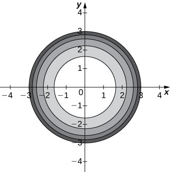

* Calculate the limit of a function of two variables.
* Learn how a function of two variables can approach different values at a boundary point, depending on the path of approach.
* State the conditions for continuity of a function of two variables.
* Verify the continuity of a function of two variables at a point.
* Calculate the limit of a function of three or more variables and verify the continuity of the function at a point.

We have now examined functions of more than one variable and seen how to graph them. In this section, we see how to take the limit of a function of more than one variable, and what it means for a function of more than one variable to be continuous at a point in its domain. It turns out these concepts have aspects that just don’t occur with functions of one variable.

### Limit of a Function of Two Variables

Recall from Section <math xmlns="http://www.w3.org/1998/Math/MathML"><mrow><mn>2.2</mn></mrow></math>

 the definition of a limit of a function of one variable:

Let <math xmlns="http://www.w3.org/1998/Math/MathML"><mrow><mi>f</mi><mrow><mo>(</mo><mi>x</mi><mo>)</mo></mrow></mrow></math>

 be defined for all <math xmlns="http://www.w3.org/1998/Math/MathML"><mrow><mi>x</mi><mo>≠</mo><mi>a</mi></mrow></math>

 in an open interval containing <math xmlns="http://www.w3.org/1998/Math/MathML"><mi>a</mi><mo>.</mo></math>

 Let <math xmlns="http://www.w3.org/1998/Math/MathML"><mi>L</mi></math>

 be a real number. Then

<math xmlns="http://www.w3.org/1998/Math/MathML"><mrow><munder><mrow><mtext>lim</mtext></mrow><mrow><mi>x</mi><mo stretchy="false">→</mo><mi>a</mi></mrow></munder><mi>f</mi><mo stretchy="false">(</mo><mi>x</mi><mo stretchy="false">)</mo><mo>=</mo><mi>L</mi></mrow></math>

if for every <math xmlns="http://www.w3.org/1998/Math/MathML"><mrow><mi>ε</mi><mo>&gt;</mo><mn>0</mn><mo>,</mo></mrow></math>

 there exists a <math xmlns="http://www.w3.org/1998/Math/MathML"><mrow><mi>δ</mi><mo>&gt;</mo><mn>0</mn><mo>,</mo></mrow></math>

 such that if <math xmlns="http://www.w3.org/1998/Math/MathML"><mrow><mn>0</mn><mo>&lt;</mo><mrow><mo>\|</mo><mrow><mi>x</mi><mo>−</mo><mi>a</mi></mrow><mo>\|</mo></mrow><mo>&lt;</mo><mi>δ</mi></mrow></math>

 for all <math xmlns="http://www.w3.org/1998/Math/MathML"><mi>x</mi></math>

 in the domain of <math xmlns="http://www.w3.org/1998/Math/MathML"><mi>f</mi><mo>,</mo></math>

 then

<math xmlns="http://www.w3.org/1998/Math/MathML"><mrow><mrow><mo>\|</mo><mrow><mi>f</mi><mrow><mo>(</mo><mi>x</mi><mo>)</mo></mrow><mo>−</mo><mi>L</mi></mrow><mo>\|</mo></mrow><mo>&gt;</mo><mi>ε</mi><mo>.</mo></mrow></math>

Before we can adapt this definition to define a limit of a function of two variables, we first need to see how to extend the idea of an open interval in one variable to an open interval in two variables.

Definition

Consider a point <math xmlns="http://www.w3.org/1998/Math/MathML"><mrow><mo stretchy="false">(</mo><mi>a</mi><mo>,</mo><mi>b</mi><mo stretchy="false">)</mo><mo>∈</mo><msup><mi>ℝ</mi><mn>2</mn></msup><mo>.</mo></mrow></math>

 A **<math xmlns="http://www.w3.org/1998/Math/MathML"><mi>δ</mi></math>

 disk**{: data-type="term"} centered at point <math xmlns="http://www.w3.org/1998/Math/MathML"><mrow><mo stretchy="false">(</mo><mi>a</mi><mo>,</mo><mi>b</mi><mo stretchy="false">)</mo></mrow></math>

 is defined to be an open disk of radius <math xmlns="http://www.w3.org/1998/Math/MathML"><mi>δ</mi></math>

 centered at point <math xmlns="http://www.w3.org/1998/Math/MathML"><mrow><mrow><mo>(</mo><mrow><mi>a</mi><mo>,</mo><mi>b</mi></mrow><mo>)</mo></mrow></mrow></math>

—that is,

<math xmlns="http://www.w3.org/1998/Math/MathML"><mrow><mo>{</mo><mo stretchy="false">(</mo><mi>x</mi><mo>,</mo><mi>y</mi><mo stretchy="false">)</mo><mo>∈</mo><msup><mi>ℝ</mi><mn>2</mn></msup><mo>\|</mo><msup><mrow><mo stretchy="false">(</mo><mi>x</mi><mo>−</mo><mi>a</mi><mo stretchy="false">)</mo></mrow><mn>2</mn></msup><mo>+</mo><msup><mrow><mo stretchy="false">(</mo><mi>y</mi><mo>−</mo><mi>b</mi><mo stretchy="false">)</mo></mrow><mn>2</mn></msup><mo>&lt;</mo><msup><mi>δ</mi><mn>2</mn></msup><mo>}</mo></mrow></math>

as shown in the following graph.

 ."){: #CNX_Calc_Figure_14_02_001}

The idea of a <math xmlns="http://www.w3.org/1998/Math/MathML"><mi>δ</mi></math>

 disk appears in the definition of the limit of a function of two variables. If <math xmlns="http://www.w3.org/1998/Math/MathML"><mi>δ</mi></math>

 is small, then all the points <math xmlns="http://www.w3.org/1998/Math/MathML"><mrow><mrow><mo>(</mo><mrow><mi>x</mi><mo>,</mo><mi>y</mi></mrow><mo>)</mo></mrow></mrow></math>

 in the <math xmlns="http://www.w3.org/1998/Math/MathML"><mi>δ</mi></math>

 disk are close to <math xmlns="http://www.w3.org/1998/Math/MathML"><mrow><mrow><mo>(</mo><mrow><mi>a</mi><mo>,</mo><mi>b</mi></mrow><mo>)</mo></mrow><mo>.</mo></mrow></math>

 This is completely analogous to <math xmlns="http://www.w3.org/1998/Math/MathML"><mi>x</mi></math>

 being close to <math xmlns="http://www.w3.org/1998/Math/MathML"><mi>a</mi></math>

 in the definition of a limit of a function of one variable. In one dimension, we express this restriction as

<math xmlns="http://www.w3.org/1998/Math/MathML"><mrow><mi>a</mi><mo>−</mo><mi>δ</mi><mo>&lt;</mo><mi>x</mi><mo>&lt;</mo><mi>a</mi><mo>+</mo><mi>δ</mi><mo>.</mo></mrow></math>

In more than one dimension, we use a <math xmlns="http://www.w3.org/1998/Math/MathML"><mi>δ</mi></math>

 disk.

Definition

Let <math xmlns="http://www.w3.org/1998/Math/MathML"><mi>f</mi></math>

 be a function of two variables, <math xmlns="http://www.w3.org/1998/Math/MathML"><mi>x</mi></math>

 and <math xmlns="http://www.w3.org/1998/Math/MathML"><mi>y</mi><mo>.</mo></math>

 The limit of <math xmlns="http://www.w3.org/1998/Math/MathML"><mrow><mi>f</mi><mrow><mo>(</mo><mrow><mi>x</mi><mo>,</mo><mi>y</mi></mrow><mo>)</mo></mrow></mrow></math>

 as <math xmlns="http://www.w3.org/1998/Math/MathML"><mrow><mrow><mo>(</mo><mrow><mi>x</mi><mo>,</mo><mi>y</mi></mrow><mo>)</mo></mrow></mrow></math>

 approaches <math xmlns="http://www.w3.org/1998/Math/MathML"><mrow><mrow><mo>(</mo><mrow><mi>a</mi><mo>,</mo><mi>b</mi></mrow><mo>)</mo></mrow></mrow></math>

 is <math xmlns="http://www.w3.org/1998/Math/MathML"><mi>L</mi><mo>,</mo></math>

 written

<math xmlns="http://www.w3.org/1998/Math/MathML"><mrow><munder><mrow><mtext>lim</mtext></mrow><mrow><mrow><mo>(</mo><mrow><mi>x</mi><mo>,</mo><mi>y</mi></mrow><mo>)</mo></mrow><mo stretchy="false">→</mo><mrow><mo>(</mo><mrow><mi>a</mi><mo>,</mo><mi>b</mi></mrow><mo>)</mo></mrow></mrow></munder><mi>f</mi><mo stretchy="false">(</mo><mi>x</mi><mo>,</mo><mi>y</mi><mo stretchy="false">)</mo><mo>=</mo><mi>L</mi></mrow></math>

if for each <math xmlns="http://www.w3.org/1998/Math/MathML"><mrow><mi>ε</mi><mo>&gt;</mo><mn>0</mn></mrow></math>

 there exists a small enough <math xmlns="http://www.w3.org/1998/Math/MathML"><mrow><mi>δ</mi><mo>&gt;</mo><mn>0</mn></mrow></math>

 such that for all points <math xmlns="http://www.w3.org/1998/Math/MathML"><mrow><mrow><mo>(</mo><mrow><mi>x</mi><mo>,</mo><mi>y</mi></mrow><mo>)</mo></mrow></mrow></math>

 in a <math xmlns="http://www.w3.org/1998/Math/MathML"><mi>δ</mi></math>

 disk around <math xmlns="http://www.w3.org/1998/Math/MathML"><mrow><mrow><mo>(</mo><mrow><mi>a</mi><mo>,</mo><mi>b</mi></mrow><mo>)</mo></mrow><mo>,</mo></mrow></math>

 except possibly for <math xmlns="http://www.w3.org/1998/Math/MathML"><mrow><mrow><mo>(</mo><mrow><mi>a</mi><mo>,</mo><mi>b</mi></mrow><mo>)</mo></mrow></mrow></math>

 itself, the value of <math xmlns="http://www.w3.org/1998/Math/MathML"><mrow><mi>f</mi><mrow><mo>(</mo><mrow><mi>x</mi><mo>,</mo><mi>y</mi></mrow><mo>)</mo></mrow></mrow></math>

 is no more than <math xmlns="http://www.w3.org/1998/Math/MathML"><mi>ε</mi></math>

 away from <math xmlns="http://www.w3.org/1998/Math/MathML"><mi>L</mi></math>

 ([\[link\]](#CNX_Calc_Figure_14_02_002)). Using symbols, we write the following: For any <math xmlns="http://www.w3.org/1998/Math/MathML"><mrow><mi>ε</mi><mo>&gt;</mo><mn>0</mn><mo>,</mo></mrow></math>

 there exists a number <math xmlns="http://www.w3.org/1998/Math/MathML"><mrow><mi>δ</mi><mo>&gt;</mo><mn>0</mn></mrow></math>

 such that

<math xmlns="http://www.w3.org/1998/Math/MathML"><mrow><mrow><mo>\|</mo><mrow><mi>f</mi><mrow><mo>(</mo><mrow><mi>x</mi><mo>,</mo><mi>y</mi></mrow><mo>)</mo></mrow><mo>−</mo><mi>L</mi></mrow><mo>\|</mo></mrow><mo>&lt;</mo><mi>ε</mi><mspace width="0.2em" /><mtext>whenever</mtext><mspace width="0.2em" /><mn>0</mn><mo>&lt;</mo><msqrt><mrow><msup><mrow><mrow><mo>(</mo><mrow><mi>x</mi><mo>−</mo><mi>a</mi></mrow><mo>)</mo></mrow></mrow><mn>2</mn></msup><mo>+</mo><msup><mrow><mrow><mo>(</mo><mrow><mi>y</mi><mo>−</mo><mi>b</mi></mrow><mo>)</mo></mrow></mrow><mn>2</mn></msup></mrow></msqrt><mo>&lt;</mo><mi>δ</mi><mo>.</mo></mrow></math>

 ![In xyz space, a function is drawn with point L. This point L is the center of a circle of radius &#x949;, with points L &#xB1; &#x949; marked. On the xy plane, there is a point (a, b) drawn with a circle of radius &#x3B4; around it. This is denoted the &#x3B4;-disk. There are dashed lines up from the &#x3B4;-disk to make a disk on the function, which is called the image of delta disk. Then there are dashed lines from this disk to the circle around the point L, which is called the &#x949;-neighborhood of L.](../resources/CNX_Calc_Figure_14_02_002.jpg "The limit of a function involving two variables requires that f(x,y) be within &#x3B5; of L whenever (x,y) is within &#x3B4; of (a,b). The smaller the value of &#x3B5;, the smaller the value of &#x3B4;."){: #CNX_Calc_Figure_14_02_002}

Proving that a limit exists using the definition of a **limit of a function of two variables**{: data-type="term" .no-emphasis} can be challenging. Instead, we use the following theorem, which gives us shortcuts to finding limits. The formulas in this theorem are an extension of the formulas in the limit laws theorem in [The Limit Laws](/m53492){: .target-chapter}.

Limit laws for functions of two variables

Let <math xmlns="http://www.w3.org/1998/Math/MathML"><mrow><mi>f</mi><mrow><mo>(</mo><mrow><mi>x</mi><mo>,</mo><mi>y</mi></mrow><mo>)</mo></mrow></mrow></math>

 and <math xmlns="http://www.w3.org/1998/Math/MathML"><mrow><mi>g</mi><mrow><mo>(</mo><mrow><mi>x</mi><mo>,</mo><mi>y</mi></mrow><mo>)</mo></mrow></mrow></math>

 be defined for all <math xmlns="http://www.w3.org/1998/Math/MathML"><mrow><mrow><mo>(</mo><mrow><mi>x</mi><mo>,</mo><mi>y</mi></mrow><mo>)</mo></mrow><mo>≠</mo><mrow><mo>(</mo><mrow><mi>a</mi><mo>,</mo><mi>b</mi></mrow><mo>)</mo></mrow></mrow></math>

 in a neighborhood around <math xmlns="http://www.w3.org/1998/Math/MathML"><mrow><mrow><mo>(</mo><mrow><mi>a</mi><mo>,</mo><mi>b</mi></mrow><mo>)</mo></mrow><mo>,</mo></mrow></math>

 and assume the neighborhood is contained completely inside the domain of <math xmlns="http://www.w3.org/1998/Math/MathML"><mi>f</mi><mo>.</mo></math>

 Assume that <math xmlns="http://www.w3.org/1998/Math/MathML"><mi>L</mi></math>

 and <math xmlns="http://www.w3.org/1998/Math/MathML"><mi>M</mi></math>

 are real numbers such that <math xmlns="http://www.w3.org/1998/Math/MathML"><mrow><munder><mrow><mtext>lim</mtext></mrow><mrow><mo stretchy="false">(</mo><mi>x</mi><mo>,</mo><mi>y</mi><mo stretchy="false">)</mo><mo stretchy="false">→</mo><mo stretchy="false">(</mo><mi>a</mi><mo>,</mo><mi>b</mi><mo stretchy="false">)</mo></mrow></munder><mi>f</mi><mo stretchy="false">(</mo><mi>x</mi><mo>,</mo><mi>y</mi><mo stretchy="false">)</mo><mo>=</mo><mi>L</mi></mrow></math>

 and <math xmlns="http://www.w3.org/1998/Math/MathML"><mrow><munder><mrow><mtext>lim</mtext></mrow><mrow><mo stretchy="false">(</mo><mi>x</mi><mo>,</mo><mi>y</mi><mo stretchy="false">)</mo><mo stretchy="false">→</mo><mo stretchy="false">(</mo><mi>a</mi><mo>,</mo><mi>b</mi><mo stretchy="false">)</mo></mrow></munder><mi>g</mi><mo stretchy="false">(</mo><mi>x</mi><mo>,</mo><mi>y</mi><mo stretchy="false">)</mo><mo>=</mo><mi>M</mi><mo>,</mo></mrow></math>

 and let <math xmlns="http://www.w3.org/1998/Math/MathML"><mi>c</mi></math>

 be a constant. Then each of the following statements holds:

**Constant Law:**

<math xmlns="http://www.w3.org/1998/Math/MathML"><mrow><munder><mrow><mtext>lim</mtext></mrow><mrow><mo stretchy="false">(</mo><mi>x</mi><mo>,</mo><mi>y</mi><mo stretchy="false">)</mo><mo stretchy="false">→</mo><mo stretchy="false">(</mo><mi>a</mi><mo>,</mo><mi>b</mi><mo stretchy="false">)</mo></mrow></munder><mi>c</mi><mo>=</mo><mi>c</mi></mrow></math>

**Identity Laws:**

<math xmlns="http://www.w3.org/1998/Math/MathML"><mrow><munder><mrow><mtext>lim</mtext></mrow><mrow><mo stretchy="false">(</mo><mi>x</mi><mo>,</mo><mi>y</mi><mo stretchy="false">)</mo><mo stretchy="false">→</mo><mo stretchy="false">(</mo><mi>a</mi><mo>,</mo><mi>b</mi><mo stretchy="false">)</mo></mrow></munder><mi>x</mi><mo>=</mo><mi>a</mi></mrow></math>

<math xmlns="http://www.w3.org/1998/Math/MathML"><mrow><munder><mrow><mtext>lim</mtext></mrow><mrow><mo stretchy="false">(</mo><mi>x</mi><mo>,</mo><mi>y</mi><mo stretchy="false">)</mo><mo stretchy="false">→</mo><mo stretchy="false">(</mo><mi>a</mi><mo>,</mo><mi>b</mi><mo stretchy="false">)</mo></mrow></munder><mi>y</mi><mo>=</mo><mi>b</mi></mrow></math>

**Sum Law:**

<math xmlns="http://www.w3.org/1998/Math/MathML"><mrow><munder><mrow><mtext>lim</mtext></mrow><mrow><mo stretchy="false">(</mo><mi>x</mi><mo>,</mo><mi>y</mi><mo stretchy="false">)</mo><mo stretchy="false">→</mo><mo stretchy="false">(</mo><mi>a</mi><mo>,</mo><mi>b</mi><mo stretchy="false">)</mo></mrow></munder><mrow><mo>(</mo><mrow><mi>f</mi><mrow><mo>(</mo><mrow><mi>x</mi><mo>,</mo><mi>y</mi></mrow><mo>)</mo></mrow><mo>+</mo><mi>g</mi><mrow><mo>(</mo><mrow><mi>x</mi><mo>,</mo><mi>y</mi></mrow><mo>)</mo></mrow></mrow><mo>)</mo></mrow><mo>=</mo><mi>L</mi><mo>+</mo><mi>M</mi></mrow></math>

**Difference Law:**

<math xmlns="http://www.w3.org/1998/Math/MathML"><mrow><munder><mrow><mtext>lim</mtext></mrow><mrow><mo stretchy="false">(</mo><mi>x</mi><mo>,</mo><mi>y</mi><mo stretchy="false">)</mo><mo stretchy="false">→</mo><mo stretchy="false">(</mo><mi>a</mi><mo>,</mo><mi>b</mi><mo stretchy="false">)</mo></mrow></munder><mrow><mo>(</mo><mrow><mi>f</mi><mrow><mo>(</mo><mrow><mi>x</mi><mo>,</mo><mi>y</mi></mrow><mo>)</mo></mrow><mo>−</mo><mi>g</mi><mrow><mo>(</mo><mrow><mi>x</mi><mo>,</mo><mi>y</mi></mrow><mo>)</mo></mrow></mrow><mo>)</mo></mrow><mo>=</mo><mi>L</mi><mo>−</mo><mi>M</mi></mrow></math>

**Constant Multiple Law:**

<math xmlns="http://www.w3.org/1998/Math/MathML"><mrow><munder><mrow><mtext>lim</mtext></mrow><mrow><mo stretchy="false">(</mo><mi>x</mi><mo>,</mo><mi>y</mi><mo stretchy="false">)</mo><mo stretchy="false">→</mo><mo stretchy="false">(</mo><mi>a</mi><mo>,</mo><mi>b</mi><mo stretchy="false">)</mo></mrow></munder><mrow><mo>(</mo><mrow><mi>c</mi><mi>f</mi><mrow><mo>(</mo><mrow><mi>x</mi><mo>,</mo><mi>y</mi></mrow><mo>)</mo></mrow></mrow><mo>)</mo></mrow><mo>=</mo><mi>c</mi><mi>L</mi></mrow></math>

**Product Law:**

<math xmlns="http://www.w3.org/1998/Math/MathML"><mrow><munder><mrow><mtext>lim</mtext></mrow><mrow><mo stretchy="false">(</mo><mi>x</mi><mo>,</mo><mi>y</mi><mo stretchy="false">)</mo><mo stretchy="false">→</mo><mo stretchy="false">(</mo><mi>a</mi><mo>,</mo><mi>b</mi><mo stretchy="false">)</mo></mrow></munder><mrow><mo>(</mo><mrow><mi>f</mi><mrow><mo>(</mo><mrow><mi>x</mi><mo>,</mo><mi>y</mi></mrow><mo>)</mo></mrow><mi>g</mi><mrow><mo>(</mo><mrow><mi>x</mi><mo>,</mo><mi>y</mi></mrow><mo>)</mo></mrow></mrow><mo>)</mo></mrow><mo>=</mo><mi>L</mi><mi>M</mi></mrow></math>

**Quotient Law:**

<math xmlns="http://www.w3.org/1998/Math/MathML"><mrow><munder><mrow><mtext>lim</mtext></mrow><mrow><mo stretchy="false">(</mo><mi>x</mi><mo>,</mo><mi>y</mi><mo stretchy="false">)</mo><mo stretchy="false">→</mo><mo stretchy="false">(</mo><mi>a</mi><mo>,</mo><mi>b</mi><mo stretchy="false">)</mo></mrow></munder><mfrac><mrow><mi>f</mi><mrow><mo>(</mo><mrow><mi>x</mi><mo>,</mo><mi>y</mi></mrow><mo>)</mo></mrow></mrow><mrow><mi>g</mi><mrow><mo>(</mo><mrow><mi>x</mi><mo>,</mo><mi>y</mi></mrow><mo>)</mo></mrow></mrow></mfrac><mo>=</mo><mfrac><mi>L</mi><mi>M</mi></mfrac><mspace width="0.2em" /><mtext>for</mtext><mspace width="0.2em" /><mi>M</mi><mo>≠</mo><mn>0</mn></mrow></math>

**Power Law:**

<math xmlns="http://www.w3.org/1998/Math/MathML"><mrow><munder><mrow><mtext>lim</mtext></mrow><mrow><mo stretchy="false">(</mo><mi>x</mi><mo>,</mo><mi>y</mi><mo stretchy="false">)</mo><mo stretchy="false">→</mo><mo stretchy="false">(</mo><mi>a</mi><mo>,</mo><mi>b</mi><mo stretchy="false">)</mo></mrow></munder><msup><mrow><mrow><mo>(</mo><mrow><mi>f</mi><mrow><mo>(</mo><mrow><mi>x</mi><mo>,</mo><mi>y</mi></mrow><mo>)</mo></mrow></mrow><mo>)</mo></mrow></mrow><mi>n</mi></msup><mo>=</mo><msup><mi>L</mi><mi>n</mi></msup></mrow></math>

for any positive integer <math xmlns="http://www.w3.org/1998/Math/MathML"><mi>n</mi><mo>.</mo></math>

**Root Law:**

<math xmlns="http://www.w3.org/1998/Math/MathML"><mrow><munder><mrow><mtext>lim</mtext></mrow><mrow><mo stretchy="false">(</mo><mi>x</mi><mo>,</mo><mi>y</mi><mo stretchy="false">)</mo><mo stretchy="false">→</mo><mo stretchy="false">(</mo><mi>a</mi><mo>,</mo><mi>b</mi><mo stretchy="false">)</mo></mrow></munder><mroot><mrow><mi>f</mi><mrow><mo>(</mo><mrow><mi>x</mi><mo>,</mo><mi>y</mi></mrow><mo>)</mo></mrow></mrow><mi>n</mi></mroot><mo>=</mo><mroot><mi>L</mi><mi>n</mi></mroot></mrow></math>

for all <math xmlns="http://www.w3.org/1998/Math/MathML"><mi>L</mi></math>

 if <math xmlns="http://www.w3.org/1998/Math/MathML"><mi>n</mi></math>

 is odd and positive, and for <math xmlns="http://www.w3.org/1998/Math/MathML"><mrow><mi>L</mi><mo>≥</mo><mn>0</mn></mrow></math>

 if <math xmlns="http://www.w3.org/1998/Math/MathML"><mi>n</mi></math>

 is even and positive.

The proofs of these properties are similar to those for the limits of functions of one variable. We can apply these laws to finding limits of various functions.

Finding the Limit of a Function of Two Variables

Find each of the following limits:

1.  <math xmlns="http://www.w3.org/1998/Math/MathML"><mrow><munder><mrow><mtext>lim</mtext></mrow><mrow><mrow><mo>(</mo><mrow><mi>x</mi><mo>,</mo><mi>y</mi></mrow><mo>)</mo></mrow><mo stretchy="false">→</mo><mrow><mo>(</mo><mrow><mn>2</mn><mo>,</mo><mn>−1</mn></mrow><mo>)</mo></mrow></mrow></munder><mrow><mo>(</mo><mrow><msup><mi>x</mi><mn>2</mn></msup><mo>−</mo><mn>2</mn><mi>x</mi><mi>y</mi><mo>+</mo><mn>3</mn><msup><mi>y</mi><mn>2</mn></msup><mo>−</mo><mn>4</mn><mi>x</mi><mo>+</mo><mn>3</mn><mi>y</mi><mo>−</mo><mn>6</mn></mrow><mo>)</mo></mrow></mrow></math>

2.  <math xmlns="http://www.w3.org/1998/Math/MathML"><mrow><munder><mrow><mtext>lim</mtext></mrow><mrow><mrow><mo>(</mo><mrow><mi>x</mi><mo>,</mo><mi>y</mi></mrow><mo>)</mo></mrow><mo stretchy="false">→</mo><mrow><mo>(</mo><mrow><mn>2</mn><mo>,</mo><mn>−1</mn></mrow><mo>)</mo></mrow></mrow></munder><mfrac><mrow><mn>2</mn><mi>x</mi><mo>+</mo><mn>3</mn><mi>y</mi></mrow><mrow><mn>4</mn><mi>x</mi><mo>−</mo><mn>3</mn><mi>y</mi></mrow></mfrac></mrow></math>
{: data-number-style="lower-alpha"}

1.  First use the sum and difference laws to separate the terms:
    * * *
    {: data-type="newline"}
    
    

    <math xmlns="http://www.w3.org/1998/Math/MathML"><mtable><mtr /><mtr><mtd columnalign="left"><munder><mrow><mtext>lim</mtext></mrow><mrow><mrow><mo>(</mo><mrow><mi>x</mi><mo>,</mo><mi>y</mi></mrow><mo>)</mo></mrow><mo stretchy="false">→</mo><mrow><mo>(</mo><mrow><mn>2</mn><mo>,</mo><mn>−1</mn></mrow><mo>)</mo></mrow></mrow></munder><mrow><mo>(</mo><mrow><msup><mi>x</mi><mn>2</mn></msup><mo>−</mo><mn>2</mn><mi>x</mi><mi>y</mi><mo>+</mo><mn>3</mn><msup><mi>y</mi><mn>2</mn></msup><mo>−</mo><mn>4</mn><mi>x</mi><mo>+</mo><mn>3</mn><mi>y</mi><mo>−</mo><mn>6</mn></mrow><mo>)</mo></mrow></mtd></mtr><mtr><mtd columnalign="left"><mo>=</mo><mrow><mo>(</mo><mrow><munder><mrow><mtext>lim</mtext></mrow><mrow><mrow><mo>(</mo><mrow><mi>x</mi><mo>,</mo><mi>y</mi></mrow><mo>)</mo></mrow><mo stretchy="false">→</mo><mrow><mo>(</mo><mrow><mn>2</mn><mo>,</mo><mn>−1</mn></mrow><mo>)</mo></mrow></mrow></munder><msup><mi>x</mi><mn>2</mn></msup></mrow><mo>)</mo></mrow><mo>−</mo><mrow><mo>(</mo><mrow><munder><mrow><mtext>lim</mtext></mrow><mrow><mrow><mo>(</mo><mrow><mi>x</mi><mo>,</mo><mi>y</mi></mrow><mo>)</mo></mrow><mo stretchy="false">→</mo><mrow><mo>(</mo><mrow><mn>2</mn><mo>,</mo><mn>−1</mn></mrow><mo>)</mo></mrow></mrow></munder><mn>2</mn><mi>x</mi><mi>y</mi></mrow><mo>)</mo></mrow><mo>+</mo><mrow><mo>(</mo><mrow><munder><mrow><mtext>lim</mtext></mrow><mrow><mrow><mo>(</mo><mrow><mi>x</mi><mo>,</mo><mi>y</mi></mrow><mo>)</mo></mrow><mo stretchy="false">→</mo><mrow><mo>(</mo><mrow><mn>2</mn><mo>,</mo><mn>−1</mn></mrow><mo>)</mo></mrow></mrow></munder><mn>3</mn><msup><mi>y</mi><mn>2</mn></msup></mrow><mo>)</mo></mrow><mo>−</mo><mrow><mo>(</mo><mrow><munder><mrow><mtext>lim</mtext></mrow><mrow><mrow><mo>(</mo><mrow><mi>x</mi><mo>,</mo><mi>y</mi></mrow><mo>)</mo></mrow><mo stretchy="false">→</mo><mrow><mo>(</mo><mrow><mn>2</mn><mo>,</mo><mn>−1</mn></mrow><mo>)</mo></mrow></mrow></munder><mn>4</mn><mi>x</mi></mrow><mo>)</mo></mrow></mtd></mtr><mtr><mtd columnalign="left"><mspace width="0.8em" /><mrow><mo>+</mo><mo>(</mo><mrow><munder><mrow><mtext>lim</mtext></mrow><mrow><mrow><mo>(</mo><mrow><mi>x</mi><mo>,</mo><mi>y</mi></mrow><mo>)</mo></mrow><mo stretchy="false">→</mo><mrow><mo>(</mo><mrow><mn>2</mn><mo>,</mo><mn>−1</mn></mrow><mo>)</mo></mrow></mrow></munder><mn>3</mn><mi>y</mi></mrow><mo>)</mo></mrow><mo>−</mo><mrow><mo>(</mo><mrow><munder><mrow><mtext>lim</mtext></mrow><mrow><mrow><mo>(</mo><mrow><mi>x</mi><mo>,</mo><mi>y</mi></mrow><mo>)</mo></mrow><mo stretchy="false">→</mo><mrow><mo>(</mo><mrow><mn>2</mn><mo>,</mo><mn>−1</mn></mrow><mo>)</mo></mrow></mrow></munder><mn>6</mn></mrow><mo>)</mo></mrow><mo>.</mo></mtd></mtr></mtable></math>
    

    
    * * *
    {: data-type="newline"}
    
    Next, use the constant multiple law on the second, third, fourth, and fifth limits:
    * * *
    {: data-type="newline"}
    
    

    <math xmlns="http://www.w3.org/1998/Math/MathML"><mtable><mtr /><mtr /><mtr><mtd columnalign="left"><mo>=</mo><mrow><mo>(</mo><mrow><munder><mrow><mtext>lim</mtext></mrow><mrow><mrow><mo>(</mo><mrow><mi>x</mi><mo>,</mo><mi>y</mi></mrow><mo>)</mo></mrow><mo stretchy="false">→</mo><mrow><mo>(</mo><mrow><mn>2</mn><mo>,</mo><mn>−1</mn></mrow><mo>)</mo></mrow></mrow></munder><msup><mi>x</mi><mn>2</mn></msup></mrow><mo>)</mo></mrow><mo>−</mo><mn>2</mn><mrow><mo>(</mo><mrow><munder><mrow><mtext>lim</mtext></mrow><mrow><mrow><mo>(</mo><mrow><mi>x</mi><mo>,</mo><mi>y</mi></mrow><mo>)</mo></mrow><mo stretchy="false">→</mo><mrow><mo>(</mo><mrow><mn>2</mn><mo>,</mo><mn>−1</mn></mrow><mo>)</mo></mrow></mrow></munder><mi>x</mi><mi>y</mi></mrow><mo>)</mo></mrow><mo>+</mo><mn>3</mn><mrow><mo>(</mo><mrow><munder><mrow><mtext>lim</mtext></mrow><mrow><mrow><mo>(</mo><mrow><mi>x</mi><mo>,</mo><mi>y</mi></mrow><mo>)</mo></mrow><mo stretchy="false">→</mo><mrow><mo>(</mo><mrow><mn>2</mn><mo>,</mo><mn>−1</mn></mrow><mo>)</mo></mrow></mrow></munder><msup><mi>y</mi><mn>2</mn></msup></mrow><mo>)</mo></mrow><mo>−</mo><mn>4</mn><mrow><mo>(</mo><mrow><munder><mrow><mtext>lim</mtext></mrow><mrow><mrow><mo>(</mo><mrow><mi>x</mi><mo>,</mo><mi>y</mi></mrow><mo>)</mo></mrow><mo stretchy="false">→</mo><mrow><mo>(</mo><mrow><mn>2</mn><mo>,</mo><mn>−1</mn></mrow><mo>)</mo></mrow></mrow></munder><mi>x</mi></mrow><mo>)</mo></mrow></mtd></mtr><mtr><mtd columnalign="left"><mspace width="0.5em" /><mo>+</mo><mn>3</mn><mrow><mo>(</mo><mrow><munder><mrow><mtext>lim</mtext></mrow><mrow><mrow><mo>(</mo><mrow><mi>x</mi><mo>,</mo><mi>y</mi></mrow><mo>)</mo></mrow><mo stretchy="false">→</mo><mrow><mo>(</mo><mrow><mn>2</mn><mo>,</mo><mn>−1</mn></mrow><mo>)</mo></mrow></mrow></munder><mi>y</mi></mrow><mo>)</mo></mrow><mo>−</mo><munder><mrow><mtext>lim</mtext></mrow><mrow><mrow><mo>(</mo><mrow><mi>x</mi><mo>,</mo><mi>y</mi></mrow><mo>)</mo></mrow><mo stretchy="false">→</mo><mrow><mo>(</mo><mrow><mn>2</mn><mo>,</mo><mn>−1</mn></mrow><mo>)</mo></mrow></mrow></munder><mn>6</mn><mo>.</mo></mtd></mtr></mtable></math>
    

    
    * * *
    {: data-type="newline"}
    
    Now, use the power law on the first and third limits, and the product law on the second limit:
    * * *
    {: data-type="newline"}
    
    

    <math xmlns="http://www.w3.org/1998/Math/MathML"><mtable><mtr /><mtr /><mtr /><mtr><mtd columnalign="left"><mo>=</mo><msup><mrow><mo>(</mo><mrow><munder><mrow><mtext>lim</mtext></mrow><mrow><mrow><mo>(</mo><mrow><mi>x</mi><mo>,</mo><mi>y</mi></mrow><mo>)</mo></mrow><mo stretchy="false">→</mo><mrow><mo>(</mo><mrow><mn>2</mn><mo>,</mo><mn>−1</mn></mrow><mo>)</mo></mrow></mrow></munder><mi>x</mi></mrow><mo>)</mo></mrow><mn>2</mn></msup><mo>−</mo><mn>2</mn><mrow><mo>(</mo><mrow><munder><mrow><mtext>lim</mtext></mrow><mrow><mrow><mo>(</mo><mrow><mi>x</mi><mo>,</mo><mi>y</mi></mrow><mo>)</mo></mrow><mo stretchy="false">→</mo><mrow><mo>(</mo><mrow><mn>2</mn><mo>,</mo><mn>−1</mn></mrow><mo>)</mo></mrow></mrow></munder><mi>x</mi></mrow><mo>)</mo></mrow><mrow><mo>(</mo><mrow><munder><mrow><mtext>lim</mtext></mrow><mrow><mrow><mo>(</mo><mrow><mi>x</mi><mo>,</mo><mi>y</mi></mrow><mo>)</mo></mrow><mo stretchy="false">→</mo><mrow><mo>(</mo><mrow><mn>2</mn><mo>,</mo><mn>−1</mn></mrow><mo>)</mo></mrow></mrow></munder><mi>y</mi></mrow><mo>)</mo></mrow><mo>+</mo><mn>3</mn><msup><mrow><mo>(</mo><mrow><munder><mrow><mtext>lim</mtext></mrow><mrow><mrow><mo>(</mo><mrow><mi>x</mi><mo>,</mo><mi>y</mi></mrow><mo>)</mo></mrow><mo stretchy="false">→</mo><mrow><mo>(</mo><mrow><mn>2</mn><mo>,</mo><mn>−1</mn></mrow><mo>)</mo></mrow></mrow></munder><mi>y</mi></mrow><mo>)</mo></mrow><mn>2</mn></msup></mtd></mtr><mtr><mtd columnalign="left"><mspace width="0.5em" /><mo>−</mo><mn>4</mn><mrow><mo>(</mo><mrow><munder><mrow><mtext>lim</mtext></mrow><mrow><mrow><mo>(</mo><mrow><mi>x</mi><mo>,</mo><mi>y</mi></mrow><mo>)</mo></mrow><mo stretchy="false">→</mo><mrow><mo>(</mo><mrow><mn>2</mn><mo>,</mo><mn>−1</mn></mrow><mo>)</mo></mrow></mrow></munder><mi>x</mi></mrow><mo>)</mo></mrow><mo>+</mo><mn>3</mn><mrow><mo>(</mo><mrow><munder><mrow><mtext>lim</mtext></mrow><mrow><mrow><mo>(</mo><mrow><mi>x</mi><mo>,</mo><mi>y</mi></mrow><mo>)</mo></mrow><mo stretchy="false">→</mo><mrow><mo>(</mo><mrow><mn>2</mn><mo>,</mo><mn>−1</mn></mrow><mo>)</mo></mrow></mrow></munder><mi>y</mi></mrow><mo>)</mo></mrow><mo>−</mo><munder><mrow><mtext>lim</mtext></mrow><mrow><mrow><mo>(</mo><mrow><mi>x</mi><mo>,</mo><mi>y</mi></mrow><mo>)</mo></mrow><mo stretchy="false">→</mo><mrow><mo>(</mo><mrow><mn>2</mn><mo>,</mo><mn>−1</mn></mrow><mo>)</mo></mrow></mrow></munder><mn>6</mn><mo>.</mo></mtd></mtr></mtable></math>
    

    
    * * *
    {: data-type="newline"}
    
    Last, use the identity laws on the first six limits and the constant law on the last limit:
    * * *
    {: data-type="newline"}
    
    <math xmlns="http://www.w3.org/1998/Math/MathML"><mtable><mtr><mtd columnalign="left"><munder><mrow><mtext>lim</mtext></mrow><mrow><mrow><mo>(</mo><mrow><mi>x</mi><mo>,</mo><mi>y</mi></mrow><mo>)</mo></mrow><mo stretchy="false">→</mo><mrow><mo>(</mo><mrow><mn>2</mn><mo>,</mo><mn>−1</mn></mrow><mo>)</mo></mrow></mrow></munder><mrow><mo>(</mo><mrow><msup><mi>x</mi><mn>2</mn></msup><mo>−</mo><mn>2</mn><mi>x</mi><mi>y</mi><mo>+</mo><mn>3</mn><msup><mi>y</mi><mn>2</mn></msup><mo>−</mo><mn>4</mn><mi>x</mi><mo>+</mo><mn>3</mn><mi>y</mi><mo>−</mo><mn>6</mn></mrow><mo>)</mo></mrow></mtd><mtd columnalign="left"><mo>=</mo><msup><mrow><mo>(</mo><mn>2</mn><mo>)</mo></mrow><mn>2</mn></msup><mo>−</mo><mn>2</mn><mrow><mo>(</mo><mn>2</mn><mo>)</mo></mrow><mrow><mo>(</mo><mrow><mn>−1</mn></mrow><mo>)</mo></mrow><mo>+</mo><mn>3</mn><msup><mrow><mo>(</mo><mrow><mn>−1</mn></mrow><mo>)</mo></mrow><mn>2</mn></msup><mo>−</mo><mn>4</mn><mrow><mo>(</mo><mn>2</mn><mo>)</mo></mrow><mo>+</mo><mn>3</mn><mrow><mo>(</mo><mrow><mn>−1</mn></mrow><mo>)</mo></mrow><mo>−</mo><mn>6</mn></mtd></mtr><mtr><mtd /><mtd columnalign="left"><mo>=</mo><mn>−6.</mn></mtd></mtr></mtable></math>

2.  Before applying the quotient law, we need to verify that the limit of the denominator is nonzero. Using the difference law, constant multiple law, and identity law,
    * * *
    {: data-type="newline"}
    
    

    <math xmlns="http://www.w3.org/1998/Math/MathML"><mtable><mtr><mtd columnalign="right"><munder><mrow><mtext>lim</mtext></mrow><mrow><mrow><mo>(</mo><mrow><mi>x</mi><mo>,</mo><mi>y</mi></mrow><mo>)</mo></mrow><mo stretchy="false">→</mo><mrow><mo>(</mo><mrow><mn>2</mn><mo>,</mo><mn>−1</mn></mrow><mo>)</mo></mrow></mrow></munder><mrow><mo>(</mo><mrow><mn>4</mn><mi>x</mi><mo>−</mo><mn>3</mn><mi>y</mi></mrow><mo>)</mo></mrow></mtd><mtd columnalign="left"><mo>=</mo><munder><mrow><mtext>lim</mtext></mrow><mrow><mrow><mo>(</mo><mrow><mi>x</mi><mo>,</mo><mi>y</mi></mrow><mo>)</mo></mrow><mo stretchy="false">→</mo><mrow><mo>(</mo><mrow><mn>2</mn><mo>,</mo><mn>−1</mn></mrow><mo>)</mo></mrow></mrow></munder><mn>4</mn><mi>x</mi><mo>−</mo><munder><mrow><mtext>lim</mtext></mrow><mrow><mrow><mo>(</mo><mrow><mi>x</mi><mo>,</mo><mi>y</mi></mrow><mo>)</mo></mrow><mo stretchy="false">→</mo><mrow><mo>(</mo><mrow><mn>2</mn><mo>,</mo><mn>−1</mn></mrow><mo>)</mo></mrow></mrow></munder><mn>3</mn><mi>y</mi></mtd></mtr><mtr><mtd /><mtd columnalign="left"><mo>=</mo><mn>4</mn><mrow><mo>(</mo><mrow><munder><mrow><mtext>lim</mtext></mrow><mrow><mrow><mo>(</mo><mrow><mi>x</mi><mo>,</mo><mi>y</mi></mrow><mo>)</mo></mrow><mo stretchy="false">→</mo><mrow><mo>(</mo><mrow><mn>2</mn><mo>,</mo><mn>−1</mn></mrow><mo>)</mo></mrow></mrow></munder><mi>x</mi></mrow><mo>)</mo></mrow><mo>−</mo><mn>3</mn><mrow><mo>(</mo><mrow><munder><mrow><mtext>lim</mtext></mrow><mrow><mrow><mo>(</mo><mrow><mi>x</mi><mo>,</mo><mi>y</mi></mrow><mo>)</mo></mrow><mo stretchy="false">→</mo><mrow><mo>(</mo><mrow><mn>2</mn><mo>,</mo><mn>−1</mn></mrow><mo>)</mo></mrow></mrow></munder><mi>y</mi></mrow><mo>)</mo></mrow></mtd></mtr><mtr><mtd /><mtd columnalign="left"><mo>=</mo><mn>4</mn><mrow><mo>(</mo><mn>2</mn><mo>)</mo></mrow><mo>−</mo><mn>3</mn><mrow><mo>(</mo><mrow><mn>−1</mn></mrow><mo>)</mo></mrow><mo>=</mo><mn>11.</mn></mtd></mtr></mtable></math>
    

    
    * * *
    {: data-type="newline"}
    
    Since the limit of the denominator is nonzero, the quotient law applies. We now calculate the limit of the numerator using the difference law, constant multiple law, and identity law:
    * * *
    {: data-type="newline"}
    
    

    <math xmlns="http://www.w3.org/1998/Math/MathML"><mtable><mtr><mtd columnalign="right"><munder><mrow><mtext>lim</mtext></mrow><mrow><mrow><mo>(</mo><mrow><mi>x</mi><mo>,</mo><mi>y</mi></mrow><mo>)</mo></mrow><mo stretchy="false">→</mo><mrow><mo>(</mo><mrow><mn>2</mn><mo>,</mo><mn>−1</mn></mrow><mo>)</mo></mrow></mrow></munder><mrow><mo>(</mo><mrow><mn>2</mn><mi>x</mi><mo>+</mo><mn>3</mn><mi>y</mi></mrow><mo>)</mo></mrow></mtd><mtd columnalign="left"><mo>=</mo><munder><mrow><mtext>lim</mtext></mrow><mrow><mrow><mo>(</mo><mrow><mi>x</mi><mo>,</mo><mi>y</mi></mrow><mo>)</mo></mrow><mo stretchy="false">→</mo><mrow><mo>(</mo><mrow><mn>2</mn><mo>,</mo><mn>−1</mn></mrow><mo>)</mo></mrow></mrow></munder><mn>2</mn><mi>x</mi><mo>+</mo><munder><mrow><mtext>lim</mtext></mrow><mrow><mrow><mo>(</mo><mrow><mi>x</mi><mo>,</mo><mi>y</mi></mrow><mo>)</mo></mrow><mo stretchy="false">→</mo><mrow><mo>(</mo><mrow><mn>2</mn><mo>,</mo><mn>−1</mn></mrow><mo>)</mo></mrow></mrow></munder><mn>3</mn><mi>y</mi></mtd></mtr><mtr><mtd /><mtd columnalign="left"><mo>=</mo><mn>2</mn><mrow><mo>(</mo><mrow><munder><mrow><mtext>lim</mtext></mrow><mrow><mrow><mo>(</mo><mrow><mi>x</mi><mo>,</mo><mi>y</mi></mrow><mo>)</mo></mrow><mo stretchy="false">→</mo><mrow><mo>(</mo><mrow><mn>2</mn><mo>,</mo><mn>−1</mn></mrow><mo>)</mo></mrow></mrow></munder><mi>x</mi></mrow><mo>)</mo></mrow><mo>+</mo><mn>3</mn><mrow><mo>(</mo><mrow><munder><mrow><mtext>lim</mtext></mrow><mrow><mrow><mo>(</mo><mrow><mi>x</mi><mo>,</mo><mi>y</mi></mrow><mo>)</mo></mrow><mo stretchy="false">→</mo><mrow><mo>(</mo><mrow><mn>2</mn><mo>,</mo><mn>−1</mn></mrow><mo>)</mo></mrow></mrow></munder><mi>y</mi></mrow><mo>)</mo></mrow></mtd></mtr><mtr><mtd /><mtd columnalign="left"><mo>=</mo><mn>2</mn><mrow><mo>(</mo><mn>2</mn><mo>)</mo></mrow><mo>+</mo><mn>3</mn><mrow><mo>(</mo><mrow><mn>−1</mn></mrow><mo>)</mo></mrow></mtd></mtr><mtr><mtd /><mtd columnalign="left"><mo>=</mo><mn>1.</mn></mtd></mtr></mtable></math>
    

    
    * * *
    {: data-type="newline"}
    
    Therefore, according to the quotient law we have
    * * *
    {: data-type="newline"}
    
    

    <math xmlns="http://www.w3.org/1998/Math/MathML"><mrow><munder><mrow><mtext>lim</mtext></mrow><mrow><mrow><mo>(</mo><mrow><mi>x</mi><mo>,</mo><mi>y</mi></mrow><mo>)</mo></mrow><mo stretchy="false">→</mo><mrow><mo>(</mo><mrow><mn>2</mn><mo>,</mo><mn>−1</mn></mrow><mo>)</mo></mrow></mrow></munder><mfrac><mrow><mn>2</mn><mi>x</mi><mo>+</mo><mn>3</mn><mi>y</mi></mrow><mrow><mn>4</mn><mi>x</mi><mo>−</mo><mn>3</mn><mi>y</mi></mrow></mfrac><mo>=</mo><mfrac><mrow><munder><mrow><mtext>lim</mtext></mrow><mrow><mrow><mo>(</mo><mrow><mi>x</mi><mo>,</mo><mi>y</mi></mrow><mo>)</mo></mrow><mo stretchy="false">→</mo><mrow><mo>(</mo><mrow><mn>2</mn><mo>,</mo><mn>−1</mn></mrow><mo>)</mo></mrow></mrow></munder><mrow><mo>(</mo><mrow><mn>2</mn><mi>x</mi><mo>+</mo><mn>3</mn><mi>y</mi></mrow><mo>)</mo></mrow></mrow><mrow><munder><mrow><mtext>lim</mtext></mrow><mrow><mrow><mo>(</mo><mrow><mi>x</mi><mo>,</mo><mi>y</mi></mrow><mo>)</mo></mrow><mo stretchy="false">→</mo><mrow><mo>(</mo><mrow><mn>2</mn><mo>,</mo><mn>−1</mn></mrow><mo>)</mo></mrow></mrow></munder><mrow><mo>(</mo><mrow><mn>4</mn><mi>x</mi><mo>−</mo><mn>3</mn><mi>y</mi></mrow><mo>)</mo></mrow></mrow></mfrac><mo>=</mo><mfrac><mn>1</mn><mrow><mn>11</mn></mrow></mfrac><mo>.</mo></mrow></math>
    

{: data-number-style="lower-alpha"}

Evaluate the following limit:

<math xmlns="http://www.w3.org/1998/Math/MathML"><mrow><munder><mrow><mtext>lim</mtext></mrow><mrow><mo stretchy="false">(</mo><mi>x</mi><mo>,</mo><mi>y</mi><mo stretchy="false">)</mo><mo stretchy="false">→</mo><mo stretchy="false">(</mo><mn>5</mn><mo>,</mo><mn>−2</mn><mo stretchy="false">)</mo></mrow></munder><mroot><mrow><mfrac><mrow><msup><mi>x</mi><mn>2</mn></msup><mo>−</mo><mi>y</mi></mrow><mrow><msup><mi>y</mi><mn>2</mn></msup><mo>+</mo><mi>x</mi><mo>−</mo><mn>1</mn></mrow></mfrac></mrow><mn>3</mn></mroot><mo>.</mo></mrow></math>

<math xmlns="http://www.w3.org/1998/Math/MathML"><mrow><munder><mrow><mtext>lim</mtext></mrow><mrow><mo stretchy="false">(</mo><mi>x</mi><mo>,</mo><mi>y</mi><mo stretchy="false">)</mo><mo stretchy="false">→</mo><mo stretchy="false">(</mo><mn>5</mn><mo>,</mo><mn>−2</mn><mo stretchy="false">)</mo></mrow></munder><mroot><mrow><mfrac><mrow><msup><mi>x</mi><mn>2</mn></msup><mo>−</mo><mi>y</mi></mrow><mrow><msup><mi>y</mi><mn>2</mn></msup><mo>+</mo><mi>x</mi><mo>−</mo><mn>1</mn></mrow></mfrac></mrow><mn>3</mn></mroot><mo>=</mo><mfrac><mn>3</mn><mn>2</mn></mfrac></mrow></math>

Hint

Use the limit laws.

Since we are taking the limit of a function of two variables, the point <math xmlns="http://www.w3.org/1998/Math/MathML"><mrow><mo stretchy="false">(</mo><mi>a</mi><mo>,</mo><mi>b</mi><mo stretchy="false">)</mo></mrow></math>

 is in <math xmlns="http://www.w3.org/1998/Math/MathML"><mrow><msup><mi>ℝ</mi><mn>2</mn></msup><mo>,</mo></mrow></math>

 and it is possible to approach this point from an infinite number of directions. Sometimes when calculating a limit, the answer varies depending on the path taken toward <math xmlns="http://www.w3.org/1998/Math/MathML"><mrow><mo stretchy="false">(</mo><mi>a</mi><mo>,</mo><mi>b</mi><mo stretchy="false">)</mo><mo>.</mo></mrow></math>

 If this is the case, then the limit fails to exist. In other words, the limit must be unique, regardless of path taken.

Limits That Fail to Exist

Show that neither of the following limits exist:

1.  <math xmlns="http://www.w3.org/1998/Math/MathML"><mrow><munder><mrow><mtext>lim</mtext></mrow><mrow><mo stretchy="false">(</mo><mi>x</mi><mo>,</mo><mi>y</mi><mo stretchy="false">)</mo><mo stretchy="false">→</mo><mo stretchy="false">(</mo><mn>0</mn><mo>,</mo><mn>0</mn><mo stretchy="false">)</mo></mrow></munder><mfrac><mrow><mn>2</mn><mi>x</mi><mi>y</mi></mrow><mrow><mn>3</mn><msup><mi>x</mi><mn>2</mn></msup><mo>+</mo><msup><mi>y</mi><mn>2</mn></msup></mrow></mfrac></mrow></math>

2.  <math xmlns="http://www.w3.org/1998/Math/MathML"><mrow><munder><mrow><mtext>lim</mtext></mrow><mrow><mo stretchy="false">(</mo><mi>x</mi><mo>,</mo><mi>y</mi><mo stretchy="false">)</mo><mo stretchy="false">→</mo><mo stretchy="false">(</mo><mn>0</mn><mo>,</mo><mn>0</mn><mo stretchy="false">)</mo></mrow></munder><mfrac><mrow><mn>4</mn><mi>x</mi><msup><mi>y</mi><mn>2</mn></msup></mrow><mrow><msup><mi>x</mi><mn>2</mn></msup><mo>+</mo><mn>3</mn><msup><mi>y</mi><mn>4</mn></msup></mrow></mfrac></mrow></math>
{: data-number-style="lower-alpha"}

1.  The domain of the function
    <math xmlns="http://www.w3.org/1998/Math/MathML"><mrow><mi>f</mi><mo stretchy="false">(</mo><mi>x</mi><mo>,</mo><mi>y</mi><mo stretchy="false">)</mo><mo>=</mo><mfrac><mrow><mn>2</mn><mi>x</mi><mi>y</mi></mrow><mrow><mn>3</mn><msup><mi>x</mi><mn>2</mn></msup><mo>+</mo><msup><mi>y</mi><mn>2</mn></msup></mrow></mfrac></mrow></math>
    
    consists of all points in the
    <math xmlns="http://www.w3.org/1998/Math/MathML"><mrow><mi>x</mi><mi>y</mi><mtext>-plane</mtext></mrow></math>
    
    except for the point
    <math xmlns="http://www.w3.org/1998/Math/MathML"><mrow><mrow><mo>(</mo><mrow><mn>0</mn><mo>,</mo><mn>0</mn></mrow><mo>)</mo></mrow></mrow></math>
    
    ([[link]](#CNX_Calc_Figure_14_02_003)). To show that the limit does not exist as
    <math xmlns="http://www.w3.org/1998/Math/MathML"><mrow><mrow><mo>(</mo><mrow><mi>x</mi><mo>,</mo><mi>y</mi></mrow><mo>)</mo></mrow></mrow></math>
    
    approaches
    <math xmlns="http://www.w3.org/1998/Math/MathML"><mrow><mrow><mo>(</mo><mrow><mn>0</mn><mo>,</mo><mn>0</mn></mrow><mo>)</mo></mrow><mo>,</mo></mrow></math>
    
    we note that it is impossible to satisfy the definition of a limit of a function of two variables because of the fact that the function takes different values along different lines passing through point
    <math xmlns="http://www.w3.org/1998/Math/MathML"><mrow><mrow><mo>(</mo><mrow><mn>0</mn><mo>,</mo><mn>0</mn></mrow><mo>)</mo></mrow><mo>.</mo></mrow></math>
    
    First, consider the line
    <math xmlns="http://www.w3.org/1998/Math/MathML"><mrow><mi>y</mi><mo>=</mo><mn>0</mn></mrow></math>
    
    in the
    <math xmlns="http://www.w3.org/1998/Math/MathML"><mrow><mi>x</mi><mi>y</mi><mtext>-plane.</mtext></mrow></math>
    
    Substituting
    <math xmlns="http://www.w3.org/1998/Math/MathML"><mrow><mi>y</mi><mo>=</mo><mn>0</mn></mrow></math>
    
    into
    <math xmlns="http://www.w3.org/1998/Math/MathML"><mrow><mi>f</mi><mrow><mo>(</mo><mrow><mi>x</mi><mo>,</mo><mi>y</mi></mrow><mo>)</mo></mrow></mrow></math>
    
    gives
    * * *
    {: data-type="newline"}
    
    

    <math xmlns="http://www.w3.org/1998/Math/MathML"><mrow><mi>f</mi><mrow><mo>(</mo><mrow><mi>x</mi><mo>,</mo><mn>0</mn></mrow><mo>)</mo></mrow><mo>=</mo><mfrac><mrow><mn>2</mn><mi>x</mi><mrow><mo>(</mo><mn>0</mn><mo>)</mo></mrow></mrow><mrow><mn>3</mn><msup><mi>x</mi><mn>2</mn></msup><mo>+</mo><msup><mn>0</mn><mn>2</mn></msup></mrow></mfrac><mo>=</mo><mn>0</mn></mrow></math>
    

    
    * * *
    {: data-type="newline"}
    
    for any value of
    <math xmlns="http://www.w3.org/1998/Math/MathML"><mi>x</mi><mo>.</mo></math>
    
    Therefore the value of
    <math xmlns="http://www.w3.org/1998/Math/MathML"><mi>f</mi></math>
    
    remains constant for any point on the
    <math xmlns="http://www.w3.org/1998/Math/MathML"><mi>x</mi><mtext>-axis,</mtext></math>
    
    and as
    <math xmlns="http://www.w3.org/1998/Math/MathML"><mi>y</mi></math>
    
    approaches zero, the function remains fixed at zero.
    * * *
    {: data-type="newline"}
    
    Next, consider the line
    <math xmlns="http://www.w3.org/1998/Math/MathML"><mrow><mi>y</mi><mo>=</mo><mi>x</mi><mo>.</mo></mrow></math>
    
    Substituting
    <math xmlns="http://www.w3.org/1998/Math/MathML"><mrow><mi>y</mi><mo>=</mo><mi>x</mi></mrow></math>
    
    into
    <math xmlns="http://www.w3.org/1998/Math/MathML"><mrow><mi>f</mi><mrow><mo>(</mo><mrow><mi>x</mi><mo>,</mo><mi>y</mi></mrow><mo>)</mo></mrow></mrow></math>
    
    gives
    * * *
    {: data-type="newline"}
    
    

    <math xmlns="http://www.w3.org/1998/Math/MathML"><mrow><mi>f</mi><mrow><mo>(</mo><mrow><mi>x</mi><mo>,</mo><mi>x</mi></mrow><mo>)</mo></mrow><mo>=</mo><mfrac><mrow><mn>2</mn><mi>x</mi><mrow><mo>(</mo><mi>x</mi><mo>)</mo></mrow></mrow><mrow><mn>3</mn><msup><mi>x</mi><mn>2</mn></msup><mo>+</mo><msup><mi>x</mi><mn>2</mn></msup></mrow></mfrac><mo>=</mo><mfrac><mrow><mn>2</mn><msup><mi>x</mi><mn>2</mn></msup></mrow><mrow><mn>4</mn><msup><mi>x</mi><mn>2</mn></msup></mrow></mfrac><mo>=</mo><mfrac><mn>1</mn><mn>2</mn></mfrac><mo>.</mo></mrow></math>
    

    
    * * *
    {: data-type="newline"}
    
    This is true for any point on the line
    <math xmlns="http://www.w3.org/1998/Math/MathML"><mrow><mi>y</mi><mo>=</mo><mi>x</mi><mo>.</mo></mrow></math>
    
    If we let
    <math xmlns="http://www.w3.org/1998/Math/MathML"><mi>x</mi></math>
    
    approach zero while staying on this line, the value of the function remains fixed at
    <math xmlns="http://www.w3.org/1998/Math/MathML"><mrow><mfrac><mn>1</mn><mn>2</mn></mfrac><mo>,</mo></mrow></math>
    
    regardless of how small
    <math xmlns="http://www.w3.org/1998/Math/MathML"><mi>x</mi></math>
    
    is.
    * * *
    {: data-type="newline"}
    
    Choose a value for
    <math xmlns="http://www.w3.org/1998/Math/MathML"><mi>ε</mi></math>
    
    that is less than
    <math xmlns="http://www.w3.org/1998/Math/MathML"><mrow><mrow><mn>1</mn><mtext>/</mtext><mn>2</mn></mrow></mrow></math>
    
    —say,
    <math xmlns="http://www.w3.org/1998/Math/MathML"><mrow><mn>1</mn><mtext>/</mtext><mn>4</mn><mo>.</mo></mrow></math>
    
    Then, no matter how small a
    <math xmlns="http://www.w3.org/1998/Math/MathML"><mi>δ</mi></math>
    
    disk we draw around
    <math xmlns="http://www.w3.org/1998/Math/MathML"><mrow><mrow><mo>(</mo><mrow><mn>0</mn><mo>,</mo><mn>0</mn></mrow><mo>)</mo></mrow><mo>,</mo></mrow></math>
    
    the values of
    <math xmlns="http://www.w3.org/1998/Math/MathML"><mrow><mi>f</mi><mrow><mo>(</mo><mrow><mi>x</mi><mo>,</mo><mi>y</mi></mrow><mo>)</mo></mrow></mrow></math>
    
    for points inside that
    <math xmlns="http://www.w3.org/1998/Math/MathML"><mi>δ</mi></math>
    
    disk will include both
    <math xmlns="http://www.w3.org/1998/Math/MathML"><mn>0</mn></math>
    
    and
    <math xmlns="http://www.w3.org/1998/Math/MathML"><mrow><mfrac><mn>1</mn><mn>2</mn></mfrac><mo>.</mo></mrow></math>
    
    Therefore, the definition of limit at a point is never satisfied and the limit fails to exist.
    * * *
    {: data-type="newline"}
    
    =(2xy)/(3x2+y2). Along the line y=0, the function is equal to zero; along the line y=x, the function is equal to 12."){: #CNX_Calc_Figure_14_02_003}

    * * *
    {: data-type="newline"}
    
    In a similar fashion to a., we can approach the origin along any straight line passing through the origin. If we try the
    <math xmlns="http://www.w3.org/1998/Math/MathML"><mi>x</mi><mtext>-axis</mtext></math>
    
    (i.e.,
    <math xmlns="http://www.w3.org/1998/Math/MathML"><mrow><mi>y</mi><mo>=</mo><mn>0</mn><mo stretchy="false">)</mo><mo>,</mo></mrow></math>
    
    then the function remains fixed at zero. The same is true for the
    <math xmlns="http://www.w3.org/1998/Math/MathML"><mi>y</mi><mtext>-axis.</mtext></math>
    
    Suppose we approach the origin along a straight line of slope
    <math xmlns="http://www.w3.org/1998/Math/MathML"><mi>k</mi><mo>.</mo></math>
    
    The equation of this line is
    <math xmlns="http://www.w3.org/1998/Math/MathML"><mrow><mi>y</mi><mo>=</mo><mi>k</mi><mi>x</mi><mo>.</mo></mrow></math>
    
    Then the limit becomes
    * * *
    {: data-type="newline"}
    
    

    <math xmlns="http://www.w3.org/1998/Math/MathML"><mtable><mtr><mtd columnalign="right"><munder><mrow><mtext>lim</mtext></mrow><mrow><mo stretchy="false">(</mo><mi>x</mi><mo>,</mo><mi>y</mi><mo stretchy="false">)</mo><mo stretchy="false">→</mo><mo stretchy="false">(</mo><mn>0</mn><mo>,</mo><mn>0</mn><mo stretchy="false">)</mo></mrow></munder><mfrac><mrow><mn>4</mn><mi>x</mi><msup><mi>y</mi><mn>2</mn></msup></mrow><mrow><msup><mi>x</mi><mn>2</mn></msup><mo>+</mo><mn>3</mn><msup><mi>y</mi><mn>4</mn></msup></mrow></mfrac></mtd><mtd columnalign="left"><mo>=</mo><munder><mrow><mtext>lim</mtext></mrow><mrow><mo stretchy="false">(</mo><mi>x</mi><mo>,</mo><mi>y</mi><mo stretchy="false">)</mo><mo stretchy="false">→</mo><mo stretchy="false">(</mo><mn>0</mn><mo>,</mo><mn>0</mn><mo stretchy="false">)</mo></mrow></munder><mfrac><mrow><mn>4</mn><mi>x</mi><msup><mrow><mrow><mo>(</mo><mrow><mi>k</mi><mi>x</mi></mrow><mo>)</mo></mrow></mrow><mn>2</mn></msup></mrow><mrow><msup><mi>x</mi><mn>2</mn></msup><mo>+</mo><mn>3</mn><msup><mrow><mrow><mo>(</mo><mrow><mi>k</mi><mi>x</mi></mrow><mo>)</mo></mrow></mrow><mn>4</mn></msup></mrow></mfrac></mtd></mtr><mtr><mtd /><mtd columnalign="left"><mo>=</mo><munder><mrow><mtext>lim</mtext></mrow><mrow><mo stretchy="false">(</mo><mi>x</mi><mo>,</mo><mi>y</mi><mo stretchy="false">)</mo><mo stretchy="false">→</mo><mo stretchy="false">(</mo><mn>0</mn><mo>,</mo><mn>0</mn><mo stretchy="false">)</mo></mrow></munder><mfrac><mrow><mn>4</mn><msup><mi>k</mi><mn>2</mn></msup><msup><mi>x</mi><mn>3</mn></msup></mrow><mrow><msup><mi>x</mi><mn>2</mn></msup><mo>+</mo><mn>3</mn><msup><mi>k</mi><mn>4</mn></msup><msup><mi>x</mi><mn>4</mn></msup></mrow></mfrac></mtd></mtr><mtr><mtd /><mtd columnalign="left"><mo>=</mo><munder><mrow><mtext>lim</mtext></mrow><mrow><mo stretchy="false">(</mo><mi>x</mi><mo>,</mo><mi>y</mi><mo stretchy="false">)</mo><mo stretchy="false">→</mo><mo stretchy="false">(</mo><mn>0</mn><mo>,</mo><mn>0</mn><mo stretchy="false">)</mo></mrow></munder><mfrac><mrow><mn>4</mn><msup><mi>k</mi><mn>2</mn></msup><mi>x</mi></mrow><mrow><mn>1</mn><mo>+</mo><mn>3</mn><msup><mi>k</mi><mn>4</mn></msup><msup><mi>x</mi><mn>2</mn></msup></mrow></mfrac></mtd></mtr><mtr><mtd /><mtd columnalign="left"><mo>=</mo><mfrac><mrow><munder><mrow><mtext>lim</mtext></mrow><mrow><mo stretchy="false">(</mo><mi>x</mi><mo>,</mo><mi>y</mi><mo stretchy="false">)</mo><mo stretchy="false">→</mo><mo stretchy="false">(</mo><mn>0</mn><mo>,</mo><mn>0</mn><mo stretchy="false">)</mo></mrow></munder><mrow><mo>(</mo><mrow><mn>4</mn><msup><mi>k</mi><mn>2</mn></msup><mi>x</mi></mrow><mo>)</mo></mrow></mrow><mrow><munder><mrow><mtext>lim</mtext></mrow><mrow><mo stretchy="false">(</mo><mi>x</mi><mo>,</mo><mi>y</mi><mo stretchy="false">)</mo><mo stretchy="false">→</mo><mo stretchy="false">(</mo><mn>0</mn><mo>,</mo><mn>0</mn><mo stretchy="false">)</mo></mrow></munder><mrow><mo>(</mo><mrow><mn>1</mn><mo>+</mo><mn>3</mn><msup><mi>k</mi><mn>4</mn></msup><msup><mi>x</mi><mn>2</mn></msup></mrow><mo>)</mo></mrow></mrow></mfrac></mtd></mtr><mtr><mtd /><mtd columnalign="left"><mo>=</mo><mn>0</mn></mtd></mtr></mtable></math>
    

    
    * * *
    {: data-type="newline"}
    
    regardless of the value of
    <math xmlns="http://www.w3.org/1998/Math/MathML"><mi>k</mi><mo>.</mo></math>
    
    It would seem that the limit is equal to zero. What if we chose a curve passing through the origin instead? For example, we can consider the parabola given by the equation
    <math xmlns="http://www.w3.org/1998/Math/MathML"><mrow><mi>x</mi><mo>=</mo><msup><mi>y</mi><mn>2</mn></msup><mo>.</mo></mrow></math>
    
    Substituting
    <math xmlns="http://www.w3.org/1998/Math/MathML"><mrow><msup><mi>y</mi><mn>2</mn></msup></mrow></math>
    
    in place of
    <math xmlns="http://www.w3.org/1998/Math/MathML"><mi>x</mi></math>
    
    in
    <math xmlns="http://www.w3.org/1998/Math/MathML"><mrow><mi>f</mi><mrow><mo>(</mo><mrow><mi>x</mi><mo>,</mo><mi>y</mi></mrow><mo>)</mo></mrow></mrow></math>
    
    gives
    * * *
    {: data-type="newline"}
    
    

    <math xmlns="http://www.w3.org/1998/Math/MathML"><mtable><mtr><mtd columnalign="right"><munder><mrow><mtext>lim</mtext></mrow><mrow><mrow><mo>(</mo><mrow><mi>x</mi><mo>,</mo><mi>y</mi></mrow><mo>)</mo></mrow><mo stretchy="false">→</mo><mrow><mo>(</mo><mrow><mn>0</mn><mo>,</mo><mn>0</mn></mrow><mo>)</mo></mrow></mrow></munder><mfrac><mrow><mn>4</mn><mi>x</mi><msup><mi>y</mi><mn>2</mn></msup></mrow><mrow><msup><mi>x</mi><mn>2</mn></msup><mo>+</mo><mn>3</mn><msup><mi>y</mi><mn>4</mn></msup></mrow></mfrac></mtd><mtd columnalign="left"><mo>=</mo><munder><mrow><mtext>lim</mtext></mrow><mrow><mrow><mo>(</mo><mrow><mi>x</mi><mo>,</mo><mi>y</mi></mrow><mo>)</mo></mrow><mo stretchy="false">→</mo><mrow><mo>(</mo><mrow><mn>0</mn><mo>,</mo><mn>0</mn></mrow><mo>)</mo></mrow></mrow></munder><mfrac><mrow><mn>4</mn><mrow><mo>(</mo><mrow><msup><mi>y</mi><mn>2</mn></msup></mrow><mo>)</mo></mrow><msup><mi>y</mi><mn>2</mn></msup></mrow><mrow><msup><mrow><mrow><mo>(</mo><mrow><msup><mi>y</mi><mn>2</mn></msup></mrow><mo>)</mo></mrow></mrow><mn>2</mn></msup><mo>+</mo><mn>3</mn><msup><mi>y</mi><mn>4</mn></msup></mrow></mfrac></mtd></mtr><mtr><mtd /><mtd columnalign="left"><mo>=</mo><munder><mrow><mtext>lim</mtext></mrow><mrow><mrow><mo>(</mo><mrow><mi>x</mi><mo>,</mo><mi>y</mi></mrow><mo>)</mo></mrow><mo stretchy="false">→</mo><mrow><mo>(</mo><mrow><mn>0</mn><mo>,</mo><mn>0</mn></mrow><mo>)</mo></mrow></mrow></munder><mfrac><mrow><mn>4</mn><msup><mi>y</mi><mn>4</mn></msup></mrow><mrow><msup><mi>y</mi><mn>4</mn></msup><mo>+</mo><mn>3</mn><msup><mi>y</mi><mn>4</mn></msup></mrow></mfrac></mtd></mtr><mtr><mtd /><mtd columnalign="left"><mo>=</mo><munder><mrow><mtext>lim</mtext></mrow><mrow><mrow><mo>(</mo><mrow><mi>x</mi><mo>,</mo><mi>y</mi></mrow><mo>)</mo></mrow><mo stretchy="false">→</mo><mrow><mo>(</mo><mrow><mn>0</mn><mo>,</mo><mn>0</mn></mrow><mo>)</mo></mrow></mrow></munder><mn>1</mn></mtd></mtr><mtr><mtd /><mtd columnalign="left"><mo>=</mo><mn>1.</mn></mtd></mtr></mtable></math>
    

    
    * * *
    {: data-type="newline"}
    
    By the same logic in a., it is impossible to find a
    <math xmlns="http://www.w3.org/1998/Math/MathML"><mi>δ</mi></math>
    
    disk around the origin that satisfies the definition of the limit for any value of
    <math xmlns="http://www.w3.org/1998/Math/MathML"><mrow><mi>ε</mi><mo>&lt;</mo><mn>1</mn><mo>.</mo></mrow></math>
    
    Therefore,
    <math xmlns="http://www.w3.org/1998/Math/MathML"><mrow><munder><mrow><mtext>lim</mtext></mrow><mrow><mrow><mo>(</mo><mrow><mi>x</mi><mo>,</mo><mi>y</mi></mrow><mo>)</mo></mrow><mo stretchy="false">→</mo><mrow><mo>(</mo><mrow><mn>0</mn><mo>,</mo><mn>0</mn></mrow><mo>)</mo></mrow></mrow></munder><mfrac><mrow><mn>4</mn><mi>x</mi><msup><mi>y</mi><mn>2</mn></msup></mrow><mrow><msup><mi>x</mi><mn>2</mn></msup><mo>+</mo><mn>3</mn><msup><mi>y</mi><mn>4</mn></msup></mrow></mfrac></mrow></math>
    
    does not exist.
{: data-number-style="lower-alpha"}

Show that

<math xmlns="http://www.w3.org/1998/Math/MathML"><mrow><munder><mrow><mtext>lim</mtext></mrow><mrow><mrow><mo>(</mo><mrow><mi>x</mi><mo>,</mo><mi>y</mi></mrow><mo>)</mo></mrow><mo stretchy="false">→</mo><mrow><mo>(</mo><mrow><mn>2</mn><mo>,</mo><mn>1</mn></mrow><mo>)</mo></mrow></mrow></munder><mfrac><mrow><mrow><mo>(</mo><mrow><mi>x</mi><mo>−</mo><mn>2</mn></mrow><mo>)</mo></mrow><mrow><mo>(</mo><mrow><mi>y</mi><mo>−</mo><mn>1</mn></mrow><mo>)</mo></mrow></mrow><mrow><msup><mrow><mrow><mo>(</mo><mrow><mi>x</mi><mo>−</mo><mn>2</mn></mrow><mo>)</mo></mrow></mrow><mn>2</mn></msup><mo>+</mo><msup><mrow><mrow><mo>(</mo><mrow><mi>y</mi><mo>−</mo><mn>1</mn></mrow><mo>)</mo></mrow></mrow><mn>2</mn></msup></mrow></mfrac></mrow></math>

does not exist.

If <math xmlns="http://www.w3.org/1998/Math/MathML"><mrow><mi>y</mi><mo>=</mo><mi>k</mi><mrow><mo>(</mo><mrow><mi>x</mi><mo>−</mo><mn>2</mn></mrow><mo>)</mo></mrow><mo>+</mo><mn>1</mn><mo>,</mo></mrow></math>

 then <math xmlns="http://www.w3.org/1998/Math/MathML"><mrow><munder><mrow><mtext>lim</mtext></mrow><mrow><mrow><mo>(</mo><mrow><mi>x</mi><mo>,</mo><mi>y</mi></mrow><mo>)</mo></mrow><mo stretchy="false">→</mo><mrow><mo>(</mo><mrow><mn>2</mn><mo>,</mo><mn>1</mn></mrow><mo>)</mo></mrow></mrow></munder><mfrac><mrow><mrow><mo>(</mo><mrow><mi>x</mi><mo>−</mo><mn>2</mn></mrow><mo>)</mo></mrow><mrow><mo>(</mo><mrow><mi>y</mi><mo>−</mo><mn>1</mn></mrow><mo>)</mo></mrow></mrow><mrow><msup><mrow><mrow><mo>(</mo><mrow><mi>x</mi><mo>−</mo><mn>2</mn></mrow><mo>)</mo></mrow></mrow><mn>2</mn></msup><mo>+</mo><msup><mrow><mrow><mo>(</mo><mrow><mi>y</mi><mo>−</mo><mn>1</mn></mrow><mo>)</mo></mrow></mrow><mn>2</mn></msup></mrow></mfrac><mo>=</mo><mfrac><mi>k</mi><mrow><mn>1</mn><mo>+</mo><msup><mi>k</mi><mn>2</mn></msup></mrow></mfrac><mo>.</mo></mrow></math>

 Since the answer depends on <math xmlns="http://www.w3.org/1998/Math/MathML"><mi>k</mi><mo>,</mo></math>

 the limit fails to exist.

Hint

Pick a line with slope <math xmlns="http://www.w3.org/1998/Math/MathML"><mi>k</mi></math>

 passing through point <math xmlns="http://www.w3.org/1998/Math/MathML"><mrow><mrow><mo>(</mo><mrow><mn>2</mn><mo>,</mo><mn>1</mn></mrow><mo>)</mo></mrow><mo>.</mo></mrow></math>

### Interior Points and Boundary Points

To study continuity and differentiability of a function of two or more variables, we first need to learn some new terminology.

Definition

Let *S* be a subset of <math xmlns="http://www.w3.org/1998/Math/MathML"><mrow><msup><mi>ℝ</mi><mn>2</mn></msup></mrow></math>

 ([\[link\]](#CNX_Calc_Figure_14_02_004)).

1.  A point
    <math xmlns="http://www.w3.org/1998/Math/MathML"><mrow><msub><mi>P</mi><mn>0</mn></msub></mrow></math>
    
    is called an **interior point**{: data-type="term"} of
    <math xmlns="http://www.w3.org/1998/Math/MathML"><mi>S</mi></math>
    
    if there is a
    <math xmlns="http://www.w3.org/1998/Math/MathML"><mi>δ</mi></math>
    
    disk centered around
    <math xmlns="http://www.w3.org/1998/Math/MathML"><mrow><msub><mi>P</mi><mn>0</mn></msub></mrow></math>
    
    contained completely in
    <math xmlns="http://www.w3.org/1998/Math/MathML"><mi>S</mi><mo>.</mo></math>

2.  A point
    <math xmlns="http://www.w3.org/1998/Math/MathML"><mrow><msub><mi>P</mi><mn>0</mn></msub></mrow></math>
    
    is called a **boundary point**{: data-type="term"} of
    <math xmlns="http://www.w3.org/1998/Math/MathML"><mi>S</mi></math>
    
    if every
    <math xmlns="http://www.w3.org/1998/Math/MathML"><mi>δ</mi></math>
    
    disk centered around
    <math xmlns="http://www.w3.org/1998/Math/MathML"><mrow><msub><mi>P</mi><mn>0</mn></msub></mrow></math>
    
    contains points both inside and outside
    <math xmlns="http://www.w3.org/1998/Math/MathML"><mi>S</mi><mo>.</mo></math>
{: data-number-style="arabic"}

  is an interior point and (2,3) is a boundary point."){: #CNX_Calc_Figure_14_02_004}

Definition

Let *S* be a subset of <math xmlns="http://www.w3.org/1998/Math/MathML"><mrow><msup><mi>ℝ</mi><mn>2</mn></msup></mrow></math>

 ([\[link\]](#CNX_Calc_Figure_14_02_004)).

1.  <math xmlns="http://www.w3.org/1998/Math/MathML"><mi>S</mi></math>
    
    is called an **open set**{: data-type="term"} if every point of
    <math xmlns="http://www.w3.org/1998/Math/MathML"><mi>S</mi></math>
    
    is an interior point.
2.  <math xmlns="http://www.w3.org/1998/Math/MathML"><mi>S</mi></math>
    
    is called a **closed set**{: data-type="term"} if it contains all its boundary points.
{: data-number-style="arabic"}

An example of an open set is a <math xmlns="http://www.w3.org/1998/Math/MathML"><mi>δ</mi></math>

 disk. If we include the boundary of the disk, then it becomes a closed set. A set that contains some, but not all, of its boundary points is neither open nor closed. For example if we include half the boundary of a <math xmlns="http://www.w3.org/1998/Math/MathML"><mi>δ</mi></math>

 disk but not the other half, then the set is neither open nor closed.

Definition

Let *S* be a subset of <math xmlns="http://www.w3.org/1998/Math/MathML"><mrow><msup><mi>ℝ</mi><mn>2</mn></msup></mrow></math>

 ([\[link\]](#CNX_Calc_Figure_14_02_004)).

1.  An open set
    <math xmlns="http://www.w3.org/1998/Math/MathML"><mi>S</mi></math>
    
    is a **connected set**{: data-type="term"} if it cannot be represented as the union of two or more disjoint, nonempty open subsets.
2.  A set
    <math xmlns="http://www.w3.org/1998/Math/MathML"><mi>S</mi></math>
    
    is a **region**{: data-type="term"} if it is open, connected, and nonempty.
{: data-number-style="arabic"}

The definition of a limit of a function of two variables requires the <math xmlns="http://www.w3.org/1998/Math/MathML"><mi>δ</mi></math>

 disk to be contained inside the domain of the function. However, if we wish to find the limit of a function at a boundary point of the domain, the <math xmlns="http://www.w3.org/1998/Math/MathML"><mrow><mi>δ</mi><mspace width="0.2em" /><mtext>disk</mtext></mrow></math>

 is not contained inside the domain. By definition, some of the points of the <math xmlns="http://www.w3.org/1998/Math/MathML"><mrow><mi>δ</mi><mspace width="0.2em" /><mtext>disk</mtext></mrow></math>

 are inside the domain and some are outside. Therefore, we need only consider points that are inside both the <math xmlns="http://www.w3.org/1998/Math/MathML"><mi>δ</mi></math>

 disk and the domain of the function. This leads to the definition of the limit of a function at a boundary point.

Definition

Let <math xmlns="http://www.w3.org/1998/Math/MathML"><mi>f</mi></math>

 be a function of two variables, <math xmlns="http://www.w3.org/1998/Math/MathML"><mi>x</mi></math>

 and <math xmlns="http://www.w3.org/1998/Math/MathML"><mi>y</mi><mo>,</mo></math>

 and suppose <math xmlns="http://www.w3.org/1998/Math/MathML"><mrow><mrow><mo>(</mo><mrow><mi>a</mi><mo>,</mo><mi>b</mi></mrow><mo>)</mo></mrow></mrow></math>

 is on the boundary of the domain of <math xmlns="http://www.w3.org/1998/Math/MathML"><mi>f</mi><mo>.</mo></math>

 Then, the limit of <math xmlns="http://www.w3.org/1998/Math/MathML"><mrow><mi>f</mi><mrow><mo>(</mo><mrow><mi>x</mi><mo>,</mo><mi>y</mi></mrow><mo>)</mo></mrow></mrow></math>

 as <math xmlns="http://www.w3.org/1998/Math/MathML"><mrow><mrow><mo>(</mo><mrow><mi>x</mi><mo>,</mo><mi>y</mi></mrow><mo>)</mo></mrow></mrow></math>

 approaches <math xmlns="http://www.w3.org/1998/Math/MathML"><mrow><mrow><mo>(</mo><mrow><mi>a</mi><mo>,</mo><mi>b</mi></mrow><mo>)</mo></mrow></mrow></math>

 is <math xmlns="http://www.w3.org/1998/Math/MathML"><mi>L</mi><mo>,</mo></math>

 written

<math xmlns="http://www.w3.org/1998/Math/MathML"><mrow><munder><mrow><mtext>lim</mtext></mrow><mrow><mrow><mo>(</mo><mrow><mi>x</mi><mo>,</mo><mi>y</mi></mrow><mo>)</mo></mrow><mo stretchy="false">→</mo><mrow><mo>(</mo><mrow><mi>a</mi><mo>,</mo><mi>b</mi></mrow><mo>)</mo></mrow></mrow></munder><mi>f</mi><mrow><mo>(</mo><mrow><mi>x</mi><mo>,</mo><mi>y</mi></mrow><mo>)</mo></mrow><mo>=</mo><mi>L</mi><mo>,</mo></mrow></math>

if for any <math xmlns="http://www.w3.org/1998/Math/MathML"><mrow><mi>ε</mi><mo>&gt;</mo><mn>0</mn><mo>,</mo></mrow></math>

 there exists a number <math xmlns="http://www.w3.org/1998/Math/MathML"><mrow><mi>δ</mi><mo>&gt;</mo><mn>0</mn></mrow></math>

 such that for any point <math xmlns="http://www.w3.org/1998/Math/MathML"><mrow><mrow><mo>(</mo><mrow><mi>x</mi><mo>,</mo><mi>y</mi></mrow><mo>)</mo></mrow></mrow></math>

 inside the domain of <math xmlns="http://www.w3.org/1998/Math/MathML"><mi>f</mi></math>

 and within a suitably small distance positive <math xmlns="http://www.w3.org/1998/Math/MathML"><mi>δ</mi></math>

 of <math xmlns="http://www.w3.org/1998/Math/MathML"><mrow><mrow><mo>(</mo><mrow><mi>a</mi><mo>,</mo><mi>b</mi></mrow><mo>)</mo></mrow><mo>,</mo></mrow></math>

 the value of <math xmlns="http://www.w3.org/1998/Math/MathML"><mrow><mi>f</mi><mrow><mo>(</mo><mrow><mi>x</mi><mo>,</mo><mi>y</mi></mrow><mo>)</mo></mrow></mrow></math>

 is no more than <math xmlns="http://www.w3.org/1998/Math/MathML"><mi>ε</mi></math>

 away from <math xmlns="http://www.w3.org/1998/Math/MathML"><mi>L</mi></math>

 ([\[link\]](#CNX_Calc_Figure_14_02_002)). Using symbols, we can write: For any <math xmlns="http://www.w3.org/1998/Math/MathML"><mrow><mi>ε</mi><mo>&gt;</mo><mn>0</mn><mo>,</mo></mrow></math>

 there exists a number <math xmlns="http://www.w3.org/1998/Math/MathML"><mrow><mi>δ</mi><mo>&gt;</mo><mn>0</mn></mrow></math>

 such that

<math xmlns="http://www.w3.org/1998/Math/MathML"><mrow><mrow><mo>\|</mo><mrow><mi>f</mi><mrow><mo>(</mo><mrow><mi>x</mi><mo>,</mo><mi>y</mi></mrow><mo>)</mo></mrow><mo>−</mo><mi>L</mi></mrow><mo>\|</mo></mrow><mo>&lt;</mo><mi>ε</mi><mspace width="0.2em" /><mtext>whenever</mtext><mspace width="0.2em" /><mn>0</mn><mo>&lt;</mo><msqrt><mrow><msup><mrow><mrow><mo>(</mo><mrow><mi>x</mi><mo>−</mo><mi>a</mi></mrow><mo>)</mo></mrow></mrow><mn>2</mn></msup><mo>+</mo><msup><mrow><mrow><mo>(</mo><mrow><mi>y</mi><mo>−</mo><mi>b</mi></mrow><mo>)</mo></mrow></mrow><mn>2</mn></msup></mrow></msqrt><mo>&lt;</mo><mi>δ</mi><mo>.</mo></mrow></math>

Limit of a Function at a Boundary Point

Prove <math xmlns="http://www.w3.org/1998/Math/MathML"><mrow><munder><mrow><mtext>lim</mtext></mrow><mrow><mrow><mo>(</mo><mrow><mi>x</mi><mo>,</mo><mi>y</mi></mrow><mo>)</mo></mrow><mo stretchy="false">→</mo><mrow><mo>(</mo><mrow><mn>4</mn><mo>,</mo><mn>3</mn></mrow><mo>)</mo></mrow></mrow></munder><msqrt><mrow><mn>25</mn><mo>−</mo><msup><mi>x</mi><mn>2</mn></msup><mo>−</mo><msup><mi>y</mi><mn>2</mn></msup></mrow></msqrt><mo>=</mo><mn>0</mn><mo>.</mo></mrow></math>

The domain of the function <math xmlns="http://www.w3.org/1998/Math/MathML"><mrow><mi>f</mi><mrow><mo>(</mo><mrow><mi>x</mi><mo>,</mo><mi>y</mi></mrow><mo>)</mo></mrow><mo>=</mo><msqrt><mrow><mn>25</mn><mo>−</mo><msup><mi>x</mi><mn>2</mn></msup><mo>−</mo><msup><mi>y</mi><mn>2</mn></msup></mrow></msqrt></mrow></math>

 is <math xmlns="http://www.w3.org/1998/Math/MathML"><mrow><mrow><mo>{</mo><mrow><mo stretchy="false">(</mo><mi>x</mi><mo>,</mo><mi>y</mi><mo stretchy="false">)</mo><mo>∈</mo><msup><mi>ℝ</mi><mn>2</mn></msup><mrow><mo>\|</mo><mrow><msup><mi>x</mi><mn>2</mn></msup><mo>+</mo><msup><mi>y</mi><mn>2</mn></msup><mo>≤</mo><mn>25</mn></mrow></mrow></mrow><mo>}</mo></mrow><mo>,</mo></mrow></math>

 which is a circle of radius <math xmlns="http://www.w3.org/1998/Math/MathML"><mn>5</mn></math>

 centered at the origin, along with its interior as shown in the following graph.

=25&#x2212;x2&#x2212;y2."){: #CNX_Calc_Figure_14_02_005}

We can use the limit laws, which apply to limits at the boundary of domains as well as interior points:

<math xmlns="http://www.w3.org/1998/Math/MathML"><mtable><mtr><mtd columnalign="right"><munder><mrow><mtext>lim</mtext></mrow><mrow><mrow><mo>(</mo><mrow><mi>x</mi><mo>,</mo><mi>y</mi></mrow><mo>)</mo></mrow><mo stretchy="false">→</mo><mrow><mo>(</mo><mrow><mn>4</mn><mo>,</mo><mn>3</mn></mrow><mo>)</mo></mrow></mrow></munder><msqrt><mrow><mn>25</mn><mo>−</mo><msup><mi>x</mi><mn>2</mn></msup><mo>−</mo><msup><mi>y</mi><mn>2</mn></msup></mrow></msqrt></mtd><mtd columnalign="left"><mo>=</mo><msqrt><mrow><munder><mrow><mtext>lim</mtext></mrow><mrow><mrow><mo>(</mo><mrow><mi>x</mi><mo>,</mo><mi>y</mi></mrow><mo>)</mo></mrow><mo stretchy="false">→</mo><mrow><mo>(</mo><mrow><mn>4</mn><mo>,</mo><mn>3</mn></mrow><mo>)</mo></mrow></mrow></munder><mrow><mo>(</mo><mrow><mn>25</mn><mo>−</mo><msup><mi>x</mi><mn>2</mn></msup><mo>−</mo><msup><mi>y</mi><mn>2</mn></msup></mrow><mo>)</mo></mrow></mrow></msqrt></mtd></mtr><mtr><mtd /><mtd columnalign="left"><mo>=</mo><msqrt><mrow><munder><mrow><mtext>lim</mtext></mrow><mrow><mrow><mo>(</mo><mrow><mi>x</mi><mo>,</mo><mi>y</mi></mrow><mo>)</mo></mrow><mo stretchy="false">→</mo><mrow><mo>(</mo><mrow><mn>4</mn><mo>,</mo><mn>3</mn></mrow><mo>)</mo></mrow></mrow></munder><mn>25</mn><mo>−</mo><munder><mrow><mtext>lim</mtext></mrow><mrow><mrow><mo>(</mo><mrow><mi>x</mi><mo>,</mo><mi>y</mi></mrow><mo>)</mo></mrow><mo stretchy="false">→</mo><mrow><mo>(</mo><mrow><mn>4</mn><mo>,</mo><mn>3</mn></mrow><mo>)</mo></mrow></mrow></munder><msup><mi>x</mi><mn>2</mn></msup><mo>−</mo><munder><mrow><mtext>lim</mtext></mrow><mrow><mrow><mo>(</mo><mrow><mi>x</mi><mo>,</mo><mi>y</mi></mrow><mo>)</mo></mrow><mo stretchy="false">→</mo><mrow><mo>(</mo><mrow><mn>4</mn><mo>,</mo><mn>3</mn></mrow><mo>)</mo></mrow></mrow></munder><msup><mi>y</mi><mn>2</mn></msup></mrow></msqrt></mtd></mtr><mtr><mtd /><mtd columnalign="left"><mo>=</mo><msqrt><mrow><mn>25</mn><mo>−</mo><msup><mn>4</mn><mn>2</mn></msup><mo>−</mo><msup><mn>3</mn><mn>2</mn></msup></mrow></msqrt></mtd></mtr><mtr><mtd /><mtd columnalign="left"><mo>=</mo><mn>0.</mn></mtd></mtr></mtable></math>

See the following graph.

=25&#x2212;x2&#x2212;y2."){: #CNX_Calc_Figure_14_02_006}

Evaluate the following limit:

<math xmlns="http://www.w3.org/1998/Math/MathML"><mrow><munder><mrow><mtext>lim</mtext></mrow><mrow><mrow><mo>(</mo><mrow><mi>x</mi><mo>,</mo><mi>y</mi></mrow><mo>)</mo></mrow><mo stretchy="false">→</mo><mrow><mo>(</mo><mrow><mn>5</mn><mo>,</mo><mn>−2</mn></mrow><mo>)</mo></mrow></mrow></munder><msqrt><mrow><mn>29</mn><mo>−</mo><msup><mi>x</mi><mn>2</mn></msup><mo>−</mo><msup><mi>y</mi><mn>2</mn></msup></mrow></msqrt><mo>.</mo></mrow></math>

<math xmlns="http://www.w3.org/1998/Math/MathML"><mrow><munder><mrow><mtext>lim</mtext></mrow><mrow><mrow><mo>(</mo><mrow><mi>x</mi><mo>,</mo><mi>y</mi></mrow><mo>)</mo></mrow><mo stretchy="false">→</mo><mrow><mo>(</mo><mrow><mn>5</mn><mo>,</mo><mn>−2</mn></mrow><mo>)</mo></mrow></mrow></munder><msqrt><mrow><mn>29</mn><mo>−</mo><msup><mi>x</mi><mn>2</mn></msup><mo>−</mo><msup><mi>y</mi><mn>2</mn></msup></mrow></msqrt></mrow></math>

Hint

Determine the domain of <math xmlns="http://www.w3.org/1998/Math/MathML"><mrow><mi>f</mi><mrow><mo>(</mo><mrow><mi>x</mi><mo>,</mo><mi>y</mi></mrow><mo>)</mo></mrow><mo>=</mo><msqrt><mrow><mn>29</mn><mo>−</mo><msup><mi>x</mi><mn>2</mn></msup><mo>−</mo><msup><mi>y</mi><mn>2</mn></msup></mrow></msqrt><mo>.</mo></mrow></math>

### Continuity of Functions of Two Variables

In [Continuity](/m53489){: .target-chapter}, we defined the continuity of a function of one variable and saw how it relied on the limit of a function of one variable. In particular, three conditions are necessary for <math xmlns="http://www.w3.org/1998/Math/MathML"><mrow><mi>f</mi><mrow><mo>(</mo><mi>x</mi><mo>)</mo></mrow></mrow></math>

 to be continuous at point <math xmlns="http://www.w3.org/1998/Math/MathML"><mrow><mi>x</mi><mo>=</mo><mi>a</mi><mtext>:</mtext></mrow></math>

1.  <math xmlns="http://www.w3.org/1998/Math/MathML"><mrow><mi>f</mi><mrow><mo>(</mo><mi>a</mi><mo>)</mo></mrow></mrow></math>
    
    exists.
2.  <math xmlns="http://www.w3.org/1998/Math/MathML"><mrow><munder><mrow><mtext>lim</mtext></mrow><mrow><mi>x</mi><mo stretchy="false">→</mo><mi>a</mi></mrow></munder><mi>f</mi><mrow><mo>(</mo><mi>x</mi><mo>)</mo></mrow></mrow></math>
    
    exists.
3.  <math xmlns="http://www.w3.org/1998/Math/MathML"><mrow><munder><mrow><mtext>lim</mtext></mrow><mrow><mi>x</mi><mo stretchy="false">→</mo><mi>a</mi></mrow></munder><mi>f</mi><mrow><mo>(</mo><mi>x</mi><mo>)</mo></mrow><mo>=</mo><mi>f</mi><mrow><mo>(</mo><mi>a</mi><mo>)</mo></mrow><mo>.</mo></mrow></math>
{: data-number-style="arabic"}

These three conditions are necessary for continuity of a function of two variables as well.

Definition

A function <math xmlns="http://www.w3.org/1998/Math/MathML"><mrow><mi>f</mi><mo stretchy="false">(</mo><mi>x</mi><mo>,</mo><mi>y</mi><mo stretchy="false">)</mo></mrow></math>

 is continuous at a point <math xmlns="http://www.w3.org/1998/Math/MathML"><mrow><mrow><mo>(</mo><mrow><mi>a</mi><mo>,</mo><mi>b</mi></mrow><mo>)</mo></mrow></mrow></math>

 in its domain if the following conditions are satisfied:

1.  <math xmlns="http://www.w3.org/1998/Math/MathML"><mrow><mi>f</mi><mrow><mo>(</mo><mrow><mi>a</mi><mo>,</mo><mi>b</mi></mrow><mo>)</mo></mrow></mrow></math>
    
    exists.
2.  <math xmlns="http://www.w3.org/1998/Math/MathML"><mrow><munder><mrow><mtext>lim</mtext></mrow><mrow><mrow><mo>(</mo><mrow><mi>x</mi><mo>,</mo><mi>y</mi></mrow><mo>)</mo></mrow><mo stretchy="false">→</mo><mrow><mo>(</mo><mrow><mi>a</mi><mo>,</mo><mi>b</mi></mrow><mo>)</mo></mrow></mrow></munder><mi>f</mi><mrow><mo>(</mo><mrow><mi>x</mi><mo>,</mo><mi>y</mi></mrow><mo>)</mo></mrow></mrow></math>
    
    exists.
3.  <math xmlns="http://www.w3.org/1998/Math/MathML"><mrow><munder><mrow><mtext>lim</mtext></mrow><mrow><mrow><mo>(</mo><mrow><mi>x</mi><mo>,</mo><mi>y</mi></mrow><mo>)</mo></mrow><mo stretchy="false">→</mo><mrow><mo>(</mo><mrow><mi>a</mi><mo>,</mo><mi>b</mi></mrow><mo>)</mo></mrow></mrow></munder><mi>f</mi><mrow><mo>(</mo><mrow><mi>x</mi><mo>,</mo><mi>y</mi></mrow><mo>)</mo></mrow><mo>=</mo><mi>f</mi><mrow><mo>(</mo><mrow><mi>a</mi><mo>,</mo><mi>b</mi></mrow><mo>)</mo></mrow><mo>.</mo></mrow></math>
{: data-number-style="arabic"}

Demonstrating Continuity for a Function of Two Variables

Show that the function <math xmlns="http://www.w3.org/1998/Math/MathML"><mrow><mi>f</mi><mo stretchy="false">(</mo><mi>x</mi><mo>,</mo><mi>y</mi><mo stretchy="false">)</mo><mo>=</mo><mfrac><mrow><mn>3</mn><mi>x</mi><mo>+</mo><mn>2</mn><mi>y</mi></mrow><mrow><mi>x</mi><mo>+</mo><mi>y</mi><mo>+</mo><mn>1</mn></mrow></mfrac></mrow></math>

 is continuous at point <math xmlns="http://www.w3.org/1998/Math/MathML"><mrow><mrow><mo>(</mo><mrow><mn>5</mn><mo>,</mo><mn>−3</mn></mrow><mo>)</mo></mrow><mo>.</mo></mrow></math>

There are three conditions to be satisfied, per the definition of continuity. In this example, <math xmlns="http://www.w3.org/1998/Math/MathML"><mrow><mi>a</mi><mo>=</mo><mn>5</mn></mrow></math>

 and <math xmlns="http://www.w3.org/1998/Math/MathML"><mrow><mi>b</mi><mo>=</mo><mn>−3</mn><mo>.</mo></mrow></math>

1.  <math xmlns="http://www.w3.org/1998/Math/MathML"><mrow><mi>f</mi><mrow><mo>(</mo><mrow><mi>a</mi><mo>,</mo><mi>b</mi></mrow><mo>)</mo></mrow></mrow></math>
    
    exists. This is true because the domain of the function
    <math xmlns="http://www.w3.org/1998/Math/MathML"><mi>f</mi></math>
    
    consists of those ordered pairs for which the denominator is nonzero (i.e.,
    <math xmlns="http://www.w3.org/1998/Math/MathML"><mrow><mi>x</mi><mo>+</mo><mi>y</mi><mo>+</mo><mn>1</mn><mo>≠</mo><mn>0</mn><mo stretchy="false">)</mo><mo>.</mo></mrow></math>
    
    Point
    <math xmlns="http://www.w3.org/1998/Math/MathML"><mrow><mrow><mo>(</mo><mrow><mn>5</mn><mo>,</mo><mn>−3</mn></mrow><mo>)</mo></mrow></mrow></math>
    
    satisfies this condition. Furthermore,
    * * *
    {: data-type="newline"}
    
    

    <math xmlns="http://www.w3.org/1998/Math/MathML"><mrow><mi>f</mi><mrow><mo>(</mo><mrow><mi>a</mi><mo>,</mo><mi>b</mi></mrow><mo>)</mo></mrow><mo>=</mo><mi>f</mi><mrow><mo>(</mo><mrow><mn>5</mn><mo>,</mo><mn>−3</mn></mrow><mo>)</mo></mrow><mo>=</mo><mfrac><mrow><mn>3</mn><mrow><mo>(</mo><mn>5</mn><mo>)</mo></mrow><mo>+</mo><mn>2</mn><mrow><mo>(</mo><mrow><mn>−3</mn></mrow><mo>)</mo></mrow></mrow><mrow><mn>5</mn><mo>+</mo><mrow><mo>(</mo><mrow><mn>−3</mn></mrow><mo>)</mo></mrow><mo>+</mo><mn>1</mn></mrow></mfrac><mo>=</mo><mfrac><mrow><mn>15</mn><mo>−</mo><mn>6</mn></mrow><mrow><mn>2</mn><mo>+</mo><mn>1</mn></mrow></mfrac><mo>=</mo><mn>3</mn><mo>.</mo></mrow></math>
    

2.  <math xmlns="http://www.w3.org/1998/Math/MathML"><mrow><munder><mrow><mtext>lim</mtext></mrow><mrow><mrow><mo>(</mo><mrow><mi>x</mi><mo>,</mo><mi>y</mi></mrow><mo>)</mo></mrow><mo stretchy="false">→</mo><mrow><mo>(</mo><mrow><mi>a</mi><mo>,</mo><mi>b</mi></mrow><mo>)</mo></mrow></mrow></munder><mi>f</mi><mrow><mo>(</mo><mrow><mi>x</mi><mo>,</mo><mi>y</mi></mrow><mo>)</mo></mrow></mrow></math>
    
    exists. This is also true:
    * * *
    {: data-type="newline"}
    
    

    <math xmlns="http://www.w3.org/1998/Math/MathML"><mtable><mtr><mtd columnalign="right"><munder><mrow><mtext>lim</mtext></mrow><mrow><mrow><mo>(</mo><mrow><mi>x</mi><mo>,</mo><mi>y</mi></mrow><mo>)</mo></mrow><mo stretchy="false">→</mo><mrow><mo>(</mo><mrow><mi>a</mi><mo>,</mo><mi>b</mi></mrow><mo>)</mo></mrow></mrow></munder><mi>f</mi><mrow><mo>(</mo><mrow><mi>x</mi><mo>,</mo><mi>y</mi></mrow><mo>)</mo></mrow></mtd><mtd columnalign="left"><mo>=</mo><munder><mrow><mtext>lim</mtext></mrow><mrow><mrow><mo>(</mo><mrow><mi>x</mi><mo>,</mo><mi>y</mi></mrow><mo>)</mo></mrow><mo stretchy="false">→</mo><mrow><mo>(</mo><mrow><mn>5</mn><mo>,</mo><mn>−3</mn></mrow><mo>)</mo></mrow></mrow></munder><mfrac><mrow><mn>3</mn><mi>x</mi><mo>+</mo><mn>2</mn><mi>y</mi></mrow><mrow><mi>x</mi><mo>+</mo><mi>y</mi><mo>+</mo><mn>1</mn></mrow></mfrac></mtd></mtr><mtr><mtd /><mtd columnalign="left"><mo>=</mo><mfrac><mrow><munder><mrow><mtext>lim</mtext></mrow><mrow><mrow><mo>(</mo><mrow><mi>x</mi><mo>,</mo><mi>y</mi></mrow><mo>)</mo></mrow><mo stretchy="false">→</mo><mrow><mo>(</mo><mrow><mn>5</mn><mo>,</mo><mn>−3</mn></mrow><mo>)</mo></mrow></mrow></munder><mrow><mo>(</mo><mrow><mn>3</mn><mi>x</mi><mo>+</mo><mn>2</mn><mi>y</mi></mrow><mo>)</mo></mrow></mrow><mrow><munder><mrow><mtext>lim</mtext></mrow><mrow><mrow><mo>(</mo><mrow><mi>x</mi><mo>,</mo><mi>y</mi></mrow><mo>)</mo></mrow><mo stretchy="false">→</mo><mrow><mo>(</mo><mrow><mn>5</mn><mo>,</mo><mn>−3</mn></mrow><mo>)</mo></mrow></mrow></munder><mrow><mo>(</mo><mrow><mi>x</mi><mo>+</mo><mi>y</mi><mo>+</mo><mn>1</mn></mrow><mo>)</mo></mrow></mrow></mfrac></mtd></mtr><mtr><mtd /><mtd columnalign="left"><mo>=</mo><mfrac><mrow><mn>15</mn><mo>−</mo><mn>6</mn></mrow><mrow><mn>5</mn><mo>−</mo><mn>3</mn><mo>+</mo><mn>1</mn></mrow></mfrac></mtd></mtr><mtr><mtd /><mtd columnalign="left"><mo>=</mo><mn>3.</mn></mtd></mtr></mtable></math>
    

3.  <math xmlns="http://www.w3.org/1998/Math/MathML"><mrow><munder><mrow><mtext>lim</mtext></mrow><mrow><mrow><mo>(</mo><mrow><mi>x</mi><mo>,</mo><mi>y</mi></mrow><mo>)</mo></mrow><mo stretchy="false">→</mo><mrow><mo>(</mo><mrow><mi>a</mi><mo>,</mo><mi>b</mi></mrow><mo>)</mo></mrow></mrow></munder><mi>f</mi><mrow><mo>(</mo><mrow><mi>x</mi><mo>,</mo><mi>y</mi></mrow><mo>)</mo></mrow><mo>=</mo><mi>f</mi><mrow><mo>(</mo><mrow><mi>a</mi><mo>,</mo><mi>b</mi></mrow><mo>)</mo></mrow><mo>.</mo></mrow></math>
    
    This is true because we have just shown that both sides of this equation equal three.
{: data-number-style="arabic"}

Show that the function <math xmlns="http://www.w3.org/1998/Math/MathML"><mrow><mi>f</mi><mrow><mo>(</mo><mrow><mi>x</mi><mo>,</mo><mi>y</mi></mrow><mo>)</mo></mrow><mo>=</mo><msqrt><mrow><mn>26</mn><mo>−</mo><mn>2</mn><msup><mi>x</mi><mn>2</mn></msup><mo>−</mo><msup><mi>y</mi><mn>2</mn></msup></mrow></msqrt></mrow></math>

 is continuous at point <math xmlns="http://www.w3.org/1998/Math/MathML"><mrow><mrow><mo>(</mo><mrow><mn>2</mn><mo>,</mo><mn>−3</mn></mrow><mo>)</mo></mrow><mo>.</mo></mrow></math>

1.  The domain of
    <math xmlns="http://www.w3.org/1998/Math/MathML"><mi>f</mi></math>
    
    contains the ordered pair
    <math xmlns="http://www.w3.org/1998/Math/MathML"><mrow><mrow><mo>(</mo><mrow><mn>2</mn><mo>,</mo><mn>−3</mn></mrow><mo>)</mo></mrow></mrow></math>
    
    because
    <math xmlns="http://www.w3.org/1998/Math/MathML"><mrow><mi>f</mi><mo stretchy="false">(</mo><mi>a</mi><mo>,</mo><mi>b</mi><mo stretchy="false">)</mo><mo>=</mo><mi>f</mi><mo stretchy="false">(</mo><mn>2</mn><mo>,</mo><mn>−3</mn><mo stretchy="false">)</mo><mo>=</mo><msqrt><mrow><mn>16</mn><mo>−</mo><mn>2</mn><msup><mrow><mo stretchy="false">(</mo><mn>2</mn><mo stretchy="false">)</mo></mrow><mn>2</mn></msup><mo>−</mo><msup><mrow><mo stretchy="false">(</mo><mn>−3</mn><mo stretchy="false">)</mo></mrow><mn>2</mn></msup></mrow></msqrt><mo>=</mo><mn>3</mn></mrow></math>

2.  <math xmlns="http://www.w3.org/1998/Math/MathML"><mrow><munder><mrow><mtext>lim</mtext></mrow><mrow><mrow><mo>(</mo><mrow><mi>x</mi><mo>,</mo><mi>y</mi></mrow><mo>)</mo></mrow><mo stretchy="false">→</mo><mrow><mo>(</mo><mrow><mi>a</mi><mo>,</mo><mi>b</mi></mrow><mo>)</mo></mrow></mrow></munder><mi>f</mi><mrow><mo>(</mo><mrow><mi>x</mi><mo>,</mo><mi>y</mi></mrow><mo>)</mo></mrow><mo>=</mo><mn>3</mn></mrow></math>

3.  <math xmlns="http://www.w3.org/1998/Math/MathML"><mrow><munder><mrow><mtext>lim</mtext></mrow><mrow><mrow><mo>(</mo><mrow><mi>x</mi><mo>,</mo><mi>y</mi></mrow><mo>)</mo></mrow><mo stretchy="false">→</mo><mrow><mo>(</mo><mrow><mi>a</mi><mo>,</mo><mi>b</mi></mrow><mo>)</mo></mrow></mrow></munder><mi>f</mi><mrow><mo>(</mo><mrow><mi>x</mi><mo>,</mo><mi>y</mi></mrow><mo>)</mo></mrow><mo>=</mo><mi>f</mi><mrow><mo>(</mo><mrow><mi>a</mi><mo>,</mo><mi>b</mi></mrow><mo>)</mo></mrow><mo>=</mo><mn>3</mn></mrow></math>
{: data-number-style="arabic"}

Hint

Use the three-part definition of continuity.

Continuity of a function of any number of variables can also be defined in terms of delta and epsilon. A function of two variables is continuous at a point <math xmlns="http://www.w3.org/1998/Math/MathML"><mrow><mrow><mo>(</mo><mrow><msub><mi>x</mi><mn>0</mn></msub><mo>,</mo><msub><mi>y</mi><mn>0</mn></msub></mrow><mo>)</mo></mrow></mrow></math>

 in its domain if for every <math xmlns="http://www.w3.org/1998/Math/MathML"><mrow><mi>ε</mi><mo>&gt;</mo><mn>0</mn></mrow></math>

 there exists a <math xmlns="http://www.w3.org/1998/Math/MathML"><mrow><mi>δ</mi><mo>&gt;</mo><mn>0</mn></mrow></math>

 such that, whenever <math xmlns="http://www.w3.org/1998/Math/MathML"><mrow><msqrt><mrow><msup><mrow><mrow><mo>(</mo><mrow><mi>x</mi><mo>−</mo><msub><mi>x</mi><mn>0</mn></msub></mrow><mo>)</mo></mrow></mrow><mn>2</mn></msup><mo>+</mo><msup><mrow><mrow><mo>(</mo><mrow><mi>y</mi><mo>−</mo><msub><mi>y</mi><mn>0</mn></msub></mrow><mo>)</mo></mrow></mrow><mn>2</mn></msup></mrow></msqrt><mo>&lt;</mo><mi>δ</mi></mrow></math>

 it is true, <math xmlns="http://www.w3.org/1998/Math/MathML"><mrow><mrow><mo>\|</mo><mrow><mi>f</mi><mrow><mo>(</mo><mrow><mi>x</mi><mo>,</mo><mi>y</mi></mrow><mo>)</mo></mrow><mo>−</mo><mi>f</mi><mrow><mo>(</mo><mrow><mi>a</mi><mo>,</mo><mi>b</mi></mrow><mo>)</mo></mrow></mrow><mo>\|</mo></mrow><mo>&lt;</mo><mi>ε</mi><mo>.</mo></mrow></math>

 This definition can be combined with the formal definition (that is, the *epsilon–delta definition*) of continuity of a function of one variable to prove the following theorems:

The Sum of Continuous Functions Is Continuous

If <math xmlns="http://www.w3.org/1998/Math/MathML"><mrow><mi>f</mi><mrow><mo>(</mo><mrow><mi>x</mi><mo>,</mo><mi>y</mi></mrow><mo>)</mo></mrow></mrow></math>

 is continuous at <math xmlns="http://www.w3.org/1998/Math/MathML"><mrow><mrow><mo>(</mo><mrow><msub><mi>x</mi><mn>0</mn></msub><mo>,</mo><msub><mi>y</mi><mn>0</mn></msub></mrow><mo>)</mo></mrow><mo>,</mo></mrow></math>

 and <math xmlns="http://www.w3.org/1998/Math/MathML"><mrow><mi>g</mi><mrow><mo>(</mo><mrow><mi>x</mi><mo>,</mo><mi>y</mi></mrow><mo>)</mo></mrow></mrow></math>

 is continuous at <math xmlns="http://www.w3.org/1998/Math/MathML"><mrow><mrow><mo>(</mo><mrow><msub><mi>x</mi><mn>0</mn></msub><mo>,</mo><msub><mi>y</mi><mn>0</mn></msub></mrow><mo>)</mo></mrow><mo>,</mo></mrow></math>

 then <math xmlns="http://www.w3.org/1998/Math/MathML"><mrow><mi>f</mi><mrow><mo>(</mo><mrow><mi>x</mi><mo>,</mo><mi>y</mi></mrow><mo>)</mo></mrow><mo>+</mo><mi>g</mi><mrow><mo>(</mo><mrow><mi>x</mi><mo>,</mo><mi>y</mi></mrow><mo>)</mo></mrow></mrow></math>

 is continuous at <math xmlns="http://www.w3.org/1998/Math/MathML"><mrow><mrow><mo>(</mo><mrow><msub><mi>x</mi><mn>0</mn></msub><mo>,</mo><msub><mi>y</mi><mn>0</mn></msub></mrow><mo>)</mo></mrow><mo>.</mo></mrow></math>

The Product of Continuous Functions Is Continuous

If <math xmlns="http://www.w3.org/1998/Math/MathML"><mrow><mi>g</mi><mrow><mo>(</mo><mi>x</mi><mo>)</mo></mrow></mrow></math>

 is continuous at <math xmlns="http://www.w3.org/1998/Math/MathML"><mrow><msub><mi>x</mi><mn>0</mn></msub></mrow></math>

 and <math xmlns="http://www.w3.org/1998/Math/MathML"><mrow><mi>h</mi><mrow><mo>(</mo><mi>y</mi><mo>)</mo></mrow></mrow></math>

 is continuous at <math xmlns="http://www.w3.org/1998/Math/MathML"><mrow><msub><mi>y</mi><mn>0</mn></msub><mo>,</mo></mrow></math>

 then <math xmlns="http://www.w3.org/1998/Math/MathML"><mrow><mi>f</mi><mrow><mo>(</mo><mrow><mi>x</mi><mo>,</mo><mi>y</mi></mrow><mo>)</mo></mrow><mo>=</mo><mi>g</mi><mrow><mo>(</mo><mi>x</mi><mo>)</mo></mrow><mi>h</mi><mrow><mo>(</mo><mi>y</mi><mo>)</mo></mrow></mrow></math>

 is continuous at <math xmlns="http://www.w3.org/1998/Math/MathML"><mrow><mrow><mo>(</mo><mrow><msub><mi>x</mi><mn>0</mn></msub><mo>,</mo><msub><mi>y</mi><mn>0</mn></msub></mrow><mo>)</mo></mrow><mo>.</mo></mrow></math>

The Composition of Continuous Functions Is Continuous

Let <math xmlns="http://www.w3.org/1998/Math/MathML"><mi>g</mi></math>

 be a function of two variables from a domain <math xmlns="http://www.w3.org/1998/Math/MathML"><mrow><mi>D</mi><mo>⊆</mo><msup><mi>ℝ</mi><mn>2</mn></msup></mrow></math>

 to a range <math xmlns="http://www.w3.org/1998/Math/MathML"><mrow><mi>R</mi><mo>⊆</mo><mi>ℝ</mi><mo>.</mo></mrow></math>

 Suppose <math xmlns="http://www.w3.org/1998/Math/MathML"><mi>g</mi></math>

 is continuous at some point <math xmlns="http://www.w3.org/1998/Math/MathML"><mrow><mrow><mo>(</mo><mrow><msub><mi>x</mi><mn>0</mn></msub><mo>,</mo><msub><mi>y</mi><mn>0</mn></msub></mrow><mo>)</mo></mrow><mo>∈</mo><mi>D</mi></mrow></math>

 and define <math xmlns="http://www.w3.org/1998/Math/MathML"><mrow><msub><mi>z</mi><mn>0</mn></msub><mo>=</mo><mi>g</mi><mrow><mo>(</mo><mrow><msub><mi>x</mi><mn>0</mn></msub><mo>,</mo><msub><mi>y</mi><mn>0</mn></msub></mrow><mo>)</mo></mrow><mo>.</mo></mrow></math>

 Let <math xmlns="http://www.w3.org/1998/Math/MathML"><mi>f</mi></math>

 be a function that maps <math xmlns="http://www.w3.org/1998/Math/MathML"><mi>ℝ</mi></math>

 to <math xmlns="http://www.w3.org/1998/Math/MathML"><mi>ℝ</mi></math>

 such that <math xmlns="http://www.w3.org/1998/Math/MathML"><mrow><msub><mi>z</mi><mn>0</mn></msub></mrow></math>

 is in the domain of <math xmlns="http://www.w3.org/1998/Math/MathML"><mi>f</mi><mo>.</mo></math>

 Last, assume <math xmlns="http://www.w3.org/1998/Math/MathML"><mi>f</mi></math>

 is continuous at <math xmlns="http://www.w3.org/1998/Math/MathML"><mrow><msub><mi>z</mi><mn>0</mn></msub><mo>.</mo></mrow></math>

 Then <math xmlns="http://www.w3.org/1998/Math/MathML"><mrow><mi>f</mi><mo>∘</mo><mi>g</mi></mrow></math>

 is continuous at <math xmlns="http://www.w3.org/1998/Math/MathML"><mrow><mrow><mo>(</mo><mrow><msub><mi>x</mi><mn>0</mn></msub><mo>,</mo><msub><mi>y</mi><mn>0</mn></msub></mrow><mo>)</mo></mrow></mrow></math>

 as shown in the following figure.

 {: #CNX_Calc_Figure_14_02_007}

Let’s now use the previous theorems to show continuity of functions in the following examples.

More Examples of Continuity of a Function of Two Variables

Show that the functions <math xmlns="http://www.w3.org/1998/Math/MathML"><mrow><mi>f</mi><mrow><mo>(</mo><mrow><mi>x</mi><mo>,</mo><mi>y</mi></mrow><mo>)</mo></mrow><mo>=</mo><mn>4</mn><msup><mi>x</mi><mn>3</mn></msup><msup><mi>y</mi><mn>2</mn></msup></mrow></math>

 and <math xmlns="http://www.w3.org/1998/Math/MathML"><mrow><mi>g</mi><mrow><mo>(</mo><mrow><mi>x</mi><mo>,</mo><mi>y</mi></mrow><mo>)</mo></mrow><mo>=</mo><mtext>cos</mtext><mrow><mo>(</mo><mrow><mn>4</mn><msup><mi>x</mi><mn>3</mn></msup><msup><mi>y</mi><mn>2</mn></msup></mrow><mo>)</mo></mrow></mrow></math>

 are continuous everywhere.

The polynomials <math xmlns="http://www.w3.org/1998/Math/MathML"><mrow><mi>g</mi><mrow><mo>(</mo><mi>x</mi><mo>)</mo></mrow><mo>=</mo><mn>4</mn><msup><mi>x</mi><mn>3</mn></msup></mrow></math>

 and <math xmlns="http://www.w3.org/1998/Math/MathML"><mrow><mi>h</mi><mrow><mo>(</mo><mi>y</mi><mo>)</mo></mrow><mo>=</mo><msup><mi>y</mi><mn>2</mn></msup></mrow></math>

 are continuous at every real number, and therefore by the product of continuous functions theorem, <math xmlns="http://www.w3.org/1998/Math/MathML"><mrow><mi>f</mi><mrow><mo>(</mo><mrow><mi>x</mi><mo>,</mo><mi>y</mi></mrow><mo>)</mo></mrow><mo>=</mo><mn>4</mn><msup><mi>x</mi><mn>3</mn></msup><msup><mi>y</mi><mn>2</mn></msup></mrow></math>

 is continuous at every point <math xmlns="http://www.w3.org/1998/Math/MathML"><mrow><mrow><mo>(</mo><mrow><mi>x</mi><mo>,</mo><mi>y</mi></mrow><mo>)</mo></mrow></mrow></math>

 in the <math xmlns="http://www.w3.org/1998/Math/MathML"><mrow><mi>x</mi><mi>y</mi><mtext>-plane.</mtext></mrow></math>

 Since <math xmlns="http://www.w3.org/1998/Math/MathML"><mrow><mi>f</mi><mrow><mo>(</mo><mrow><mi>x</mi><mo>,</mo><mi>y</mi></mrow><mo>)</mo></mrow><mo>=</mo><mn>4</mn><msup><mi>x</mi><mn>3</mn></msup><msup><mi>y</mi><mn>2</mn></msup></mrow></math>

 is continuous at every point <math xmlns="http://www.w3.org/1998/Math/MathML"><mrow><mrow><mo>(</mo><mrow><mi>x</mi><mo>,</mo><mi>y</mi></mrow><mo>)</mo></mrow></mrow></math>

 in the <math xmlns="http://www.w3.org/1998/Math/MathML"><mrow><mi>x</mi><mi>y</mi><mtext>-plane</mtext></mrow></math>

 and <math xmlns="http://www.w3.org/1998/Math/MathML"><mrow><mi>g</mi><mrow><mo>(</mo><mi>x</mi><mo>)</mo></mrow><mo>=</mo><mtext>cos</mtext><mspace width="0.2em" /><mi>x</mi></mrow></math>

 is continuous at every real number <math xmlns="http://www.w3.org/1998/Math/MathML"><mi>x</mi><mo>,</mo></math>

 the continuity of the composition of functions tells us that <math xmlns="http://www.w3.org/1998/Math/MathML"><mrow><mi>g</mi><mrow><mo>(</mo><mrow><mi>x</mi><mo>,</mo><mi>y</mi></mrow><mo>)</mo></mrow><mo>=</mo><mtext>cos</mtext><mrow><mo>(</mo><mrow><mn>4</mn><msup><mi>x</mi><mn>3</mn></msup><msup><mi>y</mi><mn>2</mn></msup></mrow><mo>)</mo></mrow></mrow></math>

 is continuous at every point <math xmlns="http://www.w3.org/1998/Math/MathML"><mrow><mrow><mo>(</mo><mrow><mi>x</mi><mo>,</mo><mi>y</mi></mrow><mo>)</mo></mrow></mrow></math>

 in the <math xmlns="http://www.w3.org/1998/Math/MathML"><mrow><mi>x</mi><mi>y</mi><mtext>-plane.</mtext></mrow></math>

Show that the functions <math xmlns="http://www.w3.org/1998/Math/MathML"><mrow><mi>f</mi><mrow><mo>(</mo><mrow><mi>x</mi><mo>,</mo><mi>y</mi></mrow><mo>)</mo></mrow><mo>=</mo><mn>2</mn><msup><mi>x</mi><mn>2</mn></msup><msup><mi>y</mi><mn>3</mn></msup><mo>+</mo><mn>3</mn></mrow></math>

 and <math xmlns="http://www.w3.org/1998/Math/MathML"><mrow><mi>g</mi><mrow><mo>(</mo><mrow><mi>x</mi><mo>,</mo><mi>y</mi></mrow><mo>)</mo></mrow><mo>=</mo><msup><mrow><mrow><mo>(</mo><mrow><mn>2</mn><msup><mi>x</mi><mn>2</mn></msup><msup><mi>y</mi><mn>3</mn></msup><mo>+</mo><mn>3</mn></mrow><mo>)</mo></mrow></mrow><mn>4</mn></msup></mrow></math>

 are continuous everywhere.

The polynomials <math xmlns="http://www.w3.org/1998/Math/MathML"><mrow><mi>g</mi><mrow><mo>(</mo><mi>x</mi><mo>)</mo></mrow><mo>=</mo><mn>2</mn><msup><mi>x</mi><mn>2</mn></msup></mrow></math>

 and <math xmlns="http://www.w3.org/1998/Math/MathML"><mrow><mi>h</mi><mrow><mo>(</mo><mi>y</mi><mo>)</mo></mrow><mo>=</mo><msup><mi>y</mi><mn>3</mn></msup></mrow></math>

 are continuous at every real number; therefore, by the product of continuous functions theorem, <math xmlns="http://www.w3.org/1998/Math/MathML"><mrow><mi>f</mi><mrow><mo>(</mo><mrow><mi>x</mi><mo>,</mo><mi>y</mi></mrow><mo>)</mo></mrow><mo>=</mo><mn>2</mn><msup><mi>x</mi><mn>2</mn></msup><msup><mi>y</mi><mn>3</mn></msup></mrow></math>

 is continuous at every point <math xmlns="http://www.w3.org/1998/Math/MathML"><mrow><mrow><mo>(</mo><mrow><mi>x</mi><mo>,</mo><mi>y</mi></mrow><mo>)</mo></mrow></mrow></math>

 in the <math xmlns="http://www.w3.org/1998/Math/MathML"><mrow><mi>x</mi><mi>y</mi><mtext>-plane.</mtext></mrow></math>

 Furthermore, any constant function is continuous everywhere, so <math xmlns="http://www.w3.org/1998/Math/MathML"><mrow><mi>g</mi><mrow><mo>(</mo><mrow><mi>x</mi><mo>,</mo><mi>y</mi></mrow><mo>)</mo></mrow><mo>=</mo><mn>3</mn></mrow></math>

 is continuous at every point <math xmlns="http://www.w3.org/1998/Math/MathML"><mrow><mrow><mo>(</mo><mrow><mi>x</mi><mo>,</mo><mi>y</mi></mrow><mo>)</mo></mrow></mrow></math>

 in the <math xmlns="http://www.w3.org/1998/Math/MathML"><mrow><mi>x</mi><mi>y</mi><mtext>-plane.</mtext></mrow></math>

 Therefore, <math xmlns="http://www.w3.org/1998/Math/MathML"><mrow><mi>f</mi><mrow><mo>(</mo><mrow><mi>x</mi><mo>,</mo><mi>y</mi></mrow><mo>)</mo></mrow><mo>=</mo><mn>2</mn><msup><mi>x</mi><mn>2</mn></msup><msup><mi>y</mi><mn>3</mn></msup><mo>+</mo><mn>3</mn></mrow></math>

 is continuous at every point <math xmlns="http://www.w3.org/1998/Math/MathML"><mrow><mrow><mo>(</mo><mrow><mi>x</mi><mo>,</mo><mi>y</mi></mrow><mo>)</mo></mrow></mrow></math>

 in the <math xmlns="http://www.w3.org/1998/Math/MathML"><mrow><mi>x</mi><mi>y</mi><mtext>-plane.</mtext></mrow></math>

 Last, <math xmlns="http://www.w3.org/1998/Math/MathML"><mrow><mi>h</mi><mrow><mo>(</mo><mi>x</mi><mo>)</mo></mrow><mo>=</mo><msup><mi>x</mi><mn>4</mn></msup></mrow></math>

 is continuous at every real number <math xmlns="http://www.w3.org/1998/Math/MathML"><mi>x</mi><mo>,</mo></math>

 so by the continuity of composite functions theorem <math xmlns="http://www.w3.org/1998/Math/MathML"><mrow><mi>g</mi><mrow><mo>(</mo><mrow><mi>x</mi><mo>,</mo><mi>y</mi></mrow><mo>)</mo></mrow><mo>=</mo><msup><mrow><mrow><mo>(</mo><mrow><mn>2</mn><msup><mi>x</mi><mn>2</mn></msup><msup><mi>y</mi><mn>3</mn></msup><mo>+</mo><mn>3</mn></mrow><mo>)</mo></mrow></mrow><mn>4</mn></msup></mrow></math>

 is continuous at every point <math xmlns="http://www.w3.org/1998/Math/MathML"><mrow><mrow><mo>(</mo><mrow><mi>x</mi><mo>,</mo><mi>y</mi></mrow><mo>)</mo></mrow></mrow></math>

 in the <math xmlns="http://www.w3.org/1998/Math/MathML"><mrow><mi>x</mi><mi>y</mi><mtext>-plane.</mtext></mrow></math>

Hint

Use the continuity of the sum, product, and composition of two functions.

### Functions of Three or More Variables

The limit of a function of three or more variables occurs readily in applications. For example, suppose we have a function <math xmlns="http://www.w3.org/1998/Math/MathML"><mrow><mi>f</mi><mrow><mo>(</mo><mrow><mi>x</mi><mo>,</mo><mi>y</mi><mo>,</mo><mi>z</mi></mrow><mo>)</mo></mrow></mrow></math>

 that gives the temperature at a physical location <math xmlns="http://www.w3.org/1998/Math/MathML"><mrow><mrow><mo>(</mo><mrow><mi>x</mi><mo>,</mo><mi>y</mi><mo>,</mo><mi>z</mi></mrow><mo>)</mo></mrow></mrow></math>

 in three dimensions. Or perhaps a function <math xmlns="http://www.w3.org/1998/Math/MathML"><mrow><mi>g</mi><mrow><mo>(</mo><mrow><mi>x</mi><mo>,</mo><mi>y</mi><mo>,</mo><mi>z</mi><mo>,</mo><mi>t</mi></mrow><mo>)</mo></mrow></mrow></math>

 can indicate air pressure at a location <math xmlns="http://www.w3.org/1998/Math/MathML"><mrow><mrow><mo>(</mo><mrow><mi>x</mi><mo>,</mo><mi>y</mi><mo>,</mo><mi>z</mi></mrow><mo>)</mo></mrow></mrow></math>

 at time <math xmlns="http://www.w3.org/1998/Math/MathML"><mi>t</mi><mo>.</mo></math>

 How can we take a limit at a point in <math xmlns="http://www.w3.org/1998/Math/MathML"><mrow><msup><mi>ℝ</mi><mn>3</mn></msup><mo>?</mo></mrow></math>

 What does it mean to be continuous at a point in four dimensions?

The answers to these questions rely on extending the concept of a <math xmlns="http://www.w3.org/1998/Math/MathML"><mi>δ</mi></math>

 disk into more than two dimensions. Then, the ideas of the limit of a function of three or more variables and the continuity of a function of three or more variables are very similar to the definitions given earlier for a function of two variables.

Definition

Let <math xmlns="http://www.w3.org/1998/Math/MathML"><mrow><mrow><mo>(</mo><mrow><msub><mi>x</mi><mn>0</mn></msub><mo>,</mo><msub><mi>y</mi><mn>0</mn></msub><mo>,</mo><msub><mi>z</mi><mn>0</mn></msub></mrow><mo>)</mo></mrow></mrow></math>

 be a point in <math xmlns="http://www.w3.org/1998/Math/MathML"><mrow><msup><mi>ℝ</mi><mn>3</mn></msup><mo>.</mo></mrow></math>

 Then, a **<math xmlns="http://www.w3.org/1998/Math/MathML"><mi>δ</mi></math>

 ball**{: data-type="term"} in three dimensions consists of all points in <math xmlns="http://www.w3.org/1998/Math/MathML"><mrow><msup><mi>ℝ</mi><mn>3</mn></msup></mrow></math>

 lying at a distance of less than <math xmlns="http://www.w3.org/1998/Math/MathML"><mi>δ</mi></math>

 from <math xmlns="http://www.w3.org/1998/Math/MathML"><mrow><mrow><mo>(</mo><mrow><msub><mi>x</mi><mn>0</mn></msub><mo>,</mo><msub><mi>y</mi><mn>0</mn></msub><mo>,</mo><msub><mi>z</mi><mn>0</mn></msub></mrow><mo>)</mo></mrow></mrow></math>

—that is,

<math xmlns="http://www.w3.org/1998/Math/MathML"><mrow><mrow><mo>{</mo><mrow><mrow><mo>(</mo><mrow><mi>x</mi><mo>,</mo><mi>y</mi><mo>,</mo><mi>z</mi></mrow><mo>)</mo></mrow><mo>∈</mo><msup><mi>ℝ</mi><mn>3</mn></msup><mo>\|</mo><msqrt><mrow><msup><mrow><mrow><mo>(</mo><mrow><mi>x</mi><mo>−</mo><msub><mi>x</mi><mn>0</mn></msub></mrow><mo>)</mo></mrow></mrow><mn>2</mn></msup><mo>+</mo><msup><mrow><mrow><mo>(</mo><mrow><mi>y</mi><mo>−</mo><msub><mi>y</mi><mn>0</mn></msub></mrow><mo>)</mo></mrow></mrow><mn>2</mn></msup><mo>+</mo><msup><mrow><mrow><mo>(</mo><mrow><mi>z</mi><mo>−</mo><msub><mi>z</mi><mn>0</mn></msub></mrow><mo>)</mo></mrow></mrow><mn>2</mn></msup></mrow></msqrt><mo>&lt;</mo><mi>δ</mi></mrow><mo>}</mo></mrow><mo>.</mo></mrow></math>

To define a <math xmlns="http://www.w3.org/1998/Math/MathML"><mi>δ</mi></math>

 ball in higher dimensions, add additional terms under the radical to correspond to each additional dimension. For example, given a point <math xmlns="http://www.w3.org/1998/Math/MathML"><mrow><mi>P</mi><mo>=</mo><mrow><mo>(</mo><mrow><msub><mi>w</mi><mn>0</mn></msub><mo>,</mo><msub><mi>x</mi><mn>0</mn></msub><mo>,</mo><msub><mi>y</mi><mn>0</mn></msub><mo>,</mo><msub><mi>z</mi><mn>0</mn></msub></mrow><mo>)</mo></mrow></mrow></math>

 in <math xmlns="http://www.w3.org/1998/Math/MathML"><mrow><msup><mi>ℝ</mi><mn>4</mn></msup><mo>,</mo></mrow></math>

 a <math xmlns="http://www.w3.org/1998/Math/MathML"><mi>δ</mi></math>

 ball around <math xmlns="http://www.w3.org/1998/Math/MathML"><mi>P</mi></math>

 can be described by

<math xmlns="http://www.w3.org/1998/Math/MathML"><mrow><mrow><mo>{</mo><mrow><mrow><mo>(</mo><mrow><mi>w</mi><mo>,</mo><mi>x</mi><mo>,</mo><mi>y</mi><mo>,</mo><mi>z</mi></mrow><mo>)</mo></mrow><mo>∈</mo><msup><mi>ℝ</mi><mn>4</mn></msup><mo>\|</mo><msqrt><mrow><msup><mrow><mrow><mo>(</mo><mrow><mi>w</mi><mo>−</mo><msub><mi>w</mi><mn>0</mn></msub></mrow><mo>)</mo></mrow></mrow><mn>2</mn></msup><mo>+</mo><msup><mrow><mrow><mo>(</mo><mrow><mi>x</mi><mo>−</mo><msub><mi>x</mi><mn>0</mn></msub></mrow><mo>)</mo></mrow></mrow><mn>2</mn></msup><mo>+</mo><msup><mrow><mrow><mo>(</mo><mrow><mi>y</mi><mo>−</mo><msub><mi>y</mi><mn>0</mn></msub></mrow><mo>)</mo></mrow></mrow><mn>2</mn></msup><mo>+</mo><msup><mrow><mrow><mo>(</mo><mrow><mi>z</mi><mo>−</mo><msub><mi>z</mi><mn>0</mn></msub></mrow><mo>)</mo></mrow></mrow><mn>2</mn></msup></mrow></msqrt><mo>&lt;</mo><mi>δ</mi></mrow><mo>}</mo></mrow><mo>.</mo></mrow></math>

To show that a limit of a function of three variables exists at a point <math xmlns="http://www.w3.org/1998/Math/MathML"><mrow><mrow><mo>(</mo><mrow><msub><mi>x</mi><mn>0</mn></msub><mo>,</mo><msub><mi>y</mi><mn>0</mn></msub><mo>,</mo><msub><mi>z</mi><mn>0</mn></msub></mrow><mo>)</mo></mrow><mo>,</mo></mrow></math>

 it suffices to show that for any point in a <math xmlns="http://www.w3.org/1998/Math/MathML"><mi>δ</mi></math>

 ball centered at <math xmlns="http://www.w3.org/1998/Math/MathML"><mrow><mrow><mo>(</mo><mrow><msub><mi>x</mi><mn>0</mn></msub><mo>,</mo><msub><mi>y</mi><mn>0</mn></msub><mo>,</mo><msub><mi>z</mi><mn>0</mn></msub></mrow><mo>)</mo></mrow><mo>,</mo></mrow></math>

 the value of the function at that point is arbitrarily close to a fixed value (the limit value). All the limit laws for functions of two variables hold for functions of more than two variables as well.

Finding the Limit of a Function of Three Variables

Find <math xmlns="http://www.w3.org/1998/Math/MathML"><mrow><munder><mrow><mtext>lim</mtext></mrow><mrow><mrow><mo>(</mo><mrow><mi>x</mi><mo>,</mo><mi>y</mi><mo>,</mo><mi>z</mi></mrow><mo>)</mo></mrow><mo stretchy="false">→</mo><mrow><mo>(</mo><mrow><mn>4</mn><mo>,</mo><mn>1</mn><mo>,</mo><mn>−3</mn></mrow><mo>)</mo></mrow></mrow></munder><mfrac><mrow><msup><mi>x</mi><mn>2</mn></msup><mi>y</mi><mo>−</mo><mn>3</mn><mi>z</mi></mrow><mrow><mn>2</mn><mi>x</mi><mo>+</mo><mn>5</mn><mi>y</mi><mo>−</mo><mi>z</mi></mrow></mfrac><mo>.</mo></mrow></math>

Before we can apply the quotient law, we need to verify that the limit of the denominator is nonzero. Using the difference law, the identity law, and the constant law,

<math xmlns="http://www.w3.org/1998/Math/MathML"><mtable><mtr><mtd columnalign="right"><munder><mrow><mtext>lim</mtext></mrow><mrow><mrow><mo>(</mo><mrow><mi>x</mi><mo>,</mo><mi>y</mi><mo>,</mo><mi>z</mi></mrow><mo>)</mo></mrow><mo stretchy="false">→</mo><mrow><mo>(</mo><mrow><mn>4</mn><mo>,</mo><mn>1</mn><mo>,</mo><mn>−3</mn></mrow><mo>)</mo></mrow></mrow></munder><mrow><mo>(</mo><mrow><mn>2</mn><mi>x</mi><mo>+</mo><mn>5</mn><mi>y</mi><mo>−</mo><mi>z</mi></mrow><mo>)</mo></mrow></mtd><mtd columnalign="left"><mo>=</mo><mn>2</mn><mrow><mo>(</mo><mrow><munder><mrow><mtext>lim</mtext></mrow><mrow><mrow><mo>(</mo><mrow><mi>x</mi><mo>,</mo><mi>y</mi><mo>,</mo><mi>z</mi></mrow><mo>)</mo></mrow><mo stretchy="false">→</mo><mrow><mo>(</mo><mrow><mn>4</mn><mo>,</mo><mn>1</mn><mo>,</mo><mn>−3</mn></mrow><mo>)</mo></mrow></mrow></munder><mi>x</mi></mrow><mo>)</mo></mrow><mo>+</mo><mn>5</mn><mrow><mo>(</mo><mrow><munder><mrow><mtext>lim</mtext></mrow><mrow><mrow><mo>(</mo><mrow><mi>x</mi><mo>,</mo><mi>y</mi><mo>,</mo><mi>z</mi></mrow><mo>)</mo></mrow><mo stretchy="false">→</mo><mrow><mo>(</mo><mrow><mn>4</mn><mo>,</mo><mn>1</mn><mo>,</mo><mn>−3</mn></mrow><mo>)</mo></mrow></mrow></munder><mi>y</mi></mrow><mo>)</mo></mrow><mo>−</mo><mrow><mo>(</mo><mrow><munder><mrow><mtext>lim</mtext></mrow><mrow><mrow><mo>(</mo><mrow><mi>x</mi><mo>,</mo><mi>y</mi><mo>,</mo><mi>z</mi></mrow><mo>)</mo></mrow><mo stretchy="false">→</mo><mrow><mo>(</mo><mrow><mn>4</mn><mo>,</mo><mn>1</mn><mo>,</mo><mn>−3</mn></mrow><mo>)</mo></mrow></mrow></munder><mi>z</mi></mrow><mo>)</mo></mrow></mtd></mtr><mtr><mtd /><mtd columnalign="left"><mo>=</mo><mn>2</mn><mrow><mo>(</mo><mn>4</mn><mo>)</mo></mrow><mo>+</mo><mn>5</mn><mrow><mo>(</mo><mn>1</mn><mo>)</mo></mrow><mo>−</mo><mrow><mo>(</mo><mrow><mn>−3</mn></mrow><mo>)</mo></mrow></mtd></mtr><mtr><mtd /><mtd columnalign="left"><mo>=</mo><mn>16.</mn></mtd></mtr></mtable></math>

Since this is nonzero, we next find the limit of the numerator. Using the product law, difference law, constant multiple law, and identity law,

<math xmlns="http://www.w3.org/1998/Math/MathML"><mtable><mtr><mtd columnalign="right"><munder><mrow><mtext>lim</mtext></mrow><mrow><mrow><mo>(</mo><mrow><mi>x</mi><mo>,</mo><mi>y</mi><mo>,</mo><mi>z</mi></mrow><mo>)</mo></mrow><mo stretchy="false">→</mo><mrow><mo>(</mo><mrow><mn>4</mn><mo>,</mo><mn>1</mn><mo>,</mo><mn>−3</mn></mrow><mo>)</mo></mrow></mrow></munder><mrow><mo>(</mo><mrow><msup><mi>x</mi><mn>2</mn></msup><mi>y</mi><mo>−</mo><mn>3</mn><mi>z</mi></mrow><mo>)</mo></mrow></mtd><mtd columnalign="left"><mo>=</mo><msup><mrow><mo>(</mo><mrow><munder><mrow><mtext>lim</mtext></mrow><mrow><mrow><mo>(</mo><mrow><mi>x</mi><mo>,</mo><mi>y</mi><mo>,</mo><mi>z</mi></mrow><mo>)</mo></mrow><mo stretchy="false">→</mo><mrow><mo>(</mo><mrow><mn>4</mn><mo>,</mo><mn>1</mn><mo>,</mo><mn>−3</mn></mrow><mo>)</mo></mrow></mrow></munder><mi>x</mi></mrow><mo>)</mo></mrow><mn>2</mn></msup><mrow><mo>(</mo><mrow><munder><mrow><mtext>lim</mtext></mrow><mrow><mrow><mo>(</mo><mrow><mi>x</mi><mo>,</mo><mi>y</mi><mo>,</mo><mi>z</mi></mrow><mo>)</mo></mrow><mo stretchy="false">→</mo><mrow><mo>(</mo><mrow><mn>4</mn><mo>,</mo><mn>1</mn><mo>,</mo><mn>−3</mn></mrow><mo>)</mo></mrow></mrow></munder><mi>y</mi></mrow><mo>)</mo></mrow><mo>−</mo><mn>3</mn><munder><mrow><mtext>lim</mtext></mrow><mrow><mrow><mo>(</mo><mrow><mi>x</mi><mo>,</mo><mi>y</mi><mo>,</mo><mi>z</mi></mrow><mo>)</mo></mrow><mo stretchy="false">→</mo><mrow><mo>(</mo><mrow><mn>4</mn><mo>,</mo><mn>1</mn><mo>,</mo><mn>−3</mn></mrow><mo>)</mo></mrow></mrow></munder><mi>z</mi></mtd></mtr><mtr><mtd /><mtd columnalign="left"><mo>=</mo><mrow><mo>(</mo><mrow><msup><mn>4</mn><mn>2</mn></msup></mrow><mo>)</mo></mrow><mrow><mo>(</mo><mn>1</mn><mo>)</mo></mrow><mo>−</mo><mn>3</mn><mrow><mo>(</mo><mrow><mn>−3</mn></mrow><mo>)</mo></mrow></mtd></mtr><mtr><mtd /><mtd columnalign="left"><mo>=</mo><mn>16</mn><mo>+</mo><mn>9</mn></mtd></mtr><mtr><mtd /><mtd columnalign="left"><mo>=</mo><mn>25</mn><mo>.</mo></mtd></mtr></mtable></math>

Last, applying the quotient law:

<math xmlns="http://www.w3.org/1998/Math/MathML"><mtable><mtr><mtd columnalign="right"><munder><mrow><mtext>lim</mtext></mrow><mrow><mrow><mo>(</mo><mrow><mi>x</mi><mo>,</mo><mi>y</mi><mo>,</mo><mi>z</mi></mrow><mo>)</mo></mrow><mo stretchy="false">→</mo><mrow><mo>(</mo><mrow><mn>4</mn><mo>,</mo><mn>1</mn><mo>,</mo><mn>−3</mn></mrow><mo>)</mo></mrow></mrow></munder><mfrac><mrow><msup><mi>x</mi><mn>2</mn></msup><mi>y</mi><mo>−</mo><mn>3</mn><mi>z</mi></mrow><mrow><mn>2</mn><mi>x</mi><mo>+</mo><mn>5</mn><mi>y</mi><mo>−</mo><mi>z</mi></mrow></mfrac></mtd><mtd columnalign="left"><mo>=</mo><mfrac><mrow><munder><mrow><mtext>lim</mtext></mrow><mrow><mrow><mo>(</mo><mrow><mi>x</mi><mo>,</mo><mi>y</mi><mo>,</mo><mi>z</mi></mrow><mo>)</mo></mrow><mo stretchy="false">→</mo><mrow><mo>(</mo><mrow><mn>4</mn><mo>,</mo><mn>1</mn><mo>,</mo><mn>−3</mn></mrow><mo>)</mo></mrow></mrow></munder><mrow><mo>(</mo><mrow><msup><mi>x</mi><mn>2</mn></msup><mi>y</mi><mo>−</mo><mn>3</mn><mi>z</mi></mrow><mo>)</mo></mrow></mrow><mrow><munder><mrow><mtext>lim</mtext></mrow><mrow><mrow><mo>(</mo><mrow><mi>x</mi><mo>,</mo><mi>y</mi><mo>,</mo><mi>z</mi></mrow><mo>)</mo></mrow><mo stretchy="false">→</mo><mrow><mo>(</mo><mrow><mn>4</mn><mo>,</mo><mn>1</mn><mo>,</mo><mn>−3</mn></mrow><mo>)</mo></mrow></mrow></munder><mrow><mo>(</mo><mrow><mn>2</mn><mi>x</mi><mo>+</mo><mn>5</mn><mi>y</mi><mo>−</mo><mi>z</mi></mrow><mo>)</mo></mrow></mrow></mfrac></mtd></mtr><mtr><mtd /><mtd columnalign="left"><mo>=</mo><mfrac><mrow><mn>25</mn></mrow><mrow><mn>16</mn></mrow></mfrac><mo>.</mo></mtd></mtr></mtable></math>

Find <math xmlns="http://www.w3.org/1998/Math/MathML"><mrow><munder><mrow><mtext>lim</mtext></mrow><mrow><mrow><mo>(</mo><mrow><mi>x</mi><mo>,</mo><mi>y</mi><mo>,</mo><mi>z</mi></mrow><mo>)</mo></mrow><mo stretchy="false">→</mo><mrow><mo>(</mo><mrow><mn>4</mn><mo>,</mo><mn>−1</mn><mo>,</mo><mn>3</mn></mrow><mo>)</mo></mrow></mrow></munder><msqrt><mrow><mn>13</mn><mo>−</mo><msup><mi>x</mi><mn>2</mn></msup><mo>−</mo><mn>2</mn><msup><mi>y</mi><mn>2</mn></msup><mo>+</mo><msup><mi>z</mi><mn>2</mn></msup></mrow></msqrt><mo>.</mo></mrow></math>

<math xmlns="http://www.w3.org/1998/Math/MathML"><mrow><munder><mrow><mtext>lim</mtext></mrow><mrow><mrow><mo>(</mo><mrow><mi>x</mi><mo>,</mo><mi>y</mi><mo>,</mo><mi>z</mi></mrow><mo>)</mo></mrow><mo stretchy="false">→</mo><mrow><mo>(</mo><mrow><mn>4</mn><mo>,</mo><mn>−1</mn><mo>,</mo><mn>3</mn></mrow><mo>)</mo></mrow></mrow></munder><msqrt><mrow><mn>13</mn><mo>−</mo><msup><mi>x</mi><mn>2</mn></msup><mo>−</mo><mn>2</mn><msup><mi>y</mi><mn>2</mn></msup><mo>+</mo><msup><mi>z</mi><mn>2</mn></msup></mrow></msqrt><mo>=</mo><mn>2</mn></mrow></math>

Hint

Use the limit laws and the continuity of the composition of functions.

### Key Concepts

* To study limits and continuity for functions of two variables, we use a
  <math xmlns="http://www.w3.org/1998/Math/MathML"><mi>δ</mi></math>
  
  disk centered around a given point.
* A function of several variables has a limit if for any point in a
  <math xmlns="http://www.w3.org/1998/Math/MathML"><mi>δ</mi></math>
  
  ball centered at a point
  <math xmlns="http://www.w3.org/1998/Math/MathML"><mi>P</mi><mo>,</mo></math>
  
  the value of the function at that point is arbitrarily close to a fixed value (the limit value).
* The limit laws established for a function of one variable have natural extensions to functions of more than one variable.
* A function of two variables is continuous at a point if the limit exists at that point, the function exists at that point, and the limit and function are equal at that point.
{: data-bullet-style="bullet"}

<section data-depth="1" class="section-exercises" markdown="1">
For the following exercises, find the limit of the function.

<math xmlns="http://www.w3.org/1998/Math/MathML"><mrow><munder><mrow><mtext>lim</mtext></mrow><mrow><mo stretchy="false">(</mo><mi>x</mi><mo>,</mo><mi>y</mi><mo stretchy="false">)</mo><mo stretchy="false">→</mo><mo stretchy="false">(</mo><mn>1</mn><mo>,</mo><mn>2</mn><mo stretchy="false">)</mo></mrow></munder><mi>x</mi></mrow></math>

<math xmlns="http://www.w3.org/1998/Math/MathML"><mrow><munder><mrow><mtext>lim</mtext></mrow><mrow><mo stretchy="false">(</mo><mi>x</mi><mo>,</mo><mi>y</mi><mo stretchy="false">)</mo><mo stretchy="false">→</mo><mo stretchy="false">(</mo><mn>1</mn><mo>,</mo><mn>2</mn><mo stretchy="false">)</mo></mrow></munder><mfrac><mrow><mn>5</mn><msup><mi>x</mi><mn>2</mn></msup><mi>y</mi></mrow><mrow><msup><mi>x</mi><mn>2</mn></msup><mo>+</mo><msup><mi>y</mi><mn>2</mn></msup></mrow></mfrac></mrow></math>

2\.0

Show that the limit <math xmlns="http://www.w3.org/1998/Math/MathML"><mrow><munder><mrow><mtext>lim</mtext></mrow><mrow><mo stretchy="false">(</mo><mi>x</mi><mo>,</mo><mi>y</mi><mo stretchy="false">)</mo><mo stretchy="false">→</mo><mo stretchy="false">(</mo><mn>0</mn><mo>,</mo><mn>0</mn><mo stretchy="false">)</mo></mrow></munder><mfrac><mrow><mn>5</mn><msup><mi>x</mi><mn>2</mn></msup><mi>y</mi></mrow><mrow><msup><mi>x</mi><mn>2</mn></msup><mo>+</mo><msup><mi>y</mi><mn>2</mn></msup></mrow></mfrac></mrow></math>

 exists and is the same along the paths: <math xmlns="http://www.w3.org/1998/Math/MathML"><mi>y</mi><mtext>-axis</mtext></math>

 and <math xmlns="http://www.w3.org/1998/Math/MathML"><mi>x</mi><mtext>-axis,</mtext></math>

 and along <math xmlns="http://www.w3.org/1998/Math/MathML"><mrow><mi>y</mi><mo>=</mo><mi>x</mi><mo>.</mo></mrow></math>

For the following exercises, evaluate the limits at the indicated values of <math xmlns="http://www.w3.org/1998/Math/MathML"><mrow><mi>x</mi><mspace width="0.2em" /><mtext>and</mtext><mspace width="0.2em" /><mi>y</mi><mo>.</mo></mrow></math>

 If the limit does not exist, state this and explain why the limit does not exist.

<math xmlns="http://www.w3.org/1998/Math/MathML"><mrow><munder><mrow><mtext>lim</mtext></mrow><mrow><mo stretchy="false">(</mo><mi>x</mi><mo>,</mo><mi>y</mi><mo stretchy="false">)</mo><mo stretchy="false">→</mo><mo stretchy="false">(</mo><mn>0</mn><mo>,</mo><mn>0</mn><mo stretchy="false">)</mo></mrow></munder><mfrac><mrow><mn>4</mn><msup><mi>x</mi><mn>2</mn></msup><mo>+</mo><mn>10</mn><msup><mi>y</mi><mn>2</mn></msup><mo>+</mo><mn>4</mn></mrow><mrow><mn>4</mn><msup><mi>x</mi><mn>2</mn></msup><mo>−</mo><mn>10</mn><msup><mi>y</mi><mn>2</mn></msup><mo>+</mo><mn>6</mn></mrow></mfrac></mrow></math>

<math xmlns="http://www.w3.org/1998/Math/MathML"><mrow><mfrac><mn>2</mn><mn>3</mn></mfrac></mrow></math>

<math xmlns="http://www.w3.org/1998/Math/MathML"><mrow><munder><mrow><mtext>lim</mtext></mrow><mrow><mo stretchy="false">(</mo><mi>x</mi><mo>,</mo><mi>y</mi><mo stretchy="false">)</mo><mo stretchy="false">→</mo><mo stretchy="false">(</mo><mn>11</mn><mo>,</mo><mn>13</mn><mo stretchy="false">)</mo></mrow></munder><msqrt><mrow><mfrac><mn>1</mn><mrow><mi>x</mi><mi>y</mi></mrow></mfrac></mrow></msqrt></mrow></math>

<math xmlns="http://www.w3.org/1998/Math/MathML"><mrow><munder><mrow><mtext>lim</mtext></mrow><mrow><mo stretchy="false">(</mo><mi>x</mi><mo>,</mo><mi>y</mi><mo stretchy="false">)</mo><mo stretchy="false">→</mo><mo stretchy="false">(</mo><mn>0</mn><mo>,</mo><mn>1</mn><mo stretchy="false">)</mo></mrow></munder><mfrac><mrow><msup><mi>y</mi><mn>2</mn></msup><mtext>sin</mtext><mspace width="0.2em" /><mi>x</mi></mrow><mi>x</mi></mfrac></mrow></math>

<math xmlns="http://www.w3.org/1998/Math/MathML"><mn>1</mn></math>

<math xmlns="http://www.w3.org/1998/Math/MathML"><mrow><munder><mrow><mtext>lim</mtext></mrow><mrow><mo stretchy="false">(</mo><mi>x</mi><mo>,</mo><mi>y</mi><mo stretchy="false">)</mo><mo stretchy="false">→</mo><mo stretchy="false">(</mo><mn>0</mn><mo>,</mo><mn>0</mn><mo stretchy="false">)</mo></mrow></munder><mtext>sin</mtext><mrow><mo>(</mo><mrow><mfrac><mrow><msup><mi>x</mi><mn>8</mn></msup><mo>+</mo><msup><mi>y</mi><mn>7</mn></msup></mrow><mrow><mi>x</mi><mo>−</mo><mi>y</mi><mo>+</mo><mn>10</mn></mrow></mfrac></mrow><mo>)</mo></mrow></mrow></math>

<math xmlns="http://www.w3.org/1998/Math/MathML"><mrow><munder><mrow><mtext>lim</mtext></mrow><mrow><mo stretchy="false">(</mo><mi>x</mi><mo>,</mo><mi>y</mi><mo stretchy="false">)</mo><mo stretchy="false">→</mo><mo stretchy="false">(</mo><mi>π</mi><mtext>/</mtext><mn>4</mn><mo>,</mo><mn>1</mn><mo stretchy="false">)</mo></mrow></munder><mfrac><mrow><mi>y</mi><mspace width="0.2em" /><mtext>tan</mtext><mspace width="0.2em" /><mi>x</mi></mrow><mrow><mi>y</mi><mo>+</mo><mn>1</mn></mrow></mfrac></mrow></math>

<math xmlns="http://www.w3.org/1998/Math/MathML"><mrow><mfrac><mn>1</mn><mn>2</mn></mfrac></mrow></math>

<math xmlns="http://www.w3.org/1998/Math/MathML"><mrow><munder><mrow><mtext>lim</mtext></mrow><mrow><mo stretchy="false">(</mo><mi>x</mi><mo>,</mo><mi>y</mi><mo stretchy="false">)</mo><mo stretchy="false">→</mo><mo stretchy="false">(</mo><mn>0</mn><mo>,</mo><mi>π</mi><mtext>/</mtext><mn>4</mn><mo stretchy="false">)</mo></mrow></munder><mfrac><mrow><mtext>sec</mtext><mspace width="0.2em" /><mi>x</mi><mo>+</mo><mn>2</mn></mrow><mrow><mn>3</mn><mi>x</mi><mo>−</mo><mtext>tan</mtext><mspace width="0.2em" /><mi>y</mi></mrow></mfrac></mrow></math>

<math xmlns="http://www.w3.org/1998/Math/MathML"><mrow><munder><mrow><mtext>lim</mtext></mrow><mrow><mo stretchy="false">(</mo><mi>x</mi><mo>,</mo><mi>y</mi><mo stretchy="false">)</mo><mo stretchy="false">→</mo><mo stretchy="false">(</mo><mn>2</mn><mo>,</mo><mn>5</mn><mo stretchy="false">)</mo></mrow></munder><mrow><mo>(</mo><mrow><mfrac><mn>1</mn><mi>x</mi></mfrac><mo>−</mo><mfrac><mn>5</mn><mi>y</mi></mfrac></mrow><mo>)</mo></mrow></mrow></math>

<math xmlns="http://www.w3.org/1998/Math/MathML"><mrow><mo>−</mo><mfrac><mn>1</mn><mn>2</mn></mfrac></mrow></math>

<math xmlns="http://www.w3.org/1998/Math/MathML"><mrow><munder><mrow><mtext>lim</mtext></mrow><mrow><mo stretchy="false">(</mo><mi>x</mi><mo>,</mo><mi>y</mi><mo stretchy="false">)</mo><mo stretchy="false">→</mo><mo stretchy="false">(</mo><mn>4</mn><mo>,</mo><mn>4</mn><mo stretchy="false">)</mo></mrow></munder><mi>x</mi><mspace width="0.2em" /><mtext>ln</mtext><mspace width="0.2em" /><mi>y</mi></mrow></math>

<math xmlns="http://www.w3.org/1998/Math/MathML"><mrow><munder><mrow><mtext>lim</mtext></mrow><mrow><mo stretchy="false">(</mo><mi>x</mi><mo>,</mo><mi>y</mi><mo stretchy="false">)</mo><mo stretchy="false">→</mo><mo stretchy="false">(</mo><mn>4</mn><mo>,</mo><mn>4</mn><mo stretchy="false">)</mo></mrow></munder><msup><mi>e</mi><mrow><mtext>−</mtext><msup><mi>x</mi><mn>2</mn></msup><mo>−</mo><msup><mi>y</mi><mn>2</mn></msup></mrow></msup></mrow></math>

<math xmlns="http://www.w3.org/1998/Math/MathML"><mrow><msup><mi>e</mi><mrow><mn>−32</mn></mrow></msup></mrow></math>

<math xmlns="http://www.w3.org/1998/Math/MathML"><mrow><munder><mrow><mtext>lim</mtext></mrow><mrow><mo stretchy="false">(</mo><mi>x</mi><mo>,</mo><mi>y</mi><mo stretchy="false">)</mo><mo stretchy="false">→</mo><mo stretchy="false">(</mo><mn>0</mn><mo>,</mo><mn>0</mn><mo stretchy="false">)</mo></mrow></munder><msqrt><mrow><mn>9</mn><mo>−</mo><msup><mi>x</mi><mn>2</mn></msup><mo>−</mo><msup><mi>y</mi><mn>2</mn></msup></mrow></msqrt></mrow></math>

<math xmlns="http://www.w3.org/1998/Math/MathML"><mrow><munder><mrow><mtext>lim</mtext></mrow><mrow><mo stretchy="false">(</mo><mi>x</mi><mo>,</mo><mi>y</mi><mo stretchy="false">)</mo><mo stretchy="false">→</mo><mo stretchy="false">(</mo><mn>1</mn><mo>,</mo><mn>2</mn><mo stretchy="false">)</mo></mrow></munder><mrow><mo>(</mo><mrow><msup><mi>x</mi><mn>2</mn></msup><msup><mi>y</mi><mn>3</mn></msup><mo>−</mo><msup><mi>x</mi><mn>3</mn></msup><msup><mi>y</mi><mn>2</mn></msup><mo>+</mo><mn>3</mn><mi>x</mi><mo>+</mo><mn>2</mn><mi>y</mi></mrow><mo>)</mo></mrow></mrow></math>

<math xmlns="http://www.w3.org/1998/Math/MathML"><mrow><mn>11.0</mn></mrow></math>

<math xmlns="http://www.w3.org/1998/Math/MathML"><mrow><munder><mrow><mtext>lim</mtext></mrow><mrow><mo stretchy="false">(</mo><mi>x</mi><mo>,</mo><mi>y</mi><mo stretchy="false">)</mo><mo stretchy="false">→</mo><mo stretchy="false">(</mo><mi>π</mi><mo>,</mo><mi>π</mi><mo stretchy="false">)</mo></mrow></munder><mi>x</mi><mspace width="0.2em" /><mtext>sin</mtext><mrow><mo>(</mo><mrow><mfrac><mrow><mi>x</mi><mo>+</mo><mi>y</mi></mrow><mn>4</mn></mfrac></mrow><mo>)</mo></mrow></mrow></math>

<math xmlns="http://www.w3.org/1998/Math/MathML"><mrow><munder><mrow><mtext>lim</mtext></mrow><mrow><mo stretchy="false">(</mo><mi>x</mi><mo>,</mo><mi>y</mi><mo stretchy="false">)</mo><mo stretchy="false">→</mo><mo stretchy="false">(</mo><mn>0</mn><mo>,</mo><mn>0</mn><mo stretchy="false">)</mo></mrow></munder><mfrac><mrow><mi>x</mi><mi>y</mi><mo>+</mo><mn>1</mn></mrow><mrow><msup><mi>x</mi><mn>2</mn></msup><mo>+</mo><msup><mi>y</mi><mn>2</mn></msup><mo>+</mo><mn>1</mn></mrow></mfrac></mrow></math>

<math xmlns="http://www.w3.org/1998/Math/MathML"><mrow><mn>1.0</mn></mrow></math>

<math xmlns="http://www.w3.org/1998/Math/MathML"><mrow><munder><mrow><mtext>lim</mtext></mrow><mrow><mo stretchy="false">(</mo><mi>x</mi><mo>,</mo><mi>y</mi><mo stretchy="false">)</mo><mo stretchy="false">→</mo><mo stretchy="false">(</mo><mn>0</mn><mo>,</mo><mn>0</mn><mo stretchy="false">)</mo></mrow></munder><mfrac><mrow><msup><mi>x</mi><mn>2</mn></msup><mo>+</mo><msup><mi>y</mi><mn>2</mn></msup></mrow><mrow><msqrt><mrow><msup><mi>x</mi><mn>2</mn></msup><mo>+</mo><msup><mi>y</mi><mn>2</mn></msup><mo>+</mo><mn>1</mn></mrow></msqrt><mo>−</mo><mn>1</mn></mrow></mfrac></mrow></math>

<math xmlns="http://www.w3.org/1998/Math/MathML"><mrow><munder><mrow><mtext>lim</mtext></mrow><mrow><mo stretchy="false">(</mo><mi>x</mi><mo>,</mo><mi>y</mi><mo stretchy="false">)</mo><mo stretchy="false">→</mo><mo stretchy="false">(</mo><mn>0</mn><mo>,</mo><mn>0</mn><mo stretchy="false">)</mo></mrow></munder><mtext>ln</mtext><mrow><mo>(</mo><mrow><msup><mi>x</mi><mn>2</mn></msup><mo>+</mo><msup><mi>y</mi><mn>2</mn></msup></mrow><mo>)</mo></mrow></mrow></math>

The limit does not exist because when <math xmlns="http://www.w3.org/1998/Math/MathML"><mi>x</mi></math>

 and <math xmlns="http://www.w3.org/1998/Math/MathML"><mi>y</mi></math>

 both approach zero, the function approaches <math xmlns="http://www.w3.org/1998/Math/MathML"><mrow><mtext>ln</mtext><mspace width="0.2em" /><mn>0</mn><mo>,</mo></mrow></math>

 which is undefined (approaches negative infinity).

For the following exercises, complete the statement.

A point <math xmlns="http://www.w3.org/1998/Math/MathML"><mrow><mrow><mo>(</mo><mrow><msub><mi>x</mi><mn>0</mn></msub><mo>,</mo><msub><mi>y</mi><mn>0</mn></msub></mrow><mo>)</mo></mrow></mrow></math>

 in a plane region <math xmlns="http://www.w3.org/1998/Math/MathML"><mi>R</mi></math>

 is an interior point of <math xmlns="http://www.w3.org/1998/Math/MathML"><mi>R</mi></math>

 if \_\_\_\_\_\_\_\_\_\_\_\_\_\_\_\_\_.

A point <math xmlns="http://www.w3.org/1998/Math/MathML"><mrow><mrow><mo>(</mo><mrow><msub><mi>x</mi><mn>0</mn></msub><mo>,</mo><msub><mi>y</mi><mn>0</mn></msub></mrow><mo>)</mo></mrow></mrow></math>

 in a plane region <math xmlns="http://www.w3.org/1998/Math/MathML"><mi>R</mi></math>

 is called a boundary point of <math xmlns="http://www.w3.org/1998/Math/MathML"><mi>R</mi></math>

 if \_\_\_\_\_\_\_\_\_\_\_.

every open disk centered at <math xmlns="http://www.w3.org/1998/Math/MathML"><mrow><mrow><mo>(</mo><mrow><msub><mi>x</mi><mn>0</mn></msub><mo>,</mo><msub><mi>y</mi><mn>0</mn></msub></mrow><mo>)</mo></mrow></mrow></math>

 contains points inside <math xmlns="http://www.w3.org/1998/Math/MathML"><mi>R</mi></math>

 and outside <math xmlns="http://www.w3.org/1998/Math/MathML"><mi>R</mi></math>

For the following exercises, use algebraic techniques to evaluate the limit.

<math xmlns="http://www.w3.org/1998/Math/MathML"><mrow><munder><mrow><mtext>lim</mtext></mrow><mrow><mo stretchy="false">(</mo><mi>x</mi><mo>,</mo><mi>y</mi><mo stretchy="false">)</mo><mo stretchy="false">→</mo><mo stretchy="false">(</mo><mn>2</mn><mo>,</mo><mn>1</mn><mo stretchy="false">)</mo></mrow></munder><mfrac><mrow><mi>x</mi><mo>−</mo><mi>y</mi><mo>−</mo><mn>1</mn></mrow><mrow><msqrt><mrow><mi>x</mi><mo>−</mo><mi>y</mi></mrow></msqrt><mo>−</mo><mn>1</mn></mrow></mfrac></mrow></math>

<math xmlns="http://www.w3.org/1998/Math/MathML"><mrow><munder><mrow><mtext>lim</mtext></mrow><mrow><mo stretchy="false">(</mo><mi>x</mi><mo>,</mo><mi>y</mi><mo stretchy="false">)</mo><mo stretchy="false">→</mo><mo stretchy="false">(</mo><mn>0</mn><mo>,</mo><mn>0</mn><mo stretchy="false">)</mo></mrow></munder><mfrac><mrow><msup><mi>x</mi><mn>4</mn></msup><mo>−</mo><mn>4</mn><msup><mi>y</mi><mn>4</mn></msup></mrow><mrow><msup><mi>x</mi><mn>2</mn></msup><mo>+</mo><mn>2</mn><msup><mi>y</mi><mn>2</mn></msup></mrow></mfrac></mrow></math>

<math xmlns="http://www.w3.org/1998/Math/MathML"><mrow><mn>0.0</mn></mrow></math>

<math xmlns="http://www.w3.org/1998/Math/MathML"><mrow><munder><mrow><mtext>lim</mtext></mrow><mrow><mo stretchy="false">(</mo><mi>x</mi><mo>,</mo><mi>y</mi><mo stretchy="false">)</mo><mo stretchy="false">→</mo><mo stretchy="false">(</mo><mn>0</mn><mo>,</mo><mn>0</mn><mo stretchy="false">)</mo></mrow></munder><mfrac><mrow><msup><mi>x</mi><mn>3</mn></msup><mo>−</mo><msup><mi>y</mi><mn>3</mn></msup></mrow><mrow><mi>x</mi><mo>−</mo><mi>y</mi></mrow></mfrac></mrow></math>

<math xmlns="http://www.w3.org/1998/Math/MathML"><mrow><munder><mrow><mtext>lim</mtext></mrow><mrow><mo stretchy="false">(</mo><mi>x</mi><mo>,</mo><mi>y</mi><mo stretchy="false">)</mo><mo stretchy="false">→</mo><mo stretchy="false">(</mo><mn>0</mn><mo>,</mo><mn>0</mn><mo stretchy="false">)</mo></mrow></munder><mfrac><mrow><msup><mi>x</mi><mn>2</mn></msup><mo>−</mo><mi>x</mi><mi>y</mi></mrow><mrow><msqrt><mi>x</mi></msqrt><mo>−</mo><msqrt><mi>y</mi></msqrt></mrow></mfrac></mrow></math>

<math xmlns="http://www.w3.org/1998/Math/MathML"><mrow><mn>0.00</mn></mrow></math>

For the following exercises, evaluate the limits of the functions of three variables.

<math xmlns="http://www.w3.org/1998/Math/MathML"><mrow><munder><mrow><mtext>lim</mtext></mrow><mrow><mo stretchy="false">(</mo><mi>x</mi><mo>,</mo><mi>y</mi><mo>,</mo><mi>z</mi><mo stretchy="false">)</mo><mo stretchy="false">→</mo><mo stretchy="false">(</mo><mn>1</mn><mo>,</mo><mn>2</mn><mo>,</mo><mn>3</mn><mo stretchy="false">)</mo></mrow></munder><mfrac><mrow><mi>x</mi><msup><mi>z</mi><mn>2</mn></msup><mo>−</mo><msup><mi>y</mi><mn>2</mn></msup><mi>z</mi></mrow><mrow><mi>x</mi><mi>y</mi><mi>z</mi><mo>−</mo><mn>1</mn></mrow></mfrac></mrow></math>

<math xmlns="http://www.w3.org/1998/Math/MathML"><mrow><munder><mrow><mtext>lim</mtext></mrow><mrow><mo stretchy="false">(</mo><mi>x</mi><mo>,</mo><mi>y</mi><mo>,</mo><mi>z</mi><mo stretchy="false">)</mo><mo stretchy="false">→</mo><mo stretchy="false">(</mo><mn>0</mn><mo>,</mo><mn>0</mn><mo>,</mo><mn>0</mn><mo stretchy="false">)</mo></mrow></munder><mfrac><mrow><msup><mi>x</mi><mn>2</mn></msup><mo>−</mo><msup><mi>y</mi><mn>2</mn></msup><mo>−</mo><msup><mi>z</mi><mn>2</mn></msup></mrow><mrow><msup><mi>x</mi><mn>2</mn></msup><mo>+</mo><msup><mi>y</mi><mn>2</mn></msup><mo>−</mo><msup><mi>z</mi><mn>2</mn></msup></mrow></mfrac></mrow></math>

The limit does not exist.

For the following exercises, evaluate the limit of the function by determining the value the function approaches along the indicated paths. If the limit does not exist, explain why not.

<math xmlns="http://www.w3.org/1998/Math/MathML"><mrow><munder><mrow><mtext>lim</mtext></mrow><mrow><mo stretchy="false">(</mo><mi>x</mi><mo>,</mo><mi>y</mi><mo stretchy="false">)</mo><mo stretchy="false">→</mo><mo stretchy="false">(</mo><mn>0</mn><mo>,</mo><mn>0</mn><mo stretchy="false">)</mo></mrow></munder><mfrac><mrow><mi>x</mi><mi>y</mi><mo>+</mo><msup><mi>y</mi><mn>3</mn></msup></mrow><mrow><msup><mi>x</mi><mn>2</mn></msup><mo>+</mo><msup><mi>y</mi><mn>2</mn></msup></mrow></mfrac></mrow></math>

1.  Along the
    <math xmlns="http://www.w3.org/1998/Math/MathML"><mi>x</mi><mtext>-axis</mtext></math>
    
    <math xmlns="http://www.w3.org/1998/Math/MathML"><mrow><mo stretchy="false">(</mo><mi>y</mi><mo>=</mo><mn>0</mn><mo stretchy="false">)</mo></mrow></math>

2.  Along the
    <math xmlns="http://www.w3.org/1998/Math/MathML"><mi>y</mi><mtext>-axis</mtext></math>
    
    <math xmlns="http://www.w3.org/1998/Math/MathML"><mrow><mo stretchy="false">(</mo><mi>x</mi><mo>=</mo><mn>0</mn><mo stretchy="false">)</mo></mrow></math>

3.  Along the path
    <math xmlns="http://www.w3.org/1998/Math/MathML"><mrow><mi>y</mi><mo>=</mo><mn>2</mn><mi>x</mi></mrow></math>
{: data-number-style="lower-alpha"}

Evaluate <math xmlns="http://www.w3.org/1998/Math/MathML"><mrow><munder><mrow><mtext>lim</mtext></mrow><mrow><mo stretchy="false">(</mo><mi>x</mi><mo>,</mo><mi>y</mi><mo stretchy="false">)</mo><mo stretchy="false">→</mo><mo stretchy="false">(</mo><mn>0</mn><mo>,</mo><mn>0</mn><mo stretchy="false">)</mo></mrow></munder><mfrac><mrow><mi>x</mi><mi>y</mi><mo>+</mo><msup><mi>y</mi><mn>3</mn></msup></mrow><mrow><msup><mi>x</mi><mn>2</mn></msup><mo>+</mo><msup><mi>y</mi><mn>2</mn></msup></mrow></mfrac></mrow></math>

 using the results of previous problem.

The limit does not exist. The function approaches two different values along different paths.

<math xmlns="http://www.w3.org/1998/Math/MathML"><mrow><munder><mrow><mtext>lim</mtext></mrow><mrow><mo stretchy="false">(</mo><mi>x</mi><mo>,</mo><mi>y</mi><mo stretchy="false">)</mo><mo stretchy="false">→</mo><mo stretchy="false">(</mo><mn>0</mn><mo>,</mo><mn>0</mn><mo stretchy="false">)</mo></mrow></munder><mfrac><mrow><msup><mi>x</mi><mn>2</mn></msup><mi>y</mi></mrow><mrow><msup><mi>x</mi><mn>4</mn></msup><mo>+</mo><msup><mi>y</mi><mn>2</mn></msup></mrow></mfrac></mrow></math>

1.  Along the *x*-axis
    <math xmlns="http://www.w3.org/1998/Math/MathML"><mrow><mo stretchy="false">(</mo><mi>y</mi><mo>=</mo><mn>0</mn><mo stretchy="false">)</mo></mrow></math>

2.  Along the *y*-axis
    <math xmlns="http://www.w3.org/1998/Math/MathML"><mrow><mo stretchy="false">(</mo><mi>x</mi><mo>=</mo><mn>0</mn><mo stretchy="false">)</mo></mrow></math>

3.  Along the path
    <math xmlns="http://www.w3.org/1998/Math/MathML"><mrow><mi>y</mi><mo>=</mo><msup><mi>x</mi><mn>2</mn></msup></mrow></math>
{: data-number-style="lower-alpha"}

Evaluate <math xmlns="http://www.w3.org/1998/Math/MathML"><mrow><munder><mrow><mtext>lim</mtext></mrow><mrow><mo stretchy="false">(</mo><mi>x</mi><mo>,</mo><mi>y</mi><mo stretchy="false">)</mo><mo stretchy="false">→</mo><mo stretchy="false">(</mo><mn>0</mn><mo>,</mo><mn>0</mn><mo stretchy="false">)</mo></mrow></munder><mfrac><mrow><msup><mi>x</mi><mn>2</mn></msup><mi>y</mi></mrow><mrow><msup><mi>x</mi><mn>4</mn></msup><mo>+</mo><msup><mi>y</mi><mn>2</mn></msup></mrow></mfrac></mrow></math>

 using the results of previous problem.

The limit does not exist because the function approaches two different values along the paths.

Discuss the continuity of the following functions. Find the largest region in the <math xmlns="http://www.w3.org/1998/Math/MathML"><mrow><mi>x</mi><mi>y</mi><mtext>-plane</mtext></mrow></math>

 in which the following functions are continuous.

<math xmlns="http://www.w3.org/1998/Math/MathML"><mrow><mi>f</mi><mo stretchy="false">(</mo><mi>x</mi><mo>,</mo><mi>y</mi><mo stretchy="false">)</mo><mo>=</mo><mtext>sin</mtext><mo stretchy="false">(</mo><mi>x</mi><mi>y</mi><mo stretchy="false">)</mo></mrow></math>

<math xmlns="http://www.w3.org/1998/Math/MathML"><mrow><mi>f</mi><mo stretchy="false">(</mo><mi>x</mi><mo>,</mo><mi>y</mi><mo stretchy="false">)</mo><mo>=</mo><mtext>ln</mtext><mo stretchy="false">(</mo><mi>x</mi><mo>+</mo><mi>y</mi><mo stretchy="false">)</mo></mrow></math>

The function <math xmlns="http://www.w3.org/1998/Math/MathML"><mi>f</mi></math>

 is continuous in the region <math xmlns="http://www.w3.org/1998/Math/MathML"><mrow><mi>y</mi><mo>&gt;</mo><mtext>−</mtext><mi>x</mi><mo>.</mo></mrow></math>

<math xmlns="http://www.w3.org/1998/Math/MathML"><mrow><mi>f</mi><mo stretchy="false">(</mo><mi>x</mi><mo>,</mo><mi>y</mi><mo stretchy="false">)</mo><mo>=</mo><msup><mi>e</mi><mrow><mn>3</mn><mi>x</mi><mi>y</mi></mrow></msup></mrow></math>

<math xmlns="http://www.w3.org/1998/Math/MathML"><mrow><mi>f</mi><mo stretchy="false">(</mo><mi>x</mi><mo>,</mo><mi>y</mi><mo stretchy="false">)</mo><mo>=</mo><mfrac><mn>1</mn><mrow><mi>x</mi><mi>y</mi></mrow></mfrac></mrow></math>

The function <math xmlns="http://www.w3.org/1998/Math/MathML"><mi>f</mi></math>

 is continuous at all points in the <math xmlns="http://www.w3.org/1998/Math/MathML"><mrow><mi>x</mi><mi>y</mi><mtext>-plane</mtext></mrow></math>

 except at <math xmlns="http://www.w3.org/1998/Math/MathML"><mrow><mrow><mo>(</mo><mrow><mn>0</mn><mo>,</mo><mn>0</mn></mrow><mo>)</mo></mrow><mo>.</mo></mrow></math>

For the following exercises, determine the region in which the function is continuous. Explain your answer.

<math xmlns="http://www.w3.org/1998/Math/MathML"><mrow><mi>f</mi><mo stretchy="false">(</mo><mi>x</mi><mo>,</mo><mi>y</mi><mo stretchy="false">)</mo><mo>=</mo><mfrac><mrow><msup><mi>x</mi><mn>2</mn></msup><mi>y</mi></mrow><mrow><msup><mi>x</mi><mn>2</mn></msup><mo>+</mo><msup><mi>y</mi><mn>2</mn></msup></mrow></mfrac></mrow></math>

<math xmlns="http://www.w3.org/1998/Math/MathML"><mrow><mi>f</mi><mo stretchy="false">(</mo><mi>x</mi><mo>,</mo><mi>y</mi><mo stretchy="false">)</mo><mo>=</mo><mrow><mo>{</mo><mrow><mtable><mtr><mtd columnalign="left"><mrow><mfrac><mrow><msup><mi>x</mi><mn>2</mn></msup><mi>y</mi></mrow><mrow><msup><mi>x</mi><mn>2</mn></msup><mo>+</mo><msup><mi>y</mi><mn>2</mn></msup></mrow></mfrac></mrow></mtd><mtd columnalign="left"><mrow><mtext>if</mtext><mspace width="0.2em" /><mo stretchy="false">(</mo><mi>x</mi><mo>,</mo><mi>y</mi><mo stretchy="false">)</mo><mo>≠</mo><mo stretchy="false">(</mo><mn>0</mn><mo>,</mo><mn>0</mn><mo stretchy="false">)</mo></mrow></mtd></mtr><mtr><mtd columnalign="left"><mrow><mn>0</mn></mrow></mtd><mtd columnalign="left"><mrow><mtext>if</mtext><mspace width="0.2em" /><mo stretchy="false">(</mo><mi>x</mi><mo>,</mo><mi>y</mi><mo stretchy="false">)</mo><mo>=</mo><mo stretchy="false">(</mo><mn>0</mn><mo>,</mo><mn>0</mn><mo stretchy="false">)</mo></mrow></mtd></mtr></mtable></mrow><mo>}</mo></mrow></mrow></math>

(*Hint*: Show that the function approaches different values along two different paths.)

The function is continuous at <math xmlns="http://www.w3.org/1998/Math/MathML"><mrow><mrow><mo>(</mo><mrow><mn>0</mn><mo>,</mo><mn>0</mn></mrow><mo>)</mo></mrow></mrow></math>

 since the limit of the function at <math xmlns="http://www.w3.org/1998/Math/MathML"><mrow><mrow><mo>(</mo><mrow><mn>0</mn><mo>,</mo><mn>0</mn></mrow><mo>)</mo></mrow></mrow></math>

 is <math xmlns="http://www.w3.org/1998/Math/MathML"><mn>0</mn><mo>,</mo></math>

 the same value of <math xmlns="http://www.w3.org/1998/Math/MathML"><mrow><mi>f</mi><mo stretchy="false">(</mo><mn>0</mn><mo>,</mo><mn>0</mn><mo stretchy="false">)</mo><mo>.</mo></mrow></math>

<math xmlns="http://www.w3.org/1998/Math/MathML"><mrow><mi>f</mi><mo stretchy="false">(</mo><mi>x</mi><mo>,</mo><mi>y</mi><mo stretchy="false">)</mo><mo>=</mo><mfrac><mrow><mtext>sin</mtext><mo stretchy="false">(</mo><msup><mi>x</mi><mn>2</mn></msup><mo>+</mo><msup><mi>y</mi><mn>2</mn></msup><mo stretchy="false">)</mo></mrow><mrow><msup><mi>x</mi><mn>2</mn></msup><mo>+</mo><msup><mi>y</mi><mn>2</mn></msup></mrow></mfrac></mrow></math>

Determine whether <math xmlns="http://www.w3.org/1998/Math/MathML"><mrow><mi>g</mi><mo stretchy="false">(</mo><mi>x</mi><mo>,</mo><mi>y</mi><mo stretchy="false">)</mo><mo>=</mo><mfrac><mrow><msup><mi>x</mi><mn>2</mn></msup><mo>−</mo><msup><mi>y</mi><mn>2</mn></msup></mrow><mrow><msup><mi>x</mi><mn>2</mn></msup><mo>+</mo><msup><mi>y</mi><mn>2</mn></msup></mrow></mfrac></mrow></math>

 is continuous at <math xmlns="http://www.w3.org/1998/Math/MathML"><mrow><mrow><mo>(</mo><mrow><mn>0</mn><mo>,</mo><mn>0</mn></mrow><mo>)</mo></mrow><mo>.</mo></mrow></math>

The function is discontinuous at <math xmlns="http://www.w3.org/1998/Math/MathML"><mrow><mrow><mo>(</mo><mrow><mn>0</mn><mo>,</mo><mn>0</mn></mrow><mo>)</mo></mrow><mo>.</mo></mrow></math>

 The limit at <math xmlns="http://www.w3.org/1998/Math/MathML"><mrow><mrow><mo>(</mo><mrow><mn>0</mn><mo>,</mo><mn>0</mn></mrow><mo>)</mo></mrow></mrow></math>

 fails to exist and <math xmlns="http://www.w3.org/1998/Math/MathML"><mrow><mi>g</mi><mo stretchy="false">(</mo><mn>0</mn><mo>,</mo><mn>0</mn><mo stretchy="false">)</mo></mrow></math>

 does not exist.

Create a plot using graphing software to determine where the limit does not exist. Determine the region of the coordinate plane in which <math xmlns="http://www.w3.org/1998/Math/MathML"><mrow><mi>f</mi><mo stretchy="false">(</mo><mi>x</mi><mo>,</mo><mi>y</mi><mo stretchy="false">)</mo><mo>=</mo><mfrac><mn>1</mn><mrow><msup><mi>x</mi><mn>2</mn></msup><mo>−</mo><mi>y</mi></mrow></mfrac></mrow></math>

 is continuous.

Determine the region of the <math xmlns="http://www.w3.org/1998/Math/MathML"><mrow><mi>x</mi><mi>y</mi><mtext>-plane</mtext></mrow></math>

 in which the composite function <math xmlns="http://www.w3.org/1998/Math/MathML"><mrow><mi>g</mi><mo stretchy="false">(</mo><mi>x</mi><mo>,</mo><mi>y</mi><mo stretchy="false">)</mo><mo>=</mo><mtext>arctan</mtext><mrow><mo>(</mo><mrow><mfrac><mrow><mi>x</mi><msup><mi>y</mi><mn>2</mn></msup></mrow><mrow><mi>x</mi><mo>+</mo><mi>y</mi></mrow></mfrac></mrow><mo>)</mo></mrow></mrow></math>

 is continuous. Use technology to support your conclusion.

Since the function <math xmlns="http://www.w3.org/1998/Math/MathML"><mrow><mtext>arctan</mtext><mspace width="0.2em" /><mi>x</mi></mrow></math>

 is continuous over <math xmlns="http://www.w3.org/1998/Math/MathML"><mrow><mrow><mo>(</mo><mrow><mtext>−</mtext><mi>∞</mi><mo>,</mo><mi>∞</mi></mrow><mo>)</mo></mrow><mo>,</mo></mrow></math>

 <math xmlns="http://www.w3.org/1998/Math/MathML"><mrow><mi>g</mi><mo stretchy="false">(</mo><mi>x</mi><mo>,</mo><mi>y</mi><mo stretchy="false">)</mo><mo>=</mo><mtext>arctan</mtext><mrow><mo>(</mo><mrow><mfrac><mrow><mi>x</mi><msup><mi>y</mi><mn>2</mn></msup></mrow><mrow><mi>x</mi><mo>+</mo><mi>y</mi></mrow></mfrac></mrow><mo>)</mo></mrow></mrow></math>

 is continuous where <math xmlns="http://www.w3.org/1998/Math/MathML"><mrow><mi>z</mi><mo>=</mo><mfrac><mrow><mi>x</mi><msup><mi>y</mi><mn>2</mn></msup></mrow><mrow><mi>x</mi><mo>+</mo><mi>y</mi></mrow></mfrac></mrow></math>

 is continuous. The inner function <math xmlns="http://www.w3.org/1998/Math/MathML"><mi>z</mi></math>

 is continuous on all points of the <math xmlns="http://www.w3.org/1998/Math/MathML"><mrow><mi>x</mi><mi>y</mi><mtext>-plane</mtext></mrow></math>

 except where <math xmlns="http://www.w3.org/1998/Math/MathML"><mrow><mi>y</mi><mo>=</mo><mtext>−</mtext><mi>x</mi><mo>.</mo></mrow></math>

 Thus, <math xmlns="http://www.w3.org/1998/Math/MathML"><mrow><mi>g</mi><mo stretchy="false">(</mo><mi>x</mi><mo>,</mo><mi>y</mi><mo stretchy="false">)</mo><mo>=</mo><mtext>arctan</mtext><mrow><mo>(</mo><mrow><mfrac><mrow><mi>x</mi><msup><mi>y</mi><mn>2</mn></msup></mrow><mrow><mi>x</mi><mo>+</mo><mi>y</mi></mrow></mfrac></mrow><mo>)</mo></mrow></mrow></math>

 is continuous on all points of the coordinate plane *except* at points at which <math xmlns="http://www.w3.org/1998/Math/MathML"><mrow><mi>y</mi><mo>=</mo><mtext>−</mtext><mi>x</mi><mo>.</mo></mrow></math>

Determine the region of the <math xmlns="http://www.w3.org/1998/Math/MathML"><mrow><mi>x</mi><mi>y</mi><mtext>-plane</mtext></mrow></math>

 in which <math xmlns="http://www.w3.org/1998/Math/MathML"><mrow><mi>f</mi><mo stretchy="false">(</mo><mi>x</mi><mo>,</mo><mi>y</mi><mo stretchy="false">)</mo><mo>=</mo><mtext>ln</mtext><mo stretchy="false">(</mo><msup><mi>x</mi><mn>2</mn></msup><mo>+</mo><msup><mi>y</mi><mn>2</mn></msup><mo>−</mo><mn>1</mn><mo stretchy="false">)</mo></mrow></math>

 is continuous. Use technology to support your conclusion. (*Hint*: Choose the range of values for <math xmlns="http://www.w3.org/1998/Math/MathML"><mrow><mi>x</mi><mspace width="0.2em" /><mtext>and</mtext><mspace width="0.2em" /><mi>y</mi></mrow></math>

 carefully!)

At what points in space is <math xmlns="http://www.w3.org/1998/Math/MathML"><mrow><mi>g</mi><mo stretchy="false">(</mo><mi>x</mi><mo>,</mo><mi>y</mi><mo>,</mo><mi>z</mi><mo stretchy="false">)</mo><mo>=</mo><msup><mi>x</mi><mn>2</mn></msup><mo>+</mo><msup><mi>y</mi><mn>2</mn></msup><mo>−</mo><mn>2</mn><msup><mi>z</mi><mn>2</mn></msup></mrow></math>

 continuous?

All points <math xmlns="http://www.w3.org/1998/Math/MathML"><mrow><mi>P</mi><mo stretchy="false">(</mo><mi>x</mi><mo>,</mo><mi>y</mi><mo>,</mo><mi>z</mi><mo stretchy="false">)</mo></mrow></math>

 in space

At what points in space is <math xmlns="http://www.w3.org/1998/Math/MathML"><mrow><mi>g</mi><mo stretchy="false">(</mo><mi>x</mi><mo>,</mo><mi>y</mi><mo>,</mo><mi>z</mi><mo stretchy="false">)</mo><mo>=</mo><mfrac><mn>1</mn><mrow><msup><mi>x</mi><mn>2</mn></msup><mo>+</mo><msup><mi>z</mi><mn>2</mn></msup><mo>−</mo><mn>1</mn></mrow></mfrac></mrow></math>

 continuous?

Show that <math xmlns="http://www.w3.org/1998/Math/MathML"><mrow><munder><mrow><mtext>lim</mtext></mrow><mrow><mo stretchy="false">(</mo><mi>x</mi><mo>,</mo><mi>y</mi><mo stretchy="false">)</mo><mo stretchy="false">→</mo><mo stretchy="false">(</mo><mn>0</mn><mo>,</mo><mn>0</mn><mo stretchy="false">)</mo></mrow></munder><mfrac><mn>1</mn><mrow><msup><mi>x</mi><mn>2</mn></msup><mo>+</mo><msup><mi>y</mi><mn>2</mn></msup></mrow></mfrac></mrow></math>

 does not exist at <math xmlns="http://www.w3.org/1998/Math/MathML"><mrow><mrow><mo>(</mo><mrow><mn>0</mn><mo>,</mo><mn>0</mn></mrow><mo>)</mo></mrow></mrow></math>

 by plotting the graph of the function.

The graph increases without bound as <math xmlns="http://www.w3.org/1998/Math/MathML"><mrow><mi>x</mi><mspace width="0.2em" /><mtext>and</mtext><mspace width="0.2em" /><mi>y</mi></mrow></math>

 both approach zero.* * *
{: data-type="newline"}

  

**[T]** Evaluate <math xmlns="http://www.w3.org/1998/Math/MathML"><mrow><munder><mrow><mtext>lim</mtext></mrow><mrow><mo stretchy="false">(</mo><mi>x</mi><mo>,</mo><mi>y</mi><mo stretchy="false">)</mo><mo stretchy="false">→</mo><mo stretchy="false">(</mo><mn>0</mn><mo>,</mo><mn>0</mn><mo stretchy="false">)</mo></mrow></munder><mfrac><mrow><mtext>−</mtext><mi>x</mi><msup><mi>y</mi><mn>2</mn></msup></mrow><mrow><msup><mi>x</mi><mn>2</mn></msup><mo>+</mo><msup><mi>y</mi><mn>4</mn></msup></mrow></mfrac></mrow></math>

 by plotting the function using a CAS. Determine analytically the limit along the path <math xmlns="http://www.w3.org/1998/Math/MathML"><mrow><mi>x</mi><mo>=</mo><msup><mi>y</mi><mn>2</mn></msup><mo>.</mo></mrow></math>

**[T]**

1.  Use a CAS to draw a contour map of
    <math xmlns="http://www.w3.org/1998/Math/MathML"><mrow><mi>z</mi><mo>=</mo><msqrt><mrow><mn>9</mn><mo>−</mo><msup><mi>x</mi><mn>2</mn></msup><mo>−</mo><msup><mi>y</mi><mn>2</mn></msup></mrow></msqrt><mo>.</mo></mrow></math>

2.  What is the name of the geometric shape of the level curves?
3.  Give the general equation of the level curves.
4.  What is the maximum value of
    <math xmlns="http://www.w3.org/1998/Math/MathML"><mi>z</mi><mo>?</mo></math>

5.  What is the domain of the function?
6.  What is the range of the function?
{: data-number-style="lower-alpha"}

a.* * *
{: data-type="newline"}

  
* * *
{: data-type="newline"}

 b. The level curves are circles centered at <math xmlns="http://www.w3.org/1998/Math/MathML"><mrow><mrow><mo>(</mo><mrow><mn>0</mn><mo>,</mo><mn>0</mn></mrow><mo>)</mo></mrow></mrow></math>

 with radius <math xmlns="http://www.w3.org/1998/Math/MathML"><mrow><mn>9</mn><mo>−</mo><mi>c</mi><mo>.</mo></mrow></math>

 c. <math xmlns="http://www.w3.org/1998/Math/MathML"><mrow><msup><mi>x</mi><mn>2</mn></msup><mo>+</mo><msup><mi>y</mi><mn>2</mn></msup><mo>=</mo><mn>9</mn><mo>−</mo><mi>c</mi></mrow></math>

 d. <math xmlns="http://www.w3.org/1998/Math/MathML"><mrow><mi>z</mi><mo>=</mo><mn>3</mn></mrow></math>

 e. <math xmlns="http://www.w3.org/1998/Math/MathML"><mrow><mrow><mo>{</mo><mrow><mo stretchy="false">(</mo><mi>x</mi><mo>,</mo><mi>y</mi><mo stretchy="false">)</mo><mo>∈</mo><msup><mi>ℝ</mi><mn>2</mn></msup><mrow><mo>\|</mo><mrow><msup><mi>x</mi><mn>2</mn></msup><mo>+</mo><msup><mi>y</mi><mn>2</mn></msup><mo>≤</mo><mn>9</mn></mrow></mrow></mrow><mo>}</mo></mrow></mrow></math>

 f. <math xmlns="http://www.w3.org/1998/Math/MathML"><mrow><mrow><mo>{</mo><mrow><mi>z</mi><mrow><mo>\|</mo><mrow><mn>0</mn><mo>≤</mo><mi>z</mi><mo>≤</mo><mn>3</mn></mrow></mrow></mrow><mo>}</mo></mrow></mrow></math>

*True or False*: If we evaluate <math xmlns="http://www.w3.org/1998/Math/MathML"><mrow><munder><mrow><mtext>lim</mtext></mrow><mrow><mo stretchy="false">(</mo><mi>x</mi><mo>,</mo><mi>y</mi><mo stretchy="false">)</mo><mo stretchy="false">→</mo><mo stretchy="false">(</mo><mn>0</mn><mo>,</mo><mn>0</mn><mo stretchy="false">)</mo></mrow></munder><mi>f</mi><mo stretchy="false">(</mo><mi>x</mi><mo stretchy="false">)</mo></mrow></math>

 along several paths and each time the limit is <math xmlns="http://www.w3.org/1998/Math/MathML"><mn>1</mn><mo>,</mo></math>

 we can conclude that <math xmlns="http://www.w3.org/1998/Math/MathML"><mrow><munder><mrow><mtext>lim</mtext></mrow><mrow><mo stretchy="false">(</mo><mi>x</mi><mo>,</mo><mi>y</mi><mo stretchy="false">)</mo><mo stretchy="false">→</mo><mo stretchy="false">(</mo><mn>0</mn><mo>,</mo><mn>0</mn><mo stretchy="false">)</mo></mrow></munder><mi>f</mi><mo stretchy="false">(</mo><mi>x</mi><mo stretchy="false">)</mo><mo>=</mo><mn>1</mn><mo>.</mo></mrow></math>

Use polar coordinates to find <math xmlns="http://www.w3.org/1998/Math/MathML"><mrow><munder><mrow><mtext>lim</mtext></mrow><mrow><mo stretchy="false">(</mo><mi>x</mi><mo>,</mo><mi>y</mi><mo stretchy="false">)</mo><mo stretchy="false">→</mo><mo stretchy="false">(</mo><mn>0</mn><mo>,</mo><mn>0</mn><mo stretchy="false">)</mo></mrow></munder><mfrac><mrow><mtext>sin</mtext><msqrt><mrow><msup><mi>x</mi><mn>2</mn></msup><mo>+</mo><msup><mi>y</mi><mn>2</mn></msup></mrow></msqrt></mrow><mrow><msqrt><mrow><msup><mi>x</mi><mn>2</mn></msup><mo>+</mo><msup><mi>y</mi><mn>2</mn></msup></mrow></msqrt></mrow></mfrac><mo>.</mo></mrow></math>

 You can also find the limit using L’Hôpital’s rule.

<math xmlns="http://www.w3.org/1998/Math/MathML"><mrow><mn>1.0</mn></mrow></math>

Use polar coordinates to find <math xmlns="http://www.w3.org/1998/Math/MathML"><mrow><munder><mrow><mtext>lim</mtext></mrow><mrow><mo stretchy="false">(</mo><mi>x</mi><mo>,</mo><mi>y</mi><mo stretchy="false">)</mo><mo stretchy="false">→</mo><mo stretchy="false">(</mo><mn>0</mn><mo>,</mo><mn>0</mn><mo stretchy="false">)</mo></mrow></munder><mtext>cos</mtext><mrow><mo>(</mo><mrow><msup><mi>x</mi><mn>2</mn></msup><mo>+</mo><msup><mi>y</mi><mn>2</mn></msup></mrow><mo>)</mo></mrow><mo>.</mo></mrow></math>

Discuss the continuity of <math xmlns="http://www.w3.org/1998/Math/MathML"><mrow><mi>f</mi><mo stretchy="false">(</mo><mi>g</mi><mo stretchy="false">(</mo><mi>x</mi><mo>,</mo><mi>y</mi><mo stretchy="false">)</mo><mo stretchy="false">)</mo></mrow></math>

 where <math xmlns="http://www.w3.org/1998/Math/MathML"><mrow><mi>f</mi><mo stretchy="false">(</mo><mi>t</mi><mo stretchy="false">)</mo><mo>=</mo><mrow><mn>1</mn><mtext>/</mtext><mi>t</mi></mrow></mrow></math>

 and <math xmlns="http://www.w3.org/1998/Math/MathML"><mrow><mi>g</mi><mo stretchy="false">(</mo><mi>x</mi><mo>,</mo><mi>y</mi><mo stretchy="false">)</mo><mo>=</mo><mn>2</mn><mi>x</mi><mo>−</mo><mn>5</mn><mi>y</mi><mo>.</mo></mrow></math>

<math xmlns="http://www.w3.org/1998/Math/MathML"><mrow><mi>f</mi><mo stretchy="false">(</mo><mi>g</mi><mo stretchy="false">(</mo><mi>x</mi><mo>,</mo><mi>y</mi><mo stretchy="false">)</mo><mo stretchy="false">)</mo></mrow></math>

 is continuous at all points <math xmlns="http://www.w3.org/1998/Math/MathML"><mrow><mo stretchy="false">(</mo><mi>x</mi><mo>,</mo><mi>y</mi><mo stretchy="false">)</mo></mrow></math>

 that are not on the line <math xmlns="http://www.w3.org/1998/Math/MathML"><mrow><mn>2</mn><mi>x</mi><mo>−</mo><mn>5</mn><mi>y</mi><mo>=</mo><mn>0</mn><mo>.</mo></mrow></math>

Given <math xmlns="http://www.w3.org/1998/Math/MathML"><mrow><mi>f</mi><mo stretchy="false">(</mo><mi>x</mi><mo>,</mo><mi>y</mi><mo stretchy="false">)</mo><mo>=</mo><msup><mi>x</mi><mn>2</mn></msup><mo>−</mo><mn>4</mn><mi>y</mi><mo>,</mo></mrow></math>

 find <math xmlns="http://www.w3.org/1998/Math/MathML"><mrow><munder><mrow><mtext>lim</mtext></mrow><mrow><mi>h</mi><mo stretchy="false">→</mo><mn>0</mn></mrow></munder><mfrac><mrow><mi>f</mi><mo stretchy="false">(</mo><mi>x</mi><mo>+</mo><mi>h</mi><mo>,</mo><mi>y</mi><mo stretchy="false">)</mo><mo>−</mo><mi>f</mi><mo stretchy="false">(</mo><mi>x</mi><mo>,</mo><mi>y</mi><mo stretchy="false">)</mo></mrow><mi>h</mi></mfrac><mo>.</mo></mrow></math>

Given <math xmlns="http://www.w3.org/1998/Math/MathML"><mrow><mi>f</mi><mo stretchy="false">(</mo><mi>x</mi><mo>,</mo><mi>y</mi><mo stretchy="false">)</mo><mo>=</mo><msup><mi>x</mi><mn>2</mn></msup><mo>−</mo><mn>4</mn><mi>y</mi><mo>,</mo></mrow></math>

 find <math xmlns="http://www.w3.org/1998/Math/MathML"><mrow><munder><mrow><mtext>lim</mtext></mrow><mrow><mi>h</mi><mo stretchy="false">→</mo><mn>0</mn></mrow></munder><mfrac><mrow><mi>f</mi><mo stretchy="false">(</mo><mn>1</mn><mo>+</mo><mi>h</mi><mo>,</mo><mi>y</mi><mo stretchy="false">)</mo><mo>−</mo><mi>f</mi><mo stretchy="false">(</mo><mn>1</mn><mo>,</mo><mi>y</mi><mo stretchy="false">)</mo></mrow><mi>h</mi></mfrac><mo>.</mo></mrow></math>

<math xmlns="http://www.w3.org/1998/Math/MathML"><mrow><mn>2.0</mn></mrow></math>

</section>

### Glossary
{: data-type="glossary-title"}

boundary point
: a point
  <math xmlns="http://www.w3.org/1998/Math/MathML"><mrow><msub><mi>P</mi><mn>0</mn></msub></mrow></math>
  
  of
  <math xmlns="http://www.w3.org/1998/Math/MathML"><mi>R</mi></math>
  
  is a boundary point if every
  <math xmlns="http://www.w3.org/1998/Math/MathML"><mi>δ</mi></math>
  
  disk centered around
  <math xmlns="http://www.w3.org/1998/Math/MathML"><mrow><msub><mi>P</mi><mn>0</mn></msub></mrow></math>
  
  contains points both inside and outside
  <math xmlns="http://www.w3.org/1998/Math/MathML"><mi>R</mi></math>
^

closed set
: a set
  <math xmlns="http://www.w3.org/1998/Math/MathML"><mi>S</mi></math>
  
  that contains all its boundary points
^

connected set
: an open set
  <math xmlns="http://www.w3.org/1998/Math/MathML"><mi>S</mi></math>
  
  that cannot be represented as the union of two or more disjoint, nonempty open subsets
^

<math xmlns="http://www.w3.org/1998/Math/MathML"><mi>δ</mi></math>

 disk
: an open disk of radius
  <math xmlns="http://www.w3.org/1998/Math/MathML"><mi>δ</mi></math>
  
  centered at point
  <math xmlns="http://www.w3.org/1998/Math/MathML"><mrow><mrow><mo>(</mo><mrow><mi>a</mi><mo>,</mo><mi>b</mi></mrow><mo>)</mo></mrow></mrow></math>
^

<math xmlns="http://www.w3.org/1998/Math/MathML"><mi>δ</mi></math>

 ball
: all points in
  <math xmlns="http://www.w3.org/1998/Math/MathML"><mrow><msup><mi>ℝ</mi><mn>3</mn></msup></mrow></math>
  
  lying at a distance of less than
  <math xmlns="http://www.w3.org/1998/Math/MathML"><mi>δ</mi></math>
  
  from
  <math xmlns="http://www.w3.org/1998/Math/MathML"><mrow><mrow><mo>(</mo><mrow><msub><mi>x</mi><mn>0</mn></msub><mo>,</mo><msub><mi>y</mi><mn>0</mn></msub><mo>,</mo><msub><mi>z</mi><mn>0</mn></msub></mrow><mo>)</mo></mrow></mrow></math>
^

interior point
: a point
  <math xmlns="http://www.w3.org/1998/Math/MathML"><mrow><msub><mi>P</mi><mn>0</mn></msub></mrow></math>
  
  of
  <math xmlns="http://www.w3.org/1998/Math/MathML"><mi>R</mi></math>
  
  is a boundary point if there is a
  <math xmlns="http://www.w3.org/1998/Math/MathML"><mi>δ</mi></math>
  
  disk centered around
  <math xmlns="http://www.w3.org/1998/Math/MathML"><mrow><msub><mi>P</mi><mn>0</mn></msub></mrow></math>
  
  contained completely in
  <math xmlns="http://www.w3.org/1998/Math/MathML"><mi>R</mi></math>
^

open set
: a set
  <math xmlns="http://www.w3.org/1998/Math/MathML"><mi>S</mi></math>
  
  that contains none of its boundary points
^

region
: an open, connected, nonempty subset of
  <math xmlns="http://www.w3.org/1998/Math/MathML"><mrow><msup><mi>ℝ</mi><mn>2</mn></msup></mrow></math>

