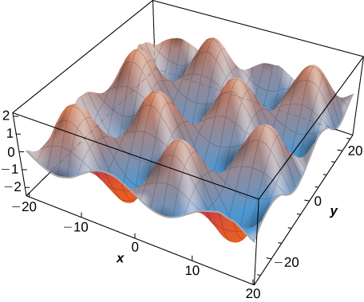
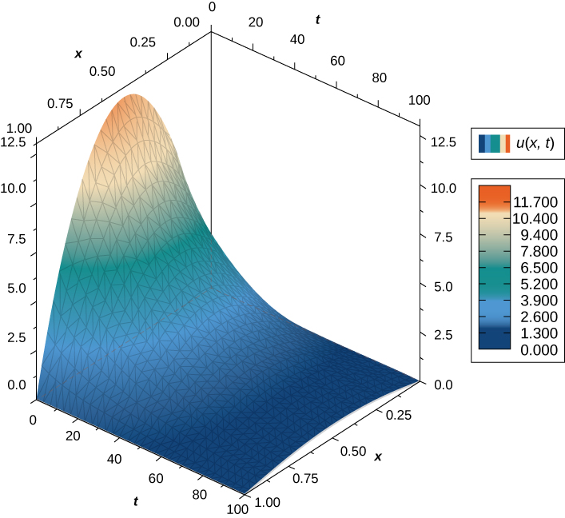
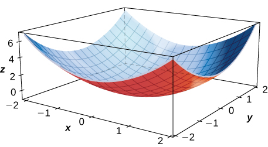

* Calculate the partial derivatives of a function of two variables.
* Calculate the partial derivatives of a function of more than two variables.
* Determine the higher-order derivatives of a function of two variables.
* Explain the meaning of a partial differential equation and give an example.

Now that we have examined limits and continuity of functions of two variables, we can proceed to study derivatives. Finding derivatives of functions of two variables is the key concept in this chapter, with as many applications in mathematics, science, and engineering as differentiation of single-variable functions. However, we have already seen that limits and continuity of multivariable functions have new issues and require new terminology and ideas to deal with them. This carries over into differentiation as well.

### Derivatives of a Function of Two Variables

When studying derivatives of functions of one variable, we found that one interpretation of the derivative is an instantaneous rate of change of <math xmlns="http://www.w3.org/1998/Math/MathML"><mi>y</mi></math>

 as a function of <math xmlns="http://www.w3.org/1998/Math/MathML"><mi>x</mi><mo>.</mo></math>

 Leibniz notation for the derivative is <math xmlns="http://www.w3.org/1998/Math/MathML"><mrow><mrow><mrow><mi>d</mi><mi>y</mi></mrow><mtext>/</mtext><mrow><mi>d</mi><mi>x</mi></mrow></mrow><mo>,</mo></mrow></math>

 which implies that <math xmlns="http://www.w3.org/1998/Math/MathML"><mi>y</mi></math>

 is the dependent variable and <math xmlns="http://www.w3.org/1998/Math/MathML"><mi>x</mi></math>

 is the independent variable. For a function <math xmlns="http://www.w3.org/1998/Math/MathML"><mrow><mi>z</mi><mo>=</mo><mi>f</mi><mo stretchy="false">(</mo><mi>x</mi><mo>,</mo><mi>y</mi><mo stretchy="false">)</mo></mrow></math>

 of two variables, <math xmlns="http://www.w3.org/1998/Math/MathML"><mi>x</mi></math>

 and <math xmlns="http://www.w3.org/1998/Math/MathML"><mi>y</mi></math>

 are the independent variables and <math xmlns="http://www.w3.org/1998/Math/MathML"><mi>z</mi></math>

 is the dependent variable. This raises two questions right away: How do we adapt Leibniz notation for functions of two variables? Also, what is an interpretation of the derivative? The answer lies in partial derivatives.

Definition

Let <math xmlns="http://www.w3.org/1998/Math/MathML"><mrow><mi>f</mi><mrow><mo>(</mo><mrow><mi>x</mi><mo>,</mo><mi>y</mi></mrow><mo>)</mo></mrow></mrow></math>

 be a function of two variables. Then the **partial derivative**{: data-type="term"} of <math xmlns="http://www.w3.org/1998/Math/MathML"><mi>f</mi></math>

 with respect to <math xmlns="http://www.w3.org/1998/Math/MathML"><mi>x</mi><mo>,</mo></math>

 written as <math xmlns="http://www.w3.org/1998/Math/MathML"><mrow><mrow><mrow><mo>∂</mo><mi>f</mi></mrow><mtext>/</mtext><mrow><mo>∂</mo><mi>x</mi></mrow></mrow><mo>,</mo></mrow></math>

 or <math xmlns="http://www.w3.org/1998/Math/MathML"><mrow><msub><mi>f</mi><mi>x</mi></msub><mo>,</mo></mrow></math>

 is defined as

<math xmlns="http://www.w3.org/1998/Math/MathML"><mrow><mfrac><mrow><mo>∂</mo><mi>f</mi></mrow><mrow><mo>∂</mo><mi>x</mi></mrow></mfrac><mo>=</mo><munder><mrow><mtext>lim</mtext></mrow><mrow><mi>h</mi><mo stretchy="false">→</mo><mn>0</mn></mrow></munder><mfrac><mrow><mi>f</mi><mrow><mo>(</mo><mrow><mi>x</mi><mo>+</mo><mi>h</mi><mo>,</mo><mi>y</mi></mrow><mo>)</mo></mrow><mo>−</mo><mi>f</mi><mrow><mo>(</mo><mrow><mi>x</mi><mo>,</mo><mi>y</mi></mrow><mo>)</mo></mrow></mrow><mi>h</mi></mfrac><mo>.</mo></mrow></math>

The partial derivative of <math xmlns="http://www.w3.org/1998/Math/MathML"><mi>f</mi></math>

 with respect to <math xmlns="http://www.w3.org/1998/Math/MathML"><mi>y</mi><mo>,</mo></math>

 written as <math xmlns="http://www.w3.org/1998/Math/MathML"><mrow><mrow><mrow><mo>∂</mo><mi>f</mi></mrow><mtext>/</mtext><mrow><mo>∂</mo><mi>y</mi></mrow></mrow><mo>,</mo></mrow></math>

 or <math xmlns="http://www.w3.org/1998/Math/MathML"><mrow><msub><mi>f</mi><mi>y</mi></msub><mo>,</mo></mrow></math>

 is defined as

<math xmlns="http://www.w3.org/1998/Math/MathML"><mrow><mfrac><mrow><mo>∂</mo><mi>f</mi></mrow><mrow><mo>∂</mo><mi>y</mi></mrow></mfrac><mo>=</mo><munder><mrow><mtext>lim</mtext></mrow><mrow><mi>k</mi><mo stretchy="false">→</mo><mn>0</mn></mrow></munder><mfrac><mrow><mi>f</mi><mrow><mo>(</mo><mrow><mi>x</mi><mo>,</mo><mi>y</mi><mo>+</mo><mi>k</mi></mrow><mo>)</mo></mrow><mo>−</mo><mi>f</mi><mrow><mo>(</mo><mrow><mi>x</mi><mo>,</mo><mi>y</mi></mrow><mo>)</mo></mrow></mrow><mi>k</mi></mfrac><mo>.</mo></mrow></math>

This definition shows two differences already. First, the notation changes, in the sense that we still use a version of Leibniz notation, but the <math xmlns="http://www.w3.org/1998/Math/MathML"><mi>d</mi></math>

 in the original notation is replaced with the symbol <math xmlns="http://www.w3.org/1998/Math/MathML"><mo>∂</mo><mo>.</mo></math>

 (This rounded <math xmlns="http://www.w3.org/1998/Math/MathML"><mtext>“d”</mtext></math>

 is usually called “partial,” so <math xmlns="http://www.w3.org/1998/Math/MathML"><mrow><mrow><mrow><mo>∂</mo><mi>f</mi></mrow><mtext>/</mtext><mrow><mo>∂</mo><mi>x</mi></mrow></mrow></mrow></math>

 is spoken as the “partial of <math xmlns="http://www.w3.org/1998/Math/MathML"><mi>f</mi></math>

 with respect to <math xmlns="http://www.w3.org/1998/Math/MathML"><mi>x</mi><mtext>.”</mtext><mo>)</mo></math>

 This is the first hint that we are dealing with partial derivatives. Second, we now have two different derivatives we can take, since there are two different independent variables. Depending on which variable we choose, we can come up with different partial derivatives altogether, and often do.

Calculating Partial Derivatives from the Definition

Use the definition of the partial derivative as a limit to calculate <math xmlns="http://www.w3.org/1998/Math/MathML"><mrow><mrow><mrow><mo>∂</mo><mi>f</mi></mrow><mtext>/</mtext><mrow><mo>∂</mo><mi>x</mi></mrow></mrow></mrow></math>

 and <math xmlns="http://www.w3.org/1998/Math/MathML"><mrow><mrow><mrow><mo>∂</mo><mi>f</mi></mrow><mtext>/</mtext><mrow><mo>∂</mo><mi>y</mi></mrow></mrow></mrow></math>

 for the function

<math xmlns="http://www.w3.org/1998/Math/MathML"><mrow><mi>f</mi><mrow><mo>(</mo><mrow><mi>x</mi><mo>,</mo><mi>y</mi></mrow><mo>)</mo></mrow><mo>=</mo><msup><mi>x</mi><mn>2</mn></msup><mo>−</mo><mn>3</mn><mi>x</mi><mi>y</mi><mo>+</mo><mn>2</mn><msup><mi>y</mi><mn>2</mn></msup><mo>−</mo><mn>4</mn><mi>x</mi><mo>+</mo><mn>5</mn><mi>y</mi><mo>−</mo><mn>12</mn><mo>.</mo></mrow></math>

First, calculate <math xmlns="http://www.w3.org/1998/Math/MathML"><mrow><mi>f</mi><mrow><mo>(</mo><mrow><mi>x</mi><mo>+</mo><mi>h</mi><mo>,</mo><mi>y</mi></mrow><mo>)</mo></mrow><mo>.</mo></mrow></math>

<math xmlns="http://www.w3.org/1998/Math/MathML"><mtable><mtr><mtd columnalign="right"><mi>f</mi><mrow><mo>(</mo><mrow><mi>x</mi><mo>+</mo><mi>h</mi><mo>,</mo><mi>y</mi></mrow><mo>)</mo></mrow></mtd><mtd columnalign="left"><mo>=</mo><msup><mrow><mo>(</mo><mrow><mi>x</mi><mo>+</mo><mi>h</mi></mrow><mo>)</mo></mrow><mn>2</mn></msup><mo>−</mo><mn>3</mn><mrow><mo>(</mo><mrow><mi>x</mi><mo>+</mo><mi>h</mi></mrow><mo>)</mo></mrow><mi>y</mi><mo>+</mo><mn>2</mn><msup><mi>y</mi><mn>2</mn></msup><mo>−</mo><mn>4</mn><mrow><mo>(</mo><mrow><mi>x</mi><mo>+</mo><mi>h</mi></mrow><mo>)</mo></mrow><mo>+</mo><mn>5</mn><mi>y</mi><mo>−</mo><mn>12</mn></mtd></mtr><mtr><mtd /><mtd columnalign="left"><mo>=</mo><msup><mi>x</mi><mn>2</mn></msup><mo>+</mo><mn>2</mn><mi>x</mi><mi>h</mi><mo>+</mo><msup><mi>h</mi><mn>2</mn></msup><mo>−</mo><mn>3</mn><mi>x</mi><mi>y</mi><mo>−</mo><mn>3</mn><mi>h</mi><mi>y</mi><mo>+</mo><mn>2</mn><msup><mi>y</mi><mn>2</mn></msup><mo>−</mo><mn>4</mn><mi>x</mi><mo>−</mo><mn>4</mn><mi>h</mi><mo>+</mo><mn>5</mn><mi>y</mi><mo>−</mo><mn>12.</mn></mtd></mtr></mtable></math>

Next, substitute this into [[link]](#fs-id1167794136460) and simplify:

<math xmlns="http://www.w3.org/1998/Math/MathML"><mtable><mtr><mtd columnalign="right"><mfrac><mrow><mo>∂</mo><mi>f</mi></mrow><mrow><mo>∂</mo><mi>x</mi></mrow></mfrac></mtd><mtd columnalign="left"><mo>=</mo><munder><mrow><mtext>lim</mtext></mrow><mrow><mi>h</mi><mo stretchy="false">→</mo><mn>0</mn></mrow></munder><mfrac><mrow><mi>f</mi><mrow><mo>(</mo><mrow><mi>x</mi><mo>+</mo><mi>h</mi><mo>,</mo><mi>y</mi></mrow><mo>)</mo></mrow><mo>−</mo><mi>f</mi><mrow><mo>(</mo><mrow><mi>x</mi><mo>,</mo><mi>y</mi></mrow><mo>)</mo></mrow></mrow><mi>h</mi></mfrac></mtd></mtr><mtr><mtd /><mtd columnalign="left"><mo>=</mo><munder><mrow><mtext>lim</mtext></mrow><mrow><mi>h</mi><mo stretchy="false">→</mo><mn>0</mn></mrow></munder><mfrac><mrow><mrow><mo>(</mo><mrow><msup><mi>x</mi><mn>2</mn></msup><mo>+</mo><mn>2</mn><mi>x</mi><mi>h</mi><mo>+</mo><msup><mi>h</mi><mn>2</mn></msup><mo>−</mo><mn>3</mn><mi>x</mi><mi>y</mi><mo>−</mo><mn>3</mn><mi>h</mi><mi>y</mi><mo>+</mo><mn>2</mn><msup><mi>y</mi><mn>2</mn></msup><mo>−</mo><mn>4</mn><mi>x</mi><mo>−</mo><mn>4</mn><mi>h</mi><mo>+</mo><mn>5</mn><mi>y</mi><mo>−</mo><mn>12</mn></mrow><mo>)</mo></mrow><mo>−</mo><mrow><mo>(</mo><mrow><msup><mi>x</mi><mn>2</mn></msup><mo>−</mo><mn>3</mn><mi>x</mi><mi>y</mi><mo>+</mo><mn>2</mn><msup><mi>y</mi><mn>2</mn></msup><mo>−</mo><mn>4</mn><mi>x</mi><mo>+</mo><mn>5</mn><mi>y</mi><mo>−</mo><mn>12</mn></mrow><mo>)</mo></mrow></mrow><mi>h</mi></mfrac></mtd></mtr><mtr><mtd /><mtd columnalign="left"><mo>=</mo><munder><mrow><mtext>lim</mtext></mrow><mrow><mi>h</mi><mo stretchy="false">→</mo><mn>0</mn></mrow></munder><mfrac><mrow><msup><mi>x</mi><mn>2</mn></msup><mo>+</mo><mn>2</mn><mi>x</mi><mi>h</mi><mo>+</mo><msup><mi>h</mi><mn>2</mn></msup><mo>−</mo><mn>3</mn><mi>x</mi><mi>y</mi><mo>−</mo><mn>3</mn><mi>h</mi><mi>y</mi><mo>+</mo><mn>2</mn><msup><mi>y</mi><mn>2</mn></msup><mo>−</mo><mn>4</mn><mi>x</mi><mo>−</mo><mn>4</mn><mi>h</mi><mo>+</mo><mn>5</mn><mi>y</mi><mo>−</mo><mn>12</mn><mo>−</mo><msup><mi>x</mi><mn>2</mn></msup><mo>+</mo><mn>3</mn><mi>x</mi><mi>y</mi><mo>−</mo><mn>2</mn><msup><mi>y</mi><mn>2</mn></msup><mo>+</mo><mn>4</mn><mi>x</mi><mo>−</mo><mn>5</mn><mi>y</mi><mo>+</mo><mn>12</mn></mrow><mi>h</mi></mfrac></mtd></mtr><mtr><mtd /><mtd columnalign="left"><mo>=</mo><munder><mrow><mtext>lim</mtext></mrow><mrow><mi>h</mi><mo stretchy="false">→</mo><mn>0</mn></mrow></munder><mfrac><mrow><mn>2</mn><mi>x</mi><mi>h</mi><mo>+</mo><msup><mi>h</mi><mn>2</mn></msup><mo>−</mo><mn>3</mn><mi>h</mi><mi>y</mi><mo>−</mo><mn>4</mn><mi>h</mi></mrow><mi>h</mi></mfrac></mtd></mtr><mtr><mtd /><mtd columnalign="left"><mo>=</mo><munder><mrow><mtext>lim</mtext></mrow><mrow><mi>h</mi><mo stretchy="false">→</mo><mn>0</mn></mrow></munder><mfrac><mrow><mi>h</mi><mrow><mo>(</mo><mrow><mn>2</mn><mi>x</mi><mo>+</mo><mi>h</mi><mo>−</mo><mn>3</mn><mi>y</mi><mo>−</mo><mn>4</mn></mrow><mo>)</mo></mrow></mrow><mi>h</mi></mfrac></mtd></mtr><mtr><mtd /><mtd columnalign="left"><mo>=</mo><munder><mrow><mtext>lim</mtext></mrow><mrow><mi>h</mi><mo stretchy="false">→</mo><mn>0</mn></mrow></munder><mrow><mo>(</mo><mrow><mn>2</mn><mi>x</mi><mo>+</mo><mi>h</mi><mo>−</mo><mn>3</mn><mi>y</mi><mo>−</mo><mn>4</mn></mrow><mo>)</mo></mrow></mtd></mtr><mtr><mtd /><mtd columnalign="left"><mo>=</mo><mn>2</mn><mi>x</mi><mo>−</mo><mn>3</mn><mi>y</mi><mo>−</mo><mn>4.</mn></mtd></mtr></mtable></math>

To calculate <math xmlns="http://www.w3.org/1998/Math/MathML"><mrow><mfrac><mrow><mo>∂</mo><mi>f</mi></mrow><mrow><mo>∂</mo><mi>y</mi></mrow></mfrac><mo>,</mo></mrow></math>

 first calculate <math xmlns="http://www.w3.org/1998/Math/MathML"><mrow><mi>f</mi><mrow><mo>(</mo><mrow><mi>x</mi><mo>,</mo><mi>y</mi><mo>+</mo><mi>h</mi></mrow><mo>)</mo></mrow><mtext>:</mtext></mrow></math>

<math xmlns="http://www.w3.org/1998/Math/MathML"><mtable><mtr><mtd columnalign="right"><mi>f</mi><mrow><mo>(</mo><mrow><mi>x</mi><mo>+</mo><mi>h</mi><mo>,</mo><mi>y</mi></mrow><mo>)</mo></mrow></mtd><mtd columnalign="left"><mo>=</mo><msup><mi>x</mi><mn>2</mn></msup><mo>−</mo><mn>3</mn><mi>x</mi><mrow><mo>(</mo><mrow><mi>y</mi><mo>+</mo><mi>h</mi></mrow><mo>)</mo></mrow><mo>+</mo><mn>2</mn><msup><mrow><mo>(</mo><mrow><mi>y</mi><mo>+</mo><mi>h</mi></mrow><mo>)</mo></mrow><mn>2</mn></msup><mo>−</mo><mn>4</mn><mi>x</mi><mo>+</mo><mn>5</mn><mrow><mo>(</mo><mrow><mi>y</mi><mo>+</mo><mi>h</mi></mrow><mo>)</mo></mrow><mo>−</mo><mn>12</mn></mtd></mtr><mtr><mtd /><mtd columnalign="left"><mo>=</mo><msup><mi>x</mi><mn>2</mn></msup><mo>−</mo><mn>3</mn><mi>x</mi><mi>y</mi><mo>−</mo><mn>3</mn><mi>x</mi><mi>h</mi><mo>+</mo><mn>2</mn><msup><mi>y</mi><mn>2</mn></msup><mo>+</mo><mn>4</mn><mi>y</mi><mi>h</mi><mo>+</mo><mn>2</mn><msup><mi>h</mi><mn>2</mn></msup><mo>−</mo><mn>4</mn><mi>x</mi><mo>+</mo><mn>5</mn><mi>y</mi><mo>+</mo><mn>5</mn><mi>h</mi><mo>−</mo><mn>12.</mn></mtd></mtr></mtable></math>

Next, substitute this into [[link]](#fs-id1167793263380) and simplify:

<math xmlns="http://www.w3.org/1998/Math/MathML"><mtable><mtr><mtd columnalign="right"><mfrac><mrow><mo>∂</mo><mi>f</mi></mrow><mrow><mo>∂</mo><mi>y</mi></mrow></mfrac></mtd><mtd columnalign="left"><mo>=</mo><munder><mrow><mtext>lim</mtext></mrow><mrow><mi>h</mi><mo stretchy="false">→</mo><mn>0</mn></mrow></munder><mfrac><mrow><mi>f</mi><mo stretchy="false">(</mo><mi>x</mi><mo>,</mo><mi>y</mi><mo>+</mo><mi>h</mi><mo stretchy="false">)</mo><mo>−</mo><mi>f</mi><mo stretchy="false">(</mo><mi>x</mi><mo>,</mo><mi>y</mi><mo stretchy="false">)</mo></mrow><mi>h</mi></mfrac></mtd></mtr><mtr><mtd /><mtd columnalign="left"><mo>=</mo><munder><mrow><mtext>lim</mtext></mrow><mrow><mi>h</mi><mo stretchy="false">→</mo><mn>0</mn></mrow></munder><mfrac><mrow><mrow><mo>(</mo><mrow><msup><mi>x</mi><mn>2</mn></msup><mo>−</mo><mn>3</mn><mi>x</mi><mi>y</mi><mo>−</mo><mn>3</mn><mi>x</mi><mi>h</mi><mo>+</mo><mn>2</mn><msup><mi>y</mi><mn>2</mn></msup><mo>+</mo><mn>4</mn><mi>y</mi><mi>h</mi><mo>+</mo><mn>2</mn><msup><mi>h</mi><mn>2</mn></msup><mo>−</mo><mn>4</mn><mi>x</mi><mo>+</mo><mn>5</mn><mi>y</mi><mo>+</mo><mn>5</mn><mi>h</mi><mo>−</mo><mn>12</mn></mrow><mo>)</mo></mrow><mo>−</mo><mrow><mo>(</mo><mrow><msup><mi>x</mi><mn>2</mn></msup><mo>−</mo><mn>3</mn><mi>x</mi><mi>y</mi><mo>+</mo><mn>2</mn><msup><mi>y</mi><mn>2</mn></msup><mo>−</mo><mn>4</mn><mi>x</mi><mo>+</mo><mn>5</mn><mi>y</mi><mo>−</mo><mn>12</mn></mrow><mo>)</mo></mrow></mrow><mi>h</mi></mfrac></mtd></mtr><mtr><mtd /><mtd columnalign="left"><mo>=</mo><munder><mrow><mtext>lim</mtext></mrow><mrow><mi>h</mi><mo stretchy="false">→</mo><mn>0</mn></mrow></munder><mfrac><mrow><msup><mi>x</mi><mn>2</mn></msup><mo>−</mo><mn>3</mn><mi>x</mi><mi>y</mi><mo>−</mo><mn>3</mn><mi>x</mi><mi>h</mi><mo>+</mo><mn>2</mn><msup><mi>y</mi><mn>2</mn></msup><mo>+</mo><mn>4</mn><mi>y</mi><mi>h</mi><mo>+</mo><mn>2</mn><msup><mi>h</mi><mn>2</mn></msup><mo>−</mo><mn>4</mn><mi>x</mi><mo>+</mo><mn>5</mn><mi>y</mi><mo>+</mo><mn>5</mn><mi>h</mi><mo>−</mo><mn>12</mn><mo>−</mo><msup><mi>x</mi><mn>2</mn></msup><mo>+</mo><mn>3</mn><mi>x</mi><mi>y</mi><mo>−</mo><mn>2</mn><msup><mi>y</mi><mn>2</mn></msup><mo>+</mo><mn>4</mn><mi>x</mi><mo>−</mo><mn>5</mn><mi>y</mi><mo>+</mo><mn>12</mn></mrow><mi>h</mi></mfrac></mtd></mtr><mtr><mtd /><mtd columnalign="left"><mo>=</mo><munder><mrow><mtext>lim</mtext></mrow><mrow><mi>h</mi><mo stretchy="false">→</mo><mn>0</mn></mrow></munder><mfrac><mrow><mn>−3</mn><mi>x</mi><mi>h</mi><mo>+</mo><mn>4</mn><mi>y</mi><mi>h</mi><mo>+</mo><mn>2</mn><msup><mi>h</mi><mn>2</mn></msup><mo>+</mo><mn>5</mn><mi>h</mi></mrow><mi>h</mi></mfrac></mtd></mtr><mtr><mtd /><mtd columnalign="left"><mo>=</mo><munder><mrow><mtext>lim</mtext></mrow><mrow><mi>h</mi><mo stretchy="false">→</mo><mn>0</mn></mrow></munder><mfrac><mrow><mi>h</mi><mrow><mo>(</mo><mrow><mn>−3</mn><mi>x</mi><mo>+</mo><mn>4</mn><mi>y</mi><mo>+</mo><mn>2</mn><mi>h</mi><mo>+</mo><mn>5</mn></mrow><mo>)</mo></mrow></mrow><mi>h</mi></mfrac></mtd></mtr><mtr><mtd /><mtd columnalign="left"><mo>=</mo><munder><mrow><mtext>lim</mtext></mrow><mrow><mi>h</mi><mo stretchy="false">→</mo><mn>0</mn></mrow></munder><mrow><mo>(</mo><mrow><mn>−3</mn><mi>x</mi><mo>+</mo><mn>4</mn><mi>y</mi><mo>+</mo><mn>2</mn><mi>h</mi><mo>+</mo><mn>5</mn></mrow><mo>)</mo></mrow></mtd></mtr><mtr><mtd /><mtd columnalign="left"><mo>=</mo><mn>−3</mn><mi>x</mi><mo>+</mo><mn>4</mn><mi>y</mi><mo>+</mo><mn>5.</mn></mtd></mtr></mtable></math>

Use the definition of the partial derivative as a limit to calculate <math xmlns="http://www.w3.org/1998/Math/MathML"><mrow><mrow><mrow><mo>∂</mo><mi>f</mi></mrow><mtext>/</mtext><mrow><mo>∂</mo><mi>x</mi></mrow></mrow></mrow></math>

 and <math xmlns="http://www.w3.org/1998/Math/MathML"><mrow><mrow><mrow><mo>∂</mo><mi>f</mi></mrow><mtext>/</mtext><mrow><mo>∂</mo><mi>y</mi></mrow></mrow></mrow></math>

 for the function

<math xmlns="http://www.w3.org/1998/Math/MathML"><mrow><mi>f</mi><mrow><mo>(</mo><mrow><mi>x</mi><mo>,</mo><mi>y</mi></mrow><mo>)</mo></mrow><mo>=</mo><mn>4</mn><msup><mi>x</mi><mn>2</mn></msup><mo>+</mo><mn>2</mn><mi>x</mi><mi>y</mi><mo>−</mo><msup><mi>y</mi><mn>2</mn></msup><mo>+</mo><mn>3</mn><mi>x</mi><mo>−</mo><mn>2</mn><mi>y</mi><mo>+</mo><mn>5</mn><mo>.</mo></mrow></math>

<math xmlns="http://www.w3.org/1998/Math/MathML"><mrow><mfrac><mrow><mo>∂</mo><mi>f</mi></mrow><mrow><mo>∂</mo><mi>x</mi></mrow></mfrac><mo>=</mo><mn>8</mn><mi>x</mi><mo>+</mo><mn>2</mn><mi>y</mi><mo>+</mo><mn>3</mn><mo>,</mo><mspace width="1em" /><mfrac><mrow><mo>∂</mo><mi>f</mi></mrow><mrow><mo>∂</mo><mi>y</mi></mrow></mfrac><mo>=</mo><mn>2</mn><mi>x</mi><mo>−</mo><mn>2</mn><mi>y</mi><mo>−</mo><mn>2</mn></mrow></math>

Hint

Use [[link]](#fs-id1167794136460) and [[link]](#fs-id1167793263380) from the definition of partial derivatives.

The idea to keep in mind when calculating partial derivatives is to treat all independent variables, other than the variable with respect to which we are differentiating, as constants. Then proceed to differentiate as with a function of a single variable. To see why this is true, first fix <math xmlns="http://www.w3.org/1998/Math/MathML"><mi>y</mi></math>

 and define <math xmlns="http://www.w3.org/1998/Math/MathML"><mrow><mi>g</mi><mrow><mo>(</mo><mi>x</mi><mo>)</mo></mrow><mo>=</mo><mi>f</mi><mrow><mo>(</mo><mrow><mi>x</mi><mo>,</mo><mi>y</mi></mrow><mo>)</mo></mrow></mrow></math>

 as a function of <math xmlns="http://www.w3.org/1998/Math/MathML"><mrow><mi>x</mi><mo>.</mo></mrow></math>

 Then

<math xmlns="http://www.w3.org/1998/Math/MathML"><mrow><msup><mi>g</mi><mo>′</mo></msup><mrow><mo>(</mo><mi>x</mi><mo>)</mo></mrow><mo>=</mo><munder><mrow><mtext>lim</mtext></mrow><mrow><mi>h</mi><mo stretchy="false">→</mo><mn>0</mn></mrow></munder><mfrac><mrow><mi>g</mi><mrow><mo>(</mo><mrow><mi>x</mi><mo>+</mo><mi>h</mi></mrow><mo>)</mo></mrow><mo>−</mo><mi>g</mi><mrow><mo>(</mo><mi>x</mi><mo>)</mo></mrow></mrow><mi>h</mi></mfrac><mo>=</mo><munder><mrow><mtext>lim</mtext></mrow><mrow><mi>h</mi><mo stretchy="false">→</mo><mn>0</mn></mrow></munder><mfrac><mrow><mi>f</mi><mrow><mo>(</mo><mrow><mi>x</mi><mo>+</mo><mi>h</mi><mo>,</mo><mi>y</mi></mrow><mo>)</mo></mrow><mo>−</mo><mi>f</mi><mrow><mo>(</mo><mrow><mi>x</mi><mo>,</mo><mi>y</mi></mrow><mo>)</mo></mrow></mrow><mi>h</mi></mfrac><mo>=</mo><mfrac><mrow><mo>∂</mo><mi>f</mi></mrow><mrow><mo>∂</mo><mi>x</mi></mrow></mfrac><mo>.</mo></mrow></math>

The same is true for calculating the partial derivative of <math xmlns="http://www.w3.org/1998/Math/MathML"><mi>f</mi></math>

 with respect to <math xmlns="http://www.w3.org/1998/Math/MathML"><mrow><mi>y</mi><mo>.</mo></mrow></math>

 This time, fix <math xmlns="http://www.w3.org/1998/Math/MathML"><mi>x</mi></math>

 and define <math xmlns="http://www.w3.org/1998/Math/MathML"><mrow><mi>h</mi><mrow><mo>(</mo><mi>y</mi><mo>)</mo></mrow><mo>=</mo><mi>f</mi><mrow><mo>(</mo><mrow><mi>x</mi><mo>,</mo><mi>y</mi></mrow><mo>)</mo></mrow></mrow></math>

 as a function of <math xmlns="http://www.w3.org/1998/Math/MathML"><mrow><mi>y</mi><mo>.</mo></mrow></math>

 Then

<math xmlns="http://www.w3.org/1998/Math/MathML"><mrow><msup><mi>h</mi><mo>′</mo></msup><mrow><mo>(</mo><mi>x</mi><mo>)</mo></mrow><mo>=</mo><munder><mrow><mtext>lim</mtext></mrow><mrow><mi>k</mi><mo stretchy="false">→</mo><mn>0</mn></mrow></munder><mfrac><mrow><mi>h</mi><mrow><mo>(</mo><mrow><mi>x</mi><mo>+</mo><mi>k</mi></mrow><mo>)</mo></mrow><mo>−</mo><mi>h</mi><mrow><mo>(</mo><mi>x</mi><mo>)</mo></mrow></mrow><mi>k</mi></mfrac><mo>=</mo><munder><mrow><mtext>lim</mtext></mrow><mrow><mi>k</mi><mo stretchy="false">→</mo><mn>0</mn></mrow></munder><mfrac><mrow><mi>f</mi><mrow><mo>(</mo><mrow><mi>x</mi><mo>,</mo><mi>y</mi><mo>+</mo><mi>k</mi></mrow><mo>)</mo></mrow><mo>−</mo><mi>f</mi><mrow><mo>(</mo><mrow><mi>x</mi><mo>,</mo><mi>y</mi></mrow><mo>)</mo></mrow></mrow><mi>k</mi></mfrac><mo>=</mo><mfrac><mrow><mo>∂</mo><mi>f</mi></mrow><mrow><mo>∂</mo><mi>y</mi></mrow></mfrac><mo>.</mo></mrow></math>

All differentiation rules from [Introduction to Derivatives](/m53494){: .target-chapter} apply.

Calculating Partial Derivatives

Calculate <math xmlns="http://www.w3.org/1998/Math/MathML"><mrow><mrow><mrow><mo>∂</mo><mi>f</mi></mrow><mtext>/</mtext><mrow><mo>∂</mo><mi>x</mi></mrow></mrow></mrow></math>

 and <math xmlns="http://www.w3.org/1998/Math/MathML"><mrow><mrow><mrow><mo>∂</mo><mi>f</mi></mrow><mtext>/</mtext><mrow><mo>∂</mo><mi>y</mi></mrow></mrow></mrow></math>

 for the following functions by holding the opposite variable constant then differentiating:

1.  <math xmlns="http://www.w3.org/1998/Math/MathML"><mrow><mi>f</mi><mrow><mo>(</mo><mrow><mi>x</mi><mo>,</mo><mi>y</mi></mrow><mo>)</mo></mrow><mo>=</mo><msup><mi>x</mi><mn>2</mn></msup><mo>−</mo><mn>3</mn><mi>x</mi><mi>y</mi><mo>+</mo><mn>2</mn><msup><mi>y</mi><mn>2</mn></msup><mo>−</mo><mn>4</mn><mi>x</mi><mo>+</mo><mn>5</mn><mi>y</mi><mo>−</mo><mn>12</mn></mrow></math>

2.  <math xmlns="http://www.w3.org/1998/Math/MathML"><mrow><mi>g</mi><mrow><mo>(</mo><mrow><mi>x</mi><mo>,</mo><mi>y</mi></mrow><mo>)</mo></mrow><mo>=</mo><mtext>sin</mtext><mrow><mo>(</mo><mrow><msup><mi>x</mi><mn>2</mn></msup><mi>y</mi><mo>−</mo><mn>2</mn><mi>x</mi><mo>+</mo><mn>4</mn></mrow><mo>)</mo></mrow></mrow></math>
{: type="a"}

1.  To calculate
    <math xmlns="http://www.w3.org/1998/Math/MathML"><mrow><mrow><mrow><mo>∂</mo><mi>f</mi></mrow><mtext>/</mtext><mrow><mo>∂</mo><mi>x</mi></mrow></mrow><mo>,</mo></mrow></math>
    
    treat the variable
    <math xmlns="http://www.w3.org/1998/Math/MathML"><mi>y</mi></math>
    
    as a constant. Then differentiate
    <math xmlns="http://www.w3.org/1998/Math/MathML"><mrow><mi>f</mi><mrow><mo>(</mo><mrow><mi>x</mi><mo>,</mo><mi>y</mi></mrow><mo>)</mo></mrow></mrow></math>
    
    with respect to
    <math xmlns="http://www.w3.org/1998/Math/MathML"><mi>x</mi></math>
    
    using the sum, difference, and power rules:
    * * *
    {: data-type="newline"}
    
    

    <math xmlns="http://www.w3.org/1998/Math/MathML"><mtable><mtr><mtd columnalign="right"><mfrac><mrow><mo>∂</mo><mi>f</mi></mrow><mrow><mo>∂</mo><mi>x</mi></mrow></mfrac></mtd><mtd columnalign="left"><mo>=</mo><mfrac><mo>∂</mo><mrow><mo>∂</mo><mi>x</mi></mrow></mfrac><mrow><mo>[</mo><mrow><msup><mi>x</mi><mn>2</mn></msup><mo>−</mo><mn>3</mn><mi>x</mi><mi>y</mi><mo>+</mo><mn>2</mn><msup><mi>y</mi><mn>2</mn></msup><mo>−</mo><mn>4</mn><mi>x</mi><mo>+</mo><mn>5</mn><mi>y</mi><mo>−</mo><mn>12</mn></mrow><mo>]</mo></mrow></mtd></mtr><mtr><mtd /><mtd columnalign="left"><mo>=</mo><mfrac><mo>∂</mo><mrow><mo>∂</mo><mi>x</mi></mrow></mfrac><mrow><mo>[</mo><mrow><msup><mi>x</mi><mn>2</mn></msup></mrow><mo>]</mo></mrow><mo>−</mo><mfrac><mo>∂</mo><mrow><mo>∂</mo><mi>x</mi></mrow></mfrac><mrow><mo>[</mo><mrow><mn>3</mn><mi>x</mi><mi>y</mi></mrow><mo>]</mo></mrow><mo>+</mo><mfrac><mo>∂</mo><mrow><mo>∂</mo><mi>x</mi></mrow></mfrac><mrow><mo>[</mo><mrow><mn>2</mn><msup><mi>y</mi><mn>2</mn></msup></mrow><mo>]</mo></mrow><mo>−</mo><mfrac><mo>∂</mo><mrow><mo>∂</mo><mi>x</mi></mrow></mfrac><mrow><mo>[</mo><mrow><mn>4</mn><mi>x</mi></mrow><mo>]</mo></mrow><mo>+</mo><mfrac><mo>∂</mo><mrow><mo>∂</mo><mi>x</mi></mrow></mfrac><mrow><mo>[</mo><mrow><mn>5</mn><mi>y</mi></mrow><mo>]</mo></mrow><mo>−</mo><mfrac><mo>∂</mo><mrow><mo>∂</mo><mi>x</mi></mrow></mfrac><mrow><mo>[</mo><mrow><mn>12</mn></mrow><mo>]</mo></mrow></mtd></mtr><mtr><mtd /><mtd columnalign="left"><mo>=</mo><mn>2</mn><mi>x</mi><mo>−</mo><mn>3</mn><mi>y</mi><mo>+</mo><mn>0</mn><mo>−</mo><mn>4</mn><mo>+</mo><mn>0</mn><mo>−</mo><mn>0</mn></mtd></mtr><mtr><mtd /><mtd columnalign="left"><mo>=</mo><mn>2</mn><mi>x</mi><mo>−</mo><mn>3</mn><mi>y</mi><mo>−</mo><mn>4.</mn></mtd></mtr></mtable></math>
    

    
    * * *
    {: data-type="newline"}
    
    The derivatives of the third, fifth, and sixth terms are all zero because they do not contain the variable
    <math xmlns="http://www.w3.org/1998/Math/MathML"><mi>x</mi><mo>,</mo></math>
    
    so they are treated as constant terms. The derivative of the second term is equal to the coefficient of
    <math xmlns="http://www.w3.org/1998/Math/MathML"><mi>x</mi><mo>,</mo></math>
    
    which is
    <math xmlns="http://www.w3.org/1998/Math/MathML"><mrow><mn>−3</mn><mi>y</mi><mo>.</mo></mrow></math>
    
    Calculating
    <math xmlns="http://www.w3.org/1998/Math/MathML"><mrow><mrow><mrow><mo>∂</mo><mi>f</mi></mrow><mtext>/</mtext><mrow><mo>∂</mo><mi>y</mi></mrow></mrow><mtext>:</mtext></mrow></math>
    
    * * *
    {: data-type="newline"}
    
    

    <math xmlns="http://www.w3.org/1998/Math/MathML"><mtable><mtr><mtd columnalign="right"><mfrac><mrow><mo>∂</mo><mi>f</mi></mrow><mrow><mo>∂</mo><mi>y</mi></mrow></mfrac></mtd><mtd columnalign="left"><mo>=</mo><mfrac><mo>∂</mo><mrow><mo>∂</mo><mi>y</mi></mrow></mfrac><mrow><mo>[</mo><mrow><msup><mi>x</mi><mn>2</mn></msup><mo>−</mo><mn>3</mn><mi>x</mi><mi>y</mi><mo>+</mo><mn>2</mn><msup><mi>y</mi><mn>2</mn></msup><mo>−</mo><mn>4</mn><mi>x</mi><mo>+</mo><mn>5</mn><mi>y</mi><mo>−</mo><mn>12</mn></mrow><mo>]</mo></mrow></mtd></mtr><mtr><mtd /><mtd columnalign="left"><mo>=</mo><mfrac><mo>∂</mo><mrow><mo>∂</mo><mi>y</mi></mrow></mfrac><mrow><mo>[</mo><mrow><msup><mi>x</mi><mn>2</mn></msup></mrow><mo>]</mo></mrow><mo>−</mo><mfrac><mo>∂</mo><mrow><mo>∂</mo><mi>y</mi></mrow></mfrac><mrow><mo>[</mo><mrow><mn>3</mn><mi>x</mi><mi>y</mi></mrow><mo>]</mo></mrow><mo>+</mo><mfrac><mo>∂</mo><mrow><mo>∂</mo><mi>y</mi></mrow></mfrac><mrow><mo>[</mo><mrow><mn>2</mn><msup><mi>y</mi><mn>2</mn></msup></mrow><mo>]</mo></mrow><mo>−</mo><mfrac><mo>∂</mo><mrow><mo>∂</mo><mi>y</mi></mrow></mfrac><mrow><mo>[</mo><mrow><mn>4</mn><mi>x</mi></mrow><mo>]</mo></mrow><mo>+</mo><mfrac><mo>∂</mo><mrow><mo>∂</mo><mi>y</mi></mrow></mfrac><mrow><mo>[</mo><mrow><mn>5</mn><mi>y</mi></mrow><mo>]</mo></mrow><mo>−</mo><mfrac><mo>∂</mo><mrow><mo>∂</mo><mi>y</mi></mrow></mfrac><mrow><mo>[</mo><mrow><mn>12</mn></mrow><mo>]</mo></mrow></mtd></mtr><mtr><mtd /><mtd columnalign="left"><mo>=</mo><mn>−3</mn><mi>x</mi><mo>+</mo><mn>4</mn><mi>y</mi><mo>−</mo><mn>0</mn><mo>+</mo><mn>5</mn><mo>−</mo><mn>0</mn></mtd></mtr><mtr><mtd /><mtd columnalign="left"><mo>=</mo><mn>−3</mn><mi>x</mi><mo>+</mo><mn>4</mn><mi>y</mi><mo>+</mo><mn>5.</mn></mtd></mtr></mtable></math>
    

    
    * * *
    {: data-type="newline"}
    
    These are the same answers obtained in [[link]](#fs-id1167793858583).
2.  To calculate
    <math xmlns="http://www.w3.org/1998/Math/MathML"><mrow><mrow><mrow><mo>∂</mo><mi>g</mi></mrow><mtext>/</mtext><mrow><mo>∂</mo><mi>x</mi></mrow></mrow><mo>,</mo></mrow></math>
    
    treat the variable *y* as a constant. Then differentiate
    <math xmlns="http://www.w3.org/1998/Math/MathML"><mrow><mi>g</mi><mrow><mo>(</mo><mrow><mi>x</mi><mo>,</mo><mi>y</mi></mrow><mo>)</mo></mrow></mrow></math>
    
    with respect to *x* using the chain rule and power rule:
    * * *
    {: data-type="newline"}
    
    

    <math xmlns="http://www.w3.org/1998/Math/MathML"><mtable><mtr><mtd columnalign="right"><mfrac><mrow><mo>∂</mo><mi>g</mi></mrow><mrow><mo>∂</mo><mi>x</mi></mrow></mfrac></mtd><mtd columnalign="left"><mo>=</mo><mfrac><mo>∂</mo><mrow><mo>∂</mo><mi>x</mi></mrow></mfrac><mrow><mo>[</mo><mrow><mtext>sin</mtext><mrow><mo>(</mo><mrow><msup><mi>x</mi><mn>2</mn></msup><mi>y</mi><mo>−</mo><mn>2</mn><mi>x</mi><mo>+</mo><mn>4</mn></mrow><mo>)</mo></mrow></mrow><mo>]</mo></mrow></mtd></mtr><mtr><mtd /><mtd columnalign="left"><mo>=</mo><mtext>cos</mtext><mrow><mo>(</mo><mrow><msup><mi>x</mi><mn>2</mn></msup><mi>y</mi><mo>−</mo><mn>2</mn><mi>x</mi><mo>+</mo><mn>4</mn></mrow><mo>)</mo></mrow><mfrac><mo>∂</mo><mrow><mo>∂</mo><mi>x</mi></mrow></mfrac><mrow><mo>[</mo><mrow><msup><mi>x</mi><mn>2</mn></msup><mi>y</mi><mo>−</mo><mn>2</mn><mi>x</mi><mo>+</mo><mn>4</mn></mrow><mo>]</mo></mrow></mtd></mtr><mtr><mtd /><mtd columnalign="left"><mo>=</mo><mrow><mo>(</mo><mrow><mn>2</mn><mi>x</mi><mi>y</mi><mo>−</mo><mn>2</mn></mrow><mo>)</mo></mrow><mtext>cos</mtext><mrow><mo>(</mo><mrow><msup><mi>x</mi><mn>2</mn></msup><mi>y</mi><mo>−</mo><mn>2</mn><mi>x</mi><mo>+</mo><mn>4</mn></mrow><mo>)</mo></mrow><mo>.</mo></mtd></mtr></mtable></math>
    

    
    * * *
    {: data-type="newline"}
    
    To calculate
    <math xmlns="http://www.w3.org/1998/Math/MathML"><mrow><mrow><mrow><mo>∂</mo><mi>g</mi></mrow><mtext>/</mtext><mrow><mo>∂</mo><mi>y</mi></mrow></mrow><mo>,</mo></mrow></math>
    
    treat the variable
    <math xmlns="http://www.w3.org/1998/Math/MathML"><mi>x</mi></math>
    
    as a constant. Then differentiate
    <math xmlns="http://www.w3.org/1998/Math/MathML"><mrow><mi>g</mi><mrow><mo>(</mo><mrow><mi>x</mi><mo>,</mo><mi>y</mi></mrow><mo>)</mo></mrow></mrow></math>
    
    with respect to
    <math xmlns="http://www.w3.org/1998/Math/MathML"><mi>y</mi></math>
    
    using the chain rule and power rule:
    * * *
    {: data-type="newline"}
    
    

    <math xmlns="http://www.w3.org/1998/Math/MathML"><mtable><mtr><mtd columnalign="right"><mfrac><mrow><mo>∂</mo><mi>g</mi></mrow><mrow><mo>∂</mo><mi>y</mi></mrow></mfrac></mtd><mtd columnalign="left"><mo>=</mo><mfrac><mo>∂</mo><mrow><mo>∂</mo><mi>y</mi></mrow></mfrac><mrow><mo>[</mo><mrow><mtext>sin</mtext><mrow><mo>(</mo><mrow><msup><mi>x</mi><mn>2</mn></msup><mi>y</mi><mo>−</mo><mn>2</mn><mi>x</mi><mo>+</mo><mn>4</mn></mrow><mo>)</mo></mrow></mrow><mo>]</mo></mrow></mtd></mtr><mtr><mtd /><mtd columnalign="left"><mo>=</mo><mtext>cos</mtext><mrow><mo>(</mo><mrow><msup><mi>x</mi><mn>2</mn></msup><mi>y</mi><mo>−</mo><mn>2</mn><mi>x</mi><mo>+</mo><mn>4</mn></mrow><mo>)</mo></mrow><mfrac><mo>∂</mo><mrow><mo>∂</mo><mi>y</mi></mrow></mfrac><mrow><mo>[</mo><mrow><msup><mi>x</mi><mn>2</mn></msup><mi>y</mi><mo>−</mo><mn>2</mn><mi>x</mi><mo>+</mo><mn>4</mn></mrow><mo>]</mo></mrow></mtd></mtr><mtr><mtd /><mtd columnalign="left"><mo>=</mo><msup><mi>x</mi><mn>2</mn></msup><mtext>cos</mtext><mrow><mo>(</mo><mrow><msup><mi>x</mi><mn>2</mn></msup><mi>y</mi><mo>−</mo><mn>2</mn><mi>x</mi><mo>+</mo><mn>4</mn></mrow><mo>)</mo></mrow><mo>.</mo></mtd></mtr></mtable></math>
    

{: type="a"}

Calculate <math xmlns="http://www.w3.org/1998/Math/MathML"><mrow><mrow><mrow><mo>∂</mo><mi>f</mi></mrow><mtext>/</mtext><mrow><mo>∂</mo><mi>x</mi></mrow></mrow></mrow></math>

 and <math xmlns="http://www.w3.org/1998/Math/MathML"><mrow><mrow><mrow><mo>∂</mo><mi>f</mi></mrow><mtext>/</mtext><mrow><mo>∂</mo><mi>y</mi></mrow></mrow></mrow></math>

 for the function <math xmlns="http://www.w3.org/1998/Math/MathML"><mrow><mi>f</mi><mrow><mo>(</mo><mrow><mi>x</mi><mo>,</mo><mi>y</mi></mrow><mo>)</mo></mrow><mo>=</mo><mtext>tan</mtext><mrow><mo>(</mo><mrow><msup><mi>x</mi><mn>3</mn></msup><mo>−</mo><mn>3</mn><msup><mi>x</mi><mn>2</mn></msup><msup><mi>y</mi><mn>2</mn></msup><mo>+</mo><mn>2</mn><msup><mi>y</mi><mn>4</mn></msup></mrow><mo>)</mo></mrow></mrow></math>

 by holding the opposite variable constant, then differentiating.

<math xmlns="http://www.w3.org/1998/Math/MathML"><mtable><mtr><mtd columnalign="left"><mfrac><mrow><mo>∂</mo><mi>f</mi></mrow><mrow><mo>∂</mo><mi>x</mi></mrow></mfrac><mo>=</mo><mrow><mo>(</mo><mrow><mn>3</mn><msup><mi>x</mi><mn>2</mn></msup><mo>−</mo><mn>6</mn><mi>x</mi><msup><mi>y</mi><mn>2</mn></msup></mrow><mo>)</mo></mrow><msup><mtext>sec</mtext><mn>2</mn></msup><mrow><mo>(</mo><mrow><msup><mi>x</mi><mn>3</mn></msup><mo>−</mo><mn>3</mn><msup><mi>x</mi><mn>2</mn></msup><msup><mi>y</mi><mn>2</mn></msup><mo>+</mo><mn>2</mn><msup><mi>y</mi><mn>4</mn></msup></mrow><mo>)</mo></mrow></mtd></mtr><mtr><mtd columnalign="left"><mfrac><mrow><mo>∂</mo><mi>f</mi></mrow><mrow><mo>∂</mo><mi>y</mi></mrow></mfrac><mo>=</mo><mrow><mo>(</mo><mrow><mn>−6</mn><msup><mi>x</mi><mn>2</mn></msup><mi>y</mi><mo>+</mo><mn>8</mn><msup><mi>y</mi><mn>3</mn></msup></mrow><mo>)</mo></mrow><msup><mtext>sec</mtext><mn>2</mn></msup><mrow><mo>(</mo><mrow><msup><mi>x</mi><mn>3</mn></msup><mo>−</mo><mn>3</mn><msup><mi>x</mi><mn>2</mn></msup><msup><mi>y</mi><mn>2</mn></msup><mo>+</mo><mn>2</mn><msup><mi>y</mi><mn>4</mn></msup></mrow><mo>)</mo></mrow></mtd></mtr></mtable></math>

Hint

Use [[link]](#fs-id1167794136460) and [[link]](#fs-id1167793263380) from the definition of partial derivatives.

How can we interpret these partial derivatives? Recall that the graph of a function of two variables is a surface in <math xmlns="http://www.w3.org/1998/Math/MathML"><mrow><msup><mi>ℝ</mi><mn>3</mn></msup><mo>.</mo></mrow></math>

 If we remove the limit from the definition of the partial derivative with respect to <math xmlns="http://www.w3.org/1998/Math/MathML"><mi>x</mi><mo>,</mo></math>

 the difference quotient remains:

<math xmlns="http://www.w3.org/1998/Math/MathML"><mrow><mfrac><mrow><mi>f</mi><mrow><mo>(</mo><mrow><mi>x</mi><mo>+</mo><mi>h</mi><mo>,</mo><mi>y</mi></mrow><mo>)</mo></mrow><mo>−</mo><mi>f</mi><mrow><mo>(</mo><mrow><mi>x</mi><mo>,</mo><mi>y</mi></mrow><mo>)</mo></mrow></mrow><mi>h</mi></mfrac><mo>.</mo></mrow></math>

This resembles the difference quotient for the derivative of a function of one variable, except for the presence of the <math xmlns="http://www.w3.org/1998/Math/MathML"><mi>y</mi></math>

 variable. [\[link\]](#CNX_Calc_Figure_14_03_001) illustrates a surface described by an arbitrary function <math xmlns="http://www.w3.org/1998/Math/MathML"><mrow><mi>z</mi><mo>=</mo><mi>f</mi><mrow><mo>(</mo><mrow><mi>x</mi><mo>,</mo><mi>y</mi></mrow><mo>)</mo></mrow><mo>.</mo></mrow></math>

 ) and (x+h,y,f(x+h,y))."){: #CNX_Calc_Figure_14_03_001}

In [\[link\]](#CNX_Calc_Figure_14_03_001), the value of <math xmlns="http://www.w3.org/1998/Math/MathML"><mi>h</mi></math>

 is positive. If we graph <math xmlns="http://www.w3.org/1998/Math/MathML"><mrow><mi>f</mi><mrow><mo>(</mo><mrow><mi>x</mi><mo>,</mo><mi>y</mi></mrow><mo>)</mo></mrow></mrow></math>

 and <math xmlns="http://www.w3.org/1998/Math/MathML"><mrow><mi>f</mi><mrow><mo>(</mo><mrow><mi>x</mi><mo>+</mo><mi>h</mi><mo>,</mo><mi>y</mi></mrow><mo>)</mo></mrow></mrow></math>

 for an arbitrary point <math xmlns="http://www.w3.org/1998/Math/MathML"><mrow><mrow><mo>(</mo><mrow><mi>x</mi><mo>,</mo><mi>y</mi></mrow><mo>)</mo></mrow><mo>,</mo></mrow></math>

 then the slope of the secant line passing through these two points is given by

<math xmlns="http://www.w3.org/1998/Math/MathML"><mrow><mfrac><mrow><mi>f</mi><mrow><mo>(</mo><mrow><mi>x</mi><mo>+</mo><mi>h</mi><mo>,</mo><mi>y</mi></mrow><mo>)</mo></mrow><mo>−</mo><mi>f</mi><mrow><mo>(</mo><mrow><mi>x</mi><mo>,</mo><mi>y</mi></mrow><mo>)</mo></mrow></mrow><mi>h</mi></mfrac><mo>.</mo></mrow></math>

This line is parallel to the <math xmlns="http://www.w3.org/1998/Math/MathML"><mi>x</mi><mtext>-axis.</mtext></math>

 Therefore, the slope of the secant line represents an average rate of change of the function <math xmlns="http://www.w3.org/1998/Math/MathML"><mi>f</mi></math>

 as we travel parallel to the <math xmlns="http://www.w3.org/1998/Math/MathML"><mi>x</mi><mtext>-axis.</mtext></math>

 As <math xmlns="http://www.w3.org/1998/Math/MathML"><mi>h</mi></math>

 approaches zero, the slope of the secant line approaches the slope of the tangent line.

If we choose to change <math xmlns="http://www.w3.org/1998/Math/MathML"><mi>y</mi></math>

 instead of <math xmlns="http://www.w3.org/1998/Math/MathML"><mi>x</mi></math>

 by the same incremental value <math xmlns="http://www.w3.org/1998/Math/MathML"><mrow><mi>h</mi><mo>,</mo></mrow></math>

 then the secant line is parallel to the <math xmlns="http://www.w3.org/1998/Math/MathML"><mrow><mi>y</mi><mtext>-axis</mtext></mrow></math>

 and so is the tangent line. Therefore, <math xmlns="http://www.w3.org/1998/Math/MathML"><mrow><mrow><mrow><mo>∂</mo><mi>f</mi></mrow><mtext>/</mtext><mrow><mo>∂</mo><mi>x</mi></mrow></mrow></mrow></math>

 represents the slope of the tangent line passing through the point <math xmlns="http://www.w3.org/1998/Math/MathML"><mrow><mrow><mo>(</mo><mrow><mi>x</mi><mo>,</mo><mi>y</mi><mo>,</mo><mi>f</mi><mrow><mo>(</mo><mrow><mi>x</mi><mo>,</mo><mi>y</mi></mrow><mo>)</mo></mrow></mrow><mo>)</mo></mrow></mrow></math>

 parallel to the <math xmlns="http://www.w3.org/1998/Math/MathML"><mi>x</mi><mtext>-axis</mtext></math>

 and <math xmlns="http://www.w3.org/1998/Math/MathML"><mrow><mrow><mrow><mo>∂</mo><mi>f</mi></mrow><mtext>/</mtext><mrow><mo>∂</mo><mi>y</mi></mrow></mrow></mrow></math>

 represents the slope of the tangent line passing through the point <math xmlns="http://www.w3.org/1998/Math/MathML"><mrow><mrow><mo>(</mo><mrow><mi>x</mi><mo>,</mo><mi>y</mi><mo>,</mo><mi>f</mi><mrow><mo>(</mo><mrow><mi>x</mi><mo>,</mo><mi>y</mi></mrow><mo>)</mo></mrow></mrow><mo>)</mo></mrow></mrow></math>

 parallel to the <math xmlns="http://www.w3.org/1998/Math/MathML"><mrow><mi>y</mi><mtext>-axis</mtext><mo>.</mo></mrow></math>

 If we wish to find the slope of a tangent line passing through the same point in any other direction, then we need what are called *directional derivatives*, which we discuss in [Directional Derivatives and the Gradient](/m53940){: .target-chapter}.

We now return to the idea of contour maps, which we introduced in [Functions of Several Variables](/m53946){: .target-chapter}. We can use a **contour map**{: data-type="term" .no-emphasis} to estimate partial derivatives of a function <math xmlns="http://www.w3.org/1998/Math/MathML"><mrow><mi>g</mi><mrow><mo>(</mo><mrow><mi>x</mi><mo>,</mo><mi>y</mi></mrow><mo>)</mo></mrow><mo>.</mo></mrow></math>

Partial Derivatives from a Contour Map

Use a contour map to estimate <math xmlns="http://www.w3.org/1998/Math/MathML"><mrow><mrow><mrow><mo>∂</mo><mi>g</mi></mrow><mtext>/</mtext><mrow><mo>∂</mo><mi>x</mi></mrow></mrow></mrow></math>

 at the point <math xmlns="http://www.w3.org/1998/Math/MathML"><mrow><mrow><mo>(</mo><mrow><msqrt><mn>5</mn></msqrt><mo>,</mo><mn>0</mn></mrow><mo>)</mo></mrow></mrow></math>

 for the function <math xmlns="http://www.w3.org/1998/Math/MathML"><mrow><mi>g</mi><mrow><mo>(</mo><mrow><mi>x</mi><mo>,</mo><mi>y</mi></mrow><mo>)</mo></mrow><mo>=</mo><msqrt><mrow><mn>9</mn><mo>−</mo><msup><mi>x</mi><mn>2</mn></msup><mo>−</mo><msup><mi>y</mi><mn>2</mn></msup></mrow></msqrt><mo>.</mo></mrow></math>

The following graph represents a contour map for the function <math xmlns="http://www.w3.org/1998/Math/MathML"><mrow><mi>g</mi><mrow><mo>(</mo><mrow><mi>x</mi><mo>,</mo><mi>y</mi></mrow><mo>)</mo></mrow><mo>=</mo><msqrt><mrow><mn>9</mn><mo>−</mo><msup><mi>x</mi><mn>2</mn></msup><mo>−</mo><msup><mi>y</mi><mn>2</mn></msup></mrow></msqrt><mo>.</mo></mrow></math>

=9&#x2212;x2&#x2212;y2, using c=0,1,2, and 3 (c=3 corresponds to the origin)."){: #CNX_Calc_Figure_14_03_002}

The inner circle on the contour map corresponds to <math xmlns="http://www.w3.org/1998/Math/MathML"><mrow><mi>c</mi><mo>=</mo><mn>2</mn></mrow></math>

 and the next circle out corresponds to <math xmlns="http://www.w3.org/1998/Math/MathML"><mrow><mi>c</mi><mo>=</mo><mn>1</mn><mo>.</mo></mrow></math>

 The first circle is given by the equation <math xmlns="http://www.w3.org/1998/Math/MathML"><mrow><mn>2</mn><mo>=</mo><msqrt><mrow><mn>9</mn><mo>−</mo><msup><mi>x</mi><mn>2</mn></msup><mo>−</mo><msup><mi>y</mi><mn>2</mn></msup></mrow></msqrt><mo>;</mo></mrow></math>

 the second circle is given by the equation <math xmlns="http://www.w3.org/1998/Math/MathML"><mrow><mn>1</mn><mo>=</mo><msqrt><mrow><mn>9</mn><mo>−</mo><msup><mi>x</mi><mn>2</mn></msup><mo>−</mo><msup><mi>y</mi><mn>2</mn></msup></mrow></msqrt><mo>.</mo></mrow></math>

 The first equation simplifies to <math xmlns="http://www.w3.org/1998/Math/MathML"><mrow><msup><mi>x</mi><mn>2</mn></msup><mo>+</mo><msup><mi>y</mi><mn>2</mn></msup><mo>=</mo><mn>5</mn></mrow></math>

 and the second equation simplifies to <math xmlns="http://www.w3.org/1998/Math/MathML"><mrow><msup><mi>x</mi><mn>2</mn></msup><mo>+</mo><msup><mi>y</mi><mn>2</mn></msup><mo>=</mo><mn>8</mn><mo>.</mo></mrow></math>

 The <math xmlns="http://www.w3.org/1998/Math/MathML"><mi>x</mi><mtext>-intercept</mtext></math>

 of the first circle is <math xmlns="http://www.w3.org/1998/Math/MathML"><mrow><mrow><mo>(</mo><mrow><msqrt><mn>5</mn></msqrt><mo>,</mo><mn>0</mn></mrow><mo>)</mo></mrow></mrow></math>

 and the <math xmlns="http://www.w3.org/1998/Math/MathML"><mi>x</mi><mtext>-intercept</mtext></math>

 of the second circle is <math xmlns="http://www.w3.org/1998/Math/MathML"><mrow><mrow><mo>(</mo><mrow><mn>2</mn><msqrt><mn>2</mn></msqrt><mo>,</mo><mn>0</mn></mrow><mo>)</mo></mrow><mo>.</mo></mrow></math>

 We can estimate the value of <math xmlns="http://www.w3.org/1998/Math/MathML"><mrow><mrow><mrow><mo>∂</mo><mi>g</mi></mrow><mtext>/</mtext><mrow><mo>∂</mo><mi>x</mi></mrow></mrow></mrow></math>

 evaluated at the point <math xmlns="http://www.w3.org/1998/Math/MathML"><mrow><mrow><mo>(</mo><mrow><msqrt><mn>5</mn></msqrt><mo>,</mo><mn>0</mn></mrow><mo>)</mo></mrow></mrow></math>

 using the slope formula:

<math xmlns="http://www.w3.org/1998/Math/MathML"><mrow><msub><mrow><mrow><mrow><mfrac><mrow><mo>∂</mo><mi>g</mi></mrow><mrow><mo>∂</mo><mi>x</mi></mrow></mfrac></mrow><mo>\|</mo></mrow></mrow><mrow><mrow><mo>(</mo><mrow><mi>x</mi><mo>,</mo><mi>y</mi></mrow><mo>)</mo></mrow><mo>=</mo><mrow><mo>(</mo><mrow><msqrt><mn>5</mn></msqrt><mo>,</mo><mn>0</mn></mrow><mo>)</mo></mrow></mrow></msub><mo>≈</mo><mfrac><mrow><mi>g</mi><mrow><mo>(</mo><mrow><msqrt><mn>5</mn></msqrt><mo>,</mo><mn>0</mn></mrow><mo>)</mo></mrow><mo>−</mo><mi>g</mi><mrow><mo>(</mo><mrow><mn>2</mn><msqrt><mn>2</mn></msqrt><mo>,</mo><mn>0</mn></mrow><mo>)</mo></mrow></mrow><mrow><msqrt><mn>5</mn></msqrt><mo>−</mo><mn>2</mn><msqrt><mn>2</mn></msqrt></mrow></mfrac><mo>=</mo><mfrac><mrow><mn>2</mn><mo>−</mo><mn>1</mn></mrow><mrow><msqrt><mn>5</mn></msqrt><mo>−</mo><mn>2</mn><msqrt><mn>2</mn></msqrt></mrow></mfrac><mo>=</mo><mfrac><mn>1</mn><mrow><msqrt><mn>5</mn></msqrt><mo>−</mo><mn>2</mn><msqrt><mn>2</mn></msqrt></mrow></mfrac><mo>≈</mo><mn>−1.688</mn><mo>.</mo></mrow></math>

To calculate the exact value of <math xmlns="http://www.w3.org/1998/Math/MathML"><mrow><mrow><mrow><mo>∂</mo><mi>g</mi></mrow><mtext>/</mtext><mrow><mo>∂</mo><mi>x</mi></mrow></mrow></mrow></math>

 evaluated at the point <math xmlns="http://www.w3.org/1998/Math/MathML"><mrow><mrow><mo>(</mo><mrow><msqrt><mn>5</mn></msqrt><mo>,</mo><mn>0</mn></mrow><mo>)</mo></mrow><mo>,</mo></mrow></math>

 we start by finding <math xmlns="http://www.w3.org/1998/Math/MathML"><mrow><mrow><mrow><mo>∂</mo><mi>g</mi></mrow><mtext>/</mtext><mrow><mo>∂</mo><mi>x</mi></mrow></mrow></mrow></math>

 using the chain rule. First, we rewrite the function as <math xmlns="http://www.w3.org/1998/Math/MathML"><mrow><mi>g</mi><mrow><mo>(</mo><mrow><mi>x</mi><mo>,</mo><mi>y</mi></mrow><mo>)</mo></mrow><mo>=</mo><msqrt><mrow><mn>9</mn><mo>−</mo><msup><mi>x</mi><mn>2</mn></msup><mo>−</mo><msup><mi>y</mi><mn>2</mn></msup></mrow></msqrt><mo>=</mo><msup><mrow><mrow><mo>(</mo><mrow><mn>9</mn><mo>−</mo><msup><mi>x</mi><mn>2</mn></msup><mo>−</mo><msup><mi>y</mi><mn>2</mn></msup></mrow><mo>)</mo></mrow></mrow><mrow><mn>1</mn><mtext>/</mtext><mn>2</mn></mrow></msup></mrow></math>

 and then differentiate with respect to <math xmlns="http://www.w3.org/1998/Math/MathML"><mi>x</mi></math>

 while holding <math xmlns="http://www.w3.org/1998/Math/MathML"><mi>y</mi></math>

 constant:

<math xmlns="http://www.w3.org/1998/Math/MathML"><mrow><mfrac><mrow><mo>∂</mo><mi>g</mi></mrow><mrow><mo>∂</mo><mi>x</mi></mrow></mfrac><mo>=</mo><mfrac><mn>1</mn><mn>2</mn></mfrac><msup><mrow><mrow><mo>(</mo><mrow><mn>9</mn><mo>−</mo><msup><mi>x</mi><mn>2</mn></msup><mo>−</mo><msup><mi>y</mi><mn>2</mn></msup></mrow><mo>)</mo></mrow></mrow><mrow><mn>−1</mn><mtext>/</mtext><mn>2</mn></mrow></msup><mrow><mo>(</mo><mrow><mn>−2</mn><mi>x</mi></mrow><mo>)</mo></mrow><mo>=</mo><mo>−</mo><mfrac><mi>x</mi><mrow><msqrt><mrow><mn>9</mn><mo>−</mo><msup><mi>x</mi><mn>2</mn></msup><mo>−</mo><msup><mi>y</mi><mn>2</mn></msup></mrow></msqrt></mrow></mfrac><mo>.</mo></mrow></math>

Next, we evaluate this expression using <math xmlns="http://www.w3.org/1998/Math/MathML"><mrow><mi>x</mi><mo>=</mo><msqrt><mn>5</mn></msqrt></mrow></math>

 and <math xmlns="http://www.w3.org/1998/Math/MathML"><mrow><mi>y</mi><mo>=</mo><mn>0</mn><mtext>:</mtext></mrow></math>

<math xmlns="http://www.w3.org/1998/Math/MathML"><mrow><msub><mrow><mrow><mrow><mfrac><mrow><mo>∂</mo><mi>g</mi></mrow><mrow><mo>∂</mo><mi>x</mi></mrow></mfrac></mrow><mo>\|</mo></mrow></mrow><mrow><mrow><mo>(</mo><mrow><mi>x</mi><mo>,</mo><mi>y</mi></mrow><mo>)</mo></mrow><mo>=</mo><mrow><mo>(</mo><mrow><msqrt><mn>5</mn></msqrt><mo>,</mo><mn>0</mn></mrow><mo>)</mo></mrow></mrow></msub><mo>=</mo><mo>−</mo><mfrac><mrow><msqrt><mn>5</mn></msqrt></mrow><mrow><msqrt><mrow><mn>9</mn><mo>−</mo><msup><mrow><mrow><mo>(</mo><mrow><msqrt><mn>5</mn></msqrt></mrow><mo>)</mo></mrow></mrow><mn>2</mn></msup><mo>−</mo><msup><mrow><mrow><mo>(</mo><mn>0</mn><mo>)</mo></mrow></mrow><mn>2</mn></msup></mrow></msqrt></mrow></mfrac><mo>=</mo><mo>−</mo><mfrac><mrow><msqrt><mn>5</mn></msqrt></mrow><mrow><msqrt><mn>4</mn></msqrt></mrow></mfrac><mo>=</mo><mo>−</mo><mfrac><mrow><msqrt><mn>5</mn></msqrt></mrow><mn>2</mn></mfrac><mo>≈</mo><mn>−1.118</mn><mo>.</mo></mrow></math>

The estimate for the partial derivative corresponds to the slope of the secant line passing through the points <math xmlns="http://www.w3.org/1998/Math/MathML"><mrow><mrow><mo>(</mo><mrow><msqrt><mn>5</mn></msqrt><mo>,</mo><mn>0</mn><mo>,</mo><mi>g</mi><mrow><mo>(</mo><mrow><msqrt><mn>5</mn></msqrt><mo>,</mo><mn>0</mn></mrow><mo>)</mo></mrow></mrow><mo>)</mo></mrow></mrow></math>

 and <math xmlns="http://www.w3.org/1998/Math/MathML"><mrow><mrow><mo>(</mo><mrow><mn>2</mn><msqrt><mn>2</mn></msqrt><mo>,</mo><mn>0</mn><mo>,</mo><mi>g</mi><mrow><mo>(</mo><mrow><mn>2</mn><msqrt><mn>2</mn></msqrt><mo>,</mo><mn>0</mn></mrow><mo>)</mo></mrow></mrow><mo>)</mo></mrow><mo>.</mo></mrow></math>

 It represents an approximation to the slope of the tangent line to the surface through the point <math xmlns="http://www.w3.org/1998/Math/MathML"><mrow><mrow><mo>(</mo><mrow><msqrt><mn>5</mn></msqrt><mo>,</mo><mn>0</mn><mo>,</mo><mi>g</mi><mrow><mo>(</mo><mrow><msqrt><mn>5</mn></msqrt><mo>,</mo><mn>0</mn></mrow><mo>)</mo></mrow></mrow><mo>)</mo></mrow><mo>,</mo></mrow></math>

 which is parallel to the <math xmlns="http://www.w3.org/1998/Math/MathML"><mrow><mi>x</mi><mtext>-axis</mtext><mo>.</mo></mrow></math>

Use a contour map to estimate <math xmlns="http://www.w3.org/1998/Math/MathML"><mrow><mrow><mrow><mo>∂</mo><mi>f</mi></mrow><mtext>/</mtext><mrow><mo>∂</mo><mi>y</mi></mrow></mrow></mrow></math>

 at point <math xmlns="http://www.w3.org/1998/Math/MathML"><mrow><mrow><mo>(</mo><mrow><mn>0</mn><mo>,</mo><msqrt><mn>2</mn></msqrt></mrow><mo>)</mo></mrow></mrow></math>

 for the function

<math xmlns="http://www.w3.org/1998/Math/MathML"><mrow><mi>f</mi><mrow><mo>(</mo><mrow><mi>x</mi><mo>,</mo><mi>y</mi></mrow><mo>)</mo></mrow><mo>=</mo><msup><mi>x</mi><mn>2</mn></msup><mo>−</mo><msup><mi>y</mi><mn>2</mn></msup><mo>.</mo></mrow></math>

Compare this with the exact answer.

Using the curves corresponding to <math xmlns="http://www.w3.org/1998/Math/MathML"><mrow><mi>c</mi><mo>=</mo><mn>−2</mn><mspace width="0.2em" /><mtext>and</mtext><mspace width="0.2em" /><mi>c</mi><mo>=</mo><mn>−3</mn><mo>,</mo></mrow></math>

 we obtain

<math xmlns="http://www.w3.org/1998/Math/MathML"><mrow><msub><mrow><mrow><mrow><mfrac><mrow><mo>∂</mo><mi>f</mi></mrow><mrow><mo>∂</mo><mi>y</mi></mrow></mfrac></mrow><mo>\|</mo></mrow></mrow><mrow><mrow><mo>(</mo><mrow><mi>x</mi><mo>,</mo><mi>y</mi></mrow><mo>)</mo></mrow><mo>=</mo><mrow><mo>(</mo><mrow><mn>0</mn><mo>,</mo><msqrt><mn>2</mn></msqrt></mrow><mo>)</mo></mrow></mrow></msub><mo>≈</mo><mfrac><mrow><mi>f</mi><mrow><mo>(</mo><mrow><mn>0</mn><mo>,</mo><msqrt><mn>3</mn></msqrt></mrow><mo>)</mo></mrow><mo>−</mo><mi>f</mi><mrow><mo>(</mo><mrow><mn>0</mn><mo>,</mo><msqrt><mn>2</mn></msqrt></mrow><mo>)</mo></mrow></mrow><mrow><msqrt><mn>3</mn></msqrt><mo>−</mo><msqrt><mn>2</mn></msqrt></mrow></mfrac><mo>=</mo><mfrac><mrow><mn>−3</mn><mo>−</mo><mrow><mo>(</mo><mrow><mn>−2</mn></mrow><mo>)</mo></mrow></mrow><mrow><msqrt><mn>3</mn></msqrt><mo>−</mo><msqrt><mn>2</mn></msqrt></mrow></mfrac><mo>·</mo><mfrac><mrow><msqrt><mn>3</mn></msqrt><mo>+</mo><msqrt><mn>2</mn></msqrt></mrow><mrow><msqrt><mn>3</mn></msqrt><mo>+</mo><msqrt><mn>2</mn></msqrt></mrow></mfrac><mo>=</mo><mtext>−</mtext><msqrt><mn>3</mn></msqrt><mo>−</mo><msqrt><mn>2</mn></msqrt><mo>≈</mo><mn>−3.146</mn><mo>.</mo></mrow></math>

The exact answer is

<math xmlns="http://www.w3.org/1998/Math/MathML"><mrow><msub><mrow><mrow><mrow><mfrac><mrow><mo>∂</mo><mi>f</mi></mrow><mrow><mo>∂</mo><mi>y</mi></mrow></mfrac></mrow><mo>\|</mo></mrow></mrow><mrow><mrow><mo>(</mo><mrow><mi>x</mi><mo>,</mo><mi>y</mi></mrow><mo>)</mo></mrow><mo>=</mo><mrow><mo>(</mo><mrow><mn>0</mn><mo>,</mo><msqrt><mn>2</mn></msqrt></mrow><mo>)</mo></mrow></mrow></msub><mo>=</mo><mo stretchy="false">(</mo><msub><mrow><mrow><mrow><mn>−2</mn><mi>y</mi></mrow><mo>\|</mo></mrow></mrow><mrow><mrow><mo>(</mo><mrow><mi>x</mi><mo>,</mo><mi>y</mi></mrow><mo>)</mo></mrow><mo>=</mo><mrow><mo>(</mo><mrow><mn>0</mn><mo>,</mo><msqrt><mn>2</mn></msqrt></mrow><mo>)</mo></mrow></mrow></msub><mo>=</mo><mn>−2</mn><msqrt><mn>2</mn></msqrt><mo>≈</mo><mn>−2.828</mn><mo>.</mo></mrow></math>

Hint

Create a contour map for <math xmlns="http://www.w3.org/1998/Math/MathML"><mi>f</mi></math>

 using values of <math xmlns="http://www.w3.org/1998/Math/MathML"><mi>c</mi></math>

 from <math xmlns="http://www.w3.org/1998/Math/MathML"><mrow><mn>−3</mn><mspace width="0.2em" /><mtext>to</mtext><mspace width="0.2em" /><mn>3</mn><mo>.</mo></mrow></math>

 Which of these curves passes through point <math xmlns="http://www.w3.org/1998/Math/MathML"><mrow><mrow><mo>(</mo><mrow><mn>0</mn><mo>,</mo><msqrt><mn>2</mn></msqrt></mrow><mo>)</mo></mrow><mo>?</mo></mrow></math>

### Functions of More Than Two Variables

Suppose we have a function of three variables, such as <math xmlns="http://www.w3.org/1998/Math/MathML"><mrow><mi>w</mi><mo>=</mo><mi>f</mi><mrow><mo>(</mo><mrow><mi>x</mi><mo>,</mo><mi>y</mi><mo>,</mo><mi>z</mi></mrow><mo>)</mo></mrow><mo>.</mo></mrow></math>

 We can calculate partial derivatives of <math xmlns="http://www.w3.org/1998/Math/MathML"><mi>w</mi></math>

 with respect to any of the independent variables, simply as extensions of the definitions for partial derivatives of functions of two variables.

Definition

Let <math xmlns="http://www.w3.org/1998/Math/MathML"><mrow><mi>f</mi><mrow><mo>(</mo><mrow><mi>x</mi><mo>,</mo><mi>y</mi><mo>,</mo><mi>z</mi></mrow><mo>)</mo></mrow></mrow></math>

 be a function of three variables. Then, the *partial derivative of <math xmlns="http://www.w3.org/1998/Math/MathML"><mi>f</mi></math>

 with respect to x,* written as <math xmlns="http://www.w3.org/1998/Math/MathML"><mrow><mrow><mrow><mo>∂</mo><mi>f</mi></mrow><mtext>/</mtext><mrow><mo>∂</mo><mi>x</mi></mrow></mrow><mo>,</mo></mrow></math>

 or <math xmlns="http://www.w3.org/1998/Math/MathML"><mrow><msub><mi>f</mi><mi>x</mi></msub><mo>,</mo></mrow></math>

 is defined to be

<math xmlns="http://www.w3.org/1998/Math/MathML"><mrow><mfrac><mrow><mo>∂</mo><mi>f</mi></mrow><mrow><mo>∂</mo><mi>x</mi></mrow></mfrac><mo>=</mo><munder><mrow><mtext>lim</mtext></mrow><mrow><mi>h</mi><mo stretchy="false">→</mo><mn>0</mn></mrow></munder><mfrac><mrow><mi>f</mi><mrow><mo>(</mo><mrow><mi>x</mi><mo>+</mo><mi>h</mi><mo>,</mo><mi>y</mi><mo>,</mo><mi>z</mi></mrow><mo>)</mo></mrow><mo>−</mo><mi>f</mi><mrow><mo>(</mo><mrow><mi>x</mi><mo>,</mo><mi>y</mi><mo>,</mo><mi>z</mi></mrow><mo>)</mo></mrow></mrow><mi>h</mi></mfrac><mo>.</mo></mrow></math>

The *partial derivative of* <math xmlns="http://www.w3.org/1998/Math/MathML"><mi>f</mi></math>

 *with respect to* <math xmlns="http://www.w3.org/1998/Math/MathML"><mi>y</mi><mo>,</mo></math>

 written as <math xmlns="http://www.w3.org/1998/Math/MathML"><mrow><mrow><mrow><mo>∂</mo><mi>f</mi></mrow><mtext>/</mtext><mrow><mo>∂</mo><mi>y</mi></mrow></mrow><mo>,</mo></mrow></math>

 or <math xmlns="http://www.w3.org/1998/Math/MathML"><mrow><msub><mi>f</mi><mi>y</mi></msub><mo>,</mo></mrow></math>

 is defined to be

<math xmlns="http://www.w3.org/1998/Math/MathML"><mrow><mfrac><mrow><mo>∂</mo><mi>f</mi></mrow><mrow><mo>∂</mo><mi>y</mi></mrow></mfrac><mo>=</mo><munder><mrow><mtext>lim</mtext></mrow><mrow><mi>k</mi><mo stretchy="false">→</mo><mn>0</mn></mrow></munder><mfrac><mrow><mi>f</mi><mrow><mo>(</mo><mrow><mi>x</mi><mo>,</mo><mi>y</mi><mo>+</mo><mi>k</mi><mo>,</mo><mi>z</mi></mrow><mo>)</mo></mrow><mo>−</mo><mi>f</mi><mrow><mo>(</mo><mrow><mi>x</mi><mo>,</mo><mi>y</mi><mo>,</mo><mi>z</mi></mrow><mo>)</mo></mrow></mrow><mi>k</mi></mfrac><mo>.</mo></mrow></math>

The *partial derivative of* <math xmlns="http://www.w3.org/1998/Math/MathML"><mi>f</mi></math>

 *with respect to* <math xmlns="http://www.w3.org/1998/Math/MathML"><mi>z</mi><mo>,</mo></math>

 written as <math xmlns="http://www.w3.org/1998/Math/MathML"><mrow><mrow><mrow><mo>∂</mo><mi>f</mi></mrow><mtext>/</mtext><mrow><mo>∂</mo><mi>z</mi></mrow></mrow><mo>,</mo></mrow></math>

 or <math xmlns="http://www.w3.org/1998/Math/MathML"><mrow><msub><mi>f</mi><mi>z</mi></msub><mo>,</mo></mrow></math>

 is defined to be

<math xmlns="http://www.w3.org/1998/Math/MathML"><mrow><mfrac><mrow><mo>∂</mo><mi>f</mi></mrow><mrow><mo>∂</mo><mi>z</mi></mrow></mfrac><mo>=</mo><munder><mrow><mtext>lim</mtext></mrow><mrow><mi>m</mi><mo stretchy="false">→</mo><mn>0</mn></mrow></munder><mfrac><mrow><mi>f</mi><mrow><mo>(</mo><mrow><mi>x</mi><mo>,</mo><mi>y</mi><mo>,</mo><mi>z</mi><mo>+</mo><mi>m</mi></mrow><mo>)</mo></mrow><mo>−</mo><mi>f</mi><mrow><mo>(</mo><mrow><mi>x</mi><mo>,</mo><mi>y</mi><mo>,</mo><mi>z</mi></mrow><mo>)</mo></mrow></mrow><mi>m</mi></mfrac><mo>.</mo></mrow></math>

We can calculate a partial derivative of a function of three variables using the same idea we used for a function of two variables. For example, if we have a function <math xmlns="http://www.w3.org/1998/Math/MathML"><mi>f</mi></math>

 of <math xmlns="http://www.w3.org/1998/Math/MathML"><mrow><mi>x</mi><mo>,</mo><mi>y</mi><mo>,</mo><mtext>and</mtext><mspace width="0.2em" /><mi>z</mi><mo>,</mo></mrow></math>

 and we wish to calculate <math xmlns="http://www.w3.org/1998/Math/MathML"><mrow><mrow><mrow><mo>∂</mo><mi>f</mi></mrow><mtext>/</mtext><mrow><mo>∂</mo><mi>x</mi></mrow></mrow><mo>,</mo></mrow></math>

 then we treat the other two independent variables as if they are constants, then differentiate with respect to <math xmlns="http://www.w3.org/1998/Math/MathML"><mrow><mi>x</mi><mo>.</mo></mrow></math>

Calculating Partial Derivatives for a Function of Three Variables

Use the limit definition of partial derivatives to calculate <math xmlns="http://www.w3.org/1998/Math/MathML"><mrow><mrow><mrow><mo>∂</mo><mi>f</mi></mrow><mtext>/</mtext><mrow><mo>∂</mo><mi>x</mi></mrow></mrow></mrow></math>

 for the function

<math xmlns="http://www.w3.org/1998/Math/MathML"><mrow><mi>f</mi><mrow><mo>(</mo><mrow><mi>x</mi><mo>,</mo><mi>y</mi><mo>,</mo><mi>z</mi></mrow><mo>)</mo></mrow><mo>=</mo><msup><mi>x</mi><mn>2</mn></msup><mo>−</mo><mn>3</mn><mi>x</mi><mi>y</mi><mo>+</mo><mn>2</mn><msup><mi>y</mi><mn>2</mn></msup><mo>−</mo><mn>4</mn><mi>x</mi><mi>z</mi><mo>+</mo><mn>5</mn><mi>y</mi><msup><mi>z</mi><mn>2</mn></msup><mo>−</mo><mn>12</mn><mi>x</mi><mo>+</mo><mn>4</mn><mi>y</mi><mo>−</mo><mn>3</mn><mi>z</mi><mo>.</mo></mrow></math>

Then, find <math xmlns="http://www.w3.org/1998/Math/MathML"><mrow><mrow><mrow><mo>∂</mo><mi>f</mi></mrow><mtext>/</mtext><mrow><mo>∂</mo><mi>y</mi></mrow></mrow></mrow></math>

 and <math xmlns="http://www.w3.org/1998/Math/MathML"><mrow><mrow><mrow><mo>∂</mo><mi>f</mi></mrow><mtext>/</mtext><mrow><mo>∂</mo><mi>z</mi></mrow></mrow></mrow></math>

 by setting the other two variables constant and differentiating accordingly.

We first calculate <math xmlns="http://www.w3.org/1998/Math/MathML"><mrow><mrow><mrow><mo>∂</mo><mi>f</mi></mrow><mtext>/</mtext><mrow><mo>∂</mo><mi>x</mi></mrow></mrow></mrow></math>

 using [[link]](#fs-id1167793432298), then we calculate the other two partial derivatives by holding the remaining variables constant. To use the equation to find <math xmlns="http://www.w3.org/1998/Math/MathML"><mrow><mrow><mrow><mo>∂</mo><mi>f</mi></mrow><mtext>/</mtext><mrow><mo>∂</mo><mi>x</mi></mrow></mrow><mo>,</mo></mrow></math>

 we first need to calculate <math xmlns="http://www.w3.org/1998/Math/MathML"><mrow><mi>f</mi><mrow><mo>(</mo><mrow><mi>x</mi><mo>+</mo><mi>h</mi><mo>,</mo><mi>y</mi><mo>,</mo><mi>z</mi></mrow><mo>)</mo></mrow><mtext>:</mtext></mrow></math>

<math xmlns="http://www.w3.org/1998/Math/MathML"><mtable><mtr><mtd columnalign="right"><mi>f</mi><mrow><mo>(</mo><mrow><mi>x</mi><mo>+</mo><mi>h</mi><mo>,</mo><mi>y</mi><mo>,</mo><mi>z</mi></mrow><mo>)</mo></mrow></mtd><mtd columnalign="left"><mo>=</mo><msup><mrow><mo>(</mo><mrow><mi>x</mi><mo>+</mo><mi>h</mi></mrow><mo>)</mo></mrow><mn>2</mn></msup><mo>−</mo><mn>3</mn><mrow><mo>(</mo><mrow><mi>x</mi><mo>+</mo><mi>h</mi></mrow><mo>)</mo></mrow><mi>y</mi><mo>+</mo><mn>2</mn><msup><mi>y</mi><mn>2</mn></msup><mo>−</mo><mn>4</mn><mrow><mo>(</mo><mrow><mi>x</mi><mo>+</mo><mi>h</mi></mrow><mo>)</mo></mrow><mi>z</mi><mo>+</mo><mn>5</mn><mi>y</mi><msup><mi>z</mi><mn>2</mn></msup><mo>−</mo><mn>12</mn><mrow><mo>(</mo><mrow><mi>x</mi><mo>+</mo><mi>h</mi></mrow><mo>)</mo></mrow><mo>+</mo><mn>4</mn><mi>y</mi><mo>−</mo><mn>3</mn><mi>z</mi></mtd></mtr><mtr><mtd /><mtd columnalign="left"><mo>=</mo><msup><mi>x</mi><mn>2</mn></msup><mo>+</mo><mn>2</mn><mi>x</mi><mi>h</mi><mo>+</mo><msup><mi>h</mi><mn>2</mn></msup><mo>−</mo><mn>3</mn><mi>x</mi><mi>y</mi><mo>−</mo><mn>3</mn><mi>x</mi><mi>h</mi><mo>+</mo><mn>2</mn><msup><mi>y</mi><mn>2</mn></msup><mo>−</mo><mn>4</mn><mi>x</mi><mi>z</mi><mo>−</mo><mn>4</mn><mi>h</mi><mi>z</mi><mo>+</mo><mn>5</mn><mi>y</mi><msup><mi>z</mi><mn>2</mn></msup><mo>−</mo><mn>12</mn><mi>x</mi><mo>−</mo><mn>12</mn><mi>h</mi><mo>+</mo><mn>4</mn><mi>y</mi><mo>−</mo><mn>3</mn><mi>z</mi></mtd></mtr></mtable></math>

and recall that <math xmlns="http://www.w3.org/1998/Math/MathML"><mrow><mi>f</mi><mrow><mo>(</mo><mrow><mi>x</mi><mo>,</mo><mi>y</mi><mo>,</mo><mi>z</mi></mrow><mo>)</mo></mrow><mo>=</mo><msup><mi>x</mi><mn>2</mn></msup><mo>−</mo><mn>3</mn><mi>x</mi><mi>y</mi><mo>+</mo><mn>2</mn><msup><mi>y</mi><mn>2</mn></msup><mo>−</mo><mn>4</mn><mi>z</mi><mi>x</mi><mo>+</mo><mn>5</mn><mi>y</mi><msup><mi>z</mi><mn>2</mn></msup><mo>−</mo><mn>12</mn><mi>x</mi><mo>+</mo><mn>4</mn><mi>y</mi><mo>−</mo><mn>3</mn><mi>z</mi><mo>.</mo></mrow></math>

 Next, we substitute these two expressions into the equation:

<math xmlns="http://www.w3.org/1998/Math/MathML"><mtable><mtr><mtd columnalign="right"><mfrac><mrow><mo>∂</mo><mi>f</mi></mrow><mrow><mo>∂</mo><mi>x</mi></mrow></mfrac></mtd><mtd columnalign="left"><mo>=</mo><munder><mrow><mtext>lim</mtext></mrow><mrow><mi>h</mi><mo stretchy="false">→</mo><mn>0</mn></mrow></munder><mrow><mo>[</mo><mrow><mfrac><mrow><msup><mi>x</mi><mn>2</mn></msup><mo>+</mo><mn>2</mn><mi>x</mi><mi>h</mi><mo>+</mo><msup><mi>h</mi><mn>2</mn></msup><mo>−</mo><mn>3</mn><mi>x</mi><mi>y</mi><mo>−</mo><mn>3</mn><mi>h</mi><mi>y</mi><mo>+</mo><mn>2</mn><msup><mi>y</mi><mn>2</mn></msup><mo>−</mo><mn>4</mn><mi>x</mi><mi>z</mi><mo>−</mo><mn>4</mn><mi>h</mi><mi>z</mi><mo>+</mo><mn>5</mn><mi>y</mi><msup><mi>z</mi><mn>2</mn></msup><mo>−</mo><mn>12</mn><mi>x</mi><mo>−</mo><mn>12</mn><mi>h</mi><mo>+</mo><mn>4</mn><mi>y</mi><mo>−</mo><mn>3</mn><mi>z</mi></mrow><mi>h</mi></mfrac></mrow></mrow></mtd></mtr><mtr><mtd /><mtd columnalign="left"><mspace width="0.5em" /><mo>−</mo><mfrac><mrow><msup><mi>x</mi><mn>2</mn></msup><mo>−</mo><mn>3</mn><mi>x</mi><mi>y</mi><mo>+</mo><mn>2</mn><msup><mi>y</mi><mn>2</mn></msup><mo>−</mo><mn>4</mn><mi>x</mi><mi>z</mi><mo>+</mo><mn>5</mn><mi>y</mi><msup><mi>z</mi><mn>2</mn></msup><mo>−</mo><mn>12</mn><mi>x</mi><mo>+</mo><mn>4</mn><mi>y</mi><mo>−</mo><mn>3</mn><mi>z</mi></mrow><mi>h</mi></mfrac><mo>]</mo></mtd></mtr><mtr><mtd /><mtd columnalign="left"><mo>=</mo><munder><mrow><mtext>lim</mtext></mrow><mrow><mi>h</mi><mo stretchy="false">→</mo><mn>0</mn></mrow></munder><mrow><mo>[</mo><mrow><mfrac><mrow><mn>2</mn><mi>x</mi><mi>h</mi><mo>+</mo><msup><mi>h</mi><mn>2</mn></msup><mo>−</mo><mn>3</mn><mi>h</mi><mi>y</mi><mo>−</mo><mn>4</mn><mi>h</mi><mi>z</mi><mo>−</mo><mn>12</mn><mi>h</mi></mrow><mi>h</mi></mfrac></mrow><mo>]</mo></mrow></mtd></mtr><mtr><mtd /><mtd columnalign="left"><mo>=</mo><munder><mrow><mtext>lim</mtext></mrow><mrow><mi>h</mi><mo stretchy="false">→</mo><mn>0</mn></mrow></munder><mrow><mo>[</mo><mrow><mfrac><mrow><mi>h</mi><mrow><mo>(</mo><mrow><mn>2</mn><mi>x</mi><mo>+</mo><mi>h</mi><mo>−</mo><mn>3</mn><mi>y</mi><mo>−</mo><mn>4</mn><mi>z</mi><mo>−</mo><mn>12</mn></mrow><mo>)</mo></mrow></mrow><mi>h</mi></mfrac></mrow><mo>]</mo></mrow></mtd></mtr><mtr><mtd /><mtd columnalign="left"><mo>=</mo><munder><mrow><mtext>lim</mtext></mrow><mrow><mi>h</mi><mo stretchy="false">→</mo><mn>0</mn></mrow></munder><mrow><mo>(</mo><mrow><mn>2</mn><mi>x</mi><mo>+</mo><mi>h</mi><mo>−</mo><mn>3</mn><mi>y</mi><mo>−</mo><mn>4</mn><mi>z</mi><mo>−</mo><mn>12</mn></mrow><mo>)</mo></mrow></mtd></mtr><mtr><mtd /><mtd columnalign="left"><mo>=</mo><mn>2</mn><mi>x</mi><mo>−</mo><mn>3</mn><mi>y</mi><mo>−</mo><mn>4</mn><mi>z</mi><mo>−</mo><mn>12.</mn></mtd></mtr></mtable></math>

Then we find <math xmlns="http://www.w3.org/1998/Math/MathML"><mrow><mrow><mrow><mo>∂</mo><mi>f</mi></mrow><mtext>/</mtext><mrow><mo>∂</mo><mi>y</mi></mrow></mrow></mrow></math>

 by holding <math xmlns="http://www.w3.org/1998/Math/MathML"><mrow><mi>x</mi><mspace width="0.2em" /><mtext>and</mtext><mspace width="0.2em" /><mi>z</mi></mrow></math>

 constant. Therefore, any term that does not include the variable <math xmlns="http://www.w3.org/1998/Math/MathML"><mi>y</mi></math>

 is constant, and its derivative is zero. We can apply the sum, difference, and power rules for functions of one variable:

<math xmlns="http://www.w3.org/1998/Math/MathML"><mtable><mtr><mtd columnalign="left"><mfrac><mo>∂</mo><mrow><mo>∂</mo><mi>y</mi></mrow></mfrac><mrow><mo>[</mo><mrow><msup><mi>x</mi><mn>2</mn></msup><mo>−</mo><mn>3</mn><mi>x</mi><mi>y</mi><mo>+</mo><mn>2</mn><msup><mi>y</mi><mn>2</mn></msup><mo>−</mo><mn>4</mn><mi>x</mi><mi>z</mi><mo>+</mo><mn>5</mn><mi>y</mi><msup><mi>z</mi><mn>2</mn></msup><mo>−</mo><mn>12</mn><mi>x</mi><mo>+</mo><mn>4</mn><mi>y</mi><mo>−</mo><mn>3</mn><mi>z</mi></mrow><mo>]</mo></mrow></mtd></mtr><mtr><mtd columnalign="left"><mo>=</mo><mfrac><mo>∂</mo><mrow><mo>∂</mo><mi>y</mi></mrow></mfrac><mrow><mo>[</mo><mrow><msup><mi>x</mi><mn>2</mn></msup></mrow><mo>]</mo></mrow><mo>−</mo><mfrac><mo>∂</mo><mrow><mo>∂</mo><mi>y</mi></mrow></mfrac><mrow><mo>[</mo><mrow><mn>3</mn><mi>x</mi><mi>y</mi></mrow><mo>]</mo></mrow><mo>+</mo><mfrac><mo>∂</mo><mrow><mo>∂</mo><mi>y</mi></mrow></mfrac><mrow><mo>[</mo><mrow><mn>2</mn><msup><mi>y</mi><mn>2</mn></msup></mrow><mo>]</mo></mrow><mo>−</mo><mfrac><mo>∂</mo><mrow><mo>∂</mo><mi>y</mi></mrow></mfrac><mrow><mo>[</mo><mrow><mn>4</mn><mi>x</mi><mi>z</mi></mrow><mo>]</mo></mrow><mo>+</mo><mfrac><mo>∂</mo><mrow><mo>∂</mo><mi>y</mi></mrow></mfrac><mrow><mo>[</mo><mrow><mn>5</mn><mi>y</mi><msup><mi>z</mi><mn>2</mn></msup></mrow><mo>]</mo></mrow><mo>−</mo><mfrac><mo>∂</mo><mrow><mo>∂</mo><mi>y</mi></mrow></mfrac><mrow><mo>[</mo><mrow><mn>12</mn><mi>x</mi></mrow><mo>]</mo></mrow><mo>+</mo><mfrac><mo>∂</mo><mrow><mo>∂</mo><mi>y</mi></mrow></mfrac><mrow><mo>[</mo><mrow><mn>4</mn><mi>y</mi></mrow><mo>]</mo></mrow><mo>−</mo><mfrac><mo>∂</mo><mrow><mo>∂</mo><mi>y</mi></mrow></mfrac><mrow><mo>[</mo><mrow><mn>3</mn><mi>z</mi></mrow><mo>]</mo></mrow></mtd></mtr><mtr><mtd columnalign="left"><mo>=</mo><mn>0</mn><mo>−</mo><mn>3</mn><mi>x</mi><mo>+</mo><mn>4</mn><mi>y</mi><mo>−</mo><mn>0</mn><mo>+</mo><mn>5</mn><msup><mi>z</mi><mn>2</mn></msup><mo>−</mo><mn>0</mn><mo>+</mo><mn>4</mn><mo>−</mo><mn>0</mn></mtd></mtr><mtr><mtd columnalign="left"><mo>=</mo><mn>−3</mn><mi>x</mi><mo>+</mo><mn>4</mn><mi>y</mi><mo>+</mo><mn>5</mn><msup><mi>z</mi><mn>2</mn></msup><mo>+</mo><mn>4.</mn></mtd></mtr></mtable></math>

To calculate <math xmlns="http://www.w3.org/1998/Math/MathML"><mrow><mrow><mrow><mo>∂</mo><mi>f</mi></mrow><mtext>/</mtext><mrow><mo>∂</mo><mi>z</mi></mrow></mrow><mo>,</mo></mrow></math>

 we hold *x* and *y* constant and apply the sum, difference, and power rules for functions of one variable:

<math xmlns="http://www.w3.org/1998/Math/MathML"><mtable><mtr><mtd columnalign="left"><mfrac><mo>∂</mo><mrow><mo>∂</mo><mi>z</mi></mrow></mfrac><mrow><mo>[</mo><mrow><msup><mi>x</mi><mn>2</mn></msup><mo>−</mo><mn>3</mn><mi>x</mi><mi>y</mi><mo>+</mo><mn>2</mn><msup><mi>y</mi><mn>2</mn></msup><mo>−</mo><mn>4</mn><mi>x</mi><mi>z</mi><mo>+</mo><mn>5</mn><mi>y</mi><msup><mi>z</mi><mn>2</mn></msup><mo>−</mo><mn>12</mn><mi>x</mi><mo>+</mo><mn>4</mn><mi>y</mi><mo>−</mo><mn>3</mn><mi>z</mi></mrow><mo>]</mo></mrow></mtd></mtr><mtr><mtd columnalign="left"><mo>=</mo><mfrac><mo>∂</mo><mrow><mo>∂</mo><mi>z</mi></mrow></mfrac><mrow><mo>[</mo><mrow><msup><mi>x</mi><mn>2</mn></msup></mrow><mo>]</mo></mrow><mo>−</mo><mfrac><mo>∂</mo><mrow><mo>∂</mo><mi>z</mi></mrow></mfrac><mrow><mo>[</mo><mrow><mn>3</mn><mi>x</mi><mi>y</mi></mrow><mo>]</mo></mrow><mo>+</mo><mfrac><mo>∂</mo><mrow><mo>∂</mo><mi>z</mi></mrow></mfrac><mrow><mo>[</mo><mrow><mn>2</mn><msup><mi>y</mi><mn>2</mn></msup></mrow><mo>]</mo></mrow><mo>−</mo><mfrac><mo>∂</mo><mrow><mo>∂</mo><mi>z</mi></mrow></mfrac><mrow><mo>[</mo><mrow><mn>4</mn><mi>x</mi><mi>z</mi></mrow><mo>]</mo></mrow><mo>+</mo><mfrac><mo>∂</mo><mrow><mo>∂</mo><mi>z</mi></mrow></mfrac><mrow><mo>[</mo><mrow><mn>5</mn><mi>y</mi><msup><mi>z</mi><mn>2</mn></msup></mrow><mo>]</mo></mrow><mo>−</mo><mfrac><mo>∂</mo><mrow><mo>∂</mo><mi>z</mi></mrow></mfrac><mrow><mo>[</mo><mrow><mn>12</mn><mi>x</mi></mrow><mo>]</mo></mrow><mo>+</mo><mfrac><mo>∂</mo><mrow><mo>∂</mo><mi>z</mi></mrow></mfrac><mrow><mo>[</mo><mrow><mn>4</mn><mi>y</mi></mrow><mo>]</mo></mrow><mo>−</mo><mfrac><mo>∂</mo><mrow><mo>∂</mo><mi>z</mi></mrow></mfrac><mrow><mo>[</mo><mrow><mn>3</mn><mi>z</mi></mrow><mo>]</mo></mrow></mtd></mtr><mtr><mtd columnalign="left"><mo>=</mo><mn>0</mn><mo>−</mo><mn>0</mn><mo>+</mo><mn>0</mn><mo>−</mo><mn>4</mn><mi>x</mi><mo>+</mo><mn>10</mn><mi>y</mi><mi>z</mi><mo>−</mo><mn>0</mn><mo>+</mo><mn>0</mn><mo>−</mo><mn>3</mn></mtd></mtr><mtr><mtd columnalign="left"><mo>=</mo><mn>−4</mn><mi>x</mi><mo>+</mo><mn>10</mn><mi>y</mi><mi>z</mi><mo>−</mo><mn>3.</mn></mtd></mtr></mtable></math>

Use the limit definition of partial derivatives to calculate <math xmlns="http://www.w3.org/1998/Math/MathML"><mrow><mrow><mrow><mo>∂</mo><mi>f</mi></mrow><mtext>/</mtext><mrow><mo>∂</mo><mi>x</mi></mrow></mrow></mrow></math>

 for the function

<math xmlns="http://www.w3.org/1998/Math/MathML"><mrow><mi>f</mi><mrow><mo>(</mo><mrow><mi>x</mi><mo>,</mo><mi>y</mi><mo>,</mo><mi>z</mi></mrow><mo>)</mo></mrow><mo>=</mo><mn>2</mn><msup><mi>x</mi><mn>2</mn></msup><mo>−</mo><mn>4</mn><msup><mi>x</mi><mn>2</mn></msup><mi>y</mi><mo>+</mo><mn>2</mn><msup><mi>y</mi><mn>2</mn></msup><mo>+</mo><mn>5</mn><mi>x</mi><msup><mi>z</mi><mn>2</mn></msup><mo>−</mo><mn>6</mn><mi>x</mi><mo>+</mo><mn>3</mn><mi>z</mi><mo>−</mo><mn>8</mn><mo>.</mo></mrow></math>

Then find <math xmlns="http://www.w3.org/1998/Math/MathML"><mrow><mrow><mrow><mo>∂</mo><mi>f</mi></mrow><mtext>/</mtext><mrow><mo>∂</mo><mi>y</mi></mrow></mrow></mrow></math>

 and <math xmlns="http://www.w3.org/1998/Math/MathML"><mrow><mrow><mrow><mo>∂</mo><mi>f</mi></mrow><mtext>/</mtext><mrow><mo>∂</mo><mi>z</mi></mrow></mrow></mrow></math>

 by setting the other two variables constant and differentiating accordingly.

<math xmlns="http://www.w3.org/1998/Math/MathML"><mrow><mfrac><mrow><mo>∂</mo><mi>f</mi></mrow><mrow><mo>∂</mo><mi>x</mi></mrow></mfrac><mo>=</mo><mn>4</mn><mi>x</mi><mo>−</mo><mn>8</mn><mi>x</mi><mi>y</mi><mo>+</mo><mn>5</mn><msup><mi>z</mi><mn>2</mn></msup><mo>−</mo><mn>6</mn><mo>,</mo><mspace width="1em" /><mfrac><mrow><mo>∂</mo><mi>f</mi></mrow><mrow><mo>∂</mo><mi>y</mi></mrow></mfrac><mo>=</mo><mn>−4</mn><msup><mi>x</mi><mn>2</mn></msup><mo>+</mo><mn>4</mn><mi>y</mi><mo>,</mo><mspace width="1em" /><mfrac><mrow><mo>∂</mo><mi>f</mi></mrow><mrow><mo>∂</mo><mi>z</mi></mrow></mfrac><mo>=</mo><mn>10</mn><mi>x</mi><mi>z</mi><mo>+</mo><mn>3</mn></mrow></math>

Hint

Use the strategy in the preceding example.

Calculating Partial Derivatives for a Function of Three Variables

Calculate the three partial derivatives of the following functions.

1.  <math xmlns="http://www.w3.org/1998/Math/MathML"><mrow><mi>f</mi><mrow><mo>(</mo><mrow><mi>x</mi><mo>,</mo><mi>y</mi><mo>,</mo><mi>z</mi></mrow><mo>)</mo></mrow><mo>=</mo><mfrac><mrow><msup><mi>x</mi><mn>2</mn></msup><mi>y</mi><mo>−</mo><mn>4</mn><mi>x</mi><mi>z</mi><mo>+</mo><msup><mi>y</mi><mn>2</mn></msup></mrow><mrow><mi>x</mi><mo>−</mo><mn>3</mn><mi>y</mi><mi>z</mi></mrow></mfrac></mrow></math>

2.  <math xmlns="http://www.w3.org/1998/Math/MathML"><mrow><mi>g</mi><mrow><mo>(</mo><mrow><mi>x</mi><mo>,</mo><mi>y</mi><mo>,</mo><mi>z</mi></mrow><mo>)</mo></mrow><mo>=</mo><mtext>sin</mtext><mrow><mo>(</mo><mrow><msup><mi>x</mi><mn>2</mn></msup><mi>y</mi><mo>−</mo><mi>z</mi></mrow><mo>)</mo></mrow><mo>+</mo><mtext>cos</mtext><mrow><mo>(</mo><mrow><msup><mi>x</mi><mn>2</mn></msup><mo>−</mo><mi>y</mi><mi>z</mi></mrow><mo>)</mo></mrow></mrow></math>
{: type="a"}

In each case, treat all variables as constants except the one whose partial derivative you are calculating.

1.  <math xmlns="http://www.w3.org/1998/Math/MathML"><mtable><mtr><mtd columnalign="right"><mfrac><mrow><mo>∂</mo><mi>f</mi></mrow><mrow><mo>∂</mo><mi>x</mi></mrow></mfrac></mtd><mtd columnalign="left"><mo>=</mo><mfrac><mo>∂</mo><mrow><mo>∂</mo><mi>x</mi></mrow></mfrac><mrow><mo>[</mo><mrow><mfrac><mrow><msup><mi>x</mi><mn>2</mn></msup><mi>y</mi><mo>−</mo><mn>4</mn><mi>x</mi><mi>z</mi><mo>+</mo><msup><mi>y</mi><mn>2</mn></msup></mrow><mrow><mi>x</mi><mo>−</mo><mn>3</mn><mi>y</mi><mi>z</mi></mrow></mfrac></mrow><mo>]</mo></mrow></mtd></mtr><mtr><mtd /><mtd columnalign="left"><mo>=</mo><mfrac><mrow><mfrac><mo>∂</mo><mrow><mo>∂</mo><mi>x</mi></mrow></mfrac><mrow><mo>(</mo><mrow><msup><mi>x</mi><mn>2</mn></msup><mi>y</mi><mo>−</mo><mn>4</mn><mi>x</mi><mi>z</mi><mo>+</mo><msup><mi>y</mi><mn>2</mn></msup></mrow><mo>)</mo></mrow><mrow><mo>(</mo><mrow><mi>x</mi><mo>−</mo><mn>3</mn><mi>y</mi><mi>z</mi></mrow><mo>)</mo></mrow><mo>−</mo><mrow><mo>(</mo><mrow><msup><mi>x</mi><mn>2</mn></msup><mi>y</mi><mo>−</mo><mn>4</mn><mi>x</mi><mi>z</mi><mo>+</mo><msup><mi>y</mi><mn>2</mn></msup></mrow><mo>)</mo></mrow><mfrac><mo>∂</mo><mrow><mo>∂</mo><mi>x</mi></mrow></mfrac><mrow><mo>(</mo><mrow><mi>x</mi><mo>−</mo><mn>3</mn><mi>y</mi><mi>z</mi></mrow><mo>)</mo></mrow></mrow><mrow><msup><mrow><mrow><mo>(</mo><mrow><mi>x</mi><mo>−</mo><mn>3</mn><mi>y</mi><mi>z</mi></mrow><mo>)</mo></mrow></mrow><mn>2</mn></msup></mrow></mfrac></mtd></mtr><mtr><mtd /><mtd columnalign="left"><mo>=</mo><mfrac><mrow><mrow><mo>(</mo><mrow><mn>2</mn><mi>x</mi><mi>y</mi><mo>−</mo><mn>4</mn><mi>z</mi></mrow><mo>)</mo></mrow><mrow><mo>(</mo><mrow><mi>x</mi><mo>−</mo><mn>3</mn><mi>y</mi><mi>z</mi></mrow><mo>)</mo></mrow><mo>−</mo><mrow><mo>(</mo><mrow><msup><mi>x</mi><mn>2</mn></msup><mi>y</mi><mo>−</mo><mn>4</mn><mi>x</mi><mi>z</mi><mo>+</mo><msup><mi>y</mi><mn>2</mn></msup></mrow><mo>)</mo></mrow><mrow><mo>(</mo><mn>1</mn><mo>)</mo></mrow></mrow><mrow><msup><mrow><mrow><mo>(</mo><mrow><mi>x</mi><mo>−</mo><mn>3</mn><mi>y</mi><mi>z</mi></mrow><mo>)</mo></mrow></mrow><mn>2</mn></msup></mrow></mfrac></mtd></mtr><mtr><mtd /><mtd columnalign="left"><mo>=</mo><mfrac><mrow><mn>2</mn><msup><mi>x</mi><mn>2</mn></msup><mi>y</mi><mo>−</mo><mn>6</mn><mi>x</mi><msup><mi>y</mi><mn>2</mn></msup><mi>z</mi><mo>−</mo><mn>4</mn><mi>x</mi><mi>z</mi><mo>+</mo><mn>12</mn><mi>y</mi><msup><mi>z</mi><mn>2</mn></msup><mo>−</mo><msup><mi>x</mi><mn>2</mn></msup><mi>y</mi><mo>+</mo><mn>4</mn><mi>x</mi><mi>z</mi><mo>−</mo><msup><mi>y</mi><mn>2</mn></msup></mrow><mrow><msup><mrow><mrow><mo>(</mo><mrow><mi>x</mi><mo>−</mo><mn>3</mn><mi>y</mi><mi>z</mi></mrow><mo>)</mo></mrow></mrow><mn>2</mn></msup></mrow></mfrac></mtd></mtr><mtr><mtd /><mtd columnalign="left"><mo>=</mo><mfrac><mrow><msup><mi>x</mi><mn>2</mn></msup><mi>y</mi><mo>−</mo><mn>6</mn><mi>x</mi><msup><mi>y</mi><mn>2</mn></msup><mi>z</mi><mo>−</mo><mn>4</mn><mi>x</mi><mi>z</mi><mo>+</mo><mn>12</mn><mi>y</mi><msup><mi>z</mi><mn>2</mn></msup><mo>+</mo><mn>4</mn><mi>x</mi><mi>z</mi><mo>−</mo><msup><mi>y</mi><mn>2</mn></msup></mrow><mrow><msup><mrow><mrow><mo>(</mo><mrow><mi>x</mi><mo>−</mo><mn>3</mn><mi>y</mi><mi>z</mi></mrow><mo>)</mo></mrow></mrow><mn>2</mn></msup></mrow></mfrac></mtd></mtr></mtable></math>
    
    * * *
    {: data-type="newline"}
    
    <math xmlns="http://www.w3.org/1998/Math/MathML"><mtable><mtr><mtd columnalign="right"><mfrac><mrow><mo>∂</mo><mi>f</mi></mrow><mrow><mo>∂</mo><mi>y</mi></mrow></mfrac></mtd><mtd columnalign="left"><mo>=</mo><mfrac><mo>∂</mo><mrow><mo>∂</mo><mi>y</mi></mrow></mfrac><mrow><mo>[</mo><mrow><mfrac><mrow><msup><mi>x</mi><mn>2</mn></msup><mi>y</mi><mo>−</mo><mn>4</mn><mi>x</mi><mi>z</mi><mo>+</mo><msup><mi>y</mi><mn>2</mn></msup></mrow><mrow><mi>x</mi><mo>−</mo><mn>3</mn><mi>y</mi><mi>z</mi></mrow></mfrac></mrow><mo>]</mo></mrow></mtd></mtr><mtr><mtd /><mtd columnalign="left"><mo>=</mo><mfrac><mrow><mfrac><mo>∂</mo><mrow><mo>∂</mo><mi>y</mi></mrow></mfrac><mrow><mo>(</mo><mrow><msup><mi>x</mi><mn>2</mn></msup><mi>y</mi><mo>−</mo><mn>4</mn><mi>x</mi><mi>z</mi><mo>+</mo><msup><mi>y</mi><mn>2</mn></msup></mrow><mo>)</mo></mrow><mrow><mo>(</mo><mrow><mi>x</mi><mo>−</mo><mn>3</mn><mi>y</mi><mi>z</mi></mrow><mo>)</mo></mrow><mo>−</mo><mrow><mo>(</mo><mrow><msup><mi>x</mi><mn>2</mn></msup><mi>y</mi><mo>−</mo><mn>4</mn><mi>x</mi><mi>z</mi><mo>+</mo><msup><mi>y</mi><mn>2</mn></msup></mrow><mo>)</mo></mrow><mfrac><mo>∂</mo><mrow><mo>∂</mo><mi>y</mi></mrow></mfrac><mrow><mo>(</mo><mrow><mi>x</mi><mo>−</mo><mn>3</mn><mi>y</mi><mi>z</mi></mrow><mo>)</mo></mrow></mrow><mrow><msup><mrow><mrow><mo>(</mo><mrow><mi>x</mi><mo>−</mo><mn>3</mn><mi>y</mi><mi>z</mi></mrow><mo>)</mo></mrow></mrow><mn>2</mn></msup></mrow></mfrac></mtd></mtr><mtr><mtd /><mtd columnalign="left"><mo>=</mo><mfrac><mrow><mrow><mo>(</mo><mrow><msup><mi>x</mi><mn>2</mn></msup><mo>+</mo><mn>2</mn><mi>y</mi></mrow><mo>)</mo></mrow><mrow><mo>(</mo><mrow><mi>x</mi><mo>−</mo><mn>3</mn><mi>y</mi><mi>z</mi></mrow><mo>)</mo></mrow><mo>−</mo><mrow><mo>(</mo><mrow><msup><mi>x</mi><mn>2</mn></msup><mi>y</mi><mo>−</mo><mn>4</mn><mi>x</mi><mi>z</mi><mo>+</mo><msup><mi>y</mi><mn>2</mn></msup></mrow><mo>)</mo></mrow><mrow><mo>(</mo><mrow><mn>−3</mn><mi>z</mi></mrow><mo>)</mo></mrow></mrow><mrow><msup><mrow><mrow><mo>(</mo><mrow><mi>x</mi><mo>−</mo><mn>3</mn><mi>y</mi><mi>z</mi></mrow><mo>)</mo></mrow></mrow><mn>2</mn></msup></mrow></mfrac></mtd></mtr><mtr><mtd /><mtd columnalign="left"><mo>=</mo><mfrac><mrow><msup><mi>x</mi><mn>3</mn></msup><mo>−</mo><mn>3</mn><msup><mi>x</mi><mn>2</mn></msup><mi>y</mi><mi>z</mi><mo>+</mo><mn>2</mn><mi>x</mi><mi>y</mi><mo>−</mo><mn>6</mn><msup><mi>y</mi><mn>2</mn></msup><mi>z</mi><mo>+</mo><mn>3</mn><msup><mi>x</mi><mn>2</mn></msup><mi>y</mi><mi>z</mi><mo>−</mo><mn>12</mn><mi>x</mi><msup><mi>z</mi><mn>2</mn></msup><mo>+</mo><mn>3</mn><msup><mi>y</mi><mn>2</mn></msup><mi>z</mi></mrow><mrow><msup><mrow><mrow><mo>(</mo><mrow><mi>x</mi><mo>−</mo><mn>3</mn><mi>y</mi><mi>z</mi></mrow><mo>)</mo></mrow></mrow><mn>2</mn></msup></mrow></mfrac></mtd></mtr><mtr><mtd /><mtd columnalign="left"><mo>=</mo><mfrac><mrow><msup><mi>x</mi><mn>3</mn></msup><mo>+</mo><mn>2</mn><mi>x</mi><mi>y</mi><mo>−</mo><mn>3</mn><msup><mi>y</mi><mn>2</mn></msup><mi>z</mi><mo>−</mo><mn>12</mn><mi>x</mi><msup><mi>z</mi><mn>2</mn></msup></mrow><mrow><msup><mrow><mrow><mo>(</mo><mrow><mi>x</mi><mo>−</mo><mn>3</mn><mi>y</mi><mi>z</mi></mrow><mo>)</mo></mrow></mrow><mn>2</mn></msup></mrow></mfrac></mtd></mtr></mtable></math>
    
    * * *
    {: data-type="newline"}
    
    <math xmlns="http://www.w3.org/1998/Math/MathML"><mtable><mtr><mtd columnalign="right"><mfrac><mrow><mo>∂</mo><mi>f</mi></mrow><mrow><mo>∂</mo><mi>z</mi></mrow></mfrac></mtd><mtd columnalign="left"><mo>=</mo><mfrac><mo>∂</mo><mrow><mo>∂</mo><mi>z</mi></mrow></mfrac><mrow><mo>[</mo><mrow><mfrac><mrow><msup><mi>x</mi><mn>2</mn></msup><mi>y</mi><mo>−</mo><mn>4</mn><mi>x</mi><mi>z</mi><mo>+</mo><msup><mi>y</mi><mn>2</mn></msup></mrow><mrow><mi>x</mi><mo>−</mo><mn>3</mn><mi>y</mi><mi>z</mi></mrow></mfrac></mrow><mo>]</mo></mrow></mtd></mtr><mtr><mtd /><mtd columnalign="left"><mo>=</mo><mfrac><mrow><mfrac><mo>∂</mo><mrow><mo>∂</mo><mi>z</mi></mrow></mfrac><mrow><mo>(</mo><mrow><msup><mi>x</mi><mn>2</mn></msup><mi>y</mi><mo>−</mo><mn>4</mn><mi>x</mi><mi>z</mi><mo>+</mo><msup><mi>y</mi><mn>2</mn></msup></mrow><mo>)</mo></mrow><mrow><mo>(</mo><mrow><mi>x</mi><mo>−</mo><mn>3</mn><mi>y</mi><mi>z</mi></mrow><mo>)</mo></mrow><mo>−</mo><mrow><mo>(</mo><mrow><msup><mi>x</mi><mn>2</mn></msup><mi>y</mi><mo>−</mo><mn>4</mn><mi>x</mi><mi>z</mi><mo>+</mo><msup><mi>y</mi><mn>2</mn></msup></mrow><mo>)</mo></mrow><mfrac><mo>∂</mo><mrow><mo>∂</mo><mi>z</mi></mrow></mfrac><mrow><mo>(</mo><mrow><mi>x</mi><mo>−</mo><mn>3</mn><mi>y</mi><mi>z</mi></mrow><mo>)</mo></mrow></mrow><mrow><msup><mrow><mrow><mo>(</mo><mrow><mi>x</mi><mo>−</mo><mn>3</mn><mi>y</mi><mi>z</mi></mrow><mo>)</mo></mrow></mrow><mn>2</mn></msup></mrow></mfrac></mtd></mtr><mtr><mtd /><mtd columnalign="left"><mo>=</mo><mfrac><mrow><mrow><mo>(</mo><mrow><mn>−4</mn><mi>x</mi></mrow><mo>)</mo></mrow><mrow><mo>(</mo><mrow><mi>x</mi><mo>−</mo><mn>3</mn><mi>y</mi><mi>z</mi></mrow><mo>)</mo></mrow><mo>−</mo><mrow><mo>(</mo><mrow><msup><mi>x</mi><mn>2</mn></msup><mi>y</mi><mo>−</mo><mn>4</mn><mi>x</mi><mi>z</mi><mo>+</mo><msup><mi>y</mi><mn>2</mn></msup></mrow><mo>)</mo></mrow><mrow><mo>(</mo><mrow><mn>−3</mn><mi>y</mi></mrow><mo>)</mo></mrow></mrow><mrow><msup><mrow><mrow><mo>(</mo><mrow><mi>x</mi><mo>−</mo><mn>3</mn><mi>y</mi><mi>z</mi></mrow><mo>)</mo></mrow></mrow><mn>2</mn></msup></mrow></mfrac></mtd></mtr><mtr><mtd /><mtd columnalign="left"><mo>=</mo><mfrac><mrow><mn>−4</mn><msup><mi>x</mi><mn>2</mn></msup><mo>+</mo><mn>12</mn><mi>x</mi><mi>y</mi><mi>z</mi><mo>+</mo><mn>3</mn><msup><mi>x</mi><mn>2</mn></msup><msup><mi>y</mi><mn>2</mn></msup><mo>−</mo><mn>12</mn><mi>x</mi><mi>y</mi><mi>z</mi><mo>+</mo><mn>3</mn><msup><mi>y</mi><mn>3</mn></msup></mrow><mrow><msup><mrow><mrow><mo>(</mo><mrow><mi>x</mi><mo>−</mo><mn>3</mn><mi>y</mi><mi>z</mi></mrow><mo>)</mo></mrow></mrow><mn>2</mn></msup></mrow></mfrac></mtd></mtr><mtr><mtd /><mtd columnalign="left"><mo>=</mo><mfrac><mrow><mn>−4</mn><msup><mi>x</mi><mn>2</mn></msup><mo>+</mo><mn>3</mn><msup><mi>x</mi><mn>2</mn></msup><msup><mi>y</mi><mn>2</mn></msup><mo>+</mo><mn>3</mn><msup><mi>y</mi><mn>3</mn></msup></mrow><mrow><msup><mrow><mrow><mo>(</mo><mrow><mi>x</mi><mo>−</mo><mn>3</mn><mi>y</mi><mi>z</mi></mrow><mo>)</mo></mrow></mrow><mn>2</mn></msup></mrow></mfrac></mtd></mtr></mtable></math>

2.  <math xmlns="http://www.w3.org/1998/Math/MathML"><mtable><mtr><mtd columnalign="right"><mfrac><mrow><mo>∂</mo><mi>f</mi></mrow><mrow><mo>∂</mo><mi>x</mi></mrow></mfrac></mtd><mtd columnalign="left"><mo>=</mo><mfrac><mo>∂</mo><mrow><mo>∂</mo><mi>x</mi></mrow></mfrac><mrow><mo>[</mo><mrow><mtext>sin</mtext><mrow><mo>(</mo><mrow><msup><mi>x</mi><mn>2</mn></msup><mi>y</mi><mo>−</mo><mi>z</mi></mrow><mo>)</mo></mrow><mo>+</mo><mtext>cos</mtext><mrow><mo>(</mo><mrow><msup><mi>x</mi><mn>2</mn></msup><mo>−</mo><mi>y</mi><mi>z</mi></mrow><mo>)</mo></mrow></mrow><mo>]</mo></mrow></mtd></mtr><mtr><mtd /><mtd columnalign="left"><mo>=</mo><mrow><mo>(</mo><mrow><mtext>cos</mtext><mrow><mo>(</mo><mrow><msup><mi>x</mi><mn>2</mn></msup><mi>y</mi><mo>−</mo><mi>z</mi></mrow><mo>)</mo></mrow></mrow><mo>)</mo></mrow><mfrac><mo>∂</mo><mrow><mo>∂</mo><mi>x</mi></mrow></mfrac><mrow><mo>(</mo><mrow><msup><mi>x</mi><mn>2</mn></msup><mi>y</mi><mo>−</mo><mi>z</mi></mrow><mo>)</mo></mrow><mo>−</mo><mrow><mo>(</mo><mrow><mtext>sin</mtext><mrow><mo>(</mo><mrow><msup><mi>x</mi><mn>2</mn></msup><mo>−</mo><mi>y</mi><mi>z</mi></mrow><mo>)</mo></mrow></mrow><mo>)</mo></mrow><mfrac><mo>∂</mo><mrow><mo>∂</mo><mi>x</mi></mrow></mfrac><mrow><mo>(</mo><mrow><msup><mi>x</mi><mn>2</mn></msup><mo>−</mo><mi>y</mi><mi>z</mi></mrow><mo>)</mo></mrow></mtd></mtr><mtr><mtd /><mtd columnalign="left"><mo>=</mo><mn>2</mn><mi>x</mi><mi>y</mi><mspace width="0.2em" /><mtext>cos</mtext><mrow><mo>(</mo><mrow><msup><mi>x</mi><mn>2</mn></msup><mi>y</mi><mo>−</mo><mi>z</mi></mrow><mo>)</mo></mrow><mo>−</mo><mn>2</mn><mi>x</mi><mspace width="0.2em" /><mtext>sin</mtext><mrow><mo>(</mo><mrow><msup><mi>x</mi><mn>2</mn></msup><mo>−</mo><mi>y</mi><mi>z</mi></mrow><mo>)</mo></mrow></mtd></mtr><mtr><mtd columnalign="left"><mfrac><mrow><mo>∂</mo><mi>f</mi></mrow><mrow><mo>∂</mo><mi>y</mi></mrow></mfrac></mtd><mtd columnalign="left"><mo>=</mo><mfrac><mo>∂</mo><mrow><mo>∂</mo><mi>y</mi></mrow></mfrac><mrow><mo>[</mo><mrow><mtext>sin</mtext><mrow><mo>(</mo><mrow><msup><mi>x</mi><mn>2</mn></msup><mi>y</mi><mo>−</mo><mi>z</mi></mrow><mo>)</mo></mrow><mo>+</mo><mtext>cos</mtext><mrow><mo>(</mo><mrow><msup><mi>x</mi><mn>2</mn></msup><mo>−</mo><mi>y</mi><mi>z</mi></mrow><mo>)</mo></mrow></mrow><mo>]</mo></mrow></mtd></mtr><mtr><mtd /><mtd columnalign="left"><mo>=</mo><mrow><mo>(</mo><mrow><mtext>cos</mtext><mrow><mo>(</mo><mrow><msup><mi>x</mi><mn>2</mn></msup><mi>y</mi><mo>−</mo><mi>z</mi></mrow><mo>)</mo></mrow></mrow><mo>)</mo></mrow><mfrac><mo>∂</mo><mrow><mo>∂</mo><mi>y</mi></mrow></mfrac><mrow><mo>(</mo><mrow><msup><mi>x</mi><mn>2</mn></msup><mi>y</mi><mo>−</mo><mi>z</mi></mrow><mo>)</mo></mrow><mo>−</mo><mrow><mo>(</mo><mrow><mtext>sin</mtext><mrow><mo>(</mo><mrow><msup><mi>x</mi><mn>2</mn></msup><mo>−</mo><mi>y</mi><mi>z</mi></mrow><mo>)</mo></mrow></mrow><mo>)</mo></mrow><mfrac><mo>∂</mo><mrow><mo>∂</mo><mi>y</mi></mrow></mfrac><mrow><mo>(</mo><mrow><msup><mi>x</mi><mn>2</mn></msup><mo>−</mo><mi>y</mi><mi>z</mi></mrow><mo>)</mo></mrow></mtd></mtr><mtr><mtd /><mtd columnalign="left"><mo>=</mo><msup><mi>x</mi><mn>2</mn></msup><mtext>cos</mtext><mrow><mo>(</mo><mrow><msup><mi>x</mi><mn>2</mn></msup><mi>y</mi><mo>−</mo><mi>z</mi></mrow><mo>)</mo></mrow><mo>+</mo><mi>z</mi><mspace width="0.2em" /><mtext>sin</mtext><mrow><mo>(</mo><mrow><msup><mi>x</mi><mn>2</mn></msup><mo>−</mo><mi>y</mi><mi>z</mi></mrow><mo>)</mo></mrow></mtd></mtr><mtr><mtd columnalign="left"><mfrac><mrow><mo>∂</mo><mi>f</mi></mrow><mrow><mo>∂</mo><mi>z</mi></mrow></mfrac></mtd><mtd columnalign="left"><mo>=</mo><mfrac><mo>∂</mo><mrow><mo>∂</mo><mi>z</mi></mrow></mfrac><mrow><mo>[</mo><mrow><mtext>sin</mtext><mrow><mo>(</mo><mrow><msup><mi>x</mi><mn>2</mn></msup><mi>y</mi><mo>−</mo><mi>z</mi></mrow><mo>)</mo></mrow><mo>+</mo><mtext>cos</mtext><mrow><mo>(</mo><mrow><msup><mi>x</mi><mn>2</mn></msup><mo>−</mo><mi>y</mi><mi>z</mi></mrow><mo>)</mo></mrow></mrow><mo>]</mo></mrow></mtd></mtr><mtr><mtd /><mtd columnalign="left"><mo>=</mo><mrow><mo>(</mo><mrow><mtext>cos</mtext><mrow><mo>(</mo><mrow><msup><mi>x</mi><mn>2</mn></msup><mi>y</mi><mo>−</mo><mi>z</mi></mrow><mo>)</mo></mrow></mrow><mo>)</mo></mrow><mfrac><mo>∂</mo><mrow><mo>∂</mo><mi>z</mi></mrow></mfrac><mrow><mo>(</mo><mrow><msup><mi>x</mi><mn>2</mn></msup><mi>y</mi><mo>−</mo><mi>z</mi></mrow><mo>)</mo></mrow><mo>−</mo><mrow><mo>(</mo><mrow><mtext>sin</mtext><mrow><mo>(</mo><mrow><msup><mi>x</mi><mn>2</mn></msup><mo>−</mo><mi>y</mi><mi>z</mi></mrow><mo>)</mo></mrow></mrow><mo>)</mo></mrow><mfrac><mo>∂</mo><mrow><mo>∂</mo><mi>z</mi></mrow></mfrac><mrow><mo>(</mo><mrow><msup><mi>x</mi><mn>2</mn></msup><mo>−</mo><mi>y</mi><mi>z</mi></mrow><mo>)</mo></mrow></mtd></mtr><mtr><mtd /><mtd columnalign="left"><mo>=</mo><mtext>−</mtext><mtext>cos</mtext><mrow><mo>(</mo><mrow><msup><mi>x</mi><mn>2</mn></msup><mi>y</mi><mo>−</mo><mi>z</mi></mrow><mo>)</mo></mrow><mo>+</mo><mi>y</mi><mspace width="0.2em" /><mtext>sin</mtext><mrow><mo>(</mo><mrow><msup><mi>x</mi><mn>2</mn></msup><mo>−</mo><mi>y</mi><mi>z</mi></mrow><mo>)</mo></mrow></mtd></mtr></mtable></math>
{: type="a"}

Calculate <math xmlns="http://www.w3.org/1998/Math/MathML"><mrow><mrow><mrow><mo>∂</mo><mi>f</mi></mrow><mtext>/</mtext><mrow><mo>∂</mo><mi>x</mi></mrow></mrow><mo>,</mo></mrow></math>

 <math xmlns="http://www.w3.org/1998/Math/MathML"><mrow><mrow><mrow><mo>∂</mo><mi>f</mi></mrow><mtext>/</mtext><mrow><mo>∂</mo><mi>y</mi></mrow></mrow><mo>,</mo></mrow></math>

 and <math xmlns="http://www.w3.org/1998/Math/MathML"><mrow><mrow><mrow><mo>∂</mo><mi>f</mi></mrow><mtext>/</mtext><mrow><mo>∂</mo><mi>z</mi></mrow></mrow></mrow></math>

 for the function <math xmlns="http://www.w3.org/1998/Math/MathML"><mrow><mi>f</mi><mrow><mo>(</mo><mrow><mi>x</mi><mo>,</mo><mi>y</mi><mo>,</mo><mi>z</mi></mrow><mo>)</mo></mrow><mo>=</mo><mtext>sec</mtext><mrow><mo>(</mo><mrow><msup><mi>x</mi><mn>2</mn></msup><mi>y</mi></mrow><mo>)</mo></mrow><mo>−</mo><mtext>tan</mtext><mrow><mo>(</mo><mrow><msup><mi>x</mi><mn>3</mn></msup><mi>y</mi><msup><mi>z</mi><mn>2</mn></msup></mrow><mo>)</mo></mrow><mo>.</mo></mrow></math>

<math xmlns="http://www.w3.org/1998/Math/MathML"><mtable><mtr><mtd columnalign="left"><mfrac><mrow><mo>∂</mo><mi>f</mi></mrow><mrow><mo>∂</mo><mi>x</mi></mrow></mfrac><mo>=</mo><mn>2</mn><mi>x</mi><mi>y</mi><mspace width="0.2em" /><mtext>sec</mtext><mrow><mo>(</mo><mrow><msup><mi>x</mi><mn>2</mn></msup><mi>y</mi></mrow><mo>)</mo></mrow><mtext>tan</mtext><mrow><mo>(</mo><mrow><msup><mi>x</mi><mn>2</mn></msup><mi>y</mi></mrow><mo>)</mo></mrow><mo>−</mo><mn>3</mn><msup><mi>x</mi><mn>2</mn></msup><mi>y</mi><msup><mi>z</mi><mn>2</mn></msup><msup><mtext>sec</mtext><mn>2</mn></msup><mrow><mo>(</mo><mrow><msup><mi>x</mi><mn>3</mn></msup><mi>y</mi><msup><mi>z</mi><mn>2</mn></msup></mrow><mo>)</mo></mrow></mtd></mtr><mtr><mtd columnalign="left"><mfrac><mrow><mo>∂</mo><mi>f</mi></mrow><mrow><mo>∂</mo><mi>y</mi></mrow></mfrac><mo>=</mo><msup><mi>x</mi><mn>2</mn></msup><mtext>sec</mtext><mrow><mo>(</mo><mrow><msup><mi>x</mi><mn>2</mn></msup><mi>y</mi></mrow><mo>)</mo></mrow><mtext>tan</mtext><mrow><mo>(</mo><mrow><msup><mi>x</mi><mn>2</mn></msup><mi>y</mi></mrow><mo>)</mo></mrow><mo>−</mo><msup><mi>x</mi><mn>3</mn></msup><msup><mi>z</mi><mn>2</mn></msup><msup><mtext>sec</mtext><mn>2</mn></msup><mrow><mo>(</mo><mrow><msup><mi>x</mi><mn>3</mn></msup><mi>y</mi><msup><mi>z</mi><mn>2</mn></msup></mrow><mo>)</mo></mrow></mtd></mtr><mtr><mtd columnalign="left"><mfrac><mrow><mo>∂</mo><mi>f</mi></mrow><mrow><mo>∂</mo><mi>z</mi></mrow></mfrac><mo>=</mo><mn>−2</mn><msup><mi>x</mi><mn>3</mn></msup><mi>y</mi><mi>z</mi><mspace width="0.2em" /><msup><mtext>sec</mtext><mn>2</mn></msup><mrow><mo>(</mo><mrow><msup><mi>x</mi><mn>3</mn></msup><mi>y</mi><msup><mi>z</mi><mn>2</mn></msup></mrow><mo>)</mo></mrow></mtd></mtr></mtable></math>

Hint

Use the strategy in the preceding example.

### Higher-Order Partial Derivatives

Consider the function

<math xmlns="http://www.w3.org/1998/Math/MathML"><mrow><mi>f</mi><mo stretchy="false">(</mo><mi>x</mi><mo>,</mo><mi>y</mi><mo stretchy="false">)</mo><mo>=</mo><mn>2</mn><msup><mi>x</mi><mn>3</mn></msup><mo>−</mo><mn>4</mn><mi>x</mi><msup><mi>y</mi><mn>2</mn></msup><mo>+</mo><mn>5</mn><msup><mi>y</mi><mn>3</mn></msup><mo>−</mo><mn>6</mn><mi>x</mi><mi>y</mi><mo>+</mo><mn>5</mn><mi>x</mi><mo>−</mo><mn>4</mn><mi>y</mi><mo>+</mo><mn>12</mn><mo>.</mo></mrow></math>

Its partial derivatives are

<math xmlns="http://www.w3.org/1998/Math/MathML"><mrow><mfrac><mrow><mo>∂</mo><mi>f</mi></mrow><mrow><mo>∂</mo><mi>x</mi></mrow></mfrac><mo>=</mo><mn>6</mn><msup><mi>x</mi><mn>2</mn></msup><mo>−</mo><mn>4</mn><msup><mi>y</mi><mn>2</mn></msup><mo>−</mo><mn>6</mn><mi>y</mi><mo>+</mo><mn>5</mn><mspace width="0.2em" /><mtext>and</mtext><mspace width="0.2em" /><mfrac><mrow><mo>∂</mo><mi>f</mi></mrow><mrow><mo>∂</mo><mi>y</mi></mrow></mfrac><mo>=</mo><mn>−8</mn><mi>x</mi><mi>y</mi><mo>+</mo><mn>15</mn><msup><mi>y</mi><mn>2</mn></msup><mo>−</mo><mn>6</mn><mi>x</mi><mo>−</mo><mn>4</mn><mo>.</mo></mrow></math>

Each of these partial derivatives is a function of two variables, so we can calculate partial derivatives of these functions. Just as with derivatives of single-variable functions, we can call these *second-order derivatives, third-order derivatives*, and so on. In general, they are referred to as **higher-order partial derivatives**{: data-type="term"}. There are four second-order partial derivatives for any function (provided they all exist):

<math xmlns="http://www.w3.org/1998/Math/MathML"><mrow><mfrac><mrow><msup><mo>∂</mo><mn>2</mn></msup><mi>f</mi></mrow><mrow><mo>∂</mo><msup><mi>x</mi><mn>2</mn></msup></mrow></mfrac><mo>=</mo><mfrac><mo>∂</mo><mrow><mo>∂</mo><mi>x</mi></mrow></mfrac><mrow><mo>[</mo><mrow><mfrac><mrow><mo>∂</mo><mi>f</mi></mrow><mrow><mo>∂</mo><mi>x</mi></mrow></mfrac></mrow><mo>]</mo></mrow><mo>,</mo> <mspace width="1em" /><mfrac><mrow><msup><mo>∂</mo><mn>2</mn></msup><mi>f</mi></mrow><mrow><mo>∂</mo><mi>x</mi><mo>∂</mo><mi>y</mi></mrow></mfrac><mo>=</mo> <mfrac><mo>∂</mo><mrow><mo>∂</mo><mi>x</mi></mrow></mfrac><mrow><mo>[</mo><mrow><mfrac><mrow><mo>∂</mo><mi>f</mi></mrow><mrow><mo>∂</mo><mi>y</mi></mrow></mfrac></mrow><mo>]</mo></mrow><mo>,</mo> <mspace width="1em" /><mfrac><mrow><msup><mo>∂</mo><mn>2</mn></msup><mi>f</mi></mrow><mrow><mo>∂</mo><mi>y</mi><mo>∂</mo><mi>x</mi></mrow></mfrac><mo>=</mo><mfrac><mo>∂</mo><mrow><mo>∂</mo><mi>y</mi></mrow></mfrac><mrow><mo>[</mo><mrow><mfrac><mrow><mo>∂</mo><mi>f</mi></mrow><mrow><mo>∂</mo><mi>x</mi></mrow></mfrac></mrow><mo>]</mo></mrow><mo>,</mo><mspace width="1em" /><mfrac><mrow><msup><mo>∂</mo><mn>2</mn></msup><mi>f</mi></mrow><mrow><mo>∂</mo><msup><mi>y</mi><mn>2</mn></msup></mrow></mfrac><mo>=</mo><mfrac><mo>∂</mo><mrow><mo>∂</mo><mi>y</mi></mrow></mfrac><mrow><mo>[</mo><mrow><mfrac><mrow><mo>∂</mo><mi>f</mi></mrow><mrow><mo>∂</mo><mi>y</mi></mrow></mfrac></mrow><mo>]</mo></mrow><mo>.</mo></mrow></math>

An alternative notation for each is <math xmlns="http://www.w3.org/1998/Math/MathML"><mrow><msub><mi>f</mi><mrow><mi>x</mi><mi>x</mi></mrow></msub><mo>,</mo><msub><mi>f</mi><mrow><mi>y</mi><mi>x</mi></mrow></msub><mo>,</mo><msub><mi>f</mi><mrow><mi>x</mi><mi>y</mi></mrow></msub><mo>,</mo></mrow></math>

 and <math xmlns="http://www.w3.org/1998/Math/MathML"><mrow><msub><mi>f</mi><mrow><mi>y</mi><mi>y</mi></mrow></msub><mo>,</mo></mrow></math>

 respectively. Higher-order partial derivatives calculated with respect to different variables, such as <math xmlns="http://www.w3.org/1998/Math/MathML"><mrow><msub><mi>f</mi><mrow><mi>x</mi><mi>y</mi></mrow></msub></mrow></math>

 and <math xmlns="http://www.w3.org/1998/Math/MathML"><mrow><msub><mi>f</mi><mrow><mi>y</mi><mi>x</mi></mrow></msub><mo>,</mo></mrow></math>

 are commonly called **mixed partial derivatives**{: data-type="term"}.

Calculating Second Partial Derivatives

Calculate all four second partial derivatives for the function

<math xmlns="http://www.w3.org/1998/Math/MathML"><mrow><mi>f</mi><mrow><mo>(</mo><mrow><mi>x</mi><mo>,</mo><mi>y</mi></mrow><mo>)</mo></mrow><mo>=</mo><mi>x</mi><msup><mi>e</mi><mrow><mn>−3</mn><mi>y</mi></mrow></msup><mo>+</mo><mtext>sin</mtext><mrow><mo>(</mo><mrow><mn>2</mn><mi>x</mi><mo>−</mo><mn>5</mn><mi>y</mi></mrow><mo>)</mo></mrow><mo>.</mo></mrow></math>

To calculate <math xmlns="http://www.w3.org/1998/Math/MathML"><mrow><mrow><mrow><msup><mo>∂</mo><mn>2</mn></msup><mi>f</mi></mrow><mtext>/</mtext><mrow><mi>d</mi><msup><mi>x</mi><mn>2</mn></msup></mrow></mrow></mrow></math>

 and <math xmlns="http://www.w3.org/1998/Math/MathML"><mrow><mrow><mrow><msup><mo>∂</mo><mn>2</mn></msup><mi>f</mi></mrow><mtext>/</mtext><mrow><mo>∂</mo><mi>y</mi><mo>∂</mo><mi>x</mi></mrow></mrow><mo>,</mo></mrow></math>

 we first calculate <math xmlns="http://www.w3.org/1998/Math/MathML"><mrow><mrow><mrow><mo>∂</mo><mi>f</mi></mrow><mtext>/</mtext><mrow><mo>∂</mo><mi>x</mi></mrow></mrow><mtext>:</mtext></mrow></math>

<math xmlns="http://www.w3.org/1998/Math/MathML"><mrow><mfrac><mrow><mo>∂</mo><mi>f</mi></mrow><mrow><mo>∂</mo><mi>x</mi></mrow></mfrac><mo>=</mo><msup><mi>e</mi><mrow><mn>−3</mn><mi>y</mi></mrow></msup><mo>+</mo><mn>2</mn><mspace width="0.2em" /><mtext>cos</mtext><mrow><mo>(</mo><mrow><mn>2</mn><mi>x</mi><mo>−</mo><mn>5</mn><mi>y</mi></mrow><mo>)</mo></mrow><mo>.</mo></mrow></math>

To calculate <math xmlns="http://www.w3.org/1998/Math/MathML"><mrow><mrow><mrow><msup><mo>∂</mo><mn>2</mn></msup><mi>f</mi></mrow><mtext>/</mtext><mrow><mi>d</mi><msup><mi>x</mi><mn>2</mn></msup></mrow></mrow><mo>,</mo></mrow></math>

 differentiate <math xmlns="http://www.w3.org/1998/Math/MathML"><mrow><mrow><mrow><mo>∂</mo><mi>f</mi></mrow><mtext>/</mtext><mrow><mo>∂</mo><mi>x</mi></mrow></mrow></mrow></math>

 with respect to <math xmlns="http://www.w3.org/1998/Math/MathML"><mi>x</mi><mtext>:</mtext></math>

<math xmlns="http://www.w3.org/1998/Math/MathML"><mtable><mtr><mtd columnalign="right"><mfrac><mrow><msup><mo>∂</mo><mn>2</mn></msup><mi>f</mi></mrow><mrow><mo>∂</mo><msup><mi>x</mi><mn>2</mn></msup></mrow></mfrac></mtd><mtd columnalign="left"><mo>=</mo><mfrac><mo>∂</mo><mrow><mo>∂</mo><mi>x</mi></mrow></mfrac><mrow><mo>[</mo><mrow><mfrac><mrow><mo>∂</mo><mi>f</mi></mrow><mrow><mo>∂</mo><mi>x</mi></mrow></mfrac></mrow><mo>]</mo></mrow></mtd></mtr><mtr><mtd /><mtd columnalign="left"><mo>=</mo><mfrac><mo>∂</mo><mrow><mo>∂</mo><mi>x</mi></mrow></mfrac><mrow><mo>[</mo><mrow><msup><mi>e</mi><mrow><mn>−3</mn><mi>y</mi></mrow></msup><mo>+</mo><mn>2</mn><mspace width="0.2em" /><mtext>cos</mtext><mrow><mo>(</mo><mrow><mn>2</mn><mi>x</mi><mo>−</mo><mn>5</mn><mi>y</mi></mrow><mo>)</mo></mrow></mrow><mo>]</mo></mrow></mtd></mtr><mtr><mtd /><mtd columnalign="left"><mo>=</mo><mn>−4</mn><mspace width="0.2em" /><mtext>sin</mtext><mrow><mo>(</mo><mrow><mn>2</mn><mi>x</mi><mo>−</mo><mn>5</mn><mi>y</mi></mrow><mo>)</mo></mrow><mo>.</mo></mtd></mtr></mtable></math>

To calculate <math xmlns="http://www.w3.org/1998/Math/MathML"><mrow><mrow><mrow><msup><mo>∂</mo><mn>2</mn></msup><mi>f</mi></mrow><mtext>/</mtext><mrow><mo>∂</mo><mi>y</mi><mo>∂</mo><mi>x</mi></mrow></mrow><mo>,</mo></mrow></math>

 differentiate <math xmlns="http://www.w3.org/1998/Math/MathML"><mrow><mrow><mrow><mo>∂</mo><mi>f</mi></mrow><mtext>/</mtext><mrow><mo>∂</mo><mi>x</mi></mrow></mrow></mrow></math>

 with respect to <math xmlns="http://www.w3.org/1998/Math/MathML"><mi>y</mi><mtext>:</mtext></math>

<math xmlns="http://www.w3.org/1998/Math/MathML"><mtable><mtr><mtd columnalign="right"><mfrac><mrow><msup><mo>∂</mo><mn>2</mn></msup><mi>f</mi></mrow><mrow><mo>∂</mo><mi>y</mi><mo>∂</mo><mi>x</mi></mrow></mfrac></mtd><mtd columnalign="left"><mo>=</mo><mfrac><mo>∂</mo><mrow><mo>∂</mo><mi>y</mi></mrow></mfrac><mrow><mo>[</mo><mrow><mfrac><mrow><mo>∂</mo><mi>f</mi></mrow><mrow><mo>∂</mo><mi>x</mi></mrow></mfrac></mrow><mo>]</mo></mrow></mtd></mtr><mtr><mtd /><mtd columnalign="left"><mo>=</mo><mfrac><mo>∂</mo><mrow><mo>∂</mo><mi>y</mi></mrow></mfrac><mrow><mo>[</mo><mrow><msup><mi>e</mi><mrow><mn>−3</mn><mi>y</mi></mrow></msup><mo>+</mo><mn>2</mn><mspace width="0.2em" /><mtext>cos</mtext><mrow><mo>(</mo><mrow><mn>2</mn><mi>x</mi><mo>−</mo><mn>5</mn><mi>y</mi></mrow><mo>)</mo></mrow></mrow><mo>]</mo></mrow></mtd></mtr><mtr><mtd /><mtd columnalign="left"><mo>=</mo><mn>−3</mn><msup><mi>e</mi><mrow><mn>−3</mn><mi>y</mi></mrow></msup><mo>+</mo><mn>10</mn><mspace width="0.2em" /><mtext>sin</mtext><mrow><mo>(</mo><mrow><mn>2</mn><mi>x</mi><mo>−</mo><mn>5</mn><mi>y</mi></mrow><mo>)</mo></mrow><mo>.</mo></mtd></mtr></mtable></math>

To calculate <math xmlns="http://www.w3.org/1998/Math/MathML"><mrow><mrow><mrow><msup><mo>∂</mo><mn>2</mn></msup><mi>f</mi></mrow><mtext>/</mtext><mrow><mo>∂</mo><mi>x</mi><mo>∂</mo><mi>y</mi></mrow></mrow></mrow></math>

 and <math xmlns="http://www.w3.org/1998/Math/MathML"><mrow><mrow><mrow><msup><mo>∂</mo><mn>2</mn></msup><mi>f</mi></mrow><mtext>/</mtext><mrow><mi>d</mi><msup><mi>y</mi><mn>2</mn></msup></mrow></mrow><mo>,</mo></mrow></math>

 first calculate <math xmlns="http://www.w3.org/1998/Math/MathML"><mrow><mrow><mrow><mo>∂</mo><mi>f</mi></mrow><mtext>/</mtext><mrow><mo>∂</mo><mi>y</mi></mrow></mrow><mtext>:</mtext></mrow></math>

<math xmlns="http://www.w3.org/1998/Math/MathML"><mrow><mfrac><mrow><mo>∂</mo><mi>f</mi></mrow><mrow><mo>∂</mo><mi>y</mi></mrow></mfrac><mo>=</mo><mn>−3</mn><mi>x</mi><msup><mi>e</mi><mrow><mn>−3</mn><mi>y</mi></mrow></msup><mo>−</mo><mn>5</mn><mspace width="0.2em" /><mtext>cos</mtext><mrow><mo>(</mo><mrow><mn>2</mn><mi>x</mi><mo>−</mo><mn>5</mn><mi>y</mi></mrow><mo>)</mo></mrow><mo>.</mo></mrow></math>

To calculate <math xmlns="http://www.w3.org/1998/Math/MathML"><mrow><mrow><mrow><msup><mo>∂</mo><mn>2</mn></msup><mi>f</mi></mrow><mtext>/</mtext><mrow><mo>∂</mo><mi>x</mi><mo>∂</mo><mi>y</mi></mrow></mrow><mo>,</mo></mrow></math>

 differentiate <math xmlns="http://www.w3.org/1998/Math/MathML"><mrow><mrow><mrow><mo>∂</mo><mi>f</mi></mrow><mtext>/</mtext><mrow><mo>∂</mo><mi>y</mi></mrow></mrow></mrow></math>

 with respect to <math xmlns="http://www.w3.org/1998/Math/MathML"><mi>x</mi><mtext>:</mtext></math>

<math xmlns="http://www.w3.org/1998/Math/MathML"><mtable><mtr><mtd columnalign="right"><mfrac><mrow><msup><mo>∂</mo><mn>2</mn></msup><mi>f</mi></mrow><mrow><mo>∂</mo><mi>x</mi><mo>∂</mo><mi>y</mi></mrow></mfrac></mtd><mtd columnalign="left"><mo>=</mo><mfrac><mo>∂</mo><mrow><mo>∂</mo><mi>x</mi></mrow></mfrac><mrow><mo>[</mo><mrow><mfrac><mrow><mo>∂</mo><mi>f</mi></mrow><mrow><mo>∂</mo><mi>y</mi></mrow></mfrac></mrow><mo>]</mo></mrow></mtd></mtr><mtr><mtd /><mtd columnalign="left"><mo>=</mo><mfrac><mo>∂</mo><mrow><mo>∂</mo><mi>x</mi></mrow></mfrac><mrow><mo>[</mo><mrow><mn>−3</mn><mi>x</mi><msup><mi>e</mi><mrow><mn>−3</mn><mi>y</mi></mrow></msup><mo>−</mo><mn>5</mn><mspace width="0.2em" /><mtext>cos</mtext><mrow><mo>(</mo><mrow><mn>2</mn><mi>x</mi><mo>−</mo><mn>5</mn><mi>y</mi></mrow><mo>)</mo></mrow></mrow><mo>]</mo></mrow></mtd></mtr><mtr><mtd /><mtd columnalign="left"><mo>=</mo><mn>−3</mn><msup><mi>e</mi><mrow><mn>−3</mn><mi>y</mi></mrow></msup><mo>+</mo><mn>10</mn><mspace width="0.2em" /><mtext>sin</mtext><mrow><mo>(</mo><mrow><mn>2</mn><mi>x</mi><mo>−</mo><mn>5</mn><mi>y</mi></mrow><mo>)</mo></mrow><mo>.</mo></mtd></mtr></mtable></math>

To calculate <math xmlns="http://www.w3.org/1998/Math/MathML"><mrow><mrow><mrow><msup><mo>∂</mo><mn>2</mn></msup><mi>f</mi></mrow><mtext>/</mtext><mrow><mo>∂</mo><msup><mi>y</mi><mn>2</mn></msup></mrow></mrow><mo>,</mo></mrow></math>

 differentiate <math xmlns="http://www.w3.org/1998/Math/MathML"><mrow><mrow><mrow><mo>∂</mo><mi>f</mi></mrow><mtext>/</mtext><mrow><mo>∂</mo><mi>y</mi></mrow></mrow></mrow></math>

 with respect to <math xmlns="http://www.w3.org/1998/Math/MathML"><mi>y</mi><mtext>:</mtext></math>

<math xmlns="http://www.w3.org/1998/Math/MathML"><mtable><mtr><mtd columnalign="right"><mfrac><mrow><msup><mo>∂</mo><mn>2</mn></msup><mi>f</mi></mrow><mrow><mo>∂</mo><msup><mi>y</mi><mn>2</mn></msup></mrow></mfrac></mtd><mtd columnalign="left"><mo>=</mo><mfrac><mo>∂</mo><mrow><mo>∂</mo><mi>y</mi></mrow></mfrac><mrow><mo>[</mo><mrow><mfrac><mrow><mo>∂</mo><mi>f</mi></mrow><mrow><mo>∂</mo><mi>y</mi></mrow></mfrac></mrow><mo>]</mo></mrow></mtd></mtr><mtr><mtd /><mtd columnalign="left"><mo>=</mo><mfrac><mo>∂</mo><mrow><mo>∂</mo><mi>y</mi></mrow></mfrac><mrow><mo>[</mo><mrow><mn>−3</mn><mi>x</mi><msup><mi>e</mi><mrow><mn>−3</mn><mi>y</mi></mrow></msup><mo>−</mo><mn>5</mn><mspace width="0.2em" /><mtext>cos</mtext><mrow><mo>(</mo><mrow><mn>2</mn><mi>x</mi><mo>−</mo><mn>5</mn><mi>y</mi></mrow><mo>)</mo></mrow></mrow><mo>]</mo></mrow></mtd></mtr><mtr><mtd /><mtd columnalign="left"><mo>=</mo><mn>9</mn><mi>x</mi><msup><mi>e</mi><mrow><mn>−3</mn><mi>y</mi></mrow></msup><mo>−</mo><mn>25</mn><mspace width="0.2em" /><mtext>sin</mtext><mrow><mo>(</mo><mrow><mn>2</mn><mi>x</mi><mo>−</mo><mn>5</mn><mi>y</mi></mrow><mo>)</mo></mrow><mo>.</mo></mtd></mtr></mtable></math>

Calculate all four second partial derivatives for the function

<math xmlns="http://www.w3.org/1998/Math/MathML"><mrow><mi>f</mi><mrow><mo>(</mo><mrow><mi>x</mi><mo>,</mo><mi>y</mi></mrow><mo>)</mo></mrow><mo>=</mo><mtext>sin</mtext><mrow><mo>(</mo><mrow><mn>3</mn><mi>x</mi><mo>−</mo><mn>2</mn><mi>y</mi></mrow><mo>)</mo></mrow><mo>+</mo><mtext>cos</mtext><mrow><mo>(</mo><mrow><mi>x</mi><mo>+</mo><mn>4</mn><mi>y</mi></mrow><mo>)</mo></mrow><mo>.</mo></mrow></math>

<math xmlns="http://www.w3.org/1998/Math/MathML"><mtable><mtr><mtd columnalign="left"><mfrac><mrow><msup><mo>∂</mo><mn>2</mn></msup><mi>f</mi></mrow><mrow><mo>∂</mo><msup><mi>x</mi><mn>2</mn></msup></mrow></mfrac><mo>=</mo><mn>−9</mn><mspace width="0.2em" /><mtext>sin</mtext><mrow><mo>(</mo><mrow><mn>3</mn><mi>x</mi><mo>−</mo><mn>2</mn><mi>y</mi></mrow><mo>)</mo></mrow><mo>−</mo><mtext>cos</mtext><mrow><mo>(</mo><mrow><mi>x</mi><mo>+</mo><mn>4</mn><mi>y</mi></mrow><mo>)</mo></mrow></mtd></mtr><mtr><mtd columnalign="left"><mfrac><mrow><msup><mo>∂</mo><mn>2</mn></msup><mi>f</mi></mrow><mrow><mo>∂</mo><mi>x</mi><mo>∂</mo><mi>y</mi></mrow></mfrac><mo>=</mo><mn>6</mn><mspace width="0.2em" /><mtext>sin</mtext><mrow><mo>(</mo><mrow><mn>3</mn><mi>x</mi><mo>−</mo><mn>2</mn><mi>y</mi></mrow><mo>)</mo></mrow><mo>−</mo><mn>4</mn><mspace width="0.2em" /><mtext>cos</mtext><mrow><mo>(</mo><mrow><mi>x</mi><mo>+</mo><mn>4</mn><mi>y</mi></mrow><mo>)</mo></mrow></mtd></mtr><mtr><mtd columnalign="left"><mfrac><mrow><msup><mo>∂</mo><mn>2</mn></msup><mi>f</mi></mrow><mrow><mo>∂</mo><mi>y</mi><mo>∂</mo><mi>x</mi></mrow></mfrac><mo>=</mo><mn>6</mn><mspace width="0.2em" /><mtext>sin</mtext><mrow><mo>(</mo><mrow><mn>3</mn><mi>x</mi><mo>−</mo><mn>2</mn><mi>y</mi></mrow><mo>)</mo></mrow><mo>−</mo><mn>4</mn><mspace width="0.2em" /><mtext>cos</mtext><mrow><mo>(</mo><mrow><mi>x</mi><mo>+</mo><mn>4</mn><mi>y</mi></mrow><mo>)</mo></mrow></mtd></mtr><mtr><mtd columnalign="left"><mfrac><mrow><msup><mo>∂</mo><mn>2</mn></msup><mi>f</mi></mrow><mrow><mo>∂</mo><msup><mi>y</mi><mn>2</mn></msup></mrow></mfrac><mo>=</mo><mn>−4</mn><mspace width="0.2em" /><mtext>sin</mtext><mrow><mo>(</mo><mrow><mn>3</mn><mi>x</mi><mo>−</mo><mn>2</mn><mi>y</mi></mrow><mo>)</mo></mrow><mo>−</mo><mn>16</mn><mspace width="0.2em" /><mtext>cos</mtext><mrow><mo>(</mo><mrow><mi>x</mi><mo>+</mo><mn>4</mn><mi>y</mi></mrow><mo>)</mo></mrow></mtd></mtr></mtable></math>

Hint

Follow the same steps as in the previous example.

At this point we should notice that, in both [\[link\]](#fs-id1167794200489) and the checkpoint, it was true that <math xmlns="http://www.w3.org/1998/Math/MathML"><mrow><mrow><mrow><msup><mo>∂</mo><mn>2</mn></msup><mi>f</mi></mrow><mtext>/</mtext><mrow><mo>∂</mo><mi>x</mi><mo>∂</mo><mi>y</mi></mrow></mrow><mo>=</mo><mrow><mrow><msup><mo>∂</mo><mn>2</mn></msup><mi>f</mi></mrow><mtext>/</mtext><mrow><mo>∂</mo><mi>y</mi><mo>∂</mo><mi>x</mi></mrow></mrow><mo>.</mo></mrow></math>

 Under certain conditions, this is always true. In fact, it is a direct consequence of the following theorem.

Equality of Mixed Partial Derivatives (Clairaut’s Theorem)

Suppose that <math xmlns="http://www.w3.org/1998/Math/MathML"><mrow><mi>f</mi><mrow><mo>(</mo><mrow><mi>x</mi><mo>,</mo><mi>y</mi></mrow><mo>)</mo></mrow></mrow></math>

 is defined on an open disk <math xmlns="http://www.w3.org/1998/Math/MathML"><mi>D</mi></math>

 that contains the point <math xmlns="http://www.w3.org/1998/Math/MathML"><mrow><mrow><mo>(</mo><mrow><mi>a</mi><mo>,</mo><mi>b</mi></mrow><mo>)</mo></mrow><mo>.</mo></mrow></math>

 If the functions <math xmlns="http://www.w3.org/1998/Math/MathML"><mrow><msub><mi>f</mi><mrow><mi>x</mi><mi>y</mi></mrow></msub></mrow></math>

 and <math xmlns="http://www.w3.org/1998/Math/MathML"><mrow><msub><mi>f</mi><mrow><mi>y</mi><mi>x</mi></mrow></msub></mrow></math>

 are continuous on <math xmlns="http://www.w3.org/1998/Math/MathML"><mi>D</mi><mo>,</mo></math>

 then <math xmlns="http://www.w3.org/1998/Math/MathML"><mrow><msub><mi>f</mi><mrow><mi>x</mi><mi>y</mi></mrow></msub><mo>=</mo><msub><mi>f</mi><mrow><mi>y</mi><mi>x</mi></mrow></msub><mo>.</mo></mrow></math>

Clairaut’s theorem guarantees that as long as mixed second-order derivatives are continuous, the order in which we choose to differentiate the functions (i.e., which variable goes first, then second, and so on) does not matter. It can be extended to higher-order derivatives as well. The proof of Clairaut’s theorem can be found in most advanced calculus books.

Two other second-order partial derivatives can be calculated for any function <math xmlns="http://www.w3.org/1998/Math/MathML"><mrow><mi>f</mi><mrow><mo>(</mo><mrow><mi>x</mi><mo>,</mo><mi>y</mi></mrow><mo>)</mo></mrow><mo>.</mo></mrow></math>

 The partial derivative <math xmlns="http://www.w3.org/1998/Math/MathML"><mrow><msub><mi>f</mi><mrow><mi>x</mi><mi>x</mi></mrow></msub></mrow></math>

 is equal to the partial derivative of <math xmlns="http://www.w3.org/1998/Math/MathML"><mrow><msub><mi>f</mi><mi>x</mi></msub></mrow></math>

 with respect to <math xmlns="http://www.w3.org/1998/Math/MathML"><mi>x</mi><mo>,</mo></math>

 and <math xmlns="http://www.w3.org/1998/Math/MathML"><mrow><msub><mi>f</mi><mrow><mi>y</mi><mi>y</mi></mrow></msub></mrow></math>

 is equal to the partial derivative of <math xmlns="http://www.w3.org/1998/Math/MathML"><mrow><msub><mi>f</mi><mi>y</mi></msub></mrow></math>

 with respect to <math xmlns="http://www.w3.org/1998/Math/MathML"><mrow><mi>y</mi><mo>.</mo></mrow></math>

### Partial Differential Equations

In [Introduction to Differential Equations](/m53696){: .target-chapter}, we studied differential equations in which the unknown function had one independent variable. A **partial differential equation**{: data-type="term"} is an equation that involves an unknown function of more than one independent variable and one or more of its partial derivatives. Examples of partial differential equations are

<math xmlns="http://www.w3.org/1998/Math/MathML"><msub><mi>u</mi><mi>t</mi></msub><mo>=</mo><msup><mi>c</mi><mn>2</mn></msup><mrow><mo>(</mo><mrow><msub><mi>u</mi><mrow><mi>x</mi><mi>x</mi></mrow></msub><mo>+</mo><msub><mi>u</mi><mrow><mi>y</mi><mi>y</mi></mrow></msub></mrow><mo>)</mo></mrow></math>

(**heat equation**{: data-type="term" .no-emphasis} in two dimensions)

<math xmlns="http://www.w3.org/1998/Math/MathML"><msub><mi>u</mi><mrow><mi>t</mi><mi>t</mi></mrow></msub><mo>=</mo><msup><mi>c</mi><mn>2</mn></msup><mrow><mo>(</mo><mrow><msub><mi>u</mi><mrow><mi>x</mi><mi>x</mi></mrow></msub><mo>+</mo><msub><mi>u</mi><mrow><mi>y</mi><mi>y</mi></mrow></msub></mrow><mo>)</mo></mrow></math>

(**wave equation**{: data-type="term" .no-emphasis} in two dimensions)

<math xmlns="http://www.w3.org/1998/Math/MathML"><msub><mi>u</mi><mrow><mi>x</mi><mi>x</mi></mrow></msub><mo>+</mo><msub><mi>u</mi><mrow><mi>y</mi><mi>y</mi></mrow></msub><mo>=</mo><mn>0</mn></math>

(**Laplace’s equation**{: data-type="term" .no-emphasis} in two dimensions)

In the first two equations, the unknown function <math xmlns="http://www.w3.org/1998/Math/MathML"><mi>u</mi></math>

 has three independent variables—<math xmlns="http://www.w3.org/1998/Math/MathML"><mrow><mi>t</mi><mo>,</mo><mi>x</mi><mo>,</mo><mspace width="0.2em" /><mtext>and</mtext><mspace width="0.2em" /><mi>y</mi></mrow></math>

—and <math xmlns="http://www.w3.org/1998/Math/MathML"><mi>c</mi></math>

 is an arbitrary constant. The independent variables <math xmlns="http://www.w3.org/1998/Math/MathML"><mrow><mi>x</mi><mspace width="0.2em" /><mtext>and</mtext><mspace width="0.2em" /><mi>y</mi></mrow></math>

 are considered to be spatial variables, and the variable <math xmlns="http://www.w3.org/1998/Math/MathML"><mi>t</mi></math>

 represents time. In Laplace’s equation, the unknown function <math xmlns="http://www.w3.org/1998/Math/MathML"><mi>u</mi></math>

 has two independent variables <math xmlns="http://www.w3.org/1998/Math/MathML"><mrow><mi>x</mi><mspace width="0.2em" /><mtext>and</mtext><mspace width="0.2em" /><mi>y</mi><mo>.</mo></mrow></math>

A Solution to the Wave Equation

Verify that

<math xmlns="http://www.w3.org/1998/Math/MathML"><mrow><mi>u</mi><mrow><mo>(</mo><mrow><mi>x</mi><mo>,</mo><mi>y</mi><mo>,</mo><mi>t</mi></mrow><mo>)</mo></mrow><mo>=</mo><mn>5</mn><mspace width="0.2em" /><mtext>sin</mtext><mrow><mo>(</mo><mrow><mn>3</mn><mi>π</mi><mi>x</mi></mrow><mo>)</mo></mrow><mtext>sin</mtext><mrow><mo>(</mo><mrow><mn>4</mn><mi>π</mi><mi>y</mi></mrow><mo>)</mo></mrow><mtext>cos</mtext><mrow><mo>(</mo><mrow><mn>10</mn><mi>π</mi><mi>t</mi></mrow><mo>)</mo></mrow></mrow></math>

is a solution to the wave equation

<math xmlns="http://www.w3.org/1998/Math/MathML"><mrow><msub><mi>u</mi><mrow><mi>t</mi><mi>t</mi></mrow></msub><mo>=</mo><mn>4</mn><mrow><mo>(</mo><mrow><msub><mi>u</mi><mrow><mi>x</mi><mi>x</mi></mrow></msub><mo>+</mo><msub><mi>u</mi><mrow><mi>y</mi><mi>y</mi></mrow></msub></mrow><mo>)</mo></mrow><mo>.</mo></mrow></math>

First, we calculate <math xmlns="http://www.w3.org/1998/Math/MathML"><mrow><msub><mi>u</mi><mrow><mi>t</mi><mi>t</mi></mrow></msub><mo>,</mo><msub><mi>u</mi><mrow><mi>x</mi><mi>x</mi></mrow></msub><mo>,</mo></mrow></math>

 and <math xmlns="http://www.w3.org/1998/Math/MathML"><mrow><msub><mi>u</mi><mrow><mi>y</mi><mi>y</mi></mrow></msub><mtext>:</mtext></mrow></math>

<math xmlns="http://www.w3.org/1998/Math/MathML"><mtable><mtr><mtd columnalign="right"><msub><mi>u</mi><mrow><mi>t</mi><mi>t</mi></mrow></msub></mtd><mtd columnalign="left"><mo>=</mo></mtd><mtd columnalign="left"><mfrac><mo>∂</mo><mrow><mo>∂</mo><mi>t</mi></mrow></mfrac><mrow><mo>[</mo><mrow><mfrac><mrow><mo>∂</mo><mi>u</mi></mrow><mrow><mo>∂</mo><mi>t</mi></mrow></mfrac></mrow><mo>]</mo></mrow></mtd></mtr><mtr><mtd /><mtd columnalign="left"><mo>=</mo></mtd><mtd columnalign="left"><mfrac><mo>∂</mo><mrow><mo>∂</mo><mi>t</mi></mrow></mfrac><mrow><mo>[</mo><mrow><mn>5</mn><mspace width="0.2em" /><mtext>sin</mtext><mrow><mo>(</mo><mrow><mn>3</mn><mi>π</mi><mi>x</mi></mrow><mo>)</mo></mrow><mtext>sin</mtext><mrow><mo>(</mo><mrow><mn>4</mn><mi>π</mi><mi>y</mi></mrow><mo>)</mo></mrow><mrow><mo>(</mo><mrow><mn>−10</mn><mi>π</mi><mspace width="0.2em" /><mtext>sin</mtext><mrow><mo>(</mo><mrow><mn>10</mn><mi>π</mi><mi>t</mi></mrow><mo>)</mo></mrow></mrow><mo>)</mo></mrow></mrow><mo>]</mo></mrow></mtd></mtr><mtr><mtd /><mtd columnalign="left"><mo>=</mo></mtd><mtd columnalign="left"><mfrac><mo>∂</mo><mrow><mo>∂</mo><mi>t</mi></mrow></mfrac><mrow><mo>[</mo><mrow><mn>−50</mn><mi>π</mi><mspace width="0.2em" /><mtext>sin</mtext><mrow><mo>(</mo><mrow><mn>3</mn><mi>π</mi><mi>x</mi></mrow><mo>)</mo></mrow><mtext>sin</mtext><mrow><mo>(</mo><mrow><mn>4</mn><mi>π</mi><mi>y</mi></mrow><mo>)</mo></mrow><mtext>sin</mtext><mrow><mo>(</mo><mrow><mn>10</mn><mi>π</mi><mi>t</mi></mrow><mo>)</mo></mrow></mrow><mo>]</mo></mrow></mtd></mtr><mtr><mtd /><mtd columnalign="left"><mo>=</mo></mtd><mtd columnalign="left"><mn>−500</mn><msup><mi>π</mi><mn>2</mn></msup><mtext>sin</mtext><mrow><mo>(</mo><mrow><mn>3</mn><mi>π</mi><mi>x</mi></mrow><mo>)</mo></mrow><mtext>sin</mtext><mrow><mo>(</mo><mrow><mn>4</mn><mi>π</mi><mi>y</mi></mrow><mo>)</mo></mrow><mtext>cos</mtext><mrow><mo>(</mo><mrow><mn>10</mn><mi>π</mi><mi>t</mi></mrow><mo>)</mo></mrow></mtd></mtr><mtr><mtd columnalign="left"><msub><mi>u</mi><mrow><mi>x</mi><mi>x</mi></mrow></msub></mtd><mtd columnalign="left"><mo>=</mo></mtd><mtd columnalign="left"><mfrac><mo>∂</mo><mrow><mo>∂</mo><mi>x</mi></mrow></mfrac><mrow><mo>[</mo><mrow><mfrac><mrow><mo>∂</mo><mi>u</mi></mrow><mrow><mo>∂</mo><mi>x</mi></mrow></mfrac></mrow><mo>]</mo></mrow></mtd></mtr><mtr><mtd /><mtd columnalign="left"><mo>=</mo></mtd><mtd columnalign="left"><mfrac><mo>∂</mo><mrow><mo>∂</mo><mi>x</mi></mrow></mfrac><mrow><mo>[</mo><mrow><mn>15</mn><mi>π</mi><mspace width="0.2em" /><mtext>cos</mtext><mrow><mo>(</mo><mrow><mn>3</mn><mi>π</mi><mi>x</mi></mrow><mo>)</mo></mrow><mtext>sin</mtext><mrow><mo>(</mo><mrow><mn>4</mn><mi>π</mi><mi>y</mi></mrow><mo>)</mo></mrow><mtext>cos</mtext><mrow><mo>(</mo><mrow><mn>10</mn><mi>π</mi><mi>t</mi></mrow><mo>)</mo></mrow></mrow><mo>]</mo></mrow></mtd></mtr><mtr><mtd /><mtd columnalign="left"><mo>=</mo></mtd><mtd columnalign="left"><mn>−45</mn><msup><mi>π</mi><mn>2</mn></msup><mtext>sin</mtext><mrow><mo>(</mo><mrow><mn>3</mn><mi>π</mi><mi>x</mi></mrow><mo>)</mo></mrow><mtext>sin</mtext><mrow><mo>(</mo><mrow><mn>4</mn><mi>π</mi><mi>y</mi></mrow><mo>)</mo></mrow><mtext>cos</mtext><mrow><mo>(</mo><mrow><mn>10</mn><mi>π</mi><mi>t</mi></mrow><mo>)</mo></mrow></mtd></mtr><mtr><mtd columnalign="left"><msub><mi>u</mi><mrow><mi>y</mi><mi>y</mi></mrow></msub></mtd><mtd columnalign="left"><mo>=</mo></mtd><mtd columnalign="left"><mfrac><mo>∂</mo><mrow><mo>∂</mo><mi>y</mi></mrow></mfrac><mrow><mo>[</mo><mrow><mfrac><mrow><mo>∂</mo><mi>u</mi></mrow><mrow><mo>∂</mo><mi>y</mi></mrow></mfrac></mrow><mo>]</mo></mrow></mtd></mtr><mtr><mtd /><mtd columnalign="left"><mo>=</mo></mtd><mtd columnalign="left"><mfrac><mo>∂</mo><mrow><mo>∂</mo><mi>y</mi></mrow></mfrac><mrow><mo>[</mo><mrow><mn>5</mn><mspace width="0.2em" /><mtext>sin</mtext><mrow><mo>(</mo><mrow><mn>3</mn><mi>π</mi><mi>x</mi></mrow><mo>)</mo></mrow><mrow><mo>(</mo><mrow><mn>4</mn><mi>π</mi><mspace width="0.2em" /><mtext>cos</mtext><mrow><mo>(</mo><mrow><mn>4</mn><mi>π</mi><mi>y</mi></mrow><mo>)</mo></mrow></mrow><mo>)</mo></mrow><mtext>cos</mtext><mrow><mo>(</mo><mrow><mn>10</mn><mi>π</mi><mi>t</mi></mrow><mo>)</mo></mrow></mrow><mo>]</mo></mrow></mtd></mtr><mtr><mtd /><mtd columnalign="left"><mo>=</mo></mtd><mtd columnalign="left"><mfrac><mo>∂</mo><mrow><mo>∂</mo><mi>y</mi></mrow></mfrac><mrow><mo>[</mo><mrow><mn>20</mn><mi>π</mi><mspace width="0.2em" /><mtext>sin</mtext><mrow><mo>(</mo><mrow><mn>3</mn><mi>π</mi><mi>x</mi></mrow><mo>)</mo></mrow><mtext>cos</mtext><mrow><mo>(</mo><mrow><mn>4</mn><mi>π</mi><mi>y</mi></mrow><mo>)</mo></mrow><mtext>cos</mtext><mrow><mo>(</mo><mrow><mn>10</mn><mi>π</mi><mi>t</mi></mrow><mo>)</mo></mrow></mrow><mo>]</mo></mrow></mtd></mtr><mtr><mtd /><mtd columnalign="left"><mo>=</mo></mtd><mtd columnalign="left"><mn>−80</mn><msup><mi>π</mi><mn>2</mn></msup><mtext>sin</mtext><mrow><mo>(</mo><mrow><mn>3</mn><mi>π</mi><mi>x</mi></mrow><mo>)</mo></mrow><mtext>sin</mtext><mrow><mo>(</mo><mrow><mn>4</mn><mi>π</mi><mi>y</mi></mrow><mo>)</mo></mrow><mtext>cos</mtext><mrow><mo>(</mo><mrow><mn>10</mn><mi>π</mi><mi>t</mi></mrow><mo>)</mo></mrow><mo>.</mo></mtd></mtr></mtable></math>

Next, we substitute each of these into the right-hand side of [[link]](#fs-id1167793401357) and simplify:

<math xmlns="http://www.w3.org/1998/Math/MathML"><mtable><mtr><mtd columnalign="right"><mn>4</mn><mrow><mo>(</mo><mrow><msub><mi>u</mi><mrow><mi>x</mi><mi>x</mi></mrow></msub><mo>+</mo><msub><mi>u</mi><mrow><mi>y</mi><mi>y</mi></mrow></msub></mrow><mo>)</mo></mrow></mtd><mtd columnalign="left"><mo>=</mo><mn>4</mn><mrow><mo>(</mo><mrow><mn>−45</mn><msup><mi>π</mi><mn>2</mn></msup><mtext>sin</mtext><mrow><mo>(</mo><mrow><mn>3</mn><mi>π</mi><mi>x</mi></mrow><mo>)</mo></mrow><mtext>sin</mtext><mrow><mo>(</mo><mrow><mn>4</mn><mi>π</mi><mi>y</mi></mrow><mo>)</mo></mrow><mtext>cos</mtext><mrow><mo>(</mo><mrow><mn>10</mn><mi>π</mi><mi>t</mi></mrow><mo>)</mo></mrow><mo>+</mo><mo>−</mo><mn>80</mn><msup><mi>π</mi><mn>2</mn></msup><mtext>sin</mtext><mrow><mo>(</mo><mrow><mn>3</mn><mi>π</mi><mi>x</mi></mrow><mo>)</mo></mrow><mtext>sin</mtext><mrow><mo>(</mo><mrow><mn>4</mn><mi>π</mi><mi>y</mi></mrow><mo>)</mo></mrow><mtext>cos</mtext><mrow><mo>(</mo><mrow><mn>10</mn><mi>π</mi><mi>t</mi></mrow><mo>)</mo></mrow></mrow><mo>)</mo></mrow></mtd></mtr><mtr><mtd /><mtd columnalign="left"><mo>=</mo><mn>4</mn><mrow><mo>(</mo><mrow><mn>−125</mn><msup><mi>π</mi><mn>2</mn></msup><mtext>sin</mtext><mrow><mo>(</mo><mrow><mn>3</mn><mi>π</mi><mi>x</mi></mrow><mo>)</mo></mrow><mtext>sin</mtext><mrow><mo>(</mo><mrow><mn>4</mn><mi>π</mi><mi>y</mi></mrow><mo>)</mo></mrow><mtext>cos</mtext><mrow><mo>(</mo><mrow><mn>10</mn><mi>π</mi><mi>t</mi></mrow><mo>)</mo></mrow></mrow><mo>)</mo></mrow></mtd></mtr><mtr><mtd /><mtd columnalign="left"><mo>=</mo><mn>−500</mn><msup><mi>π</mi><mn>2</mn></msup><mtext>sin</mtext><mrow><mo>(</mo><mrow><mn>3</mn><mi>π</mi><mi>x</mi></mrow><mo>)</mo></mrow><mtext>sin</mtext><mrow><mo>(</mo><mrow><mn>4</mn><mi>π</mi><mi>y</mi></mrow><mo>)</mo></mrow><mtext>cos</mtext><mrow><mo>(</mo><mrow><mn>10</mn><mi>π</mi><mi>t</mi></mrow><mo>)</mo></mrow></mtd></mtr><mtr><mtd /><mtd columnalign="left"><mo>=</mo><msub><mi>u</mi><mrow><mi>t</mi><mi>t</mi></mrow></msub><mo>.</mo></mtd></mtr></mtable></math>

This verifies the solution.

Verify that <math xmlns="http://www.w3.org/1998/Math/MathML"><mrow><mi>u</mi><mrow><mo>(</mo><mrow><mi>x</mi><mo>,</mo><mi>y</mi><mo>,</mo><mi>t</mi></mrow><mo>)</mo></mrow><mo>=</mo><mn>2</mn><mspace width="0.2em" /><mtext>sin</mtext><mrow><mo>(</mo><mrow><mfrac><mi>x</mi><mn>3</mn></mfrac></mrow><mo>)</mo></mrow><mtext>sin</mtext><mrow><mo>(</mo><mrow><mfrac><mi>y</mi><mn>4</mn></mfrac></mrow><mo>)</mo></mrow><msup><mi>e</mi><mrow><mn>−25</mn><mi>t</mi><mtext>/</mtext><mn>16</mn></mrow></msup></mrow></math>

 is a solution to the heat equation

<math xmlns="http://www.w3.org/1998/Math/MathML"><mrow><msub><mi>u</mi><mi>t</mi></msub><mo>=</mo><mn>9</mn><mrow><mo>(</mo><mrow><msub><mi>u</mi><mrow><mi>x</mi><mi>x</mi></mrow></msub><mo>+</mo><msub><mi>u</mi><mrow><mi>y</mi><mi>y</mi></mrow></msub></mrow><mo>)</mo></mrow><mo>.</mo></mrow></math>

Hint

Calculate the partial derivatives and substitute into the right-hand side.

Since the solution to the two-dimensional heat equation is a function of three variables, it is not easy to create a visual representation of the solution. We can graph the solution for fixed values of *t*, which amounts to snapshots of the heat distributions at fixed times. These snapshots show how the heat is distributed over a two-dimensional surface as time progresses. The graph of the preceding solution at time <math xmlns="http://www.w3.org/1998/Math/MathML"><mrow><mi>t</mi><mo>=</mo><mn>0</mn></mrow></math>

 appears in the following figure. As time progresses, the extremes level out, approaching zero as *t* approaches infinity.

 {: #CNX_Calc_Figure_14_03_003}

If we consider the heat equation in one dimension, then it is possible to graph the solution over time. The heat equation in one dimension becomes

<math xmlns="http://www.w3.org/1998/Math/MathML"><mrow><msub><mi>u</mi><mi>t</mi></msub><mo>=</mo><msup><mi>c</mi><mn>2</mn></msup><msub><mi>u</mi><mrow><mi>x</mi><mi>x</mi></mrow></msub><mo>,</mo></mrow></math>

where <math xmlns="http://www.w3.org/1998/Math/MathML"><mrow><msup><mi>c</mi><mn>2</mn></msup></mrow></math>

 represents the thermal diffusivity of the material in question. A solution of this differential equation can be written in the form

<math xmlns="http://www.w3.org/1998/Math/MathML"><mrow><msub><mi>u</mi><mi>m</mi></msub><mrow><mo>(</mo><mrow><mi>x</mi><mo>,</mo><mi>t</mi></mrow><mo>)</mo></mrow><mo>=</mo><msup><mi>e</mi><mrow><mtext>−</mtext><msup><mi>π</mi><mn>2</mn></msup><msup><mi>m</mi><mn>2</mn></msup><msup><mi>c</mi><mn>2</mn></msup><mi>t</mi></mrow></msup><mtext>sin</mtext><mrow><mo>(</mo><mrow><mi>m</mi><mi>π</mi><mi>x</mi></mrow><mo>)</mo></mrow></mrow></math>

where <math xmlns="http://www.w3.org/1998/Math/MathML"><mi>m</mi></math>

 is any positive integer. A graph of this solution using <math xmlns="http://www.w3.org/1998/Math/MathML"><mrow><mi>m</mi><mo>=</mo><mn>1</mn></mrow></math>

 appears in [\[link\]](#CNX_Calc_Figure_14_03_004), where the initial temperature distribution over a wire of length <math xmlns="http://www.w3.org/1998/Math/MathML"><mn>1</mn></math>

 is given by <math xmlns="http://www.w3.org/1998/Math/MathML"><mrow><mi>u</mi><mrow><mo>(</mo><mrow><mi>x</mi><mo>,</mo><mn>0</mn></mrow><mo>)</mo></mrow><mo>=</mo><mtext>sin</mtext><mspace width="0.2em" /><mi>π</mi><mi>x</mi><mo>.</mo></mrow></math>

 Notice that as time progresses, the wire cools off. This is seen because, from left to right, the highest temperature (which occurs in the middle of the wire) decreases and changes color from red to blue.

 {: #CNX_Calc_Figure_14_03_004}

Lord Kelvin and the Age of Earth

 William Thomson (Lord Kelvin), 1824-1907, was a British physicist and electrical engineer; (b) Kelvin used the heat diffusion equation to estimate the age of Earth (credit: modification of work by NASA)."){: #CNX_Calc_Figure_14_03_SP1}

During the late 1800s, the scientists of the new field of geology were coming to the conclusion that Earth must be “millions and millions” of years old. At about the same time, Charles Darwin had published his treatise on evolution. Darwin’s view was that evolution needed many millions of years to take place, and he made a bold claim that the Weald chalk fields, where important fossils were found, were the result of <math xmlns="http://www.w3.org/1998/Math/MathML"><mrow><mn>300</mn></mrow></math>

 million years of erosion.

At that time, eminent physicist **William Thomson (Lord Kelvin)**{: data-type="term" .no-emphasis} used an important partial differential equation, known as the *heat diffusion equation*, to estimate the age of Earth by determining how long it would take Earth to cool from molten rock to what we had at that time. His conclusion was a range of <math xmlns="http://www.w3.org/1998/Math/MathML"><mrow><mn>20</mn><mspace width="0.2em" /><mtext>to</mtext><mspace width="0.2em" /><mn>400</mn></mrow></math>

 million years, but most likely about <math xmlns="http://www.w3.org/1998/Math/MathML"><mrow><mn>50</mn></mrow></math>

 million years. For many decades, the proclamations of this irrefutable icon of science did not sit well with geologists or with Darwin.

Read Kelvin’s [paper][1] on estimating the age of the Earth.

Kelvin made reasonable assumptions based on what was known in his time, but he also made several assumptions that turned out to be wrong. One incorrect assumption was that Earth is solid and that the cooling was therefore via conduction only, hence justifying the use of the diffusion equation. But the most serious error was a forgivable one—omission of the fact that Earth contains radioactive elements that continually supply heat beneath Earth’s mantle. The discovery of radioactivity came near the end of Kelvin’s life and he acknowledged that his calculation would have to be modified.

Kelvin used the simple one-dimensional model applied only to Earth’s outer shell, and derived the age from graphs and the roughly known temperature gradient near Earth’s surface. Let’s take a look at a more appropriate version of the diffusion equation in radial coordinates, which has the form

<math xmlns="http://www.w3.org/1998/Math/MathML"><mrow><mfrac><mrow><mo>∂</mo><mi>T</mi></mrow><mrow><mo>∂</mo><mi>t</mi></mrow></mfrac><mo>=</mo><mi>K</mi><mrow><mo>[</mo><mrow><mfrac><mrow><msup><mo>∂</mo><mn>2</mn></msup><mi>T</mi></mrow><mrow><msup><mo>∂</mo><mn>2</mn></msup><mi>r</mi></mrow></mfrac><mo>+</mo><mfrac><mn>2</mn><mi>r</mi></mfrac><mspace width="0.2em" /><mfrac><mrow><mo>∂</mo><mi>T</mi></mrow><mrow><mo>∂</mo><mi>r</mi></mrow></mfrac></mrow><mo>]</mo></mrow><mo>.</mo></mrow></math>

Here, <math xmlns="http://www.w3.org/1998/Math/MathML"><mrow><mi>T</mi><mrow><mo>(</mo><mrow><mi>r</mi><mo>,</mo><mi>t</mi></mrow><mo>)</mo></mrow></mrow></math>

 is temperature as a function of <math xmlns="http://www.w3.org/1998/Math/MathML"><mi>r</mi></math>

 (measured from the center of Earth) and time <math xmlns="http://www.w3.org/1998/Math/MathML"><mi>t</mi><mo>.</mo></math>

 <math xmlns="http://www.w3.org/1998/Math/MathML"><mi>K</mi></math>

 is the heat conductivity—for molten rock, in this case. The standard method of solving such a partial differential equation is by separation of variables, where we express the solution as the product of functions containing each variable separately. In this case, we would write the temperature as

<math xmlns="http://www.w3.org/1998/Math/MathML"><mrow><mi>T</mi><mrow><mo>(</mo><mrow><mi>r</mi><mo>,</mo><mi>t</mi></mrow><mo>)</mo></mrow><mo>=</mo><mi>R</mi><mrow><mo>(</mo><mi>r</mi><mo>)</mo></mrow><mi>f</mi><mrow><mo>(</mo><mi>t</mi><mo>)</mo></mrow><mo>.</mo></mrow></math>

1.  Substitute this form into [\[link\]](#fs-id1167793263380) and, noting that
    <math xmlns="http://www.w3.org/1998/Math/MathML"><mrow><mi>f</mi><mo stretchy="false">(</mo><mi>t</mi><mo stretchy="false">)</mo></mrow></math>
    
    is constant with respect to distance
    <math xmlns="http://www.w3.org/1998/Math/MathML"><mrow><mrow><mo>(</mo><mi>r</mi><mo>)</mo></mrow></mrow></math>
    
    and
    <math xmlns="http://www.w3.org/1998/Math/MathML"><mrow><mi>R</mi><mo stretchy="false">(</mo><mi>r</mi><mo stretchy="false">)</mo></mrow></math>
    
    is constant with respect to time
    <math xmlns="http://www.w3.org/1998/Math/MathML"><mrow><mrow><mo>(</mo><mi>t</mi><mo>)</mo></mrow><mo>,</mo></mrow></math>
    
    show that
    * * *
    {: data-type="newline"}
    
    

    <math xmlns="http://www.w3.org/1998/Math/MathML"><mrow><mfrac><mn>1</mn><mi>f</mi></mfrac><mspace width="0.2em" /><mfrac><mrow><mo>∂</mo><mi>f</mi></mrow><mrow><mo>∂</mo><mi>t</mi></mrow></mfrac><mo>=</mo><mfrac><mi>K</mi><mi>R</mi></mfrac><mrow><mo>[</mo><mrow><mfrac><mrow><msup><mo>∂</mo><mn>2</mn></msup><mi>R</mi></mrow><mrow><mo>∂</mo><msup><mi>r</mi><mn>2</mn></msup></mrow></mfrac><mo>+</mo><mfrac><mn>2</mn><mi>r</mi></mfrac><mspace width="0.2em" /><mfrac><mrow><mo>∂</mo><mi>R</mi></mrow><mrow><mo>∂</mo><mi>r</mi></mrow></mfrac></mrow><mo>]</mo></mrow><mo>.</mo></mrow></math>
    

2.  This equation represents the separation of variables we want. The left-hand side is only a function of
    <math xmlns="http://www.w3.org/1998/Math/MathML"><mi>t</mi></math>
    
    and the right-hand side is only a function of
    <math xmlns="http://www.w3.org/1998/Math/MathML"><mi>r</mi><mo>,</mo></math>
    
    and they must be equal for all values of
    <math xmlns="http://www.w3.org/1998/Math/MathML"><mrow><mi>r</mi><mspace width="0.2em" /><mtext>and</mtext><mspace width="0.2em" /><mi>t</mi><mo>.</mo></mrow></math>
    
    Therefore, they both must be equal to a constant. Let’s call that constant
    <math xmlns="http://www.w3.org/1998/Math/MathML"><mrow><mtext>−</mtext><msup><mi>λ</mi><mn>2</mn></msup><mo>.</mo></mrow></math>
    
    (The convenience of this choice is seen on substitution.) So, we have
    * * *
    {: data-type="newline"}
    
    

    <math xmlns="http://www.w3.org/1998/Math/MathML"><mrow><mfrac><mn>1</mn><mi>f</mi></mfrac><mspace width="0.2em" /><mfrac><mrow><mo>∂</mo><mi>f</mi></mrow><mrow><mo>∂</mo><mi>t</mi></mrow></mfrac><mo>=</mo><mtext>−</mtext><msup><mi>λ</mi><mn>2</mn></msup><mspace width="1em" /><mtext>and</mtext><mspace width="1em" /><mfrac><mi>K</mi><mi>R</mi></mfrac><mrow><mo>[</mo><mrow><mfrac><mrow><msup><mo>∂</mo><mn>2</mn></msup><mi>R</mi></mrow><mrow><mo>∂</mo><msup><mi>r</mi><mn>2</mn></msup></mrow></mfrac><mo>+</mo><mfrac><mn>2</mn><mi>r</mi></mfrac><mspace width="0.2em" /><mfrac><mrow><mo>∂</mo><mi>R</mi></mrow><mrow><mo>∂</mo><mi>r</mi></mrow></mfrac></mrow><mo>]</mo></mrow><mo>=</mo><mtext>−</mtext><msup><mi>λ</mi><mn>2</mn></msup><mo>.</mo></mrow></math>
    

    
    * * *
    {: data-type="newline"}
    
    Now, we can verify through direct substitution for each equation that the solutions are
    <math xmlns="http://www.w3.org/1998/Math/MathML"><mrow><mi>f</mi><mo stretchy="false">(</mo><mi>t</mi><mo stretchy="false">)</mo><mo>=</mo><mi>A</mi><msup><mi>e</mi><mrow><mtext>−</mtext><msup><mi>λ</mi><mn>2</mn></msup><mi>t</mi></mrow></msup></mrow></math>
    
    and
    <math xmlns="http://www.w3.org/1998/Math/MathML"><mrow><mi>R</mi><mo stretchy="false">(</mo><mi>r</mi><mo stretchy="false">)</mo><mo>=</mo><mi>B</mi><mrow><mo>(</mo><mrow><mfrac><mrow><mtext>sin</mtext><mspace width="0.2em" /><mi>α</mi><mi>r</mi></mrow><mi>r</mi></mfrac></mrow><mo>)</mo></mrow><mo>+</mo><mi>C</mi><mrow><mo>(</mo><mrow><mfrac><mrow><mtext>cos</mtext><mspace width="0.2em" /><mi>α</mi><mi>r</mi></mrow><mi>r</mi></mfrac></mrow><mo>)</mo></mrow><mo>,</mo></mrow></math>
    
    where
    <math xmlns="http://www.w3.org/1998/Math/MathML"><mrow><mi>α</mi><mo>=</mo><mrow><mi>λ</mi><mtext>/</mtext><mrow><msqrt><mi>K</mi></msqrt><mo>.</mo></mrow></mrow></mrow></math>
    
    Note that
    <math xmlns="http://www.w3.org/1998/Math/MathML"><mrow><mi>f</mi><mo stretchy="false">(</mo><mi>t</mi><mo stretchy="false">)</mo><mo>=</mo><mi>A</mi><msup><mi>e</mi><mrow><mo>+</mo><mi>λ</mi><msup><mi>n</mi><mn>2</mn></msup><mi>t</mi></mrow></msup></mrow></math>
    
    is also a valid solution, so we could have chosen
    <math xmlns="http://www.w3.org/1998/Math/MathML"><mrow><mo>+</mo><msup><mi>λ</mi><mn>2</mn></msup></mrow></math>
    
    for our constant. Can you see why it would not be valid for this case as time increases?
3.  Let’s now apply boundary conditions.
    1.  The temperature must be finite at the center of Earth,
        <math xmlns="http://www.w3.org/1998/Math/MathML"><mrow><mi>r</mi><mo>=</mo><mn>0</mn><mo>.</mo></mrow></math>
        
        Which of the two constants,
        <math xmlns="http://www.w3.org/1998/Math/MathML"><mi>B</mi></math>
        
        or
        <math xmlns="http://www.w3.org/1998/Math/MathML"><mi>C</mi><mo>,</mo></math>
        
        must therefore be zero to keep
        <math xmlns="http://www.w3.org/1998/Math/MathML"><mi>R</mi></math>
        
        finite at
        <math xmlns="http://www.w3.org/1998/Math/MathML"><mrow><mi>r</mi><mo>=</mo><mn>0</mn><mo>?</mo></mrow></math>
        
        (Recall that
        <math xmlns="http://www.w3.org/1998/Math/MathML"><mrow><mtext>sin</mtext><mo stretchy="false">(</mo><mi>α</mi><mi>r</mi><mo stretchy="false">)</mo><mtext>/</mtext><mi>r</mi><mo stretchy="false">→</mo><mi>α</mi><mo>=</mo></mrow></math>
        
        as
        <math xmlns="http://www.w3.org/1998/Math/MathML"><mrow><mi>r</mi><mo stretchy="false">→</mo><mn>0</mn><mo>,</mo></mrow></math>
        
        but
        <math xmlns="http://www.w3.org/1998/Math/MathML"><mrow><mtext>cos</mtext><mo stretchy="false">(</mo><mi>α</mi><mi>r</mi><mo stretchy="false">)</mo><mtext>/</mtext><mi>r</mi></mrow></math>
        
        behaves very differently.)
    2.  Kelvin argued that when magma reaches Earth’s surface, it cools very rapidly. A person can often touch the surface within weeks of the flow. Therefore, the surface reached a moderate temperature very early and remained nearly constant at a surface temperature
        <math xmlns="http://www.w3.org/1998/Math/MathML"><mrow><msub><mi>T</mi><mi>s</mi></msub><mo>.</mo></mrow></math>
        
        For simplicity, let’s set
        <math xmlns="http://www.w3.org/1998/Math/MathML"><mrow><mi>T</mi><mo>=</mo><mn>0</mn><mspace width="0.2em" /><mtext>at</mtext><mspace width="0.2em" /><mi>r</mi><mo>=</mo><msub><mi>R</mi><mi>E</mi></msub></mrow></math>
        
        and find
        <math xmlns="http://www.w3.org/1998/Math/MathML"><mi>α</mi></math>
        
        such that this is the temperature there for all time
        <math xmlns="http://www.w3.org/1998/Math/MathML"><mi>t</mi><mo>.</mo></math>
        
        (Kelvin took the value to be
        <math xmlns="http://www.w3.org/1998/Math/MathML"><mrow><mn>300</mn><mspace width="0.2em" /><mtext>K</mtext><mo>≈</mo><mn>80</mn><mtext>°</mtext><mtext>F</mtext><mo>.</mo></mrow></math>
        
        We can add this
        <math xmlns="http://www.w3.org/1998/Math/MathML"><mrow><mn>300</mn><mspace width="0.2em" /><mtext>K</mtext></mrow></math>
        
        constant to our solution later.) For this to be true, the sine argument must be zero at
        <math xmlns="http://www.w3.org/1998/Math/MathML"><mrow><mi>r</mi><mo>=</mo><msub><mi>R</mi><mi>E</mi></msub><mo>.</mo></mrow></math>
        
        Note that
        <math xmlns="http://www.w3.org/1998/Math/MathML"><mi>α</mi></math>
        
        has an infinite series of values that satisfies this condition. Each value of
        <math xmlns="http://www.w3.org/1998/Math/MathML"><mi>α</mi></math>
        
        represents a valid solution (each with its own value for
        <math xmlns="http://www.w3.org/1998/Math/MathML"><mi>A</mi><mo stretchy="false">)</mo><mo>.</mo></math>
        
        The total or general solution is the sum of all these solutions.
    3.  At
        <math xmlns="http://www.w3.org/1998/Math/MathML"><mrow><mi>t</mi><mo>=</mo><mn>0</mn><mo>,</mo></mrow></math>
        
        we assume that all of Earth was at an initial hot temperature
        <math xmlns="http://www.w3.org/1998/Math/MathML"><mrow><msub><mi>T</mi><mn>0</mn></msub></mrow></math>
        
        (Kelvin took this to be about
        <math xmlns="http://www.w3.org/1998/Math/MathML"><mrow><mn>7000</mn><mspace width="0.2em" /><mtext>K</mtext><mo>.</mo><mo stretchy="false">)</mo></mrow></math>
        
        The application of this boundary condition involves the more advanced application of Fourier coefficients. As noted in part b. each value of
        <math xmlns="http://www.w3.org/1998/Math/MathML"><mrow><msub><mi>α</mi><mi>n</mi></msub></mrow></math>
        
        represents a valid solution, and the general solution is a sum of all these solutions. This results in a series solution:
        * * *
        {: data-type="newline"}
        
        

        <math xmlns="http://www.w3.org/1998/Math/MathML"><mrow><mi>T</mi><mo stretchy="false">(</mo><mi>r</mi><mo>,</mo><mi>t</mi><mo stretchy="false">)</mo><mo>=</mo><mrow><mo>(</mo><mrow><mfrac><mrow><msub><mi>T</mi><mn>0</mn></msub><msub><mi>R</mi><mtext>E</mtext></msub></mrow><mi>π</mi></mfrac></mrow><mo>)</mo></mrow><mstyle displaystyle="true"><munder><mo>∑</mo><mi>n</mi></munder><mrow><mfrac><mrow><msup><mrow><mo stretchy="false">(</mo><mn>−1</mn><mo stretchy="false">)</mo></mrow><mrow><mi>n</mi><mo>−</mo><mn>1</mn></mrow></msup></mrow><mi>n</mi></mfrac><msup><mi>e</mi><mrow><mtext>−</mtext><mi>λ</mi><msup><mi>n</mi><mn>2</mn></msup><mi>t</mi></mrow></msup><mfrac><mrow><mtext>sin</mtext><mo stretchy="false">(</mo><msub><mi>α</mi><mi>n</mi></msub><mi>r</mi><mo stretchy="false">)</mo></mrow><mi>r</mi></mfrac><mo>,</mo></mrow></mstyle><mtext>where</mtext><mspace width="0.2em" /><msub><mi>α</mi><mi>n</mi></msub><mo>=</mo><mrow><mrow><mi>n</mi><mi>π</mi></mrow><mtext>/</mtext><mrow><msub><mi>R</mi><mtext>E</mtext></msub></mrow></mrow><mo>.</mo></mrow></math>
        

    {: type="a"}
{: type="1"}

Note how the values of <math xmlns="http://www.w3.org/1998/Math/MathML"><mrow><msub><mi>α</mi><mi>n</mi></msub></mrow></math>

 come from the boundary condition applied in part b. The term <math xmlns="http://www.w3.org/1998/Math/MathML"><mrow><mfrac><mrow><mtext>−</mtext><msup><mn>1</mn><mrow><mi>n</mi><mo>−</mo><mn>1</mn></mrow></msup></mrow><mi>n</mi></mfrac></mrow></math>

 is the constant <math xmlns="http://www.w3.org/1998/Math/MathML"><mrow><msub><mi>A</mi><mi>n</mi></msub></mrow></math>

 for each term in the series, determined from applying the Fourier method. Letting <math xmlns="http://www.w3.org/1998/Math/MathML"><mrow><mi>β</mi><mo>=</mo><mfrac><mi>π</mi><mrow><msub><mi>R</mi><mtext>E</mtext></msub></mrow></mfrac><mo>,</mo></mrow></math>

 examine the first few terms of this solution shown here and note how <math xmlns="http://www.w3.org/1998/Math/MathML"><mrow><msup><mi>λ</mi><mn>2</mn></msup></mrow></math>

 in the exponential causes the higher terms to decrease quickly as time progresses:

<math xmlns="http://www.w3.org/1998/Math/MathML"><mrow><mi>T</mi><mo stretchy="false">(</mo><mi>r</mi><mo>,</mo><mi>t</mi><mo stretchy="false">)</mo><mo>=</mo><mfrac><mrow><msub><mi>T</mi><mn>0</mn></msub><msub><mi>R</mi><mtext>E</mtext></msub></mrow><mrow><mi>π</mi><mi>r</mi></mrow></mfrac><mrow><mo>(</mo><mtable><mtr><mtd columnalign="left"><msup><mi>e</mi><mrow><mtext>−</mtext><mi>K</mi><msup><mi>β</mi><mn>2</mn></msup><mi>t</mi></mrow></msup><mrow><mo>(</mo><mrow><mtext>sin</mtext><mspace width="0.2em" /><mi>β</mi><mi>r</mi></mrow><mo>)</mo></mrow><mo>−</mo><mfrac><mn>1</mn><mn>2</mn></mfrac><msup><mi>e</mi><mrow><mn>−4</mn><mi>K</mi><msup><mi>β</mi><mn>2</mn></msup><mi>t</mi></mrow></msup><mrow><mo>(</mo><mrow><mtext>sin</mtext><mspace width="0.2em" /><mn>2</mn><mi>β</mi><mi>r</mi></mrow><mo>)</mo></mrow><mo>+</mo><mfrac><mn>1</mn><mn>3</mn></mfrac><msup><mi>e</mi><mrow><mn>−9</mn><mi>K</mi><msup><mi>β</mi><mn>2</mn></msup><mi>t</mi></mrow></msup><mrow><mo>(</mo><mrow><mtext>sin</mtext><mspace width="0.2em" /><mn>3</mn><mi>β</mi><mi>r</mi></mrow><mo>)</mo></mrow></mtd></mtr><mtr><mtd columnalign="right"><mo>−</mo><mfrac><mn>1</mn><mn>4</mn></mfrac><msup><mi>e</mi><mrow><mn>−16</mn><mi>K</mi><msup><mi>β</mi><mn>2</mn></msup><mi>t</mi></mrow></msup><mrow><mo>(</mo><mrow><mtext>sin</mtext><mspace width="0.2em" /><mn>4</mn><mi>β</mi><mi>r</mi></mrow><mo>)</mo></mrow><mo>+</mo><mfrac><mn>1</mn><mn>5</mn></mfrac><msup><mi>e</mi><mrow><mn>−25</mn><mi>K</mi><msup><mi>β</mi><mn>2</mn></msup><mi>t</mi></mrow></msup><mrow><mo>(</mo><mrow><mtext>sin</mtext><mspace width="0.2em" /><mn>5</mn><mi>β</mi><mi>r</mi></mrow><mo>)</mo></mrow><mn>...</mn></mtd></mtr></mtable><mo>)</mo></mrow><mo>.</mo></mrow></math>

Near time <math xmlns="http://www.w3.org/1998/Math/MathML"><mrow><mi>t</mi><mo>=</mo><mn>0</mn><mo>,</mo></mrow></math>

 many terms of the solution are needed for accuracy. Inserting values for the conductivity <math xmlns="http://www.w3.org/1998/Math/MathML"><mi>K</mi></math>

 and <math xmlns="http://www.w3.org/1998/Math/MathML"><mrow><mi>β</mi><mo>=</mo><mrow><mi>π</mi><mtext>/</mtext><mrow><msub><mi>R</mi><mtext>E</mtext></msub></mrow></mrow></mrow></math>

 for time approaching merely thousands of years, only the first few terms make a significant contribution. Kelvin only needed to look at the solution near Earth’s surface ([\[link\]](#CNX_Calc_Figure_14_03_SP2)) and, after a long time, determine what time best yielded the estimated temperature gradient known during his era <math xmlns="http://www.w3.org/1998/Math/MathML"><mrow><mo stretchy="false">(</mo><mn>1</mn><mtext>°</mtext><mtext>F</mtext></mrow></math>

 increase per <math xmlns="http://www.w3.org/1998/Math/MathML"><mrow><mn>50</mn><mspace width="0.2em" /><mtext>ft</mtext><mo stretchy="false">)</mo><mo>.</mo></mrow></math>

 He simply chose a range of times with a gradient close to this value. In [\[link\]](#CNX_Calc_Figure_14_03_SP2), the solutions are plotted and scaled, with the <math xmlns="http://www.w3.org/1998/Math/MathML"><mrow><mn>300</mn><mo>−</mo><mtext>K</mtext></mrow></math>

 surface temperature added. Note that the center of Earth would be relatively cool. At the time, it was thought Earth must be solid.

![This figure consists of two figures labeled a and b. Figure a shows three curves labeled 20, 50, and 200 million years on a chart showing fraction of the earth&#x2019;s radius vs. temperature (K). The highest curve is the 20 million one, then the 50 million one, and then the 200 million one, with all of them starting with a mildly decreasing slope until the slope decreases more steeply around x = 0.2 and then they all intersect at roughly (1, 315). Figure b shows a close up near (1, 315) with the x axis marked 4.0 miles below Earth&#x2019;s surface; the curves all appear linear in this close up, with the slopes increasing as the value of the curve does.](../resources/CNX_Calc_Figure_14_03_005.jpg "Temperature versus radial distance from the center of Earth. (a) Kelvin&#x2019;s results, plotted to scale. (b) A close-up of the results at a depth of 4.0mi below Earth&#x2019;s surface."){: #CNX_Calc_Figure_14_03_SP2}

**Epilog**

On May <math xmlns="http://www.w3.org/1998/Math/MathML"><mrow><mn>20</mn><mo>,</mo><mn>1904</mn><mo>,</mo></mrow></math>

 physicist **Ernest Rutherford**{: data-type="term" .no-emphasis} spoke at the Royal Institution to announce a revised calculation that included the contribution of radioactivity as a source of Earth’s heat. In Rutherford’s own words:

“I came into the room, which was half-dark, and presently spotted Lord Kelvin in the audience, and realised that I was in for trouble at the last part of my speech dealing with the age of the Earth, where my views conflicted with his. To my relief, Kelvin fell fast asleep, but as I came to the important point, I saw the old bird sit up, open an eye and cock a baleful glance at me.

Then a sudden inspiration came, and I said Lord Kelvin had limited the age of the Earth, *provided no new source* \[*of heat*\] *was discovered*. That prophetic utterance referred to what we are now considering tonight, radium! Behold! The old boy beamed upon me.”

Rutherford calculated an age for Earth of about <math xmlns="http://www.w3.org/1998/Math/MathML"><mrow><mn>500</mn></mrow></math>

 million years. Today’s accepted value of Earth’s age is about <math xmlns="http://www.w3.org/1998/Math/MathML"><mrow><mn>4.6</mn></mrow></math>

 billion years.

### Key Concepts

* A partial derivative is a derivative involving a function of more than one independent variable.
* To calculate a partial derivative with respect to a given variable, treat all the other variables as constants and use the usual differentiation rules.
* Higher-order partial derivatives can be calculated in the same way as higher-order derivatives.
{: data-bullet-style="bullet"}

### Key Equations

* **Partial derivative of <math xmlns="http://www.w3.org/1998/Math/MathML"><mi>f</mi></math>
  
   with respect to <math xmlns="http://www.w3.org/1998/Math/MathML"><mi>x</mi></math>
  
  **
  * * *
  {: data-type="newline"}
  
  <math xmlns="http://www.w3.org/1998/Math/MathML"><mrow><mfrac><mrow><mo>∂</mo><mi>f</mi></mrow><mrow><mo>∂</mo><mi>x</mi></mrow></mfrac><mo>=</mo><munder><mrow><mtext>lim</mtext></mrow><mrow><mi>h</mi><mo stretchy="false">→</mo><mn>0</mn></mrow></munder><mfrac><mrow><mi>f</mi><mrow><mo>(</mo><mrow><mi>x</mi><mo>+</mo><mi>h</mi><mo>,</mo><mi>y</mi></mrow><mo>)</mo></mrow><mo>−</mo><mi>f</mi><mrow><mo>(</mo><mrow><mi>x</mi><mo>,</mo><mi>y</mi></mrow><mo>)</mo></mrow></mrow><mi>h</mi></mfrac></mrow></math>

* **Partial derivative of <math xmlns="http://www.w3.org/1998/Math/MathML"><mi>f</mi></math>
  
   with respect to <math xmlns="http://www.w3.org/1998/Math/MathML"><mi>y</mi></math>
  
  **
  * * *
  {: data-type="newline"}
  
  <math xmlns="http://www.w3.org/1998/Math/MathML"><mrow><mfrac><mrow><mo>∂</mo><mi>f</mi></mrow><mrow><mo>∂</mo><mi>y</mi></mrow></mfrac><mo>=</mo><munder><mrow><mtext>lim</mtext></mrow><mrow><mi>k</mi><mo stretchy="false">→</mo><mn>0</mn></mrow></munder><mfrac><mrow><mi>f</mi><mrow><mo>(</mo><mrow><mi>x</mi><mo>,</mo><mi>y</mi><mo>+</mo><mi>k</mi></mrow><mo>)</mo></mrow><mo>−</mo><mi>f</mi><mrow><mo>(</mo><mrow><mi>x</mi><mo>,</mo><mi>y</mi></mrow><mo>)</mo></mrow></mrow><mi>k</mi></mfrac></mrow></math>
{: data-bullet-style="bullet"}

<section data-depth="1" class="section-exercises" markdown="1">
For the following exercises, calculate the partial derivative using the limit definitions only.

<math xmlns="http://www.w3.org/1998/Math/MathML"><mrow><mfrac><mrow><mo>∂</mo><mi>z</mi></mrow><mrow><mo>∂</mo><mi>x</mi></mrow></mfrac></mrow></math>

 for <math xmlns="http://www.w3.org/1998/Math/MathML"><mrow><mi>z</mi><mo>=</mo><msup><mi>x</mi><mn>2</mn></msup><mo>−</mo><mn>3</mn><mi>x</mi><mi>y</mi><mo>+</mo><msup><mi>y</mi><mn>2</mn></msup></mrow></math>

<math xmlns="http://www.w3.org/1998/Math/MathML"><mrow><mfrac><mrow><mo>∂</mo><mi>z</mi></mrow><mrow><mo>∂</mo><mi>y</mi></mrow></mfrac></mrow></math>

 for <math xmlns="http://www.w3.org/1998/Math/MathML"><mrow><mi>z</mi><mo>=</mo><msup><mi>x</mi><mn>2</mn></msup><mo>−</mo><mn>3</mn><mi>x</mi><mi>y</mi><mo>+</mo><msup><mi>y</mi><mn>2</mn></msup></mrow></math>

<math xmlns="http://www.w3.org/1998/Math/MathML"><mrow><mfrac><mrow><mo>∂</mo><mi>z</mi></mrow><mrow><mo>∂</mo><mi>y</mi></mrow></mfrac><mo>=</mo><mn>−3</mn><mi>x</mi><mo>+</mo><mn>2</mn><mi>y</mi></mrow></math>

For the following exercises, calculate the sign of the partial derivative using the graph of the surface.

  

<math xmlns="http://www.w3.org/1998/Math/MathML"><mrow><msub><mi>f</mi><mi>x</mi></msub><mo stretchy="false">(</mo><mn>1</mn><mo>,</mo><mn>1</mn><mo stretchy="false">)</mo></mrow></math>

<math xmlns="http://www.w3.org/1998/Math/MathML"><mrow><msub><mi>f</mi><mi>x</mi></msub><mo stretchy="false">(</mo><mn>−1</mn><mo>,</mo><mn>1</mn><mo stretchy="false">)</mo></mrow></math>

The sign is negative.

<math xmlns="http://www.w3.org/1998/Math/MathML"><mrow><msub><mi>f</mi><mi>y</mi></msub><mo stretchy="false">(</mo><mn>1</mn><mo>,</mo><mn>1</mn><mo stretchy="false">)</mo></mrow></math>

<math xmlns="http://www.w3.org/1998/Math/MathML"><mrow><msub><mi>f</mi><mi>x</mi></msub><mo stretchy="false">(</mo><mn>0</mn><mo>,</mo><mn>0</mn><mo stretchy="false">)</mo></mrow></math>

The partial derivative is zero at the origin.

For the following exercises, calculate the partial derivatives.

<math xmlns="http://www.w3.org/1998/Math/MathML"><mrow><mfrac><mrow><mo>∂</mo><mi>z</mi></mrow><mrow><mo>∂</mo><mi>x</mi></mrow></mfrac></mrow></math>

 for <math xmlns="http://www.w3.org/1998/Math/MathML"><mrow><mi>z</mi><mo>=</mo><mtext>sin</mtext><mo stretchy="false">(</mo><mn>3</mn><mi>x</mi><mo stretchy="false">)</mo><mtext>cos</mtext><mo stretchy="false">(</mo><mn>3</mn><mi>y</mi><mo stretchy="false">)</mo></mrow></math>

<math xmlns="http://www.w3.org/1998/Math/MathML"><mrow><mfrac><mrow><mo>∂</mo><mi>z</mi></mrow><mrow><mo>∂</mo><mi>y</mi></mrow></mfrac></mrow></math>

 for <math xmlns="http://www.w3.org/1998/Math/MathML"><mrow><mi>z</mi><mo>=</mo><mtext>sin</mtext><mo stretchy="false">(</mo><mn>3</mn><mi>x</mi><mo stretchy="false">)</mo><mtext>cos</mtext><mo stretchy="false">(</mo><mn>3</mn><mi>y</mi><mo stretchy="false">)</mo></mrow></math>

<math xmlns="http://www.w3.org/1998/Math/MathML"><mrow><mfrac><mrow><mo>∂</mo><mi>z</mi></mrow><mrow><mo>∂</mo><mi>y</mi></mrow></mfrac><mo>=</mo><mn>−3</mn><mspace width="0.2em" /><mtext>sin</mtext><mo stretchy="false">(</mo><mn>3</mn><mi>x</mi><mo stretchy="false">)</mo><mtext>sin</mtext><mo stretchy="false">(</mo><mn>3</mn><mi>y</mi><mo stretchy="false">)</mo></mrow></math>

<math xmlns="http://www.w3.org/1998/Math/MathML"><mrow><mfrac><mrow><mo>∂</mo><mi>z</mi></mrow><mrow><mo>∂</mo><mi>x</mi></mrow></mfrac></mrow></math>

 and <math xmlns="http://www.w3.org/1998/Math/MathML"><mrow><mfrac><mrow><mo>∂</mo><mi>z</mi></mrow><mrow><mo>∂</mo><mi>y</mi></mrow></mfrac></mrow></math>

 for <math xmlns="http://www.w3.org/1998/Math/MathML"><mrow><mi>z</mi><mo>=</mo><msup><mi>x</mi><mn>8</mn></msup><msup><mi>e</mi><mrow><mn>3</mn><mi>y</mi></mrow></msup></mrow></math>

<math xmlns="http://www.w3.org/1998/Math/MathML"><mrow><mfrac><mrow><mo>∂</mo><mi>z</mi></mrow><mrow><mo>∂</mo><mi>x</mi></mrow></mfrac></mrow></math>

 and <math xmlns="http://www.w3.org/1998/Math/MathML"><mrow><mfrac><mrow><mo>∂</mo><mi>z</mi></mrow><mrow><mo>∂</mo><mi>y</mi></mrow></mfrac></mrow></math>

 for <math xmlns="http://www.w3.org/1998/Math/MathML"><mrow><mi>z</mi><mo>=</mo><mtext>ln</mtext><mrow><mo>(</mo><mrow><msup><mi>x</mi><mn>6</mn></msup><mo>+</mo><msup><mi>y</mi><mn>4</mn></msup></mrow><mo>)</mo></mrow></mrow></math>

<math xmlns="http://www.w3.org/1998/Math/MathML"><mrow><mfrac><mrow><mo>∂</mo><mi>z</mi></mrow><mrow><mo>∂</mo><mi>x</mi></mrow></mfrac><mo>=</mo><mfrac><mrow><mn>6</mn><msup><mi>x</mi><mn>5</mn></msup></mrow><mrow><msup><mi>x</mi><mn>6</mn></msup><mo>+</mo><msup><mi>y</mi><mn>4</mn></msup></mrow></mfrac><mo>;</mo><mfrac><mrow><mo>∂</mo><mi>z</mi></mrow><mrow><mo>∂</mo><mi>y</mi></mrow></mfrac><mo>=</mo><mfrac><mrow><mn>4</mn><msup><mi>y</mi><mn>3</mn></msup></mrow><mrow><msup><mi>x</mi><mn>6</mn></msup><mo>+</mo><msup><mi>y</mi><mn>4</mn></msup></mrow></mfrac></mrow></math>

Find <math xmlns="http://www.w3.org/1998/Math/MathML"><mrow><msub><mi>f</mi><mi>y</mi></msub><mo stretchy="false">(</mo><mi>x</mi><mo>,</mo><mi>y</mi><mo stretchy="false">)</mo></mrow></math>

 for <math xmlns="http://www.w3.org/1998/Math/MathML"><mrow><mi>f</mi><mo stretchy="false">(</mo><mi>x</mi><mo>,</mo><mi>y</mi><mo stretchy="false">)</mo><mo>=</mo><msup><mi>e</mi><mrow><mi>x</mi><mi>y</mi></mrow></msup><mtext>cos</mtext><mo stretchy="false">(</mo><mi>x</mi><mo stretchy="false">)</mo><mtext>sin</mtext><mo stretchy="false">(</mo><mi>y</mi><mo stretchy="false">)</mo><mo>.</mo></mrow></math>

Let <math xmlns="http://www.w3.org/1998/Math/MathML"><mrow><mi>z</mi><mo>=</mo><msup><mi>e</mi><mrow><mi>x</mi><mi>y</mi></mrow></msup><mo>.</mo></mrow></math>

 Find <math xmlns="http://www.w3.org/1998/Math/MathML"><mrow><mfrac><mrow><mo>∂</mo><mi>z</mi></mrow><mrow><mo>∂</mo><mi>x</mi></mrow></mfrac></mrow></math>

 and <math xmlns="http://www.w3.org/1998/Math/MathML"><mrow><mfrac><mrow><mo>∂</mo><mi>z</mi></mrow><mrow><mo>∂</mo><mi>y</mi></mrow></mfrac><mo>.</mo></mrow></math>

<math xmlns="http://www.w3.org/1998/Math/MathML"><mrow><mfrac><mrow><mo>∂</mo><mi>z</mi></mrow><mrow><mo>∂</mo><mi>x</mi></mrow></mfrac><mo>=</mo><mi>y</mi><msup><mi>e</mi><mrow><mi>x</mi><mi>y</mi></mrow></msup><mo>;</mo><mfrac><mrow><mo>∂</mo><mi>z</mi></mrow><mrow><mo>∂</mo><mi>y</mi></mrow></mfrac><mo>=</mo><mi>x</mi><msup><mi>e</mi><mrow><mi>x</mi><mi>y</mi></mrow></msup></mrow></math>

Let <math xmlns="http://www.w3.org/1998/Math/MathML"><mrow><mi>z</mi><mo>=</mo><mtext>ln</mtext><mrow><mo>(</mo><mrow><mfrac><mi>x</mi><mi>y</mi></mfrac></mrow><mo>)</mo></mrow><mo>.</mo></mrow></math>

 Find <math xmlns="http://www.w3.org/1998/Math/MathML"><mrow><mfrac><mrow><mo>∂</mo><mi>z</mi></mrow><mrow><mo>∂</mo><mi>x</mi></mrow></mfrac></mrow></math>

 and <math xmlns="http://www.w3.org/1998/Math/MathML"><mrow><mfrac><mrow><mo>∂</mo><mi>z</mi></mrow><mrow><mo>∂</mo><mi>y</mi></mrow></mfrac><mo>.</mo></mrow></math>

Let <math xmlns="http://www.w3.org/1998/Math/MathML"><mrow><mi>z</mi><mo>=</mo><mtext>tan</mtext><mo stretchy="false">(</mo><mn>2</mn><mi>x</mi><mo>−</mo><mi>y</mi><mo stretchy="false">)</mo><mo>.</mo></mrow></math>

 Find <math xmlns="http://www.w3.org/1998/Math/MathML"><mrow><mfrac><mrow><mo>∂</mo><mi>z</mi></mrow><mrow><mo>∂</mo><mi>x</mi></mrow></mfrac></mrow></math>

 and <math xmlns="http://www.w3.org/1998/Math/MathML"><mrow><mfrac><mrow><mo>∂</mo><mi>z</mi></mrow><mrow><mo>∂</mo><mi>y</mi></mrow></mfrac><mo>.</mo></mrow></math>

<math xmlns="http://www.w3.org/1998/Math/MathML"><mrow><mfrac><mrow><mo>∂</mo><mi>z</mi></mrow><mrow><mo>∂</mo><mi>x</mi></mrow></mfrac><mo>=</mo><mn>2</mn><mspace width="0.2em" /><msup><mrow><mtext>sec</mtext></mrow><mn>2</mn></msup><mrow><mo>(</mo><mrow><mn>2</mn><mi>x</mi><mo>−</mo><mi>y</mi></mrow><mo>)</mo></mrow><mo>,</mo><mfrac><mrow><mo>∂</mo><mi>z</mi></mrow><mrow><mo>∂</mo><mi>y</mi></mrow></mfrac><mo>=</mo><mtext>−</mtext><msup><mrow><mtext>sec</mtext></mrow><mn>2</mn></msup><mrow><mo>(</mo><mrow><mn>2</mn><mi>x</mi><mo>−</mo><mi>y</mi></mrow><mo>)</mo></mrow></mrow></math>

Let <math xmlns="http://www.w3.org/1998/Math/MathML"><mrow><mi>z</mi><mo>=</mo><mtext>sinh</mtext><mrow><mo>(</mo><mrow><mn>2</mn><mi>x</mi><mo>+</mo><mn>3</mn><mi>y</mi></mrow><mo>)</mo></mrow><mo>.</mo></mrow></math>

 Find <math xmlns="http://www.w3.org/1998/Math/MathML"><mrow><mfrac><mrow><mo>∂</mo><mi>z</mi></mrow><mrow><mo>∂</mo><mi>x</mi></mrow></mfrac></mrow></math>

 and <math xmlns="http://www.w3.org/1998/Math/MathML"><mrow><mfrac><mrow><mo>∂</mo><mi>z</mi></mrow><mrow><mo>∂</mo><mi>y</mi></mrow></mfrac><mo>.</mo></mrow></math>

Let <math xmlns="http://www.w3.org/1998/Math/MathML"><mrow><mi>f</mi><mo stretchy="false">(</mo><mi>x</mi><mo>,</mo><mi>y</mi><mo stretchy="false">)</mo><mo>=</mo><mtext>arctan</mtext><mrow><mo>(</mo><mrow><mfrac><mi>y</mi><mi>x</mi></mfrac></mrow><mo>)</mo></mrow><mo>.</mo></mrow></math>

 Evaluate <math xmlns="http://www.w3.org/1998/Math/MathML"><mrow><msub><mi>f</mi><mi>x</mi></msub><mo stretchy="false">(</mo><mn>2</mn><mo>,</mo><mn>−2</mn><mo stretchy="false">)</mo></mrow></math>

 and <math xmlns="http://www.w3.org/1998/Math/MathML"><mrow><msub><mi>f</mi><mi>y</mi></msub><mo stretchy="false">(</mo><mn>2</mn><mo>,</mo><mn>−2</mn><mo stretchy="false">)</mo><mo>.</mo></mrow></math>

<math xmlns="http://www.w3.org/1998/Math/MathML"><mrow><msub><mi>f</mi><mi>x</mi></msub><mo stretchy="false">(</mo><mn>2</mn><mo>,</mo><mn>−2</mn><mo stretchy="false">)</mo><mo>=</mo><mfrac><mn>1</mn><mn>4</mn></mfrac><mo>=</mo><msub><mi>f</mi><mi>y</mi></msub><mo stretchy="false">(</mo><mn>2</mn><mo>,</mo><mn>−2</mn><mo stretchy="false">)</mo></mrow></math>

Let <math xmlns="http://www.w3.org/1998/Math/MathML"><mrow><mi>f</mi><mo stretchy="false">(</mo><mi>x</mi><mo>,</mo><mi>y</mi><mo stretchy="false">)</mo><mo>=</mo><mfrac><mrow><mi>x</mi><mi>y</mi></mrow><mrow><mi>x</mi><mo>−</mo><mi>y</mi></mrow></mfrac><mo>.</mo></mrow></math>

 Find <math xmlns="http://www.w3.org/1998/Math/MathML"><mrow><msub><mi>f</mi><mi>x</mi></msub><mo stretchy="false">(</mo><mn>2</mn><mo>,</mo><mn>−2</mn><mo stretchy="false">)</mo></mrow></math>

 and <math xmlns="http://www.w3.org/1998/Math/MathML"><mrow><msub><mi>f</mi><mi>y</mi></msub><mo stretchy="false">(</mo><mn>2</mn><mo>,</mo><mn>−2</mn><mo stretchy="false">)</mo><mo>.</mo></mrow></math>

Evaluate the partial derivatives at point <math xmlns="http://www.w3.org/1998/Math/MathML"><mrow><mi>P</mi><mo stretchy="false">(</mo><mn>0</mn><mo>,</mo><mn>1</mn><mo stretchy="false">)</mo><mo>.</mo></mrow></math>

Find <math xmlns="http://www.w3.org/1998/Math/MathML"><mrow><mfrac><mrow><mo>∂</mo><mi>z</mi></mrow><mrow><mo>∂</mo><mi>x</mi></mrow></mfrac></mrow></math>

 at <math xmlns="http://www.w3.org/1998/Math/MathML"><mrow><mrow><mo>(</mo><mrow><mn>0</mn><mo>,</mo><mn>1</mn></mrow><mo>)</mo></mrow></mrow></math>

 for <math xmlns="http://www.w3.org/1998/Math/MathML"><mrow><mi>z</mi><mo>=</mo><msup><mi>e</mi><mrow><mtext>−</mtext><mi>x</mi></mrow></msup><mtext>cos</mtext><mo stretchy="false">(</mo><mi>y</mi><mo stretchy="false">)</mo><mo>.</mo></mrow></math>

<math xmlns="http://www.w3.org/1998/Math/MathML"><mrow><mfrac><mrow><mo>∂</mo><mi>z</mi></mrow><mrow><mo>∂</mo><mi>x</mi></mrow></mfrac><mo>=</mo><mtext>−</mtext><mtext>cos</mtext><mrow><mo>(</mo><mn>1</mn><mo>)</mo></mrow></mrow></math>

Given <math xmlns="http://www.w3.org/1998/Math/MathML"><mrow><mi>f</mi><mo stretchy="false">(</mo><mi>x</mi><mo>,</mo><mi>y</mi><mo>,</mo><mi>z</mi><mo stretchy="false">)</mo><mo>=</mo><msup><mi>x</mi><mn>3</mn></msup><mi>y</mi><msup><mi>z</mi><mn>2</mn></msup><mo>,</mo></mrow></math>

 find <math xmlns="http://www.w3.org/1998/Math/MathML"><mrow><mfrac><mrow><msup><mo>∂</mo><mn>2</mn></msup><mi>f</mi></mrow><mrow><mo>∂</mo><mi>x</mi><mo>∂</mo><mi>y</mi></mrow></mfrac></mrow></math>

 and <math xmlns="http://www.w3.org/1998/Math/MathML"><mrow><msub><mi>f</mi><mi>z</mi></msub><mo stretchy="false">(</mo><mn>1</mn><mo>,</mo><mn>1</mn><mo>,</mo><mn>1</mn><mo stretchy="false">)</mo><mo>.</mo></mrow></math>

Given <math xmlns="http://www.w3.org/1998/Math/MathML"><mrow><mi>f</mi><mo stretchy="false">(</mo><mi>x</mi><mo>,</mo><mi>y</mi><mo>,</mo><mi>z</mi><mo stretchy="false">)</mo><mo>=</mo><mn>2</mn><mspace width="0.2em" /><mtext>sin</mtext><mrow><mo>(</mo><mrow><mi>x</mi><mo>+</mo><mi>y</mi></mrow><mo>)</mo></mrow><mo>,</mo></mrow></math>

 find <math xmlns="http://www.w3.org/1998/Math/MathML"><mrow><msub><mi>f</mi><mi>x</mi></msub><mrow><mo>(</mo><mrow><mn>0</mn><mo>,</mo><mfrac><mi>π</mi><mn>2</mn></mfrac><mo>,</mo><mn>−4</mn></mrow><mo>)</mo></mrow><mo>,</mo></mrow></math>

 <math xmlns="http://www.w3.org/1998/Math/MathML"><mrow><msub><mi>f</mi><mi>y</mi></msub><mrow><mo>(</mo><mrow><mn>0</mn><mo>,</mo><mfrac><mi>π</mi><mn>2</mn></mfrac><mo>,</mo><mn>−4</mn></mrow><mo>)</mo></mrow><mo>,</mo></mrow></math>

 and <math xmlns="http://www.w3.org/1998/Math/MathML"><mrow><msub><mi>f</mi><mi>z</mi></msub><mrow><mo>(</mo><mrow><mn>0</mn><mo>,</mo><mfrac><mi>π</mi><mn>2</mn></mfrac><mo>,</mo><mn>−4</mn></mrow><mo>)</mo></mrow><mo>.</mo></mrow></math>

<math xmlns="http://www.w3.org/1998/Math/MathML"><mrow><mtable><mtr><mtd columnalign="left"><mrow><msub><mi>f</mi><mi>x</mi></msub><mo>=</mo><mn>0</mn><mo>,</mo></mrow></mtd><mtd columnalign="left"><mrow><msub><mi>f</mi><mi>y</mi></msub><mo>=</mo><mn>0</mn><mo>,</mo></mrow></mtd><mtd columnalign="left"><mrow><msub><mi>f</mi><mi>z</mi></msub><mo>=</mo><mn>0</mn></mrow></mtd></mtr></mtable></mrow></math>

The area of a parallelogram with adjacent side lengths that are <math xmlns="http://www.w3.org/1998/Math/MathML"><mrow><mi>a</mi><mspace width="0.2em" /><mtext>and</mtext><mspace width="0.2em" /><mi>b</mi><mo>,</mo></mrow></math>

 and in which the angle between these two sides is <math xmlns="http://www.w3.org/1998/Math/MathML"><mi>θ</mi><mo>,</mo></math>

 is given by the function <math xmlns="http://www.w3.org/1998/Math/MathML"><mrow><mi>A</mi><mo stretchy="false">(</mo><mi>a</mi><mo>,</mo><mi>b</mi><mo>,</mo><mi>θ</mi><mo stretchy="false">)</mo><mo>=</mo><mi>b</mi><mi>a</mi><mspace width="0.2em" /><mtext>sin</mtext><mo stretchy="false">(</mo><mi>θ</mi><mo stretchy="false">)</mo><mo>.</mo></mrow></math>

 Find the rate of change of the area of the parallelogram with respect to the following:

1.  Side *a*
2.  Side *b*
3.  <math xmlns="http://www.w3.org/1998/Math/MathML"><mrow><mtext>Angle</mtext><mspace width="0.2em" /><mi>θ</mi></mrow></math>
{: type="a"}

Express the volume of a right circular cylinder as a function of two variables:

1.  its radius
    <math xmlns="http://www.w3.org/1998/Math/MathML"><mrow><mi>r</mi></mrow></math>
    
    and its height
    <math xmlns="http://www.w3.org/1998/Math/MathML"><mi>h</mi><mo>.</mo></math>

2.  Show that the rate of change of the volume of the cylinder with respect to its radius is the product of its circumference multiplied by its height.
3.  Show that the rate of change of the volume of the cylinder with respect to its height is equal to the area of the circular base.
{: type="a"}

a. <math xmlns="http://www.w3.org/1998/Math/MathML"><mrow><mi>V</mi><mo stretchy="false">(</mo><mi>r</mi><mo>,</mo><mi>h</mi><mo stretchy="false">)</mo><mo>=</mo><mi>π</mi><msup><mi>r</mi><mn>2</mn></msup><mi>h</mi></mrow></math>

 b. <math xmlns="http://www.w3.org/1998/Math/MathML"><mrow><mfrac><mrow><mo>∂</mo><mi>V</mi></mrow><mrow><mo>∂</mo><mi>r</mi></mrow></mfrac><mo>=</mo><mn>2</mn><mi>π</mi><mi>r</mi><mi>h</mi></mrow></math>

 c. <math xmlns="http://www.w3.org/1998/Math/MathML"><mrow><mfrac><mrow><mo>∂</mo><mi>V</mi></mrow><mrow><mo>∂</mo><mi>h</mi></mrow></mfrac><mo>=</mo><mi>π</mi><msup><mi>r</mi><mn>2</mn></msup></mrow></math>

Calculate <math xmlns="http://www.w3.org/1998/Math/MathML"><mrow><mfrac><mrow><mo>∂</mo><mi>w</mi></mrow><mrow><mo>∂</mo><mi>z</mi></mrow></mfrac></mrow></math>

 for <math xmlns="http://www.w3.org/1998/Math/MathML"><mrow><mi>w</mi><mo>=</mo><mi>z</mi><mspace width="0.2em" /><mtext>sin</mtext><mo stretchy="false">(</mo><mi>x</mi><msup><mi>y</mi><mn>2</mn></msup><mo>+</mo><mn>2</mn><mi>z</mi><mo stretchy="false">)</mo><mo>.</mo></mrow></math>

Find the indicated higher-order partial derivatives.

<math xmlns="http://www.w3.org/1998/Math/MathML"><mrow><msub><mi>f</mi><mrow><mi>x</mi><mi>y</mi></mrow></msub></mrow></math>

 for <math xmlns="http://www.w3.org/1998/Math/MathML"><mrow><mi>z</mi><mo>=</mo><mtext>ln</mtext><mo stretchy="false">(</mo><mi>x</mi><mo>−</mo><mi>y</mi><mo stretchy="false">)</mo></mrow></math>

<math xmlns="http://www.w3.org/1998/Math/MathML"><mrow><msub><mi>f</mi><mrow><mi>x</mi><mi>y</mi></mrow></msub><mo>=</mo><mfrac><mn>1</mn><mrow><msup><mrow><mo stretchy="false">(</mo><mi>x</mi><mo>−</mo><mi>y</mi><mo stretchy="false">)</mo></mrow><mn>2</mn></msup></mrow></mfrac></mrow></math>

<math xmlns="http://www.w3.org/1998/Math/MathML"><mrow><msub><mi>f</mi><mrow><mi>y</mi><mi>x</mi></mrow></msub></mrow></math>

 for <math xmlns="http://www.w3.org/1998/Math/MathML"><mrow><mi>z</mi><mo>=</mo><mtext>ln</mtext><mo stretchy="false">(</mo><mi>x</mi><mo>−</mo><mi>y</mi><mo stretchy="false">)</mo></mrow></math>

Let <math xmlns="http://www.w3.org/1998/Math/MathML"><mrow><mi>z</mi><mo>=</mo><msup><mi>x</mi><mn>2</mn></msup><mo>+</mo><mn>3</mn><mi>x</mi><mi>y</mi><mo>+</mo><mn>2</mn><msup><mi>y</mi><mn>2</mn></msup><mo>.</mo></mrow></math>

 Find <math xmlns="http://www.w3.org/1998/Math/MathML"><mrow><mfrac><mrow><msup><mo>∂</mo><mn>2</mn></msup><mi>z</mi></mrow><mrow><mo>∂</mo><msup><mi>x</mi><mn>2</mn></msup></mrow></mfrac></mrow></math>

 and <math xmlns="http://www.w3.org/1998/Math/MathML"><mrow><mfrac><mrow><msup><mo>∂</mo><mn>2</mn></msup><mi>z</mi></mrow><mrow><mo>∂</mo><msup><mi>y</mi><mn>2</mn></msup></mrow></mfrac><mo>.</mo></mrow></math>

<math xmlns="http://www.w3.org/1998/Math/MathML"><mrow><mfrac><mrow><msup><mo>∂</mo><mn>2</mn></msup><mi>z</mi></mrow><mrow><mo>∂</mo><msup><mi>x</mi><mn>2</mn></msup></mrow></mfrac><mo>=</mo><mn>2</mn><mo>,</mo><mfrac><mrow><msup><mo>∂</mo><mn>2</mn></msup><mi>z</mi></mrow><mrow><mo>∂</mo><msup><mi>y</mi><mn>2</mn></msup></mrow></mfrac><mo>=</mo><mn>4</mn></mrow></math>

Given <math xmlns="http://www.w3.org/1998/Math/MathML"><mrow><mi>z</mi><mo>=</mo><msup><mi>e</mi><mi>x</mi></msup><mtext>tan</mtext><mspace width="0.2em" /><mi>y</mi><mo>,</mo></mrow></math>

 find <math xmlns="http://www.w3.org/1998/Math/MathML"><mrow><mfrac><mrow><msup><mo>∂</mo><mn>2</mn></msup><mi>z</mi></mrow><mrow><mo>∂</mo><mi>x</mi><mo>∂</mo><mi>y</mi></mrow></mfrac></mrow></math>

 and <math xmlns="http://www.w3.org/1998/Math/MathML"><mrow><mfrac><mrow><msup><mo>∂</mo><mn>2</mn></msup><mi>z</mi></mrow><mrow><mo>∂</mo><mi>y</mi><mo>∂</mo><mi>x</mi></mrow></mfrac><mo>.</mo></mrow></math>

Given <math xmlns="http://www.w3.org/1998/Math/MathML"><mrow><mi>f</mi><mo stretchy="false">(</mo><mi>x</mi><mo>,</mo><mi>y</mi><mo>,</mo><mi>z</mi><mo stretchy="false">)</mo><mo>=</mo><mi>x</mi><mi>y</mi><mi>z</mi><mo>,</mo></mrow></math>

 find <math xmlns="http://www.w3.org/1998/Math/MathML"><mrow><msub><mi>f</mi><mrow><mi>x</mi><mi>y</mi><mi>y</mi></mrow></msub><mo>,</mo><msub><mi>f</mi><mrow><mi>y</mi><mi>x</mi><mi>y</mi></mrow></msub><mo>,</mo></mrow></math>

 and <math xmlns="http://www.w3.org/1998/Math/MathML"><mrow><msub><mi>f</mi><mrow><mi>y</mi><mi>y</mi><mi>x</mi></mrow></msub><mo>.</mo></mrow></math>

<math xmlns="http://www.w3.org/1998/Math/MathML"><mrow><msub><mi>f</mi><mrow><mi>x</mi><mi>y</mi><mi>y</mi></mrow></msub><mo>=</mo><msub><mi>f</mi><mrow><mi>y</mi><mi>x</mi><mi>y</mi></mrow></msub><mo>=</mo><msub><mi>f</mi><mrow><mi>y</mi><mi>y</mi><mi>x</mi></mrow></msub><mo>=</mo><mn>0</mn></mrow></math>

Given <math xmlns="http://www.w3.org/1998/Math/MathML"><mrow><mi>f</mi><mo stretchy="false">(</mo><mi>x</mi><mo>,</mo><mi>y</mi><mo>,</mo><mi>z</mi><mo stretchy="false">)</mo><mo>=</mo><msup><mi>e</mi><mrow><mn>−2</mn><mi>x</mi></mrow></msup><mtext>sin</mtext><mrow><mo>(</mo><mrow><msup><mi>z</mi><mn>2</mn></msup><mi>y</mi></mrow><mo>)</mo></mrow><mo>,</mo></mrow></math>

 show that <math xmlns="http://www.w3.org/1998/Math/MathML"><mrow><msub><mi>f</mi><mrow><mi>x</mi><mi>y</mi><mi>y</mi></mrow></msub><mo>=</mo><msub><mi>f</mi><mrow><mi>y</mi><mi>x</mi><mi>y</mi></mrow></msub><mo>.</mo></mrow></math>

Show that <math xmlns="http://www.w3.org/1998/Math/MathML"><mrow><mi>z</mi><mo>=</mo><mfrac><mn>1</mn><mn>2</mn></mfrac><mrow><mo>(</mo><mrow><msup><mi>e</mi><mi>y</mi></msup><mo>−</mo><msup><mi>e</mi><mrow><mtext>−</mtext><mi>y</mi></mrow></msup></mrow><mo>)</mo></mrow><mtext>sin</mtext><mspace width="0.2em" /><mi>x</mi></mrow></math>

 is a solution of the differential equation <math xmlns="http://www.w3.org/1998/Math/MathML"><mrow><mfrac><mrow><msup><mo>∂</mo><mn>2</mn></msup><mi>z</mi></mrow><mrow><mo>∂</mo><msup><mi>x</mi><mn>2</mn></msup></mrow></mfrac><mo>+</mo><mfrac><mrow><msup><mo>∂</mo><mn>2</mn></msup><mi>z</mi></mrow><mrow><mo>∂</mo><msup><mi>y</mi><mn>2</mn></msup></mrow></mfrac><mo>=</mo><mn>0</mn><mo>.</mo></mrow></math>

<math xmlns="http://www.w3.org/1998/Math/MathML"><mtable><mtr><mtd columnalign="right"><mfrac><mrow><msup><mi>d</mi><mn>2</mn></msup><mi>z</mi></mrow><mrow><mi>d</mi><msup><mi>x</mi><mn>2</mn></msup></mrow></mfrac></mtd><mtd columnalign="left"><mo>=</mo></mtd><mtd columnalign="left"><mo>−</mo><mfrac><mn>1</mn><mn>2</mn></mfrac><mrow><mo>(</mo><mrow><msup><mi>e</mi><mi>y</mi></msup><mo>−</mo><msup><mi>e</mi><mrow><mtext>−</mtext><mi>y</mi></mrow></msup></mrow><mo>)</mo></mrow><mtext>sin</mtext><mspace width="0.2em" /><mi>x</mi></mtd></mtr><mtr><mtd columnalign="right"><mfrac><mrow><msup><mi>d</mi><mn>2</mn></msup><mi>z</mi></mrow><mrow><mi>d</mi><msup><mi>y</mi><mn>2</mn></msup></mrow></mfrac></mtd><mtd columnalign="left"><mo>=</mo></mtd><mtd columnalign="left"><mfrac><mn>1</mn><mn>2</mn></mfrac><mrow><mo>(</mo><mrow><msup><mi>e</mi><mi>y</mi></msup><mo>−</mo><msup><mi>e</mi><mrow><mtext>−</mtext><mi>y</mi></mrow></msup></mrow><mo>)</mo></mrow><mtext>sin</mtext><mspace width="0.2em" /><mi>x</mi></mtd></mtr><mtr><mtd columnalign="right"><mfrac><mrow><msup><mi>d</mi><mn>2</mn></msup><mi>z</mi></mrow><mrow><mi>d</mi><msup><mi>x</mi><mn>2</mn></msup></mrow></mfrac><mo>+</mo><mfrac><mrow><msup><mi>d</mi><mn>2</mn></msup><mi>z</mi></mrow><mrow><mi>d</mi><msup><mi>y</mi><mn>2</mn></msup></mrow></mfrac></mtd><mtd columnalign="left"><mo>=</mo></mtd><mtd columnalign="left"><mn>0</mn></mtd></mtr></mtable></math>

Find <math xmlns="http://www.w3.org/1998/Math/MathML"><mrow><msub><mi>f</mi><mrow><mi>x</mi><mi>x</mi></mrow></msub><mo stretchy="false">(</mo><mi>x</mi><mo>,</mo><mi>y</mi><mo stretchy="false">)</mo></mrow></math>

 for <math xmlns="http://www.w3.org/1998/Math/MathML"><mrow><mi>f</mi><mo stretchy="false">(</mo><mi>x</mi><mo>,</mo><mi>y</mi><mo stretchy="false">)</mo><mo>=</mo><mfrac><mrow><mn>4</mn><msup><mi>x</mi><mn>2</mn></msup></mrow><mi>y</mi></mfrac><mo>+</mo><mfrac><mrow><msup><mi>y</mi><mn>2</mn></msup></mrow><mrow><mn>2</mn><mi>x</mi></mrow></mfrac><mo>.</mo></mrow></math>

Let <math xmlns="http://www.w3.org/1998/Math/MathML"><mrow><mi>f</mi><mo stretchy="false">(</mo><mi>x</mi><mo>,</mo><mi>y</mi><mo>,</mo><mi>z</mi><mo stretchy="false">)</mo><mo>=</mo><msup><mi>x</mi><mn>2</mn></msup><msup><mi>y</mi><mn>3</mn></msup><mi>z</mi><mo>−</mo><mn>3</mn><mi>x</mi><msup><mi>y</mi><mn>2</mn></msup><msup><mi>z</mi><mn>3</mn></msup><mo>+</mo><mn>5</mn><msup><mi>x</mi><mn>2</mn></msup><mi>z</mi><mo>−</mo><msup><mi>y</mi><mn>3</mn></msup><mi>z</mi><mo>.</mo></mrow></math>

 Find <math xmlns="http://www.w3.org/1998/Math/MathML"><mrow><msub><mi>f</mi><mrow><mi>x</mi><mi>y</mi><mi>z</mi></mrow></msub><mo>.</mo></mrow></math>

<math xmlns="http://www.w3.org/1998/Math/MathML"><mrow><msub><mi>f</mi><mrow><mi>x</mi><mi>y</mi><mi>z</mi></mrow></msub><mo>=</mo><mn>6</mn><msup><mi>y</mi><mn>2</mn></msup><mi>x</mi><mo>−</mo><mn>18</mn><mi>y</mi><msup><mi>z</mi><mn>2</mn></msup></mrow></math>

Let <math xmlns="http://www.w3.org/1998/Math/MathML"><mrow><mi>F</mi><mo stretchy="false">(</mo><mi>x</mi><mo>,</mo><mi>y</mi><mo>,</mo><mi>z</mi><mo stretchy="false">)</mo><mo>=</mo><msup><mi>x</mi><mn>3</mn></msup><mi>y</mi><msup><mi>z</mi><mn>2</mn></msup><mo>−</mo><mn>2</mn><msup><mi>x</mi><mn>2</mn></msup><mi>y</mi><mi>z</mi><mo>+</mo><mn>3</mn><mi>x</mi><mi>z</mi><mo>−</mo><mn>2</mn><msup><mi>y</mi><mn>3</mn></msup><mi>z</mi><mo>.</mo></mrow></math>

 Find <math xmlns="http://www.w3.org/1998/Math/MathML"><mrow><msub><mi>F</mi><mrow><mi>x</mi><mi>y</mi><mi>z</mi></mrow></msub><mo>.</mo></mrow></math>

Given <math xmlns="http://www.w3.org/1998/Math/MathML"><mrow><mi>f</mi><mo stretchy="false">(</mo><mi>x</mi><mo>,</mo><mi>y</mi><mo stretchy="false">)</mo><mo>=</mo><msup><mi>x</mi><mn>2</mn></msup><mo>+</mo><mi>x</mi><mo>−</mo><mn>3</mn><mi>x</mi><mi>y</mi><mo>+</mo><msup><mi>y</mi><mn>3</mn></msup><mo>−</mo><mn>5</mn><mo>,</mo></mrow></math>

 find all points at which <math xmlns="http://www.w3.org/1998/Math/MathML"><mrow><msub><mi>f</mi><mi>x</mi></msub><mo>=</mo><msub><mi>f</mi><mi>y</mi></msub><mo>=</mo><mn>0</mn></mrow></math>

 simultaneously.

<math xmlns="http://www.w3.org/1998/Math/MathML"><mrow><mrow><mo>(</mo><mrow><mfrac><mn>1</mn><mn>4</mn></mfrac><mo>,</mo><mfrac><mn>1</mn><mn>2</mn></mfrac></mrow><mo>)</mo></mrow><mo>,</mo><mo stretchy="false">(</mo><mn>1</mn><mo>,</mo><mn>1</mn><mo stretchy="false">)</mo></mrow></math>

Given <math xmlns="http://www.w3.org/1998/Math/MathML"><mrow><mi>f</mi><mo stretchy="false">(</mo><mi>x</mi><mo>,</mo><mi>y</mi><mo stretchy="false">)</mo><mo>=</mo><mn>2</mn><msup><mi>x</mi><mn>2</mn></msup><mo>+</mo><mn>2</mn><mi>x</mi><mi>y</mi><mo>+</mo><msup><mi>y</mi><mn>2</mn></msup><mo>+</mo><mn>2</mn><mi>x</mi><mo>−</mo><mn>3</mn><mo>,</mo></mrow></math>

 find all points at which <math xmlns="http://www.w3.org/1998/Math/MathML"><mrow><mfrac><mrow><mo>∂</mo><mi>f</mi></mrow><mrow><mo>∂</mo><mi>x</mi></mrow></mfrac><mo>=</mo><mn>0</mn></mrow></math>

 and <math xmlns="http://www.w3.org/1998/Math/MathML"><mrow><mfrac><mrow><mo>∂</mo><mi>f</mi></mrow><mrow><mo>∂</mo><mi>y</mi></mrow></mfrac><mo>=</mo><mn>0</mn></mrow></math>

 simultaneously.

Given <math xmlns="http://www.w3.org/1998/Math/MathML"><mrow><mi>f</mi><mo stretchy="false">(</mo><mi>x</mi><mo>,</mo><mi>y</mi><mo stretchy="false">)</mo><mo>=</mo><msup><mi>y</mi><mn>3</mn></msup><mo>−</mo><mn>3</mn><mi>y</mi><msup><mi>x</mi><mn>2</mn></msup><mo>−</mo><mn>3</mn><msup><mi>y</mi><mn>2</mn></msup><mo>−</mo><mn>3</mn><msup><mi>x</mi><mn>2</mn></msup><mo>+</mo><mn>1</mn><mo>,</mo></mrow></math>

 find all points on <math xmlns="http://www.w3.org/1998/Math/MathML"><mi>f</mi></math>

 at which <math xmlns="http://www.w3.org/1998/Math/MathML"><mrow><msub><mi>f</mi><mi>x</mi></msub><mo>=</mo><msub><mi>f</mi><mi>y</mi></msub><mo>=</mo><mn>0</mn></mrow></math>

 simultaneously.

<math xmlns="http://www.w3.org/1998/Math/MathML"><mrow><mo stretchy="false">(</mo><mn>0</mn><mo>,</mo><mn>0</mn><mo stretchy="false">)</mo><mo>,</mo><mo stretchy="false">(</mo><mn>0</mn><mo>,</mo><mn>2</mn><mo stretchy="false">)</mo><mo>,</mo><mo stretchy="false">(</mo><msqrt><mn>3</mn></msqrt><mo>,</mo><mn>−1</mn><mo stretchy="false">)</mo><mo>,</mo><mrow><mo>(</mo><mrow><mtext>−</mtext><msqrt><mn>3</mn></msqrt><mo>,</mo><mn>−1</mn></mrow><mo>)</mo></mrow></mrow></math>

Given <math xmlns="http://www.w3.org/1998/Math/MathML"><mrow><mi>f</mi><mo stretchy="false">(</mo><mi>x</mi><mo>,</mo><mi>y</mi><mo stretchy="false">)</mo><mo>=</mo><mn>15</mn><msup><mi>x</mi><mn>3</mn></msup><mo>−</mo><mn>3</mn><mi>x</mi><mi>y</mi><mo>+</mo><mn>15</mn><msup><mi>y</mi><mn>3</mn></msup><mo>,</mo></mrow></math>

 find all points at which <math xmlns="http://www.w3.org/1998/Math/MathML"><mrow><msub><mi>f</mi><mi>x</mi></msub><mo stretchy="false">(</mo><mi>x</mi><mo>,</mo><mi>y</mi><mo stretchy="false">)</mo><mo>=</mo><msub><mi>f</mi><mi>y</mi></msub><mo stretchy="false">(</mo><mi>x</mi><mo>,</mo><mi>y</mi><mo stretchy="false">)</mo><mo>=</mo><mn>0</mn></mrow></math>

 simultaneously.

Show that <math xmlns="http://www.w3.org/1998/Math/MathML"><mrow><mi>z</mi><mo>=</mo><msup><mi>e</mi><mi>x</mi></msup><mtext>sin</mtext><mspace width="0.2em" /><mi>y</mi></mrow></math>

 satisfies the equation <math xmlns="http://www.w3.org/1998/Math/MathML"><mrow><mfrac><mrow><msup><mo>∂</mo><mn>2</mn></msup><mi>z</mi></mrow><mrow><mo>∂</mo><msup><mi>x</mi><mn>2</mn></msup></mrow></mfrac><mo>+</mo><mfrac><mrow><msup><mo>∂</mo><mn>2</mn></msup><mi>z</mi></mrow><mrow><mo>∂</mo><msup><mi>y</mi><mn>2</mn></msup></mrow></mfrac><mo>=</mo><mn>0</mn><mo>.</mo></mrow></math>

<math xmlns="http://www.w3.org/1998/Math/MathML"><mrow><mfrac><mrow><msup><mo>∂</mo><mn>2</mn></msup><mi>z</mi></mrow><mrow><mo>∂</mo><msup><mi>x</mi><mn>2</mn></msup></mrow></mfrac><mo>+</mo><mfrac><mrow><msup><mo>∂</mo><mn>2</mn></msup><mi>z</mi></mrow><mrow><mo>∂</mo><msup><mi>y</mi><mn>2</mn></msup></mrow></mfrac><mo>=</mo><msup><mi>e</mi><mi>x</mi></msup><mtext>sin</mtext><mo stretchy="false">(</mo><mi>y</mi><mo stretchy="false">)</mo><mo>−</mo><msup><mi>e</mi><mi>x</mi></msup><mtext>sin</mtext><mspace width="0.2em" /><mi>y</mi><mo>=</mo><mn>0</mn></mrow></math>

Show that <math xmlns="http://www.w3.org/1998/Math/MathML"><mrow><mi>f</mi><mo stretchy="false">(</mo><mi>x</mi><mo>,</mo><mi>y</mi><mo stretchy="false">)</mo><mo>=</mo><mtext>ln</mtext><mrow><mo>(</mo><mrow><msup><mi>x</mi><mn>2</mn></msup><mo>+</mo><msup><mi>y</mi><mn>2</mn></msup></mrow><mo>)</mo></mrow></mrow></math>

 solves Laplace’s equation <math xmlns="http://www.w3.org/1998/Math/MathML"><mrow><mfrac><mrow><msup><mo>∂</mo><mn>2</mn></msup><mi>z</mi></mrow><mrow><mo>∂</mo><msup><mi>x</mi><mn>2</mn></msup></mrow></mfrac><mo>+</mo><mfrac><mrow><msup><mo>∂</mo><mn>2</mn></msup><mi>z</mi></mrow><mrow><mo>∂</mo><msup><mi>y</mi><mn>2</mn></msup></mrow></mfrac><mo>=</mo><mn>0</mn><mo>.</mo></mrow></math>

Show that <math xmlns="http://www.w3.org/1998/Math/MathML"><mrow><mi>z</mi><mo>=</mo><msup><mi>e</mi><mrow><mtext>−</mtext><mi>t</mi></mrow></msup><mtext>cos</mtext><mrow><mo>(</mo><mrow><mfrac><mi>x</mi><mi>c</mi></mfrac></mrow><mo>)</mo></mrow></mrow></math>

 satisfies the heat equation <math xmlns="http://www.w3.org/1998/Math/MathML"><mrow><mfrac><mrow><mo>∂</mo><mi>z</mi></mrow><mrow><mo>∂</mo><mi>t</mi></mrow></mfrac><mo>=</mo><mtext>−</mtext><msup><mi>e</mi><mrow><mtext>−</mtext><mi>t</mi></mrow></msup><mtext>cos</mtext><mrow><mo>(</mo><mrow><mfrac><mi>x</mi><mi>c</mi></mfrac></mrow><mo>)</mo></mrow><mo>.</mo></mrow></math>

<math xmlns="http://www.w3.org/1998/Math/MathML"><mrow><msup><mi>c</mi><mn>2</mn></msup><mfrac><mrow><msup><mo>∂</mo><mn>2</mn></msup><mi>z</mi></mrow><mrow><mo>∂</mo><msup><mi>x</mi><mn>2</mn></msup></mrow></mfrac><mo>=</mo><msup><mi>e</mi><mrow><mtext>−</mtext><mi>t</mi></mrow></msup><mtext>cos</mtext><mrow><mo>(</mo><mrow><mfrac><mi>x</mi><mi>c</mi></mfrac></mrow><mo>)</mo></mrow></mrow></math>

Find <math xmlns="http://www.w3.org/1998/Math/MathML"><mrow><munder><mrow><mtext>lim</mtext></mrow><mrow><mtext>Δ</mtext><mi>x</mi><mo stretchy="false">→</mo><mn>0</mn></mrow></munder><mfrac><mrow><mi>f</mi><mo stretchy="false">(</mo><mi>x</mi><mo>+</mo><mtext>Δ</mtext><mi>x</mi><mo stretchy="false">)</mo><mo>−</mo><mi>f</mi><mo stretchy="false">(</mo><mi>x</mi><mo>,</mo><mi>y</mi><mo stretchy="false">)</mo></mrow><mrow><mtext>Δ</mtext><mi>x</mi></mrow></mfrac></mrow></math>

 for <math xmlns="http://www.w3.org/1998/Math/MathML"><mrow><mi>f</mi><mo stretchy="false">(</mo><mi>x</mi><mo>,</mo><mi>y</mi><mo stretchy="false">)</mo><mo>=</mo><mn>−7</mn><mi>x</mi><mo>−</mo><mn>2</mn><mi>x</mi><mi>y</mi><mo>+</mo><mn>7</mn><mi>y</mi><mo>.</mo></mrow></math>

Find <math xmlns="http://www.w3.org/1998/Math/MathML"><mrow><munder><mrow><mtext>lim</mtext></mrow><mrow><mtext>Δ</mtext><mi>y</mi><mo stretchy="false">→</mo><mn>0</mn></mrow></munder><mfrac><mrow><mi>f</mi><mo stretchy="false">(</mo><mi>x</mi><mo>,</mo><mi>y</mi><mo>+</mo><mtext>Δ</mtext><mi>y</mi><mo stretchy="false">)</mo><mo>−</mo><mi>f</mi><mo stretchy="false">(</mo><mi>x</mi><mo>,</mo><mi>y</mi><mo stretchy="false">)</mo></mrow><mrow><mtext>Δ</mtext><mi>y</mi></mrow></mfrac></mrow></math>

 for <math xmlns="http://www.w3.org/1998/Math/MathML"><mrow><mi>f</mi><mo stretchy="false">(</mo><mi>x</mi><mo>,</mo><mi>y</mi><mo stretchy="false">)</mo><mo>=</mo><mn>−7</mn><mi>x</mi><mo>−</mo><mn>2</mn><mi>x</mi><mi>y</mi><mo>+</mo><mn>7</mn><mi>y</mi><mo>.</mo></mrow></math>

<math xmlns="http://www.w3.org/1998/Math/MathML"><mrow><mfrac><mrow><mo>∂</mo><mi>f</mi></mrow><mrow><mo>∂</mo><mi>y</mi></mrow></mfrac><mo>=</mo><mn>−2</mn><mi>x</mi><mo>+</mo><mn>7</mn></mrow></math>

Find <math xmlns="http://www.w3.org/1998/Math/MathML"><mrow><munder><mrow><mtext>lim</mtext></mrow><mrow><mtext>Δ</mtext><mi>x</mi><mo stretchy="false">→</mo><mn>0</mn></mrow></munder><mfrac><mrow><mtext>Δ</mtext><mi>f</mi></mrow><mrow><mtext>Δ</mtext><mi>x</mi></mrow></mfrac><mo>=</mo><munder><mrow><mtext>lim</mtext></mrow><mrow><mtext>Δ</mtext><mi>x</mi><mo stretchy="false">→</mo><mn>0</mn></mrow></munder><mfrac><mrow><mi>f</mi><mo stretchy="false">(</mo><mi>x</mi><mo>+</mo><mtext>Δ</mtext><mi>x</mi><mo>,</mo><mi>y</mi><mo stretchy="false">)</mo><mo>−</mo><mi>f</mi><mo stretchy="false">(</mo><mi>x</mi><mo>,</mo><mi>y</mi><mo stretchy="false">)</mo></mrow><mrow><mtext>Δ</mtext><mi>x</mi></mrow></mfrac></mrow></math>

 for <math xmlns="http://www.w3.org/1998/Math/MathML"><mrow><mi>f</mi><mo stretchy="false">(</mo><mi>x</mi><mo>,</mo><mi>y</mi><mo stretchy="false">)</mo><mo>=</mo><msup><mi>x</mi><mn>2</mn></msup><msup><mi>y</mi><mn>2</mn></msup><mo>+</mo><mi>x</mi><mi>y</mi><mo>+</mo><mi>y</mi><mo>.</mo></mrow></math>

Find <math xmlns="http://www.w3.org/1998/Math/MathML"><mrow><munder><mrow><mtext>lim</mtext></mrow><mrow><mtext>Δ</mtext><mi>x</mi><mo stretchy="false">→</mo><mn>0</mn></mrow></munder><mfrac><mrow><mtext>Δ</mtext><mi>f</mi></mrow><mrow><mtext>Δ</mtext><mi>x</mi></mrow></mfrac><mo>=</mo><munder><mrow><mtext>lim</mtext></mrow><mrow><mtext>Δ</mtext><mi>x</mi><mo stretchy="false">→</mo><mn>0</mn></mrow></munder><mfrac><mrow><mi>f</mi><mo stretchy="false">(</mo><mi>x</mi><mo>+</mo><mtext>Δ</mtext><mi>x</mi><mo>,</mo><mi>y</mi><mo stretchy="false">)</mo><mo>−</mo><mi>f</mi><mo stretchy="false">(</mo><mi>x</mi><mo>,</mo><mi>y</mi><mo stretchy="false">)</mo></mrow><mrow><mtext>Δ</mtext><mi>x</mi></mrow></mfrac></mrow></math>

 for <math xmlns="http://www.w3.org/1998/Math/MathML"><mrow><mi>f</mi><mo stretchy="false">(</mo><mi>x</mi><mo>,</mo><mi>y</mi><mo stretchy="false">)</mo><mo>=</mo><mtext>sin</mtext><mo stretchy="false">(</mo><mi>x</mi><mi>y</mi><mo stretchy="false">)</mo><mo>.</mo></mrow></math>

<math xmlns="http://www.w3.org/1998/Math/MathML"><mrow><mfrac><mrow><mo>∂</mo><mi>f</mi></mrow><mrow><mo>∂</mo><mi>x</mi></mrow></mfrac><mo>=</mo><mi>y</mi><mspace width="0.2em" /><mtext>cos</mtext><mspace width="0.2em" /><mi>x</mi><mi>y</mi></mrow></math>

The function <math xmlns="http://www.w3.org/1998/Math/MathML"><mrow><mi>P</mi><mo stretchy="false">(</mo><mi>T</mi><mo>,</mo><mi>V</mi><mo stretchy="false">)</mo><mo>=</mo><mfrac><mrow><mi>n</mi><mi>R</mi><mi>T</mi></mrow><mi>V</mi></mfrac></mrow></math>

 gives the pressure at a point in a gas as a function of temperature <math xmlns="http://www.w3.org/1998/Math/MathML"><mi>T</mi></math>

 and volume <math xmlns="http://www.w3.org/1998/Math/MathML"><mi>V</mi><mo>.</mo></math>

 The letters <math xmlns="http://www.w3.org/1998/Math/MathML"><mrow><mi>n</mi><mspace width="0.2em" /><mtext>and</mtext><mspace width="0.2em" /><mi>R</mi></mrow></math>

 are constants. Find <math xmlns="http://www.w3.org/1998/Math/MathML"><mrow><mfrac><mrow><mo>∂</mo><mi>P</mi></mrow><mrow><mo>∂</mo><mi>V</mi></mrow></mfrac></mrow></math>

 and <math xmlns="http://www.w3.org/1998/Math/MathML"><mrow><mfrac><mrow><mo>∂</mo><mi>P</mi></mrow><mrow><mo>∂</mo><mi>T</mi></mrow></mfrac><mo>,</mo></mrow></math>

 and explain what these quantities represent.

The equation for heat flow in the <math xmlns="http://www.w3.org/1998/Math/MathML"><mrow><mi>x</mi><mi>y</mi><mtext>-plane</mtext></mrow></math>

 is <math xmlns="http://www.w3.org/1998/Math/MathML"><mrow><mfrac><mrow><mo>∂</mo><mi>f</mi></mrow><mrow><mo>∂</mo><mi>t</mi></mrow></mfrac><mo>=</mo><mfrac><mrow><msup><mo>∂</mo><mn>2</mn></msup><mi>f</mi></mrow><mrow><mo>∂</mo><msup><mi>x</mi><mn>2</mn></msup></mrow></mfrac><mo>+</mo><mfrac><mrow><msup><mo>∂</mo><mn>2</mn></msup><mi>f</mi></mrow><mrow><mo>∂</mo><msup><mi>y</mi><mn>2</mn></msup></mrow></mfrac><mo>.</mo></mrow></math>

 Show that <math xmlns="http://www.w3.org/1998/Math/MathML"><mrow><mi>f</mi><mo stretchy="false">(</mo><mi>x</mi><mo>,</mo><mi>y</mi><mo>,</mo><mi>t</mi><mo stretchy="false">)</mo><mo>=</mo><msup><mi>e</mi><mrow><mn>−2</mn><mi>t</mi></mrow></msup><mtext>sin</mtext><mspace width="0.2em" /><mi>x</mi><mspace width="0.2em" /><mtext>sin</mtext><mspace width="0.2em" /><mi>y</mi></mrow></math>

 is a solution.

The basic wave equation is <math xmlns="http://www.w3.org/1998/Math/MathML"><mrow><msub><mi>f</mi><mrow><mi>t</mi><mi>t</mi></mrow></msub><mo>=</mo><msub><mi>f</mi><mrow><mi>x</mi><mi>x</mi></mrow></msub><mo>.</mo></mrow></math>

 Verify that <math xmlns="http://www.w3.org/1998/Math/MathML"><mrow><mi>f</mi><mo stretchy="false">(</mo><mi>x</mi><mo>,</mo><mi>t</mi><mo stretchy="false">)</mo><mo>=</mo><mtext>sin</mtext><mo stretchy="false">(</mo><mi>x</mi><mo>+</mo><mi>t</mi><mo stretchy="false">)</mo></mrow></math>

 and <math xmlns="http://www.w3.org/1998/Math/MathML"><mrow><mi>f</mi><mo stretchy="false">(</mo><mi>x</mi><mo>,</mo><mi>t</mi><mo stretchy="false">)</mo><mo>=</mo><mtext>sin</mtext><mo stretchy="false">(</mo><mi>x</mi><mo>−</mo><mi>t</mi><mo stretchy="false">)</mo></mrow></math>

 are solutions.

The law of cosines can be thought of as a function of three variables. Let <math xmlns="http://www.w3.org/1998/Math/MathML"><mrow><mi>x</mi><mo>,</mo><mi>y</mi><mo>,</mo></mrow></math>

 and <math xmlns="http://www.w3.org/1998/Math/MathML"><mi>θ</mi></math>

 be two sides of any triangle where the angle <math xmlns="http://www.w3.org/1998/Math/MathML"><mi>θ</mi></math>

 is the included angle between the two sides. Then, <math xmlns="http://www.w3.org/1998/Math/MathML"><mrow><mi>F</mi><mo stretchy="false">(</mo><mi>x</mi><mo>,</mo><mi>y</mi><mo>,</mo><mi>θ</mi><mo stretchy="false">)</mo><mo>=</mo><msup><mi>x</mi><mn>2</mn></msup><mo>+</mo><msup><mi>y</mi><mn>2</mn></msup><mo>−</mo><mn>2</mn><mi>x</mi><mi>y</mi><mspace width="0.2em" /><mtext>cos</mtext><mspace width="0.2em" /><mi>θ</mi></mrow></math>

 gives the square of the third side of the triangle. Find <math xmlns="http://www.w3.org/1998/Math/MathML"><mrow><mfrac><mrow><mo>∂</mo><mi>F</mi></mrow><mrow><mo>∂</mo><mi>θ</mi></mrow></mfrac></mrow></math>

 and <math xmlns="http://www.w3.org/1998/Math/MathML"><mrow><mfrac><mrow><mo>∂</mo><mi>F</mi></mrow><mrow><mo>∂</mo><mi>x</mi></mrow></mfrac></mrow></math>

 when <math xmlns="http://www.w3.org/1998/Math/MathML"><mrow><mi>x</mi><mo>=</mo><mn>2</mn><mo>,</mo><mi>y</mi><mo>=</mo><mn>3</mn><mo>,</mo></mrow></math>

 and <math xmlns="http://www.w3.org/1998/Math/MathML"><mrow><mi>θ</mi><mo>=</mo><mfrac><mi>π</mi><mn>6</mn></mfrac><mo>.</mo></mrow></math>

<math xmlns="http://www.w3.org/1998/Math/MathML"><mrow><mfrac><mrow><mo>∂</mo><mi>F</mi></mrow><mrow><mo>∂</mo><mi>θ</mi></mrow></mfrac><mo>=</mo><mn>6</mn><mo>,</mo><mfrac><mrow><mo>∂</mo><mi>F</mi></mrow><mrow><mo>∂</mo><mi>x</mi></mrow></mfrac><mo>=</mo><mn>4</mn><mo>−</mo><mn>3</mn><msqrt><mn>3</mn></msqrt></mrow></math>

Suppose the sides of a rectangle are changing with respect to time. The first side is changing at a rate of <math xmlns="http://www.w3.org/1998/Math/MathML"><mn>2</mn></math>

 in./sec whereas the second side is changing at the rate of <math xmlns="http://www.w3.org/1998/Math/MathML"><mn>4</mn></math>

 in/sec. How fast is the diagonal of the rectangle changing when the first side measures <math xmlns="http://www.w3.org/1998/Math/MathML"><mrow><mn>16</mn></mrow></math>

 in. and the second side measures <math xmlns="http://www.w3.org/1998/Math/MathML"><mrow><mn>20</mn></mrow></math>

 in.? (Round answer to three decimal places.)

A **Cobb-Douglas production function**{: data-type="term" .no-emphasis} is <math xmlns="http://www.w3.org/1998/Math/MathML"><mrow><mi>f</mi><mo stretchy="false">(</mo><mi>x</mi><mo>,</mo><mi>y</mi><mo stretchy="false">)</mo><mo>=</mo><mn>200</mn><msup><mi>x</mi><mrow><mn>0.7</mn></mrow></msup><msup><mi>y</mi><mrow><mn>0.3</mn></mrow></msup><mo>,</mo></mrow></math>

 where <math xmlns="http://www.w3.org/1998/Math/MathML"><mrow><mi>x</mi><mspace width="0.2em" /><mtext>and</mtext><mspace width="0.2em" /><mi>y</mi></mrow></math>

 represent the amount of labor and capital available. Let <math xmlns="http://www.w3.org/1998/Math/MathML"><mrow><mi>x</mi><mo>=</mo><mn>500</mn></mrow></math>

 and <math xmlns="http://www.w3.org/1998/Math/MathML"><mrow><mi>y</mi><mo>=</mo><mn>1000</mn><mo>.</mo></mrow></math>

 Find <math xmlns="http://www.w3.org/1998/Math/MathML"><mrow><mfrac><mrow><mi>δ</mi><mi>f</mi></mrow><mrow><mi>δ</mi><mi>x</mi></mrow></mfrac></mrow></math>

 and <math xmlns="http://www.w3.org/1998/Math/MathML"><mrow><mfrac><mrow><mi>δ</mi><mi>f</mi></mrow><mrow><mi>δ</mi><mi>y</mi></mrow></mfrac></mrow></math>

 at these values, which represent the marginal productivity of labor and capital, respectively.

<math xmlns="http://www.w3.org/1998/Math/MathML"><mrow><mfrac><mrow><mi>δ</mi><mi>f</mi></mrow><mrow><mi>δ</mi><mi>x</mi></mrow></mfrac></mrow></math>

 at <math xmlns="http://www.w3.org/1998/Math/MathML"><mrow><mrow><mo>(</mo><mrow><mn>500</mn><mo>,</mo><mn>1000</mn></mrow><mo>)</mo></mrow><mo>=</mo><mn>172.36</mn><mo>,</mo></mrow></math>

 <math xmlns="http://www.w3.org/1998/Math/MathML"><mrow><mfrac><mrow><mi>δ</mi><mi>f</mi></mrow><mrow><mi>δ</mi><mi>y</mi></mrow></mfrac></mrow></math>

 at <math xmlns="http://www.w3.org/1998/Math/MathML"><mrow><mrow><mo>(</mo><mrow><mn>500</mn><mo>,</mo><mn>1000</mn></mrow><mo>)</mo></mrow><mo>=</mo><mn>36.93</mn></mrow></math>

The apparent temperature index is a measure of how the temperature feels, and it is based on two variables: <math xmlns="http://www.w3.org/1998/Math/MathML"><mrow><mi>h</mi><mo>,</mo></mrow></math>

 which is relative humidity, and <math xmlns="http://www.w3.org/1998/Math/MathML"><mrow><mi>t</mi><mo>,</mo></mrow></math>

 which is the air temperature.

<math xmlns="http://www.w3.org/1998/Math/MathML"><mrow><mi>A</mi><mo>=</mo><mn>0.885</mn><mi>t</mi><mo>−</mo><mn>22.4</mn><mi>h</mi><mo>+</mo><mn>1.20</mn><mi>t</mi><mi>h</mi><mo>−</mo><mn>0.544</mn><mo>.</mo></mrow></math>

 Find <math xmlns="http://www.w3.org/1998/Math/MathML"><mrow><mfrac><mrow><mo>∂</mo><mi>A</mi></mrow><mrow><mo>∂</mo><mi>t</mi></mrow></mfrac></mrow></math>

 and <math xmlns="http://www.w3.org/1998/Math/MathML"><mrow><mfrac><mrow><mo>∂</mo><mi>A</mi></mrow><mrow><mo>∂</mo><mi>h</mi></mrow></mfrac></mrow></math>

 when <math xmlns="http://www.w3.org/1998/Math/MathML"><mrow><mi>t</mi><mo>=</mo><mn>20</mn><mtext>°</mtext><mtext>F</mtext></mrow></math>

 and <math xmlns="http://www.w3.org/1998/Math/MathML"><mrow><mi>h</mi><mo>=</mo><mn>0.90</mn><mo>.</mo></mrow></math>

</section>

### Glossary
{: data-type="glossary-title"}

higher-order partial derivatives
: second-order or higher partial derivatives, regardless of whether they are mixed partial derivatives
^

mixed partial derivatives
: second-order or higher partial derivatives, in which at least two of the differentiations are with respect to different variables
^

partial derivative
: a derivative of a function of more than one independent variable in which all the variables but one are held constant
^

partial differential equation
: an equation that involves an unknown function of more than one independent variable and one or more of its partial derivatives

[1]: http://www.openstax.org/l/20_KelEarthAge
