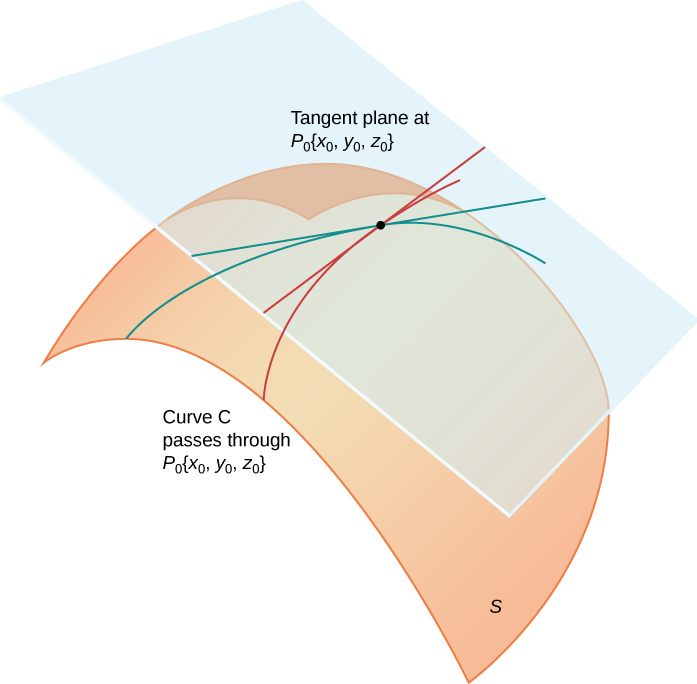
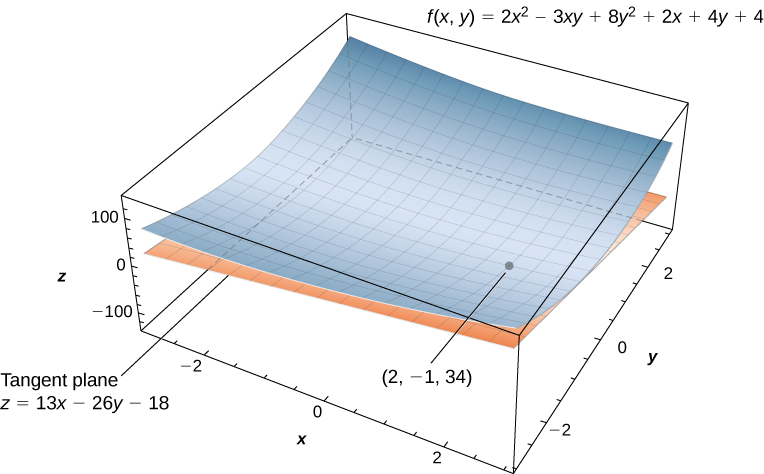
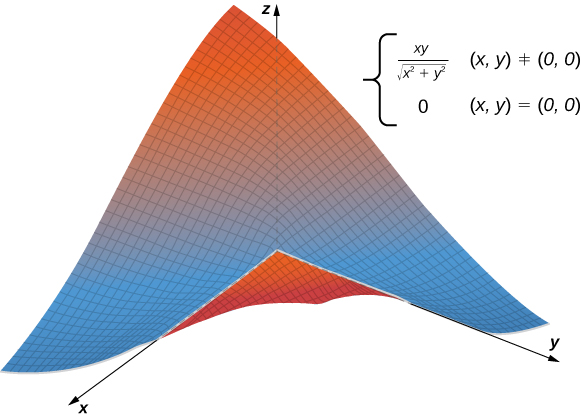
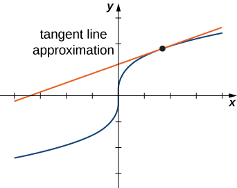
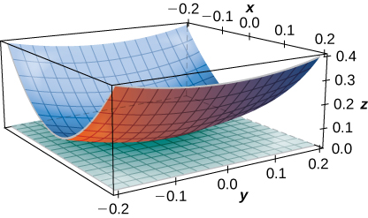

* Determine the equation of a plane tangent to a given surface at a point.
* Use the tangent plane to approximate a function of two variables at a point.
* Explain when a function of two variables is differentiable.
* Use the total differential to approximate the change in a function of two variables.

In this section, we consider the problem of finding the tangent plane to a surface, which is analogous to finding the equation of a tangent line to a curve when the curve is defined by the graph of a function of one variable, <math xmlns="http://www.w3.org/1998/Math/MathML"><mrow><mi>y</mi><mo>=</mo><mi>f</mi><mrow><mo>(</mo><mi>x</mi><mo>)</mo></mrow><mo>.</mo></mrow></math>

 The slope of the tangent line at the point <math xmlns="http://www.w3.org/1998/Math/MathML"><mrow><mi>x</mi><mo>=</mo><mi>a</mi></mrow></math>

 is given by <math xmlns="http://www.w3.org/1998/Math/MathML"><mrow><mi>m</mi><mo>=</mo><mi>f</mi><mo>′</mo><mrow><mo>(</mo><mi>a</mi><mo>)</mo></mrow><mo>;</mo></mrow></math>

 what is the slope of a tangent plane? We learned about the equation of a plane in [Equations of Lines and Planes in Space](/m53870){: .target-chapter}; in this section, we see how it can be applied to the problem at hand.

# Tangent Planes

Intuitively, it seems clear that, in a plane, only one line can be tangent to a curve at a point. However, in three-dimensional space, many lines can be tangent to a given point. If these lines lie in the same plane, they determine the tangent plane at that point. A more intuitive way to think of a tangent plane is to assume the surface is smooth at that point (no corners). Then, a tangent line to the surface at that point in any direction does not have any abrupt changes in slope because the direction changes smoothly. Therefore, in a small-enough neighborhood around the point, a tangent plane touches the surface at that point only.

Definition

Let <math xmlns="http://www.w3.org/1998/Math/MathML"><mrow><msub><mi>P</mi><mn>0</mn></msub><mo>=</mo><mrow><mo>(</mo><mrow><msub><mi>x</mi><mn>0</mn></msub><mo>,</mo><msub><mi>y</mi><mn>0</mn></msub><mo>,</mo><msub><mi>z</mi><mn>0</mn></msub></mrow><mo>)</mo></mrow></mrow></math>

 be a point on a surface <math xmlns="http://www.w3.org/1998/Math/MathML"><mrow><mi>S</mi><mo>,</mo></mrow></math>

 and let <math xmlns="http://www.w3.org/1998/Math/MathML"><mi>C</mi></math>

 be any curve passing through <math xmlns="http://www.w3.org/1998/Math/MathML"><mrow><msub><mi>P</mi><mn>0</mn></msub></mrow></math>

 and lying entirely in <math xmlns="http://www.w3.org/1998/Math/MathML"><mrow><mi>S</mi><mo>.</mo></mrow></math>

 If the tangent lines to all such curves <math xmlns="http://www.w3.org/1998/Math/MathML"><mi>C</mi></math>

 at <math xmlns="http://www.w3.org/1998/Math/MathML"><mrow><msub><mi>P</mi><mn>0</mn></msub></mrow></math>

 lie in the same plane, then this plane is called the **tangent plane**{: data-type="term"} to <math xmlns="http://www.w3.org/1998/Math/MathML"><mi>S</mi></math>

 at <math xmlns="http://www.w3.org/1998/Math/MathML"><mrow><msub><mi>P</mi><mn>0</mn></msub></mrow></math>

 ([\[link\]](#CNX_Calc_Figure_14_04_001)).

 {: #CNX_Calc_Figure_14_04_001}

For a tangent plane to a surface to exist at a point on that surface, it is sufficient for the function that defines the surface to be differentiable at that point. We define the term tangent plane here and then explore the idea intuitively.

Definition

Let <math xmlns="http://www.w3.org/1998/Math/MathML"><mi>S</mi></math>

 be a surface defined by a differentiable function <math xmlns="http://www.w3.org/1998/Math/MathML"><mrow><mi>z</mi><mo>=</mo><mi>f</mi><mrow><mo>(</mo><mrow><mi>x</mi><mo>,</mo><mi>y</mi></mrow><mo>)</mo></mrow><mo>,</mo></mrow></math>

 and let <math xmlns="http://www.w3.org/1998/Math/MathML"><mrow><msub><mi>P</mi><mn>0</mn></msub><mo>=</mo><mrow><mo>(</mo><mrow><msub><mi>x</mi><mn>0</mn></msub><mo>,</mo><msub><mi>y</mi><mn>0</mn></msub></mrow><mo>)</mo></mrow></mrow></math>

 be a point in the domain of <math xmlns="http://www.w3.org/1998/Math/MathML"><mrow><mi>f</mi><mo>.</mo></mrow></math>

 Then, the equation of the tangent plane to <math xmlns="http://www.w3.org/1998/Math/MathML"><mi>S</mi></math>

 at <math xmlns="http://www.w3.org/1998/Math/MathML"><mrow><msub><mi>P</mi><mn>0</mn></msub></mrow></math>

 is given by

<math xmlns="http://www.w3.org/1998/Math/MathML"><mrow><mi>z</mi><mo>=</mo><mi>f</mi><mrow><mo>(</mo><mrow><msub><mi>x</mi><mn>0</mn></msub><mo>,</mo><msub><mi>y</mi><mn>0</mn></msub></mrow><mo>)</mo></mrow><mo>+</mo><msub><mi>f</mi><mi>x</mi></msub><mrow><mo>(</mo><mrow><msub><mi>x</mi><mn>0</mn></msub><mo>,</mo><msub><mi>y</mi><mn>0</mn></msub></mrow><mo>)</mo></mrow><mrow><mo>(</mo><mrow><mi>x</mi><mo>−</mo><msub><mi>x</mi><mn>0</mn></msub></mrow><mo>)</mo></mrow><mo>+</mo><msub><mi>f</mi><mi>y</mi></msub><mrow><mo>(</mo><mrow><msub><mi>x</mi><mn>0</mn></msub><mo>,</mo><msub><mi>y</mi><mn>0</mn></msub></mrow><mo>)</mo></mrow><mrow><mo>(</mo><mrow><mi>y</mi><mo>−</mo><msub><mi>y</mi><mn>0</mn></msub></mrow><mo>)</mo></mrow><mo>.</mo></mrow></math>

To see why this formula is correct, let’s first find two tangent lines to the surface <math xmlns="http://www.w3.org/1998/Math/MathML"><mrow><mi>S</mi><mo>.</mo></mrow></math>

 The equation of the tangent line to the curve that is represented by the intersection of <math xmlns="http://www.w3.org/1998/Math/MathML"><mi>S</mi></math>

 with the vertical trace given by <math xmlns="http://www.w3.org/1998/Math/MathML"><mrow><mi>x</mi><mo>=</mo><msub><mi>x</mi><mn>0</mn></msub></mrow></math>

 is <math xmlns="http://www.w3.org/1998/Math/MathML"><mrow><mi>z</mi><mo>=</mo><mi>f</mi><mrow><mo>(</mo><mrow><msub><mi>x</mi><mn>0</mn></msub><mo>,</mo><msub><mi>y</mi><mn>0</mn></msub></mrow><mo>)</mo></mrow><mo>+</mo><msub><mi>f</mi><mi>y</mi></msub><mrow><mo>(</mo><mrow><msub><mi>x</mi><mn>0</mn></msub><mo>,</mo><msub><mi>y</mi><mn>0</mn></msub></mrow><mo>)</mo></mrow><mrow><mo>(</mo><mrow><mi>y</mi><mo>−</mo><msub><mi>y</mi><mn>0</mn></msub></mrow><mo>)</mo></mrow><mo>.</mo></mrow></math>

 Similarly, the equation of the tangent line to the curve that is represented by the intersection of <math xmlns="http://www.w3.org/1998/Math/MathML"><mi>S</mi></math>

 with the vertical trace given by <math xmlns="http://www.w3.org/1998/Math/MathML"><mrow><mi>y</mi><mo>=</mo><msub><mi>y</mi><mn>0</mn></msub></mrow></math>

 is <math xmlns="http://www.w3.org/1998/Math/MathML"><mrow><mi>z</mi><mo>=</mo><mi>f</mi><mrow><mo>(</mo><mrow><msub><mi>x</mi><mn>0</mn></msub><mo>,</mo><msub><mi>y</mi><mn>0</mn></msub></mrow><mo>)</mo></mrow><mo>+</mo><msub><mi>f</mi><mi>x</mi></msub><mrow><mo>(</mo><mrow><msub><mi>x</mi><mn>0</mn></msub><mo>,</mo><msub><mi>y</mi><mn>0</mn></msub></mrow><mo>)</mo></mrow><mrow><mo>(</mo><mrow><mi>x</mi><mo>−</mo><msub><mi>x</mi><mn>0</mn></msub></mrow><mo>)</mo></mrow><mo>.</mo></mrow></math>

 A parallel vector to the first tangent line is <math xmlns="http://www.w3.org/1998/Math/MathML"><mrow><mtext>a</mtext><mo>=</mo><mtext>j</mtext><mo>+</mo><msub><mi>f</mi><mi>y</mi></msub><mrow><mo>(</mo><mrow><msub><mi>x</mi><mn>0</mn></msub><mo>,</mo><msub><mi>y</mi><mn>0</mn></msub></mrow><mo>)</mo></mrow><mtext>k;</mtext></mrow></math>

 a parallel vector to the second tangent line is <math xmlns="http://www.w3.org/1998/Math/MathML"><mrow><mtext>b</mtext><mo>=</mo><mtext>i</mtext><mo>+</mo><msub><mi>f</mi><mi>x</mi></msub><mrow><mo>(</mo><mrow><msub><mi>x</mi><mn>0</mn></msub><mo>,</mo><msub><mi>y</mi><mn>0</mn></msub></mrow><mo>)</mo></mrow><mtext>k</mtext><mo>.</mo></mrow></math>

 We can take the cross product of these two vectors:

<math xmlns="http://www.w3.org/1998/Math/MathML"><mtable><mtr><mtd columnalign="right"><mstyle mathvariant="bold" mathsize="normal"><mi>a</mi></mstyle><mspace width="0.2em" /><mo>×</mo><mspace width="0.2em" /><mstyle mathvariant="bold" mathsize="normal"><mi>b</mi></mstyle></mtd><mtd columnalign="left"><mo>=</mo><mrow><mo>(</mo><mrow><mstyle mathvariant="bold" mathsize="normal"><mi>j</mi></mstyle><mo>+</mo><msub><mi>f</mi><mi>y</mi></msub><mrow><mo>(</mo><mrow><msub><mi>x</mi><mn>0</mn></msub><mo>,</mo><msub><mi>y</mi><mn>0</mn></msub></mrow><mo>)</mo></mrow><mstyle mathvariant="bold" mathsize="normal"><mi>k</mi></mstyle></mrow><mo>)</mo></mrow><mspace width="0.2em" /><mo>×</mo><mspace width="0.2em" /><mrow><mo>(</mo><mrow><mstyle mathvariant="bold" mathsize="normal"><mi>i</mi></mstyle><mo>+</mo><msub><mi>f</mi><mi>x</mi></msub><mrow><mo>(</mo><mrow><msub><mi>x</mi><mn>0</mn></msub><mo>,</mo><msub><mi>y</mi><mn>0</mn></msub></mrow><mo>)</mo></mrow><mstyle mathvariant="bold" mathsize="normal"><mi>k</mi></mstyle></mrow><mo>)</mo></mrow></mtd></mtr><mtr><mtd /><mtd columnalign="left"><mo>=</mo><mrow><mo>\|</mo><mrow><mtable><mtr><mtd columnalign="left"><mstyle mathvariant="bold" mathsize="normal"><mi>i</mi></mstyle></mtd><mtd columnalign="left"><mstyle mathvariant="bold" mathsize="normal"><mi>j</mi></mstyle></mtd><mtd columnalign="left"><mstyle mathvariant="bold" mathsize="normal"><mi>k</mi></mstyle></mtd></mtr><mtr><mtd columnalign="left"><mn>0</mn></mtd><mtd columnalign="left"><mn>1</mn></mtd><mtd columnalign="left"><mrow><msub><mi>f</mi><mi>y</mi></msub><mrow><mo>(</mo><mrow><msub><mi>x</mi><mn>0</mn></msub><mo>,</mo><msub><mi>y</mi><mn>0</mn></msub></mrow><mo>)</mo></mrow></mrow></mtd></mtr><mtr><mtd columnalign="left"><mn>1</mn></mtd><mtd columnalign="left"><mn>0</mn></mtd><mtd columnalign="left"><mrow><msub><mi>f</mi><mi>x</mi></msub><mrow><mo>(</mo><mrow><msub><mi>x</mi><mn>0</mn></msub><mo>,</mo><msub><mi>y</mi><mn>0</mn></msub></mrow><mo>)</mo></mrow></mrow></mtd></mtr></mtable></mrow><mo>\|</mo></mrow></mtd></mtr><mtr><mtd /><mtd columnalign="left"><mo>=</mo><msub><mi>f</mi><mi>x</mi></msub><mrow><mo>(</mo><mrow><msub><mi>x</mi><mn>0</mn></msub><mo>,</mo><msub><mi>y</mi><mn>0</mn></msub></mrow><mo>)</mo></mrow><mstyle mathvariant="bold" mathsize="normal"><mi>i</mi></mstyle><mo>+</mo><msub><mi>f</mi><mi>y</mi></msub><mrow><mo>(</mo><mrow><msub><mi>x</mi><mn>0</mn></msub><mo>,</mo><msub><mi>y</mi><mn>0</mn></msub></mrow><mo>)</mo></mrow><mstyle mathvariant="bold" mathsize="normal"><mi>j</mi></mstyle><mo>−</mo><mstyle mathvariant="bold" mathsize="normal"><mi>k</mi></mstyle><mo>.</mo></mtd></mtr></mtable></math>

This vector is perpendicular to both lines and is therefore perpendicular to the tangent plane. We can use this vector as a normal vector to the tangent plane, along with the point <math xmlns="http://www.w3.org/1998/Math/MathML"><mrow><msub><mi>P</mi><mn>0</mn></msub><mo>=</mo><mrow><mo>(</mo><mrow><msub><mi>x</mi><mn>0</mn></msub><mo>,</mo><msub><mi>y</mi><mn>0</mn></msub><mo>,</mo><mi>f</mi><mrow><mo>(</mo><mrow><msub><mi>x</mi><mn>0</mn></msub><mo>,</mo><msub><mi>y</mi><mn>0</mn></msub></mrow><mo>)</mo></mrow></mrow><mo>)</mo></mrow></mrow></math>

 in the equation for a plane:

<math xmlns="http://www.w3.org/1998/Math/MathML"><mtable><mtr><mtd columnalign="right"><mstyle mathvariant="bold" mathsize="normal"><mi>n</mi></mstyle><mo>·</mo><mrow><mo>(</mo><mrow><mrow><mo>(</mo><mrow><mi>x</mi><mo>−</mo><msub><mi>x</mi><mn>0</mn></msub></mrow><mo>)</mo></mrow><mstyle mathvariant="bold" mathsize="normal"><mi>i</mi></mstyle><mo>+</mo><mrow><mo>(</mo><mrow><mi>y</mi><mo>−</mo><msub><mi>y</mi><mn>0</mn></msub></mrow><mo>)</mo></mrow><mstyle mathvariant="bold" mathsize="normal"><mi>j</mi></mstyle><mo>+</mo><mrow><mo>(</mo><mrow><mi>z</mi><mo>−</mo><mi>f</mi><mrow><mo>(</mo><mrow><msub><mi>x</mi><mn>0</mn></msub><mo>,</mo><msub><mi>y</mi><mn>0</mn></msub></mrow><mo>)</mo></mrow></mrow><mo>)</mo></mrow><mstyle mathvariant="bold" mathsize="normal"><mi>k</mi></mstyle></mrow><mo>)</mo></mrow></mtd><mtd columnalign="left"><mo>=</mo></mtd><mtd columnalign="left"><mn>0</mn></mtd></mtr><mtr><mtd columnalign="right"><mrow><mo>(</mo><mrow><msub><mi>f</mi><mi>x</mi></msub><mrow><mo>(</mo><mrow><msub><mi>x</mi><mn>0</mn></msub><mo>,</mo><msub><mi>y</mi><mn>0</mn></msub></mrow><mo>)</mo></mrow><mstyle mathvariant="bold" mathsize="normal"><mi>i</mi></mstyle><mo>+</mo><msub><mi>f</mi><mi>y</mi></msub><mrow><mo>(</mo><mrow><msub><mi>x</mi><mn>0</mn></msub><mo>,</mo><msub><mi>y</mi><mn>0</mn></msub></mrow><mo>)</mo></mrow><mstyle mathvariant="bold" mathsize="normal"><mi>j</mi></mstyle><mtext>-</mtext><mstyle mathvariant="bold" mathsize="normal"><mi>k</mi></mstyle></mrow><mo>)</mo></mrow><mo>·</mo><mrow><mo>(</mo><mrow><mrow><mo>(</mo><mrow><mi>x</mi><mo>−</mo><msub><mi>x</mi><mn>0</mn></msub></mrow><mo>)</mo></mrow><mstyle mathvariant="bold" mathsize="normal"><mi>i</mi></mstyle><mo>+</mo><mrow><mo>(</mo><mrow><mi>y</mi><mo>−</mo><msub><mi>y</mi><mn>0</mn></msub></mrow><mo>)</mo></mrow><mstyle mathvariant="bold" mathsize="normal"><mi>j</mi></mstyle><mo>+</mo><mrow><mo>(</mo><mrow><mi>z</mi><mo>−</mo><mi>f</mi><mrow><mo>(</mo><mrow><msub><mi>x</mi><mn>0</mn></msub><mo>,</mo><msub><mi>y</mi><mn>0</mn></msub></mrow><mo>)</mo></mrow></mrow><mo>)</mo></mrow><mstyle mathvariant="bold" mathsize="normal"><mi>k</mi></mstyle></mrow><mo>)</mo></mrow></mtd><mtd columnalign="left"><mo>=</mo></mtd><mtd columnalign="left"><mn>0</mn></mtd></mtr><mtr><mtd columnalign="right"><msub><mi>f</mi><mi>x</mi></msub><mrow><mo>(</mo><mrow><msub><mi>x</mi><mn>0</mn></msub><mo>,</mo><msub><mi>y</mi><mn>0</mn></msub></mrow><mo>)</mo></mrow><mrow><mo>(</mo><mrow><mi>x</mi><mo>−</mo><msub><mi>x</mi><mn>0</mn></msub></mrow><mo>)</mo></mrow><mo>+</mo><msub><mi>f</mi><mi>y</mi></msub><mrow><mo>(</mo><mrow><msub><mi>x</mi><mn>0</mn></msub><mo>,</mo><msub><mi>y</mi><mn>0</mn></msub></mrow><mo>)</mo></mrow><mrow><mo>(</mo><mrow><mi>y</mi><mo>−</mo><msub><mi>y</mi><mn>0</mn></msub></mrow><mo>)</mo></mrow><mo>−</mo><mrow><mo>(</mo><mrow><mi>z</mi><mo>−</mo><mi>f</mi><mrow><mo>(</mo><mrow><msub><mi>x</mi><mn>0</mn></msub><mo>,</mo><msub><mi>y</mi><mn>0</mn></msub></mrow><mo>)</mo></mrow></mrow><mo>)</mo></mrow></mtd><mtd columnalign="left"><mo>=</mo></mtd><mtd columnalign="left"><mn>0</mn><mo>.</mo></mtd></mtr></mtable></math>

Solving this equation for <math xmlns="http://www.w3.org/1998/Math/MathML"><mi>z</mi></math>

 gives [\[link\]](#fs-id1167794069619).

Finding a Tangent Plane

Find the equation of the tangent plane to the surface defined by the function <math xmlns="http://www.w3.org/1998/Math/MathML"><mrow><mi>f</mi><mrow><mo>(</mo><mrow><mi>x</mi><mo>,</mo><mi>y</mi></mrow><mo>)</mo></mrow><mo>=</mo><mn>2</mn><msup><mi>x</mi><mn>2</mn></msup><mo>−</mo><mn>3</mn><mi>x</mi><mi>y</mi><mo>+</mo><mn>8</mn><msup><mi>y</mi><mn>2</mn></msup><mo>+</mo><mn>2</mn><mi>x</mi><mo>−</mo><mn>4</mn><mi>y</mi><mo>+</mo><mn>4</mn></mrow></math>

 at point <math xmlns="http://www.w3.org/1998/Math/MathML"><mrow><mrow><mo>(</mo><mrow><mn>2</mn><mo>,</mo><mn>−1</mn></mrow><mo>)</mo></mrow><mo>.</mo></mrow></math>

First, we must calculate <math xmlns="http://www.w3.org/1998/Math/MathML"><mrow><msub><mi>f</mi><mi>x</mi></msub><mrow><mo>(</mo><mrow><mi>x</mi><mo>,</mo><mi>y</mi></mrow><mo>)</mo></mrow></mrow></math>

 and <math xmlns="http://www.w3.org/1998/Math/MathML"><mrow><msub><mi>f</mi><mi>y</mi></msub><mrow><mo>(</mo><mrow><mi>x</mi><mo>,</mo><mi>y</mi></mrow><mo>)</mo></mrow><mo>,</mo></mrow></math>

 then use [[link]](#fs-id1167794069619) with <math xmlns="http://www.w3.org/1998/Math/MathML"><mrow><msub><mi>x</mi><mn>0</mn></msub><mo>=</mo><mn>2</mn></mrow></math>

 and <math xmlns="http://www.w3.org/1998/Math/MathML"><mrow><msub><mi>y</mi><mn>0</mn></msub><mo>=</mo><mn>−1</mn><mtext>:</mtext></mrow></math>

<math xmlns="http://www.w3.org/1998/Math/MathML"><mtable><mtr><mtd columnalign="right"><msub><mi>f</mi><mi>x</mi></msub><mrow><mo>(</mo><mrow><mi>x</mi><mo>,</mo><mi>y</mi></mrow><mo>)</mo></mrow></mtd><mtd columnalign="left"><mo>=</mo></mtd><mtd columnalign="left"><mn>4</mn><mi>x</mi><mo>−</mo><mn>3</mn><mi>y</mi><mo>+</mo><mn>2</mn></mtd></mtr><mtr><mtd columnalign="right"><msub><mi>f</mi><mi>y</mi></msub><mrow><mo>(</mo><mrow><mi>x</mi><mo>,</mo><mi>y</mi></mrow><mo>)</mo></mrow></mtd><mtd columnalign="left"><mo>=</mo></mtd><mtd columnalign="left"><mn>−3</mn><mi>x</mi><mo>+</mo><mn>16</mn><mi>y</mi><mo>−</mo><mn>4</mn></mtd></mtr><mtr><mtd columnalign="right"><mi>f</mi><mrow><mo>(</mo><mrow><mn>2</mn><mo>,</mo><mn>−1</mn></mrow><mo>)</mo></mrow></mtd><mtd columnalign="left"><mo>=</mo></mtd><mtd columnalign="left"><mn>2</mn><msup><mrow><mo>(</mo><mn>2</mn><mo>)</mo></mrow><mn>2</mn></msup><mo>−</mo><mn>3</mn><mrow><mo>(</mo><mn>2</mn><mo>)</mo></mrow><mrow><mo>(</mo><mrow><mn>−1</mn></mrow><mo>)</mo></mrow><mo>+</mo><mn>8</mn><msup><mrow><mo>(</mo><mrow><mn>−1</mn></mrow><mo>)</mo></mrow><mn>2</mn></msup><mo>+</mo><mn>2</mn><mrow><mo>(</mo><mn>2</mn><mo>)</mo></mrow><mo>−</mo><mn>4</mn><mrow><mo>(</mo><mrow><mn>−1</mn></mrow><mo>)</mo></mrow><mo>+</mo><mn>4</mn><mo>=</mo><mn>34.</mn></mtd></mtr><mtr><mtd columnalign="right"><msub><mi>f</mi><mi>x</mi></msub><mrow><mo>(</mo><mrow><mn>2</mn><mo>,</mo><mn>−1</mn></mrow><mo>)</mo></mrow></mtd><mtd columnalign="left"><mo>=</mo></mtd><mtd columnalign="left"><mn>4</mn><mrow><mo>(</mo><mn>2</mn><mo>)</mo></mrow><mo>−</mo><mn>3</mn><mrow><mo>(</mo><mrow><mn>−1</mn></mrow><mo>)</mo></mrow><mo>+</mo><mn>2</mn><mo>=</mo><mn>13</mn></mtd></mtr><mtr><mtd columnalign="right"><msub><mi>f</mi><mi>y</mi></msub><mrow><mo>(</mo><mrow><mn>2</mn><mo>,</mo><mn>−1</mn></mrow><mo>)</mo></mrow></mtd><mtd columnalign="left"><mo>=</mo></mtd><mtd columnalign="left"><mn>−3</mn><mrow><mo>(</mo><mn>2</mn><mo>)</mo></mrow><mo>+</mo><mn>16</mn><mrow><mo>(</mo><mrow><mn>−1</mn></mrow><mo>)</mo></mrow><mo>−</mo><mn>4</mn><mo>=</mo><mn>−26.</mn></mtd></mtr></mtable></math>

Then [[link]](#fs-id1167794069619) becomes

<math xmlns="http://www.w3.org/1998/Math/MathML"><mtable><mtr><mtd columnalign="left"><mi>z</mi><mo>=</mo><mi>f</mi><mrow><mo>(</mo><mrow><msub><mi>x</mi><mn>0</mn></msub><mo>,</mo><msub><mi>y</mi><mn>0</mn></msub></mrow><mo>)</mo></mrow><mo>+</mo><msub><mi>f</mi><mi>x</mi></msub><mrow><mo>(</mo><mrow><msub><mi>x</mi><mn>0</mn></msub><mo>,</mo><msub><mi>y</mi><mn>0</mn></msub></mrow><mo>)</mo></mrow><mrow><mo>(</mo><mrow><mi>x</mi><mo>−</mo><msub><mi>x</mi><mn>0</mn></msub></mrow><mo>)</mo></mrow><mo>+</mo><msub><mi>f</mi><mi>y</mi></msub><mrow><mo>(</mo><mrow><msub><mi>x</mi><mn>0</mn></msub><mo>,</mo><msub><mi>y</mi><mn>0</mn></msub></mrow><mo>)</mo></mrow><mrow><mo>(</mo><mrow><mi>y</mi><mo>−</mo><msub><mi>y</mi><mn>0</mn></msub></mrow><mo>)</mo></mrow></mtd></mtr><mtr><mtd columnalign="left"><mi>z</mi><mo>=</mo><mn>34</mn><mo>+</mo><mn>13</mn><mrow><mo>(</mo><mrow><mi>x</mi><mo>−</mo><mn>2</mn></mrow><mo>)</mo></mrow><mo>−</mo><mn>26</mn><mrow><mo>(</mo><mrow><mi>y</mi><mo>−</mo><mrow><mo>(</mo><mrow><mn>−1</mn></mrow><mo>)</mo></mrow></mrow><mo>)</mo></mrow></mtd></mtr><mtr><mtd columnalign="left"><mi>z</mi><mo>=</mo><mn>34</mn><mo>+</mo><mn>13</mn><mi>x</mi><mo>−</mo><mn>26</mn><mo>−</mo><mn>26</mn><mi>y</mi><mo>−</mo><mn>26</mn></mtd></mtr><mtr><mtd columnalign="left"><mi>z</mi><mo>=</mo><mn>13</mn><mi>x</mi><mo>−</mo><mn>26</mn><mi>y</mi><mo>−</mo><mn>18.</mn></mtd></mtr></mtable></math>

(See the following figure).

{: #CNX_Calc_Figure_14_04_002}

Find the equation of the tangent plane to the surface defined by the function <math xmlns="http://www.w3.org/1998/Math/MathML"><mrow><mi>f</mi><mrow><mo>(</mo><mrow><mi>x</mi><mo>,</mo><mi>y</mi></mrow><mo>)</mo></mrow><mo>=</mo><msup><mi>x</mi><mn>3</mn></msup><mo>−</mo><msup><mi>x</mi><mn>2</mn></msup><mi>y</mi><mo>+</mo><msup><mi>y</mi><mn>2</mn></msup><mo>−</mo><mn>2</mn><mi>x</mi><mo>+</mo><mn>3</mn><mi>y</mi><mo>−</mo><mn>2</mn></mrow></math>

 at point <math xmlns="http://www.w3.org/1998/Math/MathML"><mrow><mrow><mo>(</mo><mrow><mn>−1</mn><mo>,</mo><mn>3</mn></mrow><mo>)</mo></mrow><mo>.</mo></mrow></math>

<math xmlns="http://www.w3.org/1998/Math/MathML"><mrow><mi>z</mi><mo>=</mo><mn>7</mn><mi>x</mi><mo>+</mo><mn>8</mn><mi>y</mi><mo>−</mo><mn>3</mn></mrow></math>

Hint

First, calculate <math xmlns="http://www.w3.org/1998/Math/MathML"><mrow><msub><mi>f</mi><mi>x</mi></msub><mrow><mo>(</mo><mrow><mi>x</mi><mo>,</mo><mi>y</mi></mrow><mo>)</mo></mrow></mrow></math>

 and <math xmlns="http://www.w3.org/1998/Math/MathML"><mrow><msub><mi>f</mi><mi>y</mi></msub><mrow><mo>(</mo><mrow><mi>x</mi><mo>,</mo><mi>y</mi></mrow><mo>)</mo></mrow><mo>,</mo></mrow></math>

 then use [[link]](#fs-id1167794069619).

Finding Another Tangent Plane

Find the equation of the tangent plane to the surface defined by the function <math xmlns="http://www.w3.org/1998/Math/MathML"><mrow><mi>f</mi><mrow><mo>(</mo><mrow><mi>x</mi><mo>,</mo><mi>y</mi></mrow><mo>)</mo></mrow><mo>=</mo><mtext>sin</mtext><mrow><mo>(</mo><mrow><mn>2</mn><mi>x</mi></mrow><mo>)</mo></mrow><mtext>cos</mtext><mrow><mo>(</mo><mrow><mn>3</mn><mi>y</mi></mrow><mo>)</mo></mrow></mrow></math>

 at the point <math xmlns="http://www.w3.org/1998/Math/MathML"><mrow><mrow><mo>(</mo><mrow><mrow><mi>π</mi><mtext>/</mtext><mn>3</mn></mrow><mo>,</mo><mrow><mi>π</mi><mtext>/</mtext><mn>4</mn></mrow></mrow><mo>)</mo></mrow><mo>.</mo></mrow></math>

First, calculate <math xmlns="http://www.w3.org/1998/Math/MathML"><mrow><msub><mi>f</mi><mi>x</mi></msub><mrow><mo>(</mo><mrow><mi>x</mi><mo>,</mo><mi>y</mi></mrow><mo>)</mo></mrow></mrow></math>

 and <math xmlns="http://www.w3.org/1998/Math/MathML"><mrow><msub><mi>f</mi><mi>y</mi></msub><mrow><mo>(</mo><mrow><mi>x</mi><mo>,</mo><mi>y</mi></mrow><mo>)</mo></mrow><mo>,</mo></mrow></math>

 then use [[link]](#fs-id1167794069619) with <math xmlns="http://www.w3.org/1998/Math/MathML"><mrow><msub><mi>x</mi><mn>0</mn></msub><mo>=</mo><mrow><mi>π</mi><mtext>/</mtext><mn>3</mn></mrow></mrow></math>

 and <math xmlns="http://www.w3.org/1998/Math/MathML"><mrow><msub><mi>y</mi><mn>0</mn></msub><mo>=</mo><mrow><mi>π</mi><mtext>/</mtext><mn>4</mn></mrow><mtext>:</mtext></mrow></math>

<math xmlns="http://www.w3.org/1998/Math/MathML"><mtable><mtr><mtd columnalign="right"><msub><mi>f</mi><mi>x</mi></msub><mrow><mo>(</mo><mrow><mi>x</mi><mo>,</mo><mi>y</mi></mrow><mo>)</mo></mrow></mtd><mtd columnalign="left"><mo>=</mo></mtd><mtd columnalign="left"><mn>2</mn><mspace width="0.2em" /><mtext>cos</mtext><mrow><mo>(</mo><mrow><mn>2</mn><mi>x</mi></mrow><mo>)</mo></mrow><mtext>cos</mtext><mrow><mo>(</mo><mrow><mn>3</mn><mi>y</mi></mrow><mo>)</mo></mrow></mtd></mtr><mtr><mtd columnalign="right"><msub><mi>f</mi><mi>y</mi></msub><mrow><mo>(</mo><mrow><mi>x</mi><mo>,</mo><mi>y</mi></mrow><mo>)</mo></mrow></mtd><mtd columnalign="left"><mo>=</mo></mtd><mtd columnalign="left"><mn>−3</mn><mspace width="0.2em" /><mtext>sin</mtext><mrow><mo>(</mo><mrow><mn>2</mn><mi>x</mi></mrow><mo>)</mo></mrow><mtext>sin</mtext><mrow><mo>(</mo><mrow><mn>3</mn><mi>y</mi></mrow><mo>)</mo></mrow></mtd></mtr><mtr><mtd columnalign="right"><mi>f</mi><mrow><mo>(</mo><mrow><mfrac><mi>π</mi><mn>3</mn></mfrac><mo>,</mo><mfrac><mi>π</mi><mn>4</mn></mfrac></mrow><mo>)</mo></mrow></mtd><mtd columnalign="left"><mo>=</mo></mtd><mtd columnalign="left"><mtext>sin</mtext><mrow><mo>(</mo><mrow><mn>2</mn><mrow><mo>(</mo><mrow><mfrac><mi>π</mi><mn>3</mn></mfrac></mrow><mo>)</mo></mrow></mrow><mo>)</mo></mrow><mtext>cos</mtext><mrow><mo>(</mo><mrow><mn>3</mn><mrow><mo>(</mo><mrow><mfrac><mi>π</mi><mn>4</mn></mfrac></mrow><mo>)</mo></mrow></mrow><mo>)</mo></mrow><mo>=</mo><mrow><mo>(</mo><mrow><mfrac><mrow><msqrt><mn>3</mn></msqrt></mrow><mn>2</mn></mfrac></mrow><mo>)</mo></mrow><mrow><mo>(</mo><mrow><mo>−</mo><mfrac><mrow><msqrt><mn>2</mn></msqrt></mrow><mn>2</mn></mfrac></mrow><mo>)</mo></mrow><mo>=</mo><mo>−</mo><mfrac><mrow><msqrt><mn>6</mn></msqrt></mrow><mn>4</mn></mfrac></mtd></mtr><mtr><mtd columnalign="right"><msub><mi>f</mi><mi>x</mi></msub><mrow><mo>(</mo><mrow><mfrac><mi>π</mi><mn>3</mn></mfrac><mo>,</mo><mfrac><mi>π</mi><mn>4</mn></mfrac></mrow><mo>)</mo></mrow></mtd><mtd columnalign="left"><mo>=</mo></mtd><mtd columnalign="left"><mn>2</mn><mspace width="0.2em" /><mtext>cos</mtext><mrow><mo>(</mo><mrow><mn>2</mn><mrow><mo>(</mo><mrow><mfrac><mi>π</mi><mn>3</mn></mfrac></mrow><mo>)</mo></mrow></mrow><mo>)</mo></mrow><mtext>cos</mtext><mrow><mo>(</mo><mrow><mn>3</mn><mrow><mo>(</mo><mrow><mfrac><mi>π</mi><mn>4</mn></mfrac></mrow><mo>)</mo></mrow></mrow><mo>)</mo></mrow><mo>=</mo><mn>2</mn><mrow><mo>(</mo><mrow><mo>−</mo><mfrac><mn>1</mn><mn>2</mn></mfrac></mrow><mo>)</mo></mrow><mrow><mo>(</mo><mrow><mo>−</mo><mfrac><mrow><msqrt><mn>2</mn></msqrt></mrow><mn>2</mn></mfrac></mrow><mo>)</mo></mrow><mo>=</mo><mfrac><mrow><msqrt><mn>2</mn></msqrt></mrow><mn>2</mn></mfrac></mtd></mtr><mtr><mtd columnalign="right"><msub><mi>f</mi><mi>y</mi></msub><mrow><mo>(</mo><mrow><mfrac><mi>π</mi><mn>3</mn></mfrac><mo>,</mo><mfrac><mi>π</mi><mn>4</mn></mfrac></mrow><mo>)</mo></mrow></mtd><mtd columnalign="left"><mo>=</mo></mtd><mtd columnalign="left"><mn>−3</mn><mspace width="0.2em" /><mtext>sin</mtext><mrow><mo>(</mo><mrow><mn>2</mn><mrow><mo>(</mo><mrow><mfrac><mi>π</mi><mn>3</mn></mfrac></mrow><mo>)</mo></mrow></mrow><mo>)</mo></mrow><mtext>sin</mtext><mrow><mo>(</mo><mrow><mn>3</mn><mrow><mo>(</mo><mrow><mfrac><mi>π</mi><mn>4</mn></mfrac></mrow><mo>)</mo></mrow></mrow><mo>)</mo></mrow><mo>=</mo><mn>−3</mn><mrow><mo>(</mo><mrow><mfrac><mrow><msqrt><mn>3</mn></msqrt></mrow><mn>2</mn></mfrac></mrow><mo>)</mo></mrow><mrow><mo>(</mo><mrow><mfrac><mrow><msqrt><mn>2</mn></msqrt></mrow><mn>2</mn></mfrac></mrow><mo>)</mo></mrow><mo>=</mo><mo>−</mo><mfrac><mrow><mn>3</mn><msqrt><mn>6</mn></msqrt></mrow><mn>4</mn></mfrac><mo>.</mo></mtd></mtr></mtable></math>

Then [[link]](#fs-id1167794069619) becomes

<math xmlns="http://www.w3.org/1998/Math/MathML"><mtable><mtr /><mtr><mtd columnalign="left"><mi>z</mi><mo>=</mo><mi>f</mi><mrow><mo>(</mo><mrow><msub><mi>x</mi><mn>0</mn></msub><mo>,</mo><msub><mi>y</mi><mn>0</mn></msub></mrow><mo>)</mo></mrow><mo>+</mo><msub><mi>f</mi><mi>x</mi></msub><mrow><mo>(</mo><mrow><msub><mi>x</mi><mn>0</mn></msub><mo>,</mo><msub><mi>y</mi><mn>0</mn></msub></mrow><mo>)</mo></mrow><mrow><mo>(</mo><mrow><mi>x</mi><mo>−</mo><msub><mi>x</mi><mn>0</mn></msub></mrow><mo>)</mo></mrow><mo>+</mo><msub><mi>f</mi><mi>y</mi></msub><mrow><mo>(</mo><mrow><msub><mi>x</mi><mn>0</mn></msub><mo>,</mo><msub><mi>y</mi><mn>0</mn></msub></mrow><mo>)</mo></mrow><mrow><mo>(</mo><mrow><mi>y</mi><mo>−</mo><msub><mi>y</mi><mn>0</mn></msub></mrow><mo>)</mo></mrow></mtd></mtr><mtr /><mtr><mtd columnalign="left"><mi>z</mi><mo>=</mo><mo>−</mo><mfrac><mrow><msqrt><mn>6</mn></msqrt></mrow><mn>4</mn></mfrac><mo>+</mo><mfrac><mrow><msqrt><mn>2</mn></msqrt></mrow><mn>2</mn></mfrac><mrow><mo>(</mo><mrow><mi>x</mi><mo>−</mo><mfrac><mi>π</mi><mn>3</mn></mfrac></mrow><mo>)</mo></mrow><mo>−</mo><mfrac><mrow><mn>3</mn><msqrt><mn>6</mn></msqrt></mrow><mn>4</mn></mfrac><mrow><mo>(</mo><mrow><mi>y</mi><mo>−</mo><mfrac><mi>π</mi><mn>4</mn></mfrac></mrow><mo>)</mo></mrow></mtd></mtr><mtr><mtd columnalign="left"><mi>z</mi><mo>=</mo><mfrac><mrow><msqrt><mn>2</mn></msqrt></mrow><mn>2</mn></mfrac><mi>x</mi><mo>−</mo><mfrac><mrow><mn>3</mn><msqrt><mn>6</mn></msqrt></mrow><mn>4</mn></mfrac><mi>y</mi><mo>−</mo><mfrac><mrow><msqrt><mn>6</mn></msqrt></mrow><mn>4</mn></mfrac><mo>−</mo><mfrac><mrow><mi>π</mi><msqrt><mn>2</mn></msqrt></mrow><mn>6</mn></mfrac><mo>+</mo><mfrac><mrow><mn>3</mn><mi>π</mi><msqrt><mn>6</mn></msqrt></mrow><mrow><mn>16</mn></mrow></mfrac><mo>.</mo></mtd></mtr></mtable></math>

A tangent plane to a surface does not always exist at every point on the surface. Consider the function

<math xmlns="http://www.w3.org/1998/Math/MathML"><mrow><mi>f</mi><mo stretchy="false">(</mo><mi>x</mi><mo>,</mo><mi>y</mi><mo stretchy="false">)</mo><mo>=</mo><mrow><mo>{</mo><mtable><mtr><mtd columnalign="left"><mfrac><mrow><mi>x</mi><mi>y</mi></mrow><mrow><msqrt><mrow><msup><mi>x</mi><mn>2</mn></msup><mo>+</mo><msup><mi>y</mi><mn>2</mn></msup></mrow></msqrt></mrow></mfrac></mtd><mtd columnalign="left"><mrow><mo>(</mo><mrow><mi>x</mi><mo>,</mo><mi>y</mi></mrow><mo>)</mo></mrow><mo>≠</mo><mrow><mo>(</mo><mrow><mn>0</mn><mo>,</mo><mn>0</mn></mrow><mo>)</mo></mrow></mtd></mtr><mtr><mtd columnalign="left"><mn>0</mn></mtd><mtd columnalign="left"><mrow><mo>(</mo><mrow><mi>x</mi><mo>,</mo><mi>y</mi></mrow><mo>)</mo></mrow><mo>=</mo><mrow><mo>(</mo><mrow><mn>0</mn><mo>,</mo><mn>0</mn></mrow><mo>)</mo></mrow><mo>.</mo></mtd></mtr></mtable></mrow></mrow></math>

The graph of this function follows.

 {: #CNX_Calc_Figure_14_04_003}

If either <math xmlns="http://www.w3.org/1998/Math/MathML"><mrow><mi>x</mi><mo>=</mo><mn>0</mn></mrow></math>

 or <math xmlns="http://www.w3.org/1998/Math/MathML"><mrow><mi>y</mi><mo>=</mo><mn>0</mn><mo>,</mo></mrow></math>

 then <math xmlns="http://www.w3.org/1998/Math/MathML"><mrow><mi>f</mi><mrow><mo>(</mo><mrow><mi>x</mi><mo>,</mo><mi>y</mi></mrow><mo>)</mo></mrow><mo>=</mo><mn>0</mn><mo>,</mo></mrow></math>

 so the value of the function does not change on either the *x*- or *y*-axis. Therefore, <math xmlns="http://www.w3.org/1998/Math/MathML"><mrow><msub><mi>f</mi><mi>x</mi></msub><mrow><mo>(</mo><mrow><mi>x</mi><mo>,</mo><mn>0</mn></mrow><mo>)</mo></mrow><mo>=</mo><msub><mi>f</mi><mi>y</mi></msub><mrow><mo>(</mo><mrow><mn>0</mn><mo>,</mo><mi>y</mi></mrow><mo>)</mo></mrow><mo>=</mo><mn>0</mn><mo>,</mo></mrow></math>

 so as either <math xmlns="http://www.w3.org/1998/Math/MathML"><mrow><mi>x</mi><mspace width="0.2em" /><mi>o</mi><mi>r</mi><mspace width="0.2em" /><mi>y</mi></mrow></math>

 approach zero, these partial derivatives stay equal to zero. Substituting them into [\[link\]](#fs-id1167794069619) gives <math xmlns="http://www.w3.org/1998/Math/MathML"><mrow><mi>z</mi><mo>=</mo><mn>0</mn></mrow></math>

 as the equation of the tangent line. However, if we approach the origin from a different direction, we get a different story. For example, suppose we approach the origin along the line <math xmlns="http://www.w3.org/1998/Math/MathML"><mrow><mi>y</mi><mo>=</mo><mi>x</mi><mo>.</mo></mrow></math>

 If we put <math xmlns="http://www.w3.org/1998/Math/MathML"><mrow><mi>y</mi><mo>=</mo><mi>x</mi></mrow></math>

 into the original function, it becomes

<math xmlns="http://www.w3.org/1998/Math/MathML"><mrow><mi>f</mi><mrow><mo>(</mo><mrow><mi>x</mi><mo>,</mo><mi>x</mi></mrow><mo>)</mo></mrow><mo>=</mo><mfrac><mrow><mi>x</mi><mrow><mo>(</mo><mi>x</mi><mo>)</mo></mrow></mrow><mrow><msqrt><mrow><msup><mi>x</mi><mn>2</mn></msup><mo>+</mo><msup><mrow><mrow><mo>(</mo><mi>x</mi><mo>)</mo></mrow></mrow><mn>2</mn></msup></mrow></msqrt></mrow></mfrac><mo>=</mo><mfrac><mrow><msup><mi>x</mi><mn>2</mn></msup></mrow><mrow><msqrt><mrow><mn>2</mn><msup><mi>x</mi><mn>2</mn></msup></mrow></msqrt></mrow></mfrac><mo>=</mo><mfrac><mrow><mrow><mo>\|</mo><mi>x</mi><mo>\|</mo></mrow></mrow><mrow><msqrt><mn>2</mn></msqrt></mrow></mfrac><mo>.</mo></mrow></math>

When <math xmlns="http://www.w3.org/1998/Math/MathML"><mrow><mi>x</mi><mo>&gt;</mo><mn>0</mn><mo>,</mo></mrow></math>

 the slope of this curve is equal to <math xmlns="http://www.w3.org/1998/Math/MathML"><mrow><mrow><mrow><msqrt><mn>2</mn></msqrt></mrow><mtext>/</mtext><mn>2</mn></mrow><mo>;</mo></mrow></math>

 when <math xmlns="http://www.w3.org/1998/Math/MathML"><mrow><mi>x</mi><mo>&lt;</mo><mn>0</mn><mo>,</mo></mrow></math>

 the slope of this curve is equal to <math xmlns="http://www.w3.org/1998/Math/MathML"><mrow><mtext>−</mtext><mrow><mo>(</mo><mrow><mrow><mrow><msqrt><mn>2</mn></msqrt></mrow><mtext>/</mtext><mn>2</mn></mrow></mrow><mo>)</mo></mrow><mo>.</mo></mrow></math>

 This presents a problem. In the definition of *tangent plane*, we presumed that all tangent lines through point <math xmlns="http://www.w3.org/1998/Math/MathML"><mi>P</mi></math>

 (in this case, the origin) lay in the same plane. This is clearly not the case here. When we study differentiable functions, we will see that this function is not differentiable at the origin.

# Linear Approximations

Recall from [Linear Approximations and Differentials](/m53605){: .target-chapter} that the formula for the linear approximation of a function <math xmlns="http://www.w3.org/1998/Math/MathML"><mrow><mi>f</mi><mrow><mo>(</mo><mi>x</mi><mo>)</mo></mrow></mrow></math>

 at the point <math xmlns="http://www.w3.org/1998/Math/MathML"><mrow><mi>x</mi><mo>=</mo><mi>a</mi></mrow></math>

 is given by

<math xmlns="http://www.w3.org/1998/Math/MathML"><mrow><mi>y</mi><mo>≈</mo><mi>f</mi><mrow><mo>(</mo><mi>a</mi><mo>)</mo></mrow><mo>+</mo><mi>f</mi><mo>′</mo><mrow><mo>(</mo><mi>a</mi><mo>)</mo></mrow><mrow><mo>(</mo><mrow><mi>x</mi><mo>−</mo><mi>a</mi></mrow><mo>)</mo></mrow><mo>.</mo></mrow></math>

The diagram for the linear approximation of a function of one variable appears in the following graph.

 {: #CNX_Calc_Figure_14_04_004}

The tangent line can be used as an approximation to the function <math xmlns="http://www.w3.org/1998/Math/MathML"><mrow><mi>f</mi><mrow><mo>(</mo><mi>x</mi><mo>)</mo></mrow></mrow></math>

 for values of <math xmlns="http://www.w3.org/1998/Math/MathML"><mi>x</mi></math>

 reasonably close to <math xmlns="http://www.w3.org/1998/Math/MathML"><mrow><mi>x</mi><mo>=</mo><mi>a</mi><mo>.</mo></mrow></math>

 When working with a function of two variables, the tangent line is replaced by a tangent plane, but the approximation idea is much the same.

Definition

Given a function <math xmlns="http://www.w3.org/1998/Math/MathML"><mrow><mi>z</mi><mo>=</mo><mi>f</mi><mrow><mo>(</mo><mrow><mi>x</mi><mo>,</mo><mi>y</mi></mrow><mo>)</mo></mrow></mrow></math>

 with continuous partial derivatives that exist at the point <math xmlns="http://www.w3.org/1998/Math/MathML"><mrow><mrow><mo>(</mo><mrow><msub><mi>x</mi><mn>0</mn></msub><mo>,</mo><msub><mi>y</mi><mn>0</mn></msub></mrow><mo>)</mo></mrow><mo>,</mo></mrow></math>

 the **linear approximation**{: data-type="term"} of <math xmlns="http://www.w3.org/1998/Math/MathML"><mi>f</mi></math>

 at the point <math xmlns="http://www.w3.org/1998/Math/MathML"><mrow><mrow><mo>(</mo><mrow><msub><mi>x</mi><mn>0</mn></msub><mo>,</mo><msub><mi>y</mi><mn>0</mn></msub></mrow><mo>)</mo></mrow></mrow></math>

 is given by the equation

<math xmlns="http://www.w3.org/1998/Math/MathML"><mrow><mi>L</mi><mrow><mo>(</mo><mrow><mi>x</mi><mo>,</mo><mi>y</mi></mrow><mo>)</mo></mrow><mo>=</mo><mi>f</mi><mrow><mo>(</mo><mrow><msub><mi>x</mi><mn>0</mn></msub><mo>,</mo><msub><mi>y</mi><mn>0</mn></msub></mrow><mo>)</mo></mrow><mo>+</mo><msub><mi>f</mi><mi>x</mi></msub><mrow><mo>(</mo><mrow><msub><mi>x</mi><mn>0</mn></msub><mo>,</mo><msub><mi>y</mi><mn>0</mn></msub></mrow><mo>)</mo></mrow><mrow><mo>(</mo><mrow><mi>x</mi><mo>−</mo><msub><mi>x</mi><mn>0</mn></msub></mrow><mo>)</mo></mrow><mo>+</mo><msub><mi>f</mi><mi>y</mi></msub><mrow><mo>(</mo><mrow><msub><mi>x</mi><mn>0</mn></msub><mo>,</mo><msub><mi>y</mi><mn>0</mn></msub></mrow><mo>)</mo></mrow><mrow><mo>(</mo><mrow><mi>y</mi><mo>−</mo><msub><mi>y</mi><mn>0</mn></msub></mrow><mo>)</mo></mrow><mo>.</mo></mrow></math>

Notice that this equation also represents the tangent plane to the surface defined by <math xmlns="http://www.w3.org/1998/Math/MathML"><mrow><mi>z</mi><mo>=</mo><mi>f</mi><mrow><mo>(</mo><mrow><mi>x</mi><mo>,</mo><mi>y</mi></mrow><mo>)</mo></mrow></mrow></math>

 at the point <math xmlns="http://www.w3.org/1998/Math/MathML"><mrow><mrow><mo>(</mo><mrow><msub><mi>x</mi><mn>0</mn></msub><mo>,</mo><msub><mi>y</mi><mn>0</mn></msub></mrow><mo>)</mo></mrow><mo>.</mo></mrow></math>

 The idea behind using a linear approximation is that, if there is a point <math xmlns="http://www.w3.org/1998/Math/MathML"><mrow><mrow><mo>(</mo><mrow><msub><mi>x</mi><mn>0</mn></msub><mo>,</mo><msub><mi>y</mi><mn>0</mn></msub></mrow><mo>)</mo></mrow></mrow></math>

 at which the precise value of <math xmlns="http://www.w3.org/1998/Math/MathML"><mrow><mi>f</mi><mrow><mo>(</mo><mrow><mi>x</mi><mo>,</mo><mi>y</mi></mrow><mo>)</mo></mrow></mrow></math>

 is known, then for values of <math xmlns="http://www.w3.org/1998/Math/MathML"><mrow><mrow><mo>(</mo><mrow><mi>x</mi><mo>,</mo><mi>y</mi></mrow><mo>)</mo></mrow></mrow></math>

 reasonably close to <math xmlns="http://www.w3.org/1998/Math/MathML"><mrow><mrow><mo>(</mo><mrow><msub><mi>x</mi><mn>0</mn></msub><mo>,</mo><msub><mi>y</mi><mn>0</mn></msub></mrow><mo>)</mo></mrow><mo>,</mo></mrow></math>

 the linear approximation (i.e., tangent plane) yields a value that is also reasonably close to the exact value of <math xmlns="http://www.w3.org/1998/Math/MathML"><mrow><mi>f</mi><mrow><mo>(</mo><mrow><mi>x</mi><mo>,</mo><mi>y</mi></mrow><mo>)</mo></mrow></mrow></math>

 ([\[link\]](#CNX_Calc_Figure_14_04_005)). Furthermore the plane that is used to find the linear approximation is also the tangent plane to the surface at the point <math xmlns="http://www.w3.org/1998/Math/MathML"><mrow><mrow><mo>(</mo><mrow><msub><mi>x</mi><mn>0</mn></msub><mo>,</mo><msub><mi>y</mi><mn>0</mn></msub></mrow><mo>)</mo></mrow><mo>.</mo></mrow></math>

 {: #CNX_Calc_Figure_14_04_005}

Using a Tangent Plane Approximation

Given the function <math xmlns="http://www.w3.org/1998/Math/MathML"><mrow><mi>f</mi><mrow><mo>(</mo><mrow><mi>x</mi><mo>,</mo><mi>y</mi></mrow><mo>)</mo></mrow><mo>=</mo><msqrt><mrow><mn>41</mn><mo>−</mo><mn>4</mn><msup><mi>x</mi><mn>2</mn></msup><mo>−</mo><msup><mi>y</mi><mn>2</mn></msup></mrow></msqrt><mo>,</mo></mrow></math>

 approximate <math xmlns="http://www.w3.org/1998/Math/MathML"><mrow><mi>f</mi><mrow><mo>(</mo><mrow><mn>2.1</mn><mo>,</mo><mn>2.9</mn></mrow><mo>)</mo></mrow></mrow></math>

 using point <math xmlns="http://www.w3.org/1998/Math/MathML"><mrow><mrow><mo>(</mo><mrow><mn>2</mn><mo>,</mo><mn>3</mn></mrow><mo>)</mo></mrow></mrow></math>

 for <math xmlns="http://www.w3.org/1998/Math/MathML"><mrow><mrow><mo>(</mo><mrow><msub><mi>x</mi><mn>0</mn></msub><mo>,</mo><msub><mi>y</mi><mn>0</mn></msub></mrow><mo>)</mo></mrow><mo>.</mo></mrow></math>

 What is the approximate value of <math xmlns="http://www.w3.org/1998/Math/MathML"><mrow><mi>f</mi><mrow><mo>(</mo><mrow><mn>2.1</mn><mo>,</mo><mn>2.9</mn></mrow><mo>)</mo></mrow></mrow></math>

 to four decimal places?

To apply [[link]](#fs-id1167793882150), we first must calculate <math xmlns="http://www.w3.org/1998/Math/MathML"><mrow><mi>f</mi><mrow><mo>(</mo><mrow><msub><mi>x</mi><mn>0</mn></msub><mo>,</mo><msub><mi>y</mi><mn>0</mn></msub></mrow><mo>)</mo></mrow><mo>,</mo></mrow></math>

 <math xmlns="http://www.w3.org/1998/Math/MathML"><mrow><msub><mi>f</mi><mi>x</mi></msub><mrow><mo>(</mo><mrow><msub><mi>x</mi><mn>0</mn></msub><mo>,</mo><msub><mi>y</mi><mn>0</mn></msub></mrow><mo>)</mo></mrow><mo>,</mo></mrow></math>

 and <math xmlns="http://www.w3.org/1998/Math/MathML"><mrow><msub><mi>f</mi><mi>y</mi></msub><mrow><mo>(</mo><mrow><msub><mi>x</mi><mn>0</mn></msub><mo>,</mo><msub><mi>y</mi><mn>0</mn></msub></mrow><mo>)</mo></mrow></mrow></math>

 using <math xmlns="http://www.w3.org/1998/Math/MathML"><mrow><msub><mi>x</mi><mn>0</mn></msub><mo>=</mo><mn>2</mn></mrow></math>

 and <math xmlns="http://www.w3.org/1998/Math/MathML"><mrow><msub><mi>y</mi><mn>0</mn></msub><mo>=</mo><mn>3</mn><mtext>:</mtext></mrow></math>

<math xmlns="http://www.w3.org/1998/Math/MathML"><mtable><mtr><mtd columnalign="right"><mi>f</mi><mrow><mo>(</mo><mrow><msub><mi>x</mi><mn>0</mn></msub><mo>,</mo><msub><mi>y</mi><mn>0</mn></msub></mrow><mo>)</mo></mrow></mtd><mtd columnalign="left"><mo>=</mo></mtd><mtd columnalign="left"><mi>f</mi><mrow><mo>(</mo><mrow><mn>2</mn><mo>,</mo><mn>3</mn></mrow><mo>)</mo></mrow><mo>=</mo><msqrt><mrow><mn>41</mn><mo>−</mo><mn>4</mn><msup><mrow><mrow><mo>(</mo><mn>2</mn><mo>)</mo></mrow></mrow><mn>2</mn></msup><mo>−</mo><msup><mrow><mrow><mo>(</mo><mn>3</mn><mo>)</mo></mrow></mrow><mn>2</mn></msup></mrow></msqrt><mo>=</mo><msqrt><mrow><mn>41</mn><mo>−</mo><mn>16</mn><mo>−</mo><mn>9</mn></mrow></msqrt><mo>=</mo><msqrt><mrow><mn>16</mn></mrow></msqrt><mo>=</mo><mn>4</mn></mtd></mtr><mtr><mtd columnalign="right"><msub><mi>f</mi><mi>x</mi></msub><mrow><mo>(</mo><mrow><mi>x</mi><mo>,</mo><mi>y</mi></mrow><mo>)</mo></mrow></mtd><mtd columnalign="left"><mo>=</mo></mtd><mtd columnalign="left"><mo>−</mo><mfrac><mrow><mn>4</mn><mi>x</mi></mrow><mrow><msqrt><mrow><mn>41</mn><mo>−</mo><mn>4</mn><msup><mi>x</mi><mn>2</mn></msup><mo>−</mo><msup><mi>y</mi><mn>2</mn></msup></mrow></msqrt></mrow></mfrac><mspace width="0.2em" /><mtext>so</mtext><mspace width="0.2em" /><msub><mi>f</mi><mi>x</mi></msub><mrow><mo>(</mo><mrow><msub><mi>x</mi><mn>0</mn></msub><mo>,</mo><msub><mi>y</mi><mn>0</mn></msub></mrow><mo>)</mo></mrow><mo>=</mo><mo>−</mo><mfrac><mrow><mn>4</mn><mrow><mo>(</mo><mn>2</mn><mo>)</mo></mrow></mrow><mrow><msqrt><mrow><mn>41</mn><mo>−</mo><mn>4</mn><msup><mrow><mrow><mo>(</mo><mn>2</mn><mo>)</mo></mrow></mrow><mn>2</mn></msup><mo>−</mo><msup><mrow><mrow><mo>(</mo><mn>3</mn><mo>)</mo></mrow></mrow><mn>2</mn></msup></mrow></msqrt></mrow></mfrac><mo>=</mo><mn>−2</mn></mtd></mtr><mtr><mtd columnalign="right"><msub><mi>f</mi><mi>y</mi></msub><mrow><mo>(</mo><mrow><mi>x</mi><mo>,</mo><mi>y</mi></mrow><mo>)</mo></mrow></mtd><mtd columnalign="left"><mo>=</mo></mtd><mtd columnalign="left"><mo>−</mo><mfrac><mi>y</mi><mrow><msqrt><mrow><mn>41</mn><mo>−</mo><mn>4</mn><msup><mi>x</mi><mn>2</mn></msup><mo>−</mo><msup><mi>y</mi><mn>2</mn></msup></mrow></msqrt></mrow></mfrac><mspace width="0.2em" /><mtext>so</mtext><mspace width="0.2em" /><msub><mi>f</mi><mi>y</mi></msub><mrow><mo>(</mo><mrow><msub><mi>x</mi><mn>0</mn></msub><mo>,</mo><msub><mi>y</mi><mn>0</mn></msub></mrow><mo>)</mo></mrow><mo>=</mo><mo>−</mo><mfrac><mn>3</mn><mrow><msqrt><mrow><mn>41</mn><mo>−</mo><mn>4</mn><msup><mrow><mrow><mo>(</mo><mn>2</mn><mo>)</mo></mrow></mrow><mn>2</mn></msup><mo>−</mo><msup><mrow><mrow><mo>(</mo><mn>3</mn><mo>)</mo></mrow></mrow><mn>2</mn></msup></mrow></msqrt></mrow></mfrac><mo>=</mo><mo>−</mo><mfrac><mn>3</mn><mn>4</mn></mfrac><mo>.</mo></mtd></mtr></mtable></math>

Now we substitute these values into [[link]](#fs-id1167793882150):

<math xmlns="http://www.w3.org/1998/Math/MathML"><mtable><mtr><mtd columnalign="right"><mi>L</mi><mrow><mo>(</mo><mrow><mi>x</mi><mo>,</mo><mi>y</mi></mrow><mo>)</mo></mrow></mtd><mtd columnalign="left"><mo>=</mo><mi>f</mi><mrow><mo>(</mo><mrow><msub><mi>x</mi><mn>0</mn></msub><mo>,</mo><msub><mi>y</mi><mn>0</mn></msub></mrow><mo>)</mo></mrow><mo>+</mo><msub><mi>f</mi><mi>x</mi></msub><mrow><mo>(</mo><mrow><msub><mi>x</mi><mn>0</mn></msub><mo>,</mo><msub><mi>y</mi><mn>0</mn></msub></mrow><mo>)</mo></mrow><mrow><mo>(</mo><mrow><mi>x</mi><mo>−</mo><msub><mi>x</mi><mn>0</mn></msub></mrow><mo>)</mo></mrow><mo>+</mo><msub><mi>f</mi><mi>y</mi></msub><mrow><mo>(</mo><mrow><msub><mi>x</mi><mn>0</mn></msub><mo>,</mo><msub><mi>y</mi><mn>0</mn></msub></mrow><mo>)</mo></mrow><mrow><mo>(</mo><mrow><mi>y</mi><mo>−</mo><msub><mi>y</mi><mn>0</mn></msub></mrow><mo>)</mo></mrow></mtd></mtr><mtr><mtd /><mtd columnalign="left"><mo>=</mo><mn>4</mn><mo>−</mo><mn>2</mn><mrow><mo>(</mo><mrow><mi>x</mi><mo>−</mo><mn>2</mn></mrow><mo>)</mo></mrow><mo>−</mo><mfrac><mn>3</mn><mn>4</mn></mfrac><mrow><mo>(</mo><mrow><mi>y</mi><mo>−</mo><mn>3</mn></mrow><mo>)</mo></mrow></mtd></mtr><mtr><mtd /><mtd columnalign="left"><mo>=</mo><mfrac><mrow><mn>41</mn></mrow><mn>4</mn></mfrac><mo>−</mo><mn>2</mn><mi>x</mi><mo>−</mo><mfrac><mn>3</mn><mn>4</mn></mfrac><mi>y</mi><mo>.</mo></mtd></mtr></mtable></math>

Last, we substitute <math xmlns="http://www.w3.org/1998/Math/MathML"><mrow><mi>x</mi><mo>=</mo><mn>2.1</mn></mrow></math>

 and <math xmlns="http://www.w3.org/1998/Math/MathML"><mrow><mi>y</mi><mo>=</mo><mn>2.9</mn></mrow></math>

 into <math xmlns="http://www.w3.org/1998/Math/MathML"><mrow><mi>L</mi><mrow><mo>(</mo><mrow><mi>x</mi><mo>,</mo><mi>y</mi></mrow><mo>)</mo></mrow><mtext>:</mtext></mrow></math>

<math xmlns="http://www.w3.org/1998/Math/MathML"><mrow><mi>L</mi><mrow><mo>(</mo><mrow><mn>2.1</mn><mo>,</mo><mn>2.9</mn></mrow><mo>)</mo></mrow><mo>=</mo><mfrac><mrow><mn>41</mn></mrow><mn>4</mn></mfrac><mo>−</mo><mn>2</mn><mrow><mo>(</mo><mrow><mn>2.1</mn></mrow><mo>)</mo></mrow><mo>−</mo><mfrac><mn>3</mn><mn>4</mn></mfrac><mrow><mo>(</mo><mrow><mn>2.9</mn></mrow><mo>)</mo></mrow><mo>=</mo><mn>10.25</mn><mo>−</mo><mn>4.2</mn><mo>−</mo><mn>2.175</mn><mo>=</mo><mn>3.875</mn><mo>.</mo></mrow></math>

The approximate value of <math xmlns="http://www.w3.org/1998/Math/MathML"><mrow><mi>f</mi><mrow><mo>(</mo><mrow><mn>2.1</mn><mo>,</mo><mn>2.9</mn></mrow><mo>)</mo></mrow></mrow></math>

 to four decimal places is

<math xmlns="http://www.w3.org/1998/Math/MathML"><mrow><mi>f</mi><mrow><mo>(</mo><mrow><mn>2.1</mn><mo>,</mo><mn>2.9</mn></mrow><mo>)</mo></mrow><mo>=</mo><msqrt><mrow><mn>41</mn><mo>−</mo><mn>4</mn><msup><mrow><mrow><mo>(</mo><mrow><mn>2.1</mn></mrow><mo>)</mo></mrow></mrow><mn>2</mn></msup><mo>−</mo><msup><mrow><mrow><mo>(</mo><mrow><mn>2.9</mn></mrow><mo>)</mo></mrow></mrow><mn>2</mn></msup></mrow></msqrt><mo>=</mo><msqrt><mrow><mn>14.95</mn></mrow></msqrt><mo>≈</mo><mn>3.8665</mn><mo>,</mo></mrow></math>

which corresponds to a <math xmlns="http://www.w3.org/1998/Math/MathML"><mrow><mn>0.2</mn><mtext>%</mtext></mrow></math>

 error in approximation.

Given the function <math xmlns="http://www.w3.org/1998/Math/MathML"><mrow><mi>f</mi><mrow><mo>(</mo><mrow><mi>x</mi><mo>,</mo><mi>y</mi></mrow><mo>)</mo></mrow><mo>=</mo><msup><mi>e</mi><mrow><mn>5</mn><mo>−</mo><mn>2</mn><mi>x</mi><mo>+</mo><mn>3</mn><mi>y</mi></mrow></msup><mo>,</mo></mrow></math>

 approximate <math xmlns="http://www.w3.org/1998/Math/MathML"><mrow><mi>f</mi><mrow><mo>(</mo><mrow><mn>4.1</mn><mo>,</mo><mn>0.9</mn></mrow><mo>)</mo></mrow></mrow></math>

 using point <math xmlns="http://www.w3.org/1998/Math/MathML"><mrow><mrow><mo>(</mo><mrow><mn>4</mn><mo>,</mo><mn>1</mn></mrow><mo>)</mo></mrow></mrow></math>

 for <math xmlns="http://www.w3.org/1998/Math/MathML"><mrow><mrow><mo>(</mo><mrow><msub><mi>x</mi><mn>0</mn></msub><mo>,</mo><msub><mi>y</mi><mn>0</mn></msub></mrow><mo>)</mo></mrow><mo>.</mo></mrow></math>

 What is the approximate value of <math xmlns="http://www.w3.org/1998/Math/MathML"><mrow><mi>f</mi><mrow><mo>(</mo><mrow><mn>4.1</mn><mo>,</mo><mn>0.9</mn></mrow><mo>)</mo></mrow></mrow></math>

 to four decimal places?

<math xmlns="http://www.w3.org/1998/Math/MathML"><mrow><mi>L</mi><mrow><mo>(</mo><mrow><mi>x</mi><mo>,</mo><mi>y</mi></mrow><mo>)</mo></mrow><mo>=</mo><mn>6</mn><mo>−</mo><mn>2</mn><mi>x</mi><mo>+</mo><mn>3</mn><mi>y</mi><mo>,</mo></mrow></math>

 so <math xmlns="http://www.w3.org/1998/Math/MathML"><mrow><mi>L</mi><mrow><mo>(</mo><mrow><mn>4.1</mn><mo>,</mo><mn>0.9</mn></mrow><mo>)</mo></mrow><mo>=</mo><mn>6</mn><mo>−</mo><mn>2</mn><mrow><mo>(</mo><mrow><mn>4.1</mn></mrow><mo>)</mo></mrow><mo>+</mo><mn>3</mn><mrow><mo>(</mo><mrow><mn>0.9</mn></mrow><mo>)</mo></mrow><mo>=</mo><mn>0.5</mn></mrow></math>

 <math xmlns="http://www.w3.org/1998/Math/MathML"><mrow><mi>f</mi><mrow><mo>(</mo><mrow><mn>4.1</mn><mo>,</mo><mn>0.9</mn></mrow><mo>)</mo></mrow><mo>=</mo><msup><mi>e</mi><mrow><mn>5</mn><mo>−</mo><mn>2</mn><mrow><mo>(</mo><mrow><mn>4.1</mn></mrow><mo>)</mo></mrow><mo>+</mo><mn>3</mn><mrow><mo>(</mo><mrow><mn>0.9</mn></mrow><mo>)</mo></mrow></mrow></msup><mo>=</mo><msup><mi>e</mi><mrow><mn>−0.5</mn></mrow></msup><mo>≈</mo><mn>0.6065</mn><mo>.</mo></mrow></math>

Hint

First calculate <math xmlns="http://www.w3.org/1998/Math/MathML"><mrow><mi>f</mi><mrow><mo>(</mo><mrow><msub><mi>x</mi><mn>0</mn></msub><mo>,</mo><msub><mi>y</mi><mn>0</mn></msub></mrow><mo>)</mo></mrow><mo>,</mo><msub><mi>f</mi><mi>x</mi></msub><mrow><mo>(</mo><mrow><msub><mi>x</mi><mn>0</mn></msub><mo>,</mo><msub><mi>y</mi><mn>0</mn></msub></mrow><mo>)</mo></mrow><mo>,</mo><mspace width="0.2em" /><mtext>and</mtext><mspace width="0.2em" /><msub><mi>f</mi><mi>y</mi></msub><mrow><mo>(</mo><mrow><msub><mi>x</mi><mn>0</mn></msub><mo>,</mo><msub><mi>y</mi><mn>0</mn></msub></mrow><mo>)</mo></mrow></mrow></math>

 using <math xmlns="http://www.w3.org/1998/Math/MathML"><mrow><msub><mi>x</mi><mn>0</mn></msub><mo>=</mo><mn>4</mn></mrow></math>

 and <math xmlns="http://www.w3.org/1998/Math/MathML"><mrow><msub><mi>y</mi><mn>0</mn></msub><mo>=</mo><mn>1</mn><mo>,</mo></mrow></math>

 then use [[link]](#fs-id1167793882150).

# Differentiability

When working with a function <math xmlns="http://www.w3.org/1998/Math/MathML"><mrow><mi>y</mi><mo>=</mo><mi>f</mi><mrow><mo>(</mo><mi>x</mi><mo>)</mo></mrow></mrow></math>

 of one variable, the function is said to be differentiable at a point <math xmlns="http://www.w3.org/1998/Math/MathML"><mrow><mi>x</mi><mo>=</mo><mi>a</mi></mrow></math>

 if <math xmlns="http://www.w3.org/1998/Math/MathML"><mrow><msup><mi>f</mi><mo>′</mo></msup><mrow><mo>(</mo><mi>a</mi><mo>)</mo></mrow></mrow></math>

 exists. Furthermore, if a function of one variable is differentiable at a point, the graph is “smooth” at that point (i.e., no corners exist) and a tangent line is well-defined at that point.

The idea behind differentiability of a function of two variables is connected to the idea of smoothness at that point. In this case, a surface is considered to be smooth at point <math xmlns="http://www.w3.org/1998/Math/MathML"><mi>P</mi></math>

 if a tangent plane to the surface exists at that point. If a function is differentiable at a point, then a tangent plane to the surface exists at that point. Recall the formula for a tangent plane at a point <math xmlns="http://www.w3.org/1998/Math/MathML"><mrow><mrow><mo>(</mo><mrow><msub><mi>x</mi><mn>0</mn></msub><mo>,</mo><msub><mi>y</mi><mn>0</mn></msub></mrow><mo>)</mo></mrow></mrow></math>

 is given by

<math xmlns="http://www.w3.org/1998/Math/MathML"><mrow><mi>z</mi><mo>=</mo><mi>f</mi><mrow><mo>(</mo><mrow><msub><mi>x</mi><mn>0</mn></msub><mo>,</mo><msub><mi>y</mi><mn>0</mn></msub></mrow><mo>)</mo></mrow><mo>+</mo><msub><mi>f</mi><mi>x</mi></msub><mrow><mo>(</mo><mrow><msub><mi>x</mi><mn>0</mn></msub><mo>,</mo><msub><mi>y</mi><mn>0</mn></msub></mrow><mo>)</mo></mrow><mrow><mo>(</mo><mrow><mi>x</mi><mo>−</mo><msub><mi>x</mi><mn>0</mn></msub></mrow><mo>)</mo></mrow><mo>+</mo><msub><mi>f</mi><mi>y</mi></msub><mrow><mo>(</mo><mrow><msub><mi>x</mi><mn>0</mn></msub><mo>,</mo><msub><mi>y</mi><mn>0</mn></msub></mrow><mo>)</mo></mrow><mrow><mo>(</mo><mrow><mi>y</mi><mo>−</mo><msub><mi>y</mi><mn>0</mn></msub></mrow><mo>)</mo></mrow><mo>,</mo></mrow></math>

For a tangent plane to exist at the point <math xmlns="http://www.w3.org/1998/Math/MathML"><mrow><mrow><mo>(</mo><mrow><msub><mi>x</mi><mn>0</mn></msub><mo>,</mo><msub><mi>y</mi><mn>0</mn></msub></mrow><mo>)</mo></mrow><mo>,</mo></mrow></math>

 the partial derivatives must therefore exist at that point. However, this is not a sufficient condition for smoothness, as was illustrated in [\[link\]](#CNX_Calc_Figure_14_04_003). In that case, the partial derivatives existed at the origin, but the function also had a corner on the graph at the origin.

Definition

A function <math xmlns="http://www.w3.org/1998/Math/MathML"><mrow><mi>f</mi><mrow><mo>(</mo><mrow><mi>x</mi><mo>,</mo><mi>y</mi></mrow><mo>)</mo></mrow></mrow></math>

 is **differentiable**{: data-type="term"} at a point <math xmlns="http://www.w3.org/1998/Math/MathML"><mrow><mi>P</mi><mrow><mo>(</mo><mrow><msub><mi>x</mi><mn>0</mn></msub><mo>,</mo><msub><mi>y</mi><mn>0</mn></msub></mrow><mo>)</mo></mrow></mrow></math>

 if, for all points <math xmlns="http://www.w3.org/1998/Math/MathML"><mrow><mrow><mo>(</mo><mrow><mi>x</mi><mo>,</mo><mi>y</mi></mrow><mo>)</mo></mrow></mrow></math>

 in a <math xmlns="http://www.w3.org/1998/Math/MathML"><mi>δ</mi></math>

 disk around <math xmlns="http://www.w3.org/1998/Math/MathML"><mrow><mi>P</mi><mo>,</mo></mrow></math>

 we can write

<math xmlns="http://www.w3.org/1998/Math/MathML"><mrow><mi>f</mi><mrow><mo>(</mo><mrow><mi>x</mi><mo>,</mo><mi>y</mi></mrow><mo>)</mo></mrow><mo>=</mo><mi>f</mi><mrow><mo>(</mo><mrow><msub><mi>x</mi><mn>0</mn></msub><mo>,</mo><msub><mi>y</mi><mn>0</mn></msub></mrow><mo>)</mo></mrow><mo>+</mo><msub><mi>f</mi><mi>x</mi></msub><mrow><mo>(</mo><mrow><msub><mi>x</mi><mn>0</mn></msub><mo>,</mo><msub><mi>y</mi><mn>0</mn></msub></mrow><mo>)</mo></mrow><mrow><mo>(</mo><mrow><mi>x</mi><mo>−</mo><msub><mi>x</mi><mn>0</mn></msub></mrow><mo>)</mo></mrow><mo>+</mo><msub><mi>f</mi><mi>y</mi></msub><mrow><mo>(</mo><mrow><msub><mi>x</mi><mn>0</mn></msub><mo>,</mo><msub><mi>y</mi><mn>0</mn></msub></mrow><mo>)</mo></mrow><mrow><mo>(</mo><mrow><mi>y</mi><mo>−</mo><msub><mi>y</mi><mn>0</mn></msub></mrow><mo>)</mo></mrow><mo>+</mo><mi>E</mi><mrow><mo>(</mo><mrow><mi>x</mi><mo>,</mo><mi>y</mi></mrow><mo>)</mo></mrow><mo>,</mo></mrow></math>

where the error term <math xmlns="http://www.w3.org/1998/Math/MathML"><mi>E</mi></math>

 satisfies

<math xmlns="http://www.w3.org/1998/Math/MathML"><mrow><munder><mrow><mtext>lim</mtext></mrow><mrow><mrow><mo>(</mo><mrow><mi>x</mi><mo>,</mo><mi>y</mi></mrow><mo>)</mo></mrow><mo stretchy="false">→</mo><mrow><mo>(</mo><mrow><msub><mi>x</mi><mn>0</mn></msub><mo>,</mo><msub><mi>y</mi><mn>0</mn></msub></mrow><mo>)</mo></mrow></mrow></munder><mfrac><mrow><mi>E</mi><mrow><mo>(</mo><mrow><mi>x</mi><mo>,</mo><mi>y</mi></mrow><mo>)</mo></mrow></mrow><mrow><msqrt><mrow><msup><mrow><mrow><mo>(</mo><mrow><mi>x</mi><mo>−</mo><msub><mi>x</mi><mn>0</mn></msub></mrow><mo>)</mo></mrow></mrow><mn>2</mn></msup><mo>+</mo><msup><mrow><mrow><mo>(</mo><mrow><mi>y</mi><mo>−</mo><msub><mi>y</mi><mn>0</mn></msub></mrow><mo>)</mo></mrow></mrow><mn>2</mn></msup></mrow></msqrt></mrow></mfrac><mo>=</mo><mn>0</mn><mo>.</mo></mrow></math>

The last term in [\[link\]](#fs-id1167793514508) is referred to as the ***error term***{: data-type="term" .no-emphasis} and it represents how closely the tangent plane comes to the surface in a small neighborhood <math xmlns="http://www.w3.org/1998/Math/MathML"><mrow><mo stretchy="false">(</mo><mi>δ</mi></mrow></math>

 disk) of point <math xmlns="http://www.w3.org/1998/Math/MathML"><mrow><mi>P</mi><mo>.</mo></mrow></math>

 For the function <math xmlns="http://www.w3.org/1998/Math/MathML"><mi>f</mi></math>

 to be differentiable at <math xmlns="http://www.w3.org/1998/Math/MathML"><mrow><mi>P</mi><mo>,</mo></mrow></math>

 the function must be smooth—that is, the graph of <math xmlns="http://www.w3.org/1998/Math/MathML"><mi>f</mi></math>

 must be close to the tangent plane for points near <math xmlns="http://www.w3.org/1998/Math/MathML"><mi>P</mi><mo>.</mo></math>

Demonstrating Differentiability

Show that the function <math xmlns="http://www.w3.org/1998/Math/MathML"><mrow><mi>f</mi><mrow><mo>(</mo><mrow><mi>x</mi><mo>,</mo><mi>y</mi></mrow><mo>)</mo></mrow><mo>=</mo><mn>2</mn><msup><mi>x</mi><mn>2</mn></msup><mo>−</mo><mn>4</mn><mi>y</mi></mrow></math>

 is differentiable at point <math xmlns="http://www.w3.org/1998/Math/MathML"><mrow><mrow><mo>(</mo><mrow><mn>2</mn><mo>,</mo><mn>−3</mn></mrow><mo>)</mo></mrow><mo>.</mo></mrow></math>

First, we calculate <math xmlns="http://www.w3.org/1998/Math/MathML"><mrow><mi>f</mi><mrow><mo>(</mo><mrow><msub><mi>x</mi><mn>0</mn></msub><mo>,</mo><msub><mi>y</mi><mn>0</mn></msub></mrow><mo>)</mo></mrow><mo>,</mo><msub><mi>f</mi><mi>x</mi></msub><mrow><mo>(</mo><mrow><msub><mi>x</mi><mn>0</mn></msub><mo>,</mo><msub><mi>y</mi><mn>0</mn></msub></mrow><mo>)</mo></mrow><mo>,</mo><mspace width="0.2em" /><mtext>and</mtext><mspace width="0.2em" /><msub><mi>f</mi><mi>y</mi></msub><mrow><mo>(</mo><mrow><msub><mi>x</mi><mn>0</mn></msub><mo>,</mo><msub><mi>y</mi><mn>0</mn></msub></mrow><mo>)</mo></mrow></mrow></math>

 using <math xmlns="http://www.w3.org/1998/Math/MathML"><mrow><msub><mi>x</mi><mn>0</mn></msub><mo>=</mo><mn>2</mn></mrow></math>

 and <math xmlns="http://www.w3.org/1998/Math/MathML"><mrow><msub><mi>y</mi><mn>0</mn></msub><mo>=</mo><mn>−3</mn><mo>,</mo></mrow></math>

 then we use [[link]](#fs-id1167793514508):

<math xmlns="http://www.w3.org/1998/Math/MathML"><mtable><mtr><mtd columnalign="right"><mi>f</mi><mrow><mo>(</mo><mrow><mn>2</mn><mo>,</mo><mn>−3</mn></mrow><mo>)</mo></mrow></mtd><mtd columnalign="left"><mo>=</mo></mtd><mtd columnalign="left"><mn>2</mn><msup><mrow><mo>(</mo><mn>2</mn><mo>)</mo></mrow><mn>2</mn></msup><mo>−</mo><mn>4</mn><mrow><mo>(</mo><mrow><mn>−3</mn></mrow><mo>)</mo></mrow><mo>=</mo><mn>8</mn><mo>+</mo><mn>12</mn><mo>=</mo><mn>20</mn></mtd></mtr><mtr><mtd columnalign="right"><msub><mi>f</mi><mi>x</mi></msub><mrow><mo>(</mo><mrow><mn>2</mn><mo>,</mo><mn>−3</mn></mrow><mo>)</mo></mrow></mtd><mtd columnalign="left"><mo>=</mo></mtd><mtd columnalign="left"><mn>4</mn><mrow><mo>(</mo><mn>2</mn><mo>)</mo></mrow><mo>=</mo><mn>8</mn></mtd></mtr><mtr><mtd columnalign="right"><msub><mi>f</mi><mi>y</mi></msub><mrow><mo>(</mo><mrow><mn>2</mn><mo>,</mo><mn>−3</mn></mrow><mo>)</mo></mrow></mtd><mtd columnalign="left"><mo>=</mo></mtd><mtd columnalign="left"><mn>−4.</mn></mtd></mtr></mtable></math>

Therefore <math xmlns="http://www.w3.org/1998/Math/MathML"><mrow><msub><mi>m</mi><mn>1</mn></msub><mo>=</mo><mn>8</mn></mrow></math>

 and <math xmlns="http://www.w3.org/1998/Math/MathML"><mrow><msub><mi>m</mi><mn>2</mn></msub><mo>=</mo><mn>−4</mn><mo>,</mo></mrow></math>

 and [[link]](#fs-id1167793514508) becomes

<math xmlns="http://www.w3.org/1998/Math/MathML"><mtable><mtr><mtd columnalign="right"><mi>f</mi><mrow><mo>(</mo><mrow><mi>x</mi><mo>,</mo><mi>y</mi></mrow><mo>)</mo></mrow></mtd><mtd columnalign="left"><mo>=</mo></mtd><mtd columnalign="left"><mi>f</mi><mrow><mo>(</mo><mrow><mn>2</mn><mo>,</mo><mn>−3</mn></mrow><mo>)</mo></mrow><mo>+</mo><msub><mi>f</mi><mi>x</mi></msub><mrow><mo>(</mo><mrow><mn>2</mn><mo>,</mo><mn>−3</mn></mrow><mo>)</mo></mrow><mrow><mo>(</mo><mrow><mi>x</mi><mo>−</mo><mn>2</mn></mrow><mo>)</mo></mrow><mo>+</mo><msub><mi>f</mi><mi>y</mi></msub><mrow><mo>(</mo><mrow><mn>2</mn><mo>,</mo><mn>−3</mn></mrow><mo>)</mo></mrow><mrow><mo>(</mo><mrow><mi>y</mi><mo>+</mo><mn>3</mn></mrow><mo>)</mo></mrow><mo>+</mo><mi>E</mi><mrow><mo>(</mo><mrow><mi>x</mi><mo>,</mo><mi>y</mi></mrow><mo>)</mo></mrow></mtd></mtr><mtr><mtd columnalign="right"><mn>2</mn><msup><mi>x</mi><mn>2</mn></msup><mo>−</mo><mn>4</mn><mi>y</mi></mtd><mtd columnalign="left"><mo>=</mo></mtd><mtd columnalign="left"><mn>20</mn><mo>+</mo><mn>8</mn><mrow><mo>(</mo><mrow><mi>x</mi><mo>−</mo><mn>2</mn></mrow><mo>)</mo></mrow><mo>−</mo><mn>4</mn><mrow><mo>(</mo><mrow><mi>y</mi><mo>+</mo><mn>3</mn></mrow><mo>)</mo></mrow><mo>+</mo><mi>E</mi><mrow><mo>(</mo><mrow><mi>x</mi><mo>,</mo><mi>y</mi></mrow><mo>)</mo></mrow></mtd></mtr><mtr><mtd columnalign="right"><mn>2</mn><msup><mi>x</mi><mn>2</mn></msup><mo>−</mo><mn>4</mn><mi>y</mi></mtd><mtd columnalign="left"><mo>=</mo></mtd><mtd columnalign="left"><mn>20</mn><mo>+</mo><mn>8</mn><mi>x</mi><mo>−</mo><mn>16</mn><mo>−</mo><mn>4</mn><mi>y</mi><mo>−</mo><mn>12</mn><mo>+</mo><mi>E</mi><mrow><mo>(</mo><mrow><mi>x</mi><mo>,</mo><mi>y</mi></mrow><mo>)</mo></mrow></mtd></mtr><mtr><mtd columnalign="right"><mn>2</mn><msup><mi>x</mi><mn>2</mn></msup><mo>−</mo><mn>4</mn><mi>y</mi></mtd><mtd columnalign="left"><mo>=</mo></mtd><mtd columnalign="left"><mn>8</mn><mi>x</mi><mo>−</mo><mn>4</mn><mi>y</mi><mo>−</mo><mn>8</mn><mo>+</mo><mi>E</mi><mrow><mo>(</mo><mrow><mi>x</mi><mo>,</mo><mi>y</mi></mrow><mo>)</mo></mrow></mtd></mtr><mtr><mtd columnalign="right"><mi>E</mi><mrow><mo>(</mo><mrow><mi>x</mi><mo>,</mo><mi>y</mi></mrow><mo>)</mo></mrow></mtd><mtd columnalign="left"><mo>=</mo></mtd><mtd columnalign="left"><mn>2</mn><msup><mi>x</mi><mn>2</mn></msup><mo>−</mo><mn>8</mn><mi>x</mi><mo>+</mo><mn>8.</mn></mtd></mtr></mtable></math>

Next, we calculate <math xmlns="http://www.w3.org/1998/Math/MathML"><mrow><munder><mrow><mtext>lim</mtext></mrow><mrow><mrow><mo>(</mo><mrow><mi>x</mi><mo>,</mo><mi>y</mi></mrow><mo>)</mo></mrow><mo stretchy="false">→</mo><mrow><mo>(</mo><mrow><msub><mi>x</mi><mn>0</mn></msub><mo>,</mo><msub><mi>y</mi><mn>0</mn></msub></mrow><mo>)</mo></mrow></mrow></munder><mfrac><mrow><mi>E</mi><mrow><mo>(</mo><mrow><mi>x</mi><mo>,</mo><mi>y</mi></mrow><mo>)</mo></mrow></mrow><mrow><msqrt><mrow><msup><mrow><mrow><mo>(</mo><mrow><mi>x</mi><mo>−</mo><msub><mi>x</mi><mn>0</mn></msub></mrow><mo>)</mo></mrow></mrow><mn>2</mn></msup><mo>+</mo><msup><mrow><mrow><mo>(</mo><mrow><mi>y</mi><mo>−</mo><msub><mi>y</mi><mn>0</mn></msub></mrow><mo>)</mo></mrow></mrow><mn>2</mn></msup></mrow></msqrt></mrow></mfrac><mtext>:</mtext></mrow></math>

<math xmlns="http://www.w3.org/1998/Math/MathML"><mtable><mtr><mtd columnalign="right"><munder><mrow><mtext>lim</mtext></mrow><mrow><mrow><mo>(</mo><mrow><mi>x</mi><mo>,</mo><mi>y</mi></mrow><mo>)</mo></mrow><mo stretchy="false">→</mo><mrow><mo>(</mo><mrow><msub><mi>x</mi><mn>0</mn></msub><mo>,</mo><msub><mi>y</mi><mn>0</mn></msub></mrow><mo>)</mo></mrow></mrow></munder><mfrac><mrow><mi>E</mi><mrow><mo>(</mo><mrow><mi>x</mi><mo>,</mo><mi>y</mi></mrow><mo>)</mo></mrow></mrow><mrow><msqrt><mrow><msup><mrow><mrow><mo>(</mo><mrow><mi>x</mi><mo>−</mo><msub><mi>x</mi><mn>0</mn></msub></mrow><mo>)</mo></mrow></mrow><mn>2</mn></msup><mo>+</mo><msup><mrow><mrow><mo>(</mo><mrow><mi>y</mi><mo>−</mo><msub><mi>y</mi><mn>0</mn></msub></mrow><mo>)</mo></mrow></mrow><mn>2</mn></msup></mrow></msqrt></mrow></mfrac></mtd><mtd columnalign="left"><mo>=</mo><munder><mrow><mtext>lim</mtext></mrow><mrow><mrow><mo>(</mo><mrow><mi>x</mi><mo>,</mo><mi>y</mi></mrow><mo>)</mo></mrow><mo stretchy="false">→</mo><mrow><mo>(</mo><mrow><mn>2</mn><mo>,</mo><mn>−3</mn></mrow><mo>)</mo></mrow></mrow></munder><mfrac><mrow><mn>2</mn><msup><mi>x</mi><mn>2</mn></msup><mo>−</mo><mn>8</mn><mi>x</mi><mo>+</mo><mn>8</mn></mrow><mrow><msqrt><mrow><msup><mrow><mrow><mo>(</mo><mrow><mi>x</mi><mo>−</mo><mn>2</mn></mrow><mo>)</mo></mrow></mrow><mn>2</mn></msup><mo>+</mo><msup><mrow><mrow><mo>(</mo><mrow><mi>y</mi><mo>+</mo><mn>3</mn></mrow><mo>)</mo></mrow></mrow><mn>2</mn></msup></mrow></msqrt></mrow></mfrac></mtd></mtr><mtr><mtd /><mtd columnalign="left"><mo>=</mo><munder><mrow><mtext>lim</mtext></mrow><mrow><mrow><mo>(</mo><mrow><mi>x</mi><mo>,</mo><mi>y</mi></mrow><mo>)</mo></mrow><mo stretchy="false">→</mo><mrow><mo>(</mo><mrow><mn>2</mn><mo>,</mo><mn>−3</mn></mrow><mo>)</mo></mrow></mrow></munder><mfrac><mrow><mn>2</mn><mrow><mo>(</mo><mrow><msup><mi>x</mi><mn>2</mn></msup><mo>−</mo><mn>4</mn><mi>x</mi><mo>+</mo><mn>4</mn></mrow><mo>)</mo></mrow></mrow><mrow><msqrt><mrow><msup><mrow><mrow><mo>(</mo><mrow><mi>x</mi><mo>−</mo><mn>2</mn></mrow><mo>)</mo></mrow></mrow><mn>2</mn></msup><mo>+</mo><msup><mrow><mrow><mo>(</mo><mrow><mi>y</mi><mo>+</mo><mn>3</mn></mrow><mo>)</mo></mrow></mrow><mn>2</mn></msup></mrow></msqrt></mrow></mfrac></mtd></mtr><mtr><mtd /><mtd columnalign="left"><mo>=</mo><munder><mrow><mtext>lim</mtext></mrow><mrow><mrow><mo>(</mo><mrow><mi>x</mi><mo>,</mo><mi>y</mi></mrow><mo>)</mo></mrow><mo stretchy="false">→</mo><mrow><mo>(</mo><mrow><mn>2</mn><mo>,</mo><mn>−3</mn></mrow><mo>)</mo></mrow></mrow></munder><mfrac><mrow><mn>2</mn><msup><mrow><mrow><mo>(</mo><mrow><mi>x</mi><mo>−</mo><mn>2</mn></mrow><mo>)</mo></mrow></mrow><mn>2</mn></msup></mrow><mrow><msqrt><mrow><msup><mrow><mrow><mo>(</mo><mrow><mi>x</mi><mo>−</mo><mn>2</mn></mrow><mo>)</mo></mrow></mrow><mn>2</mn></msup><mo>+</mo><msup><mrow><mrow><mo>(</mo><mrow><mi>y</mi><mo>+</mo><mn>3</mn></mrow><mo>)</mo></mrow></mrow><mn>2</mn></msup></mrow></msqrt></mrow></mfrac></mtd></mtr><mtr><mtd /><mtd columnalign="left"><mo>≤</mo><munder><mrow><mtext>lim</mtext></mrow><mrow><mrow><mo>(</mo><mrow><mi>x</mi><mo>,</mo><mi>y</mi></mrow><mo>)</mo></mrow><mo stretchy="false">→</mo><mrow><mo>(</mo><mrow><mn>2</mn><mo>,</mo><mn>−3</mn></mrow><mo>)</mo></mrow></mrow></munder><mfrac><mrow><mn>2</mn><mrow><mo>(</mo><mrow><msup><mrow><mrow><mo>(</mo><mrow><mi>x</mi><mo>−</mo><mn>2</mn></mrow><mo>)</mo></mrow></mrow><mn>2</mn></msup><mo>+</mo><msup><mrow><mrow><mo>(</mo><mrow><mi>y</mi><mo>+</mo><mn>3</mn></mrow><mo>)</mo></mrow></mrow><mn>2</mn></msup></mrow><mo>)</mo></mrow></mrow><mrow><msqrt><mrow><msup><mrow><mrow><mo>(</mo><mrow><mi>x</mi><mo>−</mo><mn>2</mn></mrow><mo>)</mo></mrow></mrow><mn>2</mn></msup><mo>+</mo><msup><mrow><mrow><mo>(</mo><mrow><mi>y</mi><mo>+</mo><mn>3</mn></mrow><mo>)</mo></mrow></mrow><mn>2</mn></msup></mrow></msqrt></mrow></mfrac></mtd></mtr><mtr><mtd /><mtd columnalign="left"><mo>=</mo><munder><mrow><mtext>lim</mtext></mrow><mrow><mrow><mo>(</mo><mrow><mi>x</mi><mo>,</mo><mi>y</mi></mrow><mo>)</mo></mrow><mo stretchy="false">→</mo><mrow><mo>(</mo><mrow><mn>2</mn><mo>,</mo><mn>−3</mn></mrow><mo>)</mo></mrow></mrow></munder><mn>2</mn><msqrt><mrow><msup><mrow><mrow><mo>(</mo><mrow><mi>x</mi><mo>−</mo><mn>2</mn></mrow><mo>)</mo></mrow></mrow><mn>2</mn></msup><mo>+</mo><msup><mrow><mrow><mo>(</mo><mrow><mi>y</mi><mo>+</mo><mn>3</mn></mrow><mo>)</mo></mrow></mrow><mn>2</mn></msup></mrow></msqrt></mtd></mtr><mtr><mtd /><mtd columnalign="left"><mo>=</mo><mn>0.</mn></mtd></mtr></mtable></math>

Since <math xmlns="http://www.w3.org/1998/Math/MathML"><mrow><mi>E</mi><mrow><mo>(</mo><mrow><mi>x</mi><mo>,</mo><mi>y</mi></mrow><mo>)</mo></mrow><mo>≥</mo><mn>0</mn></mrow></math>

 for any value of <math xmlns="http://www.w3.org/1998/Math/MathML"><mrow><mi>x</mi><mspace width="0.2em" /><mtext>or</mtext><mspace width="0.2em" /><mi>y</mi><mo>,</mo></mrow></math>

 the original limit must be equal to zero. Therefore, <math xmlns="http://www.w3.org/1998/Math/MathML"><mrow><mi>f</mi><mrow><mo>(</mo><mrow><mi>x</mi><mo>,</mo><mi>y</mi></mrow><mo>)</mo></mrow><mo>=</mo><mn>2</mn><msup><mi>x</mi><mn>2</mn></msup><mo>−</mo><mn>4</mn><mi>y</mi></mrow></math>

 is differentiable at point <math xmlns="http://www.w3.org/1998/Math/MathML"><mrow><mrow><mo>(</mo><mrow><mn>2</mn><mo>,</mo><mn>−3</mn></mrow><mo>)</mo></mrow><mo>.</mo></mrow></math>

Show that the function <math xmlns="http://www.w3.org/1998/Math/MathML"><mrow><mi>f</mi><mrow><mo>(</mo><mrow><mi>x</mi><mo>,</mo><mi>y</mi></mrow><mo>)</mo></mrow><mo>=</mo><mn>3</mn><mi>x</mi><mo>−</mo><mn>4</mn><msup><mi>y</mi><mn>2</mn></msup></mrow></math>

 is differentiable at point <math xmlns="http://www.w3.org/1998/Math/MathML"><mrow><mrow><mo>(</mo><mrow><mn>−1</mn><mo>,</mo><mn>2</mn></mrow><mo>)</mo></mrow><mo>.</mo></mrow></math>

<math xmlns="http://www.w3.org/1998/Math/MathML"><mrow><mi>f</mi><mrow><mo>(</mo><mrow><mn>−1</mn><mo>,</mo><mn>2</mn></mrow><mo>)</mo></mrow><mo>=</mo><mn>−19</mn><mo>,</mo><mspace width="1em" /><msub><mi>f</mi><mi>x</mi></msub><mrow><mo>(</mo><mrow><mn>−1</mn><mo>,</mo><mn>2</mn></mrow><mo>)</mo></mrow><mo>=</mo><mn>3</mn><mo>,</mo><msub><mi>f</mi><mi>y</mi></msub><mrow><mo>(</mo><mrow><mn>−1</mn><mo>,</mo><mn>2</mn></mrow><mo>)</mo></mrow><mo>=</mo><mn>−16</mn><mo>,</mo><mi>E</mi><mrow><mo>(</mo><mrow><mi>x</mi><mo>,</mo><mi>y</mi></mrow><mo>)</mo></mrow><mo>=</mo><mn>−4</mn><msup><mrow><mrow><mo>(</mo><mrow><mi>y</mi><mo>−</mo><mn>2</mn></mrow><mo>)</mo></mrow></mrow><mn>2</mn></msup><mo>.</mo></mrow></math>

<math xmlns="http://www.w3.org/1998/Math/MathML"><mtable><mtr><mtd columnalign="right"><munder><mrow><mtext>lim</mtext></mrow><mrow><mrow><mo>(</mo><mrow><mi>x</mi><mo>,</mo><mi>y</mi></mrow><mo>)</mo></mrow><mo stretchy="false">→</mo><mrow><mo>(</mo><mrow><msub><mi>x</mi><mn>0</mn></msub><mo>,</mo><msub><mi>y</mi><mn>0</mn></msub></mrow><mo>)</mo></mrow></mrow></munder><mfrac><mrow><mi>E</mi><mrow><mo>(</mo><mrow><mi>x</mi><mo>,</mo><mi>y</mi></mrow><mo>)</mo></mrow></mrow><mrow><msqrt><mrow><msup><mrow><mrow><mo>(</mo><mrow><mi>x</mi><mo>−</mo><msub><mi>x</mi><mn>0</mn></msub></mrow><mo>)</mo></mrow></mrow><mn>2</mn></msup><mo>+</mo><msup><mrow><mrow><mo>(</mo><mrow><mi>y</mi><mo>−</mo><msub><mi>y</mi><mn>0</mn></msub></mrow><mo>)</mo></mrow></mrow><mn>2</mn></msup></mrow></msqrt></mrow></mfrac></mtd><mtd columnalign="left"><mo>=</mo><munder><mrow><mtext>lim</mtext></mrow><mrow><mrow><mo>(</mo><mrow><mi>x</mi><mo>,</mo><mi>y</mi></mrow><mo>)</mo></mrow><mo stretchy="false">→</mo><mrow><mo>(</mo><mrow><mn>−1</mn><mo>,</mo><mn>2</mn></mrow><mo>)</mo></mrow></mrow></munder><mfrac><mrow><mn>−4</mn><msup><mrow><mo stretchy="false">(</mo><mi>y</mi><mo>−</mo><mn>2</mn><mo stretchy="false">)</mo></mrow><mn>2</mn></msup></mrow><mrow><msqrt><mrow><msup><mrow><mrow><mo>(</mo><mrow><mi>x</mi><mo>+</mo><mn>1</mn></mrow><mo>)</mo></mrow></mrow><mn>2</mn></msup><mo>+</mo><msup><mrow><mrow><mo>(</mo><mrow><mi>y</mi><mo>−</mo><mn>2</mn></mrow><mo>)</mo></mrow></mrow><mn>2</mn></msup></mrow></msqrt></mrow></mfrac></mtd></mtr><mtr><mtd /><mtd columnalign="left"><mo>≤</mo><munder><mrow><mtext>lim</mtext></mrow><mrow><mrow><mo>(</mo><mrow><mi>x</mi><mo>,</mo><mi>y</mi></mrow><mo>)</mo></mrow><mo stretchy="false">→</mo><mrow><mo>(</mo><mrow><mn>−1</mn><mo>,</mo><mn>2</mn></mrow><mo>)</mo></mrow></mrow></munder><mfrac><mrow><mn>−4</mn><mrow><mo>(</mo><mrow><msup><mrow><mrow><mo>(</mo><mrow><mi>x</mi><mo>+</mo><mn>1</mn></mrow><mo>)</mo></mrow></mrow><mn>2</mn></msup><mo>+</mo><msup><mrow><mrow><mo>(</mo><mrow><mi>y</mi><mo>−</mo><mn>2</mn></mrow><mo>)</mo></mrow></mrow><mn>2</mn></msup></mrow><mo>)</mo></mrow></mrow><mrow><msqrt><mrow><msup><mrow><mrow><mo>(</mo><mrow><mi>x</mi><mo>+</mo><mn>1</mn></mrow><mo>)</mo></mrow></mrow><mn>2</mn></msup><mo>+</mo><msup><mrow><mrow><mo>(</mo><mrow><mi>y</mi><mo>−</mo><mn>2</mn></mrow><mo>)</mo></mrow></mrow><mn>2</mn></msup></mrow></msqrt></mrow></mfrac></mtd></mtr><mtr><mtd /><mtd columnalign="left"><mo>=</mo><munder><mrow><mtext>lim</mtext></mrow><mrow><mrow><mo>(</mo><mrow><mi>x</mi><mo>,</mo><mi>y</mi></mrow><mo>)</mo></mrow><mo stretchy="false">→</mo><mrow><mo>(</mo><mrow><mn>2</mn><mo>,</mo><mn>−3</mn></mrow><mo>)</mo></mrow></mrow></munder><mo>−</mo><mn>4</mn><msqrt><mrow><msup><mrow><mrow><mo>(</mo><mrow><mi>x</mi><mo>+</mo><mn>1</mn></mrow><mo>)</mo></mrow></mrow><mn>2</mn></msup><mo>+</mo><msup><mrow><mrow><mo>(</mo><mrow><mi>y</mi><mo>−</mo><mn>2</mn></mrow><mo>)</mo></mrow></mrow><mn>2</mn></msup></mrow></msqrt></mtd></mtr><mtr><mtd /><mtd columnalign="left"><mo>=</mo><mn>0.</mn></mtd></mtr></mtable></math>

Hint

First, calculate <math xmlns="http://www.w3.org/1998/Math/MathML"><mrow><mi>f</mi><mrow><mo>(</mo><mrow><msub><mi>x</mi><mn>0</mn></msub><mo>,</mo><msub><mi>y</mi><mn>0</mn></msub></mrow><mo>)</mo></mrow><mo>,</mo><msub><mi>f</mi><mi>x</mi></msub><mrow><mo>(</mo><mrow><msub><mi>x</mi><mn>0</mn></msub><mo>,</mo><msub><mi>y</mi><mn>0</mn></msub></mrow><mo>)</mo></mrow><mo>,</mo><mspace width="0.2em" /><mtext>and</mtext><mspace width="0.2em" /><msub><mi>f</mi><mi>y</mi></msub><mrow><mo>(</mo><mrow><msub><mi>x</mi><mn>0</mn></msub><mo>,</mo><msub><mi>y</mi><mn>0</mn></msub></mrow><mo>)</mo></mrow></mrow></math>

 using <math xmlns="http://www.w3.org/1998/Math/MathML"><mrow><msub><mi>x</mi><mn>0</mn></msub><mo>=</mo><mn>−1</mn></mrow></math>

 and <math xmlns="http://www.w3.org/1998/Math/MathML"><mrow><msub><mi>y</mi><mn>0</mn></msub><mo>=</mo><mn>2</mn><mo>,</mo></mrow></math>

 then use [[link]](#fs-id1167793514508) to find <math xmlns="http://www.w3.org/1998/Math/MathML"><mrow><mi>E</mi><mrow><mo>(</mo><mrow><mi>x</mi><mo>,</mo><mi>y</mi></mrow><mo>)</mo></mrow><mo>.</mo></mrow></math>

 Last, calculate the limit.

The function <math xmlns="http://www.w3.org/1998/Math/MathML"><mrow><mi>f</mi><mrow><mo>(</mo><mrow><mi>x</mi><mo>,</mo><mi>y</mi></mrow><mo>)</mo></mrow><mo>=</mo><mrow><mo>{</mo><mtable><mtr><mtd columnalign="left"><mfrac><mrow><mi>x</mi><mi>y</mi></mrow><mrow><msqrt><mrow><msup><mi>x</mi><mn>2</mn></msup><mo>+</mo><msup><mi>y</mi><mn>2</mn></msup></mrow></msqrt></mrow></mfrac></mtd><mtd columnalign="left"><mrow><mo>(</mo><mrow><mi>x</mi><mo>,</mo><mi>y</mi></mrow><mo>)</mo></mrow><mo>≠</mo><mrow><mo>(</mo><mrow><mn>0</mn><mo>,</mo><mn>0</mn></mrow><mo>)</mo></mrow></mtd></mtr><mtr><mtd columnalign="left"><mn>0</mn></mtd><mtd columnalign="left"><mrow><mo>(</mo><mrow><mi>x</mi><mo>,</mo><mi>y</mi></mrow><mo>)</mo></mrow><mo>=</mo><mrow><mo>(</mo><mrow><mn>0</mn><mo>,</mo><mn>0</mn></mrow><mo>)</mo></mrow></mtd></mtr></mtable></mrow></mrow></math>

 is not differentiable at the origin. We can see this by calculating the partial derivatives. This function appeared earlier in the section, where we showed that <math xmlns="http://www.w3.org/1998/Math/MathML"><mrow><msub><mi>f</mi><mi>x</mi></msub><mrow><mo>(</mo><mrow><mn>0</mn><mo>,</mo><mn>0</mn></mrow><mo>)</mo></mrow><mo>=</mo><msub><mi>f</mi><mi>y</mi></msub><mrow><mo>(</mo><mrow><mn>0</mn><mo>,</mo><mn>0</mn></mrow><mo>)</mo></mrow><mo>=</mo><mn>0</mn><mo>.</mo></mrow></math>

 Substituting this information into [\[link\]](#fs-id1167793514508) using <math xmlns="http://www.w3.org/1998/Math/MathML"><mrow><msub><mi>x</mi><mn>0</mn></msub><mo>=</mo><mn>0</mn></mrow></math>

 and <math xmlns="http://www.w3.org/1998/Math/MathML"><mrow><msub><mi>y</mi><mn>0</mn></msub><mo>=</mo><mn>0</mn><mo>,</mo></mrow></math>

 we get

<math xmlns="http://www.w3.org/1998/Math/MathML"><mtable><mtr><mtd columnalign="right"><mi>f</mi><mrow><mo>(</mo><mrow><mi>x</mi><mo>,</mo><mi>y</mi></mrow><mo>)</mo></mrow></mtd><mtd columnalign="left"><mo>=</mo></mtd><mtd columnalign="left"><mi>f</mi><mrow><mo>(</mo><mrow><mn>0</mn><mo>,</mo><mn>0</mn></mrow><mo>)</mo></mrow><mo>+</mo><msub><mi>f</mi><mi>x</mi></msub><mrow><mo>(</mo><mrow><mn>0</mn><mo>,</mo><mn>0</mn></mrow><mo>)</mo></mrow><mrow><mo>(</mo><mrow><mi>x</mi><mo>−</mo><mn>0</mn></mrow><mo>)</mo></mrow><mo>+</mo><msub><mi>f</mi><mi>y</mi></msub><mrow><mo>(</mo><mrow><mn>0</mn><mo>,</mo><mn>0</mn></mrow><mo>)</mo></mrow><mrow><mo>(</mo><mrow><mi>y</mi><mo>−</mo><mn>0</mn></mrow><mo>)</mo></mrow><mo>+</mo><mi>E</mi><mrow><mo>(</mo><mrow><mi>x</mi><mo>,</mo><mi>y</mi></mrow><mo>)</mo></mrow></mtd></mtr><mtr><mtd columnalign="right"><mi>E</mi><mrow><mo>(</mo><mrow><mi>x</mi><mo>,</mo><mi>y</mi></mrow><mo>)</mo></mrow></mtd><mtd columnalign="left"><mo>=</mo></mtd><mtd columnalign="left"><mfrac><mrow><mi>x</mi><mi>y</mi></mrow><mrow><msqrt><mrow><msup><mi>x</mi><mn>2</mn></msup><mo>+</mo><msup><mi>y</mi><mn>2</mn></msup></mrow></msqrt></mrow></mfrac><mo>.</mo></mtd></mtr></mtable></math>

Calculating <math xmlns="http://www.w3.org/1998/Math/MathML"><mrow><munder><mrow><mtext>lim</mtext></mrow><mrow><mrow><mo>(</mo><mrow><mi>x</mi><mo>,</mo><mi>y</mi></mrow><mo>)</mo></mrow><mo stretchy="false">→</mo><mrow><mo>(</mo><mrow><msub><mi>x</mi><mn>0</mn></msub><mo>,</mo><msub><mi>y</mi><mn>0</mn></msub></mrow><mo>)</mo></mrow></mrow></munder><mfrac><mrow><mi>E</mi><mrow><mo>(</mo><mrow><mi>x</mi><mo>,</mo><mi>y</mi></mrow><mo>)</mo></mrow></mrow><mrow><msqrt><mrow><msup><mrow><mrow><mo>(</mo><mrow><mi>x</mi><mo>−</mo><msub><mi>x</mi><mn>0</mn></msub></mrow><mo>)</mo></mrow></mrow><mn>2</mn></msup><mo>+</mo><msup><mrow><mrow><mo>(</mo><mrow><mi>y</mi><mo>−</mo><msub><mi>y</mi><mn>0</mn></msub></mrow><mo>)</mo></mrow></mrow><mn>2</mn></msup></mrow></msqrt></mrow></mfrac></mrow></math>

 gives

<math xmlns="http://www.w3.org/1998/Math/MathML"><mtable><mtr><mtd columnalign="right"><munder><mrow><mtext>lim</mtext></mrow><mrow><mrow><mo>(</mo><mrow><mi>x</mi><mo>,</mo><mi>y</mi></mrow><mo>)</mo></mrow><mo stretchy="false">→</mo><mrow><mo>(</mo><mrow><msub><mi>x</mi><mn>0</mn></msub><mo>,</mo><msub><mi>y</mi><mn>0</mn></msub></mrow><mo>)</mo></mrow></mrow></munder><mfrac><mrow><mi>E</mi><mrow><mo>(</mo><mrow><mi>x</mi><mo>,</mo><mi>y</mi></mrow><mo>)</mo></mrow></mrow><mrow><msqrt><mrow><msup><mrow><mrow><mo>(</mo><mrow><mi>x</mi><mo>−</mo><msub><mi>x</mi><mn>0</mn></msub></mrow><mo>)</mo></mrow></mrow><mn>2</mn></msup><mo>+</mo><msup><mrow><mrow><mo>(</mo><mrow><mi>y</mi><mo>−</mo><msub><mi>y</mi><mn>0</mn></msub></mrow><mo>)</mo></mrow></mrow><mn>2</mn></msup></mrow></msqrt></mrow></mfrac></mtd><mtd columnalign="left"><mo>=</mo><munder><mrow><mtext>lim</mtext></mrow><mrow><mrow><mo>(</mo><mrow><mi>x</mi><mo>,</mo><mi>y</mi></mrow><mo>)</mo></mrow><mo stretchy="false">→</mo><mrow><mo>(</mo><mrow><mn>0</mn><mo>,</mo><mn>0</mn></mrow><mo>)</mo></mrow></mrow></munder><mfrac><mrow><mfrac><mrow><mi>x</mi><mi>y</mi></mrow><mrow><msqrt><mrow><msup><mi>x</mi><mn>2</mn></msup><mo>+</mo><msup><mi>y</mi><mn>2</mn></msup></mrow></msqrt></mrow></mfrac></mrow><mrow><msqrt><mrow><msup><mi>x</mi><mn>2</mn></msup><mo>+</mo><msup><mi>y</mi><mn>2</mn></msup></mrow></msqrt></mrow></mfrac></mtd></mtr><mtr><mtd /><mtd columnalign="left"><mo>=</mo><munder><mrow><mtext>lim</mtext></mrow><mrow><mrow><mo>(</mo><mrow><mi>x</mi><mo>,</mo><mi>y</mi></mrow><mo>)</mo></mrow><mo stretchy="false">→</mo><mrow><mo>(</mo><mrow><mn>0</mn><mo>,</mo><mn>0</mn></mrow><mo>)</mo></mrow></mrow></munder><mfrac><mrow><mi>x</mi><mi>y</mi></mrow><mrow><msup><mi>x</mi><mn>2</mn></msup><mo>+</mo><msup><mi>y</mi><mn>2</mn></msup></mrow></mfrac><mo>.</mo></mtd></mtr></mtable></math>

Depending on the path taken toward the origin, this limit takes different values. Therefore, the limit does not exist and the function <math xmlns="http://www.w3.org/1998/Math/MathML"><mi>f</mi></math>

 is not differentiable at the origin as shown in the following figure.

  is not differentiable at the origin."){: #CNX_Calc_Figure_14_04_006}

Differentiability and continuity for functions of two or more variables are connected, the same as for functions of one variable. In fact, with some adjustments of notation, the basic theorem is the same.

Differentiability Implies Continuity

Let <math xmlns="http://www.w3.org/1998/Math/MathML"><mrow><mi>z</mi><mo>=</mo><mi>f</mi><mrow><mo>(</mo><mrow><mi>x</mi><mo>,</mo><mi>y</mi></mrow><mo>)</mo></mrow></mrow></math>

 be a function of two variables with <math xmlns="http://www.w3.org/1998/Math/MathML"><mrow><mrow><mo>(</mo><mrow><msub><mi>x</mi><mn>0</mn></msub><mo>,</mo><msub><mi>y</mi><mn>0</mn></msub></mrow><mo>)</mo></mrow></mrow></math>

 in the domain of <math xmlns="http://www.w3.org/1998/Math/MathML"><mrow><mi>f</mi><mo>.</mo></mrow></math>

 If <math xmlns="http://www.w3.org/1998/Math/MathML"><mrow><mi>f</mi><mrow><mo>(</mo><mrow><mi>x</mi><mo>,</mo><mi>y</mi></mrow><mo>)</mo></mrow></mrow></math>

 is differentiable at <math xmlns="http://www.w3.org/1998/Math/MathML"><mrow><mrow><mo>(</mo><mrow><msub><mi>x</mi><mn>0</mn></msub><mo>,</mo><msub><mi>y</mi><mn>0</mn></msub></mrow><mo>)</mo></mrow><mo>,</mo></mrow></math>

 then <math xmlns="http://www.w3.org/1998/Math/MathML"><mrow><mi>f</mi><mrow><mo>(</mo><mrow><mi>x</mi><mo>,</mo><mi>y</mi></mrow><mo>)</mo></mrow></mrow></math>

 is continuous at <math xmlns="http://www.w3.org/1998/Math/MathML"><mrow><mrow><mo>(</mo><mrow><msub><mi>x</mi><mn>0</mn></msub><mo>,</mo><msub><mi>y</mi><mn>0</mn></msub></mrow><mo>)</mo></mrow><mo>.</mo></mrow></math>

[\[link\]](#fs-id1167793618110) shows that if a function is differentiable at a point, then it is continuous there. However, if a function is continuous at a point, then it is not necessarily differentiable at that point. For example,

<math xmlns="http://www.w3.org/1998/Math/MathML"><mrow><mi>f</mi><mrow><mo>(</mo><mrow><mi>x</mi><mo>,</mo><mi>y</mi></mrow><mo>)</mo></mrow><mo>=</mo><mrow><mo>{</mo><mtable><mtr><mtd columnalign="left"><mfrac><mrow><mi>x</mi><mi>y</mi></mrow><mrow><msqrt><mrow><msup><mi>x</mi><mn>2</mn></msup><mo>+</mo><msup><mi>y</mi><mn>2</mn></msup></mrow></msqrt></mrow></mfrac></mtd><mtd columnalign="left"><mrow><mo>(</mo><mrow><mi>x</mi><mo>,</mo><mi>y</mi></mrow><mo>)</mo></mrow><mo>≠</mo><mrow><mo>(</mo><mrow><mn>0</mn><mo>,</mo><mn>0</mn></mrow><mo>)</mo></mrow></mtd></mtr><mtr><mtd columnalign="left"><mn>0</mn></mtd><mtd columnalign="left"><mrow><mo>(</mo><mrow><mi>x</mi><mo>,</mo><mi>y</mi></mrow><mo>)</mo></mrow><mo>=</mo><mrow><mo>(</mo><mrow><mn>0</mn><mo>,</mo><mn>0</mn></mrow><mo>)</mo></mrow></mtd></mtr></mtable></mrow></mrow></math>

is continuous at the origin, but it is not differentiable at the origin. This observation is also similar to the situation in single-variable calculus.

[\[link\]](#fs-id1167793960614) further explores the connection between continuity and differentiability at a point. This theorem says that if the function and its partial derivatives are continuous at a point, the function is differentiable.

Continuity of First Partials Implies Differentiability

Let <math xmlns="http://www.w3.org/1998/Math/MathML"><mrow><mi>z</mi><mo>=</mo><mi>f</mi><mrow><mo>(</mo><mrow><mi>x</mi><mo>,</mo><mi>y</mi></mrow><mo>)</mo></mrow></mrow></math>

 be a function of two variables with <math xmlns="http://www.w3.org/1998/Math/MathML"><mrow><mrow><mo>(</mo><mrow><msub><mi>x</mi><mn>0</mn></msub><mo>,</mo><msub><mi>y</mi><mn>0</mn></msub></mrow><mo>)</mo></mrow></mrow></math>

 in the domain of <math xmlns="http://www.w3.org/1998/Math/MathML"><mrow><mi>f</mi><mo>.</mo></mrow></math>

 If <math xmlns="http://www.w3.org/1998/Math/MathML"><mrow><mi>f</mi><mrow><mo>(</mo><mrow><mi>x</mi><mo>,</mo><mi>y</mi></mrow><mo>)</mo></mrow><mo>,</mo></mrow></math>

 <math xmlns="http://www.w3.org/1998/Math/MathML"><mrow><msub><mi>f</mi><mi>x</mi></msub><mrow><mo>(</mo><mrow><mi>x</mi><mo>,</mo><mi>y</mi></mrow><mo>)</mo></mrow><mo>,</mo></mrow></math>

 and <math xmlns="http://www.w3.org/1998/Math/MathML"><mrow><msub><mi>f</mi><mi>y</mi></msub><mrow><mo>(</mo><mrow><mi>x</mi><mo>,</mo><mi>y</mi></mrow><mo>)</mo></mrow></mrow></math>

 all exist in a neighborhood of <math xmlns="http://www.w3.org/1998/Math/MathML"><mrow><mrow><mo>(</mo><mrow><msub><mi>x</mi><mn>0</mn></msub><mo>,</mo><msub><mi>y</mi><mn>0</mn></msub></mrow><mo>)</mo></mrow></mrow></math>

 and are continuous at <math xmlns="http://www.w3.org/1998/Math/MathML"><mrow><mrow><mo>(</mo><mrow><msub><mi>x</mi><mn>0</mn></msub><mo>,</mo><msub><mi>y</mi><mn>0</mn></msub></mrow><mo>)</mo></mrow><mo>,</mo></mrow></math>

 then <math xmlns="http://www.w3.org/1998/Math/MathML"><mrow><mi>f</mi><mrow><mo>(</mo><mrow><mi>x</mi><mo>,</mo><mi>y</mi></mrow><mo>)</mo></mrow></mrow></math>

 is differentiable there.

Recall that earlier we showed that the function

<math xmlns="http://www.w3.org/1998/Math/MathML"><mrow><mi>f</mi><mrow><mo>(</mo><mrow><mi>x</mi><mo>,</mo><mi>y</mi></mrow><mo>)</mo></mrow><mo>=</mo><mrow><mo>{</mo><mtable><mtr><mtd columnalign="left"><mfrac><mrow><mi>x</mi><mi>y</mi></mrow><mrow><msqrt><mrow><msup><mi>x</mi><mn>2</mn></msup><mo>+</mo><msup><mi>y</mi><mn>2</mn></msup></mrow></msqrt></mrow></mfrac></mtd><mtd columnalign="left"><mrow><mo>(</mo><mrow><mi>x</mi><mo>,</mo><mi>y</mi></mrow><mo>)</mo></mrow><mo>≠</mo><mrow><mo>(</mo><mrow><mn>0</mn><mo>,</mo><mn>0</mn></mrow><mo>)</mo></mrow></mtd></mtr><mtr><mtd columnalign="left"><mn>0</mn></mtd><mtd columnalign="left"><mrow><mo>(</mo><mrow><mi>x</mi><mo>,</mo><mi>y</mi></mrow><mo>)</mo></mrow><mo>=</mo><mrow><mo>(</mo><mrow><mn>0</mn><mo>,</mo><mn>0</mn></mrow><mo>)</mo></mrow></mtd></mtr></mtable></mrow></mrow></math>

was not differentiable at the origin. Let’s calculate the partial derivatives <math xmlns="http://www.w3.org/1998/Math/MathML"><mrow><msub><mi>f</mi><mi>x</mi></msub></mrow></math>

 and <math xmlns="http://www.w3.org/1998/Math/MathML"><mrow><msub><mi>f</mi><mi>y</mi></msub><mtext>:</mtext></mrow></math>

<math xmlns="http://www.w3.org/1998/Math/MathML"><mrow><mfrac><mrow><mo>∂</mo><mi>f</mi></mrow><mrow><mo>∂</mo><mi>x</mi></mrow></mfrac><mo>=</mo><mfrac><mrow><msup><mi>y</mi><mn>3</mn></msup></mrow><mrow><msup><mrow><mrow><mo>(</mo><mrow><msup><mi>x</mi><mn>2</mn></msup><mo>+</mo><msup><mi>y</mi><mn>2</mn></msup></mrow><mo>)</mo></mrow></mrow><mrow><mrow><mn>3</mn><mtext>/</mtext><mn>2</mn></mrow></mrow></msup></mrow></mfrac><mspace width="1em" /><mtext>and</mtext><mspace width="1em" /><mfrac><mrow><mo>∂</mo><mi>f</mi></mrow><mrow><mo>∂</mo><mi>y</mi></mrow></mfrac><mo>=</mo><mfrac><mrow><msup><mi>x</mi><mn>3</mn></msup></mrow><mrow><msup><mrow><mrow><mo>(</mo><mrow><msup><mi>x</mi><mn>2</mn></msup><mo>+</mo><msup><mi>y</mi><mn>2</mn></msup></mrow><mo>)</mo></mrow></mrow><mrow><mrow><mn>3</mn><mtext>/</mtext><mn>2</mn></mrow></mrow></msup></mrow></mfrac><mo>.</mo></mrow></math>

The contrapositive of the preceding theorem states that if a function is not differentiable, then at least one of the hypotheses must be false. Let’s explore the condition that <math xmlns="http://www.w3.org/1998/Math/MathML"><mrow><msub><mi>f</mi><mi>x</mi></msub><mrow><mo>(</mo><mrow><mn>0</mn><mo>,</mo><mn>0</mn></mrow><mo>)</mo></mrow></mrow></math>

 must be continuous. For this to be true, it must be true that <math xmlns="http://www.w3.org/1998/Math/MathML"><mrow><munder><mrow><mtext>lim</mtext></mrow><mrow><mrow><mo>(</mo><mrow><mi>x</mi><mo>,</mo><mi>y</mi></mrow><mo>)</mo></mrow><mo stretchy="false">→</mo><mrow><mo>(</mo><mrow><mn>0</mn><mo>,</mo><mn>0</mn></mrow><mo>)</mo></mrow></mrow></munder><msub><mi>f</mi><mi>x</mi></msub><mrow><mo>(</mo><mrow><mn>0</mn><mo>,</mo><mn>0</mn></mrow><mo>)</mo></mrow><mo>=</mo><msub><mi>f</mi><mi>x</mi></msub><mrow><mo>(</mo><mrow><mn>0</mn><mo>,</mo><mn>0</mn></mrow><mo>)</mo></mrow><mtext>:</mtext></mrow></math>

<math xmlns="http://www.w3.org/1998/Math/MathML"><mrow><munder><mrow><mtext>lim</mtext></mrow><mrow><mrow><mo>(</mo><mrow><mi>x</mi><mo>,</mo><mi>y</mi></mrow><mo>)</mo></mrow><mo stretchy="false">→</mo><mrow><mo>(</mo><mrow><mn>0</mn><mo>,</mo><mn>0</mn></mrow><mo>)</mo></mrow></mrow></munder><msub><mi>f</mi><mi>x</mi></msub><mrow><mo>(</mo><mrow><mi>x</mi><mo>,</mo><mi>y</mi></mrow><mo>)</mo></mrow><mo>=</mo><munder><mrow><mtext>lim</mtext></mrow><mrow><mrow><mo>(</mo><mrow><mi>x</mi><mo>,</mo><mi>y</mi></mrow><mo>)</mo></mrow><mo stretchy="false">→</mo><mrow><mo>(</mo><mrow><mn>0</mn><mo>,</mo><mn>0</mn></mrow><mo>)</mo></mrow></mrow></munder><mfrac><mrow><msup><mi>y</mi><mn>3</mn></msup></mrow><mrow><msup><mrow><mrow><mo>(</mo><mrow><msup><mi>x</mi><mn>2</mn></msup><mo>+</mo><msup><mi>y</mi><mn>2</mn></msup></mrow><mo>)</mo></mrow></mrow><mrow><mrow><mn>3</mn><mtext>/</mtext><mn>2</mn></mrow></mrow></msup></mrow></mfrac><mo>.</mo></mrow></math>

Let <math xmlns="http://www.w3.org/1998/Math/MathML"><mrow><mi>x</mi><mo>=</mo><mi>k</mi><mi>y</mi><mo>.</mo></mrow></math>

 Then

<math xmlns="http://www.w3.org/1998/Math/MathML"><mtable><mtr><mtd columnalign="right"><munder><mrow><mtext>lim</mtext></mrow><mrow><mrow><mo>(</mo><mrow><mi>x</mi><mo>,</mo><mi>y</mi></mrow><mo>)</mo></mrow><mo stretchy="false">→</mo><mrow><mo>(</mo><mrow><mn>0</mn><mo>,</mo><mn>0</mn></mrow><mo>)</mo></mrow></mrow></munder><mfrac><mrow><msup><mi>y</mi><mn>3</mn></msup></mrow><mrow><msup><mrow><mrow><mo>(</mo><mrow><msup><mi>x</mi><mn>2</mn></msup><mo>+</mo><msup><mi>y</mi><mn>2</mn></msup></mrow><mo>)</mo></mrow></mrow><mrow><mrow><mn>3</mn><mtext>/</mtext><mn>2</mn></mrow></mrow></msup></mrow></mfrac></mtd><mtd columnalign="left"><mo>=</mo><munder><mrow><mtext>lim</mtext></mrow><mrow><mi>y</mi><mo stretchy="false">→</mo><mn>0</mn></mrow></munder><mfrac><mrow><msup><mi>y</mi><mn>3</mn></msup></mrow><mrow><msup><mrow><mrow><mo>(</mo><mrow><msup><mrow><mrow><mo>(</mo><mrow><mi>k</mi><mi>y</mi></mrow><mo>)</mo></mrow></mrow><mn>2</mn></msup><mo>+</mo><msup><mi>y</mi><mn>2</mn></msup></mrow><mo>)</mo></mrow></mrow><mrow><mrow><mn>3</mn><mtext>/</mtext><mn>2</mn></mrow></mrow></msup></mrow></mfrac></mtd></mtr><mtr><mtd /><mtd columnalign="left"><mo>=</mo><munder><mrow><mtext>lim</mtext></mrow><mrow><mi>y</mi><mo stretchy="false">→</mo><mn>0</mn></mrow></munder><mfrac><mrow><msup><mi>y</mi><mn>3</mn></msup></mrow><mrow><msup><mrow><mrow><mo>(</mo><mrow><msup><mi>k</mi><mn>2</mn></msup><msup><mi>y</mi><mn>2</mn></msup><mo>+</mo><msup><mi>y</mi><mn>2</mn></msup></mrow><mo>)</mo></mrow></mrow><mrow><mrow><mn>3</mn><mtext>/</mtext><mn>2</mn></mrow></mrow></msup></mrow></mfrac></mtd></mtr><mtr><mtd /><mtd columnalign="left"><mo>=</mo><munder><mrow><mtext>lim</mtext></mrow><mrow><mi>y</mi><mo stretchy="false">→</mo><mn>0</mn></mrow></munder><mfrac><mrow><msup><mi>y</mi><mn>3</mn></msup></mrow><mrow><msup><mrow><mrow><mo>\|</mo><mi>y</mi><mo>\|</mo></mrow></mrow><mn>3</mn></msup><msup><mrow><mrow><mo>(</mo><mrow><msup><mi>k</mi><mn>2</mn></msup><mo>+</mo><mn>1</mn></mrow><mo>)</mo></mrow></mrow><mrow><mrow><mn>3</mn><mtext>/</mtext><mn>2</mn></mrow></mrow></msup></mrow></mfrac></mtd></mtr><mtr><mtd /><mtd columnalign="left"><mo>=</mo><mfrac><mn>1</mn><mrow><msup><mrow><mrow><mo>(</mo><mrow><msup><mi>k</mi><mn>2</mn></msup><mo>+</mo><mn>1</mn></mrow><mo>)</mo></mrow></mrow><mrow><mrow><mn>3</mn><mtext>/</mtext><mn>2</mn></mrow></mrow></msup></mrow></mfrac><munder><mrow><mtext>lim</mtext></mrow><mrow><mi>y</mi><mo stretchy="false">→</mo><mn>0</mn></mrow></munder><mfrac><mrow><mrow><mo>\|</mo><mi>y</mi><mo>\|</mo></mrow></mrow><mi>y</mi></mfrac><mo>.</mo></mtd></mtr></mtable></math>

If <math xmlns="http://www.w3.org/1998/Math/MathML"><mrow><mi>y</mi><mo>&gt;</mo><mn>0</mn><mo>,</mo></mrow></math>

 then this expression equals <math xmlns="http://www.w3.org/1998/Math/MathML"><mrow><mrow><mn>1</mn><mtext>/</mtext><mrow><msup><mrow><mrow><mo>(</mo><mrow><msup><mi>k</mi><mn>2</mn></msup><mo>+</mo><mn>1</mn></mrow><mo>)</mo></mrow></mrow><mrow><mrow><mn>3</mn><mtext>/</mtext><mn>2</mn></mrow></mrow></msup></mrow></mrow><mo>;</mo></mrow></math>

 if <math xmlns="http://www.w3.org/1998/Math/MathML"><mrow><mi>y</mi><mo>&lt;</mo><mn>0</mn><mo>,</mo></mrow></math>

 then it equals <math xmlns="http://www.w3.org/1998/Math/MathML"><mrow><mtext>−</mtext><mrow><mo>(</mo><mrow><mrow><mn>1</mn><mtext>/</mtext><mrow><msup><mrow><mrow><mo>(</mo><mrow><msup><mi>k</mi><mn>2</mn></msup><mo>+</mo><mn>1</mn></mrow><mo>)</mo></mrow></mrow><mrow><mrow><mn>3</mn><mtext>/</mtext><mn>2</mn></mrow></mrow></msup></mrow></mrow></mrow><mo>)</mo></mrow><mo>.</mo></mrow></math>

 In either case, the value depends on <math xmlns="http://www.w3.org/1998/Math/MathML"><mrow><mi>k</mi><mo>,</mo></mrow></math>

 so the limit fails to exist.

# Differentials

In [Linear Approximations and Differentials](/m53605){: .target-chapter} we first studied the concept of differentials. The differential of <math xmlns="http://www.w3.org/1998/Math/MathML"><mrow><mi>y</mi><mo>,</mo></mrow></math>

 written <math xmlns="http://www.w3.org/1998/Math/MathML"><mrow><mi>d</mi><mi>y</mi><mo>,</mo></mrow></math>

 is defined as <math xmlns="http://www.w3.org/1998/Math/MathML"><mrow><msup><mi>f</mi><mo>′</mo></msup><mrow><mo>(</mo><mi>x</mi><mo>)</mo></mrow><mi>d</mi><mi>x</mi><mo>.</mo></mrow></math>

 The differential is used to approximate <math xmlns="http://www.w3.org/1998/Math/MathML"><mrow><mtext>Δ</mtext><mi>y</mi><mo>=</mo><mi>f</mi><mrow><mo>(</mo><mrow><mi>x</mi><mo>+</mo><mtext>Δ</mtext><mi>x</mi></mrow><mo>)</mo></mrow><mo>−</mo><mi>f</mi><mrow><mo>(</mo><mi>x</mi><mo>)</mo></mrow><mo>,</mo></mrow></math>

 where <math xmlns="http://www.w3.org/1998/Math/MathML"><mrow><mtext>Δ</mtext><mi>x</mi><mo>=</mo><mi>d</mi><mi>x</mi><mo>.</mo></mrow></math>

 Extending this idea to the linear approximation of a function of two variables at the point <math xmlns="http://www.w3.org/1998/Math/MathML"><mrow><mrow><mo>(</mo><mrow><msub><mi>x</mi><mn>0</mn></msub><mo>,</mo><msub><mi>y</mi><mn>0</mn></msub></mrow><mo>)</mo></mrow></mrow></math>

 yields the formula for the total differential for a function of two variables.

Definition

Let <math xmlns="http://www.w3.org/1998/Math/MathML"><mrow><mi>z</mi><mo>=</mo><mi>f</mi><mrow><mo>(</mo><mrow><mi>x</mi><mo>,</mo><mi>y</mi></mrow><mo>)</mo></mrow></mrow></math>

 be a function of two variables with <math xmlns="http://www.w3.org/1998/Math/MathML"><mrow><mrow><mo>(</mo><mrow><msub><mi>x</mi><mn>0</mn></msub><mo>,</mo><msub><mi>y</mi><mn>0</mn></msub></mrow><mo>)</mo></mrow></mrow></math>

 in the domain of <math xmlns="http://www.w3.org/1998/Math/MathML"><mrow><mi>f</mi><mo>,</mo></mrow></math>

 and let <math xmlns="http://www.w3.org/1998/Math/MathML"><mrow><mtext>Δ</mtext><mi>x</mi></mrow></math>

 and <math xmlns="http://www.w3.org/1998/Math/MathML"><mrow><mtext>Δ</mtext><mi>y</mi></mrow></math>

 be chosen so that <math xmlns="http://www.w3.org/1998/Math/MathML"><mrow><mrow><mo>(</mo><mrow><msub><mi>x</mi><mn>0</mn></msub><mo>+</mo><mtext>Δ</mtext><mi>x</mi><mo>,</mo><msub><mi>y</mi><mn>0</mn></msub><mo>+</mo><mtext>Δ</mtext><mi>y</mi></mrow><mo>)</mo></mrow></mrow></math>

 is also in the domain of <math xmlns="http://www.w3.org/1998/Math/MathML"><mrow><mi>f</mi><mo>.</mo></mrow></math>

 If <math xmlns="http://www.w3.org/1998/Math/MathML"><mi>f</mi></math>

 is differentiable at the point <math xmlns="http://www.w3.org/1998/Math/MathML"><mrow><mrow><mo>(</mo><mrow><msub><mi>x</mi><mn>0</mn></msub><mo>,</mo><msub><mi>y</mi><mn>0</mn></msub></mrow><mo>)</mo></mrow><mo>,</mo></mrow></math>

 then the differentials <math xmlns="http://www.w3.org/1998/Math/MathML"><mrow><mi>d</mi><mi>x</mi></mrow></math>

 and <math xmlns="http://www.w3.org/1998/Math/MathML"><mrow><mi>d</mi><mi>y</mi></mrow></math>

 are defined as

<math xmlns="http://www.w3.org/1998/Math/MathML"><mrow><mi>d</mi><mi>x</mi><mo>=</mo><mi>d</mi><mi>x</mi><mspace width="0.2em" /><mtext>and</mtext><mspace width="0.2em" /><mi>d</mi><mi>y</mi><mo>=</mo><mtext>Δ</mtext><mi>y</mi><mo>.</mo></mrow></math>

The differential <math xmlns="http://www.w3.org/1998/Math/MathML"><mrow><mi>d</mi><mi>z</mi><mo>,</mo></mrow></math>

 also called the **total differential**{: data-type="term"} of <math xmlns="http://www.w3.org/1998/Math/MathML"><mrow><mi>z</mi><mo>=</mo><mi>f</mi><mrow><mo>(</mo><mrow><mi>x</mi><mo>,</mo><mi>y</mi></mrow><mo>)</mo></mrow></mrow></math>

 at <math xmlns="http://www.w3.org/1998/Math/MathML"><mrow><mrow><mo>(</mo><mrow><msub><mi>x</mi><mn>0</mn></msub><mo>,</mo><msub><mi>y</mi><mn>0</mn></msub></mrow><mo>)</mo></mrow><mo>,</mo></mrow></math>

 is defined as

<math xmlns="http://www.w3.org/1998/Math/MathML"><mrow><mi>d</mi><mi>z</mi><mo>=</mo><msub><mi>f</mi><mi>x</mi></msub><mrow><mo>(</mo><mrow><msub><mi>x</mi><mn>0</mn></msub><mo>,</mo><msub><mi>y</mi><mn>0</mn></msub></mrow><mo>)</mo></mrow><mi>d</mi><mi>x</mi><mo>+</mo><msub><mi>f</mi><mi>y</mi></msub><mrow><mo>(</mo><mrow><msub><mi>x</mi><mn>0</mn></msub><mo>,</mo><msub><mi>y</mi><mn>0</mn></msub></mrow><mo>)</mo></mrow><mi>d</mi><mi>y</mi><mo>.</mo></mrow></math>

Notice that the symbol <math xmlns="http://www.w3.org/1998/Math/MathML"><mo>∂</mo></math>

 is not used to denote the total differential; rather, <math xmlns="http://www.w3.org/1998/Math/MathML"><mi>d</mi></math>

 appears in front of <math xmlns="http://www.w3.org/1998/Math/MathML"><mrow><mi>z</mi><mo>.</mo></mrow></math>

 Now, let’s define <math xmlns="http://www.w3.org/1998/Math/MathML"><mrow><mtext>Δ</mtext><mi>z</mi><mo>=</mo><mi>f</mi><mrow><mo>(</mo><mrow><mi>x</mi><mo>+</mo><mtext>Δ</mtext><mi>x</mi><mo>,</mo><mi>y</mi><mo>+</mo><mtext>Δ</mtext><mi>y</mi></mrow><mo>)</mo></mrow><mo>−</mo><mi>f</mi><mrow><mo>(</mo><mrow><mi>x</mi><mo>,</mo><mi>y</mi></mrow><mo>)</mo></mrow><mo>.</mo></mrow></math>

 We use <math xmlns="http://www.w3.org/1998/Math/MathML"><mrow><mi>d</mi><mi>z</mi></mrow></math>

 to approximate <math xmlns="http://www.w3.org/1998/Math/MathML"><mrow><mtext>Δ</mtext><mi>z</mi><mo>,</mo></mrow></math>

 so

<math xmlns="http://www.w3.org/1998/Math/MathML"><mrow><mtext>Δ</mtext><mi>z</mi><mo>≈</mo><mi>d</mi><mi>z</mi><mo>=</mo><msub><mi>f</mi><mi>x</mi></msub><mrow><mo>(</mo><mrow><msub><mi>x</mi><mn>0</mn></msub><mo>,</mo><msub><mi>y</mi><mn>0</mn></msub></mrow><mo>)</mo></mrow><mi>d</mi><mi>x</mi><mo>+</mo><msub><mi>f</mi><mi>y</mi></msub><mrow><mo>(</mo><mrow><msub><mi>x</mi><mn>0</mn></msub><mo>,</mo><msub><mi>y</mi><mn>0</mn></msub></mrow><mo>)</mo></mrow><mi>d</mi><mi>y</mi><mo>.</mo></mrow></math>

Therefore, the differential is used to approximate the change in the function <math xmlns="http://www.w3.org/1998/Math/MathML"><mrow><mi>z</mi><mo>=</mo><mi>f</mi><mrow><mo>(</mo><mrow><msub><mi>x</mi><mn>0</mn></msub><mo>,</mo><msub><mi>y</mi><mn>0</mn></msub></mrow><mo>)</mo></mrow></mrow></math>

 at the point <math xmlns="http://www.w3.org/1998/Math/MathML"><mrow><mrow><mo>(</mo><mrow><msub><mi>x</mi><mn>0</mn></msub><mo>,</mo><msub><mi>y</mi><mn>0</mn></msub></mrow><mo>)</mo></mrow></mrow></math>

 for given values of <math xmlns="http://www.w3.org/1998/Math/MathML"><mrow><mtext>Δ</mtext><mi>x</mi></mrow></math>

 and <math xmlns="http://www.w3.org/1998/Math/MathML"><mrow><mtext>Δ</mtext><mi>y</mi><mo>.</mo></mrow></math>

 Since <math xmlns="http://www.w3.org/1998/Math/MathML"><mrow><mtext>Δ</mtext><mi>z</mi><mo>=</mo><mi>f</mi><mrow><mo>(</mo><mrow><mi>x</mi><mo>+</mo><mtext>Δ</mtext><mi>x</mi><mo>,</mo><mi>y</mi><mo>+</mo><mtext>Δ</mtext><mi>y</mi></mrow><mo>)</mo></mrow><mo>−</mo><mi>f</mi><mrow><mo>(</mo><mrow><mi>x</mi><mo>,</mo><mi>y</mi></mrow><mo>)</mo></mrow><mo>,</mo></mrow></math>

 this can be used further to approximate <math xmlns="http://www.w3.org/1998/Math/MathML"><mrow><mi>f</mi><mrow><mo>(</mo><mrow><mi>x</mi><mo>+</mo><mtext>Δ</mtext><mi>x</mi><mo>,</mo><mi>y</mi><mo>+</mo><mtext>Δ</mtext><mi>y</mi></mrow><mo>)</mo></mrow><mtext>:</mtext></mrow></math>

<math xmlns="http://www.w3.org/1998/Math/MathML"><mtable><mtr><mtd columnalign="right"><mi>f</mi><mrow><mo>(</mo><mrow><mi>x</mi><mo>+</mo><mtext>Δ</mtext><mi>x</mi><mo>,</mo><mi>y</mi><mo>+</mo><mtext>Δ</mtext><mi>y</mi></mrow><mo>)</mo></mrow></mtd><mtd columnalign="left"><mo>=</mo><mi>f</mi><mrow><mo>(</mo><mrow><mi>x</mi><mo>,</mo><mi>y</mi></mrow><mo>)</mo></mrow><mo>+</mo><mtext>Δ</mtext><mi>z</mi></mtd></mtr><mtr><mtd /><mtd columnalign="left"><mo>≈</mo><mi>f</mi><mrow><mo>(</mo><mrow><mi>x</mi><mo>,</mo><mi>y</mi></mrow><mo>)</mo></mrow><mo>+</mo><msub><mi>f</mi><mi>x</mi></msub><mrow><mo>(</mo><mrow><msub><mi>x</mi><mn>0</mn></msub><mo>,</mo><msub><mi>y</mi><mn>0</mn></msub></mrow><mo>)</mo></mrow><mtext>Δ</mtext><mi>x</mi><mo>+</mo><msub><mi>f</mi><mi>y</mi></msub><mrow><mo>(</mo><mrow><msub><mi>x</mi><mn>0</mn></msub><mo>,</mo><msub><mi>y</mi><mn>0</mn></msub></mrow><mo>)</mo></mrow><mtext>Δ</mtext><mi>y</mi><mo>.</mo></mtd></mtr></mtable></math>

See the following figure.

 &#x2248;f(x,y)+fx(x0,y0)&#x394;x+fy(x0,y0)&#x394;y."){: #CNX_Calc_Figure_14_04_007}

One such application of this idea is to determine error propagation. For example, if we are manufacturing a gadget and are off by a certain amount in measuring a given quantity, the differential can be used to estimate the error in the total volume of the gadget.

Approximation by Differentials

Find the differential <math xmlns="http://www.w3.org/1998/Math/MathML"><mrow><mi>d</mi><mi>z</mi></mrow></math>

 of the function <math xmlns="http://www.w3.org/1998/Math/MathML"><mrow><mi>f</mi><mrow><mo>(</mo><mrow><mi>x</mi><mo>,</mo><mi>y</mi></mrow><mo>)</mo></mrow><mo>=</mo><mn>3</mn><msup><mi>x</mi><mn>2</mn></msup><mo>−</mo><mn>2</mn><mi>x</mi><mi>y</mi><mo>+</mo><msup><mi>y</mi><mn>2</mn></msup></mrow></math>

 and use it to approximate <math xmlns="http://www.w3.org/1998/Math/MathML"><mrow><mtext>Δ</mtext><mi>z</mi></mrow></math>

 at point <math xmlns="http://www.w3.org/1998/Math/MathML"><mrow><mrow><mo>(</mo><mrow><mn>2</mn><mo>,</mo><mn>−3</mn></mrow><mo>)</mo></mrow><mo>.</mo></mrow></math>

 Use <math xmlns="http://www.w3.org/1998/Math/MathML"><mrow><mtext>Δ</mtext><mi>x</mi><mo>=</mo><mn>0.1</mn></mrow></math>

 and <math xmlns="http://www.w3.org/1998/Math/MathML"><mrow><mtext>Δ</mtext><mi>y</mi><mo>=</mo><mn>−0.05</mn><mo>.</mo></mrow></math>

 What is the exact value of <math xmlns="http://www.w3.org/1998/Math/MathML"><mrow><mtext>Δ</mtext><mi>z</mi><mo>?</mo></mrow></math>

First, we must calculate <math xmlns="http://www.w3.org/1998/Math/MathML"><mrow><mi>f</mi><mrow><mo>(</mo><mrow><msub><mi>x</mi><mn>0</mn></msub><mo>,</mo><msub><mi>y</mi><mn>0</mn></msub></mrow><mo>)</mo></mrow><mo>,</mo><msub><mi>f</mi><mi>x</mi></msub><mrow><mo>(</mo><mrow><msub><mi>x</mi><mn>0</mn></msub><mo>,</mo><msub><mi>y</mi><mn>0</mn></msub></mrow><mo>)</mo></mrow><mo>,</mo><mspace width="0.2em" /><mtext>and</mtext><mspace width="0.2em" /><msub><mi>f</mi><mi>y</mi></msub><mrow><mo>(</mo><mrow><msub><mi>x</mi><mn>0</mn></msub><mo>,</mo><msub><mi>y</mi><mn>0</mn></msub></mrow><mo>)</mo></mrow></mrow></math>

 using <math xmlns="http://www.w3.org/1998/Math/MathML"><mrow><msub><mi>x</mi><mn>0</mn></msub><mo>=</mo><mn>2</mn></mrow></math>

 and <math xmlns="http://www.w3.org/1998/Math/MathML"><mrow><msub><mi>y</mi><mn>0</mn></msub><mo>=</mo><mn>−3</mn><mtext>:</mtext></mrow></math>

<math xmlns="http://www.w3.org/1998/Math/MathML"><mtable><mtr><mtd columnalign="right"><mi>f</mi><mrow><mo>(</mo><mrow><msub><mi>x</mi><mn>0</mn></msub><mo>,</mo><msub><mi>y</mi><mn>0</mn></msub></mrow><mo>)</mo></mrow></mtd><mtd columnalign="left"><mo>=</mo></mtd><mtd columnalign="left"><mi>f</mi><mrow><mo>(</mo><mrow><mn>2</mn><mo>,</mo><mn>−3</mn></mrow><mo>)</mo></mrow><mo>=</mo><mn>3</mn><msup><mrow><mo>(</mo><mn>2</mn><mo>)</mo></mrow><mn>2</mn></msup><mo>−</mo><mn>2</mn><mrow><mo>(</mo><mn>2</mn><mo>)</mo></mrow><mrow><mo>(</mo><mrow><mn>−3</mn></mrow><mo>)</mo></mrow><mo>+</mo><msup><mrow><mo>(</mo><mrow><mn>−3</mn></mrow><mo>)</mo></mrow><mn>2</mn></msup><mo>=</mo><mn>12</mn><mo>+</mo><mn>12</mn><mo>+</mo><mn>9</mn><mo>=</mo><mn>33</mn></mtd></mtr><mtr><mtd columnalign="right"><msub><mi>f</mi><mi>x</mi></msub><mrow><mo>(</mo><mrow><mi>x</mi><mo>,</mo><mi>y</mi></mrow><mo>)</mo></mrow></mtd><mtd columnalign="left"><mo>=</mo></mtd><mtd columnalign="left"><mn>6</mn><mi>x</mi><mo>−</mo><mn>2</mn><mi>y</mi></mtd></mtr><mtr><mtd columnalign="right"><msub><mi>f</mi><mi>y</mi></msub><mrow><mo>(</mo><mrow><mi>x</mi><mo>,</mo><mi>y</mi></mrow><mo>)</mo></mrow></mtd><mtd columnalign="left"><mo>=</mo></mtd><mtd columnalign="left"><mn>−2</mn><mi>x</mi><mo>+</mo><mn>2</mn><mi>y</mi></mtd></mtr><mtr><mtd columnalign="right"><msub><mi>f</mi><mi>x</mi></msub><mrow><mo>(</mo><mrow><msub><mi>x</mi><mn>0</mn></msub><mo>,</mo><msub><mi>y</mi><mn>0</mn></msub></mrow><mo>)</mo></mrow></mtd><mtd columnalign="left"><mo>=</mo></mtd><mtd columnalign="left"><msub><mi>f</mi><mi>x</mi></msub><mrow><mo>(</mo><mrow><mn>2</mn><mo>,</mo><mn>−3</mn></mrow><mo>)</mo></mrow><mo>=</mo><mn>6</mn><mrow><mo>(</mo><mn>2</mn><mo>)</mo></mrow><mo>−</mo><mn>2</mn><mrow><mo>(</mo><mrow><mn>−3</mn></mrow><mo>)</mo></mrow><mo>=</mo><mn>12</mn><mo>+</mo><mn>6</mn><mo>=</mo><mn>18</mn></mtd></mtr><mtr><mtd columnalign="right"><msub><mi>f</mi><mi>y</mi></msub><mrow><mo>(</mo><mrow><msub><mi>x</mi><mn>0</mn></msub><mo>,</mo><msub><mi>y</mi><mn>0</mn></msub></mrow><mo>)</mo></mrow></mtd><mtd columnalign="left"><mo>=</mo></mtd><mtd columnalign="left"><msub><mi>f</mi><mi>y</mi></msub><mrow><mo>(</mo><mrow><mn>2</mn><mo>,</mo><mn>−3</mn></mrow><mo>)</mo></mrow><mo>=</mo><mn>−2</mn><mrow><mo>(</mo><mn>2</mn><mo>)</mo></mrow><mo>+</mo><mn>2</mn><mrow><mo>(</mo><mrow><mn>−3</mn></mrow><mo>)</mo></mrow><mo>=</mo><mn>−4</mn><mo>−</mo><mn>6</mn><mo>=</mo><mn>−10.</mn></mtd></mtr></mtable></math>

Then, we substitute these quantities into [[link]](#fs-id1167793465538):

<math xmlns="http://www.w3.org/1998/Math/MathML"><mtable><mtr><mtd columnalign="left"><mi>d</mi><mi>z</mi><mo>=</mo><msub><mi>f</mi><mi>x</mi></msub><mrow><mo>(</mo><mrow><msub><mi>x</mi><mn>0</mn></msub><mo>,</mo><msub><mi>y</mi><mn>0</mn></msub></mrow><mo>)</mo></mrow><mi>d</mi><mi>x</mi><mo>+</mo><msub><mi>f</mi><mi>y</mi></msub><mrow><mo>(</mo><mrow><msub><mi>x</mi><mn>0</mn></msub><mo>,</mo><msub><mi>y</mi><mn>0</mn></msub></mrow><mo>)</mo></mrow><mi>d</mi><mi>y</mi></mtd></mtr><mtr><mtd columnalign="left"><mi>d</mi><mi>z</mi><mo>=</mo><mn>18</mn><mrow><mo>(</mo><mrow><mn>0.1</mn></mrow><mo>)</mo></mrow><mo>−</mo><mn>10</mn><mrow><mo>(</mo><mrow><mn>−0.05</mn></mrow><mo>)</mo></mrow><mo>=</mo><mn>1.8</mn><mo>+</mo><mn>0.5</mn><mo>=</mo><mn>2.3.</mn></mtd></mtr></mtable></math>

This is the approximation to <math xmlns="http://www.w3.org/1998/Math/MathML"><mrow><mtext>Δ</mtext><mi>z</mi><mo>=</mo><mi>f</mi><mrow><mo>(</mo><mrow><msub><mi>x</mi><mn>0</mn></msub><mo>+</mo><mtext>Δ</mtext><mi>x</mi><mo>,</mo><msub><mi>y</mi><mn>0</mn></msub><mo>+</mo><mtext>Δ</mtext><mi>y</mi></mrow><mo>)</mo></mrow><mo>−</mo><mi>f</mi><mrow><mo>(</mo><mrow><msub><mi>x</mi><mn>0</mn></msub><mo>,</mo><msub><mi>y</mi><mn>0</mn></msub></mrow><mo>)</mo></mrow><mo>.</mo></mrow></math>

 The exact value of <math xmlns="http://www.w3.org/1998/Math/MathML"><mrow><mtext>Δ</mtext><mi>z</mi></mrow></math>

 is given by

<math xmlns="http://www.w3.org/1998/Math/MathML"><mtable><mtr><mtd columnalign="left"><mtext>Δ</mtext><mi>z</mi></mtd><mtd columnalign="left"><mo>=</mo><mi>f</mi><mrow><mo>(</mo><mrow><msub><mi>x</mi><mn>0</mn></msub><mo>+</mo><mtext>Δ</mtext><mi>x</mi><mo>,</mo><msub><mi>y</mi><mn>0</mn></msub><mo>+</mo><mtext>Δ</mtext><mi>y</mi></mrow><mo>)</mo></mrow><mo>−</mo><mi>f</mi><mrow><mo>(</mo><mrow><msub><mi>x</mi><mn>0</mn></msub><mo>,</mo><msub><mi>y</mi><mn>0</mn></msub></mrow><mo>)</mo></mrow></mtd></mtr><mtr><mtd /><mtd columnalign="left"><mo>=</mo><mi>f</mi><mrow><mo>(</mo><mrow><mn>2</mn><mo>+</mo><mn>0.1</mn><mo>,</mo><mn>−3</mn><mo>−</mo><mn>0.05</mn></mrow><mo>)</mo></mrow><mo>−</mo><mi>f</mi><mrow><mo>(</mo><mrow><mn>2</mn><mo>,</mo><mn>−3</mn></mrow><mo>)</mo></mrow></mtd></mtr><mtr><mtd /><mtd columnalign="left"><mo>=</mo><mi>f</mi><mrow><mo>(</mo><mrow><mn>2.1</mn><mo>,</mo><mn>−3.05</mn></mrow><mo>)</mo></mrow><mo>−</mo><mi>f</mi><mrow><mo>(</mo><mrow><mn>2</mn><mo>,</mo><mn>−3</mn></mrow><mo>)</mo></mrow></mtd></mtr><mtr><mtd /><mtd columnalign="left"><mo>=</mo><mn>2.3425.</mn></mtd></mtr></mtable></math>

Find the differential <math xmlns="http://www.w3.org/1998/Math/MathML"><mrow><mi>d</mi><mi>z</mi></mrow></math>

 of the function <math xmlns="http://www.w3.org/1998/Math/MathML"><mrow><mi>f</mi><mrow><mo>(</mo><mrow><mi>x</mi><mo>,</mo><mi>y</mi></mrow><mo>)</mo></mrow><mo>=</mo><mn>4</mn><msup><mi>y</mi><mn>2</mn></msup><mo>+</mo><msup><mi>x</mi><mn>2</mn></msup><mi>y</mi><mo>−</mo><mn>2</mn><mi>x</mi><mi>y</mi></mrow></math>

 and use it to approximate <math xmlns="http://www.w3.org/1998/Math/MathML"><mrow><mtext>Δ</mtext><mi>z</mi></mrow></math>

 at point <math xmlns="http://www.w3.org/1998/Math/MathML"><mrow><mrow><mo>(</mo><mrow><mn>1</mn><mo>,</mo><mn>−1</mn></mrow><mo>)</mo></mrow><mo>.</mo></mrow></math>

 Use <math xmlns="http://www.w3.org/1998/Math/MathML"><mrow><mtext>Δ</mtext><mi>x</mi><mo>=</mo><mn>0.03</mn></mrow></math>

 and <math xmlns="http://www.w3.org/1998/Math/MathML"><mrow><mtext>Δ</mtext><mi>y</mi><mo>=</mo><mn>−0.02</mn><mo>.</mo></mrow></math>

 What is the exact value of <math xmlns="http://www.w3.org/1998/Math/MathML"><mrow><mtext>Δ</mtext><mi>z</mi><mo>?</mo></mrow></math>

<math xmlns="http://www.w3.org/1998/Math/MathML"><mtable><mtr><mtd columnalign="right"><mi>d</mi><mi>z</mi></mtd><mtd columnalign="left"><mo>=</mo></mtd><mtd columnalign="left"><mn>0.18</mn></mtd></mtr><mtr><mtd columnalign="right"><mtext>Δ</mtext><mi>z</mi></mtd><mtd columnalign="left"><mo>=</mo></mtd><mtd columnalign="left"><mi>f</mi><mrow><mo>(</mo><mrow><mn>1.03</mn><mo>,</mo><mn>−1.02</mn></mrow><mo>)</mo></mrow><mo>−</mo><mi>f</mi><mrow><mo>(</mo><mrow><mn>1</mn><mo>,</mo><mn>−1</mn></mrow><mo>)</mo></mrow><mo>=</mo><mn>0.180682</mn></mtd></mtr></mtable></math>

Hint

First, calculate <math xmlns="http://www.w3.org/1998/Math/MathML"><mrow><msub><mi>f</mi><mi>x</mi></msub><mrow><mo>(</mo><mrow><msub><mi>x</mi><mn>0</mn></msub><mo>,</mo><msub><mi>y</mi><mn>0</mn></msub></mrow><mo>)</mo></mrow></mrow></math>

 and <math xmlns="http://www.w3.org/1998/Math/MathML"><mrow><msub><mi>f</mi><mi>y</mi></msub><mrow><mo>(</mo><mrow><msub><mi>x</mi><mn>0</mn></msub><mo>,</mo><msub><mi>y</mi><mn>0</mn></msub></mrow><mo>)</mo></mrow></mrow></math>

 using <math xmlns="http://www.w3.org/1998/Math/MathML"><mrow><msub><mi>x</mi><mn>0</mn></msub><mo>=</mo><mn>1</mn></mrow></math>

 and <math xmlns="http://www.w3.org/1998/Math/MathML"><mrow><msub><mi>y</mi><mn>0</mn></msub><mo>=</mo><mn>−1</mn><mo>,</mo></mrow></math>

 then use [[link]](#fs-id1167793465538).

# Differentiability of a Function of Three Variables

All of the preceding results for differentiability of functions of two variables can be generalized to functions of three variables. First, the definition:

Definition

A function <math xmlns="http://www.w3.org/1998/Math/MathML"><mrow><mi>f</mi><mrow><mo>(</mo><mrow><mi>x</mi><mo>,</mo><mi>y</mi><mo>,</mo><mi>z</mi></mrow><mo>)</mo></mrow></mrow></math>

 is differentiable at a point <math xmlns="http://www.w3.org/1998/Math/MathML"><mrow><mi>P</mi><mrow><mo>(</mo><mrow><msub><mi>x</mi><mn>0</mn></msub><mo>,</mo><msub><mi>y</mi><mn>0</mn></msub><mo>,</mo><msub><mi>z</mi><mn>0</mn></msub></mrow><mo>)</mo></mrow></mrow></math>

 if for all points <math xmlns="http://www.w3.org/1998/Math/MathML"><mrow><mrow><mo>(</mo><mrow><mi>x</mi><mo>,</mo><mi>y</mi><mo>,</mo><mi>z</mi></mrow><mo>)</mo></mrow></mrow></math>

 in a <math xmlns="http://www.w3.org/1998/Math/MathML"><mi>δ</mi></math>

 disk around <math xmlns="http://www.w3.org/1998/Math/MathML"><mi>P</mi></math>

 we can write

<math xmlns="http://www.w3.org/1998/Math/MathML"><mtable><mtr><mtd columnalign="right"><mi>f</mi><mrow><mo>(</mo><mrow><mi>x</mi><mo>,</mo><mi>y</mi></mrow><mo>)</mo></mrow></mtd><mtd columnalign="left"><mo>=</mo><mi>f</mi><mrow><mo>(</mo><mrow><msub><mi>x</mi><mn>0</mn></msub><mo>,</mo><msub><mi>y</mi><mn>0</mn></msub><mo>,</mo><msub><mi>z</mi><mn>0</mn></msub></mrow><mo>)</mo></mrow><mo>+</mo><msub><mi>f</mi><mi>x</mi></msub><mrow><mo>(</mo><mrow><msub><mi>x</mi><mn>0</mn></msub><mo>,</mo><msub><mi>y</mi><mn>0</mn></msub><mo>,</mo><msub><mi>z</mi><mn>0</mn></msub></mrow><mo>)</mo></mrow><mrow><mo>(</mo><mrow><mi>x</mi><mo>−</mo><msub><mi>x</mi><mn>0</mn></msub></mrow><mo>)</mo></mrow><mo>+</mo><msub><mi>f</mi><mi>y</mi></msub><mrow><mo>(</mo><mrow><msub><mi>x</mi><mn>0</mn></msub><mo>,</mo><msub><mi>y</mi><mn>0</mn></msub><mo>,</mo><msub><mi>z</mi><mn>0</mn></msub></mrow><mo>)</mo></mrow><mrow><mo>(</mo><mrow><mi>y</mi><mo>−</mo><msub><mi>y</mi><mn>0</mn></msub></mrow><mo>)</mo></mrow></mtd></mtr><mtr><mtd /><mtd columnalign="left"><mspace width="0.5em" /><mo>+</mo><msub><mi>f</mi><mi>z</mi></msub><mrow><mo>(</mo><mrow><msub><mi>x</mi><mn>0</mn></msub><mo>,</mo><msub><mi>y</mi><mn>0</mn></msub><mo>,</mo><msub><mi>z</mi><mn>0</mn></msub></mrow><mo>)</mo></mrow><mrow><mo>(</mo><mrow><mi>z</mi><mo>−</mo><msub><mi>z</mi><mn>0</mn></msub></mrow><mo>)</mo></mrow><mo>+</mo><mi>E</mi><mrow><mo>(</mo><mrow><mi>x</mi><mo>,</mo><mi>y</mi><mo>,</mo><mi>z</mi></mrow><mo>)</mo></mrow><mo>,</mo></mtd></mtr></mtable></math>

where the error term *E* satisfies

<math xmlns="http://www.w3.org/1998/Math/MathML"><mrow><munder><mrow><mtext>lim</mtext></mrow><mrow><mrow><mo>(</mo><mrow><mi>x</mi><mo>,</mo><mi>y</mi><mo>,</mo><mi>z</mi></mrow><mo>)</mo></mrow><mo stretchy="false">→</mo><mrow><mo>(</mo><mrow><msub><mi>x</mi><mn>0</mn></msub><mo>,</mo><msub><mi>y</mi><mn>0</mn></msub><mo>,</mo><msub><mi>z</mi><mn>0</mn></msub></mrow><mo>)</mo></mrow></mrow></munder><mfrac><mrow><mi>E</mi><mrow><mo>(</mo><mrow><mi>x</mi><mo>,</mo><mi>y</mi><mo>,</mo><mi>z</mi></mrow><mo>)</mo></mrow></mrow><mrow><msqrt><mrow><msup><mrow><mrow><mo>(</mo><mrow><mi>x</mi><mo>−</mo><msub><mi>x</mi><mn>0</mn></msub></mrow><mo>)</mo></mrow></mrow><mn>2</mn></msup><mo>+</mo><msup><mrow><mrow><mo>(</mo><mrow><mi>y</mi><mo>−</mo><msub><mi>y</mi><mn>0</mn></msub></mrow><mo>)</mo></mrow></mrow><mn>2</mn></msup><mo>+</mo><msup><mrow><mrow><mo>(</mo><mrow><mi>z</mi><mo>−</mo><msub><mi>z</mi><mn>0</mn></msub></mrow><mo>)</mo></mrow></mrow><mn>2</mn></msup></mrow></msqrt></mrow></mfrac><mo>=</mo><mn>0</mn><mo>.</mo></mrow></math>

If a function of three variables is differentiable at a point <math xmlns="http://www.w3.org/1998/Math/MathML"><mrow><mrow><mo>(</mo><mrow><msub><mi>x</mi><mn>0</mn></msub><mo>,</mo><msub><mi>y</mi><mn>0</mn></msub><mo>,</mo><msub><mi>z</mi><mn>0</mn></msub></mrow><mo>)</mo></mrow><mo>,</mo></mrow></math>

 then it is continuous there. Furthermore, continuity of first partial derivatives at that point guarantees differentiability.

# Key Concepts

* The analog of a tangent line to a curve is a tangent plane to a surface for functions of two variables.
* Tangent planes can be used to approximate values of functions near known values.
* A function is differentiable at a point if it is ”smooth” at that point (i.e., no corners or discontinuities exist at that point).
* The total differential can be used to approximate the change in a function
  <math xmlns="http://www.w3.org/1998/Math/MathML"><mrow><mi>z</mi><mo>=</mo><mi>f</mi><mrow><mo>(</mo><mrow><msub><mi>x</mi><mn>0</mn></msub><mo>,</mo><msub><mi>y</mi><mn>0</mn></msub></mrow><mo>)</mo></mrow></mrow></math>
  
  at the point
  <math xmlns="http://www.w3.org/1998/Math/MathML"><mrow><mrow><mo>(</mo><mrow><msub><mi>x</mi><mn>0</mn></msub><mo>,</mo><msub><mi>y</mi><mn>0</mn></msub></mrow><mo>)</mo></mrow></mrow></math>
  
  for given values of
  <math xmlns="http://www.w3.org/1998/Math/MathML"><mrow><mtext>Δ</mtext><mi>x</mi></mrow></math>
  
  and
  <math xmlns="http://www.w3.org/1998/Math/MathML"><mrow><mtext>Δ</mtext><mi>y</mi><mo>.</mo></mrow></math>
{: data-bullet-style="bullet"}

# Key Equations

* **Tangent plane**
  * * *
  {: data-type="newline"}
  
  <math xmlns="http://www.w3.org/1998/Math/MathML"><mrow><mi>z</mi><mo>=</mo><mi>f</mi><mrow><mo>(</mo><mrow><msub><mi>x</mi><mn>0</mn></msub><mo>,</mo><msub><mi>y</mi><mn>0</mn></msub></mrow><mo>)</mo></mrow><mo>+</mo><msub><mi>f</mi><mi>x</mi></msub><mrow><mo>(</mo><mrow><msub><mi>x</mi><mn>0</mn></msub><mo>,</mo><msub><mi>y</mi><mn>0</mn></msub></mrow><mo>)</mo></mrow><mrow><mo>(</mo><mrow><mi>x</mi><mo>−</mo><msub><mi>x</mi><mn>0</mn></msub></mrow><mo>)</mo></mrow><mo>+</mo><msub><mi>f</mi><mi>y</mi></msub><mrow><mo>(</mo><mrow><msub><mi>x</mi><mn>0</mn></msub><mo>,</mo><msub><mi>y</mi><mn>0</mn></msub></mrow><mo>)</mo></mrow><mrow><mo>(</mo><mrow><mi>y</mi><mo>−</mo><msub><mi>y</mi><mn>0</mn></msub></mrow><mo>)</mo></mrow></mrow></math>

* **Linear approximation**
  * * *
  {: data-type="newline"}
  
  <math xmlns="http://www.w3.org/1998/Math/MathML"><mrow><mi>L</mi><mrow><mo>(</mo><mrow><mi>x</mi><mo>,</mo><mi>y</mi></mrow><mo>)</mo></mrow><mo>=</mo><mi>f</mi><mrow><mo>(</mo><mrow><msub><mi>x</mi><mn>0</mn></msub><mo>,</mo><msub><mi>y</mi><mn>0</mn></msub></mrow><mo>)</mo></mrow><mo>+</mo><msub><mi>f</mi><mi>x</mi></msub><mrow><mo>(</mo><mrow><msub><mi>x</mi><mn>0</mn></msub><mo>,</mo><msub><mi>y</mi><mn>0</mn></msub></mrow><mo>)</mo></mrow><mrow><mo>(</mo><mrow><mi>x</mi><mo>−</mo><msub><mi>x</mi><mn>0</mn></msub></mrow><mo>)</mo></mrow><mo>+</mo><msub><mi>f</mi><mi>y</mi></msub><mrow><mo>(</mo><mrow><msub><mi>x</mi><mn>0</mn></msub><mo>,</mo><msub><mi>y</mi><mn>0</mn></msub></mrow><mo>)</mo></mrow><mrow><mo>(</mo><mrow><mi>y</mi><mo>−</mo><msub><mi>y</mi><mn>0</mn></msub></mrow><mo>)</mo></mrow></mrow></math>

* **Total differential**
  * * *
  {: data-type="newline"}
  
  <math xmlns="http://www.w3.org/1998/Math/MathML"><mrow><mi>d</mi><mi>z</mi><mo>=</mo><msub><mi>f</mi><mi>x</mi></msub><mrow><mo>(</mo><mrow><msub><mi>x</mi><mn>0</mn></msub><mo>,</mo><msub><mi>y</mi><mn>0</mn></msub></mrow><mo>)</mo></mrow><mi>d</mi><mi>x</mi><mo>+</mo><msub><mi>f</mi><mi>y</mi></msub><mrow><mo>(</mo><mrow><msub><mi>x</mi><mn>0</mn></msub><mo>,</mo><msub><mi>y</mi><mn>0</mn></msub></mrow><mo>)</mo></mrow><mi>d</mi><mi>y</mi><mo>.</mo></mrow></math>

* **Differentiability (two variables)**
  * * *
  {: data-type="newline"}
  
  <math xmlns="http://www.w3.org/1998/Math/MathML"><mrow><mi>f</mi><mrow><mo>(</mo><mrow><mi>x</mi><mo>,</mo><mi>y</mi></mrow><mo>)</mo></mrow><mo>=</mo><mi>f</mi><mrow><mo>(</mo><mrow><msub><mi>x</mi><mn>0</mn></msub><mo>,</mo><msub><mi>y</mi><mn>0</mn></msub></mrow><mo>)</mo></mrow><mo>+</mo><msub><mi>f</mi><mi>x</mi></msub><mrow><mo>(</mo><mrow><msub><mi>x</mi><mn>0</mn></msub><mo>,</mo><msub><mi>y</mi><mn>0</mn></msub></mrow><mo>)</mo></mrow><mrow><mo>(</mo><mrow><mi>x</mi><mo>−</mo><msub><mi>x</mi><mn>0</mn></msub></mrow><mo>)</mo></mrow><mo>+</mo><msub><mi>f</mi><mi>y</mi></msub><mrow><mo>(</mo><mrow><msub><mi>x</mi><mn>0</mn></msub><mo>,</mo><msub><mi>y</mi><mn>0</mn></msub></mrow><mo>)</mo></mrow><mrow><mo>(</mo><mrow><mi>y</mi><mo>−</mo><msub><mi>y</mi><mn>0</mn></msub></mrow><mo>)</mo></mrow><mo>+</mo><mi>E</mi><mrow><mo>(</mo><mrow><mi>x</mi><mo>,</mo><mi>y</mi></mrow><mo>)</mo></mrow><mo>,</mo></mrow></math>
  
  * * *
  {: data-type="newline"}
  
  where the error term
  <math xmlns="http://www.w3.org/1998/Math/MathML"><mi>E</mi></math>
  
  satisfies
  * * *
  {: data-type="newline"}
  
  <math xmlns="http://www.w3.org/1998/Math/MathML"><mrow><munder><mrow><mtext>lim</mtext></mrow><mrow><mrow><mo>(</mo><mrow><mi>x</mi><mo>,</mo><mi>y</mi></mrow><mo>)</mo></mrow><mo stretchy="false">→</mo><mrow><mo>(</mo><mrow><msub><mi>x</mi><mn>0</mn></msub><mo>,</mo><msub><mi>y</mi><mn>0</mn></msub></mrow><mo>)</mo></mrow></mrow></munder><mfrac><mrow><mi>E</mi><mrow><mo>(</mo><mrow><mi>x</mi><mo>,</mo><mi>y</mi></mrow><mo>)</mo></mrow></mrow><mrow><msqrt><mrow><msup><mrow><mrow><mo>(</mo><mrow><mi>x</mi><mo>−</mo><msub><mi>x</mi><mn>0</mn></msub></mrow><mo>)</mo></mrow></mrow><mn>2</mn></msup><mo>+</mo><msup><mrow><mrow><mo>(</mo><mrow><mi>y</mi><mo>−</mo><msub><mi>y</mi><mn>0</mn></msub></mrow><mo>)</mo></mrow></mrow><mn>2</mn></msup></mrow></msqrt></mrow></mfrac><mo>=</mo><mn>0</mn><mo>.</mo></mrow></math>

* **Differentiability (three variables)**
  * * *
  {: data-type="newline"}
  
  <math xmlns="http://www.w3.org/1998/Math/MathML"><mtable><mtr><mtd columnalign="left"><mi>f</mi><mrow><mo>(</mo><mrow><mi>x</mi><mo>,</mo><mi>y</mi></mrow><mo>)</mo></mrow></mtd><mtd columnalign="left"><mo>=</mo><mi>f</mi><mrow><mo>(</mo><mrow><msub><mi>x</mi><mn>0</mn></msub><mo>,</mo><msub><mi>y</mi><mn>0</mn></msub><mo>,</mo><msub><mi>z</mi><mn>0</mn></msub></mrow><mo>)</mo></mrow><mo>+</mo><msub><mi>f</mi><mi>x</mi></msub><mrow><mo>(</mo><mrow><msub><mi>x</mi><mn>0</mn></msub><mo>,</mo><msub><mi>y</mi><mn>0</mn></msub><mo>,</mo><msub><mi>z</mi><mn>0</mn></msub></mrow><mo>)</mo></mrow><mrow><mo>(</mo><mrow><mi>x</mi><mo>−</mo><msub><mi>x</mi><mn>0</mn></msub></mrow><mo>)</mo></mrow><mo>+</mo><msub><mi>f</mi><mi>y</mi></msub><mrow><mo>(</mo><mrow><msub><mi>x</mi><mn>0</mn></msub><mo>,</mo><msub><mi>y</mi><mn>0</mn></msub><mo>,</mo><msub><mi>z</mi><mn>0</mn></msub></mrow><mo>)</mo></mrow><mrow><mo>(</mo><mrow><mi>y</mi><mo>−</mo><msub><mi>y</mi><mn>0</mn></msub></mrow><mo>)</mo></mrow></mtd></mtr><mtr><mtd /><mtd columnalign="left"><mspace width="0.5em" /><mo>+</mo><msub><mi>f</mi><mi>z</mi></msub><mrow><mo>(</mo><mrow><msub><mi>x</mi><mn>0</mn></msub><mo>,</mo><msub><mi>y</mi><mn>0</mn></msub><mo>,</mo><msub><mi>z</mi><mn>0</mn></msub></mrow><mo>)</mo></mrow><mrow><mo>(</mo><mrow><mi>z</mi><mo>−</mo><msub><mi>z</mi><mn>0</mn></msub></mrow><mo>)</mo></mrow><mo>+</mo><mi>E</mi><mrow><mo>(</mo><mrow><mi>x</mi><mo>,</mo><mi>y</mi><mo>,</mo><mi>z</mi></mrow><mo>)</mo></mrow><mo>,</mo></mtd></mtr></mtable></math>
  
  * * *
  {: data-type="newline"}
  
  where the error term
  <math xmlns="http://www.w3.org/1998/Math/MathML"><mi>E</mi></math>
  
  satisfies
  * * *
  {: data-type="newline"}
  
  <math xmlns="http://www.w3.org/1998/Math/MathML"><mrow><munder><mrow><mtext>lim</mtext></mrow><mrow><mrow><mo>(</mo><mrow><mi>x</mi><mo>,</mo><mi>y</mi><mo>,</mo><mi>z</mi></mrow><mo>)</mo></mrow><mo stretchy="false">→</mo><mrow><mo>(</mo><mrow><msub><mi>x</mi><mn>0</mn></msub><mo>,</mo><msub><mi>y</mi><mn>0</mn></msub><mo>,</mo><msub><mi>z</mi><mn>0</mn></msub></mrow><mo>)</mo></mrow></mrow></munder><mfrac><mrow><mi>E</mi><mrow><mo>(</mo><mrow><mi>x</mi><mo>,</mo><mi>y</mi><mo>,</mo><mi>z</mi></mrow><mo>)</mo></mrow></mrow><mrow><msqrt><mrow><msup><mrow><mrow><mo>(</mo><mrow><mi>x</mi><mo>−</mo><msub><mi>x</mi><mn>0</mn></msub></mrow><mo>)</mo></mrow></mrow><mn>2</mn></msup><mo>+</mo><msup><mrow><mrow><mo>(</mo><mrow><mi>y</mi><mo>−</mo><msub><mi>y</mi><mn>0</mn></msub></mrow><mo>)</mo></mrow></mrow><mn>2</mn></msup><mo>+</mo><msup><mrow><mrow><mo>(</mo><mrow><mi>z</mi><mo>−</mo><msub><mi>z</mi><mn>0</mn></msub></mrow><mo>)</mo></mrow></mrow><mn>2</mn></msup></mrow></msqrt></mrow></mfrac><mo>=</mo><mn>0</mn><mo>.</mo></mrow></math>
{: data-bullet-style="bullet"}

<section data-depth="1" class="section-exercises" markdown="1">
For the following exercises, find a unit normal vector to the surface at the indicated point.

<math xmlns="http://www.w3.org/1998/Math/MathML"><mrow><mi>f</mi><mo stretchy="false">(</mo><mi>x</mi><mo>,</mo><mi>y</mi><mo stretchy="false">)</mo><mo>=</mo><msup><mi>x</mi><mn>3</mn></msup><mo>,</mo><mo stretchy="false">(</mo><mn>2</mn><mo>,</mo><mn>−1</mn><mo>,</mo><mn>8</mn><mo stretchy="false">)</mo></mrow></math>

<math xmlns="http://www.w3.org/1998/Math/MathML"><mrow><mrow><mo>(</mo><mrow><mfrac><mrow><msqrt><mrow><mn>145</mn></mrow></msqrt></mrow><mrow><mn>145</mn></mrow></mfrac></mrow><mo>)</mo></mrow><mrow><mo>(</mo><mrow><mn>12</mn><mstyle mathvariant="bold" mathsize="normal"><mi>i</mi></mstyle><mo>−</mo><mstyle mathvariant="bold" mathsize="normal"><mi>k</mi></mstyle></mrow><mo>)</mo></mrow></mrow></math>

<math xmlns="http://www.w3.org/1998/Math/MathML"><mrow><mtext>ln</mtext><mrow><mo>(</mo><mrow><mfrac><mi>x</mi><mrow><mi>y</mi><mo>−</mo><mi>z</mi></mrow></mfrac></mrow><mo>)</mo></mrow><mo>=</mo><mn>0</mn></mrow></math>

 when <math xmlns="http://www.w3.org/1998/Math/MathML"><mrow><mi>x</mi><mo>=</mo><mi>y</mi><mo>=</mo><mn>1</mn></mrow></math>

For the following exercises, as a useful review for techniques used in this section, find a normal vector and a tangent vector at point <math xmlns="http://www.w3.org/1998/Math/MathML"><mi>P</mi><mo>.</mo></math>

<math xmlns="http://www.w3.org/1998/Math/MathML"><mrow><msup><mi>x</mi><mn>2</mn></msup><mo>+</mo><mi>x</mi><mi>y</mi><mo>+</mo><msup><mi>y</mi><mn>2</mn></msup><mo>=</mo><mn>3</mn><mo>,</mo><mi>P</mi><mo stretchy="false">(</mo><mn>−1</mn><mo>,</mo><mn>−1</mn><mo stretchy="false">)</mo></mrow></math>

Normal vector: <math xmlns="http://www.w3.org/1998/Math/MathML"><mrow><mstyle mathvariant="bold" mathsize="normal"><mi>i</mi></mstyle><mo>+</mo><mstyle mathvariant="bold" mathsize="normal"><mi>j</mi></mstyle><mo>,</mo></mrow></math>

 tangent vector: <math xmlns="http://www.w3.org/1998/Math/MathML"><mrow><mstyle mathvariant="bold" mathsize="normal"><mi>i</mi></mstyle><mo>−</mo><mstyle mathvariant="bold" mathsize="normal"><mi>j</mi></mstyle></mrow></math>

<math xmlns="http://www.w3.org/1998/Math/MathML"><mrow><msup><mrow><mrow><mo>(</mo><mrow><msup><mi>x</mi><mn>2</mn></msup><mo>+</mo><msup><mi>y</mi><mn>2</mn></msup></mrow><mo>)</mo></mrow></mrow><mn>2</mn></msup><mo>=</mo><mn>9</mn><mrow><mo>(</mo><mrow><msup><mi>x</mi><mn>2</mn></msup><mo>−</mo><msup><mi>y</mi><mn>2</mn></msup></mrow><mo>)</mo></mrow><mo>,</mo><mi>P</mi><mo stretchy="false">(</mo><msqrt><mn>2</mn></msqrt><mo>,</mo><mn>1</mn><mo stretchy="false">)</mo></mrow></math>

<math xmlns="http://www.w3.org/1998/Math/MathML"><mrow><mi>x</mi><msup><mi>y</mi><mn>2</mn></msup><mo>−</mo><mn>2</mn><msup><mi>x</mi><mn>2</mn></msup><mo>+</mo><mi>y</mi><mo>+</mo><mn>5</mn><mi>x</mi><mo>=</mo><mn>6</mn><mo>,</mo><mi>P</mi><mo stretchy="false">(</mo><mn>4</mn><mo>,</mo><mn>2</mn><mo stretchy="false">)</mo></mrow></math>

Normal vector: <math xmlns="http://www.w3.org/1998/Math/MathML"><mrow><mn>7</mn><mstyle mathvariant="bold" mathsize="normal"><mi>i</mi></mstyle><mo>−</mo><mn>17</mn><mstyle mathvariant="bold" mathsize="normal"><mi>j</mi></mstyle><mo>,</mo></mrow></math>

 tangent vector: <math xmlns="http://www.w3.org/1998/Math/MathML"><mrow><mn>17</mn><mstyle mathvariant="bold" mathsize="normal"><mi>i</mi></mstyle><mo>+</mo><mn>7</mn><mstyle mathvariant="bold" mathsize="normal"><mi>j</mi></mstyle></mrow></math>

<math xmlns="http://www.w3.org/1998/Math/MathML"><mrow><mn>2</mn><msup><mi>x</mi><mn>3</mn></msup><mo>−</mo><msup><mi>x</mi><mn>2</mn></msup><msup><mi>y</mi><mn>2</mn></msup><mo>=</mo><mn>3</mn><mi>x</mi><mo>−</mo><mi>y</mi><mo>−</mo><mn>7</mn><mo>,</mo><mi>P</mi><mo stretchy="false">(</mo><mn>1</mn><mo>,</mo><mn>−2</mn><mo stretchy="false">)</mo></mrow></math>

<math xmlns="http://www.w3.org/1998/Math/MathML"><mrow><mi>z</mi><msup><mi>e</mi><mrow><msup><mi>x</mi><mn>2</mn></msup><mo>−</mo><msup><mi>y</mi><mn>2</mn></msup></mrow></msup><mo>−</mo><mn>3</mn><mo>=</mo><mn>0</mn><mo>,</mo></mrow></math>

 <math xmlns="http://www.w3.org/1998/Math/MathML"><mrow><mi>P</mi><mo stretchy="false">(</mo><mn>2</mn><mo>,</mo><mn>2</mn><mo>,</mo><mn>3</mn><mo stretchy="false">)</mo></mrow></math>

<math xmlns="http://www.w3.org/1998/Math/MathML"><mrow><mn>−1.094</mn><mstyle mathvariant="bold" mathsize="normal"><mi>i</mi></mstyle><mo>−</mo><mn>0.18238</mn><mstyle mathvariant="bold" mathsize="normal"><mi>j</mi></mstyle></mrow></math>

For the following exercises, find the equation for the tangent plane to the surface at the indicated point. (*Hint:* Solve for <math xmlns="http://www.w3.org/1998/Math/MathML"><mi>z</mi></math>

 in terms of <math xmlns="http://www.w3.org/1998/Math/MathML"><mi>x</mi></math>

 and <math xmlns="http://www.w3.org/1998/Math/MathML"><mrow><mi>y</mi><mo>.</mo><mo stretchy="false">)</mo></mrow></math>

<math xmlns="http://www.w3.org/1998/Math/MathML"><mrow><mn>−8</mn><mi>x</mi><mo>−</mo><mn>3</mn><mi>y</mi><mo>−</mo><mn>7</mn><mi>z</mi><mo>=</mo><mn>−19</mn><mo>,</mo><mi>P</mi><mo stretchy="false">(</mo><mn>1</mn><mo>,</mo><mn>−1</mn><mo>,</mo><mn>2</mn><mo stretchy="false">)</mo></mrow></math>

<math xmlns="http://www.w3.org/1998/Math/MathML"><mrow><mi>z</mi><mo>=</mo><mn>−9</mn><msup><mi>x</mi><mn>2</mn></msup><mo>−</mo><mn>3</mn><msup><mi>y</mi><mn>2</mn></msup><mo>,</mo><mi>P</mi><mo stretchy="false">(</mo><mn>2</mn><mo>,</mo><mn>1</mn><mo>,</mo><mn>−39</mn><mo stretchy="false">)</mo></mrow></math>

<math xmlns="http://www.w3.org/1998/Math/MathML"><mrow><mn>−36</mn><mi>x</mi><mo>−</mo><mn>6</mn><mi>y</mi><mo>−</mo><mi>z</mi><mo>=</mo><mn>−39</mn></mrow></math>

<math xmlns="http://www.w3.org/1998/Math/MathML"><mrow><msup><mi>x</mi><mn>2</mn></msup><mo>+</mo><mn>10</mn><mi>x</mi><mi>y</mi><mi>z</mi><mo>+</mo><msup><mi>y</mi><mn>2</mn></msup><mo>+</mo><mn>8</mn><msup><mi>z</mi><mn>2</mn></msup><mo>=</mo><mn>0</mn><mo>,</mo><mi>P</mi><mo stretchy="false">(</mo><mn>−1</mn><mo>,</mo><mn>−1</mn><mo>,</mo><mn>−1</mn><mo stretchy="false">)</mo></mrow></math>

<math xmlns="http://www.w3.org/1998/Math/MathML"><mrow><mi>z</mi><mo>=</mo><mtext>ln</mtext><mo stretchy="false">(</mo><mn>10</mn><msup><mi>x</mi><mn>2</mn></msup><mo>+</mo><mn>2</mn><msup><mi>y</mi><mn>2</mn></msup><mo>+</mo><mn>1</mn><mo stretchy="false">)</mo><mo>,</mo><mi>P</mi><mo stretchy="false">(</mo><mn>0</mn><mo>,</mo><mn>0</mn><mo>,</mo><mn>0</mn><mo stretchy="false">)</mo></mrow></math>

<math xmlns="http://www.w3.org/1998/Math/MathML"><mrow><mi>z</mi><mo>=</mo><mn>0</mn></mrow></math>

<math xmlns="http://www.w3.org/1998/Math/MathML"><mrow><mi>z</mi><mo>=</mo><msup><mi>e</mi><mrow><mn>7</mn><msup><mi>x</mi><mn>2</mn></msup><mo>+</mo><mn>4</mn><msup><mi>y</mi><mn>2</mn></msup></mrow></msup><mo>,</mo></mrow></math>

 <math xmlns="http://www.w3.org/1998/Math/MathML"><mrow><mi>P</mi><mo stretchy="false">(</mo><mn>0</mn><mo>,</mo><mn>0</mn><mo>,</mo><mn>1</mn><mo stretchy="false">)</mo></mrow></math>

<math xmlns="http://www.w3.org/1998/Math/MathML"><mrow><mi>x</mi><mi>y</mi><mo>+</mo><mi>y</mi><mi>z</mi><mo>+</mo><mi>z</mi><mi>x</mi><mo>=</mo><mn>11</mn><mo>,</mo><mi>P</mi><mo stretchy="false">(</mo><mn>1</mn><mo>,</mo><mn>2</mn><mo>,</mo><mn>3</mn><mo stretchy="false">)</mo></mrow></math>

<math xmlns="http://www.w3.org/1998/Math/MathML"><mrow><mn>5</mn><mi>x</mi><mo>+</mo><mn>4</mn><mi>y</mi><mo>+</mo><mn>3</mn><mi>z</mi><mo>−</mo><mn>22</mn><mo>=</mo><mn>0</mn></mrow></math>

<math xmlns="http://www.w3.org/1998/Math/MathML"><mrow><msup><mi>x</mi><mn>2</mn></msup><mo>+</mo><mn>4</mn><msup><mi>y</mi><mn>2</mn></msup><mo>=</mo><msup><mi>z</mi><mn>2</mn></msup><mo>,</mo><mi>P</mi><mo stretchy="false">(</mo><mn>3</mn><mo>,</mo><mn>2</mn><mo>,</mo><mn>5</mn><mo stretchy="false">)</mo></mrow></math>

<math xmlns="http://www.w3.org/1998/Math/MathML"><mrow><msup><mi>x</mi><mn>3</mn></msup><mo>+</mo><msup><mi>y</mi><mn>3</mn></msup><mo>=</mo><mn>3</mn><mi>x</mi><mi>y</mi><mi>z</mi><mo>,</mo><mi>P</mi><mrow><mo>(</mo><mrow><mn>1</mn><mo>,</mo><mn>2</mn><mo>,</mo><mfrac><mn>3</mn><mn>2</mn></mfrac></mrow><mo>)</mo></mrow></mrow></math>

<math xmlns="http://www.w3.org/1998/Math/MathML"><mrow><mn>4</mn><mi>x</mi><mo>−</mo><mn>5</mn><mi>y</mi><mo>+</mo><mn>4</mn><mi>z</mi><mo>=</mo><mn>0</mn></mrow></math>

<math xmlns="http://www.w3.org/1998/Math/MathML"><mrow><mi>z</mi><mo>=</mo><mi>a</mi><mi>x</mi><mi>y</mi><mo>,</mo><mi>P</mi><mrow><mo>(</mo><mrow><mn>1</mn><mo>,</mo><mfrac><mn>1</mn><mi>a</mi></mfrac><mo>,</mo><mn>1</mn></mrow><mo>)</mo></mrow></mrow></math>

<math xmlns="http://www.w3.org/1998/Math/MathML"><mrow><mi>z</mi><mo>=</mo><mtext>sin</mtext><mspace width="0.2em" /><mi>x</mi><mo>+</mo><mtext>sin</mtext><mspace width="0.2em" /><mi>y</mi><mo>+</mo><mtext>sin</mtext><mo stretchy="false">(</mo><mi>x</mi><mo>+</mo><mi>y</mi><mo stretchy="false">)</mo><mo>,</mo><mi>P</mi><mo stretchy="false">(</mo><mn>0</mn><mo>,</mo><mn>0</mn><mo>,</mo><mn>0</mn><mo stretchy="false">)</mo></mrow></math>

<math xmlns="http://www.w3.org/1998/Math/MathML"><mrow><mn>2</mn><mi>x</mi><mo>+</mo><mn>2</mn><mi>y</mi><mo>−</mo><mi>z</mi><mo>=</mo><mn>0</mn></mrow></math>

<math xmlns="http://www.w3.org/1998/Math/MathML"><mrow><mi>h</mi><mo stretchy="false">(</mo><mi>x</mi><mo>,</mo><mi>y</mi><mo stretchy="false">)</mo><mo>=</mo><mtext>ln</mtext><msqrt><mrow><msup><mi>x</mi><mn>2</mn></msup><mo>+</mo><msup><mi>y</mi><mn>2</mn></msup></mrow></msqrt><mo>,</mo><mi>P</mi><mo stretchy="false">(</mo><mn>3</mn><mo>,</mo><mn>4</mn><mo stretchy="false">)</mo></mrow></math>

<math xmlns="http://www.w3.org/1998/Math/MathML"><mrow><mi>z</mi><mo>=</mo><msup><mi>x</mi><mn>2</mn></msup><mo>−</mo><mn>2</mn><mi>x</mi><mi>y</mi><mo>+</mo><msup><mi>y</mi><mn>2</mn></msup><mo>,</mo><mi>P</mi><mo stretchy="false">(</mo><mn>1</mn><mo>,</mo><mn>2</mn><mo>,</mo><mn>1</mn><mo stretchy="false">)</mo></mrow></math>

<math xmlns="http://www.w3.org/1998/Math/MathML"><mrow><mn>−2</mn><mrow><mo>(</mo><mrow><mi>x</mi><mo>−</mo><mn>1</mn></mrow><mo>)</mo></mrow><mo>+</mo><mn>2</mn><mrow><mo>(</mo><mrow><mi>y</mi><mo>−</mo><mn>2</mn></mrow><mo>)</mo></mrow><mo>−</mo><mrow><mo>(</mo><mrow><mi>z</mi><mo>−</mo><mn>1</mn></mrow><mo>)</mo></mrow><mo>=</mo><mn>0</mn></mrow></math>

For the following exercises, find parametric equations for the normal line to the surface at the indicated point. (Recall that to find the equation of a line in space, you need a point on the line, <math xmlns="http://www.w3.org/1998/Math/MathML"><mrow><msub><mi>P</mi><mn>0</mn></msub><mrow><mo>(</mo><mrow><msub><mi>x</mi><mrow><mn>0</mn><mo>,</mo></mrow></msub><msub><mi>y</mi><mn>0</mn></msub><mo>,</mo><msub><mi>z</mi><mn>0</mn></msub></mrow><mo>)</mo></mrow><mo>,</mo></mrow></math>

 and a vector <math xmlns="http://www.w3.org/1998/Math/MathML"><mrow><mstyle mathvariant="bold" mathsize="normal"><mi>n</mi></mstyle><mo>=</mo><mrow><mo>〈</mo><mrow><mi>a</mi><mo>,</mo><mi>b</mi><mo>,</mo><mi>c</mi></mrow><mo>〉</mo></mrow></mrow></math>

 that is parallel to the line. Then the equation of the line is <math xmlns="http://www.w3.org/1998/Math/MathML"><mrow><mi>x</mi><mo>−</mo><msub><mi>x</mi><mn>0</mn></msub><mo>=</mo><mi>a</mi><mi>t</mi><mo>,</mo><mi>y</mi><mo>−</mo><msub><mi>y</mi><mn>0</mn></msub><mo>=</mo><mi>b</mi><mi>t</mi><mo>,</mo><mi>z</mi><mo>−</mo><msub><mi>z</mi><mn>0</mn></msub><mo>=</mo><mi>c</mi><mi>t</mi><mo>.</mo><mo stretchy="false">)</mo></mrow></math>

<math xmlns="http://www.w3.org/1998/Math/MathML"><mrow><mn>−3</mn><mi>x</mi><mo>+</mo><mn>9</mn><mi>y</mi><mo>+</mo><mn>4</mn><mi>z</mi><mo>=</mo><mn>−4</mn><mo>,</mo><mi>P</mi><mo stretchy="false">(</mo><mn>1</mn><mo>,</mo><mn>−1</mn><mo>,</mo><mn>2</mn><mo stretchy="false">)</mo></mrow></math>

<math xmlns="http://www.w3.org/1998/Math/MathML"><mrow><mi>z</mi><mo>=</mo><mn>5</mn><msup><mi>x</mi><mn>2</mn></msup><mo>−</mo><mn>2</mn><msup><mi>y</mi><mn>2</mn></msup><mo>,</mo><mi>P</mi><mo stretchy="false">(</mo><mn>2</mn><mo>,</mo><mn>1</mn><mo>,</mo><mn>18</mn><mo stretchy="false">)</mo></mrow></math>

<math xmlns="http://www.w3.org/1998/Math/MathML"><mrow><mi>x</mi><mo>=</mo><mn>20</mn><mi>t</mi><mo>+</mo><mn>2</mn><mo>,</mo><mi>y</mi><mo>=</mo><mn>−4</mn><mi>t</mi><mo>+</mo><mn>1</mn><mo>,</mo><mi>z</mi><mo>=</mo><mtext>−</mtext><mi>t</mi><mo>+</mo><mn>18</mn></mrow></math>

<math xmlns="http://www.w3.org/1998/Math/MathML"><mrow><msup><mi>x</mi><mn>2</mn></msup><mo>−</mo><mn>8</mn><mi>x</mi><mi>y</mi><mi>z</mi><mo>+</mo><msup><mi>y</mi><mn>2</mn></msup><mo>+</mo><mn>6</mn><msup><mi>z</mi><mn>2</mn></msup><mo>=</mo><mn>0</mn><mo>,</mo><mi>P</mi><mo stretchy="false">(</mo><mn>1</mn><mo>,</mo><mn>1</mn><mo>,</mo><mn>1</mn><mo stretchy="false">)</mo></mrow></math>

<math xmlns="http://www.w3.org/1998/Math/MathML"><mrow><mi>z</mi><mo>=</mo><mtext>ln</mtext><mrow><mo>(</mo><mrow><mn>3</mn><msup><mi>x</mi><mn>2</mn></msup><mo>+</mo><mn>7</mn><msup><mi>y</mi><mn>2</mn></msup><mo>+</mo><mn>1</mn></mrow><mo>)</mo></mrow><mo>,</mo><mi>P</mi><mo stretchy="false">(</mo><mn>0</mn><mo>,</mo><mn>0</mn><mo>,</mo><mn>0</mn><mo stretchy="false">)</mo></mrow></math>

<math xmlns="http://www.w3.org/1998/Math/MathML"><mrow><mi>x</mi><mo>=</mo><mn>0</mn><mo>,</mo><mi>y</mi><mo>=</mo><mn>0</mn><mo>,</mo><mi>z</mi><mo>=</mo><mi>t</mi></mrow></math>

<math xmlns="http://www.w3.org/1998/Math/MathML"><mrow><mi>z</mi><mo>=</mo><msup><mi>e</mi><mrow><mn>4</mn><msup><mi>x</mi><mn>2</mn></msup><mo>+</mo><mn>6</mn><msup><mi>y</mi><mn>2</mn></msup></mrow></msup><mo>,</mo><mi>P</mi><mo stretchy="false">(</mo><mn>0</mn><mo>,</mo><mn>0</mn><mo>,</mo><mn>1</mn><mo stretchy="false">)</mo></mrow></math>

<math xmlns="http://www.w3.org/1998/Math/MathML"><mrow><mi>z</mi><mo>=</mo><msup><mi>x</mi><mn>2</mn></msup><mo>−</mo><mn>2</mn><mi>x</mi><mi>y</mi><mo>+</mo><msup><mi>y</mi><mn>2</mn></msup></mrow></math>

 at point <math xmlns="http://www.w3.org/1998/Math/MathML"><mrow><mi>P</mi><mo stretchy="false">(</mo><mn>1</mn><mo>,</mo><mn>2</mn><mo>,</mo><mn>1</mn><mo stretchy="false">)</mo></mrow></math>

<math xmlns="http://www.w3.org/1998/Math/MathML"><mrow><mi>x</mi><mo>−</mo><mn>1</mn><mo>=</mo><mn>2</mn><mi>t</mi><mo>;</mo><mspace width="0.2em" /><mi>y</mi><mo>−</mo><mn>2</mn><mo>=</mo><mn>−2</mn><mi>t</mi><mo>;</mo><mspace width="0.2em" /><mi>z</mi><mo>−</mo><mn>1</mn><mo>=</mo><mi>t</mi></mrow></math>

For the following exercises, use the figure shown here.

 ![A surface in the xyz plane is marked as z = f(x, y). This surface has a tangent plane at (x0, y0, z0), with the corresponding point (x0, y0) marked on the xy plane. Also marked on the xy plane is the point (x0 + &#x394;x, y0 + &#x394;y). From this point, a line is drawn to the surface and three points are marked. The first point is C, which is (x0 + &#x394;x, y0 + &#x394;y, z0), then there is B, which is on the tangent plane, and then there is A, which is on the surface. The distance between B and C is marked df(x0, y0).](../resources/CNX_Calc_Figure_14_04_201.jpg) 

The length of line segment <math xmlns="http://www.w3.org/1998/Math/MathML"><mrow><mi>A</mi><mi>C</mi></mrow></math>

 is equal to what mathematical expression?

The length of line segment <math xmlns="http://www.w3.org/1998/Math/MathML"><mrow><mi>B</mi><mi>C</mi></mrow></math>

 is equal to what mathematical expression?

The differential of the function <math xmlns="http://www.w3.org/1998/Math/MathML"><mrow><mi>z</mi><mo stretchy="false">(</mo><mi>x</mi><mo>,</mo><mi>y</mi><mo stretchy="false">)</mo><mo>=</mo><mi>d</mi><mi>z</mi><mo>=</mo><msub><mi>f</mi><mi>x</mi></msub><mi>d</mi><mi>x</mi><mo>+</mo><msub><mi>f</mi><mi>y</mi></msub><mi>d</mi><mi>y</mi></mrow></math>

Using the figure, explain what the length of line segment <math xmlns="http://www.w3.org/1998/Math/MathML"><mrow><mi>A</mi><mi>B</mi></mrow></math>

 represents.

For the following exercises, complete each task.

Show that <math xmlns="http://www.w3.org/1998/Math/MathML"><mrow><mi>f</mi><mo stretchy="false">(</mo><mi>x</mi><mo>,</mo><mi>y</mi><mo stretchy="false">)</mo><mo>=</mo><msup><mi>e</mi><mrow><mi>x</mi><mi>y</mi></mrow></msup><mi>x</mi></mrow></math>

 is differentiable at point <math xmlns="http://www.w3.org/1998/Math/MathML"><mrow><mo stretchy="false">(</mo><mn>1</mn><mo>,</mo><mn>0</mn><mo stretchy="false">)</mo><mo>.</mo></mrow></math>

Using the definition of differentiability, we have <math xmlns="http://www.w3.org/1998/Math/MathML"><mrow><msup><mi>e</mi><mrow><mi>x</mi><mi>y</mi></mrow></msup><mi>x</mi><mo>≈</mo><mi>x</mi><mo>+</mo><mi>y</mi><mo>.</mo></mrow></math>

Find the total differential of the function <math xmlns="http://www.w3.org/1998/Math/MathML"><mrow><mi>w</mi><mo>=</mo><msup><mi>e</mi><mi>y</mi></msup><mtext>cos</mtext><mo stretchy="false">(</mo><mi>x</mi><mo stretchy="false">)</mo><mo>+</mo><msup><mi>z</mi><mn>2</mn></msup><mo>.</mo></mrow></math>

Show that <math xmlns="http://www.w3.org/1998/Math/MathML"><mrow><mi>f</mi><mo stretchy="false">(</mo><mi>x</mi><mo>,</mo><mi>y</mi><mo stretchy="false">)</mo><mo>=</mo><msup><mi>x</mi><mn>2</mn></msup><mo>+</mo><mn>3</mn><mi>y</mi></mrow></math>

 is differentiable at every point. In other words, show that <math xmlns="http://www.w3.org/1998/Math/MathML"><mrow><mtext>Δ</mtext><mi>z</mi><mo>=</mo><mi>f</mi><mo stretchy="false">(</mo><mi>x</mi><mo>+</mo><mtext>Δ</mtext><mi>x</mi><mo>,</mo><mi>y</mi><mo>+</mo><mtext>Δ</mtext><mi>y</mi><mo stretchy="false">)</mo><mo>−</mo><mi>f</mi><mo stretchy="false">(</mo><mi>x</mi><mo>,</mo><mi>y</mi><mo stretchy="false">)</mo><mo>=</mo><msub><mi>f</mi><mi>x</mi></msub><mtext>Δ</mtext><mi>x</mi><mo>+</mo><msub><mi>f</mi><mi>y</mi></msub><mtext>Δ</mtext><mi>y</mi><mo>+</mo><msub><mi>ε</mi><mn>1</mn></msub><mtext>Δ</mtext><mi>x</mi><mo>+</mo><msub><mi>ε</mi><mn>2</mn></msub><mtext>Δ</mtext><mi>y</mi><mo>,</mo></mrow></math>

 where both <math xmlns="http://www.w3.org/1998/Math/MathML"><mrow><msub><mi>ε</mi><mn>1</mn></msub></mrow></math>

 and <math xmlns="http://www.w3.org/1998/Math/MathML"><mrow><msub><mi>ε</mi><mn>2</mn></msub></mrow></math>

 approach zero as <math xmlns="http://www.w3.org/1998/Math/MathML"><mrow><mrow><mo>(</mo><mrow><mtext>Δ</mtext><mi>x</mi><mo>,</mo><mtext>Δ</mtext><mi>y</mi></mrow><mo>)</mo></mrow></mrow></math>

 approaches <math xmlns="http://www.w3.org/1998/Math/MathML"><mrow><mrow><mo>(</mo><mrow><mn>0</mn><mo>,</mo><mn>0</mn></mrow><mo>)</mo></mrow><mo>.</mo></mrow></math>

<math xmlns="http://www.w3.org/1998/Math/MathML"><mrow><mtext>Δ</mtext><mi>z</mi><mo>=</mo><mn>2</mn><mi>x</mi><mtext>Δ</mtext><mi>x</mi><mo>+</mo><mn>3</mn><mtext>Δ</mtext><mi>y</mi><mo>+</mo><msup><mrow><mrow><mo>(</mo><mrow><mtext>Δ</mtext><mi>x</mi></mrow><mo>)</mo></mrow></mrow><mn>2</mn></msup><mo>.</mo></mrow></math>

 <math xmlns="http://www.w3.org/1998/Math/MathML"><mrow><msup><mrow><mo stretchy="false">(</mo><mtext>Δ</mtext><mi>x</mi><mo stretchy="false">)</mo></mrow><mn>2</mn></msup><mo stretchy="false">→</mo><mn>0</mn></mrow></math>

 for small <math xmlns="http://www.w3.org/1998/Math/MathML"><mrow><mtext>Δ</mtext><mi>x</mi></mrow></math>

 and <math xmlns="http://www.w3.org/1998/Math/MathML"><mi>z</mi></math>

 satisfies the definition of differentiability.

Find the total differential of the function <math xmlns="http://www.w3.org/1998/Math/MathML"><mrow><mi>z</mi><mo>=</mo><mfrac><mrow><mi>x</mi><mi>y</mi></mrow><mrow><mi>y</mi><mo>+</mo><mi>x</mi></mrow></mfrac></mrow></math>

 where <math xmlns="http://www.w3.org/1998/Math/MathML"><mi>x</mi></math>

 changes from <math xmlns="http://www.w3.org/1998/Math/MathML"><mrow><mn>10</mn><mspace width="0.2em" /><mtext>to</mtext><mspace width="0.2em" /><mn>10.5</mn></mrow></math>

 and <math xmlns="http://www.w3.org/1998/Math/MathML"><mi>y</mi></math>

 changes from <math xmlns="http://www.w3.org/1998/Math/MathML"><mrow><mn>15</mn><mspace width="0.2em" /><mtext>to</mtext><mspace width="0.2em" /><mn>13</mn><mo>.</mo></mrow></math>

Let <math xmlns="http://www.w3.org/1998/Math/MathML"><mrow><mi>z</mi><mo>=</mo><mi>f</mi><mo stretchy="false">(</mo><mi>x</mi><mo>,</mo><mi>y</mi><mo stretchy="false">)</mo><mo>=</mo><mi>x</mi><msup><mi>e</mi><mi>y</mi></msup><mo>.</mo></mrow></math>

 Compute <math xmlns="http://www.w3.org/1998/Math/MathML"><mrow><mtext>Δ</mtext><mi>z</mi></mrow></math>

 from <math xmlns="http://www.w3.org/1998/Math/MathML"><mrow><mi>P</mi><mo stretchy="false">(</mo><mn>1</mn><mo>,</mo><mn>2</mn><mo stretchy="false">)</mo></mrow></math>

 to <math xmlns="http://www.w3.org/1998/Math/MathML"><mrow><mi>Q</mi><mo stretchy="false">(</mo><mn>1.05</mn><mo>,</mo><mn>2.1</mn><mo stretchy="false">)</mo></mrow></math>

 and then find the approximate change in <math xmlns="http://www.w3.org/1998/Math/MathML"><mi>z</mi></math>

 from point <math xmlns="http://www.w3.org/1998/Math/MathML"><mi>P</mi></math>

 to point <math xmlns="http://www.w3.org/1998/Math/MathML"><mi>Q</mi><mo>.</mo></math>

 Recall <math xmlns="http://www.w3.org/1998/Math/MathML"><mrow><mtext>Δ</mtext><mi>z</mi><mo>=</mo><mi>f</mi><mo stretchy="false">(</mo><mi>x</mi><mo>+</mo><mtext>Δ</mtext><mi>x</mi><mo>,</mo><mi>y</mi><mo>+</mo><mtext>Δ</mtext><mi>y</mi><mo stretchy="false">)</mo><mo>−</mo><mi>f</mi><mo stretchy="false">(</mo><mi>x</mi><mo>,</mo><mi>y</mi><mo stretchy="false">)</mo><mo>,</mo></mrow></math>

 and <math xmlns="http://www.w3.org/1998/Math/MathML"><mrow><mi>d</mi><mi>z</mi></mrow></math>

 and <math xmlns="http://www.w3.org/1998/Math/MathML"><mrow><mtext>Δ</mtext><mi>z</mi></mrow></math>

 are approximately equal.

<math xmlns="http://www.w3.org/1998/Math/MathML"><mrow><mtext>Δ</mtext><mi>z</mi><mo>≈</mo><mn>1.185422</mn></mrow></math>

 and <math xmlns="http://www.w3.org/1998/Math/MathML"><mrow><mi>d</mi><mi>z</mi><mo>≈</mo><mn>1.108</mn><mo>.</mo></mrow></math>

 They are relatively close.

The volume of a right circular cylinder is given by <math xmlns="http://www.w3.org/1998/Math/MathML"><mrow><mi>V</mi><mo stretchy="false">(</mo><mi>r</mi><mo>,</mo><mi>h</mi><mo stretchy="false">)</mo><mo>=</mo><mi>π</mi><msup><mi>r</mi><mn>2</mn></msup><mi>h</mi><mo>.</mo></mrow></math>

 Find the differential <math xmlns="http://www.w3.org/1998/Math/MathML"><mrow><mi>d</mi><mi>V</mi><mo>.</mo></mrow></math>

 Interpret the formula geometrically.

See the preceding problem. Use differentials to estimate the amount of aluminum in an enclosed aluminum can with diameter <math xmlns="http://www.w3.org/1998/Math/MathML"><mrow><mn>8.0</mn><mspace width="0.2em" /><mtext>cm</mtext></mrow></math>

 and height <math xmlns="http://www.w3.org/1998/Math/MathML"><mrow><mn>12</mn><mspace width="0.2em" /><mtext>cm</mtext></mrow></math>

 if the aluminum is <math xmlns="http://www.w3.org/1998/Math/MathML"><mrow><mn>0.04</mn></mrow></math>

 cm thick.

<math xmlns="http://www.w3.org/1998/Math/MathML"><mrow><mn>16</mn></mrow></math>

 cm3

Use the differential <math xmlns="http://www.w3.org/1998/Math/MathML"><mrow><mi>d</mi><mi>z</mi></mrow></math>

 to approximate the change in <math xmlns="http://www.w3.org/1998/Math/MathML"><mrow><mi>z</mi><mo>=</mo><msqrt><mrow><mn>4</mn><mo>−</mo><msup><mi>x</mi><mn>2</mn></msup><mo>−</mo><msup><mi>y</mi><mn>2</mn></msup></mrow></msqrt></mrow></math>

 as <math xmlns="http://www.w3.org/1998/Math/MathML"><mrow><mo stretchy="false">(</mo><mi>x</mi><mo>,</mo><mi>y</mi><mo stretchy="false">)</mo></mrow></math>

 moves from point <math xmlns="http://www.w3.org/1998/Math/MathML"><mrow><mo stretchy="false">(</mo><mn>1</mn><mo>,</mo><mn>1</mn><mo stretchy="false">)</mo></mrow></math>

 to point <math xmlns="http://www.w3.org/1998/Math/MathML"><mrow><mo stretchy="false">(</mo><mn>1.01</mn><mo>,</mo><mn>0.97</mn><mo stretchy="false">)</mo><mo>.</mo></mrow></math>

 Compare this approximation with the actual change in the function.

Let <math xmlns="http://www.w3.org/1998/Math/MathML"><mrow><mi>z</mi><mo>=</mo><mi>f</mi><mo stretchy="false">(</mo><mi>x</mi><mo>,</mo><mi>y</mi><mo stretchy="false">)</mo><mo>=</mo><msup><mi>x</mi><mn>2</mn></msup><mo>+</mo><mn>3</mn><mi>x</mi><mi>y</mi><mo>−</mo><msup><mi>y</mi><mn>2</mn></msup><mo>.</mo></mrow></math>

 Find the exact change in the function and the approximate change in the function as <math xmlns="http://www.w3.org/1998/Math/MathML"><mi>x</mi></math>

 changes from <math xmlns="http://www.w3.org/1998/Math/MathML"><mrow><mn>2.00</mn><mspace width="0.2em" /><mtext>to</mtext><mspace width="0.2em" /><mn>2.05</mn></mrow></math>

 and <math xmlns="http://www.w3.org/1998/Math/MathML"><mi>y</mi></math>

 changes from <math xmlns="http://www.w3.org/1998/Math/MathML"><mrow><mn>3.00</mn><mspace width="0.2em" /><mtext>to</mtext><mspace width="0.2em" /><mn>2.96</mn><mo>.</mo></mrow></math>

<math xmlns="http://www.w3.org/1998/Math/MathML"><mrow><mtext>Δ</mtext><mi>z</mi><mo>=</mo></mrow></math>

 exact change <math xmlns="http://www.w3.org/1998/Math/MathML"><mrow><mo>=</mo><mn>0.6449</mn><mo>,</mo></mrow></math>

 approximate change is <math xmlns="http://www.w3.org/1998/Math/MathML"><mrow><mi>d</mi><mi>z</mi><mo>=</mo><mn>0.65</mn><mo>.</mo></mrow></math>

 The two values are close.

The centripetal acceleration of a particle moving in a circle is given by <math xmlns="http://www.w3.org/1998/Math/MathML"><mrow><mi>a</mi><mo stretchy="false">(</mo><mi>r</mi><mo>,</mo><mi>v</mi><mo stretchy="false">)</mo><mo>=</mo><mfrac><mrow><msup><mi>v</mi><mn>2</mn></msup></mrow><mi>r</mi></mfrac><mo>,</mo></mrow></math>

 where <math xmlns="http://www.w3.org/1998/Math/MathML"><mrow><mi>v</mi></mrow></math>

 is the velocity and <math xmlns="http://www.w3.org/1998/Math/MathML"><mi>r</mi></math>

 is the radius of the circle. Approximate the maximum percent error in measuring the acceleration resulting from errors of <math xmlns="http://www.w3.org/1998/Math/MathML"><mrow><mn>3</mn><mtext>%</mtext></mrow></math>

 in <math xmlns="http://www.w3.org/1998/Math/MathML"><mi>v</mi></math>

 and <math xmlns="http://www.w3.org/1998/Math/MathML"><mrow><mn>2</mn><mtext>%</mtext></mrow></math>

 in <math xmlns="http://www.w3.org/1998/Math/MathML"><mrow><mi>r</mi><mo>.</mo></mrow></math>

 (Recall that the percentage error is the ratio of the amount of error over the original amount. So, in this case, the percentage error in <math xmlns="http://www.w3.org/1998/Math/MathML"><mi>a</mi></math>

 is given by <math xmlns="http://www.w3.org/1998/Math/MathML"><mrow><mfrac><mrow><mi>d</mi><mi>a</mi></mrow><mi>a</mi></mfrac><mo>.</mo><mo stretchy="false">)</mo></mrow></math>

The radius <math xmlns="http://www.w3.org/1998/Math/MathML"><mi>r</mi></math>

 and height <math xmlns="http://www.w3.org/1998/Math/MathML"><mi>h</mi></math>

 of a right circular cylinder are measured with possible errors of <math xmlns="http://www.w3.org/1998/Math/MathML"><mrow><mn>4</mn><mtext>%</mtext><mspace width="0.2em" /><mtext>and</mtext><mspace width="0.2em" /><mn>5</mn><mtext>%</mtext><mo>,</mo></mrow></math>

 respectively. Approximate the maximum possible percentage error in measuring the volume (Recall that the percentage error is the ratio of the amount of error over the original amount. So, in this case, the percentage error in <math xmlns="http://www.w3.org/1998/Math/MathML"><mi>V</mi></math>

 is given by <math xmlns="http://www.w3.org/1998/Math/MathML"><mrow><mfrac><mrow><mi>d</mi><mi>V</mi></mrow><mi>V</mi></mfrac><mo>.</mo><mo stretchy="false">)</mo></mrow></math>

<math xmlns="http://www.w3.org/1998/Math/MathML"><mrow><mn>13</mn><mtext>%</mtext><mspace width="0.2em" /><mtext>or</mtext><mspace width="0.2em" /><mn>0.13</mn></mrow></math>

The base radius and height of a right circular cone are measured as <math xmlns="http://www.w3.org/1998/Math/MathML"><mrow><mn>10</mn></mrow></math>

 in. and <math xmlns="http://www.w3.org/1998/Math/MathML"><mrow><mn>25</mn></mrow></math>

 in., respectively, with a possible error in measurement of as much as <math xmlns="http://www.w3.org/1998/Math/MathML"><mrow><mn>0.1</mn></mrow></math>

 in. each. Use differentials to estimate the maximum error in the calculated volume of the cone.

The **electrical resistance**{: data-type="term" .no-emphasis} <math xmlns="http://www.w3.org/1998/Math/MathML"><mi>R</mi></math>

 produced by wiring resistors <math xmlns="http://www.w3.org/1998/Math/MathML"><mrow><msub><mi>R</mi><mn>1</mn></msub></mrow></math>

 and <math xmlns="http://www.w3.org/1998/Math/MathML"><mrow><msub><mi>R</mi><mn>2</mn></msub></mrow></math>

 in parallel can be calculated from the formula <math xmlns="http://www.w3.org/1998/Math/MathML"><mrow><mfrac><mn>1</mn><mi>R</mi></mfrac><mo>=</mo><mfrac><mn>1</mn><mrow><msub><mi>R</mi><mn>1</mn></msub></mrow></mfrac><mo>+</mo><mfrac><mn>1</mn><mrow><msub><mi>R</mi><mn>2</mn></msub></mrow></mfrac><mo>.</mo></mrow></math>

 If <math xmlns="http://www.w3.org/1998/Math/MathML"><mrow><msub><mi>R</mi><mn>1</mn></msub></mrow></math>

 and <math xmlns="http://www.w3.org/1998/Math/MathML"><mrow><msub><mi>R</mi><mn>2</mn></msub></mrow></math>

 are measured to be <math xmlns="http://www.w3.org/1998/Math/MathML"><mrow><mn>7</mn><mtext>Ω</mtext></mrow></math>

 and <math xmlns="http://www.w3.org/1998/Math/MathML"><mrow><mn>6</mn><mtext>Ω</mtext><mo>,</mo></mrow></math>

 respectively, and if these measurements are accurate to within <math xmlns="http://www.w3.org/1998/Math/MathML"><mrow><mn>0.05</mn><mtext>Ω</mtext><mo>,</mo></mrow></math>

 estimate the maximum possible error in computing <math xmlns="http://www.w3.org/1998/Math/MathML"><mrow><mi>R</mi><mo>.</mo></mrow></math>

 (The symbol <math xmlns="http://www.w3.org/1998/Math/MathML"><mtext>Ω</mtext></math>

 represents an ohm, the unit of electrical resistance.)

<math xmlns="http://www.w3.org/1998/Math/MathML"><mrow><mn>0.025</mn></mrow></math>

The area of an ellipse with axes of length <math xmlns="http://www.w3.org/1998/Math/MathML"><mrow><mn>2</mn><mi>a</mi></mrow></math>

 and <math xmlns="http://www.w3.org/1998/Math/MathML"><mrow><mn>2</mn><mi>b</mi></mrow></math>

 is given by the formula

<math xmlns="http://www.w3.org/1998/Math/MathML"><mrow><mi>A</mi><mo>=</mo><mi>π</mi><mi>a</mi><mi>b</mi><mo>.</mo></mrow></math>

 Approximate the percent change in the area when <math xmlns="http://www.w3.org/1998/Math/MathML"><mi>a</mi></math>

 increases by <math xmlns="http://www.w3.org/1998/Math/MathML"><mrow><mn>2</mn><mtext>%</mtext></mrow></math>

 and <math xmlns="http://www.w3.org/1998/Math/MathML"><mi>b</mi></math>

 increases by <math xmlns="http://www.w3.org/1998/Math/MathML"><mrow><mn>1.5</mn><mtext>%</mtext><mo>.</mo></mrow></math>

The period <math xmlns="http://www.w3.org/1998/Math/MathML"><mi>T</mi></math>

 of a **simple pendulum**{: data-type="term" .no-emphasis} with small oscillations is calculated from the formula <math xmlns="http://www.w3.org/1998/Math/MathML"><mrow><mi>T</mi><mo>=</mo><mn>2</mn><mi>π</mi><msqrt><mrow><mfrac><mi>L</mi><mi>g</mi></mfrac></mrow></msqrt><mo>,</mo></mrow></math>

 where <math xmlns="http://www.w3.org/1998/Math/MathML"><mi>L</mi></math>

 is the length of the pendulum and <math xmlns="http://www.w3.org/1998/Math/MathML"><mi>g</mi></math>

 is the acceleration resulting from gravity. Suppose that <math xmlns="http://www.w3.org/1998/Math/MathML"><mi>L</mi></math>

 and <math xmlns="http://www.w3.org/1998/Math/MathML"><mi>g</mi></math>

 have errors of, at most, <math xmlns="http://www.w3.org/1998/Math/MathML"><mrow><mn>0.5</mn><mtext>%</mtext></mrow></math>

 and <math xmlns="http://www.w3.org/1998/Math/MathML"><mrow><mn>0.1</mn><mtext>%</mtext><mo>,</mo></mrow></math>

 respectively. Use differentials to approximate the maximum percentage error in the calculated value of <math xmlns="http://www.w3.org/1998/Math/MathML"><mrow><mi>T</mi><mo>.</mo></mrow></math>

<math xmlns="http://www.w3.org/1998/Math/MathML"><mrow><mn>0.3</mn><mtext>%</mtext></mrow></math>

**Electrical power**{: data-type="term" .no-emphasis} <math xmlns="http://www.w3.org/1998/Math/MathML"><mi>P</mi></math>

 is given by <math xmlns="http://www.w3.org/1998/Math/MathML"><mrow><mi>P</mi><mo>=</mo><mfrac><mrow><msup><mi>V</mi><mn>2</mn></msup></mrow><mi>R</mi></mfrac><mo>,</mo></mrow></math>

 where <math xmlns="http://www.w3.org/1998/Math/MathML"><mi>V</mi></math>

 is the voltage and <math xmlns="http://www.w3.org/1998/Math/MathML"><mi>R</mi></math>

 is the resistance. Approximate the maximum percentage error in calculating power if <math xmlns="http://www.w3.org/1998/Math/MathML"><mrow><mn>120</mn></mrow></math>

 <math xmlns="http://www.w3.org/1998/Math/MathML"><mi>V</mi></math>

 is applied to a <math xmlns="http://www.w3.org/1998/Math/MathML"><mrow><mn>2000</mn><mo>−</mo><mtext>Ω</mtext></mrow></math>

 resistor and the possible percent errors in measuring <math xmlns="http://www.w3.org/1998/Math/MathML"><mi>V</mi></math>

 and <math xmlns="http://www.w3.org/1998/Math/MathML"><mi>R</mi></math>

 are <math xmlns="http://www.w3.org/1998/Math/MathML"><mrow><mn>3</mn><mtext>%</mtext></mrow></math>

 and <math xmlns="http://www.w3.org/1998/Math/MathML"><mrow><mn>4</mn><mtext>%</mtext><mo>,</mo></mrow></math>

 respectively.

For the following exercises, find the linear approximation of each function at the indicated point.

<math xmlns="http://www.w3.org/1998/Math/MathML"><mrow><mi>f</mi><mo stretchy="false">(</mo><mi>x</mi><mo>,</mo><mi>y</mi><mo stretchy="false">)</mo><mo>=</mo><mi>x</mi><msqrt><mi>y</mi></msqrt><mo>,</mo><mspace width="1em" /><mi>P</mi><mo stretchy="false">(</mo><mn>1</mn><mo>,</mo><mn>4</mn><mo stretchy="false">)</mo></mrow></math>

<math xmlns="http://www.w3.org/1998/Math/MathML"><mrow><mn>2</mn><mi>x</mi><mo>+</mo><mfrac><mn>1</mn><mn>4</mn></mfrac><mi>y</mi><mo>−</mo><mn>1</mn></mrow></math>

<math xmlns="http://www.w3.org/1998/Math/MathML"><mrow><mi>f</mi><mo stretchy="false">(</mo><mi>x</mi><mo>,</mo><mi>y</mi><mo stretchy="false">)</mo><mo>=</mo><msup><mi>e</mi><mi>x</mi></msup><mtext>cos</mtext><mspace width="0.2em" /><mi>y</mi><mo>;</mo><mi>P</mi><mo stretchy="false">(</mo><mn>0</mn><mo>,</mo><mn>0</mn><mo stretchy="false">)</mo></mrow></math>

<math xmlns="http://www.w3.org/1998/Math/MathML"><mrow><mi>f</mi><mo stretchy="false">(</mo><mi>x</mi><mo>,</mo><mi>y</mi><mo stretchy="false">)</mo><mo>=</mo><mtext>arctan</mtext><mo stretchy="false">(</mo><mi>x</mi><mo>+</mo><mn>2</mn><mi>y</mi><mo stretchy="false">)</mo><mo>,</mo><mi>P</mi><mo stretchy="false">(</mo><mn>1</mn><mo>,</mo><mn>0</mn><mo stretchy="false">)</mo></mrow></math>

<math xmlns="http://www.w3.org/1998/Math/MathML"><mrow><mfrac><mn>1</mn><mn>2</mn></mfrac><mi>x</mi><mo>+</mo><mi>y</mi><mo>+</mo><mfrac><mn>1</mn><mn>4</mn></mfrac><mi>π</mi><mo>−</mo><mfrac><mn>1</mn><mn>2</mn></mfrac></mrow></math>

<math xmlns="http://www.w3.org/1998/Math/MathML"><mrow><mi>f</mi><mo stretchy="false">(</mo><mi>x</mi><mo>,</mo><mi>y</mi><mo stretchy="false">)</mo><mo>=</mo><msqrt><mrow><mn>20</mn><mo>−</mo><msup><mi>x</mi><mn>2</mn></msup><mo>−</mo><mn>7</mn><msup><mi>y</mi><mn>2</mn></msup></mrow></msqrt><mo>,</mo><mspace width="1em" /><mi>P</mi><mo stretchy="false">(</mo><mn>2</mn><mo>,</mo><mn>1</mn><mo stretchy="false">)</mo></mrow></math>

<math xmlns="http://www.w3.org/1998/Math/MathML"><mrow><mi>f</mi><mo stretchy="false">(</mo><mi>x</mi><mo>,</mo><mi>y</mi><mo>,</mo><mi>z</mi><mo stretchy="false">)</mo><mo>=</mo><msqrt><mrow><msup><mi>x</mi><mn>2</mn></msup><mo>+</mo><msup><mi>y</mi><mn>2</mn></msup><mo>+</mo><msup><mi>z</mi><mn>2</mn></msup></mrow></msqrt><mo>,</mo><mspace width="1em" /><mi>P</mi><mo stretchy="false">(</mo><mn>3</mn><mo>,</mo><mn>2</mn><mo>,</mo><mn>6</mn><mo stretchy="false">)</mo></mrow></math>

<math xmlns="http://www.w3.org/1998/Math/MathML"><mrow><mfrac><mn>3</mn><mn>7</mn></mfrac><mi>x</mi><mo>+</mo><mfrac><mn>2</mn><mn>7</mn></mfrac><mi>y</mi><mo>+</mo><mfrac><mn>6</mn><mn>7</mn></mfrac><mi>z</mi></mrow></math>

**[T]** Find the equation of the tangent plane to the surface <math xmlns="http://www.w3.org/1998/Math/MathML"><mrow><mi>f</mi><mo stretchy="false">(</mo><mi>x</mi><mo>,</mo><mi>y</mi><mo stretchy="false">)</mo><mo>=</mo><msup><mi>x</mi><mn>2</mn></msup><mo>+</mo><msup><mi>y</mi><mn>2</mn></msup></mrow></math>

 at point <math xmlns="http://www.w3.org/1998/Math/MathML"><mrow><mrow><mo>(</mo><mrow><mn>1</mn><mo>,</mo><mn>2</mn><mo>,</mo><mn>5</mn></mrow><mo>)</mo></mrow><mo>,</mo></mrow></math>

 and graph the surface and the tangent plane at the point.

**[T]** Find the equation for the tangent plane to the surface at the indicated point, and graph the surface and the tangent plane: <math xmlns="http://www.w3.org/1998/Math/MathML"><mrow><mi>z</mi><mo>=</mo><mtext>ln</mtext><mo stretchy="false">(</mo><mn>10</mn><msup><mi>x</mi><mn>2</mn></msup><mo>+</mo><mn>2</mn><msup><mi>y</mi><mn>2</mn></msup><mo>+</mo><mn>1</mn><mo stretchy="false">)</mo><mo>,</mo><mi>P</mi><mo stretchy="false">(</mo><mn>0</mn><mo>,</mo><mn>0</mn><mo>,</mo><mn>0</mn><mo stretchy="false">)</mo><mo>.</mo></mrow></math>

<math xmlns="http://www.w3.org/1998/Math/MathML"><mrow><mi>z</mi><mo>=</mo><mn>0</mn></mrow></math>

* * *
{: data-type="newline"}

   

**[T]** Find the equation of the tangent plane to the surface <math xmlns="http://www.w3.org/1998/Math/MathML"><mrow><mi>z</mi><mo>=</mo><mi>f</mi><mo stretchy="false">(</mo><mi>x</mi><mo>,</mo><mi>y</mi><mo stretchy="false">)</mo><mo>=</mo><mtext>sin</mtext><mo stretchy="false">(</mo><mi>x</mi><mo>+</mo><msup><mi>y</mi><mn>2</mn></msup><mo stretchy="false">)</mo></mrow></math>

 at point <math xmlns="http://www.w3.org/1998/Math/MathML"><mrow><mrow><mo>(</mo><mrow><mfrac><mi>π</mi><mn>4</mn></mfrac><mo>,</mo><mn>0</mn><mo>,</mo><mn>0</mn></mrow><mo>)</mo></mrow><mo>,</mo></mrow></math>

 and graph the surface and the tangent plane.

</section>

## Glossary
{: data-type="glossary-title"}

differentiable
: a function
  <math xmlns="http://www.w3.org/1998/Math/MathML"><mrow><mi>f</mi><mrow><mo>(</mo><mrow><mi>x</mi><mo>,</mo><mi>y</mi></mrow><mo>)</mo></mrow></mrow></math>
  
  is differentiable at
  <math xmlns="http://www.w3.org/1998/Math/MathML"><mrow><mrow><mo>(</mo><mrow><msub><mi>x</mi><mn>0</mn></msub><mo>,</mo><msub><mi>y</mi><mn>0</mn></msub></mrow><mo>)</mo></mrow></mrow></math>
  
  if
  <math xmlns="http://www.w3.org/1998/Math/MathML"><mrow><mi>f</mi><mrow><mo>(</mo><mrow><mi>x</mi><mo>,</mo><mi>y</mi></mrow><mo>)</mo></mrow></mrow></math>
  
  can be expressed in the form
  <math xmlns="http://www.w3.org/1998/Math/MathML"><mrow><mi>f</mi><mo stretchy="false">(</mo><mi>x</mi><mo>,</mo><mi>y</mi><mo stretchy="false">)</mo><mo>=</mo><mi>f</mi><mo stretchy="false">(</mo><msub><mi>x</mi><mn>0</mn></msub><mo>,</mo><msub><mi>y</mi><mn>0</mn></msub><mo stretchy="false">)</mo><mo>+</mo><msub><mi>f</mi><mi>x</mi></msub><mo stretchy="false">(</mo><msub><mi>x</mi><mn>0</mn></msub><mo>,</mo><msub><mi>y</mi><mn>0</mn></msub><mo stretchy="false">)</mo><mrow><mo>(</mo><mrow><mi>x</mi><mo>−</mo><msub><mi>x</mi><mn>0</mn></msub></mrow><mo>)</mo></mrow><mo>+</mo><msub><mi>f</mi><mi>y</mi></msub><mo stretchy="false">(</mo><msub><mi>x</mi><mn>0</mn></msub><mo>,</mo><msub><mi>y</mi><mn>0</mn></msub><mo stretchy="false">)</mo><mrow><mo>(</mo><mrow><mi>y</mi><mo>−</mo><msub><mi>y</mi><mn>0</mn></msub></mrow><mo>)</mo></mrow><mo>+</mo><mi>E</mi><mrow><mo>(</mo><mrow><mi>x</mi><mo>,</mo><mi>y</mi></mrow><mo>)</mo></mrow><mo>,</mo></mrow></math>
  
  * * *
  {: data-type="newline"}
  
  where the error term
  <math xmlns="http://www.w3.org/1998/Math/MathML"><mrow><mi>E</mi><mrow><mo>(</mo><mrow><mi>x</mi><mo>,</mo><mi>y</mi></mrow><mo>)</mo></mrow></mrow></math>
  
  satisfies
  <math xmlns="http://www.w3.org/1998/Math/MathML"><mrow><munder><mrow><mtext>lim</mtext></mrow><mrow><mrow><mo>(</mo><mrow><mi>x</mi><mo>,</mo><mi>y</mi></mrow><mo>)</mo></mrow><mo stretchy="false">→</mo><mrow><mo>(</mo><mrow><msub><mi>x</mi><mn>0</mn></msub><mo>,</mo><msub><mi>y</mi><mn>0</mn></msub></mrow><mo>)</mo></mrow></mrow></munder><mfrac><mrow><mi>E</mi><mrow><mo>(</mo><mrow><mi>x</mi><mo>,</mo><mi>y</mi></mrow><mo>)</mo></mrow></mrow><mrow><msqrt><mrow><msup><mrow><mrow><mo>(</mo><mrow><mi>x</mi><mo>−</mo><msub><mi>x</mi><mn>0</mn></msub></mrow><mo>)</mo></mrow></mrow><mn>2</mn></msup><mo>+</mo><msup><mrow><mrow><mo>(</mo><mrow><mi>y</mi><mo>−</mo><msub><mi>y</mi><mn>0</mn></msub></mrow><mo>)</mo></mrow></mrow><mn>2</mn></msup></mrow></msqrt></mrow></mfrac><mo>=</mo><mn>0</mn></mrow></math>
{: .definition}

linear approximation
: given a function
  <math xmlns="http://www.w3.org/1998/Math/MathML"><mrow><mi>f</mi><mrow><mo>(</mo><mrow><mi>x</mi><mo>,</mo><mi>y</mi></mrow><mo>)</mo></mrow></mrow></math>
  
  and a tangent plane to the function at a point
  <math xmlns="http://www.w3.org/1998/Math/MathML"><mrow><mrow><mo>(</mo><mrow><msub><mi>x</mi><mn>0</mn></msub><mo>,</mo><msub><mi>y</mi><mn>0</mn></msub></mrow><mo>)</mo></mrow><mo>,</mo></mrow></math>
  
  we can approximate
  <math xmlns="http://www.w3.org/1998/Math/MathML"><mrow><mi>f</mi><mrow><mo>(</mo><mrow><mi>x</mi><mo>,</mo><mi>y</mi></mrow><mo>)</mo></mrow></mrow></math>
  
  for points near
  <math xmlns="http://www.w3.org/1998/Math/MathML"><mrow><mrow><mo>(</mo><mrow><msub><mi>x</mi><mn>0</mn></msub><mo>,</mo><msub><mi>y</mi><mn>0</mn></msub></mrow><mo>)</mo></mrow></mrow></math>
  
  using the tangent plane formula
{: .definition}

tangent plane
: given a function
  <math xmlns="http://www.w3.org/1998/Math/MathML"><mrow><mi>f</mi><mrow><mo>(</mo><mrow><mi>x</mi><mo>,</mo><mi>y</mi></mrow><mo>)</mo></mrow></mrow></math>
  
  that is differentiable at a point
  <math xmlns="http://www.w3.org/1998/Math/MathML"><mrow><mrow><mo>(</mo><mrow><msub><mi>x</mi><mn>0</mn></msub><mo>,</mo><msub><mi>y</mi><mn>0</mn></msub></mrow><mo>)</mo></mrow><mo>,</mo></mrow></math>
  
  the equation of the tangent plane to the surface
  <math xmlns="http://www.w3.org/1998/Math/MathML"><mrow><mi>z</mi><mo>=</mo><mi>f</mi><mrow><mo>(</mo><mrow><mi>x</mi><mo>,</mo><mi>y</mi></mrow><mo>)</mo></mrow></mrow></math>
  
  is given by
  <math xmlns="http://www.w3.org/1998/Math/MathML"><mrow><mi>z</mi><mo>=</mo><mi>f</mi><mrow><mo>(</mo><mrow><msub><mi>x</mi><mn>0</mn></msub><mo>,</mo><msub><mi>y</mi><mn>0</mn></msub></mrow><mo>)</mo></mrow><mo>+</mo><msub><mi>f</mi><mi>x</mi></msub><mrow><mo>(</mo><mrow><msub><mi>x</mi><mn>0</mn></msub><mo>,</mo><msub><mi>y</mi><mn>0</mn></msub></mrow><mo>)</mo></mrow><mrow><mo>(</mo><mrow><mi>x</mi><mo>−</mo><msub><mi>x</mi><mn>0</mn></msub></mrow><mo>)</mo></mrow><mo>+</mo><msub><mi>f</mi><mi>y</mi></msub><mrow><mo>(</mo><mrow><msub><mi>x</mi><mn>0</mn></msub><mo>,</mo><msub><mi>y</mi><mn>0</mn></msub></mrow><mo>)</mo></mrow><mrow><mo>(</mo><mrow><mi>y</mi><mo>−</mo><msub><mi>y</mi><mn>0</mn></msub></mrow><mo>)</mo></mrow></mrow></math>
{: .definition}

total differential
: the total differential of the function
  <math xmlns="http://www.w3.org/1998/Math/MathML"><mrow><mi>f</mi><mrow><mo>(</mo><mrow><mi>x</mi><mo>,</mo><mi>y</mi></mrow><mo>)</mo></mrow></mrow></math>
  
  at
  <math xmlns="http://www.w3.org/1998/Math/MathML"><mrow><mrow><mo>(</mo><mrow><msub><mi>x</mi><mn>0</mn></msub><mo>,</mo><msub><mi>y</mi><mn>0</mn></msub></mrow><mo>)</mo></mrow></mrow></math>
  
  is given by the formula
  <math xmlns="http://www.w3.org/1998/Math/MathML"><mrow><mi>d</mi><mi>z</mi><mo>=</mo><msub><mi>f</mi><mi>x</mi></msub><mrow><mo>(</mo><mrow><msub><mi>x</mi><mn>0</mn></msub><mo>,</mo><msub><mi>y</mi><mn>0</mn></msub></mrow><mo>)</mo></mrow><mi>d</mi><mi>x</mi><mo>+</mo><msub><mi>f</mi><mi>y</mi></msub><mrow><mo>(</mo><mrow><msub><mi>x</mi><mn>0</mn></msub><mo>,</mo><msub><mi>y</mi><mn>0</mn></msub></mrow><mo>)</mo></mrow><mi>d</mi><mi>y</mi></mrow></math>
{: .definition}

