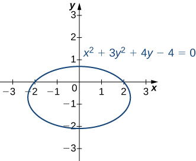
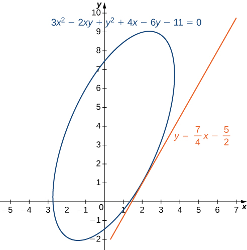
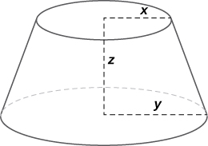

* State the chain rules for one or two independent variables.
* Use tree diagrams as an aid to understanding the chain rule for several independent and intermediate variables.
* Perform implicit differentiation of a function of two or more variables.

In single-variable calculus, we found that one of the most useful differentiation rules is the chain rule, which allows us to find the derivative of the composition of two functions. The same thing is true for multivariable calculus, but this time we have to deal with more than one form of the chain rule. In this section, we study extensions of the chain rule and learn how to take derivatives of compositions of functions of more than one variable.

### Chain Rules for One or Two Independent Variables

Recall that the chain rule for the derivative of a composite of two functions can be written in the form

<math xmlns="http://www.w3.org/1998/Math/MathML"><mrow><mfrac><mi>d</mi><mrow><mi>d</mi><mi>x</mi></mrow></mfrac><mrow><mo>(</mo><mrow><mi>f</mi><mrow><mo>(</mo><mrow><mi>g</mi><mrow><mo>(</mo><mi>x</mi><mo>)</mo></mrow></mrow><mo>)</mo></mrow></mrow><mo>)</mo></mrow><mo>=</mo><mi>f</mi><mo>′</mo><mrow><mo>(</mo><mrow><mi>g</mi><mrow><mo>(</mo><mi>x</mi><mo>)</mo></mrow></mrow><mo>)</mo></mrow><mi>g</mi><mo>′</mo><mrow><mo>(</mo><mi>x</mi><mo>)</mo></mrow><mo>.</mo></mrow></math>

In this equation, both <math xmlns="http://www.w3.org/1998/Math/MathML"><mrow><mi>f</mi><mrow><mo>(</mo><mi>x</mi><mo>)</mo></mrow></mrow></math>

 and <math xmlns="http://www.w3.org/1998/Math/MathML"><mrow><mi>g</mi><mrow><mo>(</mo><mi>x</mi><mo>)</mo></mrow></mrow></math>

 are functions of one variable. Now suppose that <math xmlns="http://www.w3.org/1998/Math/MathML"><mi>f</mi></math>

 is a function of two variables and <math xmlns="http://www.w3.org/1998/Math/MathML"><mi>g</mi></math>

 is a function of one variable. Or perhaps they are both functions of two variables, or even more. How would we calculate the derivative in these cases? The following theorem gives us the answer for the case of one independent variable.

Chain Rule for One Independent Variable

Suppose that <math xmlns="http://www.w3.org/1998/Math/MathML"><mrow><mi>x</mi><mo>=</mo><mi>g</mi><mrow><mo>(</mo><mi>t</mi><mo>)</mo></mrow></mrow></math>

 and <math xmlns="http://www.w3.org/1998/Math/MathML"><mrow><mi>y</mi><mo>=</mo><mi>h</mi><mrow><mo>(</mo><mi>t</mi><mo>)</mo></mrow></mrow></math>

 are differentiable functions of <math xmlns="http://www.w3.org/1998/Math/MathML"><mi>t</mi></math>

 and <math xmlns="http://www.w3.org/1998/Math/MathML"><mrow><mi>z</mi><mo>=</mo><mi>f</mi><mrow><mo>(</mo><mrow><mi>x</mi><mo>,</mo><mi>y</mi></mrow><mo>)</mo></mrow></mrow></math>

 is a differentiable function of <math xmlns="http://www.w3.org/1998/Math/MathML"><mrow><mi>x</mi><mspace width="0.2em" /><mtext>and</mtext><mspace width="0.2em" /><mi>y</mi><mo>.</mo></mrow></math>

 Then <math xmlns="http://www.w3.org/1998/Math/MathML"><mrow><mi>z</mi><mo>=</mo><mi>f</mi><mrow><mo>(</mo><mrow><mi>x</mi><mrow><mo>(</mo><mi>t</mi><mo>)</mo></mrow><mo>,</mo><mi>y</mi><mrow><mo>(</mo><mi>t</mi><mo>)</mo></mrow></mrow><mo>)</mo></mrow></mrow></math>

 is a differentiable function of <math xmlns="http://www.w3.org/1998/Math/MathML"><mi>t</mi></math>

 and

<math xmlns="http://www.w3.org/1998/Math/MathML"><mrow><mfrac><mrow><mi>d</mi><mi>z</mi></mrow><mrow><mi>d</mi><mi>t</mi></mrow></mfrac><mo>=</mo><mfrac><mrow><mo>∂</mo><mi>z</mi></mrow><mrow><mo>∂</mo><mi>x</mi></mrow></mfrac><mo>·</mo><mfrac><mrow><mi>d</mi><mi>x</mi></mrow><mrow><mi>d</mi><mi>t</mi></mrow></mfrac><mo>+</mo><mfrac><mrow><mo>∂</mo><mi>z</mi></mrow><mrow><mo>∂</mo><mi>y</mi></mrow></mfrac><mo>·</mo><mfrac><mrow><mi>d</mi><mi>y</mi></mrow><mrow><mi>d</mi><mi>t</mi></mrow></mfrac><mo>,</mo></mrow></math>

where the ordinary derivatives are evaluated at <math xmlns="http://www.w3.org/1998/Math/MathML"><mi>t</mi></math>

 and the partial derivatives are evaluated at <math xmlns="http://www.w3.org/1998/Math/MathML"><mrow><mrow><mo>(</mo><mrow><mi>x</mi><mo>,</mo><mi>y</mi></mrow><mo>)</mo></mrow><mo>.</mo></mrow></math>

#### Proof

The proof of this theorem uses the definition of differentiability of a function of two variables. Suppose that *f* is differentiable at the point <math xmlns="http://www.w3.org/1998/Math/MathML"><mrow><mi>P</mi><mrow><mo>(</mo><mrow><msub><mi>x</mi><mn>0</mn></msub><mo>,</mo><msub><mi>y</mi><mn>0</mn></msub></mrow><mo>)</mo></mrow><mo>,</mo></mrow></math>

 where <math xmlns="http://www.w3.org/1998/Math/MathML"><mrow><msub><mi>x</mi><mn>0</mn></msub><mo>=</mo><mi>g</mi><mrow><mo>(</mo><mrow><msub><mi>t</mi><mn>0</mn></msub></mrow><mo>)</mo></mrow></mrow></math>

 and <math xmlns="http://www.w3.org/1998/Math/MathML"><mrow><msub><mi>y</mi><mn>0</mn></msub><mo>=</mo><mi>h</mi><mrow><mo>(</mo><mrow><msub><mi>t</mi><mn>0</mn></msub></mrow><mo>)</mo></mrow></mrow></math>

 for a fixed value of <math xmlns="http://www.w3.org/1998/Math/MathML"><mrow><msub><mi>t</mi><mn>0</mn></msub><mo>.</mo></mrow></math>

 We wish to prove that <math xmlns="http://www.w3.org/1998/Math/MathML"><mrow><mi>z</mi><mo>=</mo><mi>f</mi><mrow><mo>(</mo><mrow><mi>x</mi><mrow><mo>(</mo><mi>t</mi><mo>)</mo></mrow><mo>,</mo><mi>y</mi><mrow><mo>(</mo><mi>t</mi><mo>)</mo></mrow></mrow><mo>)</mo></mrow></mrow></math>

 is differentiable at <math xmlns="http://www.w3.org/1998/Math/MathML"><mrow><mi>t</mi><mo>=</mo><msub><mi>t</mi><mn>0</mn></msub></mrow></math>

 and that [\[link\]](#fs-id1167794005848) holds at that point as well.

Since <math xmlns="http://www.w3.org/1998/Math/MathML"><mi>f</mi></math>

 is differentiable at <math xmlns="http://www.w3.org/1998/Math/MathML"><mrow><mi>P</mi><mo>,</mo></mrow></math>

 we know that

<math xmlns="http://www.w3.org/1998/Math/MathML"><mrow><mi>z</mi><mrow><mo>(</mo><mi>t</mi><mo>)</mo></mrow><mo>=</mo><mi>f</mi><mrow><mo>(</mo><mrow><mi>x</mi><mo>,</mo><mi>y</mi></mrow><mo>)</mo></mrow><mo>=</mo><mi>f</mi><mrow><mo>(</mo><mrow><msub><mi>x</mi><mn>0</mn></msub><mo>,</mo><msub><mi>y</mi><mn>0</mn></msub></mrow><mo>)</mo></mrow><mo>+</mo><msub><mi>f</mi><mi>x</mi></msub><mrow><mo>(</mo><mrow><msub><mi>x</mi><mn>0</mn></msub><mo>,</mo><msub><mi>y</mi><mn>0</mn></msub></mrow><mo>)</mo></mrow><mrow><mo>(</mo><mrow><mi>x</mi><mo>−</mo><msub><mi>x</mi><mn>0</mn></msub></mrow><mo>)</mo></mrow><mo>+</mo><msub><mi>f</mi><mi>y</mi></msub><mrow><mo>(</mo><mrow><msub><mi>x</mi><mn>0</mn></msub><mo>,</mo><msub><mi>y</mi><mn>0</mn></msub></mrow><mo>)</mo></mrow><mrow><mo>(</mo><mrow><mi>y</mi><mo>−</mo><msub><mi>y</mi><mn>0</mn></msub></mrow><mo>)</mo></mrow><mo>+</mo><mi>E</mi><mrow><mo>(</mo><mrow><mi>x</mi><mo>,</mo><mi>y</mi></mrow><mo>)</mo></mrow><mo>,</mo></mrow></math>

where <math xmlns="http://www.w3.org/1998/Math/MathML"><mrow><munder><mrow><mtext>lim</mtext></mrow><mrow><mrow><mo>(</mo><mrow><mi>x</mi><mo>,</mo><mi>y</mi></mrow><mo>)</mo></mrow><mo stretchy="false">→</mo><mrow><mo>(</mo><mrow><msub><mi>x</mi><mn>0</mn></msub><mo>,</mo><msub><mi>y</mi><mn>0</mn></msub></mrow><mo>)</mo></mrow></mrow></munder><mfrac><mrow><mi>E</mi><mrow><mo>(</mo><mrow><mi>x</mi><mo>,</mo><mi>y</mi></mrow><mo>)</mo></mrow></mrow><mrow><msqrt><mrow><msup><mrow><mrow><mo>(</mo><mrow><mi>x</mi><mo>−</mo><msub><mi>x</mi><mn>0</mn></msub></mrow><mo>)</mo></mrow></mrow><mn>2</mn></msup><mo>+</mo><msup><mrow><mrow><mo>(</mo><mrow><mi>y</mi><mo>−</mo><msub><mi>y</mi><mn>0</mn></msub></mrow><mo>)</mo></mrow></mrow><mn>2</mn></msup></mrow></msqrt></mrow></mfrac><mo>=</mo><mn>0</mn><mo>.</mo></mrow></math>

 We then subtract <math xmlns="http://www.w3.org/1998/Math/MathML"><mrow><msub><mi>z</mi><mn>0</mn></msub><mo>=</mo><mi>f</mi><mrow><mo>(</mo><mrow><msub><mi>x</mi><mn>0</mn></msub><mo>,</mo><msub><mi>y</mi><mn>0</mn></msub></mrow><mo>)</mo></mrow></mrow></math>

 from both sides of this equation:

<math xmlns="http://www.w3.org/1998/Math/MathML"><mtable><mtr><mtd columnalign="right"><mi>z</mi><mrow><mo>(</mo><mi>t</mi><mo>)</mo></mrow><mo>−</mo><mi>z</mi><mrow><mo>(</mo><mrow><msub><mi>t</mi><mn>0</mn></msub></mrow><mo>)</mo></mrow></mtd><mtd columnalign="left"><mo>=</mo><mi>f</mi><mrow><mo>(</mo><mrow><mi>x</mi><mrow><mo>(</mo><mi>t</mi><mo>)</mo></mrow><mo>,</mo><mi>y</mi><mrow><mo>(</mo><mi>t</mi><mo>)</mo></mrow></mrow><mo>)</mo></mrow><mo>−</mo><mi>f</mi><mrow><mo>(</mo><mrow><mi>x</mi><mrow><mo>(</mo><mrow><msub><mi>t</mi><mn>0</mn></msub></mrow><mo>)</mo></mrow><mo>,</mo><mi>y</mi><mrow><mo>(</mo><mrow><msub><mi>t</mi><mn>0</mn></msub></mrow><mo>)</mo></mrow></mrow><mo>)</mo></mrow></mtd></mtr><mtr><mtd /><mtd columnalign="left"><mo>=</mo><msub><mi>f</mi><mi>x</mi></msub><mrow><mo>(</mo><mrow><msub><mi>x</mi><mn>0</mn></msub><mo>,</mo><msub><mi>y</mi><mn>0</mn></msub></mrow><mo>)</mo></mrow><mrow><mo>(</mo><mrow><mi>x</mi><mrow><mo>(</mo><mi>t</mi><mo>)</mo></mrow><mo>−</mo><mi>x</mi><mrow><mo>(</mo><mrow><msub><mi>t</mi><mn>0</mn></msub></mrow><mo>)</mo></mrow></mrow><mo>)</mo></mrow><mo>+</mo><msub><mi>f</mi><mi>y</mi></msub><mrow><mo>(</mo><mrow><msub><mi>x</mi><mn>0</mn></msub><mo>,</mo><msub><mi>y</mi><mn>0</mn></msub></mrow><mo>)</mo></mrow><mrow><mo>(</mo><mrow><mi>y</mi><mrow><mo>(</mo><mi>t</mi><mo>)</mo></mrow><mo>−</mo><mi>y</mi><mrow><mo>(</mo><mrow><msub><mi>t</mi><mn>0</mn></msub></mrow><mo>)</mo></mrow></mrow><mo>)</mo></mrow><mo>+</mo><mi>E</mi><mrow><mo>(</mo><mrow><mi>x</mi><mrow><mo>(</mo><mi>t</mi><mo>)</mo></mrow><mo>,</mo><mi>y</mi><mrow><mo>(</mo><mi>t</mi><mo>)</mo></mrow></mrow><mo>)</mo></mrow><mo>.</mo></mtd></mtr></mtable></math>

Next, we divide both sides by <math xmlns="http://www.w3.org/1998/Math/MathML"><mrow><mi>t</mi><mo>−</mo><msub><mi>t</mi><mn>0</mn></msub><mtext>:</mtext></mrow></math>

<math xmlns="http://www.w3.org/1998/Math/MathML"><mrow><mfrac><mrow><mi>z</mi><mrow><mo>(</mo><mi>t</mi><mo>)</mo></mrow><mo>−</mo><mi>z</mi><mrow><mo>(</mo><mrow><msub><mi>t</mi><mn>0</mn></msub></mrow><mo>)</mo></mrow></mrow><mrow><mi>t</mi><mo>−</mo><msub><mi>t</mi><mn>0</mn></msub></mrow></mfrac><mo>=</mo><msub><mi>f</mi><mi>x</mi></msub><mrow><mo>(</mo><mrow><msub><mi>x</mi><mn>0</mn></msub><mo>,</mo><msub><mi>y</mi><mn>0</mn></msub></mrow><mo>)</mo></mrow><mrow><mo>(</mo><mrow><mfrac><mrow><mi>x</mi><mrow><mo>(</mo><mi>t</mi><mo>)</mo></mrow><mo>−</mo><mi>x</mi><mrow><mo>(</mo><mrow><msub><mi>t</mi><mn>0</mn></msub></mrow><mo>)</mo></mrow></mrow><mrow><mi>t</mi><mo>−</mo><msub><mi>t</mi><mn>0</mn></msub></mrow></mfrac></mrow><mo>)</mo></mrow><mo>+</mo><msub><mi>f</mi><mi>y</mi></msub><mrow><mo>(</mo><mrow><msub><mi>x</mi><mn>0</mn></msub><mo>,</mo><msub><mi>y</mi><mn>0</mn></msub></mrow><mo>)</mo></mrow><mrow><mo>(</mo><mrow><mfrac><mrow><mi>y</mi><mrow><mo>(</mo><mi>t</mi><mo>)</mo></mrow><mo>−</mo><mi>y</mi><mrow><mo>(</mo><mrow><msub><mi>t</mi><mn>0</mn></msub></mrow><mo>)</mo></mrow></mrow><mrow><mi>t</mi><mo>−</mo><msub><mi>t</mi><mn>0</mn></msub></mrow></mfrac></mrow><mo>)</mo></mrow><mo>+</mo><mfrac><mrow><mi>E</mi><mrow><mo>(</mo><mrow><mi>x</mi><mrow><mo>(</mo><mi>t</mi><mo>)</mo></mrow><mo>,</mo><mi>y</mi><mrow><mo>(</mo><mi>t</mi><mo>)</mo></mrow></mrow><mo>)</mo></mrow></mrow><mrow><mi>t</mi><mo>−</mo><msub><mi>t</mi><mn>0</mn></msub></mrow></mfrac><mo>.</mo></mrow></math>

Then we take the limit as <math xmlns="http://www.w3.org/1998/Math/MathML"><mi>t</mi></math>

 approaches <math xmlns="http://www.w3.org/1998/Math/MathML"><mrow><msub><mi>t</mi><mn>0</mn></msub><mtext>:</mtext></mrow></math>

<math xmlns="http://www.w3.org/1998/Math/MathML"><mtable><mtr><mtd columnalign="right"><munder><mrow><mtext>lim</mtext></mrow><mrow><mi>t</mi><mo stretchy="false">→</mo><msub><mi>t</mi><mn>0</mn></msub></mrow></munder><mfrac><mrow><mi>z</mi><mrow><mo>(</mo><mi>t</mi><mo>)</mo></mrow><mo>−</mo><mi>z</mi><mrow><mo>(</mo><mrow><msub><mi>t</mi><mn>0</mn></msub></mrow><mo>)</mo></mrow></mrow><mrow><mi>t</mi><mo>−</mo><msub><mi>t</mi><mn>0</mn></msub></mrow></mfrac></mtd><mtd columnalign="left"><mo>=</mo><msub><mi>f</mi><mi>x</mi></msub><mrow><mo>(</mo><mrow><msub><mi>x</mi><mn>0</mn></msub><mo>,</mo><msub><mi>y</mi><mn>0</mn></msub></mrow><mo>)</mo></mrow><munder><mrow><mtext>lim</mtext></mrow><mrow><mi>t</mi><mo stretchy="false">→</mo><msub><mi>t</mi><mn>0</mn></msub></mrow></munder><mrow><mo>(</mo><mrow><mfrac><mrow><mi>x</mi><mrow><mo>(</mo><mi>t</mi><mo>)</mo></mrow><mo>−</mo><mi>x</mi><mrow><mo>(</mo><mrow><msub><mi>t</mi><mn>0</mn></msub></mrow><mo>)</mo></mrow></mrow><mrow><mi>t</mi><mo>−</mo><msub><mi>t</mi><mn>0</mn></msub></mrow></mfrac></mrow><mo>)</mo></mrow><mo>+</mo><msub><mi>f</mi><mi>y</mi></msub><mrow><mo>(</mo><mrow><msub><mi>x</mi><mn>0</mn></msub><mo>,</mo><msub><mi>y</mi><mn>0</mn></msub></mrow><mo>)</mo></mrow><munder><mrow><mtext>lim</mtext></mrow><mrow><mi>t</mi><mo stretchy="false">→</mo><msub><mi>t</mi><mn>0</mn></msub></mrow></munder><mrow><mo>(</mo><mrow><mfrac><mrow><mi>y</mi><mrow><mo>(</mo><mi>t</mi><mo>)</mo></mrow><mo>−</mo><mi>y</mi><mrow><mo>(</mo><mrow><msub><mi>t</mi><mn>0</mn></msub></mrow><mo>)</mo></mrow></mrow><mrow><mi>t</mi><mo>−</mo><msub><mi>t</mi><mn>0</mn></msub></mrow></mfrac></mrow><mo>)</mo></mrow></mtd></mtr><mtr><mtd /><mtd columnalign="left"><mspace width="0.5em" /><mo>+</mo><munder><mrow><mtext>lim</mtext></mrow><mrow><mi>t</mi><mo stretchy="false">→</mo><msub><mi>t</mi><mn>0</mn></msub></mrow></munder><mfrac><mrow><mi>E</mi><mrow><mo>(</mo><mrow><mi>x</mi><mrow><mo>(</mo><mi>t</mi><mo>)</mo></mrow><mo>,</mo><mi>y</mi><mrow><mo>(</mo><mi>t</mi><mo>)</mo></mrow></mrow><mo>)</mo></mrow></mrow><mrow><mi>t</mi><mo>−</mo><msub><mi>t</mi><mn>0</mn></msub></mrow></mfrac><mo>.</mo></mtd></mtr></mtable></math>

The left-hand side of this equation is equal to <math xmlns="http://www.w3.org/1998/Math/MathML"><mrow><mrow><mrow><mi>d</mi><mi>z</mi></mrow><mtext>/</mtext><mrow><mi>d</mi><mi>t</mi></mrow></mrow><mo>,</mo></mrow></math>

 which leads to

<math xmlns="http://www.w3.org/1998/Math/MathML"><mrow><mfrac><mrow><mi>d</mi><mi>z</mi></mrow><mrow><mi>d</mi><mi>t</mi></mrow></mfrac><mo>=</mo><msub><mi>f</mi><mi>x</mi></msub><mrow><mo>(</mo><mrow><msub><mi>x</mi><mn>0</mn></msub><mo>,</mo><msub><mi>y</mi><mn>0</mn></msub></mrow><mo>)</mo></mrow><mfrac><mrow><mi>d</mi><mi>x</mi></mrow><mrow><mi>d</mi><mi>t</mi></mrow></mfrac><mo>+</mo><msub><mi>f</mi><mi>y</mi></msub><mrow><mo>(</mo><mrow><msub><mi>x</mi><mn>0</mn></msub><mo>,</mo><msub><mi>y</mi><mn>0</mn></msub></mrow><mo>)</mo></mrow><mfrac><mrow><mi>d</mi><mi>y</mi></mrow><mrow><mi>d</mi><mi>t</mi></mrow></mfrac><mo>+</mo><munder><mrow><mtext>lim</mtext></mrow><mrow><mi>t</mi><mo stretchy="false">→</mo><msub><mi>t</mi><mn>0</mn></msub></mrow></munder><mfrac><mrow><mi>E</mi><mrow><mo>(</mo><mrow><mi>x</mi><mrow><mo>(</mo><mi>t</mi><mo>)</mo></mrow><mo>,</mo><mi>y</mi><mrow><mo>(</mo><mi>t</mi><mo>)</mo></mrow></mrow><mo>)</mo></mrow></mrow><mrow><mi>t</mi><mo>−</mo><msub><mi>t</mi><mn>0</mn></msub></mrow></mfrac><mo>.</mo></mrow></math>

The last term can be rewritten as

<math xmlns="http://www.w3.org/1998/Math/MathML"><mtable><mtr><mtd columnalign="right"><munder><mrow><mtext>lim</mtext></mrow><mrow><mi>t</mi><mo stretchy="false">→</mo><msub><mi>t</mi><mn>0</mn></msub></mrow></munder><mfrac><mrow><mi>E</mi><mrow><mo>(</mo><mrow><mi>x</mi><mrow><mo>(</mo><mi>t</mi><mo>)</mo></mrow><mo>,</mo><mi>y</mi><mrow><mo>(</mo><mi>t</mi><mo>)</mo></mrow></mrow><mo>)</mo></mrow></mrow><mrow><mi>t</mi><mo>−</mo><msub><mi>t</mi><mn>0</mn></msub></mrow></mfrac></mtd><mtd columnalign="left"><mo>=</mo><munder><mrow><mtext>lim</mtext></mrow><mrow><mi>t</mi><mo stretchy="false">→</mo><msub><mi>t</mi><mn>0</mn></msub></mrow></munder><mrow><mo>(</mo><mrow><mfrac><mrow><mi>E</mi><mrow><mo>(</mo><mrow><mi>x</mi><mo>,</mo><mi>y</mi></mrow><mo>)</mo></mrow></mrow><mrow><msqrt><mrow><msup><mrow><mrow><mo>(</mo><mrow><mi>x</mi><mo>−</mo><msub><mi>x</mi><mn>0</mn></msub></mrow><mo>)</mo></mrow></mrow><mn>2</mn></msup><mo>+</mo><msup><mrow><mrow><mo>(</mo><mrow><mi>y</mi><mo>−</mo><msub><mi>y</mi><mn>0</mn></msub></mrow><mo>)</mo></mrow></mrow><mn>2</mn></msup></mrow></msqrt></mrow></mfrac><mspace width="0.2em" /><mfrac><mrow><msqrt><mrow><msup><mrow><mrow><mo>(</mo><mrow><mi>x</mi><mo>−</mo><msub><mi>x</mi><mn>0</mn></msub></mrow><mo>)</mo></mrow></mrow><mn>2</mn></msup><mo>+</mo><msup><mrow><mrow><mo>(</mo><mrow><mi>y</mi><mo>−</mo><msub><mi>y</mi><mn>0</mn></msub></mrow><mo>)</mo></mrow></mrow><mn>2</mn></msup></mrow></msqrt></mrow><mrow><mi>t</mi><mo>−</mo><msub><mi>t</mi><mn>0</mn></msub></mrow></mfrac></mrow><mo>)</mo></mrow></mtd></mtr><mtr><mtd /><mtd columnalign="left"><mo>=</mo><munder><mrow><mtext>lim</mtext></mrow><mrow><mi>t</mi><mo stretchy="false">→</mo><msub><mi>t</mi><mn>0</mn></msub></mrow></munder><mrow><mo>(</mo><mrow><mfrac><mrow><mi>E</mi><mrow><mo>(</mo><mrow><mi>x</mi><mo>,</mo><mi>y</mi></mrow><mo>)</mo></mrow></mrow><mrow><msqrt><mrow><msup><mrow><mrow><mo>(</mo><mrow><mi>x</mi><mo>−</mo><msub><mi>x</mi><mn>0</mn></msub></mrow><mo>)</mo></mrow></mrow><mn>2</mn></msup><mo>+</mo><msup><mrow><mrow><mo>(</mo><mrow><mi>y</mi><mo>−</mo><msub><mi>y</mi><mn>0</mn></msub></mrow><mo>)</mo></mrow></mrow><mn>2</mn></msup></mrow></msqrt></mrow></mfrac></mrow><mo>)</mo></mrow><munder><mrow><mtext>lim</mtext></mrow><mrow><mi>t</mi><mo stretchy="false">→</mo><msub><mi>t</mi><mn>0</mn></msub></mrow></munder><mrow><mo>(</mo><mrow><mfrac><mrow><msqrt><mrow><msup><mrow><mrow><mo>(</mo><mrow><mi>x</mi><mo>−</mo><msub><mi>x</mi><mn>0</mn></msub></mrow><mo>)</mo></mrow></mrow><mn>2</mn></msup><mo>+</mo><msup><mrow><mrow><mo>(</mo><mrow><mi>y</mi><mo>−</mo><msub><mi>y</mi><mn>0</mn></msub></mrow><mo>)</mo></mrow></mrow><mn>2</mn></msup></mrow></msqrt></mrow><mrow><mi>t</mi><mo>−</mo><msub><mi>t</mi><mn>0</mn></msub></mrow></mfrac></mrow><mo>)</mo></mrow><mo>.</mo></mtd></mtr></mtable></math>

As <math xmlns="http://www.w3.org/1998/Math/MathML"><mi>t</mi></math>

 approaches <math xmlns="http://www.w3.org/1998/Math/MathML"><mrow><msub><mi>t</mi><mn>0</mn></msub><mo>,</mo></mrow></math>

 <math xmlns="http://www.w3.org/1998/Math/MathML"><mrow><mrow><mo>(</mo><mrow><mi>x</mi><mrow><mo>(</mo><mi>t</mi><mo>)</mo></mrow><mo>,</mo><mi>y</mi><mrow><mo>(</mo><mi>t</mi><mo>)</mo></mrow></mrow><mo>)</mo></mrow></mrow></math>

 approaches <math xmlns="http://www.w3.org/1998/Math/MathML"><mrow><mrow><mo>(</mo><mrow><mi>x</mi><mrow><mo>(</mo><mrow><msub><mi>t</mi><mn>0</mn></msub></mrow><mo>)</mo></mrow><mo>,</mo><mi>y</mi><mrow><mo>(</mo><mrow><msub><mi>t</mi><mn>0</mn></msub></mrow><mo>)</mo></mrow></mrow><mo>)</mo></mrow><mo>,</mo></mrow></math>

 so we can rewrite the last product as

<math xmlns="http://www.w3.org/1998/Math/MathML"><mrow><munder><mrow><mtext>lim</mtext></mrow><mrow><mrow><mo>(</mo><mrow><mi>x</mi><mo>,</mo><mi>y</mi></mrow><mo>)</mo></mrow><mo stretchy="false">→</mo><mrow><mo>(</mo><mrow><msub><mi>x</mi><mn>0</mn></msub><mo>,</mo><msub><mi>y</mi><mn>0</mn></msub></mrow><mo>)</mo></mrow></mrow></munder><mrow><mo>(</mo><mrow><mfrac><mrow><mi>E</mi><mrow><mo>(</mo><mrow><mi>x</mi><mo>,</mo><mi>y</mi></mrow><mo>)</mo></mrow></mrow><mrow><msqrt><mrow><msup><mrow><mrow><mo>(</mo><mrow><mi>x</mi><mo>−</mo><msub><mi>x</mi><mn>0</mn></msub></mrow><mo>)</mo></mrow></mrow><mn>2</mn></msup><mo>+</mo><msup><mrow><mrow><mo>(</mo><mrow><mi>y</mi><mo>−</mo><msub><mi>y</mi><mn>0</mn></msub></mrow><mo>)</mo></mrow></mrow><mn>2</mn></msup></mrow></msqrt></mrow></mfrac></mrow><mo>)</mo></mrow><munder><mrow><mtext>lim</mtext></mrow><mrow><mrow><mo>(</mo><mrow><mi>x</mi><mo>,</mo><mi>y</mi></mrow><mo>)</mo></mrow><mo stretchy="false">→</mo><mrow><mo>(</mo><mrow><msub><mi>x</mi><mn>0</mn></msub><mo>,</mo><msub><mi>y</mi><mn>0</mn></msub></mrow><mo>)</mo></mrow></mrow></munder><mrow><mo>(</mo><mrow><mfrac><mrow><msqrt><mrow><msup><mrow><mrow><mo>(</mo><mrow><mi>x</mi><mo>−</mo><msub><mi>x</mi><mn>0</mn></msub></mrow><mo>)</mo></mrow></mrow><mn>2</mn></msup><mo>+</mo><msup><mrow><mrow><mo>(</mo><mrow><mi>y</mi><mo>−</mo><msub><mi>y</mi><mn>0</mn></msub></mrow><mo>)</mo></mrow></mrow><mn>2</mn></msup></mrow></msqrt></mrow><mrow><mi>t</mi><mo>−</mo><msub><mi>t</mi><mn>0</mn></msub></mrow></mfrac></mrow><mo>)</mo></mrow><mo>.</mo></mrow></math>

Since the first limit is equal to zero, we need only show that the second limit is finite:

<math xmlns="http://www.w3.org/1998/Math/MathML"><mtable><mtr><mtd columnalign="right"><munder><mrow><mtext>lim</mtext></mrow><mrow><mrow><mo>(</mo><mrow><mi>x</mi><mo>,</mo><mi>y</mi></mrow><mo>)</mo></mrow><mo stretchy="false">→</mo><mrow><mo>(</mo><mrow><msub><mi>x</mi><mn>0</mn></msub><mo>,</mo><msub><mi>y</mi><mn>0</mn></msub></mrow><mo>)</mo></mrow></mrow></munder><mrow><mo>(</mo><mrow><mfrac><mrow><msqrt><mrow><msup><mrow><mrow><mo>(</mo><mrow><mi>x</mi><mo>−</mo><msub><mi>x</mi><mn>0</mn></msub></mrow><mo>)</mo></mrow></mrow><mn>2</mn></msup><mo>+</mo><msup><mrow><mrow><mo>(</mo><mrow><mi>y</mi><mo>−</mo><msub><mi>y</mi><mn>0</mn></msub></mrow><mo>)</mo></mrow></mrow><mn>2</mn></msup></mrow></msqrt></mrow><mrow><mi>t</mi><mo>−</mo><msub><mi>t</mi><mn>0</mn></msub></mrow></mfrac></mrow><mo>)</mo></mrow></mtd><mtd columnalign="left"><mo>=</mo><munder><mrow><mtext>lim</mtext></mrow><mrow><mrow><mo>(</mo><mrow><mi>x</mi><mo>,</mo><mi>y</mi></mrow><mo>)</mo></mrow><mo stretchy="false">→</mo><mrow><mo>(</mo><mrow><msub><mi>x</mi><mn>0</mn></msub><mo>,</mo><msub><mi>y</mi><mn>0</mn></msub></mrow><mo>)</mo></mrow></mrow></munder><mrow><mo>(</mo><mrow><msqrt><mrow><mfrac><mrow><msup><mrow><mrow><mo>(</mo><mrow><mi>x</mi><mo>−</mo><msub><mi>x</mi><mn>0</mn></msub></mrow><mo>)</mo></mrow></mrow><mn>2</mn></msup><mo>+</mo><msup><mrow><mrow><mo>(</mo><mrow><mi>y</mi><mo>−</mo><msub><mi>y</mi><mn>0</mn></msub></mrow><mo>)</mo></mrow></mrow><mn>2</mn></msup></mrow><mrow><msup><mrow><mrow><mo>(</mo><mrow><mi>t</mi><mo>−</mo><msub><mi>t</mi><mn>0</mn></msub></mrow><mo>)</mo></mrow></mrow><mn>2</mn></msup></mrow></mfrac></mrow></msqrt></mrow><mo>)</mo></mrow></mtd></mtr><mtr><mtd /><mtd columnalign="left"><mo>=</mo><munder><mrow><mtext>lim</mtext></mrow><mrow><mrow><mo>(</mo><mrow><mi>x</mi><mo>,</mo><mi>y</mi></mrow><mo>)</mo></mrow><mo stretchy="false">→</mo><mrow><mo>(</mo><mrow><msub><mi>x</mi><mn>0</mn></msub><mo>,</mo><msub><mi>y</mi><mn>0</mn></msub></mrow><mo>)</mo></mrow></mrow></munder><mrow><mo>(</mo><mrow><msqrt><mrow><msup><mrow><mrow><mo>(</mo><mrow><mfrac><mrow><mi>x</mi><mo>−</mo><msub><mi>x</mi><mn>0</mn></msub></mrow><mrow><mi>t</mi><mo>−</mo><msub><mi>t</mi><mn>0</mn></msub></mrow></mfrac></mrow><mo>)</mo></mrow></mrow><mn>2</mn></msup><mo>+</mo><msup><mrow><mrow><mo>(</mo><mrow><mfrac><mrow><mi>y</mi><mo>−</mo><msub><mi>y</mi><mn>0</mn></msub></mrow><mrow><mi>t</mi><mo>−</mo><msub><mi>t</mi><mn>0</mn></msub></mrow></mfrac></mrow><mo>)</mo></mrow></mrow><mn>2</mn></msup></mrow></msqrt></mrow><mo>)</mo></mrow></mtd></mtr><mtr><mtd /><mtd columnalign="left"><mo>=</mo><msqrt><mrow><msup><mrow><mrow><mo>(</mo><mrow><munder><mrow><mtext>lim</mtext></mrow><mrow><mrow><mo>(</mo><mrow><mi>x</mi><mo>,</mo><mi>y</mi></mrow><mo>)</mo></mrow><mo stretchy="false">→</mo><mrow><mo>(</mo><mrow><msub><mi>x</mi><mn>0</mn></msub><mo>,</mo><msub><mi>y</mi><mn>0</mn></msub></mrow><mo>)</mo></mrow></mrow></munder><mrow><mo>(</mo><mrow><mfrac><mrow><mi>x</mi><mo>−</mo><msub><mi>x</mi><mn>0</mn></msub></mrow><mrow><mi>t</mi><mo>−</mo><msub><mi>t</mi><mn>0</mn></msub></mrow></mfrac></mrow><mo>)</mo></mrow></mrow><mo>)</mo></mrow></mrow><mn>2</mn></msup><mo>+</mo><msup><mrow><mrow><mo>(</mo><mrow><munder><mrow><mtext>lim</mtext></mrow><mrow><mrow><mo>(</mo><mrow><mi>x</mi><mo>,</mo><mi>y</mi></mrow><mo>)</mo></mrow><mo stretchy="false">→</mo><mrow><mo>(</mo><mrow><msub><mi>x</mi><mn>0</mn></msub><mo>,</mo><msub><mi>y</mi><mn>0</mn></msub></mrow><mo>)</mo></mrow></mrow></munder><mrow><mo>(</mo><mrow><mfrac><mrow><mi>y</mi><mo>−</mo><msub><mi>y</mi><mn>0</mn></msub></mrow><mrow><mi>t</mi><mo>−</mo><msub><mi>t</mi><mn>0</mn></msub></mrow></mfrac></mrow><mo>)</mo></mrow></mrow><mo>)</mo></mrow></mrow><mn>2</mn></msup></mrow></msqrt><mo>.</mo></mtd></mtr></mtable></math>

Since <math xmlns="http://www.w3.org/1998/Math/MathML"><mrow><mi>x</mi><mrow><mo>(</mo><mi>t</mi><mo>)</mo></mrow></mrow></math>

 and <math xmlns="http://www.w3.org/1998/Math/MathML"><mrow><mi>y</mi><mrow><mo>(</mo><mi>t</mi><mo>)</mo></mrow></mrow></math>

 are both differentiable functions of <math xmlns="http://www.w3.org/1998/Math/MathML"><mrow><mi>t</mi><mo>,</mo></mrow></math>

 both limits inside the last radical exist. Therefore, this value is finite. This proves the chain rule at <math xmlns="http://www.w3.org/1998/Math/MathML"><mrow><mi>t</mi><mo>=</mo><msub><mi>t</mi><mn>0</mn></msub><mo>;</mo></mrow></math>

 the rest of the theorem follows from the assumption that all functions are differentiable over their entire domains.

□

Closer examination of [\[link\]](#fs-id1167794005848) reveals an interesting pattern. The first term in the equation is <math xmlns="http://www.w3.org/1998/Math/MathML"><mrow><mfrac><mrow><mo>∂</mo><mi>f</mi></mrow><mrow><mo>∂</mo><mi>x</mi></mrow></mfrac><mo>·</mo><mfrac><mrow><mi>d</mi><mi>x</mi></mrow><mrow><mi>d</mi><mi>t</mi></mrow></mfrac></mrow></math>

 and the second term is <math xmlns="http://www.w3.org/1998/Math/MathML"><mrow><mfrac><mrow><mo>∂</mo><mi>f</mi></mrow><mrow><mo>∂</mo><mi>y</mi></mrow></mfrac><mo>·</mo><mfrac><mrow><mi>d</mi><mi>y</mi></mrow><mrow><mi>d</mi><mi>t</mi></mrow></mfrac><mo>.</mo></mrow></math>

 Recall that when multiplying fractions, cancelation can be used. If we treat these derivatives as fractions, then each product “simplifies” to something resembling <math xmlns="http://www.w3.org/1998/Math/MathML"><mrow><mrow><mrow><mo>∂</mo><mi>f</mi></mrow><mtext>/</mtext><mrow><mi>d</mi><mi>t</mi></mrow></mrow><mo>.</mo></mrow></math>

 The variables <math xmlns="http://www.w3.org/1998/Math/MathML"><mrow><mi>x</mi><mspace width="0.2em" /><mtext>and</mtext><mspace width="0.2em" /><mi>y</mi></mrow></math>

 that disappear in this simplification are often called **intermediate variables**{: data-type="term"}\: they are independent variables for the function <math xmlns="http://www.w3.org/1998/Math/MathML"><mrow><mi>f</mi><mo>,</mo></mrow></math>

 but are dependent variables for the variable <math xmlns="http://www.w3.org/1998/Math/MathML"><mrow><mi>t</mi><mo>.</mo></mrow></math>

 Two terms appear on the right-hand side of the formula, and <math xmlns="http://www.w3.org/1998/Math/MathML"><mi>f</mi></math>

 is a function of two variables. This pattern works with functions of more than two variables as well, as we see later in this section.

Using the Chain Rule

Calculate <math xmlns="http://www.w3.org/1998/Math/MathML"><mrow><mrow><mrow><mi>d</mi><mi>z</mi></mrow><mtext>/</mtext><mrow><mi>d</mi><mi>t</mi></mrow></mrow></mrow></math>

 for each of the following functions:

1.  <math xmlns="http://www.w3.org/1998/Math/MathML"><mrow><mi>z</mi><mo>=</mo><mi>f</mi><mrow><mo>(</mo><mrow><mi>x</mi><mo>,</mo><mi>y</mi></mrow><mo>)</mo></mrow><mo>=</mo><mn>4</mn><msup><mi>x</mi><mn>2</mn></msup><mo>+</mo><mn>3</mn><msup><mi>y</mi><mn>2</mn></msup><mo>,</mo><mi>x</mi><mo>=</mo><mi>x</mi><mrow><mo>(</mo><mi>t</mi><mo>)</mo></mrow><mo>=</mo><mtext>sin</mtext><mspace width="0.2em" /><mi>t</mi><mo>,</mo><mi>y</mi><mo>=</mo><mi>y</mi><mrow><mo>(</mo><mi>t</mi><mo>)</mo></mrow><mo>=</mo><mtext>cos</mtext><mspace width="0.2em" /><mi>t</mi></mrow></math>

2.  <math xmlns="http://www.w3.org/1998/Math/MathML"><mrow><mi>z</mi><mo>=</mo><mi>f</mi><mrow><mo>(</mo><mrow><mi>x</mi><mo>,</mo><mi>y</mi></mrow><mo>)</mo></mrow><mo>=</mo><msqrt><mrow><msup><mi>x</mi><mn>2</mn></msup><mo>−</mo><msup><mi>y</mi><mn>2</mn></msup></mrow></msqrt><mo>,</mo><mi>x</mi><mo>=</mo><mi>x</mi><mrow><mo>(</mo><mi>t</mi><mo>)</mo></mrow><mo>=</mo><msup><mi>e</mi><mrow><mn>2</mn><mi>t</mi></mrow></msup><mo>,</mo><mi>y</mi><mo>=</mo><mi>y</mi><mrow><mo>(</mo><mi>t</mi><mo>)</mo></mrow><mo>=</mo><msup><mi>e</mi><mrow><mtext>−</mtext><mi>t</mi></mrow></msup></mrow></math>
{: type="a"}

1.  To use the chain rule, we need four quantities—
    <math xmlns="http://www.w3.org/1998/Math/MathML"><mrow><mrow><mrow><mo>∂</mo><mi>z</mi></mrow><mtext>/</mtext><mrow><mo>∂</mo><mi>x</mi></mrow></mrow><mo>,</mo><mrow><mrow><mo>∂</mo><mi>z</mi></mrow><mtext>/</mtext><mrow><mo>∂</mo><mi>y</mi></mrow></mrow><mo>,</mo><mrow><mrow><mi>d</mi><mi>x</mi></mrow><mtext>/</mtext><mrow><mi>d</mi><mi>t</mi></mrow></mrow><mo>,</mo></mrow></math>
    
    and
    <math xmlns="http://www.w3.org/1998/Math/MathML"><mrow><mrow><mrow><mi>d</mi><mi>y</mi></mrow><mtext>/</mtext><mrow><mi>d</mi><mi>t</mi></mrow></mrow><mtext>:</mtext></mrow></math>
    
    * * *
    {: data-type="newline"}
    
    

    <math xmlns="http://www.w3.org/1998/Math/MathML"><mtable><mtr><mtd columnalign="left"><mfrac><mrow><mo>∂</mo><mi>z</mi></mrow><mrow><mo>∂</mo><mi>x</mi></mrow></mfrac><mo>=</mo><mn>8</mn><mi>x</mi></mtd><mtd /><mtd /><mtd columnalign="left"><mfrac><mrow><mo>∂</mo><mi>z</mi></mrow><mrow><mo>∂</mo><mi>y</mi></mrow></mfrac><mo>=</mo><mn>6</mn><mi>y</mi></mtd></mtr><mtr><mtd columnalign="left"><mfrac><mrow><mi>d</mi><mi>x</mi></mrow><mrow><mi>d</mi><mi>t</mi></mrow></mfrac><mo>=</mo><mtext>cos</mtext><mspace width="0.2em" /><mi>t</mi></mtd><mtd /><mtd /><mtd columnalign="left"><mfrac><mrow><mi>d</mi><mi>y</mi></mrow><mrow><mi>d</mi><mi>t</mi></mrow></mfrac><mo>=</mo><mtext>−</mtext><mtext>sin</mtext><mspace width="0.2em" /><mi>t</mi></mtd></mtr></mtable></math>
    

    
    * * *
    {: data-type="newline"}
    
    Now, we substitute each of these into [[link]](#fs-id1167794005848):
    * * *
    {: data-type="newline"}
    
    

    <math xmlns="http://www.w3.org/1998/Math/MathML"><mtable><mtr><mtd columnalign="right"><mfrac><mrow><mi>d</mi><mi>z</mi></mrow><mrow><mi>d</mi><mi>t</mi></mrow></mfrac></mtd><mtd columnalign="left"><mo>=</mo><mfrac><mrow><mo>∂</mo><mi>z</mi></mrow><mrow><mo>∂</mo><mi>x</mi></mrow></mfrac><mo>·</mo><mfrac><mrow><mi>d</mi><mi>x</mi></mrow><mrow><mi>d</mi><mi>t</mi></mrow></mfrac><mo>+</mo><mfrac><mrow><mo>∂</mo><mi>z</mi></mrow><mrow><mo>∂</mo><mi>y</mi></mrow></mfrac><mo>·</mo><mfrac><mrow><mi>d</mi><mi>y</mi></mrow><mrow><mi>d</mi><mi>t</mi></mrow></mfrac></mtd></mtr><mtr><mtd /><mtd columnalign="left"><mo>=</mo><mrow><mo>(</mo><mrow><mn>8</mn><mi>x</mi></mrow><mo>)</mo></mrow><mrow><mo>(</mo><mrow><mtext>cos</mtext><mspace width="0.2em" /><mi>t</mi></mrow><mo>)</mo></mrow><mo>+</mo><mrow><mo>(</mo><mrow><mn>6</mn><mi>y</mi></mrow><mo>)</mo></mrow><mrow><mo>(</mo><mrow><mtext>−</mtext><mtext>sin</mtext><mspace width="0.2em" /><mi>t</mi></mrow><mo>)</mo></mrow></mtd></mtr><mtr><mtd /><mtd columnalign="left"><mo>=</mo><mn>8</mn><mi>x</mi><mspace width="0.2em" /><mtext>cos</mtext><mspace width="0.2em" /><mi>t</mi><mo>−</mo><mn>6</mn><mi>y</mi><mspace width="0.2em" /><mtext>sin</mtext><mspace width="0.2em" /><mi>t</mi><mo>.</mo></mtd></mtr></mtable></math>
    

    
    * * *
    {: data-type="newline"}
    
    This answer has three variables in it. To reduce it to one variable, use the fact that
    <math xmlns="http://www.w3.org/1998/Math/MathML"><mrow><mi>x</mi><mrow><mo>(</mo><mi>t</mi><mo>)</mo></mrow><mo>=</mo><mtext>sin</mtext><mspace width="0.2em" /><mi>t</mi><mspace width="0.2em" /><mtext>and</mtext><mspace width="0.2em" /><mi>y</mi><mrow><mo>(</mo><mi>t</mi><mo>)</mo></mrow><mo>=</mo><mtext>cos</mtext><mspace width="0.2em" /><mi>t</mi><mo>.</mo></mrow></math>
    
    We obtain
    * * *
    {: data-type="newline"}
    
    

    <math xmlns="http://www.w3.org/1998/Math/MathML"><mtable><mtr><mtd columnalign="right"><mfrac><mrow><mi>d</mi><mi>z</mi></mrow><mrow><mi>d</mi><mi>t</mi></mrow></mfrac></mtd><mtd columnalign="left"><mo>=</mo><mn>8</mn><mi>x</mi><mspace width="0.2em" /><mtext>cos</mtext><mspace width="0.2em" /><mi>t</mi><mo>−</mo><mn>6</mn><mi>y</mi><mspace width="0.2em" /><mtext>sin</mtext><mspace width="0.2em" /><mi>t</mi></mtd></mtr><mtr><mtd /><mtd columnalign="left"><mo>=</mo><mn>8</mn><mrow><mo>(</mo><mrow><mtext>sin</mtext><mspace width="0.2em" /><mi>t</mi></mrow><mo>)</mo></mrow><mtext>cos</mtext><mspace width="0.2em" /><mi>t</mi><mo>−</mo><mn>6</mn><mrow><mo>(</mo><mrow><mtext>cos</mtext><mspace width="0.2em" /><mi>t</mi></mrow><mo>)</mo></mrow><mtext>sin</mtext><mspace width="0.2em" /><mi>t</mi></mtd></mtr><mtr><mtd /><mtd columnalign="left"><mo>=</mo><mn>2</mn><mspace width="0.2em" /><mtext>sin</mtext><mspace width="0.2em" /><mi>t</mi><mspace width="0.2em" /><mtext>cos</mtext><mspace width="0.2em" /><mi>t</mi><mo>.</mo></mtd></mtr></mtable></math>
    

    
    * * *
    {: data-type="newline"}
    
    This derivative can also be calculated by first substituting
    <math xmlns="http://www.w3.org/1998/Math/MathML"><mrow><mi>x</mi><mrow><mo>(</mo><mi>t</mi><mo>)</mo></mrow></mrow></math>
    
    and
    <math xmlns="http://www.w3.org/1998/Math/MathML"><mrow><mi>y</mi><mrow><mo>(</mo><mi>t</mi><mo>)</mo></mrow></mrow></math>
    
    into
    <math xmlns="http://www.w3.org/1998/Math/MathML"><mrow><mi>f</mi><mrow><mo>(</mo><mrow><mi>x</mi><mo>,</mo><mi>y</mi></mrow><mo>)</mo></mrow><mo>,</mo></mrow></math>
    
    then differentiating with respect to
    <math xmlns="http://www.w3.org/1998/Math/MathML"><mrow><mi>t</mi><mtext>:</mtext></mrow></math>
    
    * * *
    {: data-type="newline"}
    
    

    <math xmlns="http://www.w3.org/1998/Math/MathML"><mtable><mtr><mtd columnalign="right"><mi>z</mi></mtd><mtd columnalign="left"><mo>=</mo><mi>f</mi><mrow><mo>(</mo><mrow><mi>x</mi><mo>,</mo><mi>y</mi></mrow><mo>)</mo></mrow></mtd></mtr><mtr><mtd /><mtd columnalign="left"><mo>=</mo><mi>f</mi><mrow><mo>(</mo><mrow><mi>x</mi><mrow><mo>(</mo><mi>t</mi><mo>)</mo></mrow><mo>,</mo><mi>y</mi><mrow><mo>(</mo><mi>t</mi><mo>)</mo></mrow></mrow><mo>)</mo></mrow></mtd></mtr><mtr><mtd /><mtd columnalign="left"><mo>=</mo><mn>4</mn><msup><mrow><mo>(</mo><mrow><mi>x</mi><mrow><mo>(</mo><mi>t</mi><mo>)</mo></mrow></mrow><mo>)</mo></mrow><mn>2</mn></msup><mo>+</mo><mn>3</mn><msup><mrow><mo>(</mo><mrow><mi>y</mi><mrow><mo>(</mo><mi>t</mi><mo>)</mo></mrow></mrow><mo>)</mo></mrow><mn>2</mn></msup></mtd></mtr><mtr><mtd /><mtd columnalign="left"><mo>=</mo><mn>4</mn><msup><mtext>sin</mtext><mn>2</mn></msup><mi>t</mi><mo>+</mo><mn>3</mn><msup><mtext>cos</mtext><mn>2</mn></msup><mi>t</mi><mo>.</mo></mtd></mtr></mtable></math>
    

    
    * * *
    {: data-type="newline"}
    
    Then
    * * *
    {: data-type="newline"}
    
    

    <math xmlns="http://www.w3.org/1998/Math/MathML"><mtable><mtr><mtd columnalign="right"><mfrac><mrow><mi>d</mi><mi>z</mi></mrow><mrow><mi>d</mi><mi>t</mi></mrow></mfrac></mtd><mtd columnalign="left"><mo>=</mo><mn>2</mn><mo stretchy="false">(</mo><mn>4</mn><mspace width="0.2em" /><mtext>sin</mtext><mspace width="0.2em" /><mi>t</mi><mo stretchy="false">)</mo><mo stretchy="false">(</mo><mtext>cos</mtext><mspace width="0.2em" /><mi>t</mi><mo stretchy="false">)</mo><mo>+</mo><mn>2</mn><mo stretchy="false">(</mo><mn>3</mn><mspace width="0.2em" /><mtext>cos</mtext><mspace width="0.2em" /><mi>t</mi><mo stretchy="false">)</mo><mo stretchy="false">(</mo><mtext>−</mtext><mtext>sin</mtext><mspace width="0.2em" /><mi>t</mi><mo stretchy="false">)</mo></mtd></mtr><mtr><mtd /><mtd columnalign="left"><mo>=</mo><mn>8</mn><mspace width="0.2em" /><mtext>sin</mtext><mspace width="0.2em" /><mi>t</mi><mspace width="0.2em" /><mtext>cos</mtext><mspace width="0.2em" /><mi>t</mi><mo>−</mo><mn>6</mn><mspace width="0.2em" /><mtext>sin</mtext><mspace width="0.2em" /><mi>t</mi><mspace width="0.2em" /><mtext>cos</mtext><mspace width="0.2em" /><mi>t</mi></mtd></mtr><mtr><mtd /><mtd columnalign="left"><mo>=</mo><mn>2</mn><mspace width="0.2em" /><mtext>sin</mtext><mspace width="0.2em" /><mi>t</mi><mspace width="0.2em" /><mtext>cos</mtext><mspace width="0.2em" /><mi>t</mi><mo>,</mo></mtd></mtr></mtable></math>
    

    
    * * *
    {: data-type="newline"}
    
    which is the same solution. However, it may not always be this easy to differentiate in this form.
2.  To use the chain rule, we again need four quantities—
    <math xmlns="http://www.w3.org/1998/Math/MathML"><mrow><mrow><mrow><mo>∂</mo><mi>z</mi></mrow><mtext>/</mtext><mrow><mo>∂</mo><mi>x</mi></mrow></mrow><mo>,</mo><mrow><mrow><mo>∂</mo><mi>z</mi></mrow><mtext>/</mtext><mrow><mi>d</mi><mi>y</mi></mrow></mrow><mo>,</mo><mrow><mrow><mi>d</mi><mi>x</mi></mrow><mtext>/</mtext><mrow><mi>d</mi><mi>t</mi></mrow></mrow><mo>,</mo></mrow></math>
    
    and
    <math xmlns="http://www.w3.org/1998/Math/MathML"><mrow><mrow><mrow><mi>d</mi><mi>y</mi></mrow><mtext>/</mtext><mrow><mi>d</mi><mi>t</mi></mrow></mrow><mtext>:</mtext></mrow></math>
    
    * * *
    {: data-type="newline"}
    
    

    <math xmlns="http://www.w3.org/1998/Math/MathML"><mtable><mtr><mtd columnalign="left"><mfrac><mrow><mo>∂</mo><mi>z</mi></mrow><mrow><mo>∂</mo><mi>x</mi></mrow></mfrac><mo>=</mo><mfrac><mi>x</mi><mrow><msqrt><mrow><msup><mi>x</mi><mn>2</mn></msup><mo>−</mo><msup><mi>y</mi><mn>2</mn></msup></mrow></msqrt></mrow></mfrac></mtd><mtd /><mtd /><mtd columnalign="left"><mfrac><mrow><mo>∂</mo><mi>z</mi></mrow><mrow><mo>∂</mo><mi>y</mi></mrow></mfrac><mo>=</mo><mfrac><mrow><mtext>−</mtext><mi>y</mi></mrow><mrow><msqrt><mrow><msup><mi>x</mi><mn>2</mn></msup><mo>−</mo><msup><mi>y</mi><mn>2</mn></msup></mrow></msqrt></mrow></mfrac></mtd></mtr><mtr><mtd columnalign="left"><mfrac><mrow><mi>d</mi><mi>x</mi></mrow><mrow><mi>d</mi><mi>t</mi></mrow></mfrac><mo>=</mo><mn>2</mn><msup><mi>e</mi><mrow><mn>2</mn><mi>t</mi></mrow></msup></mtd><mtd /><mtd /><mtd columnalign="left"><mfrac><mrow><mi>d</mi><mi>x</mi></mrow><mrow><mi>d</mi><mi>t</mi></mrow></mfrac><mo>=</mo><mtext>−</mtext><msup><mi>e</mi><mrow><mtext>−</mtext><mi>t</mi></mrow></msup><mo>.</mo></mtd></mtr></mtable></math>
    

    
    * * *
    {: data-type="newline"}
    
    We substitute each of these into [[link]](#fs-id1167794005848):
    * * *
    {: data-type="newline"}
    
    

    <math xmlns="http://www.w3.org/1998/Math/MathML"><mtable><mtr><mtd columnalign="right"><mfrac><mrow><mi>d</mi><mi>z</mi></mrow><mrow><mi>d</mi><mi>t</mi></mrow></mfrac></mtd><mtd columnalign="left"><mo>=</mo><mfrac><mrow><mo>∂</mo><mi>z</mi></mrow><mrow><mo>∂</mo><mi>x</mi></mrow></mfrac><mo>·</mo><mfrac><mrow><mi>d</mi><mi>x</mi></mrow><mrow><mi>d</mi><mi>t</mi></mrow></mfrac><mo>+</mo><mfrac><mrow><mo>∂</mo><mi>z</mi></mrow><mrow><mo>∂</mo><mi>y</mi></mrow></mfrac><mo>·</mo><mfrac><mrow><mi>d</mi><mi>y</mi></mrow><mrow><mi>d</mi><mi>t</mi></mrow></mfrac></mtd></mtr><mtr><mtd /><mtd columnalign="left"><mo>=</mo><mrow><mo>(</mo><mrow><mfrac><mi>x</mi><mrow><msqrt><mrow><msup><mi>x</mi><mn>2</mn></msup><mo>−</mo><msup><mi>y</mi><mn>2</mn></msup></mrow></msqrt></mrow></mfrac></mrow><mo>)</mo></mrow><mrow><mo>(</mo><mrow><mn>2</mn><msup><mi>e</mi><mrow><mn>2</mn><mi>t</mi></mrow></msup></mrow><mo>)</mo></mrow><mo>+</mo><mrow><mo>(</mo><mrow><mfrac><mrow><mtext>−</mtext><mi>y</mi></mrow><mrow><msqrt><mrow><msup><mi>x</mi><mn>2</mn></msup><mo>−</mo><msup><mi>y</mi><mn>2</mn></msup></mrow></msqrt></mrow></mfrac></mrow><mo>)</mo></mrow><mrow><mo>(</mo><mrow><mtext>−</mtext><msup><mi>e</mi><mrow><mtext>−</mtext><mi>t</mi></mrow></msup></mrow><mo>)</mo></mrow></mtd></mtr><mtr><mtd /><mtd columnalign="left"><mo>=</mo><mfrac><mrow><mn>2</mn><mi>x</mi><msup><mi>e</mi><mrow><mn>2</mn><mi>t</mi></mrow></msup><mo>−</mo><mi>y</mi><msup><mi>e</mi><mrow><mtext>−</mtext><mi>t</mi></mrow></msup></mrow><mrow><msqrt><mrow><msup><mi>x</mi><mn>2</mn></msup><mo>−</mo><msup><mi>y</mi><mn>2</mn></msup></mrow></msqrt></mrow></mfrac><mo>.</mo></mtd></mtr></mtable></math>
    

    
    * * *
    {: data-type="newline"}
    
    To reduce this to one variable, we use the fact that
    <math xmlns="http://www.w3.org/1998/Math/MathML"><mrow><mi>x</mi><mrow><mo>(</mo><mi>t</mi><mo>)</mo></mrow><mo>=</mo><msup><mi>e</mi><mrow><mn>2</mn><mi>t</mi></mrow></msup></mrow></math>
    
    and
    <math xmlns="http://www.w3.org/1998/Math/MathML"><mrow><mi>y</mi><mrow><mo>(</mo><mi>t</mi><mo>)</mo></mrow><mo>=</mo><msup><mi>e</mi><mrow><mtext>−</mtext><mi>t</mi></mrow></msup><mo>.</mo></mrow></math>
    
    Therefore,
    * * *
    {: data-type="newline"}
    
    

    <math xmlns="http://www.w3.org/1998/Math/MathML"><mtable><mtr><mtd columnalign="right"><mfrac><mrow><mi>d</mi><mi>z</mi></mrow><mrow><mi>d</mi><mi>t</mi></mrow></mfrac></mtd><mtd columnalign="left"><mo>=</mo><mfrac><mrow><mn>2</mn><mi>x</mi><msup><mi>e</mi><mrow><mn>2</mn><mi>t</mi></mrow></msup><mo>+</mo><mi>y</mi><msup><mi>e</mi><mrow><mtext>−</mtext><mi>t</mi></mrow></msup></mrow><mrow><msqrt><mrow><msup><mi>x</mi><mn>2</mn></msup><mo>−</mo><msup><mi>y</mi><mn>2</mn></msup></mrow></msqrt></mrow></mfrac></mtd></mtr><mtr><mtd /><mtd columnalign="left"><mo>=</mo><mfrac><mrow><mn>2</mn><mrow><mo>(</mo><mrow><msup><mi>e</mi><mrow><mn>2</mn><mi>t</mi></mrow></msup></mrow><mo>)</mo></mrow><msup><mi>e</mi><mrow><mn>2</mn><mi>t</mi></mrow></msup><mo>+</mo><mrow><mo>(</mo><mrow><msup><mi>e</mi><mrow><mtext>−</mtext><mi>t</mi></mrow></msup></mrow><mo>)</mo></mrow><msup><mi>e</mi><mrow><mtext>−</mtext><mi>t</mi></mrow></msup></mrow><mrow><msqrt><mrow><msup><mi>e</mi><mrow><mn>4</mn><mi>t</mi></mrow></msup><mo>−</mo><msup><mi>e</mi><mrow><mn>−2</mn><mi>t</mi></mrow></msup></mrow></msqrt></mrow></mfrac></mtd></mtr><mtr><mtd /><mtd columnalign="left"><mo>=</mo><mfrac><mrow><mn>2</mn><msup><mi>e</mi><mrow><mn>4</mn><mi>t</mi></mrow></msup><mo>+</mo><msup><mi>e</mi><mrow><mn>−2</mn><mi>t</mi></mrow></msup></mrow><mrow><msqrt><mrow><msup><mi>e</mi><mrow><mn>4</mn><mi>t</mi></mrow></msup><mo>−</mo><msup><mi>e</mi><mrow><mn>−2</mn><mi>t</mi></mrow></msup></mrow></msqrt></mrow></mfrac><mo>.</mo></mtd></mtr></mtable></math>
    

    
    * * *
    {: data-type="newline"}
    
    To eliminate negative exponents, we multiply the top by
    <math xmlns="http://www.w3.org/1998/Math/MathML"><mrow><msup><mi>e</mi><mrow><mn>2</mn><mi>t</mi></mrow></msup></mrow></math>
    
    and the bottom by
    <math xmlns="http://www.w3.org/1998/Math/MathML"><mrow><msqrt><mrow><msup><mi>e</mi><mrow><mn>4</mn><mi>t</mi></mrow></msup></mrow></msqrt><mtext>:</mtext></mrow></math>
    
    * * *
    {: data-type="newline"}
    
    

    <math xmlns="http://www.w3.org/1998/Math/MathML"><mtable><mtr><mtd columnalign="right"><mfrac><mrow><mi>d</mi><mi>z</mi></mrow><mrow><mi>d</mi><mi>t</mi></mrow></mfrac></mtd><mtd columnalign="left"><mo>=</mo><mfrac><mrow><mn>2</mn><msup><mi>e</mi><mrow><mn>4</mn><mi>t</mi></mrow></msup><mo>+</mo><msup><mi>e</mi><mrow><mn>−2</mn><mi>t</mi></mrow></msup></mrow><mrow><msqrt><mrow><msup><mi>e</mi><mrow><mn>4</mn><mi>t</mi></mrow></msup><mo>−</mo><msup><mi>e</mi><mrow><mn>−2</mn><mi>t</mi></mrow></msup></mrow></msqrt></mrow></mfrac><mo>·</mo><mfrac><mrow><msup><mi>e</mi><mrow><mn>2</mn><mi>t</mi></mrow></msup></mrow><mrow><msqrt><mrow><msup><mi>e</mi><mrow><mn>4</mn><mi>t</mi></mrow></msup></mrow></msqrt></mrow></mfrac></mtd></mtr><mtr><mtd /><mtd columnalign="left"><mo>=</mo><mfrac><mrow><mn>2</mn><msup><mi>e</mi><mrow><mn>6</mn><mi>t</mi></mrow></msup><mo>+</mo><mn>1</mn></mrow><mrow><msqrt><mrow><msup><mi>e</mi><mrow><mn>8</mn><mi>t</mi></mrow></msup><mo>−</mo><msup><mi>e</mi><mrow><mn>2</mn><mi>t</mi></mrow></msup></mrow></msqrt></mrow></mfrac></mtd></mtr><mtr><mtd /><mtd columnalign="left"><mo>=</mo><mfrac><mrow><mn>2</mn><msup><mi>e</mi><mrow><mn>6</mn><mi>t</mi></mrow></msup><mo>+</mo><mn>1</mn></mrow><mrow><msqrt><mrow><msup><mi>e</mi><mrow><mn>2</mn><mi>t</mi></mrow></msup><mrow><mo>(</mo><mrow><msup><mi>e</mi><mrow><mn>6</mn><mi>t</mi></mrow></msup><mo>−</mo><mn>1</mn></mrow><mo>)</mo></mrow></mrow></msqrt></mrow></mfrac></mtd></mtr><mtr><mtd /><mtd columnalign="left"><mo>=</mo><mfrac><mrow><mn>2</mn><msup><mi>e</mi><mrow><mn>6</mn><mi>t</mi></mrow></msup><mo>+</mo><mn>1</mn></mrow><mrow><msup><mi>e</mi><mi>t</mi></msup><msqrt><mrow><msup><mi>e</mi><mrow><mn>6</mn><mi>t</mi></mrow></msup><mo>−</mo><mn>1</mn></mrow></msqrt></mrow></mfrac><mo>.</mo></mtd></mtr></mtable></math>
    

    
    * * *
    {: data-type="newline"}
    
    Again, this derivative can also be calculated by first substituting
    <math xmlns="http://www.w3.org/1998/Math/MathML"><mrow><mi>x</mi><mrow><mo>(</mo><mi>t</mi><mo>)</mo></mrow></mrow></math>
    
    and
    <math xmlns="http://www.w3.org/1998/Math/MathML"><mrow><mi>y</mi><mrow><mo>(</mo><mi>t</mi><mo>)</mo></mrow></mrow></math>
    
    into
    <math xmlns="http://www.w3.org/1998/Math/MathML"><mrow><mi>f</mi><mrow><mo>(</mo><mrow><mi>x</mi><mo>,</mo><mi>y</mi></mrow><mo>)</mo></mrow><mo>,</mo></mrow></math>
    
    then differentiating with respect to
    <math xmlns="http://www.w3.org/1998/Math/MathML"><mrow><mi>t</mi><mtext>:</mtext></mrow></math>
    
    * * *
    {: data-type="newline"}
    
    

    <math xmlns="http://www.w3.org/1998/Math/MathML"><mtable><mtr><mtd columnalign="right"><mi>z</mi></mtd><mtd columnalign="left"><mo>=</mo><mi>f</mi><mrow><mo>(</mo><mrow><mi>x</mi><mo>,</mo><mi>y</mi></mrow><mo>)</mo></mrow></mtd></mtr><mtr><mtd /><mtd columnalign="left"><mo>=</mo><mi>f</mi><mrow><mo>(</mo><mrow><mi>x</mi><mrow><mo>(</mo><mi>t</mi><mo>)</mo></mrow><mo>,</mo><mi>y</mi><mrow><mo>(</mo><mi>t</mi><mo>)</mo></mrow></mrow><mo>)</mo></mrow></mtd></mtr><mtr><mtd /><mtd columnalign="left"><mo>=</mo><msqrt><mrow><msup><mrow><mrow><mo>(</mo><mrow><mi>x</mi><mrow><mo>(</mo><mi>t</mi><mo>)</mo></mrow></mrow><mo>)</mo></mrow></mrow><mn>2</mn></msup><mo>−</mo><msup><mrow><mrow><mo>(</mo><mrow><mi>y</mi><mrow><mo>(</mo><mi>t</mi><mo>)</mo></mrow></mrow><mo>)</mo></mrow></mrow><mn>2</mn></msup></mrow></msqrt></mtd></mtr><mtr><mtd /><mtd columnalign="left"><mo>=</mo><msqrt><mrow><msup><mi>e</mi><mrow><mn>4</mn><mi>t</mi></mrow></msup><mo>−</mo><msup><mi>e</mi><mrow><mn>−2</mn><mi>t</mi></mrow></msup></mrow></msqrt></mtd></mtr><mtr><mtd /><mtd columnalign="left"><mo>=</mo><msup><mrow><mo>(</mo><mrow><msup><mi>e</mi><mrow><mn>4</mn><mi>t</mi></mrow></msup><mo>−</mo><msup><mi>e</mi><mrow><mn>−2</mn><mi>t</mi></mrow></msup></mrow><mo>)</mo></mrow><mrow><mrow><mn>1</mn><mtext>/</mtext><mn>2</mn></mrow></mrow></msup><mo>.</mo></mtd></mtr></mtable></math>
    

    
    * * *
    {: data-type="newline"}
    
    Then
    * * *
    {: data-type="newline"}
    
    

    <math xmlns="http://www.w3.org/1998/Math/MathML"><mtable><mtr><mtd columnalign="right"><mfrac><mrow><mi>d</mi><mi>z</mi></mrow><mrow><mi>d</mi><mi>t</mi></mrow></mfrac></mtd><mtd columnalign="left"><mo>=</mo><mfrac><mn>1</mn><mn>2</mn></mfrac><msup><mrow><mo>(</mo><mrow><msup><mi>e</mi><mrow><mn>4</mn><mi>t</mi></mrow></msup><mo>−</mo><msup><mi>e</mi><mrow><mn>−2</mn><mi>t</mi></mrow></msup></mrow><mo>)</mo></mrow><mrow><mtext>−</mtext><mrow><mn>1</mn><mtext>/</mtext><mn>2</mn></mrow></mrow></msup><mrow><mo>(</mo><mrow><mn>4</mn><msup><mi>e</mi><mrow><mn>4</mn><mi>t</mi></mrow></msup><mo>+</mo><mn>2</mn><msup><mi>e</mi><mrow><mn>−2</mn><mi>t</mi></mrow></msup></mrow><mo>)</mo></mrow></mtd></mtr><mtr><mtd /><mtd columnalign="left"><mo>=</mo><mfrac><mrow><mn>2</mn><msup><mi>e</mi><mrow><mn>4</mn><mi>t</mi></mrow></msup><mo>+</mo><msup><mi>e</mi><mrow><mn>−2</mn><mi>t</mi></mrow></msup></mrow><mrow><msqrt><mrow><msup><mi>e</mi><mrow><mn>4</mn><mi>t</mi></mrow></msup><mo>−</mo><msup><mi>e</mi><mrow><mn>−2</mn><mi>t</mi></mrow></msup></mrow></msqrt></mrow></mfrac><mo>.</mo></mtd></mtr></mtable></math>
    

    
    * * *
    {: data-type="newline"}
    
    This is the same solution.
{: type="a"}

Calculate <math xmlns="http://www.w3.org/1998/Math/MathML"><mrow><mrow><mrow><mi>d</mi><mi>z</mi></mrow><mtext>/</mtext><mrow><mi>d</mi><mi>t</mi></mrow></mrow></mrow></math>

 given the following functions. Express the final answer in terms of <math xmlns="http://www.w3.org/1998/Math/MathML"><mrow><mi>t</mi><mo>.</mo></mrow></math>

<math xmlns="http://www.w3.org/1998/Math/MathML"><mrow><mi>z</mi><mo>=</mo><mi>f</mi><mrow><mo>(</mo><mrow><mi>x</mi><mo>,</mo><mi>y</mi></mrow><mo>)</mo></mrow><mo>=</mo><msup><mi>x</mi><mn>2</mn></msup><mo>−</mo><mn>3</mn><mi>x</mi><mi>y</mi><mo>+</mo><mn>2</mn><msup><mi>y</mi><mn>2</mn></msup><mo>,</mo><mi>x</mi><mo>=</mo><mi>x</mi><mrow><mo>(</mo><mi>t</mi><mo>)</mo></mrow><mo>=</mo><mn>3</mn><mspace width="0.2em" /><mtext>sin</mtext><mspace width="0.2em" /><mn>2</mn><mi>t</mi><mo>,</mo><mi>y</mi><mo>=</mo><mi>y</mi><mrow><mo>(</mo><mi>t</mi><mo>)</mo></mrow><mo>=</mo><mn>4</mn><mspace width="0.2em" /><mtext>cos</mtext><mspace width="0.2em" /><mn>2</mn><mi>t</mi></mrow></math>

<math xmlns="http://www.w3.org/1998/Math/MathML"><mtable><mtr><mtd columnalign="right"><mfrac><mrow><mi>d</mi><mi>z</mi></mrow><mrow><mi>d</mi><mi>t</mi></mrow></mfrac></mtd><mtd columnalign="left"><mo>=</mo><mfrac><mrow><mo>∂</mo><mi>f</mi></mrow><mrow><mo>∂</mo><mi>x</mi></mrow></mfrac><mspace width="0.2em" /><mfrac><mrow><mi>d</mi><mi>x</mi></mrow><mrow><mi>d</mi><mi>t</mi></mrow></mfrac><mo>+</mo><mfrac><mrow><mo>∂</mo><mi>f</mi></mrow><mrow><mo>∂</mo><mi>y</mi></mrow></mfrac><mspace width="0.2em" /><mfrac><mrow><mi>d</mi><mi>y</mi></mrow><mrow><mi>d</mi><mi>t</mi></mrow></mfrac></mtd></mtr><mtr><mtd /><mtd columnalign="left"><mo>=</mo><mrow><mo>(</mo><mrow><mn>2</mn><mi>x</mi><mo>−</mo><mn>3</mn><mi>y</mi></mrow><mo>)</mo></mrow><mrow><mo>(</mo><mrow><mn>6</mn><mspace width="0.2em" /><mtext>cos</mtext><mspace width="0.2em" /><mn>2</mn><mi>t</mi></mrow><mo>)</mo></mrow><mo>+</mo><mrow><mo>(</mo><mrow><mn>−3</mn><mi>x</mi><mo>+</mo><mn>4</mn><mi>y</mi></mrow><mo>)</mo></mrow><mrow><mo>(</mo><mrow><mn>−8</mn><mspace width="0.2em" /><mtext>sin</mtext><mspace width="0.2em" /><mn>2</mn><mi>t</mi></mrow><mo>)</mo></mrow></mtd></mtr><mtr><mtd /><mtd columnalign="left"><mo>=</mo><mn>−92</mn><mspace width="0.2em" /><mtext>sin</mtext><mspace width="0.2em" /><mn>2</mn><mi>t</mi><mspace width="0.2em" /><mtext>cos</mtext><mspace width="0.2em" /><mn>2</mn><mi>t</mi><mo>−</mo><mn>72</mn><mrow><mo>(</mo><mrow><msup><mrow><mtext>cos</mtext></mrow><mn>2</mn></msup><mn>2</mn><mi>t</mi><mo>−</mo><msup><mrow><mtext>sin</mtext></mrow><mn>2</mn></msup><mn>2</mn><mi>t</mi></mrow><mo>)</mo></mrow></mtd></mtr><mtr><mtd /><mtd columnalign="left"><mo>=</mo><mn>−46</mn><mspace width="0.2em" /><mtext>sin</mtext><mspace width="0.2em" /><mn>4</mn><mi>t</mi><mo>−</mo><mn>72</mn><mspace width="0.2em" /><mtext>cos</mtext><mspace width="0.2em" /><mn>4</mn><mi>t</mi><mo>.</mo></mtd></mtr></mtable></math>

Hint

Calculate <math xmlns="http://www.w3.org/1998/Math/MathML"><mrow><mrow><mrow><mo>∂</mo><mi>z</mi></mrow><mtext>/</mtext><mrow><mo>∂</mo><mi>x</mi></mrow></mrow><mo>,</mo><mrow><mrow><mo>∂</mo><mi>z</mi></mrow><mtext>/</mtext><mrow><mi>d</mi><mi>y</mi></mrow></mrow><mo>,</mo><mrow><mrow><mi>d</mi><mi>x</mi></mrow><mtext>/</mtext><mrow><mi>d</mi><mi>t</mi></mrow></mrow><mo>,</mo></mrow></math>

 and <math xmlns="http://www.w3.org/1998/Math/MathML"><mrow><mrow><mrow><mi>d</mi><mi>y</mi></mrow><mtext>/</mtext><mrow><mi>d</mi><mi>t</mi></mrow></mrow><mo>,</mo></mrow></math>

 then use [[link]](#fs-id1167794005848).

It is often useful to create a visual representation of [\[link\]](#fs-id1167794005848) for the chain rule. This is called a **tree diagram**{: data-type="term"} for the chain rule for functions of one variable and it provides a way to remember the formula ([\[link\]](#CNX_Calc_Figure_14_05_001)). This diagram can be expanded for functions of more than one variable, as we shall see very shortly.

 {: #CNX_Calc_Figure_14_05_001}

In this diagram, the leftmost corner corresponds to <math xmlns="http://www.w3.org/1998/Math/MathML"><mrow><mi>z</mi><mo>=</mo><mi>f</mi><mrow><mo>(</mo><mrow><mi>x</mi><mo>,</mo><mi>y</mi></mrow><mo>)</mo></mrow><mo>.</mo></mrow></math>

 Since <math xmlns="http://www.w3.org/1998/Math/MathML"><mi>f</mi></math>

 has two **independent variables**{: data-type="term" .no-emphasis}, there are two lines coming from this corner. The upper branch corresponds to the variable <math xmlns="http://www.w3.org/1998/Math/MathML"><mi>x</mi></math>

 and the lower branch corresponds to the variable <math xmlns="http://www.w3.org/1998/Math/MathML"><mrow><mi>y</mi><mo>.</mo></mrow></math>

 Since each of these variables is then dependent on one variable <math xmlns="http://www.w3.org/1998/Math/MathML"><mrow><mi>t</mi><mo>,</mo></mrow></math>

 one branch then comes from <math xmlns="http://www.w3.org/1998/Math/MathML"><mi>x</mi></math>

 and one branch comes from <math xmlns="http://www.w3.org/1998/Math/MathML"><mrow><mi>y</mi><mo>.</mo></mrow></math>

 Last, each of the branches on the far right has a label that represents the path traveled to reach that branch. The top branch is reached by following the <math xmlns="http://www.w3.org/1998/Math/MathML"><mi>x</mi></math>

 branch, then the <math xmlns="http://www.w3.org/1998/Math/MathML"><mrow><mi>t</mi></mrow></math>

 branch; therefore, it is labeled <math xmlns="http://www.w3.org/1998/Math/MathML"><mrow><mrow><mo>(</mo><mrow><mrow><mrow><mo>∂</mo><mi>z</mi></mrow><mtext>/</mtext><mrow><mo>∂</mo><mi>x</mi></mrow></mrow></mrow><mo>)</mo></mrow><mspace width="0.2em" /><mo>×</mo><mspace width="0.2em" /><mrow><mo>(</mo><mrow><mrow><mrow><mi>d</mi><mi>x</mi></mrow><mtext>/</mtext><mrow><mi>d</mi><mi>t</mi></mrow></mrow></mrow><mo>)</mo></mrow><mo>.</mo></mrow></math>

 The bottom branch is similar: first the <math xmlns="http://www.w3.org/1998/Math/MathML"><mi>y</mi></math>

 branch, then the <math xmlns="http://www.w3.org/1998/Math/MathML"><mi>t</mi></math>

 branch. This branch is labeled <math xmlns="http://www.w3.org/1998/Math/MathML"><mrow><mrow><mo>(</mo><mrow><mrow><mrow><mo>∂</mo><mi>z</mi></mrow><mtext>/</mtext><mrow><mo>∂</mo><mi>y</mi></mrow></mrow></mrow><mo>)</mo></mrow><mspace width="0.2em" /><mo>×</mo><mspace width="0.2em" /><mrow><mo>(</mo><mrow><mrow><mrow><mi>d</mi><mi>y</mi></mrow><mtext>/</mtext><mrow><mi>d</mi><mi>t</mi></mrow></mrow></mrow><mo>)</mo></mrow><mo>.</mo></mrow></math>

 To get the formula for <math xmlns="http://www.w3.org/1998/Math/MathML"><mrow><mrow><mrow><mi>d</mi><mi>z</mi></mrow><mtext>/</mtext><mrow><mi>d</mi><mi>t</mi></mrow></mrow><mo>,</mo></mrow></math>

 add all the terms that appear on the rightmost side of the diagram. This gives us [\[link\]](#fs-id1167794005848).

In [\[link\]](#fs-id1167794044156), <math xmlns="http://www.w3.org/1998/Math/MathML"><mrow><mi>z</mi><mo>=</mo><mi>f</mi><mrow><mo>(</mo><mrow><mi>x</mi><mo>,</mo><mi>y</mi></mrow><mo>)</mo></mrow></mrow></math>

 is a function of <math xmlns="http://www.w3.org/1998/Math/MathML"><mrow><mi>x</mi><mspace width="0.2em" /><mtext>and</mtext><mspace width="0.2em" /><mi>y</mi><mo>,</mo></mrow></math>

 and both <math xmlns="http://www.w3.org/1998/Math/MathML"><mrow><mi>x</mi><mo>=</mo><mi>g</mi><mrow><mo>(</mo><mrow><mi>u</mi><mo>,</mo><mi>v</mi></mrow><mo>)</mo></mrow></mrow></math>

 and <math xmlns="http://www.w3.org/1998/Math/MathML"><mrow><mi>y</mi><mo>=</mo><mi>h</mi><mrow><mo>(</mo><mrow><mi>u</mi><mo>,</mo><mi>v</mi></mrow><mo>)</mo></mrow></mrow></math>

 are functions of the independent variables <math xmlns="http://www.w3.org/1998/Math/MathML"><mrow><mi>u</mi><mspace width="0.2em" /><mtext>and</mtext><mspace width="0.2em" /><mi>v</mi><mo>.</mo></mrow></math>

Chain Rule for Two Independent Variables

Suppose <math xmlns="http://www.w3.org/1998/Math/MathML"><mrow><mi>x</mi><mo>=</mo><mi>g</mi><mrow><mo>(</mo><mrow><mi>u</mi><mo>,</mo><mi>v</mi></mrow><mo>)</mo></mrow></mrow></math>

 and <math xmlns="http://www.w3.org/1998/Math/MathML"><mrow><mi>y</mi><mo>=</mo><mi>h</mi><mrow><mo>(</mo><mrow><mi>u</mi><mo>,</mo><mi>v</mi></mrow><mo>)</mo></mrow></mrow></math>

 are differentiable functions of <math xmlns="http://www.w3.org/1998/Math/MathML"><mi>u</mi></math>

 and <math xmlns="http://www.w3.org/1998/Math/MathML"><mrow><mi>v</mi><mo>,</mo></mrow></math>

 and <math xmlns="http://www.w3.org/1998/Math/MathML"><mrow><mi>z</mi><mo>=</mo><mi>f</mi><mrow><mo>(</mo><mrow><mi>x</mi><mo>,</mo><mi>y</mi></mrow><mo>)</mo></mrow></mrow></math>

 is a differentiable function of <math xmlns="http://www.w3.org/1998/Math/MathML"><mrow><mi>x</mi><mspace width="0.2em" /><mtext>and</mtext><mspace width="0.2em" /><mi>y</mi><mo>.</mo></mrow></math>

 Then, <math xmlns="http://www.w3.org/1998/Math/MathML"><mrow><mi>z</mi><mo>=</mo><mi>f</mi><mrow><mo>(</mo><mrow><mi>g</mi><mrow><mo>(</mo><mrow><mi>u</mi><mo>,</mo><mi>v</mi></mrow><mo>)</mo></mrow><mo>,</mo><mi>h</mi><mrow><mo>(</mo><mrow><mi>u</mi><mo>,</mo><mi>v</mi></mrow><mo>)</mo></mrow></mrow><mo>)</mo></mrow></mrow></math>

 is a differentiable function of <math xmlns="http://www.w3.org/1998/Math/MathML"><mrow><mi>u</mi><mspace width="0.2em" /><mtext>and</mtext><mspace width="0.2em" /><mi>v</mi><mo>,</mo></mrow></math>

 and

<math xmlns="http://www.w3.org/1998/Math/MathML"><mrow><mfrac><mrow><mo>∂</mo><mi>z</mi></mrow><mrow><mo>∂</mo><mi>u</mi></mrow></mfrac><mo>=</mo><mfrac><mrow><mo>∂</mo><mi>z</mi></mrow><mrow><mo>∂</mo><mi>x</mi></mrow></mfrac><mspace width="0.2em" /><mfrac><mrow><mo>∂</mo><mi>x</mi></mrow><mrow><mo>∂</mo><mi>u</mi></mrow></mfrac><mo>+</mo><mfrac><mrow><mo>∂</mo><mi>z</mi></mrow><mrow><mo>∂</mo><mi>y</mi></mrow></mfrac><mspace width="0.2em" /><mfrac><mrow><mo>∂</mo><mi>x</mi></mrow><mrow><mo>∂</mo><mi>u</mi></mrow></mfrac></mrow></math>

and

<math xmlns="http://www.w3.org/1998/Math/MathML"><mrow><mfrac><mrow><mo>∂</mo><mi>z</mi></mrow><mrow><mo>∂</mo><mi>v</mi></mrow></mfrac><mo>=</mo><mfrac><mrow><mo>∂</mo><mi>z</mi></mrow><mrow><mo>∂</mo><mi>x</mi></mrow></mfrac><mspace width="0.2em" /><mfrac><mrow><mo>∂</mo><mi>x</mi></mrow><mrow><mo>∂</mo><mi>v</mi></mrow></mfrac><mo>+</mo><mfrac><mrow><mo>∂</mo><mi>z</mi></mrow><mrow><mo>∂</mo><mi>y</mi></mrow></mfrac><mspace width="0.2em" /><mfrac><mrow><mo>∂</mo><mi>y</mi></mrow><mrow><mo>∂</mo><mi>v</mi></mrow></mfrac><mo>.</mo></mrow></math>

We can draw a tree diagram for each of these formulas as well as follows.

 ![A diagram that starts with z = f(x, y). Along the first branch, it is written &#x2202;z/&#x2202;x, then x = g(u, v), at which point it breaks into another two branches: the first subbranch says &#x2202;x/&#x2202;u, then u, and finally it says &#x2202;z/&#x2202;x &#x2202;x/&#x2202;u; the second subbranch says &#x2202;x/&#x2202;v, then v, and finally it says &#x2202;z/&#x2202;x &#x2202;x/&#x2202;v. Along the other branch, it is written &#x2202;z/&#x2202;y, then y = h(u, v), at which point it breaks into another two branches: the first subbranch says &#x2202;y/&#x2202;u, then u, and finally it says &#x2202;z/&#x2202;y &#x2202;y/&#x2202;u; the second subbranch says &#x2202;y/&#x2202;v, then v, and finally it says &#x2202;z/&#x2202;y &#x2202;y/&#x2202;v.](../resources/CNX_Calc_Figure_14_05_002.jpg "Tree diagram for &#x2202;z&#x2202;u=&#x2202;z&#x2202;x&#xB7;&#x2202;x&#x2202;u+&#x2202;z&#x2202;y&#xB7;&#x2202;y&#x2202;u and &#x2202;z&#x2202;v=&#x2202;z&#x2202;x&#xB7;&#x2202;x&#x2202;v+&#x2202;z&#x2202;y&#xB7;&#x2202;y&#x2202;v."){: #CNX_Calc_Figure_14_05_002}

To derive the formula for <math xmlns="http://www.w3.org/1998/Math/MathML"><mrow><mrow><mrow><mo>∂</mo><mi>z</mi></mrow><mtext>/</mtext><mrow><mo>∂</mo><mi>u</mi></mrow></mrow><mo>,</mo></mrow></math>

 start from the left side of the diagram, then follow only the branches that end with <math xmlns="http://www.w3.org/1998/Math/MathML"><mi>u</mi></math>

 and add the terms that appear at the end of those branches. For the formula for <math xmlns="http://www.w3.org/1998/Math/MathML"><mrow><mrow><mrow><mo>∂</mo><mi>z</mi></mrow><mtext>/</mtext><mrow><mo>∂</mo><mi>v</mi></mrow></mrow><mo>,</mo></mrow></math>

 follow only the branches that end with <math xmlns="http://www.w3.org/1998/Math/MathML"><mi>v</mi></math>

 and add the terms that appear at the end of those branches.

There is an important difference between these two chain rule theorems. In [\[link\]](#fs-id1167793362088), the left-hand side of the formula for the derivative is not a partial derivative, but in [\[link\]](#fs-id1167794044156) it is. The reason is that, in [\[link\]](#fs-id1167793362088), <math xmlns="http://www.w3.org/1998/Math/MathML"><mi>z</mi></math>

 is ultimately a function of <math xmlns="http://www.w3.org/1998/Math/MathML"><mi>t</mi></math>

 alone, whereas in [\[link\]](#fs-id1167794044156), <math xmlns="http://www.w3.org/1998/Math/MathML"><mi>z</mi></math>

 is a function of both <math xmlns="http://www.w3.org/1998/Math/MathML"><mrow><mi>u</mi><mspace width="0.2em" /><mtext>and</mtext><mspace width="0.2em" /><mi>v</mi><mo>.</mo></mrow></math>

Using the Chain Rule for Two Variables

Calculate <math xmlns="http://www.w3.org/1998/Math/MathML"><mrow><mrow><mrow><mo>∂</mo><mi>z</mi></mrow><mtext>/</mtext><mrow><mo>∂</mo><mi>u</mi></mrow></mrow></mrow></math>

 and <math xmlns="http://www.w3.org/1998/Math/MathML"><mrow><mrow><mrow><mo>∂</mo><mi>z</mi></mrow><mtext>/</mtext><mrow><mo>∂</mo><mi>v</mi></mrow></mrow></mrow></math>

 using the following functions:

<math xmlns="http://www.w3.org/1998/Math/MathML"><mrow><mi>z</mi><mo>=</mo><mi>f</mi><mrow><mo>(</mo><mrow><mi>x</mi><mo>,</mo><mi>y</mi></mrow><mo>)</mo></mrow><mo>=</mo><mn>3</mn><msup><mi>x</mi><mn>2</mn></msup><mo>−</mo><mn>2</mn><mi>x</mi><mi>y</mi><mo>+</mo><msup><mi>y</mi><mn>2</mn></msup><mo>,</mo><mi>x</mi><mo>=</mo><mi>x</mi><mrow><mo>(</mo><mrow><mi>u</mi><mo>,</mo><mi>v</mi></mrow><mo>)</mo></mrow><mo>=</mo><mn>3</mn><mi>u</mi><mo>+</mo><mn>2</mn><mi>v</mi><mo>,</mo><mi>y</mi><mo>=</mo><mi>y</mi><mrow><mo>(</mo><mrow><mi>u</mi><mo>,</mo><mi>v</mi></mrow><mo>)</mo></mrow><mo>=</mo><mn>4</mn><mi>u</mi><mo>−</mo><mi>v</mi><mo>.</mo></mrow></math>

To implement the chain rule for two variables, we need six partial derivatives—<math xmlns="http://www.w3.org/1998/Math/MathML"><mrow><mrow><mrow><mo>∂</mo><mi>z</mi></mrow><mtext>/</mtext><mrow><mo>∂</mo><mi>x</mi></mrow></mrow><mo>,</mo><mrow><mrow><mo>∂</mo><mi>z</mi></mrow><mtext>/</mtext><mrow><mo>∂</mo><mi>y</mi><mo>,</mo><mrow><mrow><mo>∂</mo><mi>x</mi></mrow><mtext>/</mtext><mrow><mo>∂</mo><mi>u</mi><mo>,</mo><mrow><mrow><mo>∂</mo><mi>x</mi></mrow><mtext>/</mtext><mrow><mo>∂</mo><mi>v</mi><mo>,</mo><mrow><mrow><mo>∂</mo><mi>y</mi></mrow><mtext>/</mtext><mrow><mo>∂</mo><mi>u</mi></mrow></mrow></mrow></mrow></mrow></mrow></mrow></mrow><mo>,</mo></mrow></math>

 and <math xmlns="http://www.w3.org/1998/Math/MathML"><mrow><mrow><mrow><mo>∂</mo><mi>y</mi></mrow><mtext>/</mtext><mrow><mo>∂</mo><mi>v</mi></mrow></mrow><mtext>:</mtext></mrow></math>

<math xmlns="http://www.w3.org/1998/Math/MathML"><mtable><mtr><mtd columnalign="left"><mfrac><mrow><mo>∂</mo><mi>z</mi></mrow><mrow><mo>∂</mo><mi>x</mi></mrow></mfrac><mo>=</mo><mn>6</mn><mi>x</mi><mo>−</mo><mn>2</mn><mi>y</mi></mtd><mtd /><mtd /><mtd columnalign="left"><mfrac><mrow><mo>∂</mo><mi>z</mi></mrow><mrow><mo>∂</mo><mi>y</mi></mrow></mfrac><mo>=</mo><mn>−2</mn><mi>x</mi><mo>+</mo><mn>2</mn><mi>y</mi></mtd></mtr><mtr><mtd columnalign="left"><mfrac><mrow><mo>∂</mo><mi>x</mi></mrow><mrow><mo>∂</mo><mi>u</mi></mrow></mfrac><mo>=</mo><mn>3</mn></mtd><mtd /><mtd /><mtd columnalign="left"><mfrac><mrow><mo>∂</mo><mi>x</mi></mrow><mrow><mo>∂</mo><mi>v</mi></mrow></mfrac><mo>=</mo><mn>2</mn></mtd></mtr><mtr><mtd columnalign="left"><mfrac><mrow><mo>∂</mo><mi>y</mi></mrow><mrow><mo>∂</mo><mi>u</mi></mrow></mfrac><mo>=</mo><mn>4</mn></mtd><mtd /><mtd /><mtd columnalign="left"><mfrac><mrow><mo>∂</mo><mi>y</mi></mrow><mrow><mo>∂</mo><mi>v</mi></mrow></mfrac><mo>=</mo><mn>−1</mn><mo>.</mo></mtd></mtr></mtable></math>

To find <math xmlns="http://www.w3.org/1998/Math/MathML"><mrow><mrow><mrow><mo>∂</mo><mi>z</mi></mrow><mtext>/</mtext><mrow><mo>∂</mo><mi>u</mi></mrow></mrow><mo>,</mo></mrow></math>

 we use [[link]](#fs-id1167793501898):

<math xmlns="http://www.w3.org/1998/Math/MathML"><mtable><mtr><mtd columnalign="right"><mfrac><mrow><mo>∂</mo><mi>z</mi></mrow><mrow><mo>∂</mo><mi>u</mi></mrow></mfrac></mtd><mtd columnalign="left"><mo>=</mo><mfrac><mrow><mo>∂</mo><mi>z</mi></mrow><mrow><mo>∂</mo><mi>x</mi></mrow></mfrac><mo>·</mo><mfrac><mrow><mo>∂</mo><mi>x</mi></mrow><mrow><mo>∂</mo><mi>u</mi></mrow></mfrac><mo>+</mo><mfrac><mrow><mo>∂</mo><mi>z</mi></mrow><mrow><mo>∂</mo><mi>y</mi></mrow></mfrac><mo>·</mo><mfrac><mrow><mo>∂</mo><mi>y</mi></mrow><mrow><mo>∂</mo><mi>u</mi></mrow></mfrac></mtd></mtr><mtr><mtd /><mtd columnalign="left"><mo>=</mo><mn>3</mn><mrow><mo>(</mo><mrow><mn>6</mn><mi>x</mi><mo>−</mo><mn>2</mn><mi>y</mi></mrow><mo>)</mo></mrow><mo>+</mo><mn>4</mn><mrow><mo>(</mo><mrow><mn>−2</mn><mi>x</mi><mo>+</mo><mn>2</mn><mi>y</mi></mrow><mo>)</mo></mrow></mtd></mtr><mtr><mtd /><mtd columnalign="left"><mo>=</mo><mn>10</mn><mi>x</mi><mo>+</mo><mn>2</mn><mi>y</mi><mo>.</mo></mtd></mtr></mtable></math>

Next, we substitute <math xmlns="http://www.w3.org/1998/Math/MathML"><mrow><mi>x</mi><mrow><mo>(</mo><mrow><mi>u</mi><mo>,</mo><mi>v</mi></mrow><mo>)</mo></mrow><mo>=</mo><mn>3</mn><mi>u</mi><mo>+</mo><mn>2</mn><mi>v</mi></mrow></math>

 and <math xmlns="http://www.w3.org/1998/Math/MathML"><mrow><mi>y</mi><mrow><mo>(</mo><mrow><mi>u</mi><mo>,</mo><mi>v</mi></mrow><mo>)</mo></mrow><mo>=</mo><mn>4</mn><mi>u</mi><mo>−</mo><mi>v</mi><mtext>:</mtext></mrow></math>

<math xmlns="http://www.w3.org/1998/Math/MathML"><mtable><mtr><mtd columnalign="right"><mfrac><mrow><mo>∂</mo><mi>z</mi></mrow><mrow><mo>∂</mo><mi>u</mi></mrow></mfrac></mtd><mtd columnalign="left"><mo>=</mo><mn>10</mn><mi>x</mi><mo>+</mo><mn>2</mn><mi>y</mi></mtd></mtr><mtr><mtd /><mtd columnalign="left"><mo>=</mo><mn>10</mn><mrow><mo>(</mo><mrow><mn>3</mn><mi>u</mi><mo>+</mo><mn>2</mn><mi>v</mi></mrow><mo>)</mo></mrow><mo>+</mo><mn>2</mn><mrow><mo>(</mo><mrow><mn>4</mn><mi>u</mi><mo>−</mo><mi>v</mi></mrow><mo>)</mo></mrow></mtd></mtr><mtr><mtd /><mtd columnalign="left"><mo>=</mo><mn>38</mn><mi>u</mi><mo>+</mo><mn>18</mn><mi>v</mi><mo>.</mo></mtd></mtr></mtable></math>

To find <math xmlns="http://www.w3.org/1998/Math/MathML"><mrow><mrow><mrow><mo>∂</mo><mi>z</mi></mrow><mtext>/</mtext><mrow><mo>∂</mo><mi>v</mi></mrow></mrow><mo>,</mo></mrow></math>

 we use [[link]](#fs-id1167794173384):

<math xmlns="http://www.w3.org/1998/Math/MathML"><mtable><mtr><mtd columnalign="right"><mfrac><mrow><mo>∂</mo><mi>z</mi></mrow><mrow><mo>∂</mo><mi>v</mi></mrow></mfrac></mtd><mtd columnalign="left"><mo>=</mo><mfrac><mrow><mo>∂</mo><mi>z</mi></mrow><mrow><mo>∂</mo><mi>x</mi></mrow></mfrac><mspace width="0.2em" /><mfrac><mrow><mo>∂</mo><mi>x</mi></mrow><mrow><mo>∂</mo><mi>v</mi></mrow></mfrac><mo>+</mo><mfrac><mrow><mo>∂</mo><mi>z</mi></mrow><mrow><mo>∂</mo><mi>y</mi></mrow></mfrac><mspace width="0.2em" /><mfrac><mrow><mo>∂</mo><mi>y</mi></mrow><mrow><mo>∂</mo><mi>v</mi></mrow></mfrac></mtd></mtr><mtr><mtd /><mtd columnalign="left"><mo>=</mo><mn>2</mn><mrow><mo>(</mo><mrow><mn>6</mn><mi>x</mi><mo>−</mo><mn>2</mn><mi>y</mi></mrow><mo>)</mo></mrow><mo>+</mo><mrow><mo>(</mo><mrow><mn>−1</mn></mrow><mo>)</mo></mrow><mrow><mo>(</mo><mrow><mn>−2</mn><mi>x</mi><mo>+</mo><mn>2</mn><mi>y</mi></mrow><mo>)</mo></mrow></mtd></mtr><mtr><mtd /><mtd columnalign="left"><mo>=</mo><mn>14</mn><mi>x</mi><mo>−</mo><mn>6</mn><mi>y</mi><mo>.</mo></mtd></mtr></mtable></math>

Then we substitute <math xmlns="http://www.w3.org/1998/Math/MathML"><mrow><mi>x</mi><mrow><mo>(</mo><mrow><mi>u</mi><mo>,</mo><mi>v</mi></mrow><mo>)</mo></mrow><mo>=</mo><mn>3</mn><mi>u</mi><mo>+</mo><mn>2</mn><mi>v</mi></mrow></math>

 and <math xmlns="http://www.w3.org/1998/Math/MathML"><mrow><mi>y</mi><mrow><mo>(</mo><mrow><mi>u</mi><mo>,</mo><mi>v</mi></mrow><mo>)</mo></mrow><mo>=</mo><mn>4</mn><mi>u</mi><mo>−</mo><mi>v</mi><mtext>:</mtext></mrow></math>

<math xmlns="http://www.w3.org/1998/Math/MathML"><mtable><mtr><mtd columnalign="right"><mfrac><mrow><mo>∂</mo><mi>z</mi></mrow><mrow><mo>∂</mo><mi>v</mi></mrow></mfrac></mtd><mtd columnalign="left"><mo>=</mo><mn>14</mn><mi>x</mi><mo>−</mo><mn>6</mn><mi>y</mi></mtd></mtr><mtr><mtd /><mtd columnalign="left"><mo>=</mo><mn>14</mn><mrow><mo>(</mo><mrow><mn>3</mn><mi>u</mi><mo>+</mo><mn>2</mn><mi>v</mi></mrow><mo>)</mo></mrow><mo>−</mo><mn>6</mn><mrow><mo>(</mo><mrow><mn>4</mn><mi>u</mi><mo>−</mo><mi>v</mi></mrow><mo>)</mo></mrow></mtd></mtr><mtr><mtd /><mtd columnalign="left"><mo>=</mo><mn>18</mn><mi>u</mi><mo>+</mo><mn>34</mn><mi>v</mi><mo>.</mo></mtd></mtr></mtable></math>

Calculate <math xmlns="http://www.w3.org/1998/Math/MathML"><mrow><mrow><mrow><mo>∂</mo><mi>z</mi></mrow><mtext>/</mtext><mrow><mo>∂</mo><mi>u</mi></mrow></mrow></mrow></math>

 and <math xmlns="http://www.w3.org/1998/Math/MathML"><mrow><mrow><mrow><mo>∂</mo><mi>z</mi></mrow><mtext>/</mtext><mrow><mo>∂</mo><mi>v</mi></mrow></mrow></mrow></math>

 given the following functions:

<math xmlns="http://www.w3.org/1998/Math/MathML"><mrow><mi>z</mi><mo>=</mo><mi>f</mi><mrow><mo>(</mo><mrow><mi>x</mi><mo>,</mo><mi>y</mi></mrow><mo>)</mo></mrow><mo>=</mo><mfrac><mrow><mn>2</mn><mi>x</mi><mo>−</mo><mi>y</mi></mrow><mrow><mi>x</mi><mo>+</mo><mn>3</mn><mi>y</mi></mrow></mfrac><mo>,</mo><mi>x</mi><mrow><mo>(</mo><mrow><mi>u</mi><mo>,</mo><mi>v</mi></mrow><mo>)</mo></mrow><mo>=</mo><msup><mi>e</mi><mrow><mn>2</mn><mi>u</mi></mrow></msup><mtext>cos</mtext><mspace width="0.2em" /><mn>3</mn><mi>v</mi><mo>,</mo><mi>y</mi><mrow><mo>(</mo><mrow><mi>u</mi><mo>,</mo><mi>v</mi></mrow><mo>)</mo></mrow><mo>=</mo><msup><mi>e</mi><mrow><mn>2</mn><mi>u</mi></mrow></msup><mtext>sin</mtext><mspace width="0.2em" /><mn>3</mn><mi>v</mi><mo>.</mo></mrow></math>

<math xmlns="http://www.w3.org/1998/Math/MathML"><mrow><mfrac><mrow><mo>∂</mo><mi>z</mi></mrow><mrow><mo>∂</mo><mi>u</mi></mrow></mfrac><mo>=</mo><mn>0</mn><mo>,</mo><mspace width="1em" /><mfrac><mrow><mo>∂</mo><mi>z</mi></mrow><mrow><mo>∂</mo><mi>v</mi></mrow></mfrac><mo>=</mo><mfrac><mrow><mn>−21</mn></mrow><mrow><msup><mrow><mo stretchy="false">(</mo><mn>3</mn><mspace width="0.2em" /><mtext>sin</mtext><mspace width="0.2em" /><mn>3</mn><mi>v</mi><mo>+</mo><mtext>cos</mtext><mspace width="0.2em" /><mn>3</mn><mi>v</mi><mo stretchy="false">)</mo></mrow><mn>2</mn></msup></mrow></mfrac></mrow></math>

Hint

Calculate <math xmlns="http://www.w3.org/1998/Math/MathML"><mrow><mrow><mrow><mo>∂</mo><mi>z</mi></mrow><mtext>/</mtext><mrow><mo>∂</mo><mi>x</mi></mrow></mrow><mo>,</mo><mrow><mrow><mo>∂</mo><mi>z</mi></mrow><mtext>/</mtext><mrow><mo>∂</mo><mi>y</mi><mo>,</mo><mrow><mrow><mo>∂</mo><mi>x</mi></mrow><mtext>/</mtext><mrow><mo>∂</mo><mi>u</mi><mo>,</mo><mrow><mrow><mo>∂</mo><mi>x</mi></mrow><mtext>/</mtext><mrow><mo>∂</mo><mi>v</mi><mo>,</mo><mrow><mrow><mo>∂</mo><mi>y</mi></mrow><mtext>/</mtext><mrow><mo>∂</mo><mi>u</mi></mrow></mrow></mrow></mrow></mrow></mrow></mrow></mrow><mo>,</mo></mrow></math>

 and <math xmlns="http://www.w3.org/1998/Math/MathML"><mrow><mrow><mrow><mo>∂</mo><mi>y</mi></mrow><mtext>/</mtext><mrow><mo>∂</mo><mi>v</mi></mrow></mrow><mo>,</mo></mrow></math>

 then use [[link]](#fs-id1167793501898) and [[link]](#fs-id1167794173384).

### The Generalized Chain Rule

Now that we’ve see how to extend the original chain rule to functions of two variables, it is natural to ask: Can we extend the rule to more than two variables? The answer is yes, as the **generalized chain rule**{: data-type="term"} states.

Generalized Chain Rule

Let <math xmlns="http://www.w3.org/1998/Math/MathML"><mrow><mi>w</mi><mo>=</mo><mi>f</mi><mrow><mo>(</mo><mrow><msub><mi>x</mi><mn>1</mn></msub><mo>,</mo><msub><mi>x</mi><mn>2</mn></msub><mtext>,…,</mtext><mspace width="0.2em" /><msub><mi>x</mi><mi>m</mi></msub></mrow><mo>)</mo></mrow></mrow></math>

 be a differentiable function of <math xmlns="http://www.w3.org/1998/Math/MathML"><mi>m</mi></math>

 independent variables, and for each <math xmlns="http://www.w3.org/1998/Math/MathML"><mrow><mi>i</mi><mo>∈</mo><mo>{</mo><mn>1</mn><mtext>,…,</mtext><mspace width="0.2em" /><mi>m</mi><mo>}</mo><mo>,</mo></mrow></math>

 let <math xmlns="http://www.w3.org/1998/Math/MathML"><mrow><msub><mi>x</mi><mi>i</mi></msub><mo>=</mo><msub><mi>x</mi><mi>i</mi></msub><mo stretchy="false">(</mo><msub><mi>t</mi><mn>1</mn></msub><mo>,</mo><msub><mi>t</mi><mn>2</mn></msub><mtext>,…,</mtext><mspace width="0.2em" /><msub><mi>t</mi><mi>n</mi></msub><mo stretchy="false">)</mo></mrow></math>

 be a differentiable function of <math xmlns="http://www.w3.org/1998/Math/MathML"><mi>n</mi></math>

 independent variables. Then

<math xmlns="http://www.w3.org/1998/Math/MathML"><mrow><mfrac><mrow><mo>∂</mo><mi>w</mi></mrow><mrow><mo>∂</mo><msub><mi>t</mi><mi>j</mi></msub></mrow></mfrac><mo>=</mo><mfrac><mrow><mo>∂</mo><mi>w</mi></mrow><mrow><mo>∂</mo><msub><mi>x</mi><mn>1</mn></msub></mrow></mfrac><mspace width="0.2em" /><mfrac><mrow><mo>∂</mo><msub><mi>x</mi><mn>1</mn></msub></mrow><mrow><mo>∂</mo><msub><mi>t</mi><mi>j</mi></msub></mrow></mfrac><mo>+</mo><mfrac><mrow><mo>∂</mo><mi>w</mi></mrow><mrow><mo>∂</mo><msub><mi>x</mi><mn>2</mn></msub></mrow></mfrac><mspace width="0.2em" /><mfrac><mrow><mo>∂</mo><msub><mi>x</mi><mn>2</mn></msub></mrow><mrow><mo>∂</mo><msub><mi>t</mi><mi>j</mi></msub></mrow></mfrac><mo>+</mo><mtext>⋯</mtext><mo>+</mo><mfrac><mrow><mo>∂</mo><mi>w</mi></mrow><mrow><mo>∂</mo><msub><mi>x</mi><mi>m</mi></msub></mrow></mfrac><mspace width="0.2em" /><mfrac><mrow><mo>∂</mo><msub><mi>x</mi><mi>m</mi></msub></mrow><mrow><mo>∂</mo><msub><mi>t</mi><mi>j</mi></msub></mrow></mfrac></mrow></math>

for any <math xmlns="http://www.w3.org/1998/Math/MathML"><mrow><mi>j</mi><mo>∈</mo><mo>{</mo><mn>1</mn><mo>,</mo><mn>2</mn><mtext>,…,</mtext><mspace width="0.2em" /><mi>n</mi><mo>}</mo><mo>.</mo></mrow></math>

In the next example we calculate the derivative of a function of three independent variables in which each of the three variables is dependent on two other variables.

Using the Generalized Chain Rule

Calculate <math xmlns="http://www.w3.org/1998/Math/MathML"><mrow><mrow><mrow><mo>∂</mo><mi>w</mi></mrow><mtext>/</mtext><mrow><mo>∂</mo><mi>u</mi></mrow></mrow></mrow></math>

 and <math xmlns="http://www.w3.org/1998/Math/MathML"><mrow><mrow><mrow><mo>∂</mo><mi>w</mi></mrow><mtext>/</mtext><mrow><mo>∂</mo><mi>v</mi></mrow></mrow></mrow></math>

 using the following functions:

<math xmlns="http://www.w3.org/1998/Math/MathML"><mtable><mtr /><mtr><mtd columnalign="right"><mi>w</mi></mtd><mtd columnalign="left"><mo>=</mo></mtd><mtd columnalign="left"><mi>f</mi><mrow><mo>(</mo><mrow><mi>x</mi><mo>,</mo><mi>y</mi><mo>,</mo><mi>z</mi></mrow><mo>)</mo></mrow><mo>=</mo><mn>3</mn><msup><mi>x</mi><mn>2</mn></msup><mo>−</mo><mn>2</mn><mi>x</mi><mi>y</mi><mo>+</mo><mn>4</mn><msup><mi>z</mi><mn>2</mn></msup></mtd></mtr><mtr><mtd columnalign="right"><mi>x</mi></mtd><mtd columnalign="left"><mo>=</mo></mtd><mtd columnalign="left"><mi>x</mi><mrow><mo>(</mo><mrow><mi>u</mi><mo>,</mo><mi>v</mi></mrow><mo>)</mo></mrow><mo>=</mo><msup><mi>e</mi><mi>u</mi></msup><mtext>sin</mtext><mspace width="0.2em" /><mi>v</mi></mtd></mtr><mtr><mtd columnalign="right"><mi>y</mi></mtd><mtd columnalign="left"><mo>=</mo></mtd><mtd columnalign="left"><mi>y</mi><mrow><mo>(</mo><mrow><mi>u</mi><mo>,</mo><mi>v</mi></mrow><mo>)</mo></mrow><mo>=</mo><msup><mi>e</mi><mi>u</mi></msup><mtext>cos</mtext><mspace width="0.2em" /><mi>v</mi></mtd></mtr><mtr><mtd columnalign="right"><mi>z</mi></mtd><mtd columnalign="left"><mo>=</mo></mtd><mtd columnalign="left"><mi>z</mi><mrow><mo>(</mo><mrow><mi>u</mi><mo>,</mo><mi>v</mi></mrow><mo>)</mo></mrow><mo>=</mo><msup><mi>e</mi><mi>u</mi></msup><mo>.</mo></mtd></mtr></mtable></math>

The formulas for <math xmlns="http://www.w3.org/1998/Math/MathML"><mrow><mrow><mrow><mo>∂</mo><mi>w</mi></mrow><mtext>/</mtext><mrow><mo>∂</mo><mi>u</mi></mrow></mrow></mrow></math>

 and <math xmlns="http://www.w3.org/1998/Math/MathML"><mrow><mrow><mrow><mo>∂</mo><mi>w</mi></mrow><mtext>/</mtext><mrow><mo>∂</mo><mi>v</mi></mrow></mrow></mrow></math>

 are

<math xmlns="http://www.w3.org/1998/Math/MathML"><mtable><mtr><mtd columnalign="left"><mfrac><mrow><mo>∂</mo><mi>w</mi></mrow><mrow><mo>∂</mo><mi>u</mi></mrow></mfrac><mo>=</mo><mfrac><mrow><mo>∂</mo><mi>w</mi></mrow><mrow><mo>∂</mo><mi>x</mi></mrow></mfrac><mo>·</mo><mfrac><mrow><mo>∂</mo><mi>x</mi></mrow><mrow><mo>∂</mo><mi>u</mi></mrow></mfrac><mo>+</mo><mfrac><mrow><mo>∂</mo><mi>w</mi></mrow><mrow><mo>∂</mo><mi>y</mi></mrow></mfrac><mo>·</mo><mfrac><mrow><mo>∂</mo><mi>y</mi></mrow><mrow><mo>∂</mo><mi>u</mi></mrow></mfrac><mo>+</mo><mfrac><mrow><mo>∂</mo><mi>w</mi></mrow><mrow><mo>∂</mo><mi>z</mi></mrow></mfrac><mo>·</mo><mfrac><mrow><mo>∂</mo><mi>z</mi></mrow><mrow><mo>∂</mo><mi>u</mi></mrow></mfrac></mtd></mtr><mtr><mtd columnalign="left"><mfrac><mrow><mo>∂</mo><mi>w</mi></mrow><mrow><mo>∂</mo><mi>v</mi></mrow></mfrac><mo>=</mo><mfrac><mrow><mo>∂</mo><mi>w</mi></mrow><mrow><mo>∂</mo><mi>x</mi></mrow></mfrac><mo>·</mo><mfrac><mrow><mo>∂</mo><mi>x</mi></mrow><mrow><mo>∂</mo><mi>v</mi></mrow></mfrac><mo>+</mo><mfrac><mrow><mo>∂</mo><mi>w</mi></mrow><mrow><mo>∂</mo><mi>y</mi></mrow></mfrac><mo>·</mo><mfrac><mrow><mo>∂</mo><mi>y</mi></mrow><mrow><mo>∂</mo><mi>v</mi></mrow></mfrac><mo>+</mo><mfrac><mrow><mo>∂</mo><mi>w</mi></mrow><mrow><mo>∂</mo><mi>z</mi></mrow></mfrac><mo>·</mo><mfrac><mrow><mo>∂</mo><mi>z</mi></mrow><mrow><mo>∂</mo><mi>v</mi></mrow></mfrac><mo>.</mo></mtd></mtr></mtable></math>

Therefore, there are nine different partial derivatives that need to be calculated and substituted. We need to calculate each of them:

<math xmlns="http://www.w3.org/1998/Math/MathML"><mtable><mtr><mtd columnalign="right"><mfrac><mrow><mo>∂</mo><mi>w</mi></mrow><mrow><mo>∂</mo><mi>x</mi></mrow></mfrac></mtd><mtd columnalign="left"><mo>=</mo></mtd><mtd columnalign="left"><mn>6</mn><mi>x</mi><mo>−</mo><mn>2</mn><mi>y</mi></mtd><mtd /><mtd /><mtd columnalign="right"><mfrac><mrow><mo>∂</mo><mi>w</mi></mrow><mrow><mo>∂</mo><mi>y</mi></mrow></mfrac></mtd><mtd columnalign="left"><mo>=</mo></mtd><mtd columnalign="left"><mn>−2</mn><mi>x</mi></mtd><mtd /><mtd /><mtd columnalign="right"><mfrac><mrow><mo>∂</mo><mi>w</mi></mrow><mrow><mo>∂</mo><mi>z</mi></mrow></mfrac></mtd><mtd columnalign="left"><mo>=</mo></mtd><mtd columnalign="left"><mn>8</mn><mi>z</mi></mtd></mtr><mtr><mtd columnalign="right"><mfrac><mrow><mo>∂</mo><mi>x</mi></mrow><mrow><mo>∂</mo><mi>u</mi></mrow></mfrac></mtd><mtd columnalign="left"><mo>=</mo></mtd><mtd columnalign="left"><msup><mi>e</mi><mi>u</mi></msup><mtext>sin</mtext><mspace width="0.2em" /><mi>v</mi></mtd><mtd /><mtd /><mtd columnalign="right"><mfrac><mrow><mo>∂</mo><mi>y</mi></mrow><mrow><mo>∂</mo><mi>u</mi></mrow></mfrac></mtd><mtd columnalign="left"><mo>=</mo></mtd><mtd columnalign="left"><msup><mi>e</mi><mi>u</mi></msup><mtext>cos</mtext><mspace width="0.2em" /><mi>v</mi></mtd><mtd /><mtd /><mtd columnalign="right"><mfrac><mrow><mo>∂</mo><mi>z</mi></mrow><mrow><mo>∂</mo><mi>u</mi></mrow></mfrac></mtd><mtd columnalign="left"><mo>=</mo></mtd><mtd columnalign="left"><msup><mi>e</mi><mi>u</mi></msup></mtd></mtr><mtr><mtd columnalign="right"><mfrac><mrow><mo>∂</mo><mi>x</mi></mrow><mrow><mo>∂</mo><mi>v</mi></mrow></mfrac></mtd><mtd columnalign="left"><mo>=</mo></mtd><mtd columnalign="left"><msup><mi>e</mi><mi>u</mi></msup><mtext>cos</mtext><mspace width="0.2em" /><mi>v</mi></mtd><mtd /><mtd /><mtd columnalign="right"><mfrac><mrow><mo>∂</mo><mi>y</mi></mrow><mrow><mo>∂</mo><mi>v</mi></mrow></mfrac></mtd><mtd columnalign="left"><mo>=</mo></mtd><mtd columnalign="left"><mtext>−</mtext><msup><mi>e</mi><mi>u</mi></msup><mtext>sin</mtext><mspace width="0.2em" /><mi>v</mi></mtd><mtd /><mtd /><mtd columnalign="right"><mfrac><mrow><mo>∂</mo><mi>z</mi></mrow><mrow><mo>∂</mo><mi>v</mi></mrow></mfrac></mtd><mtd columnalign="left"><mo>=</mo></mtd><mtd columnalign="left"><mn>0</mn><mo>.</mo></mtd></mtr></mtable></math>

Now, we substitute each of them into the first formula to calculate <math xmlns="http://www.w3.org/1998/Math/MathML"><mrow><mo>∂</mo><mi>w</mi><mtext>/</mtext><mo>∂</mo><mi>u</mi><mtext>:</mtext></mrow></math>

<math xmlns="http://www.w3.org/1998/Math/MathML"><mtable><mtr><mtd columnalign="right"><mfrac><mrow><mo>∂</mo><mi>w</mi></mrow><mrow><mo>∂</mo><mi>u</mi></mrow></mfrac></mtd><mtd columnalign="left"><mo>=</mo><mfrac><mrow><mo>∂</mo><mi>w</mi></mrow><mrow><mo>∂</mo><mi>x</mi></mrow></mfrac><mo>·</mo><mfrac><mrow><mo>∂</mo><mi>x</mi></mrow><mrow><mo>∂</mo><mi>u</mi></mrow></mfrac><mo>+</mo><mfrac><mrow><mo>∂</mo><mi>w</mi></mrow><mrow><mo>∂</mo><mi>y</mi></mrow></mfrac><mo>·</mo><mfrac><mrow><mo>∂</mo><mi>y</mi></mrow><mrow><mo>∂</mo><mi>u</mi></mrow></mfrac><mo>+</mo><mfrac><mrow><mo>∂</mo><mi>w</mi></mrow><mrow><mo>∂</mo><mi>z</mi></mrow></mfrac><mo>·</mo><mfrac><mrow><mo>∂</mo><mi>z</mi></mrow><mrow><mo>∂</mo><mi>u</mi></mrow></mfrac></mtd></mtr><mtr><mtd /><mtd columnalign="left"><mo>=</mo><mrow><mo>(</mo><mrow><mn>6</mn><mi>x</mi><mo>−</mo><mn>2</mn><mi>y</mi></mrow><mo>)</mo></mrow><msup><mi>e</mi><mi>u</mi></msup><mtext>sin</mtext><mspace width="0.2em" /><mi>v</mi><mo>−</mo><mn>2</mn><mi>x</mi><msup><mi>e</mi><mi>u</mi></msup><mtext>cos</mtext><mspace width="0.2em" /><mi>v</mi><mo>+</mo><mn>8</mn><mi>z</mi><msup><mi>e</mi><mi>u</mi></msup><mo>,</mo></mtd></mtr></mtable></math>

then substitute <math xmlns="http://www.w3.org/1998/Math/MathML"><mrow><mi>x</mi><mo stretchy="false">(</mo><mi>u</mi><mo>,</mo><mi>v</mi><mo stretchy="false">)</mo><mo>=</mo><msup><mi>e</mi><mi>u</mi></msup><mtext>sin</mtext><mspace width="0.2em" /><mi>v</mi><mo>,</mo><mi>y</mi><mo stretchy="false">(</mo><mi>u</mi><mo>,</mo><mi>v</mi><mo stretchy="false">)</mo><mo>=</mo><msup><mi>e</mi><mi>u</mi></msup><mtext>cos</mtext><mspace width="0.2em" /><mi>v</mi><mo>,</mo></mrow></math>

 and <math xmlns="http://www.w3.org/1998/Math/MathML"><mrow><mi>z</mi><mo stretchy="false">(</mo><mi>u</mi><mo>,</mo><mi>v</mi><mo stretchy="false">)</mo><mo>=</mo><msup><mi>e</mi><mi>u</mi></msup></mrow></math>

 into this equation:

<math xmlns="http://www.w3.org/1998/Math/MathML"><mtable><mtr><mtd columnalign="right"><mfrac><mrow><mo>∂</mo><mi>w</mi></mrow><mrow><mo>∂</mo><mi>u</mi></mrow></mfrac></mtd><mtd columnalign="left"><mo>=</mo><mrow><mo>(</mo><mrow><mn>6</mn><mi>x</mi><mo>−</mo><mn>2</mn><mi>y</mi></mrow><mo>)</mo></mrow><msup><mi>e</mi><mi>u</mi></msup><mtext>sin</mtext><mspace width="0.2em" /><mi>v</mi><mo>−</mo><mn>2</mn><mi>x</mi><msup><mi>e</mi><mi>u</mi></msup><mtext>cos</mtext><mspace width="0.2em" /><mi>v</mi><mo>+</mo><mn>8</mn><mi>z</mi><msup><mi>e</mi><mi>u</mi></msup></mtd></mtr><mtr><mtd /><mtd columnalign="left"><mo>=</mo><mrow><mo>(</mo><mrow><mn>6</mn><msup><mi>e</mi><mi>u</mi></msup><mtext>sin</mtext><mspace width="0.2em" /><mi>v</mi><mo>−</mo><mn>2</mn><msup><mi>e</mi><mi>u</mi></msup><mtext>cos</mtext><mspace width="0.2em" /><mi>v</mi></mrow><mo>)</mo></mrow><msup><mi>e</mi><mi>u</mi></msup><mtext>sin</mtext><mspace width="0.2em" /><mi>v</mi><mo>−</mo><mn>2</mn><mrow><mo>(</mo><mrow><msup><mi>e</mi><mi>u</mi></msup><mtext>sin</mtext><mspace width="0.2em" /><mi>v</mi></mrow><mo>)</mo></mrow><msup><mi>e</mi><mi>u</mi></msup><mtext>cos</mtext><mspace width="0.2em" /><mi>v</mi><mo>+</mo><mn>8</mn><msup><mi>e</mi><mrow><mn>2</mn><mi>u</mi></mrow></msup></mtd></mtr><mtr><mtd /><mtd columnalign="left"><mo>=</mo><mn>6</mn><msup><mi>e</mi><mrow><mn>2</mn><mi>u</mi></mrow></msup><msup><mtext>sin</mtext><mn>2</mn></msup><mi>v</mi><mo>−</mo><mn>4</mn><msup><mi>e</mi><mrow><mn>2</mn><mi>u</mi></mrow></msup><mtext>sin</mtext><mspace width="0.2em" /><mi>v</mi><mspace width="0.2em" /><mtext>cos</mtext><mspace width="0.2em" /><mi>v</mi><mo>+</mo><mn>8</mn><msup><mi>e</mi><mrow><mn>2</mn><mi>u</mi></mrow></msup></mtd></mtr><mtr><mtd /><mtd columnalign="left"><mo>=</mo><mn>2</mn><msup><mi>e</mi><mrow><mn>2</mn><mi>u</mi></mrow></msup><mrow><mo>(</mo><mrow><mn>3</mn><mspace width="0.2em" /><msup><mrow><mtext>sin</mtext></mrow><mn>2</mn></msup><mi>v</mi><mo>−</mo><mn>2</mn><mspace width="0.2em" /><mtext>sin</mtext><mspace width="0.2em" /><mi>v</mi><mspace width="0.2em" /><mtext>cos</mtext><mspace width="0.2em" /><mi>v</mi><mo>+</mo><mn>4</mn></mrow><mo>)</mo></mrow><mo>.</mo></mtd></mtr></mtable></math>

Next, we calculate <math xmlns="http://www.w3.org/1998/Math/MathML"><mrow><mrow><mrow><mo>∂</mo><mi>w</mi></mrow><mtext>/</mtext><mrow><mo>∂</mo><mi>v</mi></mrow></mrow><mtext>:</mtext></mrow></math>

<math xmlns="http://www.w3.org/1998/Math/MathML"><mtable><mtr><mtd columnalign="right"><mfrac><mrow><mo>∂</mo><mi>w</mi></mrow><mrow><mo>∂</mo><mi>v</mi></mrow></mfrac></mtd><mtd columnalign="left"><mo>=</mo><mfrac><mrow><mo>∂</mo><mi>w</mi></mrow><mrow><mo>∂</mo><mi>x</mi></mrow></mfrac><mo>·</mo><mfrac><mrow><mo>∂</mo><mi>x</mi></mrow><mrow><mo>∂</mo><mi>v</mi></mrow></mfrac><mo>+</mo><mfrac><mrow><mo>∂</mo><mi>w</mi></mrow><mrow><mo>∂</mo><mi>y</mi></mrow></mfrac><mo>·</mo><mfrac><mrow><mo>∂</mo><mi>y</mi></mrow><mrow><mo>∂</mo><mi>v</mi></mrow></mfrac><mo>+</mo><mfrac><mrow><mo>∂</mo><mi>w</mi></mrow><mrow><mo>∂</mo><mi>z</mi></mrow></mfrac><mo>·</mo><mfrac><mrow><mo>∂</mo><mi>z</mi></mrow><mrow><mo>∂</mo><mi>v</mi></mrow></mfrac></mtd></mtr><mtr><mtd /><mtd columnalign="left"><mo>=</mo><mrow><mo>(</mo><mrow><mn>6</mn><mi>x</mi><mo>−</mo><mn>2</mn><mi>y</mi></mrow><mo>)</mo></mrow><msup><mi>e</mi><mi>u</mi></msup><mtext>cos</mtext><mspace width="0.2em" /><mi>v</mi><mo>−</mo><mn>2</mn><mi>x</mi><mrow><mo>(</mo><mrow><mtext>−</mtext><msup><mi>e</mi><mi>u</mi></msup><mtext>sin</mtext><mspace width="0.2em" /><mi>v</mi></mrow><mo>)</mo></mrow><mo>+</mo><mn>8</mn><mi>z</mi><mrow><mo>(</mo><mn>0</mn><mo>)</mo></mrow><mo>,</mo></mtd></mtr></mtable></math>

then we substitute <math xmlns="http://www.w3.org/1998/Math/MathML"><mrow><mi>x</mi><mo stretchy="false">(</mo><mi>u</mi><mo>,</mo><mi>v</mi><mo stretchy="false">)</mo><mo>=</mo><msup><mi>e</mi><mi>u</mi></msup><mtext>sin</mtext><mspace width="0.2em" /><mi>v</mi><mo>,</mo><mi>y</mi><mo stretchy="false">(</mo><mi>u</mi><mo>,</mo><mi>v</mi><mo stretchy="false">)</mo><mo>=</mo><msup><mi>e</mi><mi>u</mi></msup><mtext>cos</mtext><mspace width="0.2em" /><mi>v</mi><mo>,</mo></mrow></math>

 and <math xmlns="http://www.w3.org/1998/Math/MathML"><mrow><mi>z</mi><mo stretchy="false">(</mo><mi>u</mi><mo>,</mo><mi>v</mi><mo stretchy="false">)</mo><mo>=</mo><msup><mi>e</mi><mi>u</mi></msup></mrow></math>

 into this equation:

<math xmlns="http://www.w3.org/1998/Math/MathML"><mtable><mtr><mtd columnalign="right"><mfrac><mrow><mo>∂</mo><mi>w</mi></mrow><mrow><mo>∂</mo><mi>v</mi></mrow></mfrac></mtd><mtd columnalign="left"><mo>=</mo><mrow><mo>(</mo><mrow><mn>6</mn><mi>x</mi><mo>−</mo><mn>2</mn><mi>y</mi></mrow><mo>)</mo></mrow><msup><mi>e</mi><mi>u</mi></msup><mtext>cos</mtext><mspace width="0.2em" /><mi>v</mi><mo>−</mo><mn>2</mn><mi>x</mi><mrow><mo>(</mo><mrow><mtext>−</mtext><msup><mi>e</mi><mi>u</mi></msup><mtext>sin</mtext><mspace width="0.2em" /><mi>v</mi></mrow><mo>)</mo></mrow></mtd></mtr><mtr><mtd /><mtd columnalign="left"><mo>=</mo><mrow><mo>(</mo><mrow><mn>6</mn><msup><mi>e</mi><mi>u</mi></msup><mtext>sin</mtext><mspace width="0.2em" /><mi>v</mi><mo>−</mo><mn>2</mn><msup><mi>e</mi><mi>u</mi></msup><mtext>cos</mtext><mspace width="0.2em" /><mi>v</mi></mrow><mo>)</mo></mrow><msup><mi>e</mi><mi>u</mi></msup><mtext>cos</mtext><mspace width="0.2em" /><mi>v</mi><mo>+</mo><mn>2</mn><mrow><mo>(</mo><mrow><msup><mi>e</mi><mi>u</mi></msup><mtext>sin</mtext><mspace width="0.2em" /><mi>v</mi></mrow><mo>)</mo></mrow><mrow><mo>(</mo><mrow><msup><mi>e</mi><mi>u</mi></msup><mtext>sin</mtext><mspace width="0.2em" /><mi>v</mi></mrow><mo>)</mo></mrow></mtd></mtr><mtr><mtd /><mtd columnalign="left"><mo>=</mo><mn>2</mn><msup><mi>e</mi><mrow><mn>2</mn><mi>u</mi></mrow></msup><msup><mtext>sin</mtext><mn>2</mn></msup><mi>v</mi><mo>+</mo><mn>6</mn><msup><mi>e</mi><mrow><mn>2</mn><mi>u</mi></mrow></msup><mtext>sin</mtext><mspace width="0.2em" /><mi>v</mi><mspace width="0.2em" /><mtext>cos</mtext><mspace width="0.2em" /><mi>v</mi><mo>−</mo><mn>2</mn><msup><mi>e</mi><mrow><mn>2</mn><mi>u</mi></mrow></msup><msup><mtext>cos</mtext><mn>2</mn></msup><mi>v</mi></mtd></mtr><mtr><mtd /><mtd columnalign="left"><mo>=</mo><mn>2</mn><msup><mi>e</mi><mrow><mn>2</mn><mi>u</mi></mrow></msup><mrow><mo>(</mo><mrow><msup><mrow><mtext>sin</mtext></mrow><mn>2</mn></msup><mi>v</mi><mo>+</mo><mtext>sin</mtext><mspace width="0.2em" /><mi>v</mi><mspace width="0.2em" /><mtext>cos</mtext><mspace width="0.2em" /><mi>v</mi><mo>−</mo><msup><mrow><mtext>cos</mtext></mrow><mn>2</mn></msup><mi>v</mi></mrow><mo>)</mo></mrow><mo>.</mo></mtd></mtr></mtable></math>

Calculate <math xmlns="http://www.w3.org/1998/Math/MathML"><mrow><mrow><mrow><mo>∂</mo><mi>w</mi></mrow><mtext>/</mtext><mrow><mo>∂</mo><mi>u</mi></mrow></mrow></mrow></math>

 and <math xmlns="http://www.w3.org/1998/Math/MathML"><mrow><mrow><mrow><mo>∂</mo><mi>w</mi></mrow><mtext>/</mtext><mrow><mo>∂</mo><mi>v</mi></mrow></mrow></mrow></math>

 given the following functions:

<math xmlns="http://www.w3.org/1998/Math/MathML"><mtable><mtr /><mtr /><mtr><mtd columnalign="right"><mi>w</mi></mtd><mtd columnalign="left"><mo>=</mo></mtd><mtd columnalign="left"><mi>f</mi><mrow><mo>(</mo><mrow><mi>x</mi><mo>,</mo><mi>y</mi><mo>,</mo><mi>z</mi></mrow><mo>)</mo></mrow><mo>=</mo><mfrac><mrow><mi>x</mi><mo>+</mo><mn>2</mn><mi>y</mi><mo>−</mo><mn>4</mn><mi>z</mi></mrow><mrow><mn>2</mn><mi>x</mi><mo>−</mo><mi>y</mi><mo>+</mo><mn>3</mn><mi>z</mi></mrow></mfrac></mtd></mtr><mtr><mtd columnalign="right"><mi>x</mi></mtd><mtd columnalign="left"><mo>=</mo></mtd><mtd columnalign="left"><mi>x</mi><mrow><mo>(</mo><mrow><mi>u</mi><mo>,</mo><mi>v</mi></mrow><mo>)</mo></mrow><mo>=</mo><msup><mi>e</mi><mrow><mn>2</mn><mi>u</mi></mrow></msup><mtext>cos</mtext><mspace width="0.2em" /><mn>3</mn><mi>v</mi></mtd></mtr><mtr><mtd columnalign="right"><mi>y</mi></mtd><mtd columnalign="left"><mo>=</mo></mtd><mtd columnalign="left"><mi>y</mi><mrow><mo>(</mo><mrow><mi>u</mi><mo>,</mo><mi>v</mi></mrow><mo>)</mo></mrow><mo>=</mo><msup><mi>e</mi><mrow><mn>2</mn><mi>u</mi></mrow></msup><mtext>sin</mtext><mspace width="0.2em" /><mn>3</mn><mi>v</mi></mtd></mtr><mtr><mtd columnalign="right"><mi>z</mi></mtd><mtd columnalign="left"><mo>=</mo></mtd><mtd columnalign="left"><mi>z</mi><mrow><mo>(</mo><mrow><mi>u</mi><mo>,</mo><mi>v</mi></mrow><mo>)</mo></mrow><mo>=</mo><msup><mi>e</mi><mrow><mn>2</mn><mi>u</mi></mrow></msup><mo>.</mo></mtd></mtr></mtable></math>

<math xmlns="http://www.w3.org/1998/Math/MathML"><mtable><mtr><mtd columnalign="left"><mfrac><mrow><mo>∂</mo><mi>w</mi></mrow><mrow><mo>∂</mo><mi>u</mi></mrow></mfrac><mo>=</mo><mn>0</mn></mtd></mtr><mtr><mtd columnalign="left"><mfrac><mrow><mo>∂</mo><mi>w</mi></mrow><mrow><mo>∂</mo><mi>v</mi></mrow></mfrac><mo>=</mo><mfrac><mrow><mn>15</mn><mo>−</mo><mn>33</mn><mspace width="0.2em" /><mtext>sin</mtext><mspace width="0.2em" /><mn>3</mn><mi>v</mi><mo>+</mo><mn>6</mn><mspace width="0.2em" /><mtext>cos</mtext><mspace width="0.2em" /><mn>3</mn><mi>v</mi></mrow><mrow><msup><mrow><mrow><mo>(</mo><mrow><mn>3</mn><mo>+</mo><mn>2</mn><mspace width="0.2em" /><mtext>cos</mtext><mspace width="0.2em" /><mn>3</mn><mi>v</mi><mo>−</mo><mtext>sin</mtext><mspace width="0.2em" /><mn>3</mn><mi>v</mi></mrow><mo>)</mo></mrow></mrow><mn>2</mn></msup></mrow></mfrac></mtd></mtr></mtable></math>

Hint

Calculate nine partial derivatives, then use the same formulas from [[link]](#fs-id1167794061796).

Drawing a Tree Diagram

Create a tree diagram for the case when

<math xmlns="http://www.w3.org/1998/Math/MathML"><mrow><mi>w</mi><mo>=</mo><mi>f</mi><mrow><mo>(</mo><mrow><mi>x</mi><mo>,</mo><mi>y</mi><mo>,</mo><mi>z</mi></mrow><mo>)</mo></mrow><mo>,</mo><mi>x</mi><mo>=</mo><mi>x</mi><mrow><mo>(</mo><mrow><mi>t</mi><mo>,</mo><mi>u</mi><mo>,</mo><mi>v</mi></mrow><mo>)</mo></mrow><mo>,</mo><mi>y</mi><mo>=</mo><mi>y</mi><mrow><mo>(</mo><mrow><mi>t</mi><mo>,</mo><mi>u</mi><mo>,</mo><mi>v</mi></mrow><mo>)</mo></mrow><mo>,</mo><mi>z</mi><mo>=</mo><mi>z</mi><mrow><mo>(</mo><mrow><mi>t</mi><mo>,</mo><mi>u</mi><mo>,</mo><mi>v</mi></mrow><mo>)</mo></mrow></mrow></math>

and write out the formulas for the three partial derivatives of <math xmlns="http://www.w3.org/1998/Math/MathML"><mrow><mi>w</mi><mo>.</mo></mrow></math>

Starting from the left, the function <math xmlns="http://www.w3.org/1998/Math/MathML"><mi>f</mi></math>

 has three independent variables: <math xmlns="http://www.w3.org/1998/Math/MathML"><mrow><mi>x</mi><mo>,</mo><mi>y</mi><mo>,</mo><mtext>and</mtext><mspace width="0.2em" /><mi>z</mi><mo>.</mo></mrow></math>

 Therefore, three branches must be emanating from the first node. Each of these three branches also has three branches, for each of the variables <math xmlns="http://www.w3.org/1998/Math/MathML"><mrow><mi>t</mi><mo>,</mo><mi>u</mi><mo>,</mo><mspace width="0.2em" /><mtext>and</mtext><mspace width="0.2em" /><mi>v</mi><mo>.</mo></mrow></math>

![A diagram that starts with w = f(x, y, z). Along the first branch, it is written &#x2202;w/&#x2202;x, then x = x(t, u, v), at which point it breaks into another three subbranches: the first subbranch says t and then &#x2202;w/&#x2202;x &#x2202;x/&#x2202;t; the second subbranch says u and then &#x2202;w/&#x2202;x &#x2202;x/&#x2202;u; and the third subbranch says v and then &#x2202;w/&#x2202;x &#x2202;x/&#x2202;v. Along the second branch, it is written &#x2202;w/&#x2202;y, then y = y(t, u, v), at which point it breaks into another three subbranches: the first subbranch says t and then &#x2202;w/&#x2202;y &#x2202;y/&#x2202;t; the second subbranch says u and then &#x2202;w/&#x2202;y &#x2202;y/&#x2202;u; and the third subbranch says v and then &#x2202;w/&#x2202;y &#x2202;y/&#x2202;v. Along the third branch, it is written &#x2202;w/&#x2202;z, then z = z(t, u, v), at which point it breaks into another three subbranches: the first subbranch says t and then &#x2202;w/&#x2202;z &#x2202;z/&#x2202;t; the second subbranch says u and then &#x2202;w/&#x2202;z &#x2202;z/&#x2202;u; and the third subbranch says v and then &#x2202;w/&#x2202;z &#x2202;z/&#x2202;v.](../resources/CNX_Calc_Figure_14_05_003.jpg "Tree diagram for a function of three variables, each of which is a function of three independent variables."){: #CNX_Calc_Figure_14_05_003}

The three formulas are

<math xmlns="http://www.w3.org/1998/Math/MathML"><mtable><mtr><mtd columnalign="left"><mfrac><mrow><mo>∂</mo><mi>w</mi></mrow><mrow><mo>∂</mo><mi>t</mi></mrow></mfrac><mo>=</mo><mfrac><mrow><mo>∂</mo><mi>w</mi></mrow><mrow><mo>∂</mo><mi>x</mi></mrow></mfrac><mspace width="0.2em" /><mfrac><mrow><mo>∂</mo><mi>x</mi></mrow><mrow><mo>∂</mo><mi>t</mi></mrow></mfrac><mo>+</mo><mfrac><mrow><mo>∂</mo><mi>w</mi></mrow><mrow><mo>∂</mo><mi>y</mi></mrow></mfrac><mspace width="0.2em" /><mfrac><mrow><mo>∂</mo><mi>y</mi></mrow><mrow><mo>∂</mo><mi>t</mi></mrow></mfrac><mo>+</mo><mfrac><mrow><mo>∂</mo><mi>w</mi></mrow><mrow><mo>∂</mo><mi>z</mi></mrow></mfrac><mspace width="0.2em" /><mfrac><mrow><mo>∂</mo><mi>z</mi></mrow><mrow><mo>∂</mo><mi>t</mi></mrow></mfrac></mtd></mtr><mtr><mtd columnalign="left"><mfrac><mrow><mo>∂</mo><mi>w</mi></mrow><mrow><mo>∂</mo><mi>u</mi></mrow></mfrac><mo>=</mo><mfrac><mrow><mo>∂</mo><mi>w</mi></mrow><mrow><mo>∂</mo><mi>x</mi></mrow></mfrac><mspace width="0.2em" /><mfrac><mrow><mo>∂</mo><mi>x</mi></mrow><mrow><mo>∂</mo><mi>u</mi></mrow></mfrac><mo>+</mo><mfrac><mrow><mo>∂</mo><mi>w</mi></mrow><mrow><mo>∂</mo><mi>y</mi></mrow></mfrac><mspace width="0.2em" /><mfrac><mrow><mo>∂</mo><mi>y</mi></mrow><mrow><mo>∂</mo><mi>u</mi></mrow></mfrac><mo>+</mo><mfrac><mrow><mo>∂</mo><mi>w</mi></mrow><mrow><mo>∂</mo><mi>z</mi></mrow></mfrac><mspace width="0.2em" /><mfrac><mrow><mo>∂</mo><mi>z</mi></mrow><mrow><mo>∂</mo><mi>u</mi></mrow></mfrac></mtd></mtr><mtr><mtd columnalign="left"><mfrac><mrow><mo>∂</mo><mi>w</mi></mrow><mrow><mo>∂</mo><mi>v</mi></mrow></mfrac><mo>=</mo><mfrac><mrow><mo>∂</mo><mi>w</mi></mrow><mrow><mo>∂</mo><mi>x</mi></mrow></mfrac><mspace width="0.2em" /><mfrac><mrow><mo>∂</mo><mi>x</mi></mrow><mrow><mo>∂</mo><mi>v</mi></mrow></mfrac><mo>+</mo><mfrac><mrow><mo>∂</mo><mi>w</mi></mrow><mrow><mo>∂</mo><mi>y</mi></mrow></mfrac><mspace width="0.2em" /><mfrac><mrow><mo>∂</mo><mi>y</mi></mrow><mrow><mo>∂</mo><mi>v</mi></mrow></mfrac><mo>+</mo><mfrac><mrow><mo>∂</mo><mi>w</mi></mrow><mrow><mo>∂</mo><mi>z</mi></mrow></mfrac><mspace width="0.2em" /><mfrac><mrow><mo>∂</mo><mi>z</mi></mrow><mrow><mo>∂</mo><mi>v</mi></mrow></mfrac><mo>.</mo></mtd></mtr></mtable></math>

Create a tree diagram for the case when

<math xmlns="http://www.w3.org/1998/Math/MathML"><mrow><mi>w</mi><mo>=</mo><mi>f</mi><mrow><mo>(</mo><mrow><mi>x</mi><mo>,</mo><mi>y</mi></mrow><mo>)</mo></mrow><mo>,</mo><mi>x</mi><mo>=</mo><mi>x</mi><mrow><mo>(</mo><mrow><mi>t</mi><mo>,</mo><mi>u</mi><mo>,</mo><mi>v</mi></mrow><mo>)</mo></mrow><mo>,</mo><mi>y</mi><mo>=</mo><mi>y</mi><mrow><mo>(</mo><mrow><mi>t</mi><mo>,</mo><mi>u</mi><mo>,</mo><mi>v</mi></mrow><mo>)</mo></mrow></mrow></math>

and write out the formulas for the three partial derivatives of <math xmlns="http://www.w3.org/1998/Math/MathML"><mrow><mi>w</mi><mo>.</mo></mrow></math>

<math xmlns="http://www.w3.org/1998/Math/MathML"><mtable><mtr><mtd columnalign="left"><mfrac><mrow><mo>∂</mo><mi>w</mi></mrow><mrow><mo>∂</mo><mi>t</mi></mrow></mfrac><mo>=</mo><mfrac><mrow><mo>∂</mo><mi>w</mi></mrow><mrow><mo>∂</mo><mi>x</mi></mrow></mfrac><mspace width="0.2em" /><mfrac><mrow><mo>∂</mo><mi>x</mi></mrow><mrow><mo>∂</mo><mi>t</mi></mrow></mfrac><mo>+</mo><mfrac><mrow><mo>∂</mo><mi>w</mi></mrow><mrow><mo>∂</mo><mi>y</mi></mrow></mfrac><mspace width="0.2em" /><mfrac><mrow><mo>∂</mo><mi>y</mi></mrow><mrow><mo>∂</mo><mi>t</mi></mrow></mfrac></mtd></mtr><mtr><mtd columnalign="left"><mfrac><mrow><mo>∂</mo><mi>w</mi></mrow><mrow><mo>∂</mo><mi>u</mi></mrow></mfrac><mo>=</mo><mfrac><mrow><mo>∂</mo><mi>w</mi></mrow><mrow><mo>∂</mo><mi>x</mi></mrow></mfrac><mspace width="0.2em" /><mfrac><mrow><mo>∂</mo><mi>x</mi></mrow><mrow><mo>∂</mo><mi>u</mi></mrow></mfrac><mo>+</mo><mfrac><mrow><mo>∂</mo><mi>w</mi></mrow><mrow><mo>∂</mo><mi>y</mi></mrow></mfrac><mspace width="0.2em" /><mfrac><mrow><mo>∂</mo><mi>y</mi></mrow><mrow><mo>∂</mo><mi>u</mi></mrow></mfrac></mtd></mtr><mtr><mtd columnalign="left"><mfrac><mrow><mo>∂</mo><mi>w</mi></mrow><mrow><mo>∂</mo><mi>v</mi></mrow></mfrac><mo>=</mo><mfrac><mrow><mo>∂</mo><mi>w</mi></mrow><mrow><mo>∂</mo><mi>x</mi></mrow></mfrac><mspace width="0.2em" /><mfrac><mrow><mo>∂</mo><mi>x</mi></mrow><mrow><mo>∂</mo><mi>v</mi></mrow></mfrac><mo>+</mo><mfrac><mrow><mo>∂</mo><mi>w</mi></mrow><mrow><mo>∂</mo><mi>y</mi></mrow></mfrac><mspace width="0.2em" /><mfrac><mrow><mo>∂</mo><mi>y</mi></mrow><mrow><mo>∂</mo><mi>v</mi></mrow></mfrac></mtd></mtr></mtable></math>

* * *
{: data-type="newline"}

 ![A diagram that starts with w = f(x, y). Along the first branch, it is written &#x2202;w/&#x2202;x, then x = x(t, u, v), at which point it breaks into another three subbranches: the first subbranch says t and then &#x2202;w/&#x2202;x &#x2202;x/&#x2202;t; the second subbranch says u and then &#x2202;w/&#x2202;x &#x2202;x/&#x2202;u; and the third subbranch says v and then &#x2202;w/&#x2202;x &#x2202;x/&#x2202;v. Along the second branch, it is written &#x2202;w/&#x2202;y, then y = y(t, u, v), at which point it breaks into another three subbranches: the first subbranch says t and then &#x2202;w/&#x2202;y &#x2202;y/&#x2202;t; the second subbranch says u and then &#x2202;w/&#x2202;y &#x2202;y/&#x2202;u; and the third subbranch says v and then &#x2202;w/&#x2202;y &#x2202;y/&#x2202;v.](../resources/CNX_Calc_Figure_14_05_004.jpg) 

Hint

Determine the number of branches that emanate from each node in the tree.

### Implicit Differentiation

Recall from [Implicit Differentiation](/m53585){: .target-chapter} that **implicit differentiation**{: data-type="term" .no-emphasis} provides a method for finding <math xmlns="http://www.w3.org/1998/Math/MathML"><mrow><mrow><mrow><mi>d</mi><mi>y</mi></mrow><mtext>/</mtext><mrow><mi>d</mi><mi>x</mi></mrow></mrow></mrow></math>

 when <math xmlns="http://www.w3.org/1998/Math/MathML"><mi>y</mi></math>

 is defined implicitly as a function of <math xmlns="http://www.w3.org/1998/Math/MathML"><mrow><mi>x</mi><mo>.</mo></mrow></math>

 The method involves differentiating both sides of the equation defining the function with respect to <math xmlns="http://www.w3.org/1998/Math/MathML"><mrow><mi>x</mi><mo>,</mo></mrow></math>

 then solving for <math xmlns="http://www.w3.org/1998/Math/MathML"><mrow><mrow><mrow><mi>d</mi><mi>y</mi></mrow><mtext>/</mtext><mrow><mi>d</mi><mi>x</mi></mrow></mrow><mo>.</mo></mrow></math>

 Partial derivatives provide an alternative to this method.

Consider the ellipse defined by the equation <math xmlns="http://www.w3.org/1998/Math/MathML"><mrow><msup><mi>x</mi><mn>2</mn></msup><mo>+</mo><mn>3</mn><msup><mi>y</mi><mn>2</mn></msup><mo>+</mo><mn>4</mn><mi>y</mi><mo>−</mo><mn>4</mn><mo>=</mo><mn>0</mn></mrow></math>

 as follows.

 {: #CNX_Calc_Figure_14_05_005}

This equation implicitly defines <math xmlns="http://www.w3.org/1998/Math/MathML"><mi>y</mi></math>

 as a function of <math xmlns="http://www.w3.org/1998/Math/MathML"><mrow><mi>x</mi><mo>.</mo></mrow></math>

 As such, we can find the derivative <math xmlns="http://www.w3.org/1998/Math/MathML"><mrow><mrow><mrow><mi>d</mi><mi>y</mi></mrow><mtext>/</mtext><mrow><mi>d</mi><mi>x</mi></mrow></mrow></mrow></math>

 using the method of implicit differentiation:

<math xmlns="http://www.w3.org/1998/Math/MathML"><mtable><mtr><mtd columnalign="right"><mfrac><mi>d</mi><mrow><mi>d</mi><mi>x</mi></mrow></mfrac><mrow><mo>(</mo><mrow><msup><mi>x</mi><mn>2</mn></msup><mo>+</mo><mn>3</mn><msup><mi>y</mi><mn>2</mn></msup><mo>+</mo><mn>4</mn><mi>y</mi><mo>−</mo><mn>4</mn></mrow><mo>)</mo></mrow></mtd><mtd columnalign="left"><mo>=</mo></mtd><mtd columnalign="left"><mfrac><mi>d</mi><mrow><mi>d</mi><mi>x</mi></mrow></mfrac><mrow><mo>(</mo><mn>0</mn><mo>)</mo></mrow></mtd></mtr><mtr><mtd columnalign="right"><mn>2</mn><mi>x</mi><mo>+</mo><mn>6</mn><mi>y</mi><mfrac><mrow><mi>d</mi><mi>y</mi></mrow><mrow><mi>d</mi><mi>x</mi></mrow></mfrac><mo>+</mo><mn>4</mn><mfrac><mrow><mi>d</mi><mi>y</mi></mrow><mrow><mi>d</mi><mi>x</mi></mrow></mfrac></mtd><mtd columnalign="left"><mo>=</mo></mtd><mtd columnalign="left"><mn>0</mn></mtd></mtr><mtr><mtd columnalign="right"><mrow><mo>(</mo><mrow><mn>6</mn><mi>y</mi><mo>+</mo><mn>4</mn></mrow><mo>)</mo></mrow><mfrac><mrow><mi>d</mi><mi>y</mi></mrow><mrow><mi>d</mi><mi>x</mi></mrow></mfrac></mtd><mtd columnalign="left"><mo>=</mo></mtd><mtd columnalign="left"><mn>−2</mn><mi>x</mi></mtd></mtr><mtr><mtd columnalign="right"><mfrac><mrow><mi>d</mi><mi>y</mi></mrow><mrow><mi>d</mi><mi>x</mi></mrow></mfrac></mtd><mtd columnalign="left"><mo>=</mo></mtd><mtd columnalign="left"><mo>−</mo><mfrac><mi>x</mi><mrow><mn>3</mn><mi>y</mi><mo>+</mo><mn>2</mn></mrow></mfrac><mo>.</mo></mtd></mtr></mtable></math>

We can also define a function <math xmlns="http://www.w3.org/1998/Math/MathML"><mrow><mi>z</mi><mo>=</mo><mi>f</mi><mrow><mo>(</mo><mrow><mi>x</mi><mo>,</mo><mi>y</mi></mrow><mo>)</mo></mrow></mrow></math>

 by using the left-hand side of the equation defining the ellipse. Then <math xmlns="http://www.w3.org/1998/Math/MathML"><mrow><mi>f</mi><mrow><mo>(</mo><mrow><mi>x</mi><mo>,</mo><mi>y</mi></mrow><mo>)</mo></mrow><mo>=</mo><msup><mi>x</mi><mn>2</mn></msup><mo>+</mo><mn>3</mn><msup><mi>y</mi><mn>2</mn></msup><mo>+</mo><mn>4</mn><mi>y</mi><mo>−</mo><mn>4</mn><mo>.</mo></mrow></math>

 The ellipse <math xmlns="http://www.w3.org/1998/Math/MathML"><mrow><msup><mi>x</mi><mn>2</mn></msup><mo>+</mo><mn>3</mn><msup><mi>y</mi><mn>2</mn></msup><mo>+</mo><mn>4</mn><mi>y</mi><mo>−</mo><mn>4</mn><mo>=</mo><mn>0</mn></mrow></math>

 can then be described by the equation <math xmlns="http://www.w3.org/1998/Math/MathML"><mrow><mi>f</mi><mrow><mo>(</mo><mrow><mi>x</mi><mo>,</mo><mi>y</mi></mrow><mo>)</mo></mrow><mo>=</mo><mn>0</mn><mo>.</mo></mrow></math>

 Using this function and the following theorem gives us an alternative approach to calculating <math xmlns="http://www.w3.org/1998/Math/MathML"><mrow><mrow><mrow><mi>d</mi><mi>y</mi></mrow><mtext>/</mtext><mrow><mi>d</mi><mi>x</mi></mrow></mrow><mo>.</mo></mrow></math>

Implicit Differentiation of a Function of Two or More Variables

Suppose the function <math xmlns="http://www.w3.org/1998/Math/MathML"><mrow><mi>z</mi><mo>=</mo><mi>f</mi><mrow><mo>(</mo><mrow><mi>x</mi><mo>,</mo><mi>y</mi></mrow><mo>)</mo></mrow></mrow></math>

 defines <math xmlns="http://www.w3.org/1998/Math/MathML"><mi>y</mi></math>

 implicitly as a function <math xmlns="http://www.w3.org/1998/Math/MathML"><mrow><mi>y</mi><mo>=</mo><mi>g</mi><mrow><mo>(</mo><mi>x</mi><mo>)</mo></mrow></mrow></math>

 of <math xmlns="http://www.w3.org/1998/Math/MathML"><mi>x</mi></math>

 via the equation <math xmlns="http://www.w3.org/1998/Math/MathML"><mrow><mi>f</mi><mrow><mo>(</mo><mrow><mi>x</mi><mo>,</mo><mi>y</mi></mrow><mo>)</mo></mrow><mo>=</mo><mn>0</mn><mo>.</mo></mrow></math>

 Then

<math xmlns="http://www.w3.org/1998/Math/MathML"><mrow><mfrac><mrow><mi>d</mi><mi>y</mi></mrow><mrow><mi>d</mi><mi>x</mi></mrow></mfrac><mo>=</mo><mo>−</mo><mfrac><mrow><mrow><mrow><mo>∂</mo><mi>f</mi></mrow><mtext>/</mtext><mrow><mo>∂</mo><mi>x</mi></mrow></mrow></mrow><mrow><mrow><mrow><mo>∂</mo><mi>f</mi></mrow><mtext>/</mtext><mrow><mo>∂</mo><mi>y</mi></mrow></mrow></mrow></mfrac></mrow></math>

provided <math xmlns="http://www.w3.org/1998/Math/MathML"><mrow><msub><mi>f</mi><mi>y</mi></msub><mrow><mo>(</mo><mrow><mi>x</mi><mo>,</mo><mi>y</mi></mrow><mo>)</mo></mrow><mo>≠</mo><mn>0</mn><mo>.</mo></mrow></math>

If the equation <math xmlns="http://www.w3.org/1998/Math/MathML"><mrow><mi>f</mi><mrow><mo>(</mo><mrow><mi>x</mi><mo>,</mo><mi>y</mi><mo>,</mo><mi>z</mi></mrow><mo>)</mo></mrow><mo>=</mo><mn>0</mn></mrow></math>

 defines <math xmlns="http://www.w3.org/1998/Math/MathML"><mi>z</mi></math>

 implicitly as a differentiable function of <math xmlns="http://www.w3.org/1998/Math/MathML"><mrow><mi>x</mi><mspace width="0.2em" /><mtext>and</mtext><mspace width="0.2em" /><mi>y</mi><mo>,</mo></mrow></math>

 then

<math xmlns="http://www.w3.org/1998/Math/MathML"><mrow><mfrac><mrow><mi>∂</mi><mi>z</mi></mrow><mrow><mi>∂</mi><mi>x</mi></mrow></mfrac><mo>=</mo><mo>−</mo><mfrac><mrow><mrow><mrow><mo>∂</mo><mi>f</mi></mrow><mtext>/</mtext><mrow><mo>∂</mo><mi>x</mi></mrow></mrow></mrow><mrow><mrow><mrow><mo>∂</mo><mi>f</mi></mrow><mtext>/</mtext><mrow><mo>∂</mo><mi>z</mi></mrow></mrow></mrow></mfrac><mspace width="1em" /><mtext>and</mtext><mspace width="1em" /><mfrac><mrow><mi>∂</mi><mi>z</mi></mrow><mrow><mi>∂</mi><mi>y</mi></mrow></mfrac><mo>=</mo><mo>−</mo><mfrac><mrow><mrow><mrow><mo>∂</mo><mi>f</mi></mrow><mtext>/</mtext><mrow><mo>∂</mo><mi>y</mi></mrow></mrow></mrow><mrow><mrow><mrow><mo>∂</mo><mi>f</mi></mrow><mtext>/</mtext><mrow><mo>∂</mo><mi>z</mi></mrow></mrow></mrow></mfrac></mrow></math>

as long as <math xmlns="http://www.w3.org/1998/Math/MathML"><mrow><msub><mi>f</mi><mi>z</mi></msub><mrow><mo>(</mo><mrow><mi>x</mi><mo>,</mo><mi>y</mi><mo>,</mo><mi>z</mi></mrow><mo>)</mo></mrow><mo>≠</mo><mn>0</mn><mo>.</mo></mrow></math>

[\[link\]](#fs-id1167793547437) is a direct consequence of [\[link\]](#fs-id1167793501898). In particular, if we assume that <math xmlns="http://www.w3.org/1998/Math/MathML"><mi>y</mi></math>

 is defined implicitly as a function of <math xmlns="http://www.w3.org/1998/Math/MathML"><mi>x</mi></math>

 via the equation <math xmlns="http://www.w3.org/1998/Math/MathML"><mrow><mi>f</mi><mrow><mo>(</mo><mrow><mi>x</mi><mo>,</mo><mi>y</mi></mrow><mo>)</mo></mrow><mo>=</mo><mn>0</mn><mo>,</mo></mrow></math>

 we can apply the chain rule to find <math xmlns="http://www.w3.org/1998/Math/MathML"><mrow><mrow><mrow><mi>d</mi><mi>y</mi></mrow><mtext>/</mtext><mrow><mi>d</mi><mi>x</mi></mrow></mrow><mtext>:</mtext></mrow></math>

<math xmlns="http://www.w3.org/1998/Math/MathML"><mtable><mtr><mtd columnalign="right"><mfrac><mi>d</mi><mrow><mi>d</mi><mi>x</mi></mrow></mfrac><mi>f</mi><mrow><mo>(</mo><mrow><mi>x</mi><mo>,</mo><mi>y</mi></mrow><mo>)</mo></mrow></mtd><mtd columnalign="left"><mo>=</mo></mtd><mtd columnalign="left"><mfrac><mi>d</mi><mrow><mi>d</mi><mi>x</mi></mrow></mfrac><mrow><mo>(</mo><mn>0</mn><mo>)</mo></mrow></mtd></mtr><mtr><mtd columnalign="right"><mfrac><mrow><mo>∂</mo><mi>f</mi></mrow><mrow><mo>∂</mo><mi>x</mi></mrow></mfrac><mo>·</mo><mfrac><mrow><mi>d</mi><mi>x</mi></mrow><mrow><mi>d</mi><mi>x</mi></mrow></mfrac><mo>+</mo><mfrac><mrow><mo>∂</mo><mi>f</mi></mrow><mrow><mo>∂</mo><mi>y</mi></mrow></mfrac><mo>·</mo><mfrac><mrow><mi>d</mi><mi>y</mi></mrow><mrow><mi>d</mi><mi>x</mi></mrow></mfrac></mtd><mtd columnalign="left"><mo>=</mo></mtd><mtd columnalign="left"><mn>0</mn></mtd></mtr><mtr><mtd columnalign="right"><mfrac><mrow><mo>∂</mo><mi>f</mi></mrow><mrow><mo>∂</mo><mi>x</mi></mrow></mfrac><mo>+</mo><mfrac><mrow><mo>∂</mo><mi>f</mi></mrow><mrow><mo>∂</mo><mi>y</mi></mrow></mfrac><mo>·</mo><mfrac><mrow><mi>d</mi><mi>y</mi></mrow><mrow><mi>d</mi><mi>x</mi></mrow></mfrac></mtd><mtd columnalign="left"><mo>=</mo></mtd><mtd columnalign="left"><mn>0.</mn></mtd></mtr></mtable></math>

Solving this equation for <math xmlns="http://www.w3.org/1998/Math/MathML"><mrow><mrow><mrow><mi>d</mi><mi>y</mi></mrow><mtext>/</mtext><mrow><mi>d</mi><mi>x</mi></mrow></mrow></mrow></math>

 gives [\[link\]](#fs-id1167793547437). [\[link\]](#fs-id1167794214311) can be derived in a similar fashion.

Let’s now return to the problem that we started before the previous theorem. Using [\[link\]](#fs-id1167793376409) and the function <math xmlns="http://www.w3.org/1998/Math/MathML"><mrow><mi>f</mi><mrow><mo>(</mo><mrow><mi>x</mi><mo>,</mo><mi>y</mi></mrow><mo>)</mo></mrow><mo>=</mo><msup><mi>x</mi><mn>2</mn></msup><mo>+</mo><mn>3</mn><msup><mi>y</mi><mn>2</mn></msup><mo>+</mo><mn>4</mn><mi>y</mi><mo>−</mo><mn>4</mn><mo>,</mo></mrow></math>

 we obtain

<math xmlns="http://www.w3.org/1998/Math/MathML"><mtable><mtr><mtd columnalign="left"><mfrac><mrow><mo>∂</mo><mi>f</mi></mrow><mrow><mo>∂</mo><mi>x</mi></mrow></mfrac><mo>=</mo><mn>2</mn><mi>x</mi></mtd></mtr><mtr><mtd columnalign="left"><mfrac><mrow><mo>∂</mo><mi>f</mi></mrow><mrow><mo>∂</mo><mi>y</mi></mrow></mfrac><mo>=</mo><mn>6</mn><mi>y</mi><mo>+</mo><mn>4.</mn></mtd></mtr></mtable></math>

Then [\[link\]](#fs-id1167793547437) gives

<math xmlns="http://www.w3.org/1998/Math/MathML"><mrow><mfrac><mrow><mi>d</mi><mi>y</mi></mrow><mrow><mi>d</mi><mi>x</mi></mrow></mfrac><mo>=</mo><mo>−</mo><mfrac><mrow><mrow><mrow><mo>∂</mo><mi>f</mi></mrow><mtext>/</mtext><mrow><mo>∂</mo><mi>x</mi></mrow></mrow></mrow><mrow><mrow><mrow><mo>∂</mo><mi>f</mi></mrow><mtext>/</mtext><mrow><mo>∂</mo><mi>y</mi></mrow></mrow></mrow></mfrac><mo>=</mo><mo>−</mo><mfrac><mrow><mn>2</mn><mi>x</mi></mrow><mrow><mn>6</mn><mi>y</mi><mo>+</mo><mn>4</mn></mrow></mfrac><mo>=</mo><mo>−</mo><mfrac><mi>x</mi><mrow><mn>3</mn><mi>y</mi><mo>+</mo><mn>2</mn></mrow></mfrac><mo>,</mo></mrow></math>

which is the same result obtained by the earlier use of implicit differentiation.

Implicit Differentiation by Partial Derivatives

1.  Calculate
    <math xmlns="http://www.w3.org/1998/Math/MathML"><mrow><mrow><mrow><mi>d</mi><mi>y</mi></mrow><mtext>/</mtext><mrow><mi>d</mi><mi>x</mi></mrow></mrow></mrow></math>
    
    if
    <math xmlns="http://www.w3.org/1998/Math/MathML"><mi>y</mi></math>
    
    is defined implicitly as a function of
    <math xmlns="http://www.w3.org/1998/Math/MathML"><mi>x</mi></math>
    
    via the equation
    <math xmlns="http://www.w3.org/1998/Math/MathML"><mrow><mn>3</mn><msup><mi>x</mi><mn>2</mn></msup><mo>−</mo><mn>2</mn><mi>x</mi><mi>y</mi><mo>+</mo><msup><mi>y</mi><mn>2</mn></msup><mo>+</mo><mn>4</mn><mi>x</mi><mo>−</mo><mn>6</mn><mi>y</mi><mo>−</mo><mn>11</mn><mo>=</mo><mn>0</mn><mo>.</mo></mrow></math>
    
    What is the equation of the tangent line to the graph of this curve at point
    <math xmlns="http://www.w3.org/1998/Math/MathML"><mrow><mrow><mo>(</mo><mrow><mn>2</mn><mo>,</mo><mn>1</mn></mrow><mo>)</mo></mrow><mo>?</mo></mrow></math>

2.  Calculate
    <math xmlns="http://www.w3.org/1998/Math/MathML"><mrow><mrow><mrow><mo>∂</mo><mi>z</mi></mrow><mtext>/</mtext><mrow><mo>∂</mo><mi>x</mi></mrow></mrow></mrow></math>
    
    and
    <math xmlns="http://www.w3.org/1998/Math/MathML"><mrow><mrow><mrow><mo>∂</mo><mi>z</mi></mrow><mtext>/</mtext><mrow><mo>∂</mo><mi>y</mi></mrow></mrow><mo>,</mo></mrow></math>
    
    given
    <math xmlns="http://www.w3.org/1998/Math/MathML"><mrow><msup><mi>x</mi><mn>2</mn></msup><msup><mi>e</mi><mi>y</mi></msup><mo>−</mo><mi>y</mi><mi>z</mi><msup><mi>e</mi><mi>x</mi></msup><mo>=</mo><mn>0</mn><mo>.</mo></mrow></math>
{: type="a"}

1.  Set
    <math xmlns="http://www.w3.org/1998/Math/MathML"><mrow><mi>f</mi><mo stretchy="false">(</mo><mi>x</mi><mo>,</mo><mi>y</mi><mo stretchy="false">)</mo><mo>=</mo><mn>3</mn><msup><mi>x</mi><mn>2</mn></msup><mo>−</mo><mn>2</mn><mi>x</mi><mi>y</mi><mo>+</mo><msup><mi>y</mi><mn>2</mn></msup><mo>+</mo><mn>4</mn><mi>x</mi><mo>−</mo><mn>6</mn><mi>y</mi><mo>−</mo><mn>11</mn><mo>=</mo><mn>0</mn><mo>,</mo></mrow></math>
    
    then calculate
    <math xmlns="http://www.w3.org/1998/Math/MathML"><mrow><msub><mi>f</mi><mi>x</mi></msub></mrow></math>
    
    and
    <math xmlns="http://www.w3.org/1998/Math/MathML"><mrow><msub><mi>f</mi><mi>y</mi></msub><mtext>:</mtext></mrow></math>
    
    <math xmlns="http://www.w3.org/1998/Math/MathML"><mtable><mtr><mtd columnalign="left"><msub><mi>f</mi><mi>x</mi></msub><mo>=</mo><mn>6</mn><mi>x</mi><mo>−</mo><mn>2</mn><mi>y</mi><mo>+</mo><mn>4</mn></mtd></mtr><mtr><mtd columnalign="left"><msub><mi>f</mi><mi>y</mi></msub><mo>=</mo><mn>−2</mn><mi>x</mi><mo>+</mo><mn>2</mn><mi>y</mi><mo>−</mo><mn>6.</mn></mtd></mtr></mtable></math>
    
    * * *
    {: data-type="newline"}
    
    The derivative is given by
    * * *
    {: data-type="newline"}
    
    

    <math xmlns="http://www.w3.org/1998/Math/MathML"><mrow><mfrac><mrow><mi>d</mi><mi>y</mi></mrow><mrow><mi>d</mi><mi>x</mi></mrow></mfrac><mo>=</mo><mo>−</mo><mfrac><mrow><mrow><mrow><mo>∂</mo><mi>f</mi></mrow><mtext>/</mtext><mrow><mo>∂</mo><mi>x</mi></mrow></mrow></mrow><mrow><mrow><mrow><mo>∂</mo><mi>f</mi></mrow><mtext>/</mtext><mrow><mo>∂</mo><mi>y</mi></mrow></mrow></mrow></mfrac><mo>=</mo><mo>−</mo><mfrac><mrow><mn>6</mn><mi>x</mi><mo>−</mo><mn>2</mn><mi>y</mi><mo>+</mo><mn>4</mn></mrow><mrow><mn>−2</mn><mi>x</mi><mo>+</mo><mn>2</mn><mi>y</mi><mo>−</mo><mn>6</mn></mrow></mfrac><mo>=</mo><mfrac><mrow><mn>3</mn><mi>x</mi><mo>−</mo><mi>y</mi><mo>+</mo><mn>2</mn></mrow><mrow><mi>x</mi><mo>−</mo><mi>y</mi><mo>+</mo><mn>3</mn></mrow></mfrac><mo>.</mo></mrow></math>
    

    
    * * *
    {: data-type="newline"}
    
    The slope of the tangent line at point
    <math xmlns="http://www.w3.org/1998/Math/MathML"><mrow><mrow><mo>(</mo><mrow><mn>2</mn><mo>,</mo><mn>1</mn></mrow><mo>)</mo></mrow></mrow></math>
    
    is given by
    * * *
    {: data-type="newline"}
    
    

    <math xmlns="http://www.w3.org/1998/Math/MathML"><mrow><msub><mrow><mrow><mrow><mfrac><mrow><mi>d</mi><mi>y</mi></mrow><mrow><mi>d</mi><mi>x</mi></mrow></mfrac></mrow><mo>\|</mo></mrow></mrow><mrow><mrow><mo>(</mo><mrow><mi>x</mi><mo>,</mo><mi>y</mi></mrow><mo>)</mo></mrow><mo>=</mo><mrow><mo>(</mo><mrow><mn>2</mn><mo>,</mo><mn>1</mn></mrow><mo>)</mo></mrow></mrow></msub><mo>=</mo><mfrac><mrow><mn>3</mn><mrow><mo>(</mo><mn>2</mn><mo>)</mo></mrow><mo>−</mo><mn>1</mn><mo>+</mo><mn>2</mn></mrow><mrow><mn>2</mn><mo>−</mo><mn>1</mn><mo>+</mo><mn>3</mn></mrow></mfrac><mo>=</mo><mfrac><mn>7</mn><mn>4</mn></mfrac><mo>.</mo></mrow></math>
    

    
    * * *
    {: data-type="newline"}
    
    To find the equation of the tangent line, we use the point-slope form ([[link]](#CNX_Calc_Figure_14_05_006)):
    * * *
    {: data-type="newline"}
    
    

    <math xmlns="http://www.w3.org/1998/Math/MathML"><mtable><mtr><mtd columnalign="right"><mi>y</mi><mo>−</mo><msub><mi>y</mi><mn>0</mn></msub></mtd><mtd columnalign="left"><mo>=</mo></mtd><mtd columnalign="left"><mi>m</mi><mrow><mo>(</mo><mrow><mi>x</mi><mo>−</mo><msub><mi>x</mi><mn>0</mn></msub></mrow><mo>)</mo></mrow></mtd></mtr><mtr><mtd columnalign="right"><mi>y</mi><mo>−</mo><mn>1</mn></mtd><mtd columnalign="left"><mo>=</mo></mtd><mtd columnalign="left"><mfrac><mn>7</mn><mn>4</mn></mfrac><mrow><mo>(</mo><mrow><mi>x</mi><mo>−</mo><mn>2</mn></mrow><mo>)</mo></mrow></mtd></mtr><mtr><mtd columnalign="right"><mi>y</mi></mtd><mtd columnalign="left"><mo>=</mo></mtd><mtd columnalign="left"><mfrac><mn>7</mn><mn>4</mn></mfrac><mi>x</mi><mo>−</mo><mfrac><mn>7</mn><mn>2</mn></mfrac><mo>+</mo><mn>1</mn></mtd></mtr><mtr><mtd columnalign="right"><mi>y</mi></mtd><mtd columnalign="left"><mo>=</mo></mtd><mtd columnalign="left"><mfrac><mn>7</mn><mn>4</mn></mfrac><mi>x</mi><mo>−</mo><mfrac><mn>5</mn><mn>2</mn></mfrac><mo>.</mo></mtd></mtr></mtable></math>
    

    
    * * *
    {: data-type="newline"}
    
    {: #CNX_Calc_Figure_14_05_006}

2.  We have
    <math xmlns="http://www.w3.org/1998/Math/MathML"><mrow><mi>f</mi><mrow><mo>(</mo><mrow><mi>x</mi><mo>,</mo><mi>y</mi><mo>,</mo><mi>z</mi></mrow><mo>)</mo></mrow><mo>=</mo><msup><mi>x</mi><mn>2</mn></msup><msup><mi>e</mi><mi>y</mi></msup><mo>−</mo><mi>y</mi><mi>z</mi><msup><mi>e</mi><mi>x</mi></msup><mo>.</mo></mrow></math>
    
    Therefore,
    * * *
    {: data-type="newline"}
    
    

    <math xmlns="http://www.w3.org/1998/Math/MathML"><mtable><mtr><mtd columnalign="left"><mfrac><mrow><mo>∂</mo><mi>f</mi></mrow><mrow><mo>∂</mo><mi>x</mi></mrow></mfrac><mo>=</mo><mn>2</mn><mi>x</mi><msup><mi>e</mi><mi>y</mi></msup><mo>−</mo><mi>y</mi><mi>z</mi><msup><mi>e</mi><mi>x</mi></msup></mtd></mtr><mtr><mtd columnalign="left"><mfrac><mrow><mo>∂</mo><mi>f</mi></mrow><mrow><mo>∂</mo><mi>y</mi></mrow></mfrac><mo>=</mo><msup><mi>x</mi><mn>2</mn></msup><msup><mi>e</mi><mi>y</mi></msup><mo>−</mo><mi>z</mi><msup><mi>e</mi><mi>x</mi></msup></mtd></mtr><mtr><mtd columnalign="left"><mfrac><mrow><mo>∂</mo><mi>f</mi></mrow><mrow><mo>∂</mo><mi>z</mi></mrow></mfrac><mo>=</mo><mtext>−</mtext><mi>y</mi><msup><mi>e</mi><mi>x</mi></msup><mo>.</mo></mtd></mtr></mtable></math>
    

    
    * * *
    {: data-type="newline"}
    
    Using [[link]](#fs-id1167794214311),
    * * *
    {: data-type="newline"}
    
    

    <math xmlns="http://www.w3.org/1998/Math/MathML"><mtable><mtr><mtd columnalign="left"><mtable><mtr><mtd columnalign="right"><mfrac><mrow><mo>∂</mo><mi>z</mi></mrow><mrow><mo>∂</mo><mi>x</mi></mrow></mfrac></mtd><mtd columnalign="left"><mo>=</mo><mo>−</mo><mfrac><mrow><mrow><mrow><mo>∂</mo><mi>f</mi></mrow><mtext>/</mtext><mrow><mo>∂</mo><mi>x</mi></mrow></mrow></mrow><mrow><mrow><mrow><mo>∂</mo><mi>f</mi></mrow><mtext>/</mtext><mrow><mo>∂</mo><mi>y</mi></mrow></mrow></mrow></mfrac></mtd></mtr><mtr><mtd /><mtd columnalign="left"><mo>=</mo><mo>−</mo><mfrac><mrow><mn>2</mn><mi>x</mi><msup><mi>e</mi><mi>y</mi></msup><mo>−</mo><mi>y</mi><mi>z</mi><msup><mi>e</mi><mi>x</mi></msup></mrow><mrow><mtext>−</mtext><mi>y</mi><msup><mi>e</mi><mi>x</mi></msup></mrow></mfrac></mtd></mtr><mtr><mtd /><mtd columnalign="left"><mo>=</mo><mfrac><mrow><mn>2</mn><mi>x</mi><msup><mi>e</mi><mi>y</mi></msup><mo>−</mo><mi>y</mi><mi>z</mi><msup><mi>e</mi><mi>x</mi></msup></mrow><mrow><mi>y</mi><msup><mi>e</mi><mi>x</mi></msup></mrow></mfrac></mtd></mtr></mtable></mtd><mtd /><mtd /><mtd columnalign="left"><mtext>and</mtext></mtd><mtd /><mtd /><mtd columnalign="left"><mtable><mtr><mtd columnalign="right"><mfrac><mrow><mo>∂</mo><mi>z</mi></mrow><mrow><mo>∂</mo><mi>y</mi></mrow></mfrac></mtd><mtd columnalign="left"><mo>=</mo><mo>−</mo><mfrac><mrow><mrow><mrow><mo>∂</mo><mi>f</mi></mrow><mtext>/</mtext><mrow><mo>∂</mo><mi>y</mi></mrow></mrow></mrow><mrow><mrow><mrow><mo>∂</mo><mi>f</mi></mrow><mtext>/</mtext><mrow><mo>∂</mo><mi>z</mi></mrow></mrow></mrow></mfrac></mtd></mtr><mtr><mtd /><mtd columnalign="left"><mo>=</mo><mo>−</mo><mfrac><mrow><msup><mi>x</mi><mn>2</mn></msup><msup><mi>e</mi><mi>y</mi></msup><mo>−</mo><mi>z</mi><msup><mi>e</mi><mi>x</mi></msup></mrow><mrow><mtext>−</mtext><mi>y</mi><msup><mi>e</mi><mi>x</mi></msup></mrow></mfrac></mtd></mtr><mtr><mtd /><mtd columnalign="left"><mo>=</mo><mfrac><mrow><msup><mi>x</mi><mn>2</mn></msup><msup><mi>e</mi><mi>y</mi></msup><mo>−</mo><mi>z</mi><msup><mi>e</mi><mi>x</mi></msup></mrow><mrow><mi>y</mi><msup><mi>e</mi><mi>x</mi></msup></mrow></mfrac><mo>.</mo></mtd></mtr></mtable></mtd></mtr></mtable></math>
    

{: type="a"}

Find <math xmlns="http://www.w3.org/1998/Math/MathML"><mrow><mrow><mrow><mi>d</mi><mi>y</mi></mrow><mtext>/</mtext><mrow><mi>d</mi><mi>x</mi></mrow></mrow></mrow></math>

 if <math xmlns="http://www.w3.org/1998/Math/MathML"><mi>y</mi></math>

 is defined implicitly as a function of <math xmlns="http://www.w3.org/1998/Math/MathML"><mi>x</mi></math>

 by the equation <math xmlns="http://www.w3.org/1998/Math/MathML"><mrow><msup><mi>x</mi><mn>2</mn></msup><mo>+</mo><mi>x</mi><mi>y</mi><mo>−</mo><msup><mi>y</mi><mn>2</mn></msup><mo>+</mo><mn>7</mn><mi>x</mi><mo>−</mo><mn>3</mn><mi>y</mi><mo>−</mo><mn>26</mn><mo>=</mo><mn>0</mn><mo>.</mo></mrow></math>

 What is the equation of the tangent line to the graph of this curve at point <math xmlns="http://www.w3.org/1998/Math/MathML"><mrow><mrow><mo>(</mo><mrow><mn>3</mn><mo>,</mo><mn>−2</mn></mrow><mo>)</mo></mrow><mo>?</mo></mrow></math>

<math xmlns="http://www.w3.org/1998/Math/MathML"><mrow><mfrac><mrow><mi>d</mi><mi>y</mi></mrow><mrow><mi>d</mi><mi>x</mi></mrow></mfrac><mo>=</mo><msub><mrow><mrow><mrow><mfrac><mrow><mn>2</mn><mi>x</mi><mo>+</mo><mi>y</mi><mo>+</mo><mn>7</mn></mrow><mrow><mn>2</mn><mi>y</mi><mo>−</mo><mi>x</mi><mo>+</mo><mn>3</mn></mrow></mfrac></mrow><mo>\|</mo></mrow></mrow><mrow><mrow><mo>(</mo><mrow><mn>3</mn><mo>,</mo><mn>−2</mn></mrow><mo>)</mo></mrow></mrow></msub><mo>=</mo><mfrac><mrow><mn>2</mn><mrow><mo>(</mo><mn>3</mn><mo>)</mo></mrow><mo>+</mo><mrow><mo>(</mo><mrow><mn>−2</mn></mrow><mo>)</mo></mrow><mo>+</mo><mn>7</mn></mrow><mrow><mn>2</mn><mrow><mo>(</mo><mrow><mn>−2</mn></mrow><mo>)</mo></mrow><mo>−</mo><mrow><mo>(</mo><mn>3</mn><mo>)</mo></mrow><mo>+</mo><mn>3</mn></mrow></mfrac><mo>=</mo><mo>−</mo><mfrac><mrow><mn>11</mn></mrow><mn>4</mn></mfrac></mrow></math>

* * *
{: data-type="newline"}

 Equation of the tangent line: <math xmlns="http://www.w3.org/1998/Math/MathML"><mrow><mi>y</mi><mo>=</mo><mo>−</mo><mfrac><mrow><mn>11</mn></mrow><mn>4</mn></mfrac><mi>x</mi><mo>+</mo><mfrac><mrow><mn>25</mn></mrow><mn>4</mn></mfrac></mrow></math>

Hint

Calculate <math xmlns="http://www.w3.org/1998/Math/MathML"><mrow><mrow><mrow><mo>∂</mo><mi>f</mi></mrow><mtext>/</mtext><mrow><mi>d</mi><mi>x</mi></mrow></mrow></mrow></math>

 and <math xmlns="http://www.w3.org/1998/Math/MathML"><mrow><mrow><mrow><mo>∂</mo><mi>f</mi></mrow><mtext>/</mtext><mrow><mi>d</mi><mi>y</mi></mrow></mrow><mo>,</mo></mrow></math>

 then use [[link]](#fs-id1167793547437).

### Key Concepts

* The chain rule for functions of more than one variable involves the partial derivatives with respect to all the independent variables.
* Tree diagrams are useful for deriving formulas for the chain rule for functions of more than one variable, where each independent variable also depends on other variables.
{: data-bullet-style="bullet"}

### Key Equations

* **Chain rule, one independent variable**
  * * *
  {: data-type="newline"}
  
  <math xmlns="http://www.w3.org/1998/Math/MathML"><mrow><mfrac><mrow><mi>d</mi><mi>z</mi></mrow><mrow><mi>d</mi><mi>t</mi></mrow></mfrac><mo>=</mo><mfrac><mrow><mo>∂</mo><mi>z</mi></mrow><mrow><mo>∂</mo><mi>x</mi></mrow></mfrac><mo>·</mo><mfrac><mrow><mi>d</mi><mi>x</mi></mrow><mrow><mi>d</mi><mi>t</mi></mrow></mfrac><mo>+</mo><mfrac><mrow><mo>∂</mo><mi>z</mi></mrow><mrow><mo>∂</mo><mi>y</mi></mrow></mfrac><mo>·</mo><mfrac><mrow><mi>d</mi><mi>y</mi></mrow><mrow><mi>d</mi><mi>t</mi></mrow></mfrac></mrow></math>

* **Chain rule, two independent variables**
  * * *
  {: data-type="newline"}
  
  <math xmlns="http://www.w3.org/1998/Math/MathML"><mrow><mfrac><mrow><mi>d</mi><mi>z</mi></mrow><mrow><mi>d</mi><mi>u</mi></mrow></mfrac><mo>=</mo><mfrac><mrow><mo>∂</mo><mi>z</mi></mrow><mrow><mo>∂</mo><mi>x</mi></mrow></mfrac><mo>·</mo><mfrac><mrow><mo>∂</mo><mi>x</mi></mrow><mrow><mo>∂</mo><mi>u</mi></mrow></mfrac><mo>+</mo><mfrac><mrow><mo>∂</mo><mi>z</mi></mrow><mrow><mo>∂</mo><mi>y</mi></mrow></mfrac><mo>·</mo><mfrac><mrow><mo>∂</mo><mi>y</mi></mrow><mrow><mo>∂</mo><mi>u</mi></mrow></mfrac></mrow></math>
  
  * * *
  {: data-type="newline"}
  
  <math xmlns="http://www.w3.org/1998/Math/MathML"><mrow><mfrac><mrow><mi>d</mi><mi>z</mi></mrow><mrow><mi>d</mi><mi>v</mi></mrow></mfrac><mo>=</mo><mfrac><mrow><mo>∂</mo><mi>z</mi></mrow><mrow><mo>∂</mo><mi>x</mi></mrow></mfrac><mo>·</mo><mfrac><mrow><mo>∂</mo><mi>x</mi></mrow><mrow><mo>∂</mo><mi>v</mi></mrow></mfrac><mo>+</mo><mfrac><mrow><mo>∂</mo><mi>z</mi></mrow><mrow><mo>∂</mo><mi>y</mi></mrow></mfrac><mo>·</mo><mfrac><mrow><mo>∂</mo><mi>y</mi></mrow><mrow><mo>∂</mo><mi>v</mi></mrow></mfrac></mrow></math>

* **Generalized chain rule**
  * * *
  {: data-type="newline"}
  
  <math xmlns="http://www.w3.org/1998/Math/MathML"><mrow><mfrac><mrow><mo>∂</mo><mi>w</mi></mrow><mrow><mo>∂</mo><msub><mi>t</mi><mi>j</mi></msub></mrow></mfrac><mo>=</mo><mfrac><mrow><mo>∂</mo><mi>w</mi></mrow><mrow><mo>∂</mo><msub><mi>x</mi><mn>1</mn></msub></mrow></mfrac><mspace width="0.2em" /><mfrac><mrow><mo>∂</mo><msub><mi>x</mi><mn>1</mn></msub></mrow><mrow><mo>∂</mo><msub><mi>t</mi><mi>j</mi></msub></mrow></mfrac><mo>+</mo><mfrac><mrow><mo>∂</mo><mi>w</mi></mrow><mrow><mo>∂</mo><msub><mi>x</mi><mn>2</mn></msub></mrow></mfrac><mspace width="0.2em" /><mfrac><mrow><mo>∂</mo><msub><mi>x</mi><mn>1</mn></msub></mrow><mrow><mo>∂</mo><msub><mi>t</mi><mi>j</mi></msub></mrow></mfrac><mo>+</mo><mtext>⋯</mtext><mo>+</mo><mfrac><mrow><mo>∂</mo><mi>w</mi></mrow><mrow><mo>∂</mo><msub><mi>x</mi><mi>m</mi></msub></mrow></mfrac><mspace width="0.2em" /><mfrac><mrow><mo>∂</mo><msub><mi>x</mi><mi>m</mi></msub></mrow><mrow><mo>∂</mo><msub><mi>t</mi><mi>j</mi></msub></mrow></mfrac></mrow></math>
{: data-bullet-style="bullet"}

<section data-depth="1" class="section-exercises" markdown="1">
For the following exercises, use the information provided to solve the problem.

Let <math xmlns="http://www.w3.org/1998/Math/MathML"><mrow><mi>w</mi><mrow><mo>(</mo><mrow><mi>x</mi><mo>,</mo><mi>y</mi><mo>,</mo><mi>z</mi></mrow><mo>)</mo></mrow><mo>=</mo><mi>x</mi><mi>y</mi><mspace width="0.2em" /><mtext>cos</mtext><mspace width="0.2em" /><mi>z</mi><mo>,</mo></mrow></math>

 where <math xmlns="http://www.w3.org/1998/Math/MathML"><mrow><mi>x</mi><mo>=</mo><mi>t</mi><mo>,</mo><mi>y</mi><mo>=</mo><msup><mi>t</mi><mn>2</mn></msup><mo>,</mo></mrow></math>

 and <math xmlns="http://www.w3.org/1998/Math/MathML"><mrow><mi>z</mi><mo>=</mo><mtext>arcsin</mtext><mspace width="0.2em" /><mi>t</mi><mo>.</mo></mrow></math>

 Find <math xmlns="http://www.w3.org/1998/Math/MathML"><mrow><mfrac><mrow><mi>d</mi><mi>w</mi></mrow><mrow><mi>d</mi><mi>t</mi></mrow></mfrac><mo>.</mo></mrow></math>

<math xmlns="http://www.w3.org/1998/Math/MathML"><mrow><mfrac><mrow><mi>d</mi><mi>w</mi></mrow><mrow><mi>d</mi><mi>t</mi></mrow></mfrac><mo>=</mo><mi>y</mi><mspace width="0.2em" /><mtext>cos</mtext><mspace width="0.2em" /><mi>z</mi><mo>+</mo><mi>x</mi><mspace width="0.2em" /><mtext>cos</mtext><mspace width="0.2em" /><mi>z</mi><mrow><mo>(</mo><mrow><mn>2</mn><mi>t</mi></mrow><mo>)</mo></mrow><mo>−</mo><mfrac><mrow><mi>x</mi><mi>y</mi><mspace width="0.2em" /><mtext>sin</mtext><mspace width="0.2em" /><mi>z</mi></mrow><mrow><msqrt><mrow><mn>1</mn><mo>−</mo><msup><mi>t</mi><mn>2</mn></msup></mrow></msqrt></mrow></mfrac></mrow></math>

Let <math xmlns="http://www.w3.org/1998/Math/MathML"><mrow><mi>w</mi><mrow><mo>(</mo><mrow><mi>t</mi><mo>,</mo><mi>v</mi></mrow><mo>)</mo></mrow><mo>=</mo><msup><mi>e</mi><mrow><mi>t</mi><mi>v</mi></mrow></msup></mrow></math>

 where <math xmlns="http://www.w3.org/1998/Math/MathML"><mrow><mi>t</mi><mo>=</mo><mi>r</mi><mo>+</mo><mi>s</mi></mrow></math>

 and <math xmlns="http://www.w3.org/1998/Math/MathML"><mrow><mi>v</mi><mo>=</mo><mi>r</mi><mi>s</mi><mo>.</mo></mrow></math>

 Find <math xmlns="http://www.w3.org/1998/Math/MathML"><mrow><mfrac><mrow><mo>∂</mo><mi>w</mi></mrow><mrow><mo>∂</mo><mi>r</mi></mrow></mfrac></mrow></math>

 and <math xmlns="http://www.w3.org/1998/Math/MathML"><mrow><mfrac><mrow><mo>∂</mo><mi>w</mi></mrow><mrow><mo>∂</mo><mi>s</mi></mrow></mfrac><mo>.</mo></mrow></math>

If <math xmlns="http://www.w3.org/1998/Math/MathML"><mrow><mi>w</mi><mo>=</mo><mn>5</mn><msup><mi>x</mi><mn>2</mn></msup><mo>+</mo><mn>2</mn><msup><mi>y</mi><mn>2</mn></msup><mo>,</mo><mi>x</mi><mo>=</mo><mn>−3</mn><mi>s</mi><mo>+</mo><mi>t</mi><mo>,</mo></mrow></math>

 and <math xmlns="http://www.w3.org/1998/Math/MathML"><mrow><mi>y</mi><mo>=</mo><mi>s</mi><mo>−</mo><mn>4</mn><mi>t</mi><mo>,</mo></mrow></math>

 find <math xmlns="http://www.w3.org/1998/Math/MathML"><mrow><mfrac><mrow><mo>∂</mo><mi>w</mi></mrow><mrow><mo>∂</mo><mi>s</mi></mrow></mfrac></mrow></math>

 and <math xmlns="http://www.w3.org/1998/Math/MathML"><mrow><mfrac><mrow><mo>∂</mo><mi>w</mi></mrow><mrow><mo>∂</mo><mi>t</mi></mrow></mfrac><mo>.</mo></mrow></math>

<math xmlns="http://www.w3.org/1998/Math/MathML"><mrow><mfrac><mrow><mo>∂</mo><mi>w</mi></mrow><mrow><mo>∂</mo><mi>s</mi></mrow></mfrac><mo>=</mo><mn>−30</mn><mi>x</mi><mo>+</mo><mn>4</mn><mi>y</mi><mo>,</mo></mrow></math>

 <math xmlns="http://www.w3.org/1998/Math/MathML"><mrow><mfrac><mrow><mo>∂</mo><mi>w</mi></mrow><mrow><mo>∂</mo><mi>t</mi></mrow></mfrac><mo>=</mo><mn>10</mn><mi>x</mi><mo>−</mo><mn>16</mn><mi>y</mi></mrow></math>

If <math xmlns="http://www.w3.org/1998/Math/MathML"><mrow><mi>w</mi><mo>=</mo><mi>x</mi><msup><mi>y</mi><mn>2</mn></msup><mo>,</mo><mi>x</mi><mo>=</mo><mn>5</mn><mspace width="0.2em" /><mtext>cos</mtext><mo stretchy="false">(</mo><mn>2</mn><mi>t</mi><mo stretchy="false">)</mo><mo>,</mo></mrow></math>

 and <math xmlns="http://www.w3.org/1998/Math/MathML"><mrow><mi>y</mi><mo>=</mo><mn>5</mn><mspace width="0.2em" /><mtext>sin</mtext><mo stretchy="false">(</mo><mn>2</mn><mi>t</mi><mo stretchy="false">)</mo><mo>,</mo></mrow></math>

 find <math xmlns="http://www.w3.org/1998/Math/MathML"><mrow><mfrac><mrow><mo>∂</mo><mi>w</mi></mrow><mrow><mo>∂</mo><mi>t</mi></mrow></mfrac><mo>.</mo></mrow></math>

If <math xmlns="http://www.w3.org/1998/Math/MathML"><mrow><mi>f</mi><mo stretchy="false">(</mo><mi>x</mi><mo>,</mo><mi>y</mi><mo stretchy="false">)</mo><mo>=</mo><mi>x</mi><mi>y</mi><mo>,</mo><mi>x</mi><mo>=</mo><mi>r</mi><mspace width="0.2em" /><mtext>cos</mtext><mspace width="0.2em" /><mi>θ</mi><mo>,</mo></mrow></math>

 and <math xmlns="http://www.w3.org/1998/Math/MathML"><mrow><mi>y</mi><mo>=</mo><mi>r</mi><mspace width="0.2em" /><mtext>sin</mtext><mspace width="0.2em" /><mi>θ</mi><mo>,</mo></mrow></math>

 find <math xmlns="http://www.w3.org/1998/Math/MathML"><mrow><mfrac><mrow><mo>∂</mo><mi>f</mi></mrow><mrow><mo>∂</mo><mi>r</mi></mrow></mfrac></mrow></math>

 and express the answer in terms of <math xmlns="http://www.w3.org/1998/Math/MathML"><mi>r</mi></math>

 and <math xmlns="http://www.w3.org/1998/Math/MathML"><mrow><mi>θ</mi><mo>.</mo></mrow></math>

<math xmlns="http://www.w3.org/1998/Math/MathML"><mrow><mfrac><mrow><mo>∂</mo><mi>f</mi></mrow><mrow><mo>∂</mo><mi>r</mi></mrow></mfrac><mo>=</mo><mi>r</mi><mspace width="0.2em" /><mtext>sin</mtext><mrow><mo>(</mo><mrow><mn>2</mn><mi>θ</mi></mrow><mo>)</mo></mrow></mrow></math>

Suppose <math xmlns="http://www.w3.org/1998/Math/MathML"><mrow><mi>f</mi><mo stretchy="false">(</mo><mi>x</mi><mo>,</mo><mi>y</mi><mo stretchy="false">)</mo><mo>=</mo><mi>x</mi><mo>+</mo><mi>y</mi><mo>,</mo><mi>u</mi><mo>=</mo><msup><mi>e</mi><mi>x</mi></msup><mtext>sin</mtext><mspace width="0.2em" /><mi>y</mi><mo>,</mo><mi>x</mi><mo>=</mo><msup><mi>t</mi><mn>2</mn></msup><mo>,</mo></mrow></math>

 and <math xmlns="http://www.w3.org/1998/Math/MathML"><mrow><mi>y</mi><mo>=</mo><mi>π</mi><mi>t</mi><mo>,</mo></mrow></math>

 where <math xmlns="http://www.w3.org/1998/Math/MathML"><mrow><mi>x</mi><mo>=</mo><mi>r</mi><mspace width="0.2em" /><mtext>cos</mtext><mspace width="0.2em" /><mi>θ</mi></mrow></math>

 and <math xmlns="http://www.w3.org/1998/Math/MathML"><mrow><mi>y</mi><mo>=</mo><mi>r</mi><mspace width="0.2em" /><mtext>sin</mtext><mspace width="0.2em" /><mi>θ</mi><mo>.</mo></mrow></math>

 Find <math xmlns="http://www.w3.org/1998/Math/MathML"><mrow><mfrac><mrow><mo>∂</mo><mi>f</mi></mrow><mrow><mo>∂</mo><mi>θ</mi></mrow></mfrac><mo>.</mo></mrow></math>

For the following exercises, find <math xmlns="http://www.w3.org/1998/Math/MathML"><mrow><mfrac><mrow><mi>d</mi><mi>f</mi></mrow><mrow><mi>d</mi><mi>t</mi></mrow></mfrac></mrow></math>

 using the chain rule and direct substitution.

<math xmlns="http://www.w3.org/1998/Math/MathML"><mrow><mi>f</mi><mrow><mo>(</mo><mrow><mi>x</mi><mo>,</mo><mi>y</mi></mrow><mo>)</mo></mrow><mo>=</mo><msup><mi>x</mi><mn>2</mn></msup><mo>+</mo><msup><mi>y</mi><mn>2</mn></msup><mo>,</mo></mrow></math>

 <math xmlns="http://www.w3.org/1998/Math/MathML"><mrow><mi>x</mi><mo>=</mo><mi>t</mi><mo>,</mo><mi>y</mi><mo>=</mo><msup><mi>t</mi><mn>2</mn></msup></mrow></math>

<math xmlns="http://www.w3.org/1998/Math/MathML"><mrow><mfrac><mrow><mi>d</mi><mi>f</mi></mrow><mrow><mi>d</mi><mi>t</mi></mrow></mfrac><mo>=</mo><mn>2</mn><mi>t</mi><mo>+</mo><mn>4</mn><msup><mi>t</mi><mn>3</mn></msup></mrow></math>

<math xmlns="http://www.w3.org/1998/Math/MathML"><mrow><mi>f</mi><mrow><mo>(</mo><mrow><mi>x</mi><mo>,</mo><mi>y</mi></mrow><mo>)</mo></mrow><mo>=</mo><msqrt><mrow><msup><mi>x</mi><mn>2</mn></msup><mo>+</mo><msup><mi>y</mi><mn>2</mn></msup></mrow></msqrt><mo>,</mo><mi>y</mi><mo>=</mo><msup><mi>t</mi><mn>2</mn></msup><mo>,</mo><mi>x</mi><mo>=</mo><mi>t</mi></mrow></math>

<math xmlns="http://www.w3.org/1998/Math/MathML"><mrow><mi>f</mi><mrow><mo>(</mo><mrow><mi>x</mi><mo>,</mo><mi>y</mi></mrow><mo>)</mo></mrow><mo>=</mo><mi>x</mi><mi>y</mi><mo>,</mo><mi>x</mi><mo>=</mo><mn>1</mn><mo>−</mo><msqrt><mi>t</mi></msqrt><mo>,</mo><mi>y</mi><mo>=</mo><mn>1</mn><mo>+</mo><msqrt><mi>t</mi></msqrt></mrow></math>

<math xmlns="http://www.w3.org/1998/Math/MathML"><mrow><mfrac><mrow><mi>d</mi><mi>f</mi></mrow><mrow><mi>d</mi><mi>t</mi></mrow></mfrac><mo>=</mo><mn>−1</mn></mrow></math>

<math xmlns="http://www.w3.org/1998/Math/MathML"><mrow><mi>f</mi><mrow><mo>(</mo><mrow><mi>x</mi><mo>,</mo><mi>y</mi></mrow><mo>)</mo></mrow><mo>=</mo><mfrac><mi>x</mi><mi>y</mi></mfrac><mo>,</mo><mi>x</mi><mo>=</mo><msup><mi>e</mi><mi>t</mi></msup><mo>,</mo><mi>y</mi><mo>=</mo><mn>2</mn><msup><mi>e</mi><mi>t</mi></msup></mrow></math>

<math xmlns="http://www.w3.org/1998/Math/MathML"><mrow><mi>f</mi><mrow><mo>(</mo><mrow><mi>x</mi><mo>,</mo><mi>y</mi></mrow><mo>)</mo></mrow><mo>=</mo><mtext>ln</mtext><mrow><mo>(</mo><mrow><mi>x</mi><mo>+</mo><mi>y</mi></mrow><mo>)</mo></mrow><mo>,</mo></mrow></math>

 <math xmlns="http://www.w3.org/1998/Math/MathML"><mrow><mi>x</mi><mo>=</mo><msup><mi>e</mi><mi>t</mi></msup><mo>,</mo><mi>y</mi><mo>=</mo><msup><mi>e</mi><mi>t</mi></msup></mrow></math>

<math xmlns="http://www.w3.org/1998/Math/MathML"><mrow><mfrac><mrow><mi>d</mi><mi>f</mi></mrow><mrow><mi>d</mi><mi>t</mi></mrow></mfrac><mo>=</mo><mn>1</mn></mrow></math>

<math xmlns="http://www.w3.org/1998/Math/MathML"><mrow><mi>f</mi><mrow><mo>(</mo><mrow><mi>x</mi><mo>,</mo><mi>y</mi></mrow><mo>)</mo></mrow><mo>=</mo><msup><mi>x</mi><mn>4</mn></msup><mo>,</mo></mrow></math>

 <math xmlns="http://www.w3.org/1998/Math/MathML"><mrow><mi>x</mi><mo>=</mo><mi>t</mi><mo>,</mo><mi>y</mi><mo>=</mo><mi>t</mi></mrow></math>

Let <math xmlns="http://www.w3.org/1998/Math/MathML"><mrow><mi>w</mi><mrow><mo>(</mo><mrow><mi>x</mi><mo>,</mo><mi>y</mi><mo>,</mo><mi>z</mi></mrow><mo>)</mo></mrow><mo>=</mo><msup><mi>x</mi><mn>2</mn></msup><mo>+</mo><msup><mi>y</mi><mn>2</mn></msup><mo>+</mo><msup><mi>z</mi><mn>2</mn></msup><mo>,</mo></mrow></math>

 <math xmlns="http://www.w3.org/1998/Math/MathML"><mrow><mi>x</mi><mo>=</mo><mtext>cos</mtext><mspace width="0.2em" /><mi>t</mi><mo>,</mo><mi>y</mi><mo>=</mo><mtext>sin</mtext><mspace width="0.2em" /><mi>t</mi><mo>,</mo></mrow></math>

 and <math xmlns="http://www.w3.org/1998/Math/MathML"><mrow><mi>z</mi><mo>=</mo><msup><mi>e</mi><mi>t</mi></msup><mo>.</mo></mrow></math>

 Express <math xmlns="http://www.w3.org/1998/Math/MathML"><mi>w</mi></math>

 as a function of <math xmlns="http://www.w3.org/1998/Math/MathML"><mi>t</mi></math>

 and find <math xmlns="http://www.w3.org/1998/Math/MathML"><mrow><mfrac><mrow><mi>d</mi><mi>w</mi></mrow><mrow><mi>d</mi><mi>t</mi></mrow></mfrac></mrow></math>

 directly. Then, find <math xmlns="http://www.w3.org/1998/Math/MathML"><mrow><mfrac><mrow><mi>d</mi><mi>w</mi></mrow><mrow><mi>d</mi><mi>t</mi></mrow></mfrac></mrow></math>

 using the chain rule.

<math xmlns="http://www.w3.org/1998/Math/MathML"><mrow><mfrac><mrow><mi>d</mi><mi>w</mi></mrow><mrow><mi>d</mi><mi>t</mi></mrow></mfrac><mo>=</mo><mn>2</mn><msup><mi>e</mi><mrow><mn>2</mn><mi>t</mi></mrow></msup></mrow></math>

 in both cases

Let <math xmlns="http://www.w3.org/1998/Math/MathML"><mrow><mi>z</mi><mo>=</mo><msup><mi>x</mi><mn>2</mn></msup><mi>y</mi><mo>,</mo></mrow></math>

 where <math xmlns="http://www.w3.org/1998/Math/MathML"><mrow><mi>x</mi><mo>=</mo><msup><mi>t</mi><mn>2</mn></msup></mrow></math>

 and <math xmlns="http://www.w3.org/1998/Math/MathML"><mrow><mi>y</mi><mo>=</mo><msup><mi>t</mi><mn>3</mn></msup><mo>.</mo></mrow></math>

 Find <math xmlns="http://www.w3.org/1998/Math/MathML"><mrow><mfrac><mrow><mi>d</mi><mi>z</mi></mrow><mrow><mi>d</mi><mi>t</mi></mrow></mfrac><mo>.</mo></mrow></math>

Let <math xmlns="http://www.w3.org/1998/Math/MathML"><mrow><mi>u</mi><mo>=</mo><msup><mi>e</mi><mi>x</mi></msup><mtext>sin</mtext><mspace width="0.2em" /><mi>y</mi><mo>,</mo></mrow></math>

 where <math xmlns="http://www.w3.org/1998/Math/MathML"><mrow><mi>x</mi><mo>=</mo><msup><mi>t</mi><mn>2</mn></msup></mrow></math>

 and <math xmlns="http://www.w3.org/1998/Math/MathML"><mrow><mi>y</mi><mo>=</mo><mi>π</mi><mi>t</mi><mo>.</mo></mrow></math>

 Find <math xmlns="http://www.w3.org/1998/Math/MathML"><mrow><mfrac><mrow><mi>d</mi><mi>u</mi></mrow><mrow><mi>d</mi><mi>t</mi></mrow></mfrac></mrow></math>

 when <math xmlns="http://www.w3.org/1998/Math/MathML"><mrow><mi>x</mi><mo>=</mo><mtext>ln</mtext><mspace width="0.2em" /><mn>2</mn></mrow></math>

 and <math xmlns="http://www.w3.org/1998/Math/MathML"><mrow><mi>y</mi><mo>=</mo><mfrac><mi>π</mi><mn>4</mn></mfrac><mo>.</mo></mrow></math>

<math xmlns="http://www.w3.org/1998/Math/MathML"><mrow><mn>2</mn><msqrt><mn>2</mn></msqrt><mi>t</mi><mo>+</mo><msqrt><mn>2</mn></msqrt><mi>π</mi><mo>=</mo><mfrac><mrow><mi>d</mi><mi>u</mi></mrow><mrow><mi>d</mi><mi>t</mi></mrow></mfrac></mrow></math>

For the following exercises, find <math xmlns="http://www.w3.org/1998/Math/MathML"><mrow><mfrac><mrow><mi>d</mi><mi>y</mi></mrow><mrow><mi>d</mi><mi>x</mi></mrow></mfrac></mrow></math>

 using partial derivatives.

<math xmlns="http://www.w3.org/1998/Math/MathML"><mrow><mtext>sin</mtext><mrow><mo>(</mo><mrow><mn>6</mn><mi>x</mi></mrow><mo>)</mo></mrow><mo>+</mo><mtext>tan</mtext><mrow><mo>(</mo><mrow><mn>8</mn><mi>y</mi></mrow><mo>)</mo></mrow><mo>+</mo><mn>5</mn><mo>=</mo><mn>0</mn></mrow></math>

<math xmlns="http://www.w3.org/1998/Math/MathML"><mrow><msup><mi>x</mi><mn>3</mn></msup><mo>+</mo><msup><mi>y</mi><mn>2</mn></msup><mi>x</mi><mo>−</mo><mn>3</mn><mo>=</mo><mn>0</mn></mrow></math>

<math xmlns="http://www.w3.org/1998/Math/MathML"><mrow><mfrac><mrow><mi>d</mi><mi>y</mi></mrow><mrow><mi>d</mi><mi>x</mi></mrow></mfrac><mo>=</mo><mo>−</mo><mfrac><mrow><mn>3</mn><msup><mi>x</mi><mn>2</mn></msup><mo>+</mo><msup><mi>y</mi><mn>2</mn></msup></mrow><mrow><mn>2</mn><mi>x</mi><mi>y</mi></mrow></mfrac></mrow></math>

<math xmlns="http://www.w3.org/1998/Math/MathML"><mrow><mtext>sin</mtext><mrow><mo>(</mo><mrow><mi>x</mi><mo>+</mo><mi>y</mi></mrow><mo>)</mo></mrow><mo>+</mo><mtext>cos</mtext><mrow><mo>(</mo><mrow><mi>x</mi><mo>−</mo><mi>y</mi></mrow><mo>)</mo></mrow><mo>=</mo><mn>4</mn></mrow></math>

<math xmlns="http://www.w3.org/1998/Math/MathML"><mrow><msup><mi>x</mi><mn>2</mn></msup><mo>−</mo><mn>2</mn><mi>x</mi><mi>y</mi><mo>+</mo><msup><mi>y</mi><mn>4</mn></msup><mo>=</mo><mn>4</mn></mrow></math>

<math xmlns="http://www.w3.org/1998/Math/MathML"><mrow><mfrac><mrow><mi>d</mi><mi>y</mi></mrow><mrow><mi>d</mi><mi>x</mi></mrow></mfrac><mo>=</mo><mfrac><mrow><mi>y</mi><mo>−</mo><mi>x</mi></mrow><mrow><mtext>−</mtext><mi>x</mi><mo>+</mo><mn>2</mn><msup><mi>y</mi><mn>3</mn></msup></mrow></mfrac></mrow></math>

<math xmlns="http://www.w3.org/1998/Math/MathML"><mrow><mi>x</mi><msup><mi>e</mi><mi>y</mi></msup><mo>+</mo><mi>y</mi><msup><mi>e</mi><mi>x</mi></msup><mo>−</mo><mn>2</mn><msup><mi>x</mi><mn>2</mn></msup><mi>y</mi><mo>=</mo><mn>0</mn></mrow></math>

<math xmlns="http://www.w3.org/1998/Math/MathML"><mrow><msup><mi>x</mi><mrow><mn>2</mn><mtext>/</mtext><mn>3</mn></mrow></msup><mo>+</mo><msup><mi>y</mi><mrow><mn>2</mn><mtext>/</mtext><mn>3</mn></mrow></msup><mo>=</mo><msup><mi>a</mi><mrow><mn>2</mn><mtext>/</mtext><mn>3</mn></mrow></msup></mrow></math>

<math xmlns="http://www.w3.org/1998/Math/MathML"><mrow><mfrac><mrow><mi>d</mi><mi>y</mi></mrow><mrow><mi>d</mi><mi>x</mi></mrow></mfrac><mo>=</mo><mtext>−</mtext><mroot><mrow><mfrac><mi>y</mi><mi>x</mi></mfrac></mrow><mn>3</mn></mroot></mrow></math>

<math xmlns="http://www.w3.org/1998/Math/MathML"><mrow><mi>x</mi><mspace width="0.2em" /><mtext>cos</mtext><mo stretchy="false">(</mo><mi>x</mi><mi>y</mi><mo stretchy="false">)</mo><mo>+</mo><mi>y</mi><mspace width="0.2em" /><mtext>cos</mtext><mspace width="0.2em" /><mi>x</mi><mo>=</mo><mn>2</mn></mrow></math>

<math xmlns="http://www.w3.org/1998/Math/MathML"><mrow><msup><mi>e</mi><mrow><mi>x</mi><mi>y</mi></mrow></msup><mo>+</mo><mi>y</mi><msup><mi>e</mi><mi>y</mi></msup><mo>=</mo><mn>1</mn></mrow></math>

<math xmlns="http://www.w3.org/1998/Math/MathML"><mrow><mfrac><mrow><mi>d</mi><mi>y</mi></mrow><mrow><mi>d</mi><mi>x</mi></mrow></mfrac><mo>=</mo><mo>−</mo><mfrac><mrow><mi>y</mi><msup><mi>e</mi><mrow><mi>x</mi><mi>y</mi></mrow></msup></mrow><mrow><mi>x</mi><msup><mi>e</mi><mrow><mi>x</mi><mi>y</mi></mrow></msup><mo>+</mo><msup><mi>e</mi><mi>y</mi></msup><mo stretchy="false">(</mo><mn>1</mn><mo>+</mo><mi>y</mi><mo stretchy="false">)</mo></mrow></mfrac></mrow></math>

<math xmlns="http://www.w3.org/1998/Math/MathML"><mrow><msup><mi>x</mi><mn>2</mn></msup><msup><mi>y</mi><mn>3</mn></msup><mo>+</mo><mtext>cos</mtext><mspace width="0.2em" /><mi>y</mi><mo>=</mo><mn>0</mn></mrow></math>

Find <math xmlns="http://www.w3.org/1998/Math/MathML"><mrow><mfrac><mrow><mi>d</mi><mi>z</mi></mrow><mrow><mi>d</mi><mi>t</mi></mrow></mfrac></mrow></math>

 using the chain rule where <math xmlns="http://www.w3.org/1998/Math/MathML"><mrow><mi>z</mi><mo>=</mo><mn>3</mn><msup><mi>x</mi><mn>2</mn></msup><msup><mi>y</mi><mn>3</mn></msup><mo>,</mo><mi>x</mi><mo>=</mo><msup><mi>t</mi><mn>4</mn></msup><mo>,</mo></mrow></math>

 and <math xmlns="http://www.w3.org/1998/Math/MathML"><mrow><mi>y</mi><mo>=</mo><msup><mi>t</mi><mn>2</mn></msup><mo>.</mo></mrow></math>

<math xmlns="http://www.w3.org/1998/Math/MathML"><mrow><mfrac><mrow><mi>d</mi><mi>z</mi></mrow><mrow><mi>d</mi><mi>t</mi></mrow></mfrac><mo>=</mo><mn>42</mn><msup><mi>t</mi><mrow><mn>13</mn></mrow></msup></mrow></math>

Let <math xmlns="http://www.w3.org/1998/Math/MathML"><mrow><mi>z</mi><mo>=</mo><mn>3</mn><mspace width="0.2em" /><mtext>cos</mtext><mspace width="0.2em" /><mi>x</mi><mo>−</mo><mtext>sin</mtext><mo stretchy="false">(</mo><mi>x</mi><mi>y</mi><mo stretchy="false">)</mo><mo>,</mo><mi>x</mi><mo>=</mo><mfrac><mn>1</mn><mi>t</mi></mfrac><mo>,</mo></mrow></math>

 and <math xmlns="http://www.w3.org/1998/Math/MathML"><mrow><mi>y</mi><mo>=</mo><mn>3</mn><mi>t</mi><mo>.</mo></mrow></math>

 Find <math xmlns="http://www.w3.org/1998/Math/MathML"><mrow><mfrac><mrow><mi>d</mi><mi>z</mi></mrow><mrow><mi>d</mi><mi>t</mi></mrow></mfrac><mo>.</mo></mrow></math>

Let <math xmlns="http://www.w3.org/1998/Math/MathML"><mrow><mi>z</mi><mo>=</mo><msup><mi>e</mi><mrow><mn>1</mn><mo>−</mo><mi>x</mi><mi>y</mi></mrow></msup><mo>,</mo><mi>x</mi><mo>=</mo><msup><mi>t</mi><mrow><mrow><mn>1</mn><mtext>/</mtext><mn>3</mn></mrow></mrow></msup><mo>,</mo></mrow></math>

 and <math xmlns="http://www.w3.org/1998/Math/MathML"><mrow><mi>y</mi><mo>=</mo><msup><mi>t</mi><mn>3</mn></msup><mo>.</mo></mrow></math>

 Find <math xmlns="http://www.w3.org/1998/Math/MathML"><mrow><mfrac><mrow><mi>d</mi><mi>z</mi></mrow><mrow><mi>d</mi><mi>t</mi></mrow></mfrac><mo>.</mo></mrow></math>

<math xmlns="http://www.w3.org/1998/Math/MathML"><mrow><mfrac><mrow><mi>d</mi><mi>z</mi></mrow><mrow><mi>d</mi><mi>t</mi></mrow></mfrac><mo>=</mo><mo>−</mo><mfrac><mrow><mn>10</mn></mrow><mn>3</mn></mfrac><msup><mi>t</mi><mrow><mn>7</mn><mtext>/</mtext><mn>3</mn></mrow></msup><mspace width="0.2em" /><mo>×</mo><mspace width="0.2em" /><msup><mi>e</mi><mrow><mn>1</mn><mo>−</mo><msup><mi>t</mi><mrow><mn>10</mn><mtext>/</mtext><mn>3</mn></mrow></msup></mrow></msup></mrow></math>

Find <math xmlns="http://www.w3.org/1998/Math/MathML"><mrow><mfrac><mrow><mi>d</mi><mi>z</mi></mrow><mrow><mi>d</mi><mi>t</mi></mrow></mfrac></mrow></math>

 by the chain rule where <math xmlns="http://www.w3.org/1998/Math/MathML"><mrow><mi>z</mi><mo>=</mo><msup><mrow><mtext>cosh</mtext></mrow><mn>2</mn></msup><mo stretchy="false">(</mo><mi>x</mi><mi>y</mi><mo stretchy="false">)</mo><mo>,</mo><mi>x</mi><mo>=</mo><mfrac><mn>1</mn><mn>2</mn></mfrac><mi>t</mi><mo>,</mo></mrow></math>

 and <math xmlns="http://www.w3.org/1998/Math/MathML"><mrow><mi>y</mi><mo>=</mo><msup><mi>e</mi><mi>t</mi></msup><mo>.</mo></mrow></math>

Let <math xmlns="http://www.w3.org/1998/Math/MathML"><mrow><mi>z</mi><mo>=</mo><mfrac><mi>x</mi><mi>y</mi></mfrac><mo>,</mo><mi>x</mi><mo>=</mo><mn>2</mn><mspace width="0.2em" /><mtext>cos</mtext><mspace width="0.2em" /><mi>u</mi><mo>,</mo></mrow></math>

 and <math xmlns="http://www.w3.org/1998/Math/MathML"><mrow><mi>y</mi><mo>=</mo><mn>3</mn><mspace width="0.2em" /><mtext>sin</mtext><mspace width="0.2em" /><mi>v</mi><mo>.</mo></mrow></math>

 Find <math xmlns="http://www.w3.org/1998/Math/MathML"><mrow><mfrac><mrow><mo>∂</mo><mi>z</mi></mrow><mrow><mo>∂</mo><mi>u</mi></mrow></mfrac></mrow></math>

 and <math xmlns="http://www.w3.org/1998/Math/MathML"><mrow><mfrac><mrow><mo>∂</mo><mi>z</mi></mrow><mrow><mo>∂</mo><mi>v</mi></mrow></mfrac><mo>.</mo></mrow></math>

<math xmlns="http://www.w3.org/1998/Math/MathML"><mrow><mfrac><mrow><mo>∂</mo><mi>z</mi></mrow><mrow><mo>∂</mo><mi>u</mi></mrow></mfrac><mo>=</mo><mfrac><mrow><mn>−2</mn><mspace width="0.2em" /><mtext>sin</mtext><mspace width="0.2em" /><mi>u</mi></mrow><mrow><mn>3</mn><mspace width="0.2em" /><mtext>sin</mtext><mspace width="0.2em" /><mi>v</mi></mrow></mfrac></mrow></math>

 and <math xmlns="http://www.w3.org/1998/Math/MathML"><mrow><mfrac><mrow><mo>∂</mo><mi>z</mi></mrow><mrow><mo>∂</mo><mi>v</mi></mrow></mfrac><mo>=</mo><mfrac><mrow><mn>−2</mn><mspace width="0.2em" /><mtext>cos</mtext><mspace width="0.2em" /><mi>u</mi><mspace width="0.2em" /><mtext>cos</mtext><mspace width="0.2em" /><mi>v</mi></mrow><mrow><mn>3</mn><mspace width="0.2em" /><msup><mrow><mtext>sin</mtext></mrow><mn>2</mn></msup><mi>v</mi></mrow></mfrac></mrow></math>

Let <math xmlns="http://www.w3.org/1998/Math/MathML"><mrow><mi>z</mi><mo>=</mo><msup><mi>e</mi><mrow><msup><mi>x</mi><mn>2</mn></msup><mi>y</mi></mrow></msup><mo>,</mo></mrow></math>

 where <math xmlns="http://www.w3.org/1998/Math/MathML"><mrow><mi>x</mi><mo>=</mo><msqrt><mrow><mi>u</mi><mi>v</mi></mrow></msqrt></mrow></math>

 and <math xmlns="http://www.w3.org/1998/Math/MathML"><mrow><mi>y</mi><mo>=</mo><mfrac><mn>1</mn><mi>v</mi></mfrac><mo>.</mo></mrow></math>

 Find <math xmlns="http://www.w3.org/1998/Math/MathML"><mrow><mfrac><mrow><mo>∂</mo><mi>z</mi></mrow><mrow><mo>∂</mo><mi>u</mi></mrow></mfrac></mrow></math>

 and <math xmlns="http://www.w3.org/1998/Math/MathML"><mrow><mfrac><mrow><mo>∂</mo><mi>z</mi></mrow><mrow><mo>∂</mo><mi>v</mi></mrow></mfrac><mo>.</mo></mrow></math>

If <math xmlns="http://www.w3.org/1998/Math/MathML"><mrow><mi>z</mi><mo>=</mo><mi>x</mi><mi>y</mi><msup><mi>e</mi><mrow><mi>x</mi><mtext>/</mtext><mi>y</mi></mrow></msup><mo>,</mo></mrow></math>

 <math xmlns="http://www.w3.org/1998/Math/MathML"><mrow><mi>x</mi><mo>=</mo><mi>r</mi><mspace width="0.2em" /><mtext>cos</mtext><mspace width="0.2em" /><mi>θ</mi><mo>,</mo></mrow></math>

 and <math xmlns="http://www.w3.org/1998/Math/MathML"><mrow><mi>y</mi><mo>=</mo><mi>r</mi><mspace width="0.2em" /><mtext>sin</mtext><mspace width="0.2em" /><mi>θ</mi><mo>,</mo></mrow></math>

 find <math xmlns="http://www.w3.org/1998/Math/MathML"><mrow><mfrac><mrow><mo>∂</mo><mi>z</mi></mrow><mrow><mo>∂</mo><mi>r</mi></mrow></mfrac></mrow></math>

 and <math xmlns="http://www.w3.org/1998/Math/MathML"><mrow><mfrac><mrow><mo>∂</mo><mi>z</mi></mrow><mrow><mo>∂</mo><mi>θ</mi></mrow></mfrac></mrow></math>

 when <math xmlns="http://www.w3.org/1998/Math/MathML"><mrow><mi>r</mi><mo>=</mo><mn>2</mn></mrow></math>

 and <math xmlns="http://www.w3.org/1998/Math/MathML"><mrow><mi>θ</mi><mo>=</mo><mfrac><mi>π</mi><mn>6</mn></mfrac><mo>.</mo></mrow></math>

<math xmlns="http://www.w3.org/1998/Math/MathML"><mrow><mfrac><mrow><mo>∂</mo><mi>z</mi></mrow><mrow><mo>∂</mo><mi>r</mi></mrow></mfrac><mo>=</mo><msqrt><mn>3</mn></msqrt><msup><mi>e</mi><mrow><msqrt><mn>3</mn></msqrt></mrow></msup><mo>,</mo></mrow></math>

 <math xmlns="http://www.w3.org/1998/Math/MathML"><mrow><mfrac><mrow><mo>∂</mo><mi>z</mi></mrow><mrow><mo>∂</mo><mi>θ</mi></mrow></mfrac><mo>=</mo><mrow><mo>(</mo><mrow><mn>2</mn><mo>−</mo><mn>4</mn><msqrt><mn>3</mn></msqrt></mrow><mo>)</mo></mrow><msup><mi>e</mi><mrow><msqrt><mn>3</mn></msqrt></mrow></msup></mrow></math>

Find <math xmlns="http://www.w3.org/1998/Math/MathML"><mrow><mfrac><mrow><mo>∂</mo><mi>w</mi></mrow><mrow><mo>∂</mo><mi>s</mi></mrow></mfrac></mrow></math>

 if <math xmlns="http://www.w3.org/1998/Math/MathML"><mrow><mi>w</mi><mo>=</mo><mn>4</mn><mi>x</mi><mo>+</mo><msup><mi>y</mi><mn>2</mn></msup><mo>+</mo><msup><mi>z</mi><mn>3</mn></msup><mo>,</mo><mi>x</mi><mo>=</mo><msup><mi>e</mi><mrow><mi>r</mi><msup><mi>s</mi><mn>2</mn></msup></mrow></msup><mo>,</mo><mi>y</mi><mo>=</mo><mtext>ln</mtext><mrow><mo>(</mo><mrow><mfrac><mrow><mi>r</mi><mo>+</mo><mi>s</mi></mrow><mi>t</mi></mfrac></mrow><mo>)</mo></mrow><mo>,</mo></mrow></math>

 and <math xmlns="http://www.w3.org/1998/Math/MathML"><mrow><mi>z</mi><mo>=</mo><mi>r</mi><mi>s</mi><msup><mi>t</mi><mn>2</mn></msup><mo>.</mo></mrow></math>

If <math xmlns="http://www.w3.org/1998/Math/MathML"><mrow><mi>w</mi><mo>=</mo><mtext>sin</mtext><mo stretchy="false">(</mo><mi>x</mi><mi>y</mi><mi>z</mi><mo stretchy="false">)</mo><mo>,</mo><mi>x</mi><mo>=</mo><mn>1</mn><mo>−</mo><mn>3</mn><mi>t</mi><mo>,</mo><mi>y</mi><mo>=</mo><msup><mi>e</mi><mrow><mn>1</mn><mo>−</mo><mi>t</mi></mrow></msup><mo>,</mo></mrow></math>

 and <math xmlns="http://www.w3.org/1998/Math/MathML"><mrow><mi>z</mi><mo>=</mo><mn>4</mn><mi>t</mi><mo>,</mo></mrow></math>

 find <math xmlns="http://www.w3.org/1998/Math/MathML"><mrow><mfrac><mrow><mo>∂</mo><mi>w</mi></mrow><mrow><mo>∂</mo><mi>t</mi></mrow></mfrac><mo>.</mo></mrow></math>

<math xmlns="http://www.w3.org/1998/Math/MathML"><mrow><mfrac><mrow><mo>∂</mo><mi>w</mi></mrow><mrow><mo>∂</mo><mi>t</mi></mrow></mfrac><mo>=</mo><mtext>cos</mtext><mo stretchy="false">(</mo><mi>x</mi><mi>y</mi><mi>z</mi><mo stretchy="false">)</mo><mspace width="0.2em" /><mo>×</mo><mspace width="0.2em" /><mi>y</mi><mi>z</mi><mspace width="0.2em" /><mo>×</mo><mspace width="0.2em" /><mo stretchy="false">(</mo><mn>−3</mn><mo stretchy="false">)</mo><mo>−</mo><mtext>cos</mtext><mrow><mo>(</mo><mrow><mi>x</mi><mi>y</mi><mi>z</mi></mrow><mo>)</mo></mrow><mi>x</mi><mi>z</mi><msup><mi>e</mi><mrow><mn>1</mn><mo>−</mo><mi>t</mi></mrow></msup><mo>+</mo><mtext>cos</mtext><mrow><mo>(</mo><mrow><mi>x</mi><mi>y</mi><mi>z</mi></mrow><mo>)</mo></mrow><mi>x</mi><mi>y</mi><mspace width="0.2em" /><mo>×</mo><mspace width="0.2em" /><mn>4</mn></mrow></math>

For the following exercises, use this information: A function <math xmlns="http://www.w3.org/1998/Math/MathML"><mrow><mi>f</mi><mo stretchy="false">(</mo><mi>x</mi><mo>,</mo><mi>y</mi><mo stretchy="false">)</mo></mrow></math>

 is said to be homogeneous of degree <math xmlns="http://www.w3.org/1998/Math/MathML"><mi>n</mi></math>

 if <math xmlns="http://www.w3.org/1998/Math/MathML"><mrow><mi>f</mi><mo stretchy="false">(</mo><mi>t</mi><mi>x</mi><mo>,</mo><mi>t</mi><mi>y</mi><mo stretchy="false">)</mo><mo>=</mo><msup><mi>t</mi><mi>n</mi></msup><mi>f</mi><mo stretchy="false">(</mo><mi>x</mi><mo>,</mo><mi>y</mi><mo stretchy="false">)</mo><mo>.</mo></mrow></math>

 For all **homogeneous functions**{: data-type="term" .no-emphasis} of degree <math xmlns="http://www.w3.org/1998/Math/MathML"><mrow><mi>n</mi><mo>,</mo></mrow></math>

 the following equation is true: <math xmlns="http://www.w3.org/1998/Math/MathML"><mrow><mi>x</mi><mfrac><mrow><mo>∂</mo><mi>f</mi></mrow><mrow><mo>∂</mo><mi>x</mi></mrow></mfrac><mo>+</mo><mi>y</mi><mfrac><mrow><mo>∂</mo><mi>f</mi></mrow><mrow><mo>∂</mo><mi>y</mi></mrow></mfrac><mo>=</mo><mi>n</mi><mi>f</mi><mo stretchy="false">(</mo><mi>x</mi><mo>,</mo><mi>y</mi><mo stretchy="false">)</mo><mo>.</mo></mrow></math>

 Show that the given function is homogeneous and verify that <math xmlns="http://www.w3.org/1998/Math/MathML"><mrow><mi>x</mi><mfrac><mrow><mo>∂</mo><mi>f</mi></mrow><mrow><mo>∂</mo><mi>x</mi></mrow></mfrac><mo>+</mo><mi>y</mi><mfrac><mrow><mo>∂</mo><mi>f</mi></mrow><mrow><mo>∂</mo><mi>y</mi></mrow></mfrac><mo>=</mo><mi>n</mi><mi>f</mi><mo stretchy="false">(</mo><mi>x</mi><mo>,</mo><mi>y</mi><mo stretchy="false">)</mo><mo>.</mo></mrow></math>

<math xmlns="http://www.w3.org/1998/Math/MathML"><mrow><mi>f</mi><mo stretchy="false">(</mo><mi>x</mi><mo>,</mo><mi>y</mi><mo stretchy="false">)</mo><mo>=</mo><mn>3</mn><msup><mi>x</mi><mn>2</mn></msup><mo>+</mo><msup><mi>y</mi><mn>2</mn></msup></mrow></math>

<math xmlns="http://www.w3.org/1998/Math/MathML"><mrow><mi>f</mi><mo stretchy="false">(</mo><mi>x</mi><mo>,</mo><mi>y</mi><mo stretchy="false">)</mo><mo>=</mo><msqrt><mrow><msup><mi>x</mi><mn>2</mn></msup><mo>+</mo><msup><mi>y</mi><mn>2</mn></msup></mrow></msqrt></mrow></math>

<math xmlns="http://www.w3.org/1998/Math/MathML"><mrow><mi>f</mi><mo stretchy="false">(</mo><mi>t</mi><mi>x</mi><mo>,</mo><mi>t</mi><mi>y</mi><mo stretchy="false">)</mo><mo>=</mo><msqrt><mrow><msup><mi>t</mi><mn>2</mn></msup><msup><mi>x</mi><mn>2</mn></msup><mo>+</mo><msup><mi>t</mi><mn>2</mn></msup><msup><mi>y</mi><mn>2</mn></msup></mrow></msqrt><mo>=</mo><msup><mi>t</mi><mn>1</mn></msup><mi>f</mi><mo stretchy="false">(</mo><mi>x</mi><mo>,</mo><mi>y</mi><mo stretchy="false">)</mo><mo>,</mo></mrow></math>

 <math xmlns="http://www.w3.org/1998/Math/MathML"><mrow><mfrac><mrow><mo>∂</mo><mi>f</mi></mrow><mrow><mo>∂</mo><mi>y</mi></mrow></mfrac><mo>=</mo><mi>x</mi><mfrac><mn>1</mn><mn>2</mn></mfrac><msup><mrow><mrow><mo>(</mo><mrow><msup><mi>x</mi><mn>2</mn></msup><mo>+</mo><msup><mi>y</mi><mn>2</mn></msup></mrow><mo>)</mo></mrow></mrow><mrow><mtext>−</mtext><mrow><mn>1</mn><mtext>/</mtext><mn>2</mn></mrow></mrow></msup><mspace width="0.2em" /><mo>×</mo><mspace width="0.2em" /><mn>2</mn><mi>x</mi><mo>+</mo><mi>y</mi><mfrac><mn>1</mn><mn>2</mn></mfrac><msup><mrow><mrow><mo>(</mo><mrow><msup><mi>x</mi><mn>2</mn></msup><mo>+</mo><msup><mi>y</mi><mn>2</mn></msup></mrow><mo>)</mo></mrow></mrow><mrow><mtext>−</mtext><mrow><mn>1</mn><mtext>/</mtext><mn>2</mn></mrow></mrow></msup><mspace width="0.2em" /><mo>×</mo><mspace width="0.2em" /><mn>2</mn><mi>y</mi><mo>=</mo><mn>1</mn><mi>f</mi><mo stretchy="false">(</mo><mi>x</mi><mo>,</mo><mi>y</mi><mo stretchy="false">)</mo></mrow></math>

<math xmlns="http://www.w3.org/1998/Math/MathML"><mrow><mi>f</mi><mo stretchy="false">(</mo><mi>x</mi><mo>,</mo><mi>y</mi><mo stretchy="false">)</mo><mo>=</mo><msup><mi>x</mi><mn>2</mn></msup><mi>y</mi><mo>−</mo><mn>2</mn><msup><mi>y</mi><mn>3</mn></msup></mrow></math>

The volume of a right circular cylinder is given by <math xmlns="http://www.w3.org/1998/Math/MathML"><mrow><mi>V</mi><mo stretchy="false">(</mo><mi>x</mi><mo>,</mo><mi>y</mi><mo stretchy="false">)</mo><mo>=</mo><mi>π</mi><msup><mi>x</mi><mn>2</mn></msup><mi>y</mi><mo>,</mo></mrow></math>

 where <math xmlns="http://www.w3.org/1998/Math/MathML"><mi>x</mi></math>

 is the radius of the cylinder and *y* is the cylinder height. Suppose <math xmlns="http://www.w3.org/1998/Math/MathML"><mi>x</mi></math>

 and <math xmlns="http://www.w3.org/1998/Math/MathML"><mi>y</mi></math>

 are functions of <math xmlns="http://www.w3.org/1998/Math/MathML"><mi>t</mi></math>

 given by <math xmlns="http://www.w3.org/1998/Math/MathML"><mrow><mi>x</mi><mo>=</mo><mfrac><mn>1</mn><mn>2</mn></mfrac><mi>t</mi></mrow></math>

 and <math xmlns="http://www.w3.org/1998/Math/MathML"><mrow><mi>y</mi><mo>=</mo><mfrac><mn>1</mn><mn>3</mn></mfrac><mi>t</mi></mrow></math>

 so that <math xmlns="http://www.w3.org/1998/Math/MathML"><mrow><mi>x</mi><mspace width="0.2em" /><mtext>and</mtext><mspace width="0.2em" /><mi>y</mi></mrow></math>

 are both increasing with time. How fast is the volume increasing when <math xmlns="http://www.w3.org/1998/Math/MathML"><mrow><mi>x</mi><mo>=</mo><mn>2</mn></mrow></math>

 and <math xmlns="http://www.w3.org/1998/Math/MathML"><mrow><mi>y</mi><mo>=</mo><mn>5</mn><mo>?</mo></mrow></math>

<math xmlns="http://www.w3.org/1998/Math/MathML"><mrow><mfrac><mrow><mn>34</mn><mi>π</mi></mrow><mn>3</mn></mfrac></mrow></math>

The pressure <math xmlns="http://www.w3.org/1998/Math/MathML"><mi>P</mi></math>

 of a gas is related to the volume and temperature by the formula <math xmlns="http://www.w3.org/1998/Math/MathML"><mrow><mi>P</mi><mi>V</mi><mo>=</mo><mi>k</mi><mi>T</mi><mo>,</mo></mrow></math>

 where temperature is expressed in kelvins. Express the pressure of the gas as a function of both <math xmlns="http://www.w3.org/1998/Math/MathML"><mi>V</mi></math>

 and <math xmlns="http://www.w3.org/1998/Math/MathML"><mrow><mi>T</mi><mo>.</mo></mrow></math>

 Find <math xmlns="http://www.w3.org/1998/Math/MathML"><mrow><mfrac><mrow><mi>d</mi><mi>P</mi></mrow><mrow><mi>d</mi><mi>t</mi></mrow></mfrac></mrow></math>

 when <math xmlns="http://www.w3.org/1998/Math/MathML"><mrow><mi>k</mi><mo>=</mo><mn>1</mn><mo>,</mo></mrow></math>

 <math xmlns="http://www.w3.org/1998/Math/MathML"><mrow><mfrac><mrow><mi>d</mi><mi>V</mi></mrow><mrow><mi>d</mi><mi>t</mi></mrow></mfrac><mo>=</mo><mn>2</mn></mrow></math>

 cm3/min, <math xmlns="http://www.w3.org/1998/Math/MathML"><mrow><mfrac><mrow><mi>d</mi><mi>T</mi></mrow><mrow><mi>d</mi><mi>t</mi></mrow></mfrac><mo>=</mo><mfrac><mn>1</mn><mn>2</mn></mfrac></mrow></math>

 K/min, <math xmlns="http://www.w3.org/1998/Math/MathML"><mrow><mi>V</mi><mo>=</mo><mn>20</mn></mrow></math>

 cm3, and <math xmlns="http://www.w3.org/1998/Math/MathML"><mrow><mi>T</mi><mo>=</mo><mn>20</mn><mtext>°</mtext><mtext>F</mtext><mo>.</mo></mrow></math>

The radius of a right circular cone is increasing at <math xmlns="http://www.w3.org/1998/Math/MathML"><mn>3</mn></math>

 cm/min whereas the height of the cone is decreasing at <math xmlns="http://www.w3.org/1998/Math/MathML"><mn>2</mn></math>

 cm/min. Find the rate of change of the volume of the cone when the radius is <math xmlns="http://www.w3.org/1998/Math/MathML"><mrow><mn>13</mn></mrow></math>

 cm and the height is <math xmlns="http://www.w3.org/1998/Math/MathML"><mrow><mn>18</mn></mrow></math>

 cm.

<math xmlns="http://www.w3.org/1998/Math/MathML"><mrow><mfrac><mrow><mi>d</mi><mi>V</mi></mrow><mrow><mi>d</mi><mi>t</mi></mrow></mfrac><mo>=</mo><mfrac><mrow><mn>1066</mn><mi>π</mi></mrow><mn>3</mn></mfrac><msup><mrow><mtext>cm</mtext></mrow><mn>3</mn></msup><mtext>/</mtext><mtext>min</mtext></mrow></math>

The volume of a frustum of a cone is given by the formula <math xmlns="http://www.w3.org/1998/Math/MathML"><mrow><mi>V</mi><mo>=</mo><mfrac><mn>1</mn><mn>3</mn></mfrac><mi>π</mi><mi>z</mi><mrow><mo>(</mo><mrow><msup><mi>x</mi><mn>2</mn></msup><mo>+</mo><msup><mi>y</mi><mn>2</mn></msup><mo>+</mo><mi>x</mi><mi>y</mi></mrow><mo>)</mo></mrow><mo>,</mo></mrow></math>

 where <math xmlns="http://www.w3.org/1998/Math/MathML"><mi>x</mi></math>

 is the radius of the smaller circle, <math xmlns="http://www.w3.org/1998/Math/MathML"><mi>y</mi></math>

 is the radius of the larger circle, and <math xmlns="http://www.w3.org/1998/Math/MathML"><mi>z</mi></math>

 is the height of the frustum (see figure). Find the rate of change of the volume of this frustum when <math xmlns="http://www.w3.org/1998/Math/MathML"><mrow><mi>x</mi><mo>=</mo><mn>10</mn><mspace width="0.2em" /><mtext>in</mtext><mtext>.,</mtext><mspace width="0.2em" /><mi>y</mi><mo>=</mo><mn>12</mn><mspace width="0.2em" /><mtext>in.,</mtext><mspace width="0.2em" /><mtext>and</mtext><mspace width="0.2em" /><mi>z</mi><mo>=</mo><mn>18</mn><mspace width="0.2em" /><mtext>in</mtext><mo>.</mo></mrow></math>

  

A closed box is in the shape of a rectangular solid with dimensions <math xmlns="http://www.w3.org/1998/Math/MathML"><mrow><mi>x</mi><mo>,</mo><mi>y</mi><mo>,</mo><mspace width="0.2em" /><mtext>and</mtext><mspace width="0.2em" /><mi>z</mi><mo>.</mo></mrow></math>

 (Dimensions are in inches.) Suppose each dimension is changing at the rate of <math xmlns="http://www.w3.org/1998/Math/MathML"><mrow><mn>0.5</mn></mrow></math>

 in./min. Find the rate of change of the total surface area of the box when <math xmlns="http://www.w3.org/1998/Math/MathML"><mrow><mi>x</mi><mo>=</mo><mn>2</mn><mspace width="0.2em" /><mtext>in</mtext><mtext>.,</mtext><mspace width="0.2em" /><mi>y</mi><mo>=</mo><mn>3</mn><mspace width="0.2em" /><mtext>in.,</mtext><mspace width="0.2em" /><mtext>and</mtext><mspace width="0.2em" /><mi>z</mi><mo>=</mo><mn>1</mn><mspace width="0.2em" /><mtext>in</mtext><mo>.</mo></mrow></math>

<math xmlns="http://www.w3.org/1998/Math/MathML"><mrow><mfrac><mrow><mi>d</mi><mi>A</mi></mrow><mrow><mi>d</mi><mi>t</mi></mrow></mfrac><mo>=</mo><mn>12</mn><mspace width="0.2em" /><mtext>in</mtext><msup><mo>.</mo><mn>2</mn></msup><mtext>/</mtext><mtext>min</mtext></mrow></math>

The total resistance in a circuit that has three individual resistances represented by <math xmlns="http://www.w3.org/1998/Math/MathML"><mrow><mi>x</mi><mo>,</mo><mi>y</mi><mo>,</mo></mrow></math>

 and <math xmlns="http://www.w3.org/1998/Math/MathML"><mi>z</mi></math>

 is given by the formula <math xmlns="http://www.w3.org/1998/Math/MathML"><mrow><mi>R</mi><mo stretchy="false">(</mo><mi>x</mi><mo>,</mo><mi>y</mi><mo>,</mo><mi>z</mi><mo stretchy="false">)</mo><mo>=</mo><mfrac><mrow><mi>x</mi><mi>y</mi><mi>z</mi></mrow><mrow><mi>y</mi><mi>z</mi><mo>+</mo><mi>x</mi><mi>z</mi><mo>+</mo><mi>x</mi><mi>y</mi></mrow></mfrac><mo>.</mo></mrow></math>

 Suppose at a given time the <math xmlns="http://www.w3.org/1998/Math/MathML"><mi>x</mi></math>

 resistance is <math xmlns="http://www.w3.org/1998/Math/MathML"><mrow><mn>100</mn><mtext>Ω</mtext><mo>,</mo></mrow></math>

 the *y* resistance is <math xmlns="http://www.w3.org/1998/Math/MathML"><mrow><mn>200</mn><mtext>Ω</mtext><mo>,</mo></mrow></math>

 and the <math xmlns="http://www.w3.org/1998/Math/MathML"><mi>z</mi></math>

 resistance is <math xmlns="http://www.w3.org/1998/Math/MathML"><mrow><mn>300</mn><mtext>Ω</mtext><mo>.</mo></mrow></math>

 Also, suppose the <math xmlns="http://www.w3.org/1998/Math/MathML"><mi>x</mi></math>

 resistance is changing at a rate of <math xmlns="http://www.w3.org/1998/Math/MathML"><mrow><mn>2</mn><mtext>Ω</mtext><mtext>/</mtext><mtext>min</mtext><mo>,</mo></mrow></math>

 the <math xmlns="http://www.w3.org/1998/Math/MathML"><mi>y</mi></math>

 resistance is changing at the rate of <math xmlns="http://www.w3.org/1998/Math/MathML"><mrow><mn>1</mn><mtext>Ω</mtext><mtext>/</mtext><mtext>min</mtext><mo>,</mo></mrow></math>

 and the <math xmlns="http://www.w3.org/1998/Math/MathML"><mi>z</mi></math>

 resistance has no change. Find the rate of change of the total resistance in this circuit at this time.

The temperature <math xmlns="http://www.w3.org/1998/Math/MathML"><mi>T</mi></math>

 at a point <math xmlns="http://www.w3.org/1998/Math/MathML"><mrow><mo stretchy="false">(</mo><mi>x</mi><mo>,</mo><mi>y</mi><mo stretchy="false">)</mo></mrow></math>

 is <math xmlns="http://www.w3.org/1998/Math/MathML"><mrow><mi>T</mi><mo stretchy="false">(</mo><mi>x</mi><mo>,</mo><mi>y</mi><mo stretchy="false">)</mo></mrow></math>

 and is measured using the Celsius scale. A fly crawls so that its position after <math xmlns="http://www.w3.org/1998/Math/MathML"><mi>t</mi></math>

 seconds is given by <math xmlns="http://www.w3.org/1998/Math/MathML"><mrow><mi>x</mi><mo>=</mo><msqrt><mrow><mn>1</mn><mo>+</mo><mi>t</mi></mrow></msqrt></mrow></math>

 and <math xmlns="http://www.w3.org/1998/Math/MathML"><mrow><mi>y</mi><mo>=</mo><mn>2</mn><mo>+</mo><mfrac><mn>1</mn><mn>3</mn></mfrac><mi>t</mi><mo>,</mo></mrow></math>

 where <math xmlns="http://www.w3.org/1998/Math/MathML"><mrow><mi>x</mi><mspace width="0.2em" /><mtext>and</mtext><mspace width="0.2em" /><mi>y</mi></mrow></math>

 are measured in centimeters. The temperature function satisfies <math xmlns="http://www.w3.org/1998/Math/MathML"><mrow><msub><mi>T</mi><mi>x</mi></msub><mrow><mo>(</mo><mrow><mn>2</mn><mo>,</mo><mn>3</mn></mrow><mo>)</mo></mrow><mo>=</mo><mn>4</mn></mrow></math>

 and <math xmlns="http://www.w3.org/1998/Math/MathML"><mrow><msub><mi>T</mi><mi>y</mi></msub><mrow><mo>(</mo><mrow><mn>2</mn><mo>,</mo><mn>3</mn></mrow><mo>)</mo></mrow><mo>=</mo><mn>3</mn><mo>.</mo></mrow></math>

 How fast is the temperature increasing on the fly’s path after <math xmlns="http://www.w3.org/1998/Math/MathML"><mn>3</mn></math>

 sec?

<math xmlns="http://www.w3.org/1998/Math/MathML"><mrow><mn>2</mn><mtext>°</mtext><mtext>C/sec</mtext></mrow></math>

The <math xmlns="http://www.w3.org/1998/Math/MathML"><mrow><mi>x</mi><mspace width="0.2em" /><mtext>and</mtext><mspace width="0.2em" /><mi>y</mi></mrow></math>

 components of a fluid moving in two dimensions are given by the following functions: <math xmlns="http://www.w3.org/1998/Math/MathML"><mrow><mi>u</mi><mo stretchy="false">(</mo><mi>x</mi><mo>,</mo><mi>y</mi><mo stretchy="false">)</mo><mo>=</mo><mn>2</mn><mi>y</mi></mrow></math>

 and <math xmlns="http://www.w3.org/1998/Math/MathML"><mrow><mi>v</mi><mo stretchy="false">(</mo><mi>x</mi><mo>,</mo><mi>y</mi><mo stretchy="false">)</mo><mo>=</mo><mn>−2</mn><mi>x</mi><mo>;</mo></mrow></math>

 <math xmlns="http://www.w3.org/1998/Math/MathML"><mrow><mi>x</mi><mo>≥</mo><mn>0</mn><mo>;</mo><mi>y</mi><mo>≥</mo><mn>0</mn><mo>.</mo></mrow></math>

 The speed of the fluid at the point <math xmlns="http://www.w3.org/1998/Math/MathML"><mrow><mo stretchy="false">(</mo><mi>x</mi><mo>,</mo><mi>y</mi><mo stretchy="false">)</mo></mrow></math>

 is <math xmlns="http://www.w3.org/1998/Math/MathML"><mrow><mi>s</mi><mo stretchy="false">(</mo><mi>x</mi><mo>,</mo><mi>y</mi><mo stretchy="false">)</mo><mo>=</mo><msqrt><mrow><mi>u</mi><msup><mrow><mo stretchy="false">(</mo><mi>x</mi><mo>,</mo><mi>y</mi><mo stretchy="false">)</mo></mrow><mn>2</mn></msup><mo>+</mo><mi>v</mi><msup><mrow><mo stretchy="false">(</mo><mi>x</mi><mo>,</mo><mi>y</mi><mo stretchy="false">)</mo></mrow><mn>2</mn></msup></mrow></msqrt><mo>.</mo></mrow></math>

 Find <math xmlns="http://www.w3.org/1998/Math/MathML"><mrow><mfrac><mrow><mo>∂</mo><mi>s</mi></mrow><mrow><mo>∂</mo><mi>x</mi></mrow></mfrac></mrow></math>

 and <math xmlns="http://www.w3.org/1998/Math/MathML"><mrow><mfrac><mrow><mo>∂</mo><mi>s</mi></mrow><mrow><mo>∂</mo><mi>y</mi></mrow></mfrac></mrow></math>

 using the chain rule.

Let <math xmlns="http://www.w3.org/1998/Math/MathML"><mrow><mi>u</mi><mo>=</mo><mi>u</mi><mrow><mo>(</mo><mrow><mi>x</mi><mo>,</mo><mi>y</mi><mo>,</mo><mi>z</mi></mrow><mo>)</mo></mrow><mo>,</mo></mrow></math>

 where <math xmlns="http://www.w3.org/1998/Math/MathML"><mrow><mi>x</mi><mo>=</mo><mi>x</mi><mo stretchy="false">(</mo><mi>w</mi><mo>,</mo><mi>t</mi><mo stretchy="false">)</mo><mo>,</mo><mi>y</mi><mo>=</mo><mi>y</mi><mo stretchy="false">(</mo><mi>w</mi><mo>,</mo><mi>t</mi><mo stretchy="false">)</mo><mo>,</mo><mi>z</mi><mo>=</mo><mi>z</mi><mo stretchy="false">(</mo><mi>w</mi><mo>,</mo><mi>t</mi><mo stretchy="false">)</mo><mo>,</mo><mi>w</mi><mo>=</mo><mi>w</mi><mo stretchy="false">(</mo><mi>r</mi><mo>,</mo><mi>s</mi><mo stretchy="false">)</mo><mo>,</mo><mtext>and</mtext><mspace width="0.2em" /><mi>t</mi><mo>=</mo><mi>t</mi><mo stretchy="false">(</mo><mi>r</mi><mo>,</mo><mi>s</mi><mo stretchy="false">)</mo><mo>.</mo></mrow></math>

 Use a tree diagram and the chain rule to find an expression for <math xmlns="http://www.w3.org/1998/Math/MathML"><mrow><mfrac><mrow><mo>∂</mo><mi>u</mi></mrow><mrow><mo>∂</mo><mi>r</mi></mrow></mfrac><mo>.</mo></mrow></math>

<math xmlns="http://www.w3.org/1998/Math/MathML"><mtable><mtr><mtd columnalign="left"><mfrac><mrow><mo>∂</mo><mi>u</mi></mrow><mrow><mo>∂</mo><mi>r</mi></mrow></mfrac></mtd><mtd columnalign="left"><mo>=</mo><mfrac><mrow><mo>∂</mo><mi>u</mi></mrow><mrow><mo>∂</mo><mi>x</mi></mrow></mfrac><mrow><mo>(</mo><mrow><mfrac><mrow><mo>∂</mo><mi>x</mi></mrow><mrow><mo>∂</mo><mi>w</mi></mrow></mfrac><mspace width="0.2em" /><mfrac><mrow><mo>∂</mo><mi>w</mi></mrow><mrow><mo>∂</mo><mi>r</mi></mrow></mfrac><mo>+</mo><mfrac><mrow><mo>∂</mo><mi>x</mi></mrow><mrow><mo>∂</mo><mi>t</mi></mrow></mfrac><mspace width="0.2em" /><mfrac><mrow><mo>∂</mo><mi>t</mi></mrow><mrow><mo>∂</mo><mi>r</mi></mrow></mfrac></mrow><mo>)</mo></mrow><mo>+</mo><mfrac><mrow><mo>∂</mo><mi>u</mi></mrow><mrow><mo>∂</mo><mi>y</mi></mrow></mfrac><mrow><mo>(</mo><mrow><mfrac><mrow><mo>∂</mo><mi>y</mi></mrow><mrow><mo>∂</mo><mi>w</mi></mrow></mfrac><mspace width="0.2em" /><mfrac><mrow><mo>∂</mo><mi>w</mi></mrow><mrow><mo>∂</mo><mi>r</mi></mrow></mfrac><mo>+</mo><mfrac><mrow><mo>∂</mo><mi>y</mi></mrow><mrow><mo>∂</mo><mi>t</mi></mrow></mfrac><mspace width="0.2em" /><mfrac><mrow><mo>∂</mo><mi>t</mi></mrow><mrow><mo>∂</mo><mi>r</mi></mrow></mfrac></mrow><mo>)</mo></mrow></mtd></mtr><mtr><mtd /><mtd columnalign="left"><mspace width="0.5em" /><mo>+</mo><mfrac><mrow><mo>∂</mo><mi>u</mi></mrow><mrow><mo>∂</mo><mi>z</mi></mrow></mfrac><mrow><mo>(</mo><mrow><mfrac><mrow><mo>∂</mo><mi>z</mi></mrow><mrow><mo>∂</mo><mi>w</mi></mrow></mfrac><mspace width="0.2em" /><mfrac><mrow><mo>∂</mo><mi>w</mi></mrow><mrow><mo>∂</mo><mi>r</mi></mrow></mfrac><mo>+</mo><mfrac><mrow><mo>∂</mo><mi>z</mi></mrow><mrow><mo>∂</mo><mi>t</mi></mrow></mfrac><mspace width="0.2em" /><mfrac><mrow><mo>∂</mo><mi>t</mi></mrow><mrow><mo>∂</mo><mi>r</mi></mrow></mfrac></mrow><mo>)</mo></mrow></mtd></mtr></mtable></math>

</section>

### Glossary
{: data-type="glossary-title"}

generalized chain rule
: the chain rule extended to functions of more than one independent variable, in which each independent variable may depend on one or more other variables
^

intermediate variable
: given a composition of functions (e.g.,
  <math xmlns="http://www.w3.org/1998/Math/MathML"><mrow><mi>f</mi><mrow><mo>(</mo><mrow><mi>x</mi><mrow><mo>(</mo><mi>t</mi><mo>)</mo></mrow><mo>,</mo><mi>y</mi><mrow><mo>(</mo><mi>t</mi><mo>)</mo></mrow></mrow><mo>)</mo></mrow><mo stretchy="false">)</mo><mo>,</mo></mrow></math>
  
  the intermediate variables are the variables that are independent in the outer function but dependent on other variables as well; in the function
  <math xmlns="http://www.w3.org/1998/Math/MathML"><mrow><mi>f</mi><mrow><mo>(</mo><mrow><mi>x</mi><mrow><mo>(</mo><mi>t</mi><mo>)</mo></mrow><mo>,</mo><mi>y</mi><mrow><mo>(</mo><mi>t</mi><mo>)</mo></mrow></mrow><mo>)</mo></mrow><mo>,</mo></mrow></math>
  
  the variables
  <math xmlns="http://www.w3.org/1998/Math/MathML"><mrow><mi>x</mi><mspace width="0.2em" /><mtext>and</mtext><mspace width="0.2em" /><mi>y</mi></mrow></math>
  
  are examples of intermediate variables
^

tree diagram
: illustrates and derives formulas for the generalized chain rule, in which each independent variable is accounted for

