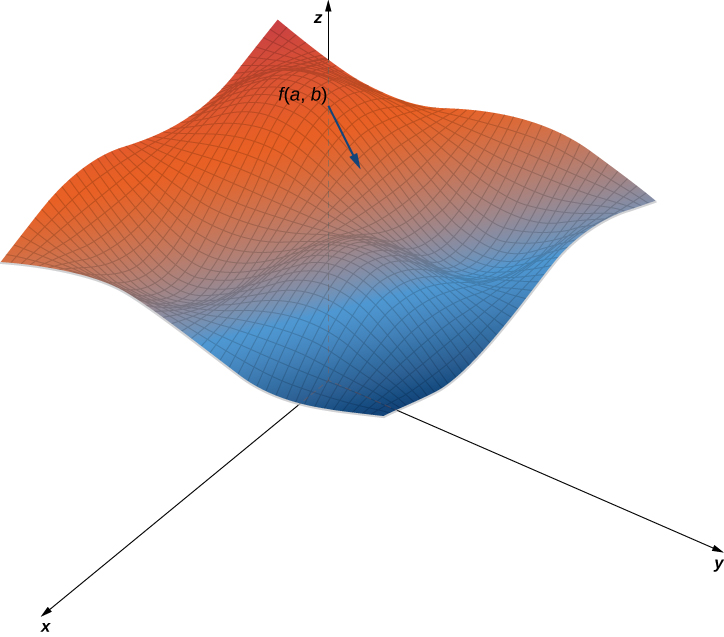
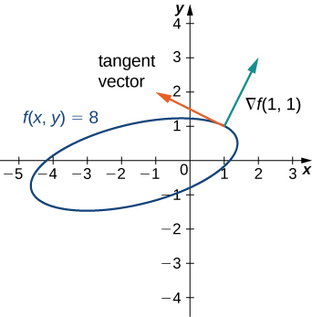
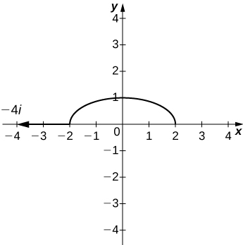

* Determine the directional derivative in a given direction for a function of two variables.
* Determine the gradient vector of a given real-valued function.
* Explain the significance of the gradient vector with regard to direction of change along a surface.
* Use the gradient to find the tangent to a level curve of a given function.
* Calculate directional derivatives and gradients in three dimensions.

In [Partial Derivatives](/m53934){: .target-chapter} we introduced the partial derivative. A function <math xmlns="http://www.w3.org/1998/Math/MathML"><mrow><mi>z</mi><mo>=</mo><mi>f</mi><mrow><mo>(</mo><mrow><mi>x</mi><mo>,</mo><mi>y</mi></mrow><mo>)</mo></mrow></mrow></math>

 has two partial derivatives: <math xmlns="http://www.w3.org/1998/Math/MathML"><mrow><mrow><mrow><mo>∂</mo><mi>z</mi></mrow><mtext>/</mtext><mrow><mo>∂</mo><mi>x</mi></mrow></mrow></mrow></math>

 and <math xmlns="http://www.w3.org/1998/Math/MathML"><mrow><mrow><mrow><mo>∂</mo><mi>z</mi></mrow><mtext>/</mtext><mrow><mo>∂</mo><mi>y</mi></mrow></mrow><mo>.</mo></mrow></math>

 These derivatives correspond to each of the independent variables and can be interpreted as instantaneous rates of change (that is, as slopes of a tangent line). For example, <math xmlns="http://www.w3.org/1998/Math/MathML"><mrow><mrow><mrow><mo>∂</mo><mi>z</mi></mrow><mtext>/</mtext><mrow><mo>∂</mo><mi>x</mi></mrow></mrow></mrow></math>

 represents the slope of a tangent line passing through a given point on the surface defined by <math xmlns="http://www.w3.org/1998/Math/MathML"><mrow><mi>z</mi><mo>=</mo><mi>f</mi><mrow><mo>(</mo><mrow><mi>x</mi><mo>,</mo><mi>y</mi></mrow><mo>)</mo></mrow><mo>,</mo></mrow></math>

 assuming the tangent line is parallel to the *x*-axis. Similarly, <math xmlns="http://www.w3.org/1998/Math/MathML"><mrow><mrow><mrow><mo>∂</mo><mi>z</mi></mrow><mtext>/</mtext><mrow><mo>∂</mo><mi>y</mi></mrow></mrow></mrow></math>

 represents the slope of the tangent line parallel to the <math xmlns="http://www.w3.org/1998/Math/MathML"><mi>y</mi><mtext>-axis.</mtext></math>

 Now we consider the possibility of a tangent line parallel to neither axis.

### Directional Derivatives

We start with the graph of a surface defined by the equation <math xmlns="http://www.w3.org/1998/Math/MathML"><mrow><mi>z</mi><mo>=</mo><mi>f</mi><mrow><mo>(</mo><mrow><mi>x</mi><mo>,</mo><mi>y</mi></mrow><mo>)</mo></mrow><mo>.</mo></mrow></math>

 Given a point <math xmlns="http://www.w3.org/1998/Math/MathML"><mrow><mrow><mo>(</mo><mrow><mi>a</mi><mo>,</mo><mi>b</mi></mrow><mo>)</mo></mrow></mrow></math>

 in the domain of <math xmlns="http://www.w3.org/1998/Math/MathML"><mrow><mi>f</mi><mo>,</mo></mrow></math>

 we choose a direction to travel from that point. We measure the direction using an angle <math xmlns="http://www.w3.org/1998/Math/MathML"><mrow><mi>θ</mi><mo>,</mo></mrow></math>

 which is measured counterclockwise in the *x*, *y*-plane, starting at zero from the positive *x*-axis ([\[link\]](#CNX_Calc_Figure_14_06_001)). The distance we travel is <math xmlns="http://www.w3.org/1998/Math/MathML"><mi>h</mi></math>

 and the direction we travel is given by the unit vector <math xmlns="http://www.w3.org/1998/Math/MathML"><mrow><mstyle mathvariant="bold" mathsize="normal"><mi>u</mi></mstyle><mo>=</mo><mrow><mo>(</mo><mrow><mtext>cos</mtext><mspace width="0.2em" /><mi>θ</mi></mrow><mo>)</mo></mrow><mstyle mathvariant="bold" mathsize="normal"><mi>i</mi></mstyle><mo>+</mo><mrow><mo>(</mo><mrow><mtext>sin</mtext><mspace width="0.2em" /><mi>θ</mi></mrow><mo>)</mo></mrow><mstyle mathvariant="bold" mathsize="normal"><mi>j</mi></mstyle><mo>.</mo></mrow></math>

 Therefore, the *z*-coordinate of the second point on the graph is given by <math xmlns="http://www.w3.org/1998/Math/MathML"><mrow><mi>z</mi><mo>=</mo><mi>f</mi><mrow><mo>(</mo><mrow><mi>a</mi><mo>+</mo><mi>h</mi><mspace width="0.2em" /><mtext>cos</mtext><mspace width="0.2em" /><mi>θ</mi><mo>,</mo><mi>b</mi><mo>+</mo><mi>h</mi><mspace width="0.2em" /><mtext>sin</mtext><mspace width="0.2em" /><mi>θ</mi></mrow><mo>)</mo></mrow><mo>.</mo></mrow></math>

 . The slope of the black arrow on the graph indicates the value of the directional derivative at that point."){: #CNX_Calc_Figure_14_06_001}

We can calculate the slope of the secant line by dividing the difference in <math xmlns="http://www.w3.org/1998/Math/MathML"><mi>z</mi><mtext>-values</mtext></math>

 by the length of the line segment connecting the two points in the domain. The length of the line segment is <math xmlns="http://www.w3.org/1998/Math/MathML"><mi>h</mi><mo>.</mo></math>

 Therefore, the slope of the secant line is

<math xmlns="http://www.w3.org/1998/Math/MathML"><mrow><msub><mi>m</mi><mrow><mtext>sec</mtext></mrow></msub><mo>=</mo><mfrac><mrow><mi>f</mi><mrow><mo>(</mo><mrow><mi>a</mi><mo>+</mo><mi>h</mi><mspace width="0.2em" /><mtext>cos</mtext><mspace width="0.2em" /><mi>θ</mi><mo>,</mo><mi>b</mi><mo>+</mo><mi>h</mi><mspace width="0.2em" /><mtext>sin</mtext><mspace width="0.2em" /><mi>θ</mi></mrow><mo>)</mo></mrow><mo>−</mo><mi>f</mi><mrow><mo>(</mo><mrow><mi>a</mi><mo>,</mo><mi>b</mi></mrow><mo>)</mo></mrow></mrow><mi>h</mi></mfrac><mo>.</mo></mrow></math>

To find the slope of the tangent line in the same direction, we take the limit as <math xmlns="http://www.w3.org/1998/Math/MathML"><mi>h</mi></math>

 approaches zero.

Definition

Suppose <math xmlns="http://www.w3.org/1998/Math/MathML"><mrow><mi>z</mi><mo>=</mo><mi>f</mi><mrow><mo>(</mo><mrow><mi>x</mi><mo>,</mo><mi>y</mi></mrow><mo>)</mo></mrow></mrow></math>

 is a function of two variables with a domain of <math xmlns="http://www.w3.org/1998/Math/MathML"><mi>D</mi><mo>.</mo></math>

 Let <math xmlns="http://www.w3.org/1998/Math/MathML"><mrow><mrow><mo>(</mo><mrow><mi>a</mi><mo>,</mo><mi>b</mi></mrow><mo>)</mo></mrow><mo>∈</mo><mi>D</mi></mrow></math>

 and define <math xmlns="http://www.w3.org/1998/Math/MathML"><mrow><mtext>u</mtext><mo>=</mo><mtext>cos</mtext><mspace width="0.2em" /><mi>θ</mi><mstyle mathvariant="bold" mathsize="normal"><mi>i</mi></mstyle><mo>+</mo><mtext>sin</mtext><mspace width="0.2em" /><mi>θ</mi><mstyle mathvariant="bold" mathsize="normal"><mi>j</mi></mstyle><mo>.</mo></mrow></math>

 Then the **directional derivative**{: data-type="term"} of <math xmlns="http://www.w3.org/1998/Math/MathML"><mi>f</mi></math>

 in the direction of <math xmlns="http://www.w3.org/1998/Math/MathML"><mi>u</mi></math>

 is given by

<math xmlns="http://www.w3.org/1998/Math/MathML"><mrow><msub><mi>D</mi><mstyle mathvariant="bold" mathsize="normal"><mi>u</mi></mstyle></msub><mi>f</mi><mrow><mo>(</mo><mrow><mi>a</mi><mo>,</mo><mi>b</mi></mrow><mo>)</mo></mrow><mo>=</mo><munder><mrow><mtext>lim</mtext></mrow><mrow><mi>h</mi><mo stretchy="false">→</mo><mn>0</mn></mrow></munder><mfrac><mrow><mi>f</mi><mrow><mo>(</mo><mrow><mi>a</mi><mo>+</mo><mi>h</mi><mspace width="0.2em" /><mtext>cos</mtext><mspace width="0.2em" /><mi>θ</mi><mo>,</mo><mi>b</mi><mo>+</mo><mi>h</mi><mspace width="0.2em" /><mtext>sin</mtext><mspace width="0.2em" /><mi>θ</mi></mrow><mo>)</mo></mrow><mo>−</mo><mi>f</mi><mrow><mo>(</mo><mrow><mi>a</mi><mo>,</mo><mi>b</mi></mrow><mo>)</mo></mrow></mrow><mi>h</mi></mfrac><mo>,</mo></mrow></math>

provided the limit exists.

[\[link\]](#fs-id1167794091761) provides a formal definition of the directional derivative that can be used in many cases to calculate a directional derivative.

Finding a Directional Derivative from the Definition

Let <math xmlns="http://www.w3.org/1998/Math/MathML"><mrow><mi>θ</mi><mo>=</mo><mtext>arccos</mtext><mrow><mo>(</mo><mrow><mrow><mn>3</mn><mtext>/</mtext><mn>5</mn></mrow></mrow><mo>)</mo></mrow><mo>.</mo></mrow></math>

 Find the directional derivative <math xmlns="http://www.w3.org/1998/Math/MathML"><mrow><msub><mi>D</mi><mstyle mathvariant="bold" mathsize="normal"><mi>u</mi></mstyle></msub><mi>f</mi><mrow><mo>(</mo><mrow><mi>x</mi><mo>,</mo><mi>y</mi></mrow><mo>)</mo></mrow></mrow></math>

 of <math xmlns="http://www.w3.org/1998/Math/MathML"><mrow><mi>f</mi><mrow><mo>(</mo><mrow><mi>x</mi><mo>,</mo><mi>y</mi></mrow><mo>)</mo></mrow><mo>=</mo><msup><mi>x</mi><mn>2</mn></msup><mo>−</mo><mi>x</mi><mi>y</mi><mo>+</mo><mn>3</mn><msup><mi>y</mi><mn>2</mn></msup></mrow></math>

 in the direction of <math xmlns="http://www.w3.org/1998/Math/MathML"><mrow><mtext>u</mtext><mo>=</mo><mrow><mo>(</mo><mrow><mtext>cos</mtext><mspace width="0.2em" /><mi>θ</mi></mrow><mo>)</mo></mrow><mstyle mathvariant="bold" mathsize="normal"><mi>i</mi></mstyle><mo>+</mo><mrow><mo>(</mo><mrow><mtext>sin</mtext><mspace width="0.2em" /><mi>θ</mi></mrow><mo>)</mo></mrow><mstyle mathvariant="bold" mathsize="normal"><mi>j</mi></mstyle><mo>.</mo></mrow></math>

 What is <math xmlns="http://www.w3.org/1998/Math/MathML"><mrow><msub><mi>D</mi><mstyle mathvariant="bold" mathsize="normal"><mi>u</mi></mstyle></msub><mi>f</mi><mrow><mo>(</mo><mrow><mn>−1</mn><mo>,</mo><mn>2</mn></mrow><mo>)</mo></mrow><mo>?</mo></mrow></math>

First of all, since <math xmlns="http://www.w3.org/1998/Math/MathML"><mrow><mtext>cos</mtext><mspace width="0.2em" /><mi>θ</mi><mo>=</mo><mrow><mn>3</mn><mtext>/</mtext><mn>5</mn></mrow></mrow></math>

 and <math xmlns="http://www.w3.org/1998/Math/MathML"><mi>θ</mi></math>

 is acute, this implies

<math xmlns="http://www.w3.org/1998/Math/MathML"><mrow><mtext>sin</mtext><mspace width="0.2em" /><mi>θ</mi><mo>=</mo><msqrt><mrow><mn>1</mn><mo>−</mo><msup><mrow><mrow><mo>(</mo><mrow><mfrac><mn>3</mn><mn>5</mn></mfrac></mrow><mo>)</mo></mrow></mrow><mn>2</mn></msup></mrow></msqrt><mo>=</mo><msqrt><mrow><mfrac><mrow><mn>16</mn></mrow><mrow><mn>25</mn></mrow></mfrac></mrow></msqrt><mo>=</mo><mfrac><mn>4</mn><mn>5</mn></mfrac><mo>.</mo></mrow></math>

Using <math xmlns="http://www.w3.org/1998/Math/MathML"><mrow><mi>f</mi><mrow><mo>(</mo><mrow><mi>x</mi><mo>,</mo><mi>y</mi></mrow><mo>)</mo></mrow><mo>=</mo><msup><mi>x</mi><mn>2</mn></msup><mo>−</mo><mi>x</mi><mi>y</mi><mo>+</mo><mn>3</mn><msup><mi>y</mi><mn>2</mn></msup><mo>,</mo></mrow></math>

 we first calculate <math xmlns="http://www.w3.org/1998/Math/MathML"><mrow><mi>f</mi><mrow><mo>(</mo><mrow><mi>x</mi><mo>+</mo><mi>h</mi><mspace width="0.2em" /><mtext>cos</mtext><mspace width="0.2em" /><mi>θ</mi><mo>,</mo><mi>y</mi><mo>+</mo><mi>h</mi><mspace width="0.2em" /><mtext>sin</mtext><mspace width="0.2em" /><mi>θ</mi></mrow><mo>)</mo></mrow><mtext>:</mtext></mrow></math>

<math xmlns="http://www.w3.org/1998/Math/MathML"><mtable><mtr><mtd columnalign="right"><mi>f</mi><mrow><mo>(</mo><mrow><mi>x</mi><mo>+</mo><mi>h</mi><mspace width="0.2em" /><mtext>cos</mtext><mspace width="0.2em" /><mi>θ</mi><mo>,</mo><mi>y</mi><mo>+</mo><mi>h</mi><mspace width="0.2em" /><mtext>sin</mtext><mspace width="0.2em" /><mi>θ</mi></mrow><mo>)</mo></mrow></mtd><mtd columnalign="left"><mo>=</mo><msup><mrow><mo>(</mo><mrow><mi>x</mi><mo>+</mo><mi>h</mi><mspace width="0.2em" /><mtext>cos</mtext><mspace width="0.2em" /><mi>θ</mi></mrow><mo>)</mo></mrow><mn>2</mn></msup><mo>−</mo><mrow><mo>(</mo><mrow><mi>x</mi><mo>+</mo><mi>h</mi><mspace width="0.2em" /><mtext>cos</mtext><mspace width="0.2em" /><mi>θ</mi></mrow><mo>)</mo></mrow><mrow><mo>(</mo><mrow><mi>y</mi><mo>+</mo><mi>h</mi><mspace width="0.2em" /><mtext>sin</mtext><mspace width="0.2em" /><mi>θ</mi></mrow><mo>)</mo></mrow><mo>+</mo><mn>3</mn><msup><mrow><mo>(</mo><mrow><mi>y</mi><mo>+</mo><mi>h</mi><mspace width="0.2em" /><mtext>sin</mtext><mspace width="0.2em" /><mi>θ</mi></mrow><mo>)</mo></mrow><mn>2</mn></msup></mtd></mtr><mtr><mtd /><mtd columnalign="left"><mo>=</mo><msup><mi>x</mi><mn>2</mn></msup><mo>+</mo><mn>2</mn><mi>x</mi><mi>h</mi><mspace width="0.2em" /><mtext>cos</mtext><mspace width="0.2em" /><mi>θ</mi><mo>+</mo><msup><mi>h</mi><mn>2</mn></msup><msup><mtext>cos</mtext><mn>2</mn></msup><mi>θ</mi><mo>−</mo><mi>x</mi><mi>y</mi><mo>−</mo><mi>x</mi><mi>h</mi><mspace width="0.2em" /><mtext>sin</mtext><mspace width="0.2em" /><mi>θ</mi><mo>−</mo><mi>y</mi><mi>h</mi><mspace width="0.2em" /><mtext>cos</mtext><mspace width="0.2em" /><mi>θ</mi></mtd></mtr><mtr><mtd /><mtd columnalign="left"><mspace width="0.5em" /><msup><mtext mathvariant="italic">−h</mtext><mn>2</mn></msup><mtext>sin</mtext><mspace width="0.2em" /><mi>θ</mi><mspace width="0.2em" /><mtext>cos</mtext><mspace width="0.2em" /><mi>θ</mi><mo>+</mo><mn>3</mn><msup><mi>y</mi><mn>2</mn></msup><mo>+</mo><mn>6</mn><mi>y</mi><mi>h</mi><mspace width="0.2em" /><mtext>sin</mtext><mspace width="0.2em" /><mi>θ</mi><mo>+</mo><mn>3</mn><msup><mi>h</mi><mn>2</mn></msup><msup><mtext>sin</mtext><mn>2</mn></msup><mi>θ</mi></mtd></mtr><mtr><mtd /><mtd columnalign="left"><mo>=</mo><msup><mi>x</mi><mn>2</mn></msup><mo>+</mo><mn>2</mn><mi>x</mi><mi>h</mi><mrow><mo>(</mo><mrow><mfrac><mn>3</mn><mn>5</mn></mfrac></mrow><mo>)</mo></mrow><mo>+</mo><mfrac><mrow><mn>9</mn><msup><mi>h</mi><mn>2</mn></msup></mrow><mrow><mn>25</mn></mrow></mfrac><mo>−</mo><mi>x</mi><mi>y</mi><mo>−</mo><mfrac><mrow><mn>4</mn><mi>x</mi><mi>h</mi></mrow><mn>5</mn></mfrac><mo>−</mo><mfrac><mrow><mn>3</mn><mi>y</mi><mi>h</mi></mrow><mn>5</mn></mfrac><mo>−</mo><mfrac><mrow><mn>12</mn><msup><mi>h</mi><mn>2</mn></msup></mrow><mrow><mn>25</mn></mrow></mfrac><mo>+</mo><mn>3</mn><msup><mi>y</mi><mn>2</mn></msup></mtd></mtr><mtr><mtd /><mtd columnalign="left"><mspace width="0.5em" /><mo>+</mo><mn>6</mn><mi>y</mi><mi>h</mi><mrow><mo>(</mo><mrow><mfrac><mn>4</mn><mn>5</mn></mfrac></mrow><mo>)</mo></mrow><mo>+</mo><mn>3</mn><msup><mi>h</mi><mn>2</mn></msup><mrow><mo>(</mo><mrow><mfrac><mrow><mn>16</mn></mrow><mrow><mn>25</mn></mrow></mfrac></mrow><mo>)</mo></mrow></mtd></mtr><mtr><mtd /><mtd columnalign="left"><mo>=</mo><msup><mi>x</mi><mn>2</mn></msup><mo>−</mo><mi>x</mi><mi>y</mi><mo>+</mo><mn>3</mn><msup><mi>y</mi><mn>2</mn></msup><mo>+</mo><mfrac><mrow><mn>2</mn><mi>x</mi><mi>h</mi></mrow><mn>5</mn></mfrac><mo>+</mo><mfrac><mrow><mn>9</mn><msup><mi>h</mi><mn>2</mn></msup></mrow><mn>5</mn></mfrac><mo>+</mo><mfrac><mrow><mn>21</mn><mi>y</mi><mi>h</mi></mrow><mn>5</mn></mfrac><mo>.</mo></mtd></mtr></mtable></math>

We substitute this expression into [[link]](#fs-id1167794091761):

<math xmlns="http://www.w3.org/1998/Math/MathML"><mtable><mtr><mtd columnalign="right"><msub><mi>D</mi><mstyle mathvariant="bold" mathsize="normal"><mi>u</mi></mstyle></msub><mi>f</mi><mrow><mo>(</mo><mrow><mi>a</mi><mo>,</mo><mi>b</mi></mrow><mo>)</mo></mrow></mtd><mtd columnalign="left"><mo>=</mo><munder><mrow><mtext>lim</mtext></mrow><mrow><mi>h</mi><mo stretchy="false">→</mo><mn>0</mn></mrow></munder><mfrac><mrow><mi>f</mi><mrow><mo>(</mo><mrow><mi>a</mi><mo>+</mo><mi>h</mi><mspace width="0.2em" /><mtext>cos</mtext><mspace width="0.2em" /><mi>θ</mi><mo>,</mo><mi>b</mi><mo>+</mo><mi>h</mi><mspace width="0.2em" /><mtext>sin</mtext><mspace width="0.2em" /><mi>θ</mi></mrow><mo>)</mo></mrow><mo>−</mo><mi>f</mi><mrow><mo>(</mo><mrow><mi>a</mi><mo>,</mo><mi>b</mi></mrow><mo>)</mo></mrow></mrow><mi>h</mi></mfrac></mtd></mtr><mtr><mtd /><mtd columnalign="left"><mo>=</mo><munder><mrow><mtext>lim</mtext></mrow><mrow><mi>h</mi><mo stretchy="false">→</mo><mn>0</mn></mrow></munder><mfrac><mrow><mrow><mo>(</mo><mrow><msup><mi>x</mi><mn>2</mn></msup><mo>−</mo><mi>x</mi><mi>y</mi><mo>+</mo><mn>3</mn><msup><mi>y</mi><mn>2</mn></msup><mo>+</mo><mfrac><mrow><mn>2</mn><mi>x</mi><mi>h</mi></mrow><mn>5</mn></mfrac><mo>+</mo><mfrac><mrow><mn>9</mn><msup><mi>h</mi><mn>2</mn></msup></mrow><mn>5</mn></mfrac><mo>+</mo><mfrac><mrow><mn>21</mn><mi>y</mi><mi>h</mi></mrow><mn>5</mn></mfrac></mrow><mo>)</mo></mrow><mo>−</mo><mrow><mo>(</mo><mrow><msup><mi>x</mi><mn>2</mn></msup><mo>−</mo><mi>x</mi><mi>y</mi><mo>+</mo><mn>3</mn><msup><mi>y</mi><mn>2</mn></msup></mrow><mo>)</mo></mrow></mrow><mi>h</mi></mfrac></mtd></mtr><mtr><mtd /><mtd columnalign="left"><mo>=</mo><munder><mrow><mtext>lim</mtext></mrow><mrow><mi>h</mi><mo stretchy="false">→</mo><mn>0</mn></mrow></munder><mfrac><mrow><mfrac><mrow><mn>2</mn><mi>x</mi><mi>h</mi></mrow><mn>5</mn></mfrac><mo>+</mo><mfrac><mrow><mn>9</mn><msup><mi>h</mi><mn>2</mn></msup></mrow><mn>5</mn></mfrac><mo>+</mo><mfrac><mrow><mn>21</mn><mi>y</mi><mi>h</mi></mrow><mn>5</mn></mfrac></mrow><mi>h</mi></mfrac></mtd></mtr><mtr><mtd /><mtd columnalign="left"><mo>=</mo><munder><mrow><mtext>lim</mtext></mrow><mrow><mi>h</mi><mo stretchy="false">→</mo><mn>0</mn></mrow></munder><mfrac><mrow><mn>2</mn><mi>x</mi></mrow><mn>5</mn></mfrac><mo>+</mo><mfrac><mrow><mn>9</mn><mi>h</mi></mrow><mn>5</mn></mfrac><mo>+</mo><mfrac><mrow><mn>21</mn><mi>y</mi></mrow><mn>5</mn></mfrac></mtd></mtr><mtr><mtd /><mtd columnalign="left"><mo>=</mo><mfrac><mrow><mn>2</mn><mi>x</mi><mo>+</mo><mn>21</mn><mi>y</mi></mrow><mn>5</mn></mfrac><mo>.</mo></mtd></mtr></mtable></math>

To calculate <math xmlns="http://www.w3.org/1998/Math/MathML"><mrow><msub><mi>D</mi><mstyle mathvariant="bold" mathsize="normal"><mi>u</mi></mstyle></msub><mi>f</mi><mrow><mo>(</mo><mrow><mn>−1</mn><mo>,</mo><mn>2</mn></mrow><mo>)</mo></mrow><mo>,</mo></mrow></math>

 we substitute <math xmlns="http://www.w3.org/1998/Math/MathML"><mrow><mi>x</mi><mo>=</mo><mn>−1</mn></mrow></math>

 and <math xmlns="http://www.w3.org/1998/Math/MathML"><mrow><mi>y</mi><mo>=</mo><mn>2</mn></mrow></math>

 into this answer:

<math xmlns="http://www.w3.org/1998/Math/MathML"><mtable><mtr><mtd columnalign="right"><msub><mi>D</mi><mstyle mathvariant="bold" mathsize="normal"><mi>u</mi></mstyle></msub><mi>f</mi><mrow><mo>(</mo><mrow><mn>−1</mn><mo>,</mo><mn>2</mn></mrow><mo>)</mo></mrow></mtd><mtd columnalign="left"><mo>=</mo><mfrac><mrow><mn>2</mn><mrow><mo>(</mo><mrow><mn>−1</mn></mrow><mo>)</mo></mrow><mo>+</mo><mn>21</mn><mrow><mo>(</mo><mn>2</mn><mo>)</mo></mrow></mrow><mn>5</mn></mfrac></mtd></mtr><mtr><mtd /><mtd columnalign="left"><mo>=</mo><mfrac><mrow><mn>−2</mn><mo>+</mo><mn>42</mn></mrow><mn>5</mn></mfrac></mtd></mtr><mtr><mtd /><mtd columnalign="left"><mo>=</mo><mn>8</mn><mo>.</mo></mtd></mtr></mtable></math>

(See the following figure.)

."){: #CNX_Calc_Figure_14_06_006}

Another approach to calculating a directional derivative involves partial derivatives, as outlined in the following theorem.

Directional Derivative of a Function of Two Variables

Let <math xmlns="http://www.w3.org/1998/Math/MathML"><mrow><mi>z</mi><mo>=</mo><mi>f</mi><mrow><mo>(</mo><mrow><mi>x</mi><mo>,</mo><mi>y</mi></mrow><mo>)</mo></mrow></mrow></math>

 be a function of two variables <math xmlns="http://www.w3.org/1998/Math/MathML"><mrow><mi>x</mi><mspace width="0.2em" /><mtext>and</mtext><mspace width="0.2em" /><mi>y</mi><mo>,</mo></mrow></math>

 and assume that <math xmlns="http://www.w3.org/1998/Math/MathML"><mrow><msub><mi>f</mi><mi>x</mi></msub></mrow></math>

 and <math xmlns="http://www.w3.org/1998/Math/MathML"><mrow><msub><mi>f</mi><mi>y</mi></msub></mrow></math>

 exist. Then the directional derivative of <math xmlns="http://www.w3.org/1998/Math/MathML"><mrow><mi>f</mi></mrow></math>

 in the direction of <math xmlns="http://www.w3.org/1998/Math/MathML"><mrow><mtext>u</mtext><mo>=</mo><mtext>cos</mtext><mspace width="0.2em" /><mi>θ</mi><mtext>i</mtext><mo>+</mo><mtext>sin</mtext><mspace width="0.2em" /><mi>θ</mi><mtext>j</mtext></mrow></math>

 is given by

<math xmlns="http://www.w3.org/1998/Math/MathML"><mrow><msub><mi>D</mi><mstyle mathvariant="bold" mathsize="normal"><mi>u</mi></mstyle></msub><mi>f</mi><mrow><mo>(</mo><mrow><mi>x</mi><mo>,</mo><mi>y</mi></mrow><mo>)</mo></mrow><mo>=</mo><msub><mi>f</mi><mi>x</mi></msub><mrow><mo>(</mo><mrow><mi>x</mi><mo>,</mo><mi>y</mi></mrow><mo>)</mo></mrow><mtext>cos</mtext><mspace width="0.2em" /><mi>θ</mi><mo>+</mo><msub><mi>f</mi><mi>y</mi></msub><mrow><mo>(</mo><mrow><mi>x</mi><mo>,</mo><mi>y</mi></mrow><mo>)</mo></mrow><mtext>sin</mtext><mspace width="0.2em" /><mi>θ</mi><mo>.</mo></mrow></math>

#### Proof

[\[link\]](#fs-id1167794091761) states that the directional derivative of *f* in the direction of <math xmlns="http://www.w3.org/1998/Math/MathML"><mrow><mstyle mathvariant="bold" mathsize="normal"><mi>u</mi></mstyle><mo>=</mo><mtext>cos</mtext><mspace width="0.2em" /><mi>θ</mi><mstyle mathvariant="bold" mathsize="normal"><mi>i</mi></mstyle><mo>+</mo><mtext>sin</mtext><mspace width="0.2em" /><mi>θ</mi><mstyle mathvariant="bold" mathsize="normal"><mi>j</mi></mstyle></mrow></math>

 is given by

<math xmlns="http://www.w3.org/1998/Math/MathML"><mrow><msub><mi>D</mi><mstyle mathvariant="bold" mathsize="normal"><mi>u</mi></mstyle></msub><mi>f</mi><mrow><mo>(</mo><mrow><mi>a</mi><mo>,</mo><mi>b</mi></mrow><mo>)</mo></mrow><mo>=</mo><munder><mrow><mtext>lim</mtext></mrow><mrow><mi>t</mi><mo stretchy="false">→</mo><mn>0</mn></mrow></munder><mfrac><mrow><mi>f</mi><mrow><mo>(</mo><mrow><mi>a</mi><mo>+</mo><mi>t</mi><mspace width="0.2em" /><mtext>cos</mtext><mspace width="0.2em" /><mi>θ</mi><mo>,</mo><mi>b</mi><mo>+</mo><mi>t</mi><mspace width="0.2em" /><mtext>sin</mtext><mspace width="0.2em" /><mi>θ</mi></mrow><mo>)</mo></mrow><mo>−</mo><mi>f</mi><mrow><mo>(</mo><mrow><mi>a</mi><mo>,</mo><mi>b</mi></mrow><mo>)</mo></mrow></mrow><mi>t</mi></mfrac><mo>.</mo></mrow></math>

Let <math xmlns="http://www.w3.org/1998/Math/MathML"><mrow><mi>x</mi><mo>=</mo><mi>a</mi><mo>+</mo><mi>t</mi><mspace width="0.2em" /><mtext>cos</mtext><mspace width="0.2em" /><mi>θ</mi></mrow></math>

 and <math xmlns="http://www.w3.org/1998/Math/MathML"><mrow><mi>y</mi><mo>=</mo><mi>b</mi><mo>+</mo><mi>t</mi><mspace width="0.2em" /><mtext>sin</mtext><mspace width="0.2em" /><mi>θ</mi><mo>,</mo></mrow></math>

 and define <math xmlns="http://www.w3.org/1998/Math/MathML"><mrow><mi>g</mi><mrow><mo>(</mo><mi>t</mi><mo>)</mo></mrow><mo>=</mo><mi>f</mi><mrow><mo>(</mo><mrow><mi>x</mi><mo>,</mo><mi>y</mi></mrow><mo>)</mo></mrow><mo>.</mo></mrow></math>

 Since <math xmlns="http://www.w3.org/1998/Math/MathML"><mrow><msub><mi>f</mi><mi>x</mi></msub></mrow></math>

 and <math xmlns="http://www.w3.org/1998/Math/MathML"><mrow><msub><mi>f</mi><mi>y</mi></msub></mrow></math>

 both exist, we can use the chain rule for functions of two variables to calculate <math xmlns="http://www.w3.org/1998/Math/MathML"><mrow><msup><mi>g</mi><mo>′</mo></msup><mrow><mo>(</mo><mi>t</mi><mo>)</mo></mrow><mtext>:</mtext></mrow></math>

<math xmlns="http://www.w3.org/1998/Math/MathML"><mtable><mtr><mtd columnalign="right"><msup><mi>g</mi><mo>′</mo></msup><mrow><mo>(</mo><mi>t</mi><mo>)</mo></mrow></mtd><mtd columnalign="left"><mo>=</mo><mfrac><mrow><mo>∂</mo><mtext mathvariant="italic">f</mtext></mrow><mrow><mo>∂</mo><mtext mathvariant="italic">x</mtext></mrow></mfrac><mspace width="0.1em" /><mfrac><mrow><mi>d</mi><mi>x</mi></mrow><mrow><mi>d</mi><mi>t</mi></mrow></mfrac><mo>+</mo><mfrac><mrow><mo>∂</mo><mtext mathvariant="italic">f</mtext></mrow><mrow><mo>∂</mo><mtext mathvariant="italic">y</mtext></mrow></mfrac><mspace width="0.1em" /><mfrac><mrow><mi>d</mi><mi>y</mi></mrow><mrow><mi>d</mi><mi>t</mi></mrow></mfrac></mtd></mtr><mtr><mtd /><mtd columnalign="left"><mo>=</mo><msub><mi>f</mi><mi>x</mi></msub><mrow><mo>(</mo><mrow><mi>x</mi><mo>,</mo><mi>y</mi></mrow><mo>)</mo></mrow><mtext>cos</mtext><mspace width="0.2em" /><mi>θ</mi><mo>+</mo><msub><mi>f</mi><mi>y</mi></msub><mrow><mo>(</mo><mrow><mi>x</mi><mo>,</mo><mi>y</mi></mrow><mo>)</mo></mrow><mtext>sin</mtext><mspace width="0.2em" /><mi>θ</mi><mo>.</mo></mtd></mtr></mtable></math>

If <math xmlns="http://www.w3.org/1998/Math/MathML"><mrow><mi>t</mi><mo>=</mo><mn>0</mn><mo>,</mo></mrow></math>

 then <math xmlns="http://www.w3.org/1998/Math/MathML"><mrow><mi>x</mi><mo>=</mo><msub><mi>x</mi><mn>0</mn></msub></mrow></math>

 and <math xmlns="http://www.w3.org/1998/Math/MathML"><mrow><mi>y</mi><mo>=</mo><msub><mi>y</mi><mn>0</mn></msub><mo>,</mo></mrow></math>

 so

<math xmlns="http://www.w3.org/1998/Math/MathML"><mrow><msup><mi>g</mi><mo>′</mo></msup><mrow><mo>(</mo><mn>0</mn><mo>)</mo></mrow><mo>=</mo><msub><mi>f</mi><mi>x</mi></msub><mrow><mo>(</mo><mrow><msub><mi>x</mi><mn>0</mn></msub><mo>,</mo><msub><mi>y</mi><mn>0</mn></msub></mrow><mo>)</mo></mrow><mtext>cos</mtext><mspace width="0.2em" /><mi>θ</mi><mo>+</mo><msub><mi>f</mi><mi>y</mi></msub><mrow><mo>(</mo><mrow><msub><mi>x</mi><mn>0</mn></msub><mo>,</mo><msub><mi>y</mi><mn>0</mn></msub></mrow><mo>)</mo></mrow><mtext>sin</mtext><mspace width="0.2em" /><mi>θ</mi><mo>.</mo></mrow></math>

By the definition of <math xmlns="http://www.w3.org/1998/Math/MathML"><mrow><msup><mi>g</mi><mo>′</mo></msup><mrow><mo>(</mo><mi>t</mi><mo>)</mo></mrow><mo>,</mo></mrow></math>

 it is also true that

<math xmlns="http://www.w3.org/1998/Math/MathML"><mtable><mtr><mtd columnalign="right"><msup><mi>g</mi><mo>′</mo></msup><mrow><mo>(</mo><mn>0</mn><mo>)</mo></mrow></mtd><mtd columnalign="left"><mo>=</mo><munder><mrow><mtext>lim</mtext></mrow><mrow><mi>t</mi><mo stretchy="false">→</mo><mn>0</mn></mrow></munder><mfrac><mrow><mi>g</mi><mrow><mo>(</mo><mi>t</mi><mo>)</mo></mrow><mo>−</mo><mi>g</mi><mrow><mo>(</mo><mn>0</mn><mo>)</mo></mrow></mrow><mi>t</mi></mfrac></mtd></mtr><mtr><mtd /><mtd columnalign="left"><mo>=</mo><munder><mrow><mtext>lim</mtext></mrow><mrow><mi>t</mi><mo stretchy="false">→</mo><mn>0</mn></mrow></munder><mfrac><mrow><mi>f</mi><mrow><mo>(</mo><mrow><msub><mi>x</mi><mn>0</mn></msub><mo>+</mo><mi>t</mi><mspace width="0.2em" /><mtext>cos</mtext><mspace width="0.2em" /><mi>θ</mi><mo>,</mo><msub><mi>y</mi><mn>0</mn></msub><mo>+</mo><mi>t</mi><mspace width="0.2em" /><mtext>sin</mtext><mspace width="0.2em" /><mi>θ</mi></mrow><mo>)</mo></mrow><mo>−</mo><mi>f</mi><mrow><mo>(</mo><mrow><msub><mi>x</mi><mn>0</mn></msub><mo>,</mo><msub><mi>y</mi><mn>0</mn></msub></mrow><mo>)</mo></mrow></mrow><mi>t</mi></mfrac><mo>.</mo></mtd></mtr></mtable></math>

Therefore, <math xmlns="http://www.w3.org/1998/Math/MathML"><mrow><msub><mi>D</mi><mstyle mathvariant="bold" mathsize="normal"><mi>u</mi></mstyle></msub><mi>f</mi><mrow><mo>(</mo><mrow><msub><mi>x</mi><mn>0</mn></msub><mo>,</mo><msub><mi>y</mi><mn>0</mn></msub></mrow><mo>)</mo></mrow><mo>=</mo><msub><mi>f</mi><mi>x</mi></msub><mrow><mo>(</mo><mrow><mi>x</mi><mo>,</mo><mi>y</mi></mrow><mo>)</mo></mrow><mtext>cos</mtext><mspace width="0.2em" /><mi>θ</mi><mo>+</mo><msub><mi>f</mi><mi>y</mi></msub><mrow><mo>(</mo><mrow><mi>x</mi><mo>,</mo><mi>y</mi></mrow><mo>)</mo></mrow><mtext>sin</mtext><mspace width="0.2em" /><mi>θ</mi><mo>.</mo></mrow></math>

□

Finding a Directional Derivative: Alternative Method

Let <math xmlns="http://www.w3.org/1998/Math/MathML"><mrow><mi>θ</mi><mo>=</mo><mtext>arccos</mtext><mrow><mo>(</mo><mrow><mrow><mn>3</mn><mtext>/</mtext><mn>5</mn></mrow></mrow><mo>)</mo></mrow><mo>.</mo></mrow></math>

 Find the directional derivative <math xmlns="http://www.w3.org/1998/Math/MathML"><mrow><msub><mi>D</mi><mstyle mathvariant="bold" mathsize="normal"><mi>u</mi></mstyle></msub><mi>f</mi><mrow><mo>(</mo><mrow><mi>x</mi><mo>,</mo><mi>y</mi></mrow><mo>)</mo></mrow></mrow></math>

 of <math xmlns="http://www.w3.org/1998/Math/MathML"><mrow><mi>f</mi><mrow><mo>(</mo><mrow><mi>x</mi><mo>,</mo><mi>y</mi></mrow><mo>)</mo></mrow><mo>=</mo><msup><mi>x</mi><mn>2</mn></msup><mo>−</mo><mi>x</mi><mi>y</mi><mo>+</mo><mn>3</mn><msup><mi>y</mi><mn>2</mn></msup></mrow></math>

 in the direction of <math xmlns="http://www.w3.org/1998/Math/MathML"><mrow><mstyle mathvariant="bold" mathsize="normal"><mi>u</mi></mstyle><mo>=</mo><mrow><mo>(</mo><mrow><mtext>cos</mtext><mspace width="0.2em" /><mi>θ</mi></mrow><mo>)</mo></mrow><mstyle mathvariant="bold" mathsize="normal"><mi>i</mi></mstyle><mo>+</mo><mrow><mo>(</mo><mrow><mtext>sin</mtext><mspace width="0.2em" /><mi>θ</mi></mrow><mo>)</mo></mrow><mstyle mathvariant="bold" mathsize="normal"><mi>j</mi></mstyle><mo>.</mo></mrow></math>

 What is <math xmlns="http://www.w3.org/1998/Math/MathML"><mrow><msub><mi>D</mi><mstyle mathvariant="bold" mathsize="normal"><mi>u</mi></mstyle></msub><mi>f</mi><mrow><mo>(</mo><mrow><mn>−1</mn><mo>,</mo><mn>2</mn></mrow><mo>)</mo></mrow><mo>?</mo></mrow></math>

First, we must calculate the partial derivatives of <math xmlns="http://www.w3.org/1998/Math/MathML"><mrow><mi>f</mi><mtext>:</mtext></mrow></math>

<math xmlns="http://www.w3.org/1998/Math/MathML"><mtable><mtr><mtd columnalign="left"><msub><mi>f</mi><mi>x</mi></msub><mo>=</mo><mn>2</mn><mi>x</mi><mo>−</mo><mi>y</mi></mtd></mtr><mtr><mtd columnalign="left"><msub><mi>f</mi><mi>y</mi></msub><mo>=</mo><mtext>−</mtext><mi>x</mi><mo>+</mo><mn>6</mn><mi>y</mi><mo>,</mo></mtd></mtr></mtable></math>

Then we use [[link]](#fs-id1167794071305) with <math xmlns="http://www.w3.org/1998/Math/MathML"><mrow><mi>θ</mi><mo>=</mo><mtext>arccos</mtext><mrow><mo>(</mo><mrow><mrow><mn>3</mn><mtext>/</mtext><mn>5</mn></mrow></mrow><mo>)</mo></mrow><mtext>:</mtext></mrow></math>

<math xmlns="http://www.w3.org/1998/Math/MathML"><mtable><mtr><mtd columnalign="right"><msub><mi>D</mi><mstyle mathvariant="bold" mathsize="normal"><mi>u</mi></mstyle></msub><mi>f</mi><mrow><mo>(</mo><mrow><mi>x</mi><mo>,</mo><mi>y</mi></mrow><mo>)</mo></mrow></mtd><mtd columnalign="left"><mo>=</mo><msub><mi>f</mi><mi>x</mi></msub><mrow><mo>(</mo><mrow><mi>x</mi><mo>,</mo><mi>y</mi></mrow><mo>)</mo></mrow><mtext>cos</mtext><mspace width="0.2em" /><mi>θ</mi><mo>+</mo><msub><mi>f</mi><mi>y</mi></msub><mrow><mo>(</mo><mrow><mi>x</mi><mo>,</mo><mi>y</mi></mrow><mo>)</mo></mrow><mtext>sin</mtext><mspace width="0.2em" /><mi>θ</mi></mtd></mtr><mtr><mtd /><mtd columnalign="left"><mo>=</mo><mrow><mo>(</mo><mrow><mn>2</mn><mi>x</mi><mo>−</mo><mi>y</mi></mrow><mo>)</mo></mrow><mfrac><mn>3</mn><mn>5</mn></mfrac><mo>+</mo><mrow><mo>(</mo><mrow><mtext>−</mtext><mi>x</mi><mo>+</mo><mn>6</mn><mi>y</mi></mrow><mo>)</mo></mrow><mfrac><mn>4</mn><mn>5</mn></mfrac></mtd></mtr><mtr><mtd /><mtd columnalign="left"><mo>=</mo><mfrac><mrow><mn>6</mn><mi>x</mi></mrow><mn>5</mn></mfrac><mo>−</mo><mfrac><mrow><mn>3</mn><mi>y</mi></mrow><mn>5</mn></mfrac><mo>−</mo><mfrac><mrow><mn>4</mn><mi>x</mi></mrow><mn>5</mn></mfrac><mo>+</mo><mfrac><mrow><mn>24</mn><mi>y</mi></mrow><mn>5</mn></mfrac></mtd></mtr><mtr><mtd /><mtd columnalign="left"><mo>=</mo><mfrac><mrow><mn>2</mn><mi>x</mi><mo>+</mo><mn>21</mn><mi>y</mi></mrow><mn>5</mn></mfrac><mo>.</mo></mtd></mtr></mtable></math>

To calculate <math xmlns="http://www.w3.org/1998/Math/MathML"><mrow><msub><mi>D</mi><mstyle mathvariant="bold" mathsize="normal"><mi>u</mi></mstyle></msub><mi>f</mi><mrow><mo>(</mo><mrow><mn>−1</mn><mo>,</mo><mn>2</mn></mrow><mo>)</mo></mrow><mo>,</mo></mrow></math>

 let <math xmlns="http://www.w3.org/1998/Math/MathML"><mrow><mi>x</mi><mo>=</mo><mn>−1</mn></mrow></math>

 and <math xmlns="http://www.w3.org/1998/Math/MathML"><mrow><mi>y</mi><mo>=</mo><mn>2</mn><mtext>:</mtext></mrow></math>

<math xmlns="http://www.w3.org/1998/Math/MathML"><mrow><msub><mi>D</mi><mstyle mathvariant="bold" mathsize="normal"><mi>u</mi></mstyle></msub><mi>f</mi><mrow><mo>(</mo><mrow><mn>−1</mn><mo>,</mo><mn>2</mn></mrow><mo>)</mo></mrow><mo>=</mo><mfrac><mrow><mn>2</mn><mrow><mo>(</mo><mrow><mn>−1</mn></mrow><mo>)</mo></mrow><mo>+</mo><mn>21</mn><mrow><mo>(</mo><mn>2</mn><mo>)</mo></mrow></mrow><mn>5</mn></mfrac><mo>=</mo><mfrac><mrow><mn>−2</mn><mo>+</mo><mn>42</mn></mrow><mn>5</mn></mfrac><mo>=</mo><mn>8</mn><mo>.</mo></mrow></math>

This is the same answer obtained in [[link]](#fs-id1167793895979).

Find the directional derivative <math xmlns="http://www.w3.org/1998/Math/MathML"><mrow><msub><mi>D</mi><mstyle mathvariant="bold" mathsize="normal"><mi>u</mi></mstyle></msub><mi>f</mi><mrow><mo>(</mo><mrow><mi>x</mi><mo>,</mo><mi>y</mi></mrow><mo>)</mo></mrow></mrow></math>

 of <math xmlns="http://www.w3.org/1998/Math/MathML"><mrow><mi>f</mi><mrow><mo>(</mo><mrow><mi>x</mi><mo>,</mo><mi>y</mi></mrow><mo>)</mo></mrow><mo>=</mo><mn>3</mn><msup><mi>x</mi><mn>2</mn></msup><mi>y</mi><mo>−</mo><mn>4</mn><mi>x</mi><msup><mi>y</mi><mn>3</mn></msup><mo>+</mo><mn>3</mn><msup><mi>y</mi><mn>2</mn></msup><mo>−</mo><mn>4</mn><mi>x</mi></mrow></math>

 in the direction of <math xmlns="http://www.w3.org/1998/Math/MathML"><mrow><mstyle mathvariant="bold" mathsize="normal"><mi>u</mi></mstyle><mo>=</mo><mrow><mo>(</mo><mrow><mtext>cos</mtext><mspace width="0.2em" /><mfrac><mi>π</mi><mn>3</mn></mfrac></mrow><mo>)</mo></mrow><mstyle mathvariant="bold" mathsize="normal"><mi>i</mi></mstyle><mo>+</mo><mrow><mo>(</mo><mrow><mtext>sin</mtext><mspace width="0.2em" /><mfrac><mi>π</mi><mn>3</mn></mfrac></mrow><mo>)</mo></mrow><mstyle mathvariant="bold" mathsize="normal"><mi>j</mi></mstyle></mrow></math>

 using [[link]](#fs-id1167794071305). What is <math xmlns="http://www.w3.org/1998/Math/MathML"><mrow><msub><mi>D</mi><mstyle mathvariant="bold" mathsize="normal"><mi>u</mi></mstyle></msub><mi>f</mi><mrow><mo>(</mo><mrow><mn>3</mn><mo>,</mo><mn>4</mn></mrow><mo>)</mo></mrow><mo>?</mo></mrow></math>

<math xmlns="http://www.w3.org/1998/Math/MathML"><mtable><mtr /><mtr /><mtr><mtd columnalign="left"><msub><mi>D</mi><mstyle mathvariant="bold" mathsize="normal"><mi>u</mi></mstyle></msub><mi>f</mi><mrow><mo>(</mo><mrow><mi>x</mi><mo>,</mo><mi>y</mi></mrow><mo>)</mo></mrow><mo>=</mo><mfrac><mrow><mo stretchy="false">(</mo><mn>6</mn><mi>x</mi><mi>y</mi><mo>−</mo><mn>4</mn><msup><mi>y</mi><mn>3</mn></msup><mo>−</mo><mn>4</mn><mo stretchy="false">)</mo><mo stretchy="false">(</mo><mn>1</mn><mo stretchy="false">)</mo></mrow><mn>2</mn></mfrac><mo>+</mo><mfrac><mrow><mrow><mo>(</mo><mrow><mn>3</mn><msup><mi>x</mi><mn>2</mn></msup><mo>−</mo><mn>12</mn><mi>x</mi><msup><mi>y</mi><mn>2</mn></msup><mo>+</mo><mn>6</mn><mi>y</mi></mrow><mo>)</mo></mrow><msqrt><mn>3</mn></msqrt></mrow><mn>2</mn></mfrac></mtd></mtr><mtr><mtd columnalign="left"><msub><mi>D</mi><mstyle mathvariant="bold" mathsize="normal"><mi>u</mi></mstyle></msub><mi>f</mi><mrow><mo>(</mo><mrow><mn>3</mn><mo>,</mo><mn>4</mn></mrow><mo>)</mo></mrow><mo>=</mo><mfrac><mrow><mn>72</mn><mo>−</mo><mn>256</mn><mo>−</mo><mn>4</mn></mrow><mn>2</mn></mfrac><mo>+</mo><mfrac><mrow><mrow><mo>(</mo><mrow><mn>27</mn><mo>−</mo><mn>576</mn><mo>+</mo><mn>24</mn></mrow><mo>)</mo></mrow><msqrt><mn>3</mn></msqrt></mrow><mn>2</mn></mfrac><mo>=</mo><mn>−94</mn><mo>−</mo><mfrac><mrow><mn>525</mn><msqrt><mn>3</mn></msqrt></mrow><mn>2</mn></mfrac></mtd></mtr></mtable></math>

Hint

Calculate the partial derivatives and determine the value of <math xmlns="http://www.w3.org/1998/Math/MathML"><mrow><mi>θ</mi><mo>.</mo></mrow></math>

If the vector that is given for the direction of the derivative is not a unit vector, then it is only necessary to divide by the norm of the vector. For example, if we wished to find the directional derivative of the function in [\[link\]](#fs-id1167793638600) in the direction of the vector <math xmlns="http://www.w3.org/1998/Math/MathML"><mrow><mrow><mo>〈</mo><mrow><mn>−5</mn><mo>,</mo><mn>12</mn></mrow><mo>〉</mo></mrow><mo>,</mo></mrow></math>

 we would first divide by its magnitude to get <math xmlns="http://www.w3.org/1998/Math/MathML"><mrow><mstyle mathvariant="bold" mathsize="normal"><mi>u</mi></mstyle><mo>.</mo></mrow></math>

 This gives us <math xmlns="http://www.w3.org/1998/Math/MathML"><mrow><mstyle mathvariant="bold" mathsize="normal"><mi>u</mi></mstyle><mo>=</mo><mrow><mo>〈</mo><mrow><mtext>−</mtext><mrow><mo>(</mo><mrow><mrow><mn>5</mn><mtext>/</mtext><mrow><mn>13</mn></mrow></mrow></mrow><mo>)</mo></mrow><mo>,</mo><mrow><mrow><mn>12</mn></mrow><mtext>/</mtext><mrow><mn>13</mn></mrow></mrow></mrow><mo>〉</mo></mrow><mo>.</mo></mrow></math>

 Then

<math xmlns="http://www.w3.org/1998/Math/MathML"><mtable><mtr><mtd columnalign="right"><msub><mi>D</mi><mstyle mathvariant="bold" mathsize="normal"><mi>u</mi></mstyle></msub><mi>f</mi><mrow><mo>(</mo><mrow><mi>x</mi><mo>,</mo><mi>y</mi></mrow><mo>)</mo></mrow></mtd><mtd columnalign="left"><mo>=</mo><mo>∇</mo><mi>f</mi><mrow><mo>(</mo><mrow><mi>x</mi><mo>,</mo><mi>y</mi></mrow><mo>)</mo></mrow><mo>·</mo><mstyle mathvariant="bold" mathsize="normal"><mi>u</mi></mstyle></mtd></mtr><mtr><mtd /><mtd columnalign="left"><mo>=</mo><mo>−</mo><mfrac><mn>5</mn><mrow><mn>13</mn></mrow></mfrac><mrow><mo>(</mo><mrow><mn>2</mn><mi>x</mi><mo>−</mo><mi>y</mi></mrow><mo>)</mo></mrow><mo>+</mo><mfrac><mrow><mn>12</mn></mrow><mrow><mn>13</mn></mrow></mfrac><mrow><mo>(</mo><mrow><mtext>−</mtext><mi>x</mi><mo>+</mo><mn>6</mn><mi>y</mi></mrow><mo>)</mo></mrow></mtd></mtr><mtr><mtd /><mtd columnalign="left"><mo>=</mo><mo>−</mo><mfrac><mrow><mn>22</mn></mrow><mrow><mn>13</mn></mrow></mfrac><mi>x</mi><mo>+</mo><mfrac><mrow><mn>17</mn></mrow><mrow><mn>13</mn></mrow></mfrac><mi>y</mi><mo>.</mo></mtd></mtr></mtable></math>

### Gradient

The right-hand side of [\[link\]](#fs-id1167794071305) is equal to <math xmlns="http://www.w3.org/1998/Math/MathML"><mrow><msub><mi>f</mi><mi>x</mi></msub><mrow><mo>(</mo><mrow><mi>x</mi><mo>,</mo><mi>y</mi></mrow><mo>)</mo></mrow><mtext>cos</mtext><mspace width="0.2em" /><mi>θ</mi><mo>+</mo><msub><mi>f</mi><mi>y</mi></msub><mrow><mo>(</mo><mrow><mi>x</mi><mo>,</mo><mi>y</mi></mrow><mo>)</mo></mrow><mtext>sin</mtext><mspace width="0.2em" /><mi>θ</mi><mo>,</mo></mrow></math>

 which can be written as the dot product of two vectors. Define the first vector as <math xmlns="http://www.w3.org/1998/Math/MathML"><mrow><mo>∇</mo><mi>f</mi><mrow><mo>(</mo><mrow><mi>x</mi><mo>,</mo><mi>y</mi></mrow><mo>)</mo></mrow><mo>=</mo><msub><mi>f</mi><mi>x</mi></msub><mrow><mo>(</mo><mrow><mi>x</mi><mo>,</mo><mi>y</mi></mrow><mo>)</mo></mrow><mtext>i</mtext><mo>+</mo><msub><mi>f</mi><mi>y</mi></msub><mrow><mo>(</mo><mrow><mi>x</mi><mo>,</mo><mi>y</mi></mrow><mo>)</mo></mrow><mtext>j</mtext></mrow></math>

 and the second vector as <math xmlns="http://www.w3.org/1998/Math/MathML"><mrow><mstyle mathvariant="bold" mathsize="normal"><mi>u</mi></mstyle><mo>=</mo><mrow><mo>(</mo><mrow><mtext>cos</mtext><mspace width="0.2em" /><mi>θ</mi></mrow><mo>)</mo></mrow><mstyle mathvariant="bold" mathsize="normal"><mi>i</mi></mstyle><mo>+</mo><mrow><mo>(</mo><mrow><mtext>sin</mtext><mspace width="0.2em" /><mi>θ</mi></mrow><mo>)</mo></mrow><mstyle mathvariant="bold" mathsize="normal"><mi>j</mi></mstyle><mo>.</mo></mrow></math>

 Then the right-hand side of the equation can be written as the dot product of these two vectors:

<math xmlns="http://www.w3.org/1998/Math/MathML"><mrow><msub><mi>D</mi><mstyle mathvariant="bold" mathsize="normal"><mi>u</mi></mstyle></msub><mi>f</mi><mrow><mo>(</mo><mrow><mi>x</mi><mo>,</mo><mi>y</mi></mrow><mo>)</mo></mrow><mo>=</mo><mo>∇</mo><mi>f</mi><mrow><mo>(</mo><mrow><mi>x</mi><mo>,</mo><mi>y</mi></mrow><mo>)</mo></mrow><mo>·</mo><mstyle mathvariant="bold" mathsize="normal"><mi>u</mi></mstyle><mo>.</mo></mrow></math>

The first vector in [\[link\]](#fs-id1167794125596) has a special name: the gradient of the function <math xmlns="http://www.w3.org/1998/Math/MathML"><mrow><mi>f</mi><mo>.</mo></mrow></math>

 The symbol <math xmlns="http://www.w3.org/1998/Math/MathML"><mo>∇</mo></math>

 is called *nabla* and the vector <math xmlns="http://www.w3.org/1998/Math/MathML"><mrow><mo>∇</mo><mi>f</mi></mrow></math>

 is read <math xmlns="http://www.w3.org/1998/Math/MathML"><mrow><mtext>“del</mtext><mspace width="0.2em" /><mi>f</mi><mtext>.”</mtext></mrow></math>

Definition

Let <math xmlns="http://www.w3.org/1998/Math/MathML"><mrow><mi>z</mi><mo>=</mo><mi>f</mi><mrow><mo>(</mo><mrow><mi>x</mi><mo>,</mo><mi>y</mi></mrow><mo>)</mo></mrow></mrow></math>

 be a function of <math xmlns="http://www.w3.org/1998/Math/MathML"><mrow><mi>x</mi><mspace width="0.2em" /><mtext>and</mtext><mspace width="0.2em" /><mi>y</mi></mrow></math>

 such that <math xmlns="http://www.w3.org/1998/Math/MathML"><mrow><msub><mi>f</mi><mi>x</mi></msub></mrow></math>

 and <math xmlns="http://www.w3.org/1998/Math/MathML"><mrow><msub><mi>f</mi><mi>y</mi></msub></mrow></math>

 exist. The vector <math xmlns="http://www.w3.org/1998/Math/MathML"><mrow><mo>∇</mo><mi>f</mi><mrow><mo>(</mo><mrow><mi>x</mi><mo>,</mo><mi>y</mi></mrow><mo>)</mo></mrow></mrow></math>

 is called the **gradient**{: data-type="term"} of <math xmlns="http://www.w3.org/1998/Math/MathML"><mi>f</mi></math>

 and is defined as

<math xmlns="http://www.w3.org/1998/Math/MathML"><mrow><mo>∇</mo><mi>f</mi><mrow><mo>(</mo><mrow><mi>x</mi><mo>,</mo><mi>y</mi></mrow><mo>)</mo></mrow><mo>=</mo><msub><mi>f</mi><mi>x</mi></msub><mrow><mo>(</mo><mrow><mi>x</mi><mo>,</mo><mi>y</mi></mrow><mo>)</mo></mrow><mstyle mathvariant="bold" mathsize="normal"><mi>i</mi></mstyle><mo>+</mo><msub><mi>f</mi><mi>y</mi></msub><mrow><mo>(</mo><mrow><mi>x</mi><mo>,</mo><mi>y</mi></mrow><mo>)</mo></mrow><mstyle mathvariant="bold" mathsize="normal"><mi>j</mi></mstyle><mo>.</mo></mrow></math>

The vector <math xmlns="http://www.w3.org/1998/Math/MathML"><mrow><mo>∇</mo><mi>f</mi><mrow><mo>(</mo><mrow><mi>x</mi><mo>,</mo><mi>y</mi></mrow><mo>)</mo></mrow></mrow></math>

 is also written as <math xmlns="http://www.w3.org/1998/Math/MathML"><mrow><mtext>“grad</mtext><mspace width="0.2em" /><mi>f</mi><mtext>.”</mtext></mrow></math>

Finding Gradients

Find the gradient <math xmlns="http://www.w3.org/1998/Math/MathML"><mrow><mo>∇</mo><mi>f</mi><mrow><mo>(</mo><mrow><mi>x</mi><mo>,</mo><mi>y</mi></mrow><mo>)</mo></mrow></mrow></math>

 of each of the following functions:

1.  <math xmlns="http://www.w3.org/1998/Math/MathML"><mrow><mi>f</mi><mrow><mo>(</mo><mrow><mi>x</mi><mo>,</mo><mi>y</mi></mrow><mo>)</mo></mrow><mo>=</mo><msup><mi>x</mi><mn>2</mn></msup><mo>−</mo><mi>x</mi><mi>y</mi><mo>+</mo><mn>3</mn><msup><mi>y</mi><mn>2</mn></msup></mrow></math>

2.  <math xmlns="http://www.w3.org/1998/Math/MathML"><mrow><mi>f</mi><mrow><mo>(</mo><mrow><mi>x</mi><mo>,</mo><mi>y</mi></mrow><mo>)</mo></mrow><mo>=</mo><mtext>sin</mtext><mspace width="0.2em" /><mn>3</mn><mi>x</mi><mspace width="0.2em" /><mtext>cos</mtext><mspace width="0.2em" /><mn>3</mn><mi>y</mi></mrow></math>
{: type="a"}

For both parts a. and b., we first calculate the partial derivatives <math xmlns="http://www.w3.org/1998/Math/MathML"><mrow><msub><mi>f</mi><mi>x</mi></msub></mrow></math>

 and <math xmlns="http://www.w3.org/1998/Math/MathML"><mrow><msub><mi>f</mi><mi>y</mi></msub><mo>,</mo></mrow></math>

 then use [[link]](#fs-id1167793931842).

1.  * * *
    {: data-type="newline"}
    
    <math xmlns="http://www.w3.org/1998/Math/MathML"><mrow><mtable><mtr><mtd columnalign="right"><msub><mi>f</mi><mi>x</mi></msub><mrow><mo>(</mo><mrow><mi>x</mi><mo>,</mo><mi>y</mi></mrow><mo>)</mo></mrow></mtd><mtd columnalign="left"><mo>=</mo></mtd><mtd columnalign="left"><mn>2</mn><mi>x</mi><mo>−</mo><mi>y</mi><mspace width="0.2em" /><mtext>and</mtext><mspace width="0.2em" /><msub><mi>f</mi><mi>y</mi></msub><mrow><mo>(</mo><mrow><mi>x</mi><mo>,</mo><mi>y</mi></mrow><mo>)</mo></mrow><mo>=</mo><mtext>−</mtext><mi>x</mi><mo>+</mo><mn>6</mn><mi>y</mi><mo>,</mo><mspace width="0.2em" /><mtext>so</mtext></mtd></mtr><mtr><mtd columnalign="right"><mo>∇</mo><mi>f</mi><mrow><mo>(</mo><mrow><mi>x</mi><mo>,</mo><mi>y</mi></mrow><mo>)</mo></mrow></mtd><mtd columnalign="left"><mo>=</mo></mtd><mtd columnalign="left"><msub><mi>f</mi><mi>x</mi></msub><mrow><mo>(</mo><mrow><mi>x</mi><mo>,</mo><mi>y</mi></mrow><mo>)</mo></mrow><mstyle mathvariant="bold" mathsize="normal"><mi>i</mi></mstyle><mo>+</mo><msub><mi>f</mi><mi>y</mi></msub><mrow><mo>(</mo><mrow><mi>x</mi><mo>,</mo><mi>y</mi></mrow><mo>)</mo></mrow><mstyle mathvariant="bold" mathsize="normal"><mi>j</mi></mstyle></mtd></mtr><mtr><mtd /><mtd columnalign="left"><mo>=</mo></mtd><mtd columnalign="left"><mrow><mo>(</mo><mrow><mn>2</mn><mi>x</mi><mo>−</mo><mi>y</mi></mrow><mo>)</mo></mrow><mstyle mathvariant="bold" mathsize="normal"><mi>i</mi></mstyle><mo>+</mo><mrow><mo>(</mo><mrow><mtext>−</mtext><mi>x</mi><mo>+</mo><mn>6</mn><mi>y</mi></mrow><mo>)</mo></mrow><mstyle mathvariant="bold" mathsize="normal"><mi>j</mi><mo>.</mo></mstyle></mtd></mtr></mtable></mrow></math>

2.  * * *
    {: data-type="newline"}
    
    <math xmlns="http://www.w3.org/1998/Math/MathML"><mrow><mtable><mtr><mtd columnalign="right"><msub><mi>f</mi><mi>x</mi></msub><mrow><mo>(</mo><mrow><mi>x</mi><mo>,</mo><mi>y</mi></mrow><mo>)</mo></mrow></mtd><mtd columnalign="left"><mo>=</mo></mtd><mtd columnalign="left"><mn>3</mn><mspace width="0.2em" /><mtext>cos</mtext><mspace width="0.2em" /><mn>3</mn><mi>x</mi><mspace width="0.2em" /><mtext>cos</mtext><mspace width="0.2em" /><mn>3</mn><mi>y</mi><mspace width="0.2em" /><mtext>and</mtext><mspace width="0.2em" /><msub><mi>f</mi><mi>y</mi></msub><mrow><mo>(</mo><mrow><mi>x</mi><mo>,</mo><mi>y</mi></mrow><mo>)</mo></mrow><mo>=</mo><mn>−3</mn><mspace width="0.2em" /><mtext>sin</mtext><mspace width="0.2em" /><mn>3</mn><mi>x</mi><mspace width="0.2em" /><mtext>sin</mtext><mspace width="0.2em" /><mn>3</mn><mi>y</mi><mo>,</mo><mspace width="0.2em" /><mtext>so</mtext></mtd></mtr> <mtr><mtd columnalign="right"><mo>∇</mo><mi>f</mi><mrow><mo>(</mo><mrow><mi>x</mi><mo>,</mo><mi>y</mi></mrow><mo>)</mo></mrow></mtd><mtd columnalign="left"><mo>=</mo></mtd><mtd columnalign="left"><msub><mi>f</mi><mi>x</mi></msub><mrow><mo>(</mo><mrow><mi>x</mi><mo>,</mo><mi>y</mi></mrow><mo>)</mo></mrow><mstyle mathvariant="bold" mathsize="normal"><mi>i</mi></mstyle><mo>+</mo><msub><mi>f</mi><mi>y</mi></msub><mrow><mo>(</mo><mrow><mi>x</mi><mo>,</mo><mi>y</mi></mrow><mo>)</mo></mrow><mstyle mathvariant="bold" mathsize="normal"><mi>j</mi></mstyle></mtd></mtr><mtr><mtd /><mtd columnalign="left"><mo>=</mo></mtd><mtd columnalign="left"><mrow><mo>(</mo><mrow><mn>3</mn><mspace width="0.2em" /><mtext>cos</mtext><mspace width="0.2em" /><mn>3</mn><mi>x</mi><mspace width="0.2em" /><mtext>cos</mtext><mspace width="0.2em" /><mn>3</mn><mi>y</mi></mrow><mo>)</mo></mrow><mstyle mathvariant="bold" mathsize="normal"><mi>i</mi></mstyle><mo>−</mo><mrow><mo>(</mo><mrow><mn>3</mn><mspace width="0.2em" /><mtext>sin</mtext><mspace width="0.2em" /><mn>3</mn><mi>x</mi><mspace width="0.2em" /><mtext>sin</mtext><mspace width="0.2em" /><mn>3</mn><mi>y</mi></mrow><mo>)</mo></mrow><mstyle mathvariant="bold" mathsize="normal"><mi>j</mi></mstyle><mo>.</mo></mtd></mtr></mtable></mrow></math>
{: type="a"}

Find the gradient <math xmlns="http://www.w3.org/1998/Math/MathML"><mrow><mo>∇</mo><mi>f</mi><mrow><mo>(</mo><mrow><mi>x</mi><mo>,</mo><mi>y</mi></mrow><mo>)</mo></mrow></mrow></math>

 of <math xmlns="http://www.w3.org/1998/Math/MathML"><mrow><mi>f</mi><mo stretchy="false">(</mo><mi>x</mi><mo>,</mo><mi>y</mi><mo stretchy="false">)</mo><mo>=</mo><mrow><mrow><mrow><mo>(</mo><mrow><msup><mi>x</mi><mn>2</mn></msup><mo>−</mo><mn>3</mn><msup><mi>y</mi><mn>2</mn></msup></mrow><mo>)</mo></mrow></mrow><mtext>/</mtext><mrow><mrow><mo>(</mo><mrow><mn>2</mn><mi>x</mi><mo>+</mo><mi>y</mi></mrow><mo>)</mo></mrow><mo>.</mo></mrow></mrow></mrow></math>

<math xmlns="http://www.w3.org/1998/Math/MathML"><mrow><mo>∇</mo><mi>f</mi><mrow><mo>(</mo><mrow><mi>x</mi><mo>,</mo><mi>y</mi></mrow><mo>)</mo></mrow><mo>=</mo><mfrac><mrow><mn>2</mn><msup><mi>x</mi><mn>2</mn></msup><mo>+</mo><mn>2</mn><mi>x</mi><mi>y</mi><mo>+</mo><mn>6</mn><msup><mi>y</mi><mn>2</mn></msup></mrow><mrow><msup><mrow><mrow><mo>(</mo><mrow><mn>2</mn><mi>x</mi><mo>+</mo><mi>y</mi></mrow><mo>)</mo></mrow></mrow><mn>2</mn></msup></mrow></mfrac><mstyle mathvariant="bold" mathsize="normal"><mi>i</mi></mstyle><mo>−</mo><mfrac><mrow><msup><mi>x</mi><mn>2</mn></msup><mo>+</mo><mn>12</mn><mi>x</mi><mi>y</mi><mo>+</mo><mn>3</mn><msup><mi>y</mi><mn>2</mn></msup></mrow><mrow><msup><mrow><mrow><mo>(</mo><mrow><mn>2</mn><mi>x</mi><mo>+</mo><mi>y</mi></mrow><mo>)</mo></mrow></mrow><mn>2</mn></msup></mrow></mfrac><mstyle mathvariant="bold" mathsize="normal"><mi>j</mi></mstyle></mrow></math>

Hint

Calculate the partial derivatives, then use [[link]](#fs-id1167793931842).

The gradient has some important properties. We have already seen one formula that uses the gradient: the formula for the directional derivative. Recall from [The Dot Product](/m53902){: .target-chapter} that if the angle between two vectors <math xmlns="http://www.w3.org/1998/Math/MathML"><mstyle mathvariant="bold" mathsize="normal"><mi>a</mi></mstyle></math>

 and <math xmlns="http://www.w3.org/1998/Math/MathML"><mstyle mathvariant="bold" mathsize="normal"><mi>b</mi></mstyle></math>

 is <math xmlns="http://www.w3.org/1998/Math/MathML"><mrow><mi>φ</mi><mo>,</mo></mrow></math>

 then <math xmlns="http://www.w3.org/1998/Math/MathML"><mrow><mstyle mathvariant="bold" mathsize="normal"><mi>a</mi></mstyle><mo>·</mo><mtext>b</mtext><mo>=</mo><mrow><mo>‖</mo><mstyle mathvariant="bold" mathsize="normal"><mi>a</mi></mstyle><mo>‖</mo></mrow><mrow><mo>‖</mo><mtext>b</mtext><mo>‖</mo></mrow><mtext>cos</mtext><mspace width="0.2em" /><mi>φ</mi><mo>.</mo></mrow></math>

 Therefore, if the angle between <math xmlns="http://www.w3.org/1998/Math/MathML"><mrow><mo>∇</mo><mi>f</mi><mrow><mo>(</mo><mrow><msub><mi>x</mi><mn>0</mn></msub><mo>,</mo><msub><mi>y</mi><mn>0</mn></msub></mrow><mo>)</mo></mrow></mrow></math>

 and <math xmlns="http://www.w3.org/1998/Math/MathML"><mrow><mstyle mathvariant="bold" mathsize="normal"><mi>u</mi></mstyle><mo>=</mo><mrow><mo>(</mo><mrow><mtext>cos</mtext><mspace width="0.2em" /><mi>θ</mi></mrow><mo>)</mo></mrow><mstyle mathvariant="bold" mathsize="normal"><mi>i</mi></mstyle><mo>+</mo><mrow><mo>(</mo><mrow><mtext>sin</mtext><mspace width="0.2em" /><mi>θ</mi></mrow><mo>)</mo></mrow><mstyle mathvariant="bold" mathsize="normal"><mi>j</mi></mstyle></mrow></math>

 is <math xmlns="http://www.w3.org/1998/Math/MathML"><mrow><mi>φ</mi><mo>,</mo></mrow></math>

 we have

<math xmlns="http://www.w3.org/1998/Math/MathML"><mrow><msub><mi>D</mi><mstyle mathvariant="bold" mathsize="normal"><mi>u</mi></mstyle></msub><mi>f</mi><mrow><mo>(</mo><mrow><msub><mi>x</mi><mn>0</mn></msub><mo>,</mo><msub><mi>y</mi><mn>0</mn></msub></mrow><mo>)</mo></mrow><mo>=</mo><mo>∇</mo><mi>f</mi><mrow><mo>(</mo><mrow><msub><mi>x</mi><mn>0</mn></msub><mo>,</mo><msub><mi>y</mi><mn>0</mn></msub></mrow><mo>)</mo></mrow><mo>·</mo><mstyle mathvariant="bold" mathsize="normal"><mi>u</mi></mstyle><mo>=</mo><mrow><mo>‖</mo><mrow><mo>∇</mo><mi>f</mi><mrow><mo>(</mo><mrow><msub><mi>x</mi><mn>0</mn></msub><mo>,</mo><msub><mi>y</mi><mn>0</mn></msub></mrow><mo>)</mo></mrow></mrow><mo>‖</mo></mrow><mrow><mo>‖</mo><mstyle mathvariant="bold" mathsize="normal"><mi>u</mi></mstyle><mo>‖</mo></mrow><mtext>cos</mtext><mspace width="0.2em" /><mi>φ</mi><mo>=</mo><mrow><mo>‖</mo><mrow><mo>∇</mo><mi>f</mi><mrow><mo>(</mo><mrow><msub><mi>x</mi><mn>0</mn></msub><mo>,</mo><msub><mi>y</mi><mn>0</mn></msub></mrow><mo>)</mo></mrow></mrow><mo>‖</mo></mrow><mtext>cos</mtext><mspace width="0.2em" /><mi>φ</mi><mo>.</mo></mrow></math>

The <math xmlns="http://www.w3.org/1998/Math/MathML"><mrow><mrow><mo>‖</mo><mstyle mathvariant="bold" mathsize="normal"><mi>u</mi></mstyle><mo>‖</mo></mrow></mrow></math>

 disappears because <math xmlns="http://www.w3.org/1998/Math/MathML"><mrow><mstyle mathvariant="bold" mathsize="normal"><mi>u</mi></mstyle></mrow></math>

 is a unit vector. Therefore, the directional derivative is equal to the magnitude of the gradient evaluated at <math xmlns="http://www.w3.org/1998/Math/MathML"><mrow><mrow><mo>(</mo><mrow><msub><mi>x</mi><mn>0</mn></msub><mo>,</mo><msub><mi>y</mi><mn>0</mn></msub></mrow><mo>)</mo></mrow></mrow></math>

 multiplied by <math xmlns="http://www.w3.org/1998/Math/MathML"><mrow><mtext>cos</mtext><mspace width="0.2em" /><mi>φ</mi><mo>.</mo></mrow></math>

 Recall that <math xmlns="http://www.w3.org/1998/Math/MathML"><mrow><mtext>cos</mtext><mspace width="0.2em" /><mi>φ</mi></mrow></math>

 ranges from <math xmlns="http://www.w3.org/1998/Math/MathML"><mrow><mn>−1</mn></mrow></math>

 to <math xmlns="http://www.w3.org/1998/Math/MathML"><mrow><mn>1</mn><mo>.</mo></mrow></math>

 If <math xmlns="http://www.w3.org/1998/Math/MathML"><mrow><mi>φ</mi><mo>=</mo><mn>0</mn><mo>,</mo></mrow></math>

 then <math xmlns="http://www.w3.org/1998/Math/MathML"><mrow><mtext>cos</mtext><mspace width="0.2em" /><mi>φ</mi><mo>=</mo><mn>1</mn></mrow></math>

 and <math xmlns="http://www.w3.org/1998/Math/MathML"><mrow><mo>∇</mo><mi>f</mi><mrow><mo>(</mo><mrow><msub><mi>x</mi><mn>0</mn></msub><mo>,</mo><msub><mi>y</mi><mn>0</mn></msub></mrow><mo>)</mo></mrow></mrow></math>

 and <math xmlns="http://www.w3.org/1998/Math/MathML"><mstyle mathvariant="bold" mathsize="normal"><mi>u</mi></mstyle></math>

 both point in the same direction. If <math xmlns="http://www.w3.org/1998/Math/MathML"><mrow><mi>φ</mi><mo>=</mo><mi>π</mi><mo>,</mo></mrow></math>

 then <math xmlns="http://www.w3.org/1998/Math/MathML"><mrow><mtext>cos</mtext><mspace width="0.2em" /><mi>φ</mi><mo>=</mo><mn>−1</mn></mrow></math>

 and <math xmlns="http://www.w3.org/1998/Math/MathML"><mrow><mo>∇</mo><mi>f</mi><mrow><mo>(</mo><mrow><msub><mi>x</mi><mn>0</mn></msub><mo>,</mo><msub><mi>y</mi><mn>0</mn></msub></mrow><mo>)</mo></mrow></mrow></math>

 and <math xmlns="http://www.w3.org/1998/Math/MathML"><mstyle mathvariant="bold" mathsize="normal"><mi>u</mi></mstyle></math>

 point in opposite directions. In the first case, the value of <math xmlns="http://www.w3.org/1998/Math/MathML"><mrow><msub><mi>D</mi><mtext>u</mtext></msub><mi>f</mi><mrow><mo>(</mo><mrow><msub><mi>x</mi><mn>0</mn></msub><mo>,</mo><msub><mi>y</mi><mn>0</mn></msub></mrow><mo>)</mo></mrow></mrow></math>

 is maximized; in the second case, the value of <math xmlns="http://www.w3.org/1998/Math/MathML"><mrow><msub><mi>D</mi><mtext>u</mtext></msub><mi>f</mi><mrow><mo>(</mo><mrow><msub><mi>x</mi><mn>0</mn></msub><mo>,</mo><msub><mi>y</mi><mn>0</mn></msub></mrow><mo>)</mo></mrow></mrow></math>

 is minimized. If <math xmlns="http://www.w3.org/1998/Math/MathML"><mrow><mo>∇</mo><mi>f</mi><mrow><mo>(</mo><mrow><msub><mi>x</mi><mn>0</mn></msub><mo>,</mo><msub><mi>y</mi><mn>0</mn></msub></mrow><mo>)</mo></mrow><mo>=</mo><mn>0</mn><mo>,</mo></mrow></math>

 then <math xmlns="http://www.w3.org/1998/Math/MathML"><mrow><msub><mi>D</mi><mstyle mathvariant="bold" mathsize="normal"><mi>u</mi></mstyle></msub><mi>f</mi><mrow><mo>(</mo><mrow><msub><mi>x</mi><mn>0</mn></msub><mo>,</mo><msub><mi>y</mi><mn>0</mn></msub></mrow><mo>)</mo></mrow><mo>=</mo><mo>∇</mo><mi>f</mi><mrow><mo>(</mo><mrow><msub><mi>x</mi><mn>0</mn></msub><mo>,</mo><msub><mi>y</mi><mn>0</mn></msub></mrow><mo>)</mo></mrow><mo>·</mo><mstyle mathvariant="bold" mathsize="normal"><mi>u</mi></mstyle><mo>=</mo><mn>0</mn></mrow></math>

 for any vector <math xmlns="http://www.w3.org/1998/Math/MathML"><mstyle mathvariant="bold" mathsize="normal"><mi>u</mi></mstyle><mo>.</mo></math>

 These three cases are outlined in the following theorem.

Properties of the Gradient

Suppose the function <math xmlns="http://www.w3.org/1998/Math/MathML"><mrow><mi>z</mi><mo>=</mo><mi>f</mi><mrow><mo>(</mo><mrow><mi>x</mi><mo>,</mo><mi>y</mi></mrow><mo>)</mo></mrow></mrow></math>

 is differentiable at <math xmlns="http://www.w3.org/1998/Math/MathML"><mrow><mrow><mo>(</mo><mrow><msub><mi>x</mi><mn>0</mn></msub><mo>,</mo><msub><mi>y</mi><mn>0</mn></msub></mrow><mo>)</mo></mrow></mrow></math>

 ([\[link\]](#CNX_Calc_Figure_14_06_007)).

1.  If
    <math xmlns="http://www.w3.org/1998/Math/MathML"><mrow><mo>∇</mo><mi>f</mi><mrow><mo>(</mo><mrow><msub><mi>x</mi><mn>0</mn></msub><mo>,</mo><msub><mi>y</mi><mn>0</mn></msub></mrow><mo>)</mo></mrow><mo>=</mo><mstyle mathvariant="bold" mathsize="normal"><mn>0</mn></mstyle><mo>,</mo></mrow></math>
    
    then
    <math xmlns="http://www.w3.org/1998/Math/MathML"><mrow><msub><mi>D</mi><mstyle mathvariant="bold" mathsize="normal"><mi>u</mi></mstyle></msub><mi>f</mi><mrow><mo>(</mo><mrow><msub><mi>x</mi><mn>0</mn></msub><mo>,</mo><msub><mi>y</mi><mn>0</mn></msub></mrow><mo>)</mo></mrow><mo>=</mo><mn>0</mn></mrow></math>
    
    for any unit vector
    <math xmlns="http://www.w3.org/1998/Math/MathML"><mrow><mstyle mathvariant="bold" mathsize="normal"><mi>u</mi></mstyle><mo>.</mo></mrow></math>

2.  If
    <math xmlns="http://www.w3.org/1998/Math/MathML"><mrow><mo>∇</mo><mi>f</mi><mrow><mo>(</mo><mrow><msub><mi>x</mi><mn>0</mn></msub><mo>,</mo><msub><mi>y</mi><mn>0</mn></msub></mrow><mo>)</mo></mrow><mo>≠</mo><mstyle mathvariant="bold" mathsize="normal"><mn>0</mn></mstyle><mo>,</mo></mrow></math>
    
    then
    <math xmlns="http://www.w3.org/1998/Math/MathML"><mrow><msub><mi>D</mi><mstyle mathvariant="bold" mathsize="normal"><mi>u</mi></mstyle></msub><mi>f</mi><mrow><mo>(</mo><mrow><msub><mi>x</mi><mn>0</mn></msub><mo>,</mo><msub><mi>y</mi><mn>0</mn></msub></mrow><mo>)</mo></mrow></mrow></math>
    
    is maximized when
    <math xmlns="http://www.w3.org/1998/Math/MathML"><mstyle mathvariant="bold" mathsize="normal"><mi>u</mi></mstyle></math>
    
    points in the same direction as
    <math xmlns="http://www.w3.org/1998/Math/MathML"><mrow><mo>∇</mo><mi>f</mi><mrow><mo>(</mo><mrow><msub><mi>x</mi><mn>0</mn></msub><mo>,</mo><msub><mi>y</mi><mn>0</mn></msub></mrow><mo>)</mo></mrow><mo>.</mo></mrow></math>
    
    The maximum value of
    <math xmlns="http://www.w3.org/1998/Math/MathML"><mrow><msub><mi>D</mi><mstyle mathvariant="bold" mathsize="normal"><mi>u</mi></mstyle></msub><mi>f</mi><mrow><mo>(</mo><mrow><msub><mi>x</mi><mn>0</mn></msub><mo>,</mo><msub><mi>y</mi><mn>0</mn></msub></mrow><mo>)</mo></mrow></mrow></math>
    
    is
    <math xmlns="http://www.w3.org/1998/Math/MathML"><mrow><mrow><mo>‖</mo><mrow><mo>∇</mo><mi>f</mi><mrow><mo>(</mo><mrow><msub><mi>x</mi><mn>0</mn></msub><mo>,</mo><msub><mi>y</mi><mn>0</mn></msub></mrow><mo>)</mo></mrow></mrow><mo>‖</mo></mrow><mtext>.</mtext></mrow></math>

3.  If
    <math xmlns="http://www.w3.org/1998/Math/MathML"><mrow><mo>∇</mo><mi>f</mi><mrow><mo>(</mo><mrow><msub><mi>x</mi><mn>0</mn></msub><mo>,</mo><msub><mi>y</mi><mn>0</mn></msub></mrow><mo>)</mo></mrow><mo>≠</mo><mstyle mathvariant="bold" mathsize="normal"><mn>0</mn></mstyle><mo>,</mo></mrow></math>
    
    then
    <math xmlns="http://www.w3.org/1998/Math/MathML"><mrow><msub><mi>D</mi><mstyle mathvariant="bold" mathsize="normal"><mi>u</mi></mstyle></msub><mi>f</mi><mrow><mo>(</mo><mrow><msub><mi>x</mi><mn>0</mn></msub><mo>,</mo><msub><mi>y</mi><mn>0</mn></msub></mrow><mo>)</mo></mrow></mrow></math>
    
    is minimized when
    <math xmlns="http://www.w3.org/1998/Math/MathML"><mstyle mathvariant="bold" mathsize="normal"><mi>u</mi></mstyle></math>
    
    points in the opposite direction from
    <math xmlns="http://www.w3.org/1998/Math/MathML"><mrow><mo>∇</mo><mi>f</mi><mrow><mo>(</mo><mrow><msub><mi>x</mi><mn>0</mn></msub><mo>,</mo><msub><mi>y</mi><mn>0</mn></msub></mrow><mo>)</mo></mrow><mo>.</mo></mrow></math>
    
    The minimum value of
    <math xmlns="http://www.w3.org/1998/Math/MathML"><mrow><msub><mi>D</mi><mstyle mathvariant="bold" mathsize="normal"><mi>u</mi></mstyle></msub><mi>f</mi><mrow><mo>(</mo><mrow><msub><mi>x</mi><mn>0</mn></msub><mo>,</mo><msub><mi>y</mi><mn>0</mn></msub></mrow><mo>)</mo></mrow></mrow></math>
    
    is
    <math xmlns="http://www.w3.org/1998/Math/MathML"><mrow><mtext>−</mtext><mrow><mo>‖</mo><mrow><mo>∇</mo><mi>f</mi><mrow><mo>(</mo><mrow><msub><mi>x</mi><mn>0</mn></msub><mo>,</mo><msub><mi>y</mi><mn>0</mn></msub></mrow><mo>)</mo></mrow></mrow><mo>‖</mo></mrow><mtext>.</mtext></mrow></math>
{: type="i"}

 ![An upward facing paraboloid in xyz space with point P0 (x0, y0, z0). From this point, there are arrows going up, down, and around the paraboloid. On the xy plane, the point (x0, y0) is marked, and the corresponding arrows are drawn onto the plane: the down arrow corresponds to &#x2212;&#x2207;f (most rapid decrease in f), the up arrow corresponds to &#x2207;f (most rapid increase in f), and the arrows around correspond to no change in f. The up/down arrows are perpendicular to the around arrows in their projection on the plane.](../resources/CNX_Calc_Figure_14_06_007.jpg "The gradient indicates the maximum and minimum values of the directional derivative at a point."){: #CNX_Calc_Figure_14_06_007}

Finding a Maximum Directional Derivative

Find the direction for which the directional derivative of <math xmlns="http://www.w3.org/1998/Math/MathML"><mrow><mi>f</mi><mrow><mo>(</mo><mrow><mi>x</mi><mo>,</mo><mi>y</mi></mrow><mo>)</mo></mrow><mo>=</mo><mn>3</mn><msup><mi>x</mi><mn>2</mn></msup><mo>−</mo><mn>4</mn><mi>x</mi><mi>y</mi><mo>+</mo><mn>2</mn><msup><mi>y</mi><mn>2</mn></msup></mrow></math>

 at <math xmlns="http://www.w3.org/1998/Math/MathML"><mrow><mrow><mo>(</mo><mrow><mn>−2</mn><mo>,</mo><mn>3</mn></mrow><mo>)</mo></mrow></mrow></math>

 is a maximum. What is the maximum value?

The maximum value of the directional derivative occurs when <math xmlns="http://www.w3.org/1998/Math/MathML"><mrow><mo>∇</mo><mi>f</mi></mrow></math>

 and the unit vector point in the same direction. Therefore, we start by calculating <math xmlns="http://www.w3.org/1998/Math/MathML"><mrow><mo>∇</mo><mi>f</mi><mrow><mo>(</mo><mrow><mi>x</mi><mo>,</mo><mi>y</mi></mrow><mo>)</mo></mrow><mtext>:</mtext></mrow></math>

<math xmlns="http://www.w3.org/1998/Math/MathML"><mrow><mtable><mtr><mtd columnalign="right"><msub><mi>f</mi><mi>x</mi></msub><mrow><mo>(</mo><mrow><mi>x</mi><mo>,</mo><mi>y</mi></mrow><mo>)</mo></mrow></mtd><mtd columnalign="left"><mo>=</mo></mtd><mtd columnalign="left"><mn>6</mn><mi>x</mi><mo>−</mo><mn>4</mn><mi>y</mi><mspace width="0.2em" /><mtext>and</mtext><mspace width="0.2em" /><msub><mi>f</mi><mi>y</mi></msub><mrow><mo>(</mo><mrow><mi>x</mi><mo>,</mo><mi>y</mi></mrow><mo>)</mo></mrow><mo>=</mo><mn>−4</mn><mi>x</mi><mo>+</mo><mn>4</mn><mi>y</mi><mo>,</mo><mspace width="0.2em" /><mtext>so</mtext></mtd></mtr><mtr><mtd columnalign="right"><mo>∇</mo><mi>f</mi><mrow><mo>(</mo><mrow><mi>x</mi><mo>,</mo><mi>y</mi></mrow><mo>)</mo></mrow></mtd><mtd columnalign="left"><mo>=</mo></mtd><mtd columnalign="left"><msub><mi>f</mi><mi>x</mi></msub><mrow><mo>(</mo><mrow><mi>x</mi><mo>,</mo><mi>y</mi></mrow><mo>)</mo></mrow><mstyle mathvariant="bold" mathsize="normal"><mi>i</mi></mstyle><mo>+</mo><msub><mi>f</mi><mi>y</mi></msub><mrow><mo>(</mo><mrow><mi>x</mi><mo>,</mo><mi>y</mi></mrow><mo>)</mo></mrow><mstyle mathvariant="bold" mathsize="normal"><mi>j</mi></mstyle><mo>=</mo><mrow><mo>(</mo><mrow><mn>6</mn><mi>x</mi><mo>−</mo><mn>4</mn><mi>y</mi></mrow><mo>)</mo></mrow><mstyle mathvariant="bold" mathsize="normal"><mi>i</mi></mstyle><mo>+</mo><mrow><mo>(</mo><mrow><mn>−4</mn><mi>x</mi><mo>+</mo><mn>4</mn><mi>y</mi></mrow><mo>)</mo></mrow><mstyle mathvariant="bold" mathsize="normal"><mi>j</mi></mstyle><mo>.</mo></mtd></mtr></mtable></mrow></math>

Next, we evaluate the gradient at <math xmlns="http://www.w3.org/1998/Math/MathML"><mrow><mrow><mo>(</mo><mrow><mn>−2</mn><mo>,</mo><mn>3</mn></mrow><mo>)</mo></mrow><mtext>:</mtext></mrow></math>

<math xmlns="http://www.w3.org/1998/Math/MathML"><mrow><mo>∇</mo><mi>f</mi><mrow><mo>(</mo><mrow><mn>−2</mn><mo>,</mo><mn>3</mn></mrow><mo>)</mo></mrow><mo>=</mo><mrow><mo>(</mo><mrow><mn>6</mn><mrow><mo>(</mo><mrow><mn>−2</mn></mrow><mo>)</mo></mrow><mo>−</mo><mn>4</mn><mrow><mo>(</mo><mn>3</mn><mo>)</mo></mrow></mrow><mo>)</mo></mrow><mstyle mathvariant="bold" mathsize="normal"><mi>i</mi></mstyle><mo>+</mo><mrow><mo>(</mo><mrow><mn>−4</mn><mrow><mo>(</mo><mrow><mn>−2</mn></mrow><mo>)</mo></mrow><mo>+</mo><mn>4</mn><mrow><mo>(</mo><mn>3</mn><mo>)</mo></mrow></mrow><mo>)</mo></mrow><mstyle mathvariant="bold" mathsize="normal"><mi>j</mi></mstyle><mo>=</mo><mn>−24</mn><mstyle mathvariant="bold" mathsize="normal"><mi>i</mi></mstyle><mo>+</mo><mn>20</mn><mstyle mathvariant="bold" mathsize="normal"><mi>j</mi></mstyle><mo>.</mo></mrow></math>

We need to find a unit vector that points in the same direction as <math xmlns="http://www.w3.org/1998/Math/MathML"><mrow><mo>∇</mo><mi>f</mi><mrow><mo>(</mo><mrow><mn>−2</mn><mo>,</mo><mn>3</mn></mrow><mo>)</mo></mrow><mo>,</mo></mrow></math>

 so the next step is to divide <math xmlns="http://www.w3.org/1998/Math/MathML"><mrow><mo>∇</mo><mi>f</mi><mrow><mo>(</mo><mrow><mn>−2</mn><mo>,</mo><mn>3</mn></mrow><mo>)</mo></mrow></mrow></math>

 by its magnitude, which is <math xmlns="http://www.w3.org/1998/Math/MathML"><mrow><msqrt><mrow><msup><mrow><mrow><mo>(</mo><mrow><mn>−24</mn></mrow><mo>)</mo></mrow></mrow><mn>2</mn></msup><mo>+</mo><msup><mrow><mrow><mo>(</mo><mrow><mn>20</mn></mrow><mo>)</mo></mrow></mrow><mn>2</mn></msup></mrow></msqrt><mo>=</mo><msqrt><mrow><mn>976</mn></mrow></msqrt><mo>=</mo><mn>4</mn><msqrt><mrow><mn>61</mn></mrow></msqrt><mo>.</mo></mrow></math>

 Therefore,

<math xmlns="http://www.w3.org/1998/Math/MathML"><mrow><mfrac><mrow><mo>∇</mo><mi>f</mi><mrow><mo>(</mo><mrow><mn>−2</mn><mo>,</mo><mn>3</mn></mrow><mo>)</mo></mrow></mrow><mrow><mrow><mo>‖</mo><mrow><mo>∇</mo><mi>f</mi><mrow><mo>(</mo><mrow><mn>−2</mn><mo>,</mo><mn>3</mn></mrow><mo>)</mo></mrow></mrow><mo>‖</mo></mrow></mrow></mfrac><mo>=</mo><mfrac><mrow><mn>−24</mn></mrow><mrow><mn>4</mn><msqrt><mrow><mn>61</mn></mrow></msqrt></mrow></mfrac><mstyle mathvariant="bold" mathsize="normal"><mi>i</mi></mstyle><mo>+</mo><mfrac><mrow><mn>20</mn></mrow><mrow><mn>4</mn><msqrt><mrow><mn>61</mn></mrow></msqrt></mrow></mfrac><mstyle mathvariant="bold" mathsize="normal"><mi>j</mi></mstyle><mo>=</mo><mfrac><mrow><mn>−6</mn><msqrt><mrow><mn>61</mn></mrow></msqrt></mrow><mrow><mn>61</mn></mrow></mfrac><mstyle mathvariant="bold" mathsize="normal"><mi>i</mi></mstyle><mo>+</mo><mfrac><mrow><mn>5</mn><msqrt><mrow><mn>61</mn></mrow></msqrt></mrow><mrow><mn>61</mn></mrow></mfrac><mstyle mathvariant="bold" mathsize="normal"><mi>j</mi></mstyle><mo>.</mo></mrow></math>

This is the unit vector that points in the same direction as <math xmlns="http://www.w3.org/1998/Math/MathML"><mrow><mo>∇</mo><mi>f</mi><mrow><mo>(</mo><mrow><mn>−2</mn><mo>,</mo><mn>3</mn></mrow><mo>)</mo></mrow><mo>.</mo></mrow></math>

 To find the angle corresponding to this unit vector, we solve the equations

<math xmlns="http://www.w3.org/1998/Math/MathML"><mrow><mtext>cos</mtext><mspace width="0.2em" /><mi>θ</mi><mo>=</mo><mfrac><mrow><mn>−6</mn><msqrt><mrow><mn>61</mn></mrow></msqrt></mrow><mrow><mn>61</mn></mrow></mfrac><mspace width="0.2em" /><mtext>and</mtext><mspace width="0.2em" /><mtext>sin</mtext><mspace width="0.2em" /><mi>θ</mi><mo>=</mo><mfrac><mrow><mn>5</mn><msqrt><mrow><mn>61</mn></mrow></msqrt></mrow><mrow><mn>61</mn></mrow></mfrac></mrow></math>

for <math xmlns="http://www.w3.org/1998/Math/MathML"><mi>θ</mi><mo>.</mo></math>

 Since cosine is negative and sine is positive, the angle must be in the second quadrant. Therefore, <math xmlns="http://www.w3.org/1998/Math/MathML"><mrow><mi>θ</mi><mo>=</mo><mi>π</mi><mo>−</mo><mtext>arcsin</mtext><mrow><mo>(</mo><mrow><mrow><mrow><mrow><mo>(</mo><mrow><mn>5</mn><msqrt><mrow><mn>61</mn></mrow></msqrt></mrow><mo>)</mo></mrow></mrow><mtext>/</mtext><mrow><mn>61</mn></mrow></mrow></mrow><mo>)</mo></mrow><mo>≈</mo><mn>2.45</mn><mspace width="0.2em" /><mtext>rad.</mtext></mrow></math>

The maximum value of the directional derivative at <math xmlns="http://www.w3.org/1998/Math/MathML"><mrow><mrow><mo>(</mo><mrow><mn>−2</mn><mo>,</mo><mn>3</mn></mrow><mo>)</mo></mrow></mrow></math>

 is <math xmlns="http://www.w3.org/1998/Math/MathML"><mrow><mrow><mo>‖</mo><mrow><mo>∇</mo><mi>f</mi><mrow><mo>(</mo><mrow><mn>−2</mn><mo>,</mo><mn>3</mn></mrow><mo>)</mo></mrow></mrow><mo>‖</mo></mrow><mo>=</mo><mn>4</mn><msqrt><mrow><mn>61</mn></mrow></msqrt></mrow></math>

 (see the following figure).

 is in the direction of the gradient."){: #CNX_Calc_Figure_14_06_008}

Find the direction for which the directional derivative of <math xmlns="http://www.w3.org/1998/Math/MathML"><mrow><mi>g</mi><mrow><mo>(</mo><mrow><mi>x</mi><mo>,</mo><mi>y</mi></mrow><mo>)</mo></mrow><mo>=</mo><mn>4</mn><mi>x</mi><mo>−</mo><mi>x</mi><mi>y</mi><mo>+</mo><mn>2</mn><msup><mi>y</mi><mn>2</mn></msup></mrow></math>

 at <math xmlns="http://www.w3.org/1998/Math/MathML"><mrow><mrow><mo>(</mo><mrow><mn>−2</mn><mo>,</mo><mn>3</mn></mrow><mo>)</mo></mrow></mrow></math>

 is a maximum. What is the maximum value?

The gradient of <math xmlns="http://www.w3.org/1998/Math/MathML"><mi>g</mi></math>

 at <math xmlns="http://www.w3.org/1998/Math/MathML"><mrow><mrow><mo>(</mo><mrow><mn>−2</mn><mo>,</mo><mn>3</mn></mrow><mo>)</mo></mrow></mrow></math>

 is <math xmlns="http://www.w3.org/1998/Math/MathML"><mrow><mo>∇</mo><mi>g</mi><mrow><mo>(</mo><mrow><mn>−2</mn><mo>,</mo><mn>3</mn></mrow><mo>)</mo></mrow><mo>=</mo><mstyle mathvariant="bold" mathsize="normal"><mi>i</mi></mstyle><mo>+</mo><mn>14</mn><mstyle mathvariant="bold" mathsize="normal"><mi>j</mi></mstyle><mo>.</mo></mrow></math>

 The unit vector that points in the same direction as <math xmlns="http://www.w3.org/1998/Math/MathML"><mrow><mo>∇</mo><mi>g</mi><mrow><mo>(</mo><mrow><mn>−2</mn><mo>,</mo><mn>3</mn></mrow><mo>)</mo></mrow></mrow></math>

 is <math xmlns="http://www.w3.org/1998/Math/MathML"><mrow><mfrac><mrow><mo>∇</mo><mi>g</mi><mrow><mo>(</mo><mrow><mn>−2</mn><mo>,</mo><mn>3</mn></mrow><mo>)</mo></mrow></mrow><mrow><mrow><mo>‖</mo><mrow><mo>∇</mo><mi>g</mi><mrow><mo>(</mo><mrow><mn>−2</mn><mo>,</mo><mn>3</mn></mrow><mo>)</mo></mrow></mrow><mo>‖</mo></mrow></mrow></mfrac><mo>=</mo><mfrac><mn>1</mn><mrow><msqrt><mrow><mn>197</mn></mrow></msqrt></mrow></mfrac><mstyle mathvariant="bold" mathsize="normal"><mi>i</mi></mstyle><mo>+</mo><mfrac><mrow><mn>14</mn></mrow><mrow><msqrt><mrow><mn>197</mn></mrow></msqrt></mrow></mfrac><mstyle mathvariant="bold" mathsize="normal"><mi>j</mi></mstyle><mo>=</mo><mfrac><mrow><msqrt><mrow><mn>197</mn></mrow></msqrt></mrow><mrow><mn>197</mn></mrow></mfrac><mstyle mathvariant="bold" mathsize="normal"><mi>i</mi></mstyle><mo>+</mo><mfrac><mrow><mn>14</mn><msqrt><mrow><mn>197</mn></mrow></msqrt></mrow><mrow><mn>197</mn></mrow></mfrac><mstyle mathvariant="bold" mathsize="normal"><mi>j</mi></mstyle><mo>,</mo></mrow></math>

 which gives an angle of <math xmlns="http://www.w3.org/1998/Math/MathML"><mrow><mi>θ</mi><mo>=</mo><mtext>arcsin</mtext><mrow><mo>(</mo><mrow><mrow><mrow><mrow><mo>(</mo><mrow><mn>14</mn><msqrt><mrow><mn>197</mn></mrow></msqrt></mrow><mo>)</mo></mrow></mrow><mtext>/</mtext><mrow><mn>197</mn></mrow></mrow></mrow><mo>)</mo></mrow><mo>≈</mo><mn>1.499</mn><mspace width="0.2em" /><mtext>rad</mtext><mo>.</mo></mrow></math>

 The maximum value of the directional derivative is <math xmlns="http://www.w3.org/1998/Math/MathML"><mrow><mrow><mo>‖</mo><mrow><mo>∇</mo><mi>g</mi><mrow><mo>(</mo><mrow><mn>−2</mn><mo>,</mo><mn>3</mn></mrow><mo>)</mo></mrow></mrow><mo>‖</mo></mrow><mo>=</mo><msqrt><mrow><mn>197</mn></mrow></msqrt><mo>.</mo></mrow></math>

Hint

Evaluate the gradient of <math xmlns="http://www.w3.org/1998/Math/MathML"><mi>g</mi></math>

 at point <math xmlns="http://www.w3.org/1998/Math/MathML"><mrow><mrow><mo>(</mo><mrow><mn>−2</mn><mo>,</mo><mn>3</mn></mrow><mo>)</mo></mrow><mo>.</mo></mrow></math>

[\[link\]](#CNX_Calc_Figure_14_06_002) shows a portion of the graph of the function <math xmlns="http://www.w3.org/1998/Math/MathML"><mrow><mi>f</mi><mrow><mo>(</mo><mrow><mi>x</mi><mo>,</mo><mi>y</mi></mrow><mo>)</mo></mrow><mo>=</mo><mn>3</mn><mo>+</mo><mtext>sin</mtext><mspace width="0.2em" /><mi>x</mi><mspace width="0.2em" /><mtext>sin</mtext><mspace width="0.2em" /><mi>y</mi><mo>.</mo></mrow></math>

 Given a point <math xmlns="http://www.w3.org/1998/Math/MathML"><mrow><mrow><mo>(</mo><mrow><mi>a</mi><mo>,</mo><mi>b</mi></mrow><mo>)</mo></mrow></mrow></math>

 in the domain of <math xmlns="http://www.w3.org/1998/Math/MathML"><mrow><mi>f</mi><mo>,</mo></mrow></math>

 the maximum value of the gradient at that point is given by <math xmlns="http://www.w3.org/1998/Math/MathML"><mrow><mrow><mo>‖</mo><mrow><mo>∇</mo><mi>f</mi><mrow><mo>(</mo><mrow><mi>a</mi><mo>,</mo><mi>b</mi></mrow><mo>)</mo></mrow></mrow><mo>‖</mo></mrow><mo>.</mo></mrow></math>

 This would equal the rate of greatest ascent if the surface represented a topographical map. If we went in the opposite direction, it would be the rate of greatest descent.

 {: #CNX_Calc_Figure_14_06_002}

When using a topographical map, the steepest slope is always in the direction where the contour lines are closest together (see [\[link\]](#CNX_Calc_Figure_14_06_003)). This is analogous to the contour map of a function, assuming the level curves are obtained for equally spaced values throughout the range of that function.

 =x2&#x2212;y2 using level values between &#x2212;5 and 5."){: #CNX_Calc_Figure_14_06_003}

### Gradients and Level Curves

Recall that if a curve is defined parametrically by the function pair <math xmlns="http://www.w3.org/1998/Math/MathML"><mrow><mrow><mo>(</mo><mrow><mi>x</mi><mrow><mo>(</mo><mi>t</mi><mo>)</mo></mrow><mo>,</mo><mi>y</mi><mrow><mo>(</mo><mi>t</mi><mo>)</mo></mrow></mrow><mo>)</mo></mrow><mo>,</mo></mrow></math>

 then the vector <math xmlns="http://www.w3.org/1998/Math/MathML"><mrow><msup><mi>x</mi><mo>′</mo></msup><mrow><mo>(</mo><mi>t</mi><mo>)</mo></mrow><mstyle mathvariant="bold" mathsize="normal"><mi>i</mi></mstyle><mo>+</mo><msup><mi>y</mi><mo>′</mo></msup><mrow><mo>(</mo><mi>t</mi><mo>)</mo></mrow><mstyle mathvariant="bold" mathsize="normal"><mi>j</mi></mstyle></mrow></math>

 is tangent to the curve for every value of <math xmlns="http://www.w3.org/1998/Math/MathML"><mrow><mi>t</mi></mrow></math>

 in the domain. Now let’s assume <math xmlns="http://www.w3.org/1998/Math/MathML"><mrow><mi>z</mi><mo>=</mo><mi>f</mi><mrow><mo>(</mo><mrow><mi>x</mi><mo>,</mo><mi>y</mi></mrow><mo>)</mo></mrow></mrow></math>

 is a differentiable function of <math xmlns="http://www.w3.org/1998/Math/MathML"><mrow><mi>x</mi><mspace width="0.2em" /><mtext>and</mtext><mspace width="0.2em" /><mi>y</mi><mo>,</mo></mrow></math>

 and <math xmlns="http://www.w3.org/1998/Math/MathML"><mrow><mrow><mo>(</mo><mrow><msub><mi>x</mi><mn>0</mn></msub><mo>,</mo><msub><mi>y</mi><mn>0</mn></msub></mrow><mo>)</mo></mrow></mrow></math>

 is in its domain. Let’s suppose further that <math xmlns="http://www.w3.org/1998/Math/MathML"><mrow><msub><mi>x</mi><mn>0</mn></msub><mo>=</mo><mi>x</mi><mrow><mo>(</mo><mrow><msub><mi>t</mi><mn>0</mn></msub></mrow><mo>)</mo></mrow></mrow></math>

 and <math xmlns="http://www.w3.org/1998/Math/MathML"><mrow><msub><mi>y</mi><mn>0</mn></msub><mo>=</mo><mi>y</mi><mrow><mo>(</mo><mrow><msub><mi>t</mi><mn>0</mn></msub></mrow><mo>)</mo></mrow></mrow></math>

 for some value of <math xmlns="http://www.w3.org/1998/Math/MathML"><mi>t</mi><mo>,</mo></math>

 and consider the level curve <math xmlns="http://www.w3.org/1998/Math/MathML"><mrow><mi>f</mi><mrow><mo>(</mo><mrow><mi>x</mi><mo>,</mo><mi>y</mi></mrow><mo>)</mo></mrow><mo>=</mo><mi>k</mi><mo>.</mo></mrow></math>

 Define <math xmlns="http://www.w3.org/1998/Math/MathML"><mrow><mi>g</mi><mrow><mo>(</mo><mi>t</mi><mo>)</mo></mrow><mo>=</mo><mi>f</mi><mrow><mo>(</mo><mrow><mi>x</mi><mrow><mo>(</mo><mi>t</mi><mo>)</mo></mrow><mo>,</mo><mi>y</mi><mrow><mo>(</mo><mi>t</mi><mo>)</mo></mrow></mrow><mo>)</mo></mrow></mrow></math>

 and calculate <math xmlns="http://www.w3.org/1998/Math/MathML"><mrow><msup><mi>g</mi><mo>′</mo></msup><mrow><mo>(</mo><mi>t</mi><mo>)</mo></mrow></mrow></math>

 on the level curve. By the chain Rule,

<math xmlns="http://www.w3.org/1998/Math/MathML"><mrow><msup><mi>g</mi><mo>′</mo></msup><mrow><mo>(</mo><mi>t</mi><mo>)</mo></mrow><mo>=</mo><msub><mi>f</mi><mi>x</mi></msub><mrow><mo>(</mo><mrow><mi>x</mi><mrow><mo>(</mo><mi>t</mi><mo>)</mo></mrow><mo>,</mo><mi>y</mi><mrow><mo>(</mo><mi>t</mi><mo>)</mo></mrow></mrow><mo>)</mo></mrow><msup><mi>x</mi><mo>′</mo></msup><mrow><mo>(</mo><mi>t</mi><mo>)</mo></mrow><mo>+</mo><msub><mi>f</mi><mi>y</mi></msub><mrow><mo>(</mo><mrow><mi>x</mi><mrow><mo>(</mo><mi>t</mi><mo>)</mo></mrow><mo>,</mo><mi>y</mi><mrow><mo>(</mo><mi>t</mi><mo>)</mo></mrow></mrow><mo>)</mo></mrow><msup><mi>y</mi><mo>′</mo></msup><mrow><mo>(</mo><mi>t</mi><mo>)</mo></mrow><mo>.</mo></mrow></math>

But <math xmlns="http://www.w3.org/1998/Math/MathML"><mrow><msup><mi>g</mi><mo>′</mo></msup><mrow><mo>(</mo><mi>t</mi><mo>)</mo></mrow><mo>=</mo><mn>0</mn></mrow></math>

 because <math xmlns="http://www.w3.org/1998/Math/MathML"><mrow><mi>g</mi><mrow><mo>(</mo><mi>t</mi><mo>)</mo></mrow><mo>=</mo><mi>k</mi></mrow></math>

 for all <math xmlns="http://www.w3.org/1998/Math/MathML"><mrow><mi>t</mi><mo>.</mo></mrow></math>

 Therefore, on the one hand,

<math xmlns="http://www.w3.org/1998/Math/MathML"><mrow><msub><mi>f</mi><mi>x</mi></msub><mrow><mo>(</mo><mrow><mi>x</mi><mrow><mo>(</mo><mi>t</mi><mo>)</mo></mrow><mo>,</mo><mi>y</mi><mrow><mo>(</mo><mi>t</mi><mo>)</mo></mrow></mrow><mo>)</mo></mrow><msup><mi>x</mi><mo>′</mo></msup><mrow><mo>(</mo><mi>t</mi><mo>)</mo></mrow><mo>+</mo><msub><mi>f</mi><mi>y</mi></msub><mrow><mo>(</mo><mrow><mi>x</mi><mrow><mo>(</mo><mi>t</mi><mo>)</mo></mrow><mo>,</mo><mi>y</mi><mrow><mo>(</mo><mi>t</mi><mo>)</mo></mrow></mrow><mo>)</mo></mrow><msup><mi>y</mi><mo>′</mo></msup><mrow><mo>(</mo><mi>t</mi><mo>)</mo></mrow><mo>=</mo><mn>0</mn><mo>;</mo></mrow></math>

on the other hand,

<math xmlns="http://www.w3.org/1998/Math/MathML"><mrow><msub><mi>f</mi><mi>x</mi></msub><mrow><mo>(</mo><mrow><mi>x</mi><mrow><mo>(</mo><mi>t</mi><mo>)</mo></mrow><mo>,</mo><mi>y</mi><mrow><mo>(</mo><mi>t</mi><mo>)</mo></mrow></mrow><mo>)</mo></mrow><msup><mi>x</mi><mo>′</mo></msup><mrow><mo>(</mo><mi>t</mi><mo>)</mo></mrow><mo>+</mo><msub><mi>f</mi><mi>y</mi></msub><mrow><mo>(</mo><mrow><mi>x</mi><mrow><mo>(</mo><mi>t</mi><mo>)</mo></mrow><mo>,</mo><mi>y</mi><mrow><mo>(</mo><mi>t</mi><mo>)</mo></mrow></mrow><mo>)</mo></mrow><msup><mi>y</mi><mo>′</mo></msup><mrow><mo>(</mo><mi>t</mi><mo>)</mo></mrow><mo>=</mo><mo>∇</mo><mi>f</mi><mrow><mo>(</mo><mrow><mi>x</mi><mo>,</mo><mi>y</mi></mrow><mo>)</mo></mrow><mo>·</mo><mrow><mo>〈</mo><mrow><msup><mi>x</mi><mo>′</mo></msup><mrow><mo>(</mo><mi>t</mi><mo>)</mo></mrow><mo>,</mo><msup><mi>y</mi><mo>′</mo></msup><mrow><mo>(</mo><mi>t</mi><mo>)</mo></mrow></mrow><mo>〉</mo></mrow><mtext>.</mtext></mrow></math>

Therefore,

<math xmlns="http://www.w3.org/1998/Math/MathML"><mrow><mo>∇</mo><mi>f</mi><mrow><mo>(</mo><mrow><mi>x</mi><mo>,</mo><mi>y</mi></mrow><mo>)</mo></mrow><mo>·</mo><mrow><mo>〈</mo><mrow><msup><mi>x</mi><mo>′</mo></msup><mrow><mo>(</mo><mi>t</mi><mo>)</mo></mrow><mo>,</mo><msup><mi>y</mi><mo>′</mo></msup><mrow><mo>(</mo><mi>t</mi><mo>)</mo></mrow></mrow><mo>〉</mo></mrow><mo>=</mo><mn>0</mn><mo>.</mo></mrow></math>

Thus, the dot product of these vectors is equal to zero, which implies they are orthogonal. However, the second vector is tangent to the level curve, which implies the gradient must be normal to the level curve, which gives rise to the following theorem.

Gradient Is Normal to the Level Curve

Suppose the function <math xmlns="http://www.w3.org/1998/Math/MathML"><mrow><mi>z</mi><mo>=</mo><mi>f</mi><mrow><mo>(</mo><mrow><mi>x</mi><mo>,</mo><mi>y</mi></mrow><mo>)</mo></mrow></mrow></math>

 has continuous first-order partial derivatives in an open disk centered at a point <math xmlns="http://www.w3.org/1998/Math/MathML"><mrow><mrow><mo>(</mo><mrow><msub><mi>x</mi><mn>0</mn></msub><mo>,</mo><msub><mi>y</mi><mn>0</mn></msub></mrow><mo>)</mo></mrow><mo>.</mo></mrow></math>

 If <math xmlns="http://www.w3.org/1998/Math/MathML"><mrow><mo>∇</mo><mi>f</mi><mrow><mo>(</mo><mrow><msub><mi>x</mi><mn>0</mn></msub><mo>,</mo><msub><mi>y</mi><mn>0</mn></msub></mrow><mo>)</mo></mrow><mo>≠</mo><mstyle mathvariant="bold" mathsize="normal"><mn>0</mn></mstyle><mo>,</mo></mrow></math>

 then <math xmlns="http://www.w3.org/1998/Math/MathML"><mrow><mo>∇</mo><mi>f</mi><mrow><mo>(</mo><mrow><msub><mi>x</mi><mn>0</mn></msub><mo>,</mo><msub><mi>y</mi><mn>0</mn></msub></mrow><mo>)</mo></mrow></mrow></math>

 is normal to the level curve of <math xmlns="http://www.w3.org/1998/Math/MathML"><mi>f</mi></math>

 at <math xmlns="http://www.w3.org/1998/Math/MathML"><mrow><mrow><mo>(</mo><mrow><msub><mi>x</mi><mn>0</mn></msub><mo>,</mo><msub><mi>y</mi><mn>0</mn></msub></mrow><mo>)</mo></mrow><mo>.</mo></mrow></math>

We can use this theorem to find tangent and normal vectors to level curves of a function.

Finding Tangents to Level Curves

For the function <math xmlns="http://www.w3.org/1998/Math/MathML"><mrow><mi>f</mi><mrow><mo>(</mo><mrow><mi>x</mi><mo>,</mo><mi>y</mi></mrow><mo>)</mo></mrow><mo>=</mo><mn>2</mn><msup><mi>x</mi><mn>2</mn></msup><mo>−</mo><mn>3</mn><mi>x</mi><mi>y</mi><mo>+</mo><mn>8</mn><msup><mi>y</mi><mn>2</mn></msup><mo>+</mo><mn>2</mn><mi>x</mi><mo>−</mo><mn>4</mn><mi>y</mi><mo>+</mo><mn>4</mn><mo>,</mo></mrow></math>

 find a tangent vector to the level curve at point <math xmlns="http://www.w3.org/1998/Math/MathML"><mrow><mrow><mo>(</mo><mrow><mn>−2</mn><mo>,</mo><mn>1</mn></mrow><mo>)</mo></mrow><mo>.</mo></mrow></math>

 Graph the level curve corresponding to <math xmlns="http://www.w3.org/1998/Math/MathML"><mrow><mi>f</mi><mrow><mo>(</mo><mrow><mi>x</mi><mo>,</mo><mi>y</mi></mrow><mo>)</mo></mrow><mo>=</mo><mn>18</mn></mrow></math>

 and draw in <math xmlns="http://www.w3.org/1998/Math/MathML"><mrow><mo>∇</mo><mi>f</mi><mrow><mo>(</mo><mrow><mn>−2</mn><mo>,</mo><mn>1</mn></mrow><mo>)</mo></mrow></mrow></math>

 and a tangent vector.

First, we must calculate <math xmlns="http://www.w3.org/1998/Math/MathML"><mrow><mo>∇</mo><mi>f</mi><mrow><mo>(</mo><mrow><mi>x</mi><mo>,</mo><mi>y</mi></mrow><mo>)</mo></mrow><mtext>:</mtext></mrow></math>

<math xmlns="http://www.w3.org/1998/Math/MathML"><mrow><msub><mi>f</mi><mi>x</mi></msub><mrow><mo>(</mo><mrow><mi>x</mi><mo>,</mo><mi>y</mi></mrow><mo>)</mo></mrow><mo>=</mo><mn>4</mn><mi>x</mi><mo>−</mo><mn>3</mn><mi>y</mi><mo>+</mo><mn>2</mn><mspace width="0.2em" /><mtext>and</mtext><mspace width="0.2em" /><msub><mi>f</mi><mi>y</mi></msub><mo>=</mo><mn>−3</mn><mi>x</mi><mo>+</mo><mn>16</mn><mi>y</mi><mo>−</mo><mn>4</mn><mspace width="0.2em" /><mtext>so</mtext><mspace width="0.2em" /><mo>∇</mo><mi>f</mi><mrow><mo>(</mo><mrow><mi>x</mi><mo>,</mo><mi>y</mi></mrow><mo>)</mo></mrow><mo>=</mo><mrow><mo>(</mo><mrow><mn>4</mn><mi>x</mi><mo>−</mo><mn>3</mn><mi>y</mi><mo>+</mo><mn>2</mn></mrow><mo>)</mo></mrow><mstyle mathvariant="bold" mathsize="normal"><mi>i</mi></mstyle><mo>+</mo><mrow><mo>(</mo><mrow><mn>−3</mn><mi>x</mi><mo>+</mo><mn>16</mn><mi>y</mi><mo>−</mo><mn>4</mn></mrow><mo>)</mo></mrow><mstyle mathvariant="bold" mathsize="normal"><mi>j</mi></mstyle><mo>.</mo></mrow></math>

Next, we evaluate <math xmlns="http://www.w3.org/1998/Math/MathML"><mrow><mo>∇</mo><mi>f</mi><mrow><mo>(</mo><mrow><mi>x</mi><mo>,</mo><mi>y</mi></mrow><mo>)</mo></mrow></mrow></math>

 at <math xmlns="http://www.w3.org/1998/Math/MathML"><mrow><mrow><mo>(</mo><mrow><mn>−2</mn><mo>,</mo><mn>1</mn></mrow><mo>)</mo></mrow><mtext>:</mtext></mrow></math>

<math xmlns="http://www.w3.org/1998/Math/MathML"><mrow><mo>∇</mo><mi>f</mi><mrow><mo>(</mo><mrow><mn>−2</mn><mo>,</mo><mn>1</mn></mrow><mo>)</mo></mrow><mo>=</mo><mrow><mo>(</mo><mrow><mn>4</mn><mrow><mo>(</mo><mrow><mn>−2</mn></mrow><mo>)</mo></mrow><mo>−</mo><mn>3</mn><mrow><mo>(</mo><mn>1</mn><mo>)</mo></mrow><mo>+</mo><mn>2</mn></mrow><mo>)</mo></mrow><mstyle mathvariant="bold" mathsize="normal"><mi>i</mi></mstyle><mo>+</mo><mrow><mo>(</mo><mrow><mn>−3</mn><mrow><mo>(</mo><mrow><mn>−2</mn></mrow><mo>)</mo></mrow><mo>+</mo><mn>16</mn><mrow><mo>(</mo><mn>1</mn><mo>)</mo></mrow><mo>−</mo><mn>4</mn></mrow><mo>)</mo></mrow><mstyle mathvariant="bold" mathsize="normal"><mi>j</mi></mstyle><mo>=</mo><mn>−9</mn><mstyle mathvariant="bold" mathsize="normal"><mi>i</mi></mstyle><mo>+</mo><mn>18</mn><mstyle mathvariant="bold" mathsize="normal"><mi>j</mi></mstyle><mo>.</mo></mrow></math>

This vector is orthogonal to the curve at point <math xmlns="http://www.w3.org/1998/Math/MathML"><mrow><mrow><mo>(</mo><mrow><mn>−2</mn><mo>,</mo><mn>1</mn></mrow><mo>)</mo></mrow><mo>.</mo></mrow></math>

 We can obtain a tangent vector by reversing the components and multiplying either one by <math xmlns="http://www.w3.org/1998/Math/MathML"><mrow><mn>−1</mn><mo>.</mo></mrow></math>

 Thus, for example, <math xmlns="http://www.w3.org/1998/Math/MathML"><mrow><mn>−18</mn><mstyle mathvariant="bold" mathsize="normal"><mi>i</mi></mstyle><mo>−</mo><mn>9</mn><mstyle mathvariant="bold" mathsize="normal"><mi>j</mi></mstyle></mrow></math>

 is a tangent vector (see the following graph).

."){: #CNX_Calc_Figure_14_06_004}

For the function <math xmlns="http://www.w3.org/1998/Math/MathML"><mrow><mi>f</mi><mrow><mo>(</mo><mrow><mi>x</mi><mo>,</mo><mi>y</mi></mrow><mo>)</mo></mrow><mo>=</mo><msup><mi>x</mi><mn>2</mn></msup><mo>−</mo><mn>2</mn><mi>x</mi><mi>y</mi><mo>+</mo><mn>5</mn><msup><mi>y</mi><mn>2</mn></msup><mo>+</mo><mn>3</mn><mi>x</mi><mo>−</mo><mn>2</mn><mi>y</mi><mo>+</mo><mn>4</mn><mo>,</mo></mrow></math>

 find the tangent to the level curve at point <math xmlns="http://www.w3.org/1998/Math/MathML"><mrow><mrow><mo>(</mo><mrow><mn>1</mn><mo>,</mo><mn>1</mn></mrow><mo>)</mo></mrow><mo>.</mo></mrow></math>

 Draw the graph of the level curve corresponding to <math xmlns="http://www.w3.org/1998/Math/MathML"><mrow><mi>f</mi><mrow><mo>(</mo><mrow><mi>x</mi><mo>,</mo><mi>y</mi></mrow><mo>)</mo></mrow><mo>=</mo><mn>8</mn></mrow></math>

 and draw <math xmlns="http://www.w3.org/1998/Math/MathML"><mrow><mo>∇</mo><mi>f</mi><mrow><mo>(</mo><mrow><mn>1</mn><mo>,</mo><mn>1</mn></mrow><mo>)</mo></mrow></mrow></math>

 and a tangent vector.

<math xmlns="http://www.w3.org/1998/Math/MathML"><mrow><mo>∇</mo><mi>f</mi><mrow><mo>(</mo><mrow><mi>x</mi><mo>,</mo><mi>y</mi></mrow><mo>)</mo></mrow><mo>=</mo><mrow><mo>(</mo><mrow><mn>2</mn><mi>x</mi><mo>−</mo><mn>2</mn><mi>y</mi><mo>+</mo><mn>3</mn></mrow><mo>)</mo></mrow><mstyle mathvariant="bold" mathsize="normal"><mi>i</mi></mstyle><mo>+</mo><mrow><mo>(</mo><mrow><mn>−2</mn><mi>x</mi><mo>+</mo><mn>10</mn><mi>y</mi><mo>−</mo><mn>2</mn></mrow><mo>)</mo></mrow><mstyle mathvariant="bold" mathsize="normal"><mi>j</mi></mstyle></mrow></math>

* * *
{: data-type="newline"}

 <math xmlns="http://www.w3.org/1998/Math/MathML"><mrow><mo>∇</mo><mi>f</mi><mrow><mo>(</mo><mrow><mn>1</mn><mo>,</mo><mn>1</mn></mrow><mo>)</mo></mrow><mo>=</mo><mn>3</mn><mstyle mathvariant="bold" mathsize="normal"><mi>i</mi></mstyle><mo>+</mo><mn>6</mn><mstyle mathvariant="bold" mathsize="normal"><mi>j</mi></mstyle></mrow></math>

* * *
{: data-type="newline"}

 Tangent vector: <math xmlns="http://www.w3.org/1998/Math/MathML"><mrow><mn>6</mn><mstyle mathvariant="bold" mathsize="normal"><mi>i</mi></mstyle><mo>−</mo><mn>3</mn><mstyle mathvariant="bold" mathsize="normal"><mi>j</mi></mstyle></mrow></math>

 or <math xmlns="http://www.w3.org/1998/Math/MathML"><mrow><mn>−6</mn><mstyle mathvariant="bold" mathsize="normal"><mi>i</mi></mstyle><mo>+</mo><mn>3</mn><mstyle mathvariant="bold" mathsize="normal"><mi>j</mi></mstyle></mrow></math>

* * *
{: data-type="newline"}

  

Hint

Calculate the gradient at point <math xmlns="http://www.w3.org/1998/Math/MathML"><mrow><mrow><mo>(</mo><mrow><mn>1</mn><mo>,</mo><mn>1</mn></mrow><mo>)</mo></mrow><mo>.</mo></mrow></math>

### Three-Dimensional Gradients and Directional Derivatives

The definition of a gradient can be extended to functions of more than two variables.

Definition

Let <math xmlns="http://www.w3.org/1998/Math/MathML"><mrow><mi>w</mi><mo>=</mo><mi>f</mi><mrow><mo>(</mo><mrow><mi>x</mi><mo>,</mo><mi>y</mi><mo>,</mo><mi>z</mi></mrow><mo>)</mo></mrow></mrow></math>

 be a function of three variables such that <math xmlns="http://www.w3.org/1998/Math/MathML"><mrow><msub><mi>f</mi><mi>x</mi></msub><mo>,</mo><msub><mi>f</mi><mi>y</mi></msub><mo>,</mo><mtext>and</mtext><mspace width="0.2em" /><msub><mi>f</mi><mi>z</mi></msub></mrow></math>

 exist. The vector <math xmlns="http://www.w3.org/1998/Math/MathML"><mrow><mo>∇</mo><mi>f</mi><mrow><mo>(</mo><mrow><mi>x</mi><mo>,</mo><mi>y</mi><mo>,</mo><mi>z</mi></mrow><mo>)</mo></mrow></mrow></math>

 is called the gradient of <math xmlns="http://www.w3.org/1998/Math/MathML"><mi>f</mi></math>

 and is defined as

<math xmlns="http://www.w3.org/1998/Math/MathML"><mrow><mo>∇</mo><mi>f</mi><mrow><mo>(</mo><mrow><mi>x</mi><mo>,</mo><mi>y</mi><mo>,</mo><mi>z</mi></mrow><mo>)</mo></mrow><mo>=</mo><msub><mi>f</mi><mi>x</mi></msub><mrow><mo>(</mo><mrow><mi>x</mi><mo>,</mo><mi>y</mi><mo>,</mo><mi>z</mi></mrow><mo>)</mo></mrow><mstyle mathvariant="bold" mathsize="normal"><mi>i</mi></mstyle><mo>+</mo><msub><mi>f</mi><mi>y</mi></msub><mrow><mo>(</mo><mrow><mi>x</mi><mo>,</mo><mi>y</mi><mo>,</mo><mi>z</mi></mrow><mo>)</mo></mrow><mstyle mathvariant="bold" mathsize="normal"><mi>j</mi></mstyle><mo>+</mo><msub><mi>f</mi><mi>z</mi></msub><mrow><mo>(</mo><mrow><mi>x</mi><mo>,</mo><mi>y</mi><mo>,</mo><mi>z</mi></mrow><mo>)</mo></mrow><mstyle mathvariant="bold" mathsize="normal"><mi>k</mi></mstyle><mo>.</mo></mrow></math>

<math xmlns="http://www.w3.org/1998/Math/MathML"><mrow><mo>∇</mo><mi>f</mi><mrow><mo>(</mo><mrow><mi>x</mi><mo>,</mo><mi>y</mi><mo>,</mo><mi>z</mi></mrow><mo>)</mo></mrow></mrow></math>

 can also be written as <math xmlns="http://www.w3.org/1998/Math/MathML"><mrow><mtext>grad</mtext><mspace width="0.2em" /><mi>f</mi><mrow><mo>(</mo><mrow><mi>x</mi><mo>,</mo><mi>y</mi><mo>,</mo><mi>z</mi></mrow><mo>)</mo></mrow><mo>.</mo></mrow></math>

Calculating the gradient of a function in three variables is very similar to calculating the gradient of a function in two variables. First, we calculate the partial derivatives <math xmlns="http://www.w3.org/1998/Math/MathML"><mrow><msub><mi>f</mi><mi>x</mi></msub><mo>,</mo><msub><mi>f</mi><mi>y</mi></msub><mo>,</mo></mrow></math>

 and <math xmlns="http://www.w3.org/1998/Math/MathML"><mrow><msub><mi>f</mi><mi>z</mi></msub><mo>,</mo></mrow></math>

 and then we use [\[link\]](#fs-id1167793443483).

Finding Gradients in Three Dimensions

Find the gradient <math xmlns="http://www.w3.org/1998/Math/MathML"><mrow><mo>∇</mo><mi>f</mi><mrow><mo>(</mo><mrow><mi>x</mi><mo>,</mo><mi>y</mi><mo>,</mo><mi>z</mi></mrow><mo>)</mo></mrow></mrow></math>

 of each of the following functions:

1.  <math xmlns="http://www.w3.org/1998/Math/MathML"><mrow><mi>f</mi><mrow><mo>(</mo><mrow><mi>x</mi><mo>,</mo><mi>y</mi></mrow><mo>)</mo></mrow><mo>=</mo><mn>5</mn><msup><mi>x</mi><mn>2</mn></msup><mo>−</mo><mn>2</mn><mi>x</mi><mi>y</mi><mo>+</mo><msup><mi>y</mi><mn>2</mn></msup><mo>−</mo><mn>4</mn><mi>y</mi><mi>z</mi><mo>+</mo><msup><mi>z</mi><mn>2</mn></msup><mo>+</mo><mn>3</mn><mi>x</mi><mi>z</mi></mrow></math>

2.  <math xmlns="http://www.w3.org/1998/Math/MathML"><mrow><mi>f</mi><mrow><mo>(</mo><mrow><mi>x</mi><mo>,</mo><mi>y</mi><mo>,</mo><mi>z</mi></mrow><mo>)</mo></mrow><mo>=</mo><msup><mi>e</mi><mrow><mn>−2</mn><mi>z</mi></mrow></msup><mtext>sin</mtext><mspace width="0.2em" /><mn>2</mn><mi>x</mi><mspace width="0.2em" /><mtext>cos</mtext><mspace width="0.2em" /><mn>2</mn><mi>y</mi></mrow></math>
{: type="a"}

For both parts a. and b., we first calculate the partial derivatives <math xmlns="http://www.w3.org/1998/Math/MathML"><mrow><msub><mi>f</mi><mi>x</mi></msub><mo>,</mo><msub><mi>f</mi><mi>y</mi></msub><mo>,</mo></mrow></math>

 and <math xmlns="http://www.w3.org/1998/Math/MathML"><mrow><msub><mi>f</mi><mi>z</mi></msub><mo>,</mo></mrow></math>

 then use [[link]](#fs-id1167793443483).

1.  * * *
    {: data-type="newline"}
    
    <math xmlns="http://www.w3.org/1998/Math/MathML"><mrow><mtable><mtr><mtd columnalign="right"><msub><mi>f</mi><mi>z</mi></msub><mrow><mo>(</mo><mrow><mi>x</mi><mo>,</mo><mi>y</mi><mo>,</mo><mi>z</mi></mrow><mo>)</mo></mrow></mtd><mtd columnalign="left"><mo>=</mo></mtd><mtd columnalign="left"><mn>10</mn><mi>x</mi><mo>−</mo><mn>2</mn><mi>y</mi><mo>+</mo><mn>3</mn><mi>z</mi><mo>,</mo><mspace width="0.2em" /><mrow><msub><mi>f</mi><mi>y</mi></msub><mrow><mo>(</mo><mrow><mi>x</mi><mo>,</mo><mi>y</mi><mo>,</mo><mi>z</mi></mrow><mo>)</mo></mrow><mo>=</mo><mn>−2</mn><mi>x</mi><mo>+</mo><mn>2</mn><mi>y</mi><mo>−</mo><mn>4</mn><mi>z</mi><mspace width="0.2em" /><mtext>and</mtext><mspace width="0.2em" /><msub><mi>f</mi><mi>z</mi></msub><mrow><mo>(</mo><mrow><mi>x</mi><mo>,</mo><mi>y</mi><mo>,</mo><mi>z</mi></mrow><mo>)</mo></mrow><mo>=</mo><mn>3</mn><mi>x</mi><mo>−</mo><mn>4</mn><mi>y</mi><mo>+</mo><mn>2</mn><mi>z</mi><mo>,</mo><mspace width="0.2em" /><mtext>so</mtext></mrow></mtd></mtr><mtr><mtd columnalign="left"><mo>∇</mo><mi>f</mi><mrow><mo>(</mo><mrow><mi>x</mi><mo>,</mo><mi>y</mi><mo>,</mo><mi>z</mi></mrow><mo>)</mo></mrow></mtd><mtd columnalign="left"><mo>=</mo></mtd><mtd columnalign="left"><msub><mi>f</mi><mi>x</mi></msub><mrow><mo>(</mo><mrow><mi>x</mi><mo>,</mo><mi>y</mi><mo>,</mo><mi>z</mi></mrow><mo>)</mo></mrow><mstyle mathvariant="bold" mathsize="normal"><mi>i</mi></mstyle><mo>+</mo><msub><mi>f</mi><mi>y</mi></msub><mrow><mo>(</mo><mrow><mi>x</mi><mo>,</mo><mi>y</mi><mo>,</mo><mi>z</mi></mrow><mo>)</mo></mrow><mstyle mathvariant="bold" mathsize="normal"><mi>j</mi></mstyle><mo>+</mo><msub><mi>f</mi><mi>z</mi></msub><mrow><mo>(</mo><mrow><mi>x</mi><mo>,</mo><mi>y</mi><mo>,</mo><mi>z</mi></mrow><mo>)</mo></mrow><mstyle mathvariant="bold" mathsize="normal"><mi>k</mi></mstyle></mtd></mtr><mtr><mtd /><mtd columnalign="left"><mo>=</mo></mtd><mtd columnalign="left"><mrow><mo>(</mo><mrow><mn>10</mn><mi>x</mi><mo>−</mo><mn>2</mn><mi>y</mi><mo>+</mo><mn>3</mn><mi>z</mi></mrow><mo>)</mo></mrow><mstyle mathvariant="bold" mathsize="normal"><mi>i</mi></mstyle><mo>+</mo><mrow><mo>(</mo><mrow><mn>−2</mn><mi>x</mi><mo>+</mo><mn>2</mn><mi>y</mi><mo>−</mo><mn>4</mn><mi>z</mi></mrow><mo>)</mo></mrow><mstyle mathvariant="bold" mathsize="normal"><mi>j</mi></mstyle><mo>+</mo><mrow><mo>(</mo><mrow><mn>−4</mn><mi>x</mi><mo>+</mo><mn>3</mn><mi>y</mi><mo>+</mo><mn>2</mn><mi>z</mi></mrow><mo>)</mo></mrow><mstyle mathvariant="bold" mathsize="normal"><mi>k</mi></mstyle><mo>.</mo></mtd></mtr></mtable></mrow></math>

2.  * * *
    {: data-type="newline"}
    
    <math xmlns="http://www.w3.org/1998/Math/MathML"><mrow><mtable><mtr><mtd columnalign="right"><msub><mi>f</mi><mi>x</mi></msub><mrow><mo>(</mo><mrow><mi>x</mi><mo>,</mo><mi>y</mi><mo>,</mo><mi>z</mi></mrow><mo>)</mo></mrow></mtd><mtd columnalign="left"><mo>=</mo></mtd><mtd columnalign="left"><mn>−2</mn><msup><mi>e</mi><mrow><mn>−2</mn><mi>z</mi></mrow></msup><mtext>cos</mtext><mspace width="0.2em" /><mn>2</mn><mi>x</mi><mspace width="0.2em" /><mtext>cos</mtext><mspace width="0.2em" /><mn>2</mn><mi>y</mi><mo>,</mo><mspace width="0.2em" /><mrow><msub><mi>f</mi><mi>y</mi></msub><mrow><mo>(</mo><mrow><mi>x</mi><mo>,</mo><mi>y</mi><mo>,</mo><mi>z</mi></mrow><mo>)</mo></mrow><mo>=</mo><mn>−2</mn><msup><mi>e</mi><mrow><mn>−2</mn><mi>z</mi></mrow></msup><mtext>sin</mtext><mspace width="0.2em" /><mn>2</mn><mi>x</mi><mspace width="0.2em" /><mtext>sin</mtext><mspace width="0.2em" /><mn>2</mn><mi>y</mi><mspace width="0.2em" /><mtext>and</mtext></mrow></mtd></mtr><mtr><mtd columnalign="right"><msub><mi>f</mi><mi>z</mi></msub><mrow><mo>(</mo><mrow><mi>x</mi><mo>,</mo><mi>y</mi><mo>,</mo><mi>z</mi></mrow><mo>)</mo></mrow></mtd><mtd columnalign="left"><mo>=</mo></mtd><mtd columnalign="left"><mn>−2</mn><msup><mi>e</mi><mrow><mn>−2</mn><mi>z</mi></mrow></msup><mtext>sin</mtext><mspace width="0.2em" /><mn>2</mn><mi>x</mi><mspace width="0.2em" /><mtext>cos</mtext><mspace width="0.2em" /><mn>2</mn><mi>y</mi><mo>,</mo><mspace width="0.2em" /><mtext>so</mtext></mtd></mtr> <mtr><mtd columnalign="right"><mo>∇</mo><mi>f</mi><mrow><mo>(</mo><mrow><mi>x</mi><mo>,</mo><mi>y</mi><mo>,</mo><mi>z</mi></mrow><mo>)</mo></mrow></mtd><mtd columnalign="left"><mo>=</mo></mtd><mtd columnalign="left"><msub><mi>f</mi><mi>x</mi></msub><mrow><mo>(</mo><mrow><mi>x</mi><mo>,</mo><mi>y</mi><mo>,</mo><mi>z</mi></mrow><mo>)</mo></mrow><mstyle mathvariant="bold" mathsize="normal"><mi>i</mi></mstyle><mo>+</mo><msub><mi>f</mi><mi>y</mi></msub><mrow><mo>(</mo><mrow><mi>x</mi><mo>,</mo><mi>y</mi><mo>,</mo><mi>z</mi></mrow><mo>)</mo></mrow><mstyle mathvariant="bold" mathsize="normal"><mi>j</mi></mstyle><mo>+</mo><msub><mi>f</mi><mi>z</mi></msub><mrow><mo>(</mo><mrow><mi>x</mi><mo>,</mo><mi>y</mi><mo>,</mo><mi>z</mi></mrow><mo>)</mo></mrow><mstyle mathvariant="bold" mathsize="normal"><mi>k</mi></mstyle></mtd></mtr><mtr><mtd /><mtd columnalign="left"><mo>=</mo></mtd><mtd columnalign="left"><mrow><mo>(</mo><mrow><mn>2</mn><msup><mi>e</mi><mrow><mn>−2</mn><mi>z</mi></mrow></msup><mtext>cos</mtext><mspace width="0.2em" /><mn>2</mn><mi>x</mi><mspace width="0.2em" /><mtext>cos</mtext><mspace width="0.2em" /><mn>2</mn><mi>y</mi></mrow><mo>)</mo></mrow><mstyle mathvariant="bold" mathsize="normal"><mi>i</mi></mstyle><mo>+</mo><mrow><mo>(</mo><mrow><mn>−2</mn><msup><mi>e</mi><mrow><mn>−2</mn><mi>z</mi></mrow></msup></mrow><mo>)</mo></mrow><mstyle mathvariant="bold" mathsize="normal"><mi>j</mi></mstyle><mo>+</mo><mrow><mo>(</mo><mrow><mn>−2</mn><msup><mi>e</mi><mrow><mn>−2</mn><mi>z</mi></mrow></msup></mrow><mo>)</mo></mrow></mtd></mtr><mtr><mtd /><mtd columnalign="left"><mo>=</mo></mtd><mtd columnalign="left"><mn>2</mn><msup><mi>e</mi><mrow><mn>−2</mn><mi>z</mi></mrow></msup><mrow><mo>(</mo><mrow><mtext>cos</mtext><mspace width="0.2em" /><mn>2</mn><mi>x</mi><mspace width="0.2em" /><mtext>cos</mtext><mspace width="0.2em" /><mn>2</mn><mi>y</mi><mspace width="0.2em" /><mtext>i</mtext><mo>−</mo><mtext>sin</mtext><mspace width="0.2em" /><mn>2</mn><mi>x</mi><mspace width="0.2em" /><mtext>sin</mtext><mspace width="0.2em" /><mn>2</mn><mi>y</mi><mspace width="0.2em" /><mtext>j</mtext><mo>−</mo><mtext>sin</mtext><mspace width="0.2em" /><mn>2</mn><mi>x</mi><mspace width="0.2em" /><mtext>cos</mtext><mspace width="0.2em" /><mn>2</mn><mi>y</mi><mspace width="0.2em" /><mtext>k</mtext></mrow><mo>)</mo></mrow><mo>.</mo></mtd></mtr></mtable></mrow></math>
{: type="a"}

Find the gradient <math xmlns="http://www.w3.org/1998/Math/MathML"><mrow><mo>∇</mo><mi>f</mi><mrow><mo>(</mo><mrow><mi>x</mi><mo>,</mo><mi>y</mi><mo>,</mo><mi>z</mi></mrow><mo>)</mo></mrow></mrow></math>

 of <math xmlns="http://www.w3.org/1998/Math/MathML"><mrow><mi>f</mi><mo stretchy="false">(</mo><mi>x</mi><mo>,</mo><mi>y</mi><mo>,</mo><mi>z</mi><mo stretchy="false">)</mo><mo>=</mo><mfrac><mrow><msup><mi>x</mi><mn>2</mn></msup><mo>−</mo><mn>3</mn><msup><mi>y</mi><mn>2</mn></msup><mo>+</mo><msup><mi>z</mi><mn>2</mn></msup></mrow><mrow><mn>2</mn><mi>x</mi><mo>+</mo><mi>y</mi><mo>−</mo><mn>4</mn><mi>z</mi></mrow></mfrac><mo>.</mo></mrow></math>

<math xmlns="http://www.w3.org/1998/Math/MathML"><mtable><mtr><mtd columnalign="right"><mo>∇</mo><mi>f</mi><mrow><mo>(</mo><mrow><mi>x</mi><mo>,</mo><mi>y</mi><mo>,</mo><mi>z</mi></mrow><mo>)</mo></mrow></mtd><mtd columnalign="left"><mo>=</mo><mfrac><mrow><mn>2</mn><msup><mi>x</mi><mn>2</mn></msup><mo>+</mo><mn>2</mn><mi>x</mi><mi>y</mi><mo>+</mo><mn>6</mn><msup><mi>y</mi><mn>2</mn></msup><mo>−</mo><mn>8</mn><mi>x</mi><mi>z</mi><mo>−</mo><mn>2</mn><msup><mi>z</mi><mn>2</mn></msup></mrow><mrow><msup><mrow><mrow><mo>(</mo><mrow><mn>2</mn><mi>x</mi><mo>+</mo><mi>y</mi><mo>−</mo><mn>4</mn><mi>z</mi></mrow><mo>)</mo></mrow></mrow><mn>2</mn></msup></mrow></mfrac><mstyle mathvariant="bold" mathsize="normal"><mi>i</mi></mstyle><mo>−</mo><mfrac><mrow><msup><mi>x</mi><mn>2</mn></msup><mo>+</mo><mn>12</mn><mi>x</mi><mi>y</mi><mo>+</mo><mn>3</mn><msup><mi>y</mi><mn>2</mn></msup><mo>−</mo><mn>24</mn><mi>y</mi><mi>z</mi><mo>+</mo><msup><mi>z</mi><mn>2</mn></msup></mrow><mrow><msup><mrow><mrow><mo>(</mo><mrow><mn>2</mn><mi>x</mi><mo>+</mo><mi>y</mi><mo>−</mo><mn>4</mn><mi>z</mi></mrow><mo>)</mo></mrow></mrow><mn>2</mn></msup></mrow></mfrac><mstyle mathvariant="bold" mathsize="normal"><mi>j</mi></mstyle></mtd></mtr><mtr><mtd /><mtd columnalign="left"><mo>+</mo><mfrac><mrow><mn>4</mn><msup><mi>x</mi><mn>2</mn></msup><mo>−</mo><mn>12</mn><msup><mi>y</mi><mn>2</mn></msup><mo>−</mo><mn>4</mn><msup><mi>z</mi><mn>2</mn></msup><mo>+</mo><mn>4</mn><mi>x</mi><mi>z</mi><mo>+</mo><mn>2</mn><mi>y</mi><mi>z</mi></mrow><mrow><msup><mrow><mrow><mo>(</mo><mrow><mn>2</mn><mi>x</mi><mo>+</mo><mi>y</mi><mo>−</mo><mn>4</mn><mi>z</mi></mrow><mo>)</mo></mrow></mrow><mn>2</mn></msup></mrow></mfrac><mstyle mathvariant="bold" mathsize="normal"><mi>k</mi></mstyle><mo>.</mo></mtd></mtr></mtable></math>

The directional derivative can also be generalized to functions of three variables. To determine a direction in three dimensions, a vector with three components is needed. This vector is a unit vector, and the components of the unit vector are called ***directional cosines***{: data-type="term" .no-emphasis}. Given a three-dimensional unit vector <math xmlns="http://www.w3.org/1998/Math/MathML"><mstyle mathvariant="bold" mathsize="normal"><mi>u</mi></mstyle></math>

 in standard form (i.e., the initial point is at the origin), this vector forms three different angles with the positive <math xmlns="http://www.w3.org/1998/Math/MathML"><mrow><mi>x</mi><mo>−</mo><mo>,</mo><mi>y</mi><mo>−</mo><mo>,</mo></mrow></math>

 and *z-*axes. Let’s call these angles <math xmlns="http://www.w3.org/1998/Math/MathML"><mrow><mi>α</mi><mo>,</mo><mi>β</mi><mo>,</mo></mrow></math>

 and <math xmlns="http://www.w3.org/1998/Math/MathML"><mrow><mi>γ</mi><mo>.</mo></mrow></math>

 Then the directional cosines are given by <math xmlns="http://www.w3.org/1998/Math/MathML"><mrow><mtext>cos</mtext><mspace width="0.2em" /><mi>α</mi><mo>,</mo><mtext>cos</mtext><mspace width="0.2em" /><mi>β</mi><mo>,</mo></mrow></math>

 and <math xmlns="http://www.w3.org/1998/Math/MathML"><mrow><mtext>cos</mtext><mspace width="0.2em" /><mi>γ</mi><mo>.</mo></mrow></math>

 These are the components of the unit vector <math xmlns="http://www.w3.org/1998/Math/MathML"><mrow><mstyle mathvariant="bold" mathsize="normal"><mi>u</mi></mstyle><mo>;</mo></mrow></math>

 since <math xmlns="http://www.w3.org/1998/Math/MathML"><mstyle mathvariant="bold" mathsize="normal"><mi>u</mi></mstyle></math>

 is a unit vector, it is true that <math xmlns="http://www.w3.org/1998/Math/MathML"><mrow><msup><mrow><mtext>cos</mtext></mrow><mn>2</mn></msup><mi>α</mi><mo>+</mo><msup><mrow><mtext>cos</mtext></mrow><mn>2</mn></msup><mi>β</mi><mo>+</mo><msup><mrow><mtext>cos</mtext></mrow><mn>2</mn></msup><mi>γ</mi><mo>=</mo><mn>1</mn><mo>.</mo></mrow></math>

Definition

Suppose <math xmlns="http://www.w3.org/1998/Math/MathML"><mrow><mi>w</mi><mo>=</mo><mi>f</mi><mrow><mo>(</mo><mrow><mi>x</mi><mo>,</mo><mi>y</mi><mo>,</mo><mi>z</mi></mrow><mo>)</mo></mrow></mrow></math>

 is a function of three variables with a domain of <math xmlns="http://www.w3.org/1998/Math/MathML"><mi>D</mi><mo>.</mo></math>

 Let <math xmlns="http://www.w3.org/1998/Math/MathML"><mrow><mrow><mo>(</mo><mrow><msub><mi>x</mi><mn>0</mn></msub><mo>,</mo><msub><mi>y</mi><mn>0</mn></msub><mo>,</mo><msub><mi>z</mi><mn>0</mn></msub></mrow><mo>)</mo></mrow><mo>∈</mo><mi>D</mi></mrow></math>

 and let <math xmlns="http://www.w3.org/1998/Math/MathML"><mrow><mtext>u</mtext><mo>=</mo><mtext>cos</mtext><mspace width="0.2em" /><mi>α</mi><mstyle mathvariant="bold" mathsize="normal"><mi>i</mi></mstyle><mo>+</mo><mtext>cos</mtext><mspace width="0.2em" /><mi>β</mi><mstyle mathvariant="bold" mathsize="normal"><mi>j</mi></mstyle><mo>+</mo><mtext>cos</mtext><mspace width="0.2em" /><mi>γ</mi><mstyle mathvariant="bold" mathsize="normal"><mi>k</mi></mstyle></mrow></math>

 be a unit vector. Then, the directional derivative of <math xmlns="http://www.w3.org/1998/Math/MathML"><mi>f</mi></math>

 in the direction of <math xmlns="http://www.w3.org/1998/Math/MathML"><mi>u</mi></math>

 is given by

<math xmlns="http://www.w3.org/1998/Math/MathML"><mrow><msub><mi>D</mi><mstyle mathvariant="bold" mathsize="normal"><mi>u</mi></mstyle></msub><mi>f</mi><mrow><mo>(</mo><mrow><msub><mi>x</mi><mn>0</mn></msub><mo>,</mo><msub><mi>y</mi><mn>0</mn></msub><mo>,</mo><msub><mi>z</mi><mn>0</mn></msub></mrow><mo>)</mo></mrow><mo>=</mo><munder><mrow><mtext>lim</mtext></mrow><mrow><mi>t</mi><mo stretchy="false">→</mo><mn>0</mn></mrow></munder><mfrac><mrow><mi>f</mi><mrow><mo>(</mo><mrow><msub><mi>x</mi><mn>0</mn></msub><mo>+</mo><mi>t</mi><mspace width="0.2em" /><mtext>cos</mtext><mspace width="0.2em" /><mi>α</mi><mo>,</mo><msub><mi>y</mi><mn>0</mn></msub><mo>+</mo><mi>t</mi><mspace width="0.2em" /><mtext>cos</mtext><mspace width="0.2em" /><mi>β</mi><mo>,</mo><msub><mi>z</mi><mn>0</mn></msub><mo>+</mo><mi>t</mi><mspace width="0.2em" /><mtext>cos</mtext><mspace width="0.2em" /><mi>γ</mi></mrow><mo>)</mo></mrow><mo>−</mo><mi>f</mi><mrow><mo>(</mo><mrow><msub><mi>x</mi><mn>0</mn></msub><mo>,</mo><msub><mi>y</mi><mn>0</mn></msub><mo>,</mo><msub><mi>z</mi><mn>0</mn></msub></mrow><mo>)</mo></mrow></mrow><mi>t</mi></mfrac><mo>,</mo></mrow></math>

provided the limit exists.

We can calculate the directional derivative of a function of three variables by using the gradient, leading to a formula that is analogous to [\[link\]](#fs-id1167794125596).

Directional Derivative of a Function of Three Variables

Let <math xmlns="http://www.w3.org/1998/Math/MathML"><mrow><mi>f</mi><mrow><mo>(</mo><mrow><mi>x</mi><mo>,</mo><mi>y</mi><mo>,</mo><mi>z</mi></mrow><mo>)</mo></mrow></mrow></math>

 be a differentiable function of three variables and let <math xmlns="http://www.w3.org/1998/Math/MathML"><mrow><mstyle mathvariant="bold" mathsize="normal"><mi>u</mi></mstyle><mo>=</mo><mtext>cos</mtext><mspace width="0.2em" /><mi>α</mi><mstyle mathvariant="bold" mathsize="normal"><mi>i</mi></mstyle><mo>+</mo><mtext>cos</mtext><mspace width="0.2em" /><mi>β</mi><mstyle mathvariant="bold" mathsize="normal"><mi>j</mi></mstyle><mo>+</mo><mtext>cos</mtext><mspace width="0.2em" /><mi>γ</mi><mstyle mathvariant="bold" mathsize="normal"><mi>k</mi></mstyle></mrow></math>

 be a unit vector. Then, the directional derivative of <math xmlns="http://www.w3.org/1998/Math/MathML"><mi>f</mi></math>

 in the direction of <math xmlns="http://www.w3.org/1998/Math/MathML"><mstyle mathvariant="bold" mathsize="normal"><mi>u</mi></mstyle></math>

 is given by

<math xmlns="http://www.w3.org/1998/Math/MathML"><mtable><mtr><mtd columnalign="right"><msub><mi>D</mi><mstyle mathvariant="bold" mathsize="normal"><mi>u</mi></mstyle></msub><mi>f</mi><mrow><mo>(</mo><mrow><mi>x</mi><mo>,</mo><mi>y</mi><mo>,</mo><mi>z</mi></mrow><mo>)</mo></mrow></mtd><mtd columnalign="left"><mo>=</mo><mo>∇</mo><mi>f</mi><mrow><mo>(</mo><mrow><mi>x</mi><mo>,</mo><mi>y</mi><mo>,</mo><mi>z</mi></mrow><mo>)</mo></mrow><mo>·</mo><mstyle mathvariant="bold" mathsize="normal"><mi>u</mi></mstyle></mtd></mtr><mtr><mtd /><mtd columnalign="left"><mo>=</mo><msub><mi>f</mi><mi>x</mi></msub><mrow><mo>(</mo><mrow><mi>x</mi><mo>,</mo><mi>y</mi><mo>,</mo><mi>z</mi></mrow><mo>)</mo></mrow><mtext>cos</mtext><mspace width="0.2em" /><mi>α</mi><mo>+</mo><msub><mi>f</mi><mi>y</mi></msub><mrow><mo>(</mo><mrow><mi>x</mi><mo>,</mo><mi>y</mi><mo>,</mo><mi>z</mi></mrow><mo>)</mo></mrow><mtext>cos</mtext><mspace width="0.2em" /><mi>β</mi><mo>+</mo><msub><mi>f</mi><mi>z</mi></msub><mrow><mo>(</mo><mrow><mi>x</mi><mo>,</mo><mi>y</mi><mo>,</mo><mi>z</mi></mrow><mo>)</mo></mrow><mtext>cos</mtext><mspace width="0.2em" /><mi>γ</mi><mo>.</mo></mtd></mtr></mtable></math>

The three angles <math xmlns="http://www.w3.org/1998/Math/MathML"><mrow><mi>α</mi><mo>,</mo><mi>β</mi><mo>,</mo><mspace width="0.2em" /><mtext>and</mtext><mspace width="0.2em" /><mi>γ</mi></mrow></math>

 determine the unit vector <math xmlns="http://www.w3.org/1998/Math/MathML"><mrow><mstyle mathvariant="bold" mathsize="normal"><mi>u</mi></mstyle><mo>.</mo></mrow></math>

 In practice, we can use an arbitrary (nonunit) vector, then divide by its magnitude to obtain a unit vector in the desired direction.

Finding a Directional Derivative in Three Dimensions

Calculate <math xmlns="http://www.w3.org/1998/Math/MathML"><mrow><msub><mi>D</mi><mstyle mathvariant="bold" mathsize="normal"><mi>u</mi></mstyle></msub><mi>f</mi><mrow><mo>(</mo><mrow><mn>1</mn><mo>,</mo><mn>−2</mn><mo>,</mo><mn>3</mn></mrow><mo>)</mo></mrow></mrow></math>

 in the direction of <math xmlns="http://www.w3.org/1998/Math/MathML"><mrow><mtext>v</mtext><mo>=</mo><mtext>−</mtext><mstyle mathvariant="bold" mathsize="normal"><mi>i</mi></mstyle><mo>+</mo><mn>2</mn><mstyle mathvariant="bold" mathsize="normal"><mi>j</mi></mstyle><mo>+</mo><mn>2</mn><mstyle mathvariant="bold" mathsize="normal"><mi>k</mi></mstyle></mrow></math>

 for the function

<math xmlns="http://www.w3.org/1998/Math/MathML"><mrow><mi>f</mi><mrow><mo>(</mo><mrow><mi>x</mi><mo>,</mo><mi>y</mi><mo>,</mo><mi>z</mi></mrow><mo>)</mo></mrow><mo>=</mo><mn>5</mn><msup><mi>x</mi><mn>2</mn></msup><mo>−</mo><mn>2</mn><mi>x</mi><mi>y</mi><mo>+</mo><msup><mi>y</mi><mn>2</mn></msup><mo>−</mo><mn>4</mn><mi>y</mi><mi>z</mi><mo>+</mo><msup><mi>z</mi><mn>2</mn></msup><mo>+</mo><mn>3</mn><mi>x</mi><mi>z</mi><mo>.</mo></mrow></math>

First, we find the magnitude of <math xmlns="http://www.w3.org/1998/Math/MathML"><mrow><mstyle mathvariant="bold" mathsize="normal"><mi>v</mi></mstyle><mtext>:</mtext></mrow></math>

<math xmlns="http://www.w3.org/1998/Math/MathML"><mrow><mrow><mo>‖</mo><mstyle mathvariant="bold" mathsize="normal"><mi>v</mi></mstyle><mo>‖</mo></mrow><mo>=</mo><msqrt><mrow><msup><mrow><mrow><mo>(</mo><mrow><mn>−1</mn></mrow><mo>)</mo></mrow></mrow><mn>2</mn></msup><mo>+</mo><msup><mrow><mrow><mo>(</mo><mn>2</mn><mo>)</mo></mrow></mrow><mn>2</mn></msup></mrow></msqrt><mo>=</mo><mn>3</mn><mo>.</mo></mrow></math>

Therefore, <math xmlns="http://www.w3.org/1998/Math/MathML"><mrow><mfrac><mstyle mathvariant="bold" mathsize="normal"><mi>v</mi></mstyle><mrow><mrow><mo>‖</mo><mstyle mathvariant="bold" mathsize="normal"><mi>v</mi></mstyle><mo>‖</mo></mrow></mrow></mfrac><mo>=</mo><mfrac><mrow><mtext>−</mtext><mstyle mathvariant="bold" mathsize="normal"><mi>i</mi></mstyle><mo>+</mo><mn>2</mn><mstyle mathvariant="bold" mathsize="normal"><mi>j</mi></mstyle><mo>+</mo><mn>2</mn><mstyle mathvariant="bold" mathsize="normal"><mi>k</mi></mstyle></mrow><mn>3</mn></mfrac><mo>=</mo><mo>−</mo><mfrac><mn>1</mn><mn>3</mn></mfrac><mstyle mathvariant="bold" mathsize="normal"><mi>i</mi></mstyle><mo>+</mo><mfrac><mn>2</mn><mn>3</mn></mfrac><mstyle mathvariant="bold" mathsize="normal"><mi>j</mi></mstyle><mo>+</mo><mfrac><mn>2</mn><mn>3</mn></mfrac><mstyle mathvariant="bold" mathsize="normal"><mi>k</mi></mstyle></mrow></math>

 is a unit vector in the direction of <math xmlns="http://www.w3.org/1998/Math/MathML"><mrow><mstyle mathvariant="bold" mathsize="normal"><mi>v</mi></mstyle><mo>,</mo></mrow></math>

 so <math xmlns="http://www.w3.org/1998/Math/MathML"><mrow><mtext>cos</mtext><mspace width="0.2em" /><mi>α</mi><mo>=</mo><mo>−</mo><mfrac><mn>1</mn><mn>3</mn></mfrac><mo>,</mo><mtext>cos</mtext><mspace width="0.2em" /><mi>β</mi><mo>=</mo><mfrac><mn>2</mn><mn>3</mn></mfrac><mo>,</mo><mspace width="0.2em" /><mtext>and</mtext><mspace width="0.2em" /><mtext>cos</mtext><mspace width="0.2em" /><mi>γ</mi><mo>=</mo><mfrac><mn>2</mn><mn>3</mn></mfrac><mo>.</mo></mrow></math>

 Next, we calculate the partial derivatives of <math xmlns="http://www.w3.org/1998/Math/MathML"><mrow><mi>f</mi><mtext>:</mtext></mrow></math>

<math xmlns="http://www.w3.org/1998/Math/MathML"><mtable><mtr><mtd columnalign="right"><msub><mi>f</mi><mi>x</mi></msub><mrow><mo>(</mo><mrow><mi>x</mi><mo>,</mo><mi>y</mi><mo>,</mo><mi>z</mi></mrow><mo>)</mo></mrow></mtd><mtd columnalign="left"><mo>=</mo></mtd><mtd columnalign="left"><mn>10</mn><mi>x</mi><mo>−</mo><mn>2</mn><mi>y</mi><mo>+</mo><mn>3</mn><mi>z</mi></mtd></mtr><mtr><mtd columnalign="right"><msub><mi>f</mi><mi>y</mi></msub><mrow><mo>(</mo><mrow><mi>x</mi><mo>,</mo><mi>y</mi><mo>,</mo><mi>z</mi></mrow><mo>)</mo></mrow></mtd><mtd columnalign="left"><mo>=</mo></mtd><mtd columnalign="left"><mn>−2</mn><mi>x</mi><mo>+</mo><mn>2</mn><mi>y</mi><mo>−</mo><mn>4</mn><mi>z</mi></mtd></mtr><mtr><mtd columnalign="right"><msub><mi>f</mi><mi>z</mi></msub><mrow><mo>(</mo><mrow><mi>x</mi><mo>,</mo><mi>y</mi><mo>,</mo><mi>z</mi></mrow><mo>)</mo></mrow></mtd><mtd columnalign="left"><mo>=</mo></mtd><mtd columnalign="left"><mn>−4</mn><mi>y</mi><mo>+</mo><mn>2</mn><mi>z</mi><mo>+</mo><mn>3</mn><mi>x</mi><mo>,</mo></mtd></mtr></mtable></math>

then substitute them into [[link]](#fs-id1167794172303):

<math xmlns="http://www.w3.org/1998/Math/MathML"><mtable><mtr><mtd columnalign="right"><msub><mi>D</mi><mstyle mathvariant="bold" mathsize="normal"><mi>u</mi></mstyle></msub><mi>f</mi><mrow><mo>(</mo><mrow><mi>x</mi><mo>,</mo><mi>y</mi><mo>,</mo><mi>z</mi></mrow><mo>)</mo></mrow></mtd><mtd columnalign="left"><mo>=</mo><msub><mi>f</mi><mi>x</mi></msub><mrow><mo>(</mo><mrow><mi>x</mi><mo>,</mo><mi>y</mi><mo>,</mo><mi>z</mi></mrow><mo>)</mo></mrow><mtext>cos</mtext><mspace width="0.2em" /><mi>α</mi><mo>+</mo><msub><mi>f</mi><mi>y</mi></msub><mrow><mo>(</mo><mrow><mi>x</mi><mo>,</mo><mi>y</mi><mo>,</mo><mi>z</mi></mrow><mo>)</mo></mrow><mtext>cos</mtext><mspace width="0.2em" /><mi>β</mi><mo>+</mo><msub><mi>f</mi><mi>z</mi></msub><mrow><mo>(</mo><mrow><mi>x</mi><mo>,</mo><mi>y</mi><mo>,</mo><mi>z</mi></mrow><mo>)</mo></mrow><mtext>cos</mtext><mspace width="0.2em" /><mi>γ</mi></mtd></mtr><mtr><mtd /><mtd columnalign="left"><mo>=</mo><mrow><mo>(</mo><mrow><mn>10</mn><mi>x</mi><mo>−</mo><mn>2</mn><mi>y</mi><mo>+</mo><mn>3</mn><mi>z</mi></mrow><mo>)</mo></mrow><mrow><mo>(</mo><mrow><mo>−</mo><mfrac><mn>1</mn><mn>3</mn></mfrac></mrow><mo>)</mo></mrow><mo>+</mo><mrow><mo>(</mo><mrow><mn>−2</mn><mi>x</mi><mo>+</mo><mn>2</mn><mi>y</mi><mo>−</mo><mn>4</mn><mi>z</mi></mrow><mo>)</mo></mrow><mrow><mo>(</mo><mrow><mfrac><mn>2</mn><mn>3</mn></mfrac></mrow><mo>)</mo></mrow><mo>+</mo><mrow><mo>(</mo><mrow><mn>−4</mn><mi>y</mi><mo>+</mo><mn>2</mn><mi>z</mi><mo>+</mo><mn>3</mn><mi>x</mi></mrow><mo>)</mo></mrow><mrow><mo>(</mo><mrow><mfrac><mn>2</mn><mn>3</mn></mfrac></mrow><mo>)</mo></mrow></mtd></mtr><mtr><mtd /><mtd columnalign="left"><mo>=</mo><mo>−</mo><mfrac><mrow><mn>10</mn><mi>x</mi></mrow><mn>3</mn></mfrac><mo>+</mo><mfrac><mrow><mn>2</mn><mi>y</mi></mrow><mn>3</mn></mfrac><mo>−</mo><mfrac><mrow><mn>3</mn><mi>z</mi></mrow><mn>3</mn></mfrac><mo>−</mo><mfrac><mrow><mn>4</mn><mi>x</mi></mrow><mn>3</mn></mfrac><mo>+</mo><mfrac><mrow><mn>4</mn><mi>y</mi></mrow><mn>3</mn></mfrac><mo>−</mo><mfrac><mrow><mn>8</mn><mi>z</mi></mrow><mn>3</mn></mfrac><mo>−</mo><mfrac><mrow><mn>8</mn><mi>y</mi></mrow><mn>3</mn></mfrac><mo>+</mo><mfrac><mrow><mn>4</mn><mi>z</mi></mrow><mn>3</mn></mfrac><mo>+</mo><mfrac><mrow><mn>6</mn><mi>x</mi></mrow><mn>3</mn></mfrac></mtd></mtr><mtr><mtd /><mtd columnalign="left"><mo>=</mo><mo>−</mo><mfrac><mrow><mn>8</mn><mi>x</mi></mrow><mn>3</mn></mfrac><mo>−</mo><mfrac><mrow><mn>2</mn><mi>y</mi></mrow><mn>3</mn></mfrac><mo>−</mo><mfrac><mrow><mn>7</mn><mi>z</mi></mrow><mn>3</mn></mfrac><mo>.</mo></mtd></mtr></mtable></math>

Last, to find <math xmlns="http://www.w3.org/1998/Math/MathML"><mrow><msub><mi>D</mi><mstyle mathvariant="bold" mathsize="normal"><mi>u</mi></mstyle></msub><mi>f</mi><mrow><mo>(</mo><mrow><mn>1</mn><mo>,</mo><mn>−2</mn><mo>,</mo><mn>3</mn></mrow><mo>)</mo></mrow><mo>,</mo></mrow></math>

 we substitute <math xmlns="http://www.w3.org/1998/Math/MathML"><mrow><mi>x</mi><mo>=</mo><mn>1</mn><mo>,</mo><mi>y</mi><mo>=</mo><mn>−2</mn><mo>,</mo><mspace width="0.2em" /><mtext>and</mtext><mspace width="0.2em" /><mi>z</mi><mo>=</mo><mn>3</mn><mtext>:</mtext></mrow></math>

<math xmlns="http://www.w3.org/1998/Math/MathML"><mtable><mtr><mtd columnalign="right"><msub><mi>D</mi><mstyle mathvariant="bold" mathsize="normal"><mi>u</mi></mstyle></msub><mi>f</mi><mrow><mo>(</mo><mrow><mn>1</mn><mo>,</mo><mn>−2</mn><mo>,</mo><mn>3</mn></mrow><mo>)</mo></mrow></mtd><mtd columnalign="left"><mo>=</mo><mo>−</mo><mfrac><mrow><mn>8</mn><mrow><mo>(</mo><mn>1</mn><mo>)</mo></mrow></mrow><mn>3</mn></mfrac><mo>−</mo><mfrac><mrow><mn>2</mn><mrow><mo>(</mo><mrow><mn>−2</mn></mrow><mo>)</mo></mrow></mrow><mn>3</mn></mfrac><mo>−</mo><mfrac><mrow><mn>7</mn><mrow><mo>(</mo><mn>3</mn><mo>)</mo></mrow></mrow><mn>3</mn></mfrac></mtd></mtr><mtr><mtd /><mtd columnalign="left"><mo>=</mo><mo>−</mo><mfrac><mn>8</mn><mn>3</mn></mfrac><mo>+</mo><mfrac><mn>4</mn><mn>3</mn></mfrac><mo>−</mo><mfrac><mrow><mn>21</mn></mrow><mn>3</mn></mfrac></mtd></mtr><mtr><mtd /><mtd columnalign="left"><mo>=</mo><mo>−</mo><mfrac><mrow><mn>25</mn></mrow><mn>3</mn></mfrac><mo>.</mo></mtd></mtr></mtable></math>

Calculate <math xmlns="http://www.w3.org/1998/Math/MathML"><mrow><msub><mi>D</mi><mstyle mathvariant="bold" mathsize="normal"><mi>u</mi></mstyle></msub><mi>f</mi><mrow><mo>(</mo><mrow><mi>x</mi><mo>,</mo><mi>y</mi><mo>,</mo><mi>z</mi></mrow><mo>)</mo></mrow></mrow></math>

 and <math xmlns="http://www.w3.org/1998/Math/MathML"><mrow><msub><mi>D</mi><mstyle mathvariant="bold" mathsize="normal"><mi>u</mi></mstyle></msub><mi>f</mi><mrow><mo>(</mo><mrow><mn>0</mn><mo>,</mo><mn>−2</mn><mo>,</mo><mn>5</mn></mrow><mo>)</mo></mrow></mrow></math>

 in the direction of <math xmlns="http://www.w3.org/1998/Math/MathML"><mrow><mtext>v</mtext><mo>=</mo><mn>−3</mn><mstyle mathvariant="bold" mathsize="normal"><mi>i</mi></mstyle><mo>+</mo><mn>12</mn><mstyle mathvariant="bold" mathsize="normal"><mi>j</mi></mstyle><mo>−</mo><mn>4</mn><mstyle mathvariant="bold" mathsize="normal"><mi>k</mi></mstyle></mrow></math>

 for the function <math xmlns="http://www.w3.org/1998/Math/MathML"><mrow><mi>f</mi><mrow><mo>(</mo><mrow><mi>x</mi><mo>,</mo><mi>y</mi><mo>,</mo><mi>z</mi></mrow><mo>)</mo></mrow><mo>=</mo><mn>3</mn><msup><mi>x</mi><mn>2</mn></msup><mo>+</mo><mi>x</mi><mi>y</mi><mo>−</mo><mn>2</mn><msup><mi>y</mi><mn>2</mn></msup><mo>+</mo><mn>4</mn><mi>y</mi><mi>z</mi><mo>−</mo><msup><mi>z</mi><mn>2</mn></msup><mo>+</mo><mn>2</mn><mi>x</mi><mi>z</mi><mo>.</mo></mrow></math>

<math xmlns="http://www.w3.org/1998/Math/MathML"><mtable><mtr><mtd columnalign="right"><msub><mi>D</mi><mstyle mathvariant="bold" mathsize="normal"><mi>u</mi></mstyle></msub><mi>f</mi><mrow><mo>(</mo><mrow><mi>x</mi><mo>,</mo><mi>y</mi><mo>,</mo><mi>z</mi></mrow><mo>)</mo></mrow></mtd><mtd columnalign="left"><mo>=</mo></mtd><mtd columnalign="left"><mo>−</mo><mfrac><mn>3</mn><mrow><mn>13</mn></mrow></mfrac><mrow><mo>(</mo><mrow><mn>6</mn><mi>x</mi><mo>+</mo><mi>y</mi><mo>+</mo><mn>2</mn><mi>z</mi></mrow><mo>)</mo></mrow><mo>+</mo><mfrac><mrow><mn>12</mn></mrow><mrow><mn>13</mn></mrow></mfrac><mrow><mo>(</mo><mrow><mi>x</mi><mo>−</mo><mn>4</mn><mi>y</mi><mo>+</mo><mn>4</mn><mi>z</mi></mrow><mo>)</mo></mrow><mo>−</mo><mfrac><mn>4</mn><mrow><mn>13</mn></mrow></mfrac><mrow><mo>(</mo><mrow><mn>2</mn><mi>x</mi><mo>+</mo><mn>4</mn><mi>y</mi><mo>−</mo><mn>2</mn><mi>z</mi></mrow><mo>)</mo></mrow></mtd></mtr><mtr><mtd columnalign="right"><msub><mi>D</mi><mstyle mathvariant="bold" mathsize="normal"><mi>u</mi></mstyle></msub><mi>f</mi><mrow><mo>(</mo><mrow><mn>0</mn><mo>,</mo><mn>−2</mn><mo>,</mo><mn>5</mn></mrow><mo>)</mo></mrow></mtd><mtd columnalign="left"><mo>=</mo></mtd><mtd columnalign="left"><mfrac><mrow><mn>384</mn></mrow><mrow><mn>13</mn></mrow></mfrac></mtd></mtr></mtable></math>

Hint

First, divide <math xmlns="http://www.w3.org/1998/Math/MathML"><mstyle mathvariant="bold" mathsize="normal"><mi>v</mi></mstyle></math>

 by its magnitude, calculate the partial derivatives of <math xmlns="http://www.w3.org/1998/Math/MathML"><mrow><mi>f</mi><mo>,</mo></mrow></math>

 then use [[link]](#fs-id1167794172303).

### Key Concepts

* A directional derivative represents a rate of change of a function in any given direction.
* The gradient can be used in a formula to calculate the directional derivative.
* The gradient indicates the direction of greatest change of a function of more than one variable.
{: data-bullet-style="bullet"}

### Key Equations

* **directional derivative (two dimensions)**
  * * *
  {: data-type="newline"}
  
  <math xmlns="http://www.w3.org/1998/Math/MathML"><mrow><msub><mi>D</mi><mstyle mathvariant="bold" mathsize="normal"><mi>u</mi></mstyle></msub><mi>f</mi><mrow><mo>(</mo><mrow><mi>a</mi><mo>,</mo><mi>b</mi></mrow><mo>)</mo></mrow><mo>=</mo><munder><mrow><mtext>lim</mtext></mrow><mrow><mi>h</mi><mo stretchy="false">→</mo><mn>0</mn></mrow></munder><mfrac><mrow><mi>f</mi><mrow><mo>(</mo><mrow><mi>a</mi><mo>+</mo><mi>h</mi><mspace width="0.2em" /><mtext>cos</mtext><mspace width="0.2em" /><mi>θ</mi><mo>,</mo><mi>b</mi><mo>+</mo><mi>h</mi><mspace width="0.2em" /><mtext>sin</mtext><mspace width="0.2em" /><mi>θ</mi></mrow><mo>)</mo></mrow><mo>−</mo><mi>f</mi><mrow><mo>(</mo><mrow><mi>a</mi><mo>,</mo><mi>b</mi></mrow><mo>)</mo></mrow></mrow><mi>h</mi></mfrac></mrow></math>
  
  * * *
  {: data-type="newline"}
  
  or
  * * *
  {: data-type="newline"}
  
  <math xmlns="http://www.w3.org/1998/Math/MathML"><mrow><msub><mi>D</mi><mstyle mathvariant="bold" mathsize="normal"><mi>u</mi></mstyle></msub><mi>f</mi><mrow><mo>(</mo><mrow><mi>x</mi><mo>,</mo><mi>y</mi></mrow><mo>)</mo></mrow><mo>=</mo><msub><mi>f</mi><mi>x</mi></msub><mrow><mo>(</mo><mrow><mi>x</mi><mo>,</mo><mi>y</mi></mrow><mo>)</mo></mrow><mtext>cos</mtext><mspace width="0.2em" /><mi>θ</mi><mo>+</mo><msub><mi>f</mi><mi>y</mi></msub><mrow><mo>(</mo><mrow><mi>x</mi><mo>,</mo><mi>y</mi></mrow><mo>)</mo></mrow><mtext>sin</mtext><mspace width="0.2em" /><mi>θ</mi></mrow></math>

* **gradient (two dimensions)**
  * * *
  {: data-type="newline"}
  
  <math xmlns="http://www.w3.org/1998/Math/MathML"><mrow><mo>∇</mo><mi>f</mi><mrow><mo>(</mo><mrow><mi>x</mi><mo>,</mo><mi>y</mi></mrow><mo>)</mo></mrow><mo>=</mo><msub><mi>f</mi><mi>x</mi></msub><mrow><mo>(</mo><mrow><mi>x</mi><mo>,</mo><mi>y</mi></mrow><mo>)</mo></mrow><mstyle mathvariant="bold" mathsize="normal"><mi>i</mi></mstyle><mo>+</mo><msub><mi>f</mi><mi>y</mi></msub><mrow><mo>(</mo><mrow><mi>x</mi><mo>,</mo><mi>y</mi></mrow><mo>)</mo></mrow><mstyle mathvariant="bold" mathsize="normal"><mi>j</mi></mstyle></mrow></math>

* **gradient (three dimensions)**
  * * *
  {: data-type="newline"}
  
  <math xmlns="http://www.w3.org/1998/Math/MathML"><mrow><mo>∇</mo><mi>f</mi><mrow><mo>(</mo><mrow><mi>x</mi><mo>,</mo><mi>y</mi><mo>,</mo><mi>z</mi></mrow><mo>)</mo></mrow><mo>=</mo><msub><mi>f</mi><mi>x</mi></msub><mrow><mo>(</mo><mrow><mi>x</mi><mo>,</mo><mi>y</mi><mo>,</mo><mi>z</mi></mrow><mo>)</mo></mrow><mstyle mathvariant="bold" mathsize="normal"><mi>i</mi></mstyle><mo>+</mo><msub><mi>f</mi><mi>y</mi></msub><mrow><mo>(</mo><mrow><mi>x</mi><mo>,</mo><mi>y</mi><mo>,</mo><mi>z</mi></mrow><mo>)</mo></mrow><mstyle mathvariant="bold" mathsize="normal"><mi>j</mi></mstyle><mo>+</mo><msub><mi>f</mi><mi>z</mi></msub><mrow><mo>(</mo><mrow><mi>x</mi><mo>,</mo><mi>y</mi><mo>,</mo><mi>z</mi></mrow><mo>)</mo></mrow><mstyle mathvariant="bold" mathsize="normal"><mi>k</mi></mstyle></mrow></math>

* **directional derivative (three dimensions)**
  * * *
  {: data-type="newline"}
  
  <math xmlns="http://www.w3.org/1998/Math/MathML"><mtable><mtr><mtd columnalign="right"><msub><mi>D</mi><mstyle mathvariant="bold" mathsize="normal"><mi>u</mi></mstyle></msub><mi>f</mi><mrow><mo>(</mo><mrow><mi>x</mi><mo>,</mo><mi>y</mi><mo>,</mo><mi>z</mi></mrow><mo>)</mo></mrow></mtd><mtd columnalign="left"><mo>=</mo><mo>∇</mo><mi>f</mi><mrow><mo>(</mo><mrow><mi>x</mi><mo>,</mo><mi>y</mi><mo>,</mo><mi>z</mi></mrow><mo>)</mo></mrow><mo>·</mo><mstyle mathvariant="bold" mathsize="normal"><mi>u</mi></mstyle></mtd></mtr><mtr><mtd /><mtd columnalign="left"><mo>=</mo><msub><mi>f</mi><mi>x</mi></msub><mrow><mo>(</mo><mrow><mi>x</mi><mo>,</mo><mi>y</mi><mo>,</mo><mi>z</mi></mrow><mo>)</mo></mrow><mtext>cos</mtext><mspace width="0.2em" /><mi>α</mi><mo>+</mo><msub><mi>f</mi><mi>y</mi></msub><mrow><mo>(</mo><mrow><mi>x</mi><mo>,</mo><mi>y</mi><mo>,</mo><mi>z</mi></mrow><mo>)</mo></mrow><mtext>cos</mtext><mspace width="0.2em" /><mi>β</mi><mo>+</mo><msub><mi>f</mi><mi>x</mi></msub><mrow><mo>(</mo><mrow><mi>x</mi><mo>,</mo><mi>y</mi><mo>,</mo><mi>z</mi></mrow><mo>)</mo></mrow><mtext>cos</mtext><mspace width="0.2em" /><mi>γ</mi></mtd></mtr></mtable></math>
{: data-bullet-style="bullet"}

<section data-depth="1" class="section-exercises" markdown="1">
For the following exercises, find the directional derivative using the limit definition only.

<math xmlns="http://www.w3.org/1998/Math/MathML"><mrow><mi>f</mi><mrow><mo>(</mo><mrow><mi>x</mi><mo>,</mo><mi>y</mi></mrow><mo>)</mo></mrow><mo>=</mo><mn>5</mn><mo>−</mo><mn>2</mn><msup><mi>x</mi><mn>2</mn></msup><mo>−</mo><mfrac><mn>1</mn><mn>2</mn></mfrac><msup><mi>y</mi><mn>2</mn></msup></mrow></math>

 at point <math xmlns="http://www.w3.org/1998/Math/MathML"><mrow><mi>P</mi><mrow><mo>(</mo><mrow><mn>3</mn><mo>,</mo><mn>4</mn></mrow><mo>)</mo></mrow></mrow></math>

 in the direction of <math xmlns="http://www.w3.org/1998/Math/MathML"><mrow><mtext>u</mtext><mo>=</mo><mrow><mo>(</mo><mrow><mtext>cos</mtext><mspace width="0.2em" /><mfrac><mi>π</mi><mn>4</mn></mfrac></mrow><mo>)</mo></mrow><mstyle mathvariant="bold" mathsize="normal"><mi>i</mi></mstyle><mo>+</mo><mrow><mo>(</mo><mrow><mtext>sin</mtext><mspace width="0.2em" /><mfrac><mi>π</mi><mn>4</mn></mfrac></mrow><mo>)</mo></mrow><mstyle mathvariant="bold" mathsize="normal"><mi>j</mi></mstyle></mrow></math>

<math xmlns="http://www.w3.org/1998/Math/MathML"><mrow><mi>f</mi><mrow><mo>(</mo><mrow><mi>x</mi><mo>,</mo><mi>y</mi></mrow><mo>)</mo></mrow><mo>=</mo><msup><mi>y</mi><mn>2</mn></msup><mtext>cos</mtext><mrow><mo>(</mo><mrow><mn>2</mn><mi>x</mi></mrow><mo>)</mo></mrow></mrow></math>

 at point <math xmlns="http://www.w3.org/1998/Math/MathML"><mrow><mi>P</mi><mrow><mo>(</mo><mrow><mfrac><mi>π</mi><mn>3</mn></mfrac><mo>,</mo><mn>2</mn></mrow><mo>)</mo></mrow></mrow></math>

 in the direction of <math xmlns="http://www.w3.org/1998/Math/MathML"><mrow><mtext>u</mtext><mo>=</mo><mrow><mo>(</mo><mrow><mtext>cos</mtext><mspace width="0.2em" /><mfrac><mi>π</mi><mn>4</mn></mfrac></mrow><mo>)</mo></mrow><mstyle mathvariant="bold" mathsize="normal"><mi>i</mi></mstyle><mo>+</mo><mrow><mo>(</mo><mrow><mtext>sin</mtext><mspace width="0.2em" /><mfrac><mi>π</mi><mn>4</mn></mfrac></mrow><mo>)</mo></mrow><mstyle mathvariant="bold" mathsize="normal"><mi>j</mi></mstyle></mrow></math>

<math xmlns="http://www.w3.org/1998/Math/MathML"><mrow><mn>−3</mn><msqrt><mn>3</mn></msqrt></mrow></math>

Find the directional derivative of <math xmlns="http://www.w3.org/1998/Math/MathML"><mrow><mi>f</mi><mrow><mo>(</mo><mrow><mi>x</mi><mo>,</mo><mi>y</mi></mrow><mo>)</mo></mrow><mo>=</mo><msup><mi>y</mi><mn>2</mn></msup><mtext>sin</mtext><mrow><mo>(</mo><mrow><mn>2</mn><mi>x</mi></mrow><mo>)</mo></mrow></mrow></math>

 at point <math xmlns="http://www.w3.org/1998/Math/MathML"><mrow><mi>P</mi><mrow><mo>(</mo><mrow><mfrac><mi>π</mi><mn>4</mn></mfrac><mo>,</mo><mn>2</mn></mrow><mo>)</mo></mrow></mrow></math>

 in the direction of <math xmlns="http://www.w3.org/1998/Math/MathML"><mrow><mstyle mathvariant="bold" mathsize="normal"><mi>u</mi></mstyle><mo>=</mo><mn>5</mn><mstyle mathvariant="bold" mathsize="normal"><mi>i</mi></mstyle><mo>+</mo><mn>12</mn><mstyle mathvariant="bold" mathsize="normal"><mi>j</mi></mstyle><mo>.</mo></mrow></math>

For the following exercises, find the directional derivative of the function at point <math xmlns="http://www.w3.org/1998/Math/MathML"><mi>P</mi></math>

 in the direction of <math xmlns="http://www.w3.org/1998/Math/MathML"><mrow><mstyle mathvariant="bold" mathsize="normal"><mi>v</mi></mstyle><mo>.</mo></mrow></math>

<math xmlns="http://www.w3.org/1998/Math/MathML"><mrow><mi>f</mi><mrow><mo>(</mo><mrow><mi>x</mi><mo>,</mo><mi>y</mi></mrow><mo>)</mo></mrow><mo>=</mo><mi>x</mi><mi>y</mi><mo>,</mo></mrow></math>

 <math xmlns="http://www.w3.org/1998/Math/MathML"><mrow><mi>P</mi><mrow><mo>(</mo><mrow><mn>0</mn><mo>,</mo><mn>−2</mn></mrow><mo>)</mo></mrow><mo>,</mo></mrow></math>

 <math xmlns="http://www.w3.org/1998/Math/MathML"><mrow><mtext>v</mtext><mo>=</mo><mfrac><mn>1</mn><mn>2</mn></mfrac><mstyle mathvariant="bold" mathsize="normal"><mi>i</mi></mstyle><mo>+</mo><mfrac><mrow><msqrt><mn>3</mn></msqrt></mrow><mn>2</mn></mfrac><mstyle mathvariant="bold" mathsize="normal"><mi>j</mi></mstyle></mrow></math>

<math xmlns="http://www.w3.org/1998/Math/MathML"><mrow><mn>−1</mn></mrow></math>

<math xmlns="http://www.w3.org/1998/Math/MathML"><mrow><mi>h</mi><mrow><mo>(</mo><mrow><mi>x</mi><mo>,</mo><mi>y</mi></mrow><mo>)</mo></mrow><mo>=</mo><msup><mi>e</mi><mi>x</mi></msup><mtext>sin</mtext><mspace width="0.2em" /><mi>y</mi><mo>,</mo><mi>P</mi><mrow><mo>(</mo><mrow><mn>1</mn><mo>,</mo><mfrac><mi>π</mi><mn>2</mn></mfrac></mrow><mo>)</mo></mrow><mo>,</mo><mstyle mathvariant="bold" mathsize="normal"><mi>v</mi></mstyle><mo>=</mo><mtext>−</mtext><mstyle mathvariant="bold" mathsize="normal"><mi>i</mi></mstyle></mrow></math>

<math xmlns="http://www.w3.org/1998/Math/MathML"><mrow><mi>h</mi><mrow><mo>(</mo><mrow><mi>x</mi><mo>,</mo><mi>y</mi><mo>,</mo><mi>z</mi></mrow><mo>)</mo></mrow><mo>=</mo><mi>x</mi><mi>y</mi><mi>z</mi><mo>,</mo><mi>P</mi><mrow><mo>(</mo><mrow><mn>2</mn><mo>,</mo><mn>1</mn><mo>,</mo><mn>1</mn></mrow><mo>)</mo></mrow><mo>,</mo><mtext>v</mtext><mo>=</mo><mn>2</mn><mstyle mathvariant="bold" mathsize="normal"><mi>i</mi></mstyle><mo>+</mo><mstyle mathvariant="bold" mathsize="normal"><mi>j</mi></mstyle><mo>−</mo><mstyle mathvariant="bold" mathsize="normal"><mi>k</mi></mstyle></mrow></math>

<math xmlns="http://www.w3.org/1998/Math/MathML"><mrow><mfrac><mn>2</mn><mrow><msqrt><mn>6</mn></msqrt></mrow></mfrac></mrow></math>

<math xmlns="http://www.w3.org/1998/Math/MathML"><mrow><mi>f</mi><mo stretchy="false">(</mo><mi>x</mi><mo>,</mo><mi>y</mi><mo stretchy="false">)</mo><mo>=</mo><mi>x</mi><mi>y</mi><mo>,</mo><mi>P</mi><mo stretchy="false">(</mo><mn>1</mn><mo>,</mo><mn>1</mn><mo stretchy="false">)</mo><mo>,</mo><mstyle mathvariant="bold" mathsize="normal"><mi>u</mi></mstyle><mo>=</mo><mrow><mo>〈</mo><mrow><mfrac><mrow><msqrt><mn>2</mn></msqrt></mrow><mn>2</mn></mfrac><mo>,</mo><mfrac><mrow><msqrt><mn>2</mn></msqrt></mrow><mn>2</mn></mfrac></mrow><mo>〉</mo></mrow></mrow></math>

<math xmlns="http://www.w3.org/1998/Math/MathML"><mrow><mi>f</mi><mo stretchy="false">(</mo><mi>x</mi><mo>,</mo><mi>y</mi><mo stretchy="false">)</mo><mo>=</mo><msup><mi>x</mi><mn>2</mn></msup><mo>−</mo><msup><mi>y</mi><mn>2</mn></msup><mo>,</mo><mtable><mtr><mtd columnalign="left"><mrow><mstyle mathvariant="bold" mathsize="normal"><mi>u</mi></mstyle><mo>=</mo><mrow><mo>〈</mo><mrow><mfrac><mrow><msqrt><mn>3</mn></msqrt></mrow><mn>2</mn></mfrac><mo>,</mo><mfrac><mn>1</mn><mn>2</mn></mfrac></mrow><mo>〉</mo></mrow><mo>,</mo></mrow></mtd><mtd columnalign="left"><mrow><mi>P</mi><mo stretchy="false">(</mo><mn>1</mn><mo>,</mo><mn>0</mn><mo stretchy="false">)</mo></mrow></mtd></mtr></mtable></mrow></math>

<math xmlns="http://www.w3.org/1998/Math/MathML"><mrow><msqrt><mn>3</mn></msqrt></mrow></math>

<math xmlns="http://www.w3.org/1998/Math/MathML"><mrow><mi>f</mi><mo stretchy="false">(</mo><mi>x</mi><mo>,</mo><mi>y</mi><mo stretchy="false">)</mo><mo>=</mo><mn>3</mn><mi>x</mi><mo>+</mo><mn>4</mn><mi>y</mi><mo>+</mo><mn>7</mn><mo>,</mo><mtable><mtr><mtd columnalign="left"><mrow><mstyle mathvariant="bold" mathsize="normal"><mi>u</mi></mstyle><mo>=</mo><mrow><mo>〈</mo><mrow><mfrac><mn>3</mn><mn>5</mn></mfrac><mo>,</mo><mfrac><mn>4</mn><mn>5</mn></mfrac></mrow><mo>〉</mo></mrow><mo>,</mo></mrow></mtd><mtd columnalign="left"><mrow><mi>P</mi><mrow><mo>(</mo><mrow><mn>0</mn><mo>,</mo><mfrac><mi>π</mi><mn>2</mn></mfrac></mrow><mo>)</mo></mrow></mrow></mtd></mtr></mtable></mrow></math>

<math xmlns="http://www.w3.org/1998/Math/MathML"><mrow><mtable><mtr><mtd columnalign="left"><mrow><mi>f</mi><mo stretchy="false">(</mo><mi>x</mi><mo>,</mo><mi>y</mi><mo stretchy="false">)</mo><mo>=</mo><msup><mi>e</mi><mi>x</mi></msup><mtext>cos</mtext><mspace width="0.2em" /><mi>y</mi><mo>,</mo></mrow></mtd><mtd columnalign="left"><mrow><mstyle mathvariant="bold" mathsize="normal"><mi>u</mi></mstyle><mo>=</mo><mrow><mo>〈</mo><mrow><mn>0</mn><mo>,</mo><mn>1</mn></mrow><mo>〉</mo></mrow><mo>,</mo></mrow></mtd><mtd columnalign="left"><mrow><mi>P</mi><mo>=</mo><mrow><mo>(</mo><mrow><mn>0</mn><mo>,</mo><mfrac><mi>π</mi><mn>2</mn></mfrac></mrow><mo>)</mo></mrow></mrow></mtd></mtr></mtable></mrow></math>

<math xmlns="http://www.w3.org/1998/Math/MathML"><mrow><mn>−1.0</mn></mrow></math>

<math xmlns="http://www.w3.org/1998/Math/MathML"><mrow><mtable><mtr><mtd columnalign="left"><mrow><mi>f</mi><mo stretchy="false">(</mo><mi>x</mi><mo>,</mo><mi>y</mi><mo stretchy="false">)</mo><mo>=</mo><msup><mi>y</mi><mrow><mn>10</mn></mrow></msup><mo>,</mo></mrow></mtd><mtd columnalign="left"><mrow><mstyle mathvariant="bold" mathsize="normal"><mi>u</mi></mstyle><mo>=</mo><mrow><mo>〈</mo><mrow><mn>0</mn><mo>,</mo><mn>−1</mn></mrow><mo>〉</mo></mrow><mo>,</mo></mrow></mtd><mtd columnalign="left"><mrow><mi>P</mi><mo>=</mo><mo stretchy="false">(</mo><mn>1</mn><mo>,</mo><mn>−1</mn><mo stretchy="false">)</mo></mrow></mtd></mtr></mtable></mrow></math>

<math xmlns="http://www.w3.org/1998/Math/MathML"><mrow><mi>f</mi><mo stretchy="false">(</mo><mi>x</mi><mo>,</mo><mi>y</mi><mo stretchy="false">)</mo><mo>=</mo><mtext>ln</mtext><mo stretchy="false">(</mo><msup><mi>x</mi><mn>2</mn></msup><mo>+</mo><msup><mi>y</mi><mn>2</mn></msup><mo stretchy="false">)</mo><mo>,</mo><mtable><mtr><mtd columnalign="left"><mrow><mstyle mathvariant="bold" mathsize="normal"><mi>u</mi></mstyle><mo>=</mo><mrow><mo>〈</mo><mrow><mfrac><mn>3</mn><mn>5</mn></mfrac><mo>,</mo><mfrac><mn>4</mn><mn>5</mn></mfrac></mrow><mo>〉</mo></mrow><mo>,</mo></mrow></mtd><mtd columnalign="left"><mrow><mi>P</mi><mrow><mo>(</mo><mrow><mn>1</mn><mo>,</mo><mn>2</mn></mrow><mo>)</mo></mrow></mrow></mtd></mtr></mtable></mrow></math>

<math xmlns="http://www.w3.org/1998/Math/MathML"><mrow><mfrac><mrow><mn>22</mn></mrow><mrow><mn>25</mn></mrow></mfrac></mrow></math>

<math xmlns="http://www.w3.org/1998/Math/MathML"><mrow><mi>f</mi><mo stretchy="false">(</mo><mi>x</mi><mo>,</mo><mi>y</mi><mo stretchy="false">)</mo><mo>=</mo><msup><mi>x</mi><mn>2</mn></msup><mi>y</mi><mo>,</mo><mtable><mtr><mtd columnalign="left"><mrow><mi>P</mi><mo stretchy="false">(</mo><mn>−5</mn><mo>,</mo><mn>5</mn><mo stretchy="false">)</mo><mo>,</mo></mrow></mtd><mtd columnalign="left"><mrow><mstyle mathvariant="bold" mathsize="normal"><mi>v</mi></mstyle><mo>=</mo><mn>3</mn><mstyle mathvariant="bold" mathsize="normal"><mi>i</mi></mstyle><mo>−</mo><mn>4</mn><mstyle mathvariant="bold" mathsize="normal"><mi>j</mi></mstyle></mrow></mtd></mtr></mtable></mrow></math>

<math xmlns="http://www.w3.org/1998/Math/MathML"><mrow><mi>f</mi><mo stretchy="false">(</mo><mi>x</mi><mo>,</mo><mi>y</mi><mo stretchy="false">)</mo><mo>=</mo><msup><mi>y</mi><mn>2</mn></msup><mo>+</mo><mi>x</mi><mi>z</mi><mo>,</mo><mtable><mtr><mtd columnalign="left"><mrow><mi>P</mi><mo stretchy="false">(</mo><mn>1</mn><mo>,</mo><mn>2</mn><mo>,</mo><mn>2</mn><mo stretchy="false">)</mo><mo>,</mo></mrow></mtd><mtd columnalign="left"><mrow><mstyle mathvariant="bold" mathsize="normal"><mi>v</mi></mstyle><mo>=</mo><mrow><mo>〈</mo><mrow><mn>2</mn><mo>,</mo><mn>−1</mn><mo>,</mo><mn>2</mn></mrow><mo>〉</mo></mrow></mrow></mtd></mtr></mtable></mrow></math>

<math xmlns="http://www.w3.org/1998/Math/MathML"><mrow><mfrac><mn>2</mn><mn>3</mn></mfrac></mrow></math>

For the following exercises, find the directional derivative of the function in the direction of the unit vector <math xmlns="http://www.w3.org/1998/Math/MathML"><mrow><mstyle mathvariant="bold" mathsize="normal"><mi>u</mi></mstyle><mo>=</mo><mtext>cos</mtext><mspace width="0.2em" /><mi>θ</mi><mstyle mathvariant="bold" mathsize="normal"><mi>i</mi></mstyle><mo>+</mo><mtext>sin</mtext><mspace width="0.2em" /><mi>θ</mi><mstyle mathvariant="bold" mathsize="normal"><mi>j</mi></mstyle><mo>.</mo></mrow></math>

<math xmlns="http://www.w3.org/1998/Math/MathML"><mrow><mi>f</mi><mrow><mo>(</mo><mrow><mi>x</mi><mo>,</mo><mi>y</mi></mrow><mo>)</mo></mrow><mo>=</mo><msup><mi>x</mi><mn>2</mn></msup><mo>+</mo><mn>2</mn><msup><mi>y</mi><mn>2</mn></msup><mo>,</mo><mi>θ</mi><mo>=</mo><mfrac><mi>π</mi><mn>6</mn></mfrac></mrow></math>

<math xmlns="http://www.w3.org/1998/Math/MathML"><mrow><mi>f</mi><mrow><mo>(</mo><mrow><mi>x</mi><mo>,</mo><mi>y</mi></mrow><mo>)</mo></mrow><mo>=</mo><mfrac><mi>y</mi><mrow><mi>x</mi><mo>+</mo><mn>2</mn><mi>y</mi></mrow></mfrac><mo>,</mo><mi>θ</mi><mo>=</mo><mo>−</mo><mfrac><mi>π</mi><mn>4</mn></mfrac></mrow></math>

<math xmlns="http://www.w3.org/1998/Math/MathML"><mrow><mfrac><mrow><mtext>−</mtext><msqrt><mn>2</mn></msqrt><mrow><mo>(</mo><mrow><mi>x</mi><mo>+</mo><mi>y</mi></mrow><mo>)</mo></mrow></mrow><mrow><mn>2</mn><msup><mrow><mrow><mo>(</mo><mrow><mi>x</mi><mo>+</mo><mn>2</mn><mi>y</mi></mrow><mo>)</mo></mrow></mrow><mn>2</mn></msup></mrow></mfrac></mrow></math>

<math xmlns="http://www.w3.org/1998/Math/MathML"><mrow><mi>f</mi><mrow><mo>(</mo><mrow><mi>x</mi><mo>,</mo><mi>y</mi></mrow><mo>)</mo></mrow><mo>=</mo><mtext>cos</mtext><mrow><mo>(</mo><mrow><mn>3</mn><mi>x</mi><mo>+</mo><mi>y</mi></mrow><mo>)</mo></mrow><mo>,</mo><mi>θ</mi><mo>=</mo><mfrac><mi>π</mi><mn>4</mn></mfrac></mrow></math>

<math xmlns="http://www.w3.org/1998/Math/MathML"><mrow><mi>w</mi><mrow><mo>(</mo><mrow><mi>x</mi><mo>,</mo><mi>y</mi></mrow><mo>)</mo></mrow><mo>=</mo><mi>y</mi><msup><mi>e</mi><mi>x</mi></msup><mo>,</mo><mi>θ</mi><mo>=</mo><mfrac><mi>π</mi><mn>3</mn></mfrac></mrow></math>

<math xmlns="http://www.w3.org/1998/Math/MathML"><mrow><mfrac><mrow><msup><mi>e</mi><mi>x</mi></msup><mrow><mo>(</mo><mrow><mi>y</mi><mo>+</mo><msqrt><mn>3</mn></msqrt></mrow><mo>)</mo></mrow></mrow><mn>2</mn></mfrac></mrow></math>

<math xmlns="http://www.w3.org/1998/Math/MathML"><mrow><mtable><mtr><mtd columnalign="left"><mrow><mi>f</mi><mrow><mo>(</mo><mrow><mi>x</mi><mo>,</mo><mi>y</mi></mrow><mo>)</mo></mrow><mo>=</mo><mi>x</mi><mspace width="0.2em" /><mtext>arctan</mtext><mo stretchy="false">(</mo><mi>y</mi><mo stretchy="false">)</mo><mo>,</mo></mrow></mtd><mtd columnalign="left"><mrow><mi>θ</mi><mo>=</mo><mfrac><mi>π</mi><mn>2</mn></mfrac></mrow></mtd></mtr></mtable></mrow></math>

<math xmlns="http://www.w3.org/1998/Math/MathML"><mrow><mtable><mtr><mtd columnalign="left"><mrow><mi>f</mi><mrow><mo>(</mo><mrow><mi>x</mi><mo>,</mo><mi>y</mi></mrow><mo>)</mo></mrow><mo>=</mo><mtext>ln</mtext><mo stretchy="false">(</mo><mi>x</mi><mo>+</mo><mn>2</mn><mi>y</mi><mo stretchy="false">)</mo><mo>,</mo></mrow></mtd><mtd columnalign="left"><mrow><mi>θ</mi><mo>=</mo><mfrac><mi>π</mi><mn>3</mn></mfrac></mrow></mtd></mtr></mtable></mrow></math>

<math xmlns="http://www.w3.org/1998/Math/MathML"><mrow><mfrac><mrow><mn>1</mn><mo>+</mo><mn>2</mn><msqrt><mn>3</mn></msqrt></mrow><mrow><mn>2</mn><mo stretchy="false">(</mo><mi>x</mi><mo>+</mo><mn>2</mn><mi>y</mi><mo stretchy="false">)</mo></mrow></mfrac></mrow></math>

For the following exercises, find the gradient.

Find the gradient of <math xmlns="http://www.w3.org/1998/Math/MathML"><mrow><mi>f</mi><mo stretchy="false">(</mo><mi>x</mi><mo>,</mo><mi>y</mi><mo stretchy="false">)</mo><mo>=</mo><mfrac><mrow><mn>14</mn><mo>−</mo><msup><mi>x</mi><mn>2</mn></msup><mo>−</mo><msup><mi>y</mi><mn>2</mn></msup></mrow><mn>3</mn></mfrac><mo>.</mo></mrow></math>

 Then, find the gradient at point <math xmlns="http://www.w3.org/1998/Math/MathML"><mrow><mi>P</mi><mrow><mo>(</mo><mrow><mn>1</mn><mo>,</mo><mn>2</mn></mrow><mo>)</mo></mrow><mo>.</mo></mrow></math>

Find the gradient of <math xmlns="http://www.w3.org/1998/Math/MathML"><mrow><mi>f</mi><mo stretchy="false">(</mo><mi>x</mi><mo>,</mo><mi>y</mi><mo>,</mo><mi>z</mi><mo stretchy="false">)</mo><mo>=</mo><mi>x</mi><mi>y</mi><mo>+</mo><mi>y</mi><mi>z</mi><mo>+</mo><mi>x</mi><mi>z</mi></mrow></math>

 at point <math xmlns="http://www.w3.org/1998/Math/MathML"><mrow><mi>P</mi><mrow><mo>(</mo><mrow><mn>1</mn><mo>,</mo><mn>2</mn><mo>,</mo><mn>3</mn></mrow><mo>)</mo></mrow><mo>.</mo></mrow></math>

<math xmlns="http://www.w3.org/1998/Math/MathML"><mrow><mrow><mo>〈</mo><mrow><mn>5</mn><mo>,</mo><mn>4</mn><mo>,</mo><mn>3</mn></mrow><mo>〉</mo></mrow></mrow></math>

Find the gradient of <math xmlns="http://www.w3.org/1998/Math/MathML"><mrow><mi>f</mi><mo stretchy="false">(</mo><mi>x</mi><mo>,</mo><mi>y</mi><mo>,</mo><mi>z</mi><mo stretchy="false">)</mo></mrow></math>

 at <math xmlns="http://www.w3.org/1998/Math/MathML"><mi>P</mi></math>

 and in the direction of <math xmlns="http://www.w3.org/1998/Math/MathML"><mrow><mstyle mathvariant="bold" mathsize="normal"><mi>u</mi></mstyle><mtext>:</mtext></mrow></math>

 <math xmlns="http://www.w3.org/1998/Math/MathML"><mrow><mi>f</mi><mo stretchy="false">(</mo><mi>x</mi><mo>,</mo><mi>y</mi><mo>,</mo><mi>z</mi><mo stretchy="false">)</mo><mo>=</mo><mtext>ln</mtext><mo stretchy="false">(</mo><msup><mi>x</mi><mn>2</mn></msup><mo>+</mo><mn>2</mn><msup><mi>y</mi><mn>2</mn></msup><mo>+</mo><mn>3</mn><msup><mi>z</mi><mn>2</mn></msup><mo stretchy="false">)</mo><mo>,</mo><mtable><mtr><mtd columnalign="left"><mrow><mi>P</mi><mo stretchy="false">(</mo><mn>2</mn><mo>,</mo><mn>1</mn><mo>,</mo><mn>4</mn><mo stretchy="false">)</mo><mo>,</mo></mrow></mtd><mtd columnalign="left"><mrow><mstyle mathvariant="bold" mathsize="normal"><mi>u</mi></mstyle><mo>=</mo><mfrac><mrow><mn>−3</mn></mrow><mrow><mn>13</mn></mrow></mfrac><mstyle mathvariant="bold" mathsize="normal"><mi>i</mi></mstyle><mo>−</mo><mfrac><mn>4</mn><mrow><mn>13</mn></mrow></mfrac><mstyle mathvariant="bold" mathsize="normal"><mi>j</mi></mstyle><mo>−</mo><mfrac><mrow><mn>12</mn></mrow><mrow><mn>13</mn></mrow></mfrac><mstyle mathvariant="bold" mathsize="normal"><mi>k</mi></mstyle></mrow></mtd></mtr></mtable><mo>.</mo></mrow></math>

<math xmlns="http://www.w3.org/1998/Math/MathML"><mrow><mi>f</mi><mo stretchy="false">(</mo><mi>x</mi><mo>,</mo><mi>y</mi><mo>,</mo><mi>z</mi><mo stretchy="false">)</mo><mo>=</mo><mn>4</mn><msup><mi>x</mi><mn>5</mn></msup><msup><mi>y</mi><mn>2</mn></msup><msup><mi>z</mi><mn>3</mn></msup><mo>,</mo><mtable><mtr><mtd columnalign="left"><mrow><mi>P</mi><mo stretchy="false">(</mo><mn>2</mn><mo>,</mo><mn>−1</mn><mo>,</mo><mn>1</mn><mo stretchy="false">)</mo><mo>,</mo></mrow></mtd><mtd columnalign="left"><mrow><mstyle mathvariant="bold" mathsize="normal"><mi>u</mi></mstyle><mo>=</mo><mfrac><mn>1</mn><mn>3</mn></mfrac><mstyle mathvariant="bold" mathsize="normal"><mi>i</mi></mstyle><mo>+</mo><mfrac><mn>2</mn><mn>3</mn></mfrac><mstyle mathvariant="bold" mathsize="normal"><mi>j</mi></mstyle><mo>−</mo><mfrac><mn>2</mn><mn>3</mn></mfrac><mstyle mathvariant="bold" mathsize="normal"><mi>k</mi></mstyle></mrow></mtd></mtr></mtable></mrow></math>

<math xmlns="http://www.w3.org/1998/Math/MathML"><mrow><mn>−320</mn></mrow></math>

For the following exercises, find the directional derivative of the function at point <math xmlns="http://www.w3.org/1998/Math/MathML"><mi>P</mi></math>

 in the direction of <math xmlns="http://www.w3.org/1998/Math/MathML"><mrow><mi>Q</mi><mo>.</mo></mrow></math>

<math xmlns="http://www.w3.org/1998/Math/MathML"><mrow><mi>f</mi><mo stretchy="false">(</mo><mi>x</mi><mo>,</mo><mi>y</mi><mo stretchy="false">)</mo><mo>=</mo><msup><mi>x</mi><mn>2</mn></msup><mo>+</mo><mn>3</mn><msup><mi>y</mi><mn>2</mn></msup><mo>,</mo><mtable><mtr><mtd columnalign="left"><mrow><mi>P</mi><mo stretchy="false">(</mo><mn>1</mn><mo>,</mo><mn>1</mn><mo stretchy="false">)</mo><mo>,</mo></mrow></mtd><mtd columnalign="left"><mrow><mi>Q</mi><mo stretchy="false">(</mo><mn>4</mn><mo>,</mo><mn>5</mn><mo stretchy="false">)</mo></mrow></mtd></mtr></mtable></mrow></math>

<math xmlns="http://www.w3.org/1998/Math/MathML"><mrow><mi>f</mi><mo stretchy="false">(</mo><mi>x</mi><mo>,</mo><mi>y</mi><mo>,</mo><mi>z</mi><mo stretchy="false">)</mo><mo>=</mo><mfrac><mi>y</mi><mrow><mi>x</mi><mo>+</mo><mi>z</mi></mrow></mfrac><mo>,</mo><mtable><mtr><mtd columnalign="left"><mrow><mi>P</mi><mo stretchy="false">(</mo><mn>2</mn><mo>,</mo><mn>1</mn><mo>,</mo><mn>−1</mn><mo stretchy="false">)</mo><mo>,</mo></mrow></mtd><mtd columnalign="left"><mrow><mi>Q</mi><mo stretchy="false">(</mo><mn>−1</mn><mo>,</mo><mn>2</mn><mo>,</mo><mn>0</mn><mo stretchy="false">)</mo></mrow></mtd></mtr></mtable></mrow></math>

<math xmlns="http://www.w3.org/1998/Math/MathML"><mrow><mfrac><mn>3</mn><mrow><msqrt><mrow><mn>11</mn></mrow></msqrt></mrow></mfrac></mrow></math>

For the following exercises, find the derivative of the function at <math xmlns="http://www.w3.org/1998/Math/MathML"><mi>P</mi></math>

 in the direction of <math xmlns="http://www.w3.org/1998/Math/MathML"><mstyle mathvariant="bold" mathsize="normal"><mi>u</mi></mstyle><mo>.</mo></math>

<math xmlns="http://www.w3.org/1998/Math/MathML"><mrow><mi>f</mi><mo stretchy="false">(</mo><mi>x</mi><mo>,</mo><mi>y</mi><mo stretchy="false">)</mo><mo>=</mo><mn>−7</mn><mi>x</mi><mo>+</mo><mn>2</mn><mi>y</mi><mo>,</mo><mtable><mtr><mtd columnalign="left"><mrow><mi>P</mi><mo stretchy="false">(</mo><mn>2</mn><mo>,</mo><mn>−4</mn><mo stretchy="false">)</mo><mo>,</mo></mrow></mtd><mtd columnalign="left"><mrow><mstyle mathvariant="bold" mathsize="normal"><mi>u</mi></mstyle><mo>=</mo><mn>4</mn><mstyle mathvariant="bold" mathsize="normal"><mi>i</mi></mstyle><mo>−</mo><mn>3</mn><mstyle mathvariant="bold" mathsize="normal"><mi>j</mi></mstyle></mrow></mtd></mtr></mtable></mrow></math>

<math xmlns="http://www.w3.org/1998/Math/MathML"><mrow><mi>f</mi><mo stretchy="false">(</mo><mi>x</mi><mo>,</mo><mi>y</mi><mo stretchy="false">)</mo><mo>=</mo><mtext>ln</mtext><mo stretchy="false">(</mo><mn>5</mn><mi>x</mi><mo>+</mo><mn>4</mn><mi>y</mi><mo stretchy="false">)</mo><mo>,</mo><mtable><mtr><mtd columnalign="left"><mrow><mi>P</mi><mo stretchy="false">(</mo><mn>3</mn><mo>,</mo><mn>9</mn><mo stretchy="false">)</mo><mo>,</mo></mrow></mtd><mtd columnalign="left"><mrow><mstyle mathvariant="bold" mathsize="normal"><mi>u</mi></mstyle><mo>=</mo><mn>6</mn><mstyle mathvariant="bold" mathsize="normal"><mi>i</mi></mstyle><mo>+</mo><mn>8</mn><mstyle mathvariant="bold" mathsize="normal"><mi>j</mi></mstyle></mrow></mtd></mtr></mtable></mrow></math>

<math xmlns="http://www.w3.org/1998/Math/MathML"><mrow><mfrac><mrow><mn>31</mn></mrow><mrow><mn>255</mn></mrow></mfrac></mrow></math>

**[T]** Use technology to sketch the level curve of <math xmlns="http://www.w3.org/1998/Math/MathML"><mrow><mi>f</mi><mo stretchy="false">(</mo><mi>x</mi><mo>,</mo><mi>y</mi><mo stretchy="false">)</mo><mo>=</mo><mn>4</mn><mi>x</mi><mo>−</mo><mn>2</mn><mi>y</mi><mo>+</mo><mn>3</mn></mrow></math>

 that passes through <math xmlns="http://www.w3.org/1998/Math/MathML"><mrow><mi>P</mi><mo stretchy="false">(</mo><mn>1</mn><mo>,</mo><mn>2</mn><mo stretchy="false">)</mo></mrow></math>

 and draw the gradient vector at <math xmlns="http://www.w3.org/1998/Math/MathML"><mrow><mi>P</mi><mo>.</mo></mrow></math>

**[T]** Use technology to sketch the level curve of <math xmlns="http://www.w3.org/1998/Math/MathML"><mrow><mi>f</mi><mo stretchy="false">(</mo><mi>x</mi><mo>,</mo><mi>y</mi><mo stretchy="false">)</mo><mo>=</mo><msup><mi>x</mi><mn>2</mn></msup><mo>+</mo><mn>4</mn><msup><mi>y</mi><mn>2</mn></msup></mrow></math>

 that passes through <math xmlns="http://www.w3.org/1998/Math/MathML"><mrow><mi>P</mi><mo stretchy="false">(</mo><mn>−2</mn><mo>,</mo><mn>0</mn><mo stretchy="false">)</mo></mrow></math>

 and draw the gradient vector at <math xmlns="http://www.w3.org/1998/Math/MathML"><mrow><mi>P</mi><mo>.</mo></mrow></math>

  

For the following exercises, find the gradient vector at the indicated point.

<math xmlns="http://www.w3.org/1998/Math/MathML"><mrow><mi>f</mi><mo stretchy="false">(</mo><mi>x</mi><mo>,</mo><mi>y</mi><mo stretchy="false">)</mo><mo>=</mo><mi>x</mi><msup><mi>y</mi><mn>2</mn></msup><mo>−</mo><mi>y</mi><msup><mi>x</mi><mn>2</mn></msup><mo>,</mo><mi>P</mi><mo stretchy="false">(</mo><mn>−1</mn><mo>,</mo><mn>1</mn><mo stretchy="false">)</mo></mrow></math>

<math xmlns="http://www.w3.org/1998/Math/MathML"><mrow><mi>f</mi><mo stretchy="false">(</mo><mi>x</mi><mo>,</mo><mi>y</mi><mo stretchy="false">)</mo><mo>=</mo><mi>x</mi><msup><mi>e</mi><mi>y</mi></msup><mo>−</mo><mtext>ln</mtext><mo stretchy="false">(</mo><mi>x</mi><mo stretchy="false">)</mo><mo>,</mo><mi>P</mi><mrow><mo>(</mo><mrow><mn>−3</mn><mo>,</mo><mn>0</mn></mrow><mo>)</mo></mrow></mrow></math>

<math xmlns="http://www.w3.org/1998/Math/MathML"><mrow><mfrac><mn>4</mn><mn>3</mn></mfrac><mstyle mathvariant="bold" mathsize="normal"><mi>i</mi></mstyle><mo>−</mo><mn>3</mn><mstyle mathvariant="bold" mathsize="normal"><mi>j</mi></mstyle></mrow></math>

<math xmlns="http://www.w3.org/1998/Math/MathML"><mrow><mi>f</mi><mo stretchy="false">(</mo><mi>x</mi><mo>,</mo><mi>y</mi><mo>,</mo><mi>z</mi><mo stretchy="false">)</mo><mo>=</mo><mi>x</mi><mi>y</mi><mo>−</mo><mtext>ln</mtext><mo stretchy="false">(</mo><mi>z</mi><mo stretchy="false">)</mo><mo>,</mo><mi>P</mi><mo stretchy="false">(</mo><mn>2</mn><mo>,</mo><mn>−2</mn><mo>,</mo><mn>2</mn><mo stretchy="false">)</mo></mrow></math>

<math xmlns="http://www.w3.org/1998/Math/MathML"><mrow><mi>f</mi><mo stretchy="false">(</mo><mi>x</mi><mo>,</mo><mi>y</mi><mo>,</mo><mi>z</mi><mo stretchy="false">)</mo><mo>=</mo><mi>x</mi><msqrt><mrow><msup><mi>y</mi><mn>2</mn></msup><mo>+</mo><msup><mi>z</mi><mn>2</mn></msup></mrow></msqrt><mo>,</mo><mi>P</mi><mo stretchy="false">(</mo><mn>−2</mn><mo>,</mo><mn>−1</mn><mo>,</mo><mn>−1</mn><mo stretchy="false">)</mo></mrow></math>

<math xmlns="http://www.w3.org/1998/Math/MathML"><mrow><msqrt><mn>2</mn></msqrt><mstyle mathvariant="bold" mathsize="normal"><mi>i</mi></mstyle><mo>+</mo><msqrt><mn>2</mn></msqrt><mstyle mathvariant="bold" mathsize="normal"><mi>j</mi></mstyle><mo>+</mo><msqrt><mn>2</mn></msqrt><mstyle mathvariant="bold" mathsize="normal"><mi>k</mi></mstyle></mrow></math>

For the following exercises, find the derivative of the function.

<math xmlns="http://www.w3.org/1998/Math/MathML"><mrow><mi>f</mi><mo stretchy="false">(</mo><mi>x</mi><mo>,</mo><mi>y</mi><mo stretchy="false">)</mo><mo>=</mo><msup><mi>x</mi><mn>2</mn></msup><mo>+</mo><mi>x</mi><mi>y</mi><mo>+</mo><msup><mi>y</mi><mn>2</mn></msup></mrow></math>

 at point <math xmlns="http://www.w3.org/1998/Math/MathML"><mrow><mrow><mo>(</mo><mrow><mn>−5</mn><mo>,</mo><mn>−4</mn></mrow><mo>)</mo></mrow></mrow></math>

 in the direction the function increases most rapidly

<math xmlns="http://www.w3.org/1998/Math/MathML"><mrow><mi>f</mi><mo stretchy="false">(</mo><mi>x</mi><mo>,</mo><mi>y</mi><mo stretchy="false">)</mo><mo>=</mo><msup><mi>e</mi><mrow><mi>x</mi><mi>y</mi></mrow></msup></mrow></math>

 at point <math xmlns="http://www.w3.org/1998/Math/MathML"><mrow><mrow><mo>(</mo><mrow><mn>6</mn><mo>,</mo><mn>7</mn></mrow><mo>)</mo></mrow></mrow></math>

 in the direction the function increases most rapidly

<math xmlns="http://www.w3.org/1998/Math/MathML"><mrow><mn>1.6</mn><mo stretchy="false">(</mo><msup><mrow><mn>10</mn></mrow><mrow><mn>19</mn></mrow></msup><mo stretchy="false">)</mo></mrow></math>

<math xmlns="http://www.w3.org/1998/Math/MathML"><mrow><mi>f</mi><mo stretchy="false">(</mo><mi>x</mi><mo>,</mo><mi>y</mi><mo stretchy="false">)</mo><mo>=</mo><mtext>arctan</mtext><mrow><mo>(</mo><mrow><mfrac><mi>y</mi><mi>x</mi></mfrac></mrow><mo>)</mo></mrow></mrow></math>

 at point <math xmlns="http://www.w3.org/1998/Math/MathML"><mrow><mrow><mo>(</mo><mrow><mn>−9</mn><mo>,</mo><mn>9</mn></mrow><mo>)</mo></mrow></mrow></math>

 in the direction the function increases most rapidly

<math xmlns="http://www.w3.org/1998/Math/MathML"><mrow><mi>f</mi><mo stretchy="false">(</mo><mi>x</mi><mo>,</mo><mi>y</mi><mo>,</mo><mi>z</mi><mo stretchy="false">)</mo><mo>=</mo><mtext>ln</mtext><mo stretchy="false">(</mo><mi>x</mi><mi>y</mi><mo>+</mo><mi>y</mi><mi>z</mi><mo>+</mo><mi>z</mi><mi>x</mi><mo stretchy="false">)</mo></mrow></math>

 at point <math xmlns="http://www.w3.org/1998/Math/MathML"><mrow><mrow><mo>(</mo><mrow><mn>−9</mn><mo>,</mo><mn>−18</mn><mo>,</mo><mn>−27</mn></mrow><mo>)</mo></mrow></mrow></math>

 in the direction the function increases most rapidly

<math xmlns="http://www.w3.org/1998/Math/MathML"><mrow><mfrac><mrow><mn>5</mn><msqrt><mn>2</mn></msqrt></mrow><mrow><mn>99</mn></mrow></mfrac></mrow></math>

<math xmlns="http://www.w3.org/1998/Math/MathML"><mrow><mi>f</mi><mo stretchy="false">(</mo><mi>x</mi><mo>,</mo><mi>y</mi><mo>,</mo><mi>z</mi><mo stretchy="false">)</mo><mo>=</mo><mfrac><mi>x</mi><mi>y</mi></mfrac><mo>+</mo><mfrac><mi>y</mi><mi>z</mi></mfrac><mo>+</mo><mfrac><mi>z</mi><mi>x</mi></mfrac></mrow></math>

 at point <math xmlns="http://www.w3.org/1998/Math/MathML"><mrow><mrow><mo>(</mo><mrow><mn>5</mn><mo>,</mo><mn>−5</mn><mo>,</mo><mn>5</mn></mrow><mo>)</mo></mrow></mrow></math>

 in the direction the function increases most rapidly

For the following exercises, find the maximum rate of change of <math xmlns="http://www.w3.org/1998/Math/MathML"><mi>f</mi></math>

 at the given point and the direction in which it occurs.

<math xmlns="http://www.w3.org/1998/Math/MathML"><mrow><mi>f</mi><mo stretchy="false">(</mo><mi>x</mi><mo>,</mo><mi>y</mi><mo stretchy="false">)</mo><mo>=</mo><mi>x</mi><msup><mi>e</mi><mrow><mtext>−</mtext><mi>y</mi></mrow></msup><mo>,</mo></mrow></math>

 <math xmlns="http://www.w3.org/1998/Math/MathML"><mrow><mrow><mo>(</mo><mrow><mn>1</mn><mo>,</mo><mn>0</mn></mrow><mo>)</mo></mrow></mrow></math>

<math xmlns="http://www.w3.org/1998/Math/MathML"><mrow><msqrt><mn>5</mn></msqrt><mo>,</mo><mrow><mo>〈</mo><mrow><mn>1</mn><mo>,</mo><mn>2</mn></mrow><mo>〉</mo></mrow></mrow></math>

<math xmlns="http://www.w3.org/1998/Math/MathML"><mrow><mi>f</mi><mo stretchy="false">(</mo><mi>x</mi><mo>,</mo><mi>y</mi><mo stretchy="false">)</mo><mo>=</mo><msqrt><mrow><msup><mi>x</mi><mn>2</mn></msup><mo>+</mo><mn>2</mn><mi>y</mi></mrow></msqrt><mo>,</mo></mrow></math>

 <math xmlns="http://www.w3.org/1998/Math/MathML"><mrow><mrow><mo>(</mo><mrow><mn>4</mn><mo>,</mo><mn>10</mn></mrow><mo>)</mo></mrow></mrow></math>

<math xmlns="http://www.w3.org/1998/Math/MathML"><mrow><mi>f</mi><mo stretchy="false">(</mo><mi>x</mi><mo>,</mo><mi>y</mi><mo stretchy="false">)</mo><mo>=</mo><mtext>cos</mtext><mo stretchy="false">(</mo><mn>3</mn><mi>x</mi><mo>+</mo><mn>2</mn><mi>y</mi><mo stretchy="false">)</mo><mo>,</mo><mrow><mo>(</mo><mrow><mfrac><mi>π</mi><mn>6</mn></mfrac><mo>,</mo><mo>−</mo><mfrac><mi>π</mi><mn>8</mn></mfrac></mrow><mo>)</mo></mrow></mrow></math>

<math xmlns="http://www.w3.org/1998/Math/MathML"><mrow><msqrt><mrow><mfrac><mrow><mn>13</mn></mrow><mn>2</mn></mfrac></mrow></msqrt><mo>,</mo><mrow><mo>〈</mo><mrow><mn>−3</mn><mo>,</mo><mn>−2</mn></mrow><mo>〉</mo></mrow></mrow></math>

For the following exercises, find equations of

1.  the tangent plane and
2.  the normal line to the given surface at the given point.
{: type="a"}

The level curve <math xmlns="http://www.w3.org/1998/Math/MathML"><mrow><mi>f</mi><mo stretchy="false">(</mo><mi>x</mi><mo>,</mo><mi>y</mi><mo>,</mo><mi>z</mi><mo stretchy="false">)</mo><mo>=</mo><mn>12</mn></mrow></math>

 for <math xmlns="http://www.w3.org/1998/Math/MathML"><mrow><mi>f</mi><mo stretchy="false">(</mo><mi>x</mi><mo>,</mo><mi>y</mi><mo>,</mo><mi>z</mi><mo stretchy="false">)</mo><mo>=</mo><mn>4</mn><msup><mi>x</mi><mn>2</mn></msup><mo>−</mo><mn>2</mn><msup><mi>y</mi><mn>2</mn></msup><mo>+</mo><msup><mi>z</mi><mn>2</mn></msup></mrow></math>

 at point <math xmlns="http://www.w3.org/1998/Math/MathML"><mrow><mrow><mo>(</mo><mrow><mn>2</mn><mo>,</mo><mn>2</mn><mo>,</mo><mn>2</mn></mrow><mo>)</mo></mrow><mo>.</mo></mrow></math>

<math xmlns="http://www.w3.org/1998/Math/MathML"><mrow><mi>f</mi><mo stretchy="false">(</mo><mi>x</mi><mo>,</mo><mi>y</mi><mo>,</mo><mi>z</mi><mo stretchy="false">)</mo><mo>=</mo><mi>x</mi><mi>y</mi><mo>+</mo><mi>y</mi><mi>z</mi><mo>+</mo><mi>x</mi><mi>z</mi><mo>=</mo><mn>3</mn></mrow></math>

 at point <math xmlns="http://www.w3.org/1998/Math/MathML"><mrow><mrow><mo>(</mo><mrow><mn>1</mn><mo>,</mo><mn>1</mn><mo>,</mo><mn>1</mn></mrow><mo>)</mo></mrow></mrow></math>

a. <math xmlns="http://www.w3.org/1998/Math/MathML"><mrow><mi>x</mi><mo>+</mo><mi>y</mi><mo>+</mo><mi>z</mi><mo>=</mo><mn>3</mn><mo>,</mo></mrow></math>

 b. <math xmlns="http://www.w3.org/1998/Math/MathML"><mrow><mi>x</mi><mo>−</mo><mn>1</mn><mo>=</mo><mi>y</mi><mo>−</mo><mn>1</mn><mo>=</mo><mi>z</mi><mo>−</mo><mn>1</mn></mrow></math>

<math xmlns="http://www.w3.org/1998/Math/MathML"><mrow><mi>f</mi><mo stretchy="false">(</mo><mi>x</mi><mo>,</mo><mi>y</mi><mo>,</mo><mi>z</mi><mo stretchy="false">)</mo><mo>=</mo><mi>x</mi><mi>y</mi><mi>z</mi><mo>=</mo><mn>6</mn></mrow></math>

 at point <math xmlns="http://www.w3.org/1998/Math/MathML"><mrow><mrow><mo>(</mo><mrow><mn>1</mn><mo>,</mo><mn>2</mn><mo>,</mo><mn>3</mn></mrow><mo>)</mo></mrow></mrow></math>

<math xmlns="http://www.w3.org/1998/Math/MathML"><mrow><mi>f</mi><mo stretchy="false">(</mo><mi>x</mi><mo>,</mo><mi>y</mi><mo>,</mo><mi>z</mi><mo stretchy="false">)</mo><mo>=</mo><mi>x</mi><msup><mi>e</mi><mi>y</mi></msup><mtext>cos</mtext><mspace width="0.2em" /><mi>z</mi><mo>−</mo><mi>z</mi><mo>=</mo><mn>1</mn></mrow></math>

 at point <math xmlns="http://www.w3.org/1998/Math/MathML"><mrow><mrow><mo>(</mo><mrow><mn>1</mn><mo>,</mo><mn>0</mn><mo>,</mo><mn>0</mn></mrow><mo>)</mo></mrow></mrow></math>

a. <math xmlns="http://www.w3.org/1998/Math/MathML"><mrow><mi>x</mi><mo>+</mo><mi>y</mi><mo>−</mo><mi>z</mi><mo>=</mo><mn>1</mn><mo>,</mo></mrow></math>

 b. <math xmlns="http://www.w3.org/1998/Math/MathML"><mrow><mi>x</mi><mo>−</mo><mn>1</mn><mo>=</mo><mi>y</mi><mo>=</mo><mtext>−</mtext><mi>z</mi></mrow></math>

For the following exercises, solve the problem.

The temperature <math xmlns="http://www.w3.org/1998/Math/MathML"><mi>T</mi></math>

 in a metal sphere is inversely proportional to the distance from the center of the sphere (the origin: <math xmlns="http://www.w3.org/1998/Math/MathML"><mrow><mrow><mo>(</mo><mrow><mn>0</mn><mo>,</mo><mn>0</mn><mo>,</mo><mn>0</mn></mrow><mo>)</mo></mrow><mo stretchy="false">)</mo><mo>.</mo></mrow></math>

 The temperature at point <math xmlns="http://www.w3.org/1998/Math/MathML"><mrow><mrow><mo>(</mo><mrow><mn>1</mn><mo>,</mo><mn>2</mn><mo>,</mo><mn>2</mn></mrow><mo>)</mo></mrow></mrow></math>

 is <math xmlns="http://www.w3.org/1998/Math/MathML"><mrow><mn>120</mn><mtext>°</mtext><mtext>C</mtext><mo>.</mo></mrow></math>

1.  Find the rate of change of the temperature at point
    <math xmlns="http://www.w3.org/1998/Math/MathML"><mrow><mrow><mo>(</mo><mrow><mn>1</mn><mo>,</mo><mn>2</mn><mo>,</mo><mn>2</mn></mrow><mo>)</mo></mrow></mrow></math>
    
    in the direction toward point
    <math xmlns="http://www.w3.org/1998/Math/MathML"><mrow><mrow><mo>(</mo><mrow><mn>2</mn><mo>,</mo><mn>1</mn><mo>,</mo><mn>3</mn></mrow><mo>)</mo></mrow><mo>.</mo></mrow></math>

2.  Show that, at any point in the sphere, the direction of greatest increase in temperature is given by a vector that points toward the origin.
{: type="a"}

The **electrical potential**{: data-type="term" .no-emphasis} (voltage) in a certain region of space is given by the function <math xmlns="http://www.w3.org/1998/Math/MathML"><mrow><mi>V</mi><mo stretchy="false">(</mo><mi>x</mi><mo>,</mo><mi>y</mi><mo>,</mo><mi>z</mi><mo stretchy="false">)</mo><mo>=</mo><mn>5</mn><msup><mi>x</mi><mn>2</mn></msup><mo>−</mo><mn>3</mn><mi>x</mi><mi>y</mi><mo>+</mo><mi>x</mi><mi>y</mi><mi>z</mi><mo>.</mo></mrow></math>

1.  Find the rate of change of the voltage at point
    <math xmlns="http://www.w3.org/1998/Math/MathML"><mrow><mrow><mo>(</mo><mrow><mn>3</mn><mo>,</mo><mn>4</mn><mo>,</mo><mn>5</mn></mrow><mo>)</mo></mrow></mrow></math>
    
    in the direction of the vector
    <math xmlns="http://www.w3.org/1998/Math/MathML"><mrow><mrow><mo>〈</mo><mrow><mn>1</mn><mo>,</mo><mn>1</mn><mo>,</mo><mn>−1</mn></mrow><mo>〉</mo></mrow><mo>.</mo></mrow></math>

2.  In which direction does the voltage change most rapidly at point
    <math xmlns="http://www.w3.org/1998/Math/MathML"><mrow><mrow><mo>(</mo><mrow><mn>3</mn><mo>,</mo><mn>4</mn><mo>,</mo><mn>5</mn></mrow><mo>)</mo></mrow><mo>?</mo></mrow></math>

3.  What is the maximum rate of change of the voltage at point
    <math xmlns="http://www.w3.org/1998/Math/MathML"><mrow><mrow><mo>(</mo><mrow><mn>3</mn><mo>,</mo><mn>4</mn><mo>,</mo><mn>5</mn></mrow><mo>)</mo></mrow><mo>?</mo></mrow></math>
{: type="a"}

a. <math xmlns="http://www.w3.org/1998/Math/MathML"><mrow><mfrac><mrow><mn>32</mn></mrow><mrow><msqrt><mn>3</mn></msqrt></mrow></mfrac><mo>,</mo></mrow></math>

 b. <math xmlns="http://www.w3.org/1998/Math/MathML"><mrow><mrow><mo>〈</mo><mrow><mn>38</mn><mo>,</mo><mn>6</mn><mo>,</mo><mn>12</mn></mrow><mo>〉</mo></mrow><mo>,</mo></mrow></math>

 c. <math xmlns="http://www.w3.org/1998/Math/MathML"><mrow><mn>2</mn><msqrt><mrow><mn>406</mn></mrow></msqrt></mrow></math>

If the electric potential at a point <math xmlns="http://www.w3.org/1998/Math/MathML"><mrow><mrow><mo>(</mo><mrow><mi>x</mi><mo>,</mo><mi>y</mi></mrow><mo>)</mo></mrow></mrow></math>

 in the *xy*-plane is <math xmlns="http://www.w3.org/1998/Math/MathML"><mrow><mi>V</mi><mo stretchy="false">(</mo><mi>x</mi><mo>,</mo><mi>y</mi><mo stretchy="false">)</mo><mo>=</mo><msup><mi>e</mi><mrow><mn>−2</mn><mi>x</mi></mrow></msup><mtext>cos</mtext><mo stretchy="false">(</mo><mn>2</mn><mi>y</mi><mo stretchy="false">)</mo><mo>,</mo></mrow></math>

 then the electric intensity vector at <math xmlns="http://www.w3.org/1998/Math/MathML"><mrow><mrow><mo>(</mo><mrow><mi>x</mi><mo>,</mo><mi>y</mi></mrow><mo>)</mo></mrow></mrow></math>

 is <math xmlns="http://www.w3.org/1998/Math/MathML"><mrow><mstyle mathvariant="bold" mathsize="normal"><mi>E</mi></mstyle><mo>=</mo><mtext>−</mtext><mo>∇</mo><mi>V</mi><mo stretchy="false">(</mo><mi>x</mi><mo>,</mo><mi>y</mi><mo stretchy="false">)</mo><mo>.</mo></mrow></math>

1.  Find the electric intensity vector at
    <math xmlns="http://www.w3.org/1998/Math/MathML"><mrow><mrow><mo>(</mo><mrow><mfrac><mi>π</mi><mn>4</mn></mfrac><mo>,</mo><mn>0</mn></mrow><mo>)</mo></mrow><mo>.</mo></mrow></math>

2.  Show that, at each point in the plane, the electric potential decreases most rapidly in the direction of the vector
    <math xmlns="http://www.w3.org/1998/Math/MathML"><mrow><mstyle mathvariant="bold" mathsize="normal"><mi>E</mi></mstyle><mo>.</mo></mrow></math>
{: type="a"}

In two dimensions, the motion of an ideal fluid is governed by a velocity potential <math xmlns="http://www.w3.org/1998/Math/MathML"><mrow><mi>φ</mi><mo>.</mo></mrow></math>

 The velocity components of the fluid <math xmlns="http://www.w3.org/1998/Math/MathML"><mi>u</mi></math>

 in the *x-*direction and <math xmlns="http://www.w3.org/1998/Math/MathML"><mi>v</mi></math>

 in the *y*-direction, are given by <math xmlns="http://www.w3.org/1998/Math/MathML"><mrow><mrow><mo>〈</mo><mrow><mi>u</mi><mo>,</mo><mi>v</mi></mrow><mo>〉</mo></mrow><mo>=</mo><mo>∇</mo><mi>φ</mi><mo>.</mo></mrow></math>

 Find the velocity components associated with the velocity potential <math xmlns="http://www.w3.org/1998/Math/MathML"><mrow><mi>φ</mi><mo stretchy="false">(</mo><mi>x</mi><mo>,</mo><mi>y</mi><mo stretchy="false">)</mo><mo>=</mo><mtext>sin</mtext><mspace width="0.2em" /><mi>π</mi><mi>x</mi><mspace width="0.2em" /><mtext>sin</mtext><mspace width="0.2em" /><mn>2</mn><mi>π</mi><mi>y</mi><mo>.</mo></mrow></math>

<math xmlns="http://www.w3.org/1998/Math/MathML"><mrow><mrow><mo>〈</mo><mrow><mi>u</mi><mo>,</mo><mi>v</mi></mrow><mo>〉</mo></mrow><mo>=</mo><mrow><mo>〈</mo><mrow><mi>π</mi><mspace width="0.2em" /><mtext>cos</mtext><mo stretchy="false">(</mo><mi>π</mi><mi>x</mi><mo stretchy="false">)</mo><mtext>sin</mtext><mo stretchy="false">(</mo><mn>2</mn><mi>π</mi><mi>y</mi><mo stretchy="false">)</mo><mo>,</mo><mn>2</mn><mi>π</mi><mspace width="0.2em" /><mtext>sin</mtext><mo stretchy="false">(</mo><mi>π</mi><mi>x</mi><mo stretchy="false">)</mo><mtext>cos</mtext><mo stretchy="false">(</mo><mn>2</mn><mi>π</mi><mi>y</mi><mo stretchy="false">)</mo></mrow><mo>〉</mo></mrow></mrow></math>

</section>

### Glossary
{: data-type="glossary-title"}

directional derivative
: the derivative of a function in the direction of a given unit vector
^

gradient
: the gradient of the function
  <math xmlns="http://www.w3.org/1998/Math/MathML"><mrow><mi>f</mi><mrow><mo>(</mo><mrow><mi>x</mi><mo>,</mo><mi>y</mi></mrow><mo>)</mo></mrow></mrow></math>
  
  is defined to be
  <math xmlns="http://www.w3.org/1998/Math/MathML"><mrow><mo>∇</mo><mi>f</mi><mrow><mo>(</mo><mrow><mi>x</mi><mo>,</mo><mi>y</mi></mrow><mo>)</mo></mrow><mo>=</mo><mrow><mo>(</mo><mrow><mrow><mrow><mo>∂</mo><mi>f</mi></mrow><mtext>/</mtext><mrow><mo>∂</mo><mi>x</mi></mrow></mrow></mrow><mo>)</mo></mrow><mstyle mathvariant="bold" mathsize="normal"><mi>i</mi></mstyle><mo>+</mo><mrow><mo>(</mo><mrow><mrow><mrow><mo>∂</mo><mi>f</mi></mrow><mtext>/</mtext><mrow><mo>∂</mo><mi>y</mi></mrow></mrow></mrow><mo>)</mo></mrow><mstyle mathvariant="bold" mathsize="normal"><mi>j</mi></mstyle><mo>,</mo></mrow></math>
  
  which can be generalized to a function of any number of independent variables

