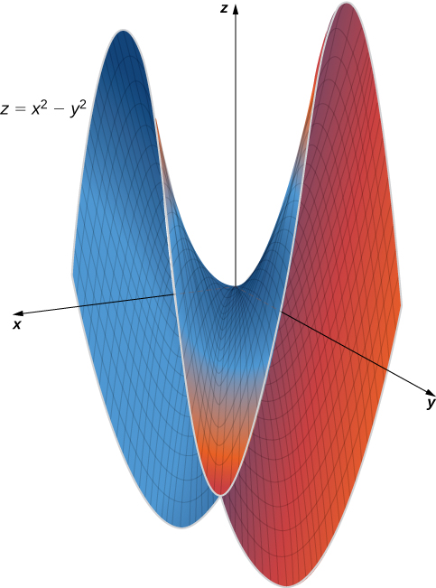
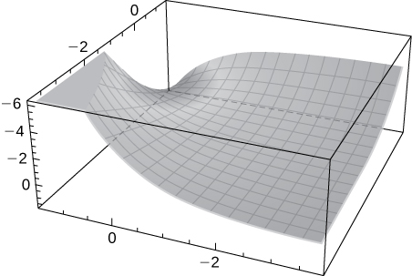
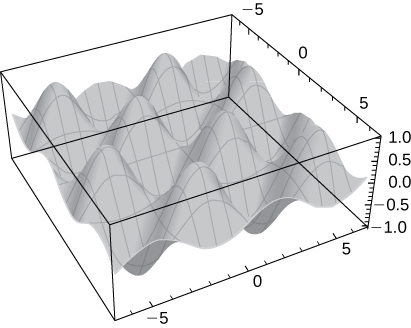

* Use partial derivatives to locate critical points for a function of two variables.
* Apply a second derivative test to identify a critical point as a local maximum, local minimum, or saddle point for a function of two variables.
* Examine critical points and boundary points to find absolute maximum and minimum values for a function of two variables.

One of the most useful applications for derivatives of a function of one variable is the determination of maximum and/or minimum values. This application is also important for functions of two or more variables, but as we have seen in earlier sections of this chapter, the introduction of more independent variables leads to more possible outcomes for the calculations. The main ideas of finding critical points and using derivative tests are still valid, but new wrinkles appear when assessing the results.

# Critical Points

For functions of a single variable, we defined critical points as the values of the function when the derivative equals zero or does not exist. For functions of two or more variables, the concept is essentially the same, except for the fact that we are now working with partial derivatives.

Definition

Let <math xmlns="http://www.w3.org/1998/Math/MathML"><mrow><mi>z</mi><mo>=</mo><mi>f</mi><mrow><mo>(</mo><mrow><mi>x</mi><mo>,</mo><mi>y</mi></mrow><mo>)</mo></mrow></mrow></math>

 be a function of two variables that is differentiable on an open set containing the point <math xmlns="http://www.w3.org/1998/Math/MathML"><mrow><mrow><mo>(</mo><mrow><msub><mi>x</mi><mn>0</mn></msub><mo>,</mo><msub><mi>y</mi><mn>0</mn></msub></mrow><mo>)</mo></mrow><mo>.</mo></mrow></math>

 The point <math xmlns="http://www.w3.org/1998/Math/MathML"><mrow><mrow><mo>(</mo><mrow><msub><mi>x</mi><mn>0</mn></msub><mo>,</mo><msub><mi>y</mi><mn>0</mn></msub></mrow><mo>)</mo></mrow></mrow></math>

 is called a **critical point of a function of two variables**{: data-type="term"} <math xmlns="http://www.w3.org/1998/Math/MathML"><mi>f</mi></math>

 if one of the two following conditions holds:

1.  <math xmlns="http://www.w3.org/1998/Math/MathML"><mrow><msub><mi>f</mi><mi>x</mi></msub><mrow><mo>(</mo><mrow><msub><mi>x</mi><mn>0</mn></msub><mo>,</mo><msub><mi>y</mi><mn>0</mn></msub></mrow><mo>)</mo></mrow><mo>=</mo><msub><mi>f</mi><mi>y</mi></msub><mrow><mo>(</mo><mrow><msub><mi>x</mi><mn>0</mn></msub><mo>,</mo><msub><mi>y</mi><mn>0</mn></msub></mrow><mo>)</mo></mrow><mo>=</mo><mn>0</mn></mrow></math>

2.  Either
    <math xmlns="http://www.w3.org/1998/Math/MathML"><mrow><msub><mi>f</mi><mi>x</mi></msub><mrow><mo>(</mo><mrow><msub><mi>x</mi><mn>0</mn></msub><mo>,</mo><msub><mi>y</mi><mn>0</mn></msub></mrow><mo>)</mo></mrow><mspace width="0.2em" /><mtext>or</mtext><mspace width="0.2em" /><msub><mi>f</mi><mi>y</mi></msub><mrow><mo>(</mo><mrow><msub><mi>x</mi><mn>0</mn></msub><mo>,</mo><msub><mi>y</mi><mn>0</mn></msub></mrow><mo>)</mo></mrow></mrow></math>
    
    does not exist.
{: data-number-style="arabic"}

Finding Critical Points

Find the critical points of each of the following functions:

1.  <math xmlns="http://www.w3.org/1998/Math/MathML"><mrow><mi>f</mi><mrow><mo>(</mo><mrow><mi>x</mi><mo>,</mo><mi>y</mi></mrow><mo>)</mo></mrow><mo>=</mo><msqrt><mrow><mn>4</mn><msup><mi>y</mi><mn>2</mn></msup><mo>−</mo><mn>9</mn><msup><mi>x</mi><mn>2</mn></msup><mo>+</mo><mn>24</mn><mi>y</mi><mo>+</mo><mn>36</mn><mi>x</mi><mo>+</mo><mn>36</mn></mrow></msqrt></mrow></math>

2.  <math xmlns="http://www.w3.org/1998/Math/MathML"><mrow><mi>g</mi><mrow><mo>(</mo><mrow><mi>x</mi><mo>,</mo><mi>y</mi></mrow><mo>)</mo></mrow><mo>=</mo><msup><mi>x</mi><mn>2</mn></msup><mo>+</mo><mn>2</mn><mi>x</mi><mi>y</mi><mo>−</mo><mn>4</mn><msup><mi>y</mi><mn>2</mn></msup><mo>+</mo><mn>4</mn><mi>x</mi><mo>−</mo><mn>6</mn><mi>y</mi><mo>+</mo><mn>4</mn></mrow></math>
{: data-number-style="lower-alpha"}

1.  First, we calculate
    <math xmlns="http://www.w3.org/1998/Math/MathML"><mrow><msub><mi>f</mi><mi>x</mi></msub><mrow><mo>(</mo><mrow><mi>x</mi><mo>,</mo><mi>y</mi></mrow><mo>)</mo></mrow><mspace width="0.2em" /><mtext>and</mtext><mspace width="0.2em" /><msub><mi>f</mi><mi>y</mi></msub><mrow><mo>(</mo><mrow><mi>x</mi><mo>,</mo><mi>y</mi></mrow><mo>)</mo></mrow><mtext>:</mtext></mrow></math>
    
    * * *
    {: data-type="newline"}
    
    

    <math xmlns="http://www.w3.org/1998/Math/MathML"><mtable><mtr><mtd columnalign="right"><msub><mi>f</mi><mi>x</mi></msub><mrow><mo>(</mo><mrow><mi>x</mi><mo>,</mo><mi>y</mi></mrow><mo>)</mo></mrow></mtd><mtd columnalign="left"><mo>=</mo></mtd><mtd columnalign="left"><mfrac><mn>1</mn><mn>2</mn></mfrac><mrow><mo>(</mo><mrow><mn>−18</mn><mi>x</mi><mo>+</mo><mn>36</mn></mrow><mo>)</mo></mrow><msup><mrow><mo>(</mo><mrow><mn>4</mn><msup><mi>y</mi><mn>2</mn></msup><mo>−</mo><mn>9</mn><msup><mi>x</mi><mn>2</mn></msup><mo>+</mo><mn>24</mn><mi>y</mi><mo>+</mo><mn>36</mn><mi>x</mi><mo>+</mo><mn>36</mn></mrow><mo>)</mo></mrow><mrow><mn>−1</mn><mtext>/</mtext><mn>2</mn></mrow></msup></mtd></mtr><mtr><mtd /><mtd columnalign="left"><mo>=</mo></mtd><mtd columnalign="left"><mfrac><mrow><mn>−9</mn><mi>x</mi><mo>+</mo><mn>18</mn></mrow><mrow><msqrt><mrow><mn>4</mn><msup><mi>y</mi><mn>2</mn></msup><mo>−</mo><mn>9</mn><msup><mi>x</mi><mn>2</mn></msup><mo>+</mo><mn>24</mn><mi>y</mi><mo>+</mo><mn>36</mn><mi>x</mi><mo>+</mo><mn>36</mn></mrow></msqrt></mrow></mfrac></mtd></mtr><mtr><mtd columnalign="right"><msub><mi>f</mi><mi>y</mi></msub><mrow><mo>(</mo><mrow><mi>x</mi><mo>,</mo><mi>y</mi></mrow><mo>)</mo></mrow></mtd><mtd columnalign="left"><mo>=</mo></mtd><mtd columnalign="left"><mfrac><mn>1</mn><mn>2</mn></mfrac><mrow><mo>(</mo><mrow><mn>8</mn><mi>y</mi><mo>+</mo><mn>24</mn></mrow><mo>)</mo></mrow><msup><mrow><mo>(</mo><mrow><mn>4</mn><msup><mi>y</mi><mn>2</mn></msup><mo>−</mo><mn>9</mn><msup><mi>x</mi><mn>2</mn></msup><mo>+</mo><mn>24</mn><mi>y</mi><mo>+</mo><mn>36</mn><mi>x</mi><mo>+</mo><mn>36</mn></mrow><mo>)</mo></mrow><mrow><mn>−1</mn><mtext>/</mtext><mn>2</mn></mrow></msup></mtd></mtr><mtr><mtd /><mtd columnalign="left"><mo>=</mo></mtd><mtd columnalign="left"><mfrac><mrow><mn>4</mn><mi>y</mi><mo>+</mo><mn>12</mn></mrow><mrow><msqrt><mrow><mn>4</mn><msup><mi>y</mi><mn>2</mn></msup><mo>−</mo><mn>9</mn><msup><mi>x</mi><mn>2</mn></msup><mo>+</mo><mn>24</mn><mi>y</mi><mo>+</mo><mn>36</mn><mi>x</mi><mo>+</mo><mn>36</mn></mrow></msqrt></mrow></mfrac><mo>.</mo></mtd></mtr></mtable></math>
    

    
    * * *
    {: data-type="newline"}
    
    Next, we set each of these expressions equal to zero:
    * * *
    {: data-type="newline"}
    
    

    <math xmlns="http://www.w3.org/1998/Math/MathML"><mtable><mtr><mtd columnalign="right"><mfrac><mrow><mn>−9</mn><mi>x</mi><mo>+</mo><mn>18</mn></mrow><mrow><msqrt><mrow><mn>4</mn><msup><mi>y</mi><mn>2</mn></msup><mo>−</mo><mn>9</mn><msup><mi>x</mi><mn>2</mn></msup><mo>+</mo><mn>24</mn><mi>y</mi><mo>+</mo><mn>36</mn><mi>x</mi><mo>+</mo><mn>36</mn></mrow></msqrt></mrow></mfrac></mtd><mtd columnalign="left"><mo>=</mo></mtd><mtd columnalign="left"><mn>0</mn></mtd></mtr><mtr><mtd columnalign="right"><mfrac><mrow><mn>4</mn><mi>y</mi><mo>+</mo><mn>12</mn></mrow><mrow><msqrt><mrow><mn>4</mn><msup><mi>y</mi><mn>2</mn></msup><mo>−</mo><mn>9</mn><msup><mi>x</mi><mn>2</mn></msup><mo>+</mo><mn>24</mn><mi>y</mi><mo>+</mo><mn>36</mn><mi>x</mi><mo>+</mo><mn>36</mn></mrow></msqrt></mrow></mfrac></mtd><mtd columnalign="left"><mo>=</mo></mtd><mtd columnalign="left"><mn>0</mn><mo>.</mo></mtd></mtr></mtable></math>
    

    
    * * *
    {: data-type="newline"}
    
    Then, multiply each equation by its common denominator:
    * * *
    {: data-type="newline"}
    
    

    <math xmlns="http://www.w3.org/1998/Math/MathML"><mtable><mtr><mtd columnalign="right"><mo>−</mo><mn>9</mn><mi>x</mi><mo>+</mo><mn>18</mn></mtd><mtd columnalign="left"><mo>=</mo></mtd><mtd columnalign="left"><mn>0</mn></mtd></mtr><mtr><mtd columnalign="right"><mn>4</mn><mi>y</mi><mo>+</mo><mn>12</mn></mtd><mtd columnalign="left"><mo>=</mo></mtd><mtd columnalign="left"><mn>0</mn><mo>.</mo></mtd></mtr></mtable></math>
    

    
    * * *
    {: data-type="newline"}
    
    Therefore,
    <math xmlns="http://www.w3.org/1998/Math/MathML"><mrow><mi>x</mi><mo>=</mo><mn>2</mn></mrow></math>
    
    and
    <math xmlns="http://www.w3.org/1998/Math/MathML"><mrow><mi>y</mi><mo>=</mo><mn>−3</mn><mo>,</mo></mrow></math>
    
    so
    <math xmlns="http://www.w3.org/1998/Math/MathML"><mrow><mrow><mo>(</mo><mrow><mn>2</mn><mo>,</mo><mn>−3</mn></mrow><mo>)</mo></mrow></mrow></math>
    
    is a critical point of
    <math xmlns="http://www.w3.org/1998/Math/MathML"><mrow><mi>f</mi><mo>.</mo></mrow></math>
    
    * * *
    {: data-type="newline"}
    
    We must also check for the possibility that the denominator of each partial derivative can equal zero, thus causing the partial derivative not to exist. Since the denominator is the same in each partial derivative, we need only do this once:
    * * *
    {: data-type="newline"}
    
    

    <math xmlns="http://www.w3.org/1998/Math/MathML"><mrow><mn>4</mn><msup><mi>y</mi><mn>2</mn></msup><mo>−</mo><mn>9</mn><msup><mi>x</mi><mn>2</mn></msup><mo>+</mo><mn>24</mn><mi>y</mi><mo>+</mo><mn>36</mn><mi>x</mi><mo>+</mo><mn>36</mn><mo>=</mo><mn>0</mn><mo>.</mo></mrow></math>
    

    
    * * *
    {: data-type="newline"}
    
    This equation represents a hyperbola. We should also note that the domain of
    <math xmlns="http://www.w3.org/1998/Math/MathML"><mi>f</mi></math>
    
    consists of points satisfying the inequality
    * * *
    {: data-type="newline"}
    
    

    <math xmlns="http://www.w3.org/1998/Math/MathML"><mrow><mn>4</mn><msup><mi>y</mi><mn>2</mn></msup><mo>−</mo><mn>9</mn><msup><mi>x</mi><mn>2</mn></msup><mo>+</mo><mn>24</mn><mi>y</mi><mo>+</mo><mn>36</mn><mi>x</mi><mo>+</mo><mn>36</mn><mo>≥</mo><mn>0</mn><mo>.</mo></mrow></math>
    

    
    * * *
    {: data-type="newline"}
    
    Therefore, any points on the hyperbola are not only critical points, they are also on the boundary of the domain. To put the hyperbola in standard form, we use the method of completing the square:
    * * *
    {: data-type="newline"}
    
    

    <math xmlns="http://www.w3.org/1998/Math/MathML"><mtable><mtr><mtd columnalign="right"><mn>4</mn><msup><mi>y</mi><mn>2</mn></msup><mo>−</mo><mn>9</mn><msup><mi>x</mi><mn>2</mn></msup><mo>+</mo><mn>24</mn><mi>y</mi><mo>+</mo><mn>36</mn><mi>x</mi><mo>+</mo><mn>36</mn></mtd><mtd columnalign="left"><mo>=</mo></mtd><mtd columnalign="left"><mn>0</mn></mtd></mtr><mtr><mtd columnalign="right"><mn>4</mn><msup><mi>y</mi><mn>2</mn></msup><mo>−</mo><mn>9</mn><msup><mi>x</mi><mn>2</mn></msup><mo>+</mo><mn>24</mn><mi>y</mi><mo>+</mo><mn>36</mn><mi>x</mi></mtd><mtd columnalign="left"><mo>=</mo></mtd><mtd columnalign="left"><mn>−36</mn></mtd></mtr><mtr><mtd columnalign="right"><mn>4</mn><msup><mi>y</mi><mn>2</mn></msup><mo>+</mo><mn>24</mn><mi>y</mi><mo>−</mo><mn>9</mn><msup><mi>x</mi><mn>2</mn></msup><mo>+</mo><mn>36</mn><mi>x</mi></mtd><mtd columnalign="left"><mo>=</mo></mtd><mtd columnalign="left"><mn>−36</mn></mtd></mtr><mtr><mtd columnalign="right"><mn>4</mn><mrow><mo>(</mo><mrow><msup><mi>y</mi><mn>2</mn></msup><mo>+</mo><mn>6</mn><mi>y</mi></mrow><mo>)</mo></mrow><mo>−</mo><mn>9</mn><mrow><mo>(</mo><mrow><msup><mi>x</mi><mn>2</mn></msup><mo>−</mo><mn>4</mn><mi>x</mi></mrow><mo>)</mo></mrow></mtd><mtd columnalign="left"><mo>=</mo></mtd><mtd columnalign="left"><mn>−36</mn></mtd></mtr><mtr><mtd columnalign="right"><mn>4</mn><mrow><mo>(</mo><mrow><msup><mi>y</mi><mn>2</mn></msup><mo>+</mo><mn>6</mn><mi>y</mi><mo>+</mo><mn>9</mn></mrow><mo>)</mo></mrow><mo>−</mo><mn>9</mn><mrow><mo>(</mo><mrow><msup><mi>x</mi><mn>2</mn></msup><mo>−</mo><mn>4</mn><mi>x</mi><mo>+</mo><mn>4</mn></mrow><mo>)</mo></mrow></mtd><mtd columnalign="left"><mo>=</mo></mtd><mtd columnalign="left"><mn>−36</mn><mo>+</mo><mn>36</mn><mo>−</mo><mn>36</mn></mtd></mtr><mtr><mtd columnalign="right"><mn>4</mn><msup><mrow><mo>(</mo><mrow><mi>y</mi><mo>+</mo><mn>3</mn></mrow><mo>)</mo></mrow><mn>2</mn></msup><mo>−</mo><mn>9</mn><msup><mrow><mo>(</mo><mrow><mi>x</mi><mo>−</mo><mn>2</mn></mrow><mo>)</mo></mrow><mn>2</mn></msup></mtd><mtd columnalign="left"><mo>=</mo></mtd><mtd columnalign="left"><mn>−36</mn><mo>.</mo></mtd></mtr></mtable></math>
    

    
    * * *
    {: data-type="newline"}
    
    Dividing both sides by
    <math xmlns="http://www.w3.org/1998/Math/MathML"><mrow><mn>−36</mn></mrow></math>
    
    puts the equation in standard form:
    * * *
    {: data-type="newline"}
    
    

    <math xmlns="http://www.w3.org/1998/Math/MathML"><mtable><mtr><mtd columnalign="right"><mfrac><mrow><mn>4</mn><msup><mrow><mrow><mo>(</mo><mrow><mi>y</mi><mo>+</mo><mn>3</mn></mrow><mo>)</mo></mrow></mrow><mn>2</mn></msup></mrow><mrow><mn>−36</mn></mrow></mfrac><mo>−</mo><mfrac><mrow><mn>9</mn><msup><mrow><mrow><mo>(</mo><mrow><mi>x</mi><mo>−</mo><mn>2</mn></mrow><mo>)</mo></mrow></mrow><mn>2</mn></msup></mrow><mrow><mn>−36</mn></mrow></mfrac></mtd><mtd columnalign="left"><mo>=</mo></mtd><mtd columnalign="left"><mn>1</mn></mtd></mtr><mtr><mtd columnalign="right"><mfrac><mrow><msup><mrow><mrow><mo>(</mo><mrow><mi>x</mi><mo>−</mo><mn>2</mn></mrow><mo>)</mo></mrow></mrow><mn>2</mn></msup></mrow><mn>4</mn></mfrac><mo>−</mo><mfrac><mrow><msup><mrow><mrow><mo>(</mo><mrow><mi>y</mi><mo>+</mo><mn>3</mn></mrow><mo>)</mo></mrow></mrow><mn>2</mn></msup></mrow><mn>9</mn></mfrac></mtd><mtd columnalign="left"><mo>=</mo></mtd><mtd columnalign="left"><mn>1</mn><mo>.</mo></mtd></mtr></mtable></math>
    

    
    * * *
    {: data-type="newline"}
    
    Notice that point
    <math xmlns="http://www.w3.org/1998/Math/MathML"><mrow><mrow><mo>(</mo><mrow><mn>2</mn><mo>,</mo><mn>−3</mn></mrow><mo>)</mo></mrow></mrow></math>
    
    is the center of the hyperbola.
2.  First, we calculate
    <math xmlns="http://www.w3.org/1998/Math/MathML"><mrow><msub><mi>g</mi><mi>x</mi></msub><mrow><mo>(</mo><mrow><mi>x</mi><mo>,</mo><mi>y</mi></mrow><mo>)</mo></mrow><mspace width="0.2em" /><mtext>and</mtext><mspace width="0.2em" /><msub><mi>g</mi><mi>y</mi></msub><mrow><mo>(</mo><mrow><mi>x</mi><mo>,</mo><mi>y</mi></mrow><mo>)</mo></mrow><mtext>:</mtext></mrow></math>
    
    * * *
    {: data-type="newline"}
    
    

    <math xmlns="http://www.w3.org/1998/Math/MathML"><mtable><mtr><mtd columnalign="right"><msub><mi>g</mi><mi>x</mi></msub><mrow><mo>(</mo><mrow><mi>x</mi><mo>,</mo><mi>y</mi></mrow><mo>)</mo></mrow></mtd><mtd columnalign="left"><mo>=</mo></mtd><mtd columnalign="left"><mn>2</mn><mi>x</mi><mo>+</mo><mn>2</mn><mi>y</mi><mo>+</mo><mn>4</mn></mtd></mtr><mtr><mtd columnalign="right"><msub><mi>g</mi><mi>y</mi></msub><mrow><mo>(</mo><mrow><mi>x</mi><mo>,</mo><mi>y</mi></mrow><mo>)</mo></mrow></mtd><mtd columnalign="left"><mo>=</mo></mtd><mtd columnalign="left"><mn>2</mn><mi>x</mi><mo>−</mo><mn>8</mn><mi>y</mi><mo>−</mo><mn>6</mn><mo>.</mo></mtd></mtr></mtable></math>
    

    
    * * *
    {: data-type="newline"}
    
    Next, we set each of these expressions equal to zero, which gives a system of equations in
    <math xmlns="http://www.w3.org/1998/Math/MathML"><mrow><mi>x</mi><mspace width="0.2em" /><mtext>and</mtext><mspace width="0.2em" /><mi>y</mi><mtext>:</mtext></mrow></math>
    
    * * *
    {: data-type="newline"}
    
    

    <math xmlns="http://www.w3.org/1998/Math/MathML"><mtable><mtr><mtd columnalign="right"><mn>2</mn><mi>x</mi><mo>+</mo><mn>2</mn><mi>y</mi><mo>+</mo><mn>4</mn></mtd><mtd columnalign="left"><mo>=</mo></mtd><mtd columnalign="left"><mn>0</mn></mtd></mtr><mtr><mtd columnalign="right"><mn>2</mn><mi>x</mi><mo>−</mo><mn>8</mn><mi>y</mi><mo>−</mo><mn>6</mn></mtd><mtd columnalign="left"><mo>=</mo></mtd><mtd columnalign="left"><mn>0</mn><mo>.</mo></mtd></mtr></mtable></math>
    

    
    * * *
    {: data-type="newline"}
    
    Subtracting the second equation from the first gives
    <math xmlns="http://www.w3.org/1998/Math/MathML"><mrow><mn>10</mn><mi>y</mi><mo>+</mo><mn>10</mn><mo>=</mo><mn>0</mn><mo>,</mo><mspace width="0.2em" /><mtext>so</mtext><mspace width="0.2em" /><mi>y</mi><mo>=</mo><mn>−1</mn><mo>.</mo></mrow></math>
    
    Substituting this into the first equation gives
    <math xmlns="http://www.w3.org/1998/Math/MathML"><mrow><mn>2</mn><mi>x</mi><mo>+</mo><mn>2</mn><mrow><mo>(</mo><mrow><mn>−1</mn></mrow><mo>)</mo></mrow><mo>+</mo><mn>4</mn><mo>=</mo><mn>0</mn><mo>,</mo></mrow></math>
    
    so
    <math xmlns="http://www.w3.org/1998/Math/MathML"><mrow><mi>x</mi><mo>=</mo><mn>−1</mn><mo>.</mo></mrow></math>
    
    Therefore
    <math xmlns="http://www.w3.org/1998/Math/MathML"><mrow><mrow><mo>(</mo><mrow><mn>−1</mn><mo>,</mo><mn>−1</mn></mrow><mo>)</mo></mrow></mrow></math>
    
    is a critical point of
    <math xmlns="http://www.w3.org/1998/Math/MathML"><mi>g</mi></math>
    
    ([[link]](#CNX_Calc_Figure_14_07_006)). There are no points in
    <math xmlns="http://www.w3.org/1998/Math/MathML"><mrow><msup><mi>ℝ</mi><mn>2</mn></msup></mrow></math>
    
    that make either partial derivative not exist.
    * * *
    {: data-type="newline"}
    
     has a critical point at (&#x2212;1,&#x2212;1,6)."){: #CNX_Calc_Figure_14_07_006}

{: data-number-style="lower-alpha"}

Find the critical point of the function <math xmlns="http://www.w3.org/1998/Math/MathML"><mrow><mi>f</mi><mrow><mo>(</mo><mrow><mi>x</mi><mo>,</mo><mi>y</mi></mrow><mo>)</mo></mrow><mo>=</mo><mi>x</mi><mn>3</mn><mo>+</mo><mn>2</mn><mi>x</mi><mi>y</mi><mo>−</mo><mn>2</mn><mi>x</mi><mo>−</mo><mn>4</mn><mi>y</mi><mo>.</mo></mrow></math>

<math xmlns="http://www.w3.org/1998/Math/MathML"><mrow><mrow><mo>(</mo><mrow><mn>2</mn><mo>,</mo><mn>−5</mn></mrow><mo>)</mo></mrow></mrow></math>

Hint

Calculate <math xmlns="http://www.w3.org/1998/Math/MathML"><mrow><msub><mi>f</mi><mi>x</mi></msub><mrow><mo>(</mo><mrow><mi>x</mi><mo>,</mo><mi>y</mi></mrow><mo>)</mo></mrow></mrow></math>

 and <math xmlns="http://www.w3.org/1998/Math/MathML"><mrow><msub><mi>f</mi><mi>y</mi></msub><mrow><mo>(</mo><mrow><mi>x</mi><mo>,</mo><mi>y</mi></mrow><mo>)</mo></mrow><mo>,</mo></mrow></math>

 then set them equal to zero.

The main purpose for determining critical points is to locate relative maxima and minima, as in single-variable calculus. When working with a function of one variable, the definition of a local extremum involves finding an interval around the critical point such that the function value is either greater than or less than all the other function values in that interval. When working with a function of two or more variables, we work with an open disk around the point.

Definition

Let <math xmlns="http://www.w3.org/1998/Math/MathML"><mrow><mi>z</mi><mo>=</mo><mi>f</mi><mrow><mo>(</mo><mrow><mi>x</mi><mo>,</mo><mi>y</mi></mrow><mo>)</mo></mrow></mrow></math>

 be a function of two variables that is defined and continuous on an open set containing the point <math xmlns="http://www.w3.org/1998/Math/MathML"><mrow><mrow><mo>(</mo><mrow><msub><mi>x</mi><mn>0</mn></msub><mo>,</mo><msub><mi>y</mi><mn>0</mn></msub></mrow><mo>)</mo></mrow><mo>.</mo></mrow></math>

 Then *f* has a *local maximum* at <math xmlns="http://www.w3.org/1998/Math/MathML"><mrow><mrow><mo>(</mo><mrow><msub><mi>x</mi><mn>0</mn></msub><mo>,</mo><msub><mi>y</mi><mn>0</mn></msub></mrow><mo>)</mo></mrow></mrow></math>

 if

<math xmlns="http://www.w3.org/1998/Math/MathML"><mrow><mi>f</mi><mrow><mo>(</mo><mrow><msub><mi>x</mi><mn>0</mn></msub><mo>,</mo><msub><mi>y</mi><mn>0</mn></msub></mrow><mo>)</mo></mrow><mo>≥</mo><mi>f</mi><mrow><mo>(</mo><mrow><mi>x</mi><mo>,</mo><mi>y</mi></mrow><mo>)</mo></mrow></mrow></math>

for all points <math xmlns="http://www.w3.org/1998/Math/MathML"><mrow><mrow><mo>(</mo><mrow><mi>x</mi><mo>,</mo><mi>y</mi></mrow><mo>)</mo></mrow></mrow></math>

 within some disk centered at <math xmlns="http://www.w3.org/1998/Math/MathML"><mrow><mrow><mo>(</mo><mrow><msub><mi>x</mi><mn>0</mn></msub><mo>,</mo><msub><mi>y</mi><mn>0</mn></msub></mrow><mo>)</mo></mrow><mo>.</mo></mrow></math>

 The number <math xmlns="http://www.w3.org/1998/Math/MathML"><mrow><mi>f</mi><mrow><mo>(</mo><mrow><msub><mi>x</mi><mn>0</mn></msub><mo>,</mo><msub><mi>y</mi><mn>0</mn></msub></mrow><mo>)</mo></mrow></mrow></math>

 is called a *local maximum value*. If the preceding inequality holds for every point <math xmlns="http://www.w3.org/1998/Math/MathML"><mrow><mrow><mo>(</mo><mrow><mi>x</mi><mo>,</mo><mi>y</mi></mrow><mo>)</mo></mrow></mrow></math>

 in the domain of <math xmlns="http://www.w3.org/1998/Math/MathML"><mrow><mi>f</mi><mo>,</mo></mrow></math>

 then <math xmlns="http://www.w3.org/1998/Math/MathML"><mi>f</mi></math>

 has a *global maximum* (also called an *absolute maximum*) at <math xmlns="http://www.w3.org/1998/Math/MathML"><mrow><mrow><mo>(</mo><mrow><msub><mi>x</mi><mn>0</mn></msub><mo>,</mo><msub><mi>y</mi><mn>0</mn></msub></mrow><mo>)</mo></mrow><mo>.</mo></mrow></math>

The function <math xmlns="http://www.w3.org/1998/Math/MathML"><mi>f</mi></math>

 has a *local minimum* at <math xmlns="http://www.w3.org/1998/Math/MathML"><mrow><mrow><mo>(</mo><mrow><msub><mi>x</mi><mn>0</mn></msub><mo>,</mo><msub><mi>y</mi><mn>0</mn></msub></mrow><mo>)</mo></mrow></mrow></math>

 if

<math xmlns="http://www.w3.org/1998/Math/MathML"><mrow><mi>f</mi><mrow><mo>(</mo><mrow><msub><mi>x</mi><mn>0</mn></msub><mo>,</mo><msub><mi>y</mi><mn>0</mn></msub></mrow><mo>)</mo></mrow><mo>≤</mo><mi>f</mi><mrow><mo>(</mo><mrow><mi>x</mi><mo>,</mo><mi>y</mi></mrow><mo>)</mo></mrow></mrow></math>

for all points <math xmlns="http://www.w3.org/1998/Math/MathML"><mrow><mrow><mo>(</mo><mrow><mi>x</mi><mo>,</mo><mi>y</mi></mrow><mo>)</mo></mrow></mrow></math>

 within some disk centered at <math xmlns="http://www.w3.org/1998/Math/MathML"><mrow><mrow><mo>(</mo><mrow><msub><mi>x</mi><mn>0</mn></msub><mo>,</mo><msub><mi>y</mi><mn>0</mn></msub></mrow><mo>)</mo></mrow><mo>.</mo></mrow></math>

 The number <math xmlns="http://www.w3.org/1998/Math/MathML"><mrow><mi>f</mi><mrow><mo>(</mo><mrow><msub><mi>x</mi><mn>0</mn></msub><mo>,</mo><msub><mi>y</mi><mn>0</mn></msub></mrow><mo>)</mo></mrow></mrow></math>

 is called a *local minimum value*. If the preceding inequality holds for every point <math xmlns="http://www.w3.org/1998/Math/MathML"><mrow><mrow><mo>(</mo><mrow><mi>x</mi><mo>,</mo><mi>y</mi></mrow><mo>)</mo></mrow></mrow></math>

 in the domain of <math xmlns="http://www.w3.org/1998/Math/MathML"><mrow><mi>f</mi><mo>,</mo></mrow></math>

 then <math xmlns="http://www.w3.org/1998/Math/MathML"><mi>f</mi></math>

 has a *global minimum* (also called an *absolute minimum*) at <math xmlns="http://www.w3.org/1998/Math/MathML"><mrow><mrow><mo>(</mo><mrow><msub><mi>x</mi><mn>0</mn></msub><mo>,</mo><msub><mi>y</mi><mn>0</mn></msub></mrow><mo>)</mo></mrow><mo>.</mo></mrow></math>

If <math xmlns="http://www.w3.org/1998/Math/MathML"><mrow><mi>f</mi><mrow><mo>(</mo><mrow><msub><mi>x</mi><mn>0</mn></msub><mo>,</mo><msub><mi>y</mi><mn>0</mn></msub></mrow><mo>)</mo></mrow></mrow></math>

 is either a local maximum or local minimum value, then it is called a ***local extremum***{: data-type="term" .no-emphasis} (see the following figure).

 =(0,0). It attains its minimum value at the boundary of its domain, which is the circle x2+y2=16."){: #CNX_Calc_Figure_14_07_001}

In [Maxima and Minima](/m53611){: .target-chapter}, we showed that extrema of functions of one variable occur at critical points. The same is true for functions of more than one variable, as stated in the following theorem.

Fermat’s Theorem for Functions of Two Variables

Let <math xmlns="http://www.w3.org/1998/Math/MathML"><mrow><mi>z</mi><mo>=</mo><mi>f</mi><mrow><mo>(</mo><mrow><mi>x</mi><mo>,</mo><mi>y</mi></mrow><mo>)</mo></mrow></mrow></math>

 be a function of two variables that is defined and continuous on an open set containing the point <math xmlns="http://www.w3.org/1998/Math/MathML"><mrow><mo stretchy="false">(</mo><msub><mi>x</mi><mn>0</mn></msub><mo>,</mo><msub><mi>y</mi><mn>0</mn></msub><mo stretchy="false">)</mo><mo>.</mo></mrow></math>

 Suppose <math xmlns="http://www.w3.org/1998/Math/MathML"><mrow><msub><mi>f</mi><mi>x</mi></msub></mrow></math>

 and <math xmlns="http://www.w3.org/1998/Math/MathML"><mrow><msub><mi>f</mi><mi>y</mi></msub></mrow></math>

 each exists at <math xmlns="http://www.w3.org/1998/Math/MathML"><mrow><mrow><mo>(</mo><mrow><msub><mi>x</mi><mn>0</mn></msub><mo>,</mo><msub><mi>y</mi><mn>0</mn></msub></mrow><mo>)</mo></mrow><mo>.</mo></mrow></math>

 If <math xmlns="http://www.w3.org/1998/Math/MathML"><mi>f</mi></math>

 has a local extremum at <math xmlns="http://www.w3.org/1998/Math/MathML"><mrow><mrow><mo>(</mo><mrow><msub><mi>x</mi><mn>0</mn></msub><mo>,</mo><msub><mi>y</mi><mn>0</mn></msub></mrow><mo>)</mo></mrow><mo>,</mo></mrow></math>

 then <math xmlns="http://www.w3.org/1998/Math/MathML"><mrow><mrow><mo>(</mo><mrow><msub><mi>x</mi><mn>0</mn></msub><mo>,</mo><msub><mi>y</mi><mn>0</mn></msub></mrow><mo>)</mo></mrow></mrow></math>

 is a critical point of <math xmlns="http://www.w3.org/1998/Math/MathML"><mrow><mi>f</mi><mo>.</mo></mrow></math>

# Second Derivative Test

Consider the function <math xmlns="http://www.w3.org/1998/Math/MathML"><mrow><mi>f</mi><mrow><mo>(</mo><mi>x</mi><mo>)</mo></mrow><mo>=</mo><msup><mi>x</mi><mn>3</mn></msup><mo>.</mo></mrow></math>

 This function has a critical point at <math xmlns="http://www.w3.org/1998/Math/MathML"><mrow><mi>x</mi><mo>=</mo><mn>0</mn><mo>,</mo></mrow></math>

 since <math xmlns="http://www.w3.org/1998/Math/MathML"><mrow><mi>f</mi><mo>′</mo><mrow><mo>(</mo><mn>0</mn><mo>)</mo></mrow><mo>=</mo><mn>3</mn><msup><mrow><mrow><mo>(</mo><mn>0</mn><mo>)</mo></mrow></mrow><mn>2</mn></msup><mo>=</mo><mn>0</mn><mo>.</mo></mrow></math>

 However, <math xmlns="http://www.w3.org/1998/Math/MathML"><mi>f</mi></math>

 does not have an extreme value at <math xmlns="http://www.w3.org/1998/Math/MathML"><mrow><mi>x</mi><mo>=</mo><mn>0</mn><mo>.</mo></mrow></math>

 Therefore, the existence of a critical value at <math xmlns="http://www.w3.org/1998/Math/MathML"><mrow><mi>x</mi><mo>=</mo><msub><mi>x</mi><mn>0</mn></msub></mrow></math>

 does not guarantee a local extremum at <math xmlns="http://www.w3.org/1998/Math/MathML"><mrow><mi>x</mi><mo>=</mo><msub><mi>x</mi><mn>0</mn></msub><mo>.</mo></mrow></math>

 The same is true for a function of two or more variables. One way this can happen is at a **saddle point**{: data-type="term"}. An example of a saddle point appears in the following figure.

 {: #CNX_Calc_Figure_14_07_002}

In this graph, the origin is a saddle point. This is because the first partial derivatives of <math xmlns="http://www.w3.org/1998/Math/MathML"><mrow><mi>f</mi><mrow><mo>(</mo><mrow><mi>x</mi><mo>,</mo><mi>y</mi></mrow><mo>)</mo></mrow><mo>=</mo><msup><mi>x</mi><mn>2</mn></msup><mo>−</mo><msup><mi>y</mi><mn>2</mn></msup></mrow></math>

 are both equal to zero at this point, but it is neither a maximum nor a minimum for the function. Furthermore the vertical trace corresponding to <math xmlns="http://www.w3.org/1998/Math/MathML"><mrow><mi>y</mi><mo>=</mo><mn>0</mn></mrow></math>

 is <math xmlns="http://www.w3.org/1998/Math/MathML"><mrow><mi>z</mi><mo>=</mo><msup><mi>x</mi><mn>2</mn></msup></mrow></math>

 (a parabola opening upward), but the vertical trace corresponding to <math xmlns="http://www.w3.org/1998/Math/MathML"><mrow><mi>x</mi><mo>=</mo><mn>0</mn></mrow></math>

 is <math xmlns="http://www.w3.org/1998/Math/MathML"><mrow><mi>z</mi><mo>=</mo><mtext>−</mtext><msup><mi>y</mi><mn>2</mn></msup></mrow></math>

 (a parabola opening downward). Therefore, it is both a global maximum for one trace and a global minimum for another.

Definition

Given the function <math xmlns="http://www.w3.org/1998/Math/MathML"><mrow><mi>z</mi><mo>=</mo><mi>f</mi><mrow><mo>(</mo><mrow><mi>x</mi><mo>,</mo><mi>y</mi></mrow><mo>)</mo></mrow><mo>,</mo></mrow></math>

 the point <math xmlns="http://www.w3.org/1998/Math/MathML"><mrow><mrow><mo>(</mo><mrow><msub><mi>x</mi><mn>0</mn></msub><mo>,</mo><msub><mi>y</mi><mn>0</mn></msub><mo>,</mo><mi>f</mi><mrow><mo>(</mo><mrow><msub><mi>x</mi><mn>0</mn></msub><mo>,</mo><msub><mi>y</mi><mn>0</mn></msub></mrow><mo>)</mo></mrow></mrow><mo>)</mo></mrow></mrow></math>

 is a saddle point if both <math xmlns="http://www.w3.org/1998/Math/MathML"><mrow><msub><mi>f</mi><mn>0</mn></msub><mrow><mo>(</mo><mrow><msub><mi>x</mi><mn>0</mn></msub><mo>,</mo><msub><mi>y</mi><mn>0</mn></msub></mrow><mo>)</mo></mrow><mo>=</mo><mn>0</mn></mrow></math>

 and <math xmlns="http://www.w3.org/1998/Math/MathML"><mrow><msub><mi>f</mi><mi>y</mi></msub><mrow><mo>(</mo><mrow><msub><mi>x</mi><mn>0</mn></msub><mo>,</mo><msub><mi>y</mi><mn>0</mn></msub></mrow><mo>)</mo></mrow><mo>=</mo><mn>0</mn><mo>,</mo></mrow></math>

 but <math xmlns="http://www.w3.org/1998/Math/MathML"><mi>f</mi></math>

 does not have a local extremum at <math xmlns="http://www.w3.org/1998/Math/MathML"><mrow><mrow><mo>(</mo><mrow><msub><mi>x</mi><mn>0</mn></msub><mo>,</mo><msub><mi>y</mi><mn>0</mn></msub></mrow><mo>)</mo></mrow><mo>.</mo></mrow></math>

The second derivative test for a function of one variable provides a method for determining whether an extremum occurs at a critical point of a function. When extending this result to a function of two variables, an issue arises related to the fact that there are, in fact, four different second-order partial derivatives, although equality of mixed partials reduces this to three. The second derivative test for a function of two variables, stated in the following theorem, uses a **discriminant**{: data-type="term"} <math xmlns="http://www.w3.org/1998/Math/MathML"><mi>D</mi></math>

 that replaces <math xmlns="http://www.w3.org/1998/Math/MathML"><mrow><mi>f</mi><mtext>″</mtext><mrow><mo>(</mo><mrow><msub><mi>x</mi><mn>0</mn></msub></mrow><mo>)</mo></mrow></mrow></math>

 in the second derivative test for a function of one variable.

Second Derivative Test

Let <math xmlns="http://www.w3.org/1998/Math/MathML"><mrow><mi>z</mi><mo>=</mo><mi>f</mi><mrow><mo>(</mo><mrow><mi>x</mi><mo>,</mo><mi>y</mi></mrow><mo>)</mo></mrow></mrow></math>

 be a function of two variables for which the first- and second-order partial derivatives are continuous on some disk containing the point <math xmlns="http://www.w3.org/1998/Math/MathML"><mrow><mrow><mo>(</mo><mrow><msub><mi>x</mi><mn>0</mn></msub><mo>,</mo><msub><mi>y</mi><mn>0</mn></msub></mrow><mo>)</mo></mrow><mo>.</mo></mrow></math>

 Suppose <math xmlns="http://www.w3.org/1998/Math/MathML"><mrow><msub><mi>f</mi><mi>x</mi></msub><mrow><mo>(</mo><mrow><msub><mi>x</mi><mn>0</mn></msub><mo>,</mo><msub><mi>y</mi><mn>0</mn></msub></mrow><mo>)</mo></mrow><mo>=</mo><mn>0</mn></mrow></math>

 and <math xmlns="http://www.w3.org/1998/Math/MathML"><mrow><msub><mi>f</mi><mi>y</mi></msub><mrow><mo>(</mo><mrow><msub><mi>x</mi><mn>0</mn></msub><mo>,</mo><msub><mi>y</mi><mn>0</mn></msub></mrow><mo>)</mo></mrow><mo>=</mo><mn>0</mn><mo>.</mo></mrow></math>

 Define the quantity

<math xmlns="http://www.w3.org/1998/Math/MathML"><mrow><mi>D</mi><mo>=</mo><msub><mi>f</mi><mrow><mi>x</mi><mi>x</mi></mrow></msub><mrow><mo>(</mo><mrow><msub><mi>x</mi><mn>0</mn></msub><mo>,</mo><msub><mi>y</mi><mn>0</mn></msub></mrow><mo>)</mo></mrow><msub><mi>f</mi><mrow><mi>y</mi><mi>y</mi></mrow></msub><mrow><mo>(</mo><mrow><msub><mi>x</mi><mn>0</mn></msub><mo>,</mo><msub><mi>y</mi><mn>0</mn></msub></mrow><mo>)</mo></mrow><mo>−</mo><msup><mrow><mrow><mo>(</mo><mrow><msub><mi>f</mi><mrow><mi>x</mi><mi>y</mi></mrow></msub><mrow><mo>(</mo><mrow><msub><mi>x</mi><mn>0</mn></msub><mo>,</mo><msub><mi>y</mi><mn>0</mn></msub></mrow><mo>)</mo></mrow></mrow><mo>)</mo></mrow></mrow><mn>2</mn></msup><mo>.</mo></mrow></math>

1.  If
    <math xmlns="http://www.w3.org/1998/Math/MathML"><mrow><mi>D</mi><mo>&gt;</mo><mn>0</mn></mrow></math>
    
    and
    <math xmlns="http://www.w3.org/1998/Math/MathML"><mrow><msub><mi>f</mi><mrow><mi>x</mi><mi>x</mi></mrow></msub><mrow><mo>(</mo><mrow><msub><mi>x</mi><mn>0</mn></msub><mo>,</mo><msub><mi>y</mi><mn>0</mn></msub></mrow><mo>)</mo></mrow><mo>&gt;</mo><mn>0</mn><mo>,</mo></mrow></math>
    
    then
    <math xmlns="http://www.w3.org/1998/Math/MathML"><mi>f</mi></math>
    
    has a local minimum at
    <math xmlns="http://www.w3.org/1998/Math/MathML"><mrow><mrow><mo>(</mo><mrow><msub><mi>x</mi><mn>0</mn></msub><mo>,</mo><msub><mi>y</mi><mn>0</mn></msub></mrow><mo>)</mo></mrow><mo>.</mo></mrow></math>

2.  If
    <math xmlns="http://www.w3.org/1998/Math/MathML"><mrow><mi>D</mi><mo>&gt;</mo><mn>0</mn></mrow></math>
    
    and
    <math xmlns="http://www.w3.org/1998/Math/MathML"><mrow><msub><mi>f</mi><mrow><mi>x</mi><mi>x</mi></mrow></msub><mrow><mo>(</mo><mrow><msub><mi>x</mi><mn>0</mn></msub><mo>,</mo><msub><mi>y</mi><mn>0</mn></msub></mrow><mo>)</mo></mrow><mo>&lt;</mo><mn>0</mn><mo>,</mo></mrow></math>
    
    then
    <math xmlns="http://www.w3.org/1998/Math/MathML"><mi>f</mi></math>
    
    has a local maximum at
    <math xmlns="http://www.w3.org/1998/Math/MathML"><mrow><mrow><mo>(</mo><mrow><msub><mi>x</mi><mn>0</mn></msub><mo>,</mo><msub><mi>y</mi><mn>0</mn></msub></mrow><mo>)</mo></mrow><mo>.</mo></mrow></math>

3.  If
    <math xmlns="http://www.w3.org/1998/Math/MathML"><mrow><mi>D</mi><mo>&lt;</mo><mn>0</mn><mo>,</mo><mo>,</mo></mrow></math>
    
    then
    <math xmlns="http://www.w3.org/1998/Math/MathML"><mi>f</mi></math>
    
    has a saddle point at
    <math xmlns="http://www.w3.org/1998/Math/MathML"><mrow><mrow><mo>(</mo><mrow><msub><mi>x</mi><mn>0</mn></msub><mo>,</mo><msub><mi>y</mi><mn>0</mn></msub></mrow><mo>)</mo></mrow><mo>.</mo></mrow></math>

4.  If
    <math xmlns="http://www.w3.org/1998/Math/MathML"><mrow><mi>D</mi><mo>=</mo><mn>0</mn><mo>,</mo></mrow></math>
    
    then the test is inconclusive.
{: data-number-style="lower-roman"}

See [\[link\]](#CNX_Calc_Figure_14_07_007).

 , a local maxima (b), or a saddle point (c)."){: #CNX_Calc_Figure_14_07_007}

To apply the second derivative test, it is necessary that we first find the critical points of the function. There are several steps involved in the entire procedure, which are outlined in a problem-solving strategy.

Problem-Solving Strategy: Using the Second Derivative Test for Functions of Two Variables

Let <math xmlns="http://www.w3.org/1998/Math/MathML"><mrow><mi>z</mi><mo>=</mo><mi>f</mi><mrow><mo>(</mo><mrow><mi>x</mi><mo>,</mo><mi>y</mi></mrow><mo>)</mo></mrow></mrow></math>

 be a function of two variables for which the first- and second-order partial derivatives are continuous on some disk containing the point <math xmlns="http://www.w3.org/1998/Math/MathML"><mrow><mrow><mo>(</mo><mrow><msub><mi>x</mi><mn>0</mn></msub><mo>,</mo><msub><mi>y</mi><mn>0</mn></msub></mrow><mo>)</mo></mrow><mo>.</mo></mrow></math>

 To apply the second derivative test to find local extrema, use the following steps:

1.  Determine the critical points
    <math xmlns="http://www.w3.org/1998/Math/MathML"><mrow><mrow><mo>(</mo><mrow><msub><mi>x</mi><mn>0</mn></msub><mo>,</mo><msub><mi>y</mi><mn>0</mn></msub></mrow><mo>)</mo></mrow></mrow></math>
    
    of the function
    <math xmlns="http://www.w3.org/1998/Math/MathML"><mi>f</mi></math>
    
    where
    <math xmlns="http://www.w3.org/1998/Math/MathML"><mrow><msub><mi>f</mi><mi>x</mi></msub><mrow><mo>(</mo><mrow><msub><mi>x</mi><mn>0</mn></msub><mo>,</mo><msub><mi>y</mi><mn>0</mn></msub></mrow><mo>)</mo></mrow><mo>=</mo><msub><mi>f</mi><mi>y</mi></msub><mrow><mo>(</mo><mrow><msub><mi>x</mi><mn>0</mn></msub><mo>,</mo><msub><mi>y</mi><mn>0</mn></msub></mrow><mo>)</mo></mrow><mo>=</mo><mn>0</mn><mo>.</mo></mrow></math>
    
    Discard any points where at least one of the partial derivatives does not exist.
2.  Calculate the discriminant
    <math xmlns="http://www.w3.org/1998/Math/MathML"><mrow><mi>D</mi><mo>=</mo><msub><mi>f</mi><mrow><mi>x</mi><mi>x</mi></mrow></msub><mrow><mo>(</mo><mrow><msub><mi>x</mi><mn>0</mn></msub><mo>,</mo><msub><mi>y</mi><mn>0</mn></msub></mrow><mo>)</mo></mrow><msub><mi>f</mi><mrow><mi>y</mi><mi>y</mi></mrow></msub><mrow><mo>(</mo><mrow><msub><mi>x</mi><mn>0</mn></msub><mo>,</mo><msub><mi>y</mi><mn>0</mn></msub></mrow><mo>)</mo></mrow><mo>−</mo><msup><mrow><mrow><mo>(</mo><mrow><msub><mi>f</mi><mrow><mi>x</mi><mi>y</mi></mrow></msub><mrow><mo>(</mo><mrow><msub><mi>x</mi><mn>0</mn></msub><mo>,</mo><msub><mi>y</mi><mn>0</mn></msub></mrow><mo>)</mo></mrow></mrow><mo>)</mo></mrow></mrow><mn>2</mn></msup></mrow></math>
    
    for each critical point of
    <math xmlns="http://www.w3.org/1998/Math/MathML"><mrow><mi>f</mi><mo>.</mo></mrow></math>

3.  Apply [\[link\]](#fs-id1167793873509) to determine whether each critical point is a local maximum, local minimum, or saddle point, or whether the theorem is inconclusive.
{: data-number-style="arabic"}

Using the Second Derivative Test

Find the critical points for each of the following functions, and use the second derivative test to find the local extrema:

1.  <math xmlns="http://www.w3.org/1998/Math/MathML"><mrow><mi>f</mi><mrow><mo>(</mo><mrow><mi>x</mi><mo>,</mo><mi>y</mi></mrow><mo>)</mo></mrow><mo>=</mo><mn>4</mn><msup><mi>x</mi><mn>2</mn></msup><mo>+</mo><mn>9</mn><msup><mi>y</mi><mn>2</mn></msup><mo>+</mo><mn>8</mn><mi>x</mi><mo>−</mo><mn>36</mn><mi>y</mi><mo>+</mo><mn>24</mn></mrow></math>

2.  <math xmlns="http://www.w3.org/1998/Math/MathML"><mrow><mi>g</mi><mrow><mo>(</mo><mrow><mi>x</mi><mo>,</mo><mi>y</mi></mrow><mo>)</mo></mrow><mo>=</mo><mfrac><mn>1</mn><mn>3</mn></mfrac><msup><mi>x</mi><mn>3</mn></msup><mo>+</mo><msup><mi>y</mi><mn>2</mn></msup><mo>+</mo><mn>2</mn><mi>x</mi><mi>y</mi><mo>−</mo><mn>6</mn><mi>x</mi><mo>−</mo><mn>3</mn><mi>y</mi><mo>+</mo><mn>4</mn></mrow></math>
{: data-number-style="lower-alpha"}

1.  Step
    <math xmlns="http://www.w3.org/1998/Math/MathML"><mn>1</mn></math>
    
    of the problem-solving strategy involves finding the critical points of
    <math xmlns="http://www.w3.org/1998/Math/MathML"><mrow><mi>f</mi><mo>.</mo></mrow></math>
    
    To do this, we first calculate
    <math xmlns="http://www.w3.org/1998/Math/MathML"><mrow><msub><mi>f</mi><mi>x</mi></msub><mrow><mo>(</mo><mrow><mi>x</mi><mo>,</mo><mi>y</mi></mrow><mo>)</mo></mrow></mrow></math>
    
    and
    <math xmlns="http://www.w3.org/1998/Math/MathML"><mrow><msub><mi>f</mi><mi>y</mi></msub><mrow><mo>(</mo><mrow><mi>x</mi><mo>,</mo><mi>y</mi></mrow><mo>)</mo></mrow><mo>,</mo></mrow></math>
    
    then set each of them equal to zero:
    * * *
    {: data-type="newline"}
    
    

    <math xmlns="http://www.w3.org/1998/Math/MathML"><mtable><mtr><mtd columnalign="right"><msub><mi>f</mi><mi>x</mi></msub><mrow><mo>(</mo><mrow><mi>x</mi><mo>,</mo><mi>y</mi></mrow><mo>)</mo></mrow></mtd><mtd columnalign="left"><mo>=</mo></mtd><mtd columnalign="left"><mn>8</mn><mi>x</mi><mo>+</mo><mn>8</mn></mtd></mtr><mtr><mtd columnalign="right"><msub><mi>f</mi><mi>y</mi></msub><mrow><mo>(</mo><mrow><mi>x</mi><mo>,</mo><mi>y</mi></mrow><mo>)</mo></mrow></mtd><mtd columnalign="left"><mo>=</mo></mtd><mtd columnalign="left"><mn>18</mn><mi>y</mi><mo>−</mo><mn>36</mn><mo>.</mo></mtd></mtr></mtable></math>
    

    
    * * *
    {: data-type="newline"}
    
    Setting them equal to zero yields the system of equations
    * * *
    {: data-type="newline"}
    
    

    <math xmlns="http://www.w3.org/1998/Math/MathML"><mtable><mtr><mtd columnalign="right"><mn>8</mn><mi>x</mi><mo>+</mo><mn>8</mn></mtd><mtd columnalign="left"><mo>=</mo></mtd><mtd columnalign="left"><mn>0</mn></mtd></mtr><mtr><mtd columnalign="right"><mn>18</mn><mi>y</mi><mo>−</mo><mn>36</mn></mtd><mtd columnalign="left"><mo>=</mo></mtd><mtd columnalign="left"><mn>0</mn><mo>.</mo></mtd></mtr></mtable></math>
    

    
    * * *
    {: data-type="newline"}
    
    The solution to this system is
    <math xmlns="http://www.w3.org/1998/Math/MathML"><mrow><mi>x</mi><mo>=</mo><mn>−1</mn></mrow></math>
    
    and
    <math xmlns="http://www.w3.org/1998/Math/MathML"><mrow><mi>y</mi><mo>=</mo><mn>2</mn><mo>.</mo></mrow></math>
    
    Therefore
    <math xmlns="http://www.w3.org/1998/Math/MathML"><mrow><mrow><mo>(</mo><mrow><mn>−1</mn><mo>,</mo><mn>2</mn></mrow><mo>)</mo></mrow></mrow></math>
    
    is a critical point of
    <math xmlns="http://www.w3.org/1998/Math/MathML"><mrow><mi>f</mi><mo>.</mo></mrow></math>
    
    * * *
    {: data-type="newline"}
    
    Step 2 of the problem-solving strategy involves calculating
    <math xmlns="http://www.w3.org/1998/Math/MathML"><mrow><mi>D</mi><mo>.</mo></mrow></math>
    
    To do this, we first calculate the second partial derivatives of
    <math xmlns="http://www.w3.org/1998/Math/MathML"><mi>f</mi><mtext>:</mtext></math>
    
    * * *
    {: data-type="newline"}
    
    

    <math xmlns="http://www.w3.org/1998/Math/MathML"><mtable><mtr><mtd columnalign="right"><msub><mi>f</mi><mrow><mi>x</mi><mi>x</mi></mrow></msub><mrow><mo>(</mo><mrow><mi>x</mi><mo>,</mo><mi>y</mi></mrow><mo>)</mo></mrow></mtd><mtd columnalign="left"><mo>=</mo></mtd><mtd columnalign="left"><mn>8</mn></mtd></mtr><mtr><mtd columnalign="right"><msub><mi>f</mi><mrow><mi>x</mi><mi>y</mi></mrow></msub><mrow><mo>(</mo><mrow><mi>x</mi><mo>,</mo><mi>y</mi></mrow><mo>)</mo></mrow></mtd><mtd columnalign="left"><mo>=</mo></mtd><mtd columnalign="left"><mn>0</mn></mtd></mtr><mtr><mtd columnalign="right"><msub><mi>f</mi><mrow><mi>y</mi><mi>y</mi></mrow></msub><mrow><mo>(</mo><mrow><mi>x</mi><mo>,</mo><mi>y</mi></mrow><mo>)</mo></mrow></mtd><mtd columnalign="left"><mo>=</mo></mtd><mtd columnalign="left"><mn>18</mn><mo>.</mo></mtd></mtr></mtable></math>
    

    
    * * *
    {: data-type="newline"}
    
    Therefore,
    <math xmlns="http://www.w3.org/1998/Math/MathML"><mrow><mi>D</mi><mo>=</mo><msub><mi>f</mi><mrow><mi>x</mi><mi>x</mi></mrow></msub><mrow><mo>(</mo><mrow><mn>−1</mn><mo>,</mo><mn>2</mn></mrow><mo>)</mo></mrow><msub><mi>f</mi><mrow><mi>y</mi><mi>y</mi></mrow></msub><mrow><mo>(</mo><mrow><mn>−1</mn><mo>,</mo><mn>2</mn></mrow><mo>)</mo></mrow><mo>−</mo><msup><mrow><mrow><mo>(</mo><mrow><msub><mi>f</mi><mrow><mi>x</mi><mi>y</mi></mrow></msub><mrow><mo>(</mo><mrow><mn>−1</mn><mo>,</mo><mn>2</mn></mrow><mo>)</mo></mrow></mrow><mo>)</mo></mrow></mrow><mn>2</mn></msup><mo>=</mo><mrow><mo>(</mo><mn>8</mn><mo>)</mo></mrow><mrow><mo>(</mo><mrow><mn>18</mn></mrow><mo>)</mo></mrow><mo>−</mo><msup><mrow><mrow><mo>(</mo><mn>0</mn><mo>)</mo></mrow></mrow><mn>2</mn></msup><mo>=</mo><mn>144</mn><mo>.</mo></mrow></math>
    
    * * *
    {: data-type="newline"}
    
    Step 3 states to check [[link]](#fs-id1167793617977). Since
    <math xmlns="http://www.w3.org/1998/Math/MathML"><mrow><mi>D</mi><mo>&gt;</mo><mn>0</mn></mrow></math>
    
    and
    <math xmlns="http://www.w3.org/1998/Math/MathML"><mrow><msub><mi>f</mi><mrow><mi>x</mi><mi>x</mi></mrow></msub><mrow><mo>(</mo><mrow><mn>−1</mn><mo>,</mo><mn>2</mn></mrow><mo>)</mo></mrow><mo>&gt;</mo><mn>0</mn><mo>,</mo></mrow></math>
    
    this corresponds to case 1. Therefore,
    <math xmlns="http://www.w3.org/1998/Math/MathML"><mi>f</mi></math>
    
    has a local minimum at
    <math xmlns="http://www.w3.org/1998/Math/MathML"><mrow><mrow><mo>(</mo><mrow><mn>−1</mn><mo>,</mo><mn>2</mn></mrow><mo>)</mo></mrow></mrow></math>
    
    as shown in the following figure.
    * * *
    {: data-type="newline"}
    
     has a local minimum at (&#x2212;1,2,&#x2212;16)."){: #CNX_Calc_Figure_14_07_008}

2.  For step 1, we first calculate
    <math xmlns="http://www.w3.org/1998/Math/MathML"><mrow><msub><mi>g</mi><mi>x</mi></msub><mrow><mo>(</mo><mrow><mi>x</mi><mo>,</mo><mi>y</mi></mrow><mo>)</mo></mrow></mrow></math>
    
    and
    <math xmlns="http://www.w3.org/1998/Math/MathML"><mrow><msub><mi>g</mi><mi>y</mi></msub><mrow><mo>(</mo><mrow><mi>x</mi><mo>,</mo><mi>y</mi></mrow><mo>)</mo></mrow><mo>,</mo></mrow></math>
    
    then set each of them equal to zero:
    * * *
    {: data-type="newline"}
    
    

    <math xmlns="http://www.w3.org/1998/Math/MathML"><mtable columnalign="right"><mtr><mtd><msub><mi>g</mi><mi>x</mi></msub><mrow><mo>(</mo><mrow><mi>x</mi><mo>,</mo><mi>y</mi></mrow><mo>)</mo></mrow></mtd><mtd columnalign="left"><mo>=</mo></mtd><mtd columnalign="left"><msup><mi>x</mi><mn>2</mn></msup><mo>+</mo><mn>2</mn><mi>y</mi><mo>−</mo><mn>6</mn></mtd></mtr><mtr><mtd columnalign="right"><msub><mi>g</mi><mi>y</mi></msub><mrow><mo>(</mo><mrow><mi>x</mi><mo>,</mo><mi>y</mi></mrow><mo>)</mo></mrow></mtd><mtd columnalign="left"><mo>=</mo></mtd><mtd columnalign="left"><mn>2</mn><mi>y</mi><mo>+</mo><mn>2</mn><mi>x</mi><mo>−</mo><mn>3</mn><mo>.</mo></mtd></mtr></mtable></math>
    

    
    * * *
    {: data-type="newline"}
    
    Setting them equal to zero yields the system of equations
    * * *
    {: data-type="newline"}
    
    

    <math xmlns="http://www.w3.org/1998/Math/MathML"><mtable><mtr><mtd columnalign="right"><msup><mi>x</mi><mn>2</mn></msup><mo>+</mo><mn>2</mn><mi>y</mi><mo>−</mo><mn>6</mn></mtd><mtd columnalign="left"><mo>=</mo></mtd><mtd columnalign="left"><mn>0</mn></mtd></mtr><mtr><mtd columnalign="right"><mn>2</mn><mi>y</mi><mo>+</mo><mn>2</mn><mi>x</mi><mo>−</mo><mn>3</mn></mtd><mtd columnalign="left"><mo>=</mo></mtd><mtd columnalign="left"><mn>0</mn><mo>.</mo></mtd></mtr></mtable></math>
    

    
    * * *
    {: data-type="newline"}
    
    To solve this system, first solve the second equation for *y.* This gives
    <math xmlns="http://www.w3.org/1998/Math/MathML"><mrow><mi>y</mi><mo>=</mo><mfrac><mrow><mn>3</mn><mo>−</mo><mn>2</mn><mi>x</mi></mrow><mn>2</mn></mfrac><mo>.</mo></mrow></math>
    
    Substituting this into the first equation gives
    * * *
    {: data-type="newline"}
    
    

    <math xmlns="http://www.w3.org/1998/Math/MathML"><mtable><mtr><mtd columnalign="right"><msup><mi>x</mi><mn>2</mn></msup><mo>+</mo><mn>3</mn><mo>−</mo><mn>2</mn><mi>x</mi><mo>−</mo><mn>6</mn></mtd><mtd columnalign="left"><mo>=</mo></mtd><mtd columnalign="left"><mn>0</mn></mtd></mtr><mtr><mtd columnalign="right"><msup><mi>x</mi><mn>2</mn></msup><mo>−</mo><mn>2</mn><mi>x</mi><mo>−</mo><mn>3</mn></mtd><mtd columnalign="left"><mo>=</mo></mtd><mtd columnalign="left"><mn>0</mn></mtd></mtr><mtr><mtd columnalign="right"><mrow><mo>(</mo><mrow><mi>x</mi><mo>−</mo><mn>3</mn></mrow><mo>)</mo></mrow><mrow><mo>(</mo><mrow><mi>x</mi><mo>+</mo><mn>1</mn></mrow><mo>)</mo></mrow></mtd><mtd columnalign="left"><mo>=</mo></mtd><mtd columnalign="left"><mn>0</mn><mo>.</mo></mtd></mtr></mtable></math>
    

    
    Therefore, <math xmlns="http://www.w3.org/1998/Math/MathML"><mrow><mi>x</mi><mo>=</mo><mn>−1</mn></mrow></math>
    
     or <math xmlns="http://www.w3.org/1998/Math/MathML"><mrow><mi>x</mi><mo>=</mo><mn>3</mn><mo>.</mo></mrow></math>
    
     Substituting these values into the equation <math xmlns="http://www.w3.org/1998/Math/MathML"><mrow><mi>y</mi><mo>=</mo><mfrac><mrow><mn>3</mn><mo>−</mo><mn>2</mn><mi>x</mi></mrow><mn>2</mn></mfrac></mrow></math>
    
     yields the critical points <math xmlns="http://www.w3.org/1998/Math/MathML"><mrow><mrow><mo>(</mo><mrow><mn>−1</mn><mo>,</mo><mfrac><mn>5</mn><mn>2</mn></mfrac></mrow><mo>)</mo></mrow></mrow></math>
    
     and <math xmlns="http://www.w3.org/1998/Math/MathML"><mrow><mrow><mo>(</mo><mrow><mn>3</mn><mo>,</mo><mo>−</mo><mfrac><mn>3</mn><mn>2</mn></mfrac></mrow><mo>)</mo></mrow><mo>.</mo></mrow></math>
    
    Step 2 involves calculating the second partial derivatives of <math xmlns="http://www.w3.org/1998/Math/MathML"><mrow><mi>g</mi><mtext>:</mtext></mrow></math>
    
    

    <math xmlns="http://www.w3.org/1998/Math/MathML"><mtable><mtr><mtd columnalign="right"><msub><mi>g</mi><mrow><mi>x</mi><mi>x</mi></mrow></msub><mrow><mo>(</mo><mrow><mi>x</mi><mo>,</mo><mi>y</mi></mrow><mo>)</mo></mrow></mtd><mtd columnalign="left"><mo>=</mo></mtd><mtd columnalign="left"><mn>2</mn><mi>x</mi></mtd></mtr><mtr><mtd columnalign="right"><msub><mi>g</mi><mrow><mi>x</mi><mi>y</mi></mrow></msub><mrow><mo>(</mo><mrow><mi>x</mi><mo>,</mo><mi>y</mi></mrow><mo>)</mo></mrow></mtd><mtd columnalign="left"><mo>=</mo></mtd><mtd columnalign="left"><mn>2</mn></mtd></mtr><mtr><mtd columnalign="right"><msub><mi>g</mi><mrow><mi>y</mi><mi>y</mi></mrow></msub><mrow><mo>(</mo><mrow><mi>x</mi><mo>,</mo><mi>y</mi></mrow><mo>)</mo></mrow></mtd><mtd columnalign="left"><mo>=</mo></mtd><mtd columnalign="left"><mn>2</mn><mo>.</mo></mtd></mtr></mtable></math>
    

    
    * * *
    {: data-type="newline"}
    
    Then, we find a general formula for
    <math xmlns="http://www.w3.org/1998/Math/MathML"><mrow><mi>D</mi><mtext>:</mtext></mrow></math>
    
    * * *
    {: data-type="newline"}
    
    

    <math xmlns="http://www.w3.org/1998/Math/MathML"><mtable><mtr><mtd columnalign="right"><mi>D</mi></mtd><mtd columnalign="left"><mo>=</mo><msub><mi>g</mi><mrow><mi>x</mi><mi>x</mi></mrow></msub><mrow><mo>(</mo><mrow><msub><mi>x</mi><mn>0</mn></msub><mo>,</mo><msub><mi>y</mi><mn>0</mn></msub></mrow><mo>)</mo></mrow><msub><mi>g</mi><mrow><mi>y</mi><mi>y</mi></mrow></msub><mrow><mo>(</mo><mrow><msub><mi>x</mi><mn>0</mn></msub><mo>,</mo><msub><mi>y</mi><mn>0</mn></msub></mrow><mo>)</mo></mrow><mo>−</mo><msup><mrow><mo>(</mo><mrow><msub><mi>g</mi><mrow><mi>x</mi><mi>y</mi></mrow></msub><mrow><mo>(</mo><mrow><msub><mi>x</mi><mn>0</mn></msub><mo>,</mo><msub><mi>y</mi><mn>0</mn></msub></mrow><mo>)</mo></mrow></mrow><mo>)</mo></mrow><mn>2</mn></msup></mtd></mtr><mtr><mtd /><mtd columnalign="left"><mo>=</mo><mrow><mo>(</mo><mrow><mn>2</mn><msub><mi>x</mi><mn>0</mn></msub></mrow><mo>)</mo></mrow><mrow><mo>(</mo><mn>2</mn><mo>)</mo></mrow><mo>−</mo><msup><mn>2</mn><mn>2</mn></msup></mtd></mtr><mtr><mtd /><mtd columnalign="left"><mo>=</mo><mn>4</mn><msub><mi>x</mi><mn>0</mn></msub><mo>−</mo><mn>4</mn><mo>.</mo></mtd></mtr></mtable></math>
    

    
    * * *
    {: data-type="newline"}
    
    Next, we substitute each critical point into this formula:
    * * *
    {: data-type="newline"}
    
    

    <math xmlns="http://www.w3.org/1998/Math/MathML"><mtable><mtr><mtd columnalign="right"><mi>D</mi><mrow><mo>(</mo><mrow><mn>−1</mn><mo>,</mo><mfrac><mn>5</mn><mn>2</mn></mfrac></mrow><mo>)</mo></mrow></mtd><mtd columnalign="left"><mo>=</mo></mtd><mtd columnalign="left"><mrow><mo>(</mo><mrow><mn>2</mn><mrow><mo>(</mo><mrow><mn>−1</mn></mrow><mo>)</mo></mrow></mrow><mo>)</mo></mrow><mrow><mo>(</mo><mn>2</mn><mo>)</mo></mrow><mo>−</mo><msup><mrow><mo>(</mo><mn>2</mn><mo>)</mo></mrow><mn>2</mn></msup><mo>=</mo><mn>−4</mn><mo>−</mo><mn>4</mn><mo>=</mo><mn>−8</mn></mtd></mtr><mtr><mtd columnalign="right"><mi>D</mi><mrow><mo>(</mo><mrow><mn>3</mn><mo>,</mo><mo>−</mo><mfrac><mn>3</mn><mn>2</mn></mfrac></mrow><mo>)</mo></mrow></mtd><mtd columnalign="left"><mo>=</mo></mtd><mtd columnalign="left"><mrow><mo>(</mo><mrow><mn>2</mn><mrow><mo>(</mo><mn>3</mn><mo>)</mo></mrow></mrow><mo>)</mo></mrow><mrow><mo>(</mo><mn>2</mn><mo>)</mo></mrow><mo>−</mo><msup><mrow><mo>(</mo><mn>2</mn><mo>)</mo></mrow><mn>2</mn></msup><mo>=</mo><mn>12</mn><mo>−</mo><mn>4</mn><mo>=</mo><mn>8</mn><mo>.</mo></mtd></mtr></mtable></math>
    

    
    * * *
    {: data-type="newline"}
    
    In step 3, we note that, applying [[link]](#fs-id1167793617977) to point
    <math xmlns="http://www.w3.org/1998/Math/MathML"><mrow><mrow><mo>(</mo><mrow><mn>−1</mn><mo>,</mo><mfrac><mn>5</mn><mn>2</mn></mfrac></mrow><mo>)</mo></mrow></mrow></math>
    
    leads to case
    <math xmlns="http://www.w3.org/1998/Math/MathML"><mrow><mn>3</mn><mo>,</mo></mrow></math>
    
    which means that
    <math xmlns="http://www.w3.org/1998/Math/MathML"><mrow><mrow><mo>(</mo><mrow><mn>−1</mn><mo>,</mo><mfrac><mn>5</mn><mn>2</mn></mfrac></mrow><mo>)</mo></mrow></mrow></math>
    
    is a saddle point. Applying the theorem to point
    <math xmlns="http://www.w3.org/1998/Math/MathML"><mrow><mrow><mo>(</mo><mrow><mn>3</mn><mo>,</mo><mo>−</mo><mfrac><mn>3</mn><mn>2</mn></mfrac></mrow><mo>)</mo></mrow></mrow></math>
    
    leads to case 1, which means that
    <math xmlns="http://www.w3.org/1998/Math/MathML"><mrow><mrow><mo>(</mo><mrow><mn>3</mn><mo>,</mo><mo>−</mo><mfrac><mn>3</mn><mn>2</mn></mfrac></mrow><mo>)</mo></mrow></mrow></math>
    
    corresponds to a local minimum as shown in the following figure.
    * * *
    {: data-type="newline"}
    
     has a local minimum and a saddle point."){: #CNX_Calc_Figure_14_07_009}

{: data-number-style="lower-alpha"}

Use the second derivative to find the local extrema of the function

<math xmlns="http://www.w3.org/1998/Math/MathML"><mrow><mi>f</mi><mrow><mo>(</mo><mrow><mi>x</mi><mo>,</mo><mi>y</mi></mrow><mo>)</mo></mrow><mo>=</mo><msup><mi>x</mi><mn>3</mn></msup><mo>+</mo><mn>2</mn><mi>x</mi><mi>y</mi><mo>−</mo><mn>6</mn><mi>x</mi><mo>−</mo><mn>4</mn><msup><mi>y</mi><mn>2</mn></msup><mo>.</mo></mrow></math>

<math xmlns="http://www.w3.org/1998/Math/MathML"><mrow><mrow><mo>(</mo><mrow><mfrac><mn>4</mn><mn>3</mn></mfrac><mo>,</mo><mfrac><mn>1</mn><mn>3</mn></mfrac></mrow><mo>)</mo></mrow></mrow></math>

 is a saddle point, <math xmlns="http://www.w3.org/1998/Math/MathML"><mrow><mrow><mo>(</mo><mrow><mo>−</mo><mfrac><mn>3</mn><mn>2</mn></mfrac><mo>,</mo><mo>−</mo><mfrac><mn>3</mn><mn>8</mn></mfrac></mrow><mo>)</mo></mrow></mrow></math>

 is a local maximum.

Hint

Follow the problem-solving strategy for applying the second derivative test.

# Absolute Maxima and Minima

When finding global extrema of functions of one variable on a closed interval, we start by checking the critical values over that interval and then evaluate the function at the endpoints of the interval. When working with a function of two variables, the closed interval is replaced by a closed, bounded set. A set is *bounded* if all the points in that set can be contained within a ball (or disk) of finite radius. First, we need to find the critical points inside the set and calculate the corresponding critical values. Then, it is necessary to find the maximum and minimum value of the function on the boundary of the set. When we have all these values, the largest function value corresponds to the global maximum and the smallest function value corresponds to the absolute minimum. First, however, we need to be assured that such values exist. The following theorem does this.

Extreme Value Theorem

A continuous function <math xmlns="http://www.w3.org/1998/Math/MathML"><mrow><mi>f</mi><mo stretchy="false">(</mo><mi>x</mi><mo>,</mo><mi>y</mi><mo stretchy="false">)</mo></mrow></math>

 on a closed and bounded set <math xmlns="http://www.w3.org/1998/Math/MathML"><mi>D</mi></math>

 in the plane attains an absolute maximum value at some point of <math xmlns="http://www.w3.org/1998/Math/MathML"><mi>D</mi></math>

 and an absolute minimum value at some point of <math xmlns="http://www.w3.org/1998/Math/MathML"><mrow><mi>D</mi><mo>.</mo></mrow></math>

Now that we know any continuous function <math xmlns="http://www.w3.org/1998/Math/MathML"><mi>f</mi></math>

 defined on a closed, bounded set attains its extreme values, we need to know how to find them.

Finding Extreme Values of a Function of Two Variables

Assume <math xmlns="http://www.w3.org/1998/Math/MathML"><mrow><mi>z</mi><mo>=</mo><mi>f</mi><mrow><mo>(</mo><mrow><mi>x</mi><mo>,</mo><mi>y</mi></mrow><mo>)</mo></mrow></mrow></math>

 is a differentiable function of two variables defined on a closed, bounded set <math xmlns="http://www.w3.org/1998/Math/MathML"><mrow><mi>D</mi><mo>.</mo></mrow></math>

 Then <math xmlns="http://www.w3.org/1998/Math/MathML"><mi>f</mi></math>

 will attain the absolute maximum value and the absolute minimum value, which are, respectively, the largest and smallest values found among the following:

1.  The values of
    <math xmlns="http://www.w3.org/1998/Math/MathML"><mi>f</mi></math>
    
    at the critical points of
    <math xmlns="http://www.w3.org/1998/Math/MathML"><mi>f</mi></math>
    
    in
    <math xmlns="http://www.w3.org/1998/Math/MathML"><mrow><mi>D</mi><mo>.</mo></mrow></math>

2.  The values of
    <math xmlns="http://www.w3.org/1998/Math/MathML"><mi>f</mi></math>
    
    on the boundary of
    <math xmlns="http://www.w3.org/1998/Math/MathML"><mrow><mi>D</mi><mo>.</mo></mrow></math>
{: data-number-style="lower-roman"}

The proof of this theorem is a direct consequence of the extreme value theorem and Fermat’s theorem. In particular, if either extremum is not located on the boundary of <math xmlns="http://www.w3.org/1998/Math/MathML"><mrow><mi>D</mi><mo>,</mo></mrow></math>

 then it is located at an interior point of <math xmlns="http://www.w3.org/1998/Math/MathML"><mrow><mi>D</mi><mo>.</mo></mrow></math>

 But an interior point <math xmlns="http://www.w3.org/1998/Math/MathML"><mrow><mrow><mo>(</mo><mrow><msub><mi>x</mi><mn>0</mn></msub><mo>,</mo><msub><mi>y</mi><mn>0</mn></msub></mrow><mo>)</mo></mrow></mrow></math>

 of <math xmlns="http://www.w3.org/1998/Math/MathML"><mi>D</mi></math>

 that’s an absolute extremum is also a local extremum; hence, <math xmlns="http://www.w3.org/1998/Math/MathML"><mrow><mrow><mo>(</mo><mrow><msub><mi>x</mi><mn>0</mn></msub><mo>,</mo><msub><mi>y</mi><mn>0</mn></msub></mrow><mo>)</mo></mrow></mrow></math>

 is a critical point of <math xmlns="http://www.w3.org/1998/Math/MathML"><mi>f</mi></math>

 by Fermat’s theorem. Therefore the only possible values for the global extrema of <math xmlns="http://www.w3.org/1998/Math/MathML"><mi>f</mi></math>

 on <math xmlns="http://www.w3.org/1998/Math/MathML"><mi>D</mi></math>

 are the extreme values of <math xmlns="http://www.w3.org/1998/Math/MathML"><mi>f</mi></math>

 on the interior or boundary of <math xmlns="http://www.w3.org/1998/Math/MathML"><mrow><mi>D</mi><mo>.</mo></mrow></math>

Problem-Solving Strategy: Finding Absolute Maximum and Minimum Values

Let <math xmlns="http://www.w3.org/1998/Math/MathML"><mrow><mi>z</mi><mo>=</mo><mi>f</mi><mrow><mo>(</mo><mrow><mi>x</mi><mo>,</mo><mi>y</mi></mrow><mo>)</mo></mrow></mrow></math>

 be a continuous function of two variables defined on a closed, bounded set <math xmlns="http://www.w3.org/1998/Math/MathML"><mrow><mi>D</mi><mo>,</mo></mrow></math>

 and assume <math xmlns="http://www.w3.org/1998/Math/MathML"><mi>f</mi></math>

 is differentiable on <math xmlns="http://www.w3.org/1998/Math/MathML"><mrow><mi>D</mi><mo>.</mo></mrow></math>

 To find the absolute maximum and minimum values of <math xmlns="http://www.w3.org/1998/Math/MathML"><mi>f</mi></math>

 on <math xmlns="http://www.w3.org/1998/Math/MathML"><mrow><mi>D</mi><mo>,</mo></mrow></math>

 do the following:

1.  Determine the critical points of
    <math xmlns="http://www.w3.org/1998/Math/MathML"><mi>f</mi></math>
    
    in
    <math xmlns="http://www.w3.org/1998/Math/MathML"><mrow><mi>D</mi><mo>.</mo></mrow></math>

2.  Calculate
    <math xmlns="http://www.w3.org/1998/Math/MathML"><mi>f</mi></math>
    
    at each of these critical points.
3.  Determine the maximum and minimum values of
    <math xmlns="http://www.w3.org/1998/Math/MathML"><mi>f</mi></math>
    
    on the boundary of its domain.
4.  The maximum and minimum values of
    <math xmlns="http://www.w3.org/1998/Math/MathML"><mi>f</mi></math>
    
    will occur at one of the values obtained in steps
    <math xmlns="http://www.w3.org/1998/Math/MathML"><mrow><mn>2</mn><mspace width="0.2em" /><mtext>and</mtext><mspace width="0.2em" /><mn>3</mn><mo>.</mo></mrow></math>
{: data-number-style="arabic"}

Finding the maximum and minimum values of <math xmlns="http://www.w3.org/1998/Math/MathML"><mi>f</mi></math>

 on the boundary of <math xmlns="http://www.w3.org/1998/Math/MathML"><mi>D</mi></math>

 can be challenging. If the boundary is a rectangle or set of straight lines, then it is possible to parameterize the line segments and determine the maxima on each of these segments, as seen in [\[link\]](#fs-id1167793637901). The same approach can be used for other shapes such as circles and ellipses.

If the boundary of the set <math xmlns="http://www.w3.org/1998/Math/MathML"><mi>D</mi></math>

 is a more complicated curve defined by a function <math xmlns="http://www.w3.org/1998/Math/MathML"><mrow><mi>g</mi><mrow><mo>(</mo><mrow><mi>x</mi><mo>,</mo><mi>y</mi></mrow><mo>)</mo></mrow><mo>=</mo><mi>c</mi></mrow></math>

 for some constant <math xmlns="http://www.w3.org/1998/Math/MathML"><mrow><mi>c</mi><mo>,</mo></mrow></math>

 and the first-order partial derivatives of <math xmlns="http://www.w3.org/1998/Math/MathML"><mi>g</mi></math>

 exist, then the method of Lagrange multipliers can prove useful for determining the extrema of <math xmlns="http://www.w3.org/1998/Math/MathML"><mi>f</mi></math>

 on the boundary. The method of Lagrange multipliers is introduced in [Lagrange Multipliers](/m53943){: .target-chapter}.

Finding Absolute Extrema

Use the problem-solving strategy for finding absolute extrema of a function to determine the absolute extrema of each of the following functions:

1.  <math xmlns="http://www.w3.org/1998/Math/MathML"><mrow><mi>f</mi><mrow><mo>(</mo><mrow><mi>x</mi><mo>,</mo><mi>y</mi></mrow><mo>)</mo></mrow><mo>=</mo><msup><mi>x</mi><mn>2</mn></msup><mo>−</mo><mn>2</mn><mi>x</mi><mi>y</mi><mo>+</mo><mn>4</mn><msup><mi>y</mi><mn>2</mn></msup><mo>−</mo><mn>4</mn><mi>x</mi><mo>−</mo><mn>2</mn><mi>y</mi><mo>+</mo><mn>24</mn></mrow></math>
    
    on the domain defined by
    <math xmlns="http://www.w3.org/1998/Math/MathML"><mrow><mn>0</mn><mo>≤</mo><mi>x</mi><mo>≤</mo><mn>4</mn></mrow></math>
    
    and
    <math xmlns="http://www.w3.org/1998/Math/MathML"><mrow><mn>0</mn><mo>≤</mo><mi>y</mi><mo>≤</mo><mn>2</mn></mrow></math>

2.  <math xmlns="http://www.w3.org/1998/Math/MathML"><mrow><mi>g</mi><mrow><mo>(</mo><mrow><mi>x</mi><mo>,</mo><mi>y</mi></mrow><mo>)</mo></mrow><mo>=</mo><msup><mi>x</mi><mn>2</mn></msup><mo>+</mo><msup><mi>y</mi><mn>2</mn></msup><mo>+</mo><mn>4</mn><mi>x</mi><mo>−</mo><mn>6</mn><mi>y</mi></mrow></math>
    
    on the domain defined by
    <math xmlns="http://www.w3.org/1998/Math/MathML"><mrow><msup><mi>x</mi><mn>2</mn></msup><mo>+</mo><msup><mi>y</mi><mn>2</mn></msup><mo>≤</mo><mn>16</mn></mrow></math>
{: data-number-style="lower-alpha"}

1.  Using the problem-solving strategy, step
    <math xmlns="http://www.w3.org/1998/Math/MathML"><mn>1</mn></math>
    
    involves finding the critical points of
    <math xmlns="http://www.w3.org/1998/Math/MathML"><mi>f</mi></math>
    
    on its domain. Therefore, we first calculate
    <math xmlns="http://www.w3.org/1998/Math/MathML"><mrow><msub><mi>f</mi><mi>x</mi></msub><mrow><mo>(</mo><mrow><mi>x</mi><mo>,</mo><mi>y</mi></mrow><mo>)</mo></mrow></mrow></math>
    
    and
    <math xmlns="http://www.w3.org/1998/Math/MathML"><mrow><msub><mi>f</mi><mi>y</mi></msub><mrow><mo>(</mo><mrow><mi>x</mi><mo>,</mo><mi>y</mi></mrow><mo>)</mo></mrow><mo>,</mo></mrow></math>
    
    then set them each equal to zero:
    * * *
    {: data-type="newline"}
    
    

    <math xmlns="http://www.w3.org/1998/Math/MathML"><mtable><mtr><mtd columnalign="right"><msub><mi>f</mi><mi>x</mi></msub><mrow><mo>(</mo><mrow><mi>x</mi><mo>,</mo><mi>y</mi></mrow><mo>)</mo></mrow></mtd><mtd columnalign="left"><mo>=</mo></mtd><mtd columnalign="left"><mn>2</mn><mi>x</mi><mo>−</mo><mn>2</mn><mi>y</mi><mo>−</mo><mn>4</mn></mtd></mtr><mtr><mtd columnalign="right"><msub><mi>f</mi><mi>y</mi></msub><mrow><mo>(</mo><mrow><mi>x</mi><mo>,</mo><mi>y</mi></mrow><mo>)</mo></mrow></mtd><mtd columnalign="left"><mo>=</mo></mtd><mtd columnalign="left"><mn>−2</mn><mi>x</mi><mo>+</mo><mn>8</mn><mi>y</mi><mo>−</mo><mn>2</mn><mo>.</mo></mtd></mtr></mtable></math>
    

    
    * * *
    {: data-type="newline"}
    
    Setting them equal to zero yields the system of equations
    * * *
    {: data-type="newline"}
    
    

    <math xmlns="http://www.w3.org/1998/Math/MathML"><mtable><mtr><mtd columnalign="right"><mn>2</mn><mi>x</mi><mo>−</mo><mn>2</mn><mi>y</mi><mo>−</mo><mn>4</mn></mtd><mtd columnalign="left"><mo>=</mo></mtd><mtd columnalign="left"><mn>0</mn></mtd></mtr><mtr><mtd columnalign="right"><mo>−</mo><mn>2</mn><mi>x</mi><mo>+</mo><mn>8</mn><mi>y</mi><mo>−</mo><mn>2</mn></mtd><mtd columnalign="left"><mo>=</mo></mtd><mtd columnalign="left"><mn>0</mn><mo>.</mo></mtd></mtr></mtable></math>
    

    
    * * *
    {: data-type="newline"}
    
    The solution to this system is
    <math xmlns="http://www.w3.org/1998/Math/MathML"><mrow><mi>x</mi><mo>=</mo><mn>3</mn></mrow></math>
    
    and
    <math xmlns="http://www.w3.org/1998/Math/MathML"><mrow><mi>y</mi><mo>=</mo><mn>1</mn><mo>.</mo></mrow></math>
    
    Therefore
    <math xmlns="http://www.w3.org/1998/Math/MathML"><mrow><mrow><mo>(</mo><mrow><mn>3</mn><mo>,</mo><mn>1</mn></mrow><mo>)</mo></mrow></mrow></math>
    
    is a critical point of
    <math xmlns="http://www.w3.org/1998/Math/MathML"><mrow><mi>f</mi><mo>.</mo></mrow></math>
    
    Calculating
    <math xmlns="http://www.w3.org/1998/Math/MathML"><mrow><mi>f</mi><mrow><mo>(</mo><mrow><mn>3</mn><mo>,</mo><mn>1</mn></mrow><mo>)</mo></mrow></mrow></math>
    
    gives
    <math xmlns="http://www.w3.org/1998/Math/MathML"><mrow><mi>f</mi><mrow><mo>(</mo><mrow><mn>3</mn><mo>,</mo><mn>1</mn></mrow><mo>)</mo></mrow><mo>=</mo><mn>17</mn><mo>.</mo></mrow></math>
    
    * * *
    {: data-type="newline"}
    
    The next step involves finding the extrema of
    <math xmlns="http://www.w3.org/1998/Math/MathML"><mi>f</mi></math>
    
    on the boundary of its domain. The boundary of its domain consists of four line segments as shown in the following graph:
    * * *
    {: data-type="newline"}
    
    =x2&#x2212;2xy+4y2&#x2212;4x&#x2212;2y+24."){: #CNX_Calc_Figure_14_07_003}

    * * *
    {: data-type="newline"}
    
    <math xmlns="http://www.w3.org/1998/Math/MathML"><mrow><msub><mi>L</mi><mn>1</mn></msub></mrow></math>
    
    is the line segment connecting
    <math xmlns="http://www.w3.org/1998/Math/MathML"><mrow><mrow><mo>(</mo><mrow><mn>0</mn><mo>,</mo><mn>0</mn></mrow><mo>)</mo></mrow></mrow></math>
    
    and
    <math xmlns="http://www.w3.org/1998/Math/MathML"><mrow><mrow><mo>(</mo><mrow><mn>4</mn><mo>,</mo><mn>0</mn></mrow><mo>)</mo></mrow><mo>,</mo></mrow></math>
    
    and it can be parameterized by the equations
    <math xmlns="http://www.w3.org/1998/Math/MathML"><mrow><mi>x</mi><mrow><mo>(</mo><mi>t</mi><mo>)</mo></mrow><mo>=</mo><mi>t</mi><mo>,</mo><mi>y</mi><mrow><mo>(</mo><mi>t</mi><mo>)</mo></mrow><mo>=</mo><mn>0</mn></mrow></math>
    
    for
    <math xmlns="http://www.w3.org/1998/Math/MathML"><mrow><mn>0</mn><mo>≤</mo><mi>t</mi><mo>≤</mo><mn>4</mn><mo>.</mo></mrow></math>
    
    Define
    <math xmlns="http://www.w3.org/1998/Math/MathML"><mrow><mi>g</mi><mrow><mo>(</mo><mi>t</mi><mo>)</mo></mrow><mo>=</mo><mi>f</mi><mrow><mo>(</mo><mrow><mi>x</mi><mrow><mo>(</mo><mi>t</mi><mo>)</mo></mrow><mo>,</mo><mi>y</mi><mrow><mo>(</mo><mi>t</mi><mo>)</mo></mrow></mrow><mo>)</mo></mrow><mo>.</mo></mrow></math>
    
    This gives
    <math xmlns="http://www.w3.org/1998/Math/MathML"><mrow><mi>g</mi><mrow><mo>(</mo><mi>t</mi><mo>)</mo></mrow><mo>=</mo><msup><mi>t</mi><mn>2</mn></msup><mo>−</mo><mn>4</mn><mi>t</mi><mo>+</mo><mn>24</mn><mo>.</mo></mrow></math>
    
    Differentiating *g* leads to
    <math xmlns="http://www.w3.org/1998/Math/MathML"><mrow><msup><mi>g</mi><mo>′</mo></msup><mrow><mo>(</mo><mi>t</mi><mo>)</mo></mrow><mo>=</mo><mn>2</mn><mi>t</mi><mo>−</mo><mn>4</mn><mo>.</mo></mrow></math>
    
    Therefore,
    <math xmlns="http://www.w3.org/1998/Math/MathML"><mi>g</mi></math>
    
    has a critical value at
    <math xmlns="http://www.w3.org/1998/Math/MathML"><mrow><mi>t</mi><mo>=</mo><mn>2</mn><mo>,</mo></mrow></math>
    
    which corresponds to the point
    <math xmlns="http://www.w3.org/1998/Math/MathML"><mrow><mrow><mo>(</mo><mrow><mn>2</mn><mo>,</mo><mn>0</mn></mrow><mo>)</mo></mrow><mo>.</mo></mrow></math>
    
    Calculating
    <math xmlns="http://www.w3.org/1998/Math/MathML"><mrow><mi>f</mi><mrow><mo>(</mo><mrow><mn>2</mn><mo>,</mo><mn>0</mn></mrow><mo>)</mo></mrow></mrow></math>
    
    gives the *z-*value
    <math xmlns="http://www.w3.org/1998/Math/MathML"><mrow><mn>20</mn><mo>.</mo></mrow></math>
    
    * * *
    {: data-type="newline"}
    
    <math xmlns="http://www.w3.org/1998/Math/MathML"><mrow><msub><mi>L</mi><mn>2</mn></msub></mrow></math>
    
    is the line segment connecting
    <math xmlns="http://www.w3.org/1998/Math/MathML"><mrow><mrow><mo>(</mo><mrow><mn>4</mn><mo>,</mo><mn>0</mn></mrow><mo>)</mo></mrow></mrow></math>
    
    and
    <math xmlns="http://www.w3.org/1998/Math/MathML"><mrow><mrow><mo>(</mo><mrow><mn>4</mn><mo>,</mo><mn>2</mn></mrow><mo>)</mo></mrow><mo>,</mo></mrow></math>
    
    and it can be parameterized by the equations
    <math xmlns="http://www.w3.org/1998/Math/MathML"><mrow><mi>x</mi><mrow><mo>(</mo><mi>t</mi><mo>)</mo></mrow><mo>=</mo><mn>4</mn><mo>,</mo><mi>y</mi><mrow><mo>(</mo><mi>t</mi><mo>)</mo></mrow><mo>=</mo><mi>t</mi></mrow></math>
    
    for
    <math xmlns="http://www.w3.org/1998/Math/MathML"><mrow><mn>0</mn><mo>≤</mo><mi>t</mi><mo>≤</mo><mn>2</mn><mo>.</mo></mrow></math>
    
    Again, define
    <math xmlns="http://www.w3.org/1998/Math/MathML"><mrow><mi>g</mi><mrow><mo>(</mo><mi>t</mi><mo>)</mo></mrow><mo>=</mo><mi>f</mi><mrow><mo>(</mo><mrow><mi>x</mi><mrow><mo>(</mo><mi>t</mi><mo>)</mo></mrow><mo>,</mo><mi>y</mi><mrow><mo>(</mo><mi>t</mi><mo>)</mo></mrow></mrow><mo>)</mo></mrow><mo>.</mo></mrow></math>
    
    This gives
    <math xmlns="http://www.w3.org/1998/Math/MathML"><mrow><mi>g</mi><mrow><mo>(</mo><mi>t</mi><mo>)</mo></mrow><mo>=</mo><mn>4</mn><msup><mi>t</mi><mn>2</mn></msup><mo>−</mo><mn>10</mn><mi>t</mi><mo>+</mo><mn>24</mn><mo>.</mo></mrow></math>
    
    Then,
    <math xmlns="http://www.w3.org/1998/Math/MathML"><mrow><msup><mi>g</mi><mo>′</mo></msup><mrow><mo>(</mo><mi>t</mi><mo>)</mo></mrow><mo>=</mo><mn>8</mn><mi>t</mi><mo>−</mo><mn>10</mn><mo>.</mo></mrow></math>
    
    <math xmlns="http://www.w3.org/1998/Math/MathML"><mi>g</mi></math>
    
    has a critical value at
    <math xmlns="http://www.w3.org/1998/Math/MathML"><mrow><mi>t</mi><mo>=</mo><mfrac><mn>5</mn><mn>4</mn></mfrac><mo>,</mo></mrow></math>
    
    which corresponds to the point
    <math xmlns="http://www.w3.org/1998/Math/MathML"><mrow><mrow><mo>(</mo><mrow><mn>0</mn><mo>,</mo><mfrac><mn>5</mn><mn>4</mn></mfrac></mrow><mo>)</mo></mrow><mo>.</mo></mrow></math>
    
    Calculating
    <math xmlns="http://www.w3.org/1998/Math/MathML"><mrow><mi>f</mi><mrow><mo>(</mo><mrow><mn>0</mn><mo>,</mo><mfrac><mn>5</mn><mn>4</mn></mfrac></mrow><mo>)</mo></mrow></mrow></math>
    
    gives the *z-*value
    <math xmlns="http://www.w3.org/1998/Math/MathML"><mrow><mn>27.75</mn><mo>.</mo></mrow></math>
    
    * * *
    {: data-type="newline"}
    
    <math xmlns="http://www.w3.org/1998/Math/MathML"><mrow><msub><mi>L</mi><mn>3</mn></msub></mrow></math>
    
    is the line segment connecting
    <math xmlns="http://www.w3.org/1998/Math/MathML"><mrow><mrow><mo>(</mo><mrow><mn>0</mn><mo>,</mo><mn>2</mn></mrow><mo>)</mo></mrow></mrow></math>
    
    and
    <math xmlns="http://www.w3.org/1998/Math/MathML"><mrow><mrow><mo>(</mo><mrow><mn>4</mn><mo>,</mo><mn>2</mn></mrow><mo>)</mo></mrow><mo>,</mo></mrow></math>
    
    and it can be parameterized by the equations
    <math xmlns="http://www.w3.org/1998/Math/MathML"><mrow><mi>x</mi><mrow><mo>(</mo><mi>t</mi><mo>)</mo></mrow><mo>=</mo><mi>t</mi><mo>,</mo><mi>y</mi><mrow><mo>(</mo><mi>t</mi><mo>)</mo></mrow><mo>=</mo><mn>2</mn></mrow></math>
    
    for
    <math xmlns="http://www.w3.org/1998/Math/MathML"><mrow><mn>0</mn><mo>≤</mo><mi>t</mi><mo>≤</mo><mn>4</mn><mo>.</mo></mrow></math>
    
    Again, define
    <math xmlns="http://www.w3.org/1998/Math/MathML"><mrow><mi>g</mi><mrow><mo>(</mo><mi>t</mi><mo>)</mo></mrow><mo>=</mo><mi>f</mi><mrow><mo>(</mo><mrow><mi>x</mi><mrow><mo>(</mo><mi>t</mi><mo>)</mo></mrow><mo>,</mo><mi>y</mi><mrow><mo>(</mo><mi>t</mi><mo>)</mo></mrow></mrow><mo>)</mo></mrow><mo>.</mo></mrow></math>
    
    This gives
    <math xmlns="http://www.w3.org/1998/Math/MathML"><mrow><mi>g</mi><mrow><mo>(</mo><mi>t</mi><mo>)</mo></mrow><mo>=</mo><msup><mi>t</mi><mn>2</mn></msup><mo>−</mo><mn>8</mn><mi>t</mi><mo>+</mo><mn>36</mn><mo>.</mo></mrow></math>
    
    The critical value
    <math xmlns="http://www.w3.org/1998/Math/MathML"><mrow /></math>
    
    corresponds to the point
    <math xmlns="http://www.w3.org/1998/Math/MathML"><mrow><mrow><mo>(</mo><mrow><mn>4</mn><mo>,</mo><mn>2</mn></mrow><mo>)</mo></mrow><mo>.</mo></mrow></math>
    
    So, calculating
    <math xmlns="http://www.w3.org/1998/Math/MathML"><mrow><mi>f</mi><mrow><mo>(</mo><mrow><mn>4</mn><mo>,</mo><mn>2</mn></mrow><mo>)</mo></mrow></mrow></math>
    
    gives the *z-*value
    <math xmlns="http://www.w3.org/1998/Math/MathML"><mrow><mn>20</mn><mo>.</mo></mrow></math>
    
    * * *
    {: data-type="newline"}
    
    <math xmlns="http://www.w3.org/1998/Math/MathML"><mrow><msub><mi>L</mi><mn>4</mn></msub></mrow></math>
    
    is the line segment connecting
    <math xmlns="http://www.w3.org/1998/Math/MathML"><mrow><mrow><mo>(</mo><mrow><mn>0</mn><mo>,</mo><mn>0</mn></mrow><mo>)</mo></mrow></mrow></math>
    
    and
    <math xmlns="http://www.w3.org/1998/Math/MathML"><mrow><mrow><mo>(</mo><mrow><mn>0</mn><mo>,</mo><mn>2</mn></mrow><mo>)</mo></mrow><mo>,</mo></mrow></math>
    
    and it can be parameterized by the equations
    <math xmlns="http://www.w3.org/1998/Math/MathML"><mrow><mi>x</mi><mrow><mo>(</mo><mi>t</mi><mo>)</mo></mrow><mo>=</mo><mn>0</mn><mo>,</mo><mi>y</mi><mrow><mo>(</mo><mi>t</mi><mo>)</mo></mrow><mo>=</mo><mi>t</mi></mrow></math>
    
    for
    <math xmlns="http://www.w3.org/1998/Math/MathML"><mrow><mn>0</mn><mo>≤</mo><mi>t</mi><mo>≤</mo><mn>2</mn><mo>.</mo></mrow></math>
    
    This time,
    <math xmlns="http://www.w3.org/1998/Math/MathML"><mrow><mi>g</mi><mrow><mo>(</mo><mi>t</mi><mo>)</mo></mrow><mo>=</mo><mn>4</mn><msup><mi>t</mi><mn>2</mn></msup><mo>−</mo><mn>2</mn><mi>t</mi><mo>+</mo><mn>24</mn></mrow></math>
    
    and the critical value
    <math xmlns="http://www.w3.org/1998/Math/MathML"><mrow><mi>t</mi><mo>=</mo><mfrac><mn>1</mn><mn>4</mn></mfrac></mrow></math>
    
    correspond to the point
    <math xmlns="http://www.w3.org/1998/Math/MathML"><mrow><mrow><mo>(</mo><mrow><mn>0</mn><mo>,</mo><mfrac><mn>1</mn><mn>4</mn></mfrac></mrow><mo>)</mo></mrow><mo>.</mo></mrow></math>
    
    Calculating
    <math xmlns="http://www.w3.org/1998/Math/MathML"><mrow><mi>f</mi><mrow><mo>(</mo><mrow><mn>0</mn><mo>,</mo><mfrac><mn>1</mn><mn>4</mn></mfrac></mrow><mo>)</mo></mrow></mrow></math>
    
    gives the *z-*value
    <math xmlns="http://www.w3.org/1998/Math/MathML"><mrow><mn>23.75</mn><mo>.</mo></mrow></math>
    
    * * *
    {: data-type="newline"}
    
    We also need to find the values of
    <math xmlns="http://www.w3.org/1998/Math/MathML"><mrow><mi>f</mi><mrow><mo>(</mo><mrow><mi>x</mi><mo>,</mo><mi>y</mi></mrow><mo>)</mo></mrow></mrow></math>
    
    at the corners of its domain. These corners are located at
    <math xmlns="http://www.w3.org/1998/Math/MathML"><mrow><mrow><mo>(</mo><mrow><mn>0</mn><mo>,</mo><mn>0</mn></mrow><mo>)</mo></mrow><mo>,</mo><mrow><mo>(</mo><mrow><mn>4</mn><mo>,</mo><mn>0</mn></mrow><mo>)</mo></mrow><mo>,</mo><mrow><mo>(</mo><mrow><mn>4</mn><mo>,</mo><mn>2</mn></mrow><mo>)</mo></mrow><mspace width="0.2em" /><mtext>and</mtext><mspace width="0.2em" /><mrow><mo>(</mo><mrow><mn>0</mn><mo>,</mo><mn>2</mn></mrow><mo>)</mo></mrow><mtext>:</mtext></mrow></math>
    
    * * *
    {: data-type="newline"}
    
    

    <math xmlns="http://www.w3.org/1998/Math/MathML"><mtable><mtr /><mtr><mtd columnalign="right"><mi>f</mi><mrow><mo>(</mo><mrow><mn>0</mn><mo>,</mo><mn>0</mn></mrow><mo>)</mo></mrow></mtd><mtd columnalign="left"><mo>=</mo></mtd><mtd columnalign="left"><msup><mrow><mo>(</mo><mn>0</mn><mo>)</mo></mrow><mn>2</mn></msup><mo>−</mo><mn>2</mn><mrow><mo>(</mo><mn>0</mn><mo>)</mo></mrow><mrow><mo>(</mo><mn>0</mn><mo>)</mo></mrow><mo>+</mo><mn>4</mn><msup><mrow><mo>(</mo><mn>0</mn><mo>)</mo></mrow><mn>2</mn></msup><mo>−</mo><mn>4</mn><mrow><mo>(</mo><mn>0</mn><mo>)</mo></mrow><mo>−</mo><mn>2</mn><mrow><mo>(</mo><mn>0</mn><mo>)</mo></mrow><mo>+</mo><mn>24</mn></mtd><mtd columnalign="left"><mo>=</mo></mtd><mtd columnalign="left"><mn>24</mn></mtd></mtr><mtr><mtd columnalign="right"><mi>f</mi><mrow><mo>(</mo><mrow><mn>4</mn><mo>,</mo><mn>0</mn></mrow><mo>)</mo></mrow></mtd><mtd columnalign="left"><mo>=</mo></mtd><mtd columnalign="left"><msup><mrow><mo>(</mo><mn>4</mn><mo>)</mo></mrow><mn>2</mn></msup><mo>−</mo><mn>2</mn><mrow><mo>(</mo><mn>4</mn><mo>)</mo></mrow><mrow><mo>(</mo><mn>0</mn><mo>)</mo></mrow><mo>+</mo><mn>4</mn><msup><mrow><mo>(</mo><mn>0</mn><mo>)</mo></mrow><mn>2</mn></msup><mo>−</mo><mn>4</mn><mrow><mo>(</mo><mn>4</mn><mo>)</mo></mrow><mo>−</mo><mn>2</mn><mrow><mo>(</mo><mn>0</mn><mo>)</mo></mrow><mo>+</mo><mn>24</mn></mtd><mtd columnalign="left"><mo>=</mo></mtd><mtd columnalign="left"><mn>24</mn></mtd></mtr><mtr><mtd columnalign="right"><mi>f</mi><mrow><mo>(</mo><mrow><mn>4</mn><mo>,</mo><mn>2</mn></mrow><mo>)</mo></mrow></mtd><mtd columnalign="left"><mo>=</mo></mtd><mtd columnalign="left"><msup><mrow><mo>(</mo><mn>4</mn><mo>)</mo></mrow><mn>2</mn></msup><mo>−</mo><mn>2</mn><mrow><mo>(</mo><mn>4</mn><mo>)</mo></mrow><mrow><mo>(</mo><mn>2</mn><mo>)</mo></mrow><mo>+</mo><mn>4</mn><msup><mrow><mo>(</mo><mn>2</mn><mo>)</mo></mrow><mn>2</mn></msup><mo>−</mo><mn>4</mn><mrow><mo>(</mo><mn>4</mn><mo>)</mo></mrow><mo>−</mo><mn>2</mn><mrow><mo>(</mo><mn>2</mn><mo>)</mo></mrow><mo>+</mo><mn>24</mn></mtd><mtd columnalign="left"><mo>=</mo></mtd><mtd columnalign="left"><mn>20</mn></mtd></mtr><mtr><mtd columnalign="right"><mi>f</mi><mrow><mo>(</mo><mrow><mn>0</mn><mo>,</mo><mn>2</mn></mrow><mo>)</mo></mrow></mtd><mtd columnalign="left"><mo>=</mo></mtd><mtd columnalign="left"><msup><mrow><mo>(</mo><mn>0</mn><mo>)</mo></mrow><mn>2</mn></msup><mo>−</mo><mn>2</mn><mrow><mo>(</mo><mn>0</mn><mo>)</mo></mrow><mrow><mo>(</mo><mn>2</mn><mo>)</mo></mrow><mo>+</mo><mn>4</mn><msup><mrow><mo>(</mo><mn>2</mn><mo>)</mo></mrow><mn>2</mn></msup><mo>−</mo><mn>4</mn><mrow><mo>(</mo><mn>0</mn><mo>)</mo></mrow><mo>−</mo><mn>2</mn><mrow><mo>(</mo><mn>2</mn><mo>)</mo></mrow><mo>+</mo><mn>24</mn></mtd><mtd columnalign="left"><mo>=</mo></mtd><mtd columnalign="left"><mn>36</mn><mo>.</mo></mtd></mtr></mtable></math>
    

    
    * * *
    {: data-type="newline"}
    
    The absolute maximum value is
    <math xmlns="http://www.w3.org/1998/Math/MathML"><mrow><mn>36</mn><mo>,</mo></mrow></math>
    
    which occurs at
    <math xmlns="http://www.w3.org/1998/Math/MathML"><mrow><mrow><mo>(</mo><mrow><mn>0</mn><mo>,</mo><mn>2</mn></mrow><mo>)</mo></mrow><mo>,</mo></mrow></math>
    
    and the global minimum value is
    <math xmlns="http://www.w3.org/1998/Math/MathML"><mrow><mn>20</mn><mo>,</mo></mrow></math>
    
    which occurs at both
    <math xmlns="http://www.w3.org/1998/Math/MathML"><mrow><mrow><mo>(</mo><mrow><mn>4</mn><mo>,</mo><mn>2</mn></mrow><mo>)</mo></mrow></mrow></math>
    
    and
    <math xmlns="http://www.w3.org/1998/Math/MathML"><mrow><mrow><mo>(</mo><mrow><mn>2</mn><mo>,</mo><mn>0</mn></mrow><mo>)</mo></mrow></mrow></math>
    
    as shown in the following figure.
    * * *
    {: data-type="newline"}
    
     has two global minima and one global maximum over its domain."){: #CNX_Calc_Figure_14_07_010}

2.  Using the problem-solving strategy, step
    <math xmlns="http://www.w3.org/1998/Math/MathML"><mn>1</mn></math>
    
    involves finding the critical points of
    <math xmlns="http://www.w3.org/1998/Math/MathML"><mi>g</mi></math>
    
    on its domain. Therefore, we first calculate
    <math xmlns="http://www.w3.org/1998/Math/MathML"><mrow><msub><mi>g</mi><mi>x</mi></msub><mrow><mo>(</mo><mrow><mi>x</mi><mo>,</mo><mi>y</mi></mrow><mo>)</mo></mrow></mrow></math>
    
    and
    <math xmlns="http://www.w3.org/1998/Math/MathML"><mrow><msub><mi>g</mi><mi>y</mi></msub><mrow><mo>(</mo><mrow><mi>x</mi><mo>,</mo><mi>y</mi></mrow><mo>)</mo></mrow><mo>,</mo></mrow></math>
    
    then set them each equal to zero:
    * * *
    {: data-type="newline"}
    
    

    <math xmlns="http://www.w3.org/1998/Math/MathML"><mtable><mtr><mtd columnalign="right"><msub><mi>g</mi><mi>x</mi></msub><mrow><mo>(</mo><mrow><mi>x</mi><mo>,</mo><mi>y</mi></mrow><mo>)</mo></mrow></mtd><mtd columnalign="left"><mo>=</mo></mtd><mtd columnalign="left"><mn>2</mn><mi>x</mi><mo>+</mo><mn>4</mn></mtd></mtr><mtr><mtd columnalign="right"><msub><mi>g</mi><mi>y</mi></msub><mrow><mo>(</mo><mrow><mi>x</mi><mo>,</mo><mi>y</mi></mrow><mo>)</mo></mrow></mtd><mtd columnalign="left"><mo>=</mo></mtd><mtd columnalign="left"><mn>2</mn><mi>y</mi><mo>−</mo><mn>6</mn><mo>.</mo></mtd></mtr></mtable></math>
    

    
    * * *
    {: data-type="newline"}
    
    Setting them equal to zero yields the system of equations
    * * *
    {: data-type="newline"}
    
    

    <math xmlns="http://www.w3.org/1998/Math/MathML"><mtable><mtr><mtd columnalign="right"><mn>2</mn><mi>x</mi><mo>+</mo><mn>4</mn></mtd><mtd columnalign="left"><mo>=</mo></mtd><mtd columnalign="left"><mn>0</mn></mtd></mtr><mtr><mtd columnalign="right"><mn>2</mn><mi>y</mi><mo>−</mo><mn>6</mn></mtd><mtd columnalign="left"><mo>=</mo></mtd><mtd columnalign="left"><mn>0</mn><mo>.</mo></mtd></mtr></mtable></math>
    

    
    * * *
    {: data-type="newline"}
    
    The solution to this system is
    <math xmlns="http://www.w3.org/1998/Math/MathML"><mrow><mi>x</mi><mo>=</mo><mn>−2</mn></mrow></math>
    
    and
    <math xmlns="http://www.w3.org/1998/Math/MathML"><mrow><mi>y</mi><mo>=</mo><mn>3</mn><mo>.</mo></mrow></math>
    
    Therefore,
    <math xmlns="http://www.w3.org/1998/Math/MathML"><mrow><mrow><mo>(</mo><mrow><mn>−2</mn><mo>,</mo><mn>3</mn></mrow><mo>)</mo></mrow></mrow></math>
    
    is a critical point of
    <math xmlns="http://www.w3.org/1998/Math/MathML"><mrow><mi>g</mi><mo>.</mo></mrow></math>
    
    Calculating
    <math xmlns="http://www.w3.org/1998/Math/MathML"><mrow><mi>g</mi><mrow><mo>(</mo><mrow><mn>−2</mn><mo>,</mo><mn>3</mn></mrow><mo>)</mo></mrow><mo>,</mo></mrow></math>
    
    we get
    * * *
    {: data-type="newline"}
    
    

    <math xmlns="http://www.w3.org/1998/Math/MathML"><mrow><mi>g</mi><mrow><mo>(</mo><mrow><mn>−2</mn><mo>,</mo><mn>3</mn></mrow><mo>)</mo></mrow><mo>=</mo><msup><mrow><mrow><mo>(</mo><mrow><mn>−2</mn></mrow><mo>)</mo></mrow></mrow><mn>2</mn></msup><mo>+</mo><msup><mn>3</mn><mn>2</mn></msup><mo>+</mo><mn>4</mn><mrow><mo>(</mo><mrow><mn>−2</mn></mrow><mo>)</mo></mrow><mo>−</mo><mn>6</mn><mrow><mo>(</mo><mn>3</mn><mo>)</mo></mrow><mo>=</mo><mn>4</mn><mo>+</mo><mn>9</mn><mo>−</mo><mn>8</mn><mo>−</mo><mn>18</mn><mo>=</mo><mn>−13</mn><mo>.</mo></mrow></math>
    

    
    * * *
    {: data-type="newline"}
    
    The next step involves finding the extrema of *g* on the boundary of its domain. The boundary of its domain consists of a circle of radius
    <math xmlns="http://www.w3.org/1998/Math/MathML"><mn>4</mn></math>
    
    centered at the origin as shown in the following graph.
    * * *
    {: data-type="newline"}
    
    =x2+y2+4x&#x2212;6y."){: #CNX_Calc_Figure_14_07_004}

    * * *
    {: data-type="newline"}
    
    The boundary of the domain of
    <math xmlns="http://www.w3.org/1998/Math/MathML"><mi>g</mi></math>
    
    can be parameterized using the functions
    <math xmlns="http://www.w3.org/1998/Math/MathML"><mrow><mi>x</mi><mrow><mo>(</mo><mi>t</mi><mo>)</mo></mrow><mo>=</mo><mn>4</mn><mspace width="0.2em" /><mtext>cos</mtext><mspace width="0.2em" /><mi>t</mi><mo>,</mo><mi>y</mi><mrow><mo>(</mo><mi>t</mi><mo>)</mo></mrow><mo>=</mo><mn>4</mn><mspace width="0.2em" /><mtext>sin</mtext><mspace width="0.2em" /><mi>t</mi></mrow></math>
    
    for
    <math xmlns="http://www.w3.org/1998/Math/MathML"><mrow><mn>0</mn><mo>≤</mo><mi>t</mi><mo>≤</mo><mn>2</mn><mi>π</mi><mo>.</mo></mrow></math>
    
    Define
    <math xmlns="http://www.w3.org/1998/Math/MathML"><mrow><mi>h</mi><mrow><mo>(</mo><mi>t</mi><mo>)</mo></mrow><mo>=</mo><mi>g</mi><mrow><mo>(</mo><mrow><mi>x</mi><mrow><mo>(</mo><mi>t</mi><mo>)</mo></mrow><mo>,</mo><mi>y</mi><mrow><mo>(</mo><mi>t</mi><mo>)</mo></mrow></mrow><mo>)</mo></mrow><mtext>:</mtext></mrow></math>
    
    * * *
    {: data-type="newline"}
    
    

    <math xmlns="http://www.w3.org/1998/Math/MathML"><mtable><mtr><mtd columnalign="right"><mi>h</mi><mrow><mo>(</mo><mi>t</mi><mo>)</mo></mrow></mtd><mtd columnalign="left"><mo>=</mo><mi>g</mi><mrow><mo>(</mo><mrow><mi>x</mi><mrow><mo>(</mo><mi>t</mi><mo>)</mo></mrow><mo>,</mo><mi>y</mi><mrow><mo>(</mo><mi>t</mi><mo>)</mo></mrow></mrow><mo>)</mo></mrow></mtd></mtr><mtr><mtd /><mtd columnalign="left"><mo>=</mo><msup><mrow><mo>(</mo><mrow><mn>4</mn><mspace width="0.2em" /><mtext>cos</mtext><mspace width="0.2em" /><mi>t</mi></mrow><mo>)</mo></mrow><mn>2</mn></msup><mo>+</mo><msup><mrow><mo>(</mo><mrow><mn>4</mn><mspace width="0.2em" /><mtext>sin</mtext><mspace width="0.2em" /><mi>t</mi></mrow><mo>)</mo></mrow><mn>2</mn></msup><mo>+</mo><mn>4</mn><mrow><mo>(</mo><mrow><mn>4</mn><mspace width="0.2em" /><mtext>cos</mtext><mspace width="0.2em" /><mi>t</mi></mrow><mo>)</mo></mrow><mo>−</mo><mn>6</mn><mrow><mo>(</mo><mrow><mn>4</mn><mspace width="0.2em" /><mtext>sin</mtext><mspace width="0.2em" /><mi>t</mi></mrow><mo>)</mo></mrow></mtd></mtr><mtr><mtd /><mtd columnalign="left"><mo>=</mo><mn>16</mn><msup><mtext>cos</mtext><mn>2</mn></msup><mspace width="0.1em" /><mi>t</mi><mo>+</mo><mn>16</mn><msup><mtext>sin</mtext><mn>2</mn></msup><mspace width="0.1em" /><mi>t</mi><mo>+</mo><mn>16</mn><mspace width="0.2em" /><mtext>cos</mtext><mspace width="0.2em" /><mi>t</mi><mo>−</mo><mn>24</mn><mspace width="0.2em" /><mtext>sin</mtext><mspace width="0.2em" /><mi>t</mi></mtd></mtr><mtr><mtd /><mtd columnalign="left"><mo>=</mo><mn>16</mn><mo>+</mo><mn>16</mn><mspace width="0.2em" /><mtext>cos</mtext><mspace width="0.2em" /><mi>t</mi><mo>−</mo><mn>24</mn><mspace width="0.2em" /><mtext>sin</mtext><mspace width="0.2em" /><mi>t</mi><mo>.</mo></mtd></mtr></mtable></math>
    

    
    * * *
    {: data-type="newline"}
    
    Setting
    <math xmlns="http://www.w3.org/1998/Math/MathML"><mrow><msup><mi>h</mi><mo>′</mo></msup><mrow><mo>(</mo><mi>t</mi><mo>)</mo></mrow><mo>=</mo><mn>0</mn></mrow></math>
    
    leads to
    * * *
    {: data-type="newline"}
    
    

    <math xmlns="http://www.w3.org/1998/Math/MathML"><mtable><mtr><mtd columnalign="right"><mo>−</mo><mn>16</mn><mspace width="0.2em" /><mtext>sin</mtext><mspace width="0.2em" /><mi>t</mi><mo>−</mo><mn>24</mn><mspace width="0.2em" /><mtext>cos</mtext><mspace width="0.2em" /><mi>t</mi></mtd><mtd columnalign="left"><mo>=</mo></mtd><mtd columnalign="left"><mn>0</mn></mtd></mtr><mtr><mtd columnalign="right"><mo>−</mo><mn>16</mn><mspace width="0.2em" /><mtext>sin</mtext><mspace width="0.2em" /><mi>t</mi></mtd><mtd columnalign="left"><mo>=</mo></mtd><mtd columnalign="left"><mn>24</mn><mspace width="0.2em" /><mtext>cos</mtext><mspace width="0.2em" /><mi>t</mi></mtd></mtr><mtr><mtd columnalign="right"><mfrac><mrow><mn>−16</mn><mspace width="0.2em" /><mtext>sin</mtext><mspace width="0.2em" /><mi>t</mi></mrow><mrow><mn>−16</mn><mspace width="0.2em" /><mtext>cos</mtext><mspace width="0.2em" /><mi>t</mi></mrow></mfrac></mtd><mtd columnalign="left"><mo>=</mo></mtd><mtd columnalign="left"><mfrac><mrow><mn>24</mn><mspace width="0.2em" /><mtext>cos</mtext><mspace width="0.2em" /><mi>t</mi></mrow><mrow><mn>−16</mn><mspace width="0.2em" /><mtext>cos</mtext><mspace width="0.2em" /><mi>t</mi></mrow></mfrac></mtd></mtr><mtr><mtd columnalign="right"><mtext>tan</mtext><mspace width="0.2em" /><mi>t</mi></mtd><mtd columnalign="left"><mo>=</mo></mtd><mtd columnalign="left"><mo>−</mo><mfrac><mn>4</mn><mn>3</mn></mfrac><mo>.</mo></mtd></mtr></mtable></math>
    

    
    * * *
    {: data-type="newline"}
    
    

    <math xmlns="http://www.w3.org/1998/Math/MathML"><mtable><mtr><mtd columnalign="right"><mo>−</mo><mn>16</mn><mspace width="0.2em" /><mtext>sin</mtext><mspace width="0.2em" /><mi>t</mi><mo>−</mo><mn>24</mn><mspace width="0.2em" /><mtext>cos</mtext><mspace width="0.2em" /><mi>t</mi></mtd><mtd columnalign="left"><mo>=</mo></mtd><mtd columnalign="left"><mn>0</mn></mtd></mtr><mtr><mtd columnalign="right"><mo>−</mo><mn>16</mn><mspace width="0.2em" /><mtext>sin</mtext><mspace width="0.2em" /><mi>t</mi></mtd><mtd columnalign="left"><mo>=</mo></mtd><mtd columnalign="left"><mn>24</mn><mspace width="0.2em" /><mtext>cos</mtext><mspace width="0.2em" /><mi>t</mi></mtd></mtr><mtr><mtd columnalign="right"><mfrac><mrow><mn>−16</mn><mspace width="0.2em" /><mtext>sin</mtext><mspace width="0.2em" /><mi>t</mi></mrow><mrow><mn>−16</mn><mspace width="0.2em" /><mtext>cos</mtext><mspace width="0.2em" /><mi>t</mi></mrow></mfrac></mtd><mtd columnalign="left"><mo>=</mo></mtd><mtd columnalign="left"><mfrac><mrow><mn>24</mn><mspace width="0.2em" /><mtext>cos</mtext><mspace width="0.2em" /><mi>t</mi></mrow><mrow><mn>−16</mn><mspace width="0.2em" /><mtext>cos</mtext><mspace width="0.2em" /><mi>t</mi></mrow></mfrac></mtd></mtr><mtr><mtd columnalign="right"><mtext>tan</mtext><mspace width="0.2em" /><mi>t</mi></mtd><mtd columnalign="left"><mo>=</mo></mtd><mtd columnalign="left"><mo>−</mo><mfrac><mn>3</mn><mn>2</mn></mfrac><mo>.</mo></mtd></mtr></mtable></math>
    

    
    * * *
    {: data-type="newline"}
    
    This equation has two solutions over the interval
    <math xmlns="http://www.w3.org/1998/Math/MathML"><mrow><mn>0</mn><mo>≤</mo><mi>t</mi><mo>≤</mo><mn>2</mn><mi>π</mi><mo>.</mo></mrow></math>
    
    One is
    <math xmlns="http://www.w3.org/1998/Math/MathML"><mrow><mi>t</mi><mo>=</mo><mi>π</mi><mo>−</mo><mtext>arctan</mtext><mrow><mo>(</mo><mrow><mfrac><mn>3</mn><mn>2</mn></mfrac></mrow><mo>)</mo></mrow></mrow></math>
    
    and the other is
    <math xmlns="http://www.w3.org/1998/Math/MathML"><mrow><mi>t</mi><mo>=</mo><mn>2</mn><mi>π</mi><mo>−</mo><mtext>arctan</mtext><mrow><mo>(</mo><mrow><mfrac><mn>3</mn><mn>2</mn></mfrac></mrow><mo>)</mo></mrow><mo>.</mo></mrow></math>
    
    For the first angle,
    * * *
    {: data-type="newline"}
    
    

    <math xmlns="http://www.w3.org/1998/Math/MathML"><mtable><mtr><mtd columnalign="right"><mtext>sin</mtext><mspace width="0.2em" /><mi>t</mi></mtd><mtd columnalign="left"><mo>=</mo></mtd><mtd columnalign="left"><mtext>sin</mtext><mrow><mo>(</mo><mrow><mi>π</mi><mo>−</mo><mtext>arctan</mtext><mrow><mo>(</mo><mrow><mfrac><mn>3</mn><mn>2</mn></mfrac></mrow><mo>)</mo></mrow></mrow><mo>)</mo></mrow><mo>=</mo><mtext>sin</mtext><mrow><mo>(</mo><mrow><mtext>arctan</mtext><mrow><mo>(</mo><mrow><mfrac><mn>3</mn><mn>2</mn></mfrac></mrow><mo>)</mo></mrow></mrow><mo>)</mo></mrow><mo>=</mo><mfrac><mrow><mn>3</mn><msqrt><mrow><mn>13</mn></mrow></msqrt></mrow><mrow><mn>13</mn></mrow></mfrac></mtd></mtr><mtr><mtd columnalign="right"><mtext>cos</mtext><mspace width="0.2em" /><mi>t</mi></mtd><mtd columnalign="left"><mo>=</mo></mtd><mtd columnalign="left"><mtext>cos</mtext><mrow><mo>(</mo><mrow><mi>π</mi><mo>−</mo><mtext>arctan</mtext><mrow><mo>(</mo><mrow><mfrac><mn>3</mn><mn>2</mn></mfrac></mrow><mo>)</mo></mrow></mrow><mo>)</mo></mrow><mo>=</mo><mtext>−</mtext><mtext>cos</mtext><mrow><mo>(</mo><mrow><mtext>arctan</mtext><mrow><mo>(</mo><mrow><mfrac><mn>3</mn><mn>2</mn></mfrac></mrow><mo>)</mo></mrow></mrow><mo>)</mo></mrow><mo>=</mo><mo>−</mo><mfrac><mrow><mn>2</mn><msqrt><mrow><mn>13</mn></mrow></msqrt></mrow><mrow><mn>13</mn></mrow></mfrac><mo>.</mo></mtd></mtr></mtable></math>
    

    
    * * *
    {: data-type="newline"}
    
    Therefore,
    <math xmlns="http://www.w3.org/1998/Math/MathML"><mrow><mi>x</mi><mrow><mo>(</mo><mi>t</mi><mo>)</mo></mrow><mo>=</mo><mn>4</mn><mspace width="0.2em" /><mtext>cos</mtext><mspace width="0.2em" /><mi>t</mi><mo>=</mo><mo>−</mo><mfrac><mrow><mn>8</mn><msqrt><mrow><mn>13</mn></mrow></msqrt></mrow><mrow><mn>13</mn></mrow></mfrac></mrow></math>
    
    and
    <math xmlns="http://www.w3.org/1998/Math/MathML"><mrow><mi>y</mi><mrow><mo>(</mo><mi>t</mi><mo>)</mo></mrow><mo>=</mo><mn>4</mn><mspace width="0.2em" /><mtext>sin</mtext><mspace width="0.2em" /><mi>t</mi><mo>=</mo><mfrac><mrow><mn>12</mn><msqrt><mrow><mn>13</mn></mrow></msqrt></mrow><mrow><mn>13</mn></mrow></mfrac><mo>,</mo></mrow></math>
    
    so
    <math xmlns="http://www.w3.org/1998/Math/MathML"><mrow><mrow><mo>(</mo><mrow><mo>−</mo><mfrac><mrow><mn>8</mn><msqrt><mrow><mn>13</mn></mrow></msqrt></mrow><mrow><mn>13</mn></mrow></mfrac><mo>,</mo><mfrac><mrow><mn>12</mn><msqrt><mrow><mn>13</mn></mrow></msqrt></mrow><mrow><mn>13</mn></mrow></mfrac></mrow><mo>)</mo></mrow></mrow></math>
    
    is a critical point on the boundary and
    * * *
    {: data-type="newline"}
    
    

    <math xmlns="http://www.w3.org/1998/Math/MathML"><mtable><mtr><mtd columnalign="right"><mi>g</mi><mrow><mo>(</mo><mrow><mo>−</mo><mfrac><mrow><mn>8</mn><msqrt><mrow><mn>13</mn></mrow></msqrt></mrow><mrow><mn>13</mn></mrow></mfrac><mo>,</mo><mfrac><mrow><mn>12</mn><msqrt><mrow><mn>13</mn></mrow></msqrt></mrow><mrow><mn>13</mn></mrow></mfrac></mrow><mo>)</mo></mrow></mtd><mtd columnalign="left"><mo>=</mo><msup><mrow><mo>(</mo><mrow><mo>−</mo><mfrac><mrow><mn>8</mn><msqrt><mrow><mn>13</mn></mrow></msqrt></mrow><mrow><mn>13</mn></mrow></mfrac></mrow><mo>)</mo></mrow><mn>2</mn></msup><mo>+</mo><msup><mrow><mo>(</mo><mrow><mfrac><mrow><mn>12</mn><msqrt><mrow><mn>13</mn></mrow></msqrt></mrow><mrow><mn>13</mn></mrow></mfrac></mrow><mo>)</mo></mrow><mn>2</mn></msup><mo>+</mo><mn>4</mn><mrow><mo>(</mo><mrow><mo>−</mo><mfrac><mrow><mn>8</mn><msqrt><mrow><mn>13</mn></mrow></msqrt></mrow><mrow><mn>13</mn></mrow></mfrac></mrow><mo>)</mo></mrow><mo>−</mo><mn>6</mn><mrow><mo>(</mo><mrow><mfrac><mrow><mn>12</mn><msqrt><mrow><mn>13</mn></mrow></msqrt></mrow><mrow><mn>13</mn></mrow></mfrac></mrow><mo>)</mo></mrow></mtd></mtr><mtr><mtd /><mtd columnalign="left"><mo>=</mo><mfrac><mrow><mn>144</mn></mrow><mrow><mn>13</mn></mrow></mfrac><mo>+</mo><mfrac><mrow><mn>64</mn></mrow><mrow><mn>13</mn></mrow></mfrac><mo>−</mo><mfrac><mrow><mn>32</mn><msqrt><mrow><mn>13</mn></mrow></msqrt></mrow><mrow><mn>13</mn></mrow></mfrac><mo>−</mo><mfrac><mrow><mn>72</mn><msqrt><mrow><mn>13</mn></mrow></msqrt></mrow><mrow><mn>13</mn></mrow></mfrac></mtd></mtr><mtr><mtd /><mtd columnalign="left"><mo>=</mo><mfrac><mrow><mn>208</mn><mo>−</mo><mn>104</mn><msqrt><mrow><mn>13</mn></mrow></msqrt></mrow><mrow><mn>13</mn></mrow></mfrac><mo>≈</mo><mn>−12.844</mn><mo>.</mo></mtd></mtr></mtable></math>
    

    
    * * *
    {: data-type="newline"}
    
    For the second angle,
    * * *
    {: data-type="newline"}
    
    

    <math xmlns="http://www.w3.org/1998/Math/MathML"><mtable><mtr><mtd columnalign="right"><mtext>sin</mtext><mspace width="0.2em" /><mi>t</mi></mtd><mtd columnalign="left"><mo>=</mo></mtd><mtd columnalign="left"><mtext>sin</mtext><mrow><mo>(</mo><mrow><mn>2</mn><mi>π</mi><mo>−</mo><mtext>arctan</mtext><mrow><mo>(</mo><mrow><mfrac><mn>3</mn><mn>2</mn></mfrac></mrow><mo>)</mo></mrow></mrow><mo>)</mo></mrow><mo>=</mo><mtext>−</mtext><mtext>sin</mtext><mrow><mo>(</mo><mrow><mtext>arctan</mtext><mrow><mo>(</mo><mrow><mfrac><mn>3</mn><mn>2</mn></mfrac></mrow><mo>)</mo></mrow></mrow><mo>)</mo></mrow><mo>=</mo><mo>−</mo><mfrac><mrow><mn>3</mn><msqrt><mrow><mn>13</mn></mrow></msqrt></mrow><mrow><mn>13</mn></mrow></mfrac></mtd></mtr><mtr><mtd columnalign="right"><mtext>cos</mtext><mspace width="0.2em" /><mi>t</mi></mtd><mtd columnalign="left"><mo>=</mo></mtd><mtd columnalign="left"><mtext>cos</mtext><mrow><mo>(</mo><mrow><mn>2</mn><mi>π</mi><mo>−</mo><mtext>arctan</mtext><mrow><mo>(</mo><mrow><mfrac><mn>3</mn><mn>2</mn></mfrac></mrow><mo>)</mo></mrow></mrow><mo>)</mo></mrow><mo>=</mo><mtext>cos</mtext><mrow><mo>(</mo><mrow><mtext>arctan</mtext><mrow><mo>(</mo><mrow><mfrac><mn>3</mn><mn>2</mn></mfrac></mrow><mo>)</mo></mrow></mrow><mo>)</mo></mrow><mo>=</mo><mfrac><mrow><mn>2</mn><msqrt><mrow><mn>13</mn></mrow></msqrt></mrow><mrow><mn>13</mn></mrow></mfrac><mo>.</mo></mtd></mtr></mtable></math>
    

    
    * * *
    {: data-type="newline"}
    
    Therefore,
    <math xmlns="http://www.w3.org/1998/Math/MathML"><mrow><mi>x</mi><mrow><mo>(</mo><mi>t</mi><mo>)</mo></mrow><mo>=</mo><mn>4</mn><mspace width="0.2em" /><mtext>cos</mtext><mspace width="0.2em" /><mi>t</mi><mo>=</mo><mfrac><mrow><mn>8</mn><msqrt><mrow><mn>13</mn></mrow></msqrt></mrow><mrow><mn>13</mn></mrow></mfrac></mrow></math>
    
    and
    <math xmlns="http://www.w3.org/1998/Math/MathML"><mrow><mi>y</mi><mrow><mo>(</mo><mi>t</mi><mo>)</mo></mrow><mo>=</mo><mn>4</mn><mspace width="0.2em" /><mtext>sin</mtext><mspace width="0.2em" /><mi>t</mi><mo>=</mo><mo>−</mo><mfrac><mrow><mn>12</mn><msqrt><mrow><mn>13</mn></mrow></msqrt></mrow><mrow><mn>13</mn></mrow></mfrac><mo>,</mo></mrow></math>
    
    so
    <math xmlns="http://www.w3.org/1998/Math/MathML"><mrow><mrow><mo>(</mo><mrow><mfrac><mrow><mn>8</mn><msqrt><mrow><mn>13</mn></mrow></msqrt></mrow><mrow><mn>13</mn></mrow></mfrac><mo>,</mo><mo>−</mo><mfrac><mrow><mn>12</mn><msqrt><mrow><mn>13</mn></mrow></msqrt></mrow><mrow><mn>13</mn></mrow></mfrac></mrow><mo>)</mo></mrow></mrow></math>
    
    is a critical point on the boundary and
    * * *
    {: data-type="newline"}
    
    

    <math xmlns="http://www.w3.org/1998/Math/MathML"><mtable><mtr><mtd columnalign="right"><mi>g</mi><mrow><mo>(</mo><mrow><mfrac><mrow><mn>8</mn><msqrt><mrow><mn>13</mn></mrow></msqrt></mrow><mrow><mn>13</mn></mrow></mfrac><mo>,</mo><mo>−</mo><mfrac><mrow><mn>12</mn><msqrt><mrow><mn>13</mn></mrow></msqrt></mrow><mrow><mn>13</mn></mrow></mfrac></mrow><mo>)</mo></mrow></mtd><mtd columnalign="left"><mo>=</mo><msup><mrow><mo>(</mo><mrow><mfrac><mrow><mn>8</mn><msqrt><mrow><mn>13</mn></mrow></msqrt></mrow><mrow><mn>13</mn></mrow></mfrac></mrow><mo>)</mo></mrow><mn>2</mn></msup><mo>+</mo><msup><mrow><mo>(</mo><mrow><mo>−</mo><mfrac><mrow><mn>12</mn><msqrt><mrow><mn>13</mn></mrow></msqrt></mrow><mrow><mn>13</mn></mrow></mfrac></mrow><mo>)</mo></mrow><mn>2</mn></msup><mo>+</mo><mn>4</mn><mrow><mo>(</mo><mrow><mfrac><mrow><mn>8</mn><msqrt><mrow><mn>13</mn></mrow></msqrt></mrow><mrow><mn>13</mn></mrow></mfrac></mrow><mo>)</mo></mrow><mo>−</mo><mn>6</mn><mrow><mo>(</mo><mrow><mo>−</mo><mfrac><mrow><mn>12</mn><msqrt><mrow><mn>13</mn></mrow></msqrt></mrow><mrow><mn>13</mn></mrow></mfrac></mrow><mo>)</mo></mrow></mtd></mtr><mtr><mtd /><mtd columnalign="left"><mo>=</mo><mfrac><mrow><mn>144</mn></mrow><mrow><mn>13</mn></mrow></mfrac><mo>+</mo><mfrac><mrow><mn>64</mn></mrow><mrow><mn>13</mn></mrow></mfrac><mo>+</mo><mfrac><mrow><mn>32</mn><msqrt><mrow><mn>13</mn></mrow></msqrt></mrow><mrow><mn>13</mn></mrow></mfrac><mo>+</mo><mfrac><mrow><mn>72</mn><msqrt><mrow><mn>13</mn></mrow></msqrt></mrow><mrow><mn>13</mn></mrow></mfrac></mtd></mtr><mtr><mtd /><mtd columnalign="left"><mo>=</mo><mfrac><mrow><mn>208</mn><mo>+</mo><mn>104</mn><msqrt><mrow><mn>13</mn></mrow></msqrt></mrow><mrow><mn>13</mn></mrow></mfrac><mo>≈</mo><mn>44.844</mn><mo>.</mo></mtd></mtr></mtable></math>
    

    
    * * *
    {: data-type="newline"}
    
    The absolute minimum of *g* is
    <math xmlns="http://www.w3.org/1998/Math/MathML"><mrow><mn>−13</mn><mo>,</mo></mrow></math>
    
    which is attained at the point
    <math xmlns="http://www.w3.org/1998/Math/MathML"><mrow><mrow><mo>(</mo><mrow><mn>−2</mn><mo>,</mo><mn>3</mn></mrow><mo>)</mo></mrow><mo>,</mo></mrow></math>
    
    which is an interior point of *D*. The absolute maximum of *g* is approximately equal to 44.844, which is attained at the boundary point
    <math xmlns="http://www.w3.org/1998/Math/MathML"><mrow><mrow><mo>(</mo><mrow><mfrac><mrow><mn>8</mn><msqrt><mrow><mn>13</mn></mrow></msqrt></mrow><mrow><mn>13</mn></mrow></mfrac><mo>,</mo><mo>−</mo><mfrac><mrow><mn>12</mn><msqrt><mrow><mn>13</mn></mrow></msqrt></mrow><mrow><mn>13</mn></mrow></mfrac></mrow><mo>)</mo></mrow><mo>.</mo></mrow></math>
    
    These are the absolute extrema of *g* on *D* as shown in the following figure.
    * * *
    {: data-type="newline"}
    
     has a local minimum and a local maximum."){: #CNX_Calc_Figure_14_07_011}

{: data-number-style="lower-alpha"}

Use the problem-solving strategy for finding absolute extrema of a function to find the absolute extrema of the function

<math xmlns="http://www.w3.org/1998/Math/MathML"><mrow><mi>f</mi><mrow><mo>(</mo><mrow><mi>x</mi><mo>,</mo><mi>y</mi></mrow><mo>)</mo></mrow><mo>=</mo><mn>4</mn><msup><mi>x</mi><mn>2</mn></msup><mo>−</mo><mn>2</mn><mi>x</mi><mi>y</mi><mo>+</mo><mn>6</mn><msup><mi>y</mi><mn>2</mn></msup><mo>−</mo><mn>8</mn><mi>x</mi><mo>+</mo><mn>2</mn><mi>y</mi><mo>+</mo><mn>3</mn></mrow></math>

on the domain defined by <math xmlns="http://www.w3.org/1998/Math/MathML"><mrow><mn>0</mn><mo>≤</mo><mi>x</mi><mo>≤</mo><mn>2</mn></mrow></math>

 and <math xmlns="http://www.w3.org/1998/Math/MathML"><mrow><mn>−1</mn><mo>≤</mo><mi>y</mi><mo>≤</mo><mn>3</mn><mo>.</mo></mrow></math>

The absolute minimum occurs at <math xmlns="http://www.w3.org/1998/Math/MathML"><mrow><mrow><mo>(</mo><mrow><mn>1</mn><mo>,</mo><mn>0</mn></mrow><mo>)</mo></mrow><mtext>:</mtext></mrow></math>

 <math xmlns="http://www.w3.org/1998/Math/MathML"><mrow><mi>f</mi><mrow><mo>(</mo><mrow><mn>1</mn><mo>,</mo><mn>0</mn></mrow><mo>)</mo></mrow><mo>=</mo><mn>−1</mn><mo>.</mo></mrow></math>

The absolute maximum occurs at <math xmlns="http://www.w3.org/1998/Math/MathML"><mrow><mrow><mo>(</mo><mrow><mn>0</mn><mo>,</mo><mn>3</mn></mrow><mo>)</mo></mrow><mtext>:</mtext></mrow></math>

 <math xmlns="http://www.w3.org/1998/Math/MathML"><mrow><mi>f</mi><mrow><mo>(</mo><mrow><mn>0</mn><mo>,</mo><mn>3</mn></mrow><mo>)</mo></mrow><mo>=</mo><mn>63</mn><mo>.</mo></mrow></math>

Hint

Calculate <math xmlns="http://www.w3.org/1998/Math/MathML"><mrow><msub><mi>f</mi><mi>x</mi></msub><mrow><mo>(</mo><mrow><mi>x</mi><mo>,</mo><mi>y</mi></mrow><mo>)</mo></mrow></mrow></math>

 and <math xmlns="http://www.w3.org/1998/Math/MathML"><mrow><msub><mi>f</mi><mi>y</mi></msub><mrow><mo>(</mo><mrow><mi>x</mi><mo>,</mo><mi>y</mi></mrow><mo>)</mo></mrow><mo>,</mo></mrow></math>

 and set them equal to zero. Then, calculate <math xmlns="http://www.w3.org/1998/Math/MathML"><mi>f</mi></math>

 for each critical point and find the extrema of <math xmlns="http://www.w3.org/1998/Math/MathML"><mi>f</mi></math>

 on the boundary of <math xmlns="http://www.w3.org/1998/Math/MathML"><mrow><mi>D</mi><mo>.</mo></mrow></math>

Chapter Opener: Profitable Golf Balls

"){: #CNX_Calc_Figure_14_07_014}

Pro-<math xmlns="http://www.w3.org/1998/Math/MathML"><mtext>T</mtext></math>

 company has developed a profit model that depends on the number *x* of golf balls sold per month (measured in thousands), and the number of hours per month of advertising *y*, according to the function

<math xmlns="http://www.w3.org/1998/Math/MathML"><mrow><mi>z</mi><mo>=</mo><mi>f</mi><mrow><mo>(</mo><mrow><mi>x</mi><mo>,</mo><mi>y</mi></mrow><mo>)</mo></mrow><mo>=</mo><mn>48</mn><mi>x</mi><mo>+</mo><mn>96</mn><mi>y</mi><mo>−</mo><msup><mi>x</mi><mn>2</mn></msup><mo>−</mo><mn>2</mn><mi>x</mi><mi>y</mi><mo>−</mo><mn>9</mn><msup><mi>y</mi><mn>2</mn></msup><mo>,</mo></mrow></math>

where <math xmlns="http://www.w3.org/1998/Math/MathML"><mi>z</mi></math>

 is measured in thousands of dollars. The maximum number of golf balls that can be produced and sold is <math xmlns="http://www.w3.org/1998/Math/MathML"><mrow><mn>50,000</mn><mo>,</mo></mrow></math>

 and the maximum number of hours of advertising that can be purchased is <math xmlns="http://www.w3.org/1998/Math/MathML"><mrow><mn>25</mn><mo>.</mo></mrow></math>

 Find the values of <math xmlns="http://www.w3.org/1998/Math/MathML"><mi>x</mi></math>

 and <math xmlns="http://www.w3.org/1998/Math/MathML"><mi>y</mi></math>

 that maximize profit, and find the maximum profit.

Using the problem-solving strategy, step <math xmlns="http://www.w3.org/1998/Math/MathML"><mn>1</mn></math>

 involves finding the critical points of <math xmlns="http://www.w3.org/1998/Math/MathML"><mi>f</mi></math>

 on its domain. Therefore, we first calculate <math xmlns="http://www.w3.org/1998/Math/MathML"><mrow><msub><mi>f</mi><mi>x</mi></msub><mrow><mo>(</mo><mrow><mi>x</mi><mo>,</mo><mi>y</mi></mrow><mo>)</mo></mrow></mrow></math>

 and <math xmlns="http://www.w3.org/1998/Math/MathML"><mrow><msub><mi>f</mi><mi>y</mi></msub><mrow><mo>(</mo><mrow><mi>x</mi><mo>,</mo><mi>y</mi></mrow><mo>)</mo></mrow><mo>,</mo></mrow></math>

 then set them each equal to zero:

<math xmlns="http://www.w3.org/1998/Math/MathML"><mtable><mtr><mtd columnalign="right"><msub><mi>f</mi><mi>x</mi></msub><mrow><mo>(</mo><mrow><mi>x</mi><mo>,</mo><mi>y</mi></mrow><mo>)</mo></mrow></mtd><mtd columnalign="left"><mo>=</mo></mtd><mtd columnalign="left"><mn>48</mn><mo>−</mo><mn>2</mn><mi>x</mi><mo>−</mo><mn>2</mn><mi>y</mi></mtd></mtr><mtr><mtd columnalign="right"><msub><mi>f</mi><mi>y</mi></msub><mrow><mo>(</mo><mrow><mi>x</mi><mo>,</mo><mi>y</mi></mrow><mo>)</mo></mrow></mtd><mtd columnalign="left"><mo>=</mo></mtd><mtd columnalign="left"><mn>96</mn><mo>−</mo><mn>2</mn><mi>x</mi><mo>−</mo><mn>18</mn><mi>y</mi><mo>.</mo></mtd></mtr></mtable></math>

Setting them equal to zero yields the system of equations

<math xmlns="http://www.w3.org/1998/Math/MathML"><mtable><mtr><mtd columnalign="right"><mn>48</mn><mo>−</mo><mn>2</mn><mi>x</mi><mo>−</mo><mn>2</mn><mi>y</mi></mtd><mtd columnalign="left"><mo>=</mo></mtd><mtd columnalign="left"><mn>0</mn></mtd></mtr><mtr><mtd columnalign="right"><mn>96</mn><mo>−</mo><mn>2</mn><mi>x</mi><mo>−</mo><mn>18</mn><mi>y</mi></mtd><mtd columnalign="left"><mo>=</mo></mtd><mtd columnalign="left"><mn>0</mn><mo>.</mo></mtd></mtr></mtable></math>

The solution to this system is <math xmlns="http://www.w3.org/1998/Math/MathML"><mrow><mi>x</mi><mo>=</mo><mn>21</mn></mrow></math>

 and <math xmlns="http://www.w3.org/1998/Math/MathML"><mrow><mi>y</mi><mo>=</mo><mn>3</mn><mo>.</mo></mrow></math>

 Therefore <math xmlns="http://www.w3.org/1998/Math/MathML"><mrow><mrow><mo>(</mo><mrow><mn>21</mn><mo>,</mo><mn>3</mn></mrow><mo>)</mo></mrow></mrow></math>

 is a critical point of <math xmlns="http://www.w3.org/1998/Math/MathML"><mrow><mi>f</mi><mo>.</mo></mrow></math>

 Calculating <math xmlns="http://www.w3.org/1998/Math/MathML"><mrow><mi>f</mi><mrow><mo>(</mo><mrow><mn>21</mn><mo>,</mo><mn>3</mn></mrow><mo>)</mo></mrow></mrow></math>

 gives <math xmlns="http://www.w3.org/1998/Math/MathML"><mrow><mi>f</mi><mrow><mo>(</mo><mrow><mn>21</mn><mo>,</mo><mn>3</mn></mrow><mo>)</mo></mrow><mo>=</mo><mn>48</mn><mrow><mo>(</mo><mrow><mn>21</mn></mrow><mo>)</mo></mrow><mo>+</mo><mn>96</mn><mrow><mo>(</mo><mn>3</mn><mo>)</mo></mrow><mo>−</mo><msup><mrow><mn>21</mn></mrow><mn>2</mn></msup><mo>−</mo><mn>2</mn><mrow><mo>(</mo><mrow><mn>21</mn></mrow><mo>)</mo></mrow><mrow><mo>(</mo><mn>3</mn><mo>)</mo></mrow><mo>−</mo><mn>9</mn><msup><mrow><mrow><mo>(</mo><mn>3</mn><mo>)</mo></mrow></mrow><mn>2</mn></msup><mo>=</mo><mn>648</mn><mo>.</mo></mrow></math>

The domain of this function is <math xmlns="http://www.w3.org/1998/Math/MathML"><mrow><mn>0</mn><mo>≤</mo><mi>x</mi><mo>≤</mo><mn>50</mn></mrow></math>

 and <math xmlns="http://www.w3.org/1998/Math/MathML"><mrow><mn>0</mn><mo>≤</mo><mi>y</mi><mo>≤</mo><mn>25</mn></mrow></math>

 as shown in the following graph.

=48x+96y&#x2212;x2&#x2212;2xy&#x2212;9y2."){: #CNX_Calc_Figure_14_07_005}

<math xmlns="http://www.w3.org/1998/Math/MathML"><mrow><msub><mi>L</mi><mn>1</mn></msub></mrow></math>

 is the line segment connecting <math xmlns="http://www.w3.org/1998/Math/MathML"><mrow><mrow><mo>(</mo><mrow><mn>0</mn><mo>,</mo><mn>0</mn></mrow><mo>)</mo></mrow></mrow></math>

 and <math xmlns="http://www.w3.org/1998/Math/MathML"><mrow><mrow><mo>(</mo><mrow><mn>50</mn><mo>,</mo><mn>0</mn></mrow><mo>)</mo></mrow><mo>,</mo></mrow></math>

 and it can be parameterized by the equations <math xmlns="http://www.w3.org/1998/Math/MathML"><mrow><mi>x</mi><mrow><mo>(</mo><mi>t</mi><mo>)</mo></mrow><mo>=</mo><mi>t</mi><mo>,</mo><mi>y</mi><mrow><mo>(</mo><mi>t</mi><mo>)</mo></mrow><mo>=</mo><mn>0</mn></mrow></math>

 for <math xmlns="http://www.w3.org/1998/Math/MathML"><mrow><mn>0</mn><mo>≤</mo><mi>t</mi><mo>≤</mo><mn>50</mn><mo>.</mo></mrow></math>

 We then define <math xmlns="http://www.w3.org/1998/Math/MathML"><mrow><mi>g</mi><mrow><mo>(</mo><mi>t</mi><mo>)</mo></mrow><mo>=</mo><mi>f</mi><mrow><mo>(</mo><mrow><mi>x</mi><mrow><mo>(</mo><mi>t</mi><mo>)</mo></mrow><mo>,</mo><mi>y</mi><mrow><mo>(</mo><mi>t</mi><mo>)</mo></mrow></mrow><mo>)</mo></mrow><mtext>:</mtext></mrow></math>

<math xmlns="http://www.w3.org/1998/Math/MathML"><mtable><mtr><mtd columnalign="right"><mi>g</mi><mrow><mo>(</mo><mi>t</mi><mo>)</mo></mrow></mtd><mtd columnalign="left"><mo>=</mo><mi>f</mi><mrow><mo>(</mo><mrow><mi>x</mi><mrow><mo>(</mo><mi>t</mi><mo>)</mo></mrow><mo>,</mo><mi>y</mi><mrow><mo>(</mo><mi>t</mi><mo>)</mo></mrow></mrow><mo>)</mo></mrow></mtd></mtr><mtr><mtd /><mtd columnalign="left"><mo>=</mo><mi>f</mi><mrow><mo>(</mo><mrow><mi>t</mi><mo>,</mo><mn>0</mn></mrow><mo>)</mo></mrow></mtd></mtr><mtr><mtd /><mtd columnalign="left"><mo>=</mo><mn>48</mn><mi>t</mi><mo>+</mo><mn>96</mn><mrow><mo>(</mo><mn>0</mn><mo>)</mo></mrow><mo>−</mo><msup><mi>y</mi><mn>2</mn></msup><mo>−</mo><mn>2</mn><mrow><mo>(</mo><mi>t</mi><mo>)</mo></mrow><mrow><mo>(</mo><mn>0</mn><mo>)</mo></mrow><mo>−</mo><mn>9</mn><msup><mrow><mo>(</mo><mn>0</mn><mo>)</mo></mrow><mn>2</mn></msup></mtd></mtr><mtr><mtd /><mtd columnalign="left"><mo>=</mo><mn>48</mn><mi>t</mi><mo>−</mo><msup><mi>t</mi><mn>2</mn></msup><mo>.</mo></mtd></mtr></mtable></math>

Setting <math xmlns="http://www.w3.org/1998/Math/MathML"><mrow><msup><mi>g</mi><mo>′</mo></msup><mrow><mo>(</mo><mi>t</mi><mo>)</mo></mrow><mo>=</mo><mn>0</mn></mrow></math>

 yields the critical point <math xmlns="http://www.w3.org/1998/Math/MathML"><mrow><mi>t</mi><mo>=</mo><mn>24</mn><mo>,</mo></mrow></math>

 which corresponds to the point <math xmlns="http://www.w3.org/1998/Math/MathML"><mrow><mrow><mo>(</mo><mrow><mn>24</mn><mo>,</mo><mn>0</mn></mrow><mo>)</mo></mrow></mrow></math>

 in the domain of <math xmlns="http://www.w3.org/1998/Math/MathML"><mrow><mi>f</mi><mo>.</mo></mrow></math>

 Calculating <math xmlns="http://www.w3.org/1998/Math/MathML"><mrow><mi>f</mi><mrow><mo>(</mo><mrow><mn>24</mn><mo>,</mo><mn>0</mn></mrow><mo>)</mo></mrow></mrow></math>

 gives <math xmlns="http://www.w3.org/1998/Math/MathML"><mrow><mn>576</mn><mo>.</mo></mrow></math>

<math xmlns="http://www.w3.org/1998/Math/MathML"><mrow><msub><mi>L</mi><mn>2</mn></msub></mrow></math>

 is the line segment connecting <math xmlns="http://www.w3.org/1998/Math/MathML"><mrow /></math>

 and <math xmlns="http://www.w3.org/1998/Math/MathML"><mrow><mrow><mo>(</mo><mrow><mn>50</mn><mo>,</mo><mn>25</mn></mrow><mo>)</mo></mrow><mo>,</mo></mrow></math>

 and it can be parameterized by the equations <math xmlns="http://www.w3.org/1998/Math/MathML"><mrow><mi>x</mi><mrow><mo>(</mo><mi>t</mi><mo>)</mo></mrow><mo>=</mo><mn>50</mn><mo>,</mo><mi>y</mi><mrow><mo>(</mo><mi>t</mi><mo>)</mo></mrow><mo>=</mo><mi>t</mi></mrow></math>

 for <math xmlns="http://www.w3.org/1998/Math/MathML"><mrow><mn>0</mn><mo>≤</mo><mi>t</mi><mo>≤</mo><mn>25</mn><mo>.</mo></mrow></math>

 Once again, we define <math xmlns="http://www.w3.org/1998/Math/MathML"><mrow><mi>g</mi><mrow><mo>(</mo><mi>t</mi><mo>)</mo></mrow><mo>=</mo><mi>f</mi><mrow><mo>(</mo><mrow><mi>x</mi><mrow><mo>(</mo><mi>t</mi><mo>)</mo></mrow><mo>,</mo><mi>y</mi><mrow><mo>(</mo><mi>t</mi><mo>)</mo></mrow></mrow><mo>)</mo></mrow><mtext>:</mtext></mrow></math>

<math xmlns="http://www.w3.org/1998/Math/MathML"><mtable><mtr><mtd columnalign="right"><mi>g</mi><mrow><mo>(</mo><mi>t</mi><mo>)</mo></mrow></mtd><mtd columnalign="left"><mo>=</mo><mi>f</mi><mrow><mo>(</mo><mrow><mi>x</mi><mrow><mo>(</mo><mi>t</mi><mo>)</mo></mrow><mo>,</mo><mi>y</mi><mrow><mo>(</mo><mi>t</mi><mo>)</mo></mrow></mrow><mo>)</mo></mrow></mtd></mtr><mtr><mtd /><mtd columnalign="left"><mo>=</mo><mi>f</mi><mrow><mo>(</mo><mrow><mn>50</mn><mo>,</mo><mi>t</mi></mrow><mo>)</mo></mrow></mtd></mtr><mtr><mtd /><mtd columnalign="left"><mo>=</mo><mn>48</mn><mrow><mo>(</mo><mrow><mn>50</mn></mrow><mo>)</mo></mrow><mo>+</mo><mn>96</mn><mi>t</mi><mo>−</mo><msup><mn>50</mn><mn>2</mn></msup><mo>−</mo><mn>2</mn><mrow><mo>(</mo><mrow><mn>50</mn></mrow><mo>)</mo></mrow><mi>t</mi><mo>−</mo><mn>9</mn><msup><mi>t</mi><mn>2</mn></msup></mtd></mtr><mtr><mtd /><mtd columnalign="left"><mo>=</mo><mn>−9</mn><msup><mi>t</mi><mn>2</mn></msup><mo>−</mo><mn>4</mn><mi>t</mi><mo>−</mo><mn>100</mn><mo>.</mo></mtd></mtr></mtable></math>

This function has a critical point at <math xmlns="http://www.w3.org/1998/Math/MathML"><mrow><mi>t</mi><mo>=</mo><mo>−</mo><mfrac><mn>2</mn><mn>9</mn></mfrac><mo>,</mo></mrow></math>

 which corresponds to the point <math xmlns="http://www.w3.org/1998/Math/MathML"><mrow><mrow><mo>(</mo><mrow><mn>50</mn><mo>,</mo><mo>−</mo><mfrac><mn>2</mn><mn>9</mn></mfrac></mrow><mo>)</mo></mrow><mo>.</mo></mrow></math>

 This point is not in the domain of <math xmlns="http://www.w3.org/1998/Math/MathML"><mrow><mi>f</mi><mo>.</mo></mrow></math>

<math xmlns="http://www.w3.org/1998/Math/MathML"><mrow><msub><mi>L</mi><mn>3</mn></msub></mrow></math>

 is the line segment connecting <math xmlns="http://www.w3.org/1998/Math/MathML"><mrow><mrow><mo>(</mo><mrow><mn>0</mn><mo>,</mo><mn>25</mn></mrow><mo>)</mo></mrow><mspace width="0.2em" /><mtext>and</mtext><mspace width="0.2em" /><mrow><mo>(</mo><mrow><mn>50</mn><mo>,</mo><mn>25</mn></mrow><mo>)</mo></mrow><mo>,</mo></mrow></math>

 and it can be parameterized by the equations <math xmlns="http://www.w3.org/1998/Math/MathML"><mrow><mi>x</mi><mrow><mo>(</mo><mi>t</mi><mo>)</mo></mrow><mo>=</mo><mi>t</mi><mo>,</mo><mi>y</mi><mrow><mo>(</mo><mi>t</mi><mo>)</mo></mrow><mo>=</mo><mn>25</mn></mrow></math>

 for <math xmlns="http://www.w3.org/1998/Math/MathML"><mrow><mn>0</mn><mo>≤</mo><mi>t</mi><mo>≤</mo><mn>50</mn><mo>.</mo></mrow></math>

 We define <math xmlns="http://www.w3.org/1998/Math/MathML"><mrow><mi>g</mi><mrow><mo>(</mo><mi>t</mi><mo>)</mo></mrow><mo>=</mo><mi>f</mi><mrow><mo>(</mo><mrow><mi>x</mi><mrow><mo>(</mo><mi>t</mi><mo>)</mo></mrow><mo>,</mo><mi>y</mi><mrow><mo>(</mo><mi>t</mi><mo>)</mo></mrow></mrow><mo>)</mo></mrow><mtext>:</mtext></mrow></math>

<math xmlns="http://www.w3.org/1998/Math/MathML"><mtable><mtr><mtd columnalign="right"><mi>g</mi><mrow><mo>(</mo><mi>t</mi><mo>)</mo></mrow></mtd><mtd columnalign="left"><mo>=</mo><mi>f</mi><mrow><mo>(</mo><mrow><mi>x</mi><mrow><mo>(</mo><mi>t</mi><mo>)</mo></mrow><mo>,</mo><mi>y</mi><mrow><mo>(</mo><mi>t</mi><mo>)</mo></mrow></mrow><mo>)</mo></mrow></mtd></mtr><mtr><mtd /><mtd columnalign="left"><mo>=</mo><mi>f</mi><mrow><mo>(</mo><mrow><mi>t</mi><mo>,</mo><mn>25</mn></mrow><mo>)</mo></mrow></mtd></mtr><mtr><mtd /><mtd columnalign="left"><mo>=</mo><mn>48</mn><mi>t</mi><mo>+</mo><mn>96</mn><mrow><mo>(</mo><mrow><mn>25</mn></mrow><mo>)</mo></mrow><mo>−</mo><msup><mi>t</mi><mn>2</mn></msup><mo>−</mo><mn>2</mn><mi>t</mi><mrow><mo>(</mo><mrow><mn>25</mn></mrow><mo>)</mo></mrow><mo>−</mo><mn>9</mn><mrow><mo>(</mo><mrow><msup><mrow><mn>25</mn></mrow><mn>2</mn></msup></mrow><mo>)</mo></mrow></mtd></mtr><mtr><mtd /><mtd columnalign="left"><mo>=</mo><mtext>−</mtext><msup><mi>t</mi><mn>2</mn></msup><mo>−</mo><mn>2</mn><mi>t</mi><mo>−</mo><mn>3225</mn><mo>.</mo></mtd></mtr></mtable></math>

This function has a critical point at <math xmlns="http://www.w3.org/1998/Math/MathML"><mrow><mi>t</mi><mo>=</mo><mn>−1</mn><mo>,</mo></mrow></math>

 which corresponds to the point <math xmlns="http://www.w3.org/1998/Math/MathML"><mrow><mrow><mo>(</mo><mrow><mn>−1</mn><mo>,</mo><mn>25</mn></mrow><mo>)</mo></mrow><mo>,</mo></mrow></math>

 which is not in the domain.

<math xmlns="http://www.w3.org/1998/Math/MathML"><mrow><msub><mi>L</mi><mn>4</mn></msub></mrow></math>

 is the line segment connecting <math xmlns="http://www.w3.org/1998/Math/MathML"><mrow><mrow><mo>(</mo><mrow><mn>0</mn><mo>,</mo><mn>0</mn></mrow><mo>)</mo></mrow><mspace width="0.2em" /><mtext>to</mtext><mspace width="0.2em" /><mrow><mo>(</mo><mrow><mn>0</mn><mo>,</mo><mn>25</mn></mrow><mo>)</mo></mrow><mo>,</mo></mrow></math>

 and it can be parameterized by the equations <math xmlns="http://www.w3.org/1998/Math/MathML"><mrow><mi>x</mi><mrow><mo>(</mo><mi>t</mi><mo>)</mo></mrow><mo>=</mo><mn>0</mn><mo>,</mo><mi>y</mi><mrow><mo>(</mo><mi>t</mi><mo>)</mo></mrow><mo>=</mo><mi>t</mi></mrow></math>

 for <math xmlns="http://www.w3.org/1998/Math/MathML"><mrow><mn>0</mn><mo>≤</mo><mi>t</mi><mo>≤</mo><mn>25</mn><mo>.</mo></mrow></math>

 We define <math xmlns="http://www.w3.org/1998/Math/MathML"><mrow><mi>g</mi><mrow><mo>(</mo><mi>t</mi><mo>)</mo></mrow><mo>=</mo><mi>f</mi><mrow><mo>(</mo><mrow><mi>x</mi><mrow><mo>(</mo><mi>t</mi><mo>)</mo></mrow><mo>,</mo><mi>y</mi><mrow><mo>(</mo><mi>t</mi><mo>)</mo></mrow></mrow><mo>)</mo></mrow><mtext>:</mtext></mrow></math>

<math xmlns="http://www.w3.org/1998/Math/MathML"><mtable><mtr><mtd columnalign="right"><mi>g</mi><mrow><mo>(</mo><mi>t</mi><mo>)</mo></mrow></mtd><mtd columnalign="left"><mo>=</mo><mi>f</mi><mrow><mo>(</mo><mrow><mi>x</mi><mrow><mo>(</mo><mi>t</mi><mo>)</mo></mrow><mo>,</mo><mi>y</mi><mrow><mo>(</mo><mi>t</mi><mo>)</mo></mrow></mrow><mo>)</mo></mrow></mtd></mtr><mtr><mtd /><mtd columnalign="left"><mo>=</mo><mi>f</mi><mrow><mo>(</mo><mrow><mn>0</mn><mo>,</mo><mi>t</mi></mrow><mo>)</mo></mrow></mtd></mtr><mtr><mtd /><mtd columnalign="left"><mo>=</mo><mn>48</mn><mrow><mo>(</mo><mn>0</mn><mo>)</mo></mrow><mo>+</mo><mn>96</mn><mi>t</mi><mo>−</mo><msup><mrow><mo>(</mo><mn>0</mn><mo>)</mo></mrow><mn>2</mn></msup><mo>−</mo><mn>2</mn><mrow><mo>(</mo><mn>0</mn><mo>)</mo></mrow><mi>t</mi><mo>−</mo><mn>9</mn><msup><mi>t</mi><mn>2</mn></msup></mtd></mtr><mtr><mtd /><mtd columnalign="left"><mo>=</mo><mn>96</mn><mi>t</mi><mo>−</mo><msup><mi>t</mi><mn>2</mn></msup><mo>.</mo></mtd></mtr></mtable></math>

This function has a critical point at <math xmlns="http://www.w3.org/1998/Math/MathML"><mrow><mi>t</mi><mo>=</mo><mfrac><mrow><mn>16</mn></mrow><mn>3</mn></mfrac><mo>,</mo></mrow></math>

 which corresponds to the point <math xmlns="http://www.w3.org/1998/Math/MathML"><mrow><mrow><mo>(</mo><mrow><mn>0</mn><mo>,</mo><mfrac><mrow><mn>16</mn></mrow><mn>3</mn></mfrac></mrow><mo>)</mo></mrow><mo>,</mo></mrow></math>

 which is on the boundary of the domain. Calculating <math xmlns="http://www.w3.org/1998/Math/MathML"><mrow><mi>f</mi><mrow><mo>(</mo><mrow><mn>0</mn><mo>,</mo><mfrac><mrow><mn>16</mn></mrow><mn>3</mn></mfrac></mrow><mo>)</mo></mrow></mrow></math>

 gives <math xmlns="http://www.w3.org/1998/Math/MathML"><mrow><mn>256</mn><mo>.</mo></mrow></math>

We also need to find the values of <math xmlns="http://www.w3.org/1998/Math/MathML"><mrow><mi>f</mi><mrow><mo>(</mo><mrow><mi>x</mi><mo>,</mo><mi>y</mi></mrow><mo>)</mo></mrow></mrow></math>

 at the corners of its domain. These corners are located at <math xmlns="http://www.w3.org/1998/Math/MathML"><mrow><mrow><mo>(</mo><mrow><mn>0</mn><mo>,</mo><mn>0</mn></mrow><mo>)</mo></mrow><mo>,</mo><mrow><mo>(</mo><mrow><mn>50</mn><mo>,</mo><mn>0</mn></mrow><mo>)</mo></mrow><mo>,</mo><mrow><mo>(</mo><mrow><mn>50</mn><mo>,</mo><mn>25</mn></mrow><mo>)</mo></mrow><mspace width="0.2em" /><mtext>and</mtext><mspace width="0.2em" /><mrow><mo>(</mo><mrow><mn>0</mn><mo>,</mo><mn>25</mn></mrow><mo>)</mo></mrow><mtext>:</mtext></mrow></math>

<math xmlns="http://www.w3.org/1998/Math/MathML"><mtable><mtr><mtd columnalign="right"><mi>f</mi><mrow><mo>(</mo><mrow><mn>0</mn><mo>,</mo><mn>0</mn></mrow><mo>)</mo></mrow></mtd><mtd columnalign="left"><mo>=</mo></mtd><mtd columnalign="left"><mn>48</mn><mrow><mo>(</mo><mn>0</mn><mo>)</mo></mrow><mo>+</mo><mn>96</mn><mrow><mo>(</mo><mn>0</mn><mo>)</mo></mrow><mo>−</mo><msup><mrow><mo>(</mo><mn>0</mn><mo>)</mo></mrow><mn>2</mn></msup><mo>−</mo><mn>2</mn><mrow><mo>(</mo><mn>0</mn><mo>)</mo></mrow><mrow><mo>(</mo><mn>0</mn><mo>)</mo></mrow><mo>−</mo><mn>9</mn><msup><mrow><mo>(</mo><mn>0</mn><mo>)</mo></mrow><mn>2</mn></msup><mo>=</mo><mn>0</mn></mtd></mtr><mtr><mtd columnalign="right"><mi>f</mi><mrow><mo>(</mo><mrow><mn>50</mn><mo>,</mo><mn>0</mn></mrow><mo>)</mo></mrow></mtd><mtd columnalign="left"><mo>=</mo></mtd><mtd columnalign="left"><mn>48</mn><mrow><mo>(</mo><mrow><mn>50</mn></mrow><mo>)</mo></mrow><mo>+</mo><mn>96</mn><mrow><mo>(</mo><mn>0</mn><mo>)</mo></mrow><mo>−</mo><msup><mrow><mo>(</mo><mrow><mn>50</mn></mrow><mo>)</mo></mrow><mn>2</mn></msup><mo>−</mo><mn>2</mn><mrow><mo>(</mo><mrow><mn>50</mn></mrow><mo>)</mo></mrow><mrow><mo>(</mo><mn>0</mn><mo>)</mo></mrow><mo>−</mo><mn>9</mn><msup><mrow><mo>(</mo><mn>0</mn><mo>)</mo></mrow><mn>2</mn></msup><mo>=</mo><mn>−100</mn></mtd></mtr><mtr><mtd columnalign="right"><mi>f</mi><mrow><mo>(</mo><mrow><mn>50</mn><mo>,</mo><mn>25</mn></mrow><mo>)</mo></mrow></mtd><mtd columnalign="left"><mo>=</mo></mtd><mtd columnalign="left"><mn>48</mn><mrow><mo>(</mo><mrow><mn>50</mn></mrow><mo>)</mo></mrow><mo>+</mo><mn>96</mn><mrow><mo>(</mo><mrow><mn>25</mn></mrow><mo>)</mo></mrow><mo>−</mo><msup><mrow><mo>(</mo><mrow><mn>50</mn></mrow><mo>)</mo></mrow><mn>2</mn></msup><mo>−</mo><mn>2</mn><mrow><mo>(</mo><mrow><mn>50</mn></mrow><mo>)</mo></mrow><mrow><mo>(</mo><mrow><mn>25</mn></mrow><mo>)</mo></mrow><mo>−</mo><mn>9</mn><msup><mrow><mo>(</mo><mrow><mn>25</mn></mrow><mo>)</mo></mrow><mn>2</mn></msup><mo>=</mo><mn>−5825</mn></mtd></mtr><mtr><mtd columnalign="right"><mi>f</mi><mrow><mo>(</mo><mrow><mn>0</mn><mo>,</mo><mn>25</mn></mrow><mo>)</mo></mrow></mtd><mtd columnalign="left"><mo>=</mo></mtd><mtd columnalign="left"><mn>48</mn><mrow><mo>(</mo><mn>0</mn><mo>)</mo></mrow><mo>+</mo><mn>96</mn><mrow><mo>(</mo><mrow><mn>25</mn></mrow><mo>)</mo></mrow><mo>−</mo><msup><mrow><mo>(</mo><mn>0</mn><mo>)</mo></mrow><mn>2</mn></msup><mo>−</mo><mn>2</mn><mrow><mo>(</mo><mn>0</mn><mo>)</mo></mrow><mrow><mo>(</mo><mrow><mn>25</mn></mrow><mo>)</mo></mrow><mo>−</mo><mn>9</mn><msup><mrow><mo>(</mo><mrow><mn>25</mn></mrow><mo>)</mo></mrow><mn>2</mn></msup><mo>=</mo><mn>−3225</mn><mo>.</mo></mtd></mtr></mtable></math>

The maximum critical value is <math xmlns="http://www.w3.org/1998/Math/MathML"><mrow><mn>648</mn><mo>,</mo></mrow></math>

 which occurs at <math xmlns="http://www.w3.org/1998/Math/MathML"><mrow><mrow><mo>(</mo><mrow><mn>21</mn><mo>,</mo><mn>3</mn></mrow><mo>)</mo></mrow><mo>.</mo></mrow></math>

 Therefore, a maximum profit of <math xmlns="http://www.w3.org/1998/Math/MathML"><mrow><mtext>$</mtext><mn>648,000</mn></mrow></math>

 is realized when <math xmlns="http://www.w3.org/1998/Math/MathML"><mrow><mn>21,000</mn></mrow></math>

 golf balls are sold and <math xmlns="http://www.w3.org/1998/Math/MathML"><mn>3</mn></math>

 hours of advertising are purchased per month as shown in the following figure.

 has a maximum at (21,3,648)."){: #CNX_Calc_Figure_14_07_012}

# Key Concepts

* A critical point of the function
  <math xmlns="http://www.w3.org/1998/Math/MathML"><mrow><mi>f</mi><mrow><mo>(</mo><mrow><mi>x</mi><mo>,</mo><mi>y</mi></mrow><mo>)</mo></mrow></mrow></math>
  
  is any point
  <math xmlns="http://www.w3.org/1998/Math/MathML"><mrow><mrow><mo>(</mo><mrow><msub><mi>x</mi><mn>0</mn></msub><mo>,</mo><msub><mi>y</mi><mn>0</mn></msub></mrow><mo>)</mo></mrow></mrow></math>
  
  where either
  <math xmlns="http://www.w3.org/1998/Math/MathML"><mrow><msub><mi>f</mi><mi>x</mi></msub><mrow><mo>(</mo><mrow><msub><mi>x</mi><mn>0</mn></msub><mo>,</mo><msub><mi>y</mi><mn>0</mn></msub></mrow><mo>)</mo></mrow><mo>=</mo><msub><mi>f</mi><mi>y</mi></msub><mrow><mo>(</mo><mrow><msub><mi>x</mi><mn>0</mn></msub><mo>,</mo><msub><mi>y</mi><mn>0</mn></msub></mrow><mo>)</mo></mrow><mo>=</mo><mn>0</mn><mo>,</mo></mrow></math>
  
  or at least one of
  <math xmlns="http://www.w3.org/1998/Math/MathML"><mrow><msub><mi>f</mi><mi>x</mi></msub><mrow><mo>(</mo><mrow><msub><mi>x</mi><mn>0</mn></msub><mo>,</mo><msub><mi>y</mi><mn>0</mn></msub></mrow><mo>)</mo></mrow></mrow></math>
  
  and
  <math xmlns="http://www.w3.org/1998/Math/MathML"><mrow><msub><mi>f</mi><mi>y</mi></msub><mrow><mo>(</mo><mrow><msub><mi>x</mi><mn>0</mn></msub><mo>,</mo><msub><mi>y</mi><mn>0</mn></msub></mrow><mo>)</mo></mrow></mrow></math>
  
  do not exist.
* A saddle point is a point
  <math xmlns="http://www.w3.org/1998/Math/MathML"><mrow><mrow><mo>(</mo><mrow><msub><mi>x</mi><mn>0</mn></msub><mo>,</mo><msub><mi>y</mi><mn>0</mn></msub></mrow><mo>)</mo></mrow></mrow></math>
  
  where
  <math xmlns="http://www.w3.org/1998/Math/MathML"><mrow><msub><mi>f</mi><mi>x</mi></msub><mrow><mo>(</mo><mrow><msub><mi>x</mi><mn>0</mn></msub><mo>,</mo><msub><mi>y</mi><mn>0</mn></msub></mrow><mo>)</mo></mrow><mo>=</mo><msub><mi>f</mi><mi>y</mi></msub><mrow><mo>(</mo><mrow><msub><mi>x</mi><mn>0</mn></msub><mo>,</mo><msub><mi>y</mi><mn>0</mn></msub></mrow><mo>)</mo></mrow><mo>=</mo><mn>0</mn><mo>,</mo></mrow></math>
  
  but
  <math xmlns="http://www.w3.org/1998/Math/MathML"><mrow><mrow><mo>(</mo><mrow><msub><mi>x</mi><mn>0</mn></msub><mo>,</mo><msub><mi>y</mi><mn>0</mn></msub></mrow><mo>)</mo></mrow></mrow></math>
  
  is neither a maximum nor a minimum at that point.
* To find extrema of functions of two variables, first find the critical points, then calculate the discriminant and apply the second derivative test.
{: data-bullet-style="bullet"}

# Key Equations

* **Discriminant**
  * * *
  {: data-type="newline"}
  
  <math xmlns="http://www.w3.org/1998/Math/MathML"><mrow><mi>D</mi><mo>=</mo><msub><mi>f</mi><mrow><mi>x</mi><mi>x</mi></mrow></msub><mrow><mo>(</mo><mrow><msub><mi>x</mi><mn>0</mn></msub><mo>,</mo><msub><mi>y</mi><mn>0</mn></msub></mrow><mo>)</mo></mrow><msub><mi>f</mi><mrow><mi>y</mi><mi>y</mi></mrow></msub><mrow><mo>(</mo><mrow><msub><mi>x</mi><mn>0</mn></msub><mo>,</mo><msub><mi>y</mi><mn>0</mn></msub></mrow><mo>)</mo></mrow><mo>−</mo><msup><mrow><mrow><mo>(</mo><mrow><msub><mi>f</mi><mrow><mi>x</mi><mi>y</mi></mrow></msub><mrow><mo>(</mo><mrow><msub><mi>x</mi><mn>0</mn></msub><mo>,</mo><msub><mi>y</mi><mn>0</mn></msub></mrow><mo>)</mo></mrow></mrow><mo>)</mo></mrow></mrow><mn>2</mn></msup></mrow></math>
{: data-bullet-style="bullet"}

<section data-depth="1" class="section-exercises" markdown="1">
For the following exercises, find all critical points.

<math xmlns="http://www.w3.org/1998/Math/MathML"><mrow><mi>f</mi><mo stretchy="false">(</mo><mi>x</mi><mo>,</mo><mi>y</mi><mo stretchy="false">)</mo><mo>=</mo><mn>1</mn><mo>+</mo><msup><mi>x</mi><mn>2</mn></msup><mo>+</mo><msup><mi>y</mi><mn>2</mn></msup></mrow></math>

<math xmlns="http://www.w3.org/1998/Math/MathML"><mrow><mi>f</mi><mo stretchy="false">(</mo><mi>x</mi><mo>,</mo><mi>y</mi><mo stretchy="false">)</mo><mo>=</mo><msup><mrow><mo stretchy="false">(</mo><mn>3</mn><mi>x</mi><mo>−</mo><mn>2</mn><mo stretchy="false">)</mo></mrow><mn>2</mn></msup><mo>+</mo><msup><mrow><mo stretchy="false">(</mo><mi>y</mi><mo>−</mo><mn>4</mn><mo stretchy="false">)</mo></mrow><mn>2</mn></msup></mrow></math>

<math xmlns="http://www.w3.org/1998/Math/MathML"><mrow><mrow><mo>(</mo><mrow><mfrac><mn>2</mn><mn>3</mn></mfrac><mo>,</mo><mn>4</mn></mrow><mo>)</mo></mrow></mrow></math>

<math xmlns="http://www.w3.org/1998/Math/MathML"><mrow><mi>f</mi><mo stretchy="false">(</mo><mi>x</mi><mo>,</mo><mi>y</mi><mo stretchy="false">)</mo><mo>=</mo><msup><mi>x</mi><mn>4</mn></msup><mo>+</mo><msup><mi>y</mi><mn>4</mn></msup><mo>−</mo><mn>16</mn><mi>x</mi><mi>y</mi></mrow></math>

<math xmlns="http://www.w3.org/1998/Math/MathML"><mrow><mi>f</mi><mo stretchy="false">(</mo><mi>x</mi><mo>,</mo><mi>y</mi><mo stretchy="false">)</mo><mo>=</mo><mn>15</mn><msup><mi>x</mi><mn>3</mn></msup><mo>−</mo><mn>3</mn><mi>x</mi><mi>y</mi><mo>+</mo><mn>15</mn><msup><mi>y</mi><mn>3</mn></msup></mrow></math>

<math xmlns="http://www.w3.org/1998/Math/MathML"><mrow><mrow><mo>(</mo><mrow><mn>0</mn><mo>,</mo><mn>0</mn></mrow><mo>)</mo></mrow></mrow></math>

 <math xmlns="http://www.w3.org/1998/Math/MathML"><mrow><mrow><mo>(</mo><mrow><mfrac><mn>1</mn><mrow><mn>15</mn></mrow></mfrac><mo>,</mo><mfrac><mn>1</mn><mrow><mn>15</mn></mrow></mfrac></mrow><mo>)</mo></mrow></mrow></math>

For the following exercises, find the critical points of the function by using algebraic techniques (completing the square) or by examining the form of the equation. Verify your results using the partial derivatives test.

<math xmlns="http://www.w3.org/1998/Math/MathML"><mrow><mi>f</mi><mo stretchy="false">(</mo><mi>x</mi><mo>,</mo><mi>y</mi><mo stretchy="false">)</mo><mo>=</mo><msqrt><mrow><msup><mi>x</mi><mn>2</mn></msup><mo>+</mo><msup><mi>y</mi><mn>2</mn></msup><mo>+</mo><mn>1</mn></mrow></msqrt></mrow></math>

<math xmlns="http://www.w3.org/1998/Math/MathML"><mrow><mi>f</mi><mo stretchy="false">(</mo><mi>x</mi><mo>,</mo><mi>y</mi><mo stretchy="false">)</mo><mo>=</mo><mtext>−</mtext><msup><mi>x</mi><mn>2</mn></msup><mo>−</mo><mn>5</mn><msup><mi>y</mi><mn>2</mn></msup><mo>+</mo><mn>8</mn><mi>x</mi><mo>−</mo><mn>10</mn><mi>y</mi><mo>−</mo><mn>13</mn></mrow></math>

Maximum at <math xmlns="http://www.w3.org/1998/Math/MathML"><mrow><mrow><mo>(</mo><mrow><mn>4</mn><mo>,</mo><mn>−1</mn><mo>,</mo><mn>8</mn></mrow><mo>)</mo></mrow></mrow></math>

<math xmlns="http://www.w3.org/1998/Math/MathML"><mrow><mi>f</mi><mo stretchy="false">(</mo><mi>x</mi><mo>,</mo><mi>y</mi><mo stretchy="false">)</mo><mo>=</mo><msup><mi>x</mi><mn>2</mn></msup><mo>+</mo><msup><mi>y</mi><mn>2</mn></msup><mo>+</mo><mn>2</mn><mi>x</mi><mo>−</mo><mn>6</mn><mi>y</mi><mo>+</mo><mn>6</mn></mrow></math>

<math xmlns="http://www.w3.org/1998/Math/MathML"><mrow><mi>f</mi><mo stretchy="false">(</mo><mi>x</mi><mo>,</mo><mi>y</mi><mo stretchy="false">)</mo><mo>=</mo><msqrt><mrow><msup><mi>x</mi><mn>2</mn></msup><mo>+</mo><msup><mi>y</mi><mn>2</mn></msup></mrow></msqrt><mo>+</mo><mn>1</mn></mrow></math>

Relative minimum at <math xmlns="http://www.w3.org/1998/Math/MathML"><mrow><mrow><mo>(</mo><mrow><mn>0</mn><mo>,</mo><mn>0</mn><mo>,</mo><mn>1</mn></mrow><mo>)</mo></mrow></mrow></math>

For the following exercises, use the second derivative test to identify any critical points and determine whether each critical point is a maximum, minimum, saddle point, or none of these.

<math xmlns="http://www.w3.org/1998/Math/MathML"><mrow><mi>f</mi><mo stretchy="false">(</mo><mi>x</mi><mo>,</mo><mi>y</mi><mo stretchy="false">)</mo><mo>=</mo><mtext>−</mtext><msup><mi>x</mi><mn>3</mn></msup><mo>+</mo><mn>4</mn><mi>x</mi><mi>y</mi><mo>−</mo><mn>2</mn><msup><mi>y</mi><mn>2</mn></msup><mo>+</mo><mn>1</mn></mrow></math>

<math xmlns="http://www.w3.org/1998/Math/MathML"><mrow><mi>f</mi><mo stretchy="false">(</mo><mi>x</mi><mo>,</mo><mi>y</mi><mo stretchy="false">)</mo><mo>=</mo><msup><mi>x</mi><mn>2</mn></msup><msup><mi>y</mi><mn>2</mn></msup></mrow></math>

The second derivative test fails. Since <math xmlns="http://www.w3.org/1998/Math/MathML"><mrow><msup><mi>x</mi><mn>2</mn></msup><msup><mi>y</mi><mn>2</mn></msup><mo>&gt;</mo><mn>0</mn></mrow></math>

 for all *x* and *y* different from zero, and <math xmlns="http://www.w3.org/1998/Math/MathML"><mrow><msup><mi>x</mi><mn>2</mn></msup><msup><mi>y</mi><mn>2</mn></msup><mo>=</mo><mn>0</mn></mrow></math>

 when either *x* or *y* equals zero (or both), then the absolute minimum occurs at <math xmlns="http://www.w3.org/1998/Math/MathML"><mrow><mrow><mo>(</mo><mrow><mn>0</mn><mo>,</mo><mn>0</mn></mrow><mo>)</mo></mrow><mo>.</mo></mrow></math>

<math xmlns="http://www.w3.org/1998/Math/MathML"><mrow><mi>f</mi><mo stretchy="false">(</mo><mi>x</mi><mo>,</mo><mi>y</mi><mo stretchy="false">)</mo><mo>=</mo><msup><mi>x</mi><mn>2</mn></msup><mo>−</mo><mn>6</mn><mi>x</mi><mo>+</mo><msup><mi>y</mi><mn>2</mn></msup><mo>+</mo><mn>4</mn><mi>y</mi><mo>−</mo><mn>8</mn></mrow></math>

<math xmlns="http://www.w3.org/1998/Math/MathML"><mrow><mi>f</mi><mo stretchy="false">(</mo><mi>x</mi><mo>,</mo><mi>y</mi><mo stretchy="false">)</mo><mo>=</mo><mn>2</mn><mi>x</mi><mi>y</mi><mo>+</mo><mn>3</mn><mi>x</mi><mo>+</mo><mn>4</mn><mi>y</mi></mrow></math>

<math xmlns="http://www.w3.org/1998/Math/MathML"><mrow><mi>f</mi><mrow><mo>(</mo><mrow><mn>−2</mn><mo>,</mo><mo>−</mo><mfrac><mn>3</mn><mn>2</mn></mfrac></mrow><mo>)</mo></mrow><mo>=</mo><mn>−6</mn></mrow></math>

 is a saddle point.

<math xmlns="http://www.w3.org/1998/Math/MathML"><mrow><mi>f</mi><mo stretchy="false">(</mo><mi>x</mi><mo>,</mo><mi>y</mi><mo stretchy="false">)</mo><mo>=</mo><mn>8</mn><mi>x</mi><mi>y</mi><mo stretchy="false">(</mo><mi>x</mi><mo>+</mo><mi>y</mi><mo stretchy="false">)</mo><mo>+</mo><mn>7</mn></mrow></math>

<math xmlns="http://www.w3.org/1998/Math/MathML"><mrow><mi>f</mi><mo stretchy="false">(</mo><mi>x</mi><mo>,</mo><mi>y</mi><mo stretchy="false">)</mo><mo>=</mo><msup><mi>x</mi><mn>2</mn></msup><mo>+</mo><mn>4</mn><mi>x</mi><mi>y</mi><mo>+</mo><msup><mi>y</mi><mn>2</mn></msup></mrow></math>

<math xmlns="http://www.w3.org/1998/Math/MathML"><mrow><mi>f</mi><mo stretchy="false">(</mo><mn>0</mn><mo>,</mo><mn>0</mn><mo stretchy="false">)</mo><mo>=</mo><mn>0</mn><mo>;</mo></mrow></math>

 <math xmlns="http://www.w3.org/1998/Math/MathML"><mrow><mrow><mo>(</mo><mrow><mn>0</mn><mo>,</mo><mn>0</mn><mo>,</mo><mn>0</mn></mrow><mo>)</mo></mrow></mrow></math>

 is a saddle point.

<math xmlns="http://www.w3.org/1998/Math/MathML"><mrow><mi>f</mi><mo stretchy="false">(</mo><mi>x</mi><mo>,</mo><mi>y</mi><mo stretchy="false">)</mo><mo>=</mo><msup><mi>x</mi><mn>3</mn></msup><mo>+</mo><msup><mi>y</mi><mn>3</mn></msup><mo>−</mo><mn>300</mn><mi>x</mi><mo>−</mo><mn>75</mn><mi>y</mi><mo>−</mo><mn>3</mn></mrow></math>

<math xmlns="http://www.w3.org/1998/Math/MathML"><mrow><mi>f</mi><mo stretchy="false">(</mo><mi>x</mi><mo>,</mo><mi>y</mi><mo stretchy="false">)</mo><mo>=</mo><mn>9</mn><mo>−</mo><msup><mi>x</mi><mn>4</mn></msup><msup><mi>y</mi><mn>4</mn></msup></mrow></math>

<math xmlns="http://www.w3.org/1998/Math/MathML"><mrow><mi>f</mi><mo stretchy="false">(</mo><mn>0</mn><mo>,</mo><mn>0</mn><mo stretchy="false">)</mo><mo>=</mo><mn>9</mn></mrow></math>

 is a local maximum.

<math xmlns="http://www.w3.org/1998/Math/MathML"><mrow><mi>f</mi><mo stretchy="false">(</mo><mi>x</mi><mo>,</mo><mi>y</mi><mo stretchy="false">)</mo><mo>=</mo><mn>7</mn><msup><mi>x</mi><mn>2</mn></msup><mi>y</mi><mo>+</mo><mn>9</mn><mi>x</mi><msup><mi>y</mi><mn>2</mn></msup></mrow></math>

<math xmlns="http://www.w3.org/1998/Math/MathML"><mrow><mi>f</mi><mo stretchy="false">(</mo><mi>x</mi><mo>,</mo><mi>y</mi><mo stretchy="false">)</mo><mo>=</mo><mn>3</mn><msup><mi>x</mi><mn>2</mn></msup><mo>−</mo><mn>2</mn><mi>x</mi><mi>y</mi><mo>+</mo><msup><mi>y</mi><mn>2</mn></msup><mo>−</mo><mn>8</mn><mi>y</mi></mrow></math>

Relative minimum located at <math xmlns="http://www.w3.org/1998/Math/MathML"><mrow><mrow><mo>(</mo><mrow><mn>2</mn><mo>,</mo><mn>6</mn></mrow><mo>)</mo></mrow><mo>.</mo></mrow></math>

<math xmlns="http://www.w3.org/1998/Math/MathML"><mrow><mi>f</mi><mo stretchy="false">(</mo><mi>x</mi><mo>,</mo><mi>y</mi><mo stretchy="false">)</mo><mo>=</mo><mn>3</mn><msup><mi>x</mi><mn>2</mn></msup><mo>+</mo><mn>2</mn><mi>x</mi><mi>y</mi><mo>+</mo><msup><mi>y</mi><mn>2</mn></msup></mrow></math>

<math xmlns="http://www.w3.org/1998/Math/MathML"><mrow><mi>f</mi><mo stretchy="false">(</mo><mi>x</mi><mo>,</mo><mi>y</mi><mo stretchy="false">)</mo><mo>=</mo><msup><mi>y</mi><mn>2</mn></msup><mo>+</mo><mi>x</mi><mi>y</mi><mo>+</mo><mn>3</mn><mi>y</mi><mo>+</mo><mn>2</mn><mi>x</mi><mo>+</mo><mn>3</mn></mrow></math>

<math xmlns="http://www.w3.org/1998/Math/MathML"><mrow><mrow><mo>(</mo><mrow><mn>1</mn><mo>,</mo><mn>−2</mn></mrow><mo>)</mo></mrow></mrow></math>

 is a saddle point.

<math xmlns="http://www.w3.org/1998/Math/MathML"><mrow><mi>f</mi><mo stretchy="false">(</mo><mi>x</mi><mo>,</mo><mi>y</mi><mo stretchy="false">)</mo><mo>=</mo><msup><mi>x</mi><mn>2</mn></msup><mo>+</mo><mi>x</mi><mi>y</mi><mo>+</mo><msup><mi>y</mi><mn>2</mn></msup><mo>−</mo><mn>3</mn><mi>x</mi></mrow></math>

<math xmlns="http://www.w3.org/1998/Math/MathML"><mrow><mi>f</mi><mo stretchy="false">(</mo><mi>x</mi><mo>,</mo><mi>y</mi><mo stretchy="false">)</mo><mo>=</mo><msup><mi>x</mi><mn>2</mn></msup><mo>+</mo><mn>2</mn><msup><mi>y</mi><mn>2</mn></msup><mo>−</mo><msup><mi>x</mi><mn>2</mn></msup><mi>y</mi></mrow></math>

<math xmlns="http://www.w3.org/1998/Math/MathML"><mrow><mrow><mo>(</mo><mrow><mn>2</mn><mo>,</mo><mn>1</mn></mrow><mo>)</mo></mrow></mrow></math>

 and <math xmlns="http://www.w3.org/1998/Math/MathML"><mrow><mrow><mo>(</mo><mrow><mn>−2</mn><mo>,</mo><mn>1</mn></mrow><mo>)</mo></mrow></mrow></math>

 are saddle points; <math xmlns="http://www.w3.org/1998/Math/MathML"><mrow><mrow><mo>(</mo><mrow><mn>0</mn><mo>,</mo><mn>0</mn></mrow><mo>)</mo></mrow></mrow></math>

 is a relative minimum.

<math xmlns="http://www.w3.org/1998/Math/MathML"><mrow><mi>f</mi><mo stretchy="false">(</mo><mi>x</mi><mo>,</mo><mi>y</mi><mo stretchy="false">)</mo><mo>=</mo><msup><mi>x</mi><mn>2</mn></msup><mo>+</mo><mi>y</mi><mo>−</mo><msup><mi>e</mi><mi>y</mi></msup></mrow></math>

<math xmlns="http://www.w3.org/1998/Math/MathML"><mrow><mi>f</mi><mo stretchy="false">(</mo><mi>x</mi><mo>,</mo><mi>y</mi><mo stretchy="false">)</mo><mo>=</mo><msup><mi>e</mi><mrow><mtext>−</mtext><mo stretchy="false">(</mo><msup><mi>x</mi><mn>2</mn></msup><mo>+</mo><msup><mi>y</mi><mn>2</mn></msup><mo>+</mo><mn>2</mn><mi>x</mi><mo stretchy="false">)</mo></mrow></msup></mrow></math>

<math xmlns="http://www.w3.org/1998/Math/MathML"><mrow><mrow><mo>(</mo><mrow><mn>−1</mn><mo>,</mo><mn>0</mn></mrow><mo>)</mo></mrow></mrow></math>

 is a relative maximum.

<math xmlns="http://www.w3.org/1998/Math/MathML"><mrow><mi>f</mi><mo stretchy="false">(</mo><mi>x</mi><mo>,</mo><mi>y</mi><mo stretchy="false">)</mo><mo>=</mo><msup><mi>x</mi><mn>2</mn></msup><mo>+</mo><mi>x</mi><mi>y</mi><mo>+</mo><msup><mi>y</mi><mn>2</mn></msup><mo>−</mo><mi>x</mi><mo>−</mo><mi>y</mi><mo>+</mo><mn>1</mn></mrow></math>

<math xmlns="http://www.w3.org/1998/Math/MathML"><mrow><mi>f</mi><mo stretchy="false">(</mo><mi>x</mi><mo>,</mo><mi>y</mi><mo stretchy="false">)</mo><mo>=</mo><msup><mi>x</mi><mn>2</mn></msup><mo>+</mo><mn>10</mn><mi>x</mi><mi>y</mi><mo>+</mo><msup><mi>y</mi><mn>2</mn></msup></mrow></math>

<math xmlns="http://www.w3.org/1998/Math/MathML"><mrow><mrow><mo>(</mo><mrow><mn>0</mn><mo>,</mo><mn>0</mn></mrow><mo>)</mo></mrow></mrow></math>

 is a saddle point.

<math xmlns="http://www.w3.org/1998/Math/MathML"><mrow><mi>f</mi><mo stretchy="false">(</mo><mi>x</mi><mo>,</mo><mi>y</mi><mo stretchy="false">)</mo><mo>=</mo><mtext>−</mtext><msup><mi>x</mi><mn>2</mn></msup><mo>−</mo><mn>5</mn><msup><mi>y</mi><mn>2</mn></msup><mo>+</mo><mn>10</mn><mi>x</mi><mo>−</mo><mn>30</mn><mi>y</mi><mo>−</mo><mn>62</mn></mrow></math>

<math xmlns="http://www.w3.org/1998/Math/MathML"><mrow><mi>f</mi><mo stretchy="false">(</mo><mi>x</mi><mo>,</mo><mi>y</mi><mo stretchy="false">)</mo><mo>=</mo><mn>120</mn><mi>x</mi><mo>+</mo><mn>120</mn><mi>y</mi><mo>−</mo><mi>x</mi><mi>y</mi><mo>−</mo><msup><mi>x</mi><mn>2</mn></msup><mo>−</mo><msup><mi>y</mi><mn>2</mn></msup></mrow></math>

The relative maximum is at <math xmlns="http://www.w3.org/1998/Math/MathML"><mrow><mrow><mo>(</mo><mrow><mn>40</mn><mo>,</mo><mn>40</mn></mrow><mo>)</mo></mrow><mo>.</mo></mrow></math>

<math xmlns="http://www.w3.org/1998/Math/MathML"><mrow><mi>f</mi><mo stretchy="false">(</mo><mi>x</mi><mo>,</mo><mi>y</mi><mo stretchy="false">)</mo><mo>=</mo><mn>2</mn><msup><mi>x</mi><mn>2</mn></msup><mo>+</mo><mn>2</mn><mi>x</mi><mi>y</mi><mo>+</mo><msup><mi>y</mi><mn>2</mn></msup><mo>+</mo><mn>2</mn><mi>x</mi><mo>−</mo><mn>3</mn></mrow></math>

<math xmlns="http://www.w3.org/1998/Math/MathML"><mrow><mi>f</mi><mo stretchy="false">(</mo><mi>x</mi><mo>,</mo><mi>y</mi><mo stretchy="false">)</mo><mo>=</mo><msup><mi>x</mi><mn>2</mn></msup><mo>+</mo><mi>x</mi><mo>−</mo><mn>3</mn><mi>x</mi><mi>y</mi><mo>+</mo><msup><mi>y</mi><mn>3</mn></msup><mo>−</mo><mn>5</mn></mrow></math>

<math xmlns="http://www.w3.org/1998/Math/MathML"><mrow><mrow><mo>(</mo><mrow><mfrac><mn>1</mn><mn>4</mn></mfrac><mo>,</mo><mfrac><mn>1</mn><mn>2</mn></mfrac></mrow><mo>)</mo></mrow></mrow></math>

 is a saddle point and <math xmlns="http://www.w3.org/1998/Math/MathML"><mrow><mrow><mo>(</mo><mrow><mn>1</mn><mo>,</mo><mn>1</mn></mrow><mo>)</mo></mrow></mrow></math>

 is the relative minimum.

<math xmlns="http://www.w3.org/1998/Math/MathML"><mrow><mi>f</mi><mo stretchy="false">(</mo><mi>x</mi><mo>,</mo><mi>y</mi><mo stretchy="false">)</mo><mo>=</mo><mn>2</mn><mi>x</mi><mi>y</mi><msup><mi>e</mi><mrow><mtext>−</mtext><msup><mi>x</mi><mn>2</mn></msup><mo>−</mo><msup><mi>y</mi><mn>2</mn></msup></mrow></msup></mrow></math>

For the following exercises, determine the extreme values and the saddle points. Use a CAS to graph the function.

**[T]** <math xmlns="http://www.w3.org/1998/Math/MathML"><mrow><mi>f</mi><mo stretchy="false">(</mo><mi>x</mi><mo>,</mo><mi>y</mi><mo stretchy="false">)</mo><mo>=</mo><mi>y</mi><msup><mi>e</mi><mi>x</mi></msup><mo>−</mo><msup><mi>e</mi><mi>y</mi></msup></mrow></math>

A saddle point is located at <math xmlns="http://www.w3.org/1998/Math/MathML"><mrow><mrow><mo>(</mo><mrow><mn>0</mn><mo>,</mo><mn>0</mn></mrow><mo>)</mo></mrow><mo>.</mo></mrow></math>

* * *
{: data-type="newline"}

   

**[T]** <math xmlns="http://www.w3.org/1998/Math/MathML"><mrow><mi>f</mi><mo stretchy="false">(</mo><mi>x</mi><mo>,</mo><mi>y</mi><mo stretchy="false">)</mo><mo>=</mo><mi>x</mi><mspace width="0.2em" /><mtext>sin</mtext><mo stretchy="false">(</mo><mi>y</mi><mo stretchy="false">)</mo></mrow></math>

**[T]** <math xmlns="http://www.w3.org/1998/Math/MathML"><mrow><mi>f</mi><mo stretchy="false">(</mo><mi>x</mi><mo>,</mo><mi>y</mi><mo stretchy="false">)</mo><mo>=</mo><mtext>sin</mtext><mo stretchy="false">(</mo><mi>x</mi><mo stretchy="false">)</mo><mtext>sin</mtext><mo stretchy="false">(</mo><mi>y</mi><mo stretchy="false">)</mo><mo>,</mo><mi>x</mi><mo>∈</mo><mrow><mo>(</mo><mrow><mn>0</mn><mo>,</mo><mn>2</mn><mi>π</mi></mrow><mo>)</mo></mrow><mo>,</mo><mi>y</mi><mo>∈</mo><mrow><mo>(</mo><mrow><mn>0</mn><mo>,</mo><mn>2</mn><mi>π</mi></mrow><mo>)</mo></mrow></mrow></math>

There is a saddle point at <math xmlns="http://www.w3.org/1998/Math/MathML"><mrow><mrow><mo>(</mo><mrow><mi>π</mi><mo>,</mo><mi>π</mi></mrow><mo>)</mo></mrow><mo>,</mo></mrow></math>

 local maxima at <math xmlns="http://www.w3.org/1998/Math/MathML"><mrow><mrow><mo>(</mo><mrow><mfrac><mi>π</mi><mn>2</mn></mfrac><mo>,</mo><mfrac><mi>π</mi><mn>2</mn></mfrac></mrow><mo>)</mo></mrow><mspace width="0.2em" /><mtext>and</mtext><mspace width="0.2em" /><mrow><mo>(</mo><mrow><mfrac><mrow><mn>3</mn><mi>π</mi></mrow><mn>2</mn></mfrac><mo>,</mo><mfrac><mrow><mn>3</mn><mi>π</mi></mrow><mn>2</mn></mfrac></mrow><mo>)</mo></mrow><mo>,</mo></mrow></math>

 and local minima at <math xmlns="http://www.w3.org/1998/Math/MathML"><mrow><mrow><mo>(</mo><mrow><mfrac><mi>π</mi><mn>2</mn></mfrac><mo>,</mo><mfrac><mrow><mn>3</mn><mi>π</mi></mrow><mn>2</mn></mfrac></mrow><mo>)</mo></mrow><mspace width="0.2em" /><mtext>and</mtext><mspace width="0.2em" /><mrow><mo>(</mo><mrow><mfrac><mrow><mn>3</mn><mi>π</mi></mrow><mn>2</mn></mfrac><mo>,</mo><mfrac><mi>π</mi><mn>2</mn></mfrac></mrow><mo>)</mo></mrow><mo>.</mo></mrow></math>

* * *
{: data-type="newline"}

   

Find the absolute extrema of the given function on the indicated closed and bounded set <math xmlns="http://www.w3.org/1998/Math/MathML"><mrow><mi>R</mi><mo>.</mo></mrow></math>

<math xmlns="http://www.w3.org/1998/Math/MathML"><mrow><mi>f</mi><mo stretchy="false">(</mo><mi>x</mi><mo>,</mo><mi>y</mi><mo stretchy="false">)</mo><mo>=</mo><mi>x</mi><mi>y</mi><mo>−</mo><mi>x</mi><mo>−</mo><mn>3</mn><mi>y</mi><mo>;</mo></mrow></math>

 <math xmlns="http://www.w3.org/1998/Math/MathML"><mi>R</mi></math>

 is the triangular region with vertices <math xmlns="http://www.w3.org/1998/Math/MathML"><mrow><mrow><mo>(</mo><mrow><mn>0</mn><mo>,</mo><mn>0</mn></mrow><mo>)</mo></mrow><mo>,</mo><mrow><mo>(</mo><mrow><mn>0</mn><mo>,</mo><mn>4</mn></mrow><mo>)</mo></mrow><mo>,</mo><mspace width="0.2em" /><mtext>and</mtext><mspace width="0.2em" /><mrow><mo>(</mo><mrow><mn>5</mn><mo>,</mo><mn>0</mn></mrow><mo>)</mo></mrow><mo>.</mo></mrow></math>

Find the absolute maximum and minimum values of <math xmlns="http://www.w3.org/1998/Math/MathML"><mrow><mi>f</mi><mo stretchy="false">(</mo><mi>x</mi><mo>,</mo><mi>y</mi><mo stretchy="false">)</mo><mo>=</mo><msup><mi>x</mi><mn>2</mn></msup><mo>+</mo><msup><mi>y</mi><mn>2</mn></msup><mo>−</mo><mn>2</mn><mi>y</mi><mo>+</mo><mn>1</mn></mrow></math>

 on the region <math xmlns="http://www.w3.org/1998/Math/MathML"><mrow><mi>R</mi><mo>=</mo><mrow><mo>{</mo><mrow><mo stretchy="false">(</mo><mi>x</mi><mo>,</mo><mi>y</mi><mo stretchy="false">)</mo><mrow><mo>\|</mo><mrow><msup><mi>x</mi><mn>2</mn></msup><mo>+</mo><msup><mi>y</mi><mn>2</mn></msup><mo>≤</mo><mn>4</mn></mrow></mrow></mrow><mo>}</mo></mrow><mo>.</mo></mrow></math>

<math xmlns="http://www.w3.org/1998/Math/MathML"><mrow><mrow><mo>(</mo><mrow><mn>0</mn><mo>,</mo><mn>1</mn><mo>,</mo><mn>0</mn></mrow><mo>)</mo></mrow></mrow></math>

 is the absolute minimum and <math xmlns="http://www.w3.org/1998/Math/MathML"><mrow><mrow><mo>(</mo><mrow><mn>0</mn><mo>,</mo><mn>−2</mn><mo>,</mo><mn>9</mn></mrow><mo>)</mo></mrow></mrow></math>

 is the absolute maximum.

<math xmlns="http://www.w3.org/1998/Math/MathML"><mrow><mi>f</mi><mo stretchy="false">(</mo><mi>x</mi><mo>,</mo><mi>y</mi><mo stretchy="false">)</mo><mo>=</mo><msup><mi>x</mi><mn>3</mn></msup><mo>−</mo><mn>3</mn><mi>x</mi><mi>y</mi><mo>−</mo><msup><mi>y</mi><mn>3</mn></msup></mrow></math>

 on <math xmlns="http://www.w3.org/1998/Math/MathML"><mrow><mi>R</mi><mo>=</mo><mo>{</mo><mo stretchy="false">(</mo><mi>x</mi><mo>,</mo><mi>y</mi><mo stretchy="false">)</mo><mtext>:</mtext><mspace width="0.2em" /><mn>−2</mn><mo>≤</mo><mi>x</mi><mo>≤</mo><mn>2</mn><mo>,</mo><mn>−2</mn><mo>≤</mo><mi>y</mi><mo>≤</mo><mn>2</mn><mo>}</mo></mrow></math>

<math xmlns="http://www.w3.org/1998/Math/MathML"><mrow><mi>f</mi><mo stretchy="false">(</mo><mi>x</mi><mo>,</mo><mi>y</mi><mo stretchy="false">)</mo><mo>=</mo><mfrac><mrow><mn>−2</mn><mi>y</mi></mrow><mrow><msup><mi>x</mi><mn>2</mn></msup><mo>+</mo><msup><mi>y</mi><mn>2</mn></msup><mo>+</mo><mn>1</mn></mrow></mfrac></mrow></math>

 on <math xmlns="http://www.w3.org/1998/Math/MathML"><mrow><mi>R</mi><mo>=</mo><mrow><mo>{</mo><mrow><mo stretchy="false">(</mo><mi>x</mi><mo>,</mo><mi>y</mi><mo stretchy="false">)</mo><mtext>:</mtext><mspace width="0.2em" /><msup><mi>x</mi><mn>2</mn></msup><mo>+</mo><msup><mi>y</mi><mn>2</mn></msup><mo>≤</mo><mn>4</mn></mrow><mo>}</mo></mrow></mrow></math>

There is an absolute minimum at <math xmlns="http://www.w3.org/1998/Math/MathML"><mrow><mrow><mo>(</mo><mrow><mn>0</mn><mo>,</mo><mn>1</mn><mo>,</mo><mn>−1</mn></mrow><mo>)</mo></mrow></mrow></math>

 and an absolute maximum at <math xmlns="http://www.w3.org/1998/Math/MathML"><mrow><mrow><mo>(</mo><mrow><mn>0</mn><mo>,</mo><mn>−1</mn><mo>,</mo><mn>1</mn></mrow><mo>)</mo></mrow><mo>.</mo></mrow></math>

Find three positive numbers the sum of which is <math xmlns="http://www.w3.org/1998/Math/MathML"><mrow><mn>27</mn><mo>,</mo></mrow></math>

 such that the sum of their squares is as small as possible.

Find the points on the surface <math xmlns="http://www.w3.org/1998/Math/MathML"><mrow><msup><mi>x</mi><mn>2</mn></msup><mo>−</mo><mi>y</mi><mi>z</mi><mo>=</mo><mn>5</mn></mrow></math>

 that are closest to the origin.

<math xmlns="http://www.w3.org/1998/Math/MathML"><mrow><mrow><mo>(</mo><mrow><msqrt><mn>5</mn></msqrt><mo>,</mo><mn>0</mn><mo>,</mo><mn>0</mn></mrow><mo>)</mo></mrow><mo>,</mo><mrow><mo>(</mo><mrow><mtext>−</mtext><msqrt><mn>5</mn></msqrt><mo>,</mo><mn>0</mn><mo>,</mo><mn>0</mn></mrow><mo>)</mo></mrow></mrow></math>

Find the maximum volume of a rectangular box with three faces in the coordinate planes and a vertex in the first octant on the line <math xmlns="http://www.w3.org/1998/Math/MathML"><mrow><mi>x</mi><mo>+</mo><mi>y</mi><mo>+</mo><mi>z</mi><mo>=</mo><mn>1</mn><mo>.</mo></mrow></math>

The sum of the length and the girth (perimeter of a cross-section) of a package carried by a delivery service cannot exceed <math xmlns="http://www.w3.org/1998/Math/MathML"><mrow><mn>108</mn></mrow></math>

 in. Find the dimensions of the rectangular package of largest volume that can be sent.

<math xmlns="http://www.w3.org/1998/Math/MathML"><mrow><mtext>18 by 36 by 18 in</mtext><mo>.</mo></mrow></math>

A cardboard box without a lid is to be made with a volume of <math xmlns="http://www.w3.org/1998/Math/MathML"><mn>4</mn></math>

 ft3. Find the dimensions of the box that requires the least amount of cardboard.

Find the point on the surface <math xmlns="http://www.w3.org/1998/Math/MathML"><mrow><mi>f</mi><mo stretchy="false">(</mo><mi>x</mi><mo>,</mo><mi>y</mi><mo stretchy="false">)</mo><mo>=</mo><msup><mi>x</mi><mn>2</mn></msup><mo>+</mo><msup><mi>y</mi><mn>2</mn></msup><mo>+</mo><mn>10</mn></mrow></math>

 nearest the plane <math xmlns="http://www.w3.org/1998/Math/MathML"><mrow><mi>x</mi><mo>+</mo><mn>2</mn><mi>y</mi><mo>−</mo><mi>z</mi><mo>=</mo><mn>0</mn><mo>.</mo></mrow></math>

 Identify the point on the plane.

<math xmlns="http://www.w3.org/1998/Math/MathML"><mrow><mrow><mo>(</mo><mrow><mfrac><mrow><mn>47</mn></mrow><mrow><mn>24</mn></mrow></mfrac><mo>,</mo><mfrac><mrow><mn>47</mn></mrow><mrow><mn>12</mn></mrow></mfrac><mo>,</mo><mfrac><mrow><mn>235</mn></mrow><mrow><mn>24</mn></mrow></mfrac></mrow><mo>)</mo></mrow></mrow></math>

Find the point in the plane <math xmlns="http://www.w3.org/1998/Math/MathML"><mrow><mn>2</mn><mi>x</mi><mo>−</mo><mi>y</mi><mo>+</mo><mn>2</mn><mi>z</mi><mo>=</mo><mn>16</mn></mrow></math>

 that is closest to the origin.

A company manufactures two types of athletic shoes: jogging shoes and cross-trainers. The total revenue from <math xmlns="http://www.w3.org/1998/Math/MathML"><mi>x</mi></math>

 units of jogging shoes and <math xmlns="http://www.w3.org/1998/Math/MathML"><mi>y</mi></math>

 units of cross-trainers is given by <math xmlns="http://www.w3.org/1998/Math/MathML"><mrow><mi>R</mi><mo stretchy="false">(</mo><mi>x</mi><mo>,</mo><mi>y</mi><mo stretchy="false">)</mo><mo>=</mo><mn>−5</mn><msup><mi>x</mi><mn>2</mn></msup><mo>−</mo><mn>8</mn><msup><mi>y</mi><mn>2</mn></msup><mo>−</mo><mn>2</mn><mi>x</mi><mi>y</mi><mo>+</mo><mn>42</mn><mi>x</mi><mo>+</mo><mn>102</mn><mi>y</mi><mo>,</mo></mrow></math>

 where <math xmlns="http://www.w3.org/1998/Math/MathML"><mi>x</mi></math>

 and <math xmlns="http://www.w3.org/1998/Math/MathML"><mi>y</mi></math>

 are in thousands of units. Find the values of *x* and *y* to maximize the total revenue.

<math xmlns="http://www.w3.org/1998/Math/MathML"><mrow><mi>x</mi><mo>=</mo><mn>3</mn></mrow></math>

 and <math xmlns="http://www.w3.org/1998/Math/MathML"><mrow><mi>y</mi><mo>=</mo><mn>6</mn></mrow></math>

A shipping company handles rectangular boxes provided the sum of the length, width, and height of the box does not exceed <math xmlns="http://www.w3.org/1998/Math/MathML"><mrow><mn>96</mn></mrow></math>

 in. Find the dimensions of the box that meets this condition and has the largest volume.

Find the maximum volume of a cylindrical soda can such that the sum of its height and circumference is <math xmlns="http://www.w3.org/1998/Math/MathML"><mrow><mn>120</mn></mrow></math>

 cm.

<math xmlns="http://www.w3.org/1998/Math/MathML"><mrow><mi>V</mi><mo>=</mo><mfrac><mrow><mn>64,000</mn></mrow><mi>π</mi></mfrac><mo>≈</mo><mn>20</mn><mo>,</mo><mn>372</mn></mrow></math>

 cm3

</section>

## Glossary
{: data-type="glossary-title"}

critical point of a function of two variables
: the point
  <math xmlns="http://www.w3.org/1998/Math/MathML"><mrow><mrow><mo>(</mo><mrow><msub><mi>x</mi><mn>0</mn></msub><mo>,</mo><msub><mi>y</mi><mn>0</mn></msub></mrow><mo>)</mo></mrow></mrow></math>
  
  is called a critical point of
  <math xmlns="http://www.w3.org/1998/Math/MathML"><mrow><mi>f</mi><mrow><mo>(</mo><mrow><mi>x</mi><mo>,</mo><mi>y</mi></mrow><mo>)</mo></mrow></mrow></math>
  
  if one of the two following conditions holds:
  * * *
  {: data-type="newline"}
  
  1.  <math xmlns="http://www.w3.org/1998/Math/MathML"><mrow><msub><mi>f</mi><mi>x</mi></msub><mrow><mo>(</mo><mrow><msub><mi>x</mi><mn>0</mn></msub><mo>,</mo><msub><mi>y</mi><mn>0</mn></msub></mrow><mo>)</mo></mrow><mo>=</mo><msub><mi>f</mi><mi>y</mi></msub><mrow><mo>(</mo><mrow><msub><mi>x</mi><mn>0</mn></msub><mo>,</mo><msub><mi>y</mi><mn>0</mn></msub></mrow><mo>)</mo></mrow><mo>=</mo><mn>0</mn></mrow></math>
  
  2.  At least one of
      <math xmlns="http://www.w3.org/1998/Math/MathML"><mrow><msub><mi>f</mi><mi>x</mi></msub><mrow><mo>(</mo><mrow><msub><mi>x</mi><mn>0</mn></msub><mo>,</mo><msub><mi>y</mi><mn>0</mn></msub></mrow><mo>)</mo></mrow></mrow></math>
      
      and
      <math xmlns="http://www.w3.org/1998/Math/MathML"><mrow><msub><mi>f</mi><mi>y</mi></msub><mrow><mo>(</mo><mrow><msub><mi>x</mi><mn>0</mn></msub><mo>,</mo><msub><mi>y</mi><mn>0</mn></msub></mrow><mo>)</mo></mrow></mrow></math>
      
      do not exist
  {: data-number-style="arabic"}
{: .definition}

discriminant
: the discriminant of the function
  <math xmlns="http://www.w3.org/1998/Math/MathML"><mrow><mi>f</mi><mrow><mo>(</mo><mrow><mi>x</mi><mo>,</mo><mi>y</mi></mrow><mo>)</mo></mrow></mrow></math>
  
  is given by the formula
  <math xmlns="http://www.w3.org/1998/Math/MathML"><mrow><mi>D</mi><mo>=</mo><msub><mi>f</mi><mrow><mi>x</mi><mi>x</mi></mrow></msub><mo stretchy="false">(</mo><msub><mi>x</mi><mn>0</mn></msub><mo>,</mo><msub><mi>y</mi><mn>0</mn></msub><mo stretchy="false">)</mo><msub><mi>f</mi><mrow><mi>y</mi><mi>y</mi></mrow></msub><mo stretchy="false">(</mo><msub><mi>x</mi><mn>0</mn></msub><mo>,</mo><msub><mi>y</mi><mn>0</mn></msub><mo stretchy="false">)</mo><mo>−</mo><msup><mrow><mrow><mo>(</mo><mrow><msub><mi>f</mi><mrow><mi>x</mi><mi>y</mi></mrow></msub><mo stretchy="false">(</mo><msub><mi>x</mi><mn>0</mn></msub><mo>,</mo><msub><mi>y</mi><mn>0</mn></msub><mo stretchy="false">)</mo></mrow><mo>)</mo></mrow></mrow><mn>2</mn></msup></mrow></math>
{: .definition}

saddle point
: given the function
  <math xmlns="http://www.w3.org/1998/Math/MathML"><mrow><mi>z</mi><mo>=</mo><mi>f</mi><mo stretchy="false">(</mo><mi>x</mi><mo>,</mo><mi>y</mi><mo stretchy="false">)</mo><mo>,</mo></mrow></math>
  
  the point
  <math xmlns="http://www.w3.org/1998/Math/MathML"><mrow><mrow><mo>(</mo><mrow><msub><mi>x</mi><mn>0</mn></msub><mo>,</mo><msub><mi>y</mi><mn>0</mn></msub><mo>,</mo><mi>f</mi><mrow><mo>(</mo><mrow><msub><mi>x</mi><mn>0</mn></msub><mo>,</mo><msub><mi>y</mi><mn>0</mn></msub></mrow><mo>)</mo></mrow></mrow><mo>)</mo></mrow></mrow></math>
  
  is a saddle point if both
  <math xmlns="http://www.w3.org/1998/Math/MathML"><mrow><msub><mi>f</mi><mi>x</mi></msub><mrow><mo>(</mo><mrow><msub><mi>x</mi><mn>0</mn></msub><mo>,</mo><msub><mi>y</mi><mn>0</mn></msub></mrow><mo>)</mo></mrow><mo>=</mo><mn>0</mn></mrow></math>
  
  and
  <math xmlns="http://www.w3.org/1998/Math/MathML"><mrow><msub><mi>f</mi><mi>y</mi></msub><mrow><mo>(</mo><mrow><msub><mi>x</mi><mn>0</mn></msub><mo>,</mo><msub><mi>y</mi><mn>0</mn></msub></mrow><mo>)</mo></mrow><mo>=</mo><mn>0</mn><mo>,</mo></mrow></math>
  
  but
  <math xmlns="http://www.w3.org/1998/Math/MathML"><mi>f</mi></math>
  
  does not have a local extremum at
  <math xmlns="http://www.w3.org/1998/Math/MathML"><mrow><mrow><mo>(</mo><mrow><msub><mi>x</mi><mn>0</mn></msub><mo>,</mo><msub><mi>y</mi><mn>0</mn></msub></mrow><mo>)</mo></mrow></mrow></math>
{: .definition}

