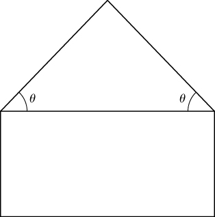
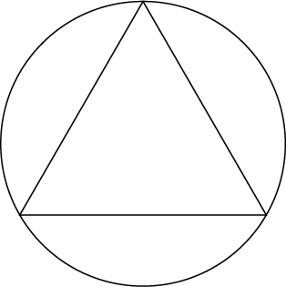
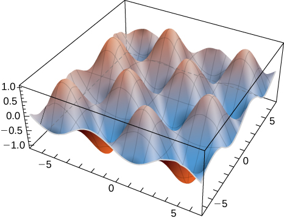

* Use the method of Lagrange multipliers to solve optimization problems with one constraint.
* Use the method of Lagrange multipliers to solve optimization problems with two constraints.

Solving optimization problems for functions of two or more variables can be similar to solving such problems in single-variable calculus. However, techniques for dealing with multiple variables allow us to solve more varied optimization problems for which we need to deal with additional conditions or constraints. In this section, we examine one of the more common and useful methods for solving optimization problems with constraints.

# Lagrange Multipliers

[\[link\]](/m53942#fs-id1167793423548) was an applied situation involving maximizing a profit function, subject to certain **constraints**{: data-type="term"}. In that example, the constraints involved a maximum number of golf balls that could be produced and sold in <math xmlns="http://www.w3.org/1998/Math/MathML"><mn>1</mn></math>

 month <math xmlns="http://www.w3.org/1998/Math/MathML"><mrow><mrow><mo>(</mo><mi>x</mi><mo>)</mo></mrow><mo>,</mo></mrow></math>

 and a maximum number of advertising hours that could be purchased per month <math xmlns="http://www.w3.org/1998/Math/MathML"><mrow><mrow><mo>(</mo><mi>y</mi><mo>)</mo></mrow><mo>.</mo></mrow></math>

 Suppose these were combined into a budgetary constraint, such as <math xmlns="http://www.w3.org/1998/Math/MathML"><mrow><mn>20</mn><mi>x</mi><mo>+</mo><mn>4</mn><mi>y</mi><mo>≤</mo><mn>216</mn><mo>,</mo></mrow></math>

 that took into account the cost of producing the golf balls and the number of advertising hours purchased per month. The goal is, still, be to maximize profit, but now there is a different type of constraint on the values of <math xmlns="http://www.w3.org/1998/Math/MathML"><mi>x</mi></math>

 and <math xmlns="http://www.w3.org/1998/Math/MathML"><mrow><mi>y</mi><mo>.</mo></mrow></math>

 This constraint, when combined with the profit function <math xmlns="http://www.w3.org/1998/Math/MathML"><mrow><mi>f</mi><mrow><mo>(</mo><mrow><mi>x</mi><mo>,</mo><mi>y</mi></mrow><mo>)</mo></mrow><mo>=</mo><mn>48</mn><mi>x</mi><mo>+</mo><mn>96</mn><mi>y</mi><mo>−</mo><msup><mi>x</mi><mn>2</mn></msup><mo>−</mo><mn>2</mn><mi>x</mi><mi>y</mi><mo>−</mo><mn>9</mn><msup><mi>y</mi><mn>2</mn></msup><mo>,</mo></mrow></math>

 is an example of an **optimization problem**{: data-type="term"}, and the function <math xmlns="http://www.w3.org/1998/Math/MathML"><mrow><mi>f</mi><mrow><mo>(</mo><mrow><mi>x</mi><mo>,</mo><mi>y</mi></mrow><mo>)</mo></mrow></mrow></math>

 is called the **objective function**{: data-type="term"}. A graph of various level curves of the function <math xmlns="http://www.w3.org/1998/Math/MathML"><mrow><mi>f</mi><mrow><mo>(</mo><mrow><mi>x</mi><mo>,</mo><mi>y</mi></mrow><mo>)</mo></mrow></mrow></math>

 follows.

 =48x+96y&#x2212;x2&#x2212;2xy&#x2212;9y2 corresponding to c=150,250,350,and400."){: #CNX_Calc_Figure_14_08_001}

In [\[link\]](#CNX_Calc_Figure_14_08_001), the value <math xmlns="http://www.w3.org/1998/Math/MathML"><mi>c</mi></math>

 represents different profit levels (i.e., values of the function <math xmlns="http://www.w3.org/1998/Math/MathML"><mi>f</mi><mo stretchy="false">)</mo><mo>.</mo></math>

 As the value of <math xmlns="http://www.w3.org/1998/Math/MathML"><mi>c</mi></math>

 increases, the curve shifts to the right. Since our goal is to maximize profit, we want to choose a curve as far to the right as possible. If there was no restriction on the number of golf balls the company could produce, or the number of units of advertising available, then we could produce as many golf balls as we want, and advertise as much as we want, and there would be not be a maximum profit for the company. Unfortunately, we have a budgetary constraint that is modeled by the inequality <math xmlns="http://www.w3.org/1998/Math/MathML"><mrow><mn>20</mn><mi>x</mi><mo>+</mo><mn>4</mn><mi>y</mi><mo>≤</mo><mn>216</mn><mo>.</mo></mrow></math>

 To see how this constraint interacts with the profit function, [\[link\]](#CNX_Calc_Figure_14_08_002) shows the graph of the line <math xmlns="http://www.w3.org/1998/Math/MathML"><mrow><mn>20</mn><mi>x</mi><mo>+</mo><mn>4</mn><mi>y</mi><mo>=</mo><mn>216</mn></mrow></math>

 superimposed on the previous graph.

 =48x+96y&#x2212;x2&#x2212;2xy&#x2212;9y2 corresponding to c=150,250,350,and395. The red graph is the constraint function."){: #CNX_Calc_Figure_14_08_002}

As mentioned previously, the maximum profit occurs when the level curve is as far to the right as possible. However, the level of production corresponding to this maximum profit must also satisfy the budgetary constraint, so the point at which this profit occurs must also lie on (or to the left of) the red line in [\[link\]](#CNX_Calc_Figure_14_08_002). Inspection of this graph reveals that this point exists where the line is tangent to the level curve of <math xmlns="http://www.w3.org/1998/Math/MathML"><mrow><mi>f</mi><mo>.</mo></mrow></math>

 Trial and error reveals that this profit level seems to be around <math xmlns="http://www.w3.org/1998/Math/MathML"><mrow><mn>395</mn><mo>,</mo></mrow></math>

 when <math xmlns="http://www.w3.org/1998/Math/MathML"><mi>x</mi></math>

 and <math xmlns="http://www.w3.org/1998/Math/MathML"><mi>y</mi></math>

 are both just less than <math xmlns="http://www.w3.org/1998/Math/MathML"><mrow><mn>5</mn><mo>.</mo></mrow></math>

 We return to the solution of this problem later in this section. From a theoretical standpoint, at the point where the profit curve is tangent to the constraint line, the gradient of both of the functions evaluated at that point must point in the same (or opposite) direction. Recall that the gradient of a function of more than one variable is a vector. If two vectors point in the same (or opposite) directions, then one must be a constant multiple of the other. This idea is the basis of the **method of Lagrange multipliers**{: data-type="term"}.

Method of Lagrange Multipliers: One Constraint

Let <math xmlns="http://www.w3.org/1998/Math/MathML"><mi>f</mi></math>

 and <math xmlns="http://www.w3.org/1998/Math/MathML"><mi>g</mi></math>

 be functions of two variables with continuous partial derivatives at every point of some open set containing the smooth curve <math xmlns="http://www.w3.org/1998/Math/MathML"><mrow><mi>g</mi><mrow><mo>(</mo><mrow><mi>x</mi><mo>,</mo><mi>y</mi></mrow><mo>)</mo></mrow><mo>=</mo><mn>0</mn><mo>.</mo></mrow></math>

 Suppose that <math xmlns="http://www.w3.org/1998/Math/MathML"><mrow><mi>f</mi><mo>,</mo></mrow></math>

 when restricted to points on the curve <math xmlns="http://www.w3.org/1998/Math/MathML"><mrow><mi>g</mi><mrow><mo>(</mo><mrow><mi>x</mi><mo>,</mo><mi>y</mi></mrow><mo>)</mo></mrow><mo>=</mo><mn>0</mn><mo>,</mo></mrow></math>

 has a local extremum at the point <math xmlns="http://www.w3.org/1998/Math/MathML"><mrow><mrow><mo>(</mo><mrow><msub><mi>x</mi><mn>0</mn></msub><mo>,</mo><msub><mi>y</mi><mn>0</mn></msub></mrow><mo>)</mo></mrow></mrow></math>

 and that <math xmlns="http://www.w3.org/1998/Math/MathML"><mrow><mo>∇</mo><mi>g</mi><mrow><mo>(</mo><mrow><msub><mi>x</mi><mn>0</mn></msub><mo>,</mo><msub><mi>y</mi><mn>0</mn></msub></mrow><mo>)</mo></mrow><mo>≠</mo><mn>0</mn><mo>.</mo></mrow></math>

 Then there is a number <math xmlns="http://www.w3.org/1998/Math/MathML"><mi>λ</mi></math>

 called a **Lagrange multiplier**{: data-type="term"}, for which

<math xmlns="http://www.w3.org/1998/Math/MathML"><mrow><mo>∇</mo><mi>f</mi><mrow><mo>(</mo><mrow><msub><mi>x</mi><mn>0</mn></msub><mo>,</mo><msub><mi>y</mi><mn>0</mn></msub></mrow><mo>)</mo></mrow><mo>=</mo><mi>λ</mi><mo>∇</mo><mi>g</mi><mrow><mo>(</mo><mrow><msub><mi>x</mi><mn>0</mn></msub><mo>,</mo><msub><mi>y</mi><mn>0</mn></msub></mrow><mo>)</mo></mrow><mo>.</mo></mrow></math>

## Proof

Assume that a constrained extremum occurs at the point <math xmlns="http://www.w3.org/1998/Math/MathML"><mrow><mrow><mo>(</mo><mrow><msub><mi>x</mi><mn>0</mn></msub><mo>,</mo><msub><mi>y</mi><mn>0</mn></msub></mrow><mo>)</mo></mrow><mo>.</mo></mrow></math>

 Furthermore, we assume that the equation <math xmlns="http://www.w3.org/1998/Math/MathML"><mrow><mi>g</mi><mrow><mo>(</mo><mrow><mi>x</mi><mo>,</mo><mi>y</mi></mrow><mo>)</mo></mrow><mo>=</mo><mn>0</mn></mrow></math>

 can be smoothly parameterized as

<math xmlns="http://www.w3.org/1998/Math/MathML"><mrow><mi>x</mi><mo>=</mo><mi>x</mi><mrow><mo>(</mo><mi>s</mi><mo>)</mo></mrow><mspace width="0.2em" /><mtext>and</mtext><mspace width="0.2em" /><mi>y</mi><mo>=</mo><mi>y</mi><mrow><mo>(</mo><mi>s</mi><mo>)</mo></mrow></mrow></math>

where *s* is an arc length parameter with reference point <math xmlns="http://www.w3.org/1998/Math/MathML"><mrow><mrow><mo>(</mo><mrow><msub><mi>x</mi><mn>0</mn></msub><mo>,</mo><msub><mi>y</mi><mn>0</mn></msub></mrow><mo>)</mo></mrow></mrow></math>

 at <math xmlns="http://www.w3.org/1998/Math/MathML"><mrow><mi>s</mi><mo>=</mo><mn>0</mn><mo>.</mo></mrow></math>

 Therefore, the quantity <math xmlns="http://www.w3.org/1998/Math/MathML"><mrow><mi>z</mi><mo>=</mo><mi>f</mi><mrow><mo>(</mo><mrow><mi>x</mi><mrow><mo>(</mo><mi>s</mi><mo>)</mo></mrow><mo>,</mo><mi>y</mi><mrow><mo>(</mo><mi>s</mi><mo>)</mo></mrow></mrow><mo>)</mo></mrow></mrow></math>

 has a relative maximum or relative minimum at <math xmlns="http://www.w3.org/1998/Math/MathML"><mrow><mi>s</mi><mo>=</mo><mn>0</mn><mo>,</mo></mrow></math>

 and this implies that <math xmlns="http://www.w3.org/1998/Math/MathML"><mrow><mfrac><mrow><mi>d</mi><mi>z</mi></mrow><mrow><mi>d</mi><mi>s</mi></mrow></mfrac><mo>=</mo><mn>0</mn></mrow></math>

 at that point. From the chain rule,

<math xmlns="http://www.w3.org/1998/Math/MathML"><mrow><mfrac><mrow><mi>d</mi><mi>z</mi></mrow><mrow><mi>d</mi><mi>s</mi></mrow></mfrac><mo>=</mo><mfrac><mrow><mo>∂</mo><mi>f</mi></mrow><mrow><mo>∂</mo><mi>x</mi></mrow></mfrac><mo>·</mo><mfrac><mrow><mo>∂</mo><mi>x</mi></mrow><mrow><mo>∂</mo><mi>s</mi></mrow></mfrac><mo>+</mo><mfrac><mrow><mo>∂</mo><mi>f</mi></mrow><mrow><mo>∂</mo><mi>y</mi></mrow></mfrac><mo>·</mo><mfrac><mrow><mo>∂</mo><mi>y</mi></mrow><mrow><mo>∂</mo><mi>s</mi></mrow></mfrac><mo>=</mo><mrow><mo>(</mo><mrow><mfrac><mrow><mo>∂</mo><mi>f</mi></mrow><mrow><mo>∂</mo><mi>x</mi></mrow></mfrac><mstyle mathvariant="bold" mathsize="normal"><mi>i</mi></mstyle><mo>+</mo><mstyle mathvariant="bold" mathsize="normal"><mi>j</mi></mstyle><mfrac><mrow><mo>∂</mo><mi>x</mi></mrow><mrow><mo>∂</mo><mi>s</mi></mrow></mfrac></mrow><mo>)</mo></mrow><mo>+</mo><mrow><mo>(</mo><mrow><mfrac><mrow><mo>∂</mo><mi>f</mi></mrow><mrow><mo>∂</mo><mi>y</mi></mrow></mfrac><mo>·</mo><mfrac><mrow><mo>∂</mo><mi>y</mi></mrow><mrow><mo>∂</mo><mi>s</mi></mrow></mfrac></mrow><mo>)</mo></mrow><mo>=</mo><mn>0</mn><mo>,</mo></mrow></math>

where the derivatives are all evaluated at <math xmlns="http://www.w3.org/1998/Math/MathML"><mrow><mi>s</mi><mo>=</mo><mn>0</mn><mo>.</mo></mrow></math>

 However, the first factor in the dot product is the gradient of <math xmlns="http://www.w3.org/1998/Math/MathML"><mrow><mi>f</mi><mo>,</mo></mrow></math>

 and the second factor is the unit tangent vector <math xmlns="http://www.w3.org/1998/Math/MathML"><mrow><mtext>T</mtext><mrow><mo>(</mo><mn>0</mn><mo>)</mo></mrow></mrow></math>

 to the constraint curve. Since the point <math xmlns="http://www.w3.org/1998/Math/MathML"><mrow><mrow><mo>(</mo><mrow><msub><mi>x</mi><mn>0</mn></msub><mo>,</mo><msub><mi>y</mi><mn>0</mn></msub></mrow><mo>)</mo></mrow></mrow></math>

 corresponds to <math xmlns="http://www.w3.org/1998/Math/MathML"><mrow><mi>s</mi><mo>=</mo><mn>0</mn><mo>,</mo></mrow></math>

 it follows from this equation that

<math xmlns="http://www.w3.org/1998/Math/MathML"><mrow><mo>∇</mo><mi>f</mi><mrow><mo>(</mo><mrow><msub><mi>x</mi><mn>0</mn></msub><mo>,</mo><msub><mi>y</mi><mn>0</mn></msub></mrow><mo>)</mo></mrow><mo>·</mo><mtext>T</mtext><mrow><mo>(</mo><mn>0</mn><mo>)</mo></mrow><mo>=</mo><mn>0</mn><mo>,</mo></mrow></math>

which implies that the gradient is either <math xmlns="http://www.w3.org/1998/Math/MathML"><mstyle mathvariant="bold" mathsize="normal"><mn>0</mn></mstyle></math>

 or is normal to the constraint curve at a constrained relative extremum. However, the constraint curve <math xmlns="http://www.w3.org/1998/Math/MathML"><mrow><mi>g</mi><mrow><mo>(</mo><mrow><mi>x</mi><mo>,</mo><mi>y</mi></mrow><mo>)</mo></mrow><mo>=</mo><mn>0</mn></mrow></math>

 is a level curve for the function <math xmlns="http://www.w3.org/1998/Math/MathML"><mrow><mi>g</mi><mrow><mo>(</mo><mrow><mi>x</mi><mo>,</mo><mi>y</mi></mrow><mo>)</mo></mrow></mrow></math>

 so that if <math xmlns="http://www.w3.org/1998/Math/MathML"><mrow><mo>∇</mo><mi>g</mi><mrow><mo>(</mo><mrow><msub><mi>x</mi><mn>0</mn></msub><mo>,</mo><msub><mi>y</mi><mn>0</mn></msub></mrow><mo>)</mo></mrow><mo>≠</mo><mn>0</mn></mrow></math>

 then <math xmlns="http://www.w3.org/1998/Math/MathML"><mrow><mo>∇</mo><mi>g</mi><mrow><mo>(</mo><mrow><msub><mi>x</mi><mn>0</mn></msub><mo>,</mo><msub><mi>y</mi><mn>0</mn></msub></mrow><mo>)</mo></mrow></mrow></math>

 is normal to this curve at <math xmlns="http://www.w3.org/1998/Math/MathML"><mrow><mo>(</mo><mrow><msub><mi>x</mi><mn>0</mn></msub><mo>,</mo><msub><mi>y</mi><mn>0</mn></msub></mrow><mo>)</mo></mrow></math>

 It follows, then, that there is some scalar <math xmlns="http://www.w3.org/1998/Math/MathML"><mi>λ</mi></math>

 such that

<math xmlns="http://www.w3.org/1998/Math/MathML"><mrow><mo>∇</mo><mi>f</mi><mrow><mo>(</mo><mrow><msub><mi>x</mi><mn>0</mn></msub><mo>,</mo><msub><mi>y</mi><mn>0</mn></msub></mrow><mo>)</mo></mrow><mo>=</mo><mi>λ</mi><mo>∇</mo><mi>g</mi><mrow><mo>(</mo><mrow><msub><mi>x</mi><mn>0</mn></msub><mo>,</mo><msub><mi>y</mi><mn>0</mn></msub></mrow><mo>)</mo></mrow></mrow></math>

□

To apply [\[link\]](#fs-id1167794055797) to an optimization problem similar to that for the golf ball manufacturer, we need a problem-solving strategy.

Problem-Solving Strategy: Steps for Using Lagrange Multipliers

1.  Determine the objective function
    <math xmlns="http://www.w3.org/1998/Math/MathML"><mrow><mi>f</mi><mrow><mo>(</mo><mrow><mi>x</mi><mo>,</mo><mi>y</mi></mrow><mo>)</mo></mrow></mrow></math>
    
    and the constraint function
    <math xmlns="http://www.w3.org/1998/Math/MathML"><mrow><mi>g</mi><mrow><mo>(</mo><mrow><mi>x</mi><mo>,</mo><mi>y</mi></mrow><mo>)</mo></mrow><mo>.</mo></mrow></math>
    
    Does the optimization problem involve maximizing or minimizing the objective function?
2.  Set up a system of equations using the following template:
    * * *
    {: data-type="newline"}
    
    

    <math xmlns="http://www.w3.org/1998/Math/MathML"><mtable><mtr><mtd columnalign="right"><mo>∇</mo><mi>f</mi><mrow><mo>(</mo><mrow><msub><mi>x</mi><mn>0</mn></msub><mo>,</mo><msub><mi>y</mi><mn>0</mn></msub></mrow><mo>)</mo></mrow></mtd><mtd columnalign="left"><mo>=</mo></mtd><mtd columnalign="left"><mi>λ</mi><mo>∇</mo><mi>g</mi><mrow><mo>(</mo><mrow><msub><mi>x</mi><mn>0</mn></msub><mo>,</mo><msub><mi>y</mi><mn>0</mn></msub></mrow><mo>)</mo></mrow></mtd></mtr><mtr><mtd columnalign="right"><mi>g</mi><mrow><mo>(</mo><mrow><msub><mi>x</mi><mn>0</mn></msub><mo>,</mo><msub><mi>y</mi><mn>0</mn></msub></mrow><mo>)</mo></mrow></mtd><mtd columnalign="left"><mo>=</mo></mtd><mtd columnalign="left"><mn>0</mn><mo>.</mo></mtd></mtr></mtable></math>
    

3.  Solve for
    <math xmlns="http://www.w3.org/1998/Math/MathML"><mrow><msub><mi>x</mi><mn>0</mn></msub></mrow></math>
    
    and
    <math xmlns="http://www.w3.org/1998/Math/MathML"><mrow><msub><mi>y</mi><mn>0</mn></msub><mo>.</mo></mrow></math>

4.  The largest of the values of
    <math xmlns="http://www.w3.org/1998/Math/MathML"><mi>f</mi></math>
    
    at the solutions found in step
    <math xmlns="http://www.w3.org/1998/Math/MathML"><mn>3</mn></math>
    
    maximizes
    <math xmlns="http://www.w3.org/1998/Math/MathML"><mi>f</mi><mo>;</mo></math>
    
    the smallest of those values minimizes
    <math xmlns="http://www.w3.org/1998/Math/MathML"><mrow><mi>f</mi><mo>.</mo></mrow></math>
{: data-number-style="arabic"}

Using Lagrange Multipliers

Use the method of Lagrange multipliers to find the minimum value of <math xmlns="http://www.w3.org/1998/Math/MathML"><mrow><mi>f</mi><mrow><mo>(</mo><mrow><mi>x</mi><mo>,</mo><mi>y</mi></mrow><mo>)</mo></mrow><mo>=</mo><msup><mi>x</mi><mn>2</mn></msup><mo>+</mo><mn>4</mn><msup><mi>y</mi><mn>2</mn></msup><mo>−</mo><mn>2</mn><mi>x</mi><mo>+</mo><mn>8</mn><mi>y</mi></mrow></math>

 subject to the constraint <math xmlns="http://www.w3.org/1998/Math/MathML"><mrow><mi>x</mi><mo>+</mo><mn>2</mn><mi>y</mi><mo>=</mo><mn>7</mn><mo>.</mo></mrow></math>

Let’s follow the problem-solving strategy:

1.  The optimization function is
    <math xmlns="http://www.w3.org/1998/Math/MathML"><mrow><mi>f</mi><mrow><mo>(</mo><mrow><mi>x</mi><mo>,</mo><mi>y</mi></mrow><mo>)</mo></mrow><mo>=</mo><msup><mi>x</mi><mn>2</mn></msup><mo>+</mo><mn>4</mn><msup><mi>y</mi><mn>2</mn></msup><mo>−</mo><mn>2</mn><mi>x</mi><mo>+</mo><mn>8</mn><mi>y</mi><mo>.</mo></mrow></math>
    
    To determine the constraint function, we must first subtract
    <math xmlns="http://www.w3.org/1998/Math/MathML"><mn>7</mn></math>
    
    from both sides of the constraint. This gives
    <math xmlns="http://www.w3.org/1998/Math/MathML"><mrow><mi>x</mi><mo>+</mo><mn>2</mn><mi>y</mi><mo>−</mo><mn>7</mn><mo>=</mo><mn>0</mn><mo>.</mo></mrow></math>
    
    The constraint function is equal to the left-hand side, so
    <math xmlns="http://www.w3.org/1998/Math/MathML"><mrow><mi>g</mi><mrow><mo>(</mo><mrow><mi>x</mi><mo>,</mo><mi>y</mi></mrow><mo>)</mo></mrow><mo>=</mo><mi>x</mi><mo>+</mo><mn>2</mn><mi>y</mi><mo>−</mo><mn>7</mn><mo>.</mo></mrow></math>
    
    The problem asks us to solve for the minimum value of
    <math xmlns="http://www.w3.org/1998/Math/MathML"><mi>f</mi><mo>,</mo></math>
    
    subject to the constraint (see the following graph).
    * * *
    {: data-type="newline"}
    
    =x2+4y2&#x2212;2x+8y corresponding to c=10 and 26. The red graph is the constraint function."){: #CNX_Calc_Figure_14_08_003}

2.  We then must calculate the gradients of both *f* and *g*:
    * * *
    {: data-type="newline"}
    
    

    <math xmlns="http://www.w3.org/1998/Math/MathML"><mtable><mtr><mtd columnalign="left"><mo>∇</mo><mi>f</mi><mrow><mo>(</mo><mrow><mi>x</mi><mo>,</mo><mi>y</mi></mrow><mo>)</mo></mrow><mo>=</mo><mrow><mo>(</mo><mrow><mn>2</mn><mi>x</mi><mo>−</mo><mn>2</mn></mrow><mo>)</mo></mrow><mstyle mathvariant="bold" mathsize="normal"><mi>i</mi></mstyle><mo>+</mo><mrow><mo>(</mo><mrow><mn>8</mn><mi>y</mi><mo>+</mo><mn>8</mn></mrow><mo>)</mo></mrow><mstyle mathvariant="bold" mathsize="normal"><mi>j</mi></mstyle></mtd></mtr><mtr><mtd columnalign="left"><mo>∇</mo><mi>g</mi><mrow><mo>(</mo><mrow><mi>x</mi><mo>,</mo><mi>y</mi></mrow><mo>)</mo></mrow><mo>=</mo><mstyle mathvariant="bold" mathsize="normal"><mi>i</mi></mstyle><mo>+</mo><mn>2</mn><mstyle mathvariant="bold" mathsize="normal"><mi>j</mi></mstyle><mo>.</mo></mtd></mtr></mtable></math>
    

    
    * * *
    {: data-type="newline"}
    
    The equation
    <math xmlns="http://www.w3.org/1998/Math/MathML"><mrow><mo>∇</mo><mi>f</mi><mrow><mo>(</mo><mrow><msub><mi>x</mi><mn>0</mn></msub><mo>,</mo><msub><mi>y</mi><mn>0</mn></msub></mrow><mo>)</mo></mrow><mo>=</mo><mi>λ</mi><mo>∇</mo><mi>g</mi><mrow><mo>(</mo><mrow><msub><mi>x</mi><mn>0</mn></msub><mo>,</mo><msub><mi>y</mi><mn>0</mn></msub></mrow><mo>)</mo></mrow></mrow></math>
    
    becomes
    * * *
    {: data-type="newline"}
    
    

    <math xmlns="http://www.w3.org/1998/Math/MathML"><mrow><mrow><mo>(</mo><mrow><mn>2</mn><msub><mi>x</mi><mn>0</mn></msub><mo>−</mo><mn>2</mn></mrow><mo>)</mo></mrow><mstyle mathvariant="bold" mathsize="normal"><mi>i</mi></mstyle><mo>+</mo><mrow><mo>(</mo><mrow><mn>8</mn><msub><mi>y</mi><mn>0</mn></msub><mo>+</mo><mn>8</mn></mrow><mo>)</mo></mrow><mstyle mathvariant="bold" mathsize="normal"><mi>j</mi></mstyle><mo>=</mo><mi>λ</mi><mrow><mo>(</mo><mrow><mstyle mathvariant="bold" mathsize="normal"><mi>i</mi></mstyle><mo>+</mo><mn>2</mn><mstyle mathvariant="bold" mathsize="normal"><mi>j</mi></mstyle></mrow><mo>)</mo></mrow><mo>,</mo></mrow></math>
    

    
    * * *
    {: data-type="newline"}
    
    which can be rewritten as
    * * *
    {: data-type="newline"}
    
    

    <math xmlns="http://www.w3.org/1998/Math/MathML"><mrow><mrow><mo>(</mo><mrow><mn>2</mn><msub><mi>x</mi><mn>0</mn></msub><mo>−</mo><mn>2</mn></mrow><mo>)</mo></mrow><mstyle mathvariant="bold" mathsize="normal"><mi>i</mi></mstyle><mo>+</mo><mrow><mo>(</mo><mrow><mn>8</mn><msub><mi>y</mi><mn>0</mn></msub><mo>+</mo><mn>8</mn></mrow><mo>)</mo></mrow><mstyle mathvariant="bold" mathsize="normal"><mi>j</mi></mstyle><mo>=</mo><mi>λ</mi><mstyle mathvariant="bold" mathsize="normal"><mi>i</mi></mstyle><mo>+</mo><mi>λ</mi><mstyle mathvariant="bold" mathsize="normal"><mi>j</mi></mstyle><mo>.</mo></mrow></math>
    

    
    * * *
    {: data-type="newline"}
    
    Next, we set the coefficients of
    <math xmlns="http://www.w3.org/1998/Math/MathML"><mrow><mstyle mathvariant="bold" mathsize="normal"><mi>i</mi></mstyle><mspace width="0.2em" /><mtext>and</mtext><mspace width="0.2em" /><mstyle mathvariant="bold" mathsize="normal"><mi>j</mi></mstyle></mrow></math>
    
    equal to each other:
    * * *
    {: data-type="newline"}
    
    

    <math xmlns="http://www.w3.org/1998/Math/MathML"><mtable><mtr><mtd columnalign="left"><mn>2</mn><msub><mi>x</mi><mn>0</mn></msub><mo>−</mo><mn>2</mn><mo>=</mo><mi>λ</mi></mtd></mtr><mtr><mtd columnalign="left"><mn>8</mn><msub><mi>y</mi><mn>0</mn></msub><mo>+</mo><mn>8</mn><mo>=</mo><mn>2</mn><mi>λ</mi><mo>.</mo></mtd></mtr></mtable></math>
    

    
    * * *
    {: data-type="newline"}
    
    The equation
    <math xmlns="http://www.w3.org/1998/Math/MathML"><mrow><mi>g</mi><mrow><mo>(</mo><mrow><msub><mi>x</mi><mn>0</mn></msub><mo>,</mo><msub><mi>y</mi><mn>0</mn></msub></mrow><mo>)</mo></mrow><mo>=</mo><mn>0</mn></mrow></math>
    
    becomes
    <math xmlns="http://www.w3.org/1998/Math/MathML"><mrow><msub><mi>x</mi><mn>0</mn></msub><mo>+</mo><mn>2</mn><msub><mi>y</mi><mn>0</mn></msub><mo>−</mo><mn>7</mn><mo>=</mo><mn>0</mn><mo>.</mo></mrow></math>
    
    Therefore, the system of equations that needs to be solved is
    * * *
    {: data-type="newline"}
    
    

    <math xmlns="http://www.w3.org/1998/Math/MathML"><mtable><mtr><mtd columnalign="right"><mn>2</mn><msub><mi>x</mi><mn>0</mn></msub><mo>−</mo><mn>2</mn></mtd><mtd columnalign="left"><mo>=</mo></mtd><mtd columnalign="left"><mi>λ</mi></mtd></mtr><mtr><mtd columnalign="right"><mn>8</mn><msub><mi>y</mi><mn>0</mn></msub><mo>+</mo><mn>8</mn></mtd><mtd columnalign="left"><mo>=</mo></mtd><mtd columnalign="left"><mn>2</mn><mi>λ</mi></mtd></mtr><mtr><mtd columnalign="right"><msub><mi>x</mi><mn>0</mn></msub><mo>+</mo><mn>2</mn><msub><mi>y</mi><mn>0</mn></msub><mo>−</mo><mn>7</mn></mtd><mtd columnalign="left"><mo>=</mo></mtd><mtd columnalign="left"><mn>0.</mn></mtd></mtr></mtable></math>
    

3.  This is a linear system of three equations in three variables. We start by solving the second equation for
    <math xmlns="http://www.w3.org/1998/Math/MathML"><mi>λ</mi></math>
    
    and substituting it into the first equation. This gives
    <math xmlns="http://www.w3.org/1998/Math/MathML"><mrow><mi>λ</mi><mo>=</mo><mn>4</mn><msub><mi>y</mi><mn>0</mn></msub><mo>+</mo><mn>4</mn><mo>,</mo></mrow></math>
    
    so substituting this into the first equation gives
    * * *
    {: data-type="newline"}
    
    

    <math xmlns="http://www.w3.org/1998/Math/MathML"><mrow><mn>2</mn><msub><mi>x</mi><mn>0</mn></msub><mo>−</mo><mn>2</mn><mo>=</mo><mn>4</mn><msub><mi>y</mi><mn>0</mn></msub><mo>+</mo><mn>4</mn><mo>.</mo></mrow></math>
    

    
    * * *
    {: data-type="newline"}
    
    Solving this equation for
    <math xmlns="http://www.w3.org/1998/Math/MathML"><mrow><msub><mi>x</mi><mn>0</mn></msub></mrow></math>
    
    gives
    <math xmlns="http://www.w3.org/1998/Math/MathML"><mrow><msub><mi>x</mi><mn>0</mn></msub><mo>=</mo><mn>2</mn><msub><mi>y</mi><mn>0</mn></msub><mo>+</mo><mn>3</mn><mo>.</mo></mrow></math>
    
    We then substitute this into the third equation:
    

    <math xmlns="http://www.w3.org/1998/Math/MathML"><mtable><mtr><mtd columnalign="right"><mrow><mo>(</mo><mrow><mn>2</mn><msub><mi>y</mi><mn>0</mn></msub><mo>+</mo><mn>3</mn></mrow><mo>)</mo></mrow><mo>+</mo><mn>2</mn><msub><mi>y</mi><mn>0</mn></msub><mo>−</mo><mn>7</mn></mtd><mtd columnalign="left"><mo>=</mo></mtd><mtd columnalign="left"><mn>0</mn></mtd></mtr><mtr><mtd columnalign="right"><mn>4</mn><msub><mi>y</mi><mn>0</mn></msub><mo>−</mo><mn>4</mn></mtd><mtd columnalign="left"><mo>=</mo></mtd><mtd columnalign="left"><mn>0</mn></mtd></mtr><mtr><mtd columnalign="right"><msub><mi>y</mi><mn>0</mn></msub></mtd><mtd columnalign="left"><mo>=</mo></mtd><mtd columnalign="left"><mn>1.</mn></mtd></mtr></mtable></math>
    

    
    * * *
    {: data-type="newline"}
    
    Since
    <math xmlns="http://www.w3.org/1998/Math/MathML"><mrow><msub><mi>x</mi><mn>0</mn></msub><mo>=</mo><mn>2</mn><msub><mi>y</mi><mn>0</mn></msub><mo>+</mo><mn>3</mn><mo>,</mo></mrow></math>
    
    this gives
    <math xmlns="http://www.w3.org/1998/Math/MathML"><mrow><msub><mi>x</mi><mn>0</mn></msub><mo>=</mo><mn>5</mn><mo>.</mo></mrow></math>

4.  Next, we substitute
    <math xmlns="http://www.w3.org/1998/Math/MathML"><mrow><mrow><mo>(</mo><mrow><mn>5</mn><mo>,</mo><mn>1</mn></mrow><mo>)</mo></mrow></mrow></math>
    
    into
    <math xmlns="http://www.w3.org/1998/Math/MathML"><mrow><mi>f</mi><mrow><mo>(</mo><mrow><mi>x</mi><mo>,</mo><mi>y</mi></mrow><mo>)</mo></mrow><mo>=</mo><msup><mi>x</mi><mn>2</mn></msup><mo>+</mo><mn>4</mn><msup><mi>y</mi><mn>2</mn></msup><mo>−</mo><mn>2</mn><mi>x</mi><mo>+</mo><mn>8</mn><mi>y</mi><mo>,</mo></mrow></math>
    
    gives
    <math xmlns="http://www.w3.org/1998/Math/MathML"><mrow><mi>f</mi><mrow><mo>(</mo><mrow><mn>5</mn><mo>,</mo><mn>1</mn></mrow><mo>)</mo></mrow><mo>=</mo><msup><mn>5</mn><mn>2</mn></msup><mo>+</mo><mn>4</mn><msup><mrow><mrow><mo>(</mo><mn>1</mn><mo>)</mo></mrow></mrow><mn>2</mn></msup><mo>−</mo><mn>2</mn><mrow><mo>(</mo><mn>5</mn><mo>)</mo></mrow><mo>+</mo><mn>8</mn><mrow><mo>(</mo><mn>1</mn><mo>)</mo></mrow><mo>=</mo><mn>27</mn><mo>.</mo></mrow></math>
    
    To ensure this corresponds to a minimum value on the constraint function, let’s try some other values, such as the intercepts of
    <math xmlns="http://www.w3.org/1998/Math/MathML"><mrow><mi>g</mi><mrow><mo>(</mo><mrow><mi>x</mi><mo>,</mo><mi>y</mi></mrow><mo>)</mo></mrow><mo>=</mo><mn>0</mn><mo>,</mo></mrow></math>
    
    Which are
    <math xmlns="http://www.w3.org/1998/Math/MathML"><mrow><mrow><mo>(</mo><mrow><mn>7</mn><mo>,</mo><mn>0</mn></mrow><mo>)</mo></mrow></mrow></math>
    
    and
    <math xmlns="http://www.w3.org/1998/Math/MathML"><mrow><mrow><mo>(</mo><mrow><mn>0</mn><mo>,</mo><mn>3.5</mn></mrow><mo>)</mo></mrow><mo>.</mo></mrow></math>
    
    We get
    <math xmlns="http://www.w3.org/1998/Math/MathML"><mrow><mi>f</mi><mrow><mo>(</mo><mrow><mn>7</mn><mo>,</mo><mn>0</mn></mrow><mo>)</mo></mrow><mo>=</mo><mn>35</mn></mrow></math>
    
    and
    <math xmlns="http://www.w3.org/1998/Math/MathML"><mrow><mi>f</mi><mrow><mo>(</mo><mrow><mn>0</mn><mo>,</mo><mn>3.5</mn></mrow><mo>)</mo></mrow><mo>=</mo><mn>77</mn><mo>,</mo></mrow></math>
    
    so it appears
    <math xmlns="http://www.w3.org/1998/Math/MathML"><mi>f</mi></math>
    
    has a minimum at
    <math xmlns="http://www.w3.org/1998/Math/MathML"><mrow><mrow><mo>(</mo><mrow><mn>5</mn><mo>,</mo><mn>1</mn></mrow><mo>)</mo></mrow><mo>.</mo></mrow></math>
{: data-number-style="arabic"}

Use the method of Lagrange multipliers to find the maximum value of <math xmlns="http://www.w3.org/1998/Math/MathML"><mrow><mi>f</mi><mrow><mo>(</mo><mrow><mi>x</mi><mo>,</mo><mi>y</mi></mrow><mo>)</mo></mrow><mo>=</mo><mn>9</mn><msup><mi>x</mi><mn>2</mn></msup><mo>+</mo><mn>36</mn><mi>x</mi><mi>y</mi><mo>−</mo><mn>4</mn><msup><mi>y</mi><mn>2</mn></msup><mo>−</mo><mn>18</mn><mi>x</mi><mo>−</mo><mn>8</mn><mi>y</mi></mrow></math>

 subject to the constraint <math xmlns="http://www.w3.org/1998/Math/MathML"><mrow><mn>3</mn><mi>x</mi><mo>+</mo><mn>4</mn><mi>y</mi><mo>=</mo><mn>32</mn><mo>.</mo></mrow></math>

<math xmlns="http://www.w3.org/1998/Math/MathML"><mi>f</mi></math>

 has a maximum value of <math xmlns="http://www.w3.org/1998/Math/MathML"><mrow><mn>976</mn></mrow></math>

 at the point <math xmlns="http://www.w3.org/1998/Math/MathML"><mrow><mrow><mo>(</mo><mrow><mn>8</mn><mo>,</mo><mn>2</mn></mrow><mo>)</mo></mrow><mo>.</mo></mrow></math>

Hint

Use the problem-solving strategy for the method of Lagrange multipliers.

Let’s now return to the problem posed at the beginning of the section.

Golf Balls and Lagrange Multipliers

The golf ball manufacturer, Pro-T, has developed a profit model that depends on the number <math xmlns="http://www.w3.org/1998/Math/MathML"><mi>x</mi></math>

 of golf balls sold per month (measured in thousands), and the number of hours per month of advertising *y*, according to the function

<math xmlns="http://www.w3.org/1998/Math/MathML"><mrow><mi>z</mi><mo>=</mo><mi>f</mi><mrow><mo>(</mo><mrow><mi>x</mi><mo>,</mo><mi>y</mi></mrow><mo>)</mo></mrow><mo>=</mo><mn>48</mn><mi>x</mi><mo>+</mo><mn>96</mn><mi>y</mi><mo>−</mo><msup><mi>x</mi><mn>2</mn></msup><mo>−</mo><mn>2</mn><mi>x</mi><mi>y</mi><mo>−</mo><mn>9</mn><msup><mi>y</mi><mn>2</mn></msup><mo>,</mo></mrow></math>

where <math xmlns="http://www.w3.org/1998/Math/MathML"><mi>z</mi></math>

 is measured in thousands of dollars. The budgetary constraint function relating the cost of the production of thousands golf balls and advertising units is given by <math xmlns="http://www.w3.org/1998/Math/MathML"><mrow><mn>20</mn><mi>x</mi><mo>+</mo><mn>4</mn><mi>y</mi><mo>=</mo><mn>216</mn><mo>.</mo></mrow></math>

 Find the values of <math xmlns="http://www.w3.org/1998/Math/MathML"><mi>x</mi></math>

 and <math xmlns="http://www.w3.org/1998/Math/MathML"><mi>y</mi></math>

 that maximize profit, and find the maximum profit.

Again, we follow the problem-solving strategy:

1.  The optimization function is
    <math xmlns="http://www.w3.org/1998/Math/MathML"><mrow><mi>f</mi><mrow><mo>(</mo><mrow><mi>x</mi><mo>,</mo><mi>y</mi></mrow><mo>)</mo></mrow><mo>=</mo><mn>48</mn><mi>x</mi><mo>+</mo><mn>96</mn><mi>y</mi><mo>−</mo><msup><mi>x</mi><mn>2</mn></msup><mo>−</mo><mn>2</mn><mi>x</mi><mi>y</mi><mo>−</mo><mn>9</mn><msup><mi>y</mi><mn>2</mn></msup><mo>.</mo></mrow></math>
    
    To determine the constraint function, we first subtract 216 from both sides of the constraint, then divide both sides by
    <math xmlns="http://www.w3.org/1998/Math/MathML"><mrow><mn>4</mn><mo>,</mo></mrow></math>
    
    which gives
    <math xmlns="http://www.w3.org/1998/Math/MathML"><mrow><mn>5</mn><mi>x</mi><mo>+</mo><mi>y</mi><mo>−</mo><mn>54</mn><mo>=</mo><mn>0</mn><mo>.</mo></mrow></math>
    
    The constraint function is equal to the left-hand side, so
    <math xmlns="http://www.w3.org/1998/Math/MathML"><mrow><mi>g</mi><mrow><mo>(</mo><mrow><mi>x</mi><mo>,</mo><mi>y</mi></mrow><mo>)</mo></mrow><mo>=</mo><mn>5</mn><mi>x</mi><mo>+</mo><mi>y</mi><mo>−</mo><mn>54</mn><mo>.</mo></mrow></math>
    
    The problem asks us to solve for the maximum value of
    <math xmlns="http://www.w3.org/1998/Math/MathML"><mrow><mi>f</mi><mo>,</mo></mrow></math>
    
    subject to this constraint.
2.  So, we calculate the gradients of both
    <math xmlns="http://www.w3.org/1998/Math/MathML"><mrow><mi>f</mi><mspace width="0.2em" /><mtext>and</mtext></mrow></math>
    
    <math xmlns="http://www.w3.org/1998/Math/MathML"><mi>g</mi><mtext>:</mtext></math>
    
    * * *
    {: data-type="newline"}
    
    

    <math xmlns="http://www.w3.org/1998/Math/MathML"><mtable><mtr><mtd columnalign="left"><mo>∇</mo><mi>f</mi><mrow><mo>(</mo><mrow><mi>x</mi><mo>,</mo><mi>y</mi></mrow><mo>)</mo></mrow><mo>=</mo><mrow><mo>(</mo><mrow><mn>48</mn><mo>−</mo><mn>2</mn><mi>x</mi><mo>−</mo><mn>2</mn><mi>y</mi></mrow><mo>)</mo></mrow><mstyle mathvariant="bold" mathsize="normal"><mi>i</mi></mstyle><mo>+</mo><mrow><mo>(</mo><mrow><mn>96</mn><mo>−</mo><mn>2</mn><mi>x</mi><mo>−</mo><mn>18</mn><mi>y</mi></mrow><mo>)</mo></mrow><mstyle mathvariant="bold" mathsize="normal"><mi>j</mi></mstyle></mtd></mtr><mtr><mtd columnalign="left"><mo>∇</mo><mi>g</mi><mrow><mo>(</mo><mrow><mi>x</mi><mo>,</mo><mi>y</mi></mrow><mo>)</mo></mrow><mo>=</mo><mn>5</mn><mstyle mathvariant="bold" mathsize="normal"><mi>i</mi></mstyle><mo>+</mo><mstyle mathvariant="bold" mathsize="normal"><mi>j</mi></mstyle><mo>.</mo></mtd></mtr></mtable></math>
    

    
    * * *
    {: data-type="newline"}
    
    The equation
    <math xmlns="http://www.w3.org/1998/Math/MathML"><mrow><mo>∇</mo><mi>f</mi><mrow><mo>(</mo><mrow><msub><mi>x</mi><mn>0</mn></msub><mo>,</mo><msub><mi>y</mi><mn>0</mn></msub></mrow><mo>)</mo></mrow><mo>=</mo><mi>λ</mi><mo>∇</mo><mi>g</mi><mrow><mo>(</mo><mrow><msub><mi>x</mi><mn>0</mn></msub><mo>,</mo><msub><mi>y</mi><mn>0</mn></msub></mrow><mo>)</mo></mrow></mrow></math>
    
    becomes
    * * *
    {: data-type="newline"}
    
    

    <math xmlns="http://www.w3.org/1998/Math/MathML"><mrow><mrow><mo>(</mo><mrow><mn>48</mn><mo>−</mo><mn>2</mn><msub><mi>x</mi><mn>0</mn></msub><mo>−</mo><mn>2</mn><msub><mi>y</mi><mn>0</mn></msub></mrow><mo>)</mo></mrow><mstyle mathvariant="bold" mathsize="normal"><mi>i</mi></mstyle><mo>+</mo><mrow><mo>(</mo><mrow><mn>96</mn><mo>−</mo><mn>2</mn><msub><mi>x</mi><mn>0</mn></msub><mo>−</mo><mn>18</mn><msub><mi>y</mi><mn>0</mn></msub></mrow><mo>)</mo></mrow><mstyle mathvariant="bold" mathsize="normal"><mi>j</mi></mstyle><mo>=</mo><mi>λ</mi><mrow><mo>(</mo><mrow><mn>5</mn><mstyle mathvariant="bold" mathsize="normal"><mi>i</mi></mstyle><mo>+</mo><mstyle mathvariant="bold" mathsize="normal"><mi>j</mi></mstyle></mrow><mo>)</mo></mrow><mo>,</mo></mrow></math>
    

    
    * * *
    {: data-type="newline"}
    
    which can be rewritten as
    * * *
    {: data-type="newline"}
    
    

    <math xmlns="http://www.w3.org/1998/Math/MathML"><mrow><mrow><mo>(</mo><mrow><mn>48</mn><mo>−</mo><mn>2</mn><msub><mi>x</mi><mn>0</mn></msub><mo>−</mo><mn>2</mn><msub><mi>y</mi><mn>0</mn></msub></mrow><mo>)</mo></mrow><mstyle mathvariant="bold" mathsize="normal"><mi>i</mi></mstyle><mo>+</mo><mrow><mo>(</mo><mrow><mn>96</mn><mo>−</mo><mn>2</mn><msub><mi>x</mi><mn>0</mn></msub><mo>−</mo><mn>18</mn><msub><mi>y</mi><mn>0</mn></msub></mrow><mo>)</mo></mrow><mstyle mathvariant="bold" mathsize="normal"><mi>j</mi></mstyle><mo>=</mo><mi>λ</mi><mn>5</mn><mstyle mathvariant="bold" mathsize="normal"><mi>i</mi></mstyle><mo>+</mo><mi>λ</mi><mstyle mathvariant="bold" mathsize="normal"><mi>j</mi></mstyle><mo>.</mo></mrow></math>
    

    
    * * *
    {: data-type="newline"}
    
    We then set the coefficients of
    <math xmlns="http://www.w3.org/1998/Math/MathML"><mrow><mstyle mathvariant="bold" mathsize="normal"><mi>i</mi></mstyle><mspace width="0.2em" /><mtext>and</mtext><mspace width="0.2em" /><mstyle mathvariant="bold" mathsize="normal"><mi>j</mi></mstyle></mrow></math>
    
    equal to each other:
    * * *
    {: data-type="newline"}
    
    

    <math xmlns="http://www.w3.org/1998/Math/MathML"><mtable><mtr><mtd columnalign="right"><mn>48</mn><mo>−</mo><mn>2</mn><msub><mi>x</mi><mn>0</mn></msub><mo>−</mo><mn>2</mn><msub><mi>y</mi><mn>0</mn></msub></mtd><mtd columnalign="left"><mo>=</mo></mtd><mtd columnalign="left"><mn>5</mn><mi>λ</mi></mtd></mtr><mtr><mtd columnalign="right"><mn>96</mn><mo>−</mo><mn>2</mn><msub><mi>x</mi><mn>0</mn></msub><mo>−</mo><mn>18</mn><msub><mi>y</mi><mn>0</mn></msub></mtd><mtd columnalign="left"><mo>=</mo></mtd><mtd columnalign="left"><mi>λ</mi><mo>.</mo></mtd></mtr></mtable></math>
    

    
    * * *
    {: data-type="newline"}
    
    The equation
    <math xmlns="http://www.w3.org/1998/Math/MathML"><mrow><mi>g</mi><mrow><mo>(</mo><mrow><msub><mi>x</mi><mn>0</mn></msub><mo>,</mo><msub><mi>y</mi><mn>0</mn></msub></mrow><mo>)</mo></mrow><mo>=</mo><mn>0</mn></mrow></math>
    
    becomes
    <math xmlns="http://www.w3.org/1998/Math/MathML"><mrow><mn>5</mn><msub><mi>x</mi><mn>0</mn></msub><mo>+</mo><msub><mi>y</mi><mn>0</mn></msub><mo>−</mo><mn>54</mn><mo>=</mo><mn>0</mn><mo>.</mo></mrow></math>
    
    Therefore, the system of equations that needs to be solved is
    * * *
    {: data-type="newline"}
    
    

    <math xmlns="http://www.w3.org/1998/Math/MathML"><mtable><mtr><mtd columnalign="right"><mn>48</mn><mo>−</mo><mn>2</mn><msub><mi>x</mi><mn>0</mn></msub><mo>−</mo><mn>2</mn><msub><mi>y</mi><mn>0</mn></msub></mtd><mtd columnalign="left"><mo>=</mo></mtd><mtd columnalign="left"><mn>5</mn><mi>λ</mi></mtd></mtr><mtr><mtd columnalign="right"><mn>96</mn><mo>−</mo><mn>2</mn><msub><mi>x</mi><mn>0</mn></msub><mo>−</mo><mn>18</mn><msub><mi>y</mi><mn>0</mn></msub></mtd><mtd columnalign="left"><mo>=</mo></mtd><mtd columnalign="left"><mi>λ</mi></mtd></mtr><mtr><mtd columnalign="right"><mn>5</mn><msub><mi>x</mi><mn>0</mn></msub><mo>+</mo><msub><mi>y</mi><mn>0</mn></msub><mo>−</mo><mn>54</mn></mtd><mtd columnalign="left"><mo>=</mo></mtd><mtd columnalign="left"><mn>0.</mn></mtd></mtr></mtable></math>
    

3.  We use the left-hand side of the second equation to replace
    <math xmlns="http://www.w3.org/1998/Math/MathML"><mi>λ</mi></math>
    
    in the first equation:
    * * *
    {: data-type="newline"}
    
    

    <math xmlns="http://www.w3.org/1998/Math/MathML"><mtable><mtr><mtd columnalign="right"><mn>48</mn><mo>−</mo><mn>2</mn><msub><mi>x</mi><mn>0</mn></msub><mo>−</mo><mn>2</mn><msub><mi>y</mi><mn>0</mn></msub></mtd><mtd columnalign="left"><mo>=</mo></mtd><mtd columnalign="left"><mn>5</mn><mrow><mo>(</mo><mrow><mn>96</mn><mo>−</mo><mn>2</mn><msub><mi>x</mi><mn>0</mn></msub><mo>−</mo><mn>18</mn><msub><mi>y</mi><mn>0</mn></msub></mrow><mo>)</mo></mrow></mtd></mtr><mtr><mtd columnalign="right"><mn>48</mn><mo>−</mo><mn>2</mn><msub><mi>x</mi><mn>0</mn></msub><mo>−</mo><mn>2</mn><msub><mi>y</mi><mn>0</mn></msub></mtd><mtd columnalign="left"><mo>=</mo></mtd><mtd columnalign="left"><mn>480</mn><mo>−</mo><mn>10</mn><msub><mi>x</mi><mn>0</mn></msub><mo>−</mo><mn>90</mn><msub><mi>y</mi><mn>0</mn></msub></mtd></mtr><mtr><mtd columnalign="right"><mn>8</mn><msub><mi>x</mi><mn>0</mn></msub></mtd><mtd columnalign="left"><mo>=</mo></mtd><mtd columnalign="left"><mn>432</mn><mo>−</mo><mn>88</mn><msub><mi>y</mi><mn>0</mn></msub></mtd></mtr><mtr><mtd columnalign="right"><msub><mi>x</mi><mn>0</mn></msub></mtd><mtd columnalign="left"><mo>=</mo></mtd><mtd columnalign="left"><mn>54</mn><mo>−</mo><mn>11</mn><msub><mi>y</mi><mn>0</mn></msub><mo>.</mo></mtd></mtr></mtable></math>
    

    
    * * *
    {: data-type="newline"}
    
    Then we substitute this into the third equation:
    * * *
    {: data-type="newline"}
    
    

    <math xmlns="http://www.w3.org/1998/Math/MathML"><mtable><mtr><mtd columnalign="right"><mn>5</mn><mrow><mo>(</mo><mrow><mn>54</mn><mo>−</mo><mn>11</mn><msub><mi>y</mi><mn>0</mn></msub></mrow><mo>)</mo></mrow><mo>+</mo><msub><mi>y</mi><mn>0</mn></msub><mo>−</mo><mn>54</mn></mtd><mtd columnalign="left"><mo>=</mo></mtd><mtd columnalign="left"><mn>0</mn></mtd></mtr><mtr><mtd columnalign="right"><mn>270</mn><mo>−</mo><mn>55</mn><msub><mi>y</mi><mn>0</mn></msub><mo>+</mo><msub><mi>y</mi><mn>0</mn></msub></mtd><mtd columnalign="left"><mo>=</mo></mtd><mtd columnalign="left"><mn>0</mn></mtd></mtr><mtr><mtd columnalign="right"><mn>216</mn><mo>−</mo><mn>54</mn><msub><mi>y</mi><mn>0</mn></msub></mtd><mtd columnalign="left"><mo>=</mo></mtd><mtd columnalign="left"><mn>0</mn></mtd></mtr><mtr><mtd columnalign="right"><msub><mi>y</mi><mn>0</mn></msub></mtd><mtd columnalign="left"><mo>=</mo></mtd><mtd columnalign="left"><mn>4.</mn></mtd></mtr></mtable></math>
    

    
    * * *
    {: data-type="newline"}
    
    Since
    <math xmlns="http://www.w3.org/1998/Math/MathML"><mrow><msub><mi>x</mi><mn>0</mn></msub><mo>=</mo><mn>54</mn><mo>−</mo><mn>11</mn><msub><mi>y</mi><mn>0</mn></msub><mo>,</mo></mrow></math>
    
    this gives
    <math xmlns="http://www.w3.org/1998/Math/MathML"><mrow><msub><mi>x</mi><mn>0</mn></msub><mo>=</mo><mn>10</mn><mo>.</mo></mrow></math>

4.  We then substitute
    <math xmlns="http://www.w3.org/1998/Math/MathML"><mrow><mrow><mo>(</mo><mrow><mn>10</mn><mo>,</mo><mn>4</mn></mrow><mo>)</mo></mrow></mrow></math>
    
    into
    <math xmlns="http://www.w3.org/1998/Math/MathML"><mrow><mi>f</mi><mrow><mo>(</mo><mrow><mi>x</mi><mo>,</mo><mi>y</mi></mrow><mo>)</mo></mrow><mo>=</mo><mn>48</mn><mi>x</mi><mo>+</mo><mn>96</mn><mi>y</mi><mo>−</mo><msup><mi>x</mi><mn>2</mn></msup><mo>−</mo><mn>2</mn><mi>x</mi><mi>y</mi><mo>−</mo><mn>9</mn><msup><mi>y</mi><mn>2</mn></msup><mo>,</mo></mrow></math>
    
    which gives
    * * *
    {: data-type="newline"}
    
    

    <math xmlns="http://www.w3.org/1998/Math/MathML"><mtable><mtr><mtd columnalign="right"><mi>f</mi><mrow><mo>(</mo><mrow><mn>5</mn><mo>,</mo><mn>1</mn></mrow><mo>)</mo></mrow></mtd><mtd columnalign="left"><mo>=</mo><mn>48</mn><mrow><mo>(</mo><mrow><mn>10</mn></mrow><mo>)</mo></mrow><mo>+</mo><mn>96</mn><mrow><mo>(</mo><mn>4</mn><mo>)</mo></mrow><mo>−</mo><msup><mrow><mo>(</mo><mrow><mn>10</mn></mrow><mo>)</mo></mrow><mn>2</mn></msup><mo>−</mo><mn>2</mn><mrow><mo>(</mo><mrow><mn>10</mn></mrow><mo>)</mo></mrow><mrow><mo>(</mo><mn>4</mn><mo>)</mo></mrow><mo>−</mo><mn>9</mn><msup><mrow><mo>(</mo><mn>4</mn><mo>)</mo></mrow><mn>2</mn></msup></mtd></mtr><mtr><mtd /><mtd columnalign="left"><mo>=</mo><mn>480</mn><mo>+</mo><mn>384</mn><mo>−</mo><mn>100</mn><mo>−</mo><mn>80</mn><mo>−</mo><mn>144</mn><mo>=</mo><mn>540.</mn></mtd></mtr></mtable></math>
    

    
    * * *
    {: data-type="newline"}
    
    Therefore the maximum profit that can be attained, subject to budgetary constraints, is
    <math xmlns="http://www.w3.org/1998/Math/MathML"><mrow><mtext>$</mtext><mn>540,000</mn></mrow></math>
    
    with a production level of
    <math xmlns="http://www.w3.org/1998/Math/MathML"><mrow><mn>10,000</mn></mrow></math>
    
    golf balls and
    <math xmlns="http://www.w3.org/1998/Math/MathML"><mn>4</mn></math>
    
    hours of advertising bought per month. Let’s check to make sure this truly is a maximum. The endpoints of the line that defines the constraint are
    <math xmlns="http://www.w3.org/1998/Math/MathML"><mrow><mrow><mo>(</mo><mrow><mn>10.8</mn><mo>,</mo><mn>0</mn></mrow><mo>)</mo></mrow></mrow></math>
    
    and
    <math xmlns="http://www.w3.org/1998/Math/MathML"><mrow><mrow><mo>(</mo><mrow><mn>0</mn><mo>,</mo><mn>54</mn></mrow><mo>)</mo></mrow></mrow></math>
    
    Let’s evaluate
    <math xmlns="http://www.w3.org/1998/Math/MathML"><mi>f</mi></math>
    
    at both of these points:
    * * *
    {: data-type="newline"}
    
    

    <math xmlns="http://www.w3.org/1998/Math/MathML"><mtable><mtr><mtd columnalign="right"><mi>f</mi><mrow><mo>(</mo><mrow><mn>10.8</mn><mo>,</mo><mn>0</mn></mrow><mo>)</mo></mrow></mtd><mtd columnalign="left"><mo>=</mo></mtd><mtd columnalign="left"><mn>48</mn><mrow><mo>(</mo><mrow><mn>10.8</mn></mrow><mo>)</mo></mrow><mo>+</mo><mn>96</mn><mrow><mo>(</mo><mn>0</mn><mo>)</mo></mrow><mo>−</mo><msup><mn>10.8</mn><mn>2</mn></msup><mo>−</mo><mn>2</mn><mrow><mo>(</mo><mrow><mn>10.8</mn></mrow><mo>)</mo></mrow><mrow><mo>(</mo><mn>0</mn><mo>)</mo></mrow><mo>−</mo><mn>9</mn><mrow><mo>(</mo><mrow><msup><mn>0</mn><mn>2</mn></msup></mrow><mo>)</mo></mrow><mo>=</mo><mn>401.76</mn></mtd></mtr><mtr><mtd columnalign="right"><mi>f</mi><mrow><mo>(</mo><mrow><mn>0</mn><mo>,</mo><mn>54</mn></mrow><mo>)</mo></mrow></mtd><mtd columnalign="left"><mo>=</mo></mtd><mtd columnalign="left"><mn>48</mn><mrow><mo>(</mo><mn>0</mn><mo>)</mo></mrow><mo>+</mo><mn>96</mn><mrow><mo>(</mo><mrow><mn>54</mn></mrow><mo>)</mo></mrow><mo>−</mo><msup><mn>0</mn><mn>2</mn></msup><mo>−</mo><mn>2</mn><mrow><mo>(</mo><mn>0</mn><mo>)</mo></mrow><mrow><mo>(</mo><mrow><mn>54</mn></mrow><mo>)</mo></mrow><mo>−</mo><mn>9</mn><mrow><mo>(</mo><mrow><msup><mrow><mn>54</mn></mrow><mn>2</mn></msup></mrow><mo>)</mo></mrow><mo>=</mo><mn>−21</mn><mo>,</mo><mn>060.</mn></mtd></mtr></mtable></math>
    

    
    * * *
    {: data-type="newline"}
    
    The second value represents a loss, since no golf balls are produced. Neither of these values exceed
    <math xmlns="http://www.w3.org/1998/Math/MathML"><mrow><mn>540</mn><mo>,</mo></mrow></math>
    
    so it seems that our extremum is a maximum value of
    <math xmlns="http://www.w3.org/1998/Math/MathML"><mrow><mi>f</mi><mo>.</mo></mrow></math>
{: data-number-style="arabic"}

A company has determined that its production level is given by the Cobb-Douglas function <math xmlns="http://www.w3.org/1998/Math/MathML"><mrow><mi>f</mi><mrow><mo>(</mo><mrow><mi>x</mi><mo>,</mo><mi>y</mi></mrow><mo>)</mo></mrow><mo>=</mo><mn>2.5</mn><msup><mi>x</mi><mrow><mn>0.45</mn></mrow></msup><msup><mi>y</mi><mrow><mn>0.55</mn></mrow></msup></mrow></math>

 where *x* represents the total number of labor hours in <math xmlns="http://www.w3.org/1998/Math/MathML"><mn>1</mn></math>

 year and *y* represents the total capital input for the company. Suppose <math xmlns="http://www.w3.org/1998/Math/MathML"><mn>1</mn></math>

 unit of labor costs <math xmlns="http://www.w3.org/1998/Math/MathML"><mrow><mtext>$</mtext><mn>40</mn></mrow></math>

 and <math xmlns="http://www.w3.org/1998/Math/MathML"><mn>1</mn></math>

 unit of capital costs <math xmlns="http://www.w3.org/1998/Math/MathML"><mrow><mtext>$</mtext><mn>50</mn><mo>.</mo></mrow></math>

 Use the method of Lagrange multipliers to find the maximum value of <math xmlns="http://www.w3.org/1998/Math/MathML"><mrow><mi>f</mi><mrow><mo>(</mo><mrow><mi>x</mi><mo>,</mo><mi>y</mi></mrow><mo>)</mo></mrow><mo>=</mo><mn>2.5</mn><msup><mi>x</mi><mrow><mn>0.45</mn></mrow></msup><msup><mi>y</mi><mrow><mn>0.55</mn></mrow></msup></mrow></math>

 subject to a budgetary constraint of <math xmlns="http://www.w3.org/1998/Math/MathML"><mrow><mtext>$</mtext><mn>500,000</mn></mrow></math>

 per year.

A maximum production level of <math xmlns="http://www.w3.org/1998/Math/MathML"><mrow><mn>13890</mn></mrow></math>

 occurs with <math xmlns="http://www.w3.org/1998/Math/MathML"><mrow><mn>5625</mn></mrow></math>

 labor hours and <math xmlns="http://www.w3.org/1998/Math/MathML"><mrow><mtext>$</mtext><mn>5500</mn></mrow></math>

 of total capital input.

Hint

Use the problem-solving strategy for the method of Lagrange multipliers.

In the case of an optimization function with three variables and a single constraint function, it is possible to use the method of Lagrange multipliers to solve an optimization problem as well. An example of an optimization function with three variables could be the **Cobb-Douglas function**{: data-type="term" .no-emphasis} in the previous example: <math xmlns="http://www.w3.org/1998/Math/MathML"><mrow><mi>f</mi><mrow><mo>(</mo><mrow><mi>x</mi><mo>,</mo><mi>y</mi><mo>,</mo><mi>z</mi></mrow><mo>)</mo></mrow><mo>=</mo><msup><mi>x</mi><mrow><mn>0.2</mn></mrow></msup><msup><mi>y</mi><mrow><mn>0.4</mn></mrow></msup><msup><mi>z</mi><mrow><mn>0.4</mn></mrow></msup><mo>,</mo></mrow></math>

 where <math xmlns="http://www.w3.org/1998/Math/MathML"><mi>x</mi></math>

 represents the cost of labor, <math xmlns="http://www.w3.org/1998/Math/MathML"><mi>y</mi></math>

 represents capital input, and <math xmlns="http://www.w3.org/1998/Math/MathML"><mi>z</mi></math>

 represents the cost of advertising. The method is the same as for the method with a function of two variables; the equations to be solved are

<math xmlns="http://www.w3.org/1998/Math/MathML"><mtable><mtr><mtd columnalign="right"><mo>∇</mo><mi>f</mi><mrow><mo>(</mo><mrow><mi>x</mi><mo>,</mo><mi>y</mi><mo>,</mo><mi>z</mi></mrow><mo>)</mo></mrow></mtd><mtd columnalign="left"><mo>=</mo></mtd><mtd columnalign="left"><mi>λ</mi><mo>∇</mo><mi>g</mi><mrow><mo>(</mo><mrow><mi>x</mi><mo>,</mo><mi>y</mi><mo>,</mo><mi>z</mi></mrow><mo>)</mo></mrow></mtd></mtr><mtr><mtd columnalign="right"><mi>g</mi><mrow><mo>(</mo><mrow><mi>x</mi><mo>,</mo><mi>y</mi><mo>,</mo><mi>z</mi></mrow><mo>)</mo></mrow></mtd><mtd columnalign="left"><mo>=</mo></mtd><mtd columnalign="left"><mn>0.</mn></mtd></mtr></mtable></math>

Lagrange Multipliers with a Three-Variable Optimization Function

Maximize the function <math xmlns="http://www.w3.org/1998/Math/MathML"><mrow><mi>f</mi><mrow><mo>(</mo><mrow><mi>x</mi><mo>,</mo><mi>y</mi><mo>,</mo><mi>z</mi></mrow><mo>)</mo></mrow><mo>=</mo><msup><mi>x</mi><mn>2</mn></msup><mo>+</mo><msup><mi>y</mi><mn>2</mn></msup><mo>+</mo><msup><mi>z</mi><mn>2</mn></msup></mrow></math>

 subject to the constraint <math xmlns="http://www.w3.org/1998/Math/MathML"><mrow><mi>x</mi><mo>+</mo><mi>y</mi><mo>+</mo><mi>z</mi><mo>=</mo><mn>1</mn><mo>.</mo></mrow></math>

1.  The optimization function is
    <math xmlns="http://www.w3.org/1998/Math/MathML"><mrow><mi>f</mi><mrow><mo>(</mo><mrow><mi>x</mi><mo>,</mo><mi>y</mi><mo>,</mo><mi>z</mi></mrow><mo>)</mo></mrow><mo>=</mo><msup><mi>x</mi><mn>2</mn></msup><mo>+</mo><msup><mi>y</mi><mn>2</mn></msup><mo>+</mo><msup><mi>z</mi><mn>2</mn></msup><mo>.</mo></mrow></math>
    
    To determine the constraint function, we subtract
    <math xmlns="http://www.w3.org/1998/Math/MathML"><mn>1</mn></math>
    
    from each side of the constraint:
    <math xmlns="http://www.w3.org/1998/Math/MathML"><mrow><mi>x</mi><mo>+</mo><mi>y</mi><mo>+</mo><mi>z</mi><mo>−</mo><mn>1</mn><mo>=</mo><mn>0</mn></mrow></math>
    
    which gives the constraint function as
    <math xmlns="http://www.w3.org/1998/Math/MathML"><mrow><mi>g</mi><mrow><mo>(</mo><mrow><mi>x</mi><mo>,</mo><mi>y</mi><mo>,</mo><mi>z</mi></mrow><mo>)</mo></mrow><mo>=</mo><mi>x</mi><mo>+</mo><mi>y</mi><mo>+</mo><mi>z</mi><mo>−</mo><mn>1</mn><mo>.</mo></mrow></math>

2.  Next, we calculate
    <math xmlns="http://www.w3.org/1998/Math/MathML"><mrow><mo>∇</mo><mi>f</mi><mrow><mo>(</mo><mrow><mi>x</mi><mo>,</mo><mi>y</mi><mo>,</mo><mi>z</mi></mrow><mo>)</mo></mrow></mrow></math>
    
    and
    <math xmlns="http://www.w3.org/1998/Math/MathML"><mrow><mo>∇</mo><mi>g</mi><mrow><mo>(</mo><mrow><mi>x</mi><mo>,</mo><mi>y</mi><mo>,</mo><mi>z</mi></mrow><mo>)</mo></mrow><mtext>:</mtext></mrow></math>
    
    * * *
    {: data-type="newline"}
    
    

    <math xmlns="http://www.w3.org/1998/Math/MathML"><mtable><mtr><mtd columnalign="left"><mo>∇</mo><mi>f</mi><mrow><mo>(</mo><mrow><mi>x</mi><mo>,</mo><mi>y</mi><mo>,</mo><mi>z</mi></mrow><mo>)</mo></mrow><mo>=</mo><mo>〈</mo><mn>2</mn><mi>x</mi><mo>,</mo><mn>2</mn><mi>y</mi><mo>,</mo><mn>2</mn><mi>z</mi><mo>〉</mo></mtd></mtr><mtr><mtd columnalign="left"><mo>∇</mo><mi>g</mi><mrow><mo>(</mo><mrow><mi>x</mi><mo>,</mo><mi>y</mi><mo>,</mo><mi>z</mi></mrow><mo>)</mo></mrow><mo>=</mo><mo>〈</mo><mn>1</mn><mo>,</mo><mn>1</mn><mo>,</mo><mn>1</mn><mo>〉</mo><mtext>.</mtext></mtd></mtr></mtable></math>
    

    
    * * *
    {: data-type="newline"}
    
    This leads to the equations
    * * *
    {: data-type="newline"}
    
    

    <math xmlns="http://www.w3.org/1998/Math/MathML"><mtable><mtr><mtd columnalign="right"><mo>〈</mo><mn>2</mn><msub><mi>x</mi><mn>0</mn></msub><mo>,</mo><mn>2</mn><msub><mi>y</mi><mn>0</mn></msub><mo>,</mo><mn>2</mn><msub><mi>z</mi><mn>0</mn></msub><mo>〉</mo></mtd><mtd columnalign="left"><mo>=</mo></mtd><mtd columnalign="left"><mi>λ</mi><mo>〈</mo><mn>1</mn><mo>,</mo><mn>1</mn><mo>,</mo><mn>1</mn><mo>〉</mo></mtd></mtr><mtr><mtd columnalign="right"><msub><mi>x</mi><mn>0</mn></msub><mo>+</mo><msub><mi>y</mi><mn>0</mn></msub><mo>+</mo><msub><mi>z</mi><mn>0</mn></msub><mo>−</mo><mn>1</mn></mtd><mtd columnalign="left"><mo>=</mo></mtd><mtd columnalign="left"><mn>0</mn></mtd></mtr></mtable></math>
    

    
    * * *
    {: data-type="newline"}
    
    which can be rewritten in the following form:
    * * *
    {: data-type="newline"}
    
    

    <math xmlns="http://www.w3.org/1998/Math/MathML"><mtable><mtr><mtd columnalign="right"><mn>2</mn><msub><mi>x</mi><mn>0</mn></msub></mtd><mtd columnalign="left"><mo>=</mo></mtd><mtd columnalign="left"><mi>λ</mi></mtd></mtr><mtr><mtd columnalign="right"><mn>2</mn><msub><mi>y</mi><mn>0</mn></msub></mtd><mtd columnalign="left"><mo>=</mo></mtd><mtd columnalign="left"><mi>λ</mi></mtd></mtr><mtr><mtd columnalign="right"><mn>2</mn><msub><mi>z</mi><mn>0</mn></msub></mtd><mtd columnalign="left"><mo>=</mo></mtd><mtd columnalign="left"><mi>λ</mi></mtd></mtr><mtr><mtd columnalign="right"><msub><mi>x</mi><mn>0</mn></msub><mo>+</mo><msub><mi>y</mi><mn>0</mn></msub><mo>+</mo><msub><mi>z</mi><mn>0</mn></msub><mo>−</mo><mn>1</mn></mtd><mtd columnalign="left"><mo>=</mo></mtd><mtd columnalign="left"><mn>0.</mn></mtd></mtr></mtable></math>
    

3.  Since each of the first three equations has
    <math xmlns="http://www.w3.org/1998/Math/MathML"><mi>λ</mi></math>
    
    on the right-hand side, we know that
    <math xmlns="http://www.w3.org/1998/Math/MathML"><mrow><mn>2</mn><msub><mi>x</mi><mn>0</mn></msub><mo>=</mo><mn>2</mn><msub><mi>y</mi><mn>0</mn></msub><mo>=</mo><mn>2</mn><msub><mi>z</mi><mn>0</mn></msub></mrow></math>
    
    and all three variables are equal to each other. Substituting
    <math xmlns="http://www.w3.org/1998/Math/MathML"><mrow><msub><mi>y</mi><mn>0</mn></msub><mo>=</mo><msub><mi>x</mi><mn>0</mn></msub></mrow></math>
    
    and
    <math xmlns="http://www.w3.org/1998/Math/MathML"><mrow><msub><mi>z</mi><mn>0</mn></msub><mo>=</mo><msub><mi>x</mi><mn>0</mn></msub></mrow></math>
    
    into the last equation yields
    <math xmlns="http://www.w3.org/1998/Math/MathML"><mrow><mn>3</mn><msub><mi>x</mi><mn>0</mn></msub><mo>−</mo><mn>1</mn><mo>=</mo><mn>0</mn><mo>,</mo></mrow></math>
    
    so
    <math xmlns="http://www.w3.org/1998/Math/MathML"><mrow><msub><mi>x</mi><mn>0</mn></msub><mo>=</mo><mfrac><mn>1</mn><mn>3</mn></mfrac></mrow></math>
    
    and
    <math xmlns="http://www.w3.org/1998/Math/MathML"><mrow><msub><mi>y</mi><mn>0</mn></msub><mo>=</mo><mfrac><mn>1</mn><mn>3</mn></mfrac></mrow></math>
    
    and
    <math xmlns="http://www.w3.org/1998/Math/MathML"><mrow><msub><mi>z</mi><mn>0</mn></msub><mo>=</mo><mfrac><mn>1</mn><mn>3</mn></mfrac></mrow></math>
    
    which corresponds to a critical point on the constraint curve.
4.  Then, we evaluate *f* at the point
    <math xmlns="http://www.w3.org/1998/Math/MathML"><mrow><mrow><mo>(</mo><mrow><mfrac><mn>1</mn><mn>3</mn></mfrac><mo>,</mo><mfrac><mn>1</mn><mn>3</mn></mfrac><mo>,</mo><mfrac><mn>1</mn><mn>3</mn></mfrac></mrow><mo>)</mo></mrow><mtext>:</mtext></mrow></math>
    
    * * *
    {: data-type="newline"}
    
    

    <math xmlns="http://www.w3.org/1998/Math/MathML"><mrow><mi>f</mi><mrow><mo>(</mo><mrow><mfrac><mn>1</mn><mn>3</mn></mfrac><mo>,</mo><mfrac><mn>1</mn><mn>3</mn></mfrac><mo>,</mo><mfrac><mn>1</mn><mn>3</mn></mfrac></mrow><mo>)</mo></mrow><mo>=</mo><msup><mrow><mrow><mo>(</mo><mrow><mfrac><mn>1</mn><mn>3</mn></mfrac></mrow><mo>)</mo></mrow></mrow><mn>2</mn></msup><mo>+</mo><msup><mrow><mrow><mo>(</mo><mrow><mfrac><mn>1</mn><mn>3</mn></mfrac></mrow><mo>)</mo></mrow></mrow><mn>2</mn></msup><mo>+</mo><msup><mrow><mrow><mo>(</mo><mrow><mfrac><mn>1</mn><mn>3</mn></mfrac></mrow><mo>)</mo></mrow></mrow><mn>2</mn></msup><mo>=</mo><mfrac><mn>3</mn><mn>9</mn></mfrac><mo>=</mo><mfrac><mn>1</mn><mn>3</mn></mfrac><mo>.</mo></mrow></math>
    

    
    * * *
    {: data-type="newline"}
    
    Therefore, an extremum of the function is
    <math xmlns="http://www.w3.org/1998/Math/MathML"><mrow><mfrac><mn>1</mn><mn>3</mn></mfrac><mo>.</mo></mrow></math>
    
    To verify it is a minimum, choose other points that satisfy the constraint and calculate
    <math xmlns="http://www.w3.org/1998/Math/MathML"><mi>f</mi></math>
    
    at that point. For example,
    * * *
    {: data-type="newline"}
    
    

    <math xmlns="http://www.w3.org/1998/Math/MathML"><mtable><mtr><mtd columnalign="right"><mi>f</mi><mrow><mo>(</mo><mrow><mn>1</mn><mo>,</mo><mn>0</mn><mo>,</mo><mn>0</mn></mrow><mo>)</mo></mrow></mtd><mtd columnalign="left"><mo>=</mo></mtd><mtd columnalign="left"><msup><mn>1</mn><mn>2</mn></msup><mo>+</mo><msup><mn>0</mn><mn>2</mn></msup><mo>+</mo><msup><mn>0</mn><mn>2</mn></msup><mo>=</mo><mn>1</mn></mtd></mtr><mtr><mtd columnalign="right"><mi>f</mi><mrow><mo>(</mo><mrow><mn>0</mn><mo>,</mo><mn>−2</mn><mo>,</mo><mn>3</mn></mrow><mo>)</mo></mrow></mtd><mtd columnalign="left"><mo>=</mo></mtd><mtd columnalign="left"><msup><mn>0</mn><mn>2</mn></msup><mo>+</mo><mo>+</mo><msup><mrow><mo>(</mo><mrow><mn>−2</mn></mrow><mo>)</mo></mrow><mn>2</mn></msup><mo>+</mo><msup><mn>3</mn><mn>2</mn></msup><mo>=</mo><mn>13.</mn></mtd></mtr></mtable></math>
    

    
    * * *
    {: data-type="newline"}
    
    Both of these values are greater than
    <math xmlns="http://www.w3.org/1998/Math/MathML"><mrow><mfrac><mn>1</mn><mn>3</mn></mfrac><mo>,</mo></mrow></math>
    
    leading us to believe the extremum is a minimum.
{: data-number-style="arabic"}

Use the method of Lagrange multipliers to find the minimum value of the function

<math xmlns="http://www.w3.org/1998/Math/MathML"><mrow><mi>f</mi><mrow><mo>(</mo><mrow><mi>x</mi><mo>,</mo><mi>y</mi><mo>,</mo><mi>z</mi></mrow><mo>)</mo></mrow><mo>=</mo><mi>x</mi><mo>+</mo><mi>y</mi><mo>+</mo><mi>z</mi></mrow></math>

subject to the constraint <math xmlns="http://www.w3.org/1998/Math/MathML"><mrow><msup><mi>x</mi><mn>2</mn></msup><mo>+</mo><msup><mi>y</mi><mn>2</mn></msup><mo>+</mo><msup><mi>z</mi><mn>2</mn></msup><mo>=</mo><mn>1</mn><mo>.</mo></mrow></math>

<math xmlns="http://www.w3.org/1998/Math/MathML"><mtable><mtr><mtd columnalign="right"><mi>f</mi><mrow><mo>(</mo><mrow><mfrac><mrow><msqrt><mn>3</mn></msqrt></mrow><mn>3</mn></mfrac><mo>,</mo><mfrac><mrow><msqrt><mn>3</mn></msqrt></mrow><mn>3</mn></mfrac><mo>,</mo><mfrac><mrow><msqrt><mn>3</mn></msqrt></mrow><mn>3</mn></mfrac></mrow><mo>)</mo></mrow></mtd><mtd columnalign="left"><mo>=</mo></mtd><mtd columnalign="left"><mfrac><mrow><msqrt><mn>3</mn></msqrt></mrow><mn>3</mn></mfrac><mo>+</mo><mfrac><mrow><msqrt><mn>3</mn></msqrt></mrow><mn>3</mn></mfrac><mo>+</mo><mfrac><mrow><msqrt><mn>3</mn></msqrt></mrow><mn>3</mn></mfrac><mo>=</mo><msqrt><mn>3</mn></msqrt></mtd></mtr><mtr><mtd columnalign="right"><mi>f</mi><mrow><mo>(</mo><mrow><mo>−</mo><mfrac><mrow><msqrt><mn>3</mn></msqrt></mrow><mn>3</mn></mfrac><mo>,</mo><mo>−</mo><mfrac><mrow><msqrt><mn>3</mn></msqrt></mrow><mn>3</mn></mfrac><mo>,</mo><mo>−</mo><mfrac><mrow><msqrt><mn>3</mn></msqrt></mrow><mn>3</mn></mfrac></mrow><mo>)</mo></mrow></mtd><mtd columnalign="left"><mo>=</mo></mtd><mtd columnalign="left"><mo>−</mo><mfrac><mrow><msqrt><mn>3</mn></msqrt></mrow><mn>3</mn></mfrac><mo>−</mo><mfrac><mrow><msqrt><mn>3</mn></msqrt></mrow><mn>3</mn></mfrac><mo>−</mo><mfrac><mrow><msqrt><mn>3</mn></msqrt></mrow><mn>3</mn></mfrac><mo>=</mo><mtext>−</mtext><msqrt><mn>3</mn></msqrt><mo>.</mo></mtd></mtr></mtable></math>

Hint

Use the problem-solving strategy for the method of Lagrange multipliers with an optimization function of three variables.

# Problems with Two Constraints

The method of Lagrange multipliers can be applied to problems with more than one constraint. In this case the optimization function, <math xmlns="http://www.w3.org/1998/Math/MathML"><mi>w</mi></math>

 is a function of three variables:

<math xmlns="http://www.w3.org/1998/Math/MathML"><mrow><mi>w</mi><mo>=</mo><mi>f</mi><mrow><mo>(</mo><mrow><mi>x</mi><mo>,</mo><mi>y</mi><mo>,</mo><mi>z</mi></mrow><mo>)</mo></mrow></mrow></math>

and it is subject to two constraints:

<math xmlns="http://www.w3.org/1998/Math/MathML"><mrow><mi>g</mi><mrow><mo>(</mo><mrow><mi>x</mi><mo>,</mo><mi>y</mi><mo>,</mo><mi>z</mi></mrow><mo>)</mo></mrow><mo>=</mo><mn>0</mn><mspace width="0.2em" /><mtext>and</mtext><mspace width="0.2em" /><mi>h</mi><mrow><mo>(</mo><mrow><mi>x</mi><mo>,</mo><mi>y</mi><mo>,</mo><mi>z</mi></mrow><mo>)</mo></mrow><mo>=</mo><mn>0</mn><mo>.</mo></mrow></math>

There are two Lagrange multipliers, <math xmlns="http://www.w3.org/1998/Math/MathML"><mrow><msub><mi>λ</mi><mn>1</mn></msub></mrow></math>

 and <math xmlns="http://www.w3.org/1998/Math/MathML"><mrow><msub><mi>λ</mi><mn>2</mn></msub><mo>,</mo></mrow></math>

 and the system of equations becomes

<math xmlns="http://www.w3.org/1998/Math/MathML"><mtable><mtr><mtd columnalign="right"><mo>∇</mo><mi>f</mi><mrow><mo>(</mo><mrow><msub><mi>x</mi><mn>0</mn></msub><mo>,</mo><msub><mi>y</mi><mn>0</mn></msub><mo>,</mo><msub><mi>z</mi><mn>0</mn></msub></mrow><mo>)</mo></mrow></mtd><mtd columnalign="left"><mo>=</mo></mtd><mtd columnalign="left"><msub><mi>λ</mi><mn>1</mn></msub><mo>∇</mo><mi>g</mi><mrow><mo>(</mo><mrow><msub><mi>x</mi><mn>0</mn></msub><mo>,</mo><msub><mi>y</mi><mn>0</mn></msub><mo>,</mo><msub><mi>z</mi><mn>0</mn></msub></mrow><mo>)</mo></mrow><mo>+</mo><msub><mi>λ</mi><mn>2</mn></msub><mo>∇</mo><mi>h</mi><mrow><mo>(</mo><mrow><msub><mi>x</mi><mn>0</mn></msub><mo>,</mo><msub><mi>y</mi><mn>0</mn></msub><mo>,</mo><msub><mi>z</mi><mn>0</mn></msub></mrow><mo>)</mo></mrow></mtd></mtr><mtr><mtd columnalign="right"><mi>g</mi><mrow><mo>(</mo><mrow><msub><mi>x</mi><mn>0</mn></msub><mo>,</mo><msub><mi>y</mi><mn>0</mn></msub><mo>,</mo><msub><mi>z</mi><mn>0</mn></msub></mrow><mo>)</mo></mrow></mtd><mtd columnalign="left"><mo>=</mo></mtd><mtd columnalign="left"><mn>0</mn></mtd></mtr><mtr><mtd columnalign="right"><mi>h</mi><mrow><mo>(</mo><mrow><msub><mi>x</mi><mn>0</mn></msub><mo>,</mo><msub><mi>y</mi><mn>0</mn></msub><mo>,</mo><msub><mi>z</mi><mn>0</mn></msub></mrow><mo>)</mo></mrow></mtd><mtd columnalign="left"><mo>=</mo></mtd><mtd columnalign="left"><mn>0.</mn></mtd></mtr></mtable></math>

Lagrange Multipliers with Two Constraints

Find the maximum and minimum values of the function

<math xmlns="http://www.w3.org/1998/Math/MathML"><mrow><mi>f</mi><mrow><mo>(</mo><mrow><mi>x</mi><mo>,</mo><mi>y</mi><mo>,</mo><mi>z</mi></mrow><mo>)</mo></mrow><mo>=</mo><msup><mi>x</mi><mn>2</mn></msup><mo>+</mo><msup><mi>y</mi><mn>2</mn></msup><mo>+</mo><msup><mi>z</mi><mn>2</mn></msup></mrow></math>

subject to the constraints <math xmlns="http://www.w3.org/1998/Math/MathML"><mrow><msup><mi>z</mi><mn>2</mn></msup><mo>=</mo><msup><mi>x</mi><mn>2</mn></msup><mo>+</mo><msup><mi>y</mi><mn>2</mn></msup></mrow></math>

 and <math xmlns="http://www.w3.org/1998/Math/MathML"><mrow><mi>x</mi><mo>+</mo><mi>y</mi><mo>−</mo><mi>z</mi><mo>+</mo><mn>1</mn><mo>=</mo><mn>0</mn><mo>.</mo></mrow></math>

Let’s follow the problem-solving strategy:

1.  The optimization function is
    <math xmlns="http://www.w3.org/1998/Math/MathML"><mrow><mi>f</mi><mrow><mo>(</mo><mrow><mi>x</mi><mo>,</mo><mi>y</mi><mo>,</mo><mi>z</mi></mrow><mo>)</mo></mrow><mo>=</mo><msup><mi>x</mi><mn>2</mn></msup><mo>+</mo><msup><mi>y</mi><mn>2</mn></msup><mo>+</mo><msup><mi>z</mi><mn>2</mn></msup><mo>.</mo></mrow></math>
    
    To determine the constraint functions, we first subtract
    <math xmlns="http://www.w3.org/1998/Math/MathML"><mrow><msup><mi>z</mi><mn>2</mn></msup></mrow></math>
    
    from both sides of the first constraint, which gives
    <math xmlns="http://www.w3.org/1998/Math/MathML"><mrow><msup><mi>x</mi><mn>2</mn></msup><mo>+</mo><msup><mi>y</mi><mn>2</mn></msup><mo>−</mo><msup><mi>z</mi><mn>2</mn></msup><mo>=</mo><mn>0</mn><mo>,</mo></mrow></math>
    
    so
    <math xmlns="http://www.w3.org/1998/Math/MathML"><mrow><mi>g</mi><mrow><mo>(</mo><mrow><mi>x</mi><mo>,</mo><mi>y</mi><mo>,</mo><mi>z</mi></mrow><mo>)</mo></mrow><mo>=</mo><msup><mi>x</mi><mn>2</mn></msup><mo>+</mo><msup><mi>y</mi><mn>2</mn></msup><mo>−</mo><msup><mi>z</mi><mn>2</mn></msup><mo>.</mo></mrow></math>
    
    The second constraint function is
    <math xmlns="http://www.w3.org/1998/Math/MathML"><mrow><mi>h</mi><mrow><mo>(</mo><mrow><mi>x</mi><mo>,</mo><mi>y</mi><mo>,</mo><mi>z</mi></mrow><mo>)</mo></mrow><mo>=</mo><mi>x</mi><mo>+</mo><mi>y</mi><mo>−</mo><mi>z</mi><mo>+</mo><mn>1</mn><mo>.</mo></mrow></math>

2.  We then calculate the gradients of
    <math xmlns="http://www.w3.org/1998/Math/MathML"><mrow><mi>f</mi><mo>,</mo><mi>g</mi><mo>,</mo><mspace width="0.2em" /><mtext>and</mtext><mspace width="0.2em" /><mi>h</mi><mtext>:</mtext></mrow></math>
    
    * * *
    {: data-type="newline"}
    
    

    <math xmlns="http://www.w3.org/1998/Math/MathML"><mtable><mtr><mtd columnalign="left"><mo>∇</mo><mi>f</mi><mrow><mo>(</mo><mrow><mi>x</mi><mo>,</mo><mi>y</mi><mo>,</mo><mi>z</mi></mrow><mo>)</mo></mrow><mo>=</mo><mn>2</mn><mi>x</mi><mstyle mathvariant="bold" mathsize="normal"><mi>i</mi></mstyle><mo>+</mo><mn>2</mn><mi>y</mi><mstyle mathvariant="bold" mathsize="normal"><mi>j</mi></mstyle><mo>+</mo><mn>2</mn><mi>z</mi><mstyle mathvariant="bold" mathsize="normal"><mi>k</mi></mstyle></mtd></mtr><mtr><mtd columnalign="left"><mo>∇</mo><mi>g</mi><mrow><mo>(</mo><mrow><mi>x</mi><mo>,</mo><mi>y</mi><mo>,</mo><mi>z</mi></mrow><mo>)</mo></mrow><mo>=</mo><mn>2</mn><mi>x</mi><mstyle mathvariant="bold" mathsize="normal"><mi>i</mi></mstyle><mo>+</mo><mn>2</mn><mi>y</mi><mstyle mathvariant="bold" mathsize="normal"><mi>j</mi></mstyle><mo>−</mo><mn>2</mn><mi>z</mi><mstyle mathvariant="bold" mathsize="normal"><mi>k</mi></mstyle></mtd></mtr><mtr><mtd columnalign="left"><mo>∇</mo><mi>h</mi><mrow><mo>(</mo><mrow><mi>x</mi><mo>,</mo><mi>y</mi><mo>,</mo><mi>z</mi></mrow><mo>)</mo></mrow><mo>=</mo><mstyle mathvariant="bold" mathsize="normal"><mi>i</mi></mstyle><mo>+</mo><mstyle mathvariant="bold" mathsize="normal"><mi>j</mi></mstyle><mo>−</mo><mstyle mathvariant="bold" mathsize="normal"><mi>k</mi></mstyle><mo>.</mo></mtd></mtr></mtable></math>
    

    
    * * *
    {: data-type="newline"}
    
    The equation
    <math xmlns="http://www.w3.org/1998/Math/MathML"><mrow><mo>∇</mo><mi>f</mi><mrow><mo>(</mo><mrow><msub><mi>x</mi><mn>0</mn></msub><mo>,</mo><msub><mi>y</mi><mn>0</mn></msub><mo>,</mo><msub><mi>z</mi><mn>0</mn></msub></mrow><mo>)</mo></mrow><mo>=</mo><msub><mi>λ</mi><mn>1</mn></msub><mo>∇</mo><mi>g</mi><mrow><mo>(</mo><mrow><msub><mi>x</mi><mn>0</mn></msub><mo>,</mo><msub><mi>y</mi><mn>0</mn></msub><mo>,</mo><msub><mi>z</mi><mn>0</mn></msub></mrow><mo>)</mo></mrow><mo>+</mo><msub><mi>λ</mi><mn>2</mn></msub><mo>∇</mo><mi>h</mi><mrow><mo>(</mo><mrow><msub><mi>x</mi><mn>0</mn></msub><mo>,</mo><msub><mi>y</mi><mn>0</mn></msub><mo>,</mo><msub><mi>z</mi><mn>0</mn></msub></mrow><mo>)</mo></mrow></mrow></math>
    
    becomes
    * * *
    {: data-type="newline"}
    
    

    <math xmlns="http://www.w3.org/1998/Math/MathML"><mrow><mn>2</mn><msub><mi>x</mi><mn>0</mn></msub><mstyle mathvariant="bold" mathsize="normal"><mi>i</mi></mstyle><mo>+</mo><mn>2</mn><msub><mi>y</mi><mn>0</mn></msub><mstyle mathvariant="bold" mathsize="normal"><mi>j</mi></mstyle><mo>+</mo><mn>2</mn><msub><mi>z</mi><mn>0</mn></msub><mstyle mathvariant="bold" mathsize="normal"><mi>k</mi></mstyle><mo>=</mo><msub><mi>λ</mi><mn>1</mn></msub><mrow><mo>(</mo><mrow><mn>2</mn><msub><mi>x</mi><mn>0</mn></msub><mstyle mathvariant="bold" mathsize="normal"><mi>i</mi></mstyle><mo>+</mo><mn>2</mn><msub><mi>y</mi><mn>0</mn></msub><mstyle mathvariant="bold" mathsize="normal"><mi>j</mi></mstyle><mo>−</mo><mn>2</mn><msub><mi>z</mi><mn>0</mn></msub><mstyle mathvariant="bold" mathsize="normal"><mi>k</mi></mstyle></mrow><mo>)</mo></mrow><mo>+</mo><msub><mi>λ</mi><mn>2</mn></msub><mrow><mo>(</mo><mrow><mstyle mathvariant="bold" mathsize="normal"><mi>i</mi></mstyle><mo>+</mo><mstyle mathvariant="bold" mathsize="normal"><mi>j</mi></mstyle><mo>−</mo><mstyle mathvariant="bold" mathsize="normal"><mi>k</mi></mstyle></mrow><mo>)</mo></mrow><mo>,</mo></mrow></math>
    

    
    * * *
    {: data-type="newline"}
    
    which can be rewritten as
    * * *
    {: data-type="newline"}
    
    

    <math xmlns="http://www.w3.org/1998/Math/MathML"><mrow><mn>2</mn><msub><mi>x</mi><mn>0</mn></msub><mstyle mathvariant="bold" mathsize="normal"><mi>i</mi></mstyle><mo>+</mo><mn>2</mn><msub><mi>y</mi><mn>0</mn></msub><mstyle mathvariant="bold" mathsize="normal"><mi>j</mi></mstyle><mo>+</mo><mn>2</mn><msub><mi>z</mi><mn>0</mn></msub><mstyle mathvariant="bold" mathsize="normal"><mi>k</mi></mstyle><mo>=</mo><mrow><mo>(</mo><mrow><mn>2</mn><msub><mi>λ</mi><mn>1</mn></msub><msub><mi>x</mi><mn>0</mn></msub><mo>+</mo><msub><mi>λ</mi><mn>2</mn></msub></mrow><mo>)</mo></mrow><mstyle mathvariant="bold" mathsize="normal"><mi>i</mi></mstyle><mo>+</mo><mrow><mo>(</mo><mrow><mn>2</mn><msub><mi>λ</mi><mn>1</mn></msub><msub><mi>y</mi><mn>0</mn></msub><mo>+</mo><msub><mi>λ</mi><mn>2</mn></msub></mrow><mo>)</mo></mrow><mstyle mathvariant="bold" mathsize="normal"><mi>j</mi></mstyle><mo>−</mo><mrow><mo>(</mo><mrow><mn>2</mn><msub><mi>λ</mi><mn>1</mn></msub><msub><mi>z</mi><mn>0</mn></msub><mo>+</mo><msub><mi>λ</mi><mn>2</mn></msub></mrow><mo>)</mo></mrow><mstyle mathvariant="bold" mathsize="normal"><mi>k</mi></mstyle><mo>.</mo></mrow></math>
    

    
    * * *
    {: data-type="newline"}
    
    Next, we set the coefficients of
    <math xmlns="http://www.w3.org/1998/Math/MathML"><mrow><mstyle mathvariant="bold" mathsize="normal"><mi>i</mi></mstyle><mspace width="0.2em" /><mtext>and</mtext><mspace width="0.2em" /><mstyle mathvariant="bold" mathsize="normal"><mi>j</mi></mstyle></mrow></math>
    
    equal to each other:
    * * *
    {: data-type="newline"}
    
    

    <math xmlns="http://www.w3.org/1998/Math/MathML"><mtable><mtr><mtd columnalign="left"><mn>2</mn><msub><mi>x</mi><mn>0</mn></msub><mo>=</mo><mn>2</mn><msub><mi>λ</mi><mn>1</mn></msub><msub><mi>x</mi><mn>0</mn></msub><mo>+</mo><msub><mi>λ</mi><mn>2</mn></msub></mtd></mtr><mtr><mtd columnalign="left"><mn>2</mn><msub><mi>y</mi><mn>0</mn></msub><mo>=</mo><mn>2</mn><msub><mi>λ</mi><mn>1</mn></msub><msub><mi>y</mi><mn>0</mn></msub><mo>+</mo><msub><mi>λ</mi><mn>2</mn></msub></mtd></mtr><mtr><mtd columnalign="left"><mn>2</mn><msub><mi>z</mi><mn>0</mn></msub><mo>=</mo><mn>−2</mn><msub><mi>λ</mi><mn>1</mn></msub><msub><mi>z</mi><mn>0</mn></msub><mo>−</mo><msub><mi>λ</mi><mn>2</mn></msub><mo>.</mo></mtd></mtr></mtable></math>
    

    
    * * *
    {: data-type="newline"}
    
    The two equations that arise from the constraints are
    <math xmlns="http://www.w3.org/1998/Math/MathML"><mrow><msub><mi>z</mi><mn>0</mn></msub><msup><mrow /><mn>2</mn></msup><mo>=</mo><msub><mi>x</mi><mn>0</mn></msub><msup><mrow /><mn>2</mn></msup><mo>+</mo><msub><mi>y</mi><mn>0</mn></msub><msup><mrow /><mn>2</mn></msup></mrow></math>
    
    and
    <math xmlns="http://www.w3.org/1998/Math/MathML"><mrow><msub><mi>x</mi><mn>0</mn></msub><mo>+</mo><msub><mi>y</mi><mn>0</mn></msub><mo>−</mo><msub><mi>z</mi><mn>0</mn></msub><mo>+</mo><mn>1</mn><mo>=</mo><mn>0</mn><mo>.</mo></mrow></math>
    
    Combining these equations with the previous three equations gives
    * * *
    {: data-type="newline"}
    
    

    <math xmlns="http://www.w3.org/1998/Math/MathML"><mtable><mtr><mtd columnalign="right"><mn>2</mn><msub><mi>x</mi><mn>0</mn></msub></mtd><mtd columnalign="left"><mo>=</mo></mtd><mtd columnalign="left"><mn>2</mn><msub><mi>λ</mi><mn>1</mn></msub><msub><mi>x</mi><mn>0</mn></msub><mo>+</mo><msub><mi>λ</mi><mn>2</mn></msub></mtd></mtr><mtr><mtd columnalign="right"><mn>2</mn><msub><mi>y</mi><mn>0</mn></msub></mtd><mtd columnalign="left"><mo>=</mo></mtd><mtd columnalign="left"><mn>2</mn><msub><mi>λ</mi><mn>1</mn></msub><msub><mi>y</mi><mn>0</mn></msub><mo>+</mo><msub><mi>λ</mi><mn>2</mn></msub></mtd></mtr><mtr><mtd columnalign="right"><mn>2</mn><msub><mi>z</mi><mn>0</mn></msub></mtd><mtd columnalign="left"><mo>=</mo></mtd><mtd columnalign="left"><mn>−2</mn><msub><mi>λ</mi><mn>1</mn></msub><msub><mi>z</mi><mn>0</mn></msub><mo>−</mo><msub><mi>λ</mi><mn>2</mn></msub></mtd></mtr><mtr><mtd columnalign="right"><msub><mi>z</mi><mn>0</mn></msub><msup><mrow /><mn>2</mn></msup></mtd><mtd columnalign="left"><mo>=</mo></mtd><mtd columnalign="left"><msub><mi>x</mi><mn>0</mn></msub><msup><mrow /><mn>2</mn></msup><mo>+</mo><msub><mi>y</mi><mn>0</mn></msub><msup><mrow /><mn>2</mn></msup></mtd></mtr><mtr><mtd columnalign="right"><msub><mi>x</mi><mn>0</mn></msub><mo>+</mo><msub><mi>y</mi><mn>0</mn></msub><mo>−</mo><msub><mi>z</mi><mn>0</mn></msub><mo>+</mo><mn>1</mn></mtd><mtd columnalign="left"><mo>=</mo></mtd><mtd columnalign="left"><mn>0.</mn></mtd></mtr></mtable></math>
    

3.  The first three equations contain the variable
    <math xmlns="http://www.w3.org/1998/Math/MathML"><mrow><msub><mi>λ</mi><mn>2</mn></msub><mo>.</mo></mrow></math>
    
    Solving the third equation for
    <math xmlns="http://www.w3.org/1998/Math/MathML"><mrow><msub><mi>λ</mi><mn>2</mn></msub></mrow></math>
    
    and replacing into the first and second equations reduces the number of equations to four:
    * * *
    {: data-type="newline"}
    
    

    <math xmlns="http://www.w3.org/1998/Math/MathML"><mtable><mtr><mtd columnalign="right"><mn>2</mn><msub><mi>x</mi><mn>0</mn></msub></mtd><mtd columnalign="left"><mo>=</mo></mtd><mtd columnalign="left"><mn>2</mn><msub><mi>λ</mi><mn>1</mn></msub><msub><mi>x</mi><mn>0</mn></msub><mo>−</mo><mn>2</mn><msub><mi>λ</mi><mn>1</mn></msub><msub><mi>z</mi><mn>0</mn></msub><mo>−</mo><mn>2</mn><msub><mi>z</mi><mn>0</mn></msub></mtd></mtr><mtr><mtd columnalign="right"><mn>2</mn><msub><mi>y</mi><mn>0</mn></msub></mtd><mtd columnalign="left"><mo>=</mo></mtd><mtd columnalign="left"><mn>2</mn><msub><mi>λ</mi><mn>1</mn></msub><msub><mi>y</mi><mn>0</mn></msub><mo>−</mo><mn>2</mn><msub><mi>λ</mi><mn>1</mn></msub><msub><mi>z</mi><mn>0</mn></msub><mo>−</mo><mn>2</mn><msub><mi>z</mi><mn>0</mn></msub></mtd></mtr><mtr><mtd columnalign="right"><msub><mi>z</mi><mn>0</mn></msub><msup><mrow /><mn>2</mn></msup></mtd><mtd columnalign="left"><mo>=</mo></mtd><mtd columnalign="left"><msub><mi>x</mi><mn>0</mn></msub><msup><mrow /><mn>2</mn></msup><mo>+</mo><msub><mi>y</mi><mn>0</mn></msub><msup><mrow /><mn>2</mn></msup></mtd></mtr><mtr><mtd columnalign="right"><msub><mi>x</mi><mn>0</mn></msub><mo>+</mo><msub><mi>y</mi><mn>0</mn></msub><mo>−</mo><msub><mi>z</mi><mn>0</mn></msub><mo>+</mo><mn>1</mn></mtd><mtd columnalign="left"><mo>=</mo></mtd><mtd columnalign="left"><mn>0.</mn></mtd></mtr></mtable></math>
    

    
    * * *
    {: data-type="newline"}
    
    Next, we solve the first and second equation for
    <math xmlns="http://www.w3.org/1998/Math/MathML"><mrow><msub><mi>λ</mi><mn>1</mn></msub><mo>.</mo></mrow></math>
    
    The first equation gives
    <math xmlns="http://www.w3.org/1998/Math/MathML"><mrow><msub><mi>λ</mi><mn>1</mn></msub><mo>=</mo><mfrac><mrow><msub><mi>x</mi><mn>0</mn></msub><mo>+</mo><msub><mi>z</mi><mn>0</mn></msub></mrow><mrow><msub><mi>x</mi><mn>0</mn></msub><mo>−</mo><msub><mi>z</mi><mn>0</mn></msub></mrow></mfrac><mo>,</mo></mrow></math>
    
    the second equation gives
    <math xmlns="http://www.w3.org/1998/Math/MathML"><mrow><msub><mi>λ</mi><mn>1</mn></msub><mo>=</mo><mfrac><mrow><msub><mi>y</mi><mn>0</mn></msub><mo>+</mo><msub><mi>z</mi><mn>0</mn></msub></mrow><mrow><msub><mi>y</mi><mn>0</mn></msub><mo>−</mo><msub><mi>z</mi><mn>0</mn></msub></mrow></mfrac><mo>.</mo></mrow></math>
    
    We set the right-hand side of each equation equal to each other and cross-multiply:
    * * *
    {: data-type="newline"}
    
    

    <math xmlns="http://www.w3.org/1998/Math/MathML"><mtable><mtr><mtd columnalign="right"><mfrac><mrow><msub><mi>x</mi><mn>0</mn></msub><mo>+</mo><msub><mi>z</mi><mn>0</mn></msub></mrow><mrow><msub><mi>x</mi><mn>0</mn></msub><mo>−</mo><msub><mi>z</mi><mn>0</mn></msub></mrow></mfrac></mtd><mtd columnalign="left"><mo>=</mo></mtd><mtd columnalign="left"><mfrac><mrow><msub><mi>y</mi><mn>0</mn></msub><mo>+</mo><msub><mi>z</mi><mn>0</mn></msub></mrow><mrow><msub><mi>y</mi><mn>0</mn></msub><mo>−</mo><msub><mi>z</mi><mn>0</mn></msub></mrow></mfrac></mtd></mtr><mtr><mtd columnalign="right"><mrow><mo>(</mo><mrow><msub><mi>x</mi><mn>0</mn></msub><mo>+</mo><msub><mi>z</mi><mn>0</mn></msub></mrow><mo>)</mo></mrow><mrow><mo>(</mo><mrow><msub><mi>y</mi><mn>0</mn></msub><mo>−</mo><msub><mi>z</mi><mn>0</mn></msub></mrow><mo>)</mo></mrow></mtd><mtd columnalign="left"><mo>=</mo></mtd><mtd columnalign="left"><mrow><mo>(</mo><mrow><msub><mi>x</mi><mn>0</mn></msub><mo>−</mo><msub><mi>z</mi><mn>0</mn></msub></mrow><mo>)</mo></mrow><mrow><mo>(</mo><mrow><msub><mi>y</mi><mn>0</mn></msub><mo>+</mo><msub><mi>z</mi><mn>0</mn></msub></mrow><mo>)</mo></mrow></mtd></mtr><mtr><mtd columnalign="right"><msub><mi>x</mi><mn>0</mn></msub><msub><mi>y</mi><mn>0</mn></msub><mo>−</mo><msub><mi>x</mi><mn>0</mn></msub><msub><mi>z</mi><mn>0</mn></msub><mo>+</mo><msub><mi>y</mi><mn>0</mn></msub><msub><mi>z</mi><mn>0</mn></msub><mo>−</mo><msub><mi>z</mi><mn>0</mn></msub><msup><mrow /><mn>2</mn></msup></mtd><mtd columnalign="left"><mo>=</mo></mtd><mtd columnalign="left"><msub><mi>x</mi><mn>0</mn></msub><msub><mi>y</mi><mn>0</mn></msub><mo>+</mo><msub><mi>x</mi><mn>0</mn></msub><msub><mi>z</mi><mn>0</mn></msub><mo>−</mo><msub><mi>y</mi><mn>0</mn></msub><msub><mi>z</mi><mn>0</mn></msub><mo>−</mo><msub><mi>z</mi><mn>0</mn></msub><mn>2</mn></mtd></mtr><mtr><mtd columnalign="right"><mn>2</mn><msub><mi>y</mi><mn>0</mn></msub><msub><mi>z</mi><mn>0</mn></msub><mo>−</mo><mn>2</mn><msub><mi>x</mi><mn>0</mn></msub><msub><mi>z</mi><mn>0</mn></msub></mtd><mtd columnalign="left"><mo>=</mo></mtd><mtd columnalign="left"><mn>0</mn></mtd></mtr><mtr><mtd columnalign="right"><mn>2</mn><msub><mi>z</mi><mn>0</mn></msub><mrow><mo>(</mo><mrow><msub><mi>y</mi><mn>0</mn></msub><mo>−</mo><msub><mi>x</mi><mn>0</mn></msub></mrow><mo>)</mo></mrow></mtd><mtd columnalign="left"><mo>=</mo></mtd><mtd columnalign="left"><mn>0.</mn></mtd></mtr></mtable><mo>.</mo></math>
    

    
    * * *
    {: data-type="newline"}
    
    Therefore, either
    <math xmlns="http://www.w3.org/1998/Math/MathML"><mrow><msub><mi>z</mi><mn>0</mn></msub><mo>=</mo><mn>0</mn></mrow></math>
    
    or
    <math xmlns="http://www.w3.org/1998/Math/MathML"><mrow><msub><mi>y</mi><mn>0</mn></msub><mo>=</mo><msub><mi>x</mi><mn>0</mn></msub><mo>.</mo></mrow></math>
    
    If
    <math xmlns="http://www.w3.org/1998/Math/MathML"><mrow><msub><mi>z</mi><mn>0</mn></msub><mo>=</mo><mn>0</mn><mo>,</mo></mrow></math>
    
    then the first constraint becomes
    <math xmlns="http://www.w3.org/1998/Math/MathML"><mrow><mn>0</mn><mo>=</mo><msub><mi>x</mi><mn>0</mn></msub><msup><mrow /><mn>2</mn></msup><mo>+</mo><msub><mi>y</mi><mn>0</mn></msub><msup><mrow /><mn>2</mn></msup><mo>.</mo></mrow></math>
    
    The only real solution to this equation is
    <math xmlns="http://www.w3.org/1998/Math/MathML"><mrow><msub><mi>x</mi><mn>0</mn></msub><mo>=</mo><mn>0</mn></mrow></math>
    
    and
    <math xmlns="http://www.w3.org/1998/Math/MathML"><mrow><msub><mi>y</mi><mn>0</mn></msub><mo>=</mo><mn>0</mn><mo>,</mo></mrow></math>
    
    which gives the ordered triple
    <math xmlns="http://www.w3.org/1998/Math/MathML"><mrow><mrow><mo>(</mo><mrow><mn>0</mn><mo>,</mo><mn>0</mn><mo>,</mo><mn>0</mn></mrow><mo>)</mo></mrow><mo>.</mo></mrow></math>
    
    This point does not satisfy the second constraint, so it is not a solution.
    * * *
    {: data-type="newline"}
    
    Next, we consider
    <math xmlns="http://www.w3.org/1998/Math/MathML"><mrow><msub><mi>y</mi><mn>0</mn></msub><mo>=</mo><msub><mi>x</mi><mn>0</mn></msub><mo>,</mo></mrow></math>
    
    which reduces the number of equations to three:
    * * *
    {: data-type="newline"}
    
    

    <math xmlns="http://www.w3.org/1998/Math/MathML"><mtable><mtr><mtd columnalign="right"><msub><mi>y</mi><mn>0</mn></msub></mtd><mtd columnalign="left"><mo>=</mo></mtd><mtd columnalign="left"><msub><mi>x</mi><mn>0</mn></msub></mtd></mtr><mtr><mtd columnalign="right"><msub><mi>z</mi><mn>0</mn></msub><msup><mrow /><mn>2</mn></msup></mtd><mtd columnalign="left"><mo>=</mo></mtd><mtd columnalign="left"><msub><mi>x</mi><mn>0</mn></msub><msup><mrow /><mn>2</mn></msup><mo>+</mo><msub><mi>y</mi><mn>0</mn></msub><msup><mrow /><mn>2</mn></msup></mtd></mtr><mtr><mtd columnalign="right"><msub><mi>x</mi><mn>0</mn></msub><mo>+</mo><msub><mi>y</mi><mn>0</mn></msub><mo>−</mo><msub><mi>z</mi><mn>0</mn></msub><mo>+</mo><mn>1</mn></mtd><mtd columnalign="left"><mo>=</mo></mtd><mtd columnalign="left"><mn>0.</mn></mtd></mtr></mtable></math>
    

    
    * * *
    {: data-type="newline"}
    
    We substitute the first equation into the second and third equations:
    * * *
    {: data-type="newline"}
    
    

    <math xmlns="http://www.w3.org/1998/Math/MathML"><mtable><mtr><mtd columnalign="right"><msub><mi>z</mi><mn>0</mn></msub><msup><mrow /><mn>2</mn></msup></mtd><mtd columnalign="left"><mo>=</mo></mtd><mtd columnalign="left"><msub><mi>x</mi><mn>0</mn></msub><msup><mrow /><mn>2</mn></msup><mo>+</mo><msub><mi>x</mi><mn>0</mn></msub><msup><mrow /><mn>2</mn></msup></mtd></mtr><mtr><mtd columnalign="right"><msub><mi>x</mi><mn>0</mn></msub><mo>+</mo><msub><mi>x</mi><mn>0</mn></msub><mo>−</mo><msub><mi>z</mi><mn>0</mn></msub><mo>+</mo><mn>1</mn></mtd><mtd columnalign="left"><mo>=</mo></mtd><mtd columnalign="left"><mn>0.</mn></mtd></mtr></mtable></math>
    

    
    * * *
    {: data-type="newline"}
    
    Then, we solve the second equation for
    <math xmlns="http://www.w3.org/1998/Math/MathML"><mrow><msub><mi>z</mi><mn>0</mn></msub><mo>,</mo></mrow></math>
    
    which gives
    <math xmlns="http://www.w3.org/1998/Math/MathML"><mrow><msub><mi>z</mi><mn>0</mn></msub><mo>=</mo><mn>2</mn><msub><mi>x</mi><mn>0</mn></msub><mo>+</mo><mn>1</mn><mo>.</mo></mrow></math>
    
    We then substitute this into the first equation,
    * * *
    {: data-type="newline"}
    
    

    <math xmlns="http://www.w3.org/1998/Math/MathML"><mtable><mtr><mtd columnalign="right"><msub><mi>z</mi><mn>0</mn></msub><msup><mrow /><mn>2</mn></msup></mtd><mtd columnalign="left"><mo>=</mo></mtd><mtd columnalign="left"><mn>2</mn><msub><mi>x</mi><mn>0</mn></msub><msup><mrow /><mn>2</mn></msup></mtd></mtr><mtr><mtd columnalign="right"><msup><mrow><mo>(</mo><mrow><mn>2</mn><msub><mi>x</mi><mn>0</mn></msub><mo>+</mo><mn>1</mn></mrow><mo>)</mo></mrow><mn>2</mn></msup></mtd><mtd columnalign="left"><mo>=</mo></mtd><mtd columnalign="left"><mn>2</mn><msub><mi>x</mi><mn>0</mn></msub><msup><mrow /><mn>2</mn></msup></mtd></mtr><mtr><mtd columnalign="right"><mn>4</mn><msub><mi>x</mi><mn>0</mn></msub><msup><mrow /><mn>2</mn></msup><mo>+</mo><mn>4</mn><msub><mi>x</mi><mn>0</mn></msub><mo>+</mo><mn>1</mn></mtd><mtd columnalign="left"><mo>=</mo></mtd><mtd columnalign="left"><mn>2</mn><msub><mi>x</mi><mn>0</mn></msub><msup><mrow /><mn>2</mn></msup></mtd></mtr><mtr><mtd columnalign="right"><mn>2</mn><msub><mi>x</mi><mn>0</mn></msub><msup><mrow /><mn>2</mn></msup><mo>+</mo><mn>4</mn><msub><mi>x</mi><mn>0</mn></msub><mo>+</mo><mn>1</mn></mtd><mtd columnalign="left"><mo>=</mo></mtd><mtd columnalign="left"><mn>0</mn><mo>,</mo></mtd></mtr></mtable></math>
    

    
    * * *
    {: data-type="newline"}
    
    and use the quadratic formula to solve for
    <math xmlns="http://www.w3.org/1998/Math/MathML"><mrow><msub><mi>x</mi><mn>0</mn></msub><mtext>:</mtext></mrow></math>
    
    * * *
    {: data-type="newline"}
    
    

    <math xmlns="http://www.w3.org/1998/Math/MathML"><mrow><msub><mi>x</mi><mn>0</mn></msub><mo>=</mo><mfrac><mrow><mn>−4</mn><mo>±</mo><msqrt><mrow><msup><mn>4</mn><mn>2</mn></msup><mo>−</mo><mn>4</mn><mrow><mo>(</mo><mn>2</mn><mo>)</mo></mrow><mrow><mo>(</mo><mn>1</mn><mo>)</mo></mrow></mrow></msqrt></mrow><mrow><mn>2</mn><mrow><mo>(</mo><mn>2</mn><mo>)</mo></mrow></mrow></mfrac><mo>=</mo><mfrac><mrow><mn>−4</mn><mo>±</mo><msqrt><mn>8</mn></msqrt></mrow><mn>4</mn></mfrac><mo>=</mo><mfrac><mrow><mn>−4</mn><mo>±</mo><mn>2</mn><msqrt><mn>2</mn></msqrt></mrow><mn>4</mn></mfrac><mo>=</mo><mn>−1</mn><mo>±</mo><mfrac><mrow><msqrt><mn>2</mn></msqrt></mrow><mn>2</mn></mfrac><mo>.</mo></mrow></math>
    

    
    * * *
    {: data-type="newline"}
    
    Recall
    <math xmlns="http://www.w3.org/1998/Math/MathML"><mrow><msub><mi>y</mi><mn>0</mn></msub><mo>=</mo><msub><mi>x</mi><mn>0</mn></msub><mo>,</mo></mrow></math>
    
    so this solves for
    <math xmlns="http://www.w3.org/1998/Math/MathML"><mrow><msub><mi>y</mi><mn>0</mn></msub></mrow></math>
    
    as well. Then,
    <math xmlns="http://www.w3.org/1998/Math/MathML"><mrow><msub><mi>z</mi><mn>0</mn></msub><mo>=</mo><mn>2</mn><msub><mi>x</mi><mn>0</mn></msub><mo>+</mo><mn>1</mn><mo>,</mo></mrow></math>
    
    so
    * * *
    {: data-type="newline"}
    
    

    <math xmlns="http://www.w3.org/1998/Math/MathML"><mrow><msub><mi>z</mi><mn>0</mn></msub><mo>=</mo><mn>2</mn><msub><mi>x</mi><mn>0</mn></msub><mo>+</mo><mn>1</mn><mo>=</mo><mn>2</mn><mrow><mo>(</mo><mrow><mn>−1</mn><mo>±</mo><mfrac><mrow><msqrt><mn>2</mn></msqrt></mrow><mn>2</mn></mfrac></mrow><mo>)</mo></mrow><mo>+</mo><mn>1</mn><mo>=</mo><mn>−2</mn><mo>+</mo><mn>1</mn><mo>±</mo><msqrt><mn>2</mn></msqrt><mo>=</mo><mn>−1</mn><mo>±</mo><msqrt><mn>2</mn></msqrt><mo>.</mo></mrow></math>
    

    
    * * *
    {: data-type="newline"}
    
    Therefore, there are two ordered triplet solutions:
    * * *
    {: data-type="newline"}
    
    

    <math xmlns="http://www.w3.org/1998/Math/MathML"><mrow><mrow><mo>(</mo><mrow><mn>−1</mn><mo>+</mo><mfrac><mrow><msqrt><mn>2</mn></msqrt></mrow><mn>2</mn></mfrac><mo>,</mo><mn>−1</mn><mo>+</mo><mfrac><mrow><msqrt><mn>2</mn></msqrt></mrow><mn>2</mn></mfrac><mo>,</mo><mn>−1</mn><mo>+</mo><msqrt><mn>2</mn></msqrt></mrow><mo>)</mo></mrow><mspace width="0.2em" /><mtext>and</mtext><mspace width="0.2em" /><mrow><mo>(</mo><mrow><mn>−1</mn><mo>−</mo><mfrac><mrow><msqrt><mn>2</mn></msqrt></mrow><mn>2</mn></mfrac><mo>,</mo><mn>−1</mn><mo>−</mo><mfrac><mrow><msqrt><mn>2</mn></msqrt></mrow><mn>2</mn></mfrac><mo>,</mo><mn>−1</mn><mo>−</mo><msqrt><mn>2</mn></msqrt></mrow><mo>)</mo></mrow><mo>.</mo></mrow></math>
    

4.  We substitute
    <math xmlns="http://www.w3.org/1998/Math/MathML"><mrow><mrow><mo>(</mo><mrow><mn>−1</mn><mo>+</mo><mfrac><mrow><msqrt><mn>2</mn></msqrt></mrow><mn>2</mn></mfrac><mo>,</mo><mn>−1</mn><mo>+</mo><mfrac><mrow><msqrt><mn>2</mn></msqrt></mrow><mn>2</mn></mfrac><mo>,</mo><mn>−1</mn><mo>+</mo><msqrt><mn>2</mn></msqrt></mrow><mo>)</mo></mrow></mrow></math>
    
    into
    <math xmlns="http://www.w3.org/1998/Math/MathML"><mrow><mi>f</mi><mrow><mo>(</mo><mrow><mi>x</mi><mo>,</mo><mi>y</mi><mo>,</mo><mi>z</mi></mrow><mo>)</mo></mrow><mo>=</mo><msup><mi>x</mi><mn>2</mn></msup><mo>+</mo><msup><mi>y</mi><mn>2</mn></msup><mo>+</mo><msup><mi>z</mi><mn>2</mn></msup><mo>,</mo></mrow></math>
    
    which gives
    * * *
    {: data-type="newline"}
    
    

    <math xmlns="http://www.w3.org/1998/Math/MathML"><mtable><mtr><mtd columnalign="right"><mi>f</mi><mrow><mo>(</mo><mrow><mn>−1</mn><mo>+</mo><mfrac><mrow><msqrt><mn>2</mn></msqrt></mrow><mn>2</mn></mfrac><mo>,</mo><mn>−1</mn><mo>+</mo><mfrac><mrow><msqrt><mn>2</mn></msqrt></mrow><mn>2</mn></mfrac><mo>,</mo><mn>−1</mn><mo>+</mo><msqrt><mn>2</mn></msqrt></mrow><mo>)</mo></mrow></mtd><mtd columnalign="left"><mo>=</mo><msup><mrow><mo>(</mo><mrow><mn>−1</mn><mo>+</mo><mfrac><mrow><msqrt><mn>2</mn></msqrt></mrow><mn>2</mn></mfrac></mrow><mo>)</mo></mrow><mn>2</mn></msup><mo>+</mo><msup><mrow><mo>(</mo><mrow><mn>−1</mn><mo>+</mo><mfrac><mrow><msqrt><mn>2</mn></msqrt></mrow><mn>2</mn></mfrac></mrow><mo>)</mo></mrow><mn>2</mn></msup><mo>+</mo><msup><mrow><mo>(</mo><mrow><mn>−1</mn><mo>+</mo><msqrt><mn>2</mn></msqrt></mrow><mo>)</mo></mrow><mn>2</mn></msup></mtd></mtr><mtr><mtd /><mtd columnalign="left"><mo>=</mo><mrow><mo>(</mo><mrow><mn>1</mn><mo>−</mo><msqrt><mn>2</mn></msqrt><mo>+</mo><mfrac><mn>1</mn><mn>2</mn></mfrac></mrow><mo>)</mo></mrow><mo>+</mo><mrow><mo>(</mo><mrow><mn>1</mn><mo>−</mo><msqrt><mn>2</mn></msqrt><mo>+</mo><mfrac><mn>1</mn><mn>2</mn></mfrac></mrow><mo>)</mo></mrow><mo>+</mo><mrow><mo>(</mo><mrow><mn>1</mn><mo>−</mo><mn>2</mn><msqrt><mn>2</mn></msqrt><mo>+</mo><mn>2</mn></mrow><mo>)</mo></mrow></mtd></mtr><mtr><mtd /><mtd columnalign="left"><mo>=</mo><mn>6</mn><mo>−</mo><mn>4</mn><msqrt><mn>2</mn></msqrt><mo>.</mo></mtd></mtr></mtable></math>
    

    
    * * *
    {: data-type="newline"}
    
    Then, we substitute
    <math xmlns="http://www.w3.org/1998/Math/MathML"><mrow><mrow><mo>(</mo><mrow><mn>−1</mn><mo>−</mo><mfrac><mrow><msqrt><mn>2</mn></msqrt></mrow><mn>2</mn></mfrac><mo>,</mo><mn>−1</mn><mo>−</mo><mfrac><mrow><msqrt><mn>2</mn></msqrt></mrow><mn>2</mn></mfrac><mo>,</mo><mn>−1</mn><mo>−</mo><msqrt><mn>2</mn></msqrt></mrow><mo>)</mo></mrow></mrow></math>
    
    into
    <math xmlns="http://www.w3.org/1998/Math/MathML"><mrow><mi>f</mi><mrow><mo>(</mo><mrow><mi>x</mi><mo>,</mo><mi>y</mi><mo>,</mo><mi>z</mi></mrow><mo>)</mo></mrow><mo>=</mo><msup><mi>x</mi><mn>2</mn></msup><mo>+</mo><msup><mi>y</mi><mn>2</mn></msup><mo>+</mo><msup><mi>z</mi><mn>2</mn></msup><mo>,</mo></mrow></math>
    
    which gives
    * * *
    {: data-type="newline"}
    
    

    <math xmlns="http://www.w3.org/1998/Math/MathML"><mtable><mtr><mtd columnalign="right"><mi>f</mi><mrow><mo>(</mo><mrow><mn>−1</mn><mo>−</mo><mfrac><mrow><msqrt><mn>2</mn></msqrt></mrow><mn>2</mn></mfrac><mo>,</mo><mn>−1</mn><mo>−</mo><mfrac><mrow><msqrt><mn>2</mn></msqrt></mrow><mn>2</mn></mfrac><mo>,</mo><mn>−1</mn><mo>−</mo><msqrt><mn>2</mn></msqrt></mrow><mo>)</mo></mrow></mtd><mtd columnalign="left"><mo>=</mo><msup><mrow><mo>(</mo><mrow><mn>−1</mn><mo>−</mo><mfrac><mrow><msqrt><mn>2</mn></msqrt></mrow><mn>2</mn></mfrac></mrow><mo>)</mo></mrow><mn>2</mn></msup><mo>+</mo><msup><mrow><mo>(</mo><mrow><mn>−1</mn><mo>−</mo><mfrac><mrow><msqrt><mn>2</mn></msqrt></mrow><mn>2</mn></mfrac></mrow><mo>)</mo></mrow><mn>2</mn></msup><mo>+</mo><msup><mrow><mo>(</mo><mrow><mn>−1</mn><mo>−</mo><msqrt><mn>2</mn></msqrt></mrow><mo>)</mo></mrow><mn>2</mn></msup></mtd></mtr><mtr><mtd /><mtd columnalign="left"><mo>=</mo><mrow><mo>(</mo><mrow><mn>1</mn><mo>+</mo><msqrt><mn>2</mn></msqrt><mo>+</mo><mfrac><mn>1</mn><mn>2</mn></mfrac></mrow><mo>)</mo></mrow><mo>+</mo><mrow><mo>(</mo><mrow><mn>1</mn><mo>+</mo><msqrt><mn>2</mn></msqrt><mo>+</mo><mfrac><mn>1</mn><mn>2</mn></mfrac></mrow><mo>)</mo></mrow><mo>+</mo><mrow><mo>(</mo><mrow><mn>1</mn><mo>+</mo><mn>2</mn><msqrt><mn>2</mn></msqrt><mo>+</mo><mn>2</mn></mrow><mo>)</mo></mrow></mtd></mtr><mtr><mtd /><mtd columnalign="left"><mo>=</mo><mn>6</mn><mo>+</mo><mn>4</mn><msqrt><mn>2</mn></msqrt><mo>.</mo></mtd></mtr></mtable></math>
    

    
    * * *
    {: data-type="newline"}
    
    <math xmlns="http://www.w3.org/1998/Math/MathML"><mrow><mn>6</mn><mo>+</mo><mn>4</mn><msqrt><mn>2</mn></msqrt></mrow></math>
    
    is the maximum value and
    <math xmlns="http://www.w3.org/1998/Math/MathML"><mrow><mn>6</mn><mo>−</mo><mn>4</mn><msqrt><mn>2</mn></msqrt></mrow></math>
    
    is the minimum value of
    <math xmlns="http://www.w3.org/1998/Math/MathML"><mrow><mi>f</mi><mrow><mo>(</mo><mrow><mi>x</mi><mo>,</mo><mi>y</mi><mo>,</mo><mi>z</mi></mrow><mo>)</mo></mrow><mo>,</mo></mrow></math>
    
    subject to the given constraints.
{: data-number-style="arabic"}

Use the method of Lagrange multipliers to find the minimum value of the function

<math xmlns="http://www.w3.org/1998/Math/MathML"><mrow><mi>f</mi><mrow><mo>(</mo><mrow><mi>x</mi><mo>,</mo><mi>y</mi><mo>,</mo><mi>z</mi></mrow><mo>)</mo></mrow><mo>=</mo><msup><mi>x</mi><mn>2</mn></msup><mo>+</mo><msup><mi>y</mi><mn>2</mn></msup><mo>+</mo><msup><mi>z</mi><mn>2</mn></msup></mrow></math>

subject to the constraints <math xmlns="http://www.w3.org/1998/Math/MathML"><mrow><mn>2</mn><mi>x</mi><mo>+</mo><mi>y</mi><mo>+</mo><mn>2</mn><mi>z</mi><mo>=</mo><mn>9</mn></mrow></math>

 and <math xmlns="http://www.w3.org/1998/Math/MathML"><mrow><mn>5</mn><mi>x</mi><mo>+</mo><mn>5</mn><mi>y</mi><mo>+</mo><mn>7</mn><mi>z</mi><mo>=</mo><mn>29</mn><mo>.</mo></mrow></math>

<math xmlns="http://www.w3.org/1998/Math/MathML"><mrow><mi>f</mi><mrow><mo>(</mo><mrow><mn>2</mn><mo>,</mo><mn>1</mn><mo>,</mo><mn>2</mn></mrow><mo>)</mo></mrow><mo>=</mo><mn>9</mn></mrow></math>

 is a minimum.

Hint

Use the problem-solving strategy for the method of Lagrange multipliers with two constraints.

# Key Concepts

* An objective function combined with one or more constraints is an example of an optimization problem.
* To solve optimization problems, we apply the method of Lagrange multipliers using a four-step problem-solving strategy.
{: data-bullet-style="bullet"}

# Key Equations

* **Method of Lagrange multipliers, one constraint**
  * * *
  {: data-type="newline"}
  
  <math xmlns="http://www.w3.org/1998/Math/MathML"><mtable><mtr><mtd columnalign="right"><mo>∇</mo><mi>f</mi><mrow><mo>(</mo><mrow><msub><mi>x</mi><mn>0</mn></msub><mo>,</mo><msub><mi>y</mi><mn>0</mn></msub></mrow><mo>)</mo></mrow></mtd><mtd columnalign="left"><mo>=</mo></mtd><mtd columnalign="left"><mi>λ</mi><mo>∇</mo><mi>g</mi><mrow><mo>(</mo><mrow><msub><mi>x</mi><mn>0</mn></msub><mo>,</mo><msub><mi>y</mi><mn>0</mn></msub></mrow><mo>)</mo></mrow></mtd></mtr><mtr><mtd columnalign="right"><mi>g</mi><mrow><mo>(</mo><mrow><msub><mi>x</mi><mn>0</mn></msub><mo>,</mo><msub><mi>y</mi><mn>0</mn></msub></mrow><mo>)</mo></mrow></mtd><mtd columnalign="left"><mo>=</mo></mtd><mtd columnalign="left"><mn>0</mn></mtd></mtr></mtable></math>

* **Method of Lagrange multipliers, two constraints**
  * * *
  {: data-type="newline"}
  
  <math xmlns="http://www.w3.org/1998/Math/MathML"><mtable><mtr><mtd columnalign="right"><mo>∇</mo><mi>f</mi><mrow><mo>(</mo><mrow><msub><mi>x</mi><mn>0</mn></msub><mo>,</mo><msub><mi>y</mi><mn>0</mn></msub><mo>,</mo><msub><mi>z</mi><mn>0</mn></msub></mrow><mo>)</mo></mrow></mtd><mtd columnalign="left"><mo>=</mo></mtd><mtd columnalign="left"><msub><mi>λ</mi><mn>1</mn></msub><mo>∇</mo><mi>g</mi><mrow><mo>(</mo><mrow><msub><mi>x</mi><mn>0</mn></msub><mo>,</mo><msub><mi>y</mi><mn>0</mn></msub><mo>,</mo><msub><mi>z</mi><mn>0</mn></msub></mrow><mo>)</mo></mrow><mo>+</mo><msub><mi>λ</mi><mn>2</mn></msub><mo>∇</mo><mi>h</mi><mrow><mo>(</mo><mrow><msub><mi>x</mi><mn>0</mn></msub><mo>,</mo><msub><mi>y</mi><mn>0</mn></msub><mo>,</mo><msub><mi>z</mi><mn>0</mn></msub></mrow><mo>)</mo></mrow></mtd></mtr><mtr><mtd columnalign="right"><mi>g</mi><mrow><mo>(</mo><mrow><msub><mi>x</mi><mn>0</mn></msub><mo>,</mo><msub><mi>y</mi><mn>0</mn></msub><mo>,</mo><msub><mi>z</mi><mn>0</mn></msub></mrow><mo>)</mo></mrow></mtd><mtd columnalign="left"><mo>=</mo></mtd><mtd columnalign="left"><mn>0</mn></mtd></mtr><mtr><mtd columnalign="right"><mi>h</mi><mrow><mo>(</mo><mrow><msub><mi>x</mi><mn>0</mn></msub><mo>,</mo><msub><mi>y</mi><mn>0</mn></msub><mo>,</mo><msub><mi>z</mi><mn>0</mn></msub></mrow><mo>)</mo></mrow></mtd><mtd columnalign="left"><mo>=</mo></mtd><mtd columnalign="left"><mn>0</mn></mtd></mtr></mtable></math>
{: data-bullet-style="bullet"}

<section data-depth="1" class="section-exercises" markdown="1">
For the following exercises, use the method of Lagrange multipliers to find the maximum and minimum values of the function subject to the given constraints.

<math xmlns="http://www.w3.org/1998/Math/MathML"><mrow><mi>f</mi><mo stretchy="false">(</mo><mi>x</mi><mo>,</mo><mi>y</mi><mo stretchy="false">)</mo><mo>=</mo><msup><mi>x</mi><mn>2</mn></msup><mi>y</mi><mo>;</mo><msup><mi>x</mi><mn>2</mn></msup><mo>+</mo><mn>2</mn><msup><mi>y</mi><mn>2</mn></msup><mo>=</mo><mn>6</mn></mrow></math>

<math xmlns="http://www.w3.org/1998/Math/MathML"><mrow><mi>f</mi><mrow><mo>(</mo><mrow><mi>x</mi><mo>,</mo><mi>y</mi><mo>,</mo><mi>z</mi></mrow><mo>)</mo></mrow><mo>=</mo><mi>x</mi><mi>y</mi><mi>z</mi><mo>,</mo><msup><mi>x</mi><mn>2</mn></msup><mo>+</mo><mn>2</mn><msup><mi>y</mi><mn>2</mn></msup><mo>+</mo><mn>3</mn><msup><mi>z</mi><mn>2</mn></msup><mo>=</mo><mn>6</mn></mrow></math>

maximum: <math xmlns="http://www.w3.org/1998/Math/MathML"><mrow><mn>2</mn><mfrac><mrow><msqrt><mn>3</mn></msqrt></mrow><mn>3</mn></mfrac><mo>,</mo></mrow></math>

 minimum: <math xmlns="http://www.w3.org/1998/Math/MathML"><mrow><mfrac><mrow><mn>−2</mn><msqrt><mn>3</mn></msqrt></mrow><mn>3</mn></mfrac></mrow></math>

<math xmlns="http://www.w3.org/1998/Math/MathML"><mrow><mi>f</mi><mo stretchy="false">(</mo><mi>x</mi><mo>,</mo><mi>y</mi><mo stretchy="false">)</mo><mo>=</mo><mi>x</mi><mi>y</mi><mo>;</mo><mn>4</mn><msup><mi>x</mi><mn>2</mn></msup><mo>+</mo><mn>8</mn><msup><mi>y</mi><mn>2</mn></msup><mo>=</mo><mn>16</mn></mrow></math>

<math xmlns="http://www.w3.org/1998/Math/MathML"><mrow><mi>f</mi><mo stretchy="false">(</mo><mi>x</mi><mo>,</mo><mi>y</mi><mo stretchy="false">)</mo><mo>=</mo><mn>4</mn><msup><mi>x</mi><mn>3</mn></msup><mo>+</mo><msup><mi>y</mi><mn>2</mn></msup><mo>;</mo><mn>2</mn><msup><mi>x</mi><mn>2</mn></msup><mo>+</mo><msup><mi>y</mi><mn>2</mn></msup><mo>=</mo><mn>1</mn></mrow></math>

maximum: <math xmlns="http://www.w3.org/1998/Math/MathML"><mrow><mrow><mo>(</mo><mrow><mfrac><mrow><msqrt><mn>2</mn></msqrt></mrow><mn>2</mn></mfrac><mo>,</mo><mn>0</mn><mo>,</mo><msqrt><mn>2</mn></msqrt></mrow><mo>)</mo></mrow><mo>,</mo></mrow></math>

 minimum: <math xmlns="http://www.w3.org/1998/Math/MathML"><mrow><mrow><mo>(</mo><mrow><mfrac><mrow><mtext>−</mtext><msqrt><mn>2</mn></msqrt></mrow><mn>2</mn></mfrac><mo>,</mo><mn>0</mn><mo>,</mo><mtext>−</mtext><msqrt><mn>2</mn></msqrt></mrow><mo>)</mo></mrow></mrow></math>

<math xmlns="http://www.w3.org/1998/Math/MathML"><mrow><mi>f</mi><mrow><mo>(</mo><mrow><mi>x</mi><mo>,</mo><mi>y</mi><mo>,</mo><mi>z</mi></mrow><mo>)</mo></mrow><mo>=</mo><msup><mi>x</mi><mn>2</mn></msup><mo>+</mo><msup><mi>y</mi><mn>2</mn></msup><mo>+</mo><msup><mi>z</mi><mn>2</mn></msup><mo>,</mo><msup><mi>x</mi><mn>4</mn></msup><mo>+</mo><msup><mi>y</mi><mn>4</mn></msup><mo>+</mo><msup><mi>z</mi><mn>4</mn></msup><mo>=</mo><mn>1</mn></mrow></math>

<math xmlns="http://www.w3.org/1998/Math/MathML"><mrow><mi>f</mi><mrow><mo>(</mo><mrow><mi>x</mi><mo>,</mo><mi>y</mi><mo>,</mo><mi>z</mi></mrow><mo>)</mo></mrow><mo>=</mo><mi>y</mi><mi>z</mi><mo>+</mo><mi>x</mi><mi>y</mi><mo>,</mo><mi>x</mi><mi>y</mi><mo>=</mo><mn>1</mn><mo>,</mo><msup><mi>y</mi><mn>2</mn></msup><mo>+</mo><msup><mi>z</mi><mn>2</mn></msup><mo>=</mo><mn>1</mn></mrow></math>

maximum: <math xmlns="http://www.w3.org/1998/Math/MathML"><mrow><mfrac><mn>3</mn><mn>2</mn></mfrac><mo>,</mo></mrow></math>

 minimum = <math xmlns="http://www.w3.org/1998/Math/MathML"><mn>1</mn></math>

<math xmlns="http://www.w3.org/1998/Math/MathML"><mrow><mi>f</mi><mrow><mo>(</mo><mrow><mi>x</mi><mo>,</mo><mi>y</mi></mrow><mo>)</mo></mrow><mo>=</mo><msup><mi>x</mi><mn>2</mn></msup><mo>+</mo><msup><mi>y</mi><mn>2</mn></msup><mo>,</mo><msup><mrow><mrow><mo>(</mo><mrow><mi>x</mi><mo>−</mo><mn>1</mn></mrow><mo>)</mo></mrow></mrow><mn>2</mn></msup><mo>+</mo><mn>4</mn><msup><mi>y</mi><mn>2</mn></msup><mo>=</mo><mn>4</mn></mrow></math>

<math xmlns="http://www.w3.org/1998/Math/MathML"><mrow><mi>f</mi><mrow><mo>(</mo><mrow><mi>x</mi><mo>,</mo><mi>y</mi></mrow><mo>)</mo></mrow><mo>=</mo><mn>4</mn><mi>x</mi><mi>y</mi><mo>,</mo><mfrac><mrow><msup><mi>x</mi><mn>2</mn></msup></mrow><mn>9</mn></mfrac><mo>+</mo><mfrac><mrow><msup><mi>y</mi><mn>2</mn></msup></mrow><mrow><mn>16</mn></mrow></mfrac><mo>=</mo><mn>1</mn></mrow></math>

maxima: <math xmlns="http://www.w3.org/1998/Math/MathML"><mrow><mi>f</mi><mrow><mo>(</mo><mrow><mfrac><mrow><mn>3</mn><msqrt><mn>2</mn></msqrt></mrow><mn>2</mn></mfrac><mo>,</mo><mn>2</mn><msqrt><mn>2</mn></msqrt></mrow><mo>)</mo></mrow><mo>=</mo><mn>24</mn><mo>,</mo></mrow></math>

 <math xmlns="http://www.w3.org/1998/Math/MathML"><mrow><mi>f</mi><mrow><mo>(</mo><mrow><mo>−</mo><mfrac><mrow><mn>3</mn><msqrt><mn>2</mn></msqrt></mrow><mn>2</mn></mfrac><mo>,</mo><mn>−2</mn><msqrt><mn>2</mn></msqrt></mrow><mo>)</mo></mrow><mo>=</mo><mn>24</mn><mo>;</mo></mrow></math>

 minima: <math xmlns="http://www.w3.org/1998/Math/MathML"><mrow><mi>f</mi><mrow><mo>(</mo><mrow><mo>−</mo><mfrac><mrow><mn>3</mn><msqrt><mn>2</mn></msqrt></mrow><mn>2</mn></mfrac><mo>,</mo><mn>2</mn><msqrt><mn>2</mn></msqrt></mrow><mo>)</mo></mrow><mo>=</mo><mn>−24</mn><mo>,</mo></mrow></math>

 <math xmlns="http://www.w3.org/1998/Math/MathML"><mrow><mi>f</mi><mrow><mo>(</mo><mrow><mfrac><mrow><mn>3</mn><msqrt><mn>2</mn></msqrt></mrow><mn>2</mn></mfrac><mo>,</mo><mn>−2</mn><msqrt><mn>2</mn></msqrt></mrow><mo>)</mo></mrow><mo>=</mo><mn>−24</mn></mrow></math>

<math xmlns="http://www.w3.org/1998/Math/MathML"><mrow><mi>f</mi><mrow><mo>(</mo><mrow><mi>x</mi><mo>,</mo><mi>y</mi><mo>,</mo><mi>z</mi></mrow><mo>)</mo></mrow><mo>=</mo><mi>x</mi><mo>+</mo><mi>y</mi><mo>+</mo><mi>z</mi><mo>,</mo><mfrac><mn>1</mn><mi>x</mi></mfrac><mo>+</mo><mfrac><mn>1</mn><mi>y</mi></mfrac><mo>+</mo><mfrac><mn>1</mn><mi>z</mi></mfrac><mo>=</mo><mn>1</mn></mrow></math>

<math xmlns="http://www.w3.org/1998/Math/MathML"><mrow><mi>f</mi><mrow><mo>(</mo><mrow><mi>x</mi><mo>,</mo><mi>y</mi><mo>,</mo><mi>z</mi></mrow><mo>)</mo></mrow><mo>=</mo><mi>x</mi><mo>+</mo><mn>3</mn><mi>y</mi><mo>−</mo><mi>z</mi><mo>,</mo><msup><mi>x</mi><mn>2</mn></msup><mo>+</mo><msup><mi>y</mi><mn>2</mn></msup><mo>+</mo><msup><mi>z</mi><mn>2</mn></msup><mo>=</mo><mn>4</mn></mrow></math>

maximum: <math xmlns="http://www.w3.org/1998/Math/MathML"><mrow><mn>2</mn><msqrt><mrow><mn>11</mn></mrow></msqrt></mrow></math>

 at <math xmlns="http://www.w3.org/1998/Math/MathML"><mrow><mi>f</mi><mrow><mo>(</mo><mrow><mfrac><mn>2</mn><mrow><msqrt><mrow><mn>11</mn></mrow></msqrt></mrow></mfrac><mo>,</mo><mfrac><mn>6</mn><mrow><msqrt><mrow><mn>11</mn></mrow></msqrt></mrow></mfrac><mo>,</mo><mfrac><mrow><mn>−2</mn></mrow><mrow><msqrt><mrow><mn>11</mn></mrow></msqrt></mrow></mfrac></mrow><mo>)</mo></mrow><mo>;</mo></mrow></math>

 minimum: <math xmlns="http://www.w3.org/1998/Math/MathML"><mrow><mn>−2</mn><msqrt><mrow><mn>11</mn></mrow></msqrt></mrow></math>

 at <math xmlns="http://www.w3.org/1998/Math/MathML"><mrow><mi>f</mi><mrow><mo>(</mo><mrow><mfrac><mrow><mn>−2</mn></mrow><mrow><msqrt><mrow><mn>11</mn></mrow></msqrt></mrow></mfrac><mo>,</mo><mfrac><mrow><mn>−6</mn></mrow><mrow><msqrt><mrow><mn>11</mn></mrow></msqrt></mrow></mfrac><mo>,</mo><mfrac><mn>2</mn><mrow><msqrt><mrow><mn>11</mn></mrow></msqrt></mrow></mfrac></mrow><mo>)</mo></mrow></mrow></math>

<math xmlns="http://www.w3.org/1998/Math/MathML"><mrow><mi>f</mi><mrow><mo>(</mo><mrow><mi>x</mi><mo>,</mo><mi>y</mi><mo>,</mo><mi>z</mi></mrow><mo>)</mo></mrow><mo>=</mo><msup><mi>x</mi><mn>2</mn></msup><mo>+</mo><msup><mi>y</mi><mn>2</mn></msup><mo>+</mo><msup><mi>z</mi><mn>2</mn></msup><mo>,</mo><mi>x</mi><mi>y</mi><mi>z</mi><mo>=</mo><mn>4</mn></mrow></math>

Minimize <math xmlns="http://www.w3.org/1998/Math/MathML"><mrow><mi>f</mi><mrow><mo>(</mo><mrow><mi>x</mi><mo>,</mo><mi>y</mi></mrow><mo>)</mo></mrow><mo>=</mo><msup><mi>x</mi><mn>2</mn></msup><mo>+</mo><msup><mi>y</mi><mn>2</mn></msup></mrow></math>

 on the hyperbola <math xmlns="http://www.w3.org/1998/Math/MathML"><mrow><mi>x</mi><mi>y</mi><mo>=</mo><mn>1</mn><mo>.</mo></mrow></math>

<math xmlns="http://www.w3.org/1998/Math/MathML"><mrow><mn>2.0</mn></mrow></math>

Minimize <math xmlns="http://www.w3.org/1998/Math/MathML"><mrow><mi>f</mi><mrow><mo>(</mo><mrow><mi>x</mi><mo>,</mo><mi>y</mi></mrow><mo>)</mo></mrow><mo>=</mo><mi>x</mi><mi>y</mi></mrow></math>

 on the ellipse <math xmlns="http://www.w3.org/1998/Math/MathML"><mrow><msup><mi>b</mi><mn>2</mn></msup><msup><mi>x</mi><mn>2</mn></msup><mo>+</mo><msup><mi>a</mi><mn>2</mn></msup><msup><mi>y</mi><mn>2</mn></msup><mo>=</mo><msup><mi>a</mi><mn>2</mn></msup><msup><mi>b</mi><mn>2</mn></msup><mo>.</mo></mrow></math>

Maximize <math xmlns="http://www.w3.org/1998/Math/MathML"><mrow><mi>f</mi><mrow><mo>(</mo><mrow><mi>x</mi><mo>,</mo><mi>y</mi><mo>,</mo><mi>z</mi></mrow><mo>)</mo></mrow><mo>=</mo><mn>2</mn><mi>x</mi><mo>+</mo><mn>3</mn><mi>y</mi><mo>+</mo><mn>5</mn><mi>z</mi></mrow></math>

 on the sphere <math xmlns="http://www.w3.org/1998/Math/MathML"><mrow><msup><mi>x</mi><mn>2</mn></msup><mo>+</mo><msup><mi>y</mi><mn>2</mn></msup><mo>+</mo><msup><mi>z</mi><mn>2</mn></msup><mo>=</mo><mn>19</mn><mo>.</mo></mrow></math>

<math xmlns="http://www.w3.org/1998/Math/MathML"><mrow><mn>19</mn><msqrt><mn>2</mn></msqrt></mrow></math>

Maximize <math xmlns="http://www.w3.org/1998/Math/MathML"><mtable><mtr><mtd columnalign="left"><mi>f</mi><mrow><mo>(</mo><mrow><mi>x</mi><mo>,</mo><mi>y</mi></mrow><mo>)</mo></mrow><mo>=</mo><msup><mi>x</mi><mn>2</mn></msup><mo>−</mo><msup><mi>y</mi><mn>2</mn></msup><mo>;</mo><mi>x</mi><mo>&gt;</mo><mn>0</mn><mo>,</mo><mi>y</mi><mo>&gt;</mo><mn>0</mn><mo>;</mo></mtd></mtr><mtr><mtd columnalign="left"><mi>g</mi><mrow><mo>(</mo><mrow><mi>x</mi><mo>,</mo><mi>y</mi></mrow><mo>)</mo></mrow><mo>=</mo><mi>y</mi><mo>−</mo><msup><mi>x</mi><mn>2</mn></msup><mo>=</mo><mn>0</mn></mtd></mtr></mtable></math>

The curve <math xmlns="http://www.w3.org/1998/Math/MathML"><mrow><msup><mi>x</mi><mn>3</mn></msup><mo>−</mo><msup><mi>y</mi><mn>3</mn></msup><mo>=</mo><mn>1</mn></mrow></math>

 is asymptotic to the line <math xmlns="http://www.w3.org/1998/Math/MathML"><mrow><mi>y</mi><mo>=</mo><mi>x</mi><mo>.</mo></mrow></math>

 Find the point(s) on the curve <math xmlns="http://www.w3.org/1998/Math/MathML"><mrow><msup><mi>x</mi><mn>3</mn></msup><mo>−</mo><msup><mi>y</mi><mn>3</mn></msup><mo>=</mo><mn>1</mn></mrow></math>

 farthest from the line <math xmlns="http://www.w3.org/1998/Math/MathML"><mrow><mi>y</mi><mo>=</mo><mi>x</mi><mo>.</mo></mrow></math>

<math xmlns="http://www.w3.org/1998/Math/MathML"><mrow><mrow><mo>(</mo><mrow><mfrac><mn>1</mn><mrow><mroot><mn>2</mn><mn>3</mn></mroot></mrow></mfrac><mo>,</mo><mfrac><mrow><mn>−1</mn></mrow><mrow><mroot><mn>2</mn><mn>3</mn></mroot></mrow></mfrac></mrow><mo>)</mo></mrow></mrow></math>

Maximize <math xmlns="http://www.w3.org/1998/Math/MathML"><mrow><mi>U</mi><mrow><mo>(</mo><mrow><mi>x</mi><mo>,</mo><mi>y</mi></mrow><mo>)</mo></mrow><mo>=</mo><mn>8</mn><msup><mi>x</mi><mrow><mrow><mn>4</mn><mtext>/</mtext><mn>5</mn></mrow></mrow></msup><msup><mi>y</mi><mrow><mrow><mn>1</mn><mtext>/</mtext><mn>5</mn></mrow></mrow></msup><mo>;</mo><mn>4</mn><mi>x</mi><mo>+</mo><mn>2</mn><mi>y</mi><mo>=</mo><mn>12</mn></mrow></math>

Minimize <math xmlns="http://www.w3.org/1998/Math/MathML"><mrow><mi>f</mi><mrow><mo>(</mo><mrow><mi>x</mi><mo>,</mo><mi>y</mi></mrow><mo>)</mo></mrow><mo>=</mo><msup><mi>x</mi><mn>2</mn></msup><mo>+</mo><msup><mi>y</mi><mn>2</mn></msup><mo>,</mo><mi>x</mi><mo>+</mo><mn>2</mn><mi>y</mi><mo>−</mo><mn>5</mn><mo>=</mo><mn>0</mn><mo>.</mo></mrow></math>

<math xmlns="http://www.w3.org/1998/Math/MathML"><mrow><mi>f</mi><mrow><mo>(</mo><mrow><mn>1</mn><mo>,</mo><mn>2</mn></mrow><mo>)</mo></mrow><mo>=</mo><mn>5</mn></mrow></math>

Maximize <math xmlns="http://www.w3.org/1998/Math/MathML"><mrow><mi>f</mi><mrow><mo>(</mo><mrow><mi>x</mi><mo>,</mo><mi>y</mi></mrow><mo>)</mo></mrow><mo>=</mo><msqrt><mrow><mn>6</mn><mo>−</mo><msup><mi>x</mi><mn>2</mn></msup><mo>−</mo><msup><mi>y</mi><mn>2</mn></msup></mrow></msqrt><mo>,</mo><mi>x</mi><mo>+</mo><mi>y</mi><mo>−</mo><mn>2</mn><mo>=</mo><mn>0</mn><mo>.</mo></mrow></math>

Minimize <math xmlns="http://www.w3.org/1998/Math/MathML"><mrow><mi>f</mi><mrow><mo>(</mo><mrow><mi>x</mi><mo>,</mo><mi>y</mi><mo>,</mo><mi>z</mi></mrow><mo>)</mo></mrow><mo>=</mo><msup><mi>x</mi><mn>2</mn></msup><mo>+</mo><msup><mi>y</mi><mn>2</mn></msup><mo>+</mo><msup><mi>z</mi><mn>2</mn></msup><mo>,</mo><mi>x</mi><mo>+</mo><mi>y</mi><mo>+</mo><mi>z</mi><mo>=</mo><mn>1</mn><mo>.</mo></mrow></math>

<math xmlns="http://www.w3.org/1998/Math/MathML"><mrow><mi>f</mi><mrow><mo>(</mo><mrow><mfrac><mn>1</mn><mn>3</mn></mfrac><mo>,</mo><mfrac><mn>1</mn><mn>3</mn></mfrac><mo>,</mo><mfrac><mn>1</mn><mn>3</mn></mfrac></mrow><mo>)</mo></mrow><mo>=</mo><mfrac><mn>1</mn><mn>3</mn></mfrac></mrow></math>

Minimize <math xmlns="http://www.w3.org/1998/Math/MathML"><mrow><mi>f</mi><mrow><mo>(</mo><mrow><mi>x</mi><mo>,</mo><mi>y</mi></mrow><mo>)</mo></mrow><mo>=</mo><msup><mi>x</mi><mn>2</mn></msup><mo>−</mo><msup><mi>y</mi><mn>2</mn></msup></mrow></math>

 subject to the constraint <math xmlns="http://www.w3.org/1998/Math/MathML"><mrow><mi>x</mi><mo>−</mo><mn>2</mn><mi>y</mi><mo>+</mo><mn>6</mn><mo>=</mo><mn>0</mn><mo>.</mo></mrow></math>

Minimize <math xmlns="http://www.w3.org/1998/Math/MathML"><mrow><mi>f</mi><mrow><mo>(</mo><mrow><mi>x</mi><mo>,</mo><mi>y</mi><mo>,</mo><mi>z</mi></mrow><mo>)</mo></mrow><mo>=</mo><msup><mi>x</mi><mn>2</mn></msup><mo>+</mo><msup><mi>y</mi><mn>2</mn></msup><mo>+</mo><msup><mi>z</mi><mn>2</mn></msup></mrow></math>

 when <math xmlns="http://www.w3.org/1998/Math/MathML"><mrow><mi>x</mi><mo>+</mo><mi>y</mi><mo>+</mo><mi>z</mi><mo>=</mo><mn>9</mn></mrow></math>

 and <math xmlns="http://www.w3.org/1998/Math/MathML"><mrow><mi>x</mi><mo>+</mo><mn>2</mn><mi>y</mi><mo>+</mo><mn>3</mn><mi>z</mi><mo>=</mo><mn>20</mn><mo>.</mo></mrow></math>

minimum: <math xmlns="http://www.w3.org/1998/Math/MathML"><mrow><mi>f</mi><mrow><mo>(</mo><mrow><mn>2</mn><mo>,</mo><mn>3</mn><mo>,</mo><mn>4</mn></mrow><mo>)</mo></mrow><mo>=</mo><mn>29</mn></mrow></math>

For the next group of exercises, use the method of Lagrange multipliers to solve the following applied problems.

A pentagon is formed by placing an isosceles triangle on a rectangle, as shown in the diagram. If the perimeter of the pentagon is <math xmlns="http://www.w3.org/1998/Math/MathML"><mrow><mn>10</mn></mrow></math>

 in., find the lengths of the sides of the pentagon that will maximize the area of the pentagon.

  

A rectangular box without a top (a topless box) is to be made from <math xmlns="http://www.w3.org/1998/Math/MathML"><mrow><mn>12</mn></mrow></math>

 ft2 of cardboard. Find the maximum volume of such a box.

The maximum volume is <math xmlns="http://www.w3.org/1998/Math/MathML"><mn>4</mn></math>

 ft3. The dimensions are <math xmlns="http://www.w3.org/1998/Math/MathML"><mrow><mn>1</mn><mspace width="0.2em" /><mo>×</mo><mspace width="0.2em" /><mn>2</mn><mspace width="0.2em" /><mo>×</mo><mspace width="0.2em" /><mn>2</mn></mrow></math>

 ft.

Find the minimum and maximum distances between the ellipse <math xmlns="http://www.w3.org/1998/Math/MathML"><mrow><msup><mi>x</mi><mn>2</mn></msup><mo>+</mo><mi>x</mi><mi>y</mi><mo>+</mo><mn>2</mn><msup><mi>y</mi><mn>2</mn></msup><mo>=</mo><mn>1</mn></mrow></math>

 and the origin.

Find the point on the surface <math xmlns="http://www.w3.org/1998/Math/MathML"><mrow><msup><mi>x</mi><mn>2</mn></msup><mo>−</mo><mn>2</mn><mi>x</mi><mi>y</mi><mo>+</mo><msup><mi>y</mi><mn>2</mn></msup><mo>−</mo><mi>x</mi><mo>+</mo><mi>y</mi><mo>=</mo><mn>0</mn></mrow></math>

 closest to the point <math xmlns="http://www.w3.org/1998/Math/MathML"><mrow><mrow><mo>(</mo><mrow><mn>1</mn><mo>,</mo><mn>2</mn><mo>,</mo><mn>−3</mn></mrow><mo>)</mo></mrow><mo>.</mo></mrow></math>

<math xmlns="http://www.w3.org/1998/Math/MathML"><mrow><mrow><mo>(</mo><mrow><mn>1</mn><mo>,</mo><mfrac><mn>1</mn><mn>2</mn></mfrac><mo>,</mo><mn>−3</mn></mrow><mo>)</mo></mrow></mrow></math>

Show that, of all the triangles inscribed in a circle of radius <math xmlns="http://www.w3.org/1998/Math/MathML"><mi>R</mi></math>

 (see diagram), the equilateral triangle has the largest perimeter.

  

Find the minimum distance from point <math xmlns="http://www.w3.org/1998/Math/MathML"><mrow><mrow><mo>(</mo><mrow><mn>0</mn><mo>,</mo><mn>1</mn></mrow><mo>)</mo></mrow></mrow></math>

 to the parabola <math xmlns="http://www.w3.org/1998/Math/MathML"><mrow><msup><mi>x</mi><mn>2</mn></msup><mo>=</mo><mn>4</mn><mi>y</mi><mo>.</mo></mrow></math>

<math xmlns="http://www.w3.org/1998/Math/MathML"><mrow><mn>1.0</mn></mrow></math>

Find the minimum distance from the parabola <math xmlns="http://www.w3.org/1998/Math/MathML"><mrow><mi>y</mi><mo>=</mo><msup><mi>x</mi><mn>2</mn></msup></mrow></math>

 to point <math xmlns="http://www.w3.org/1998/Math/MathML"><mrow><mrow><mo>(</mo><mrow><mn>0</mn><mo>,</mo><mn>3</mn></mrow><mo>)</mo></mrow><mo>.</mo></mrow></math>

Find the minimum distance from the plane <math xmlns="http://www.w3.org/1998/Math/MathML"><mrow><mi>x</mi><mo>+</mo><mi>y</mi><mo>+</mo><mi>z</mi><mo>=</mo><mn>1</mn></mrow></math>

 to point <math xmlns="http://www.w3.org/1998/Math/MathML"><mrow><mrow><mo>(</mo><mrow><mn>2</mn><mo>,</mo><mn>1</mn><mo>,</mo><mn>1</mn></mrow><mo>)</mo></mrow><mo>.</mo></mrow></math>

<math xmlns="http://www.w3.org/1998/Math/MathML"><mrow><msqrt><mn>3</mn></msqrt></mrow></math>

A large container in the shape of a rectangular solid must have a volume of <math xmlns="http://www.w3.org/1998/Math/MathML"><mrow><mn>480</mn></mrow></math>

 m3. The bottom of the container costs $5/m2 to construct whereas the top and sides cost $3/m2 to construct. Use Lagrange multipliers to find the dimensions of the container of this size that has the minimum cost.

Find the point on the line <math xmlns="http://www.w3.org/1998/Math/MathML"><mrow><mi>y</mi><mo>=</mo><mn>2</mn><mi>x</mi><mo>+</mo><mn>3</mn></mrow></math>

 that is closest to point <math xmlns="http://www.w3.org/1998/Math/MathML"><mrow><mrow><mo>(</mo><mrow><mn>4</mn><mo>,</mo><mn>2</mn></mrow><mo>)</mo></mrow><mo>.</mo></mrow></math>

<math xmlns="http://www.w3.org/1998/Math/MathML"><mrow><mrow><mo>(</mo><mrow><mfrac><mn>2</mn><mn>5</mn></mfrac><mo>,</mo><mfrac><mrow><mn>19</mn></mrow><mn>5</mn></mfrac></mrow><mo>)</mo></mrow></mrow></math>

Find the point on the plane <math xmlns="http://www.w3.org/1998/Math/MathML"><mrow><mn>4</mn><mi>x</mi><mo>+</mo><mn>3</mn><mi>y</mi><mo>+</mo><mi>z</mi><mo>=</mo><mn>2</mn></mrow></math>

 that is closest to the point <math xmlns="http://www.w3.org/1998/Math/MathML"><mrow><mrow><mo>(</mo><mrow><mn>1</mn><mo>,</mo><mn>−1</mn><mo>,</mo><mn>1</mn></mrow><mo>)</mo></mrow><mo>.</mo></mrow></math>

Find the maximum value of <math xmlns="http://www.w3.org/1998/Math/MathML"><mrow><mi>f</mi><mrow><mo>(</mo><mrow><mi>x</mi><mo>,</mo><mi>y</mi></mrow><mo>)</mo></mrow><mo>=</mo><mtext>sin</mtext><mspace width="0.2em" /><mi>x</mi><mspace width="0.2em" /><mtext>sin</mtext><mspace width="0.2em" /><mi>y</mi><mo>,</mo></mrow></math>

 where <math xmlns="http://www.w3.org/1998/Math/MathML"><mrow><mi>x</mi><mspace width="0.2em" /><mtext>and</mtext><mspace width="0.2em" /><mi>y</mi></mrow></math>

 denote the acute angles of a right triangle. Draw the contours of the function using a CAS.

<math xmlns="http://www.w3.org/1998/Math/MathML"><mrow><mfrac><mn>1</mn><mn>2</mn></mfrac></mrow></math>

* * *
{: data-type="newline"}

   

A rectangular solid is contained within a tetrahedron with vertices at

<math xmlns="http://www.w3.org/1998/Math/MathML"><mrow><mrow><mo>(</mo><mrow><mn>1</mn><mo>,</mo><mn>0</mn><mo>,</mo><mn>0</mn></mrow><mo>)</mo></mrow><mo>,</mo><mrow><mo>(</mo><mrow><mn>0</mn><mo>,</mo><mn>1</mn><mo>,</mo><mn>0</mn></mrow><mo>)</mo></mrow><mo>,</mo><mrow><mo>(</mo><mrow><mn>0</mn><mo>,</mo><mn>0</mn><mo>,</mo><mn>1</mn></mrow><mo>)</mo></mrow><mo>,</mo></mrow></math>

 and the origin. The base of the box has dimensions <math xmlns="http://www.w3.org/1998/Math/MathML"><mrow><mi>x</mi><mo>,</mo><mi>y</mi><mo>,</mo></mrow></math>

 and the height of the box is <math xmlns="http://www.w3.org/1998/Math/MathML"><mrow><mi>z</mi><mo>.</mo></mrow></math>

 If the sum of <math xmlns="http://www.w3.org/1998/Math/MathML"><mrow><mi>x</mi><mo>,</mo><mi>y</mi><mo>,</mo><mspace width="0.2em" /><mtext>and</mtext><mspace width="0.2em" /><mi>z</mi></mrow></math>

 is 1.0, find the dimensions that maximizes the volume of the rectangular solid.

**[T]** By investing *x* units of labor and *y* units of capital, a watch manufacturer can produce <math xmlns="http://www.w3.org/1998/Math/MathML"><mrow><mi>P</mi><mrow><mo>(</mo><mrow><mi>x</mi><mo>,</mo><mi>y</mi></mrow><mo>)</mo></mrow><mo>=</mo><mn>50</mn><msup><mi>x</mi><mrow><mn>0.4</mn></mrow></msup><msup><mi>y</mi><mrow><mn>0.6</mn></mrow></msup></mrow></math>

 watches. Find the maximum number of watches that can be produced on a budget of <math xmlns="http://www.w3.org/1998/Math/MathML"><mrow><mtext>$</mtext><mn>20,000</mn></mrow></math>

 if labor costs $100/unit and capital costs $200/unit. Use a CAS to sketch a contour plot of the function.

Roughly 3365 watches at the critical point <math xmlns="http://www.w3.org/1998/Math/MathML"><mrow><mrow><mo>(</mo><mrow><mn>80</mn><mo>,</mo><mn>60</mn></mrow><mo>)</mo></mrow></mrow></math>

* * *
{: data-type="newline"}

  ![A series of curves in the first quadrant, with the first starting near (2, 120), decreasing sharply to near (20, 20), and then decreasing slowly to (120, 5). The next curve starts near (10, 120), decreases sharply to near (40, 40), and then decreases slowly to (120, 20). The next curve starts near (20, 120), decreases sharply to near (60, 60), and then decreases slowly to (120, 40). The next curve starts near (40, 120), decreases to near (80, 80), and then decreases a little slowly to (120, 60). The last curve starts near (60, 120) and decreases rather evenly through (100, 100) to (120, 90).](../resources/CNX_Calc_Figure_14_08_204.jpg) 

</section>

# Chapter Review Exercises

For the following exercises, determine whether the statement is *true or false*. Justify your answer with a proof or a counterexample.

The domain of <math xmlns="http://www.w3.org/1998/Math/MathML"><mrow><mi>f</mi><mrow><mo>(</mo><mrow><mi>x</mi><mo>,</mo><mi>y</mi></mrow><mo>)</mo></mrow><mo>=</mo><msup><mi>x</mi><mn>3</mn></msup><msup><mrow><mtext>sin</mtext></mrow><mrow><mn>−1</mn></mrow></msup><mrow><mo>(</mo><mi>y</mi><mo>)</mo></mrow></mrow></math>

 is <math xmlns="http://www.w3.org/1998/Math/MathML"><mrow><mi>x</mi><mo>=</mo></mrow></math>

 all real numbers, and <math xmlns="http://www.w3.org/1998/Math/MathML"><mrow><mtext>−</mtext><mi>π</mi><mo>≤</mo><mi>y</mi><mo>≤</mo><mi>π</mi><mo>.</mo></mrow></math>

If the function <math xmlns="http://www.w3.org/1998/Math/MathML"><mrow><mi>f</mi><mrow><mo>(</mo><mrow><mi>x</mi><mo>,</mo><mi>y</mi></mrow><mo>)</mo></mrow></mrow></math>

 is continuous everywhere, then <math xmlns="http://www.w3.org/1998/Math/MathML"><mrow><msub><mi>f</mi><mrow><mi>x</mi><mi>y</mi></mrow></msub><mo>=</mo><msub><mi>f</mi><mrow><mi>y</mi><mi>x</mi></mrow></msub><mo>.</mo></mrow></math>

True, by Clairaut’s theorem

The linear approximation to the function of <math xmlns="http://www.w3.org/1998/Math/MathML"><mrow><mi>f</mi><mrow><mo>(</mo><mrow><mi>x</mi><mo>,</mo><mi>y</mi></mrow><mo>)</mo></mrow><mo>=</mo><mn>5</mn><msup><mi>x</mi><mn>2</mn></msup><mo>+</mo><mi>x</mi><mspace width="0.2em" /><mtext>tan</mtext><mrow><mo>(</mo><mi>y</mi><mo>)</mo></mrow></mrow></math>

 at <math xmlns="http://www.w3.org/1998/Math/MathML"><mrow><mrow><mo>(</mo><mrow><mn>2</mn><mo>,</mo><mi>π</mi></mrow><mo>)</mo></mrow></mrow></math>

 is given by <math xmlns="http://www.w3.org/1998/Math/MathML"><mrow><mi>L</mi><mrow><mo>(</mo><mrow><mi>x</mi><mo>,</mo><mi>y</mi></mrow><mo>)</mo></mrow><mo>=</mo><mn>22</mn><mo>+</mo><mn>21</mn><mrow><mo>(</mo><mrow><mi>x</mi><mo>−</mo><mn>2</mn></mrow><mo>)</mo></mrow><mo>+</mo><mrow><mo>(</mo><mrow><mi>y</mi><mo>−</mo><mi>π</mi></mrow><mo>)</mo></mrow><mo>.</mo></mrow></math>

<math xmlns="http://www.w3.org/1998/Math/MathML"><mrow><mrow><mo>(</mo><mrow><mfrac><mn>3</mn><mn>4</mn></mfrac><mo>,</mo><mfrac><mn>9</mn><mrow><mn>16</mn></mrow></mfrac></mrow><mo>)</mo></mrow></mrow></math>

 is a critical point of <math xmlns="http://www.w3.org/1998/Math/MathML"><mrow><mi>g</mi><mrow><mo>(</mo><mrow><mi>x</mi><mo>,</mo><mi>y</mi></mrow><mo>)</mo></mrow><mo>=</mo><mn>4</mn><msup><mi>x</mi><mn>3</mn></msup><mo>−</mo><mn>2</mn><msup><mi>x</mi><mn>2</mn></msup><mi>y</mi><mo>+</mo><msup><mi>y</mi><mn>2</mn></msup><mo>−</mo><mn>2</mn><mo>.</mo></mrow></math>

False

For the following exercises, sketch the function in one graph and, in a second, sketch several level curves.

<math xmlns="http://www.w3.org/1998/Math/MathML"><mrow><mi>f</mi><mrow><mo>(</mo><mrow><mi>x</mi><mo>,</mo><mi>y</mi></mrow><mo>)</mo></mrow><mo>=</mo><msup><mi>e</mi><mrow><mtext>−</mtext><mrow><mo>(</mo><mrow><msup><mi>x</mi><mn>2</mn></msup><mo>+</mo><mn>2</mn><msup><mi>y</mi><mn>2</mn></msup></mrow><mo>)</mo></mrow></mrow></msup><mo>.</mo></mrow></math>

<math xmlns="http://www.w3.org/1998/Math/MathML"><mrow><mi>f</mi><mrow><mo>(</mo><mrow><mi>x</mi><mo>,</mo><mi>y</mi></mrow><mo>)</mo></mrow><mo>=</mo><mi>x</mi><mo>+</mo><mn>4</mn><msup><mi>y</mi><mn>2</mn></msup><mo>.</mo></mrow></math>

Answers may vary

For the following exercises, evaluate the following limits, if they exist. If they do not exist, prove it.

<math xmlns="http://www.w3.org/1998/Math/MathML"><mrow><munder><mrow><mtext>lim</mtext></mrow><mrow><mrow><mo>(</mo><mrow><mi>x</mi><mo>,</mo><mi>y</mi></mrow><mo>)</mo></mrow><mo stretchy="false">→</mo><mrow><mo>(</mo><mrow><mn>1</mn><mo>,</mo><mn>1</mn></mrow><mo>)</mo></mrow></mrow></munder><mfrac><mrow><mn>4</mn><mi>x</mi><mi>y</mi></mrow><mrow><mi>x</mi><mo>−</mo><mn>2</mn><msup><mi>y</mi><mn>2</mn></msup></mrow></mfrac></mrow></math>

<math xmlns="http://www.w3.org/1998/Math/MathML"><mrow><munder><mrow><mtext>lim</mtext></mrow><mrow><mrow><mo>(</mo><mrow><mi>x</mi><mo>,</mo><mi>y</mi></mrow><mo>)</mo></mrow><mo stretchy="false">→</mo><mrow><mo>(</mo><mrow><mn>0</mn><mo>,</mo><mn>0</mn></mrow><mo>)</mo></mrow></mrow></munder><mfrac><mrow><mn>4</mn><mi>x</mi><mi>y</mi></mrow><mrow><mi>x</mi><mo>−</mo><mn>2</mn><msup><mi>y</mi><mn>2</mn></msup></mrow></mfrac></mrow></math>

Does not exist

For the following exercises, find the largest interval of continuity for the function.

<math xmlns="http://www.w3.org/1998/Math/MathML"><mrow><mi>f</mi><mrow><mo>(</mo><mrow><mi>x</mi><mo>,</mo><mi>y</mi></mrow><mo>)</mo></mrow><mo>=</mo><msup><mi>x</mi><mn>3</mn></msup><msup><mrow><mtext>sin</mtext></mrow><mrow><mn>−1</mn></mrow></msup><mrow><mo>(</mo><mi>y</mi><mo>)</mo></mrow></mrow></math>

<math xmlns="http://www.w3.org/1998/Math/MathML"><mrow><mi>g</mi><mrow><mo>(</mo><mrow><mi>x</mi><mo>,</mo><mi>y</mi></mrow><mo>)</mo></mrow><mo>=</mo><mtext>ln</mtext><mrow><mo>(</mo><mrow><mn>4</mn><mo>−</mo><msup><mi>x</mi><mn>2</mn></msup><mo>−</mo><msup><mi>y</mi><mn>2</mn></msup></mrow><mo>)</mo></mrow></mrow></math>

Continuous at all points on the <math xmlns="http://www.w3.org/1998/Math/MathML"><mrow><mi>x</mi><mo>,</mo><mi>y</mi><mtext>-plane,</mtext></mrow></math>

 except where <math xmlns="http://www.w3.org/1998/Math/MathML"><mrow><msup><mi>x</mi><mn>2</mn></msup><mo>+</mo><msup><mi>y</mi><mn>2</mn></msup><mo>&gt;</mo><mn>4</mn><mo>.</mo></mrow></math>

For the following exercises, find all first partial derivatives.

<math xmlns="http://www.w3.org/1998/Math/MathML"><mrow><mi>f</mi><mrow><mo>(</mo><mrow><mi>x</mi><mo>,</mo><mi>y</mi></mrow><mo>)</mo></mrow><mo>=</mo><msqrt><mrow><msup><mi>x</mi><mn>2</mn></msup><mo>−</mo><msup><mi>y</mi><mn>2</mn></msup></mrow></msqrt></mrow></math>

<math xmlns="http://www.w3.org/1998/Math/MathML"><mrow><mi>u</mi><mrow><mo>(</mo><mrow><mi>x</mi><mo>,</mo><mi>y</mi></mrow><mo>)</mo></mrow><mo>=</mo><msup><mi>x</mi><mn>4</mn></msup><mo>−</mo><mn>3</mn><mi>x</mi><mi>y</mi><mo>+</mo><mn>1</mn><mo>,</mo><mi>x</mi><mo>=</mo><mn>2</mn><mi>t</mi><mo>,</mo><mi>y</mi><mo>=</mo><msup><mi>t</mi><mn>3</mn></msup></mrow></math>

<math xmlns="http://www.w3.org/1998/Math/MathML"><mrow><mfrac><mrow><mo>∂</mo><mi>u</mi></mrow><mrow><mo>∂</mo><mi>x</mi></mrow></mfrac><mo>=</mo><mn>4</mn><msup><mi>x</mi><mn>3</mn></msup><mo>−</mo><mn>3</mn><mi>y</mi><mo>,</mo></mrow></math>

 <math xmlns="http://www.w3.org/1998/Math/MathML"><mrow><mfrac><mrow><mo>∂</mo><mi>u</mi></mrow><mrow><mo>∂</mo><mi>y</mi></mrow></mfrac><mo>=</mo><mn>−3</mn><mi>x</mi><mo>,</mo></mrow></math>

 <math xmlns="http://www.w3.org/1998/Math/MathML"><mrow><mfrac><mrow><mo>∂</mo><mi>u</mi></mrow><mrow><mo>∂</mo><mi>t</mi></mrow></mfrac><mo>=</mo><mn>2</mn><mo>,</mo></mrow></math>

 <math xmlns="http://www.w3.org/1998/Math/MathML"><mrow><mfrac><mrow><mo>∂</mo><mi>u</mi></mrow><mrow><mo>∂</mo><mi>t</mi></mrow></mfrac><mo>=</mo><mn>3</mn><msup><mi>t</mi><mn>2</mn></msup><mo>,</mo></mrow></math>

 <math xmlns="http://www.w3.org/1998/Math/MathML"><mrow><mfrac><mrow><mo>∂</mo><mi>u</mi></mrow><mrow><mo>∂</mo><mi>t</mi></mrow></mfrac><mo>=</mo><mn>8</mn><msup><mi>x</mi><mn>3</mn></msup><mo>−</mo><mn>6</mn><mi>y</mi><mo>−</mo><mn>9</mn><mi>x</mi><msup><mi>t</mi><mn>2</mn></msup></mrow></math>

For the following exercises, find all second partial derivatives.

<math xmlns="http://www.w3.org/1998/Math/MathML"><mrow><mi>g</mi><mrow><mo>(</mo><mrow><mi>t</mi><mo>,</mo><mi>x</mi></mrow><mo>)</mo></mrow><mo>=</mo><mn>3</mn><msup><mi>t</mi><mn>2</mn></msup><mo>−</mo><mtext>sin</mtext><mrow><mo>(</mo><mrow><mi>x</mi><mo>+</mo><mi>t</mi></mrow><mo>)</mo></mrow></mrow></math>

<math xmlns="http://www.w3.org/1998/Math/MathML"><mrow><mi>h</mi><mrow><mo>(</mo><mrow><mi>x</mi><mo>,</mo><mi>y</mi><mo>,</mo><mi>z</mi></mrow><mo>)</mo></mrow><mo>=</mo><mfrac><mrow><msup><mi>x</mi><mn>3</mn></msup><msup><mi>e</mi><mrow><mn>2</mn><mi>y</mi></mrow></msup></mrow><mi>z</mi></mfrac></mrow></math>

<math xmlns="http://www.w3.org/1998/Math/MathML"><mrow><msub><mi>h</mi><mrow><mi>x</mi><mi>x</mi></mrow></msub><mrow><mo>(</mo><mrow><mi>x</mi><mo>,</mo><mi>y</mi><mo>,</mo><mi>z</mi></mrow><mo>)</mo></mrow><mo>=</mo><mfrac><mrow><mn>6</mn><mi>x</mi><msup><mi>e</mi><mrow><mn>2</mn><mi>y</mi></mrow></msup></mrow><mi>z</mi></mfrac><mo>,</mo></mrow></math>

 <math xmlns="http://www.w3.org/1998/Math/MathML"><mrow><msub><mi>h</mi><mrow><mi>x</mi><mi>y</mi></mrow></msub><mo stretchy="false">(</mo><mi>x</mi><mo>,</mo><mi>y</mi><mo>,</mo><mi>z</mi><mo stretchy="false">)</mo><mo>=</mo><mfrac><mrow><mn>6</mn><msup><mi>x</mi><mn>2</mn></msup><msup><mi>e</mi><mrow><mn>2</mn><mi>y</mi></mrow></msup></mrow><mi>z</mi></mfrac><mo>,</mo></mrow></math>

 <math xmlns="http://www.w3.org/1998/Math/MathML"><mrow><msub><mi>h</mi><mrow><mi>x</mi><mi>z</mi></mrow></msub><mrow><mo>(</mo><mrow><mi>x</mi><mo>,</mo><mi>y</mi><mo>,</mo><mi>z</mi></mrow><mo>)</mo></mrow><mo>=</mo><mo>−</mo><mfrac><mrow><mn>3</mn><msup><mi>x</mi><mn>2</mn></msup><msup><mi>e</mi><mrow><mn>2</mn><mi>y</mi></mrow></msup></mrow><mrow><msup><mi>z</mi><mn>2</mn></msup></mrow></mfrac><mo>,</mo></mrow></math>

 <math xmlns="http://www.w3.org/1998/Math/MathML"><mrow><msub><mi>h</mi><mrow><mi>y</mi><mi>x</mi></mrow></msub><mrow><mo>(</mo><mrow><mi>x</mi><mo>,</mo><mi>y</mi><mo>,</mo><mi>z</mi></mrow><mo>)</mo></mrow><mo>=</mo><mfrac><mrow><mn>6</mn><msup><mi>x</mi><mn>2</mn></msup><msup><mi>e</mi><mrow><mn>2</mn><mi>y</mi></mrow></msup></mrow><mi>z</mi></mfrac><mo>,</mo></mrow></math>

 <math xmlns="http://www.w3.org/1998/Math/MathML"><mrow><msub><mi>h</mi><mrow><mi>y</mi><mi>y</mi></mrow></msub><mrow><mo>(</mo><mrow><mi>x</mi><mo>,</mo><mi>y</mi><mo>,</mo><mi>z</mi></mrow><mo>)</mo></mrow><mo>=</mo><mfrac><mrow><mn>4</mn><msup><mi>x</mi><mn>3</mn></msup><msup><mi>e</mi><mrow><mn>2</mn><mi>y</mi></mrow></msup></mrow><mi>z</mi></mfrac><mo>,</mo></mrow></math>

 <math xmlns="http://www.w3.org/1998/Math/MathML"><mrow><msub><mi>h</mi><mrow><mi>y</mi><mi>z</mi></mrow></msub><mrow><mo>(</mo><mrow><mi>x</mi><mo>,</mo><mi>y</mi><mo>,</mo><mi>z</mi></mrow><mo>)</mo></mrow><mo>=</mo><mo>−</mo><mfrac><mrow><mn>2</mn><msup><mi>x</mi><mn>3</mn></msup><msup><mi>e</mi><mrow><mn>2</mn><mi>y</mi></mrow></msup></mrow><mrow><msup><mi>z</mi><mn>2</mn></msup></mrow></mfrac><mo>,</mo></mrow></math>

 <math xmlns="http://www.w3.org/1998/Math/MathML"><mrow><msub><mi>h</mi><mrow><mi>z</mi><mi>x</mi></mrow></msub><mrow><mo>(</mo><mrow><mi>x</mi><mo>,</mo><mi>y</mi><mo>,</mo><mi>z</mi></mrow><mo>)</mo></mrow><mo>=</mo><mo>−</mo><mfrac><mrow><mn>3</mn><msup><mi>x</mi><mn>2</mn></msup><msup><mi>e</mi><mrow><mn>2</mn><mi>y</mi></mrow></msup></mrow><mrow><msup><mi>z</mi><mn>2</mn></msup></mrow></mfrac><mo>,</mo></mrow></math>

 <math xmlns="http://www.w3.org/1998/Math/MathML"><mrow><msub><mi>h</mi><mrow><mi>z</mi><mi>y</mi></mrow></msub><mrow><mo>(</mo><mrow><mi>x</mi><mo>,</mo><mi>y</mi><mo>,</mo><mi>z</mi></mrow><mo>)</mo></mrow><mo>=</mo><mo>−</mo><mfrac><mrow><mn>2</mn><msup><mi>x</mi><mn>3</mn></msup><msup><mi>e</mi><mrow><mn>2</mn><mi>y</mi></mrow></msup></mrow><mrow><msup><mi>z</mi><mn>2</mn></msup></mrow></mfrac><mo>,</mo></mrow></math>

 <math xmlns="http://www.w3.org/1998/Math/MathML"><mrow><msub><mi>h</mi><mrow><mi>z</mi><mi>z</mi></mrow></msub><mrow><mo>(</mo><mrow><mi>x</mi><mo>,</mo><mi>y</mi><mo>,</mo><mi>z</mi></mrow><mo>)</mo></mrow><mo>=</mo><mfrac><mrow><mn>2</mn><msup><mi>x</mi><mn>3</mn></msup><msup><mi>e</mi><mrow><mn>2</mn><mi>y</mi></mrow></msup></mrow><mrow><msup><mi>z</mi><mn>3</mn></msup></mrow></mfrac></mrow></math>

For the following exercises, find the equation of the tangent plane to the specified surface at the given point.

<math xmlns="http://www.w3.org/1998/Math/MathML"><mrow><mi>z</mi><mo>=</mo><msup><mi>x</mi><mn>3</mn></msup><mo>−</mo><mn>2</mn><msup><mi>y</mi><mn>2</mn></msup><mo>+</mo><mi>y</mi><mo>−</mo><mn>1</mn></mrow></math>

 at point <math xmlns="http://www.w3.org/1998/Math/MathML"><mrow><mrow><mo>(</mo><mrow><mn>1</mn><mo>,</mo><mn>1</mn><mo>,</mo><mn>−1</mn></mrow><mo>)</mo></mrow></mrow></math>

<math xmlns="http://www.w3.org/1998/Math/MathML"><mrow><mn>3</mn><msup><mi>z</mi><mn>3</mn></msup><mo>=</mo><msup><mi>e</mi><mi>x</mi></msup><mo>+</mo><mfrac><mn>2</mn><mi>y</mi></mfrac></mrow></math>

 at point <math xmlns="http://www.w3.org/1998/Math/MathML"><mrow><mrow><mo>(</mo><mrow><mn>0</mn><mo>,</mo><mn>1</mn><mo>,</mo><mn>3</mn></mrow><mo>)</mo></mrow></mrow></math>

<math xmlns="http://www.w3.org/1998/Math/MathML"><mrow><mi>z</mi><mo>=</mo><mfrac><mn>1</mn><mn>9</mn></mfrac><mi>x</mi><mo>−</mo><mfrac><mn>2</mn><mn>9</mn></mfrac><mi>y</mi><mo>+</mo><mfrac><mrow><mn>29</mn></mrow><mn>9</mn></mfrac></mrow></math>

Approximate <math xmlns="http://www.w3.org/1998/Math/MathML"><mrow><mi>f</mi><mrow><mo>(</mo><mrow><mi>x</mi><mo>,</mo><mi>y</mi></mrow><mo>)</mo></mrow><mo>=</mo><msup><mi>e</mi><mrow><msup><mi>x</mi><mn>2</mn></msup></mrow></msup><mo>+</mo><msqrt><mi>y</mi></msqrt></mrow></math>

 at <math xmlns="http://www.w3.org/1998/Math/MathML"><mrow><mrow><mo>(</mo><mrow><mn>0.1</mn><mo>,</mo><mn>9.1</mn></mrow><mo>)</mo></mrow><mo>.</mo></mrow></math>

 Write down your linear approximation function <math xmlns="http://www.w3.org/1998/Math/MathML"><mrow><mi>L</mi><mrow><mo>(</mo><mrow><mi>x</mi><mo>,</mo><mi>y</mi></mrow><mo>)</mo></mrow><mo>.</mo></mrow></math>

 How accurate is the approximation to the exact answer, rounded to four digits?

Find the differential <math xmlns="http://www.w3.org/1998/Math/MathML"><mrow><mi>d</mi><mi>z</mi></mrow></math>

 of <math xmlns="http://www.w3.org/1998/Math/MathML"><mrow><mi>h</mi><mrow><mo>(</mo><mrow><mi>x</mi><mo>,</mo><mi>y</mi></mrow><mo>)</mo></mrow><mo>=</mo><mn>4</mn><msup><mi>x</mi><mn>2</mn></msup><mo>+</mo><mn>2</mn><mi>x</mi><mi>y</mi><mo>−</mo><mn>3</mn><mi>y</mi></mrow></math>

 and approximate <math xmlns="http://www.w3.org/1998/Math/MathML"><mrow><mtext>Δ</mtext><mi>z</mi></mrow></math>

 at the point <math xmlns="http://www.w3.org/1998/Math/MathML"><mrow><mrow><mo>(</mo><mrow><mn>1</mn><mo>,</mo><mn>−2</mn></mrow><mo>)</mo></mrow><mo>.</mo></mrow></math>

 Let <math xmlns="http://www.w3.org/1998/Math/MathML"><mrow><mtext>Δ</mtext><mi>x</mi><mo>=</mo><mn>0.1</mn></mrow></math>

 and <math xmlns="http://www.w3.org/1998/Math/MathML"><mrow><mtext>Δ</mtext><mi>y</mi><mo>=</mo><mn>0.01</mn><mo>.</mo></mrow></math>

<math xmlns="http://www.w3.org/1998/Math/MathML"><mrow><mi>d</mi><mi>z</mi><mo>=</mo><mn>4</mn><mi>d</mi><mi>x</mi><mo>−</mo><mi>d</mi><mi>y</mi><mo>,</mo></mrow></math>

 <math xmlns="http://www.w3.org/1998/Math/MathML"><mrow><mi>d</mi><mi>z</mi><mo stretchy="false">(</mo><mn>0.1</mn><mo>,</mo><mn>0.01</mn><mo stretchy="false">)</mo><mo>=</mo><mn>0.39</mn><mo>,</mo></mrow></math>

 <math xmlns="http://www.w3.org/1998/Math/MathML"><mrow><mtext>Δ</mtext><mi>z</mi><mo>=</mo><mn>0.432</mn></mrow></math>

Find the directional derivative of <math xmlns="http://www.w3.org/1998/Math/MathML"><mrow><mi>f</mi><mrow><mo>(</mo><mrow><mi>x</mi><mo>,</mo><mi>y</mi></mrow><mo>)</mo></mrow><mo>=</mo><msup><mi>x</mi><mn>2</mn></msup><mo>+</mo><mn>6</mn><mi>x</mi><mi>y</mi><mo>−</mo><msup><mi>y</mi><mn>2</mn></msup></mrow></math>

 in the direction <math xmlns="http://www.w3.org/1998/Math/MathML"><mrow><mtext>v</mtext><mo>=</mo><mstyle mathvariant="bold" mathsize="normal"><mi>i</mi></mstyle><mo>+</mo><mn>4</mn><mstyle mathvariant="bold" mathsize="normal"><mi>j</mi></mstyle><mo>.</mo></mrow></math>

Find the maximal directional derivative magnitude and direction for the function <math xmlns="http://www.w3.org/1998/Math/MathML"><mrow><mi>f</mi><mrow><mo>(</mo><mrow><mi>x</mi><mo>,</mo><mi>y</mi></mrow><mo>)</mo></mrow><mo>=</mo><msup><mi>x</mi><mn>3</mn></msup><mo>+</mo><mn>2</mn><mi>x</mi><mi>y</mi><mo>−</mo><mtext>cos</mtext><mrow><mo>(</mo><mrow><mi>π</mi><mi>y</mi></mrow><mo>)</mo></mrow></mrow></math>

 at point <math xmlns="http://www.w3.org/1998/Math/MathML"><mrow><mrow><mo>(</mo><mrow><mn>3</mn><mo>,</mo><mn>0</mn></mrow><mo>)</mo></mrow><mo>.</mo></mrow></math>

<math xmlns="http://www.w3.org/1998/Math/MathML"><mrow><mn>3</mn><msqrt><mrow><mn>85</mn></mrow></msqrt><mo>,</mo><mo>〈</mo><mn>27</mn><mo>,</mo><mn>6</mn><mo>〉</mo></mrow></math>

For the following exercises, find the gradient.

<math xmlns="http://www.w3.org/1998/Math/MathML"><mrow><mi>c</mi><mrow><mo>(</mo><mrow><mi>x</mi><mo>,</mo><mi>t</mi></mrow><mo>)</mo></mrow><mo>=</mo><mi>e</mi><msup><mrow><mrow><mo>(</mo><mrow><mi>t</mi><mo>−</mo><mi>x</mi></mrow><mo>)</mo></mrow></mrow><mn>2</mn></msup><mo>+</mo><mn>3</mn><mspace width="0.2em" /><mtext>cos</mtext><mrow><mo>(</mo><mi>t</mi><mo>)</mo></mrow></mrow></math>

<math xmlns="http://www.w3.org/1998/Math/MathML"><mrow><mi>f</mi><mrow><mo>(</mo><mrow><mi>x</mi><mo>,</mo><mi>y</mi></mrow><mo>)</mo></mrow><mo>=</mo><mfrac><mrow><msqrt><mi>x</mi></msqrt><mo>+</mo><msup><mi>y</mi><mn>2</mn></msup></mrow><mrow><mi>x</mi><mi>y</mi></mrow></mfrac></mrow></math>

<math xmlns="http://www.w3.org/1998/Math/MathML"><mrow><mo>∇</mo><mi>f</mi><mrow><mo>(</mo><mrow><mi>x</mi><mo>,</mo><mi>y</mi></mrow><mo>)</mo></mrow><mo>=</mo><mo>−</mo><mfrac><mrow><msqrt><mi>x</mi></msqrt><mo>+</mo><mn>2</mn><msup><mi>y</mi><mn>2</mn></msup></mrow><mrow><mn>2</mn><msup><mi>x</mi><mn>2</mn></msup><mi>y</mi></mrow></mfrac><mtext>i</mtext><mo>+</mo><mrow><mo>(</mo><mrow><mfrac><mn>1</mn><mi>x</mi></mfrac><mo>−</mo><mfrac><mn>1</mn><mrow><msqrt><mi>x</mi></msqrt><msup><mi>y</mi><mn>2</mn></msup></mrow></mfrac></mrow><mo>)</mo></mrow><mtext>j</mtext></mrow></math>

For the following exercises, find and classify the critical points.

<math xmlns="http://www.w3.org/1998/Math/MathML"><mrow><mi>z</mi><mo>=</mo><msup><mi>x</mi><mn>3</mn></msup><mo>−</mo><mi>x</mi><mi>y</mi><mo>+</mo><msup><mi>y</mi><mn>2</mn></msup><mo>−</mo><mn>1</mn></mrow></math>

For the following exercises, use Lagrange multipliers to find the maximum and minimum values for the functions with the given constraints.

<math xmlns="http://www.w3.org/1998/Math/MathML"><mrow><mi>f</mi><mrow><mo>(</mo><mrow><mi>x</mi><mo>,</mo><mi>y</mi></mrow><mo>)</mo></mrow><mo>=</mo><msup><mi>x</mi><mn>2</mn></msup><mi>y</mi><mo>,</mo><msup><mi>x</mi><mn>2</mn></msup><mo>+</mo><msup><mi>y</mi><mn>2</mn></msup><mo>=</mo><mn>4</mn></mrow></math>

maximum: <math xmlns="http://www.w3.org/1998/Math/MathML"><mrow><mfrac><mrow><mn>16</mn></mrow><mrow><mn>3</mn><msqrt><mn>3</mn></msqrt></mrow></mfrac><mo>,</mo></mrow></math>

 minimum: <math xmlns="http://www.w3.org/1998/Math/MathML"><mrow><mo>−</mo><mfrac><mrow><mn>16</mn></mrow><mrow><mn>3</mn><msqrt><mn>3</mn></msqrt></mrow></mfrac></mrow></math>

<math xmlns="http://www.w3.org/1998/Math/MathML"><mrow><mi>f</mi><mrow><mo>(</mo><mrow><mi>x</mi><mo>,</mo><mi>y</mi></mrow><mo>)</mo></mrow><mo>=</mo><msup><mi>x</mi><mn>2</mn></msup><mo>−</mo><msup><mi>y</mi><mn>2</mn></msup><mo>,</mo><mi>x</mi><mo>+</mo><mn>6</mn><mi>y</mi><mo>=</mo><mn>4</mn></mrow></math>

A machinist is constructing a right circular cone out of a block of aluminum. The machine gives an error of <math xmlns="http://www.w3.org/1998/Math/MathML"><mrow><mn>5</mn><mtext>%</mtext></mrow></math>

 in height and <math xmlns="http://www.w3.org/1998/Math/MathML"><mrow><mn>2</mn><mtext>%</mtext></mrow></math>

 in radius. Find the maximum error in the volume of the cone if the machinist creates a cone of height <math xmlns="http://www.w3.org/1998/Math/MathML"><mn>6</mn></math>

 cm and radius <math xmlns="http://www.w3.org/1998/Math/MathML"><mn>2</mn></math>

 cm.

<math xmlns="http://www.w3.org/1998/Math/MathML"><mrow><mn>2.3228</mn></mrow></math>

 cm3

A trash compactor is in the shape of a cuboid. Assume the trash compactor is filled with incompressible liquid. The length and width are decreasing at rates of <math xmlns="http://www.w3.org/1998/Math/MathML"><mn>2</mn></math>

 ft/sec and <math xmlns="http://www.w3.org/1998/Math/MathML"><mn>3</mn></math>

 ft/sec, respectively. Find the rate at which the liquid level is rising when the length is <math xmlns="http://www.w3.org/1998/Math/MathML"><mrow><mn>14</mn></mrow></math>

 ft, the width is <math xmlns="http://www.w3.org/1998/Math/MathML"><mrow><mn>10</mn></mrow></math>

 ft, and the height is <math xmlns="http://www.w3.org/1998/Math/MathML"><mrow><mn>4</mn></mrow></math>

 ft.

