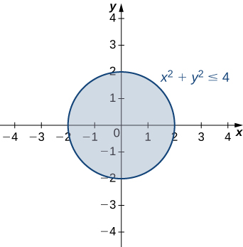
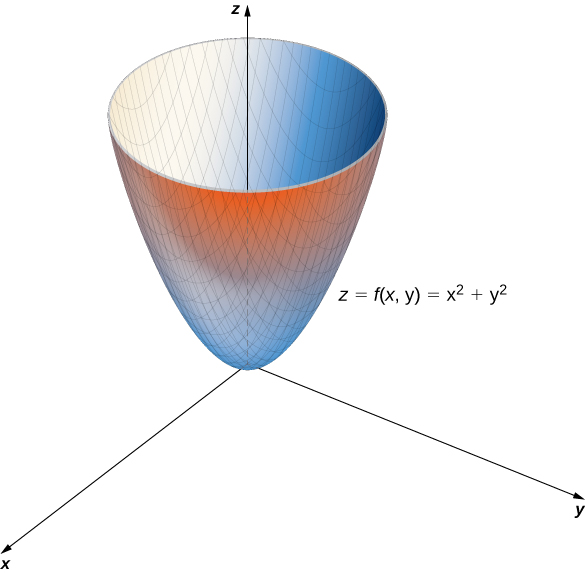
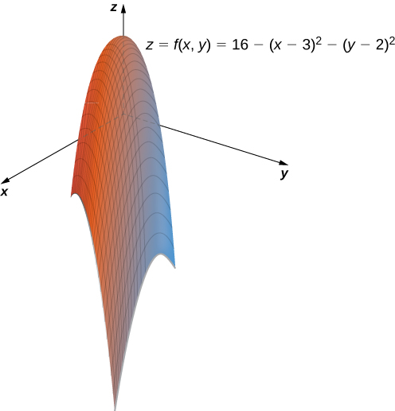
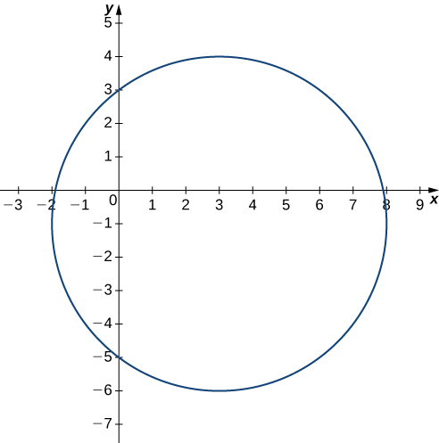
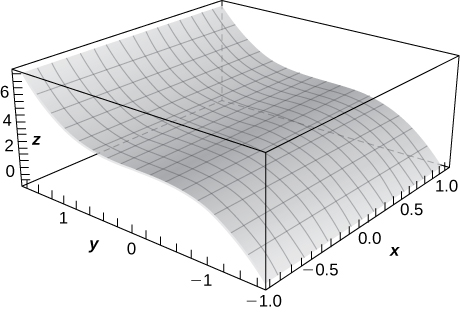
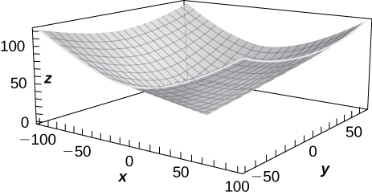
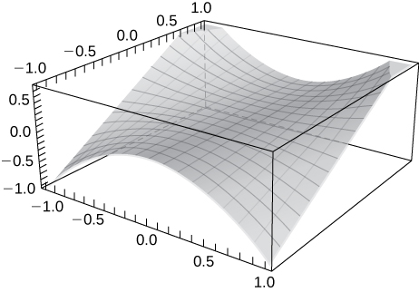
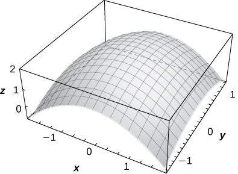
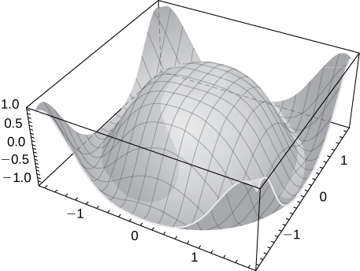

* Recognize a function of two variables and identify its domain and range.
* Sketch a graph of a function of two variables.
* Sketch several traces or level curves of a function of two variables.
* Recognize a function of three or more variables and identify its level surfaces.

Our first step is to explain what a function of more than one variable is, starting with functions of two independent variables. This step includes identifying the domain and range of such functions and learning how to graph them. We also examine ways to relate the graphs of functions in three dimensions to graphs of more familiar planar functions.

### Functions of Two Variables

The definition of a function of two variables is very similar to the definition for a function of one variable. The main difference is that, instead of mapping values of one variable to values of another variable, we map ordered pairs of variables to another variable.

Definition

A **function of two variables**{: data-type="term"} <math xmlns="http://www.w3.org/1998/Math/MathML"><mrow><mi>z</mi><mo>=</mo><mrow><mi>f</mi><mo>(</mo><mrow><mi>x</mi><mo>,</mo><mi>y</mi></mrow><mo>)</mo></mrow></mrow></math>

 maps each ordered pair <math xmlns="http://www.w3.org/1998/Math/MathML"><mrow><mrow><mo>(</mo><mrow><mi>x</mi><mo>,</mo><mi>y</mi></mrow><mo>)</mo></mrow></mrow></math>

 in a subset <math xmlns="http://www.w3.org/1998/Math/MathML"><mi>D</mi></math>

 of the real plane <math xmlns="http://www.w3.org/1998/Math/MathML"><mrow><msup><mi>ℝ</mi><mn>2</mn></msup></mrow></math>

 to a unique real number <math xmlns="http://www.w3.org/1998/Math/MathML"><mrow><mi>z</mi><mo>.</mo></mrow></math>

 The set <math xmlns="http://www.w3.org/1998/Math/MathML"><mi>D</mi></math>

 is called the *domain* of the function. The *range* of <math xmlns="http://www.w3.org/1998/Math/MathML"><mi>f</mi></math>

 is the set of all real numbers <math xmlns="http://www.w3.org/1998/Math/MathML"><mi>z</mi></math>

 that has at least one ordered pair <math xmlns="http://www.w3.org/1998/Math/MathML"><mrow><mrow><mo>(</mo><mrow><mi>x</mi><mo>,</mo><mi>y</mi></mrow><mo>)</mo></mrow><mo>∈</mo><mi>D</mi></mrow></math>

 such that <math xmlns="http://www.w3.org/1998/Math/MathML"><mrow><mi>f</mi><mrow><mo>(</mo><mrow><mi>x</mi><mo>,</mo><mi>y</mi></mrow><mo>)</mo></mrow><mo>=</mo><mi>z</mi></mrow></math>

 as shown in the following figure.

 ."){: #CNX_Calc_Figure_14_01_001}

Determining the domain of a function of two variables involves taking into account any domain restrictions that may exist. Let’s take a look.

Domains and Ranges for Functions of Two Variables

Find the domain and range of each of the following functions:

1.  <math xmlns="http://www.w3.org/1998/Math/MathML"><mrow><mi>f</mi><mrow><mo>(</mo><mrow><mi>x</mi><mo>,</mo><mi>y</mi></mrow><mo>)</mo></mrow><mo>=</mo><mn>3</mn><mi>x</mi><mo>+</mo><mn>5</mn><mi>y</mi><mo>+</mo><mn>2</mn></mrow></math>

2.  <math xmlns="http://www.w3.org/1998/Math/MathML"><mrow><mi>g</mi><mrow><mo>(</mo><mrow><mi>x</mi><mo>,</mo><mi>y</mi></mrow><mo>)</mo></mrow><mo>=</mo><msqrt><mrow><mn>9</mn><mo>−</mo><msup><mi>x</mi><mn>2</mn></msup><mo>−</mo><msup><mi>y</mi><mn>2</mn></msup></mrow></msqrt></mrow></math>
{: type="a"}

1.  This is an example of a linear function in two variables. There are no values or combinations of
    <math xmlns="http://www.w3.org/1998/Math/MathML"><mi>x</mi></math>
    
    and
    <math xmlns="http://www.w3.org/1998/Math/MathML"><mi>y</mi></math>
    
    that cause
    <math xmlns="http://www.w3.org/1998/Math/MathML"><mrow><mi>f</mi><mrow><mo>(</mo><mrow><mi>x</mi><mo>,</mo><mi>y</mi></mrow><mo>)</mo></mrow></mrow></math>
    
    to be undefined, so the domain of
    <math xmlns="http://www.w3.org/1998/Math/MathML"><mi>f</mi></math>
    
    is
    <math xmlns="http://www.w3.org/1998/Math/MathML"><mrow><msup><mi>ℝ</mi><mn>2</mn></msup><mo>.</mo></mrow></math>
    
    To determine the range, first pick a value for
    <math xmlns="http://www.w3.org/1998/Math/MathML"><mi>z</mi><mo>.</mo></math>
    
    We need to find a solution to the equation
    <math xmlns="http://www.w3.org/1998/Math/MathML"><mrow><mi>f</mi><mrow><mo>(</mo><mrow><mi>x</mi><mo>,</mo><mi>y</mi></mrow><mo>)</mo></mrow><mo>=</mo><mi>z</mi><mo>,</mo></mrow></math>
    
    or
    <math xmlns="http://www.w3.org/1998/Math/MathML"><mrow><mn>3</mn><mi>x</mi><mo>−</mo><mn>5</mn><mi>y</mi><mo>+</mo><mn>2</mn><mo>=</mo><mi>z</mi><mo>.</mo></mrow></math>
    
    One such solution can be obtained by first setting
    <math xmlns="http://www.w3.org/1998/Math/MathML"><mrow><mi>y</mi><mo>=</mo><mn>0</mn><mo>,</mo></mrow></math>
    
    which yields the equation
    <math xmlns="http://www.w3.org/1998/Math/MathML"><mrow><mn>3</mn><mi>x</mi><mo>+</mo><mn>2</mn><mo>=</mo><mi>z</mi><mo>.</mo></mrow></math>
    
    The solution to this equation is
    <math xmlns="http://www.w3.org/1998/Math/MathML"><mrow><mi>x</mi><mo>=</mo><mfrac><mrow><mi>z</mi><mo>−</mo><mn>2</mn></mrow><mn>3</mn></mfrac><mo>,</mo></mrow></math>
    
    which gives the ordered pair
    <math xmlns="http://www.w3.org/1998/Math/MathML"><mrow><mrow><mo>(</mo><mrow><mfrac><mrow><mi>z</mi><mo>−</mo><mn>2</mn></mrow><mn>3</mn></mfrac><mo>,</mo><mn>0</mn></mrow><mo>)</mo></mrow></mrow></math>
    
    as a solution to the equation
    <math xmlns="http://www.w3.org/1998/Math/MathML"><mrow><mi>f</mi><mrow><mo>(</mo><mrow><mi>x</mi><mo>,</mo><mi>y</mi></mrow><mo>)</mo></mrow><mo>=</mo><mi>z</mi></mrow></math>
    
    for any value of
    <math xmlns="http://www.w3.org/1998/Math/MathML"><mi>z</mi><mo>.</mo></math>
    
    Therefore, the range of the function is all real numbers, or
    <math xmlns="http://www.w3.org/1998/Math/MathML"><mrow><mi>ℝ</mi><mo>.</mo></mrow></math>

2.  For the function
    <math xmlns="http://www.w3.org/1998/Math/MathML"><mrow><mi>g</mi><mrow><mo>(</mo><mrow><mi>x</mi><mo>,</mo><mi>y</mi></mrow><mo>)</mo></mrow></mrow></math>
    
    to have a real value, the quantity under the square root must be nonnegative:
    * * *
    {: data-type="newline"}
    
    

    <math xmlns="http://www.w3.org/1998/Math/MathML"><mrow><mn>9</mn><mo>−</mo><msup><mi>x</mi><mn>2</mn></msup><mo>−</mo><msup><mi>y</mi><mn>2</mn></msup><mo>≥</mo><mn>0</mn><mo>.</mo></mrow></math>
    

    
    * * *
    {: data-type="newline"}
    
    This inequality can be written in the form
    * * *
    {: data-type="newline"}
    
    

    <math xmlns="http://www.w3.org/1998/Math/MathML"><mrow><msup><mi>x</mi><mn>2</mn></msup><mo>+</mo><msup><mi>y</mi><mn>2</mn></msup><mo>≤</mo><mn>9</mn><mo>.</mo></mrow></math>
    

    
    * * *
    {: data-type="newline"}
    
    Therefore, the domain of
    <math xmlns="http://www.w3.org/1998/Math/MathML"><mrow><mi>g</mi><mrow><mo>(</mo><mrow><mi>x</mi><mo>,</mo><mi>y</mi></mrow><mo>)</mo></mrow></mrow></math>
    
    is
    <math xmlns="http://www.w3.org/1998/Math/MathML"><mrow><mrow><mo>{</mo><mrow><mrow><mo>(</mo><mrow><mi>x</mi><mo>,</mo><mi>y</mi></mrow><mo>)</mo></mrow><mo>∈</mo><mrow><mrow><msup><mi>ℝ</mi><mn>2</mn></msup></mrow><mo>\|</mo></mrow><msup><mi>x</mi><mn>2</mn></msup><mo>+</mo><msup><mi>y</mi><mn>2</mn></msup><mo>≤</mo><mn>9</mn></mrow><mo>}</mo></mrow><mo>.</mo></mrow></math>
    
    The graph of this set of points can be described as a disk of radius
    <math xmlns="http://www.w3.org/1998/Math/MathML"><mn>3</mn></math>
    
    centered at the origin. The domain includes the boundary circle as shown in the following graph.
    * * *
    {: data-type="newline"}
    
    =9&#x2212;x2&#x2212;y2 is a closed disk of radius 3."){: #CNX_Calc_Figure_14_01_002}

    * * *
    {: data-type="newline"}
    
    To determine the range of
    <math xmlns="http://www.w3.org/1998/Math/MathML"><mrow><mi>g</mi><mrow><mo>(</mo><mrow><mi>x</mi><mo>,</mo><mi>y</mi></mrow><mo>)</mo></mrow><mo>=</mo><msqrt><mrow><mn>9</mn><mo>−</mo><msup><mi>x</mi><mn>2</mn></msup><mo>−</mo><msup><mi>y</mi><mn>2</mn></msup></mrow></msqrt></mrow></math>
    
    we start with a point
    <math xmlns="http://www.w3.org/1998/Math/MathML"><mrow><mrow><mo>(</mo><mrow><msub><mi>x</mi><mn>0</mn></msub><mo>,</mo><msub><mi>y</mi><mn>0</mn></msub></mrow><mo>)</mo></mrow></mrow></math>
    
    on the boundary of the domain, which is defined by the relation
    <math xmlns="http://www.w3.org/1998/Math/MathML"><mrow><msup><mi>x</mi><mn>2</mn></msup><mo>+</mo><msup><mi>y</mi><mn>2</mn></msup><mo>=</mo><mn>9</mn><mo>.</mo></mrow></math>
    
    It follows that
    <math xmlns="http://www.w3.org/1998/Math/MathML"><mrow><msubsup><mi>x</mi><mn>0</mn><mn>2</mn></msubsup><mo>+</mo><msubsup><mi>y</mi><mn>0</mn><mn>2</mn></msubsup><mo>=</mo><mn>9</mn></mrow></math>
    
    and
    * * *
    {: data-type="newline"}
    
    

    <math xmlns="http://www.w3.org/1998/Math/MathML"><mrow><mi>g</mi><mrow><mo>(</mo><mrow><msub><mi>x</mi><mn>0</mn></msub><mo>,</mo><msub><mi>y</mi><mn>0</mn></msub></mrow><mo>)</mo></mrow><mo>=</mo><msqrt><mrow><mn>9</mn><mo>−</mo><msubsup><mi>x</mi><mn>0</mn><mn>2</mn></msubsup><mo>−</mo><msubsup><mi>y</mi><mn>0</mn><mn>2</mn></msubsup></mrow></msqrt><mo>=</mo><msqrt><mrow><mn>9</mn><mo>−</mo><mrow><mo>(</mo><mrow><msubsup><mi>x</mi><mn>0</mn><mn>2</mn></msubsup><mo>+</mo><msubsup><mi>y</mi><mn>0</mn><mn>2</mn></msubsup></mrow><mo>)</mo></mrow></mrow></msqrt><mo>=</mo><msqrt><mrow><mn>9</mn><mo>−</mo><mn>9</mn></mrow></msqrt><mo>=</mo><mn>0</mn><mo>.</mo></mrow></math>
    

    
    * * *
    {: data-type="newline"}
    
    If
    <math xmlns="http://www.w3.org/1998/Math/MathML"><mrow><msubsup><mi>x</mi><mn>0</mn><mn>2</mn></msubsup><mo>+</mo><msubsup><mi>y</mi><mn>0</mn><mn>2</mn></msubsup><mo>=</mo><mn>0</mn></mrow></math>
    
    (in other words,
    <math xmlns="http://www.w3.org/1998/Math/MathML"><mrow><msub><mi>x</mi><mn>0</mn></msub><mo>=</mo><msub><mi>y</mi><mn>0</mn></msub><mo>=</mo><mn>0</mn><mo stretchy="false">)</mo><mo>,</mo></mrow></math>
    
    then
    * * *
    {: data-type="newline"}
    
    

    <math xmlns="http://www.w3.org/1998/Math/MathML"><mrow><mi>g</mi><mrow><mo>(</mo><mrow><msub><mi>x</mi><mn>0</mn></msub><mo>,</mo><msub><mi>y</mi><mn>0</mn></msub></mrow><mo>)</mo></mrow><mo>=</mo><msqrt><mrow><mn>9</mn><mo>−</mo><msubsup><mi>x</mi><mn>0</mn><mn>2</mn></msubsup><mo>−</mo><msubsup><mi>y</mi><mn>0</mn><mn>2</mn></msubsup></mrow></msqrt><mo>=</mo><msqrt><mrow><mn>9</mn><mo>−</mo><mrow><mo>(</mo><mrow><msubsup><mi>x</mi><mn>0</mn><mn>2</mn></msubsup><mo>+</mo><msubsup><mi>y</mi><mn>0</mn><mn>2</mn></msubsup></mrow><mo>)</mo></mrow></mrow></msqrt><mo>=</mo><msqrt><mrow><mn>9</mn><mo>−</mo><mn>0</mn></mrow></msqrt><mo>=</mo><mn>3</mn><mo>.</mo></mrow></math>
    

    
    * * *
    {: data-type="newline"}
    
    This is the maximum value of the function. Given any value *c* between
    <math xmlns="http://www.w3.org/1998/Math/MathML"><mrow><mn>0</mn><mspace width="0.2em" /><mtext>and</mtext><mspace width="0.2em" /><mn>3</mn><mo>,</mo></mrow></math>
    
    we can find an entire set of points inside the domain of
    <math xmlns="http://www.w3.org/1998/Math/MathML"><mi>g</mi></math>
    
    such that
    <math xmlns="http://www.w3.org/1998/Math/MathML"><mrow><mi>g</mi><mrow><mo>(</mo><mrow><mi>x</mi><mo>,</mo><mi>y</mi></mrow><mo>)</mo></mrow><mo>=</mo><mi>c</mi><mtext>:</mtext></mrow></math>
    
    * * *
    {: data-type="newline"}
    
    

    <math xmlns="http://www.w3.org/1998/Math/MathML"><mtable><mtr><mtd columnalign="right"><msqrt><mrow><mn>9</mn><mo>−</mo><msup><mi>x</mi><mn>2</mn></msup><mo>−</mo><msup><mi>y</mi><mn>2</mn></msup></mrow></msqrt></mtd><mtd columnalign="left"><mo>=</mo></mtd><mtd columnalign="left"><mi>c</mi></mtd></mtr><mtr><mtd columnalign="right"><mn>9</mn><mo>−</mo><msup><mi>x</mi><mn>2</mn></msup><mo>−</mo><msup><mi>y</mi><mn>2</mn></msup></mtd><mtd columnalign="left"><mo>=</mo></mtd><mtd columnalign="left"><msup><mi>c</mi><mn>2</mn></msup></mtd></mtr><mtr><mtd columnalign="right"><msup><mi>x</mi><mn>2</mn></msup><mo>+</mo><msup><mi>y</mi><mn>2</mn></msup></mtd><mtd columnalign="left"><mo>=</mo></mtd><mtd columnalign="left"><mn>9</mn><mo>−</mo><msup><mi>c</mi><mn>2</mn></msup><mo>.</mo></mtd></mtr></mtable></math>
    

    
    * * *
    {: data-type="newline"}
    
    Since
    <math xmlns="http://www.w3.org/1998/Math/MathML"><mrow><mn>9</mn><mo>−</mo><msup><mi>c</mi><mn>2</mn></msup><mo>&gt;</mo><mn>0</mn><mo>,</mo></mrow></math>
    
    this describes a circle of radius
    <math xmlns="http://www.w3.org/1998/Math/MathML"><mrow><msqrt><mrow><mn>9</mn><mo>−</mo><msup><mi>c</mi><mn>2</mn></msup></mrow></msqrt></mrow></math>
    
    centered at the origin. Any point on this circle satisfies the equation
    <math xmlns="http://www.w3.org/1998/Math/MathML"><mrow><mi>g</mi><mrow><mo>(</mo><mrow><mi>x</mi><mo>,</mo><mi>y</mi></mrow><mo>)</mo></mrow><mo>=</mo><mi>c</mi><mo>.</mo></mrow></math>
    
    Therefore, the range of this function can be written in interval notation as
    <math xmlns="http://www.w3.org/1998/Math/MathML"><mrow><mrow><mo>[</mo><mrow><mn>0</mn><mo>,</mo><mn>3</mn></mrow><mo>]</mo></mrow><mo>.</mo></mrow></math>
{: type="a"}

Find the domain and range of the function <math xmlns="http://www.w3.org/1998/Math/MathML"><mrow><mi>f</mi><mrow><mo>(</mo><mrow><mi>x</mi><mo>,</mo><mi>y</mi></mrow><mo>)</mo></mrow><mo>=</mo><msqrt><mrow><mn>36</mn><mo>−</mo><mn>9</mn><msup><mi>x</mi><mn>2</mn></msup><mo>−</mo><mn>9</mn><msup><mi>y</mi><mn>2</mn></msup></mrow></msqrt><mo>.</mo></mrow></math>

The domain is the shaded circle defined by the inequality <math xmlns="http://www.w3.org/1998/Math/MathML"><mrow><mn>9</mn><msup><mi>x</mi><mn>2</mn></msup><mo>+</mo><mn>9</mn><msup><mi>y</mi><mn>2</mn></msup><mo>≤</mo><mn>36</mn><mo>,</mo></mrow></math>

 which has a circle of radius <math xmlns="http://www.w3.org/1998/Math/MathML"><mn>2</mn></math>

 as its boundary. The range is <math xmlns="http://www.w3.org/1998/Math/MathML"><mrow><mrow><mo>[</mo><mrow><mn>0</mn><mo>,</mo><mn>6</mn></mrow><mo>]</mo></mrow><mo>.</mo></mrow></math>

* * *
{: data-type="newline"}

  

Hint

Determine the set of ordered pairs that do not make the radicand negative.

### Graphing Functions of Two Variables

Suppose we wish to graph the function <math xmlns="http://www.w3.org/1998/Math/MathML"><mrow><mi>z</mi><mo>=</mo><mrow><mo>(</mo><mrow><mi>x</mi><mo>,</mo><mi>y</mi></mrow><mo>)</mo></mrow><mo>.</mo></mrow></math>

 This function has two independent variables <math xmlns="http://www.w3.org/1998/Math/MathML"><mrow><mrow><mo>(</mo><mrow><mi>x</mi><mspace width="0.2em" /><mtext>and</mtext><mspace width="0.2em" /><mi>y</mi></mrow><mo>)</mo></mrow></mrow></math>

 and one dependent variable <math xmlns="http://www.w3.org/1998/Math/MathML"><mrow><mrow><mo>(</mo><mi>z</mi><mo>)</mo></mrow><mo>.</mo></mrow></math>

 When graphing a function <math xmlns="http://www.w3.org/1998/Math/MathML"><mrow><mi>y</mi><mo>=</mo><mi>f</mi><mrow><mo>(</mo><mi>x</mi><mo>)</mo></mrow></mrow></math>

 of one variable, we use the Cartesian plane. We are able to graph any ordered pair <math xmlns="http://www.w3.org/1998/Math/MathML"><mrow><mrow><mo>(</mo><mrow><mi>x</mi><mo>,</mo><mi>y</mi></mrow><mo>)</mo></mrow></mrow></math>

 in the plane, and every point in the plane has an ordered pair <math xmlns="http://www.w3.org/1998/Math/MathML"><mrow><mrow><mo>(</mo><mrow><mi>x</mi><mo>,</mo><mi>y</mi></mrow><mo>)</mo></mrow></mrow></math>

 associated with it. With a function of two variables, each ordered pair <math xmlns="http://www.w3.org/1998/Math/MathML"><mrow><mrow><mo>(</mo><mrow><mi>x</mi><mo>,</mo><mi>y</mi></mrow><mo>)</mo></mrow></mrow></math>

 in the domain of the function is mapped to a real number <math xmlns="http://www.w3.org/1998/Math/MathML"><mrow><mi>z</mi><mo>.</mo></mrow></math>

 Therefore, the graph of the function <math xmlns="http://www.w3.org/1998/Math/MathML"><mi>f</mi></math>

 consists of ordered triples <math xmlns="http://www.w3.org/1998/Math/MathML"><mrow><mrow><mo>(</mo><mrow><mi>x</mi><mo>,</mo><mi>y</mi><mo>,</mo><mi>z</mi></mrow><mo>)</mo></mrow><mo>.</mo></mrow></math>

 The graph of a function <math xmlns="http://www.w3.org/1998/Math/MathML"><mrow><mi>z</mi><mo>=</mo><mrow><mo>(</mo><mrow><mi>x</mi><mo>,</mo><mi>y</mi></mrow><mo>)</mo></mrow></mrow></math>

 of two variables is called a **surface**{: data-type="term"}.

To understand more completely the concept of plotting a set of ordered triples to obtain a surface in three-dimensional space, imagine the <math xmlns="http://www.w3.org/1998/Math/MathML"><mrow><mrow><mo>(</mo><mrow><mi>x</mi><mo>,</mo><mi>y</mi></mrow><mo>)</mo></mrow></mrow></math>

 coordinate system laying flat. Then, every point in the domain of the function <math xmlns="http://www.w3.org/1998/Math/MathML"><mi>f</mi></math>

 has a unique <math xmlns="http://www.w3.org/1998/Math/MathML"><mi>z</mi><mtext>-value</mtext></math>

 associated with it. If <math xmlns="http://www.w3.org/1998/Math/MathML"><mi>z</mi></math>

 is positive, then the graphed point is located above the <math xmlns="http://www.w3.org/1998/Math/MathML"><mrow><mtext mathvariant="italic">xy</mtext><mtext>-plane,</mtext></mrow></math>

 if <math xmlns="http://www.w3.org/1998/Math/MathML"><mi>z</mi></math>

 is negative, then the graphed point is located below the <math xmlns="http://www.w3.org/1998/Math/MathML"><mrow><mtext mathvariant="italic">xy</mtext><mtext>-plane</mtext><mo>.</mo></mrow></math>

 The set of all the graphed points becomes the two-dimensional surface that is the graph of the function <math xmlns="http://www.w3.org/1998/Math/MathML"><mi>f</mi><mo>.</mo></math>

Graphing Functions of Two Variables

Create a graph of each of the following functions:

1.  <math xmlns="http://www.w3.org/1998/Math/MathML"><mrow><mi>g</mi><mrow><mo>(</mo><mrow><mi>x</mi><mo>,</mo><mi>y</mi></mrow><mo>)</mo></mrow><mo>=</mo><msqrt><mrow><mn>9</mn><mo>−</mo><msup><mi>x</mi><mn>2</mn></msup><mo>−</mo><msup><mi>y</mi><mn>2</mn></msup></mrow></msqrt></mrow></math>

2.  <math xmlns="http://www.w3.org/1998/Math/MathML"><mrow><mi>f</mi><mrow><mo>(</mo><mrow><mi>x</mi><mo>,</mo><mi>y</mi></mrow><mo>)</mo></mrow><mo>=</mo><msup><mi>x</mi><mn>2</mn></msup><mo>+</mo><msup><mi>y</mi><mn>2</mn></msup></mrow></math>
{: type="a"}

1.  In [[link]](#fs-id1167793371525), we determined that the domain of
    <math xmlns="http://www.w3.org/1998/Math/MathML"><mrow><mi>g</mi><mrow><mo>(</mo><mrow><mi>x</mi><mo>,</mo><mi>y</mi></mrow><mo>)</mo></mrow><mo>=</mo><msqrt><mrow><mn>9</mn><mo>−</mo><msup><mi>x</mi><mn>2</mn></msup><mo>−</mo><msup><mi>y</mi><mn>2</mn></msup></mrow></msqrt></mrow></math>
    
    is
    <math xmlns="http://www.w3.org/1998/Math/MathML"><mrow><mrow><mo>{</mo><mrow><mrow><mo>(</mo><mrow><mi>x</mi><mo>,</mo><mi>y</mi></mrow><mo>)</mo></mrow><mo>∈</mo><mrow><mrow><msup><mi>ℝ</mi><mn>2</mn></msup></mrow><mo>\|</mo></mrow><msup><mi>x</mi><mn>2</mn></msup><mo>+</mo><msup><mi>y</mi><mn>2</mn></msup><mo>≤</mo><mn>9</mn></mrow><mo>}</mo></mrow></mrow></math>
    
    and the range is
    <math xmlns="http://www.w3.org/1998/Math/MathML"><mrow><mrow><mo>{</mo><mrow><mi>z</mi><mo>∈</mo><mrow><mrow><msup><mi>ℝ</mi><mn>2</mn></msup></mrow><mo>\|</mo></mrow><mn>0</mn><mo>≤</mo><mi>z</mi><mo>≤</mo><mn>3</mn></mrow><mo>}</mo></mrow><mo>.</mo></mrow></math>
    
    When
    <math xmlns="http://www.w3.org/1998/Math/MathML"><mrow><msup><mi>x</mi><mn>2</mn></msup><mo>+</mo><msup><mi>y</mi><mn>2</mn></msup><mo>=</mo><mn>9</mn></mrow></math>
    
    we have
    <math xmlns="http://www.w3.org/1998/Math/MathML"><mrow><mi>g</mi><mrow><mo>(</mo><mrow><mi>x</mi><mo>,</mo><mi>y</mi></mrow><mo>)</mo></mrow><mo>=</mo><mn>0</mn><mo>.</mo></mrow></math>
    
    Therefore any point on the circle of radius
    <math xmlns="http://www.w3.org/1998/Math/MathML"><mn>3</mn></math>
    
    centered at the origin in the
    <math xmlns="http://www.w3.org/1998/Math/MathML"><mrow><mi>x</mi><mo>,</mo><mi>y</mi><mtext>-plane</mtext></mrow></math>
    
    maps to
    <math xmlns="http://www.w3.org/1998/Math/MathML"><mrow><mi>z</mi><mo>=</mo><mn>0</mn></mrow></math>
    
    in
    <math xmlns="http://www.w3.org/1998/Math/MathML"><mrow><msup><mi>ℝ</mi><mn>3</mn></msup><mo>.</mo></mrow></math>
    
    If
    <math xmlns="http://www.w3.org/1998/Math/MathML"><mrow><msup><mi>x</mi><mn>2</mn></msup><mo>+</mo><msup><mi>y</mi><mn>2</mn></msup><mo>=</mo><mn>8</mn><mo>,</mo></mrow></math>
    
    then
    <math xmlns="http://www.w3.org/1998/Math/MathML"><mrow><mi>g</mi><mrow><mo>(</mo><mrow><mi>x</mi><mo>,</mo><mi>y</mi></mrow><mo>)</mo></mrow><mo>=</mo><mn>1</mn><mo>,</mo></mrow></math>
    
    so any point on the circle of radius
    <math xmlns="http://www.w3.org/1998/Math/MathML"><mrow><mn>2</mn><msqrt><mn>2</mn></msqrt></mrow></math>
    
    centered at the origin in the
    <math xmlns="http://www.w3.org/1998/Math/MathML"><mrow><mi>x</mi><mo>,</mo><mi>y</mi><mtext>-plane</mtext></mrow></math>
    
    maps to
    <math xmlns="http://www.w3.org/1998/Math/MathML"><mrow><mi>z</mi><mo>=</mo><mn>1</mn></mrow></math>
    
    in
    <math xmlns="http://www.w3.org/1998/Math/MathML"><mrow><msup><mi>ℝ</mi><mn>3</mn></msup><mo>.</mo></mrow></math>
    
    As
    <math xmlns="http://www.w3.org/1998/Math/MathML"><mrow><msup><mi>x</mi><mn>2</mn></msup><mo>+</mo><msup><mi>y</mi><mn>2</mn></msup></mrow></math>
    
    gets closer to zero, the value of *z* approaches 3. When
    <math xmlns="http://www.w3.org/1998/Math/MathML"><mrow><msup><mi>x</mi><mn>2</mn></msup><mo>+</mo><msup><mi>y</mi><mn>2</mn></msup><mo>=</mo><mn>0</mn><mo>,</mo></mrow></math>
    
    then
    <math xmlns="http://www.w3.org/1998/Math/MathML"><mrow><mi>g</mi><mrow><mo>(</mo><mrow><mi>x</mi><mo>,</mo><mi>y</mi></mrow><mo>)</mo></mrow><mo>=</mo><mn>3</mn><mo>.</mo></mrow></math>
    
    This is the origin in the
    <math xmlns="http://www.w3.org/1998/Math/MathML"><mrow><mi>x</mi><mo>,</mo><mi>y</mi><mtext>-plane</mtext><mo>.</mo></mrow></math>
    
    If
    <math xmlns="http://www.w3.org/1998/Math/MathML"><mrow><msup><mi>x</mi><mn>2</mn></msup><mo>+</mo><msup><mi>y</mi><mn>2</mn></msup></mrow></math>
    
    is equal to any other value between
    <math xmlns="http://www.w3.org/1998/Math/MathML"><mrow><mn>0</mn><mspace width="0.2em" /><mtext>and</mtext><mspace width="0.2em" /><mn>9</mn><mo>,</mo></mrow></math>
    
    then
    <math xmlns="http://www.w3.org/1998/Math/MathML"><mrow><mi>g</mi><mrow><mo>(</mo><mrow><mi>x</mi><mo>,</mo><mi>y</mi></mrow><mo>)</mo></mrow></mrow></math>
    
    equals some other constant between
    <math xmlns="http://www.w3.org/1998/Math/MathML"><mrow><mn>0</mn><mspace width="0.2em" /><mtext>and</mtext><mspace width="0.2em" /><mn>3</mn><mo>.</mo></mrow></math>
    
    The surface described by this function is a hemisphere centered at the origin with radius
    <math xmlns="http://www.w3.org/1998/Math/MathML"><mn>3</mn></math>
    
    as shown in the following graph.
    * * *
    {: data-type="newline"}
    
    {: #CNX_Calc_Figure_14_01_004}

2.  This function also contains the expression
    <math xmlns="http://www.w3.org/1998/Math/MathML"><mrow><msup><mi>x</mi><mn>2</mn></msup><mo>+</mo><msup><mi>y</mi><mn>2</mn></msup><mo>.</mo></mrow></math>
    
    Setting this expression equal to various values starting at zero, we obtain circles of increasing radius. The minimum value of
    <math xmlns="http://www.w3.org/1998/Math/MathML"><mrow><mi>f</mi><mo stretchy="false">(</mo><mi>x</mi><mo>,</mo><mi>y</mi><mo stretchy="false">)</mo><mo>=</mo><msup><mi>x</mi><mn>2</mn></msup><mo>+</mo><msup><mi>y</mi><mn>2</mn></msup></mrow></math>
    
    is zero (attained when
    <math xmlns="http://www.w3.org/1998/Math/MathML"><mrow><mi>x</mi><mo>=</mo><mi>y</mi><mo>=</mo><mn>0</mn><mo>.</mo><mo stretchy="false">)</mo><mo>.</mo></mrow></math>
    
    When
    <math xmlns="http://www.w3.org/1998/Math/MathML"><mrow><mi>x</mi><mo>=</mo><mn>0</mn><mo>,</mo></mrow></math>
    
    the function becomes
    <math xmlns="http://www.w3.org/1998/Math/MathML"><mrow><mi>z</mi><mo>=</mo><msup><mi>y</mi><mn>2</mn></msup><mo>,</mo></mrow></math>
    
    and when
    <math xmlns="http://www.w3.org/1998/Math/MathML"><mrow><mi>y</mi><mo>=</mo><mn>0</mn><mo>,</mo></mrow></math>
    
    then the function becomes
    <math xmlns="http://www.w3.org/1998/Math/MathML"><mrow><mi>z</mi><mo>=</mo><msup><mi>x</mi><mn>2</mn></msup><mo>.</mo></mrow></math>
    
    These are cross-sections of the graph, and are parabolas. Recall from [Introduction to Vectors in Space](/m53906){: .target-chapter} that the name of the graph of
    <math xmlns="http://www.w3.org/1998/Math/MathML"><mrow><mi>f</mi><mo stretchy="false">(</mo><mi>x</mi><mo>,</mo><mi>y</mi><mo stretchy="false">)</mo><mo>=</mo><msup><mi>x</mi><mn>2</mn></msup><mo>+</mo><msup><mi>y</mi><mn>2</mn></msup></mrow></math>
    
    is a *paraboloid*. The graph of
    <math xmlns="http://www.w3.org/1998/Math/MathML"><mi>f</mi></math>
    
    appears in the following graph.
    * * *
    {: data-type="newline"}
    
    {: #CNX_Calc_Figure_14_01_005}

{: type="a"}

Nuts and Bolts

A profit function for a hardware manufacturer is given by

<math xmlns="http://www.w3.org/1998/Math/MathML"><mrow><mi>f</mi><mo stretchy="false">(</mo><mi>x</mi><mo>,</mo><mi>y</mi><mo stretchy="false">)</mo><mo>=</mo><mn>16</mn><mo>−</mo><msup><mrow><mrow><mo>(</mo><mrow><mi>x</mi><mo>−</mo><mn>3</mn></mrow><mo>)</mo></mrow></mrow><mn>2</mn></msup><mo>−</mo><msup><mrow><mrow><mo>(</mo><mrow><mi>y</mi><mo>−</mo><mn>2</mn></mrow><mo>)</mo></mrow></mrow><mn>2</mn></msup><mo>,</mo></mrow></math>

where <math xmlns="http://www.w3.org/1998/Math/MathML"><mi>x</mi></math>

 is the number of nuts sold per month (measured in thousands) and <math xmlns="http://www.w3.org/1998/Math/MathML"><mi>y</mi></math>

 represents the number of bolts sold per month (measured in thousands). Profit is measured in thousands of dollars. Sketch a graph of this function.

This function is a polynomial function in two variables. The domain of <math xmlns="http://www.w3.org/1998/Math/MathML"><mi>f</mi></math>

 consists of <math xmlns="http://www.w3.org/1998/Math/MathML"><mrow><mrow><mo>(</mo><mrow><mi>x</mi><mo>,</mo><mi>y</mi></mrow><mo>)</mo></mrow></mrow></math>

 coordinate pairs that yield a nonnegative profit:

<math xmlns="http://www.w3.org/1998/Math/MathML"><mtable><mtr><mtd columnalign="left"><mn>16</mn><mo>−</mo><msup><mrow><mo>(</mo><mrow><mi>x</mi><mo>−</mo><mn>3</mn></mrow><mo>)</mo></mrow><mn>2</mn></msup><mo>−</mo><msup><mrow><mo>(</mo><mrow><mi>y</mi><mo>−</mo><mn>2</mn></mrow><mo>)</mo></mrow><mn>2</mn></msup><mo>≥</mo><mn>0</mn></mtd></mtr><mtr><mtd columnalign="left"><msup><mrow><mo>(</mo><mrow><mi>x</mi><mo>−</mo><mn>3</mn></mrow><mo>)</mo></mrow><mn>2</mn></msup><mo>+</mo><msup><mrow><mo>(</mo><mrow><mi>y</mi><mo>−</mo><mn>2</mn></mrow><mo>)</mo></mrow><mn>2</mn></msup><mo>≤</mo><mn>16.</mn></mtd></mtr></mtable></math>

This is a disk of radius <math xmlns="http://www.w3.org/1998/Math/MathML"><mn>4</mn></math>

 centered at <math xmlns="http://www.w3.org/1998/Math/MathML"><mrow><mrow><mo>(</mo><mrow><mn>3</mn><mo>,</mo><mn>2</mn></mrow><mo>)</mo></mrow><mo>.</mo></mrow></math>

 A further restriction is that both <math xmlns="http://www.w3.org/1998/Math/MathML"><mrow><mi>x</mi><mspace width="0.2em" /><mtext>and</mtext><mspace width="0.2em" /><mi>y</mi></mrow></math>

 must be nonnegative. When <math xmlns="http://www.w3.org/1998/Math/MathML"><mrow><mi>x</mi><mo>=</mo><mn>3</mn></mrow></math>

 and <math xmlns="http://www.w3.org/1998/Math/MathML"><mrow><mi>y</mi><mo>=</mo><mn>2</mn><mo>,</mo></mrow></math>

 <math xmlns="http://www.w3.org/1998/Math/MathML"><mrow><mi>f</mi><mrow><mo>(</mo><mrow><mi>x</mi><mo>,</mo><mi>y</mi></mrow><mo>)</mo></mrow><mo>=</mo><mn>16</mn><mo>.</mo></mrow></math>

 Note that it is possible for either value to be a noninteger; for example, it is possible to sell <math xmlns="http://www.w3.org/1998/Math/MathML"><mrow><mn>2.5</mn></mrow></math>

 thousand nuts in a month. The domain, therefore, contains thousands of points, so we can consider all points within the disk. For any <math xmlns="http://www.w3.org/1998/Math/MathML"><mrow><mi>z</mi><mo>&lt;</mo><mn>16</mn><mo>,</mo></mrow></math>

 we can solve the equation <math xmlns="http://www.w3.org/1998/Math/MathML"><mrow><mi>f</mi><mrow><mo>(</mo><mrow><mi>x</mi><mo>,</mo><mi>y</mi></mrow><mo>)</mo></mrow><mo>=</mo><mn>16</mn><mtext>:</mtext></mrow></math>

<math xmlns="http://www.w3.org/1998/Math/MathML"><mtable><mtr /><mtr><mtd columnalign="right"><mn>16</mn><mo>−</mo><msup><mrow><mo>(</mo><mrow><mi>x</mi><mo>−</mo><mn>3</mn></mrow><mo>)</mo></mrow><mn>2</mn></msup><mo>−</mo><msup><mrow><mo>(</mo><mrow><mi>y</mi><mo>−</mo><mn>2</mn></mrow><mo>)</mo></mrow><mn>2</mn></msup></mtd><mtd columnalign="left"><mo>=</mo></mtd><mtd columnalign="left"><mi>z</mi></mtd></mtr><mtr><mtd columnalign="right"><msup><mrow><mo>(</mo><mrow><mi>x</mi><mo>−</mo><mn>3</mn></mrow><mo>)</mo></mrow><mn>2</mn></msup><mo>+</mo><msup><mrow><mo>(</mo><mrow><mi>y</mi><mo>−</mo><mn>2</mn></mrow><mo>)</mo></mrow><mn>2</mn></msup></mtd><mtd columnalign="left"><mo>=</mo></mtd><mtd columnalign="left"><mn>16</mn><mo>−</mo><mi>z</mi><mo>.</mo></mtd></mtr></mtable></math>

Since <math xmlns="http://www.w3.org/1998/Math/MathML"><mrow><mi>z</mi><mo>&lt;</mo><mn>16</mn><mo>,</mo></mrow></math>

 we know that <math xmlns="http://www.w3.org/1998/Math/MathML"><mrow><mn>16</mn><mo>−</mo><mi>z</mi><mo>&gt;</mo><mn>0</mn><mo>,</mo></mrow></math>

 so the previous equation describes a circle with radius <math xmlns="http://www.w3.org/1998/Math/MathML"><mrow><msqrt><mrow><mn>16</mn><mo>−</mo><mi>z</mi></mrow></msqrt></mrow></math>

 centered at the point <math xmlns="http://www.w3.org/1998/Math/MathML"><mrow><mrow><mo>(</mo><mrow><mn>3</mn><mo>,</mo><mn>2</mn></mrow><mo>)</mo></mrow><mo>.</mo></mrow></math>

 Therefore. the range of <math xmlns="http://www.w3.org/1998/Math/MathML"><mrow><mi>f</mi><mrow><mo>(</mo><mrow><mi>x</mi><mo>,</mo><mi>y</mi></mrow><mo>)</mo></mrow></mrow></math>

 is <math xmlns="http://www.w3.org/1998/Math/MathML"><mrow><mrow><mo>{</mo><mrow><mi>z</mi><mo>∈</mo><mrow><mi>ℝ</mi><mo>\|</mo></mrow><mi>z</mi><mo>≤</mo><mn>16</mn></mrow><mo>}</mo></mrow><mo>.</mo></mrow></math>

 The graph of <math xmlns="http://www.w3.org/1998/Math/MathML"><mrow><mi>f</mi><mrow><mo>(</mo><mrow><mi>x</mi><mo>,</mo><mi>y</mi></mrow><mo>)</mo></mrow></mrow></math>

 is also a paraboloid, and this paraboloid points downward as shown.

{: #CNX_Calc_Figure_14_01_006}

### Level Curves

If hikers walk along rugged trails, they might use a topographical map that shows how steeply the trails change. A **topographical map**{: data-type="term" .no-emphasis} contains curved lines called *contour lines*. Each contour line corresponds to the points on the map that have equal elevation ([\[link\]](#CNX_Calc_Figure_14_01_007)). A level curve of a function of two variables <math xmlns="http://www.w3.org/1998/Math/MathML"><mrow><mi>f</mi><mrow><mo>(</mo><mrow><mi>x</mi><mo>,</mo><mi>y</mi></mrow><mo>)</mo></mrow></mrow></math>

 is completely analogous to a contour line on a topographical map.

  A topographical map of Devil&#x2019;s Tower, Wyoming. Lines that are close together indicate very steep terrain. (b) A perspective photo of Devil&#x2019;s Tower shows just how steep its sides are. Notice the top of the tower has the same shape as the center of the topographical map."){: #CNX_Calc_Figure_14_01_007}

Definition

Given a function <math xmlns="http://www.w3.org/1998/Math/MathML"><mrow><mi>f</mi><mrow><mo>(</mo><mrow><mi>x</mi><mo>,</mo><mi>y</mi></mrow><mo>)</mo></mrow></mrow></math>

 and a number <math xmlns="http://www.w3.org/1998/Math/MathML"><mi>c</mi></math>

 in the range of <math xmlns="http://www.w3.org/1998/Math/MathML"><mrow><mi>f</mi><mo>,</mo><mspace width="0.2em" /><mtext>a</mtext></mrow></math>

 **level curve of a function of two variables**{: data-type="term"} for the value <math xmlns="http://www.w3.org/1998/Math/MathML"><mi>c</mi></math>

 is defined to be the set of points satisfying the equation <math xmlns="http://www.w3.org/1998/Math/MathML"><mrow><mi>f</mi><mrow><mo>(</mo><mrow><mi>x</mi><mo>,</mo><mi>y</mi></mrow><mo>)</mo></mrow><mo>=</mo><mi>c</mi><mo>.</mo></mrow></math>

Returning to the function <math xmlns="http://www.w3.org/1998/Math/MathML"><mrow><mi>g</mi><mrow><mo>(</mo><mrow><mi>x</mi><mo>,</mo><mi>y</mi></mrow><mo>)</mo></mrow><mo>=</mo><msqrt><mrow><mn>9</mn><mo>−</mo><msup><mi>x</mi><mn>2</mn></msup><mo>−</mo><msup><mi>y</mi><mn>2</mn></msup></mrow></msqrt><mo>,</mo></mrow></math>

 we can determine the level curves of this function. The range of <math xmlns="http://www.w3.org/1998/Math/MathML"><mi>g</mi></math>

 is the closed interval <math xmlns="http://www.w3.org/1998/Math/MathML"><mrow><mrow><mo>[</mo><mrow><mn>0</mn><mo>,</mo><mn>3</mn></mrow><mo>]</mo></mrow><mo>.</mo></mrow></math>

 First, we choose any number in this closed interval—say, <math xmlns="http://www.w3.org/1998/Math/MathML"><mrow><mi>c</mi><mo>=</mo><mn>2</mn><mo>.</mo></mrow></math>

 The level curve corresponding to <math xmlns="http://www.w3.org/1998/Math/MathML"><mrow><mi>c</mi><mo>=</mo><mn>2</mn></mrow></math>

 is described by the equation

<math xmlns="http://www.w3.org/1998/Math/MathML"><mrow><msqrt><mrow><mn>9</mn><mo>−</mo><msup><mi>x</mi><mn>2</mn></msup><mo>−</mo><msup><mi>y</mi><mn>2</mn></msup></mrow></msqrt><mo>=</mo><mn>2</mn><mo>.</mo></mrow></math>

To simplify, square both sides of this equation:

<math xmlns="http://www.w3.org/1998/Math/MathML"><mrow><mn>9</mn><mo>−</mo><msup><mi>x</mi><mn>2</mn></msup><mo>−</mo><msup><mi>y</mi><mn>2</mn></msup><mo>=</mo><mn>4</mn><mo>.</mo></mrow></math>

Now, multiply both sides of the equation by <math xmlns="http://www.w3.org/1998/Math/MathML"><mrow><mn>−1</mn></mrow></math>

 and add <math xmlns="http://www.w3.org/1998/Math/MathML"><mn>9</mn></math>

 to each side:

<math xmlns="http://www.w3.org/1998/Math/MathML"><mrow><msup><mi>x</mi><mn>2</mn></msup><mo>+</mo><msup><mi>y</mi><mn>2</mn></msup><mo>=</mo><mn>5</mn><mo>.</mo></mrow></math>

This equation describes a circle centered at the origin with radius <math xmlns="http://www.w3.org/1998/Math/MathML"><mrow><msqrt><mn>5</mn></msqrt><mo>.</mo></mrow></math>

 Using values of <math xmlns="http://www.w3.org/1998/Math/MathML"><mi>c</mi></math>

 between <math xmlns="http://www.w3.org/1998/Math/MathML"><mrow><mn>0</mn><mspace width="0.2em" /><mtext>and</mtext><mspace width="0.2em" /><mn>3</mn></mrow></math>

 yields other circles also centered at the origin. If <math xmlns="http://www.w3.org/1998/Math/MathML"><mrow><mi>c</mi><mo>=</mo><mn>3</mn><mo>,</mo></mrow></math>

 then the circle has radius <math xmlns="http://www.w3.org/1998/Math/MathML"><mn>0</mn><mo>,</mo></math>

 so it consists solely of the origin. [\[link\]](#CNX_Calc_Figure_14_01_008) is a graph of the level curves of this function corresponding to <math xmlns="http://www.w3.org/1998/Math/MathML"><mrow><mi>c</mi><mo>=</mo><mn>0</mn><mo>,</mo><mn>1</mn><mo>,</mo><mn>2</mn><mo>,</mo><mspace width="0.2em" /><mtext>and</mtext><mspace width="0.2em" /><mn>3</mn><mo>.</mo></mrow></math>

 Note that in the previous derivation it may be possible that we introduced extra solutions by squaring both sides. This is not the case here because the range of the square root function is nonnegative.

 =9&#x2212;x2&#x2212;y2, using c=0,1,2, and 3 (c=3 corresponds to the origin)."){: #CNX_Calc_Figure_14_01_008}

A graph of the various level curves of a function is called a **contour map**{: data-type="term"}.

Making a Contour Map

Given the function <math xmlns="http://www.w3.org/1998/Math/MathML"><mrow><mi>f</mi><mrow><mo>(</mo><mrow><mi>x</mi><mo>,</mo><mi>y</mi></mrow><mo>)</mo></mrow><mo>=</mo><msqrt><mrow><mn>8</mn><mo>+</mo><mn>8</mn><mi>x</mi><mo>−</mo><mn>4</mn><mi>y</mi><mo>−</mo><mn>4</mn><msup><mi>x</mi><mn>2</mn></msup><mo>−</mo><msup><mi>y</mi><mn>2</mn></msup></mrow></msqrt><mo>,</mo></mrow></math>

 find the level curve corresponding to <math xmlns="http://www.w3.org/1998/Math/MathML"><mrow><mi>c</mi><mo>=</mo><mn>0</mn><mo>.</mo></mrow></math>

 Then create a contour map for this function. What are the domain and range of <math xmlns="http://www.w3.org/1998/Math/MathML"><mrow><mi>f</mi><mo>?</mo></mrow></math>

To find the level curve for <math xmlns="http://www.w3.org/1998/Math/MathML"><mrow><mi>c</mi><mo>=</mo><mn>0</mn><mo>,</mo></mrow></math>

 we set <math xmlns="http://www.w3.org/1998/Math/MathML"><mrow><mi>f</mi><mrow><mo>(</mo><mrow><mi>x</mi><mo>,</mo><mi>y</mi></mrow><mo>)</mo></mrow><mo>=</mo><mn>0</mn></mrow></math>

 and solve. This gives

<math xmlns="http://www.w3.org/1998/Math/MathML"><mrow><mn>0</mn><mo>=</mo><msqrt><mrow><mn>8</mn><mo>+</mo><mn>8</mn><mi>x</mi><mo>−</mo><mn>4</mn><mi>y</mi><mo>−</mo><mn>4</mn><msup><mi>x</mi><mn>2</mn></msup><mo>−</mo><msup><mi>y</mi><mn>2</mn></msup></mrow></msqrt><mo>.</mo></mrow></math>

We then square both sides and multiply both sides of the equation by <math xmlns="http://www.w3.org/1998/Math/MathML"><mrow><mn>−1</mn><mtext>:</mtext></mrow></math>

<math xmlns="http://www.w3.org/1998/Math/MathML"><mrow><mn>4</mn><msup><mi>x</mi><mn>2</mn></msup><mo>+</mo><msup><mi>y</mi><mn>2</mn></msup><mo>−</mo><mn>8</mn><mi>x</mi><mo>+</mo><mn>4</mn><mi>y</mi><mo>−</mo><mn>8</mn><mo>=</mo><mn>0</mn><mo>.</mo></mrow></math>

Now, we rearrange the terms, putting the <math xmlns="http://www.w3.org/1998/Math/MathML"><mi>x</mi></math>

 terms together and the <math xmlns="http://www.w3.org/1998/Math/MathML"><mi>y</mi></math>

 terms together, and add <math xmlns="http://www.w3.org/1998/Math/MathML"><mn>8</mn></math>

 to each side:

<math xmlns="http://www.w3.org/1998/Math/MathML"><mrow><mn>4</mn><msup><mi>x</mi><mn>2</mn></msup><mo>−</mo><mn>8</mn><mi>x</mi><mo>+</mo><msup><mi>y</mi><mn>2</mn></msup><mo>+</mo><mn>4</mn><mi>y</mi><mo>=</mo><mn>8</mn><mo>.</mo></mrow></math>

Next, we group the pairs of terms containing the same variable in parentheses, and factor <math xmlns="http://www.w3.org/1998/Math/MathML"><mn>4</mn></math>

 from the first pair:

<math xmlns="http://www.w3.org/1998/Math/MathML"><mrow><mn>4</mn><mrow><mo>(</mo><mrow><msup><mi>x</mi><mn>2</mn></msup><mo>−</mo><mn>2</mn><mi>x</mi></mrow><mo>)</mo></mrow><mo>+</mo><mrow><mo>(</mo><mrow><msup><mi>y</mi><mn>2</mn></msup><mo>+</mo><mn>4</mn><mi>y</mi></mrow><mo>)</mo></mrow><mo>=</mo><mn>8</mn><mo>.</mo></mrow></math>

Then we complete the square in each pair of parentheses and add the correct value to the right-hand side:

<math xmlns="http://www.w3.org/1998/Math/MathML"><mrow><mn>4</mn><mrow><mo>(</mo><mrow><msup><mi>x</mi><mn>2</mn></msup><mo>−</mo><mn>2</mn><mi>x</mi><mo>+</mo><mn>1</mn></mrow><mo>)</mo></mrow><mo>+</mo><mrow><mo>(</mo><mrow><msup><mi>y</mi><mn>2</mn></msup><mo>+</mo><mn>4</mn><mi>y</mi><mo>+</mo><mn>4</mn></mrow><mo>)</mo></mrow><mo>=</mo><mn>8</mn><mo>+</mo><mn>4</mn><mrow><mo>(</mo><mn>1</mn><mo>)</mo></mrow><mo>+</mo><mn>4</mn><mo>.</mo></mrow></math>

Next, we factor the left-hand side and simplify the right-hand side:

<math xmlns="http://www.w3.org/1998/Math/MathML"><mrow><mn>4</mn><msup><mrow><mrow><mo>(</mo><mrow><mi>x</mi><mo>−</mo><mn>1</mn></mrow><mo>)</mo></mrow></mrow><mn>2</mn></msup><mo>+</mo><msup><mrow><mrow><mo>(</mo><mrow><mi>y</mi><mo>+</mo><mn>2</mn></mrow><mo>)</mo></mrow></mrow><mn>2</mn></msup><mo>=</mo><mn>16</mn><mo>.</mo></mrow></math>

Last, we divide both sides by <math xmlns="http://www.w3.org/1998/Math/MathML"><mrow><mn>16</mn><mtext>:</mtext></mrow></math>

<math xmlns="http://www.w3.org/1998/Math/MathML"><mrow><mfrac><mrow><msup><mrow><mrow><mo>(</mo><mrow><mi>x</mi><mo>−</mo><mn>1</mn></mrow><mo>)</mo></mrow></mrow><mn>2</mn></msup></mrow><mn>4</mn></mfrac><mo>+</mo><mfrac><mrow><msup><mrow><mrow><mo>(</mo><mrow><mi>y</mi><mo>+</mo><mn>2</mn></mrow><mo>)</mo></mrow></mrow><mn>2</mn></msup></mrow><mrow><mn>16</mn></mrow></mfrac><mo>=</mo><mn>1</mn><mo>.</mo></mrow></math>

This equation describes an ellipse centered at <math xmlns="http://www.w3.org/1998/Math/MathML"><mrow><mrow><mo>(</mo><mrow><mn>1</mn><mo>,</mo><mn>−2</mn></mrow><mo>)</mo></mrow><mo>.</mo></mrow></math>

 The graph of this ellipse appears in the following graph.

=8+8x&#x2212;4y&#x2212;4x2&#x2212;y2 corresponding to c=0."){: #CNX_Calc_Figure_14_01_009}

We can repeat the same derivation for values of <math xmlns="http://www.w3.org/1998/Math/MathML"><mi>c</mi></math>

 less than <math xmlns="http://www.w3.org/1998/Math/MathML"><mn>4</mn><mo>.</mo></math>

 Then, [[link]](#fs-id1167793547522) becomes

<math xmlns="http://www.w3.org/1998/Math/MathML"><mrow><mfrac><mrow><mn>4</mn><msup><mrow><mrow><mo>(</mo><mrow><mi>x</mi><mo>−</mo><mn>1</mn></mrow><mo>)</mo></mrow></mrow><mn>2</mn></msup></mrow><mrow><mn>16</mn><mo>−</mo><msup><mi>c</mi><mn>2</mn></msup></mrow></mfrac><mo>+</mo><mfrac><mrow><msup><mrow><mrow><mo>(</mo><mrow><mi>y</mi><mo>+</mo><mn>2</mn></mrow><mo>)</mo></mrow></mrow><mn>2</mn></msup></mrow><mrow><mn>16</mn><mo>−</mo><msup><mi>c</mi><mn>2</mn></msup></mrow></mfrac><mo>=</mo><mn>1</mn></mrow></math>

for an arbitrary value of <math xmlns="http://www.w3.org/1998/Math/MathML"><mi>c</mi><mo>.</mo></math>

 [[link]](#CNX_Calc_Figure_14_01_010) shows a contour map for <math xmlns="http://www.w3.org/1998/Math/MathML"><mrow><mi>f</mi><mrow><mo>(</mo><mrow><mi>x</mi><mo>,</mo><mi>y</mi></mrow><mo>)</mo></mrow></mrow></math>

 using the values <math xmlns="http://www.w3.org/1998/Math/MathML"><mrow><mi>c</mi><mo>=</mo><mn>0</mn><mo>,</mo><mn>1</mn><mo>,</mo><mn>2</mn><mo>,</mo><mspace width="0.2em" /><mtext>and</mtext><mspace width="0.2em" /><mn>3</mn><mo>.</mo></mrow></math>

 When <math xmlns="http://www.w3.org/1998/Math/MathML"><mrow><mi>c</mi><mo>=</mo><mn>4</mn><mo>,</mo></mrow></math>

 the level curve is the point <math xmlns="http://www.w3.org/1998/Math/MathML"><mrow><mrow><mo>(</mo><mrow><mn>−1</mn><mo>,</mo><mn>2</mn></mrow><mo>)</mo></mrow><mo>.</mo></mrow></math>

=8+8x&#x2212;4y&#x2212;4x2&#x2212;y2 using the values c=0,1,2,3,and4."){: #CNX_Calc_Figure_14_01_010}

Find and graph the level curve of the function <math xmlns="http://www.w3.org/1998/Math/MathML"><mrow><mi>g</mi><mrow><mo>(</mo><mrow><mi>x</mi><mo>,</mo><mi>y</mi></mrow><mo>)</mo></mrow><mo>=</mo><msup><mi>x</mi><mn>2</mn></msup><mo>+</mo><msup><mi>y</mi><mn>2</mn></msup><mo>−</mo><mn>6</mn><mi>x</mi><mo>+</mo><mn>2</mn><mi>y</mi></mrow></math>

 corresponding to <math xmlns="http://www.w3.org/1998/Math/MathML"><mrow><mi>c</mi><mo>=</mo><mn>15</mn><mo>.</mo></mrow></math>

The equation of the level curve can be written as <math xmlns="http://www.w3.org/1998/Math/MathML"><mrow><msup><mrow><mrow><mo>(</mo><mrow><mi>x</mi><mo>−</mo><mn>3</mn></mrow><mo>)</mo></mrow></mrow><mn>2</mn></msup><mo>+</mo><msup><mrow><mrow><mo>(</mo><mrow><mi>y</mi><mo>+</mo><mn>1</mn></mrow><mo>)</mo></mrow></mrow><mn>2</mn></msup><mo>=</mo><mn>25</mn><mo>,</mo></mrow></math>

 which is a circle with radius <math xmlns="http://www.w3.org/1998/Math/MathML"><mn>5</mn></math>

 centered at <math xmlns="http://www.w3.org/1998/Math/MathML"><mrow><mrow><mo>(</mo><mrow><mn>3</mn><mo>,</mo><mn>−1</mn></mrow><mo>)</mo></mrow><mo>.</mo></mrow></math>

* * *
{: data-type="newline"}

  

Hint

First, set <math xmlns="http://www.w3.org/1998/Math/MathML"><mrow><mi>g</mi><mrow><mo>(</mo><mrow><mi>x</mi><mo>,</mo><mi>y</mi></mrow><mo>)</mo></mrow><mo>=</mo><mn>15</mn></mrow></math>

 and then complete the square.

Another useful tool for understanding the **graph of a function of two variables**{: data-type="term"} is called a vertical trace. Level curves are always graphed in the <math xmlns="http://www.w3.org/1998/Math/MathML"><mrow><mi>x</mi><mi>y</mi><mtext>-plane,</mtext></mrow></math>

 but as their name implies, vertical traces are graphed in the <math xmlns="http://www.w3.org/1998/Math/MathML"><mrow><mi>x</mi><mi>z</mi></mrow></math>

- or <math xmlns="http://www.w3.org/1998/Math/MathML"><mrow><mi>y</mi><mi>z</mi><mtext>-planes.</mtext></mrow></math>

Definition

Consider a function <math xmlns="http://www.w3.org/1998/Math/MathML"><mrow><mi>z</mi><mo>=</mo><mi>f</mi><mrow><mo>(</mo><mrow><mi>x</mi><mo>,</mo><mi>y</mi></mrow><mo>)</mo></mrow></mrow></math>

 with domain <math xmlns="http://www.w3.org/1998/Math/MathML"><mrow><mi>D</mi><mo>⊆</mo><msup><mi>ℝ</mi><mn>2</mn></msup><mo>.</mo></mrow></math>

 A **vertical trace**{: data-type="term"} of the function can be either the set of points that solves the equation <math xmlns="http://www.w3.org/1998/Math/MathML"><mrow><mi>f</mi><mrow><mo>(</mo><mrow><mi>a</mi><mo>,</mo><mi>y</mi></mrow><mo>)</mo></mrow><mo>=</mo><mi>z</mi></mrow></math>

 for a given constant <math xmlns="http://www.w3.org/1998/Math/MathML"><mrow><mi>x</mi><mo>=</mo><mi>a</mi></mrow></math>

 or <math xmlns="http://www.w3.org/1998/Math/MathML"><mrow><mi>f</mi><mrow><mo>(</mo><mrow><mi>x</mi><mo>,</mo><mi>b</mi></mrow><mo>)</mo></mrow><mo>=</mo><mi>z</mi></mrow></math>

 for a given constant <math xmlns="http://www.w3.org/1998/Math/MathML"><mrow><mi>y</mi><mo>=</mo><mi>b</mi><mo>.</mo></mrow></math>

Finding Vertical Traces

Find vertical traces for the function <math xmlns="http://www.w3.org/1998/Math/MathML"><mrow><mi>f</mi><mrow><mo>(</mo><mrow><mi>x</mi><mo>,</mo><mi>y</mi></mrow><mo>)</mo></mrow><mo>=</mo><mtext>sin</mtext><mspace width="0.2em" /><mi>x</mi><mspace width="0.2em" /><mtext>cos</mtext><mspace width="0.2em" /><mi>y</mi></mrow></math>

 corresponding to <math xmlns="http://www.w3.org/1998/Math/MathML"><mrow><mi>x</mi><mo>=</mo><mo>−</mo><mfrac><mi>π</mi><mn>4</mn></mfrac><mo>,</mo><mn>0</mn><mo>,</mo><mspace width="0.2em" /><mtext>and</mtext><mspace width="0.2em" /><mfrac><mi>π</mi><mn>4</mn></mfrac><mo>,</mo></mrow></math>

 and <math xmlns="http://www.w3.org/1998/Math/MathML"><mrow><mi>y</mi><mo>=</mo><mo>−</mo><mfrac><mi>π</mi><mn>4</mn></mfrac><mo>,</mo><mn>0</mn><mo>,</mo><mspace width="0.2em" /><mtext>and</mtext><mspace width="0.2em" /><mfrac><mi>π</mi><mn>4</mn></mfrac><mo>.</mo></mrow></math>

First set <math xmlns="http://www.w3.org/1998/Math/MathML"><mrow><mi>x</mi><mo>=</mo><mo>−</mo><mfrac><mi>π</mi><mn>4</mn></mfrac></mrow></math>

 in the equation <math xmlns="http://www.w3.org/1998/Math/MathML"><mrow><mi>z</mi><mo>=</mo><mtext>sin</mtext><mspace width="0.2em" /><mi>x</mi><mspace width="0.2em" /><mtext>cos</mtext><mspace width="0.2em" /><mi>y</mi><mtext>:</mtext></mrow></math>

<math xmlns="http://www.w3.org/1998/Math/MathML"><mrow><mi>z</mi><mo>=</mo><mtext>sin</mtext><mrow><mo>(</mo><mrow><mo>−</mo><mfrac><mi>π</mi><mn>4</mn></mfrac></mrow><mo>)</mo></mrow><mtext>cos</mtext><mspace width="0.2em" /><mi>y</mi><mo>=</mo><mo>−</mo><mfrac><mrow><msqrt><mn>2</mn></msqrt><mspace width="0.2em" /><mtext>cos</mtext><mspace width="0.2em" /><mi>y</mi></mrow><mn>2</mn></mfrac><mo>≈</mo><mn>−0.7071</mn><mspace width="0.2em" /><mtext>cos</mtext><mspace width="0.2em" /><mi>y</mi><mo>.</mo></mrow></math>

This describes a cosine graph in the plane <math xmlns="http://www.w3.org/1998/Math/MathML"><mrow><mi>x</mi><mo>=</mo><mo>−</mo><mfrac><mi>π</mi><mn>4</mn></mfrac><mo>.</mo></mrow></math>

 The other values of <math xmlns="http://www.w3.org/1998/Math/MathML"><mi>z</mi></math>

 appear in the following table.

<table summary="This table consists of two columns and four rows. The first row is a header row and reads from left to right c and vertical trace for x = c. The first column below the header row reads &#x2013;&#x3C0;/4, 0, and &#x3C0;/4. The second column reads z = &#x2013;(square root of 2) cos y all divided by 2, z = 0, and z = (square root of 2) cos y all divided by 2."><caption>Vertical Traces Parallel to the <math xmlns="http://www.w3.org/1998/Math/MathML"><mrow><mi>x</mi><mi>z</mi><mtext>-Plane</mtext></mrow></math> for the Function <math xmlns="http://www.w3.org/1998/Math/MathML"><mrow><mi>f</mi><mrow><mo>(</mo><mrow><mi>x</mi><mo>,</mo><mi>y</mi></mrow><mo>)</mo></mrow><mo>=</mo><mtext>sin</mtext><mspace width="0.2em" /><mi>x</mi><mspace width="0.2em" /><mtext>cos</mtext><mspace width="0.2em" /><mi>y</mi></mrow></math></caption><thead>
<tr valign="top">
<th data-valign="top" data-align="center"><math xmlns="http://www.w3.org/1998/Math/MathML"><mi>c</mi></math></th>
<th data-valign="top" data-align="center"><em>Vertical Trace for</em> <math xmlns="http://www.w3.org/1998/Math/MathML"><mrow><mi>x</mi><mo>=</mo><mi>c</mi></mrow></math></th>
</tr>
</thead><tbody>
<tr valign="top">
<td data-valign="top" data-align="center"><math xmlns="http://www.w3.org/1998/Math/MathML"><mrow><mo>−</mo><mfrac><mi>π</mi><mn>4</mn></mfrac></mrow></math></td>
<td data-valign="top" data-align="left"><math xmlns="http://www.w3.org/1998/Math/MathML"><mrow><mi>z</mi><mo>=</mo><mo>−</mo><mfrac><mrow><msqrt><mn>2</mn></msqrt><mspace width="0.2em" /><mtext>cos</mtext><mspace width="0.2em" /><mi>y</mi></mrow><mn>2</mn></mfrac></mrow></math></td>
</tr>
<tr valign="top">
<td data-valign="top" data-align="center"><math xmlns="http://www.w3.org/1998/Math/MathML"><mn>0</mn></math></td>
<td data-valign="top" data-align="left"><math xmlns="http://www.w3.org/1998/Math/MathML"><mrow><mi>z</mi><mo>=</mo><mn>0</mn></mrow></math></td>
</tr>
<tr valign="top">
<td data-valign="top" data-align="center"><math xmlns="http://www.w3.org/1998/Math/MathML"><mrow><mfrac><mi>π</mi><mn>4</mn></mfrac></mrow></math></td>
<td data-valign="top" data-align="left"><math xmlns="http://www.w3.org/1998/Math/MathML"><mrow><mi>z</mi><mo>=</mo><mfrac><mrow><msqrt><mn>2</mn></msqrt><mspace width="0.2em" /><mtext>cos</mtext><mspace width="0.2em" /><mi>y</mi></mrow><mn>2</mn></mfrac></mrow></math></td>
</tr>
</tbody></table>
In a similar fashion, we can substitute the <math xmlns="http://www.w3.org/1998/Math/MathML"><mi>y</mi><mtext>-values</mtext></math>

 in the equation <math xmlns="http://www.w3.org/1998/Math/MathML"><mrow><mi>f</mi><mo stretchy="false">(</mo><mi>x</mi><mo>,</mo><mi>y</mi><mo stretchy="false">)</mo></mrow></math>

 to obtain the traces in the <math xmlns="http://www.w3.org/1998/Math/MathML"><mrow><mi>y</mi><mi>z</mi><mtext>-plane,</mtext></mrow></math>

 as listed in the following table.

<table summary="This table consists of two columns and four rows. The first row is a header row and reads from left to right d and vertical trace for y = d. The first column below the header row reads &#x2013;&#x3C0;/4, 0, and &#x3C0;/4. The second column reads z = &#x2013;(square root of 2) sin x all divided by 2, z = sin x, and z = (square root of 2) sin x all divided by 2."><caption>Vertical Traces Parallel to the <math xmlns="http://www.w3.org/1998/Math/MathML"><mrow><mi>y</mi><mi>z</mi><mtext>-Plane</mtext></mrow></math> for the Function <math xmlns="http://www.w3.org/1998/Math/MathML"><mrow><mi>f</mi><mrow><mo>(</mo><mrow><mi>x</mi><mo>,</mo><mi>y</mi></mrow><mo>)</mo></mrow><mo>=</mo><mtext>sin</mtext><mspace width="0.2em" /><mi>x</mi><mspace width="0.2em" /><mtext>cos</mtext><mspace width="0.2em" /><mi>y</mi></mrow></math></caption><thead>
<tr valign="top">
<th data-valign="top" data-align="center"><math xmlns="http://www.w3.org/1998/Math/MathML"><mi>d</mi></math></th>
<th data-valign="top" data-align="center"><em>Vertical Trace for</em> <math xmlns="http://www.w3.org/1998/Math/MathML"><mrow><mi>y</mi><mo>=</mo><mi>d</mi></mrow></math></th>
</tr>
</thead><tbody>
<tr valign="top">
<td data-valign="top" data-align="center"><math xmlns="http://www.w3.org/1998/Math/MathML"><mrow><mo>−</mo><mfrac><mi>π</mi><mn>4</mn></mfrac></mrow></math></td>
<td data-valign="top" data-align="left"><math xmlns="http://www.w3.org/1998/Math/MathML"><mrow><mi>z</mi><mo>=</mo><mo>−</mo><mfrac><mrow><msqrt><mn>2</mn></msqrt><mspace width="0.2em" /><mtext>sin</mtext><mspace width="0.2em" /><mi>x</mi></mrow><mn>2</mn></mfrac></mrow></math></td>
</tr>
<tr valign="top">
<td data-valign="top" data-align="center"><math xmlns="http://www.w3.org/1998/Math/MathML"><mn>0</mn></math></td>
<td data-valign="top" data-align="left"><math xmlns="http://www.w3.org/1998/Math/MathML"><mrow><mi>z</mi><mo>=</mo><mtext>sin</mtext><mspace width="0.2em" /><mi>x</mi></mrow></math></td>
</tr>
<tr valign="top">
<td data-valign="top" data-align="center"><math xmlns="http://www.w3.org/1998/Math/MathML"><mrow><mfrac><mi>π</mi><mn>4</mn></mfrac></mrow></math></td>
<td data-valign="top" data-align="left"><math xmlns="http://www.w3.org/1998/Math/MathML"><mrow><mi>z</mi><mo>=</mo><mfrac><mrow><msqrt><mn>2</mn></msqrt><mspace width="0.2em" /><mtext>sin</mtext><mspace width="0.2em" /><mi>x</mi></mrow><mn>2</mn></mfrac></mrow></math></td>
</tr>
</tbody></table>
The three traces in the <math xmlns="http://www.w3.org/1998/Math/MathML"><mrow><mi>x</mi><mi>z</mi><mtext>-plane</mtext></mrow></math>

 are cosine functions; the three traces in the <math xmlns="http://www.w3.org/1998/Math/MathML"><mrow><mi>y</mi><mi>z</mi><mtext>-plane</mtext></mrow></math>

 are sine functions. These curves appear in the intersections of the surface with the planes <math xmlns="http://www.w3.org/1998/Math/MathML"><mrow><mi>x</mi><mo>=</mo><mo>−</mo><mfrac><mi>π</mi><mn>4</mn></mfrac><mo>,</mo><mi>x</mi><mo>=</mo><mn>0</mn><mo>,</mo><mi>x</mi><mo>=</mo><mfrac><mi>π</mi><mn>4</mn></mfrac></mrow></math>

 and <math xmlns="http://www.w3.org/1998/Math/MathML"><mrow><mi>y</mi><mo>=</mo><mo>−</mo><mfrac><mi>π</mi><mn>4</mn></mfrac><mo>,</mo><mi>y</mi><mo>=</mo><mn>0</mn><mo>,</mo><mi>y</mi><mo>=</mo><mfrac><mi>π</mi><mn>4</mn></mfrac></mrow></math>

 as shown in the following figure.

 are cosine curves in the xz-planes (a) and sine curves in the yz-planes (b)."){: #CNX_Calc_Figure_14_01_012}

Determine the equation of the vertical trace of the function <math xmlns="http://www.w3.org/1998/Math/MathML"><mrow><mi>g</mi><mrow><mo>(</mo><mrow><mi>x</mi><mo>,</mo><mi>y</mi></mrow><mo>)</mo></mrow><mo>=</mo><mtext>−</mtext><msup><mi>x</mi><mn>2</mn></msup><mo>−</mo><msup><mi>y</mi><mn>2</mn></msup><mo>+</mo><mn>2</mn><mi>x</mi><mo>+</mo><mn>4</mn><mi>y</mi><mo>−</mo><mn>1</mn></mrow></math>

 corresponding to <math xmlns="http://www.w3.org/1998/Math/MathML"><mrow><mi>y</mi><mo>=</mo><mn>3</mn><mo>,</mo></mrow></math>

 and describe its graph.

<math xmlns="http://www.w3.org/1998/Math/MathML"><mrow><mi>z</mi><mo>=</mo><mn>3</mn><mo>−</mo><msup><mrow><mrow><mo>(</mo><mrow><mi>x</mi><mo>−</mo><mn>1</mn></mrow><mo>)</mo></mrow></mrow><mn>2</mn></msup><mo>.</mo></mrow></math>

 This function describes a parabola opening downward in the plane <math xmlns="http://www.w3.org/1998/Math/MathML"><mrow><mi>y</mi><mo>=</mo><mn>3</mn><mo>.</mo></mrow></math>

Hint

Set <math xmlns="http://www.w3.org/1998/Math/MathML"><mrow><mi>y</mi><mo>=</mo><mn>3</mn></mrow></math>

 in the equation <math xmlns="http://www.w3.org/1998/Math/MathML"><mrow><mi>z</mi><mo>=</mo><mtext>−</mtext><msup><mi>x</mi><mn>2</mn></msup><mo>−</mo><msup><mi>y</mi><mn>2</mn></msup><mo>+</mo><mn>2</mn><mi>x</mi><mo>+</mo><mn>4</mn><mi>y</mi><mo>−</mo><mn>1</mn></mrow></math>

 and complete the square.

Functions of two variables can produce some striking-looking surfaces. The following figure shows two examples.

  a combination of a power function and a sine function and (b) a combination of trigonometric, exponential, and logarithmic functions."){: #CNX_Calc_Figure_14_01_013}

### Functions of More Than Two Variables

So far, we have examined only functions of two variables. However, it is useful to take a brief look at functions of more than two variables. Two such examples are

<math xmlns="http://www.w3.org/1998/Math/MathML"><mrow><mi>f</mi><mrow><mo>(</mo><mrow><mi>x</mi><mo>,</mo><mi>y</mi><mo>,</mo><mi>z</mi></mrow><mo>)</mo></mrow><mo>=</mo><msup><mi>x</mi><mn>2</mn></msup><mo>−</mo><mn>2</mn><mi>x</mi><mi>y</mi><mo>+</mo><msup><mi>y</mi><mn>2</mn></msup><mo>+</mo><mn>3</mn><mi>y</mi><mi>z</mi><mo>−</mo><msup><mi>z</mi><mn>2</mn></msup><mo>+</mo><mn>4</mn><mi>x</mi><mo>−</mo><mn>2</mn><mi>y</mi><mo>+</mo><mn>3</mn><mi>x</mi><mo>−</mo><mn>6</mn><mspace width="0.2em" /><mtext>(a polynomial in three variables)</mtext></mrow></math>

and

<math xmlns="http://www.w3.org/1998/Math/MathML"><mrow><mi>g</mi><mrow><mo>(</mo><mrow><mi>x</mi><mo>,</mo><mi>y</mi><mo>,</mo><mi>t</mi></mrow><mo>)</mo></mrow><mo>=</mo><mrow><mo>(</mo><mrow><msup><mi>x</mi><mn>2</mn></msup><mo>−</mo><mn>4</mn><mi>x</mi><mi>y</mi><mo>+</mo><msup><mi>y</mi><mn>2</mn></msup></mrow><mo>)</mo></mrow><mtext>sin</mtext><mspace width="0.2em" /><mi>t</mi><mo>−</mo><mrow><mo>(</mo><mrow><mn>3</mn><mi>x</mi><mo>+</mo><mn>5</mn><mi>y</mi></mrow><mo>)</mo></mrow><mtext>cos</mtext><mspace width="0.2em" /><mi>t</mi><mo>.</mo></mrow></math>

In the first function, <math xmlns="http://www.w3.org/1998/Math/MathML"><mrow><mrow><mo>(</mo><mrow><mi>x</mi><mo>,</mo><mi>y</mi><mo>,</mo><mi>z</mi></mrow><mo>)</mo></mrow></mrow></math>

 represents a point in space, and the function <math xmlns="http://www.w3.org/1998/Math/MathML"><mi>f</mi></math>

 maps each point in space to a fourth quantity, such as temperature or wind speed. In the second function, <math xmlns="http://www.w3.org/1998/Math/MathML"><mrow><mrow><mo>(</mo><mrow><mi>x</mi><mo>,</mo><mi>y</mi></mrow><mo>)</mo></mrow></mrow></math>

 can represent a point in the plane, and <math xmlns="http://www.w3.org/1998/Math/MathML"><mi>t</mi></math>

 can represent time. The function might map a point in the plane to a third quantity (for example, pressure) at a given time <math xmlns="http://www.w3.org/1998/Math/MathML"><mi>t</mi><mo>.</mo></math>

 The method for finding the domain of a function of more than two variables is analogous to the method for functions of one or two variables.

Domains for Functions of Three Variables

Find the domain of each of the following functions:

1.  <math xmlns="http://www.w3.org/1998/Math/MathML"><mrow><mi>f</mi><mrow><mo>(</mo><mrow><mi>x</mi><mo>,</mo><mi>y</mi><mo>,</mo><mi>z</mi></mrow><mo>)</mo></mrow><mo>=</mo><mfrac><mrow><mn>3</mn><mi>x</mi><mo>−</mo><mn>4</mn><mi>y</mi><mo>+</mo><mn>2</mn><mi>z</mi></mrow><mrow><msqrt><mrow><mn>9</mn><mo>−</mo><msup><mi>x</mi><mn>2</mn></msup><mo>−</mo><msup><mi>y</mi><mn>2</mn></msup><mo>−</mo><msup><mi>z</mi><mn>2</mn></msup></mrow></msqrt></mrow></mfrac></mrow></math>

2.  <math xmlns="http://www.w3.org/1998/Math/MathML"><mrow><mi>g</mi><mrow><mo>(</mo><mrow><mi>x</mi><mo>,</mo><mi>y</mi><mo>,</mo><mi>t</mi></mrow><mo>)</mo></mrow><mo>=</mo><mfrac><mrow><msqrt><mrow><mn>2</mn><mi>t</mi><mo>−</mo><mn>4</mn></mrow></msqrt></mrow><mrow><msup><mi>x</mi><mn>2</mn></msup><mo>−</mo><msup><mi>y</mi><mn>2</mn></msup></mrow></mfrac></mrow></math>
{: type="a"}

1.  For the function
    <math xmlns="http://www.w3.org/1998/Math/MathML"><mrow><mi>f</mi><mrow><mo>(</mo><mrow><mi>x</mi><mo>,</mo><mi>y</mi><mo>,</mo><mi>z</mi></mrow><mo>)</mo></mrow><mo>=</mo><mfrac><mrow><mn>3</mn><mi>x</mi><mo>−</mo><mn>4</mn><mi>y</mi><mo>+</mo><mn>2</mn><mi>z</mi></mrow><mrow><msqrt><mrow><mn>9</mn><mo>−</mo><msup><mi>x</mi><mn>2</mn></msup><mo>−</mo><msup><mi>y</mi><mn>2</mn></msup><mo>−</mo><msup><mi>z</mi><mn>2</mn></msup></mrow></msqrt></mrow></mfrac></mrow></math>
    
    to be defined (and be a real value), two conditions must hold:
    1.  The denominator cannot be zero.
    2.  The radicand cannot be negative.
    {: type="1"}
    
    Combining these conditions leads to the inequality
    * * *
    {: data-type="newline"}
    
    

    <math xmlns="http://www.w3.org/1998/Math/MathML"><mrow><mn>9</mn><mo>−</mo><msup><mi>x</mi><mn>2</mn></msup><mo>−</mo><msup><mi>y</mi><mn>2</mn></msup><mo>−</mo><msup><mi>z</mi><mn>2</mn></msup><mo>&gt;</mo><mn>0</mn><mo>.</mo></mrow></math>
    

    
    * * *
    {: data-type="newline"}
    
    Moving the variables to the other side and reversing the inequality gives the domain as
    * * *
    {: data-type="newline"}
    
    

    <math xmlns="http://www.w3.org/1998/Math/MathML"><mrow><mtext>domain</mtext><mrow><mo>(</mo><mi>f</mi><mo>)</mo></mrow><mo>=</mo><mrow><mo>{</mo><mrow><mrow><mo>(</mo><mrow><mi>x</mi><mo>,</mo><mi>y</mi><mo>,</mo><mi>z</mi></mrow><mo>)</mo></mrow><mo>∈</mo><mrow><mrow><msup><mi>ℝ</mi><mn>3</mn></msup></mrow><mo>\|</mo></mrow><msup><mi>x</mi><mn>2</mn></msup><mo>+</mo><msup><mi>y</mi><mn>2</mn></msup><mo>+</mo><msup><mi>z</mi><mn>2</mn></msup><mo>&lt;</mo><mn>9</mn></mrow><mo>}</mo></mrow><mo>,</mo></mrow></math>
    

    
    * * *
    {: data-type="newline"}
    
    which describes a ball of radius
    <math xmlns="http://www.w3.org/1998/Math/MathML"><mn>3</mn></math>
    
    centered at the origin. (*Note*: The surface of the ball is not included in this domain.)
2.  For the function
    <math xmlns="http://www.w3.org/1998/Math/MathML"><mrow><mi>g</mi><mrow><mo>(</mo><mrow><mi>x</mi><mo>,</mo><mi>y</mi><mo>,</mo><mi>t</mi></mrow><mo>)</mo></mrow><mo>=</mo><mfrac><mrow><msqrt><mrow><mn>2</mn><mi>t</mi><mo>−</mo><mn>4</mn></mrow></msqrt></mrow><mrow><msup><mi>x</mi><mn>2</mn></msup><mo>−</mo><msup><mi>y</mi><mn>2</mn></msup></mrow></mfrac></mrow></math>
    
    to be defined (and be a real value), two conditions must hold:
    1.  The radicand cannot be negative.
    2.  The denominator cannot be zero.
    {: type="1"}
    
    Since the radicand cannot be negative, this implies
    <math xmlns="http://www.w3.org/1998/Math/MathML"><mrow><mn>2</mn><mi>t</mi><mo>−</mo><mn>4</mn><mo>≥</mo><mn>0</mn><mo>,</mo></mrow></math>
    
    and therefore that
    <math xmlns="http://www.w3.org/1998/Math/MathML"><mrow><mi>t</mi><mo>≥</mo><mn>2</mn><mo>.</mo></mrow></math>
    
    Since the denominator cannot be zero,
    <math xmlns="http://www.w3.org/1998/Math/MathML"><mrow><msup><mi>x</mi><mn>2</mn></msup><mo>−</mo><msup><mi>y</mi><mn>2</mn></msup><mo>≠</mo><mn>0</mn><mo>,</mo></mrow></math>
    
    or
    <math xmlns="http://www.w3.org/1998/Math/MathML"><mrow><msup><mi>x</mi><mn>2</mn></msup><mo>≠</mo><msup><mi>y</mi><mn>2</mn></msup><mo>,</mo></mrow></math>
    
    Which can be rewritten as
    <math xmlns="http://www.w3.org/1998/Math/MathML"><mrow><mi>y</mi><mo>=</mo><mtext>±</mtext><mi>x</mi><mo>,</mo></mrow></math>
    
    which are the equations of two lines passing through the origin. Therefore, the domain of
    <math xmlns="http://www.w3.org/1998/Math/MathML"><mi>g</mi></math>
    
    is
    * * *
    {: data-type="newline"}
    
    

    <math xmlns="http://www.w3.org/1998/Math/MathML"><mrow><mtext>domain</mtext><mrow><mo>(</mo><mi>g</mi><mo>)</mo></mrow><mo>=</mo><mo>{</mo><mrow><mrow><mrow><mo>(</mo><mrow><mi>x</mi><mo>,</mo><mi>y</mi><mo>,</mo><mi>t</mi></mrow><mo>)</mo></mrow></mrow><mo>\|</mo></mrow><mi>y</mi><mo>≠</mo><mtext>±</mtext><mi>x</mi><mo>,</mo><mi>t</mi><mo>≥</mo><mn>2</mn><mo>}</mo><mo>.</mo></mrow></math>
    

{: type="a"}

Find the domain of the function <math xmlns="http://www.w3.org/1998/Math/MathML"><mrow><mi>h</mi><mrow><mo>(</mo><mrow><mi>x</mi><mo>,</mo><mi>y</mi><mo>,</mo><mi>t</mi></mrow><mo>)</mo></mrow><mo>=</mo><mrow><mo>(</mo><mrow><mn>3</mn><mi>t</mi><mo>−</mo><mn>6</mn></mrow><mo>)</mo></mrow><msqrt><mrow><mi>y</mi><mo>−</mo><mn>4</mn><msup><mi>x</mi><mn>2</mn></msup><mo>+</mo><mn>4</mn></mrow></msqrt><mo>.</mo></mrow></math>

<math xmlns="http://www.w3.org/1998/Math/MathML"><mrow><mtext>domain</mtext><mo stretchy="false">(</mo><mi>h</mi><mo stretchy="false">)</mo><mo>=</mo><mo>{</mo><mo stretchy="false">(</mo><mi>x</mi><mo>,</mo><mi>y</mi><mo>,</mo><mi>t</mi><mo stretchy="false">)</mo><mo>∈</mo><msup><mi>ℝ</mi><mn>3</mn></msup><mo>\|</mo><mi>y</mi><mo>≥</mo><mn>4</mn><msup><mi>x</mi><mn>2</mn></msup><mo>−</mo><mn>4</mn><mo>}</mo></mrow></math>

Hint

Check for values that make radicands negative or denominators equal to zero.

Functions of two variables have level curves, which are shown as curves in the <math xmlns="http://www.w3.org/1998/Math/MathML"><mrow><mi>x</mi><mi>y</mi><mtext>-plane.</mtext></mrow></math>

 However, when the function has three variables, the curves become surfaces, so we can define level surfaces for functions of three variables.

Definition

Given a function <math xmlns="http://www.w3.org/1998/Math/MathML"><mrow><mi>f</mi><mrow><mo>(</mo><mrow><mi>x</mi><mo>,</mo><mi>y</mi><mo>,</mo><mi>z</mi></mrow><mo>)</mo></mrow></mrow></math>

 and a number <math xmlns="http://www.w3.org/1998/Math/MathML"><mi>c</mi></math>

 in the range of <math xmlns="http://www.w3.org/1998/Math/MathML"><mi>f</mi><mo>,</mo></math>

 a **level surface of a function of three variables**{: data-type="term"} is defined to be the set of points satisfying the equation <math xmlns="http://www.w3.org/1998/Math/MathML"><mrow><mi>f</mi><mrow><mo>(</mo><mrow><mi>x</mi><mo>,</mo><mi>y</mi><mo>,</mo><mi>z</mi></mrow><mo>)</mo></mrow><mo>=</mo><mi>c</mi><mo>.</mo></mrow></math>

Finding a Level Surface

Find the level surface for the function <math xmlns="http://www.w3.org/1998/Math/MathML"><mrow><mi>f</mi><mrow><mo>(</mo><mrow><mi>x</mi><mo>,</mo><mi>y</mi><mo>,</mo><mi>z</mi></mrow><mo>)</mo></mrow><mo>=</mo><mn>4</mn><msup><mi>x</mi><mn>2</mn></msup><mo>+</mo><mn>9</mn><msup><mi>y</mi><mn>2</mn></msup><mo>−</mo><msup><mi>z</mi><mn>2</mn></msup></mrow></math>

 corresponding to <math xmlns="http://www.w3.org/1998/Math/MathML"><mrow><mi>c</mi><mo>=</mo><mn>1</mn><mo>.</mo></mrow></math>

The level surface is defined by the equation <math xmlns="http://www.w3.org/1998/Math/MathML"><mrow><mn>4</mn><msup><mi>x</mi><mn>2</mn></msup><mo>+</mo><mn>9</mn><msup><mi>y</mi><mn>2</mn></msup><mo>−</mo><msup><mi>z</mi><mn>2</mn></msup><mo>=</mo><mn>1</mn><mo>.</mo></mrow></math>

 This equation describes a hyperboloid of one sheet as shown in the following figure.

![This figure consists of four figures. The first is marked c = 0 and consists of a double cone (that is, two nappes) with their apex at the origin. The second is marked c = 1 and it looks remarkably similar to the first except that there is no apex at which the cones meet: instead, the two nappes are connected. Similarly, the next figure marked c = 2 has the two nappes connect, but this time their connection is larger (that is, the radius of their connection is greater). The final figure marked c = 3 also has the two nappes connect in an even larger fashion.](../resources/CNX_Calc_Figure_14_01_013.jpg "A hyperboloid of one sheet with some of its level surfaces."){: #CNX_Calc_Figure_14_01_014}

Find the equation of the level surface of the function

<math xmlns="http://www.w3.org/1998/Math/MathML"><mrow><mi>g</mi><mrow><mo>(</mo><mrow><mi>x</mi><mo>,</mo><mi>y</mi><mo>,</mo><mi>z</mi></mrow><mo>)</mo></mrow><mo>=</mo><msup><mi>x</mi><mn>2</mn></msup><mo>+</mo><msup><mi>y</mi><mn>2</mn></msup><mo>+</mo><msup><mi>z</mi><mn>2</mn></msup><mo>−</mo><mn>2</mn><mi>x</mi><mo>+</mo><mn>4</mn><mi>y</mi><mo>−</mo><mn>6</mn><mi>z</mi></mrow></math>

corresponding to <math xmlns="http://www.w3.org/1998/Math/MathML"><mrow><mi>c</mi><mo>=</mo><mn>2</mn><mo>,</mo></mrow></math>

 and describe the surface, if possible.

<math xmlns="http://www.w3.org/1998/Math/MathML"><mrow><msup><mrow><mrow><mo>(</mo><mrow><mi>x</mi><mo>−</mo><mn>1</mn></mrow><mo>)</mo></mrow></mrow><mn>2</mn></msup><mo>+</mo><msup><mrow><mrow><mo>(</mo><mrow><mi>y</mi><mo>+</mo><mn>2</mn></mrow><mo>)</mo></mrow></mrow><mn>2</mn></msup><mo>+</mo><msup><mrow><mrow><mo>(</mo><mrow><mi>z</mi><mo>−</mo><mn>3</mn></mrow><mo>)</mo></mrow></mrow><mn>2</mn></msup><mo>=</mo><mn>16</mn></mrow></math>

 describes a sphere of radius <math xmlns="http://www.w3.org/1998/Math/MathML"><mn>4</mn></math>

 centered at the point <math xmlns="http://www.w3.org/1998/Math/MathML"><mrow><mrow><mo>(</mo><mrow><mn>1</mn><mo>,</mo><mn>−2</mn><mo>,</mo><mn>3</mn></mrow><mo>)</mo></mrow><mo>.</mo></mrow></math>

Hint

Set <math xmlns="http://www.w3.org/1998/Math/MathML"><mrow><mi>g</mi><mrow><mo>(</mo><mrow><mi>x</mi><mo>,</mo><mi>y</mi><mo>,</mo><mi>z</mi></mrow><mo>)</mo></mrow><mo>=</mo><mi>c</mi></mrow></math>

 and complete the square.

### Key Concepts

* The graph of a function of two variables is a surface in
  <math xmlns="http://www.w3.org/1998/Math/MathML"><mrow><msup><mi>ℝ</mi><mn>3</mn></msup></mrow></math>
  
  and can be studied using level curves and vertical traces.
* A set of level curves is called a contour map.
{: data-bullet-style="bullet"}

### Key Equations

* **Vertical trace**
  * * *
  {: data-type="newline"}
  
  <math xmlns="http://www.w3.org/1998/Math/MathML"><mrow><mi>f</mi><mrow><mo>(</mo><mrow><mi>a</mi><mo>,</mo><mi>y</mi></mrow><mo>)</mo></mrow><mo>=</mo><mi>z</mi></mrow></math>
  
  for
  <math xmlns="http://www.w3.org/1998/Math/MathML"><mrow><mi>x</mi><mo>=</mo><mi>a</mi></mrow></math>
  
  or
  <math xmlns="http://www.w3.org/1998/Math/MathML"><mrow><mi>f</mi><mrow><mo>(</mo><mrow><mi>x</mi><mo>,</mo><mi>b</mi></mrow><mo>)</mo></mrow><mo>=</mo><mi>z</mi></mrow></math>
  
  for
  <math xmlns="http://www.w3.org/1998/Math/MathML"><mrow><mi>y</mi><mo>=</mo><mi>b</mi></mrow></math>

* **Level surface of a function of three variables**
  * * *
  {: data-type="newline"}
  
  <math xmlns="http://www.w3.org/1998/Math/MathML"><mrow><mi>f</mi><mo stretchy="false">(</mo><mi>x</mi><mo>,</mo><mi>y</mi><mo>,</mo><mi>z</mi><mo stretchy="false">)</mo><mo>=</mo><mi>c</mi></mrow></math>
{: data-bullet-style="bullet"}

<section data-depth="1" class="section-exercises" markdown="1">
For the following exercises, evaluate each function at the indicated values.

<math xmlns="http://www.w3.org/1998/Math/MathML"><mrow><mi>W</mi><mo stretchy="false">(</mo><mi>x</mi><mo>,</mo><mi>y</mi><mo stretchy="false">)</mo><mo>=</mo><mn>4</mn><msup><mi>x</mi><mn>2</mn></msup><mo>+</mo><msup><mi>y</mi><mn>2</mn></msup><mo>.</mo></mrow></math>

 Find <math xmlns="http://www.w3.org/1998/Math/MathML"><mrow><mi>W</mi><mo stretchy="false">(</mo><mn>2</mn><mo>,</mo><mn>−1</mn><mo stretchy="false">)</mo><mo>,</mo></mrow></math>

 <math xmlns="http://www.w3.org/1998/Math/MathML"><mrow><mi>W</mi><mo stretchy="false">(</mo><mn>−3</mn><mo>,</mo><mn>6</mn><mo stretchy="false">)</mo><mo>.</mo></mrow></math>

<math xmlns="http://www.w3.org/1998/Math/MathML"><mrow><mn>17</mn><mo>,</mo><mn>72</mn></mrow></math>

<math xmlns="http://www.w3.org/1998/Math/MathML"><mrow><mi>W</mi><mo stretchy="false">(</mo><mi>x</mi><mo>,</mo><mi>y</mi><mo stretchy="false">)</mo><mo>=</mo><mn>4</mn><msup><mi>x</mi><mn>2</mn></msup><mo>+</mo><msup><mi>y</mi><mn>2</mn></msup><mo>.</mo></mrow></math>

 Find <math xmlns="http://www.w3.org/1998/Math/MathML"><mrow><mi>W</mi><mo stretchy="false">(</mo><mn>2</mn><mo>+</mo><mi>h</mi><mo>,</mo><mn>3</mn><mo>+</mo><mi>h</mi><mo stretchy="false">)</mo><mo>.</mo></mrow></math>

The volume of a right circular cylinder is calculated by a function of two variables, <math xmlns="http://www.w3.org/1998/Math/MathML"><mrow><mi>V</mi><mo stretchy="false">(</mo><mi>x</mi><mo>,</mo><mi>y</mi><mo stretchy="false">)</mo><mo>=</mo><mi>π</mi><msup><mi>x</mi><mn>2</mn></msup><mi>y</mi><mo>,</mo></mrow></math>

 where <math xmlns="http://www.w3.org/1998/Math/MathML"><mi>x</mi></math>

 is the radius of the right circular cylinder and <math xmlns="http://www.w3.org/1998/Math/MathML"><mi>y</mi></math>

 represents the height of the cylinder. Evaluate <math xmlns="http://www.w3.org/1998/Math/MathML"><mrow><mi>V</mi><mo stretchy="false">(</mo><mn>2</mn><mo>,</mo><mn>5</mn><mo stretchy="false">)</mo></mrow></math>

 and explain what this means.

<math xmlns="http://www.w3.org/1998/Math/MathML"><mrow><mn>20</mn><mi>π</mi><mo>.</mo></mrow></math>

 This is the volume when the radius is <math xmlns="http://www.w3.org/1998/Math/MathML"><mn>2</mn></math>

 and the height is <math xmlns="http://www.w3.org/1998/Math/MathML"><mn>5</mn><mo>.</mo></math>

An oxygen tank is constructed of a right cylinder of height <math xmlns="http://www.w3.org/1998/Math/MathML"><mi>y</mi></math>

 and radius <math xmlns="http://www.w3.org/1998/Math/MathML"><mi>x</mi></math>

 with two hemispheres of radius <math xmlns="http://www.w3.org/1998/Math/MathML"><mi>x</mi></math>

 mounted on the top and bottom of the cylinder. Express the volume of the cylinder as a function of two variables, <math xmlns="http://www.w3.org/1998/Math/MathML"><mrow><mi>x</mi><mspace width="0.2em" /><mtext>and</mtext><mspace width="0.2em" /><mi>y</mi><mo>,</mo></mrow></math>

 find <math xmlns="http://www.w3.org/1998/Math/MathML"><mrow><mi>V</mi><mo stretchy="false">(</mo><mn>10</mn><mo>,</mo><mn>2</mn><mo stretchy="false">)</mo><mo>,</mo></mrow></math>

 and explain what this means.

For the following exercises, find the domain of the function.

<math xmlns="http://www.w3.org/1998/Math/MathML"><mrow><mi>V</mi><mo stretchy="false">(</mo><mi>x</mi><mo>,</mo><mi>y</mi><mo stretchy="false">)</mo><mo>=</mo><mn>4</mn><msup><mi>x</mi><mn>2</mn></msup><mo>+</mo><msup><mi>y</mi><mn>2</mn></msup></mrow></math>

All points in the <math xmlns="http://www.w3.org/1998/Math/MathML"><mrow><mi>x</mi><mi>y</mi><mtext>-plane</mtext></mrow></math>

<math xmlns="http://www.w3.org/1998/Math/MathML"><mrow><mi>f</mi><mo stretchy="false">(</mo><mi>x</mi><mo>,</mo><mi>y</mi><mo stretchy="false">)</mo><mo>=</mo><msqrt><mrow><msup><mi>x</mi><mn>2</mn></msup><mo>+</mo><msup><mi>y</mi><mn>2</mn></msup><mo>−</mo><mn>4</mn></mrow></msqrt></mrow></math>

<math xmlns="http://www.w3.org/1998/Math/MathML"><mrow><mi>f</mi><mo stretchy="false">(</mo><mi>x</mi><mo>,</mo><mi>y</mi><mo stretchy="false">)</mo><mo>=</mo><mn>4</mn><mspace width="0.2em" /><mtext>ln</mtext><mo stretchy="false">(</mo><msup><mi>y</mi><mn>2</mn></msup><mo>−</mo><mi>x</mi><mo stretchy="false">)</mo></mrow></math>

<math xmlns="http://www.w3.org/1998/Math/MathML"><mrow><mi>x</mi><mo>&lt;</mo><msup><mi>y</mi><mn>2</mn></msup></mrow></math>

<math xmlns="http://www.w3.org/1998/Math/MathML"><mrow><mi>g</mi><mo stretchy="false">(</mo><mi>x</mi><mo>,</mo><mi>y</mi><mo stretchy="false">)</mo><mo>=</mo><msqrt><mrow><mn>16</mn><mo>−</mo><mn>4</mn><msup><mi>x</mi><mn>2</mn></msup><mo>−</mo><msup><mi>y</mi><mn>2</mn></msup></mrow></msqrt></mrow></math>

<math xmlns="http://www.w3.org/1998/Math/MathML"><mrow><mi>z</mi><mo stretchy="false">(</mo><mi>x</mi><mo>,</mo><mi>y</mi><mo stretchy="false">)</mo><mo>=</mo><msup><mi>y</mi><mn>2</mn></msup><mo>−</mo><msup><mi>x</mi><mn>2</mn></msup></mrow></math>

All real ordered pairs in the <math xmlns="http://www.w3.org/1998/Math/MathML"><mrow><mi>x</mi><mi>y</mi><mtext>-plane</mtext></mrow></math>

 of the form <math xmlns="http://www.w3.org/1998/Math/MathML"><mrow><mrow><mo>(</mo><mrow><mi>a</mi><mo>,</mo><mi>b</mi></mrow><mo>)</mo></mrow></mrow></math>

<math xmlns="http://www.w3.org/1998/Math/MathML"><mrow><mi>f</mi><mo stretchy="false">(</mo><mi>x</mi><mo>,</mo><mi>y</mi><mo stretchy="false">)</mo><mo>=</mo><mfrac><mrow><mi>y</mi><mo>+</mo><mn>2</mn></mrow><mrow><msup><mi>x</mi><mn>2</mn></msup></mrow></mfrac></mrow></math>

Find the range of the functions.

<math xmlns="http://www.w3.org/1998/Math/MathML"><mrow><mi>g</mi><mo stretchy="false">(</mo><mi>x</mi><mo>,</mo><mi>y</mi><mo stretchy="false">)</mo><mo>=</mo><msqrt><mrow><mn>16</mn><mo>−</mo><mn>4</mn><msup><mi>x</mi><mn>2</mn></msup><mo>−</mo><msup><mi>y</mi><mn>2</mn></msup></mrow></msqrt></mrow></math>

<math xmlns="http://www.w3.org/1998/Math/MathML"><mrow><mo>{</mo><mi>z</mi><mrow><mo>\|</mo><mrow><mn>0</mn><mo>≤</mo></mrow></mrow><mi>z</mi><mo>≤</mo><mn>4</mn><mo>}</mo></mrow></math>

<math xmlns="http://www.w3.org/1998/Math/MathML"><mrow><mi>V</mi><mo stretchy="false">(</mo><mi>x</mi><mo>,</mo><mi>y</mi><mo stretchy="false">)</mo><mo>=</mo><mn>4</mn><msup><mi>x</mi><mn>2</mn></msup><mo>+</mo><msup><mi>y</mi><mn>2</mn></msup></mrow></math>

<math xmlns="http://www.w3.org/1998/Math/MathML"><mrow><mi>z</mi><mo>=</mo><msup><mi>y</mi><mn>2</mn></msup><mo>−</mo><msup><mi>x</mi><mn>2</mn></msup></mrow></math>

The set <math xmlns="http://www.w3.org/1998/Math/MathML"><mi>ℝ</mi></math>

For the following exercises, find the level curves of each function at the indicated value of <math xmlns="http://www.w3.org/1998/Math/MathML"><mi>c</mi></math>

 to visualize the given function.

<math xmlns="http://www.w3.org/1998/Math/MathML"><mrow><mi>z</mi><mo stretchy="false">(</mo><mi>x</mi><mo>,</mo><mi>y</mi><mo stretchy="false">)</mo><mo>=</mo><msup><mi>y</mi><mn>2</mn></msup><mo>−</mo><msup><mi>x</mi><mn>2</mn></msup><mo>,</mo></mrow></math>

 <math xmlns="http://www.w3.org/1998/Math/MathML"><mrow><mi>c</mi><mo>=</mo><mn>1</mn></mrow></math>

<math xmlns="http://www.w3.org/1998/Math/MathML"><mrow><mi>z</mi><mo stretchy="false">(</mo><mi>x</mi><mo>,</mo><mi>y</mi><mo stretchy="false">)</mo><mo>=</mo><msup><mi>y</mi><mn>2</mn></msup><mo>−</mo><msup><mi>x</mi><mn>2</mn></msup><mo>,</mo></mrow></math>

 <math xmlns="http://www.w3.org/1998/Math/MathML"><mrow><mi>c</mi><mo>=</mo><mn>4</mn></mrow></math>

<math xmlns="http://www.w3.org/1998/Math/MathML"><mrow><msup><mi>y</mi><mn>2</mn></msup><mo>−</mo><msup><mi>x</mi><mn>2</mn></msup><mo>=</mo><mn>4</mn><mo>,</mo></mrow></math>

 a hyperbola

<math xmlns="http://www.w3.org/1998/Math/MathML"><mrow><mi>g</mi><mo stretchy="false">(</mo><mi>x</mi><mo>,</mo><mi>y</mi><mo stretchy="false">)</mo><mo>=</mo><msup><mi>x</mi><mn>2</mn></msup><mo>+</mo><msup><mi>y</mi><mn>2</mn></msup><mo>;</mo><mi>c</mi><mo>=</mo><mn>4</mn><mo>,</mo><mi>c</mi><mo>=</mo><mn>9</mn></mrow></math>

<math xmlns="http://www.w3.org/1998/Math/MathML"><mrow><mi>g</mi><mo stretchy="false">(</mo><mi>x</mi><mo>,</mo><mi>y</mi><mo stretchy="false">)</mo><mo>=</mo><mn>4</mn><mo>−</mo><mi>x</mi><mo>−</mo><mi>y</mi><mo>;</mo><mi>c</mi><mo>=</mo><mn>0</mn><mo>,</mo><mn>4</mn></mrow></math>

<math xmlns="http://www.w3.org/1998/Math/MathML"><mrow><mn>4</mn><mo>=</mo><mi>x</mi><mo>+</mo><mi>y</mi><mo>,</mo></mrow></math>

 a line; <math xmlns="http://www.w3.org/1998/Math/MathML"><mrow><mi>x</mi><mo>+</mo><mi>y</mi><mo>=</mo><mn>0</mn><mo>,</mo></mrow></math>

 line through the origin

<math xmlns="http://www.w3.org/1998/Math/MathML"><mrow><mi>f</mi><mo stretchy="false">(</mo><mi>x</mi><mo>,</mo><mi>y</mi><mo stretchy="false">)</mo><mo>=</mo><mi>x</mi><mi>y</mi><mo>;</mo><mi>c</mi><mo>=</mo><mn>1</mn><mo>;</mo><mi>c</mi><mo>=</mo><mn>−1</mn></mrow></math>

<math xmlns="http://www.w3.org/1998/Math/MathML"><mrow><mi>h</mi><mo stretchy="false">(</mo><mi>x</mi><mo>,</mo><mi>y</mi><mo stretchy="false">)</mo><mo>=</mo><mn>2</mn><mi>x</mi><mo>−</mo><mi>y</mi><mo>;</mo><mi>c</mi><mo>=</mo><mn>0</mn><mo>,</mo><mn>−2</mn><mo>,</mo><mn>2</mn></mrow></math>

<math xmlns="http://www.w3.org/1998/Math/MathML"><mrow><mtable><mtr><mtd columnalign="left"><mrow><mn>2</mn><mi>x</mi><mo>−</mo><mi>y</mi><mo>=</mo><mn>0</mn><mo>,</mo></mrow></mtd><mtd columnalign="left"><mrow><mn>2</mn><mi>x</mi><mo>−</mo><mi>y</mi><mo>=</mo><mn>−2</mn></mrow></mtd></mtr></mtable><mo>,</mo><mn>2</mn><mi>x</mi><mo>−</mo><mi>y</mi><mo>=</mo><mn>2</mn><mo>;</mo></mrow></math>

 three lines

<math xmlns="http://www.w3.org/1998/Math/MathML"><mrow><mi>f</mi><mo stretchy="false">(</mo><mi>x</mi><mo>,</mo><mi>y</mi><mo stretchy="false">)</mo><mo>=</mo><msup><mi>x</mi><mn>2</mn></msup><mo>−</mo><mi>y</mi><mo>;</mo><mi>c</mi><mo>=</mo><mn>1</mn><mo>,</mo><mn>2</mn></mrow></math>

<math xmlns="http://www.w3.org/1998/Math/MathML"><mrow><mi>g</mi><mo stretchy="false">(</mo><mi>x</mi><mo>,</mo><mi>y</mi><mo stretchy="false">)</mo><mo>=</mo><mfrac><mi>x</mi><mrow><mi>x</mi><mo>+</mo><mi>y</mi></mrow></mfrac><mo>;</mo><mi>c</mi><mo>=</mo><mn>−1</mn><mo>,</mo><mn>0</mn><mo>,</mo><mn>2</mn></mrow></math>

<math xmlns="http://www.w3.org/1998/Math/MathML"><mrow><mfrac><mi>x</mi><mrow><mi>x</mi><mo>+</mo><mi>y</mi></mrow></mfrac><mo>=</mo><mn>−1</mn><mo>,</mo><mfrac><mi>x</mi><mrow><mi>x</mi><mo>+</mo><mi>y</mi></mrow></mfrac><mo>=</mo><mn>0</mn><mo>,</mo><mfrac><mi>x</mi><mrow><mi>x</mi><mo>+</mo><mi>y</mi></mrow></mfrac><mo>=</mo><mn>2</mn></mrow></math>

<math xmlns="http://www.w3.org/1998/Math/MathML"><mrow><mi>g</mi><mo stretchy="false">(</mo><mi>x</mi><mo>,</mo><mi>y</mi><mo stretchy="false">)</mo><mo>=</mo><msup><mi>x</mi><mn>3</mn></msup><mo>−</mo><mi>y</mi><mo>;</mo><mi>c</mi><mo>=</mo><mn>−1</mn><mo>,</mo><mn>0</mn><mo>,</mo><mn>2</mn></mrow></math>

<math xmlns="http://www.w3.org/1998/Math/MathML"><mrow><mi>g</mi><mo stretchy="false">(</mo><mi>x</mi><mo>,</mo><mi>y</mi><mo stretchy="false">)</mo><mo>=</mo><msubsup><mi>e</mi><mrow /><mrow><mi>x</mi><mi>y</mi></mrow></msubsup><mo>;</mo><mi>c</mi><mo>=</mo><mfrac><mn>1</mn><mn>2</mn></mfrac><mo>,</mo><mn>3</mn></mrow></math>

<math xmlns="http://www.w3.org/1998/Math/MathML"><mrow><mtable><mtr><mtd columnalign="left"><mrow><msup><mi>e</mi><mrow><mi>x</mi><mi>y</mi></mrow></msup><mo>=</mo><mfrac><mn>1</mn><mn>2</mn></mfrac><mo>,</mo></mrow></mtd><mtd columnalign="left"><mrow><msup><mi>e</mi><mrow><mi>x</mi><mi>y</mi></mrow></msup><mo>=</mo><mn>3</mn></mrow></mtd></mtr></mtable></mrow></math>

<math xmlns="http://www.w3.org/1998/Math/MathML"><mrow><mi>f</mi><mo stretchy="false">(</mo><mi>x</mi><mo>,</mo><mi>y</mi><mo stretchy="false">)</mo><mo>=</mo><msup><mi>x</mi><mn>2</mn></msup><mo>;</mo><mi>c</mi><mo>=</mo><mn>4</mn><mo>,</mo><mn>9</mn></mrow></math>

<math xmlns="http://www.w3.org/1998/Math/MathML"><mrow><mi>f</mi><mo stretchy="false">(</mo><mi>x</mi><mo>,</mo><mi>y</mi><mo stretchy="false">)</mo><mo>=</mo><mi>x</mi><mi>y</mi><mo>−</mo><mi>x</mi><mo>;</mo><mi>c</mi><mo>=</mo><mn>−2</mn><mo>,</mo><mn>0</mn><mo>,</mo><mn>2</mn></mrow></math>

<math xmlns="http://www.w3.org/1998/Math/MathML"><mrow><mtable><mtr><mtd columnalign="left"><mrow><mi>x</mi><mi>y</mi><mo>−</mo><mi>x</mi><mo>=</mo><mn>−2</mn><mo>,</mo></mrow></mtd><mtd columnalign="left"><mrow><mi>x</mi><mi>y</mi><mo>−</mo><mi>x</mi><mo>=</mo><mn>0</mn><mo>,</mo></mrow></mtd></mtr></mtable><mi>x</mi><mi>y</mi><mo>−</mo><mi>x</mi><mo>=</mo><mn>2</mn></mrow></math>

<math xmlns="http://www.w3.org/1998/Math/MathML"><mrow><mi>h</mi><mo stretchy="false">(</mo><mi>x</mi><mo>,</mo><mi>y</mi><mo stretchy="false">)</mo><mo>=</mo><mtext>ln</mtext><mo stretchy="false">(</mo><msup><mi>x</mi><mn>2</mn></msup><mo>+</mo><msup><mi>y</mi><mn>2</mn></msup><mo stretchy="false">)</mo><mo>;</mo><mi>c</mi><mo>=</mo><mn>−1</mn><mo>,</mo><mn>0</mn><mo>,</mo><mn>1</mn></mrow></math>

<math xmlns="http://www.w3.org/1998/Math/MathML"><mrow><mi>g</mi><mo stretchy="false">(</mo><mi>x</mi><mo>,</mo><mi>y</mi><mo stretchy="false">)</mo><mo>=</mo><mtext>ln</mtext><mrow><mo>(</mo><mrow><mfrac><mi>y</mi><mrow><msup><mi>x</mi><mn>2</mn></msup></mrow></mfrac></mrow><mo>)</mo></mrow><mo>;</mo><mi>c</mi><mo>=</mo><mn>−2</mn><mo>,</mo><mn>0</mn><mo>,</mo><mn>2</mn></mrow></math>

<math xmlns="http://www.w3.org/1998/Math/MathML"><mrow><mtable><mtr><mtd columnalign="left"><mrow><msup><mi>e</mi><mrow><mn>−2</mn></mrow></msup><msup><mi>x</mi><mn>2</mn></msup><mo>=</mo><mi>y</mi><mo>,</mo></mrow></mtd><mtd columnalign="left"><mrow><mi>y</mi><mo>=</mo><msup><mi>x</mi><mn>2</mn></msup><mo>,</mo><mi>y</mi><mo>=</mo><msup><mi>e</mi><mn>2</mn></msup><msup><mi>x</mi><mn>2</mn></msup></mrow></mtd></mtr></mtable></mrow></math>

<math xmlns="http://www.w3.org/1998/Math/MathML"><mrow><mi>z</mi><mo>=</mo><mi>f</mi><mo stretchy="false">(</mo><mi>x</mi><mo>,</mo><mi>y</mi><mo stretchy="false">)</mo><mo>=</mo><msqrt><mrow><msup><mi>x</mi><mn>2</mn></msup><mo>+</mo><msup><mi>y</mi><mn>2</mn></msup></mrow></msqrt><mo>,</mo></mrow></math>

 <math xmlns="http://www.w3.org/1998/Math/MathML"><mrow><mi>c</mi><mo>=</mo><mn>3</mn></mrow></math>

<math xmlns="http://www.w3.org/1998/Math/MathML"><mrow><mi>f</mi><mo stretchy="false">(</mo><mi>x</mi><mo>,</mo><mi>y</mi><mo stretchy="false">)</mo><mo>=</mo><mfrac><mrow><mi>y</mi><mo>+</mo><mn>2</mn></mrow><mrow><msup><mi>x</mi><mn>2</mn></msup></mrow></mfrac><mo>,</mo></mrow></math>

 <math xmlns="http://www.w3.org/1998/Math/MathML"><mrow><mi>c</mi><mo>=</mo></mrow></math>

 any constant

The level curves are parabolas of the form <math xmlns="http://www.w3.org/1998/Math/MathML"><mrow><mi>y</mi><mo>=</mo><mi>c</mi><msup><mi>x</mi><mn>2</mn></msup><mo>−</mo><mn>2</mn><mo>.</mo></mrow></math>

For the following exercises, find the vertical traces of the functions at the indicated values of <math xmlns="http://www.w3.org/1998/Math/MathML"><mi>x</mi></math>

 and *y*, and plot the traces.

<math xmlns="http://www.w3.org/1998/Math/MathML"><mrow><mi>z</mi><mo>=</mo><mn>4</mn><mo>−</mo><mi>x</mi><mo>−</mo><mi>y</mi><mo>;</mo><mi>x</mi><mo>=</mo><mn>2</mn></mrow></math>

<math xmlns="http://www.w3.org/1998/Math/MathML"><mrow><mi>f</mi><mo stretchy="false">(</mo><mi>x</mi><mo>,</mo><mi>y</mi><mo stretchy="false">)</mo><mo>=</mo><mn>3</mn><mi>x</mi><mo>+</mo><msup><mi>y</mi><mn>3</mn></msup><mo>,</mo><mi>x</mi><mo>=</mo><mn>1</mn></mrow></math>

<math xmlns="http://www.w3.org/1998/Math/MathML"><mrow><mi>z</mi><mo>=</mo><mn>3</mn><mo>+</mo><msup><mi>y</mi><mn>3</mn></msup><mo>,</mo></mrow></math>

 a curve in the <math xmlns="http://www.w3.org/1998/Math/MathML"><mrow><mi>z</mi><mi>y</mi><mtext>-plane</mtext></mrow></math>

 with rulings parallel to the <math xmlns="http://www.w3.org/1998/Math/MathML"><mi>x</mi><mtext>-axis</mtext></math>

* * *
{: data-type="newline"}

  

<math xmlns="http://www.w3.org/1998/Math/MathML"><mrow><mi>z</mi><mo>=</mo><mtext>cos</mtext><msqrt><mrow><msup><mi>x</mi><mn>2</mn></msup><mo>+</mo><msup><mi>y</mi><mn>2</mn></msup></mrow></msqrt></mrow></math>

 <math xmlns="http://www.w3.org/1998/Math/MathML"><mrow><mi>x</mi><mo>=</mo><mn>1</mn></mrow></math>

Find the domain of the following functions.

<math xmlns="http://www.w3.org/1998/Math/MathML"><mrow><mi>z</mi><mo>=</mo><msqrt><mrow><mn>100</mn><mo>−</mo><mn>4</mn><msup><mi>x</mi><mn>2</mn></msup><mo>−</mo><mn>25</mn><msup><mi>y</mi><mn>2</mn></msup></mrow></msqrt></mrow></math>

<math xmlns="http://www.w3.org/1998/Math/MathML"><mrow><mfrac><mrow><msup><mi>x</mi><mn>2</mn></msup></mrow><mrow><mn>25</mn></mrow></mfrac><mo>+</mo><mfrac><mrow><msup><mi>y</mi><mn>2</mn></msup></mrow><mn>4</mn></mfrac><mo>≤</mo><mn>1</mn></mrow></math>

<math xmlns="http://www.w3.org/1998/Math/MathML"><mrow><mi>z</mi><mo>=</mo><mtext>ln</mtext><mrow><mo>(</mo><mrow><mi>x</mi><mo>−</mo><msup><mi>y</mi><mn>2</mn></msup></mrow><mo>)</mo></mrow></mrow></math>

<math xmlns="http://www.w3.org/1998/Math/MathML"><mrow><mi>f</mi><mo stretchy="false">(</mo><mi>x</mi><mo>,</mo><mi>y</mi><mo>,</mo><mi>z</mi><mo stretchy="false">)</mo><mo>=</mo><mfrac><mn>1</mn><mrow><msqrt><mrow><mn>36</mn><mo>−</mo><mn>4</mn><msup><mi>x</mi><mn>2</mn></msup><mo>−</mo><mn>9</mn><msup><mi>y</mi><mn>2</mn></msup><mo>−</mo><msup><mi>z</mi><mn>2</mn></msup></mrow></msqrt></mrow></mfrac></mrow></math>

<math xmlns="http://www.w3.org/1998/Math/MathML"><mrow><mfrac><mrow><msup><mi>x</mi><mn>2</mn></msup></mrow><mn>9</mn></mfrac><mo>+</mo><mfrac><mrow><msup><mi>y</mi><mn>2</mn></msup></mrow><mn>4</mn></mfrac><mo>+</mo><mfrac><mrow><msup><mi>z</mi><mn>2</mn></msup></mrow><mrow><mn>36</mn></mrow></mfrac><mo>&lt;</mo><mn>1</mn></mrow></math>

<math xmlns="http://www.w3.org/1998/Math/MathML"><mrow><mi>f</mi><mo stretchy="false">(</mo><mi>x</mi><mo>,</mo><mi>y</mi><mo>,</mo><mi>z</mi><mo stretchy="false">)</mo><mo>=</mo><msqrt><mrow><mn>49</mn><mo>−</mo><msup><mi>x</mi><mn>2</mn></msup><mo>−</mo><msup><mi>y</mi><mn>2</mn></msup><mo>−</mo><msup><mi>z</mi><mn>2</mn></msup></mrow></msqrt></mrow></math>

<math xmlns="http://www.w3.org/1998/Math/MathML"><mrow><mi>f</mi><mo stretchy="false">(</mo><mi>x</mi><mo>,</mo><mi>y</mi><mo>,</mo><mi>z</mi><mo stretchy="false">)</mo><mo>=</mo><mroot><mrow><mn>16</mn><mo>−</mo><msup><mi>x</mi><mn>2</mn></msup><mo>−</mo><msup><mi>y</mi><mn>2</mn></msup><mo>−</mo><msup><mi>z</mi><mn>2</mn></msup></mrow><mn>3</mn></mroot></mrow></math>

All points in <math xmlns="http://www.w3.org/1998/Math/MathML"><mrow><mi>x</mi><mi>y</mi><mi>z</mi></mrow><mtext>-space</mtext></math>

<math xmlns="http://www.w3.org/1998/Math/MathML"><mrow><mi>f</mi><mo stretchy="false">(</mo><mi>x</mi><mo>,</mo><mi>y</mi><mo stretchy="false">)</mo><mo>=</mo><mtext>cos</mtext><msqrt><mrow><msup><mi>x</mi><mn>2</mn></msup><mo>+</mo><msup><mi>y</mi><mn>2</mn></msup></mrow></msqrt></mrow></math>

For the following exercises, plot a graph of the function.

<math xmlns="http://www.w3.org/1998/Math/MathML"><mrow><mi>z</mi><mo>=</mo><mi>f</mi><mo stretchy="false">(</mo><mi>x</mi><mo>,</mo><mi>y</mi><mo stretchy="false">)</mo><mo>=</mo><msqrt><mrow><msup><mi>x</mi><mn>2</mn></msup><mo>+</mo><msup><mi>y</mi><mn>2</mn></msup></mrow></msqrt></mrow></math>

* * *
{: data-type="newline"}

  

<math xmlns="http://www.w3.org/1998/Math/MathML"><mrow><mi>z</mi><mo>=</mo><msup><mi>x</mi><mn>2</mn></msup><mo>+</mo><msup><mi>y</mi><mn>2</mn></msup></mrow></math>

Use technology to graph <math xmlns="http://www.w3.org/1998/Math/MathML"><mrow><mi>z</mi><mo>=</mo><msup><mi>x</mi><mn>2</mn></msup><mi>y</mi><mo>.</mo></mrow></math>

* * *
{: data-type="newline"}

  

Sketch the following by finding the level curves. Verify the graph using technology.

<math xmlns="http://www.w3.org/1998/Math/MathML"><mrow><mi>f</mi><mo stretchy="false">(</mo><mi>x</mi><mo>,</mo><mi>y</mi><mo stretchy="false">)</mo><mo>=</mo><msqrt><mrow><mn>4</mn><mo>−</mo><msup><mi>x</mi><mn>2</mn></msup><mo>−</mo><msup><mi>y</mi><mn>2</mn></msup></mrow></msqrt></mrow></math>

<math xmlns="http://www.w3.org/1998/Math/MathML"><mrow><mi>f</mi><mo stretchy="false">(</mo><mi>x</mi><mo>,</mo><mi>y</mi><mo stretchy="false">)</mo><mo>=</mo><mn>2</mn><mo>−</mo><msqrt><mrow><msup><mi>x</mi><mn>2</mn></msup><mo>+</mo><msup><mi>y</mi><mn>2</mn></msup></mrow></msqrt></mrow></math>

* * *
{: data-type="newline"}

  

<math xmlns="http://www.w3.org/1998/Math/MathML"><mrow><mi>z</mi><mo>=</mo><mn>1</mn><mo>+</mo><msup><mi>e</mi><mrow><mtext>−</mtext><msup><mi>x</mi><mn>2</mn></msup><mo>−</mo><msup><mi>y</mi><mn>2</mn></msup></mrow></msup></mrow></math>

<math xmlns="http://www.w3.org/1998/Math/MathML"><mrow><mi>z</mi><mo>=</mo><mtext>cos</mtext><msqrt><mrow><msup><mi>x</mi><mn>2</mn></msup><mo>+</mo><msup><mi>y</mi><mn>2</mn></msup></mrow></msqrt></mrow></math>

* * *
{: data-type="newline"}

  

<math xmlns="http://www.w3.org/1998/Math/MathML"><mrow><mi>z</mi><mo>=</mo><msup><mi>y</mi><mn>2</mn></msup><mo>−</mo><msup><mi>x</mi><mn>2</mn></msup></mrow></math>

Describe the contour lines for several values of <math xmlns="http://www.w3.org/1998/Math/MathML"><mi>c</mi></math>

 for <math xmlns="http://www.w3.org/1998/Math/MathML"><mrow><mi>z</mi><mo>=</mo><msup><mi>x</mi><mn>2</mn></msup><mo>+</mo><msup><mi>y</mi><mn>2</mn></msup><mo>−</mo><mn>2</mn><mi>x</mi><mo>−</mo><mn>2</mn><mi>y</mi><mo>.</mo></mrow></math>

The contour lines are circles.

Find the level surface for the functions of three variables and describe it.

<math xmlns="http://www.w3.org/1998/Math/MathML"><mrow><mi>w</mi><mo stretchy="false">(</mo><mi>x</mi><mo>,</mo><mi>y</mi><mo>,</mo><mi>z</mi><mo stretchy="false">)</mo><mo>=</mo><mi>x</mi><mo>−</mo><mn>2</mn><mi>y</mi><mo>+</mo><mi>z</mi><mo>,</mo><mi>c</mi><mo>=</mo><mn>4</mn></mrow></math>

<math xmlns="http://www.w3.org/1998/Math/MathML"><mrow><mi>w</mi><mo stretchy="false">(</mo><mi>x</mi><mo>,</mo><mi>y</mi><mo>,</mo><mi>z</mi><mo stretchy="false">)</mo><mo>=</mo><msup><mi>x</mi><mn>2</mn></msup><mo>+</mo><msup><mi>y</mi><mn>2</mn></msup><mo>+</mo><msup><mi>z</mi><mn>2</mn></msup><mo>,</mo><mi>c</mi><mo>=</mo><mn>9</mn></mrow></math>

<math xmlns="http://www.w3.org/1998/Math/MathML"><mrow><msup><mi>x</mi><mn>2</mn></msup><mo>+</mo><msup><mi>y</mi><mn>2</mn></msup><mo>+</mo><msup><mi>z</mi><mn>2</mn></msup><mo>=</mo><mn>9</mn><mo>,</mo></mrow></math>

 a sphere of radius <math xmlns="http://www.w3.org/1998/Math/MathML"><mn>3</mn></math>

<math xmlns="http://www.w3.org/1998/Math/MathML"><mrow><mi>w</mi><mo stretchy="false">(</mo><mi>x</mi><mo>,</mo><mi>y</mi><mo>,</mo><mi>z</mi><mo stretchy="false">)</mo><mo>=</mo><msup><mi>x</mi><mn>2</mn></msup><mo>+</mo><msup><mi>y</mi><mn>2</mn></msup><mo>−</mo><msup><mi>z</mi><mn>2</mn></msup><mo>,</mo><mi>c</mi><mo>=</mo><mn>−4</mn></mrow></math>

<math xmlns="http://www.w3.org/1998/Math/MathML"><mrow><mi>w</mi><mo stretchy="false">(</mo><mi>x</mi><mo>,</mo><mi>y</mi><mo>,</mo><mi>z</mi><mo stretchy="false">)</mo><mo>=</mo><msup><mi>x</mi><mn>2</mn></msup><mo>+</mo><msup><mi>y</mi><mn>2</mn></msup><mo>−</mo><msup><mi>z</mi><mn>2</mn></msup><mo>,</mo><mi>c</mi><mo>=</mo><mn>4</mn></mrow></math>

<math xmlns="http://www.w3.org/1998/Math/MathML"><mrow><msup><mi>x</mi><mn>2</mn></msup><mo>+</mo><msup><mi>y</mi><mn>2</mn></msup><mo>−</mo><msup><mi>z</mi><mn>2</mn></msup><mo>=</mo><mn>4</mn><mo>,</mo></mrow></math>

 a hyperboloid of one sheet

<math xmlns="http://www.w3.org/1998/Math/MathML"><mrow><mi>w</mi><mo stretchy="false">(</mo><mi>x</mi><mo>,</mo><mi>y</mi><mo>,</mo><mi>z</mi><mo stretchy="false">)</mo><mo>=</mo><mn>9</mn><msup><mi>x</mi><mn>2</mn></msup><mo>−</mo><mn>4</mn><msup><mi>y</mi><mn>2</mn></msup><mo>+</mo><mn>36</mn><msup><mi>z</mi><mn>2</mn></msup><mo>,</mo><mi>c</mi><mo>=</mo><mn>0</mn></mrow></math>

For the following exercises, find an equation of the level curve of <math xmlns="http://www.w3.org/1998/Math/MathML"><mi>f</mi></math>

 that contains the point <math xmlns="http://www.w3.org/1998/Math/MathML"><mi>P</mi><mo>.</mo></math>

<math xmlns="http://www.w3.org/1998/Math/MathML"><mrow><mi>f</mi><mo stretchy="false">(</mo><mi>x</mi><mo>,</mo><mi>y</mi><mo stretchy="false">)</mo><mo>=</mo><mn>1</mn><mo>−</mo><mn>4</mn><msup><mi>x</mi><mn>2</mn></msup><mo>−</mo><msup><mi>y</mi><mn>2</mn></msup><mo>,</mo><mi>P</mi><mo stretchy="false">(</mo><mn>0</mn><mo>,</mo><mn>1</mn><mo stretchy="false">)</mo></mrow></math>

<math xmlns="http://www.w3.org/1998/Math/MathML"><mrow><mn>4</mn><msup><mi>x</mi><mn>2</mn></msup><mo>+</mo><msup><mi>y</mi><mn>2</mn></msup><mo>=</mo><mn>1</mn><mo>,</mo></mrow></math>

<math xmlns="http://www.w3.org/1998/Math/MathML"><mrow><mi>g</mi><mo stretchy="false">(</mo><mi>x</mi><mo>,</mo><mi>y</mi><mo stretchy="false">)</mo><mo>=</mo><msup><mi>y</mi><mn>2</mn></msup><mtext>arctan</mtext><mspace width="0.2em" /><mi>x</mi><mo>,</mo><mi>P</mi><mo stretchy="false">(</mo><mn>1</mn><mo>,</mo><mn>2</mn><mo stretchy="false">)</mo></mrow></math>

<math xmlns="http://www.w3.org/1998/Math/MathML"><mrow><mi>g</mi><mo stretchy="false">(</mo><mi>x</mi><mo>,</mo><mi>y</mi><mo stretchy="false">)</mo><mo>=</mo><msup><mi>e</mi><mrow><mi>x</mi><mi>y</mi></mrow></msup><mo stretchy="false">(</mo><msup><mi>x</mi><mn>2</mn></msup><mo>+</mo><msup><mi>y</mi><mn>2</mn></msup><mo stretchy="false">)</mo><mo>,</mo><mi>P</mi><mo stretchy="false">(</mo><mn>1</mn><mo>,</mo><mn>0</mn><mo stretchy="false">)</mo></mrow></math>

<math xmlns="http://www.w3.org/1998/Math/MathML"><mrow><mn>1</mn><mo>=</mo><msup><mi>e</mi><mrow><mi>x</mi><mi>y</mi></mrow></msup><mo stretchy="false">(</mo><msup><mi>x</mi><mn>2</mn></msup><mo>+</mo><msup><mi>y</mi><mn>2</mn></msup><mo stretchy="false">)</mo></mrow></math>

The strength <math xmlns="http://www.w3.org/1998/Math/MathML"><mi>E</mi></math>

 of an electric field at point <math xmlns="http://www.w3.org/1998/Math/MathML"><mrow><mrow><mo>(</mo><mrow><mi>x</mi><mo>,</mo><mi>y</mi><mo>,</mo><mi>z</mi></mrow><mo>)</mo></mrow></mrow></math>

 resulting from an infinitely long charged wire lying along the <math xmlns="http://www.w3.org/1998/Math/MathML"><mi>y</mi><mtext>-axis</mtext></math>

 is given by <math xmlns="http://www.w3.org/1998/Math/MathML"><mrow><mi>E</mi><mo stretchy="false">(</mo><mi>x</mi><mo>,</mo><mi>y</mi><mo>,</mo><mi>z</mi><mo stretchy="false">)</mo><mo>=</mo><mrow><mi>k</mi><mtext>/</mtext><mrow><msqrt><mrow><msup><mi>x</mi><mn>2</mn></msup><mo>+</mo><msup><mi>y</mi><mn>2</mn></msup></mrow></msqrt></mrow></mrow><mo>,</mo></mrow></math>

 where <math xmlns="http://www.w3.org/1998/Math/MathML"><mi>k</mi></math>

 is a positive constant. For simplicity, let <math xmlns="http://www.w3.org/1998/Math/MathML"><mrow><mi>k</mi><mo>=</mo><mn>1</mn></mrow></math>

 and find the equations of the level surfaces for <math xmlns="http://www.w3.org/1998/Math/MathML"><mrow><mi>E</mi><mo>=</mo><mn>10</mn><mspace width="0.2em" /><mtext>and</mtext><mspace width="0.2em" /><mi>E</mi><mo>=</mo><mn>100</mn><mo>.</mo></mrow></math>

A thin plate made of iron is located in the <math xmlns="http://www.w3.org/1998/Math/MathML"><mrow><mi>x</mi><mi>y</mi><mtext>-plane.</mtext></mrow></math>

 The temperature <math xmlns="http://www.w3.org/1998/Math/MathML"><mi>T</mi></math>

 in degrees Celsius at a point <math xmlns="http://www.w3.org/1998/Math/MathML"><mrow><mi>P</mi><mrow><mo>(</mo><mrow><mi>x</mi><mo>,</mo><mi>y</mi></mrow><mo>)</mo></mrow></mrow></math>

 is inversely proportional to the square of its distance from the origin. Express <math xmlns="http://www.w3.org/1998/Math/MathML"><mi>T</mi></math>

 as a function of <math xmlns="http://www.w3.org/1998/Math/MathML"><mrow><mi>x</mi><mspace width="0.2em" /><mtext>and</mtext><mspace width="0.2em" /><mi>y</mi><mo>.</mo></mrow></math>

<math xmlns="http://www.w3.org/1998/Math/MathML"><mrow><mi>T</mi><mo stretchy="false">(</mo><mi>x</mi><mo>,</mo><mi>y</mi><mo stretchy="false">)</mo><mo>=</mo><mfrac><mi>k</mi><mrow><msup><mi>x</mi><mn>2</mn></msup><mo>+</mo><msup><mi>y</mi><mn>2</mn></msup></mrow></mfrac></mrow></math>

Refer to the preceding problem. Using the temperature function found there, determine the proportionality constant if the temperature at point <math xmlns="http://www.w3.org/1998/Math/MathML"><mrow><mi>P</mi><mrow><mo>(</mo><mrow><mn>1</mn><mo>,</mo><mn>2</mn></mrow><mo>)</mo></mrow><mspace width="0.2em" /><mi>i</mi><mi>s</mi><mspace width="0.2em" /><mn>50</mn><mtext>°</mtext><mtext>C</mtext><mo>.</mo></mrow></math>

 Use this constant to determine the temperature at point <math xmlns="http://www.w3.org/1998/Math/MathML"><mrow><mi>Q</mi><mrow><mo>(</mo><mrow><mn>3</mn><mo>,</mo><mn>4</mn></mrow><mo>)</mo></mrow><mo>.</mo></mrow></math>

Refer to the preceding problem. Find the level curves for <math xmlns="http://www.w3.org/1998/Math/MathML"><mrow><mi>T</mi><mo>=</mo><mn>40</mn><mtext>°</mtext><mtext>C and</mtext><mspace width="0.2em" /><mi>T</mi><mo>=</mo><mn>100</mn><mtext>°</mtext><mtext>C</mtext><mo>,</mo></mrow></math>

 and describe what the level curves represent.

<math xmlns="http://www.w3.org/1998/Math/MathML"><mrow><msup><mi>x</mi><mn>2</mn></msup><mo>+</mo><msup><mi>y</mi><mn>2</mn></msup><mo>=</mo><mfrac><mi>k</mi><mrow><mn>40</mn></mrow></mfrac><mo>,</mo></mrow></math>

 <math xmlns="http://www.w3.org/1998/Math/MathML"><mrow><msup><mi>x</mi><mn>2</mn></msup><mo>+</mo><msup><mi>y</mi><mn>2</mn></msup><mo>=</mo><mfrac><mi>k</mi><mrow><mn>100</mn></mrow></mfrac><mo>.</mo></mrow></math>

 The level curves represent circles of radii <math xmlns="http://www.w3.org/1998/Math/MathML"><mrow><mrow><mrow><msqrt><mrow><mn>10</mn><mi>k</mi></mrow></msqrt></mrow><mtext>/</mtext><mrow><mn>20</mn></mrow></mrow></mrow></math>

 and <math xmlns="http://www.w3.org/1998/Math/MathML"><mrow><mrow><mrow><msqrt><mi>k</mi></msqrt></mrow><mtext>/</mtext><mrow><mn>10</mn></mrow></mrow></mrow></math>

</section>

### Glossary
{: data-type="glossary-title"}

contour map
: a plot of the various level curves of a given function
  <math xmlns="http://www.w3.org/1998/Math/MathML"><mrow><mi>f</mi><mrow><mo>(</mo><mrow><mi>x</mi><mo>,</mo><mi>y</mi></mrow><mo>)</mo></mrow></mrow></math>
^

function of two variables
: a function
  <math xmlns="http://www.w3.org/1998/Math/MathML"><mrow><mi>z</mi><mo>=</mo><mi>f</mi><mrow><mo>(</mo><mrow><mi>x</mi><mo>,</mo><mi>y</mi></mrow><mo>)</mo></mrow></mrow></math>
  
  that maps each ordered pair
  <math xmlns="http://www.w3.org/1998/Math/MathML"><mrow><mrow><mo>(</mo><mrow><mi>x</mi><mo>,</mo><mi>y</mi></mrow><mo>)</mo></mrow></mrow></math>
  
  in a subset
  <math xmlns="http://www.w3.org/1998/Math/MathML"><mi>D</mi></math>
  
  of
  <math xmlns="http://www.w3.org/1998/Math/MathML"><mrow><msup><mi>ℝ</mi><mn>2</mn></msup></mrow></math>
  
  to a unique real number
  <math xmlns="http://www.w3.org/1998/Math/MathML"><mi>z</mi></math>
^

graph of a function of two variables
: a set of ordered triples
  <math xmlns="http://www.w3.org/1998/Math/MathML"><mrow><mrow><mo>(</mo><mrow><mi>x</mi><mo>,</mo><mi>y</mi><mo>,</mo><mi>z</mi></mrow><mo>)</mo></mrow></mrow></math>
  
  that satisfies the equation
  <math xmlns="http://www.w3.org/1998/Math/MathML"><mrow><mi>z</mi><mo>=</mo><mi>f</mi><mrow><mo>(</mo><mrow><mi>x</mi><mo>,</mo><mi>y</mi></mrow><mo>)</mo></mrow></mrow></math>
  
  plotted in three-dimensional Cartesian space
^

level curve of a function of two variables
: the set of points satisfying the equation
  <math xmlns="http://www.w3.org/1998/Math/MathML"><mrow><mi>f</mi><mrow><mo>(</mo><mrow><mi>x</mi><mo>,</mo><mi>y</mi></mrow><mo>)</mo></mrow><mo>=</mo><mi>c</mi></mrow></math>
  
  for some real number
  <math xmlns="http://www.w3.org/1998/Math/MathML"><mi>c</mi></math>
  
  in the range of
  <math xmlns="http://www.w3.org/1998/Math/MathML"><mi>f</mi></math>
^

level surface of a function of three variables
: the set of points satisfying the equation
  <math xmlns="http://www.w3.org/1998/Math/MathML"><mrow><mi>f</mi><mrow><mo>(</mo><mrow><mi>x</mi><mo>,</mo><mi>y</mi><mo>,</mo><mi>z</mi></mrow><mo>)</mo></mrow><mo>=</mo><mi>c</mi></mrow></math>
  
  for some real number
  <math xmlns="http://www.w3.org/1998/Math/MathML"><mi>c</mi></math>
  
  in the range of
  <math xmlns="http://www.w3.org/1998/Math/MathML"><mi>f</mi></math>
^

surface
: the graph of a function of two variables,
  <math xmlns="http://www.w3.org/1998/Math/MathML"><mrow><mi>z</mi><mo>=</mo><mi>f</mi><mrow><mo>(</mo><mrow><mi>x</mi><mo>,</mo><mi>y</mi></mrow><mo>)</mo></mrow></mrow></math>
^

vertical trace
: the set of ordered triples
  <math xmlns="http://www.w3.org/1998/Math/MathML"><mrow><mrow><mo>(</mo><mrow><mi>c</mi><mo>,</mo><mi>y</mi><mo>,</mo><mi>z</mi></mrow><mo>)</mo></mrow></mrow></math>
  
  that solves the equation
  <math xmlns="http://www.w3.org/1998/Math/MathML"><mrow><mi>f</mi><mrow><mo>(</mo><mrow><mi>c</mi><mo>,</mo><mi>y</mi></mrow><mo>)</mo></mrow><mo>=</mo><mi>z</mi></mrow></math>
  
  for a given constant
  <math xmlns="http://www.w3.org/1998/Math/MathML"><mrow><mi>x</mi><mo>=</mo><mi>c</mi></mrow></math>
  
  or the set of ordered triples
  <math xmlns="http://www.w3.org/1998/Math/MathML"><mrow><mrow><mo>(</mo><mrow><mi>x</mi><mo>,</mo><mi>d</mi><mo>,</mo><mi>z</mi></mrow><mo>)</mo></mrow></mrow></math>
  
  that solves the equation
  <math xmlns="http://www.w3.org/1998/Math/MathML"><mrow><mi>f</mi><mrow><mo>(</mo><mrow><mi>x</mi><mo>,</mo><mi>d</mi></mrow><mo>)</mo></mrow><mo>=</mo><mi>z</mi></mrow></math>
  
  for a given constant
  <math xmlns="http://www.w3.org/1998/Math/MathML"><mrow><mi>y</mi><mo>=</mo><mi>d</mi></mrow></math>

