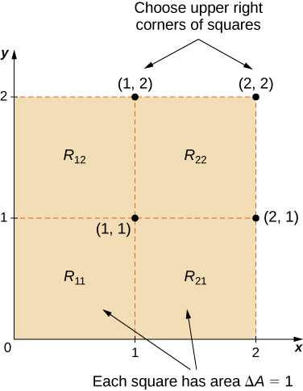
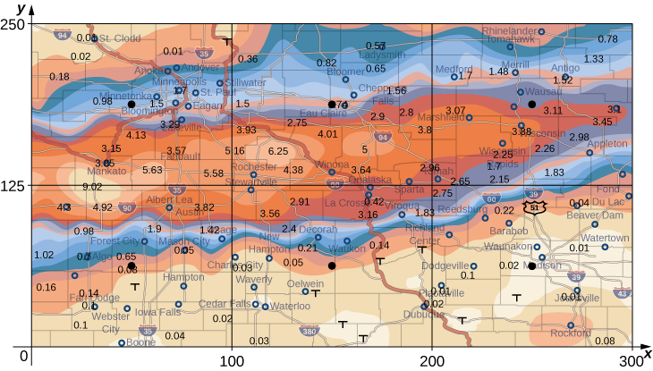
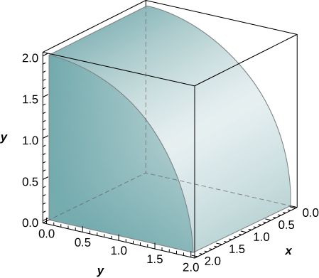
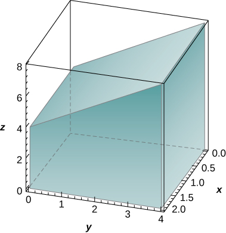
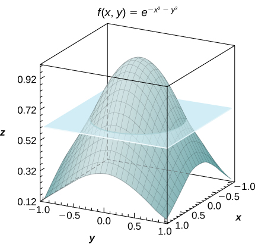

* Recognize when a function of two variables is integrable over a rectangular region.
* Recognize and use some of the properties of double integrals.
* Evaluate a double integral over a rectangular region by writing it as an iterated integral.
* Use a double integral to calculate the area of a region, volume under a surface, or average value of a function over a plane region.

In this section we investigate double integrals and show how we can use them to find the volume of a solid over a rectangular region in the <math xmlns="http://www.w3.org/1998/Math/MathML"><mrow><mi>x</mi><mi>y</mi></mrow></math>

-plane. Many of the properties of double integrals are similar to those we have already discussed for single integrals.

# Volumes and Double Integrals

We begin by considering the space above a rectangular region *R*. Consider a continuous function <math xmlns="http://www.w3.org/1998/Math/MathML"><mrow><mi>f</mi><mrow><mo>(</mo><mrow><mi>x</mi><mo>,</mo><mi>y</mi></mrow><mo>)</mo></mrow><mo>≥</mo><mn>0</mn></mrow></math>

 of two variables defined on the closed rectangle *R*\:

<math xmlns="http://www.w3.org/1998/Math/MathML"><mrow><mi>R</mi><mo>=</mo><mo stretchy="false">[</mo><mi>a</mi><mo>,</mo><mi>b</mi><mo stretchy="false">]</mo><mspace width="0.2em" /><mo>×</mo><mspace width="0.2em" /><mo stretchy="false">[</mo><mi>c</mi><mo>,</mo><mi>d</mi><mo stretchy="false">]</mo><mo>=</mo><mo>{</mo><mo stretchy="false">(</mo><mi>x</mi><mo>,</mo><mi>y</mi><mo stretchy="false">)</mo><mo>∈</mo><msup><mi>ℝ</mi><mn>2</mn></msup><mrow><mo>\|</mo><mrow><mi>a</mi><mo>≤</mo><mi>x</mi><mo>≤</mo><mi>b</mi><mo>,</mo><mi>c</mi><mo>≤</mo><mi>y</mi><mo>≤</mo><mi>d</mi><mo>}</mo></mrow></mrow></mrow></math>

Here <math xmlns="http://www.w3.org/1998/Math/MathML"><mrow><mo stretchy="false">[</mo><mi>a</mi><mo>,</mo><mi>b</mi><mo stretchy="false">]</mo><mspace width="0.2em" /><mo>×</mo><mspace width="0.2em" /><mo stretchy="false">[</mo><mi>c</mi><mo>,</mo><mi>d</mi><mo stretchy="false">]</mo></mrow></math>

 denotes the Cartesian product of the two closed intervals <math xmlns="http://www.w3.org/1998/Math/MathML"><mrow><mo stretchy="false">[</mo><mi>a</mi><mo>,</mo><mi>b</mi><mo stretchy="false">]</mo></mrow></math>

 and <math xmlns="http://www.w3.org/1998/Math/MathML"><mrow><mo stretchy="false">[</mo><mi>c</mi><mo>,</mo><mi>d</mi><mo stretchy="false">]</mo><mo>.</mo></mrow></math>

 It consists of rectangular pairs <math xmlns="http://www.w3.org/1998/Math/MathML"><mrow><mo stretchy="false">(</mo><mi>x</mi><mo>,</mo><mi>y</mi><mo stretchy="false">)</mo></mrow></math>

 such that <math xmlns="http://www.w3.org/1998/Math/MathML"><mrow><mi>a</mi><mo>≤</mo><mi>x</mi><mo>≤</mo><mi>b</mi></mrow></math>

 and <math xmlns="http://www.w3.org/1998/Math/MathML"><mrow><mi>c</mi><mo>≤</mo><mi>y</mi><mo>≤</mo><mi>d</mi><mo>.</mo></mrow></math>

 The graph of <math xmlns="http://www.w3.org/1998/Math/MathML"><mi>f</mi></math>

 represents a surface above the <math xmlns="http://www.w3.org/1998/Math/MathML"><mrow><mi>x</mi><mi>y</mi></mrow></math>

-plane with equation <math xmlns="http://www.w3.org/1998/Math/MathML"><mrow><mi>z</mi><mo>=</mo><mi>f</mi><mrow><mo>(</mo><mrow><mi>x</mi><mo>,</mo><mi>y</mi></mrow><mo>)</mo></mrow></mrow></math>

 where <math xmlns="http://www.w3.org/1998/Math/MathML"><mi>z</mi></math>

 is the height of the surface at the point <math xmlns="http://www.w3.org/1998/Math/MathML"><mrow><mo stretchy="false">(</mo><mi>x</mi><mo>,</mo><mi>y</mi><mo stretchy="false">)</mo><mo>.</mo></mrow></math>

 Let <math xmlns="http://www.w3.org/1998/Math/MathML"><mi>S</mi></math>

 be the solid that lies above <math xmlns="http://www.w3.org/1998/Math/MathML"><mi>R</mi></math>

 and under the graph of <math xmlns="http://www.w3.org/1998/Math/MathML"><mi>f</mi></math>

 ([\[link\]](#CNX_Calc_Figure_15_01_001)). The base of the solid is the rectangle <math xmlns="http://www.w3.org/1998/Math/MathML"><mi>R</mi></math>

 in the <math xmlns="http://www.w3.org/1998/Math/MathML"><mrow><mi>x</mi><mi>y</mi></mrow></math>

-plane. We want to find the volume <math xmlns="http://www.w3.org/1998/Math/MathML"><mi>V</mi></math>

 of the solid <math xmlns="http://www.w3.org/1998/Math/MathML"><mrow><mi>S</mi><mo>.</mo></mrow></math>

 over the rectangle R in the xy-plane is a curved surface."){: #CNX_Calc_Figure_15_01_001}

We divide the region <math xmlns="http://www.w3.org/1998/Math/MathML"><mi>R</mi></math>

 into small rectangles <math xmlns="http://www.w3.org/1998/Math/MathML"><mrow><msub><mi>R</mi><mrow><mi>i</mi><mi>j</mi></mrow></msub><mo>,</mo></mrow></math>

 each with area <math xmlns="http://www.w3.org/1998/Math/MathML"><mrow><mtext>Δ</mtext><mi>A</mi></mrow></math>

 and with sides <math xmlns="http://www.w3.org/1998/Math/MathML"><mrow><mtext>Δ</mtext><mi>x</mi></mrow></math>

 and <math xmlns="http://www.w3.org/1998/Math/MathML"><mrow><mtext>Δ</mtext><mi>y</mi></mrow></math>

 ([\[link\]](#CNX_Calc_Figure_15_01_002)). We do this by dividing the interval <math xmlns="http://www.w3.org/1998/Math/MathML"><mrow><mo stretchy="false">[</mo><mi>a</mi><mo>,</mo><mi>b</mi><mo stretchy="false">]</mo></mrow></math>

 into <math xmlns="http://www.w3.org/1998/Math/MathML"><mi>m</mi></math>

 subintervals and dividing the interval <math xmlns="http://www.w3.org/1998/Math/MathML"><mrow><mo stretchy="false">[</mo><mi>c</mi><mo>,</mo><mi>d</mi><mo stretchy="false">]</mo></mrow></math>

 into <math xmlns="http://www.w3.org/1998/Math/MathML"><mi>n</mi></math>

 subintervals. Hence <math xmlns="http://www.w3.org/1998/Math/MathML"><mrow><mtext>Δ</mtext><mi>x</mi><mo>=</mo><mfrac><mrow><mi>b</mi><mo>−</mo><mi>a</mi></mrow><mi>m</mi></mfrac><mo>,</mo></mrow></math>

 <math xmlns="http://www.w3.org/1998/Math/MathML"><mrow><mtext>Δ</mtext><mi>y</mi><mo>=</mo><mfrac><mrow><mi>d</mi><mo>−</mo><mi>c</mi></mrow><mi>n</mi></mfrac><mo>,</mo></mrow></math>

 and <math xmlns="http://www.w3.org/1998/Math/MathML"><mrow><mtext>Δ</mtext><mi>A</mi><mo>=</mo><mtext>Δ</mtext><mi>x</mi><mtext>Δ</mtext><mi>y</mi><mo>.</mo></mrow></math>

 ![In the xy plane, there is a rectangle with corners (a, c), (a, d), (b, c), and (b, d). Between a and b on the x axis lines are drawn from a, x1, x2, &#x2026;, xi, &#x2026;, b with distance Delta x between each line; between c and d on the y axis lines are drawn from c, y1, y2, &#x2026;, yj, &#x2026;, d with distance Delta y between each line. Among the resulting subrectangles, the one in the second column and third row up has a point marked (x\*23, y\*23). The rectangle Rij is marked with upper right corner (xi, yj). Within this rectangle the point (x\*ij, y\*ij) is marked.](../resources/CNX_Calc_Figure_15_01_002.jpg "Rectangle R is divided into small rectangles Rij, each with area &#x394;A."){: #CNX_Calc_Figure_15_01_002}

The volume of a thin rectangular box above <math xmlns="http://www.w3.org/1998/Math/MathML"><mrow><msub><mi>R</mi><mrow><mi>i</mi><mi>j</mi></mrow></msub></mrow></math>

 is <math xmlns="http://www.w3.org/1998/Math/MathML"><mrow><mi>f</mi><mo stretchy="false">(</mo><msubsup><mi>x</mi><mrow><mi>i</mi><mi>j</mi></mrow><mo>*</mo></msubsup><mo>,</mo><msubsup><mi>y</mi><mrow><mi>i</mi><mi>j</mi></mrow><mo>*</mo></msubsup><mo stretchy="false">)</mo><mtext>Δ</mtext><mi>A</mi><mo>,</mo></mrow></math>

 where <math xmlns="http://www.w3.org/1998/Math/MathML"><mrow><mo stretchy="false">(</mo><msubsup><mi>x</mi><mrow><mi>i</mi><mi>j</mi></mrow><mo>*</mo></msubsup><mo>,</mo><msubsup><mi>y</mi><mrow><mi>i</mi><mi>j</mi></mrow><mo>*</mo></msubsup><mo stretchy="false">)</mo></mrow></math>

 is an arbitrary sample point in each <math xmlns="http://www.w3.org/1998/Math/MathML"><mrow><msub><mi>R</mi><mrow><mi>i</mi><mi>j</mi></mrow></msub></mrow></math>

 as shown in the following figure.

 ."){: #CNX_Calc_Figure_15_01_003}

Using the same idea for all the subrectangles, we obtain an approximate volume of the solid <math xmlns="http://www.w3.org/1998/Math/MathML"><mi>S</mi></math>

 as <math xmlns="http://www.w3.org/1998/Math/MathML"><mrow><mi>V</mi><mo>≈</mo><mstyle displaystyle="true"><munderover><mo>∑</mo><mrow><mi>i</mi><mo>=</mo><mn>1</mn></mrow><mi>m</mi></munderover><mrow><mstyle displaystyle="true"><munderover><mo>∑</mo><mrow><mi>j</mi><mo>=</mo><mn>1</mn></mrow><mi>n</mi></munderover><mrow><mi>f</mi><mo stretchy="false">(</mo><msubsup><mi>x</mi><mrow><mi>i</mi><mi>j</mi></mrow><mo>*</mo></msubsup><mo>,</mo><msubsup><mi>y</mi><mrow><mi>i</mi><mi>j</mi></mrow><mo>*</mo></msubsup><mo stretchy="false">)</mo><mtext>Δ</mtext><mi>A</mi></mrow></mstyle></mrow></mstyle><mo>.</mo></mrow></math>

 This sum is known as a **double Riemann sum**{: data-type="term"} and can be used to approximate the value of the volume of the solid. Here the double sum means that for each subrectangle we evaluate the function at the chosen point, multiply by the area of each rectangle, and then add all the results.

As we have seen in the single-variable case, we obtain a better approximation to the actual volume if *m* and *n* become larger.

<math xmlns="http://www.w3.org/1998/Math/MathML"><mrow><mi>V</mi><mo>=</mo><munder><mrow><mtext>lim</mtext></mrow><mrow><mi>m</mi><mo>,</mo><mi>n</mi><mo stretchy="false">→</mo><mi>∞</mi></mrow></munder><mstyle displaystyle="true"><munderover><mo>∑</mo><mrow><mi>i</mi><mo>=</mo><mn>1</mn></mrow><mi>m</mi></munderover><mrow><mstyle displaystyle="true"><munderover><mo>∑</mo><mrow><mi>j</mi><mo>=</mo><mn>1</mn></mrow><mi>n</mi></munderover><mrow><mi>f</mi><mo stretchy="false">(</mo><msubsup><mi>x</mi><mrow><mi>i</mi><mi>j</mi></mrow><mo>*</mo></msubsup><mo>,</mo><msubsup><mi>y</mi><mrow><mi>i</mi><mi>j</mi></mrow><mo>*</mo></msubsup><mo stretchy="false">)</mo><mtext>Δ</mtext></mrow></mstyle></mrow></mstyle><mi>A</mi><mspace width="0.2em" /><mtext>or</mtext><mspace width="0.2em" /><mi>V</mi><mo>=</mo><munder><mrow><mtext>lim</mtext></mrow><mrow><mtext>Δ</mtext><mi>x</mi><mo>,</mo><mtext>Δ</mtext><mi>y</mi><mo stretchy="false">→</mo><mn>0</mn></mrow></munder><mstyle displaystyle="true"><munderover><mo>∑</mo><mrow><mi>i</mi><mo>=</mo><mn>1</mn></mrow><mi>m</mi></munderover><mrow><mstyle displaystyle="true"><munderover><mo>∑</mo><mrow><mi>j</mi><mo>=</mo><mn>1</mn></mrow><mi>n</mi></munderover><mrow><mi>f</mi><mo stretchy="false">(</mo><msubsup><mi>x</mi><mrow><mi>i</mi><mi>j</mi></mrow><mo>*</mo></msubsup><mo>,</mo><msubsup><mi>y</mi><mrow><mi>i</mi><mi>j</mi></mrow><mo>*</mo></msubsup><mo stretchy="false">)</mo><mtext>Δ</mtext><mi>A</mi><mo>.</mo></mrow></mstyle></mrow></mstyle></mrow></math>

Note that the sum approaches a limit in either case and the limit is the volume of the solid with the base *R*. Now we are ready to define the double integral.

Definition

The **double integral**{: data-type="term"} of the function <math xmlns="http://www.w3.org/1998/Math/MathML"><mrow><mi>f</mi><mrow><mo>(</mo><mrow><mi>x</mi><mo>,</mo><mi>y</mi></mrow><mo>)</mo></mrow></mrow></math>

 over the rectangular region <math xmlns="http://www.w3.org/1998/Math/MathML"><mi>R</mi></math>

 in the <math xmlns="http://www.w3.org/1998/Math/MathML"><mrow><mi>x</mi><mi>y</mi></mrow></math>

-plane is defined as

<math xmlns="http://www.w3.org/1998/Math/MathML"><mrow><mstyle displaystyle="true"><mrow><munder><mo>∬</mo><mi>R</mi></munder><mrow><mi>f</mi><mo stretchy="false">(</mo><mi>x</mi><mo>,</mo><mi>y</mi><mo stretchy="false">)</mo><mi>d</mi><mi>A</mi></mrow></mrow></mstyle><mo>=</mo><munder><mrow><mtext>lim</mtext></mrow><mrow><mi>m</mi><mo>,</mo><mi>n</mi><mo stretchy="false">→</mo><mi>∞</mi></mrow></munder><mstyle displaystyle="true"><munderover><mo>∑</mo><mrow><mi>i</mi><mo>=</mo><mn>1</mn></mrow><mi>m</mi></munderover><mrow><mstyle displaystyle="true"><munderover><mo>∑</mo><mrow><mi>j</mi><mo>=</mo><mn>1</mn></mrow><mi>n</mi></munderover><mrow><mi>f</mi><mo stretchy="false">(</mo><msubsup><mi>x</mi><mrow><mi>i</mi><mi>j</mi></mrow><mo>*</mo></msubsup><mo>,</mo><msubsup><mi>y</mi><mrow><mi>i</mi><mi>j</mi></mrow><mo>*</mo></msubsup><mo stretchy="false">)</mo><mtext>Δ</mtext><mi>A</mi></mrow></mstyle></mrow></mstyle><mo>.</mo></mrow></math>

If <math xmlns="http://www.w3.org/1998/Math/MathML"><mrow><mi>f</mi><mrow><mo>(</mo><mrow><mi>x</mi><mo>,</mo><mi>y</mi></mrow><mo>)</mo></mrow><mo>≥</mo><mn>0</mn><mo>,</mo></mrow></math>

 then the volume *V* of the solid *S*, which lies above <math xmlns="http://www.w3.org/1998/Math/MathML"><mi>R</mi></math>

 in the <math xmlns="http://www.w3.org/1998/Math/MathML"><mrow><mi>x</mi><mi>y</mi></mrow></math>

-plane and under the graph of *f*, is the double integral of the function <math xmlns="http://www.w3.org/1998/Math/MathML"><mrow><mi>f</mi><mrow><mo>(</mo><mrow><mi>x</mi><mo>,</mo><mi>y</mi></mrow><mo>)</mo></mrow></mrow></math>

 over the rectangle <math xmlns="http://www.w3.org/1998/Math/MathML"><mrow><mi>R</mi><mo>.</mo></mrow></math>

 If the function is ever negative, then the double integral can be considered a “signed” volume in a manner similar to the way we defined net signed area in [The Definite Integral](/m53631){: .target-chapter}.

Setting up a Double Integral and Approximating It by Double Sums

Consider the function <math xmlns="http://www.w3.org/1998/Math/MathML"><mrow><mi>z</mi><mo>=</mo><mi>f</mi><mo stretchy="false">(</mo><mi>x</mi><mo>,</mo><mi>y</mi><mo stretchy="false">)</mo><mo>=</mo><mn>3</mn><msup><mi>x</mi><mn>2</mn></msup><mo>−</mo><mi>y</mi></mrow></math>

 over the rectangular region <math xmlns="http://www.w3.org/1998/Math/MathML"><mrow><mi>R</mi><mo>=</mo><mo stretchy="false">[</mo><mn>0</mn><mo>,</mo><mn>2</mn><mo stretchy="false">]</mo><mspace width="0.2em" /><mo>×</mo><mspace width="0.2em" /><mo stretchy="false">[</mo><mn>0</mn><mo>,</mo><mn>2</mn><mo stretchy="false">]</mo></mrow></math>

 ([[link]](#CNX_Calc_Figure_15_01_004)).

1.  Set up a double integral for finding the value of the signed volume of the solid *S* that lies above
    <math xmlns="http://www.w3.org/1998/Math/MathML"><mi>R</mi></math>
    
    and “under” the graph of
    <math xmlns="http://www.w3.org/1998/Math/MathML"><mi>f</mi><mo>.</mo></math>

2.  Divide *R* into four squares with
    <math xmlns="http://www.w3.org/1998/Math/MathML"><mrow><mi>m</mi><mo>=</mo><mi>n</mi><mo>=</mo><mn>2</mn><mo>,</mo></mrow></math>
    
    and choose the sample point as the upper right corner point of each square
    <math xmlns="http://www.w3.org/1998/Math/MathML"><mrow><mo stretchy="false">(</mo><mn>1</mn><mo>,</mo><mn>1</mn><mo stretchy="false">)</mo><mo>,</mo><mo stretchy="false">(</mo><mn>2</mn><mo>,</mo><mn>1</mn><mo stretchy="false">)</mo><mo>,</mo><mo stretchy="false">(</mo><mn>1</mn><mo>,</mo><mn>2</mn><mo stretchy="false">)</mo><mo>,</mo></mrow></math>
    
    and
    <math xmlns="http://www.w3.org/1998/Math/MathML"><mrow><mo stretchy="false">(</mo><mn>2</mn><mo>,</mo><mn>2</mn><mo stretchy="false">)</mo></mrow></math>
    
    ([[link]](#CNX_Calc_Figure_15_01_005)) to approximate the signed volume of the solid *S* that lies above
    <math xmlns="http://www.w3.org/1998/Math/MathML"><mi>R</mi></math>
    
    and “under” the graph of
    <math xmlns="http://www.w3.org/1998/Math/MathML"><mi>f</mi><mo>.</mo></math>

3.  Divide *R* into four squares with
    <math xmlns="http://www.w3.org/1998/Math/MathML"><mrow><mi>m</mi><mo>=</mo><mi>n</mi><mo>=</mo><mn>2</mn><mo>,</mo></mrow></math>
    
    and choose the sample point as the midpoint of each square:
    <math xmlns="http://www.w3.org/1998/Math/MathML"><mrow><mo stretchy="false">(</mo><mn>1</mn><mtext>/</mtext><mn>2</mn><mo>,</mo><mn>1</mn><mtext>/</mtext><mn>2</mn><mo stretchy="false">)</mo><mo>,</mo><mo stretchy="false">(</mo><mn>3</mn><mtext>/</mtext><mn>2</mn><mo>,</mo><mn>1</mn><mtext>/</mtext><mn>2</mn><mo stretchy="false">)</mo><mo>,</mo><mo stretchy="false">(</mo><mn>1</mn><mtext>/</mtext><mn>2</mn><mo>,</mo><mn>3</mn><mtext>/</mtext><mn>2</mn><mo stretchy="false">)</mo><mo>,</mo><mtext>and</mtext><mspace width="0.2em" /><mo stretchy="false">(</mo><mn>3</mn><mtext>/</mtext><mn>2</mn><mo>,</mo><mn>3</mn><mtext>/</mtext><mn>2</mn><mo stretchy="false">)</mo></mrow></math>
    
    to approximate the signed volume.
    * * *
    {: data-type="newline"}
    
     graphed over the rectangular region R=[0,2]&#xD7;[0,2]."){: #CNX_Calc_Figure_15_01_004}

{: data-number-style="lower-alpha"}

1.  As we can see, the function
    <math xmlns="http://www.w3.org/1998/Math/MathML"><mrow><mi>z</mi><mo>=</mo><mi>f</mi><mo stretchy="false">(</mo><mi>x</mi><mo>,</mo><mi>y</mi><mo stretchy="false">)</mo><mo>=</mo><mn>3</mn><msup><mi>x</mi><mn>2</mn></msup><mo>−</mo><msup><mi>y</mi><mrow /></msup></mrow></math>
    
    is above the plane. To find the signed volume of *S*, we need to divide the region *R* into small rectangles
    <math xmlns="http://www.w3.org/1998/Math/MathML"><mrow><msub><mi>R</mi><mrow><mi>i</mi><mi>j</mi></mrow></msub><mo>,</mo></mrow></math>
    
    each with area
    <math xmlns="http://www.w3.org/1998/Math/MathML"><mrow><mtext>Δ</mtext><mi>A</mi></mrow></math>
    
    and with sides
    <math xmlns="http://www.w3.org/1998/Math/MathML"><mrow><mtext>Δ</mtext><mi>x</mi></mrow></math>
    
    and
    <math xmlns="http://www.w3.org/1998/Math/MathML"><mrow><mtext>Δ</mtext><mi>y</mi><mo>,</mo></mrow></math>
    
    and choose
    <math xmlns="http://www.w3.org/1998/Math/MathML"><mrow><mo stretchy="false">(</mo><msubsup><mi>x</mi><mrow><mi>i</mi><mi>j</mi></mrow><mo>*</mo></msubsup><mo>,</mo><msubsup><mi>y</mi><mrow><mi>i</mi><mi>j</mi></mrow><mo>*</mo></msubsup><mo stretchy="false">)</mo></mrow></math>
    
    as sample points in each
    <math xmlns="http://www.w3.org/1998/Math/MathML"><mrow><msub><mi>R</mi><mrow><mi>i</mi><mi>j</mi></mrow></msub><mo>.</mo></mrow></math>
    
    Hence, a double integral is set up as
    * * *
    {: data-type="newline"}
    
    

    <math xmlns="http://www.w3.org/1998/Math/MathML"><mrow><mi>V</mi><mo>=</mo><mstyle displaystyle="true"><mrow><munder><mo>∬</mo><mi>R</mi></munder><mrow><mrow><mo>(</mo><mrow><mn>3</mn><msup><mi>x</mi><mn>2</mn></msup><mo>−</mo><mi>y</mi></mrow><mo>)</mo></mrow><mi>d</mi><mi>A</mi></mrow></mrow></mstyle><mo>=</mo><munder><mrow><mtext>lim</mtext></mrow><mrow><mi>m</mi><mo>,</mo><mi>n</mi><mo stretchy="false">→</mo><mi>∞</mi></mrow></munder><mstyle displaystyle="true"><munderover><mo>∑</mo><mrow><mi>i</mi><mo>=</mo><mn>1</mn></mrow><mi>m</mi></munderover><mrow><mstyle displaystyle="true"><munderover><mo>∑</mo><mrow><mi>j</mi><mo>=</mo><mn>1</mn></mrow><mi>n</mi></munderover><mrow><mrow><mo>[</mo><mrow><mn>3</mn><msup><mrow><mrow><mo>(</mo><mrow><msubsup><mi>x</mi><mrow><mi>i</mi><mi>j</mi></mrow><mo>*</mo></msubsup></mrow><mo>)</mo></mrow></mrow><mn>2</mn></msup><mo>−</mo><msubsup><mi>y</mi><mrow><mi>i</mi><mi>j</mi></mrow><mo>*</mo></msubsup></mrow><mo>]</mo></mrow><mtext>Δ</mtext><mi>A</mi></mrow></mstyle></mrow></mstyle><mo>.</mo></mrow></math>
    

2.  Approximating the signed volume using a Riemann sum with
    <math xmlns="http://www.w3.org/1998/Math/MathML"><mrow><mi>m</mi><mo>=</mo><mi>n</mi><mo>=</mo><mn>2</mn></mrow></math>
    
    we have
    <math xmlns="http://www.w3.org/1998/Math/MathML"><mrow><mtext>Δ</mtext><mi>A</mi><mo>=</mo><mtext>Δ</mtext><mi>x</mi><mtext>Δ</mtext><mi>y</mi><mo>=</mo><mn>1</mn><mspace width="0.2em" /><mo>×</mo><mspace width="0.2em" /><mn>1</mn><mo>=</mo><mn>1</mn><mo>.</mo></mrow></math>
    
    Also, the sample points are (1, 1), (2, 1), (1, 2), and (2, 2) as shown in the following figure.
    * * *
    {: data-type="newline"}
    
    {: #CNX_Calc_Figure_15_01_005}

    * * *
    {: data-type="newline"}
    
    Hence,
    * * *
    {: data-type="newline"}
    
    

    <math xmlns="http://www.w3.org/1998/Math/MathML"><mtable><mtr><mtd columnalign="right"><mi>V</mi></mtd><mtd columnalign="left"><mo>=</mo><mstyle displaystyle="true"><munderover><mo>∑</mo><mrow><mi>i</mi><mo>=</mo><mn>1</mn></mrow><mn>2</mn></munderover><mrow><mstyle displaystyle="true"><munderover><mo>∑</mo><mrow><mi>j</mi><mo>=</mo><mn>1</mn></mrow><mn>2</mn></munderover><mrow><mi>f</mi><mo stretchy="false">(</mo><msubsup><mi>x</mi><mrow><mi>i</mi><mi>j</mi></mrow><mo>*</mo></msubsup><mo>,</mo><msubsup><mi>y</mi><mrow><mi>i</mi><mi>j</mi></mrow><mo>*</mo></msubsup><mo stretchy="false">)</mo><mtext>Δ</mtext><mi>A</mi></mrow></mstyle></mrow></mstyle></mtd></mtr><mtr><mtd /><mtd columnalign="left"><mo>=</mo><mstyle displaystyle="true"><munderover><mo>∑</mo><mrow><mi>i</mi><mo>=</mo><mn>1</mn></mrow><mn>2</mn></munderover><mrow><mo stretchy="false">(</mo><mi>f</mi><mo stretchy="false">(</mo><msubsup><mi>x</mi><mrow><mi>i</mi><mn>1</mn></mrow><mo>*</mo></msubsup><mo>,</mo><msubsup><mi>y</mi><mrow><mi>i</mi><mn>1</mn></mrow><mo>*</mo></msubsup><mo stretchy="false">)</mo><mo>+</mo></mrow></mstyle><mi>f</mi><mo stretchy="false">(</mo><msubsup><mi>x</mi><mrow><mi>i</mi><mn>2</mn></mrow><mo>*</mo></msubsup><mo>,</mo><msubsup><mi>y</mi><mrow><mi>i</mi><mn>2</mn></mrow><mo>*</mo></msubsup><mo stretchy="false">)</mo><mo stretchy="false">)</mo><mtext>Δ</mtext><mi>A</mi></mtd></mtr><mtr><mtd /><mtd columnalign="left"><mo>=</mo><mi>f</mi><mo stretchy="false">(</mo><msubsup><mi>x</mi><mrow><mn>11</mn></mrow><mo>*</mo></msubsup><mo>,</mo><msubsup><mi>y</mi><mrow><mn>11</mn></mrow><mo>*</mo></msubsup><mo stretchy="false">)</mo><mtext>Δ</mtext><mi>A</mi><mo>+</mo><mi>f</mi><mo stretchy="false">(</mo><msubsup><mi>x</mi><mrow><mn>21</mn></mrow><mo>*</mo></msubsup><mo>,</mo><msubsup><mi>y</mi><mrow><mn>21</mn></mrow><mo>*</mo></msubsup><mo stretchy="false">)</mo><mtext>Δ</mtext><mi>A</mi><mo>+</mo><mi>f</mi><mo stretchy="false">(</mo><msubsup><mi>x</mi><mrow><mn>12</mn></mrow><mo>*</mo></msubsup><mo>,</mo><msubsup><mi>y</mi><mrow><mn>12</mn></mrow><mo>*</mo></msubsup><mo stretchy="false">)</mo><mtext>Δ</mtext><mi>A</mi><mo>+</mo><mi>f</mi><mo stretchy="false">(</mo><msubsup><mi>x</mi><mrow><mn>22</mn></mrow><mo>*</mo></msubsup><mo>,</mo><msubsup><mi>y</mi><mrow><mn>22</mn></mrow><mo>*</mo></msubsup><mo stretchy="false">)</mo><mtext>Δ</mtext><mi>A</mi></mtd></mtr><mtr><mtd /><mtd columnalign="left"><mo>=</mo><mi>f</mi><mo stretchy="false">(</mo><mn>1</mn><mo>,</mo><mn>1</mn><mo stretchy="false">)</mo><mo stretchy="false">(</mo><mn>1</mn><mo stretchy="false">)</mo><mo>+</mo><mi>f</mi><mo stretchy="false">(</mo><mn>2</mn><mo>,</mo><mn>1</mn><mo stretchy="false">)</mo><mo stretchy="false">(</mo><mn>1</mn><mo stretchy="false">)</mo><mo>+</mo><mi>f</mi><mo stretchy="false">(</mo><mn>1</mn><mo>,</mo><mn>2</mn><mo stretchy="false">)</mo><mo stretchy="false">(</mo><mn>1</mn><mo stretchy="false">)</mo><mo>+</mo><mi>f</mi><mo stretchy="false">(</mo><mn>2</mn><mo>,</mo><mn>2</mn><mo stretchy="false">)</mo><mo stretchy="false">(</mo><mn>1</mn><mo stretchy="false">)</mo></mtd></mtr><mtr><mtd /><mtd columnalign="left"><mo>=</mo><mo stretchy="false">(</mo><mn>3</mn><mo>−</mo><mn>1</mn><mo stretchy="false">)</mo><mo stretchy="false">(</mo><mn>1</mn><mo stretchy="false">)</mo><mo>+</mo><mo stretchy="false">(</mo><mn>12</mn><mo>−</mo><mn>1</mn><mo stretchy="false">)</mo><mo stretchy="false">(</mo><mn>1</mn><mo stretchy="false">)</mo><mo>+</mo><mo stretchy="false">(</mo><mn>3</mn><mo>−</mo><mn>2</mn><mo stretchy="false">)</mo><mo stretchy="false">(</mo><mn>1</mn><mo stretchy="false">)</mo><mo>+</mo><mo stretchy="false">(</mo><mn>12</mn><mo>−</mo><mn>2</mn><mo stretchy="false">)</mo><mo stretchy="false">(</mo><mn>1</mn><mo stretchy="false">)</mo></mtd></mtr><mtr><mtd /><mtd columnalign="left"><mo>=</mo><mn>2</mn><mo>+</mo><mn>11</mn><mo>+</mo><mn>1</mn><mo>+</mo><mn>10</mn><mo>=</mo><mn>24.</mn></mtd></mtr></mtable></math>
    

3.  Approximating the signed volume using a Riemann sum with
    <math xmlns="http://www.w3.org/1998/Math/MathML"><mrow><mi>m</mi><mo>=</mo><mi>n</mi><mo>=</mo><mn>2</mn><mo>,</mo></mrow></math>
    
    we have
    <math xmlns="http://www.w3.org/1998/Math/MathML"><mrow><mtext>Δ</mtext><mi>A</mi><mo>=</mo><mtext>Δ</mtext><mi>x</mi><mtext>Δ</mtext><mi>y</mi><mo>=</mo><mn>1</mn><mspace width="0.2em" /><mo>×</mo><mspace width="0.2em" /><mn>1</mn><mo>=</mo><mn>1</mn><mo>.</mo></mrow></math>
    
    In this case the sample points are (1/2, 1/2), (3/2, 1/2), (1/2, 3/2),
    * * *
    {: data-type="newline"}
    
    and (3/2, 3/2).
    * * *
    {: data-type="newline"}
    
    Hence
    * * *
    {: data-type="newline"}
    
    

    <math xmlns="http://www.w3.org/1998/Math/MathML"><mtable><mtr><mtd columnalign="right"><mi>V</mi></mtd><mtd columnalign="left"><mo>=</mo><mstyle displaystyle="true"><munderover><mo>∑</mo><mrow><mi>i</mi><mo>=</mo><mn>1</mn></mrow><mn>2</mn></munderover><mrow><mstyle displaystyle="true"><munderover><mo>∑</mo><mrow><mi>j</mi><mo>=</mo><mn>1</mn></mrow><mn>2</mn></munderover><mrow><mi>f</mi><mo stretchy="false">(</mo><msubsup><mi>x</mi><mrow><mi>i</mi><mi>j</mi></mrow><mo>*</mo></msubsup><mo>,</mo><msubsup><mi>y</mi><mrow><mi>i</mi><mi>j</mi></mrow><mo>*</mo></msubsup><mo stretchy="false">)</mo><mtext>Δ</mtext><mi>A</mi></mrow></mstyle></mrow></mstyle></mtd></mtr><mtr><mtd /><mtd columnalign="left"><mo>=</mo><mi>f</mi><mo stretchy="false">(</mo><msubsup><mi>x</mi><mrow><mn>11</mn></mrow><mo>*</mo></msubsup><mo>,</mo><msubsup><mi>y</mi><mrow><mn>11</mn></mrow><mo>*</mo></msubsup><mo stretchy="false">)</mo><mtext>Δ</mtext><mi>A</mi><mo>+</mo><mi>f</mi><mo stretchy="false">(</mo><msubsup><mi>x</mi><mrow><mn>21</mn></mrow><mo>*</mo></msubsup><mo>,</mo><msubsup><mi>y</mi><mrow><mn>21</mn></mrow><mo>*</mo></msubsup><mo stretchy="false">)</mo><mtext>Δ</mtext><mi>A</mi><mo>+</mo><mi>f</mi><mo stretchy="false">(</mo><msubsup><mi>x</mi><mrow><mn>12</mn></mrow><mo>*</mo></msubsup><mo>,</mo><msubsup><mi>y</mi><mrow><mn>12</mn></mrow><mo>*</mo></msubsup><mo stretchy="false">)</mo><mtext>Δ</mtext><mi>A</mi><mo>+</mo><mi>f</mi><mo stretchy="false">(</mo><msubsup><mi>x</mi><mrow><mn>22</mn></mrow><mo>*</mo></msubsup><mo>,</mo><msubsup><mi>y</mi><mrow><mn>22</mn></mrow><mo>*</mo></msubsup><mo stretchy="false">)</mo><mtext>Δ</mtext><mi>A</mi></mtd></mtr><mtr><mtd /><mtd columnalign="left"><mo>=</mo><mi>f</mi><mo stretchy="false">(</mo><mn>1</mn><mtext>/</mtext><mn>2</mn><mo>,</mo><mn>1</mn><mtext>/</mtext><mn>2</mn><mo stretchy="false">)</mo><mo stretchy="false">(</mo><mn>1</mn><mo stretchy="false">)</mo><mo>+</mo><mi>f</mi><mo stretchy="false">(</mo><mn>3</mn><mtext>/</mtext><mn>2</mn><mo>,</mo><mn>1</mn><mtext>/</mtext><mn>2</mn><mo stretchy="false">)</mo><mo stretchy="false">(</mo><mn>1</mn><mo stretchy="false">)</mo><mo>+</mo><mi>f</mi><mo stretchy="false">(</mo><mn>1</mn><mtext>/</mtext><mn>2</mn><mo>,</mo><mn>3</mn><mtext>/</mtext><mn>2</mn><mo stretchy="false">)</mo><mo stretchy="false">(</mo><mn>1</mn><mo stretchy="false">)</mo><mo>+</mo><mi>f</mi><mo stretchy="false">(</mo><mn>3</mn><mtext>/</mtext><mn>2</mn><mo>,</mo><mn>3</mn><mtext>/</mtext><mn>2</mn><mo stretchy="false">)</mo><mo stretchy="false">(</mo><mn>1</mn><mo stretchy="false">)</mo></mtd></mtr><mtr><mtd /><mtd columnalign="left"><mo>=</mo><mrow><mo>(</mo><mrow><mstyle scriptlevel="+1"><mfrac><mn>3</mn><mn>4</mn></mfrac></mstyle><mo>−</mo><mstyle scriptlevel="+1"><mfrac><mn>1</mn><mn>4</mn></mfrac></mstyle></mrow><mo>)</mo></mrow><mo stretchy="false">(</mo><mn>1</mn><mo stretchy="false">)</mo><mo>+</mo><mrow><mo>(</mo><mrow><mstyle scriptlevel="+1"><mfrac><mrow><mn>27</mn></mrow><mn>4</mn></mfrac></mstyle><mo>−</mo><mstyle scriptlevel="+1"><mfrac><mn>1</mn><mn>2</mn></mfrac></mstyle></mrow><mo>)</mo></mrow><mo stretchy="false">(</mo><mn>1</mn><mo stretchy="false">)</mo><mo>+</mo><mrow><mo>(</mo><mrow><mstyle scriptlevel="+1"><mfrac><mn>3</mn><mn>4</mn></mfrac></mstyle><mo>−</mo><mstyle scriptlevel="+1"><mfrac><mn>3</mn><mn>2</mn></mfrac></mstyle></mrow><mo>)</mo></mrow><mo stretchy="false">(</mo><mn>1</mn><mo stretchy="false">)</mo><mo>+</mo><mrow><mo>(</mo><mrow><mstyle scriptlevel="+1"><mfrac><mrow><mn>27</mn></mrow><mn>4</mn></mfrac></mstyle><mo>−</mo><mstyle scriptlevel="+1"><mfrac><mn>3</mn><mn>2</mn></mfrac></mstyle></mrow><mo>)</mo></mrow><mo stretchy="false">(</mo><mn>1</mn><mo stretchy="false">)</mo></mtd></mtr><mtr><mtd /><mtd columnalign="left"><mo>=</mo><mstyle scriptlevel="+1"><mfrac><mn>2</mn><mn>4</mn></mfrac></mstyle><mo>+</mo><mstyle scriptlevel="+1"><mfrac><mrow><mn>25</mn></mrow><mn>4</mn></mfrac></mstyle><mo>+</mo><mrow><mo>(</mo><mrow><mo>−</mo><mfrac><mn>3</mn><mn>4</mn></mfrac></mrow><mo>)</mo></mrow><mo>+</mo><mstyle scriptlevel="+1"><mfrac><mrow><mn>21</mn></mrow><mn>4</mn></mfrac></mstyle><mo>=</mo><mstyle scriptlevel="+1"><mfrac><mrow><mn>45</mn></mrow><mn>4</mn></mfrac></mstyle><mo>=</mo><mn>11.</mn></mtd></mtr></mtable></math>
    

{: data-number-style="lower-alpha"}

Analysis

Notice that the approximate answers differ due to the choices of the sample points. In either case, we are introducing some error because we are using only a few sample points. Thus, we need to investigate how we can achieve an accurate answer.

Use the same function <math xmlns="http://www.w3.org/1998/Math/MathML"><mrow><mi>z</mi><mo>=</mo><mi>f</mi><mo stretchy="false">(</mo><mi>x</mi><mo>,</mo><mi>y</mi><mo stretchy="false">)</mo><mo>=</mo><mn>3</mn><msup><mi>x</mi><mn>2</mn></msup><mo>−</mo><msup><mi>y</mi><mrow /></msup></mrow></math>

 over the rectangular region <math xmlns="http://www.w3.org/1998/Math/MathML"><mrow><mi>R</mi><mo>=</mo><mo stretchy="false">[</mo><mn>0</mn><mo>,</mo><mn>2</mn><mo stretchy="false">]</mo><mspace width="0.2em" /><mo>×</mo><mspace width="0.2em" /><mo stretchy="false">[</mo><mn>0</mn><mo>,</mo><mn>2</mn><mo stretchy="false">]</mo><mo>.</mo></mrow></math>

Divide *R* into the same four squares with <math xmlns="http://www.w3.org/1998/Math/MathML"><mrow><mi>m</mi><mo>=</mo><mi>n</mi><mo>=</mo><mn>2</mn><mo>,</mo></mrow></math>

 and choose the sample points as the upper left corner point of each square <math xmlns="http://www.w3.org/1998/Math/MathML"><mrow><mo stretchy="false">(</mo><mn>0</mn><mo>,</mo><mn>1</mn><mo stretchy="false">)</mo><mo>,</mo><mo stretchy="false">(</mo><mn>1</mn><mo>,</mo><mn>1</mn><mo stretchy="false">)</mo><mo>,</mo><mo stretchy="false">(</mo><mn>0</mn><mo>,</mo><mn>2</mn><mo stretchy="false">)</mo><mo>,</mo></mrow></math>

 and <math xmlns="http://www.w3.org/1998/Math/MathML"><mrow><mo stretchy="false">(</mo><mn>1</mn><mo>,</mo><mn>2</mn><mo stretchy="false">)</mo></mrow></math>

 ([[link]](#CNX_Calc_Figure_15_01_005)) to approximate the signed volume of the solid *S* that lies above <math xmlns="http://www.w3.org/1998/Math/MathML"><mi>R</mi></math>

 and “under” the graph of <math xmlns="http://www.w3.org/1998/Math/MathML"><mi>f</mi><mo>.</mo></math>

<math xmlns="http://www.w3.org/1998/Math/MathML"><mrow><mi>V</mi><mo>=</mo><mstyle displaystyle="true"><munderover><mo>∑</mo><mrow><mi>i</mi><mo>=</mo><mn>1</mn></mrow><mn>2</mn></munderover><mrow><mstyle displaystyle="true"><munderover><mo>∑</mo><mrow><mi>j</mi><mo>=</mo><mn>1</mn></mrow><mn>2</mn></munderover><mrow><mi>f</mi><mo stretchy="false">(</mo><msubsup><mi>x</mi><mrow><mi>i</mi><mi>j</mi></mrow><mo>*</mo></msubsup><mo>,</mo><msubsup><mi>y</mi><mrow><mi>i</mi><mi>j</mi></mrow><mo>*</mo></msubsup><mo stretchy="false">)</mo><mtext>Δ</mtext><mi>A</mi></mrow></mstyle></mrow></mstyle><mo>=</mo><mn>0</mn></mrow></math>

Hint

Follow the steps of the previous example.

Note that we developed the concept of double integral using a rectangular region *R*. This concept can be extended to any general region. However, when a region is not rectangular, the subrectangles may not all fit perfectly into *R*, particularly if the base area is curved. We examine this situation in more detail in the next section, where we study regions that are not always rectangular and subrectangles may not fit perfectly in the region *R*. Also, the heights may not be exact if the surface <math xmlns="http://www.w3.org/1998/Math/MathML"><mrow><mi>z</mi><mo>=</mo><mi>f</mi><mrow><mo>(</mo><mrow><mi>x</mi><mo>,</mo><mi>y</mi></mrow><mo>)</mo></mrow></mrow></math>

 is curved. However, the errors on the sides and the height where the pieces may not fit perfectly within the solid *S* approach 0 as *m* and *n* approach infinity. Also, the double integral of the function <math xmlns="http://www.w3.org/1998/Math/MathML"><mrow><mi>z</mi><mo>=</mo><mi>f</mi><mrow><mo>(</mo><mrow><mi>x</mi><mo>,</mo><mi>y</mi></mrow><mo>)</mo></mrow></mrow></math>

 exists provided that the function <math xmlns="http://www.w3.org/1998/Math/MathML"><mi>f</mi></math>

 is not too discontinuous. If the function is bounded and continuous over *R* except on a finite number of smooth curves, then the double integral exists and we say that <math xmlns="http://www.w3.org/1998/Math/MathML"><mi>f</mi></math>

 is integrable over *R*.

Since <math xmlns="http://www.w3.org/1998/Math/MathML"><mrow><mtext>Δ</mtext><mi>A</mi><mo>=</mo><mtext>Δ</mtext><mi>x</mi><mtext>Δ</mtext><mi>y</mi><mo>=</mo><mtext>Δ</mtext><mi>y</mi><mtext>Δ</mtext><mi>x</mi><mo>,</mo></mrow></math>

 we can express <math xmlns="http://www.w3.org/1998/Math/MathML"><mrow><mi>d</mi><mi>A</mi></mrow></math>

 as <math xmlns="http://www.w3.org/1998/Math/MathML"><mrow><mi>d</mi><mi>x</mi><mspace width="0.2em" /><mi>d</mi><mi>y</mi></mrow></math>

 or <math xmlns="http://www.w3.org/1998/Math/MathML"><mrow><mi>d</mi><mi>y</mi><mspace width="0.2em" /><mi>d</mi><mi>x</mi><mo>.</mo></mrow></math>

 This means that, when we are using rectangular coordinates, the double integral over a region <math xmlns="http://www.w3.org/1998/Math/MathML"><mi>R</mi></math>

 denoted by <math xmlns="http://www.w3.org/1998/Math/MathML"><mrow><mstyle displaystyle="true"><mrow><munder><mo>∬</mo><mi>R</mi></munder><mrow><mi>f</mi><mo stretchy="false">(</mo><mi>x</mi><mo>,</mo><mi>y</mi><mo stretchy="false">)</mo><mi>d</mi></mrow></mrow></mstyle><mi>A</mi></mrow></math>

 can be written as <math xmlns="http://www.w3.org/1998/Math/MathML"><mrow><mstyle displaystyle="true"><mrow><munder><mo>∬</mo><mi>R</mi></munder><mrow><mi>f</mi><mo stretchy="false">(</mo><mi>x</mi><mo>,</mo><mi>y</mi><mo stretchy="false">)</mo><mi>d</mi></mrow></mrow></mstyle><mi>x</mi><mspace width="0.2em" /><mi>d</mi><mi>y</mi></mrow></math>

 or <math xmlns="http://www.w3.org/1998/Math/MathML"><mrow><mstyle displaystyle="true"><mrow><munder><mo>∬</mo><mi>R</mi></munder><mrow><mi>f</mi><mo stretchy="false">(</mo><mi>x</mi><mo>,</mo><mi>y</mi><mo stretchy="false">)</mo><mi>d</mi></mrow></mrow></mstyle><mi>y</mi><mspace width="0.2em" /><mi>d</mi><mi>x</mi><mo>.</mo></mrow></math>

Now let’s list some of the properties that can be helpful to compute double integrals.

# Properties of Double Integrals

The properties of double integrals are very helpful when computing them or otherwise working with them. We list here six properties of double integrals. Properties 1 and 2 are referred to as the linearity of the integral, property 3 is the additivity of the integral, property 4 is the monotonicity of the integral, and property 5 is used to find the bounds of the integral. Property 6 is used if <math xmlns="http://www.w3.org/1998/Math/MathML"><mrow><mi>f</mi><mo stretchy="false">(</mo><mi>x</mi><mo>,</mo><mi>y</mi><mo stretchy="false">)</mo></mrow></math>

 is a product of two functions <math xmlns="http://www.w3.org/1998/Math/MathML"><mrow><mi>g</mi><mo stretchy="false">(</mo><mi>x</mi><mo stretchy="false">)</mo></mrow></math>

 and <math xmlns="http://www.w3.org/1998/Math/MathML"><mrow><mi>h</mi><mo stretchy="false">(</mo><mi>y</mi><mo stretchy="false">)</mo><mo>.</mo></mrow></math>

Properties of Double Integrals

Assume that the functions <math xmlns="http://www.w3.org/1998/Math/MathML"><mrow><mi>f</mi><mo stretchy="false">(</mo><mi>x</mi><mo>,</mo><mi>y</mi><mo stretchy="false">)</mo></mrow></math>

 and <math xmlns="http://www.w3.org/1998/Math/MathML"><mrow><mi>g</mi><mo stretchy="false">(</mo><mi>x</mi><mo>,</mo><mi>y</mi><mo stretchy="false">)</mo></mrow></math>

 are integrable over the rectangular region *R*; *S* and *T* are subregions of *R*; and assume that *m* and *M* are real numbers.

1.  The sum
    <math xmlns="http://www.w3.org/1998/Math/MathML"><mrow><mi>f</mi><mo stretchy="false">(</mo><mi>x</mi><mo>,</mo><mi>y</mi><mo stretchy="false">)</mo><mo>+</mo><mi>g</mi><mo stretchy="false">(</mo><mi>x</mi><mo>,</mo><mi>y</mi><mo stretchy="false">)</mo></mrow></math>
    
    is integrable and
    * * *
    {: data-type="newline"}
    
    

    <math xmlns="http://www.w3.org/1998/Math/MathML"><mrow><mstyle displaystyle="true"><mrow><munder><mo>∬</mo><mi>R</mi></munder><mrow><mrow><mo>[</mo><mrow><mi>f</mi><mo stretchy="false">(</mo><mi>x</mi><mo>,</mo><mi>y</mi><mo stretchy="false">)</mo><mo>+</mo><mi>g</mi><mo stretchy="false">(</mo><mi>x</mi><mo>,</mo><mi>y</mi><mo stretchy="false">)</mo></mrow><mo>]</mo></mrow><mi>d</mi><mi>A</mi><mo>=</mo></mrow></mrow></mstyle><mstyle displaystyle="true"><mrow><munder><mo>∬</mo><mi>R</mi></munder><mrow><mi>f</mi><mo stretchy="false">(</mo><mi>x</mi><mo>,</mo><mi>y</mi><mo stretchy="false">)</mo><mi>d</mi><mi>A</mi><mo>+</mo></mrow></mrow></mstyle><mstyle displaystyle="true"><mrow><munder><mo>∬</mo><mi>R</mi></munder><mrow><mi>g</mi><mo stretchy="false">(</mo><mi>x</mi><mo>,</mo><mi>y</mi><mo stretchy="false">)</mo><mi>d</mi><mi>A</mi><mo>.</mo></mrow></mrow></mstyle></mrow></math>
    

2.  If *c* is a constant, then
    <math xmlns="http://www.w3.org/1998/Math/MathML"><mrow><mi>c</mi><mi>f</mi><mo stretchy="false">(</mo><mi>x</mi><mo>,</mo><mi>y</mi><mo stretchy="false">)</mo></mrow></math>
    
    is integrable and
    * * *
    {: data-type="newline"}
    
    

    <math xmlns="http://www.w3.org/1998/Math/MathML"><mrow><mstyle displaystyle="true"><mrow><munder><mo>∬</mo><mi>R</mi></munder><mrow><mi>c</mi><mi>f</mi><mo stretchy="false">(</mo><mi>x</mi><mo>,</mo><mi>y</mi><mo stretchy="false">)</mo><mi>d</mi><mi>A</mi><mo>=</mo><mi>c</mi></mrow></mrow></mstyle><mstyle displaystyle="true"><mrow><munder><mo>∬</mo><mi>R</mi></munder><mrow><mi>f</mi><mo stretchy="false">(</mo><mi>x</mi><mo>,</mo><mi>y</mi><mo stretchy="false">)</mo><mi>d</mi><mi>A</mi><mo>.</mo></mrow></mrow></mstyle></mrow></math>
    

3.  If
    <math xmlns="http://www.w3.org/1998/Math/MathML"><mrow><mi>R</mi><mo>=</mo><mi>S</mi><mo>∪</mo><mi>T</mi></mrow></math>
    
    and
    <math xmlns="http://www.w3.org/1998/Math/MathML"><mrow><mi>S</mi><mo>∩</mo><mi>T</mi><mo>=</mo><mo>∅</mo></mrow></math>
    
    except an overlap on the boundaries, then
    * * *
    {: data-type="newline"}
    
    

    <math xmlns="http://www.w3.org/1998/Math/MathML"><mrow><mstyle displaystyle="true"><mrow><munder><mo>∬</mo><mi>R</mi></munder><mrow><mi>f</mi><mo stretchy="false">(</mo><mi>x</mi><mo>,</mo><mi>y</mi><mo stretchy="false">)</mo><mi>d</mi><mi>A</mi><mo>=</mo></mrow></mrow></mstyle><mstyle displaystyle="true"><mrow><munder><mo>∬</mo><mi>S</mi></munder><mrow><mi>f</mi><mo stretchy="false">(</mo><mi>x</mi><mo>,</mo><mi>y</mi><mo stretchy="false">)</mo><mi>d</mi><mi>A</mi><mo>+</mo><mstyle displaystyle="true"><mrow><munder><mo>∬</mo><mi>T</mi></munder><mrow><mi>f</mi><mo stretchy="false">(</mo><mi>x</mi><mo>,</mo><mi>y</mi><mo stretchy="false">)</mo><mi>d</mi><mi>A</mi></mrow></mrow></mstyle><mo>.</mo></mrow></mrow></mstyle></mrow></math>
    

4.  If
    <math xmlns="http://www.w3.org/1998/Math/MathML"><mrow><mi>f</mi><mo stretchy="false">(</mo><mi>x</mi><mo>,</mo><mi>y</mi><mo stretchy="false">)</mo><mo>≥</mo><mi>g</mi><mo stretchy="false">(</mo><mi>x</mi><mo>,</mo><mi>y</mi><mo stretchy="false">)</mo></mrow></math>
    
    for
    <math xmlns="http://www.w3.org/1998/Math/MathML"><mrow><mo stretchy="false">(</mo><mi>x</mi><mo>,</mo><mi>y</mi><mo stretchy="false">)</mo></mrow></math>
    
    in
    <math xmlns="http://www.w3.org/1998/Math/MathML"><mrow><mi>R</mi><mo>,</mo></mrow></math>
    
    then
    * * *
    {: data-type="newline"}
    
    

    <math xmlns="http://www.w3.org/1998/Math/MathML"><mrow><mstyle displaystyle="true"><mrow><munder><mo>∬</mo><mi>R</mi></munder><mrow><mi>f</mi><mo stretchy="false">(</mo><mi>x</mi><mo>,</mo><mi>y</mi><mo stretchy="false">)</mo><mi>d</mi><mi>A</mi><mo>=</mo></mrow></mrow></mstyle><mstyle displaystyle="true"><mrow><munder><mo>∬</mo><mi>R</mi></munder><mrow><mi>g</mi><mo stretchy="false">(</mo><mi>x</mi><mo>,</mo><mi>y</mi><mo stretchy="false">)</mo><mi>d</mi><mi>A</mi><mo>.</mo></mrow></mrow></mstyle></mrow></math>
    

5.  If
    <math xmlns="http://www.w3.org/1998/Math/MathML"><mrow><mi>m</mi><mo>≤</mo><mi>f</mi><mo stretchy="false">(</mo><mi>x</mi><mo>,</mo><mi>y</mi><mo stretchy="false">)</mo><mo>≤</mo><mi>M</mi><mo>,</mo></mrow></math>
    
    then
    * * *
    {: data-type="newline"}
    
    

    <math xmlns="http://www.w3.org/1998/Math/MathML"><mrow><mi>m</mi><mspace width="0.2em" /><mo>×</mo><mspace width="0.2em" /><mi>A</mi><mo stretchy="false">(</mo><mi>R</mi><mo stretchy="false">)</mo><mo>≤</mo><mstyle displaystyle="true"><mrow><munder><mo>∬</mo><mi>R</mi></munder><mrow><mi>f</mi><mo stretchy="false">(</mo><mi>x</mi><mo>,</mo><mi>y</mi><mo stretchy="false">)</mo><mi>d</mi><mi>A</mi><mo>≤</mo><mi>M</mi><mspace width="0.2em" /><mo>×</mo><mspace width="0.2em" /><mi>A</mi><mo stretchy="false">(</mo><mi>R</mi><mo stretchy="false">)</mo></mrow></mrow></mstyle><mo>.</mo></mrow></math>
    

6.  In the case where
    <math xmlns="http://www.w3.org/1998/Math/MathML"><mrow><mi>f</mi><mo stretchy="false">(</mo><mi>x</mi><mo>,</mo><mi>y</mi><mo stretchy="false">)</mo></mrow></math>
    
    can be factored as a product of a function
    <math xmlns="http://www.w3.org/1998/Math/MathML"><mrow><mi>g</mi><mo stretchy="false">(</mo><mi>x</mi><mo stretchy="false">)</mo></mrow></math>
    
    of
    <math xmlns="http://www.w3.org/1998/Math/MathML"><mi>x</mi></math>
    
    only and a function
    <math xmlns="http://www.w3.org/1998/Math/MathML"><mrow><mi>h</mi><mo stretchy="false">(</mo><mi>y</mi><mo stretchy="false">)</mo></mrow></math>
    
    of
    <math xmlns="http://www.w3.org/1998/Math/MathML"><mi>y</mi></math>
    
    only, then over the region
    <math xmlns="http://www.w3.org/1998/Math/MathML"><mrow><mi>R</mi><mo>=</mo><mrow><mo>{</mo><mrow><mrow><mo>(</mo><mrow><mi>x</mi><mo>,</mo><mi>y</mi></mrow><mo>)</mo></mrow><mo>\|</mo><mi>a</mi><mo>≤</mo><mi>x</mi><mo>≤</mo><mi>b</mi><mo>,</mo><mi>c</mi><mo>≤</mo><mi>y</mi><mo>≤</mo><mi>d</mi></mrow><mo>}</mo></mrow><mo>,</mo></mrow></math>
    
    the double integral can be written as
    * * *
    {: data-type="newline"}
    
    

    <math xmlns="http://www.w3.org/1998/Math/MathML"><mrow><mstyle displaystyle="true"><mrow><munder><mo>∬</mo><mi>R</mi></munder><mrow><mi>f</mi><mo stretchy="false">(</mo><mi>x</mi><mo>,</mo><mi>y</mi><mo stretchy="false">)</mo><mi>d</mi><mi>A</mi></mrow></mrow></mstyle><mo>=</mo><mrow><mo>(</mo><mrow><mstyle displaystyle="true"><mrow><msubsup><mo stretchy="false">∫</mo><mi>a</mi><mi>b</mi></msubsup><mrow><mi>g</mi><mo stretchy="false">(</mo><mi>x</mi><mo stretchy="false">)</mo><mi>d</mi><mi>x</mi></mrow></mrow></mstyle></mrow><mo>)</mo></mrow><mrow><mo>(</mo><mrow><mstyle displaystyle="true"><mrow><msubsup><mo stretchy="false">∫</mo><mi>c</mi><mi>d</mi></msubsup><mrow><mi>h</mi><mo stretchy="false">(</mo><mi>y</mi><mo stretchy="false">)</mo><mi>d</mi><mi>y</mi></mrow></mrow></mstyle></mrow><mo>)</mo></mrow><mo>.</mo></mrow></math>
    

{: data-number-style="lower-roman"}

These properties are used in the evaluation of double integrals, as we will see later. We will become skilled in using these properties once we become familiar with the computational tools of double integrals. So let’s get to that now.

# Iterated Integrals

So far, we have seen how to set up a double integral and how to obtain an approximate value for it. We can also imagine that evaluating double integrals by using the definition can be a very lengthy process if we choose larger values for <math xmlns="http://www.w3.org/1998/Math/MathML"><mi>m</mi></math>

 and <math xmlns="http://www.w3.org/1998/Math/MathML"><mi>n</mi><mo>.</mo></math>

 Therefore, we need a practical and convenient technique for computing double integrals. In other words, we need to learn how to compute double integrals without employing the definition that uses limits and double sums.

The basic idea is that the evaluation becomes easier if we can break a double integral into single integrals by integrating first with respect to one variable and then with respect to the other. The key tool we need is called an iterated integral.

Definition

Assume <math xmlns="http://www.w3.org/1998/Math/MathML"><mrow><mi>a</mi><mo>,</mo><mi>b</mi><mo>,</mo><mi>c</mi><mo>,</mo></mrow></math>

 and <math xmlns="http://www.w3.org/1998/Math/MathML"><mi>d</mi></math>

 are real numbers. We define an **iterated integral**{: data-type="term"} for a function <math xmlns="http://www.w3.org/1998/Math/MathML"><mrow><mi>f</mi><mo stretchy="false">(</mo><mi>x</mi><mo>,</mo><mi>y</mi><mo stretchy="false">)</mo></mrow></math>

 over the rectangular region <math xmlns="http://www.w3.org/1998/Math/MathML"><mi>R</mi></math>

 <math xmlns="http://www.w3.org/1998/Math/MathML"><mrow><mo>=</mo><mo stretchy="false">[</mo><mi>a</mi><mo>,</mo><mi>b</mi><mo stretchy="false">]</mo><mspace width="0.2em" /><mo>×</mo><mspace width="0.2em" /><mo stretchy="false">[</mo><mi>c</mi><mo>,</mo><mi>d</mi><mo stretchy="false">]</mo></mrow></math>

 as

1.  * * *
    {: data-type="newline"}
    
    

    <math xmlns="http://www.w3.org/1998/Math/MathML"><mrow><mstyle displaystyle="true"><mrow><munderover><mo stretchy="false">∫</mo><mi>a</mi><mi>b</mi></munderover><mspace width="0.2em" /><mrow><mstyle displaystyle="true"><mrow><munderover><mo stretchy="false">∫</mo><mi>c</mi><mi>d</mi></munderover><mrow><mi>f</mi><mo stretchy="false">(</mo><mi>x</mi><mo>,</mo><mi>y</mi><mo stretchy="false">)</mo><mi>d</mi><mi>y</mi><mspace width="0.2em" /><mi>d</mi><mi>x</mi></mrow></mrow></mstyle></mrow></mrow></mstyle><mo>=</mo><mstyle displaystyle="true"><mrow><munderover><mo stretchy="false">∫</mo><mi>a</mi><mi>b</mi></munderover><mrow><mrow><mo>[</mo><mrow><mstyle displaystyle="true"><mrow><munderover><mo stretchy="false">∫</mo><mi>c</mi><mi>d</mi></munderover><mrow><mi>f</mi><mo stretchy="false">(</mo><mi>x</mi><mo>,</mo><mi>y</mi><mo stretchy="false">)</mo><mi>d</mi><mi>y</mi></mrow></mrow></mstyle></mrow><mo>]</mo></mrow></mrow></mrow></mstyle><mi>d</mi><mi>x</mi></mrow></math>
    

2.  * * *
    {: data-type="newline"}
    
    

    <math xmlns="http://www.w3.org/1998/Math/MathML"><mrow><mstyle displaystyle="true"><mrow><munderover><mo stretchy="false">∫</mo><mi>c</mi><mi>d</mi></munderover><mspace width="0.2em" /><mrow><mstyle displaystyle="true"><mrow><munderover><mo stretchy="false">∫</mo><mi>a</mi><mi>b</mi></munderover><mrow><mi>f</mi><mo stretchy="false">(</mo><mi>x</mi><mo>,</mo><mi>y</mi><mo stretchy="false">)</mo><mi>d</mi><mi>x</mi><mspace width="0.2em" /><mi>d</mi><mi>y</mi></mrow></mrow></mstyle></mrow></mrow></mstyle><mo>=</mo><mstyle displaystyle="true"><mrow><munderover><mo stretchy="false">∫</mo><mi>c</mi><mi>d</mi></munderover><mrow><mrow><mo>[</mo><mrow><mstyle displaystyle="true"><mrow><munderover><mo stretchy="false">∫</mo><mi>a</mi><mi>b</mi></munderover><mrow><mi>f</mi><mo stretchy="false">(</mo><mi>x</mi><mo>,</mo><mi>y</mi><mo stretchy="false">)</mo><mi>d</mi><mi>x</mi></mrow></mrow></mstyle></mrow><mo>]</mo></mrow></mrow></mrow></mstyle><mi>d</mi><mi>y</mi><mo>.</mo></mrow></math>
    

{: data-number-style="lower-alpha"}

The notation <math xmlns="http://www.w3.org/1998/Math/MathML"><mrow><mstyle displaystyle="true"><mrow><munderover><mo stretchy="false">∫</mo><mi>a</mi><mi>b</mi></munderover><mrow><mrow><mo>[</mo><mrow><mstyle displaystyle="true"><mrow><munderover><mo stretchy="false">∫</mo><mi>c</mi><mi>d</mi></munderover><mrow><mi>f</mi><mo stretchy="false">(</mo><mi>x</mi><mo>,</mo><mi>y</mi><mo stretchy="false">)</mo><mi>d</mi><mi>y</mi></mrow></mrow></mstyle></mrow><mo>]</mo></mrow></mrow></mrow></mstyle><mi>d</mi><mi>x</mi></mrow></math>

 means that we integrate <math xmlns="http://www.w3.org/1998/Math/MathML"><mrow><mi>f</mi><mo stretchy="false">(</mo><mi>x</mi><mo>,</mo><mi>y</mi><mo stretchy="false">)</mo></mrow></math>

 with respect to *y* while holding *x* constant. Similarly, the notation <math xmlns="http://www.w3.org/1998/Math/MathML"><mrow><mstyle displaystyle="true"><mrow><munderover><mo stretchy="false">∫</mo><mi>c</mi><mi>d</mi></munderover><mrow><mrow><mo>[</mo><mrow><mstyle displaystyle="true"><mrow><munderover><mo stretchy="false">∫</mo><mi>a</mi><mi>b</mi></munderover><mrow><mi>f</mi><mo stretchy="false">(</mo><mi>x</mi><mo>,</mo><mi>y</mi><mo stretchy="false">)</mo><mi>d</mi><mi>x</mi></mrow></mrow></mstyle></mrow><mo>]</mo></mrow></mrow></mrow></mstyle><mi>d</mi><mi>y</mi></mrow></math>

 means that we integrate <math xmlns="http://www.w3.org/1998/Math/MathML"><mrow><mi>f</mi><mo stretchy="false">(</mo><mi>x</mi><mo>,</mo><mi>y</mi><mo stretchy="false">)</mo></mrow></math>

 with respect to *x* while holding *y* constant. The fact that double integrals can be split into iterated integrals is expressed in Fubini’s theorem. Think of this theorem as an essential tool for evaluating double integrals.

Fubini’s Theorem

Suppose that <math xmlns="http://www.w3.org/1998/Math/MathML"><mrow><mi>f</mi><mo stretchy="false">(</mo><mi>x</mi><mo>,</mo><mi>y</mi><mo stretchy="false">)</mo></mrow></math>

 is a function of two variables that is continuous over a rectangular region <math xmlns="http://www.w3.org/1998/Math/MathML"><mrow><mi>R</mi><mo>=</mo><mrow><mo>{</mo><mrow><mrow><mo>(</mo><mrow><mi>x</mi><mo>,</mo><mi>y</mi></mrow><mo>)</mo></mrow><mo>∈</mo><msup><mi>ℝ</mi><mn>2</mn></msup><mrow><mo>\|</mo><mrow><mi>a</mi><mo>≤</mo><mi>x</mi><mo>≤</mo><mi>b</mi><mo>,</mo><mtext>c</mtext><mo>≤</mo><mtext>y</mtext><mo>≤</mo><mtext>d</mtext></mrow></mrow></mrow><mo>}</mo></mrow><mo>.</mo></mrow></math>

 Then we see from [\[link\]](#CNX_Calc_Figure_15_01_006) that the double integral of <math xmlns="http://www.w3.org/1998/Math/MathML"><mi>f</mi></math>

 over the region equals an iterated integral,

<math xmlns="http://www.w3.org/1998/Math/MathML"><mrow><mstyle displaystyle="true"><mrow><munder><mo>∬</mo><mi>R</mi></munder><mrow><mi>f</mi><mo stretchy="false">(</mo><mi>x</mi><mo>,</mo><mi>y</mi><mo stretchy="false">)</mo><mi>d</mi><mi>A</mi><mo>=</mo></mrow></mrow></mstyle><mstyle displaystyle="true"><mrow><munder><mo>∬</mo><mi>R</mi></munder><mrow><mi>f</mi><mo stretchy="false">(</mo><mi>x</mi><mo>,</mo><mi>y</mi><mo stretchy="false">)</mo><mi>d</mi><mi>x</mi><mspace width="0.2em" /><mi>d</mi><mi>y</mi></mrow></mrow></mstyle><mo>=</mo><mstyle displaystyle="true"><mrow><munderover><mo stretchy="false">∫</mo><mi>a</mi><mi>b</mi></munderover><mspace width="0.2em" /><mrow><mstyle displaystyle="true"><mrow><munderover><mo stretchy="false">∫</mo><mi>c</mi><mi>d</mi></munderover><mrow><mi>f</mi><mo stretchy="false">(</mo><mi>x</mi><mo>,</mo><mi>y</mi><mo stretchy="false">)</mo><mi>d</mi><mi>y</mi><mspace width="0.2em" /><mi>d</mi><mi>x</mi></mrow></mrow></mstyle></mrow></mrow></mstyle><mo>=</mo><mstyle displaystyle="true"><mrow><munderover><mo stretchy="false">∫</mo><mi>c</mi><mi>d</mi></munderover><mspace width="0.2em" /><mrow><mstyle displaystyle="true"><mrow><munderover><mo stretchy="false">∫</mo><mi>a</mi><mi>b</mi></munderover><mrow><mi>f</mi><mo stretchy="false">(</mo><mi>x</mi><mo>,</mo><mi>y</mi><mo stretchy="false">)</mo><mi>d</mi><mi>x</mi><mspace width="0.2em" /><mi>d</mi><mi>y</mi></mrow></mrow></mstyle></mrow></mrow></mstyle><mo>.</mo></mrow></math>

More generally, **Fubini’s theorem**{: data-type="term"} is true if <math xmlns="http://www.w3.org/1998/Math/MathML"><mi>f</mi></math>

 is bounded on <math xmlns="http://www.w3.org/1998/Math/MathML"><mi>R</mi></math>

 and <math xmlns="http://www.w3.org/1998/Math/MathML"><mi>f</mi></math>

 is discontinuous only on a finite number of continuous curves. In other words, <math xmlns="http://www.w3.org/1998/Math/MathML"><mi>f</mi></math>

 has to be integrable over <math xmlns="http://www.w3.org/1998/Math/MathML"><mi>R</mi><mo>.</mo></math>

 ![This figure consists of two figures marked a and b. In figure a, in xyz space, a surface is shown that is given by the function f(x, y). A point x is chosen on the x axis, and at this point, it it written fix x. From this point, a plane is projected perpendicular to the xy plane along the line with value x. This plane is marked Area A(x), and the entire space under the surface is marked V. Similarly, in figure b, in xyz space, a surface is shown that is given by the function f(x, y). A point y is chosen on the y axis, and at this point, it it written fix y. From this point, a plane is projected perpendicular to the xy plane along the line with value y. This plane is marked Area A(y), and the entire space under the surface is marked V.](../resources/CNX_Calc_Figure_15_01_006.jpg "(a) Integrating first with respect to y and then with respect to x to find the area A(x) and then the volume V; (b) integrating first with respect to x and then with respect to y to find the area A(y) and then the volume V."){: #CNX_Calc_Figure_15_01_006}

Using Fubini’s Theorem

Use Fubini’s theorem to compute the double integral <math xmlns="http://www.w3.org/1998/Math/MathML"><mrow><mstyle displaystyle="true"><mrow><munder><mo>∬</mo><mi>R</mi></munder><mrow><mi>f</mi><mo stretchy="false">(</mo><mi>x</mi><mo>,</mo><mi>y</mi><mo stretchy="false">)</mo><mi>d</mi><mi>A</mi></mrow></mrow></mstyle></mrow></math>

 where <math xmlns="http://www.w3.org/1998/Math/MathML"><mrow><mi>f</mi><mo stretchy="false">(</mo><mi>x</mi><mo>,</mo><mi>y</mi><mo stretchy="false">)</mo><mo>=</mo><mi>x</mi></mrow></math>

 and <math xmlns="http://www.w3.org/1998/Math/MathML"><mrow><mi>R</mi><mo>=</mo><mo stretchy="false">[</mo><mn>0</mn><mo>,</mo><mn>2</mn><mo stretchy="false">]</mo><mspace width="0.2em" /><mo>×</mo><mspace width="0.2em" /><mo stretchy="false">[</mo><mn>0</mn><mo>,</mo><mn>1</mn><mo stretchy="false">]</mo><mo>.</mo></mrow></math>

Fubini’s theorem offers an easier way to evaluate the double integral by the use of an iterated integral. Note how the boundary values of the region *R* become the upper and lower limits of integration.

<math xmlns="http://www.w3.org/1998/Math/MathML"><mtable><mtr><mtd columnalign="right"><mstyle displaystyle="true"><mrow><munder><mo>∬</mo><mi>R</mi></munder><mrow><mi>f</mi><mo stretchy="false">(</mo><mi>x</mi><mo>,</mo><mi>y</mi><mo stretchy="false">)</mo><mi>d</mi><mi>A</mi></mrow></mrow></mstyle></mtd><mtd columnalign="left"><mo>=</mo><mstyle displaystyle="true"><mrow><munder><mo>∬</mo><mi>R</mi></munder><mrow><mi>f</mi><mo stretchy="false">(</mo><mi>x</mi><mo>,</mo><mi>y</mi><mo stretchy="false">)</mo><mi>d</mi><mi>x</mi><mspace width="0.2em" /><mi>d</mi><mi>y</mi></mrow></mrow></mstyle></mtd></mtr><mtr><mtd /><mtd columnalign="left"><mo>=</mo><mstyle displaystyle="true"><mrow><msubsup><mo stretchy="false">∫</mo><mrow><mi>y</mi><mo>=</mo><mn>0</mn></mrow><mrow><mi>y</mi><mo>=</mo><mn>1</mn></mrow></msubsup><mrow><mstyle displaystyle="true"><mrow><msubsup><mo stretchy="false">∫</mo><mrow><mi>x</mi><mo>=</mo><mn>0</mn></mrow><mrow><mi>x</mi><mo>=</mo><mn>2</mn></mrow></msubsup><mrow><mi>x</mi><mspace width="0.2em" /><mi>d</mi><mi>x</mi><mspace width="0.2em" /><mi>d</mi><mi>y</mi></mrow></mrow></mstyle></mrow></mrow></mstyle></mtd></mtr><mtr><mtd /><mtd columnalign="left"><mo>=</mo><mstyle displaystyle="true"><mrow><msubsup><mo stretchy="false">∫</mo><mrow><mi>y</mi><mo>=</mo><mn>0</mn></mrow><mrow><mi>y</mi><mo>=</mo><mn>1</mn></mrow></msubsup><mrow><mrow><mo>[</mo><mrow><msubsup><mrow><mrow><mrow><mfrac><mrow><msup><mi>x</mi><mn>2</mn></msup></mrow><mn>2</mn></mfrac></mrow><mo>\|</mo></mrow></mrow><mrow><mi>x</mi><mo>=</mo><mn>0</mn></mrow><mrow><mi>x</mi><mo>=</mo><mn>2</mn></mrow></msubsup></mrow><mo>]</mo></mrow></mrow></mrow></mstyle><mi>d</mi><mi>y</mi></mtd></mtr><mtr><mtd /><mtd columnalign="left"><mo>=</mo><mstyle displaystyle="true"><mrow><msubsup><mo stretchy="false">∫</mo><mrow><mi>y</mi><mo>=</mo><mn>0</mn></mrow><mrow><mi>y</mi><mo>=</mo><mn>1</mn></mrow></msubsup><mrow><mn>2</mn><mi>d</mi><mi>y</mi><mo>=</mo><msubsup><mrow><mrow><mrow><mn>2</mn><mi>y</mi></mrow><mo>\|</mo></mrow></mrow><mrow><mi>y</mi><mo>=</mo><mn>0</mn></mrow><mrow><mi>y</mi><mo>=</mo><mn>1</mn></mrow></msubsup><mo>=</mo><mn>2</mn></mrow></mrow></mstyle><mo>.</mo></mtd></mtr></mtable></math>

The double integration in this example is simple enough to use Fubini’s theorem directly, allowing us to convert a double integral into an iterated integral. Consequently, we are now ready to convert all double integrals to iterated integrals and demonstrate how the properties listed earlier can help us evaluate double integrals when the function <math xmlns="http://www.w3.org/1998/Math/MathML"><mrow><mi>f</mi><mo stretchy="false">(</mo><mi>x</mi><mo>,</mo><mi>y</mi><mo stretchy="false">)</mo></mrow></math>

 is more complex. Note that the order of integration can be changed (see [\[link\]](#fs-id1167793627885)).

Illustrating Properties i and ii

Evaluate the double integral <math xmlns="http://www.w3.org/1998/Math/MathML"><mrow><mstyle displaystyle="true"><mrow><munder><mo>∬</mo><mi>R</mi></munder><mrow><mrow><mo>(</mo><mrow><mi>x</mi><mi>y</mi><mo>−</mo><mn>3</mn><mi>x</mi><msup><mi>y</mi><mn>2</mn></msup></mrow><mo>)</mo></mrow></mrow></mrow></mstyle><mi>d</mi><mi>A</mi></mrow></math>

 where <math xmlns="http://www.w3.org/1998/Math/MathML"><mrow><mi>R</mi><mo>=</mo><mrow><mo>{</mo><mrow><mrow><mo>(</mo><mrow><mi>x</mi><mo>,</mo><mi>y</mi></mrow><mo>)</mo></mrow><mo>\|</mo><mn>0</mn><mo>≤</mo><mi>x</mi><mo>≤</mo><mn>2</mn><mo>,</mo><mn>1</mn><mo>≤</mo><mi>y</mi><mo>≤</mo><mn>2</mn></mrow><mo>}</mo></mrow><mo>.</mo></mrow></math>

This function has two pieces: one piece is <math xmlns="http://www.w3.org/1998/Math/MathML"><mrow><mi>x</mi><mi>y</mi></mrow></math>

 and the other is <math xmlns="http://www.w3.org/1998/Math/MathML"><mrow><mn>3</mn><mi>x</mi><msup><mi>y</mi><mn>2</mn></msup><mo>.</mo></mrow></math>

 Also, the second piece has a constant <math xmlns="http://www.w3.org/1998/Math/MathML"><mn>3</mn><mo>.</mo></math>

 Notice how we use properties i and ii to help evaluate the double integral.

<math xmlns="http://www.w3.org/1998/Math/MathML"><mtable><mtr /><mtr /><mtr /><mtr /><mtr><mtd columnalign="left"><mspace width="1em" /><mstyle displaystyle="true"><mrow><munder><mo>∬</mo><mi>R</mi></munder><mrow><mrow><mo>(</mo><mrow><mi>x</mi><mi>y</mi><mo>−</mo><mn>3</mn><mi>x</mi><msup><mi>y</mi><mn>2</mn></msup></mrow><mo>)</mo></mrow></mrow></mrow></mstyle><mi>d</mi><mi>A</mi></mtd><mtd /><mtd /><mtd /></mtr><mtr><mtd columnalign="left"><mo>=</mo><mstyle displaystyle="true"><mrow><munder><mo>∬</mo><mi>R</mi></munder><mrow><mi>x</mi><mi>y</mi></mrow></mrow></mstyle><mspace width="0.2em" /><mi>d</mi><mi>A</mi><mo>+</mo><mstyle displaystyle="true"><mrow><munder><mo>∬</mo><mi>R</mi></munder><mrow><mrow><mo>(</mo><mrow><mn>−3</mn><mi>x</mi><msup><mi>y</mi><mn>2</mn></msup></mrow><mo>)</mo></mrow></mrow></mrow></mstyle><mi>d</mi><mi>A</mi></mtd><mtd /><mtd /><mtd columnalign="left"><mtext>Property i: Integral of a sum is the sum of the integrals.</mtext></mtd></mtr><mtr><mtd columnalign="left"><mo>=</mo><mstyle displaystyle="true"><mrow><msubsup><mo stretchy="false">∫</mo><mrow><mi>y</mi><mo>=</mo><mn>1</mn></mrow><mrow><mi>y</mi><mo>=</mo><mn>2</mn></mrow></msubsup><mrow><mstyle displaystyle="true"><mrow><msubsup><mo stretchy="false">∫</mo><mrow><mi>x</mi><mo>=</mo><mn>0</mn></mrow><mrow><mi>x</mi><mo>=</mo><mn>2</mn></mrow></msubsup><mrow><mi>x</mi><mi>y</mi><mspace width="0.2em" /><mi>d</mi><mi>x</mi><mspace width="0.2em" /><mi>d</mi><mi>y</mi></mrow></mrow></mstyle></mrow></mrow></mstyle><mo>−</mo><mstyle displaystyle="true"><mrow><msubsup><mo stretchy="false">∫</mo><mrow><mi>y</mi><mo>=</mo><mn>1</mn></mrow><mrow><mi>y</mi><mo>=</mo><mn>2</mn></mrow></msubsup><mrow><mstyle displaystyle="true"><mrow><msubsup><mo stretchy="false">∫</mo><mrow><mi>x</mi><mo>=</mo><mn>0</mn></mrow><mrow><mi>x</mi><mo>=</mo><mn>2</mn></mrow></msubsup><mrow><mn>3</mn><mi>x</mi><msup><mi>y</mi><mn>2</mn></msup><mi>d</mi><mi>x</mi><mspace width="0.2em" /><mi>d</mi><mi>y</mi></mrow></mrow></mstyle></mrow></mrow></mstyle></mtd><mtd /><mtd /><mtd columnalign="left"><mtext>Convert double integrals to iterated integrals.</mtext></mtd></mtr><mtr><mtd columnalign="left"><mo>=</mo><mstyle displaystyle="true"><mrow><msubsup><mo stretchy="false">∫</mo><mrow><mi>y</mi><mo>=</mo><mn>1</mn></mrow><mrow><mi>y</mi><mo>=</mo><mn>2</mn></mrow></msubsup><mrow><msubsup><mrow><mrow><mrow><mrow><mo>(</mo><mrow><mstyle scriptlevel="+1"><mfrac><mrow><msup><mi>x</mi><mn>2</mn></msup></mrow><mn>2</mn></mfrac></mstyle><mi>y</mi></mrow><mo>)</mo></mrow></mrow><mo>\|</mo></mrow></mrow><mrow><mi>x</mi><mo>=</mo><mn>0</mn></mrow><mrow><mi>x</mi><mo>=</mo><mn>2</mn></mrow></msubsup><mi>d</mi><mi>y</mi></mrow></mrow></mstyle><mo>−</mo><mn>3</mn><mstyle displaystyle="true"><mrow><msubsup><mo stretchy="false">∫</mo><mrow><mi>y</mi><mo>=</mo><mn>1</mn></mrow><mrow><mi>y</mi><mo>=</mo><mn>2</mn></mrow></msubsup><mrow><msubsup><mrow><mrow><mrow><mrow><mo>(</mo><mrow><mstyle scriptlevel="+1"><mfrac><mrow><msup><mi>x</mi><mn>2</mn></msup></mrow><mn>2</mn></mfrac></mstyle><msup><mi>y</mi><mn>2</mn></msup></mrow><mo>)</mo></mrow></mrow><mo>\|</mo></mrow></mrow><mrow><mi>x</mi><mo>=</mo><mn>0</mn></mrow><mrow><mi>x</mi><mo>=</mo><mn>2</mn></mrow></msubsup><mi>d</mi><mi>y</mi></mrow></mrow></mstyle></mtd><mtd /><mtd /><mtd columnalign="left"><mtext>Integrate with respect to</mtext><mspace width="0.2em" /><mi>x</mi><mo>,</mo><mtext>holding</mtext><mspace width="0.2em" /><mi>y</mi><mspace width="0.2em" /><mtext>constant.</mtext></mtd></mtr><mtr><mtd columnalign="left"><mo>=</mo><mstyle displaystyle="true"><mrow><msubsup><mo stretchy="false">∫</mo><mrow><mi>y</mi><mo>=</mo><mn>1</mn></mrow><mrow><mi>y</mi><mo>=</mo><mn>2</mn></mrow></msubsup><mrow><mn>2</mn><mi>y</mi><mspace width="0.2em" /><mi>d</mi><mi>y</mi></mrow></mrow></mstyle><mo>−</mo><mstyle displaystyle="true"><mrow><msubsup><mo stretchy="false">∫</mo><mrow><mi>y</mi><mo>=</mo><mn>1</mn></mrow><mrow><mi>y</mi><mo>=</mo><mn>2</mn></mrow></msubsup><mrow><mn>6</mn><msup><mi>y</mi><mn>2</mn></msup><mi>d</mi><mi>y</mi></mrow></mrow></mstyle></mtd><mtd /><mtd /><mtd columnalign="left"><mtext>Property ii: Placing the constant before the integral.</mtext></mtd></mtr><mtr><mtd columnalign="left"><mo>=</mo><mstyle displaystyle="true"><mrow><msubsup><mo stretchy="false">∫</mo><mn>1</mn><mn>2</mn></msubsup><mrow><mi>y</mi><mspace width="0.2em" /><mi>d</mi><mi>y</mi></mrow></mrow></mstyle><mo>−</mo><mn>6</mn><mstyle displaystyle="true"><mrow><msubsup><mo stretchy="false">∫</mo><mn>1</mn><mn>2</mn></msubsup><mrow><msup><mi>y</mi><mn>2</mn></msup><mi>d</mi><mi>y</mi></mrow></mrow></mstyle></mtd><mtd /><mtd /><mtd columnalign="left"><mtext>Integrate with respect to</mtext><mspace width="0.2em" /><mi>y</mi><mo>.</mo></mtd></mtr><mtr><mtd columnalign="left"><mo>=</mo><msubsup><mrow><mrow><mn>2</mn><mstyle scriptlevel="+1"><mfrac><mrow><msup><mi>y</mi><mn>2</mn></msup></mrow><mn>2</mn></mfrac></mstyle></mrow><mo>\|</mo></mrow><mn>1</mn><mn>2</mn></msubsup><mo>−</mo><msubsup><mrow><mrow><mn>6</mn><mstyle scriptlevel="+1"><mfrac><mrow><msup><mi>y</mi><mn>3</mn></msup></mrow><mn>3</mn></mfrac></mstyle></mrow><mo>\|</mo></mrow><mn>1</mn><mn>2</mn></msubsup></mtd><mtd /><mtd /><mtd /></mtr><mtr><mtd columnalign="left"><mo>=</mo><msubsup><mrow><mrow><msup><mi>y</mi><mn>2</mn></msup></mrow><mo>\|</mo></mrow><mn>1</mn><mn>2</mn></msubsup><mo>−</mo><msubsup><mrow><mrow><mn>2</mn><msup><mi>y</mi><mn>3</mn></msup></mrow><mo>\|</mo></mrow><mn>1</mn><mn>2</mn></msubsup></mtd><mtd /><mtd /><mtd /></mtr><mtr><mtd columnalign="left"><mo>=</mo><mo stretchy="false">(</mo><mn>4</mn><mo>−</mo><mn>1</mn><mo stretchy="false">)</mo><mo>−</mo><mn>2</mn><mo stretchy="false">(</mo><mn>8</mn><mo>−</mo><mn>1</mn><mo stretchy="false">)</mo></mtd><mtd /><mtd /><mtd /></mtr><mtr><mtd columnalign="left"><mo>=</mo><mn>3</mn><mo>−</mo><mn>2</mn><mo stretchy="false">(</mo><mn>7</mn><mo stretchy="false">)</mo><mo>=</mo><mn>3</mn><mo>−</mo><mn>14</mn><mo>=</mo><mn>−11.</mn></mtd></mtr></mtable></math>

Illustrating Property v.

Over the region <math xmlns="http://www.w3.org/1998/Math/MathML"><mrow><mi>R</mi><mo>=</mo><mrow><mo>{</mo><mrow><mrow><mo>(</mo><mrow><mi>x</mi><mo>,</mo><mi>y</mi></mrow><mo>)</mo></mrow><mo>\|</mo><mn>1</mn><mo>≤</mo><mi>x</mi><mo>≤</mo><mn>3</mn><mo>,</mo><mn>1</mn><mo>≤</mo><mi>y</mi><mo>≤</mo><mn>2</mn></mrow><mo>}</mo></mrow><mo>,</mo></mrow></math>

 we have <math xmlns="http://www.w3.org/1998/Math/MathML"><mrow><mn>2</mn><mo>≤</mo><msup><mi>x</mi><mn>2</mn></msup><mo>+</mo><msup><mi>y</mi><mn>2</mn></msup><mo>≤</mo><mn>13</mn><mo>.</mo></mrow></math>

 Find a lower and an upper bound for the integral <math xmlns="http://www.w3.org/1998/Math/MathML"><mrow><mstyle displaystyle="true"><mrow><munder><mo>∬</mo><mi>R</mi></munder><mrow><mrow><mo>(</mo><mrow><msup><mi>x</mi><mn>2</mn></msup><mo>+</mo><msup><mi>y</mi><mn>2</mn></msup></mrow><mo>)</mo></mrow></mrow></mrow></mstyle><mi>d</mi><mi>A</mi><mo>.</mo></mrow></math>

For a lower bound, integrate the constant function 2 over the region <math xmlns="http://www.w3.org/1998/Math/MathML"><mi>R</mi><mo>.</mo></math>

 For an upper bound, integrate the constant function 13 over the region <math xmlns="http://www.w3.org/1998/Math/MathML"><mi>R</mi><mo>.</mo></math>

<math xmlns="http://www.w3.org/1998/Math/MathML"><mtable><mtr><mtd columnalign="right"><mstyle displaystyle="true"><mrow><msubsup><mo stretchy="false">∫</mo><mn>1</mn><mn>2</mn></msubsup><mrow><mstyle displaystyle="true"><mrow><msubsup><mo stretchy="false">∫</mo><mn>1</mn><mn>3</mn></msubsup><mrow><mn>2</mn><mi>d</mi><mi>x</mi><mspace width="0.2em" /><mi>d</mi><mi>y</mi></mrow></mrow></mstyle></mrow></mrow></mstyle></mtd><mtd columnalign="left"><mo>=</mo></mtd><mtd columnalign="left"><mstyle displaystyle="true"><mrow><msubsup><mo stretchy="false">∫</mo><mn>1</mn><mn>2</mn></msubsup><mrow><mrow><mo>[</mo><mrow><msubsup><mrow><mrow><mrow><mn>2</mn><mi>x</mi></mrow><mo>\|</mo></mrow></mrow><mn>1</mn><mn>3</mn></msubsup></mrow><mo>]</mo></mrow></mrow></mrow></mstyle><mi>d</mi><mi>y</mi><mo>=</mo><mstyle displaystyle="true"><mrow><msubsup><mo stretchy="false">∫</mo><mn>1</mn><mn>2</mn></msubsup><mrow><mn>2</mn><mo stretchy="false">(</mo><mn>2</mn><mo stretchy="false">)</mo><mi>d</mi><mi>y</mi></mrow></mrow></mstyle><mo>=</mo><msubsup><mrow><mrow><mn>4</mn><mi>y</mi></mrow><mo>\|</mo></mrow><mn>1</mn><mn>2</mn></msubsup><mo>=</mo><mn>4</mn><mo stretchy="false">(</mo><mn>2</mn><mo>−</mo><mn>1</mn><mo stretchy="false">)</mo><mo>=</mo><mn>4</mn></mtd></mtr><mtr><mtd columnalign="left"><mstyle displaystyle="true"><mrow><msubsup><mo stretchy="false">∫</mo><mn>1</mn><mn>2</mn></msubsup><mrow><mstyle displaystyle="true"><mrow><msubsup><mo stretchy="false">∫</mo><mn>1</mn><mn>3</mn></msubsup><mrow><mn>13</mn><mi>d</mi><mi>x</mi><mspace width="0.2em" /><mi>d</mi><mi>y</mi></mrow></mrow></mstyle></mrow></mrow></mstyle></mtd><mtd columnalign="left"><mo>=</mo></mtd><mtd columnalign="left"><mstyle displaystyle="true"><mrow><msubsup><mo stretchy="false">∫</mo><mn>1</mn><mn>2</mn></msubsup><mrow><mrow><mo>[</mo><mrow><msubsup><mrow><mrow><mrow><mn>13</mn><mi>x</mi></mrow><mo>\|</mo></mrow></mrow><mn>1</mn><mn>3</mn></msubsup></mrow><mo>]</mo></mrow></mrow></mrow></mstyle><mi>d</mi><mi>y</mi><mo>=</mo><mstyle displaystyle="true"><mrow><msubsup><mo stretchy="false">∫</mo><mn>1</mn><mn>2</mn></msubsup><mrow><mn>13</mn><mo stretchy="false">(</mo><mn>2</mn><mo stretchy="false">)</mo><mi>d</mi><mi>y</mi></mrow></mrow></mstyle><mo>=</mo><msubsup><mrow><mrow><mn>26</mn><mi>y</mi></mrow><mo>\|</mo></mrow><mn>1</mn><mn>2</mn></msubsup><mo>=</mo><mn>26</mn><mo stretchy="false">(</mo><mn>2</mn><mo>−</mo><mn>1</mn><mo stretchy="false">)</mo><mo>=</mo><mn>26.</mn></mtd></mtr></mtable></math>

Hence, we obtain <math xmlns="http://www.w3.org/1998/Math/MathML"><mrow><mn>4</mn><mo>≤</mo><mstyle displaystyle="true"><mrow><munder><mo>∬</mo><mi>R</mi></munder><mrow><mrow><mo>(</mo><mrow><msup><mi>x</mi><mn>2</mn></msup><mo>+</mo><msup><mi>y</mi><mn>2</mn></msup></mrow><mo>)</mo></mrow></mrow></mrow></mstyle><mi>d</mi><mi>A</mi><mo>≤</mo><mn>26</mn><mo>.</mo></mrow></math>

Illustrating Property vi

Evaluate the integral <math xmlns="http://www.w3.org/1998/Math/MathML"><mrow><mstyle displaystyle="true"><mrow><munder><mo>∬</mo><mi>R</mi></munder><mrow><msup><mi>e</mi><mi>y</mi></msup><mtext>cos</mtext><mspace width="0.2em" /><mi>x</mi><mspace width="0.2em" /><mi>d</mi><mi>A</mi></mrow></mrow></mstyle></mrow></math>

 over the region <math xmlns="http://www.w3.org/1998/Math/MathML"><mrow><mi>R</mi><mo>=</mo><mrow><mo>{</mo><mrow><mrow><mo>(</mo><mrow><mi>x</mi><mo>,</mo><mi>y</mi></mrow><mo>)</mo></mrow><mo>\|</mo><mn>0</mn><mo>≤</mo><mi>x</mi><mo>≤</mo><mfrac><mi>π</mi><mn>2</mn></mfrac><mo>,</mo><mn>0</mn><mo>≤</mo><mi>y</mi><mo>≤</mo><mn>1</mn></mrow><mo>}</mo></mrow><mo>.</mo></mrow></math>

This is a great example for property vi because the function <math xmlns="http://www.w3.org/1998/Math/MathML"><mrow><mi>f</mi><mo stretchy="false">(</mo><mi>x</mi><mo>,</mo><mi>y</mi><mo stretchy="false">)</mo></mrow></math>

 is clearly the product of two single-variable functions <math xmlns="http://www.w3.org/1998/Math/MathML"><mrow><msup><mi>e</mi><mi>y</mi></msup></mrow></math>

 and <math xmlns="http://www.w3.org/1998/Math/MathML"><mrow><mtext>cos</mtext><mspace width="0.2em" /><mi>x</mi><mo>.</mo></mrow></math>

 Thus we can split the integral into two parts and then integrate each one as a single-variable integration problem.

<math xmlns="http://www.w3.org/1998/Math/MathML"><mtable><mtr><mtd columnalign="right"><mstyle displaystyle="true"><mrow><munder><mo>∬</mo><mi>R</mi></munder><mrow><msup><mi>e</mi><mi>y</mi></msup><mtext>cos</mtext><mspace width="0.2em" /><mi>x</mi><mspace width="0.2em" /><mi>d</mi><mi>A</mi></mrow></mrow></mstyle></mtd><mtd columnalign="left"><mo>=</mo><mstyle displaystyle="true"><mrow><msubsup><mo stretchy="false">∫</mo><mn>0</mn><mn>1</mn></msubsup><mrow><mstyle displaystyle="true"><mrow><msubsup><mo stretchy="false">∫</mo><mn>0</mn><mrow><mi>π</mi><mtext>/</mtext><mn>2</mn></mrow></msubsup><mrow><msup><mi>e</mi><mi>y</mi></msup><mtext>cos</mtext><mspace width="0.2em" /><mi>x</mi><mspace width="0.2em" /><mi>d</mi><mi>x</mi><mspace width="0.2em" /><mi>d</mi><mi>y</mi></mrow></mrow></mstyle></mrow></mrow></mstyle></mtd></mtr><mtr><mtd /><mtd columnalign="left"><mo>=</mo><mrow><mo>(</mo><mrow><mstyle displaystyle="true"><mrow><msubsup><mo stretchy="false">∫</mo><mn>0</mn><mn>1</mn></msubsup><mrow><msup><mi>e</mi><mi>y</mi></msup><mi>d</mi><mi>y</mi></mrow></mrow></mstyle></mrow><mo>)</mo></mrow><mrow><mo>(</mo><mrow><mstyle displaystyle="true"><mrow><msubsup><mo stretchy="false">∫</mo><mn>0</mn><mrow><mrow><mi>π</mi><mtext>/</mtext><mn>2</mn></mrow></mrow></msubsup><mrow><mtext>cos</mtext><mspace width="0.2em" /><mi>x</mi><mspace width="0.2em" /><mi>d</mi><mi>x</mi></mrow></mrow></mstyle></mrow><mo>)</mo></mrow></mtd></mtr><mtr><mtd /><mtd columnalign="left"><mo>=</mo><mrow><mo>(</mo><mrow><msubsup><mrow><mrow><mrow><msup><mi>e</mi><mi>y</mi></msup></mrow><mo>\|</mo></mrow></mrow><mn>0</mn><mn>1</mn></msubsup></mrow><mo>)</mo></mrow><mrow><mo>(</mo><mrow><msubsup><mrow><mrow><mrow><mtext>sin</mtext><mspace width="0.2em" /><mi>x</mi></mrow><mo>\|</mo></mrow></mrow><mn>0</mn><mrow><mi>π</mi><mtext>/</mtext><mn>2</mn></mrow></msubsup></mrow><mo>)</mo></mrow></mtd></mtr><mtr><mtd /><mtd columnalign="left"><mo>=</mo><mi>e</mi><mo>−</mo><mn>1.</mn></mtd></mtr></mtable></math>

1.  Use the properties of the double integral and Fubini’s theorem to evaluate the integral
    * * *
    {: data-type="newline"}
    
    

    <math xmlns="http://www.w3.org/1998/Math/MathML"><mrow><mstyle displaystyle="true"><mrow><msubsup><mo stretchy="false">∫</mo><mn>0</mn><mn>1</mn></msubsup><mrow><mstyle displaystyle="true"><mrow><msubsup><mo stretchy="false">∫</mo><mrow><mn>−1</mn></mrow><mn>3</mn></msubsup><mrow><mrow><mo>(</mo><mrow><mn>3</mn><mo>−</mo><mi>x</mi><mo>+</mo><mn>4</mn><mi>y</mi></mrow><mo>)</mo></mrow><mi>d</mi><mi>y</mi><mspace width="0.2em" /><mi>d</mi><mi>x</mi></mrow></mrow></mstyle></mrow></mrow></mstyle><mo>.</mo></mrow></math>
    

2.  Show that
    <math xmlns="http://www.w3.org/1998/Math/MathML"><mrow><mn>0</mn><mo>≤</mo><mstyle displaystyle="true"><mrow><munder><mo>∬</mo><mi>R</mi></munder><mrow><mtext>sin</mtext><mspace width="0.2em" /><mi>π</mi><mi>x</mi><mspace width="0.2em" /><mtext>cos</mtext><mspace width="0.2em" /><mi>π</mi><mi>y</mi><mspace width="0.2em" /><mi>d</mi><mi>A</mi><mo>≤</mo><mfrac><mn>1</mn><mrow><mn>32</mn></mrow></mfrac></mrow></mrow></mstyle></mrow></math>
    
    where
    <math xmlns="http://www.w3.org/1998/Math/MathML"><mrow><mi>R</mi><mo>=</mo><mrow><mo>(</mo><mrow><mn>0</mn><mo>,</mo><mfrac><mn>1</mn><mn>4</mn></mfrac></mrow><mo>)</mo></mrow><mrow><mo>(</mo><mrow><mfrac><mn>1</mn><mn>4</mn></mfrac><mo>,</mo><mfrac><mn>1</mn><mn>2</mn></mfrac></mrow><mo>)</mo></mrow><mo>.</mo></mrow></math>
{: data-number-style="lower-alpha"}

a. 26 b. Answers may vary.

Hint

Use properties i. and ii. and evaluate the iterated integral, and then use property v.

As we mentioned before, when we are using rectangular coordinates, the double integral over a region <math xmlns="http://www.w3.org/1998/Math/MathML"><mi>R</mi></math>

 denoted by <math xmlns="http://www.w3.org/1998/Math/MathML"><mrow><mstyle displaystyle="true"><mrow><munder><mo>∬</mo><mi>R</mi></munder><mrow><mi>f</mi><mo stretchy="false">(</mo><mi>x</mi><mo>,</mo><mi>y</mi><mo stretchy="false">)</mo><mi>d</mi><mi>A</mi></mrow></mrow></mstyle></mrow></math>

 can be written as <math xmlns="http://www.w3.org/1998/Math/MathML"><mrow><mstyle displaystyle="true"><mrow><munder><mo>∬</mo><mi>R</mi></munder><mrow><mi>f</mi><mo stretchy="false">(</mo><mi>x</mi><mo>,</mo><mi>y</mi><mo stretchy="false">)</mo><mi>d</mi></mrow></mrow></mstyle><mi>x</mi><mspace width="0.2em" /><mi>d</mi><mi>y</mi></mrow></math>

 or <math xmlns="http://www.w3.org/1998/Math/MathML"><mrow><mstyle displaystyle="true"><mrow><munder><mo>∬</mo><mi>R</mi></munder><mrow><mi>f</mi><mo stretchy="false">(</mo><mi>x</mi><mo>,</mo><mi>y</mi><mo stretchy="false">)</mo><mi>d</mi></mrow></mrow></mstyle><mi>y</mi><mspace width="0.2em" /><mi>d</mi><mi>x</mi><mo>.</mo></mrow></math>

 The next example shows that the results are the same regardless of which order of integration we choose.

Evaluating an Iterated Integral in Two Ways

Let’s return to the function <math xmlns="http://www.w3.org/1998/Math/MathML"><mrow><mi>f</mi><mo stretchy="false">(</mo><mi>x</mi><mo>,</mo><mi>y</mi><mo stretchy="false">)</mo><mo>=</mo><mn>3</mn><msup><mi>x</mi><mn>2</mn></msup><mo>−</mo><mi>y</mi></mrow></math>

 from [[link]](#fs-id1167794246571), this time over the rectangular region <math xmlns="http://www.w3.org/1998/Math/MathML"><mrow><mi>R</mi><mo>=</mo><mo stretchy="false">[</mo><mn>0</mn><mo>,</mo><mn>2</mn><mo stretchy="false">]</mo><mspace width="0.2em" /><mo>×</mo><mspace width="0.2em" /><mo stretchy="false">[</mo><mn>0</mn><mo>,</mo><mn>3</mn><mo stretchy="false">]</mo><mo>.</mo></mrow></math>

 Use Fubini’s theorem to evaluate <math xmlns="http://www.w3.org/1998/Math/MathML"><mrow><mstyle displaystyle="true"><mrow><munder><mo>∬</mo><mi>R</mi></munder><mrow><mi>f</mi><mo stretchy="false">(</mo><mi>x</mi><mo>,</mo><mi>y</mi><mo stretchy="false">)</mo><mi>d</mi><mi>A</mi></mrow></mrow></mstyle></mrow></math>

 in two different ways:

1.  First integrate with respect to *y* and then with respect to *x*;
2.  First integrate with respect to *x* and then with respect to *y*.
{: data-number-style="lower-alpha"}

[[link]](#CNX_Calc_Figure_15_01_006) shows how the calculation works in two different ways.

1.  First integrate with respect to *y* and then integrate with respect to *x*:
    * * *
    {: data-type="newline"}
    
    

    <math xmlns="http://www.w3.org/1998/Math/MathML"><mtable><mtr><mtd columnalign="right"><mstyle displaystyle="true"><mrow><munder><mo>∬</mo><mi>R</mi></munder><mrow><mi>f</mi><mo stretchy="false">(</mo><mi>x</mi><mo>,</mo><mi>y</mi><mo stretchy="false">)</mo><mi>d</mi><mi>A</mi></mrow></mrow></mstyle></mtd><mtd columnalign="left"><mo>=</mo><mstyle displaystyle="true"><mrow><msubsup><mo stretchy="false">∫</mo><mrow><mi>x</mi><mo>=</mo><mn>0</mn></mrow><mrow><mi>x</mi><mo>=</mo><mn>2</mn></mrow></msubsup><mrow><mstyle displaystyle="true"><mrow><msubsup><mo stretchy="false">∫</mo><mrow><mi>y</mi><mo>=</mo><mn>0</mn></mrow><mrow><mi>y</mi><mo>=</mo><mn>3</mn></mrow></msubsup><mrow><mo stretchy="false">(</mo><mn>3</mn><msup><mi>x</mi><mn>2</mn></msup><mo>−</mo><mi>y</mi><mo stretchy="false">)</mo><mi>d</mi><mi>y</mi><mspace width="0.2em" /><mi>d</mi><mi>x</mi></mrow></mrow></mstyle></mrow></mrow></mstyle></mtd></mtr><mtr><mtd /><mtd columnalign="left"><mo>=</mo><mstyle displaystyle="true"><mrow><msubsup><mo stretchy="false">∫</mo><mrow><mi>x</mi><mo>=</mo><mn>0</mn></mrow><mrow><mi>x</mi><mo>=</mo><mn>2</mn></mrow></msubsup><mrow><mrow><mo>(</mo><mrow><mstyle displaystyle="true"><mrow><munderover><mo stretchy="false">∫</mo><mrow><mi>y</mi><mo>=</mo><mn>0</mn></mrow><mrow><mi>y</mi><mo>=</mo><mn>3</mn></mrow></munderover><mrow><mo stretchy="false">(</mo><mn>3</mn><msup><mi>x</mi><mn>2</mn></msup><mo>−</mo><mi>y</mi><mo stretchy="false">)</mo><mi>d</mi><mi>y</mi></mrow></mrow></mstyle></mrow><mo>)</mo></mrow></mrow></mrow></mstyle><mi>d</mi><mi>x</mi><mo>=</mo><mstyle displaystyle="true"><mrow><msubsup><mo stretchy="false">∫</mo><mrow><mi>x</mi><mo>=</mo><mn>0</mn></mrow><mrow><mi>x</mi><mo>=</mo><mn>2</mn></mrow></msubsup><mrow><mrow><mo>[</mo><mrow><msubsup><mrow><mrow><mrow><mn>3</mn><msup><mi>x</mi><mn>2</mn></msup><mi>y</mi><mo>−</mo><mfrac><mrow><msup><mi>y</mi><mn>2</mn></msup></mrow><mn>2</mn></mfrac></mrow><mo>\|</mo></mrow></mrow><mrow><mi>y</mi><mo>=</mo><mn>0</mn></mrow><mrow><mi>y</mi><mo>=</mo><mn>3</mn></mrow></msubsup></mrow><mo>]</mo></mrow><mi>d</mi><mi>x</mi></mrow></mrow></mstyle></mtd></mtr><mtr><mtd /><mtd columnalign="left"><mo>=</mo><mstyle displaystyle="true"><mrow><msubsup><mo stretchy="false">∫</mo><mrow><mi>x</mi><mo>=</mo><mn>0</mn></mrow><mrow><mi>x</mi><mo>=</mo><mn>2</mn></mrow></msubsup><mrow><mrow><mo>(</mo><mrow><mn>9</mn><msup><mi>x</mi><mn>2</mn></msup><mo>−</mo><mstyle scriptlevel="+1"><mfrac><mn>9</mn><mn>2</mn></mfrac></mstyle></mrow><mo>)</mo></mrow></mrow></mrow></mstyle><mi>d</mi><mi>x</mi><mo>=</mo><msubsup><mrow><mrow><mn>3</mn><msup><mi>x</mi><mn>3</mn></msup><mo>−</mo><mstyle scriptlevel="+1"><mfrac><mn>9</mn><mn>2</mn></mfrac></mstyle><mi>x</mi></mrow><mo>\|</mo></mrow><mrow><mi>x</mi><mo>=</mo><mn>0</mn></mrow><mrow><mi>x</mi><mo>=</mo><mn>2</mn></mrow></msubsup><mo>=</mo><mn>15.</mn></mtd></mtr></mtable></math>
    

2.  First integrate with respect to *x* and then integrate with respect to *y*:
    * * *
    {: data-type="newline"}
    
    

    <math xmlns="http://www.w3.org/1998/Math/MathML"><mtable><mtr><mtd columnalign="right"><mstyle displaystyle="true"><mrow><munder><mo>∬</mo><mi>R</mi></munder><mrow><mi>f</mi><mo stretchy="false">(</mo><mi>x</mi><mo>,</mo><mi>y</mi><mo stretchy="false">)</mo><mi>d</mi><mi>A</mi></mrow></mrow></mstyle></mtd><mtd columnalign="left"><mo>=</mo><mstyle displaystyle="true"><mrow><msubsup><mo stretchy="false">∫</mo><mrow><mi>y</mi><mo>=</mo><mn>0</mn></mrow><mrow><mi>y</mi><mo>=</mo><mn>3</mn></mrow></msubsup><mrow><mstyle displaystyle="true"><mrow><msubsup><mo stretchy="false">∫</mo><mrow><mi>x</mi><mo>=</mo><mn>0</mn></mrow><mrow><mi>x</mi><mo>=</mo><mn>2</mn></mrow></msubsup><mrow><mo stretchy="false">(</mo><mn>3</mn><msup><mi>x</mi><mn>2</mn></msup><mo>−</mo><mi>y</mi><mo stretchy="false">)</mo><mi>d</mi><mi>x</mi><mspace width="0.2em" /><mi>d</mi><mi>y</mi></mrow></mrow></mstyle></mrow></mrow></mstyle></mtd></mtr><mtr><mtd /><mtd columnalign="left"><mo>=</mo><mstyle displaystyle="true"><mrow><msubsup><mo stretchy="false">∫</mo><mrow><mi>y</mi><mo>=</mo><mn>0</mn></mrow><mrow><mi>y</mi><mo>=</mo><mn>3</mn></mrow></msubsup><mrow><mrow><mo>(</mo><mrow><mstyle displaystyle="true"><mrow><msubsup><mo stretchy="false">∫</mo><mrow><mi>x</mi><mo>=</mo><mn>0</mn></mrow><mrow><mi>x</mi><mo>=</mo><mn>2</mn></mrow></msubsup><mrow><mo stretchy="false">(</mo><mn>3</mn><msup><mi>x</mi><mn>2</mn></msup><mo>−</mo><mi>y</mi><mo stretchy="false">)</mo><mi>d</mi><mi>x</mi></mrow></mrow></mstyle></mrow><mo>)</mo></mrow></mrow></mrow></mstyle><mi>d</mi><mi>y</mi><mo>=</mo><mstyle displaystyle="true"><mrow><msubsup><mo stretchy="false">∫</mo><mrow><mi>y</mi><mo>=</mo><mn>0</mn></mrow><mrow><mi>y</mi><mo>=</mo><mn>3</mn></mrow></msubsup><mrow><mrow><mo>[</mo><mrow><msubsup><mrow><mrow><mrow><msup><mi>x</mi><mn>3</mn></msup><mo>−</mo><mi>x</mi><mi>y</mi></mrow><mo>\|</mo></mrow></mrow><mrow><mi>x</mi><mo>=</mo><mn>0</mn></mrow><mrow><mi>x</mi><mo>=</mo><mn>2</mn></mrow></msubsup></mrow><mo>]</mo></mrow><mi>d</mi><mi>y</mi></mrow></mrow></mstyle></mtd></mtr><mtr><mtd /><mtd columnalign="left"><mo>=</mo><mstyle displaystyle="true"><mrow><msubsup><mo stretchy="false">∫</mo><mrow><mi>y</mi><mo>=</mo><mn>0</mn></mrow><mrow><mi>y</mi><mo>=</mo><mn>3</mn></mrow></msubsup><mrow><mrow><mo>(</mo><mrow><mn>8</mn><mo>−</mo><mn>2</mn><mi>y</mi></mrow><mo>)</mo></mrow><mi>d</mi><mi>y</mi></mrow></mrow></mstyle><mo>=</mo><msubsup><mrow><mrow><mn>8</mn><mi>y</mi><mo>−</mo><msup><mi>y</mi><mn>2</mn></msup></mrow><mo>\|</mo></mrow><mrow><mi>y</mi><mo>=</mo><mn>0</mn></mrow><mrow><mi>y</mi><mo>=</mo><mn>3</mn></mrow></msubsup><mo>=</mo><mn>15.</mn></mtd></mtr></mtable></math>
    

{: data-number-style="lower-alpha"}

Analysis

With either order of integration, the double integral gives us an answer of 15. We might wish to interpret this answer as a volume in cubic units of the solid <math xmlns="http://www.w3.org/1998/Math/MathML"><mi>S</mi></math>

 below the function <math xmlns="http://www.w3.org/1998/Math/MathML"><mrow><mi>f</mi><mo stretchy="false">(</mo><mi>x</mi><mo>,</mo><mi>y</mi><mo stretchy="false">)</mo><mo>=</mo><mn>3</mn><msup><mi>x</mi><mn>2</mn></msup><mo>−</mo><mi>y</mi></mrow></math>

 over the region <math xmlns="http://www.w3.org/1998/Math/MathML"><mrow><mi>R</mi><mo>=</mo><mo stretchy="false">[</mo><mn>0</mn><mo>,</mo><mn>2</mn><mo stretchy="false">]</mo><mspace width="0.2em" /><mo>×</mo><mspace width="0.2em" /><mo stretchy="false">[</mo><mn>0</mn><mo>,</mo><mn>3</mn><mo stretchy="false">]</mo><mo>.</mo></mrow></math>

 However, remember that the interpretation of a double integral as a (non-signed) volume works only when the integrand <math xmlns="http://www.w3.org/1998/Math/MathML"><mi>f</mi></math>

 is a nonnegative function over the base region <math xmlns="http://www.w3.org/1998/Math/MathML"><mrow><mi>R</mi><mo>.</mo></mrow></math>

Evaluate <math xmlns="http://www.w3.org/1998/Math/MathML"><mrow><mstyle displaystyle="true"><mrow><msubsup><mo stretchy="false">∫</mo><mrow><mi>y</mi><mo>=</mo><mn>−3</mn></mrow><mrow><mi>y</mi><mo>=</mo><mn>2</mn></mrow></msubsup><mrow><mstyle displaystyle="true"><mrow><msubsup><mo stretchy="false">∫</mo><mrow><mi>x</mi><mo>=</mo><mn>3</mn></mrow><mrow><mi>x</mi><mo>=</mo><mn>5</mn></mrow></msubsup><mrow><mrow><mo>(</mo><mrow><mn>2</mn><mo>−</mo><mn>3</mn><msup><mi>x</mi><mn>2</mn></msup><mo>+</mo><msup><mi>y</mi><mn>2</mn></msup></mrow><mo>)</mo></mrow><mi>d</mi><mi>x</mi><mspace width="0.2em" /><mi>d</mi><mi>y</mi></mrow></mrow></mstyle></mrow></mrow></mstyle><mo>.</mo></mrow></math>

<math xmlns="http://www.w3.org/1998/Math/MathML"><mrow><mo>−</mo><mfrac><mrow><mn>1340</mn></mrow><mn>3</mn></mfrac></mrow></math>

Hint

Use Fubini’s theorem.

In the next example we see that it can actually be beneficial to switch the order of integration to make the computation easier. We will come back to this idea several times in this chapter.

Switching the Order of Integration

Consider the double integral <math xmlns="http://www.w3.org/1998/Math/MathML"><mrow><mstyle displaystyle="true"><mrow><munder><mo>∬</mo><mi>R</mi></munder><mrow><mi>x</mi><mspace width="0.2em" /><mtext>sin</mtext><mo stretchy="false">(</mo><mi>x</mi><mi>y</mi><mo stretchy="false">)</mo><mi>d</mi><mi>A</mi></mrow></mrow></mstyle></mrow></math>

 over the region <math xmlns="http://www.w3.org/1998/Math/MathML"><mrow><mi>R</mi><mo>=</mo><mrow><mo>{</mo><mrow><mrow><mo>(</mo><mrow><mi>x</mi><mo>,</mo><mi>y</mi></mrow><mo>)</mo></mrow><mo>\|</mo><mn>0</mn><mo>≤</mo><mi>x</mi><mo>≤</mo><mn>3</mn><mo>,</mo><mn>0</mn><mo>≤</mo><mi>y</mi><mo>≤</mo><mn>2</mn></mrow><mo>}</mo></mrow></mrow></math>

 ([[link]](#CNX_Calc_Figure_15_01_010)).

1.  Express the double integral in two different ways.
2.  Analyze whether evaluating the double integral in one way is easier than the other and why.
3.  Evaluate the integral.
    * * *
    {: data-type="newline"}
    
    =xsin(xy) over the rectangular region R=[0,&#x3C0;]&#xD7;[1,2]."){: #CNX_Calc_Figure_15_01_010}

{: data-number-style="lower-alpha"}

1.  We can express
    <math xmlns="http://www.w3.org/1998/Math/MathML"><mrow><mstyle displaystyle="true"><mrow><munder><mo>∬</mo><mi>R</mi></munder><mrow><mi>x</mi><mspace width="0.2em" /><mtext>sin</mtext><mo stretchy="false">(</mo><mi>x</mi><mi>y</mi><mo stretchy="false">)</mo><mi>d</mi><mi>A</mi></mrow></mrow></mstyle></mrow></math>
    
    in the following two ways: first by integrating with respect to
    <math xmlns="http://www.w3.org/1998/Math/MathML"><mi>y</mi></math>
    
    and then with respect to
    <math xmlns="http://www.w3.org/1998/Math/MathML"><mi>x</mi><mo>;</mo></math>
    
    second by integrating with respect to
    <math xmlns="http://www.w3.org/1998/Math/MathML"><mi>x</mi></math>
    
    and then with respect to
    <math xmlns="http://www.w3.org/1998/Math/MathML"><mi>y</mi><mo>.</mo></math>
    
    * * *
    {: data-type="newline"}
    
    

    <math xmlns="http://www.w3.org/1998/Math/MathML"><mtable><mtr /><mtr /><mtr /><mtr /><mtr><mtd columnalign="left"><mspace width="1em" /><mstyle displaystyle="true"><mrow><munder><mo>∬</mo><mi>R</mi></munder><mrow><mi>x</mi><mspace width="0.2em" /><mtext>sin</mtext><mo stretchy="false">(</mo><mi>x</mi><mi>y</mi><mo stretchy="false">)</mo><mi>d</mi><mi>A</mi></mrow></mrow></mstyle></mtd><mtd /><mtd /><mtd /></mtr><mtr><mtd columnalign="left"><mo>=</mo><mstyle displaystyle="true"><mrow><munderover><mo stretchy="false">∫</mo><mrow><mi>x</mi><mo>=</mo><mn>0</mn></mrow><mrow><mi>x</mi><mo>=</mo><mi>π</mi></mrow></munderover><mspace width="0.2em" /><mrow><mstyle displaystyle="true"><mrow><munderover><mo stretchy="false">∫</mo><mrow><mi>y</mi><mo>=</mo><mn>1</mn></mrow><mrow><mi>y</mi><mo>=</mo><mn>2</mn></mrow></munderover><mrow><mi>x</mi><mspace width="0.2em" /><mtext>sin</mtext><mo stretchy="false">(</mo><mi>x</mi><mi>y</mi><mo stretchy="false">)</mo><mi>d</mi><mi>y</mi><mspace width="0.2em" /><mi>d</mi><mi>x</mi></mrow></mrow></mstyle></mrow></mrow></mstyle></mtd><mtd /><mtd /><mtd columnalign="left"><mtext>Integrate first with respect to</mtext><mspace width="0.2em" /><mi>y</mi><mo>.</mo></mtd></mtr><mtr><mtd columnalign="left"><mo>=</mo><mstyle displaystyle="true"><mrow><munderover><mo stretchy="false">∫</mo><mrow><mi>y</mi><mo>=</mo><mn>1</mn></mrow><mrow><mi>y</mi><mo>=</mo><mn>2</mn></mrow></munderover><mspace width="0.2em" /><mrow><mstyle displaystyle="true"><mrow><munderover><mo stretchy="false">∫</mo><mrow><mi>x</mi><mo>=</mo><mn>0</mn></mrow><mrow><mi>x</mi><mo>=</mo><mi>π</mi></mrow></munderover><mrow><mi>x</mi><mspace width="0.2em" /><mtext>sin</mtext><mo stretchy="false">(</mo><mi>x</mi><mi>y</mi><mo stretchy="false">)</mo><mi>d</mi><mi>x</mi><mspace width="0.2em" /><mi>d</mi><mi>y</mi></mrow></mrow></mstyle></mrow></mrow></mstyle></mtd><mtd /><mtd /><mtd columnalign="left"><mtext>Integrate first with respect to</mtext><mspace width="0.2em" /><mi>x</mi><mo>.</mo></mtd></mtr></mtable></math>
    

2.  If we want to integrate with respect to *y* first and then integrate with respect to
    <math xmlns="http://www.w3.org/1998/Math/MathML"><mrow><mi>x</mi><mo>,</mo></mrow></math>
    
    we see that we can use the substitution
    <math xmlns="http://www.w3.org/1998/Math/MathML"><mrow><mi>u</mi><mo>=</mo><mi>x</mi><mi>y</mi><mo>,</mo></mrow></math>
    
    which gives
    <math xmlns="http://www.w3.org/1998/Math/MathML"><mrow><mi>d</mi><mi>u</mi><mo>=</mo><mi>x</mi><mspace width="0.2em" /><mi>d</mi><mi>y</mi><mo>.</mo></mrow></math>
    
    Hence the inner integral is simply
    <math xmlns="http://www.w3.org/1998/Math/MathML"><mrow><mstyle displaystyle="true"><mrow><mo stretchy="false">∫</mo><mrow><mtext>sin</mtext><mspace width="0.2em" /><mi>u</mi></mrow></mrow></mstyle><mspace width="0.2em" /><mi>d</mi><mi>u</mi></mrow></math>
    
    and we can change the limits to be functions of *x*,
    * * *
    {: data-type="newline"}
    
    

    <math xmlns="http://www.w3.org/1998/Math/MathML"><mrow><mstyle displaystyle="true"><mrow><munder><mo>∬</mo><mi>R</mi></munder><mrow><mi>x</mi><mspace width="0.2em" /><mtext>sin</mtext><mo stretchy="false">(</mo><mi>x</mi><mi>y</mi><mo stretchy="false">)</mo><mi>d</mi><mi>A</mi></mrow></mrow></mstyle><mo>=</mo><mstyle displaystyle="true"><mrow><munderover><mo stretchy="false">∫</mo><mrow><mi>x</mi><mo>=</mo><mn>0</mn></mrow><mrow><mi>x</mi><mo>=</mo><mi>π</mi></mrow></munderover><mspace width="0.2em" /><mrow><mstyle displaystyle="true"><mrow><munderover><mo stretchy="false">∫</mo><mrow><mi>y</mi><mo>=</mo><mn>1</mn></mrow><mrow><mi>y</mi><mo>=</mo><mn>2</mn></mrow></munderover><mrow><mi>x</mi><mspace width="0.2em" /><mtext>sin</mtext><mo stretchy="false">(</mo><mi>x</mi><mi>y</mi><mo stretchy="false">)</mo><mi>d</mi><mi>y</mi><mspace width="0.2em" /><mi>d</mi><mi>x</mi></mrow></mrow></mstyle></mrow></mrow></mstyle><mo>=</mo><mstyle displaystyle="true"><mrow><munderover><mo stretchy="false">∫</mo><mrow><mi>x</mi><mo>=</mo><mn>0</mn></mrow><mrow><mi>x</mi><mo>=</mo><mi>π</mi></mrow></munderover><mrow><mrow><mo>[</mo><mrow><mstyle displaystyle="true"><mrow><munderover><mo stretchy="false">∫</mo><mrow><mi>u</mi><mo>=</mo><mi>x</mi></mrow><mrow><mi>u</mi><mo>=</mo><mn>2</mn><mi>x</mi></mrow></munderover><mrow><mtext>sin</mtext><mo stretchy="false">(</mo><mi>u</mi><mo stretchy="false">)</mo><mi>d</mi><mi>u</mi></mrow></mrow></mstyle></mrow><mo>]</mo></mrow></mrow></mrow></mstyle><mi>d</mi><mi>x</mi><mo>.</mo></mrow></math>
    

    
    * * *
    {: data-type="newline"}
    
    However, integrating with respect to
    <math xmlns="http://www.w3.org/1998/Math/MathML"><mi>x</mi></math>
    
    first and then integrating with respect to
    <math xmlns="http://www.w3.org/1998/Math/MathML"><mi>y</mi></math>
    
    requires integration by parts for the inner integral, with
    <math xmlns="http://www.w3.org/1998/Math/MathML"><mrow><mi>u</mi><mo>=</mo><mi>x</mi></mrow></math>
    
    and
    <math xmlns="http://www.w3.org/1998/Math/MathML"><mrow><mi>d</mi><mi>v</mi><mo>=</mo><mtext>sin</mtext><mo stretchy="false">(</mo><mi>x</mi><mi>y</mi><mo stretchy="false">)</mo><mi>d</mi><mi>x</mi><mo>.</mo></mrow></math>
    
    * * *
    {: data-type="newline"}
    
    Then
    <math xmlns="http://www.w3.org/1998/Math/MathML"><mrow><mi>d</mi><mi>u</mi><mo>=</mo><mi>d</mi><mi>x</mi></mrow></math>
    
    and
    <math xmlns="http://www.w3.org/1998/Math/MathML"><mrow><mi>v</mi><mo>=</mo><mo>−</mo><mfrac><mrow><mtext>cos</mtext><mo stretchy="false">(</mo><mi>x</mi><mi>y</mi><mo stretchy="false">)</mo></mrow><mi>y</mi></mfrac><mo>,</mo></mrow></math>
    
    so
    * * *
    {: data-type="newline"}
    
    

    <math xmlns="http://www.w3.org/1998/Math/MathML"><mrow><mstyle displaystyle="true"><mrow><munder><mo>∬</mo><mi>R</mi></munder><mrow><mi>x</mi><mspace width="0.2em" /><mtext>sin</mtext><mo stretchy="false">(</mo><mi>x</mi><mi>y</mi><mo stretchy="false">)</mo><mi>d</mi><mi>A</mi></mrow></mrow></mstyle><mo>=</mo><mstyle displaystyle="true"><mrow><munderover><mo stretchy="false">∫</mo><mrow><mi>y</mi><mo>=</mo><mn>1</mn></mrow><mrow><mi>y</mi><mo>=</mo><mn>2</mn></mrow></munderover><mspace width="0.2em" /><mrow><mstyle displaystyle="true"><mrow><munderover><mo stretchy="false">∫</mo><mrow><mi>x</mi><mo>=</mo><mn>0</mn></mrow><mrow><mi>x</mi><mo>=</mo><mi>π</mi></mrow></munderover><mrow><mi>x</mi><mspace width="0.2em" /><mtext>sin</mtext><mo stretchy="false">(</mo><mi>x</mi><mi>y</mi><mo stretchy="false">)</mo><mi>d</mi><mi>x</mi><mspace width="0.2em" /><mi>d</mi><mi>y</mi></mrow></mrow></mstyle></mrow></mrow></mstyle><mo>=</mo><mstyle displaystyle="true"><mrow><munderover><mo stretchy="false">∫</mo><mrow><mi>y</mi><mo>=</mo><mn>1</mn></mrow><mrow><mi>y</mi><mo>=</mo><mn>2</mn></mrow></munderover><mrow><mrow><mo>[</mo><mrow><mo>−</mo><msubsup><mrow><mrow><mrow><mfrac><mrow><mi>x</mi><mspace width="0.2em" /><mtext>cos</mtext><mo stretchy="false">(</mo><mi>x</mi><mi>y</mi><mo stretchy="false">)</mo></mrow><mi>y</mi></mfrac></mrow><mo>\|</mo></mrow></mrow><mrow><mi>x</mi><mo>=</mo><mn>0</mn></mrow><mrow><mi>x</mi><mo>=</mo><mi>π</mi></mrow></msubsup><mo>+</mo><mfrac><mn>1</mn><mi>y</mi></mfrac><mstyle displaystyle="true"><mrow><munderover><mo stretchy="false">∫</mo><mrow><mi>x</mi><mo>=</mo><mn>0</mn></mrow><mrow><mi>x</mi><mo>=</mo><mi>π</mi></mrow></munderover><mrow><mtext>cos</mtext><mo stretchy="false">(</mo><mi>x</mi><mi>y</mi><mo stretchy="false">)</mo><mi>d</mi><mi>x</mi></mrow></mrow></mstyle></mrow><mo>]</mo></mrow></mrow></mrow></mstyle><mi>d</mi><mi>y</mi><mo>.</mo></mrow></math>
    

    
    * * *
    {: data-type="newline"}
    
    Since the evaluation is getting complicated, we will only do the computation that is easier to do, which is clearly the first method.
3.  Evaluate the double integral using the easier way.
    * * *
    {: data-type="newline"}
    
    

    <math xmlns="http://www.w3.org/1998/Math/MathML"><mtable><mtr><mtd columnalign="right"><mstyle displaystyle="true"><mrow><munder><mo>∬</mo><mi>R</mi></munder><mrow><mi>x</mi><mspace width="0.2em" /><mtext>sin</mtext><mo stretchy="false">(</mo><mi>x</mi><mi>y</mi><mo stretchy="false">)</mo><mi>d</mi><mi>A</mi></mrow></mrow></mstyle></mtd><mtd columnalign="left"><mo>=</mo><mstyle displaystyle="true"><mrow><munderover><mo stretchy="false">∫</mo><mrow><mi>x</mi><mo>=</mo><mn>0</mn></mrow><mrow><mi>x</mi><mo>=</mo><mi>π</mi></mrow></munderover><mspace width="0.2em" /><mrow><mstyle displaystyle="true"><mrow><munderover><mo stretchy="false">∫</mo><mrow><mi>y</mi><mo>=</mo><mn>1</mn></mrow><mrow><mi>y</mi><mo>=</mo><mn>2</mn></mrow></munderover><mrow><mi>x</mi><mspace width="0.2em" /><mtext>sin</mtext><mo stretchy="false">(</mo><mi>x</mi><mi>y</mi><mo stretchy="false">)</mo><mi>d</mi><mi>y</mi><mspace width="0.2em" /><mi>d</mi><mi>x</mi></mrow></mrow></mstyle></mrow></mrow></mstyle></mtd></mtr><mtr><mtd /><mtd columnalign="left"><mo>=</mo><mstyle displaystyle="true"><mrow><munderover><mo stretchy="false">∫</mo><mrow><mi>x</mi><mo>=</mo><mn>0</mn></mrow><mrow><mi>x</mi><mo>=</mo><mi>π</mi></mrow></munderover><mrow><mrow><mo>[</mo><mrow><mstyle displaystyle="true"><mrow><munderover><mo stretchy="false">∫</mo><mrow><mi>u</mi><mo>=</mo><mi>x</mi></mrow><mrow><mi>u</mi><mo>=</mo><mn>2</mn><mi>x</mi></mrow></munderover><mrow><mtext>sin</mtext><mo stretchy="false">(</mo><mi>u</mi><mo stretchy="false">)</mo><mi>d</mi><mi>u</mi></mrow></mrow></mstyle></mrow><mo>]</mo></mrow></mrow></mrow></mstyle><mi>d</mi><mi>x</mi><mo>=</mo><mstyle displaystyle="true"><mrow><munderover><mo stretchy="false">∫</mo><mrow><mi>x</mi><mo>=</mo><mn>0</mn></mrow><mrow><mi>x</mi><mo>=</mo><mi>π</mi></mrow></munderover><mrow><mrow><mo>[</mo><mrow><msubsup><mrow><mrow><mrow><mtext>−</mtext><mtext>cos</mtext><mspace width="0.2em" /><mi>u</mi></mrow><mo>\|</mo></mrow></mrow><mrow><mi>u</mi><mo>=</mo><mi>x</mi></mrow><mrow><mi>u</mi><mo>=</mo><mn>2</mn><mi>x</mi></mrow></msubsup></mrow><mo>]</mo></mrow></mrow></mrow></mstyle><mi>d</mi><mi>x</mi><mo>=</mo><mstyle displaystyle="true"><mrow><munderover><mo stretchy="false">∫</mo><mrow><mi>x</mi><mo>=</mo><mn>0</mn></mrow><mrow><mi>x</mi><mo>=</mo><mi>π</mi></mrow></munderover><mrow><mrow><mo>(</mo><mrow><mtext>−</mtext><mtext>cos</mtext><mspace width="0.2em" /><mn>2</mn><mi>x</mi><mo>+</mo><mtext>cos</mtext><mspace width="0.2em" /><mi>x</mi></mrow><mo>)</mo></mrow><mi>d</mi><mi>x</mi></mrow></mrow></mstyle></mtd></mtr><mtr><mtd /><mtd columnalign="left"><mo>=</mo><msubsup><mrow><mrow><mo>−</mo><mstyle scriptlevel="+1"><mfrac><mn>1</mn><mn>2</mn></mfrac></mstyle><mtext>sin</mtext><mspace width="0.2em" /><mn>2</mn><mi>x</mi><mo>+</mo><mtext>sin</mtext><mspace width="0.2em" /><mi>x</mi></mrow><mo>\|</mo></mrow><mrow><mi>x</mi><mo>=</mo><mn>0</mn></mrow><mrow><mi>x</mi><mo>=</mo><mi>π</mi></mrow></msubsup><mo>=</mo><mn>0.</mn></mtd></mtr></mtable></math>
    

{: data-number-style="lower-alpha"}

Evaluate the integral <math xmlns="http://www.w3.org/1998/Math/MathML"><mrow><mstyle displaystyle="true"><mrow><munder><mo>∬</mo><mi>R</mi></munder><mrow><mi>x</mi><msup><mi>e</mi><mrow><mi>x</mi><mi>y</mi></mrow></msup><mi>d</mi><mi>A</mi></mrow></mrow></mstyle></mrow></math>

 where <math xmlns="http://www.w3.org/1998/Math/MathML"><mrow><mi>R</mi><mo>=</mo><mo stretchy="false">[</mo><mn>0</mn><mo>,</mo><mn>1</mn><mo stretchy="false">]</mo><mspace width="0.2em" /><mo>×</mo><mspace width="0.2em" /><mo stretchy="false">[</mo><mn>0</mn><mo>,</mo><mtext>ln</mtext><mspace width="0.2em" /><mn>5</mn><mo stretchy="false">]</mo><mo>.</mo></mrow></math>

<math xmlns="http://www.w3.org/1998/Math/MathML"><mrow><mfrac><mrow><mn>4</mn><mo>−</mo><mtext>ln</mtext><mspace width="0.2em" /><mn>5</mn></mrow><mrow><mtext>ln</mtext><mspace width="0.2em" /><mn>5</mn></mrow></mfrac></mrow></math>

Hint

Integrate with respect to <math xmlns="http://www.w3.org/1998/Math/MathML"><mi>y</mi></math>

 first.

# Applications of Double Integrals

Double integrals are very useful for finding the area of a region bounded by curves of functions. We describe this situation in more detail in the next section. However, if the region is a rectangular shape, we can find its area by integrating the constant function <math xmlns="http://www.w3.org/1998/Math/MathML"><mrow><mi>f</mi><mo stretchy="false">(</mo><mi>x</mi><mo>,</mo><mi>y</mi><mo stretchy="false">)</mo><mo>=</mo><mn>1</mn></mrow></math>

 over the region <math xmlns="http://www.w3.org/1998/Math/MathML"><mi>R</mi><mo>.</mo></math>

Definition

The area of the region <math xmlns="http://www.w3.org/1998/Math/MathML"><mi>R</mi></math>

 is given by <math xmlns="http://www.w3.org/1998/Math/MathML"><mrow><mi>A</mi><mo stretchy="false">(</mo><mi>R</mi><mo stretchy="false">)</mo><mo>=</mo><mstyle displaystyle="true"><mrow><munder><mo>∬</mo><mi>R</mi></munder><mrow><mn>1</mn><mi>d</mi><mi>A</mi></mrow></mrow></mstyle><mo>.</mo></mrow></math>

This definition makes sense because using <math xmlns="http://www.w3.org/1998/Math/MathML"><mrow><mi>f</mi><mo stretchy="false">(</mo><mi>x</mi><mo>,</mo><mi>y</mi><mo stretchy="false">)</mo><mo>=</mo><mn>1</mn></mrow></math>

 and evaluating the integral make it a product of length and width. Let’s check this formula with an example and see how this works.

Finding Area Using a Double Integral

Find the area of the region <math xmlns="http://www.w3.org/1998/Math/MathML"><mrow><mi>R</mi><mo>=</mo><mrow><mo>{</mo><mrow><mrow><mo>(</mo><mrow><mi>x</mi><mo>,</mo><mi>y</mi></mrow><mo>)</mo></mrow><mo>\|</mo><mn>0</mn><mo>≤</mo><mi>x</mi><mo>≤</mo><mn>3</mn><mo>,</mo><mn>0</mn><mo>≤</mo><mi>y</mi><mo>≤</mo><mn>2</mn></mrow><mo>}</mo></mrow></mrow></math>

 by using a double integral, that is, by integrating 1 over the region <math xmlns="http://www.w3.org/1998/Math/MathML"><mi>R</mi><mo>.</mo></math>

The region is rectangular with length 3 and width 2, so we know that the area is 6. We get the same answer when we use a double integral:

<math xmlns="http://www.w3.org/1998/Math/MathML"><mrow><mi>A</mi><mo stretchy="false">(</mo><mi>R</mi><mo stretchy="false">)</mo><mo>=</mo><mstyle displaystyle="true"><mrow><munderover><mo stretchy="false">∫</mo><mn>0</mn><mn>2</mn></munderover><mspace width="0.2em" /><mrow><mstyle displaystyle="true"><mrow><munderover><mo stretchy="false">∫</mo><mn>0</mn><mn>3</mn></munderover><mrow><mn>1</mn><mi>d</mi><mi>x</mi><mspace width="0.2em" /><mi>d</mi><mi>y</mi></mrow></mrow></mstyle></mrow></mrow></mstyle><mo>=</mo><mstyle displaystyle="true"><mrow><munderover><mo stretchy="false">∫</mo><mn>0</mn><mn>2</mn></munderover><mrow><mrow><mo>[</mo><mrow><msubsup><mrow><mrow><mi>x</mi><mo>\|</mo></mrow></mrow><mn>0</mn><mn>3</mn></msubsup></mrow><mo>]</mo></mrow></mrow></mrow></mstyle><mi>d</mi><mi>y</mi><mo>=</mo><mstyle displaystyle="true"><mrow><munderover><mo stretchy="false">∫</mo><mn>0</mn><mn>2</mn></munderover><mrow><mn>3</mn><mi>d</mi><mi>y</mi><mo>=</mo><mn>3</mn><mstyle displaystyle="true"><mrow><munderover><mo stretchy="false">∫</mo><mn>0</mn><mn>2</mn></munderover><mrow><mi>d</mi><mi>y</mi><mo>=</mo><mn>3</mn><msubsup><mrow><mrow><mi>y</mi><mo>\|</mo></mrow></mrow><mn>0</mn><mn>2</mn></msubsup></mrow></mrow></mstyle></mrow></mrow></mstyle><mo>=</mo><mn>3</mn><mo stretchy="false">(</mo><mn>2</mn><mo stretchy="false">)</mo><mo>=</mo><mn>6</mn><mo>.</mo></mrow></math>

We have already seen how double integrals can be used to find the volume of a solid bounded above by a function <math xmlns="http://www.w3.org/1998/Math/MathML"><mrow><mi>f</mi><mo stretchy="false">(</mo><mi>x</mi><mo>,</mo><mi>y</mi><mo stretchy="false">)</mo></mrow></math>

 over a region <math xmlns="http://www.w3.org/1998/Math/MathML"><mi>R</mi></math>

 provided <math xmlns="http://www.w3.org/1998/Math/MathML"><mrow><mi>f</mi><mo stretchy="false">(</mo><mi>x</mi><mo>,</mo><mi>y</mi><mo stretchy="false">)</mo><mo>≥</mo><mn>0</mn></mrow></math>

 for all <math xmlns="http://www.w3.org/1998/Math/MathML"><mrow><mo stretchy="false">(</mo><mi>x</mi><mo>,</mo><mi>y</mi><mo stretchy="false">)</mo></mrow></math>

 in <math xmlns="http://www.w3.org/1998/Math/MathML"><mi>R</mi><mo>.</mo></math>

 Here is another example to illustrate this concept.

Volume of an Elliptic Paraboloid

Find the volume <math xmlns="http://www.w3.org/1998/Math/MathML"><mi>V</mi></math>

 of the solid <math xmlns="http://www.w3.org/1998/Math/MathML"><mi>S</mi></math>

 that is bounded by the elliptic paraboloid <math xmlns="http://www.w3.org/1998/Math/MathML"><mrow><mn>2</mn><msup><mi>x</mi><mn>2</mn></msup><mo>+</mo><msup><mi>y</mi><mn>2</mn></msup><mo>+</mo><mi>z</mi><mo>=</mo><mn>27</mn><mo>,</mo></mrow></math>

 the planes <math xmlns="http://www.w3.org/1998/Math/MathML"><mrow><mi>x</mi><mo>=</mo><mn>3</mn></mrow></math>

 and <math xmlns="http://www.w3.org/1998/Math/MathML"><mrow><mi>y</mi><mo>=</mo><mn>3</mn><mo>,</mo></mrow></math>

 and the three coordinate planes.

First notice the graph of the surface <math xmlns="http://www.w3.org/1998/Math/MathML"><mrow><mi>z</mi><mo>=</mo><mn>27</mn><mo>−</mo><mn>2</mn><msup><mi>x</mi><mn>2</mn></msup><mo>−</mo><msup><mi>y</mi><mn>2</mn></msup></mrow></math>

 in [[link]](#CNX_Calc_Figure_15_01_007)(a) and above the square region <math xmlns="http://www.w3.org/1998/Math/MathML"><mrow><msub><mi>R</mi><mn>1</mn></msub><mo>=</mo><mo stretchy="false">[</mo><mn>−3</mn><mo>,</mo><mn>3</mn><mo stretchy="false">]</mo><mspace width="0.2em" /><mo>×</mo><mspace width="0.2em" /><mo stretchy="false">[</mo><mn>−3</mn><mo>,</mo><mn>3</mn><mo stretchy="false">]</mo><mo>.</mo></mrow></math>

 However, we need the volume of the solid bounded by the elliptic paraboloid <math xmlns="http://www.w3.org/1998/Math/MathML"><mrow><mn>2</mn><msup><mi>x</mi><mn>2</mn></msup><mo>+</mo><msup><mi>y</mi><mn>2</mn></msup><mo>+</mo><mi>z</mi><mo>=</mo><mn>27</mn><mo>,</mo></mrow></math>

 the planes <math xmlns="http://www.w3.org/1998/Math/MathML"><mrow><mi>x</mi><mo>=</mo><mn>3</mn></mrow></math>

 and <math xmlns="http://www.w3.org/1998/Math/MathML"><mrow><mi>y</mi><mo>=</mo><mn>3</mn><mo>,</mo></mrow></math>

 and the three coordinate planes.

 The surface z=27&#x2212;2x2&#x2212;y2 above the square region R1=[&#x2212;3,3]&#xD7;[&#x2212;3,3]. (b) The solid S lies under the surface z=27&#x2212;2x2&#x2212;y2 above the square region R2=[0,3]&#xD7;[0,3]."){: #CNX_Calc_Figure_15_01_007}

Now let’s look at the graph of the surface in [[link]](#CNX_Calc_Figure_15_01_007)(b). We determine the volume *V* by evaluating the double integral over <math xmlns="http://www.w3.org/1998/Math/MathML"><mrow><msub><mi>R</mi><mn>2</mn></msub><mtext>:</mtext></mrow></math>

<math xmlns="http://www.w3.org/1998/Math/MathML"><mtable><mtr><mtd columnalign="right"><mi>V</mi></mtd><mtd columnalign="left"><mo>=</mo><mstyle displaystyle="true"><mrow><munder><mo>∬</mo><mi>R</mi></munder><mrow><mi>z</mi><mspace width="0.2em" /><mi>d</mi><mi>A</mi><mo>=</mo></mrow></mrow></mstyle><mstyle displaystyle="true"><mrow><munder><mo>∬</mo><mi>R</mi></munder><mrow><mrow><mo>(</mo><mrow><mn>27</mn><mo>−</mo><mn>2</mn><msup><mi>x</mi><mn>2</mn></msup><mo>−</mo><msup><mi>y</mi><mn>2</mn></msup></mrow><mo>)</mo></mrow><mi>d</mi><mi>A</mi></mrow></mrow></mstyle></mtd><mtd /><mtd /><mtd /></mtr><mtr><mtd /><mtd columnalign="left"><mo>=</mo><mstyle displaystyle="true"><mrow><munderover><mo stretchy="false">∫</mo><mrow><mi>y</mi><mo>=</mo><mn>0</mn></mrow><mrow><mi>y</mi><mo>=</mo><mn>3</mn></mrow></munderover><mspace width="0.2em" /><mrow><mstyle displaystyle="true"><mrow><munderover><mo stretchy="false">∫</mo><mrow><mi>x</mi><mo>=</mo><mn>0</mn></mrow><mrow><mi>x</mi><mo>=</mo><mn>3</mn></mrow></munderover><mrow><mrow><mo>(</mo><mrow><mn>27</mn><mo>−</mo><mn>2</mn><msup><mi>x</mi><mn>2</mn></msup><mo>−</mo><msup><mi>y</mi><mn>2</mn></msup></mrow><mo>)</mo></mrow><mi>d</mi><mi>x</mi><mspace width="0.2em" /><mi>d</mi><mi>y</mi></mrow></mrow></mstyle></mrow></mrow></mstyle></mtd><mtd /><mtd /><mtd columnalign="left"><mtext>Convert to iterated integral.</mtext></mtd></mtr><mtr><mtd /><mtd columnalign="left"><mo>=</mo><mstyle displaystyle="true"><mrow><munderover><mo stretchy="false">∫</mo><mrow><mi>y</mi><mo>=</mo><mn>0</mn></mrow><mrow><mi>y</mi><mo>=</mo><mn>3</mn></mrow></munderover><mrow><msubsup><mrow><mrow><mrow><mrow><mo>[</mo><mrow><mn>27</mn><mi>x</mi><mo>−</mo><mstyle scriptlevel="+1"><mfrac><mn>2</mn><mn>3</mn></mfrac></mstyle><msup><mi>x</mi><mn>3</mn></msup><mo>−</mo><msup><mi>y</mi><mn>2</mn></msup><mi>x</mi></mrow><mo>]</mo></mrow></mrow><mo>\|</mo></mrow></mrow><mrow><mi>x</mi><mo>=</mo><mn>0</mn></mrow><mrow><mi>x</mi><mo>=</mo><mn>3</mn></mrow></msubsup></mrow></mrow></mstyle><mi>d</mi><mi>y</mi></mtd><mtd /><mtd /><mtd columnalign="left"><mtext>Integrate with respect to</mtext><mspace width="0.2em" /><mi>x</mi><mo>.</mo></mtd></mtr><mtr><mtd /><mtd columnalign="left"><mo>=</mo><mstyle displaystyle="true"><mrow><munderover><mo stretchy="false">∫</mo><mrow><mi>y</mi><mo>=</mo><mn>0</mn></mrow><mrow><mi>y</mi><mo>=</mo><mn>3</mn></mrow></munderover><mrow><mrow><mo>(</mo><mrow><mn>64</mn><mo>−</mo><mn>3</mn><msup><mi>y</mi><mn>2</mn></msup></mrow><mo>)</mo></mrow><mi>d</mi><mi>y</mi></mrow></mrow></mstyle><mo>=</mo><mn>63</mn><mi>y</mi><mo>−</mo><msubsup><mrow><mrow><mrow><msup><mi>y</mi><mn>3</mn></msup></mrow><mo>\|</mo></mrow></mrow><mrow><mi>y</mi><mo>=</mo><mn>0</mn></mrow><mrow><mi>y</mi><mo>=</mo><mn>3</mn></mrow></msubsup><mo>=</mo><mn>162</mn><mo>.</mo></mtd><mtd /><mtd /><mtd /></mtr></mtable></math>

Find the volume of the solid bounded above by the graph of <math xmlns="http://www.w3.org/1998/Math/MathML"><mrow><mi>f</mi><mo stretchy="false">(</mo><mi>x</mi><mo>,</mo><mi>y</mi><mo stretchy="false">)</mo><mo>=</mo><mi>x</mi><mi>y</mi><mspace width="0.2em" /><mtext>sin</mtext><mo stretchy="false">(</mo><msup><mi>x</mi><mn>2</mn></msup><mi>y</mi><mo stretchy="false">)</mo></mrow></math>

 and below by the <math xmlns="http://www.w3.org/1998/Math/MathML"><mrow><mi>x</mi><mi>y</mi></mrow></math>

-plane on the rectangular region <math xmlns="http://www.w3.org/1998/Math/MathML"><mrow><mi>R</mi><mo>=</mo><mo stretchy="false">[</mo><mn>0</mn><mo>,</mo><mn>1</mn><mo stretchy="false">]</mo><mspace width="0.2em" /><mo>×</mo><mspace width="0.2em" /><mo stretchy="false">[</mo><mn>0</mn><mo>,</mo><mi>π</mi><mo stretchy="false">]</mo><mo>.</mo></mrow></math>

<math xmlns="http://www.w3.org/1998/Math/MathML"><mrow><mfrac><mi>π</mi><mn>2</mn></mfrac></mrow></math>

Hint

Graph the function, set up the integral, and use an iterated integral.

Recall that we defined the average value of a function of one variable on an interval <math xmlns="http://www.w3.org/1998/Math/MathML"><mrow><mo stretchy="false">[</mo><mi>a</mi><mo>,</mo><mi>b</mi><mo stretchy="false">]</mo></mrow></math>

 as

<math xmlns="http://www.w3.org/1998/Math/MathML"><mrow><msub><mi>f</mi><mrow><mtext>ave</mtext></mrow></msub><mo>=</mo><mfrac><mn>1</mn><mrow><mi>b</mi><mo>−</mo><mi>a</mi></mrow></mfrac><mstyle displaystyle="true"><mrow><munderover><mo stretchy="false">∫</mo><mi>a</mi><mi>b</mi></munderover><mrow><mi>f</mi><mo stretchy="false">(</mo><mi>x</mi><mo stretchy="false">)</mo><mi>d</mi><mi>x</mi></mrow></mrow></mstyle><mo>.</mo></mrow></math>

Similarly, we can define the average value of a function of two variables over a region *R*. The main difference is that we divide by an area instead of the width of an interval.

Definition

The average value of a function of two variables over a region <math xmlns="http://www.w3.org/1998/Math/MathML"><mi>R</mi></math>

 is

<math xmlns="http://www.w3.org/1998/Math/MathML"><mrow><msub><mi>f</mi><mrow><mtext>ave</mtext></mrow></msub><mo>=</mo><mfrac><mn>1</mn><mrow><mtext>Area</mtext><mspace width="0.2em" /><mi>R</mi></mrow></mfrac><mstyle displaystyle="true"><mrow><munder><mo>∬</mo><mi>R</mi></munder><mrow><mi>f</mi><mo stretchy="false">(</mo><mi>x</mi><mo>,</mo><mi>y</mi><mo stretchy="false">)</mo><mi>d</mi><mi>x</mi><mspace width="0.2em" /><mi>d</mi><mi>y</mi><mo>.</mo></mrow></mrow></mstyle></mrow></math>

In the next example we find the average value of a function over a rectangular region. This is a good example of obtaining useful information for an integration by making individual measurements over a grid, instead of trying to find an algebraic expression for a function.

Calculating Average Storm Rainfall

The weather map in [[link]](#CNX_Calc_Figure_15_01_008) shows an unusually moist storm system associated with the remnants of Hurricane Karl, which dumped 4–8 inches (100–200 mm) of rain in some parts of the Midwest on September 22–23, 2010. The area of rainfall measured 300 miles east to west and 250 miles north to south. Estimate the average rainfall over the entire area in those two days.

 of rain in some parts of southwest Wisconsin, southern Minnesota, and southeast South Dakota over a span of 300 miles east to west and 250 miles north to south."){: #CNX_Calc_Figure_15_01_008}

Place the origin at the southwest corner of the map so that all the values can be considered as being in the first quadrant and hence all are positive. Now divide the entire map into six rectangles <math xmlns="http://www.w3.org/1998/Math/MathML"><mrow><mrow><mo>(</mo><mrow><mi>m</mi><mo>=</mo><mn>2</mn><mspace width="0.2em" /><mtext>and</mtext><mspace width="0.2em" /><mi>n</mi><mo>=</mo><mn>3</mn></mrow><mo>)</mo></mrow><mo>,</mo></mrow></math>

 as shown in [[link]](#CNX_Calc_Figure_15_01_009). Assume <math xmlns="http://www.w3.org/1998/Math/MathML"><mrow><mi>f</mi><mo stretchy="false">(</mo><mi>x</mi><mo>,</mo><mi>y</mi><mo stretchy="false">)</mo></mrow></math>

 denotes the storm rainfall in inches at a point approximately <math xmlns="http://www.w3.org/1998/Math/MathML"><mi>x</mi></math>

 miles to the east of the origin and *y* miles to the north of the origin. Let <math xmlns="http://www.w3.org/1998/Math/MathML"><mi>R</mi></math>

 represent the entire area of <math xmlns="http://www.w3.org/1998/Math/MathML"><mrow><mn>250</mn><mspace width="0.2em" /><mo>×</mo><mspace width="0.2em" /><mn>300</mn><mo>=</mo><mn>75000</mn></mrow></math>

 square miles. Then the area of each subrectangle is

<math xmlns="http://www.w3.org/1998/Math/MathML"><mrow><mtext>Δ</mtext><mi>A</mi><mo>=</mo><mfrac><mn>1</mn><mn>6</mn></mfrac><mo stretchy="false">(</mo><mn>75000</mn><mo stretchy="false">)</mo><mo>=</mo><mn>12500</mn><mo>.</mo></mrow></math>

Assume <math xmlns="http://www.w3.org/1998/Math/MathML"><mrow><mo stretchy="false">(</mo><msubsup><mi>x</mi><mrow><mi>i</mi><mi>j</mi></mrow><mo>*</mo></msubsup><mo>,</mo><msubsup><mi>y</mi><mrow><mi>i</mi><mi>j</mi></mrow><mo>*</mo></msubsup><mo stretchy="false">)</mo></mrow></math>

 are approximately the midpoints of each subrectangle <math xmlns="http://www.w3.org/1998/Math/MathML"><mrow><msub><mi>R</mi><mrow><mi>i</mi><mi>j</mi></mrow></msub><mo>.</mo></mrow></math>

 Note the color-coded region at each of these points, and estimate the rainfall. The rainfall at each of these points can be estimated as:

At <math xmlns="http://www.w3.org/1998/Math/MathML"><mrow><mrow><mo>(</mo><mrow><msub><mi>x</mi><mrow><mn>11</mn></mrow></msub><mo>,</mo><msub><mi>y</mi><mrow><mn>11</mn></mrow></msub></mrow><mo>)</mo></mrow></mrow></math>

 the rainfall is 0.08.

At <math xmlns="http://www.w3.org/1998/Math/MathML"><mrow><mrow><mo>(</mo><mrow><msub><mi>x</mi><mrow><mn>12</mn></mrow></msub><mo>,</mo><msub><mi>y</mi><mrow><mn>12</mn></mrow></msub></mrow><mo>)</mo></mrow></mrow></math>

 the rainfall is 0.08.

At <math xmlns="http://www.w3.org/1998/Math/MathML"><mrow><mrow><mo>(</mo><mrow><msub><mi>x</mi><mrow><mn>13</mn></mrow></msub><mo>,</mo><msub><mi>y</mi><mrow><mn>13</mn></mrow></msub></mrow><mo>)</mo></mrow></mrow></math>

 the rainfall is 0.01.

At <math xmlns="http://www.w3.org/1998/Math/MathML"><mrow><mrow><mo>(</mo><mrow><msub><mi>x</mi><mrow><mn>21</mn></mrow></msub><mo>,</mo><msub><mi>y</mi><mrow><mn>21</mn></mrow></msub></mrow><mo>)</mo></mrow></mrow></math>

 the rainfall is 1.70.

At <math xmlns="http://www.w3.org/1998/Math/MathML"><mrow><mrow><mo>(</mo><mrow><msub><mi>x</mi><mrow><mn>22</mn></mrow></msub><mo>,</mo><msub><mi>y</mi><mrow><mn>22</mn></mrow></msub></mrow><mo>)</mo></mrow></mrow></math>

 the rainfall is 1.74.

At <math xmlns="http://www.w3.org/1998/Math/MathML"><mrow><mrow><mo>(</mo><mrow><msub><mi>x</mi><mrow><mn>23</mn></mrow></msub><mo>,</mo><msub><mi>y</mi><mrow><mn>23</mn></mrow></msub></mrow><mo>)</mo></mrow></mrow></math>

 the rainfall is 3.00.

{: #CNX_Calc_Figure_15_01_009}

According to our definition, the average storm rainfall in the entire area during those two days was

<math xmlns="http://www.w3.org/1998/Math/MathML"><mtable><mtr><mtd columnalign="right"><msub><mi>f</mi><mrow><mtext>ave</mtext></mrow></msub></mtd><mtd columnalign="left"><mo>=</mo><mfrac><mn>1</mn><mrow><mtext>Area</mtext><mspace width="0.2em" /><mi>R</mi></mrow></mfrac><mstyle displaystyle="true"><mrow><munder><mo>∬</mo><mi>R</mi></munder><mrow><mi>f</mi><mo stretchy="false">(</mo><mi>x</mi><mo>,</mo><mi>y</mi><mo stretchy="false">)</mo><mi>d</mi><mi>x</mi><mspace width="0.2em" /><mi>d</mi><mi>y</mi></mrow></mrow></mstyle><mo>=</mo><mfrac><mn>1</mn><mrow><mn>75000</mn></mrow></mfrac><mstyle displaystyle="true"><mrow><munder><mo>∬</mo><mi>R</mi></munder><mrow><mi>f</mi><mo stretchy="false">(</mo><mi>x</mi><mo>,</mo><mi>y</mi><mo stretchy="false">)</mo><mi>d</mi><mi>x</mi><mspace width="0.2em" /><mi>d</mi><mi>y</mi></mrow></mrow></mstyle></mtd></mtr><mtr><mtd /><mtd columnalign="left"><mo>≅</mo><mfrac><mn>1</mn><mrow><mn>75,000</mn></mrow></mfrac><mstyle displaystyle="true"><munderover><mo>∑</mo><mrow><mi>i</mi><mo>=</mo><mn>1</mn></mrow><mn>3</mn></munderover><mrow><mstyle displaystyle="true"><munderover><mo>∑</mo><mrow><mi>j</mi><mo>=</mo><mn>1</mn></mrow><mn>2</mn></munderover><mrow><mi>f</mi><mo stretchy="false">(</mo><msubsup><mi>x</mi><mrow><mi>i</mi><mi>j</mi></mrow><mo>*</mo></msubsup><mo>,</mo><msubsup><mi>y</mi><mrow><mi>i</mi><mi>j</mi></mrow><mo>*</mo></msubsup><mo stretchy="false">)</mo><mtext>Δ</mtext><mi>A</mi></mrow></mstyle></mrow></mstyle></mtd></mtr><mtr><mtd /><mtd columnalign="left"><mo>≅</mo><mstyle scriptlevel="+1"><mfrac><mn>1</mn><mrow><mn>75,000</mn></mrow></mfrac></mstyle><mrow><mo>[</mo><mrow><mi>f</mi><mo stretchy="false">(</mo><msubsup><mi>x</mi><mrow><mn>11</mn></mrow><mo>*</mo></msubsup><mo>,</mo><msubsup><mi>y</mi><mrow><mn>11</mn></mrow><mo>*</mo></msubsup><mo stretchy="false">)</mo><mtext>Δ</mtext><mi>A</mi><mo>+</mo><mi>f</mi><mo stretchy="false">(</mo><msubsup><mi>x</mi><mrow><mn>12</mn></mrow><mo>*</mo></msubsup><mo>,</mo><msubsup><mi>y</mi><mrow><mn>12</mn></mrow><mo>*</mo></msubsup><mo stretchy="false">)</mo><mtext>Δ</mtext><mi>A</mi></mrow></mrow></mtd></mtr><mtr><mtd /><mtd columnalign="left"><mspace width="1em" /><mrow><mrow><mo>+</mo><mi>f</mi><mo stretchy="false">(</mo><msubsup><mi>x</mi><mrow><mn>13</mn></mrow><mo>*</mo></msubsup><mo>,</mo><msubsup><mi>y</mi><mrow><mn>13</mn></mrow><mo>*</mo></msubsup><mo stretchy="false">)</mo><mtext>Δ</mtext><mi>A</mi><mo>+</mo><mi>f</mi><mo stretchy="false">(</mo><msubsup><mi>x</mi><mrow><mn>21</mn></mrow><mo>*</mo></msubsup><mo>,</mo><msubsup><mi>y</mi><mrow><mn>21</mn></mrow><mo>*</mo></msubsup><mo stretchy="false">)</mo><mtext>Δ</mtext><mi>A</mi><mo>+</mo><mi>f</mi><mo stretchy="false">(</mo><msubsup><mi>x</mi><mrow><mn>22</mn></mrow><mo>*</mo></msubsup><mo>,</mo><msubsup><mi>y</mi><mrow><mn>22</mn></mrow><mo>*</mo></msubsup><mo stretchy="false">)</mo><mtext>Δ</mtext><mi>A</mi><mo>+</mo><mi>f</mi><mo stretchy="false">(</mo><msubsup><mi>x</mi><mrow><mn>23</mn></mrow><mo>*</mo></msubsup><mo>,</mo><msubsup><mi>y</mi><mrow><mn>23</mn></mrow><mo>*</mo></msubsup><mo stretchy="false">)</mo><mtext>Δ</mtext><mi>A</mi></mrow><mo>]</mo></mrow></mtd></mtr><mtr><mtd /><mtd columnalign="left"><mo>≅</mo><mstyle scriptlevel="+1"><mfrac><mn>1</mn><mrow><mn>75,000</mn></mrow></mfrac></mstyle><mrow><mo>[</mo><mrow><mn>0.08</mn><mo>+</mo><mn>0.08</mn><mo>+</mo><mn>0.01</mn><mo>+</mo><mn>1.70</mn><mo>+</mo><mn>1.74</mn><mo>+</mo><mn>3.00</mn></mrow><mo>]</mo></mrow><mtext>Δ</mtext><mi>A</mi></mtd></mtr><mtr><mtd /><mtd columnalign="left"><mo>≅</mo><mstyle scriptlevel="+1"><mfrac><mn>1</mn><mrow><mn>75,000</mn></mrow></mfrac></mstyle><mrow><mo>[</mo><mrow><mn>0.08</mn><mo>+</mo><mn>0.08</mn><mo>+</mo><mn>0.01</mn><mo>+</mo><mn>1.70</mn><mo>+</mo><mn>1.74</mn><mo>+</mo><mn>3.00</mn></mrow><mo>]</mo></mrow><mn>12500</mn></mtd></mtr><mtr><mtd /><mtd columnalign="left"><mo>≅</mo><mstyle scriptlevel="+1"><mfrac><mn>5</mn><mrow><mn>30</mn></mrow></mfrac></mstyle><mrow><mo>[</mo><mrow><mn>0.08</mn><mo>+</mo><mn>0.08</mn><mo>+</mo><mn>0.01</mn><mo>+</mo><mn>1.70</mn><mo>+</mo><mn>1.74</mn><mo>+</mo><mn>3.00</mn></mrow><mo>]</mo></mrow></mtd></mtr><mtr><mtd /><mtd columnalign="left"><mo>≅</mo><mn>1.10.</mn></mtd></mtr></mtable></math>

During September 22–23, 2010 this area had an average storm rainfall of approximately 1.10 inches.

A contour map is shown for a function <math xmlns="http://www.w3.org/1998/Math/MathML"><mrow><mi>f</mi><mo stretchy="false">(</mo><mi>x</mi><mo>,</mo><mi>y</mi><mo stretchy="false">)</mo></mrow></math>

 on the rectangle <math xmlns="http://www.w3.org/1998/Math/MathML"><mrow><mi>R</mi><mo>=</mo><mo stretchy="false">[</mo><mn>−3</mn><mo>,</mo><mn>6</mn><mo stretchy="false">]</mo><mspace width="0.2em" /><mo>×</mo><mspace width="0.2em" /><mo stretchy="false">[</mo><mn>−1</mn><mo>,</mo><mn>4</mn><mo stretchy="false">]</mo><mo>.</mo></mrow></math>

  
1.  Use the midpoint rule with
    <math xmlns="http://www.w3.org/1998/Math/MathML"><mrow><mi>m</mi><mo>=</mo><mn>3</mn></mrow></math>
    
    and
    <math xmlns="http://www.w3.org/1998/Math/MathML"><mrow><mi>n</mi><mo>=</mo><mn>2</mn></mrow></math>
    
    to estimate the value of
    <math xmlns="http://www.w3.org/1998/Math/MathML"><mrow><mstyle displaystyle="true"><mrow><munder><mo>∬</mo><mi>R</mi></munder><mrow><mi>f</mi><mo stretchy="false">(</mo><mi>x</mi><mo>,</mo><mi>y</mi><mo stretchy="false">)</mo><mi>d</mi><mi>A</mi></mrow></mrow></mstyle><mo>.</mo></mrow></math>

2.  Estimate the average value of the function
    <math xmlns="http://www.w3.org/1998/Math/MathML"><mrow><mi>f</mi><mo stretchy="false">(</mo><mi>x</mi><mo>,</mo><mi>y</mi><mo stretchy="false">)</mo><mo>.</mo></mrow></math>
{: data-number-style="lower-alpha"}

Answers to both parts a. and b. may vary.

Hint

Divide the region into six rectangles, and use the contour lines to estimate the values for <math xmlns="http://www.w3.org/1998/Math/MathML"><mrow><mi>f</mi><mo stretchy="false">(</mo><mi>x</mi><mo>,</mo><mi>y</mi><mo stretchy="false">)</mo><mo>.</mo></mrow></math>

# Key Concepts

* We can use a double Riemann sum to approximate the volume of a solid bounded above by a function of two variables over a rectangular region. By taking the limit, this becomes a double integral representing the volume of the solid.
* Properties of double integral are useful to simplify computation and find bounds on their values.
* We can use Fubini’s theorem to write and evaluate a double integral as an iterated integral.
* Double integrals are used to calculate the area of a region, the volume under a surface, and the average value of a function of two variables over a rectangular region.
{: data-bullet-style="bullet"}

# Key Equations

* **Double integral**
  * * *
  {: data-type="newline"}
  
  <math xmlns="http://www.w3.org/1998/Math/MathML"><mrow><mstyle displaystyle="true"><mrow><munder><mo>∬</mo><mi>R</mi></munder><mrow><mi>f</mi><mo stretchy="false">(</mo><mi>x</mi><mo>,</mo><mi>y</mi><mo stretchy="false">)</mo><mi>d</mi><mi>A</mi></mrow></mrow></mstyle><mo>=</mo><munder><mrow><mtext>lim</mtext></mrow><mrow><mi>m</mi><mo>,</mo><mi>n</mi><mo stretchy="false">→</mo><mi>∞</mi></mrow></munder><mstyle displaystyle="true"><munderover><mo>∑</mo><mrow><mi>i</mi><mo>=</mo><mn>1</mn></mrow><mi>m</mi></munderover><mrow><mstyle displaystyle="true"><munderover><mo>∑</mo><mrow><mi>j</mi><mo>=</mo><mn>1</mn></mrow><mi>n</mi></munderover><mrow><mi>f</mi><mo stretchy="false">(</mo><msubsup><mi>x</mi><mrow><mi>i</mi><mi>j</mi></mrow><mo>*</mo></msubsup><mo>,</mo><msubsup><mi>y</mi><mrow><mi>i</mi><mi>j</mi></mrow><mo>*</mo></msubsup><mo stretchy="false">)</mo><mtext>Δ</mtext><mi>A</mi></mrow></mstyle></mrow></mstyle></mrow></math>

* **Iterated integral**
  * * *
  {: data-type="newline"}
  
  <math xmlns="http://www.w3.org/1998/Math/MathML"><mrow><mstyle displaystyle="true"><mrow><msubsup><mo stretchy="false">∫</mo><mi>a</mi><mi>b</mi></msubsup><mrow><mstyle displaystyle="true"><mrow><msubsup><mo stretchy="false">∫</mo><mi>c</mi><mi>d</mi></msubsup><mrow><mi>f</mi><mo stretchy="false">(</mo><mi>x</mi><mo>,</mo><mi>y</mi><mo stretchy="false">)</mo><mi>d</mi><mi>x</mi><mspace width="0.2em" /><mi>d</mi><mi>y</mi></mrow></mrow></mstyle></mrow></mrow></mstyle><mo>=</mo><mstyle displaystyle="true"><mrow><msubsup><mo stretchy="false">∫</mo><mi>a</mi><mi>b</mi></msubsup><mrow><mrow><mo>[</mo><mrow><mstyle displaystyle="true"><mrow><msubsup><mo stretchy="false">∫</mo><mi>c</mi><mi>d</mi></msubsup><mrow><mi>f</mi><mo stretchy="false">(</mo><mi>x</mi><mo>,</mo><mi>y</mi><mo stretchy="false">)</mo><mi>d</mi><mi>y</mi></mrow></mrow></mstyle></mrow><mo>]</mo></mrow></mrow></mrow></mstyle><mi>d</mi><mi>x</mi></mrow></math>
  
  * * *
  {: data-type="newline"}
  
  or
  * * *
  {: data-type="newline"}
  
  <math xmlns="http://www.w3.org/1998/Math/MathML"><mrow><mstyle displaystyle="true"><mrow><msubsup><mo stretchy="false">∫</mo><mi>c</mi><mi>d</mi></msubsup><mrow><mstyle displaystyle="true"><mrow><msubsup><mo stretchy="false">∫</mo><mi>b</mi><mi>a</mi></msubsup><mrow><mi>f</mi><mo stretchy="false">(</mo><mi>x</mi><mo>,</mo><mi>y</mi><mo stretchy="false">)</mo><mi>d</mi><mi>x</mi><mspace width="0.2em" /><mi>d</mi><mi>y</mi></mrow></mrow></mstyle></mrow></mrow></mstyle><mo>=</mo><mstyle displaystyle="true"><mrow><msubsup><mo stretchy="false">∫</mo><mi>c</mi><mi>d</mi></msubsup><mrow><mrow><mo>[</mo><mrow><mstyle displaystyle="true"><mrow><msubsup><mo stretchy="false">∫</mo><mi>a</mi><mi>b</mi></msubsup><mrow><mi>f</mi><mo stretchy="false">(</mo><mi>x</mi><mo>,</mo><mi>y</mi><mo stretchy="false">)</mo><mi>d</mi><mi>x</mi></mrow></mrow></mstyle></mrow><mo>]</mo></mrow></mrow></mrow></mstyle><mi>d</mi><mi>y</mi></mrow></math>

* **Average value of a function of two variables**
  * * *
  {: data-type="newline"}
  
  <math xmlns="http://www.w3.org/1998/Math/MathML"><mrow><msub><mi>f</mi><mrow><mtext>ave</mtext></mrow></msub><mo>=</mo><mfrac><mn>1</mn><mrow><mtext>Area</mtext><mspace width="0.2em" /><mi>R</mi></mrow></mfrac><mstyle displaystyle="true"><mrow><munder><mo>∬</mo><mi>R</mi></munder><mrow><mi>f</mi><mo stretchy="false">(</mo><mi>x</mi><mo>,</mo><mi>y</mi><mo stretchy="false">)</mo><mi>d</mi><mi>x</mi><mspace width="0.2em" /><mi>d</mi><mi>y</mi></mrow></mrow></mstyle></mrow></math>
{: data-bullet-style="bullet"}

<section data-depth="1" class="section-exercises" markdown="1">
In the following exercises, use the midpoint rule with <math xmlns="http://www.w3.org/1998/Math/MathML"><mrow><mi>m</mi><mo>=</mo><mn>4</mn></mrow></math>

 and <math xmlns="http://www.w3.org/1998/Math/MathML"><mrow><mi>n</mi><mo>=</mo><mn>2</mn></mrow></math>

 to estimate the volume of the solid bounded by the surface <math xmlns="http://www.w3.org/1998/Math/MathML"><mrow><mi>z</mi><mo>=</mo><mi>f</mi><mo stretchy="false">(</mo><mi>x</mi><mo>,</mo><mi>y</mi><mo stretchy="false">)</mo><mo>,</mo></mrow></math>

 the vertical planes <math xmlns="http://www.w3.org/1998/Math/MathML"><mrow><mi>x</mi><mo>=</mo><mn>1</mn><mo>,</mo></mrow></math>

 <math xmlns="http://www.w3.org/1998/Math/MathML"><mrow><mi>x</mi><mo>=</mo><mn>2</mn><mo>,</mo></mrow></math>

 <math xmlns="http://www.w3.org/1998/Math/MathML"><mrow><mi>y</mi><mo>=</mo><mn>1</mn><mo>,</mo></mrow></math>

 and <math xmlns="http://www.w3.org/1998/Math/MathML"><mrow><mi>y</mi><mo>=</mo><mn>2</mn><mo>,</mo></mrow></math>

 and the horizontal plane <math xmlns="http://www.w3.org/1998/Math/MathML"><mrow><mi>z</mi><mo>=</mo><mn>0</mn><mo>.</mo></mrow></math>

<math xmlns="http://www.w3.org/1998/Math/MathML"><mrow><mi>f</mi><mo stretchy="false">(</mo><mi>x</mi><mo>,</mo><mi>y</mi><mo stretchy="false">)</mo><mo>=</mo><mn>4</mn><mi>x</mi><mo>+</mo><mn>2</mn><mi>y</mi><mo>+</mo><mn>8</mn><mi>x</mi><mi>y</mi></mrow></math>

27\.

<math xmlns="http://www.w3.org/1998/Math/MathML"><mrow><mi>f</mi><mo stretchy="false">(</mo><mi>x</mi><mo>,</mo><mi>y</mi><mo stretchy="false">)</mo><mo>=</mo><mn>16</mn><msup><mi>x</mi><mn>2</mn></msup><mo>+</mo><mfrac><mi>y</mi><mn>2</mn></mfrac></mrow></math>

In the following exercises, estimate the volume of the solid under the surface <math xmlns="http://www.w3.org/1998/Math/MathML"><mrow><mi>z</mi><mo>=</mo><mi>f</mi><mo stretchy="false">(</mo><mi>x</mi><mo>,</mo><mi>y</mi><mo stretchy="false">)</mo></mrow></math>

 and above the rectangular region *R* by using a Riemann sum with <math xmlns="http://www.w3.org/1998/Math/MathML"><mrow><mi>m</mi><mo>=</mo><mi>n</mi><mo>=</mo><mn>2</mn></mrow></math>

 and the sample points to be the lower left corners of the subrectangles of the partition.

<math xmlns="http://www.w3.org/1998/Math/MathML"><mrow><mi>f</mi><mo stretchy="false">(</mo><mi>x</mi><mo>,</mo><mi>y</mi><mo stretchy="false">)</mo><mo>=</mo><mtext>sin</mtext><mspace width="0.2em" /><mi>x</mi><mo>−</mo><mtext>cos</mtext><mspace width="0.2em" /><mi>y</mi><mo>,</mo></mrow></math>

 <math xmlns="http://www.w3.org/1998/Math/MathML"><mrow><mi>R</mi><mo>=</mo><mo stretchy="false">[</mo><mn>0</mn><mo>,</mo><mi>π</mi><mo stretchy="false">]</mo><mspace width="0.2em" /><mo>×</mo><mspace width="0.2em" /><mo stretchy="false">[</mo><mn>0</mn><mo>,</mo><mi>π</mi><mo stretchy="false">]</mo></mrow></math>

0\.

<math xmlns="http://www.w3.org/1998/Math/MathML"><mrow><mi>f</mi><mo stretchy="false">(</mo><mi>x</mi><mo>,</mo><mi>y</mi><mo stretchy="false">)</mo><mo>=</mo><mtext>cos</mtext><mspace width="0.2em" /><mi>x</mi><mo>+</mo><mtext>cos</mtext><mspace width="0.2em" /><mi>y</mi><mo>,</mo></mrow></math>

 <math xmlns="http://www.w3.org/1998/Math/MathML"><mrow><mi>R</mi><mo>=</mo><mrow><mo>[</mo><mrow><mn>0</mn><mo>,</mo><mi>π</mi></mrow><mo>]</mo></mrow><mspace width="0.2em" /><mo>×</mo><mspace width="0.2em" /><mrow><mo>[</mo><mrow><mn>0</mn><mo>,</mo><mfrac><mi>π</mi><mn>2</mn></mfrac></mrow><mo>]</mo></mrow></mrow></math>

Use the midpoint rule with <math xmlns="http://www.w3.org/1998/Math/MathML"><mrow><mi>m</mi><mo>=</mo><mi>n</mi><mo>=</mo><mn>2</mn></mrow></math>

 to estimate <math xmlns="http://www.w3.org/1998/Math/MathML"><mrow><mstyle displaystyle="true"><mrow><munder><mo>∬</mo><mi>R</mi></munder><mrow><mi>f</mi><mo stretchy="false">(</mo><mi>x</mi><mo>,</mo><mi>y</mi><mo stretchy="false">)</mo><mi>d</mi><mi>A</mi></mrow></mrow></mstyle><mo>,</mo></mrow></math>

 where the values of the function *f* on <math xmlns="http://www.w3.org/1998/Math/MathML"><mrow><mi>R</mi><mo>=</mo><mo stretchy="false">[</mo><mn>8</mn><mo>,</mo><mn>10</mn><mo stretchy="false">]</mo><mspace width="0.2em" /><mo>×</mo><mspace width="0.2em" /><mo stretchy="false">[</mo><mn>9</mn><mo>,</mo><mn>11</mn><mo stretchy="false">]</mo></mrow></math>

 are given in the following table.

<table class="unnumbered" summary="This table consists of six columns and six rows. The values along the top row are values of y; specifically, they are 9, 9.5, 10, 10.5, and 11. The values down the first column are values of x and they are 8, 8.5, 9, 9.5, and 10. Down the second column the values are 9.8, 9.4, 8.7, 6.7, and 6.8. Down the third column the values are 5, 4.5, 4.6, 6, and 6.4. Down the fourth column the values are 6.7, 8, 6, 4.5, and 5.5. Down the fifth column the values are 5, 5.4, 5.5, 5.4, and 5.7. Down the sixth column the values are 5.6, 3.4, 3.4, 6.7, and 6.8." data-label=""><tbody>
<tr valign="top">
<td data-valign="top" data-align="center" />
<td colspan="5" data-valign="top" data-align="center"><strong><em>y</em></strong></td>
</tr>
<tr valign="top">
<td data-valign="top" data-align="center"><strong><em>x</em></strong></td>
<td data-valign="top" data-align="left">9</td>
<td data-valign="top" data-align="left">9.5</td>
<td data-valign="top" data-align="left">10</td>
<td data-valign="top" data-align="left">10.5</td>
<td data-valign="top" data-align="left">11</td>
</tr>
<tr valign="top">
<td data-valign="top" data-align="left">8</td>
<td data-valign="top" data-align="left">9.8</td>
<td data-valign="top" data-align="left">5</td>
<td data-valign="top" data-align="left">6.7</td>
<td data-valign="top" data-align="left">5</td>
<td data-valign="top" data-align="left">5.6</td>
</tr>
<tr valign="top">
<td data-valign="top" data-align="left">8.5</td>
<td data-valign="top" data-align="left">9.4</td>
<td data-valign="top" data-align="left">4.5</td>
<td data-valign="top" data-align="left">8</td>
<td data-valign="top" data-align="left">5.4</td>
<td data-valign="top" data-align="left">3.4</td>
</tr>
<tr valign="top">
<td data-valign="top" data-align="left">9</td>
<td data-valign="top" data-align="left">8.7</td>
<td data-valign="top" data-align="left">4.6</td>
<td data-valign="top" data-align="left">6</td>
<td data-valign="top" data-align="left">5.5</td>
<td data-valign="top" data-align="left">3.4</td>
</tr>
<tr valign="top">
<td data-valign="top" data-align="left">9.5</td>
<td data-valign="top" data-align="left">6.7</td>
<td data-valign="top" data-align="left">6</td>
<td data-valign="top" data-align="left">4.5</td>
<td data-valign="top" data-align="left">5.4</td>
<td data-valign="top" data-align="left">6.7</td>
</tr>
<tr valign="top">
<td data-valign="top" data-align="left">10</td>
<td data-valign="top" data-align="left">6.8</td>
<td data-valign="top" data-align="left">6.4</td>
<td data-valign="top" data-align="left">5.5</td>
<td data-valign="top" data-align="left">5.7</td>
<td data-valign="top" data-align="left">6.8</td>
</tr>
</tbody></table>

21\.3.

The values of the function *f* on the rectangle <math xmlns="http://www.w3.org/1998/Math/MathML"><mrow><mi>R</mi><mo>=</mo><mo stretchy="false">[</mo><mn>0</mn><mo>,</mo><mn>2</mn><mo stretchy="false">]</mo><mspace width="0.2em" /><mo>×</mo><mspace width="0.2em" /><mo stretchy="false">[</mo><mn>7</mn><mo>,</mo><mn>9</mn><mo stretchy="false">]</mo></mrow></math>

 are given in the following table. Estimate the double integral <math xmlns="http://www.w3.org/1998/Math/MathML"><mrow><mstyle displaystyle="true"><mrow><munder><mo>∬</mo><mi>R</mi></munder><mrow><mi>f</mi><mo stretchy="false">(</mo><mi>x</mi><mo>,</mo><mi>y</mi><mo stretchy="false">)</mo><mi>d</mi><mi>A</mi></mrow></mrow></mstyle></mrow></math>

 by using a Riemann sum with <math xmlns="http://www.w3.org/1998/Math/MathML"><mrow><mi>m</mi><mo>=</mo><mi>n</mi><mo>=</mo><mn>2</mn><mo>.</mo></mrow></math>

 Select the sample points to be the upper right corners of the subsquares of *R*.

|  | <math xmlns="http://www.w3.org/1998/Math/MathML"><mrow><msub><mi>y</mi><mn>0</mn></msub><mo>=</mo><mn>7</mn></mrow></math>

 | <math xmlns="http://www.w3.org/1998/Math/MathML"><mrow><msub><mi>y</mi><mn>1</mn></msub><mo>=</mo><mn>8</mn></mrow></math>

 | <math xmlns="http://www.w3.org/1998/Math/MathML"><mrow><msub><mi>y</mi><mn>2</mn></msub><mo>=</mo><mn>9</mn></mrow></math>

 |
{: valign="top"}| <math xmlns="http://www.w3.org/1998/Math/MathML"><mrow><msub><mi>x</mi><mn>0</mn></msub><mo>=</mo><mn>0</mn></mrow></math>

 | 10.22 | 10.21 | 9.85 |
{: valign="top"}| <math xmlns="http://www.w3.org/1998/Math/MathML"><mrow><msub><mi>x</mi><mn>1</mn></msub><mo>=</mo><mn>1</mn></mrow></math>

 | 6.73 | 9.75 | 9.63 |
{: valign="top"}| <math xmlns="http://www.w3.org/1998/Math/MathML"><mrow><msub><mi>x</mi><mn>2</mn></msub><mo>=</mo><mn>2</mn></mrow></math>

 | 5.62 | 7.83 | 8.21 |
{: valign="top"}{: .unnumbered summary="This table consists of four columns and four rows. The values along the top row are values of y; specifically, they are y0 = 7, y1 = 8, and y2 = 9. The values down the first column are values of x and they are x0 = 0, x1 = 1, and x2 = 2. Down the second column the values are 10.22, 6.73, and 5.62. Down the third column the values are 10.21, 9.75, and 7.83. Down the fourth column the values are 9.85, 9.63, and 8.21." data-label=""}

The depth of a children’s 4-ft by 4-ft swimming pool, measured at 1-ft intervals, is given in the following table.

1.  Estimate the volume of water in the swimming pool by using a Riemann sum with
    <math xmlns="http://www.w3.org/1998/Math/MathML"><mrow><mi>m</mi><mo>=</mo><mi>n</mi><mo>=</mo><mn>2</mn><mo>.</mo></mrow></math>
    
    Select the sample points using the midpoint rule on
    <math xmlns="http://www.w3.org/1998/Math/MathML"><mrow><mi>R</mi><mo>=</mo><mo stretchy="false">[</mo><mn>0</mn><mo>,</mo><mn>4</mn><mo stretchy="false">]</mo><mspace width="0.2em" /><mo>×</mo><mspace width="0.2em" /><mo stretchy="false">[</mo><mn>0</mn><mo>,</mo><mn>4</mn><mo stretchy="false">]</mo><mo>.</mo></mrow></math>

2.  Find the average depth of the swimming pool.
    * * *
    {: data-type="newline"}
    
    <table class="unnumbered" summary="This table consists of six columns and six rows. The values along the top row are values of y; specifically, they are 0, 1, 2, 3, and 4. The values down the first column are values of x and they are 0, 1, 2, 3, and 4. Down the second column the values are 1, 1, 1, 1, and 1. Down the third column the values are 1.5, 1.5, 1.5, 1, and 1. Down the fourth column the values are 2, 2, 1.5, 1.5, and 1. Down the fifth column the values are 2.5, 2.5, 2.5, 2, and 1.5. Down the sixth column the values are 3, 3, 3, 2.5, and 2." data-label=""><tbody>
    <tr valign="top">
    <td data-valign="top" data-align="left" />
    <td colspan="5" data-valign="top" data-align="center"><strong><em>y</em></strong></td>
    </tr>
    <tr valign="top">
    <td data-valign="top" data-align="center"><strong><em>x</em></strong></td>
    <td data-valign="top" data-align="left">0</td>
    <td data-valign="top" data-align="left">1</td>
    <td data-valign="top" data-align="left">2</td>
    <td data-valign="top" data-align="left">3</td>
    <td data-valign="top" data-align="left">4</td>
    </tr>
    <tr valign="top">
    <td data-valign="top" data-align="left">0</td>
    <td data-valign="top" data-align="left">1</td>
    <td data-valign="top" data-align="left">1.5</td>
    <td data-valign="top" data-align="left">2</td>
    <td data-valign="top" data-align="left">2.5</td>
    <td data-valign="top" data-align="left">3</td>
    </tr>
    <tr valign="top">
    <td data-valign="top" data-align="left">1</td>
    <td data-valign="top" data-align="left">1</td>
    <td data-valign="top" data-align="left">1.5</td>
    <td data-valign="top" data-align="left">2</td>
    <td data-valign="top" data-align="left">2.5</td>
    <td data-valign="top" data-align="left">3</td>
    </tr>
    <tr valign="top">
    <td data-valign="top" data-align="left">2</td>
    <td data-valign="top" data-align="left">1</td>
    <td data-valign="top" data-align="left">1.5</td>
    <td data-valign="top" data-align="left">1.5</td>
    <td data-valign="top" data-align="left">2.5</td>
    <td data-valign="top" data-align="left">3</td>
    </tr>
    <tr valign="top">
    <td data-valign="top" data-align="left">3</td>
    <td data-valign="top" data-align="left">1</td>
    <td data-valign="top" data-align="left">1</td>
    <td data-valign="top" data-align="left">1.5</td>
    <td data-valign="top" data-align="left">2</td>
    <td data-valign="top" data-align="left">2.5</td>
    </tr>
    <tr valign="top">
    <td data-valign="top" data-align="left">4</td>
    <td data-valign="top" data-align="left">1</td>
    <td data-valign="top" data-align="left">1</td>
    <td data-valign="top" data-align="left">1</td>
    <td data-valign="top" data-align="left">1.5</td>
    <td data-valign="top" data-align="left">2</td>
    </tr>
    </tbody></table>
{: data-number-style="lower-alpha"}

a. 28 <math xmlns="http://www.w3.org/1998/Math/MathML"><mrow><msup><mrow><mtext>ft</mtext></mrow><mn>3</mn></msup></mrow></math>

 b. 1.75 ft.

The depth of a 3-ft by 3-ft hole in the ground, measured at 1-ft intervals, is given in the following table.

1.  Estimate the volume of the hole by using a Riemann sum with
    <math xmlns="http://www.w3.org/1998/Math/MathML"><mrow><mi>m</mi><mo>=</mo><mi>n</mi><mo>=</mo><mn>3</mn></mrow></math>
    
    and the sample points to be the upper left corners of the subsquares of *R*.
2.  Find the average depth of the hole.
    * * *
    {: data-type="newline"}
    
    <table class="unnumbered" summary="This table consists of five columns and five rows. The values along the top row are values of y; specifically, they are 0, 1, 2, 3. The values down the first column are values of x and they are 0, 1, 2, 3. Down the second column the values are 6, 6.5, 6.5, and 6. Down the third column the values are 6.5, 7, 6.7, and 6.5. Down the fourth column the values are 6.4, 7.5, 6.5, and 5. Down the fifth column the values are 6, 6.5, 6, and 5.6." data-label=""><tbody>
    <tr valign="top">
    <td data-valign="top" data-align="left" />
    <td colspan="4" data-valign="top" data-align="center"><strong><em>y</em></strong></td>
    </tr>
    <tr valign="top">
    <td data-valign="top" data-align="center"><strong><em>x</em></strong></td>
    <td data-valign="top" data-align="left">0</td>
    <td data-valign="top" data-align="left">1</td>
    <td data-valign="top" data-align="left">2</td>
    <td data-valign="top" data-align="left">3</td>
    </tr>
    <tr valign="top">
    <td data-valign="top" data-align="left">0</td>
    <td data-valign="top" data-align="left">6</td>
    <td data-valign="top" data-align="left">6.5</td>
    <td data-valign="top" data-align="left">6.4</td>
    <td data-valign="top" data-align="left">6</td>
    </tr>
    <tr valign="top">
    <td data-valign="top" data-align="left">1</td>
    <td data-valign="top" data-align="left">6.5</td>
    <td data-valign="top" data-align="left">7</td>
    <td data-valign="top" data-align="left">7.5</td>
    <td data-valign="top" data-align="left">6.5</td>
    </tr>
    <tr valign="top">
    <td data-valign="top" data-align="left">2</td>
    <td data-valign="top" data-align="left">6.5</td>
    <td data-valign="top" data-align="left">6.7</td>
    <td data-valign="top" data-align="left">6.5</td>
    <td data-valign="top" data-align="left">6</td>
    </tr>
    <tr valign="top">
    <td data-valign="top" data-align="left">3</td>
    <td data-valign="top" data-align="left">6</td>
    <td data-valign="top" data-align="left">6.5</td>
    <td data-valign="top" data-align="left">5</td>
    <td data-valign="top" data-align="left">5.6</td>
    </tr>
    </tbody></table>
{: data-number-style="lower-alpha"}

The level curves <math xmlns="http://www.w3.org/1998/Math/MathML"><mrow><mi>f</mi><mo stretchy="false">(</mo><mi>x</mi><mo>,</mo><mi>y</mi><mo stretchy="false">)</mo><mo>=</mo><mi>k</mi></mrow></math>

 of the function *f* are given in the following graph, where *k* is a constant.

1.  Apply the midpoint rule with
    <math xmlns="http://www.w3.org/1998/Math/MathML"><mrow><mi>m</mi><mo>=</mo><mi>n</mi><mo>=</mo><mn>2</mn></mrow></math>
    
    to estimate the double integral
    <math xmlns="http://www.w3.org/1998/Math/MathML"><mrow><mstyle displaystyle="true"><mrow><munder><mo>∬</mo><mi>R</mi></munder><mrow><mi>f</mi><mo stretchy="false">(</mo><mi>x</mi><mo>,</mo><mi>y</mi><mo stretchy="false">)</mo><mi>d</mi><mi>A</mi></mrow></mrow></mstyle><mo>,</mo></mrow></math>
    
    where
    <math xmlns="http://www.w3.org/1998/Math/MathML"><mrow><mi>R</mi><mo>=</mo><mo stretchy="false">[</mo><mn>0.2</mn><mo>,</mo><mn>1</mn><mo stretchy="false">]</mo><mspace width="0.2em" /><mo>×</mo><mspace width="0.2em" /><mo stretchy="false">[</mo><mn>0</mn><mo>,</mo><mn>0.8</mn><mo stretchy="false">]</mo><mo>.</mo></mrow></math>

2.  Estimate the average value of the function *f* on *R*.
    * * *
    {: data-type="newline"}
    
      
{: data-number-style="lower-alpha"}

a. <math xmlns="http://www.w3.org/1998/Math/MathML"><mrow><mn>0.112</mn></mrow></math>

 b. <math xmlns="http://www.w3.org/1998/Math/MathML"><mrow><msub><mi>f</mi><mrow><mtext>ave</mtext></mrow></msub><mo>≃</mo><mn>0.175</mn><mo>;</mo></mrow></math>

 here <math xmlns="http://www.w3.org/1998/Math/MathML"><mrow><mi>f</mi><mo stretchy="false">(</mo><mn>0.4</mn><mo>,</mo><mn>0.2</mn><mo stretchy="false">)</mo><mo>≃</mo><mn>0.1</mn><mo>,</mo></mrow></math>

 <math xmlns="http://www.w3.org/1998/Math/MathML"><mrow><mi>f</mi><mo stretchy="false">(</mo><mn>0.2</mn><mo>,</mo><mn>0.6</mn><mo stretchy="false">)</mo><mo>≃</mo><mn>−0.2</mn><mo>,</mo></mrow></math>

 <math xmlns="http://www.w3.org/1998/Math/MathML"><mrow><mi>f</mi><mo stretchy="false">(</mo><mn>0.8</mn><mo>,</mo><mn>0.2</mn><mo stretchy="false">)</mo><mo>≃</mo><mn>0.6</mn><mo>,</mo></mrow></math>

 and <math xmlns="http://www.w3.org/1998/Math/MathML"><mrow><mi>f</mi><mo stretchy="false">(</mo><mn>0.8</mn><mo>,</mo><mn>0.6</mn><mo stretchy="false">)</mo><mo>≃</mo><mn>0.2</mn><mo>.</mo></mrow></math>

The level curves <math xmlns="http://www.w3.org/1998/Math/MathML"><mrow><mi>f</mi><mo stretchy="false">(</mo><mi>x</mi><mo>,</mo><mi>y</mi><mo stretchy="false">)</mo><mo>=</mo><mi>k</mi></mrow></math>

 of the function *f* are given in the following graph, where *k* is a constant.

1.  Apply the midpoint rule with
    <math xmlns="http://www.w3.org/1998/Math/MathML"><mrow><mi>m</mi><mo>=</mo><mi>n</mi><mo>=</mo><mn>2</mn></mrow></math>
    
    to estimate the double integral
    <math xmlns="http://www.w3.org/1998/Math/MathML"><mrow><mstyle displaystyle="true"><mrow><munder><mo>∬</mo><mi>R</mi></munder><mrow><mi>f</mi><mo stretchy="false">(</mo><mi>x</mi><mo>,</mo><mi>y</mi><mo stretchy="false">)</mo><mi>d</mi><mi>A</mi></mrow></mrow></mstyle><mo>,</mo></mrow></math>
    
    where
    <math xmlns="http://www.w3.org/1998/Math/MathML"><mrow><mi>R</mi><mo>=</mo><mo stretchy="false">[</mo><mn>0.1</mn><mo>,</mo><mn>0.5</mn><mo stretchy="false">]</mo><mspace width="0.2em" /><mo>×</mo><mspace width="0.2em" /><mo stretchy="false">[</mo><mn>0.1</mn><mo>,</mo><mn>0.5</mn><mo stretchy="false">]</mo><mo>.</mo></mrow></math>

2.  Estimate the average value of the function *f* on *R*.
    * * *
    {: data-type="newline"}
    
      
{: data-number-style="lower-alpha"}

The solid lying under the surface <math xmlns="http://www.w3.org/1998/Math/MathML"><mrow><mi>z</mi><mo>=</mo><msqrt><mrow><mn>4</mn><mo>−</mo><msup><mi>y</mi><mn>2</mn></msup></mrow></msqrt></mrow></math>

 and above the rectangular region <math xmlns="http://www.w3.org/1998/Math/MathML"><mrow><mi>R</mi><mo>=</mo><mo stretchy="false">[</mo><mn>0</mn><mo>,</mo><mn>2</mn><mo stretchy="false">]</mo><mspace width="0.2em" /><mo>×</mo><mspace width="0.2em" /><mrow><mo>[</mo><mrow><mn>0</mn><mo>,</mo><mn>2</mn></mrow><mo>]</mo></mrow></mrow></math>

 is illustrated in the following graph. Evaluate the double integral <math xmlns="http://www.w3.org/1998/Math/MathML"><mrow><mstyle displaystyle="true"><mrow><munder><mo>∬</mo><mi>R</mi></munder><mrow><mi>f</mi><mo stretchy="false">(</mo><mi>x</mi><mo>,</mo><mi>y</mi><mo stretchy="false">)</mo><mi>d</mi><mi>A</mi></mrow></mrow></mstyle><mo>,</mo></mrow></math>

 where <math xmlns="http://www.w3.org/1998/Math/MathML"><mrow><mi>f</mi><mo stretchy="false">(</mo><mi>x</mi><mo>,</mo><mi>y</mi><mo stretchy="false">)</mo><mo>=</mo><msqrt><mrow><mn>4</mn><mo>−</mo><msup><mi>y</mi><mn>2</mn></msup></mrow></msqrt><mo>,</mo></mrow></math>

 by finding the volume of the corresponding solid.

  

<math xmlns="http://www.w3.org/1998/Math/MathML"><mrow><mn>2</mn><mi>π</mi><mo>.</mo></mrow></math>

The solid lying under the plane <math xmlns="http://www.w3.org/1998/Math/MathML"><mrow><mi>z</mi><mo>=</mo><mi>y</mi><mo>+</mo><mn>4</mn></mrow></math>

 and above the rectangular region <math xmlns="http://www.w3.org/1998/Math/MathML"><mrow><mi>R</mi><mo>=</mo><mo stretchy="false">[</mo><mn>0</mn><mo>,</mo><mn>2</mn><mo stretchy="false">]</mo><mspace width="0.2em" /><mo>×</mo><mspace width="0.2em" /><mrow><mo>[</mo><mrow><mn>0</mn><mo>,</mo><mn>4</mn></mrow><mo>]</mo></mrow></mrow></math>

 is illustrated in the following graph. Evaluate the double integral <math xmlns="http://www.w3.org/1998/Math/MathML"><mrow><mstyle displaystyle="true"><mrow><munder><mo>∬</mo><mi>R</mi></munder><mrow><mi>f</mi><mo stretchy="false">(</mo><mi>x</mi><mo>,</mo><mi>y</mi><mo stretchy="false">)</mo><mi>d</mi><mi>A</mi></mrow></mrow></mstyle><mo>,</mo></mrow></math>

 where <math xmlns="http://www.w3.org/1998/Math/MathML"><mrow><mi>f</mi><mo stretchy="false">(</mo><mi>x</mi><mo>,</mo><mi>y</mi><mo stretchy="false">)</mo><mo>=</mo><mi>y</mi><mo>+</mo><mn>4</mn><mo>,</mo></mrow></math>

 by finding the volume of the corresponding solid.

  

In the following exercises, calculate the integrals by interchanging the order of integration.

<math xmlns="http://www.w3.org/1998/Math/MathML"><mrow><mstyle displaystyle="true"><mrow><munderover><mo stretchy="false">∫</mo><mrow><mn>−1</mn></mrow><mn>1</mn></munderover><mrow><mrow><mo>(</mo><mrow><mstyle displaystyle="true"><mrow><munderover><mo stretchy="false">∫</mo><mrow><mn>−2</mn></mrow><mn>2</mn></munderover><mrow><mrow><mo>(</mo><mrow><mn>2</mn><mi>x</mi><mo>+</mo><mn>3</mn><mi>y</mi><mo>+</mo><mn>5</mn></mrow><mo>)</mo></mrow><mi>d</mi><mi>x</mi></mrow></mrow></mstyle></mrow><mo>)</mo></mrow></mrow></mrow></mstyle><mi>d</mi><mi>y</mi></mrow></math>

40\.

<math xmlns="http://www.w3.org/1998/Math/MathML"><mrow><mstyle displaystyle="true"><mrow><munderover><mo stretchy="false">∫</mo><mn>0</mn><mn>2</mn></munderover><mrow><mrow><mo>(</mo><mrow><mstyle displaystyle="true"><mrow><munderover><mo stretchy="false">∫</mo><mn>0</mn><mn>1</mn></munderover><mrow><mrow><mo>(</mo><mrow><mi>x</mi><mo>+</mo><mn>2</mn><msup><mi>e</mi><mi>y</mi></msup><mo>−</mo><mn>3</mn></mrow><mo>)</mo></mrow><mi>d</mi><mi>x</mi></mrow></mrow></mstyle></mrow><mo>)</mo></mrow></mrow></mrow></mstyle><mi>d</mi><mi>y</mi></mrow></math>

<math xmlns="http://www.w3.org/1998/Math/MathML"><mrow><mstyle displaystyle="true"><mrow><munderover><mo stretchy="false">∫</mo><mn>1</mn><mrow><mn>27</mn></mrow></munderover><mrow><mrow><mo>(</mo><mrow><mstyle displaystyle="true"><mrow><munderover><mo stretchy="false">∫</mo><mn>1</mn><mn>2</mn></munderover><mrow><mrow><mo>(</mo><mrow><mroot><mi>x</mi><mn>3</mn></mroot><mo>+</mo><mroot><mi>y</mi><mn>3</mn></mroot></mrow><mo>)</mo></mrow></mrow></mrow></mstyle><mi>d</mi><mi>y</mi></mrow><mo>)</mo></mrow><mi>d</mi><mi>x</mi></mrow></mrow></mstyle></mrow></math>

<math xmlns="http://www.w3.org/1998/Math/MathML"><mrow><mfrac><mrow><mn>81</mn></mrow><mn>2</mn></mfrac><mo>+</mo><mn>39</mn><mroot><mn>2</mn><mn>3</mn></mroot><mo>.</mo></mrow></math>

<math xmlns="http://www.w3.org/1998/Math/MathML"><mrow><mstyle displaystyle="true"><mrow><munderover><mo stretchy="false">∫</mo><mn>1</mn><mrow><mn>16</mn></mrow></munderover><mrow><mrow><mo>(</mo><mrow><mstyle displaystyle="true"><mrow><munderover><mo stretchy="false">∫</mo><mn>1</mn><mn>8</mn></munderover><mrow><mrow><mo>(</mo><mrow><mroot><mi>x</mi><mn>4</mn></mroot><mo>+</mo><mn>2</mn><mroot><mi>y</mi><mn>3</mn></mroot></mrow><mo>)</mo></mrow></mrow></mrow></mstyle><mi>d</mi><mi>y</mi></mrow><mo>)</mo></mrow><mi>d</mi><mi>x</mi></mrow></mrow></mstyle></mrow></math>

<math xmlns="http://www.w3.org/1998/Math/MathML"><mrow><mstyle displaystyle="true"><mrow><munderover><mo stretchy="false">∫</mo><mrow><mtext>ln</mtext><mspace width="0.2em" /><mn>2</mn></mrow><mrow><mtext>ln</mtext><mspace width="0.2em" /><mn>3</mn></mrow></munderover><mrow><mrow><mo>(</mo><mrow><mstyle displaystyle="true"><mrow><munderover><mo stretchy="false">∫</mo><mn>0</mn><mi mathvariant="normal">l</mi></munderover><mrow><msup><mi>e</mi><mrow><mi>x</mi><mo>+</mo><mi>y</mi></mrow></msup><mi>d</mi><mi>y</mi></mrow></mrow></mstyle></mrow><mo>)</mo></mrow></mrow></mrow></mstyle><mi>d</mi><mi>x</mi></mrow></math>

<math xmlns="http://www.w3.org/1998/Math/MathML"><mrow><mi>e</mi><mo>−</mo><mn>1</mn><mo>.</mo></mrow></math>

<math xmlns="http://www.w3.org/1998/Math/MathML"><mrow><mstyle displaystyle="true"><mrow><munderover><mo stretchy="false">∫</mo><mn>0</mn><mn>2</mn></munderover><mrow><mrow><mo>(</mo><mrow><mstyle displaystyle="true"><mrow><munderover><mo stretchy="false">∫</mo><mn>0</mn><mn>1</mn></munderover><mrow><msup><mn>3</mn><mrow><mi>x</mi><mo>+</mo><mi>y</mi></mrow></msup><mi>d</mi><mi>y</mi></mrow></mrow></mstyle></mrow><mo>)</mo></mrow></mrow></mrow></mstyle><mi>d</mi><mi>x</mi></mrow></math>

<math xmlns="http://www.w3.org/1998/Math/MathML"><mrow><mstyle displaystyle="true"><mrow><munderover><mo stretchy="false">∫</mo><mn>1</mn><mn>6</mn></munderover><mrow><mrow><mo>(</mo><mrow><mstyle displaystyle="true"><mrow><munderover><mo stretchy="false">∫</mo><mn>2</mn><mn>9</mn></munderover><mrow><mfrac><mrow><msqrt><mi>y</mi></msqrt></mrow><mrow><msup><mi>x</mi><mn>2</mn></msup></mrow></mfrac></mrow></mrow></mstyle><mi>d</mi><mi>y</mi></mrow><mo>)</mo></mrow></mrow></mrow></mstyle><mi>d</mi><mi>x</mi></mrow></math>

<math xmlns="http://www.w3.org/1998/Math/MathML"><mrow><mn>15</mn><mo>−</mo><mfrac><mrow><mn>10</mn><msqrt><mn>2</mn></msqrt></mrow><mn>9</mn></mfrac><mo>.</mo></mrow></math>

<math xmlns="http://www.w3.org/1998/Math/MathML"><mrow><mstyle displaystyle="true"><mrow><munderover><mo stretchy="false">∫</mo><mn>1</mn><mn>9</mn></munderover><mrow><mrow><mo>(</mo><mrow><mstyle displaystyle="true"><mrow><munderover><mo stretchy="false">∫</mo><mn>4</mn><mn>2</mn></munderover><mrow><mfrac><mrow><msqrt><mi>x</mi></msqrt></mrow><mrow><msup><mi>y</mi><mn>2</mn></msup></mrow></mfrac></mrow></mrow></mstyle><mi>d</mi><mi>y</mi></mrow><mo>)</mo></mrow></mrow></mrow></mstyle><mi>d</mi><mi>x</mi></mrow></math>

In the following exercises, evaluate the iterated integrals by choosing the order of integration.

<math xmlns="http://www.w3.org/1998/Math/MathML"><mrow><mstyle displaystyle="true"><mrow><munderover><mo stretchy="false">∫</mo><mn>0</mn><mi>π</mi></munderover><mspace width="0.2em" /><mrow><mstyle displaystyle="true"><mrow><munderover><mo stretchy="false">∫</mo><mn>0</mn><mrow><mi>π</mi><mtext>/</mtext><mn>2</mn></mrow></munderover><mrow><mtext>sin</mtext><mo stretchy="false">(</mo><mn>2</mn><mi>x</mi><mo stretchy="false">)</mo><mtext>cos</mtext><mo stretchy="false">(</mo><mn>3</mn><mi>y</mi><mo stretchy="false">)</mo></mrow></mrow></mstyle></mrow></mrow></mstyle><mi>d</mi><mi>x</mi><mspace width="0.2em" /><mi>d</mi><mi>y</mi></mrow></math>

0\.

<math xmlns="http://www.w3.org/1998/Math/MathML"><mrow><mstyle displaystyle="true"><mrow><munderover><mo stretchy="false">∫</mo><mrow><mi>π</mi><mtext>/</mtext><mn>12</mn></mrow><mrow><mi>π</mi><mtext>/</mtext><mn>8</mn></mrow></munderover><mspace width="0.2em" /><mrow><mstyle displaystyle="true"><mrow><munderover><mo stretchy="false">∫</mo><mrow><mi>π</mi><mtext>/</mtext><mn>4</mn></mrow><mrow><mi>π</mi><mtext>/</mtext><mn>3</mn></mrow></munderover><mrow><mrow><mo>[</mo><mrow><mtext>cot</mtext><mspace width="0.2em" /><mi>x</mi><mo>+</mo><mtext>tan</mtext><mo stretchy="false">(</mo><mn>2</mn><mi>y</mi><mo stretchy="false">)</mo></mrow><mo>]</mo></mrow></mrow></mrow></mstyle></mrow></mrow></mstyle><mi>d</mi><mi>x</mi><mspace width="0.2em" /><mi>d</mi><mi>y</mi></mrow></math>

<math xmlns="http://www.w3.org/1998/Math/MathML"><mrow><mstyle displaystyle="true"><mrow><munderover><mo stretchy="false">∫</mo><mn>1</mn><mi>e</mi></munderover><mspace width="0.2em" /><mrow><mstyle displaystyle="true"><mrow><munderover><mo stretchy="false">∫</mo><mn>1</mn><mi>e</mi></munderover><mrow><mrow><mo>[</mo><mrow><mfrac><mn>1</mn><mi>x</mi></mfrac><mtext>sin</mtext><mo stretchy="false">(</mo><mtext>ln</mtext><mspace width="0.2em" /><mi>x</mi><mo stretchy="false">)</mo><mo>+</mo><mfrac><mn>1</mn><mi>y</mi></mfrac><mtext>cos</mtext><mo stretchy="false">(</mo><mtext>ln</mtext><mspace width="0.2em" /><mi>y</mi><mo stretchy="false">)</mo></mrow><mo>]</mo></mrow><mi>d</mi><mi>x</mi><mspace width="0.2em" /><mi>d</mi><mi>y</mi></mrow></mrow></mstyle></mrow></mrow></mstyle></mrow></math>

<math xmlns="http://www.w3.org/1998/Math/MathML"><mrow><mo stretchy="false">(</mo><mi>e</mi><mo>−</mo><mn>1</mn><mo stretchy="false">)</mo><mo stretchy="false">(</mo><mn>1</mn><mo>+</mo><mtext>sin</mtext><mspace width="0.2em" /><mn>1</mn><mo>−</mo><mtext>cos</mtext><mspace width="0.2em" /><mn>1</mn><mo stretchy="false">)</mo><mo>.</mo></mrow></math>

<math xmlns="http://www.w3.org/1998/Math/MathML"><mrow><mstyle displaystyle="true"><mrow><munderover><mo stretchy="false">∫</mo><mn>1</mn><mi>e</mi></munderover><mspace width="0.2em" /><mrow><mstyle displaystyle="true"><mrow><munderover><mo stretchy="false">∫</mo><mn>1</mn><mi>e</mi></munderover><mrow><mfrac><mrow><mtext>sin</mtext><mo stretchy="false">(</mo><mtext>ln</mtext><mspace width="0.2em" /><mi>x</mi><mo stretchy="false">)</mo><mtext>cos</mtext><mo stretchy="false">(</mo><mtext>ln</mtext><mspace width="0.2em" /><mi>y</mi><mo stretchy="false">)</mo></mrow><mrow><mi>x</mi><mi>y</mi></mrow></mfrac><mi>d</mi><mi>x</mi><mspace width="0.2em" /><mi>d</mi><mi>y</mi></mrow></mrow></mstyle></mrow></mrow></mstyle></mrow></math>

<math xmlns="http://www.w3.org/1998/Math/MathML"><mrow><mstyle displaystyle="true"><mrow><munderover><mo stretchy="false">∫</mo><mn>1</mn><mn>2</mn></munderover><mspace width="0.2em" /><mrow><mstyle displaystyle="true"><mrow><munderover><mo stretchy="false">∫</mo><mn>1</mn><mn>2</mn></munderover><mrow><mrow><mo>(</mo><mrow><mfrac><mrow><mtext>ln</mtext><mspace width="0.2em" /><mi>y</mi></mrow><mi>x</mi></mfrac><mo>+</mo><mfrac><mi>x</mi><mrow><mn>2</mn><mi>y</mi><mo>+</mo><mn>1</mn></mrow></mfrac></mrow><mo>)</mo></mrow></mrow></mrow></mstyle></mrow></mrow></mstyle><mi>d</mi><mi>y</mi><mspace width="0.2em" /><mi>d</mi><mi>x</mi></mrow></math>

<math xmlns="http://www.w3.org/1998/Math/MathML"><mrow><mfrac><mn>3</mn><mn>4</mn></mfrac><mtext>ln</mtext><mrow><mo>(</mo><mrow><mfrac><mn>5</mn><mn>3</mn></mfrac></mrow><mo>)</mo></mrow><mo>+</mo><mn>2</mn><mspace width="0.2em" /><msup><mrow><mtext>ln</mtext></mrow><mn>2</mn></msup><mn>2</mn><mo>−</mo><mtext>ln</mtext><mspace width="0.2em" /><mn>2</mn><mo>.</mo></mrow></math>

<math xmlns="http://www.w3.org/1998/Math/MathML"><mrow><mstyle displaystyle="true"><mrow><munderover><mo stretchy="false">∫</mo><mn>1</mn><mi>e</mi></munderover><mspace width="0.2em" /><mrow><mstyle displaystyle="true"><mrow><munderover><mo stretchy="false">∫</mo><mn>1</mn><mn>2</mn></munderover><mrow><msup><mi>x</mi><mn>2</mn></msup><mtext>ln</mtext><mo stretchy="false">(</mo><mi>x</mi><mo stretchy="false">)</mo></mrow></mrow></mstyle></mrow></mrow></mstyle><mi>d</mi><mi>y</mi><mspace width="0.2em" /><mi>d</mi><mi>x</mi></mrow></math>

<math xmlns="http://www.w3.org/1998/Math/MathML"><mrow><mstyle displaystyle="true"><mrow><munderover><mo stretchy="false">∫</mo><mn>1</mn><mrow><msqrt><mn>3</mn></msqrt></mrow></munderover><mspace width="0.2em" /><mrow><mstyle displaystyle="true"><mrow><munderover><mo stretchy="false">∫</mo><mn>1</mn><mn>2</mn></munderover><mrow><mi>y</mi><mspace width="0.2em" /><mtext>arctan</mtext><mrow><mo>(</mo><mrow><mfrac><mn>1</mn><mi>x</mi></mfrac></mrow><mo>)</mo></mrow></mrow></mrow></mstyle></mrow></mrow></mstyle><mi>d</mi><mi>y</mi><mspace width="0.2em" /><mi>d</mi><mi>x</mi></mrow></math>

<math xmlns="http://www.w3.org/1998/Math/MathML"><mrow><mfrac><mn>1</mn><mn>8</mn></mfrac><mrow><mo>[</mo><mrow><mrow><mo>(</mo><mrow><mn>2</mn><msqrt><mn>3</mn></msqrt><mo>−</mo><mn>3</mn></mrow><mo>)</mo></mrow><mi>π</mi><mo>+</mo><mn>6</mn><mspace width="0.2em" /><mtext>ln</mtext><mspace width="0.2em" /><mn>2</mn></mrow><mo>]</mo></mrow><mo>.</mo></mrow></math>

<math xmlns="http://www.w3.org/1998/Math/MathML"><mrow><mstyle displaystyle="true"><mrow><munderover><mo stretchy="false">∫</mo><mn>0</mn><mn>1</mn></munderover><mspace width="0.2em" /><mrow><mstyle displaystyle="true"><mrow><munderover><mo stretchy="false">∫</mo><mn>0</mn><mrow><mn>1</mn><mtext>/</mtext><mn>2</mn></mrow></munderover><mrow><mrow><mo>(</mo><mrow><mtext>arcsin</mtext><mspace width="0.2em" /><mi>x</mi><mo>+</mo><mtext>arcsin</mtext><mspace width="0.2em" /><mi>y</mi></mrow><mo>)</mo></mrow></mrow></mrow></mstyle></mrow></mrow></mstyle><mi>d</mi><mi>y</mi><mspace width="0.2em" /><mi>d</mi><mi>x</mi></mrow></math>

<math xmlns="http://www.w3.org/1998/Math/MathML"><mrow><mstyle displaystyle="true"><mrow><munderover><mo stretchy="false">∫</mo><mn>0</mn><mn>1</mn></munderover><mspace width="0.2em" /><mrow><mstyle displaystyle="true"><mrow><munderover><mo stretchy="false">∫</mo><mn>1</mn><mn>2</mn></munderover><mrow><mi>x</mi><msup><mi>e</mi><mrow><mi>x</mi><mo>+</mo><mn>4</mn><mi>y</mi></mrow></msup></mrow></mrow></mstyle></mrow></mrow></mstyle><mi>d</mi><mi>y</mi><mspace width="0.2em" /><mi>d</mi><mi>x</mi></mrow></math>

<math xmlns="http://www.w3.org/1998/Math/MathML"><mrow><mfrac><mn>1</mn><mn>4</mn></mfrac><msup><mi>e</mi><mn>4</mn></msup><mrow><mo>(</mo><mrow><msup><mi>e</mi><mn>4</mn></msup><mo>−</mo><mn>1</mn></mrow><mo>)</mo></mrow><mo>.</mo></mrow></math>

<math xmlns="http://www.w3.org/1998/Math/MathML"><mrow><mstyle displaystyle="true"><mrow><munderover><mo stretchy="false">∫</mo><mn>1</mn><mn>2</mn></munderover><mspace width="0.2em" /><mrow><mstyle displaystyle="true"><mrow><munderover><mo stretchy="false">∫</mo><mn>0</mn><mn>1</mn></munderover><mrow><mi>x</mi><msup><mi>e</mi><mrow><mi>x</mi><mo>−</mo><mi>y</mi></mrow></msup></mrow></mrow></mstyle></mrow></mrow></mstyle><mi>d</mi><mi>y</mi><mspace width="0.2em" /><mi>d</mi><mi>x</mi></mrow></math>

<math xmlns="http://www.w3.org/1998/Math/MathML"><mrow><mstyle displaystyle="true"><mrow><munderover><mo stretchy="false">∫</mo><mn>1</mn><mi>e</mi></munderover><mspace width="0.2em" /><mrow><mstyle displaystyle="true"><mrow><munderover><mo stretchy="false">∫</mo><mn>1</mn><mi>e</mi></munderover><mrow><mrow><mo>(</mo><mrow><mfrac><mrow><mtext>ln</mtext><mspace width="0.2em" /><mi>y</mi></mrow><mrow><msqrt><mi>y</mi></msqrt></mrow></mfrac><mo>+</mo><mfrac><mrow><mtext>ln</mtext><mspace width="0.2em" /><mi>x</mi></mrow><mrow><msqrt><mi>x</mi></msqrt></mrow></mfrac></mrow><mo>)</mo></mrow></mrow></mrow></mstyle></mrow></mrow></mstyle><mi>d</mi><mi>y</mi><mspace width="0.2em" /><mi>d</mi><mi>x</mi></mrow></math>

<math xmlns="http://www.w3.org/1998/Math/MathML"><mrow><mn>4</mn><mo stretchy="false">(</mo><mi>e</mi><mo>−</mo><mn>1</mn><mo stretchy="false">)</mo><mrow><mo>(</mo><mrow><mn>2</mn><mo>−</mo><msqrt><mi>e</mi></msqrt></mrow><mo>)</mo></mrow><mo>.</mo></mrow></math>

<math xmlns="http://www.w3.org/1998/Math/MathML"><mrow><mstyle displaystyle="true"><mrow><munderover><mo stretchy="false">∫</mo><mn>1</mn><mi>e</mi></munderover><mspace width="0.2em" /><mrow><mstyle displaystyle="true"><mrow><munderover><mo stretchy="false">∫</mo><mn>1</mn><mi>e</mi></munderover><mrow><mrow><mo>(</mo><mrow><mfrac><mrow><mi>x</mi><mspace width="0.2em" /><mtext>ln</mtext><mspace width="0.2em" /><mi>y</mi></mrow><mrow><msqrt><mi>y</mi></msqrt></mrow></mfrac><mo>+</mo><mfrac><mrow><mi>y</mi><mspace width="0.2em" /><mtext>ln</mtext><mspace width="0.2em" /><mi>x</mi></mrow><mrow><msqrt><mi>x</mi></msqrt></mrow></mfrac></mrow><mo>)</mo></mrow></mrow></mrow></mstyle></mrow></mrow></mstyle><mi>d</mi><mi>y</mi><mspace width="0.2em" /><mi>d</mi><mi>x</mi></mrow></math>

<math xmlns="http://www.w3.org/1998/Math/MathML"><mrow><mstyle displaystyle="true"><mrow><munderover><mo stretchy="false">∫</mo><mn>0</mn><mn>1</mn></munderover><mspace width="0.2em" /><mrow><mstyle displaystyle="true"><mrow><munderover><mo stretchy="false">∫</mo><mn>1</mn><mn>2</mn></munderover><mrow><mrow><mo>(</mo><mrow><mfrac><mi>x</mi><mrow><msup><mi>x</mi><mn>2</mn></msup><mo>+</mo><msup><mi>y</mi><mn>2</mn></msup></mrow></mfrac></mrow><mo>)</mo></mrow></mrow></mrow></mstyle></mrow></mrow></mstyle><mi>d</mi><mi>y</mi><mspace width="0.2em" /><mi>d</mi><mi>x</mi></mrow></math>

<math xmlns="http://www.w3.org/1998/Math/MathML"><mrow><mo>−</mo><mfrac><mi>π</mi><mn>4</mn></mfrac><mo>+</mo><mtext>ln</mtext><mrow><mo>(</mo><mrow><mfrac><mn>5</mn><mn>4</mn></mfrac></mrow><mo>)</mo></mrow><mo>−</mo><mfrac><mn>1</mn><mn>2</mn></mfrac><mtext>ln</mtext><mspace width="0.2em" /><mn>2</mn><mo>+</mo><mtext>arctan</mtext><mspace width="0.2em" /><mn>2</mn><mo>.</mo></mrow></math>

<math xmlns="http://www.w3.org/1998/Math/MathML"><mrow><mstyle displaystyle="true"><mrow><munderover><mo stretchy="false">∫</mo><mn>0</mn><mn>1</mn></munderover><mspace width="0.2em" /><mrow><mstyle displaystyle="true"><mrow><munderover><mo stretchy="false">∫</mo><mn>1</mn><mn>2</mn></munderover><mrow><mfrac><mi>y</mi><mrow><mi>x</mi><mo>+</mo><msup><mi>y</mi><mn>2</mn></msup></mrow></mfrac></mrow></mrow></mstyle></mrow></mrow></mstyle><mi>d</mi><mi>y</mi><mspace width="0.2em" /><mi>d</mi><mi>x</mi></mrow></math>

In the following exercises, find the average value of the function over the given rectangles.

<math xmlns="http://www.w3.org/1998/Math/MathML"><mrow><mi>f</mi><mo stretchy="false">(</mo><mi>x</mi><mo>,</mo><mi>y</mi><mo stretchy="false">)</mo><mo>=</mo><mtext>−</mtext><mi>x</mi><mo>+</mo><mn>2</mn><mi>y</mi><mo>,</mo></mrow></math>

 <math xmlns="http://www.w3.org/1998/Math/MathML"><mrow><mi>R</mi><mo>=</mo><mo stretchy="false">[</mo><mn>0</mn><mo>,</mo><mn>1</mn><mo stretchy="false">]</mo><mspace width="0.2em" /><mo>×</mo><mspace width="0.2em" /><mrow><mo>[</mo><mrow><mn>0</mn><mo>,</mo><mn>1</mn></mrow><mo>]</mo></mrow></mrow></math>

<math xmlns="http://www.w3.org/1998/Math/MathML"><mrow><mfrac><mn>1</mn><mn>2</mn></mfrac><mo>.</mo></mrow></math>

<math xmlns="http://www.w3.org/1998/Math/MathML"><mrow><mi>f</mi><mo stretchy="false">(</mo><mi>x</mi><mo>,</mo><mi>y</mi><mo stretchy="false">)</mo><mo>=</mo><msup><mi>x</mi><mn>4</mn></msup><mo>+</mo><mn>2</mn><msup><mi>y</mi><mn>3</mn></msup><mo>,</mo></mrow></math>

 <math xmlns="http://www.w3.org/1998/Math/MathML"><mrow><mi>R</mi><mo>=</mo><mo stretchy="false">[</mo><mn>1</mn><mo>,</mo><mn>2</mn><mo stretchy="false">]</mo><mspace width="0.2em" /><mo>×</mo><mspace width="0.2em" /><mrow><mo>[</mo><mrow><mn>2</mn><mo>,</mo><mn>3</mn></mrow><mo>]</mo></mrow></mrow></math>

<math xmlns="http://www.w3.org/1998/Math/MathML"><mrow><mi>f</mi><mo stretchy="false">(</mo><mi>x</mi><mo>,</mo><mi>y</mi><mo stretchy="false">)</mo><mo>=</mo><mtext>sinh</mtext><mspace width="0.2em" /><mi>x</mi><mo>+</mo><mtext>sinh</mtext><mspace width="0.2em" /><mi>y</mi><mo>,</mo></mrow></math>

 <math xmlns="http://www.w3.org/1998/Math/MathML"><mrow><mi>R</mi><mo>=</mo><mo stretchy="false">[</mo><mn>0</mn><mo>,</mo><mn>1</mn><mo stretchy="false">]</mo><mspace width="0.2em" /><mo>×</mo><mspace width="0.2em" /><mrow><mo>[</mo><mrow><mn>0</mn><mo>,</mo><mn>2</mn></mrow><mo>]</mo></mrow></mrow></math>

<math xmlns="http://www.w3.org/1998/Math/MathML"><mrow><mfrac><mn>1</mn><mn>2</mn></mfrac><mrow><mo>(</mo><mrow><mn>2</mn><mspace width="0.2em" /><mtext>cosh</mtext><mspace width="0.2em" /><mn>1</mn><mo>+</mo><mtext>cosh</mtext><mspace width="0.2em" /><mn>2</mn><mo>−</mo><mn>3</mn></mrow><mo>)</mo></mrow><mo>.</mo></mrow></math>

<math xmlns="http://www.w3.org/1998/Math/MathML"><mrow><mi>f</mi><mo stretchy="false">(</mo><mi>x</mi><mo>,</mo><mi>y</mi><mo stretchy="false">)</mo><mo>=</mo><mtext>arctan</mtext><mo stretchy="false">(</mo><mi>x</mi><mi>y</mi><mo stretchy="false">)</mo><mo>,</mo></mrow></math>

 <math xmlns="http://www.w3.org/1998/Math/MathML"><mrow><mi>R</mi><mo>=</mo><mrow><mo>[</mo><mrow><mn>0</mn><mo>,</mo><mn>1</mn></mrow><mo>]</mo></mrow><mspace width="0.2em" /><mo>×</mo><mspace width="0.2em" /><mrow><mo>[</mo><mrow><mn>0</mn><mo>,</mo><mn>1</mn></mrow><mo>]</mo></mrow></mrow></math>

Let *f* and *g* be two continuous functions such that <math xmlns="http://www.w3.org/1998/Math/MathML"><mrow><mn>0</mn><mo>≤</mo><msub><mi>m</mi><mn>1</mn></msub><mo>≤</mo><mi>f</mi><mo stretchy="false">(</mo><mi>x</mi><mo stretchy="false">)</mo><mo>≤</mo><msub><mi>M</mi><mn>1</mn></msub></mrow></math>

 for any <math xmlns="http://www.w3.org/1998/Math/MathML"><mrow><mi>x</mi><mo>∈</mo><mo stretchy="false">[</mo><mi>a</mi><mo>,</mo><mi>b</mi><mo stretchy="false">]</mo></mrow></math>

 and <math xmlns="http://www.w3.org/1998/Math/MathML"><mrow><mn>0</mn><mo>≤</mo><msub><mi>m</mi><mn>2</mn></msub><mo>≤</mo><mi>g</mi><mo stretchy="false">(</mo><mi>y</mi><mo stretchy="false">)</mo><mo>≤</mo><msub><mi>M</mi><mn>2</mn></msub></mrow></math>

 for any <math xmlns="http://www.w3.org/1998/Math/MathML"><mrow><mi>y</mi><mo>∈</mo><mo stretchy="false">[</mo><mi>c</mi><mo>,</mo><mi>d</mi><mo stretchy="false">]</mo><mo>.</mo></mrow></math>

 Show that the following inequality is true:

<math xmlns="http://www.w3.org/1998/Math/MathML"><mrow><msub><mi>m</mi><mn>1</mn></msub><msub><mi>m</mi><mn>2</mn></msub><mo stretchy="false">(</mo><mi>b</mi><mo>−</mo><mi>a</mi><mo stretchy="false">)</mo><mo stretchy="false">(</mo><mi>c</mi><mo>−</mo><mi>d</mi><mo stretchy="false">)</mo><mo>≤</mo><mstyle displaystyle="true"><mrow><munderover><mo stretchy="false">∫</mo><mi>a</mi><mi>b</mi></munderover><mspace width="0.2em" /><mrow><mstyle displaystyle="true"><mrow><munderover><mo stretchy="false">∫</mo><mi>c</mi><mi>d</mi></munderover><mrow><mi>f</mi><mo stretchy="false">(</mo><mi>x</mi><mo stretchy="false">)</mo><mi>g</mi><mo stretchy="false">(</mo><mi>y</mi><mo stretchy="false">)</mo><mi>d</mi><mi>y</mi><mspace width="0.2em" /><mi>d</mi><mi>x</mi></mrow></mrow></mstyle></mrow></mrow></mstyle><mo>≤</mo><msub><mi>M</mi><mn>1</mn></msub><msub><mi>M</mi><mn>2</mn></msub><mo stretchy="false">(</mo><mi>b</mi><mo>−</mo><mi>a</mi><mo stretchy="false">)</mo><mo stretchy="false">(</mo><mi>c</mi><mo>−</mo><mi>d</mi><mo stretchy="false">)</mo><mo>.</mo></mrow></math>

In the following exercises, use property v. of double integrals and the answer from the preceding exercise to show that the following inequalities are true.

<math xmlns="http://www.w3.org/1998/Math/MathML"><mrow><mfrac><mn>1</mn><mrow><msup><mi>e</mi><mn>2</mn></msup></mrow></mfrac><mo>≤</mo><mstyle displaystyle="true"><mrow><munder><mo>∬</mo><mi>R</mi></munder><mrow><msup><mi>e</mi><mrow><mtext>−</mtext><msup><mi>x</mi><mn>2</mn></msup><mo>−</mo><msup><mi>y</mi><mn>2</mn></msup></mrow></msup><mi>d</mi><mi>A</mi></mrow></mrow></mstyle><mo>≤</mo><mn>1</mn><mo>,</mo></mrow></math>

 where <math xmlns="http://www.w3.org/1998/Math/MathML"><mrow><mi>R</mi><mo>=</mo><mrow><mo>[</mo><mrow><mn>0</mn><mo>,</mo><mn>1</mn></mrow><mo>]</mo></mrow><mspace width="0.2em" /><mo>×</mo><mspace width="0.2em" /><mrow><mo>[</mo><mrow><mn>0</mn><mo>,</mo><mn>1</mn></mrow><mo>]</mo></mrow></mrow></math>

<math xmlns="http://www.w3.org/1998/Math/MathML"><mrow><mfrac><mrow><msup><mi>π</mi><mn>2</mn></msup></mrow><mrow><mn>144</mn></mrow></mfrac><mo>≤</mo><mstyle displaystyle="true"><mrow><munder><mo>∬</mo><mi>R</mi></munder><mrow><mtext>sin</mtext><mspace width="0.2em" /><mi>x</mi><mspace width="0.2em" /><mtext>cos</mtext><mspace width="0.2em" /><mi>y</mi><mspace width="0.2em" /><mi>d</mi><mi>A</mi></mrow></mrow></mstyle><mo>≤</mo><mfrac><mrow><msup><mi>π</mi><mn>2</mn></msup></mrow><mrow><mn>48</mn></mrow></mfrac><mo>,</mo></mrow></math>

 where <math xmlns="http://www.w3.org/1998/Math/MathML"><mrow><mi>R</mi><mo>=</mo><mrow><mo>[</mo><mrow><mfrac><mi>π</mi><mn>6</mn></mfrac><mo>,</mo><mfrac><mi>π</mi><mn>3</mn></mfrac></mrow><mo>]</mo></mrow><mspace width="0.2em" /><mo>×</mo><mspace width="0.2em" /><mrow><mo>[</mo><mrow><mfrac><mi>π</mi><mn>6</mn></mfrac><mo>,</mo><mfrac><mi>π</mi><mn>3</mn></mfrac></mrow><mo>]</mo></mrow></mrow></math>

<math xmlns="http://www.w3.org/1998/Math/MathML"><mrow><mn>0</mn><mo>≤</mo><mstyle displaystyle="true"><mrow><munder><mo>∬</mo><mi>R</mi></munder><mrow><msup><mi>e</mi><mrow><mtext>−</mtext><mi>y</mi></mrow></msup><mtext>cos</mtext><mspace width="0.2em" /><mi>x</mi><mspace width="0.2em" /><mi>d</mi><mi>A</mi></mrow></mrow></mstyle><mo>≤</mo><mfrac><mi>π</mi><mn>2</mn></mfrac><mo>,</mo></mrow></math>

 where <math xmlns="http://www.w3.org/1998/Math/MathML"><mrow><mi>R</mi><mo>=</mo><mrow><mo>[</mo><mrow><mn>0</mn><mo>,</mo><mfrac><mi>π</mi><mn>2</mn></mfrac></mrow><mo>]</mo></mrow><mspace width="0.2em" /><mo>×</mo><mspace width="0.2em" /><mrow><mo>[</mo><mrow><mn>0</mn><mo>,</mo><mfrac><mi>π</mi><mn>2</mn></mfrac></mrow><mo>]</mo></mrow></mrow></math>

<math xmlns="http://www.w3.org/1998/Math/MathML"><mrow><mn>0</mn><mo>≤</mo><mstyle displaystyle="true"><mrow><munder><mo>∬</mo><mi>R</mi></munder><mrow><mrow><mo>(</mo><mrow><mtext>ln</mtext><mspace width="0.2em" /><mi>x</mi></mrow><mo>)</mo></mrow><mrow><mo>(</mo><mrow><mtext>ln</mtext><mspace width="0.2em" /><mi>y</mi></mrow><mo>)</mo></mrow><mi>d</mi><mi>A</mi></mrow></mrow></mstyle><mo>≤</mo><msup><mrow><mrow><mo>(</mo><mrow><mi>e</mi><mo>−</mo><mn>1</mn></mrow><mo>)</mo></mrow></mrow><mn>2</mn></msup><mo>,</mo></mrow></math>

 where <math xmlns="http://www.w3.org/1998/Math/MathML"><mrow><mi>R</mi><mo>=</mo><mrow><mo>[</mo><mrow><mn>1</mn><mo>,</mo><mi>e</mi></mrow><mo>]</mo></mrow><mspace width="0.2em" /><mo>×</mo><mspace width="0.2em" /><mrow><mo>[</mo><mrow><mn>1</mn><mo>,</mo><mi>e</mi></mrow><mo>]</mo></mrow></mrow></math>

Let *f* and *g* be two continuous functions such that <math xmlns="http://www.w3.org/1998/Math/MathML"><mrow><mn>0</mn><mo>≤</mo><msub><mi>m</mi><mn>1</mn></msub><mo>≤</mo><mi>f</mi><mo stretchy="false">(</mo><mi>x</mi><mo stretchy="false">)</mo><mo>≤</mo><msub><mi>M</mi><mn>1</mn></msub></mrow></math>

 for any <math xmlns="http://www.w3.org/1998/Math/MathML"><mrow><mi>x</mi><mo>∈</mo><mo stretchy="false">[</mo><mi>a</mi><mo>,</mo><mi>b</mi><mo stretchy="false">]</mo></mrow></math>

 and <math xmlns="http://www.w3.org/1998/Math/MathML"><mrow><mn>0</mn><mo>≤</mo><msub><mi>m</mi><mn>2</mn></msub><mo>≤</mo><mi>g</mi><mo stretchy="false">(</mo><mi>y</mi><mo stretchy="false">)</mo><mo>≤</mo><msub><mi>M</mi><mn>2</mn></msub></mrow></math>

 for any <math xmlns="http://www.w3.org/1998/Math/MathML"><mrow><mi>y</mi><mo>∈</mo><mo stretchy="false">[</mo><mi>c</mi><mo>,</mo><mi>d</mi><mo stretchy="false">]</mo><mo>.</mo></mrow></math>

 Show that the following inequality is true:

<math xmlns="http://www.w3.org/1998/Math/MathML"><mrow><mrow><mo>(</mo><mrow><msub><mi>m</mi><mn>1</mn></msub><mo>+</mo><msub><mi>m</mi><mn>2</mn></msub></mrow><mo>)</mo></mrow><mo stretchy="false">(</mo><mi>b</mi><mo>−</mo><mi>a</mi><mo stretchy="false">)</mo><mo stretchy="false">(</mo><mi>c</mi><mo>−</mo><mi>d</mi><mo stretchy="false">)</mo><mo>≤</mo><mstyle displaystyle="true"><mrow><munderover><mo stretchy="false">∫</mo><mi>a</mi><mi>b</mi></munderover><mspace width="0.2em" /><mrow><mstyle displaystyle="true"><mrow><munderover><mo stretchy="false">∫</mo><mi>c</mi><mi>d</mi></munderover><mrow><mrow><mo>[</mo><mrow><mi>f</mi><mo stretchy="false">(</mo><mi>x</mi><mo stretchy="false">)</mo><mo>+</mo><mi>g</mi><mo stretchy="false">(</mo><mi>y</mi><mo stretchy="false">)</mo></mrow><mo>]</mo></mrow><mi>d</mi><mi>y</mi><mspace width="0.2em" /><mi>d</mi><mi>x</mi></mrow></mrow></mstyle></mrow></mrow></mstyle><mo>≤</mo><mrow><mo>(</mo><mrow><msub><mi>M</mi><mn>1</mn></msub><mo>+</mo><msub><mi>M</mi><mn>2</mn></msub></mrow><mo>)</mo></mrow><mo stretchy="false">(</mo><mi>b</mi><mo>−</mo><mi>a</mi><mo stretchy="false">)</mo><mo stretchy="false">(</mo><mi>c</mi><mo>−</mo><mi>d</mi><mo stretchy="false">)</mo><mo>.</mo></mrow></math>

In the following exercises, use property v. of double integrals and the answer from the preceding exercise to show that the following inequalities are true.

<math xmlns="http://www.w3.org/1998/Math/MathML"><mrow><mfrac><mn>2</mn><mi>e</mi></mfrac><mo>≤</mo><mstyle displaystyle="true"><mrow><munder><mo>∬</mo><mi>R</mi></munder><mrow><mrow><mo>(</mo><mrow><msup><mi>e</mi><mrow><mtext>−</mtext><msup><mi>x</mi><mn>2</mn></msup></mrow></msup><mo>+</mo><msup><mi>e</mi><mrow><mtext>−</mtext><msup><mi>y</mi><mn>2</mn></msup></mrow></msup></mrow><mo>)</mo></mrow><mi>d</mi><mi>A</mi></mrow></mrow></mstyle><mo>≤</mo><mn>2</mn><mo>,</mo></mrow></math>

 where <math xmlns="http://www.w3.org/1998/Math/MathML"><mrow><mi>R</mi><mo>=</mo><mrow><mo>[</mo><mrow><mn>0</mn><mo>,</mo><mn>1</mn></mrow><mo>]</mo></mrow><mspace width="0.2em" /><mo>×</mo><mspace width="0.2em" /><mrow><mo>[</mo><mrow><mn>0</mn><mo>,</mo><mn>1</mn></mrow><mo>]</mo></mrow></mrow></math>

<math xmlns="http://www.w3.org/1998/Math/MathML"><mrow><mfrac><mrow><msup><mi>π</mi><mn>2</mn></msup></mrow><mrow><mn>36</mn></mrow></mfrac><mo>≤</mo><mstyle displaystyle="true"><mrow><munder><mo>∬</mo><mi>R</mi></munder><mrow><mrow><mo>(</mo><mrow><mtext>sin</mtext><mspace width="0.2em" /><mi>x</mi><mo>+</mo><mtext>cos</mtext><mspace width="0.2em" /><mi>y</mi></mrow><mo>)</mo></mrow></mrow></mrow></mstyle><mi>d</mi><mi>A</mi><mo>≤</mo><mfrac><mrow><msup><mi>π</mi><mn>2</mn></msup><msqrt><mn>3</mn></msqrt></mrow><mrow><mn>36</mn></mrow></mfrac><mo>,</mo></mrow></math>

 where <math xmlns="http://www.w3.org/1998/Math/MathML"><mrow><mi>R</mi><mo>=</mo><mrow><mo>[</mo><mrow><mfrac><mi>π</mi><mn>6</mn></mfrac><mo>,</mo><mfrac><mi>π</mi><mn>3</mn></mfrac></mrow><mo>]</mo></mrow><mspace width="0.2em" /><mo>×</mo><mspace width="0.2em" /><mrow><mo>[</mo><mrow><mfrac><mi>π</mi><mn>6</mn></mfrac><mo>,</mo><mfrac><mi>π</mi><mn>3</mn></mfrac></mrow><mo>]</mo></mrow></mrow></math>

<math xmlns="http://www.w3.org/1998/Math/MathML"><mrow><mfrac><mi>π</mi><mn>2</mn></mfrac><msup><mi>e</mi><mrow><mtext>−</mtext><mi>π</mi><mtext>/</mtext><mn>2</mn></mrow></msup><mo>≤</mo><mstyle displaystyle="true"><mrow><munder><mo>∬</mo><mi>R</mi></munder><mrow><mrow><mo>(</mo><mrow><mtext>cos</mtext><mspace width="0.2em" /><mi>x</mi><mo>+</mo><msup><mi>e</mi><mrow><mtext>−</mtext><mi>y</mi></mrow></msup></mrow><mo>)</mo></mrow></mrow></mrow></mstyle><mi>d</mi><mi>A</mi><mo>≤</mo><mi>π</mi><mo>,</mo></mrow></math>

 where <math xmlns="http://www.w3.org/1998/Math/MathML"><mrow><mi>R</mi><mo>=</mo><mrow><mo>[</mo><mrow><mn>0</mn><mo>,</mo><mfrac><mi>π</mi><mn>2</mn></mfrac></mrow><mo>]</mo></mrow><mspace width="0.2em" /><mo>×</mo><mspace width="0.2em" /><mrow><mo>[</mo><mrow><mn>0</mn><mo>,</mo><mfrac><mi>π</mi><mn>2</mn></mfrac></mrow><mo>]</mo></mrow></mrow></math>

<math xmlns="http://www.w3.org/1998/Math/MathML"><mrow><mfrac><mn>1</mn><mi>e</mi></mfrac><mo>≤</mo><mstyle displaystyle="true"><mrow><munder><mo>∬</mo><mi>R</mi></munder><mrow><mrow><mo>(</mo><mrow><msup><mi>e</mi><mrow><mtext>−</mtext><mi>y</mi></mrow></msup><mo>−</mo><mtext>ln</mtext><mspace width="0.2em" /><mi>x</mi></mrow><mo>)</mo></mrow></mrow></mrow></mstyle><mi>d</mi><mi>A</mi><mo>≤</mo><mn>2</mn><mo>,</mo></mrow></math>

 where <math xmlns="http://www.w3.org/1998/Math/MathML"><mrow><mi>R</mi><mo>=</mo><mrow><mo>[</mo><mrow><mn>0</mn><mo>,</mo><mn>1</mn></mrow><mo>]</mo></mrow><mspace width="0.2em" /><mo>×</mo><mspace width="0.2em" /><mrow><mo>[</mo><mrow><mn>0</mn><mo>,</mo><mn>1</mn></mrow><mo>]</mo></mrow></mrow></math>

In the following exercises, the function *f* is given in terms of double integrals.

1.  Determine the explicit form of the function *f*.
2.  Find the volume of the solid under the surface
    <math xmlns="http://www.w3.org/1998/Math/MathML"><mrow><mi>z</mi><mo>=</mo><mi>f</mi><mo stretchy="false">(</mo><mi>x</mi><mo>,</mo><mi>y</mi><mo stretchy="false">)</mo></mrow></math>
    
    and above the region *R*.
3.  Find the average value of the function *f* on *R*.
4.  Use a computer algebra system (CAS) to plot
    <math xmlns="http://www.w3.org/1998/Math/MathML"><mrow><mi>z</mi><mo>=</mo><mi>f</mi><mo stretchy="false">(</mo><mi>x</mi><mo>,</mo><mi>y</mi><mo stretchy="false">)</mo></mrow></math>
    
    and
    <math xmlns="http://www.w3.org/1998/Math/MathML"><mrow><mi>z</mi><mo>=</mo><msub><mi>f</mi><mrow><mtext>ave</mtext></mrow></msub></mrow></math>
    
    in the same system of coordinates.
{: data-number-style="lower-alpha"}

**[T]** <math xmlns="http://www.w3.org/1998/Math/MathML"><mrow><mi>f</mi><mo stretchy="false">(</mo><mi>x</mi><mo>,</mo><mi>y</mi><mo stretchy="false">)</mo><mo>=</mo><mstyle displaystyle="true"><mrow><munderover><mo stretchy="false">∫</mo><mn>0</mn><mi>y</mi></munderover><mspace width="0.2em" /><mrow><mstyle displaystyle="true"><mrow><munderover><mo stretchy="false">∫</mo><mn>0</mn><mi>x</mi></munderover><mrow><mo stretchy="false">(</mo><mi>x</mi><mi>s</mi><mo>+</mo><mi>y</mi><mi>t</mi><mo stretchy="false">)</mo><mi>d</mi><mi>s</mi><mspace width="0.2em" /><mi>d</mi><mi>t</mi></mrow></mrow></mstyle></mrow></mrow></mstyle><mo>,</mo></mrow></math>

 where <math xmlns="http://www.w3.org/1998/Math/MathML"><mrow><mo stretchy="false">(</mo><mi>x</mi><mo>,</mo><mi>y</mi><mo stretchy="false">)</mo><mo>∈</mo><mi>R</mi><mo>=</mo><mo stretchy="false">[</mo><mn>0</mn><mo>,</mo><mn>1</mn><mo stretchy="false">]</mo><mspace width="0.2em" /><mo>×</mo><mspace width="0.2em" /><mo stretchy="false">[</mo><mn>0</mn><mo>,</mo><mn>1</mn><mo stretchy="false">]</mo></mrow></math>

a. <math xmlns="http://www.w3.org/1998/Math/MathML"><mrow><mi>f</mi><mo stretchy="false">(</mo><mi>x</mi><mo>,</mo><mi>y</mi><mo stretchy="false">)</mo><mo>=</mo><mfrac><mn>1</mn><mn>2</mn></mfrac><mi>x</mi><mi>y</mi><mrow><mo>(</mo><mrow><msup><mi>x</mi><mn>2</mn></msup><mo>+</mo><msup><mi>y</mi><mn>2</mn></msup></mrow><mo>)</mo></mrow></mrow></math>

 b. <math xmlns="http://www.w3.org/1998/Math/MathML"><mrow><mi>V</mi><mo>=</mo><mstyle displaystyle="true"><mrow><munderover><mo stretchy="false">∫</mo><mn>0</mn><mn>1</mn></munderover><mspace width="0.2em" /><mrow><mstyle displaystyle="true"><mrow><munderover><mo stretchy="false">∫</mo><mn>0</mn><mn>1</mn></munderover><mrow><mi>f</mi><mo stretchy="false">(</mo><mi>x</mi><mo>,</mo><mi>y</mi><mo stretchy="false">)</mo><mi>d</mi><mi>x</mi><mspace width="0.2em" /><mi>d</mi><mi>y</mi></mrow></mrow></mstyle></mrow></mrow></mstyle><mo>=</mo><mfrac><mn>1</mn><mn>8</mn></mfrac></mrow></math>

 c. <math xmlns="http://www.w3.org/1998/Math/MathML"><mrow><msub><mi>f</mi><mrow><mtext>ave</mtext></mrow></msub><mo>=</mo><mfrac><mn>1</mn><mn>8</mn></mfrac><mo>;</mo></mrow></math>

* * *
{: data-type="newline"}

 d.* * *
{: data-type="newline"}

   

**[T]** <math xmlns="http://www.w3.org/1998/Math/MathML"><mrow><mi>f</mi><mo stretchy="false">(</mo><mi>x</mi><mo>,</mo><mi>y</mi><mo stretchy="false">)</mo><mo>=</mo><mstyle displaystyle="true"><mrow><munderover><mo stretchy="false">∫</mo><mn>0</mn><mi>x</mi></munderover><mspace width="0.2em" /><mrow><mstyle displaystyle="true"><mrow><munderover><mo stretchy="false">∫</mo><mn>0</mn><mi>y</mi></munderover><mrow><mrow><mo>[</mo><mrow><mtext>cos</mtext><mrow><mo>(</mo><mi>s</mi><mo>)</mo></mrow><mo>+</mo><mtext>cos</mtext><mrow><mo>(</mo><mi>t</mi><mo>)</mo></mrow></mrow><mo>]</mo></mrow><mi>d</mi><mi>t</mi><mspace width="0.2em" /><mi>d</mi><mi>s</mi></mrow></mrow></mstyle></mrow></mrow></mstyle><mo>,</mo></mrow></math>

 where <math xmlns="http://www.w3.org/1998/Math/MathML"><mrow><mo stretchy="false">(</mo><mi>x</mi><mo>,</mo><mi>y</mi><mo stretchy="false">)</mo><mo>∈</mo><mi>R</mi><mo>=</mo><mo stretchy="false">[</mo><mn>0</mn><mo>,</mo><mn>3</mn><mo stretchy="false">]</mo><mspace width="0.2em" /><mo>×</mo><mspace width="0.2em" /><mo stretchy="false">[</mo><mn>0</mn><mo>,</mo><mn>3</mn><mo stretchy="false">]</mo></mrow></math>

Show that if *f* and *g* are continuous on <math xmlns="http://www.w3.org/1998/Math/MathML"><mrow><mo stretchy="false">[</mo><mi>a</mi><mo>,</mo><mi>b</mi><mo stretchy="false">]</mo></mrow></math>

 and <math xmlns="http://www.w3.org/1998/Math/MathML"><mrow><mo stretchy="false">[</mo><mi>c</mi><mo>,</mo><mi>d</mi><mo stretchy="false">]</mo><mo>,</mo></mrow></math>

 respectively, then

<math xmlns="http://www.w3.org/1998/Math/MathML"><mrow><mstyle displaystyle="true"><mrow><munderover><mo stretchy="false">∫</mo><mi>a</mi><mi>b</mi></munderover><mspace width="0.2em" /><mrow><mstyle displaystyle="true"><mrow><munderover><mo stretchy="false">∫</mo><mi>c</mi><mi>d</mi></munderover><mrow><mrow><mo>[</mo><mrow><mi>f</mi><mo stretchy="false">(</mo><mi>x</mi><mo stretchy="false">)</mo><mo>+</mo><mi>g</mi><mo stretchy="false">(</mo><mi>y</mi><mo stretchy="false">)</mo></mrow><mo>]</mo></mrow><mi>d</mi><mi>y</mi><mspace width="0.2em" /><mi>d</mi><mi>x</mi></mrow></mrow></mstyle></mrow></mrow></mstyle><mo>=</mo><mo stretchy="false">(</mo><mi>d</mi><mo>−</mo><mi>c</mi><mo stretchy="false">)</mo><mstyle displaystyle="true"><mrow><munderover><mo stretchy="false">∫</mo><mi>a</mi><mi>b</mi></munderover><mrow><mi>f</mi><mo stretchy="false">(</mo><mi>x</mi><mo stretchy="false">)</mo><mi>d</mi><mi>x</mi></mrow></mrow></mstyle></mrow></math>

<math xmlns="http://www.w3.org/1998/Math/MathML"><mrow><mspace width="5em" /><mo>+</mo><mstyle displaystyle="true"><mrow><munderover><mo stretchy="false">∫</mo><mi>a</mi><mi>b</mi></munderover><mspace width="0.2em" /><mrow><mstyle displaystyle="true"><mrow><munderover><mo stretchy="false">∫</mo><mi>c</mi><mi>d</mi></munderover><mrow><mi>g</mi><mo stretchy="false">(</mo><mi>y</mi><mo stretchy="false">)</mo><mi>d</mi><mi>y</mi></mrow></mrow></mstyle></mrow></mrow></mstyle><mspace width="0.2em" /><mi>d</mi><mi>x</mi><mo>=</mo><mo stretchy="false">(</mo><mi>b</mi><mo>−</mo><mi>a</mi><mo stretchy="false">)</mo><mstyle displaystyle="true"><mrow><munderover><mo stretchy="false">∫</mo><mi>c</mi><mi>d</mi></munderover><mrow><mi>g</mi><mo stretchy="false">(</mo><mi>y</mi><mo stretchy="false">)</mo><mi>d</mi><mi>y</mi><mo>+</mo></mrow></mrow></mstyle><mstyle displaystyle="true"><mrow><munderover><mo stretchy="false">∫</mo><mi>c</mi><mi>d</mi></munderover><mspace width="0.2em" /><mrow><mstyle displaystyle="true"><mrow><munderover><mo stretchy="false">∫</mo><mi>a</mi><mi>b</mi></munderover><mrow><mi>f</mi><mo stretchy="false">(</mo><mi>x</mi><mo stretchy="false">)</mo><mi>d</mi><mi>x</mi></mrow></mrow></mstyle></mrow></mrow></mstyle><mspace width="0.2em" /><mi>d</mi><mi>y</mi><mo>.</mo></mrow></math>

Show that <math xmlns="http://www.w3.org/1998/Math/MathML"><mrow><mstyle displaystyle="true"><mrow><munderover><mo stretchy="false">∫</mo><mi>a</mi><mi>b</mi></munderover><mspace width="0.2em" /><mrow><mstyle displaystyle="true"><mrow><munderover><mo stretchy="false">∫</mo><mi>c</mi><mi>d</mi></munderover><mrow><mi>y</mi><mi>f</mi><mo stretchy="false">(</mo><mi>x</mi><mo stretchy="false">)</mo><mo>+</mo><mi>x</mi><mi>g</mi><mo stretchy="false">(</mo><mi>y</mi><mo stretchy="false">)</mo><mi>d</mi><mi>y</mi><mspace width="0.2em" /><mi>d</mi><mi>x</mi></mrow></mrow></mstyle></mrow></mrow></mstyle><mo>=</mo><mfrac><mn>1</mn><mn>2</mn></mfrac><mrow><mo>(</mo><mrow><msup><mi>d</mi><mn>2</mn></msup><mo>−</mo><msup><mi>c</mi><mn>2</mn></msup></mrow><mo>)</mo></mrow><mrow><mo>(</mo><mrow><mstyle displaystyle="true"><mrow><munderover><mo stretchy="false">∫</mo><mi>a</mi><mi>b</mi></munderover><mrow><mi>f</mi><mo stretchy="false">(</mo><mi>x</mi><mo stretchy="false">)</mo><mi>d</mi><mi>x</mi></mrow></mrow></mstyle></mrow><mo>)</mo></mrow><mo>+</mo><mfrac><mn>1</mn><mn>2</mn></mfrac><mrow><mo>(</mo><mrow><msup><mi>b</mi><mn>2</mn></msup><mo>−</mo><msup><mi>a</mi><mn>2</mn></msup></mrow><mo>)</mo></mrow><mrow><mo>(</mo><mrow><mstyle displaystyle="true"><mrow><munderover><mo stretchy="false">∫</mo><mi>c</mi><mi>d</mi></munderover><mrow><mi>g</mi><mo stretchy="false">(</mo><mi>y</mi><mo stretchy="false">)</mo><mi>d</mi><mi>y</mi></mrow></mrow></mstyle></mrow><mo>)</mo></mrow><mo>.</mo></mrow></math>

**[T]** Consider the function <math xmlns="http://www.w3.org/1998/Math/MathML"><mrow><mi>f</mi><mo stretchy="false">(</mo><mi>x</mi><mo>,</mo><mi>y</mi><mo stretchy="false">)</mo><mo>=</mo><msup><mi>e</mi><mrow><mtext>−</mtext><msup><mi>x</mi><mn>2</mn></msup><mo>−</mo><msup><mi>y</mi><mn>2</mn></msup></mrow></msup><mo>,</mo></mrow></math>

 where <math xmlns="http://www.w3.org/1998/Math/MathML"><mrow><mo stretchy="false">(</mo><mi>x</mi><mo>,</mo><mi>y</mi><mo stretchy="false">)</mo><mo>∈</mo><mi>R</mi><mo>=</mo><mo stretchy="false">[</mo><mn>−1</mn><mo>,</mo><mn>1</mn><mo stretchy="false">]</mo><mspace width="0.2em" /><mo>×</mo><mspace width="0.2em" /><mo stretchy="false">[</mo><mn>−1</mn><mo>,</mo><mn>1</mn><mo stretchy="false">]</mo><mo>.</mo></mrow></math>

1.  Use the midpoint rule with
    <math xmlns="http://www.w3.org/1998/Math/MathML"><mrow><mi>m</mi><mo>=</mo><mi>n</mi><mo>=</mo><mn>2</mn><mo>,</mo><mn>4</mn><mtext>,…,</mtext><mspace width="0.2em" /><mn>10</mn></mrow></math>
    
    to estimate the double integral
    <math xmlns="http://www.w3.org/1998/Math/MathML"><mrow><mi>I</mi><mo>=</mo><mstyle displaystyle="true"><mrow><munder><mo>∬</mo><mi>R</mi></munder><mrow><msup><mi>e</mi><mrow><mtext>−</mtext><msup><mi>x</mi><mn>2</mn></msup><mo>−</mo><msup><mi>y</mi><mn>2</mn></msup></mrow></msup><mi>d</mi><mi>A</mi></mrow></mrow></mstyle><mo>.</mo></mrow></math>
    
    Round your answers to the nearest hundredths.
2.  For
    <math xmlns="http://www.w3.org/1998/Math/MathML"><mrow><mi>m</mi><mo>=</mo><mi>n</mi><mo>=</mo><mn>2</mn><mo>,</mo></mrow></math>
    
    find the average value of *f* over the region *R*. Round your answer to the nearest hundredths.
3.  Use a CAS to graph in the same coordinate system the solid whose volume is given by
    <math xmlns="http://www.w3.org/1998/Math/MathML"><mrow><mstyle displaystyle="true"><mrow><munder><mo>∬</mo><mi>R</mi></munder><mrow><msup><mi>e</mi><mrow><mtext>−</mtext><msup><mi>x</mi><mn>2</mn></msup><mo>−</mo><msup><mi>y</mi><mn>2</mn></msup></mrow></msup><mi>d</mi><mi>A</mi></mrow></mrow></mstyle></mrow></math>
    
    and the plane
    <math xmlns="http://www.w3.org/1998/Math/MathML"><mrow><mi>z</mi><mo>=</mo><msub><mi>f</mi><mrow><mtext>ave</mtext></mrow></msub><mo>.</mo></mrow></math>
{: data-number-style="lower-alpha"}

a. For <math xmlns="http://www.w3.org/1998/Math/MathML"><mrow><mi>m</mi><mo>=</mo><mi>n</mi><mo>=</mo><mn>2</mn><mo>,</mo></mrow></math>

 <math xmlns="http://www.w3.org/1998/Math/MathML"><mrow><mi>I</mi><mo>=</mo><mn>4</mn><msup><mi>e</mi><mrow><mn>−0.5</mn></mrow></msup><mo>≈</mo><mn>2.43</mn></mrow></math>

 b. <math xmlns="http://www.w3.org/1998/Math/MathML"><mrow><msub><mi>f</mi><mrow><mtext>ave</mtext></mrow></msub><mo>=</mo><msup><mi>e</mi><mrow><mn>−0.5</mn></mrow></msup><mo>≃</mo><mn>0.61</mn><mo>;</mo></mrow></math>

* * *
{: data-type="newline"}

 c.* * *
{: data-type="newline"}

   

**[T]** Consider the function <math xmlns="http://www.w3.org/1998/Math/MathML"><mrow><mi>f</mi><mo stretchy="false">(</mo><mi>x</mi><mo>,</mo><mi>y</mi><mo stretchy="false">)</mo><mo>=</mo><mtext>sin</mtext><mrow><mo>(</mo><mrow><msup><mi>x</mi><mn>2</mn></msup></mrow><mo>)</mo></mrow><mtext>cos</mtext><mrow><mo>(</mo><mrow><msup><mi>y</mi><mn>2</mn></msup></mrow><mo>)</mo></mrow><mo>,</mo></mrow></math>

 where <math xmlns="http://www.w3.org/1998/Math/MathML"><mrow><mo stretchy="false">(</mo><mi>x</mi><mo>,</mo><mi>y</mi><mo stretchy="false">)</mo><mo>∈</mo><mi>R</mi><mo>=</mo><mo stretchy="false">[</mo><mn>−1</mn><mo>,</mo><mn>1</mn><mo stretchy="false">]</mo><mspace width="0.2em" /><mo>×</mo><mspace width="0.2em" /><mo stretchy="false">[</mo><mn>−1</mn><mo>,</mo><mn>1</mn><mo stretchy="false">]</mo><mo>.</mo></mrow></math>

1.  Use the midpoint rule with
    <math xmlns="http://www.w3.org/1998/Math/MathML"><mrow><mi>m</mi><mo>=</mo><mi>n</mi><mo>=</mo><mn>2</mn><mo>,</mo><mn>4</mn><mtext>,…,</mtext><mspace width="0.2em" /><mn>10</mn></mrow></math>
    
    to estimate the double integral
    <math xmlns="http://www.w3.org/1998/Math/MathML"><mrow><mi>I</mi><mo>=</mo><mstyle displaystyle="true"><mrow><munder><mo>∬</mo><mi>R</mi></munder><mrow><mtext>sin</mtext><mrow><mo>(</mo><mrow><msup><mi>x</mi><mn>2</mn></msup></mrow><mo>)</mo></mrow><mtext>cos</mtext><mrow><mo>(</mo><mrow><msup><mi>y</mi><mn>2</mn></msup></mrow><mo>)</mo></mrow><mi>d</mi><mi>A</mi></mrow></mrow></mstyle><mo>.</mo></mrow></math>
    
    Round your answers to the nearest hundredths.
2.  For
    <math xmlns="http://www.w3.org/1998/Math/MathML"><mrow><mi>m</mi><mo>=</mo><mi>n</mi><mo>=</mo><mn>2</mn><mo>,</mo></mrow></math>
    
    find the average value of *f* over the region *R.* Round your answer to the nearest hundredths.
3.  Use a CAS to graph in the same coordinate system the solid whose volume is given by
    <math xmlns="http://www.w3.org/1998/Math/MathML"><mrow><mstyle displaystyle="true"><mrow><munder><mo>∬</mo><mi>R</mi></munder><mrow><mtext>sin</mtext><mrow><mo>(</mo><mrow><msup><mi>x</mi><mn>2</mn></msup></mrow><mo>)</mo></mrow><mtext>cos</mtext><mrow><mo>(</mo><mrow><msup><mi>y</mi><mn>2</mn></msup></mrow><mo>)</mo></mrow><mi>d</mi><mi>A</mi></mrow></mrow></mstyle></mrow></math>
    
    and the plane
    <math xmlns="http://www.w3.org/1998/Math/MathML"><mrow><mi>z</mi><mo>=</mo><msub><mi>f</mi><mrow><mtext>ave</mtext></mrow></msub><mo>.</mo></mrow></math>
{: data-number-style="lower-alpha"}

In the following exercises, the functions <math xmlns="http://www.w3.org/1998/Math/MathML"><mrow><msub><mi>f</mi><mi>n</mi></msub></mrow></math>

 are given, where <math xmlns="http://www.w3.org/1998/Math/MathML"><mrow><mi>n</mi><mo>≥</mo><mn>1</mn></mrow></math>

 is a natural number.

1.  Find the volume of the solids
    <math xmlns="http://www.w3.org/1998/Math/MathML"><mrow><msub><mi>S</mi><mi>n</mi></msub></mrow></math>
    
    under the surfaces
    <math xmlns="http://www.w3.org/1998/Math/MathML"><mrow><mi>z</mi><mo>=</mo><msub><mi>f</mi><mi>n</mi></msub><mo stretchy="false">(</mo><mi>x</mi><mo>,</mo><mi>y</mi><mo stretchy="false">)</mo></mrow></math>
    
    and above the region *R*.
2.  Determine the limit of the volumes of the solids
    <math xmlns="http://www.w3.org/1998/Math/MathML"><mrow><msub><mi>S</mi><mi>n</mi></msub></mrow></math>
    
    as *n* increases without bound.
{: data-number-style="lower-alpha"}

<math xmlns="http://www.w3.org/1998/Math/MathML"><mrow><mi>f</mi><mo stretchy="false">(</mo><mi>x</mi><mo>,</mo><mi>y</mi><mo stretchy="false">)</mo><mo>=</mo><msup><mi>x</mi><mi>n</mi></msup><mo>+</mo><msup><mi>y</mi><mi>n</mi></msup><mo>+</mo><mi>x</mi><mi>y</mi><mo>,</mo><mo stretchy="false">(</mo><mi>x</mi><mo>,</mo><mi>y</mi><mo stretchy="false">)</mo><mo>∈</mo><mi>R</mi><mo>=</mo><mo stretchy="false">[</mo><mn>0</mn><mo>,</mo><mn>1</mn><mo stretchy="false">]</mo><mspace width="0.2em" /><mo>×</mo><mspace width="0.2em" /><mo stretchy="false">[</mo><mn>0</mn><mo>,</mo><mn>1</mn><mo stretchy="false">]</mo></mrow></math>

a. <math xmlns="http://www.w3.org/1998/Math/MathML"><mrow><mfrac><mn>2</mn><mrow><mi>n</mi><mo>+</mo><mn>1</mn></mrow></mfrac><mo>+</mo><mfrac><mn>1</mn><mn>4</mn></mfrac></mrow></math>

 b. <math xmlns="http://www.w3.org/1998/Math/MathML"><mrow><mfrac><mn>1</mn><mn>4</mn></mfrac></mrow></math>

<math xmlns="http://www.w3.org/1998/Math/MathML"><mrow><mi>f</mi><mo stretchy="false">(</mo><mi>x</mi><mo>,</mo><mi>y</mi><mo stretchy="false">)</mo><mo>=</mo><mfrac><mn>1</mn><mrow><msup><mi>x</mi><mi>n</mi></msup></mrow></mfrac><mo>+</mo><mfrac><mn>1</mn><mrow><msup><mi>y</mi><mi>n</mi></msup></mrow></mfrac><mo>,</mo><mo stretchy="false">(</mo><mi>x</mi><mo>,</mo><mi>y</mi><mo stretchy="false">)</mo><mo>∈</mo><mi>R</mi><mo>=</mo><mo stretchy="false">[</mo><mn>1</mn><mo>,</mo><mn>2</mn><mo stretchy="false">]</mo><mspace width="0.2em" /><mo>×</mo><mspace width="0.2em" /><mo stretchy="false">[</mo><mn>1</mn><mo>,</mo><mn>2</mn><mo stretchy="false">]</mo></mrow></math>

Show that the average value of a function *f* on a rectangular region <math xmlns="http://www.w3.org/1998/Math/MathML"><mrow><mi>R</mi><mo>=</mo><mo stretchy="false">[</mo><mi>a</mi><mo>,</mo><mi>b</mi><mo stretchy="false">]</mo><mspace width="0.2em" /><mo>×</mo><mspace width="0.2em" /><mo stretchy="false">[</mo><mi>c</mi><mo>,</mo><mi>d</mi><mo stretchy="false">]</mo></mrow></math>

 is <math xmlns="http://www.w3.org/1998/Math/MathML"><mrow><msub><mi>f</mi><mrow><mtext>ave</mtext></mrow></msub><mo>≈</mo><mfrac><mn>1</mn><mrow><mi>m</mi><mi>n</mi></mrow></mfrac><mstyle displaystyle="true"><munderover><mo>∑</mo><mrow><mi>i</mi><mo>=</mo><mn>1</mn></mrow><mi>m</mi></munderover><mrow><mstyle displaystyle="true"><munderover><mo>∑</mo><mrow><mi>j</mi><mo>=</mo><mn>1</mn></mrow><mi>n</mi></munderover><mrow><mi>f</mi><mrow><mo>(</mo><mrow><msubsup><mi>x</mi><mrow><mi>i</mi><mi>j</mi></mrow><mo>*</mo></msubsup><mo>,</mo><msubsup><mi>y</mi><mrow><mi>i</mi><mi>j</mi></mrow><mo>*</mo></msubsup></mrow><mo>)</mo></mrow></mrow></mstyle></mrow></mstyle><mo>,</mo></mrow></math>

 where <math xmlns="http://www.w3.org/1998/Math/MathML"><mrow><mrow><mo>(</mo><mrow><msubsup><mi>x</mi><mrow><mi>i</mi><mi>j</mi></mrow><mo>*</mo></msubsup><mo>,</mo><msubsup><mi>y</mi><mrow><mi>i</mi><mi>j</mi></mrow><mo>*</mo></msubsup></mrow><mo>)</mo></mrow></mrow></math>

 are the sample points of the partition of *R*, where <math xmlns="http://www.w3.org/1998/Math/MathML"><mrow><mn>1</mn><mo>≤</mo><mi>i</mi><mo>≤</mo><mi>m</mi></mrow></math>

 and <math xmlns="http://www.w3.org/1998/Math/MathML"><mrow><mn>1</mn><mo>≤</mo><mi>j</mi><mo>≤</mo><mi>n</mi><mo>.</mo></mrow></math>

Use the midpoint rule with <math xmlns="http://www.w3.org/1998/Math/MathML"><mrow><mi>m</mi><mo>=</mo><mi>n</mi></mrow></math>

 to show that the average value of a function *f* on a rectangular region <math xmlns="http://www.w3.org/1998/Math/MathML"><mrow><mi>R</mi><mo>=</mo><mo stretchy="false">[</mo><mi>a</mi><mo>,</mo><mi>b</mi><mo stretchy="false">]</mo><mspace width="0.2em" /><mo>×</mo><mspace width="0.2em" /><mo stretchy="false">[</mo><mi>c</mi><mo>,</mo><mi>d</mi><mo stretchy="false">]</mo></mrow></math>

 is approximated by

<math xmlns="http://www.w3.org/1998/Math/MathML"><mrow><msub><mi>f</mi><mrow><mtext>ave</mtext></mrow></msub><mo>≈</mo><mfrac><mn>1</mn><mrow><msup><mi>n</mi><mn>2</mn></msup></mrow></mfrac><mstyle displaystyle="true"><munderover><mo>∑</mo><mrow><mi>i</mi><mo>,</mo><mi>j</mi><mo>=</mo><mn>1</mn></mrow><mi>n</mi></munderover><mrow><mi>f</mi><mrow><mo>(</mo><mrow><mfrac><mn>1</mn><mn>2</mn></mfrac><mrow><mo>(</mo><mrow><msub><mi>x</mi><mrow><mi>i</mi><mo>−</mo><mn>1</mn></mrow></msub><mo>+</mo><msub><mi>x</mi><mi>i</mi></msub></mrow><mo>)</mo></mrow><mo>,</mo><mfrac><mn>1</mn><mn>2</mn></mfrac><mrow><mo>(</mo><mrow><msub><mi>y</mi><mrow><mi>j</mi><mo>−</mo><mn>1</mn></mrow></msub><mo>+</mo><msub><mi>y</mi><mi>j</mi></msub></mrow><mo>)</mo></mrow></mrow><mo>)</mo></mrow></mrow></mstyle><mo>.</mo></mrow></math>

An isotherm map is a chart connecting points having the same temperature at a given time for a given period of time. Use the preceding exercise and apply the midpoint rule with <math xmlns="http://www.w3.org/1998/Math/MathML"><mrow><mi>m</mi><mo>=</mo><mi>n</mi><mo>=</mo><mn>2</mn></mrow></math>

 to find the average temperature over the region given in the following figure.

  

<math xmlns="http://www.w3.org/1998/Math/MathML"><mrow><mn>56.5</mn><mtext>°</mtext></mrow></math>

 F; here <math xmlns="http://www.w3.org/1998/Math/MathML"><mrow><mi>f</mi><mo stretchy="false">(</mo><msubsup><mi>x</mi><mn>1</mn><mo>*</mo></msubsup><mo>,</mo><msubsup><mi>y</mi><mn>1</mn><mo>*</mo></msubsup><mo stretchy="false">)</mo><mo>=</mo><mn>71</mn><mo>,</mo></mrow></math>

 <math xmlns="http://www.w3.org/1998/Math/MathML"><mrow><mi>f</mi><mo stretchy="false">(</mo><msubsup><mi>x</mi><mn>2</mn><mo>*</mo></msubsup><mo>,</mo><msubsup><mi>y</mi><mn>1</mn><mo>*</mo></msubsup><mo stretchy="false">)</mo><mo>=</mo><mn>72</mn><mo>,</mo></mrow></math>

 <math xmlns="http://www.w3.org/1998/Math/MathML"><mrow><mi>f</mi><mo stretchy="false">(</mo><msubsup><mi>x</mi><mn>2</mn><mo>*</mo></msubsup><mo>,</mo><msubsup><mi>y</mi><mn>1</mn><mo>*</mo></msubsup><mo stretchy="false">)</mo><mo>=</mo><mn>40</mn><mo>,</mo></mrow></math>

 <math xmlns="http://www.w3.org/1998/Math/MathML"><mrow><mi>f</mi><mo stretchy="false">(</mo><msubsup><mi>x</mi><mn>2</mn><mo>*</mo></msubsup><mo>,</mo><msubsup><mi>y</mi><mn>2</mn><mo>*</mo></msubsup><mo stretchy="false">)</mo><mo>=</mo><mn>43</mn><mo>,</mo></mrow></math>

 where <math xmlns="http://www.w3.org/1998/Math/MathML"><mrow><msubsup><mi>x</mi><mi>i</mi><mo>*</mo></msubsup></mrow></math>

 and <math xmlns="http://www.w3.org/1998/Math/MathML"><mrow><msubsup><mi>y</mi><mi>j</mi><mo>*</mo></msubsup></mrow></math>

 are the midpoints of the subintervals of the partitions of <math xmlns="http://www.w3.org/1998/Math/MathML"><mrow><mo stretchy="false">[</mo><mi>a</mi><mo>,</mo><mi>b</mi><mo stretchy="false">]</mo></mrow></math>

 and <math xmlns="http://www.w3.org/1998/Math/MathML"><mrow><mo stretchy="false">[</mo><mi>c</mi><mo>,</mo><mi>d</mi><mo stretchy="false">]</mo><mo>,</mo></mrow></math>

 respectively.

</section>

## Glossary
{: data-type="glossary-title"}

double integral
: of the function
  <math xmlns="http://www.w3.org/1998/Math/MathML"><mrow><mi>f</mi><mo stretchy="false">(</mo><mi>x</mi><mo>,</mo><mi>y</mi><mo stretchy="false">)</mo></mrow></math>
  
  over the region
  <math xmlns="http://www.w3.org/1998/Math/MathML"><mi>R</mi></math>
  
  in the
  <math xmlns="http://www.w3.org/1998/Math/MathML"><mrow><mi>x</mi><mi>y</mi></mrow></math>
  
  -plane is defined as the limit of a double Riemann sum,
  <math xmlns="http://www.w3.org/1998/Math/MathML"><mrow><mstyle displaystyle="true"><mrow><munder><mo>∬</mo><mi>R</mi></munder><mrow><mi>f</mi><mo stretchy="false">(</mo><mi>x</mi><mo>,</mo><mi>y</mi><mo stretchy="false">)</mo><mi>d</mi><mi>A</mi></mrow></mrow></mstyle><mo>=</mo><munder><mrow><mtext>lim</mtext></mrow><mrow><mi>m</mi><mo>,</mo><mi>n</mi><mo stretchy="false">→</mo><mi>∞</mi></mrow></munder><mstyle displaystyle="true"><munderover><mo>∑</mo><mrow><mi>i</mi><mo>=</mo><mn>1</mn></mrow><mi>m</mi></munderover><mrow><mstyle displaystyle="true"><munderover><mo>∑</mo><mrow><mi>j</mi><mo>=</mo><mn>1</mn></mrow><mi>n</mi></munderover><mrow><mi>f</mi><mo stretchy="false">(</mo><msubsup><mi>x</mi><mrow><mi>i</mi><mi>j</mi></mrow><mo>*</mo></msubsup><mo>,</mo><msubsup><mi>y</mi><mrow><mi>i</mi><mi>j</mi></mrow><mo>*</mo></msubsup><mo stretchy="false">)</mo><mtext>Δ</mtext><mi>A</mi><mo>.</mo></mrow></mstyle></mrow></mstyle></mrow></math>
{: .definition}

double Riemann sum
: of the function
  <math xmlns="http://www.w3.org/1998/Math/MathML"><mrow><mi>f</mi><mo stretchy="false">(</mo><mi>x</mi><mo>,</mo><mi>y</mi><mo stretchy="false">)</mo></mrow></math>
  
  over a rectangular region
  <math xmlns="http://www.w3.org/1998/Math/MathML"><mi>R</mi></math>
  
  is
  <math xmlns="http://www.w3.org/1998/Math/MathML"><mrow><mstyle displaystyle="true"><munderover><mo>∑</mo><mrow><mi>i</mi><mo>=</mo><mn>1</mn></mrow><mi>m</mi></munderover><mrow><mstyle displaystyle="true"><munderover><mo>∑</mo><mrow><mi>j</mi><mo>=</mo><mn>1</mn></mrow><mi>n</mi></munderover><mrow><mi>f</mi><mo stretchy="false">(</mo><msubsup><mi>x</mi><mrow><mi>i</mi><mi>j</mi></mrow><mo>*</mo></msubsup><mo>,</mo><msubsup><mi>y</mi><mrow><mi>i</mi><mi>j</mi></mrow><mo>*</mo></msubsup><mo stretchy="false">)</mo><mtext>Δ</mtext><mi>A</mi></mrow></mstyle></mrow></mstyle></mrow></math>
  
  where
  <math xmlns="http://www.w3.org/1998/Math/MathML"><mi>R</mi></math>
  
  is divided into smaller subrectangles
  <math xmlns="http://www.w3.org/1998/Math/MathML"><mrow><msub><mi>R</mi><mrow><mi>i</mi><mi>j</mi></mrow></msub></mrow></math>
  
  and
  <math xmlns="http://www.w3.org/1998/Math/MathML"><mrow><mo stretchy="false">(</mo><msubsup><mi>x</mi><mrow><mi>i</mi><mi>j</mi></mrow><mo>*</mo></msubsup><mo>,</mo><msubsup><mi>y</mi><mrow><mi>i</mi><mi>j</mi></mrow><mo>*</mo></msubsup><mo stretchy="false">)</mo></mrow></math>
  
  is an arbitrary point in
  <math xmlns="http://www.w3.org/1998/Math/MathML"><mrow><msub><mi>R</mi><mrow><mi>i</mi><mi>j</mi></mrow></msub></mrow></math>
{: .definition}

Fubini’s theorem
: if
  <math xmlns="http://www.w3.org/1998/Math/MathML"><mrow><mi>f</mi><mo stretchy="false">(</mo><mi>x</mi><mo>,</mo><mi>y</mi><mo stretchy="false">)</mo></mrow></math>
  
  is a function of two variables that is continuous over a rectangular region
  <math xmlns="http://www.w3.org/1998/Math/MathML"><mrow><mi>R</mi><mo>=</mo><mo>{</mo><mo stretchy="false">(</mo><mi>x</mi><mo>,</mo><mi>y</mi><mo stretchy="false">)</mo><mo>∈</mo><msup><mi>ℝ</mi><mn>2</mn></msup><mrow><mo>\|</mo><mrow><mi>a</mi><mo>≤</mo><mi>x</mi><mo>≤</mo><mi>b</mi><mo>,</mo><mi>c</mi><mo>≤</mo><mi>y</mi><mo>≤</mo><mi>d</mi><mo>}</mo></mrow></mrow><mo>,</mo></mrow></math>
  
  then the double integral of
  <math xmlns="http://www.w3.org/1998/Math/MathML"><mi>f</mi></math>
  
  over the region equals an iterated integral,
  <math xmlns="http://www.w3.org/1998/Math/MathML"><mrow><mstyle displaystyle="true"><mrow><munder><mo>∬</mo><mi>R</mi></munder><mrow><mi>f</mi><mo stretchy="false">(</mo><mi>x</mi><mo>,</mo><mi>y</mi><mo stretchy="false">)</mo><mi>d</mi><mi>y</mi><mspace width="0.2em" /><mi>d</mi><mi>x</mi></mrow></mrow></mstyle><mo>=</mo><mstyle displaystyle="true"><mrow><msubsup><mo stretchy="false">∫</mo><mi>a</mi><mi>b</mi></msubsup><mrow><mstyle displaystyle="true"><mrow><msubsup><mo stretchy="false">∫</mo><mi>c</mi><mi>d</mi></msubsup><mrow><mi>f</mi><mo stretchy="false">(</mo><mi>x</mi><mo>,</mo><mi>y</mi><mo stretchy="false">)</mo><mi>d</mi><mi>x</mi><mspace width="0.2em" /><mi>d</mi><mi>y</mi></mrow></mrow></mstyle></mrow></mrow></mstyle><mo>=</mo><mstyle displaystyle="true"><mrow><msubsup><mo stretchy="false">∫</mo><mi>c</mi><mi>d</mi></msubsup><mrow><mstyle displaystyle="true"><mrow><msubsup><mo stretchy="false">∫</mo><mi>a</mi><mi>b</mi></msubsup><mrow><mi>f</mi><mo stretchy="false">(</mo><mi>x</mi><mo>,</mo><mi>y</mi><mo stretchy="false">)</mo><mi>d</mi><mi>x</mi><mspace width="0.2em" /><mi>d</mi><mi>y</mi></mrow></mrow></mstyle></mrow></mrow></mstyle></mrow></math>
{: .definition}

iterated integral
: for a function
  <math xmlns="http://www.w3.org/1998/Math/MathML"><mrow><mi>f</mi><mo stretchy="false">(</mo><mi>x</mi><mo>,</mo><mi>y</mi><mo stretchy="false">)</mo></mrow></math>
  
  over the region
  <math xmlns="http://www.w3.org/1998/Math/MathML"><mi>R</mi></math>
  
  is
  1.  <math xmlns="http://www.w3.org/1998/Math/MathML"><mrow><mstyle displaystyle="true"><mrow><msubsup><mo stretchy="false">∫</mo><mi>a</mi><mi>b</mi></msubsup><mrow><mstyle displaystyle="true"><mrow><msubsup><mo stretchy="false">∫</mo><mi>c</mi><mi>d</mi></msubsup><mrow><mi>f</mi><mo stretchy="false">(</mo><mi>x</mi><mo>,</mo><mi>y</mi><mo stretchy="false">)</mo><mi>d</mi><mi>x</mi><mspace width="0.2em" /><mi>d</mi><mi>y</mi></mrow></mrow></mstyle></mrow></mrow></mstyle><mo>=</mo><mstyle displaystyle="true"><mrow><msubsup><mo stretchy="false">∫</mo><mi>a</mi><mi>b</mi></msubsup><mrow><mrow><mo>[</mo><mrow><mstyle displaystyle="true"><mrow><msubsup><mo stretchy="false">∫</mo><mi>c</mi><mi>d</mi></msubsup><mrow><mi>f</mi><mo stretchy="false">(</mo><mi>x</mi><mo>,</mo><mi>y</mi><mo stretchy="false">)</mo><mi>d</mi><mi>y</mi></mrow></mrow></mstyle></mrow><mo>]</mo></mrow></mrow></mrow></mstyle><mi>d</mi><mi>x</mi><mo>,</mo></mrow></math>
  
  2.  <math xmlns="http://www.w3.org/1998/Math/MathML"><mrow><mstyle displaystyle="true"><mrow><msubsup><mo stretchy="false">∫</mo><mi>c</mi><mi>d</mi></msubsup><mrow><mstyle displaystyle="true"><mrow><msubsup><mo stretchy="false">∫</mo><mi>b</mi><mi>a</mi></msubsup><mrow><mi>f</mi><mo stretchy="false">(</mo><mi>x</mi><mo>,</mo><mi>y</mi><mo stretchy="false">)</mo><mi>d</mi><mi>x</mi><mspace width="0.2em" /><mi>d</mi><mi>y</mi></mrow></mrow></mstyle></mrow></mrow></mstyle><mo>=</mo><mstyle displaystyle="true"><mrow><msubsup><mo stretchy="false">∫</mo><mi>c</mi><mi>d</mi></msubsup><mrow><mrow><mo>[</mo><mrow><mstyle displaystyle="true"><mrow><msubsup><mo stretchy="false">∫</mo><mi>a</mi><mi>b</mi></msubsup><mrow><mi>f</mi><mo stretchy="false">(</mo><mi>x</mi><mo>,</mo><mi>y</mi><mo stretchy="false">)</mo><mi>d</mi><mi>x</mi></mrow></mrow></mstyle></mrow><mo>]</mo></mrow></mrow></mrow></mstyle><mi>d</mi><mi>y</mi><mo>,</mo></mrow></math>
  {: data-number-style="lower-alpha"}
  
  where
  <math xmlns="http://www.w3.org/1998/Math/MathML"><mrow><mi>a</mi><mo>,</mo><mi>b</mi><mo>,</mo><mi>c</mi><mo>,</mo></mrow></math>
  
  and
  <math xmlns="http://www.w3.org/1998/Math/MathML"><mi>d</mi></math>
  
  are any real numbers and
  <math xmlns="http://www.w3.org/1998/Math/MathML"><mrow><mi>R</mi><mo>=</mo><mo stretchy="false">[</mo><mi>a</mi><mo>,</mo><mi>b</mi><mo stretchy="false">]</mo><mspace width="0.2em" /><mo>×</mo><mspace width="0.2em" /><mo stretchy="false">[</mo><mi>c</mi><mo>,</mo><mi>d</mi><mo stretchy="false">]</mo></mrow></math>
{: .definition}

