

* Recognize when a function of two variables is integrable over a general region.
* Evaluate a double integral by computing an iterated integral over a region bounded by two vertical lines and two functions of
  <math xmlns="http://www.w3.org/1998/Math/MathML"><mrow><mi>x</mi><mo>,</mo></mrow></math>
  
  or two horizontal lines and two functions of
  <math xmlns="http://www.w3.org/1998/Math/MathML"><mrow><mi>y</mi><mo>.</mo></mrow></math>

* Simplify the calculation of an iterated integral by changing the order of integration.
* Use double integrals to calculate the volume of a region between two surfaces or the area of a plane region.
* Solve problems involving double improper integrals.

In [Double Integrals over Rectangular Regions](/m53949){: .target-chapter}, we studied the concept of double integrals and examined the tools needed to compute them. We learned techniques and properties to integrate functions of two variables over rectangular regions. We also discussed several applications, such as finding the volume bounded above by a function over a rectangular region, finding area by integration, and calculating the average value of a function of two variables.

In this section we consider double integrals of functions defined over a general bounded region <math xmlns="http://www.w3.org/1998/Math/MathML"><mi>D</mi></math>

 on the plane. Most of the previous results hold in this situation as well, but some techniques need to be extended to cover this more general case.

# General Regions of Integration

An example of a general bounded region <math xmlns="http://www.w3.org/1998/Math/MathML"><mi>D</mi></math>

 on a plane is shown in [\[link\]](#CNX_Calc_Figure_15_02_001). Since <math xmlns="http://www.w3.org/1998/Math/MathML"><mi>D</mi></math>

 is bounded on the plane, there must exist a rectangular region <math xmlns="http://www.w3.org/1998/Math/MathML"><mi>R</mi></math>

 on the same plane that encloses the region <math xmlns="http://www.w3.org/1998/Math/MathML"><mrow><mi>D</mi><mo>,</mo></mrow></math>

 that is, a rectangular region <math xmlns="http://www.w3.org/1998/Math/MathML"><mi>R</mi></math>

 exists such that <math xmlns="http://www.w3.org/1998/Math/MathML"><mi>D</mi></math>

 is a subset of <math xmlns="http://www.w3.org/1998/Math/MathML"><mrow><mi>R</mi><mrow><mo>(</mo><mrow><mi>D</mi><mo>⊆</mo><mi>R</mi></mrow><mo>)</mo></mrow><mo>.</mo></mrow></math>

  to equal f(x,y) at every point in D and 0 at every point of R not in D."){: #CNX_Calc_Figure_15_02_001}

Suppose <math xmlns="http://www.w3.org/1998/Math/MathML"><mrow><mi>z</mi><mo>=</mo><mi>f</mi><mrow><mo>(</mo><mrow><mi>x</mi><mo>,</mo><mi>y</mi></mrow><mo>)</mo></mrow></mrow></math>

 is defined on a general planar bounded region <math xmlns="http://www.w3.org/1998/Math/MathML"><mi>D</mi></math>

 as in [\[link\]](#CNX_Calc_Figure_15_02_001). In order to develop double integrals of <math xmlns="http://www.w3.org/1998/Math/MathML"><mi>f</mi></math>

 over <math xmlns="http://www.w3.org/1998/Math/MathML"><mrow><mi>D</mi><mo>,</mo></mrow></math>

 we extend the definition of the function to include all points on the rectangular region <math xmlns="http://www.w3.org/1998/Math/MathML"><mi>R</mi></math>

 and then use the concepts and tools from the preceding section. But how do we extend the definition of <math xmlns="http://www.w3.org/1998/Math/MathML"><mi>f</mi></math>

 to include all the points on <math xmlns="http://www.w3.org/1998/Math/MathML"><mrow><mi>R</mi><mo>?</mo></mrow></math>

 We do this by defining a new function <math xmlns="http://www.w3.org/1998/Math/MathML"><mrow><mi>g</mi><mrow><mo>(</mo><mrow><mi>x</mi><mo>,</mo><mi>y</mi></mrow><mo>)</mo></mrow></mrow></math>

 on <math xmlns="http://www.w3.org/1998/Math/MathML"><mi>R</mi></math>

 as follows:

<math xmlns="http://www.w3.org/1998/Math/MathML"><mrow><mi>g</mi><mrow><mo>(</mo><mrow><mi>x</mi><mo>,</mo><mi>y</mi></mrow><mo>)</mo></mrow><mo>=</mo><mrow><mo>{</mo><mtable><mtr><mtd columnalign="left"><mi>f</mi><mrow><mo>(</mo><mrow><mi>x</mi><mo>,</mo><mi>y</mi></mrow><mo>)</mo></mrow></mtd><mtd columnalign="left"><mtext>if</mtext><mspace width="0.2em" /><mrow><mo>(</mo><mrow><mi>x</mi><mo>,</mo><mi>y</mi></mrow><mo>)</mo></mrow><mspace width="0.2em" /><mtext>is in</mtext><mspace width="0.2em" /><mi>D</mi></mtd></mtr><mtr><mtd columnalign="left"><mn>0</mn></mtd><mtd columnalign="left"><mtext>if</mtext><mspace width="0.2em" /><mrow><mo>(</mo><mrow><mi>x</mi><mo>,</mo><mi>y</mi></mrow><mo>)</mo></mrow><mspace width="0.2em" /><mtext>is in</mtext><mspace width="0.2em" /><mi>R</mi><mspace width="0.2em" /><mtext>but not in</mtext><mspace width="0.2em" /><mi>D</mi></mtd></mtr></mtable></mrow></mrow></math>

Note that we might have some technical difficulties if the boundary of <math xmlns="http://www.w3.org/1998/Math/MathML"><mi>D</mi></math>

 is complicated. So we assume the boundary to be a piecewise smooth and continuous simple closed curve. Also, since all the results developed in [Double Integrals over Rectangular Regions](/m53949){: .target-chapter} used an integrable function <math xmlns="http://www.w3.org/1998/Math/MathML"><mrow><mi>f</mi><mrow><mo>(</mo><mrow><mi>x</mi><mo>,</mo><mi>y</mi></mrow><mo>)</mo></mrow><mo>,</mo></mrow></math>

 we must be careful about <math xmlns="http://www.w3.org/1998/Math/MathML"><mrow><mi>g</mi><mrow><mo>(</mo><mrow><mi>x</mi><mo>,</mo><mi>y</mi></mrow><mo>)</mo></mrow></mrow></math>

 and verify that <math xmlns="http://www.w3.org/1998/Math/MathML"><mrow><mi>g</mi><mrow><mo>(</mo><mrow><mi>x</mi><mo>,</mo><mi>y</mi></mrow><mo>)</mo></mrow></mrow></math>

 is an integrable function over the rectangular region <math xmlns="http://www.w3.org/1998/Math/MathML"><mrow><mi>R</mi><mo>.</mo></mrow></math>

 This happens as long as the region <math xmlns="http://www.w3.org/1998/Math/MathML"><mi>D</mi></math>

 is bounded by simple closed curves. For now we will concentrate on the descriptions of the regions rather than the function and extend our theory appropriately for integration.

We consider two types of planar bounded regions.

Definition

A region <math xmlns="http://www.w3.org/1998/Math/MathML"><mi>D</mi></math>

 in the <math xmlns="http://www.w3.org/1998/Math/MathML"><mrow><mrow><mo>(</mo><mrow><mi>x</mi><mo>,</mo><mi>y</mi></mrow><mo>)</mo></mrow></mrow></math>

-plane is of **Type I**{: data-type="term"} if it lies between two vertical lines and the graphs of two continuous functions <math xmlns="http://www.w3.org/1998/Math/MathML"><mrow><msub><mi>g</mi><mn>1</mn></msub><mrow><mo>(</mo><mi>x</mi><mo>)</mo></mrow></mrow></math>

 and <math xmlns="http://www.w3.org/1998/Math/MathML"><mrow><msub><mi>g</mi><mn>2</mn></msub><mrow><mo>(</mo><mi>x</mi><mo>)</mo></mrow><mo>.</mo></mrow></math>

 That is ([\[link\]](#CNX_Calc_Figure_15_02_002)),

<math xmlns="http://www.w3.org/1998/Math/MathML"><mrow><mi>D</mi><mo>=</mo><mrow><mo>{</mo><mrow><mrow><mrow><mrow><mo>(</mo><mrow><mi>x</mi><mo>,</mo><mi>y</mi></mrow><mo>)</mo></mrow></mrow><mo>\|</mo></mrow><mi>a</mi><mo>≤</mo><mi>x</mi><mo>≤</mo><mi>b</mi><mo>,</mo><msub><mi>g</mi><mn>1</mn></msub><mrow><mo>(</mo><mi>x</mi><mo>)</mo></mrow><mo>≤</mo><mi>y</mi><mo>≤</mo><msub><mi>g</mi><mn>2</mn></msub><mrow><mo>(</mo><mi>x</mi><mo>)</mo></mrow></mrow><mo>}</mo></mrow><mo>.</mo></mrow></math>

A region <math xmlns="http://www.w3.org/1998/Math/MathML"><mi>D</mi></math>

 in the <math xmlns="http://www.w3.org/1998/Math/MathML"><mrow><mi>x</mi><mi>y</mi></mrow></math>

 plane is of **Type II**{: data-type="term"} if it lies between two horizontal lines and the graphs of two continuous functions <math xmlns="http://www.w3.org/1998/Math/MathML"><mrow><msub><mi>h</mi><mn>1</mn></msub><mrow><mo>(</mo><mi>y</mi><mo>)</mo></mrow><mspace width="0.2em" /><mtext>and</mtext><mspace width="0.2em" /><msub><mi>h</mi><mn>2</mn></msub><mrow><mo>(</mo><mi>y</mi><mo>)</mo></mrow><mo>.</mo></mrow></math>

 That is ([\[link\]](#CNX_Calc_Figure_15_02_003)),

<math xmlns="http://www.w3.org/1998/Math/MathML"><mrow><mi>D</mi><mo>=</mo><mrow><mo>{</mo><mrow><mrow><mrow><mrow><mo>(</mo><mrow><mi>x</mi><mo>,</mo><mi>y</mi></mrow><mo>)</mo></mrow></mrow><mo>\|</mo></mrow><mi>c</mi><mo>≤</mo><mi>y</mi><mo>≤</mo><mi>d</mi><mo>,</mo><msub><mi>h</mi><mn>1</mn></msub><mrow><mo>(</mo><mi>y</mi><mo>)</mo></mrow><mo>≤</mo><mi>x</mi><mo>≤</mo><msub><mi>h</mi><mn>2</mn></msub><mrow><mo>(</mo><mi>y</mi><mo>)</mo></mrow></mrow><mo>}</mo></mrow><mo>.</mo></mrow></math>

 {: #CNX_Calc_Figure_15_02_002}

{: #CNX_Calc_Figure_15_02_003}

Describing a Region as Type I and Also as Type II

Consider the region in the first quadrant between the functions <math xmlns="http://www.w3.org/1998/Math/MathML"><mrow><mi>y</mi><mo>=</mo><msqrt><mi>x</mi></msqrt></mrow></math>

 and <math xmlns="http://www.w3.org/1998/Math/MathML"><mrow><mi>y</mi><mo>=</mo><msup><mi>x</mi><mn>3</mn></msup></mrow></math>

 ([[link]](#CNX_Calc_Figure_15_02_004)). Describe the region first as Type I and then as Type II.

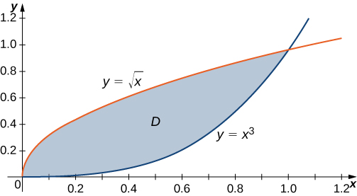{: #CNX_Calc_Figure_15_02_004}

When describing a region as Type I, we need to identify the function that lies above the region and the function that lies below the region. Here, region <math xmlns="http://www.w3.org/1998/Math/MathML"><mi>D</mi></math>

 is bounded above by <math xmlns="http://www.w3.org/1998/Math/MathML"><mrow><mi>y</mi><mo>=</mo><msqrt><mi>x</mi></msqrt></mrow></math>

 and below by <math xmlns="http://www.w3.org/1998/Math/MathML"><mrow><mi>y</mi><mo>=</mo><msup><mi>x</mi><mn>3</mn></msup></mrow></math>

 in the interval for <math xmlns="http://www.w3.org/1998/Math/MathML"><mrow><mi>x</mi><mspace width="0.2em" /><mtext>in</mtext><mspace width="0.2em" /><mrow><mo>[</mo><mrow><mn>0</mn><mo>,</mo><mn>1</mn></mrow><mo>]</mo></mrow><mo>.</mo></mrow></math>

 Hence, as Type I, <math xmlns="http://www.w3.org/1998/Math/MathML"><mi>D</mi></math>

 is described as the set <math xmlns="http://www.w3.org/1998/Math/MathML"><mrow><mrow><mo>{</mo><mrow><mrow><mrow><mrow><mo>(</mo><mrow><mi>x</mi><mo>,</mo><mi>y</mi></mrow><mo>)</mo></mrow></mrow><mo>\|</mo></mrow><mn>0</mn><mo>≤</mo><mi>x</mi><mo>≤</mo><mn>1</mn><mo>,</mo><msup><mi>x</mi><mn>3</mn></msup><mo>≤</mo><mi>y</mi><mo>≤</mo><msqrt><mi>x</mi></msqrt></mrow><mo>}</mo></mrow><mo>.</mo></mrow></math>

However, when describing a region as Type II, we need to identify the function that lies on the left of the region and the function that lies on the right of the region. Here, the region <math xmlns="http://www.w3.org/1998/Math/MathML"><mi>D</mi></math>

 is bounded on the left by <math xmlns="http://www.w3.org/1998/Math/MathML"><mrow><mi>x</mi><mo>=</mo><msup><mi>y</mi><mn>2</mn></msup></mrow></math>

 and on the right by <math xmlns="http://www.w3.org/1998/Math/MathML"><mrow><mi>x</mi><mo>=</mo><mroot><mi>y</mi><mn>3</mn></mroot></mrow></math>

 in the interval for *y* in <math xmlns="http://www.w3.org/1998/Math/MathML"><mrow><mo stretchy="false">[</mo><mn>0</mn><mo>,</mo><mn>1</mn><mo stretchy="false">]</mo><mo>.</mo></mrow></math>

 Hence, as Type II, <math xmlns="http://www.w3.org/1998/Math/MathML"><mi>D</mi></math>

 is described as the set <math xmlns="http://www.w3.org/1998/Math/MathML"><mrow><mrow><mo>{</mo><mrow><mrow><mrow><mrow><mo>(</mo><mrow><mi>x</mi><mo>,</mo><mi>y</mi></mrow><mo>)</mo></mrow></mrow><mo>\|</mo></mrow><mn>0</mn><mo>≤</mo><mi>y</mi><mo>≤</mo><mn>1</mn><mo>,</mo><msup><mi>y</mi><mn>2</mn></msup><mo>≤</mo><mi>x</mi><mo>≤</mo><mroot><mi>y</mi><mn>3</mn></mroot></mrow><mo>}</mo></mrow><mo>.</mo></mrow></math>

Consider the region in the first quadrant between the functions <math xmlns="http://www.w3.org/1998/Math/MathML"><mrow><mi>y</mi><mo>=</mo><mn>2</mn><mi>x</mi></mrow></math>

 and <math xmlns="http://www.w3.org/1998/Math/MathML"><mrow><mi>y</mi><mo>=</mo><msup><mi>x</mi><mn>2</mn></msup><mo>.</mo></mrow></math>

 Describe the region first as Type I and then as Type II.

Type I and Type II are expressed as <math xmlns="http://www.w3.org/1998/Math/MathML"><mrow><mrow><mo>{</mo><mrow><mrow><mrow><mrow><mo>(</mo><mrow><mi>x</mi><mo>,</mo><mi>y</mi></mrow><mo>)</mo></mrow></mrow><mo>\|</mo></mrow><mn>0</mn><mo>≤</mo><mi>x</mi><mo>≤</mo><mn>2</mn><mo>,</mo><msup><mi>x</mi><mn>2</mn></msup><mo>≤</mo><mi>y</mi><mo>≤</mo><mn>2</mn><mi>x</mi></mrow><mo>}</mo></mrow></mrow></math>

 and <math xmlns="http://www.w3.org/1998/Math/MathML"><mrow><mrow><mo>{</mo><mrow><mrow><mrow><mrow><mo>(</mo><mrow><mi>x</mi><mo>,</mo><mi>y</mi></mrow><mo>)</mo></mrow></mrow><mo>\|</mo></mrow><mn>0</mn><mo>≤</mo><mi>y</mi><mo>≤</mo><mn>4</mn><mo>,</mo><mfrac><mn>1</mn><mn>2</mn></mfrac><mi>y</mi><mo>≤</mo><mi>x</mi><mo>≤</mo><msqrt><mi>y</mi></msqrt></mrow><mo>}</mo></mrow><mo>,</mo></mrow></math>

 respectively.

Hint

Graph the functions, and draw vertical and horizontal lines.

# Double Integrals over Nonrectangular Regions

To develop the concept and tools for evaluation of a double integral over a general, nonrectangular region, we need to first understand the region and be able to express it as Type I or Type II or a combination of both. Without understanding the regions, we will not be able to decide the limits of integrations in double integrals. As a first step, let us look at the following theorem.

Double Integrals over Nonrectangular Regions

Suppose <math xmlns="http://www.w3.org/1998/Math/MathML"><mrow><mi>g</mi><mrow><mo>(</mo><mrow><mi>x</mi><mo>,</mo><mi>y</mi></mrow><mo>)</mo></mrow></mrow></math>

 is the extension to the rectangle <math xmlns="http://www.w3.org/1998/Math/MathML"><mi>R</mi></math>

 of the function <math xmlns="http://www.w3.org/1998/Math/MathML"><mrow><mi>f</mi><mrow><mo>(</mo><mrow><mi>x</mi><mo>,</mo><mi>y</mi></mrow><mo>)</mo></mrow></mrow></math>

 defined on the regions <math xmlns="http://www.w3.org/1998/Math/MathML"><mi>D</mi></math>

 and <math xmlns="http://www.w3.org/1998/Math/MathML"><mi>R</mi></math>

 as shown in [\[link\]](#CNX_Calc_Figure_15_02_001) inside <math xmlns="http://www.w3.org/1998/Math/MathML"><mrow><mi>R</mi><mo>.</mo></mrow></math>

 Then <math xmlns="http://www.w3.org/1998/Math/MathML"><mrow><mi>g</mi><mrow><mo>(</mo><mrow><mi>x</mi><mo>,</mo><mi>y</mi></mrow><mo>)</mo></mrow></mrow></math>

 is integrable and we define the double integral of <math xmlns="http://www.w3.org/1998/Math/MathML"><mrow><mi>f</mi><mrow><mo>(</mo><mrow><mi>x</mi><mo>,</mo><mi>y</mi></mrow><mo>)</mo></mrow></mrow></math>

 over <math xmlns="http://www.w3.org/1998/Math/MathML"><mi>D</mi></math>

 by

<math xmlns="http://www.w3.org/1998/Math/MathML"><mrow><mstyle displaystyle="true"><mrow><munder><mo>∬</mo><mi>D</mi></munder><mrow><mi>f</mi><mrow><mo>(</mo><mrow><mi>x</mi><mo>,</mo><mi>y</mi></mrow><mo>)</mo></mrow></mrow></mrow></mstyle><mi>d</mi><mi>A</mi><mo>=</mo><mstyle displaystyle="true"><mrow><munder><mo>∬</mo><mi>R</mi></munder><mrow><mi>g</mi><mrow><mo>(</mo><mrow><mi>x</mi><mo>,</mo><mi>y</mi></mrow><mo>)</mo></mrow></mrow></mrow></mstyle><mi>d</mi><mi>A</mi><mo>.</mo></mrow></math>

The right-hand side of this equation is what we have seen before, so this theorem is reasonable because <math xmlns="http://www.w3.org/1998/Math/MathML"><mi>R</mi></math>

 is a rectangle and <math xmlns="http://www.w3.org/1998/Math/MathML"><mrow><mstyle displaystyle="true"><mrow><munder><mo>∬</mo><mi>R</mi></munder><mrow><mi>g</mi><mrow><mo>(</mo><mrow><mi>x</mi><mo>,</mo><mi>y</mi></mrow><mo>)</mo></mrow></mrow></mrow></mstyle><mi>d</mi><mi>A</mi></mrow></math>

 has been discussed in the preceding section. Also, the equality works because the values of <math xmlns="http://www.w3.org/1998/Math/MathML"><mrow><mi>g</mi><mrow><mo>(</mo><mrow><mi>x</mi><mo>,</mo><mi>y</mi></mrow><mo>)</mo></mrow></mrow></math>

 are <math xmlns="http://www.w3.org/1998/Math/MathML"><mn>0</mn></math>

 for any point <math xmlns="http://www.w3.org/1998/Math/MathML"><mrow><mrow><mo>(</mo><mrow><mi>x</mi><mo>,</mo><mi>y</mi></mrow><mo>)</mo></mrow></mrow></math>

 that lies outside <math xmlns="http://www.w3.org/1998/Math/MathML"><mrow><mi>D</mi><mo>,</mo></mrow></math>

 and hence these points do not add anything to the integral. However, it is important that the rectangle <math xmlns="http://www.w3.org/1998/Math/MathML"><mi>R</mi></math>

 contains the region <math xmlns="http://www.w3.org/1998/Math/MathML"><mrow><mi>D</mi><mo>.</mo></mrow></math>

As a matter of fact, if the region <math xmlns="http://www.w3.org/1998/Math/MathML"><mi>D</mi></math>

 is bounded by smooth curves on a plane and we are able to describe it as Type I or Type II or a mix of both, then we can use the following theorem and not have to find a rectangle <math xmlns="http://www.w3.org/1998/Math/MathML"><mi>R</mi></math>

 containing the region.

Fubini’s Theorem (Strong Form)

For a function <math xmlns="http://www.w3.org/1998/Math/MathML"><mrow><mi>f</mi><mrow><mo>(</mo><mrow><mi>x</mi><mo>,</mo><mi>y</mi></mrow><mo>)</mo></mrow></mrow></math>

 that is continuous on a region <math xmlns="http://www.w3.org/1998/Math/MathML"><mi>D</mi></math>

 of Type I, we have

<math xmlns="http://www.w3.org/1998/Math/MathML"><mrow><mstyle displaystyle="true"><mrow><munder><mo>∬</mo><mi>D</mi></munder><mrow><mi>f</mi><mo stretchy="false">(</mo><mi>x</mi><mo>,</mo><mi>y</mi><mo stretchy="false">)</mo><mi>d</mi><mi>A</mi></mrow></mrow></mstyle><mo>=</mo><mstyle displaystyle="true"><mrow><munder><mo>∬</mo><mi>D</mi></munder><mrow><mi>f</mi><mo stretchy="false">(</mo><mi>x</mi><mo>,</mo><mi>y</mi><mo stretchy="false">)</mo><mi>d</mi><mi>y</mi><mspace width="0.2em" /><mi>d</mi><mi>x</mi></mrow></mrow></mstyle><mo>=</mo><mstyle displaystyle="true"><mrow><munderover><mo stretchy="false">∫</mo><mi>a</mi><mi>b</mi></munderover><mrow><mrow><mo>[</mo><mrow><mstyle displaystyle="true"><mrow><munderover><mo stretchy="false">∫</mo><mrow><msub><mi>g</mi><mn>1</mn></msub><mo stretchy="false">(</mo><mi>x</mi><mo stretchy="false">)</mo></mrow><mrow><msub><mi>g</mi><mn>2</mn></msub><mo stretchy="false">(</mo><mi>x</mi><mo stretchy="false">)</mo></mrow></munderover><mrow><mi>f</mi><mo stretchy="false">(</mo><mi>x</mi><mo>,</mo><mi>y</mi><mo stretchy="false">)</mo><mi>d</mi><mi>y</mi></mrow></mrow></mstyle></mrow><mo>]</mo></mrow><mi>d</mi><mi>x</mi></mrow></mrow></mstyle><mo>.</mo></mrow></math>

Similarly, for a function <math xmlns="http://www.w3.org/1998/Math/MathML"><mrow><mi>f</mi><mrow><mo>(</mo><mrow><mi>x</mi><mo>,</mo><mi>y</mi></mrow><mo>)</mo></mrow></mrow></math>

 that is continuous on a region <math xmlns="http://www.w3.org/1998/Math/MathML"><mi>D</mi></math>

 of Type II, we have

<math xmlns="http://www.w3.org/1998/Math/MathML"><mrow><mstyle displaystyle="true"><mrow><munder><mo>∬</mo><mi>D</mi></munder><mrow><mi>f</mi><mo stretchy="false">(</mo><mi>x</mi><mo>,</mo><mi>y</mi><mo stretchy="false">)</mo><mi>d</mi><mi>A</mi></mrow></mrow></mstyle><mo>=</mo><mstyle displaystyle="true"><mrow><munder><mo>∬</mo><mi>D</mi></munder><mrow><mi>f</mi><mo stretchy="false">(</mo><mi>x</mi><mo>,</mo><mi>y</mi><mo stretchy="false">)</mo><mi>d</mi><mi>x</mi><mspace width="0.2em" /><mi>d</mi><mi>y</mi></mrow></mrow></mstyle><mo>=</mo><mstyle displaystyle="true"><mrow><munderover><mo stretchy="false">∫</mo><mi>c</mi><mi>d</mi></munderover><mrow><mrow><mo>[</mo><mrow><mstyle displaystyle="true"><mrow><munderover><mo stretchy="false">∫</mo><mrow><msub><mi>h</mi><mn>1</mn></msub><mo stretchy="false">(</mo><mi>y</mi><mo stretchy="false">)</mo></mrow><mrow><msub><mi>h</mi><mn>2</mn></msub><mo stretchy="false">(</mo><mi>y</mi><mo stretchy="false">)</mo></mrow></munderover><mrow><mi>f</mi><mo stretchy="false">(</mo><mi>x</mi><mo>,</mo><mi>y</mi><mo stretchy="false">)</mo><mi>d</mi><mi>y</mi></mrow></mrow></mstyle></mrow><mo>]</mo></mrow><mi>d</mi><mi>y</mi></mrow></mrow></mstyle><mo>.</mo></mrow></math>

The integral in each of these expressions is an iterated integral, similar to those we have seen before. Notice that, in the inner integral in the first expression, we integrate <math xmlns="http://www.w3.org/1998/Math/MathML"><mrow><mi>f</mi><mrow><mo>(</mo><mrow><mi>x</mi><mo>,</mo><mi>y</mi></mrow><mo>)</mo></mrow></mrow></math>

 with <math xmlns="http://www.w3.org/1998/Math/MathML"><mi>x</mi></math>

 being held constant and the limits of integration being <math xmlns="http://www.w3.org/1998/Math/MathML"><mrow><msub><mi>g</mi><mn>1</mn></msub><mrow><mo>(</mo><mi>x</mi><mo>)</mo></mrow><mspace width="0.2em" /><mtext>and</mtext><mspace width="0.2em" /><msub><mi>g</mi><mn>2</mn></msub><mrow><mo>(</mo><mi>x</mi><mo>)</mo></mrow><mo>.</mo></mrow></math>

 In the inner integral in the second expression, we integrate <math xmlns="http://www.w3.org/1998/Math/MathML"><mrow><mi>f</mi><mrow><mo>(</mo><mrow><mi>x</mi><mo>,</mo><mi>y</mi></mrow><mo>)</mo></mrow></mrow></math>

 with <math xmlns="http://www.w3.org/1998/Math/MathML"><mi>y</mi></math>

 being held constant and the limits of integration are <math xmlns="http://www.w3.org/1998/Math/MathML"><mrow><msub><mi>h</mi><mn>1</mn></msub><mrow><mo>(</mo><mi>x</mi><mo>)</mo></mrow><mspace width="0.2em" /><mtext>and</mtext><mspace width="0.2em" /><msub><mi>h</mi><mn>2</mn></msub><mrow><mo>(</mo><mi>x</mi><mo>)</mo></mrow><mo>.</mo></mrow></math>

Evaluating an Iterated Integral over a Type I Region

Evaluate the integral <math xmlns="http://www.w3.org/1998/Math/MathML"><mrow><mstyle displaystyle="true"><mrow><munder><mo>∬</mo><mi>D</mi></munder><mrow><msup><mi>x</mi><mn>2</mn></msup><msup><mi>e</mi><mrow><mi>x</mi><mi>y</mi></mrow></msup><mi>d</mi><mi>A</mi></mrow></mrow></mstyle></mrow></math>

 where <math xmlns="http://www.w3.org/1998/Math/MathML"><mi>D</mi></math>

 is shown in [[link]](#CNX_Calc_Figure_15_02_005).

First construct the region <math xmlns="http://www.w3.org/1998/Math/MathML"><mi>D</mi></math>

 as a Type I region ([[link]](#CNX_Calc_Figure_15_02_005)). Here <math xmlns="http://www.w3.org/1998/Math/MathML"><mrow><mi>D</mi><mo>=</mo><mrow><mo>{</mo><mrow><mrow><mrow><mrow><mo>(</mo><mrow><mi>x</mi><mo>,</mo><mi>y</mi></mrow><mo>)</mo></mrow></mrow><mo>\|</mo></mrow><mn>0</mn><mo>≤</mo><mi>x</mi><mo>≤</mo><mn>2</mn><mo>,</mo><mfrac><mn>1</mn><mn>2</mn></mfrac><mi>x</mi><mo>≤</mo><mi>y</mi><mo>≤</mo><mn>1</mn></mrow><mo>}</mo></mrow><mo>.</mo></mrow></math>

 Then we have

<math xmlns="http://www.w3.org/1998/Math/MathML"><mrow><mstyle displaystyle="true"><mrow><munder><mo>∬</mo><mi>D</mi></munder><mrow><msup><mi>x</mi><mn>2</mn></msup><msup><mi>e</mi><mrow><mi>x</mi><mi>y</mi></mrow></msup><mi>d</mi><mi>A</mi></mrow></mrow></mstyle><mo>=</mo><mstyle displaystyle="true"><mrow><munderover><mo stretchy="false">∫</mo><mrow><mi>x</mi><mo>=</mo><mn>0</mn></mrow><mrow><mi>x</mi><mo>=</mo><mn>2</mn></mrow></munderover><mspace width="0.2em" /><mrow><mstyle displaystyle="true"><mrow><munderover><mo stretchy="false">∫</mo><mrow><mi>y</mi><mo>=</mo><mrow><mn>1</mn><mtext>/</mtext><mn>2</mn></mrow><mi>x</mi></mrow><mrow><mi>y</mi><mo>=</mo><mn>1</mn></mrow></munderover><mrow><msup><mi>x</mi><mn>2</mn></msup><msup><mi>e</mi><mrow><mi>x</mi><mi>y</mi></mrow></msup><mi>d</mi><mi>y</mi><mspace width="0.2em" /><mi>d</mi><mi>x</mi></mrow></mrow></mstyle></mrow></mrow></mstyle><mo>.</mo></mrow></math>

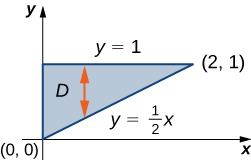{: #CNX_Calc_Figure_15_02_005}

Therefore, we have

<math xmlns="http://www.w3.org/1998/Math/MathML"><mtable><mtr><mtd columnalign="right"><mstyle displaystyle="true"><mrow><munderover><mo stretchy="false">∫</mo><mrow><mi>x</mi><mo>=</mo><mn>0</mn></mrow><mrow><mi>x</mi><mo>=</mo><mn>2</mn></mrow></munderover><mspace width="0.2em" /><mrow><mstyle displaystyle="true"><mrow><munderover><mo stretchy="false">∫</mo><mrow><mi>y</mi><mo>=</mo><mfrac><mn>1</mn><mn>2</mn></mfrac><mi>x</mi></mrow><mrow><mi>y</mi><mo>=</mo><mn>1</mn></mrow></munderover><mrow><msup><mi>x</mi><mn>2</mn></msup><msup><mi>e</mi><mrow><mi>x</mi><mi>y</mi></mrow></msup><mi>d</mi><mi>y</mi><mspace width="0.2em" /><mi>d</mi><mi>x</mi></mrow></mrow></mstyle></mrow></mrow></mstyle></mtd><mtd columnalign="left"><mo>=</mo><mstyle displaystyle="true"><mrow><munderover><mo stretchy="false">∫</mo><mrow><mi>x</mi><mo>=</mo><mn>0</mn></mrow><mrow><mi>x</mi><mo>=</mo><mn>2</mn></mrow></munderover><mrow><mrow><mo>[</mo><mrow><mstyle displaystyle="true"><mrow><munderover><mo stretchy="false">∫</mo><mrow><mi>y</mi><mo>=</mo><mrow><mn>1</mn><mtext>/</mtext><mn>2</mn></mrow><mi>x</mi></mrow><mrow><mi>y</mi><mo>=</mo><mn>1</mn></mrow></munderover><mrow><msup><mi>x</mi><mn>2</mn></msup><msup><mi>e</mi><mrow><mi>x</mi><mi>y</mi></mrow></msup><mi>d</mi><mi>y</mi></mrow></mrow></mstyle></mrow><mo>]</mo></mrow></mrow></mrow></mstyle><mi>d</mi><mi>x</mi></mtd><mtd /><mtd /><mtd columnalign="left"><mtext>Iterated integral for a Type I region.</mtext></mtd></mtr><mtr><mtd /><mtd columnalign="left"><mo>=</mo><mstyle displaystyle="true"><mrow><munderover><mo stretchy="false">∫</mo><mrow><mi>x</mi><mo>=</mo><mn>0</mn></mrow><mrow><mi>x</mi><mo>=</mo><mn>2</mn></mrow></munderover><mrow><msubsup><mrow><mrow><mrow><mrow><mo>[</mo><mrow><msup><mi>x</mi><mn>2</mn></msup><mfrac><mrow><msup><mi>e</mi><mrow><mi>x</mi><mi>y</mi></mrow></msup></mrow><mi>x</mi></mfrac></mrow><mo>]</mo></mrow></mrow><mo>\|</mo></mrow></mrow><mrow><mi>y</mi><mo>=</mo><mrow><mn>1</mn><mtext>/</mtext><mn>2</mn></mrow><mi>x</mi></mrow><mrow><mi>y</mi><mo>=</mo><mn>1</mn></mrow></msubsup></mrow></mrow></mstyle><mi>d</mi><mi>x</mi></mtd><mtd /><mtd /><mtd columnalign="left"><mtable><mtr><mtd columnalign="left"><mtext>Integrate with respect to</mtext><mspace width="0.2em" /><mi>y</mi><mspace width="0.2em" /><mtext>using</mtext></mtd></mtr><mtr><mtd columnalign="left"><mi>u</mi><mtext>-substitution with</mtext><mspace width="0.2em" /><mi>u</mi><mo>=</mo><mi>x</mi><mi>y</mi><mspace width="0.2em" /><mtext>where</mtext><mspace width="0.2em" /><mi>x</mi><mspace width="0.2em" /><mtext>is held</mtext></mtd></mtr><mtr><mtd columnalign="left"><mtext>constant.</mtext></mtd></mtr></mtable></mtd></mtr><mtr><mtd /><mtd columnalign="left"><mo>=</mo><mstyle displaystyle="true"><mrow><munderover><mo stretchy="false">∫</mo><mrow><mi>x</mi><mo>=</mo><mn>0</mn></mrow><mrow><mi>x</mi><mo>=</mo><mn>2</mn></mrow></munderover><mrow><mrow><mo>[</mo><mrow><mi>x</mi><msup><mi>e</mi><mi>x</mi></msup><mo>−</mo><mi>x</mi><msup><mi>e</mi><mrow><msup><mi>x</mi><mn>2</mn></msup><mtext>/</mtext><mn>2</mn></mrow></msup></mrow><mo>]</mo></mrow></mrow></mrow></mstyle><mi>d</mi><mi>x</mi></mtd><mtd /><mtd /><mtd columnalign="left"><mtable><mtr><mtd columnalign="left"><mtext>Integrate with respect to</mtext><mspace width="0.2em" /><mi>x</mi><mspace width="0.2em" /><mtext>using</mtext></mtd></mtr><mtr><mtd columnalign="left"><mi>u</mi><mtext>-substitution with</mtext><mspace width="0.2em" /><mi>u</mi><mo>=</mo><mfrac><mn>1</mn><mn>2</mn></mfrac><msup><mi>x</mi><mn>2</mn></msup><mo>.</mo></mtd></mtr></mtable></mtd></mtr><mtr><mtd /><mtd columnalign="left"><mo>=</mo><msubsup><mrow><mrow><mrow><mrow><mo>[</mo><mrow><mi>x</mi><msup><mi>e</mi><mi>x</mi></msup><mo>−</mo><msup><mi>e</mi><mi>x</mi></msup><mo>−</mo><msup><mi>e</mi><mrow><mfrac><mn>1</mn><mn>2</mn></mfrac><msup><mi>x</mi><mn>2</mn></msup></mrow></msup></mrow><mo>]</mo></mrow></mrow><mo>\|</mo></mrow></mrow><mrow><mi>x</mi><mo>=</mo><mn>0</mn></mrow><mrow><mi>x</mi><mo>=</mo><mn>2</mn></mrow></msubsup><mo>=</mo><mn>2</mn></mtd><mtd /><mtd /><mtd /></mtr></mtable></math>

In [\[link\]](#fs-id1167793369248), we could have looked at the region in another way, such as <math xmlns="http://www.w3.org/1998/Math/MathML"><mrow><mi>D</mi><mo>=</mo><mrow><mo>{</mo><mrow><mrow><mrow><mrow><mo>(</mo><mrow><mi>x</mi><mo>,</mo><mi>y</mi></mrow><mo>)</mo></mrow></mrow><mo>\|</mo></mrow><mn>0</mn><mo>≤</mo><mi>y</mi><mo>≤</mo><mn>1</mn><mo>,</mo><mn>0</mn><mo>≤</mo><mi>x</mi><mo>≤</mo><mn>2</mn><mi>y</mi></mrow><mo>}</mo></mrow></mrow></math>

 ([\[link\]](#CNX_Calc_Figure_15_02_006)).

 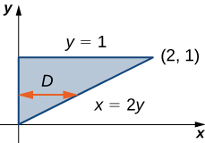{: #CNX_Calc_Figure_15_02_006}

This is a Type II region and the integral would then look like

<math xmlns="http://www.w3.org/1998/Math/MathML"><mrow><mstyle displaystyle="true"><mrow><munder><mo>∬</mo><mi>D</mi></munder><mrow><msup><mi>x</mi><mn>2</mn></msup><msup><mi>e</mi><mrow><mi>x</mi><mi>y</mi></mrow></msup><mi>d</mi><mi>A</mi></mrow></mrow></mstyle><mo>=</mo><mstyle displaystyle="true"><mrow><munderover><mo stretchy="false">∫</mo><mrow><mi>y</mi><mo>=</mo><mn>0</mn></mrow><mrow><mi>y</mi><mo>=</mo><mn>1</mn></mrow></munderover><mspace width="0.2em" /><mrow><mstyle displaystyle="true"><mrow><munderover><mo stretchy="false">∫</mo><mrow><mi>x</mi><mo>=</mo><mn>0</mn></mrow><mrow><mi>x</mi><mo>=</mo><mn>2</mn><mi>y</mi></mrow></munderover><mrow><msup><mi>x</mi><mn>2</mn></msup><msup><mi>e</mi><mrow><mi>x</mi><mi>y</mi></mrow></msup><mi>d</mi><mi>x</mi><mspace width="0.2em" /><mi>d</mi><mi>y</mi><mo>.</mo></mrow></mrow></mstyle></mrow></mrow></mstyle></mrow></math>

However, if we integrate first with respect to <math xmlns="http://www.w3.org/1998/Math/MathML"><mrow><mi>x</mi><mo>,</mo></mrow></math>

 this integral is lengthy to compute because we have to use integration by parts twice.

Evaluating an Iterated Integral over a Type II Region

Evaluate the integral <math xmlns="http://www.w3.org/1998/Math/MathML"><mrow><mstyle displaystyle="true"><mrow><munder><mo>∬</mo><mi>D</mi></munder><mrow><mrow><mo>(</mo><mrow><mn>3</mn><msup><mi>x</mi><mn>2</mn></msup><mo>+</mo><msup><mi>y</mi><mn>2</mn></msup></mrow><mo>)</mo></mrow><mi>d</mi><mi>A</mi></mrow></mrow></mstyle></mrow></math>

 where <math xmlns="http://www.w3.org/1998/Math/MathML"><mrow><mo>=</mo><mrow><mo>{</mo><mrow><mrow><mrow><mrow><mo>(</mo><mrow><mi>x</mi><mo>,</mo><mi>y</mi></mrow><mo>)</mo></mrow></mrow><mo>\|</mo></mrow><mo>−</mo><mn>2</mn><mo>≤</mo><mi>y</mi><mo>≤</mo><mn>3</mn><mo>,</mo><msup><mi>y</mi><mn>2</mn></msup><mo>−</mo><mn>3</mn><mo>≤</mo><mi>x</mi><mo>≤</mo><mi>y</mi><mo>+</mo><mn>3</mn></mrow><mo>}</mo></mrow><mo>.</mo></mrow></math>

Notice that <math xmlns="http://www.w3.org/1998/Math/MathML"><mi>D</mi></math>

 can be seen as either a Type I or a Type II region, as shown in [[link]](#CNX_Calc_Figure_15_02_007). However, in this case describing <math xmlns="http://www.w3.org/1998/Math/MathML"><mi>D</mi></math>

 as Type <math xmlns="http://www.w3.org/1998/Math/MathML"><mtext>I</mtext></math>

 is more complicated than describing it as Type II. Therefore, we use <math xmlns="http://www.w3.org/1998/Math/MathML"><mi>D</mi></math>

 as a Type II region for the integration.

![This figure consists of two figures labeled a and b. In figure a, a region is bounded by y = the square root of the quantity (x + 3), y = the negative of the square root of the quantity (x + 3), and y = x minus 3, which has points of intersection (6, 3), (1, negative 2), and (0, negative 3). There are vertical lines in the shape, and it is noted that this is a type I region: integrate first with respect to y. In figure b, a region is bounded by x = y2 minus 3 and x = y + 3, which has points of intersection (6, 3), (1, negative 2), and (0, negative 3). There are horizontal lines in the shape, and it is noted that this is a type II region: integrate first with respect to x.](../resources/CNX_Calc_Figure_15_02_007.jpg "The region D in this example can be either (a) Type I or (b) Type II."){: #CNX_Calc_Figure_15_02_007}

Choosing this order of integration, we have

<math xmlns="http://www.w3.org/1998/Math/MathML"><mtable><mtr><mtd columnalign="right"><mstyle displaystyle="true"><mrow><munder><mo>∬</mo><mi>D</mi></munder><mrow><mrow><mo>(</mo><mrow><mn>3</mn><msup><mi>x</mi><mn>2</mn></msup><mo>+</mo><msup><mi>y</mi><mn>2</mn></msup></mrow><mo>)</mo></mrow><mi>d</mi><mi>A</mi></mrow></mrow></mstyle></mtd><mtd columnalign="left"><mo>=</mo><mstyle displaystyle="true"><mrow><munderover><mo stretchy="false">∫</mo><mrow><mi>y</mi><mo>=</mo><mn>−2</mn></mrow><mrow><mi>y</mi><mo>=</mo><mn>3</mn></mrow></munderover><mspace width="0.2em" /><mrow><mstyle displaystyle="true"><mrow><munderover><mo stretchy="false">∫</mo><mrow><mi>x</mi><mo>=</mo><msup><mi>y</mi><mn>2</mn></msup><mo>−</mo><mn>3</mn></mrow><mrow><mi>x</mi><mo>=</mo><mi>y</mi><mo>+</mo><mn>3</mn></mrow></munderover><mrow><mrow><mo>(</mo><mrow><mn>3</mn><msup><mi>x</mi><mn>2</mn></msup><mo>+</mo><msup><mi>y</mi><mn>2</mn></msup></mrow><mo>)</mo></mrow><mi>d</mi><mi>x</mi><mspace width="0.2em" /><mi>d</mi><mi>y</mi></mrow></mrow></mstyle></mrow></mrow></mstyle></mtd><mtd /><mtd /><mtd columnalign="left"><mtext>Iterated integral, Type II region.</mtext></mtd></mtr><mtr><mtd /><mtd columnalign="left"><mo>=</mo><msubsup><mrow><mrow><mrow><mstyle displaystyle="true"><mrow><munderover><mo stretchy="false">∫</mo><mrow><mi>y</mi><mo>=</mo><mn>−2</mn></mrow><mrow><mi>y</mi><mo>=</mo><mn>3</mn></mrow></munderover><mrow><mrow><mo>(</mo><mrow><msup><mi>x</mi><mn>3</mn></msup><mo>+</mo><mi>x</mi><msup><mi>y</mi><mn>2</mn></msup></mrow><mo>)</mo></mrow></mrow></mrow></mstyle></mrow><mo>\|</mo></mrow></mrow><mrow><msup><mi>y</mi><mn>2</mn></msup><mo>−</mo><mn>3</mn></mrow><mrow><mi>y</mi><mo>+</mo><mn>3</mn></mrow></msubsup><mi>d</mi><mi>y</mi></mtd><mtd /><mtd /><mtd columnalign="left"><mtext>Integrate with respect to</mtext><mspace width="0.2em" /><mi>x</mi><mo>.</mo></mtd></mtr><mtr><mtd /><mtd columnalign="left"><mo>=</mo><mstyle displaystyle="true"><mrow><munderover><mo stretchy="false">∫</mo><mrow><mi>y</mi><mo>=</mo><mn>−2</mn></mrow><mrow><mi>y</mi><mo>=</mo><mn>3</mn></mrow></munderover><mrow><mrow><mo>(</mo><mrow><msup><mrow><mrow><mo>(</mo><mrow><mi>y</mi><mo>+</mo><mn>3</mn></mrow><mo>)</mo></mrow></mrow><mn>3</mn></msup><mo>+</mo><mrow><mo>(</mo><mrow><mi>y</mi><mo>+</mo><mn>3</mn></mrow><mo>)</mo></mrow><msup><mi>y</mi><mn>2</mn></msup><mo>−</mo><msup><mrow><mrow><mo>(</mo><mrow><msup><mi>y</mi><mn>2</mn></msup><mo>−</mo><mn>3</mn></mrow><mo>)</mo></mrow></mrow><mn>3</mn></msup><mo>−</mo><mrow><mo>(</mo><mrow><msup><mi>y</mi><mn>2</mn></msup><mo>−</mo><mn>3</mn></mrow><mo>)</mo></mrow><msup><mi>y</mi><mn>2</mn></msup></mrow><mo>)</mo></mrow></mrow></mrow></mstyle><mi>d</mi><mi>y</mi></mtd><mtd /><mtd /><mtd /></mtr><mtr><mtd /><mtd columnalign="left"><mo>=</mo><mstyle displaystyle="true"><mrow><munderover><mo stretchy="false">∫</mo><mrow><mn>−2</mn></mrow><mn>3</mn></munderover><mrow><mrow><mo>(</mo><mrow><mn>54</mn><mo>+</mo><mn>27</mn><mi>y</mi><mo>−</mo><mn>12</mn><msup><mi>y</mi><mn>2</mn></msup><mo>+</mo><mn>2</mn><msup><mi>y</mi><mn>3</mn></msup><mo>+</mo><mn>8</mn><msup><mi>y</mi><mn>4</mn></msup><mo>−</mo><msup><mi>y</mi><mn>6</mn></msup></mrow><mo>)</mo></mrow></mrow></mrow></mstyle><mi>d</mi><mi>y</mi></mtd><mtd /><mtd /><mtd columnalign="left"><mtext>Integrate with respect to</mtext><mspace width="0.2em" /><mi>y</mi><mo>.</mo></mtd></mtr><mtr><mtd /><mtd columnalign="left"><mo>=</mo><msubsup><mrow><mrow><mrow><mrow><mo>[</mo><mrow><mn>54</mn><mi>y</mi><mo>+</mo><mfrac><mrow><mn>27</mn><msup><mi>y</mi><mn>2</mn></msup></mrow><mn>2</mn></mfrac><mo>−</mo><mn>4</mn><msup><mi>y</mi><mn>3</mn></msup><mo>+</mo><mfrac><mrow><msup><mi>y</mi><mn>4</mn></msup></mrow><mn>2</mn></mfrac><mo>+</mo><mfrac><mrow><mn>8</mn><msup><mi>y</mi><mn>5</mn></msup></mrow><mn>5</mn></mfrac><mo>−</mo><mfrac><mrow><msup><mi>y</mi><mn>7</mn></msup></mrow><mn>7</mn></mfrac></mrow><mo>]</mo></mrow></mrow><mo>\|</mo></mrow></mrow><mrow><mn>−2</mn></mrow><mn>3</mn></msubsup></mtd><mtd /><mtd /><mtd /></mtr><mtr><mtd /><mtd columnalign="left"><mo>=</mo><mfrac><mrow><mn>2375</mn></mrow><mn>7</mn></mfrac><mo>.</mo></mtd><mtd /><mtd /><mtd /></mtr></mtable></math>

Sketch the region <math xmlns="http://www.w3.org/1998/Math/MathML"><mi>D</mi></math>

 and evaluate the iterated integral <math xmlns="http://www.w3.org/1998/Math/MathML"><mrow><mstyle displaystyle="true"><mrow><munder><mo>∬</mo><mi>D</mi></munder><mrow><mi>x</mi><mi>y</mi><mspace width="0.2em" /><mi>d</mi><mi>y</mi><mspace width="0.2em" /><mi>d</mi><mi>x</mi></mrow></mrow></mstyle></mrow></math>

 where <math xmlns="http://www.w3.org/1998/Math/MathML"><mi>D</mi></math>

 is the region bounded by the curves <math xmlns="http://www.w3.org/1998/Math/MathML"><mrow><mi>y</mi><mo>=</mo><mtext>cos</mtext><mspace width="0.2em" /><mi>x</mi></mrow></math>

 and <math xmlns="http://www.w3.org/1998/Math/MathML"><mrow><mi>y</mi><mo>=</mo><mtext>sin</mtext><mspace width="0.2em" /><mi>x</mi></mrow></math>

 in the interval <math xmlns="http://www.w3.org/1998/Math/MathML"><mrow><mrow><mo>[</mo><mrow><mrow><mrow><mn>−3</mn><mi>π</mi></mrow><mtext>/</mtext><mn>4</mn></mrow><mo>,</mo><mrow><mi>π</mi><mtext>/</mtext><mn>4</mn></mrow></mrow><mo>]</mo></mrow><mo>.</mo></mrow></math>

<math xmlns="http://www.w3.org/1998/Math/MathML"><mrow><mrow><mi>π</mi><mtext>/</mtext><mn>4</mn></mrow></mrow></math>

Hint

Express <math xmlns="http://www.w3.org/1998/Math/MathML"><mi>D</mi></math>

 as a Type I region, and integrate with respect to <math xmlns="http://www.w3.org/1998/Math/MathML"><mi>y</mi></math>

 first.

Recall from [Double Integrals over Rectangular Regions](/m53949){: .target-chapter} the properties of double integrals. As we have seen from the examples here, all these properties are also valid for a function defined on a nonrectangular bounded region on a plane. In particular, property <math xmlns="http://www.w3.org/1998/Math/MathML"><mn>3</mn></math>

 states:

If <math xmlns="http://www.w3.org/1998/Math/MathML"><mrow><mi>R</mi><mo>=</mo><mi>S</mi><mo>∪</mo><mi>T</mi></mrow></math>

 and <math xmlns="http://www.w3.org/1998/Math/MathML"><mrow><mi>S</mi><mo>∩</mo><mi>T</mi><mo>=</mo><mo>∅</mo></mrow></math>

 except at their boundaries, then

<math xmlns="http://www.w3.org/1998/Math/MathML"><mrow><mstyle displaystyle="true"><mrow><munder><mo>∬</mo><mi>R</mi></munder><mrow><mi>f</mi><mrow><mo>(</mo><mrow><mi>x</mi><mo>,</mo><mi>y</mi></mrow><mo>)</mo></mrow><mi>d</mi><mi>A</mi></mrow></mrow></mstyle><mo>=</mo><mstyle displaystyle="true"><mrow><munder><mo>∬</mo><mi>S</mi></munder><mrow><mi>f</mi><mrow><mo>(</mo><mrow><mi>x</mi><mo>,</mo><mi>y</mi></mrow><mo>)</mo></mrow><mi>d</mi><mi>A</mi></mrow></mrow></mstyle><mo>+</mo><mstyle displaystyle="true"><mrow><munder><mo>∬</mo><mi>T</mi></munder><mrow><mi>f</mi><mrow><mo>(</mo><mrow><mi>x</mi><mo>,</mo><mi>y</mi></mrow><mo>)</mo></mrow><mi>d</mi><mi>A</mi></mrow></mrow></mstyle><mo>.</mo></mrow></math>

Similarly, we have the following property of double integrals over a nonrectangular bounded region on a plane.

Decomposing Regions into Smaller Regions

Suppose the region <math xmlns="http://www.w3.org/1998/Math/MathML"><mi>D</mi></math>

 can be expressed as <math xmlns="http://www.w3.org/1998/Math/MathML"><mrow><mi>D</mi><mo>=</mo><msub><mi>D</mi><mn>1</mn></msub><mo>∪</mo><msub><mi>D</mi><mn>2</mn></msub></mrow></math>

 where <math xmlns="http://www.w3.org/1998/Math/MathML"><mrow><msub><mi>D</mi><mn>1</mn></msub></mrow></math>

 and <math xmlns="http://www.w3.org/1998/Math/MathML"><mrow><msub><mi>D</mi><mn>2</mn></msub></mrow></math>

 do not overlap except at their boundaries. Then

<math xmlns="http://www.w3.org/1998/Math/MathML"><mrow><mstyle displaystyle="true"><mrow><munder><mo>∬</mo><mi>D</mi></munder><mrow><mi>f</mi><mrow><mo>(</mo><mrow><mi>x</mi><mo>,</mo><mi>y</mi></mrow><mo>)</mo></mrow><mi>d</mi><mi>A</mi></mrow></mrow></mstyle><mo>=</mo><mstyle displaystyle="true"><mrow><munder><mo>∬</mo><mrow><msub><mi>D</mi><mn>1</mn></msub></mrow></munder><mrow><mi>f</mi><mrow><mo>(</mo><mrow><mi>x</mi><mo>,</mo><mi>y</mi></mrow><mo>)</mo></mrow><mi>d</mi><mi>A</mi></mrow></mrow></mstyle><mo>+</mo><mstyle displaystyle="true"><mrow><munder><mo>∬</mo><mrow><msub><mi>D</mi><mn>2</mn></msub></mrow></munder><mrow><mi>f</mi><mrow><mo>(</mo><mrow><mi>x</mi><mo>,</mo><mi>y</mi></mrow><mo>)</mo></mrow><mi>d</mi><mi>A</mi></mrow></mrow></mstyle><mo>.</mo></mrow></math>

This theorem is particularly useful for nonrectangular regions because it allows us to split a region into a union of regions of Type I and Type II. Then we can compute the double integral on each piece in a convenient way, as in the next example.

Decomposing Regions

Express the region <math xmlns="http://www.w3.org/1998/Math/MathML"><mi>D</mi></math>

 shown in [[link]](#CNX_Calc_Figure_15_02_008) as a union of regions of Type I or Type II, and evaluate the integral

<math xmlns="http://www.w3.org/1998/Math/MathML"><mrow><mstyle displaystyle="true"><mrow><munder><mo>∬</mo><mi>D</mi></munder><mrow><mrow><mo>(</mo><mrow><mn>2</mn><mi>x</mi><mo>+</mo><mn>5</mn><mi>y</mi></mrow><mo>)</mo></mrow></mrow></mrow></mstyle><mi>d</mi><mi>A</mi><mo>.</mo></mrow></math>

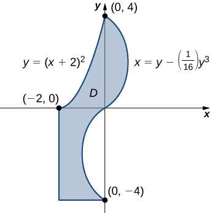{: #CNX_Calc_Figure_15_02_008}

The region <math xmlns="http://www.w3.org/1998/Math/MathML"><mi>D</mi></math>

 is not easy to decompose into any one type; it is actually a combination of different types. So we can write it as a union of three regions <math xmlns="http://www.w3.org/1998/Math/MathML"><mrow><msub><mi>D</mi><mn>1</mn></msub><mo>,</mo><msub><mi>D</mi><mn>2</mn></msub><mo>,</mo><mtext>and</mtext><mspace width="0.2em" /><msub><mi>D</mi><mn>3</mn></msub></mrow></math>

 where, <math xmlns="http://www.w3.org/1998/Math/MathML"><mrow><msub><mi>D</mi><mn>1</mn></msub><mo>=</mo><mrow><mo>{</mo><mrow><mrow><mrow><mrow><mo>(</mo><mrow><mi>x</mi><mo>,</mo><mi>y</mi></mrow><mo>)</mo></mrow></mrow><mo>\|</mo></mrow><mo>−</mo><mn>2</mn><mo>≤</mo><mi>x</mi><mo>≤</mo><mn>0</mn><mo>,</mo><mn>0</mn><mo>≤</mo><mi>y</mi><mo>≤</mo><msup><mrow><mrow><mo>(</mo><mrow><mi>x</mi><mo>+</mo><mn>2</mn></mrow><mo>)</mo></mrow></mrow><mn>2</mn></msup></mrow><mo>}</mo></mrow><mo>,</mo></mrow></math>

 <math xmlns="http://www.w3.org/1998/Math/MathML"><mrow><msub><mi>D</mi><mn>2</mn></msub><mo>=</mo><mrow><mo>{</mo><mrow><mrow><mrow><mrow><mo>(</mo><mrow><mi>x</mi><mo>,</mo><mi>y</mi></mrow><mo>)</mo></mrow></mrow><mo>\|</mo></mrow><mn>0</mn><mo>≤</mo><mi>y</mi><mo>≤</mo><mn>4</mn><mo>,</mo><mn>0</mn><mo>≤</mo><mi>x</mi><mo>≤</mo><mrow><mo>(</mo><mrow><mi>y</mi><mo>−</mo><mfrac><mn>1</mn><mrow><mn>16</mn></mrow></mfrac><msup><mi>y</mi><mn>3</mn></msup></mrow><mo>)</mo></mrow></mrow><mo>}</mo></mrow><mo>.</mo></mrow></math>

 These regions are illustrated more clearly in [[link]](#CNX_Calc_Figure_15_02_009).

{: #CNX_Calc_Figure_15_02_009}

Here <math xmlns="http://www.w3.org/1998/Math/MathML"><mrow><msub><mi>D</mi><mn>1</mn></msub></mrow></math>

 is Type <math xmlns="http://www.w3.org/1998/Math/MathML"><mtext>I</mtext></math>

 and <math xmlns="http://www.w3.org/1998/Math/MathML"><mrow><msub><mi>D</mi><mn>2</mn></msub></mrow></math>

 and <math xmlns="http://www.w3.org/1998/Math/MathML"><mrow><msub><mi>D</mi><mn>3</mn></msub></mrow></math>

 are both of Type II. Hence,

<math xmlns="http://www.w3.org/1998/Math/MathML"><mtable><mtr><mtd columnalign="right"><mstyle displaystyle="true"><mrow><munder><mo>∬</mo><mi>D</mi></munder><mrow><mo stretchy="false">(</mo><mn>2</mn><mi>x</mi><mo>+</mo><mn>5</mn><mi>y</mi><mo stretchy="false">)</mo><mi>d</mi><mi>A</mi></mrow></mrow></mstyle></mtd><mtd columnalign="left"><mo>=</mo><mstyle displaystyle="true"><mrow><munder><mo>∬</mo><mrow><msub><mi>D</mi><mn>1</mn></msub></mrow></munder><mrow><mo stretchy="false">(</mo><mn>2</mn><mi>x</mi><mo>+</mo><mn>5</mn><mi>y</mi><mo stretchy="false">)</mo><mi>d</mi><mi>A</mi></mrow></mrow></mstyle><mo>+</mo><mstyle displaystyle="true"><mrow><munder><mo>∬</mo><mrow><msub><mi>D</mi><mn>2</mn></msub></mrow></munder><mrow><mo stretchy="false">(</mo><mn>2</mn><mi>x</mi><mo>+</mo><mn>5</mn><mi>y</mi><mo stretchy="false">)</mo><mi>d</mi><mi>A</mi></mrow></mrow></mstyle><mo>+</mo><mstyle displaystyle="true"><mrow><munder><mo>∬</mo><mrow><msub><mi>D</mi><mn>3</mn></msub></mrow></munder><mrow><mo stretchy="false">(</mo><mn>2</mn><mi>x</mi><mo>+</mo><mn>5</mn><mi>y</mi><mo stretchy="false">)</mo><mi>d</mi><mi>A</mi></mrow></mrow></mstyle></mtd></mtr><mtr><mtd /><mtd columnalign="left"><mo>=</mo><mstyle displaystyle="true"><mrow><munderover><mo stretchy="false">∫</mo><mrow><mi>x</mi><mo>=</mo><mn>−2</mn></mrow><mrow><mi>x</mi><mo>=</mo><mn>0</mn></mrow></munderover><mspace width="0.2em" /><mrow><mstyle displaystyle="true"><mrow><munderover><mo stretchy="false">∫</mo><mrow><mi>y</mi><mo>=</mo><mn>0</mn></mrow><mrow><mi>y</mi><mo>=</mo><msup><mrow><mo stretchy="false">(</mo><mi>x</mi><mo>+</mo><mn>2</mn><mo stretchy="false">)</mo></mrow><mn>2</mn></msup></mrow></munderover><mrow><mo stretchy="false">(</mo><mn>2</mn><mi>x</mi><mo>+</mo><mn>5</mn><mi>y</mi><mo stretchy="false">)</mo><mi>d</mi><mi>y</mi><mspace width="0.2em" /><mi>d</mi><mi>x</mi></mrow></mrow></mstyle></mrow></mrow></mstyle><mo>+</mo><mstyle displaystyle="true"><mrow><munderover><mo stretchy="false">∫</mo><mrow><mi>y</mi><mo>=</mo><mn>0</mn></mrow><mrow><mi>y</mi><mo>=</mo><mn>4</mn></mrow></munderover><mspace width="0.2em" /><mrow><mstyle displaystyle="true"><mrow><munderover><mo stretchy="false">∫</mo><mrow><mi>x</mi><mo>=</mo><mn>0</mn></mrow><mrow><mi>x</mi><mo>=</mo><mi>y</mi><mo>−</mo><mo stretchy="false">(</mo><mn>1</mn><mtext>/</mtext><mn>16</mn><mo stretchy="false">)</mo><msup><mi>y</mi><mn>3</mn></msup></mrow></munderover><mrow><mo stretchy="false">(</mo><mn>2</mn><mo>+</mo><mn>5</mn><mi>y</mi><mo stretchy="false">)</mo><mi>d</mi><mi>x</mi><mspace width="0.2em" /><mi>d</mi><mi>y</mi></mrow></mrow></mstyle></mrow></mrow></mstyle><mo>+</mo><mstyle displaystyle="true"><mrow><munderover><mo stretchy="false">∫</mo><mrow><mi>y</mi><mo>=</mo><mn>−4</mn></mrow><mrow><mi>y</mi><mo>=</mo><mn>0</mn></mrow></munderover><mspace width="0.2em" /><mrow><mstyle displaystyle="true"><mrow><munderover><mo stretchy="false">∫</mo><mrow><mi>x</mi><mo>=</mo><mn>−2</mn></mrow><mrow><mi>x</mi><mo>=</mo><mi>y</mi><mo>−</mo><mo stretchy="false">(</mo><mn>1</mn><mtext>/</mtext><mn>16</mn><mo stretchy="false">)</mo><msup><mi>y</mi><mn>3</mn></msup></mrow></munderover><mrow><mo stretchy="false">(</mo><mn>2</mn><mi>x</mi><mo>+</mo><mn>5</mn><mi>y</mi><mo stretchy="false">)</mo><mi>d</mi><mi>x</mi><mspace width="0.2em" /><mi>d</mi><mi>y</mi></mrow></mrow></mstyle></mrow></mrow></mstyle></mtd></mtr><mtr><mtd /><mtd columnalign="left"><mo>=</mo><mstyle displaystyle="true"><mrow><munderover><mo stretchy="false">∫</mo><mrow><mi>x</mi><mo>=</mo><mn>−2</mn></mrow><mrow><mi>x</mi><mo>=</mo><mn>0</mn></mrow></munderover><mrow><mrow><mo>[</mo><mrow><mfrac><mn>1</mn><mn>2</mn></mfrac><msup><mrow><mo stretchy="false">(</mo><mn>2</mn><mo>+</mo><mi>x</mi><mo stretchy="false">)</mo></mrow><mn>2</mn></msup><mo stretchy="false">(</mo><mn>20</mn><mo>+</mo><mn>24</mn><mi>x</mi><mo>+</mo><mn>5</mn><msup><mi>x</mi><mn>2</mn></msup><mo stretchy="false">)</mo></mrow><mo>]</mo></mrow></mrow></mrow></mstyle><mo>+</mo><mstyle displaystyle="true"><mrow><munderover><mo stretchy="false">∫</mo><mrow><mi>y</mi><mo>=</mo><mn>0</mn></mrow><mrow><mi>y</mi><mo>=</mo><mn>4</mn></mrow></munderover><mrow><mrow><mo>[</mo><mrow><mfrac><mn>1</mn><mrow><mn>256</mn></mrow></mfrac><msup><mi>y</mi><mn>6</mn></msup><mo>−</mo><mfrac><mn>7</mn><mrow><mn>16</mn></mrow></mfrac><msup><mi>y</mi><mn>4</mn></msup><mo>+</mo><mn>6</mn><msup><mi>y</mi><mn>2</mn></msup></mrow><mo>]</mo></mrow></mrow></mrow></mstyle></mtd></mtr><mtr><mtd /><mtd columnalign="left"><mspace width="1em" /><mo>+</mo><mstyle displaystyle="true"><mrow><munderover><mo stretchy="false">∫</mo><mrow><mi>y</mi><mo>=</mo><mn>−4</mn></mrow><mrow><mi>y</mi><mo>=</mo><mn>0</mn></mrow></munderover><mrow><mrow><mo>[</mo><mrow><mfrac><mn>1</mn><mrow><mn>256</mn></mrow></mfrac><msup><mi>y</mi><mn>6</mn></msup><mo>−</mo><mfrac><mn>7</mn><mrow><mn>16</mn></mrow></mfrac><msup><mi>y</mi><mn>4</mn></msup><mo>+</mo><mn>6</mn><msup><mi>y</mi><mn>2</mn></msup><mo>+</mo><mn>10</mn><mi>y</mi><mo>−</mo><mn>4</mn></mrow><mo>]</mo></mrow></mrow></mrow></mstyle></mtd></mtr><mtr><mtd /><mtd columnalign="left"><mo>=</mo><mfrac><mrow><mn>40</mn></mrow><mn>3</mn></mfrac><mo>+</mo><mfrac><mrow><mn>1664</mn></mrow><mrow><mn>35</mn></mrow></mfrac><mo>−</mo><mfrac><mrow><mn>1696</mn></mrow><mrow><mn>35</mn></mrow></mfrac><mo>=</mo><mfrac><mrow><mn>1304</mn></mrow><mrow><mn>105</mn></mrow></mfrac><mo>.</mo></mtd></mtr></mtable></math>

Now we could redo this example using a union of two Type II regions (see the Checkpoint).

Consider the region bounded by the curves <math xmlns="http://www.w3.org/1998/Math/MathML"><mrow><mi>y</mi><mo>=</mo><mtext>ln</mtext><mspace width="0.2em" /><mi>x</mi></mrow></math>

 and <math xmlns="http://www.w3.org/1998/Math/MathML"><mrow><mi>y</mi><mo>=</mo><msup><mi>e</mi><mi>x</mi></msup></mrow></math>

 in the interval <math xmlns="http://www.w3.org/1998/Math/MathML"><mrow><mrow><mo>[</mo><mrow><mn>1</mn><mo>,</mo><mn>2</mn></mrow><mo>]</mo></mrow><mo>.</mo></mrow></math>

 Decompose the region into smaller regions of Type II.

<math xmlns="http://www.w3.org/1998/Math/MathML"><mrow><mrow><mo>{</mo><mrow><mrow><mrow><mrow><mo>(</mo><mrow><mi>x</mi><mo>,</mo><mi>y</mi></mrow><mo>)</mo></mrow></mrow><mo>\|</mo></mrow><mn>0</mn><mo>≤</mo><mi>y</mi><mo>≤</mo><mn>1</mn><mo>,</mo><mn>1</mn><mo>≤</mo><mi>x</mi><mo>≤</mo><msup><mi>e</mi><mi>y</mi></msup></mrow><mo>}</mo></mrow><mo>∪</mo><mrow><mo>{</mo><mrow><mrow><mrow><mrow><mo>(</mo><mrow><mi>x</mi><mo>,</mo><mi>y</mi></mrow><mo>)</mo></mrow></mrow><mo>\|</mo></mrow><mn>1</mn><mo>≤</mo><mi>y</mi><mo>≤</mo><mi>e</mi><mo>,</mo><mn>1</mn><mo>≤</mo><mi>x</mi><mo>≤</mo><mn>2</mn></mrow><mo>}</mo></mrow><mo>∪</mo><mrow><mo>{</mo><mrow><mrow><mrow><mrow><mo>(</mo><mrow><mi>x</mi><mo>,</mo><mi>y</mi></mrow><mo>)</mo></mrow></mrow><mo>\|</mo></mrow><mi>e</mi><mo>≤</mo><mi>y</mi><mo>≤</mo><msup><mi>e</mi><mn>2</mn></msup><mo>,</mo><mtext>ln</mtext><mspace width="0.2em" /><mi>y</mi><mo>≤</mo><mi>x</mi><mo>≤</mo><mn>2</mn></mrow><mo>}</mo></mrow></mrow></math>

Hint

Sketch the region, and split it into three regions to set it up.

Redo [[link]](#fs-id1167793547434) using a union of two Type II regions.

Same as in the example shown.

Hint

<math xmlns="http://www.w3.org/1998/Math/MathML"><mrow><mrow><mo>{</mo><mrow><mrow><mrow><mrow><mo>(</mo><mrow><mi>x</mi><mo>,</mo><mi>y</mi></mrow><mo>)</mo></mrow></mrow><mo>\|</mo></mrow><mn>0</mn><mo>≤</mo><mi>y</mi><mo>≤</mo><mn>4</mn><mo>,</mo><mn>2</mn><mo>+</mo><msqrt><mi>y</mi></msqrt><mo>≤</mo><mi>x</mi><mo>≤</mo><mrow><mo>(</mo><mrow><mi>y</mi><mo>−</mo><mfrac><mn>1</mn><mrow><mn>16</mn></mrow></mfrac><msup><mi>y</mi><mn>3</mn></msup></mrow><mo>)</mo></mrow></mrow><mo>}</mo></mrow><mo>∪</mo><mrow><mo>{</mo><mrow><mrow><mrow><mrow><mo>(</mo><mrow><mi>x</mi><mo>,</mo><mi>y</mi></mrow><mo>)</mo></mrow></mrow><mo>\|</mo></mrow><mo>−</mo><mn>4</mn><mo>≤</mo><mi>y</mi><mo>≤</mo><mn>0</mn><mo>,</mo><mn>−2</mn><mo>≤</mo><mi>x</mi><mo>≤</mo><mrow><mo>(</mo><mrow><mi>y</mi><mo>−</mo><mfrac><mn>1</mn><mrow><mn>16</mn></mrow></mfrac><msup><mi>y</mi><mn>3</mn></msup></mrow><mo>)</mo></mrow></mrow><mo>}</mo></mrow></mrow></math>

# Changing the Order of Integration

As we have already seen when we evaluate an iterated integral, sometimes one order of integration leads to a computation that is significantly simpler than the other order of integration. Sometimes the order of integration does not matter, but it is important to learn to recognize when a change in order will simplify our work.

Changing the Order of Integration

Reverse the order of integration in the iterated integral <math xmlns="http://www.w3.org/1998/Math/MathML"><mrow><mstyle displaystyle="true"><mrow><munderover><mo stretchy="false">∫</mo><mrow><mi>x</mi><mo>=</mo><mn>0</mn></mrow><mrow><mi>x</mi><mo>=</mo><msqrt><mn>2</mn></msqrt></mrow></munderover><mspace width="0.2em" /><mrow><mstyle displaystyle="true"><mrow><munderover><mo stretchy="false">∫</mo><mrow><mi>y</mi><mo>=</mo><mn>0</mn></mrow><mrow><mi>y</mi><mo>=</mo><mn>2</mn><mo>−</mo><msup><mi>x</mi><mn>2</mn></msup></mrow></munderover><mrow><mi>x</mi><msup><mi>e</mi><mrow><msup><mi>x</mi><mn>2</mn></msup></mrow></msup><mi>d</mi><mi>y</mi><mspace width="0.2em" /><mi>d</mi><mi>x</mi></mrow></mrow></mstyle></mrow></mrow></mstyle><mo>.</mo></mrow></math>

 Then evaluate the new iterated integral.

The region as presented is of Type I. To reverse the order of integration, we must first express the region as Type II. Refer to [[link]](#CNX_Calc_Figure_15_02_010).

{: #CNX_Calc_Figure_15_02_010}

We can see from the limits of integration that the region is bounded above by <math xmlns="http://www.w3.org/1998/Math/MathML"><mrow><mi>y</mi><mo>=</mo><mn>2</mn><mo>−</mo><msup><mi>x</mi><mn>2</mn></msup></mrow></math>

 and below by <math xmlns="http://www.w3.org/1998/Math/MathML"><mrow><mi>y</mi><mo>=</mo><mn>0</mn><mo>,</mo></mrow></math>

 where <math xmlns="http://www.w3.org/1998/Math/MathML"><mi>x</mi></math>

 is in the interval <math xmlns="http://www.w3.org/1998/Math/MathML"><mrow><mrow><mo>[</mo><mrow><mn>0</mn><mo>,</mo><msqrt><mn>2</mn></msqrt></mrow><mo>]</mo></mrow><mo>.</mo></mrow></math>

 By reversing the order, we have the region bounded on the left by <math xmlns="http://www.w3.org/1998/Math/MathML"><mrow><mi>x</mi><mo>=</mo><mn>0</mn></mrow></math>

 and on the right by <math xmlns="http://www.w3.org/1998/Math/MathML"><mrow><mi>x</mi><mo>=</mo><msqrt><mrow><mn>2</mn><mo>−</mo><mi>y</mi></mrow></msqrt></mrow></math>

 where <math xmlns="http://www.w3.org/1998/Math/MathML"><mi>y</mi></math>

 is in the interval <math xmlns="http://www.w3.org/1998/Math/MathML"><mrow><mrow><mo>[</mo><mrow><mn>0</mn><mo>,</mo><mn>2</mn></mrow><mo>]</mo></mrow><mo>.</mo></mrow></math>

 We solved <math xmlns="http://www.w3.org/1998/Math/MathML"><mrow><mi>y</mi><mo>=</mo><mn>2</mn><mo>−</mo><msup><mi>x</mi><mn>2</mn></msup></mrow></math>

 in terms of <math xmlns="http://www.w3.org/1998/Math/MathML"><mi>x</mi></math>

 to obtain <math xmlns="http://www.w3.org/1998/Math/MathML"><mrow><mi>x</mi><mo>=</mo><msqrt><mrow><mn>2</mn><mo>−</mo><mi>y</mi></mrow></msqrt><mo>.</mo></mrow></math>

Hence

<math xmlns="http://www.w3.org/1998/Math/MathML"><mtable><mtr><mtd columnalign="right"><mstyle displaystyle="true"><mrow><munderover><mo stretchy="false">∫</mo><mn>0</mn><mrow><msqrt><mn>2</mn></msqrt></mrow></munderover><mspace width="0.2em" /><mrow><mstyle displaystyle="true"><mrow><munderover><mo stretchy="false">∫</mo><mn>0</mn><mrow><mn>2</mn><mo>−</mo><msup><mi>x</mi><mn>2</mn></msup></mrow></munderover><mrow><mi>x</mi><msup><mi>e</mi><mrow><msup><mi>x</mi><mn>2</mn></msup></mrow></msup><mi>d</mi><mi>y</mi><mspace width="0.2em" /><mi>d</mi><mi>x</mi></mrow></mrow></mstyle></mrow></mrow></mstyle></mtd><mtd columnalign="left"><mo>=</mo><mstyle displaystyle="true"><mrow><munderover><mo stretchy="false">∫</mo><mn>0</mn><mn>2</mn></munderover><mspace width="0.2em" /><mrow><mstyle displaystyle="true"><mrow><munderover><mo stretchy="false">∫</mo><mn>0</mn><mrow><msqrt><mrow><mn>2</mn><mo>−</mo><mi>y</mi></mrow></msqrt></mrow></munderover><mrow><mi>x</mi><msup><mi>e</mi><mrow><msup><mi>x</mi><mn>2</mn></msup></mrow></msup><mi>d</mi><mi>x</mi><mspace width="0.2em" /><mi>d</mi><mi>y</mi></mrow></mrow></mstyle></mrow></mrow></mstyle></mtd><mtd /><mtd /><mtd columnalign="left"><mtable><mtr><mtd columnalign="left"><mtext>Reverse the order of</mtext></mtd></mtr><mtr><mtd columnalign="left"><mtext>integration then use</mtext></mtd></mtr><mtr><mtd columnalign="left"><mtext>substitution.</mtext></mtd></mtr></mtable></mtd></mtr><mtr><mtd /><mtd columnalign="left"><mo>=</mo><mstyle displaystyle="true"><mrow><munderover><mo stretchy="false">∫</mo><mn>0</mn><mn>2</mn></munderover><mrow><mrow><mo>[</mo><mrow><mfrac><mn>1</mn><mn>2</mn></mfrac><msubsup><mrow><mrow><mrow><mi>e</mi><msup><mi>x</mi><mn>2</mn></msup></mrow><mo>\|</mo></mrow></mrow><mn>0</mn><mrow><msqrt><mrow><mn>2</mn><mo>−</mo><mi>y</mi></mrow></msqrt></mrow></msubsup></mrow><mo>]</mo></mrow></mrow></mrow></mstyle><mi>d</mi><mi>y</mi><mo>=</mo><mstyle displaystyle="true"><mrow><munderover><mo stretchy="false">∫</mo><mn>0</mn><mn>2</mn></munderover><mrow><mfrac><mn>1</mn><mn>2</mn></mfrac><mrow><mo>(</mo><mrow><msup><mi>e</mi><mrow><mn>2</mn><mo>−</mo><mi>y</mi></mrow></msup><mo>−</mo><mn>1</mn></mrow><mo>)</mo></mrow></mrow></mrow></mstyle><mi>d</mi><mi>y</mi><mo>=</mo><msubsup><mrow><mrow><mo>−</mo><mfrac><mn>1</mn><mn>2</mn></mfrac><mrow><mo>(</mo><mrow><msup><mi>e</mi><mrow><mn>2</mn><mo>−</mo><mi>y</mi></mrow></msup><mo>+</mo><mi>y</mi></mrow><mo>)</mo></mrow></mrow><mo>\|</mo></mrow><mn>0</mn><mn>2</mn></msubsup></mtd><mtd /><mtd /><mtd /></mtr><mtr><mtd /><mtd columnalign="left"><mo>=</mo><mfrac><mn>1</mn><mn>2</mn></mfrac><mrow><mo>(</mo><mrow><msup><mi>e</mi><mn>2</mn></msup><mo>−</mo><mn>3</mn></mrow><mo>)</mo></mrow><mo>.</mo></mtd><mtd /><mtd /><mtd /></mtr></mtable></math>

Evaluating an Iterated Integral by Reversing the Order of Integration

Consider the iterated integral <math xmlns="http://www.w3.org/1998/Math/MathML"><mrow><mstyle displaystyle="true"><mrow><munder><mo>∬</mo><mi>R</mi></munder><mrow><mi>f</mi><mrow><mo>(</mo><mrow><mi>x</mi><mo>,</mo><mi>y</mi></mrow><mo>)</mo></mrow></mrow></mrow></mstyle><mi>d</mi><mi>x</mi><mspace width="0.2em" /><mi>d</mi><mi>y</mi></mrow></math>

 where <math xmlns="http://www.w3.org/1998/Math/MathML"><mrow><mi>z</mi><mo>=</mo><mi>f</mi><mrow><mo>(</mo><mrow><mi>x</mi><mo>,</mo><mi>y</mi></mrow><mo>)</mo></mrow><mo>=</mo><mi>x</mi><mo>−</mo><mn>2</mn><mi>y</mi></mrow></math>

 over a triangular region <math xmlns="http://www.w3.org/1998/Math/MathML"><mi>R</mi></math>

 that has sides on <math xmlns="http://www.w3.org/1998/Math/MathML"><mrow><mi>x</mi><mo>=</mo><mn>0</mn><mo>,</mo><mi>y</mi><mo>=</mo><mn>0</mn><mo>,</mo></mrow></math>

 and the line <math xmlns="http://www.w3.org/1998/Math/MathML"><mrow><mi>x</mi><mo>+</mo><mi>y</mi><mo>=</mo><mn>1</mn><mo>.</mo></mrow></math>

 Sketch the region, and then evaluate the iterated integral by

1.  integrating first with respect to
    <math xmlns="http://www.w3.org/1998/Math/MathML"><mi>y</mi></math>
    
    and then
2.  integrating first with respect to
    <math xmlns="http://www.w3.org/1998/Math/MathML"><mrow><mi>x</mi><mo>.</mo></mrow></math>
{: data-number-style="lower-alpha"}

A sketch of the region appears in [[link]](#CNX_Calc_Figure_15_02_011).

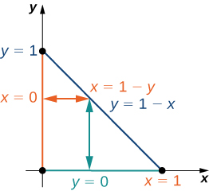{: #CNX_Calc_Figure_15_02_011}

We can complete this integration in two different ways.

1.  One way to look at it is by first integrating
    <math xmlns="http://www.w3.org/1998/Math/MathML"><mi>y</mi></math>
    
    from
    <math xmlns="http://www.w3.org/1998/Math/MathML"><mrow><mi>y</mi><mo>=</mo><mn>0</mn><mspace width="0.2em" /><mtext>to</mtext><mspace width="0.2em" /><mi>y</mi><mo>=</mo><mn>1</mn><mo>−</mo><mi>x</mi></mrow></math>
    
    vertically and then integrating
    <math xmlns="http://www.w3.org/1998/Math/MathML"><mi>x</mi></math>
    
    from
    <math xmlns="http://www.w3.org/1998/Math/MathML"><mrow><mi>x</mi><mo>=</mo><mn>0</mn><mspace width="0.2em" /><mtext>to</mtext><mspace width="0.2em" /><mi>x</mi><mo>=</mo><mn>1</mn><mtext>:</mtext></mrow></math>
    
    * * *
    {: data-type="newline"}
    
    

    <math xmlns="http://www.w3.org/1998/Math/MathML"><mtable><mtr><mtd columnalign="right"><mstyle displaystyle="true"><mrow><munder><mo>∬</mo><mi>R</mi></munder><mrow><mi>f</mi><mrow><mo>(</mo><mrow><mi>x</mi><mo>,</mo><mi>y</mi></mrow><mo>)</mo></mrow></mrow></mrow></mstyle><mi>d</mi><mi>x</mi><mspace width="0.2em" /><mi>d</mi><mi>y</mi></mtd><mtd columnalign="left"><mo>=</mo><mstyle displaystyle="true"><mrow><munderover><mo stretchy="false">∫</mo><mrow><mi>x</mi><mo>=</mo><mn>0</mn></mrow><mrow><mi>x</mi><mo>=</mo><mn>1</mn></mrow></munderover><mspace width="0.2em" /><mrow><mstyle displaystyle="true"><mrow><munderover><mo stretchy="false">∫</mo><mrow><mi>y</mi><mo>=</mo><mn>0</mn></mrow><mrow><mi>y</mi><mo>=</mo><mn>1</mn><mo>−</mo><mi>x</mi></mrow></munderover><mrow><mrow><mo>(</mo><mrow><mi>x</mi><mo>−</mo><mn>2</mn><mi>y</mi></mrow><mo>)</mo></mrow><mi>d</mi><mi>y</mi><mspace width="0.2em" /><mi>d</mi><mi>x</mi></mrow></mrow></mstyle><mo>=</mo></mrow></mrow></mstyle><mstyle displaystyle="true"><mrow><munderover><mo stretchy="false">∫</mo><mrow><mi>x</mi><mo>=</mo><mn>0</mn></mrow><mrow><mi>x</mi><mo>=</mo><mn>1</mn></mrow></munderover><mrow><msubsup><mrow><mrow><mo>[</mo><mrow><mi>x</mi><mi>y</mi><mo>−</mo><mn>2</mn><msup><mi>y</mi><mn>2</mn></msup></mrow><mo>]</mo></mrow></mrow><mrow><mi>y</mi><mo>=</mo><mn>0</mn></mrow><mrow><mi>y</mi><mo>=</mo><mn>1</mn><mo>−</mo><mi>x</mi></mrow></msubsup><mi>d</mi><mi>x</mi></mrow></mrow></mstyle></mtd></mtr><mtr><mtd /><mtd columnalign="left"><mo>=</mo><mstyle displaystyle="true"><mrow><munderover><mo stretchy="false">∫</mo><mrow><mi>x</mi><mo>=</mo><mn>0</mn></mrow><mrow><mi>x</mi><mo>=</mo><mn>1</mn></mrow></munderover><mrow><mrow><mo>[</mo><mrow><mi>x</mi><mrow><mo>(</mo><mrow><mn>1</mn><mo>−</mo><mi>x</mi></mrow><mo>)</mo></mrow><mo>−</mo><msup><mrow><mrow><mo>(</mo><mrow><mn>1</mn><mo>−</mo><mi>x</mi></mrow><mo>)</mo></mrow></mrow><mn>2</mn></msup></mrow><mo>]</mo></mrow><mi>d</mi><mi>x</mi><mo>=</mo><mstyle displaystyle="true"><mrow><munderover><mo stretchy="false">∫</mo><mrow><mi>x</mi><mo>=</mo><mn>0</mn></mrow><mrow><mi>x</mi><mo>=</mo><mn>1</mn></mrow></munderover><mrow><mrow><mo>[</mo><mrow><mn>−1</mn><mo>+</mo><mn>3</mn><mi>x</mi><mo>−</mo><mn>2</mn><msup><mi>x</mi><mn>2</mn></msup></mrow><mo>]</mo></mrow><mi>d</mi><mi>x</mi><mo>=</mo></mrow></mrow></mstyle><msubsup><mrow><mrow><mo>[</mo><mrow><mtext>−</mtext><mi>x</mi><mo>+</mo><mfrac><mn>3</mn><mn>2</mn></mfrac><msup><mi>x</mi><mn>2</mn></msup><mo>−</mo><mfrac><mn>2</mn><mn>3</mn></mfrac><msup><mi>x</mi><mn>3</mn></msup></mrow><mo>]</mo></mrow></mrow><mrow><mi>x</mi><mo>=</mo><mn>0</mn></mrow><mrow><mi>x</mi><mo>=</mo><mn>1</mn></mrow></msubsup><mo>=</mo><mo>−</mo><mfrac><mn>1</mn><mn>6</mn></mfrac></mrow></mrow></mstyle><mo>.</mo></mtd></mtr></mtable></math>
    

2.  The other way to do this problem is by first integrating
    <math xmlns="http://www.w3.org/1998/Math/MathML"><mi>x</mi></math>
    
    from
    <math xmlns="http://www.w3.org/1998/Math/MathML"><mrow><mi>x</mi><mo>=</mo><mn>0</mn><mspace width="0.2em" /><mtext>to</mtext><mspace width="0.2em" /><mi>x</mi><mo>=</mo><mn>1</mn><mo>−</mo><mi>y</mi></mrow></math>
    
    horizontally and then integrating
    <math xmlns="http://www.w3.org/1998/Math/MathML"><mi>y</mi></math>
    
    from
    <math xmlns="http://www.w3.org/1998/Math/MathML"><mrow><mi>y</mi><mo>=</mo><mn>0</mn><mspace width="0.2em" /><mtext>to</mtext><mspace width="0.2em" /><mi>y</mi><mo>=</mo><mn>1</mn><mtext>:</mtext></mrow></math>
    
    * * *
    {: data-type="newline"}
    
    

    <math xmlns="http://www.w3.org/1998/Math/MathML"><mtable><mtr><mtd columnalign="right"><mstyle displaystyle="true"><mrow><munder><mo>∬</mo><mi>R</mi></munder><mrow><mi>f</mi><mrow><mo>(</mo><mrow><mi>x</mi><mo>,</mo><mi>y</mi></mrow><mo>)</mo></mrow></mrow></mrow></mstyle><mi>d</mi><mi>x</mi><mspace width="0.2em" /><mi>d</mi><mi>y</mi></mtd><mtd columnalign="left"><mo>=</mo><mstyle displaystyle="true"><mrow><munderover><mo stretchy="false">∫</mo><mrow><mi>y</mi><mo>=</mo><mn>0</mn></mrow><mrow><mi>y</mi><mo>=</mo><mn>1</mn></mrow></munderover><mspace width="0.2em" /><mrow><mstyle displaystyle="true"><mrow><munderover><mo stretchy="false">∫</mo><mrow><mi>x</mi><mo>=</mo><mn>0</mn></mrow><mrow><mi>x</mi><mo>=</mo><mn>1</mn><mo>−</mo><mi>y</mi></mrow></munderover><mrow><mrow><mo>(</mo><mrow><mi>x</mi><mo>−</mo><mn>2</mn><mi>y</mi></mrow><mo>)</mo></mrow><mi>d</mi><mi>x</mi><mspace width="0.2em" /><mi>d</mi><mi>y</mi></mrow></mrow></mstyle><mo>=</mo></mrow></mrow></mstyle><mstyle displaystyle="true"><mrow><munderover><mo stretchy="false">∫</mo><mrow><mi>y</mi><mo>=</mo><mn>0</mn></mrow><mrow><mi>y</mi><mo>=</mo><mn>1</mn></mrow></munderover><mrow><msubsup><mrow><mrow><mo>[</mo><mrow><mfrac><mn>1</mn><mn>2</mn></mfrac><msup><mi>x</mi><mn>2</mn></msup><mo>−</mo><mn>2</mn><mi>x</mi><mi>y</mi></mrow><mo>]</mo></mrow></mrow><mrow><mi>x</mi><mo>=</mo><mn>0</mn></mrow><mrow><mi>x</mi><mo>=</mo><mn>1</mn><mo>−</mo><mi>y</mi></mrow></msubsup><mi>d</mi><mi>y</mi></mrow></mrow></mstyle></mtd></mtr><mtr><mtd /><mtd columnalign="left"><mo>=</mo><mstyle displaystyle="true"><mrow><munderover><mo stretchy="false">∫</mo><mrow><mi>y</mi><mo>=</mo><mn>0</mn></mrow><mrow><mi>y</mi><mo>=</mo><mn>1</mn></mrow></munderover><mrow><mrow><mo>[</mo><mrow><mfrac><mn>1</mn><mn>2</mn></mfrac><msup><mrow><mrow><mo>(</mo><mrow><mn>1</mn><mo>−</mo><mi>y</mi></mrow><mo>)</mo></mrow></mrow><mn>2</mn></msup><mo>−</mo><mn>2</mn><mi>y</mi><mrow><mo>(</mo><mrow><mn>1</mn><mo>−</mo><mi>y</mi></mrow><mo>)</mo></mrow></mrow><mo>]</mo></mrow><mi>d</mi><mi>y</mi><mo>=</mo><mstyle displaystyle="true"><mrow><munderover><mo stretchy="false">∫</mo><mrow><mi>y</mi><mo>=</mo><mn>0</mn></mrow><mrow><mi>y</mi><mo>=</mo><mn>1</mn></mrow></munderover><mrow><mrow><mo>[</mo><mrow><mfrac><mn>1</mn><mn>2</mn></mfrac><mo>−</mo><mn>3</mn><mi>y</mi><mo>+</mo><mfrac><mn>5</mn><mn>2</mn></mfrac><msup><mi>y</mi><mn>2</mn></msup></mrow><mo>]</mo></mrow><mi>d</mi><mi>y</mi></mrow></mrow></mstyle></mrow></mrow></mstyle></mtd></mtr><mtr><mtd /><mtd columnalign="left"><mo>=</mo><msubsup><mrow><mo>[</mo><mrow><mfrac><mn>1</mn><mn>2</mn></mfrac><mi>y</mi><mo>−</mo><mfrac><mn>3</mn><mn>2</mn></mfrac><msup><mi>y</mi><mn>2</mn></msup><mo>+</mo><mfrac><mn>5</mn><mn>6</mn></mfrac><msup><mi>y</mi><mn>3</mn></msup></mrow><mo>]</mo></mrow><mrow><mi>y</mi><mo>=</mo><mn>0</mn></mrow><mrow><mi>y</mi><mo>=</mo><mn>1</mn></mrow></msubsup><mo>=</mo><mo>−</mo><mfrac><mn>1</mn><mn>6</mn></mfrac><mo>.</mo></mtd></mtr></mtable></math>
    

{: data-number-style="lower-alpha"}

Evaluate the iterated integral <math xmlns="http://www.w3.org/1998/Math/MathML"><mrow><mstyle displaystyle="true"><mrow><munder><mo>∬</mo><mi>D</mi></munder><mrow><mrow><mo>(</mo><mrow><msup><mi>x</mi><mn>2</mn></msup><mo>+</mo><msup><mi>y</mi><mn>2</mn></msup></mrow><mo>)</mo></mrow></mrow></mrow></mstyle><mi>d</mi><mi>A</mi></mrow></math>

 over the region <math xmlns="http://www.w3.org/1998/Math/MathML"><mi>D</mi></math>

 in the first quadrant between the functions <math xmlns="http://www.w3.org/1998/Math/MathML"><mrow><mi>y</mi><mo>=</mo><mn>2</mn><mi>x</mi></mrow></math>

 and <math xmlns="http://www.w3.org/1998/Math/MathML"><mrow><mi>y</mi><mo>=</mo><msup><mi>x</mi><mn>2</mn></msup><mo>.</mo></mrow></math>

 Evaluate the iterated integral by integrating first with respect to <math xmlns="http://www.w3.org/1998/Math/MathML"><mi>y</mi></math>

 and then integrating first with resect to <math xmlns="http://www.w3.org/1998/Math/MathML"><mrow><mi>x</mi><mo>.</mo></mrow></math>

<math xmlns="http://www.w3.org/1998/Math/MathML"><mrow><mfrac><mrow><mn>216</mn></mrow><mrow><mn>35</mn></mrow></mfrac></mrow></math>

Hint

Sketch the region and follow [[link]](#fs-id1167794188050).

# Calculating Volumes, Areas, and Average Values

We can use double integrals over general regions to compute volumes, areas, and average values. The methods are the same as those in [Double Integrals over Rectangular Regions](/m53949){: .target-chapter}, but without the restriction to a rectangular region, we can now solve a wider variety of problems.

Finding the Volume of a Tetrahedron

Find the volume of the solid bounded by the planes <math xmlns="http://www.w3.org/1998/Math/MathML"><mrow><mi>x</mi><mo>=</mo><mn>0</mn><mo>,</mo><mi>y</mi><mo>=</mo><mn>0</mn><mo>,</mo><mi>z</mi><mo>=</mo><mn>0</mn><mo>,</mo></mrow></math>

 and <math xmlns="http://www.w3.org/1998/Math/MathML"><mrow><mn>2</mn><mi>x</mi><mo>+</mo><mn>3</mn><mi>y</mi><mo>+</mo><mi>z</mi><mo>=</mo><mn>6</mn><mo>.</mo></mrow></math>

The solid is a tetrahedron with the base on the <math xmlns="http://www.w3.org/1998/Math/MathML"><mrow><mi>x</mi><mi>y</mi></mrow></math>

-plane and a height <math xmlns="http://www.w3.org/1998/Math/MathML"><mrow><mi>z</mi><mo>=</mo><mn>6</mn><mo>−</mo><mn>2</mn><mi>x</mi><mo>−</mo><mn>3</mn><mi>y</mi><mo>.</mo></mrow></math>

 The base is the region <math xmlns="http://www.w3.org/1998/Math/MathML"><mi>D</mi></math>

 bounded by the lines, <math xmlns="http://www.w3.org/1998/Math/MathML"><mrow><mi>x</mi><mo>=</mo><mn>0</mn><mo>,</mo><mi>y</mi><mo>=</mo><mn>0</mn></mrow></math>

 and <math xmlns="http://www.w3.org/1998/Math/MathML"><mrow><mn>2</mn><mi>x</mi><mo>+</mo><mn>3</mn><mi>y</mi><mo>=</mo><mn>6</mn></mrow></math>

 where <math xmlns="http://www.w3.org/1998/Math/MathML"><mrow><mi>z</mi><mo>=</mo><mn>0</mn></mrow></math>

 ([[link]](#CNX_Calc_Figure_15_02_012)). Note that we can consider the region <math xmlns="http://www.w3.org/1998/Math/MathML"><mi>D</mi></math>

 as Type I or as Type II, and we can integrate in both ways.

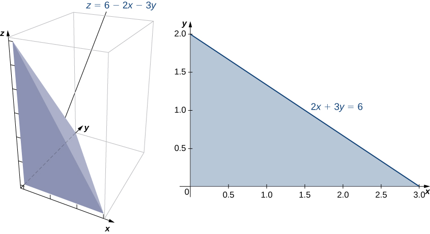{: #CNX_Calc_Figure_15_02_012}

First, consider <math xmlns="http://www.w3.org/1998/Math/MathML"><mi>D</mi></math>

 as a Type I region, and hence <math xmlns="http://www.w3.org/1998/Math/MathML"><mrow><mi>D</mi><mo>=</mo><mrow><mo>{</mo><mrow><mrow><mrow><mrow><mo>(</mo><mrow><mi>x</mi><mo>,</mo><mi>y</mi></mrow><mo>)</mo></mrow></mrow><mo>\|</mo></mrow><mn>0</mn><mo>≤</mo><mi>x</mi><mo>≤</mo><mn>3</mn><mo>,</mo><mn>0</mn><mo>≤</mo><mi>y</mi><mo>≤</mo><mn>2</mn><mo>−</mo><mfrac><mn>2</mn><mn>3</mn></mfrac><mi>x</mi></mrow><mo>}</mo></mrow><mo>.</mo></mrow></math>

Therefore, the volume is

<math xmlns="http://www.w3.org/1998/Math/MathML"><mtable><mtr><mtd columnalign="right"><mi>V</mi></mtd><mtd columnalign="left"><mo>=</mo><mstyle displaystyle="true"><mrow><munderover><mo stretchy="false">∫</mo><mrow><mi>x</mi><mo>=</mo><mn>0</mn></mrow><mrow><mi>x</mi><mo>=</mo><mn>3</mn></mrow></munderover><mspace width="0.2em" /><mrow><mstyle displaystyle="true"><mrow><munderover><mo stretchy="false">∫</mo><mrow><mi>y</mi><mo>=</mo><mn>0</mn></mrow><mrow><mi>y</mi><mo>=</mo><mn>2</mn><mo>−</mo><mo stretchy="false">(</mo><mn>2</mn><mi>x</mi><mtext>/</mtext><mn>3</mn><mo stretchy="false">)</mo></mrow></munderover><mrow><mo stretchy="false">(</mo><mn>6</mn><mo>−</mo><mn>2</mn><mi>x</mi><mo>−</mo><mn>3</mn><mi>y</mi><mo stretchy="false">)</mo><mi>d</mi><mi>y</mi><mspace width="0.2em" /><mi>d</mi><mi>x</mi></mrow></mrow></mstyle></mrow></mrow></mstyle><mo>=</mo><mstyle displaystyle="true"><mrow><munderover><mo stretchy="false">∫</mo><mrow><mi>x</mi><mo>=</mo><mn>0</mn></mrow><mrow><mi>x</mi><mo>=</mo><mn>3</mn></mrow></munderover><mrow><mrow><mo>[</mo><mrow><msubsup><mrow><mrow><mrow><mrow><mo>(</mo><mrow><mn>6</mn><mi>y</mi><mo>−</mo><mn>2</mn><mi>x</mi><mi>y</mi><mo>−</mo><mfrac><mn>3</mn><mn>2</mn></mfrac><msup><mi>y</mi><mn>2</mn></msup></mrow><mo>)</mo></mrow></mrow><mo>\|</mo></mrow></mrow><mrow><mi>y</mi><mo>=</mo><mn>0</mn></mrow><mrow><mi>y</mi><mo>=</mo><mn>2</mn><mo>−</mo><mo stretchy="false">(</mo><mn>2</mn><mi>x</mi><mtext>/</mtext><mn>3</mn><mo stretchy="false">)</mo></mrow></msubsup></mrow><mo>]</mo></mrow></mrow></mrow></mstyle><mi>d</mi><mi>x</mi></mtd></mtr><mtr><mtd /><mtd columnalign="left"><mo>=</mo><mstyle displaystyle="true"><mrow><munderover><mo stretchy="false">∫</mo><mrow><mi>x</mi><mo>=</mo><mn>0</mn></mrow><mrow><mi>x</mi><mo>=</mo><mn>3</mn></mrow></munderover><mrow><mrow><mo>[</mo><mrow><mfrac><mn>2</mn><mn>3</mn></mfrac><msup><mrow><mo stretchy="false">(</mo><mi>x</mi><mo>−</mo><mn>3</mn><mo stretchy="false">)</mo></mrow><mn>2</mn></msup></mrow><mo>]</mo></mrow></mrow></mrow></mstyle><mi>d</mi><mi>x</mi><mo>=</mo><mn>6.</mn></mtd></mtr></mtable></math>

Now consider <math xmlns="http://www.w3.org/1998/Math/MathML"><mi>D</mi></math>

 as a Type II region, so <math xmlns="http://www.w3.org/1998/Math/MathML"><mrow><mi>D</mi><mo>=</mo><mrow><mo>{</mo><mrow><mo stretchy="false">(</mo><mi>x</mi><mo>,</mo><mi>y</mi><mo stretchy="false">)</mo><mrow><mo>\|</mo><mrow><mn>0</mn><mo>≤</mo><mi>y</mi><mo>≤</mo><mn>2</mn><mo>,</mo><mn>0</mn><mo>≤</mo><mi>x</mi><mo>≤</mo><mn>3</mn><mo>−</mo><mfrac><mn>3</mn><mn>2</mn></mfrac><mi>y</mi></mrow></mrow></mrow><mo>}</mo></mrow><mo>.</mo></mrow></math>

 In this calculation, the volume is

<math xmlns="http://www.w3.org/1998/Math/MathML"><mtable><mtr><mtd columnalign="right"><mi>V</mi></mtd><mtd columnalign="left"><mo>=</mo><mstyle displaystyle="true"><mrow><munderover><mo stretchy="false">∫</mo><mrow><mi>y</mi><mo>=</mo><mn>0</mn></mrow><mrow><mi>y</mi><mo>=</mo><mn>2</mn></mrow></munderover><mspace width="0.2em" /><mrow><mstyle displaystyle="true"><mrow><munderover><mo stretchy="false">∫</mo><mrow><mi>x</mi><mo>=</mo><mn>0</mn></mrow><mrow><mi>x</mi><mo>=</mo><mn>3</mn><mo>−</mo><mo stretchy="false">(</mo><mn>3</mn><mi>y</mi><mtext>/</mtext><mn>2</mn><mo stretchy="false">)</mo></mrow></munderover><mrow><mo stretchy="false">(</mo><mn>6</mn><mo>−</mo><mn>2</mn><mi>x</mi><mo>−</mo><mn>3</mn><mi>y</mi><mo stretchy="false">)</mo><mi>d</mi><mi>x</mi><mspace width="0.2em" /><mi>d</mi><mi>y</mi></mrow></mrow></mstyle></mrow></mrow></mstyle><mo>=</mo><mstyle displaystyle="true"><mrow><munderover><mo stretchy="false">∫</mo><mrow><mi>y</mi><mo>=</mo><mn>0</mn></mrow><mrow><mi>y</mi><mo>=</mo><mn>2</mn></mrow></munderover><mrow><mrow><mo>[</mo><mrow><msubsup><mrow><mrow><mrow><mrow><mo>(</mo><mrow><mn>6</mn><mi>x</mi><mo>−</mo><msup><mi>x</mi><mn>2</mn></msup><mo>−</mo><mn>3</mn><mi>x</mi><mi>y</mi></mrow><mo>)</mo></mrow></mrow><mo>\|</mo></mrow></mrow><mrow><mi>x</mi><mo>=</mo><mn>0</mn></mrow><mrow><mi>x</mi><mo>=</mo><mn>3</mn><mo>−</mo><mo stretchy="false">(</mo><mn>3</mn><mi>y</mi><mtext>/</mtext><mn>2</mn><mo stretchy="false">)</mo></mrow></msubsup></mrow><mo>]</mo></mrow></mrow></mrow></mstyle><mi>d</mi><mi>y</mi></mtd></mtr><mtr><mtd /><mtd columnalign="left"><mo>=</mo><mstyle displaystyle="true"><mrow><munderover><mo stretchy="false">∫</mo><mrow><mi>y</mi><mo>=</mo><mn>0</mn></mrow><mrow><mi>y</mi><mo>=</mo><mn>2</mn></mrow></munderover><mrow><mrow><mo>[</mo><mrow><mfrac><mn>9</mn><mn>4</mn></mfrac><msup><mrow><mo stretchy="false">(</mo><mi>y</mi><mo>−</mo><mn>2</mn><mo stretchy="false">)</mo></mrow><mn>2</mn></msup></mrow><mo>]</mo></mrow></mrow></mrow></mstyle><mi>d</mi><mi>y</mi><mo>=</mo><mn>6.</mn></mtd></mtr></mtable></math>

Therefore, the volume is <math xmlns="http://www.w3.org/1998/Math/MathML"><mn>6</mn></math>

 cubic units.

Find the volume of the solid bounded above by <math xmlns="http://www.w3.org/1998/Math/MathML"><mrow><mi>f</mi><mrow><mo>(</mo><mrow><mi>x</mi><mo>,</mo><mi>y</mi></mrow><mo>)</mo></mrow><mo>=</mo><mn>10</mn><mo>−</mo><mn>2</mn><mi>x</mi><mo>+</mo><mi>y</mi></mrow></math>

 over the region enclosed by the curves <math xmlns="http://www.w3.org/1998/Math/MathML"><mrow><mi>y</mi><mo>=</mo><mn>0</mn></mrow></math>

 and <math xmlns="http://www.w3.org/1998/Math/MathML"><mrow><mi>y</mi><mo>=</mo><msup><mi>e</mi><mi>x</mi></msup><mo>,</mo></mrow></math>

 where <math xmlns="http://www.w3.org/1998/Math/MathML"><mi>x</mi></math>

 is in the interval <math xmlns="http://www.w3.org/1998/Math/MathML"><mrow><mrow><mo>[</mo><mrow><mn>0</mn><mo>,</mo><mn>1</mn></mrow><mo>]</mo></mrow><mo>.</mo></mrow></math>

<math xmlns="http://www.w3.org/1998/Math/MathML"><mrow><mfrac><mrow><msup><mi>e</mi><mn>2</mn></msup></mrow><mn>4</mn></mfrac><mo>+</mo><mn>10</mn><mi>e</mi><mo>−</mo><mfrac><mrow><mn>49</mn></mrow><mn>4</mn></mfrac></mrow></math>

 cubic units

Hint

Sketch the region, and describe it as Type I.

Finding the area of a rectangular region is easy, but finding the area of a nonrectangular region is not so easy. As we have seen, we can use double integrals to find a rectangular area. As a matter of fact, this comes in very handy for finding the area of a general nonrectangular region, as stated in the next definition.

Definition

The area of a plane-bounded region <math xmlns="http://www.w3.org/1998/Math/MathML"><mi>D</mi></math>

 is defined as the double integral <math xmlns="http://www.w3.org/1998/Math/MathML"><mrow><mstyle displaystyle="true"><mrow><munder><mo>∬</mo><mi>D</mi></munder><mrow><mn>1</mn><mi>d</mi><mi>A</mi></mrow></mrow></mstyle><mo>.</mo></mrow></math>

We have already seen how to find areas in terms of single integration. Here we are seeing another way of finding areas by using double integrals, which can be very useful, as we will see in the later sections of this chapter.

Finding the Area of a Region

Find the area of the region bounded below by the curve <math xmlns="http://www.w3.org/1998/Math/MathML"><mrow><mi>y</mi><mo>=</mo><msup><mi>x</mi><mn>2</mn></msup></mrow></math>

 and above by the line <math xmlns="http://www.w3.org/1998/Math/MathML"><mrow><mi>y</mi><mo>=</mo><mn>2</mn><mi>x</mi></mrow></math>

 in the first quadrant ([[link]](#CNX_Calc_Figure_15_02_013)).

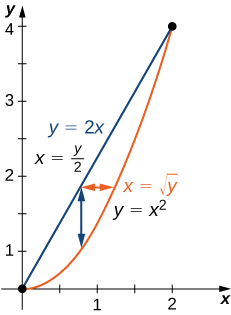{: #CNX_Calc_Figure_15_02_013}

We just have to integrate the constant function <math xmlns="http://www.w3.org/1998/Math/MathML"><mrow><mi>f</mi><mrow><mo>(</mo><mrow><mi>x</mi><mo>,</mo><mi>y</mi></mrow><mo>)</mo></mrow><mo>=</mo><mn>1</mn></mrow></math>

 over the region. Thus, the area <math xmlns="http://www.w3.org/1998/Math/MathML"><mi>A</mi></math>

 of the bounded region is <math xmlns="http://www.w3.org/1998/Math/MathML"><mrow><mstyle displaystyle="true"><mrow><munderover><mo stretchy="false">∫</mo><mrow><mi>x</mi><mo>=</mo><mn>0</mn></mrow><mrow><mi>x</mi><mo>=</mo><mn>2</mn></mrow></munderover><mspace width="0.2em" /><mrow><mstyle displaystyle="true"><mrow><munderover><mo stretchy="false">∫</mo><mrow><mi>y</mi><mo>=</mo><msup><mi>x</mi><mn>2</mn></msup></mrow><mrow><mi>y</mi><mo>=</mo><mn>2</mn><mi>x</mi></mrow></munderover><mrow><mi>d</mi><mi>y</mi><mspace width="0.2em" /><mi>d</mi><mi>x</mi></mrow></mrow></mstyle></mrow></mrow></mstyle></mrow></math>

 or <math xmlns="http://www.w3.org/1998/Math/MathML"><mrow><mstyle displaystyle="true"><mrow><munderover><mo stretchy="false">∫</mo><mrow><mi>y</mi><mo>=</mo><mn>0</mn></mrow><mrow><mi>x</mi><mo>=</mo><mn>4</mn></mrow></munderover><mspace width="0.2em" /><mrow><mstyle displaystyle="true"><mrow><munderover><mo stretchy="false">∫</mo><mrow><mi>x</mi><mo>=</mo><mi>y</mi><mtext>/</mtext><mn>2</mn></mrow><mrow><mi>x</mi><mo>=</mo><msqrt><mi>y</mi></msqrt></mrow></munderover><mrow><mi>d</mi><mi>x</mi><mspace width="0.2em" /><mi>d</mi><mi>y</mi></mrow></mrow></mstyle></mrow></mrow></mstyle><mtext>:</mtext></mrow></math>

<math xmlns="http://www.w3.org/1998/Math/MathML"><mrow><mi>A</mi><mo>=</mo><mstyle displaystyle="true"><mrow><munder><mo>∬</mo><mi>D</mi></munder><mrow><mn>1</mn><mi>d</mi><mi>x</mi><mspace width="0.2em" /><mi>d</mi><mi>y</mi><mo>=</mo><mstyle displaystyle="true"><mrow><munderover><mo stretchy="false">∫</mo><mrow><mi>x</mi><mo>=</mo><mn>0</mn></mrow><mrow><mi>x</mi><mo>=</mo><mn>2</mn></mrow></munderover><mspace width="0.2em" /><mrow><mstyle displaystyle="true"><mrow><munderover><mo stretchy="false">∫</mo><mrow><mi>y</mi><mo>=</mo><msup><mi>x</mi><mn>2</mn></msup></mrow><mrow><mi>y</mi><mo>=</mo><mn>2</mn><mi>x</mi></mrow></munderover><mrow><mn>1</mn><mi>d</mi><mi>y</mi><mspace width="0.2em" /><mi>d</mi><mi>x</mi><mo>=</mo></mrow></mrow></mstyle></mrow></mrow></mstyle></mrow></mrow></mstyle><mstyle displaystyle="true"><mrow><munderover><mo stretchy="false">∫</mo><mrow><mi>x</mi><mo>=</mo><mn>0</mn></mrow><mrow><mi>x</mi><mo>=</mo><mn>2</mn></mrow></munderover><mrow><mrow><mo>[</mo><mrow><msubsup><mrow><mrow><mi>y</mi><mo>\|</mo></mrow></mrow><mrow><mi>y</mi><mo>=</mo><msup><mi>x</mi><mn>2</mn></msup></mrow><mrow><mi>y</mi><mo>=</mo><mn>2</mn><mi>x</mi></mrow></msubsup></mrow><mo>]</mo></mrow></mrow></mrow></mstyle><mi>d</mi><mi>x</mi><mo>=</mo><mstyle displaystyle="true"><mrow><munderover><mo stretchy="false">∫</mo><mrow><mi>x</mi><mo>=</mo><mn>0</mn></mrow><mrow><mi>x</mi><mo>=</mo><mn>2</mn></mrow></munderover><mrow><mrow><mo>(</mo><mrow><mn>2</mn><mi>x</mi><mo>−</mo><msup><mi>x</mi><mn>2</mn></msup></mrow><mo>)</mo></mrow></mrow></mrow></mstyle><mi>d</mi><mi>x</mi><mo>=</mo><msubsup><mrow><mrow><mrow><msup><mi>x</mi><mn>2</mn></msup><mo>−</mo><mfrac><mrow><msup><mi>x</mi><mn>3</mn></msup></mrow><mn>3</mn></mfrac></mrow><mo>\|</mo></mrow></mrow><mn>0</mn><mn>2</mn></msubsup><mo>=</mo><mfrac><mn>4</mn><mn>3</mn></mfrac><mo>.</mo></mrow></math>

Find the area of a region bounded above by the curve <math xmlns="http://www.w3.org/1998/Math/MathML"><mrow><mi>y</mi><mo>=</mo><msup><mi>x</mi><mn>3</mn></msup></mrow></math>

 and below by <math xmlns="http://www.w3.org/1998/Math/MathML"><mrow><mi>y</mi><mo>=</mo><mn>0</mn></mrow></math>

 over the interval <math xmlns="http://www.w3.org/1998/Math/MathML"><mrow><mrow><mo>[</mo><mrow><mn>0</mn><mo>,</mo><mn>3</mn></mrow><mo>]</mo></mrow><mo>.</mo></mrow></math>

<math xmlns="http://www.w3.org/1998/Math/MathML"><mrow><mfrac><mrow><mn>81</mn></mrow><mn>4</mn></mfrac></mrow></math>

 square units

Hint

Sketch the region.

We can also use a double integral to find the average value of a function over a general region. The definition is a direct extension of the earlier formula.

Definition

If <math xmlns="http://www.w3.org/1998/Math/MathML"><mrow><mi>f</mi><mrow><mo>(</mo><mrow><mi>x</mi><mo>,</mo><mi>y</mi></mrow><mo>)</mo></mrow></mrow></math>

 is integrable over a plane-bounded region <math xmlns="http://www.w3.org/1998/Math/MathML"><mi>D</mi></math>

 with positive area <math xmlns="http://www.w3.org/1998/Math/MathML"><mrow><mi>A</mi><mrow><mo>(</mo><mi>D</mi><mo>)</mo></mrow><mo>,</mo></mrow></math>

 then the average value of the function is

<math xmlns="http://www.w3.org/1998/Math/MathML"><mrow><msub><mi>f</mi><mrow><mi>a</mi><mi>v</mi><mi>e</mi></mrow></msub><mo>=</mo><mfrac><mn>1</mn><mrow><mi>A</mi><mrow><mo>(</mo><mi>D</mi><mo>)</mo></mrow></mrow></mfrac><mstyle displaystyle="true"><mrow><munder><mo>∬</mo><mi>D</mi></munder><mrow><mi>f</mi><mrow><mo>(</mo><mrow><mi>x</mi><mo>,</mo><mi>y</mi></mrow><mo>)</mo></mrow><mi>d</mi><mi>A</mi></mrow></mrow></mstyle><mo>.</mo></mrow></math>

Note that the area is <math xmlns="http://www.w3.org/1998/Math/MathML"><mrow><mi>A</mi><mrow><mo>(</mo><mi>D</mi><mo>)</mo></mrow><mo>=</mo><mstyle displaystyle="true"><mrow><munder><mo>∬</mo><mi>D</mi></munder><mrow><mn>1</mn><mi>d</mi><mi>A</mi></mrow></mrow></mstyle><mo>.</mo></mrow></math>

Finding an Average Value

Find the average value of the function <math xmlns="http://www.w3.org/1998/Math/MathML"><mrow><mi>f</mi><mrow><mo>(</mo><mrow><mi>x</mi><mo>,</mo><mi>y</mi></mrow><mo>)</mo></mrow><mo>=</mo><mn>7</mn><mi>x</mi><msup><mi>y</mi><mn>2</mn></msup></mrow></math>

 on the region bounded by the line <math xmlns="http://www.w3.org/1998/Math/MathML"><mrow><mi>x</mi><mo>=</mo><mi>y</mi></mrow></math>

 and the curve <math xmlns="http://www.w3.org/1998/Math/MathML"><mrow><mi>x</mi><mo>=</mo><msqrt><mi>y</mi></msqrt></mrow></math>

 ([[link]](#CNX_Calc_Figure_15_02_014)).

{: #CNX_Calc_Figure_15_02_014}

First find the area <math xmlns="http://www.w3.org/1998/Math/MathML"><mrow><mi>A</mi><mrow><mo>(</mo><mi>D</mi><mo>)</mo></mrow></mrow></math>

 where the region <math xmlns="http://www.w3.org/1998/Math/MathML"><mi>D</mi></math>

 is given by the figure. We have

<math xmlns="http://www.w3.org/1998/Math/MathML"><mrow><mi>A</mi><mrow><mo>(</mo><mi>D</mi><mo>)</mo></mrow><mo>=</mo><mstyle displaystyle="true"><mrow><munder><mo>∬</mo><mi>D</mi></munder><mrow><mn>1</mn><mi>d</mi><mi>A</mi><mo>=</mo><mstyle displaystyle="true"><mrow><munderover><mo stretchy="false">∫</mo><mrow><mi>y</mi><mo>=</mo><mn>0</mn></mrow><mrow><mi>y</mi><mo>=</mo><mn>1</mn></mrow></munderover><mspace width="0.2em" /><mrow><mstyle displaystyle="true"><mrow><munderover><mo stretchy="false">∫</mo><mrow><mi>x</mi><mo>=</mo><mi>y</mi></mrow><mrow><mi>x</mi><mo>=</mo><msqrt><mi>y</mi></msqrt></mrow></munderover><mrow><mn>1</mn><mi>d</mi><mi>x</mi><mspace width="0.2em" /><mi>d</mi><mi>y</mi><mo>=</mo><mstyle displaystyle="true"><mrow><munderover><mo stretchy="false">∫</mo><mrow><mi>y</mi><mo>=</mo><mn>0</mn></mrow><mrow><mi>y</mi><mo>=</mo><mn>1</mn></mrow></munderover><mrow><mrow><mo>[</mo><mrow><msubsup><mrow><mrow><mi>x</mi><mo>\|</mo></mrow></mrow><mrow><mi>x</mi><mo>=</mo><mi>y</mi></mrow><mrow><mi>x</mi><mo>=</mo><msqrt><mi>y</mi></msqrt></mrow></msubsup></mrow><mo>]</mo></mrow></mrow></mrow></mstyle></mrow></mrow></mstyle></mrow></mrow></mstyle></mrow></mrow></mstyle><mi>d</mi><mi>y</mi><mo>=</mo><mstyle displaystyle="true"><mrow><munderover><mo stretchy="false">∫</mo><mrow><mi>y</mi><mo>=</mo><mn>0</mn></mrow><mrow><mi>y</mi><mo>=</mo><mn>1</mn></mrow></munderover><mrow><mrow><mo>(</mo><mrow><msqrt><mi>y</mi></msqrt><mo>−</mo><mi>y</mi></mrow><mo>)</mo></mrow><mi>d</mi><mi>y</mi><mo>=</mo><mfrac><mn>2</mn><mn>3</mn></mfrac></mrow></mrow></mstyle><msup><mi>y</mi><mrow><mrow><mn>3</mn><mtext>/</mtext><mn>2</mn></mrow></mrow></msup><mo>−</mo><msubsup><mrow><mrow><mrow><mfrac><mrow><msup><mi>y</mi><mn>2</mn></msup></mrow><mn>2</mn></mfrac></mrow><mo>\|</mo></mrow></mrow><mn>0</mn><mn>1</mn></msubsup><mo>=</mo><mfrac><mn>1</mn><mn>6</mn></mfrac><mo>.</mo></mrow></math>

Then the average value of the given function over this region is

<math xmlns="http://www.w3.org/1998/Math/MathML"><mtable><mtr><mtd columnalign="right"><msub><mi>f</mi><mrow><mi>a</mi><mi>v</mi><mi>e</mi></mrow></msub></mtd><mtd columnalign="left"><mo>=</mo><mfrac><mn>1</mn><mrow><mi>A</mi><mrow><mo>(</mo><mi>D</mi><mo>)</mo></mrow></mrow></mfrac><mstyle displaystyle="true"><mrow><munder><mo>∬</mo><mi>D</mi></munder><mrow><mi>f</mi><mrow><mo>(</mo><mrow><mi>x</mi><mo>,</mo><mi>y</mi></mrow><mo>)</mo></mrow><mi>d</mi><mi>A</mi><mo>=</mo><mfrac><mn>1</mn><mrow><mi>A</mi><mrow><mo>(</mo><mi>D</mi><mo>)</mo></mrow></mrow></mfrac><mstyle displaystyle="true"><mrow><munderover><mo stretchy="false">∫</mo><mrow><mi>y</mi><mo>=</mo><mn>0</mn></mrow><mrow><mi>y</mi><mo>=</mo><mn>1</mn></mrow></munderover><mspace width="0.2em" /><mrow><mstyle displaystyle="true"><mrow><munderover><mo stretchy="false">∫</mo><mrow><mi>x</mi><mo>=</mo><mi>y</mi></mrow><mrow><mi>x</mi><mo>=</mo><msqrt><mi>y</mi></msqrt></mrow></munderover><mrow><mn>7</mn><mi>x</mi><msup><mi>y</mi><mn>2</mn></msup><mi>d</mi><mi>x</mi><mspace width="0.2em" /><mi>d</mi><mi>y</mi><mo>=</mo><mfrac><mn>1</mn><mrow><mn>1</mn><mtext>/</mtext><mn>6</mn></mrow></mfrac><mstyle displaystyle="true"><mrow><munderover><mo stretchy="false">∫</mo><mrow><mi>y</mi><mo>=</mo><mn>0</mn></mrow><mrow><mi>y</mi><mo>=</mo><mn>1</mn></mrow></munderover><mrow><mrow><mo>[</mo><mrow><msubsup><mrow><mrow><mrow><mfrac><mn>7</mn><mn>2</mn></mfrac><msup><mi>x</mi><mn>2</mn></msup><msup><mi>y</mi><mn>2</mn></msup></mrow><mo>\|</mo></mrow></mrow><mrow><mi>x</mi><mo>=</mo><mi>y</mi></mrow><mrow><mi>x</mi><mo>=</mo><msqrt><mi>y</mi></msqrt></mrow></msubsup></mrow><mo>]</mo></mrow></mrow></mrow></mstyle></mrow></mrow></mstyle></mrow></mrow></mstyle></mrow></mrow></mstyle><mi>d</mi><mi>y</mi></mtd></mtr><mtr><mtd /><mtd columnalign="left"><mo>=</mo><mn>6</mn><mstyle displaystyle="true"><mrow><munderover><mo stretchy="false">∫</mo><mrow><mi>y</mi><mo>=</mo><mn>0</mn></mrow><mrow><mi>y</mi><mo>=</mo><mn>1</mn></mrow></munderover><mrow><mrow><mo>[</mo><mrow><mfrac><mn>7</mn><mn>2</mn></mfrac><msup><mi>y</mi><mn>2</mn></msup><mrow><mo>(</mo><mrow><mi>y</mi><mo>−</mo><msup><mi>y</mi><mn>2</mn></msup></mrow><mo>)</mo></mrow></mrow><mo>]</mo></mrow><mi>d</mi><mi>y</mi><mo>=</mo><mn>6</mn><mstyle displaystyle="true"><mrow><munderover><mo stretchy="false">∫</mo><mrow><mi>y</mi><mo>=</mo><mn>0</mn></mrow><mrow><mi>y</mi><mo>=</mo><mn>1</mn></mrow></munderover><mrow><mrow><mo>[</mo><mrow><mfrac><mn>7</mn><mn>2</mn></mfrac><mrow><mo>(</mo><mrow><msup><mi>y</mi><mn>3</mn></msup><mo>−</mo><msup><mi>y</mi><mn>4</mn></msup></mrow><mo>)</mo></mrow></mrow><mo>]</mo></mrow><mi>d</mi><mi>y</mi></mrow></mrow></mstyle><mo>=</mo><mfrac><mrow><mn>42</mn></mrow><mn>2</mn></mfrac></mrow></mrow></mstyle><msubsup><mrow><mrow><mrow><mo>(</mo><mrow><mfrac><mrow><msup><mi>y</mi><mn>4</mn></msup></mrow><mn>4</mn></mfrac><mo>−</mo><mfrac><mrow><msup><mi>y</mi><mn>5</mn></msup></mrow><mn>5</mn></mfrac></mrow><mo>)</mo></mrow></mrow><mo>\|</mo></mrow><mn>0</mn><mn>1</mn></msubsup><mo>=</mo><mfrac><mrow><mn>42</mn></mrow><mrow><mn>40</mn></mrow></mfrac><mo>=</mo><mfrac><mrow><mn>21</mn></mrow><mrow><mn>20</mn></mrow></mfrac><mo>.</mo></mtd></mtr></mtable></math>

Find the average value of the function <math xmlns="http://www.w3.org/1998/Math/MathML"><mrow><mi>f</mi><mrow><mo>(</mo><mrow><mi>x</mi><mo>,</mo><mi>y</mi></mrow><mo>)</mo></mrow><mo>=</mo><mi>x</mi><mi>y</mi></mrow></math>

 over the triangle with vertices <math xmlns="http://www.w3.org/1998/Math/MathML"><mrow><mrow><mo>(</mo><mrow><mn>0</mn><mo>,</mo><mn>0</mn></mrow><mo>)</mo></mrow><mo>,</mo><mrow><mo>(</mo><mrow><mn>1</mn><mo>,</mo><mn>0</mn></mrow><mo>)</mo></mrow><mspace width="0.2em" /><mtext>and</mtext><mspace width="0.2em" /><mrow><mo>(</mo><mrow><mn>1</mn><mo>,</mo><mn>3</mn></mrow><mo>)</mo></mrow><mo>.</mo></mrow></math>

<math xmlns="http://www.w3.org/1998/Math/MathML"><mrow><mfrac><mn>3</mn><mn>4</mn></mfrac></mrow></math>

Hint

Express the line joining <math xmlns="http://www.w3.org/1998/Math/MathML"><mrow><mrow><mo>(</mo><mrow><mn>0</mn><mo>,</mo><mn>0</mn></mrow><mo>)</mo></mrow></mrow></math>

 and <math xmlns="http://www.w3.org/1998/Math/MathML"><mrow><mrow><mo>(</mo><mrow><mn>1</mn><mo>,</mo><mn>3</mn></mrow><mo>)</mo></mrow></mrow></math>

 as a function <math xmlns="http://www.w3.org/1998/Math/MathML"><mrow><mi>y</mi><mo>=</mo><mi>g</mi><mrow><mo>(</mo><mi>x</mi><mo>)</mo></mrow><mo>.</mo></mrow></math>

# Improper Double Integrals

An **improper double integral**{: data-type="term"} is an integral <math xmlns="http://www.w3.org/1998/Math/MathML"><mrow><mstyle displaystyle="true"><mrow><munder><mo>∬</mo><mi>D</mi></munder><mrow><mi>f</mi><mspace width="0.2em" /><mi>d</mi><mi>A</mi></mrow></mrow></mstyle></mrow></math>

 where either <math xmlns="http://www.w3.org/1998/Math/MathML"><mi>D</mi></math>

 is an unbounded region or <math xmlns="http://www.w3.org/1998/Math/MathML"><mi>f</mi></math>

 is an unbounded function. For example, <math xmlns="http://www.w3.org/1998/Math/MathML"><mrow><mi>D</mi><mo>=</mo><mrow><mo>{</mo><mrow><mrow><mrow><mrow><mo>(</mo><mrow><mi>x</mi><mo>,</mo><mi>y</mi></mrow><mo>)</mo></mrow></mrow><mo>\|</mo></mrow><mrow><mo>\|</mo><mrow><mi>x</mi><mo>−</mo><mi>y</mi></mrow><mo>\|</mo></mrow><mo>≥</mo><mn>2</mn></mrow><mo>}</mo></mrow></mrow></math>

 is an unbounded region, and the function <math xmlns="http://www.w3.org/1998/Math/MathML"><mrow><mi>f</mi><mrow><mo>(</mo><mrow><mi>x</mi><mo>,</mo><mi>y</mi></mrow><mo>)</mo></mrow><mo>=</mo><mn>1</mn><mtext>/</mtext><mrow><mo>(</mo><mrow><mn>1</mn><mo>−</mo><msup><mi>x</mi><mn>2</mn></msup><mo>−</mo><mn>2</mn><msup><mi>y</mi><mn>2</mn></msup></mrow><mo>)</mo></mrow></mrow></math>

 over the ellipse <math xmlns="http://www.w3.org/1998/Math/MathML"><mrow><msup><mi>x</mi><mn>2</mn></msup><mo>+</mo><mn>3</mn><msup><mi>y</mi><mn>2</mn></msup><mo>≤</mo><mn>1</mn></mrow></math>

 is an unbounded function. Hence, both of the following integrals are improper integrals:

1.  <math xmlns="http://www.w3.org/1998/Math/MathML"><mrow><mstyle displaystyle="true"><mrow><munder><mo>∬</mo><mi>D</mi></munder><mrow><mi>x</mi><mi>y</mi><mspace width="0.2em" /><mi>d</mi><mi>A</mi></mrow></mrow></mstyle></mrow></math>
    
    where
    <math xmlns="http://www.w3.org/1998/Math/MathML"><mrow><mi>D</mi><mo>=</mo><mrow><mo>{</mo><mrow><mrow><mrow><mrow><mo>(</mo><mrow><mi>x</mi><mo>,</mo><mi>y</mi></mrow><mo>)</mo></mrow></mrow><mo>\|</mo></mrow><mrow><mo>\|</mo><mrow><mi>x</mi><mo>−</mo><mi>y</mi></mrow><mo>\|</mo></mrow><mo>≥</mo><mn>2</mn></mrow><mo>}</mo></mrow><mo>;</mo></mrow></math>

2.  <math xmlns="http://www.w3.org/1998/Math/MathML"><mrow><mstyle displaystyle="true"><mrow><munder><mo>∬</mo><mi>D</mi></munder><mrow><mfrac><mn>1</mn><mrow><mn>1</mn><mo>−</mo><msup><mi>x</mi><mn>2</mn></msup><mo>−</mo><mn>2</mn><msup><mi>y</mi><mn>2</mn></msup></mrow></mfrac><mi>d</mi><mi>A</mi></mrow></mrow></mstyle></mrow></math>
    
    where
    <math xmlns="http://www.w3.org/1998/Math/MathML"><mrow><mi>D</mi><mo>=</mo><mrow><mo>{</mo><mrow><mrow><mrow><mrow><mo>(</mo><mrow><mi>x</mi><mo>,</mo><mi>y</mi></mrow><mo>)</mo></mrow></mrow><mo>\|</mo></mrow><msup><mi>x</mi><mn>2</mn></msup><mo>+</mo><mn>3</mn><msup><mi>y</mi><mn>2</mn></msup><mo>≤</mo><mn>1</mn></mrow><mo>}</mo></mrow><mo>.</mo></mrow></math>
{: data-number-style="lower-roman"}

In this section we would like to deal with improper integrals of functions over rectangles or simple regions such that <math xmlns="http://www.w3.org/1998/Math/MathML"><mi>f</mi></math>

 has only finitely many discontinuities. Not all such improper integrals can be evaluated; however, a form of Fubini’s theorem does apply for some types of improper integrals.

Fubini’s Theorem for Improper Integrals

If <math xmlns="http://www.w3.org/1998/Math/MathML"><mi>D</mi></math>

 is a bounded rectangle or simple region in the plane defined by <math xmlns="http://www.w3.org/1998/Math/MathML"><mrow><mo>{</mo><mo stretchy="false">(</mo><mi>x</mi><mo>,</mo><mi>y</mi><mo stretchy="false">)</mo><mtext>:</mtext><mspace width="0.2em" /><mi>a</mi><mo>≤</mo><mi>x</mi><mo>≤</mo><mi>b</mi><mo>,</mo><mi>g</mi><mo stretchy="false">(</mo><mi>x</mi><mo stretchy="false">)</mo><mo>≤</mo><mi>y</mi><mo>≤</mo><mi>h</mi><mo stretchy="false">(</mo><mi>x</mi><mo stretchy="false">)</mo><mo>}</mo></mrow></math>

 and also by <math xmlns="http://www.w3.org/1998/Math/MathML"><mrow><mo>{</mo><mo stretchy="false">(</mo><mi>x</mi><mo>,</mo><mi>y</mi><mo stretchy="false">)</mo><mtext>:</mtext><mspace width="0.2em" /><mi>c</mi><mo>≤</mo><mi>y</mi><mo>≤</mo><mi>d</mi><mo>,</mo><mi>j</mi><mo stretchy="false">(</mo><mi>y</mi><mo stretchy="false">)</mo><mo>≤</mo><mi>x</mi><mo>≤</mo><mi>k</mi><mo stretchy="false">(</mo><mi>y</mi><mo stretchy="false">)</mo><mo>}</mo></mrow></math>

 and <math xmlns="http://www.w3.org/1998/Math/MathML"><mi>f</mi></math>

 is a nonnegative function on <math xmlns="http://www.w3.org/1998/Math/MathML"><mi>D</mi></math>

 with finitely many discontinuities in the interior of <math xmlns="http://www.w3.org/1998/Math/MathML"><mrow><mi>D</mi><mo>,</mo></mrow></math>

 then

<math xmlns="http://www.w3.org/1998/Math/MathML"><mrow><mstyle displaystyle="true"><mrow><munder><mo>∬</mo><mi>D</mi></munder><mrow><mi>f</mi><mspace width="0.2em" /><mi>d</mi><mi>A</mi><mo>=</mo><mstyle displaystyle="true"><mrow><munderover><mo stretchy="false">∫</mo><mrow><mi>x</mi><mo>=</mo><mi>a</mi></mrow><mrow><mi>x</mi><mo>=</mo><mi>b</mi></mrow></munderover><mspace width="0.2em" /><mrow><mstyle displaystyle="true"><mrow><munderover><mo stretchy="false">∫</mo><mrow><mi>y</mi><mo>=</mo><mi>g</mi><mrow><mo>(</mo><mi>x</mi><mo>)</mo></mrow></mrow><mrow><mi>y</mi><mo>=</mo><mi>h</mi><mrow><mo>(</mo><mi>x</mi><mo>)</mo></mrow></mrow></munderover><mrow><mi>f</mi><mrow><mo>(</mo><mrow><mi>x</mi><mo>,</mo><mi>y</mi></mrow><mo>)</mo></mrow><mi>d</mi><mi>y</mi><mspace width="0.2em" /><mi>d</mi><mi>x</mi><mo>=</mo></mrow></mrow></mstyle></mrow></mrow></mstyle></mrow></mrow></mstyle><mstyle displaystyle="true"><mrow><munderover><mo stretchy="false">∫</mo><mrow><mi>y</mi><mo>=</mo><mi>c</mi></mrow><mrow><mi>y</mi><mo>=</mo><mi>d</mi></mrow></munderover><mspace width="0.2em" /><mrow><mstyle displaystyle="true"><mrow><munderover><mo stretchy="false">∫</mo><mrow><mi>x</mi><mo>=</mo><mi>j</mi><mrow><mo>(</mo><mi>y</mi><mo>)</mo></mrow></mrow><mrow><mi>x</mi><mo>=</mo><mi>k</mi><mrow><mo>(</mo><mi>y</mi><mo>)</mo></mrow></mrow></munderover><mrow><mi>f</mi><mrow><mo>(</mo><mrow><mi>x</mi><mo>,</mo><mi>y</mi></mrow><mo>)</mo></mrow><mi>d</mi><mi>x</mi><mspace width="0.2em" /><mi>d</mi><mi>y</mi></mrow></mrow></mstyle></mrow></mrow></mstyle><mo>.</mo></mrow></math>

It is very important to note that we required that the function be nonnegative on <math xmlns="http://www.w3.org/1998/Math/MathML"><mi>D</mi></math>

 for the theorem to work. We consider only the case where the function has finitely many discontinuities inside <math xmlns="http://www.w3.org/1998/Math/MathML"><mrow><mi>D</mi><mo>.</mo></mrow></math>

Evaluating a Double Improper Integral

Consider the function <math xmlns="http://www.w3.org/1998/Math/MathML"><mrow><mi>f</mi><mrow><mo>(</mo><mrow><mi>x</mi><mo>,</mo><mi>y</mi></mrow><mo>)</mo></mrow><mo>=</mo><mfrac><mrow><msup><mi>e</mi><mi>y</mi></msup></mrow><mi>y</mi></mfrac></mrow></math>

 over the region <math xmlns="http://www.w3.org/1998/Math/MathML"><mrow><mi>D</mi><mo>=</mo><mo>{</mo><mo stretchy="false">(</mo><mi>x</mi><mo>,</mo><mi>y</mi><mo stretchy="false">)</mo><mtext>:</mtext><mspace width="0.2em" /><mn>0</mn><mo>≤</mo><mi>x</mi><mo>≤</mo><mn>1</mn><mo>,</mo><mi>x</mi><mo>≤</mo><mi>y</mi><mo>≤</mo><msqrt><mi>x</mi></msqrt><mo>}</mo><mo>.</mo></mrow></math>

Notice that the function is nonnegative and continuous at all points on <math xmlns="http://www.w3.org/1998/Math/MathML"><mi>D</mi></math>

 except <math xmlns="http://www.w3.org/1998/Math/MathML"><mrow><mrow><mo>(</mo><mrow><mn>0</mn><mo>,</mo><mn>0</mn></mrow><mo>)</mo></mrow><mo>.</mo></mrow></math>

 Use Fubini’s theorem to evaluate the improper integral.

First we plot the region <math xmlns="http://www.w3.org/1998/Math/MathML"><mi>D</mi></math>

 ([[link]](#CNX_Calc_Figure_15_02_015)); then we express it in another way.

."){: #CNX_Calc_Figure_15_02_015}

The other way to express the same region <math xmlns="http://www.w3.org/1998/Math/MathML"><mi>D</mi></math>

 is

<math xmlns="http://www.w3.org/1998/Math/MathML"><mrow><mi>D</mi><mo>=</mo><mrow><mo>{</mo><mrow><mrow><mo>(</mo><mrow><mi>x</mi><mo>,</mo><mi>y</mi></mrow><mo>)</mo></mrow><mtext>:</mtext><mspace width="0.2em" /><mn>0</mn><mo>≤</mo><mi>y</mi><mo>≤</mo><mn>1</mn><mo>,</mo><msup><mi>y</mi><mn>2</mn></msup><mo>≤</mo><mi>x</mi><mo>≤</mo><mi>y</mi></mrow><mo>}</mo></mrow><mo>.</mo></mrow></math>

Thus we can use Fubini’s theorem for improper integrals and evaluate the integral as

<math xmlns="http://www.w3.org/1998/Math/MathML"><mrow><mstyle displaystyle="true"><mrow><munderover><mo stretchy="false">∫</mo><mrow><mi>y</mi><mo>=</mo><mn>0</mn></mrow><mrow><mi>y</mi><mo>=</mo><mn>1</mn></mrow></munderover><mspace width="0.2em" /><mrow><mstyle displaystyle="true"><mrow><munderover><mo stretchy="false">∫</mo><mrow><mi>x</mi><mo>=</mo><msup><mi>y</mi><mn>2</mn></msup></mrow><mrow><mi>x</mi><mo>=</mo><mi>y</mi></mrow></munderover><mrow><mfrac><mrow><msup><mi>e</mi><mi>y</mi></msup></mrow><mi>y</mi></mfrac></mrow></mrow></mstyle></mrow></mrow></mstyle><mi>d</mi><mi>x</mi><mspace width="0.2em" /><mi>d</mi><mi>y</mi><mo>.</mo></mrow></math>

Therefore, we have

<math xmlns="http://www.w3.org/1998/Math/MathML"><mrow><mstyle displaystyle="true"><mrow><munderover><mo stretchy="false">∫</mo><mrow><mi>y</mi><mo>=</mo><mn>0</mn></mrow><mrow><mi>y</mi><mo>=</mo><mn>1</mn></mrow></munderover><mspace width="0.2em" /><mrow><mstyle displaystyle="true"><mrow><munderover><mo stretchy="false">∫</mo><mrow><mi>x</mi><mo>=</mo><msup><mi>y</mi><mn>2</mn></msup></mrow><mrow><mi>x</mi><mo>=</mo><mi>y</mi></mrow></munderover><mrow><mfrac><mrow><msup><mi>e</mi><mi>y</mi></msup></mrow><mi>y</mi></mfrac></mrow></mrow></mstyle></mrow></mrow></mstyle><mi>d</mi><mi>x</mi><mspace width="0.2em" /><mi>d</mi><mi>y</mi><mo>=</mo><mstyle displaystyle="true"><mrow><munderover><mo stretchy="false">∫</mo><mrow><mi>y</mi><mo>=</mo><mn>0</mn></mrow><mrow><mi>y</mi><mo>=</mo><mn>1</mn></mrow></munderover><mrow><mfrac><mrow><msup><mi>e</mi><mi>y</mi></msup></mrow><mi>y</mi></mfrac></mrow></mrow></mstyle><msubsup><mrow><mrow><mi>x</mi><mo>\|</mo></mrow></mrow><mrow><mi>x</mi><mo>=</mo><msup><mi>y</mi><mn>2</mn></msup></mrow><mrow><mi>x</mi><mo>=</mo><mi>y</mi></mrow></msubsup><mi>d</mi><mi>y</mi><mo>=</mo><mstyle displaystyle="true"><mrow><munderover><mo stretchy="false">∫</mo><mrow><mi>y</mi><mo>=</mo><mn>0</mn></mrow><mrow><mi>y</mi><mo>=</mo><mn>1</mn></mrow></munderover><mrow><mfrac><mrow><mi>e</mi><mi>y</mi></mrow><mi>y</mi></mfrac></mrow></mrow></mstyle><mrow><mo>(</mo><mrow><mi>y</mi><mo>−</mo><msup><mi>y</mi><mn>2</mn></msup></mrow><mo>)</mo></mrow><mi>d</mi><mi>y</mi><mo>=</mo><mstyle displaystyle="true"><mrow><munderover><mo stretchy="false">∫</mo><mn>0</mn><mn>1</mn></munderover><mrow><mrow><mo>(</mo><mrow><mi>e</mi><mi>y</mi><mo>−</mo><mi>y</mi><msup><mi>e</mi><mi>y</mi></msup></mrow><mo>)</mo></mrow><mi>d</mi><mi>y</mi><mo>=</mo><mi>e</mi><mo>−</mo><mn>2</mn></mrow></mrow></mstyle><mo>.</mo></mrow></math>

As mentioned before, we also have an improper integral if the region of integration is unbounded. Suppose now that the function <math xmlns="http://www.w3.org/1998/Math/MathML"><mi>f</mi></math>

 is continuous in an unbounded rectangle <math xmlns="http://www.w3.org/1998/Math/MathML"><mrow><mi>R</mi><mo>.</mo></mrow></math>

Improper Integrals on an Unbounded Region

If <math xmlns="http://www.w3.org/1998/Math/MathML"><mi>R</mi></math>

 is an unbounded rectangle such as <math xmlns="http://www.w3.org/1998/Math/MathML"><mrow><mi>R</mi><mo>=</mo><mo>{</mo><mo stretchy="false">(</mo><mi>x</mi><mo>,</mo><mi>y</mi><mo stretchy="false">)</mo><mtext>:</mtext><mspace width="0.2em" /><mi>a</mi><mo>≤</mo><mi>x</mi><mo>≤</mo><mi>∞</mi><mo>,</mo><mi>c</mi><mo>≤</mo><mi>y</mi><mo>≤</mo><mi>∞</mi><mo>}</mo><mo>,</mo></mrow></math>

 then when the limit exists, we have <math xmlns="http://www.w3.org/1998/Math/MathML"><mrow><mstyle displaystyle="true"><mrow><munder><mo>∬</mo><mi>R</mi></munder><mrow><mi>f</mi><mrow><mo>(</mo><mrow><mi>x</mi><mo>,</mo><mi>y</mi></mrow><mo>)</mo></mrow></mrow></mrow></mstyle><mi>d</mi><mi>A</mi><mo>=</mo><munder><mrow><mtext>lim</mtext></mrow><mrow><mrow><mo>(</mo><mrow><mi>b</mi><mo>,</mo><mi>d</mi></mrow><mo>)</mo></mrow><mo stretchy="false">→</mo><mrow><mo>(</mo><mrow><mi>∞</mi><mo>,</mo><mi>∞</mi></mrow><mo>)</mo></mrow></mrow></munder><mstyle displaystyle="true"><mrow><munderover><mo stretchy="false">∫</mo><mi>a</mi><mi>b</mi></munderover><mrow><mrow><mo>(</mo><mrow><mstyle displaystyle="true"><mrow><munderover><mo stretchy="false">∫</mo><mi>c</mi><mi>d</mi></munderover><mrow><mi>f</mi><mrow><mo>(</mo><mrow><mi>x</mi><mo>,</mo><mi>y</mi></mrow><mo>)</mo></mrow><mi>d</mi><mi>y</mi></mrow></mrow></mstyle></mrow><mo>)</mo></mrow><mi>d</mi><mi>x</mi><mo>=</mo></mrow></mrow></mstyle><munder><mrow><mtext>lim</mtext></mrow><mrow><mrow><mo>(</mo><mrow><mi>b</mi><mo>,</mo><mi>d</mi></mrow><mo>)</mo></mrow><mo stretchy="false">→</mo><mrow><mo>(</mo><mrow><mi>∞</mi><mo>,</mo><mi>∞</mi></mrow><mo>)</mo></mrow></mrow></munder><mstyle displaystyle="true"><mrow><munderover><mo stretchy="false">∫</mo><mi>c</mi><mi>d</mi></munderover><mrow><mrow><mo>(</mo><mrow><mstyle displaystyle="true"><mrow><munderover><mo stretchy="false">∫</mo><mi>a</mi><mi>b</mi></munderover><mrow><mi>f</mi><mrow><mo>(</mo><mrow><mi>x</mi><mo>,</mo><mi>y</mi></mrow><mo>)</mo></mrow><mi>d</mi><mi>y</mi></mrow></mrow></mstyle></mrow><mo>)</mo></mrow><mi>d</mi><mi>y</mi><mo>.</mo></mrow></mrow></mstyle></mrow></math>

The following example shows how this theorem can be used in certain cases of improper integrals.

Evaluating a Double Improper Integral

Evaluate the integral <math xmlns="http://www.w3.org/1998/Math/MathML"><mrow><mstyle displaystyle="true"><mrow><munder><mo>∬</mo><mi>R</mi></munder><mrow><mi>x</mi><mi>y</mi><msup><mi>e</mi><mrow><mtext>−</mtext><msup><mi>x</mi><mn>2</mn></msup><mo>−</mo><msup><mi>y</mi><mn>2</mn></msup></mrow></msup></mrow></mrow></mstyle><mi>d</mi><mi>A</mi></mrow></math>

 where <math xmlns="http://www.w3.org/1998/Math/MathML"><mi>R</mi></math>

 is the first quadrant of the plane.

The region <math xmlns="http://www.w3.org/1998/Math/MathML"><mi>R</mi></math>

 is the first quadrant of the plane, which is unbounded. So

<math xmlns="http://www.w3.org/1998/Math/MathML"><mtable><mtr><mtd columnalign="right"><mstyle displaystyle="true"><mrow><munder><mo>∬</mo><mi>R</mi></munder><mrow><mi>x</mi><mi>y</mi><msup><mi>e</mi><mrow><mtext>−</mtext><msup><mi>x</mi><mn>2</mn></msup><mo>−</mo><msup><mi>y</mi><mn>2</mn></msup></mrow></msup></mrow></mrow></mstyle><mi>d</mi><mi>A</mi></mtd><mtd columnalign="left"><mo>=</mo><munder><mrow><mtext>lim</mtext></mrow><mrow><mrow><mo>(</mo><mrow><mi>b</mi><mo>,</mo><mi>d</mi></mrow><mo>)</mo></mrow><mo stretchy="false">→</mo><mrow><mo>(</mo><mrow><mi>∞</mi><mo>,</mo><mi>∞</mi></mrow><mo>)</mo></mrow></mrow></munder><mstyle displaystyle="true"><mrow><munderover><mo stretchy="false">∫</mo><mrow><mi>x</mi><mo>=</mo><mn>0</mn></mrow><mrow><mi>x</mi><mo>=</mo><mi>b</mi></mrow></munderover><mrow><mrow><mo>(</mo><mrow><mstyle displaystyle="true"><mrow><munderover><mo stretchy="false">∫</mo><mrow><mi>y</mi><mo>=</mo><mn>0</mn></mrow><mrow><mi>y</mi><mo>=</mo><mi>d</mi></mrow></munderover><mrow><mi>x</mi><mi>y</mi><msup><mi>e</mi><mrow><mtext>−</mtext><msup><mi>x</mi><mn>2</mn></msup><mo>−</mo><msup><mi>y</mi><mn>2</mn></msup></mrow></msup><mi>d</mi><mi>y</mi></mrow></mrow></mstyle></mrow><mo>)</mo></mrow><mi>d</mi><mi>x</mi><mo>=</mo></mrow></mrow></mstyle><munder><mrow><mtext>lim</mtext></mrow><mrow><mrow><mo>(</mo><mrow><mi>b</mi><mo>,</mo><mi>d</mi></mrow><mo>)</mo></mrow><mo stretchy="false">→</mo><mrow><mo>(</mo><mrow><mi>∞</mi><mo>,</mo><mi>∞</mi></mrow><mo>)</mo></mrow></mrow></munder><mstyle displaystyle="true"><mrow><munderover><mo stretchy="false">∫</mo><mrow><mi>y</mi><mo>=</mo><mn>0</mn></mrow><mrow><mi>y</mi><mo>=</mo><mi>d</mi></mrow></munderover><mrow><mrow><mo>(</mo><mrow><mstyle displaystyle="true"><mrow><munderover><mo stretchy="false">∫</mo><mrow><mi>x</mi><mo>=</mo><mn>0</mn></mrow><mrow><mi>x</mi><mo>=</mo><mi>b</mi></mrow></munderover><mrow><mi>x</mi><mi>y</mi><msup><mi>e</mi><mrow><mtext>−</mtext><msup><mi>x</mi><mn>2</mn></msup><mo>−</mo><msup><mi>y</mi><mn>2</mn></msup></mrow></msup><mi>d</mi><mi>y</mi></mrow></mrow></mstyle></mrow><mo>)</mo></mrow><mi>d</mi><mi>y</mi></mrow></mrow></mstyle></mtd></mtr><mtr><mtd /><mtd columnalign="left"><mo>=</mo><munder><mrow><mtext>lim</mtext></mrow><mrow><mrow><mo>(</mo><mrow><mi>b</mi><mo>,</mo><mi>d</mi></mrow><mo>)</mo></mrow><mo stretchy="false">→</mo><mrow><mo>(</mo><mrow><mi>∞</mi><mo>,</mo><mi>∞</mi></mrow><mo>)</mo></mrow></mrow></munder><mfrac><mn>1</mn><mn>4</mn></mfrac><mrow><mo>(</mo><mrow><mn>1</mn><mo>−</mo><msup><mi>e</mi><mrow><mtext>−</mtext><msup><mi>b</mi><mn>2</mn></msup></mrow></msup></mrow><mo>)</mo></mrow><mrow><mo>(</mo><mrow><mn>1</mn><mo>−</mo><msup><mi>e</mi><mrow><mtext>−</mtext><msup><mi>d</mi><mn>2</mn></msup></mrow></msup></mrow><mo>)</mo></mrow><mo>=</mo><mfrac><mn>1</mn><mn>4</mn></mfrac></mtd></mtr></mtable></math>

Thus, <math xmlns="http://www.w3.org/1998/Math/MathML"><mrow><mstyle displaystyle="true"><mrow><munder><mo>∬</mo><mi>R</mi></munder><mrow><mi>x</mi><mi>y</mi><msup><mi>e</mi><mrow><mtext>−</mtext><msup><mi>x</mi><mn>2</mn></msup><mo>−</mo><msup><mi>y</mi><mn>2</mn></msup></mrow></msup></mrow></mrow></mstyle><mi>d</mi><mi>A</mi></mrow></math>

 is convergent and the value is <math xmlns="http://www.w3.org/1998/Math/MathML"><mrow><mfrac><mn>1</mn><mn>4</mn></mfrac><mo>.</mo></mrow></math>

Evaluate the improper integral <math xmlns="http://www.w3.org/1998/Math/MathML"><mrow><mstyle displaystyle="true"><mrow><munder><mo>∬</mo><mi>D</mi></munder><mrow><mfrac><mi>y</mi><mrow><msqrt><mrow><mn>1</mn><mo>−</mo><msup><mi>x</mi><mn>2</mn></msup><mo>−</mo><msup><mi>y</mi><mn>2</mn></msup></mrow></msqrt></mrow></mfrac><mi>d</mi><mi>A</mi></mrow></mrow></mstyle></mrow></math>

 where <math xmlns="http://www.w3.org/1998/Math/MathML"><mrow><mi>D</mi><mo>=</mo><mo>{</mo><mo stretchy="false">(</mo><mi>x</mi><mo>,</mo><mi>y</mi><mo stretchy="false">)</mo><mi>x</mi><mo>≥</mo><mn>0</mn><mo>,</mo><mi>y</mi><mo>≥</mo><mn>0</mn><mo>,</mo><msup><mi>x</mi><mn>2</mn></msup><mo>+</mo><msup><mi>y</mi><mn>2</mn></msup><mo>≤</mo><mn>1</mn><mo>}</mo><mo>.</mo></mrow></math>

<math xmlns="http://www.w3.org/1998/Math/MathML"><mrow><mfrac><mi>π</mi><mn>4</mn></mfrac></mrow></math>

Hint

Notice that the integral is nonnegative and discontinuous on <math xmlns="http://www.w3.org/1998/Math/MathML"><mrow><msup><mi>x</mi><mn>2</mn></msup><mo>+</mo><msup><mi>y</mi><mn>2</mn></msup><mo>=</mo><mn>1</mn><mo>.</mo></mrow></math>

 Express the region <math xmlns="http://www.w3.org/1998/Math/MathML"><mi>D</mi></math>

 as <math xmlns="http://www.w3.org/1998/Math/MathML"><mrow><mi>D</mi><mo>=</mo><mrow><mo>{</mo><mrow><mrow><mo>(</mo><mrow><mi>x</mi><mo>,</mo><mi>y</mi></mrow><mo>)</mo></mrow><mtext>:</mtext><mspace width="0.2em" /><mn>0</mn><mo>≤</mo><mi>x</mi><mo>≤</mo><mn>1</mn><mo>,</mo><mn>0</mn><mo>≤</mo><mi>y</mi><mo>≤</mo><msqrt><mrow><mn>1</mn><mo>−</mo><msup><mi>x</mi><mn>2</mn></msup></mrow></msqrt></mrow><mo>}</mo></mrow></mrow></math>

 and integrate using the method of substitution.

In some situations in probability theory, we can gain insight into a problem when we are able to use double integrals over general regions. Before we go over an example with a double integral, we need to set a few definitions and become familiar with some important properties.

Definition

Consider a pair of continuous random variables <math xmlns="http://www.w3.org/1998/Math/MathML"><mi>X</mi></math>

 and <math xmlns="http://www.w3.org/1998/Math/MathML"><mrow><mi>Y</mi><mo>,</mo></mrow></math>

 such as the birthdays of two people or the number of sunny and rainy days in a month. The **joint density function**{: data-type="term" .no-emphasis} <math xmlns="http://www.w3.org/1998/Math/MathML"><mi>f</mi></math>

 of <math xmlns="http://www.w3.org/1998/Math/MathML"><mi>X</mi></math>

 and <math xmlns="http://www.w3.org/1998/Math/MathML"><mi>Y</mi></math>

 satisfies the probability that <math xmlns="http://www.w3.org/1998/Math/MathML"><mrow><mrow><mo>(</mo><mrow><mi>X</mi><mo>,</mo><mi>Y</mi></mrow><mo>)</mo></mrow></mrow></math>

 lies in a certain region <math xmlns="http://www.w3.org/1998/Math/MathML"><mrow><mi>D</mi><mtext>:</mtext></mrow></math>

<math xmlns="http://www.w3.org/1998/Math/MathML"><mrow><mi>P</mi><mrow><mo>(</mo><mrow><mrow><mo>(</mo><mrow><mi>X</mi><mo>,</mo><mi>Y</mi></mrow><mo>)</mo></mrow><mo>∈</mo><mi>D</mi></mrow><mo>)</mo></mrow><mo>=</mo><mstyle displaystyle="true"><mrow><munder><mo>∬</mo><mi>D</mi></munder><mrow><mi>f</mi><mrow><mo>(</mo><mrow><mi>x</mi><mo>,</mo><mi>y</mi></mrow><mo>)</mo></mrow></mrow></mrow></mstyle><mi>d</mi><mi>A</mi><mo>.</mo></mrow></math>

Since the probabilities can never be negative and must lie between <math xmlns="http://www.w3.org/1998/Math/MathML"><mn>0</mn></math>

 and <math xmlns="http://www.w3.org/1998/Math/MathML"><mrow><mn>1</mn><mo>,</mo></mrow></math>

 the joint density function satisfies the following inequality and equation:

<math xmlns="http://www.w3.org/1998/Math/MathML"><mrow><mi>f</mi><mrow><mo>(</mo><mrow><mi>x</mi><mo>,</mo><mi>y</mi></mrow><mo>)</mo></mrow><mo>≥</mo><mn>0</mn><mspace width="0.2em" /><mtext>and</mtext><mspace width="0.2em" /><mstyle displaystyle="true"><mrow><munder><mo>∬</mo><mrow><msup><mi>R</mi><mn>2</mn></msup></mrow></munder><mrow><mi>f</mi><mrow><mo>(</mo><mrow><mi>x</mi><mo>,</mo><mi>y</mi></mrow><mo>)</mo></mrow></mrow></mrow></mstyle><mi>d</mi><mi>A</mi><mo>=</mo><mn>1</mn><mo>.</mo></mrow></math>

Definition

The variables <math xmlns="http://www.w3.org/1998/Math/MathML"><mi>X</mi></math>

 and <math xmlns="http://www.w3.org/1998/Math/MathML"><mi>Y</mi></math>

 are said to be **independent random variables**{: data-type="term" .no-emphasis} if their joint density function is the product of their individual density functions:

<math xmlns="http://www.w3.org/1998/Math/MathML"><mrow><mi>f</mi><mrow><mo>(</mo><mrow><mi>x</mi><mo>,</mo><mi>y</mi></mrow><mo>)</mo></mrow><mo>=</mo><msub><mi>f</mi><mn>1</mn></msub><mrow><mo>(</mo><mi>x</mi><mo>)</mo></mrow><msub><mi>f</mi><mn>2</mn></msub><mrow><mo>(</mo><mi>y</mi><mo>)</mo></mrow><mo>.</mo></mrow></math>

Application to Probability

At Sydney’s Restaurant, customers must wait an average of <math xmlns="http://www.w3.org/1998/Math/MathML"><mrow><mn>15</mn></mrow></math>

 minutes for a table. From the time they are seated until they have finished their meal requires an additional <math xmlns="http://www.w3.org/1998/Math/MathML"><mrow><mn>40</mn></mrow></math>

 minutes, on average. What is the probability that a customer spends less than an hour and a half at the diner, assuming that waiting for a table and completing the meal are independent events?

Waiting times are mathematically modeled by exponential density functions, with <math xmlns="http://www.w3.org/1998/Math/MathML"><mi>m</mi></math>

 being the average waiting time, as

<math xmlns="http://www.w3.org/1998/Math/MathML"><mrow><mi>f</mi><mo stretchy="false">(</mo><mi>t</mi><mo stretchy="false">)</mo><mo>=</mo><mrow><mo>{</mo><mtable><mtr><mtd columnalign="left"><mn>0</mn></mtd><mtd columnalign="left"><mtext>if</mtext><mspace width="0.2em" /><mi>t</mi><mo>&lt;</mo><mn>0</mn><mo>,</mo></mtd></mtr><mtr><mtd columnalign="left"><mfrac><mn>1</mn><mi>m</mi></mfrac><msup><mi>e</mi><mrow><mtext>−</mtext><mi>t</mi><mtext>/</mtext><mi>m</mi></mrow></msup></mtd><mtd columnalign="left"><mtext>if</mtext><mspace width="0.2em" /><mi>t</mi><mo>≥</mo><mn>0.</mn></mtd></mtr></mtable></mrow></mrow></math>

If <math xmlns="http://www.w3.org/1998/Math/MathML"><mi>X</mi></math>

 and <math xmlns="http://www.w3.org/1998/Math/MathML"><mi>Y</mi></math>

 are random variables for ‘waiting for a table’ and ‘completing the meal,’ then the probability density functions are, respectively,

<math xmlns="http://www.w3.org/1998/Math/MathML"><mrow><msub><mi>f</mi><mn>1</mn></msub><mo stretchy="false">(</mo><mi>x</mi><mo stretchy="false">)</mo><mo>=</mo><mrow><mo>{</mo><mtable><mtr><mtd columnalign="left"><mn>0</mn></mtd><mtd columnalign="left"><mtext>if</mtext><mspace width="0.2em" /><mi>x</mi><mo>&lt;</mo><mn>0</mn><mo>,</mo></mtd></mtr><mtr><mtd columnalign="left"><mfrac><mn>1</mn><mrow><mn>15</mn></mrow></mfrac><msup><mi>e</mi><mrow><mtext>−</mtext><mrow><mi>x</mi><mtext>/</mtext><mrow><mn>15</mn></mrow></mrow></mrow></msup></mtd><mtd columnalign="left"><mtext>if</mtext><mspace width="0.2em" /><mi>x</mi><mo>≥</mo><mn>0.</mn></mtd></mtr></mtable></mrow><mspace width="0.2em" /><mtext>and</mtext><mspace width="0.2em" /><msub><mi>f</mi><mn>2</mn></msub><mo stretchy="false">(</mo><mi>y</mi><mo stretchy="false">)</mo><mo>=</mo><mrow><mo>{</mo><mtable><mtr><mtd columnalign="left"><mn>0</mn></mtd><mtd columnalign="left"><mtext>if</mtext><mspace width="0.2em" /><mi>y</mi><mo>&lt;</mo><mn>0</mn><mo>,</mo></mtd></mtr><mtr><mtd columnalign="left"><mfrac><mn>1</mn><mrow><mn>40</mn></mrow></mfrac><msup><mi>e</mi><mrow><mtext>−</mtext><mi>y</mi><mtext>/</mtext><mn>40</mn></mrow></msup></mtd><mtd columnalign="left"><mtext>if</mtext><mspace width="0.2em" /><mi>y</mi><mo>≥</mo><mn>0.</mn></mtd></mtr></mtable></mrow></mrow></math>

Clearly, the events are independent and hence the joint density function is the product of the individual functions

<math xmlns="http://www.w3.org/1998/Math/MathML"><mrow><mi>f</mi><mo stretchy="false">(</mo><mi>x</mi><mo>,</mo><mi>y</mi><mo stretchy="false">)</mo><mo>=</mo><msub><mi>f</mi><mn>1</mn></msub><mo stretchy="false">(</mo><mi>x</mi><mo stretchy="false">)</mo><msub><mi>f</mi><mn>2</mn></msub><mo stretchy="false">(</mo><mi>y</mi><mo stretchy="false">)</mo><mo>=</mo><mrow><mo>{</mo><mtable><mtr><mtd columnalign="left"><mn>0</mn></mtd><mtd columnalign="left"><mtext>if</mtext><mspace width="0.2em" /><mi>x</mi><mo>&lt;</mo><mn>0</mn><mspace width="0.2em" /><mtext>or</mtext><mspace width="0.2em" /><mi>y</mi><mo>&lt;</mo><mn>0</mn><mo>,</mo></mtd></mtr><mtr><mtd columnalign="left"><mfrac><mn>1</mn><mrow><mn>600</mn></mrow></mfrac><msup><mi>e</mi><mrow><mtext>−</mtext><mi>x</mi><mtext>/</mtext><mn>15</mn></mrow></msup><msup><mi>e</mi><mrow><mtext>−</mtext><mi>y</mi><mtext>/</mtext><mn>60</mn></mrow></msup></mtd><mtd columnalign="left"><mtext>if</mtext><mspace width="0.2em" /><mi>x</mi><mo>,</mo><mi>y</mi><mo>≥</mo><mn>0.</mn></mtd></mtr></mtable></mrow></mrow></math>

We want to find the probability that the combined time <math xmlns="http://www.w3.org/1998/Math/MathML"><mrow><mi>X</mi><mo>+</mo><mi>Y</mi></mrow></math>

 is less than <math xmlns="http://www.w3.org/1998/Math/MathML"><mrow><mn>90</mn></mrow></math>

 minutes. In terms of geometry, it means that the region <math xmlns="http://www.w3.org/1998/Math/MathML"><mi>D</mi></math>

 is in the first quadrant bounded by the line <math xmlns="http://www.w3.org/1998/Math/MathML"><mrow><mi>x</mi><mo>+</mo><mi>y</mi><mo>=</mo><mn>90</mn></mrow></math>

 ([[link]](#CNX_Calc_Figure_15_02_016)).

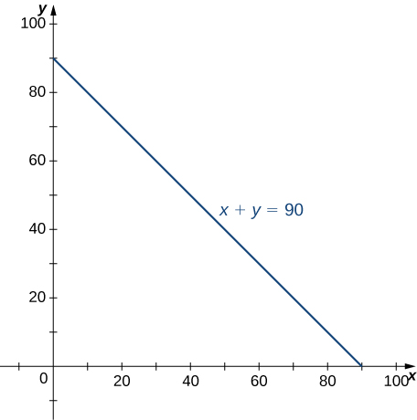{: #CNX_Calc_Figure_15_02_016}

Hence, the probability that <math xmlns="http://www.w3.org/1998/Math/MathML"><mrow><mrow><mo>(</mo><mrow><mi>X</mi><mo>,</mo><mi>Y</mi></mrow><mo>)</mo></mrow></mrow></math>

 is in the region <math xmlns="http://www.w3.org/1998/Math/MathML"><mi>D</mi></math>

 is

<math xmlns="http://www.w3.org/1998/Math/MathML"><mrow><mi>P</mi><mrow><mo>(</mo><mrow><mi>X</mi><mo>+</mo><mi>Y</mi><mo>≤</mo><mn>90</mn></mrow><mo>)</mo></mrow><mo>=</mo><mi>P</mi><mrow><mo>(</mo><mrow><mrow><mo>(</mo><mrow><mi>X</mi><mo>,</mo><mi>Y</mi></mrow><mo>)</mo></mrow><mo>∈</mo><mi>D</mi></mrow><mo>)</mo></mrow><mo>=</mo><mstyle displaystyle="true"><mrow><munder><mo>∬</mo><mi>D</mi></munder><mrow><mi>f</mi><mrow><mo>(</mo><mrow><mi>x</mi><mo>,</mo><mi>y</mi></mrow><mo>)</mo></mrow><mi>d</mi><mi>A</mi><mo>=</mo></mrow></mrow></mstyle><mstyle displaystyle="true"><mrow><munder><mo>∬</mo><mi>D</mi></munder><mrow><mfrac><mn>1</mn><mrow><mn>600</mn></mrow></mfrac><msup><mi>e</mi><mrow><mtext>−</mtext><mrow><mi>x</mi><mtext>/</mtext><mrow><mn>15</mn></mrow></mrow></mrow></msup><msup><mi>e</mi><mrow><mtext>−</mtext><mrow><mi>y</mi><mtext>/</mtext><mrow><mn>40</mn></mrow></mrow></mrow></msup><mi>d</mi><mi>A</mi></mrow></mrow></mstyle><mo>.</mo></mrow></math>

Since <math xmlns="http://www.w3.org/1998/Math/MathML"><mrow><mi>x</mi><mo>+</mo><mi>y</mi><mo>=</mo><mn>90</mn></mrow></math>

 is the same as <math xmlns="http://www.w3.org/1998/Math/MathML"><mrow><mi>y</mi><mo>=</mo><mn>90</mn><mo>−</mo><mi>x</mi><mo>,</mo></mrow></math>

 we have a region of Type I, so

<math xmlns="http://www.w3.org/1998/Math/MathML"><mtable><mtr><mtd columnalign="right"><mi>D</mi></mtd><mtd columnalign="left"><mo>=</mo></mtd><mtd columnalign="left"><mrow><mo>{</mo><mrow><mrow><mrow><mrow><mo>(</mo><mrow><mi>x</mi><mo>,</mo><mi>y</mi></mrow><mo>)</mo></mrow></mrow><mo>\|</mo></mrow><mn>0</mn><mo>≤</mo><mi>x</mi><mo>≤</mo><mn>90</mn><mo>,</mo><mn>0</mn><mo>≤</mo><mi>y</mi><mo>≤</mo><mn>90</mn><mo>−</mo><mi>x</mi></mrow><mo>}</mo></mrow><mo>,</mo></mtd></mtr><mtr><mtd columnalign="left"><mi>P</mi><mrow><mo>(</mo><mrow><mi>X</mi><mo>+</mo><mi>Y</mi><mo>≤</mo><mn>90</mn></mrow><mo>)</mo></mrow></mtd><mtd columnalign="left"><mo>=</mo></mtd><mtd columnalign="left"><mfrac><mn>1</mn><mrow><mn>600</mn></mrow></mfrac><mstyle displaystyle="true"><mrow><munderover><mo stretchy="false">∫</mo><mrow><mi>x</mi><mo>=</mo><mn>0</mn></mrow><mrow><mi>x</mi><mo>=</mo><mn>90</mn></mrow></munderover><mspace width="0.2em" /><mrow><mstyle displaystyle="true"><mrow><munderover><mo stretchy="false">∫</mo><mrow><mi>y</mi><mo>=</mo><mn>0</mn></mrow><mrow><mi>y</mi><mo>=</mo><mn>90</mn><mo>−</mo><mi>x</mi></mrow></munderover><mrow><msup><mi>e</mi><mrow><mtext>−</mtext><mrow><mi>x</mi><mtext>/</mtext><mrow><mn>15</mn></mrow></mrow></mrow></msup></mrow></mrow></mstyle></mrow></mrow></mstyle><msup><mi>e</mi><mrow><mtext>−</mtext><mrow><mi>y</mi><mtext>/</mtext><mrow><mn>40</mn></mrow></mrow></mrow></msup><mi>d</mi><mi>x</mi><mspace width="0.2em" /><mi>d</mi><mi>y</mi><mo>=</mo><mfrac><mn>1</mn><mrow><mn>600</mn></mrow></mfrac><mstyle displaystyle="true"><mrow><munderover><mo stretchy="false">∫</mo><mrow><mi>x</mi><mo>=</mo><mn>0</mn></mrow><mrow><mi>x</mi><mo>=</mo><mn>90</mn></mrow></munderover><mspace width="0.2em" /><mrow><mstyle displaystyle="true"><mrow><munderover><mo stretchy="false">∫</mo><mrow><mi>y</mi><mo>=</mo><mn>0</mn></mrow><mrow><mi>y</mi><mo>=</mo><mn>90</mn><mo>−</mo><mi>x</mi></mrow></munderover><mrow><msup><mi>e</mi><mrow><mtext>−</mtext><mrow><mi>x</mi><mtext>/</mtext><mrow><mn>15</mn></mrow></mrow></mrow></msup></mrow></mrow></mstyle></mrow></mrow></mstyle><msup><mi>e</mi><mrow><mtext>−</mtext><mrow><mi>y</mi><mtext>/</mtext><mrow><mn>40</mn></mrow></mrow></mrow></msup><mi>d</mi><mi>x</mi><mspace width="0.2em" /><mi>d</mi><mi>y</mi></mtd></mtr><mtr><mtd /><mtd columnalign="left"><mo>=</mo></mtd><mtd columnalign="left"><mfrac><mn>1</mn><mrow><mn>600</mn></mrow></mfrac><mstyle displaystyle="true"><mrow><munderover><mo stretchy="false">∫</mo><mrow><mi>x</mi><mo>=</mo><mn>0</mn></mrow><mrow><mi>x</mi><mo>=</mo><mn>90</mn></mrow></munderover><mspace width="0.2em" /><mrow><mstyle displaystyle="true"><mrow><munderover><mo stretchy="false">∫</mo><mrow><mi>y</mi><mo>=</mo><mn>0</mn></mrow><mrow><mi>y</mi><mo>=</mo><mn>90</mn><mo>−</mo><mi>x</mi></mrow></munderover><mrow><msup><mi>e</mi><mrow><mtext>−</mtext><mrow><mo>(</mo><mrow><mrow><mi>x</mi><mtext>/</mtext><mrow><mn>15</mn></mrow></mrow><mo>+</mo><mrow><mi>y</mi><mtext>/</mtext><mrow><mn>40</mn></mrow></mrow></mrow><mo>)</mo></mrow></mrow></msup></mrow></mrow></mstyle></mrow></mrow></mstyle><mi>d</mi><mi>x</mi><mspace width="0.2em" /><mi>d</mi><mi>y</mi><mo>=</mo><mn>0.8328.</mn></mtd></mtr></mtable></math>

Thus, there is an <math xmlns="http://www.w3.org/1998/Math/MathML"><mrow><mn>83.2</mn><mtext>%</mtext></mrow></math>

 chance that a customer spends less than an hour and a half at the restaurant.

Another important application in probability that can involve improper double integrals is the calculation of expected values. First we define this concept and then show an example of a calculation.

Definition

In probability theory, we denote the **expected values**{: data-type="term" .no-emphasis} <math xmlns="http://www.w3.org/1998/Math/MathML"><mrow><mi>E</mi><mrow><mo>(</mo><mi>X</mi><mo>)</mo></mrow></mrow></math>

 and <math xmlns="http://www.w3.org/1998/Math/MathML"><mrow><mi>E</mi><mrow><mo>(</mo><mi>Y</mi><mo>)</mo></mrow><mo>,</mo></mrow></math>

 respectively, as the most likely outcomes of the events. The expected values <math xmlns="http://www.w3.org/1998/Math/MathML"><mrow><mi>E</mi><mrow><mo>(</mo><mi>X</mi><mo>)</mo></mrow></mrow></math>

 and <math xmlns="http://www.w3.org/1998/Math/MathML"><mrow><mi>E</mi><mrow><mo>(</mo><mi>Y</mi><mo>)</mo></mrow></mrow></math>

 are given by

<math xmlns="http://www.w3.org/1998/Math/MathML"><mrow><mi>E</mi><mrow><mo>(</mo><mi>X</mi><mo>)</mo></mrow><mo>=</mo><mstyle displaystyle="true"><mrow><munder><mo>∬</mo><mi>S</mi></munder><mrow><mi>x</mi><mi>f</mi><mrow><mo>(</mo><mrow><mi>x</mi><mo>,</mo><mi>y</mi></mrow><mo>)</mo></mrow></mrow></mrow></mstyle><mi>d</mi><mi>A</mi><mspace width="0.2em" /><mtext>and</mtext><mspace width="0.2em" /><mi>E</mi><mrow><mo>(</mo><mi>Y</mi><mo>)</mo></mrow><mo>=</mo><mstyle displaystyle="true"><mrow><munder><mo>∬</mo><mi>S</mi></munder><mrow><mi>y</mi><mi>f</mi><mrow><mo>(</mo><mrow><mi>x</mi><mo>,</mo><mi>y</mi></mrow><mo>)</mo></mrow></mrow></mrow></mstyle><mi>d</mi><mi>A</mi><mo>,</mo></mrow></math>

where <math xmlns="http://www.w3.org/1998/Math/MathML"><mi>S</mi></math>

 is the sample space of the random variables <math xmlns="http://www.w3.org/1998/Math/MathML"><mi>X</mi></math>

 and <math xmlns="http://www.w3.org/1998/Math/MathML"><mrow><mi>Y</mi><mo>.</mo></mrow></math>

Finding Expected Value

Find the expected time for the events ‘waiting for a table’ and ‘completing the meal’ in [[link]](#fs-id1167793556451).

Using the first quadrant of the rectangular coordinate plane as the sample space, we have improper integrals for <math xmlns="http://www.w3.org/1998/Math/MathML"><mrow><mi>E</mi><mrow><mo>(</mo><mi>X</mi><mo>)</mo></mrow></mrow></math>

 and <math xmlns="http://www.w3.org/1998/Math/MathML"><mrow><mi>E</mi><mrow><mo>(</mo><mi>Y</mi><mo>)</mo></mrow><mo>.</mo></mrow></math>

 The expected time for a table is

<math xmlns="http://www.w3.org/1998/Math/MathML"><mtable><mtr><mtd columnalign="right"><mi>E</mi><mrow><mo>(</mo><mi>X</mi><mo>)</mo></mrow></mtd><mtd columnalign="left"><mo>=</mo><mstyle displaystyle="true"><mrow><munder><mo>∬</mo><mi>S</mi></munder><mrow><mi>x</mi><mfrac><mn>1</mn><mrow><mn>600</mn></mrow></mfrac></mrow></mrow></mstyle><msup><mi>e</mi><mrow><mtext>−</mtext><mrow><mi>x</mi><mtext>/</mtext><mrow><mn>15</mn></mrow></mrow></mrow></msup><msup><mi>e</mi><mrow><mtext>−</mtext><mrow><mi>y</mi><mtext>/</mtext><mrow><mn>40</mn></mrow></mrow></mrow></msup><mi>d</mi><mi>A</mi><mo>=</mo><mfrac><mn>1</mn><mrow><mn>600</mn></mrow></mfrac><mstyle displaystyle="true"><mrow><munderover><mo stretchy="false">∫</mo><mrow><mi>x</mi><mo>=</mo><mn>0</mn></mrow><mrow><mi>x</mi><mo>=</mo><mi>∞</mi></mrow></munderover><mspace width="0.2em" /><mrow><mstyle displaystyle="true"><mrow><munderover><mo stretchy="false">∫</mo><mrow><mi>y</mi><mo>=</mo><mn>0</mn></mrow><mrow><mi>y</mi><mo>=</mo><mi>∞</mi></mrow></munderover><mrow><mi>x</mi><msup><mi>e</mi><mrow><mtext>−</mtext><mrow><mi>x</mi><mtext>/</mtext><mrow><mn>15</mn></mrow></mrow></mrow></msup><msup><mi>e</mi><mrow><mtext>−</mtext><mrow><mi>y</mi><mtext>/</mtext><mrow><mn>40</mn></mrow></mrow></mrow></msup><mi>d</mi><mi>A</mi></mrow></mrow></mstyle></mrow></mrow></mstyle></mtd></mtr><mtr><mtd /><mtd columnalign="left"><mo>=</mo><mfrac><mn>1</mn><mrow><mn>600</mn></mrow></mfrac><munder><mrow><mtext>lim</mtext></mrow><mrow><mrow><mo>(</mo><mrow><mi>a</mi><mo>,</mo><mi>b</mi></mrow><mo>)</mo></mrow><mo stretchy="false">→</mo><mrow><mo>(</mo><mrow><mi>∞</mi><mo>,</mo><mi>∞</mi></mrow><mo>)</mo></mrow></mrow></munder><mstyle displaystyle="true"><mrow><munderover><mo stretchy="false">∫</mo><mrow><mi>x</mi><mo>=</mo><mn>0</mn></mrow><mrow><mi>x</mi><mo>=</mo><mi>a</mi></mrow></munderover><mspace width="0.2em" /><mrow><mstyle displaystyle="true"><mrow><munderover><mo stretchy="false">∫</mo><mrow><mi>y</mi><mo>=</mo><mn>0</mn></mrow><mrow><mi>y</mi><mo>=</mo><mi>b</mi></mrow></munderover><mrow><mi>x</mi><msup><mi>e</mi><mrow><mtext>−</mtext><mrow><mi>x</mi><mtext>/</mtext><mrow><mn>15</mn></mrow></mrow></mrow></msup><msup><mi>e</mi><mrow><mtext>−</mtext><mrow><mi>y</mi><mtext>/</mtext><mrow><mn>40</mn></mrow></mrow></mrow></msup><mi>d</mi><mi>x</mi><mspace width="0.2em" /><mi>d</mi><mi>y</mi></mrow></mrow></mstyle></mrow></mrow></mstyle></mtd></mtr><mtr><mtd /><mtd columnalign="left"><mo>=</mo><mfrac><mn>1</mn><mrow><mn>600</mn></mrow></mfrac><mrow><mo>(</mo><mrow><munder><mrow><mtext>lim</mtext></mrow><mrow><mi>a</mi><mo stretchy="false">→</mo><mi>∞</mi></mrow></munder><mstyle displaystyle="true"><mrow><munderover><mo stretchy="false">∫</mo><mrow><mi>x</mi><mo>=</mo><mn>0</mn></mrow><mrow><mi>x</mi><mo>=</mo><mi>a</mi></mrow></munderover><mrow><mi>x</mi><msup><mi>e</mi><mrow><mtext>−</mtext><mrow><mi>x</mi><mtext>/</mtext><mrow><mn>15</mn></mrow></mrow></mrow></msup><mi>d</mi><mi>x</mi></mrow></mrow></mstyle></mrow><mo>)</mo></mrow><mrow><mo>(</mo><mrow><munder><mrow><mtext>lim</mtext></mrow><mrow><mi>b</mi><mo stretchy="false">→</mo><mi>∞</mi></mrow></munder><mstyle displaystyle="true"><mrow><munderover><mo stretchy="false">∫</mo><mrow><mi>y</mi><mo>=</mo><mn>0</mn></mrow><mrow><mi>y</mi><mo>=</mo><mi>b</mi></mrow></munderover><mrow><msup><mi>e</mi><mrow><mtext>−</mtext><mrow><mi>y</mi><mtext>/</mtext><mrow><mn>40</mn></mrow></mrow></mrow></msup><mi>d</mi><mi>y</mi></mrow></mrow></mstyle></mrow><mo>)</mo></mrow></mtd></mtr><mtr><mtd /><mtd columnalign="left"><mo>=</mo><mfrac><mn>1</mn><mrow><mn>600</mn></mrow></mfrac><mrow><mo>(</mo><mrow><msubsup><mrow><mrow><mrow><mrow><mo>(</mo><mrow><munder><mrow><mtext>lim</mtext></mrow><mrow><mi>a</mi><mo stretchy="false">→</mo><mi>∞</mi></mrow></munder><mrow><mo>(</mo><mrow><mn>−15</mn><msup><mi>e</mi><mrow><mtext>−</mtext><mrow><mi>x</mi><mtext>/</mtext><mrow><mn>15</mn></mrow></mrow></mrow></msup><mrow><mo>(</mo><mrow><mi>x</mi><mo>+</mo><mn>15</mn></mrow><mo>)</mo></mrow></mrow><mo>)</mo></mrow></mrow><mo>)</mo></mrow></mrow><mo>\|</mo></mrow></mrow><mrow><mi>x</mi><mo>=</mo><mn>0</mn></mrow><mrow><mi>x</mi><mo>=</mo><mi>a</mi></mrow></msubsup></mrow><mo>)</mo></mrow><mrow><mo>(</mo><mrow><msubsup><mrow><mrow><mrow><mrow><mo>(</mo><mrow><munder><mrow><mtext>lim</mtext></mrow><mrow><mi>b</mi><mo stretchy="false">→</mo><mi>∞</mi></mrow></munder><mrow><mo>(</mo><mrow><mn>−40</mn><msup><mi>e</mi><mrow><mtext>−</mtext><mrow><mi>y</mi><mtext>/</mtext><mrow><mn>40</mn></mrow></mrow></mrow></msup></mrow><mo>)</mo></mrow></mrow><mo>)</mo></mrow></mrow><mo>\|</mo></mrow></mrow><mrow><mi>y</mi><mo>=</mo><mn>0</mn></mrow><mrow><mi>y</mi><mo>=</mo><mi>b</mi></mrow></msubsup></mrow><mo>)</mo></mrow></mtd></mtr><mtr><mtd /><mtd columnalign="left"><mo>=</mo><mfrac><mn>1</mn><mrow><mn>600</mn></mrow></mfrac><mrow><mo>(</mo><mrow><munder><mrow><mtext>lim</mtext></mrow><mrow><mi>a</mi><mo stretchy="false">→</mo><mi>∞</mi></mrow></munder><mrow><mo>(</mo><mrow><mn>−15</mn><msup><mi>e</mi><mrow><mtext>−</mtext><mrow><mi>a</mi><mtext>/</mtext><mrow><mn>15</mn></mrow></mrow></mrow></msup><mrow><mo>(</mo><mrow><mi>x</mi><mo>+</mo><mn>15</mn></mrow><mo>)</mo></mrow><mo>+</mo><mn>225</mn></mrow><mo>)</mo></mrow></mrow><mo>)</mo></mrow><mrow><mo>(</mo><mrow><munder><mrow><mtext>lim</mtext></mrow><mrow><mi>b</mi><mo stretchy="false">→</mo><mi>∞</mi></mrow></munder><mrow><mo>(</mo><mrow><mn>−40</mn><msup><mi>e</mi><mrow><mtext>−</mtext><mrow><mi>b</mi><mtext>/</mtext><mrow><mn>40</mn></mrow></mrow></mrow></msup><mo>+</mo><mn>40</mn></mrow><mo>)</mo></mrow></mrow><mo>)</mo></mrow></mtd></mtr><mtr><mtd /><mtd columnalign="left"><mo>=</mo><mfrac><mn>1</mn><mrow><mn>600</mn></mrow></mfrac><mrow><mo>(</mo><mrow><mn>225</mn></mrow><mo>)</mo></mrow><mrow><mo>(</mo><mrow><mn>40</mn></mrow><mo>)</mo></mrow></mtd></mtr><mtr><mtd /><mtd columnalign="left"><mo>=</mo><mn>15.</mn></mtd></mtr></mtable></math>

A similar calculation shows that <math xmlns="http://www.w3.org/1998/Math/MathML"><mrow><mi>E</mi><mrow><mo>(</mo><mi>Y</mi><mo>)</mo></mrow><mo>=</mo><mn>40</mn><mo>.</mo></mrow></math>

 This means that the expected values of the two random events are the average waiting time and the average dining time, respectively.

The joint density function for two random variables <math xmlns="http://www.w3.org/1998/Math/MathML"><mi>X</mi></math>

 and <math xmlns="http://www.w3.org/1998/Math/MathML"><mi>Y</mi></math>

 is given by

<math xmlns="http://www.w3.org/1998/Math/MathML"><mrow><mi>f</mi><mo stretchy="false">(</mo><mi>x</mi><mo>,</mo><mi>y</mi><mo stretchy="false">)</mo><mo>=</mo><mrow><mo>{</mo><mtable><mtr><mtd columnalign="left"><mfrac><mn>1</mn><mrow><mn>600</mn></mrow></mfrac><mrow><mo>(</mo><mrow><msup><mi>x</mi><mn>2</mn></msup><mo>+</mo><msup><mi>y</mi><mn>2</mn></msup></mrow><mo>)</mo></mrow></mtd><mtd columnalign="left"><mtext>if</mtext><mspace width="0.2em" /><mn>0</mn><mo>≤</mo><mi>x</mi><mo>≤</mo><mn>15</mn><mo>,</mo><mn>0</mn><mo>≤</mo><mi>y</mi><mo>≤</mo><mn>10</mn></mtd></mtr><mtr><mtd columnalign="left"><mn>0</mn></mtd><mtd columnalign="left"><mtext>otherwise</mtext></mtd></mtr></mtable></mrow></mrow></math>

Find the probability that <math xmlns="http://www.w3.org/1998/Math/MathML"><mi>X</mi></math>

 is at most <math xmlns="http://www.w3.org/1998/Math/MathML"><mrow><mn>10</mn></mrow></math>

 and <math xmlns="http://www.w3.org/1998/Math/MathML"><mi>Y</mi></math>

 is at least <math xmlns="http://www.w3.org/1998/Math/MathML"><mrow><mn>5</mn><mo>.</mo></mrow></math>

<math xmlns="http://www.w3.org/1998/Math/MathML"><mrow><mfrac><mrow><mn>55</mn></mrow><mrow><mn>72</mn></mrow></mfrac><mo>≈</mo><mn>0.7638</mn></mrow></math>

Hint

Compute the probability <math xmlns="http://www.w3.org/1998/Math/MathML"><mrow><mi>P</mi><mrow><mo>(</mo><mrow><mi>X</mi><mo>≤</mo><mn>10</mn><mo>,</mo><mi>Y</mi><mo>≥</mo><mn>5</mn></mrow><mo>)</mo></mrow><mo>=</mo><mstyle displaystyle="true"><mrow><munderover><mo stretchy="false">∫</mo><mrow><mi>x</mi><mo>=</mo><mtext>−</mtext><mi>∞</mi></mrow><mrow><mn>10</mn></mrow></munderover><mspace width="0.2em" /><mrow><mstyle displaystyle="true"><mrow><munderover><mo stretchy="false">∫</mo><mrow><mi>y</mi><mo>=</mo><mn>5</mn></mrow><mrow><mi>y</mi><mo>=</mo><mn>10</mn></mrow></munderover><mrow><mfrac><mn>1</mn><mrow><mn>6000</mn></mrow></mfrac></mrow></mrow></mstyle></mrow></mrow></mstyle><mrow><mo>(</mo><mrow><msup><mi>x</mi><mn>2</mn></msup><mo>+</mo><msup><mi>y</mi><mn>2</mn></msup></mrow><mo>)</mo></mrow><mi>d</mi><mi>y</mi><mspace width="0.2em" /><mi>d</mi><mi>x</mi><mo>.</mo></mrow></math>

# Key Concepts

* A general bounded region
  <math xmlns="http://www.w3.org/1998/Math/MathML"><mi>D</mi></math>
  
  on the plane is a region that can be enclosed inside a rectangular region. We can use this idea to define a double integral over a general bounded region.
* To evaluate an iterated integral of a function over a general nonrectangular region, we sketch the region and express it as a Type I or as a Type II region or as a union of several Type I or Type II regions that overlap only on their boundaries.
* We can use double integrals to find volumes, areas, and average values of a function over general regions, similarly to calculations over rectangular regions.
* We can use Fubini’s theorem for improper integrals to evaluate some types of improper integrals.
{: data-bullet-style="bullet"}

# Key Equations

* **Iterated integral over a Type I region**
  * * *
  {: data-type="newline"}
  
  <math xmlns="http://www.w3.org/1998/Math/MathML"><mrow><mstyle displaystyle="true"><mrow><munder><mo>∬</mo><mi>D</mi></munder><mrow><mi>f</mi><mo stretchy="false">(</mo><mi>x</mi><mo>,</mo><mi>y</mi><mo stretchy="false">)</mo><mi>d</mi><mi>A</mi></mrow></mrow></mstyle><mo>=</mo><mstyle displaystyle="true"><mrow><munder><mo>∬</mo><mi>D</mi></munder><mrow><mi>f</mi><mo stretchy="false">(</mo><mi>x</mi><mo>,</mo><mi>y</mi><mo stretchy="false">)</mo><mi>d</mi><mi>y</mi><mspace width="0.2em" /><mi>d</mi><mi>x</mi></mrow></mrow></mstyle><mo>=</mo><mstyle displaystyle="true"><mrow><munderover><mo stretchy="false">∫</mo><mi>a</mi><mi>b</mi></munderover><mrow><mrow><mo>[</mo><mrow><mstyle displaystyle="true"><mrow><munderover><mo stretchy="false">∫</mo><mrow><msub><mi>g</mi><mn>1</mn></msub><mo stretchy="false">(</mo><mi>x</mi><mo stretchy="false">)</mo></mrow><mrow><msub><mi>g</mi><mn>2</mn></msub><mo stretchy="false">(</mo><mi>x</mi><mo stretchy="false">)</mo></mrow></munderover><mrow><mi>f</mi><mo stretchy="false">(</mo><mi>x</mi><mo>,</mo><mi>y</mi><mo stretchy="false">)</mo><mi>d</mi><mi>y</mi></mrow></mrow></mstyle></mrow><mo>]</mo></mrow><mi>d</mi><mi>x</mi></mrow></mrow></mstyle></mrow></math>

* **Iterated integral over a Type II region**
  * * *
  {: data-type="newline"}
  
  <math xmlns="http://www.w3.org/1998/Math/MathML"><mrow><mstyle displaystyle="true"><mrow><munder><mo>∬</mo><mi>D</mi></munder><mrow><mi>f</mi><mo stretchy="false">(</mo><mi>x</mi><mo>,</mo><mi>y</mi><mo stretchy="false">)</mo><mi>d</mi><mi>A</mi></mrow></mrow></mstyle><mo>=</mo><mstyle displaystyle="true"><mrow><munder><mo>∬</mo><mi>D</mi></munder><mrow><mi>f</mi><mo stretchy="false">(</mo><mi>x</mi><mo>,</mo><mi>y</mi><mo stretchy="false">)</mo><mi>d</mi><mi>x</mi><mspace width="0.2em" /><mi>d</mi><mi>y</mi></mrow></mrow></mstyle><mo>=</mo><mstyle displaystyle="true"><mrow><munderover><mo stretchy="false">∫</mo><mi>c</mi><mi>d</mi></munderover><mrow><mrow><mo>[</mo><mrow><mstyle displaystyle="true"><mrow><munderover><mo stretchy="false">∫</mo><mrow><msub><mi>h</mi><mn>1</mn></msub><mo stretchy="false">(</mo><mi>y</mi><mo stretchy="false">)</mo></mrow><mrow><msub><mi>h</mi><mn>2</mn></msub><mo stretchy="false">(</mo><mi>y</mi><mo stretchy="false">)</mo></mrow></munderover><mrow><mi>f</mi><mo stretchy="false">(</mo><mi>x</mi><mo>,</mo><mi>y</mi><mo stretchy="false">)</mo><mi>d</mi><mi>x</mi></mrow></mrow></mstyle></mrow><mo>]</mo></mrow><mi>d</mi><mi>y</mi></mrow></mrow></mstyle></mrow></math>
{: data-bullet-style="bullet"}

<section data-depth="1" class="section-exercises" markdown="1">
In the following exercises, specify whether the region is of Type I or Type II.

The region <math xmlns="http://www.w3.org/1998/Math/MathML"><mi>D</mi></math>

 bounded by <math xmlns="http://www.w3.org/1998/Math/MathML"><mrow><mi>y</mi><mo>=</mo><msup><mi>x</mi><mn>3</mn></msup><mo>,</mo></mrow></math>

 <math xmlns="http://www.w3.org/1998/Math/MathML"><mrow><mi>y</mi><mo>=</mo><msup><mi>x</mi><mn>3</mn></msup><mo>+</mo><mn>1</mn><mo>,</mo></mrow></math>

 <math xmlns="http://www.w3.org/1998/Math/MathML"><mrow><mi>x</mi><mo>=</mo><mn>0</mn><mo>,</mo></mrow></math>

 and <math xmlns="http://www.w3.org/1998/Math/MathML"><mrow><mi>x</mi><mo>=</mo><mn>1</mn></mrow></math>

 as given in the following figure.

 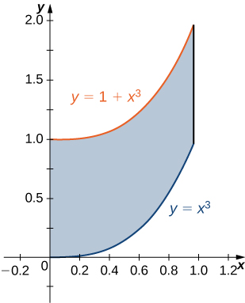 

Find the average value of the function <math xmlns="http://www.w3.org/1998/Math/MathML"><mrow><mi>f</mi><mrow><mo>(</mo><mrow><mi>x</mi><mo>,</mo><mi>y</mi></mrow><mo>)</mo></mrow><mo>=</mo><mn>3</mn><mi>x</mi><mi>y</mi></mrow></math>

 on the region graphed in the previous exercise.

<math xmlns="http://www.w3.org/1998/Math/MathML"><mrow><mfrac><mrow><mn>27</mn></mrow><mrow><mn>20</mn></mrow></mfrac></mrow></math>

Find the area of the region <math xmlns="http://www.w3.org/1998/Math/MathML"><mi>D</mi></math>

 given in the previous exercise.

The region <math xmlns="http://www.w3.org/1998/Math/MathML"><mi>D</mi></math>

 bounded by <math xmlns="http://www.w3.org/1998/Math/MathML"><mrow><mi>y</mi><mo>=</mo><mtext>sin</mtext><mspace width="0.2em" /><mi>x</mi><mo>,</mo><mi>y</mi><mo>=</mo><mn>1</mn><mo>+</mo><mtext>sin</mtext><mspace width="0.2em" /><mi>x</mi><mo>,</mo><mi>x</mi><mo>=</mo><mn>0</mn><mo>,</mo><mspace width="0.2em" /><mtext>and</mtext><mspace width="0.2em" /><mi>x</mi><mo>=</mo><mfrac><mi>π</mi><mn>2</mn></mfrac></mrow></math>

 as given in the following figure.

 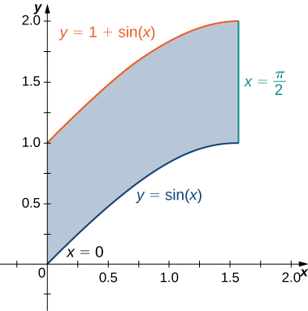 

Type I but not Type II

Find the average value of the function <math xmlns="http://www.w3.org/1998/Math/MathML"><mrow><mi>f</mi><mrow><mo>(</mo><mrow><mi>x</mi><mo>,</mo><mi>y</mi></mrow><mo>)</mo></mrow><mo>=</mo><mtext>cos</mtext><mspace width="0.2em" /><mi>x</mi></mrow></math>

 on the region graphed in the previous exercise.

Find the area of the region <math xmlns="http://www.w3.org/1998/Math/MathML"><mi>D</mi></math>

 given in the previous exercise.

<math xmlns="http://www.w3.org/1998/Math/MathML"><mrow><mfrac><mi>π</mi><mn>2</mn></mfrac></mrow></math>

The region <math xmlns="http://www.w3.org/1998/Math/MathML"><mi>D</mi></math>

 bounded by <math xmlns="http://www.w3.org/1998/Math/MathML"><mrow><mi>x</mi><mo>=</mo><msup><mi>y</mi><mn>2</mn></msup><mo>−</mo><mn>1</mn></mrow></math>

 and <math xmlns="http://www.w3.org/1998/Math/MathML"><mrow><mi>x</mi><mo>=</mo><msqrt><mrow><mn>1</mn><mo>−</mo><msup><mi>y</mi><mn>2</mn></msup></mrow></msqrt></mrow></math>

 as given in the following figure.

 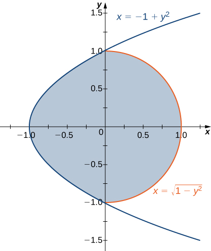 

Find the volume of the solid under the graph of the function <math xmlns="http://www.w3.org/1998/Math/MathML"><mrow><mi>f</mi><mrow><mo>(</mo><mrow><mi>x</mi><mo>,</mo><mi>y</mi></mrow><mo>)</mo></mrow><mo>=</mo><mi>x</mi><mi>y</mi><mo>+</mo><mn>1</mn></mrow></math>

 and above the region in the figure in the previous exercise.

<math xmlns="http://www.w3.org/1998/Math/MathML"><mrow><mfrac><mn>1</mn><mn>6</mn></mfrac><mrow><mo>(</mo><mrow><mn>8</mn><mo>+</mo><mn>3</mn><mi>π</mi></mrow><mo>)</mo></mrow></mrow></math>

The region <math xmlns="http://www.w3.org/1998/Math/MathML"><mi>D</mi></math>

 bounded by <math xmlns="http://www.w3.org/1998/Math/MathML"><mrow><mi>y</mi><mo>=</mo><mn>0</mn><mo>,</mo><mi>x</mi><mo>=</mo><mn>−10</mn><mo>+</mo><mi>y</mi><mo>,</mo><mspace width="0.2em" /><mtext>and</mtext><mspace width="0.2em" /><mi>x</mi><mo>=</mo><mn>10</mn><mo>−</mo><mi>y</mi></mrow></math>

 as given in the following figure.

 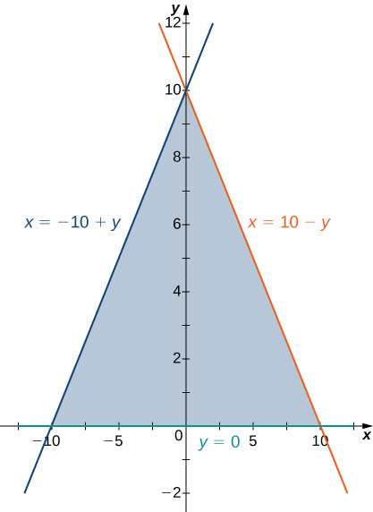 

Find the volume of the solid under the graph of the function <math xmlns="http://www.w3.org/1998/Math/MathML"><mrow><mi>f</mi><mrow><mo>(</mo><mrow><mi>x</mi><mo>,</mo><mi>y</mi></mrow><mo>)</mo></mrow><mo>=</mo><mi>x</mi><mo>+</mo><mi>y</mi></mrow></math>

 and above the region in the figure from the previous exercise.

<math xmlns="http://www.w3.org/1998/Math/MathML"><mrow><mfrac><mrow><mn>1000</mn></mrow><mn>3</mn></mfrac></mrow></math>

The region <math xmlns="http://www.w3.org/1998/Math/MathML"><mi>D</mi></math>

 bounded by <math xmlns="http://www.w3.org/1998/Math/MathML"><mrow><mi>y</mi><mo>=</mo><mn>0</mn><mo>,</mo><mi>x</mi><mo>=</mo><mi>y</mi><mo>−</mo><mn>1</mn><mo>,</mo></mrow></math>

 <math xmlns="http://www.w3.org/1998/Math/MathML"><mrow><mi>x</mi><mo>=</mo><mfrac><mi>π</mi><mn>2</mn></mfrac></mrow></math>

 as given in the following figure.

 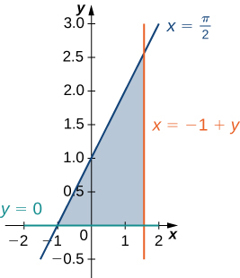 

The region <math xmlns="http://www.w3.org/1998/Math/MathML"><mi>D</mi></math>

 bounded by <math xmlns="http://www.w3.org/1998/Math/MathML"><mrow><mi>y</mi><mo>=</mo><mn>0</mn></mrow></math>

 and <math xmlns="http://www.w3.org/1998/Math/MathML"><mrow><mi>y</mi><mo>=</mo><msup><mi>x</mi><mn>2</mn></msup><mo>−</mo><mn>1</mn></mrow></math>

 as given in the following figure.

 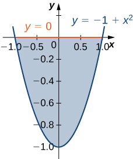 

Type I and Type II

Let <math xmlns="http://www.w3.org/1998/Math/MathML"><mi>D</mi></math>

 be the region bounded by the curves of equations <math xmlns="http://www.w3.org/1998/Math/MathML"><mrow><mi>y</mi><mo>=</mo><mi>x</mi><mo>,</mo><mi>y</mi><mo>=</mo><mtext>−</mtext><mi>x</mi><mo>,</mo></mrow></math>

 and <math xmlns="http://www.w3.org/1998/Math/MathML"><mrow><mi>y</mi><mo>=</mo><mn>2</mn><mo>−</mo><msup><mi>x</mi><mn>2</mn></msup><mo>.</mo></mrow></math>

 Explain why <math xmlns="http://www.w3.org/1998/Math/MathML"><mi>D</mi></math>

 is neither of Type I nor II.

Let <math xmlns="http://www.w3.org/1998/Math/MathML"><mi>D</mi></math>

 be the region bounded by the curves of equations <math xmlns="http://www.w3.org/1998/Math/MathML"><mrow><mi>y</mi><mo>=</mo><mtext>cos</mtext><mspace width="0.2em" /><mi>x</mi></mrow></math>

 and <math xmlns="http://www.w3.org/1998/Math/MathML"><mrow><mi>y</mi><mo>=</mo><mn>4</mn><mo>−</mo><msup><mi>x</mi><mn>2</mn></msup></mrow></math>

 and the <math xmlns="http://www.w3.org/1998/Math/MathML"><mi>x</mi></math>

-axis. Explain why <math xmlns="http://www.w3.org/1998/Math/MathML"><mi>D</mi></math>

 is neither of Type I nor II.

The region <math xmlns="http://www.w3.org/1998/Math/MathML"><mi>D</mi></math>

 is not of Type I: it does not lie between two vertical lines and the graphs of two continuous functions <math xmlns="http://www.w3.org/1998/Math/MathML"><mrow><msub><mi>g</mi><mn>1</mn></msub><mo stretchy="false">(</mo><mi>x</mi><mo stretchy="false">)</mo></mrow></math>

 and <math xmlns="http://www.w3.org/1998/Math/MathML"><mrow><msub><mi>g</mi><mn>2</mn></msub><mo stretchy="false">(</mo><mi>x</mi><mo stretchy="false">)</mo><mo>.</mo></mrow></math>

 The region <math xmlns="http://www.w3.org/1998/Math/MathML"><mi>D</mi></math>

 is not of Type II: it does not lie between two horizontal lines and the graphs of two continuous functions <math xmlns="http://www.w3.org/1998/Math/MathML"><mrow><msub><mi>h</mi><mn>1</mn></msub><mo stretchy="false">(</mo><mi>y</mi><mo stretchy="false">)</mo></mrow></math>

 and <math xmlns="http://www.w3.org/1998/Math/MathML"><mrow><msub><mi>h</mi><mn>2</mn></msub><mo stretchy="false">(</mo><mi>y</mi><mo stretchy="false">)</mo><mo>.</mo></mrow></math>

In the following exercises, evaluate the double integral <math xmlns="http://www.w3.org/1998/Math/MathML"><mrow><mstyle displaystyle="true"><mrow><munder><mo>∬</mo><mi>D</mi></munder><mrow><mi>f</mi><mrow><mo>(</mo><mrow><mi>x</mi><mo>,</mo><mi>y</mi></mrow><mo>)</mo></mrow></mrow></mrow></mstyle><mi>d</mi><mi>A</mi></mrow></math>

 over the region <math xmlns="http://www.w3.org/1998/Math/MathML"><mrow><mi>D</mi><mo>.</mo></mrow></math>

<math xmlns="http://www.w3.org/1998/Math/MathML"><mrow><mi>f</mi><mrow><mo>(</mo><mrow><mi>x</mi><mo>,</mo><mi>y</mi></mrow><mo>)</mo></mrow><mo>=</mo><mn>2</mn><mi>x</mi><mo>+</mo><mn>5</mn><mi>y</mi></mrow></math>

 and <math xmlns="http://www.w3.org/1998/Math/MathML"><mrow><mi>D</mi><mo>=</mo><mrow><mo>{</mo><mrow><mrow><mrow><mrow><mo>(</mo><mrow><mi>x</mi><mo>,</mo><mi>y</mi></mrow><mo>)</mo></mrow></mrow><mo>\|</mo></mrow><mn>0</mn><mo>≤</mo><mi>x</mi><mo>≤</mo><mn>1</mn><mo>,</mo><msup><mi>x</mi><mn>3</mn></msup><mo>≤</mo><mi>y</mi><mo>≤</mo><msup><mi>x</mi><mn>3</mn></msup><mo>+</mo><mn>1</mn></mrow><mo>}</mo></mrow></mrow></math>

<math xmlns="http://www.w3.org/1998/Math/MathML"><mrow><mi>f</mi><mrow><mo>(</mo><mrow><mi>x</mi><mo>,</mo><mi>y</mi></mrow><mo>)</mo></mrow><mo>=</mo><mn>1</mn></mrow></math>

 and <math xmlns="http://www.w3.org/1998/Math/MathML"><mrow><mi>D</mi><mo>=</mo><mrow><mo>{</mo><mrow><mrow><mrow><mrow><mo>(</mo><mrow><mi>x</mi><mo>,</mo><mi>y</mi></mrow><mo>)</mo></mrow></mrow><mo>\|</mo></mrow><mn>0</mn><mo>≤</mo><mi>x</mi><mo>≤</mo><mfrac><mi>π</mi><mn>2</mn></mfrac><mo>,</mo><mtext>sin</mtext><mspace width="0.2em" /><mi>x</mi><mo>≤</mo><mi>y</mi><mo>≤</mo><mn>1</mn><mo>+</mo><mtext>sin</mtext><mspace width="0.2em" /><mi>x</mi></mrow><mo>}</mo></mrow></mrow></math>

<math xmlns="http://www.w3.org/1998/Math/MathML"><mrow><mfrac><mi>π</mi><mn>2</mn></mfrac></mrow></math>

<math xmlns="http://www.w3.org/1998/Math/MathML"><mrow><mi>f</mi><mrow><mo>(</mo><mrow><mi>x</mi><mo>,</mo><mi>y</mi></mrow><mo>)</mo></mrow><mo>=</mo><mn>2</mn></mrow></math>

 and <math xmlns="http://www.w3.org/1998/Math/MathML"><mrow><mi>D</mi><mo>=</mo><mrow><mo>{</mo><mrow><mrow><mrow><mrow><mo>(</mo><mrow><mi>x</mi><mo>,</mo><mi>y</mi></mrow><mo>)</mo></mrow></mrow><mo>\|</mo></mrow><mn>0</mn><mo>≤</mo><mi>y</mi><mo>≤</mo><mn>1</mn><mo>,</mo><mi>y</mi><mo>−</mo><mn>1</mn><mo>≤</mo><mi>x</mi><mo>≤</mo><mtext>arccos</mtext><mspace width="0.2em" /><mi>y</mi></mrow><mo>}</mo></mrow></mrow></math>

<math xmlns="http://www.w3.org/1998/Math/MathML"><mrow><mi>f</mi><mrow><mo>(</mo><mrow><mi>x</mi><mo>,</mo><mi>y</mi></mrow><mo>)</mo></mrow><mo>=</mo><mi>x</mi><mi>y</mi></mrow></math>

 and <math xmlns="http://www.w3.org/1998/Math/MathML"><mrow><mi>D</mi><mo>=</mo><mrow><mo>{</mo><mrow><mrow><mrow><mrow><mo>(</mo><mrow><mi>x</mi><mo>,</mo><mi>y</mi></mrow><mo>)</mo></mrow></mrow><mo>\|</mo></mrow><mo>−</mo><mn>1</mn><mo>≤</mo><mi>y</mi><mo>≤</mo><mn>1</mn><mo>,</mo><msup><mi>y</mi><mn>2</mn></msup><mo>−</mo><mn>1</mn><mo>≤</mo><mi>x</mi><mo>≤</mo><msqrt><mrow><mn>1</mn><mo>−</mo><msup><mi>y</mi><mn>2</mn></msup></mrow></msqrt></mrow><mo>}</mo></mrow></mrow></math>

<math xmlns="http://www.w3.org/1998/Math/MathML"><mn>0</mn></math>

<math xmlns="http://www.w3.org/1998/Math/MathML"><mrow><mi>f</mi><mrow><mo>(</mo><mrow><mi>x</mi><mo>,</mo><mi>y</mi></mrow><mo>)</mo></mrow><mo>=</mo><mtext>sin</mtext><mspace width="0.2em" /><mi>y</mi></mrow></math>

 and <math xmlns="http://www.w3.org/1998/Math/MathML"><mi>D</mi></math>

 is the triangular region with vertices <math xmlns="http://www.w3.org/1998/Math/MathML"><mrow><mrow><mo>(</mo><mrow><mn>0</mn><mo>,</mo><mn>0</mn></mrow><mo>)</mo></mrow><mo>,</mo><mrow><mo>(</mo><mrow><mn>0</mn><mo>,</mo><mn>3</mn></mrow><mo>)</mo></mrow><mo>,</mo><mspace width="0.2em" /><mtext>and</mtext><mspace width="0.2em" /><mrow><mo>(</mo><mrow><mn>3</mn><mo>,</mo><mn>0</mn></mrow><mo>)</mo></mrow></mrow></math>

<math xmlns="http://www.w3.org/1998/Math/MathML"><mrow><mi>f</mi><mrow><mo>(</mo><mrow><mi>x</mi><mo>,</mo><mi>y</mi></mrow><mo>)</mo></mrow><mo>=</mo><mtext>−</mtext><mi>x</mi><mo>+</mo><mn>1</mn></mrow></math>

 and <math xmlns="http://www.w3.org/1998/Math/MathML"><mi>D</mi></math>

 is the triangular region with vertices <math xmlns="http://www.w3.org/1998/Math/MathML"><mrow><mrow><mo>(</mo><mrow><mn>0</mn><mo>,</mo><mn>0</mn></mrow><mo>)</mo></mrow><mo>,</mo><mrow><mo>(</mo><mrow><mn>0</mn><mo>,</mo><mn>2</mn></mrow><mo>)</mo></mrow><mo>,</mo><mspace width="0.2em" /><mtext>and</mtext><mspace width="0.2em" /><mrow><mo>(</mo><mrow><mn>2</mn><mo>,</mo><mn>2</mn></mrow><mo>)</mo></mrow></mrow></math>

<math xmlns="http://www.w3.org/1998/Math/MathML"><mrow><mfrac><mn>2</mn><mn>3</mn></mfrac></mrow></math>

Evaluate the iterated integrals.

<math xmlns="http://www.w3.org/1998/Math/MathML"><mrow><mstyle displaystyle="true"><mrow><munderover><mo stretchy="false">∫</mo><mn>0</mn><mn>1</mn></munderover><mspace width="0.2em" /><mrow><mstyle displaystyle="true"><mrow><munderover><mo stretchy="false">∫</mo><mrow><mn>2</mn><mi>x</mi></mrow><mrow><mn>3</mn><mi>x</mi></mrow></munderover><mrow><mrow><mo>(</mo><mrow><mi>x</mi><mo>+</mo><msup><mi>y</mi><mn>2</mn></msup></mrow><mo>)</mo></mrow></mrow></mrow></mstyle></mrow></mrow></mstyle><mi>d</mi><mi>y</mi><mspace width="0.2em" /><mi>d</mi><mi>x</mi></mrow></math>

<math xmlns="http://www.w3.org/1998/Math/MathML"><mrow><mstyle displaystyle="true"><mrow><munderover><mo stretchy="false">∫</mo><mn>0</mn><mn>1</mn></munderover><mspace width="0.2em" /><mrow><mstyle displaystyle="true"><mrow><munderover><mo stretchy="false">∫</mo><mrow><mn>2</mn><msqrt><mi>x</mi></msqrt></mrow><mrow><mn>2</mn><msqrt><mi>x</mi></msqrt><mo>+</mo><mn>1</mn></mrow></munderover><mrow><mrow><mo>(</mo><mrow><mi>x</mi><mi>y</mi><mo>+</mo><mn>1</mn></mrow><mo>)</mo></mrow></mrow></mrow></mstyle></mrow></mrow></mstyle><mi>d</mi><mi>y</mi><mspace width="0.2em" /><mi>d</mi><mi>x</mi></mrow></math>

<math xmlns="http://www.w3.org/1998/Math/MathML"><mrow><mfrac><mrow><mn>41</mn></mrow><mrow><mn>20</mn></mrow></mfrac></mrow></math>

<math xmlns="http://www.w3.org/1998/Math/MathML"><mrow><mstyle displaystyle="true"><mrow><munderover><mo stretchy="false">∫</mo><mi>e</mi><mrow><msup><mi>e</mi><mn>2</mn></msup></mrow></munderover><mspace width="0.2em" /><mrow><mstyle displaystyle="true"><mrow><munderover><mo stretchy="false">∫</mo><mrow><mtext>ln</mtext><mspace width="0.2em" /><mi>u</mi></mrow><mn>2</mn></munderover><mrow><mrow><mo>(</mo><mrow><mi>v</mi><mo>+</mo><mtext>ln</mtext><mspace width="0.2em" /><mi>u</mi></mrow><mo>)</mo></mrow></mrow></mrow></mstyle></mrow></mrow></mstyle><mi>d</mi><mi>v</mi><mspace width="0.2em" /><mi>d</mi><mi>u</mi></mrow></math>

<math xmlns="http://www.w3.org/1998/Math/MathML"><mrow><mstyle displaystyle="true"><mrow><munderover><mo stretchy="false">∫</mo><mn>1</mn><mn>2</mn></munderover><mspace width="0.2em" /><mrow><mstyle displaystyle="true"><mrow><munderover><mo stretchy="false">∫</mo><mrow><mtext>−</mtext><msup><mi>u</mi><mn>2</mn></msup><mo>−</mo><mn>1</mn></mrow><mrow><mtext>−</mtext><mi>u</mi></mrow></munderover><mrow><mrow><mo>(</mo><mrow><mn>8</mn><mi>u</mi><mi>v</mi></mrow><mo>)</mo></mrow></mrow></mrow></mstyle></mrow></mrow></mstyle><mi>d</mi><mi>v</mi><mspace width="0.2em" /><mi>d</mi><mi>u</mi></mrow></math>

<math xmlns="http://www.w3.org/1998/Math/MathML"><mrow><mn>−63</mn></mrow></math>

<math xmlns="http://www.w3.org/1998/Math/MathML"><mrow><mstyle displaystyle="true"><mrow><munderover><mo stretchy="false">∫</mo><mn>0</mn><mn>1</mn></munderover><mspace width="0.2em" /><mrow><mstyle displaystyle="true"><mrow><munderover><mo stretchy="false">∫</mo><mrow><mtext>−</mtext><msqrt><mrow><mn>1</mn><mo>−</mo><msup><mi>y</mi><mn>2</mn></msup></mrow></msqrt></mrow><mrow><msqrt><mrow><mn>1</mn><mo>−</mo><msup><mi>y</mi><mn>2</mn></msup></mrow></msqrt></mrow></munderover><mrow><mrow><mo>(</mo><mrow><mn>2</mn><mi>x</mi><mo>+</mo><mn>4</mn><msup><mi>x</mi><mn>3</mn></msup></mrow><mo>)</mo></mrow></mrow></mrow></mstyle></mrow></mrow></mstyle><mi>d</mi><mi>x</mi><mspace width="0.2em" /><mi>d</mi><mi>y</mi></mrow></math>

<math xmlns="http://www.w3.org/1998/Math/MathML"><mrow><mstyle displaystyle="true"><mrow><munderover><mo stretchy="false">∫</mo><mn>0</mn><mrow><mn>1</mn><mtext>/</mtext><mn>2</mn></mrow></munderover><mspace width="0.2em" /><mrow><mstyle displaystyle="true"><mrow><munderover><mo stretchy="false">∫</mo><mrow><mtext>−</mtext><msqrt><mrow><mn>1</mn><mo>−</mo><mn>4</mn><msup><mi>y</mi><mn>2</mn></msup></mrow></msqrt></mrow><mrow><msqrt><mrow><mn>1</mn><mo>−</mo><mn>4</mn><msup><mi>y</mi><mn>2</mn></msup></mrow></msqrt></mrow></munderover><mn>4</mn></mrow></mstyle></mrow></mrow></mstyle><mi>d</mi><mi>x</mi><mspace width="0.2em" /><mi>d</mi><mi>y</mi></mrow></math>

<math xmlns="http://www.w3.org/1998/Math/MathML"><mi>π</mi></math>

Let <math xmlns="http://www.w3.org/1998/Math/MathML"><mi>D</mi></math>

 be the region bounded by <math xmlns="http://www.w3.org/1998/Math/MathML"><mrow><mi>y</mi><mo>=</mo><mn>1</mn><mo>−</mo><msup><mi>x</mi><mn>2</mn></msup><mo>,</mo><mi>y</mi><mo>=</mo><mn>4</mn><mo>−</mo><msup><mi>x</mi><mn>2</mn></msup><mo>,</mo></mrow></math>

 and the <math xmlns="http://www.w3.org/1998/Math/MathML"><mi>x</mi></math>

- and <math xmlns="http://www.w3.org/1998/Math/MathML"><mi>y</mi></math>

-axes.

1.  Show that
    <math xmlns="http://www.w3.org/1998/Math/MathML"><mrow><mstyle displaystyle="true"><mrow><munder><mo>∬</mo><mi>D</mi></munder><mrow><mi>x</mi><mspace width="0.2em" /><mi>d</mi><mi>A</mi><mo>=</mo><mstyle displaystyle="true"><mrow><munderover><mo stretchy="false">∫</mo><mn>0</mn><mn>1</mn></munderover><mspace width="0.2em" /><mrow><mstyle displaystyle="true"><mrow><munderover><mo stretchy="false">∫</mo><mrow><mn>1</mn><mo>−</mo><msup><mi>x</mi><mn>2</mn></msup></mrow><mrow><mn>4</mn><mo>−</mo><msup><mi>x</mi><mn>2</mn></msup></mrow></munderover><mrow><mi>x</mi><mspace width="0.2em" /><mi>d</mi><mi>y</mi><mspace width="0.2em" /><mi>d</mi><mi>x</mi></mrow></mrow></mstyle></mrow></mrow></mstyle></mrow></mrow></mstyle><mo>+</mo><mstyle displaystyle="true"><mrow><munderover><mo stretchy="false">∫</mo><mn>1</mn><mn>2</mn></munderover><mspace width="0.2em" /><mrow><mstyle displaystyle="true"><mrow><munderover><mo stretchy="false">∫</mo><mn>0</mn><mrow><mn>4</mn><mo>−</mo><msup><mi>x</mi><mn>2</mn></msup></mrow></munderover><mrow><mi>x</mi><mspace width="0.2em" /><mi>d</mi><mi>y</mi><mspace width="0.2em" /><mi>d</mi><mi>x</mi></mrow></mrow></mstyle></mrow></mrow></mstyle></mrow></math>
    
    by dividing the region
    <math xmlns="http://www.w3.org/1998/Math/MathML"><mi>D</mi></math>
    
    into two regions of Type I.
2.  Evaluate the integral
    <math xmlns="http://www.w3.org/1998/Math/MathML"><mrow><mstyle displaystyle="true"><mrow><munder><mo>∬</mo><mi>D</mi></munder><mrow><mi>x</mi><mspace width="0.2em" /><mi>d</mi><mi>A</mi></mrow></mrow></mstyle><mo>.</mo></mrow></math>
{: data-number-style="lower-alpha"}

Let <math xmlns="http://www.w3.org/1998/Math/MathML"><mi>D</mi></math>

 be the region bounded by <math xmlns="http://www.w3.org/1998/Math/MathML"><mrow><mi>y</mi><mo>=</mo><mn>1</mn><mo>,</mo></mrow></math>

 <math xmlns="http://www.w3.org/1998/Math/MathML"><mrow><mi>y</mi><mo>=</mo><mi>x</mi><mo>,</mo></mrow></math>

 <math xmlns="http://www.w3.org/1998/Math/MathML"><mrow><mi>y</mi><mo>=</mo><mtext>ln</mtext><mspace width="0.2em" /><mi>x</mi><mo>,</mo></mrow></math>

 and the <math xmlns="http://www.w3.org/1998/Math/MathML"><mi>x</mi></math>

-axis.

1.  Show that
    <math xmlns="http://www.w3.org/1998/Math/MathML"><mrow><mstyle displaystyle="true"><mrow><munder><mo>∬</mo><mi>D</mi></munder></mrow></mstyle><mi>y</mi><mspace width="0.2em" /><mi>d</mi><mi>A</mi><mo>=</mo><mstyle displaystyle="true"><mrow><munderover><mo stretchy="false">∫</mo><mn>0</mn><mn>1</mn></munderover><mspace width="0.2em" /><mrow><mstyle displaystyle="true"><mrow><munderover><mo stretchy="false">∫</mo><mn>0</mn><mi>x</mi></munderover><mrow><mi>y</mi><mspace width="0.2em" /><mi>d</mi><mi>y</mi><mspace width="0.2em" /><mi>d</mi><mi>x</mi></mrow></mrow></mstyle></mrow></mrow></mstyle><mo>+</mo><mstyle displaystyle="true"><mrow><munderover><mo stretchy="false">∫</mo><mn>1</mn><mi>e</mi></munderover><mspace width="0.2em" /><mrow><mstyle displaystyle="true"><mrow><munderover><mo stretchy="false">∫</mo><mrow><mtext>ln</mtext><mspace width="0.2em" /><mi>x</mi></mrow><mn>1</mn></munderover><mrow><mi>y</mi><mspace width="0.2em" /><mi>d</mi><mi>y</mi><mspace width="0.2em" /><mi>d</mi><mi>x</mi></mrow></mrow></mstyle></mrow></mrow></mstyle></mrow></math>
    
    by dividing
    <math xmlns="http://www.w3.org/1998/Math/MathML"><mi>D</mi></math>
    
    into two regions of Type I.
2.  Evaluate the integral
    <math xmlns="http://www.w3.org/1998/Math/MathML"><mrow><mstyle displaystyle="true"><mrow><munder><mo>∬</mo><mi>D</mi></munder><mrow><mi>y</mi><mspace width="0.2em" /><mi>d</mi><mi>A</mi></mrow></mrow></mstyle><mo>.</mo></mrow></math>
{: data-number-style="lower-alpha"}

a. Answers may vary; b. <math xmlns="http://www.w3.org/1998/Math/MathML"><mrow><mfrac><mn>2</mn><mn>3</mn></mfrac></mrow></math>

1.  Show that
    <math xmlns="http://www.w3.org/1998/Math/MathML"><mrow><mstyle displaystyle="true"><mrow><munder><mo>∬</mo><mi>D</mi></munder></mrow></mstyle><msup><mi>y</mi><mn>2</mn></msup><mi>d</mi><mi>A</mi><mo>=</mo><mstyle displaystyle="true"><mrow><munderover><mo stretchy="false">∫</mo><mrow><mn>−1</mn></mrow><mn>0</mn></munderover><mspace width="0.2em" /><mrow><mstyle displaystyle="true"><mrow><munderover><mo stretchy="false">∫</mo><mrow><mtext>−</mtext><mi>x</mi></mrow><mrow><mn>2</mn><mo>−</mo><msup><mi>x</mi><mn>2</mn></msup></mrow></munderover><mrow><msup><mi>y</mi><mn>2</mn></msup><mi>d</mi><mi>y</mi><mspace width="0.2em" /><mi>d</mi><mi>x</mi></mrow></mrow></mstyle></mrow></mrow></mstyle><mo>+</mo><mstyle displaystyle="true"><mrow><munderover><mo stretchy="false">∫</mo><mn>0</mn><mn>1</mn></munderover><mspace width="0.2em" /><mrow><mstyle displaystyle="true"><mrow><munderover><mo stretchy="false">∫</mo><mi>x</mi><mrow><mn>2</mn><mo>−</mo><msup><mi>x</mi><mn>2</mn></msup></mrow></munderover><mrow><msup><mi>y</mi><mn>2</mn></msup><mi>d</mi><mi>y</mi><mspace width="0.2em" /><mi>d</mi><mi>x</mi></mrow></mrow></mstyle></mrow></mrow></mstyle></mrow></math>
    
    by dividing the region
    <math xmlns="http://www.w3.org/1998/Math/MathML"><mi>D</mi></math>
    
    into two regions of Type I, where
    <math xmlns="http://www.w3.org/1998/Math/MathML"><mrow><mi>D</mi><mo>=</mo><mrow><mo>{</mo><mrow><mo stretchy="false">(</mo><mi>x</mi><mo>,</mo><mi>y</mi><mo stretchy="false">)</mo><mo>\|</mo><mi>y</mi><mo>≥</mo><mi>x</mi><mo>,</mo><mi>y</mi><mo>≥</mo><mo>−</mo><mi>x</mi><mo>,</mo><mi>y</mi><mo>≤</mo><mn>2</mn><mo>−</mo><msup><mi>x</mi><mn>2</mn></msup></mrow><mo>}</mo></mrow><mo>.</mo></mrow></math>

2.  Evaluate the integral
    <math xmlns="http://www.w3.org/1998/Math/MathML"><mrow><mstyle displaystyle="true"><mrow><munder><mo>∬</mo><mi>D</mi></munder><mrow><msup><mi>y</mi><mn>2</mn></msup></mrow></mrow></mstyle><mi>d</mi><mi>A</mi><mo>.</mo></mrow></math>
{: data-number-style="lower-alpha"}

Let <math xmlns="http://www.w3.org/1998/Math/MathML"><mi>D</mi></math>

 be the region bounded by <math xmlns="http://www.w3.org/1998/Math/MathML"><mrow><mi>y</mi><mo>=</mo><msup><mi>x</mi><mn>2</mn></msup><mo>,</mo><mi>y</mi><mo>=</mo><mi>x</mi><mo>+</mo><mn>2</mn><mo>,</mo></mrow></math>

 and <math xmlns="http://www.w3.org/1998/Math/MathML"><mrow><mi>y</mi><mo>=</mo><mtext>−</mtext><mi>x</mi><mo>.</mo></mrow></math>

1.  Show that
    <math xmlns="http://www.w3.org/1998/Math/MathML"><mrow><mstyle displaystyle="true"><mrow><munder><mo>∬</mo><mi>D</mi></munder></mrow></mstyle><mi>x</mi><mspace width="0.2em" /><mi>d</mi><mi>A</mi><mo>=</mo><mstyle displaystyle="true"><mrow><munderover><mo stretchy="false">∫</mo><mn>0</mn><mn>1</mn></munderover><mspace width="0.2em" /><mrow><mstyle displaystyle="true"><mrow><munderover><mo stretchy="false">∫</mo><mrow><mtext>−</mtext><mi>y</mi></mrow><mrow><msqrt><mi>y</mi></msqrt></mrow></munderover><mrow><mi>x</mi><mspace width="0.2em" /><mi>d</mi><mi>x</mi><mspace width="0.2em" /><mi>d</mi><mi>y</mi></mrow></mrow></mstyle></mrow></mrow></mstyle><mo>+</mo><mstyle displaystyle="true"><mrow><munderover><mo stretchy="false">∫</mo><mn>1</mn><mn>2</mn></munderover><mspace width="0.2em" /><mrow><mstyle displaystyle="true"><mrow><munderover><mo stretchy="false">∫</mo><mrow><mi>y</mi><mo>−</mo><mn>2</mn></mrow><mrow><msqrt><mi>y</mi></msqrt></mrow></munderover><mrow><mi>x</mi><mspace width="0.2em" /><mi>d</mi><mi>x</mi><mspace width="0.2em" /><mi>d</mi><mi>y</mi></mrow></mrow></mstyle></mrow></mrow></mstyle></mrow></math>
    
    by dividing the region
    <math xmlns="http://www.w3.org/1998/Math/MathML"><mi>D</mi></math>
    
    into two regions of Type II, where
    <math xmlns="http://www.w3.org/1998/Math/MathML"><mrow><mi>D</mi><mo>=</mo><mrow><mo>{</mo><mrow><mo stretchy="false">(</mo><mi>x</mi><mo>,</mo><mi>y</mi><mo stretchy="false">)</mo><mo>\|</mo><mi>y</mi><mo>≥</mo><msup><mi>x</mi><mn>2</mn></msup><mo>,</mo><mi>y</mi><mo>≥</mo><mo>−</mo><mi>x</mi><mo>,</mo><mi>y</mi><mo>≤</mo><mi>x</mi><mo>+</mo><mn>2</mn></mrow><mo>}</mo></mrow><mo>.</mo></mrow></math>

2.  Evaluate the integral
    <math xmlns="http://www.w3.org/1998/Math/MathML"><mrow><mstyle displaystyle="true"><mrow><munder><mo>∬</mo><mi>D</mi></munder><mrow><mi>x</mi></mrow></mrow></mstyle><mspace width="0.2em" /><mi>d</mi><mi>A</mi><mo>.</mo></mrow></math>
{: data-number-style="lower-alpha"}

a. Answers may vary; b. <math xmlns="http://www.w3.org/1998/Math/MathML"><mrow><mfrac><mn>8</mn><mrow><mn>12</mn></mrow></mfrac></mrow></math>

The region <math xmlns="http://www.w3.org/1998/Math/MathML"><mi>D</mi></math>

 bounded by <math xmlns="http://www.w3.org/1998/Math/MathML"><mrow><mi>x</mi><mo>=</mo><mn>0</mn><mo>,</mo><mi>y</mi><mo>=</mo><msup><mi>x</mi><mn>5</mn></msup><mo>+</mo><mn>1</mn><mo>,</mo></mrow></math>

 and <math xmlns="http://www.w3.org/1998/Math/MathML"><mrow><mi>y</mi><mo>=</mo><mn>3</mn><mo>−</mo><msup><mi>x</mi><mn>2</mn></msup></mrow></math>

 is shown in the following figure. Find the area <math xmlns="http://www.w3.org/1998/Math/MathML"><mrow><mi>A</mi><mrow><mo>(</mo><mi>D</mi><mo>)</mo></mrow></mrow></math>

 of the region <math xmlns="http://www.w3.org/1998/Math/MathML"><mrow><mi>D</mi><mo>.</mo></mrow></math>

 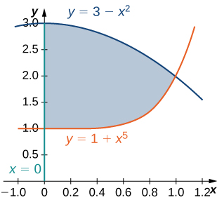 

The region <math xmlns="http://www.w3.org/1998/Math/MathML"><mi>D</mi></math>

 bounded by <math xmlns="http://www.w3.org/1998/Math/MathML"><mrow><mi>y</mi><mo>=</mo><mtext>cos</mtext><mspace width="0.2em" /><mi>x</mi><mo>,</mo><mi>y</mi><mo>=</mo><mn>4</mn><mspace width="0.2em" /><mtext>cos</mtext><mspace width="0.2em" /><mi>x</mi><mo>,</mo></mrow></math>

 and <math xmlns="http://www.w3.org/1998/Math/MathML"><mrow><mi>x</mi><mo>=</mo><mo>±</mo><mfrac><mi>π</mi><mn>3</mn></mfrac></mrow></math>

 is shown in the following figure. Find the area <math xmlns="http://www.w3.org/1998/Math/MathML"><mrow><mi>A</mi><mrow><mo>(</mo><mi>D</mi><mo>)</mo></mrow></mrow></math>

 of the region <math xmlns="http://www.w3.org/1998/Math/MathML"><mrow><mi>D</mi><mo>.</mo></mrow></math>

 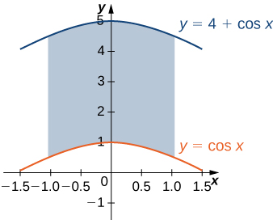 

<math xmlns="http://www.w3.org/1998/Math/MathML"><mrow><mfrac><mrow><mn>8</mn><mi>π</mi></mrow><mn>3</mn></mfrac></mrow></math>

Find the area <math xmlns="http://www.w3.org/1998/Math/MathML"><mrow><mi>A</mi><mo stretchy="false">(</mo><mi>D</mi><mo stretchy="false">)</mo></mrow></math>

 of the region <math xmlns="http://www.w3.org/1998/Math/MathML"><mrow><mi>D</mi><mo>=</mo><mrow><mo>{</mo><mrow><mo stretchy="false">(</mo><mi>x</mi><mo>,</mo><mi>y</mi><mo stretchy="false">)</mo><mo>\|</mo><mi>y</mi><mo>≥</mo><mn>1</mn><mo>−</mo><msup><mi>x</mi><mn>2</mn></msup><mo>,</mo><mi>y</mi><mo>≤</mo><mn>4</mn><mo>−</mo><msup><mi>x</mi><mn>2</mn></msup><mo>,</mo><mi>y</mi><mo>≥</mo><mn>0</mn><mo>,</mo><mi>x</mi><mo>≥</mo><mn>0</mn></mrow><mo>}</mo></mrow><mo>.</mo></mrow></math>

Let <math xmlns="http://www.w3.org/1998/Math/MathML"><mi>D</mi></math>

 be the region bounded by <math xmlns="http://www.w3.org/1998/Math/MathML"><mrow><mi>y</mi><mo>=</mo><mn>1</mn><mo>,</mo><mi>y</mi><mo>=</mo><mi>x</mi><mo>,</mo><mi>y</mi><mo>=</mo><mtext>ln</mtext><mspace width="0.2em" /><mi>x</mi><mo>,</mo></mrow></math>

 and the <math xmlns="http://www.w3.org/1998/Math/MathML"><mi>x</mi></math>

-axis. Find the area <math xmlns="http://www.w3.org/1998/Math/MathML"><mrow><mi>A</mi><mrow><mo>(</mo><mi>D</mi><mo>)</mo></mrow></mrow></math>

 of the region <math xmlns="http://www.w3.org/1998/Math/MathML"><mrow><mi>D</mi><mo>.</mo></mrow></math>

<math xmlns="http://www.w3.org/1998/Math/MathML"><mrow><mi>e</mi><mo>−</mo><mfrac><mn>3</mn><mn>2</mn></mfrac></mrow></math>

Find the average value of the function <math xmlns="http://www.w3.org/1998/Math/MathML"><mrow><mi>f</mi><mrow><mo>(</mo><mrow><mi>x</mi><mo>,</mo><mi>y</mi></mrow><mo>)</mo></mrow><mo>=</mo><mtext>sin</mtext><mspace width="0.2em" /><mi>y</mi></mrow></math>

 on the triangular region with vertices <math xmlns="http://www.w3.org/1998/Math/MathML"><mrow><mrow><mo>(</mo><mrow><mn>0</mn><mo>,</mo><mn>0</mn></mrow><mo>)</mo></mrow><mo>,</mo><mrow><mo>(</mo><mrow><mn>0</mn><mo>,</mo><mn>3</mn></mrow><mo>)</mo></mrow><mo>,</mo></mrow></math>

 and <math xmlns="http://www.w3.org/1998/Math/MathML"><mrow><mrow><mo>(</mo><mrow><mn>3</mn><mo>,</mo><mn>0</mn></mrow><mo>)</mo></mrow><mo>.</mo></mrow></math>

Find the average value of the function <math xmlns="http://www.w3.org/1998/Math/MathML"><mrow><mi>f</mi><mrow><mo>(</mo><mrow><mi>x</mi><mo>,</mo><mi>y</mi></mrow><mo>)</mo></mrow><mo>=</mo><mtext>−</mtext><mi>x</mi><mo>+</mo><mn>1</mn></mrow></math>

 on the triangular region with vertices <math xmlns="http://www.w3.org/1998/Math/MathML"><mrow><mrow><mo>(</mo><mrow><mn>0</mn><mo>,</mo><mn>0</mn></mrow><mo>)</mo></mrow><mo>,</mo><mrow><mo>(</mo><mrow><mn>0</mn><mo>,</mo><mn>2</mn></mrow><mo>)</mo></mrow><mo>,</mo></mrow></math>

 and <math xmlns="http://www.w3.org/1998/Math/MathML"><mrow><mrow><mo>(</mo><mrow><mn>2</mn><mo>,</mo><mn>2</mn></mrow><mo>)</mo></mrow><mo>.</mo></mrow></math>

<math xmlns="http://www.w3.org/1998/Math/MathML"><mrow><mfrac><mn>2</mn><mn>3</mn></mfrac></mrow></math>

In the following exercises, change the order of integration and evaluate the integral.

<math xmlns="http://www.w3.org/1998/Math/MathML"><mrow><mstyle displaystyle="true"><mrow><munderover><mo stretchy="false">∫</mo><mrow><mn>−1</mn></mrow><mrow><mrow><mi>π</mi><mtext>/</mtext><mn>2</mn></mrow></mrow></munderover><mspace width="0.2em" /><mrow><mstyle displaystyle="true"><mrow><munderover><mo stretchy="false">∫</mo><mn>0</mn><mrow><mi>x</mi><mo>+</mo><mn>1</mn></mrow></munderover><mrow><mtext>sin</mtext><mspace width="0.2em" /><mi>x</mi><mspace width="0.2em" /><mi>d</mi><mi>y</mi><mspace width="0.2em" /><mi>d</mi><mi>x</mi></mrow></mrow></mstyle></mrow></mrow></mstyle></mrow></math>

<math xmlns="http://www.w3.org/1998/Math/MathML"><mrow><mstyle displaystyle="true"><mrow><munderover><mo stretchy="false">∫</mo><mn>0</mn><mn>1</mn></munderover><mspace width="0.2em" /><mrow><mstyle displaystyle="true"><mrow><munderover><mo stretchy="false">∫</mo><mrow><mi>x</mi><mo>−</mo><mn>1</mn></mrow><mrow><mn>1</mn><mo>−</mo><mi>x</mi></mrow></munderover><mrow><mi>x</mi><mspace width="0.2em" /><mi>d</mi><mi>y</mi><mspace width="0.2em" /><mi>d</mi><mi>x</mi></mrow></mrow></mstyle></mrow></mrow></mstyle></mrow></math>

<math xmlns="http://www.w3.org/1998/Math/MathML"><mrow><mstyle displaystyle="true"><mrow><munderover><mo stretchy="false">∫</mo><mn>0</mn><mn>1</mn></munderover><mspace width="0.2em" /><mrow><mstyle displaystyle="true"><mrow><munderover><mo stretchy="false">∫</mo><mrow><mi>x</mi><mo>−</mo><mn>1</mn></mrow><mrow><mn>1</mn><mo>−</mo><mi>x</mi></mrow></munderover><mrow><mi>x</mi><mspace width="0.2em" /><mi>d</mi><mi>y</mi><mspace width="0.2em" /><mi>d</mi><mi>x</mi></mrow></mrow></mstyle></mrow></mrow></mstyle><mo>=</mo><mstyle displaystyle="true"><mrow><munderover><mo stretchy="false">∫</mo><mrow><mn>−1</mn></mrow><mn>0</mn></munderover><mspace width="0.2em" /><mrow><mstyle displaystyle="true"><mrow><munderover><mo stretchy="false">∫</mo><mn>0</mn><mrow><mi>y</mi><mo>+</mo><mn>1</mn></mrow></munderover><mrow><mi>x</mi><mspace width="0.2em" /><mi>d</mi><mi>x</mi><mspace width="0.2em" /><mi>d</mi><mi>y</mi></mrow></mrow></mstyle></mrow></mrow></mstyle><mo>+</mo><mstyle displaystyle="true"><mrow><munderover><mo stretchy="false">∫</mo><mn>0</mn><mn>1</mn></munderover><mspace width="0.2em" /><mrow><mstyle displaystyle="true"><mrow><munderover><mo stretchy="false">∫</mo><mn>0</mn><mrow><mn>1</mn><mo>−</mo><mi>y</mi></mrow></munderover><mrow><mi>x</mi><mspace width="0.2em" /><mi>d</mi><mi>x</mi><mi>d</mi></mrow></mrow></mstyle></mrow></mrow></mstyle><mi>y</mi><mo>=</mo><mfrac><mn>1</mn><mn>3</mn></mfrac></mrow></math>

<math xmlns="http://www.w3.org/1998/Math/MathML"><mrow><mstyle displaystyle="true"><mrow><munderover><mo stretchy="false">∫</mo><mrow><mn>−1</mn></mrow><mn>0</mn></munderover><mspace width="0.2em" /><mrow><mstyle displaystyle="true"><mrow><munderover><mo stretchy="false">∫</mo><mrow><mtext>−</mtext><msqrt><mrow><mi>y</mi><mo>+</mo><mn>1</mn></mrow></msqrt></mrow><mrow><msqrt><mrow><mi>y</mi><mo>+</mo><mn>1</mn></mrow></msqrt></mrow></munderover><mrow><msup><mi>y</mi><mn>2</mn></msup><mi>d</mi><mi>x</mi><mspace width="0.2em" /><mi>d</mi><mi>y</mi></mrow></mrow></mstyle></mrow></mrow></mstyle></mrow></math>

<math xmlns="http://www.w3.org/1998/Math/MathML"><mrow><mstyle displaystyle="true"><mrow><munderover><mo stretchy="false">∫</mo><mrow><mtext>−</mtext><mrow><mn>1</mn><mtext>/</mtext><mn>2</mn></mrow></mrow><mrow><mrow><mn>1</mn><mtext>/</mtext><mn>2</mn></mrow></mrow></munderover><mspace width="0.2em" /><mrow><mstyle displaystyle="true"><mrow><munderover><mo stretchy="false">∫</mo><mrow><mtext>−</mtext><msqrt><mrow><msup><mi>y</mi><mn>2</mn></msup><mo>+</mo><mn>1</mn></mrow></msqrt></mrow><mrow><msqrt><mrow><msup><mi>y</mi><mn>2</mn></msup><mo>+</mo><mn>1</mn></mrow></msqrt></mrow></munderover><mrow><mi>y</mi><mspace width="0.2em" /><mi>d</mi><mi>x</mi><mspace width="0.2em" /><mi>d</mi><mi>y</mi></mrow></mrow></mstyle></mrow></mrow></mstyle></mrow></math>

<math xmlns="http://www.w3.org/1998/Math/MathML"><mrow><mstyle displaystyle="true"><mrow><munderover><mo stretchy="false">∫</mo><mrow><mtext>−</mtext><mrow><mn>1</mn><mtext>/</mtext><mn>2</mn></mrow></mrow><mrow><mrow><mn>1</mn><mtext>/</mtext><mn>2</mn></mrow></mrow></munderover><mspace width="0.2em" /><mrow><mstyle displaystyle="true"><mrow><munderover><mo stretchy="false">∫</mo><mrow><mtext>−</mtext><msqrt><mrow><msup><mi>y</mi><mn>2</mn></msup><mo>+</mo><mn>1</mn></mrow></msqrt></mrow><mrow><msqrt><mrow><msup><mi>y</mi><mn>2</mn></msup><mo>+</mo><mn>1</mn></mrow></msqrt></mrow></munderover><mrow><mi>y</mi><mspace width="0.2em" /><mi>d</mi><mi>x</mi><mspace width="0.2em" /><mi>d</mi><mi>y</mi></mrow></mrow></mstyle></mrow></mrow></mstyle><mo>=</mo><mstyle displaystyle="true"><mrow><munderover><mo stretchy="false">∫</mo><mn>1</mn><mn>2</mn></munderover><mspace width="0.2em" /><mrow><mstyle displaystyle="true"><mrow><munderover><mo stretchy="false">∫</mo><mrow><mtext>−</mtext><msqrt><mrow><msup><mi>x</mi><mn>2</mn></msup><mo>−</mo><mn>1</mn></mrow></msqrt></mrow><mrow><msqrt><mrow><msup><mi>x</mi><mn>2</mn></msup><mo>−</mo><mn>1</mn></mrow></msqrt></mrow></munderover><mrow><mi>y</mi><mspace width="0.2em" /><mi>d</mi><mi>y</mi><mspace width="0.2em" /><mi>d</mi><mi>x</mi></mrow></mrow></mstyle></mrow></mrow></mstyle><mo>=</mo><mn>0</mn></mrow></math>

The region <math xmlns="http://www.w3.org/1998/Math/MathML"><mi>D</mi></math>

 is shown in the following figure. Evaluate the double integral <math xmlns="http://www.w3.org/1998/Math/MathML"><mrow><mstyle displaystyle="true"><mrow><munder><mo>∬</mo><mi>D</mi></munder><mrow><mrow><mo>(</mo><mrow><msup><mi>x</mi><mn>2</mn></msup><mo>+</mo><mi>y</mi></mrow><mo>)</mo></mrow><mi>d</mi><mi>A</mi></mrow></mrow></mstyle></mrow></math>

 by using the easier order of integration.

 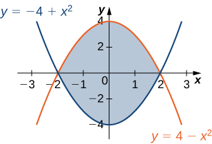 

The region <math xmlns="http://www.w3.org/1998/Math/MathML"><mi>D</mi></math>

 is given in the following figure. Evaluate the double integral <math xmlns="http://www.w3.org/1998/Math/MathML"><mrow><mstyle displaystyle="true"><mrow><munder><mo>∬</mo><mi>D</mi></munder><mrow><mrow><mo>(</mo><mrow><msup><mi>x</mi><mn>2</mn></msup><mo>−</mo><msup><mi>y</mi><mn>2</mn></msup></mrow><mo>)</mo></mrow><mi>d</mi><mi>A</mi></mrow></mrow></mstyle></mrow></math>

 by using the easier order of integration.

 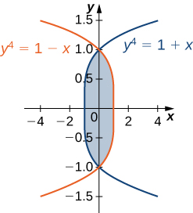 

<math xmlns="http://www.w3.org/1998/Math/MathML"><mrow><mstyle displaystyle="true"><mrow><munder><mo>∬</mo><mi>D</mi></munder><mrow><mrow><mo>(</mo><mrow><msup><mi>x</mi><mn>2</mn></msup><mo>−</mo><msup><mi>y</mi><mn>2</mn></msup></mrow><mo>)</mo></mrow><mi>d</mi><mi>A</mi></mrow></mrow></mstyle><mo>=</mo><mstyle displaystyle="true"><mrow><munderover><mo stretchy="false">∫</mo><mrow><mn>−1</mn></mrow><mn>1</mn></munderover><mspace width="0.2em" /><mrow><mstyle displaystyle="true"><mrow><munderover><mo stretchy="false">∫</mo><mrow><msup><mi>y</mi><mn>4</mn></msup><mo>−</mo><mn>1</mn></mrow><mrow><mn>1</mn><mo>−</mo><msup><mi>y</mi><mn>4</mn></msup></mrow></munderover><mrow><mrow><mo>(</mo><mrow><msup><mi>x</mi><mn>2</mn></msup><mo>−</mo><msup><mi>y</mi><mn>2</mn></msup></mrow><mo>)</mo></mrow><mi>d</mi><mi>x</mi><mspace width="0.2em" /><mi>d</mi><mi>y</mi></mrow></mrow></mstyle></mrow></mrow></mstyle><mo>=</mo><mfrac><mrow><mn>464</mn></mrow><mrow><mn>4095</mn></mrow></mfrac></mrow></math>

Find the volume of the solid under the surface <math xmlns="http://www.w3.org/1998/Math/MathML"><mrow><mi>z</mi><mo>=</mo><mn>2</mn><mi>x</mi><mo>+</mo><msup><mi>y</mi><mn>2</mn></msup></mrow></math>

 and above the region bounded by <math xmlns="http://www.w3.org/1998/Math/MathML"><mrow><mi>y</mi><mo>=</mo><msup><mi>x</mi><mn>5</mn></msup></mrow></math>

 and <math xmlns="http://www.w3.org/1998/Math/MathML"><mrow><mi>y</mi><mo>=</mo><mi>x</mi><mo>.</mo></mrow></math>

Find the volume of the solid under the plane <math xmlns="http://www.w3.org/1998/Math/MathML"><mrow><mi>z</mi><mo>=</mo><mn>3</mn><mi>x</mi><mo>+</mo><mi>y</mi></mrow></math>

 and above the region determined by <math xmlns="http://www.w3.org/1998/Math/MathML"><mrow><mi>y</mi><mo>=</mo><msup><mi>x</mi><mn>7</mn></msup></mrow></math>

 and <math xmlns="http://www.w3.org/1998/Math/MathML"><mrow><mi>y</mi><mo>=</mo><mi>x</mi><mo>.</mo></mrow></math>

<math xmlns="http://www.w3.org/1998/Math/MathML"><mrow><mfrac><mn>4</mn><mn>5</mn></mfrac></mrow></math>

Find the volume of the solid under the plane <math xmlns="http://www.w3.org/1998/Math/MathML"><mrow><mi>z</mi><mo>=</mo><mi>x</mi><mo>−</mo><mi>y</mi></mrow></math>

 and above the region bounded by <math xmlns="http://www.w3.org/1998/Math/MathML"><mrow><mi>x</mi><mo>=</mo><mtext>tan</mtext><mspace width="0.2em" /><mi>y</mi><mo>,</mo><mi>x</mi><mo>=</mo><mtext>−</mtext><mtext>tan</mtext><mspace width="0.2em" /><mi>y</mi><mo>,</mo></mrow></math>

 and <math xmlns="http://www.w3.org/1998/Math/MathML"><mrow><mi>x</mi><mo>=</mo><mn>1</mn><mo>.</mo></mrow></math>

Find the volume of the solid under the surface <math xmlns="http://www.w3.org/1998/Math/MathML"><mrow><mi>z</mi><mo>=</mo><msup><mi>x</mi><mn>3</mn></msup></mrow></math>

 and above the plane region bounded by <math xmlns="http://www.w3.org/1998/Math/MathML"><mrow><mi>x</mi><mo>=</mo><mtext>sin</mtext><mspace width="0.2em" /><mi>y</mi><mo>,</mo><mi>x</mi><mo>=</mo><mtext>−</mtext><mtext>sin</mtext><mspace width="0.2em" /><mi>y</mi><mo>,</mo></mrow></math>

 and <math xmlns="http://www.w3.org/1998/Math/MathML"><mrow><mi>x</mi><mo>=</mo><mn>1</mn><mo>.</mo></mrow></math>

<math xmlns="http://www.w3.org/1998/Math/MathML"><mrow><mfrac><mrow><mn>5</mn><mi>π</mi></mrow><mrow><mn>32</mn></mrow></mfrac></mrow></math>

Let <math xmlns="http://www.w3.org/1998/Math/MathML"><mi>g</mi></math>

 be a positive, increasing, and differentiable function on the interval <math xmlns="http://www.w3.org/1998/Math/MathML"><mrow><mrow><mo>[</mo><mrow><mi>a</mi><mo>,</mo><mi>b</mi></mrow><mo>]</mo></mrow><mo>.</mo></mrow></math>

 Show that the volume of the solid under the surface <math xmlns="http://www.w3.org/1998/Math/MathML"><mrow><mi>z</mi><mo>=</mo><mi>g</mi><mo>′</mo><mrow><mo>(</mo><mi>x</mi><mo>)</mo></mrow></mrow></math>

 and above the region bounded by <math xmlns="http://www.w3.org/1998/Math/MathML"><mrow><mi>y</mi><mo>=</mo><mn>0</mn><mo>,</mo></mrow></math>

 <math xmlns="http://www.w3.org/1998/Math/MathML"><mrow><mi>y</mi><mo>=</mo><mi>g</mi><mrow><mo>(</mo><mi>x</mi><mo>)</mo></mrow><mo>,</mo></mrow></math>

 <math xmlns="http://www.w3.org/1998/Math/MathML"><mrow><mi>x</mi><mo>=</mo><mi>a</mi><mo>,</mo></mrow></math>

 and <math xmlns="http://www.w3.org/1998/Math/MathML"><mrow><mi>x</mi><mo>=</mo><mi>b</mi></mrow></math>

 is given by <math xmlns="http://www.w3.org/1998/Math/MathML"><mrow><mfrac><mn>1</mn><mn>2</mn></mfrac><mrow><mo>(</mo><mrow><msup><mi>g</mi><mn>2</mn></msup><mrow><mo>(</mo><mi>b</mi><mo>)</mo></mrow><mo>−</mo><msup><mi>g</mi><mn>2</mn></msup><mrow><mo>(</mo><mi>a</mi><mo>)</mo></mrow></mrow><mo>)</mo></mrow><mo>.</mo></mrow></math>

Let <math xmlns="http://www.w3.org/1998/Math/MathML"><mi>g</mi></math>

 be a positive, increasing, and differentiable function on the interval <math xmlns="http://www.w3.org/1998/Math/MathML"><mrow><mrow><mo>[</mo><mrow><mi>a</mi><mo>,</mo><mi>b</mi></mrow><mo>]</mo></mrow><mo>,</mo></mrow></math>

 and let <math xmlns="http://www.w3.org/1998/Math/MathML"><mi>k</mi></math>

 be a positive real number. Show that the volume of the solid under the surface <math xmlns="http://www.w3.org/1998/Math/MathML"><mrow><mi>z</mi><mo>=</mo><mi>g</mi><mo>′</mo><mrow><mo>(</mo><mi>x</mi><mo>)</mo></mrow></mrow></math>

 and above the region bounded by <math xmlns="http://www.w3.org/1998/Math/MathML"><mrow><mi>y</mi><mo>=</mo><mi>g</mi><mrow><mo>(</mo><mi>x</mi><mo>)</mo></mrow><mo>,</mo><mi>y</mi><mo>=</mo><mi>g</mi><mrow><mo>(</mo><mi>x</mi><mo>)</mo></mrow><mo>+</mo><mi>k</mi><mo>,</mo><mi>x</mi><mo>=</mo><mi>a</mi><mo>,</mo></mrow></math>

 and <math xmlns="http://www.w3.org/1998/Math/MathML"><mrow><mi>x</mi><mo>=</mo><mi>b</mi></mrow></math>

 is given by <math xmlns="http://www.w3.org/1998/Math/MathML"><mrow><mi>k</mi><mrow><mo>(</mo><mrow><mi>g</mi><mrow><mo>(</mo><mi>b</mi><mo>)</mo></mrow><mo>−</mo><mi>g</mi><mrow><mo>(</mo><mi>a</mi><mo>)</mo></mrow></mrow><mo>)</mo></mrow><mo>.</mo></mrow></math>

Find the volume of the solid situated in the first octant and determined by the planes <math xmlns="http://www.w3.org/1998/Math/MathML"><mrow><mi>z</mi><mo>=</mo><mn>2</mn><mo>,</mo></mrow></math>

 <math xmlns="http://www.w3.org/1998/Math/MathML"><mrow><mi>z</mi><mo>=</mo><mn>0</mn><mo>,</mo><mi>x</mi><mo>+</mo><mi>y</mi><mo>=</mo><mn>1</mn><mo>,</mo><mi>x</mi><mo>=</mo><mn>0</mn><mo>,</mo><mspace width="0.2em" /><mtext>and</mtext><mspace width="0.2em" /><mi>y</mi><mo>=</mo><mn>0</mn><mo>.</mo></mrow></math>

Find the volume of the solid situated in the first octant and bounded by the planes <math xmlns="http://www.w3.org/1998/Math/MathML"><mrow><mi>x</mi><mo>+</mo><mn>2</mn><mi>y</mi><mo>=</mo><mn>1</mn><mo>,</mo></mrow></math>

 <math xmlns="http://www.w3.org/1998/Math/MathML"><mrow><mi>x</mi><mo>=</mo><mn>0</mn><mo>,</mo><mi>y</mi><mo>=</mo><mn>0</mn><mo>,</mo><mi>z</mi><mo>=</mo><mn>4</mn><mo>,</mo><mspace width="0.2em" /><mtext>and</mtext><mspace width="0.2em" /><mi>z</mi><mo>=</mo><mn>0</mn><mo>.</mo></mrow></math>

<math xmlns="http://www.w3.org/1998/Math/MathML"><mn>1</mn></math>

Find the volume of the solid bounded by the planes <math xmlns="http://www.w3.org/1998/Math/MathML"><mrow><mi>x</mi><mo>+</mo><mi>y</mi><mo>=</mo><mn>1</mn><mo>,</mo><mi>x</mi><mo>−</mo><mi>y</mi><mo>=</mo><mn>1</mn><mo>,</mo><mi>x</mi><mo>=</mo><mn>0</mn><mo>,</mo><mi>z</mi><mo>=</mo><mn>0</mn><mo>,</mo></mrow></math>

 and <math xmlns="http://www.w3.org/1998/Math/MathML"><mrow><mi>z</mi><mo>=</mo><mn>10</mn><mo>.</mo></mrow></math>

Find the volume of the solid bounded by the planes <math xmlns="http://www.w3.org/1998/Math/MathML"><mrow><mi>x</mi><mo>+</mo><mi>y</mi><mo>=</mo><mn>1</mn><mo>,</mo><mi>x</mi><mo>−</mo><mi>y</mi><mo>=</mo><mn>1</mn><mo>,</mo><mi>x</mi><mo>+</mo><mi>y</mi><mo>=</mo><mn>−1</mn><mo>,</mo></mrow></math>

 <math xmlns="http://www.w3.org/1998/Math/MathML"><mrow><mi>x</mi><mo>−</mo><mi>y</mi><mo>=</mo><mn>−1</mn><mo>,</mo><mi>z</mi><mo>=</mo><mn>1</mn><mspace width="0.2em" /><mtext>and</mtext><mspace width="0.2em" /><mi>z</mi><mo>=</mo><mn>0</mn><mo>.</mo></mrow></math>

<math xmlns="http://www.w3.org/1998/Math/MathML"><mn>2</mn></math>

Let <math xmlns="http://www.w3.org/1998/Math/MathML"><mrow><msub><mi>S</mi><mn>1</mn></msub></mrow></math>

 and <math xmlns="http://www.w3.org/1998/Math/MathML"><mrow><msub><mi>S</mi><mn>2</mn></msub></mrow></math>

 be the solids situated in the first octant under the planes <math xmlns="http://www.w3.org/1998/Math/MathML"><mrow><mi>x</mi><mo>+</mo><mi>y</mi><mo>+</mo><mi>z</mi><mo>=</mo><mn>1</mn></mrow></math>

 and <math xmlns="http://www.w3.org/1998/Math/MathML"><mrow><mi>x</mi><mo>+</mo><mi>y</mi><mo>+</mo><mn>2</mn><mi>z</mi><mo>=</mo><mn>1</mn><mo>,</mo></mrow></math>

 respectively, and let <math xmlns="http://www.w3.org/1998/Math/MathML"><mi>S</mi></math>

 be the solid situated between <math xmlns="http://www.w3.org/1998/Math/MathML"><mrow><msub><mi>S</mi><mn>1</mn></msub><mo>,</mo><msub><mi>S</mi><mn>2</mn></msub><mo>,</mo><mi>x</mi><mo>=</mo><mn>0</mn><mo>,</mo><mspace width="0.2em" /><mtext>and</mtext><mspace width="0.2em" /><mi>y</mi><mo>=</mo><mn>0</mn><mo>.</mo></mrow></math>

1.  Find the volume of the solid
    <math xmlns="http://www.w3.org/1998/Math/MathML"><mrow><msub><mi>S</mi><mn>1</mn></msub><mo>.</mo></mrow></math>

2.  Find the volume of the solid
    <math xmlns="http://www.w3.org/1998/Math/MathML"><mrow><msub><mi>S</mi><mn>2</mn></msub><mo>.</mo></mrow></math>

3.  Find the volume of the solid
    <math xmlns="http://www.w3.org/1998/Math/MathML"><mi>S</mi></math>
    
    by subtracting the volumes of the solids
    <math xmlns="http://www.w3.org/1998/Math/MathML"><mrow><msub><mi>S</mi><mn>1</mn></msub><mspace width="0.2em" /><mtext>and</mtext><mspace width="0.2em" /><msub><mi>S</mi><mn>2</mn></msub><mo>.</mo></mrow></math>
{: data-number-style="lower-alpha"}

Let <math xmlns="http://www.w3.org/1998/Math/MathML"><mrow><msub><mi>S</mi><mn>1</mn></msub><mspace width="0.2em" /><mtext>and</mtext><mspace width="0.2em" /><msub><mi>S</mi><mn>2</mn></msub></mrow></math>

 be the solids situated in the first octant under the planes <math xmlns="http://www.w3.org/1998/Math/MathML"><mrow><mn>2</mn><mi>x</mi><mo>+</mo><mn>2</mn><mi>y</mi><mo>+</mo><mi>z</mi><mo>=</mo><mn>2</mn></mrow></math>

 and <math xmlns="http://www.w3.org/1998/Math/MathML"><mrow><mi>x</mi><mo>+</mo><mi>y</mi><mo>+</mo><mi>z</mi><mo>=</mo><mn>1</mn><mo>,</mo></mrow></math>

 respectively, and let <math xmlns="http://www.w3.org/1998/Math/MathML"><mi>S</mi></math>

 be the solid situated between <math xmlns="http://www.w3.org/1998/Math/MathML"><mrow><msub><mi>S</mi><mn>1</mn></msub><mo>,</mo><msub><mi>S</mi><mn>2</mn></msub><mo>,</mo><mi>x</mi><mo>=</mo><mn>0</mn><mo>,</mo><mspace width="0.2em" /><mtext>and</mtext><mspace width="0.2em" /><mi>y</mi><mo>=</mo><mn>0</mn><mo>.</mo></mrow></math>

1.  Find the volume of the solid
    <math xmlns="http://www.w3.org/1998/Math/MathML"><mrow><msub><mi>S</mi><mn>1</mn></msub><mo>.</mo></mrow></math>

2.  Find the volume of the solid
    <math xmlns="http://www.w3.org/1998/Math/MathML"><mrow><msub><mi>S</mi><mn>2</mn></msub><mo>.</mo></mrow></math>

3.  Find the volume of the solid
    <math xmlns="http://www.w3.org/1998/Math/MathML"><mi>S</mi></math>
    
    by subtracting the volumes of the solids
    <math xmlns="http://www.w3.org/1998/Math/MathML"><mrow><msub><mi>S</mi><mn>1</mn></msub><mspace width="0.2em" /><mtext>and</mtext><mspace width="0.2em" /><msub><mi>S</mi><mn>2</mn></msub><mo>.</mo></mrow></math>
{: data-number-style="lower-alpha"}

a. <math xmlns="http://www.w3.org/1998/Math/MathML"><mrow><mfrac><mn>1</mn><mn>3</mn></mfrac><mo>;</mo></mrow></math>

 b. <math xmlns="http://www.w3.org/1998/Math/MathML"><mrow><mfrac><mn>1</mn><mn>6</mn></mfrac><mo>;</mo></mrow></math>

 c. <math xmlns="http://www.w3.org/1998/Math/MathML"><mrow><mfrac><mn>1</mn><mn>6</mn></mfrac></mrow></math>

Let <math xmlns="http://www.w3.org/1998/Math/MathML"><mrow><msub><mi>S</mi><mn>1</mn></msub><mspace width="0.2em" /><mtext>and</mtext><mspace width="0.2em" /><msub><mi>S</mi><mn>2</mn></msub></mrow></math>

 be the solids situated in the first octant under the plane <math xmlns="http://www.w3.org/1998/Math/MathML"><mrow><mi>x</mi><mo>+</mo><mi>y</mi><mo>+</mo><mi>z</mi><mo>=</mo><mn>2</mn></mrow></math>

 and under the sphere <math xmlns="http://www.w3.org/1998/Math/MathML"><mrow><msup><mi>x</mi><mn>2</mn></msup><mo>+</mo><msup><mi>y</mi><mn>2</mn></msup><mo>+</mo><msup><mi>z</mi><mn>2</mn></msup><mo>=</mo><mn>4</mn><mo>,</mo></mrow></math>

 respectively. If the volume of the solid <math xmlns="http://www.w3.org/1998/Math/MathML"><mrow><msub><mi>S</mi><mn>2</mn></msub></mrow></math>

 is <math xmlns="http://www.w3.org/1998/Math/MathML"><mrow><mfrac><mrow><mn>4</mn><mi>π</mi></mrow><mn>3</mn></mfrac><mo>,</mo></mrow></math>

 determine the volume of the solid <math xmlns="http://www.w3.org/1998/Math/MathML"><mi>S</mi></math>

 situated between <math xmlns="http://www.w3.org/1998/Math/MathML"><mrow><msub><mi>S</mi><mn>1</mn></msub></mrow></math>

 and <math xmlns="http://www.w3.org/1998/Math/MathML"><mrow><msub><mi>S</mi><mn>2</mn></msub></mrow></math>

 by subtracting the volumes of these solids.

Let <math xmlns="http://www.w3.org/1998/Math/MathML"><mrow><msub><mi>S</mi><mn>1</mn></msub></mrow></math>

 and <math xmlns="http://www.w3.org/1998/Math/MathML"><mrow><msub><mi>S</mi><mn>2</mn></msub></mrow></math>

 be the solids situated in the first octant under the plane <math xmlns="http://www.w3.org/1998/Math/MathML"><mrow><mi>x</mi><mo>+</mo><mi>y</mi><mo>+</mo><mi>z</mi><mo>=</mo><mn>2</mn></mrow></math>

 and bounded by the cylinder <math xmlns="http://www.w3.org/1998/Math/MathML"><mrow><msup><mi>x</mi><mn>2</mn></msup><mo>+</mo><msup><mi>y</mi><mn>2</mn></msup><mo>=</mo><mn>4</mn><mo>,</mo></mrow></math>

 respectively.

1.  Find the volume of the solid
    <math xmlns="http://www.w3.org/1998/Math/MathML"><mrow><msub><mi>S</mi><mn>1</mn></msub><mo>.</mo></mrow></math>

2.  Find the volume of the solid
    <math xmlns="http://www.w3.org/1998/Math/MathML"><mrow><msub><mi>S</mi><mn>2</mn></msub><mo>.</mo></mrow></math>

3.  Find the volume of the solid
    <math xmlns="http://www.w3.org/1998/Math/MathML"><mi>S</mi></math>
    
    situated between
    <math xmlns="http://www.w3.org/1998/Math/MathML"><mrow><msub><mi>S</mi><mn>1</mn></msub></mrow></math>
    
    and
    <math xmlns="http://www.w3.org/1998/Math/MathML"><mrow><msub><mi>S</mi><mn>2</mn></msub></mrow></math>
    
    by subtracting the volumes of the solids
    <math xmlns="http://www.w3.org/1998/Math/MathML"><mrow><msub><mi>S</mi><mn>1</mn></msub></mrow></math>
    
    and
    <math xmlns="http://www.w3.org/1998/Math/MathML"><mrow><msub><mi>S</mi><mn>2</mn></msub><mo>.</mo></mrow></math>
{: data-number-style="lower-alpha"}

a. <math xmlns="http://www.w3.org/1998/Math/MathML"><mrow><mfrac><mn>4</mn><mn>3</mn></mfrac><mo>;</mo></mrow></math>

 b. <math xmlns="http://www.w3.org/1998/Math/MathML"><mrow><mn>2</mn><mi>π</mi><mo>;</mo></mrow></math>

 c. <math xmlns="http://www.w3.org/1998/Math/MathML"><mrow><mfrac><mrow><mn>6</mn><mi>π</mi><mo>−</mo><mn>4</mn></mrow><mn>3</mn></mfrac></mrow></math>

**[T]** The following figure shows the region <math xmlns="http://www.w3.org/1998/Math/MathML"><mi>D</mi></math>

 bounded by the curves <math xmlns="http://www.w3.org/1998/Math/MathML"><mrow><mi>y</mi><mo>=</mo><mtext>sin</mtext><mspace width="0.2em" /><mi>x</mi><mo>,</mo></mrow></math>

 <math xmlns="http://www.w3.org/1998/Math/MathML"><mrow><mi>x</mi><mo>=</mo><mn>0</mn><mo>,</mo></mrow></math>

 and <math xmlns="http://www.w3.org/1998/Math/MathML"><mrow><mi>y</mi><mo>=</mo><msup><mi>x</mi><mn>4</mn></msup><mo>.</mo></mrow></math>

 Use a graphing calculator or CAS to find the <math xmlns="http://www.w3.org/1998/Math/MathML"><mi>x</mi></math>

-coordinates of the intersection points of the curves and to determine the area of the region <math xmlns="http://www.w3.org/1998/Math/MathML"><mrow><mi>D</mi><mo>.</mo></mrow></math>

 Round your answers to six decimal places.

  

**[T]** The region <math xmlns="http://www.w3.org/1998/Math/MathML"><mi>D</mi></math>

 bounded by the curves <math xmlns="http://www.w3.org/1998/Math/MathML"><mrow><mi>y</mi><mo>=</mo><mtext>cos</mtext><mspace width="0.2em" /><mi>x</mi><mo>,</mo><mi>x</mi><mo>=</mo><mn>0</mn><mo>,</mo><mspace width="0.2em" /><mtext>and</mtext><mspace width="0.2em" /><mi>y</mi><mo>=</mo><msup><mi>x</mi><mn>3</mn></msup></mrow></math>

 is shown in the following figure. Use a graphing calculator or CAS to find the *x*-coordinates of the intersection points of the curves and to determine the area of the region <math xmlns="http://www.w3.org/1998/Math/MathML"><mrow><mi>D</mi><mo>.</mo></mrow></math>

 Round your answers to six decimal places.

 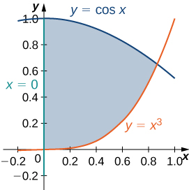 

<math xmlns="http://www.w3.org/1998/Math/MathML"><mrow><mn>0</mn><mspace width="0.2em" /><mtext>and</mtext><mspace width="0.2em" /><mn>0.865474</mn><mo>;</mo></mrow></math>

 <math xmlns="http://www.w3.org/1998/Math/MathML"><mrow><mi>A</mi><mrow><mo>(</mo><mi>D</mi><mo>)</mo></mrow><mo>=</mo><mn>0.621135</mn></mrow></math>

Suppose that <math xmlns="http://www.w3.org/1998/Math/MathML"><mrow><mrow><mo>(</mo><mrow><mi>X</mi><mo>,</mo><mi>Y</mi></mrow><mo>)</mo></mrow></mrow></math>

 is the outcome of an experiment that must occur in a particular region <math xmlns="http://www.w3.org/1998/Math/MathML"><mi>S</mi></math>

 in the <math xmlns="http://www.w3.org/1998/Math/MathML"><mrow><mi>x</mi><mi>y</mi></mrow></math>

-plane. In this context, the region <math xmlns="http://www.w3.org/1998/Math/MathML"><mi>S</mi></math>

 is called the sample space of the experiment and <math xmlns="http://www.w3.org/1998/Math/MathML"><mrow><mi>X</mi><mspace width="0.2em" /><mtext>and</mtext><mspace width="0.2em" /><mi>Y</mi></mrow></math>

 are random variables. If <math xmlns="http://www.w3.org/1998/Math/MathML"><mi>D</mi></math>

 is a region included in <math xmlns="http://www.w3.org/1998/Math/MathML"><mrow><mi>S</mi><mo>,</mo></mrow></math>

 then the probability of <math xmlns="http://www.w3.org/1998/Math/MathML"><mrow><mrow><mo>(</mo><mrow><mi>X</mi><mo>,</mo><mi>Y</mi></mrow><mo>)</mo></mrow></mrow></math>

 being in <math xmlns="http://www.w3.org/1998/Math/MathML"><mi>D</mi></math>

 is defined as <math xmlns="http://www.w3.org/1998/Math/MathML"><mrow><mi>P</mi><mo stretchy="false">[</mo><mrow><mo>(</mo><mrow><mi>X</mi><mo>,</mo><mi>Y</mi></mrow><mo>)</mo></mrow><mo>∈</mo><mi>D</mi><mo stretchy="false">]</mo><mo>=</mo><mstyle displaystyle="true"><mrow><munder><mo>∬</mo><mi>D</mi></munder><mrow><mi>p</mi><mo stretchy="false">(</mo><mi>x</mi><mo>,</mo><mi>y</mi><mo stretchy="false">)</mo><mi>d</mi><mi>x</mi><mspace width="0.2em" /><mi>d</mi><mi>y</mi></mrow></mrow></mstyle><mo>,</mo></mrow></math>

 where <math xmlns="http://www.w3.org/1998/Math/MathML"><mrow><mi>p</mi><mo stretchy="false">(</mo><mi>x</mi><mo>,</mo><mi>y</mi><mo stretchy="false">)</mo></mrow></math>

 is the joint probability density of the experiment. Here, <math xmlns="http://www.w3.org/1998/Math/MathML"><mrow><mi>p</mi><mo stretchy="false">(</mo><mi>x</mi><mo>,</mo><mi>y</mi><mo stretchy="false">)</mo></mrow></math>

 is a nonnegative function for which <math xmlns="http://www.w3.org/1998/Math/MathML"><mrow><mstyle displaystyle="true"><mrow><munder><mo>∬</mo><mi>S</mi></munder><mrow><mi>p</mi><mo stretchy="false">(</mo><mi>x</mi><mo>,</mo><mi>y</mi><mo stretchy="false">)</mo><mi>d</mi><mi>x</mi><mspace width="0.2em" /><mi>d</mi><mi>y</mi><mo>=</mo><mn>1</mn></mrow></mrow></mstyle><mo>.</mo></mrow></math>

 Assume that a point <math xmlns="http://www.w3.org/1998/Math/MathML"><mrow><mrow><mo>(</mo><mrow><mi>X</mi><mo>,</mo><mi>Y</mi></mrow><mo>)</mo></mrow></mrow></math>

 is chosen arbitrarily in the square <math xmlns="http://www.w3.org/1998/Math/MathML"><mrow><mo stretchy="false">[</mo><mn>0</mn><mo>,</mo><mn>3</mn><mo stretchy="false">]</mo><mspace width="0.2em" /><mo>×</mo><mspace width="0.2em" /><mo stretchy="false">[</mo><mn>0</mn><mo>,</mo><mn>3</mn><mo stretchy="false">]</mo></mrow></math>

 with the probability density

<math xmlns="http://www.w3.org/1998/Math/MathML"><mrow><mi>p</mi><mo stretchy="false">(</mo><mi>x</mi><mo>,</mo><mi>y</mi><mo stretchy="false">)</mo><mo>=</mo><mrow><mo>{</mo><mtable><mtr><mtd columnalign="left"><mfrac><mn>1</mn><mn>9</mn></mfrac></mtd><mtd columnalign="left"><mo stretchy="false">(</mo><mi>x</mi><mo>,</mo><mi>y</mi><mo stretchy="false">)</mo><mo>∈</mo><mo stretchy="false">[</mo><mn>0</mn><mo>,</mo><mn>3</mn><mo stretchy="false">]</mo><mspace width="0.2em" /><mo>×</mo><mspace width="0.2em" /><mo stretchy="false">[</mo><mn>0</mn><mo>,</mo><mn>3</mn><mo stretchy="false">]</mo><mo>,</mo></mtd></mtr><mtr><mtd columnalign="left"><mn>0</mn></mtd><mtd columnalign="left"><mtext>otherwise</mtext><mtext>.</mtext></mtd></mtr></mtable></mrow></mrow></math>

Find the probability that the point <math xmlns="http://www.w3.org/1998/Math/MathML"><mrow><mrow><mo>(</mo><mrow><mi>X</mi><mo>,</mo><mi>Y</mi></mrow><mo>)</mo></mrow></mrow></math>

 is inside the unit square and interpret the result.

Consider <math xmlns="http://www.w3.org/1998/Math/MathML"><mrow><mi>X</mi><mspace width="0.2em" /><mtext>and</mtext><mspace width="0.2em" /><mi>Y</mi></mrow></math>

 two random variables of probability densities <math xmlns="http://www.w3.org/1998/Math/MathML"><mrow><msub><mi>p</mi><mn>1</mn></msub><mo stretchy="false">(</mo><mi>x</mi><mo stretchy="false">)</mo></mrow></math>

 and <math xmlns="http://www.w3.org/1998/Math/MathML"><mrow><msub><mi>p</mi><mn>2</mn></msub><mo stretchy="false">(</mo><mi>x</mi><mo stretchy="false">)</mo><mo>,</mo></mrow></math>

 respectively. The random variables <math xmlns="http://www.w3.org/1998/Math/MathML"><mrow><mi>X</mi><mspace width="0.2em" /><mtext>and</mtext><mspace width="0.2em" /><mi>Y</mi></mrow></math>

 are said to be independent if their joint density function is given by <math xmlns="http://www.w3.org/1998/Math/MathML"><mrow><mi>p</mi><mo stretchy="false">(</mo><mi>x</mi><mo>,</mo><mi>y</mi><mo stretchy="false">)</mo><mo>=</mo><msub><mi>p</mi><mn>1</mn></msub><mo stretchy="false">(</mo><mi>x</mi><mo stretchy="false">)</mo><msub><mi>p</mi><mn>2</mn></msub><mo stretchy="false">(</mo><mi>y</mi><mo stretchy="false">)</mo><mo>.</mo></mrow></math>

 At a drive-thru restaurant, customers spend, on average, <math xmlns="http://www.w3.org/1998/Math/MathML"><mn>3</mn></math>

 minutes placing their orders and an additional <math xmlns="http://www.w3.org/1998/Math/MathML"><mn>5</mn></math>

 minutes paying for and picking up their meals. Assume that placing the order and paying for/picking up the meal are two independent events <math xmlns="http://www.w3.org/1998/Math/MathML"><mi>X</mi></math>

 and <math xmlns="http://www.w3.org/1998/Math/MathML"><mrow><mi>Y</mi><mo>.</mo></mrow></math>

 If the waiting times are modeled by the exponential probability densities

<math xmlns="http://www.w3.org/1998/Math/MathML"><mtable><mtr><mtd columnalign="left"><msub><mi>p</mi><mn>1</mn></msub><mo stretchy="false">(</mo><mi>x</mi><mo stretchy="false">)</mo><mo>=</mo><mrow><mo>{</mo><mtable><mtr><mtd columnalign="left"><mfrac><mn>1</mn><mn>3</mn></mfrac><msup><mi>e</mi><mrow><mtext>−</mtext><mrow><mi>x</mi><mtext>/</mtext><mn>3</mn></mrow></mrow></msup></mtd><mtd columnalign="left"><mi>x</mi><mo>≥</mo><mn>0</mn><mo>,</mo></mtd></mtr><mtr><mtd columnalign="left"><mn>0</mn></mtd><mtd columnalign="left"><mtext>otherwise,</mtext></mtd></mtr></mtable></mrow></mtd><mtd /><mtd /><mtd columnalign="left"><mtext>and</mtext></mtd><mtd /><mtd /><mtd columnalign="left"><msub><mi>p</mi><mn>2</mn></msub><mo stretchy="false">(</mo><mi>y</mi><mo stretchy="false">)</mo><mo>=</mo><mrow><mo>{</mo><mtable><mtr><mtd columnalign="left"><mfrac><mn>1</mn><mn>5</mn></mfrac><msup><mi>e</mi><mrow><mtext>−</mtext><mrow><mi>y</mi><mtext>/</mtext><mn>5</mn></mrow></mrow></msup></mtd><mtd columnalign="left"><mi>y</mi><mo>≥</mo><mn>0</mn><mo>,</mo></mtd></mtr><mtr><mtd columnalign="left"><mn>0</mn></mtd><mtd columnalign="left"><mtext>otherwise,</mtext></mtd></mtr></mtable></mrow></mtd></mtr></mtable></math>

respectively, the probability that a customer will spend less than 6 minutes in the drive-thru line is given by <math xmlns="http://www.w3.org/1998/Math/MathML"><mrow><mi>P</mi><mrow><mo>[</mo><mrow><mi>X</mi><mo>+</mo><mi>Y</mi><mo>≤</mo><mn>6</mn></mrow><mo>]</mo></mrow><mo>=</mo><mstyle displaystyle="true"><mrow><munder><mo>∬</mo><mi>D</mi></munder><mrow><mi>p</mi><mo stretchy="false">(</mo><mi>x</mi><mo>,</mo><mi>y</mi><mo stretchy="false">)</mo><mi>d</mi><mi>x</mi><mspace width="0.2em" /><mi>d</mi><mi>y</mi></mrow></mrow></mstyle><mo>,</mo></mrow></math>

 where <math xmlns="http://www.w3.org/1998/Math/MathML"><mrow><mi>D</mi><mo>=</mo><mrow><mo>{</mo><mrow><mo stretchy="false">(</mo><mi>x</mi><mo>,</mo><mi>y</mi><mo stretchy="false">)</mo><mo>}</mo><mo>\|</mo><mi>x</mi><mo>≥</mo><mn>0</mn><mo>,</mo><mi>y</mi><mo>≥</mo><mn>0</mn><mo>,</mo><mi>x</mi><mo>+</mo><mi>y</mi><mo>≤</mo><mn>6</mn></mrow><mo>}</mo></mrow><mo>.</mo></mrow></math>

 Find <math xmlns="http://www.w3.org/1998/Math/MathML"><mrow><mi>P</mi><mrow><mo>[</mo><mrow><mi>X</mi><mo>+</mo><mi>Y</mi><mo>≤</mo><mn>6</mn></mrow><mo>]</mo></mrow></mrow></math>

 and interpret the result.

<math xmlns="http://www.w3.org/1998/Math/MathML"><mrow><mi>P</mi><mrow><mo>[</mo><mrow><mi>X</mi><mo>+</mo><mi>Y</mi><mo>≤</mo><mn>6</mn></mrow><mo>]</mo></mrow><mo>=</mo><mn>1</mn><mo>+</mo><mfrac><mn>3</mn><mrow><mn>2</mn><msup><mi>e</mi><mn>2</mn></msup></mrow></mfrac><mo>−</mo><mfrac><mn>5</mn><mrow><msup><mi>e</mi><mrow><mn>6</mn><mtext>/</mtext><mn>5</mn></mrow></msup></mrow></mfrac><mo>≈</mo><mn>0.45</mn><mo>;</mo></mrow></math>

 there is a <math xmlns="http://www.w3.org/1998/Math/MathML"><mrow><mn>45</mn><mtext>%</mtext></mrow></math>

 chance that a customer will spend <math xmlns="http://www.w3.org/1998/Math/MathML"><mn>6</mn></math>

 minutes in the drive-thru line.

**[T]** The **Reuleaux triangle**{: data-type="term" .no-emphasis} consists of an equilateral triangle and three regions, each of them bounded by a side of the triangle and an arc of a circle of radius *s* centered at the opposite vertex of the triangle. Show that the area of the Reuleaux triangle in the following figure of side length <math xmlns="http://www.w3.org/1998/Math/MathML"><mi>s</mi></math>

 is <math xmlns="http://www.w3.org/1998/Math/MathML"><mrow><mfrac><mrow><msup><mi>s</mi><mn>2</mn></msup></mrow><mn>2</mn></mfrac><mrow><mo>(</mo><mrow><mi>π</mi><mo>−</mo><msqrt><mn>3</mn></msqrt></mrow><mo>)</mo></mrow><mo>.</mo></mrow></math>

 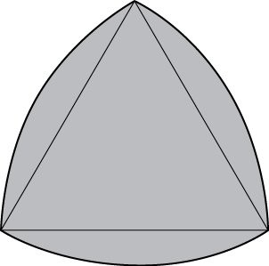 

**[T]** Show that the area of the **lunes of Alhazen**{: data-type="term" .no-emphasis}, the two blue lunes in the following figure, is the same as the area of the right triangle *ABC*. The outer boundaries of the lunes are semicircles of diameters <math xmlns="http://www.w3.org/1998/Math/MathML"><mrow><mi>A</mi><mi>B</mi><mspace width="0.2em" /><mtext>and</mtext><mspace width="0.2em" /><mi>A</mi><mi>C</mi><mo>,</mo></mrow></math>

 respectively, and the inner boundaries are formed by the circumcircle of the triangle <math xmlns="http://www.w3.org/1998/Math/MathML"><mrow><mi>A</mi><mi>B</mi><mi>C</mi><mo>.</mo></mrow></math>

 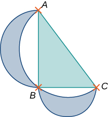 

</section>

