

* Recognize when a function of three variables is integrable over a rectangular box.
* Evaluate a triple integral by expressing it as an iterated integral.
* Recognize when a function of three variables is integrable over a closed and bounded region.
* Simplify a calculation by changing the order of integration of a triple integral.
* Calculate the average value of a function of three variables.

In [Double Integrals over Rectangular Regions](/m53949){: .target-chapter}, we discussed the double integral of a function <math xmlns="http://www.w3.org/1998/Math/MathML"><mrow><mi>f</mi><mo stretchy="false">(</mo><mi>x</mi><mo>,</mo><mi>y</mi><mo stretchy="false">)</mo></mrow></math>

 of two variables over a rectangular region in the plane. In this section we define the triple integral of a function <math xmlns="http://www.w3.org/1998/Math/MathML"><mrow><mi>f</mi><mo stretchy="false">(</mo><mi>x</mi><mo>,</mo><mi>y</mi><mo>,</mo><mi>z</mi><mo stretchy="false">)</mo></mrow></math>

 of three variables over a rectangular solid box in space, <math xmlns="http://www.w3.org/1998/Math/MathML"><mrow><msup><mi>ℝ</mi><mn>3</mn></msup><mo>.</mo></mrow></math>

 Later in this section we extend the definition to more general regions in <math xmlns="http://www.w3.org/1998/Math/MathML"><mrow><msup><mi>ℝ</mi><mn>3</mn></msup><mo>.</mo></mrow></math>

# Integrable Functions of Three Variables

We can define a rectangular box <math xmlns="http://www.w3.org/1998/Math/MathML"><mi>B</mi></math>

 in <math xmlns="http://www.w3.org/1998/Math/MathML"><mrow><msup><mi>ℝ</mi><mn>3</mn></msup></mrow></math>

 as <math xmlns="http://www.w3.org/1998/Math/MathML"><mrow><mi>B</mi><mo>=</mo><mo>{</mo><mo stretchy="false">(</mo><mi>x</mi><mo>,</mo><mi>y</mi><mo>,</mo><mi>z</mi><mo stretchy="false">)</mo><mo>\|</mo><mi>a</mi><mo>≤</mo><mi>x</mi><mo>≤</mo><mi>b</mi><mo>,</mo><mi>c</mi><mo>≤</mo><mi>y</mi><mo>≤</mo><mi>d</mi><mo>,</mo><mi>e</mi><mo>≤</mo><mi>z</mi><mo>≤</mo><mi>f</mi><mo>}</mo><mo>.</mo></mrow></math>

 We follow a similar procedure to what we did in [Double Integrals over Rectangular Regions](/m53949){: .target-chapter}. We divide the interval <math xmlns="http://www.w3.org/1998/Math/MathML"><mrow><mo stretchy="false">[</mo><mi>a</mi><mo>,</mo><mi>b</mi><mo stretchy="false">]</mo></mrow></math>

 into <math xmlns="http://www.w3.org/1998/Math/MathML"><mi>l</mi></math>

 subintervals <math xmlns="http://www.w3.org/1998/Math/MathML"><mrow><mo stretchy="false">[</mo><msub><mi>x</mi><mrow><mi>i</mi><mo>−</mo><mn>1</mn></mrow></msub><mo>,</mo><msub><mi>x</mi><mi>i</mi></msub><mo stretchy="false">]</mo></mrow></math>

 of equal length <math xmlns="http://www.w3.org/1998/Math/MathML"><mrow><mtext>Δ</mtext><mi>x</mi><mo>=</mo><mfrac><mrow><msub><mi>x</mi><mi>i</mi></msub><mo>−</mo><msub><mi>x</mi><mrow><mi>i</mi><mo>−</mo><mn>1</mn></mrow></msub></mrow><mi>l</mi></mfrac><mo>,</mo></mrow></math>

 divide the interval <math xmlns="http://www.w3.org/1998/Math/MathML"><mrow><mo stretchy="false">[</mo><mi>c</mi><mo>,</mo><mi>d</mi><mo stretchy="false">]</mo></mrow></math>

 into <math xmlns="http://www.w3.org/1998/Math/MathML"><mi>m</mi></math>

 subintervals <math xmlns="http://www.w3.org/1998/Math/MathML"><mrow><mo stretchy="false">[</mo><msub><mi>y</mi><mrow><mi>i</mi><mo>−</mo><mn>1</mn></mrow></msub><mo>,</mo><msub><mi>y</mi><mi>i</mi></msub><mo stretchy="false">]</mo></mrow></math>

 of equal length <math xmlns="http://www.w3.org/1998/Math/MathML"><mrow><mtext>Δ</mtext><mi>y</mi><mo>=</mo><mfrac><mrow><msub><mi>y</mi><mi>j</mi></msub><mo>−</mo><msub><mi>y</mi><mrow><mi>j</mi><mo>−</mo><mn>1</mn></mrow></msub></mrow><mi>m</mi></mfrac><mo>,</mo></mrow></math>

 and divide the interval <math xmlns="http://www.w3.org/1998/Math/MathML"><mrow><mo stretchy="false">[</mo><mi>e</mi><mo>,</mo><mi>f</mi><mo stretchy="false">]</mo></mrow></math>

 into <math xmlns="http://www.w3.org/1998/Math/MathML"><mi>n</mi></math>

 subintervals <math xmlns="http://www.w3.org/1998/Math/MathML"><mrow><mo stretchy="false">[</mo><msub><mi>z</mi><mrow><mi>i</mi><mo>−</mo><mn>1</mn></mrow></msub><mo>,</mo><msub><mi>z</mi><mi>i</mi></msub><mo stretchy="false">]</mo></mrow></math>

 of equal length <math xmlns="http://www.w3.org/1998/Math/MathML"><mrow><mtext>Δ</mtext><mi>z</mi><mo>=</mo><mfrac><mrow><msub><mi>z</mi><mi>k</mi></msub><mo>−</mo><msub><mi>z</mi><mrow><mi>k</mi><mo>−</mo><mn>1</mn></mrow></msub></mrow><mi>n</mi></mfrac><mo>.</mo></mrow></math>

 Then the rectangular box <math xmlns="http://www.w3.org/1998/Math/MathML"><mi>B</mi></math>

 is subdivided into <math xmlns="http://www.w3.org/1998/Math/MathML"><mrow><mi>l</mi><mi>m</mi><mi>n</mi></mrow></math>

 subboxes <math xmlns="http://www.w3.org/1998/Math/MathML"><mrow><msub><mi>B</mi><mrow><mi>i</mi><mi>j</mi><mi>k</mi></mrow></msub><mo>=</mo><mo stretchy="false">[</mo><msub><mi>x</mi><mrow><mi>i</mi><mo>−</mo><mn>1</mn></mrow></msub><mo>,</mo><msub><mi>x</mi><mi>i</mi></msub><mo stretchy="false">]</mo><mspace width="0.2em" /><mo>×</mo><mspace width="0.2em" /><mo stretchy="false">[</mo><msub><mi>y</mi><mrow><mi>i</mi><mo>−</mo><mn>1</mn></mrow></msub><mo>,</mo><msub><mi>y</mi><mi>i</mi></msub><mo stretchy="false">]</mo><mspace width="0.2em" /><mo>×</mo><mspace width="0.2em" /><mo stretchy="false">[</mo><msub><mi>z</mi><mrow><mi>i</mi><mo>−</mo><mn>1</mn></mrow></msub><mo>,</mo><msub><mi>z</mi><mi>i</mi></msub><mo stretchy="false">]</mo><mo>,</mo></mrow></math>

 as shown in [\[link\]](#CNX_Calc_Figure_15_04_001).

 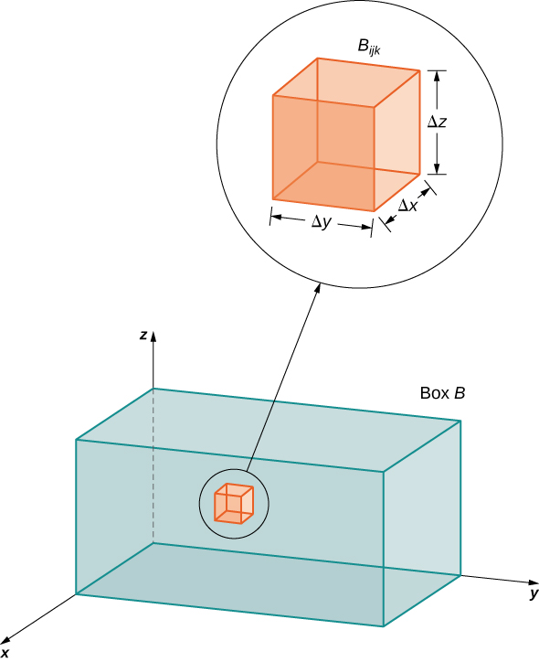{: #CNX_Calc_Figure_15_04_001}

For each <math xmlns="http://www.w3.org/1998/Math/MathML"><mrow><mi>i</mi><mo>,</mo><mi>j</mi><mo>,</mo><mspace width="0.2em" /><mtext>and</mtext><mspace width="0.2em" /><mi>k</mi><mo>,</mo></mrow></math>

 consider a sample point <math xmlns="http://www.w3.org/1998/Math/MathML"><mrow><mo stretchy="false">(</mo><msubsup><mi>x</mi><mrow><mi>i</mi><mi>j</mi><mi>k</mi></mrow><mo>*</mo></msubsup><mo>,</mo><msubsup><mi>y</mi><mrow><mi>i</mi><mi>j</mi><mi>k</mi></mrow><mo>*</mo></msubsup><mo>,</mo><msubsup><mi>z</mi><mrow><mi>i</mi><mi>j</mi><mi>k</mi></mrow><mo>*</mo></msubsup><mo stretchy="false">)</mo></mrow></math>

 in each sub-box <math xmlns="http://www.w3.org/1998/Math/MathML"><mrow><msub><mi>B</mi><mrow><mi>i</mi><mi>j</mi><mi>k</mi></mrow></msub><mo>.</mo></mrow></math>

 We see that its volume is <math xmlns="http://www.w3.org/1998/Math/MathML"><mrow><mtext>Δ</mtext><mi>V</mi><mo>=</mo><mtext>Δ</mtext><mi>x</mi><mtext>Δ</mtext><mi>y</mi><mtext>Δ</mtext><mi>z</mi><mo>.</mo></mrow></math>

 Form the triple Riemann sum

<math xmlns="http://www.w3.org/1998/Math/MathML"><mrow><mstyle displaystyle="true"><munderover><mo>∑</mo><mrow><mi>i</mi><mo>=</mo><mn>1</mn></mrow><mi>l</mi></munderover><mrow><mstyle displaystyle="true"><munderover><mo>∑</mo><mrow><mi>j</mi><mo>=</mo><mn>1</mn></mrow><mi>m</mi></munderover><mrow><mstyle displaystyle="true"><munderover><mo>∑</mo><mrow><mi>k</mi><mo>=</mo><mn>1</mn></mrow><mi>n</mi></munderover><mrow><mi>f</mi><mo stretchy="false">(</mo><msubsup><mi>x</mi><mrow><mi>i</mi><mi>j</mi><mi>k</mi></mrow><mo>*</mo></msubsup><mo>,</mo><msubsup><mi>y</mi><mrow><mi>i</mi><mi>j</mi><mi>k</mi></mrow><mo>*</mo></msubsup><mo>,</mo><msubsup><mi>z</mi><mrow><mi>i</mi><mi>j</mi><mi>k</mi></mrow><mo>*</mo></msubsup><mo stretchy="false">)</mo><mtext>Δ</mtext><mi>x</mi><mtext>Δ</mtext><mi>y</mi><mtext>Δ</mtext><mi>z</mi></mrow></mstyle></mrow></mstyle></mrow></mstyle><mo>.</mo></mrow></math>

We define the triple integral in terms of the limit of a triple Riemann sum, as we did for the double integral in terms of a double Riemann sum.

Definition

The **triple integral**{: data-type="term"} of a function <math xmlns="http://www.w3.org/1998/Math/MathML"><mrow><mi>f</mi><mo stretchy="false">(</mo><mi>x</mi><mo>,</mo><mi>y</mi><mo>,</mo><mi>z</mi><mo stretchy="false">)</mo></mrow></math>

 over a rectangular box <math xmlns="http://www.w3.org/1998/Math/MathML"><mi>B</mi></math>

 is defined as

<math xmlns="http://www.w3.org/1998/Math/MathML"><mrow><munder><mrow><mtext>lim</mtext></mrow><mrow><mi>l</mi><mo>,</mo><mi>m</mi><mo>,</mo><mi>n</mi><mo stretchy="false">→</mo><mi>∞</mi></mrow></munder><mstyle displaystyle="true"><munderover><mo>∑</mo><mrow><mi>i</mi><mo>=</mo><mn>1</mn></mrow><mi>l</mi></munderover><mrow><mstyle displaystyle="true"><munderover><mo>∑</mo><mrow><mi>j</mi><mo>=</mo><mn>1</mn></mrow><mi>m</mi></munderover><mrow><mstyle displaystyle="true"><munderover><mo>∑</mo><mrow><mi>k</mi><mo>=</mo><mn>1</mn></mrow><mi>n</mi></munderover><mrow><mi>f</mi><mo stretchy="false">(</mo><msubsup><mi>x</mi><mrow><mi>i</mi><mi>j</mi><mi>k</mi></mrow><mo>*</mo></msubsup><mo>,</mo><msubsup><mi>y</mi><mrow><mi>i</mi><mi>j</mi><mi>k</mi></mrow><mo>*</mo></msubsup><mo>,</mo><msubsup><mi>z</mi><mrow><mi>i</mi><mi>j</mi><mi>k</mi></mrow><mo>*</mo></msubsup><mo stretchy="false">)</mo><mtext>Δ</mtext><mi>x</mi><mtext>Δ</mtext><mi>y</mi><mtext>Δ</mtext><mi>z</mi><mo>=</mo><mstyle displaystyle="true"><mrow><munder><mo>∭</mo><mi>B</mi></munder><mrow><mi>f</mi><mrow><mo>(</mo><mrow><mi>x</mi><mo>,</mo><mi>y</mi><mo>,</mo><mi>z</mi></mrow><mo>)</mo></mrow><mi>d</mi><mi>V</mi></mrow></mrow></mstyle></mrow></mstyle></mrow></mstyle></mrow></mstyle></mrow></math>

if this limit exists.

When the triple integral exists on <math xmlns="http://www.w3.org/1998/Math/MathML"><mrow><mi>B</mi><mo>,</mo></mrow></math>

 the function <math xmlns="http://www.w3.org/1998/Math/MathML"><mrow><mi>f</mi><mo stretchy="false">(</mo><mi>x</mi><mo>,</mo><mi>y</mi><mo>,</mo><mi>z</mi><mo stretchy="false">)</mo></mrow></math>

 is said to be integrable on <math xmlns="http://www.w3.org/1998/Math/MathML"><mrow><mi>B</mi><mo>.</mo></mrow></math>

 Also, the triple integral exists if <math xmlns="http://www.w3.org/1998/Math/MathML"><mrow><mi>f</mi><mo stretchy="false">(</mo><mi>x</mi><mo>,</mo><mi>y</mi><mo>,</mo><mi>z</mi><mo stretchy="false">)</mo></mrow></math>

 is continuous on <math xmlns="http://www.w3.org/1998/Math/MathML"><mrow><mi>B</mi><mo>.</mo></mrow></math>

 Therefore, we will use continuous functions for our examples. However, continuity is sufficient but not necessary; in other words, <math xmlns="http://www.w3.org/1998/Math/MathML"><mi>f</mi></math>

 is bounded on <math xmlns="http://www.w3.org/1998/Math/MathML"><mi>B</mi></math>

 and continuous except possibly on the boundary of <math xmlns="http://www.w3.org/1998/Math/MathML"><mrow><mi>B</mi><mo>.</mo></mrow></math>

 The sample point <math xmlns="http://www.w3.org/1998/Math/MathML"><mrow><mo stretchy="false">(</mo><msubsup><mi>x</mi><mrow><mi>i</mi><mi>j</mi><mi>k</mi></mrow><mo>*</mo></msubsup><mo>,</mo><msubsup><mi>y</mi><mrow><mi>i</mi><mi>j</mi><mi>k</mi></mrow><mo>*</mo></msubsup><mo>,</mo><msubsup><mi>z</mi><mrow><mi>i</mi><mi>j</mi><mi>k</mi></mrow><mo>*</mo></msubsup><mo stretchy="false">)</mo></mrow></math>

 can be any point in the rectangular sub-box <math xmlns="http://www.w3.org/1998/Math/MathML"><mrow><msub><mi>B</mi><mrow><mi>i</mi><mi>j</mi><mi>k</mi></mrow></msub></mrow></math>

 and all the properties of a double integral apply to a triple integral. Just as the double integral has many practical applications, the triple integral also has many applications, which we discuss in later sections.

Now that we have developed the concept of the triple integral, we need to know how to compute it. Just as in the case of the double integral, we can have an iterated triple integral, and consequently, a version of **Fubini’s thereom**{: data-type="term" .no-emphasis} for triple integrals exists.

Fubini’s Theorem for Triple Integrals

If <math xmlns="http://www.w3.org/1998/Math/MathML"><mrow><mi>f</mi><mo stretchy="false">(</mo><mi>x</mi><mo>,</mo><mi>y</mi><mo>,</mo><mi>z</mi><mo stretchy="false">)</mo></mrow></math>

 is continuous on a rectangular box <math xmlns="http://www.w3.org/1998/Math/MathML"><mrow><mi>B</mi><mo>=</mo><mo stretchy="false">[</mo><mi>a</mi><mo>,</mo><mi>b</mi><mo stretchy="false">]</mo><mspace width="0.2em" /><mo>×</mo><mspace width="0.2em" /><mo stretchy="false">[</mo><mi>c</mi><mo>,</mo><mi>d</mi><mo stretchy="false">]</mo><mspace width="0.2em" /><mo>×</mo><mspace width="0.2em" /><mo stretchy="false">[</mo><mi>e</mi><mo>,</mo><mi>f</mi><mo stretchy="false">]</mo><mo>,</mo></mrow></math>

 then

<math xmlns="http://www.w3.org/1998/Math/MathML"><mrow><mstyle displaystyle="true"><mrow><munder><mo>∭</mo><mi>B</mi></munder><mrow><mi>f</mi><mo stretchy="false">(</mo><mi>x</mi><mo>,</mo><mi>y</mi><mo>,</mo><mi>z</mi><mo stretchy="false">)</mo><mi>d</mi><mi>V</mi></mrow></mrow></mstyle><mo>=</mo><mstyle displaystyle="true"><mrow><munderover><mo stretchy="false">∫</mo><mi>e</mi><mi>f</mi></munderover><mspace width="0.2em" /><mrow><mstyle displaystyle="true"><mrow><munderover><mo stretchy="false">∫</mo><mi>c</mi><mi>d</mi></munderover><mspace width="0.2em" /><mrow><mstyle displaystyle="true"><mrow><munderover><mo stretchy="false">∫</mo><mi>a</mi><mi>b</mi></munderover><mrow><mi>f</mi><mo stretchy="false">(</mo><mi>x</mi><mo>,</mo><mi>y</mi><mo>,</mo><mi>z</mi><mo stretchy="false">)</mo><mi>d</mi><mi>x</mi><mspace width="0.2em" /><mi>d</mi><mi>y</mi><mspace width="0.2em" /><mi>d</mi><mi>z</mi></mrow></mrow></mstyle></mrow></mrow></mstyle></mrow></mrow></mstyle><mo>.</mo></mrow></math>

This integral is also equal to any of the other five possible orderings for the iterated triple integral.

For <math xmlns="http://www.w3.org/1998/Math/MathML"><mrow><mi>a</mi><mo>,</mo><mi>b</mi><mo>,</mo><mi>c</mi><mo>,</mo><mi>d</mi><mo>,</mo><mi>e</mi><mo>,</mo></mrow></math>

 and <math xmlns="http://www.w3.org/1998/Math/MathML"><mrow><mi>f</mi></mrow></math>

 real numbers, the iterated triple integral can be expressed in six different orderings:

<math xmlns="http://www.w3.org/1998/Math/MathML"><mtable><mtr><mtd columnalign="right"><mstyle displaystyle="true"><mrow><munderover><mo stretchy="false">∫</mo><mi>e</mi><mi>f</mi></munderover><mspace width="0.2em" /><mrow><mstyle displaystyle="true"><mrow><munderover><mo stretchy="false">∫</mo><mi>c</mi><mi>d</mi></munderover><mspace width="0.2em" /><mrow><mstyle displaystyle="true"><mrow><munderover><mo stretchy="false">∫</mo><mi>a</mi><mi>b</mi></munderover><mrow><mi>f</mi><mo stretchy="false">(</mo><mi>x</mi><mo>,</mo><mi>y</mi><mo>,</mo><mi>z</mi><mo stretchy="false">)</mo><mi>d</mi><mi>x</mi><mspace width="0.2em" /><mi>d</mi><mi>y</mi><mspace width="0.2em" /><mi>d</mi><mi>z</mi></mrow></mrow></mstyle></mrow></mrow></mstyle></mrow></mrow></mstyle></mtd><mtd columnalign="left"><mo>=</mo><mstyle displaystyle="true"><mrow><munderover><mo stretchy="false">∫</mo><mi>e</mi><mi>f</mi></munderover><mrow><mo stretchy="false">(</mo><mstyle displaystyle="true"><mrow><munderover><mo stretchy="false">∫</mo><mi>c</mi><mi>d</mi></munderover><mrow><mo stretchy="false">(</mo><mstyle displaystyle="true"><mrow><munderover><mo stretchy="false">∫</mo><mi>a</mi><mi>b</mi></munderover><mrow><mi>f</mi><mo stretchy="false">(</mo><mi>x</mi><mo>,</mo><mi>y</mi><mo>,</mo><mi>z</mi><mo stretchy="false">)</mo><mi>d</mi><mi>x</mi><mo stretchy="false">)</mo><mi>d</mi><mi>y</mi><mo stretchy="false">)</mo><mi>d</mi><mi>z</mi></mrow></mrow></mstyle></mrow></mrow></mstyle></mrow></mrow></mstyle><mo>=</mo><mstyle displaystyle="true"><mrow><munderover><mo stretchy="false">∫</mo><mi>c</mi><mi>d</mi></munderover><mrow><mo stretchy="false">(</mo><mstyle displaystyle="true"><mrow><munderover><mo stretchy="false">∫</mo><mi>e</mi><mi>f</mi></munderover><mrow><mo stretchy="false">(</mo><mstyle displaystyle="true"><mrow><munderover><mo stretchy="false">∫</mo><mi>a</mi><mi>b</mi></munderover><mrow><mi>f</mi><mo stretchy="false">(</mo><mi>x</mi><mo>,</mo><mi>y</mi><mo>,</mo><mi>z</mi><mo stretchy="false">)</mo><mi>d</mi><mi>x</mi><mo stretchy="false">)</mo><mi>d</mi><mi>z</mi><mo stretchy="false">)</mo><mi>d</mi><mi>y</mi></mrow></mrow></mstyle></mrow></mrow></mstyle></mrow></mrow></mstyle></mtd></mtr><mtr><mtd /><mtd columnalign="left"><mo>=</mo><mstyle displaystyle="true"><mrow><munderover><mo stretchy="false">∫</mo><mi>a</mi><mi>b</mi></munderover><mrow><mo stretchy="false">(</mo><mstyle displaystyle="true"><mrow><munderover><mo stretchy="false">∫</mo><mi>e</mi><mi>f</mi></munderover><mrow><mo stretchy="false">(</mo><mstyle displaystyle="true"><mrow><munderover><mo stretchy="false">∫</mo><mi>c</mi><mi>d</mi></munderover><mrow><mi>f</mi><mo stretchy="false">(</mo><mi>x</mi><mo>,</mo><mi>y</mi><mo>,</mo><mi>z</mi><mo stretchy="false">)</mo><mi>d</mi><mi>y</mi><mo stretchy="false">)</mo><mi>d</mi><mi>z</mi><mo stretchy="false">)</mo><mi>d</mi><mi>x</mi></mrow></mrow></mstyle></mrow></mrow></mstyle></mrow></mrow></mstyle><mo>=</mo><mstyle displaystyle="true"><mrow><munderover><mo stretchy="false">∫</mo><mi>e</mi><mi>f</mi></munderover><mrow><mo stretchy="false">(</mo><mstyle displaystyle="true"><mrow><munderover><mo stretchy="false">∫</mo><mi>a</mi><mi>b</mi></munderover><mrow><mo stretchy="false">(</mo><mstyle displaystyle="true"><mrow><munderover><mo stretchy="false">∫</mo><mi>c</mi><mi>d</mi></munderover><mrow><mi>f</mi><mo stretchy="false">(</mo><mi>x</mi><mo>,</mo><mi>y</mi><mo>,</mo><mi>z</mi><mo stretchy="false">)</mo><mi>d</mi><mi>y</mi><mo stretchy="false">)</mo><mi>d</mi><mi>x</mi><mo stretchy="false">)</mo><mi>d</mi><mi>z</mi></mrow></mrow></mstyle></mrow></mrow></mstyle></mrow></mrow></mstyle></mtd></mtr><mtr><mtd /><mtd columnalign="left"><mo>=</mo><mstyle displaystyle="true"><mrow><munderover><mo stretchy="false">∫</mo><mi>c</mi><mi>e</mi></munderover><mrow><mo stretchy="false">(</mo><mstyle displaystyle="true"><mrow><munderover><mo stretchy="false">∫</mo><mi>a</mi><mi>b</mi></munderover><mrow><mo stretchy="false">(</mo><mstyle displaystyle="true"><mrow><munderover><mo stretchy="false">∫</mo><mi>e</mi><mi>f</mi></munderover><mrow><mi>f</mi><mo stretchy="false">(</mo><mi>x</mi><mo>,</mo><mi>y</mi><mo>,</mo><mi>z</mi><mo stretchy="false">)</mo><mi>d</mi><mi>z</mi><mo stretchy="false">)</mo><mi>d</mi><mi>x</mi><mo stretchy="false">)</mo><mi>d</mi><mi>y</mi></mrow></mrow></mstyle></mrow></mrow></mstyle></mrow></mrow></mstyle><mo>=</mo><mstyle displaystyle="true"><mrow><munderover><mo stretchy="false">∫</mo><mi>a</mi><mi>b</mi></munderover><mrow><mo stretchy="false">(</mo><mstyle displaystyle="true"><mrow><munderover><mo stretchy="false">∫</mo><mi>c</mi><mi>e</mi></munderover><mrow><mo stretchy="false">(</mo><mstyle displaystyle="true"><mrow><munderover><mo stretchy="false">∫</mo><mi>e</mi><mi>f</mi></munderover><mrow><mi>f</mi><mo stretchy="false">(</mo><mi>x</mi><mo>,</mo><mi>y</mi><mo>,</mo><mi>z</mi><mo stretchy="false">)</mo><mi>d</mi><mi>z</mi><mo stretchy="false">)</mo><mi>d</mi><mi>y</mi><mo stretchy="false">)</mo><mi>d</mi><mi>x</mi></mrow></mrow></mstyle></mrow></mrow></mstyle></mrow></mrow></mstyle><mo>.</mo></mtd></mtr></mtable></math>

For a rectangular box, the order of integration does not make any significant difference in the level of difficulty in computation. We compute triple integrals using Fubini’s Theorem rather than using the Riemann sum definition. We follow the order of integration in the same way as we did for double integrals (that is, from inside to outside).

Evaluating a Triple Integral

Evaluate the triple integral <math xmlns="http://www.w3.org/1998/Math/MathML"><mrow><mstyle displaystyle="true"><mrow><msubsup><mo stretchy="false">∫</mo><mrow><mi>z</mi><mo>=</mo><mn>0</mn></mrow><mrow><mi>z</mi><mo>=</mo><mn>1</mn></mrow></msubsup><mrow><mstyle displaystyle="true"><mrow><msubsup><mo stretchy="false">∫</mo><mrow><mi>y</mi><mo>=</mo><mn>2</mn></mrow><mrow><mi>y</mi><mo>=</mo><mn>4</mn></mrow></msubsup><mrow><mstyle displaystyle="true"><mrow><msubsup><mo stretchy="false">∫</mo><mrow><mi>x</mi><mo>=</mo><mn>−1</mn></mrow><mrow><mi>x</mi><mo>=</mo><mn>5</mn></mrow></msubsup><mrow><mo stretchy="false">(</mo><mi>x</mi><mo>+</mo><mi>y</mi><msup><mi>z</mi><mn>2</mn></msup><mo stretchy="false">)</mo><mi>d</mi><mi>x</mi><mspace width="0.2em" /><mi>d</mi><mi>y</mi><mspace width="0.2em" /><mi>d</mi><mi>z</mi></mrow></mrow></mstyle></mrow></mrow></mstyle></mrow></mrow></mstyle><mo>.</mo></mrow></math>

The order of integration is specified in the problem, so integrate with respect to <math xmlns="http://www.w3.org/1998/Math/MathML"><mi>x</mi></math>

 first, then *y*, and then <math xmlns="http://www.w3.org/1998/Math/MathML"><mrow><mi>z</mi><mo>.</mo></mrow></math>

<math xmlns="http://www.w3.org/1998/Math/MathML"><mtable><mtr /><mtr /><mtr /><mtr /><mtr><mtd columnalign="left"><mspace width="1em" /><mstyle displaystyle="true"><mrow><msubsup><mo stretchy="false">∫</mo><mrow><mi>z</mi><mo>=</mo><mn>0</mn></mrow><mrow><mi>z</mi><mo>=</mo><mn>1</mn></mrow></msubsup><mrow><mstyle displaystyle="true"><mrow><msubsup><mo stretchy="false">∫</mo><mrow><mi>y</mi><mo>=</mo><mn>2</mn></mrow><mrow><mi>y</mi><mo>=</mo><mn>4</mn></mrow></msubsup><mrow><mstyle displaystyle="true"><mrow><msubsup><mo stretchy="false">∫</mo><mrow><mi>x</mi><mo>=</mo><mn>−1</mn></mrow><mrow><mi>x</mi><mo>=</mo><mn>5</mn></mrow></msubsup><mrow><mo stretchy="false">(</mo><mi>x</mi><mo>+</mo><mi>y</mi><msup><mi>z</mi><mn>2</mn></msup><mo stretchy="false">)</mo><mi>d</mi><mi>x</mi><mspace width="0.2em" /><mi>d</mi><mi>y</mi><mspace width="0.2em" /><mi>d</mi><mi>z</mi></mrow></mrow></mstyle></mrow></mrow></mstyle></mrow></mrow></mstyle></mtd><mtd /><mtd /><mtd /></mtr><mtr><mtd columnalign="left"><mo>=</mo><mstyle displaystyle="true"><mrow><msubsup><mo stretchy="false">∫</mo><mrow><mi>z</mi><mo>=</mo><mn>0</mn></mrow><mrow><mi>z</mi><mo>=</mo><mn>1</mn></mrow></msubsup><mrow><mstyle displaystyle="true"><mrow><msubsup><mo stretchy="false">∫</mo><mrow><mi>y</mi><mo>=</mo><mn>2</mn></mrow><mrow><mi>y</mi><mo>=</mo><mn>4</mn></mrow></msubsup><mrow><mrow><mo>[</mo><mrow><msubsup><mrow><mrow><mrow><mfrac><mrow><msup><mi>x</mi><mn>2</mn></msup></mrow><mn>2</mn></mfrac><mo>+</mo><mi>x</mi><mi>y</mi><msup><mi>z</mi><mn>2</mn></msup></mrow><mo>\|</mo></mrow></mrow><mrow><mi>x</mi><mo>=</mo><mn>−1</mn></mrow><mrow><mi>x</mi><mo>=</mo><mn>5</mn></mrow></msubsup></mrow><mo>]</mo></mrow><mi>d</mi><mi>y</mi><mspace width="0.2em" /><mi>d</mi><mi>z</mi></mrow></mrow></mstyle></mrow></mrow></mstyle></mtd><mtd /><mtd /><mtd columnalign="left"><mtext>Integrate with respect to</mtext><mspace width="0.2em" /><mi>x</mi><mo>.</mo></mtd></mtr><mtr><mtd columnalign="left"><mo>=</mo><mstyle displaystyle="true"><mrow><msubsup><mo stretchy="false">∫</mo><mrow><mi>z</mi><mo>=</mo><mn>0</mn></mrow><mrow><mi>z</mi><mo>=</mo><mn>1</mn></mrow></msubsup><mrow><mstyle displaystyle="true"><mrow><msubsup><mo stretchy="false">∫</mo><mrow><mi>y</mi><mo>=</mo><mn>2</mn></mrow><mrow><mi>y</mi><mo>=</mo><mn>4</mn></mrow></msubsup><mrow><mrow><mo>[</mo><mrow><mn>12</mn><mo>+</mo><mn>6</mn><mi>y</mi><msup><mi>z</mi><mn>2</mn></msup></mrow><mo>]</mo></mrow><mi>d</mi><mi>y</mi><mspace width="0.2em" /><mi>d</mi><mi>z</mi></mrow></mrow></mstyle></mrow></mrow></mstyle></mtd><mtd /><mtd /><mtd columnalign="left"><mtext>Evaluate.</mtext></mtd></mtr><mtr><mtd columnalign="left"><mo>=</mo><mstyle displaystyle="true"><mrow><msubsup><mo stretchy="false">∫</mo><mrow><mi>z</mi><mo>=</mo><mn>0</mn></mrow><mrow><mi>z</mi><mo>=</mo><mn>1</mn></mrow></msubsup><mrow><mrow><mo>[</mo><mrow><msubsup><mrow><mrow><mrow><mn>12</mn><mi>y</mi><mo>+</mo><mn>6</mn><mfrac><mrow><msup><mi>y</mi><mn>2</mn></msup></mrow><mn>2</mn></mfrac><msup><mi>z</mi><mn>2</mn></msup></mrow><mo>\|</mo></mrow></mrow><mrow><mi>y</mi><mo>=</mo><mn>2</mn></mrow><mrow><mi>y</mi><mo>=</mo><mn>4</mn></mrow></msubsup></mrow><mo>]</mo></mrow><mi>d</mi><mi>z</mi></mrow></mrow></mstyle></mtd><mtd /><mtd /><mtd columnalign="left"><mtext>Integrate with respect to</mtext><mspace width="0.2em" /><mi>y</mi><mo>.</mo></mtd></mtr><mtr><mtd columnalign="left"><mo>=</mo><mstyle displaystyle="true"><mrow><msubsup><mo stretchy="false">∫</mo><mrow><mi>z</mi><mo>=</mo><mn>0</mn></mrow><mrow><mi>z</mi><mo>=</mo><mn>1</mn></mrow></msubsup><mrow><mrow><mo>[</mo><mrow><mn>24</mn><mo>+</mo><mn>36</mn><msup><mi>z</mi><mn>2</mn></msup></mrow><mo>]</mo></mrow><mi>d</mi><mi>z</mi></mrow></mrow></mstyle></mtd><mtd /><mtd /><mtd columnalign="left"><mtext>Evaluate.</mtext></mtd></mtr><mtr><mtd columnalign="left"><mo>=</mo><msubsup><mrow><mrow><mo>[</mo><mrow><mn>24</mn><mi>z</mi><mo>+</mo><mn>36</mn><mfrac><mrow><msup><mi>z</mi><mn>3</mn></msup></mrow><mn>3</mn></mfrac></mrow><mo>]</mo></mrow></mrow><mrow><mi>z</mi><mo>=</mo><mn>0</mn></mrow><mrow><mi>z</mi><mo>=</mo><mn>1</mn></mrow></msubsup><mo>=</mo><mn>36</mn><mo>.</mo></mtd><mtd /><mtd /><mtd columnalign="left"><mtext>Integrate with respect to</mtext><mspace width="0.2em" /><mi>z</mi><mo>.</mo></mtd></mtr></mtable></math>

Evaluating a Triple Integral

Evaluate the triple integral <math xmlns="http://www.w3.org/1998/Math/MathML"><mrow><mstyle displaystyle="true"><mrow><munder><mo>∭</mo><mi>B</mi></munder><mrow><msup><mi>x</mi><mn>2</mn></msup><mi>y</mi><mi>z</mi></mrow></mrow></mstyle><mspace width="0.2em" /><mi>d</mi><mi>V</mi></mrow></math>

 where <math xmlns="http://www.w3.org/1998/Math/MathML"><mrow><mi>B</mi><mo>=</mo><mo>{</mo><mo stretchy="false">(</mo><mi>x</mi><mo>,</mo><mi>y</mi><mo>,</mo><mi>z</mi><mo stretchy="false">)</mo><mo>\|</mo><mo>−</mo><mn>2</mn><mo>≤</mo><mi>x</mi><mo>≤</mo><mn>1</mn><mo>,</mo><mn>0</mn><mo>≤</mo><mi>y</mi><mo>≤</mo><mn>3</mn><mo>,</mo><mn>1</mn><mo>≤</mo><mi>z</mi><mo>≤</mo><mn>5</mn><mo>}</mo></mrow></math>

 as shown in the following figure.

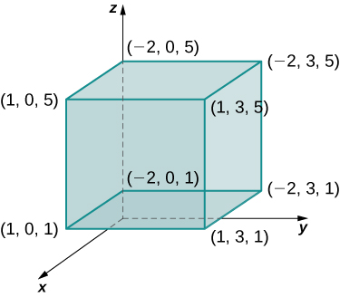{: #CNX_Calc_Figure_15_04_002}

The order is not specified, but we can use the iterated integral in any order without changing the level of difficulty. Choose, say, to integrate *y* first, then *x*, and then *z*.

<math xmlns="http://www.w3.org/1998/Math/MathML"><mtable><mtr><mtd columnalign="right"><mstyle displaystyle="true"><mrow><munder><mo>∭</mo><mi>B</mi></munder><mrow><msup><mi>x</mi><mn>2</mn></msup><mi>y</mi><mi>z</mi></mrow></mrow></mstyle><mspace width="0.2em" /><mi>d</mi><mi>V</mi></mtd><mtd columnalign="left"><mo>=</mo><mstyle displaystyle="true"><mrow><munderover><mo stretchy="false">∫</mo><mn>1</mn><mn>5</mn></munderover><mspace width="0.2em" /><mrow><mstyle displaystyle="true"><mrow><munderover><mo stretchy="false">∫</mo><mrow><mn>−2</mn></mrow><mn>1</mn></munderover><mspace width="0.2em" /><mrow><mstyle displaystyle="true"><mrow><munderover><mo stretchy="false">∫</mo><mn>0</mn><mn>3</mn></munderover><mrow><mrow><mo>[</mo><mrow><msup><mi>x</mi><mn>2</mn></msup><mi>y</mi><mi>z</mi></mrow><mo>]</mo></mrow></mrow></mrow></mstyle></mrow></mrow></mstyle></mrow></mrow></mstyle><mi>d</mi><mi>y</mi><mspace width="0.2em" /><mi>d</mi><mi>x</mi><mspace width="0.2em" /><mi>d</mi><mi>z</mi><mo>=</mo><mstyle displaystyle="true"><mrow><munderover><mo stretchy="false">∫</mo><mn>1</mn><mn>5</mn></munderover><mspace width="0.2em" /><mrow><mstyle displaystyle="true"><mrow><munderover><mo stretchy="false">∫</mo><mrow><mn>−2</mn></mrow><mn>1</mn></munderover><mrow><mrow><mo>[</mo><mrow><msubsup><mrow><mrow><mrow><msup><mi>x</mi><mn>2</mn></msup><mstyle scriptlevel="+1"><mfrac><mrow><msup><mi>y</mi><mn>2</mn></msup></mrow><mn>2</mn></mfrac></mstyle><mi>z</mi></mrow><mo>\|</mo></mrow></mrow><mn>0</mn><mn>3</mn></msubsup></mrow><mo>]</mo></mrow></mrow></mrow></mstyle></mrow></mrow></mstyle><mi>d</mi><mi>x</mi><mspace width="0.2em" /><mi>d</mi><mi>z</mi></mtd></mtr><mtr><mtd /><mtd columnalign="left"><mo>=</mo><mstyle displaystyle="true"><mrow><munderover><mo stretchy="false">∫</mo><mn>1</mn><mn>5</mn></munderover><mspace width="0.2em" /><mrow><mstyle displaystyle="true"><mrow><munderover><mo stretchy="false">∫</mo><mrow><mn>−2</mn></mrow><mn>1</mn></munderover><mrow><mstyle scriptlevel="+1"><mfrac><mn>9</mn><mn>2</mn></mfrac></mstyle></mrow></mrow></mstyle></mrow></mrow></mstyle><msup><mi>x</mi><mn>2</mn></msup><mi>z</mi><mspace width="0.2em" /><mi>d</mi><mi>x</mi><mspace width="0.2em" /><mi>d</mi><mi>z</mi><mo>=</mo><mstyle displaystyle="true"><mrow><munderover><mo stretchy="false">∫</mo><mn>1</mn><mn>5</mn></munderover><mrow><mrow><mo>[</mo><mrow><msubsup><mrow><mrow><mrow><mstyle scriptlevel="+1"><mfrac><mn>9</mn><mn>2</mn></mfrac></mstyle><mstyle scriptlevel="+1"><mfrac><mrow><msup><mi>x</mi><mn>3</mn></msup></mrow><mn>3</mn></mfrac></mstyle><mi>z</mi></mrow><mo>\|</mo></mrow></mrow><mrow><mn>−2</mn></mrow><mn>1</mn></msubsup></mrow><mo>]</mo></mrow></mrow></mrow></mstyle><mi>d</mi><mi>z</mi><mo>=</mo><mstyle displaystyle="true"><mrow><munderover><mo stretchy="false">∫</mo><mn>1</mn><mn>5</mn></munderover><mrow><mstyle scriptlevel="+1"><mfrac><mrow><mn>27</mn></mrow><mn>2</mn></mfrac></mstyle><mi>z</mi><mspace width="0.2em" /><mi>d</mi><mi>z</mi></mrow></mrow></mstyle><mo>=</mo><msubsup><mrow><mrow><mstyle scriptlevel="+1"><mfrac><mrow><mn>27</mn></mrow><mn>2</mn></mfrac></mstyle><mstyle scriptlevel="+1"><mfrac><mrow><msup><mi>z</mi><mn>2</mn></msup></mrow><mn>2</mn></mfrac></mstyle></mrow><mo>\|</mo></mrow><mn>1</mn><mn>5</mn></msubsup><mo>=</mo><mn>162.</mn></mtd></mtr></mtable></math>

Now try to integrate in a different order just to see that we get the same answer. Choose to integrate with respect to <math xmlns="http://www.w3.org/1998/Math/MathML"><mi>x</mi></math>

 first, then <math xmlns="http://www.w3.org/1998/Math/MathML"><mrow><mi>z</mi><mo>,</mo></mrow></math>

 and then <math xmlns="http://www.w3.org/1998/Math/MathML"><mi>y</mi><mo>.</mo></math>

<math xmlns="http://www.w3.org/1998/Math/MathML"><mtable><mtr><mtd columnalign="right"><mstyle displaystyle="true"><mrow><munder><mo>∭</mo><mi>B</mi></munder><mrow><msup><mi>x</mi><mn>2</mn></msup><mi>y</mi><mi>z</mi></mrow></mrow></mstyle><mspace width="0.2em" /><mi>d</mi><mi>V</mi></mtd><mtd columnalign="left"><mo>=</mo><mstyle displaystyle="true"><mrow><munderover><mo stretchy="false">∫</mo><mn>0</mn><mn>3</mn></munderover><mspace width="0.2em" /><mrow><mstyle displaystyle="true"><mrow><munderover><mo stretchy="false">∫</mo><mn>1</mn><mn>5</mn></munderover><mspace width="0.2em" /><mrow><mstyle displaystyle="true"><mrow><munderover><mo stretchy="false">∫</mo><mrow><mn>−2</mn></mrow><mn>1</mn></munderover><mrow><mrow><mo>[</mo><mrow><msup><mi>x</mi><mn>2</mn></msup><mi>y</mi><mi>z</mi></mrow><mo>]</mo></mrow></mrow></mrow></mstyle></mrow></mrow></mstyle></mrow></mrow></mstyle><mi>d</mi><mi>x</mi><mspace width="0.2em" /><mi>d</mi><mi>z</mi><mspace width="0.2em" /><mi>d</mi><mi>y</mi><mo>=</mo><mstyle displaystyle="true"><mrow><munderover><mo stretchy="false">∫</mo><mn>0</mn><mn>3</mn></munderover><mspace width="0.2em" /><mrow><mstyle displaystyle="true"><mrow><munderover><mo stretchy="false">∫</mo><mn>1</mn><mn>5</mn></munderover><mrow><mrow><mo>[</mo><mrow><msubsup><mrow><mrow><mrow><mfrac><mrow><msup><mi>x</mi><mn>3</mn></msup></mrow><mn>3</mn></mfrac><mi>y</mi><mi>z</mi></mrow><mo>\|</mo></mrow></mrow><mrow><mn>−2</mn></mrow><mn>1</mn></msubsup></mrow><mo>]</mo></mrow></mrow></mrow></mstyle></mrow></mrow></mstyle><mi>d</mi><mi>z</mi><mspace width="0.2em" /><mi>d</mi><mi>y</mi></mtd></mtr><mtr><mtd /><mtd columnalign="left"><mo>=</mo><mstyle displaystyle="true"><mrow><munderover><mo stretchy="false">∫</mo><mn>0</mn><mn>3</mn></munderover><mspace width="0.2em" /><mrow><mstyle displaystyle="true"><mrow><munderover><mo stretchy="false">∫</mo><mn>1</mn><mn>5</mn></munderover><mrow><mn>3</mn><mi>y</mi><mi>z</mi></mrow></mrow></mstyle></mrow></mrow></mstyle><mspace width="0.2em" /><mi>d</mi><mi>z</mi><mspace width="0.2em" /><mi>d</mi><mi>y</mi><mo>=</mo><mstyle displaystyle="true"><mrow><munderover><mo stretchy="false">∫</mo><mn>0</mn><mn>3</mn></munderover><mrow><mrow><mo>[</mo><mrow><msubsup><mrow><mrow><mrow><mn>3</mn><mi>y</mi><mfrac><mrow><msup><mi>z</mi><mn>2</mn></msup></mrow><mn>2</mn></mfrac></mrow><mo>\|</mo></mrow></mrow><mn>1</mn><mn>5</mn></msubsup></mrow><mo>]</mo></mrow></mrow></mrow></mstyle><mi>d</mi><mi>y</mi><mo>=</mo><mstyle displaystyle="true"><mrow><munderover><mo stretchy="false">∫</mo><mn>0</mn><mn>3</mn></munderover><mrow><mn>36</mn><mi>y</mi><mspace width="0.2em" /><mi>d</mi><mi>y</mi></mrow></mrow></mstyle><mo>=</mo><msubsup><mrow><mrow><mn>36</mn><mfrac><mrow><msup><mi>y</mi><mn>2</mn></msup></mrow><mn>2</mn></mfrac></mrow><mo>\|</mo></mrow><mn>0</mn><mn>3</mn></msubsup><mo>=</mo><mn>18</mn><mo stretchy="false">(</mo><mn>9</mn><mo>−</mo><mn>0</mn><mo stretchy="false">)</mo><mo>=</mo><mn>162.</mn></mtd></mtr></mtable></math>

Evaluate the triple integral <math xmlns="http://www.w3.org/1998/Math/MathML"><mrow><mstyle displaystyle="true"><mrow><munder><mo>∭</mo><mi>B</mi></munder><mrow><mi>z</mi><mspace width="0.2em" /><mtext>sin</mtext><mspace width="0.2em" /><mi>x</mi><mspace width="0.2em" /><mtext>cos</mtext><mspace width="0.2em" /><mi>y</mi></mrow></mrow></mstyle><mspace width="0.2em" /><mi>d</mi><mi>V</mi></mrow></math>

 where <math xmlns="http://www.w3.org/1998/Math/MathML"><mrow><mi>B</mi><mo>=</mo><mrow><mo>{</mo><mrow><mo stretchy="false">(</mo><mi>x</mi><mo>,</mo><mi>y</mi><mo>,</mo><mi>z</mi><mo stretchy="false">)</mo><mo>\|</mo><mn>0</mn><mo>≤</mo><mi>x</mi><mo>≤</mo><mi>π</mi><mo>,</mo><mfrac><mrow><mn>3</mn><mi>π</mi></mrow><mn>2</mn></mfrac><mo>≤</mo><mi>y</mi><mo>≤</mo><mn>2</mn><mi>π</mi><mo>,</mo><mn>1</mn><mo>≤</mo><mi>z</mi><mo>≤</mo><mn>3</mn></mrow><mo>}</mo></mrow><mo>.</mo></mrow></math>

<math xmlns="http://www.w3.org/1998/Math/MathML"><mrow><mstyle displaystyle="true"><mrow><munder><mo>∭</mo><mi>B</mi></munder><mrow><mi>z</mi><mspace width="0.2em" /><mtext>sin</mtext><mspace width="0.2em" /><mi>x</mi><mspace width="0.2em" /><mtext>cos</mtext><mspace width="0.2em" /><mi>y</mi></mrow></mrow></mstyle><mspace width="0.2em" /><mi>d</mi><mi>V</mi><mo>=</mo><mn>8</mn></mrow></math>

Hint

Follow the steps in the previous example.

# Triple Integrals over a General Bounded Region

We now expand the definition of the triple integral to compute a triple integral over a more **general bounded region**{: data-type="term" .no-emphasis} <math xmlns="http://www.w3.org/1998/Math/MathML"><mi>E</mi></math>

 in <math xmlns="http://www.w3.org/1998/Math/MathML"><mrow><msup><mi>ℝ</mi><mn>3</mn></msup><mo>.</mo></mrow></math>

 The general bounded regions we will consider are of three types. First, let <math xmlns="http://www.w3.org/1998/Math/MathML"><mi>D</mi></math>

 be the bounded region that is a projection of <math xmlns="http://www.w3.org/1998/Math/MathML"><mi>E</mi></math>

 onto the <math xmlns="http://www.w3.org/1998/Math/MathML"><mrow><mi>x</mi><mi>y</mi></mrow></math>

-plane. Suppose the region <math xmlns="http://www.w3.org/1998/Math/MathML"><mi>E</mi></math>

 in <math xmlns="http://www.w3.org/1998/Math/MathML"><mrow><msup><mi>ℝ</mi><mn>3</mn></msup></mrow></math>

 has the form

<math xmlns="http://www.w3.org/1998/Math/MathML"><mrow><mi>E</mi><mo>=</mo><mo>{</mo><mo stretchy="false">(</mo><mi>x</mi><mo>,</mo><mi>y</mi><mo>,</mo><mi>z</mi><mo stretchy="false">)</mo><mo>\|</mo><mo stretchy="false">(</mo><mi>x</mi><mo>,</mo><mi>y</mi><mo stretchy="false">)</mo><mo>∈</mo><mi>D</mi><mo>,</mo><msub><mi>u</mi><mn>1</mn></msub><mo stretchy="false">(</mo><mi>x</mi><mo>,</mo><mi>y</mi><mo stretchy="false">)</mo><mo>≤</mo><mi>z</mi><mo>≤</mo><msub><mi>u</mi><mn>2</mn></msub><mo stretchy="false">(</mo><mi>x</mi><mo>,</mo><mi>y</mi><mo stretchy="false">)</mo><mo>}</mo><mo>.</mo></mrow></math>

For two functions <math xmlns="http://www.w3.org/1998/Math/MathML"><mrow><mi>z</mi><mo>=</mo><msub><mi>u</mi><mn>1</mn></msub><mo stretchy="false">(</mo><mi>x</mi><mo>,</mo><mi>y</mi><mo stretchy="false">)</mo></mrow></math>

 and <math xmlns="http://www.w3.org/1998/Math/MathML"><mrow><mi>z</mi><mo>=</mo><msub><mi>u</mi><mn>2</mn></msub><mo stretchy="false">(</mo><mi>x</mi><mo>,</mo><mi>y</mi><mo stretchy="false">)</mo><mo>,</mo></mrow></math>

 such that <math xmlns="http://www.w3.org/1998/Math/MathML"><mrow><msub><mi>u</mi><mn>1</mn></msub><mo stretchy="false">(</mo><mi>x</mi><mo>,</mo><mi>y</mi><mo stretchy="false">)</mo><mo>≤</mo><msub><mi>u</mi><mn>2</mn></msub><mo stretchy="false">(</mo><mi>x</mi><mo>,</mo><mi>y</mi><mo stretchy="false">)</mo></mrow></math>

 for all <math xmlns="http://www.w3.org/1998/Math/MathML"><mrow><mo stretchy="false">(</mo><mi>x</mi><mo>,</mo><mi>y</mi><mo stretchy="false">)</mo></mrow></math>

 in <math xmlns="http://www.w3.org/1998/Math/MathML"><mi>D</mi></math>

 as shown in the following figure.

  and u2(x,y) above the projection D of E onto the xy-plane."){: #CNX_Calc_Figure_15_04_009}

Triple Integral over a General Region

The triple integral of a continuous function <math xmlns="http://www.w3.org/1998/Math/MathML"><mrow><mi>f</mi><mo stretchy="false">(</mo><mi>x</mi><mo>,</mo><mi>y</mi><mo>,</mo><mi>z</mi><mo stretchy="false">)</mo></mrow></math>

 over a general three-dimensional region

<math xmlns="http://www.w3.org/1998/Math/MathML"><mrow><mi>E</mi><mo>=</mo><mo>{</mo><mo stretchy="false">(</mo><mi>x</mi><mo>,</mo><mi>y</mi><mo>,</mo><mi>z</mi><mo stretchy="false">)</mo><mo>\|</mo><mo stretchy="false">(</mo><mi>x</mi><mo>,</mo><mi>y</mi><mo stretchy="false">)</mo><mo>∈</mo><mi>D</mi><mo>,</mo><msub><mi>u</mi><mn>1</mn></msub><mo stretchy="false">(</mo><mi>x</mi><mo>,</mo><mi>y</mi><mo stretchy="false">)</mo><mo>≤</mo><mi>z</mi><mo>≤</mo><msub><mi>u</mi><mn>2</mn></msub><mo stretchy="false">(</mo><mi>x</mi><mo>,</mo><mi>y</mi><mo stretchy="false">)</mo><mo>}</mo></mrow></math>

in <math xmlns="http://www.w3.org/1998/Math/MathML"><mrow><msup><mi>ℝ</mi><mn>3</mn></msup><mo>,</mo></mrow></math>

 where <math xmlns="http://www.w3.org/1998/Math/MathML"><mi>D</mi></math>

 is the projection of <math xmlns="http://www.w3.org/1998/Math/MathML"><mi>E</mi></math>

 onto the <math xmlns="http://www.w3.org/1998/Math/MathML"><mrow><mi>x</mi><mi>y</mi></mrow></math>

-plane, is

<math xmlns="http://www.w3.org/1998/Math/MathML"><mrow><mstyle displaystyle="true"><mrow><munder><mo>∭</mo><mi>E</mi></munder><mrow><mi>f</mi><mo stretchy="false">(</mo><mi>x</mi><mo>,</mo><mi>y</mi><mo>,</mo><mi>z</mi><mo stretchy="false">)</mo><mi>d</mi><mi>V</mi><mo>=</mo><mstyle displaystyle="true"><mrow><munder><mo>∬</mo><mi>D</mi></munder><mrow><mrow><mo>[</mo><mrow><mstyle displaystyle="true"><mrow><munderover><mo stretchy="false">∫</mo><mrow><msub><mi>u</mi><mn>1</mn></msub><mo stretchy="false">(</mo><mi>x</mi><mo>,</mo><mi>y</mi><mo stretchy="false">)</mo></mrow><mrow><msub><mi>u</mi><mn>2</mn></msub><mo stretchy="false">(</mo><mi>x</mi><mo>,</mo><mi>y</mi><mo stretchy="false">)</mo></mrow></munderover><mrow><mi>f</mi><mo stretchy="false">(</mo><mi>x</mi><mo>,</mo><mi>y</mi><mo>,</mo><mi>z</mi><mo stretchy="false">)</mo><mi>d</mi><mi>z</mi></mrow></mrow></mstyle></mrow><mo>]</mo></mrow></mrow></mrow></mstyle></mrow></mrow></mstyle><mi>d</mi><mi>A</mi><mo>.</mo></mrow></math>

Similarly, we can consider a general bounded region <math xmlns="http://www.w3.org/1998/Math/MathML"><mi>D</mi></math>

 in the <math xmlns="http://www.w3.org/1998/Math/MathML"><mrow><mi>x</mi><mi>y</mi></mrow></math>

-plane and two functions <math xmlns="http://www.w3.org/1998/Math/MathML"><mrow><mi>y</mi><mo>=</mo><msub><mi>u</mi><mn>1</mn></msub><mo stretchy="false">(</mo><mi>x</mi><mo>,</mo><mi>z</mi><mo stretchy="false">)</mo></mrow></math>

 and <math xmlns="http://www.w3.org/1998/Math/MathML"><mrow><mi>y</mi><mo>=</mo><msub><mi>u</mi><mn>2</mn></msub><mo stretchy="false">(</mo><mi>x</mi><mo>,</mo><mi>z</mi><mo stretchy="false">)</mo></mrow></math>

 such that <math xmlns="http://www.w3.org/1998/Math/MathML"><mrow><msub><mi>u</mi><mn>1</mn></msub><mo stretchy="false">(</mo><mi>x</mi><mo>,</mo><mi>z</mi><mo stretchy="false">)</mo><mo>≤</mo><msub><mi>u</mi><mn>2</mn></msub><mo stretchy="false">(</mo><mi>x</mi><mo>,</mo><mi>z</mi><mo stretchy="false">)</mo></mrow></math>

 for all <math xmlns="http://www.w3.org/1998/Math/MathML"><mrow><mo stretchy="false">(</mo><mi>x</mi><mo>,</mo><mi>z</mi><mo stretchy="false">)</mo></mrow></math>

 in <math xmlns="http://www.w3.org/1998/Math/MathML"><mrow><mi>D</mi><mo>.</mo></mrow></math>

 Then we can describe the solid region <math xmlns="http://www.w3.org/1998/Math/MathML"><mi>E</mi></math>

 in <math xmlns="http://www.w3.org/1998/Math/MathML"><mrow><msup><mi>ℝ</mi><mn>3</mn></msup></mrow></math>

 as

<math xmlns="http://www.w3.org/1998/Math/MathML"><mrow><mi>E</mi><mo>=</mo><mrow><mo>{</mo><mrow><mo stretchy="false">(</mo><mi>x</mi><mo>,</mo><mi>y</mi><mo>,</mo><mi>z</mi><mo stretchy="false">)</mo><mo>\|</mo><mo stretchy="false">(</mo><mi>x</mi><mo>,</mo><mi>z</mi><mo stretchy="false">)</mo><mo>∈</mo><mi>D</mi><mo>,</mo><msub><mi>u</mi><mn>1</mn></msub><mo stretchy="false">(</mo><mi>x</mi><mo>,</mo><mi>z</mi><mo stretchy="false">)</mo><mo>≤</mo><mi>y</mi><mo>≤</mo><msub><mi>u</mi><mn>2</mn></msub><mo stretchy="false">(</mo><mi>x</mi><mo>,</mo><mi>z</mi><mo stretchy="false">)</mo></mrow><mo>}</mo></mrow></mrow></math>

where <math xmlns="http://www.w3.org/1998/Math/MathML"><mi>D</mi></math>

 is the projection of <math xmlns="http://www.w3.org/1998/Math/MathML"><mi>E</mi></math>

 onto the <math xmlns="http://www.w3.org/1998/Math/MathML"><mrow><mi>x</mi><mi>y</mi></mrow></math>

-plane and the triple integral is

<math xmlns="http://www.w3.org/1998/Math/MathML"><mrow><mstyle displaystyle="true"><mrow><munder><mo>∭</mo><mi>E</mi></munder><mrow><mi>f</mi><mo stretchy="false">(</mo><mi>x</mi><mo>,</mo><mi>y</mi><mo>,</mo><mi>z</mi><mo stretchy="false">)</mo><mi>d</mi><mi>V</mi><mo>=</mo><mstyle displaystyle="true"><mrow><munder><mo>∬</mo><mi>D</mi></munder><mrow><mrow><mo>[</mo><mrow><mstyle displaystyle="true"><mrow><munderover><mo stretchy="false">∫</mo><mrow><msub><mi>u</mi><mn>1</mn></msub><mo stretchy="false">(</mo><mi>x</mi><mo>,</mo><mi>z</mi><mo stretchy="false">)</mo></mrow><mrow><msub><mi>u</mi><mn>2</mn></msub><mo stretchy="false">(</mo><mi>x</mi><mo>,</mo><mi>z</mi><mo stretchy="false">)</mo></mrow></munderover><mrow><mi>f</mi><mo stretchy="false">(</mo><mi>x</mi><mo>,</mo><mi>y</mi><mo>,</mo><mi>z</mi><mo stretchy="false">)</mo><mi>d</mi><mi>y</mi></mrow></mrow></mstyle></mrow><mo>]</mo></mrow></mrow></mrow></mstyle></mrow></mrow></mstyle><mi>d</mi><mi>A</mi><mo>.</mo></mrow></math>

Finally, if <math xmlns="http://www.w3.org/1998/Math/MathML"><mi>D</mi></math>

 is a general bounded region in the <math xmlns="http://www.w3.org/1998/Math/MathML"><mrow><mi>y</mi><mi>z</mi></mrow></math>

-plane and we have two functions <math xmlns="http://www.w3.org/1998/Math/MathML"><mrow><mi>x</mi><mo>=</mo><msub><mi>u</mi><mn>1</mn></msub><mo stretchy="false">(</mo><mi>y</mi><mo>,</mo><mi>z</mi><mo stretchy="false">)</mo></mrow></math>

 and <math xmlns="http://www.w3.org/1998/Math/MathML"><mrow><mi>x</mi><mo>=</mo><msub><mi>u</mi><mn>2</mn></msub><mo stretchy="false">(</mo><mi>y</mi><mo>,</mo><mi>z</mi><mo stretchy="false">)</mo></mrow></math>

 such that <math xmlns="http://www.w3.org/1998/Math/MathML"><mrow><msub><mi>u</mi><mn>1</mn></msub><mo stretchy="false">(</mo><mi>y</mi><mo>,</mo><mi>z</mi><mo stretchy="false">)</mo><mo>≤</mo><msub><mi>u</mi><mn>2</mn></msub><mo stretchy="false">(</mo><mi>y</mi><mo>,</mo><mi>z</mi><mo stretchy="false">)</mo></mrow></math>

 for all <math xmlns="http://www.w3.org/1998/Math/MathML"><mrow><mo stretchy="false">(</mo><mi>y</mi><mo>,</mo><mi>z</mi><mo stretchy="false">)</mo></mrow></math>

 in <math xmlns="http://www.w3.org/1998/Math/MathML"><mrow><mi>D</mi><mo>,</mo></mrow></math>

 then the solid region <math xmlns="http://www.w3.org/1998/Math/MathML"><mi>E</mi></math>

 in <math xmlns="http://www.w3.org/1998/Math/MathML"><mrow><msup><mi>ℝ</mi><mn>3</mn></msup></mrow></math>

 can be described as

<math xmlns="http://www.w3.org/1998/Math/MathML"><mrow><mi>E</mi><mo>=</mo><mrow><mo>{</mo><mrow><mo stretchy="false">(</mo><mi>x</mi><mo>,</mo><mi>y</mi><mo>,</mo><mi>z</mi><mo stretchy="false">)</mo><mo>\|</mo><mo stretchy="false">(</mo><mi>y</mi><mo>,</mo><mi>z</mi><mo stretchy="false">)</mo><mo>∈</mo><mi>D</mi><mo>,</mo><msub><mi>u</mi><mn>1</mn></msub><mo stretchy="false">(</mo><mi>y</mi><mo>,</mo><mi>z</mi><mo stretchy="false">)</mo><mo>≤</mo><mi>x</mi><mo>≤</mo><msub><mi>u</mi><mn>2</mn></msub><mo stretchy="false">(</mo><mi>y</mi><mo>,</mo><mi>z</mi><mo stretchy="false">)</mo></mrow><mo>}</mo></mrow></mrow></math>

where <math xmlns="http://www.w3.org/1998/Math/MathML"><mi>D</mi></math>

 is the projection of <math xmlns="http://www.w3.org/1998/Math/MathML"><mi>E</mi></math>

 onto the <math xmlns="http://www.w3.org/1998/Math/MathML"><mrow><mi>y</mi><mi>z</mi></mrow></math>

-plane and the triple integral is

<math xmlns="http://www.w3.org/1998/Math/MathML"><mrow><mstyle displaystyle="true"><mrow><munder><mo>∭</mo><mi>E</mi></munder><mrow><mi>f</mi><mo stretchy="false">(</mo><mi>x</mi><mo>,</mo><mi>y</mi><mo>,</mo><mi>z</mi><mo stretchy="false">)</mo><mi>d</mi><mi>V</mi><mo>=</mo><mstyle displaystyle="true"><mrow><munder><mo>∬</mo><mi>D</mi></munder><mrow><mrow><mo>[</mo><mrow><mstyle displaystyle="true"><mrow><munderover><mo stretchy="false">∫</mo><mrow><msub><mi>u</mi><mn>1</mn></msub><mo stretchy="false">(</mo><mi>y</mi><mo>,</mo><mi>z</mi><mo stretchy="false">)</mo></mrow><mrow><msub><mi>u</mi><mn>2</mn></msub><mo stretchy="false">(</mo><mi>y</mi><mo>,</mo><mi>z</mi><mo stretchy="false">)</mo></mrow></munderover><mrow><mi>f</mi><mo stretchy="false">(</mo><mi>x</mi><mo>,</mo><mi>y</mi><mo>,</mo><mi>z</mi><mo stretchy="false">)</mo><mi>d</mi><mi>x</mi></mrow></mrow></mstyle></mrow><mo>]</mo></mrow></mrow></mrow></mstyle></mrow></mrow></mstyle><mi>d</mi><mi>A</mi><mo>.</mo></mrow></math>

Note that the region <math xmlns="http://www.w3.org/1998/Math/MathML"><mi>D</mi></math>

 in any of the planes may be of Type I or Type II as described in [Double Integrals over General Regions](/m53963){: .target-chapter}. If <math xmlns="http://www.w3.org/1998/Math/MathML"><mi>D</mi></math>

 in the <math xmlns="http://www.w3.org/1998/Math/MathML"><mrow><mi>x</mi><mi>y</mi></mrow></math>

-plane is of Type I ([\[link\]](#CNX_Calc_Figure_15_04_003)), then

<math xmlns="http://www.w3.org/1998/Math/MathML"><mrow><mi>E</mi><mo>=</mo><mrow><mo>{</mo><mrow><mo stretchy="false">(</mo><mi>x</mi><mo>,</mo><mi>y</mi><mo>,</mo><mi>z</mi><mo stretchy="false">)</mo><mo>\|</mo><mi>a</mi><mo>≤</mo><mi>x</mi><mo>≤</mo><mi>b</mi><mo>,</mo><msub><mi>g</mi><mn>1</mn></msub><mo stretchy="false">(</mo><mi>x</mi><mo stretchy="false">)</mo><mo>≤</mo><mi>y</mi><mo>≤</mo><msub><mi>g</mi><mn>2</mn></msub><mo stretchy="false">(</mo><mi>x</mi><mo stretchy="false">)</mo><mo>,</mo><msub><mi>u</mi><mn>1</mn></msub><mo stretchy="false">(</mo><mi>x</mi><mo>,</mo><mi>y</mi><mo stretchy="false">)</mo><mo>≤</mo><mi>z</mi><mo>≤</mo><msub><mi>u</mi><mn>2</mn></msub><mo stretchy="false">(</mo><mi>x</mi><mo>,</mo><mi>y</mi><mo stretchy="false">)</mo></mrow><mo>}</mo></mrow><mo>.</mo></mrow></math>

 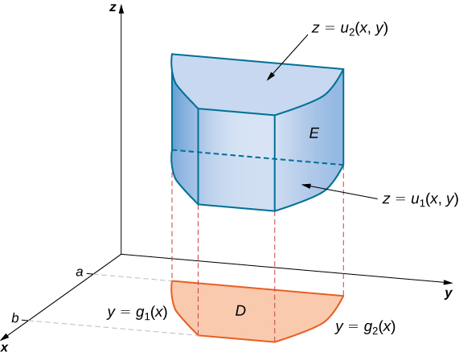{: #CNX_Calc_Figure_15_04_003}

Then the triple integral becomes

<math xmlns="http://www.w3.org/1998/Math/MathML"><mrow><mstyle displaystyle="true"><mrow><munder><mo>∭</mo><mi>E</mi></munder><mrow><mi>f</mi><mo stretchy="false">(</mo><mi>x</mi><mo>,</mo><mi>y</mi><mo>,</mo><mi>z</mi><mo stretchy="false">)</mo><mi>d</mi><mi>V</mi><mo>=</mo></mrow></mrow></mstyle><mstyle displaystyle="true"><mrow><munderover><mo stretchy="false">∫</mo><mi>a</mi><mi>b</mi></munderover><mspace width="0.2em" /><mrow><mstyle displaystyle="true"><mrow><munderover><mo stretchy="false">∫</mo><mrow><msub><mi>g</mi><mn>1</mn></msub><mo stretchy="false">(</mo><mi>x</mi><mo stretchy="false">)</mo></mrow><mrow><msub><mi>g</mi><mn>2</mn></msub><mo stretchy="false">(</mo><mi>x</mi><mo stretchy="false">)</mo></mrow></munderover><mspace width="0.2em" /><mrow><mstyle displaystyle="true"><mrow><munderover><mo stretchy="false">∫</mo><mrow><msub><mi>u</mi><mn>1</mn></msub><mo stretchy="false">(</mo><mi>x</mi><mo>,</mo><mi>y</mi><mo stretchy="false">)</mo></mrow><mrow><msub><mi>u</mi><mn>2</mn></msub><mo stretchy="false">(</mo><mi>x</mi><mo>,</mo><mi>y</mi><mo stretchy="false">)</mo></mrow></munderover><mrow><mi>f</mi><mo stretchy="false">(</mo><mi>x</mi><mo>,</mo><mi>y</mi><mo>,</mo><mi>z</mi><mo stretchy="false">)</mo><mi>d</mi><mi>z</mi><mspace width="0.2em" /><mi>d</mi><mi>y</mi><mspace width="0.2em" /><mi>d</mi><mi>x</mi></mrow></mrow></mstyle></mrow></mrow></mstyle></mrow></mrow></mstyle><mo>.</mo></mrow></math>

If <math xmlns="http://www.w3.org/1998/Math/MathML"><mi>D</mi></math>

 in the <math xmlns="http://www.w3.org/1998/Math/MathML"><mrow><mi>x</mi><mi>y</mi></mrow></math>

-plane is of Type II ([\[link\]](#CNX_Calc_Figure_15_04_004)), then

<math xmlns="http://www.w3.org/1998/Math/MathML"><mrow><mi>E</mi><mo>=</mo><mrow><mo>{</mo><mrow><mo stretchy="false">(</mo><mi>x</mi><mo>,</mo><mi>y</mi><mo>,</mo><mi>z</mi><mo stretchy="false">)</mo><mo>\|</mo><mi>c</mi><mo>≤</mo><mi>x</mi><mo>≤</mo><mi>d</mi><mo>,</mo><msub><mi>h</mi><mn>1</mn></msub><mo stretchy="false">(</mo><mi>x</mi><mo stretchy="false">)</mo><mo>≤</mo><mi>y</mi><mo>≤</mo><msub><mi>h</mi><mn>2</mn></msub><mo stretchy="false">(</mo><mi>x</mi><mo stretchy="false">)</mo><mo>,</mo><msub><mi>u</mi><mn>1</mn></msub><mo stretchy="false">(</mo><mi>x</mi><mo>,</mo><mi>y</mi><mo stretchy="false">)</mo><mo>≤</mo><mi>z</mi><mo>≤</mo><msub><mi>u</mi><mn>2</mn></msub><mo stretchy="false">(</mo><mi>x</mi><mo>,</mo><mi>y</mi><mo stretchy="false">)</mo></mrow><mo>}</mo></mrow><mo>.</mo></mrow></math>

 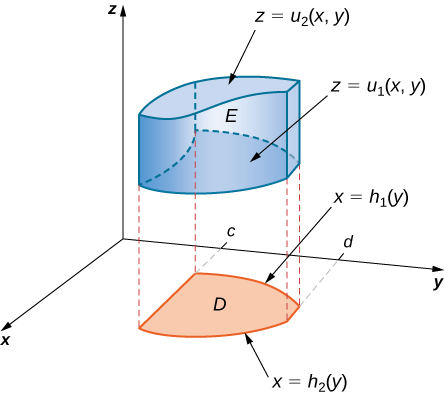{: #CNX_Calc_Figure_15_04_004}

Then the triple integral becomes

<math xmlns="http://www.w3.org/1998/Math/MathML"><mrow><mstyle displaystyle="true"><mrow><munder><mo>∭</mo><mi>E</mi></munder><mrow><mi>f</mi><mo stretchy="false">(</mo><mi>x</mi><mo>,</mo><mi>y</mi><mo>,</mo><mi>z</mi><mo stretchy="false">)</mo><mi>d</mi><mi>V</mi><mo>=</mo></mrow></mrow></mstyle><mstyle displaystyle="true"><mrow><msubsup><mo stretchy="false">∫</mo><mrow><mi>y</mi><mo>=</mo><mi>c</mi></mrow><mrow><mi>y</mi><mo>=</mo><mi>d</mi></mrow></msubsup><mrow><mstyle displaystyle="true"><mrow><msubsup><mo stretchy="false">∫</mo><mrow><mi>x</mi><mo>=</mo><msub><mi>h</mi><mn>1</mn></msub><mrow><mo>(</mo><mi>y</mi><mo>)</mo></mrow></mrow><mrow><mi>x</mi><mo>=</mo><msub><mi>h</mi><mn>2</mn></msub><mrow><mo>(</mo><mi>y</mi><mo>)</mo></mrow></mrow></msubsup><mrow><mstyle displaystyle="true"><mrow><msubsup><mo stretchy="false">∫</mo><mrow><mi>z</mi><mo>=</mo><msub><mi>u</mi><mn>1</mn></msub><mrow><mo>(</mo><mrow><mi>x</mi><mo>,</mo><mi>y</mi></mrow><mo>)</mo></mrow></mrow><mrow><mi>z</mi><mo>=</mo><msub><mi>u</mi><mn>2</mn></msub><mrow><mo>(</mo><mrow><mi>x</mi><mo>,</mo><mi>y</mi></mrow><mo>)</mo></mrow></mrow></msubsup><mrow><mi>f</mi><mo stretchy="false">(</mo><mi>x</mi><mo>,</mo><mi>y</mi><mo>,</mo><mi>z</mi><mo stretchy="false">)</mo><mi>d</mi><mi>z</mi><mspace width="0.2em" /><mi>d</mi><mi>x</mi><mspace width="0.2em" /><mi>d</mi><mi>y</mi></mrow></mrow></mstyle></mrow></mrow></mstyle></mrow></mrow></mstyle><mo>.</mo></mrow></math>

Evaluating a Triple Integral over a General Bounded Region

Evaluate the triple integral of the function <math xmlns="http://www.w3.org/1998/Math/MathML"><mrow><mi>f</mi><mo stretchy="false">(</mo><mi>x</mi><mo>,</mo><mi>y</mi><mo>,</mo><mi>z</mi><mo stretchy="false">)</mo><mo>=</mo><mn>5</mn><mi>x</mi><mo>−</mo><mn>3</mn><mi>y</mi></mrow></math>

 over the solid tetrahedron bounded by the planes <math xmlns="http://www.w3.org/1998/Math/MathML"><mrow><mi>x</mi><mo>=</mo><mn>0</mn><mo>,</mo><mi>y</mi><mo>=</mo><mn>0</mn><mo>,</mo><mi>z</mi><mo>=</mo><mn>0</mn><mo>,</mo></mrow></math>

 and <math xmlns="http://www.w3.org/1998/Math/MathML"><mrow><mi>x</mi><mo>+</mo><mi>y</mi><mo>+</mo><mi>z</mi><mo>=</mo><mn>1</mn><mo>.</mo></mrow></math>

[[link]](#CNX_Calc_Figure_15_04_005) shows the solid tetrahedron <math xmlns="http://www.w3.org/1998/Math/MathML"><mi>E</mi></math>

 and its projection <math xmlns="http://www.w3.org/1998/Math/MathML"><mi>D</mi></math>

 on the <math xmlns="http://www.w3.org/1998/Math/MathML"><mrow><mi>x</mi><mi>y</mi></mrow></math>

-plane.

{: #CNX_Calc_Figure_15_04_005}

We can describe the solid region tetrahedron as

<math xmlns="http://www.w3.org/1998/Math/MathML"><mrow><mi>E</mi><mo>=</mo><mo>{</mo><mo stretchy="false">(</mo><mi>x</mi><mo>,</mo><mi>y</mi><mo>,</mo><mi>z</mi><mo stretchy="false">)</mo><mo>\|</mo><mn>0</mn><mo>≤</mo><mi>x</mi><mo>≤</mo><mn>1</mn><mo>,</mo><mn>0</mn><mo>≤</mo><mi>y</mi><mo>≤</mo><mn>1</mn><mo>−</mo><mi>x</mi><mo>,</mo><mn>0</mn><mo>≤</mo><mi>z</mi><mo>≤</mo><mn>1</mn><mo>−</mo><mi>x</mi><mo>−</mo><mi>y</mi><mo>}</mo><mo>.</mo></mrow></math>

Hence, the triple integral is

<math xmlns="http://www.w3.org/1998/Math/MathML"><mrow><mstyle displaystyle="true"><mrow><munder><mo>∭</mo><mi>E</mi></munder><mrow><mi>f</mi><mo stretchy="false">(</mo><mi>x</mi><mo>,</mo><mi>y</mi><mo>,</mo><mi>z</mi><mo stretchy="false">)</mo><mi>d</mi><mi>V</mi><mo>=</mo></mrow></mrow></mstyle><mstyle displaystyle="true"><mrow><msubsup><mo stretchy="false">∫</mo><mrow><mi>x</mi><mo>=</mo><mn>0</mn></mrow><mrow><mi>x</mi><mo>=</mo><mn>1</mn></mrow></msubsup><mrow><mstyle displaystyle="true"><mrow><msubsup><mo stretchy="false">∫</mo><mrow><mi>y</mi><mo>=</mo><mn>0</mn></mrow><mrow><mi>y</mi><mo>=</mo><mn>1</mn><mo>−</mo><mi>x</mi></mrow></msubsup><mrow><mstyle displaystyle="true"><mrow><msubsup><mo stretchy="false">∫</mo><mrow><mi>z</mi><mo>=</mo><mn>0</mn></mrow><mrow><mi>z</mi><mo>=</mo><mn>1</mn><mo>−</mo><mi>x</mi><mo>−</mo><mi>y</mi></mrow></msubsup><mrow><mrow><mo>(</mo><mrow><mn>5</mn><mi>x</mi><mo>−</mo><mn>3</mn><mi>y</mi></mrow><mo>)</mo></mrow><mi>d</mi><mi>z</mi><mspace width="0.2em" /><mi>d</mi><mi>y</mi><mspace width="0.2em" /><mi>d</mi><mi>x</mi></mrow></mrow></mstyle></mrow></mrow></mstyle></mrow></mrow></mstyle><mo>.</mo></mrow></math>

To simplify the calculation, first evaluate the integral <math xmlns="http://www.w3.org/1998/Math/MathML"><mrow><mstyle displaystyle="true"><mrow><msubsup><mo stretchy="false">∫</mo><mrow><mi>z</mi><mo>=</mo><mn>0</mn></mrow><mrow><mi>z</mi><mo>=</mo><mn>1</mn><mo>−</mo><mi>x</mi><mo>−</mo><mi>y</mi></mrow></msubsup><mrow><mo stretchy="false">(</mo><mn>5</mn><mi>x</mi><mo>−</mo><mn>3</mn><mi>y</mi><mo stretchy="false">)</mo><mi>d</mi><mi>z</mi></mrow></mrow></mstyle><mo>.</mo></mrow></math>

 We have

<math xmlns="http://www.w3.org/1998/Math/MathML"><mrow><mstyle displaystyle="true"><mrow><msubsup><mo stretchy="false">∫</mo><mrow><mi>z</mi><mo>=</mo><mn>0</mn></mrow><mrow><mi>z</mi><mo>=</mo><mn>1</mn><mo>−</mo><mi>x</mi><mo>−</mo><mi>y</mi></mrow></msubsup><mrow><mo stretchy="false">(</mo><mn>5</mn><mi>x</mi><mo>−</mo><mn>3</mn><mi>y</mi><mo stretchy="false">)</mo><mi>d</mi><mi>z</mi></mrow></mrow></mstyle><mo>=</mo><mrow><mo>(</mo><mrow><mn>5</mn><mi>x</mi><mo>−</mo><mn>3</mn><mi>y</mi></mrow><mo>)</mo></mrow><mrow><mo>(</mo><mrow><mn>1</mn><mo>−</mo><mi>x</mi><mo>−</mo><mi>y</mi></mrow><mo>)</mo></mrow><mo>.</mo></mrow></math>

Now evaluate the integral <math xmlns="http://www.w3.org/1998/Math/MathML"><mrow><mstyle displaystyle="true"><mrow><msubsup><mo stretchy="false">∫</mo><mrow><mi>y</mi><mo>=</mo><mn>0</mn></mrow><mrow><mi>y</mi><mo>=</mo><mn>1</mn><mo>−</mo><mi>x</mi></mrow></msubsup><mrow><mrow><mo>(</mo><mrow><mn>5</mn><mi>x</mi><mo>−</mo><mn>3</mn><mi>y</mi></mrow><mo>)</mo></mrow><mrow><mo>(</mo><mrow><mn>1</mn><mo>−</mo><mi>x</mi><mo>−</mo><mi>y</mi></mrow><mo>)</mo></mrow><mi>d</mi><mi>y</mi></mrow></mrow></mstyle><mo>,</mo></mrow></math>

 obtaining

<math xmlns="http://www.w3.org/1998/Math/MathML"><mrow><mstyle displaystyle="true"><mrow><msubsup><mo stretchy="false">∫</mo><mrow><mi>y</mi><mo>=</mo><mn>0</mn></mrow><mrow><mi>y</mi><mo>=</mo><mn>1</mn><mo>−</mo><mi>x</mi></mrow></msubsup><mrow><mrow><mo>(</mo><mrow><mn>5</mn><mi>x</mi><mo>−</mo><mn>3</mn><mi>y</mi></mrow><mo>)</mo></mrow><mrow><mo>(</mo><mrow><mn>1</mn><mo>−</mo><mi>x</mi><mo>−</mo><mi>y</mi></mrow><mo>)</mo></mrow><mi>d</mi><mi>y</mi></mrow></mrow></mstyle><mo>=</mo><mstyle scriptlevel="+1"><mfrac><mn>1</mn><mn>2</mn></mfrac></mstyle><msup><mrow><mo stretchy="false">(</mo><mi>x</mi><mo>−</mo><mn>1</mn><mo stretchy="false">)</mo></mrow><mn>2</mn></msup><mo stretchy="false">(</mo><mn>6</mn><mi>x</mi><mo>−</mo><mn>1</mn><mo stretchy="false">)</mo><mo>.</mo></mrow></math>

Finally, evaluate

<math xmlns="http://www.w3.org/1998/Math/MathML"><mrow><mstyle displaystyle="true"><mrow><msubsup><mo stretchy="false">∫</mo><mrow><mi>x</mi><mo>=</mo><mn>0</mn></mrow><mrow><mi>x</mi><mo>=</mo><mn>1</mn></mrow></msubsup><mrow><mstyle scriptlevel="+1"><mfrac><mn>1</mn><mn>2</mn></mfrac></mstyle><msup><mrow><mo stretchy="false">(</mo><mi>x</mi><mo>−</mo><mn>1</mn><mo stretchy="false">)</mo></mrow><mn>2</mn></msup><mo stretchy="false">(</mo><mn>6</mn><mi>x</mi><mo>−</mo><mn>1</mn><mo stretchy="false">)</mo><mi>d</mi><mi>x</mi></mrow></mrow></mstyle><mo>=</mo><mstyle scriptlevel="+1"><mfrac><mn>1</mn><mrow><mn>12</mn></mrow></mfrac></mstyle><mo>.</mo></mrow></math>

Putting it all together, we have

<math xmlns="http://www.w3.org/1998/Math/MathML"><mrow><mstyle displaystyle="true"><mrow><munder><mo>∭</mo><mi>E</mi></munder><mrow><mi>f</mi><mo stretchy="false">(</mo><mi>x</mi><mo>,</mo><mi>y</mi><mo>,</mo><mi>z</mi><mo stretchy="false">)</mo><mi>d</mi><mi>V</mi><mo>=</mo></mrow></mrow></mstyle><mstyle displaystyle="true"><mrow><msubsup><mo stretchy="false">∫</mo><mrow><mi>x</mi><mo>=</mo><mn>0</mn></mrow><mrow><mi>x</mi><mo>=</mo><mn>1</mn></mrow></msubsup><mrow><mstyle displaystyle="true"><mrow><msubsup><mo stretchy="false">∫</mo><mrow><mi>y</mi><mo>=</mo><mn>0</mn></mrow><mrow><mi>y</mi><mo>=</mo><mn>1</mn><mo>−</mo><mi>x</mi></mrow></msubsup><mrow><mstyle displaystyle="true"><mrow><msubsup><mo stretchy="false">∫</mo><mrow><mi>z</mi><mo>=</mo><mn>0</mn></mrow><mrow><mi>z</mi><mo>=</mo><mn>1</mn><mo>−</mo><mi>x</mi><mo>−</mo><mi>y</mi></mrow></msubsup><mrow><mrow><mo>(</mo><mrow><mn>5</mn><mi>x</mi><mo>−</mo><mn>3</mn><mi>y</mi></mrow><mo>)</mo></mrow><mi>d</mi><mi>z</mi><mspace width="0.2em" /><mi>d</mi><mi>y</mi><mspace width="0.2em" /><mi>d</mi><mi>x</mi></mrow></mrow></mstyle></mrow></mrow></mstyle></mrow></mrow></mstyle><mo>=</mo><mstyle scriptlevel="+1"><mfrac><mn>1</mn><mrow><mn>12</mn></mrow></mfrac></mstyle><mo>.</mo></mrow></math>

Just as we used the double integral <math xmlns="http://www.w3.org/1998/Math/MathML"><mrow><mstyle displaystyle="true"><mrow><munder><mo>∬</mo><mi>D</mi></munder><mrow><mn>1</mn><mi>d</mi><mi>A</mi></mrow></mrow></mstyle></mrow></math>

 to find the area of a general bounded region <math xmlns="http://www.w3.org/1998/Math/MathML"><mrow><mi>D</mi><mo>,</mo></mrow></math>

 we can use <math xmlns="http://www.w3.org/1998/Math/MathML"><mrow><mstyle displaystyle="true"><mrow><munder><mo>∭</mo><mi>E</mi></munder><mrow><mn>1</mn><mi>d</mi><mi>V</mi></mrow></mrow></mstyle></mrow></math>

 to find the volume of a general solid bounded region <math xmlns="http://www.w3.org/1998/Math/MathML"><mrow><mi>E</mi><mo>.</mo></mrow></math>

 The next example illustrates the method.

Finding a Volume by Evaluating a Triple Integral

Find the volume of a right pyramid that has the square base in the <math xmlns="http://www.w3.org/1998/Math/MathML"><mrow><mi>x</mi><mi>y</mi></mrow></math>

-plane <math xmlns="http://www.w3.org/1998/Math/MathML"><mrow><mo stretchy="false">[</mo><mn>−1</mn><mo>,</mo><mn>1</mn><mo stretchy="false">]</mo><mspace width="0.2em" /><mo>×</mo><mspace width="0.2em" /><mo stretchy="false">[</mo><mn>−1</mn><mo>,</mo><mn>1</mn><mo stretchy="false">]</mo></mrow></math>

 and vertex at the point <math xmlns="http://www.w3.org/1998/Math/MathML"><mrow><mo stretchy="false">(</mo><mn>0</mn><mo>,</mo><mn>0</mn><mo>,</mo><mn>1</mn><mo stretchy="false">)</mo></mrow></math>

 as shown in the following figure.

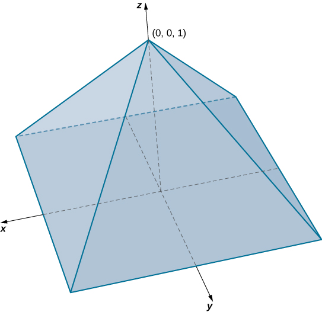{: #CNX_Calc_Figure_15_04_010}

In this pyramid the value of <math xmlns="http://www.w3.org/1998/Math/MathML"><mi>z</mi></math>

 changes from <math xmlns="http://www.w3.org/1998/Math/MathML"><mrow><mn>0</mn><mspace width="0.2em" /><mtext>to</mtext><mspace width="0.2em" /><mn>1</mn><mo>,</mo></mrow></math>

 and at each height <math xmlns="http://www.w3.org/1998/Math/MathML"><mrow><mi>z</mi><mo>,</mo></mrow></math>

 the cross section of the pyramid for any value of <math xmlns="http://www.w3.org/1998/Math/MathML"><mi>z</mi></math>

 is the square <math xmlns="http://www.w3.org/1998/Math/MathML"><mrow><mo stretchy="false">[</mo><mn>−1</mn><mo>+</mo><mi>z</mi><mo>,</mo><mn>1</mn><mo>−</mo><mi>z</mi><mo stretchy="false">]</mo><mspace width="0.2em" /><mo>×</mo><mspace width="0.2em" /><mo stretchy="false">[</mo><mn>−1</mn><mo>+</mo><mi>z</mi><mo>,</mo><mn>1</mn><mo>−</mo><mi>z</mi><mo stretchy="false">]</mo><mo>.</mo></mrow></math>

 Hence, the volume of the pyramid is <math xmlns="http://www.w3.org/1998/Math/MathML"><mrow><mstyle displaystyle="true"><mrow><munder><mo>∭</mo><mi>E</mi></munder><mrow><mn>1</mn><mi>d</mi><mi>V</mi></mrow></mrow></mstyle></mrow></math>

 where

<math xmlns="http://www.w3.org/1998/Math/MathML"><mrow><mi>E</mi><mo>=</mo><mo>{</mo><mo stretchy="false">(</mo><mi>x</mi><mo>,</mo><mi>y</mi><mo>,</mo><mi>z</mi><mo stretchy="false">)</mo><mo>\|</mo><mn>0</mn><mo>≤</mo><mi>z</mi><mo>≤</mo><mn>1</mn><mo>,</mo><mn>−1</mn><mo>+</mo><mi>z</mi><mo>≤</mo><mi>y</mi><mo>≤</mo><mn>1</mn><mo>−</mo><mi>z</mi><mo>,</mo><mn>−1</mn><mo>+</mo><mi>z</mi><mo>≤</mo><mi>x</mi><mo>≤</mo><mn>1</mn><mo>−</mo><mi>z</mi><mo>}</mo><mo>.</mo></mrow></math>

Thus, we have

<math xmlns="http://www.w3.org/1998/Math/MathML"><mrow><mstyle displaystyle="true"><mrow><munder><mo>∭</mo><mi>E</mi></munder><mrow><mn>1</mn><mi>d</mi><mi>V</mi><mo>=</mo></mrow></mrow></mstyle><mstyle displaystyle="true"><mrow><msubsup><mo stretchy="false">∫</mo><mrow><mi>z</mi><mo>=</mo><mn>0</mn></mrow><mrow><mi>z</mi><mo>=</mo><mn>1</mn></mrow></msubsup><mrow><mstyle displaystyle="true"><mrow><msubsup><mo stretchy="false">∫</mo><mrow><mi>y</mi><mo>=</mo><mn>1</mn><mo>+</mo><mi>z</mi></mrow><mrow><mi>y</mi><mo>=</mo><mn>1</mn><mo>−</mo><mi>z</mi></mrow></msubsup><mrow><mstyle displaystyle="true"><mrow><msubsup><mo stretchy="false">∫</mo><mrow><mi>x</mi><mo>=</mo><mn>1</mn><mo>+</mo><mi>z</mi></mrow><mrow><mi>x</mi><mo>=</mo><mn>1</mn><mo>−</mo><mi>z</mi></mrow></msubsup><mrow><mn>1</mn><mi>d</mi><mi>x</mi><mspace width="0.2em" /><mi>d</mi><mi>y</mi><mspace width="0.2em" /><mi>d</mi><mi>z</mi></mrow></mrow></mstyle></mrow></mrow></mstyle></mrow></mrow></mstyle><mo>=</mo><mstyle displaystyle="true"><mrow><msubsup><mo stretchy="false">∫</mo><mrow><mi>z</mi><mo>=</mo><mn>0</mn></mrow><mrow><mi>z</mi><mo>=</mo><mn>1</mn></mrow></msubsup><mrow><mstyle displaystyle="true"><mrow><msubsup><mo stretchy="false">∫</mo><mrow><mi>y</mi><mo>=</mo><mn>1</mn><mo>+</mo><mi>z</mi></mrow><mrow><mi>y</mi><mo>=</mo><mn>1</mn><mo>−</mo><mi>z</mi></mrow></msubsup><mrow><mrow><mo>(</mo><mrow><mn>2</mn><mo>−</mo><mn>2</mn><mi>z</mi></mrow><mo>)</mo></mrow></mrow></mrow></mstyle></mrow></mrow></mstyle><mi>d</mi><mi>y</mi><mspace width="0.2em" /><mi>d</mi><mi>z</mi><mo>=</mo><mstyle displaystyle="true"><mrow><msubsup><mo stretchy="false">∫</mo><mrow><mi>z</mi><mo>=</mo><mn>0</mn></mrow><mrow><mi>z</mi><mo>=</mo><mn>1</mn></mrow></msubsup><mrow><msup><mrow><mrow><mo>(</mo><mrow><mn>2</mn><mo>−</mo><mn>2</mn><mi>z</mi></mrow><mo>)</mo></mrow></mrow><mn>2</mn></msup><mi>d</mi><mi>z</mi><mo>=</mo><mfrac><mn>4</mn><mn>3</mn></mfrac></mrow></mrow></mstyle><mo>.</mo></mrow></math>

Hence, the volume of the pyramid is <math xmlns="http://www.w3.org/1998/Math/MathML"><mrow><mfrac><mn>4</mn><mn>3</mn></mfrac></mrow></math>

 cubic units.

Consider the solid sphere <math xmlns="http://www.w3.org/1998/Math/MathML"><mrow><mi>E</mi><mo>=</mo><mrow><mo>{</mo><mrow><mo stretchy="false">(</mo><mi>x</mi><mo>,</mo><mi>y</mi><mo>,</mo><mi>z</mi><mo stretchy="false">)</mo><mo>\|</mo><msup><mi>x</mi><mn>2</mn></msup><mo>+</mo><msup><mi>y</mi><mn>2</mn></msup><mo>+</mo><msup><mi>z</mi><mn>2</mn></msup><mo>=</mo><mn>9</mn></mrow><mo>}</mo></mrow><mo>.</mo></mrow></math>

 Write the triple integral <math xmlns="http://www.w3.org/1998/Math/MathML"><mrow><mstyle displaystyle="true"><mrow><munder><mo>∭</mo><mi>E</mi></munder><mrow><mi>f</mi><mo stretchy="false">(</mo><mi>x</mi><mo>,</mo><mi>y</mi><mo>,</mo><mi>z</mi><mo stretchy="false">)</mo><mi>d</mi><mi>V</mi></mrow></mrow></mstyle></mrow></math>

 for an arbitrary function <math xmlns="http://www.w3.org/1998/Math/MathML"><mi>f</mi></math>

 as an iterated integral. Then evaluate this triple integral with <math xmlns="http://www.w3.org/1998/Math/MathML"><mrow><mi>f</mi><mo stretchy="false">(</mo><mi>x</mi><mo>,</mo><mi>y</mi><mo>,</mo><mi>z</mi><mo stretchy="false">)</mo><mo>=</mo><mn>1</mn><mo>.</mo></mrow></math>

 Notice that this gives the volume of a sphere using a triple integral.

<math xmlns="http://www.w3.org/1998/Math/MathML"><mrow><mstyle displaystyle="true"><mrow><munder><mo>∭</mo><mi>E</mi></munder><mrow><mn>1</mn></mrow></mrow></mstyle><mi>d</mi><mi>V</mi><mo>=</mo><mn>8</mn><mstyle displaystyle="true"><mrow><msubsup><mo stretchy="false">∫</mo><mrow><mi>x</mi><mo>=</mo><mn>−3</mn></mrow><mrow><mi>x</mi><mo>=</mo><mn>3</mn></mrow></msubsup><mrow><mstyle displaystyle="true"><mrow><msubsup><mo stretchy="false">∫</mo><mrow><mi>y</mi><mo>=</mo><mtext>−</mtext><msqrt><mrow><mn>9</mn><mo>−</mo><msup><mi>x</mi><mn>2</mn></msup></mrow></msqrt></mrow><mrow><mi>y</mi><mo>=</mo><msqrt><mrow><mn>9</mn><mo>−</mo><msup><mi>x</mi><mn>2</mn></msup></mrow></msqrt></mrow></msubsup><mrow><mstyle displaystyle="true"><mrow><msubsup><mo stretchy="false">∫</mo><mrow><mi>z</mi><mo>=</mo><mtext>−</mtext><msqrt><mrow><mn>9</mn><mo>−</mo><msup><mi>x</mi><mn>2</mn></msup><mo>−</mo><msup><mi>y</mi><mn>2</mn></msup></mrow></msqrt></mrow><mrow><mi>z</mi><mo>=</mo><msqrt><mrow><mn>9</mn><mo>−</mo><msup><mi>x</mi><mn>2</mn></msup><mo>−</mo><msup><mi>y</mi><mn>2</mn></msup></mrow></msqrt></mrow></msubsup><mrow><mn>1</mn><mi>d</mi><mi>z</mi><mspace width="0.2em" /><mi>d</mi><mi>y</mi><mspace width="0.2em" /><mi>d</mi><mi>x</mi><mo>=</mo><mn>36</mn><mi>π</mi><mo>.</mo></mrow></mrow></mstyle></mrow></mrow></mstyle></mrow></mrow></mstyle></mrow></math>

Hint

Follow the steps in the previous example. Use symmetry.

# Changing the Order of Integration

As we have already seen in double integrals over general bounded regions, changing the order of the integration is done quite often to simplify the computation. With a triple integral over a rectangular box, the order of integration does not change the level of difficulty of the calculation. However, with a triple integral over a general bounded region, choosing an appropriate order of integration can simplify the computation quite a bit. Sometimes making the change to polar coordinates can also be very helpful. We demonstrate two examples here.

Changing the Order of Integration

Consider the iterated integral

<math xmlns="http://www.w3.org/1998/Math/MathML"><mrow><mstyle displaystyle="true"><mrow><munderover><mo stretchy="false">∫</mo><mrow><mi>x</mi><mo>=</mo><mn>0</mn></mrow><mrow><mi>x</mi><mo>=</mo><mn>1</mn></mrow></munderover><mspace width="0.2em" /><mrow><mstyle displaystyle="true"><mrow><munderover><mo stretchy="false">∫</mo><mrow><mi>y</mi><mo>=</mo><mn>0</mn></mrow><mrow><mi>y</mi><mo>=</mo><msup><mi>x</mi><mn>2</mn></msup></mrow></munderover><mspace width="0.2em" /><mrow><mstyle displaystyle="true"><mrow><munderover><mo stretchy="false">∫</mo><mrow><mi>z</mi><mo>=</mo><mn>0</mn></mrow><mrow><mi>z</mi><mo>=</mo><msup><mi>y</mi><mrow /></msup></mrow></munderover><mrow><mi>f</mi><mrow><mo>(</mo><mrow><mi>x</mi><mo>,</mo><mi>y</mi><mo>,</mo><mi>z</mi></mrow><mo>)</mo></mrow></mrow></mrow></mstyle></mrow></mrow></mstyle></mrow></mrow></mstyle><mi>d</mi><mi>z</mi><mspace width="0.2em" /><mi>d</mi><mi>y</mi><mspace width="0.2em" /><mi>d</mi><mi>x</mi><mo>.</mo></mrow></math>

The order of integration here is first with respect to *z*, then *y*, and then *x*. Express this integral by changing the order of integration to be first with respect to *x*, then *z*, and then <math xmlns="http://www.w3.org/1998/Math/MathML"><mrow><mi>y</mi><mo>.</mo></mrow></math>

 Verify that the value of the integral is the same if we let <math xmlns="http://www.w3.org/1998/Math/MathML"><mrow><mi>f</mi><mrow><mo>(</mo><mrow><mi>x</mi><mo>,</mo><mi>y</mi><mo>,</mo><mi>z</mi></mrow><mo>)</mo></mrow><mo>=</mo><mi>x</mi><mi>y</mi><mi>z</mi><mo>.</mo></mrow></math>

The best way to do this is to sketch the region <math xmlns="http://www.w3.org/1998/Math/MathML"><mi>E</mi></math>

 and its projections onto each of the three coordinate planes. Thus, let

<math xmlns="http://www.w3.org/1998/Math/MathML"><mrow><mi>E</mi><mo>=</mo><mrow><mo>{</mo><mrow><mo stretchy="false">(</mo><mi>x</mi><mo>,</mo><mi>y</mi><mo>,</mo><mi>z</mi><mo stretchy="false">)</mo><mo>\|</mo><mn>0</mn><mo>≤</mo><mi>x</mi><mo>≤</mo><mn>1</mn><mo>,</mo><mn>0</mn><mo>≤</mo><mi>y</mi><mo>≤</mo><msup><mi>x</mi><mn>2</mn></msup><mo>,</mo><mn>0</mn><mo>≤</mo><mi>z</mi><mo>≤</mo><mi>y</mi></mrow><mo>}</mo></mrow><mo>.</mo></mrow></math>

and

<math xmlns="http://www.w3.org/1998/Math/MathML"><mrow><mstyle displaystyle="true"><mrow><munderover><mo stretchy="false">∫</mo><mrow><mi>x</mi><mo>=</mo><mn>0</mn></mrow><mrow><mi>x</mi><mo>=</mo><mn>1</mn></mrow></munderover><mspace width="0.2em" /><mrow><mstyle displaystyle="true"><mrow><munderover><mo stretchy="false">∫</mo><mrow><mi>y</mi><mo>=</mo><mn>0</mn></mrow><mrow><mi>y</mi><mo>=</mo><msup><mi>x</mi><mn>2</mn></msup></mrow></munderover><mspace width="0.2em" /><mrow><mstyle displaystyle="true"><mrow><munderover><mo stretchy="false">∫</mo><mrow><mi>z</mi><mo>=</mo><mn>0</mn></mrow><mrow><mi>z</mi><mo>=</mo><msup><mi>y</mi><mn>2</mn></msup></mrow></munderover><mrow><mi>f</mi><mrow><mo>(</mo><mrow><mi>x</mi><mo>,</mo><mi>y</mi><mo>,</mo><mi>z</mi></mrow><mo>)</mo></mrow></mrow></mrow></mstyle></mrow></mrow></mstyle></mrow></mrow></mstyle><mi>d</mi><mi>z</mi><mspace width="0.2em" /><mi>d</mi><mi>y</mi><mspace width="0.2em" /><mi>d</mi><mi>x</mi><mo>=</mo><mstyle displaystyle="true"><mrow><munder><mo>∭</mo><mi>E</mi></munder><mrow><mi>f</mi><mrow><mo>(</mo><mrow><mi>x</mi><mo>,</mo><mi>y</mi><mo>,</mo><mi>z</mi></mrow><mo>)</mo></mrow></mrow></mrow></mstyle><mi>d</mi><mi>V</mi><mo>.</mo></mrow></math>

We need to express this triple integral as

<math xmlns="http://www.w3.org/1998/Math/MathML"><mrow><mstyle displaystyle="true"><mrow><munderover><mo stretchy="false">∫</mo><mrow><mi>y</mi><mo>=</mo><mi>c</mi></mrow><mrow><mi>y</mi><mo>=</mo><mi>d</mi></mrow></munderover><mspace width="0.2em" /><mrow><mstyle displaystyle="true"><mrow><munderover><mo stretchy="false">∫</mo><mrow><mi>z</mi><mo>=</mo><msub><mi>v</mi><mn>1</mn></msub><mrow><mo>(</mo><mi>y</mi><mo>)</mo></mrow></mrow><mrow><mi>z</mi><mo>=</mo><msub><mi>v</mi><mn>2</mn></msub><mrow><mo>(</mo><mi>y</mi><mo>)</mo></mrow></mrow></munderover><mspace width="0.2em" /><mrow><mstyle displaystyle="true"><mrow><munderover><mo stretchy="false">∫</mo><mrow><mi>x</mi><mo>=</mo><msub><mi>u</mi><mn>1</mn></msub><mrow><mo>(</mo><mrow><mi>y</mi><mo>,</mo><mi>z</mi></mrow><mo>)</mo></mrow></mrow><mrow><mi>x</mi><mo>=</mo><msub><mi>u</mi><mn>2</mn></msub><mrow><mo>(</mo><mrow><mi>y</mi><mo>,</mo><mi>z</mi></mrow><mo>)</mo></mrow></mrow></munderover><mrow><mi>f</mi><mrow><mo>(</mo><mrow><mi>x</mi><mo>,</mo><mi>y</mi><mo>,</mo><mi>z</mi></mrow><mo>)</mo></mrow></mrow></mrow></mstyle></mrow></mrow></mstyle></mrow></mrow></mstyle><mi>d</mi><mi>x</mi><mspace width="0.2em" /><mi>d</mi><mi>z</mi><mspace width="0.2em" /><mi>d</mi><mi>y</mi><mo>.</mo></mrow></math>

Knowing the region <math xmlns="http://www.w3.org/1998/Math/MathML"><mi>E</mi></math>

 we can draw the following projections ([[link]](#CNX_Calc_Figure_15_04_006)):

on the <math xmlns="http://www.w3.org/1998/Math/MathML"><mrow><mi>x</mi><mi>y</mi></mrow></math>

-plane is <math xmlns="http://www.w3.org/1998/Math/MathML"><mrow><msub><mi>D</mi><mn>1</mn></msub><mo>=</mo><mrow><mo>{</mo><mrow><mo stretchy="false">(</mo><mi>x</mi><mo>,</mo><mi>y</mi><mo stretchy="false">)</mo><mo>\|</mo><mn>0</mn><mo>≤</mo><mi>x</mi><mo>≤</mo><mn>1</mn><mo>,</mo><mn>0</mn><mo>≤</mo><mi>y</mi><mo>≤</mo><msup><mi>x</mi><mn>2</mn></msup></mrow><mo>}</mo></mrow><mo>=</mo><mrow><mo>{</mo><mrow><mo stretchy="false">(</mo><mi>x</mi><mo>,</mo><mi>y</mi><mo stretchy="false">)</mo><mo>\|</mo><mn>0</mn><mo>≤</mo><mi>y</mi><mo>≤</mo><mn>1</mn><mo>,</mo><msqrt><mi>y</mi></msqrt><mo>≤</mo><mi>x</mi><mo>≤</mo><mn>1</mn></mrow><mo>}</mo></mrow><mo>,</mo></mrow></math>

on the <math xmlns="http://www.w3.org/1998/Math/MathML"><mrow><mi>y</mi><mi>z</mi></mrow></math>

-plane is <math xmlns="http://www.w3.org/1998/Math/MathML"><mrow><msub><mi>D</mi><mn>2</mn></msub><mo>=</mo><mrow><mo>{</mo><mrow><mo stretchy="false">(</mo><mi>y</mi><mo>,</mo><mi>z</mi><mo stretchy="false">)</mo><mo>\|</mo><mn>0</mn><mo>≤</mo><mi>y</mi><mo>≤</mo><mn>1</mn><mo>,</mo><mn>0</mn><mo>≤</mo><mi>z</mi><mo>≤</mo><msup><mi>y</mi><mn>2</mn></msup></mrow><mo>}</mo></mrow><mo>,</mo></mrow></math>

 and

on the <math xmlns="http://www.w3.org/1998/Math/MathML"><mrow><mi>x</mi><mi>z</mi></mrow></math>

-plane is <math xmlns="http://www.w3.org/1998/Math/MathML"><mrow><msub><mi>D</mi><mn>3</mn></msub><mo>=</mo><mrow><mo>{</mo><mrow><mo stretchy="false">(</mo><mi>x</mi><mo>,</mo><mi>z</mi><mo stretchy="false">)</mo><mo>\|</mo><mn>0</mn><mo>≤</mo><mi>x</mi><mo>≤</mo><mn>1</mn><mo>,</mo><mn>0</mn><mo>≤</mo><mi>z</mi><mo>≤</mo><msup><mi>x</mi><mn>2</mn></msup></mrow><mo>}</mo></mrow><mo>.</mo></mrow></math>

{: #CNX_Calc_Figure_15_04_006}

Now we can describe the same region <math xmlns="http://www.w3.org/1998/Math/MathML"><mi>E</mi></math>

 as <math xmlns="http://www.w3.org/1998/Math/MathML"><mrow><mrow><mo>{</mo><mrow><mo stretchy="false">(</mo><mi>x</mi><mo>,</mo><mi>y</mi><mo>,</mo><mi>z</mi><mo stretchy="false">)</mo><mo>\|</mo><mn>0</mn><mo>≤</mo><mi>y</mi><mo>≤</mo><mn>1</mn><mo>,</mo><mn>0</mn><mo>≤</mo><mi>z</mi><mo>≤</mo><msup><mi>y</mi><mn>2</mn></msup><mo>,</mo><msqrt><mi>y</mi></msqrt><mo>≤</mo><mi>x</mi><mo>≤</mo><mn>1</mn></mrow><mo>}</mo></mrow><mo>,</mo></mrow></math>

 and consequently, the triple integral becomes

<math xmlns="http://www.w3.org/1998/Math/MathML"><mrow><mstyle displaystyle="true"><mrow><munderover><mo stretchy="false">∫</mo><mrow><mi>y</mi><mo>=</mo><mi>c</mi></mrow><mrow><mi>y</mi><mo>=</mo><mi>d</mi></mrow></munderover><mspace width="0.2em" /><mrow><mstyle displaystyle="true"><mrow><munderover><mo stretchy="false">∫</mo><mrow><mi>z</mi><mo>=</mo><msub><mi>v</mi><mn>1</mn></msub><mrow><mo>(</mo><mi>y</mi><mo>)</mo></mrow></mrow><mrow><mi>z</mi><mo>=</mo><msub><mi>v</mi><mn>2</mn></msub><mrow><mo>(</mo><mi>y</mi><mo>)</mo></mrow></mrow></munderover><mspace width="0.2em" /><mrow><mstyle displaystyle="true"><mrow><munderover><mo stretchy="false">∫</mo><mrow><mi>x</mi><mo>=</mo><msub><mi>u</mi><mn>1</mn></msub><mrow><mo>(</mo><mrow><mi>y</mi><mo>,</mo><mi>z</mi></mrow><mo>)</mo></mrow></mrow><mrow><mi>x</mi><mo>=</mo><msub><mi>u</mi><mn>2</mn></msub><mrow><mo>(</mo><mrow><mi>y</mi><mo>,</mo><mi>z</mi></mrow><mo>)</mo></mrow></mrow></munderover><mrow><mi>f</mi><mrow><mo>(</mo><mrow><mi>x</mi><mo>,</mo><mi>y</mi><mo>,</mo><mi>z</mi></mrow><mo>)</mo></mrow></mrow></mrow></mstyle></mrow></mrow></mstyle></mrow></mrow></mstyle><mi>d</mi><mi>x</mi><mspace width="0.2em" /><mi>d</mi><mi>z</mi><mspace width="0.2em" /><mi>d</mi><mi>y</mi><mo>=</mo><mstyle displaystyle="true"><mrow><munderover><mo stretchy="false">∫</mo><mrow><mi>y</mi><mo>=</mo><mn>0</mn></mrow><mrow><mi>y</mi><mo>=</mo><mn>1</mn></mrow></munderover><mspace width="0.2em" /><mrow><mstyle displaystyle="true"><mrow><munderover><mo stretchy="false">∫</mo><mrow><mi>z</mi><mo>=</mo><mn>0</mn></mrow><mrow><mi>z</mi><mo>=</mo><msup><mi>x</mi><mn>2</mn></msup></mrow></munderover><mspace width="0.2em" /><mrow><mstyle displaystyle="true"><mrow><munderover><mo stretchy="false">∫</mo><mrow><mi>x</mi><mo>=</mo><msqrt><mi>y</mi></msqrt></mrow><mrow><mi>x</mi><mo>=</mo><mn>1</mn></mrow></munderover><mrow><mi>f</mi><mrow><mo>(</mo><mrow><mi>x</mi><mo>,</mo><mi>y</mi><mo>,</mo><mi>z</mi></mrow><mo>)</mo></mrow></mrow></mrow></mstyle></mrow></mrow></mstyle></mrow></mrow></mstyle><mi>d</mi><mi>x</mi><mspace width="0.2em" /><mi>d</mi><mi>z</mi><mspace width="0.2em" /><mi>d</mi><mi>y</mi><mo>.</mo></mrow></math>

Now assume that <math xmlns="http://www.w3.org/1998/Math/MathML"><mrow><mi>f</mi><mrow><mo>(</mo><mrow><mi>x</mi><mo>,</mo><mi>y</mi><mo>,</mo><mi>z</mi></mrow><mo>)</mo></mrow><mo>=</mo><mi>x</mi><mi>y</mi><mi>z</mi></mrow></math>

 in each of the integrals. Then we have

<math xmlns="http://www.w3.org/1998/Math/MathML"><mtable><mtr /><mtr /><mtr /><mtr /><mtr /><mtr><mtd columnalign="left"><mspace width="1em" /><mstyle displaystyle="true"><mrow><munderover><mo stretchy="false">∫</mo><mrow><mi>x</mi><mo>=</mo><mn>0</mn></mrow><mrow><mi>x</mi><mo>=</mo><mn>1</mn></mrow></munderover><mspace width="0.2em" /><mrow><mstyle displaystyle="true"><mrow><munderover><mo stretchy="false">∫</mo><mrow><mi>y</mi><mo>=</mo><mn>0</mn></mrow><mrow><mi>y</mi><mo>=</mo><msup><mi>x</mi><mn>2</mn></msup></mrow></munderover><mspace width="0.2em" /><mrow><mstyle displaystyle="true"><mrow><munderover><mo stretchy="false">∫</mo><mrow><mi>z</mi><mo>=</mo><mn>0</mn></mrow><mrow><mi>z</mi><mo>=</mo><msup><mi>y</mi><mn>2</mn></msup></mrow></munderover><mrow><mi>x</mi><mi>y</mi><mi>z</mi></mrow></mrow></mstyle></mrow></mrow></mstyle></mrow></mrow></mstyle><mspace width="0.2em" /><mi>d</mi><mi>z</mi><mspace width="0.2em" /><mi>d</mi><mi>y</mi><mspace width="0.2em" /><mi>d</mi><mi>x</mi></mtd></mtr><mtr><mtd columnalign="left"><mo>=</mo><mstyle displaystyle="true"><mrow><munderover><mo stretchy="false">∫</mo><mrow><mi>x</mi><mo>=</mo><mn>0</mn></mrow><mrow><mi>x</mi><mo>=</mo><mn>1</mn></mrow></munderover><mspace width="0.2em" /><mrow><mstyle displaystyle="true"><mrow><munderover><mo stretchy="false">∫</mo><mrow><mi>y</mi><mo>=</mo><mn>0</mn></mrow><mrow><mi>y</mi><mo>=</mo><msup><mi>x</mi><mn>2</mn></msup></mrow></munderover><mrow><mrow><mo>[</mo><mrow><msubsup><mrow><mrow><mrow><mi>x</mi><mi>y</mi><mfrac><mrow><msup><mi>z</mi><mn>2</mn></msup></mrow><mn>2</mn></mfrac></mrow><mo>\|</mo></mrow></mrow><mrow><mi>z</mi><mo>=</mo><mn>0</mn></mrow><mrow><mi>z</mi><mo>=</mo><msup><mi>y</mi><mn>2</mn></msup></mrow></msubsup></mrow><mo>]</mo></mrow></mrow></mrow></mstyle></mrow></mrow></mstyle><mi>d</mi><mi>y</mi><mspace width="0.2em" /><mi>d</mi><mi>x</mi><mo>=</mo><mstyle displaystyle="true"><mrow><munderover><mo stretchy="false">∫</mo><mrow><mi>x</mi><mo>=</mo><mn>0</mn></mrow><mrow><mi>x</mi><mo>=</mo><mn>1</mn></mrow></munderover><mspace width="0.2em" /><mrow><mstyle displaystyle="true"><mrow><munderover><mo stretchy="false">∫</mo><mrow><mi>y</mi><mo>=</mo><mn>0</mn></mrow><mrow><mi>y</mi><mo>=</mo><msup><mi>x</mi><mn>2</mn></msup></mrow></munderover><mrow><mrow><mo>(</mo><mrow><mi>x</mi><mfrac><mrow><msup><mi>y</mi><mn>5</mn></msup></mrow><mn>2</mn></mfrac></mrow><mo>)</mo></mrow></mrow></mrow></mstyle></mrow></mrow></mstyle><mi>d</mi><mi>y</mi><mspace width="0.2em" /><mi>d</mi><mi>x</mi><mo>=</mo><mstyle displaystyle="true"><mrow><munderover><mo stretchy="false">∫</mo><mrow><mi>x</mi><mo>=</mo><mn>0</mn></mrow><mrow><mi>x</mi><mo>=</mo><mn>1</mn></mrow></munderover><mrow><mrow><mo>[</mo><mrow><msubsup><mrow><mrow><mrow><mi>x</mi><mfrac><mrow><msup><mi>y</mi><mn>6</mn></msup></mrow><mrow><mn>12</mn></mrow></mfrac></mrow><mo>\|</mo></mrow></mrow><mrow><mi>y</mi><mo>=</mo><mn>0</mn></mrow><mrow><mi>y</mi><mo>=</mo><msup><mi>x</mi><mn>2</mn></msup></mrow></msubsup></mrow><mo>]</mo></mrow></mrow></mrow></mstyle><mi>d</mi><mi>x</mi><mo>=</mo><mstyle displaystyle="true"><mrow><munderover><mo stretchy="false">∫</mo><mrow><mi>x</mi><mo>=</mo><mn>0</mn></mrow><mrow><mi>x</mi><mo>=</mo><mn>1</mn></mrow></munderover><mrow><mfrac><mrow><msup><mi>x</mi><mrow><mn>13</mn></mrow></msup></mrow><mrow><mn>12</mn></mrow></mfrac></mrow></mrow></mstyle><mi>d</mi><mi>x</mi><mo>=</mo><mfrac><mn>1</mn><mrow><mn>168</mn></mrow></mfrac><mo>,</mo></mtd></mtr><mtr><mtd columnalign="left"><mspace width="1em" /><mstyle displaystyle="true"><mrow><munderover><mo stretchy="false">∫</mo><mrow><mi>y</mi><mo>=</mo><mn>0</mn></mrow><mrow><mi>y</mi><mo>=</mo><mn>1</mn></mrow></munderover><mspace width="0.2em" /><mrow><mstyle displaystyle="true"><mrow><munderover><mo stretchy="false">∫</mo><mrow><mi>z</mi><mo>=</mo><mn>0</mn></mrow><mrow><mi>z</mi><mo>=</mo><msup><mi>y</mi><mn>2</mn></msup></mrow></munderover><mspace width="0.2em" /><mrow><mstyle displaystyle="true"><mrow><munderover><mo stretchy="false">∫</mo><mrow><mi>x</mi><mo>=</mo><msqrt><mi>y</mi></msqrt></mrow><mrow><mi>x</mi><mo>=</mo><mn>1</mn></mrow></munderover><mrow><mi>x</mi><mi>y</mi><mi>z</mi></mrow></mrow></mstyle></mrow></mrow></mstyle></mrow></mrow></mstyle><mspace width="0.2em" /><mi>d</mi><mi>x</mi><mspace width="0.2em" /><mi>d</mi><mi>z</mi><mspace width="0.2em" /><mi>d</mi><mi>y</mi></mtd></mtr><mtr><mtd columnalign="left"><mo>=</mo><mstyle displaystyle="true"><mrow><munderover><mo stretchy="false">∫</mo><mrow><mi>y</mi><mo>=</mo><mn>0</mn></mrow><mrow><mi>y</mi><mo>=</mo><mn>1</mn></mrow></munderover><mspace width="0.2em" /><mrow><mstyle displaystyle="true"><mrow><munderover><mo stretchy="false">∫</mo><mrow><mi>z</mi><mo>=</mo><mn>0</mn></mrow><mrow><mi>z</mi><mo>=</mo><msup><mi>y</mi><mn>2</mn></msup></mrow></munderover><mrow><mrow><mo>[</mo><mrow><msubsup><mrow><mrow><mrow><mi>y</mi><mi>z</mi><mfrac><mrow><msup><mi>x</mi><mn>2</mn></msup></mrow><mn>2</mn></mfrac></mrow><mo>\|</mo></mrow></mrow><mrow><msqrt><mi>y</mi></msqrt></mrow><mn>1</mn></msubsup></mrow><mo>]</mo></mrow></mrow></mrow></mstyle></mrow></mrow></mstyle><mi>d</mi><mi>z</mi><mspace width="0.2em" /><mi>d</mi><mi>y</mi></mtd></mtr><mtr><mtd columnalign="left"><mo>=</mo><mstyle displaystyle="true"><mrow><munderover><mo stretchy="false">∫</mo><mrow><mi>y</mi><mo>=</mo><mn>0</mn></mrow><mrow><mi>y</mi><mo>=</mo><mn>1</mn></mrow></munderover><mspace width="0.2em" /><mrow><mstyle displaystyle="true"><mrow><munderover><mo stretchy="false">∫</mo><mrow><mi>z</mi><mo>=</mo><mn>0</mn></mrow><mrow><mi>z</mi><mo>=</mo><msup><mi>y</mi><mn>2</mn></msup></mrow></munderover><mrow><mrow><mo>(</mo><mrow><mfrac><mrow><mi>y</mi><mi>z</mi></mrow><mn>2</mn></mfrac><mo>−</mo><mfrac><mrow><msup><mi>y</mi><mn>2</mn></msup><mi>z</mi></mrow><mn>2</mn></mfrac></mrow><mo>)</mo></mrow></mrow></mrow></mstyle></mrow></mrow></mstyle><mi>d</mi><mi>z</mi><mspace width="0.2em" /><mi>d</mi><mi>y</mi><mo>=</mo><mstyle displaystyle="true"><mrow><munderover><mo stretchy="false">∫</mo><mrow><mi>y</mi><mo>=</mo><mn>0</mn></mrow><mrow><mi>y</mi><mo>=</mo><mn>1</mn></mrow></munderover><mrow><mrow><mo>[</mo><mrow><msubsup><mrow><mrow><mrow><mfrac><mrow><mi>y</mi><msup><mi>z</mi><mn>2</mn></msup></mrow><mn>4</mn></mfrac><mo>−</mo><mfrac><mrow><msup><mi>y</mi><mn>2</mn></msup><msup><mi>z</mi><mn>2</mn></msup></mrow><mn>4</mn></mfrac></mrow><mo>\|</mo></mrow></mrow><mrow><mi>z</mi><mo>=</mo><mn>0</mn></mrow><mrow><mi>z</mi><mo>=</mo><msup><mi>y</mi><mn>2</mn></msup></mrow></msubsup></mrow><mo>]</mo></mrow></mrow></mrow></mstyle><mi>d</mi><mi>y</mi><mo>=</mo><mstyle displaystyle="true"><mrow><munderover><mo stretchy="false">∫</mo><mrow><mi>y</mi><mo>=</mo><mn>0</mn></mrow><mrow><mi>y</mi><mo>=</mo><mn>1</mn></mrow></munderover><mrow><mrow><mo>(</mo><mrow><mfrac><mrow><msup><mi>y</mi><mn>5</mn></msup></mrow><mn>4</mn></mfrac><mo>−</mo><mfrac><mrow><msup><mi>y</mi><mn>6</mn></msup></mrow><mn>4</mn></mfrac></mrow><mo>)</mo></mrow></mrow></mrow></mstyle><mi>d</mi><mi>y</mi><mo>=</mo><mfrac><mn>1</mn><mrow><mn>168</mn></mrow></mfrac><mo>.</mo></mtd></mtr></mtable></math>

The answers match.

Write five different iterated integrals equal to the given integral

<math xmlns="http://www.w3.org/1998/Math/MathML"><mrow><mstyle displaystyle="true"><mrow><munderover><mo stretchy="false">∫</mo><mrow><mi>z</mi><mo>=</mo><mn>0</mn></mrow><mrow><mi>z</mi><mo>=</mo><mn>4</mn></mrow></munderover><mspace width="0.2em" /><mrow><mstyle displaystyle="true"><mrow><munderover><mo stretchy="false">∫</mo><mrow><mi>y</mi><mo>=</mo><mn>0</mn></mrow><mrow><mi>y</mi><mo>=</mo><mn>4</mn><mo>−</mo><mi>z</mi></mrow></munderover><mspace width="0.2em" /><mrow><mstyle displaystyle="true"><mrow><munderover><mo stretchy="false">∫</mo><mrow><mi>x</mi><mo>=</mo><mn>0</mn></mrow><mrow><mi>x</mi><mo>=</mo><msqrt><mi>y</mi></msqrt></mrow></munderover><mrow><mi>f</mi><mrow><mo>(</mo><mrow><mi>x</mi><mo>,</mo><mi>y</mi><mo>,</mo><mi>z</mi></mrow><mo>)</mo></mrow></mrow></mrow></mstyle></mrow></mrow></mstyle></mrow></mrow></mstyle><mi>d</mi><mi>x</mi><mspace width="0.2em" /><mi>d</mi><mi>y</mi><mspace width="0.2em" /><mi>d</mi><mi>z</mi><mo>.</mo></mrow></math>

(i) <math xmlns="http://www.w3.org/1998/Math/MathML"><mrow><mstyle displaystyle="true"><mrow><munderover><mo stretchy="false">∫</mo><mrow><mi>z</mi><mo>=</mo><mn>0</mn></mrow><mrow><mi>z</mi><mo>=</mo><mn>4</mn></mrow></munderover><mspace width="0.2em" /><mrow><mstyle displaystyle="true"><mrow><munderover><mo stretchy="false">∫</mo><mrow><mi>x</mi><mo>=</mo><mn>0</mn></mrow><mrow><mi>x</mi><mo>=</mo><msqrt><mrow><mn>4</mn><mo>−</mo><mi>z</mi></mrow></msqrt></mrow></munderover><mspace width="0.2em" /><mrow><mstyle displaystyle="true"><mrow><munderover><mo stretchy="false">∫</mo><mrow><mi>y</mi><mo>=</mo><msup><mi>x</mi><mn>2</mn></msup></mrow><mrow><mi>y</mi><mo>=</mo><mn>4</mn><mo>−</mo><mi>z</mi></mrow></munderover><mrow><mi>f</mi><mrow><mo>(</mo><mrow><mi>x</mi><mo>,</mo><mi>y</mi><mo>,</mo><mi>z</mi></mrow><mo>)</mo></mrow></mrow></mrow></mstyle></mrow></mrow></mstyle></mrow></mrow></mstyle><mi>d</mi><mi>y</mi><mspace width="0.2em" /><mi>d</mi><mi>x</mi><mspace width="0.2em" /><mi>d</mi><mi>z</mi><mo>,</mo></mrow></math>

 (ii) <math xmlns="http://www.w3.org/1998/Math/MathML"><mrow><mstyle displaystyle="true"><mrow><munderover><mo stretchy="false">∫</mo><mrow><mi>y</mi><mo>=</mo><mn>0</mn></mrow><mrow><mi>y</mi><mo>=</mo><mn>4</mn></mrow></munderover><mspace width="0.2em" /><mrow><mstyle displaystyle="true"><mrow><munderover><mo stretchy="false">∫</mo><mrow><mi>z</mi><mo>=</mo><mn>0</mn></mrow><mrow><mi>z</mi><mo>=</mo><mn>4</mn><mo>−</mo><mi>y</mi></mrow></munderover><mspace width="0.2em" /><mrow><mstyle displaystyle="true"><mrow><munderover><mo stretchy="false">∫</mo><mrow><mi>x</mi><mo>=</mo><mn>0</mn></mrow><mrow><mi>x</mi><mo>=</mo><msqrt><mi>y</mi></msqrt></mrow></munderover><mrow><mi>f</mi><mrow><mo>(</mo><mrow><mi>x</mi><mo>,</mo><mi>y</mi><mo>,</mo><mi>z</mi></mrow><mo>)</mo></mrow></mrow></mrow></mstyle></mrow></mrow></mstyle></mrow></mrow></mstyle><mi>d</mi><mi>x</mi><mspace width="0.2em" /><mi>d</mi><mi>z</mi><mspace width="0.2em" /><mi>d</mi><mi>y</mi><mo>,</mo></mrow></math>

 (iii) <math xmlns="http://www.w3.org/1998/Math/MathML"><mrow><mstyle displaystyle="true"><mrow><munderover><mo stretchy="false">∫</mo><mrow><mi>y</mi><mo>=</mo><mn>0</mn></mrow><mrow><mi>y</mi><mo>=</mo><mn>4</mn></mrow></munderover><mspace width="0.2em" /><mrow><mstyle displaystyle="true"><mrow><munderover><mo stretchy="false">∫</mo><mrow><mi>x</mi><mo>=</mo><mn>0</mn></mrow><mrow><mi>x</mi><mo>=</mo><msqrt><mi>y</mi></msqrt></mrow></munderover><mspace width="0.2em" /><mrow><mstyle displaystyle="true"><mrow><munderover><mo stretchy="false">∫</mo><mrow><mi>z</mi><mo>=</mo><mn>0</mn></mrow><mrow><mi>z</mi><mo>=</mo><mn>4</mn><mo>−</mo><mi>y</mi></mrow></munderover><mrow><mi>f</mi><mrow><mo>(</mo><mrow><mi>x</mi><mo>,</mo><mi>y</mi><mo>,</mo><mi>z</mi></mrow><mo>)</mo></mrow></mrow></mrow></mstyle></mrow></mrow></mstyle></mrow></mrow></mstyle><mi>d</mi><mi>z</mi><mspace width="0.2em" /><mi>d</mi><mi>x</mi><mspace width="0.2em" /><mi>d</mi><mi>y</mi><mo>,</mo></mrow></math>

 (iv) <math xmlns="http://www.w3.org/1998/Math/MathML"><mrow><mstyle displaystyle="true"><mrow><munderover><mo stretchy="false">∫</mo><mrow><mi>x</mi><mo>=</mo><mn>0</mn></mrow><mrow><mi>x</mi><mo>=</mo><mn>2</mn></mrow></munderover><mspace width="0.2em" /><mrow><mstyle displaystyle="true"><mrow><munderover><mo stretchy="false">∫</mo><mrow><mi>y</mi><mo>=</mo><msup><mi>x</mi><mn>2</mn></msup></mrow><mrow><mi>y</mi><mo>=</mo><mn>4</mn></mrow></munderover><mspace width="0.2em" /><mrow><mstyle displaystyle="true"><mrow><munderover><mo stretchy="false">∫</mo><mrow><mi>z</mi><mo>=</mo><mn>0</mn></mrow><mrow><mi>z</mi><mo>=</mo><mn>4</mn><mo>−</mo><mi>y</mi></mrow></munderover><mrow><mi>f</mi><mrow><mo>(</mo><mrow><mi>x</mi><mo>,</mo><mi>y</mi><mo>,</mo><mi>z</mi></mrow><mo>)</mo></mrow></mrow></mrow></mstyle></mrow></mrow></mstyle></mrow></mrow></mstyle><mi>d</mi><mi>z</mi><mspace width="0.2em" /><mi>d</mi><mi>y</mi><mspace width="0.2em" /><mi>d</mi><mi>x</mi><mo>,</mo></mrow></math>

 (v) <math xmlns="http://www.w3.org/1998/Math/MathML"><mrow><mstyle displaystyle="true"><mrow><munderover><mo stretchy="false">∫</mo><mrow><mi>x</mi><mo>=</mo><mn>0</mn></mrow><mrow><mi>x</mi><mo>=</mo><mn>2</mn></mrow></munderover><mspace width="0.2em" /><mrow><mstyle displaystyle="true"><mrow><munderover><mo stretchy="false">∫</mo><mrow><mi>z</mi><mo>=</mo><mn>0</mn></mrow><mrow><mi>z</mi><mo>=</mo><mn>4</mn><mo>−</mo><msup><mi>x</mi><mn>2</mn></msup></mrow></munderover><mspace width="0.2em" /><mrow><mstyle displaystyle="true"><mrow><munderover><mo stretchy="false">∫</mo><mrow><mi>y</mi><mo>=</mo><msup><mi>x</mi><mn>2</mn></msup></mrow><mrow><mi>y</mi><mo>=</mo><mn>4</mn><mo>−</mo><mi>z</mi></mrow></munderover><mrow><mi>f</mi><mrow><mo>(</mo><mrow><mi>x</mi><mo>,</mo><mi>y</mi><mo>,</mo><mi>z</mi></mrow><mo>)</mo></mrow></mrow></mrow></mstyle></mrow></mrow></mstyle></mrow></mrow></mstyle><mi>d</mi><mi>y</mi><mspace width="0.2em" /><mi>d</mi><mi>z</mi><mspace width="0.2em" /><mi>d</mi><mi>x</mi></mrow></math>

Hint

Follow the steps in the previous example, using the region <math xmlns="http://www.w3.org/1998/Math/MathML"><mi>E</mi></math>

 as <math xmlns="http://www.w3.org/1998/Math/MathML"><mrow><mrow><mo>{</mo><mrow><mrow><mrow><mrow><mo>(</mo><mrow><mi>x</mi><mo>,</mo><mi>y</mi><mo>,</mo><mi>z</mi></mrow><mo>)</mo></mrow></mrow><mo>\|</mo></mrow><mn>0</mn><mo>≤</mo><mi>z</mi><mo>≤</mo><mn>4</mn><mo>,</mo><mn>0</mn><mo>≤</mo><mi>y</mi><mo>≤</mo><mn>4</mn><mo>−</mo><mi>z</mi><mo>,</mo><mn>0</mn><mo>≤</mo><mi>x</mi><mo>≤</mo><msqrt><mi>y</mi></msqrt></mrow><mo>}</mo></mrow><mo>,</mo></mrow></math>

 and describe and sketch the projections onto each of the three planes, five different times.

Changing Integration Order and Coordinate Systems

Evaluate the triple integral <math xmlns="http://www.w3.org/1998/Math/MathML"><mrow><mstyle displaystyle="true"><mrow><munder><mo>∭</mo><mi>E</mi></munder><mrow><msqrt><mrow><msup><mi>x</mi><mn>2</mn></msup><mo>+</mo><msup><mi>z</mi><mn>2</mn></msup></mrow></msqrt></mrow></mrow></mstyle><mi>d</mi><mi>V</mi><mo>,</mo></mrow></math>

 where <math xmlns="http://www.w3.org/1998/Math/MathML"><mi>E</mi></math>

 is the region bounded by the paraboloid <math xmlns="http://www.w3.org/1998/Math/MathML"><mrow><mi>y</mi><mo>=</mo><msup><mi>x</mi><mn>2</mn></msup><mo>+</mo><msup><mi>z</mi><mn>2</mn></msup></mrow></math>

 ([[link]](#CNX_Calc_Figure_15_04_007)) and the plane <math xmlns="http://www.w3.org/1998/Math/MathML"><mrow><mi>y</mi><mo>=</mo><mn>4</mn><mo>.</mo></mrow></math>

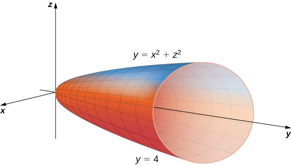{: #CNX_Calc_Figure_15_04_007}

The projection of the solid region <math xmlns="http://www.w3.org/1998/Math/MathML"><mi>E</mi></math>

 onto the <math xmlns="http://www.w3.org/1998/Math/MathML"><mrow><mi>x</mi><mi>y</mi></mrow></math>

-plane is the region bounded above by <math xmlns="http://www.w3.org/1998/Math/MathML"><mrow><mi>y</mi><mo>=</mo><mn>4</mn></mrow></math>

 and below by the parabola <math xmlns="http://www.w3.org/1998/Math/MathML"><mrow><mi>y</mi><mo>=</mo><msup><mi>x</mi><mn>2</mn></msup></mrow></math>

 as shown.

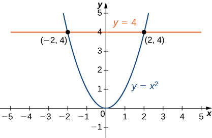{: #CNX_Calc_Figure_15_04_008}

Thus, we have

<math xmlns="http://www.w3.org/1998/Math/MathML"><mrow><mi>E</mi><mo>=</mo><mrow><mo>{</mo><mrow><mrow><mrow><mrow><mo>(</mo><mrow><mi>x</mi><mo>,</mo><mi>y</mi><mo>,</mo><mi>z</mi></mrow><mo>)</mo></mrow></mrow><mo>\|</mo></mrow><mo>−</mo><mn>2</mn><mo>≤</mo><mi>x</mi><mo>≤</mo><mn>2</mn><mo>,</mo><msup><mi>x</mi><mn>2</mn></msup><mo>≤</mo><mi>y</mi><mo>≤</mo><mn>4</mn><mo>,</mo><mtext>−</mtext><msqrt><mrow><mi>y</mi><mo>−</mo><msup><mi>x</mi><mn>2</mn></msup></mrow></msqrt><mo>≤</mo><mi>z</mi><mo>≤</mo><msqrt><mrow><mi>y</mi><mo>−</mo><msup><mi>x</mi><mn>2</mn></msup></mrow></msqrt></mrow><mo>}</mo></mrow><mo>.</mo></mrow></math>

The triple integral becomes

<math xmlns="http://www.w3.org/1998/Math/MathML"><mrow><mstyle displaystyle="true"><mrow><munder><mo>∭</mo><mi>E</mi></munder><mrow><msqrt><mrow><msup><mi>x</mi><mn>2</mn></msup><mo>+</mo><msup><mi>z</mi><mn>2</mn></msup></mrow></msqrt></mrow></mrow></mstyle><mi>d</mi><mi>V</mi><mo>=</mo><mstyle displaystyle="true"><mrow><munderover><mo stretchy="false">∫</mo><mrow><mi>x</mi><mo>=</mo><mn>−2</mn></mrow><mrow><mi>x</mi><mo>=</mo><mn>2</mn></mrow></munderover><mspace width="0.2em" /><mrow><mstyle displaystyle="true"><mrow><munderover><mo stretchy="false">∫</mo><mrow><mi>y</mi><mo>=</mo><msup><mi>x</mi><mn>2</mn></msup></mrow><mrow><mi>y</mi><mo>=</mo><mn>4</mn></mrow></munderover><mspace width="0.2em" /><mrow><mstyle displaystyle="true"><mrow><munderover><mo stretchy="false">∫</mo><mrow><mi>z</mi><mo>=</mo><mtext>−</mtext><msqrt><mrow><mi>y</mi><mo>−</mo><msup><mi>x</mi><mn>2</mn></msup></mrow></msqrt></mrow><mrow><mi>z</mi><mo>=</mo><msqrt><mrow><mi>y</mi><mo>−</mo><msup><mi>x</mi><mn>2</mn></msup></mrow></msqrt></mrow></munderover><mrow><msqrt><mrow><msup><mi>x</mi><mn>2</mn></msup><mo>+</mo><msup><mi>z</mi><mn>2</mn></msup></mrow></msqrt></mrow></mrow></mstyle></mrow></mrow></mstyle></mrow></mrow></mstyle><mi>d</mi><mi>z</mi><mspace width="0.2em" /><mi>d</mi><mi>y</mi><mspace width="0.2em" /><mi>d</mi><mi>x</mi><mo>.</mo></mrow></math>

This expression is difficult to compute, so consider the projection of <math xmlns="http://www.w3.org/1998/Math/MathML"><mi>E</mi></math>

 onto the <math xmlns="http://www.w3.org/1998/Math/MathML"><mrow><mi>x</mi><mi>z</mi></mrow></math>

-plane. This is a circular disc <math xmlns="http://www.w3.org/1998/Math/MathML"><mrow><msup><mi>x</mi><mn>2</mn></msup><mo>+</mo><msup><mi>z</mi><mn>2</mn></msup><mo>≤</mo><mn>4</mn><mo>.</mo></mrow></math>

 So we obtain

<math xmlns="http://www.w3.org/1998/Math/MathML"><mrow><mstyle displaystyle="true"><mrow><munder><mo>∭</mo><mi>E</mi></munder><mrow><msqrt><mrow><msup><mi>x</mi><mn>2</mn></msup><mo>+</mo><msup><mi>z</mi><mn>2</mn></msup></mrow></msqrt></mrow></mrow></mstyle><mi>d</mi><mi>V</mi><mo>=</mo><mstyle displaystyle="true"><mrow><munderover><mo stretchy="false">∫</mo><mrow><mi>x</mi><mo>=</mo><mn>−2</mn></mrow><mrow><mi>x</mi><mo>=</mo><mn>2</mn></mrow></munderover><mspace width="0.2em" /><mrow><mstyle displaystyle="true"><mrow><munderover><mo stretchy="false">∫</mo><mrow><mi>y</mi><mo>=</mo><msup><mi>x</mi><mn>2</mn></msup></mrow><mrow><mi>y</mi><mo>=</mo><mn>4</mn></mrow></munderover><mspace width="0.2em" /><mrow><mstyle displaystyle="true"><mrow><munderover><mo stretchy="false">∫</mo><mrow><mi>z</mi><mo>=</mo><mtext>−</mtext><msqrt><mrow><mi>y</mi><mo>−</mo><msup><mi>x</mi><mn>2</mn></msup></mrow></msqrt></mrow><mrow><mi>z</mi><mo>=</mo><msqrt><mrow><mi>y</mi><mo>−</mo><msup><mi>x</mi><mn>2</mn></msup></mrow></msqrt></mrow></munderover><mrow><msqrt><mrow><msup><mi>x</mi><mn>2</mn></msup><mo>+</mo><msup><mi>z</mi><mn>2</mn></msup></mrow></msqrt></mrow></mrow></mstyle></mrow></mrow></mstyle></mrow></mrow></mstyle><mi>d</mi><mi>z</mi><mspace width="0.2em" /><mi>d</mi><mi>y</mi><mspace width="0.2em" /><mi>d</mi><mi>x</mi><mo>=</mo><mstyle displaystyle="true"><mrow><munderover><mo stretchy="false">∫</mo><mrow><mi>x</mi><mo>=</mo><mn>−2</mn></mrow><mrow><mi>x</mi><mo>=</mo><mn>2</mn></mrow></munderover><mspace width="0.2em" /><mrow><mstyle displaystyle="true"><mrow><munderover><mo stretchy="false">∫</mo><mrow><mi>z</mi><mo>=</mo><mtext>−</mtext><msqrt><mrow><mn>4</mn><mo>−</mo><msup><mi>x</mi><mn>2</mn></msup></mrow></msqrt></mrow><mrow><mi>z</mi><mo>=</mo><msqrt><mrow><mn>4</mn><mo>−</mo><msup><mi>x</mi><mn>2</mn></msup></mrow></msqrt></mrow></munderover><mspace width="0.2em" /><mrow><mstyle displaystyle="true"><mrow><munderover><mo stretchy="false">∫</mo><mrow><mi>y</mi><mo>=</mo><msup><mi>x</mi><mn>2</mn></msup><mo>+</mo><msup><mi>z</mi><mn>2</mn></msup></mrow><mrow><mi>y</mi><mo>=</mo><mn>4</mn></mrow></munderover><mrow><msqrt><mrow><msup><mi>x</mi><mn>2</mn></msup><mo>+</mo><msup><mi>z</mi><mn>2</mn></msup></mrow></msqrt></mrow></mrow></mstyle></mrow></mrow></mstyle></mrow></mrow></mstyle><mi>d</mi><mi>y</mi><mspace width="0.2em" /><mi>d</mi><mi>z</mi><mspace width="0.2em" /><mi>d</mi><mi>x</mi><mo>.</mo></mrow></math>

Here the order of integration changes from being first with respect to <math xmlns="http://www.w3.org/1998/Math/MathML"><mrow><mi>z</mi><mo>,</mo></mrow></math>

 then <math xmlns="http://www.w3.org/1998/Math/MathML"><mrow><mi>y</mi><mo>,</mo></mrow></math>

 and then <math xmlns="http://www.w3.org/1998/Math/MathML"><mi>x</mi></math>

 to being first with respect to <math xmlns="http://www.w3.org/1998/Math/MathML"><mrow><mi>y</mi><mo>,</mo></mrow></math>

 then to <math xmlns="http://www.w3.org/1998/Math/MathML"><mrow><mi>z</mi><mo>,</mo></mrow></math>

 and then to <math xmlns="http://www.w3.org/1998/Math/MathML"><mrow><mi>x</mi><mo>.</mo></mrow></math>

 It will soon be clear how this change can be beneficial for computation. We have

<math xmlns="http://www.w3.org/1998/Math/MathML"><mrow><mstyle displaystyle="true"><mrow><munderover><mo stretchy="false">∫</mo><mrow><mi>x</mi><mo>=</mo><mn>−2</mn></mrow><mrow><mi>x</mi><mo>=</mo><mn>2</mn></mrow></munderover><mspace width="0.2em" /><mrow><mstyle displaystyle="true"><mrow><munderover><mo stretchy="false">∫</mo><mrow><mi>z</mi><mo>=</mo><mtext>−</mtext><msqrt><mrow><mn>4</mn><mo>−</mo><msup><mi>x</mi><mn>2</mn></msup></mrow></msqrt></mrow><mrow><mi>z</mi><mo>=</mo><msqrt><mrow><mn>4</mn><mo>−</mo><msup><mi>x</mi><mn>2</mn></msup></mrow></msqrt></mrow></munderover><mspace width="0.2em" /><mrow><mstyle displaystyle="true"><mrow><munderover><mo stretchy="false">∫</mo><mrow><mi>y</mi><mo>=</mo><msup><mi>x</mi><mn>2</mn></msup><mo>+</mo><msup><mi>z</mi><mn>2</mn></msup></mrow><mrow><mi>y</mi><mo>=</mo><mn>4</mn></mrow></munderover><mrow><msqrt><mrow><msup><mi>x</mi><mn>2</mn></msup><mo>+</mo><msup><mi>z</mi><mn>2</mn></msup></mrow></msqrt></mrow></mrow></mstyle></mrow></mrow></mstyle></mrow></mrow></mstyle><mi>d</mi><mi>y</mi><mspace width="0.2em" /><mi>d</mi><mi>z</mi><mspace width="0.2em" /><mi>d</mi><mi>x</mi><mo>=</mo><mstyle displaystyle="true"><mrow><munderover><mo stretchy="false">∫</mo><mrow><mi>x</mi><mo>=</mo><mn>−2</mn></mrow><mrow><mi>x</mi><mo>=</mo><mn>2</mn></mrow></munderover><mspace width="0.2em" /><mrow><mstyle displaystyle="true"><mrow><munderover><mo stretchy="false">∫</mo><mrow><mi>z</mi><mo>=</mo><mtext>−</mtext><msqrt><mrow><mn>4</mn><mo>−</mo><msup><mi>x</mi><mn>2</mn></msup></mrow></msqrt></mrow><mrow><mi>z</mi><mo>=</mo><msqrt><mrow><mn>4</mn><mo>−</mo><msup><mi>x</mi><mn>2</mn></msup></mrow></msqrt></mrow></munderover><mrow><mrow><mo>(</mo><mrow><mn>4</mn><mo>−</mo><msup><mi>x</mi><mn>2</mn></msup><mo>−</mo><msup><mi>z</mi><mn>2</mn></msup></mrow><mo>)</mo></mrow><msqrt><mrow><msup><mi>x</mi><mn>2</mn></msup><mo>+</mo><msup><mi>z</mi><mn>2</mn></msup></mrow></msqrt></mrow></mrow></mstyle></mrow></mrow></mstyle><mi>d</mi><mi>z</mi><mspace width="0.2em" /><mi>d</mi><mi>x</mi><mo>.</mo></mrow></math>

Now use the polar substitution <math xmlns="http://www.w3.org/1998/Math/MathML"><mrow><mi>x</mi><mo>=</mo><mi>r</mi><mspace width="0.2em" /><mtext>cos</mtext><mspace width="0.2em" /><mi>θ</mi><mo>,</mo><mi>z</mi><mo>=</mo><mi>r</mi><mspace width="0.2em" /><mtext>sin</mtext><mspace width="0.2em" /><mi>θ</mi><mo>,</mo></mrow></math>

 and <math xmlns="http://www.w3.org/1998/Math/MathML"><mrow><mi>d</mi><mi>z</mi><mspace width="0.2em" /><mi>d</mi><mi>x</mi><mo>=</mo><mi>r</mi><mspace width="0.2em" /><mi>d</mi><mi>r</mi><mspace width="0.2em" /><mi>d</mi><mi>θ</mi></mrow></math>

 in the <math xmlns="http://www.w3.org/1998/Math/MathML"><mrow><mi>x</mi><mi>z</mi></mrow></math>

-plane. This is essentially the same thing as when we used polar coordinates in the <math xmlns="http://www.w3.org/1998/Math/MathML"><mrow><mi>x</mi><mi>y</mi></mrow></math>

-plane, except we are replacing <math xmlns="http://www.w3.org/1998/Math/MathML"><mi>y</mi></math>

 by <math xmlns="http://www.w3.org/1998/Math/MathML"><mrow><mi>z</mi><mo>.</mo></mrow></math>

 Consequently the limits of integration change and we have, by using <math xmlns="http://www.w3.org/1998/Math/MathML"><mrow><msup><mi>r</mi><mn>2</mn></msup><mo>=</mo><msup><mi>x</mi><mn>2</mn></msup><mo>+</mo><msup><mi>z</mi><mn>2</mn></msup><mo>,</mo></mrow></math>

<math xmlns="http://www.w3.org/1998/Math/MathML"><mtable><mtr><mtd columnalign="right"><mstyle displaystyle="true"><mrow><munderover><mo stretchy="false">∫</mo><mrow><mi>x</mi><mo>=</mo><mn>−2</mn></mrow><mrow><mi>x</mi><mo>=</mo><mn>2</mn></mrow></munderover><mspace width="0.2em" /><mrow><mstyle displaystyle="true"><mrow><munderover><mo stretchy="false">∫</mo><mrow><mi>z</mi><mo>=</mo><mtext>−</mtext><msqrt><mrow><mn>4</mn><mo>−</mo><msup><mi>x</mi><mn>2</mn></msup></mrow></msqrt></mrow><mrow><mi>z</mi><mo>=</mo><msqrt><mrow><mn>4</mn><mo>−</mo><msup><mi>x</mi><mn>2</mn></msup></mrow></msqrt></mrow></munderover><mrow><mrow><mo>(</mo><mrow><mn>4</mn><mo>−</mo><msup><mi>x</mi><mn>2</mn></msup><mo>−</mo><msup><mi>z</mi><mn>2</mn></msup></mrow><mo>)</mo></mrow><msqrt><mrow><msup><mi>x</mi><mn>2</mn></msup><mo>+</mo><msup><mi>z</mi><mn>2</mn></msup></mrow></msqrt></mrow></mrow></mstyle></mrow></mrow></mstyle><mi>d</mi><mi>z</mi><mspace width="0.2em" /><mi>d</mi><mi>x</mi></mtd><mtd columnalign="left"><mo>=</mo><mstyle displaystyle="true"><mrow><munderover><mo stretchy="false">∫</mo><mrow><mi>θ</mi><mo>=</mo><mn>0</mn></mrow><mrow><mi>θ</mi><mo>=</mo><mn>2</mn><mi>π</mi></mrow></munderover><mspace width="0.2em" /><mrow><mstyle displaystyle="true"><mrow><munderover><mo stretchy="false">∫</mo><mrow><mi>r</mi><mo>=</mo><mn>0</mn></mrow><mrow><mi>r</mi><mo>=</mo><mn>2</mn></mrow></munderover><mrow><mrow><mo>(</mo><mrow><mn>4</mn><mo>−</mo><msup><mi>r</mi><mn>2</mn></msup></mrow><mo>)</mo></mrow></mrow></mrow></mstyle></mrow></mrow></mstyle><mi>r</mi><mi>r</mi><mspace width="0.2em" /><mi>d</mi><mi>r</mi><mspace width="0.2em" /><mi>d</mi><mi>θ</mi></mtd></mtr><mtr><mtd /><mtd columnalign="left"><mo>=</mo><mstyle displaystyle="true"><mrow><munderover><mo stretchy="false">∫</mo><mn>0</mn><mrow><mn>2</mn><mi>π</mi></mrow></munderover><mrow><mrow><mo>[</mo><mrow><msubsup><mrow><mrow><mrow><mfrac><mrow><mn>4</mn><msup><mi>r</mi><mn>3</mn></msup></mrow><mn>3</mn></mfrac><mo>−</mo><mfrac><mrow><msup><mi>r</mi><mn>5</mn></msup></mrow><mn>5</mn></mfrac></mrow><mo>\|</mo></mrow></mrow><mn>0</mn><mn>2</mn></msubsup></mrow><mo>]</mo></mrow></mrow></mrow></mstyle><mi>d</mi><mi>θ</mi><mo>=</mo><mstyle displaystyle="true"><mrow><munderover><mo stretchy="false">∫</mo><mn>0</mn><mrow><mn>2</mn><mi>π</mi></mrow></munderover><mrow><mfrac><mrow><mn>64</mn></mrow><mrow><mn>15</mn></mrow></mfrac></mrow></mrow></mstyle><mi>d</mi><mi>θ</mi><mo>=</mo><mfrac><mrow><mn>128</mn><mi>π</mi></mrow><mrow><mn>15</mn></mrow></mfrac><mo>.</mo></mtd></mtr></mtable></math>

# Average Value of a Function of Three Variables

Recall that we found the average value of a function of two variables by evaluating the double integral over a region on the plane and then dividing by the area of the region. Similarly, we can find the average value of a function in three variables by evaluating the triple integral over a solid region and then dividing by the volume of the solid.

Average Value of a Function of Three Variables

If <math xmlns="http://www.w3.org/1998/Math/MathML"><mrow><mi>f</mi><mrow><mo>(</mo><mrow><mi>x</mi><mo>,</mo><mi>y</mi><mo>,</mo><mi>z</mi></mrow><mo>)</mo></mrow></mrow></math>

 is integrable over a solid bounded region <math xmlns="http://www.w3.org/1998/Math/MathML"><mi>E</mi></math>

 with positive volume <math xmlns="http://www.w3.org/1998/Math/MathML"><mrow><mi>V</mi><mrow><mo>(</mo><mi>E</mi><mo>)</mo></mrow><mo>,</mo></mrow></math>

 then the average value of the function is

<math xmlns="http://www.w3.org/1998/Math/MathML"><mrow><msub><mi>f</mi><mrow><mtext>ave</mtext></mrow></msub><mo>=</mo><mfrac><mn>1</mn><mrow><mi>V</mi><mrow><mo>(</mo><mi>E</mi><mo>)</mo></mrow></mrow></mfrac><mstyle displaystyle="true"><mrow><munder><mo>∭</mo><mi>E</mi></munder><mrow><mi>f</mi><mrow><mo>(</mo><mrow><mi>x</mi><mo>,</mo><mi>y</mi><mo>,</mo><mi>z</mi></mrow><mo>)</mo></mrow></mrow></mrow></mstyle><mi>d</mi><mi>V</mi><mo>.</mo></mrow></math>

Note that the volume is <math xmlns="http://www.w3.org/1998/Math/MathML"><mrow><mi>V</mi><mrow><mo>(</mo><mi>E</mi><mo>)</mo></mrow><mo>=</mo><mstyle displaystyle="true"><mrow><munder><mo>∭</mo><mi>E</mi></munder><mrow><mn>1</mn><mi>d</mi><mi>V</mi></mrow></mrow></mstyle><mo>.</mo></mrow></math>

Finding an Average Temperature

The temperature at a point <math xmlns="http://www.w3.org/1998/Math/MathML"><mrow><mrow><mo>(</mo><mrow><mi>x</mi><mo>,</mo><mi>y</mi><mo>,</mo><mi>z</mi></mrow><mo>)</mo></mrow></mrow></math>

 of a solid <math xmlns="http://www.w3.org/1998/Math/MathML"><mi>E</mi></math>

 bounded by the coordinate planes and the plane <math xmlns="http://www.w3.org/1998/Math/MathML"><mrow><mi>x</mi><mo>+</mo><mi>y</mi><mo>+</mo><mi>z</mi><mo>=</mo><mn>1</mn></mrow></math>

 is <math xmlns="http://www.w3.org/1998/Math/MathML"><mrow><mi>T</mi><mo stretchy="false">(</mo><mi>x</mi><mo>,</mo><mi>y</mi><mo>,</mo><mi>z</mi><mo stretchy="false">)</mo><mo>=</mo><mo stretchy="false">(</mo><mi>x</mi><mi>y</mi><mo>+</mo><mn>8</mn><mi>z</mi><mo>+</mo><mn>20</mn><mo stretchy="false">)</mo><mtext>°</mtext><mtext>C</mtext><mtext>.</mtext></mrow></math>

 Find the average temperature over the solid.

Use the theorem given above and the triple integral to find the numerator and the denominator. Then do the division. Notice that the plane <math xmlns="http://www.w3.org/1998/Math/MathML"><mrow><mi>x</mi><mo>+</mo><mi>y</mi><mo>+</mo><mi>z</mi><mo>=</mo><mn>1</mn></mrow></math>

 has intercepts <math xmlns="http://www.w3.org/1998/Math/MathML"><mrow><mrow><mo>(</mo><mrow><mn>1</mn><mo>,</mo><mn>0</mn><mo>,</mo><mn>0</mn></mrow><mo>)</mo></mrow><mo>,</mo><mrow><mo>(</mo><mrow><mn>0</mn><mo>,</mo><mn>1</mn><mo>,</mo><mn>0</mn></mrow><mo>)</mo></mrow><mo>,</mo></mrow></math>

 and <math xmlns="http://www.w3.org/1998/Math/MathML"><mrow><mrow><mo>(</mo><mrow><mn>0</mn><mo>,</mo><mn>0</mn><mo>,</mo><mn>1</mn></mrow><mo>)</mo></mrow><mo>.</mo></mrow></math>

 The region <math xmlns="http://www.w3.org/1998/Math/MathML"><mi>E</mi></math>

 looks like

<math xmlns="http://www.w3.org/1998/Math/MathML"><mrow><mi>E</mi><mo>=</mo><mrow><mo>{</mo><mrow><mrow><mrow><mrow><mo>(</mo><mrow><mi>x</mi><mo>,</mo><mi>y</mi><mo>,</mo><mi>z</mi></mrow><mo>)</mo></mrow></mrow><mo>\|</mo></mrow><mn>0</mn><mo>≤</mo><mi>x</mi><mo>≤</mo><mn>1</mn><mo>,</mo><mn>0</mn><mo>≤</mo><mi>y</mi><mo>≤</mo><mn>1</mn><mo>−</mo><mi>x</mi><mo>,</mo><mn>0</mn><mo>≤</mo><mi>z</mi><mo>≤</mo><mn>1</mn><mo>−</mo><mi>x</mi><mo>−</mo><mi>y</mi></mrow><mo>}</mo></mrow><mo>.</mo></mrow></math>

Hence the triple integral of the temperature is

<math xmlns="http://www.w3.org/1998/Math/MathML"><mrow><mstyle displaystyle="true"><mrow><munder><mo>∭</mo><mi>E</mi></munder><mrow><mi>f</mi><mrow><mo>(</mo><mrow><mi>x</mi><mo>,</mo><mi>y</mi><mo>,</mo><mi>z</mi></mrow><mo>)</mo></mrow></mrow></mrow></mstyle><mi>d</mi><mi>V</mi><mo>=</mo><mstyle displaystyle="true"><mrow><munderover><mo stretchy="false">∫</mo><mrow><mi>x</mi><mo>=</mo><mn>0</mn></mrow><mrow><mi>x</mi><mo>=</mo><mn>1</mn></mrow></munderover><mspace width="0.2em" /><mrow><mstyle displaystyle="true"><mrow><munderover><mo stretchy="false">∫</mo><mrow><mi>y</mi><mo>=</mo><mn>0</mn></mrow><mrow><mi>y</mi><mo>=</mo><mn>1</mn><mo>−</mo><mi>x</mi></mrow></munderover><mspace width="0.2em" /><mrow><mstyle displaystyle="true"><mrow><munderover><mo stretchy="false">∫</mo><mrow><mi>z</mi><mo>=</mo><mn>0</mn></mrow><mrow><mi>z</mi><mo>=</mo><mn>1</mn><mo>−</mo><mi>x</mi><mo>−</mo><mi>y</mi></mrow></munderover><mrow><mrow><mo>(</mo><mrow><mi>x</mi><mi>y</mi><mo>+</mo><mn>8</mn><mi>z</mi><mo>+</mo><mn>20</mn></mrow><mo>)</mo></mrow><mi>d</mi><mi>z</mi><mspace width="0.2em" /><mi>d</mi><mi>y</mi><mspace width="0.2em" /><mi>d</mi><mi>x</mi><mo>=</mo><mfrac><mrow><mn>147</mn></mrow><mrow><mn>40</mn></mrow></mfrac></mrow></mrow></mstyle></mrow></mrow></mstyle></mrow></mrow></mstyle><mo>.</mo></mrow></math>

The volume evaluation is <math xmlns="http://www.w3.org/1998/Math/MathML"><mrow><mi>V</mi><mrow><mo>(</mo><mi>E</mi><mo>)</mo></mrow><mo>=</mo><mstyle displaystyle="true"><mrow><munder><mo>∭</mo><mi>E</mi></munder><mn>1</mn></mrow></mstyle><mi>d</mi><mi>V</mi><mo>=</mo><mstyle displaystyle="true"><mrow><munderover><mo stretchy="false">∫</mo><mrow><mi>x</mi><mo>=</mo><mn>0</mn></mrow><mrow><mi>x</mi><mo>=</mo><mn>1</mn></mrow></munderover><mspace width="0.2em" /><mrow><mstyle displaystyle="true"><mrow><munderover><mo stretchy="false">∫</mo><mrow><mi>y</mi><mo>=</mo><mn>0</mn></mrow><mrow><mi>y</mi><mo>=</mo><mn>1</mn><mo>−</mo><mi>x</mi></mrow></munderover><mspace width="0.2em" /><mrow><mstyle displaystyle="true"><mrow><munderover><mo stretchy="false">∫</mo><mrow><mi>z</mi><mo>=</mo><mn>0</mn></mrow><mrow><mi>z</mi><mo>=</mo><mn>1</mn><mo>−</mo><mi>x</mi><mo>−</mo><mi>y</mi></mrow></munderover><mrow><mn>1</mn><mi>d</mi><mi>z</mi><mspace width="0.2em" /><mi>d</mi><mi>y</mi><mspace width="0.2em" /><mi>d</mi><mi>x</mi><mo>=</mo><mfrac><mn>1</mn><mn>6</mn></mfrac></mrow></mrow></mstyle></mrow></mrow></mstyle></mrow></mrow></mstyle><mo>.</mo></mrow></math>

Hence the average value is <math xmlns="http://www.w3.org/1998/Math/MathML"><mrow><msub><mi>T</mi><mrow><mtext>ave</mtext></mrow></msub><mo>=</mo><mfrac><mrow><mrow><mrow><mn>147</mn></mrow><mtext>/</mtext><mrow><mn>40</mn></mrow></mrow></mrow><mrow><mrow><mn>1</mn><mtext>/</mtext><mn>6</mn></mrow></mrow></mfrac><mo>=</mo><mfrac><mrow><mn>6</mn><mrow><mo>(</mo><mrow><mn>147</mn></mrow><mo>)</mo></mrow></mrow><mrow><mn>40</mn></mrow></mfrac><mo>=</mo><mfrac><mrow><mn>441</mn></mrow><mrow><mn>20</mn></mrow></mfrac></mrow></math>

 degrees Celsius.

Find the average value of the function <math xmlns="http://www.w3.org/1998/Math/MathML"><mrow><mi>f</mi><mrow><mo>(</mo><mrow><mi>x</mi><mo>,</mo><mi>y</mi><mo>,</mo><mi>z</mi></mrow><mo>)</mo></mrow><mo>=</mo><mi>x</mi><mi>y</mi><mi>z</mi></mrow></math>

 over the cube with sides of length <math xmlns="http://www.w3.org/1998/Math/MathML"><mn>4</mn></math>

 units in the first octant with one vertex at the origin and edges parallel to the coordinate axes.

<math xmlns="http://www.w3.org/1998/Math/MathML"><mrow><msub><mi>f</mi><mrow><mtext>ave</mtext></mrow></msub><mo>=</mo><mn>8</mn></mrow></math>

Hint

Follow the steps in the previous example.

# Key Concepts

* To compute a triple integral we use Fubini’s theorem, which states that if
  <math xmlns="http://www.w3.org/1998/Math/MathML"><mrow><mi>f</mi><mrow><mo>(</mo><mrow><mi>x</mi><mo>,</mo><mi>y</mi><mo>,</mo><mi>z</mi></mrow><mo>)</mo></mrow></mrow></math>
  
  is continuous on a rectangular box
  <math xmlns="http://www.w3.org/1998/Math/MathML"><mrow><mi>B</mi><mo>=</mo><mrow><mo>[</mo><mrow><mi>a</mi><mo>,</mo><mi>b</mi></mrow><mo>]</mo></mrow><mspace width="0.2em" /><mo>×</mo><mspace width="0.2em" /><mrow><mo>[</mo><mrow><mi>c</mi><mo>,</mo><mi>d</mi></mrow><mo>]</mo></mrow><mspace width="0.2em" /><mo>×</mo><mspace width="0.2em" /><mrow><mo>[</mo><mrow><mi>e</mi><mo>,</mo><mi>f</mi></mrow><mo>]</mo></mrow><mo>,</mo></mrow></math>
  
  then
  * * *
  {: data-type="newline"}
  
  

  <math xmlns="http://www.w3.org/1998/Math/MathML"><mrow><mstyle displaystyle="true"><mrow><munder><mo>∭</mo><mi>B</mi></munder><mrow><mi>f</mi><mrow><mo>(</mo><mrow><mi>x</mi><mo>,</mo><mi>y</mi><mo>,</mo><mi>z</mi></mrow><mo>)</mo></mrow><mi>d</mi><mi>V</mi><mo>=</mo><mstyle displaystyle="true"><mrow><munderover><mo stretchy="false">∫</mo><mi>e</mi><mi>f</mi></munderover><mspace width="0.2em" /><mrow><mstyle displaystyle="true"><mrow><munderover><mo stretchy="false">∫</mo><mi>c</mi><mi>d</mi></munderover><mspace width="0.2em" /><mrow><mstyle displaystyle="true"><mrow><munderover><mo stretchy="false">∫</mo><mi>a</mi><mi>b</mi></munderover><mrow><mi>f</mi><mrow><mo>(</mo><mrow><mi>x</mi><mo>,</mo><mi>y</mi><mo>,</mo><mi>z</mi></mrow><mo>)</mo></mrow><mi>d</mi><mi>x</mi><mspace width="0.2em" /><mi>d</mi><mi>y</mi><mspace width="0.2em" /><mi>d</mi><mi>z</mi></mrow></mrow></mstyle></mrow></mrow></mstyle></mrow></mrow></mstyle></mrow></mrow></mstyle></mrow></math>
  

  
  * * *
  {: data-type="newline"}
  
  and is also equal to any of the other five possible orderings for the iterated triple integral.
* To compute the volume of a general solid bounded region
  <math xmlns="http://www.w3.org/1998/Math/MathML"><mi>E</mi></math>
  
  we use the triple integral
  * * *
  {: data-type="newline"}
  
  

  <math xmlns="http://www.w3.org/1998/Math/MathML"><mrow><mi>V</mi><mrow><mo>(</mo><mi>E</mi><mo>)</mo></mrow><mo>=</mo><mstyle displaystyle="true"><mrow><munder><mo>∭</mo><mi>E</mi></munder><mrow><mn>1</mn><mi>d</mi><mi>V</mi></mrow></mrow></mstyle><mo>.</mo></mrow></math>
  

* Interchanging the order of the iterated integrals does not change the answer. As a matter of fact, interchanging the order of integration can help simplify the computation.
* To compute the average value of a function over a general three-dimensional region, we use
  * * *
  {: data-type="newline"}
  
  

  <math xmlns="http://www.w3.org/1998/Math/MathML"><mrow><msub><mi>f</mi><mrow><mtext>ave</mtext></mrow></msub><mo>=</mo><mfrac><mn>1</mn><mrow><mi>V</mi><mrow><mo>(</mo><mi>E</mi><mo>)</mo></mrow></mrow></mfrac><mstyle displaystyle="true"><mrow><munder><mo>∭</mo><mi>E</mi></munder><mrow><mi>f</mi><mrow><mo>(</mo><mrow><mi>x</mi><mo>,</mo><mi>y</mi><mo>,</mo><mi>z</mi></mrow><mo>)</mo></mrow></mrow></mrow></mstyle><mi>d</mi><mi>V</mi><mo>.</mo></mrow></math>
  

{: data-bullet-style="bullet"}

# Key Equations

* **Triple integral**
  * * *
  {: data-type="newline"}
  
  <math xmlns="http://www.w3.org/1998/Math/MathML"><mrow><munder><mrow><mtext>lim</mtext></mrow><mrow><mi>l</mi><mo>,</mo><mi>m</mi><mo>,</mo><mi>n</mi><mo stretchy="false">→</mo><mi>∞</mi></mrow></munder><mstyle displaystyle="true"><munderover><mo>∑</mo><mrow><mi>i</mi><mo>=</mo><mn>1</mn></mrow><mi>l</mi></munderover><mrow><mstyle displaystyle="true"><munderover><mo>∑</mo><mrow><mi>j</mi><mo>=</mo><mn>1</mn></mrow><mi>m</mi></munderover><mrow><mstyle displaystyle="true"><munderover><mo>∑</mo><mrow><mi>k</mi><mo>=</mo><mn>1</mn></mrow><mi>n</mi></munderover><mrow><mi>f</mi><mo stretchy="false">(</mo><msubsup><mi>x</mi><mrow><mi>i</mi><mi>j</mi><mi>k</mi></mrow><mo>*</mo></msubsup><mo>,</mo><msubsup><mi>y</mi><mrow><mi>i</mi><mi>j</mi><mi>k</mi></mrow><mo>*</mo></msubsup><mo>,</mo><msubsup><mi>z</mi><mrow><mi>i</mi><mi>j</mi><mi>k</mi></mrow><mo>*</mo></msubsup><mo stretchy="false">)</mo><mtext>Δ</mtext><mi>x</mi><mtext>Δ</mtext><mi>y</mi><mtext>Δ</mtext><mi>z</mi></mrow></mstyle></mrow></mstyle></mrow></mstyle><mo>=</mo><mstyle displaystyle="true"><mrow><munder><mo>∭</mo><mi>B</mi></munder><mrow><mi>f</mi><mo stretchy="false">(</mo><mi>x</mi><mo>,</mo><mi>y</mi><mo>,</mo><mi>z</mi><mo stretchy="false">)</mo><mi>d</mi><mi>V</mi></mrow></mrow></mstyle></mrow></math>
{: data-bullet-style="bullet"}

<section data-depth="1" class="section-exercises" markdown="1">
In the following exercises, evaluate the triple integrals over the rectangular solid box <math xmlns="http://www.w3.org/1998/Math/MathML"><mrow><mi>B</mi><mo>.</mo></mrow></math>

<math xmlns="http://www.w3.org/1998/Math/MathML"><mrow><mstyle displaystyle="true"><mrow><munder><mo>∭</mo><mi>B</mi></munder><mrow><mrow><mo>(</mo><mrow><mn>2</mn><mi>x</mi><mo>+</mo><mn>3</mn><msup><mi>y</mi><mn>2</mn></msup><mo>+</mo><mn>4</mn><msup><mi>z</mi><mn>3</mn></msup></mrow><mo>)</mo></mrow></mrow></mrow></mstyle><mi>d</mi><mi>V</mi><mo>,</mo></mrow></math>

 where <math xmlns="http://www.w3.org/1998/Math/MathML"><mrow><mi>B</mi><mo>=</mo><mrow><mo>{</mo><mrow><mrow><mrow><mrow><mo>(</mo><mrow><mi>x</mi><mo>,</mo><mi>y</mi><mo>,</mo><mi>z</mi></mrow><mo>)</mo></mrow></mrow><mo>\|</mo></mrow><mn>0</mn><mo>≤</mo><mi>x</mi><mo>≤</mo><mn>1</mn><mo>,</mo><mn>0</mn><mo>≤</mo><mi>y</mi><mo>≤</mo><mn>2</mn><mo>,</mo><mn>0</mn><mo>≤</mo><mi>z</mi><mo>≤</mo><mn>3</mn></mrow><mo>}</mo></mrow></mrow></math>

<math xmlns="http://www.w3.org/1998/Math/MathML"><mrow><mn>192</mn></mrow></math>

<math xmlns="http://www.w3.org/1998/Math/MathML"><mrow><mstyle displaystyle="true"><mrow><munder><mo>∭</mo><mi>B</mi></munder><mrow><mrow><mo>(</mo><mrow><mi>x</mi><mi>y</mi><mo>+</mo><mi>y</mi><mi>z</mi><mo>+</mo><mi>x</mi><mi>z</mi></mrow><mo>)</mo></mrow></mrow></mrow></mstyle><mi>d</mi><mi>V</mi><mo>,</mo></mrow></math>

 where <math xmlns="http://www.w3.org/1998/Math/MathML"><mrow><mi>B</mi><mo>=</mo><mrow><mo>{</mo><mrow><mrow><mrow><mrow><mo>(</mo><mrow><mi>x</mi><mo>,</mo><mi>y</mi><mo>,</mo><mi>z</mi></mrow><mo>)</mo></mrow></mrow><mo>\|</mo></mrow><mn>1</mn><mo>≤</mo><mi>x</mi><mo>≤</mo><mn>2</mn><mo>,</mo><mn>0</mn><mo>≤</mo><mi>y</mi><mo>≤</mo><mn>2</mn><mo>,</mo><mn>1</mn><mo>≤</mo><mi>z</mi><mo>≤</mo><mn>3</mn></mrow><mo>}</mo></mrow></mrow></math>

<math xmlns="http://www.w3.org/1998/Math/MathML"><mrow><mstyle displaystyle="true"><mrow><munder><mo>∭</mo><mi>B</mi></munder><mrow><mrow><mo>(</mo><mrow><mi>x</mi><mspace width="0.2em" /><mtext>cos</mtext><mspace width="0.2em" /><mi>y</mi><mo>+</mo><mi>z</mi></mrow><mo>)</mo></mrow></mrow></mrow></mstyle><mi>d</mi><mi>V</mi><mo>,</mo></mrow></math>

 where <math xmlns="http://www.w3.org/1998/Math/MathML"><mrow><mi>B</mi><mo>=</mo><mrow><mo>{</mo><mrow><mrow><mrow><mrow><mo>(</mo><mrow><mi>x</mi><mo>,</mo><mi>y</mi><mo>,</mo><mi>z</mi></mrow><mo>)</mo></mrow></mrow><mo>\|</mo></mrow><mn>0</mn><mo>≤</mo><mi>x</mi><mo>≤</mo><mn>1</mn><mo>,</mo><mn>0</mn><mo>≤</mo><mi>y</mi><mo>≤</mo><mi>π</mi><mo>,</mo><mn>−1</mn><mo>≤</mo><mi>z</mi><mo>≤</mo><mn>1</mn></mrow><mo>}</mo></mrow></mrow></math>

<math xmlns="http://www.w3.org/1998/Math/MathML"><mn>0</mn></math>

<math xmlns="http://www.w3.org/1998/Math/MathML"><mrow><mstyle displaystyle="true"><mrow><munder><mo>∭</mo><mi>B</mi></munder><mrow><mrow><mo>(</mo><mrow><mi>z</mi><mspace width="0.2em" /><mtext>sin</mtext><mspace width="0.2em" /><mi>x</mi><mo>+</mo><msup><mi>y</mi><mn>2</mn></msup></mrow><mo>)</mo></mrow></mrow></mrow></mstyle><mi>d</mi><mi>V</mi><mo>,</mo></mrow></math>

 where <math xmlns="http://www.w3.org/1998/Math/MathML"><mrow><mi>B</mi><mo>=</mo><mrow><mo>{</mo><mrow><mrow><mrow><mrow><mo>(</mo><mrow><mi>x</mi><mo>,</mo><mi>y</mi><mo>,</mo><mi>z</mi></mrow><mo>)</mo></mrow></mrow><mo>\|</mo></mrow><mn>0</mn><mo>≤</mo><mi>x</mi><mo>≤</mo><mi>π</mi><mo>,</mo><mn>0</mn><mo>≤</mo><mi>y</mi><mo>≤</mo><mn>1</mn><mo>,</mo><mn>−1</mn><mo>≤</mo><mi>z</mi><mo>≤</mo><mn>2</mn></mrow><mo>}</mo></mrow></mrow></math>

In the following exercises, change the order of integration by integrating first with respect to <math xmlns="http://www.w3.org/1998/Math/MathML"><mrow><mi>z</mi><mo>,</mo></mrow></math>

 then <math xmlns="http://www.w3.org/1998/Math/MathML"><mrow><mi>x</mi><mo>,</mo></mrow></math>

 then <math xmlns="http://www.w3.org/1998/Math/MathML"><mrow><mi>y</mi><mo>.</mo></mrow></math>

<math xmlns="http://www.w3.org/1998/Math/MathML"><mrow><mstyle displaystyle="true"><mrow><munderover><mo stretchy="false">∫</mo><mn>0</mn><mn>1</mn></munderover><mspace width="0.2em" /><mrow><mstyle displaystyle="true"><mrow><munderover><mo stretchy="false">∫</mo><mn>1</mn><mn>2</mn></munderover><mspace width="0.2em" /><mrow><mstyle displaystyle="true"><mrow><munderover><mo stretchy="false">∫</mo><mn>2</mn><mn>3</mn></munderover><mrow><mrow><mo>(</mo><mrow><msup><mi>x</mi><mn>2</mn></msup><mo>+</mo><mtext>ln</mtext><mspace width="0.2em" /><mi>y</mi><mo>+</mo><mi>z</mi></mrow><mo>)</mo></mrow></mrow></mrow></mstyle></mrow></mrow></mstyle></mrow></mrow></mstyle><mi>d</mi><mi>x</mi><mspace width="0.2em" /><mi>d</mi><mi>y</mi><mspace width="0.2em" /><mi>d</mi><mi>z</mi></mrow></math>

<math xmlns="http://www.w3.org/1998/Math/MathML"><mrow><mstyle displaystyle="true"><mrow><munderover><mo stretchy="false">∫</mo><mn>1</mn><mn>2</mn></munderover><mspace width="0.2em" /><mrow><mstyle displaystyle="true"><mrow><munderover><mo stretchy="false">∫</mo><mn>2</mn><mn>3</mn></munderover><mspace width="0.2em" /><mrow><mstyle displaystyle="true"><mrow><munderover><mo stretchy="false">∫</mo><mn>0</mn><mn>1</mn></munderover><mrow><mrow><mo>(</mo><mrow><msup><mi>x</mi><mn>2</mn></msup><mo>+</mo><mtext>ln</mtext><mspace width="0.2em" /><mi>y</mi><mo>+</mo><mi>z</mi></mrow><mo>)</mo></mrow></mrow></mrow></mstyle></mrow></mrow></mstyle></mrow></mrow></mstyle><mi>d</mi><mi>z</mi><mspace width="0.2em" /><mi>d</mi><mi>x</mi><mspace width="0.2em" /><mi>d</mi><mi>y</mi><mo>=</mo><mfrac><mrow><mn>35</mn></mrow><mn>6</mn></mfrac><mo>+</mo><mn>2</mn><mspace width="0.2em" /><mtext>ln</mtext><mspace width="0.2em" /><mn>2</mn></mrow></math>

<math xmlns="http://www.w3.org/1998/Math/MathML"><mrow><mstyle displaystyle="true"><mrow><munderover><mo stretchy="false">∫</mo><mn>0</mn><mn>1</mn></munderover><mspace width="0.2em" /><mrow><mstyle displaystyle="true"><mrow><munderover><mo stretchy="false">∫</mo><mrow><mn>−1</mn></mrow><mn>1</mn></munderover><mspace width="0.2em" /><mrow><mstyle displaystyle="true"><mrow><munderover><mo stretchy="false">∫</mo><mn>0</mn><mn>3</mn></munderover><mrow><mrow><mo>(</mo><mrow><mi>z</mi><msup><mi>e</mi><mi>x</mi></msup><mo>+</mo><mn>2</mn><mi>y</mi></mrow><mo>)</mo></mrow></mrow></mrow></mstyle></mrow></mrow></mstyle></mrow></mrow></mstyle><mi>d</mi><mi>x</mi><mspace width="0.2em" /><mi>d</mi><mi>y</mi><mspace width="0.2em" /><mi>d</mi><mi>z</mi></mrow></math>

<math xmlns="http://www.w3.org/1998/Math/MathML"><mrow><mstyle displaystyle="true"><mrow><munderover><mo stretchy="false">∫</mo><mrow><mn>−1</mn></mrow><mn>2</mn></munderover><mspace width="0.2em" /><mrow><mstyle displaystyle="true"><mrow><munderover><mo stretchy="false">∫</mo><mn>1</mn><mn>3</mn></munderover><mspace width="0.2em" /><mrow><mstyle displaystyle="true"><mrow><munderover><mo stretchy="false">∫</mo><mn>0</mn><mn>4</mn></munderover><mrow><mrow><mo>(</mo><mrow><msup><mi>x</mi><mn>2</mn></msup><mi>z</mi><mo>+</mo><mfrac><mn>1</mn><mi>y</mi></mfrac></mrow><mo>)</mo></mrow></mrow></mrow></mstyle></mrow></mrow></mstyle></mrow></mrow></mstyle><mi>d</mi><mi>x</mi><mspace width="0.2em" /><mi>d</mi><mi>y</mi><mspace width="0.2em" /><mi>d</mi><mi>z</mi></mrow></math>

<math xmlns="http://www.w3.org/1998/Math/MathML"><mrow><mstyle displaystyle="true"><mrow><munderover><mo stretchy="false">∫</mo><mn>1</mn><mn>3</mn></munderover><mspace width="0.2em" /><mrow><mstyle displaystyle="true"><mrow><munderover><mo stretchy="false">∫</mo><mn>0</mn><mn>4</mn></munderover><mspace width="0.2em" /><mrow><mstyle displaystyle="true"><mrow><munderover><mo stretchy="false">∫</mo><mrow><mn>−1</mn></mrow><mn>2</mn></munderover><mrow><mrow><mo>(</mo><mrow><msup><mi>x</mi><mn>2</mn></msup><mi>z</mi><mo>+</mo><mfrac><mn>1</mn><mi>y</mi></mfrac></mrow><mo>)</mo></mrow></mrow></mrow></mstyle></mrow></mrow></mstyle></mrow></mrow></mstyle><mi>d</mi><mi>z</mi><mspace width="0.2em" /><mi>d</mi><mi>x</mi><mspace width="0.2em" /><mi>d</mi><mi>y</mi><mo>=</mo><mn>64</mn><mo>+</mo><mn>12</mn><mspace width="0.2em" /><mtext>ln</mtext><mspace width="0.2em" /><mn>3</mn></mrow></math>

<math xmlns="http://www.w3.org/1998/Math/MathML"><mrow><mstyle displaystyle="true"><mrow><munderover><mo stretchy="false">∫</mo><mn>1</mn><mn>2</mn></munderover><mspace width="0.2em" /><mrow><mstyle displaystyle="true"><mrow><munderover><mo stretchy="false">∫</mo><mrow><mn>−2</mn></mrow><mrow><mn>−1</mn></mrow></munderover><mspace width="0.2em" /><mrow><mstyle displaystyle="true"><mrow><munderover><mo stretchy="false">∫</mo><mn>0</mn><mn>1</mn></munderover><mrow><mfrac><mrow><mi>x</mi><mo>+</mo><mi>y</mi></mrow><mi>z</mi></mfrac></mrow></mrow></mstyle></mrow></mrow></mstyle></mrow></mrow></mstyle><mi>d</mi><mi>x</mi><mspace width="0.2em" /><mi>d</mi><mi>y</mi><mspace width="0.2em" /><mi>d</mi><mi>z</mi></mrow></math>

Let <math xmlns="http://www.w3.org/1998/Math/MathML"><mrow><mi>F</mi><mo>,</mo><mi>G</mi><mo>,</mo><mspace width="0.2em" /><mtext>and</mtext><mspace width="0.2em" /><mi>H</mi></mrow></math>

 be continuous functions on <math xmlns="http://www.w3.org/1998/Math/MathML"><mrow><mrow><mo>[</mo><mrow><mi>a</mi><mo>,</mo><mi>b</mi></mrow><mo>]</mo></mrow><mo>,</mo><mrow><mo>[</mo><mrow><mi>c</mi><mo>,</mo><mi>d</mi></mrow><mo>]</mo></mrow><mo>,</mo></mrow></math>

 and <math xmlns="http://www.w3.org/1998/Math/MathML"><mrow><mrow><mo>[</mo><mrow><mi>e</mi><mo>,</mo><mi>f</mi></mrow><mo>]</mo></mrow><mo>,</mo></mrow></math>

 respectively, where <math xmlns="http://www.w3.org/1998/Math/MathML"><mrow><mi>a</mi><mo>,</mo><mi>b</mi><mo>,</mo><mi>c</mi><mo>,</mo><mi>d</mi><mo>,</mo><mi>e</mi><mo>,</mo><mspace width="0.2em" /><mtext>and</mtext><mspace width="0.2em" /><mi>f</mi></mrow></math>

 are real numbers such that <math xmlns="http://www.w3.org/1998/Math/MathML"><mrow><mi>a</mi><mo>&lt;</mo><mi>b</mi><mo>,</mo><mi>c</mi><mo>&lt;</mo><mi>d</mi><mo>,</mo><mspace width="0.2em" /><mtext>and</mtext><mspace width="0.2em" /><mi>e</mi><mo>&lt;</mo><mi>f</mi><mo>.</mo></mrow></math>

 Show that

<math xmlns="http://www.w3.org/1998/Math/MathML"><mrow><mstyle displaystyle="true"><mrow><munderover><mo stretchy="false">∫</mo><mi>a</mi><mi>b</mi></munderover><mspace width="0.2em" /><mrow><mstyle displaystyle="true"><mrow><munderover><mo stretchy="false">∫</mo><mi>c</mi><mi>d</mi></munderover><mspace width="0.2em" /><mrow><mstyle displaystyle="true"><mrow><munderover><mo stretchy="false">∫</mo><mi>e</mi><mi>f</mi></munderover><mrow><mi>F</mi><mrow><mo>(</mo><mi>x</mi><mo>)</mo></mrow></mrow></mrow></mstyle></mrow></mrow></mstyle></mrow></mrow></mstyle><mi>G</mi><mrow><mo>(</mo><mi>y</mi><mo>)</mo></mrow><mi>H</mi><mrow><mo>(</mo><mi>z</mi><mo>)</mo></mrow><mi>d</mi><mi>z</mi><mspace width="0.2em" /><mi>d</mi><mi>y</mi><mspace width="0.2em" /><mi>d</mi><mi>x</mi><mo>=</mo><mrow><mo>(</mo><mrow><mstyle displaystyle="true"><mrow><munderover><mo stretchy="false">∫</mo><mi>a</mi><mi>b</mi></munderover><mrow><mi>F</mi><mrow><mo>(</mo><mi>x</mi><mo>)</mo></mrow><mi>d</mi><mi>x</mi></mrow></mrow></mstyle></mrow><mo>)</mo></mrow><mrow><mo>(</mo><mrow><mstyle displaystyle="true"><mrow><munderover><mo stretchy="false">∫</mo><mi>c</mi><mi>d</mi></munderover><mrow><mi>G</mi><mrow><mo>(</mo><mi>y</mi><mo>)</mo></mrow><mi>d</mi><mi>y</mi></mrow></mrow></mstyle></mrow><mo>)</mo></mrow><mrow><mo>(</mo><mrow><mstyle displaystyle="true"><mrow><munderover><mo stretchy="false">∫</mo><mi>e</mi><mi>f</mi></munderover><mrow><mi>H</mi><mrow><mo>(</mo><mi>z</mi><mo>)</mo></mrow><mi>d</mi><mi>z</mi></mrow></mrow></mstyle></mrow><mo>)</mo></mrow><mo>.</mo></mrow></math>

Let <math xmlns="http://www.w3.org/1998/Math/MathML"><mrow><mi>F</mi><mo>,</mo><mi>G</mi><mo>,</mo><mspace width="0.2em" /><mtext>and</mtext><mspace width="0.2em" /><mi>H</mi></mrow></math>

 be differential functions on <math xmlns="http://www.w3.org/1998/Math/MathML"><mrow><mrow><mo>[</mo><mrow><mi>a</mi><mo>,</mo><mi>b</mi></mrow><mo>]</mo></mrow><mo>,</mo><mrow><mo>[</mo><mrow><mi>c</mi><mo>,</mo><mi>d</mi></mrow><mo>]</mo></mrow><mo>,</mo></mrow></math>

 and <math xmlns="http://www.w3.org/1998/Math/MathML"><mrow><mrow><mo>[</mo><mrow><mi>e</mi><mo>,</mo><mi>f</mi></mrow><mo>]</mo></mrow><mo>,</mo></mrow></math>

 respectively, where <math xmlns="http://www.w3.org/1998/Math/MathML"><mrow><mi>a</mi><mo>,</mo><mi>b</mi><mo>,</mo><mi>c</mi><mo>,</mo><mi>d</mi><mo>,</mo><mi>e</mi><mo>,</mo><mspace width="0.2em" /><mtext>and</mtext><mspace width="0.2em" /><mi>f</mi></mrow></math>

 are real numbers such that <math xmlns="http://www.w3.org/1998/Math/MathML"><mrow><mi>a</mi><mo>&lt;</mo><mi>b</mi><mo>,</mo><mi>c</mi><mo>&lt;</mo><mi>d</mi><mo>,</mo><mspace width="0.2em" /><mtext>and</mtext><mspace width="0.2em" /><mi>e</mi><mo>&lt;</mo><mi>f</mi><mo>.</mo></mrow></math>

 Show that

<math xmlns="http://www.w3.org/1998/Math/MathML"><mrow><mstyle displaystyle="true"><mrow><munderover><mo stretchy="false">∫</mo><mi>a</mi><mi>b</mi></munderover><mspace width="0.2em" /><mrow><mstyle displaystyle="true"><mrow><munderover><mo stretchy="false">∫</mo><mi>c</mi><mi>d</mi></munderover><mspace width="0.2em" /><mrow><mstyle displaystyle="true"><mrow><munderover><mo stretchy="false">∫</mo><mi>e</mi><mi>f</mi></munderover><mrow><msup><mi>F</mi><mo>′</mo></msup><mrow><mo>(</mo><mi>x</mi><mo>)</mo></mrow></mrow></mrow></mstyle></mrow></mrow></mstyle></mrow></mrow></mstyle><msup><mi>G</mi><mo>′</mo></msup><mrow><mo>(</mo><mi>y</mi><mo>)</mo></mrow><msup><mi>H</mi><mo>′</mo></msup><mrow><mo>(</mo><mi>z</mi><mo>)</mo></mrow><mi>d</mi><mi>z</mi><mspace width="0.2em" /><mi>d</mi><mi>y</mi><mspace width="0.2em" /><mi>d</mi><mi>x</mi><mo>=</mo><mrow><mo>[</mo><mrow><mi>F</mi><mrow><mo>(</mo><mi>b</mi><mo>)</mo></mrow><mo>−</mo><mi>F</mi><mrow><mo>(</mo><mi>a</mi><mo>)</mo></mrow></mrow><mo>]</mo></mrow><mspace width="0.2em" /><mrow><mo>[</mo><mrow><mi>G</mi><mrow><mo>(</mo><mi>d</mi><mo>)</mo></mrow><mo>−</mo><mi>G</mi><mrow><mo>(</mo><mi>c</mi><mo>)</mo></mrow></mrow><mo>]</mo></mrow><mspace width="0.2em" /><mrow><mo>[</mo><mrow><mi>H</mi><mrow><mo>(</mo><mi>f</mi><mo>)</mo></mrow><mo>−</mo><mi>H</mi><mrow><mo>(</mo><mi>e</mi><mo>)</mo></mrow></mrow><mo>]</mo></mrow><mo>.</mo></mrow></math>

In the following exercises, evaluate the triple integrals over the bounded region <math xmlns="http://www.w3.org/1998/Math/MathML"><mrow><mi>E</mi><mo>=</mo><mrow><mo>{</mo><mrow><mrow><mrow><mrow><mo>(</mo><mrow><mi>x</mi><mo>,</mo><mi>y</mi><mo>,</mo><mi>z</mi></mrow><mo>)</mo></mrow></mrow><mo>\|</mo></mrow><mi>a</mi><mo>≤</mo><mi>x</mi><mo>≤</mo><mi>b</mi><mo>,</mo><msub><mi>h</mi><mn>1</mn></msub><mrow><mo>(</mo><mi>x</mi><mo>)</mo></mrow><mo>≤</mo><mi>y</mi><mo>≤</mo><msub><mi>h</mi><mn>2</mn></msub><mrow><mo>(</mo><mi>x</mi><mo>)</mo></mrow><mo>,</mo><mi>e</mi><mo>≤</mo><mi>z</mi><mo>≤</mo><mi>f</mi></mrow><mo>}</mo></mrow><mo>.</mo></mrow></math>

<math xmlns="http://www.w3.org/1998/Math/MathML"><mrow><mstyle displaystyle="true"><mrow><munder><mo>∭</mo><mi>E</mi></munder><mrow><mrow><mo>(</mo><mrow><mn>2</mn><mi>x</mi><mo>+</mo><mn>5</mn><mi>y</mi><mo>+</mo><mn>7</mn><mi>z</mi></mrow><mo>)</mo></mrow></mrow></mrow></mstyle><mi>d</mi><mi>V</mi><mo>,</mo></mrow></math>

 where <math xmlns="http://www.w3.org/1998/Math/MathML"><mrow><mi>E</mi><mo>=</mo><mrow><mo>{</mo><mrow><mrow><mrow><mrow><mo>(</mo><mrow><mi>x</mi><mo>,</mo><mi>y</mi><mo>,</mo><mi>z</mi></mrow><mo>)</mo></mrow></mrow><mo>\|</mo></mrow><mn>0</mn><mo>≤</mo><mi>x</mi><mo>≤</mo><mn>1</mn><mo>,</mo><mn>0</mn><mo>≤</mo><mi>y</mi><mo>≤</mo><mo>−</mo><mi>x</mi><mo>+</mo><mn>1</mn><mo>,</mo><mn>1</mn><mo>≤</mo><mi>z</mi><mo>≤</mo><mn>2</mn></mrow><mo>}</mo></mrow></mrow></math>

<math xmlns="http://www.w3.org/1998/Math/MathML"><mrow><mfrac><mrow><mn>77</mn></mrow><mrow><mn>12</mn></mrow></mfrac></mrow></math>

<math xmlns="http://www.w3.org/1998/Math/MathML"><mrow><mstyle displaystyle="true"><mrow><munder><mo>∭</mo><mi>E</mi></munder><mrow><mrow><mo>(</mo><mrow><mi>y</mi><mspace width="0.2em" /><mtext>ln</mtext><mspace width="0.2em" /><mi>x</mi><mo>+</mo><mi>z</mi></mrow><mo>)</mo></mrow></mrow></mrow></mstyle><mi>d</mi><mi>V</mi><mo>,</mo></mrow></math>

 where <math xmlns="http://www.w3.org/1998/Math/MathML"><mrow><mi>E</mi><mo>=</mo><mrow><mo>{</mo><mrow><mrow><mrow><mrow><mo>(</mo><mrow><mi>x</mi><mo>,</mo><mi>y</mi><mo>,</mo><mi>z</mi></mrow><mo>)</mo></mrow></mrow><mo>\|</mo></mrow><mn>1</mn><mo>≤</mo><mi>x</mi><mo>≤</mo><mi>e</mi><mo>,</mo><mn>0</mn><mo>≤</mo><mi>y</mi><mo>≤</mo><mtext>ln</mtext><mspace width="0.2em" /><mi>x</mi><mo>,</mo><mn>0</mn><mo>≤</mo><mi>z</mi><mo>≤</mo><mn>1</mn></mrow><mo>}</mo></mrow></mrow></math>

<math xmlns="http://www.w3.org/1998/Math/MathML"><mrow><mstyle displaystyle="true"><mrow><munder><mo>∭</mo><mi>E</mi></munder><mrow><mrow><mo>(</mo><mrow><mtext>sin</mtext><mspace width="0.2em" /><mi>x</mi><mo>+</mo><mtext>sin</mtext><mspace width="0.2em" /><mi>y</mi></mrow><mo>)</mo></mrow></mrow></mrow></mstyle><mi>d</mi><mi>V</mi><mo>,</mo></mrow></math>

 where <math xmlns="http://www.w3.org/1998/Math/MathML"><mrow><mi>E</mi><mo>=</mo><mrow><mo>{</mo><mrow><mrow><mrow><mrow><mo>(</mo><mrow><mi>x</mi><mo>,</mo><mi>y</mi><mo>,</mo><mi>z</mi></mrow><mo>)</mo></mrow></mrow><mo>\|</mo></mrow><mn>0</mn><mo>≤</mo><mi>x</mi><mo>≤</mo><mfrac><mi>π</mi><mn>2</mn></mfrac><mo>,</mo><mtext>−</mtext><mtext>cos</mtext><mspace width="0.2em" /><mi>x</mi><mo>≤</mo><mi>y</mi><mo>≤</mo><mtext>cos</mtext><mspace width="0.2em" /><mi>x</mi><mo>,</mo><mn>−1</mn><mo>≤</mo><mi>z</mi><mo>≤</mo><mn>1</mn></mrow><mo>}</mo></mrow></mrow></math>

<math xmlns="http://www.w3.org/1998/Math/MathML"><mn>2</mn></math>

<math xmlns="http://www.w3.org/1998/Math/MathML"><mrow><mstyle displaystyle="true"><mrow><munder><mo>∭</mo><mi>E</mi></munder><mrow><mrow><mo>(</mo><mrow><mi>x</mi><mi>y</mi><mo>+</mo><mi>y</mi><mi>z</mi><mo>+</mo><mi>x</mi><mi>z</mi></mrow><mo>)</mo></mrow></mrow></mrow></mstyle><mi>d</mi><mi>V</mi><mo>,</mo></mrow></math>

 where <math xmlns="http://www.w3.org/1998/Math/MathML"><mrow><mi>E</mi><mo>=</mo><mrow><mo>{</mo><mrow><mrow><mrow><mrow><mo>(</mo><mrow><mi>x</mi><mo>,</mo><mi>y</mi><mo>,</mo><mi>z</mi></mrow><mo>)</mo></mrow></mrow><mo>\|</mo></mrow><mn>0</mn><mo>≤</mo><mi>x</mi><mo>≤</mo><mn>1</mn><mo>,</mo><mtext>−</mtext><msup><mi>x</mi><mn>2</mn></msup><mo>≤</mo><mi>y</mi><mo>≤</mo><msup><mi>x</mi><mn>2</mn></msup><mo>,</mo><mn>0</mn><mo>≤</mo><mi>z</mi><mo>≤</mo><mn>1</mn></mrow><mo>}</mo></mrow></mrow></math>

In the following exercises, evaluate the triple integrals over the indicated bounded region <math xmlns="http://www.w3.org/1998/Math/MathML"><mrow><mi>E</mi><mo>.</mo></mrow></math>

<math xmlns="http://www.w3.org/1998/Math/MathML"><mrow><mstyle displaystyle="true"><mrow><munder><mo>∭</mo><mi>E</mi></munder><mrow><mrow><mo>(</mo><mrow><mi>x</mi><mo>+</mo><mn>2</mn><mi>y</mi><mi>z</mi></mrow><mo>)</mo></mrow><mi>d</mi><mi>V</mi></mrow></mrow></mstyle><mo>,</mo></mrow></math>

 where <math xmlns="http://www.w3.org/1998/Math/MathML"><mrow><mi>E</mi><mo>=</mo><mrow><mo>{</mo><mrow><mo stretchy="false">(</mo><mi>x</mi><mo>,</mo><mi>y</mi><mo>,</mo><mi>z</mi><mo stretchy="false">)</mo><mo>\|</mo><mn>0</mn><mo>≤</mo><mi>x</mi><mo>≤</mo><mn>1</mn><mo>,</mo><mn>0</mn><mo>≤</mo><mi>y</mi><mo>≤</mo><mi>x</mi><mo>,</mo><mn>0</mn><mo>≤</mo><mi>z</mi><mo>≤</mo><mn>5</mn><mo>−</mo><mi>x</mi><mo>−</mo><mi>y</mi></mrow><mo>}</mo></mrow></mrow></math>

<math xmlns="http://www.w3.org/1998/Math/MathML"><mrow><mfrac><mrow><mn>439</mn></mrow><mrow><mn>120</mn></mrow></mfrac></mrow></math>

<math xmlns="http://www.w3.org/1998/Math/MathML"><mrow><mstyle displaystyle="true"><mrow><munder><mo>∭</mo><mi>E</mi></munder><mrow><mrow><mo>(</mo><mrow><msup><mi>x</mi><mn>3</mn></msup><mo>+</mo><msup><mi>y</mi><mn>3</mn></msup><mo>+</mo><msup><mi>z</mi><mn>3</mn></msup></mrow><mo>)</mo></mrow></mrow></mrow></mstyle><mi>d</mi><mi>V</mi><mo>,</mo></mrow></math>

 where <math xmlns="http://www.w3.org/1998/Math/MathML"><mrow><mi>E</mi><mo>=</mo><mrow><mo>{</mo><mrow><mo stretchy="false">(</mo><mi>x</mi><mo>,</mo><mi>y</mi><mo>,</mo><mi>z</mi><mo stretchy="false">)</mo><mo>\|</mo><mn>0</mn><mo>≤</mo><mi>x</mi><mo>≤</mo><mn>2</mn><mo>,</mo><mn>0</mn><mo>≤</mo><mi>y</mi><mo>≤</mo><mn>2</mn><mi>x</mi><mo>,</mo><mn>0</mn><mo>≤</mo><mi>z</mi><mo>≤</mo><mn>4</mn><mo>−</mo><mi>x</mi><mo>−</mo><mi>y</mi></mrow><mo>}</mo></mrow></mrow></math>

<math xmlns="http://www.w3.org/1998/Math/MathML"><mrow><mstyle displaystyle="true"><mrow><munder><mo>∭</mo><mi>E</mi></munder><mrow><mi>y</mi><mspace width="0.2em" /><mi>d</mi><mi>V</mi></mrow></mrow></mstyle><mo>,</mo></mrow></math>

 where <math xmlns="http://www.w3.org/1998/Math/MathML"><mrow><mi>E</mi><mo>=</mo><mrow><mo>{</mo><mrow><mo stretchy="false">(</mo><mi>x</mi><mo>,</mo><mi>y</mi><mo>,</mo><mi>z</mi><mo stretchy="false">)</mo><mo>\|</mo><mo>−</mo><mn>1</mn><mo>≤</mo><mi>x</mi><mo>≤</mo><mn>1</mn><mo>,</mo><mtext>−</mtext><msqrt><mrow><mn>1</mn><mo>−</mo><msup><mi>x</mi><mn>2</mn></msup></mrow></msqrt><mo>≤</mo><mi>y</mi><mo>≤</mo><msqrt><mrow><mn>1</mn><mo>−</mo><msup><mi>x</mi><mn>2</mn></msup></mrow></msqrt><mo>,</mo><mn>0</mn><mo>≤</mo><mi>z</mi><mo>≤</mo><mn>1</mn><mo>−</mo><msup><mi>x</mi><mn>2</mn></msup><mo>−</mo><msup><mi>y</mi><mn>2</mn></msup></mrow><mo>}</mo></mrow></mrow></math>

<math xmlns="http://www.w3.org/1998/Math/MathML"><mn>0</mn></math>

<math xmlns="http://www.w3.org/1998/Math/MathML"><mrow><mstyle displaystyle="true"><mrow><munder><mo>∭</mo><mi>E</mi></munder><mrow><mi>x</mi><mspace width="0.2em" /><mi>d</mi><mi>V</mi></mrow></mrow></mstyle><mo>,</mo></mrow></math>

 where <math xmlns="http://www.w3.org/1998/Math/MathML"><mrow><mi>E</mi><mo>=</mo><mrow><mo>{</mo><mrow><mo stretchy="false">(</mo><mi>x</mi><mo>,</mo><mi>y</mi><mo>,</mo><mi>z</mi><mo stretchy="false">)</mo><mo>\|</mo><mo>−</mo><mn>2</mn><mo>≤</mo><mi>x</mi><mo>≤</mo><mn>2</mn><mo>,</mo><mn>−4</mn><msqrt><mrow><mn>1</mn><mo>−</mo><msup><mi>x</mi><mn>2</mn></msup></mrow></msqrt><mo>≤</mo><mi>y</mi><mo>≤</mo><msqrt><mrow><mn>4</mn><mo>−</mo><msup><mi>x</mi><mn>2</mn></msup></mrow></msqrt><mo>,</mo><mn>0</mn><mo>≤</mo><mi>z</mi><mo>≤</mo><mn>4</mn><mo>−</mo><msup><mi>x</mi><mn>2</mn></msup><mo>−</mo><msup><mi>y</mi><mn>2</mn></msup></mrow><mo>}</mo></mrow></mrow></math>

In the following exercises, evaluate the triple integrals over the bounded region <math xmlns="http://www.w3.org/1998/Math/MathML"><mi>E</mi></math>

 of the form <math xmlns="http://www.w3.org/1998/Math/MathML"><mrow><mi>E</mi><mo>=</mo><mrow><mo>{</mo><mrow><mo stretchy="false">(</mo><mi>x</mi><mo>,</mo><mi>y</mi><mo>,</mo><mi>z</mi><mo stretchy="false">)</mo><mo>\|</mo><msub><mi>g</mi><mn>1</mn></msub><mrow><mo>(</mo><mi>y</mi><mo>)</mo></mrow><mo>≤</mo><mi>x</mi><mo>≤</mo><msub><mi>g</mi><mn>2</mn></msub><mrow><mo>(</mo><mi>y</mi><mo>)</mo></mrow><mo>,</mo><mi>c</mi><mo>≤</mo><mi>y</mi><mo>≤</mo><mi>d</mi><mo>,</mo><mi>e</mi><mo>≤</mo><mi>z</mi><mo>≤</mo><mi>f</mi></mrow><mo>}</mo></mrow><mo>.</mo></mrow></math>

<math xmlns="http://www.w3.org/1998/Math/MathML"><mrow><mstyle displaystyle="true"><mrow><munder><mo>∭</mo><mi>E</mi></munder><mrow><msup><mi>x</mi><mn>2</mn></msup><mi>d</mi><mi>V</mi></mrow></mrow></mstyle><mo>,</mo></mrow></math>

 where <math xmlns="http://www.w3.org/1998/Math/MathML"><mrow><mi>E</mi><mo>=</mo><mrow><mo>{</mo><mrow><mo stretchy="false">(</mo><mi>x</mi><mo>,</mo><mi>y</mi><mo>,</mo><mi>z</mi><mo stretchy="false">)</mo><mo>\|</mo><mn>1</mn><mo>−</mo><msup><mi>y</mi><mn>2</mn></msup><mo>≤</mo><mi>x</mi><mo>≤</mo><msup><mi>y</mi><mn>2</mn></msup><mo>−</mo><mn>1</mn><mo>,</mo><mn>−1</mn><mo>≤</mo><mi>y</mi><mo>≤</mo><mn>1</mn><mo>,</mo><mn>1</mn><mo>≤</mo><mi>z</mi><mo>≤</mo><mn>2</mn></mrow><mo>}</mo></mrow></mrow></math>

<math xmlns="http://www.w3.org/1998/Math/MathML"><mrow><mo>−</mo><mfrac><mrow><mn>64</mn></mrow><mrow><mn>105</mn></mrow></mfrac></mrow></math>

<math xmlns="http://www.w3.org/1998/Math/MathML"><mrow><mstyle displaystyle="true"><mrow><munder><mo>∭</mo><mi>E</mi></munder><mrow><mrow><mo>(</mo><mrow><mtext>sin</mtext><mspace width="0.2em" /><mi>x</mi><mo>+</mo><mi>y</mi></mrow><mo>)</mo></mrow></mrow></mrow></mstyle><mi>d</mi><mi>V</mi><mo>,</mo></mrow></math>

 where <math xmlns="http://www.w3.org/1998/Math/MathML"><mrow><mi>E</mi><mo>=</mo><mrow><mo>{</mo><mrow><mo stretchy="false">(</mo><mi>x</mi><mo>,</mo><mi>y</mi><mo>,</mo><mi>z</mi><mo stretchy="false">)</mo><mo>\|</mo><mo>−</mo><msup><mi>y</mi><mn>4</mn></msup><mo>≤</mo><mi>x</mi><mo>≤</mo><msup><mi>y</mi><mn>4</mn></msup><mo>,</mo><mn>0</mn><mo>≤</mo><mi>y</mi><mo>≤</mo><mn>2</mn><mo>,</mo><mn>0</mn><mo>≤</mo><mi>z</mi><mo>≤</mo><mn>4</mn></mrow><mo>}</mo></mrow></mrow></math>

<math xmlns="http://www.w3.org/1998/Math/MathML"><mrow><mstyle displaystyle="true"><mrow><munder><mo>∭</mo><mi>E</mi></munder><mrow><mrow><mo>(</mo><mrow><mi>x</mi><mo>−</mo><mi>y</mi><mi>z</mi></mrow><mo>)</mo></mrow></mrow></mrow></mstyle><mi>d</mi><mi>V</mi><mo>,</mo></mrow></math>

 where <math xmlns="http://www.w3.org/1998/Math/MathML"><mrow><mi>E</mi><mo>=</mo><mrow><mo>{</mo><mrow><mo stretchy="false">(</mo><mi>x</mi><mo>,</mo><mi>y</mi><mo>,</mo><mi>z</mi><mo stretchy="false">)</mo><mo>\|</mo><mo>−</mo><msup><mi>y</mi><mn>6</mn></msup><mo>≤</mo><mi>x</mi><mo>≤</mo><msqrt><mi>y</mi></msqrt><mo>,</mo><mn>0</mn><mo>≤</mo><mi>y</mi><mo>≤</mo><mn>1</mn><mi>x</mi><mo>,</mo><mn>−1</mn><mo>≤</mo><mi>z</mi><mo>≤</mo><mn>1</mn></mrow><mo>}</mo></mrow></mrow></math>

<math xmlns="http://www.w3.org/1998/Math/MathML"><mrow><mfrac><mrow><mn>11</mn></mrow><mrow><mn>26</mn></mrow></mfrac></mrow></math>

<math xmlns="http://www.w3.org/1998/Math/MathML"><mrow><mstyle displaystyle="true"><mrow><munder><mo>∭</mo><mi>E</mi></munder><mi>z</mi></mrow></mstyle><mi>d</mi><mi>V</mi><mo>,</mo></mrow></math>

 where <math xmlns="http://www.w3.org/1998/Math/MathML"><mrow><mi>E</mi><mo>=</mo><mrow><mo>{</mo><mrow><mo stretchy="false">(</mo><mi>x</mi><mo>,</mo><mi>y</mi><mo>,</mo><mi>z</mi><mo stretchy="false">)</mo><mo>\|</mo><mn>2</mn><mo>−</mo><mn>2</mn><mi>y</mi><mo>≤</mo><mi>x</mi><mo>≤</mo><mn>2</mn><mo>+</mo><msqrt><mi>y</mi></msqrt><mo>,</mo><mn>0</mn><mo>≤</mo><mi>y</mi><mo>≤</mo><mn>1</mn><mi>x</mi><mo>,</mo><mn>2</mn><mo>≤</mo><mi>z</mi><mo>≤</mo><mn>3</mn></mrow><mo>}</mo></mrow></mrow></math>

In the following exercises, evaluate the triple integrals over the bounded region

<math xmlns="http://www.w3.org/1998/Math/MathML"><mrow><mi>E</mi><mo>=</mo><mrow><mo>{</mo><mrow><mo stretchy="false">(</mo><mi>x</mi><mo>,</mo><mi>y</mi><mo>,</mo><mi>z</mi><mo stretchy="false">)</mo><mo>\|</mo><msub><mi>g</mi><mn>1</mn></msub><mrow><mo>(</mo><mi>y</mi><mo>)</mo></mrow><mo>≤</mo><mi>x</mi><mo>≤</mo><msub><mi>g</mi><mn>2</mn></msub><mrow><mo>(</mo><mi>y</mi><mo>)</mo></mrow><mo>,</mo><mi>c</mi><mo>≤</mo><mi>y</mi><mo>≤</mo><mi>d</mi><mo>,</mo><msub><mi>u</mi><mn>1</mn></msub><mrow><mo>(</mo><mrow><mi>x</mi><mo>,</mo><mi>y</mi></mrow><mo>)</mo></mrow><mo>≤</mo><mi>z</mi><mo>≤</mo><msub><mi>u</mi><mn>2</mn></msub><mrow><mo>(</mo><mrow><mi>x</mi><mo>,</mo><mi>y</mi></mrow><mo>)</mo></mrow></mrow><mo>}</mo></mrow><mo>.</mo></mrow></math>

<math xmlns="http://www.w3.org/1998/Math/MathML"><mrow><mstyle displaystyle="true"><mrow><munder><mo>∭</mo><mi>E</mi></munder><mi>z</mi></mrow></mstyle><mi>d</mi><mi>V</mi><mo>,</mo></mrow></math>

 where <math xmlns="http://www.w3.org/1998/Math/MathML"><mrow><mi>E</mi><mo>=</mo><mrow><mo>{</mo><mrow><mo stretchy="false">(</mo><mi>x</mi><mo>,</mo><mi>y</mi><mo>,</mo><mi>z</mi><mo stretchy="false">)</mo><mo>\|</mo><mo>−</mo><mi>y</mi><mo>≤</mo><mi>x</mi><mo>≤</mo><mi>y</mi><mo>,</mo><mn>0</mn><mo>≤</mo><mi>y</mi><mo>≤</mo><mn>1</mn><mo>,</mo><mn>0</mn><mo>≤</mo><mi>z</mi><mo>≤</mo><mn>1</mn><mo>−</mo><msup><mi>x</mi><mn>4</mn></msup><mo>−</mo><msup><mi>y</mi><mn>4</mn></msup></mrow><mo>}</mo></mrow></mrow></math>

<math xmlns="http://www.w3.org/1998/Math/MathML"><mrow><mfrac><mrow><mn>113</mn></mrow><mrow><mn>450</mn></mrow></mfrac></mrow></math>

<math xmlns="http://www.w3.org/1998/Math/MathML"><mrow><mstyle displaystyle="true"><mrow><munder><mo>∭</mo><mi>E</mi></munder><mrow><mrow><mo>(</mo><mrow><mi>x</mi><mi>z</mi><mo>+</mo><mn>1</mn></mrow><mo>)</mo></mrow></mrow></mrow></mstyle><mi>d</mi><mi>V</mi><mo>,</mo></mrow></math>

 where <math xmlns="http://www.w3.org/1998/Math/MathML"><mrow><mi>E</mi><mo>=</mo><mrow><mo>{</mo><mrow><mo stretchy="false">(</mo><mi>x</mi><mo>,</mo><mi>y</mi><mo>,</mo><mi>z</mi><mo stretchy="false">)</mo><mo>\|</mo><mn>0</mn><mo>≤</mo><mi>x</mi><mo>≤</mo><msqrt><mi>y</mi></msqrt><mo>,</mo><mn>0</mn><mo>≤</mo><mi>y</mi><mo>≤</mo><mn>2</mn><mo>,</mo><mn>0</mn><mo>≤</mo><mi>z</mi><mo>≤</mo><mn>1</mn><mo>−</mo><msup><mi>x</mi><mn>2</mn></msup><mo>−</mo><msup><mi>y</mi><mn>2</mn></msup></mrow><mo>}</mo></mrow></mrow></math>

<math xmlns="http://www.w3.org/1998/Math/MathML"><mrow><mstyle displaystyle="true"><mrow><munder><mo>∭</mo><mi>E</mi></munder><mrow><mrow><mo>(</mo><mrow><mi>x</mi><mo>−</mo><mi>z</mi></mrow><mo>)</mo></mrow></mrow></mrow></mstyle><mi>d</mi><mi>V</mi><mo>,</mo></mrow></math>

 where <math xmlns="http://www.w3.org/1998/Math/MathML"><mrow><mi>E</mi><mo>=</mo><mrow><mo>{</mo><mrow><mo stretchy="false">(</mo><mi>x</mi><mo>,</mo><mi>y</mi><mo>,</mo><mi>z</mi><mo stretchy="false">)</mo><mo>\|</mo><mo>−</mo><msqrt><mrow><mn>1</mn><mo>−</mo><msup><mi>y</mi><mn>2</mn></msup></mrow></msqrt><mo>≤</mo><mi>x</mi><mo>≤</mo><mi>y</mi><mo>,</mo><mn>0</mn><mo>≤</mo><mi>y</mi><mo>≤</mo><mfrac><mn>1</mn><mn>2</mn></mfrac><mi>x</mi><mo>,</mo><mn>0</mn><mo>≤</mo><mi>z</mi><mo>≤</mo><mn>1</mn><mo>−</mo><msup><mi>x</mi><mn>2</mn></msup><mo>−</mo><msup><mi>y</mi><mn>2</mn></msup></mrow><mo>}</mo></mrow></mrow></math>

<math xmlns="http://www.w3.org/1998/Math/MathML"><mrow><mfrac><mn>1</mn><mrow><mn>160</mn></mrow></mfrac><mrow><mo>(</mo><mrow><mn>6</mn><msqrt><mn>3</mn></msqrt><mo>−</mo><mn>41</mn></mrow><mo>)</mo></mrow></mrow></math>

<math xmlns="http://www.w3.org/1998/Math/MathML"><mrow><mstyle displaystyle="true"><mrow><munder><mo>∭</mo><mi>E</mi></munder><mrow><mrow><mo>(</mo><mrow><mi>x</mi><mo>+</mo><mi>y</mi></mrow><mo>)</mo></mrow></mrow></mrow></mstyle><mi>d</mi><mi>V</mi><mo>,</mo></mrow></math>

 where <math xmlns="http://www.w3.org/1998/Math/MathML"><mrow><mi>E</mi><mo>=</mo><mrow><mo>{</mo><mrow><mo stretchy="false">(</mo><mi>x</mi><mo>,</mo><mi>y</mi><mo>,</mo><mi>z</mi><mo stretchy="false">)</mo><mo>\|</mo><mn>0</mn><mo>≤</mo><mi>x</mi><mo>≤</mo><msqrt><mrow><mn>1</mn><mo>−</mo><msup><mi>y</mi><mn>2</mn></msup></mrow></msqrt><mo>,</mo><mn>0</mn><mo>≤</mo><mi>y</mi><mo>≤</mo><mn>1</mn><mi>x</mi><mo>,</mo><mn>0</mn><mo>≤</mo><mi>z</mi><mo>≤</mo><mn>1</mn><mo>−</mo><mi>x</mi></mrow><mo>}</mo></mrow></mrow></math>

In the following exercises, evaluate the triple integrals over the bounded region

<math xmlns="http://www.w3.org/1998/Math/MathML"><mrow><mi>E</mi><mo>=</mo><mrow><mo>{</mo><mrow><mo stretchy="false">(</mo><mi>x</mi><mo>,</mo><mi>y</mi><mo>,</mo><mi>z</mi><mo stretchy="false">)</mo><mo>\|</mo><mrow><mo>(</mo><mrow><mi>x</mi><mo>,</mo><mi>y</mi></mrow><mo>)</mo></mrow><mo>∈</mo><mi>D</mi><mo>,</mo><msub><mi>u</mi><mn>1</mn></msub><mrow><mo>(</mo><mrow><mi>x</mi><mo>,</mo><mi>y</mi></mrow><mo>)</mo></mrow><mi>x</mi><mo>≤</mo><mi>z</mi><mo>≤</mo><msub><mi>u</mi><mn>2</mn></msub><mrow><mo>(</mo><mrow><mi>x</mi><mo>,</mo><mi>y</mi></mrow><mo>)</mo></mrow></mrow><mo>}</mo></mrow><mo>,</mo></mrow></math>

 where <math xmlns="http://www.w3.org/1998/Math/MathML"><mi>D</mi></math>

 is the projection of <math xmlns="http://www.w3.org/1998/Math/MathML"><mi>E</mi></math>

 onto the <math xmlns="http://www.w3.org/1998/Math/MathML"><mrow><mi>x</mi><mi>y</mi></mrow></math>

-plane.

<math xmlns="http://www.w3.org/1998/Math/MathML"><mrow><mstyle displaystyle="true"><mrow><munder><mo>∬</mo><mi>D</mi></munder><mrow><mrow><mo>(</mo><mrow><mstyle displaystyle="true"><mrow><munderover><mo stretchy="false">∫</mo><mn>1</mn><mn>2</mn></munderover><mrow><mrow><mo>(</mo><mrow><mi>x</mi><mo>+</mo><mi>z</mi></mrow><mo>)</mo></mrow><mi>d</mi><mi>z</mi></mrow></mrow></mstyle></mrow><mo>)</mo></mrow></mrow></mrow></mstyle><mi>d</mi><mi>A</mi><mo>,</mo></mrow></math>

 where <math xmlns="http://www.w3.org/1998/Math/MathML"><mrow><mi>D</mi><mo>=</mo><mrow><mo>{</mo><mrow><mo stretchy="false">(</mo><mi>x</mi><mo>,</mo><mi>y</mi><mo stretchy="false">)</mo><mo>\|</mo><msup><mi>x</mi><mn>2</mn></msup><mo>+</mo><msup><mi>y</mi><mn>2</mn></msup><mo>≤</mo><mn>1</mn></mrow><mo>}</mo></mrow></mrow></math>

<math xmlns="http://www.w3.org/1998/Math/MathML"><mrow><mfrac><mrow><mn>3</mn><mi>π</mi></mrow><mn>2</mn></mfrac></mrow></math>

<math xmlns="http://www.w3.org/1998/Math/MathML"><mrow><mstyle displaystyle="true"><mrow><munder><mo>∬</mo><mi>D</mi></munder><mrow><mrow><mo>(</mo><mrow><mstyle displaystyle="true"><mrow><munderover><mo stretchy="false">∫</mo><mn>1</mn><mn>3</mn></munderover><mrow><mi>x</mi><mrow><mo>(</mo><mrow><mi>z</mi><mo>+</mo><mn>1</mn></mrow><mo>)</mo></mrow><mi>d</mi><mi>z</mi></mrow></mrow></mstyle></mrow><mo>)</mo></mrow></mrow></mrow></mstyle><mi>d</mi><mi>A</mi><mo>,</mo></mrow></math>

 where <math xmlns="http://www.w3.org/1998/Math/MathML"><mrow><mi>D</mi><mo>=</mo><mrow><mo>{</mo><mrow><mo stretchy="false">(</mo><mi>x</mi><mo>,</mo><mi>y</mi><mo stretchy="false">)</mo><mo>\|</mo><msup><mi>x</mi><mn>2</mn></msup><mo>−</mo><msup><mi>y</mi><mn>2</mn></msup><mo>≥</mo><mn>1</mn><mo>,</mo><mi>x</mi><mo>≤</mo><msqrt><mn>5</mn></msqrt></mrow><mo>}</mo></mrow></mrow></math>

<math xmlns="http://www.w3.org/1998/Math/MathML"><mrow><mstyle displaystyle="true"><mrow><munder><mo>∬</mo><mi>D</mi></munder><mrow><mrow><mo>(</mo><mrow><mstyle displaystyle="true"><mrow><munderover><mo stretchy="false">∫</mo><mn>0</mn><mrow><mn>10</mn><mo>−</mo><mi>x</mi><mo>−</mo><mi>y</mi></mrow></munderover><mrow><mrow><mo>(</mo><mrow><mi>x</mi><mo>+</mo><mn>2</mn><mi>z</mi></mrow><mo>)</mo></mrow><mi>d</mi><mi>z</mi></mrow></mrow></mstyle></mrow><mo>)</mo></mrow></mrow></mrow></mstyle><mi>d</mi><mi>A</mi><mo>,</mo></mrow></math>

 where <math xmlns="http://www.w3.org/1998/Math/MathML"><mrow><mi>D</mi><mo>=</mo><mrow><mo>{</mo><mrow><mo stretchy="false">(</mo><mi>x</mi><mo>,</mo><mi>y</mi><mo stretchy="false">)</mo><mo>\|</mo><mi>y</mi><mo>≥</mo><mn>0</mn><mo>,</mo><mi>x</mi><mo>≥</mo><mn>0</mn><mo>,</mo><mi>x</mi><mo>+</mo><mi>y</mi><mo>≤</mo><mn>10</mn></mrow><mo>}</mo></mrow></mrow></math>

<math xmlns="http://www.w3.org/1998/Math/MathML"><mrow><mn>1250</mn></mrow></math>

<math xmlns="http://www.w3.org/1998/Math/MathML"><mrow><mstyle displaystyle="true"><mrow><munder><mo>∬</mo><mi>D</mi></munder><mrow><mrow><mo>(</mo><mrow><mstyle displaystyle="true"><mrow><munderover><mo stretchy="false">∫</mo><mn>0</mn><mrow><mn>4</mn><msup><mi>x</mi><mn>2</mn></msup><mo>+</mo><mn>4</mn><msup><mi>y</mi><mn>2</mn></msup></mrow></munderover><mrow><mi>y</mi><mspace width="0.2em" /><mi>d</mi><mi>z</mi></mrow></mrow></mstyle></mrow><mo>)</mo></mrow></mrow></mrow></mstyle><mi>d</mi><mi>A</mi><mo>,</mo></mrow></math>

 where <math xmlns="http://www.w3.org/1998/Math/MathML"><mrow><mi>D</mi><mo>=</mo><mrow><mo>{</mo><mrow><mo stretchy="false">(</mo><mi>x</mi><mo>,</mo><mi>y</mi><mo stretchy="false">)</mo><mo>\|</mo><msup><mi>x</mi><mn>2</mn></msup><mo>+</mo><msup><mi>y</mi><mn>2</mn></msup><mo>≤</mo><mn>4</mn><mo>,</mo><mi>y</mi><mo>≥</mo><mn>1</mn><mo>,</mo><mi>x</mi><mo>≥</mo><mn>0</mn></mrow><mo>}</mo></mrow></mrow></math>

The solid <math xmlns="http://www.w3.org/1998/Math/MathML"><mi>E</mi></math>

 bounded by <math xmlns="http://www.w3.org/1998/Math/MathML"><mrow><msup><mi>y</mi><mn>2</mn></msup><mo>+</mo><msup><mi>z</mi><mn>2</mn></msup><mo>=</mo><mn>9</mn><mo>,</mo><mi>z</mi><mo>=</mo><mn>0</mn><mo>,</mo></mrow></math>

 and <math xmlns="http://www.w3.org/1998/Math/MathML"><mrow><mi>x</mi><mo>=</mo><mn>5</mn></mrow></math>

 is shown in the following figure. Evaluate the integral <math xmlns="http://www.w3.org/1998/Math/MathML"><mrow><mstyle displaystyle="true"><mrow><munder><mo>∭</mo><mi>E</mi></munder><mrow><mi>z</mi><mspace width="0.2em" /><mi>d</mi><mi>V</mi></mrow></mrow></mstyle></mrow></math>

 by integrating first with respect to <math xmlns="http://www.w3.org/1998/Math/MathML"><mrow><mi>z</mi><mo>,</mo></mrow></math>

 then <math xmlns="http://www.w3.org/1998/Math/MathML"><mrow><mi>y</mi><mo>,</mo><mspace width="0.2em" /><mtext>and then</mtext><mspace width="0.2em" /><mi>x</mi><mo>.</mo></mrow></math>

 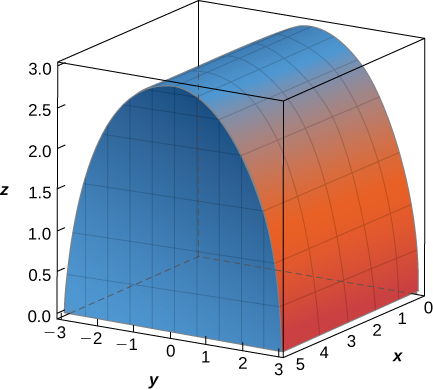 

<math xmlns="http://www.w3.org/1998/Math/MathML"><mrow><mstyle displaystyle="true"><mrow><munderover><mo stretchy="false">∫</mo><mn>0</mn><mn>5</mn></munderover><mspace width="0.2em" /><mrow><mstyle displaystyle="true"><mrow><munderover><mo stretchy="false">∫</mo><mrow><mn>−3</mn></mrow><mn>3</mn></munderover><mspace width="0.2em" /><mrow><mstyle displaystyle="true"><mrow><munderover><mo stretchy="false">∫</mo><mn>0</mn><mrow><msqrt><mrow><mn>9</mn><mo>−</mo><msup><mi>y</mi><mn>2</mn></msup></mrow></msqrt></mrow></munderover><mrow><mi>z</mi><mspace width="0.2em" /><mi>d</mi><mi>z</mi><mspace width="0.2em" /><mi>d</mi><mi>y</mi><mspace width="0.2em" /><mi>d</mi><mi>x</mi></mrow></mrow></mstyle></mrow></mrow></mstyle></mrow></mrow></mstyle><mo>=</mo><mn>90</mn></mrow></math>

The solid <math xmlns="http://www.w3.org/1998/Math/MathML"><mi>E</mi></math>

 bounded by <math xmlns="http://www.w3.org/1998/Math/MathML"><mrow><mi>y</mi><mo>=</mo><msqrt><mi>x</mi></msqrt><mo>,</mo></mrow></math>

 <math xmlns="http://www.w3.org/1998/Math/MathML"><mrow><mi>x</mi><mo>=</mo><mn>4</mn><mo>,</mo></mrow></math>

 <math xmlns="http://www.w3.org/1998/Math/MathML"><mrow><mi>y</mi><mo>=</mo><mn>0</mn><mo>,</mo></mrow></math>

 and <math xmlns="http://www.w3.org/1998/Math/MathML"><mrow><mi>z</mi><mo>=</mo><mn>1</mn></mrow></math>

 is given in the following figure. Evaluate the integral <math xmlns="http://www.w3.org/1998/Math/MathML"><mrow><mstyle displaystyle="true"><mrow><munder><mo>∭</mo><mi>E</mi></munder><mrow><mi>x</mi><mi>y</mi><mi>z</mi><mspace width="0.2em" /><mi>d</mi><mi>V</mi></mrow></mrow></mstyle></mrow></math>

 by integrating first with respect to <math xmlns="http://www.w3.org/1998/Math/MathML"><mrow><mi>x</mi><mo>,</mo></mrow></math>

 then <math xmlns="http://www.w3.org/1998/Math/MathML"><mrow><mi>y</mi><mo>,</mo></mrow></math>

 and then <math xmlns="http://www.w3.org/1998/Math/MathML"><mrow><mi>z</mi><mo>.</mo></mrow></math>

 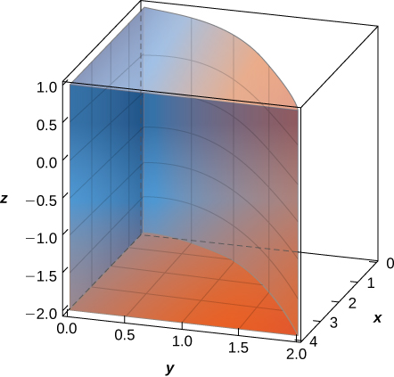 

**[T]** The volume of a solid <math xmlns="http://www.w3.org/1998/Math/MathML"><mi>E</mi></math>

 is given by the integral <math xmlns="http://www.w3.org/1998/Math/MathML"><mrow><mstyle displaystyle="true"><mrow><munderover><mo stretchy="false">∫</mo><mrow><mn>−2</mn></mrow><mn>0</mn></munderover><mspace width="0.2em" /><mrow><mstyle displaystyle="true"><mrow><munderover><mo stretchy="false">∫</mo><mi>x</mi><mn>0</mn></munderover><mspace width="0.2em" /><mrow><mstyle displaystyle="true"><mrow><munderover><mo stretchy="false">∫</mo><mn>0</mn><mrow><msup><mi>x</mi><mn>2</mn></msup><mo>+</mo><msup><mi>y</mi><mn>2</mn></msup></mrow></munderover><mrow><mi>d</mi><mi>z</mi><mspace width="0.2em" /><mi>d</mi><mi>y</mi><mspace width="0.2em" /><mi>d</mi><mi>x</mi></mrow></mrow></mstyle></mrow></mrow></mstyle></mrow></mrow></mstyle><mo>.</mo></mrow></math>

 Use a computer algebra system (CAS) to graph <math xmlns="http://www.w3.org/1998/Math/MathML"><mi>E</mi></math>

 and find its volume. Round your answer to two decimal places.

<math xmlns="http://www.w3.org/1998/Math/MathML"><mrow><mi>V</mi><mo>=</mo><mn>5.33</mn></mrow></math>

* * *
{: data-type="newline"}

   

**[T]** The volume of a solid <math xmlns="http://www.w3.org/1998/Math/MathML"><mi>E</mi></math>

 is given by the integral <math xmlns="http://www.w3.org/1998/Math/MathML"><mrow><mstyle displaystyle="true"><mrow><munderover><mo stretchy="false">∫</mo><mrow><mn>−1</mn></mrow><mn>0</mn></munderover><mspace width="0.2em" /><mrow><mstyle displaystyle="true"><mrow><munderover><mo stretchy="false">∫</mo><mrow><mtext>−</mtext><msup><mi>x</mi><mn>2</mn></msup></mrow><mn>0</mn></munderover><mspace width="0.2em" /><mrow><mstyle displaystyle="true"><mrow><munderover><mo stretchy="false">∫</mo><mn>0</mn><mrow><mn>1</mn><mo>+</mo><msqrt><mrow><msup><mi>x</mi><mn>2</mn></msup><mo>+</mo><msup><mi>y</mi><mn>2</mn></msup></mrow></msqrt></mrow></munderover><mrow><mi>d</mi><mi>z</mi><mspace width="0.2em" /><mi>d</mi><mi>y</mi><mspace width="0.2em" /><mi>d</mi><mi>x</mi></mrow></mrow></mstyle></mrow></mrow></mstyle></mrow></mrow></mstyle><mo>.</mo></mrow></math>

 Use a CAS to graph <math xmlns="http://www.w3.org/1998/Math/MathML"><mi>E</mi></math>

 and find its volume <math xmlns="http://www.w3.org/1998/Math/MathML"><mrow><mi>V</mi><mo>.</mo></mrow></math>

 Round your answer to two decimal places.

In the following exercises, use two circular permutations of the variables <math xmlns="http://www.w3.org/1998/Math/MathML"><mrow><mi>x</mi><mo>,</mo><mi>y</mi><mo>,</mo><mspace width="0.2em" /><mtext>and</mtext><mspace width="0.2em" /><mi>z</mi></mrow></math>

 to write new integrals whose values equal the value of the original integral. A circular permutation of <math xmlns="http://www.w3.org/1998/Math/MathML"><mrow><mi>x</mi><mo>,</mo><mi>y</mi><mo>,</mo><mspace width="0.2em" /><mtext>and</mtext><mspace width="0.2em" /><mi>z</mi></mrow></math>

 is the arrangement of the numbers in one of the following orders: <math xmlns="http://www.w3.org/1998/Math/MathML"><mrow><mi>y</mi><mo>,</mo><mi>z</mi><mo>,</mo><mspace width="0.2em" /><mtext>and</mtext><mspace width="0.2em" /><mi>x</mi><mspace width="0.2em" /><mtext>or</mtext><mspace width="0.2em" /><mi>z</mi><mo>,</mo><mi>x</mi><mo>,</mo><mspace width="0.2em" /><mtext>and</mtext><mspace width="0.2em" /><mi>y</mi><mo>.</mo></mrow></math>

<math xmlns="http://www.w3.org/1998/Math/MathML"><mrow><mstyle displaystyle="true"><mrow><munderover><mo stretchy="false">∫</mo><mn>0</mn><mn>1</mn></munderover><mspace width="0.2em" /><mrow><mstyle displaystyle="true"><mrow><munderover><mo stretchy="false">∫</mo><mn>1</mn><mn>3</mn></munderover><mspace width="0.2em" /><mrow><mstyle displaystyle="true"><mrow><munderover><mo stretchy="false">∫</mo><mn>2</mn><mn>4</mn></munderover><mrow><mrow><mo>(</mo><mrow><msup><mi>x</mi><mn>2</mn></msup><msup><mi>z</mi><mn>2</mn></msup><mo>+</mo><mn>1</mn></mrow><mo>)</mo></mrow></mrow></mrow></mstyle></mrow></mrow></mstyle></mrow></mrow></mstyle><mi>d</mi><mi>x</mi><mspace width="0.2em" /><mi>d</mi><mi>y</mi><mspace width="0.2em" /><mi>d</mi><mi>z</mi></mrow></math>

<math xmlns="http://www.w3.org/1998/Math/MathML"><mrow><mstyle displaystyle="true"><mrow><munderover><mo stretchy="false">∫</mo><mn>0</mn><mn>1</mn></munderover><mspace width="0.2em" /><mrow><mstyle displaystyle="true"><mrow><munderover><mo stretchy="false">∫</mo><mn>1</mn><mn>3</mn></munderover><mspace width="0.2em" /><mrow><mstyle displaystyle="true"><mrow><munderover><mo stretchy="false">∫</mo><mn>2</mn><mn>4</mn></munderover><mrow><mrow><mo>(</mo><mrow><msup><mi>y</mi><mn>2</mn></msup><msup><mi>z</mi><mn>2</mn></msup><mo>+</mo><mn>1</mn></mrow><mo>)</mo></mrow></mrow></mrow></mstyle></mrow></mrow></mstyle></mrow></mrow></mstyle><mi>d</mi><mi>z</mi><mspace width="0.2em" /><mi>d</mi><mi>x</mi><mspace width="0.2em" /><mi>d</mi><mi>y</mi><mo>;</mo></mrow></math>

 <math xmlns="http://www.w3.org/1998/Math/MathML"><mrow><mstyle displaystyle="true"><mrow><munderover><mo stretchy="false">∫</mo><mn>0</mn><mn>1</mn></munderover><mspace width="0.2em" /><mrow><mstyle displaystyle="true"><mrow><munderover><mo stretchy="false">∫</mo><mn>1</mn><mn>3</mn></munderover><mspace width="0.2em" /><mrow><mstyle displaystyle="true"><mrow><munderover><mo stretchy="false">∫</mo><mn>2</mn><mn>4</mn></munderover><mrow><mrow><mo>(</mo><mrow><msup><mi>x</mi><mn>2</mn></msup><msup><mi>y</mi><mn>2</mn></msup><mo>+</mo><mn>1</mn></mrow><mo>)</mo></mrow></mrow></mrow></mstyle></mrow></mrow></mstyle></mrow></mrow></mstyle><mi>d</mi><mi>y</mi><mspace width="0.2em" /><mi>d</mi><mi>z</mi><mspace width="0.2em" /><mi>d</mi><mi>x</mi></mrow></math>

<math xmlns="http://www.w3.org/1998/Math/MathML"><mrow><mstyle displaystyle="true"><mrow><munderover><mo stretchy="false">∫</mo><mn>1</mn><mn>3</mn></munderover><mspace width="0.2em" /><mrow><mstyle displaystyle="true"><mrow><munderover><mo stretchy="false">∫</mo><mn>0</mn><mn>1</mn></munderover><mspace width="0.2em" /><mrow><mstyle displaystyle="true"><mrow><munderover><mo stretchy="false">∫</mo><mn>0</mn><mrow><mtext>−</mtext><mi>x</mi><mo>+</mo><mn>1</mn></mrow></munderover><mrow><mrow><mo>(</mo><mrow><mn>2</mn><mi>x</mi><mo>+</mo><mn>5</mn><mi>y</mi><mo>+</mo><mn>7</mn><mi>z</mi></mrow><mo>)</mo></mrow></mrow></mrow></mstyle></mrow></mrow></mstyle></mrow></mrow></mstyle><mi>d</mi><mi>y</mi><mspace width="0.2em" /><mi>d</mi><mi>x</mi><mspace width="0.2em" /><mi>d</mi><mi>z</mi></mrow></math>

<math xmlns="http://www.w3.org/1998/Math/MathML"><mrow><mstyle displaystyle="true"><mrow><munderover><mo stretchy="false">∫</mo><mn>0</mn><mn>1</mn></munderover><mspace width="0.2em" /><mrow><mstyle displaystyle="true"><mrow><munderover><mo stretchy="false">∫</mo><mrow><mtext>−</mtext><mi>y</mi></mrow><mi>y</mi></munderover><mspace width="0.2em" /><mrow><mstyle displaystyle="true"><mrow><munderover><mo stretchy="false">∫</mo><mn>0</mn><mrow><mn>1</mn><mo>−</mo><msup><mi>x</mi><mn>4</mn></msup><mo>−</mo><msup><mi>y</mi><mn>4</mn></msup></mrow></munderover><mrow><mtext>ln</mtext><mspace width="0.2em" /><mi>x</mi></mrow></mrow></mstyle></mrow></mrow></mstyle></mrow></mrow></mstyle><mspace width="0.2em" /><mi>d</mi><mi>z</mi><mspace width="0.2em" /><mi>d</mi><mi>x</mi><mspace width="0.2em" /><mi>d</mi><mi>y</mi></mrow></math>

<math xmlns="http://www.w3.org/1998/Math/MathML"><mrow><mstyle displaystyle="true"><mrow><munderover><mo stretchy="false">∫</mo><mrow><mn>−1</mn></mrow><mn>1</mn></munderover><mspace width="0.2em" /><mrow><mstyle displaystyle="true"><mrow><munderover><mo stretchy="false">∫</mo><mn>0</mn><mn>1</mn></munderover><mspace width="0.2em" /><mrow><mstyle displaystyle="true"><mrow><munderover><mo stretchy="false">∫</mo><mrow><mtext>−</mtext><msup><mi>y</mi><mn>6</mn></msup></mrow><mrow><msqrt><mi>y</mi></msqrt></mrow></munderover><mrow><mrow><mo>(</mo><mrow><mi>x</mi><mo>+</mo><mi>y</mi><mi>z</mi></mrow><mo>)</mo></mrow></mrow></mrow></mstyle></mrow></mrow></mstyle></mrow></mrow></mstyle><mi>d</mi><mi>x</mi><mspace width="0.2em" /><mi>d</mi><mi>y</mi><mspace width="0.2em" /><mi>d</mi><mi>z</mi></mrow></math>

Set up the integral that gives the volume of the solid <math xmlns="http://www.w3.org/1998/Math/MathML"><mi>E</mi></math>

 bounded by <math xmlns="http://www.w3.org/1998/Math/MathML"><mrow><msup><mi>y</mi><mn>2</mn></msup><mo>=</mo><msup><mi>x</mi><mn>2</mn></msup><mo>+</mo><msup><mi>z</mi><mn>2</mn></msup></mrow></math>

 and <math xmlns="http://www.w3.org/1998/Math/MathML"><mrow><mi>y</mi><mo>=</mo><msup><mi>a</mi><mn>2</mn></msup><mo>,</mo></mrow></math>

 where <math xmlns="http://www.w3.org/1998/Math/MathML"><mrow><mi>a</mi><mo>&gt;</mo><mn>0</mn><mo>.</mo></mrow></math>

<math xmlns="http://www.w3.org/1998/Math/MathML"><mrow><mi>V</mi><mo>=</mo><mstyle displaystyle="true"><mrow><munderover><mo stretchy="false">∫</mo><mrow><mtext>−</mtext><mi>a</mi></mrow><mi>a</mi></munderover><mspace width="0.2em" /><mrow><mstyle displaystyle="true"><mrow><munderover><mo stretchy="false">∫</mo><mrow><mtext>−</mtext><msqrt><mrow><msup><mi>a</mi><mn>2</mn></msup><mo>−</mo><msup><mi>z</mi><mn>2</mn></msup></mrow></msqrt></mrow><mrow><msqrt><mrow><msup><mi>a</mi><mn>2</mn></msup><mo>−</mo><msup><mi>z</mi><mn>2</mn></msup></mrow></msqrt></mrow></munderover><mspace width="0.2em" /><mrow><mstyle displaystyle="true"><mrow><munderover><mo stretchy="false">∫</mo><mrow><msqrt><mrow><msup><mi>x</mi><mn>2</mn></msup><mo>+</mo><msup><mi>z</mi><mn>2</mn></msup></mrow></msqrt></mrow><mrow><msup><mi>a</mi><mn>2</mn></msup></mrow></munderover><mrow><mi>d</mi><mi>y</mi><mspace width="0.2em" /><mi>d</mi><mi>x</mi><mspace width="0.2em" /><mi>d</mi><mi>z</mi></mrow></mrow></mstyle></mrow></mrow></mstyle></mrow></mrow></mstyle></mrow></math>

Set up the integral that gives the volume of the solid <math xmlns="http://www.w3.org/1998/Math/MathML"><mi>E</mi></math>

 bounded by <math xmlns="http://www.w3.org/1998/Math/MathML"><mrow><mi>x</mi><mo>=</mo><msup><mi>y</mi><mn>2</mn></msup><mo>+</mo><msup><mi>z</mi><mn>2</mn></msup></mrow></math>

 and <math xmlns="http://www.w3.org/1998/Math/MathML"><mrow><mi>x</mi><mo>=</mo><msup><mi>a</mi><mn>2</mn></msup><mo>,</mo></mrow></math>

 where <math xmlns="http://www.w3.org/1998/Math/MathML"><mrow><mi>a</mi><mo>&gt;</mo><mn>0</mn><mo>.</mo></mrow></math>

Find the average value of the function <math xmlns="http://www.w3.org/1998/Math/MathML"><mrow><mi>f</mi><mrow><mo>(</mo><mrow><mi>x</mi><mo>,</mo><mi>y</mi><mo>,</mo><mi>z</mi></mrow><mo>)</mo></mrow><mo>=</mo><mi>x</mi><mo>+</mo><mi>y</mi><mo>+</mo><mi>z</mi></mrow></math>

 over the parallelepiped determined by <math xmlns="http://www.w3.org/1998/Math/MathML"><mrow><mi>x</mi><mo>=</mo><mn>0</mn><mo>,</mo><mi>x</mi><mo>=</mo><mn>1</mn><mo>,</mo><mi>y</mi><mo>=</mo><mn>0</mn><mo>,</mo><mi>y</mi><mo>=</mo><mn>3</mn><mo>,</mo><mi>z</mi><mo>=</mo><mn>0</mn><mo>,</mo></mrow></math>

 and <math xmlns="http://www.w3.org/1998/Math/MathML"><mrow><mi>z</mi><mo>=</mo><mn>5</mn><mo>.</mo></mrow></math>

<math xmlns="http://www.w3.org/1998/Math/MathML"><mrow><mfrac><mn>9</mn><mn>2</mn></mfrac></mrow></math>

Find the average value of the function <math xmlns="http://www.w3.org/1998/Math/MathML"><mrow><mi>f</mi><mrow><mo>(</mo><mrow><mi>x</mi><mo>,</mo><mi>y</mi><mo>,</mo><mi>z</mi></mrow><mo>)</mo></mrow><mo>=</mo><mi>x</mi><mi>y</mi><mi>z</mi></mrow></math>

 over the solid <math xmlns="http://www.w3.org/1998/Math/MathML"><mrow><mi>E</mi><mo>=</mo><mrow><mo>[</mo><mrow><mn>0</mn><mo>,</mo><mn>1</mn></mrow><mo>]</mo></mrow><mspace width="0.2em" /><mo>×</mo><mspace width="0.2em" /><mrow><mo>[</mo><mrow><mn>0</mn><mo>,</mo><mn>1</mn></mrow><mo>]</mo></mrow><mspace width="0.2em" /><mo>×</mo><mspace width="0.2em" /><mrow><mo>[</mo><mrow><mn>0</mn><mo>,</mo><mn>1</mn></mrow><mo>]</mo></mrow></mrow></math>

 situated in the first octant.

Find the volume of the solid <math xmlns="http://www.w3.org/1998/Math/MathML"><mi>E</mi></math>

 that lies under the plane <math xmlns="http://www.w3.org/1998/Math/MathML"><mrow><mi>x</mi><mo>+</mo><mi>y</mi><mo>+</mo><mi>z</mi><mo>=</mo><mn>9</mn></mrow></math>

 and whose projection onto the <math xmlns="http://www.w3.org/1998/Math/MathML"><mrow><mi>x</mi><mi>y</mi></mrow></math>

-plane is bounded by <math xmlns="http://www.w3.org/1998/Math/MathML"><mrow><mi>x</mi><mo>=</mo><msqrt><mrow><mi>y</mi><mo>−</mo><mn>1</mn></mrow></msqrt><mo>,</mo><mi>x</mi><mo>=</mo><mn>0</mn><mo>,</mo></mrow></math>

 and <math xmlns="http://www.w3.org/1998/Math/MathML"><mrow><mi>x</mi><mo>+</mo><mi>y</mi><mo>=</mo><mn>7</mn><mo>.</mo></mrow></math>

<math xmlns="http://www.w3.org/1998/Math/MathML"><mrow><mfrac><mrow><mn>156</mn></mrow><mn>5</mn></mfrac></mrow></math>

Find the volume of the solid *E* that lies under the plane <math xmlns="http://www.w3.org/1998/Math/MathML"><mrow><mn>2</mn><mi>x</mi><mo>+</mo><mi>y</mi><mo>+</mo><mi>z</mi><mo>=</mo><mn>8</mn></mrow></math>

 and whose projection onto the <math xmlns="http://www.w3.org/1998/Math/MathML"><mrow><mi>x</mi><mi>y</mi></mrow></math>

-plane is bounded by <math xmlns="http://www.w3.org/1998/Math/MathML"><mrow><mi>x</mi><mo>=</mo><msup><mrow><mtext>sin</mtext></mrow><mrow><mn>−1</mn></mrow></msup><mi>y</mi><mo>,</mo><mi>y</mi><mo>=</mo><mn>0</mn><mo>,</mo></mrow></math>

 and <math xmlns="http://www.w3.org/1998/Math/MathML"><mrow><mi>x</mi><mo>=</mo><mfrac><mi>π</mi><mn>2</mn></mfrac><mo>.</mo></mrow></math>

Consider the pyramid with the base in the <math xmlns="http://www.w3.org/1998/Math/MathML"><mrow><mi>x</mi><mi>y</mi></mrow></math>

-plane of <math xmlns="http://www.w3.org/1998/Math/MathML"><mrow><mrow><mo>[</mo><mrow><mn>−2</mn><mo>,</mo><mn>2</mn></mrow><mo>]</mo></mrow><mspace width="0.2em" /><mo>×</mo><mspace width="0.2em" /><mrow><mo>[</mo><mrow><mn>−2</mn><mo>,</mo><mn>2</mn></mrow><mo>]</mo></mrow></mrow></math>

 and the vertex at the point <math xmlns="http://www.w3.org/1998/Math/MathML"><mrow><mrow><mo>(</mo><mrow><mn>0</mn><mo>,</mo><mn>0</mn><mo>,</mo><mn>8</mn></mrow><mo>)</mo></mrow><mo>.</mo></mrow></math>

1.  Show that the equations of the planes of the lateral faces of the pyramid are
    <math xmlns="http://www.w3.org/1998/Math/MathML"><mrow><mn>4</mn><mi>y</mi><mo>+</mo><mi>z</mi><mo>=</mo><mn>8</mn><mo>,</mo></mrow></math>
    
    <math xmlns="http://www.w3.org/1998/Math/MathML"><mrow><mn>4</mn><mi>y</mi><mo>−</mo><mi>z</mi><mo>=</mo><mn>−8</mn><mo>,</mo></mrow></math>
    
    <math xmlns="http://www.w3.org/1998/Math/MathML"><mrow><mn>4</mn><mi>x</mi><mo>+</mo><mi>z</mi><mo>=</mo><mn>8</mn><mo>,</mo></mrow></math>
    
    and
    <math xmlns="http://www.w3.org/1998/Math/MathML"><mrow><mn>−4</mn><mi>x</mi><mo>+</mo><mi>z</mi><mo>=</mo><mn>8</mn><mo>.</mo></mrow></math>

2.  Find the volume of the pyramid.
{: data-number-style="lower-alpha"}

a. Answers may vary; b. <math xmlns="http://www.w3.org/1998/Math/MathML"><mrow><mfrac><mrow><mn>128</mn></mrow><mn>3</mn></mfrac></mrow></math>

Consider the pyramid with the base in the <math xmlns="http://www.w3.org/1998/Math/MathML"><mrow><mi>x</mi><mi>y</mi></mrow></math>

-plane of <math xmlns="http://www.w3.org/1998/Math/MathML"><mrow><mrow><mo>[</mo><mrow><mn>−3</mn><mo>,</mo><mn>3</mn></mrow><mo>]</mo></mrow><mspace width="0.2em" /><mo>×</mo><mspace width="0.2em" /><mrow><mo>[</mo><mrow><mn>−3</mn><mo>,</mo><mn>3</mn></mrow><mo>]</mo></mrow></mrow></math>

 and the vertex at the point <math xmlns="http://www.w3.org/1998/Math/MathML"><mrow><mrow><mo>(</mo><mrow><mn>0</mn><mo>,</mo><mn>0</mn><mo>,</mo><mn>9</mn></mrow><mo>)</mo></mrow><mo>.</mo></mrow></math>

1.  Show that the equations of the planes of the side faces of the pyramid are
    <math xmlns="http://www.w3.org/1998/Math/MathML"><mrow><mn>3</mn><mi>y</mi><mo>+</mo><mi>z</mi><mo>=</mo><mn>9</mn><mo>,</mo></mrow></math>
    
    <math xmlns="http://www.w3.org/1998/Math/MathML"><mrow><mn>3</mn><mi>y</mi><mo>+</mo><mi>z</mi><mo>=</mo><mn>9</mn><mo>,</mo></mrow></math>
    
    <math xmlns="http://www.w3.org/1998/Math/MathML"><mrow><mi>y</mi><mo>=</mo><mn>0</mn></mrow></math>
    
    and
    <math xmlns="http://www.w3.org/1998/Math/MathML"><mrow><mi>x</mi><mo>=</mo><mn>0</mn><mo>.</mo></mrow></math>

2.  Find the volume of the pyramid.
{: data-number-style="lower-alpha"}

The solid <math xmlns="http://www.w3.org/1998/Math/MathML"><mi>E</mi></math>

 bounded by the sphere of equation <math xmlns="http://www.w3.org/1998/Math/MathML"><mrow><msup><mi>x</mi><mn>2</mn></msup><mo>+</mo><msup><mi>y</mi><mn>2</mn></msup><mo>+</mo><msup><mi>z</mi><mn>2</mn></msup><mo>=</mo><msup><mi>r</mi><mn>2</mn></msup></mrow></math>

 with <math xmlns="http://www.w3.org/1998/Math/MathML"><mrow><mi>r</mi><mo>&gt;</mo><mn>0</mn></mrow></math>

 and located in the first octant is represented in the following figure.

 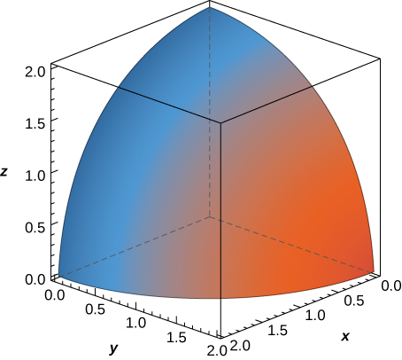 
1.  Write the triple integral that gives the volume of
    <math xmlns="http://www.w3.org/1998/Math/MathML"><mi>E</mi></math>
    
    by integrating first with respect to
    <math xmlns="http://www.w3.org/1998/Math/MathML"><mrow><mi>z</mi><mo>,</mo></mrow></math>
    
    then with
    <math xmlns="http://www.w3.org/1998/Math/MathML"><mrow><mi>y</mi><mo>,</mo></mrow></math>
    
    and then with
    <math xmlns="http://www.w3.org/1998/Math/MathML"><mrow><mi>x</mi><mo>.</mo></mrow></math>

2.  Rewrite the integral in part a. as an equivalent integral in five other orders.
{: data-number-style="lower-alpha"}

a. <math xmlns="http://www.w3.org/1998/Math/MathML"><mrow><mstyle displaystyle="true"><mrow><munderover><mo stretchy="false">∫</mo><mn>0</mn><mn>4</mn></munderover><mspace width="0.2em" /><mrow><mstyle displaystyle="true"><mrow><munderover><mo stretchy="false">∫</mo><mn>0</mn><mrow><msqrt><mrow><msup><mi>r</mi><mn>2</mn></msup><mo>−</mo><msup><mi>x</mi><mn>2</mn></msup></mrow></msqrt></mrow></munderover><mspace width="0.2em" /><mrow><mstyle displaystyle="true"><mrow><munderover><mo stretchy="false">∫</mo><mn>0</mn><mrow><msqrt><mrow><msup><mi>r</mi><mn>2</mn></msup><mo>−</mo><msup><mi>x</mi><mn>2</mn></msup><mo>−</mo><msup><mi>y</mi><mn>2</mn></msup></mrow></msqrt></mrow></munderover><mrow><mi>d</mi><mi>z</mi><mspace width="0.2em" /><mi>d</mi><mi>y</mi><mspace width="0.2em" /><mi>d</mi><mi>x</mi></mrow></mrow></mstyle></mrow></mrow></mstyle></mrow></mrow></mstyle><mo>;</mo></mrow></math>

 b. <math xmlns="http://www.w3.org/1998/Math/MathML"><mrow><mstyle displaystyle="true"><mrow><munderover><mo stretchy="false">∫</mo><mn>0</mn><mn>2</mn></munderover><mspace width="0.2em" /><mrow><mstyle displaystyle="true"><mrow><munderover><mo stretchy="false">∫</mo><mn>0</mn><mrow><msqrt><mrow><msup><mi>r</mi><mn>2</mn></msup><mo>−</mo><msup><mi>y</mi><mn>2</mn></msup></mrow></msqrt></mrow></munderover><mspace width="0.2em" /><mrow><mstyle displaystyle="true"><mrow><munderover><mo stretchy="false">∫</mo><mn>0</mn><mrow><msqrt><mrow><msup><mi>r</mi><mn>2</mn></msup><mo>−</mo><msup><mi>x</mi><mn>2</mn></msup><mo>−</mo><msup><mi>y</mi><mn>2</mn></msup></mrow></msqrt></mrow></munderover><mrow><mi>d</mi><mi>z</mi><mspace width="0.2em" /><mi>d</mi><mi>x</mi><mspace width="0.2em" /><mi>d</mi><mi>y</mi></mrow></mrow></mstyle></mrow></mrow></mstyle></mrow></mrow></mstyle><mo>,</mo></mrow></math>

 <math xmlns="http://www.w3.org/1998/Math/MathML"><mrow><mstyle displaystyle="true"><mrow><munderover><mo stretchy="false">∫</mo><mn>0</mn><mi>r</mi></munderover><mspace width="0.2em" /><mrow><mstyle displaystyle="true"><mrow><munderover><mo stretchy="false">∫</mo><mn>0</mn><mrow><msqrt><mrow><msup><mi>r</mi><mn>2</mn></msup><mo>−</mo><msup><mi>z</mi><mn>2</mn></msup></mrow></msqrt></mrow></munderover><mspace width="0.2em" /><mrow><mstyle displaystyle="true"><mrow><munderover><mo stretchy="false">∫</mo><mn>0</mn><mrow><msqrt><mrow><msup><mi>r</mi><mn>2</mn></msup><mo>−</mo><msup><mi>x</mi><mn>2</mn></msup><mo>−</mo><msup><mi>z</mi><mn>2</mn></msup></mrow></msqrt></mrow></munderover><mrow><mi>d</mi><mi>y</mi><mspace width="0.2em" /><mi>d</mi><mi>x</mi><mspace width="0.2em" /><mi>d</mi><mi>z</mi></mrow></mrow></mstyle></mrow></mrow></mstyle></mrow></mrow></mstyle><mo>,</mo></mrow></math>

 <math xmlns="http://www.w3.org/1998/Math/MathML"><mrow><mstyle displaystyle="true"><mrow><munderover><mo stretchy="false">∫</mo><mn>0</mn><mi>r</mi></munderover><mspace width="0.2em" /><mrow><mstyle displaystyle="true"><mrow><munderover><mo stretchy="false">∫</mo><mn>0</mn><mrow><msqrt><mrow><msup><mi>r</mi><mn>2</mn></msup><mo>−</mo><msup><mi>x</mi><mn>2</mn></msup></mrow></msqrt></mrow></munderover><mspace width="0.2em" /><mrow><mstyle displaystyle="true"><mrow><munderover><mo stretchy="false">∫</mo><mn>0</mn><mrow><msqrt><mrow><msup><mi>r</mi><mn>2</mn></msup><mo>−</mo><msup><mi>x</mi><mn>2</mn></msup><mo>−</mo><msup><mi>z</mi><mn>2</mn></msup></mrow></msqrt></mrow></munderover><mrow><mi>d</mi><mi>y</mi><mspace width="0.2em" /><mi>d</mi><mi>z</mi><mspace width="0.2em" /><mi>d</mi><mi>x</mi></mrow></mrow></mstyle></mrow></mrow></mstyle></mrow></mrow></mstyle><mo>,</mo></mrow></math>

 <math xmlns="http://www.w3.org/1998/Math/MathML"><mrow><mstyle displaystyle="true"><mrow><munderover><mo stretchy="false">∫</mo><mn>0</mn><mi>r</mi></munderover><mspace width="0.2em" /><mrow><mstyle displaystyle="true"><mrow><munderover><mo stretchy="false">∫</mo><mn>0</mn><mrow><msqrt><mrow><msup><mi>r</mi><mn>2</mn></msup><mo>−</mo><msup><mi>z</mi><mn>2</mn></msup></mrow></msqrt></mrow></munderover><mspace width="0.2em" /><mrow><mstyle displaystyle="true"><mrow><munderover><mo stretchy="false">∫</mo><mn>0</mn><mrow><msqrt><mrow><msup><mi>r</mi><mn>2</mn></msup><mo>−</mo><msup><mi>y</mi><mn>2</mn></msup><mo>−</mo><msup><mi>z</mi><mn>2</mn></msup></mrow></msqrt></mrow></munderover><mrow><mi>d</mi><mi>x</mi><mspace width="0.2em" /><mi>d</mi><mi>y</mi><mspace width="0.2em" /><mi>d</mi><mi>z</mi></mrow></mrow></mstyle></mrow></mrow></mstyle></mrow></mrow></mstyle><mo>,</mo></mrow></math>

 <math xmlns="http://www.w3.org/1998/Math/MathML"><mrow><mstyle displaystyle="true"><mrow><munderover><mo stretchy="false">∫</mo><mn>0</mn><mi>r</mi></munderover><mspace width="0.2em" /><mrow><mstyle displaystyle="true"><mrow><munderover><mo stretchy="false">∫</mo><mn>0</mn><mrow><msqrt><mrow><msup><mi>r</mi><mn>2</mn></msup><mo>−</mo><msup><mi>y</mi><mn>2</mn></msup></mrow></msqrt></mrow></munderover><mspace width="0.2em" /><mrow><mstyle displaystyle="true"><mrow><munderover><mo stretchy="false">∫</mo><mn>0</mn><mrow><msqrt><mrow><msup><mi>r</mi><mn>2</mn></msup><mo>−</mo><msup><mi>y</mi><mn>2</mn></msup><mo>−</mo><msup><mi>z</mi><mn>2</mn></msup></mrow></msqrt></mrow></munderover><mrow><mi>d</mi><mi>x</mi><mspace width="0.2em" /><mi>d</mi><mi>z</mi><mspace width="0.2em" /><mi>d</mi><mi>y</mi></mrow></mrow></mstyle></mrow></mrow></mstyle></mrow></mrow></mstyle></mrow></math>

The solid <math xmlns="http://www.w3.org/1998/Math/MathML"><mi>E</mi></math>

 bounded by the sphere of equation <math xmlns="http://www.w3.org/1998/Math/MathML"><mrow><mn>9</mn><msup><mi>x</mi><mn>2</mn></msup><mo>+</mo><mn>4</mn><msup><mi>y</mi><mn>2</mn></msup><mo>+</mo><msup><mi>z</mi><mn>2</mn></msup><mo>=</mo><mn>1</mn></mrow></math>

 and located in the first octant is represented in the following figure.

 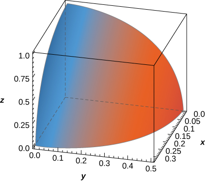 
1.  Write the triple integral that gives the volume of
    <math xmlns="http://www.w3.org/1998/Math/MathML"><mi>E</mi></math>
    
    by integrating first with respect to
    <math xmlns="http://www.w3.org/1998/Math/MathML"><mrow><mi>z</mi><mo>,</mo></mrow></math>
    
    then with
    <math xmlns="http://www.w3.org/1998/Math/MathML"><mrow><mi>y</mi><mo>,</mo></mrow></math>
    
    and then with
    <math xmlns="http://www.w3.org/1998/Math/MathML"><mrow><mi>x</mi><mo>.</mo></mrow></math>

2.  Rewrite the integral in part a. as an equivalent integral in five other orders.
{: data-number-style="lower-alpha"}

Find the volume of the prism with vertices <math xmlns="http://www.w3.org/1998/Math/MathML"><mrow><mrow><mo>(</mo><mrow><mn>0</mn><mo>,</mo><mn>0</mn><mo>,</mo><mn>0</mn></mrow><mo>)</mo></mrow><mo>,</mo><mrow><mo>(</mo><mrow><mn>2</mn><mo>,</mo><mn>0</mn><mo>,</mo><mn>0</mn></mrow><mo>)</mo></mrow><mo>,</mo><mrow><mo>(</mo><mrow><mn>2</mn><mo>,</mo><mn>3</mn><mo>,</mo><mn>0</mn></mrow><mo>)</mo></mrow><mo>,</mo></mrow></math>

 <math xmlns="http://www.w3.org/1998/Math/MathML"><mrow><mrow><mo>(</mo><mrow><mn>0</mn><mo>,</mo><mn>3</mn><mo>,</mo><mn>0</mn></mrow><mo>)</mo></mrow><mo>,</mo><mrow><mo>(</mo><mrow><mn>0</mn><mo>,</mo><mn>0</mn><mo>,</mo><mn>1</mn></mrow><mo>)</mo></mrow><mo>,</mo><mspace width="0.2em" /><mtext>and</mtext><mspace width="0.2em" /><mrow><mo>(</mo><mrow><mn>2</mn><mo>,</mo><mn>0</mn><mo>,</mo><mn>1</mn></mrow><mo>)</mo></mrow><mo>.</mo></mrow></math>

<math xmlns="http://www.w3.org/1998/Math/MathML"><mn>3</mn></math>

Find the volume of the prism with vertices <math xmlns="http://www.w3.org/1998/Math/MathML"><mrow><mrow><mo>(</mo><mrow><mn>0</mn><mo>,</mo><mn>0</mn><mo>,</mo><mn>0</mn></mrow><mo>)</mo></mrow><mo>,</mo><mrow><mo>(</mo><mrow><mn>4</mn><mo>,</mo><mn>0</mn><mo>,</mo><mn>0</mn></mrow><mo>)</mo></mrow><mo>,</mo><mrow><mo>(</mo><mrow><mn>4</mn><mo>,</mo><mn>6</mn><mo>,</mo><mn>0</mn></mrow><mo>)</mo></mrow><mo>,</mo></mrow></math>

 <math xmlns="http://www.w3.org/1998/Math/MathML"><mrow><mrow><mo>(</mo><mrow><mn>0</mn><mo>,</mo><mn>6</mn><mo>,</mo><mn>0</mn></mrow><mo>)</mo></mrow><mo>,</mo><mrow><mo>(</mo><mrow><mn>0</mn><mo>,</mo><mn>0</mn><mo>,</mo><mn>1</mn></mrow><mo>)</mo></mrow><mo>,</mo><mspace width="0.2em" /><mtext>and</mtext><mspace width="0.2em" /><mrow><mo>(</mo><mrow><mn>4</mn><mo>,</mo><mn>0</mn><mo>,</mo><mn>1</mn></mrow><mo>)</mo></mrow><mo>.</mo></mrow></math>

The solid <math xmlns="http://www.w3.org/1998/Math/MathML"><mi>E</mi></math>

 bounded by <math xmlns="http://www.w3.org/1998/Math/MathML"><mrow><mi>z</mi><mo>=</mo><mn>10</mn><mo>−</mo><mn>2</mn><mi>x</mi><mo>−</mo><mi>y</mi></mrow></math>

 and situated in the first octant is given in the following figure. Find the volume of the solid.

 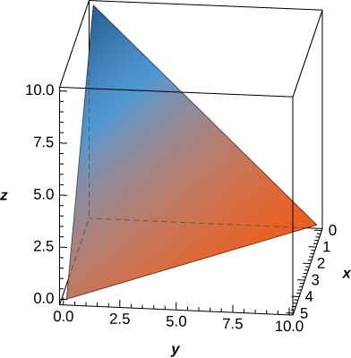 

<math xmlns="http://www.w3.org/1998/Math/MathML"><mrow><mfrac><mrow><mn>250</mn></mrow><mn>3</mn></mfrac></mrow></math>

The solid <math xmlns="http://www.w3.org/1998/Math/MathML"><mi>E</mi></math>

 bounded by <math xmlns="http://www.w3.org/1998/Math/MathML"><mrow><mi>z</mi><mo>=</mo><mn>1</mn><mo>−</mo><msup><mi>x</mi><mn>2</mn></msup></mrow></math>

 and situated in the first octant is given in the following figure. Find the volume of the solid.

  

The midpoint rule for the triple integral <math xmlns="http://www.w3.org/1998/Math/MathML"><mrow><mstyle displaystyle="true"><mrow><munder><mo>∭</mo><mi>B</mi></munder><mrow><mi>f</mi><mrow><mo>(</mo><mrow><mi>x</mi><mo>,</mo><mi>y</mi><mo>,</mo><mi>z</mi></mrow><mo>)</mo></mrow><mi>d</mi><mi>V</mi></mrow></mrow></mstyle></mrow></math>

 over the rectangular solid box <math xmlns="http://www.w3.org/1998/Math/MathML"><mi>B</mi></math>

 is a generalization of the midpoint rule for double integrals. The region <math xmlns="http://www.w3.org/1998/Math/MathML"><mi>B</mi></math>

 is divided into subboxes of equal sizes and the integral is approximated by the triple Riemann sum <math xmlns="http://www.w3.org/1998/Math/MathML"><mrow><mstyle displaystyle="true"><munderover><mo>∑</mo><mrow><mi>i</mi><mo>=</mo><mn>1</mn></mrow><mi>l</mi></munderover><mrow><mstyle displaystyle="true"><munderover><mo>∑</mo><mrow><mi>j</mi><mo>=</mo><mn>1</mn></mrow><mi>m</mi></munderover><mrow><mstyle displaystyle="true"><munderover><mo>∑</mo><mrow><mi>k</mi><mo>=</mo><mn>1</mn></mrow><mi>n</mi></munderover><mrow><mi>f</mi><mrow><mo>(</mo><mrow><mover accent="true"><mrow><msub><mi>x</mi><mi>i</mi></msub></mrow><mo stretchy="true">–</mo></mover><mo>,</mo><mover accent="true"><mrow><msub><mi>y</mi><mi>j</mi></msub></mrow><mo stretchy="true">–</mo></mover><mo>,</mo><mover accent="true"><mrow><msub><mi>z</mi><mi>k</mi></msub></mrow><mo stretchy="true">–</mo></mover></mrow><mo>)</mo></mrow></mrow></mstyle></mrow></mstyle></mrow></mstyle><mtext>Δ</mtext><mi>V</mi><mo>,</mo></mrow></math>

 where <math xmlns="http://www.w3.org/1998/Math/MathML"><mrow><mrow><mo>(</mo><mrow><mover accent="true"><mrow><msub><mi>x</mi><mi>i</mi></msub></mrow><mo stretchy="true">–</mo></mover><mo>,</mo><mover accent="true"><mrow><msub><mi>y</mi><mi>j</mi></msub></mrow><mo stretchy="true">–</mo></mover><mo>,</mo><mover accent="true"><mrow><msub><mi>z</mi><mi>k</mi></msub></mrow><mo stretchy="true">–</mo></mover></mrow><mo>)</mo></mrow></mrow></math>

 is the center of the box <math xmlns="http://www.w3.org/1998/Math/MathML"><mrow><msub><mi>B</mi><mrow><mi>i</mi><mi>j</mi><mi>k</mi></mrow></msub></mrow></math>

 and <math xmlns="http://www.w3.org/1998/Math/MathML"><mrow><mtext>Δ</mtext><mi>V</mi></mrow></math>

 is the volume of each subbox. Apply the midpoint rule to approximate <math xmlns="http://www.w3.org/1998/Math/MathML"><mrow><mstyle displaystyle="true"><mrow><munder><mo>∭</mo><mi>B</mi></munder><mrow><msup><mi>x</mi><mn>2</mn></msup><mi>d</mi><mi>V</mi></mrow></mrow></mstyle></mrow></math>

 over the solid <math xmlns="http://www.w3.org/1998/Math/MathML"><mrow><mi>B</mi><mo>=</mo><mrow><mo>{</mo><mrow><mrow><mrow><mrow><mo>(</mo><mrow><mi>x</mi><mo>,</mo><mi>y</mi><mo>,</mo><mi>z</mi></mrow><mo>)</mo></mrow></mrow><mo>\|</mo></mrow><mn>0</mn><mo>≤</mo><mi>x</mi><mo>≤</mo><mn>1</mn><mo>,</mo><mn>0</mn><mo>≤</mo><mi>y</mi><mo>≤</mo><mn>1</mn><mo>,</mo><mn>0</mn><mo>≤</mo><mi>z</mi><mo>≤</mo><mn>1</mn></mrow><mo>}</mo></mrow></mrow></math>

 by using a partition of eight cubes of equal size. Round your answer to three decimal places.

<math xmlns="http://www.w3.org/1998/Math/MathML"><mrow><mfrac><mn>5</mn><mrow><mn>16</mn></mrow></mfrac><mo>≈</mo><mn>0.313</mn></mrow></math>

**[T]**

1.  Apply the midpoint rule to approximate
    <math xmlns="http://www.w3.org/1998/Math/MathML"><mrow><mstyle displaystyle="true"><mrow><munder><mo>∭</mo><mi>B</mi></munder><mrow><msup><mi>e</mi><mrow><mtext>−</mtext><msup><mi>x</mi><mn>2</mn></msup></mrow></msup><mi>d</mi><mi>V</mi></mrow></mrow></mstyle></mrow></math>
    
    over the solid
    <math xmlns="http://www.w3.org/1998/Math/MathML"><mrow><mi>B</mi><mo>=</mo><mrow><mo>{</mo><mrow><mo stretchy="false">(</mo><mi>x</mi><mo>,</mo><mi>y</mi><mo>,</mo><mi>z</mi><mo stretchy="false">)</mo><mo>\|</mo><mn>0</mn><mo>≤</mo><mi>x</mi><mo>≤</mo><mn>1</mn><mo>,</mo><mn>0</mn><mo>≤</mo><mi>y</mi><mo>≤</mo><mn>1</mn><mo>,</mo><mn>0</mn><mo>≤</mo><mi>z</mi><mo>≤</mo><mn>1</mn></mrow><mo>}</mo></mrow></mrow></math>
    
    by using a partition of eight cubes of equal size. Round your answer to three decimal places.
2.  Use a CAS to improve the above integral approximation in the case of a partition of
    <math xmlns="http://www.w3.org/1998/Math/MathML"><mrow><msup><mi>n</mi><mn>3</mn></msup></mrow></math>
    
    cubes of equal size, where
    <math xmlns="http://www.w3.org/1998/Math/MathML"><mrow><mi>n</mi><mo>=</mo><mn>3</mn><mo>,</mo><mn>4</mn><mtext>,…,</mtext><mspace width="0.2em" /><mn>10</mn><mo>.</mo></mrow></math>
{: data-number-style="lower-alpha"}

Suppose that the temperature in degrees Celsius at a point <math xmlns="http://www.w3.org/1998/Math/MathML"><mrow><mrow><mo>(</mo><mrow><mi>x</mi><mo>,</mo><mi>y</mi><mo>,</mo><mi>z</mi></mrow><mo>)</mo></mrow></mrow></math>

 of a solid <math xmlns="http://www.w3.org/1998/Math/MathML"><mi>E</mi></math>

 bounded by the coordinate planes and <math xmlns="http://www.w3.org/1998/Math/MathML"><mrow><mi>x</mi><mo>+</mo><mi>y</mi><mo>+</mo><mi>z</mi><mo>=</mo><mn>5</mn></mrow></math>

 is <math xmlns="http://www.w3.org/1998/Math/MathML"><mrow><mi>T</mi><mrow><mo>(</mo><mrow><mi>x</mi><mo>,</mo><mi>y</mi><mo>,</mo><mi>z</mi></mrow><mo>)</mo></mrow><mo>=</mo><mi>x</mi><mi>z</mi><mo>+</mo><mn>5</mn><mi>z</mi><mo>+</mo><mn>10</mn><mo>.</mo></mrow></math>

 Find the average temperature over the solid.

<math xmlns="http://www.w3.org/1998/Math/MathML"><mrow><mfrac><mrow><mn>35</mn></mrow><mn>2</mn></mfrac></mrow></math>

Suppose that the temperature in degrees Fahrenheit at a point <math xmlns="http://www.w3.org/1998/Math/MathML"><mrow><mrow><mo>(</mo><mrow><mi>x</mi><mo>,</mo><mi>y</mi><mo>,</mo><mi>z</mi></mrow><mo>)</mo></mrow></mrow></math>

 of a solid <math xmlns="http://www.w3.org/1998/Math/MathML"><mi>E</mi></math>

 bounded by the coordinate planes and <math xmlns="http://www.w3.org/1998/Math/MathML"><mrow><mi>x</mi><mo>+</mo><mi>y</mi><mo>+</mo><mi>z</mi><mo>=</mo><mn>5</mn></mrow></math>

 is <math xmlns="http://www.w3.org/1998/Math/MathML"><mrow><mi>T</mi><mrow><mo>(</mo><mrow><mi>x</mi><mo>,</mo><mi>y</mi><mo>,</mo><mi>z</mi></mrow><mo>)</mo></mrow><mo>=</mo><mi>x</mi><mo>+</mo><mi>y</mi><mo>+</mo><mi>x</mi><mi>y</mi><mo>.</mo></mrow></math>

 Find the average temperature over the solid.

Show that the volume of a right square pyramid of height <math xmlns="http://www.w3.org/1998/Math/MathML"><mi>h</mi></math>

 and side length <math xmlns="http://www.w3.org/1998/Math/MathML"><mi>a</mi></math>

 is <math xmlns="http://www.w3.org/1998/Math/MathML"><mrow><mi>v</mi><mo>=</mo><mfrac><mrow><mi>h</mi><msup><mi>a</mi><mn>2</mn></msup></mrow><mn>3</mn></mfrac></mrow></math>

 by using triple integrals.

Show that the volume of a regular right hexagonal prism of edge length <math xmlns="http://www.w3.org/1998/Math/MathML"><mi>a</mi></math>

 is <math xmlns="http://www.w3.org/1998/Math/MathML"><mrow><mfrac><mrow><mn>3</mn><msup><mi>a</mi><mn>3</mn></msup><msqrt><mn>3</mn></msqrt></mrow><mn>2</mn></mfrac></mrow></math>

 by using triple integrals.

Show that the volume of a regular right hexagonal pyramid of edge length <math xmlns="http://www.w3.org/1998/Math/MathML"><mi>a</mi></math>

 is <math xmlns="http://www.w3.org/1998/Math/MathML"><mrow><mfrac><mrow><msup><mi>a</mi><mn>3</mn></msup><msqrt><mn>3</mn></msqrt></mrow><mn>2</mn></mfrac></mrow></math>

 by using triple integrals.

If the charge density at an arbitrary point <math xmlns="http://www.w3.org/1998/Math/MathML"><mrow><mo stretchy="false">(</mo><mi>x</mi><mo>,</mo><mi>y</mi><mo>,</mo><mi>z</mi><mo stretchy="false">)</mo></mrow></math>

 of a solid <math xmlns="http://www.w3.org/1998/Math/MathML"><mi>E</mi></math>

 is given by the function <math xmlns="http://www.w3.org/1998/Math/MathML"><mrow><mi>ρ</mi><mo stretchy="false">(</mo><mi>x</mi><mo>,</mo><mi>y</mi><mo>,</mo><mi>z</mi><mo stretchy="false">)</mo><mo>,</mo></mrow></math>

 then the total charge inside the solid is defined as the triple integral <math xmlns="http://www.w3.org/1998/Math/MathML"><mrow><mstyle displaystyle="true"><mrow><munder><mo>∭</mo><mi>E</mi></munder><mrow><mi>ρ</mi><mo stretchy="false">(</mo><mi>x</mi><mo>,</mo><mi>y</mi><mo>,</mo><mi>z</mi><mo stretchy="false">)</mo><mi>d</mi><mi>V</mi></mrow></mrow></mstyle><mo>.</mo></mrow></math>

 Assume that the charge density of the solid <math xmlns="http://www.w3.org/1998/Math/MathML"><mi>E</mi></math>

 enclosed by the paraboloids <math xmlns="http://www.w3.org/1998/Math/MathML"><mrow><mi>x</mi><mo>=</mo><mn>5</mn><mo>−</mo><msup><mi>y</mi><mn>2</mn></msup><mo>−</mo><msup><mi>z</mi><mn>2</mn></msup></mrow></math>

 and <math xmlns="http://www.w3.org/1998/Math/MathML"><mrow><mi>x</mi><mo>=</mo><msup><mi>y</mi><mn>2</mn></msup><mo>+</mo><msup><mi>z</mi><mn>2</mn></msup><mo>−</mo><mn>5</mn></mrow></math>

 is equal to the distance from an arbitrary point of <math xmlns="http://www.w3.org/1998/Math/MathML"><mi>E</mi></math>

 to the origin. Set up the integral that gives the total charge inside the solid <math xmlns="http://www.w3.org/1998/Math/MathML"><mrow><mi>E</mi><mo>.</mo></mrow></math>

</section>

## Glossary
{: data-type="glossary-title"}

triple integral
: the triple integral of a continuous function
  <math xmlns="http://www.w3.org/1998/Math/MathML"><mrow><mi>f</mi><mrow><mo>(</mo><mrow><mi>x</mi><mo>,</mo><mi>y</mi><mo>,</mo><mi>z</mi></mrow><mo>)</mo></mrow></mrow></math>
  
  over a rectangular solid box
  <math xmlns="http://www.w3.org/1998/Math/MathML"><mi>B</mi></math>
  
  is the limit of a Riemann sum for a function of three variables, if this limit exists
{: .definition}

