

* Recognize the format of a double integral over a polar rectangular region.
* Evaluate a double integral in polar coordinates by using an iterated integral.
* Recognize the format of a double integral over a general polar region.
* Use double integrals in polar coordinates to calculate areas and volumes.

Double integrals are sometimes much easier to evaluate if we change rectangular coordinates to polar coordinates. However, before we describe how to make this change, we need to establish the concept of a double integral in a polar rectangular region.

### Polar Rectangular Regions of Integration

When we defined the double integral for a continuous function in rectangular coordinates—say, <math xmlns="http://www.w3.org/1998/Math/MathML"><mi>g</mi></math>

 over a region <math xmlns="http://www.w3.org/1998/Math/MathML"><mi>R</mi></math>

 in the <math xmlns="http://www.w3.org/1998/Math/MathML"><mrow><mi>x</mi><mi>y</mi></mrow></math>

-plane—we divided <math xmlns="http://www.w3.org/1998/Math/MathML"><mi>R</mi></math>

 into subrectangles with sides parallel to the coordinate axes. These sides have either constant <math xmlns="http://www.w3.org/1998/Math/MathML"><mi>x</mi></math>

-values and/or constant <math xmlns="http://www.w3.org/1998/Math/MathML"><mi>y</mi></math>

-values. In polar coordinates, the shape we work with is a **polar rectangle**{: data-type="term"}, whose sides have constant <math xmlns="http://www.w3.org/1998/Math/MathML"><mi>r</mi></math>

-values and/or constant <math xmlns="http://www.w3.org/1998/Math/MathML"><mi>θ</mi></math>

-values. This means we can describe a polar rectangle as in [\[link\]](#CNX_Calc_Figure_15_03_001)(a), with <math xmlns="http://www.w3.org/1998/Math/MathML"><mrow><mi>R</mi><mo>=</mo><mrow><mo>{</mo><mrow><mrow><mrow><mrow><mo>(</mo><mrow><mi>r</mi><mo>,</mo><mi>θ</mi></mrow><mo>)</mo></mrow></mrow><mo>\|</mo></mrow><mi>a</mi><mo>≤</mo><mi>r</mi><mo>≤</mo><mi>b</mi><mo>,</mo><mi>α</mi><mo>≤</mo><mi>θ</mi><mo>≤</mo><mi>β</mi></mrow><mo>}</mo></mrow><mo>.</mo></mrow></math>

In this section, we are looking to integrate over polar rectangles. Consider a function <math xmlns="http://www.w3.org/1998/Math/MathML"><mrow><mi>f</mi><mrow><mo>(</mo><mrow><mi>r</mi><mo>,</mo><mi>θ</mi></mrow><mo>)</mo></mrow></mrow></math>

 over a polar rectangle <math xmlns="http://www.w3.org/1998/Math/MathML"><mrow><mi>R</mi><mo>.</mo></mrow></math>

 We divide the interval <math xmlns="http://www.w3.org/1998/Math/MathML"><mrow><mrow><mo>[</mo><mrow><mi>a</mi><mo>,</mo><mi>b</mi></mrow><mo>]</mo></mrow></mrow></math>

 into <math xmlns="http://www.w3.org/1998/Math/MathML"><mi>m</mi></math>

 subintervals <math xmlns="http://www.w3.org/1998/Math/MathML"><mrow><mrow><mo>[</mo><mrow><msub><mi>r</mi><mrow><mi>i</mi><mo>−</mo><mn>1</mn></mrow></msub><mo>,</mo><msub><mi>r</mi><mi>i</mi></msub></mrow><mo>]</mo></mrow></mrow></math>

 of length <math xmlns="http://www.w3.org/1998/Math/MathML"><mrow><mtext>Δ</mtext><mi>r</mi><mo>=</mo><mrow><mo>(</mo><mrow><mi>b</mi><mo>−</mo><mi>a</mi></mrow><mo>)</mo></mrow><mtext>/</mtext><mi>m</mi></mrow></math>

 and divide the interval <math xmlns="http://www.w3.org/1998/Math/MathML"><mrow><mrow><mo>[</mo><mrow><mi>α</mi><mo>,</mo><mi>β</mi></mrow><mo>]</mo></mrow></mrow></math>

 into <math xmlns="http://www.w3.org/1998/Math/MathML"><mi>n</mi></math>

 subintervals <math xmlns="http://www.w3.org/1998/Math/MathML"><mrow><mrow><mo>[</mo><mrow><msub><mi>θ</mi><mrow><mi>i</mi><mo>−</mo><mn>1</mn></mrow></msub><mo>,</mo><msub><mi>θ</mi><mi>i</mi></msub></mrow><mo>]</mo></mrow></mrow></math>

 of width <math xmlns="http://www.w3.org/1998/Math/MathML"><mrow><mtext>Δ</mtext><mi>θ</mi><mo>=</mo><mrow><mo>(</mo><mrow><mi>β</mi><mo>−</mo><mi>α</mi></mrow><mo>)</mo></mrow><mtext>/</mtext><mi>n</mi><mo>.</mo></mrow></math>

 This means that the circles <math xmlns="http://www.w3.org/1998/Math/MathML"><mrow><mi>r</mi><mo>=</mo><msub><mi>r</mi><mi>i</mi></msub></mrow></math>

 and rays <math xmlns="http://www.w3.org/1998/Math/MathML"><mrow><mi>θ</mi><mo>=</mo><msub><mi>θ</mi><mi>i</mi></msub></mrow></math>

 for <math xmlns="http://www.w3.org/1998/Math/MathML"><mrow><mn>1</mn><mo>≤</mo><mi>i</mi><mo>≤</mo><mi>m</mi></mrow></math>

 and <math xmlns="http://www.w3.org/1998/Math/MathML"><mrow><mn>1</mn><mo>≤</mo><mi>j</mi><mo>≤</mo><mi>n</mi></mrow></math>

 divide the polar rectangle <math xmlns="http://www.w3.org/1998/Math/MathML"><mi>R</mi></math>

 into smaller polar subrectangles <math xmlns="http://www.w3.org/1998/Math/MathML"><mrow><msub><mi>R</mi><mrow><mi>i</mi><mi>j</mi></mrow></msub></mrow></math>

 ([\[link\]](#CNX_Calc_Figure_15_03_001)(b)).

 ![This figure consists of three figures labeled a, b, and c. In figure a, a sector of an annulus is shown in the polar coordinate plane with radii a and b and angles alpha and beta from the theta = 0 axis. In figure b, this sector of an annulus is cut up into subsectors in a manner similar to the way in which previous spaces were cut up into subrectangles. In figure c, one of these subsectors is shown with angle Delta theta, distance between inner and outer radii Delta r, and area Delta A = r\* sub theta Delta r Delta theta, where the center point is given as (r\* sub i j, theta\* sub i j).](../resources/CNX_Calc_Figure_15_03_001.jpg "(a) A polar rectangle R (b) divided into subrectangles Rij. (c) Close-up of a subrectangle."){: #CNX_Calc_Figure_15_03_001}

As before, we need to find the area <math xmlns="http://www.w3.org/1998/Math/MathML"><mrow><mtext>Δ</mtext><mi>A</mi></mrow></math>

 of the polar subrectangle <math xmlns="http://www.w3.org/1998/Math/MathML"><mrow><msub><mi>R</mi><mrow><mi>i</mi><mi>j</mi></mrow></msub></mrow></math>

 and the “polar” volume of the thin box above <math xmlns="http://www.w3.org/1998/Math/MathML"><mrow><msub><mi>R</mi><mrow><mi>i</mi><mi>j</mi></mrow></msub><mo>.</mo></mrow></math>

 Recall that, in a circle of radius <math xmlns="http://www.w3.org/1998/Math/MathML"><mrow><mi>r</mi><mo>,</mo></mrow></math>

 the length <math xmlns="http://www.w3.org/1998/Math/MathML"><mi>s</mi></math>

 of an arc subtended by a central angle of <math xmlns="http://www.w3.org/1998/Math/MathML"><mi>θ</mi></math>

 radians is <math xmlns="http://www.w3.org/1998/Math/MathML"><mrow><mi>s</mi><mo>=</mo><mi>r</mi><mi>θ</mi><mo>.</mo></mrow></math>

 Notice that the polar rectangle <math xmlns="http://www.w3.org/1998/Math/MathML"><mrow><msub><mi>R</mi><mrow><mi>i</mi><mi>j</mi></mrow></msub></mrow></math>

 looks a lot like a trapezoid with parallel sides <math xmlns="http://www.w3.org/1998/Math/MathML"><mrow><msub><mi>r</mi><mrow><mi>i</mi><mo>−</mo><mn>1</mn></mrow></msub><mtext>Δ</mtext><mi>θ</mi></mrow></math>

 and <math xmlns="http://www.w3.org/1998/Math/MathML"><mrow><msub><mi>r</mi><mi>i</mi></msub><mtext>Δ</mtext><mi>θ</mi></mrow></math>

 and with a width <math xmlns="http://www.w3.org/1998/Math/MathML"><mrow><mtext>Δ</mtext><mi>r</mi><mo>.</mo></mrow></math>

 Hence the area of the polar subrectangle <math xmlns="http://www.w3.org/1998/Math/MathML"><mrow><msub><mi>R</mi><mrow><mi>i</mi><mi>j</mi></mrow></msub></mrow></math>

 is

<math xmlns="http://www.w3.org/1998/Math/MathML"><mrow><mtext>Δ</mtext><mi>A</mi><mo>=</mo><mfrac><mn>1</mn><mn>2</mn></mfrac><mtext>Δ</mtext><mi>r</mi><mrow><mo>(</mo><mrow><msub><mi>r</mi><mrow><mi>i</mi><mo>−</mo><mn>1</mn></mrow></msub><mtext>Δ</mtext><mi>θ</mi><mo>+</mo><msub><mi>r</mi><mn>1</mn></msub><mtext>Δ</mtext><mi>θ</mi></mrow><mo>)</mo></mrow><mo>.</mo></mrow></math>

Simplifying and letting <math xmlns="http://www.w3.org/1998/Math/MathML"><mrow><msubsup><mi>r</mi><mrow><mi>i</mi><mi>j</mi></mrow><mo>*</mo></msubsup><mo>=</mo><mfrac><mn>1</mn><mn>2</mn></mfrac><mo stretchy="false">(</mo><msub><mi>r</mi><mrow><mi>i</mi><mo>−</mo><mn>1</mn></mrow></msub><mo>+</mo><msub><mi>r</mi><mi>i</mi></msub><mo stretchy="false">)</mo><mo>,</mo></mrow></math>

 we have <math xmlns="http://www.w3.org/1998/Math/MathML"><mrow><mtext>Δ</mtext><mi>A</mi><mo>=</mo><msubsup><mi>r</mi><mrow><mi>i</mi><mi>j</mi></mrow><mo>*</mo></msubsup><mtext>Δ</mtext><mi>r</mi><mtext>Δ</mtext><mi>θ</mi><mo>.</mo></mrow></math>

 Therefore, the polar volume of the thin box above <math xmlns="http://www.w3.org/1998/Math/MathML"><mrow><msub><mi>R</mi><mrow><mi>i</mi><mi>j</mi></mrow></msub></mrow></math>

 ([\[link\]](#CNX_Calc_Figure_15_03_002)) is

<math xmlns="http://www.w3.org/1998/Math/MathML"><mrow><mi>f</mi><mo stretchy="false">(</mo><msubsup><mi>r</mi><mrow><mi>i</mi><mi>j</mi></mrow><mo>*</mo></msubsup><mo>,</mo><msubsup><mi>θ</mi><mrow><mi>i</mi><mi>j</mi></mrow><mo>*</mo></msubsup><mo stretchy="false">)</mo><mtext>Δ</mtext><mi>A</mi><mo>=</mo><mi>f</mi><mo stretchy="false">(</mo><msubsup><mi>r</mi><mrow><mi>i</mi><mi>j</mi></mrow><mo>*</mo></msubsup><mo>,</mo><msubsup><mi>θ</mi><mrow><mi>i</mi><mi>j</mi></mrow><mo>*</mo></msubsup><mo stretchy="false">)</mo><msubsup><mi>r</mi><mrow><mi>i</mi><mi>j</mi></mrow><mo>*</mo></msubsup><mtext>Δ</mtext><mi>r</mi><mtext>Δ</mtext><mi>θ</mi><mo>.</mo></mrow></math>

 {: #CNX_Calc_Figure_15_03_002}

Using the same idea for all the subrectangles and summing the volumes of the rectangular boxes, we obtain a double Riemann sum as

<math xmlns="http://www.w3.org/1998/Math/MathML"><mrow><mstyle displaystyle="true"><munderover><mo>∑</mo><mrow><mi>i</mi><mo>=</mo><mn>1</mn></mrow><mi>m</mi></munderover><mrow><mstyle displaystyle="true"><munderover><mo>∑</mo><mrow><mi>j</mi><mo>=</mo><mn>1</mn></mrow><mi>n</mi></munderover><mrow><mi>f</mi><mo stretchy="false">(</mo><msubsup><mi>r</mi><mrow><mi>i</mi><mi>j</mi></mrow><mo>*</mo></msubsup><mo>,</mo><msubsup><mi>θ</mi><mrow><mi>i</mi><mi>j</mi></mrow><mo>*</mo></msubsup><mo stretchy="false">)</mo><msubsup><mi>r</mi><mrow><mi>i</mi><mi>j</mi></mrow><mo>*</mo></msubsup><mtext>Δ</mtext><mi>r</mi><mtext>Δ</mtext><mi>θ</mi></mrow></mstyle></mrow></mstyle><mo>.</mo></mrow></math>

As we have seen before, we obtain a better approximation to the polar volume of the solid above the region <math xmlns="http://www.w3.org/1998/Math/MathML"><mi>R</mi></math>

 when we let <math xmlns="http://www.w3.org/1998/Math/MathML"><mi>m</mi></math>

 and <math xmlns="http://www.w3.org/1998/Math/MathML"><mi>n</mi></math>

 become larger. Hence, we define the polar volume as the limit of the double Riemann sum,

<math xmlns="http://www.w3.org/1998/Math/MathML"><mrow><mi>V</mi><mo>=</mo><munder><mrow><mtext>lim</mtext></mrow><mrow><mi>m</mi><mo>,</mo><mi>n</mi><mo stretchy="false">→</mo><mi>∞</mi></mrow></munder><mstyle displaystyle="true"><munderover><mo>∑</mo><mrow><mi>i</mi><mo>=</mo><mn>1</mn></mrow><mi>m</mi></munderover><mrow><mstyle displaystyle="true"><munderover><mo>∑</mo><mrow><mi>j</mi><mo>=</mo><mn>1</mn></mrow><mi>n</mi></munderover><mrow><mi>f</mi><mo stretchy="false">(</mo><msubsup><mi>r</mi><mrow><mi>i</mi><mi>j</mi></mrow><mo>*</mo></msubsup><mo>,</mo><msubsup><mi>θ</mi><mrow><mi>i</mi><mi>j</mi></mrow><mo>*</mo></msubsup><mo stretchy="false">)</mo><msubsup><mi>r</mi><mrow><mi>i</mi><mi>j</mi></mrow><mo>*</mo></msubsup><mtext>Δ</mtext><mi>r</mi><mtext>Δ</mtext><mi>θ</mi></mrow></mstyle></mrow></mstyle><mo>.</mo></mrow></math>

This becomes the expression for the double integral.

Definition

The double integral of the function <math xmlns="http://www.w3.org/1998/Math/MathML"><mrow><mi>f</mi><mrow><mo>(</mo><mrow><mi>r</mi><mo>,</mo><mi>θ</mi></mrow><mo>)</mo></mrow></mrow></math>

 over the polar rectangular region <math xmlns="http://www.w3.org/1998/Math/MathML"><mi>R</mi></math>

 in the <math xmlns="http://www.w3.org/1998/Math/MathML"><mrow><mi>r</mi><mi>θ</mi></mrow></math>

-plane is defined as

<math xmlns="http://www.w3.org/1998/Math/MathML"><mrow><mstyle displaystyle="true"><mrow><munder><mo>∬</mo><mi>R</mi></munder><mrow><mi>f</mi><mrow><mo>(</mo><mrow><mi>r</mi><mo>,</mo><mi>θ</mi></mrow><mo>)</mo></mrow></mrow></mrow></mstyle><mi>d</mi><mi>A</mi><mo>=</mo><munder><mrow><mtext>lim</mtext></mrow><mrow><mi>m</mi><mo>,</mo><mi>n</mi><mo stretchy="false">→</mo><mi>∞</mi></mrow></munder><mstyle displaystyle="true"><munderover><mo>∑</mo><mrow><mi>i</mi><mo>=</mo><mn>1</mn></mrow><mi>m</mi></munderover><mrow><mstyle displaystyle="true"><munderover><mo>∑</mo><mrow><mi>j</mi><mo>=</mo><mn>1</mn></mrow><mi>n</mi></munderover><mrow><mi>f</mi><mo stretchy="false">(</mo><msubsup><mi>r</mi><mrow><mi>i</mi><mi>j</mi></mrow><mo>*</mo></msubsup><mo>,</mo><msubsup><mi>θ</mi><mrow><mi>i</mi><mi>j</mi></mrow><mo>*</mo></msubsup><mo stretchy="false">)</mo><mtext>Δ</mtext><mi>A</mi></mrow></mstyle></mrow></mstyle><mo>=</mo><munder><mrow><mtext>lim</mtext></mrow><mrow><mi>m</mi><mo>,</mo><mi>n</mi><mo stretchy="false">→</mo><mi>∞</mi></mrow></munder><mstyle displaystyle="true"><munderover><mo>∑</mo><mrow><mi>i</mi><mo>=</mo><mn>1</mn></mrow><mi>m</mi></munderover><mrow><mstyle displaystyle="true"><munderover><mo>∑</mo><mrow><mi>j</mi><mo>=</mo><mn>1</mn></mrow><mi>n</mi></munderover><mrow><mi>f</mi><mo stretchy="false">(</mo><msubsup><mi>r</mi><mrow><mi>i</mi><mi>j</mi></mrow><mo>*</mo></msubsup><mo>,</mo><msubsup><mi>θ</mi><mrow><mi>i</mi><mi>j</mi></mrow><mo>*</mo></msubsup><mo stretchy="false">)</mo><msubsup><mi>r</mi><mrow><mi>i</mi><mi>j</mi></mrow><mo>*</mo></msubsup><mtext>Δ</mtext><mi>r</mi><mtext>Δ</mtext><mi>θ</mi></mrow></mstyle></mrow></mstyle><mo>.</mo></mrow></math>

Again, just as in [Double Integrals over Rectangular Regions](/m53949){: .target-chapter}, the double integral over a polar rectangular region can be expressed as an iterated integral in polar coordinates. Hence,

<math xmlns="http://www.w3.org/1998/Math/MathML"><mrow><mstyle displaystyle="true"><mrow><munder><mo>∬</mo><mi>R</mi></munder><mrow><mi>f</mi><mrow><mo>(</mo><mrow><mi>r</mi><mo>,</mo><mi>θ</mi></mrow><mo>)</mo></mrow></mrow></mrow></mstyle><mi>d</mi><mi>A</mi><mo>=</mo><mstyle displaystyle="true"><mrow><munder><mo>∬</mo><mi>R</mi></munder><mrow><mi>f</mi><mrow><mo>(</mo><mrow><mi>r</mi><mo>,</mo><mi>θ</mi></mrow><mo>)</mo></mrow></mrow></mrow></mstyle><mi>r</mi><mspace width="0.2em" /><mi>d</mi><mi>r</mi><mspace width="0.2em" /><mi>d</mi><mi>θ</mi><mo>=</mo><mstyle displaystyle="true"><mrow><munderover><mo stretchy="false">∫</mo><mrow><mi>θ</mi><mo>=</mo><mi>α</mi></mrow><mrow><mi>θ</mi><mo>=</mo><mi>β</mi></mrow></munderover><mspace width="0.2em" /><mrow><mstyle displaystyle="true"><mrow><munderover><mo stretchy="false">∫</mo><mrow><mi>r</mi><mo>=</mo><mi>a</mi></mrow><mrow><mi>r</mi><mo>=</mo><mi>b</mi></mrow></munderover><mrow><mi>f</mi><mrow><mo>(</mo><mrow><mi>r</mi><mo>,</mo><mi>θ</mi></mrow><mo>)</mo></mrow></mrow></mrow></mstyle></mrow></mrow></mstyle><mi>r</mi><mspace width="0.2em" /><mi>d</mi><mi>r</mi><mspace width="0.2em" /><mi>d</mi><mi>θ</mi><mo>.</mo></mrow></math>

Notice that the expression for <math xmlns="http://www.w3.org/1998/Math/MathML"><mrow><mi>d</mi><mi>A</mi></mrow></math>

 is replaced by <math xmlns="http://www.w3.org/1998/Math/MathML"><mrow><mi>r</mi><mspace width="0.2em" /><mi>d</mi><mi>r</mi><mspace width="0.2em" /><mi>d</mi><mi>θ</mi></mrow></math>

 when working in polar coordinates. Another way to look at the polar double integral is to change the double integral in rectangular coordinates by substitution. When the function <math xmlns="http://www.w3.org/1998/Math/MathML"><mi>f</mi></math>

 is given in terms of <math xmlns="http://www.w3.org/1998/Math/MathML"><mi>x</mi></math>

 and <math xmlns="http://www.w3.org/1998/Math/MathML"><mrow><mi>y</mi><mo>,</mo></mrow></math>

 using <math xmlns="http://www.w3.org/1998/Math/MathML"><mrow><mi>x</mi><mo>=</mo><mi>r</mi><mspace width="0.2em" /><mtext>cos</mtext><mspace width="0.2em" /><mi>θ</mi><mo>,</mo><mi>y</mi><mo>=</mo><mi>r</mi><mspace width="0.2em" /><mtext>sin</mtext><mspace width="0.2em" /><mi>θ</mi><mo>,</mo><mspace width="0.2em" /><mtext>and</mtext><mspace width="0.2em" /><mi>d</mi><mi>A</mi><mo>=</mo><mi>r</mi><mspace width="0.2em" /><mi>d</mi><mi>r</mi><mspace width="0.2em" /><mi>d</mi><mi>θ</mi></mrow></math>

 changes it to

<math xmlns="http://www.w3.org/1998/Math/MathML"><mrow><mstyle displaystyle="true"><mrow><munder><mo>∬</mo><mi>R</mi></munder><mrow><mi>f</mi><mrow><mo>(</mo><mrow><mi>x</mi><mo>,</mo><mi>y</mi></mrow><mo>)</mo></mrow></mrow></mrow></mstyle><mi>d</mi><mi>A</mi><mo>=</mo><mstyle displaystyle="true"><mrow><munder><mo>∬</mo><mi>R</mi></munder><mrow><mi>f</mi><mrow><mo>(</mo><mrow><mi>r</mi><mspace width="0.2em" /><mtext>cos</mtext><mspace width="0.2em" /><mi>θ</mi><mo>,</mo><mi>r</mi><mspace width="0.2em" /><mtext>sin</mtext><mspace width="0.2em" /><mi>θ</mi></mrow><mo>)</mo></mrow></mrow></mrow></mstyle><mi>r</mi><mspace width="0.2em" /><mi>d</mi><mi>r</mi><mspace width="0.2em" /><mi>d</mi><mi>θ</mi><mo>.</mo></mrow></math>

Note that all the properties listed in [Double Integrals over Rectangular Regions](/m53949){: .target-chapter} for the double integral in rectangular coordinates hold true for the double integral in polar coordinates as well, so we can use them without hesitation.

Sketching a Polar Rectangular Region

Sketch the polar rectangular region <math xmlns="http://www.w3.org/1998/Math/MathML"><mrow><mi>R</mi><mo>=</mo><mrow><mo>{</mo><mrow><mrow><mrow><mrow><mo>(</mo><mrow><mi>r</mi><mo>,</mo><mi>θ</mi></mrow><mo>)</mo></mrow></mrow><mo>\|</mo></mrow><mn>1</mn><mo>≤</mo><mi>r</mi><mo>≤</mo><mn>3</mn><mo>,</mo><mn>0</mn><mo>≤</mo><mi>θ</mi><mo>≤</mo><mi>π</mi></mrow><mo>}</mo></mrow><mo>.</mo></mrow></math>

As we can see from [[link]](#CNX_Calc_Figure_15_03_003), <math xmlns="http://www.w3.org/1998/Math/MathML"><mrow><mi>r</mi><mo>=</mo><mn>1</mn></mrow></math>

 and <math xmlns="http://www.w3.org/1998/Math/MathML"><mrow><mi>r</mi><mo>=</mo><mn>3</mn></mrow></math>

 are circles of radius <math xmlns="http://www.w3.org/1998/Math/MathML"><mrow><mn>1</mn><mspace width="0.2em" /><mtext>and</mtext><mspace width="0.2em" /><mn>3</mn></mrow></math>

 and <math xmlns="http://www.w3.org/1998/Math/MathML"><mrow><mn>0</mn><mo>≤</mo><mi>θ</mi><mo>≤</mo><mi>π</mi></mrow></math>

 covers the entire top half of the plane. Hence the region <math xmlns="http://www.w3.org/1998/Math/MathML"><mi>R</mi></math>

 looks like a semicircular band.

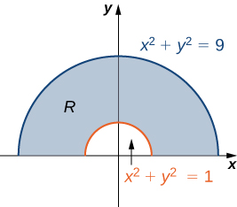{: #CNX_Calc_Figure_15_03_003}

Now that we have sketched a polar rectangular region, let us demonstrate how to evaluate a double integral over this region by using polar coordinates.

Evaluating a Double Integral over a Polar Rectangular Region

Evaluate the integral <math xmlns="http://www.w3.org/1998/Math/MathML"><mrow><mstyle displaystyle="true"><mrow><munder><mo>∬</mo><mi>R</mi></munder><mrow><mn>3</mn><mi>x</mi><mspace width="0.2em" /><mi>d</mi><mi>A</mi></mrow></mrow></mstyle></mrow></math>

 over the region <math xmlns="http://www.w3.org/1998/Math/MathML"><mrow><mi>R</mi><mo>=</mo><mrow><mo>{</mo><mrow><mrow><mrow><mrow><mo>(</mo><mrow><mi>r</mi><mo>,</mo><mi>θ</mi></mrow><mo>)</mo></mrow></mrow><mo>\|</mo></mrow><mn>1</mn><mo>≤</mo><mi>r</mi><mo>≤</mo><mn>2</mn><mo>,</mo><mn>0</mn><mo>≤</mo><mi>θ</mi><mo>≤</mo><mi>π</mi></mrow><mo>}</mo></mrow><mo>.</mo></mrow></math>

First we sketch a figure similar to [[link]](#CNX_Calc_Figure_15_03_003) but with outer radius <math xmlns="http://www.w3.org/1998/Math/MathML"><mrow><mn>2</mn><mo>.</mo></mrow></math>

 From the figure we can see that we have

<math xmlns="http://www.w3.org/1998/Math/MathML"><mtable><mtr><mtd columnalign="right"><mstyle displaystyle="true"><mrow><munder><mo>∬</mo><mi>R</mi></munder><mrow><mn>3</mn><mi>x</mi><mspace width="0.2em" /><mi>d</mi><mi>A</mi></mrow></mrow></mstyle></mtd><mtd columnalign="left"><mo>=</mo><mstyle displaystyle="true"><mrow><munderover><mo stretchy="false">∫</mo><mrow><mi>θ</mi><mo>=</mo><mn>0</mn></mrow><mrow><mi>θ</mi><mo>=</mo><mi>π</mi></mrow></munderover><mspace width="0.2em" /><mrow><mstyle displaystyle="true"><mrow><munderover><mo stretchy="false">∫</mo><mrow><mi>r</mi><mo>=</mo><mn>1</mn></mrow><mrow><mi>r</mi><mo>=</mo><mn>2</mn></mrow></munderover><mrow><mn>3</mn><mi>r</mi><mspace width="0.2em" /><mtext>cos</mtext><mspace width="0.2em" /><mi>θ</mi><mi>r</mi><mspace width="0.2em" /><mi>d</mi><mi>r</mi><mspace width="0.2em" /><mi>d</mi><mi>θ</mi></mrow></mrow></mstyle></mrow></mrow></mstyle></mtd><mtd /><mtd /><mtd columnalign="left"><mtable><mtr><mtd columnalign="left"><mtext>Use an iterated integral with correct limits</mtext></mtd></mtr><mtr><mtd columnalign="left"><mtext>of integration.</mtext></mtd></mtr></mtable></mtd></mtr><mtr><mtd /><mtd columnalign="left"><mo>=</mo><mstyle displaystyle="true"><mrow><munderover><mo stretchy="false">∫</mo><mrow><mi>θ</mi><mo>=</mo><mn>0</mn></mrow><mrow><mi>θ</mi><mo>=</mo><mi>π</mi></mrow></munderover><mrow><mtext>cos</mtext><mspace width="0.2em" /><mi>θ</mi></mrow></mrow></mstyle><mrow><mo>[</mo><mrow><msubsup><mrow><mrow><mrow><msup><mi>r</mi><mn>3</mn></msup></mrow><mo>\|</mo></mrow></mrow><mrow><mi>r</mi><mo>=</mo><mn>1</mn></mrow><mrow><mi>r</mi><mo>=</mo><mn>2</mn></mrow></msubsup></mrow><mo>]</mo></mrow><mi>d</mi><mi>θ</mi></mtd><mtd /><mtd /><mtd columnalign="left"><mtext>Integrate first with respect to</mtext><mspace width="0.2em" /><mi>r</mi><mo>.</mo></mtd></mtr><mtr><mtd /><mtd columnalign="left"><mo>=</mo><mstyle displaystyle="true"><mrow><munderover><mo stretchy="false">∫</mo><mrow><mi>θ</mi><mo>=</mo><mn>0</mn></mrow><mrow><mi>θ</mi><mo>=</mo><mi>π</mi></mrow></munderover><mrow><mn>7</mn><mspace width="0.2em" /><mtext>cos</mtext><mspace width="0.2em" /><mi>θ</mi><mspace width="0.2em" /><mi>d</mi><mi>θ</mi></mrow></mrow></mstyle><mo>=</mo><msubsup><mrow><mrow><mrow><mn>7</mn><mspace width="0.2em" /><mtext>sin</mtext><mspace width="0.2em" /><mi>θ</mi></mrow><mo>\|</mo></mrow></mrow><mrow><mi>θ</mi><mo>=</mo><mn>0</mn></mrow><mrow><mi>θ</mi><mo>=</mo><mi>π</mi></mrow></msubsup><mo>=</mo><mn>0</mn><mo>.</mo></mtd><mtd /><mtd /><mtd /></mtr></mtable></math>

Sketch the region <math xmlns="http://www.w3.org/1998/Math/MathML"><mrow><mi>R</mi><mo>=</mo><mrow><mo>{</mo><mrow><mrow><mrow><mrow><mo>(</mo><mrow><mi>r</mi><mo>,</mo><mi>θ</mi></mrow><mo>)</mo></mrow></mrow><mo>\|</mo></mrow><mn>1</mn><mo>≤</mo><mi>r</mi><mo>≤</mo><mn>2</mn><mo>,</mo><mo>−</mo><mfrac><mi>π</mi><mn>2</mn></mfrac><mo>≤</mo><mi>θ</mi><mo>≤</mo><mfrac><mi>π</mi><mn>2</mn></mfrac></mrow><mo>}</mo></mrow><mo>,</mo></mrow></math>

 and evaluate <math xmlns="http://www.w3.org/1998/Math/MathML"><mrow><mstyle displaystyle="true"><mrow><munder><mo>∬</mo><mi>R</mi></munder><mrow><mi>x</mi><mspace width="0.2em" /><mi>d</mi><mi>A</mi></mrow></mrow></mstyle><mo>.</mo></mrow></math>

<math xmlns="http://www.w3.org/1998/Math/MathML"><mrow><mfrac><mrow><mn>14</mn></mrow><mn>3</mn></mfrac></mrow></math>

Hint

Follow the steps in [[link]](#fs-id1167793298917).

Evaluating a Double Integral by Converting from Rectangular Coordinates

Evaluate the integral <math xmlns="http://www.w3.org/1998/Math/MathML"><mrow><mstyle displaystyle="true"><mrow><munder><mo>∬</mo><mi>R</mi></munder><mrow><mrow><mo>(</mo><mrow><mn>1</mn><mo>−</mo><msup><mi>x</mi><mn>2</mn></msup><mo>−</mo><msup><mi>y</mi><mn>2</mn></msup></mrow><mo>)</mo></mrow></mrow></mrow></mstyle><mi>d</mi><mi>A</mi></mrow></math>

 where <math xmlns="http://www.w3.org/1998/Math/MathML"><mi>R</mi></math>

 is the unit circle on the <math xmlns="http://www.w3.org/1998/Math/MathML"><mrow><mi>x</mi><mi>y</mi></mrow></math>

-plane.

The region <math xmlns="http://www.w3.org/1998/Math/MathML"><mi>R</mi></math>

 is a unit circle, so we can describe it as <math xmlns="http://www.w3.org/1998/Math/MathML"><mrow><mi>R</mi><mo>=</mo><mrow><mo>{</mo><mrow><mrow><mrow><mrow><mo>(</mo><mrow><mi>r</mi><mo>,</mo><mi>θ</mi></mrow><mo>)</mo></mrow></mrow><mo>\|</mo></mrow><mn>0</mn><mo>≤</mo><mi>r</mi><mo>≤</mo><mn>1</mn><mo>,</mo><mn>0</mn><mo>≤</mo><mi>θ</mi><mo>≤</mo><mn>2</mn><mi>π</mi></mrow><mo>}</mo></mrow><mo>.</mo></mrow></math>

Using the conversion <math xmlns="http://www.w3.org/1998/Math/MathML"><mrow><mi>x</mi><mo>=</mo><mi>r</mi><mspace width="0.2em" /><mtext>cos</mtext><mspace width="0.2em" /><mi>θ</mi><mo>,</mo><mi>y</mi><mo>=</mo><mi>r</mi><mspace width="0.2em" /><mtext>sin</mtext><mspace width="0.2em" /><mi>θ</mi><mo>,</mo></mrow></math>

 and <math xmlns="http://www.w3.org/1998/Math/MathML"><mrow><mi>d</mi><mi>A</mi><mo>=</mo><mi>r</mi><mspace width="0.2em" /><mi>d</mi><mi>r</mi><mspace width="0.2em" /><mi>d</mi><mi>θ</mi><mo>,</mo></mrow></math>

 we have

<math xmlns="http://www.w3.org/1998/Math/MathML"><mtable><mtr><mtd columnalign="right"><mstyle displaystyle="true"><mrow><munder><mo>∬</mo><mi>R</mi></munder><mrow><mrow><mo>(</mo><mrow><mn>1</mn><mo>−</mo><msup><mi>x</mi><mn>2</mn></msup><mo>−</mo><msup><mi>y</mi><mn>2</mn></msup></mrow><mo>)</mo></mrow></mrow></mrow></mstyle><mi>d</mi><mi>A</mi></mtd><mtd columnalign="left"><mo>=</mo><mstyle displaystyle="true"><mrow><munderover><mo stretchy="false">∫</mo><mn>0</mn><mrow><mn>2</mn><mi>π</mi></mrow></munderover><mspace width="0.2em" /><mrow><mstyle displaystyle="true"><mrow><munderover><mo stretchy="false">∫</mo><mn>0</mn><mn>1</mn></munderover><mrow><mrow><mo>(</mo><mrow><mn>1</mn><mo>−</mo><msup><mi>r</mi><mn>2</mn></msup></mrow><mo>)</mo></mrow><mi>r</mi><mspace width="0.2em" /><mi>d</mi><mi>r</mi><mspace width="0.2em" /><mi>d</mi><mi>θ</mi></mrow></mrow></mstyle></mrow></mrow></mstyle><mo>=</mo><mstyle displaystyle="true"><mrow><munderover><mo stretchy="false">∫</mo><mn>0</mn><mrow><mn>2</mn><mi>π</mi></mrow></munderover><mspace width="0.2em" /><mrow><mstyle displaystyle="true"><mrow><munderover><mo stretchy="false">∫</mo><mn>0</mn><mn>1</mn></munderover><mrow><mrow><mo>(</mo><mrow><mi>r</mi><mo>−</mo><msup><mi>r</mi><mn>3</mn></msup></mrow><mo>)</mo></mrow><mi>d</mi><mi>r</mi><mspace width="0.2em" /><mi>d</mi><mi>θ</mi></mrow></mrow></mstyle></mrow></mrow></mstyle></mtd></mtr><mtr><mtd /><mtd columnalign="left"><mo>=</mo><mstyle displaystyle="true"><mrow><munderover><mo stretchy="false">∫</mo><mn>0</mn><mrow><mn>2</mn><mi>π</mi></mrow></munderover><mrow><msubsup><mrow><mrow><mo>[</mo><mrow><mfrac><mrow><msup><mi>r</mi><mn>2</mn></msup></mrow><mn>2</mn></mfrac><mo>−</mo><mfrac><mrow><msup><mi>r</mi><mn>4</mn></msup></mrow><mn>4</mn></mfrac></mrow><mo>]</mo></mrow></mrow><mn>0</mn><mn>1</mn></msubsup></mrow></mrow></mstyle><mi>d</mi><mi>θ</mi><mo>=</mo><mstyle displaystyle="true"><mrow><munderover><mo stretchy="false">∫</mo><mn>0</mn><mrow><mn>2</mn><mi>π</mi></mrow></munderover><mrow><mfrac><mn>1</mn><mn>4</mn></mfrac><mi>d</mi><mi>θ</mi><mo>=</mo><mfrac><mi>π</mi><mn>2</mn></mfrac></mrow></mrow></mstyle><mo>.</mo></mtd></mtr></mtable></math>

Evaluating a Double Integral by Converting from Rectangular Coordinates

Evaluate the integral <math xmlns="http://www.w3.org/1998/Math/MathML"><mrow><mstyle displaystyle="true"><mrow><munder><mo>∬</mo><mi>R</mi></munder><mrow><mrow><mo>(</mo><mrow><mi>x</mi><mo>+</mo><mi>y</mi></mrow><mo>)</mo></mrow><mi>d</mi><mi>A</mi></mrow></mrow></mstyle></mrow></math>

 where <math xmlns="http://www.w3.org/1998/Math/MathML"><mrow><mi>R</mi><mo>=</mo><mrow><mo>{</mo><mrow><mrow><mrow><mrow><mo>(</mo><mrow><mi>x</mi><mo>,</mo><mi>y</mi></mrow><mo>)</mo></mrow></mrow><mo>\|</mo></mrow><mn>1</mn><mo>≤</mo><msup><mi>x</mi><mn>2</mn></msup><mo>+</mo><msup><mi>y</mi><mn>2</mn></msup><mo>≤</mo><mn>4</mn><mo>,</mo><mi>x</mi><mo>≤</mo><mn>0</mn></mrow><mo>}</mo></mrow><mo>.</mo></mrow></math>

We can see that <math xmlns="http://www.w3.org/1998/Math/MathML"><mi>R</mi></math>

 is an annular region that can be converted to polar coordinates and described as <math xmlns="http://www.w3.org/1998/Math/MathML"><mrow><mi>R</mi><mo>=</mo><mrow><mo>{</mo><mrow><mrow><mrow><mrow><mo>(</mo><mrow><mi>r</mi><mo>,</mo><mi>θ</mi></mrow><mo>)</mo></mrow></mrow><mo>\|</mo></mrow><mn>1</mn><mo>≤</mo><mi>r</mi><mo>≤</mo><mn>2</mn><mo>,</mo><mfrac><mi>π</mi><mn>2</mn></mfrac><mo>≤</mo><mi>θ</mi><mo>≤</mo><mfrac><mrow><mn>3</mn><mi>π</mi></mrow><mn>2</mn></mfrac></mrow><mo>}</mo></mrow></mrow></math>

 (see the following graph).

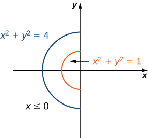{: #CNX_Calc_Figure_15_03_004}

Hence, using the conversion <math xmlns="http://www.w3.org/1998/Math/MathML"><mrow><mi>x</mi><mo>=</mo><mi>r</mi><mspace width="0.2em" /><mtext>cos</mtext><mspace width="0.2em" /><mi>θ</mi><mo>,</mo><mi>y</mi><mo>=</mo><mi>r</mi><mspace width="0.2em" /><mtext>sin</mtext><mspace width="0.2em" /><mi>θ</mi><mo>,</mo></mrow></math>

 and <math xmlns="http://www.w3.org/1998/Math/MathML"><mrow><mi>d</mi><mi>A</mi><mo>=</mo><mi>r</mi><mspace width="0.2em" /><mi>d</mi><mi>r</mi><mspace width="0.2em" /><mi>d</mi><mi>θ</mi><mo>,</mo></mrow></math>

 we have

<math xmlns="http://www.w3.org/1998/Math/MathML"><mtable><mtr><mtd columnalign="right"><mstyle displaystyle="true"><mrow><munder><mo>∬</mo><mi>R</mi></munder><mrow><mrow><mo>(</mo><mrow><mi>x</mi><mo>+</mo><mi>y</mi></mrow><mo>)</mo></mrow><mi>d</mi><mi>A</mi></mrow></mrow></mstyle></mtd><mtd columnalign="left"><mo>=</mo><mstyle displaystyle="true"><mrow><munderover><mo stretchy="false">∫</mo><mrow><mi>θ</mi><mo>=</mo><mi>π</mi><mtext>/</mtext><mn>2</mn></mrow><mrow><mi>θ</mi><mo>=</mo><mn>3</mn><mi>π</mi><mtext>/</mtext><mn>2</mn></mrow></munderover><mspace width="0.2em" /><mrow><mstyle displaystyle="true"><mrow><munderover><mo stretchy="false">∫</mo><mrow><mi>r</mi><mo>=</mo><mn>1</mn></mrow><mrow><mi>r</mi><mo>=</mo><mn>2</mn></mrow></munderover><mrow><mrow><mo>(</mo><mrow><mi>r</mi><mspace width="0.2em" /><mtext>cos</mtext><mspace width="0.2em" /><mi>θ</mi><mo>+</mo><mi>r</mi><mspace width="0.2em" /><mtext>sin</mtext><mspace width="0.2em" /><mi>θ</mi></mrow><mo>)</mo></mrow></mrow></mrow></mstyle></mrow></mrow></mstyle><mi>r</mi><mspace width="0.2em" /><mi>d</mi><mi>r</mi><mspace width="0.2em" /><mi>d</mi><mi>θ</mi></mtd></mtr><mtr><mtd /><mtd columnalign="left"><mo>=</mo><mrow><mo>(</mo><mrow><mstyle displaystyle="true"><mrow><munderover><mo stretchy="false">∫</mo><mrow><mi>r</mi><mo>=</mo><mn>1</mn></mrow><mrow><mi>r</mi><mo>=</mo><mn>2</mn></mrow></munderover><mrow><msup><mi>r</mi><mn>2</mn></msup></mrow></mrow></mstyle><mi>d</mi><mi>r</mi></mrow><mo>)</mo></mrow><mrow><mo>(</mo><mrow><mstyle displaystyle="true"><mrow><munderover><mo stretchy="false">∫</mo><mrow><mi>π</mi><mtext>/</mtext><mn>2</mn></mrow><mrow><mn>3</mn><mi>π</mi><mtext>/</mtext><mn>2</mn></mrow></munderover><mrow><mrow><mo>(</mo><mrow><mtext>cos</mtext><mspace width="0.2em" /><mi>θ</mi><mo>+</mo><mtext>sin</mtext><mspace width="0.2em" /><mi>θ</mi></mrow><mo>)</mo></mrow><mi>d</mi><mi>θ</mi></mrow></mrow></mstyle></mrow><mo>)</mo></mrow></mtd></mtr><mtr><mtd /><mtd columnalign="left"><mo>=</mo><msubsup><mrow><mo>[</mo><mrow><mfrac><mrow><msup><mi>r</mi><mn>3</mn></msup></mrow><mn>3</mn></mfrac></mrow><mo>]</mo></mrow><mn>1</mn><mn>2</mn></msubsup><msubsup><mrow><mrow><mrow><mo>[</mo><mrow><mtext>sin</mtext><mspace width="0.2em" /><mi>θ</mi><mo>−</mo><mtext>cos</mtext><mspace width="0.2em" /><mi>θ</mi></mrow><mo>]</mo></mrow></mrow><mo>\|</mo></mrow><mrow><mi>π</mi><mtext>/</mtext><mn>2</mn></mrow><mrow><mn>3</mn><mi>π</mi><mtext>/</mtext><mn>2</mn></mrow></msubsup></mtd></mtr><mtr><mtd /><mtd columnalign="left"><mo>=</mo><mo>−</mo><mfrac><mrow><mn>14</mn></mrow><mn>3</mn></mfrac><mo>.</mo></mtd></mtr></mtable></math>

Evaluate the integral <math xmlns="http://www.w3.org/1998/Math/MathML"><mrow><mstyle displaystyle="true"><mrow><munder><mo>∬</mo><mi>R</mi></munder><mrow><mrow><mo>(</mo><mrow><mn>4</mn><mo>−</mo><msup><mi>x</mi><mn>2</mn></msup><mo>−</mo><msup><mi>y</mi><mn>2</mn></msup></mrow><mo>)</mo></mrow></mrow></mrow></mstyle><mi>d</mi><mi>A</mi></mrow></math>

 where <math xmlns="http://www.w3.org/1998/Math/MathML"><mi>R</mi></math>

 is the circle of radius <math xmlns="http://www.w3.org/1998/Math/MathML"><mn>2</mn></math>

 on the <math xmlns="http://www.w3.org/1998/Math/MathML"><mrow><mi>x</mi><mi>y</mi></mrow></math>

-plane.

<math xmlns="http://www.w3.org/1998/Math/MathML"><mrow><mn>8</mn><mi>π</mi></mrow></math>

Hint

Follow the steps in the previous example.

### General Polar Regions of Integration

To evaluate the double integral of a continuous function by iterated integrals over general polar regions, we consider two types of regions, analogous to Type I and Type II as discussed for rectangular coordinates in [Double Integrals over General Regions](/m53963){: .target-chapter}. It is more common to write polar equations as <math xmlns="http://www.w3.org/1998/Math/MathML"><mrow><mi>r</mi><mo>=</mo><mi>f</mi><mrow><mo>(</mo><mi>θ</mi><mo>)</mo></mrow></mrow></math>

 than <math xmlns="http://www.w3.org/1998/Math/MathML"><mrow><mi>θ</mi><mo>=</mo><mi>f</mi><mrow><mo>(</mo><mi>r</mi><mo>)</mo></mrow><mo>,</mo></mrow></math>

 so we describe a general polar region as <math xmlns="http://www.w3.org/1998/Math/MathML"><mrow><mi>R</mi><mo>=</mo><mrow><mo>{</mo><mrow><mrow><mrow><mrow><mo>(</mo><mrow><mi>r</mi><mo>,</mo><mi>θ</mi></mrow><mo>)</mo></mrow></mrow><mo>\|</mo></mrow><mi>α</mi><mo>≤</mo><mi>θ</mi><mo>≤</mo><mi>β</mi><mo>,</mo><msub><mi>h</mi><mn>1</mn></msub><mrow><mo>(</mo><mi>θ</mi><mo>)</mo></mrow><mo>≤</mo><mi>r</mi><mo>≤</mo><msub><mi>h</mi><mn>2</mn></msub><mrow><mo>(</mo><mi>θ</mi><mo>)</mo></mrow></mrow><mo>}</mo></mrow></mrow></math>

 (see the following figure).

 &lt;r&lt;h2(&#x3B8;)."){: #CNX_Calc_Figure_15_03_005}

Double Integrals over General Polar Regions

If <math xmlns="http://www.w3.org/1998/Math/MathML"><mrow><mi>f</mi><mrow><mo>(</mo><mrow><mi>r</mi><mo>,</mo><mi>θ</mi></mrow><mo>)</mo></mrow></mrow></math>

 is continuous on a general polar region <math xmlns="http://www.w3.org/1998/Math/MathML"><mi>D</mi></math>

 as described above, then

<math xmlns="http://www.w3.org/1998/Math/MathML"><mrow><mstyle displaystyle="true"><mrow><munder><mo>∬</mo><mi>D</mi></munder><mrow><mi>f</mi><mrow><mo>(</mo><mrow><mi>r</mi><mo>,</mo><mi>θ</mi></mrow><mo>)</mo></mrow></mrow></mrow></mstyle><mi>r</mi><mspace width="0.2em" /><mi>d</mi><mi>r</mi><mspace width="0.2em" /><mi>d</mi><mi>θ</mi><mo>=</mo><mstyle displaystyle="true"><mrow><munderover><mo stretchy="false">∫</mo><mrow><mi>θ</mi><mo>=</mo><mi>α</mi></mrow><mrow><mi>θ</mi><mo>=</mo><mi>β</mi></mrow></munderover><mspace width="0.2em" /><mrow><mstyle displaystyle="true"><mrow><munderover><mo stretchy="false">∫</mo><mrow><mi>r</mi><mo>=</mo><msub><mi>h</mi><mn>1</mn></msub><mrow><mo>(</mo><mi>θ</mi><mo>)</mo></mrow></mrow><mrow><mi>r</mi><mo>=</mo><msub><mi>h</mi><mn>2</mn></msub><mrow><mo>(</mo><mi>θ</mi><mo>)</mo></mrow></mrow></munderover><mrow><mi>f</mi><mrow><mo>(</mo><mrow><mi>r</mi><mo>,</mo><mi>θ</mi></mrow><mo>)</mo></mrow></mrow></mrow></mstyle></mrow></mrow></mstyle><mi>r</mi><mspace width="0.2em" /><mi>d</mi><mi>r</mi><mspace width="0.2em" /><mi>d</mi><mi>θ</mi></mrow></math>

Evaluating a Double Integral over a General Polar Region

Evaluate the integral <math xmlns="http://www.w3.org/1998/Math/MathML"><mrow><mstyle displaystyle="true"><mrow><munder><mo>∬</mo><mi>D</mi></munder><mrow><msup><mi>r</mi><mn>2</mn></msup></mrow></mrow></mstyle><mtext>sin</mtext><mspace width="0.2em" /><mi>θ</mi><mi>r</mi><mspace width="0.2em" /><mi>d</mi><mi>r</mi><mspace width="0.2em" /><mi>d</mi><mi>θ</mi></mrow></math>

 where <math xmlns="http://www.w3.org/1998/Math/MathML"><mi>D</mi></math>

 is the region bounded by the polar axis and the upper half of the cardioid <math xmlns="http://www.w3.org/1998/Math/MathML"><mrow><mi>r</mi><mo>=</mo><mn>1</mn><mo>+</mo><mtext>cos</mtext><mspace width="0.2em" /><mi>θ</mi><mo>.</mo></mrow></math>

We can describe the region <math xmlns="http://www.w3.org/1998/Math/MathML"><mi>D</mi></math>

 as <math xmlns="http://www.w3.org/1998/Math/MathML"><mrow><mrow><mo>{</mo><mrow><mrow><mrow><mrow><mo>(</mo><mrow><mi>r</mi><mo>,</mo><mi>θ</mi></mrow><mo>)</mo></mrow></mrow><mo>\|</mo></mrow><mn>0</mn><mo>≤</mo><mi>θ</mi><mo>≤</mo><mi>π</mi><mo>,</mo><mn>0</mn><mo>≤</mo><mi>r</mi><mo>≤</mo><mn>1</mn><mo>+</mo><mtext>cos</mtext><mspace width="0.2em" /><mi>θ</mi></mrow><mo>}</mo></mrow></mrow></math>

 as shown in the following figure.

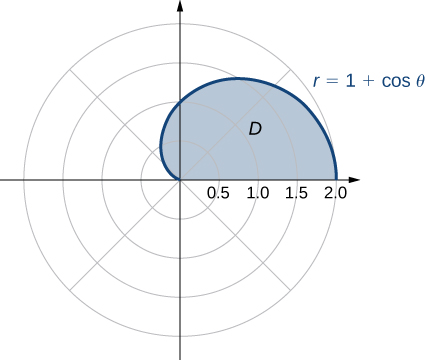{: #CNX_Calc_Figure_15_03_006}

Hence, we have

<math xmlns="http://www.w3.org/1998/Math/MathML"><mtable><mtr><mtd columnalign="right"><mstyle displaystyle="true"><mrow><munder><mo>∬</mo><mi>D</mi></munder><mrow><msup><mi>r</mi><mn>2</mn></msup><mtext>sin</mtext><mspace width="0.2em" /><mi>θ</mi><mi>r</mi><mspace width="0.2em" /><mi>d</mi><mi>r</mi><mspace width="0.2em" /><mi>d</mi><mi>θ</mi></mrow></mrow></mstyle></mtd><mtd columnalign="left"><mo>=</mo><mstyle displaystyle="true"><mrow><munderover><mo stretchy="false">∫</mo><mrow><mi>θ</mi><mo>=</mo><mn>0</mn></mrow><mrow><mi>θ</mi><mo>=</mo><mi>π</mi></mrow></munderover><mspace width="0.2em" /><mrow><mstyle displaystyle="true"><mrow><munderover><mo stretchy="false">∫</mo><mrow><mi>r</mi><mo>=</mo><mn>0</mn></mrow><mrow><mi>r</mi><mo>=</mo><mn>1</mn><mo>+</mo><mtext>cos</mtext><mspace width="0.2em" /><mi>θ</mi></mrow></munderover><mrow><mrow><mo>(</mo><mrow><msup><mi>r</mi><mn>2</mn></msup><mtext>sin</mtext><mspace width="0.2em" /><mi>θ</mi></mrow><mo>)</mo></mrow></mrow></mrow></mstyle></mrow></mrow></mstyle><mi>r</mi><mspace width="0.2em" /><mi>d</mi><mi>r</mi><mspace width="0.2em" /><mi>d</mi><mi>θ</mi></mtd></mtr><mtr><mtd /><mtd columnalign="left"><mo>=</mo><mfrac><mn>1</mn><mn>4</mn></mfrac><msubsup><mstyle displaystyle="true"><mrow><munderover><mo stretchy="false">∫</mo><mrow><mi>θ</mi><mo>=</mo><mn>0</mn></mrow><mrow><mi>θ</mi><mo>=</mo><mi>π</mi></mrow></munderover><mrow><mrow><mo>[</mo><mrow><msup><mi>r</mi><mn>4</mn></msup></mrow><mo>]</mo></mrow></mrow></mrow></mstyle><mrow><mi>r</mi><mo>=</mo><mn>0</mn></mrow><mrow><mi>r</mi><mo>=</mo><mn>1</mn><mo>+</mo><mtext>cos</mtext><mspace width="0.2em" /><mi>θ</mi></mrow></msubsup><mtext>sin</mtext><mspace width="0.2em" /><mi>θ</mi><mspace width="0.2em" /><mi>d</mi><mi>θ</mi></mtd></mtr><mtr><mtd /><mtd columnalign="left"><mo>=</mo><mfrac><mn>1</mn><mn>4</mn></mfrac><mstyle displaystyle="true"><mrow><munderover><mo stretchy="false">∫</mo><mrow><mi>θ</mi><mo>=</mo><mn>0</mn></mrow><mrow><mi>θ</mi><mo>=</mo><mi>π</mi></mrow></munderover><mrow><msup><mrow><mrow><mo>(</mo><mrow><mn>1</mn><mo>+</mo><mtext>cos</mtext><mspace width="0.2em" /><mi>θ</mi></mrow><mo>)</mo></mrow></mrow><mn>4</mn></msup></mrow></mrow></mstyle><mtext>sin</mtext><mspace width="0.2em" /><mi>θ</mi><mspace width="0.2em" /><mi>d</mi><mi>θ</mi></mtd></mtr><mtr><mtd /><mtd columnalign="left"><mo>=</mo><mo>−</mo><mfrac><mn>1</mn><mn>4</mn></mfrac><msubsup><mrow><mo>[</mo><mrow><mfrac><mrow><msup><mrow><mrow><mo>(</mo><mrow><mn>1</mn><mo>+</mo><mtext>cos</mtext><mspace width="0.2em" /><mi>θ</mi></mrow><mo>)</mo></mrow></mrow><mn>5</mn></msup></mrow><mn>5</mn></mfrac></mrow><mo>]</mo></mrow><mn>0</mn><mi>π</mi></msubsup><mo>=</mo><mfrac><mn>8</mn><mn>5</mn></mfrac><mo>.</mo></mtd></mtr></mtable></math>

Evaluate the integral

<math xmlns="http://www.w3.org/1998/Math/MathML"><mrow><mstyle displaystyle="true"><mrow><munder><mo>∬</mo><mi>D</mi></munder><mrow><msup><mi>r</mi><mn>2</mn></msup><msup><mrow><mtext>sin</mtext></mrow><mn>2</mn></msup><mn>2</mn><mi>θ</mi><mi>r</mi><mspace width="0.2em" /><mi>d</mi><mi>r</mi><mspace width="0.2em" /><mi>d</mi><mi>θ</mi></mrow></mrow></mstyle><mspace width="0.2em" /><mtext>where</mtext><mspace width="0.2em" /><mi>D</mi><mo>=</mo><mrow><mo>{</mo><mrow><mrow><mrow><mrow><mo>(</mo><mrow><mi>r</mi><mo>,</mo><mi>θ</mi></mrow><mo>)</mo></mrow></mrow><mo>\|</mo></mrow><mn>0</mn><mo>≤</mo><mi>θ</mi><mo>≤</mo><mi>π</mi><mo>,</mo><mn>0</mn><mo>≤</mo><mi>r</mi><mo>≤</mo><mn>2</mn><msqrt><mrow><mtext>cos</mtext><mspace width="0.2em" /><mn>2</mn><mi>θ</mi></mrow></msqrt></mrow><mo>}</mo></mrow><mo>.</mo></mrow></math>

<math xmlns="http://www.w3.org/1998/Math/MathML"><mrow><mrow><mi>π</mi><mtext>/</mtext><mn>8</mn></mrow></mrow></math>

Hint

Graph the region and follow the steps in the previous example.

### Polar Areas and Volumes

As in rectangular coordinates, if a solid <math xmlns="http://www.w3.org/1998/Math/MathML"><mi>S</mi></math>

 is bounded by the surface <math xmlns="http://www.w3.org/1998/Math/MathML"><mrow><mi>z</mi><mo>=</mo><mi>f</mi><mrow><mo>(</mo><mrow><mi>r</mi><mo>,</mo><mi>θ</mi></mrow><mo>)</mo></mrow><mo>,</mo></mrow></math>

 as well as by the surfaces <math xmlns="http://www.w3.org/1998/Math/MathML"><mrow><mi>r</mi><mo>=</mo><mi>a</mi><mo>,</mo><mi>r</mi><mo>=</mo><mi>b</mi><mo>,</mo><mi>θ</mi><mo>=</mo><mi>α</mi><mo>,</mo></mrow></math>

 and <math xmlns="http://www.w3.org/1998/Math/MathML"><mrow><mi>θ</mi><mo>=</mo><mi>β</mi><mo>,</mo></mrow></math>

 we can find the volume <math xmlns="http://www.w3.org/1998/Math/MathML"><mi>V</mi></math>

 of <math xmlns="http://www.w3.org/1998/Math/MathML"><mi>S</mi></math>

 by double integration, as

<math xmlns="http://www.w3.org/1998/Math/MathML"><mrow><mi>V</mi><mo>=</mo><mstyle displaystyle="true"><mrow><munder><mo>∬</mo><mi>R</mi></munder><mrow><mi>f</mi><mrow><mo>(</mo><mrow><mi>r</mi><mo>,</mo><mi>θ</mi></mrow><mo>)</mo></mrow></mrow></mrow></mstyle><mi>r</mi><mspace width="0.2em" /><mi>d</mi><mi>r</mi><mspace width="0.2em" /><mi>d</mi><mi>θ</mi><mo>=</mo><mstyle displaystyle="true"><mrow><munderover><mo stretchy="false">∫</mo><mrow><mi>θ</mi><mo>=</mo><mi>α</mi></mrow><mrow><mi>θ</mi><mo>=</mo><mi>β</mi></mrow></munderover><mspace width="0.2em" /><mrow><mstyle displaystyle="true"><mrow><munderover><mo stretchy="false">∫</mo><mrow><mi>r</mi><mo>=</mo><mi>a</mi></mrow><mrow><mi>r</mi><mo>=</mo><mi>b</mi></mrow></munderover><mrow><mi>f</mi><mrow><mo>(</mo><mrow><mi>r</mi><mo>,</mo><mi>θ</mi></mrow><mo>)</mo></mrow></mrow></mrow></mstyle></mrow></mrow></mstyle><mi>r</mi><mspace width="0.2em" /><mi>d</mi><mi>r</mi><mspace width="0.2em" /><mi>d</mi><mi>θ</mi><mo>.</mo></mrow></math>

If the base of the solid can be described as <math xmlns="http://www.w3.org/1998/Math/MathML"><mrow><mi>D</mi><mo>=</mo><mrow><mo>{</mo><mrow><mrow><mrow><mrow><mo>(</mo><mrow><mi>r</mi><mo>,</mo><mi>θ</mi></mrow><mo>)</mo></mrow></mrow><mo>\|</mo></mrow><mi>α</mi><mo>≤</mo><mi>θ</mi><mo>≤</mo><mi>β</mi><mo>,</mo><msub><mi>h</mi><mn>1</mn></msub><mrow><mo>(</mo><mi>θ</mi><mo>)</mo></mrow><mo>≤</mo><mi>r</mi><mo>≤</mo><msub><mi>h</mi><mn>2</mn></msub><mrow><mo>(</mo><mi>θ</mi><mo>)</mo></mrow></mrow><mo>}</mo></mrow><mo>,</mo></mrow></math>

 then the double integral for the volume becomes

<math xmlns="http://www.w3.org/1998/Math/MathML"><mrow><mi>V</mi><mo>=</mo><mstyle displaystyle="true"><mrow><munder><mo>∬</mo><mi>D</mi></munder><mrow><mi>f</mi><mrow><mo>(</mo><mrow><mi>r</mi><mo>,</mo><mi>θ</mi></mrow><mo>)</mo></mrow></mrow></mrow></mstyle><mi>r</mi><mspace width="0.2em" /><mi>d</mi><mi>r</mi><mspace width="0.2em" /><mi>d</mi><mi>θ</mi><mo>=</mo><mstyle displaystyle="true"><mrow><munderover><mo stretchy="false">∫</mo><mrow><mi>θ</mi><mo>=</mo><mi>α</mi></mrow><mrow><mi>θ</mi><mo>=</mo><mi>β</mi></mrow></munderover><mspace width="0.2em" /><mrow><mstyle displaystyle="true"><mrow><munderover><mo stretchy="false">∫</mo><mrow><mi>r</mi><mo>=</mo><msub><mi>h</mi><mn>1</mn></msub><mrow><mo>(</mo><mi>θ</mi><mo>)</mo></mrow></mrow><mrow><mi>r</mi><mo>=</mo><msub><mi>h</mi><mn>2</mn></msub><mrow><mo>(</mo><mi>θ</mi><mo>)</mo></mrow></mrow></munderover><mrow><mi>f</mi><mrow><mo>(</mo><mrow><mi>r</mi><mo>,</mo><mi>θ</mi></mrow><mo>)</mo></mrow></mrow></mrow></mstyle></mrow></mrow></mstyle><mi>r</mi><mspace width="0.2em" /><mi>d</mi><mi>r</mi><mspace width="0.2em" /><mi>d</mi><mi>θ</mi><mo>.</mo></mrow></math>

We illustrate this idea with some examples.

Finding a Volume Using a Double Integral

Find the volume of the solid that lies under the paraboloid <math xmlns="http://www.w3.org/1998/Math/MathML"><mrow><mi>z</mi><mo>=</mo><mn>1</mn><mo>−</mo><msup><mi>x</mi><mn>2</mn></msup><mo>−</mo><msup><mi>y</mi><mn>2</mn></msup></mrow></math>

 and above the unit circle on the <math xmlns="http://www.w3.org/1998/Math/MathML"><mrow><mi>x</mi><mi>y</mi></mrow></math>

-plane (see the following figure).

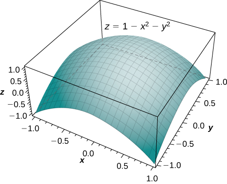{: #CNX_Calc_Figure_15_03_007}

By the method of double integration, we can see that the volume is the iterated integral of the form <math xmlns="http://www.w3.org/1998/Math/MathML"><mrow><mstyle displaystyle="true"><mrow><munder><mo>∬</mo><mi>R</mi></munder><mrow><mrow><mo>(</mo><mrow><mn>1</mn><mo>−</mo><msup><mi>x</mi><mn>2</mn></msup><mo>−</mo><msup><mi>y</mi><mn>2</mn></msup></mrow><mo>)</mo></mrow></mrow></mrow></mstyle><mi>d</mi><mi>A</mi></mrow></math>

 where <math xmlns="http://www.w3.org/1998/Math/MathML"><mrow><mi>R</mi><mo>=</mo><mrow><mo>{</mo><mrow><mrow><mrow><mrow><mo>(</mo><mrow><mi>r</mi><mo>,</mo><mi>θ</mi></mrow><mo>)</mo></mrow></mrow><mo>\|</mo></mrow><mn>0</mn><mo>≤</mo><mi>r</mi><mo>≤</mo><mn>1</mn><mo>,</mo><mn>0</mn><mo>≤</mo><mi>θ</mi><mo>≤</mo><mn>2</mn><mi>π</mi></mrow><mo>}</mo></mrow><mo>.</mo></mrow></math>

This integration was shown before in [[link]](#fs-id1167794159521), so the volume is <math xmlns="http://www.w3.org/1998/Math/MathML"><mrow><mfrac><mi>π</mi><mn>2</mn></mfrac></mrow></math>

 cubic units.

Finding a Volume Using Double Integration

Find the volume of the solid that lies under the paraboloid <math xmlns="http://www.w3.org/1998/Math/MathML"><mrow><mi>z</mi><mo>=</mo><mn>4</mn><mo>−</mo><msup><mi>x</mi><mn>2</mn></msup><mo>−</mo><msup><mi>y</mi><mn>2</mn></msup></mrow></math>

 and above the disk <math xmlns="http://www.w3.org/1998/Math/MathML"><mrow><msup><mrow><mrow><mo>(</mo><mrow><mi>x</mi><mo>−</mo><mn>1</mn></mrow><mo>)</mo></mrow></mrow><mn>2</mn></msup><mo>+</mo><msup><mi>y</mi><mn>2</mn></msup><mo>=</mo><mn>1</mn></mrow></math>

 on the <math xmlns="http://www.w3.org/1998/Math/MathML"><mrow><mi>x</mi><mi>y</mi></mrow></math>

-plane. See the paraboloid in [[link]](#CNX_Calc_Figure_15_03_008) intersecting the cylinder <math xmlns="http://www.w3.org/1998/Math/MathML"><mrow><msup><mrow><mrow><mo>(</mo><mrow><mi>x</mi><mo>−</mo><mn>1</mn></mrow><mo>)</mo></mrow></mrow><mn>2</mn></msup><mo>+</mo><msup><mi>y</mi><mn>2</mn></msup><mo>=</mo><mn>1</mn></mrow></math>

 above the <math xmlns="http://www.w3.org/1998/Math/MathML"><mrow><mi>x</mi><mi>y</mi></mrow></math>

-plane.

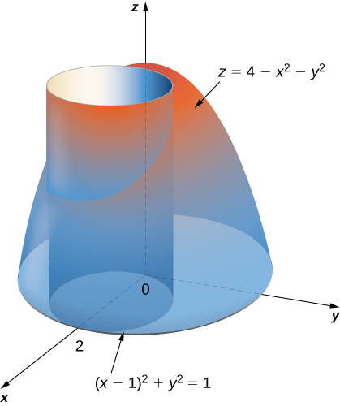{: #CNX_Calc_Figure_15_03_008}

First change the disk <math xmlns="http://www.w3.org/1998/Math/MathML"><mrow><msup><mrow><mrow><mo>(</mo><mrow><mi>x</mi><mo>−</mo><mn>1</mn></mrow><mo>)</mo></mrow></mrow><mn>2</mn></msup><mo>+</mo><msup><mi>y</mi><mn>2</mn></msup><mo>=</mo><mn>1</mn></mrow></math>

 to polar coordinates. Expanding the square term, we have <math xmlns="http://www.w3.org/1998/Math/MathML"><mrow><msup><mi>x</mi><mn>2</mn></msup><mo>−</mo><mn>2</mn><mi>x</mi><mo>+</mo><mn>1</mn><mo>+</mo><msup><mi>y</mi><mn>2</mn></msup><mo>=</mo><mn>1</mn><mo>.</mo></mrow></math>

 Then simplify to get <math xmlns="http://www.w3.org/1998/Math/MathML"><mrow><msup><mi>x</mi><mn>2</mn></msup><mo>+</mo><msup><mi>y</mi><mn>2</mn></msup><mo>=</mo><mn>2</mn><mi>x</mi><mo>,</mo></mrow></math>

 which in polar coordinates becomes <math xmlns="http://www.w3.org/1998/Math/MathML"><mrow><msup><mi>r</mi><mn>2</mn></msup><mo>=</mo><mn>2</mn><mi>r</mi><mspace width="0.2em" /><mtext>cos</mtext><mspace width="0.2em" /><mi>θ</mi></mrow></math>

 and then either <math xmlns="http://www.w3.org/1998/Math/MathML"><mrow><mi>r</mi><mo>=</mo><mn>0</mn></mrow></math>

 or <math xmlns="http://www.w3.org/1998/Math/MathML"><mrow><mi>r</mi><mo>=</mo><mn>2</mn><mspace width="0.2em" /><mtext>cos</mtext><mspace width="0.2em" /><mi>θ</mi><mo>.</mo></mrow></math>

 Similarly, the equation of the paraboloid changes to <math xmlns="http://www.w3.org/1998/Math/MathML"><mrow><mi>z</mi><mo>=</mo><mn>4</mn><mo>−</mo><msup><mi>r</mi><mn>2</mn></msup><mo>.</mo></mrow></math>

 Therefore we can describe the disk <math xmlns="http://www.w3.org/1998/Math/MathML"><mrow><msup><mrow><mrow><mo>(</mo><mrow><mi>x</mi><mo>−</mo><mn>1</mn></mrow><mo>)</mo></mrow></mrow><mn>2</mn></msup><mo>+</mo><msup><mi>y</mi><mn>2</mn></msup><mo>=</mo><mn>1</mn></mrow></math>

 on the <math xmlns="http://www.w3.org/1998/Math/MathML"><mrow><mi>x</mi><mi>y</mi></mrow></math>

-plane as the region

<math xmlns="http://www.w3.org/1998/Math/MathML"><mrow><mi>D</mi><mo>=</mo><mrow><mo>{</mo><mrow><mrow><mrow><mrow><mo>(</mo><mrow><mi>r</mi><mo>,</mo><mi>θ</mi></mrow><mo>)</mo></mrow></mrow><mo>\|</mo></mrow><mn>0</mn><mo>≤</mo><mi>θ</mi><mo>≤</mo><mi>π</mi><mo>,</mo><mn>0</mn><mo>≤</mo><mi>r</mi><mo>≤</mo><mn>2</mn><mspace width="0.2em" /><mtext>cos</mtext><mspace width="0.2em" /><mi>θ</mi></mrow><mo>}</mo></mrow><mo>.</mo></mrow></math>

Hence the volume of the solid bounded above by the paraboloid <math xmlns="http://www.w3.org/1998/Math/MathML"><mrow><mi>z</mi><mo>=</mo><mn>4</mn><mo>−</mo><msup><mi>x</mi><mn>2</mn></msup><mo>−</mo><msup><mi>y</mi><mn>2</mn></msup></mrow></math>

 and below by <math xmlns="http://www.w3.org/1998/Math/MathML"><mrow><mi>r</mi><mo>=</mo><mn>2</mn><mspace width="0.2em" /><mtext>cos</mtext><mspace width="0.2em" /><mi>θ</mi></mrow></math>

 is

<math xmlns="http://www.w3.org/1998/Math/MathML"><mtable><mtr><mtd columnalign="right"><mi>V</mi></mtd><mtd columnalign="left"><mo>=</mo><mstyle displaystyle="true"><mrow><munder><mo>∬</mo><mi>D</mi></munder><mrow><mi>f</mi><mrow><mo>(</mo><mrow><mi>r</mi><mo>,</mo><mi>θ</mi></mrow><mo>)</mo></mrow></mrow></mrow></mstyle><mi>r</mi><mspace width="0.2em" /><mi>d</mi><mi>r</mi><mspace width="0.2em" /><mi>d</mi><mi>θ</mi><mo>=</mo><mstyle displaystyle="true"><mrow><munderover><mo stretchy="false">∫</mo><mrow><mi>θ</mi><mo>=</mo><mn>0</mn></mrow><mrow><mi>θ</mi><mo>=</mo><mi>π</mi></mrow></munderover><mspace width="0.2em" /><mrow><mstyle displaystyle="true"><mrow><munderover><mo stretchy="false">∫</mo><mrow><mi>r</mi><mo>=</mo><mn>0</mn></mrow><mrow><mi>r</mi><mo>=</mo><mn>2</mn><mspace width="0.2em" /><mtext>cos</mtext><mspace width="0.2em" /><mi>θ</mi></mrow></munderover><mrow><mrow><mo>(</mo><mrow><mn>4</mn><mo>−</mo><msup><mi>r</mi><mn>2</mn></msup></mrow><mo>)</mo></mrow></mrow></mrow></mstyle></mrow></mrow></mstyle><mi>r</mi><mspace width="0.2em" /><mi>d</mi><mi>r</mi><mspace width="0.2em" /><mi>d</mi><mi>θ</mi></mtd></mtr><mtr><mtd /><mtd columnalign="left"><mo>=</mo><mstyle displaystyle="true"><mrow><munderover><mo stretchy="false">∫</mo><mrow><mi>θ</mi><mo>=</mo><mn>0</mn></mrow><mrow><mi>θ</mi><mo>=</mo><mi>π</mi></mrow></munderover><mrow><mrow><mo>[</mo><mrow><mn>4</mn><mfrac><mrow><msup><mi>r</mi><mn>2</mn></msup></mrow><mn>2</mn></mfrac><mo>−</mo><msubsup><mrow><mrow><mrow><mfrac><mrow><msup><mi>r</mi><mn>4</mn></msup></mrow><mn>4</mn></mfrac></mrow><mo>\|</mo></mrow></mrow><mn>0</mn><mrow><mn>2</mn><mspace width="0.2em" /><mtext>cos</mtext><mspace width="0.2em" /><mi>θ</mi></mrow></msubsup></mrow><mo>]</mo></mrow></mrow></mrow></mstyle><mi>d</mi><mi>θ</mi></mtd></mtr><mtr><mtd /><mtd columnalign="left"><mo>=</mo><mstyle displaystyle="true"><mrow><munderover><mo stretchy="false">∫</mo><mn>0</mn><mi>π</mi></munderover><mrow><mrow><mo>[</mo><mrow><mn>8</mn><mspace width="0.2em" /><msup><mrow><mtext>cos</mtext></mrow><mn>2</mn></msup><mi>θ</mi><mo>−</mo><mn>4</mn><mspace width="0.2em" /><msup><mrow><mtext>cos</mtext></mrow><mn>2</mn></msup><mi>θ</mi></mrow><mo>]</mo></mrow></mrow></mrow></mstyle><mi>d</mi><mi>θ</mi><mo>=</mo><msubsup><mrow><mo>[</mo><mrow><mfrac><mn>5</mn><mn>2</mn></mfrac><mi>θ</mi><mo>+</mo><mfrac><mn>5</mn><mn>2</mn></mfrac><mtext>sin</mtext><mspace width="0.2em" /><mi>θ</mi><mspace width="0.2em" /><mtext>cos</mtext><mspace width="0.2em" /><mi>θ</mi><mo>−</mo><mtext>sin</mtext><mspace width="0.2em" /><mi>θ</mi><mspace width="0.2em" /><msup><mrow><mtext>cos</mtext></mrow><mn>3</mn></msup><mi>θ</mi></mrow><mo>]</mo></mrow><mn>0</mn><mi>π</mi></msubsup><mo>=</mo><mfrac><mn>5</mn><mn>2</mn></mfrac><mi>π</mi><mo>.</mo></mtd></mtr></mtable></math>

Notice in the next example that integration is not always easy with polar coordinates. Complexity of integration depends on the function and also on the region over which we need to perform the integration. If the region has a more natural expression in polar coordinates or if <math xmlns="http://www.w3.org/1998/Math/MathML"><mi>f</mi></math>

 has a simpler antiderivative in polar coordinates, then the change in polar coordinates is appropriate; otherwise, use rectangular coordinates.

Finding a Volume Using a Double Integral

Find the volume of the region that lies under the paraboloid <math xmlns="http://www.w3.org/1998/Math/MathML"><mrow><mi>z</mi><mo>=</mo><msup><mi>x</mi><mn>2</mn></msup><mo>+</mo><msup><mi>y</mi><mn>2</mn></msup></mrow></math>

 and above the triangle enclosed by the lines <math xmlns="http://www.w3.org/1998/Math/MathML"><mrow><mi>y</mi><mo>=</mo><mi>x</mi><mo>,</mo><mi>x</mi><mo>=</mo><mn>0</mn><mo>,</mo></mrow></math>

 and <math xmlns="http://www.w3.org/1998/Math/MathML"><mrow><mi>x</mi><mo>+</mo><mi>y</mi><mo>=</mo><mn>2</mn></mrow></math>

 in the <math xmlns="http://www.w3.org/1998/Math/MathML"><mrow><mi>x</mi><mi>y</mi></mrow></math>

-plane ([[link]](#CNX_Calc_Figure_15_03_009)).

First examine the region over which we need to set up the double integral and the accompanying paraboloid.

{: #CNX_Calc_Figure_15_03_009}

The region <math xmlns="http://www.w3.org/1998/Math/MathML"><mi>D</mi></math>

 is <math xmlns="http://www.w3.org/1998/Math/MathML"><mrow><mrow><mo>{</mo><mrow><mrow><mrow><mrow><mo>(</mo><mrow><mi>x</mi><mo>,</mo><mi>y</mi></mrow><mo>)</mo></mrow></mrow><mo>\|</mo></mrow><mn>0</mn><mo>≤</mo><mi>x</mi><mo>≤</mo><mn>1</mn><mo>,</mo><mi>x</mi><mo>≤</mo><mi>y</mi><mo>≤</mo><mn>2</mn><mo>−</mo><mi>x</mi></mrow><mo>}</mo></mrow><mo>.</mo></mrow></math>

 Converting the lines <math xmlns="http://www.w3.org/1998/Math/MathML"><mrow><mi>y</mi><mo>=</mo><mi>x</mi><mo>,</mo><mi>x</mi><mo>=</mo><mn>0</mn><mo>,</mo></mrow></math>

 and <math xmlns="http://www.w3.org/1998/Math/MathML"><mrow><mi>x</mi><mo>+</mo><mi>y</mi><mo>=</mo><mn>2</mn></mrow></math>

 in the <math xmlns="http://www.w3.org/1998/Math/MathML"><mrow><mi>x</mi><mi>y</mi></mrow></math>

-plane to functions of <math xmlns="http://www.w3.org/1998/Math/MathML"><mi>r</mi></math>

 and <math xmlns="http://www.w3.org/1998/Math/MathML"><mrow><mi>θ</mi><mo>,</mo></mrow></math>

 we have <math xmlns="http://www.w3.org/1998/Math/MathML"><mrow><mi>θ</mi><mo>=</mo><mrow><mi>π</mi><mtext>/</mtext><mn>4</mn></mrow><mo>,</mo></mrow></math>

 <math xmlns="http://www.w3.org/1998/Math/MathML"><mrow><mi>θ</mi><mo>=</mo><mrow><mi>π</mi><mtext>/</mtext><mn>2</mn></mrow><mo>,</mo></mrow></math>

 and <math xmlns="http://www.w3.org/1998/Math/MathML"><mrow><mi>r</mi><mo>=</mo><mn>2</mn><mtext>/</mtext><mrow><mo>(</mo><mrow><mtext>cos</mtext><mspace width="0.2em" /><mi>θ</mi><mo>+</mo><mtext>sin</mtext><mspace width="0.2em" /><mi>θ</mi></mrow><mo>)</mo></mrow><mo>,</mo></mrow></math>

 respectively. Graphing the region on the <math xmlns="http://www.w3.org/1998/Math/MathML"><mrow><mi>x</mi><mi>y</mi></mrow></math>

-plane, we see that it looks like <math xmlns="http://www.w3.org/1998/Math/MathML"><mrow><mi>D</mi><mo>=</mo><mrow><mo>{</mo><mrow><mrow><mrow><mrow><mo>(</mo><mrow><mi>r</mi><mo>,</mo><mi>θ</mi></mrow><mo>)</mo></mrow></mrow><mo>\|</mo></mrow><mrow><mi>π</mi><mtext>/</mtext><mn>4</mn></mrow><mo>≤</mo><mi>θ</mi><mo>≤</mo><mrow><mi>π</mi><mtext>/</mtext><mn>2</mn></mrow><mo>,</mo><mn>0</mn><mo>≤</mo><mi>r</mi><mo>≤</mo><mn>2</mn><mtext>/</mtext><mrow><mo>(</mo><mrow><mtext>cos</mtext><mspace width="0.2em" /><mi>θ</mi><mo>+</mo><mtext>sin</mtext><mspace width="0.2em" /><mi>θ</mi></mrow><mo>)</mo></mrow></mrow><mo>}</mo></mrow><mo>.</mo></mrow></math>

 Now converting the equation of the surface gives <math xmlns="http://www.w3.org/1998/Math/MathML"><mrow><mi>z</mi><mo>=</mo><msup><mi>x</mi><mn>2</mn></msup><mo>+</mo><msup><mi>y</mi><mn>2</mn></msup><mo>=</mo><msup><mi>r</mi><mn>2</mn></msup><mo>.</mo></mrow></math>

 Therefore, the volume of the solid is given by the double integral

<math xmlns="http://www.w3.org/1998/Math/MathML"><mtable><mtr><mtd columnalign="right"><mi>V</mi></mtd><mtd columnalign="left"><mo>=</mo><mstyle displaystyle="true"><mrow><munder><mo>∬</mo><mi>D</mi></munder><mrow><mi>f</mi><mrow><mo>(</mo><mrow><mi>r</mi><mo>,</mo><mi>θ</mi></mrow><mo>)</mo></mrow></mrow></mrow></mstyle><mi>r</mi><mspace width="0.2em" /><mi>d</mi><mi>r</mi><mspace width="0.2em" /><mi>d</mi><mi>θ</mi><mo>=</mo><mstyle displaystyle="true"><mrow><munderover><mo stretchy="false">∫</mo><mrow><mi>θ</mi><mo>=</mo><mi>π</mi><mtext>/</mtext><mn>4</mn></mrow><mrow><mi>θ</mi><mo>=</mo><mi>π</mi><mtext>/</mtext><mn>2</mn></mrow></munderover><mspace width="0.2em" /><mrow><mstyle displaystyle="true"><mrow><munderover><mo stretchy="false">∫</mo><mrow><mi>r</mi><mo>=</mo><mn>0</mn></mrow><mrow><mi>r</mi><mo>=</mo><mn>2</mn><mtext>/</mtext><mrow><mo>(</mo><mrow><mtext>cos</mtext><mspace width="0.2em" /><mi>θ</mi><mo>+</mo><mtext>sin</mtext><mspace width="0.2em" /><mi>θ</mi></mrow><mo>)</mo></mrow></mrow></munderover><mrow><msup><mi>r</mi><mn>2</mn></msup><mi>r</mi><mspace width="0.2em" /><mi>d</mi><mi>r</mi><mspace width="0.2em" /><mi>d</mi><mi>θ</mi></mrow></mrow></mstyle></mrow></mrow></mstyle><mo>=</mo><msubsup><mstyle displaystyle="true"><mrow><munderover><mo stretchy="false">∫</mo><mrow><mi>π</mi><mtext>/</mtext><mn>4</mn></mrow><mrow><mi>π</mi><mtext>/</mtext><mn>2</mn></mrow></munderover><mrow><mrow><mo>[</mo><mrow><mfrac><mrow><msup><mi>r</mi><mn>4</mn></msup></mrow><mn>4</mn></mfrac></mrow><mo>]</mo></mrow></mrow></mrow></mstyle><mn>0</mn><mrow><mn>2</mn><mtext>/</mtext><mrow><mo>(</mo><mrow><mtext>cos</mtext><mspace width="0.2em" /><mi>θ</mi><mo>+</mo><mtext>sin</mtext><mspace width="0.2em" /><mi>θ</mi></mrow><mo>)</mo></mrow></mrow></msubsup><mi>d</mi><mi>θ</mi></mtd></mtr><mtr><mtd /><mtd columnalign="left"><mo>=</mo><mfrac><mn>1</mn><mn>4</mn></mfrac><msup><mstyle displaystyle="true"><mrow><munderover><mo stretchy="false">∫</mo><mrow><mi>π</mi><mtext>/</mtext><mn>4</mn></mrow><mrow><mi>π</mi><mtext>/</mtext><mn>2</mn></mrow></munderover><mrow><mrow><mo>(</mo><mrow><mfrac><mn>2</mn><mrow><mtext>cos</mtext><mspace width="0.2em" /><mi>θ</mi><mo>+</mo><mtext>sin</mtext><mspace width="0.2em" /><mi>θ</mi></mrow></mfrac></mrow><mo>)</mo></mrow></mrow></mrow></mstyle><mn>4</mn></msup><mi>d</mi><mi>θ</mi><mo>=</mo><mfrac><mrow><mn>16</mn></mrow><mn>4</mn></mfrac><msup><mstyle displaystyle="true"><mrow><munderover><mo stretchy="false">∫</mo><mrow><mi>π</mi><mtext>/</mtext><mn>4</mn></mrow><mrow><mi>π</mi><mtext>/</mtext><mn>2</mn></mrow></munderover><mrow><mrow><mo>(</mo><mrow><mfrac><mn>1</mn><mrow><mtext>cos</mtext><mspace width="0.2em" /><mi>θ</mi><mo>+</mo><mtext>sin</mtext><mspace width="0.2em" /><mi>θ</mi></mrow></mfrac></mrow><mo>)</mo></mrow></mrow></mrow></mstyle><mn>4</mn></msup><mi>d</mi><mi>θ</mi><mo>=</mo><mn>4</mn><msup><mstyle displaystyle="true"><mrow><munderover><mo stretchy="false">∫</mo><mrow><mi>π</mi><mtext>/</mtext><mn>4</mn></mrow><mrow><mi>π</mi><mtext>/</mtext><mn>2</mn></mrow></munderover><mrow><mrow><mo>(</mo><mrow><mfrac><mn>1</mn><mrow><mtext>cos</mtext><mspace width="0.2em" /><mi>θ</mi><mo>+</mo><mtext>sin</mtext><mspace width="0.2em" /><mi>θ</mi></mrow></mfrac></mrow><mo>)</mo></mrow></mrow></mrow></mstyle><mn>4</mn></msup><mi>d</mi><mi>θ</mi><mo>.</mo></mtd></mtr></mtable></math>

As you can see, this integral is very complicated. So, we can instead evaluate this double integral in rectangular coordinates as

<math xmlns="http://www.w3.org/1998/Math/MathML"><mrow><mi>V</mi><mo>=</mo><mstyle displaystyle="true"><mrow><munderover><mo stretchy="false">∫</mo><mn>0</mn><mn>1</mn></munderover><mspace width="0.2em" /><mrow><mstyle displaystyle="true"><mrow><munderover><mo stretchy="false">∫</mo><mi>x</mi><mrow><mn>2</mn><mo>−</mo><mi>x</mi></mrow></munderover><mrow><mrow><mo>(</mo><mrow><msup><mi>x</mi><mn>2</mn></msup><mo>+</mo><msup><mi>y</mi><mn>2</mn></msup></mrow><mo>)</mo></mrow></mrow></mrow></mstyle></mrow></mrow></mstyle><mi>d</mi><mi>y</mi><mspace width="0.2em" /><mi>d</mi><mi>x</mi><mo>.</mo></mrow></math>

Evaluating gives

<math xmlns="http://www.w3.org/1998/Math/MathML"><mtable><mtr><mtd columnalign="right"><mi>V</mi></mtd><mtd columnalign="left"><mo>=</mo><mstyle displaystyle="true"><mrow><munderover><mo stretchy="false">∫</mo><mn>0</mn><mn>1</mn></munderover><mspace width="0.2em" /><mrow><mstyle displaystyle="true"><mrow><munderover><mo stretchy="false">∫</mo><mi>x</mi><mrow><mn>2</mn><mo>−</mo><mi>x</mi></mrow></munderover><mrow><mrow><mo>(</mo><mrow><msup><mi>x</mi><mn>2</mn></msup><mo>+</mo><msup><mi>y</mi><mn>2</mn></msup></mrow><mo>)</mo></mrow></mrow></mrow></mstyle></mrow></mrow></mstyle><mi>d</mi><mi>y</mi><mspace width="0.2em" /><mi>d</mi><mi>x</mi><mo>=</mo><msubsup><mstyle displaystyle="true"><mrow><munderover><mo stretchy="false">∫</mo><mn>0</mn><mn>1</mn></munderover><mrow><mrow><mrow><mrow><mo>[</mo><mrow><msup><mi>x</mi><mn>2</mn></msup><mi>y</mi><mo>+</mo><mfrac><mrow><msup><mi>y</mi><mn>3</mn></msup></mrow><mn>3</mn></mfrac></mrow><mo>]</mo></mrow></mrow><mo>\|</mo></mrow></mrow></mrow></mstyle><mi>x</mi><mrow><mn>2</mn><mo>−</mo><mi>x</mi></mrow></msubsup><mi>d</mi><mi>x</mi></mtd></mtr><mtr><mtd /><mtd columnalign="left"><mo>=</mo><mstyle displaystyle="true"><mrow><munderover><mo stretchy="false">∫</mo><mn>0</mn><mn>1</mn></munderover><mrow><mfrac><mn>8</mn><mn>3</mn></mfrac><mo>−</mo><mn>4</mn><mi>x</mi><mo>+</mo><mn>4</mn><msup><mi>x</mi><mn>2</mn></msup><mo>−</mo><mfrac><mrow><mn>8</mn><msup><mi>x</mi><mn>3</mn></msup></mrow><mn>3</mn></mfrac></mrow></mrow></mstyle><mi>d</mi><mi>x</mi></mtd></mtr><mtr><mtd /><mtd columnalign="left"><mo>=</mo><msubsup><mrow><mrow><mrow><mo>[</mo><mrow><mfrac><mrow><mn>8</mn><mi>x</mi></mrow><mn>3</mn></mfrac><mo>−</mo><mn>2</mn><msup><mi>x</mi><mn>2</mn></msup><mo>+</mo><mfrac><mrow><mn>4</mn><msup><mi>x</mi><mn>3</mn></msup></mrow><mn>3</mn></mfrac><mo>−</mo><mfrac><mrow><mn>2</mn><msup><mi>x</mi><mn>4</mn></msup></mrow><mn>3</mn></mfrac></mrow><mo>]</mo></mrow></mrow><mo>\|</mo></mrow><mn>0</mn><mn>1</mn></msubsup><mo>=</mo><mfrac><mn>4</mn><mn>3</mn></mfrac><mo>.</mo></mtd></mtr></mtable></math>

To answer the question of how the formulas for the volumes of different standard solids such as a sphere, a cone, or a cylinder are found, we want to demonstrate an example and find the volume of an arbitrary cone.

Finding a Volume Using a Double Integral

Use polar coordinates to find the volume inside the cone <math xmlns="http://www.w3.org/1998/Math/MathML"><mrow><mi>z</mi><mo>=</mo><mn>2</mn><mo>−</mo><msqrt><mrow><msup><mi>x</mi><mn>2</mn></msup><mo>+</mo><msup><mi>y</mi><mn>2</mn></msup></mrow></msqrt></mrow></math>

 and above the <math xmlns="http://www.w3.org/1998/Math/MathML"><mrow><mi>x</mi><mi>y</mi><mtext>-plane</mtext><mtext>.</mtext></mrow></math>

The region <math xmlns="http://www.w3.org/1998/Math/MathML"><mi>D</mi></math>

 for the integration is the base of the cone, which appears to be a circle on the <math xmlns="http://www.w3.org/1998/Math/MathML"><mrow><mi>x</mi><mi>y</mi><mtext>-plane</mtext></mrow></math>

 (see the following figure).

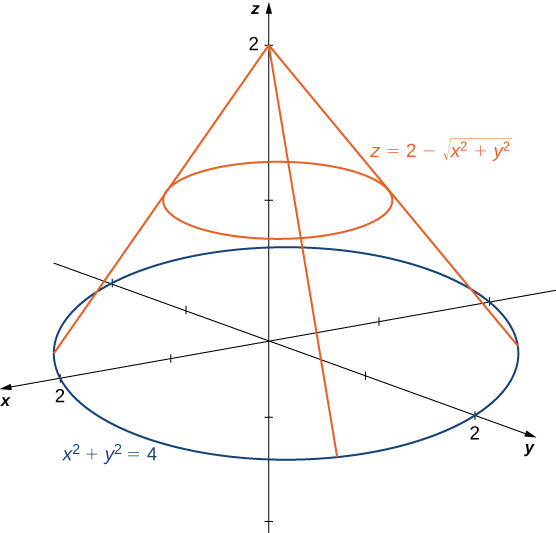{: #CNX_Calc_Figure_15_03_010}

We find the equation of the circle by setting <math xmlns="http://www.w3.org/1998/Math/MathML"><mrow><mi>z</mi><mo>=</mo><mn>0</mn><mtext>:</mtext></mrow></math>

<math xmlns="http://www.w3.org/1998/Math/MathML"><mtable><mtr><mtd columnalign="right"><mn>0</mn></mtd><mtd columnalign="left"><mo>=</mo></mtd><mtd columnalign="left"><mn>2</mn><mo>−</mo><msqrt><mrow><msup><mi>x</mi><mn>2</mn></msup><mo>+</mo><msup><mi>y</mi><mn>2</mn></msup></mrow></msqrt></mtd></mtr><mtr><mtd columnalign="right"><mn>2</mn></mtd><mtd columnalign="left"><mo>=</mo></mtd><mtd columnalign="left"><msqrt><mrow><msup><mi>x</mi><mn>2</mn></msup><mo>+</mo><msup><mi>y</mi><mn>2</mn></msup></mrow></msqrt></mtd></mtr><mtr><mtd columnalign="right"><msup><mi>x</mi><mn>2</mn></msup><mo>+</mo><msup><mi>y</mi><mn>2</mn></msup></mtd><mtd columnalign="left"><mo>=</mo></mtd><mtd columnalign="left"><mn>4.</mn></mtd></mtr></mtable></math>

This means the radius of the circle is <math xmlns="http://www.w3.org/1998/Math/MathML"><mrow><mn>2</mn><mo>,</mo></mrow></math>

 so for the integration we have <math xmlns="http://www.w3.org/1998/Math/MathML"><mrow><mn>0</mn><mo>≤</mo><mi>θ</mi><mo>≤</mo><mn>2</mn><mi>π</mi></mrow></math>

 and <math xmlns="http://www.w3.org/1998/Math/MathML"><mrow><mn>0</mn><mo>≤</mo><mi>r</mi><mo>≤</mo><mn>2</mn><mo>.</mo></mrow></math>

 Substituting <math xmlns="http://www.w3.org/1998/Math/MathML"><mrow><mi>x</mi><mo>=</mo><mi>r</mi><mspace width="0.2em" /><mtext>cos</mtext><mspace width="0.2em" /><mi>θ</mi></mrow></math>

 and <math xmlns="http://www.w3.org/1998/Math/MathML"><mrow><mi>y</mi><mo>=</mo><mi>r</mi><mspace width="0.2em" /><mtext>sin</mtext><mspace width="0.2em" /><mi>θ</mi></mrow></math>

 in the equation <math xmlns="http://www.w3.org/1998/Math/MathML"><mrow><mi>z</mi><mo>=</mo><mn>2</mn><mo>−</mo><msqrt><mrow><msup><mi>x</mi><mn>2</mn></msup><mo>+</mo><msup><mi>y</mi><mn>2</mn></msup></mrow></msqrt></mrow></math>

 we have <math xmlns="http://www.w3.org/1998/Math/MathML"><mrow><mi>z</mi><mo>=</mo><mn>2</mn><mo>−</mo><mi>r</mi><mo>.</mo></mrow></math>

 Therefore, the volume of the cone is

<math xmlns="http://www.w3.org/1998/Math/MathML"><mrow><mstyle displaystyle="true"><mrow><munderover><mo stretchy="false">∫</mo><mrow><mi>θ</mi><mo>=</mo><mn>0</mn></mrow><mrow><mi>θ</mi><mo>=</mo><mn>2</mn><mi>π</mi></mrow></munderover><mspace width="0.2em" /><mrow><mstyle displaystyle="true"><mrow><munderover><mo stretchy="false">∫</mo><mrow><mi>r</mi><mo>=</mo><mn>0</mn></mrow><mrow><mi>r</mi><mo>=</mo><mn>2</mn></mrow></munderover><mrow><mrow><mo>(</mo><mrow><mn>2</mn><mo>−</mo><mi>r</mi></mrow><mo>)</mo></mrow></mrow></mrow></mstyle></mrow></mrow></mstyle><mi>r</mi><mspace width="0.2em" /><mi>d</mi><mi>r</mi><mspace width="0.2em" /><mi>d</mi><mi>θ</mi><mo>=</mo><mn>2</mn><mi>π</mi><mfrac><mn>4</mn><mn>3</mn></mfrac><mo>=</mo><mfrac><mrow><mn>8</mn><mi>π</mi></mrow><mn>3</mn></mfrac></mrow></math>

 cubic units.

Analysis

Note that if we were to find the volume of an arbitrary cone with radius <math xmlns="http://www.w3.org/1998/Math/MathML"><mi>a</mi></math>

 units and height <math xmlns="http://www.w3.org/1998/Math/MathML"><mi>h</mi></math>

 units, then the equation of the cone would be <math xmlns="http://www.w3.org/1998/Math/MathML"><mrow><mi>z</mi><mo>=</mo><mi>h</mi><mo>−</mo><mfrac><mi>h</mi><mi>a</mi></mfrac><msqrt><mrow><msup><mi>x</mi><mn>2</mn></msup><mo>+</mo><msup><mi>y</mi><mn>2</mn></msup></mrow></msqrt><mo>.</mo></mrow></math>

We can still use [[link]](#CNX_Calc_Figure_15_03_010) and set up the integral as <math xmlns="http://www.w3.org/1998/Math/MathML"><mrow><mstyle displaystyle="true"><mrow><munderover><mo stretchy="false">∫</mo><mrow><mi>θ</mi><mo>=</mo><mn>0</mn></mrow><mrow><mi>θ</mi><mo>=</mo><mn>2</mn><mi>π</mi></mrow></munderover><mspace width="0.2em" /><mrow><mstyle displaystyle="true"><mrow><munderover><mo stretchy="false">∫</mo><mrow><mi>r</mi><mo>=</mo><mn>0</mn></mrow><mrow><mi>r</mi><mo>=</mo><mi>a</mi></mrow></munderover><mrow><mrow><mo>(</mo><mrow><mi>h</mi><mo>−</mo><mfrac><mi>h</mi><mi>a</mi></mfrac><mi>r</mi></mrow><mo>)</mo></mrow></mrow></mrow></mstyle></mrow></mrow></mstyle><mi>r</mi><mspace width="0.2em" /><mi>d</mi><mi>r</mi><mspace width="0.2em" /><mi>d</mi><mi>θ</mi><mo>.</mo></mrow></math>

Evaluating the integral, we get <math xmlns="http://www.w3.org/1998/Math/MathML"><mrow><mfrac><mn>1</mn><mn>3</mn></mfrac><mi>π</mi><msup><mi>a</mi><mn>2</mn></msup><mi>h</mi><mo>.</mo></mrow></math>

Use polar coordinates to find an iterated integral for finding the volume of the solid enclosed by the paraboloids <math xmlns="http://www.w3.org/1998/Math/MathML"><mrow><mi>z</mi><mo>=</mo><msup><mi>x</mi><mn>2</mn></msup><mo>+</mo><msup><mi>y</mi><mn>2</mn></msup></mrow></math>

 and <math xmlns="http://www.w3.org/1998/Math/MathML"><mrow><mi>z</mi><mo>=</mo><mn>16</mn><mo>−</mo><msup><mi>x</mi><mn>2</mn></msup><mo>−</mo><msup><mi>y</mi><mn>2</mn></msup><mo>.</mo></mrow></math>

<math xmlns="http://www.w3.org/1998/Math/MathML"><mrow><mi>V</mi><mo>=</mo><mstyle displaystyle="true"><mrow><munderover><mo stretchy="false">∫</mo><mn>0</mn><mrow><mn>2</mn><mi>π</mi></mrow></munderover><mspace width="0.2em" /><mrow><mstyle displaystyle="true"><mrow><munderover><mo stretchy="false">∫</mo><mn>0</mn><mrow><mn>2</mn><msqrt><mn>2</mn></msqrt></mrow></munderover><mrow><mrow><mo>(</mo><mrow><mn>16</mn><mo>−</mo><mn>2</mn><msup><mi>r</mi><mn>2</mn></msup></mrow><mo>)</mo></mrow></mrow></mrow></mstyle></mrow></mrow></mstyle><mi>r</mi><mspace width="0.2em" /><mi>d</mi><mi>r</mi><mspace width="0.2em" /><mi>d</mi><mi>θ</mi><mo>=</mo><mn>64</mn><mi>π</mi></mrow></math>

 cubic units

Hint

Sketching the graphs can help.

As with rectangular coordinates, we can also use polar coordinates to find areas of certain regions using a double integral. As before, we need to understand the region whose area we want to compute. Sketching a graph and identifying the region can be helpful to realize the limits of integration. Generally, the area formula in double integration will look like

<math xmlns="http://www.w3.org/1998/Math/MathML"><mrow><mtext>Area</mtext><mspace width="0.2em" /><mi>A</mi><mo>=</mo><mstyle displaystyle="true"><mrow><munderover><mo stretchy="false">∫</mo><mi>α</mi><mi>β</mi></munderover><mspace width="0.2em" /><mrow><mstyle displaystyle="true"><mrow><munderover><mo stretchy="false">∫</mo><mrow><msub><mi>h</mi><mn>1</mn></msub><mrow><mo>(</mo><mi>θ</mi><mo>)</mo></mrow></mrow><mrow><msub><mi>h</mi><mn>2</mn></msub><mrow><mo>(</mo><mi>θ</mi><mo>)</mo></mrow></mrow></munderover><mrow><mn>1</mn><mi>r</mi><mspace width="0.2em" /><mi>d</mi><mi>r</mi><mspace width="0.2em" /><mi>d</mi><mi>θ</mi></mrow></mrow></mstyle></mrow></mrow></mstyle><mo>.</mo></mrow></math>

Finding an Area Using a Double Integral in Polar Coordinates

Evaluate the area bounded by the curve <math xmlns="http://www.w3.org/1998/Math/MathML"><mrow><mi>r</mi><mo>=</mo><mtext>cos</mtext><mspace width="0.2em" /><mn>4</mn><mi>θ</mi><mo>.</mo></mrow></math>

Sketching the graph of the function <math xmlns="http://www.w3.org/1998/Math/MathML"><mrow><mi>r</mi><mo>=</mo><mtext>cos</mtext><mspace width="0.2em" /><mn>4</mn><mi>θ</mi></mrow></math>

 reveals that it is a polar rose with eight petals (see the following figure).

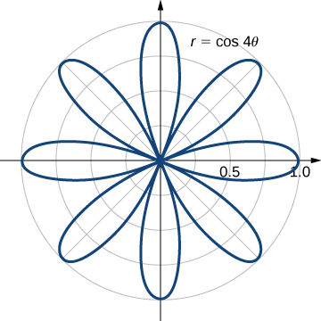{: #CNX_Calc_Figure_15_03_011}

Using **symmetry**{: data-type="term" .no-emphasis}, we can see that we need to find the area of one petal and then multiply it by <math xmlns="http://www.w3.org/1998/Math/MathML"><mrow><mn>8</mn><mo>.</mo></mrow></math>

 Notice that the values of <math xmlns="http://www.w3.org/1998/Math/MathML"><mi>θ</mi></math>

 for which the graph passes through the origin are the zeros of the function <math xmlns="http://www.w3.org/1998/Math/MathML"><mrow><mtext>cos</mtext><mspace width="0.2em" /><mn>4</mn><mi>θ</mi><mo>,</mo></mrow></math>

 and these are odd multiples of <math xmlns="http://www.w3.org/1998/Math/MathML"><mrow><mi>π</mi><mtext>/</mtext><mn>8</mn><mo>.</mo></mrow></math>

 Thus, one of the petals corresponds to the values of <math xmlns="http://www.w3.org/1998/Math/MathML"><mi>θ</mi></math>

 in the interval <math xmlns="http://www.w3.org/1998/Math/MathML"><mrow><mrow><mo>[</mo><mrow><mtext>−</mtext><mi>π</mi><mtext>/</mtext><mn>8</mn><mo>,</mo><mi>π</mi><mtext>/</mtext><mn>8</mn></mrow><mo>]</mo></mrow><mo>.</mo></mrow></math>

 Therefore, the area bounded by the curve <math xmlns="http://www.w3.org/1998/Math/MathML"><mrow><mi>r</mi><mo>=</mo><mtext>cos</mtext><mspace width="0.2em" /><mn>4</mn><mi>θ</mi></mrow></math>

 is

<math xmlns="http://www.w3.org/1998/Math/MathML"><mtable><mtr><mtd columnalign="right"><mi>A</mi></mtd><mtd columnalign="left"><mo>=</mo><mn>8</mn><mstyle displaystyle="true"><mrow><munderover><mo stretchy="false">∫</mo><mrow><mi>θ</mi><mo>=</mo><mtext>−</mtext><mi>π</mi><mtext>/</mtext><mn>8</mn></mrow><mrow><mi>θ</mi><mo>=</mo><mi>π</mi><mtext>/</mtext><mn>8</mn></mrow></munderover><mspace width="0.2em" /><mrow><mstyle displaystyle="true"><mrow><munderover><mo stretchy="false">∫</mo><mrow><mi>r</mi><mo>=</mo><mn>0</mn></mrow><mrow><mi>r</mi><mo>=</mo><mtext>cos</mtext><mspace width="0.2em" /><mn>4</mn><mi>θ</mi></mrow></munderover><mrow><mn>1</mn><mi>r</mi><mspace width="0.2em" /><mi>d</mi><mi>r</mi><mspace width="0.2em" /><mi>d</mi><mi>θ</mi></mrow></mrow></mstyle></mrow></mrow></mstyle></mtd></mtr><mtr><mtd /><mtd columnalign="left"><mo>=</mo><mn>8</mn><mstyle displaystyle="true"><mrow><munderover><mo stretchy="false">∫</mo><mrow><mtext>−</mtext><mi>π</mi><mtext>/</mtext><mn>8</mn></mrow><mrow><mi>π</mi><mtext>/</mtext><mn>8</mn></mrow></munderover><mrow><mrow><mo>[</mo><mrow><mfrac><mn>1</mn><mn>2</mn></mfrac><msubsup><mrow><mrow><mrow><msup><mi>r</mi><mn>2</mn></msup></mrow><mo>\|</mo></mrow></mrow><mn>0</mn><mrow><mtext>cos</mtext><mspace width="0.2em" /><mn>4</mn><mi>θ</mi></mrow></msubsup></mrow><mo>]</mo></mrow></mrow></mrow></mstyle><mi>d</mi><mi>θ</mi><mo>=</mo><mn>8</mn><mstyle displaystyle="true"><mrow><munderover><mo stretchy="false">∫</mo><mrow><mtext>−</mtext><mi>π</mi><mtext>/</mtext><mn>8</mn></mrow><mrow><mi>π</mi><mtext>/</mtext><mn>8</mn></mrow></munderover><mrow><mfrac><mn>1</mn><mn>2</mn></mfrac><msup><mrow><mtext>cos</mtext></mrow><mn>2</mn></msup><mn>4</mn><mi>θ</mi></mrow></mrow></mstyle><mspace width="0.2em" /><mi>d</mi><mi>θ</mi><mo>=</mo><mn>8</mn><mrow><mo>[</mo><mrow><mfrac><mn>1</mn><mn>4</mn></mfrac><mi>θ</mi><mo>+</mo><msubsup><mrow><mrow><mrow><mfrac><mn>1</mn><mrow><mn>16</mn></mrow></mfrac><mtext>sin</mtext><mspace width="0.2em" /><mn>4</mn><mi>θ</mi><mspace width="0.2em" /><mtext>cos</mtext><mspace width="0.2em" /><mn>4</mn><mi>θ</mi></mrow><mo>\|</mo></mrow></mrow><mrow><mtext>−</mtext><mi>π</mi><mtext>/</mtext><mn>8</mn></mrow><mrow><mi>π</mi><mtext>/</mtext><mn>8</mn></mrow></msubsup></mrow><mo>]</mo></mrow><mo>=</mo><mn>8</mn><mrow><mo>[</mo><mrow><mfrac><mi>π</mi><mrow><mn>16</mn></mrow></mfrac></mrow><mo>]</mo></mrow><mo>=</mo><mfrac><mi>π</mi><mn>2</mn></mfrac><mo>.</mo></mtd></mtr></mtable></math>

Finding Area Between Two Polar Curves

Find the area enclosed by the circle <math xmlns="http://www.w3.org/1998/Math/MathML"><mrow><mi>r</mi><mo>=</mo><mn>3</mn><mspace width="0.2em" /><mtext>cos</mtext><mspace width="0.2em" /><mi>θ</mi></mrow></math>

 and the cardioid <math xmlns="http://www.w3.org/1998/Math/MathML"><mrow><mi>r</mi><mo>=</mo><mn>1</mn><mo>+</mo><mtext>cos</mtext><mspace width="0.2em" /><mi>θ</mi><mo>.</mo></mrow></math>

First and foremost, sketch the graphs of the region ([[link]](#CNX_Calc_Figure_15_03_012)).

{: #CNX_Calc_Figure_15_03_012}

We can from see the symmetry of the graph that we need to find the points of intersection. Setting the two equations equal to each other gives

<math xmlns="http://www.w3.org/1998/Math/MathML"><mrow><mn>3</mn><mspace width="0.2em" /><mtext>cos</mtext><mspace width="0.2em" /><mi>θ</mi><mo>=</mo><mn>1</mn><mo>+</mo><mtext>cos</mtext><mspace width="0.2em" /><mi>θ</mi><mo>.</mo></mrow></math>

One of the points of intersection is <math xmlns="http://www.w3.org/1998/Math/MathML"><mrow><mi>θ</mi><mo>=</mo><mi>π</mi><mtext>/</mtext><mn>3</mn><mo>.</mo></mrow></math>

 The area above the polar axis consists of two parts, with one part defined by the cardioid from <math xmlns="http://www.w3.org/1998/Math/MathML"><mrow><mi>θ</mi><mo>=</mo><mn>0</mn></mrow></math>

 to <math xmlns="http://www.w3.org/1998/Math/MathML"><mrow><mi>θ</mi><mo>=</mo><mi>π</mi><mtext>/</mtext><mn>3</mn></mrow></math>

 and the other part defined by the circle from <math xmlns="http://www.w3.org/1998/Math/MathML"><mrow><mi>θ</mi><mo>=</mo><mi>π</mi><mtext>/</mtext><mn>3</mn></mrow></math>

 to <math xmlns="http://www.w3.org/1998/Math/MathML"><mrow><mi>θ</mi><mo>=</mo><mi>π</mi><mtext>/</mtext><mn>2</mn><mo>.</mo></mrow></math>

 By symmetry, the total area is twice the area above the polar axis. Thus, we have

<math xmlns="http://www.w3.org/1998/Math/MathML"><mrow><mi>A</mi><mo>=</mo><mn>2</mn><mrow><mo>[</mo><mrow><mstyle displaystyle="true"><mrow><munderover><mo stretchy="false">∫</mo><mrow><mi>θ</mi><mo>=</mo><mn>0</mn></mrow><mrow><mi>θ</mi><mo>=</mo><mi>π</mi><mtext>/</mtext><mn>3</mn></mrow></munderover><mspace width="0.2em" /><mrow><mstyle displaystyle="true"><mrow><munderover><mo stretchy="false">∫</mo><mrow><mi>r</mi><mo>=</mo><mn>0</mn></mrow><mrow><mi>r</mi><mo>=</mo><mn>1</mn><mo>+</mo><mtext>cos</mtext><mspace width="0.2em" /><mi>θ</mi></mrow></munderover><mrow><mn>1</mn><mi>r</mi><mspace width="0.2em" /><mi>d</mi><mi>r</mi><mspace width="0.2em" /><mi>d</mi><mi>θ</mi><mo>+</mo><mstyle displaystyle="true"><mrow><munderover><mo stretchy="false">∫</mo><mrow><mi>θ</mi><mo>=</mo><mi>π</mi><mtext>/</mtext><mn>3</mn></mrow><mrow><mi>θ</mi><mo>=</mo><mi>π</mi><mtext>/</mtext><mn>2</mn></mrow></munderover><mspace width="0.2em" /><mrow><mstyle displaystyle="true"><mrow><munderover><mo stretchy="false">∫</mo><mrow><mi>r</mi><mo>=</mo><mn>0</mn></mrow><mrow><mi>r</mi><mo>=</mo><mn>3</mn><mspace width="0.2em" /><mtext>cos</mtext><mspace width="0.2em" /><mi>θ</mi></mrow></munderover><mrow><mn>1</mn><mi>r</mi><mspace width="0.2em" /><mi>d</mi><mi>r</mi><mspace width="0.2em" /><mi>d</mi><mi>θ</mi></mrow></mrow></mstyle></mrow></mrow></mstyle></mrow></mrow></mstyle></mrow></mrow></mstyle></mrow><mo>]</mo></mrow><mo>.</mo></mrow></math>

Evaluating each piece separately, we find that the area is

<math xmlns="http://www.w3.org/1998/Math/MathML"><mrow><mi>A</mi><mo>=</mo><mn>2</mn><mrow><mo>(</mo><mrow><mfrac><mn>1</mn><mn>4</mn></mfrac><mi>π</mi><mo>+</mo><mfrac><mn>9</mn><mrow><mn>16</mn></mrow></mfrac><msqrt><mn>3</mn></msqrt><mo>+</mo><mfrac><mn>3</mn><mn>8</mn></mfrac><mi>π</mi><mo>−</mo><mfrac><mn>9</mn><mrow><mn>16</mn></mrow></mfrac><msqrt><mn>3</mn></msqrt></mrow><mo>)</mo></mrow><mo>=</mo><mn>2</mn><mrow><mo>(</mo><mrow><mfrac><mn>5</mn><mn>8</mn></mfrac><mi>π</mi></mrow><mo>)</mo></mrow><mo>=</mo><mfrac><mn>5</mn><mn>4</mn></mfrac><mi>π</mi><mspace width="0.2em" /><mtext>square units</mtext><mtext>.</mtext></mrow></math>

Find the area enclosed inside the cardioid <math xmlns="http://www.w3.org/1998/Math/MathML"><mrow><mi>r</mi><mo>=</mo><mn>3</mn><mo>−</mo><mn>3</mn><mspace width="0.2em" /><mtext>sin</mtext><mspace width="0.2em" /><mi>θ</mi></mrow></math>

 and outside the cardioid <math xmlns="http://www.w3.org/1998/Math/MathML"><mrow><mi>r</mi><mo>=</mo><mn>1</mn><mo>+</mo><mtext>sin</mtext><mspace width="0.2em" /><mi>θ</mi><mo>.</mo></mrow></math>

<math xmlns="http://www.w3.org/1998/Math/MathML"><mrow><mi>A</mi><mo>=</mo><mn>2</mn><mstyle displaystyle="true"><mrow><munderover><mo stretchy="false">∫</mo><mrow><mtext>−</mtext><mi>π</mi><mtext>/</mtext><mn>2</mn></mrow><mrow><mi>π</mi><mtext>/</mtext><mn>6</mn></mrow></munderover><mspace width="0.2em" /><mrow><mstyle displaystyle="true"><mrow><munderover><mo stretchy="false">∫</mo><mrow><mn>1</mn><mo>+</mo><mtext>sin</mtext><mspace width="0.2em" /><mi>θ</mi></mrow><mrow><mn>3</mn><mo>−</mo><mn>3</mn><mspace width="0.2em" /><mtext>sin</mtext><mspace width="0.2em" /><mi>θ</mi></mrow></munderover><mrow><mi>r</mi><mspace width="0.2em" /><mi>d</mi><mi>r</mi><mspace width="0.2em" /><mi>d</mi><mi>θ</mi></mrow></mrow></mstyle></mrow></mrow></mstyle><mo>=</mo><mn>8</mn><mi>π</mi><mo>+</mo><mn>9</mn><msqrt><mn>3</mn></msqrt></mrow></math>

Hint

Sketch the graph, and solve for the points of intersection.

Evaluating an Improper Double Integral in Polar Coordinates

Evaluate the integral <math xmlns="http://www.w3.org/1998/Math/MathML"><mrow><mstyle displaystyle="true"><mrow><munder><mo>∬</mo><mrow><msup><mtext>R</mtext><mn>2</mn></msup></mrow></munder><mrow><msup><mi>e</mi><mrow><mn>−10</mn><mrow><mo>(</mo><mrow><msup><mi>x</mi><mn>2</mn></msup><mo>+</mo><msup><mi>y</mi><mn>2</mn></msup></mrow><mo>)</mo></mrow></mrow></msup></mrow></mrow></mstyle><mi>d</mi><mi>x</mi><mspace width="0.2em" /><mi>d</mi><mi>y</mi><mo>.</mo></mrow></math>

This is an improper integral because we are integrating over an unbounded region <math xmlns="http://www.w3.org/1998/Math/MathML"><mrow><msup><mtext>R</mtext><mn>2</mn></msup><mo>.</mo></mrow></math>

 In polar coordinates, the entire plane <math xmlns="http://www.w3.org/1998/Math/MathML"><mrow><msup><mtext>R</mtext><mn>2</mn></msup></mrow></math>

 can be seen as <math xmlns="http://www.w3.org/1998/Math/MathML"><mrow><mn>0</mn><mo>≤</mo><mi>θ</mi><mo>≤</mo><mn>2</mn><mi>π</mi><mo>,</mo></mrow></math>

 <math xmlns="http://www.w3.org/1998/Math/MathML"><mrow><mn>0</mn><mo>≤</mo><mi>r</mi><mo>≤</mo><mi>∞</mi><mo>.</mo></mrow></math>

Using the changes of variables from rectangular coordinates to polar coordinates, we have

<math xmlns="http://www.w3.org/1998/Math/MathML"><mtable><mtr><mtd columnalign="right"><mstyle displaystyle="true"><mrow><munder><mo>∬</mo><mrow><msup><mtext>R</mtext><mn>2</mn></msup></mrow></munder><mrow><msup><mi>e</mi><mrow><mn>−10</mn><mrow><mo>(</mo><mrow><msup><mi>x</mi><mn>2</mn></msup><mo>+</mo><msup><mi>y</mi><mn>2</mn></msup></mrow><mo>)</mo></mrow></mrow></msup></mrow></mrow></mstyle><mi>d</mi><mi>x</mi><mspace width="0.2em" /><mi>d</mi><mi>y</mi></mtd><mtd columnalign="left"><mo>=</mo><mstyle displaystyle="true"><mrow><munderover><mo stretchy="false">∫</mo><mrow><mi>θ</mi><mo>=</mo><mn>0</mn></mrow><mrow><mi>θ</mi><mo>=</mo><mn>2</mn><mi>π</mi></mrow></munderover><mspace width="0.2em" /><mrow><mstyle displaystyle="true"><mrow><munderover><mo stretchy="false">∫</mo><mrow><mi>r</mi><mo>=</mo><mn>0</mn></mrow><mrow><mi>r</mi><mo>=</mo><mi>∞</mi></mrow></munderover><mrow><msup><mi>e</mi><mrow><mn>−10</mn><msup><mi>r</mi><mn>2</mn></msup></mrow></msup><mi>r</mi><mspace width="0.2em" /><mi>d</mi><mi>r</mi><mspace width="0.2em" /><mi>d</mi><mi>θ</mi></mrow></mrow></mstyle></mrow></mrow></mstyle><mo>=</mo><mstyle displaystyle="true"><mrow><munderover><mo stretchy="false">∫</mo><mrow><mi>θ</mi><mo>=</mo><mn>0</mn></mrow><mrow><mi>θ</mi><mo>=</mo><mn>2</mn><mi>π</mi></mrow></munderover><mrow><mrow><mo>(</mo><mrow><munder><mrow><mtext>lim</mtext></mrow><mrow><mi>a</mi><mo stretchy="false">→</mo><mi>∞</mi></mrow></munder><mstyle displaystyle="true"><mrow><munderover><mo stretchy="false">∫</mo><mrow><mi>r</mi><mo>=</mo><mn>0</mn></mrow><mrow><mi>r</mi><mo>=</mo><mi>a</mi></mrow></munderover><mrow><msup><mi>e</mi><mrow><mn>−10</mn><msup><mi>r</mi><mn>2</mn></msup></mrow></msup><mi>r</mi><mspace width="0.2em" /><mi>d</mi><mi>r</mi></mrow></mrow></mstyle></mrow><mo>)</mo></mrow></mrow></mrow></mstyle><mi>d</mi><mi>θ</mi></mtd></mtr><mtr><mtd /><mtd columnalign="left"><mo>=</mo><mrow><mo>(</mo><mrow><mstyle displaystyle="true"><mrow><munderover><mo stretchy="false">∫</mo><mrow><mi>θ</mi><mo>=</mo><mn>0</mn></mrow><mrow><mi>θ</mi><mo>=</mo><mn>2</mn><mi>π</mi></mrow></munderover><mrow><mi>d</mi><mi>θ</mi></mrow></mrow></mstyle></mrow><mo>)</mo></mrow><mrow><mo>(</mo><mrow><munder><mrow><mtext>lim</mtext></mrow><mrow><mi>a</mi><mo stretchy="false">→</mo><mi>∞</mi></mrow></munder><mstyle displaystyle="true"><mrow><munderover><mo stretchy="false">∫</mo><mrow><mi>r</mi><mo>=</mo><mn>0</mn></mrow><mrow><mi>r</mi><mo>=</mo><mi>a</mi></mrow></munderover><mrow><msup><mi>e</mi><mrow><mn>−10</mn><msup><mi>r</mi><mn>2</mn></msup></mrow></msup><mi>r</mi><mspace width="0.2em" /><mi>d</mi><mi>r</mi></mrow></mrow></mstyle></mrow><mo>)</mo></mrow></mtd></mtr><mtr><mtd /><mtd columnalign="left"><mo>=</mo><mn>2</mn><mi>π</mi><mrow><mo>(</mo><mrow><munder><mrow><mtext>lim</mtext></mrow><mrow><mi>a</mi><mo stretchy="false">→</mo><mi>∞</mi></mrow></munder><mstyle displaystyle="true"><mrow><munderover><mo stretchy="false">∫</mo><mrow><mi>r</mi><mo>=</mo><mn>0</mn></mrow><mrow><mi>r</mi><mo>=</mo><mi>a</mi></mrow></munderover><mrow><msup><mi>e</mi><mrow><mn>−10</mn><msup><mi>r</mi><mn>2</mn></msup></mrow></msup><mi>r</mi><mspace width="0.2em" /><mi>d</mi><mi>r</mi></mrow></mrow></mstyle></mrow><mo>)</mo></mrow></mtd></mtr><mtr><mtd /><mtd columnalign="left"><mo>=</mo><mn>2</mn><mi>π</mi><munder><mrow><mtext>lim</mtext></mrow><mrow><mi>a</mi><mo stretchy="false">→</mo><mi>∞</mi></mrow></munder><mrow><mo>(</mo><mrow><mo>−</mo><mfrac><mn>1</mn><mrow><mn>20</mn></mrow></mfrac></mrow><mo>)</mo></mrow><mrow><mo>(</mo><mrow><msubsup><mrow><mrow><mrow><msup><mi>e</mi><mrow><mn>−10</mn><msup><mi>r</mi><mn>2</mn></msup></mrow></msup></mrow><mo>\|</mo></mrow></mrow><mn>0</mn><mi>a</mi></msubsup></mrow><mo>)</mo></mrow></mtd></mtr><mtr><mtd /><mtd columnalign="left"><mo>=</mo><mn>2</mn><mi>π</mi><mrow><mo>(</mo><mrow><mo>−</mo><mfrac><mn>1</mn><mrow><mn>20</mn></mrow></mfrac></mrow><mo>)</mo></mrow><munder><mrow><mtext>lim</mtext></mrow><mrow><mi>a</mi><mo stretchy="false">→</mo><mi>∞</mi></mrow></munder><mrow><mo>(</mo><mrow><msup><mi>e</mi><mrow><mn>−10</mn><msup><mi>a</mi><mn>2</mn></msup></mrow></msup><mo>−</mo><mn>1</mn></mrow><mo>)</mo></mrow></mtd></mtr><mtr><mtd /><mtd columnalign="left"><mo>=</mo><mfrac><mi>π</mi><mrow><mn>10</mn></mrow></mfrac><mo>.</mo></mtd></mtr></mtable></math>

Evaluate the integral <math xmlns="http://www.w3.org/1998/Math/MathML"><mrow><mstyle displaystyle="true"><mrow><munder><mo>∬</mo><mrow><msup><mtext>R</mtext><mn>2</mn></msup></mrow></munder><mrow><msup><mi>e</mi><mrow><mn>−4</mn><mrow><mo>(</mo><mrow><msup><mi>x</mi><mn>2</mn></msup><mo>+</mo><msup><mi>y</mi><mn>2</mn></msup></mrow><mo>)</mo></mrow></mrow></msup><mi>d</mi><mi>x</mi><mspace width="0.2em" /><mi>d</mi><mi>y</mi></mrow></mrow></mstyle><mo>.</mo></mrow></math>

<math xmlns="http://www.w3.org/1998/Math/MathML"><mrow><mfrac><mi>π</mi><mn>4</mn></mfrac></mrow></math>

Hint

Convert to the polar coordinate system.

### Key Concepts

* To apply a double integral to a situation with circular symmetry, it is often convenient to use a double integral in polar coordinates. We can apply these double integrals over a polar rectangular region or a general polar region, using an iterated integral similar to those used with rectangular double integrals.
* The area
  <math xmlns="http://www.w3.org/1998/Math/MathML"><mrow><mi>d</mi><mi>A</mi></mrow></math>
  
  in polar coordinates becomes
  <math xmlns="http://www.w3.org/1998/Math/MathML"><mrow><mi>r</mi><mspace width="0.2em" /><mi>d</mi><mi>r</mi><mspace width="0.2em" /><mi>d</mi><mi>θ</mi><mo>.</mo></mrow></math>

* Use
  <math xmlns="http://www.w3.org/1998/Math/MathML"><mrow><mi>x</mi><mo>=</mo><mi>r</mi><mspace width="0.2em" /><mtext>cos</mtext><mspace width="0.2em" /><mi>θ</mi><mo>,</mo></mrow></math>
  
  <math xmlns="http://www.w3.org/1998/Math/MathML"><mrow><mi>y</mi><mo>=</mo><mi>r</mi><mspace width="0.2em" /><mtext>sin</mtext><mspace width="0.2em" /><mi>θ</mi><mo>,</mo></mrow></math>
  
  and
  <math xmlns="http://www.w3.org/1998/Math/MathML"><mrow><mi>d</mi><mi>A</mi><mo>=</mo><mi>r</mi><mspace width="0.2em" /><mi>d</mi><mi>r</mi><mspace width="0.2em" /><mi>d</mi><mi>θ</mi></mrow></math>
  
  to convert an integral in rectangular coordinates to an integral in polar coordinates.
* Use
  <math xmlns="http://www.w3.org/1998/Math/MathML"><mrow><msup><mi>r</mi><mn>2</mn></msup><mo>=</mo><msup><mi>x</mi><mn>2</mn></msup><mo>+</mo><msup><mi>y</mi><mn>2</mn></msup></mrow></math>
  
  and
  <math xmlns="http://www.w3.org/1998/Math/MathML"><mrow><mi>θ</mi><mo>=</mo><msup><mrow><mtext>tan</mtext></mrow><mrow><mn>−1</mn></mrow></msup><mrow><mo>(</mo><mrow><mfrac><mi>y</mi><mi>x</mi></mfrac></mrow><mo>)</mo></mrow></mrow></math>
  
  to convert an integral in polar coordinates to an integral in rectangular coordinates, if needed.
* To find the volume in polar coordinates bounded above by a surface
  <math xmlns="http://www.w3.org/1998/Math/MathML"><mrow><mi>z</mi><mo>=</mo><mi>f</mi><mrow><mo>(</mo><mrow><mi>r</mi><mo>,</mo><mi>θ</mi></mrow><mo>)</mo></mrow></mrow></math>
  
  over a region on the
  <math xmlns="http://www.w3.org/1998/Math/MathML"><mrow><mi>x</mi><mi>y</mi></mrow></math>
  
  -plane, use a double integral in polar coordinates.
{: data-bullet-style="bullet"}

### Key Equations

* **Double integral over a polar rectangular region <math xmlns="http://www.w3.org/1998/Math/MathML"><mi>R</mi></math>
  
  **
  * * *
  {: data-type="newline"}
  
  <math xmlns="http://www.w3.org/1998/Math/MathML"><mrow><mstyle displaystyle="true"><mrow><munder><mo>∬</mo><mi>R</mi></munder><mrow><mi>f</mi><mrow><mo>(</mo><mrow><mi>r</mi><mo>,</mo><mi>θ</mi></mrow><mo>)</mo></mrow></mrow></mrow></mstyle><mi>d</mi><mi>A</mi><mo>=</mo><munder><mrow><mtext>lim</mtext></mrow><mrow><mi>m</mi><mo>,</mo><mi>n</mi><mo stretchy="false">→</mo><mi>∞</mi></mrow></munder><mstyle displaystyle="true"><munderover><mo>∑</mo><mrow><mi>i</mi><mo>=</mo><mn>1</mn></mrow><mi>m</mi></munderover><mrow><mstyle displaystyle="true"><munderover><mo>∑</mo><mrow><mi>j</mi><mo>=</mo><mn>1</mn></mrow><mi>n</mi></munderover><mrow><mi>f</mi><mrow><mo>(</mo><mrow><msub><mi>r</mi><mrow><mi>i</mi><mi>j</mi></mrow></msub><mo>*</mo><mo>,</mo><msub><mi>θ</mi><mrow><mi>i</mi><mi>j</mi></mrow></msub><mo>*</mo></mrow><mo>)</mo></mrow></mrow></mstyle></mrow></mstyle><mi>Δ</mi><mi>A</mi><mo>=</mo><munder><mrow><mtext>lim</mtext></mrow><mrow><mi>m</mi><mo>,</mo><mi>n</mi><mo stretchy="false">→</mo><mi>∞</mi></mrow></munder><mstyle displaystyle="true"><munderover><mo>∑</mo><mrow><mi>i</mi><mo>=</mo><mn>1</mn></mrow><mi>m</mi></munderover><mrow><mstyle displaystyle="true"><munderover><mo>∑</mo><mrow><mi>j</mi><mo>=</mo><mn>1</mn></mrow><mi>n</mi></munderover><mrow><mi>f</mi><mrow><mo>(</mo><mrow><msub><mi>r</mi><mrow><mi>i</mi><mi>j</mi></mrow></msub><mo>*</mo><mo>,</mo><msub><mi>θ</mi><mrow><mi>i</mi><mi>j</mi></mrow></msub><mo>*</mo></mrow><mo>)</mo></mrow></mrow></mstyle></mrow></mstyle><msub><mi>r</mi><mrow><mi>i</mi><mi>j</mi></mrow></msub><mo>*</mo><mi>Δ</mi><mi>r</mi><mi>Δ</mi><mi>θ</mi></mrow></math>

* **Double integral over a general polar region**
  * * *
  {: data-type="newline"}
  
  <math xmlns="http://www.w3.org/1998/Math/MathML"><mrow><mstyle displaystyle="true"><mrow><munder><mo>∬</mo><mi>D</mi></munder><mrow><mi>f</mi><mrow><mo>(</mo><mrow><mi>r</mi><mo>,</mo><mi>θ</mi></mrow><mo>)</mo></mrow></mrow></mrow></mstyle><mi>r</mi><mspace width="0.2em" /><mi>d</mi><mi>r</mi><mspace width="0.2em" /><mi>d</mi><mi>θ</mi><mo>=</mo><mstyle displaystyle="true"><mrow><munderover><mo stretchy="false">∫</mo><mrow><mi>θ</mi><mo>=</mo><mi>α</mi></mrow><mrow><mi>θ</mi><mo>=</mo><mi>β</mi></mrow></munderover><mspace width="0.2em" /><mrow><mstyle displaystyle="true"><mrow><munderover><mo stretchy="false">∫</mo><mrow><mi>r</mi><mo>=</mo><msub><mi>h</mi><mn>1</mn></msub><mrow><mo>(</mo><mi>θ</mi><mo>)</mo></mrow></mrow><mrow><mi>r</mi><mo>=</mo><msub><mi>h</mi><mn>2</mn></msub><mrow><mo>(</mo><mi>θ</mi><mo>)</mo></mrow></mrow></munderover><mrow><mi>f</mi><mrow><mo>(</mo><mrow><mi>r</mi><mo>,</mo><mi>θ</mi></mrow><mo>)</mo></mrow></mrow></mrow></mstyle></mrow></mrow></mstyle><mi>r</mi><mspace width="0.2em" /><mi>d</mi><mi>r</mi><mspace width="0.2em" /><mi>d</mi><mi>θ</mi></mrow></math>
{: data-bullet-style="bullet"}

<section data-depth="1" class="section-exercises" markdown="1">
In the following exercises, express the region <math xmlns="http://www.w3.org/1998/Math/MathML"><mi>D</mi></math>

 in polar coordinates.

<math xmlns="http://www.w3.org/1998/Math/MathML"><mi>D</mi></math>

 is the region of the disk of radius <math xmlns="http://www.w3.org/1998/Math/MathML"><mn>2</mn></math>

 centered at the origin that lies in the first quadrant.

<math xmlns="http://www.w3.org/1998/Math/MathML"><mi>D</mi></math>

 is the region between the circles of radius <math xmlns="http://www.w3.org/1998/Math/MathML"><mn>4</mn></math>

 and radius <math xmlns="http://www.w3.org/1998/Math/MathML"><mn>5</mn></math>

 centered at the origin that lies in the second quadrant.

<math xmlns="http://www.w3.org/1998/Math/MathML"><mrow><mi>D</mi><mo>=</mo><mrow><mo>{</mo><mrow><mrow><mrow><mrow><mo>(</mo><mrow><mi>r</mi><mo>,</mo><mi>θ</mi></mrow><mo>)</mo></mrow></mrow><mo>\|</mo></mrow><mn>4</mn><mo>≤</mo><mi>r</mi><mo>≤</mo><mn>5</mn><mo>,</mo><mfrac><mi>π</mi><mn>2</mn></mfrac><mo>≤</mo><mi>θ</mi><mo>≤</mo><mi>π</mi></mrow><mo>}</mo></mrow></mrow></math>

<math xmlns="http://www.w3.org/1998/Math/MathML"><mi>D</mi></math>

 is the region bounded by the <math xmlns="http://www.w3.org/1998/Math/MathML"><mi>y</mi></math>

-axis and <math xmlns="http://www.w3.org/1998/Math/MathML"><mrow><mi>x</mi><mo>=</mo><msqrt><mrow><mn>1</mn><mo>−</mo><msup><mi>y</mi><mn>2</mn></msup></mrow></msqrt><mo>.</mo></mrow></math>

<math xmlns="http://www.w3.org/1998/Math/MathML"><mi>D</mi></math>

 is the region bounded by the <math xmlns="http://www.w3.org/1998/Math/MathML"><mi>x</mi></math>

-axis and <math xmlns="http://www.w3.org/1998/Math/MathML"><mrow><mi>y</mi><mo>=</mo><msqrt><mrow><mn>2</mn><mo>−</mo><msup><mi>x</mi><mn>2</mn></msup></mrow></msqrt><mo>.</mo></mrow></math>

<math xmlns="http://www.w3.org/1998/Math/MathML"><mrow><mi>D</mi><mo>=</mo><mrow><mo>{</mo><mrow><mrow><mrow><mrow><mo>(</mo><mrow><mi>r</mi><mo>,</mo><mi>θ</mi></mrow><mo>)</mo></mrow></mrow><mo>\|</mo></mrow><mn>0</mn><mo>≤</mo><mi>r</mi><mo>≤</mo><msqrt><mn>2</mn></msqrt><mo>,</mo><mn>0</mn><mo>≤</mo><mi>θ</mi><mo>≤</mo><mi>π</mi></mrow><mo>}</mo></mrow></mrow></math>

<math xmlns="http://www.w3.org/1998/Math/MathML"><mrow><mi>D</mi><mo>=</mo><mrow><mo>{</mo><mrow><mrow><mrow><mrow><mo>(</mo><mrow><mi>x</mi><mo>,</mo><mi>y</mi></mrow><mo>)</mo></mrow></mrow><mo>\|</mo></mrow><msup><mi>x</mi><mn>2</mn></msup><mo>+</mo><msup><mi>y</mi><mn>2</mn></msup><mo>≤</mo><mn>4</mn><mi>x</mi></mrow><mo>}</mo></mrow></mrow></math>

<math xmlns="http://www.w3.org/1998/Math/MathML"><mrow><mi>D</mi><mo>=</mo><mrow><mo>{</mo><mrow><mrow><mrow><mrow><mo>(</mo><mrow><mi>x</mi><mo>,</mo><mi>y</mi></mrow><mo>)</mo></mrow></mrow><mo>\|</mo></mrow><msup><mi>x</mi><mn>2</mn></msup><mo>+</mo><msup><mi>y</mi><mn>2</mn></msup><mo>≤</mo><mn>4</mn><mi>y</mi></mrow><mo>}</mo></mrow></mrow></math>

<math xmlns="http://www.w3.org/1998/Math/MathML"><mrow><mi>D</mi><mo>=</mo><mrow><mo>{</mo><mrow><mrow><mrow><mrow><mo>(</mo><mrow><mi>r</mi><mo>,</mo><mi>θ</mi></mrow><mo>)</mo></mrow></mrow><mo>\|</mo></mrow><mn>0</mn><mo>≤</mo><mi>r</mi><mo>≤</mo><mn>4</mn><mspace width="0.2em" /><mtext>sin</mtext><mspace width="0.2em" /><mi>θ</mi><mo>,</mo><mn>0</mn><mo>≤</mo><mi>θ</mi><mo>≤</mo><mi>π</mi></mrow><mo>}</mo></mrow></mrow></math>

In the following exercises, the graph of the polar rectangular region <math xmlns="http://www.w3.org/1998/Math/MathML"><mi>D</mi></math>

 is given. Express <math xmlns="http://www.w3.org/1998/Math/MathML"><mi>D</mi></math>

 in polar coordinates.

 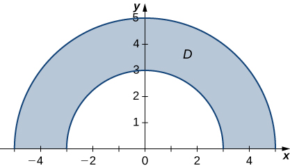 

 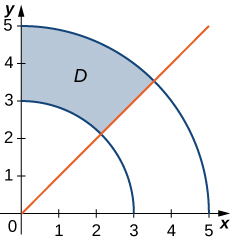 

<math xmlns="http://www.w3.org/1998/Math/MathML"><mrow><mi>D</mi><mo>=</mo><mrow><mo>{</mo><mrow><mrow><mrow><mrow><mo>(</mo><mrow><mi>r</mi><mo>,</mo><mi>θ</mi></mrow><mo>)</mo></mrow></mrow><mo>\|</mo></mrow><mn>3</mn><mo>≤</mo><mi>r</mi><mo>≤</mo><mn>5</mn><mo>,</mo><mfrac><mi>π</mi><mn>4</mn></mfrac><mo>≤</mo><mi>θ</mi><mo>≤</mo><mfrac><mi>π</mi><mn>2</mn></mfrac></mrow><mo>}</mo></mrow></mrow></math>

 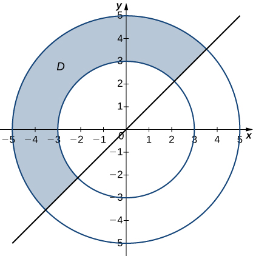 

 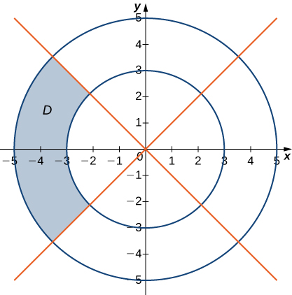 

<math xmlns="http://www.w3.org/1998/Math/MathML"><mrow><mi>D</mi><mo>=</mo><mrow><mo>{</mo><mrow><mrow><mrow><mrow><mo>(</mo><mrow><mi>r</mi><mo>,</mo><mi>θ</mi></mrow><mo>)</mo></mrow></mrow><mo>\|</mo></mrow><mn>3</mn><mo>≤</mo><mi>r</mi><mo>≤</mo><mn>5</mn><mo>,</mo><mfrac><mrow><mn>3</mn><mi>π</mi></mrow><mn>4</mn></mfrac><mo>≤</mo><mi>θ</mi><mo>≤</mo><mfrac><mrow><mn>5</mn><mi>π</mi></mrow><mn>4</mn></mfrac></mrow><mo>}</mo></mrow></mrow></math>

In the following graph, the region <math xmlns="http://www.w3.org/1998/Math/MathML"><mi>D</mi></math>

 is situated below <math xmlns="http://www.w3.org/1998/Math/MathML"><mrow><mi>y</mi><mo>=</mo><mi>x</mi></mrow></math>

 and is bounded by <math xmlns="http://www.w3.org/1998/Math/MathML"><mrow><mi>x</mi><mo>=</mo><mn>1</mn><mo>,</mo><mi>x</mi><mo>=</mo><mn>5</mn><mo>,</mo></mrow></math>

 and <math xmlns="http://www.w3.org/1998/Math/MathML"><mrow><mi>y</mi><mo>=</mo><mn>0</mn><mo>.</mo></mrow></math>

 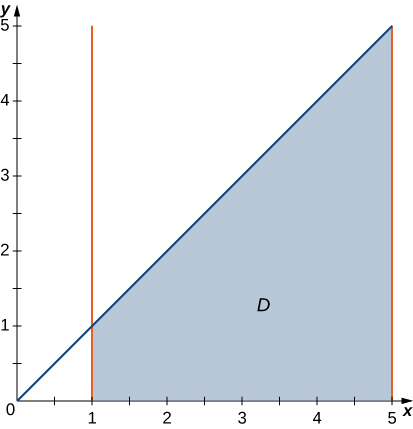 

In the following graph, the region <math xmlns="http://www.w3.org/1998/Math/MathML"><mi>D</mi></math>

 is bounded by <math xmlns="http://www.w3.org/1998/Math/MathML"><mrow><mi>y</mi><mo>=</mo><mi>x</mi></mrow></math>

 and <math xmlns="http://www.w3.org/1998/Math/MathML"><mrow><mi>y</mi><mo>=</mo><msup><mi>x</mi><mn>2</mn></msup><mo>.</mo></mrow></math>

 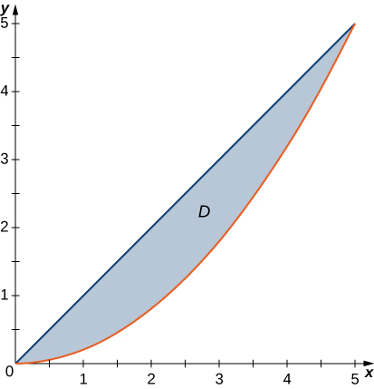 

<math xmlns="http://www.w3.org/1998/Math/MathML"><mrow><mi>D</mi><mo>=</mo><mrow><mo>{</mo><mrow><mrow><mrow><mrow><mo>(</mo><mrow><mi>r</mi><mo>,</mo><mi>θ</mi></mrow><mo>)</mo></mrow></mrow><mo>\|</mo></mrow><mn>0</mn><mo>≤</mo><mi>r</mi><mo>≤</mo><mtext>tan</mtext><mspace width="0.2em" /><mi>θ</mi><mspace width="0.2em" /><mtext>sec</mtext><mspace width="0.2em" /><mi>θ</mi><mo>,</mo><mn>0</mn><mo>≤</mo><mi>θ</mi><mo>≤</mo><mfrac><mi>π</mi><mn>4</mn></mfrac></mrow><mo>}</mo></mrow></mrow></math>

In the following exercises, evaluate the double integral <math xmlns="http://www.w3.org/1998/Math/MathML"><mrow><mstyle displaystyle="true"><mrow><munder><mo>∬</mo><mi>R</mi></munder><mrow><mi>f</mi><mrow><mo>(</mo><mrow><mi>x</mi><mo>,</mo><mi>y</mi></mrow><mo>)</mo></mrow><mi>d</mi><mi>A</mi></mrow></mrow></mstyle></mrow></math>

 over the polar rectangular region <math xmlns="http://www.w3.org/1998/Math/MathML"><mrow><mi>D</mi><mo>.</mo></mrow></math>

<math xmlns="http://www.w3.org/1998/Math/MathML"><mrow><mi>f</mi><mrow><mo>(</mo><mrow><mi>x</mi><mo>,</mo><mi>y</mi></mrow><mo>)</mo></mrow><mo>=</mo><msup><mi>x</mi><mn>2</mn></msup><mo>+</mo><msup><mi>y</mi><mn>2</mn></msup><mo>,</mo><mi>D</mi><mo>=</mo><mrow><mo>{</mo><mrow><mrow><mrow><mrow><mo>(</mo><mrow><mi>r</mi><mo>,</mo><mi>θ</mi></mrow><mo>)</mo></mrow></mrow><mo>\|</mo></mrow><mn>3</mn><mo>≤</mo><mi>r</mi><mo>≤</mo><mn>5</mn><mo>,</mo><mn>0</mn><mo>≤</mo><mi>θ</mi><mo>≤</mo><mn>2</mn><mi>π</mi></mrow><mo>}</mo></mrow></mrow></math>

<math xmlns="http://www.w3.org/1998/Math/MathML"><mrow><mi>f</mi><mrow><mo>(</mo><mrow><mi>x</mi><mo>,</mo><mi>y</mi></mrow><mo>)</mo></mrow><mo>=</mo><mi>x</mi><mo>+</mo><mi>y</mi><mo>,</mo><mspace width="0.2em" /><mtext /><mspace width="0.2em" /><mi>D</mi><mo>=</mo><mrow><mo>{</mo><mrow><mrow><mrow><mrow><mo>(</mo><mrow><mi>r</mi><mo>,</mo><mi>θ</mi></mrow><mo>)</mo></mrow></mrow><mo>\|</mo></mrow><mn>3</mn><mo>≤</mo><mi>r</mi><mo>≤</mo><mn>5</mn><mo>,</mo><mn>0</mn><mo>≤</mo><mi>θ</mi><mo>≤</mo><mn>2</mn><mi>π</mi></mrow><mo>}</mo></mrow></mrow></math>

<math xmlns="http://www.w3.org/1998/Math/MathML"><mn>0</mn></math>

<math xmlns="http://www.w3.org/1998/Math/MathML"><mrow><mi>f</mi><mrow><mo>(</mo><mrow><mi>x</mi><mo>,</mo><mi>y</mi></mrow><mo>)</mo></mrow><mo>=</mo><msup><mi>x</mi><mn>2</mn></msup><mo>+</mo><mi>x</mi><mi>y</mi><mo>,</mo><mi>D</mi><mo>=</mo><mrow><mo>{</mo><mrow><mrow><mrow><mrow><mo>(</mo><mrow><mi>r</mi><mo>,</mo><mi>θ</mi></mrow><mo>)</mo></mrow></mrow><mo>\|</mo></mrow><mn>1</mn><mo>≤</mo><mi>r</mi><mo>≤</mo><mn>2</mn><mo>,</mo><mi>π</mi><mo>≤</mo><mi>θ</mi><mo>≤</mo><mn>2</mn><mi>π</mi></mrow><mo>}</mo></mrow></mrow></math>

<math xmlns="http://www.w3.org/1998/Math/MathML"><mrow><mi>f</mi><mrow><mo>(</mo><mrow><mi>x</mi><mo>,</mo><mi>y</mi></mrow><mo>)</mo></mrow><mo>=</mo><msup><mi>x</mi><mn>4</mn></msup><mo>+</mo><msup><mi>y</mi><mn>4</mn></msup><mo>,</mo><mi>D</mi><mo>=</mo><mrow><mo>{</mo><mrow><mrow><mrow><mrow><mo>(</mo><mrow><mi>r</mi><mo>,</mo><mi>θ</mi></mrow><mo>)</mo></mrow></mrow><mo>\|</mo></mrow><mn>1</mn><mo>≤</mo><mi>r</mi><mo>≤</mo><mn>2</mn><mo>,</mo><mfrac><mrow><mn>3</mn><mi>π</mi></mrow><mn>2</mn></mfrac><mo>≤</mo><mi>θ</mi><mo>≤</mo><mn>2</mn><mi>π</mi></mrow><mo>}</mo></mrow></mrow></math>

<math xmlns="http://www.w3.org/1998/Math/MathML"><mrow><mfrac><mrow><mn>63</mn><mi>π</mi></mrow><mrow><mn>16</mn></mrow></mfrac></mrow></math>

<math xmlns="http://www.w3.org/1998/Math/MathML"><mrow><mi>f</mi><mrow><mo>(</mo><mrow><mi>x</mi><mo>,</mo><mi>y</mi></mrow><mo>)</mo></mrow><mo>=</mo><mroot><mrow><msup><mi>x</mi><mn>2</mn></msup><mo>+</mo><msup><mi>y</mi><mn>2</mn></msup></mrow><mn>3</mn></mroot><mo>,</mo></mrow></math>

 where <math xmlns="http://www.w3.org/1998/Math/MathML"><mrow><mi>D</mi><mo>=</mo><mrow><mo>{</mo><mrow><mrow><mrow><mrow><mo>(</mo><mrow><mi>r</mi><mo>,</mo><mi>θ</mi></mrow><mo>)</mo></mrow></mrow><mo>\|</mo></mrow><mn>0</mn><mo>≤</mo><mi>r</mi><mo>≤</mo><mn>1</mn><mo>,</mo><mfrac><mi>π</mi><mn>2</mn></mfrac><mo>≤</mo><mi>θ</mi><mo>≤</mo><mi>π</mi></mrow><mo>}</mo></mrow><mo>.</mo></mrow></math>

<math xmlns="http://www.w3.org/1998/Math/MathML"><mrow><mi>f</mi><mrow><mo>(</mo><mrow><mi>x</mi><mo>,</mo><mi>y</mi></mrow><mo>)</mo></mrow><mo>=</mo><msup><mi>x</mi><mn>4</mn></msup><mo>+</mo><mn>2</mn><msup><mi>x</mi><mn>2</mn></msup><msup><mi>y</mi><mn>2</mn></msup><mo>+</mo><msup><mi>y</mi><mn>4</mn></msup><mo>,</mo></mrow></math>

 where <math xmlns="http://www.w3.org/1998/Math/MathML"><mrow><mi>D</mi><mo>=</mo><mrow><mo>{</mo><mrow><mrow><mrow><mrow><mo>(</mo><mrow><mi>r</mi><mo>,</mo><mi>θ</mi></mrow><mo>)</mo></mrow></mrow><mo>\|</mo></mrow><mn>3</mn><mo>≤</mo><mi>r</mi><mo>≤</mo><mn>4</mn><mo>,</mo><mfrac><mi>π</mi><mn>3</mn></mfrac><mo>≤</mo><mi>θ</mi><mo>≤</mo><mfrac><mrow><mn>2</mn><mi>π</mi></mrow><mn>3</mn></mfrac></mrow><mo>}</mo></mrow><mo>.</mo></mrow></math>

<math xmlns="http://www.w3.org/1998/Math/MathML"><mrow><mfrac><mrow><mn>3367</mn><mi>π</mi></mrow><mrow><mn>18</mn></mrow></mfrac></mrow></math>

<math xmlns="http://www.w3.org/1998/Math/MathML"><mrow><mi>f</mi><mo stretchy="false">(</mo><mi>x</mi><mo>,</mo><mi>y</mi><mo stretchy="false">)</mo><mo>=</mo><mtext>sin</mtext><mrow><mo>(</mo><mrow><mtext>arctan</mtext><mspace width="0.2em" /><mfrac><mi>y</mi><mi>x</mi></mfrac></mrow><mo>)</mo></mrow><mo>,</mo></mrow></math>

 where <math xmlns="http://www.w3.org/1998/Math/MathML"><mrow><mi>D</mi><mo>=</mo><mrow><mo>{</mo><mrow><mo stretchy="false">(</mo><mi>r</mi><mo>,</mo><mi>θ</mi><mo stretchy="false">)</mo><mo>\|</mo><mn>1</mn><mo>≤</mo><mi>r</mi><mo>≤</mo><mn>2</mn><mo>,</mo><mfrac><mi>π</mi><mn>6</mn></mfrac><mo>≤</mo><mi>θ</mi><mo>≤</mo><mfrac><mi>π</mi><mn>3</mn></mfrac></mrow><mo>}</mo></mrow></mrow></math>

<math xmlns="http://www.w3.org/1998/Math/MathML"><mrow><mi>f</mi><mo stretchy="false">(</mo><mi>x</mi><mo>,</mo><mi>y</mi><mo stretchy="false">)</mo><mo>=</mo><mtext>arctan</mtext><mrow><mo>(</mo><mrow><mfrac><mi>y</mi><mi>x</mi></mfrac></mrow><mo>)</mo></mrow><mo>,</mo></mrow></math>

 where <math xmlns="http://www.w3.org/1998/Math/MathML"><mrow><mi>D</mi><mo>=</mo><mrow><mo>{</mo><mrow><mo stretchy="false">(</mo><mi>r</mi><mo>,</mo><mi>θ</mi><mo stretchy="false">)</mo><mo>\|</mo><mn>2</mn><mo>≤</mo><mi>r</mi><mo>≤</mo><mn>3</mn><mo>,</mo><mfrac><mi>π</mi><mn>4</mn></mfrac><mo>≤</mo><mi>θ</mi><mo>≤</mo><mfrac><mi>π</mi><mn>3</mn></mfrac></mrow><mo>}</mo></mrow></mrow></math>

<math xmlns="http://www.w3.org/1998/Math/MathML"><mrow><mfrac><mrow><mn>35</mn><msup><mi>π</mi><mn>2</mn></msup></mrow><mrow><mn>576</mn></mrow></mfrac></mrow></math>

<math xmlns="http://www.w3.org/1998/Math/MathML"><mrow><mstyle displaystyle="true"><mrow><munder><mo>∬</mo><mi>D</mi></munder><mrow><msup><mi>e</mi><mrow><msup><mi>x</mi><mn>2</mn></msup><mo>+</mo><msup><mi>y</mi><mn>2</mn></msup></mrow></msup><mrow><mo>[</mo><mrow><mn>1</mn><mo>+</mo><mn>2</mn><mspace width="0.2em" /><mtext>arctan</mtext><mrow><mo>(</mo><mrow><mfrac><mi>y</mi><mi>x</mi></mfrac></mrow><mo>)</mo></mrow></mrow><mo>]</mo></mrow></mrow></mrow></mstyle><mi>d</mi><mi>A</mi><mtext>,</mtext><mspace width="0.2em" /><mi>D</mi><mo>=</mo><mrow><mo>{</mo><mrow><mrow><mrow><mrow><mo>(</mo><mrow><mi>r</mi><mo>,</mo><mi>θ</mi></mrow><mo>)</mo></mrow></mrow><mo>\|</mo></mrow><mn>1</mn><mo>≤</mo><mi>r</mi><mo>≤</mo><mn>2</mn><mo>,</mo><mfrac><mi>π</mi><mn>6</mn></mfrac><mo>≤</mo><mi>θ</mi><mo>≤</mo><mfrac><mi>π</mi><mn>3</mn></mfrac></mrow><mo>}</mo></mrow></mrow></math>

<math xmlns="http://www.w3.org/1998/Math/MathML"><mrow><mstyle displaystyle="true"><mrow><munder><mo>∬</mo><mi>D</mi></munder><mrow><mrow><mo>(</mo><mrow><msup><mi>e</mi><mrow><msup><mi>x</mi><mn>2</mn></msup><mo>+</mo><msup><mi>y</mi><mn>2</mn></msup></mrow></msup><mo>+</mo><msup><mi>x</mi><mn>4</mn></msup><mo>+</mo><mn>2</mn><msup><mi>x</mi><mn>2</mn></msup><msup><mi>y</mi><mn>2</mn></msup><mo>+</mo><msup><mi>y</mi><mn>4</mn></msup></mrow><mo>)</mo></mrow></mrow></mrow></mstyle><mtext>arctan</mtext><mrow><mo>(</mo><mrow><mfrac><mi>y</mi><mi>x</mi></mfrac></mrow><mo>)</mo></mrow><mi>d</mi><mi>A</mi><mtext>,</mtext><mspace width="0.2em" /><mi>D</mi><mo>=</mo><mrow><mo>{</mo><mrow><mrow><mrow><mrow><mo>(</mo><mrow><mi>r</mi><mo>,</mo><mi>θ</mi></mrow><mo>)</mo></mrow></mrow><mo>\|</mo></mrow><mn>1</mn><mo>≤</mo><mi>r</mi><mo>≤</mo><mn>2</mn><mo>,</mo><mfrac><mi>π</mi><mn>4</mn></mfrac><mo>≤</mo><mi>θ</mi><mo>≤</mo><mfrac><mi>π</mi><mn>3</mn></mfrac></mrow><mo>}</mo></mrow></mrow></math>

<math xmlns="http://www.w3.org/1998/Math/MathML"><mrow><mfrac><mn>7</mn><mrow><mn>576</mn></mrow></mfrac><msup><mi>π</mi><mn>2</mn></msup><mrow><mo>(</mo><mrow><mn>21</mn><mo>−</mo><mi>e</mi><mo>+</mo><msup><mi>e</mi><mn>4</mn></msup></mrow><mo>)</mo></mrow></mrow></math>

In the following exercises, the integrals have been converted to polar coordinates. Verify that the identities are true and choose the easiest way to evaluate the integrals, in rectangular or polar coordinates.

<math xmlns="http://www.w3.org/1998/Math/MathML"><mrow><mstyle displaystyle="true"><mrow><munderover><mo stretchy="false">∫</mo><mn>1</mn><mn>2</mn></munderover><mspace width="0.2em" /><mrow><mstyle displaystyle="true"><mrow><munderover><mo stretchy="false">∫</mo><mn>0</mn><mi>x</mi></munderover><mrow><mrow><mo>(</mo><mrow><msup><mi>x</mi><mn>2</mn></msup><mo>+</mo><msup><mi>y</mi><mn>2</mn></msup></mrow><mo>)</mo></mrow></mrow></mrow></mstyle></mrow></mrow></mstyle><mi>d</mi><mi>y</mi><mspace width="0.2em" /><mi>d</mi><mi>x</mi><mo>=</mo><mstyle displaystyle="true"><mrow><munderover><mo stretchy="false">∫</mo><mn>0</mn><mrow><mfrac><mi>π</mi><mn>4</mn></mfrac></mrow></munderover><mspace width="0.2em" /><mrow><mstyle displaystyle="true"><mrow><munderover><mo stretchy="false">∫</mo><mrow><mtext>sec</mtext><mspace width="0.2em" /><mi>θ</mi></mrow><mrow><mn>2</mn><mspace width="0.2em" /><mtext>sec</mtext><mspace width="0.2em" /><mi>θ</mi></mrow></munderover><mrow><msup><mi>r</mi><mn>3</mn></msup><mi>d</mi><mi>r</mi><mspace width="0.2em" /><mi>d</mi><mi>θ</mi></mrow></mrow></mstyle></mrow></mrow></mstyle></mrow></math>

<math xmlns="http://www.w3.org/1998/Math/MathML"><mrow><mstyle displaystyle="true"><mrow><munderover><mo stretchy="false">∫</mo><mn>2</mn><mn>3</mn></munderover><mspace width="0.2em" /><mrow><mstyle displaystyle="true"><mrow><munderover><mo stretchy="false">∫</mo><mn>0</mn><mi>x</mi></munderover><mrow><mfrac><mi>x</mi><mrow><msqrt><mrow><msup><mi>x</mi><mn>2</mn></msup><mo>+</mo><msup><mi>y</mi><mn>2</mn></msup></mrow></msqrt></mrow></mfrac><mi>d</mi><mi>y</mi><mspace width="0.2em" /><mi>d</mi><mi>x</mi></mrow></mrow></mstyle></mrow></mrow></mstyle><mo>=</mo><mstyle displaystyle="true"><mrow><munderover><mo stretchy="false">∫</mo><mn>0</mn><mrow><mi>π</mi><mtext>/</mtext><mn>4</mn></mrow></munderover><mspace width="0.2em" /><mrow><mstyle displaystyle="true"><mrow><munderover><mo stretchy="false">∫</mo><mn>0</mn><mrow><mtext>tan</mtext><mspace width="0.2em" /><mi>θ</mi><mspace width="0.2em" /><mtext>sec</mtext><mspace width="0.2em" /><mi>θ</mi></mrow></munderover><mrow><mi>r</mi><mspace width="0.2em" /><mtext>cos</mtext><mspace width="0.2em" /><mi>θ</mi><mspace width="0.2em" /><mi>d</mi><mi>r</mi><mspace width="0.2em" /><mi>d</mi><mi>θ</mi></mrow></mrow></mstyle></mrow></mrow></mstyle></mrow></math>

<math xmlns="http://www.w3.org/1998/Math/MathML"><mrow><mfrac><mn>5</mn><mn>4</mn></mfrac><mtext>ln</mtext><mrow><mo>(</mo><mrow><mn>3</mn><mo>+</mo><mn>2</mn><msqrt><mn>2</mn></msqrt></mrow><mo>)</mo></mrow></mrow></math>

<math xmlns="http://www.w3.org/1998/Math/MathML"><mrow><mstyle displaystyle="true"><mrow><munderover><mo stretchy="false">∫</mo><mn>0</mn><mn>1</mn></munderover><mspace width="0.2em" /><mrow><mstyle displaystyle="true"><mrow><munderover><mo stretchy="false">∫</mo><mrow><msup><mi>x</mi><mn>2</mn></msup></mrow><mi>x</mi></munderover><mrow><mfrac><mn>1</mn><mrow><msqrt><mrow><msup><mi>x</mi><mn>2</mn></msup><mo>+</mo><msup><mi>y</mi><mn>2</mn></msup></mrow></msqrt></mrow></mfrac><mi>d</mi><mi>y</mi><mspace width="0.2em" /><mi>d</mi><mi>x</mi></mrow></mrow></mstyle></mrow></mrow></mstyle><mo>=</mo><mstyle displaystyle="true"><mrow><munderover><mo stretchy="false">∫</mo><mn>0</mn><mrow><mi>π</mi><mtext>/</mtext><mn>4</mn></mrow></munderover><mspace width="0.2em" /><mrow><mstyle displaystyle="true"><mrow><munderover><mo stretchy="false">∫</mo><mn>0</mn><mrow><mtext>tan</mtext><mspace width="0.2em" /><mi>θ</mi><mspace width="0.2em" /><mtext>sec</mtext><mspace width="0.2em" /><mi>θ</mi></mrow></munderover><mrow><mi>d</mi><mi>r</mi><mspace width="0.2em" /><mi>d</mi><mi>θ</mi></mrow></mrow></mstyle></mrow></mrow></mstyle></mrow></math>

<math xmlns="http://www.w3.org/1998/Math/MathML"><mrow><mstyle displaystyle="true"><mrow><munderover><mo stretchy="false">∫</mo><mn>0</mn><mn>1</mn></munderover><mspace width="0.2em" /><mrow><mstyle displaystyle="true"><mrow><munderover><mo stretchy="false">∫</mo><mrow><msup><mi>x</mi><mn>2</mn></msup></mrow><mi>x</mi></munderover><mrow><mfrac><mi>y</mi><mrow><msqrt><mrow><msup><mi>x</mi><mn>2</mn></msup><mo>+</mo><msup><mi>y</mi><mn>2</mn></msup></mrow></msqrt></mrow></mfrac><mi>d</mi><mi>y</mi><mspace width="0.2em" /><mi>d</mi><mi>x</mi></mrow></mrow></mstyle></mrow></mrow></mstyle><mo>=</mo><mstyle displaystyle="true"><mrow><munderover><mo stretchy="false">∫</mo><mn>0</mn><mrow><mi>π</mi><mtext>/</mtext><mn>4</mn></mrow></munderover><mspace width="0.2em" /><mrow><mstyle displaystyle="true"><mrow><munderover><mo stretchy="false">∫</mo><mn>0</mn><mrow><mtext>tan</mtext><mspace width="0.2em" /><mi>θ</mi><mspace width="0.2em" /><mtext>sec</mtext><mspace width="0.2em" /><mi>θ</mi></mrow></munderover><mrow><mi>r</mi><mspace width="0.2em" /><mtext>sin</mtext><mspace width="0.2em" /><mi>θ</mi><mspace width="0.2em" /><mi>d</mi><mi>r</mi><mspace width="0.2em" /><mi>d</mi><mi>θ</mi></mrow></mrow></mstyle></mrow></mrow></mstyle></mrow></math>

<math xmlns="http://www.w3.org/1998/Math/MathML"><mrow><mfrac><mn>1</mn><mn>6</mn></mfrac><mrow><mo>(</mo><mrow><mn>2</mn><mo>−</mo><msqrt><mn>2</mn></msqrt></mrow><mo>)</mo></mrow></mrow></math>

In the following exercises, convert the integrals to polar coordinates and evaluate them.

<math xmlns="http://www.w3.org/1998/Math/MathML"><mrow><mstyle displaystyle="true"><mrow><munderover><mo stretchy="false">∫</mo><mn>0</mn><mn>3</mn></munderover><mspace width="0.2em" /><mrow><mstyle displaystyle="true"><mrow><munderover><mo stretchy="false">∫</mo><mn>0</mn><mrow><msqrt><mrow><mn>9</mn><mo>−</mo><msup><mi>y</mi><mn>2</mn></msup></mrow></msqrt></mrow></munderover><mrow><mrow><mo>(</mo><mrow><msup><mi>x</mi><mn>2</mn></msup><mo>+</mo><msup><mi>y</mi><mn>2</mn></msup></mrow><mo>)</mo></mrow><mi>d</mi><mi>x</mi><mspace width="0.2em" /><mi>d</mi><mi>y</mi></mrow></mrow></mstyle></mrow></mrow></mstyle></mrow></math>

<math xmlns="http://www.w3.org/1998/Math/MathML"><mrow><mstyle displaystyle="true"><mrow><munderover><mo stretchy="false">∫</mo><mn>0</mn><mn>2</mn></munderover><mspace width="0.2em" /><mrow><mstyle displaystyle="true"><mrow><munderover><mo stretchy="false">∫</mo><mrow><mtext>−</mtext><msqrt><mrow><mn>4</mn><mo>−</mo><msup><mi>y</mi><mn>2</mn></msup></mrow></msqrt></mrow><mrow><msqrt><mrow><mn>4</mn><mo>−</mo><msup><mi>y</mi><mn>2</mn></msup></mrow></msqrt></mrow></munderover><mrow><msup><mrow><mrow><mo>(</mo><mrow><msup><mi>x</mi><mn>2</mn></msup><mo>+</mo><msup><mi>y</mi><mn>2</mn></msup></mrow><mo>)</mo></mrow></mrow><mn>2</mn></msup><mi>d</mi><mi>x</mi><mspace width="0.2em" /><mi>d</mi><mi>y</mi></mrow></mrow></mstyle></mrow></mrow></mstyle></mrow></math>

<math xmlns="http://www.w3.org/1998/Math/MathML"><mrow><mstyle displaystyle="true"><mrow><munderover><mo stretchy="false">∫</mo><mn>0</mn><mi>π</mi></munderover><mspace width="0.2em" /><mrow><mstyle displaystyle="true"><mrow><munderover><mo stretchy="false">∫</mo><mn>0</mn><mn>2</mn></munderover><mrow><msup><mi>r</mi><mn>5</mn></msup><mi>d</mi><mi>r</mi><mspace width="0.2em" /><mi>d</mi><mi>θ</mi></mrow></mrow></mstyle></mrow></mrow></mstyle><mo>=</mo><mfrac><mrow><mn>32</mn><mi>π</mi></mrow><mn>3</mn></mfrac></mrow></math>

<math xmlns="http://www.w3.org/1998/Math/MathML"><mrow><mstyle displaystyle="true"><mrow><munderover><mo stretchy="false">∫</mo><mn>0</mn><mn>1</mn></munderover><mspace width="0.2em" /><mrow><mstyle displaystyle="true"><mrow><munderover><mo stretchy="false">∫</mo><mn>0</mn><mrow><msqrt><mrow><mn>1</mn><mo>−</mo><msup><mi>x</mi><mn>2</mn></msup></mrow></msqrt></mrow></munderover><mrow><mrow><mo>(</mo><mrow><mi>x</mi><mo>+</mo><mi>y</mi></mrow><mo>)</mo></mrow><mi>d</mi><mi>y</mi><mspace width="0.2em" /><mi>d</mi><mi>x</mi></mrow></mrow></mstyle></mrow></mrow></mstyle></mrow></math>

<math xmlns="http://www.w3.org/1998/Math/MathML"><mrow><mstyle displaystyle="true"><mrow><munderover><mo stretchy="false">∫</mo><mn>0</mn><mn>4</mn></munderover><mspace width="0.2em" /><mrow><mstyle displaystyle="true"><mrow><munderover><mo stretchy="false">∫</mo><mrow><mtext>−</mtext><msqrt><mrow><mn>16</mn><mo>−</mo><msup><mi>x</mi><mn>2</mn></msup></mrow></msqrt></mrow><mrow><msqrt><mrow><mn>16</mn><mo>−</mo><msup><mi>x</mi><mn>2</mn></msup></mrow></msqrt></mrow></munderover><mrow><mtext>sin</mtext><mrow><mo>(</mo><mrow><msup><mi>x</mi><mn>2</mn></msup><mo>+</mo><msup><mi>y</mi><mn>2</mn></msup></mrow><mo>)</mo></mrow><mi>d</mi><mi>y</mi><mspace width="0.2em" /><mi>d</mi><mi>x</mi></mrow></mrow></mstyle></mrow></mrow></mstyle></mrow></math>

<math xmlns="http://www.w3.org/1998/Math/MathML"><mrow><mstyle displaystyle="true"><mrow><munderover><mo stretchy="false">∫</mo><mrow><mtext>−</mtext><mi>π</mi><mtext>/</mtext><mn>2</mn></mrow><mrow><mi>π</mi><mtext>/</mtext><mn>2</mn></mrow></munderover><mspace width="0.2em" /><mrow><mstyle displaystyle="true"><mrow><munderover><mo stretchy="false">∫</mo><mn>0</mn><mn>4</mn></munderover><mrow><mi>r</mi><mspace width="0.2em" /><mtext>sin</mtext><mrow><mo>(</mo><mrow><msup><mi>r</mi><mn>2</mn></msup></mrow><mo>)</mo></mrow><mi>d</mi><mi>r</mi><mspace width="0.2em" /><mi>d</mi><mi>θ</mi></mrow></mrow></mstyle></mrow></mrow></mstyle><mo>=</mo><mi>π</mi><mspace width="0.2em" /><msup><mrow><mtext>sin</mtext></mrow><mn>2</mn></msup><mn>8</mn></mrow></math>

Evaluate the integral <math xmlns="http://www.w3.org/1998/Math/MathML"><mrow><mstyle displaystyle="true"><mrow><munder><mo>∬</mo><mi>D</mi></munder><mrow><mi>r</mi><mspace width="0.2em" /><mi>d</mi><mi>A</mi></mrow></mrow></mstyle></mrow></math>

 where <math xmlns="http://www.w3.org/1998/Math/MathML"><mi>D</mi></math>

 is the region bounded by the polar axis and the upper half of the cardioid <math xmlns="http://www.w3.org/1998/Math/MathML"><mrow><mi>r</mi><mo>=</mo><mn>1</mn><mo>+</mo><mtext>cos</mtext><mspace width="0.2em" /><mi>θ</mi><mo>.</mo></mrow></math>

Find the area of the region <math xmlns="http://www.w3.org/1998/Math/MathML"><mi>D</mi></math>

 bounded by the polar axis and the upper half of the cardioid <math xmlns="http://www.w3.org/1998/Math/MathML"><mrow><mi>r</mi><mo>=</mo><mn>1</mn><mo>+</mo><mtext>cos</mtext><mspace width="0.2em" /><mi>θ</mi><mo>.</mo></mrow></math>

<math xmlns="http://www.w3.org/1998/Math/MathML"><mrow><mfrac><mrow><mn>3</mn><mi>π</mi></mrow><mn>4</mn></mfrac></mrow></math>

Evaluate the integral <math xmlns="http://www.w3.org/1998/Math/MathML"><mrow><mstyle displaystyle="true"><mrow><munder><mo>∬</mo><mi>D</mi></munder><mrow><mi>r</mi><mspace width="0.2em" /><mi>d</mi><mi>A</mi></mrow></mrow></mstyle><mo>,</mo></mrow></math>

 where <math xmlns="http://www.w3.org/1998/Math/MathML"><mi>D</mi></math>

 is the region bounded by the part of the four-leaved rose <math xmlns="http://www.w3.org/1998/Math/MathML"><mrow><mi>r</mi><mo>=</mo><mtext>sin</mtext><mspace width="0.2em" /><mn>2</mn><mi>θ</mi></mrow></math>

 situated in the first quadrant (see the following figure).

 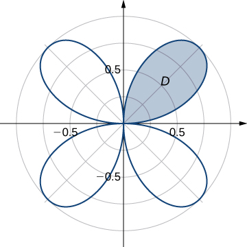 

Find the total area of the region enclosed by the four-leaved rose <math xmlns="http://www.w3.org/1998/Math/MathML"><mrow><mi>r</mi><mo>=</mo><mtext>sin</mtext><mspace width="0.2em" /><mn>2</mn><mi>θ</mi></mrow></math>

 (see the figure in the previous exercise).

<math xmlns="http://www.w3.org/1998/Math/MathML"><mrow><mfrac><mi>π</mi><mn>2</mn></mfrac></mrow></math>

Find the area of the region <math xmlns="http://www.w3.org/1998/Math/MathML"><mrow><mi>D</mi><mo>,</mo></mrow></math>

 which is the region bounded by <math xmlns="http://www.w3.org/1998/Math/MathML"><mrow><mi>y</mi><mo>=</mo><msqrt><mrow><mn>4</mn><mo>−</mo><msup><mi>x</mi><mn>2</mn></msup></mrow></msqrt><mo>,</mo></mrow></math>

 <math xmlns="http://www.w3.org/1998/Math/MathML"><mrow><mi>x</mi><mo>=</mo><msqrt><mn>3</mn></msqrt><mo>,</mo></mrow></math>

 <math xmlns="http://www.w3.org/1998/Math/MathML"><mrow><mi>x</mi><mo>=</mo><mn>2</mn><mo>,</mo></mrow></math>

 and <math xmlns="http://www.w3.org/1998/Math/MathML"><mrow><mi>y</mi><mo>=</mo><mn>0</mn><mo>.</mo></mrow></math>

Find the area of the region <math xmlns="http://www.w3.org/1998/Math/MathML"><mrow><mi>D</mi><mo>,</mo></mrow></math>

 which is the region inside the disk <math xmlns="http://www.w3.org/1998/Math/MathML"><mrow><msup><mi>x</mi><mn>2</mn></msup><mo>+</mo><msup><mi>y</mi><mn>2</mn></msup><mo>≤</mo><mn>4</mn></mrow></math>

 and to the right of the line <math xmlns="http://www.w3.org/1998/Math/MathML"><mrow><mi>x</mi><mo>=</mo><mn>1</mn><mo>.</mo></mrow></math>

<math xmlns="http://www.w3.org/1998/Math/MathML"><mrow><mfrac><mn>1</mn><mn>3</mn></mfrac><mrow><mo>(</mo><mrow><mn>4</mn><mi>π</mi><mo>−</mo><mn>3</mn><msqrt><mn>3</mn></msqrt></mrow><mo>)</mo></mrow></mrow></math>

Determine the average value of the function <math xmlns="http://www.w3.org/1998/Math/MathML"><mrow><mi>f</mi><mrow><mo>(</mo><mrow><mi>x</mi><mo>,</mo><mi>y</mi></mrow><mo>)</mo></mrow><mo>=</mo><msup><mi>x</mi><mn>2</mn></msup><mo>+</mo><msup><mi>y</mi><mn>2</mn></msup></mrow></math>

 over the region <math xmlns="http://www.w3.org/1998/Math/MathML"><mi>D</mi></math>

 bounded by the polar curve <math xmlns="http://www.w3.org/1998/Math/MathML"><mrow><mi>r</mi><mo>=</mo><mtext>cos</mtext><mspace width="0.2em" /><mn>2</mn><mi>θ</mi><mo>,</mo></mrow></math>

 where <math xmlns="http://www.w3.org/1998/Math/MathML"><mrow><mo>−</mo><mfrac><mi>π</mi><mn>4</mn></mfrac><mo>≤</mo><mi>θ</mi><mo>≤</mo><mfrac><mi>π</mi><mn>4</mn></mfrac></mrow></math>

 (see the following graph).

 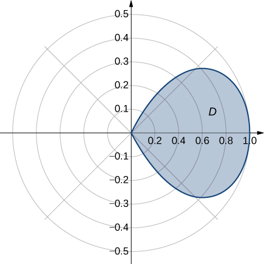 

Determine the average value of the function <math xmlns="http://www.w3.org/1998/Math/MathML"><mrow><mi>f</mi><mrow><mo>(</mo><mrow><mi>x</mi><mo>,</mo><mi>y</mi></mrow><mo>)</mo></mrow><mo>=</mo><msqrt><mrow><msup><mi>x</mi><mn>2</mn></msup><mo>+</mo><msup><mi>y</mi><mn>2</mn></msup></mrow></msqrt></mrow></math>

 over the region <math xmlns="http://www.w3.org/1998/Math/MathML"><mi>D</mi></math>

 bounded by the polar curve <math xmlns="http://www.w3.org/1998/Math/MathML"><mrow><mi>r</mi><mo>=</mo><mn>3</mn><mspace width="0.2em" /><mtext>sin</mtext><mspace width="0.2em" /><mn>2</mn><mi>θ</mi><mo>,</mo></mrow></math>

 where <math xmlns="http://www.w3.org/1998/Math/MathML"><mrow><mn>0</mn><mo>≤</mo><mi>θ</mi><mo>≤</mo><mfrac><mi>π</mi><mn>2</mn></mfrac></mrow></math>

 (see the following graph).

 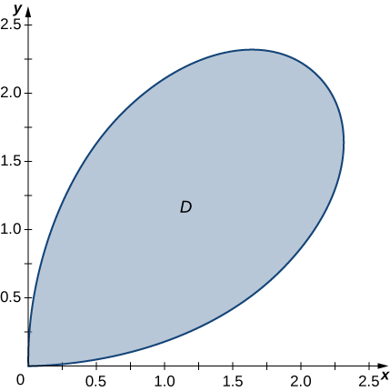 

<math xmlns="http://www.w3.org/1998/Math/MathML"><mrow><mfrac><mrow><mn>16</mn></mrow><mrow><mn>3</mn><mi>π</mi></mrow></mfrac></mrow></math>

Find the volume of the solid situated in the first octant and bounded by the paraboloid <math xmlns="http://www.w3.org/1998/Math/MathML"><mrow><mi>z</mi><mo>=</mo><mn>1</mn><mo>−</mo><mn>4</mn><msup><mi>x</mi><mn>2</mn></msup><mo>−</mo><mn>4</mn><msup><mi>y</mi><mn>2</mn></msup></mrow></math>

 and the planes <math xmlns="http://www.w3.org/1998/Math/MathML"><mrow><mi>x</mi><mo>=</mo><mn>0</mn><mo>,</mo><mi>y</mi><mo>=</mo><mn>0</mn><mo>,</mo></mrow></math>

 and <math xmlns="http://www.w3.org/1998/Math/MathML"><mrow><mi>z</mi><mo>=</mo><mn>0</mn><mo>.</mo></mrow></math>

Find the volume of the solid bounded by the paraboloid <math xmlns="http://www.w3.org/1998/Math/MathML"><mrow><mi>z</mi><mo>=</mo><mn>2</mn><mo>−</mo><mn>9</mn><msup><mi>x</mi><mn>2</mn></msup><mo>−</mo><mn>9</mn><msup><mi>y</mi><mn>2</mn></msup></mrow></math>

 and the plane <math xmlns="http://www.w3.org/1998/Math/MathML"><mrow><mi>z</mi><mo>=</mo><mn>1</mn><mo>.</mo></mrow></math>

<math xmlns="http://www.w3.org/1998/Math/MathML"><mrow><mfrac><mi>π</mi><mrow><mn>18</mn></mrow></mfrac></mrow></math>

1.  Find the volume of the solid
    <math xmlns="http://www.w3.org/1998/Math/MathML"><mrow><msub><mi>S</mi><mn>1</mn></msub></mrow></math>
    
    bounded by the cylinder
    <math xmlns="http://www.w3.org/1998/Math/MathML"><mrow><msup><mi>x</mi><mn>2</mn></msup><mo>+</mo><msup><mi>y</mi><mn>2</mn></msup><mo>=</mo><mn>1</mn></mrow></math>
    
    and the planes
    <math xmlns="http://www.w3.org/1998/Math/MathML"><mrow><mi>z</mi><mo>=</mo><mn>0</mn></mrow></math>
    
    and
    <math xmlns="http://www.w3.org/1998/Math/MathML"><mrow><mi>z</mi><mo>=</mo><mn>1</mn><mo>.</mo></mrow></math>

2.  Find the volume of the solid
    <math xmlns="http://www.w3.org/1998/Math/MathML"><mrow><msub><mi>S</mi><mn>2</mn></msub></mrow></math>
    
    outside the double cone
    <math xmlns="http://www.w3.org/1998/Math/MathML"><mrow><msup><mi>z</mi><mn>2</mn></msup><mo>=</mo><msup><mi>x</mi><mn>2</mn></msup><mo>+</mo><msup><mi>y</mi><mn>2</mn></msup><mo>,</mo></mrow></math>
    
    inside the cylinder
    <math xmlns="http://www.w3.org/1998/Math/MathML"><mrow><msup><mi>x</mi><mn>2</mn></msup><mo>+</mo><msup><mi>y</mi><mn>2</mn></msup><mo>=</mo><mn>1</mn><mo>,</mo></mrow></math>
    
    and above the plane
    <math xmlns="http://www.w3.org/1998/Math/MathML"><mrow><mi>z</mi><mo>=</mo><mn>0</mn><mo>.</mo></mrow></math>

3.  Find the volume of the solid inside the cone
    <math xmlns="http://www.w3.org/1998/Math/MathML"><mrow><msup><mi>z</mi><mn>2</mn></msup><mo>=</mo><msup><mi>x</mi><mn>2</mn></msup><mo>+</mo><msup><mi>y</mi><mn>2</mn></msup></mrow></math>
    
    and below the plane
    <math xmlns="http://www.w3.org/1998/Math/MathML"><mrow><mi>z</mi><mo>=</mo><mn>1</mn></mrow></math>
    
    by subtracting the volumes of the solids
    <math xmlns="http://www.w3.org/1998/Math/MathML"><mrow><msub><mi>S</mi><mn>1</mn></msub></mrow></math>
    
    and
    <math xmlns="http://www.w3.org/1998/Math/MathML"><mrow><msub><mi>S</mi><mn>2</mn></msub><mo>.</mo></mrow></math>
{: type="a"}

1.  Find the volume of the solid
    <math xmlns="http://www.w3.org/1998/Math/MathML"><mrow><msub><mi>S</mi><mn>1</mn></msub></mrow></math>
    
    inside the unit sphere
    <math xmlns="http://www.w3.org/1998/Math/MathML"><mrow><msup><mi>x</mi><mn>2</mn></msup><mo>+</mo><msup><mi>y</mi><mn>2</mn></msup><mo>+</mo><msup><mi>z</mi><mn>2</mn></msup><mo>=</mo><mn>1</mn></mrow></math>
    
    and above the plane
    <math xmlns="http://www.w3.org/1998/Math/MathML"><mrow><mi>z</mi><mo>=</mo><mn>0</mn><mo>.</mo></mrow></math>

2.  Find the volume of the solid
    <math xmlns="http://www.w3.org/1998/Math/MathML"><mrow><msub><mi>S</mi><mn>2</mn></msub></mrow></math>
    
    inside the double cone
    <math xmlns="http://www.w3.org/1998/Math/MathML"><mrow><msup><mrow><mrow><mo>(</mo><mrow><mi>z</mi><mo>−</mo><mn>1</mn></mrow><mo>)</mo></mrow></mrow><mn>2</mn></msup><mo>=</mo><msup><mi>x</mi><mn>2</mn></msup><mo>+</mo><msup><mi>y</mi><mn>2</mn></msup></mrow></math>
    
    and above the plane
    <math xmlns="http://www.w3.org/1998/Math/MathML"><mrow><mi>z</mi><mo>=</mo><mn>0</mn><mo>.</mo></mrow></math>

3.  Find the volume of the solid outside the double cone
    <math xmlns="http://www.w3.org/1998/Math/MathML"><mrow><msup><mrow><mrow><mo>(</mo><mrow><mi>z</mi><mo>−</mo><mn>1</mn></mrow><mo>)</mo></mrow></mrow><mn>2</mn></msup><mo>=</mo><msup><mi>x</mi><mn>2</mn></msup><mo>+</mo><msup><mi>y</mi><mn>2</mn></msup></mrow></math>
    
    and inside the sphere
    <math xmlns="http://www.w3.org/1998/Math/MathML"><mrow><msup><mi>x</mi><mn>2</mn></msup><mo>+</mo><msup><mi>y</mi><mn>2</mn></msup><mo>+</mo><msup><mi>z</mi><mn>2</mn></msup><mo>=</mo><mn>1</mn><mo>.</mo></mrow></math>
{: type="a"}

a. <math xmlns="http://www.w3.org/1998/Math/MathML"><mrow><mfrac><mrow><mn>2</mn><mi>π</mi></mrow><mn>3</mn></mfrac><mo>;</mo></mrow></math>

 b. <math xmlns="http://www.w3.org/1998/Math/MathML"><mrow><mfrac><mi>π</mi><mn>2</mn></mfrac><mo>;</mo></mrow></math>

 c. <math xmlns="http://www.w3.org/1998/Math/MathML"><mrow><mfrac><mi>π</mi><mn>6</mn></mfrac></mrow></math>

For the following two exercises, consider a spherical ring, which is a sphere with a cylindrical hole cut so that the axis of the cylinder passes through the center of the sphere (see the following figure).

  

If the sphere has radius <math xmlns="http://www.w3.org/1998/Math/MathML"><mn>4</mn></math>

 and the cylinder has radius <math xmlns="http://www.w3.org/1998/Math/MathML"><mrow><mn>2</mn><mo>,</mo></mrow></math>

 find the volume of the spherical ring.

A cylindrical hole of diameter <math xmlns="http://www.w3.org/1998/Math/MathML"><mn>6</mn></math>

 cm is bored through a sphere of radius <math xmlns="http://www.w3.org/1998/Math/MathML"><mn>5</mn></math>

 cm such that the axis of the cylinder passes through the center of the sphere. Find the volume of the resulting spherical ring.

<math xmlns="http://www.w3.org/1998/Math/MathML"><mrow><mfrac><mrow><mn>256</mn><mi>π</mi></mrow><mn>3</mn></mfrac><mspace width="0.2em" /><msup><mtext>cm</mtext><mn>3</mn></msup></mrow></math>

Find the volume of the solid that lies under the double cone <math xmlns="http://www.w3.org/1998/Math/MathML"><mrow><msup><mi>z</mi><mn>2</mn></msup><mo>=</mo><mn>4</mn><msup><mi>x</mi><mn>2</mn></msup><mo>+</mo><mn>4</mn><msup><mi>y</mi><mn>2</mn></msup><mo>,</mo></mrow></math>

 inside the cylinder <math xmlns="http://www.w3.org/1998/Math/MathML"><mrow><msup><mi>x</mi><mn>2</mn></msup><mo>+</mo><msup><mi>y</mi><mn>2</mn></msup><mo>=</mo><mi>x</mi><mo>,</mo></mrow></math>

 and above the plane <math xmlns="http://www.w3.org/1998/Math/MathML"><mrow><mi>z</mi><mo>=</mo><mn>0</mn><mo>.</mo></mrow></math>

Find the volume of the solid that lies under the paraboloid <math xmlns="http://www.w3.org/1998/Math/MathML"><mrow><mi>z</mi><mo>=</mo><msup><mi>x</mi><mn>2</mn></msup><mo>+</mo><msup><mi>y</mi><mn>2</mn></msup><mo>,</mo></mrow></math>

 inside the cylinder <math xmlns="http://www.w3.org/1998/Math/MathML"><mrow><msup><mi>x</mi><mn>2</mn></msup><mo>+</mo><msup><mi>y</mi><mn>2</mn></msup><mo>=</mo><mi>x</mi><mo>,</mo></mrow></math>

 and above the plane <math xmlns="http://www.w3.org/1998/Math/MathML"><mrow><mi>z</mi><mo>=</mo><mn>0</mn><mo>.</mo></mrow></math>

<math xmlns="http://www.w3.org/1998/Math/MathML"><mrow><mfrac><mrow><mn>3</mn><mi>π</mi></mrow><mrow><mn>32</mn></mrow></mfrac></mrow></math>

Find the volume of the solid that lies under the plane <math xmlns="http://www.w3.org/1998/Math/MathML"><mrow><mi>x</mi><mo>+</mo><mi>y</mi><mo>+</mo><mi>z</mi><mo>=</mo><mn>10</mn></mrow></math>

 and above the disk <math xmlns="http://www.w3.org/1998/Math/MathML"><mrow><msup><mi>x</mi><mn>2</mn></msup><mo>+</mo><msup><mi>y</mi><mn>2</mn></msup><mo>=</mo><mn>4</mn><mi>x</mi><mo>.</mo></mrow></math>

Find the volume of the solid that lies under the plane <math xmlns="http://www.w3.org/1998/Math/MathML"><mrow><mn>2</mn><mi>x</mi><mo>+</mo><mi>y</mi><mo>+</mo><mn>2</mn><mi>z</mi><mo>=</mo><mn>8</mn></mrow></math>

 and above the unit disk <math xmlns="http://www.w3.org/1998/Math/MathML"><mrow><msup><mi>x</mi><mn>2</mn></msup><mo>+</mo><msup><mi>y</mi><mn>2</mn></msup><mo>=</mo><mn>1</mn><mo>.</mo></mrow></math>

<math xmlns="http://www.w3.org/1998/Math/MathML"><mrow><mn>4</mn><mi>π</mi></mrow></math>

A radial function <math xmlns="http://www.w3.org/1998/Math/MathML"><mi>f</mi></math>

 is a function whose value at each point depends only on the distance between that point and the origin of the system of coordinates; that is, <math xmlns="http://www.w3.org/1998/Math/MathML"><mrow><mi>f</mi><mo stretchy="false">(</mo><mi>x</mi><mo>,</mo><mi>y</mi><mo stretchy="false">)</mo><mo>=</mo><mi>g</mi><mo stretchy="false">(</mo><mi>r</mi><mo stretchy="false">)</mo><mo>,</mo></mrow></math>

 where <math xmlns="http://www.w3.org/1998/Math/MathML"><mrow><mi>r</mi><mo>=</mo><msqrt><mrow><msup><mi>x</mi><mn>2</mn></msup><mo>+</mo><msup><mi>y</mi><mn>2</mn></msup></mrow></msqrt><mo>.</mo></mrow></math>

 Show that if <math xmlns="http://www.w3.org/1998/Math/MathML"><mi>f</mi></math>

 is a continuous radial function, then <math xmlns="http://www.w3.org/1998/Math/MathML"><mrow><mstyle displaystyle="true"><mrow><munder><mo>∬</mo><mi>D</mi></munder><mrow><mi>f</mi><mrow><mo>(</mo><mrow><mi>x</mi><mo>,</mo><mi>y</mi></mrow><mo>)</mo></mrow></mrow></mrow></mstyle><mi>d</mi><mi>A</mi><mo>=</mo><mrow><mo>(</mo><mrow><msub><mi>θ</mi><mn>2</mn></msub><mo>−</mo><msub><mi>θ</mi><mn>1</mn></msub></mrow><mo>)</mo></mrow><mrow><mo>[</mo><mrow><mi>G</mi><mo stretchy="false">(</mo><msub><mi>R</mi><mn>2</mn></msub><mo stretchy="false">)</mo><mo>−</mo><mi>G</mi><mo stretchy="false">(</mo><msub><mi>R</mi><mn>1</mn></msub><mo stretchy="false">)</mo></mrow><mo>]</mo></mrow><mo>,</mo></mrow></math>

 where <math xmlns="http://www.w3.org/1998/Math/MathML"><mrow><mi>G</mi><mo>′</mo><mo stretchy="false">(</mo><mi>r</mi><mo stretchy="false">)</mo><mo>=</mo><mi>r</mi><mi>g</mi><mo stretchy="false">(</mo><mi>r</mi><mo stretchy="false">)</mo></mrow></math>

 and <math xmlns="http://www.w3.org/1998/Math/MathML"><mrow><mrow><mo>(</mo><mrow><mi>x</mi><mo>,</mo><mi>y</mi></mrow><mo>)</mo></mrow><mo>∈</mo><mi>D</mi><mo>=</mo><mo>{</mo><mo stretchy="false">(</mo><mi>r</mi><mo>,</mo><mi>θ</mi><mo stretchy="false">)</mo><mo>\|</mo><msub><mi>R</mi><mn>1</mn></msub><mo>≤</mo><mi>r</mi><mo>≤</mo><msub><mi>R</mi><mn>2</mn></msub><mo>,</mo><mn>0</mn><mo>≤</mo><mi>θ</mi><mo>≤</mo><mn>2</mn><mi>π</mi><mo>}</mo><mo>,</mo></mrow></math>

 with <math xmlns="http://www.w3.org/1998/Math/MathML"><mrow><mn>0</mn><mo>≤</mo><msub><mi>R</mi><mn>1</mn></msub><mo>&lt;</mo><msub><mi>R</mi><mn>2</mn></msub></mrow></math>

 and <math xmlns="http://www.w3.org/1998/Math/MathML"><mrow><mn>0</mn><mo>≤</mo><msub><mi>θ</mi><mn>1</mn></msub><mo>&lt;</mo><msub><mi>θ</mi><mn>2</mn></msub><mo>≤</mo><mn>2</mn><mi>π</mi><mo>.</mo></mrow></math>

Use the information from the preceding exercise to calculate the integral <math xmlns="http://www.w3.org/1998/Math/MathML"><mrow><mstyle displaystyle="true"><mrow><munder><mo>∬</mo><mi>D</mi></munder><mrow><msup><mrow><mrow><mo>(</mo><mrow><msup><mi>x</mi><mn>2</mn></msup><mo>+</mo><msup><mi>y</mi><mn>2</mn></msup></mrow><mo>)</mo></mrow></mrow><mn>3</mn></msup></mrow></mrow></mstyle><mi>d</mi><mi>A</mi><mo>,</mo></mrow></math>

 where <math xmlns="http://www.w3.org/1998/Math/MathML"><mi>D</mi></math>

 is the unit disk.

<math xmlns="http://www.w3.org/1998/Math/MathML"><mrow><mfrac><mi>π</mi><mn>4</mn></mfrac></mrow></math>

Let <math xmlns="http://www.w3.org/1998/Math/MathML"><mrow><mi>f</mi><mo stretchy="false">(</mo><mi>x</mi><mo>,</mo><mi>y</mi><mo stretchy="false">)</mo><mo>=</mo><mfrac><mrow><mi>F</mi><mo>′</mo><mo stretchy="false">(</mo><mi>r</mi><mo stretchy="false">)</mo></mrow><mi>r</mi></mfrac></mrow></math>

 be a continuous radial function defined on the annular region <math xmlns="http://www.w3.org/1998/Math/MathML"><mrow><mi>D</mi><mo>=</mo><mo>{</mo><mo stretchy="false">(</mo><mi>r</mi><mo>,</mo><mi>θ</mi><mo stretchy="false">)</mo><mo>\|</mo><msub><mi>R</mi><mn>1</mn></msub><mo>≤</mo><mi>r</mi><mo>≤</mo><msub><mi>R</mi><mn>2</mn></msub><mo>,</mo><mn>0</mn><mo>≤</mo><mi>θ</mi><mo>≤</mo><mn>2</mn><mi>π</mi><mo>}</mo><mo>,</mo></mrow></math>

 where <math xmlns="http://www.w3.org/1998/Math/MathML"><mrow><mi>r</mi><mo>=</mo><msqrt><mrow><msup><mi>x</mi><mn>2</mn></msup><mo>+</mo><msup><mi>y</mi><mn>2</mn></msup></mrow></msqrt><mo>,</mo></mrow></math>

 <math xmlns="http://www.w3.org/1998/Math/MathML"><mrow><mn>0</mn><mo>&lt;</mo><msub><mi>R</mi><mn>1</mn></msub><mo>&lt;</mo><msub><mi>R</mi><mn>2</mn></msub><mo>,</mo></mrow></math>

 and <math xmlns="http://www.w3.org/1998/Math/MathML"><mi>F</mi></math>

 is a differentiable function. Show that <math xmlns="http://www.w3.org/1998/Math/MathML"><mrow><mstyle displaystyle="true"><mrow><munder><mo>∬</mo><mi>D</mi></munder><mrow><mi>f</mi><mrow><mo>(</mo><mrow><mi>x</mi><mo>,</mo><mi>y</mi></mrow><mo>)</mo></mrow></mrow></mrow></mstyle><mi>d</mi><mi>A</mi><mo>=</mo><mn>2</mn><mi>π</mi><mrow><mo>[</mo><mrow><mi>F</mi><mo stretchy="false">(</mo><msub><mi>R</mi><mn>2</mn></msub><mo stretchy="false">)</mo><mo>−</mo><mi>F</mi><mo stretchy="false">(</mo><msub><mi>R</mi><mn>1</mn></msub><mo stretchy="false">)</mo></mrow><mo>]</mo></mrow><mo>.</mo></mrow></math>

Apply the preceding exercise to calculate the integral <math xmlns="http://www.w3.org/1998/Math/MathML"><mrow><mstyle displaystyle="true"><mrow><munder><mo>∬</mo><mi>D</mi></munder><mrow><mfrac><mrow><msup><mi>e</mi><mrow><msqrt><mrow><msup><mi>x</mi><mn>2</mn></msup><mo>+</mo><msup><mi>y</mi><mn>2</mn></msup></mrow></msqrt></mrow></msup></mrow><mrow><msqrt><mrow><msup><mi>x</mi><mn>2</mn></msup><mo>+</mo><msup><mi>y</mi><mn>2</mn></msup></mrow></msqrt></mrow></mfrac></mrow></mrow></mstyle><mi>d</mi><mi>x</mi><mspace width="0.2em" /><mi>d</mi><mi>y</mi><mo>,</mo></mrow></math>

 where <math xmlns="http://www.w3.org/1998/Math/MathML"><mi>D</mi></math>

 is the annular region between the circles of radii <math xmlns="http://www.w3.org/1998/Math/MathML"><mn>1</mn></math>

 and <math xmlns="http://www.w3.org/1998/Math/MathML"><mn>2</mn></math>

 situated in the third quadrant.

<math xmlns="http://www.w3.org/1998/Math/MathML"><mrow><mfrac><mn>1</mn><mn>2</mn></mfrac><mi>π</mi><mi>e</mi><mo stretchy="false">(</mo><mi>e</mi><mo>−</mo><mn>1</mn><mo stretchy="false">)</mo></mrow></math>

Let <math xmlns="http://www.w3.org/1998/Math/MathML"><mi>f</mi></math>

 be a continuous function that can be expressed in polar coordinates as a function of <math xmlns="http://www.w3.org/1998/Math/MathML"><mi>θ</mi></math>

 only; that is, <math xmlns="http://www.w3.org/1998/Math/MathML"><mrow><mi>f</mi><mo stretchy="false">(</mo><mi>x</mi><mo>,</mo><mi>y</mi><mo stretchy="false">)</mo><mo>=</mo><mi>h</mi><mo stretchy="false">(</mo><mi>θ</mi><mo stretchy="false">)</mo><mo>,</mo></mrow></math>

 where <math xmlns="http://www.w3.org/1998/Math/MathML"><mrow><mrow><mo>(</mo><mrow><mi>x</mi><mo>,</mo><mi>y</mi></mrow><mo>)</mo></mrow><mo>∈</mo><mi>D</mi><mo>=</mo><mo>{</mo><mo stretchy="false">(</mo><mi>r</mi><mo>,</mo><mi>θ</mi><mo stretchy="false">)</mo><mo>\|</mo><msub><mi>R</mi><mn>1</mn></msub><mo>≤</mo><mi>r</mi><mo>≤</mo><msub><mi>R</mi><mn>2</mn></msub><mo>,</mo><msub><mi>θ</mi><mn>1</mn></msub><mo>≤</mo><mi>θ</mi><mo>≤</mo><msub><mi>θ</mi><mn>2</mn></msub><mo>}</mo><mo>,</mo></mrow></math>

 with <math xmlns="http://www.w3.org/1998/Math/MathML"><mrow><mn>0</mn><mo>≤</mo><msub><mi>R</mi><mn>1</mn></msub><mo>&lt;</mo><msub><mi>R</mi><mn>2</mn></msub></mrow></math>

 and <math xmlns="http://www.w3.org/1998/Math/MathML"><mrow><mn>0</mn><mo>≤</mo><msub><mi>θ</mi><mn>1</mn></msub><mo>&lt;</mo><msub><mi>θ</mi><mn>2</mn></msub><mo>≤</mo><mn>2</mn><mi>π</mi><mo>.</mo></mrow></math>

 Show that <math xmlns="http://www.w3.org/1998/Math/MathML"><mrow><mstyle displaystyle="true"><mrow><munder><mo>∬</mo><mi>D</mi></munder><mrow><mi>f</mi><mrow><mo>(</mo><mrow><mi>x</mi><mo>,</mo><mi>y</mi></mrow><mo>)</mo></mrow></mrow></mrow></mstyle><mi>d</mi><mi>A</mi><mo>=</mo><mfrac><mn>1</mn><mn>2</mn></mfrac><mrow><mo>(</mo><mrow><msubsup><mi>R</mi><mn>2</mn><mn>2</mn></msubsup><mo>−</mo><msubsup><mi>R</mi><mn>1</mn><mn>2</mn></msubsup></mrow><mo>)</mo></mrow><mrow><mo>[</mo><mrow><mi>H</mi><mo stretchy="false">(</mo><msub><mi>θ</mi><mn>2</mn></msub><mo stretchy="false">)</mo><mo>−</mo><mi>H</mi><mo stretchy="false">(</mo><msub><mi>θ</mi><mn>1</mn></msub><mo stretchy="false">)</mo></mrow><mo>]</mo></mrow><mo>,</mo></mrow></math>

 where <math xmlns="http://www.w3.org/1998/Math/MathML"><mi>H</mi></math>

 is an antiderivative of <math xmlns="http://www.w3.org/1998/Math/MathML"><mrow><mi>h</mi><mo>.</mo></mrow></math>

Apply the preceding exercise to calculate the integral <math xmlns="http://www.w3.org/1998/Math/MathML"><mrow><mstyle displaystyle="true"><mrow><munder><mo>∬</mo><mi>D</mi></munder><mrow><mfrac><mrow><msup><mi>y</mi><mn>2</mn></msup></mrow><mrow><msup><mi>x</mi><mn>2</mn></msup></mrow></mfrac></mrow></mrow></mstyle><mi>d</mi><mi>A</mi><mo>,</mo></mrow></math>

 where <math xmlns="http://www.w3.org/1998/Math/MathML"><mrow><mi>D</mi><mo>=</mo><mrow><mo>{</mo><mrow><mo stretchy="false">(</mo><mi>r</mi><mo>,</mo><mi>θ</mi><mo stretchy="false">)</mo><mo>\|</mo><mn>1</mn><mo>≤</mo><mi>r</mi><mo>≤</mo><mn>2</mn><mo>,</mo><mfrac><mi>π</mi><mn>6</mn></mfrac><mo>≤</mo><mi>θ</mi><mo>≤</mo><mfrac><mi>π</mi><mn>3</mn></mfrac></mrow><mo>}</mo></mrow><mo>.</mo></mrow></math>

<math xmlns="http://www.w3.org/1998/Math/MathML"><mrow><msqrt><mn>3</mn></msqrt><mo>−</mo><mfrac><mi>π</mi><mn>4</mn></mfrac></mrow></math>

Let <math xmlns="http://www.w3.org/1998/Math/MathML"><mi>f</mi></math>

 be a continuous function that can be expressed in polar coordinates as a function of <math xmlns="http://www.w3.org/1998/Math/MathML"><mi>θ</mi></math>

 only; that is, <math xmlns="http://www.w3.org/1998/Math/MathML"><mrow><mi>f</mi><mo stretchy="false">(</mo><mi>x</mi><mo>,</mo><mi>y</mi><mo stretchy="false">)</mo><mo>=</mo><mi>g</mi><mo stretchy="false">(</mo><mi>r</mi><mo stretchy="false">)</mo><mi>h</mi><mo stretchy="false">(</mo><mi>θ</mi><mo stretchy="false">)</mo><mo>,</mo></mrow></math>

 where <math xmlns="http://www.w3.org/1998/Math/MathML"><mrow><mrow><mo>(</mo><mrow><mi>x</mi><mo>,</mo><mi>y</mi></mrow><mo>)</mo></mrow><mo>∈</mo><mi>D</mi><mo>=</mo><mo>{</mo><mo stretchy="false">(</mo><mi>r</mi><mo>,</mo><mi>θ</mi><mo stretchy="false">)</mo><mo>\|</mo><msub><mi>R</mi><mn>1</mn></msub><mo>≤</mo><mi>r</mi><mo>≤</mo><msub><mi>R</mi><mn>2</mn></msub><mo>,</mo><msub><mi>θ</mi><mn>1</mn></msub><mo>≤</mo><mi>θ</mi><mo>≤</mo><msub><mi>θ</mi><mn>2</mn></msub><mo>}</mo></mrow></math>

 with <math xmlns="http://www.w3.org/1998/Math/MathML"><mrow><mn>0</mn><mo>≤</mo><msub><mi>R</mi><mn>1</mn></msub><mo>&lt;</mo><msub><mi>R</mi><mn>2</mn></msub></mrow></math>

 and <math xmlns="http://www.w3.org/1998/Math/MathML"><mrow><mn>0</mn><mo>≤</mo><msub><mi>θ</mi><mn>1</mn></msub><mo>&lt;</mo><msub><mi>θ</mi><mn>2</mn></msub><mo>≤</mo><mn>2</mn><mi>π</mi><mo>.</mo></mrow></math>

 Show that <math xmlns="http://www.w3.org/1998/Math/MathML"><mrow><mstyle displaystyle="true"><mrow><munder><mo>∬</mo><mi>D</mi></munder><mrow><mi>f</mi><mrow><mo>(</mo><mrow><mi>x</mi><mo>,</mo><mi>y</mi></mrow><mo>)</mo></mrow></mrow></mrow></mstyle><mi>d</mi><mi>A</mi><mo>=</mo><mrow><mo>[</mo><mrow><mi>G</mi><mo stretchy="false">(</mo><msub><mi>R</mi><mn>2</mn></msub><mo stretchy="false">)</mo><mo>−</mo><mi>G</mi><mo stretchy="false">(</mo><msub><mi>R</mi><mn>1</mn></msub><mo stretchy="false">)</mo></mrow><mo>]</mo></mrow><mspace width="0.2em" /><mrow><mo>[</mo><mrow><mi>H</mi><mo stretchy="false">(</mo><msub><mi>θ</mi><mn>2</mn></msub><mo stretchy="false">)</mo><mo>−</mo><mi>H</mi><mo stretchy="false">(</mo><msub><mi>θ</mi><mn>1</mn></msub><mo stretchy="false">)</mo></mrow><mo>]</mo></mrow><mo>,</mo></mrow></math>

 where <math xmlns="http://www.w3.org/1998/Math/MathML"><mi>G</mi></math>

 and <math xmlns="http://www.w3.org/1998/Math/MathML"><mi>H</mi></math>

 are antiderivatives of <math xmlns="http://www.w3.org/1998/Math/MathML"><mi>g</mi></math>

 and <math xmlns="http://www.w3.org/1998/Math/MathML"><mrow><mi>h</mi><mo>,</mo></mrow></math>

 respectively.

Evaluate <math xmlns="http://www.w3.org/1998/Math/MathML"><mrow><mstyle displaystyle="true"><mrow><munder><mo>∬</mo><mi>D</mi></munder><mrow><mtext>arctan</mtext><mrow><mo>(</mo><mrow><mfrac><mi>y</mi><mi>x</mi></mfrac></mrow><mo>)</mo></mrow><msqrt><mrow><msup><mi>x</mi><mn>2</mn></msup><mo>+</mo><msup><mi>y</mi><mn>2</mn></msup></mrow></msqrt></mrow></mrow></mstyle><mi>d</mi><mi>A</mi><mo>,</mo></mrow></math>

 where <math xmlns="http://www.w3.org/1998/Math/MathML"><mrow><mi>D</mi><mo>=</mo><mrow><mo>{</mo><mrow><mo stretchy="false">(</mo><mi>r</mi><mo>,</mo><mi>θ</mi><mo stretchy="false">)</mo><mo>\|</mo><mn>2</mn><mo>≤</mo><mi>r</mi><mo>≤</mo><mn>3</mn><mo>,</mo><mfrac><mi>π</mi><mn>4</mn></mfrac><mo>≤</mo><mi>θ</mi><mo>≤</mo><mfrac><mi>π</mi><mn>3</mn></mfrac></mrow><mo>}</mo></mrow><mo>.</mo></mrow></math>

<math xmlns="http://www.w3.org/1998/Math/MathML"><mrow><mfrac><mrow><mn>133</mn><msup><mi>π</mi><mn>3</mn></msup></mrow><mrow><mn>864</mn></mrow></mfrac></mrow></math>

A spherical cap is the region of a sphere that lies above or below a given plane.

1.  Show that the volume of the spherical cap in the figure below is
    <math xmlns="http://www.w3.org/1998/Math/MathML"><mrow><mfrac><mn>1</mn><mn>6</mn></mfrac><mi>π</mi><mi>h</mi><mrow><mo>(</mo><mrow><mn>3</mn><msup><mi>a</mi><mn>2</mn></msup><mo>+</mo><msup><mi>h</mi><mn>2</mn></msup></mrow><mo>)</mo></mrow><mo>.</mo></mrow></math>
    
    * * *
    {: data-type="newline"}
    
     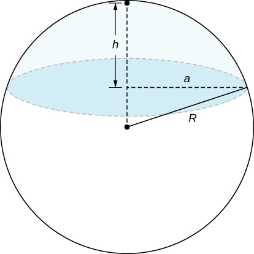 
2.  A spherical segment is the solid defined by intersecting a sphere with two parallel planes. If the distance between the planes is
    <math xmlns="http://www.w3.org/1998/Math/MathML"><mrow><mi>h</mi><mo>,</mo></mrow></math>
    
    show that the volume of the spherical segment in the figure below is
    <math xmlns="http://www.w3.org/1998/Math/MathML"><mrow><mfrac><mn>1</mn><mn>6</mn></mfrac><mi>π</mi><mi>h</mi><mrow><mo>(</mo><mrow><mn>3</mn><msup><mi>a</mi><mn>2</mn></msup><mo>+</mo><mn>3</mn><msup><mi>b</mi><mn>2</mn></msup><mo>+</mo><msup><mi>h</mi><mn>2</mn></msup></mrow><mo>)</mo></mrow><mo>.</mo></mrow></math>
    
    * * *
    {: data-type="newline"}
    
     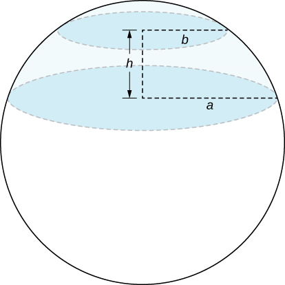 
{: type="a"}

In statistics, the joint density for two independent, normally distributed events with a mean <math xmlns="http://www.w3.org/1998/Math/MathML"><mrow><mi>μ</mi><mo>=</mo><mn>0</mn></mrow></math>

 and a standard distribution <math xmlns="http://www.w3.org/1998/Math/MathML"><mi>σ</mi></math>

 is defined by <math xmlns="http://www.w3.org/1998/Math/MathML"><mrow><mi>p</mi><mo stretchy="false">(</mo><mi>x</mi><mo>,</mo><mi>y</mi><mo stretchy="false">)</mo><mo>=</mo><mfrac><mn>1</mn><mrow><mn>2</mn><mi>π</mi><msup><mi>σ</mi><mn>2</mn></msup></mrow></mfrac><msup><mi>e</mi><mrow><mo>−</mo><mfrac><mrow><msup><mi>x</mi><mn>2</mn></msup><mo>+</mo><msup><mi>y</mi><mn>2</mn></msup></mrow><mrow><mn>2</mn><msup><mi>σ</mi><mn>2</mn></msup></mrow></mfrac></mrow></msup><mo>.</mo></mrow></math>

 Consider <math xmlns="http://www.w3.org/1998/Math/MathML"><mrow><mrow><mo>(</mo><mrow><mi>X</mi><mo>,</mo><mi>Y</mi></mrow><mo>)</mo></mrow><mo>,</mo></mrow></math>

 the Cartesian coordinates of a ball in the resting position after it was released from a position on the *z*-axis toward the <math xmlns="http://www.w3.org/1998/Math/MathML"><mrow><mi>x</mi><mi>y</mi></mrow></math>

-plane. Assume that the coordinates of the ball are independently normally distributed with a mean <math xmlns="http://www.w3.org/1998/Math/MathML"><mrow><mi>μ</mi><mo>=</mo><mn>0</mn></mrow></math>

 and a standard deviation of <math xmlns="http://www.w3.org/1998/Math/MathML"><mi>σ</mi></math>

 (in feet). The probability that the ball will stop no more than <math xmlns="http://www.w3.org/1998/Math/MathML"><mi>a</mi></math>

 feet from the origin is given by <math xmlns="http://www.w3.org/1998/Math/MathML"><mrow><mi>P</mi><mrow><mo>[</mo><mrow><msup><mi>X</mi><mn>2</mn></msup><mo>+</mo><msup><mi>Y</mi><mn>2</mn></msup><mo>≤</mo><msup><mi>a</mi><mn>2</mn></msup></mrow><mo>]</mo></mrow><mo>=</mo><mstyle displaystyle="true"><mrow><munder><mo>∬</mo><mi>D</mi></munder><mrow><mi>p</mi><mo stretchy="false">(</mo><mi>x</mi><mo>,</mo><mi>y</mi><mo stretchy="false">)</mo><mi>d</mi><mi>y</mi><mspace width="0.2em" /><mi>d</mi><mi>x</mi></mrow></mrow></mstyle><mo>,</mo></mrow></math>

 where <math xmlns="http://www.w3.org/1998/Math/MathML"><mi>D</mi></math>

 is the disk of radius *a* centered at the origin. Show that <math xmlns="http://www.w3.org/1998/Math/MathML"><mrow><mi>P</mi><mrow><mo>[</mo><mrow><msup><mi>X</mi><mn>2</mn></msup><mo>+</mo><msup><mi>Y</mi><mn>2</mn></msup><mo>≤</mo><msup><mi>a</mi><mn>2</mn></msup></mrow><mo>]</mo></mrow><mo>=</mo><mn>1</mn><mo>−</mo><msup><mi>e</mi><mrow><mtext>−</mtext><mrow><mrow><msup><mi>a</mi><mn>2</mn></msup></mrow><mtext>/</mtext><mrow><mn>2</mn><msup><mi>σ</mi><mn>2</mn></msup></mrow></mrow></mrow></msup><mo>.</mo></mrow></math>

The double improper integral <math xmlns="http://www.w3.org/1998/Math/MathML"><mrow><mstyle displaystyle="true"><mrow><munderover><mo stretchy="false">∫</mo><mrow><mtext>−</mtext><mi>∞</mi></mrow><mi>∞</mi></munderover><mspace width="0.2em" /><mrow><mstyle displaystyle="true"><mrow><munderover><mo stretchy="false">∫</mo><mrow><mtext>−</mtext><mi>∞</mi></mrow><mi>∞</mi></munderover><mrow><msup><mi>e</mi><mrow><mo>(</mo><mtext>−</mtext><mrow><mrow><msup><mi>x</mi><mn>2</mn></msup><mo>+</mo><msup><mi>y</mi><mn>2</mn></msup></mrow><mtext>/</mtext><mn>2</mn><mo>)</mo></mrow></mrow></msup></mrow></mrow></mstyle></mrow></mrow></mstyle><mi>d</mi><mi>y</mi><mspace width="0.2em" /><mi>d</mi><mi>x</mi></mrow></math>

 may be defined as the limit value of the double integrals <math xmlns="http://www.w3.org/1998/Math/MathML"><mrow><mstyle displaystyle="true"><mrow><munder><mo>∬</mo><mrow><msub><mi>D</mi><mi>a</mi></msub></mrow></munder><mrow><msup><mi>e</mi><mrow><mo>(</mo><mtext>−</mtext><mrow><mrow><msup><mi>x</mi><mn>2</mn></msup><mo>+</mo><msup><mi>y</mi><mn>2</mn></msup></mrow><mtext>/</mtext><mn>2</mn></mrow><mo>)</mo></mrow></msup></mrow></mrow></mstyle><mi>d</mi><mi>A</mi></mrow></math>

 over disks <math xmlns="http://www.w3.org/1998/Math/MathML"><mrow><msub><mi>D</mi><mi>a</mi></msub></mrow></math>

 of radii *a* centered at the origin, as *a* increases without bound; that is, <math xmlns="http://www.w3.org/1998/Math/MathML"><mrow><mstyle displaystyle="true"><mrow><munderover><mo stretchy="false">∫</mo><mrow><mtext>−</mtext><mi>∞</mi></mrow><mi>∞</mi></munderover><mspace width="0.2em" /><mrow><mstyle displaystyle="true"><mrow><munderover><mo stretchy="false">∫</mo><mrow><mtext>−</mtext><mi>∞</mi></mrow><mi>∞</mi></munderover><mrow><msup><mi>e</mi><mrow><mo>(</mo><mtext>−</mtext><mrow><mrow><msup><mi>x</mi><mn>2</mn></msup><mo>+</mo><msup><mi>y</mi><mn>2</mn></msup></mrow><mtext>/</mtext><mn>2</mn></mrow><mo>)</mo></mrow></msup></mrow></mrow></mstyle></mrow></mrow></mstyle><mi>d</mi><mi>y</mi><mspace width="0.2em" /><mi>d</mi><mi>x</mi><mo>=</mo><munder><mrow><mtext>lim</mtext></mrow><mrow><mi>a</mi><mo stretchy="false">→</mo><mi>∞</mi></mrow></munder><mstyle displaystyle="true"><mrow><munder><mo>∬</mo><mrow><msub><mi>D</mi><mi>a</mi></msub></mrow></munder><mrow><msup><mi>e</mi><mrow><mo>(</mo><mtext>−</mtext><mrow><mrow><msup><mi>x</mi><mn>2</mn></msup><mo>+</mo><msup><mi>y</mi><mn>2</mn></msup></mrow><mtext>/</mtext><mn>2</mn></mrow><mo>)</mo></mrow></msup></mrow></mrow></mstyle><mi>d</mi><mi>A</mi><mo>.</mo></mrow></math>

1.  Use polar coordinates to show that
    <math xmlns="http://www.w3.org/1998/Math/MathML"><mrow><mstyle displaystyle="true"><mrow><munderover><mo stretchy="false">∫</mo><mrow><mtext>−</mtext><mi>∞</mi></mrow><mi>∞</mi></munderover><mspace width="0.2em" /><mrow><mstyle displaystyle="true"><mrow><munderover><mo stretchy="false">∫</mo><mrow><mtext>−</mtext><mi>∞</mi></mrow><mi>∞</mi></munderover><mrow><msup><mi>e</mi><mrow><mo>(</mo><mtext>−</mtext><mrow><mrow><msup><mi>x</mi><mn>2</mn></msup><mo>+</mo><msup><mi>y</mi><mn>2</mn></msup></mrow><mtext>/</mtext><mn>2</mn></mrow><mo>)</mo></mrow></msup></mrow></mrow></mstyle></mrow></mrow></mstyle><mi>d</mi><mi>y</mi><mspace width="0.2em" /><mi>d</mi><mi>x</mi><mo>=</mo><mn>2</mn><mi>π</mi><mo>.</mo></mrow></math>

2.  Show that
    <math xmlns="http://www.w3.org/1998/Math/MathML"><mrow><mstyle displaystyle="true"><mrow><munderover><mo stretchy="false">∫</mo><mrow><mtext>−</mtext><mi>∞</mi></mrow><mi>∞</mi></munderover><mrow><msup><mi>e</mi><mrow><mtext>−</mtext><mrow><mrow><msup><mi>x</mi><mn>2</mn></msup></mrow><mtext>/</mtext><mn>2</mn></mrow></mrow></msup></mrow></mrow></mstyle><mi>d</mi><mi>x</mi><mo>=</mo><msqrt><mrow><mn>2</mn><mi>π</mi></mrow></msqrt><mo>,</mo></mrow></math>
    
    by using the relation
    <math xmlns="http://www.w3.org/1998/Math/MathML"><mrow><mstyle displaystyle="true"><mrow><munderover><mo stretchy="false">∫</mo><mrow><mtext>−</mtext><mi>∞</mi></mrow><mi>∞</mi></munderover><mspace width="0.2em" /><mrow><mstyle displaystyle="true"><mrow><munderover><mo stretchy="false">∫</mo><mrow><mtext>−</mtext><mi>∞</mi></mrow><mi>∞</mi></munderover><mrow><msup><mi>e</mi><mrow><mo>(</mo><mtext>−</mtext><mrow><mrow><msup><mi>x</mi><mn>2</mn></msup><mo>+</mo><msup><mi>y</mi><mn>2</mn></msup></mrow><mtext>/</mtext><mn>2</mn></mrow><mo>)</mo></mrow></msup></mrow></mrow></mstyle></mrow></mrow></mstyle><mi>d</mi><mi>y</mi><mspace width="0.2em" /><mi>d</mi><mi>x</mi><mo>=</mo><mrow><mo>(</mo><mrow><mstyle displaystyle="true"><mrow><munderover><mo stretchy="false">∫</mo><mrow><mtext>−</mtext><mi>∞</mi></mrow><mi>∞</mi></munderover><mrow><msup><mi>e</mi><mrow><mtext>−</mtext><mrow><mrow><msup><mi>x</mi><mn>2</mn></msup></mrow><mtext>/</mtext><mn>2</mn></mrow></mrow></msup><mi>d</mi><mi>x</mi></mrow></mrow></mstyle></mrow><mo>)</mo></mrow><mrow><mo>(</mo><mrow><mstyle displaystyle="true"><mrow><munderover><mo stretchy="false">∫</mo><mrow><mtext>−</mtext><mi>∞</mi></mrow><mi>∞</mi></munderover><mrow><msup><mi>e</mi><mrow><mtext>−</mtext><mrow><mrow><msup><mi>y</mi><mn>2</mn></msup></mrow><mtext>/</mtext><mn>2</mn></mrow></mrow></msup></mrow></mrow></mstyle><mi>d</mi><mi>y</mi></mrow><mo>)</mo></mrow><mo>.</mo></mrow></math>
{: type="a"}

</section>

### Glossary
{: data-type="glossary-title"}

polar rectangle
: the region enclosed between the circles
  <math xmlns="http://www.w3.org/1998/Math/MathML"><mrow><mi>r</mi><mo>=</mo><mi>a</mi></mrow></math>
  
  and
  <math xmlns="http://www.w3.org/1998/Math/MathML"><mrow><mi>r</mi><mo>=</mo><mi>b</mi></mrow></math>
  
  and the angles
  <math xmlns="http://www.w3.org/1998/Math/MathML"><mrow><mi>θ</mi><mo>=</mo><mi>α</mi></mrow></math>
  
  and
  <math xmlns="http://www.w3.org/1998/Math/MathML"><mrow><mi>θ</mi><mo>=</mo><mi>β</mi><mo>;</mo></mrow></math>
  
  it is described as
  <math xmlns="http://www.w3.org/1998/Math/MathML"><mrow><mi>R</mi><mo>=</mo><mrow><mo>{</mo><mrow><mrow><mrow><mrow><mo>(</mo><mrow><mi>r</mi><mo>,</mo><mi>θ</mi></mrow><mo>)</mo></mrow></mrow><mo>\|</mo></mrow><mi>a</mi><mo>≤</mo><mi>r</mi><mo>≤</mo><mi>b</mi><mo>,</mo><mi>α</mi><mo>≤</mo><mi>θ</mi><mo>≤</mo><mi>β</mi></mrow><mo>}</mo></mrow></mrow></math>

