

* Evaluate a triple integral by changing to cylindrical coordinates.
* Evaluate a triple integral by changing to spherical coordinates.

Earlier in this chapter we showed how to convert a double integral in rectangular coordinates into a double integral in polar coordinates in order to deal more conveniently with problems involving circular symmetry. A similar situation occurs with triple integrals, but here we need to distinguish between cylindrical symmetry and spherical symmetry. In this section we convert triple integrals in rectangular coordinates into a triple integral in either cylindrical or spherical coordinates.

Also recall the chapter opener, which showed the opera house l’Hemisphèric in Valencia, Spain. It has four sections with one of the sections being a theater in a five-story-high sphere (ball) under an oval roof as long as a football field. Inside is an IMAX screen that changes the sphere into a planetarium with a sky full of <math xmlns="http://www.w3.org/1998/Math/MathML"><mrow><mn>9000</mn></mrow></math>

 twinkling stars. Using triple integrals in spherical coordinates, we can find the volumes of different geometric shapes like these.

### Review of Cylindrical Coordinates

As we have seen earlier, in two-dimensional space <math xmlns="http://www.w3.org/1998/Math/MathML"><mrow><msup><mi>ℝ</mi><mn>2</mn></msup><mo>,</mo></mrow></math>

 a point with rectangular coordinates <math xmlns="http://www.w3.org/1998/Math/MathML"><mrow><mrow><mo>(</mo><mrow><mi>x</mi><mo>,</mo><mi>y</mi></mrow><mo>)</mo></mrow></mrow></math>

 can be identified with <math xmlns="http://www.w3.org/1998/Math/MathML"><mrow><mrow><mo>(</mo><mrow><mi>r</mi><mo>,</mo><mi>θ</mi></mrow><mo>)</mo></mrow></mrow></math>

 in polar coordinates and vice versa, where <math xmlns="http://www.w3.org/1998/Math/MathML"><mrow><mi>x</mi><mo>=</mo><mi>r</mi><mspace width="0.2em" /><mtext>cos</mtext><mspace width="0.2em" /><mi>θ</mi><mo>,</mo></mrow></math>

 <math xmlns="http://www.w3.org/1998/Math/MathML"><mrow><mi>y</mi><mo>=</mo><mi>r</mi><mspace width="0.2em" /><mtext>sin</mtext><mspace width="0.2em" /><mi>θ</mi><mo>,</mo></mrow></math>

 <math xmlns="http://www.w3.org/1998/Math/MathML"><mrow><msup><mi>r</mi><mn>2</mn></msup><mo>=</mo><msup><mi>x</mi><mn>2</mn></msup><mo>+</mo><msup><mi>y</mi><mn>2</mn></msup></mrow></math>

 and <math xmlns="http://www.w3.org/1998/Math/MathML"><mrow><mtext>tan</mtext><mspace width="0.2em" /><mi>θ</mi><mo>=</mo><mrow><mo>(</mo><mrow><mfrac><mi>y</mi><mi>x</mi></mfrac></mrow><mo>)</mo></mrow></mrow></math>

 are the relationships between the variables.

In three-dimensional space <math xmlns="http://www.w3.org/1998/Math/MathML"><mrow><msup><mi>ℝ</mi><mn>3</mn></msup><mo>,</mo></mrow></math>

 a point with rectangular coordinates <math xmlns="http://www.w3.org/1998/Math/MathML"><mrow><mrow><mo>(</mo><mrow><mi>x</mi><mo>,</mo><mi>y</mi><mo>,</mo><mi>z</mi></mrow><mo>)</mo></mrow></mrow></math>

 can be identified with cylindrical coordinates <math xmlns="http://www.w3.org/1998/Math/MathML"><mrow><mrow><mo>(</mo><mrow><mi>r</mi><mo>,</mo><mi>θ</mi><mo>,</mo><mi>z</mi></mrow><mo>)</mo></mrow></mrow></math>

 and vice versa. We can use these same conversion relationships, adding <math xmlns="http://www.w3.org/1998/Math/MathML"><mi>z</mi></math>

 as the vertical distance to the point from the <math xmlns="http://www.w3.org/1998/Math/MathML"><mrow><mi>x</mi><mi>y</mi></mrow></math>

-plane as shown in the following figure.

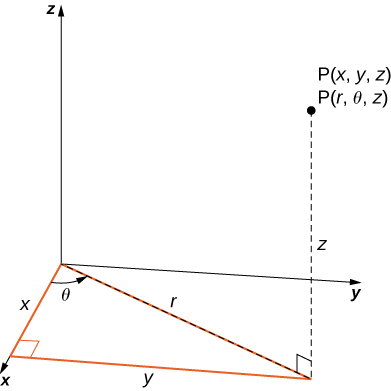{: #CNX_Calc_Figure_15_05_001}

To convert from rectangular to cylindrical coordinates, we use the conversion <math xmlns="http://www.w3.org/1998/Math/MathML"><mrow><mi>x</mi><mo>=</mo><mi>r</mi><mspace width="0.2em" /><mtext>cos</mtext><mspace width="0.2em" /><mi>θ</mi></mrow></math>

 and <math xmlns="http://www.w3.org/1998/Math/MathML"><mrow><mi>y</mi><mo>=</mo><mi>r</mi><mspace width="0.2em" /><mtext>sin</mtext><mspace width="0.2em" /><mi>θ</mi><mo>.</mo></mrow></math>

 To convert from cylindrical to rectangular coordinates, we use <math xmlns="http://www.w3.org/1998/Math/MathML"><mrow><msup><mi>r</mi><mn>2</mn></msup><mo>=</mo><msup><mi>x</mi><mn>2</mn></msup><mo>+</mo><msup><mi>y</mi><mn>2</mn></msup></mrow></math>

 and <math xmlns="http://www.w3.org/1998/Math/MathML"><mrow><mi>θ</mi><mo>=</mo><msup><mrow><mtext>tan</mtext></mrow><mrow><mn>−1</mn></mrow></msup><mrow><mo>(</mo><mrow><mfrac><mi>y</mi><mi>x</mi></mfrac></mrow><mo>)</mo></mrow><mo>.</mo></mrow></math>

 The <math xmlns="http://www.w3.org/1998/Math/MathML"><mi>z</mi></math>

-coordinate remains the same in both cases.

In the two-dimensional plane with a rectangular coordinate system, when we say <math xmlns="http://www.w3.org/1998/Math/MathML"><mrow><mi>x</mi><mo>=</mo><mi>k</mi></mrow></math>

 (constant) we mean an unbounded vertical line parallel to the <math xmlns="http://www.w3.org/1998/Math/MathML"><mi>y</mi></math>

-axis and when <math xmlns="http://www.w3.org/1998/Math/MathML"><mrow><mi>y</mi><mo>=</mo><mi>l</mi></mrow></math>

 (constant) we mean an unbounded horizontal line parallel to the <math xmlns="http://www.w3.org/1998/Math/MathML"><mrow><mi>x</mi></mrow></math>

-axis. With the polar coordinate system, when we say <math xmlns="http://www.w3.org/1998/Math/MathML"><mrow><mi>r</mi><mo>=</mo><mi>c</mi></mrow></math>

 (constant), we mean a circle of radius <math xmlns="http://www.w3.org/1998/Math/MathML"><mi>c</mi></math>

 units and when <math xmlns="http://www.w3.org/1998/Math/MathML"><mrow><mi>θ</mi><mo>=</mo><mi>α</mi></mrow></math>

 (constant) we mean an infinite ray making an angle <math xmlns="http://www.w3.org/1998/Math/MathML"><mi>α</mi></math>

 with the positive <math xmlns="http://www.w3.org/1998/Math/MathML"><mi>x</mi></math>

-axis.

Similarly, in three-dimensional space with rectangular coordinates <math xmlns="http://www.w3.org/1998/Math/MathML"><mrow><mrow><mo>(</mo><mrow><mi>x</mi><mo>,</mo><mi>y</mi><mo>,</mo><mi>z</mi></mrow><mo>)</mo></mrow><mo>,</mo></mrow></math>

 the equations <math xmlns="http://www.w3.org/1998/Math/MathML"><mrow><mi>x</mi><mo>=</mo><mi>k</mi><mo>,</mo><mi>y</mi><mo>=</mo><mi>l</mi><mo>,</mo></mrow></math>

 and <math xmlns="http://www.w3.org/1998/Math/MathML"><mrow><mi>z</mi><mo>=</mo><mi>m</mi><mo>,</mo></mrow></math>

 where <math xmlns="http://www.w3.org/1998/Math/MathML"><mrow><mi>k</mi><mo>,</mo><mi>l</mi><mo>,</mo></mrow></math>

 and <math xmlns="http://www.w3.org/1998/Math/MathML"><mrow><mi>m</mi></mrow></math>

 are constants, represent unbounded planes parallel to the <math xmlns="http://www.w3.org/1998/Math/MathML"><mrow><mi>y</mi><mi>z</mi></mrow></math>

-plane, <math xmlns="http://www.w3.org/1998/Math/MathML"><mrow><mi>x</mi><mi>z</mi></mrow></math>

-plane and <math xmlns="http://www.w3.org/1998/Math/MathML"><mrow><mi>x</mi><mi>y</mi></mrow></math>

-plane, respectively. With cylindrical coordinates <math xmlns="http://www.w3.org/1998/Math/MathML"><mrow><mrow><mo>(</mo><mrow><mi>r</mi><mo>,</mo><mi>θ</mi><mo>,</mo><mi>z</mi></mrow><mo>)</mo></mrow><mo>,</mo></mrow></math>

 by <math xmlns="http://www.w3.org/1998/Math/MathML"><mrow><mi>r</mi><mo>=</mo><mi>c</mi><mo>,</mo><mi>θ</mi><mo>=</mo><mi>α</mi><mo>,</mo></mrow></math>

 and <math xmlns="http://www.w3.org/1998/Math/MathML"><mrow><mi>z</mi><mo>=</mo><mi>m</mi><mo>,</mo></mrow></math>

 where <math xmlns="http://www.w3.org/1998/Math/MathML"><mrow><mi>c</mi><mo>,</mo><mi>α</mi><mo>,</mo></mrow></math>

 and <math xmlns="http://www.w3.org/1998/Math/MathML"><mi>m</mi></math>

 are constants, we mean an unbounded vertical cylinder with the <math xmlns="http://www.w3.org/1998/Math/MathML"><mrow><mi>z</mi></mrow></math>

-axis as its radial axis; a plane making a constant angle <math xmlns="http://www.w3.org/1998/Math/MathML"><mi>α</mi></math>

 with the <math xmlns="http://www.w3.org/1998/Math/MathML"><mrow><mi>x</mi><mi>y</mi></mrow></math>

-plane; and an unbounded horizontal plane parallel to the <math xmlns="http://www.w3.org/1998/Math/MathML"><mrow><mi>x</mi><mi>y</mi></mrow></math>

-plane, respectively. This means that the circular cylinder <math xmlns="http://www.w3.org/1998/Math/MathML"><mrow><msup><mi>x</mi><mn>2</mn></msup><mo>+</mo><msup><mi>y</mi><mn>2</mn></msup><mo>=</mo><msup><mi>c</mi><mn>2</mn></msup></mrow></math>

 in rectangular coordinates can be represented simply as <math xmlns="http://www.w3.org/1998/Math/MathML"><mrow><mi>r</mi><mo>=</mo><mi>c</mi></mrow></math>

 in cylindrical coordinates. (Refer to [Cylindrical and Spherical Coordinates](/m53875){: .target-chapter} for more review.)

### Integration in Cylindrical Coordinates

Triple integrals can often be more readily evaluated by using cylindrical coordinates instead of rectangular coordinates. Some common equations of surfaces in rectangular coordinates along with corresponding equations in cylindrical coordinates are listed in [\[link\]](#fs-id1167793262531). These equations will become handy as we proceed with solving problems using triple integrals.

<table summary="In this table, there are five columns and three rows. The first row is a header row, which is blank in the first cell, but then reads Circular cylinder, Circular cone, Sphere, and Paraboloid. The second row across reads Rectangular, x squared + y squared = c squared, z squared = c squared times (x squared plus y squared), x squared + y squared + z squared = c squared, and z = c times (x squared plus y squared). The third row across reads Cylindrical, r = c, z = cr, r squared + z squared = c squared, and z = c times r squared."><caption>Equations of Some Common Shapes</caption><thead>
<tr valign="top">
<th data-valign="top" data-align="left" />
<th data-valign="top" data-align="left">Circular cylinder</th>
<th data-valign="top" data-align="left">Circular cone</th>
<th data-valign="top" data-align="left">Sphere</th>
<th data-valign="top" data-align="left">Paraboloid</th>
</tr>
</thead><tbody>
<tr valign="top">
<td data-valign="top" data-align="left">Rectangular</td>
<td data-valign="top" data-align="left"><math xmlns="http://www.w3.org/1998/Math/MathML"><mrow><msup><mi>x</mi><mn>2</mn></msup><mo>+</mo><msup><mi>y</mi><mn>2</mn></msup><mo>=</mo><msup><mi>c</mi><mn>2</mn></msup></mrow></math></td>
<td data-valign="top" data-align="left"><math xmlns="http://www.w3.org/1998/Math/MathML"><mrow><msup><mi>z</mi><mn>2</mn></msup><mo>=</mo><msup><mi>c</mi><mn>2</mn></msup><mrow><mo>(</mo><mrow><msup><mi>x</mi><mn>2</mn></msup><mo>+</mo><msup><mi>y</mi><mn>2</mn></msup></mrow><mo>)</mo></mrow></mrow></math></td>
<td data-valign="top" data-align="left"><math xmlns="http://www.w3.org/1998/Math/MathML"><mrow><msup><mi>x</mi><mn>2</mn></msup><mo>+</mo><msup><mi>y</mi><mn>2</mn></msup><mo>+</mo><msup><mi>z</mi><mn>2</mn></msup><mo>=</mo><msup><mi>c</mi><mn>2</mn></msup></mrow></math></td>
<td data-valign="top" data-align="left"><math xmlns="http://www.w3.org/1998/Math/MathML"><mrow><mi>z</mi><mo>=</mo><mi>c</mi><mrow><mo>(</mo><mrow><msup><mi>x</mi><mn>2</mn></msup><mo>+</mo><msup><mi>y</mi><mn>2</mn></msup></mrow><mo>)</mo></mrow></mrow></math></td>
</tr>
<tr valign="top">
<td data-valign="top" data-align="left">Cylindrical</td>
<td data-valign="top" data-align="left"><math xmlns="http://www.w3.org/1998/Math/MathML"><mrow><mi>r</mi><mo>=</mo><mi>c</mi></mrow></math></td>
<td data-valign="top" data-align="left"><math xmlns="http://www.w3.org/1998/Math/MathML"><mrow><mi>z</mi><mo>=</mo><mi>c</mi><mi>r</mi></mrow></math></td>
<td data-valign="top" data-align="left"><math xmlns="http://www.w3.org/1998/Math/MathML"><mrow><msup><mi>r</mi><mn>2</mn></msup><mo>+</mo><msup><mi>z</mi><mn>2</mn></msup><mo>=</mo><msup><mi>c</mi><mn>2</mn></msup></mrow></math></td>
<td data-valign="top" data-align="left"><math xmlns="http://www.w3.org/1998/Math/MathML"><mrow><mi>z</mi><mo>=</mo><mi>c</mi><msup><mi>r</mi><mn>2</mn></msup></mrow></math></td>
</tr>
</tbody></table>

As before, we start with the simplest bounded region <math xmlns="http://www.w3.org/1998/Math/MathML"><mi>B</mi></math>

 in <math xmlns="http://www.w3.org/1998/Math/MathML"><mrow><msup><mi>ℝ</mi><mn>3</mn></msup><mo>,</mo></mrow></math>

 to describe in cylindrical coordinates, in the form of a cylindrical box, <math xmlns="http://www.w3.org/1998/Math/MathML"><mrow><mi>B</mi><mo>=</mo><mrow><mo>{</mo><mrow><mrow><mrow><mrow><mo>(</mo><mrow><mi>r</mi><mo>,</mo><mi>θ</mi><mo>,</mo><mi>z</mi></mrow><mo>)</mo></mrow></mrow><mo>\|</mo></mrow><mi>a</mi><mo>≤</mo><mi>r</mi><mo>≤</mo><mi>b</mi><mo>,</mo><mi>α</mi><mo>≤</mo><mi>θ</mi><mo>≤</mo><mi>β</mi><mo>,</mo><mi>c</mi><mo>≤</mo><mi>z</mi><mo>≤</mo><mi>d</mi></mrow><mo>}</mo></mrow></mrow></math>

 ([\[link\]](#CNX_Calc_Figure_15_05_002)). Suppose we divide each interval into <math xmlns="http://www.w3.org/1998/Math/MathML"><mrow><mi>l</mi><mo>,</mo><mi>m</mi><mspace width="0.2em" /><mtext>and</mtext><mspace width="0.2em" /><mi>n</mi></mrow></math>

 subdivisions such that <math xmlns="http://www.w3.org/1998/Math/MathML"><mrow><mtext>Δ</mtext><mi>r</mi><mo>=</mo><mfrac><mrow><mi>b</mi><mo>−</mo><mi>a</mi></mrow><mi>l</mi></mfrac><mo>,</mo><mtext>Δ</mtext><mi>θ</mi><mo>=</mo><mfrac><mrow><mi>β</mi><mo>−</mo><mi>α</mi></mrow><mi>m</mi></mfrac><mo>,</mo></mrow></math>

 and <math xmlns="http://www.w3.org/1998/Math/MathML"><mrow><mtext>Δ</mtext><mi>z</mi><mo>=</mo><mfrac><mrow><mi>d</mi><mo>−</mo><mi>c</mi></mrow><mi>n</mi></mfrac><mo>.</mo></mrow></math>

 Then we can state the following definition for a triple integral in cylindrical coordinates.

 {: #CNX_Calc_Figure_15_05_002}

Definition

Consider the cylindrical box (expressed in cylindrical coordinates)

<math xmlns="http://www.w3.org/1998/Math/MathML"><mrow><mi>B</mi><mo>=</mo><mrow><mo>{</mo><mrow><mrow><mrow><mrow><mo>(</mo><mrow><mi>r</mi><mo>,</mo><mi>θ</mi><mo>,</mo><mi>z</mi></mrow><mo>)</mo></mrow></mrow><mo>\|</mo></mrow><mi>a</mi><mo>≤</mo><mi>r</mi><mo>≤</mo><mi>b</mi><mo>,</mo><mi>α</mi><mo>≤</mo><mi>θ</mi><mo>≤</mo><mi>β</mi><mo>,</mo><mi>c</mi><mo>≤</mo><mi>z</mi><mo>≤</mo><mi>d</mi></mrow><mo>}</mo></mrow><mo>.</mo></mrow></math>

If the function <math xmlns="http://www.w3.org/1998/Math/MathML"><mrow><mi>f</mi><mrow><mo>(</mo><mrow><mi>r</mi><mo>,</mo><mi>θ</mi><mo>,</mo><mi>z</mi></mrow><mo>)</mo></mrow></mrow></math>

 is continuous on <math xmlns="http://www.w3.org/1998/Math/MathML"><mi>B</mi></math>

 and if <math xmlns="http://www.w3.org/1998/Math/MathML"><mrow><mo stretchy="false">(</mo><msubsup><mi>r</mi><mrow><mi>i</mi><mi>j</mi><mi>k</mi></mrow><mo>*</mo></msubsup><mo>,</mo><msubsup><mi>θ</mi><mrow><mi>i</mi><mi>j</mi><mi>k</mi></mrow><mo>*</mo></msubsup><mo>,</mo><msubsup><mi>z</mi><mrow><mi>i</mi><mi>j</mi><mi>k</mi></mrow><mo>*</mo></msubsup><mo stretchy="false">)</mo></mrow></math>

 is any sample point in the cylindrical subbox <math xmlns="http://www.w3.org/1998/Math/MathML"><mrow><msub><mi>B</mi><mrow><mi>i</mi><mi>j</mi><mi>k</mi></mrow></msub><mo>=</mo><mrow><mo>[</mo><mrow><msub><mi>r</mi><mrow><mi>i</mi><mo>−</mo><mn>1</mn></mrow></msub><mo>,</mo><msub><mi>r</mi><mi>i</mi></msub></mrow><mo>]</mo></mrow><mspace width="0.2em" /><mo>×</mo><mspace width="0.2em" /><mrow><mo>[</mo><mrow><msub><mi>θ</mi><mrow><mi>j</mi><mo>−</mo><mn>1</mn></mrow></msub><mo>,</mo><msub><mi>θ</mi><mi>j</mi></msub></mrow><mo>]</mo></mrow><mspace width="0.2em" /><mo>×</mo><mspace width="0.2em" /><mrow><mo>[</mo><mrow><msub><mi>z</mi><mrow><mi>k</mi><mo>−</mo><mn>1</mn></mrow></msub><mo>,</mo><msub><mi>z</mi><mi>k</mi></msub></mrow><mo>]</mo></mrow></mrow></math>

 ([\[link\]](#CNX_Calc_Figure_15_05_002)), then we can define the **triple integral in cylindrical coordinates**{: data-type="term"} as the limit of a triple Riemann sum, provided the following limit exists:

<math xmlns="http://www.w3.org/1998/Math/MathML"><mrow><munder><mrow><mtext>lim</mtext></mrow><mrow><mi>l</mi><mo>,</mo><mi>m</mi><mo>,</mo><mi>n</mi><mo stretchy="false">→</mo><mi>∞</mi></mrow></munder><mstyle displaystyle="true"><munderover><mo>∑</mo><mrow><mi>i</mi><mo>=</mo><mn>1</mn></mrow><mi>l</mi></munderover><mrow><mstyle displaystyle="true"><munderover><mo>∑</mo><mrow><mi>j</mi><mo>=</mo><mn>1</mn></mrow><mi>m</mi></munderover><mrow><mstyle displaystyle="true"><munderover><mo>∑</mo><mrow><mi>k</mi><mo>=</mo><mn>1</mn></mrow><mi>n</mi></munderover><mrow><mi>f</mi><mo stretchy="false">(</mo><msubsup><mi>r</mi><mrow><mi>i</mi><mi>j</mi><mi>k</mi></mrow><mo>*</mo></msubsup><mo>,</mo><msubsup><mi>θ</mi><mrow><mi>i</mi><mi>j</mi><mi>k</mi></mrow><mo>*</mo></msubsup><mo>,</mo><msubsup><mi>z</mi><mrow><mi>i</mi><mi>j</mi><mi>k</mi></mrow><mo>*</mo></msubsup><mo stretchy="false">)</mo><msubsup><mi>r</mi><mrow><mi>i</mi><mi>j</mi><mi>k</mi></mrow><mo>*</mo></msubsup><mtext>Δ</mtext><mi>r</mi><mtext>Δ</mtext><mi>θ</mi><mtext>Δ</mtext><mi>z</mi></mrow></mstyle></mrow></mstyle></mrow></mstyle><mo>.</mo></mrow></math>

Note that if <math xmlns="http://www.w3.org/1998/Math/MathML"><mrow><mi>g</mi><mrow><mo>(</mo><mrow><mi>x</mi><mo>,</mo><mi>y</mi><mo>,</mo><mi>z</mi></mrow><mo>)</mo></mrow></mrow></math>

 is the function in rectangular coordinates and the box <math xmlns="http://www.w3.org/1998/Math/MathML"><mi>B</mi></math>

 is expressed in rectangular coordinates, then the triple integral <math xmlns="http://www.w3.org/1998/Math/MathML"><mrow><mstyle displaystyle="true"><mrow><munder><mo>∭</mo><mi>B</mi></munder><mrow><mi>g</mi><mrow><mo>(</mo><mrow><mi>x</mi><mo>,</mo><mi>y</mi><mo>,</mo><mi>z</mi></mrow><mo>)</mo></mrow><mi>d</mi><mi>V</mi></mrow></mrow></mstyle></mrow></math>

 is equal to the triple integral <math xmlns="http://www.w3.org/1998/Math/MathML"><mrow><mstyle displaystyle="true"><mrow><munder><mo>∭</mo><mi>B</mi></munder><mrow><mi>g</mi><mrow><mo>(</mo><mrow><mi>r</mi><mspace width="0.2em" /><mtext>cos</mtext><mspace width="0.2em" /><mi>θ</mi><mo>,</mo><mi>r</mi><mspace width="0.2em" /><mtext>sin</mtext><mspace width="0.2em" /><mi>θ</mi><mo>,</mo><mi>z</mi></mrow><mo>)</mo></mrow><mi>r</mi><mspace width="0.2em" /><mi>d</mi><mi>r</mi><mspace width="0.2em" /><mi>d</mi><mi>θ</mi><mspace width="0.2em" /><mi>d</mi><mi>z</mi></mrow></mrow></mstyle></mrow></math>

 and we have

<math xmlns="http://www.w3.org/1998/Math/MathML"><mrow><mstyle displaystyle="true"><mrow><munder><mo>∭</mo><mi>B</mi></munder><mrow><mi>g</mi><mrow><mo>(</mo><mrow><mi>x</mi><mo>,</mo><mi>y</mi><mo>,</mo><mi>z</mi></mrow><mo>)</mo></mrow><mi>d</mi><mi>V</mi></mrow></mrow></mstyle><mo>=</mo><mstyle displaystyle="true"><mrow><munder><mo>∭</mo><mi>B</mi></munder><mrow><mi>g</mi><mrow><mo>(</mo><mrow><mi>r</mi><mspace width="0.2em" /><mtext>cos</mtext><mspace width="0.2em" /><mi>θ</mi><mo>,</mo><mi>r</mi><mspace width="0.2em" /><mtext>sin</mtext><mspace width="0.2em" /><mi>θ</mi><mo>,</mo><mi>z</mi></mrow><mo>)</mo></mrow><mi>r</mi><mspace width="0.2em" /><mi>d</mi><mi>r</mi><mspace width="0.2em" /><mi>d</mi><mi>θ</mi><mspace width="0.2em" /><mi>d</mi><mi>z</mi></mrow></mrow></mstyle><mo>=</mo><mstyle displaystyle="true"><mrow><munder><mo>∭</mo><mi>B</mi></munder><mrow><mi>f</mi><mrow><mo>(</mo><mrow><mi>r</mi><mo>,</mo><mi>θ</mi><mo>,</mo><mi>z</mi></mrow><mo>)</mo></mrow><mi>r</mi><mspace width="0.2em" /><mi>d</mi><mi>r</mi><mspace width="0.2em" /><mi>d</mi><mi>θ</mi><mspace width="0.2em" /><mi>d</mi><mi>z</mi></mrow></mrow></mstyle><mo>.</mo></mrow></math>

As mentioned in the preceding section, all the properties of a double integral work well in triple integrals, whether in rectangular coordinates or cylindrical coordinates. They also hold for iterated integrals. To reiterate, in cylindrical coordinates, Fubini’s theorem takes the following form:

Fubini’s Theorem in Cylindrical Coordinates

Suppose that <math xmlns="http://www.w3.org/1998/Math/MathML"><mrow><mi>g</mi><mrow><mo>(</mo><mrow><mi>x</mi><mo>,</mo><mi>y</mi><mo>,</mo><mi>z</mi></mrow><mo>)</mo></mrow></mrow></math>

 is continuous on a rectangular box <math xmlns="http://www.w3.org/1998/Math/MathML"><mrow><mi>B</mi><mo>,</mo></mrow></math>

 which when described in cylindrical coordinates looks like <math xmlns="http://www.w3.org/1998/Math/MathML"><mrow><mi>B</mi><mo>=</mo><mrow><mo>{</mo><mrow><mrow><mrow><mrow><mo>(</mo><mrow><mi>r</mi><mo>,</mo><mi>θ</mi><mo>,</mo><mi>z</mi></mrow><mo>)</mo></mrow></mrow><mo>\|</mo></mrow><mi>a</mi><mo>≤</mo><mi>r</mi><mo>≤</mo><mi>b</mi><mo>,</mo><mi>α</mi><mo>≤</mo><mi>θ</mi><mo>≤</mo><mi>β</mi><mo>,</mo><mi>c</mi><mo>≤</mo><mi>z</mi><mo>≤</mo><mi>d</mi></mrow><mo>}</mo></mrow><mo>.</mo></mrow></math>

Then <math xmlns="http://www.w3.org/1998/Math/MathML"><mrow><mi>g</mi><mrow><mo>(</mo><mrow><mi>x</mi><mo>,</mo><mi>y</mi><mo>,</mo><mi>z</mi></mrow><mo>)</mo></mrow><mo>=</mo><mi>g</mi><mrow><mo>(</mo><mrow><mi>r</mi><mspace width="0.2em" /><mtext>cos</mtext><mspace width="0.2em" /><mi>θ</mi><mo>,</mo><mi>r</mi><mspace width="0.2em" /><mtext>sin</mtext><mspace width="0.2em" /><mi>θ</mi><mo>,</mo><mi>z</mi></mrow><mo>)</mo></mrow><mo>=</mo><mi>f</mi><mrow><mo>(</mo><mrow><mi>r</mi><mo>,</mo><mi>θ</mi><mo>,</mo><mi>z</mi></mrow><mo>)</mo></mrow></mrow></math>

 and

<math xmlns="http://www.w3.org/1998/Math/MathML"><mrow><mstyle displaystyle="true"><mrow><munder><mo>∭</mo><mi>B</mi></munder><mrow><mi>g</mi><mrow><mo>(</mo><mrow><mi>x</mi><mo>,</mo><mi>y</mi><mo>,</mo><mi>z</mi></mrow><mo>)</mo></mrow><mi>d</mi><mi>V</mi><mo>=</mo><mstyle displaystyle="true"><mrow><munderover><mo stretchy="false">∫</mo><mi>c</mi><mi>d</mi></munderover><mspace width="0.2em" /><mrow><mstyle displaystyle="true"><mrow><munderover><mo stretchy="false">∫</mo><mi>α</mi><mi>β</mi></munderover><mspace width="0.2em" /><mrow><mstyle displaystyle="true"><mrow><munderover><mo stretchy="false">∫</mo><mi>a</mi><mi>b</mi></munderover><mrow><mi>f</mi><mrow><mo>(</mo><mrow><mi>r</mi><mo>,</mo><mi>θ</mi><mo>,</mo><mi>z</mi></mrow><mo>)</mo></mrow></mrow></mrow></mstyle></mrow></mrow></mstyle></mrow></mrow></mstyle></mrow></mrow></mstyle><mi>r</mi><mspace width="0.2em" /><mi>d</mi><mi>r</mi><mspace width="0.2em" /><mi>d</mi><mi>θ</mi><mspace width="0.2em" /><mi>d</mi><mi>z</mi><mo>.</mo></mrow></math>

The iterated integral may be replaced equivalently by any one of the other five iterated integrals obtained by integrating with respect to the three variables in other orders.

Cylindrical coordinate systems work well for solids that are symmetric around an axis, such as cylinders and cones. Let us look at some examples before we define the triple integral in cylindrical coordinates on general cylindrical regions.

Evaluating a Triple Integral over a Cylindrical Box

Evaluate the triple integral <math xmlns="http://www.w3.org/1998/Math/MathML"><mrow><mstyle displaystyle="true"><mrow><munder><mo>∭</mo><mi>B</mi></munder><mrow><mrow><mo>(</mo><mrow><mi>z</mi><mi>r</mi><mspace width="0.2em" /><mtext>sin</mtext><mspace width="0.2em" /><mi>θ</mi></mrow><mo>)</mo></mrow></mrow></mrow></mstyle><mi>r</mi><mspace width="0.2em" /><mi>d</mi><mi>r</mi><mspace width="0.2em" /><mi>d</mi><mi>θ</mi><mspace width="0.2em" /><mi>d</mi><mi>z</mi></mrow></math>

 where the cylindrical box <math xmlns="http://www.w3.org/1998/Math/MathML"><mi>B</mi></math>

 is <math xmlns="http://www.w3.org/1998/Math/MathML"><mrow><mi>B</mi><mo>=</mo><mrow><mo>{</mo><mrow><mrow><mrow><mrow><mo>(</mo><mrow><mi>r</mi><mo>,</mo><mi>θ</mi><mo>,</mo><mi>z</mi></mrow><mo>)</mo></mrow></mrow><mo>\|</mo></mrow><mn>0</mn><mo>≤</mo><mi>r</mi><mo>≤</mo><mn>2</mn><mo>,</mo><mn>0</mn><mo>≤</mo><mi>θ</mi><mo>≤</mo><mi>π</mi><mtext>/</mtext><mn>2</mn><mo>,</mo><mn>0</mn><mo>≤</mo><mi>z</mi><mo>≤</mo><mn>4</mn></mrow><mo>}</mo></mrow><mo>.</mo></mrow></math>

As stated in Fubini’s theorem, we can write the triple integral as the iterated integral

<math xmlns="http://www.w3.org/1998/Math/MathML"><mrow><mstyle displaystyle="true"><mrow><munder><mo>∭</mo><mi>B</mi></munder><mrow><mrow><mo>(</mo><mrow><mi>z</mi><mi>r</mi><mspace width="0.2em" /><mtext>sin</mtext><mspace width="0.2em" /><mi>θ</mi></mrow><mo>)</mo></mrow></mrow></mrow></mstyle><mi>r</mi><mspace width="0.2em" /><mi>d</mi><mi>r</mi><mspace width="0.2em" /><mi>d</mi><mi>θ</mi><mspace width="0.2em" /><mi>d</mi><mi>z</mi><mo>=</mo><mstyle displaystyle="true"><mrow><msubsup><mo stretchy="false">∫</mo><mrow><mi>θ</mi><mo>=</mo><mn>0</mn></mrow><mrow><mi>θ</mi><mo>=</mo><mi>π</mi><mtext>/</mtext><mn>2</mn></mrow></msubsup><mrow><mstyle displaystyle="true"><mrow><msubsup><mo stretchy="false">∫</mo><mrow><mi>r</mi><mo>=</mo><mn>0</mn></mrow><mrow><mi>r</mi><mo>=</mo><mn>2</mn></mrow></msubsup><mrow><mstyle displaystyle="true"><mrow><msubsup><mo stretchy="false">∫</mo><mrow><mi>z</mi><mo>=</mo><mn>0</mn></mrow><mrow><mi>z</mi><mo>=</mo><mn>4</mn></mrow></msubsup><mrow><mrow><mo>(</mo><mrow><mi>z</mi><mi>r</mi><mspace width="0.2em" /><mtext>sin</mtext><mspace width="0.2em" /><mi>θ</mi></mrow><mo>)</mo></mrow></mrow></mrow></mstyle></mrow></mrow></mstyle></mrow></mrow></mstyle><mi>r</mi><mspace width="0.2em" /><mi>d</mi><mi>z</mi><mspace width="0.2em" /><mi>d</mi><mi>r</mi><mspace width="0.2em" /><mi>d</mi><mi>θ</mi><mo>.</mo></mrow></math>

The evaluation of the iterated integral is straightforward. Each variable in the integral is independent of the others, so we can integrate each variable separately and multiply the results together. This makes the computation much easier:

<math xmlns="http://www.w3.org/1998/Math/MathML"><mtable><mtr /><mtr /><mtr /><mtr /><mtr><mtd columnalign="left"><mspace width="1em" /><mstyle displaystyle="true"><mrow><msubsup><mo stretchy="false">∫</mo><mrow><mi>θ</mi><mo>=</mo><mn>0</mn></mrow><mrow><mi>θ</mi><mo>=</mo><mi>π</mi><mtext>/</mtext><mn>2</mn></mrow></msubsup><mrow><mstyle displaystyle="true"><mrow><msubsup><mo stretchy="false">∫</mo><mrow><mi>r</mi><mo>=</mo><mn>0</mn></mrow><mrow><mi>r</mi><mo>=</mo><mn>2</mn></mrow></msubsup><mrow><mstyle displaystyle="true"><mrow><msubsup><mo stretchy="false">∫</mo><mrow><mi>z</mi><mo>=</mo><mn>0</mn></mrow><mrow><mi>z</mi><mo>=</mo><mn>4</mn></mrow></msubsup><mrow><mrow><mo>(</mo><mrow><mi>z</mi><mi>r</mi><mspace width="0.2em" /><mtext>sin</mtext><mspace width="0.2em" /><mi>θ</mi></mrow><mo>)</mo></mrow></mrow></mrow></mstyle></mrow></mrow></mstyle></mrow></mrow></mstyle><mi>r</mi><mspace width="0.2em" /><mi>d</mi><mi>z</mi><mspace width="0.2em" /><mi>d</mi><mi>r</mi><mspace width="0.2em" /><mi>d</mi><mi>θ</mi></mtd></mtr><mtr><mtd columnalign="left"><mo>=</mo><mrow><mo>(</mo><mrow><mstyle displaystyle="true"><mrow><msubsup><mo stretchy="false">∫</mo><mn>0</mn><mrow><mrow><mi>π</mi><mtext>/</mtext><mn>2</mn></mrow></mrow></msubsup><mrow><mtext>sin</mtext><mspace width="0.2em" /><mi>θ</mi><mspace width="0.2em" /><mi>d</mi><mi>θ</mi></mrow></mrow></mstyle></mrow><mo>)</mo></mrow><mrow><mo>(</mo><mrow><mstyle displaystyle="true"><mrow><msubsup><mo stretchy="false">∫</mo><mn>0</mn><mn>2</mn></msubsup><mrow><msup><mi>r</mi><mn>2</mn></msup><mi>d</mi><mi>r</mi></mrow></mrow></mstyle></mrow><mo>)</mo></mrow><mrow><mo>(</mo><mrow><mstyle displaystyle="true"><mrow><msubsup><mo stretchy="false">∫</mo><mn>0</mn><mn>4</mn></msubsup><mrow><mi>z</mi><mspace width="0.2em" /><mi>d</mi><mi>z</mi></mrow></mrow></mstyle></mrow><mo>)</mo></mrow><mo>=</mo><mrow><mo>(</mo><mrow><msubsup><mrow><mrow><mrow><mtext>−</mtext><mtext>cos</mtext><mspace width="0.2em" /><mi>θ</mi></mrow><mo>\|</mo></mrow></mrow><mn>0</mn><mrow><mi>π</mi><mtext>/</mtext><mn>2</mn></mrow></msubsup></mrow><mo>)</mo></mrow><mrow><mo>(</mo><mrow><msubsup><mrow><mrow><mrow><mfrac><mrow><msup><mi>r</mi><mn>3</mn></msup></mrow><mn>3</mn></mfrac></mrow><mo>\|</mo></mrow></mrow><mn>0</mn><mn>2</mn></msubsup></mrow><mo>)</mo></mrow><mrow><mo>(</mo><mrow><msubsup><mrow><mrow><mrow><mfrac><mrow><msup><mi>z</mi><mn>2</mn></msup></mrow><mn>2</mn></mfrac></mrow><mo>\|</mo></mrow></mrow><mn>0</mn><mn>4</mn></msubsup></mrow><mo>)</mo></mrow><mo>=</mo><mfrac><mrow><mn>64</mn></mrow><mn>3</mn></mfrac><mo>.</mo></mtd></mtr></mtable></math>

Evaluate the triple integral <math xmlns="http://www.w3.org/1998/Math/MathML"><mrow><mstyle displaystyle="true"><mrow><munderover><mo stretchy="false">∫</mo><mrow><mi>θ</mi><mo>=</mo><mn>0</mn></mrow><mrow><mi>θ</mi><mo>=</mo><mi>π</mi></mrow></munderover><mspace width="0.2em" /><mrow><mstyle displaystyle="true"><mrow><munderover><mo stretchy="false">∫</mo><mrow><mi>r</mi><mo>=</mo><mn>0</mn></mrow><mrow><mi>r</mi><mo>=</mo><mn>1</mn></mrow></munderover><mspace width="0.2em" /><mrow><mstyle displaystyle="true"><mrow><munderover><mo stretchy="false">∫</mo><mrow><mi>z</mi><mo>=</mo><mn>0</mn></mrow><mrow><mi>z</mi><mo>=</mo><mn>4</mn></mrow></munderover><mrow><mi>r</mi><mi>z</mi><mspace width="0.2em" /><mtext>sin</mtext><mspace width="0.2em" /><mi>θ</mi></mrow></mrow></mstyle></mrow></mrow></mstyle></mrow></mrow></mstyle><mi>r</mi><mspace width="0.2em" /><mi>d</mi><mi>z</mi><mspace width="0.2em" /><mi>d</mi><mi>r</mi><mspace width="0.2em" /><mi>d</mi><mi>θ</mi><mo>.</mo></mrow></math>

<math xmlns="http://www.w3.org/1998/Math/MathML"><mn>8</mn></math>

Hint

Follow the same steps as in the previous example.

If the cylindrical region over which we have to integrate is a general solid, we look at the projections onto the coordinate planes. Hence the triple integral of a continuous function <math xmlns="http://www.w3.org/1998/Math/MathML"><mrow><mi>f</mi><mrow><mo>(</mo><mrow><mi>r</mi><mo>,</mo><mi>θ</mi><mo>,</mo><mi>z</mi></mrow><mo>)</mo></mrow></mrow></math>

 over a general solid region <math xmlns="http://www.w3.org/1998/Math/MathML"><mrow><mi>E</mi><mo>=</mo><mrow><mo>{</mo><mrow><mrow><mrow><mrow><mo>(</mo><mrow><mi>r</mi><mo>,</mo><mi>θ</mi><mo>,</mo><mi>z</mi></mrow><mo>)</mo></mrow></mrow><mo>\|</mo></mrow><mrow><mo>(</mo><mrow><mi>r</mi><mo>,</mo><mi>θ</mi></mrow><mo>)</mo></mrow><mo>∈</mo><mi>D</mi><mo>,</mo><msub><mi>u</mi><mn>1</mn></msub><mrow><mo>(</mo><mrow><mi>r</mi><mo>,</mo><mi>θ</mi></mrow><mo>)</mo></mrow><mo>≤</mo><mi>z</mi><mo>≤</mo><msub><mi>u</mi><mn>2</mn></msub><mrow><mo>(</mo><mrow><mi>r</mi><mo>,</mo><mi>θ</mi></mrow><mo>)</mo></mrow></mrow><mo>}</mo></mrow></mrow></math>

 in <math xmlns="http://www.w3.org/1998/Math/MathML"><mrow><msup><mi>ℝ</mi><mn>3</mn></msup><mo>,</mo></mrow></math>

 where <math xmlns="http://www.w3.org/1998/Math/MathML"><mi>D</mi></math>

 is the projection of <math xmlns="http://www.w3.org/1998/Math/MathML"><mi>E</mi></math>

 onto the <math xmlns="http://www.w3.org/1998/Math/MathML"><mrow><mi>r</mi><mi>θ</mi></mrow></math>

-plane, is

<math xmlns="http://www.w3.org/1998/Math/MathML"><mrow><mstyle displaystyle="true"><mrow><munder><mo>∭</mo><mi>E</mi></munder><mrow><mi>f</mi><mrow><mo>(</mo><mrow><mi>r</mi><mo>,</mo><mi>θ</mi><mo>,</mo><mi>z</mi></mrow><mo>)</mo></mrow><mi>r</mi><mspace width="0.2em" /><mi>d</mi><mi>r</mi><mspace width="0.2em" /><mi>d</mi><mi>θ</mi><mspace width="0.2em" /><mi>d</mi><mi>z</mi><mo>=</mo><mstyle displaystyle="true"><mrow><munder><mo>∬</mo><mi>D</mi></munder><mrow><mrow><mo>[</mo><mrow><mstyle displaystyle="true"><mrow><munderover><mo stretchy="false">∫</mo><mrow><msub><mi>u</mi><mn>1</mn></msub><mrow><mo>(</mo><mrow><mi>r</mi><mo>,</mo><mi>θ</mi></mrow><mo>)</mo></mrow></mrow><mrow><msub><mi>u</mi><mn>2</mn></msub><mrow><mo>(</mo><mrow><mi>r</mi><mo>,</mo><mi>θ</mi></mrow><mo>)</mo></mrow></mrow></munderover><mrow><mi>f</mi><mrow><mo>(</mo><mrow><mi>r</mi><mo>,</mo><mi>θ</mi><mo>,</mo><mi>z</mi></mrow><mo>)</mo></mrow><mi>d</mi><mi>z</mi></mrow></mrow></mstyle></mrow><mo>]</mo></mrow></mrow></mrow></mstyle></mrow></mrow></mstyle><mi>r</mi><mspace width="0.2em" /><mi>d</mi><mi>r</mi><mspace width="0.2em" /><mi>d</mi><mi>θ</mi><mo>.</mo></mrow></math>

In particular, if <math xmlns="http://www.w3.org/1998/Math/MathML"><mrow><mi>D</mi><mo>=</mo><mrow><mo>{</mo><mrow><mrow><mrow><mrow><mo>(</mo><mrow><mi>r</mi><mo>,</mo><mi>θ</mi></mrow><mo>)</mo></mrow></mrow><mo>\|</mo></mrow><msub><mi>g</mi><mn>1</mn></msub><mrow><mo>(</mo><mi>θ</mi><mo>)</mo></mrow><mo>≤</mo><mi>r</mi><mo>≤</mo><msub><mi>g</mi><mn>2</mn></msub><mrow><mo>(</mo><mi>θ</mi><mo>)</mo></mrow><mo>,</mo><mi>α</mi><mo>≤</mo><mi>θ</mi><mo>≤</mo><mi>β</mi></mrow><mo>}</mo></mrow><mo>,</mo></mrow></math>

 then we have

<math xmlns="http://www.w3.org/1998/Math/MathML"><mrow><mstyle displaystyle="true"><mrow><munder><mo>∭</mo><mi>E</mi></munder><mrow><mi>f</mi><mrow><mo>(</mo><mrow><mi>r</mi><mo>,</mo><mi>θ</mi><mo>,</mo><mi>z</mi></mrow><mo>)</mo></mrow></mrow></mrow></mstyle><mi>r</mi><mspace width="0.2em" /><mi>d</mi><mi>r</mi><mspace width="0.2em" /><mi>d</mi><mi>θ</mi><mo>=</mo><mstyle displaystyle="true"><mrow><munderover><mo stretchy="false">∫</mo><mrow><mi>θ</mi><mo>=</mo><mi>α</mi></mrow><mrow><mi>θ</mi><mo>=</mo><mi>β</mi></mrow></munderover><mspace width="0.2em" /><mrow><mstyle displaystyle="true"><mrow><munderover><mo stretchy="false">∫</mo><mrow><mi>r</mi><mo>=</mo><msub><mi>g</mi><mn>1</mn></msub><mrow><mo>(</mo><mi>θ</mi><mo>)</mo></mrow></mrow><mrow><mi>r</mi><mo>=</mo><msub><mi>g</mi><mn>2</mn></msub><mrow><mo>(</mo><mi>θ</mi><mo>)</mo></mrow></mrow></munderover><mspace width="0.2em" /><mrow><mstyle displaystyle="true"><mrow><munderover><mo stretchy="false">∫</mo><mrow><mi>z</mi><mo>=</mo><msub><mi>u</mi><mn>1</mn></msub><mrow><mo>(</mo><mrow><mi>r</mi><mo>,</mo><mi>θ</mi></mrow><mo>)</mo></mrow></mrow><mrow><mi>z</mi><mo>=</mo><msub><mi>u</mi><mn>2</mn></msub><mrow><mo>(</mo><mrow><mi>r</mi><mo>,</mo><mi>θ</mi></mrow><mo>)</mo></mrow></mrow></munderover><mrow><mi>f</mi><mrow><mo>(</mo><mrow><mi>r</mi><mo>,</mo><mi>θ</mi><mo>,</mo><mi>z</mi></mrow><mo>)</mo></mrow></mrow></mrow></mstyle></mrow></mrow></mstyle></mrow></mrow></mstyle><mi>r</mi><mspace width="0.2em" /><mi>d</mi><mi>z</mi><mspace width="0.2em" /><mi>d</mi><mi>r</mi><mspace width="0.2em" /><mi>d</mi><mi>θ</mi><mo>.</mo></mrow></math>

Similar formulas exist for projections onto the other coordinate planes. We can use polar coordinates in those planes if necessary.

Setting up a Triple Integral in Cylindrical Coordinates over a General Region

Consider the region <math xmlns="http://www.w3.org/1998/Math/MathML"><mi>E</mi></math>

 inside the right circular cylinder with equation <math xmlns="http://www.w3.org/1998/Math/MathML"><mrow><mi>r</mi><mo>=</mo><mn>2</mn><mspace width="0.2em" /><mtext>sin</mtext><mspace width="0.2em" /><mi>θ</mi><mo>,</mo></mrow></math>

 bounded below by the <math xmlns="http://www.w3.org/1998/Math/MathML"><mrow><mi>r</mi><mi>θ</mi></mrow></math>

-plane and bounded above by the sphere with radius <math xmlns="http://www.w3.org/1998/Math/MathML"><mn>4</mn></math>

 centered at the origin ([[link]](#CNX_Calc_Figure_15_05_003)). Set up a triple integral over this region with a function <math xmlns="http://www.w3.org/1998/Math/MathML"><mrow><mi>f</mi><mrow><mo>(</mo><mrow><mi>r</mi><mo>,</mo><mi>θ</mi><mo>,</mo><mi>z</mi></mrow><mo>)</mo></mrow></mrow></math>

 in cylindrical coordinates.

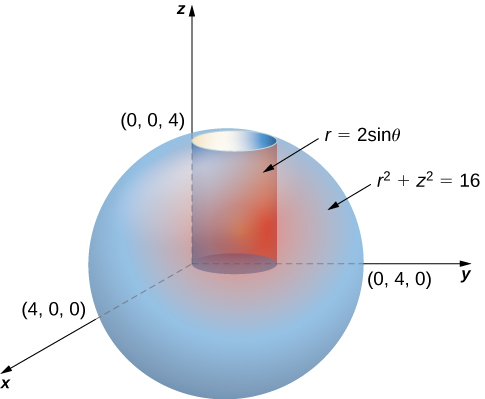{: #CNX_Calc_Figure_15_05_003}

First, identify that the equation for the sphere is <math xmlns="http://www.w3.org/1998/Math/MathML"><mrow><msup><mi>r</mi><mn>2</mn></msup><mo>+</mo><msup><mi>z</mi><mn>2</mn></msup><mo>=</mo><mn>16</mn><mo>.</mo></mrow></math>

 We can see that the limits for <math xmlns="http://www.w3.org/1998/Math/MathML"><mi>z</mi></math>

 are from <math xmlns="http://www.w3.org/1998/Math/MathML"><mn>0</mn></math>

 to <math xmlns="http://www.w3.org/1998/Math/MathML"><mrow><mi>z</mi><mo>=</mo><msqrt><mrow><mn>16</mn><mo>−</mo><msup><mi>r</mi><mn>2</mn></msup></mrow></msqrt><mo>.</mo></mrow></math>

 Then the limits for <math xmlns="http://www.w3.org/1998/Math/MathML"><mi>r</mi></math>

 are from <math xmlns="http://www.w3.org/1998/Math/MathML"><mn>0</mn></math>

 to <math xmlns="http://www.w3.org/1998/Math/MathML"><mrow><mi>r</mi><mo>=</mo><mn>2</mn><mspace width="0.2em" /><mtext>sin</mtext><mspace width="0.2em" /><mi>θ</mi><mo>.</mo></mrow></math>

 Finally, the limits for <math xmlns="http://www.w3.org/1998/Math/MathML"><mi>θ</mi></math>

 are from <math xmlns="http://www.w3.org/1998/Math/MathML"><mn>0</mn></math>

 to <math xmlns="http://www.w3.org/1998/Math/MathML"><mrow><mi>π</mi><mo>.</mo></mrow></math>

 Hence the region is

<math xmlns="http://www.w3.org/1998/Math/MathML"><mrow><mi>E</mi><mo>=</mo><mrow><mo>{</mo><mrow><mrow><mrow><mrow><mo>(</mo><mrow><mi>r</mi><mo>,</mo><mi>θ</mi><mo>,</mo><mi>z</mi></mrow><mo>)</mo></mrow></mrow><mo>\|</mo></mrow><mn>0</mn><mo>≤</mo><mi>θ</mi><mo>≤</mo><mi>π</mi><mo>,</mo><mn>0</mn><mo>≤</mo><mi>r</mi><mo>≤</mo><mn>2</mn><mspace width="0.2em" /><mtext>sin</mtext><mspace width="0.2em" /><mi>θ</mi><mo>,</mo><mn>0</mn><mo>≤</mo><mi>z</mi><mo>≤</mo><msqrt><mrow><mn>16</mn><mo>−</mo><msup><mi>r</mi><mn>2</mn></msup></mrow></msqrt></mrow><mo>}</mo></mrow><mo>.</mo></mrow></math>

Therefore, the triple integral is

<math xmlns="http://www.w3.org/1998/Math/MathML"><mrow><mstyle displaystyle="true"><mrow><munder><mo>∭</mo><mi>E</mi></munder><mrow><mi>f</mi><mrow><mo>(</mo><mrow><mi>r</mi><mo>,</mo><mi>θ</mi><mo>,</mo><mi>z</mi></mrow><mo>)</mo></mrow></mrow></mrow></mstyle><mi>r</mi><mspace width="0.2em" /><mi>d</mi><mi>z</mi><mspace width="0.2em" /><mi>d</mi><mi>r</mi><mspace width="0.2em" /><mi>d</mi><mi>θ</mi><mo>=</mo><mstyle displaystyle="true"><mrow><munderover><mo stretchy="false">∫</mo><mrow><mi>θ</mi><mo>=</mo><mn>0</mn></mrow><mrow><mi>θ</mi><mo>=</mo><mi>π</mi></mrow></munderover><mspace width="0.2em" /><mrow><mstyle displaystyle="true"><mrow><munderover><mo stretchy="false">∫</mo><mrow><mi>r</mi><mo>=</mo><mn>0</mn></mrow><mrow><mi>r</mi><mo>=</mo><mn>2</mn><mspace width="0.2em" /><mtext>sin</mtext><mspace width="0.2em" /><mi>θ</mi></mrow></munderover><mspace width="0.2em" /><mrow><mstyle displaystyle="true"><mrow><munderover><mo stretchy="false">∫</mo><mrow><mi>z</mi><mo>=</mo><mn>0</mn></mrow><mrow><mi>z</mi><mo>=</mo><msqrt><mrow><mn>16</mn><mo>−</mo><msup><mi>r</mi><mn>2</mn></msup></mrow></msqrt></mrow></munderover><mrow><mi>f</mi><mrow><mo>(</mo><mrow><mi>r</mi><mo>,</mo><mi>θ</mi><mo>,</mo><mi>z</mi></mrow><mo>)</mo></mrow></mrow></mrow></mstyle></mrow></mrow></mstyle></mrow></mrow></mstyle><mi>r</mi><mspace width="0.2em" /><mi>d</mi><mi>z</mi><mspace width="0.2em" /><mi>d</mi><mi>r</mi><mspace width="0.2em" /><mi>d</mi><mi>θ</mi><mo>.</mo></mrow></math>

Consider the region <math xmlns="http://www.w3.org/1998/Math/MathML"><mi>E</mi></math>

 inside the right circular cylinder with equation <math xmlns="http://www.w3.org/1998/Math/MathML"><mrow><mi>r</mi><mo>=</mo><mn>2</mn><mspace width="0.2em" /><mtext>sin</mtext><mspace width="0.2em" /><mi>θ</mi><mo>,</mo></mrow></math>

 bounded below by the <math xmlns="http://www.w3.org/1998/Math/MathML"><mrow><mi>r</mi><mi>θ</mi></mrow></math>

-plane and bounded above by <math xmlns="http://www.w3.org/1998/Math/MathML"><mrow><mi>z</mi><mo>=</mo><mn>4</mn><mo>−</mo><mi>y</mi><mo>.</mo></mrow></math>

 Set up a triple integral with a function <math xmlns="http://www.w3.org/1998/Math/MathML"><mrow><mi>f</mi><mrow><mo>(</mo><mrow><mi>r</mi><mo>,</mo><mi>θ</mi><mo>,</mo><mi>z</mi></mrow><mo>)</mo></mrow></mrow></math>

 in cylindrical coordinates.

<math xmlns="http://www.w3.org/1998/Math/MathML"><mrow><mstyle displaystyle="true"><mrow><munder><mo>∭</mo><mi>E</mi></munder><mrow><mi>f</mi><mrow><mo>(</mo><mrow><mi>r</mi><mo>,</mo><mi>θ</mi><mo>,</mo><mi>z</mi></mrow><mo>)</mo></mrow></mrow></mrow></mstyle><mi>r</mi><mspace width="0.2em" /><mi>d</mi><mi>z</mi><mspace width="0.2em" /><mi>d</mi><mi>r</mi><mspace width="0.2em" /><mi>d</mi><mi>θ</mi><mo>=</mo><mstyle displaystyle="true"><mrow><munderover><mo stretchy="false">∫</mo><mrow><mi>θ</mi><mo>=</mo><mn>0</mn></mrow><mrow><mi>θ</mi><mo>=</mo><mi>π</mi></mrow></munderover><mspace width="0.2em" /><mrow><mstyle displaystyle="true"><mrow><munderover><mo stretchy="false">∫</mo><mrow><mi>r</mi><mo>=</mo><mn>0</mn></mrow><mrow><mi>r</mi><mo>=</mo><mn>2</mn><mspace width="0.2em" /><mtext>sin</mtext><mspace width="0.2em" /><mi>θ</mi></mrow></munderover><mspace width="0.2em" /><mrow><mstyle displaystyle="true"><mrow><munderover><mo stretchy="false">∫</mo><mrow><mi>z</mi><mo>=</mo><mn>0</mn></mrow><mrow><mi>z</mi><mo>=</mo><mn>4</mn><mo>−</mo><mi>r</mi><mspace width="0.2em" /><mtext>sin</mtext><mspace width="0.2em" /><mi>θ</mi></mrow></munderover><mrow><mi>f</mi><mrow><mo>(</mo><mrow><mi>r</mi><mo>,</mo><mi>θ</mi><mo>,</mo><mi>z</mi></mrow><mo>)</mo></mrow><mi>r</mi><mspace width="0.2em" /><mi>d</mi><mi>z</mi><mspace width="0.2em" /><mi>d</mi><mi>r</mi><mspace width="0.2em" /><mi>d</mi><mi>θ</mi></mrow></mrow></mstyle></mrow></mrow></mstyle></mrow></mrow></mstyle><mo>.</mo></mrow></math>

Hint

Analyze the region, and draw a sketch.

Setting up a Triple Integral in Two Ways

Let <math xmlns="http://www.w3.org/1998/Math/MathML"><mi>E</mi></math>

 be the region bounded below by the cone <math xmlns="http://www.w3.org/1998/Math/MathML"><mrow><mi>z</mi><mo>=</mo><msqrt><mrow><msup><mi>x</mi><mn>2</mn></msup><mo>+</mo><msup><mi>y</mi><mn>2</mn></msup></mrow></msqrt></mrow></math>

 and above by the paraboloid <math xmlns="http://www.w3.org/1998/Math/MathML"><mrow><mi>z</mi><mo>=</mo><mn>2</mn><mo>−</mo><msup><mi>x</mi><mn>2</mn></msup><mo>−</mo><msup><mi>y</mi><mn>2</mn></msup><mo>.</mo></mrow></math>

 ([[link]](#CNX_Calc_Figure_15_05_004)). Set up a triple integral in cylindrical coordinates to find the volume of the region, using the following orders of integration:

1.  <math xmlns="http://www.w3.org/1998/Math/MathML"><mrow><mi>d</mi><mi>z</mi><mspace width="0.2em" /><mi>d</mi><mi>r</mi><mspace width="0.2em" /><mi>d</mi><mi>θ</mi></mrow></math>

2.  <math xmlns="http://www.w3.org/1998/Math/MathML"><mrow><mi>d</mi><mi>r</mi><mspace width="0.2em" /><mi>d</mi><mi>z</mi><mspace width="0.2em" /><mi>d</mi><mi>θ</mi><mo>.</mo></mrow></math>
    
    * * *
    {: data-type="newline"}
    
    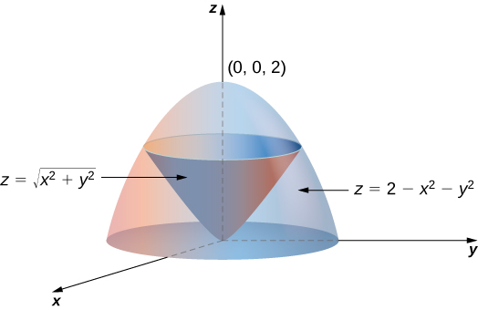{: #CNX_Calc_Figure_15_05_004}

{: data-number-style="lower-alpha"}

1.  The cone is of radius 1 where it meets the paraboloid. Since
    <math xmlns="http://www.w3.org/1998/Math/MathML"><mrow><mi>z</mi><mo>=</mo><mn>2</mn><mo>−</mo><msup><mi>x</mi><mn>2</mn></msup><mo>−</mo><msup><mi>y</mi><mn>2</mn></msup><mo>=</mo><mn>2</mn><mo>−</mo><msup><mi>r</mi><mn>2</mn></msup></mrow></math>
    
    and
    <math xmlns="http://www.w3.org/1998/Math/MathML"><mrow><mi>z</mi><mo>=</mo><msqrt><mrow><msup><mi>x</mi><mn>2</mn></msup><mo>+</mo><msup><mi>y</mi><mn>2</mn></msup></mrow></msqrt><mo>=</mo><mi>r</mi></mrow></math>
    
    (assuming
    <math xmlns="http://www.w3.org/1998/Math/MathML"><mi>r</mi></math>
    
    is nonnegative), we have
    <math xmlns="http://www.w3.org/1998/Math/MathML"><mrow><mn>2</mn><mo>−</mo><msup><mi>r</mi><mn>2</mn></msup><mo>=</mo><mi>r</mi><mo>.</mo></mrow></math>
    
    Solving, we have
    <math xmlns="http://www.w3.org/1998/Math/MathML"><mrow><msup><mi>r</mi><mn>2</mn></msup><mo>+</mo><mi>r</mi><mo>−</mo><mn>2</mn><mo>=</mo><mrow><mo>(</mo><mrow><mi>r</mi><mo>+</mo><mn>2</mn></mrow><mo>)</mo></mrow><mrow><mo>(</mo><mrow><mi>r</mi><mo>−</mo><mn>1</mn></mrow><mo>)</mo></mrow><mo>=</mo><mn>0</mn><mo>.</mo></mrow></math>
    
    Since
    <math xmlns="http://www.w3.org/1998/Math/MathML"><mrow><mi>r</mi><mo>≥</mo><mn>0</mn><mo>,</mo></mrow></math>
    
    we have
    <math xmlns="http://www.w3.org/1998/Math/MathML"><mrow><mi>r</mi><mo>=</mo><mn>1</mn><mo>.</mo></mrow></math>
    
    Therefore
    <math xmlns="http://www.w3.org/1998/Math/MathML"><mrow><mi>z</mi><mo>=</mo><mn>1</mn><mo>.</mo></mrow></math>
    
    So the intersection of these two surfaces is a circle of radius
    <math xmlns="http://www.w3.org/1998/Math/MathML"><mn>1</mn></math>
    
    in the plane
    <math xmlns="http://www.w3.org/1998/Math/MathML"><mrow><mi>z</mi><mo>=</mo><mn>1</mn><mo>.</mo></mrow></math>
    
    The cone is the lower bound for
    <math xmlns="http://www.w3.org/1998/Math/MathML"><mi>z</mi></math>
    
    and the paraboloid is the upper bound. The projection of the region onto the
    <math xmlns="http://www.w3.org/1998/Math/MathML"><mrow><mi>x</mi><mi>y</mi></mrow></math>
    
    -plane is the circle of radius
    <math xmlns="http://www.w3.org/1998/Math/MathML"><mn>1</mn></math>
    
    centered at the origin.
    * * *
    {: data-type="newline"}
    
    Thus, we can describe the region as
    * * *
    {: data-type="newline"}
    
    

    <math xmlns="http://www.w3.org/1998/Math/MathML"><mrow><mi>E</mi><mo>=</mo><mrow><mo>{</mo><mrow><mrow><mrow><mrow><mo>(</mo><mrow><mi>r</mi><mo>,</mo><mi>θ</mi><mo>,</mo><mi>z</mi></mrow><mo>)</mo></mrow></mrow><mo>\|</mo></mrow><mn>0</mn><mo>≤</mo><mi>θ</mi><mo>≤</mo><mn>2</mn><mi>π</mi><mo>,</mo><mn>0</mn><mo>≤</mo><mi>r</mi><mo>≤</mo><mn>1</mn><mo>,</mo><mi>r</mi><mo>≤</mo><mi>z</mi><mo>≤</mo><mn>2</mn><mo>−</mo><msup><mi>r</mi><mn>2</mn></msup></mrow><mo>}</mo></mrow><mo>.</mo></mrow></math>
    

    
    * * *
    {: data-type="newline"}
    
    Hence the integral for the volume is
    * * *
    {: data-type="newline"}
    
    

    <math xmlns="http://www.w3.org/1998/Math/MathML"><mrow><mi>V</mi><mo>=</mo><mstyle displaystyle="true"><mrow><munderover><mo stretchy="false">∫</mo><mrow><mi>θ</mi><mo>=</mo><mn>0</mn></mrow><mrow><mi>θ</mi><mo>=</mo><mn>2</mn><mi>π</mi></mrow></munderover><mspace width="0.2em" /><mrow><mstyle displaystyle="true"><mrow><munderover><mo stretchy="false">∫</mo><mrow><mi>r</mi><mo>=</mo><mn>0</mn></mrow><mrow><mi>r</mi><mo>=</mo><mn>1</mn></mrow></munderover><mspace width="0.2em" /><mrow><mstyle displaystyle="true"><mrow><munderover><mo stretchy="false">∫</mo><mrow><mi>z</mi><mo>=</mo><mi>r</mi></mrow><mrow><mi>z</mi><mo>=</mo><mn>2</mn><mo>−</mo><msup><mi>r</mi><mn>2</mn></msup></mrow></munderover><mrow><mi>r</mi><mspace width="0.2em" /><mi>d</mi><mi>z</mi><mspace width="0.2em" /><mi>d</mi><mi>r</mi><mspace width="0.2em" /><mi>d</mi><mi>θ</mi></mrow></mrow></mstyle></mrow></mrow></mstyle></mrow></mrow></mstyle><mo>.</mo></mrow></math>
    

2.  We can also write the cone surface as
    <math xmlns="http://www.w3.org/1998/Math/MathML"><mrow><mi>r</mi><mo>=</mo><mi>z</mi></mrow></math>
    
    and the paraboloid as
    <math xmlns="http://www.w3.org/1998/Math/MathML"><mrow><msup><mi>r</mi><mn>2</mn></msup><mo>=</mo><mn>2</mn><mo>−</mo><mi>z</mi><mo>.</mo></mrow></math>
    
    The lower bound for
    <math xmlns="http://www.w3.org/1998/Math/MathML"><mi>r</mi></math>
    
    is zero, but the upper bound is sometimes the cone and the other times it is the paraboloid. The plane
    <math xmlns="http://www.w3.org/1998/Math/MathML"><mrow><mi>z</mi><mo>=</mo><mn>1</mn></mrow></math>
    
    divides the region into two regions. Then the region can be described as
    * * *
    {: data-type="newline"}
    
    

    <math xmlns="http://www.w3.org/1998/Math/MathML"><mtable><mtr><mtd columnalign="right"><mi>E</mi></mtd><mtd columnalign="left"><mo>=</mo><mrow><mo>{</mo><mrow><mrow><mrow><mrow><mo>(</mo><mrow><mi>r</mi><mo>,</mo><mi>θ</mi><mo>,</mo><mi>z</mi></mrow><mo>)</mo></mrow></mrow><mo>\|</mo></mrow><mn>0</mn><mo>≤</mo><mi>θ</mi><mo>≤</mo><mn>2</mn><mi>π</mi><mo>,</mo><mn>0</mn><mo>≤</mo><mi>z</mi><mo>≤</mo><mn>1</mn><mo>,</mo><mn>0</mn><mo>≤</mo><mi>r</mi><mo>≤</mo><mi>z</mi></mrow><mo>}</mo></mrow></mtd></mtr><mtr><mtd /><mtd columnalign="left"><mo>∪</mo><mrow><mo>{</mo><mrow><mrow><mrow><mrow><mo>(</mo><mrow><mi>r</mi><mo>,</mo><mi>θ</mi><mo>,</mo><mi>z</mi></mrow><mo>)</mo></mrow></mrow><mo>\|</mo></mrow><mn>0</mn><mo>≤</mo><mi>θ</mi><mo>≤</mo><mn>2</mn><mi>π</mi><mo>,</mo><mn>1</mn><mo>≤</mo><mi>z</mi><mo>≤</mo><mn>2</mn><mo>,</mo><mn>0</mn><mo>≤</mo><mi>r</mi><mo>≤</mo><msqrt><mrow><mn>2</mn><mo>−</mo><mi>z</mi></mrow></msqrt></mrow><mo>}</mo></mrow><mo>.</mo></mtd></mtr></mtable></math>
    

    
    * * *
    {: data-type="newline"}
    
    Now the integral for the volume becomes
    * * *
    {: data-type="newline"}
    
    

    <math xmlns="http://www.w3.org/1998/Math/MathML"><mrow><mi>V</mi><mo>=</mo><mstyle displaystyle="true"><mrow><munderover><mo stretchy="false">∫</mo><mrow><mi>θ</mi><mo>=</mo><mn>0</mn></mrow><mrow><mi>θ</mi><mo>=</mo><mn>2</mn><mi>π</mi></mrow></munderover><mspace width="0.2em" /><mrow><mstyle displaystyle="true"><mrow><munderover><mo stretchy="false">∫</mo><mrow><mi>z</mi><mo>=</mo><mn>0</mn></mrow><mrow><mi>z</mi><mo>=</mo><mn>1</mn></mrow></munderover><mspace width="0.2em" /><mrow><mstyle displaystyle="true"><mrow><munderover><mo stretchy="false">∫</mo><mrow><mi>r</mi><mo>=</mo><mn>0</mn></mrow><mrow><mi>r</mi><mo>=</mo><mi>z</mi></mrow></munderover><mrow><mi>r</mi><mspace width="0.2em" /><mi>d</mi><mi>r</mi><mspace width="0.2em" /><mi>d</mi><mi>z</mi><mspace width="0.2em" /><mi>d</mi><mi>θ</mi><mo>+</mo></mrow></mrow></mstyle></mrow></mrow></mstyle></mrow></mrow></mstyle><mstyle displaystyle="true"><mrow><munderover><mo stretchy="false">∫</mo><mrow><mi>θ</mi><mo>=</mo><mn>0</mn></mrow><mrow><mi>θ</mi><mo>=</mo><mn>2</mn><mi>π</mi></mrow></munderover><mspace width="0.2em" /><mrow><mstyle displaystyle="true"><mrow><munderover><mo stretchy="false">∫</mo><mrow><mi>z</mi><mo>=</mo><mn>1</mn></mrow><mrow><mi>z</mi><mo>=</mo><mn>2</mn></mrow></munderover><mspace width="0.2em" /><mrow><mstyle displaystyle="true"><mrow><munderover><mo stretchy="false">∫</mo><mrow><mi>r</mi><mo>=</mo><mn>0</mn></mrow><mrow><mi>r</mi><mo>=</mo><msqrt><mrow><mn>2</mn><mo>−</mo><mi>z</mi></mrow></msqrt></mrow></munderover><mrow><mi>r</mi><mspace width="0.2em" /><mi>d</mi><mi>r</mi><mspace width="0.2em" /><mi>d</mi><mi>z</mi><mspace width="0.2em" /><mi>d</mi><mi>θ</mi></mrow></mrow></mstyle></mrow></mrow></mstyle></mrow></mrow></mstyle><mo>.</mo></mrow></math>
    

{: data-number-style="lower-alpha"}

Redo the previous example with the order of integration <math xmlns="http://www.w3.org/1998/Math/MathML"><mrow><mi>d</mi><mi>θ</mi><mspace width="0.2em" /><mi>d</mi><mi>z</mi><mspace width="0.2em" /><mi>d</mi><mi>r</mi><mo>.</mo></mrow></math>

<math xmlns="http://www.w3.org/1998/Math/MathML"><mrow><mi>E</mi><mo>=</mo><mrow><mo>{</mo><mrow><mrow><mrow><mrow><mo>(</mo><mrow><mi>r</mi><mo>,</mo><mi>θ</mi><mo>,</mo><mi>z</mi></mrow><mo>)</mo></mrow></mrow><mo>\|</mo></mrow><mn>0</mn><mo>≤</mo><mi>θ</mi><mo>≤</mo><mn>2</mn><mi>π</mi><mo>,</mo><mn>0</mn><mo>≤</mo><mi>z</mi><mo>≤</mo><mn>1</mn><mo>,</mo><mi>z</mi><mo>≤</mo><mi>r</mi><mo>≤</mo><mn>2</mn><mo>−</mo><msup><mi>z</mi><mn>2</mn></msup></mrow><mo>}</mo></mrow></mrow></math>

 and <math xmlns="http://www.w3.org/1998/Math/MathML"><mrow><mi>V</mi><mo>=</mo><mstyle displaystyle="true"><mrow><munderover><mo stretchy="false">∫</mo><mrow><mi>r</mi><mo>=</mo><mn>0</mn></mrow><mrow><mi>r</mi><mo>=</mo><mn>1</mn></mrow></munderover><mspace width="0.2em" /><mrow><mstyle displaystyle="true"><mrow><munderover><mo stretchy="false">∫</mo><mrow><mi>z</mi><mo>=</mo><mi>r</mi></mrow><mrow><mi>z</mi><mo>=</mo><mn>2</mn><mo>−</mo><msup><mi>r</mi><mn>2</mn></msup></mrow></munderover><mspace width="0.2em" /><mrow><mstyle displaystyle="true"><mrow><munderover><mo stretchy="false">∫</mo><mrow><mi>θ</mi><mo>=</mo><mn>0</mn></mrow><mrow><mi>θ</mi><mo>=</mo><mn>2</mn><mi>π</mi></mrow></munderover><mrow><mi>r</mi><mspace width="0.2em" /><mi>d</mi><mi>θ</mi><mspace width="0.2em" /><mi>d</mi><mi>z</mi><mspace width="0.2em" /><mi>d</mi><mi>r</mi></mrow></mrow></mstyle></mrow></mrow></mstyle></mrow></mrow></mstyle><mo>.</mo></mrow></math>

Hint

Note that <math xmlns="http://www.w3.org/1998/Math/MathML"><mi>θ</mi></math>

 is independent of <math xmlns="http://www.w3.org/1998/Math/MathML"><mi>r</mi></math>

 and <math xmlns="http://www.w3.org/1998/Math/MathML"><mrow><mi>z</mi><mo>.</mo></mrow></math>

Finding a Volume with Triple Integrals in Two Ways

Let *E* be the region bounded below by the <math xmlns="http://www.w3.org/1998/Math/MathML"><mrow><mi>r</mi><mi>θ</mi></mrow></math>

-plane, above by the sphere <math xmlns="http://www.w3.org/1998/Math/MathML"><mrow><msup><mi>x</mi><mn>2</mn></msup><mo>+</mo><msup><mi>y</mi><mn>2</mn></msup><mo>+</mo><msup><mi>z</mi><mn>2</mn></msup><mo>=</mo><mn>4</mn><mo>,</mo></mrow></math>

 and on the sides by the cylinder <math xmlns="http://www.w3.org/1998/Math/MathML"><mrow><msup><mi>x</mi><mn>2</mn></msup><mo>+</mo><msup><mi>y</mi><mn>2</mn></msup><mo>=</mo><mn>1</mn></mrow></math>

 ([[link]](#CNX_Calc_Figure_15_05_005)). Set up a triple integral in cylindrical coordinates to find the volume of the region using the following orders of integration, and in each case find the volume and check that the answers are the same:

1.  <math xmlns="http://www.w3.org/1998/Math/MathML"><mrow><mi>d</mi><mi>z</mi><mspace width="0.2em" /><mi>d</mi><mi>r</mi><mspace width="0.2em" /><mi>d</mi><mi>θ</mi></mrow></math>

2.  <math xmlns="http://www.w3.org/1998/Math/MathML"><mrow><mi>d</mi><mi>r</mi><mspace width="0.2em" /><mi>d</mi><mi>z</mi><mspace width="0.2em" /><mi>d</mi><mi>θ</mi><mo>.</mo></mrow></math>
    
    * * *
    {: data-type="newline"}
    
    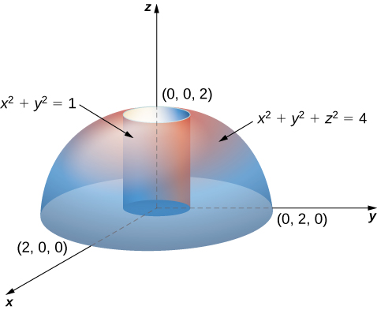{: #CNX_Calc_Figure_15_05_005}

{: data-number-style="lower-alpha"}

1.  Note that the equation for the sphere is
    * * *
    {: data-type="newline"}
    
    

    <math xmlns="http://www.w3.org/1998/Math/MathML"><mrow><msup><mi>x</mi><mn>2</mn></msup><mo>+</mo><msup><mi>y</mi><mn>2</mn></msup><mo>+</mo><msup><mi>z</mi><mn>2</mn></msup><mo>=</mo><mn>4</mn><mspace width="0.2em" /><mtext>or</mtext><mspace width="0.2em" /><msup><mi>r</mi><mn>2</mn></msup><mo>+</mo><msup><mi>z</mi><mn>2</mn></msup><mo>=</mo><mn>4</mn></mrow></math>
    

    
    * * *
    {: data-type="newline"}
    
    and the equation for the cylinder is
    * * *
    {: data-type="newline"}
    
    

    <math xmlns="http://www.w3.org/1998/Math/MathML"><mrow><msup><mi>x</mi><mn>2</mn></msup><mo>+</mo><msup><mi>y</mi><mn>2</mn></msup><mo>=</mo><mn>1</mn><mspace width="0.2em" /><mtext>or</mtext><mspace width="0.2em" /><msup><mi>r</mi><mn>2</mn></msup><mo>=</mo><mn>1</mn><mo>.</mo></mrow></math>
    

    
    * * *
    {: data-type="newline"}
    
    Thus, we have for the region
    <math xmlns="http://www.w3.org/1998/Math/MathML"><mi>E</mi></math>
    
    * * *
    {: data-type="newline"}
    
    

    <math xmlns="http://www.w3.org/1998/Math/MathML"><mrow><mi>E</mi><mo>=</mo><mrow><mo>{</mo><mrow><mrow><mrow><mrow><mo>(</mo><mrow><mi>r</mi><mo>,</mo><mi>θ</mi><mo>,</mo><mi>z</mi></mrow><mo>)</mo></mrow></mrow><mo>\|</mo></mrow><mn>0</mn><mo>≤</mo><mi>z</mi><mo>≤</mo><msqrt><mrow><mn>4</mn><mo>−</mo><msup><mi>r</mi><mn>2</mn></msup></mrow></msqrt><mo>,</mo><mn>0</mn><mo>≤</mo><mi>r</mi><mo>≤</mo><mn>1</mn><mo>,</mo><mn>0</mn><mo>≤</mo><mi>θ</mi><mo>≤</mo><mn>2</mn><mi>π</mi></mrow><mo>}</mo></mrow></mrow></math>
    

    
    * * *
    {: data-type="newline"}
    
    Hence the integral for the volume is
    * * *
    {: data-type="newline"}
    
    

    <math xmlns="http://www.w3.org/1998/Math/MathML"><mtable><mtr><mtd columnalign="right"><mi>V</mi><mrow><mo>(</mo><mi>E</mi><mo>)</mo></mrow></mtd><mtd columnalign="left"><mo>=</mo><mstyle displaystyle="true"><mrow><munderover><mo stretchy="false">∫</mo><mrow><mi>θ</mi><mo>=</mo><mn>0</mn></mrow><mrow><mi>θ</mi><mo>=</mo><mn>2</mn><mi>π</mi></mrow></munderover><mspace width="0.2em" /><mrow><mstyle displaystyle="true"><mrow><munderover><mo stretchy="false">∫</mo><mrow><mi>r</mi><mo>=</mo><mn>0</mn></mrow><mrow><mi>r</mi><mo>=</mo><mn>1</mn></mrow></munderover><mspace width="0.2em" /><mrow><mstyle displaystyle="true"><mrow><munderover><mo stretchy="false">∫</mo><mrow><mi>z</mi><mo>=</mo><mn>0</mn></mrow><mrow><mi>z</mi><mo>=</mo><msqrt><mrow><mn>4</mn><mo>−</mo><msup><mi>r</mi><mn>2</mn></msup></mrow></msqrt></mrow></munderover><mrow><mi>r</mi><mspace width="0.2em" /><mi>d</mi><mi>z</mi><mspace width="0.2em" /><mi>d</mi><mi>r</mi><mspace width="0.2em" /><mi>d</mi><mi>θ</mi></mrow></mrow></mstyle></mrow></mrow></mstyle></mrow></mrow></mstyle></mtd></mtr><mtr><mtd /><mtd columnalign="left"><mo>=</mo><mstyle displaystyle="true"><mrow><munderover><mo stretchy="false">∫</mo><mrow><mi>θ</mi><mo>=</mo><mn>0</mn></mrow><mrow><mi>θ</mi><mo>=</mo><mn>2</mn><mi>π</mi></mrow></munderover><mspace width="0.2em" /><mrow><mstyle displaystyle="true"><mrow><munderover><mo stretchy="false">∫</mo><mrow><mi>r</mi><mo>=</mo><mn>0</mn></mrow><mrow><mi>r</mi><mo>=</mo><mn>1</mn></mrow></munderover><mrow><mrow><mo>[</mo><mrow><msubsup><mrow><mrow><mrow><mi>r</mi><mi>z</mi></mrow><mo>\|</mo></mrow></mrow><mrow><mi>z</mi><mo>=</mo><mn>0</mn></mrow><mrow><mi>z</mi><mo>=</mo><msqrt><mrow><mn>4</mn><mo>−</mo><msup><mi>r</mi><mn>2</mn></msup></mrow></msqrt></mrow></msubsup></mrow><mo>]</mo></mrow></mrow></mrow></mstyle></mrow></mrow></mstyle><mi>d</mi><mi>r</mi><mspace width="0.2em" /><mi>d</mi><mi>θ</mi><mo>=</mo><mstyle displaystyle="true"><mrow><munderover><mo stretchy="false">∫</mo><mrow><mi>θ</mi><mo>=</mo><mn>0</mn></mrow><mrow><mi>θ</mi><mo>=</mo><mn>2</mn><mi>π</mi></mrow></munderover><mspace width="0.2em" /><mrow><mstyle displaystyle="true"><mrow><munderover><mo stretchy="false">∫</mo><mrow><mi>r</mi><mo>=</mo><mn>0</mn></mrow><mrow><mi>r</mi><mo>=</mo><mn>1</mn></mrow></munderover><mrow><mrow><mo>(</mo><mrow><mi>r</mi><msqrt><mrow><mn>4</mn><mo>−</mo><msup><mi>r</mi><mn>2</mn></msup></mrow></msqrt></mrow><mo>)</mo></mrow></mrow></mrow></mstyle></mrow></mrow></mstyle><mi>d</mi><mi>r</mi><mspace width="0.2em" /><mi>d</mi><mi>θ</mi></mtd></mtr><mtr><mtd /><mtd columnalign="left"><mo>=</mo><mstyle displaystyle="true"><mrow><munderover><mo stretchy="false">∫</mo><mn>0</mn><mrow><mn>2</mn><mi>π</mi></mrow></munderover><mrow><mrow><mo>(</mo><mrow><mfrac><mn>8</mn><mn>3</mn></mfrac><mo>−</mo><msqrt><mn>3</mn></msqrt></mrow><mo>)</mo></mrow><mi>d</mi><mi>θ</mi><mo>=</mo><mn>2</mn><mi>π</mi><mrow><mo>(</mo><mrow><mfrac><mn>8</mn><mn>3</mn></mfrac><mo>−</mo><msqrt><mn>3</mn></msqrt></mrow><mo>)</mo></mrow></mrow></mrow></mstyle><mspace width="0.2em" /><mtext>cubic units</mtext><mtext>.</mtext></mtd></mtr></mtable></math>
    

2.  Since the sphere is
    <math xmlns="http://www.w3.org/1998/Math/MathML"><mrow><msup><mi>x</mi><mn>2</mn></msup><mo>+</mo><msup><mi>y</mi><mn>2</mn></msup><mo>+</mo><msup><mi>z</mi><mn>2</mn></msup><mo>=</mo><mn>4</mn><mo>,</mo></mrow></math>
    
    which is
    <math xmlns="http://www.w3.org/1998/Math/MathML"><mrow><msup><mi>r</mi><mn>2</mn></msup><mo>+</mo><msup><mi>z</mi><mn>2</mn></msup><mo>=</mo><mn>4</mn><mo>,</mo></mrow></math>
    
    and the cylinder is
    <math xmlns="http://www.w3.org/1998/Math/MathML"><mrow><msup><mi>x</mi><mn>2</mn></msup><mo>+</mo><msup><mi>y</mi><mn>2</mn></msup><mo>=</mo><mn>1</mn><mo>,</mo></mrow></math>
    
    which is
    <math xmlns="http://www.w3.org/1998/Math/MathML"><mrow><msup><mi>r</mi><mn>2</mn></msup><mo>=</mo><mn>1</mn><mo>,</mo></mrow></math>
    
    we have
    <math xmlns="http://www.w3.org/1998/Math/MathML"><mrow><mn>1</mn><mo>+</mo><msup><mi>z</mi><mn>2</mn></msup><mo>=</mo><mn>4</mn><mo>,</mo></mrow></math>
    
    that is,
    <math xmlns="http://www.w3.org/1998/Math/MathML"><mrow><msup><mi>z</mi><mn>2</mn></msup><mo>=</mo><mn>3</mn><mo>.</mo></mrow></math>
    
    Thus we have two regions, since the sphere and the cylinder intersect at
    <math xmlns="http://www.w3.org/1998/Math/MathML"><mrow><mrow><mo>(</mo><mrow><mn>1</mn><mo>,</mo><msqrt><mn>3</mn></msqrt></mrow><mo>)</mo></mrow></mrow></math>
    
    in the
    <math xmlns="http://www.w3.org/1998/Math/MathML"><mrow><mi>r</mi><mi>z</mi></mrow></math>
    
    -plane
    * * *
    {: data-type="newline"}
    
    

    <math xmlns="http://www.w3.org/1998/Math/MathML"><mrow><msub><mi>E</mi><mn>1</mn></msub><mo>=</mo><mrow><mo>{</mo><mrow><mrow><mrow><mrow><mo>(</mo><mrow><mi>r</mi><mo>,</mo><mi>θ</mi><mo>,</mo><mi>z</mi></mrow><mo>)</mo></mrow></mrow><mo>\|</mo></mrow><mn>0</mn><mo>≤</mo><mi>r</mi><mo>≤</mo><msqrt><mrow><mn>4</mn><mo>−</mo><msup><mi>r</mi><mn>2</mn></msup></mrow></msqrt><mo>,</mo><msqrt><mn>3</mn></msqrt><mo>≤</mo><mi>z</mi><mo>≤</mo><mn>2</mn><mo>,</mo><mn>0</mn><mo>≤</mo><mi>θ</mi><mo>≤</mo><mn>2</mn><mi>π</mi></mrow><mo>}</mo></mrow></mrow></math>
    

    
    * * *
    {: data-type="newline"}
    
    and
    * * *
    {: data-type="newline"}
    
    

    <math xmlns="http://www.w3.org/1998/Math/MathML"><mrow><msub><mi>E</mi><mn>2</mn></msub><mo>=</mo><mrow><mo>{</mo><mrow><mrow><mrow><mrow><mo>(</mo><mrow><mi>r</mi><mo>,</mo><mi>θ</mi><mo>,</mo><mi>z</mi></mrow><mo>)</mo></mrow></mrow><mo>\|</mo></mrow><mn>0</mn><mo>≤</mo><mi>r</mi><mo>≤</mo><mn>1</mn><mo>,</mo><mn>0</mn><mo>≤</mo><mi>z</mi><mo>≤</mo><msqrt><mn>3</mn></msqrt><mo>,</mo><mn>0</mn><mo>≤</mo><mi>θ</mi><mo>≤</mo><mn>2</mn><mi>π</mi></mrow><mo>}</mo></mrow><mo>.</mo></mrow></math>
    

    
    * * *
    {: data-type="newline"}
    
    Hence the integral for the volume is
    * * *
    {: data-type="newline"}
    
    

    <math xmlns="http://www.w3.org/1998/Math/MathML"><mtable><mtr><mtd columnalign="right"><mi>V</mi><mrow><mo>(</mo><mi>E</mi><mo>)</mo></mrow></mtd><mtd columnalign="left"><mo>=</mo><mstyle displaystyle="true"><mrow><munderover><mo stretchy="false">∫</mo><mrow><mi>θ</mi><mo>=</mo><mn>0</mn></mrow><mrow><mi>θ</mi><mo>=</mo><mn>2</mn><mi>π</mi></mrow></munderover><mspace width="0.2em" /><mrow><mstyle displaystyle="true"><mrow><munderover><mo stretchy="false">∫</mo><mrow><mi>z</mi><mo>=</mo><msqrt><mn>3</mn></msqrt></mrow><mrow><mi>z</mi><mo>=</mo><mn>2</mn></mrow></munderover><mspace width="0.2em" /><mrow><mstyle displaystyle="true"><mrow><munderover><mo stretchy="false">∫</mo><mrow><mi>r</mi><mo>=</mo><mn>0</mn></mrow><mrow><mi>r</mi><mo>=</mo><msqrt><mrow><mn>4</mn><mo>−</mo><msup><mi>r</mi><mn>2</mn></msup></mrow></msqrt></mrow></munderover><mrow><mi>r</mi><mspace width="0.2em" /><mi>d</mi><mi>r</mi><mspace width="0.2em" /><mi>d</mi><mi>z</mi><mspace width="0.2em" /><mi>d</mi><mi>θ</mi></mrow></mrow></mstyle></mrow></mrow></mstyle></mrow></mrow></mstyle><mo>+</mo><mstyle displaystyle="true"><mrow><munderover><mo stretchy="false">∫</mo><mrow><mi>θ</mi><mo>=</mo><mn>0</mn></mrow><mrow><mi>θ</mi><mo>=</mo><mn>2</mn><mi>π</mi></mrow></munderover><mspace width="0.2em" /><mrow><mstyle displaystyle="true"><mrow><munderover><mo stretchy="false">∫</mo><mrow><mi>z</mi><mo>=</mo><mn>0</mn></mrow><mrow><mi>z</mi><mo>=</mo><msqrt><mn>3</mn></msqrt></mrow></munderover><mspace width="0.2em" /><mrow><mstyle displaystyle="true"><mrow><munderover><mo stretchy="false">∫</mo><mrow><mi>r</mi><mo>=</mo><mn>0</mn></mrow><mrow><mi>r</mi><mo>=</mo><mn>1</mn></mrow></munderover><mrow><mi>r</mi><mspace width="0.2em" /><mi>d</mi><mi>r</mi><mspace width="0.2em" /><mi>d</mi><mi>z</mi><mspace width="0.2em" /><mi>d</mi><mi>θ</mi></mrow></mrow></mstyle></mrow></mrow></mstyle></mrow></mrow></mstyle></mtd></mtr><mtr><mtd /><mtd columnalign="left"><mo>=</mo><msqrt><mn>3</mn></msqrt><mi>π</mi><mo>+</mo><mrow><mo>(</mo><mrow><mfrac><mrow><mn>16</mn></mrow><mn>3</mn></mfrac><mo>−</mo><mn>3</mn><msqrt><mn>3</mn></msqrt></mrow><mo>)</mo></mrow><mi>π</mi><mo>=</mo><mn>2</mn><mi>π</mi><mrow><mo>(</mo><mrow><mfrac><mn>8</mn><mn>3</mn></mfrac><mo>−</mo><msqrt><mn>3</mn></msqrt></mrow><mo>)</mo></mrow><mspace width="0.2em" /><mtext>cubic units</mtext><mo>.</mo></mtd></mtr></mtable></math>
    

{: data-number-style="lower-alpha"}

Redo the previous example with the order of integration <math xmlns="http://www.w3.org/1998/Math/MathML"><mrow><mi>d</mi><mi>θ</mi><mspace width="0.2em" /><mi>d</mi><mi>z</mi><mspace width="0.2em" /><mi>d</mi><mi>r</mi><mo>.</mo></mrow></math>

<math xmlns="http://www.w3.org/1998/Math/MathML"><mrow><msub><mi>E</mi><mn>2</mn></msub><mo>=</mo><mrow><mo>{</mo><mrow><mrow><mrow><mrow><mo>(</mo><mrow><mi>r</mi><mo>,</mo><mi>θ</mi><mo>,</mo><mi>z</mi></mrow><mo>)</mo></mrow></mrow><mo>\|</mo></mrow><mn>0</mn><mo>≤</mo><mi>θ</mi><mo>≤</mo><mn>2</mn><mi>π</mi><mo>,</mo><mn>0</mn><mo>≤</mo><mi>r</mi><mo>≤</mo><mn>1</mn><mo>,</mo><mi>r</mi><mo>≤</mo><mi>z</mi><mo>≤</mo><msqrt><mrow><mn>4</mn><mo>−</mo><msup><mi>r</mi><mn>2</mn></msup></mrow></msqrt></mrow><mo>}</mo></mrow></mrow></math>

 and <math xmlns="http://www.w3.org/1998/Math/MathML"><mrow><mi>V</mi><mo>=</mo><mstyle displaystyle="true"><mrow><munderover><mo stretchy="false">∫</mo><mrow><mi>r</mi><mo>=</mo><mn>0</mn></mrow><mrow><mi>r</mi><mo>=</mo><mn>1</mn></mrow></munderover><mspace width="0.2em" /><mrow><mstyle displaystyle="true"><mrow><munderover><mo stretchy="false">∫</mo><mrow><mi>z</mi><mo>=</mo><mi>r</mi></mrow><mrow><mi>z</mi><mo>=</mo><msqrt><mrow><mn>4</mn><mo>−</mo><msup><mi>r</mi><mn>2</mn></msup></mrow></msqrt></mrow></munderover><mspace width="0.2em" /><mrow><mstyle displaystyle="true"><mrow><munderover><mo stretchy="false">∫</mo><mrow><mi>θ</mi><mo>=</mo><mn>0</mn></mrow><mrow><mi>θ</mi><mo>=</mo><mn>2</mn><mi>π</mi></mrow></munderover><mrow><mi>r</mi><mspace width="0.2em" /><mi>d</mi><mi>θ</mi><mspace width="0.2em" /><mi>d</mi><mi>z</mi><mspace width="0.2em" /><mi>d</mi><mi>r</mi></mrow></mrow></mstyle></mrow></mrow></mstyle></mrow></mrow></mstyle><mo>.</mo></mrow></math>

Hint

A figure can be helpful. Note that <math xmlns="http://www.w3.org/1998/Math/MathML"><mi>θ</mi></math>

 is independent of <math xmlns="http://www.w3.org/1998/Math/MathML"><mi>r</mi></math>

 and <math xmlns="http://www.w3.org/1998/Math/MathML"><mrow><mi>z</mi><mo>.</mo></mrow></math>

### Review of Spherical Coordinates

In three-dimensional space <math xmlns="http://www.w3.org/1998/Math/MathML"><mrow><msup><mi>ℝ</mi><mn>3</mn></msup></mrow></math>

 in the spherical coordinate system, we specify a point <math xmlns="http://www.w3.org/1998/Math/MathML"><mi>P</mi></math>

 by its distance <math xmlns="http://www.w3.org/1998/Math/MathML"><mi>ρ</mi></math>

 from the origin, the polar angle <math xmlns="http://www.w3.org/1998/Math/MathML"><mi>θ</mi></math>

 from the positive <math xmlns="http://www.w3.org/1998/Math/MathML"><mrow><mi>x</mi><mtext>-axis</mtext></mrow></math>

 (same as in the cylindrical coordinate system), and the angle <math xmlns="http://www.w3.org/1998/Math/MathML"><mi>φ</mi></math>

 from the positive <math xmlns="http://www.w3.org/1998/Math/MathML"><mrow><mi>z</mi><mtext>-axis</mtext></mrow></math>

 and the line <math xmlns="http://www.w3.org/1998/Math/MathML"><mrow><mi>O</mi><mi>P</mi></mrow></math>

 ([\[link\]](#CNX_Calc_Figure_15_05_006)). Note that <math xmlns="http://www.w3.org/1998/Math/MathML"><mrow><mi>ρ</mi><mo>≥</mo><mn>0</mn></mrow></math>

 and <math xmlns="http://www.w3.org/1998/Math/MathML"><mrow><mn>0</mn><mo>≤</mo><mi>φ</mi><mo>≤</mo><mi>π</mi><mo>.</mo></mrow></math>

 (Refer to [Cylindrical and Spherical Coordinates](/m53875){: .target-chapter} for a review.) Spherical coordinates are useful for triple integrals over regions that are symmetric with respect to the origin.

 {: #CNX_Calc_Figure_15_05_006}

Recall the relationships that connect rectangular coordinates with spherical coordinates.

From spherical coordinates to rectangular coordinates:

<math xmlns="http://www.w3.org/1998/Math/MathML"><mrow><mi>x</mi><mo>=</mo><mi>ρ</mi><mspace width="0.2em" /><mtext>sin</mtext><mspace width="0.2em" /><mi>φ</mi><mspace width="0.2em" /><mtext>cos</mtext><mspace width="0.2em" /><mi>θ</mi><mo>,</mo><mi>y</mi><mo>=</mo><mi>ρ</mi><mspace width="0.2em" /><mtext>sin</mtext><mspace width="0.2em" /><mi>φ</mi><mspace width="0.2em" /><mtext>sin</mtext><mspace width="0.2em" /><mi>θ</mi><mo>,</mo><mspace width="0.2em" /><mtext>and</mtext><mspace width="0.2em" /><mi>z</mi><mo>=</mo><mi>ρ</mi><mspace width="0.2em" /><mtext>cos</mtext><mspace width="0.2em" /><mi>φ</mi><mo>.</mo></mrow></math>

From rectangular coordinates to spherical coordinates:

<math xmlns="http://www.w3.org/1998/Math/MathML"><mrow><msup><mi>ρ</mi><mn>2</mn></msup><mo>=</mo><msup><mi>x</mi><mn>2</mn></msup><mo>+</mo><msup><mi>y</mi><mn>2</mn></msup><mo>+</mo><msup><mi>z</mi><mn>2</mn></msup><mo>,</mo><mtext>tan</mtext><mspace width="0.2em" /><mi>θ</mi><mo>=</mo><mfrac><mi>y</mi><mi>x</mi></mfrac><mo>,</mo><mi>φ</mi><mo>=</mo><mtext>arccos</mtext><mrow><mo>(</mo><mrow><mfrac><mi>z</mi><mrow><msqrt><mrow><msup><mi>x</mi><mn>2</mn></msup><mo>+</mo><msup><mi>y</mi><mn>2</mn></msup><mo>+</mo><msup><mi>z</mi><mn>2</mn></msup></mrow></msqrt></mrow></mfrac></mrow><mo>)</mo></mrow><mo>.</mo></mrow></math>

Other relationships that are important to know for conversions are

<math xmlns="http://www.w3.org/1998/Math/MathML"><mtable><mtr><mtd columnalign="left"><mtext>•</mtext></mtd><mtd /><mtd columnalign="left"><mi>r</mi><mo>=</mo><mi>ρ</mi><mspace width="0.2em" /><mtext>sin</mtext><mspace width="0.2em" /><mi>φ</mi></mtd><mtd /><mtd /><mtd /></mtr><mtr><mtd columnalign="left"><mtext>•</mtext></mtd><mtd /><mtd columnalign="left"><mi>θ</mi><mo>=</mo><mi>θ</mi></mtd><mtd /><mtd /><mtd columnalign="left"><mtable><mtr><mtd columnalign="left"><mtext>These equations are used to convert from</mtext></mtd></mtr><mtr><mtd columnalign="left"><mtext>spherical coordinates to cylindrical coordinates</mtext></mtd></mtr></mtable></mtd></mtr><mtr><mtd columnalign="left"><mtext>•</mtext></mtd><mtd /><mtd columnalign="left"><mi>z</mi><mo>=</mo><mi>ρ</mi><mspace width="0.2em" /><mtext>cos</mtext><mspace width="0.2em" /><mi>φ</mi></mtd><mtd /><mtd /><mtd /></mtr></mtable></math>

and

<math xmlns="http://www.w3.org/1998/Math/MathML"><mtable><mtr /><mtr /><mtr><mtd columnalign="left"><mtext>•</mtext></mtd><mtd /><mtd columnalign="left"><mi>ρ</mi><mo>=</mo><msqrt><mrow><msup><mi>r</mi><mn>2</mn></msup><mo>+</mo><msup><mi>z</mi><mn>2</mn></msup></mrow></msqrt></mtd><mtd /><mtd /><mtd /></mtr><mtr><mtd columnalign="left"><mtext>•</mtext></mtd><mtd /><mtd columnalign="left"><mi>θ</mi><mo>=</mo><mi>θ</mi></mtd><mtd /><mtd /><mtd columnalign="left"><mtable><mtr><mtd columnalign="left"><mtext>These equations are used to convert from</mtext></mtd></mtr><mtr><mtd columnalign="left"><mtext>cylindrical coordinates to spherical</mtext></mtd></mtr><mtr><mtd columnalign="left"><mtext>coordinates.</mtext></mtd></mtr></mtable></mtd></mtr><mtr><mtd columnalign="left"><mtext>•</mtext></mtd><mtd /><mtd columnalign="left"><mi>φ</mi><mo>=</mo><mtext>arccos</mtext><mrow><mo>(</mo><mrow><mfrac><mi>z</mi><mrow><msqrt><mrow><msup><mi>r</mi><mn>2</mn></msup><mo>+</mo><msup><mi>z</mi><mn>2</mn></msup></mrow></msqrt></mrow></mfrac></mrow><mo>)</mo></mrow></mtd><mtd /><mtd /><mtd /></mtr></mtable></math>

The following figure shows a few solid regions that are convenient to express in spherical coordinates.

 "){: #CNX_Calc_Figure_15_05_007}

### Integration in Spherical Coordinates

We now establish a triple integral in the spherical coordinate system, as we did before in the cylindrical coordinate system. Let the function <math xmlns="http://www.w3.org/1998/Math/MathML"><mrow><mi>f</mi><mrow><mo>(</mo><mrow><mi>ρ</mi><mo>,</mo><mi>θ</mi><mo>,</mo><mi>φ</mi></mrow><mo>)</mo></mrow></mrow></math>

 be continuous in a bounded spherical box, <math xmlns="http://www.w3.org/1998/Math/MathML"><mrow><mi>B</mi><mo>=</mo><mrow><mo>{</mo><mrow><mrow><mrow><mrow><mo>(</mo><mrow><mi>ρ</mi><mo>,</mo><mi>θ</mi><mo>,</mo><mi>φ</mi></mrow><mo>)</mo></mrow></mrow><mo>\|</mo></mrow><mi>a</mi><mo>≤</mo><mi>ρ</mi><mo>≤</mo><mi>b</mi><mo>,</mo><mi>α</mi><mo>≤</mo><mi>θ</mi><mo>≤</mo><mi>β</mi><mo>,</mo><mi>γ</mi><mo>≤</mo><mi>φ</mi><mo>≤</mo><mi>ψ</mi></mrow><mo>}</mo></mrow><mo>.</mo></mrow></math>

 We then divide each interval into <math xmlns="http://www.w3.org/1998/Math/MathML"><mrow><mi>l</mi><mo>,</mo><mi>m</mi><mspace width="0.2em" /><mtext>and</mtext><mspace width="0.2em" /><mi>n</mi></mrow></math>

 subdivisions such that <math xmlns="http://www.w3.org/1998/Math/MathML"><mrow><mtext>Δ</mtext><mi>ρ</mi><mo>=</mo><mfrac><mrow><mi>b</mi><mo>−</mo><mi>a</mi></mrow><mi>l</mi></mfrac><mo>,</mo><mtext>Δ</mtext><mi>θ</mi><mo>=</mo><mfrac><mrow><mi>β</mi><mo>−</mo><mi>α</mi></mrow><mi>m</mi></mfrac><mo>,</mo><mtext>Δ</mtext><mi>φ</mi><mo>=</mo><mfrac><mrow><mi>ψ</mi><mo>−</mo><mi>γ</mi></mrow><mi>n</mi></mfrac><mo>.</mo></mrow></math>

Now we can illustrate the following theorem for triple integrals in spherical coordinates with <math xmlns="http://www.w3.org/1998/Math/MathML"><mrow><mo stretchy="false">(</mo><msubsup><mi>ρ</mi><mrow><mi>i</mi><mi>j</mi><mi>k</mi></mrow><mo>*</mo></msubsup><mo>,</mo><msubsup><mi>θ</mi><mrow><mi>i</mi><mi>j</mi><mi>k</mi></mrow><mo>*</mo></msubsup><mo>,</mo><msubsup><mi>φ</mi><mrow><mi>i</mi><mi>j</mi><mi>k</mi></mrow><mo>*</mo></msubsup><mo stretchy="false">)</mo></mrow></math>

 being any sample point in the spherical subbox <math xmlns="http://www.w3.org/1998/Math/MathML"><mrow><msub><mi>B</mi><mrow><mi>i</mi><mi>j</mi><mi>k</mi></mrow></msub><mo>.</mo></mrow></math>

 For the volume element of the subbox <math xmlns="http://www.w3.org/1998/Math/MathML"><mrow><mtext>Δ</mtext><mi>V</mi></mrow></math>

 in spherical coordinates, we have <math xmlns="http://www.w3.org/1998/Math/MathML"><mrow><mtext>Δ</mtext><mi>V</mi><mo>=</mo><mrow><mo>(</mo><mrow><mtext>Δ</mtext><mi>ρ</mi></mrow><mo>)</mo></mrow><mrow><mo>(</mo><mrow><mi>ρ</mi><mtext>Δ</mtext><mi>φ</mi></mrow><mo>)</mo></mrow><mrow><mo>(</mo><mrow><mi>ρ</mi><mspace width="0.2em" /><mtext>sin</mtext><mspace width="0.2em" /><mi>φ</mi><mtext>Δ</mtext><mi>θ</mi></mrow><mo>)</mo></mrow><mo>,</mo><mo>,</mo></mrow></math>

 as shown in the following figure.

 ![In the spherical coordinate space, a box is projected onto the polar coordinate plane. On the polar coordinate plane, the projection has area rho sin phi Delta theta. On the z axis, a distance Delta rho is indicated, and from these boundaries, angles are made that project through the edges of the box. There is also a blown up version of the box that shows it has sides Delta rho, rho Delta phi, and rho sin phi Delta theta, with overall volume Delta V = rho squared sin phi Delta rho Delta phi Delta theta.](../resources/CNX_Calc_Figure_15_05_008.jpg "The volume element of a box in spherical coordinates."){: #CNX_Calc_Figure_15_05_008}

Definition

The **triple integral in spherical coordinates**{: data-type="term"} is the limit of a triple Riemann sum,

<math xmlns="http://www.w3.org/1998/Math/MathML"><mrow><munder><mrow><mtext>lim</mtext></mrow><mrow><mi>l</mi><mo>,</mo><mi>m</mi><mo>,</mo><mi>n</mi><mo stretchy="false">→</mo><mi>∞</mi></mrow></munder><mstyle displaystyle="true"><munderover><mo>∑</mo><mrow><mi>i</mi><mo>=</mo><mn>1</mn></mrow><mi>l</mi></munderover><mrow><mstyle displaystyle="true"><munderover><mo>∑</mo><mrow><mi>j</mi><mo>=</mo><mn>1</mn></mrow><mi>m</mi></munderover><mrow><mstyle displaystyle="true"><munderover><mo>∑</mo><mrow><mi>k</mi><mo>=</mo><mn>1</mn></mrow><mi>n</mi></munderover><mrow><mi>f</mi><mo stretchy="false">(</mo><msubsup><mi>ρ</mi><mrow><mi>i</mi><mi>j</mi><mi>k</mi></mrow><mo>*</mo></msubsup><mo>,</mo><msubsup><mi>θ</mi><mrow><mi>i</mi><mi>j</mi><mi>k</mi></mrow><mo>*</mo></msubsup><mo>,</mo><msubsup><mi>φ</mi><mrow><mi>i</mi><mi>j</mi><mi>k</mi></mrow><mo>*</mo></msubsup><mo stretchy="false">)</mo><msup><mrow><mo stretchy="false">(</mo><msubsup><mi>ρ</mi><mrow><mi>i</mi><mi>j</mi><mi>k</mi></mrow><mo>*</mo></msubsup><mo stretchy="false">)</mo></mrow><mn>2</mn></msup><mtext>sin</mtext><mspace width="0.2em" /><mi>φ</mi><mtext>Δ</mtext><mi>ρ</mi><mtext>Δ</mtext><mi>θ</mi><mtext>Δ</mtext><mi>φ</mi></mrow></mstyle></mrow></mstyle></mrow></mstyle></mrow></math>

provided the limit exists.

As with the other multiple integrals we have examined, all the properties work similarly for a triple integral in the spherical coordinate system, and so do the iterated integrals. Fubini’s theorem takes the following form.

Fubini’s Theorem for Spherical Coordinates

If <math xmlns="http://www.w3.org/1998/Math/MathML"><mrow><mi>f</mi><mrow><mo>(</mo><mrow><mi>ρ</mi><mo>,</mo><mi>θ</mi><mo>,</mo><mi>φ</mi></mrow><mo>)</mo></mrow></mrow></math>

 is continuous on a spherical solid box <math xmlns="http://www.w3.org/1998/Math/MathML"><mrow><mi>B</mi><mo>=</mo><mrow><mo>[</mo><mrow><mi>a</mi><mo>,</mo><mi>b</mi></mrow><mo>]</mo></mrow><mspace width="0.2em" /><mo>×</mo><mspace width="0.2em" /><mrow><mo>[</mo><mrow><mi>α</mi><mo>,</mo><mi>β</mi></mrow><mo>]</mo></mrow><mspace width="0.2em" /><mo>×</mo><mspace width="0.2em" /><mrow><mo>[</mo><mrow><mi>γ</mi><mo>,</mo><mi>ψ</mi></mrow><mo>]</mo></mrow><mo>,</mo></mrow></math>

 then

<math xmlns="http://www.w3.org/1998/Math/MathML"><mrow><mstyle displaystyle="true"><mrow><munder><mo>∭</mo><mi>B</mi></munder><mrow><mi>f</mi><mrow><mo>(</mo><mrow><mi>ρ</mi><mo>,</mo><mi>θ</mi><mo>,</mo><mi>φ</mi></mrow><mo>)</mo></mrow></mrow></mrow></mstyle><msup><mi>ρ</mi><mn>2</mn></msup><mtext>sin</mtext><mspace width="0.2em" /><mi>φ</mi><mspace width="0.2em" /><mi>d</mi><mi>ρ</mi><mspace width="0.2em" /><mi>d</mi><mi>φ</mi><mspace width="0.2em" /><mi>d</mi><mi>θ</mi><mo>=</mo><mstyle displaystyle="true"><mrow><munderover><mo stretchy="false">∫</mo><mrow><mi>φ</mi><mo>=</mo><mi>γ</mi></mrow><mrow><mi>φ</mi><mo>=</mo><mi>ψ</mi></mrow></munderover><mspace width="0.2em" /><mrow><mstyle displaystyle="true"><mrow><munderover><mo stretchy="false">∫</mo><mrow><mi>θ</mi><mo>=</mo><mi>α</mi></mrow><mrow><mi>θ</mi><mo>=</mo><mi>β</mi></mrow></munderover><mspace width="0.2em" /><mrow><mstyle displaystyle="true"><mrow><munderover><mo stretchy="false">∫</mo><mrow><mi>ρ</mi><mo>=</mo><mi>a</mi></mrow><mrow><mi>ρ</mi><mo>=</mo><mi>b</mi></mrow></munderover><mrow><mi>f</mi><mrow><mo>(</mo><mrow><mi>ρ</mi><mo>,</mo><mi>θ</mi><mo>,</mo><mi>φ</mi></mrow><mo>)</mo></mrow></mrow></mrow></mstyle></mrow></mrow></mstyle></mrow></mrow></mstyle><msup><mi>ρ</mi><mn>2</mn></msup><mtext>sin</mtext><mspace width="0.2em" /><mi>φ</mi><mspace width="0.2em" /><mi>d</mi><mi>ρ</mi><mspace width="0.2em" /><mi>d</mi><mi>φ</mi><mspace width="0.2em" /><mi>d</mi><mi>θ</mi><mo>.</mo></mrow></math>

This iterated integral may be replaced by other iterated integrals by integrating with respect to the three variables in other orders.

As stated before, spherical coordinate systems work well for solids that are symmetric around a point, such as spheres and cones. Let us look at some examples before we consider triple integrals in spherical coordinates on general spherical regions.

Evaluating a Triple Integral in Spherical Coordinates

Evaluate the iterated triple integral <math xmlns="http://www.w3.org/1998/Math/MathML"><mrow><mstyle displaystyle="true"><mrow><munderover><mo stretchy="false">∫</mo><mrow><mi>θ</mi><mo>=</mo><mn>0</mn></mrow><mrow><mi>θ</mi><mo>=</mo><mn>2</mn><mi>π</mi></mrow></munderover><mspace width="0.2em" /><mrow><mstyle displaystyle="true"><mrow><munderover><mo stretchy="false">∫</mo><mrow><mi>φ</mi><mo>=</mo><mn>0</mn></mrow><mrow><mi>φ</mi><mo>=</mo><mi>π</mi><mtext>/</mtext><mn>2</mn></mrow></munderover><mspace width="0.2em" /><mrow><mstyle displaystyle="true"><mrow><munderover><mo stretchy="false">∫</mo><mrow><mi>p</mi><mo>=</mo><mn>0</mn></mrow><mrow><mi>ρ</mi><mo>=</mo><mn>1</mn></mrow></munderover><mrow><msup><mi>ρ</mi><mn>2</mn></msup><mtext>sin</mtext><mspace width="0.2em" /><mi>φ</mi><mspace width="0.2em" /><mi>d</mi><mi>ρ</mi><mspace width="0.2em" /><mi>d</mi><mi>φ</mi><mspace width="0.2em" /><mi>d</mi><mi>θ</mi></mrow></mrow></mstyle></mrow></mrow></mstyle></mrow></mrow></mstyle><mo>.</mo></mrow></math>

As before, in this case the variables in the iterated integral are actually independent of each other and hence we can integrate each piece and multiply:

<math xmlns="http://www.w3.org/1998/Math/MathML"><mrow><mstyle displaystyle="true"><mrow><munderover><mo stretchy="false">∫</mo><mn>0</mn><mrow><mn>2</mn><mi>π</mi></mrow></munderover><mspace width="0.2em" /><mrow><mstyle displaystyle="true"><mrow><munderover><mo stretchy="false">∫</mo><mn>0</mn><mrow><mi>π</mi><mtext>/</mtext><mn>2</mn></mrow></munderover><mspace width="0.2em" /><mrow><mstyle displaystyle="true"><mrow><munderover><mo stretchy="false">∫</mo><mn>0</mn><mn>1</mn></munderover><mrow><msup><mi>ρ</mi><mn>2</mn></msup><mtext>sin</mtext><mspace width="0.2em" /><mi>φ</mi><mspace width="0.2em" /><mi>d</mi><mi>ρ</mi><mspace width="0.2em" /><mi>d</mi><mi>φ</mi><mspace width="0.2em" /><mi>d</mi><mi>θ</mi></mrow></mrow></mstyle></mrow></mrow></mstyle></mrow></mrow></mstyle><mo>=</mo><mstyle displaystyle="true"><mrow><munderover><mo stretchy="false">∫</mo><mn>0</mn><mrow><mn>2</mn><mi>π</mi></mrow></munderover><mrow><mi>d</mi><mi>θ</mi></mrow></mrow></mstyle><mstyle displaystyle="true"><mrow><munderover><mo stretchy="false">∫</mo><mn>0</mn><mrow><mi>π</mi><mtext>/</mtext><mn>2</mn></mrow></munderover><mrow><mtext>sin</mtext><mspace width="0.2em" /><mi>φ</mi><mspace width="0.2em" /><mi>d</mi><mi>φ</mi><mstyle displaystyle="true"><mrow><munderover><mo stretchy="false">∫</mo><mn>0</mn><mn>1</mn></munderover><mrow><msup><mi>ρ</mi><mn>2</mn></msup><mi>d</mi><mi>ρ</mi></mrow></mrow></mstyle></mrow></mrow></mstyle><mo>=</mo><mrow><mo>(</mo><mrow><mn>2</mn><mi>π</mi></mrow><mo>)</mo></mrow><mrow><mo>(</mo><mn>1</mn><mo>)</mo></mrow><mrow><mo>(</mo><mrow><mfrac><mn>1</mn><mn>3</mn></mfrac></mrow><mo>)</mo></mrow><mo>=</mo><mfrac><mrow><mn>2</mn><mi>π</mi></mrow><mn>3</mn></mfrac><mo>.</mo></mrow></math>

The concept of triple integration in spherical coordinates can be extended to integration over a general solid, using the projections onto the coordinate planes. Note that <math xmlns="http://www.w3.org/1998/Math/MathML"><mrow><mi>d</mi><mi>V</mi></mrow></math>

 and <math xmlns="http://www.w3.org/1998/Math/MathML"><mrow><mi>d</mi><mi>A</mi></mrow></math>

 mean the increments in volume and area, respectively. The variables <math xmlns="http://www.w3.org/1998/Math/MathML"><mi>V</mi></math>

 and <math xmlns="http://www.w3.org/1998/Math/MathML"><mi>A</mi></math>

 are used as the variables for integration to express the integrals.

The triple integral of a continuous function <math xmlns="http://www.w3.org/1998/Math/MathML"><mrow><mi>f</mi><mrow><mo>(</mo><mrow><mi>ρ</mi><mo>,</mo><mi>θ</mi><mo>,</mo><mi>φ</mi></mrow><mo>)</mo></mrow></mrow></math>

 over a general solid region

<math xmlns="http://www.w3.org/1998/Math/MathML"><mrow><mi>E</mi><mo>=</mo><mrow><mo>{</mo><mrow><mrow><mrow><mrow><mo>(</mo><mrow><mi>ρ</mi><mo>,</mo><mi>θ</mi><mo>,</mo><mi>φ</mi></mrow><mo>)</mo></mrow></mrow><mo>\|</mo></mrow><mrow><mo>(</mo><mrow><mi>ρ</mi><mo>,</mo><mi>θ</mi></mrow><mo>)</mo></mrow><mo>∈</mo><mi>D</mi><mo>,</mo><msub><mi>u</mi><mn>1</mn></msub><mrow><mo>(</mo><mrow><mi>ρ</mi><mo>,</mo><mi>θ</mi></mrow><mo>)</mo></mrow><mo>≤</mo><mi>φ</mi><mo>≤</mo><msub><mi>u</mi><mn>2</mn></msub><mrow><mo>(</mo><mrow><mi>ρ</mi><mo>,</mo><mi>θ</mi></mrow><mo>)</mo></mrow></mrow><mo>}</mo></mrow></mrow></math>

in <math xmlns="http://www.w3.org/1998/Math/MathML"><mrow><msup><mi>ℝ</mi><mn>3</mn></msup><mo>,</mo></mrow></math>

 where <math xmlns="http://www.w3.org/1998/Math/MathML"><mi>D</mi></math>

 is the projection of <math xmlns="http://www.w3.org/1998/Math/MathML"><mi>E</mi></math>

 onto the <math xmlns="http://www.w3.org/1998/Math/MathML"><mrow><mi>ρ</mi><mi>θ</mi></mrow></math>

-plane, is

<math xmlns="http://www.w3.org/1998/Math/MathML"><mrow><mstyle displaystyle="true"><mrow><munder><mo>∭</mo><mi>E</mi></munder><mrow><mi>f</mi><mrow><mo>(</mo><mrow><mi>ρ</mi><mo>,</mo><mi>θ</mi><mo>,</mo><mi>φ</mi></mrow><mo>)</mo></mrow></mrow></mrow></mstyle><mi>d</mi><mi>V</mi><mo>=</mo><mstyle displaystyle="true"><mrow><munder><mo>∬</mo><mi>D</mi></munder><mrow><mrow><mo>[</mo><mrow><mstyle displaystyle="true"><mrow><munderover><mo stretchy="false">∫</mo><mrow><msub><mi>u</mi><mn>1</mn></msub><mrow><mo>(</mo><mrow><mi>ρ</mi><mo>,</mo><mi>θ</mi></mrow><mo>)</mo></mrow></mrow><mrow><msub><mi>u</mi><mn>2</mn></msub><mrow><mo>(</mo><mrow><mi>ρ</mi><mo>,</mo><mi>θ</mi></mrow><mo>)</mo></mrow></mrow></munderover><mrow><mi>f</mi><mrow><mo>(</mo><mrow><mi>ρ</mi><mo>,</mo><mi>θ</mi><mo>,</mo><mi>φ</mi></mrow><mo>)</mo></mrow><mi>d</mi><mi>φ</mi></mrow></mrow></mstyle></mrow><mo>]</mo></mrow></mrow></mrow></mstyle><mi>d</mi><mi>A</mi><mo>.</mo></mrow></math>

In particular, if <math xmlns="http://www.w3.org/1998/Math/MathML"><mrow><mi>D</mi><mo>=</mo><mrow><mo>{</mo><mrow><mrow><mrow><mrow><mo>(</mo><mrow><mi>ρ</mi><mo>,</mo><mi>θ</mi></mrow><mo>)</mo></mrow></mrow><mo>\|</mo></mrow><msub><mi>g</mi><mn>1</mn></msub><mrow><mo>(</mo><mi>θ</mi><mo>)</mo></mrow><mo>≤</mo><mi>ρ</mi><mo>≤</mo><msub><mi>g</mi><mn>2</mn></msub><mrow><mo>(</mo><mi>θ</mi><mo>)</mo></mrow><mo>,</mo><mi>α</mi><mo>≤</mo><mi>θ</mi><mo>≤</mo><mi>β</mi></mrow><mo>}</mo></mrow><mo>,</mo></mrow></math>

 then we have

<math xmlns="http://www.w3.org/1998/Math/MathML"><mrow><mstyle displaystyle="true"><mrow><munder><mo>∭</mo><mi>E</mi></munder><mrow><mi>f</mi><mrow><mo>(</mo><mrow><mi>ρ</mi><mo>,</mo><mi>θ</mi><mo>,</mo><mi>φ</mi></mrow><mo>)</mo></mrow></mrow></mrow></mstyle><mi>d</mi><mi>V</mi><mo>=</mo><mstyle displaystyle="true"><mrow><munderover><mo stretchy="false">∫</mo><mi>α</mi><mi>β</mi></munderover><mspace width="0.2em" /><mrow><mstyle displaystyle="true"><mrow><munderover><mo stretchy="false">∫</mo><mrow><msub><mi>g</mi><mn>1</mn></msub><mrow><mo>(</mo><mi>θ</mi><mo>)</mo></mrow></mrow><mrow><msub><mi>g</mi><mn>2</mn></msub><mrow><mo>(</mo><mi>θ</mi><mo>)</mo></mrow></mrow></munderover><mspace width="0.2em" /><mrow><mstyle displaystyle="true"><mrow><munderover><mo stretchy="false">∫</mo><mrow><msub><mi>u</mi><mn>1</mn></msub><mrow><mo>(</mo><mrow><mi>ρ</mi><mo>,</mo><mi>θ</mi></mrow><mo>)</mo></mrow></mrow><mrow><msub><mi>u</mi><mn>2</mn></msub><mrow><mo>(</mo><mrow><mi>ρ</mi><mo>,</mo><mi>θ</mi></mrow><mo>)</mo></mrow></mrow></munderover><mrow><mi>f</mi><mrow><mo>(</mo><mrow><mi>ρ</mi><mo>,</mo><mi>θ</mi><mo>,</mo><mi>φ</mi></mrow><mo>)</mo></mrow><msup><mi>ρ</mi><mn>2</mn></msup><mtext>sin</mtext><mspace width="0.2em" /><mi>φ</mi><mspace width="0.2em" /><mi>d</mi><mi>φ</mi><mspace width="0.2em" /><mi>d</mi><mi>ρ</mi><mspace width="0.2em" /><mi>d</mi><mi>θ</mi></mrow></mrow></mstyle></mrow></mrow></mstyle></mrow></mrow></mstyle><mo>.</mo></mrow></math>

Similar formulas occur for projections onto the other coordinate planes.

Setting up a Triple Integral in Spherical Coordinates

Set up an integral for the volume of the region bounded by the cone <math xmlns="http://www.w3.org/1998/Math/MathML"><mrow><mi>z</mi><mo>=</mo><msqrt><mrow><mn>3</mn><mrow><mo>(</mo><mrow><msup><mi>x</mi><mn>2</mn></msup><mo>+</mo><msup><mi>y</mi><mn>2</mn></msup></mrow><mo>)</mo></mrow></mrow></msqrt></mrow></math>

 and the hemisphere <math xmlns="http://www.w3.org/1998/Math/MathML"><mrow><mi>z</mi><mo>=</mo><msqrt><mrow><mn>4</mn><mo>−</mo><msup><mi>x</mi><mn>2</mn></msup><mo>−</mo><msup><mi>y</mi><mn>2</mn></msup></mrow></msqrt></mrow></math>

 (see the figure below).

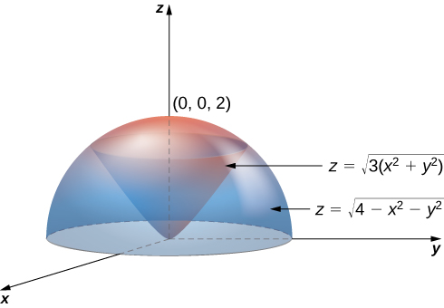{: #CNX_Calc_Figure_15_05_009}

Using the conversion formulas from rectangular coordinates to spherical coordinates, we have:

For the cone: <math xmlns="http://www.w3.org/1998/Math/MathML"><mrow><mi>z</mi><mo>=</mo><msqrt><mrow><mn>3</mn><mrow><mo>(</mo><mrow><msup><mi>x</mi><mn>2</mn></msup><mo>+</mo><msup><mi>y</mi><mn>2</mn></msup></mrow><mo>)</mo></mrow></mrow></msqrt></mrow></math>

 or <math xmlns="http://www.w3.org/1998/Math/MathML"><mrow><mi>ρ</mi><mspace width="0.2em" /><mtext>cos</mtext><mspace width="0.2em" /><mi>φ</mi><mo>=</mo><msqrt><mn>3</mn></msqrt><mi>ρ</mi><mspace width="0.2em" /><mtext>sin</mtext><mspace width="0.2em" /><mi>φ</mi></mrow></math>

 or <math xmlns="http://www.w3.org/1998/Math/MathML"><mrow><mtext>tan</mtext><mspace width="0.2em" /><mi>φ</mi><mo>=</mo><mfrac><mn>1</mn><mrow><msqrt><mn>3</mn></msqrt></mrow></mfrac></mrow></math>

 or <math xmlns="http://www.w3.org/1998/Math/MathML"><mrow><mi>φ</mi><mo>=</mo><mfrac><mi>π</mi><mn>6</mn></mfrac><mo>.</mo></mrow></math>

For the sphere: <math xmlns="http://www.w3.org/1998/Math/MathML"><mrow><mi>z</mi><mo>=</mo><msqrt><mrow><mn>4</mn><mo>−</mo><msup><mi>x</mi><mn>2</mn></msup><mo>−</mo><msup><mi>y</mi><mn>2</mn></msup></mrow></msqrt></mrow></math>

 or <math xmlns="http://www.w3.org/1998/Math/MathML"><mrow><msup><mi>z</mi><mn>2</mn></msup><mo>+</mo><msup><mi>x</mi><mn>2</mn></msup><mo>+</mo><msup><mi>y</mi><mn>2</mn></msup><mo>=</mo><mn>4</mn></mrow></math>

 or <math xmlns="http://www.w3.org/1998/Math/MathML"><mrow><msup><mi>ρ</mi><mn>2</mn></msup><mo>=</mo><mn>4</mn></mrow></math>

 or <math xmlns="http://www.w3.org/1998/Math/MathML"><mrow><mi>ρ</mi><mo>=</mo><mn>2</mn><mo>.</mo></mrow></math>

Thus, the triple integral for the volume is <math xmlns="http://www.w3.org/1998/Math/MathML"><mrow><mi>V</mi><mrow><mo>(</mo><mi>E</mi><mo>)</mo></mrow><mo>=</mo><mstyle displaystyle="true"><mrow><munderover><mo stretchy="false">∫</mo><mrow><mi>θ</mi><mo>=</mo><mn>0</mn></mrow><mrow><mi>θ</mi><mo>=</mo><mn>2</mn><mi>π</mi></mrow></munderover><mspace width="0.2em" /><mrow><mstyle displaystyle="true"><mrow><munderover><mo stretchy="false">∫</mo><mrow><mi>ϕ</mi><mo>=</mo><mn>0</mn></mrow><mrow><mi>φ</mi><mo>=</mo><mi>π</mi><mtext>/</mtext><mn>6</mn></mrow></munderover><mspace width="0.2em" /><mrow><mstyle displaystyle="true"><mrow><munderover><mo stretchy="false">∫</mo><mrow><mi>ρ</mi><mo>=</mo><mn>0</mn></mrow><mrow><mi>ρ</mi><mo>=</mo><mn>2</mn></mrow></munderover><mrow><msup><mi>ρ</mi><mn>2</mn></msup><mtext>sin</mtext><mspace width="0.2em" /><mi>φ</mi><mspace width="0.2em" /><mi>d</mi><mi>ρ</mi><mspace width="0.2em" /><mi>d</mi><mi>φ</mi><mspace width="0.2em" /><mi>d</mi><mi>θ</mi></mrow></mrow></mstyle></mrow></mrow></mstyle></mrow></mrow></mstyle><mo>.</mo></mrow></math>

Set up a triple integral for the volume of the solid region bounded above by the sphere <math xmlns="http://www.w3.org/1998/Math/MathML"><mrow><mi>ρ</mi><mo>=</mo><mn>2</mn></mrow></math>

 and bounded below by the cone <math xmlns="http://www.w3.org/1998/Math/MathML"><mrow><mi>φ</mi><mo>=</mo><mi>π</mi><mtext>/</mtext><mn>3</mn><mo>.</mo></mrow></math>

<math xmlns="http://www.w3.org/1998/Math/MathML"><mrow><mi>V</mi><mrow><mo>(</mo><mi>E</mi><mo>)</mo></mrow><mo>=</mo><mstyle displaystyle="true"><mrow><munderover><mo stretchy="false">∫</mo><mrow><mi>θ</mi><mo>=</mo><mn>0</mn></mrow><mrow><mi>θ</mi><mo>=</mo><mn>2</mn><mi>π</mi></mrow></munderover><mspace width="0.2em" /><mrow><mstyle displaystyle="true"><mrow><munderover><mo stretchy="false">∫</mo><mrow><mi>ϕ</mi><mo>=</mo><mn>0</mn></mrow><mrow><mi>φ</mi><mo>=</mo><mi>π</mi><mtext>/</mtext><mn>3</mn></mrow></munderover><mspace width="0.2em" /><mrow><mstyle displaystyle="true"><mrow><munderover><mo stretchy="false">∫</mo><mrow><mi>ρ</mi><mo>=</mo><mn>0</mn></mrow><mrow><mi>ρ</mi><mo>=</mo><mn>2</mn></mrow></munderover><mrow><msup><mi>ρ</mi><mn>2</mn></msup><mtext>sin</mtext><mspace width="0.2em" /><mi>φ</mi><mspace width="0.2em" /><mi>d</mi><mi>ρ</mi><mspace width="0.2em" /><mi>d</mi><mi>φ</mi><mspace width="0.2em" /><mi>d</mi><mi>θ</mi></mrow></mrow></mstyle></mrow></mrow></mstyle></mrow></mrow></mstyle></mrow></math>

Hint

Follow the steps of the previous example.

Interchanging Order of Integration in Spherical Coordinates

Let <math xmlns="http://www.w3.org/1998/Math/MathML"><mi>E</mi></math>

 be the region bounded below by the cone <math xmlns="http://www.w3.org/1998/Math/MathML"><mrow><mi>z</mi><mo>=</mo><msqrt><mrow><msup><mi>x</mi><mn>2</mn></msup><mo>+</mo><msup><mi>y</mi><mn>2</mn></msup></mrow></msqrt></mrow></math>

 and above by the sphere <math xmlns="http://www.w3.org/1998/Math/MathML"><mrow><mi>z</mi><mo>=</mo><msup><mi>x</mi><mn>2</mn></msup><mo>+</mo><msup><mi>y</mi><mn>2</mn></msup><mo>+</mo><msup><mi>z</mi><mn>2</mn></msup></mrow></math>

 ([[link]](#CNX_Calc_Figure_15_05_010)). Set up a triple integral in spherical coordinates and find the volume of the region using the following orders of integration:

1.  <math xmlns="http://www.w3.org/1998/Math/MathML"><mrow><mi>d</mi><mi>ρ</mi><mspace width="0.2em" /><mi>d</mi><mi>ϕ</mi><mspace width="0.2em" /><mi>d</mi><mi>θ</mi><mo>,</mo></mrow></math>

2.  <math xmlns="http://www.w3.org/1998/Math/MathML"><mrow><mi>d</mi><mi>φ</mi><mspace width="0.2em" /><mi>d</mi><mi>ρ</mi><mspace width="0.2em" /><mi>d</mi><mi>θ</mi><mo>.</mo></mrow></math>
    
    * * *
    {: data-type="newline"}
    
    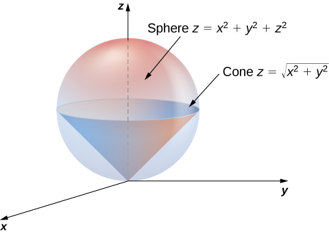{: #CNX_Calc_Figure_15_05_010}

{: data-number-style="lower-alpha"}

1.  Use the conversion formulas to write the equations of the sphere and cone in spherical coordinates.
    * * *
    {: data-type="newline"}
    
    For the sphere:
    * * *
    {: data-type="newline"}
    
    

    <math xmlns="http://www.w3.org/1998/Math/MathML"><mtable><mtr><mtd columnalign="right"><msup><mi>x</mi><mn>2</mn></msup><mo>+</mo><msup><mi>y</mi><mn>2</mn></msup><mo>+</mo><msup><mi>z</mi><mn>2</mn></msup></mtd><mtd columnalign="left"><mo>=</mo></mtd><mtd columnalign="left"><mi>z</mi></mtd></mtr><mtr><mtd columnalign="right"><msup><mi>ρ</mi><mn>2</mn></msup></mtd><mtd columnalign="left"><mo>=</mo></mtd><mtd columnalign="left"><mi>ρ</mi><mspace width="0.2em" /><mtext>cos</mtext><mspace width="0.2em" /><mi>φ</mi></mtd></mtr><mtr><mtd columnalign="right"><mi>ρ</mi></mtd><mtd columnalign="left"><mo>=</mo></mtd><mtd columnalign="left"><mtext>cos</mtext><mspace width="0.2em" /><mi>φ</mi><mo>.</mo></mtd></mtr></mtable></math>
    

    
    * * *
    {: data-type="newline"}
    
    For the cone:
    * * *
    {: data-type="newline"}
    
    

    <math xmlns="http://www.w3.org/1998/Math/MathML"><mtable><mtr><mtd columnalign="right"><mi>z</mi></mtd><mtd columnalign="left"><mo>=</mo></mtd><mtd columnalign="left"><msqrt><mrow><msup><mi>x</mi><mn>2</mn></msup><mo>+</mo><msup><mi>y</mi><mn>2</mn></msup></mrow></msqrt></mtd></mtr><mtr><mtd columnalign="right"><mi>ρ</mi><mspace width="0.2em" /><mtext>cos</mtext><mspace width="0.2em" /><mi>φ</mi></mtd><mtd columnalign="left"><mo>=</mo></mtd><mtd columnalign="left"><msqrt><mrow><msup><mi>ρ</mi><mn>2</mn></msup><msup><mrow><mtext>sin</mtext></mrow><mn>2</mn></msup><mi>φ</mi><mspace width="0.2em" /><msup><mrow><mtext>cos</mtext></mrow><mn>2</mn></msup><mi>ϕ</mi><mo>+</mo><msup><mi>ρ</mi><mn>2</mn></msup><msup><mrow><mtext>sin</mtext></mrow><mn>2</mn></msup><mi>φ</mi><mspace width="0.2em" /><msup><mrow><mtext>sin</mtext></mrow><mn>2</mn></msup><mi>ϕ</mi></mrow></msqrt></mtd></mtr><mtr><mtd columnalign="right"><mi>ρ</mi><mspace width="0.2em" /><mtext>cos</mtext><mspace width="0.2em" /><mi>φ</mi></mtd><mtd columnalign="left"><mo>=</mo></mtd><mtd columnalign="left"><msqrt><mrow><msup><mi>ρ</mi><mn>2</mn></msup><msup><mrow><mtext>sin</mtext></mrow><mn>2</mn></msup><mi>φ</mi><mrow><mo>(</mo><mrow><msup><mrow><mtext>cos</mtext></mrow><mn>2</mn></msup><mi>ϕ</mi><mo>+</mo><msup><mrow><mtext>sin</mtext></mrow><mn>2</mn></msup><mi>ϕ</mi></mrow><mo>)</mo></mrow></mrow></msqrt></mtd></mtr><mtr><mtd columnalign="right"><mi>ρ</mi><mspace width="0.2em" /><mtext>cos</mtext><mspace width="0.2em" /><mi>φ</mi></mtd><mtd columnalign="left"><mo>=</mo></mtd><mtd columnalign="left"><mi>ρ</mi><mspace width="0.2em" /><mtext>sin</mtext><mspace width="0.2em" /><mi>φ</mi></mtd></mtr><mtr><mtd columnalign="right"><mtext>cos</mtext><mspace width="0.2em" /><mi>φ</mi></mtd><mtd columnalign="left"><mo>=</mo></mtd><mtd columnalign="left"><mtext>sin</mtext><mspace width="0.2em" /><mi>φ</mi></mtd></mtr><mtr><mtd columnalign="right"><mi>φ</mi></mtd><mtd columnalign="left"><mo>=</mo></mtd><mtd columnalign="left"><mrow><mi>π</mi><mtext>/</mtext><mn>4</mn></mrow><mo>.</mo></mtd></mtr></mtable></math>
    

    
    * * *
    {: data-type="newline"}
    
    Hence the integral for the volume of the solid region
    <math xmlns="http://www.w3.org/1998/Math/MathML"><mi>E</mi></math>
    
    becomes
    * * *
    {: data-type="newline"}
    
    

    <math xmlns="http://www.w3.org/1998/Math/MathML"><mrow><mi>V</mi><mo stretchy="false">(</mo><mi>E</mi><mo stretchy="false">)</mo><mo>=</mo><mstyle displaystyle="true"><mrow><munderover><mo stretchy="false">∫</mo><mrow><mi>θ</mi><mo>=</mo><mn>0</mn></mrow><mrow><mi>θ</mi><mo>=</mo><mn>2</mn><mi>π</mi></mrow></munderover><mspace width="0.2em" /><mrow><mstyle displaystyle="true"><mrow><munderover><mo stretchy="false">∫</mo><mrow><mi>φ</mi><mo>=</mo><mn>0</mn></mrow><mrow><mi>φ</mi><mo>=</mo><mi>π</mi><mtext>/</mtext><mn>4</mn></mrow></munderover><mspace width="0.2em" /><mrow><mstyle displaystyle="true"><mrow><munderover><mo stretchy="false">∫</mo><mrow><mi>ρ</mi><mo>=</mo><mn>0</mn></mrow><mrow><mi>ρ</mi><mo>=</mo><mtext>cos</mtext><mspace width="0.2em" /><mi>φ</mi></mrow></munderover><mrow><msup><mi>ρ</mi><mn>2</mn></msup><mtext>sin</mtext><mspace width="0.2em" /><mi>φ</mi><mspace width="0.2em" /><mi>d</mi><mi>ρ</mi><mspace width="0.2em" /><mi>d</mi><mi>φ</mi><mspace width="0.2em" /><mi>d</mi><mi>θ</mi></mrow></mrow></mstyle></mrow></mrow></mstyle></mrow></mrow></mstyle><mo>.</mo></mrow></math>
    

2.  Consider the
    <math xmlns="http://www.w3.org/1998/Math/MathML"><mrow><mi>φ</mi><mi>ρ</mi></mrow></math>
    
    -plane. Note that the ranges for
    <math xmlns="http://www.w3.org/1998/Math/MathML"><mi>φ</mi></math>
    
    and
    <math xmlns="http://www.w3.org/1998/Math/MathML"><mi>ρ</mi></math>
    
    (from part a.) are
    * * *
    {: data-type="newline"}
    
    

    <math xmlns="http://www.w3.org/1998/Math/MathML"><mtable><mtr><mtd columnalign="left"><mn>0</mn><mo>≤</mo><mi>φ</mi><mo>≤</mo><mi>π</mi><mtext>/</mtext><mn>4</mn></mtd></mtr><mtr><mtd columnalign="left"><mn>0</mn><mo>≤</mo><mi>ρ</mi><mo>≤</mo><mtext>cos</mtext><mspace width="0.2em" /><mi>φ</mi><mo>.</mo></mtd></mtr></mtable></math>
    

    
    * * *
    {: data-type="newline"}
    
    The curve
    <math xmlns="http://www.w3.org/1998/Math/MathML"><mrow><mi>ρ</mi><mo>=</mo><mtext>cos</mtext><mspace width="0.2em" /><mi>φ</mi></mrow></math>
    
    meets the line
    <math xmlns="http://www.w3.org/1998/Math/MathML"><mrow><mi>φ</mi><mo>=</mo><mi>π</mi><mtext>/</mtext><mn>4</mn></mrow></math>
    
    at the point
    <math xmlns="http://www.w3.org/1998/Math/MathML"><mrow><mrow><mo>(</mo><mrow><mi>π</mi><mtext>/</mtext><mn>4</mn><mo>,</mo><msqrt><mn>2</mn></msqrt><mtext>/</mtext><mn>2</mn></mrow><mo>)</mo></mrow><mo>.</mo></mrow></math>
    
    Thus, to change the order of integration, we need to use two pieces:
    * * *
    {: data-type="newline"}
    
    

    <math xmlns="http://www.w3.org/1998/Math/MathML"><mtable><mtr><mtd columnalign="left"><mtable><mtr><mtd columnalign="left"><mn>0</mn><mo>≤</mo><mi>ρ</mi><mo>≤</mo><msqrt><mn>2</mn></msqrt><mtext>/</mtext><mn>2</mn></mtd></mtr><mtr><mtd columnalign="left"><mn>0</mn><mo>≤</mo><mi>φ</mi><mo>≤</mo><mi>π</mi><mtext>/</mtext><mn>4</mn></mtd></mtr></mtable></mtd><mtd /><mtd /><mtd columnalign="left"><mtext>and</mtext></mtd><mtd /><mtd /><mtd columnalign="left"><mtable><mtr><mtd columnalign="right"><msqrt><mn>2</mn></msqrt><mtext>/</mtext><mn>2</mn></mtd><mtd columnalign="left"><mo>≤</mo></mtd><mtd columnalign="left"><mi>ρ</mi><mo>≤</mo><mn>1</mn></mtd></mtr><mtr><mtd columnalign="right"><mn>0</mn></mtd><mtd columnalign="left"><mo>≤</mo></mtd><mtd columnalign="left"><mi>φ</mi><mo>≤</mo><msup><mtext>cos</mtext><mrow><mn>−1</mn></mrow></msup><mi>ρ</mi><mo>.</mo></mtd></mtr></mtable></mtd></mtr></mtable></math>
    

    
    * * *
    {: data-type="newline"}
    
    Hence the integral for the volume of the solid region
    <math xmlns="http://www.w3.org/1998/Math/MathML"><mi>E</mi></math>
    
    becomes
    * * *
    {: data-type="newline"}
    
    

    <math xmlns="http://www.w3.org/1998/Math/MathML"><mrow><mi>V</mi><mo stretchy="false">(</mo><mi>E</mi><mo stretchy="false">)</mo><mo>=</mo><mstyle displaystyle="true"><mrow><munderover><mo stretchy="false">∫</mo><mrow><mi>θ</mi><mo>=</mo><mn>0</mn></mrow><mrow><mi>θ</mi><mo>=</mo><mn>2</mn><mi>π</mi></mrow></munderover><mspace width="0.2em" /><mrow><mstyle displaystyle="true"><mrow><munderover><mo stretchy="false">∫</mo><mrow><mi>ρ</mi><mo>=</mo><mn>0</mn></mrow><mrow><mi>ρ</mi><mo>=</mo><msqrt><mn>2</mn></msqrt><mtext>/</mtext><mn>2</mn></mrow></munderover><mspace width="0.2em" /><mrow><mstyle displaystyle="true"><mrow><munderover><mo stretchy="false">∫</mo><mrow><mi>φ</mi><mo>=</mo><mn>0</mn></mrow><mrow><mi>φ</mi><mo>=</mo><mi>π</mi><mtext>/</mtext><mn>4</mn></mrow></munderover><mrow><msup><mi>ρ</mi><mn>2</mn></msup><mtext>sin</mtext><mspace width="0.2em" /><mi>φ</mi><mspace width="0.2em" /><mi>d</mi><mi>φ</mi><mspace width="0.2em" /><mi>d</mi><mi>ρ</mi><mspace width="0.2em" /><mi>d</mi><mi>θ</mi></mrow></mrow></mstyle></mrow></mrow></mstyle></mrow></mrow></mstyle><mo>+</mo><mstyle displaystyle="true"><mrow><munderover><mo stretchy="false">∫</mo><mrow><mi>θ</mi><mo>=</mo><mn>0</mn></mrow><mrow><mi>θ</mi><mo>=</mo><mn>2</mn><mi>π</mi></mrow></munderover><mspace width="0.2em" /><mrow><mstyle displaystyle="true"><mrow><munderover><mo stretchy="false">∫</mo><mrow><mi>ρ</mi><mo>=</mo><msqrt><mn>2</mn></msqrt><mtext>/</mtext><mn>2</mn></mrow><mrow><mi>ρ</mi><mo>=</mo><mn>1</mn></mrow></munderover><mspace width="0.2em" /><mrow><mstyle displaystyle="true"><mrow><munderover><mo stretchy="false">∫</mo><mrow><mi>φ</mi><mo>=</mo><mn>0</mn></mrow><mrow><mi>φ</mi><mo>=</mo><msup><mrow><mtext>cos</mtext></mrow><mrow><mn>−1</mn></mrow></msup><mi>ρ</mi></mrow></munderover><mrow><msup><mi>ρ</mi><mn>2</mn></msup><mtext>sin</mtext><mspace width="0.2em" /><mi>φ</mi><mspace width="0.2em" /><mi>d</mi><mi>φ</mi><mspace width="0.2em" /><mi>d</mi><mi>ρ</mi><mspace width="0.2em" /><mi>d</mi><mi>θ</mi></mrow></mrow></mstyle></mrow></mrow></mstyle></mrow></mrow></mstyle><mo>.</mo></mrow></math>
    

    
    * * *
    {: data-type="newline"}
    
    In each case, the integration results in
    <math xmlns="http://www.w3.org/1998/Math/MathML"><mrow><mi>V</mi><mrow><mo>(</mo><mi>E</mi><mo>)</mo></mrow><mo>=</mo><mfrac><mi>π</mi><mn>8</mn></mfrac><mo>.</mo></mrow></math>
{: data-number-style="lower-alpha"}

Before we end this section, we present a couple of examples that can illustrate the conversion from rectangular coordinates to cylindrical coordinates and from rectangular coordinates to spherical coordinates.

Converting from Rectangular Coordinates to Cylindrical Coordinates

Convert the following integral into cylindrical coordinates:

<math xmlns="http://www.w3.org/1998/Math/MathML"><mrow><mstyle displaystyle="true"><mrow><munderover><mo stretchy="false">∫</mo><mrow><mi>y</mi><mo>=</mo><mn>−1</mn></mrow><mrow><mi>y</mi><mo>=</mo><mn>1</mn></mrow></munderover><mspace width="0.2em" /><mrow><mstyle displaystyle="true"><mrow><munderover><mo stretchy="false">∫</mo><mrow><mi>x</mi><mo>=</mo><mn>0</mn></mrow><mrow><mi>x</mi><mo>=</mo><msqrt><mrow><mn>1</mn><mo>−</mo><msup><mi>y</mi><mn>2</mn></msup></mrow></msqrt></mrow></munderover><mspace width="0.2em" /><mrow><mstyle displaystyle="true"><mrow><munderover><mo stretchy="false">∫</mo><mrow><mi>z</mi><mo>=</mo><msup><mi>x</mi><mn>2</mn></msup><mo>+</mo><msup><mi>y</mi><mn>2</mn></msup></mrow><mrow><mi>z</mi><mo>=</mo><msqrt><mrow><msup><mi>x</mi><mn>2</mn></msup><mo>+</mo><msup><mi>y</mi><mn>2</mn></msup></mrow></msqrt></mrow></munderover><mrow><mi>x</mi><mi>y</mi><mi>z</mi><mspace width="0.2em" /><mi>d</mi><mi>z</mi><mspace width="0.2em" /><mi>d</mi><mi>x</mi><mspace width="0.2em" /><mi>d</mi><mi>y</mi></mrow></mrow></mstyle></mrow></mrow></mstyle></mrow></mrow></mstyle><mo>.</mo></mrow></math>

The ranges of the variables are

<math xmlns="http://www.w3.org/1998/Math/MathML"><mtable><mtr><mtd columnalign="right"><mo>−</mo><mn>1</mn></mtd><mtd columnalign="left"><mo>≤</mo></mtd><mtd columnalign="left"><mi>y</mi><mo>≤</mo><mn>1</mn></mtd></mtr><mtr><mtd columnalign="right"><mn>0</mn></mtd><mtd columnalign="left"><mo>≤</mo></mtd><mtd columnalign="left"><mi>x</mi><mo>≤</mo><msqrt><mrow><mn>1</mn><mo>−</mo><msup><mi>y</mi><mn>2</mn></msup></mrow></msqrt></mtd></mtr><mtr><mtd columnalign="right"><msup><mi>x</mi><mn>2</mn></msup><mo>+</mo><msup><mi>y</mi><mn>2</mn></msup></mtd><mtd columnalign="left"><mo>≤</mo></mtd><mtd columnalign="left"><mi>z</mi><mo>≤</mo><msqrt><mrow><msup><mi>x</mi><mn>2</mn></msup><mo>+</mo><msup><mi>y</mi><mn>2</mn></msup></mrow></msqrt><mo>.</mo></mtd></mtr></mtable></math>

The first two inequalities describe the right half of a circle of radius <math xmlns="http://www.w3.org/1998/Math/MathML"><mn>1</mn><mo>.</mo></math>

 Therefore, the ranges for <math xmlns="http://www.w3.org/1998/Math/MathML"><mi>θ</mi></math>

 and <math xmlns="http://www.w3.org/1998/Math/MathML"><mi>r</mi></math>

 are

<math xmlns="http://www.w3.org/1998/Math/MathML"><mrow><mo>−</mo><mfrac><mi>π</mi><mn>2</mn></mfrac><mo>≤</mo><mi>θ</mi><mo>≤</mo><mfrac><mi>π</mi><mn>2</mn></mfrac><mspace width="0.2em" /><mtext>and</mtext><mspace width="0.2em" /><mn>0</mn><mo>≤</mo><mi>r</mi><mo>≤</mo><mn>1</mn><mo>.</mo></mrow></math>

The limits of <math xmlns="http://www.w3.org/1998/Math/MathML"><mi>z</mi></math>

 are <math xmlns="http://www.w3.org/1998/Math/MathML"><mrow><msup><mi>r</mi><mn>2</mn></msup><mo>≤</mo><mi>z</mi><mo>≤</mo><mi>r</mi><mo>,</mo></mrow></math>

 hence

<math xmlns="http://www.w3.org/1998/Math/MathML"><mrow><mstyle displaystyle="true"><mrow><munderover><mo stretchy="false">∫</mo><mrow><mi>y</mi><mo>=</mo><mn>−1</mn></mrow><mrow><mi>y</mi><mo>=</mo><mn>1</mn></mrow></munderover><mspace width="0.2em" /><mrow><mstyle displaystyle="true"><mrow><munderover><mo stretchy="false">∫</mo><mrow><mi>x</mi><mo>=</mo><mn>0</mn></mrow><mrow><mi>x</mi><mo>=</mo><msqrt><mrow><mn>1</mn><mo>−</mo><msup><mi>y</mi><mn>2</mn></msup></mrow></msqrt></mrow></munderover><mspace width="0.2em" /><mrow><mstyle displaystyle="true"><mrow><munderover><mo stretchy="false">∫</mo><mrow><mi>z</mi><mo>=</mo><msup><mi>x</mi><mn>2</mn></msup><mo>+</mo><msup><mi>y</mi><mn>2</mn></msup></mrow><mrow><mi>z</mi><mo>=</mo><msqrt><mrow><msup><mi>x</mi><mn>2</mn></msup><mo>+</mo><msup><mi>y</mi><mn>2</mn></msup></mrow></msqrt></mrow></munderover><mrow><mi>x</mi><mi>y</mi><mi>z</mi><mspace width="0.2em" /><mi>d</mi><mi>z</mi><mspace width="0.2em" /><mi>d</mi><mi>x</mi><mspace width="0.2em" /><mi>d</mi><mi>y</mi></mrow></mrow></mstyle></mrow></mrow></mstyle></mrow></mrow></mstyle><mo>=</mo><mstyle displaystyle="true"><mrow><munderover><mo stretchy="false">∫</mo><mrow><mi>θ</mi><mo>=</mo><mtext>−</mtext><mrow><mi>π</mi><mtext>/</mtext><mn>2</mn></mrow></mrow><mrow><mi>θ</mi><mo>=</mo><mrow><mi>π</mi><mtext>/</mtext><mn>2</mn></mrow></mrow></munderover><mspace width="0.2em" /><mrow><mstyle displaystyle="true"><mrow><munderover><mo stretchy="false">∫</mo><mrow><mi>r</mi><mo>=</mo><mn>0</mn></mrow><mrow><mi>r</mi><mo>=</mo><mn>1</mn></mrow></munderover><mspace width="0.2em" /><mrow><mstyle displaystyle="true"><mrow><munderover><mo stretchy="false">∫</mo><mrow><mi>z</mi><mo>=</mo><msup><mi>r</mi><mn>2</mn></msup></mrow><mrow><mi>z</mi><mo>=</mo><mi>r</mi></mrow></munderover><mrow><mi>r</mi><mrow><mo>(</mo><mrow><mi>r</mi><mspace width="0.2em" /><mtext>cos</mtext><mspace width="0.2em" /><mi>θ</mi></mrow><mo>)</mo></mrow><mrow><mo>(</mo><mrow><mi>r</mi><mspace width="0.2em" /><mtext>sin</mtext><mspace width="0.2em" /><mi>θ</mi></mrow><mo>)</mo></mrow><mi>z</mi><mspace width="0.2em" /><mi>d</mi><mi>z</mi><mspace width="0.2em" /><mi>d</mi><mi>r</mi><mspace width="0.2em" /><mi>d</mi><mi>θ</mi></mrow></mrow></mstyle></mrow></mrow></mstyle></mrow></mrow></mstyle><mo>.</mo></mrow></math>

Converting from Rectangular Coordinates to Spherical Coordinates

Convert the following integral into spherical coordinates:

<math xmlns="http://www.w3.org/1998/Math/MathML"><mrow><mstyle displaystyle="true"><mrow><munderover><mo stretchy="false">∫</mo><mrow><mi>y</mi><mo>=</mo><mn>0</mn></mrow><mrow><mi>y</mi><mo>=</mo><mn>3</mn></mrow></munderover><mspace width="0.2em" /><mrow><mstyle displaystyle="true"><mrow><munderover><mo stretchy="false">∫</mo><mrow><mi>x</mi><mo>=</mo><mn>0</mn></mrow><mrow><mi>x</mi><mo>=</mo><msqrt><mrow><mn>9</mn><mo>−</mo><msup><mi>y</mi><mn>2</mn></msup></mrow></msqrt></mrow></munderover><mspace width="0.2em" /><mrow><mstyle displaystyle="true"><mrow><munderover><mo stretchy="false">∫</mo><mrow><mi>z</mi><mo>=</mo><msqrt><mrow><msup><mi>x</mi><mn>2</mn></msup><mo>+</mo><msup><mi>y</mi><mn>2</mn></msup></mrow></msqrt></mrow><mrow><mi>z</mi><mo>=</mo><msqrt><mrow><mn>18</mn><mo>−</mo><msup><mi>x</mi><mn>2</mn></msup><mo>−</mo><msup><mi>y</mi><mn>2</mn></msup></mrow></msqrt></mrow></munderover><mrow><mrow><mo>(</mo><mrow><msup><mi>x</mi><mn>2</mn></msup><mo>+</mo><msup><mi>y</mi><mn>2</mn></msup><mo>+</mo><msup><mi>z</mi><mn>2</mn></msup></mrow><mo>)</mo></mrow><mi>d</mi><mi>z</mi><mspace width="0.2em" /><mi>d</mi><mi>x</mi><mspace width="0.2em" /><mi>d</mi><mi>y</mi></mrow></mrow></mstyle></mrow></mrow></mstyle></mrow></mrow></mstyle><mo>.</mo></mrow></math>

The ranges of the variables are

<math xmlns="http://www.w3.org/1998/Math/MathML"><mtable><mtr><mtd columnalign="right"><mn>0</mn></mtd><mtd columnalign="left"><mo>≤</mo></mtd><mtd columnalign="left"><mi>y</mi><mo>≤</mo><mn>3</mn></mtd></mtr><mtr><mtd columnalign="right"><mn>0</mn></mtd><mtd columnalign="left"><mo>≤</mo></mtd><mtd columnalign="left"><mi>x</mi><mo>≤</mo><msqrt><mrow><mn>9</mn><mo>−</mo><msup><mi>y</mi><mn>2</mn></msup></mrow></msqrt></mtd></mtr><mtr><mtd columnalign="right"><msqrt><mrow><msup><mi>x</mi><mn>2</mn></msup><mo>+</mo><msup><mi>y</mi><mn>2</mn></msup></mrow></msqrt></mtd><mtd columnalign="left"><mo>≤</mo></mtd><mtd columnalign="left"><mi>z</mi><mo>≤</mo><msqrt><mrow><mn>18</mn><mo>−</mo><msup><mi>x</mi><mn>2</mn></msup><mo>−</mo><msup><mi>y</mi><mn>2</mn></msup></mrow></msqrt><mo>.</mo></mtd></mtr></mtable></math>

The first two ranges of variables describe a quarter disk in the first quadrant of the <math xmlns="http://www.w3.org/1998/Math/MathML"><mrow><mi>x</mi><mi>y</mi></mrow></math>

-plane. Hence the range for <math xmlns="http://www.w3.org/1998/Math/MathML"><mi>θ</mi></math>

 is <math xmlns="http://www.w3.org/1998/Math/MathML"><mrow><mn>0</mn><mo>≤</mo><mi>θ</mi><mo>≤</mo><mfrac><mi>π</mi><mn>2</mn></mfrac><mo>.</mo></mrow></math>

The lower bound <math xmlns="http://www.w3.org/1998/Math/MathML"><mrow><mi>z</mi><mo>=</mo><msqrt><mrow><msup><mi>x</mi><mn>2</mn></msup><mo>+</mo><msup><mi>y</mi><mn>2</mn></msup></mrow></msqrt></mrow></math>

 is the upper half of a cone and the upper bound <math xmlns="http://www.w3.org/1998/Math/MathML"><mrow><mi>z</mi><mo>=</mo><msqrt><mrow><mn>18</mn><mo>−</mo><msup><mi>x</mi><mn>2</mn></msup><mo>−</mo><msup><mi>y</mi><mn>2</mn></msup></mrow></msqrt></mrow></math>

 is the upper half of a sphere. Therefore, we have <math xmlns="http://www.w3.org/1998/Math/MathML"><mrow><mn>0</mn><mo>≤</mo><mi>ρ</mi><mo>≤</mo><msqrt><mrow><mn>18</mn></mrow></msqrt><mo>,</mo></mrow></math>

 which is <math xmlns="http://www.w3.org/1998/Math/MathML"><mrow><mn>0</mn><mo>≤</mo><mi>ρ</mi><mo>≤</mo><mn>3</mn><msqrt><mn>2</mn></msqrt><mo>.</mo></mrow></math>

For the ranges of <math xmlns="http://www.w3.org/1998/Math/MathML"><mi>φ</mi><mo>,</mo></math>

 we need to find where the cone and the sphere intersect, so solve the equation

<math xmlns="http://www.w3.org/1998/Math/MathML"><mtable><mtr><mtd columnalign="right"><msup><mi>r</mi><mn>2</mn></msup><mo>+</mo><msup><mi>z</mi><mn>2</mn></msup></mtd><mtd columnalign="left"><mo>=</mo></mtd><mtd columnalign="left"><mn>18</mn></mtd></mtr><mtr><mtd columnalign="right"><msup><mrow><mo>(</mo><mrow><msqrt><mrow><msup><mi>x</mi><mn>2</mn></msup><mo>+</mo><msup><mi>y</mi><mn>2</mn></msup></mrow></msqrt></mrow><mo>)</mo></mrow><mn>2</mn></msup><mo>+</mo><msup><mi>z</mi><mn>2</mn></msup></mtd><mtd columnalign="left"><mo>=</mo></mtd><mtd columnalign="left"><mn>18</mn></mtd></mtr><mtr><mtd columnalign="right"><msup><mi>z</mi><mn>2</mn></msup><mo>+</mo><msup><mi>z</mi><mn>2</mn></msup></mtd><mtd columnalign="left"><mo>=</mo></mtd><mtd columnalign="left"><mn>18</mn></mtd></mtr><mtr><mtd columnalign="right"><mn>2</mn><msup><mi>z</mi><mn>2</mn></msup></mtd><mtd columnalign="left"><mo>=</mo></mtd><mtd columnalign="left"><mn>18</mn></mtd></mtr><mtr><mtd columnalign="right"><msup><mi>z</mi><mn>2</mn></msup></mtd><mtd columnalign="left"><mo>=</mo></mtd><mtd columnalign="left"><mn>9</mn></mtd></mtr><mtr><mtd columnalign="right"><mi>z</mi></mtd><mtd columnalign="left"><mo>=</mo></mtd><mtd columnalign="left"><mn>3.</mn></mtd></mtr></mtable></math>

This gives

<math xmlns="http://www.w3.org/1998/Math/MathML"><mtable><mtr><mtd columnalign="right"><mn>3</mn><msqrt><mn>2</mn></msqrt><mspace width="0.2em" /><mtext>cos</mtext><mspace width="0.2em" /><mi>φ</mi></mtd><mtd columnalign="left"><mo>=</mo></mtd><mtd columnalign="left"><mn>3</mn></mtd></mtr><mtr><mtd columnalign="right"><mtext>cos</mtext><mspace width="0.2em" /><mi>φ</mi></mtd><mtd columnalign="left"><mo>=</mo></mtd><mtd columnalign="left"><mfrac><mn>1</mn><mrow><msqrt><mn>2</mn></msqrt></mrow></mfrac></mtd></mtr><mtr><mtd columnalign="right"><mi>φ</mi></mtd><mtd columnalign="left"><mo>=</mo></mtd><mtd columnalign="left"><mfrac><mi>π</mi><mn>4</mn></mfrac><mo>.</mo></mtd></mtr></mtable></math>

Putting this together, we obtain

<math xmlns="http://www.w3.org/1998/Math/MathML"><mrow><mstyle displaystyle="true"><mrow><munderover><mo stretchy="false">∫</mo><mrow><mi>y</mi><mo>=</mo><mn>0</mn></mrow><mrow><mi>y</mi><mo>=</mo><mn>3</mn></mrow></munderover><mspace width="0.2em" /><mrow><mstyle displaystyle="true"><mrow><munderover><mo stretchy="false">∫</mo><mrow><mi>x</mi><mo>=</mo><mn>0</mn></mrow><mrow><mi>x</mi><mo>=</mo><msqrt><mrow><mn>9</mn><mo>−</mo><msup><mi>y</mi><mn>2</mn></msup></mrow></msqrt></mrow></munderover><mspace width="0.2em" /><mrow><mstyle displaystyle="true"><mrow><munderover><mo stretchy="false">∫</mo><mrow><mi>z</mi><mo>=</mo><msqrt><mrow><msup><mi>x</mi><mn>2</mn></msup><mo>+</mo><msup><mi>y</mi><mn>2</mn></msup></mrow></msqrt></mrow><mrow><mi>z</mi><mo>=</mo><msqrt><mrow><mn>18</mn><mo>−</mo><msup><mi>x</mi><mn>2</mn></msup><mo>−</mo><msup><mi>y</mi><mn>2</mn></msup></mrow></msqrt></mrow></munderover><mrow><mrow><mo>(</mo><mrow><msup><mi>x</mi><mn>2</mn></msup><mo>+</mo><msup><mi>y</mi><mn>2</mn></msup><mo>+</mo><msup><mi>z</mi><mn>2</mn></msup></mrow><mo>)</mo></mrow><mi>d</mi><mi>z</mi><mspace width="0.2em" /><mi>d</mi><mi>x</mi><mspace width="0.2em" /><mi>d</mi><mi>y</mi></mrow></mrow></mstyle></mrow></mrow></mstyle></mrow></mrow></mstyle><mo>=</mo><mstyle displaystyle="true"><mrow><munderover><mo stretchy="false">∫</mo><mrow><mi>φ</mi><mo>=</mo><mn>0</mn></mrow><mrow><mi>φ</mi><mo>=</mo><mi>π</mi><mtext>/</mtext><mn>4</mn></mrow></munderover><mspace width="0.2em" /><mrow><mstyle displaystyle="true"><mrow><munderover><mo stretchy="false">∫</mo><mrow><mi>θ</mi><mo>=</mo><mn>0</mn></mrow><mrow><mi>θ</mi><mo>=</mo><mi>π</mi><mtext>/</mtext><mn>2</mn></mrow></munderover><mspace width="0.2em" /><mrow><mstyle displaystyle="true"><mrow><munderover><mo stretchy="false">∫</mo><mrow><mi>ρ</mi><mo>=</mo><mn>0</mn></mrow><mrow><mi>ρ</mi><mo>=</mo><mn>3</mn><msqrt><mn>2</mn></msqrt></mrow></munderover><mrow><msup><mi>ρ</mi><mn>4</mn></msup><mtext>sin</mtext><mspace width="0.2em" /><mi>φ</mi><mspace width="0.2em" /><mi>d</mi><mi>ρ</mi><mspace width="0.2em" /><mi>d</mi><mi>θ</mi></mrow></mrow></mstyle></mrow></mrow></mstyle></mrow></mrow></mstyle><mspace width="0.2em" /><mi>d</mi><mi>φ</mi><mo>.</mo></mrow></math>

Use rectangular, cylindrical, and spherical coordinates to set up triple integrals for finding the volume of the region inside the sphere <math xmlns="http://www.w3.org/1998/Math/MathML"><mrow><msup><mi>x</mi><mn>2</mn></msup><mo>+</mo><msup><mi>y</mi><mn>2</mn></msup><mo>+</mo><msup><mi>z</mi><mn>2</mn></msup><mo>=</mo><mn>4</mn></mrow></math>

 but outside the cylinder <math xmlns="http://www.w3.org/1998/Math/MathML"><mrow><msup><mi>x</mi><mn>2</mn></msup><mo>+</mo><msup><mi>y</mi><mn>2</mn></msup><mo>=</mo><mn>1</mn><mo>.</mo></mrow></math>

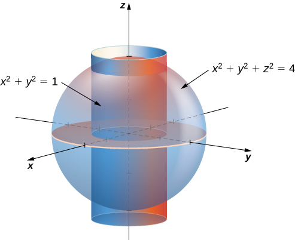

Rectangular: <math xmlns="http://www.w3.org/1998/Math/MathML"><mrow><mstyle displaystyle="true"><mrow><munderover><mo stretchy="false">∫</mo><mrow><mi>x</mi><mo>=</mo><mn>−2</mn></mrow><mrow><mi>x</mi><mo>=</mo><mn>2</mn></mrow></munderover><mspace width="0.2em" /><mrow><mstyle displaystyle="true"><mrow><munderover><mo stretchy="false">∫</mo><mrow><mi>y</mi><mo>=</mo><mtext>−</mtext><msqrt><mrow><mn>4</mn><mo>−</mo><msup><mi>x</mi><mn>2</mn></msup></mrow></msqrt></mrow><mrow><mi>y</mi><mo>=</mo><msqrt><mrow><mn>4</mn><mo>−</mo><msup><mi>x</mi><mn>2</mn></msup></mrow></msqrt></mrow></munderover><mspace width="0.2em" /><mrow><mstyle displaystyle="true"><mrow><munderover><mo stretchy="false">∫</mo><mrow><mi>z</mi><mo>=</mo><mtext>−</mtext><msqrt><mrow><mn>4</mn><mo>−</mo><msup><mi>x</mi><mn>2</mn></msup><mo>−</mo><msup><mi>y</mi><mn>2</mn></msup></mrow></msqrt></mrow><mrow><mi>z</mi><mo>=</mo><msqrt><mrow><mn>4</mn><mo>−</mo><msup><mi>x</mi><mn>2</mn></msup><mo>−</mo><msup><mi>y</mi><mn>2</mn></msup></mrow></msqrt></mrow></munderover><mrow><mi>d</mi><mi>z</mi><mspace width="0.2em" /><mi>d</mi><mi>y</mi><mspace width="0.2em" /><mi>d</mi><mi>x</mi><mo>−</mo></mrow></mrow></mstyle></mrow></mrow></mstyle></mrow></mrow></mstyle><mstyle displaystyle="true"><mrow><munderover><mo stretchy="false">∫</mo><mrow><mi>x</mi><mo>=</mo><mn>−1</mn></mrow><mrow><mi>x</mi><mo>=</mo><mn>1</mn></mrow></munderover><mspace width="0.2em" /><mrow><mstyle displaystyle="true"><mrow><munderover><mo stretchy="false">∫</mo><mrow><mi>y</mi><mo>=</mo><mtext>−</mtext><msqrt><mrow><mn>1</mn><mo>−</mo><msup><mi>x</mi><mn>2</mn></msup></mrow></msqrt></mrow><mrow><mi>y</mi><mo>=</mo><msqrt><mrow><mn>1</mn><mo>−</mo><msup><mi>x</mi><mn>2</mn></msup></mrow></msqrt></mrow></munderover><mspace width="0.2em" /><mrow><mstyle displaystyle="true"><mrow><munderover><mo stretchy="false">∫</mo><mrow><mi>z</mi><mo>=</mo><mtext>−</mtext><msqrt><mrow><mn>4</mn><mo>−</mo><msup><mi>x</mi><mn>2</mn></msup><mo>−</mo><msup><mi>y</mi><mn>2</mn></msup></mrow></msqrt></mrow><mrow><mi>z</mi><mo>=</mo><msqrt><mrow><mn>4</mn><mo>−</mo><msup><mi>x</mi><mn>2</mn></msup><mo>−</mo><msup><mi>y</mi><mn>2</mn></msup></mrow></msqrt></mrow></munderover><mrow><mi>d</mi><mi>z</mi><mspace width="0.2em" /><mi>d</mi><mi>y</mi><mspace width="0.2em" /><mi>d</mi><mi>x</mi></mrow></mrow></mstyle></mrow></mrow></mstyle></mrow></mrow></mstyle><mo>.</mo></mrow></math>

* * *
{: data-type="newline"}

 Cylindrical: <math xmlns="http://www.w3.org/1998/Math/MathML"><mrow><mstyle displaystyle="true"><mrow><munderover><mo stretchy="false">∫</mo><mrow><mi>θ</mi><mo>=</mo><mn>0</mn></mrow><mrow><mi>θ</mi><mo>=</mo><mn>2</mn><mi>π</mi></mrow></munderover><mspace width="0.2em" /><mrow><mstyle displaystyle="true"><mrow><munderover><mo stretchy="false">∫</mo><mrow><mi>r</mi><mo>=</mo><mn>1</mn></mrow><mrow><mi>r</mi><mo>=</mo><mn>2</mn></mrow></munderover><mspace width="0.2em" /><mrow><mstyle displaystyle="true"><mrow><munderover><mo stretchy="false">∫</mo><mrow><mi>z</mi><mo>=</mo><mtext>−</mtext><msqrt><mrow><mn>4</mn><mo>−</mo><msup><mi>r</mi><mn>2</mn></msup></mrow></msqrt></mrow><mrow><mi>z</mi><mo>=</mo><msqrt><mrow><mn>4</mn><mo>−</mo><msup><mi>r</mi><mn>2</mn></msup></mrow></msqrt></mrow></munderover><mrow><mi>r</mi><mspace width="0.2em" /><mi>d</mi><mi>z</mi><mspace width="0.2em" /><mi>d</mi><mi>r</mi><mspace width="0.2em" /><mi>d</mi><mi>θ</mi></mrow></mrow></mstyle></mrow></mrow></mstyle></mrow></mrow></mstyle><mo>.</mo></mrow></math>

* * *
{: data-type="newline"}

 Spherical: <math xmlns="http://www.w3.org/1998/Math/MathML"><mrow><mstyle displaystyle="true"><mrow><munderover><mo stretchy="false">∫</mo><mrow><mi>φ</mi><mo>=</mo><mi>π</mi><mtext>/</mtext><mn>6</mn></mrow><mrow><mi>φ</mi><mo>=</mo><mn>5</mn><mi>π</mi><mtext>/</mtext><mn>6</mn></mrow></munderover><mspace width="0.2em" /><mrow><mstyle displaystyle="true"><mrow><munderover><mo stretchy="false">∫</mo><mrow><mi>θ</mi><mo>=</mo><mn>0</mn></mrow><mrow><mi>θ</mi><mo>=</mo><mn>2</mn><mi>π</mi></mrow></munderover><mspace width="0.2em" /><mrow><mstyle displaystyle="true"><mrow><munderover><mo stretchy="false">∫</mo><mrow><mi>ρ</mi><mo>=</mo><mtext>csc</mtext><mspace width="0.2em" /><mi>φ</mi></mrow><mrow><mi>ρ</mi><mo>=</mo><mn>2</mn></mrow></munderover><mrow><msup><mi>ρ</mi><mn>2</mn></msup><mtext>sin</mtext><mspace width="0.2em" /><mi>φ</mi><mspace width="0.2em" /><mi>d</mi><mi>ρ</mi><mspace width="0.2em" /><mi>d</mi><mi>θ</mi><mspace width="0.2em" /><mi>d</mi><mi>φ</mi></mrow></mrow></mstyle></mrow></mrow></mstyle></mrow></mrow></mstyle><mo>.</mo></mrow></math>

Now that we are familiar with the spherical coordinate system, let’s find the volume of some known geometric figures, such as spheres and ellipsoids.

Chapter Opener: Finding the Volume of l’Hemisphèric

Find the volume of the spherical planetarium in l’Hemisphèric in Valencia, Spain, which is five stories tall and has a radius of approximately <math xmlns="http://www.w3.org/1998/Math/MathML"><mrow><mn>50</mn></mrow></math>

 ft, using the equation <math xmlns="http://www.w3.org/1998/Math/MathML"><mrow><msup><mi>x</mi><mn>2</mn></msup><mo>+</mo><msup><mi>y</mi><mn>2</mn></msup><mo>+</mo><msup><mi>z</mi><mn>2</mn></msup><mo>=</mo><msup><mi>r</mi><mn>2</mn></msup><mo>.</mo></mrow></math>

"){: #CNX_Calc_Figure_15_05_012}

We calculate the volume of the ball in the first octant, where <math xmlns="http://www.w3.org/1998/Math/MathML"><mrow><mi>x</mi><mo>≥</mo><mn>0</mn><mo>,</mo><mi>y</mi><mo>≥</mo><mn>0</mn><mo>,</mo></mrow></math>

 and <math xmlns="http://www.w3.org/1998/Math/MathML"><mrow><mi>z</mi><mo>≥</mo><mn>0</mn><mo>,</mo></mrow></math>

 using spherical coordinates, and then multiply the result by <math xmlns="http://www.w3.org/1998/Math/MathML"><mn>8</mn></math>

 for symmetry. Since we consider the region <math xmlns="http://www.w3.org/1998/Math/MathML"><mi>D</mi></math>

 as the first octant in the integral, the ranges of the variables are

<math xmlns="http://www.w3.org/1998/Math/MathML"><mrow><mn>0</mn><mo>≤</mo><mi>φ</mi><mo>≤</mo><mfrac><mi>π</mi><mn>2</mn></mfrac><mo>,</mo><mn>0</mn><mo>≤</mo><mi>ρ</mi><mo>≤</mo><mi>r</mi><mo>,</mo><mn>0</mn><mo>≤</mo><mi>θ</mi><mo>≤</mo><mfrac><mi>π</mi><mn>2</mn></mfrac><mo>.</mo></mrow></math>

Therefore,

<math xmlns="http://www.w3.org/1998/Math/MathML"><mtable><mtr><mtd columnalign="right"><mi>V</mi></mtd><mtd columnalign="left"><mo>=</mo><mstyle displaystyle="true"><mrow><munder><mo>∭</mo><mi>D</mi></munder><mrow><mi>d</mi><mi>x</mi><mspace width="0.2em" /><mi>d</mi><mi>y</mi><mspace width="0.2em" /><mi>d</mi><mi>z</mi><mo>=</mo><mn>8</mn><mstyle displaystyle="true"><mrow><munderover><mo stretchy="false">∫</mo><mrow><mi>θ</mi><mo>=</mo><mn>0</mn></mrow><mrow><mi>θ</mi><mo>=</mo><mi>π</mi><mtext>/</mtext><mn>2</mn></mrow></munderover><mspace width="0.2em" /><mrow><mstyle displaystyle="true"><mrow><munderover><mo stretchy="false">∫</mo><mrow><mi>ρ</mi><mo>=</mo><mn>0</mn></mrow><mrow><mi>ρ</mi><mo>=</mo><mi>π</mi></mrow></munderover><mspace width="0.2em" /><mrow><mstyle displaystyle="true"><mrow><munderover><mo stretchy="false">∫</mo><mrow><mi>φ</mi><mo>=</mo><mn>0</mn></mrow><mrow><mi>φ</mi><mo>=</mo><mi>π</mi><mtext>/</mtext><mn>2</mn></mrow></munderover><mrow><msup><mi>ρ</mi><mn>2</mn></msup><mtext>sin</mtext><mspace width="0.2em" /><mi>θ</mi></mrow></mrow></mstyle></mrow></mrow></mstyle></mrow></mrow></mstyle></mrow></mrow></mstyle><mspace width="0.2em" /><mi>d</mi><mi>φ</mi><mspace width="0.2em" /><mi>d</mi><mi>ρ</mi><mspace width="0.2em" /><mi>d</mi><mi>θ</mi></mtd></mtr><mtr><mtd /><mtd columnalign="left"><mo>=</mo><mn>8</mn><mstyle displaystyle="true"><mrow><munderover><mo stretchy="false">∫</mo><mrow><mi>φ</mi><mo>=</mo><mn>0</mn></mrow><mrow><mi>φ</mi><mo>=</mo><mi>π</mi><mtext>/</mtext><mn>2</mn></mrow></munderover><mrow><mi>d</mi><mi>φ</mi><mstyle displaystyle="true"><mrow><munderover><mo stretchy="false">∫</mo><mrow><mi>ρ</mi><mo>=</mo><mn>0</mn></mrow><mrow><mi>ρ</mi><mo>=</mo><mi>r</mi></mrow></munderover><mrow><msup><mi>ρ</mi><mn>2</mn></msup><mi>d</mi><mi>ρ</mi></mrow></mrow></mstyle></mrow></mrow></mstyle><mstyle displaystyle="true"><mrow><munderover><mo stretchy="false">∫</mo><mrow><mi>θ</mi><mo>=</mo><mn>0</mn></mrow><mrow><mi>θ</mi><mo>=</mo><mi>π</mi><mtext>/</mtext><mn>2</mn></mrow></munderover><mrow><mtext>sin</mtext><mspace width="0.2em" /><mi>θ</mi><mspace width="0.2em" /><mi>d</mi><mi>θ</mi></mrow></mrow></mstyle></mtd></mtr><mtr><mtd /><mtd columnalign="left"><mo>=</mo><mn>8</mn><mrow><mo>(</mo><mrow><mfrac><mi>π</mi><mn>2</mn></mfrac></mrow><mo>)</mo></mrow><mrow><mo>(</mo><mrow><mfrac><mrow><msup><mi>r</mi><mn>3</mn></msup></mrow><mn>3</mn></mfrac></mrow><mo>)</mo></mrow><mrow><mo>(</mo><mn>1</mn><mo>)</mo></mrow></mtd></mtr><mtr><mtd /><mtd columnalign="left"><mo>=</mo><mfrac><mn>4</mn><mn>3</mn></mfrac><mi>π</mi><msup><mi>r</mi><mn>3</mn></msup><mo>.</mo></mtd></mtr></mtable></math>

This exactly matches with what we knew. So for a sphere with a radius of approximately <math xmlns="http://www.w3.org/1998/Math/MathML"><mrow><mn>50</mn></mrow></math>

 ft, the volume is <math xmlns="http://www.w3.org/1998/Math/MathML"><mrow><mfrac><mn>4</mn><mn>3</mn></mfrac><mi>π</mi><msup><mrow><mo stretchy="false">(</mo><mn>50</mn><mo stretchy="false">)</mo></mrow><mn>3</mn></msup><mo>≈</mo><mn>523,600</mn><msup><mrow><mspace width="0.2em" /><mtext>ft</mtext></mrow><mn>3</mn></msup><mo>.</mo></mrow></math>

For the next example we find the volume of an ellipsoid.

Finding the Volume of an Ellipsoid

Find the volume of the ellipsoid <math xmlns="http://www.w3.org/1998/Math/MathML"><mrow><mfrac><mrow><msup><mi>x</mi><mn>2</mn></msup></mrow><mrow><msup><mi>a</mi><mn>2</mn></msup></mrow></mfrac><mo>+</mo><mfrac><mrow><msup><mi>y</mi><mn>2</mn></msup></mrow><mrow><msup><mi>b</mi><mn>2</mn></msup></mrow></mfrac><mo>+</mo><mfrac><mrow><msup><mi>z</mi><mn>2</mn></msup></mrow><mrow><msup><mi>c</mi><mn>2</mn></msup></mrow></mfrac><mo>=</mo><mn>1</mn><mo>.</mo></mrow></math>

We again use symmetry and evaluate the volume of the ellipsoid using spherical coordinates. As before, we use the first octant <math xmlns="http://www.w3.org/1998/Math/MathML"><mrow><mi>x</mi><mo>≥</mo><mn>0</mn><mo>,</mo><mi>y</mi><mo>≥</mo><mn>0</mn><mo>,</mo></mrow></math>

 and <math xmlns="http://www.w3.org/1998/Math/MathML"><mrow><mi>z</mi><mo>≥</mo><mn>0</mn></mrow></math>

 and then multiply the result by <math xmlns="http://www.w3.org/1998/Math/MathML"><mn>8</mn><mo>.</mo></math>

In this case the ranges of the variables are

<math xmlns="http://www.w3.org/1998/Math/MathML"><mrow><mn>0</mn><mo>≤</mo><mi>φ</mi><mo>≤</mo><mfrac><mi>π</mi><mn>2</mn></mfrac><mo>,</mo><mn>0</mn><mo>≤</mo><mi>ρ</mi><mo>≤</mo><mfrac><mi>π</mi><mn>2</mn></mfrac><mo>,</mo><mn>0</mn><mo>≤</mo><mi>ρ</mi><mo>≤</mo><mn>1</mn><mo>,</mo><mspace width="0.2em" /><mtext>and</mtext><mspace width="0.2em" /><mn>0</mn><mo>≤</mo><mi>θ</mi><mo>≤</mo><mfrac><mi>π</mi><mn>2</mn></mfrac><mo>.</mo></mrow></math>

Also, we need to change the rectangular to spherical coordinates in this way:

<math xmlns="http://www.w3.org/1998/Math/MathML"><mrow><mi>x</mi><mo>=</mo><mi>a</mi><mi>ρ</mi><mspace width="0.2em" /><mtext>cos</mtext><mspace width="0.2em" /><mi>φ</mi><mspace width="0.2em" /><mtext>sin</mtext><mspace width="0.2em" /><mi>θ</mi><mo>,</mo><mi>y</mi><mo>=</mo><mi>b</mi><mi>ρ</mi><mspace width="0.2em" /><mtext>sin</mtext><mspace width="0.2em" /><mi>φ</mi><mspace width="0.2em" /><mtext>sin</mtext><mspace width="0.2em" /><mi>θ</mi><mo>,</mo><mspace width="0.2em" /><mtext>and</mtext><mspace width="0.2em" /><mi>z</mi><mo>=</mo><mi>c</mi><mi>ρ</mi><mspace width="0.2em" /><mtext>cos</mtext><mspace width="0.2em" /><mi>θ</mi><mo>.</mo></mrow></math>

Then the volume of the ellipsoid becomes

<math xmlns="http://www.w3.org/1998/Math/MathML"><mtable><mtr><mtd columnalign="right"><mi>V</mi></mtd><mtd columnalign="left"><mo>=</mo><mstyle displaystyle="true"><mrow><munder><mo>∭</mo><mi>D</mi></munder><mrow><mi>d</mi><mi>x</mi><mspace width="0.2em" /><mi>d</mi><mi>y</mi><mspace width="0.2em" /><mi>d</mi><mi>z</mi></mrow></mrow></mstyle></mtd></mtr><mtr><mtd /><mtd columnalign="left"><mo>=</mo><mn>8</mn><mstyle displaystyle="true"><mrow><munderover><mo stretchy="false">∫</mo><mrow><mi>θ</mi><mo>=</mo><mn>0</mn></mrow><mrow><mi>θ</mi><mo>=</mo><mi>π</mi><mtext>/</mtext><mn>2</mn></mrow></munderover><mspace width="0.2em" /><mrow><mstyle displaystyle="true"><mrow><munderover><mo stretchy="false">∫</mo><mrow><mi>ρ</mi><mo>=</mo><mn>0</mn></mrow><mrow><mi>ρ</mi><mo>=</mo><mn>1</mn></mrow></munderover><mspace width="0.2em" /><mrow><mstyle displaystyle="true"><mrow><munderover><mo stretchy="false">∫</mo><mrow><mi>φ</mi><mo>=</mo><mn>0</mn></mrow><mrow><mi>φ</mi><mo>=</mo><mi>π</mi><mtext>/</mtext><mn>2</mn></mrow></munderover><mrow><mi>a</mi><mi>b</mi><mi>c</mi><msup><mi>ρ</mi><mn>2</mn></msup><mtext>sin</mtext><mspace width="0.2em" /><mi>θ</mi></mrow></mrow></mstyle></mrow></mrow></mstyle></mrow></mrow></mstyle><mspace width="0.2em" /><mi>d</mi><mi>φ</mi><mspace width="0.2em" /><mi>d</mi><mi>ρ</mi><mspace width="0.2em" /><mi>d</mi><mi>θ</mi></mtd></mtr><mtr><mtd /><mtd columnalign="left"><mo>=</mo><mn>8</mn><mi>a</mi><mi>b</mi><mi>c</mi><mstyle displaystyle="true"><mrow><munderover><mo stretchy="false">∫</mo><mrow><mi>φ</mi><mo>=</mo><mn>0</mn></mrow><mrow><mi>φ</mi><mo>=</mo><mi>π</mi><mtext>/</mtext><mn>2</mn></mrow></munderover><mrow><mi>d</mi><mi>φ</mi><mstyle displaystyle="true"><mrow><munderover><mo stretchy="false">∫</mo><mrow><mi>ρ</mi><mo>=</mo><mn>0</mn></mrow><mrow><mi>ρ</mi><mo>=</mo><mn>1</mn></mrow></munderover><mrow><msup><mi>ρ</mi><mn>2</mn></msup><mi>d</mi><mi>ρ</mi><mstyle displaystyle="true"><mrow><munderover><mo stretchy="false">∫</mo><mrow><mi>θ</mi><mo>=</mo><mn>0</mn></mrow><mrow><mi>θ</mi><mo>=</mo><mi>π</mi><mtext>/</mtext><mn>2</mn></mrow></munderover><mrow><mtext>sin</mtext><mspace width="0.2em" /><mi>θ</mi><mspace width="0.2em" /><mi>d</mi><mi>θ</mi></mrow></mrow></mstyle></mrow></mrow></mstyle></mrow></mrow></mstyle></mtd></mtr><mtr><mtd /><mtd columnalign="left"><mo>=</mo><mn>8</mn><mi>a</mi><mi>b</mi><mi>c</mi><mrow><mo>(</mo><mrow><mfrac><mi>π</mi><mn>2</mn></mfrac></mrow><mo>)</mo></mrow><mrow><mo>(</mo><mrow><mfrac><mn>1</mn><mn>3</mn></mfrac></mrow><mo>)</mo></mrow><mrow><mo>(</mo><mn>1</mn><mo>)</mo></mrow></mtd></mtr><mtr><mtd /><mtd columnalign="left"><mo>=</mo><mfrac><mn>4</mn><mn>3</mn></mfrac><mi>π</mi><mi>a</mi><mi>b</mi><mi>c</mi><mo>.</mo></mtd></mtr></mtable></math>

Finding the Volume of the Space Inside an Ellipsoid and Outside a Sphere

Find the volume of the space inside the ellipsoid <math xmlns="http://www.w3.org/1998/Math/MathML"><mrow><mfrac><mrow><msup><mi>x</mi><mn>2</mn></msup></mrow><mrow><msup><mrow><mn>75</mn></mrow><mn>2</mn></msup></mrow></mfrac><mo>+</mo><mfrac><mrow><msup><mi>y</mi><mn>2</mn></msup></mrow><mrow><msup><mrow><mn>80</mn></mrow><mn>2</mn></msup></mrow></mfrac><mo>+</mo><mfrac><mrow><msup><mi>z</mi><mn>2</mn></msup></mrow><mrow><msup><mrow><mn>90</mn></mrow><mn>2</mn></msup></mrow></mfrac><mo>=</mo><mn>1</mn></mrow></math>

 and outside the sphere <math xmlns="http://www.w3.org/1998/Math/MathML"><mrow><msup><mi>x</mi><mn>2</mn></msup><mo>+</mo><msup><mi>y</mi><mn>2</mn></msup><mo>+</mo><msup><mi>z</mi><mn>2</mn></msup><mo>=</mo><msup><mrow><mn>50</mn></mrow><mn>2</mn></msup><mo>.</mo></mrow></math>

This problem is directly related to the l’Hemisphèric structure. The volume of space inside the ellipsoid and outside the sphere might be useful to find the expense of heating or cooling that space. We can use the preceding two examples for the volume of the sphere and ellipsoid and then substract.

First we find the volume of the ellipsoid using <math xmlns="http://www.w3.org/1998/Math/MathML"><mrow><mi>a</mi><mo>=</mo><mn>75</mn><mspace width="0.2em" /><mtext>ft,</mtext></mrow></math>

 <math xmlns="http://www.w3.org/1998/Math/MathML"><mrow><mi>b</mi><mo>=</mo><mn>80</mn><mspace width="0.2em" /><mtext>ft,</mtext></mrow></math>

 and <math xmlns="http://www.w3.org/1998/Math/MathML"><mrow><mi>c</mi><mo>=</mo><mn>90</mn><mspace width="0.2em" /><mtext>ft</mtext></mrow></math>

 in the result from [[link]](#fs-id1167793442651). Hence the volume of the ellipsoid is

<math xmlns="http://www.w3.org/1998/Math/MathML"><mrow><msub><mi>V</mi><mrow><mtext>ellipsoid</mtext></mrow></msub><mo>=</mo><mfrac><mn>4</mn><mn>3</mn></mfrac><mi>π</mi><mo stretchy="false">(</mo><mn>75</mn><mo stretchy="false">)</mo><mo stretchy="false">(</mo><mn>80</mn><mo stretchy="false">)</mo><mo stretchy="false">(</mo><mn>90</mn><mo stretchy="false">)</mo><mo>≈</mo><mn>2,262,000</mn><msup><mrow><mspace width="0.2em" /><mtext>ft</mtext></mrow><mn>3</mn></msup><mo>.</mo></mrow></math>

From [[link]](#fs-id1167793442449), the volume of the sphere is

<math xmlns="http://www.w3.org/1998/Math/MathML"><mrow><msub><mi>V</mi><mrow><mtext>sphere</mtext></mrow></msub><mo>≈</mo><mn>523,600</mn><msup><mrow><mspace width="0.2em" /><mtext>ft</mtext></mrow><mn>3</mn></msup><mo>.</mo></mrow></math>

Therefore, the volume of the space inside the ellipsoid <math xmlns="http://www.w3.org/1998/Math/MathML"><mrow><mfrac><mrow><msup><mi>x</mi><mn>2</mn></msup></mrow><mrow><msup><mrow><mn>75</mn></mrow><mn>2</mn></msup></mrow></mfrac><mo>+</mo><mfrac><mrow><msup><mi>y</mi><mn>2</mn></msup></mrow><mrow><msup><mrow><mn>80</mn></mrow><mn>2</mn></msup></mrow></mfrac><mo>+</mo><mfrac><mrow><msup><mi>z</mi><mn>2</mn></msup></mrow><mrow><msup><mrow><mn>90</mn></mrow><mn>2</mn></msup></mrow></mfrac><mo>=</mo><mn>1</mn></mrow></math>

 and outside the sphere <math xmlns="http://www.w3.org/1998/Math/MathML"><mrow><msup><mi>x</mi><mn>2</mn></msup><mo>+</mo><msup><mi>y</mi><mn>2</mn></msup><mo>+</mo><msup><mi>z</mi><mn>2</mn></msup><mo>=</mo><msup><mrow><mn>50</mn></mrow><mn>2</mn></msup></mrow></math>

 is approximately

<math xmlns="http://www.w3.org/1998/Math/MathML"><mrow><msub><mi>V</mi><mrow><mtext>Hemisferic</mtext></mrow></msub><mo>=</mo><msub><mi>V</mi><mrow><mtext>ellipsoid</mtext></mrow></msub><mo>−</mo><msub><mi>V</mi><mrow><mtext>sphere</mtext></mrow></msub><mo>=</mo><mn>1,738,400</mn><msup><mrow><mspace width="0.2em" /><mtext>ft</mtext></mrow><mn>3</mn></msup><mo>.</mo></mrow></math>

Hot air balloons

Hot air ballooning is a relaxing, peaceful pastime that many people enjoy. Many balloonist gatherings take place around the world, such as the Albuquerque International Balloon Fiesta. The Albuquerque event is the largest hot air balloon festival in the world, with over <math xmlns="http://www.w3.org/1998/Math/MathML"><mrow><mn>500</mn></mrow></math>

 balloons participating each year.

"){: #CNX_Calc_Figure_15_05_SP1}

As the name implies, hot air balloons use hot air to generate lift. (Hot air is less dense than cooler air, so the balloon floats as long as the hot air stays hot.) The heat is generated by a propane burner suspended below the opening of the basket. Once the balloon takes off, the pilot controls the altitude of the balloon, either by using the burner to heat the air and ascend or by using a vent near the top of the balloon to release heated air and descend. The pilot has very little control over where the balloon goes, however—balloons are at the mercy of the winds. The uncertainty over where we will end up is one of the reasons balloonists are attracted to the sport.

In this project we use triple integrals to learn more about hot air balloons. We model the balloon in two pieces. The top of the balloon is modeled by a half sphere of radius <math xmlns="http://www.w3.org/1998/Math/MathML"><mrow><mn>28</mn></mrow></math>

 feet. The bottom of the balloon is modeled by a frustum of a cone (think of an ice cream cone with the pointy end cut off). The radius of the large end of the frustum is <math xmlns="http://www.w3.org/1998/Math/MathML"><mrow><mn>28</mn></mrow></math>

 feet and the radius of the small end of the frustum is <math xmlns="http://www.w3.org/1998/Math/MathML"><mn>6</mn></math>

 feet. A graph of our balloon model and a cross-sectional diagram showing the dimensions are shown in the following figure.

 Use a half sphere to model the top part of the balloon and a frustum of a cone to model the bottom part of the balloon. (b) A cross section of the balloon showing its dimensions."){: #CNX_Calc_Figure_15_05_SP2}

We first want to find the volume of the balloon. If we look at the top part and the bottom part of the balloon separately, we see that they are geometric solids with known volume formulas. However, it is still worthwhile to set up and evaluate the integrals we would need to find the volume. If we calculate the volume using integration, we can use the known volume formulas to check our answers. This will help ensure that we have the integrals set up correctly for the later, more complicated stages of the project.

1.  Find the volume of the balloon in two ways.
    1.  Use triple integrals to calculate the volume. Consider each part of the balloon separately. (Consider using spherical coordinates for the top part and cylindrical coordinates for the bottom part.)
    2.  Verify the answer using the formulas for the volume of a sphere,
        <math xmlns="http://www.w3.org/1998/Math/MathML"><mrow><mi>V</mi><mo>=</mo><mfrac><mn>4</mn><mn>3</mn></mfrac><mi>π</mi><msup><mi>r</mi><mn>3</mn></msup><mo>,</mo></mrow></math>
        
        and for the volume of a cone,
        <math xmlns="http://www.w3.org/1998/Math/MathML"><mrow><mi>V</mi><mo>=</mo><mfrac><mn>1</mn><mn>3</mn></mfrac><mi>π</mi><msup><mi>r</mi><mn>2</mn></msup><mi>h</mi><mo>.</mo></mrow></math>
    {: data-number-style="lower-alpha"}
    
    In reality, calculating the temperature at a point inside the balloon is a tremendously complicated endeavor. In fact, an entire branch of physics (thermodynamics) is devoted to studying heat and temperature. For the purposes of this project, however, we are going to make some simplifying assumptions about how temperature varies from point to point within the balloon. Assume that just prior to liftoff, the temperature (in degrees Fahrenheit) of the air inside the balloon varies according to the function
    * * *
    {: data-type="newline"}
    
    

    <math xmlns="http://www.w3.org/1998/Math/MathML"><mrow><msub><mi>T</mi><mn>0</mn></msub><mo stretchy="false">(</mo><mi>r</mi><mo>,</mo><mi>θ</mi><mo>,</mo><mi>z</mi><mo stretchy="false">)</mo><mo>=</mo><mfrac><mrow><mi>z</mi><mo>−</mo><mi>r</mi></mrow><mrow><mn>10</mn></mrow></mfrac><mo>+</mo><mn>210</mn><mo>.</mo></mrow></math>
    

2.  What is the average temperature of the air in the balloon just prior to liftoff? (Again, look at each part of the balloon separately, and do not forget to convert the function into spherical coordinates when looking at the top part of the balloon.)
    * * *
    {: data-type="newline"}
    
    Now the pilot activates the burner for
    <math xmlns="http://www.w3.org/1998/Math/MathML"><mrow><mn>10</mn></mrow></math>
    
    seconds. This action affects the temperature in a
    <math xmlns="http://www.w3.org/1998/Math/MathML"><mrow><mn>12</mn></mrow></math>
    
    -foot-wide column
    <math xmlns="http://www.w3.org/1998/Math/MathML"><mrow><mn>20</mn></mrow></math>
    
    feet high, directly above the burner. A cross section of the balloon depicting this column in shown in the following figure.
    * * *
    {: data-type="newline"}
    
    {: #CNX_Calc_Figure_15_05_SP3}

    * * *
    {: data-type="newline"}
    
    Assume that after the pilot activates the burner for
    <math xmlns="http://www.w3.org/1998/Math/MathML"><mrow><mn>10</mn></mrow></math>
    
    seconds, the temperature of the air in the column described above *increases* according to the formula
    * * *
    {: data-type="newline"}
    
    

    <math xmlns="http://www.w3.org/1998/Math/MathML"><mrow><mi>H</mi><mo stretchy="false">(</mo><mi>r</mi><mo>,</mo><mi>θ</mi><mo>,</mo><mi>z</mi><mo stretchy="false">)</mo><mo>=</mo><mn>−2</mn><mi>z</mi><mo>−</mo><mn>48</mn><mo>.</mo></mrow></math>
    

    
    * * *
    {: data-type="newline"}
    
    Then the temperature of the air in the column is given by
    * * *
    {: data-type="newline"}
    
    

    <math xmlns="http://www.w3.org/1998/Math/MathML"><mrow><msub><mi>T</mi><mn>1</mn></msub><mo stretchy="false">(</mo><mi>r</mi><mo>,</mo><mi>θ</mi><mo>,</mo><mi>z</mi><mo stretchy="false">)</mo><mo>=</mo><mfrac><mrow><mi>z</mi><mo>−</mo><mi>r</mi></mrow><mrow><mn>10</mn></mrow></mfrac><mo>+</mo><mn>210</mn><mo>+</mo><mrow><mo>(</mo><mrow><mn>−2</mn><mi>z</mi><mo>−</mo><mn>48</mn></mrow><mo>)</mo></mrow><mo>,</mo></mrow></math>
    

    
    * * *
    {: data-type="newline"}
    
    while the temperature in the remainder of the balloon is still given by
    * * *
    {: data-type="newline"}
    
    

    <math xmlns="http://www.w3.org/1998/Math/MathML"><mrow><msub><mi>T</mi><mn>0</mn></msub><mo stretchy="false">(</mo><mi>r</mi><mo>,</mo><mi>θ</mi><mo>,</mo><mi>z</mi><mo stretchy="false">)</mo><mo>=</mo><mfrac><mrow><mi>z</mi><mo>−</mo><mi>r</mi></mrow><mrow><mn>10</mn></mrow></mfrac><mo>+</mo><mn>210</mn><mo>.</mo></mrow></math>
    

3.  Find the average temperature of the air in the balloon after the pilot has activated the burner for
    <math xmlns="http://www.w3.org/1998/Math/MathML"><mrow><mn>10</mn></mrow></math>
    
    seconds.
{: data-number-style="arabic"}

### Key Concepts

* To evaluate a triple integral in cylindrical coordinates, use the iterated integral
  * * *
  {: data-type="newline"}
  
  

  <math xmlns="http://www.w3.org/1998/Math/MathML"><mrow><mstyle displaystyle="true"><mrow><munderover><mo stretchy="false">∫</mo><mrow><mi>θ</mi><mo>=</mo><mi>α</mi></mrow><mrow><mi>θ</mi><mo>=</mo><mi>β</mi></mrow></munderover><mspace width="0.2em" /><mrow><mstyle displaystyle="true"><mrow><munderover><mo stretchy="false">∫</mo><mrow><mi>r</mi><mo>=</mo><msub><mi>g</mi><mn>1</mn></msub><mrow><mo>(</mo><mi>θ</mi><mo>)</mo></mrow></mrow><mrow><mi>r</mi><mo>=</mo><msub><mi>g</mi><mn>2</mn></msub><mrow><mo>(</mo><mi>θ</mi><mo>)</mo></mrow></mrow></munderover><mspace width="0.2em" /><mrow><mstyle displaystyle="true"><mrow><munderover><mo stretchy="false">∫</mo><mrow><mi>z</mi><mo>=</mo><msub><mi>u</mi><mn>1</mn></msub><mrow><mo>(</mo><mrow><mi>r</mi><mo>,</mo><mi>θ</mi></mrow><mo>)</mo></mrow></mrow><mrow><mi>z</mi><mo>=</mo><msub><mi>u</mi><mn>2</mn></msub><mrow><mo>(</mo><mrow><mi>r</mi><mo>,</mo><mi>θ</mi></mrow><mo>)</mo></mrow></mrow></munderover><mrow><mi>f</mi><mrow><mo>(</mo><mrow><mi>r</mi><mo>,</mo><mi>θ</mi><mo>,</mo><mi>z</mi></mrow><mo>)</mo></mrow></mrow></mrow></mstyle></mrow></mrow></mstyle></mrow></mrow></mstyle><mi>r</mi><mspace width="0.2em" /><mi>d</mi><mi>z</mi><mspace width="0.2em" /><mi>d</mi><mi>r</mi><mspace width="0.2em" /><mi>d</mi><mi>θ</mi><mo>.</mo></mrow></math>
  

* To evaluate a triple integral in spherical coordinates, use the iterated integral
  * * *
  {: data-type="newline"}
  
  

  <math xmlns="http://www.w3.org/1998/Math/MathML"><mrow><mstyle displaystyle="true"><mrow><munderover><mo stretchy="false">∫</mo><mrow><mi>θ</mi><mo>=</mo><mi>α</mi></mrow><mrow><mi>θ</mi><mo>=</mo><mi>β</mi></mrow></munderover><mspace width="0.2em" /><mrow><mstyle displaystyle="true"><mrow><munderover><mo stretchy="false">∫</mo><mrow><mi>ρ</mi><mo>=</mo><msub><mi>g</mi><mn>1</mn></msub><mrow><mo>(</mo><mi>θ</mi><mo>)</mo></mrow></mrow><mrow><mi>ρ</mi><mo>=</mo><msub><mi>g</mi><mn>2</mn></msub><mrow><mo>(</mo><mi>θ</mi><mo>)</mo></mrow></mrow></munderover><mspace width="0.2em" /><mrow><mstyle displaystyle="true"><mrow><munderover><mo stretchy="false">∫</mo><mrow><mi>φ</mi><mo>=</mo><msub><mi>u</mi><mn>1</mn></msub><mrow><mo>(</mo><mrow><mi>r</mi><mo>,</mo><mi>θ</mi></mrow><mo>)</mo></mrow></mrow><mrow><mi>φ</mi><mo>=</mo><msub><mi>u</mi><mn>2</mn></msub><mrow><mo>(</mo><mrow><mi>r</mi><mo>,</mo><mi>θ</mi></mrow><mo>)</mo></mrow></mrow></munderover><mrow><mi>f</mi><mrow><mo>(</mo><mrow><mi>ρ</mi><mo>,</mo><mi>θ</mi><mo>,</mo><mi>φ</mi></mrow><mo>)</mo></mrow></mrow></mrow></mstyle></mrow></mrow></mstyle></mrow></mrow></mstyle><msup><mi>ρ</mi><mn>2</mn></msup><mtext>sin</mtext><mspace width="0.2em" /><mi>φ</mi><mspace width="0.2em" /><mi>d</mi><mi>φ</mi><mspace width="0.2em" /><mi>d</mi><mi>ρ</mi><mspace width="0.2em" /><mi>d</mi><mi>θ</mi><mo>.</mo></mrow></math>
  

{: data-bullet-style="bullet"}

### Key Equations

* **Triple integral in cylindrical coordinates**
  * * *
  {: data-type="newline"}
  
  <math xmlns="http://www.w3.org/1998/Math/MathML"><mrow><mstyle displaystyle="true"><mrow><munder><mo>∭</mo><mi>B</mi></munder><mrow><mi>g</mi><mrow><mo>(</mo><mrow><mi>x</mi><mo>,</mo><mi>y</mi><mo>,</mo><mi>z</mi></mrow><mo>)</mo></mrow><mi>d</mi><mi>V</mi></mrow></mrow></mstyle><mo>=</mo><mstyle displaystyle="true"><mrow><munder><mo>∭</mo><mi>B</mi></munder><mrow><mi>g</mi><mrow><mo>(</mo><mrow><mi>r</mi><mspace width="0.2em" /><mtext>cos</mtext><mspace width="0.2em" /><mi>θ</mi><mo>,</mo><mi>r</mi><mspace width="0.2em" /><mtext>sin</mtext><mspace width="0.2em" /><mi>θ</mi><mo>,</mo><mi>z</mi></mrow><mo>)</mo></mrow><mi>r</mi><mspace width="0.2em" /><mi>d</mi><mi>r</mi><mspace width="0.2em" /><mi>d</mi><mi>θ</mi><mspace width="0.2em" /><mi>d</mi><mi>z</mi><mo>=</mo><mstyle displaystyle="true"><mrow><munder><mo>∭</mo><mi>B</mi></munder><mrow><mi>f</mi><mrow><mo>(</mo><mrow><mi>r</mi><mo>,</mo><mi>θ</mi><mo>,</mo><mi>z</mi></mrow><mo>)</mo></mrow></mrow></mrow></mstyle></mrow></mrow></mstyle><mi>r</mi><mspace width="0.2em" /><mi>d</mi><mi>r</mi><mspace width="0.2em" /><mi>d</mi><mi>θ</mi><mspace width="0.2em" /><mi>d</mi><mi>z</mi></mrow></math>

* **Triple integral in spherical coordinates**
  * * *
  {: data-type="newline"}
  
  <math xmlns="http://www.w3.org/1998/Math/MathML"><mrow><mstyle displaystyle="true"><mrow><munder><mo>∭</mo><mi>B</mi></munder><mrow><mi>f</mi><mrow><mo>(</mo><mrow><mi>ρ</mi><mo>,</mo><mi>θ</mi><mo>,</mo><mi>φ</mi></mrow><mo>)</mo></mrow></mrow></mrow></mstyle><msup><mi>ρ</mi><mn>2</mn></msup><mtext>sin</mtext><mspace width="0.2em" /><mi>φ</mi><mspace width="0.2em" /><mi>d</mi><mi>ρ</mi><mspace width="0.2em" /><mi>d</mi><mi>φ</mi><mspace width="0.2em" /><mi>d</mi><mi>θ</mi><mo>=</mo><mstyle displaystyle="true"><mrow><munderover><mo stretchy="false">∫</mo><mrow><mi>φ</mi><mo>=</mo><mi>γ</mi></mrow><mrow><mi>φ</mi><mo>=</mo><mi>ψ</mi></mrow></munderover><mspace width="0.2em" /><mrow><mstyle displaystyle="true"><mrow><munderover><mo stretchy="false">∫</mo><mrow><mi>θ</mi><mo>=</mo><mi>α</mi></mrow><mrow><mi>θ</mi><mo>=</mo><mi>β</mi></mrow></munderover><mspace width="0.2em" /><mrow><mstyle displaystyle="true"><mrow><munderover><mo stretchy="false">∫</mo><mrow><mi>ρ</mi><mo>=</mo><mi>a</mi></mrow><mrow><mi>ρ</mi><mo>=</mo><mi>b</mi></mrow></munderover><mrow><mi>f</mi><mrow><mo>(</mo><mrow><mi>ρ</mi><mo>,</mo><mi>θ</mi><mo>,</mo><mi>φ</mi></mrow><mo>)</mo></mrow></mrow></mrow></mstyle></mrow></mrow></mstyle></mrow></mrow></mstyle><msup><mi>ρ</mi><mn>2</mn></msup><mtext>sin</mtext><mspace width="0.2em" /><mi>φ</mi><mspace width="0.2em" /><mi>d</mi><mi>ρ</mi><mspace width="0.2em" /><mi>d</mi><mi>φ</mi><mspace width="0.2em" /><mi>d</mi><mi>θ</mi></mrow></math>
{: data-bullet-style="bullet"}

<section data-depth="1" class="section-exercises" markdown="1">
In the following exercises, evaluate the triple integrals <math xmlns="http://www.w3.org/1998/Math/MathML"><mrow><mstyle displaystyle="true"><mrow><munder><mo>∭</mo><mi>E</mi></munder><mrow><mi>f</mi><mo stretchy="false">(</mo><mi>x</mi><mo>,</mo><mi>y</mi><mo>,</mo><mi>z</mi><mo stretchy="false">)</mo><mi>d</mi><mi>V</mi></mrow></mrow></mstyle></mrow></math>

 over the solid <math xmlns="http://www.w3.org/1998/Math/MathML"><mi>E</mi><mo>.</mo></math>

<math xmlns="http://www.w3.org/1998/Math/MathML"><mrow><mi>f</mi><mo stretchy="false">(</mo><mi>x</mi><mo>,</mo><mi>y</mi><mo>,</mo><mi>z</mi><mo stretchy="false">)</mo><mo>=</mo><mi>z</mi><mo>,</mo></mrow></math>

 <math xmlns="http://www.w3.org/1998/Math/MathML"><mrow><mi>B</mi><mo>=</mo><mrow><mo>{</mo><mrow><mrow><mo>(</mo><mrow><mi>x</mi><mo>,</mo><mi>y</mi><mo>,</mo><mi>z</mi></mrow><mo>)</mo></mrow><mo>\|</mo><msup><mi>x</mi><mn>2</mn></msup><mo>+</mo><msup><mi>y</mi><mn>2</mn></msup><mo>≤</mo><mn>9</mn><mo>,</mo><mi>x</mi><mo>≥</mo><mn>0</mn><mo>,</mo><mi>y</mi><mo>≥</mo><mn>0</mn><mo>,</mo><mn>0</mn><mo>≤</mo><mi>z</mi><mo>≤</mo><mn>1</mn></mrow><mo>}</mo></mrow></mrow></math>

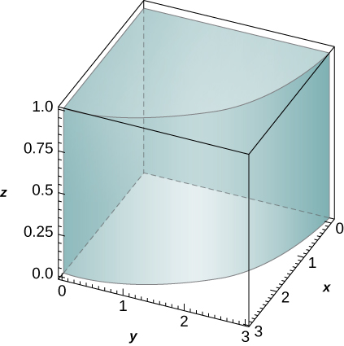

<math xmlns="http://www.w3.org/1998/Math/MathML"><mrow><mfrac><mrow><mn>9</mn><mi>π</mi></mrow><mn>8</mn></mfrac></mrow></math>

<math xmlns="http://www.w3.org/1998/Math/MathML"><mrow><mi>f</mi><mo stretchy="false">(</mo><mi>x</mi><mo>,</mo><mi>y</mi><mo>,</mo><mi>z</mi><mo stretchy="false">)</mo><mo>=</mo><mi>x</mi><msup><mi>z</mi><mn>2</mn></msup><mo>,</mo></mrow></math>

 <math xmlns="http://www.w3.org/1998/Math/MathML"><mrow><mi>B</mi><mo>=</mo><mrow><mo>{</mo><mrow><mrow><mo>(</mo><mrow><mi>x</mi><mo>,</mo><mi>y</mi><mo>,</mo><mi>z</mi></mrow><mo>)</mo></mrow><mo>\|</mo><msup><mi>x</mi><mn>2</mn></msup><mo>+</mo><msup><mi>y</mi><mn>2</mn></msup><mo>≤</mo><mn>16</mn><mo>,</mo><mi>x</mi><mo>≥</mo><mn>0</mn><mo>,</mo><mi>y</mi><mo>≤</mo><mn>0</mn><mo>,</mo><mn>−1</mn><mo>≤</mo><mi>z</mi><mo>≤</mo><mn>1</mn></mrow><mo>}</mo></mrow></mrow></math>

<math xmlns="http://www.w3.org/1998/Math/MathML"><mrow><mi>f</mi><mo stretchy="false">(</mo><mi>x</mi><mo>,</mo><mi>y</mi><mo>,</mo><mi>z</mi><mo stretchy="false">)</mo><mo>=</mo><mi>x</mi><mi>y</mi><mo>,</mo></mrow></math>

 <math xmlns="http://www.w3.org/1998/Math/MathML"><mrow><mi>B</mi><mo>=</mo><mrow><mo>{</mo><mrow><mrow><mo>(</mo><mrow><mi>x</mi><mo>,</mo><mi>y</mi><mo>,</mo><mi>z</mi></mrow><mo>)</mo></mrow><mo>\|</mo><msup><mi>x</mi><mn>2</mn></msup><mo>+</mo><msup><mi>y</mi><mn>2</mn></msup><mo>≤</mo><mn>1</mn><mo>,</mo><mi>x</mi><mo>≥</mo><mn>0</mn><mo>,</mo><mi>x</mi><mo>≥</mo><mi>y</mi><mo>,</mo><mn>−1</mn><mo>≤</mo><mi>z</mi><mo>≤</mo><mn>1</mn></mrow><mo>}</mo></mrow></mrow></math>

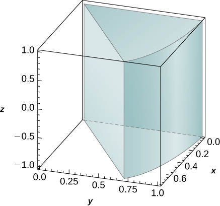

<math xmlns="http://www.w3.org/1998/Math/MathML"><mrow><mfrac><mn>1</mn><mn>8</mn></mfrac></mrow></math>

<math xmlns="http://www.w3.org/1998/Math/MathML"><mrow><mi>f</mi><mo stretchy="false">(</mo><mi>x</mi><mo>,</mo><mi>y</mi><mo>,</mo><mi>z</mi><mo stretchy="false">)</mo><mo>=</mo><msup><mi>x</mi><mn>2</mn></msup><mo>+</mo><msup><mi>y</mi><mn>2</mn></msup><mo>,</mo></mrow></math>

 <math xmlns="http://www.w3.org/1998/Math/MathML"><mrow><mi>B</mi><mo>=</mo><mrow><mo>{</mo><mrow><mrow><mo>(</mo><mrow><mi>x</mi><mo>,</mo><mi>y</mi><mo>,</mo><mi>z</mi></mrow><mo>)</mo></mrow><mo>\|</mo><msup><mi>x</mi><mn>2</mn></msup><mo>+</mo><msup><mi>y</mi><mn>2</mn></msup><mo>≤</mo><mn>4</mn><mo>,</mo><mi>x</mi><mo>≥</mo><mn>0</mn><mo>,</mo><mi>x</mi><mo>≤</mo><mi>y</mi><mo>,</mo><mn>0</mn><mo>≤</mo><mi>z</mi><mo>≤</mo><mn>3</mn></mrow><mo>}</mo></mrow></mrow></math>

<math xmlns="http://www.w3.org/1998/Math/MathML"><mrow><mi>f</mi><mo stretchy="false">(</mo><mi>x</mi><mo>,</mo><mi>y</mi><mo>,</mo><mi>z</mi><mo stretchy="false">)</mo><mo>=</mo><msup><mi>e</mi><mrow><msqrt><mrow><msup><mi>x</mi><mn>2</mn></msup><mo>+</mo><msup><mi>y</mi><mn>2</mn></msup></mrow></msqrt></mrow></msup><mo>,</mo></mrow></math>

 <math xmlns="http://www.w3.org/1998/Math/MathML"><mrow><mi>B</mi><mo>=</mo><mrow><mo>{</mo><mrow><mrow><mo>(</mo><mrow><mi>x</mi><mo>,</mo><mi>y</mi><mo>,</mo><mi>z</mi></mrow><mo>)</mo></mrow><mo>\|</mo><mn>1</mn><mo>≤</mo><msup><mi>x</mi><mn>2</mn></msup><mo>+</mo><msup><mi>y</mi><mn>2</mn></msup><mo>≤</mo><mn>4</mn><mo>,</mo><mi>y</mi><mo>≤</mo><mn>0</mn><mo>,</mo><mi>x</mi><mo>≤</mo><mi>y</mi><msqrt><mn>3</mn></msqrt><mo>,</mo><mn>2</mn><mo>≤</mo><mi>z</mi><mo>≤</mo><mn>3</mn></mrow><mo>}</mo></mrow></mrow></math>

<math xmlns="http://www.w3.org/1998/Math/MathML"><mrow><mfrac><mrow><mi>π</mi><msup><mi>e</mi><mn>2</mn></msup></mrow><mn>6</mn></mfrac></mrow></math>

<math xmlns="http://www.w3.org/1998/Math/MathML"><mrow><mi>f</mi><mo stretchy="false">(</mo><mi>x</mi><mo>,</mo><mi>y</mi><mo>,</mo><mi>z</mi><mo stretchy="false">)</mo><mo>=</mo><msqrt><mrow><msup><mi>x</mi><mn>2</mn></msup><mo>+</mo><msup><mi>y</mi><mn>2</mn></msup></mrow></msqrt><mo>,</mo></mrow></math>

 <math xmlns="http://www.w3.org/1998/Math/MathML"><mrow><mi>B</mi><mo>=</mo><mrow><mo>{</mo><mrow><mrow><mo>(</mo><mrow><mi>x</mi><mo>,</mo><mi>y</mi><mo>,</mo><mi>z</mi></mrow><mo>)</mo></mrow><mo>\|</mo><mn>1</mn><mo>≤</mo><msup><mi>x</mi><mn>2</mn></msup><mo>+</mo><msup><mi>y</mi><mn>2</mn></msup><mo>≤</mo><mn>9</mn><mo>,</mo><mi>y</mi><mo>≤</mo><mn>0</mn><mo>,</mo><mn>0</mn><mo>≤</mo><mi>z</mi><mo>≤</mo><mn>1</mn></mrow><mo>}</mo></mrow></mrow></math>

1.  Let
    <math xmlns="http://www.w3.org/1998/Math/MathML"><mi>B</mi></math>
    
    be a cylindrical shell with inner radius
    <math xmlns="http://www.w3.org/1998/Math/MathML"><mi>a</mi><mo>,</mo></math>
    
    outer radius
    <math xmlns="http://www.w3.org/1998/Math/MathML"><mi>b</mi><mo>,</mo></math>
    
    and height
    <math xmlns="http://www.w3.org/1998/Math/MathML"><mi>c</mi><mo>,</mo></math>
    
    where
    <math xmlns="http://www.w3.org/1998/Math/MathML"><mrow><mn>0</mn><mo>&lt;</mo><mi>a</mi><mo>&lt;</mo><mi>b</mi></mrow></math>
    
    and
    <math xmlns="http://www.w3.org/1998/Math/MathML"><mrow><mi>c</mi><mo>&gt;</mo><mn>0</mn><mo>.</mo></mrow></math>
    
    Assume that a function
    <math xmlns="http://www.w3.org/1998/Math/MathML"><mi>F</mi></math>
    
    defined on
    <math xmlns="http://www.w3.org/1998/Math/MathML"><mi>B</mi></math>
    
    can be expressed in cylindrical coordinates as
    <math xmlns="http://www.w3.org/1998/Math/MathML"><mrow><mi>F</mi><mo stretchy="false">(</mo><mi>x</mi><mo>,</mo><mi>y</mi><mo>,</mo><mi>z</mi><mo stretchy="false">)</mo><mo>=</mo><mi>f</mi><mo stretchy="false">(</mo><mi>r</mi><mo stretchy="false">)</mo><mo>+</mo><mi>h</mi><mo stretchy="false">(</mo><mi>z</mi><mo stretchy="false">)</mo><mo>,</mo></mrow></math>
    
    where
    <math xmlns="http://www.w3.org/1998/Math/MathML"><mi>f</mi></math>
    
    and
    <math xmlns="http://www.w3.org/1998/Math/MathML"><mi>h</mi></math>
    
    are differentiable functions. If
    <math xmlns="http://www.w3.org/1998/Math/MathML"><mrow><mstyle displaystyle="true"><mrow><munderover><mo stretchy="false">∫</mo><mi>a</mi><mi>b</mi></munderover><mrow><mover accent="true"><mi>f</mi><mo>˜</mo></mover><mo stretchy="false">(</mo><mi>r</mi><mo stretchy="false">)</mo><mi>d</mi><mi>r</mi><mo>=</mo><mn>0</mn></mrow></mrow></mstyle></mrow></math>
    
    and
    <math xmlns="http://www.w3.org/1998/Math/MathML"><mrow><mover accent="true"><mi>h</mi><mo>˜</mo></mover><mo stretchy="false">(</mo><mn>0</mn><mo stretchy="false">)</mo><mo>=</mo><mn>0</mn><mo>,</mo></mrow></math>
    
    where
    <math xmlns="http://www.w3.org/1998/Math/MathML"><mover accent="true"><mi>f</mi><mo>˜</mo></mover></math>
    
    and
    <math xmlns="http://www.w3.org/1998/Math/MathML"><mover accent="true"><mi>h</mi><mo>˜</mo></mover></math>
    
    are antiderivatives of
    <math xmlns="http://www.w3.org/1998/Math/MathML"><mi>f</mi></math>
    
    and
    <math xmlns="http://www.w3.org/1998/Math/MathML"><mi>h</mi><mo>,</mo></math>
    
    respectively, show that
    * * *
    {: data-type="newline"}
    
    

    <math xmlns="http://www.w3.org/1998/Math/MathML"><mrow><mstyle displaystyle="true"><mrow><munder><mo>∭</mo><mi>B</mi></munder><mrow><mi>F</mi><mrow><mo>(</mo><mrow><mi>x</mi><mo>,</mo><mi>y</mi><mo>,</mo><mi>z</mi></mrow><mo>)</mo></mrow><mi>d</mi><mi>V</mi></mrow></mrow></mstyle><mo>=</mo><mn>2</mn><mi>π</mi><mi>c</mi><mrow><mo>(</mo><mrow><mi>b</mi><mover accent="true"><mi>f</mi><mo>˜</mo></mover><mo stretchy="false">(</mo><mi>b</mi><mo stretchy="false">)</mo><mo>−</mo><mi>a</mi><mover accent="true"><mi>f</mi><mo>˜</mo></mover><mo stretchy="false">(</mo><mi>a</mi><mo stretchy="false">)</mo></mrow><mo>)</mo></mrow><mo>+</mo><mi>π</mi><mrow><mo>(</mo><mrow><msup><mi>b</mi><mn>2</mn></msup><mo>−</mo><msup><mi>a</mi><mn>2</mn></msup></mrow><mo>)</mo></mrow><mover accent="true"><mi>h</mi><mo>˜</mo></mover><mo stretchy="false">(</mo><mi>c</mi><mo stretchy="false">)</mo><mo>.</mo></mrow></math>
    

2.  Use the previous result to show that
    <math xmlns="http://www.w3.org/1998/Math/MathML"><mrow><mstyle displaystyle="true"><mrow><munder><mo>∭</mo><mi>B</mi></munder><mrow><mrow><mo>(</mo><mrow><mi>z</mi><mo>+</mo><mtext>sin</mtext><msqrt><mrow><msup><mi>x</mi><mn>2</mn></msup><mo>+</mo><msup><mi>y</mi><mn>2</mn></msup></mrow></msqrt></mrow><mo>)</mo></mrow></mrow></mrow></mstyle><mi>d</mi><mi>x</mi><mspace width="0.2em" /><mi>d</mi><mi>y</mi><mspace width="0.2em" /><mi>d</mi><mi>z</mi><mo>=</mo><mn>6</mn><msup><mi>π</mi><mn>2</mn></msup><mrow><mo>(</mo><mrow><mi>π</mi><mo>−</mo><mn>2</mn></mrow><mo>)</mo></mrow><mo>,</mo></mrow></math>
    
    where
    <math xmlns="http://www.w3.org/1998/Math/MathML"><mi>B</mi></math>
    
    is a cylindrical shell with inner radius
    <math xmlns="http://www.w3.org/1998/Math/MathML"><mi>π</mi><mo>,</mo></math>
    
    outer radius
    <math xmlns="http://www.w3.org/1998/Math/MathML"><mrow><mn>2</mn><mi>π</mi><mo>,</mo></mrow></math>
    
    and height
    <math xmlns="http://www.w3.org/1998/Math/MathML"><mn>2</mn><mo>.</mo></math>
{: data-number-style="lower-alpha"}

1.  Let
    <math xmlns="http://www.w3.org/1998/Math/MathML"><mi>B</mi></math>
    
    be a cylindrical shell with inner radius
    <math xmlns="http://www.w3.org/1998/Math/MathML"><mi>a</mi><mo>,</mo></math>
    
    outer radius
    <math xmlns="http://www.w3.org/1998/Math/MathML"><mi>b</mi><mo>,</mo></math>
    
    and height
    <math xmlns="http://www.w3.org/1998/Math/MathML"><mi>c</mi><mo>,</mo></math>
    
    where
    <math xmlns="http://www.w3.org/1998/Math/MathML"><mrow><mn>0</mn><mo>&lt;</mo><mi>a</mi><mo>&lt;</mo><mi>b</mi></mrow></math>
    
    and
    <math xmlns="http://www.w3.org/1998/Math/MathML"><mrow><mi>c</mi><mo>&gt;</mo><mn>0</mn><mo>.</mo></mrow></math>
    
    Assume that a function
    <math xmlns="http://www.w3.org/1998/Math/MathML"><mi>F</mi></math>
    
    defined on
    <math xmlns="http://www.w3.org/1998/Math/MathML"><mi>B</mi></math>
    
    can be expressed in cylindrical coordinates as
    <math xmlns="http://www.w3.org/1998/Math/MathML"><mrow><mi>F</mi><mo stretchy="false">(</mo><mi>x</mi><mo>,</mo><mi>y</mi><mo>,</mo><mi>z</mi><mo stretchy="false">)</mo><mo>=</mo><mi>f</mi><mo stretchy="false">(</mo><mi>r</mi><mo stretchy="false">)</mo><mi>g</mi><mo stretchy="false">(</mo><mi>θ</mi><mo stretchy="false">)</mo><mi>h</mi><mo stretchy="false">(</mo><mi>z</mi><mo stretchy="false">)</mo><mo>,</mo></mrow></math>
    
    where
    <math xmlns="http://www.w3.org/1998/Math/MathML"><mrow><mi>f</mi><mo>,</mo><mi>g</mi><mo>,</mo><mspace width="0.2em" /><mtext>and</mtext><mspace width="0.2em" /><mi>h</mi></mrow></math>
    
    are differentiable functions. If
    <math xmlns="http://www.w3.org/1998/Math/MathML"><mrow><mstyle displaystyle="true"><mrow><munderover><mo stretchy="false">∫</mo><mi>a</mi><mi>b</mi></munderover><mrow><mover accent="true"><mi>f</mi><mo>˜</mo></mover><mo stretchy="false">(</mo><mi>r</mi><mo stretchy="false">)</mo><mi>d</mi><mi>r</mi><mo>=</mo><mn>0</mn></mrow></mrow></mstyle><mo>,</mo></mrow></math>
    
    where
    <math xmlns="http://www.w3.org/1998/Math/MathML"><mover accent="true"><mi>f</mi><mo>˜</mo></mover></math>
    
    is an antiderivative of
    <math xmlns="http://www.w3.org/1998/Math/MathML"><mi>f</mi><mo>,</mo></math>
    
    show that
    * * *
    {: data-type="newline"}
    
    

    <math xmlns="http://www.w3.org/1998/Math/MathML"><mrow><mstyle displaystyle="true"><mrow><munder><mo>∭</mo><mi>B</mi></munder><mrow><mi>F</mi><mrow><mo>(</mo><mrow><mi>x</mi><mo>,</mo><mi>y</mi><mo>,</mo><mi>z</mi></mrow><mo>)</mo></mrow><mi>d</mi><mi>V</mi></mrow></mrow></mstyle><mo>=</mo><mrow><mo>[</mo><mrow><mi>b</mi><mover accent="true"><mi>f</mi><mo>˜</mo></mover><mo stretchy="false">(</mo><mi>b</mi><mo stretchy="false">)</mo><mo>−</mo><mi>a</mi><mover accent="true"><mi>f</mi><mo>˜</mo></mover><mo stretchy="false">(</mo><mi>a</mi><mo stretchy="false">)</mo></mrow><mo>]</mo></mrow><mspace width="0.2em" /><mrow><mo>[</mo><mrow><mover accent="true"><mi>g</mi><mo>˜</mo></mover><mo stretchy="false">(</mo><mn>2</mn><mi>π</mi><mo stretchy="false">)</mo><mo>−</mo><mover accent="true"><mi>g</mi><mo>˜</mo></mover><mo stretchy="false">(</mo><mn>0</mn><mo stretchy="false">)</mo></mrow><mo>]</mo></mrow><mspace width="0.2em" /><mrow><mo>[</mo><mrow><mover accent="true"><mi>h</mi><mo>˜</mo></mover><mo stretchy="false">(</mo><mi>c</mi><mo stretchy="false">)</mo><mo>−</mo><mover accent="true"><mi>h</mi><mo>˜</mo></mover><mo stretchy="false">(</mo><mn>0</mn><mo stretchy="false">)</mo></mrow><mo>]</mo></mrow><mo>,</mo></mrow></math>
    

    
    * * *
    {: data-type="newline"}
    
    where
    <math xmlns="http://www.w3.org/1998/Math/MathML"><mover accent="true"><mi>g</mi><mo>˜</mo></mover></math>
    
    and
    <math xmlns="http://www.w3.org/1998/Math/MathML"><mover accent="true"><mi>h</mi><mo>˜</mo></mover></math>
    
    are antiderivatives of
    <math xmlns="http://www.w3.org/1998/Math/MathML"><mi>g</mi></math>
    
    and
    <math xmlns="http://www.w3.org/1998/Math/MathML"><mi>h</mi><mo>,</mo></math>
    
    respectively.
2.  Use the previous result to show that
    <math xmlns="http://www.w3.org/1998/Math/MathML"><mrow><mstyle displaystyle="true"><mrow><munder><mo>∭</mo><mi>B</mi></munder><mrow><mi>z</mi><mspace width="0.2em" /><mtext>sin</mtext><msqrt><mrow><msup><mi>x</mi><mn>2</mn></msup><mo>+</mo><msup><mi>y</mi><mn>2</mn></msup></mrow></msqrt></mrow></mrow></mstyle><mi>d</mi><mi>x</mi><mspace width="0.2em" /><mi>d</mi><mi>y</mi><mspace width="0.2em" /><mi>d</mi><mi>z</mi><mo>=</mo><mn>−12</mn><msup><mi>π</mi><mn>2</mn></msup><mo>,</mo></mrow></math>
    
    where
    <math xmlns="http://www.w3.org/1998/Math/MathML"><mi>B</mi></math>
    
    is a cylindrical shell with inner radius
    <math xmlns="http://www.w3.org/1998/Math/MathML"><mi>π</mi><mo>,</mo></math>
    
    outer radius
    <math xmlns="http://www.w3.org/1998/Math/MathML"><mrow><mn>2</mn><mi>π</mi><mo>,</mo></mrow></math>
    
    and height
    <math xmlns="http://www.w3.org/1998/Math/MathML"><mn>2</mn><mo>.</mo></math>
{: data-number-style="lower-alpha"}

In the following exercises, the boundaries of the solid <math xmlns="http://www.w3.org/1998/Math/MathML"><mi>E</mi></math>

 are given in cylindrical coordinates.

1.  Express the region
    <math xmlns="http://www.w3.org/1998/Math/MathML"><mi>E</mi></math>
    
    in cylindrical coordinates.
2.  Convert the integral
    <math xmlns="http://www.w3.org/1998/Math/MathML"><mrow><mstyle displaystyle="true"><mrow><munder><mo>∭</mo><mi>E</mi></munder><mrow><mi>f</mi><mrow><mo>(</mo><mrow><mi>x</mi><mo>,</mo><mi>y</mi><mo>,</mo><mi>z</mi></mrow><mo>)</mo></mrow></mrow></mrow></mstyle><mi>d</mi><mi>V</mi></mrow></math>
    
    to cylindrical coordinates.
{: data-number-style="lower-alpha"}

*E* is bounded by the right circular cylinder <math xmlns="http://www.w3.org/1998/Math/MathML"><mrow><mi>r</mi><mo>=</mo><mn>4</mn><mspace width="0.2em" /><mtext>sin</mtext><mspace width="0.2em" /><mi>θ</mi><mo>,</mo></mrow></math>

 the <math xmlns="http://www.w3.org/1998/Math/MathML"><mrow><mi>r</mi><mi>θ</mi></mrow></math>

-plane, and the sphere <math xmlns="http://www.w3.org/1998/Math/MathML"><mrow><msup><mi>r</mi><mn>2</mn></msup><mo>+</mo><msup><mi>z</mi><mn>2</mn></msup><mo>=</mo><mn>16</mn><mo>.</mo></mrow></math>

a. <math xmlns="http://www.w3.org/1998/Math/MathML"><mrow><mi>E</mi><mo>=</mo><mrow><mo>{</mo><mrow><mrow><mo>(</mo><mrow><mi>r</mi><mo>,</mo><mi>θ</mi><mo>,</mo><mi>z</mi></mrow><mo>)</mo></mrow><mo>\|</mo><mn>0</mn><mo>≤</mo><mi>θ</mi><mo>≤</mo><mi>π</mi><mo>,</mo><mn>0</mn><mo>≤</mo><mi>r</mi><mo>≤</mo><mn>4</mn><mspace width="0.2em" /><mtext>sin</mtext><mspace width="0.2em" /><mi>θ</mi><mo>,</mo><mn>0</mn><mo>≤</mo><mi>z</mi><mo>≤</mo><msqrt><mrow><mn>16</mn><mo>−</mo><msup><mi>r</mi><mn>2</mn></msup></mrow></msqrt></mrow><mo>}</mo></mrow><mo>;</mo></mrow></math>

 b. <math xmlns="http://www.w3.org/1998/Math/MathML"><mrow><mstyle displaystyle="true"><mrow><munderover><mo stretchy="false">∫</mo><mn>0</mn><mi>π</mi></munderover><mspace width="0.2em" /><mrow><mstyle displaystyle="true"><mrow><munderover><mo stretchy="false">∫</mo><mn>0</mn><mrow><mn>4</mn><mspace width="0.2em" /><mtext>sin</mtext><mspace width="0.2em" /><mi>θ</mi></mrow></munderover><mspace width="0.2em" /><mrow><mstyle displaystyle="true"><mrow><munderover><mo stretchy="false">∫</mo><mn>0</mn><mrow><msqrt><mrow><mn>16</mn><mo>−</mo><msup><mi>r</mi><mn>2</mn></msup></mrow></msqrt></mrow></munderover><mrow><mi>f</mi><mrow><mo>(</mo><mrow><mi>r</mi><mo>,</mo><mi>θ</mi><mo>,</mo><mi>z</mi></mrow><mo>)</mo></mrow><mi>r</mi><mspace width="0.2em" /><mi>d</mi><mi>z</mi><mspace width="0.2em" /><mi>d</mi><mi>r</mi><mspace width="0.2em" /><mi>d</mi><mi>θ</mi></mrow></mrow></mstyle></mrow></mrow></mstyle></mrow></mrow></mstyle></mrow></math>

<math xmlns="http://www.w3.org/1998/Math/MathML"><mi>E</mi></math>

 is bounded by the right circular cylinder <math xmlns="http://www.w3.org/1998/Math/MathML"><mrow><mi>r</mi><mo>=</mo><mtext>cos</mtext><mspace width="0.2em" /><mi>θ</mi><mo>,</mo></mrow></math>

 the <math xmlns="http://www.w3.org/1998/Math/MathML"><mrow><mi>r</mi><mi>θ</mi></mrow></math>

-plane, and the sphere <math xmlns="http://www.w3.org/1998/Math/MathML"><mrow><msup><mi>r</mi><mn>2</mn></msup><mo>+</mo><msup><mi>z</mi><mn>2</mn></msup><mo>=</mo><mn>9</mn><mo>.</mo></mrow></math>

<math xmlns="http://www.w3.org/1998/Math/MathML"><mi>E</mi></math>

 is located in the first octant and is bounded by the circular paraboloid <math xmlns="http://www.w3.org/1998/Math/MathML"><mrow><mi>z</mi><mo>=</mo><mn>9</mn><mo>−</mo><mn>3</mn><msup><mi>r</mi><mn>2</mn></msup><mo>,</mo></mrow></math>

 the cylinder <math xmlns="http://www.w3.org/1998/Math/MathML"><mrow><mi>r</mi><mo>=</mo><msqrt><mn>3</mn></msqrt><mo>,</mo></mrow></math>

 and the plane <math xmlns="http://www.w3.org/1998/Math/MathML"><mrow><mi>r</mi><mrow><mo>(</mo><mrow><mtext>cos</mtext><mspace width="0.2em" /><mi>θ</mi><mo>+</mo><mtext>sin</mtext><mspace width="0.2em" /><mi>θ</mi></mrow><mo>)</mo></mrow><mo>=</mo><mn>20</mn><mo>−</mo><mi>z</mi><mo>.</mo></mrow></math>

a. <math xmlns="http://www.w3.org/1998/Math/MathML"><mrow><mi>E</mi><mo>=</mo><mrow><mo>{</mo><mrow><mrow><mo>(</mo><mrow><mi>r</mi><mo>,</mo><mi>θ</mi><mo>,</mo><mi>z</mi></mrow><mo>)</mo></mrow><mo>\|</mo><mn>0</mn><mo>≤</mo><mi>θ</mi><mo>≤</mo><mfrac><mi>π</mi><mn>2</mn></mfrac><mo>,</mo><mn>0</mn><mo>≤</mo><mi>r</mi><mo>≤</mo><msqrt><mn>3</mn></msqrt><mo>,</mo><mn>9</mn><mo>−</mo><msup><mi>r</mi><mn>2</mn></msup><mo>≤</mo><mi>z</mi><mo>≤</mo><mn>10</mn><mo>−</mo><mi>r</mi><mrow><mo>(</mo><mrow><mtext>cos</mtext><mspace width="0.2em" /><mi>θ</mi><mo>+</mo><mtext>sin</mtext><mspace width="0.2em" /><mi>θ</mi></mrow><mo>)</mo></mrow></mrow><mo>}</mo></mrow><mo>;</mo></mrow></math>

 b. <math xmlns="http://www.w3.org/1998/Math/MathML"><mrow><mstyle displaystyle="true"><mrow><munderover><mo stretchy="false">∫</mo><mn>0</mn><mrow><mrow><mi>π</mi><mtext>/</mtext><mn>2</mn></mrow></mrow></munderover><mspace width="0.2em" /><mrow><mstyle displaystyle="true"><mrow><munderover><mo stretchy="false">∫</mo><mn>0</mn><mrow><msqrt><mn>3</mn></msqrt></mrow></munderover><mspace width="0.2em" /><mrow><mstyle displaystyle="true"><mrow><munderover><mo stretchy="false">∫</mo><mrow><mn>9</mn><mo>−</mo><msup><mi>r</mi><mn>2</mn></msup></mrow><mrow><mn>10</mn><mo>−</mo><mi>r</mi><mrow><mo>(</mo><mrow><mtext>cos</mtext><mspace width="0.2em" /><mi>θ</mi><mo>+</mo><mtext>sin</mtext><mspace width="0.2em" /><mi>θ</mi></mrow><mo>)</mo></mrow></mrow></munderover><mrow><mi>f</mi><mrow><mo>(</mo><mrow><mi>r</mi><mo>,</mo><mi>θ</mi><mo>,</mo><mi>z</mi></mrow><mo>)</mo></mrow></mrow></mrow></mstyle></mrow></mrow></mstyle></mrow></mrow></mstyle><mi>r</mi><mspace width="0.2em" /><mi>d</mi><mi>z</mi><mspace width="0.2em" /><mi>d</mi><mi>r</mi><mspace width="0.2em" /><mi>d</mi><mi>θ</mi></mrow></math>

<math xmlns="http://www.w3.org/1998/Math/MathML"><mi>E</mi></math>

 is located in the first octant outside the circular paraboloid <math xmlns="http://www.w3.org/1998/Math/MathML"><mrow><mi>z</mi><mo>=</mo><mn>10</mn><mo>−</mo><mn>2</mn><msup><mi>r</mi><mn>2</mn></msup></mrow></math>

 and inside the cylinder <math xmlns="http://www.w3.org/1998/Math/MathML"><mrow><mi>r</mi><mo>=</mo><msqrt><mn>5</mn></msqrt></mrow></math>

 and is bounded also by the planes <math xmlns="http://www.w3.org/1998/Math/MathML"><mrow><mi>z</mi><mo>=</mo><mn>20</mn></mrow></math>

 and <math xmlns="http://www.w3.org/1998/Math/MathML"><mrow><mi>θ</mi><mo>=</mo><mfrac><mi>π</mi><mn>4</mn></mfrac><mo>.</mo></mrow></math>

In the following exercises, the function <math xmlns="http://www.w3.org/1998/Math/MathML"><mi>f</mi></math>

 and region <math xmlns="http://www.w3.org/1998/Math/MathML"><mi>E</mi></math>

 are given.

1.  Express the region
    <math xmlns="http://www.w3.org/1998/Math/MathML"><mi>E</mi></math>
    
    and the function
    <math xmlns="http://www.w3.org/1998/Math/MathML"><mi>f</mi></math>
    
    in cylindrical coordinates.
2.  Convert the integral
    <math xmlns="http://www.w3.org/1998/Math/MathML"><mrow><mstyle displaystyle="true"><mrow><munder><mo>∭</mo><mi>B</mi></munder><mrow><mi>f</mi><mrow><mo>(</mo><mrow><mi>x</mi><mo>,</mo><mi>y</mi><mo>,</mo><mi>z</mi></mrow><mo>)</mo></mrow></mrow></mrow></mstyle><mi>d</mi><mi>V</mi></mrow></math>
    
    into cylindrical coordinates and evaluate it.
{: data-number-style="lower-alpha"}

<math xmlns="http://www.w3.org/1998/Math/MathML"><mrow><mi>f</mi><mrow><mo>(</mo><mrow><mi>x</mi><mo>,</mo><mi>y</mi><mo>,</mo><mi>z</mi></mrow><mo>)</mo></mrow><mo>=</mo><mfrac><mn>1</mn><mrow><mi>x</mi><mo>+</mo><mn>3</mn></mrow></mfrac><mo>,</mo></mrow></math>

 <math xmlns="http://www.w3.org/1998/Math/MathML"><mrow><mi>E</mi><mo>=</mo><mrow><mo>{</mo><mrow><mrow><mo>(</mo><mrow><mi>x</mi><mo>,</mo><mi>y</mi><mo>,</mo><mi>z</mi></mrow><mo>)</mo></mrow><mo>\|</mo><mn>0</mn><mo>≤</mo><msup><mi>x</mi><mn>2</mn></msup><mo>+</mo><msup><mi>y</mi><mn>2</mn></msup><mo>≤</mo><mn>9</mn><mo>,</mo><mi>x</mi><mo>≥</mo><mn>0</mn><mo>,</mo><mi>y</mi><mo>≥</mo><mn>0</mn><mo>,</mo><mn>0</mn><mo>≤</mo><mi>z</mi><mo>≤</mo><mi>x</mi><mo>+</mo><mn>3</mn></mrow><mo>}</mo></mrow></mrow></math>

a. <math xmlns="http://www.w3.org/1998/Math/MathML"><mrow><mi>E</mi><mo>=</mo><mrow><mo>{</mo><mrow><mrow><mo>(</mo><mrow><mi>r</mi><mo>,</mo><mi>θ</mi><mo>,</mo><mi>z</mi></mrow><mo>)</mo></mrow><mo>\|</mo><mn>0</mn><mo>≤</mo><mi>r</mi><mo>≤</mo><mn>3</mn><mo>,</mo><mn>0</mn><mo>≤</mo><mi>θ</mi><mo>≤</mo><mfrac><mi>π</mi><mn>2</mn></mfrac><mo>,</mo><mn>0</mn><mo>≤</mo><mi>z</mi><mo>≤</mo><mi>r</mi><mspace width="0.2em" /><mtext>cos</mtext><mspace width="0.2em" /><mi>θ</mi><mo>+</mo><mn>3</mn></mrow><mo>}</mo></mrow><mo>,</mo></mrow></math>

 <math xmlns="http://www.w3.org/1998/Math/MathML"><mrow><mi>f</mi><mrow><mo>(</mo><mrow><mi>r</mi><mo>,</mo><mi>θ</mi><mo>,</mo><mi>z</mi></mrow><mo>)</mo></mrow><mo>=</mo><mfrac><mn>1</mn><mrow><mi>r</mi><mspace width="0.2em" /><mtext>cos</mtext><mspace width="0.2em" /><mi>θ</mi><mo>+</mo><mn>3</mn></mrow></mfrac><mo>;</mo></mrow></math>

 b. <math xmlns="http://www.w3.org/1998/Math/MathML"><mrow><mstyle displaystyle="true"><mrow><munderover><mo stretchy="false">∫</mo><mn>0</mn><mn>3</mn></munderover><mspace width="0.2em" /><mrow><mstyle displaystyle="true"><mrow><munderover><mo stretchy="false">∫</mo><mn>0</mn><mrow><mrow><mi>π</mi><mtext>/</mtext><mn>2</mn></mrow></mrow></munderover><mspace width="0.2em" /><mrow><mstyle displaystyle="true"><mrow><munderover><mo stretchy="false">∫</mo><mn>0</mn><mrow><mi>r</mi><mspace width="0.2em" /><mtext>cos</mtext><mspace width="0.2em" /><mi>θ</mi><mo>+</mo><mn>3</mn></mrow></munderover><mrow><mfrac><mi>r</mi><mrow><mi>r</mi><mspace width="0.2em" /><mtext>cos</mtext><mspace width="0.2em" /><mi>θ</mi><mo>+</mo><mn>3</mn></mrow></mfrac><mi>d</mi><mi>z</mi><mspace width="0.2em" /><mi>d</mi><mi>θ</mi><mspace width="0.2em" /><mi>d</mi><mi>r</mi><mo>=</mo><mfrac><mrow><mn>9</mn><mi>π</mi></mrow><mn>4</mn></mfrac></mrow></mrow></mstyle></mrow></mrow></mstyle></mrow></mrow></mstyle></mrow></math>

<math xmlns="http://www.w3.org/1998/Math/MathML"><mrow><mi>f</mi><mrow><mo>(</mo><mrow><mi>x</mi><mo>,</mo><mi>y</mi><mo>,</mo><mi>z</mi></mrow><mo>)</mo></mrow><mo>=</mo><msup><mi>x</mi><mn>2</mn></msup><mo>+</mo><msup><mi>y</mi><mn>2</mn></msup><mo>,</mo></mrow></math>

 <math xmlns="http://www.w3.org/1998/Math/MathML"><mrow><mi>E</mi><mo>=</mo><mrow><mo>{</mo><mrow><mrow><mo>(</mo><mrow><mi>x</mi><mo>,</mo><mi>y</mi><mo>,</mo><mi>z</mi></mrow><mo>)</mo></mrow><mo>\|</mo><mn>0</mn><mo>≤</mo><msup><mi>x</mi><mn>2</mn></msup><mo>+</mo><msup><mi>y</mi><mn>2</mn></msup><mo>≤</mo><mn>4</mn><mo>,</mo><mi>y</mi><mo>≥</mo><mn>0</mn><mo>,</mo><mn>0</mn><mo>≤</mo><mi>z</mi><mo>≤</mo><mn>3</mn><mo>−</mo><mi>x</mi></mrow><mo>}</mo></mrow></mrow></math>

<math xmlns="http://www.w3.org/1998/Math/MathML"><mrow><mi>f</mi><mrow><mo>(</mo><mrow><mi>x</mi><mo>,</mo><mi>y</mi><mo>,</mo><mi>z</mi></mrow><mo>)</mo></mrow><mo>=</mo><mi>x</mi><mo>,</mo></mrow></math>

 <math xmlns="http://www.w3.org/1998/Math/MathML"><mrow><mi>E</mi><mo>=</mo><mrow><mo>{</mo><mrow><mrow><mo>(</mo><mrow><mi>x</mi><mo>,</mo><mi>y</mi><mo>,</mo><mi>z</mi></mrow><mo>)</mo></mrow><mo>\|</mo><mn>1</mn><mo>≤</mo><msup><mi>y</mi><mn>2</mn></msup><mo>+</mo><msup><mi>z</mi><mn>2</mn></msup><mo>≤</mo><mn>9</mn><mo>,</mo><mn>0</mn><mo>≤</mo><mi>x</mi><mo>≤</mo><mn>1</mn><mo>−</mo><msup><mi>y</mi><mn>2</mn></msup><mo>−</mo><msup><mi>z</mi><mn>2</mn></msup></mrow><mo>}</mo></mrow></mrow></math>

a. <math xmlns="http://www.w3.org/1998/Math/MathML"><mrow><mi>y</mi><mo>=</mo><mi>r</mi><mspace width="0.2em" /><mtext>cos</mtext><mspace width="0.2em" /><mi>θ</mi><mo>,</mo><mi>z</mi><mo>=</mo><mi>r</mi><mspace width="0.2em" /><mtext>sin</mtext><mspace width="0.2em" /><mi>θ</mi><mo>,</mo><mi>x</mi><mo>=</mo><mi>z</mi><mo>,</mo></mrow></math>

 <math xmlns="http://www.w3.org/1998/Math/MathML"><mrow><mi>E</mi><mo>=</mo><mrow><mo>{</mo><mrow><mrow><mo>(</mo><mrow><mi>r</mi><mo>,</mo><mi>θ</mi><mo>,</mo><mi>z</mi></mrow><mo>)</mo></mrow><mo>\|</mo><mn>1</mn><mo>≤</mo><mi>r</mi><mo>≤</mo><mn>3</mn><mo>,</mo><mn>0</mn><mo>≤</mo><mi>θ</mi><mo>≤</mo><mn>2</mn><mi>π</mi><mo>,</mo><mn>0</mn><mo>≤</mo><mi>z</mi><mo>≤</mo><mn>1</mn><mo>−</mo><msup><mi>r</mi><mn>2</mn></msup></mrow><mo>}</mo></mrow><mo>,</mo><mi>f</mi><mrow><mo>(</mo><mrow><mi>r</mi><mo>,</mo><mi>θ</mi><mo>,</mo><mi>z</mi></mrow><mo>)</mo></mrow><mo>=</mo><mi>z</mi><mo>;</mo></mrow></math>

 b. <math xmlns="http://www.w3.org/1998/Math/MathML"><mrow><mstyle displaystyle="true"><mrow><munderover><mo stretchy="false">∫</mo><mn>1</mn><mn>3</mn></munderover><mspace width="0.2em" /><mrow><mstyle displaystyle="true"><mrow><munderover><mo stretchy="false">∫</mo><mn>0</mn><mrow><mn>2</mn><mi>π</mi></mrow></munderover><mspace width="0.2em" /><mrow><mstyle displaystyle="true"><mrow><munderover><mo stretchy="false">∫</mo><mn>0</mn><mrow><mn>1</mn><mo>−</mo><msup><mi>r</mi><mn>2</mn></msup></mrow></munderover><mrow><mi>z</mi><mi>r</mi><mspace width="0.2em" /><mi>d</mi><mi>z</mi><mspace width="0.2em" /><mi>d</mi><mi>θ</mi><mspace width="0.2em" /><mi>d</mi><mi>r</mi><mo>=</mo><mfrac><mrow><mn>356</mn><mi>π</mi></mrow><mn>3</mn></mfrac></mrow></mrow></mstyle></mrow></mrow></mstyle></mrow></mrow></mstyle></mrow></math>

<math xmlns="http://www.w3.org/1998/Math/MathML"><mrow><mi>f</mi><mrow><mo>(</mo><mrow><mi>x</mi><mo>,</mo><mi>y</mi><mo>,</mo><mi>z</mi></mrow><mo>)</mo></mrow><mo>=</mo><mi>y</mi><mo>,</mo></mrow></math>

 <math xmlns="http://www.w3.org/1998/Math/MathML"><mrow><mi>E</mi><mo>=</mo><mrow><mo>{</mo><mrow><mrow><mo>(</mo><mrow><mi>x</mi><mo>,</mo><mi>y</mi><mo>,</mo><mi>z</mi></mrow><mo>)</mo></mrow><mo>\|</mo><mn>1</mn><mo>≤</mo><msup><mi>x</mi><mn>2</mn></msup><mo>+</mo><msup><mi>z</mi><mn>2</mn></msup><mo>≤</mo><mn>9</mn><mo>,</mo><mn>0</mn><mo>≤</mo><mi>y</mi><mo>≤</mo><mn>1</mn><mo>−</mo><msup><mi>x</mi><mn>2</mn></msup><mo>−</mo><msup><mi>z</mi><mn>2</mn></msup></mrow><mo>}</mo></mrow></mrow></math>

In the following exercises, find the volume of the solid <math xmlns="http://www.w3.org/1998/Math/MathML"><mi>E</mi></math>

 whose boundaries are given in rectangular coordinates.

<math xmlns="http://www.w3.org/1998/Math/MathML"><mi>E</mi></math>

 is above the <math xmlns="http://www.w3.org/1998/Math/MathML"><mrow><mi>x</mi><mi>y</mi></mrow></math>

-plane, inside the cylinder <math xmlns="http://www.w3.org/1998/Math/MathML"><mrow><msup><mi>x</mi><mn>2</mn></msup><mo>+</mo><msup><mi>y</mi><mn>2</mn></msup><mo>=</mo><mn>1</mn><mo>,</mo></mrow></math>

 and below the plane <math xmlns="http://www.w3.org/1998/Math/MathML"><mrow><mi>z</mi><mo>=</mo><mn>1</mn><mo>.</mo></mrow></math>

<math xmlns="http://www.w3.org/1998/Math/MathML"><mi>π</mi></math>

<math xmlns="http://www.w3.org/1998/Math/MathML"><mi>E</mi></math>

 is below the plane <math xmlns="http://www.w3.org/1998/Math/MathML"><mrow><mi>z</mi><mo>=</mo><mn>1</mn></mrow></math>

 and inside the paraboloid <math xmlns="http://www.w3.org/1998/Math/MathML"><mrow><mi>z</mi><mo>=</mo><msup><mi>x</mi><mn>2</mn></msup><mo>+</mo><msup><mi>y</mi><mn>2</mn></msup><mo>.</mo></mrow></math>

<math xmlns="http://www.w3.org/1998/Math/MathML"><mi>E</mi></math>

 is bounded by the circular cone <math xmlns="http://www.w3.org/1998/Math/MathML"><mrow><mi>z</mi><mo>=</mo><msqrt><mrow><msup><mi>x</mi><mn>2</mn></msup><mo>+</mo><msup><mi>y</mi><mn>2</mn></msup></mrow></msqrt></mrow></math>

 and <math xmlns="http://www.w3.org/1998/Math/MathML"><mrow><mi>z</mi><mo>=</mo><mn>1</mn><mo>.</mo></mrow></math>

<math xmlns="http://www.w3.org/1998/Math/MathML"><mrow><mfrac><mi>π</mi><mn>3</mn></mfrac></mrow></math>

<math xmlns="http://www.w3.org/1998/Math/MathML"><mi>E</mi></math>

 is located above the <math xmlns="http://www.w3.org/1998/Math/MathML"><mrow><mi>x</mi><mi>y</mi></mrow></math>

-plane, below <math xmlns="http://www.w3.org/1998/Math/MathML"><mrow><mi>z</mi><mo>=</mo><mn>1</mn><mo>,</mo></mrow></math>

 outside the one-sheeted hyperboloid <math xmlns="http://www.w3.org/1998/Math/MathML"><mrow><msup><mi>x</mi><mn>2</mn></msup><mo>+</mo><msup><mi>y</mi><mn>2</mn></msup><mo>−</mo><msup><mi>z</mi><mn>2</mn></msup><mo>=</mo><mn>1</mn><mo>,</mo></mrow></math>

 and inside the cylinder <math xmlns="http://www.w3.org/1998/Math/MathML"><mrow><msup><mi>x</mi><mn>2</mn></msup><mo>+</mo><msup><mi>y</mi><mn>2</mn></msup><mo>=</mo><mn>2</mn><mo>.</mo></mrow></math>

<math xmlns="http://www.w3.org/1998/Math/MathML"><mi>E</mi></math>

 is located inside the cylinder <math xmlns="http://www.w3.org/1998/Math/MathML"><mrow><msup><mi>x</mi><mn>2</mn></msup><mo>+</mo><msup><mi>y</mi><mn>2</mn></msup><mo>=</mo><mn>1</mn></mrow></math>

 and between the circular paraboloids <math xmlns="http://www.w3.org/1998/Math/MathML"><mrow><mi>z</mi><mo>=</mo><mn>1</mn><mo>−</mo><msup><mi>x</mi><mn>2</mn></msup><mo>−</mo><msup><mi>y</mi><mn>2</mn></msup></mrow></math>

 and <math xmlns="http://www.w3.org/1998/Math/MathML"><mrow><mi>z</mi><mo>=</mo><msup><mi>x</mi><mn>2</mn></msup><mo>+</mo><msup><mi>y</mi><mn>2</mn></msup><mo>.</mo></mrow></math>

<math xmlns="http://www.w3.org/1998/Math/MathML"><mi>π</mi></math>

<math xmlns="http://www.w3.org/1998/Math/MathML"><mi>E</mi></math>

 is located inside the sphere <math xmlns="http://www.w3.org/1998/Math/MathML"><mrow><msup><mi>x</mi><mn>2</mn></msup><mo>+</mo><msup><mi>y</mi><mn>2</mn></msup><mo>+</mo><msup><mi>z</mi><mn>2</mn></msup><mo>=</mo><mn>1</mn><mo>,</mo></mrow></math>

 above the <math xmlns="http://www.w3.org/1998/Math/MathML"><mrow><mi>x</mi><mi>y</mi></mrow></math>

-plane, and inside the circular cone <math xmlns="http://www.w3.org/1998/Math/MathML"><mrow><mi>z</mi><mo>=</mo><msqrt><mrow><msup><mi>x</mi><mn>2</mn></msup><mo>+</mo><msup><mi>y</mi><mn>2</mn></msup></mrow></msqrt><mo>.</mo></mrow></math>

<math xmlns="http://www.w3.org/1998/Math/MathML"><mi>E</mi></math>

 is located outside the circular cone <math xmlns="http://www.w3.org/1998/Math/MathML"><mrow><msup><mi>x</mi><mn>2</mn></msup><mo>+</mo><msup><mi>y</mi><mn>2</mn></msup><mo>=</mo><msup><mrow><mrow><mo>(</mo><mrow><mi>z</mi><mo>−</mo><mn>1</mn></mrow><mo>)</mo></mrow></mrow><mn>2</mn></msup></mrow></math>

 and between the planes <math xmlns="http://www.w3.org/1998/Math/MathML"><mrow><mi>z</mi><mo>=</mo><mn>0</mn></mrow></math>

 and <math xmlns="http://www.w3.org/1998/Math/MathML"><mrow><mi>z</mi><mo>=</mo><mn>2</mn><mo>.</mo></mrow></math>

<math xmlns="http://www.w3.org/1998/Math/MathML"><mrow><mfrac><mrow><mn>4</mn><mi>π</mi></mrow><mn>3</mn></mfrac></mrow></math>

<math xmlns="http://www.w3.org/1998/Math/MathML"><mi>E</mi></math>

 is located outside the circular cone <math xmlns="http://www.w3.org/1998/Math/MathML"><mrow><mi>z</mi><mo>=</mo><mn>1</mn><mo>−</mo><msqrt><mrow><msup><mi>x</mi><mn>2</mn></msup><mo>+</mo><msup><mi>y</mi><mn>2</mn></msup></mrow></msqrt><mo>,</mo></mrow></math>

 above the <math xmlns="http://www.w3.org/1998/Math/MathML"><mrow><mi>x</mi><mi>y</mi></mrow></math>

-plane, below the circular paraboloid, and between the planes <math xmlns="http://www.w3.org/1998/Math/MathML"><mrow><mi>z</mi><mo>=</mo><mn>0</mn><mspace width="0.2em" /><mtext>and</mtext><mspace width="0.2em" /><mi>z</mi><mo>=</mo><mn>2</mn><mo>.</mo></mrow></math>

**[T]** Use a computer algebra system (CAS) to graph the solid whose volume is given by the iterated integral in cylindrical coordinates <math xmlns="http://www.w3.org/1998/Math/MathML"><mrow><mstyle displaystyle="true"><mrow><munderover><mo stretchy="false">∫</mo><mrow><mtext>−</mtext><mrow><mi>π</mi><mtext>/</mtext><mn>2</mn></mrow></mrow><mrow><mrow><mi>π</mi><mtext>/</mtext><mn>2</mn></mrow></mrow></munderover><mspace width="0.2em" /><mrow><mstyle displaystyle="true"><mrow><munderover><mo stretchy="false">∫</mo><mn>0</mn><mn>1</mn></munderover><mspace width="0.2em" /><mrow><mstyle displaystyle="true"><mrow><munderover><mo stretchy="false">∫</mo><mrow><msup><mi>r</mi><mn>2</mn></msup></mrow><mi>r</mi></munderover><mrow><mi>r</mi><mspace width="0.2em" /><mi>d</mi><mi>z</mi><mspace width="0.2em" /><mi>d</mi><mi>r</mi><mspace width="0.2em" /><mi>d</mi><mi>θ</mi></mrow></mrow></mstyle></mrow></mrow></mstyle></mrow></mrow></mstyle><mo>.</mo></mrow></math>

 Find the volume <math xmlns="http://www.w3.org/1998/Math/MathML"><mi>V</mi></math>

 of the solid. Round your answer to four decimal places.

<math xmlns="http://www.w3.org/1998/Math/MathML"><mrow><mi>V</mi><mo>=</mo><mfrac><mi>π</mi><mrow><mn>12</mn></mrow></mfrac><mo>≈</mo><mn>0.2618</mn></mrow></math>

* * *
{: data-type="newline"}

 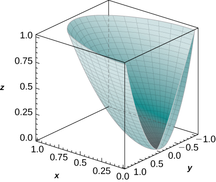 

**[T]** Use a CAS to graph the solid whose volume is given by the iterated integral in cylindrical coordinates <math xmlns="http://www.w3.org/1998/Math/MathML"><mrow><mstyle displaystyle="true"><mrow><munderover><mo stretchy="false">∫</mo><mn>0</mn><mrow><mrow><mi>π</mi><mtext>/</mtext><mn>2</mn></mrow></mrow></munderover><mspace width="0.2em" /><mrow><mstyle displaystyle="true"><mrow><munderover><mo stretchy="false">∫</mo><mn>0</mn><mn>1</mn></munderover><mspace width="0.2em" /><mrow><mstyle displaystyle="true"><mrow><munderover><mo stretchy="false">∫</mo><mrow><msup><mi>r</mi><mn>4</mn></msup></mrow><mi>r</mi></munderover><mrow><mi>r</mi><mspace width="0.2em" /><mi>d</mi><mi>z</mi><mspace width="0.2em" /><mi>d</mi><mi>r</mi><mspace width="0.2em" /><mi>d</mi><mi>θ</mi></mrow></mrow></mstyle></mrow></mrow></mstyle></mrow></mrow></mstyle><mo>.</mo></mrow></math>

 Find the volume <math xmlns="http://www.w3.org/1998/Math/MathML"><mi>V</mi></math>

 of the solid Round your answer to four decimal places.

Convert the integral <math xmlns="http://www.w3.org/1998/Math/MathML"><mrow><mstyle displaystyle="true"><mrow><munderover><mo stretchy="false">∫</mo><mn>0</mn><mn>1</mn></munderover><mspace width="0.2em" /><mrow><mstyle displaystyle="true"><mrow><munderover><mo stretchy="false">∫</mo><mrow><mtext>−</mtext><msqrt><mrow><mn>1</mn><mo>−</mo><msup><mi>y</mi><mn>2</mn></msup></mrow></msqrt></mrow><mrow><msqrt><mrow><mn>1</mn><mo>−</mo><msup><mi>y</mi><mn>2</mn></msup></mrow></msqrt></mrow></munderover><mspace width="0.2em" /><mrow><mstyle displaystyle="true"><mrow><munderover><mo stretchy="false">∫</mo><mrow><msup><mi>x</mi><mn>2</mn></msup><mo>+</mo><msup><mi>y</mi><mn>2</mn></msup></mrow><mrow><msqrt><mrow><msup><mi>x</mi><mn>2</mn></msup><mo>+</mo><msup><mi>y</mi><mn>2</mn></msup></mrow></msqrt></mrow></munderover><mrow><mi>x</mi><mi>z</mi><mspace width="0.2em" /><mi>d</mi><mi>z</mi><mspace width="0.2em" /><mi>d</mi><mi>x</mi><mspace width="0.2em" /><mi>d</mi><mi>y</mi></mrow></mrow></mstyle></mrow></mrow></mstyle></mrow></mrow></mstyle></mrow></math>

 into an integral in cylindrical coordinates.

<math xmlns="http://www.w3.org/1998/Math/MathML"><mrow><mstyle displaystyle="true"><mrow><munderover><mo stretchy="false">∫</mo><mn>0</mn><mn>1</mn></munderover><mspace width="0.2em" /><mrow><mstyle displaystyle="true"><mrow><munderover><mo stretchy="false">∫</mo><mn>0</mn><mi>π</mi></munderover><mspace width="0.2em" /><mrow><mstyle displaystyle="true"><mrow><munderover><mo stretchy="false">∫</mo><mrow><msup><mi>r</mi><mn>2</mn></msup></mrow><mi>r</mi></munderover><mrow><mi>z</mi><msup><mi>r</mi><mn>2</mn></msup><mtext>cos</mtext><mspace width="0.2em" /><mi>θ</mi></mrow></mrow></mstyle></mrow></mrow></mstyle></mrow></mrow></mstyle><mspace width="0.2em" /><mi>d</mi><mi>z</mi><mspace width="0.2em" /><mi>d</mi><mi>θ</mi><mspace width="0.2em" /><mi>d</mi><mi>r</mi></mrow></math>

Convert the integral <math xmlns="http://www.w3.org/1998/Math/MathML"><mrow><mstyle displaystyle="true"><mrow><munderover><mo stretchy="false">∫</mo><mn>0</mn><mn>2</mn></munderover><mspace width="0.2em" /><mrow><mstyle displaystyle="true"><mrow><munderover><mo stretchy="false">∫</mo><mn>0</mn><mi>x</mi></munderover><mspace width="0.2em" /><mrow><mstyle displaystyle="true"><mrow><munderover><mo stretchy="false">∫</mo><mn>0</mn><mn>1</mn></munderover><mrow><mrow><mo>(</mo><mrow><mi>x</mi><mi>y</mi><mo>+</mo><mi>z</mi></mrow><mo>)</mo></mrow></mrow></mrow></mstyle></mrow></mrow></mstyle></mrow></mrow></mstyle><mi>d</mi><mi>z</mi><mspace width="0.2em" /><mi>d</mi><mi>x</mi><mspace width="0.2em" /><mi>d</mi><mi>y</mi></mrow></math>

 into an integral in cylindrical coordinates.

In the following exercises, evaluate the triple integral <math xmlns="http://www.w3.org/1998/Math/MathML"><mrow><mstyle displaystyle="true"><mrow><munder><mo>∭</mo><mi>B</mi></munder><mrow><mi>f</mi><mo stretchy="false">(</mo><mi>x</mi><mo>,</mo><mi>y</mi><mo>,</mo><mi>z</mi><mo stretchy="false">)</mo><mi>d</mi><mi>V</mi></mrow></mrow></mstyle></mrow></math>

 over the solid <math xmlns="http://www.w3.org/1998/Math/MathML"><mi>B</mi><mo>.</mo></math>

<math xmlns="http://www.w3.org/1998/Math/MathML"><mrow><mi>f</mi><mo stretchy="false">(</mo><mi>x</mi><mo>,</mo><mi>y</mi><mo>,</mo><mi>z</mi><mo stretchy="false">)</mo><mo>=</mo><mn>1</mn><mo>,</mo></mrow></math>

 <math xmlns="http://www.w3.org/1998/Math/MathML"><mrow><mi>B</mi><mo>=</mo><mrow><mo>{</mo><mrow><mrow><mo>(</mo><mrow><mi>x</mi><mo>,</mo><mi>y</mi><mo>,</mo><mi>z</mi></mrow><mo>)</mo></mrow><mo>\|</mo><msup><mi>x</mi><mn>2</mn></msup><mo>+</mo><msup><mi>y</mi><mn>2</mn></msup><mo>+</mo><msup><mi>z</mi><mn>2</mn></msup><mo>≤</mo><mn>90</mn><mo>,</mo><mi>z</mi><mo>≥</mo><mn>0</mn></mrow><mo>}</mo></mrow></mrow></math>

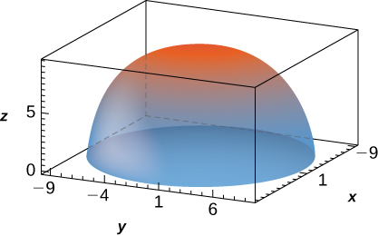

<math xmlns="http://www.w3.org/1998/Math/MathML"><mrow><mn>180</mn><mi>π</mi><msqrt><mrow><mn>10</mn></mrow></msqrt></mrow></math>

<math xmlns="http://www.w3.org/1998/Math/MathML"><mrow><mi>f</mi><mo stretchy="false">(</mo><mi>x</mi><mo>,</mo><mi>y</mi><mo>,</mo><mi>z</mi><mo stretchy="false">)</mo><mo>=</mo><mn>1</mn><mo>−</mo><msqrt><mrow><msup><mi>x</mi><mn>2</mn></msup><mo>+</mo><msup><mi>y</mi><mn>2</mn></msup><mo>+</mo><msup><mi>z</mi><mn>2</mn></msup></mrow></msqrt><mo>,</mo></mrow></math>

 <math xmlns="http://www.w3.org/1998/Math/MathML"><mrow><mi>B</mi><mo>=</mo><mrow><mo>{</mo><mrow><mrow><mo>(</mo><mrow><mi>x</mi><mo>,</mo><mi>y</mi><mo>,</mo><mi>z</mi></mrow><mo>)</mo></mrow><mo>\|</mo><msup><mi>x</mi><mn>2</mn></msup><mo>+</mo><msup><mi>y</mi><mn>2</mn></msup><mo>+</mo><msup><mi>z</mi><mn>2</mn></msup><mo>≤</mo><mn>9</mn><mo>,</mo><mi>y</mi><mo>≥</mo><mn>0</mn><mo>,</mo><mi>z</mi><mo>≥</mo><mn>0</mn></mrow><mo>}</mo></mrow></mrow></math>

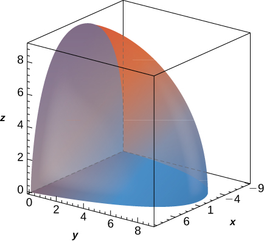

<math xmlns="http://www.w3.org/1998/Math/MathML"><mrow><mi>f</mi><mo stretchy="false">(</mo><mi>x</mi><mo>,</mo><mi>y</mi><mo>,</mo><mi>z</mi><mo stretchy="false">)</mo><mo>=</mo><msqrt><mrow><msup><mi>x</mi><mn>2</mn></msup><mo>+</mo><msup><mi>y</mi><mn>2</mn></msup></mrow></msqrt><mo>,</mo></mrow></math>

 <math xmlns="http://www.w3.org/1998/Math/MathML"><mi>B</mi></math>

 is bounded above by the half-sphere <math xmlns="http://www.w3.org/1998/Math/MathML"><mrow><msup><mi>x</mi><mn>2</mn></msup><mo>+</mo><msup><mi>y</mi><mn>2</mn></msup><mo>+</mo><msup><mi>z</mi><mn>2</mn></msup><mo>=</mo><mn>9</mn></mrow></math>

 with <math xmlns="http://www.w3.org/1998/Math/MathML"><mrow><mi>z</mi><mo>≥</mo><mn>0</mn></mrow></math>

 and below by the cone <math xmlns="http://www.w3.org/1998/Math/MathML"><mrow><mn>2</mn><msup><mi>z</mi><mn>2</mn></msup><mo>=</mo><msup><mi>x</mi><mn>2</mn></msup><mo>+</mo><msup><mi>y</mi><mn>2</mn></msup><mo>.</mo></mrow></math>

<math xmlns="http://www.w3.org/1998/Math/MathML"><mrow><mfrac><mrow><mn>81</mn><mi>π</mi><mrow><mo>(</mo><mrow><mi>π</mi><mo>−</mo><mn>2</mn></mrow><mo>)</mo></mrow></mrow><mrow><mn>16</mn></mrow></mfrac></mrow></math>

<math xmlns="http://www.w3.org/1998/Math/MathML"><mrow><mi>f</mi><mo stretchy="false">(</mo><mi>x</mi><mo>,</mo><mi>y</mi><mo>,</mo><mi>z</mi><mo stretchy="false">)</mo><mo>=</mo><mi>z</mi><mo>,</mo></mrow></math>

 <math xmlns="http://www.w3.org/1998/Math/MathML"><mi>B</mi></math>

 is bounded above by the half-sphere <math xmlns="http://www.w3.org/1998/Math/MathML"><mrow><msup><mi>x</mi><mn>2</mn></msup><mo>+</mo><msup><mi>y</mi><mn>2</mn></msup><mo>+</mo><msup><mi>z</mi><mn>2</mn></msup><mo>=</mo><mn>16</mn></mrow></math>

 with <math xmlns="http://www.w3.org/1998/Math/MathML"><mrow><mi>z</mi><mo>≥</mo><mn>0</mn></mrow></math>

 and below by the cone <math xmlns="http://www.w3.org/1998/Math/MathML"><mrow><mn>2</mn><msup><mi>z</mi><mn>2</mn></msup><mo>=</mo><msup><mi>x</mi><mn>2</mn></msup><mo>+</mo><msup><mi>y</mi><mn>2</mn></msup><mo>.</mo></mrow></math>

Show that if <math xmlns="http://www.w3.org/1998/Math/MathML"><mrow><mi>F</mi><mrow><mo>(</mo><mrow><mi>ρ</mi><mo>,</mo><mi>θ</mi><mo>,</mo><mi>φ</mi></mrow><mo>)</mo></mrow><mo>=</mo><mi>f</mi><mrow><mo>(</mo><mi>ρ</mi><mo>)</mo></mrow><mi>g</mi><mrow><mo>(</mo><mi>θ</mi><mo>)</mo></mrow><mi>h</mi><mrow><mo>(</mo><mi>φ</mi><mo>)</mo></mrow></mrow></math>

 is a continuous function on the spherical box <math xmlns="http://www.w3.org/1998/Math/MathML"><mrow><mi>B</mi><mo>=</mo><mrow><mo>{</mo><mrow><mrow><mrow><mrow><mo>(</mo><mrow><mi>ρ</mi><mo>,</mo><mi>θ</mi><mo>,</mo><mi>φ</mi></mrow><mo>)</mo></mrow></mrow><mo>\|</mo></mrow><mi>a</mi><mo>≤</mo><mi>ρ</mi><mo>≤</mo><mi>b</mi><mo>,</mo><mi>α</mi><mo>≤</mo><mi>θ</mi><mo>≤</mo><mi>β</mi><mo>,</mo><mi>γ</mi><mo>≤</mo><mi>φ</mi><mo>≤</mo><mi>ψ</mi></mrow><mo>}</mo></mrow><mo>,</mo></mrow></math>

 then

<math xmlns="http://www.w3.org/1998/Math/MathML"><mrow><mstyle displaystyle="true"><mrow><munder><mo>∭</mo><mi>B</mi></munder><mrow><mi>F</mi><mspace width="0.2em" /><mi>d</mi><mi>V</mi></mrow></mrow></mstyle><mo>=</mo><mrow><mo>(</mo><mrow><mstyle displaystyle="true"><mrow><munderover><mo stretchy="false">∫</mo><mi>a</mi><mi>b</mi></munderover><mrow><msup><mi>ρ</mi><mn>2</mn></msup><mi>f</mi><mrow><mo>(</mo><mi>ρ</mi><mo>)</mo></mrow><mi>d</mi><mi>r</mi></mrow></mrow></mstyle></mrow><mo>)</mo></mrow><mrow><mo>(</mo><mrow><mstyle displaystyle="true"><mrow><munderover><mo stretchy="false">∫</mo><mi>α</mi><mi>β</mi></munderover><mrow><mi>g</mi><mrow><mo>(</mo><mi>θ</mi><mo>)</mo></mrow><mi>d</mi><mi>θ</mi></mrow></mrow></mstyle></mrow><mo>)</mo></mrow><mrow><mo>(</mo><mrow><mstyle displaystyle="true"><mrow><munderover><mo stretchy="false">∫</mo><mi>γ</mi><mi>ψ</mi></munderover><mrow><mi>h</mi><mrow><mo>(</mo><mi>φ</mi><mo>)</mo></mrow><mtext>sin</mtext><mspace width="0.2em" /><mi>φ</mi><mspace width="0.2em" /><mi>d</mi><mi>φ</mi></mrow></mrow></mstyle></mrow><mo>)</mo></mrow><mo>.</mo></mrow></math>

1.  A function
    <math xmlns="http://www.w3.org/1998/Math/MathML"><mi>F</mi></math>
    
    is said to have spherical symmetry if it depends on the distance to the origin only, that is, it can be expressed in spherical coordinates as
    <math xmlns="http://www.w3.org/1998/Math/MathML"><mrow><mi>F</mi><mrow><mo>(</mo><mrow><mi>x</mi><mo>,</mo><mi>y</mi><mo>,</mo><mi>z</mi></mrow><mo>)</mo></mrow><mo>=</mo><mi>f</mi><mo stretchy="false">(</mo><mi>ρ</mi><mo stretchy="false">)</mo><mo>,</mo></mrow></math>
    
    where
    <math xmlns="http://www.w3.org/1998/Math/MathML"><mrow><mi>ρ</mi><mo>=</mo><msqrt><mrow><msup><mi>x</mi><mn>2</mn></msup><mo>+</mo><msup><mi>y</mi><mn>2</mn></msup><mo>+</mo><msup><mi>z</mi><mn>2</mn></msup></mrow></msqrt><mo>.</mo></mrow></math>
    
    Show that
    * * *
    {: data-type="newline"}
    
    

    <math xmlns="http://www.w3.org/1998/Math/MathML"><mrow><mstyle displaystyle="true"><mrow><munder><mo>∭</mo><mi>B</mi></munder><mrow><mi>F</mi><mo stretchy="false">(</mo><mi>x</mi><mo>,</mo><mi>y</mi><mo>,</mo><mi>z</mi><mo stretchy="false">)</mo><mi>d</mi><mi>V</mi></mrow></mrow></mstyle><mo>=</mo><mn>2</mn><mi>π</mi><mstyle displaystyle="true"><mrow><munderover><mo stretchy="false">∫</mo><mi>a</mi><mi>b</mi></munderover><mrow><msup><mi>ρ</mi><mn>2</mn></msup><mi>f</mi><mo stretchy="false">(</mo><mi>ρ</mi><mo stretchy="false">)</mo><mi>d</mi><mi>ρ</mi></mrow></mrow></mstyle><mo>,</mo></mrow></math>
    

    
    * * *
    {: data-type="newline"}
    
    where
    <math xmlns="http://www.w3.org/1998/Math/MathML"><mi>B</mi></math>
    
    is the region between the upper concentric hemispheres of radii
    <math xmlns="http://www.w3.org/1998/Math/MathML"><mi>a</mi></math>
    
    and
    <math xmlns="http://www.w3.org/1998/Math/MathML"><mi>b</mi></math>
    
    centered at the origin, with
    <math xmlns="http://www.w3.org/1998/Math/MathML"><mrow><mn>0</mn><mo>&lt;</mo><mi>a</mi><mo>&lt;</mo><mi>b</mi></mrow></math>
    
    and
    <math xmlns="http://www.w3.org/1998/Math/MathML"><mi>F</mi></math>
    
    a spherical function defined on
    <math xmlns="http://www.w3.org/1998/Math/MathML"><mi>B</mi><mo>.</mo></math>

2.  Use the previous result to show that
    <math xmlns="http://www.w3.org/1998/Math/MathML"><mrow><mstyle displaystyle="true"><mrow><munder><mo>∭</mo><mi>B</mi></munder><mrow><mrow><mo>(</mo><mrow><msup><mi>x</mi><mn>2</mn></msup><mo>+</mo><msup><mi>y</mi><mn>2</mn></msup><mo>+</mo><msup><mi>z</mi><mn>2</mn></msup></mrow><mo>)</mo></mrow><msqrt><mrow><msup><mi>x</mi><mn>2</mn></msup><mo>+</mo><msup><mi>y</mi><mn>2</mn></msup><mo>+</mo><msup><mi>z</mi><mn>2</mn></msup></mrow></msqrt><mspace width="0.2em" /><mi>d</mi><mi>V</mi></mrow></mrow></mstyle><mo>=</mo><mn>21</mn><mi>π</mi><mo>,</mo></mrow></math>
    
    where
    * * *
    {: data-type="newline"}
    
    

    <math xmlns="http://www.w3.org/1998/Math/MathML"><mrow><mi>B</mi><mo>=</mo><mrow><mo>{</mo><mrow><mrow><mo>(</mo><mrow><mi>x</mi><mo>,</mo><mi>y</mi><mo>,</mo><mi>z</mi></mrow><mo>)</mo></mrow><mo>\|</mo><mn>1</mn><mo>≤</mo><msup><mi>x</mi><mn>2</mn></msup><mo>+</mo><msup><mi>y</mi><mn>2</mn></msup><mo>+</mo><msup><mi>z</mi><mn>2</mn></msup><mo>≤</mo><mn>2</mn><mo>,</mo><mi>z</mi><mo>≥</mo><mn>0</mn></mrow><mo>}</mo></mrow><mo>.</mo></mrow></math>
    

{: data-number-style="lower-alpha"}

1.  Let
    <math xmlns="http://www.w3.org/1998/Math/MathML"><mi>B</mi></math>
    
    be the region between the upper concentric hemispheres of radii *a* and *b* centered at the origin and situated in the first octant, where
    <math xmlns="http://www.w3.org/1998/Math/MathML"><mrow><mn>0</mn><mo>&lt;</mo><mi>a</mi><mo>&lt;</mo><mi>b</mi><mo>.</mo></mrow></math>
    
    Consider *F* a function defined on *B* whose form in spherical coordinates
    <math xmlns="http://www.w3.org/1998/Math/MathML"><mrow><mrow><mo>(</mo><mrow><mi>ρ</mi><mo>,</mo><mi>θ</mi><mo>,</mo><mi>φ</mi></mrow><mo>)</mo></mrow></mrow></math>
    
    is
    <math xmlns="http://www.w3.org/1998/Math/MathML"><mrow><mi>F</mi><mrow><mo>(</mo><mrow><mi>x</mi><mo>,</mo><mi>y</mi><mo>,</mo><mi>z</mi></mrow><mo>)</mo></mrow><mo>=</mo><mi>f</mi><mo stretchy="false">(</mo><mi>ρ</mi><mo stretchy="false">)</mo><mtext>cos</mtext><mspace width="0.2em" /><mi>φ</mi><mo>.</mo></mrow></math>
    
    Show that if
    <math xmlns="http://www.w3.org/1998/Math/MathML"><mrow><mi>g</mi><mo stretchy="false">(</mo><mi>a</mi><mo stretchy="false">)</mo><mo>=</mo><mi>g</mi><mo stretchy="false">(</mo><mi>b</mi><mo stretchy="false">)</mo><mo>=</mo><mn>0</mn></mrow></math>
    
    and
    <math xmlns="http://www.w3.org/1998/Math/MathML"><mrow><mstyle displaystyle="true"><mrow><munderover><mo stretchy="false">∫</mo><mi>a</mi><mi>b</mi></munderover><mrow><mi>h</mi><mo stretchy="false">(</mo><mi>ρ</mi><mo stretchy="false">)</mo><mi>d</mi><mi>ρ</mi><mo>=</mo><mn>0</mn></mrow></mrow></mstyle><mo>,</mo></mrow></math>
    
    then
    * * *
    {: data-type="newline"}
    
    

    <math xmlns="http://www.w3.org/1998/Math/MathML"><mrow><mstyle displaystyle="true"><mrow><munder><mo>∭</mo><mi>B</mi></munder><mrow><mi>F</mi><mo stretchy="false">(</mo><mi>x</mi><mo>,</mo><mi>y</mi><mo>,</mo><mi>z</mi><mo stretchy="false">)</mo><mi>d</mi><mi>V</mi></mrow></mrow></mstyle><mo>=</mo><mfrac><mrow><msup><mi>π</mi><mn>2</mn></msup></mrow><mn>4</mn></mfrac><mrow><mo>[</mo><mrow><mi>a</mi><mi>h</mi><mo stretchy="false">(</mo><mi>a</mi><mo stretchy="false">)</mo><mo>−</mo><mi>b</mi><mi>h</mi><mo stretchy="false">(</mo><mi>b</mi><mo stretchy="false">)</mo></mrow><mo>]</mo></mrow><mo>,</mo></mrow></math>
    

    
    * * *
    {: data-type="newline"}
    
    where
    <math xmlns="http://www.w3.org/1998/Math/MathML"><mi>g</mi></math>
    
    is an antiderivative of
    <math xmlns="http://www.w3.org/1998/Math/MathML"><mi>f</mi></math>
    
    and
    <math xmlns="http://www.w3.org/1998/Math/MathML"><mi>h</mi></math>
    
    is an antiderivative of
    <math xmlns="http://www.w3.org/1998/Math/MathML"><mrow><mi>g</mi><mo>.</mo></mrow></math>

2.  Use the previous result to show that
    <math xmlns="http://www.w3.org/1998/Math/MathML"><mrow><mstyle displaystyle="true"><mrow><munder><mo>∭</mo><mi>B</mi></munder><mrow><mfrac><mrow><mi>z</mi><mspace width="0.2em" /><mtext>cos</mtext><msqrt><mrow><msup><mi>x</mi><mn>2</mn></msup><mo>+</mo><msup><mi>y</mi><mn>2</mn></msup><mo>+</mo><msup><mi>z</mi><mn>2</mn></msup></mrow></msqrt></mrow><mrow><msqrt><mrow><msup><mi>x</mi><mn>2</mn></msup><mo>+</mo><msup><mi>y</mi><mn>2</mn></msup><mo>+</mo><msup><mi>z</mi><mn>2</mn></msup></mrow></msqrt></mrow></mfrac><mi>d</mi><mi>V</mi></mrow></mrow></mstyle><mo>=</mo><mfrac><mrow><mn>3</mn><msup><mi>π</mi><mn>2</mn></msup></mrow><mn>2</mn></mfrac><mo>,</mo></mrow></math>
    
    where
    <math xmlns="http://www.w3.org/1998/Math/MathML"><mi>B</mi></math>
    
    is the region between the upper concentric hemispheres of radii
    <math xmlns="http://www.w3.org/1998/Math/MathML"><mi>π</mi></math>
    
    and
    <math xmlns="http://www.w3.org/1998/Math/MathML"><mrow><mn>2</mn><mi>π</mi></mrow></math>
    
    centered at the origin and situated in the first octant.
{: data-number-style="lower-alpha"}

In the following exercises, the function <math xmlns="http://www.w3.org/1998/Math/MathML"><mi>f</mi></math>

 and region <math xmlns="http://www.w3.org/1998/Math/MathML"><mi>E</mi></math>

 are given.

1.  Express the region
    <math xmlns="http://www.w3.org/1998/Math/MathML"><mi>E</mi></math>
    
    and function
    <math xmlns="http://www.w3.org/1998/Math/MathML"><mi>f</mi></math>
    
    in cylindrical coordinates.
2.  Convert the integral
    <math xmlns="http://www.w3.org/1998/Math/MathML"><mrow><mstyle displaystyle="true"><mrow><munder><mo>∭</mo><mi>B</mi></munder><mrow><mi>f</mi><mrow><mo>(</mo><mrow><mi>x</mi><mo>,</mo><mi>y</mi><mo>,</mo><mi>z</mi></mrow><mo>)</mo></mrow></mrow></mrow></mstyle><mi>d</mi><mi>V</mi></mrow></math>
    
    into cylindrical coordinates and evaluate it.
{: data-number-style="lower-alpha"}

<math xmlns="http://www.w3.org/1998/Math/MathML"><mrow><mi>f</mi><mrow><mo>(</mo><mrow><mi>x</mi><mo>,</mo><mi>y</mi><mo>,</mo><mi>z</mi></mrow><mo>)</mo></mrow><mo>=</mo><mi>z</mi><mo>;</mo></mrow></math>

 <math xmlns="http://www.w3.org/1998/Math/MathML"><mrow><mi>E</mi><mo>=</mo><mrow><mo>{</mo><mrow><mrow><mo>(</mo><mrow><mi>x</mi><mo>,</mo><mi>y</mi><mo>,</mo><mi>z</mi></mrow><mo>)</mo></mrow><mo>\|</mo><mn>0</mn><mo>≤</mo><msup><mi>x</mi><mn>2</mn></msup><mo>+</mo><msup><mi>y</mi><mn>2</mn></msup><mo>+</mo><msup><mi>z</mi><mn>2</mn></msup><mo>≤</mo><mn>1</mn><mo>,</mo><mi>z</mi><mo>≥</mo><mn>0</mn></mrow><mo>}</mo></mrow></mrow></math>

<math xmlns="http://www.w3.org/1998/Math/MathML"><mrow><mi>f</mi><mrow><mo>(</mo><mrow><mi>x</mi><mo>,</mo><mi>y</mi><mo>,</mo><mi>z</mi></mrow><mo>)</mo></mrow><mo>=</mo><mi>x</mi><mo>+</mo><mi>y</mi><mo>;</mo></mrow></math>

 <math xmlns="http://www.w3.org/1998/Math/MathML"><mrow><mi>E</mi><mo>=</mo><mrow><mo>{</mo><mrow><mrow><mo>(</mo><mrow><mi>x</mi><mo>,</mo><mi>y</mi><mo>,</mo><mi>z</mi></mrow><mo>)</mo></mrow><mo>\|</mo><mn>1</mn><mo>≤</mo><msup><mi>x</mi><mn>2</mn></msup><mo>+</mo><msup><mi>y</mi><mn>2</mn></msup><mo>+</mo><msup><mi>z</mi><mn>2</mn></msup><mo>≤</mo><mn>2</mn><mo>,</mo><mi>z</mi><mo>≥</mo><mn>0</mn><mo>,</mo><mi>y</mi><mo>≥</mo><mn>0</mn></mrow><mo>}</mo></mrow></mrow></math>

a. <math xmlns="http://www.w3.org/1998/Math/MathML"><mrow><mi>f</mi><mrow><mo>(</mo><mrow><mi>ρ</mi><mo>,</mo><mi>θ</mi><mo>,</mo><mi>φ</mi></mrow><mo>)</mo></mrow><mo>=</mo><mi>ρ</mi><mspace width="0.2em" /><mtext>sin</mtext><mspace width="0.2em" /><mi>φ</mi><mrow><mo>(</mo><mrow><mtext>cos</mtext><mspace width="0.2em" /><mi>θ</mi><mo>+</mo><mtext>sin</mtext><mspace width="0.2em" /><mi>θ</mi></mrow><mo>)</mo></mrow><mo>,</mo></mrow></math>

 <math xmlns="http://www.w3.org/1998/Math/MathML"><mrow><mi>E</mi><mo>=</mo><mrow><mo>{</mo><mrow><mrow><mo>(</mo><mrow><mi>ρ</mi><mo>,</mo><mi>θ</mi><mo>,</mo><mi>φ</mi></mrow><mo>)</mo></mrow><mo>\|</mo><mn>1</mn><mo>≤</mo><mi>ρ</mi><mo>≤</mo><mn>2</mn><mo>,</mo><mn>0</mn><mo>≤</mo><mi>θ</mi><mo>≤</mo><mi>π</mi><mo>,</mo><mn>0</mn><mo>≤</mo><mi>φ</mi><mo>≤</mo><mfrac><mi>π</mi><mn>2</mn></mfrac></mrow><mo>}</mo></mrow><mo>;</mo></mrow></math>

 b. <math xmlns="http://www.w3.org/1998/Math/MathML"><mrow><mstyle displaystyle="true"><mrow><munderover><mo stretchy="false">∫</mo><mn>0</mn><mi>π</mi></munderover><mspace width="0.2em" /><mrow><mstyle displaystyle="true"><mrow><munderover><mo stretchy="false">∫</mo><mn>0</mn><mrow><mrow><mi>π</mi><mtext>/</mtext><mn>2</mn></mrow></mrow></munderover><mspace width="0.2em" /><mrow><mstyle displaystyle="true"><mrow><munderover><mo stretchy="false">∫</mo><mn>1</mn><mn>2</mn></munderover><mrow><msup><mi>ρ</mi><mn>3</mn></msup><mtext>cos</mtext><mspace width="0.2em" /><mi>φ</mi><mspace width="0.2em" /><mtext>sin</mtext><mspace width="0.2em" /><mi>φ</mi></mrow></mrow></mstyle></mrow></mrow></mstyle></mrow></mrow></mstyle><mspace width="0.2em" /><mi>d</mi><mi>ρ</mi><mspace width="0.2em" /><mi>d</mi><mi>φ</mi><mspace width="0.2em" /><mi>d</mi><mi>θ</mi><mo>=</mo><mfrac><mrow><mn>15</mn><mi>π</mi></mrow><mn>8</mn></mfrac></mrow></math>

<math xmlns="http://www.w3.org/1998/Math/MathML"><mrow><mi>f</mi><mrow><mo>(</mo><mrow><mi>x</mi><mo>,</mo><mi>y</mi><mo>,</mo><mi>z</mi></mrow><mo>)</mo></mrow><mo>=</mo><mn>2</mn><mi>x</mi><mi>y</mi><mo>;</mo></mrow></math>

 <math xmlns="http://www.w3.org/1998/Math/MathML"><mrow><mi>E</mi><mo>=</mo><mrow><mo>{</mo><mrow><mrow><mo>(</mo><mrow><mi>x</mi><mo>,</mo><mi>y</mi><mo>,</mo><mi>z</mi></mrow><mo>)</mo></mrow><mo>\|</mo><msqrt><mrow><msup><mi>x</mi><mn>2</mn></msup><mo>+</mo><msup><mi>y</mi><mn>2</mn></msup></mrow></msqrt><mo>≤</mo><mi>z</mi><mo>≤</mo><msqrt><mrow><mn>1</mn><mo>−</mo><msup><mi>x</mi><mn>2</mn></msup><mo>−</mo><msup><mi>y</mi><mn>2</mn></msup></mrow></msqrt><mo>,</mo><mi>x</mi><mo>≥</mo><mn>0</mn><mo>,</mo><mi>y</mi><mo>≥</mo><mn>0</mn></mrow><mo>}</mo></mrow></mrow></math>

<math xmlns="http://www.w3.org/1998/Math/MathML"><mrow><mi>f</mi><mrow><mo>(</mo><mrow><mi>x</mi><mo>,</mo><mi>y</mi><mo>,</mo><mi>z</mi></mrow><mo>)</mo></mrow><mo>=</mo><mi>z</mi><mo>;</mo></mrow></math>

 <math xmlns="http://www.w3.org/1998/Math/MathML"><mrow><mi>E</mi><mo>=</mo><mrow><mo>{</mo><mrow><mrow><mo>(</mo><mrow><mi>x</mi><mo>,</mo><mi>y</mi><mo>,</mo><mi>z</mi></mrow><mo>)</mo></mrow><mo>\|</mo><msup><mi>x</mi><mn>2</mn></msup><mo>+</mo><msup><mi>y</mi><mn>2</mn></msup><mo>+</mo><msup><mi>z</mi><mn>2</mn></msup><mo>−</mo><mn>2</mn><mi>z</mi><mo>≤</mo><mn>0</mn><mo>,</mo><msqrt><mrow><msup><mi>x</mi><mn>2</mn></msup><mo>+</mo><msup><mi>y</mi><mn>2</mn></msup></mrow></msqrt><mo>≤</mo><mi>z</mi></mrow><mo>}</mo></mrow></mrow></math>

a. <math xmlns="http://www.w3.org/1998/Math/MathML"><mrow><mi>f</mi><mrow><mo>(</mo><mrow><mi>ρ</mi><mo>,</mo><mi>θ</mi><mo>,</mo><mi>φ</mi></mrow><mo>)</mo></mrow><mo>=</mo><mi>ρ</mi><mspace width="0.2em" /><mtext>cos</mtext><mspace width="0.2em" /><mi>φ</mi><mo>;</mo></mrow></math>

 <math xmlns="http://www.w3.org/1998/Math/MathML"><mrow><mi>E</mi><mo>=</mo><mrow><mo>{</mo><mrow><mrow><mo>(</mo><mrow><mi>ρ</mi><mo>,</mo><mi>θ</mi><mo>,</mo><mi>φ</mi></mrow><mo>)</mo></mrow><mo>\|</mo><mn>0</mn><mo>≤</mo><mi>ρ</mi><mo>≤</mo><mn>2</mn><mspace width="0.2em" /><mtext>cos</mtext><mspace width="0.2em" /><mi>φ</mi><mo>,</mo><mn>0</mn><mo>≤</mo><mi>θ</mi><mo>≤</mo><mfrac><mi>π</mi><mn>2</mn></mfrac><mo>,</mo><mn>0</mn><mo>≤</mo><mi>φ</mi><mo>≤</mo><mfrac><mi>π</mi><mn>4</mn></mfrac></mrow><mo>}</mo></mrow><mo>;</mo></mrow></math>

 b. <math xmlns="http://www.w3.org/1998/Math/MathML"><mrow><mstyle displaystyle="true"><mrow><munderover><mo stretchy="false">∫</mo><mn>0</mn><mrow><mrow><mi>π</mi><mtext>/</mtext><mn>2</mn></mrow></mrow></munderover><mspace width="0.2em" /><mrow><mstyle displaystyle="true"><mrow><munderover><mo stretchy="false">∫</mo><mn>0</mn><mrow><mrow><mi>π</mi><mtext>/</mtext><mn>4</mn></mrow></mrow></munderover><mspace width="0.2em" /><mrow><mstyle displaystyle="true"><mrow><munderover><mo stretchy="false">∫</mo><mn>0</mn><mrow><mn>2</mn><mspace width="0.2em" /><mtext>cos</mtext><mspace width="0.2em" /><mi>φ</mi></mrow></munderover><mrow><msup><mi>ρ</mi><mn>3</mn></msup><mtext>sin</mtext><mspace width="0.2em" /><mi>φ</mi></mrow></mrow></mstyle></mrow></mrow></mstyle></mrow></mrow></mstyle><mtext>cos</mtext><mspace width="0.2em" /><mi>φ</mi><mspace width="0.2em" /><mi>d</mi><mi>ρ</mi><mspace width="0.2em" /><mi>d</mi><mi>φ</mi><mspace width="0.2em" /><mi>d</mi><mi>θ</mi><mo>=</mo><mfrac><mrow><mn>7</mn><mi>π</mi></mrow><mrow><mn>24</mn></mrow></mfrac></mrow></math>

In the following exercises, find the volume of the solid <math xmlns="http://www.w3.org/1998/Math/MathML"><mi>E</mi></math>

 whose boundaries are given in rectangular coordinates.

<math xmlns="http://www.w3.org/1998/Math/MathML"><mrow><mi>E</mi><mo>=</mo><mrow><mo>{</mo><mrow><mrow><mo>(</mo><mrow><mi>x</mi><mo>,</mo><mi>y</mi><mo>,</mo><mi>z</mi></mrow><mo>)</mo></mrow><mo>\|</mo><msqrt><mrow><msup><mi>x</mi><mn>2</mn></msup><mo>+</mo><msup><mi>y</mi><mn>2</mn></msup></mrow></msqrt><mo>≤</mo><mi>z</mi><mo>≤</mo><msqrt><mrow><mn>16</mn><mo>−</mo><msup><mi>x</mi><mn>2</mn></msup><mo>−</mo><msup><mi>y</mi><mn>2</mn></msup></mrow></msqrt><mo>,</mo><mi>x</mi><mo>≥</mo><mn>0</mn><mo>,</mo><mi>y</mi><mo>≥</mo><mn>0</mn></mrow><mo>}</mo></mrow></mrow></math>

<math xmlns="http://www.w3.org/1998/Math/MathML"><mrow><mi>E</mi><mo>=</mo><mrow><mo>{</mo><mrow><mrow><mo>(</mo><mrow><mi>x</mi><mo>,</mo><mi>y</mi><mo>,</mo><mi>z</mi></mrow><mo>)</mo></mrow><mo>\|</mo><msup><mi>x</mi><mn>2</mn></msup><mo>+</mo><msup><mi>y</mi><mn>2</mn></msup><mo>+</mo><msup><mi>z</mi><mn>2</mn></msup><mo>−</mo><mn>2</mn><mi>z</mi><mo>≤</mo><mn>0</mn><mo>,</mo><msqrt><mrow><msup><mi>x</mi><mn>2</mn></msup><mo>+</mo><msup><mi>y</mi><mn>2</mn></msup></mrow></msqrt><mo>≤</mo><mi>z</mi></mrow><mo>}</mo></mrow></mrow></math>

<math xmlns="http://www.w3.org/1998/Math/MathML"><mrow><mfrac><mi>π</mi><mn>4</mn></mfrac></mrow></math>

Use spherical coordinates to find the volume of the solid situated outside the sphere <math xmlns="http://www.w3.org/1998/Math/MathML"><mrow><mi>ρ</mi><mo>=</mo><mn>1</mn></mrow></math>

 and inside the sphere <math xmlns="http://www.w3.org/1998/Math/MathML"><mrow><mi>ρ</mi><mo>=</mo><mtext>cos</mtext><mspace width="0.2em" /><mi>φ</mi><mo>,</mo></mrow></math>

 with <math xmlns="http://www.w3.org/1998/Math/MathML"><mrow><mi>φ</mi><mo>∈</mo><mrow><mo>[</mo><mrow><mn>0</mn><mo>,</mo><mfrac><mi>π</mi><mn>2</mn></mfrac></mrow><mo>]</mo></mrow><mo>.</mo></mrow></math>

Use spherical coordinates to find the volume of the ball <math xmlns="http://www.w3.org/1998/Math/MathML"><mrow><mi>ρ</mi><mo>≤</mo><mn>3</mn></mrow></math>

 that is situated between the cones <math xmlns="http://www.w3.org/1998/Math/MathML"><mrow><mi>φ</mi><mo>=</mo><mfrac><mi>π</mi><mn>4</mn></mfrac><mspace width="0.2em" /><mtext>and</mtext><mspace width="0.2em" /><mi>φ</mi><mo>=</mo><mfrac><mi>π</mi><mn>3</mn></mfrac><mo>.</mo></mrow></math>

<math xmlns="http://www.w3.org/1998/Math/MathML"><mrow><mn>9</mn><mi>π</mi><mrow><mo>(</mo><mrow><msqrt><mn>2</mn></msqrt><mo>−</mo><mn>1</mn></mrow><mo>)</mo></mrow></mrow></math>

Convert the integral <math xmlns="http://www.w3.org/1998/Math/MathML"><mrow><mstyle displaystyle="true"><mrow><munderover><mo stretchy="false">∫</mo><mrow><mn>−4</mn></mrow><mn>4</mn></munderover><mspace width="0.2em" /><mrow><mstyle displaystyle="true"><mrow><munderover><mo stretchy="false">∫</mo><mrow><mtext>−</mtext><msqrt><mrow><mn>16</mn><mo>−</mo><msup><mi>y</mi><mn>2</mn></msup></mrow></msqrt></mrow><mrow><msqrt><mrow><mn>16</mn><mo>−</mo><msup><mi>y</mi><mn>2</mn></msup></mrow></msqrt></mrow></munderover><mspace width="0.2em" /><mrow><mstyle displaystyle="true"><mrow><munderover><mo stretchy="false">∫</mo><mrow><mtext>−</mtext><msqrt><mrow><mn>16</mn><mo>−</mo><msup><mi>x</mi><mn>2</mn></msup><mo>−</mo><msup><mi>y</mi><mn>2</mn></msup></mrow></msqrt></mrow><mrow><msqrt><mrow><mn>16</mn><mo>−</mo><msup><mi>x</mi><mn>2</mn></msup><mo>−</mo><msup><mi>y</mi><mn>2</mn></msup></mrow></msqrt></mrow></munderover><mrow><mrow><mo>(</mo><mrow><msup><mi>x</mi><mn>2</mn></msup><mo>+</mo><msup><mi>y</mi><mn>2</mn></msup><mo>+</mo><msup><mi>z</mi><mn>2</mn></msup></mrow><mo>)</mo></mrow></mrow></mrow></mstyle></mrow></mrow></mstyle></mrow></mrow></mstyle><mi>d</mi><mi>z</mi><mspace width="0.2em" /><mi>d</mi><mi>x</mi><mspace width="0.2em" /><mi>d</mi><mi>y</mi></mrow></math>

 into an integral in spherical coordinates.

Convert the integral <math xmlns="http://www.w3.org/1998/Math/MathML"><mrow><mstyle displaystyle="true"><mrow><munderover><mo stretchy="false">∫</mo><mn>0</mn><mn>4</mn></munderover><mspace width="0.2em" /><mrow><mstyle displaystyle="true"><mrow><munderover><mo stretchy="false">∫</mo><mn>0</mn><mrow><msqrt><mrow><mn>16</mn><mo>−</mo><msup><mi>x</mi><mn>2</mn></msup></mrow></msqrt></mrow></munderover><mspace width="0.2em" /><mrow><mstyle displaystyle="true"><mrow><munderover><mo stretchy="false">∫</mo><mrow><mtext>−</mtext><msqrt><mrow><mn>16</mn><mo>−</mo><msup><mi>x</mi><mn>2</mn></msup><mo>−</mo><msup><mi>y</mi><mn>2</mn></msup></mrow></msqrt></mrow><mrow><msqrt><mrow><mn>16</mn><mo>−</mo><msup><mi>x</mi><mn>2</mn></msup><mo>−</mo><msup><mi>y</mi><mn>2</mn></msup></mrow></msqrt></mrow></munderover><mrow><msup><mrow><mrow><mo>(</mo><mrow><msup><mi>x</mi><mn>2</mn></msup><mo>+</mo><msup><mi>y</mi><mn>2</mn></msup><mo>+</mo><msup><mi>z</mi><mn>2</mn></msup></mrow><mo>)</mo></mrow></mrow><mn>2</mn></msup></mrow></mrow></mstyle></mrow></mrow></mstyle></mrow></mrow></mstyle><mi>d</mi><mi>z</mi><mspace width="0.2em" /><mi>d</mi><mi>y</mi><mspace width="0.2em" /><mi>d</mi><mi>x</mi></mrow></math>

 into an integral in spherical coordinates.

<math xmlns="http://www.w3.org/1998/Math/MathML"><mrow><mstyle displaystyle="true"><mrow><munderover><mo stretchy="false">∫</mo><mn>0</mn><mrow><mrow><mi>π</mi><mtext>/</mtext><mn>2</mn></mrow></mrow></munderover><mspace width="0.2em" /><mrow><mstyle displaystyle="true"><mrow><munderover><mo stretchy="false">∫</mo><mn>0</mn><mrow><mrow><mi>π</mi><mtext>/</mtext><mn>2</mn></mrow></mrow></munderover><mspace width="0.2em" /><mrow><mstyle displaystyle="true"><mrow><munderover><mo stretchy="false">∫</mo><mn>0</mn><mn>4</mn></munderover><mrow><msup><mi>ρ</mi><mn>6</mn></msup><mtext>sin</mtext><mspace width="0.2em" /><mi>φ</mi></mrow></mrow></mstyle></mrow></mrow></mstyle></mrow></mrow></mstyle><mspace width="0.2em" /><mi>d</mi><mi>ρ</mi><mspace width="0.2em" /><mi>d</mi><mi>φ</mi><mspace width="0.2em" /><mi>d</mi><mi>θ</mi></mrow></math>

Convert the integral <math xmlns="http://www.w3.org/1998/Math/MathML"><mrow><mstyle displaystyle="true"><mrow><munderover><mo stretchy="false">∫</mo><mrow><mn>−2</mn></mrow><mn>2</mn></munderover><mspace width="0.2em" /><mrow><mstyle displaystyle="true"><mrow><munderover><mo stretchy="false">∫</mo><mrow><mtext>−</mtext><msqrt><mrow><mn>4</mn><mo>−</mo><msup><mi>x</mi><mn>2</mn></msup></mrow></msqrt></mrow><mrow><msqrt><mrow><mn>4</mn><mo>−</mo><msup><mi>x</mi><mn>2</mn></msup></mrow></msqrt></mrow></munderover><mspace width="0.2em" /><mrow><mstyle displaystyle="true"><mrow><munderover><mo stretchy="false">∫</mo><mrow><msqrt><mrow><msup><mi>x</mi><mn>2</mn></msup><mo>+</mo><msup><mi>y</mi><mn>2</mn></msup></mrow></msqrt></mrow><mrow><msqrt><mrow><mn>16</mn><mo>−</mo><msup><mi>x</mi><mn>2</mn></msup><mo>−</mo><msup><mi>y</mi><mn>2</mn></msup></mrow></msqrt></mrow></munderover><mrow><mi>d</mi><mi>z</mi><mspace width="0.2em" /><mi>d</mi><mi>y</mi><mspace width="0.2em" /><mi>d</mi><mi>x</mi></mrow></mrow></mstyle></mrow></mrow></mstyle></mrow></mrow></mstyle></mrow></math>

 into an integral in spherical coordinates and evaluate it.

**[T]** Use a CAS to graph the solid whose volume is given by the iterated integral in spherical coordinates <math xmlns="http://www.w3.org/1998/Math/MathML"><mrow><mstyle displaystyle="true"><mrow><munderover><mo stretchy="false">∫</mo><mrow><mrow><mi>π</mi><mtext>/</mtext><mn>2</mn></mrow></mrow><mi>π</mi></munderover><mspace width="0.2em" /><mrow><mstyle displaystyle="true"><mrow><munderover><mo stretchy="false">∫</mo><mrow><mrow><mrow><mn>5</mn><mi>π</mi></mrow><mtext>/</mtext><mn>6</mn></mrow></mrow><mrow><mrow><mi>π</mi><mtext>/</mtext><mn>6</mn></mrow></mrow></munderover><mspace width="0.2em" /><mrow><mstyle displaystyle="true"><mrow><munderover><mo stretchy="false">∫</mo><mn>0</mn><mn>2</mn></munderover><mrow><msup><mi>ρ</mi><mn>2</mn></msup><mtext>sin</mtext><mspace width="0.2em" /><mi>φ</mi></mrow></mrow></mstyle></mrow></mrow></mstyle></mrow></mrow></mstyle><mspace width="0.2em" /><mi>d</mi><mi>ρ</mi><mspace width="0.2em" /><mi>d</mi><mi>φ</mi><mspace width="0.2em" /><mi>d</mi><mi>θ</mi><mo>.</mo></mrow></math>

 Find the volume <math xmlns="http://www.w3.org/1998/Math/MathML"><mi>V</mi></math>

 of the solid. Round your answer to three decimal places.

<math xmlns="http://www.w3.org/1998/Math/MathML"><mrow><mi>V</mi><mo>=</mo><mfrac><mrow><mn>4</mn><mi>π</mi><msqrt><mn>3</mn></msqrt></mrow><mn>3</mn></mfrac><mo>≈</mo><mn>7.255</mn></mrow></math>

* * *
{: data-type="newline"}

 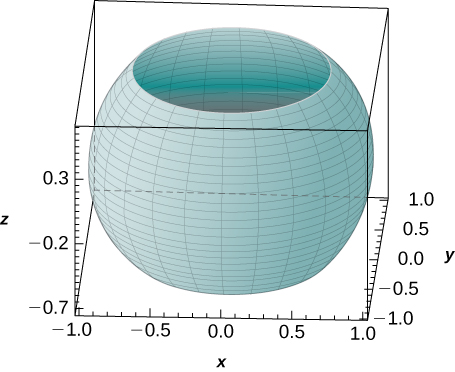 

**[T]** Use a CAS to graph the solid whose volume is given by the iterated integral in spherical coordinates as <math xmlns="http://www.w3.org/1998/Math/MathML"><mrow><mstyle displaystyle="true"><mrow><munderover><mo stretchy="false">∫</mo><mn>0</mn><mrow><mn>2</mn><mi>π</mi></mrow></munderover><mspace width="0.2em" /><mrow><mstyle displaystyle="true"><mrow><munderover><mo stretchy="false">∫</mo><mrow><mrow><mrow><mn>3</mn><mi>π</mi></mrow><mtext>/</mtext><mn>4</mn></mrow></mrow><mrow><mrow><mi>π</mi><mtext>/</mtext><mn>4</mn></mrow></mrow></munderover><mspace width="0.2em" /><mrow><mstyle displaystyle="true"><mrow><munderover><mo stretchy="false">∫</mo><mn>0</mn><mn>1</mn></munderover><mrow><msup><mi>ρ</mi><mn>2</mn></msup><mtext>sin</mtext><mspace width="0.2em" /><mi>φ</mi></mrow></mrow></mstyle></mrow></mrow></mstyle></mrow></mrow></mstyle><mspace width="0.2em" /><mi>d</mi><mi>ρ</mi><mspace width="0.2em" /><mi>d</mi><mi>φ</mi><mspace width="0.2em" /><mi>d</mi><mi>θ</mi><mo>.</mo></mrow></math>

 Find the volume <math xmlns="http://www.w3.org/1998/Math/MathML"><mi>V</mi></math>

 of the solid. Round your answer to three decimal places.

**[T]** Use a CAS to evaluate the integral <math xmlns="http://www.w3.org/1998/Math/MathML"><mrow><mstyle displaystyle="true"><mrow><munder><mo>∭</mo><mi>E</mi></munder><mrow><mrow><mo>(</mo><mrow><msup><mi>x</mi><mn>2</mn></msup><mo>+</mo><msup><mi>y</mi><mn>2</mn></msup></mrow><mo>)</mo></mrow></mrow></mrow></mstyle><mi>d</mi><mi>V</mi></mrow></math>

 where <math xmlns="http://www.w3.org/1998/Math/MathML"><mi>E</mi></math>

 lies above the paraboloid <math xmlns="http://www.w3.org/1998/Math/MathML"><mrow><mi>z</mi><mo>=</mo><msup><mi>x</mi><mn>2</mn></msup><mo>+</mo><msup><mi>y</mi><mn>2</mn></msup></mrow></math>

 and below the plane <math xmlns="http://www.w3.org/1998/Math/MathML"><mrow><mi>z</mi><mo>=</mo><mn>3</mn><mi>y</mi><mo>.</mo></mrow></math>

<math xmlns="http://www.w3.org/1998/Math/MathML"><mrow><mfrac><mrow><mn>343</mn><mi>π</mi></mrow><mrow><mn>32</mn></mrow></mfrac></mrow></math>

**[T]**

1.  Evaluate the integral
    <math xmlns="http://www.w3.org/1998/Math/MathML"><mrow><mstyle displaystyle="true"><mrow><munder><mo>∭</mo><mi>E</mi></munder><mrow><msup><mi>e</mi><mrow><msqrt><mrow><msup><mi>x</mi><mn>2</mn></msup><mo>+</mo><msup><mi>y</mi><mn>2</mn></msup><mo>+</mo><msup><mi>z</mi><mn>2</mn></msup></mrow></msqrt></mrow></msup><mi>d</mi><mi>V</mi></mrow></mrow></mstyle><mo>,</mo></mrow></math>
    
    where
    <math xmlns="http://www.w3.org/1998/Math/MathML"><mi>E</mi></math>
    
    is bounded by the spheres
    <math xmlns="http://www.w3.org/1998/Math/MathML"><mrow><mn>4</mn><msup><mi>x</mi><mn>2</mn></msup><mo>+</mo><mn>4</mn><msup><mi>y</mi><mn>2</mn></msup><mo>+</mo><mn>4</mn><msup><mi>z</mi><mn>2</mn></msup><mo>=</mo><mn>1</mn></mrow></math>
    
    and
    <math xmlns="http://www.w3.org/1998/Math/MathML"><mrow><msup><mi>x</mi><mn>2</mn></msup><mo>+</mo><msup><mi>y</mi><mn>2</mn></msup><mo>+</mo><msup><mi>z</mi><mn>2</mn></msup><mo>=</mo><mn>1</mn><mo>.</mo></mrow></math>

2.  Use a CAS to find an approximation of the previous integral. Round your answer to two decimal places.
{: data-number-style="lower-alpha"}

Express the volume of the solid inside the sphere <math xmlns="http://www.w3.org/1998/Math/MathML"><mrow><msup><mi>x</mi><mn>2</mn></msup><mo>+</mo><msup><mi>y</mi><mn>2</mn></msup><mo>+</mo><msup><mi>z</mi><mn>2</mn></msup><mo>=</mo><mn>16</mn></mrow></math>

 and outside the cylinder <math xmlns="http://www.w3.org/1998/Math/MathML"><mrow><msup><mi>x</mi><mn>2</mn></msup><mo>+</mo><msup><mi>y</mi><mn>2</mn></msup><mo>=</mo><mn>4</mn></mrow></math>

 as triple integrals in cylindrical coordinates and spherical coordinates, respectively.

<math xmlns="http://www.w3.org/1998/Math/MathML"><mrow><mstyle displaystyle="true"><mrow><munderover><mo stretchy="false">∫</mo><mn>0</mn><mrow><mn>2</mn><mi>π</mi></mrow></munderover><mspace width="0.2em" /><mrow><mstyle displaystyle="true"><mrow><munderover><mo stretchy="false">∫</mo><mn>2</mn><mn>4</mn></munderover><mspace width="0.2em" /><mrow><mstyle displaystyle="true"><mrow><munderover><mo stretchy="false">∫</mo><mrow><mtext>−</mtext><msqrt><mrow><mn>16</mn><mo>−</mo><msup><mi>r</mi><mn>2</mn></msup></mrow></msqrt></mrow><mrow><msqrt><mrow><mn>16</mn><mo>−</mo><msup><mi>r</mi><mn>2</mn></msup></mrow></msqrt></mrow></munderover><mrow><mi>r</mi><mspace width="0.2em" /><mi>d</mi><mi>z</mi><mspace width="0.2em" /><mi>d</mi><mi>r</mi><mspace width="0.2em" /><mi>d</mi><mi>θ</mi></mrow></mrow></mstyle></mrow></mrow></mstyle></mrow></mrow></mstyle><mo>;</mo></mrow></math>

 <math xmlns="http://www.w3.org/1998/Math/MathML"><mrow><mstyle displaystyle="true"><mrow><munderover><mo stretchy="false">∫</mo><mrow><mi>π</mi><mtext>/</mtext><mn>6</mn></mrow><mrow><mn>5</mn><mi>π</mi><mtext>/</mtext><mn>6</mn></mrow></munderover><mspace width="0.2em" /><mrow><mstyle displaystyle="true"><mrow><munderover><mo stretchy="false">∫</mo><mn>0</mn><mrow><mn>2</mn><mi>π</mi></mrow></munderover><mspace width="0.2em" /><mrow><mstyle displaystyle="true"><mrow><munderover><mo stretchy="false">∫</mo><mrow><mn>2</mn><mspace width="0.2em" /><mtext>csc</mtext><mspace width="0.2em" /><mi>φ</mi></mrow><mn>4</mn></munderover><mrow><msup><mi>ρ</mi><mn>2</mn></msup><mtext>sin</mtext><mspace width="0.2em" /><mi>ρ</mi><mspace width="0.2em" /><mi>d</mi><mi>ρ</mi><mspace width="0.2em" /><mi>d</mi><mi>θ</mi><mspace width="0.2em" /><mi>d</mi><mi>φ</mi></mrow></mrow></mstyle></mrow></mrow></mstyle></mrow></mrow></mstyle></mrow></math>

Express the volume of the solid inside the sphere <math xmlns="http://www.w3.org/1998/Math/MathML"><mrow><msup><mi>x</mi><mn>2</mn></msup><mo>+</mo><msup><mi>y</mi><mn>2</mn></msup><mo>+</mo><msup><mi>z</mi><mn>2</mn></msup><mo>=</mo><mn>16</mn></mrow></math>

 and outside the cylinder <math xmlns="http://www.w3.org/1998/Math/MathML"><mrow><msup><mi>x</mi><mn>2</mn></msup><mo>+</mo><msup><mi>y</mi><mn>2</mn></msup><mo>=</mo><mn>4</mn></mrow></math>

 that is located in the first octant as triple integrals in cylindrical coordinates and spherical coordinates, respectively.

The power emitted by an antenna has a power density per unit volume given in spherical coordinates by

<math xmlns="http://www.w3.org/1998/Math/MathML"><mrow><mi>p</mi><mrow><mo>(</mo><mrow><mi>ρ</mi><mo>,</mo><mi>θ</mi><mo>,</mo><mi>φ</mi></mrow><mo>)</mo></mrow><mo>=</mo><mfrac><mrow><msub><mi>P</mi><mn>0</mn></msub></mrow><mrow><msup><mi>ρ</mi><mn>2</mn></msup></mrow></mfrac><msup><mrow><mtext>cos</mtext></mrow><mn>2</mn></msup><mi>θ</mi><mspace width="0.2em" /><msup><mrow><mtext>sin</mtext></mrow><mn>4</mn></msup><mi>φ</mi><mo>,</mo></mrow></math>

where <math xmlns="http://www.w3.org/1998/Math/MathML"><mrow><msub><mi>P</mi><mn>0</mn></msub></mrow></math>

 is a constant with units in watts. The total power within a sphere <math xmlns="http://www.w3.org/1998/Math/MathML"><mi>B</mi></math>

 of radius <math xmlns="http://www.w3.org/1998/Math/MathML"><mi>r</mi></math>

 meters is defined as <math xmlns="http://www.w3.org/1998/Math/MathML"><mrow><mi>P</mi><mo>=</mo><mstyle displaystyle="true"><mrow><munder><mo>∭</mo><mi>B</mi></munder><mrow><mi>p</mi><mrow><mo>(</mo><mrow><mi>ρ</mi><mo>,</mo><mi>θ</mi><mo>,</mo><mi>φ</mi></mrow><mo>)</mo></mrow></mrow></mrow></mstyle><mi>d</mi><mi>V</mi><mo>.</mo></mrow></math>

 Find the total power <math xmlns="http://www.w3.org/1998/Math/MathML"><mi>P</mi><mo>.</mo></math>

<math xmlns="http://www.w3.org/1998/Math/MathML"><mrow><mi>P</mi><mo>=</mo><mfrac><mrow><mn>32</mn><msub><mi>P</mi><mn>0</mn></msub><mi>π</mi></mrow><mn>3</mn></mfrac></mrow></math>

 watts

Use the preceding exercise to find the total power within a sphere <math xmlns="http://www.w3.org/1998/Math/MathML"><mi>B</mi></math>

 of radius 5 meters when the power density per unit volume is given by <math xmlns="http://www.w3.org/1998/Math/MathML"><mrow><mi>p</mi><mrow><mo>(</mo><mrow><mi>ρ</mi><mo>,</mo><mi>θ</mi><mo>,</mo><mi>φ</mi></mrow><mo>)</mo></mrow><mo>=</mo><mfrac><mrow><mn>30</mn></mrow><mrow><msup><mi>ρ</mi><mn>2</mn></msup></mrow></mfrac><msup><mrow><mtext>cos</mtext></mrow><mn>2</mn></msup><mi>θ</mi><mspace width="0.2em" /><msup><mrow><mtext>sin</mtext></mrow><mn>4</mn></msup><mi>φ</mi><mo>.</mo></mrow></math>

A charge cloud contained in a sphere <math xmlns="http://www.w3.org/1998/Math/MathML"><mi>B</mi></math>

 of radius *r* centimeters centered at the origin has its charge density given by <math xmlns="http://www.w3.org/1998/Math/MathML"><mrow><mi>q</mi><mrow><mo>(</mo><mrow><mi>x</mi><mo>,</mo><mi>y</mi><mo>,</mo><mi>z</mi></mrow><mo>)</mo></mrow><mo>=</mo><mi>k</mi><msqrt><mrow><msup><mi>x</mi><mn>2</mn></msup><mo>+</mo><msup><mi>y</mi><mn>2</mn></msup><mo>+</mo><msup><mi>z</mi><mn>2</mn></msup></mrow></msqrt><mfrac><mrow><mi>μ</mi><mspace width="0.2em" /><mtext>C</mtext></mrow><mrow><msup><mrow><mtext>cm</mtext></mrow><mn>3</mn></msup></mrow></mfrac><mo>,</mo></mrow></math>

 where <math xmlns="http://www.w3.org/1998/Math/MathML"><mrow><mi>k</mi><mo>&gt;</mo><mn>0</mn><mo>.</mo></mrow></math>

 The total charge contained in <math xmlns="http://www.w3.org/1998/Math/MathML"><mi>B</mi></math>

 is given by <math xmlns="http://www.w3.org/1998/Math/MathML"><mrow><mi>Q</mi><mo>=</mo><mstyle displaystyle="true"><mrow><munder><mo>∭</mo><mi>B</mi></munder><mrow><mi>q</mi><mrow><mo>(</mo><mrow><mi>x</mi><mo>,</mo><mi>y</mi><mo>,</mo><mi>z</mi></mrow><mo>)</mo></mrow></mrow></mrow></mstyle><mi>d</mi><mi>V</mi><mo>.</mo></mrow></math>

 Find the total charge <math xmlns="http://www.w3.org/1998/Math/MathML"><mi>Q</mi><mo>.</mo></math>

<math xmlns="http://www.w3.org/1998/Math/MathML"><mrow><mi>Q</mi><mo>=</mo><mi>k</mi><msup><mi>r</mi><mn>4</mn></msup><mi>π</mi><mi>μ</mi><mi>C</mi></mrow></math>

Use the preceding exercise to find the total charge cloud contained in the unit sphere if the charge density is <math xmlns="http://www.w3.org/1998/Math/MathML"><mrow><mi>q</mi><mrow><mo>(</mo><mrow><mi>x</mi><mo>,</mo><mi>y</mi><mo>,</mo><mi>z</mi></mrow><mo>)</mo></mrow><mo>=</mo><mn>20</mn><msqrt><mrow><msup><mi>x</mi><mn>2</mn></msup><mo>+</mo><msup><mi>y</mi><mn>2</mn></msup><mo>+</mo><msup><mi>z</mi><mn>2</mn></msup></mrow></msqrt><mfrac><mrow><mi>μ</mi><mspace width="0.2em" /><mtext>C</mtext></mrow><mrow><msup><mrow><mtext>cm</mtext></mrow><mn>3</mn></msup></mrow></mfrac><mo>.</mo></mrow></math>

</section>

### Glossary
{: data-type="glossary-title"}

triple integral in cylindrical coordinates
: the limit of a triple Riemann sum, provided the following limit exists:
  * * *
  {: data-type="newline"}
  
  

  <math xmlns="http://www.w3.org/1998/Math/MathML"><mrow><munder><mrow><mtext>lim</mtext></mrow><mrow><mi>l</mi><mo>,</mo><mi>m</mi><mo>,</mo><mi>n</mi><mo stretchy="false">→</mo><mi>∞</mi></mrow></munder><mstyle displaystyle="true"><munderover><mo>∑</mo><mrow><mi>i</mi><mo>=</mo><mn>1</mn></mrow><mi>l</mi></munderover><mrow><mstyle displaystyle="true"><munderover><mo>∑</mo><mrow><mi>j</mi><mo>=</mo><mn>1</mn></mrow><mi>m</mi></munderover><mrow><mstyle displaystyle="true"><munderover><mo>∑</mo><mrow><mi>k</mi><mo>=</mo><mn>1</mn></mrow><mi>n</mi></munderover><mrow><mi>f</mi><mo stretchy="false">(</mo><msubsup><mi>r</mi><mrow><mi>i</mi><mi>j</mi><mi>k</mi></mrow><mo>*</mo></msubsup><mo>,</mo><msubsup><mi>θ</mi><mrow><mi>i</mi><mi>j</mi><mi>k</mi></mrow><mo>*</mo></msubsup><mo>,</mo><msubsup><mi>z</mi><mrow><mi>i</mi><mi>j</mi><mi>k</mi></mrow><mo>*</mo></msubsup><mo stretchy="false">)</mo><msubsup><mi>r</mi><mrow><mi>i</mi><mi>j</mi><mi>k</mi></mrow><mo>*</mo></msubsup><mtext>Δ</mtext><mi>r</mi><mtext>Δ</mtext><mi>θ</mi><mtext>Δ</mtext><mi>z</mi></mrow></mstyle></mrow></mstyle></mrow></mstyle></mrow></math>
  

^

triple integral in spherical coordinates
: the limit of a triple Riemann sum, provided the following limit exists:
  * * *
  {: data-type="newline"}
  
  

  <math xmlns="http://www.w3.org/1998/Math/MathML"><mrow><munder><mrow><mtext>lim</mtext></mrow><mrow><mi>l</mi><mo>,</mo><mi>m</mi><mo>,</mo><mi>n</mi><mo stretchy="false">→</mo><mi>∞</mi></mrow></munder><mstyle displaystyle="true"><munderover><mo>∑</mo><mrow><mi>i</mi><mo>=</mo><mn>1</mn></mrow><mi>l</mi></munderover><mrow><mstyle displaystyle="true"><munderover><mo>∑</mo><mrow><mi>j</mi><mo>=</mo><mn>1</mn></mrow><mi>m</mi></munderover><mrow><mstyle displaystyle="true"><munderover><mo>∑</mo><mrow><mi>k</mi><mo>=</mo><mn>1</mn></mrow><mi>n</mi></munderover><mrow><mi>f</mi><mo stretchy="false">(</mo><msubsup><mi>ρ</mi><mrow><mi>i</mi><mi>j</mi><mi>k</mi></mrow><mo>*</mo></msubsup><mo>,</mo><msubsup><mi>θ</mi><mrow><mi>i</mi><mi>j</mi><mi>k</mi></mrow><mo>*</mo></msubsup><mo>,</mo><msubsup><mi>φ</mi><mrow><mi>i</mi><mi>j</mi><mi>k</mi></mrow><mo>*</mo></msubsup><mo stretchy="false">)</mo><msup><mrow><mo stretchy="false">(</mo><msubsup><mi>ρ</mi><mrow><mi>i</mi><mi>j</mi><mi>k</mi></mrow><mo>*</mo></msubsup><mo stretchy="false">)</mo></mrow><mn>2</mn></msup><mtext>sin</mtext><mspace width="0.2em" /><mi>φ</mi><mtext>Δ</mtext><mi>ρ</mi><mtext>Δ</mtext><mi>θ</mi><mtext>Δ</mtext><mi>φ</mi></mrow></mstyle></mrow></mstyle></mrow></mstyle></mrow></math>
  

