

* Determine the image of a region under a given transformation of variables.
* Compute the Jacobian of a given transformation.
* Evaluate a double integral using a change of variables.
* Evaluate a triple integral using a change of variables.

Recall from [Substitution Rule](/m53634){: .target-chapter} the method of integration by substitution. When evaluating an integral such as <math xmlns="http://www.w3.org/1998/Math/MathML"><mrow><mstyle displaystyle="true"><mrow><msubsup><mo stretchy="false">∫</mo><mn>2</mn><mn>3</mn></msubsup><mrow><mi>x</mi><msup><mrow><mo stretchy="false">(</mo><msup><mi>x</mi><mn>2</mn></msup><mo>−</mo><mn>4</mn><mo stretchy="false">)</mo></mrow><mn>5</mn></msup><mi>d</mi><mi>x</mi><mo>,</mo></mrow></mrow></mstyle></mrow></math>

 we substitute <math xmlns="http://www.w3.org/1998/Math/MathML"><mrow><mi>u</mi><mo>=</mo><mi>g</mi><mrow><mo>(</mo><mi>x</mi><mo>)</mo></mrow><mo>=</mo><msup><mi>x</mi><mn>2</mn></msup><mo>−</mo><mn>4</mn><mo>.</mo></mrow></math>

 Then <math xmlns="http://www.w3.org/1998/Math/MathML"><mrow><mi>d</mi><mi>u</mi><mo>=</mo><mn>2</mn><mi>x</mi><mspace width="0.2em" /><mi>d</mi><mi>x</mi></mrow></math>

 or <math xmlns="http://www.w3.org/1998/Math/MathML"><mrow><mi>x</mi><mspace width="0.2em" /><mi>d</mi><mi>x</mi><mo>=</mo><mfrac><mn>1</mn><mn>2</mn></mfrac><mi>d</mi><mi>u</mi></mrow></math>

 and the limits change to <math xmlns="http://www.w3.org/1998/Math/MathML"><mrow><mi>u</mi><mo>=</mo><mi>g</mi><mo stretchy="false">(</mo><mn>2</mn><mo stretchy="false">)</mo><mo>=</mo><msup><mn>2</mn><mn>2</mn></msup><mo>−</mo><mn>4</mn><mo>=</mo><mn>0</mn></mrow></math>

 and <math xmlns="http://www.w3.org/1998/Math/MathML"><mrow><mi>u</mi><mo>=</mo><mi>g</mi><mrow><mo>(</mo><mn>3</mn><mo>)</mo></mrow><mo>=</mo><mn>9</mn><mo>−</mo><mn>4</mn><mo>=</mo><mn>5</mn><mo>.</mo></mrow></math>

 Thus the integral becomes <math xmlns="http://www.w3.org/1998/Math/MathML"><mrow><mstyle displaystyle="true"><mrow><msubsup><mo stretchy="false">∫</mo><mn>0</mn><mn>5</mn></msubsup><mrow><mfrac><mn>1</mn><mn>2</mn></mfrac><msup><mi>u</mi><mn>5</mn></msup><mi>d</mi><mi>u</mi></mrow></mrow></mstyle></mrow></math>

 and this integral is much simpler to evaluate. In other words, when solving integration problems, we make appropriate substitutions to obtain an integral that becomes much simpler than the original integral.

We also used this idea when we transformed double integrals in rectangular coordinates to polar coordinates and transformed triple integrals in rectangular coordinates to cylindrical or spherical coordinates to make the computations simpler. More generally,

<math xmlns="http://www.w3.org/1998/Math/MathML"><mrow><mstyle displaystyle="true"><mrow><munderover><mo stretchy="false">∫</mo><mi>a</mi><mi>b</mi></munderover><mrow><mi>f</mi><mrow><mo>(</mo><mi>x</mi><mo>)</mo></mrow><mi>d</mi><mi>x</mi><mo>=</mo></mrow></mrow></mstyle><mstyle displaystyle="true"><mrow><munderover><mo stretchy="false">∫</mo><mi>c</mi><mi>d</mi></munderover><mrow><mi>f</mi><mrow><mo>(</mo><mrow><mi>g</mi><mrow><mo>(</mo><mi>u</mi><mo>)</mo></mrow></mrow><mo>)</mo></mrow></mrow></mrow></mstyle><mi>g</mi><mo>′</mo><mrow><mo>(</mo><mi>u</mi><mo>)</mo></mrow><mi>d</mi><mi>u</mi><mo>,</mo></mrow></math>

Where <math xmlns="http://www.w3.org/1998/Math/MathML"><mrow><mi>x</mi><mo>=</mo><mi>g</mi><mrow><mo>(</mo><mi>u</mi><mo>)</mo></mrow><mo>,</mo><mi>d</mi><mi>x</mi><mo>=</mo><mi>g</mi><mo>′</mo><mrow><mo>(</mo><mi>u</mi><mo>)</mo></mrow><mi>d</mi><mi>u</mi><mo>,</mo></mrow></math>

 and <math xmlns="http://www.w3.org/1998/Math/MathML"><mrow><mi>u</mi><mo>=</mo><mi>c</mi></mrow></math>

 and <math xmlns="http://www.w3.org/1998/Math/MathML"><mrow><mi>u</mi><mo>=</mo><mi>d</mi></mrow></math>

 satisfy <math xmlns="http://www.w3.org/1998/Math/MathML"><mrow><mi>c</mi><mo>=</mo><mi>g</mi><mrow><mo>(</mo><mi>a</mi><mo>)</mo></mrow></mrow></math>

 and <math xmlns="http://www.w3.org/1998/Math/MathML"><mrow><mi>d</mi><mo>=</mo><mi>g</mi><mrow><mo>(</mo><mi>b</mi><mo>)</mo></mrow><mo>.</mo></mrow></math>

A similar result occurs in double integrals when we substitute <math xmlns="http://www.w3.org/1998/Math/MathML"><mrow><mi>x</mi><mo>=</mo><mi>f</mi><mrow><mo>(</mo><mrow><mi>r</mi><mo>,</mo><mi>θ</mi></mrow><mo>)</mo></mrow><mo>=</mo><mi>r</mi><mspace width="0.2em" /><mtext>cos</mtext><mspace width="0.2em" /><mi>θ</mi><mo>,</mo></mrow></math>

 <math xmlns="http://www.w3.org/1998/Math/MathML"><mrow><mi>y</mi><mo>=</mo><mi>g</mi><mrow><mo>(</mo><mrow><mi>r</mi><mo>,</mo><mi>θ</mi></mrow><mo>)</mo></mrow><mo>=</mo><mi>r</mi><mspace width="0.2em" /><mtext>sin</mtext><mspace width="0.2em" /><mi>θ</mi><mo>,</mo></mrow></math>

 and <math xmlns="http://www.w3.org/1998/Math/MathML"><mrow><mi>d</mi><mi>A</mi><mo>=</mo><mi>d</mi><mi>x</mi><mspace width="0.2em" /><mi>d</mi><mi>y</mi><mo>=</mo><mi>r</mi><mspace width="0.2em" /><mi>d</mi><mi>r</mi><mspace width="0.2em" /><mi>d</mi><mi>θ</mi><mo>.</mo></mrow></math>

 Then we get

<math xmlns="http://www.w3.org/1998/Math/MathML"><mrow><mstyle displaystyle="true"><mrow><munder><mo>∬</mo><mi>R</mi></munder><mrow><mi>f</mi><mrow><mo>(</mo><mrow><mi>x</mi><mo>,</mo><mi>y</mi></mrow><mo>)</mo></mrow></mrow></mrow></mstyle><mi>d</mi><mi>A</mi><mo>=</mo><mstyle displaystyle="true"><mrow><munder><mo>∬</mo><mi>S</mi></munder><mrow><mi>f</mi><mrow><mo>(</mo><mrow><mi>r</mi><mspace width="0.2em" /><mtext>cos</mtext><mspace width="0.2em" /><mi>θ</mi><mo>,</mo><mi>r</mi><mspace width="0.2em" /><mtext>sin</mtext><mspace width="0.2em" /><mi>θ</mi></mrow><mo>)</mo></mrow><mi>r</mi><mspace width="0.2em" /><mi>d</mi><mi>r</mi><mspace width="0.2em" /><mi>d</mi><mi>θ</mi></mrow></mrow></mstyle></mrow></math>

where the domain <math xmlns="http://www.w3.org/1998/Math/MathML"><mi>R</mi></math>

 is replaced by the domain <math xmlns="http://www.w3.org/1998/Math/MathML"><mi>S</mi></math>

 in polar coordinates. Generally, the function that we use to change the variables to make the integration simpler is called a **transformation**{: data-type="term"} or mapping.

### Planar Transformations

A **planar transformation**{: data-type="term"} <math xmlns="http://www.w3.org/1998/Math/MathML"><mi>T</mi></math>

 is a function that transforms a region <math xmlns="http://www.w3.org/1998/Math/MathML"><mi>G</mi></math>

 in one plane into a region <math xmlns="http://www.w3.org/1998/Math/MathML"><mi>R</mi></math>

 in another plane by a change of variables. Both <math xmlns="http://www.w3.org/1998/Math/MathML"><mi>G</mi></math>

 and <math xmlns="http://www.w3.org/1998/Math/MathML"><mi>R</mi></math>

 are subsets of <math xmlns="http://www.w3.org/1998/Math/MathML"><mrow><msup><mi>R</mi><mn>2</mn></msup><mo>.</mo></mrow></math>

 For example, [\[link\]](#CNX_Calc_Figure_15_07_001) shows a region <math xmlns="http://www.w3.org/1998/Math/MathML"><mi>G</mi></math>

 in the <math xmlns="http://www.w3.org/1998/Math/MathML"><mrow><mi>u</mi><mi>v</mi><mtext>-plane</mtext></mrow></math>

 transformed into a region <math xmlns="http://www.w3.org/1998/Math/MathML"><mi>R</mi></math>

 in the <math xmlns="http://www.w3.org/1998/Math/MathML"><mrow><mi>x</mi><mi>y</mi><mtext>-plane</mtext></mrow></math>

 by the change of variables <math xmlns="http://www.w3.org/1998/Math/MathML"><mrow><mi>x</mi><mo>=</mo><mi>g</mi><mrow><mo>(</mo><mrow><mi>u</mi><mo>,</mo><mi>v</mi></mrow><mo>)</mo></mrow></mrow></math>

 and <math xmlns="http://www.w3.org/1998/Math/MathML"><mrow><mi>y</mi><mo>=</mo><mi>h</mi><mrow><mo>(</mo><mrow><mi>u</mi><mo>,</mo><mi>v</mi></mrow><mo>)</mo></mrow><mo>,</mo></mrow></math>

 or sometimes we write <math xmlns="http://www.w3.org/1998/Math/MathML"><mrow><mi>x</mi><mo>=</mo><mi>x</mi><mrow><mo>(</mo><mrow><mi>u</mi><mo>,</mo><mi>v</mi></mrow><mo>)</mo></mrow></mrow></math>

 and <math xmlns="http://www.w3.org/1998/Math/MathML"><mrow><mi>y</mi><mo>=</mo><mi>y</mi><mrow><mo>(</mo><mrow><mi>u</mi><mo>,</mo><mi>v</mi></mrow><mo>)</mo></mrow><mo>.</mo></mrow></math>

 We shall typically assume that each of these functions has continuous first partial derivatives, which means <math xmlns="http://www.w3.org/1998/Math/MathML"><mrow><msub><mi>g</mi><mi>u</mi></msub><mo>,</mo><msub><mi>g</mi><mi>v</mi></msub><mo>,</mo><msub><mi>h</mi><mi>u</mi></msub><mo>,</mo></mrow></math>

 and <math xmlns="http://www.w3.org/1998/Math/MathML"><mrow><msub><mi>h</mi><mi>v</mi></msub></mrow></math>

 exist and are also continuous. The need for this requirement will become clear soon.

 {: #CNX_Calc_Figure_15_07_001}

Definition

A transformation <math xmlns="http://www.w3.org/1998/Math/MathML"><mrow><mi>T</mi><mtext>:</mtext><mspace width="0.2em" /><mi>G</mi><mo stretchy="false">→</mo><mi>R</mi><mo>,</mo></mrow></math>

 defined as <math xmlns="http://www.w3.org/1998/Math/MathML"><mrow><mi>T</mi><mrow><mo>(</mo><mrow><mi>u</mi><mo>,</mo><mi>v</mi></mrow><mo>)</mo></mrow><mo>=</mo><mrow><mo>(</mo><mrow><mi>x</mi><mo>,</mo><mi>y</mi></mrow><mo>)</mo></mrow><mo>,</mo></mrow></math>

 is said to be a **one-to-one transformation**{: data-type="term"} if no two points map to the same image point.

To show that <math xmlns="http://www.w3.org/1998/Math/MathML"><mi>T</mi></math>

 is a one-to-one transformation, we assume <math xmlns="http://www.w3.org/1998/Math/MathML"><mrow><mi>T</mi><mrow><mo>(</mo><mrow><msub><mi>u</mi><mn>1</mn></msub><mo>,</mo><msub><mi>v</mi><mn>1</mn></msub></mrow><mo>)</mo></mrow><mo>=</mo><mi>T</mi><mrow><mo>(</mo><mrow><msub><mi>u</mi><mn>2</mn></msub><mo>,</mo><msub><mi>v</mi><mn>2</mn></msub></mrow><mo>)</mo></mrow></mrow></math>

 and show that as a consequence we obtain <math xmlns="http://www.w3.org/1998/Math/MathML"><mrow><mrow><mo>(</mo><mrow><msub><mi>u</mi><mn>1</mn></msub><mo>,</mo><msub><mi>v</mi><mn>1</mn></msub></mrow><mo>)</mo></mrow><mo>=</mo><mrow><mo>(</mo><mrow><msub><mi>u</mi><mn>2</mn></msub><mo>,</mo><msub><mi>v</mi><mn>2</mn></msub></mrow><mo>)</mo></mrow><mo>.</mo></mrow></math>

 If the transformation <math xmlns="http://www.w3.org/1998/Math/MathML"><mi>T</mi></math>

 is one-to-one in the domain <math xmlns="http://www.w3.org/1998/Math/MathML"><mrow><mi>G</mi><mo>,</mo></mrow></math>

 then the inverse <math xmlns="http://www.w3.org/1998/Math/MathML"><mrow><msup><mi>T</mi><mrow><mn>−1</mn></mrow></msup></mrow></math>

 exists with the domain <math xmlns="http://www.w3.org/1998/Math/MathML"><mi>R</mi></math>

 such that <math xmlns="http://www.w3.org/1998/Math/MathML"><mrow><msup><mi>T</mi><mrow><mn>−1</mn></mrow></msup><mo>∘</mo><mi>T</mi></mrow></math>

 and <math xmlns="http://www.w3.org/1998/Math/MathML"><mrow><mi>T</mi><mo>∘</mo><msup><mi>T</mi><mrow><mn>−1</mn></mrow></msup></mrow></math>

 are identity functions.

[\[link\]](#CNX_Calc_Figure_15_07_001) shows the mapping <math xmlns="http://www.w3.org/1998/Math/MathML"><mrow><mi>T</mi><mrow><mo>(</mo><mrow><mi>u</mi><mo>,</mo><mi>v</mi></mrow><mo>)</mo></mrow><mo>=</mo><mrow><mo>(</mo><mrow><mi>x</mi><mo>,</mo><mi>y</mi></mrow><mo>)</mo></mrow></mrow></math>

 where <math xmlns="http://www.w3.org/1998/Math/MathML"><mi>x</mi></math>

 and <math xmlns="http://www.w3.org/1998/Math/MathML"><mi>y</mi></math>

 are related to <math xmlns="http://www.w3.org/1998/Math/MathML"><mi>u</mi></math>

 and <math xmlns="http://www.w3.org/1998/Math/MathML"><mi>v</mi></math>

 by the equations <math xmlns="http://www.w3.org/1998/Math/MathML"><mrow><mi>x</mi><mo>=</mo><mi>g</mi><mrow><mo>(</mo><mrow><mi>u</mi><mo>,</mo><mi>v</mi></mrow><mo>)</mo></mrow></mrow></math>

 and <math xmlns="http://www.w3.org/1998/Math/MathML"><mrow><mi>y</mi><mo>=</mo><mi>h</mi><mrow><mo>(</mo><mrow><mi>u</mi><mo>,</mo><mi>v</mi></mrow><mo>)</mo></mrow><mo>.</mo></mrow></math>

 The region <math xmlns="http://www.w3.org/1998/Math/MathML"><mi>G</mi></math>

 is the domain of <math xmlns="http://www.w3.org/1998/Math/MathML"><mi>T</mi></math>

 and the region <math xmlns="http://www.w3.org/1998/Math/MathML"><mi>R</mi></math>

 is the range of <math xmlns="http://www.w3.org/1998/Math/MathML"><mi>T</mi><mo>,</mo></math>

 also known as the *image* of <math xmlns="http://www.w3.org/1998/Math/MathML"><mi>G</mi></math>

 under the transformation <math xmlns="http://www.w3.org/1998/Math/MathML"><mrow><mi>T</mi><mo>.</mo></mrow></math>

Determining How the Transformation Works

Suppose a transformation <math xmlns="http://www.w3.org/1998/Math/MathML"><mi>T</mi></math>

 is defined as <math xmlns="http://www.w3.org/1998/Math/MathML"><mrow><mi>T</mi><mrow><mo>(</mo><mrow><mi>r</mi><mo>,</mo><mi>θ</mi></mrow><mo>)</mo></mrow><mo>=</mo><mrow><mo>(</mo><mrow><mi>x</mi><mo>,</mo><mi>y</mi></mrow><mo>)</mo></mrow></mrow></math>

 where <math xmlns="http://www.w3.org/1998/Math/MathML"><mrow><mi>x</mi><mo>=</mo><mi>r</mi><mspace width="0.2em" /><mtext>cos</mtext><mspace width="0.2em" /><mi>θ</mi><mo>,</mo><mi>y</mi><mo>=</mo><mi>r</mi><mspace width="0.2em" /><mtext>sin</mtext><mspace width="0.2em" /><mi>θ</mi><mo>.</mo></mrow></math>

 Find the image of the polar rectangle <math xmlns="http://www.w3.org/1998/Math/MathML"><mrow><mi>G</mi><mo>=</mo><mrow><mo>{</mo><mrow><mrow><mrow><mrow><mo>(</mo><mrow><mi>r</mi><mo>,</mo><mi>θ</mi></mrow><mo>)</mo></mrow></mrow><mo>\|</mo></mrow><mn>0</mn><mo>&lt;</mo><mi>r</mi><mo>≤</mo><mn>1</mn><mo>,</mo><mn>0</mn><mo>≤</mo><mi>θ</mi><mo>≤</mo><mi>π</mi><mtext>/</mtext><mn>2</mn></mrow><mo>}</mo></mrow></mrow></math>

 in the <math xmlns="http://www.w3.org/1998/Math/MathML"><mrow><mi>r</mi><mi>θ</mi><mtext>-plane</mtext></mrow></math>

 to a region <math xmlns="http://www.w3.org/1998/Math/MathML"><mi>R</mi></math>

 in the <math xmlns="http://www.w3.org/1998/Math/MathML"><mrow><mi>x</mi><mi>y</mi><mtext>-plane</mtext><mtext>.</mtext></mrow></math>

 Show that <math xmlns="http://www.w3.org/1998/Math/MathML"><mi>T</mi></math>

 is a one-to-one transformation in <math xmlns="http://www.w3.org/1998/Math/MathML"><mi>G</mi></math>

 and find <math xmlns="http://www.w3.org/1998/Math/MathML"><mrow><msup><mi>T</mi><mrow><mn>−1</mn></mrow></msup><mrow><mo>(</mo><mrow><mi>x</mi><mo>,</mo><mi>y</mi></mrow><mo>)</mo></mrow><mo>.</mo></mrow></math>

Since <math xmlns="http://www.w3.org/1998/Math/MathML"><mi>r</mi></math>

 varies from 0 to 1 in the <math xmlns="http://www.w3.org/1998/Math/MathML"><mrow><mi>r</mi><mi>θ</mi><mtext>-plane</mtext><mo>,</mo></mrow></math>

 we have a circular disc of radius 0 to 1 in the <math xmlns="http://www.w3.org/1998/Math/MathML"><mrow><mi>x</mi><mi>y</mi><mtext>-plane</mtext><mtext>.</mtext></mrow></math>

 Because <math xmlns="http://www.w3.org/1998/Math/MathML"><mi>θ</mi></math>

 varies from 0 to <math xmlns="http://www.w3.org/1998/Math/MathML"><mrow><mi>π</mi><mtext>/2</mtext></mrow></math>

 in the <math xmlns="http://www.w3.org/1998/Math/MathML"><mrow><mi>r</mi><mi>θ</mi><mtext>-plane</mtext><mo>,</mo></mrow></math>

 we end up getting a quarter circle of radius <math xmlns="http://www.w3.org/1998/Math/MathML"><mn>1</mn></math>

 in the first quadrant of the <math xmlns="http://www.w3.org/1998/Math/MathML"><mrow><mi>x</mi><mi>y</mi><mtext>-plane</mtext></mrow></math>

 ([[link]](#CNX_Calc_Figure_15_07_002)). Hence <math xmlns="http://www.w3.org/1998/Math/MathML"><mi>R</mi></math>

 is a quarter circle bounded by <math xmlns="http://www.w3.org/1998/Math/MathML"><mrow><msup><mi>x</mi><mn>2</mn></msup><mo>+</mo><msup><mi>y</mi><mn>2</mn></msup><mo>=</mo><mn>1</mn></mrow></math>

 in the first quadrant.

{: #CNX_Calc_Figure_15_07_002}

In order to show that <math xmlns="http://www.w3.org/1998/Math/MathML"><mi>T</mi></math>

 is a one-to-one transformation, assume <math xmlns="http://www.w3.org/1998/Math/MathML"><mrow><mi>T</mi><mrow><mo>(</mo><mrow><msub><mi>r</mi><mn>1</mn></msub><mo>,</mo><msub><mi>θ</mi><mn>1</mn></msub></mrow><mo>)</mo></mrow><mo>=</mo><mi>T</mi><mrow><mo>(</mo><mrow><msub><mi>r</mi><mn>2</mn></msub><mo>,</mo><msub><mi>θ</mi><mn>2</mn></msub></mrow><mo>)</mo></mrow></mrow></math>

 and show as a consequence that <math xmlns="http://www.w3.org/1998/Math/MathML"><mrow><mrow><mo>(</mo><mrow><msub><mi>r</mi><mn>1</mn></msub><mo>,</mo><msub><mi>θ</mi><mn>1</mn></msub></mrow><mo>)</mo></mrow><mo>=</mo><mrow><mo>(</mo><mrow><msub><mi>r</mi><mn>2</mn></msub><mo>,</mo><msub><mi>θ</mi><mn>2</mn></msub></mrow><mo>)</mo></mrow><mo>.</mo></mrow></math>

 In this case, we have

<math xmlns="http://www.w3.org/1998/Math/MathML"><mtable><mtr><mtd columnalign="right"><mi>T</mi><mrow><mo>(</mo><mrow><msub><mi>r</mi><mn>1</mn></msub><mo>,</mo><msub><mi>θ</mi><mn>1</mn></msub></mrow><mo>)</mo></mrow></mtd><mtd columnalign="left"><mo>=</mo></mtd><mtd columnalign="left"><mi>T</mi><mrow><mo>(</mo><mrow><msub><mi>r</mi><mn>2</mn></msub><mo>,</mo><msub><mi>θ</mi><mn>2</mn></msub></mrow><mo>)</mo></mrow><mo>,</mo></mtd></mtr><mtr><mtd columnalign="right"><mrow><mo>(</mo><mrow><msub><mi>x</mi><mn>1</mn></msub><mo>,</mo><msub><mi>y</mi><mn>1</mn></msub></mrow><mo>)</mo></mrow></mtd><mtd columnalign="left"><mo>=</mo></mtd><mtd columnalign="left"><mrow><mo>(</mo><mrow><msub><mi>x</mi><mn>1</mn></msub><mo>,</mo><msub><mi>y</mi><mn>1</mn></msub></mrow><mo>)</mo></mrow><mo>,</mo></mtd></mtr><mtr><mtd columnalign="right"><mrow><mo>(</mo><mrow><msub><mi>r</mi><mn>1</mn></msub><mtext>cos</mtext><mspace width="0.2em" /><msub><mi>θ</mi><mn>1</mn></msub><mo>,</mo><msub><mi>r</mi><mn>1</mn></msub><mtext>sin</mtext><mspace width="0.2em" /><msub><mi>θ</mi><mn>1</mn></msub></mrow><mo>)</mo></mrow></mtd><mtd columnalign="left"><mo>=</mo></mtd><mtd columnalign="left"><mrow><mo>(</mo><mrow><msub><mi>r</mi><mn>2</mn></msub><mtext>cos</mtext><mspace width="0.2em" /><msub><mi>θ</mi><mn>2</mn></msub><mo>,</mo><msub><mi>r</mi><mn>2</mn></msub><mtext>sin</mtext><mspace width="0.2em" /><msub><mi>θ</mi><mn>2</mn></msub></mrow><mo>)</mo></mrow><mo>,</mo></mtd></mtr><mtr><mtd columnalign="right"><msub><mi>r</mi><mn>1</mn></msub><mtext>cos</mtext><mspace width="0.2em" /><msub><mi>θ</mi><mn>1</mn></msub></mtd><mtd columnalign="left"><mo>=</mo></mtd><mtd columnalign="left"><msub><mi>r</mi><mn>2</mn></msub><mtext>cos</mtext><mspace width="0.2em" /><msub><mi>θ</mi><mn>2</mn></msub><mo>,</mo><msub><mi>r</mi><mn>1</mn></msub><mtext>sin</mtext><mspace width="0.2em" /><msub><mi>θ</mi><mn>1</mn></msub><mo>=</mo><msub><mi>r</mi><mn>2</mn></msub><mtext>sin</mtext><mspace width="0.2em" /><msub><mi>θ</mi><mn>2</mn></msub><mo>.</mo></mtd></mtr></mtable></math>

Dividing, we obtain

<math xmlns="http://www.w3.org/1998/Math/MathML"><mtable><mtr><mtd columnalign="right"><mfrac><mrow><msub><mi>r</mi><mn>1</mn></msub><mtext>cos</mtext><mspace width="0.2em" /><msub><mi>θ</mi><mn>1</mn></msub></mrow><mrow><msub><mi>r</mi><mn>1</mn></msub><mtext>sin</mtext><mspace width="0.2em" /><msub><mi>θ</mi><mn>1</mn></msub></mrow></mfrac></mtd><mtd columnalign="left"><mo>=</mo></mtd><mtd columnalign="left"><mfrac><mrow><msub><mi>r</mi><mn>2</mn></msub><mtext>cos</mtext><mspace width="0.2em" /><msub><mi>θ</mi><mn>2</mn></msub></mrow><mrow><msub><mi>r</mi><mn>2</mn></msub><mtext>sin</mtext><mspace width="0.2em" /><msub><mi>θ</mi><mn>2</mn></msub></mrow></mfrac></mtd></mtr><mtr><mtd columnalign="right"><mfrac><mrow><mtext>cos</mtext><mspace width="0.2em" /><msub><mi>θ</mi><mn>1</mn></msub></mrow><mrow><mtext>sin</mtext><mspace width="0.2em" /><msub><mi>θ</mi><mn>1</mn></msub></mrow></mfrac></mtd><mtd columnalign="left"><mo>=</mo></mtd><mtd columnalign="left"><mfrac><mrow><mtext>cos</mtext><mspace width="0.2em" /><msub><mi>θ</mi><mn>2</mn></msub></mrow><mrow><mtext>sin</mtext><mspace width="0.2em" /><msub><mi>θ</mi><mn>2</mn></msub></mrow></mfrac></mtd></mtr><mtr><mtd columnalign="right"><mtext>tan</mtext><mspace width="0.2em" /><msub><mi>θ</mi><mn>1</mn></msub></mtd><mtd columnalign="left"><mo>=</mo></mtd><mtd columnalign="left"><mtext>tan</mtext><mspace width="0.2em" /><msub><mi>θ</mi><mn>2</mn></msub></mtd></mtr><mtr><mtd columnalign="right"><msub><mi>θ</mi><mn>1</mn></msub></mtd><mtd columnalign="left"><mo>=</mo></mtd><mtd columnalign="left"><msub><mi>θ</mi><mn>2</mn></msub></mtd></mtr></mtable></math>

since the tangent function is one-one function in the interval <math xmlns="http://www.w3.org/1998/Math/MathML"><mrow><mn>0</mn><mo>≤</mo><mi>θ</mi><mo>≤</mo><mi>π</mi><mtext>/</mtext><mn>2</mn><mo>.</mo></mrow></math>

 Also, since <math xmlns="http://www.w3.org/1998/Math/MathML"><mrow><mn>0</mn><mo>&lt;</mo><mi>r</mi><mo>≤</mo><mn>1</mn><mo>,</mo></mrow></math>

 we have <math xmlns="http://www.w3.org/1998/Math/MathML"><mrow><msub><mi>r</mi><mn>1</mn></msub><mo>=</mo><msub><mi>r</mi><mn>2</mn></msub><mo>,</mo><msub><mi>θ</mi><mn>1</mn></msub><mo>=</mo><msub><mi>θ</mi><mn>2</mn></msub><mo>.</mo></mrow></math>

 Therefore, <math xmlns="http://www.w3.org/1998/Math/MathML"><mrow><mrow><mo>(</mo><mrow><msub><mi>r</mi><mn>1</mn></msub><mo>,</mo><msub><mi>θ</mi><mn>1</mn></msub></mrow><mo>)</mo></mrow><mo>=</mo><mrow><mo>(</mo><mrow><msub><mi>r</mi><mn>2</mn></msub><mo>,</mo><msub><mi>θ</mi><mn>2</mn></msub></mrow><mo>)</mo></mrow></mrow></math>

 and <math xmlns="http://www.w3.org/1998/Math/MathML"><mi>T</mi></math>

 is a one-to-one transformation from <math xmlns="http://www.w3.org/1998/Math/MathML"><mi>G</mi></math>

 into <math xmlns="http://www.w3.org/1998/Math/MathML"><mi>R</mi><mo>.</mo></math>

To find <math xmlns="http://www.w3.org/1998/Math/MathML"><mrow><msup><mi>T</mi><mrow><mn>−1</mn></mrow></msup><mrow><mo>(</mo><mrow><mi>x</mi><mo>,</mo><mi>y</mi></mrow><mo>)</mo></mrow></mrow></math>

 solve for <math xmlns="http://www.w3.org/1998/Math/MathML"><mrow><mi>r</mi><mo>,</mo><mi>θ</mi></mrow></math>

 in terms of <math xmlns="http://www.w3.org/1998/Math/MathML"><mrow><mi>x</mi><mo>,</mo><mi>y</mi><mo>.</mo></mrow></math>

 We already know that <math xmlns="http://www.w3.org/1998/Math/MathML"><mrow><msup><mi>r</mi><mn>2</mn></msup><mo>=</mo><msup><mi>x</mi><mn>2</mn></msup><mo>+</mo><msup><mi>y</mi><mn>2</mn></msup></mrow></math>

 and <math xmlns="http://www.w3.org/1998/Math/MathML"><mrow><mtext>tan</mtext><mspace width="0.2em" /><mi>θ</mi><mo>=</mo><mfrac><mi>y</mi><mi>x</mi></mfrac><mo>.</mo></mrow></math>

 Thus <math xmlns="http://www.w3.org/1998/Math/MathML"><mrow><msup><mi>T</mi><mrow><mn>−1</mn></mrow></msup><mrow><mo>(</mo><mrow><mi>x</mi><mo>,</mo><mi>y</mi></mrow><mo>)</mo></mrow><mo>=</mo><mrow><mo>(</mo><mrow><mi>r</mi><mo>,</mo><mi>θ</mi></mrow><mo>)</mo></mrow></mrow></math>

 is defined as <math xmlns="http://www.w3.org/1998/Math/MathML"><mrow><mi>r</mi><mo>=</mo><msqrt><mrow><msup><mi>x</mi><mn>2</mn></msup><mo>+</mo><msup><mi>y</mi><mn>2</mn></msup></mrow></msqrt></mrow></math>

 and <math xmlns="http://www.w3.org/1998/Math/MathML"><mrow><mi>θ</mi><mo>=</mo><msup><mrow><mtext>tan</mtext></mrow><mrow><mn>−1</mn></mrow></msup><mrow><mo>(</mo><mrow><mfrac><mi>y</mi><mi>x</mi></mfrac></mrow><mo>)</mo></mrow><mo>.</mo></mrow></math>

Finding the Image under
<math xmlns="http://www.w3.org/1998/Math/MathML"><mi>T</mi></math>

Let the transformation <math xmlns="http://www.w3.org/1998/Math/MathML"><mi>T</mi></math>

 be defined by <math xmlns="http://www.w3.org/1998/Math/MathML"><mrow><mi>T</mi><mrow><mo>(</mo><mrow><mi>u</mi><mo>,</mo><mi>v</mi></mrow><mo>)</mo></mrow><mo>=</mo><mrow><mo>(</mo><mrow><mi>x</mi><mo>,</mo><mi>y</mi></mrow><mo>)</mo></mrow></mrow></math>

 where <math xmlns="http://www.w3.org/1998/Math/MathML"><mrow><mi>x</mi><mo>=</mo><msup><mi>u</mi><mn>2</mn></msup><mo>−</mo><msup><mi>v</mi><mn>2</mn></msup></mrow></math>

 and <math xmlns="http://www.w3.org/1998/Math/MathML"><mrow><mi>y</mi><mo>=</mo><mi>u</mi><mi>v</mi><mo>.</mo></mrow></math>

 Find the image of the triangle in the <math xmlns="http://www.w3.org/1998/Math/MathML"><mrow><mi>u</mi><mi>v</mi><mtext>-plane</mtext></mrow></math>

 with vertices <math xmlns="http://www.w3.org/1998/Math/MathML"><mrow><mrow><mo>(</mo><mrow><mn>0</mn><mo>,</mo><mn>0</mn></mrow><mo>)</mo></mrow><mo>,</mo><mrow><mo>(</mo><mrow><mn>0</mn><mo>,</mo><mn>1</mn></mrow><mo>)</mo></mrow><mo>,</mo></mrow></math>

 and <math xmlns="http://www.w3.org/1998/Math/MathML"><mrow><mrow><mo>(</mo><mrow><mn>1</mn><mo>,</mo><mn>1</mn></mrow><mo>)</mo></mrow><mo>.</mo></mrow></math>

The triangle and its image are shown in [[link]](#CNX_Calc_Figure_15_07_003). To understand how the sides of the triangle transform, call the side that joins <math xmlns="http://www.w3.org/1998/Math/MathML"><mrow><mrow><mo>(</mo><mrow><mn>0</mn><mo>,</mo><mn>0</mn></mrow><mo>)</mo></mrow></mrow></math>

 and <math xmlns="http://www.w3.org/1998/Math/MathML"><mrow><mrow><mo>(</mo><mrow><mn>0</mn><mo>,</mo><mn>1</mn></mrow><mo>)</mo></mrow></mrow></math>

 side <math xmlns="http://www.w3.org/1998/Math/MathML"><mi>A</mi><mo>,</mo></math>

 the side that joins <math xmlns="http://www.w3.org/1998/Math/MathML"><mrow><mrow><mo>(</mo><mrow><mn>0</mn><mo>,</mo><mn>0</mn></mrow><mo>)</mo></mrow></mrow></math>

 and <math xmlns="http://www.w3.org/1998/Math/MathML"><mrow><mrow><mo>(</mo><mrow><mn>1</mn><mo>,</mo><mn>1</mn></mrow><mo>)</mo></mrow></mrow></math>

 side <math xmlns="http://www.w3.org/1998/Math/MathML"><mi>B</mi><mo>,</mo></math>

 and the side that joins <math xmlns="http://www.w3.org/1998/Math/MathML"><mrow><mrow><mo>(</mo><mrow><mn>1</mn><mo>,</mo><mn>1</mn></mrow><mo>)</mo></mrow></mrow></math>

 and <math xmlns="http://www.w3.org/1998/Math/MathML"><mrow><mrow><mo>(</mo><mrow><mn>0</mn><mo>,</mo><mn>1</mn></mrow><mo>)</mo></mrow></mrow></math>

 side <math xmlns="http://www.w3.org/1998/Math/MathML"><mrow><mi>C</mi><mo>.</mo></mrow></math>

![On the left-hand side of this figure, there is a triangular region given in the Cartesian uv-plane with boundaries A, B, and C represented by the v axis, the line u = v, and the line v = 1, respectively. Then there is an arrow from this graph to the right-hand side of the figure marked with x = u squared minus v squared and y = u v. On the right-hand side of this figure there is a complex region given in the Cartesian x y-plane with boundaries A&#x2019;, B&#x2019;, and C&#x2019; given by the x axis, y axis, and a line curving from (negative 1, 0) through (0, 1), namely x = y squared minus 1, respectively.](../resources/CNX_Calc_Figure_15_07_003.jpg "A triangular region in the uv-plane is transformed into an image in the xy-plane."){: #CNX_Calc_Figure_15_07_003}

For the side <math xmlns="http://www.w3.org/1998/Math/MathML"><mrow><mi>A</mi><mtext>:</mtext><mspace width="0.2em" /><mi>u</mi><mo>=</mo><mn>0</mn><mo>,</mo><mn>0</mn><mo>≤</mo><mi>v</mi><mo>≤</mo><mn>1</mn></mrow></math>

 transforms to <math xmlns="http://www.w3.org/1998/Math/MathML"><mrow><mi>x</mi><mo>=</mo><mtext>−</mtext><msup><mi>v</mi><mn>2</mn></msup><mo>,</mo><mi>y</mi><mo>=</mo><mn>0</mn></mrow></math>

 so this is the side <math xmlns="http://www.w3.org/1998/Math/MathML"><mrow><mi>A</mi><mo>′</mo></mrow></math>

 that joins <math xmlns="http://www.w3.org/1998/Math/MathML"><mrow><mrow><mo>(</mo><mrow><mn>−1</mn><mo>,</mo><mn>0</mn></mrow><mo>)</mo></mrow></mrow></math>

 and <math xmlns="http://www.w3.org/1998/Math/MathML"><mrow><mrow><mo>(</mo><mrow><mn>0</mn><mo>,</mo><mn>0</mn></mrow><mo>)</mo></mrow><mo>.</mo></mrow></math>

For the side <math xmlns="http://www.w3.org/1998/Math/MathML"><mrow><mi>B</mi><mtext>:</mtext><mspace width="0.2em" /><mi>u</mi><mo>=</mo><mi>v</mi><mo>,</mo><mn>0</mn><mo>≤</mo><mi>u</mi><mo>≤</mo><mn>1</mn></mrow></math>

 transforms to <math xmlns="http://www.w3.org/1998/Math/MathML"><mrow><mi>x</mi><mo>=</mo><mn>0</mn><mo>,</mo><mi>y</mi><mo>=</mo><msup><mi>u</mi><mn>2</mn></msup></mrow></math>

 so this is the side <math xmlns="http://www.w3.org/1998/Math/MathML"><msup><mi>B</mi><mo>′</mo></msup></math>

 that joins <math xmlns="http://www.w3.org/1998/Math/MathML"><mrow><mrow><mo>(</mo><mrow><mn>0</mn><mo>,</mo><mn>0</mn></mrow><mo>)</mo></mrow></mrow></math>

 and <math xmlns="http://www.w3.org/1998/Math/MathML"><mrow><mrow><mo>(</mo><mrow><mn>0</mn><mo>,</mo><mn>1</mn></mrow><mo>)</mo></mrow><mo>.</mo></mrow></math>

For the side <math xmlns="http://www.w3.org/1998/Math/MathML"><mrow><mi>C</mi><mtext>:</mtext><mspace width="0.2em" /><mn>0</mn><mo>≤</mo><mi>u</mi><mo>≤</mo><mn>1</mn><mo>,</mo><mi>v</mi><mo>=</mo><mn>1</mn></mrow></math>

 transforms to <math xmlns="http://www.w3.org/1998/Math/MathML"><mrow><mi>x</mi><mo>=</mo><msup><mi>u</mi><mn>2</mn></msup><mo>−</mo><mn>1</mn><mo>,</mo><mi>y</mi><mo>=</mo><mi>u</mi></mrow></math>

 (hence <math xmlns="http://www.w3.org/1998/Math/MathML"><mrow><mi>x</mi><mo>=</mo><msup><mi>y</mi><mn>2</mn></msup><mo>−</mo><mn>1</mn><mo stretchy="false">)</mo></mrow></math>

 so this is the side <math xmlns="http://www.w3.org/1998/Math/MathML"><msup><mi>C</mi><mo>′</mo></msup></math>

 that makes the upper half of the parabolic arc joining <math xmlns="http://www.w3.org/1998/Math/MathML"><mrow><mrow><mo>(</mo><mrow><mn>−1</mn><mo>,</mo><mn>0</mn></mrow><mo>)</mo></mrow></mrow></math>

 and <math xmlns="http://www.w3.org/1998/Math/MathML"><mrow><mrow><mo>(</mo><mrow><mn>0</mn><mo>,</mo><mn>1</mn></mrow><mo>)</mo></mrow><mo>.</mo></mrow></math>

All the points in the entire region of the triangle in the <math xmlns="http://www.w3.org/1998/Math/MathML"><mrow><mi>u</mi><mi>v</mi><mtext>-plane</mtext></mrow></math>

 are mapped inside the parabolic region in the <math xmlns="http://www.w3.org/1998/Math/MathML"><mrow><mi>x</mi><mi>y</mi><mtext>-plane</mtext><mtext>.</mtext></mrow></math>

Let a transformation <math xmlns="http://www.w3.org/1998/Math/MathML"><mi>T</mi></math>

 be defined as <math xmlns="http://www.w3.org/1998/Math/MathML"><mrow><mi>T</mi><mrow><mo>(</mo><mrow><mi>u</mi><mo>,</mo><mi>v</mi></mrow><mo>)</mo></mrow><mo>=</mo><mrow><mo>(</mo><mrow><mi>x</mi><mo>,</mo><mi>y</mi></mrow><mo>)</mo></mrow></mrow></math>

 where <math xmlns="http://www.w3.org/1998/Math/MathML"><mrow><mi>x</mi><mo>=</mo><mi>u</mi><mo>+</mo><mi>v</mi><mo>,</mo><mi>y</mi><mo>=</mo><mn>3</mn><mi>v</mi><mo>.</mo></mrow></math>

 Find the image of the rectangle <math xmlns="http://www.w3.org/1998/Math/MathML"><mrow><mi>G</mi><mo>=</mo><mrow><mo>{</mo><mrow><mrow><mo>(</mo><mrow><mi>u</mi><mo>,</mo><mi>v</mi></mrow><mo>)</mo></mrow><mtext>:</mtext><mspace width="0.2em" /><mn>0</mn><mo>≤</mo><mi>u</mi><mo>≤</mo><mn>1</mn><mo>,</mo><mn>0</mn><mo>≤</mo><mi>v</mi><mo>≤</mo><mn>2</mn></mrow><mo>}</mo></mrow></mrow></math>

 from the <math xmlns="http://www.w3.org/1998/Math/MathML"><mrow><mi>u</mi><mi>v</mi><mtext>-plane</mtext></mrow></math>

 after the transformation into a region <math xmlns="http://www.w3.org/1998/Math/MathML"><mi>R</mi></math>

 in the <math xmlns="http://www.w3.org/1998/Math/MathML"><mrow><mi>x</mi><mi>y</mi><mtext>-plane</mtext><mtext>.</mtext></mrow></math>

 Show that <math xmlns="http://www.w3.org/1998/Math/MathML"><mi>T</mi></math>

 is a one-to-one transformation and find <math xmlns="http://www.w3.org/1998/Math/MathML"><mrow><msup><mi>T</mi><mrow><mn>−1</mn></mrow></msup><mrow><mo>(</mo><mrow><mi>x</mi><mo>,</mo><mi>y</mi></mrow><mo>)</mo></mrow><mo>.</mo></mrow></math>

<math xmlns="http://www.w3.org/1998/Math/MathML"><mrow><msup><mi>T</mi><mrow><mn>−1</mn></mrow></msup><mo stretchy="false">(</mo><mi>x</mi><mo>,</mo><mi>y</mi><mo stretchy="false">)</mo><mo>=</mo><mo stretchy="false">(</mo><mi>u</mi><mo>,</mo><mi>v</mi><mo stretchy="false">)</mo></mrow></math>

 where <math xmlns="http://www.w3.org/1998/Math/MathML"><mrow><mi>u</mi><mo>=</mo><mfrac><mrow><mn>3</mn><mi>x</mi><mo>−</mo><mi>y</mi></mrow><mn>3</mn></mfrac></mrow></math>

 and <math xmlns="http://www.w3.org/1998/Math/MathML"><mrow><mi>v</mi><mo>=</mo><mfrac><mi>y</mi><mn>3</mn></mfrac></mrow></math>

Hint

Follow the steps of [[link]](#fs-id1167794063017).

### Jacobians

Recall that we mentioned near the beginning of this section that each of the component functions must have continuous first partial derivatives, which means that <math xmlns="http://www.w3.org/1998/Math/MathML"><mrow><msub><mi>g</mi><mi>u</mi></msub><mo>,</mo><msub><mi>g</mi><mi>v</mi></msub><mo>,</mo><msub><mi>h</mi><mi>u</mi></msub><mo>,</mo></mrow></math>

 and <math xmlns="http://www.w3.org/1998/Math/MathML"><mrow><msub><mi>h</mi><mi>v</mi></msub></mrow></math>

 exist and are also continuous. A transformation that has this property is called a <math xmlns="http://www.w3.org/1998/Math/MathML"><mrow><msup><mi>C</mi><mn>1</mn></msup></mrow></math>

 transformation (here <math xmlns="http://www.w3.org/1998/Math/MathML"><mi>C</mi></math>

 denotes continuous). Let <math xmlns="http://www.w3.org/1998/Math/MathML"><mrow><mi>T</mi><mrow><mo>(</mo><mrow><mi>u</mi><mo>,</mo><mi>v</mi></mrow><mo>)</mo></mrow><mo>=</mo><mrow><mo>(</mo><mrow><mi>g</mi><mrow><mo>(</mo><mrow><mi>u</mi><mo>,</mo><mi>v</mi></mrow><mo>)</mo></mrow><mo>,</mo><mi>h</mi><mrow><mo>(</mo><mrow><mi>u</mi><mo>,</mo><mi>v</mi></mrow><mo>)</mo></mrow></mrow><mo>)</mo></mrow><mo>,</mo></mrow></math>

 where <math xmlns="http://www.w3.org/1998/Math/MathML"><mrow><mi>x</mi><mo>=</mo><mi>g</mi><mrow><mo>(</mo><mrow><mi>u</mi><mo>,</mo><mi>v</mi></mrow><mo>)</mo></mrow></mrow></math>

 and <math xmlns="http://www.w3.org/1998/Math/MathML"><mrow><mi>y</mi><mo>=</mo><mi>h</mi><mrow><mo>(</mo><mrow><mi>u</mi><mo>,</mo><mi>v</mi></mrow><mo>)</mo></mrow><mo>,</mo></mrow></math>

 be a one-to-one <math xmlns="http://www.w3.org/1998/Math/MathML"><mrow><msup><mi>C</mi><mn>1</mn></msup></mrow></math>

 transformation. We want to see how it transforms a small rectangular region <math xmlns="http://www.w3.org/1998/Math/MathML"><mi>S</mi><mo>,</mo></math>

 <math xmlns="http://www.w3.org/1998/Math/MathML"><mrow><mtext>Δ</mtext><mi>u</mi></mrow></math>

 units by <math xmlns="http://www.w3.org/1998/Math/MathML"><mrow><mtext>Δ</mtext><mi>v</mi></mrow></math>

 units, in the <math xmlns="http://www.w3.org/1998/Math/MathML"><mrow><mi>u</mi><mi>v</mi><mtext>-plane</mtext></mrow></math>

 (see the following figure).

 {: #CNX_Calc_Figure_15_07_004}

Since <math xmlns="http://www.w3.org/1998/Math/MathML"><mrow><mi>x</mi><mo>=</mo><mi>g</mi><mrow><mo>(</mo><mrow><mi>u</mi><mo>,</mo><mi>v</mi></mrow><mo>)</mo></mrow></mrow></math>

 and <math xmlns="http://www.w3.org/1998/Math/MathML"><mrow><mi>y</mi><mo>=</mo><mi>h</mi><mrow><mo>(</mo><mrow><mi>u</mi><mo>,</mo><mi>v</mi></mrow><mo>)</mo></mrow><mo>,</mo></mrow></math>

 we have the position vector <math xmlns="http://www.w3.org/1998/Math/MathML"><mrow><mstyle mathvariant="bold" mathsize="normal"><mi>r</mi></mstyle><mrow><mo>(</mo><mrow><mi>u</mi><mo>,</mo><mi>v</mi></mrow><mo>)</mo></mrow><mo>=</mo><mi>g</mi><mrow><mo>(</mo><mrow><mi>u</mi><mo>,</mo><mi>v</mi></mrow><mo>)</mo></mrow><mstyle mathvariant="bold" mathsize="normal"><mi>i</mi></mstyle><mo>+</mo><mi>h</mi><mrow><mo>(</mo><mrow><mi>u</mi><mo>,</mo><mi>v</mi></mrow><mo>)</mo></mrow><mstyle mathvariant="bold" mathsize="normal"><mi>j</mi></mstyle></mrow></math>

 of the image of the point <math xmlns="http://www.w3.org/1998/Math/MathML"><mrow><mrow><mo>(</mo><mrow><mi>u</mi><mo>,</mo><mi>v</mi></mrow><mo>)</mo></mrow><mo>.</mo></mrow></math>

 Suppose that <math xmlns="http://www.w3.org/1998/Math/MathML"><mrow><mrow><mo>(</mo><mrow><msub><mi>u</mi><mn>0</mn></msub><mo>,</mo><msub><mi>v</mi><mn>0</mn></msub></mrow><mo>)</mo></mrow></mrow></math>

 is the coordinate of the point at the lower left corner that mapped to <math xmlns="http://www.w3.org/1998/Math/MathML"><mrow><mrow><mo>(</mo><mrow><msub><mi>x</mi><mn>0</mn></msub><mo>,</mo><msub><mi>y</mi><mn>0</mn></msub></mrow><mo>)</mo></mrow><mo>=</mo><mi>T</mi><mrow><mo>(</mo><mrow><msub><mi>u</mi><mn>0</mn></msub><mo>,</mo><msub><mi>v</mi><mn>0</mn></msub></mrow><mo>)</mo></mrow><mo>.</mo></mrow></math>

 The line <math xmlns="http://www.w3.org/1998/Math/MathML"><mrow><mi>v</mi><mo>=</mo><msub><mi>v</mi><mn>0</mn></msub></mrow></math>

 maps to the image curve with vector function <math xmlns="http://www.w3.org/1998/Math/MathML"><mrow><mtext>r</mtext><mrow><mo>(</mo><mrow><mi>u</mi><mo>,</mo><msub><mi>v</mi><mn>0</mn></msub></mrow><mo>)</mo></mrow><mo>,</mo></mrow></math>

 and the tangent vector at <math xmlns="http://www.w3.org/1998/Math/MathML"><mrow><mrow><mo>(</mo><mrow><msub><mi>x</mi><mn>0</mn></msub><mo>,</mo><msub><mi>y</mi><mn>0</mn></msub></mrow><mo>)</mo></mrow></mrow></math>

 to the image curve is

<math xmlns="http://www.w3.org/1998/Math/MathML"><mrow><msub><mstyle mathvariant="bold" mathsize="normal"><mi>r</mi></mstyle><mi>u</mi></msub><mo>=</mo><msub><mi>g</mi><mi>u</mi></msub><mrow><mo>(</mo><mrow><msub><mi>u</mi><mn>0</mn></msub><mo>,</mo><msub><mi>v</mi><mn>0</mn></msub></mrow><mo>)</mo></mrow><mstyle mathvariant="bold" mathsize="normal"><mi>i</mi></mstyle><mo>+</mo><msub><mi>h</mi><mi>u</mi></msub><mrow><mo>(</mo><mrow><msub><mi>u</mi><mn>0</mn></msub><mo>,</mo><msub><mi>v</mi><mn>0</mn></msub></mrow><mo>)</mo></mrow><mstyle mathvariant="bold" mathsize="normal"><mi>j</mi></mstyle><mo>=</mo><mfrac><mrow><mo>∂</mo><mi>x</mi></mrow><mrow><mo>∂</mo><mi>u</mi></mrow></mfrac><mstyle mathvariant="bold" mathsize="normal"><mi>i</mi></mstyle><mo>+</mo><mfrac><mrow><mo>∂</mo><mi>y</mi></mrow><mrow><mo>∂</mo><mi>u</mi></mrow></mfrac><mstyle mathvariant="bold" mathsize="normal"><mi>j</mi></mstyle><mo>.</mo></mrow></math>

Similarly, the line <math xmlns="http://www.w3.org/1998/Math/MathML"><mrow><mi>u</mi><mo>=</mo><msub><mi>u</mi><mn>0</mn></msub></mrow></math>

 maps to the image curve with vector function <math xmlns="http://www.w3.org/1998/Math/MathML"><mrow><mstyle mathvariant="bold" mathsize="normal"><mi>r</mi></mstyle><mrow><mo>(</mo><mrow><msub><mi>u</mi><mn>0</mn></msub><mo>,</mo><mi>v</mi></mrow><mo>)</mo></mrow><mo>,</mo></mrow></math>

 and the tangent vector at <math xmlns="http://www.w3.org/1998/Math/MathML"><mrow><mrow><mo>(</mo><mrow><msub><mi>x</mi><mn>0</mn></msub><mo>,</mo><msub><mi>y</mi><mn>0</mn></msub></mrow><mo>)</mo></mrow></mrow></math>

 to the image curve is

<math xmlns="http://www.w3.org/1998/Math/MathML"><mrow><msub><mstyle mathvariant="bold" mathsize="normal"><mi>r</mi></mstyle><mi>v</mi></msub><mo>=</mo><msub><mi>g</mi><mi>v</mi></msub><mrow><mo>(</mo><mrow><msub><mi>u</mi><mn>0</mn></msub><mo>,</mo><msub><mi>v</mi><mn>0</mn></msub></mrow><mo>)</mo></mrow><mstyle mathvariant="bold" mathsize="normal"><mi>i</mi></mstyle><mo>+</mo><msub><mi>h</mi><mi>v</mi></msub><mrow><mo>(</mo><mrow><msub><mi>u</mi><mn>0</mn></msub><mo>,</mo><msub><mi>v</mi><mn>0</mn></msub></mrow><mo>)</mo></mrow><mstyle mathvariant="bold" mathsize="normal"><mi>j</mi></mstyle><mo>=</mo><mfrac><mrow><mo>∂</mo><mi>x</mi></mrow><mrow><mo>∂</mo><mi>v</mi></mrow></mfrac><mstyle mathvariant="bold" mathsize="normal"><mi>i</mi></mstyle><mo>+</mo><mfrac><mrow><mo>∂</mo><mi>y</mi></mrow><mrow><mo>∂</mo><mi>v</mi></mrow></mfrac><mstyle mathvariant="bold" mathsize="normal"><mi>j</mi></mstyle><mo>.</mo></mrow></math>

Now, note that

<math xmlns="http://www.w3.org/1998/Math/MathML"><mrow><msub><mstyle mathvariant="bold" mathsize="normal"><mi>r</mi></mstyle><mi>u</mi></msub><mo>=</mo><munder><mrow><mtext>lim</mtext></mrow><mrow><mtext>Δ</mtext><mi>u</mi><mo stretchy="false">→</mo><mn>0</mn></mrow></munder><mfrac><mrow><mstyle mathvariant="bold" mathsize="normal"><mi>r</mi></mstyle><mrow><mo>(</mo><mrow><msub><mi>u</mi><mn>0</mn></msub><mo>+</mo><mtext>Δ</mtext><mi>u</mi><mo>,</mo><msub><mi>v</mi><mn>0</mn></msub></mrow><mo>)</mo></mrow><mo>−</mo><mstyle mathvariant="bold" mathsize="normal"><mi>r</mi></mstyle><mrow><mo>(</mo><mrow><msub><mi>u</mi><mn>0</mn></msub><mo>,</mo><msub><mi>v</mi><mn>0</mn></msub></mrow><mo>)</mo></mrow></mrow><mrow><mtext>Δ</mtext><mi>u</mi></mrow></mfrac><mspace width="0.2em" /><mtext>so</mtext><mspace width="0.2em" /><mstyle mathvariant="bold" mathsize="normal"><mi>r</mi></mstyle><mrow><mo>(</mo><mrow><msub><mi>u</mi><mn>0</mn></msub><mo>+</mo><mtext>Δ</mtext><mi>u</mi><mo>,</mo><msub><mi>v</mi><mn>0</mn></msub></mrow><mo>)</mo></mrow><mo>−</mo><mstyle mathvariant="bold" mathsize="normal"><mi>r</mi></mstyle><mrow><mo>(</mo><mrow><msub><mi>u</mi><mn>0</mn></msub><mo>,</mo><msub><mi>v</mi><mn>0</mn></msub></mrow><mo>)</mo></mrow><mo>≈</mo><mtext>Δ</mtext><mi>u</mi><msub><mstyle mathvariant="bold" mathsize="normal"><mi>r</mi></mstyle><mi>u</mi></msub><mo>.</mo></mrow></math>

Similarly,

<math xmlns="http://www.w3.org/1998/Math/MathML"><mrow><msub><mstyle mathvariant="bold" mathsize="normal"><mi>r</mi></mstyle><mi>v</mi></msub><mo>=</mo><munder><mrow><mtext>lim</mtext></mrow><mrow><mtext>Δ</mtext><mi>v</mi><mo stretchy="false">→</mo><mn>0</mn></mrow></munder><mfrac><mrow><mstyle mathvariant="bold" mathsize="normal"><mi>r</mi></mstyle><mrow><mo>(</mo><mrow><msub><mi>u</mi><mn>0</mn></msub><mo>,</mo><msub><mi>v</mi><mn>0</mn></msub><mo>+</mo><mtext>Δ</mtext><mi>v</mi></mrow><mo>)</mo></mrow><mo>−</mo><mstyle mathvariant="bold" mathsize="normal"><mi>r</mi></mstyle><mrow><mo>(</mo><mrow><msub><mi>u</mi><mn>0</mn></msub><mo>,</mo><msub><mi>v</mi><mn>0</mn></msub></mrow><mo>)</mo></mrow></mrow><mrow><mtext>Δ</mtext><mi>v</mi></mrow></mfrac><mspace width="0.2em" /><mtext>so</mtext><mspace width="0.2em" /><mstyle mathvariant="bold" mathsize="normal"><mi>r</mi></mstyle><mrow><mo>(</mo><mrow><msub><mi>u</mi><mn>0</mn></msub><mo>,</mo><msub><mi>v</mi><mn>0</mn></msub><mo>+</mo><mtext>Δ</mtext><mi>v</mi></mrow><mo>)</mo></mrow><mo>−</mo><mstyle mathvariant="bold" mathsize="normal"><mi>r</mi></mstyle><mrow><mo>(</mo><mrow><msub><mi>u</mi><mn>0</mn></msub><mo>,</mo><msub><mi>v</mi><mn>0</mn></msub></mrow><mo>)</mo></mrow><mo>≈</mo><mtext>Δ</mtext><mi>v</mi><msub><mstyle mathvariant="bold" mathsize="normal"><mi>r</mi></mstyle><mi>v</mi></msub><mo>.</mo></mrow></math>

This allows us to estimate the area <math xmlns="http://www.w3.org/1998/Math/MathML"><mrow><mtext>Δ</mtext><mi>A</mi></mrow></math>

 of the image <math xmlns="http://www.w3.org/1998/Math/MathML"><mi>R</mi></math>

 by finding the area of the parallelogram formed by the sides <math xmlns="http://www.w3.org/1998/Math/MathML"><mrow><mtext>Δ</mtext><mi>v</mi><msub><mstyle mathvariant="bold" mathsize="normal"><mi>r</mi></mstyle><mi>v</mi></msub></mrow></math>

 and <math xmlns="http://www.w3.org/1998/Math/MathML"><mrow><mtext>Δ</mtext><mi>u</mi><msub><mstyle mathvariant="bold" mathsize="normal"><mi>r</mi></mstyle><mi>u</mi></msub><mo>.</mo></mrow></math>

 By using the cross product of these two vectors by adding the **k**th component as <math xmlns="http://www.w3.org/1998/Math/MathML"><mn>0</mn><mo>,</mo></math>

 the area <math xmlns="http://www.w3.org/1998/Math/MathML"><mrow><mtext>Δ</mtext><mi>A</mi></mrow></math>

 of the image <math xmlns="http://www.w3.org/1998/Math/MathML"><mi>R</mi></math>

 (refer to [The Cross Product](/m53903){: .target-chapter}) is approximately <math xmlns="http://www.w3.org/1998/Math/MathML"><mrow><mrow><mo>\|</mo><mrow><mtext>Δ</mtext><mi>u</mi><msub><mstyle mathvariant="bold" mathsize="normal"><mi>r</mi></mstyle><mi>u</mi></msub><mspace width="0.2em" /><mo>×</mo><mspace width="0.2em" /><mtext>Δ</mtext><mi>v</mi><msub><mstyle mathvariant="bold" mathsize="normal"><mi>r</mi></mstyle><mi>v</mi></msub></mrow><mo>\|</mo></mrow><mo>=</mo><mrow><mo>\|</mo><mrow><msub><mstyle mathvariant="bold" mathsize="normal"><mi>r</mi></mstyle><mi>u</mi></msub><mspace width="0.2em" /><mo>×</mo><mspace width="0.2em" /><msub><mstyle mathvariant="bold" mathsize="normal"><mi>r</mi></mstyle><mi>v</mi></msub></mrow><mo>\|</mo></mrow><mtext>Δ</mtext><mi>u</mi><mtext>Δ</mtext><mi>v</mi><mo>.</mo></mrow></math>

 In determinant form, the cross product is

<math xmlns="http://www.w3.org/1998/Math/MathML"><mrow><msub><mstyle mathvariant="bold" mathsize="normal"><mi>r</mi></mstyle><mi>u</mi></msub><mspace width="0.2em" /><mo>×</mo><mspace width="0.2em" /><msub><mstyle mathvariant="bold" mathsize="normal"><mi>r</mi></mstyle><mi>v</mi></msub><mo>=</mo><mrow><mo>\|</mo><mtable><mtr><mtd columnalign="center"><mstyle mathvariant="bold" mathsize="normal"><mi>i</mi></mstyle></mtd><mtd /><mtd columnalign="center"><mstyle mathvariant="bold" mathsize="normal"><mi>j</mi></mstyle></mtd><mtd /><mtd columnalign="center"><mstyle mathvariant="bold" mathsize="normal"><mi>k</mi></mstyle></mtd></mtr><mtr><mtd columnalign="left"><mfrac><mrow><mo>∂</mo><mi>x</mi></mrow><mrow><mo>∂</mo><mi>u</mi></mrow></mfrac></mtd><mtd /><mtd columnalign="left"><mfrac><mrow><mo>∂</mo><mi>y</mi></mrow><mrow><mo>∂</mo><mi>u</mi></mrow></mfrac></mtd><mtd /><mtd columnalign="center"><mn>0</mn></mtd></mtr><mtr><mtd columnalign="left"><mfrac><mrow><mo>∂</mo><mi>x</mi></mrow><mrow><mo>∂</mo><mi>v</mi></mrow></mfrac></mtd><mtd /><mtd columnalign="left"><mfrac><mrow><mo>∂</mo><mi>y</mi></mrow><mrow><mo>∂</mo><mi>v</mi></mrow></mfrac></mtd><mtd /><mtd columnalign="center"><mn>0</mn></mtd></mtr></mtable><mo>\|</mo></mrow><mo>=</mo><mrow><mo>\|</mo><mtable columnalign="left"><mtr><mtd columnalign="left"><mfrac><mrow><mo>∂</mo><mi>x</mi></mrow><mrow><mo>∂</mo><mi>u</mi></mrow></mfrac></mtd><mtd /><mtd columnalign="left"><mfrac><mrow><mo>∂</mo><mi>y</mi></mrow><mrow><mo>∂</mo><mi>u</mi></mrow></mfrac></mtd></mtr><mtr><mtd columnalign="left"><mfrac><mrow><mo>∂</mo><mi>x</mi></mrow><mrow><mo>∂</mo><mi>v</mi></mrow></mfrac></mtd><mtd /><mtd columnalign="left"><mfrac><mrow><mo>∂</mo><mi>y</mi></mrow><mrow><mo>∂</mo><mi>v</mi></mrow></mfrac></mtd></mtr></mtable><mo>\|</mo></mrow><mstyle mathvariant="bold" mathsize="normal"><mi>k</mi></mstyle><mo>=</mo><mrow><mo>(</mo><mrow><mfrac><mrow><mo>∂</mo><mi>x</mi></mrow><mrow><mo>∂</mo><mi>u</mi></mrow></mfrac><mspace width="0.2em" /><mfrac><mrow><mo>∂</mo><mi>y</mi></mrow><mrow><mo>∂</mo><mi>v</mi></mrow></mfrac><mo>−</mo><mfrac><mrow><mo>∂</mo><mi>x</mi></mrow><mrow><mo>∂</mo><mi>v</mi></mrow></mfrac><mspace width="0.2em" /><mfrac><mrow><mo>∂</mo><mi>y</mi></mrow><mrow><mo>∂</mo><mi>u</mi></mrow></mfrac></mrow><mo>)</mo></mrow><mstyle mathvariant="bold" mathsize="normal"><mi>k</mi></mstyle><mo>.</mo></mrow></math>

Since <math xmlns="http://www.w3.org/1998/Math/MathML"><mrow><mrow><mo>\|</mo><mstyle mathvariant="bold" mathsize="normal"><mi>k</mi></mstyle><mo>\|</mo></mrow><mo>=</mo><mn>1</mn><mo>,</mo></mrow></math>

 we have <math xmlns="http://www.w3.org/1998/Math/MathML"><mrow><mtext>Δ</mtext><mi>A</mi><mo>≈</mo><mrow><mo>\|</mo><mrow><msub><mstyle mathvariant="bold" mathsize="normal"><mi>r</mi></mstyle><mi>u</mi></msub><mspace width="0.2em" /><mo>×</mo><mspace width="0.2em" /><msub><mstyle mathvariant="bold" mathsize="normal"><mi>r</mi></mstyle><mi>v</mi></msub></mrow><mo>\|</mo></mrow><mtext>Δ</mtext><mi>u</mi><mtext>Δ</mtext><mi>v</mi><mo>=</mo><mrow><mo>(</mo><mrow><mfrac><mrow><mo>∂</mo><mi>x</mi></mrow><mrow><mo>∂</mo><mi>u</mi></mrow></mfrac><mspace width="0.2em" /><mfrac><mrow><mo>∂</mo><mi>y</mi></mrow><mrow><mo>∂</mo><mi>v</mi></mrow></mfrac><mo>−</mo><mfrac><mrow><mo>∂</mo><mi>x</mi></mrow><mrow><mo>∂</mo><mi>v</mi></mrow></mfrac><mspace width="0.2em" /><mfrac><mrow><mo>∂</mo><mi>y</mi></mrow><mrow><mo>∂</mo><mi>u</mi></mrow></mfrac></mrow><mo>)</mo></mrow><mtext>Δ</mtext><mi>u</mi><mtext>Δ</mtext><mi>v</mi><mo>.</mo></mrow></math>

Definition

The **Jacobian**{: data-type="term"} of the <math xmlns="http://www.w3.org/1998/Math/MathML"><mrow><msup><mi>C</mi><mn>1</mn></msup></mrow></math>

 transformation <math xmlns="http://www.w3.org/1998/Math/MathML"><mrow><mi>T</mi><mrow><mo>(</mo><mrow><mi>u</mi><mo>,</mo><mi>v</mi></mrow><mo>)</mo></mrow><mo>=</mo><mrow><mo>(</mo><mrow><mi>g</mi><mrow><mo>(</mo><mrow><mi>u</mi><mo>,</mo><mi>v</mi></mrow><mo>)</mo></mrow><mo>,</mo><mi>h</mi><mrow><mo>(</mo><mrow><mi>u</mi><mo>,</mo><mi>v</mi></mrow><mo>)</mo></mrow></mrow><mo>)</mo></mrow></mrow></math>

 is denoted by <math xmlns="http://www.w3.org/1998/Math/MathML"><mrow><mi>J</mi><mrow><mo>(</mo><mrow><mi>u</mi><mo>,</mo><mi>v</mi></mrow><mo>)</mo></mrow></mrow></math>

 and is defined by the <math xmlns="http://www.w3.org/1998/Math/MathML"><mrow><mn>2</mn><mspace width="0.2em" /><mo>×</mo><mspace width="0.2em" /><mn>2</mn></mrow></math>

 determinant

<math xmlns="http://www.w3.org/1998/Math/MathML"><mrow><mi>J</mi><mrow><mo>(</mo><mrow><mi>u</mi><mo>,</mo><mi>v</mi></mrow><mo>)</mo></mrow><mo>=</mo><mrow><mo>\|</mo><mrow><mfrac><mrow><mo>∂</mo><mrow><mo>(</mo><mrow><mi>x</mi><mo>,</mo><mi>y</mi></mrow><mo>)</mo></mrow></mrow><mrow><mo>∂</mo><mrow><mo>(</mo><mrow><mi>u</mi><mo>,</mo><mi>v</mi></mrow><mo>)</mo></mrow></mrow></mfrac></mrow><mo>\|</mo></mrow><mo>=</mo><mrow><mo>\|</mo><mtable columnalign="left"><mtr><mtd columnalign="left"><mfrac><mrow><mo>∂</mo><mi>x</mi></mrow><mrow><mo>∂</mo><mi>u</mi></mrow></mfrac></mtd><mtd /><mtd columnalign="left"><mfrac><mrow><mo>∂</mo><mi>y</mi></mrow><mrow><mo>∂</mo><mi>u</mi></mrow></mfrac></mtd></mtr><mtr><mtd columnalign="left"><mfrac><mrow><mo>∂</mo><mi>x</mi></mrow><mrow><mo>∂</mo><mi>v</mi></mrow></mfrac></mtd><mtd /><mtd columnalign="left"><mfrac><mrow><mo>∂</mo><mi>y</mi></mrow><mrow><mo>∂</mo><mi>v</mi></mrow></mfrac></mtd></mtr></mtable><mo>\|</mo></mrow><mo>=</mo><mrow><mo>(</mo><mrow><mfrac><mrow><mo>∂</mo><mi>x</mi></mrow><mrow><mo>∂</mo><mi>u</mi></mrow></mfrac><mspace width="0.2em" /><mfrac><mrow><mo>∂</mo><mi>y</mi></mrow><mrow><mo>∂</mo><mi>v</mi></mrow></mfrac><mo>−</mo><mfrac><mrow><mo>∂</mo><mi>x</mi></mrow><mrow><mo>∂</mo><mi>v</mi></mrow></mfrac><mspace width="0.2em" /><mfrac><mrow><mo>∂</mo><mi>y</mi></mrow><mrow><mo>∂</mo><mi>u</mi></mrow></mfrac></mrow><mo>)</mo></mrow><mo>.</mo></mrow></math>

Using the definition, we have

<math xmlns="http://www.w3.org/1998/Math/MathML"><mrow><mtext>Δ</mtext><mi>A</mi><mo>≈</mo><mi>J</mi><mrow><mo>(</mo><mrow><mi>u</mi><mo>,</mo><mi>v</mi></mrow><mo>)</mo></mrow><mtext>Δ</mtext><mi>u</mi><mtext>Δ</mtext><mi>v</mi><mo>=</mo><mrow><mo>\|</mo><mrow><mfrac><mrow><mo>∂</mo><mrow><mo>(</mo><mrow><mi>x</mi><mo>,</mo><mi>y</mi></mrow><mo>)</mo></mrow></mrow><mrow><mo>∂</mo><mrow><mo>(</mo><mrow><mi>u</mi><mo>,</mo><mi>v</mi></mrow><mo>)</mo></mrow></mrow></mfrac></mrow><mo>\|</mo></mrow><mtext>Δ</mtext><mi>u</mi><mtext>Δ</mtext><mi>v</mi><mo>.</mo></mrow></math>

Note that the Jacobian is frequently denoted simply by

<math xmlns="http://www.w3.org/1998/Math/MathML"><mrow><mi>J</mi><mrow><mo>(</mo><mrow><mi>u</mi><mo>,</mo><mi>v</mi></mrow><mo>)</mo></mrow><mo>=</mo><mfrac><mrow><mo>∂</mo><mrow><mo>(</mo><mrow><mi>x</mi><mo>,</mo><mi>y</mi></mrow><mo>)</mo></mrow></mrow><mrow><mo>∂</mo><mrow><mo>(</mo><mrow><mi>u</mi><mo>,</mo><mi>v</mi></mrow><mo>)</mo></mrow></mrow></mfrac><mo>.</mo></mrow></math>

Note also that

<math xmlns="http://www.w3.org/1998/Math/MathML"><mrow><mrow><mo>\|</mo><mtable columnalign="left"><mtr><mtd columnalign="left"><mfrac><mrow><mo>∂</mo><mi>x</mi></mrow><mrow><mo>∂</mo><mi>u</mi></mrow></mfrac></mtd><mtd /><mtd columnalign="left"><mfrac><mrow><mo>∂</mo><mi>y</mi></mrow><mrow><mo>∂</mo><mi>u</mi></mrow></mfrac></mtd></mtr><mtr><mtd columnalign="left"><mfrac><mrow><mo>∂</mo><mi>x</mi></mrow><mrow><mo>∂</mo><mi>v</mi></mrow></mfrac></mtd><mtd /><mtd columnalign="left"><mfrac><mrow><mo>∂</mo><mi>y</mi></mrow><mrow><mo>∂</mo><mi>v</mi></mrow></mfrac></mtd></mtr></mtable><mo>\|</mo></mrow><mo>=</mo><mrow><mo>(</mo><mrow><mfrac><mrow><mo>∂</mo><mi>x</mi></mrow><mrow><mo>∂</mo><mi>u</mi></mrow></mfrac><mspace width="0.2em" /><mfrac><mrow><mo>∂</mo><mi>y</mi></mrow><mrow><mo>∂</mo><mi>v</mi></mrow></mfrac><mo>−</mo><mfrac><mrow><mo>∂</mo><mi>x</mi></mrow><mrow><mo>∂</mo><mi>v</mi></mrow></mfrac><mspace width="0.2em" /><mfrac><mrow><mo>∂</mo><mi>y</mi></mrow><mrow><mo>∂</mo><mi>u</mi></mrow></mfrac></mrow><mo>)</mo></mrow><mo>=</mo><mrow><mo>\|</mo><mtable columnalign="left"><mtr><mtd columnalign="left"><mfrac><mrow><mo>∂</mo><mi>x</mi></mrow><mrow><mo>∂</mo><mi>u</mi></mrow></mfrac></mtd><mtd /><mtd columnalign="left"><mfrac><mrow><mo>∂</mo><mi>x</mi></mrow><mrow><mo>∂</mo><mi>v</mi></mrow></mfrac></mtd></mtr><mtr><mtd columnalign="left"><mfrac><mrow><mo>∂</mo><mi>y</mi></mrow><mrow><mo>∂</mo><mi>u</mi></mrow></mfrac></mtd><mtd /><mtd columnalign="left"><mfrac><mrow><mo>∂</mo><mi>y</mi></mrow><mrow><mo>∂</mo><mi>v</mi></mrow></mfrac></mtd></mtr></mtable><mo>\|</mo></mrow><mo>.</mo></mrow></math>

Hence the notation <math xmlns="http://www.w3.org/1998/Math/MathML"><mrow><mi>J</mi><mrow><mo>(</mo><mrow><mi>u</mi><mo>,</mo><mi>v</mi></mrow><mo>)</mo></mrow><mo>=</mo><mfrac><mrow><mo>∂</mo><mrow><mo>(</mo><mrow><mi>x</mi><mo>,</mo><mi>y</mi></mrow><mo>)</mo></mrow></mrow><mrow><mo>∂</mo><mrow><mo>(</mo><mrow><mi>u</mi><mo>,</mo><mi>v</mi></mrow><mo>)</mo></mrow></mrow></mfrac></mrow></math>

 suggests that we can write the Jacobian determinant with partials of <math xmlns="http://www.w3.org/1998/Math/MathML"><mi>x</mi></math>

 in the first row and partials of <math xmlns="http://www.w3.org/1998/Math/MathML"><mi>y</mi></math>

 in the second row.

Finding the Jacobian

Find the Jacobian of the transformation given in [[link]](#fs-id1167794063017).

The transformation in the example is <math xmlns="http://www.w3.org/1998/Math/MathML"><mrow><mi>T</mi><mrow><mo>(</mo><mrow><mi>r</mi><mo>,</mo><mi>θ</mi></mrow><mo>)</mo></mrow><mo>=</mo><mrow><mo>(</mo><mrow><mi>r</mi><mspace width="0.2em" /><mtext>cos</mtext><mspace width="0.2em" /><mi>θ</mi><mo>,</mo><mi>r</mi><mspace width="0.2em" /><mtext>sin</mtext><mspace width="0.2em" /><mi>θ</mi></mrow><mo>)</mo></mrow></mrow></math>

 where <math xmlns="http://www.w3.org/1998/Math/MathML"><mrow><mi>x</mi><mo>=</mo><mi>r</mi><mspace width="0.2em" /><mtext>cos</mtext><mspace width="0.2em" /><mi>θ</mi></mrow></math>

 and <math xmlns="http://www.w3.org/1998/Math/MathML"><mrow><mi>y</mi><mo>=</mo><mi>r</mi><mspace width="0.2em" /><mtext>sin</mtext><mspace width="0.2em" /><mi>θ</mi><mo>.</mo></mrow></math>

 Thus the Jacobian is

<math xmlns="http://www.w3.org/1998/Math/MathML"><mtable><mtr><mtd columnalign="right"><mi>J</mi><mrow><mo>(</mo><mrow><mi>r</mi><mo>,</mo><mi>θ</mi></mrow><mo>)</mo></mrow></mtd><mtd columnalign="left"><mo>=</mo><mfrac><mrow><mo>∂</mo><mrow><mo>(</mo><mrow><mi>x</mi><mo>,</mo><mi>y</mi></mrow><mo>)</mo></mrow></mrow><mrow><mo>∂</mo><mrow><mo>(</mo><mrow><mi>r</mi><mo>,</mo><mi>θ</mi></mrow><mo>)</mo></mrow></mrow></mfrac><mo>=</mo><mrow><mo>\|</mo><mtable columnalign="left"><mtr><mtd columnalign="left"><mfrac><mrow><mo>∂</mo><mi>x</mi></mrow><mrow><mo>∂</mo><mi>r</mi></mrow></mfrac></mtd><mtd /><mtd columnalign="left"><mfrac><mrow><mo>∂</mo><mi>x</mi></mrow><mrow><mo>∂</mo><mi>θ</mi></mrow></mfrac></mtd></mtr><mtr><mtd columnalign="left"><mfrac><mrow><mo>∂</mo><mi>y</mi></mrow><mrow><mo>∂</mo><mi>r</mi></mrow></mfrac></mtd><mtd /><mtd columnalign="left"><mfrac><mrow><mo>∂</mo><mi>y</mi></mrow><mrow><mo>∂</mo><mi>θ</mi></mrow></mfrac></mtd></mtr></mtable><mo>\|</mo></mrow><mo>=</mo><mrow><mo>\|</mo><mtable columnalign="left"><mtr><mtd columnalign="left"><mtext>cos</mtext><mspace width="0.2em" /><mi>θ</mi></mtd><mtd /><mtd columnalign="right"><mo>−</mo><mi>r</mi><mspace width="0.2em" /><mtext>sin</mtext><mspace width="0.2em" /><mi>θ</mi></mtd></mtr><mtr><mtd columnalign="left"><mtext>sin</mtext><mspace width="0.2em" /><mi>θ</mi></mtd><mtd /><mtd columnalign="right"><mi>r</mi><mspace width="0.2em" /><mtext>cos</mtext><mspace width="0.2em" /><mi>θ</mi></mtd></mtr></mtable><mo>\|</mo></mrow></mtd></mtr><mtr><mtd /><mtd columnalign="left"><mo>=</mo><mi>r</mi><mspace width="0.2em" /><msup><mtext>cos</mtext><mn>2</mn></msup><mi>θ</mi><mo>+</mo><mi>r</mi><mspace width="0.2em" /><msup><mtext>sin</mtext><mn>2</mn></msup><mi>θ</mi><mo>=</mo><mi>r</mi><mrow><mo>(</mo><mrow><msup><mrow><mtext>cos</mtext></mrow><mn>2</mn></msup><mi>θ</mi><mo>+</mo><msup><mrow><mtext>sin</mtext></mrow><mn>2</mn></msup><mi>θ</mi></mrow><mo>)</mo></mrow><mo>=</mo><mi>r</mi><mo>.</mo></mtd></mtr></mtable></math>

Finding the Jacobian

Find the Jacobian of the transformation given in [[link]](#fs-id1167793925654).

The transformation in the example is <math xmlns="http://www.w3.org/1998/Math/MathML"><mrow><mi>T</mi><mrow><mo>(</mo><mrow><mi>u</mi><mo>,</mo><mi>v</mi></mrow><mo>)</mo></mrow><mo>=</mo><mrow><mo>(</mo><mrow><msup><mi>u</mi><mn>2</mn></msup><mo>−</mo><msup><mi>v</mi><mn>2</mn></msup><mo>,</mo><mi>u</mi><mi>v</mi></mrow><mo>)</mo></mrow></mrow></math>

 where <math xmlns="http://www.w3.org/1998/Math/MathML"><mrow><mi>x</mi><mo>=</mo><msup><mi>u</mi><mn>2</mn></msup><mo>−</mo><msup><mi>v</mi><mn>2</mn></msup></mrow></math>

 and <math xmlns="http://www.w3.org/1998/Math/MathML"><mrow><mi>y</mi><mo>=</mo><mi>u</mi><mi>v</mi><mo>.</mo></mrow></math>

 Thus the Jacobian is

<math xmlns="http://www.w3.org/1998/Math/MathML"><mrow><mi>J</mi><mrow><mo>(</mo><mrow><mi>u</mi><mo>,</mo><mi>v</mi></mrow><mo>)</mo></mrow><mo>=</mo><mfrac><mrow><mo>∂</mo><mrow><mo>(</mo><mrow><mi>x</mi><mo>,</mo><mi>y</mi></mrow><mo>)</mo></mrow></mrow><mrow><mo>∂</mo><mrow><mo>(</mo><mrow><mi>u</mi><mo>,</mo><mi>v</mi></mrow><mo>)</mo></mrow></mrow></mfrac><mo>=</mo><mrow><mo>\|</mo><mtable columnalign="left"><mtr><mtd columnalign="left"><mfrac><mrow><mo>∂</mo><mi>x</mi></mrow><mrow><mo>∂</mo><mi>u</mi></mrow></mfrac></mtd><mtd /><mtd columnalign="left"><mfrac><mrow><mo>∂</mo><mi>x</mi></mrow><mrow><mo>∂</mo><mi>v</mi></mrow></mfrac></mtd></mtr><mtr><mtd columnalign="left"><mfrac><mrow><mo>∂</mo><mi>y</mi></mrow><mrow><mo>∂</mo><mi>u</mi></mrow></mfrac></mtd><mtd /><mtd columnalign="left"><mfrac><mrow><mo>∂</mo><mi>y</mi></mrow><mrow><mo>∂</mo><mi>v</mi></mrow></mfrac></mtd></mtr></mtable><mo>\|</mo></mrow><mo>=</mo><mrow><mo>\|</mo><mtable columnalign="left"><mtr><mtd columnalign="left"><mn>2</mn><mi>u</mi></mtd><mtd /><mtd columnalign="left"><mi>v</mi></mtd></mtr><mtr><mtd columnalign="left"><mo>−</mo><mn>2</mn><mi>v</mi></mtd><mtd /><mtd columnalign="left"><mi>u</mi></mtd></mtr></mtable><mo>\|</mo></mrow><mo>=</mo><mn>2</mn><msup><mi>u</mi><mn>2</mn></msup><mo>+</mo><mn>2</mn><msup><mi>v</mi><mn>2</mn></msup><mo>.</mo></mrow></math>

Find the Jacobian of the transformation given in the previous checkpoint: <math xmlns="http://www.w3.org/1998/Math/MathML"><mrow><mi>T</mi><mrow><mo>(</mo><mrow><mi>u</mi><mo>,</mo><mi>v</mi></mrow><mo>)</mo></mrow><mo>=</mo><mrow><mo>(</mo><mrow><mi>u</mi><mo>+</mo><mi>v</mi><mo>,</mo><mn>2</mn><mi>v</mi></mrow><mo>)</mo></mrow><mo>.</mo></mrow></math>

<math xmlns="http://www.w3.org/1998/Math/MathML"><mrow><mi>J</mi><mrow><mo>(</mo><mrow><mi>u</mi><mo>,</mo><mi>v</mi></mrow><mo>)</mo></mrow><mo>=</mo><mfrac><mrow><mo>∂</mo><mrow><mo>(</mo><mrow><mi>x</mi><mo>,</mo><mi>y</mi></mrow><mo>)</mo></mrow></mrow><mrow><mo>∂</mo><mrow><mo>(</mo><mrow><mi>u</mi><mo>,</mo><mi>v</mi></mrow><mo>)</mo></mrow></mrow></mfrac><mo>=</mo><mrow><mo>\|</mo><mtable columnalign="left"><mtr><mtd columnalign="left"><mfrac><mrow><mo>∂</mo><mi>x</mi></mrow><mrow><mo>∂</mo><mi>u</mi></mrow></mfrac></mtd><mtd /><mtd columnalign="left"><mfrac><mrow><mo>∂</mo><mi>x</mi></mrow><mrow><mo>∂</mo><mi>v</mi></mrow></mfrac></mtd></mtr><mtr><mtd columnalign="left"><mfrac><mrow><mo>∂</mo><mi>y</mi></mrow><mrow><mo>∂</mo><mi>u</mi></mrow></mfrac></mtd><mtd /><mtd columnalign="left"><mfrac><mrow><mo>∂</mo><mi>y</mi></mrow><mrow><mo>∂</mo><mi>v</mi></mrow></mfrac></mtd></mtr></mtable><mo>\|</mo></mrow><mo>=</mo><mrow><mo>\|</mo><mtable columnalign="left"><mtr><mtd columnalign="left"><mn>1</mn></mtd><mtd /><mtd columnalign="left"><mn>1</mn></mtd></mtr><mtr><mtd columnalign="left"><mn>0</mn></mtd><mtd /><mtd columnalign="left"><mn>2</mn></mtd></mtr></mtable><mo>\|</mo></mrow><mo>=</mo><mn>2</mn></mrow></math>

Hint

Follow the steps in the previous two examples.

### Change of Variables for Double Integrals

We have already seen that, under the change of variables <math xmlns="http://www.w3.org/1998/Math/MathML"><mrow><mi>T</mi><mrow><mo>(</mo><mrow><mi>u</mi><mo>,</mo><mi>v</mi></mrow><mo>)</mo></mrow><mo>=</mo><mrow><mo>(</mo><mrow><mi>x</mi><mo>,</mo><mi>y</mi></mrow><mo>)</mo></mrow></mrow></math>

 where <math xmlns="http://www.w3.org/1998/Math/MathML"><mrow><mi>x</mi><mo>=</mo><mi>g</mi><mrow><mo>(</mo><mrow><mi>u</mi><mo>,</mo><mi>v</mi></mrow><mo>)</mo></mrow></mrow></math>

 and <math xmlns="http://www.w3.org/1998/Math/MathML"><mrow><mi>y</mi><mo>=</mo><mi>h</mi><mrow><mo>(</mo><mrow><mi>u</mi><mo>,</mo><mi>v</mi></mrow><mo>)</mo></mrow><mo>,</mo></mrow></math>

 a small region <math xmlns="http://www.w3.org/1998/Math/MathML"><mrow><mtext>Δ</mtext><mi>A</mi></mrow></math>

 in the <math xmlns="http://www.w3.org/1998/Math/MathML"><mrow><mi>x</mi><mi>y</mi><mtext>-plane</mtext></mrow></math>

 is related to the area formed by the product <math xmlns="http://www.w3.org/1998/Math/MathML"><mrow><mtext>Δ</mtext><mi>u</mi><mtext>Δ</mtext><mi>v</mi></mrow></math>

 in the <math xmlns="http://www.w3.org/1998/Math/MathML"><mrow><mi>u</mi><mi>v</mi><mtext>-plane</mtext></mrow></math>

 by the approximation

<math xmlns="http://www.w3.org/1998/Math/MathML"><mrow><mtext>Δ</mtext><mi>A</mi><mo>≈</mo><mi>J</mi><mrow><mo>(</mo><mrow><mi>u</mi><mo>,</mo><mi>v</mi></mrow><mo>)</mo></mrow><mtext>Δ</mtext><mi>u</mi><mo>,</mo><mtext>Δ</mtext><mi>v</mi><mo>.</mo></mrow></math>

Now let’s go back to the definition of double integral for a minute:

<math xmlns="http://www.w3.org/1998/Math/MathML"><mrow><mstyle displaystyle="true"><mrow><munder><mo>∬</mo><mi>R</mi></munder><mrow><mi>f</mi><mrow><mo>(</mo><mrow><mi>x</mi><mo>,</mo><mi>y</mi></mrow><mo>)</mo></mrow><mi>d</mi><mi>A</mi><mo>=</mo><munder><mrow><mtext>lim</mtext></mrow><mrow><mi>m</mi><mo>,</mo><mi>n</mi><mo stretchy="false">→</mo><mi>∞</mi></mrow></munder><mstyle displaystyle="true"><munderover><mo>∑</mo><mrow><mi>i</mi><mo>=</mo><mn>1</mn></mrow><mi>m</mi></munderover><mrow><mstyle displaystyle="true"><munderover><mo>∑</mo><mrow><mi>j</mi><mo>=</mo><mn>1</mn></mrow><mi>n</mi></munderover><mrow><mi>f</mi><mrow><mo>(</mo><mrow><msub><mi>x</mi><mrow><mi>i</mi><mi>j</mi></mrow></msub><mo>,</mo><msub><mi>y</mi><mrow><mi>i</mi><mi>j</mi></mrow></msub></mrow><mo>)</mo></mrow></mrow></mstyle></mrow></mstyle></mrow></mrow></mstyle><mtext>Δ</mtext><mi>A</mi><mo>.</mo></mrow></math>

Referring to [\[link\]](#CNX_Calc_Figure_15_07_005), observe that we divided the region <math xmlns="http://www.w3.org/1998/Math/MathML"><mi>S</mi></math>

 in the <math xmlns="http://www.w3.org/1998/Math/MathML"><mrow><mi>u</mi><mi>v</mi><mtext>-plane</mtext></mrow></math>

 into small subrectangles <math xmlns="http://www.w3.org/1998/Math/MathML"><mrow><msub><mi>S</mi><mrow><mi>i</mi><mi>j</mi></mrow></msub></mrow></math>

 and we let the subrectangles <math xmlns="http://www.w3.org/1998/Math/MathML"><mrow><msub><mi>R</mi><mrow><mi>i</mi><mi>j</mi></mrow></msub></mrow></math>

 in the <math xmlns="http://www.w3.org/1998/Math/MathML"><mrow><mi>x</mi><mi>y</mi><mtext>-plane</mtext></mrow></math>

 be the images of <math xmlns="http://www.w3.org/1998/Math/MathML"><mrow><msub><mi>S</mi><mrow><mi>i</mi><mi>j</mi></mrow></msub></mrow></math>

 under the transformation <math xmlns="http://www.w3.org/1998/Math/MathML"><mrow><mi>T</mi><mrow><mo>(</mo><mrow><mi>u</mi><mo>,</mo><mi>v</mi></mrow><mo>)</mo></mrow><mo>=</mo><mrow><mo>(</mo><mrow><mi>x</mi><mo>,</mo><mi>y</mi></mrow><mo>)</mo></mrow><mo>.</mo></mrow></math>

 ![On the left-hand side of this figure, there is a rectangle S with an inscribed red oval and a subrectangle with lower right corner point (u sub ij, v sub ij), height Delta v, and length Delta u given in the Cartesian u v-plane. Then there is an arrow from this graph to the right-hand side of the figure marked with T. On the right-hand side of this figure there is a region R with inscribed (deformed) red oval and a subrectangle R sub ij with corner point (x sub ij, y sub ij) given in the Cartesian x y-plane. The subrectangle is blown up and shown with vectors pointing along the edge from the corner point.](../resources/CNX_Calc_Figure_15_07_005.jpg "The subrectangles Sij in the uv-plane transform into subrectangles Rij in the xy-plane."){: #CNX_Calc_Figure_15_07_005}

Then the double integral becomes

<math xmlns="http://www.w3.org/1998/Math/MathML"><mrow><mstyle displaystyle="true"><mrow><munder><mo>∬</mo><mi>R</mi></munder><mrow><mi>f</mi><mrow><mo>(</mo><mrow><mi>x</mi><mo>,</mo><mi>y</mi></mrow><mo>)</mo></mrow><mi>d</mi><mi>A</mi><mo>=</mo><munder><mrow><mtext>lim</mtext></mrow><mrow><mi>m</mi><mo>,</mo><mi>n</mi><mo stretchy="false">→</mo><mi>∞</mi></mrow></munder><mstyle displaystyle="true"><munderover><mo>∑</mo><mrow><mi>i</mi><mo>=</mo><mn>1</mn></mrow><mi>m</mi></munderover><mrow><mstyle displaystyle="true"><munderover><mo>∑</mo><mrow><mi>j</mi><mo>=</mo><mn>1</mn></mrow><mi>n</mi></munderover><mrow><mi>f</mi><mrow><mo>(</mo><mrow><msub><mi>x</mi><mrow><mi>i</mi><mi>j</mi></mrow></msub><mo>,</mo><msub><mi>y</mi><mrow><mi>i</mi><mi>j</mi></mrow></msub></mrow><mo>)</mo></mrow></mrow></mstyle></mrow></mstyle></mrow></mrow></mstyle><mtext>Δ</mtext><mi>A</mi><mo>=</mo><munder><mrow><mtext>lim</mtext></mrow><mrow><mi>m</mi><mo>,</mo><mi>n</mi><mo stretchy="false">→</mo><mi>∞</mi></mrow></munder><mstyle displaystyle="true"><munderover><mo>∑</mo><mrow><mi>i</mi><mo>=</mo><mn>1</mn></mrow><mi>m</mi></munderover><mrow><mstyle displaystyle="true"><munderover><mo>∑</mo><mrow><mi>j</mi><mo>=</mo><mn>1</mn></mrow><mi>n</mi></munderover><mrow><mi>f</mi><mrow><mo>(</mo><mrow><mi>g</mi><mrow><mo>(</mo><mrow><msub><mi>u</mi><mrow><mi>i</mi><mi>j</mi></mrow></msub><mo>,</mo><msub><mi>v</mi><mrow><mi>i</mi><mi>j</mi></mrow></msub></mrow><mo>)</mo></mrow><mo>,</mo><mi>h</mi><mrow><mo>(</mo><mrow><msub><mi>u</mi><mrow><mi>i</mi><mi>j</mi></mrow></msub><mo>,</mo><msub><mi>v</mi><mrow><mi>i</mi><mi>j</mi></mrow></msub></mrow><mo>)</mo></mrow></mrow><mo>)</mo></mrow></mrow></mstyle></mrow></mstyle><mrow><mo>\|</mo><mrow><mi>J</mi><mrow><mo>(</mo><mrow><msub><mi>u</mi><mrow><mi>i</mi><mi>j</mi></mrow></msub><mo>,</mo><msub><mi>v</mi><mrow><mi>i</mi><mi>j</mi></mrow></msub></mrow><mo>)</mo></mrow></mrow><mo>\|</mo></mrow><mtext>Δ</mtext><mi>u</mi><mtext>Δ</mtext><mi>v</mi><mo>.</mo></mrow></math>

Notice this is exactly the double Riemann sum for the integral

<math xmlns="http://www.w3.org/1998/Math/MathML"><mrow><mstyle displaystyle="true"><mrow><munder><mo>∬</mo><mi>S</mi></munder><mrow><mi>f</mi><mrow><mo>(</mo><mrow><mi>g</mi><mrow><mo>(</mo><mrow><mi>u</mi><mo>,</mo><mi>v</mi></mrow><mo>)</mo></mrow><mo>,</mo><mi>h</mi><mrow><mo>(</mo><mrow><mi>u</mi><mo>,</mo><mi>v</mi></mrow><mo>)</mo></mrow></mrow><mo>)</mo></mrow></mrow></mrow></mstyle><mrow><mo>\|</mo><mrow><mfrac><mrow><mo>∂</mo><mrow><mo>(</mo><mrow><mi>x</mi><mo>,</mo><mi>y</mi></mrow><mo>)</mo></mrow></mrow><mrow><mo>∂</mo><mrow><mo>(</mo><mrow><mi>u</mi><mo>,</mo><mi>v</mi></mrow><mo>)</mo></mrow></mrow></mfrac></mrow><mo>\|</mo></mrow><mi>d</mi><mi>u</mi><mspace width="0.2em" /><mi>d</mi><mi>v</mi><mo>.</mo></mrow></math>

Change of Variables for Double Integrals

Let <math xmlns="http://www.w3.org/1998/Math/MathML"><mrow><mi>T</mi><mrow><mo>(</mo><mrow><mi>u</mi><mo>,</mo><mi>v</mi></mrow><mo>)</mo></mrow><mo>=</mo><mrow><mo>(</mo><mrow><mi>x</mi><mo>,</mo><mi>y</mi></mrow><mo>)</mo></mrow></mrow></math>

 where <math xmlns="http://www.w3.org/1998/Math/MathML"><mrow><mi>x</mi><mo>=</mo><mi>g</mi><mrow><mo>(</mo><mrow><mi>u</mi><mo>,</mo><mi>v</mi></mrow><mo>)</mo></mrow></mrow></math>

 and <math xmlns="http://www.w3.org/1998/Math/MathML"><mrow><mi>y</mi><mo>=</mo><mi>h</mi><mrow><mo>(</mo><mrow><mi>u</mi><mo>,</mo><mi>v</mi></mrow><mo>)</mo></mrow></mrow></math>

 be a one-to-one <math xmlns="http://www.w3.org/1998/Math/MathML"><mrow><msup><mi>C</mi><mn>1</mn></msup></mrow></math>

 transformation, with a nonzero Jacobian on the interior of the region <math xmlns="http://www.w3.org/1998/Math/MathML"><mi>S</mi></math>

 in the <math xmlns="http://www.w3.org/1998/Math/MathML"><mrow><mi>u</mi><mi>v</mi><mtext>-plane;</mtext></mrow></math>

 it maps <math xmlns="http://www.w3.org/1998/Math/MathML"><mi>S</mi></math>

 into the region <math xmlns="http://www.w3.org/1998/Math/MathML"><mi>R</mi></math>

 in the <math xmlns="http://www.w3.org/1998/Math/MathML"><mrow><mi>x</mi><mi>y</mi><mtext>-plane</mtext><mtext>.</mtext></mrow></math>

 If <math xmlns="http://www.w3.org/1998/Math/MathML"><mi>f</mi></math>

 is continuous on <math xmlns="http://www.w3.org/1998/Math/MathML"><mi>R</mi><mo>,</mo></math>

 then

<math xmlns="http://www.w3.org/1998/Math/MathML"><mrow><mstyle displaystyle="true"><mrow><munder><mo>∬</mo><mi>R</mi></munder><mrow><mi>f</mi><mrow><mo>(</mo><mrow><mi>x</mi><mo>,</mo><mi>y</mi></mrow><mo>)</mo></mrow></mrow></mrow></mstyle><mi>d</mi><mi>A</mi><mo>=</mo><mstyle displaystyle="true"><mrow><munder><mo>∬</mo><mi>S</mi></munder><mrow><mi>f</mi><mrow><mo>(</mo><mrow><mi>g</mi><mrow><mo>(</mo><mrow><mi>u</mi><mo>,</mo><mi>v</mi></mrow><mo>)</mo></mrow><mo>,</mo><mi>h</mi><mrow><mo>(</mo><mrow><mi>u</mi><mo>,</mo><mi>v</mi></mrow><mo>)</mo></mrow></mrow><mo>)</mo></mrow></mrow></mrow></mstyle><mrow><mo>\|</mo><mrow><mfrac><mrow><mo>∂</mo><mrow><mo>(</mo><mrow><mi>x</mi><mo>,</mo><mi>y</mi></mrow><mo>)</mo></mrow></mrow><mrow><mo>∂</mo><mrow><mo>(</mo><mrow><mi>u</mi><mo>,</mo><mi>v</mi></mrow><mo>)</mo></mrow></mrow></mfrac></mrow><mo>\|</mo></mrow><mi>d</mi><mi>u</mi><mspace width="0.2em" /><mi>d</mi><mi>v</mi><mo>.</mo></mrow></math>

With this theorem for double integrals, we can change the variables from <math xmlns="http://www.w3.org/1998/Math/MathML"><mrow><mrow><mo>(</mo><mrow><mi>x</mi><mo>,</mo><mi>y</mi></mrow><mo>)</mo></mrow></mrow></math>

 to <math xmlns="http://www.w3.org/1998/Math/MathML"><mrow><mrow><mo>(</mo><mrow><mi>u</mi><mo>,</mo><mi>v</mi></mrow><mo>)</mo></mrow></mrow></math>

 in a double integral simply by replacing

<math xmlns="http://www.w3.org/1998/Math/MathML"><mrow><mi>d</mi><mi>A</mi><mo>=</mo><mi>d</mi><mi>x</mi><mspace width="0.2em" /><mi>d</mi><mi>y</mi><mo>=</mo><mrow><mo>\|</mo><mrow><mfrac><mrow><mo>∂</mo><mrow><mo>(</mo><mrow><mi>x</mi><mo>,</mo><mi>y</mi></mrow><mo>)</mo></mrow></mrow><mrow><mo>∂</mo><mrow><mo>(</mo><mrow><mi>u</mi><mo>,</mo><mi>v</mi></mrow><mo>)</mo></mrow></mrow></mfrac></mrow><mo>\|</mo></mrow><mi>d</mi><mi>u</mi><mspace width="0.2em" /><mi>d</mi><mi>v</mi></mrow></math>

when we use the substitutions <math xmlns="http://www.w3.org/1998/Math/MathML"><mrow><mi>x</mi><mo>=</mo><mi>g</mi><mrow><mo>(</mo><mrow><mi>u</mi><mo>,</mo><mi>v</mi></mrow><mo>)</mo></mrow></mrow></math>

 and <math xmlns="http://www.w3.org/1998/Math/MathML"><mrow><mi>y</mi><mo>=</mo><mi>h</mi><mrow><mo>(</mo><mrow><mi>u</mi><mo>,</mo><mi>v</mi></mrow><mo>)</mo></mrow></mrow></math>

 and then change the limits of integration accordingly. This change of variables often makes any computations much simpler.

Changing Variables from Rectangular to Polar Coordinates

Consider the integral

<math xmlns="http://www.w3.org/1998/Math/MathML"><mrow><mstyle displaystyle="true"><mrow><munderover><mo stretchy="false">∫</mo><mn>0</mn><mn>2</mn></munderover><mspace width="0.2em" /><mrow><mstyle displaystyle="true"><mrow><munderover><mo stretchy="false">∫</mo><mn>0</mn><mrow><msqrt><mrow><mn>2</mn><mi>x</mi><mo>−</mo><msup><mi>x</mi><mn>2</mn></msup></mrow></msqrt></mrow></munderover><mrow><msqrt><mrow><msup><mi>x</mi><mn>2</mn></msup><mo>+</mo><msup><mi>y</mi><mn>2</mn></msup></mrow></msqrt><mspace width="0.2em" /><mi>d</mi><mi>y</mi><mspace width="0.2em" /><mi>d</mi><mi>x</mi></mrow></mrow></mstyle></mrow></mrow></mstyle><mo>.</mo></mrow></math>

Use the change of variables <math xmlns="http://www.w3.org/1998/Math/MathML"><mrow><mi>x</mi><mo>=</mo><mi>r</mi><mspace width="0.2em" /><mtext>cos</mtext><mspace width="0.2em" /><mi>θ</mi></mrow></math>

 and <math xmlns="http://www.w3.org/1998/Math/MathML"><mrow><mi>y</mi><mo>=</mo><mi>r</mi><mspace width="0.2em" /><mtext>sin</mtext><mspace width="0.2em" /><mi>θ</mi><mo>,</mo></mrow></math>

 and find the resulting integral.

First we need to find the region of integration. This region is bounded below by <math xmlns="http://www.w3.org/1998/Math/MathML"><mrow><mi>y</mi><mo>=</mo><mn>0</mn></mrow></math>

 and above by <math xmlns="http://www.w3.org/1998/Math/MathML"><mrow><mi>y</mi><mo>=</mo><msqrt><mrow><mn>2</mn><mi>x</mi><mo>−</mo><msup><mi>x</mi><mn>2</mn></msup></mrow></msqrt></mrow></math>

 (see the following figure).

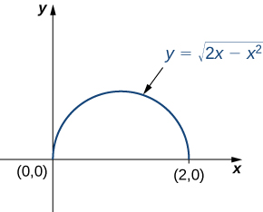{: #CNX_Calc_Figure_15_07_006}

Squaring and collecting terms, we find that the region is the upper half of the circle <math xmlns="http://www.w3.org/1998/Math/MathML"><mrow><msup><mi>x</mi><mn>2</mn></msup><mo>+</mo><msup><mi>y</mi><mn>2</mn></msup><mo>−</mo><mn>2</mn><mi>x</mi><mo>=</mo><mn>0</mn><mo>,</mo></mrow></math>

 that is, <math xmlns="http://www.w3.org/1998/Math/MathML"><mrow><msup><mi>y</mi><mn>2</mn></msup><mo>+</mo><msup><mrow><mrow><mo>(</mo><mrow><mi>x</mi><mo>−</mo><mn>1</mn></mrow><mo>)</mo></mrow></mrow><mn>2</mn></msup><mo>=</mo><mn>1</mn><mo>.</mo></mrow></math>

 In polar coordinates, the circle is <math xmlns="http://www.w3.org/1998/Math/MathML"><mrow><mi>r</mi><mo>=</mo><mn>2</mn><mspace width="0.2em" /><mtext>cos</mtext><mspace width="0.2em" /><mi>θ</mi></mrow></math>

 so the region of integration in polar coordinates is bounded by <math xmlns="http://www.w3.org/1998/Math/MathML"><mrow><mn>0</mn><mo>≤</mo><mi>r</mi><mo>≤</mo><mtext>cos</mtext><mspace width="0.2em" /><mi>θ</mi></mrow></math>

 and <math xmlns="http://www.w3.org/1998/Math/MathML"><mrow><mn>0</mn><mo>≤</mo><mi>θ</mi><mo>≤</mo><mfrac><mi>π</mi><mn>2</mn></mfrac><mo>.</mo></mrow></math>

The Jacobian is <math xmlns="http://www.w3.org/1998/Math/MathML"><mrow><mi>J</mi><mrow><mo>(</mo><mrow><mi>r</mi><mo>,</mo><mi>θ</mi></mrow><mo>)</mo></mrow><mo>=</mo><mi>r</mi><mo>,</mo></mrow></math>

 as shown in [[link]](#fs-id1167793924616). Since <math xmlns="http://www.w3.org/1998/Math/MathML"><mrow><mi>r</mi><mo>≥</mo><mn>0</mn><mo>,</mo></mrow></math>

 we have <math xmlns="http://www.w3.org/1998/Math/MathML"><mrow><mrow><mo>\|</mo><mrow><mi>J</mi><mrow><mo>(</mo><mrow><mi>r</mi><mo>,</mo><mi>θ</mi></mrow><mo>)</mo></mrow></mrow><mo>\|</mo></mrow><mo>=</mo><mi>r</mi><mo>.</mo></mrow></math>

The integrand <math xmlns="http://www.w3.org/1998/Math/MathML"><mrow><msqrt><mrow><msup><mi>x</mi><mn>2</mn></msup><mo>+</mo><msup><mi>y</mi><mn>2</mn></msup></mrow></msqrt></mrow></math>

 changes to <math xmlns="http://www.w3.org/1998/Math/MathML"><mi>r</mi></math>

 in polar coordinates, so the double iterated integral is

<math xmlns="http://www.w3.org/1998/Math/MathML"><mrow><mstyle displaystyle="true"><mrow><munderover><mo stretchy="false">∫</mo><mn>0</mn><mn>2</mn></munderover><mspace width="0.2em" /><mrow><mstyle displaystyle="true"><mrow><munderover><mo stretchy="false">∫</mo><mn>0</mn><mrow><msqrt><mrow><mn>2</mn><mi>x</mi><mo>−</mo><msup><mi>x</mi><mn>2</mn></msup></mrow></msqrt></mrow></munderover><mrow><msqrt><mrow><msup><mi>x</mi><mn>2</mn></msup><mo>+</mo><msup><mi>y</mi><mn>2</mn></msup></mrow></msqrt></mrow></mrow></mstyle></mrow></mrow></mstyle><mi>d</mi><mi>y</mi><mspace width="0.2em" /><mi>d</mi><mi>x</mi><mo>=</mo><mstyle displaystyle="true"><mrow><munderover><mo stretchy="false">∫</mo><mn>0</mn><mrow><mi>π</mi><mtext>/</mtext><mn>2</mn></mrow></munderover><mspace width="0.2em" /><mrow><mstyle displaystyle="true"><mrow><munderover><mo stretchy="false">∫</mo><mn>0</mn><mrow><mn>2</mn><mspace width="0.2em" /><mtext>cos</mtext><mspace width="0.2em" /><mi>θ</mi></mrow></munderover><mrow><mi>r</mi><mrow><mo>\|</mo><mrow><mi>J</mi><mrow><mo>(</mo><mrow><mi>r</mi><mo>,</mo><mi>θ</mi></mrow><mo>)</mo></mrow></mrow><mo>\|</mo></mrow></mrow></mrow></mstyle></mrow></mrow></mstyle><mi>d</mi><mi>r</mi><mspace width="0.2em" /><mi>d</mi><mi>θ</mi><mo>=</mo><mstyle displaystyle="true"><mrow><munderover><mo stretchy="false">∫</mo><mn>0</mn><mrow><mi>π</mi><mtext>/</mtext><mn>2</mn></mrow></munderover><mspace width="0.2em" /><mrow><mstyle displaystyle="true"><mrow><munderover><mo stretchy="false">∫</mo><mn>0</mn><mrow><mn>2</mn><mspace width="0.2em" /><mtext>cos</mtext><mspace width="0.2em" /><mi>θ</mi></mrow></munderover><mrow><msup><mi>r</mi><mn>2</mn></msup></mrow></mrow></mstyle></mrow></mrow></mstyle><mi>d</mi><mi>r</mi><mspace width="0.2em" /><mi>d</mi><mi>θ</mi><mo>.</mo></mrow></math>

Considering the integral <math xmlns="http://www.w3.org/1998/Math/MathML"><mrow><mstyle displaystyle="true"><mrow><munderover><mo stretchy="false">∫</mo><mn>0</mn><mn>1</mn></munderover><mspace width="0.2em" /><mrow><mstyle displaystyle="true"><mrow><munderover><mo stretchy="false">∫</mo><mn>0</mn><mrow><msqrt><mrow><mn>1</mn><mo>−</mo><msup><mi>x</mi><mn>2</mn></msup></mrow></msqrt></mrow></munderover><mrow><mrow><mo>(</mo><mrow><msup><mi>x</mi><mn>2</mn></msup><mo>+</mo><msup><mi>y</mi><mn>2</mn></msup></mrow><mo>)</mo></mrow></mrow></mrow></mstyle></mrow></mrow></mstyle><mi>d</mi><mi>y</mi><mspace width="0.2em" /><mi>d</mi><mi>x</mi><mo>,</mo></mrow></math>

 use the change of variables <math xmlns="http://www.w3.org/1998/Math/MathML"><mrow><mi>x</mi><mo>=</mo><mi>r</mi><mspace width="0.2em" /><mtext>cos</mtext><mspace width="0.2em" /><mi>θ</mi></mrow></math>

 and <math xmlns="http://www.w3.org/1998/Math/MathML"><mrow><mi>y</mi><mo>=</mo><mi>r</mi><mspace width="0.2em" /><mtext>sin</mtext><mspace width="0.2em" /><mi>θ</mi><mo>,</mo></mrow></math>

 and find the resulting integral.

<math xmlns="http://www.w3.org/1998/Math/MathML"><mrow><mstyle displaystyle="true"><mrow><munderover><mo stretchy="false">∫</mo><mn>0</mn><mrow><mi>π</mi><mtext>/</mtext><mn>2</mn></mrow></munderover><mspace width="0.2em" /><mrow><mstyle displaystyle="true"><mrow><munderover><mo stretchy="false">∫</mo><mn>0</mn><mn>1</mn></munderover><mrow><msup><mi>r</mi><mn>3</mn></msup><mi>d</mi><mi>r</mi><mspace width="0.2em" /><mi>d</mi><mi>θ</mi></mrow></mrow></mstyle></mrow></mrow></mstyle></mrow></math>

Hint

Follow the steps in the previous example.

Notice in the next example that the region over which we are to integrate may suggest a suitable transformation for the integration. This is a common and important situation.

Changing Variables

Consider the integral <math xmlns="http://www.w3.org/1998/Math/MathML"><mrow><mstyle displaystyle="true"><mrow><munder><mo>∬</mo><mi>R</mi></munder><mrow><mrow><mo>(</mo><mrow><mi>x</mi><mo>−</mo><mi>y</mi></mrow><mo>)</mo></mrow></mrow></mrow></mstyle><mi>d</mi><mi>y</mi><mspace width="0.2em" /><mi>d</mi><mi>x</mi><mo>,</mo></mrow></math>

 where <math xmlns="http://www.w3.org/1998/Math/MathML"><mi>R</mi></math>

 is the parallelogram joining the points <math xmlns="http://www.w3.org/1998/Math/MathML"><mrow><mrow><mo>(</mo><mrow><mn>1</mn><mo>,</mo><mn>2</mn></mrow><mo>)</mo></mrow><mo>,</mo></mrow></math>

 <math xmlns="http://www.w3.org/1998/Math/MathML"><mrow><mrow><mo>(</mo><mrow><mn>3</mn><mo>,</mo><mn>4</mn></mrow><mo>)</mo></mrow><mo>,</mo><mrow><mo>(</mo><mrow><mn>4</mn><mo>,</mo><mn>3</mn></mrow><mo>)</mo></mrow><mo>,</mo></mrow></math>

 and <math xmlns="http://www.w3.org/1998/Math/MathML"><mrow><mrow><mo>(</mo><mrow><mn>6</mn><mo>,</mo><mn>5</mn></mrow><mo>)</mo></mrow></mrow></math>

 ([[link]](#CNX_Calc_Figure_15_07_007)). Make appropriate changes of variables, and write the resulting integral.

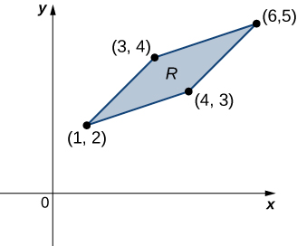{: #CNX_Calc_Figure_15_07_007}

First, we need to understand the region over which we are to integrate. The sides of the parallelogram are <math xmlns="http://www.w3.org/1998/Math/MathML"><mrow><mi>x</mi><mo>−</mo><mi>y</mi><mo>+</mo><mn>1</mn><mo>=</mo><mn>0</mn><mo>,</mo><mi>x</mi><mo>−</mo><mi>y</mi><mo>−</mo><mn>1</mn><mo>=</mo><mn>0</mn><mo>,</mo></mrow></math>

 <math xmlns="http://www.w3.org/1998/Math/MathML"><mrow><mi>x</mi><mo>−</mo><mn>3</mn><mi>y</mi><mo>+</mo><mn>5</mn><mo>=</mo><mn>0</mn><mo>,</mo><mtext>and</mtext><mspace width="0.2em" /><mi>x</mi><mo>−</mo><mn>3</mn><mi>y</mi><mo>+</mo><mn>9</mn><mo>=</mo><mn>0</mn></mrow></math>

 ([[link]](#CNX_Calc_Figure_15_07_008)). Another way to look at them is <math xmlns="http://www.w3.org/1998/Math/MathML"><mrow><mi>x</mi><mo>−</mo><mi>y</mi><mo>=</mo><mn>−1</mn><mo>,</mo><mi>x</mi><mo>−</mo><mi>y</mi><mo>=</mo><mn>1</mn><mo>,</mo></mrow></math>

 <math xmlns="http://www.w3.org/1998/Math/MathML"><mrow><mi>x</mi><mo>−</mo><mn>3</mn><mi>y</mi><mo>=</mo><mn>−5</mn><mo>,</mo></mrow></math>

 and <math xmlns="http://www.w3.org/1998/Math/MathML"><mrow><mi>x</mi><mo>−</mo><mn>3</mn><mi>y</mi><mo>=</mo><mn>9</mn><mo>.</mo></mrow></math>

Clearly the parallelogram is bounded by the lines <math xmlns="http://www.w3.org/1998/Math/MathML"><mrow><mi>y</mi><mo>=</mo><mi>x</mi><mo>+</mo><mn>1</mn><mo>,</mo><mi>y</mi><mo>=</mo><mi>x</mi><mo>−</mo><mn>1</mn><mo>,</mo><mi>y</mi><mo>=</mo><mfrac><mn>1</mn><mn>3</mn></mfrac><mrow><mo>(</mo><mrow><mi>x</mi><mo>+</mo><mn>5</mn></mrow><mo>)</mo></mrow><mo>,</mo></mrow></math>

 and <math xmlns="http://www.w3.org/1998/Math/MathML"><mrow><mi>y</mi><mo>=</mo><mfrac><mn>1</mn><mn>3</mn></mfrac><mrow><mo>(</mo><mrow><mi>x</mi><mo>+</mo><mn>9</mn></mrow><mo>)</mo></mrow><mo>.</mo></mrow></math>

Notice that if we were to make <math xmlns="http://www.w3.org/1998/Math/MathML"><mrow><mi>u</mi><mo>=</mo><mi>x</mi><mo>−</mo><mi>y</mi></mrow></math>

 and <math xmlns="http://www.w3.org/1998/Math/MathML"><mrow><mi>v</mi><mo>=</mo><mi>x</mi><mo>−</mo><mn>3</mn><mi>y</mi><mo>,</mo></mrow></math>

 then the limits on the integral would be <math xmlns="http://www.w3.org/1998/Math/MathML"><mrow><mn>−1</mn><mo>≤</mo><mi>u</mi><mo>≤</mo><mn>1</mn></mrow></math>

 and <math xmlns="http://www.w3.org/1998/Math/MathML"><mrow><mn>−9</mn><mo>≤</mo><mi>v</mi><mo>≤</mo><mo>−</mo><mn>5</mn><mo>.</mo></mrow></math>

To solve for <math xmlns="http://www.w3.org/1998/Math/MathML"><mi>x</mi></math>

 and <math xmlns="http://www.w3.org/1998/Math/MathML"><mi>y</mi><mo>,</mo></math>

 we multiply the first equation by <math xmlns="http://www.w3.org/1998/Math/MathML"><mn>3</mn></math>

 and subtract the second equation, <math xmlns="http://www.w3.org/1998/Math/MathML"><mrow><mn>3</mn><mi>u</mi><mo>−</mo><mi>v</mi><mo>=</mo><mrow><mo>(</mo><mrow><mn>3</mn><mi>x</mi><mo>−</mo><mn>3</mn><mi>y</mi></mrow><mo>)</mo></mrow><mo>−</mo><mrow><mo>(</mo><mrow><mi>x</mi><mo>−</mo><mn>3</mn><mi>y</mi></mrow><mo>)</mo></mrow><mo>=</mo><mn>2</mn><mi>x</mi><mo>.</mo></mrow></math>

 Then we have <math xmlns="http://www.w3.org/1998/Math/MathML"><mrow><mi>x</mi><mo>=</mo><mfrac><mrow><mn>3</mn><mi>u</mi><mo>−</mo><mi>v</mi></mrow><mn>2</mn></mfrac><mo>.</mo></mrow></math>

 Moreover, if we simply subtract the second equation from the first, we get <math xmlns="http://www.w3.org/1998/Math/MathML"><mrow><mi>u</mi><mo>−</mo><mi>v</mi><mo>=</mo><mrow><mo>(</mo><mrow><mi>x</mi><mo>−</mo><mi>y</mi></mrow><mo>)</mo></mrow><mo>−</mo><mrow><mo>(</mo><mrow><mi>x</mi><mo>−</mo><mn>3</mn><mi>y</mi></mrow><mo>)</mo></mrow><mo>=</mo><mn>2</mn><mi>y</mi></mrow></math>

 and <math xmlns="http://www.w3.org/1998/Math/MathML"><mrow><mi>y</mi><mo>=</mo><mfrac><mrow><mi>u</mi><mo>−</mo><mi>v</mi></mrow><mn>2</mn></mfrac><mo>.</mo></mrow></math>

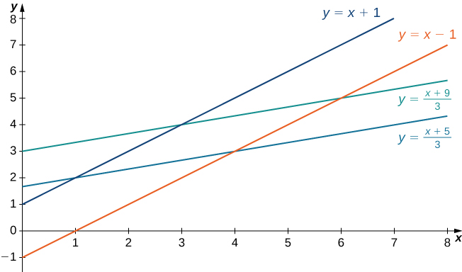{: #CNX_Calc_Figure_15_07_008}

Thus, we can choose the transformation

<math xmlns="http://www.w3.org/1998/Math/MathML"><mrow><mi>T</mi><mrow><mo>(</mo><mrow><mi>u</mi><mo>,</mo><mi>v</mi></mrow><mo>)</mo></mrow><mo>=</mo><mrow><mo>(</mo><mrow><mfrac><mrow><mn>3</mn><mi>u</mi><mo>−</mo><mi>v</mi></mrow><mn>2</mn></mfrac><mo>,</mo><mfrac><mrow><mi>u</mi><mo>−</mo><mi>v</mi></mrow><mn>2</mn></mfrac></mrow><mo>)</mo></mrow></mrow></math>

and compute the Jacobian <math xmlns="http://www.w3.org/1998/Math/MathML"><mrow><mi>J</mi><mrow><mo>(</mo><mrow><mi>u</mi><mo>,</mo><mi>v</mi></mrow><mo>)</mo></mrow><mo>.</mo></mrow></math>

 We have

<math xmlns="http://www.w3.org/1998/Math/MathML"><mrow><mi>J</mi><mrow><mo>(</mo><mrow><mi>u</mi><mo>,</mo><mi>v</mi></mrow><mo>)</mo></mrow><mo>=</mo><mfrac><mrow><mo>∂</mo><mrow><mo>(</mo><mrow><mi>x</mi><mo>,</mo><mi>y</mi></mrow><mo>)</mo></mrow></mrow><mrow><mo>∂</mo><mrow><mo>(</mo><mrow><mi>u</mi><mo>,</mo><mi>v</mi></mrow><mo>)</mo></mrow></mrow></mfrac><mo>=</mo><mrow><mo>\|</mo><mtable columnalign="left"><mtr><mtd columnalign="left"><mfrac><mrow><mo>∂</mo><mi>x</mi></mrow><mrow><mo>∂</mo><mi>u</mi></mrow></mfrac></mtd><mtd /><mtd columnalign="left"><mfrac><mrow><mo>∂</mo><mi>x</mi></mrow><mrow><mo>∂</mo><mi>v</mi></mrow></mfrac></mtd></mtr><mtr><mtd columnalign="left"><mfrac><mrow><mo>∂</mo><mi>y</mi></mrow><mrow><mo>∂</mo><mi>u</mi></mrow></mfrac></mtd><mtd /><mtd columnalign="left"><mfrac><mrow><mo>∂</mo><mi>y</mi></mrow><mrow><mo>∂</mo><mi>v</mi></mrow></mfrac></mtd></mtr></mtable><mo>\|</mo></mrow><mo>=</mo><mrow><mo>\|</mo><mtable columnalign="left"><mtr><mtd columnalign="left"><mn>3</mn><mtext>/</mtext><mn>2</mn></mtd><mtd /><mtd columnalign="left"><mo>−</mo><mn>1</mn><mtext>/</mtext><mn>2</mn></mtd></mtr><mtr><mtd columnalign="left"><mn>1</mn><mtext>/</mtext><mn>2</mn></mtd><mtd /><mtd columnalign="left"><mo>−</mo><mn>1</mn><mtext>/</mtext><mn>2</mn></mtd></mtr></mtable><mo>\|</mo></mrow><mo>=</mo><mo>−</mo><mfrac><mn>3</mn><mn>4</mn></mfrac><mo>+</mo><mfrac><mn>1</mn><mn>4</mn></mfrac><mo>=</mo><mo>−</mo><mfrac><mn>1</mn><mn>2</mn></mfrac><mo>.</mo></mrow></math>

Therefore, <math xmlns="http://www.w3.org/1998/Math/MathML"><mrow><mrow><mo>\|</mo><mrow><mi>J</mi><mrow><mo>(</mo><mrow><mi>u</mi><mo>,</mo><mi>v</mi></mrow><mo>)</mo></mrow></mrow><mo>\|</mo></mrow><mo>=</mo><mfrac><mn>1</mn><mn>2</mn></mfrac><mo>.</mo></mrow></math>

 Also, the original integrand becomes

<math xmlns="http://www.w3.org/1998/Math/MathML"><mrow><mi>x</mi><mo>−</mo><mi>y</mi><mo>=</mo><mfrac><mn>1</mn><mn>2</mn></mfrac><mrow><mo>[</mo><mrow><mn>3</mn><mi>u</mi><mo>−</mo><mi>v</mi><mo>−</mo><mi>u</mi><mo>+</mo><mi>v</mi></mrow><mo>]</mo></mrow><mo>=</mo><mfrac><mn>1</mn><mn>2</mn></mfrac><mrow><mo>[</mo><mrow><mn>3</mn><mi>u</mi><mo>−</mo><mi>u</mi></mrow><mo>]</mo></mrow><mo>=</mo><mfrac><mn>1</mn><mn>2</mn></mfrac><mrow><mo>[</mo><mrow><mn>2</mn><mi>u</mi></mrow><mo>]</mo></mrow><mo>=</mo><mi>u</mi><mo>.</mo></mrow></math>

Therefore, by the use of the transformation <math xmlns="http://www.w3.org/1998/Math/MathML"><mi>T</mi><mo>,</mo></math>

 the integral changes to

<math xmlns="http://www.w3.org/1998/Math/MathML"><mrow><mstyle displaystyle="true"><mrow><munder><mo>∬</mo><mi>R</mi></munder><mrow><mrow><mo>(</mo><mrow><mi>x</mi><mo>−</mo><mi>y</mi></mrow><mo>)</mo></mrow><mi>d</mi><mi>y</mi><mspace width="0.2em" /><mi>d</mi><mi>x</mi><mo>=</mo><mstyle displaystyle="true"><mrow><munderover><mo stretchy="false">∫</mo><mrow><mn>−9</mn></mrow><mrow><mn>−5</mn></mrow></munderover><mspace width="0.2em" /><mrow><mstyle displaystyle="true"><mrow><munderover><mo stretchy="false">∫</mo><mrow><mn>−1</mn></mrow><mn>1</mn></munderover><mrow><mi>J</mi><mrow><mo>(</mo><mrow><mi>u</mi><mo>,</mo><mi>v</mi></mrow><mo>)</mo></mrow><mi>u</mi><mspace width="0.2em" /><mi>d</mi><mi>u</mi><mspace width="0.2em" /><mi>d</mi><mi>v</mi><mo>=</mo><mstyle displaystyle="true"><mrow><munderover><mo stretchy="false">∫</mo><mrow><mn>−9</mn></mrow><mrow><mn>−5</mn></mrow></munderover><mspace width="0.2em" /><mrow><mstyle displaystyle="true"><mrow><munderover><mo stretchy="false">∫</mo><mrow><mn>−1</mn></mrow><mn>1</mn></munderover><mrow><mrow><mo>(</mo><mrow><mfrac><mn>1</mn><mn>2</mn></mfrac></mrow><mo>)</mo></mrow></mrow></mrow></mstyle></mrow></mrow></mstyle></mrow></mrow></mstyle></mrow></mrow></mstyle></mrow></mrow></mstyle><mi>u</mi><mspace width="0.2em" /><mi>d</mi><mi>u</mi><mspace width="0.2em" /><mi>d</mi><mi>v</mi><mo>,</mo></mrow></math>

which is much simpler to compute.

Make appropriate changes of variables in the integral <math xmlns="http://www.w3.org/1998/Math/MathML"><mrow><mstyle displaystyle="true"><mrow><munder><mo>∬</mo><mi>R</mi></munder><mrow><mfrac><mn>4</mn><mrow><msup><mrow><mrow><mo>(</mo><mrow><mi>x</mi><mo>−</mo><mi>y</mi></mrow><mo>)</mo></mrow></mrow><mn>2</mn></msup></mrow></mfrac></mrow></mrow></mstyle><mi>d</mi><mi>y</mi><mspace width="0.2em" /><mi>d</mi><mi>x</mi><mo>,</mo></mrow></math>

 where <math xmlns="http://www.w3.org/1998/Math/MathML"><mi>R</mi></math>

 is the trapezoid bounded by the lines <math xmlns="http://www.w3.org/1998/Math/MathML"><mrow><mi>x</mi><mo>−</mo><mi>y</mi><mo>=</mo><mn>2</mn><mo>,</mo><mi>x</mi><mo>−</mo><mi>y</mi><mo>=</mo><mn>4</mn><mo>,</mo><mi>x</mi><mo>=</mo><mn>0</mn><mo>,</mo><mtext>and</mtext><mspace width="0.2em" /><mi>y</mi><mo>=</mo><mn>0</mn><mo>.</mo></mrow></math>

 Write the resulting integral.

<math xmlns="http://www.w3.org/1998/Math/MathML"><mrow><mi>x</mi><mo>=</mo><mfrac><mn>1</mn><mn>2</mn></mfrac><mrow><mo>(</mo><mrow><mi>v</mi><mo>+</mo><mi>u</mi></mrow><mo>)</mo></mrow></mrow></math>

 and <math xmlns="http://www.w3.org/1998/Math/MathML"><mrow><mi>y</mi><mo>=</mo><mfrac><mn>1</mn><mn>2</mn></mfrac><mrow><mo>(</mo><mrow><mi>v</mi><mo>−</mo><mi>u</mi></mrow><mo>)</mo></mrow></mrow></math>

 and <math xmlns="http://www.w3.org/1998/Math/MathML"><mrow><mstyle displaystyle="true"><mrow><munderover><mo stretchy="false">∫</mo><mrow><mn>−4</mn></mrow><mn>4</mn></munderover><mspace width="0.2em" /><mrow><mstyle displaystyle="true"><mrow><munderover><mo stretchy="false">∫</mo><mrow><mn>−2</mn></mrow><mn>2</mn></munderover><mrow><mfrac><mn>4</mn><mrow><msup><mi>u</mi><mn>2</mn></msup></mrow></mfrac><mrow><mo>(</mo><mrow><mfrac><mn>1</mn><mn>2</mn></mfrac></mrow><mo>)</mo></mrow></mrow></mrow></mstyle></mrow></mrow></mstyle><mi>d</mi><mi>u</mi><mspace width="0.2em" /><mi>d</mi><mi>v</mi><mo>.</mo></mrow></math>

Hint

Follow the steps in the previous example.

We are ready to give a problem-solving strategy for change of variables.

Problem-Solving Strategy: Change of Variables

1.  Sketch the region given by the problem in the
    <math xmlns="http://www.w3.org/1998/Math/MathML"><mrow><mi>x</mi><mi>y</mi><mtext>-plane</mtext></mrow></math>
    
    and then write the equations of the curves that form the boundary.
2.  Depending on the region or the integrand, choose the transformations
    <math xmlns="http://www.w3.org/1998/Math/MathML"><mrow><mi>x</mi><mo>=</mo><mi>g</mi><mrow><mo>(</mo><mrow><mi>u</mi><mo>,</mo><mi>v</mi></mrow><mo>)</mo></mrow></mrow></math>
    
    and
    <math xmlns="http://www.w3.org/1998/Math/MathML"><mrow><mi>y</mi><mo>=</mo><mi>h</mi><mrow><mo>(</mo><mrow><mi>u</mi><mo>,</mo><mi>v</mi></mrow><mo>)</mo></mrow><mo>.</mo></mrow></math>

3.  Determine the new limits of integration in the
    <math xmlns="http://www.w3.org/1998/Math/MathML"><mrow><mi>u</mi><mi>v</mi><mtext>-plane</mtext><mtext>.</mtext></mrow></math>

4.  Find the Jacobian
    <math xmlns="http://www.w3.org/1998/Math/MathML"><mrow><mi>J</mi><mrow><mo>(</mo><mrow><mi>u</mi><mo>,</mo><mi>v</mi></mrow><mo>)</mo></mrow><mo>.</mo></mrow></math>

5.  In the integrand, replace the variables to obtain the new integrand.
6.  Replace
    <math xmlns="http://www.w3.org/1998/Math/MathML"><mrow><mi>d</mi><mi>y</mi><mspace width="0.2em" /><mi>d</mi><mi>x</mi></mrow></math>
    
    or
    <math xmlns="http://www.w3.org/1998/Math/MathML"><mrow><mi>d</mi><mi>x</mi><mspace width="0.2em" /><mi>d</mi><mi>y</mi><mo>,</mo></mrow></math>
    
    whichever occurs, by
    <math xmlns="http://www.w3.org/1998/Math/MathML"><mrow><mi>J</mi><mrow><mo>(</mo><mrow><mi>u</mi><mo>,</mo><mi>v</mi></mrow><mo>)</mo></mrow><mi>d</mi><mi>u</mi><mspace width="0.2em" /><mi>d</mi><mi>v</mi><mo>.</mo></mrow></math>
{: data-number-style="arabic"}

In the next example, we find a substitution that makes the integrand much simpler to compute.

Evaluating an Integral

Using the change of variables <math xmlns="http://www.w3.org/1998/Math/MathML"><mrow><mi>u</mi><mo>=</mo><mi>x</mi><mo>−</mo><mi>y</mi></mrow></math>

 and <math xmlns="http://www.w3.org/1998/Math/MathML"><mrow><mi>v</mi><mo>=</mo><mi>x</mi><mo>+</mo><mi>y</mi><mo>,</mo></mrow></math>

 evaluate the integral

<math xmlns="http://www.w3.org/1998/Math/MathML"><mrow><mstyle displaystyle="true"><mrow><munder><mo>∬</mo><mi>R</mi></munder><mrow><mrow><mo>(</mo><mrow><mi>x</mi><mo>−</mo><mi>y</mi></mrow><mo>)</mo></mrow><msup><mi>e</mi><mrow><msup><mi>x</mi><mn>2</mn></msup><mo>−</mo><msup><mi>y</mi><mn>2</mn></msup></mrow></msup><mi>d</mi><mi>A</mi></mrow></mrow></mstyle><mo>,</mo></mrow></math>

where <math xmlns="http://www.w3.org/1998/Math/MathML"><mi>R</mi></math>

 is the region bounded by the lines <math xmlns="http://www.w3.org/1998/Math/MathML"><mrow><mi>x</mi><mo>+</mo><mi>y</mi><mo>=</mo><mn>1</mn></mrow></math>

 and <math xmlns="http://www.w3.org/1998/Math/MathML"><mrow><mi>x</mi><mo>+</mo><mi>y</mi><mo>=</mo><mn>3</mn></mrow></math>

 and the curves <math xmlns="http://www.w3.org/1998/Math/MathML"><mrow><msup><mi>x</mi><mn>2</mn></msup><mo>−</mo><msup><mi>y</mi><mn>2</mn></msup><mo>=</mo><mn>−1</mn></mrow></math>

 and <math xmlns="http://www.w3.org/1998/Math/MathML"><mrow><msup><mi>x</mi><mn>2</mn></msup><mo>−</mo><msup><mi>y</mi><mn>2</mn></msup><mo>=</mo><mn>1</mn></mrow></math>

 (see the first region in [[link]](#CNX_Calc_Figure_15_07_009)).

As before, first find the region <math xmlns="http://www.w3.org/1998/Math/MathML"><mi>R</mi></math>

 and picture the transformation so it becomes easier to obtain the limits of integration after the transformations are made ([[link]](#CNX_Calc_Figure_15_07_009)).

{: #CNX_Calc_Figure_15_07_009}

Given <math xmlns="http://www.w3.org/1998/Math/MathML"><mrow><mi>u</mi><mo>=</mo><mi>x</mi><mo>−</mo><mi>y</mi></mrow></math>

 and <math xmlns="http://www.w3.org/1998/Math/MathML"><mrow><mi>v</mi><mo>=</mo><mi>x</mi><mo>+</mo><mi>y</mi><mo>,</mo></mrow></math>

 we have <math xmlns="http://www.w3.org/1998/Math/MathML"><mrow><mi>x</mi><mo>=</mo><mfrac><mrow><mi>u</mi><mo>+</mo><mi>v</mi></mrow><mn>2</mn></mfrac></mrow></math>

 and <math xmlns="http://www.w3.org/1998/Math/MathML"><mrow><mi>y</mi><mo>=</mo><mfrac><mrow><mi>v</mi><mo>−</mo><mi>u</mi></mrow><mn>2</mn></mfrac></mrow></math>

 and hence the transformation to use is <math xmlns="http://www.w3.org/1998/Math/MathML"><mrow><mi>T</mi><mrow><mo>(</mo><mrow><mi>u</mi><mo>,</mo><mi>v</mi></mrow><mo>)</mo></mrow><mo>=</mo><mrow><mo>(</mo><mrow><mfrac><mrow><mi>u</mi><mo>+</mo><mi>v</mi></mrow><mn>2</mn></mfrac><mo>,</mo><mfrac><mrow><mi>v</mi><mo>−</mo><mi>u</mi></mrow><mn>2</mn></mfrac></mrow><mo>)</mo></mrow><mo>.</mo></mrow></math>

 The lines <math xmlns="http://www.w3.org/1998/Math/MathML"><mrow><mi>x</mi><mo>+</mo><mi>y</mi><mo>=</mo><mn>1</mn></mrow></math>

 and <math xmlns="http://www.w3.org/1998/Math/MathML"><mrow><mi>x</mi><mo>+</mo><mi>y</mi><mo>=</mo><mn>3</mn></mrow></math>

 become <math xmlns="http://www.w3.org/1998/Math/MathML"><mrow><mi>v</mi><mo>=</mo><mn>1</mn></mrow></math>

 and <math xmlns="http://www.w3.org/1998/Math/MathML"><mrow><mi>v</mi><mo>=</mo><mn>3</mn><mo>,</mo></mrow></math>

 respectively. The curves <math xmlns="http://www.w3.org/1998/Math/MathML"><mrow><msup><mi>x</mi><mn>2</mn></msup><mo>−</mo><msup><mi>y</mi><mn>2</mn></msup><mo>=</mo><mn>1</mn></mrow></math>

 and <math xmlns="http://www.w3.org/1998/Math/MathML"><mrow><msup><mi>x</mi><mn>2</mn></msup><mo>−</mo><msup><mi>y</mi><mn>2</mn></msup><mo>=</mo><mn>−1</mn></mrow></math>

 become <math xmlns="http://www.w3.org/1998/Math/MathML"><mrow><mi>u</mi><mi>v</mi><mo>=</mo><mn>1</mn></mrow></math>

 and <math xmlns="http://www.w3.org/1998/Math/MathML"><mrow><mi>u</mi><mi>v</mi><mo>=</mo><mn>−1</mn><mo>,</mo></mrow></math>

 respectively.

Thus we can describe the region <math xmlns="http://www.w3.org/1998/Math/MathML"><mi>S</mi></math>

 (see the second region [[link]](#CNX_Calc_Figure_15_07_009)) as

<math xmlns="http://www.w3.org/1998/Math/MathML"><mrow><mi>S</mi><mo>=</mo><mrow><mo>{</mo><mrow><mrow><mrow><mrow><mo>(</mo><mrow><mi>u</mi><mo>,</mo><mi>v</mi></mrow><mo>)</mo></mrow></mrow><mo>\|</mo></mrow><mn>1</mn><mo>≤</mo><mi>v</mi><mo>≤</mo><mn>3</mn><mo>,</mo><mfrac><mrow><mn>−1</mn></mrow><mi>v</mi></mfrac><mo>≤</mo><mi>u</mi><mo>≤</mo><mfrac><mn>1</mn><mi>v</mi></mfrac></mrow><mo>}</mo></mrow><mo>.</mo></mrow></math>

The Jacobian for this transformation is

<math xmlns="http://www.w3.org/1998/Math/MathML"><mrow><mi>J</mi><mrow><mo>(</mo><mrow><mi>u</mi><mo>,</mo><mi>v</mi></mrow><mo>)</mo></mrow><mo>=</mo><mfrac><mrow><mo>∂</mo><mrow><mo>(</mo><mrow><mi>x</mi><mo>,</mo><mi>y</mi></mrow><mo>)</mo></mrow></mrow><mrow><mo>∂</mo><mrow><mo>(</mo><mrow><mi>u</mi><mo>,</mo><mi>v</mi></mrow><mo>)</mo></mrow></mrow></mfrac><mo>=</mo><mrow><mo>\|</mo><mtable columnalign="left"><mtr><mtd columnalign="left"><mfrac><mrow><mo>∂</mo><mi>x</mi></mrow><mrow><mo>∂</mo><mi>u</mi></mrow></mfrac></mtd><mtd /><mtd columnalign="left"><mfrac><mrow><mo>∂</mo><mi>x</mi></mrow><mrow><mo>∂</mo><mi>v</mi></mrow></mfrac></mtd></mtr><mtr><mtd columnalign="left"><mfrac><mrow><mo>∂</mo><mi>y</mi></mrow><mrow><mo>∂</mo><mi>u</mi></mrow></mfrac></mtd><mtd /><mtd columnalign="left"><mfrac><mrow><mo>∂</mo><mi>y</mi></mrow><mrow><mo>∂</mo><mi>v</mi></mrow></mfrac></mtd></mtr></mtable><mo>\|</mo></mrow><mo>=</mo><mrow><mo>\|</mo><mtable columnalign="left"><mtr><mtd columnalign="left"><mn>1</mn><mtext>/</mtext><mn>2</mn></mtd><mtd /><mtd columnalign="left"><mo>−</mo><mn>1</mn><mtext>/</mtext><mn>2</mn></mtd></mtr><mtr><mtd columnalign="left"><mn>1</mn><mtext>/</mtext><mn>2</mn></mtd><mtd /><mtd columnalign="left"><mn>1</mn><mtext>/</mtext><mn>2</mn></mtd></mtr></mtable><mo>\|</mo></mrow><mo>=</mo><mfrac><mn>1</mn><mn>2</mn></mfrac><mo>.</mo></mrow></math>

Therefore, by using the transformation <math xmlns="http://www.w3.org/1998/Math/MathML"><mi>T</mi><mo>,</mo></math>

 the integral changes to

<math xmlns="http://www.w3.org/1998/Math/MathML"><mrow><mstyle displaystyle="true"><mrow><munder><mo>∬</mo><mi>R</mi></munder><mrow><mrow><mo>(</mo><mrow><mi>x</mi><mo>−</mo><mi>y</mi></mrow><mo>)</mo></mrow></mrow></mrow></mstyle><msup><mi>e</mi><mrow><msup><mi>x</mi><mn>2</mn></msup><mo>−</mo><msup><mi>y</mi><mn>2</mn></msup></mrow></msup><mi>d</mi><mi>A</mi><mo>=</mo><mfrac><mn>1</mn><mn>2</mn></mfrac><mstyle displaystyle="true"><mrow><munderover><mo stretchy="false">∫</mo><mn>1</mn><mn>3</mn></munderover><mspace width="0.2em" /><mrow><mstyle displaystyle="true"><mrow><munderover><mo stretchy="false">∫</mo><mrow><mn>−1</mn><mtext>/</mtext><mi>v</mi></mrow><mrow><mn>1</mn><mtext>/</mtext><mi>v</mi></mrow></munderover><mrow><mi>u</mi><msup><mi>e</mi><mrow><mi>u</mi><mi>v</mi></mrow></msup><mi>d</mi><mi>u</mi><mspace width="0.2em" /><mi>d</mi><mi>v</mi></mrow></mrow></mstyle></mrow></mrow></mstyle><mo>.</mo></mrow></math>

Doing the evaluation, we have

<math xmlns="http://www.w3.org/1998/Math/MathML"><mrow><mfrac><mn>1</mn><mn>2</mn></mfrac><mstyle displaystyle="true"><mrow><munderover><mo stretchy="false">∫</mo><mn>1</mn><mn>3</mn></munderover><mspace width="0.2em" /><mrow><mstyle displaystyle="true"><mrow><munderover><mo stretchy="false">∫</mo><mrow><mn>−1</mn><mtext>/</mtext><mi>v</mi></mrow><mrow><mn>1</mn><mtext>/</mtext><mi>v</mi></mrow></munderover><mrow><mi>u</mi><msup><mi>e</mi><mrow><mi>u</mi><mi>v</mi></mrow></msup><mi>d</mi><mi>u</mi><mspace width="0.2em" /><mi>d</mi><mi>v</mi></mrow></mrow></mstyle></mrow></mrow></mstyle><mo>=</mo><mfrac><mn>4</mn><mrow><mn>3</mn><mi>e</mi></mrow></mfrac><mo>≈</mo><mn>0.490</mn><mo>.</mo></mrow></math>

Using the substitutions <math xmlns="http://www.w3.org/1998/Math/MathML"><mrow><mi>x</mi><mo>=</mo><mi>v</mi></mrow></math>

 and <math xmlns="http://www.w3.org/1998/Math/MathML"><mrow><mi>y</mi><mo>=</mo><msqrt><mrow><mi>u</mi><mo>+</mo><mi>v</mi></mrow></msqrt><mo>,</mo></mrow></math>

 evaluate the integral <math xmlns="http://www.w3.org/1998/Math/MathML"><mrow><mstyle displaystyle="true"><mrow><munder><mo>∬</mo><mi>R</mi></munder><mrow><mi>y</mi><mspace width="0.2em" /><mtext>sin</mtext><mrow><mo>(</mo><mrow><msup><mi>y</mi><mn>2</mn></msup><mo>−</mo><mi>x</mi></mrow><mo>)</mo></mrow></mrow></mrow></mstyle><mi>d</mi><mi>A</mi></mrow></math>

 where <math xmlns="http://www.w3.org/1998/Math/MathML"><mi>R</mi></math>

 is the region bounded by the lines <math xmlns="http://www.w3.org/1998/Math/MathML"><mrow><mi>y</mi><mo>=</mo><msqrt><mi>x</mi></msqrt><mo>,</mo><mi>x</mi><mo>=</mo><mn>2</mn><mo>,</mo><mtext>and</mtext><mspace width="0.2em" /><mi>y</mi><mo>=</mo><mn>0</mn><mo>.</mo></mrow></math>

<math xmlns="http://www.w3.org/1998/Math/MathML"><mrow><mfrac><mn>1</mn><mn>2</mn></mfrac><mrow><mo>(</mo><mrow><mtext>sin</mtext><mspace width="0.2em" /><mn>2</mn><mo>−</mo><mn>2</mn></mrow><mo>)</mo></mrow></mrow></math>

Hint

Sketch a picture and find the limits of integration.

### Change of Variables for Triple Integrals

Changing variables in triple integrals works in exactly the same way. Cylindrical and spherical coordinate substitutions are special cases of this method, which we demonstrate here.

Suppose that <math xmlns="http://www.w3.org/1998/Math/MathML"><mi>G</mi></math>

 is a region in <math xmlns="http://www.w3.org/1998/Math/MathML"><mrow><mi>u</mi><mi>v</mi><mi>w</mi><mtext>-space</mtext></mrow></math>

 and is mapped to <math xmlns="http://www.w3.org/1998/Math/MathML"><mi>D</mi></math>

 in <math xmlns="http://www.w3.org/1998/Math/MathML"><mrow><mi>x</mi><mi>y</mi><mi>z</mi><mtext>-space</mtext></mrow></math>

 ([\[link\]](#CNX_Calc_Figure_15_07_010)) by a one-to-one <math xmlns="http://www.w3.org/1998/Math/MathML"><mrow><msup><mi>C</mi><mn>1</mn></msup></mrow></math>

 transformation <math xmlns="http://www.w3.org/1998/Math/MathML"><mrow><mi>T</mi><mrow><mo>(</mo><mrow><mi>u</mi><mo>,</mo><mi>v</mi><mo>,</mo><mi>w</mi></mrow><mo>)</mo></mrow><mo>=</mo><mrow><mo>(</mo><mrow><mi>x</mi><mo>,</mo><mi>y</mi><mo>,</mo><mi>z</mi></mrow><mo>)</mo></mrow></mrow></math>

 where <math xmlns="http://www.w3.org/1998/Math/MathML"><mrow><mi>x</mi><mo>=</mo><mi>g</mi><mrow><mo>(</mo><mrow><mi>u</mi><mo>,</mo><mi>v</mi><mo>,</mo><mi>w</mi></mrow><mo>)</mo></mrow><mo>,</mo></mrow></math>

 <math xmlns="http://www.w3.org/1998/Math/MathML"><mrow><mi>y</mi><mo>=</mo><mi>h</mi><mrow><mo>(</mo><mrow><mi>u</mi><mo>,</mo><mi>v</mi><mo>,</mo><mi>w</mi></mrow><mo>)</mo></mrow><mo>,</mo></mrow></math>

 and <math xmlns="http://www.w3.org/1998/Math/MathML"><mrow><mi>z</mi><mo>=</mo><mi>k</mi><mrow><mo>(</mo><mrow><mi>u</mi><mo>,</mo><mi>v</mi><mo>,</mo><mi>w</mi></mrow><mo>)</mo></mrow><mo>.</mo></mrow></math>

 {: #CNX_Calc_Figure_15_07_010}

Then any function <math xmlns="http://www.w3.org/1998/Math/MathML"><mrow><mi>F</mi><mrow><mo>(</mo><mrow><mi>x</mi><mo>,</mo><mi>y</mi><mo>,</mo><mi>z</mi></mrow><mo>)</mo></mrow></mrow></math>

 defined on <math xmlns="http://www.w3.org/1998/Math/MathML"><mi>D</mi></math>

 can be thought of as another function <math xmlns="http://www.w3.org/1998/Math/MathML"><mrow><mi>H</mi><mrow><mo>(</mo><mrow><mi>u</mi><mo>,</mo><mi>v</mi><mo>,</mo><mi>w</mi></mrow><mo>)</mo></mrow></mrow></math>

 that is defined on <math xmlns="http://www.w3.org/1998/Math/MathML"><mi>G</mi><mtext>:</mtext></math>

<math xmlns="http://www.w3.org/1998/Math/MathML"><mrow><mi>F</mi><mrow><mo>(</mo><mrow><mi>x</mi><mo>,</mo><mi>y</mi><mo>,</mo><mi>z</mi></mrow><mo>)</mo></mrow><mo>=</mo><mi>F</mi><mrow><mo>(</mo><mrow><mi>g</mi><mrow><mo>(</mo><mrow><mi>u</mi><mo>,</mo><mi>v</mi><mo>,</mo><mi>w</mi></mrow><mo>)</mo></mrow><mo>,</mo><mi>h</mi><mrow><mo>(</mo><mrow><mi>u</mi><mo>,</mo><mi>v</mi><mo>,</mo><mi>w</mi></mrow><mo>)</mo></mrow><mo>,</mo><mi>k</mi><mrow><mo>(</mo><mrow><mi>u</mi><mo>,</mo><mi>v</mi><mo>,</mo><mi>w</mi></mrow><mo>)</mo></mrow></mrow><mo>)</mo></mrow><mo>=</mo><mi>H</mi><mrow><mo>(</mo><mrow><mi>u</mi><mo>,</mo><mi>v</mi><mo>,</mo><mi>w</mi></mrow><mo>)</mo></mrow><mo>.</mo></mrow></math>

Now we need to define the Jacobian for three variables.

Definition

The Jacobian determinant <math xmlns="http://www.w3.org/1998/Math/MathML"><mrow><mi>J</mi><mrow><mo>(</mo><mrow><mi>u</mi><mo>,</mo><mi>v</mi><mo>,</mo><mi>w</mi></mrow><mo>)</mo></mrow></mrow></math>

 in three variables is defined as follows:

<math xmlns="http://www.w3.org/1998/Math/MathML"><mrow><mi>J</mi><mo stretchy="false">(</mo><mi>u</mi><mo>,</mo><mi>v</mi><mo>,</mo><mi>w</mi><mo stretchy="false">)</mo><mo>=</mo><mrow><mo>\|</mo><mrow><mtable><mtr><mtd columnalign="left"><mrow><mfrac><mrow><mo>∂</mo><mi>x</mi></mrow><mrow><mo>∂</mo><mi>u</mi></mrow></mfrac></mrow></mtd><mtd /><mtd columnalign="left"><mrow><mfrac><mrow><mo>∂</mo><mi>y</mi></mrow><mrow><mo>∂</mo><mi>u</mi></mrow></mfrac></mrow></mtd><mtd /><mtd columnalign="left"><mrow><mfrac><mrow><mo>∂</mo><mi>z</mi></mrow><mrow><mo>∂</mo><mi>u</mi></mrow></mfrac></mrow></mtd></mtr><mtr><mtd columnalign="left"><mrow><mfrac><mrow><mo>∂</mo><mi>x</mi></mrow><mrow><mo>∂</mo><mi>v</mi></mrow></mfrac></mrow></mtd><mtd /><mtd columnalign="left"><mrow><mfrac><mrow><mo>∂</mo><mi>y</mi></mrow><mrow><mo>∂</mo><mi>v</mi></mrow></mfrac></mrow></mtd><mtd /><mtd columnalign="left"><mrow><mfrac><mrow><mo>∂</mo><mi>z</mi></mrow><mrow><mo>∂</mo><mi>v</mi></mrow></mfrac></mrow></mtd></mtr><mtr><mtd columnalign="left"><mrow><mfrac><mrow><mo>∂</mo><mi>x</mi></mrow><mrow><mo>∂</mo><mi>w</mi></mrow></mfrac></mrow></mtd><mtd /><mtd columnalign="left"><mrow><mfrac><mrow><mo>∂</mo><mi>y</mi></mrow><mrow><mo>∂</mo><mi>w</mi></mrow></mfrac></mrow></mtd><mtd /><mtd columnalign="left"><mrow><mfrac><mrow><mo>∂</mo><mi>z</mi></mrow><mrow><mo>∂</mo><mi>w</mi></mrow></mfrac></mrow></mtd></mtr></mtable></mrow><mo>\|</mo></mrow><mo>.</mo></mrow></math>

This is also the same as

<math xmlns="http://www.w3.org/1998/Math/MathML"><mrow><mi>J</mi><mo stretchy="false">(</mo><mi>u</mi><mo>,</mo><mi>v</mi><mo>,</mo><mi>w</mi><mo stretchy="false">)</mo><mo>=</mo><mrow><mo>\|</mo><mrow><mtable><mtr><mtd columnalign="left"><mrow><mfrac><mrow><mo>∂</mo><mi>x</mi></mrow><mrow><mo>∂</mo><mi>u</mi></mrow></mfrac></mrow></mtd><mtd /><mtd columnalign="left"><mrow><mfrac><mrow><mo>∂</mo><mi>x</mi></mrow><mrow><mo>∂</mo><mi>v</mi></mrow></mfrac></mrow></mtd><mtd /><mtd columnalign="left"><mrow><mfrac><mrow><mo>∂</mo><mi>x</mi></mrow><mrow><mo>∂</mo><mi>w</mi></mrow></mfrac></mrow></mtd></mtr><mtr><mtd columnalign="left"><mrow><mfrac><mrow><mo>∂</mo><mi>y</mi></mrow><mrow><mo>∂</mo><mi>u</mi></mrow></mfrac></mrow></mtd><mtd /><mtd columnalign="left"><mrow><mfrac><mrow><mo>∂</mo><mi>y</mi></mrow><mrow><mo>∂</mo><mi>v</mi></mrow></mfrac></mrow></mtd><mtd /><mtd columnalign="left"><mrow><mfrac><mrow><mo>∂</mo><mi>y</mi></mrow><mrow><mo>∂</mo><mi>w</mi></mrow></mfrac></mrow></mtd></mtr><mtr><mtd columnalign="left"><mrow><mfrac><mrow><mo>∂</mo><mi>z</mi></mrow><mrow><mo>∂</mo><mi>u</mi></mrow></mfrac></mrow></mtd><mtd /><mtd columnalign="left"><mrow><mfrac><mrow><mo>∂</mo><mi>z</mi></mrow><mrow><mo>∂</mo><mi>v</mi></mrow></mfrac></mrow></mtd><mtd /><mtd columnalign="left"><mrow><mfrac><mrow><mo>∂</mo><mi>z</mi></mrow><mrow><mo>∂</mo><mi>w</mi></mrow></mfrac></mrow></mtd></mtr></mtable></mrow><mo>\|</mo></mrow><mo>.</mo></mrow></math>

The Jacobian can also be simply denoted as <math xmlns="http://www.w3.org/1998/Math/MathML"><mrow><mfrac><mrow><mo>∂</mo><mrow><mo>(</mo><mrow><mi>x</mi><mo>,</mo><mi>y</mi><mo>,</mo><mi>z</mi></mrow><mo>)</mo></mrow></mrow><mrow><mo>∂</mo><mrow><mo>(</mo><mrow><mi>u</mi><mo>,</mo><mi>v</mi><mo>,</mo><mi>w</mi></mrow><mo>)</mo></mrow></mrow></mfrac><mo>.</mo></mrow></math>

With the transformations and the Jacobian for three variables, we are ready to establish the theorem that describes change of variables for triple integrals.

Change of Variables for Triple Integrals

Let <math xmlns="http://www.w3.org/1998/Math/MathML"><mrow><mi>T</mi><mrow><mo>(</mo><mrow><mi>u</mi><mo>,</mo><mi>v</mi><mo>,</mo><mi>w</mi></mrow><mo>)</mo></mrow><mo>=</mo><mrow><mo>(</mo><mrow><mi>x</mi><mo>,</mo><mi>y</mi><mo>,</mo><mi>z</mi></mrow><mo>)</mo></mrow></mrow></math>

 where <math xmlns="http://www.w3.org/1998/Math/MathML"><mrow><mi>x</mi><mo>=</mo><mi>g</mi><mrow><mo>(</mo><mrow><mi>u</mi><mo>,</mo><mi>v</mi><mo>,</mo><mi>w</mi></mrow><mo>)</mo></mrow><mo>,</mo><mi>y</mi><mo>=</mo><mi>h</mi><mrow><mo>(</mo><mrow><mi>u</mi><mo>,</mo><mi>v</mi><mo>,</mo><mi>w</mi></mrow><mo>)</mo></mrow><mo>,</mo></mrow></math>

 and <math xmlns="http://www.w3.org/1998/Math/MathML"><mrow><mi>z</mi><mo>=</mo><mi>k</mi><mrow><mo>(</mo><mrow><mi>u</mi><mo>,</mo><mi>v</mi><mo>,</mo><mi>w</mi></mrow><mo>)</mo></mrow><mo>,</mo></mrow></math>

 be a one-to-one <math xmlns="http://www.w3.org/1998/Math/MathML"><mrow><msup><mi>C</mi><mn>1</mn></msup></mrow></math>

 transformation, with a nonzero Jacobian, that maps the region <math xmlns="http://www.w3.org/1998/Math/MathML"><mi>G</mi></math>

 in the <math xmlns="http://www.w3.org/1998/Math/MathML"><mrow><mi>u</mi><mi>v</mi><mi>w</mi><mtext>-plane</mtext></mrow></math>

 into the region <math xmlns="http://www.w3.org/1998/Math/MathML"><mi>D</mi></math>

 in the <math xmlns="http://www.w3.org/1998/Math/MathML"><mrow><mi>x</mi><mi>y</mi><mi>z</mi><mtext>-plane</mtext><mtext>.</mtext></mrow></math>

 As in the two-dimensional case, if <math xmlns="http://www.w3.org/1998/Math/MathML"><mi>F</mi></math>

 is continuous on <math xmlns="http://www.w3.org/1998/Math/MathML"><mi>D</mi><mo>,</mo></math>

 then

<math xmlns="http://www.w3.org/1998/Math/MathML"><mtable><mtr><mtd columnalign="right"><mstyle displaystyle="true"><mrow><munder><mo>∭</mo><mi>R</mi></munder><mrow><mi>F</mi><mrow><mo>(</mo><mrow><mi>x</mi><mo>,</mo><mi>y</mi><mo>,</mo><mi>z</mi></mrow><mo>)</mo></mrow><mi>d</mi><mi>V</mi></mrow></mrow></mstyle></mtd><mtd columnalign="left"><mo>=</mo><mstyle displaystyle="true"><mrow><munder><mo>∭</mo><mi>G</mi></munder><mrow><mi>F</mi><mrow><mo>(</mo><mrow><mi>g</mi><mrow><mo>(</mo><mrow><mi>u</mi><mo>,</mo><mi>v</mi><mo>,</mo><mi>w</mi></mrow><mo>)</mo></mrow><mo>,</mo><mi>h</mi><mrow><mo>(</mo><mrow><mi>u</mi><mo>,</mo><mi>v</mi><mo>,</mo><mi>w</mi></mrow><mo>)</mo></mrow><mo>,</mo><mi>k</mi><mrow><mo>(</mo><mrow><mi>u</mi><mo>,</mo><mi>v</mi><mo>,</mo><mi>w</mi></mrow><mo>)</mo></mrow></mrow><mo>)</mo></mrow><mrow><mo>\|</mo><mrow><mfrac><mrow><mo>∂</mo><mrow><mo>(</mo><mrow><mi>x</mi><mo>,</mo><mi>y</mi><mo>,</mo><mi>z</mi></mrow><mo>)</mo></mrow></mrow><mrow><mo>∂</mo><mrow><mo>(</mo><mrow><mi>u</mi><mo>,</mo><mi>v</mi><mo>,</mo><mi>w</mi></mrow><mo>)</mo></mrow></mrow></mfrac></mrow><mo>\|</mo></mrow></mrow></mrow></mstyle><mi>d</mi><mi>u</mi><mspace width="0.2em" /><mi>d</mi><mi>v</mi><mspace width="0.2em" /><mi>d</mi><mi>w</mi></mtd></mtr><mtr><mtd /><mtd columnalign="left"><mo>=</mo><mstyle displaystyle="true"><mrow><munder><mo>∭</mo><mi>G</mi></munder><mrow><mi>H</mi><mrow><mo>(</mo><mrow><mi>u</mi><mo>,</mo><mi>v</mi><mo>,</mo><mi>w</mi></mrow><mo>)</mo></mrow></mrow></mrow></mstyle><mrow><mo>\|</mo><mrow><mi>J</mi><mrow><mo>(</mo><mrow><mi>u</mi><mo>,</mo><mi>v</mi><mo>,</mo><mi>w</mi></mrow><mo>)</mo></mrow></mrow><mo>\|</mo></mrow><mi>d</mi><mi>u</mi><mspace width="0.2em" /><mi>d</mi><mi>v</mi><mspace width="0.2em" /><mi>d</mi><mi>w</mi><mo>.</mo></mtd></mtr></mtable></math>

Let us now see how changes in triple integrals for cylindrical and spherical coordinates are affected by this theorem. We expect to obtain the same formulas as in [Triple Integrals in Cylindrical and Spherical Coordinates](/m53967){: .target-chapter}.

Obtaining Formulas in Triple Integrals for Cylindrical and Spherical Coordinates

Derive the formula in triple integrals for

1.  cylindrical and
2.  spherical coordinates.
{: data-number-style="lower-alpha"}

1.  For cylindrical coordinates, the transformation is
    <math xmlns="http://www.w3.org/1998/Math/MathML"><mrow><mi>T</mi><mrow><mo>(</mo><mrow><mi>r</mi><mo>,</mo><mi>θ</mi><mo>,</mo><mi>z</mi></mrow><mo>)</mo></mrow><mo>=</mo><mrow><mo>(</mo><mrow><mi>x</mi><mo>,</mo><mi>y</mi><mo>,</mo><mi>z</mi></mrow><mo>)</mo></mrow></mrow></math>
    
    from the Cartesian
    <math xmlns="http://www.w3.org/1998/Math/MathML"><mrow><mi>r</mi><mi>θ</mi><mi>z</mi><mtext>-plane</mtext></mrow></math>
    
    to the Cartesian
    <math xmlns="http://www.w3.org/1998/Math/MathML"><mrow><mi>x</mi><mi>y</mi><mi>z</mi><mtext>-plane</mtext></mrow></math>
    
    ([[link]](#CNX_Calc_Figure_15_07_011)). Here
    <math xmlns="http://www.w3.org/1998/Math/MathML"><mrow><mi>x</mi><mo>=</mo><mi>r</mi><mspace width="0.2em" /><mtext>cos</mtext><mspace width="0.2em" /><mi>θ</mi><mo>,</mo></mrow></math>
    
    <math xmlns="http://www.w3.org/1998/Math/MathML"><mrow><mi>y</mi><mo>=</mo><mi>r</mi><mspace width="0.2em" /><mtext>sin</mtext><mspace width="0.2em" /><mi>θ</mi><mo>,</mo></mrow></math>
    
    and
    <math xmlns="http://www.w3.org/1998/Math/MathML"><mrow><mi>z</mi><mo>=</mo><mi>z</mi><mo>.</mo></mrow></math>
    
    The Jacobian for the transformation is
    * * *
    {: data-type="newline"}
    
    

    <math xmlns="http://www.w3.org/1998/Math/MathML"><mtable><mtr><mtd columnalign="right"><mi>J</mi><mrow><mo>(</mo><mrow><mi>r</mi><mo>,</mo><mi>θ</mi><mo>,</mo><mi>z</mi></mrow><mo>)</mo></mrow></mtd><mtd columnalign="left"><mo>=</mo><mfrac><mrow><mo>∂</mo><mrow><mo>(</mo><mrow><mi>x</mi><mo>,</mo><mi>y</mi><mo>,</mo><mi>z</mi></mrow><mo>)</mo></mrow></mrow><mrow><mo>∂</mo><mrow><mo>(</mo><mrow><mi>r</mi><mo>,</mo><mi>θ</mi><mo>,</mo><mi>z</mi></mrow><mo>)</mo></mrow></mrow></mfrac><mo>=</mo><mrow><mo>\|</mo><mtable columnalign="left"><mtr><mtd columnalign="left"><mfrac><mrow><mo>∂</mo><mi>x</mi></mrow><mrow><mo>∂</mo><mi>r</mi></mrow></mfrac></mtd><mtd /><mtd columnalign="left"><mfrac><mrow><mo>∂</mo><mi>x</mi></mrow><mrow><mo>∂</mo><mi>θ</mi></mrow></mfrac></mtd><mtd /><mtd columnalign="left"><mfrac><mrow><mo>∂</mo><mi>x</mi></mrow><mrow><mo>∂</mo><mi>z</mi></mrow></mfrac></mtd></mtr><mtr><mtd columnalign="left"><mfrac><mrow><mo>∂</mo><mi>y</mi></mrow><mrow><mo>∂</mo><mi>r</mi></mrow></mfrac></mtd><mtd /><mtd columnalign="left"><mfrac><mrow><mo>∂</mo><mi>y</mi></mrow><mrow><mo>∂</mo><mi>θ</mi></mrow></mfrac></mtd><mtd /><mtd columnalign="left"><mfrac><mrow><mo>∂</mo><mi>y</mi></mrow><mrow><mo>∂</mo><mi>z</mi></mrow></mfrac></mtd></mtr><mtr><mtd columnalign="left"><mfrac><mrow><mo>∂</mo><mi>z</mi></mrow><mrow><mo>∂</mo><mi>r</mi></mrow></mfrac></mtd><mtd /><mtd columnalign="left"><mfrac><mrow><mo>∂</mo><mi>z</mi></mrow><mrow><mo>∂</mo><mi>θ</mi></mrow></mfrac></mtd><mtd /><mtd columnalign="left"><mfrac><mrow><mo>∂</mo><mi>z</mi></mrow><mrow><mo>∂</mo><mi>z</mi></mrow></mfrac></mtd></mtr></mtable><mo>\|</mo></mrow></mtd></mtr><mtr><mtd /><mtd columnalign="left"><mo>=</mo><mrow><mo>\|</mo><mtable columnalign="left"><mtr><mtd columnalign="left"><mtext>cos</mtext><mspace width="0.2em" /><mi>θ</mi></mtd><mtd /><mtd columnalign="left"><mo>−</mo><mi>r</mi><mspace width="0.2em" /><mtext>sin</mtext><mspace width="0.2em" /><mi>θ</mi></mtd><mtd /><mtd columnalign="left"><mn>0</mn></mtd></mtr><mtr><mtd columnalign="left"><mtext>sin</mtext><mspace width="0.2em" /><mi>θ</mi></mtd><mtd /><mtd columnalign="left"><mi>r</mi><mspace width="0.2em" /><mtext>cos</mtext><mspace width="0.2em" /><mi>θ</mi></mtd><mtd /><mtd columnalign="left"><mn>0</mn></mtd></mtr><mtr><mtd columnalign="center"><mn>0</mn></mtd><mtd /><mtd columnalign="center"><mn>0</mn></mtd><mtd /><mtd columnalign="left"><mn>1</mn></mtd></mtr></mtable><mo>\|</mo></mrow><mo>=</mo><mi>r</mi><mspace width="0.2em" /><msup><mtext>cos</mtext><mn>2</mn></msup><mi>θ</mi><mo>+</mo><mi>r</mi><mspace width="0.2em" /><msup><mtext>sin</mtext><mn>2</mn></msup><mi>θ</mi><mo>=</mo><mi>r</mi><mrow><mo>(</mo><mrow><msup><mrow><mtext>cos</mtext></mrow><mn>2</mn></msup><mi>θ</mi><mo>+</mo><msup><mrow><mtext>sin</mtext></mrow><mn>2</mn></msup><mi>θ</mi></mrow><mo>)</mo></mrow><mo>=</mo><mi>r</mi><mo>.</mo></mtd></mtr></mtable></math>
    

    
    * * *
    {: data-type="newline"}
    
    We know that
    <math xmlns="http://www.w3.org/1998/Math/MathML"><mrow><mi>r</mi><mo>≥</mo><mn>0</mn><mo>,</mo></mrow></math>
    
    so
    <math xmlns="http://www.w3.org/1998/Math/MathML"><mrow><mrow><mo>\|</mo><mrow><mi>J</mi><mrow><mo>(</mo><mrow><mi>r</mi><mo>,</mo><mi>θ</mi><mo>,</mo><mi>z</mi></mrow><mo>)</mo></mrow></mrow><mo>\|</mo></mrow><mo>=</mo><mi>r</mi><mo>.</mo></mrow></math>
    
    Then the triple integral is
    * * *
    {: data-type="newline"}
    
    

    <math xmlns="http://www.w3.org/1998/Math/MathML"><mrow><mstyle displaystyle="true"><mrow><munder><mo>∭</mo><mi>D</mi></munder><mrow><mi>f</mi><mrow><mo>(</mo><mrow><mi>x</mi><mo>,</mo><mi>y</mi><mo>,</mo><mi>z</mi></mrow><mo>)</mo></mrow><mi>d</mi><mi>V</mi><mo>=</mo><mstyle displaystyle="true"><mrow><munder><mo>∭</mo><mi>G</mi></munder><mrow><mi>f</mi><mrow><mo>(</mo><mrow><mi>r</mi><mspace width="0.2em" /><mtext>cos</mtext><mspace width="0.2em" /><mi>θ</mi><mo>,</mo><mi>r</mi><mspace width="0.2em" /><mtext>sin</mtext><mspace width="0.2em" /><mi>θ</mi><mo>,</mo><mi>z</mi></mrow><mo>)</mo></mrow></mrow></mrow></mstyle></mrow></mrow></mstyle><mi>r</mi><mspace width="0.2em" /><mi>d</mi><mi>r</mi><mspace width="0.2em" /><mi>d</mi><mi>θ</mi><mspace width="0.2em" /><mi>d</mi><mi>z</mi><mo>.</mo></mrow></math>
    

    
    * * *
    {: data-type="newline"}
    
    {: #CNX_Calc_Figure_15_07_011}

2.  For spherical coordinates, the transformation is
    <math xmlns="http://www.w3.org/1998/Math/MathML"><mrow><mi>T</mi><mrow><mo>(</mo><mrow><mi>ρ</mi><mo>,</mo><mi>θ</mi><mo>,</mo><mi>φ</mi></mrow><mo>)</mo></mrow><mo>=</mo><mrow><mo>(</mo><mrow><mi>x</mi><mo>,</mo><mi>y</mi><mo>,</mo><mi>z</mi></mrow><mo>)</mo></mrow></mrow></math>
    
    from the Cartesian
    <math xmlns="http://www.w3.org/1998/Math/MathML"><mrow><mi>p</mi><mi>θ</mi><mi>φ</mi><mtext>-plane</mtext></mrow></math>
    
    to the Cartesian
    <math xmlns="http://www.w3.org/1998/Math/MathML"><mrow><mi>x</mi><mi>y</mi><mi>z</mi><mtext>-plane</mtext></mrow></math>
    
    ([[link]](#CNX_Calc_Figure_15_07_012)). Here
    <math xmlns="http://www.w3.org/1998/Math/MathML"><mrow><mi>x</mi><mo>=</mo><mi>ρ</mi><mspace width="0.2em" /><mtext>sin</mtext><mspace width="0.2em" /><mi>φ</mi><mspace width="0.2em" /><mtext>cos</mtext><mspace width="0.2em" /><mi>θ</mi><mo>,</mo></mrow></math>
    
    <math xmlns="http://www.w3.org/1998/Math/MathML"><mrow><mi>y</mi><mo>=</mo><mi>ρ</mi><mspace width="0.2em" /><mtext>sin</mtext><mspace width="0.2em" /><mi>φ</mi><mspace width="0.2em" /><mtext>sin</mtext><mspace width="0.2em" /><mi>θ</mi><mo>,</mo></mrow></math>
    
    and
    <math xmlns="http://www.w3.org/1998/Math/MathML"><mrow><mi>z</mi><mo>=</mo><mi>ρ</mi><mspace width="0.2em" /><mtext>cos</mtext><mspace width="0.2em" /><mi>φ</mi><mo>.</mo></mrow></math>
    
    The Jacobian for the transformation is
    * * *
    {: data-type="newline"}
    
    

    <math xmlns="http://www.w3.org/1998/Math/MathML"><mrow><mi>J</mi><mrow><mo>(</mo><mrow><mi>ρ</mi><mo>,</mo><mi>θ</mi><mo>,</mo><mi>φ</mi></mrow><mo>)</mo></mrow><mo>=</mo><mfrac><mrow><mo>∂</mo><mrow><mo>(</mo><mrow><mi>x</mi><mo>,</mo><mi>y</mi><mo>,</mo><mi>z</mi></mrow><mo>)</mo></mrow></mrow><mrow><mo>∂</mo><mrow><mo>(</mo><mrow><mi>ρ</mi><mo>,</mo><mi>θ</mi><mo>,</mo><mi>φ</mi></mrow><mo>)</mo></mrow></mrow></mfrac><mo>=</mo><mrow><mo>\|</mo><mtable columnalign="left"><mtr><mtd columnalign="left"><mfrac><mrow><mo>∂</mo><mi>x</mi></mrow><mrow><mo>∂</mo><mi>ρ</mi></mrow></mfrac></mtd><mtd /><mtd columnalign="left"><mfrac><mrow><mo>∂</mo><mi>x</mi></mrow><mrow><mo>∂</mo><mi>θ</mi></mrow></mfrac></mtd><mtd /><mtd columnalign="left"><mfrac><mrow><mo>∂</mo><mi>x</mi></mrow><mrow><mo>∂</mo><mi>φ</mi></mrow></mfrac></mtd></mtr><mtr><mtd columnalign="left"><mfrac><mrow><mo>∂</mo><mi>y</mi></mrow><mrow><mo>∂</mo><mi>ρ</mi></mrow></mfrac></mtd><mtd /><mtd columnalign="left"><mfrac><mrow><mo>∂</mo><mi>y</mi></mrow><mrow><mo>∂</mo><mi>θ</mi></mrow></mfrac></mtd><mtd /><mtd columnalign="left"><mfrac><mrow><mo>∂</mo><mi>y</mi></mrow><mrow><mo>∂</mo><mi>φ</mi></mrow></mfrac></mtd></mtr><mtr><mtd columnalign="left"><mfrac><mrow><mo>∂</mo><mi>z</mi></mrow><mrow><mo>∂</mo><mi>ρ</mi></mrow></mfrac></mtd><mtd /><mtd columnalign="left"><mfrac><mrow><mo>∂</mo><mi>z</mi></mrow><mrow><mo>∂</mo><mi>θ</mi></mrow></mfrac></mtd><mtd /><mtd columnalign="left"><mfrac><mrow><mo>∂</mo><mi>z</mi></mrow><mrow><mo>∂</mo><mi>φ</mi></mrow></mfrac></mtd></mtr></mtable><mo>\|</mo></mrow><mo>=</mo><mrow><mo>\|</mo><mtable columnalign="left"><mtr><mtd columnalign="left"><mtext>sin</mtext><mspace width="0.2em" /><mi>φ</mi><mspace width="0.2em" /><mtext>cos</mtext><mspace width="0.2em" /><mi>θ</mi></mtd><mtd /><mtd columnalign="left"><mo>−</mo><mi>ρ</mi><mspace width="0.2em" /><mtext>sin</mtext><mspace width="0.2em" /><mi>φ</mi><mspace width="0.2em" /><mtext>sin</mtext><mspace width="0.2em" /><mi>θ</mi></mtd><mtd /><mtd columnalign="left"><mi>ρ</mi><mspace width="0.2em" /><mtext>cos</mtext><mspace width="0.2em" /><mi>φ</mi><mspace width="0.2em" /><mtext>cos</mtext><mspace width="0.2em" /><mi>θ</mi></mtd></mtr><mtr><mtd columnalign="left"><mtext>sin</mtext><mspace width="0.2em" /><mi>φ</mi><mspace width="0.2em" /><mtext>sin</mtext><mspace width="0.2em" /><mi>θ</mi></mtd><mtd /><mtd columnalign="left"><mo>−</mo><mi>ρ</mi><mspace width="0.2em" /><mtext>sin</mtext><mspace width="0.2em" /><mi>φ</mi><mspace width="0.2em" /><mtext>cos</mtext><mspace width="0.2em" /><mi>θ</mi></mtd><mtd /><mtd columnalign="left"><mi>ρ</mi><mspace width="0.2em" /><mtext>cos</mtext><mspace width="0.2em" /><mi>φ</mi><mspace width="0.2em" /><mtext>sin</mtext><mspace width="0.2em" /><mi>θ</mi></mtd></mtr><mtr><mtd columnalign="center"><mtext>cos</mtext><mspace width="0.2em" /><mi>θ</mi></mtd><mtd /><mtd columnalign="center"><mn>0</mn></mtd><mtd /><mtd columnalign="left"><mo>−</mo><mi>ρ</mi><mspace width="0.2em" /><mtext>sin</mtext><mspace width="0.2em" /><mi>φ</mi></mtd></mtr></mtable><mo>\|</mo></mrow><mo>.</mo></mrow></math>
    

    
    * * *
    {: data-type="newline"}
    
    Expanding the determinant with respect to the third row:
    * * *
    {: data-type="newline"}
    
    

    <math xmlns="http://www.w3.org/1998/Math/MathML"><mtable><mtr /><mtr /><mtr><mtd columnalign="right"><mo>=</mo><mtext>cos</mtext><mspace width="0.2em" /><mi>φ</mi><mrow><mo>\|</mo><mtable columnalign="left"><mtr><mtd columnalign="left"><mo>−</mo><mi>ρ</mi><mspace width="0.2em" /><mtext>sin</mtext><mspace width="0.2em" /><mi>φ</mi><mspace width="0.2em" /><mtext>sin</mtext><mspace width="0.2em" /><mi>θ</mi></mtd><mtd /><mtd columnalign="left"><mi>ρ</mi><mspace width="0.2em" /><mtext>cos</mtext><mspace width="0.2em" /><mi>φ</mi><mspace width="0.2em" /><mtext>cos</mtext><mspace width="0.2em" /><mi>θ</mi></mtd></mtr><mtr><mtd columnalign="left"><mi>ρ</mi><mspace width="0.2em" /><mtext>sin</mtext><mspace width="0.2em" /><mi>φ</mi><mspace width="0.2em" /><mtext>sin</mtext><mspace width="0.2em" /><mi>θ</mi></mtd><mtd /><mtd columnalign="left"><mi>ρ</mi><mspace width="0.2em" /><mtext>cos</mtext><mspace width="0.2em" /><mi>φ</mi><mspace width="0.2em" /><mtext>sin</mtext><mspace width="0.2em" /><mi>θ</mi></mtd></mtr></mtable><mo>\|</mo></mrow><mo>−</mo><mi>ρ</mi><mspace width="0.2em" /><mtext>sin</mtext><mspace width="0.2em" /><mi>φ</mi><mrow><mo>\|</mo><mtable columnalign="left"><mtr><mtd columnalign="left"><mtext>sin</mtext><mspace width="0.2em" /><mi>φ</mi><mspace width="0.2em" /><mtext>cos</mtext><mspace width="0.2em" /><mi>θ</mi></mtd><mtd /><mtd columnalign="left"><mo>−</mo><mi>ρ</mi><mspace width="0.2em" /><mtext>sin</mtext><mspace width="0.2em" /><mi>φ</mi><mspace width="0.2em" /><mtext>sin</mtext><mspace width="0.2em" /><mi>θ</mi></mtd></mtr><mtr><mtd columnalign="left"><mtext>sin</mtext><mspace width="0.2em" /><mi>φ</mi><mspace width="0.2em" /><mtext>sin</mtext><mspace width="0.2em" /><mi>θ</mi></mtd><mtd /><mtd columnalign="left"><mi>ρ</mi><mspace width="0.2em" /><mtext>sin</mtext><mspace width="0.2em" /><mi>φ</mi><mspace width="0.2em" /><mtext>cos</mtext><mspace width="0.2em" /><mi>θ</mi></mtd></mtr></mtable><mo>\|</mo></mrow></mtd></mtr><mtr><mtd columnalign="left"><mo>=</mo><mtext>cos</mtext><mspace width="0.2em" /><mi>φ</mi><mrow><mo>(</mo><mrow><mtext>−</mtext><msup><mi>ρ</mi><mn>2</mn></msup><mtext>sin</mtext><mspace width="0.2em" /><mi>φ</mi><mspace width="0.2em" /><mtext>cos</mtext><mspace width="0.2em" /><mi>φ</mi><mspace width="0.2em" /><msup><mrow><mtext>sin</mtext></mrow><mn>2</mn></msup><mi>θ</mi><mo>−</mo><msup><mi>ρ</mi><mn>2</mn></msup><mtext>sin</mtext><mspace width="0.2em" /><mi>φ</mi><mspace width="0.2em" /><mtext>cos</mtext><mspace width="0.2em" /><mi>φ</mi><mspace width="0.2em" /><msup><mrow><mtext>cos</mtext></mrow><mn>2</mn></msup><mi>θ</mi></mrow><mo>)</mo></mrow></mtd></mtr><mtr><mtd columnalign="left"><mspace width="1em" /><mo>−</mo><mi>ρ</mi><mspace width="0.2em" /><mtext>sin</mtext><mspace width="0.2em" /><mi>φ</mi><mrow><mo>(</mo><mrow><mi>ρ</mi><mspace width="0.2em" /><msup><mrow><mtext>sin</mtext></mrow><mn>2</mn></msup><mi>φ</mi><mspace width="0.2em" /><msup><mrow><mtext>cos</mtext></mrow><mn>2</mn></msup><mi>θ</mi><mo>+</mo><mi>ρ</mi><mspace width="0.2em" /><msup><mrow><mtext>sin</mtext></mrow><mn>2</mn></msup><mi>φ</mi><mspace width="0.2em" /><msup><mrow><mtext>sin</mtext></mrow><mn>2</mn></msup><mi>θ</mi></mrow><mo>)</mo></mrow></mtd></mtr><mtr><mtd columnalign="left"><mo>=</mo><mtext>−</mtext><msup><mi>ρ</mi><mn>2</mn></msup><mtext>sin</mtext><mspace width="0.2em" /><mi>φ</mi><mspace width="0.2em" /><msup><mtext>cos</mtext><mn>2</mn></msup><mi>φ</mi><mrow><mo>(</mo><mrow><msup><mrow><mtext>sin</mtext></mrow><mn>2</mn></msup><mi>θ</mi><mo>+</mo><msup><mrow><mtext>cos</mtext></mrow><mn>2</mn></msup><mi>θ</mi></mrow><mo>)</mo></mrow><mo>−</mo><msup><mi>ρ</mi><mn>2</mn></msup><mtext>sin</mtext><mspace width="0.2em" /><mi>φ</mi><mspace width="0.2em" /><msup><mtext>sin</mtext><mn>2</mn></msup><mi>φ</mi><mrow><mo>(</mo><mrow><msup><mrow><mtext>sin</mtext></mrow><mn>2</mn></msup><mi>θ</mi><mo>+</mo><msup><mrow><mtext>cos</mtext></mrow><mn>2</mn></msup><mi>θ</mi></mrow><mo>)</mo></mrow></mtd></mtr><mtr><mtd columnalign="left"><mo>=</mo><mtext>−</mtext><msup><mi>ρ</mi><mn>2</mn></msup><mtext>sin</mtext><mspace width="0.2em" /><mi>φ</mi><mspace width="0.2em" /><msup><mtext>cos</mtext><mn>2</mn></msup><mi>φ</mi><mo>−</mo><msup><mi>ρ</mi><mn>2</mn></msup><mtext>sin</mtext><mspace width="0.2em" /><mi>φ</mi><mspace width="0.2em" /><msup><mtext>sin</mtext><mn>2</mn></msup><mi>φ</mi></mtd></mtr><mtr><mtd columnalign="left"><mo>=</mo><mtext>−</mtext><msup><mi>ρ</mi><mn>2</mn></msup><mtext>sin</mtext><mspace width="0.2em" /><mi>φ</mi><mrow><mo>(</mo><mrow><msup><mrow><mtext>cos</mtext></mrow><mn>2</mn></msup><mi>φ</mi><mo>+</mo><msup><mrow><mtext>sin</mtext></mrow><mn>2</mn></msup><mi>φ</mi></mrow><mo>)</mo></mrow><mo>=</mo><mtext>−</mtext><msup><mi>ρ</mi><mn>2</mn></msup><mtext>sin</mtext><mspace width="0.2em" /><mi>φ</mi><mo>.</mo></mtd></mtr></mtable></math>
    

    
    * * *
    {: data-type="newline"}
    
    Since
    <math xmlns="http://www.w3.org/1998/Math/MathML"><mrow><mn>0</mn><mo>≤</mo><mi>φ</mi><mo>≤</mo><mi>π</mi><mo>,</mo></mrow></math>
    
    we must have
    <math xmlns="http://www.w3.org/1998/Math/MathML"><mrow><mtext>sin</mtext><mspace width="0.2em" /><mi>φ</mi><mo>≥</mo><mn>0</mn><mo>.</mo></mrow></math>
    
    Thus
    <math xmlns="http://www.w3.org/1998/Math/MathML"><mrow><mrow><mo>\|</mo><mrow><mi>J</mi><mrow><mo>(</mo><mrow><mi>ρ</mi><mo>,</mo><mi>θ</mi><mo>,</mo><mi>φ</mi></mrow><mo>)</mo></mrow></mrow><mo>\|</mo></mrow><mo>=</mo><mrow><mo>\|</mo><mrow><mtext>−</mtext><msup><mi>ρ</mi><mn>2</mn></msup><mtext>sin</mtext><mspace width="0.2em" /><mi>φ</mi></mrow><mo>\|</mo></mrow><mo>=</mo><msup><mi>ρ</mi><mn>2</mn></msup><mtext>sin</mtext><mspace width="0.2em" /><mi>φ</mi><mo>.</mo></mrow></math>
    
    ![On the left-hand side of this figure, there is a cube G with sides parallel to the coordinate axes in rho phi theta space. Then there is an arrow from this graph to the right-hand side of the figure marked with x = rho sin phi cos theta, y = rho sin phi sin theta, and z = rho cos phi. On the right-hand side of this figure there is a region D in xyz space that is a thick annulus and has the point (x, y, z) shown as being equal to (rho, phi, theta). The top is labeled phi = constant, the flat vertical side is labeled theta = constant, and the outermost side is labeled rho = constant.](../resources/CNX_Calc_Figure_15_07_012.jpg "The transformation from rectangular coordinates to spherical coordinates can be treated as a change of variables from region G in &#x3C1;&#x3B8;&#x3C6;-space to region D in xyz-space."){: #CNX_Calc_Figure_15_07_012}

    * * *
    {: data-type="newline"}
    
    Then the triple integral becomes
    * * *
    {: data-type="newline"}
    
    

    <math xmlns="http://www.w3.org/1998/Math/MathML"><mrow><mstyle displaystyle="true"><mrow><munder><mo>∭</mo><mi>D</mi></munder><mrow><mi>f</mi><mrow><mo>(</mo><mrow><mi>x</mi><mo>,</mo><mi>y</mi><mo>,</mo><mi>z</mi></mrow><mo>)</mo></mrow></mrow></mrow></mstyle><mi>d</mi><mi>V</mi><mo>=</mo><mstyle displaystyle="true"><mrow><munder><mo>∭</mo><mi>G</mi></munder><mrow><mi>f</mi><mrow><mo>(</mo><mrow><mi>ρ</mi><mspace width="0.2em" /><mtext>sin</mtext><mspace width="0.2em" /><mi>φ</mi><mspace width="0.2em" /><mtext>cos</mtext><mspace width="0.2em" /><mi>θ</mi><mo>,</mo><mi>ρ</mi><mspace width="0.2em" /><mtext>sin</mtext><mspace width="0.2em" /><mi>φ</mi><mspace width="0.2em" /><mtext>sin</mtext><mspace width="0.2em" /><mi>θ</mi><mo>,</mo><mi>ρ</mi><mspace width="0.2em" /><mtext>cos</mtext><mspace width="0.2em" /><mi>φ</mi></mrow><mo>)</mo></mrow></mrow></mrow></mstyle><msup><mi>ρ</mi><mn>2</mn></msup><mtext>sin</mtext><mspace width="0.2em" /><mi>φ</mi><mspace width="0.2em" /><mi>d</mi><mi>ρ</mi><mspace width="0.2em" /><mi>d</mi><mi>φ</mi><mspace width="0.2em" /><mi>d</mi><mi>θ</mi><mo>.</mo></mrow></math>
    

{: data-number-style="lower-alpha"}

Let’s try another example with a different substitution.

Evaluating a Triple Integral with a Change of Variables

Evaluate the triple integral

<math xmlns="http://www.w3.org/1998/Math/MathML"><mrow><mstyle displaystyle="true"><mrow><munderover><mo stretchy="false">∫</mo><mn>0</mn><mn>3</mn></munderover><mspace width="0.2em" /><mrow><mstyle displaystyle="true"><mrow><munderover><mo stretchy="false">∫</mo><mn>0</mn><mn>4</mn></munderover><mspace width="0.2em" /><mrow><mstyle displaystyle="true"><mrow><munderover><mo stretchy="false">∫</mo><mrow><mi>y</mi><mtext>/</mtext><mn>2</mn></mrow><mrow><mrow><mo>(</mo><mrow><mi>y</mi><mtext>/</mtext><mn>2</mn></mrow><mo>)</mo></mrow><mo>+</mo><mn>1</mn></mrow></munderover><mrow><mrow><mo>(</mo><mrow><mi>x</mi><mo>+</mo><mfrac><mi>z</mi><mn>3</mn></mfrac></mrow><mo>)</mo></mrow></mrow></mrow></mstyle></mrow></mrow></mstyle></mrow></mrow></mstyle><mi>d</mi><mi>x</mi><mspace width="0.2em" /><mi>d</mi><mi>y</mi><mspace width="0.2em" /><mi>d</mi><mi>z</mi></mrow></math>

in <math xmlns="http://www.w3.org/1998/Math/MathML"><mrow><mi>x</mi><mi>y</mi><mi>z</mi><mtext>-space</mtext></mrow></math>

 by using the transformation

<math xmlns="http://www.w3.org/1998/Math/MathML"><mrow><mi>u</mi><mo>=</mo><mrow><mo>(</mo><mrow><mn>2</mn><mi>x</mi><mo>−</mo><mi>y</mi></mrow><mo>)</mo></mrow><mtext>/</mtext><mn>2</mn><mo>,</mo><mi>v</mi><mo>=</mo><mi>y</mi><mtext>/</mtext><mn>2</mn><mo>,</mo><mtext>and</mtext><mspace width="0.2em" /><mi>w</mi><mo>=</mo><mi>z</mi><mtext>/</mtext><mn>3</mn><mo>.</mo></mrow></math>

Then integrate over an appropriate region in <math xmlns="http://www.w3.org/1998/Math/MathML"><mrow><mi>u</mi><mi>v</mi><mi>w</mi><mtext>-space</mtext><mtext>.</mtext></mrow></math>

As before, some kind of sketch of the region <math xmlns="http://www.w3.org/1998/Math/MathML"><mi>G</mi></math>

 in <math xmlns="http://www.w3.org/1998/Math/MathML"><mrow><mi>x</mi><mi>y</mi><mi>z</mi><mtext>-space</mtext></mrow></math>

 over which we have to perform the integration can help identify the region <math xmlns="http://www.w3.org/1998/Math/MathML"><mi>D</mi></math>

 in <math xmlns="http://www.w3.org/1998/Math/MathML"><mrow><mi>u</mi><mi>v</mi><mi>w</mi><mtext>-space</mtext></mrow></math>

 ([[link]](#CNX_Calc_Figure_15_07_013)). Clearly <math xmlns="http://www.w3.org/1998/Math/MathML"><mi>G</mi></math>

 in <math xmlns="http://www.w3.org/1998/Math/MathML"><mrow><mi>x</mi><mi>y</mi><mi>z</mi><mtext>-space</mtext></mrow></math>

 is bounded by the planes <math xmlns="http://www.w3.org/1998/Math/MathML"><mrow><mi>x</mi><mo>=</mo><mi>y</mi><mtext>/</mtext><mn>2</mn><mo>,</mo><mi>x</mi><mo>=</mo><mrow><mo>(</mo><mrow><mi>y</mi><mtext>/</mtext><mn>2</mn></mrow><mo>)</mo></mrow><mo>+</mo><mn>1</mn><mo>,</mo><mi>y</mi><mo>=</mo><mn>0</mn><mo>,</mo></mrow></math>

 <math xmlns="http://www.w3.org/1998/Math/MathML"><mrow><mi>y</mi><mo>=</mo><mn>4</mn><mo>,</mo></mrow></math>

 <math xmlns="http://www.w3.org/1998/Math/MathML"><mrow><mi>z</mi><mo>=</mo><mn>0</mn><mo>,</mo><mtext>and</mtext><mspace width="0.2em" /><mi>z</mi><mo>=</mo><mn>4</mn><mo>.</mo></mrow></math>

 We also know that we have to use <math xmlns="http://www.w3.org/1998/Math/MathML"><mrow><mi>u</mi><mo>=</mo><mrow><mo>(</mo><mrow><mn>2</mn><mi>x</mi><mo>−</mo><mi>y</mi></mrow><mo>)</mo></mrow><mtext>/</mtext><mn>2</mn><mo>,</mo><mi>v</mi><mo>=</mo><mi>y</mi><mtext>/</mtext><mn>2</mn><mo>,</mo><mtext>and</mtext><mspace width="0.2em" /><mi>w</mi><mo>=</mo><mi>z</mi><mtext>/</mtext><mn>3</mn></mrow></math>

 for the transformations. We need to solve for <math xmlns="http://www.w3.org/1998/Math/MathML"><mrow><mi>x</mi><mo>,</mo><mi>y</mi><mo>,</mo><mtext>and</mtext><mspace width="0.2em" /><mi>z</mi><mo>.</mo></mrow></math>

 Here we find that <math xmlns="http://www.w3.org/1998/Math/MathML"><mrow><mi>x</mi><mo>=</mo><mi>u</mi><mo>+</mo><mi>v</mi><mo>,</mo></mrow></math>

 <math xmlns="http://www.w3.org/1998/Math/MathML"><mrow><mi>y</mi><mo>=</mo><mn>2</mn><mi>v</mi><mo>,</mo></mrow></math>

 and <math xmlns="http://www.w3.org/1998/Math/MathML"><mrow><mi>z</mi><mo>=</mo><mn>3</mn><mi>w</mi><mo>.</mo></mrow></math>

Using elementary algebra, we can find the corresponding surfaces for the region <math xmlns="http://www.w3.org/1998/Math/MathML"><mi>G</mi></math>

 and the limits of integration in <math xmlns="http://www.w3.org/1998/Math/MathML"><mrow><mi>u</mi><mi>v</mi><mi>w</mi><mtext>-space</mtext><mtext>.</mtext></mrow></math>

 It is convenient to list these equations in a table.

| Equations in <math xmlns="http://www.w3.org/1998/Math/MathML"><mrow><mi>x</mi><mi>y</mi><mi>z</mi></mrow></math>

 for the region <math xmlns="http://www.w3.org/1998/Math/MathML"><mi>D</mi></math>

 | Corresponding equations in <math xmlns="http://www.w3.org/1998/Math/MathML"><mrow><mi>u</mi><mi>v</mi><mi>w</mi></mrow></math>

 for the region <math xmlns="http://www.w3.org/1998/Math/MathML"><mi>G</mi></math>

 | Limits for the integration in <math xmlns="http://www.w3.org/1998/Math/MathML"><mrow><mi>u</mi><mi>v</mi><mi>w</mi></mrow></math>

 |
{: valign="top"}|----------
| <math xmlns="http://www.w3.org/1998/Math/MathML"><mrow><mi>x</mi><mo>=</mo><mi>y</mi><mtext>/</mtext><mn>2</mn></mrow></math>

 | <math xmlns="http://www.w3.org/1998/Math/MathML"><mrow><mi>u</mi><mo>+</mo><mi>v</mi><mo>=</mo><mn>2</mn><mi>v</mi><mtext>/</mtext><mn>2</mn><mo>=</mo><mi>v</mi></mrow></math>

 | <math xmlns="http://www.w3.org/1998/Math/MathML"><mrow><mi>u</mi><mo>=</mo><mn>0</mn></mrow></math>

 |
{: valign="top"}| <math xmlns="http://www.w3.org/1998/Math/MathML"><mrow><mi>x</mi><mo>=</mo><mi>y</mi><mtext>/</mtext><mn>2</mn></mrow></math>

 | <math xmlns="http://www.w3.org/1998/Math/MathML"><mrow><mi>u</mi><mo>+</mo><mi>v</mi><mo>=</mo><mrow><mo>(</mo><mrow><mn>2</mn><mi>v</mi><mtext>/</mtext><mn>2</mn></mrow><mo>)</mo></mrow><mo>+</mo><mn>1</mn><mo>=</mo><mi>v</mi><mo>+</mo><mn>1</mn></mrow></math>

 | <math xmlns="http://www.w3.org/1998/Math/MathML"><mrow><mi>u</mi><mo>=</mo><mn>1</mn></mrow></math>

 |
{: valign="top"}| <math xmlns="http://www.w3.org/1998/Math/MathML"><mrow><mi>y</mi><mo>=</mo><mn>0</mn></mrow></math>

 | <math xmlns="http://www.w3.org/1998/Math/MathML"><mrow><mn>2</mn><mi>v</mi><mo>=</mo><mn>0</mn></mrow></math>

 | <math xmlns="http://www.w3.org/1998/Math/MathML"><mrow><mi>v</mi><mo>=</mo><mn>0</mn></mrow></math>

 |
{: valign="top"}| <math xmlns="http://www.w3.org/1998/Math/MathML"><mrow><mi>y</mi><mo>=</mo><mn>4</mn></mrow></math>

 | <math xmlns="http://www.w3.org/1998/Math/MathML"><mrow><mn>2</mn><mi>v</mi><mo>=</mo><mn>4</mn></mrow></math>

 | <math xmlns="http://www.w3.org/1998/Math/MathML"><mrow><mi>v</mi><mo>=</mo><mn>2</mn></mrow></math>

 |
{: valign="top"}| <math xmlns="http://www.w3.org/1998/Math/MathML"><mrow><mi>z</mi><mo>=</mo><mn>0</mn></mrow></math>

 | <math xmlns="http://www.w3.org/1998/Math/MathML"><mrow><mn>3</mn><mi>w</mi><mo>=</mo><mn>0</mn></mrow></math>

 | <math xmlns="http://www.w3.org/1998/Math/MathML"><mrow><mi>w</mi><mo>=</mo><mn>0</mn></mrow></math>

 |
{: valign="top"}| <math xmlns="http://www.w3.org/1998/Math/MathML"><mrow><mi>z</mi><mo>=</mo><mn>3</mn></mrow></math>

 | <math xmlns="http://www.w3.org/1998/Math/MathML"><mrow><mn>3</mn><mi>w</mi><mo>=</mo><mn>3</mn></mrow></math>

 | <math xmlns="http://www.w3.org/1998/Math/MathML"><mrow><mi>w</mi><mo>=</mo><mn>1</mn></mrow></math>

 |
{: valign="top"}{: .unnumbered summary="This table consists of three columns and seven rows. The first row is a header row and reads Equations in x y z for the region D, Corresponding equations in u v w for the region G, and Limits for the integration in u v w. The first column down reads x = y/2, x = (y/2) + 1, y =, y = 4, z = 0, and z = 3. The second column down reads u + v = 2v/2 = v, u + v = (2v/2) + 1 = v + 1, 2v = 0, 2v = 4, 3w = 0, and 3w = 3. The last column reads u = 0, u =1, v = 0, v = 2, w = 0, and w = 1." data-label=""}

{: #CNX_Calc_Figure_15_07_013}

Now we can calculate the Jacobian for the transformation:

<math xmlns="http://www.w3.org/1998/Math/MathML"><mrow><mi>J</mi><mo stretchy="false">(</mo><mi>u</mi><mo>,</mo><mi>v</mi><mo>,</mo><mi>w</mi><mo stretchy="false">)</mo><mo>=</mo><mrow><mo>\|</mo><mrow><mtable><mtr><mtd columnalign="left"><mrow><mfrac><mrow><mo>∂</mo><mi>x</mi></mrow><mrow><mo>∂</mo><mi>u</mi></mrow></mfrac></mrow></mtd><mtd /><mtd columnalign="left"><mrow><mfrac><mrow><mo>∂</mo><mi>x</mi></mrow><mrow><mo>∂</mo><mi>v</mi></mrow></mfrac></mrow></mtd><mtd /><mtd columnalign="left"><mrow><mfrac><mrow><mo>∂</mo><mi>x</mi></mrow><mrow><mo>∂</mo><mi>w</mi></mrow></mfrac></mrow></mtd></mtr><mtr><mtd columnalign="left"><mrow><mfrac><mrow><mo>∂</mo><mi>y</mi></mrow><mrow><mo>∂</mo><mi>u</mi></mrow></mfrac></mrow></mtd><mtd /><mtd columnalign="left"><mrow><mfrac><mrow><mo>∂</mo><mi>y</mi></mrow><mrow><mo>∂</mo><mi>v</mi></mrow></mfrac></mrow></mtd><mtd /><mtd columnalign="left"><mrow><mfrac><mrow><mo>∂</mo><mi>y</mi></mrow><mrow><mo>∂</mo><mi>w</mi></mrow></mfrac></mrow></mtd></mtr><mtr><mtd columnalign="left"><mrow><mfrac><mrow><mo>∂</mo><mi>z</mi></mrow><mrow><mo>∂</mo><mi>u</mi></mrow></mfrac></mrow></mtd><mtd /><mtd columnalign="left"><mrow><mfrac><mrow><mo>∂</mo><mi>z</mi></mrow><mrow><mo>∂</mo><mi>v</mi></mrow></mfrac></mrow></mtd><mtd /><mtd columnalign="left"><mrow><mfrac><mrow><mo>∂</mo><mi>z</mi></mrow><mrow><mo>∂</mo><mi>w</mi></mrow></mfrac></mrow></mtd></mtr></mtable></mrow><mo>\|</mo></mrow><mo>=</mo><mrow><mo>\|</mo><mrow><mtable><mtr><mtd columnalign="left"><mn>1</mn></mtd><mtd /><mtd columnalign="left"><mn>1</mn></mtd><mtd /><mtd columnalign="left"><mn>0</mn></mtd></mtr><mtr><mtd columnalign="left"><mn>0</mn></mtd><mtd /><mtd columnalign="left"><mn>2</mn></mtd><mtd /><mtd columnalign="left"><mn>0</mn></mtd></mtr><mtr><mtd columnalign="left"><mn>0</mn></mtd><mtd /><mtd columnalign="left"><mn>0</mn></mtd><mtd /><mtd columnalign="left"><mn>3</mn></mtd></mtr></mtable></mrow><mo>\|</mo></mrow><mo>=</mo><mn>6</mn><mo>.</mo></mrow></math>

The function to be integrated becomes

<math xmlns="http://www.w3.org/1998/Math/MathML"><mrow><mi>f</mi><mrow><mo>(</mo><mrow><mi>x</mi><mo>,</mo><mi>y</mi><mo>,</mo><mi>z</mi></mrow><mo>)</mo></mrow><mo>=</mo><mi>x</mi><mo>+</mo><mfrac><mi>z</mi><mn>3</mn></mfrac><mo>=</mo><mi>u</mi><mo>+</mo><mi>v</mi><mo>+</mo><mfrac><mrow><mn>3</mn><mi>w</mi></mrow><mn>3</mn></mfrac><mo>=</mo><mi>u</mi><mo>+</mo><mi>v</mi><mo>+</mo><mi>w</mi><mo>.</mo></mrow></math>

We are now ready to put everything together and complete the problem.

<math xmlns="http://www.w3.org/1998/Math/MathML"><mtable><mtr /><mtr /><mtr /><mtr /><mtr><mtd columnalign="left"><mspace width="1em" /><mstyle displaystyle="true"><mrow><munderover><mo stretchy="false">∫</mo><mn>0</mn><mn>3</mn></munderover><mspace width="0.2em" /><mrow><mstyle displaystyle="true"><mrow><munderover><mo stretchy="false">∫</mo><mn>0</mn><mn>4</mn></munderover><mspace width="0.2em" /><mrow><mstyle displaystyle="true"><mrow><munderover><mo stretchy="false">∫</mo><mrow><mi>y</mi><mtext>/</mtext><mn>2</mn></mrow><mrow><mrow><mo>(</mo><mrow><mi>y</mi><mtext>/</mtext><mn>2</mn></mrow><mo>)</mo></mrow><mo>+</mo><mn>1</mn></mrow></munderover><mrow><mrow><mo>(</mo><mrow><mi>x</mi><mo>+</mo><mfrac><mi>z</mi><mn>3</mn></mfrac></mrow><mo>)</mo></mrow></mrow></mrow></mstyle></mrow></mrow></mstyle></mrow></mrow></mstyle><mi>d</mi><mi>x</mi><mspace width="0.2em" /><mi>d</mi><mi>y</mi><mspace width="0.2em" /><mi>d</mi><mi>z</mi></mtd></mtr><mtr /><mtr><mtd columnalign="left"><mo>=</mo><mstyle displaystyle="true"><mrow><munderover><mo stretchy="false">∫</mo><mn>0</mn><mn>1</mn></munderover><mspace width="0.2em" /><mrow><mstyle displaystyle="true"><mrow><munderover><mo stretchy="false">∫</mo><mn>0</mn><mn>2</mn></munderover><mspace width="0.2em" /><mrow><mstyle displaystyle="true"><mrow><munderover><mo stretchy="false">∫</mo><mn>0</mn><mn>1</mn></munderover><mrow><mrow><mo>(</mo><mrow><mi>u</mi><mo>+</mo><mi>v</mi><mo>+</mo><mi>w</mi></mrow><mo>)</mo></mrow></mrow></mrow></mstyle></mrow></mrow></mstyle></mrow></mrow></mstyle><mrow><mo>\|</mo><mrow><mi>J</mi><mrow><mo>(</mo><mrow><mi>u</mi><mo>,</mo><mi>v</mi><mo>,</mo><mi>w</mi></mrow><mo>)</mo></mrow></mrow><mo>\|</mo></mrow><mi>d</mi><mi>u</mi><mspace width="0.2em" /><mi>d</mi><mi>v</mi><mspace width="0.2em" /><mi>d</mi><mi>w</mi><mo>=</mo><mstyle displaystyle="true"><mrow><munderover><mo stretchy="false">∫</mo><mn>0</mn><mn>1</mn></munderover><mspace width="0.2em" /><mrow><mstyle displaystyle="true"><mrow><munderover><mo stretchy="false">∫</mo><mn>0</mn><mn>2</mn></munderover><mspace width="0.2em" /><mrow><mstyle displaystyle="true"><mrow><munderover><mo stretchy="false">∫</mo><mn>0</mn><mn>1</mn></munderover><mrow><mrow><mo>(</mo><mrow><mi>u</mi><mo>+</mo><mi>v</mi><mo>+</mo><mi>w</mi></mrow><mo>)</mo></mrow></mrow></mrow></mstyle></mrow></mrow></mstyle></mrow></mrow></mstyle><mrow><mo>\|</mo><mn>6</mn><mo>\|</mo></mrow><mi>d</mi><mi>u</mi><mspace width="0.2em" /><mi>d</mi><mi>v</mi><mspace width="0.2em" /><mi>d</mi><mi>w</mi></mtd></mtr><mtr><mtd columnalign="left"><mo>=</mo><mn>6</mn><mstyle displaystyle="true"><mrow><munderover><mo stretchy="false">∫</mo><mn>0</mn><mn>1</mn></munderover><mspace width="0.2em" /><mrow><mstyle displaystyle="true"><mrow><munderover><mo stretchy="false">∫</mo><mn>0</mn><mn>2</mn></munderover><mspace width="0.2em" /><mrow><mstyle displaystyle="true"><mrow><munderover><mo stretchy="false">∫</mo><mn>0</mn><mn>1</mn></munderover><mrow><mrow><mo>(</mo><mrow><mi>u</mi><mo>+</mo><mi>v</mi><mo>+</mo><mi>w</mi></mrow><mo>)</mo></mrow></mrow></mrow></mstyle></mrow></mrow></mstyle></mrow></mrow></mstyle><mi>d</mi><mi>u</mi><mspace width="0.2em" /><mi>d</mi><mi>v</mi><mspace width="0.2em" /><mi>d</mi><mi>w</mi><mo>=</mo><mn>6</mn><msubsup><mstyle displaystyle="true"><mrow><munderover><mo stretchy="false">∫</mo><mn>0</mn><mn>1</mn></munderover><mspace width="0.2em" /><mrow><mstyle displaystyle="true"><mrow><munderover><mo stretchy="false">∫</mo><mn>0</mn><mn>2</mn></munderover><mrow><mrow><mo>[</mo><mrow><mfrac><mrow><msup><mi>u</mi><mn>2</mn></msup></mrow><mn>2</mn></mfrac><mo>+</mo><mi>v</mi><mi>u</mi><mo>+</mo><mi>w</mi><mi>u</mi></mrow><mo>]</mo></mrow></mrow></mrow></mstyle></mrow></mrow></mstyle><mn>0</mn><mn>1</mn></msubsup><mi>d</mi><mi>v</mi><mspace width="0.2em" /><mi>d</mi><mi>w</mi></mtd></mtr><mtr><mtd columnalign="left"><mo>=</mo><mn>6</mn><mstyle displaystyle="true"><mrow><munderover><mo stretchy="false">∫</mo><mn>0</mn><mn>1</mn></munderover><mspace width="0.2em" /><mrow><mstyle displaystyle="true"><mrow><munderover><mo stretchy="false">∫</mo><mn>0</mn><mn>2</mn></munderover><mrow><mrow><mo>(</mo><mrow><mfrac><mn>1</mn><mn>2</mn></mfrac><mo>+</mo><mi>v</mi><mo>+</mo><mi>w</mi></mrow><mo>)</mo></mrow></mrow></mrow></mstyle></mrow></mrow></mstyle><mi>d</mi><mi>v</mi><mspace width="0.2em" /><mi>d</mi><mi>w</mi><mo>=</mo><mn>6</mn><msubsup><mstyle displaystyle="true"><mrow><munderover><mo stretchy="false">∫</mo><mn>0</mn><mn>1</mn></munderover><mrow><mrow><mo>[</mo><mrow><mfrac><mn>1</mn><mn>2</mn></mfrac><mi>v</mi><mo>+</mo><mfrac><mrow><msup><mi>v</mi><mn>2</mn></msup></mrow><mn>2</mn></mfrac><mo>+</mo><mi>w</mi><mi>v</mi></mrow><mo>]</mo></mrow></mrow></mrow></mstyle><mn>0</mn><mn>2</mn></msubsup><mi>d</mi><mi>w</mi></mtd></mtr><mtr><mtd columnalign="left"><mo>=</mo><mn>6</mn><mstyle displaystyle="true"><mrow><munderover><mo stretchy="false">∫</mo><mn>0</mn><mn>1</mn></munderover><mrow><mrow><mo>(</mo><mrow><mn>3</mn><mo>+</mo><mn>2</mn><mi>w</mi></mrow><mo>)</mo></mrow></mrow></mrow></mstyle><mi>d</mi><mi>w</mi><mo>=</mo><mn>6</mn><msubsup><mrow><mo>[</mo><mrow><mn>3</mn><mi>w</mi><mo>+</mo><msup><mi>w</mi><mn>2</mn></msup></mrow><mo>]</mo></mrow><mn>0</mn><mn>1</mn></msubsup><mo>=</mo><mn>24.</mn></mtd></mtr></mtable></math>

Let <math xmlns="http://www.w3.org/1998/Math/MathML"><mi>D</mi></math>

 be the region in <math xmlns="http://www.w3.org/1998/Math/MathML"><mrow><mi>x</mi><mi>y</mi><mi>z</mi><mtext>-space</mtext></mrow></math>

 defined by <math xmlns="http://www.w3.org/1998/Math/MathML"><mrow><mn>1</mn><mo>≤</mo><mi>x</mi><mo>≤</mo><mn>2</mn><mo>,</mo><mn>0</mn><mo>≤</mo><mi>x</mi><mi>y</mi><mo>≤</mo><mn>2</mn><mo>,</mo><mtext>and</mtext><mspace width="0.2em" /><mn>0</mn><mo>≤</mo><mi>z</mi><mo>≤</mo><mn>1</mn><mo>.</mo></mrow></math>

Evaluate <math xmlns="http://www.w3.org/1998/Math/MathML"><mrow><mstyle displaystyle="true"><mrow><munder><mo>∭</mo><mi>D</mi></munder><mrow><mrow><mo>(</mo><mrow><msup><mi>x</mi><mn>2</mn></msup><mi>y</mi><mo>+</mo><mn>3</mn><mi>x</mi><mi>y</mi><mi>z</mi></mrow><mo>)</mo></mrow></mrow></mrow></mstyle><mi>d</mi><mi>x</mi><mspace width="0.2em" /><mi>d</mi><mi>y</mi><mspace width="0.2em" /><mi>d</mi><mi>z</mi></mrow></math>

 by using the transformation <math xmlns="http://www.w3.org/1998/Math/MathML"><mrow><mi>u</mi><mo>=</mo><mi>x</mi><mo>,</mo><mi>v</mi><mo>=</mo><mi>x</mi><mi>y</mi><mo>,</mo></mrow></math>

 and <math xmlns="http://www.w3.org/1998/Math/MathML"><mrow><mi>w</mi><mo>=</mo><mn>3</mn><mi>z</mi><mo>.</mo></mrow></math>

<math xmlns="http://www.w3.org/1998/Math/MathML"><mrow><mstyle displaystyle="true"><mrow><munderover><mo stretchy="false">∫</mo><mn>0</mn><mn>3</mn></munderover><mspace width="0.2em" /><mrow><mstyle displaystyle="true"><mrow><munderover><mo stretchy="false">∫</mo><mn>0</mn><mn>2</mn></munderover><mspace width="0.2em" /><mrow><mstyle displaystyle="true"><mrow><munderover><mo stretchy="false">∫</mo><mn>1</mn><mn>2</mn></munderover><mrow><mrow><mo>(</mo><mrow><mfrac><mi>v</mi><mn>3</mn></mfrac><mo>+</mo><mfrac><mrow><mi>v</mi><mi>w</mi></mrow><mrow><mn>3</mn><mi>u</mi></mrow></mfrac></mrow><mo>)</mo></mrow></mrow></mrow></mstyle></mrow></mrow></mstyle></mrow></mrow></mstyle><mi>d</mi><mi>u</mi><mspace width="0.2em" /><mi>d</mi><mi>v</mi><mspace width="0.2em" /><mi>d</mi><mi>w</mi><mo>=</mo><mn>2</mn><mo>+</mo><mtext>ln</mtext><mspace width="0.2em" /><mn>8</mn></mrow></math>

Hint

Make a table for each surface of the regions and decide on the limits, as shown in the example.

### Key Concepts

* A transformation
  <math xmlns="http://www.w3.org/1998/Math/MathML"><mi>T</mi></math>
  
  is a function that transforms a region
  <math xmlns="http://www.w3.org/1998/Math/MathML"><mi>G</mi></math>
  
  in one plane (space) into a region
  <math xmlns="http://www.w3.org/1998/Math/MathML"><mi>R</mi></math>
  
  in another plane (space) by a change of variables.
* A transformation
  <math xmlns="http://www.w3.org/1998/Math/MathML"><mrow><mi>T</mi><mo>:</mo><mi>G</mi><mo stretchy="false">→</mo><mi>R</mi></mrow></math>
  
  defined as
  <math xmlns="http://www.w3.org/1998/Math/MathML"><mrow><mi>T</mi><mrow><mo>(</mo><mrow><mi>u</mi><mo>,</mo><mi>v</mi></mrow><mo>)</mo></mrow><mo>=</mo><mrow><mo>(</mo><mrow><mi>x</mi><mo>,</mo><mi>y</mi></mrow><mo>)</mo></mrow></mrow></math>
  
  <math xmlns="http://www.w3.org/1998/Math/MathML"><mrow><mrow><mo>(</mo><mrow><mtext>or</mtext><mspace width="0.2em" /><mi>T</mi><mrow><mo>(</mo><mrow><mi>u</mi><mo>,</mo><mi>v</mi><mo>,</mo><mi>w</mi></mrow><mo>)</mo></mrow><mo>=</mo><mrow><mo>(</mo><mrow><mi>x</mi><mo>,</mo><mi>y</mi><mo>,</mo><mi>z</mi></mrow><mo>)</mo></mrow></mrow><mo>)</mo></mrow></mrow></math>
  
  is said to be a one-to-one transformation if no two points map to the same image point.
* If
  <math xmlns="http://www.w3.org/1998/Math/MathML"><mi>f</mi></math>
  
  is continuous on
  <math xmlns="http://www.w3.org/1998/Math/MathML"><mi>R</mi><mo>,</mo></math>
  
  then
  <math xmlns="http://www.w3.org/1998/Math/MathML"><mrow><mstyle displaystyle="true"><mrow><munder><mo>∬</mo><mi>R</mi></munder><mrow><mi>f</mi><mrow><mo>(</mo><mrow><mi>x</mi><mo>,</mo><mi>y</mi></mrow><mo>)</mo></mrow></mrow></mrow></mstyle><mi>d</mi><mi>A</mi><mo>=</mo><mstyle displaystyle="true"><mrow><munder><mo>∬</mo><mi>S</mi></munder><mrow><mi>f</mi><mrow><mo>(</mo><mrow><mi>g</mi><mrow><mo>(</mo><mrow><mi>u</mi><mo>,</mo><mi>v</mi></mrow><mo>)</mo></mrow><mo>,</mo><mi>h</mi><mrow><mo>(</mo><mrow><mi>u</mi><mo>,</mo><mi>v</mi></mrow><mo>)</mo></mrow></mrow><mo>)</mo></mrow></mrow></mrow></mstyle><mrow><mo>\|</mo><mrow><mfrac><mrow><mo>∂</mo><mrow><mo>(</mo><mrow><mi>x</mi><mo>,</mo><mi>y</mi></mrow><mo>)</mo></mrow></mrow><mrow><mo>∂</mo><mrow><mo>(</mo><mrow><mi>u</mi><mo>,</mo><mi>v</mi></mrow><mo>)</mo></mrow></mrow></mfrac></mrow><mo>\|</mo></mrow><mi>d</mi><mi>u</mi><mspace width="0.2em" /><mi>d</mi><mi>v</mi><mo>.</mo></mrow></math>

* If
  <math xmlns="http://www.w3.org/1998/Math/MathML"><mi>F</mi></math>
  
  is continuous on
  <math xmlns="http://www.w3.org/1998/Math/MathML"><mi>R</mi><mo>,</mo></math>
  
  then
  * * *
  {: data-type="newline"}
  
  

  <math xmlns="http://www.w3.org/1998/Math/MathML"><mtable><mtr><mtd columnalign="right"><mstyle displaystyle="true"><mrow><munder><mo>∭</mo><mi>R</mi></munder><mrow><mi>F</mi><mrow><mo>(</mo><mrow><mi>x</mi><mo>,</mo><mi>y</mi><mo>,</mo><mi>z</mi></mrow><mo>)</mo></mrow></mrow></mrow></mstyle><mi>d</mi><mi>V</mi></mtd><mtd columnalign="left"><mo>=</mo><mstyle displaystyle="true"><mrow><munder><mo>∭</mo><mi>G</mi></munder><mrow><mi>F</mi><mrow><mo>(</mo><mrow><mi>g</mi><mrow><mo>(</mo><mrow><mi>u</mi><mo>,</mo><mi>v</mi><mo>,</mo><mi>w</mi></mrow><mo>)</mo></mrow><mo>,</mo><mi>h</mi><mrow><mo>(</mo><mrow><mi>u</mi><mo>,</mo><mi>v</mi><mo>,</mo><mi>w</mi></mrow><mo>)</mo></mrow><mo>,</mo><mi>k</mi><mrow><mo>(</mo><mrow><mi>u</mi><mo>,</mo><mi>v</mi><mo>,</mo><mi>w</mi></mrow><mo>)</mo></mrow></mrow><mo>)</mo></mrow></mrow></mrow></mstyle><mrow><mo>\|</mo><mrow><mfrac><mrow><mo>∂</mo><mrow><mo>(</mo><mrow><mi>x</mi><mo>,</mo><mi>y</mi><mo>,</mo><mi>z</mi></mrow><mo>)</mo></mrow></mrow><mrow><mo>∂</mo><mrow><mo>(</mo><mrow><mi>u</mi><mo>,</mo><mi>v</mi><mo>,</mo><mi>w</mi></mrow><mo>)</mo></mrow></mrow></mfrac></mrow><mo>\|</mo></mrow><mi>d</mi><mi>u</mi><mspace width="0.2em" /><mi>d</mi><mi>v</mi><mspace width="0.2em" /><mi>d</mi><mi>w</mi></mtd></mtr><mtr><mtd /><mtd columnalign="left"><mo>=</mo><mstyle displaystyle="true"><mrow><munder><mo>∭</mo><mi>G</mi></munder><mrow><mi>H</mi><mrow><mo>(</mo><mrow><mi>u</mi><mo>,</mo><mi>v</mi><mo>,</mo><mi>w</mi></mrow><mo>)</mo></mrow></mrow></mrow></mstyle><mrow><mo>\|</mo><mrow><mi>J</mi><mrow><mo>(</mo><mrow><mi>u</mi><mo>,</mo><mi>v</mi><mo>,</mo><mi>w</mi></mrow><mo>)</mo></mrow></mrow><mo>\|</mo></mrow><mi>d</mi><mi>u</mi><mspace width="0.2em" /><mi>d</mi><mi>v</mi><mspace width="0.2em" /><mi>d</mi><mi>w</mi><mo>.</mo></mtd></mtr></mtable></math>
  

{: data-bullet-style="bullet"}

<section data-depth="1" class="section-exercises" markdown="1">
In the following exercises, the function <math xmlns="http://www.w3.org/1998/Math/MathML"><mrow><mi>T</mi><mo>:</mo><mi>S</mi><mo stretchy="false">→</mo><mi>R</mi><mo>,</mo><mi>T</mi><mrow><mo>(</mo><mrow><mi>u</mi><mo>,</mo><mi>v</mi></mrow><mo>)</mo></mrow><mo>=</mo><mrow><mo>(</mo><mrow><mi>x</mi><mo>,</mo><mi>y</mi></mrow><mo>)</mo></mrow></mrow></math>

 on the region <math xmlns="http://www.w3.org/1998/Math/MathML"><mrow><mi>S</mi><mo>=</mo><mrow><mo>{</mo><mrow><mrow><mrow><mrow><mo>(</mo><mrow><mi>u</mi><mo>,</mo><mi>v</mi></mrow><mo>)</mo></mrow></mrow><mo>\|</mo></mrow><mn>0</mn><mo>≤</mo><mi>u</mi><mo>≤</mo><mn>1</mn><mo>,</mo><mn>0</mn><mo>≤</mo><mi>v</mi><mo>≤</mo><mn>1</mn></mrow><mo>}</mo></mrow></mrow></math>

 bounded by the unit square is given, where <math xmlns="http://www.w3.org/1998/Math/MathML"><mrow><mi>R</mi><mo>⊂</mo><msup><mtext>R</mtext><mn>2</mn></msup></mrow></math>

 is the image of <math xmlns="http://www.w3.org/1998/Math/MathML"><mi>S</mi></math>

 under <math xmlns="http://www.w3.org/1998/Math/MathML"><mi>T</mi><mo>.</mo></math>

1.  Justify that the function
    <math xmlns="http://www.w3.org/1998/Math/MathML"><mi>T</mi></math>
    
    is a
    <math xmlns="http://www.w3.org/1998/Math/MathML"><mrow><msup><mi>C</mi><mn>1</mn></msup></mrow></math>
    
    transformation.
2.  Find the images of the vertices of the unit square
    <math xmlns="http://www.w3.org/1998/Math/MathML"><mi>S</mi></math>
    
    through the function
    <math xmlns="http://www.w3.org/1998/Math/MathML"><mi>T</mi><mo>.</mo></math>

3.  Determine the image
    <math xmlns="http://www.w3.org/1998/Math/MathML"><mi>R</mi></math>
    
    of the unit square
    <math xmlns="http://www.w3.org/1998/Math/MathML"><mi>S</mi></math>
    
    and graph it.
{: data-number-style="lower-alpha"}

<math xmlns="http://www.w3.org/1998/Math/MathML"><mrow><mi>x</mi><mo>=</mo><mn>2</mn><mi>u</mi><mo>,</mo><mi>y</mi><mo>=</mo><mn>3</mn><mi>v</mi></mrow></math>

<math xmlns="http://www.w3.org/1998/Math/MathML"><mrow><mi>x</mi><mo>=</mo><mfrac><mi>u</mi><mn>2</mn></mfrac><mo>,</mo><mi>y</mi><mo>=</mo><mfrac><mi>v</mi><mn>3</mn></mfrac></mrow></math>

a. <math xmlns="http://www.w3.org/1998/Math/MathML"><mrow><mi>T</mi><mrow><mo>(</mo><mrow><mi>u</mi><mo>,</mo><mi>v</mi></mrow><mo>)</mo></mrow><mo>=</mo><mrow><mo>(</mo><mrow><mi>g</mi><mrow><mo>(</mo><mrow><mi>u</mi><mo>,</mo><mi>v</mi></mrow><mo>)</mo></mrow><mo>,</mo><mi>h</mi><mrow><mo>(</mo><mrow><mi>u</mi><mo>,</mo><mi>v</mi></mrow><mo>)</mo></mrow></mrow><mo>)</mo></mrow><mo>,</mo><mi>x</mi><mo>=</mo><mi>g</mi><mrow><mo>(</mo><mrow><mi>u</mi><mo>,</mo><mi>v</mi></mrow><mo>)</mo></mrow><mo>=</mo><mfrac><mi>u</mi><mn>2</mn></mfrac></mrow></math>

 and <math xmlns="http://www.w3.org/1998/Math/MathML"><mrow><mi>y</mi><mo>=</mo><mi>h</mi><mrow><mo>(</mo><mrow><mi>u</mi><mo>,</mo><mi>v</mi></mrow><mo>)</mo></mrow><mo>=</mo><mfrac><mi>v</mi><mn>3</mn></mfrac><mo>.</mo></mrow></math>

 The functions <math xmlns="http://www.w3.org/1998/Math/MathML"><mi>g</mi></math>

 and <math xmlns="http://www.w3.org/1998/Math/MathML"><mi>h</mi></math>

 are continuous and differentiable, and the partial derivatives <math xmlns="http://www.w3.org/1998/Math/MathML"><mrow><msub><mi>g</mi><mi>u</mi></msub><mrow><mo>(</mo><mrow><mi>u</mi><mo>,</mo><mi>v</mi></mrow><mo>)</mo></mrow><mo>=</mo><mfrac><mn>1</mn><mn>2</mn></mfrac><mo>,</mo></mrow></math>

 <math xmlns="http://www.w3.org/1998/Math/MathML"><mrow><msub><mi>g</mi><mi>v</mi></msub><mrow><mo>(</mo><mrow><mi>u</mi><mo>,</mo><mi>v</mi></mrow><mo>)</mo></mrow><mo>=</mo><mn>0</mn><mo>,</mo><msub><mi>h</mi><mi>u</mi></msub><mrow><mo>(</mo><mrow><mi>u</mi><mo>,</mo><mi>v</mi></mrow><mo>)</mo></mrow><mo>=</mo><mn>0</mn><mspace width="0.2em" /><mtext>and</mtext><mspace width="0.2em" /><msub><mi>h</mi><mi>v</mi></msub><mrow><mo>(</mo><mrow><mi>u</mi><mo>,</mo><mi>v</mi></mrow><mo>)</mo></mrow><mo>=</mo><mfrac><mn>1</mn><mn>3</mn></mfrac></mrow></math>

 are continuous on <math xmlns="http://www.w3.org/1998/Math/MathML"><mrow><mi>S</mi><mo>;</mo></mrow></math>

 b. <math xmlns="http://www.w3.org/1998/Math/MathML"><mrow><mi>T</mi><mrow><mo>(</mo><mrow><mn>0</mn><mo>,</mo><mn>0</mn></mrow><mo>)</mo></mrow><mo>=</mo><mrow><mo>(</mo><mrow><mn>0</mn><mo>,</mo><mn>0</mn></mrow><mo>)</mo></mrow><mo>,</mo></mrow></math>

 <math xmlns="http://www.w3.org/1998/Math/MathML"><mrow><mi>T</mi><mrow><mo>(</mo><mrow><mn>1</mn><mo>,</mo><mn>0</mn></mrow><mo>)</mo></mrow><mo>=</mo><mrow><mo>(</mo><mrow><mfrac><mn>1</mn><mn>2</mn></mfrac><mo>,</mo><mn>0</mn></mrow><mo>)</mo></mrow><mo>,</mo><mi>T</mi><mrow><mo>(</mo><mrow><mn>0</mn><mo>,</mo><mn>1</mn></mrow><mo>)</mo></mrow><mo>=</mo><mrow><mo>(</mo><mrow><mn>0</mn><mo>,</mo><mfrac><mn>1</mn><mn>3</mn></mfrac></mrow><mo>)</mo></mrow><mo>,</mo></mrow></math>

 and <math xmlns="http://www.w3.org/1998/Math/MathML"><mrow><mi>T</mi><mrow><mo>(</mo><mrow><mn>1</mn><mo>,</mo><mn>1</mn></mrow><mo>)</mo></mrow><mo>=</mo><mrow><mo>(</mo><mrow><mfrac><mn>1</mn><mn>2</mn></mfrac><mo>,</mo><mfrac><mn>1</mn><mn>3</mn></mfrac></mrow><mo>)</mo></mrow><mo>;</mo></mrow></math>

 c. <math xmlns="http://www.w3.org/1998/Math/MathML"><mi>R</mi></math>

 is the rectangle of vertices <math xmlns="http://www.w3.org/1998/Math/MathML"><mrow><mrow><mo>(</mo><mrow><mn>0</mn><mo>,</mo><mn>0</mn></mrow><mo>)</mo></mrow><mo>,</mo><mrow><mo>(</mo><mrow><mfrac><mn>1</mn><mn>2</mn></mfrac><mo>,</mo><mn>0</mn></mrow><mo>)</mo></mrow><mo>,</mo><mrow><mo>(</mo><mrow><mfrac><mn>1</mn><mn>2</mn></mfrac><mo>,</mo><mfrac><mn>1</mn><mn>3</mn></mfrac></mrow><mo>)</mo></mrow><mo>,</mo><mtext>and</mtext><mspace width="0.2em" /><mrow><mo>(</mo><mrow><mn>0</mn><mo>,</mo><mfrac><mn>1</mn><mn>3</mn></mfrac></mrow><mo>)</mo></mrow></mrow></math>

 in the <math xmlns="http://www.w3.org/1998/Math/MathML"><mrow><mi>x</mi><mi>y</mi><mtext>-plane;</mtext></mrow></math>

 the following figure.* * *
{: data-type="newline"}

 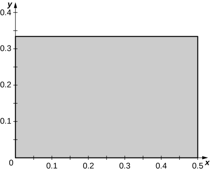 

<math xmlns="http://www.w3.org/1998/Math/MathML"><mrow><mi>x</mi><mo>=</mo><mi>u</mi><mo>−</mo><mi>v</mi><mo>,</mo><mi>y</mi><mo>=</mo><mi>u</mi><mo>+</mo><mi>v</mi></mrow></math>

<math xmlns="http://www.w3.org/1998/Math/MathML"><mrow><mi>x</mi><mo>=</mo><mn>2</mn><mi>u</mi><mo>−</mo><mi>v</mi><mo>,</mo><mi>y</mi><mo>=</mo><mi>u</mi><mo>+</mo><mn>2</mn><mi>v</mi></mrow></math>

a. <math xmlns="http://www.w3.org/1998/Math/MathML"><mrow><mi>T</mi><mrow><mo>(</mo><mrow><mi>u</mi><mo>,</mo><mi>v</mi></mrow><mo>)</mo></mrow><mo>=</mo><mrow><mo>(</mo><mrow><mi>g</mi><mrow><mo>(</mo><mrow><mi>u</mi><mo>,</mo><mi>v</mi></mrow><mo>)</mo></mrow><mo>,</mo><mi>h</mi><mrow><mo>(</mo><mrow><mi>u</mi><mo>,</mo><mi>v</mi></mrow><mo>)</mo></mrow></mrow><mo>)</mo></mrow><mo>,</mo><mi>x</mi><mo>=</mo><mi>g</mi><mrow><mo>(</mo><mrow><mi>u</mi><mo>,</mo><mi>v</mi></mrow><mo>)</mo></mrow><mo>=</mo><mn>2</mn><mi>u</mi><mo>−</mo><mi>v</mi><mo>,</mo></mrow></math>

 and <math xmlns="http://www.w3.org/1998/Math/MathML"><mrow><mi>y</mi><mo>=</mo><mi>h</mi><mrow><mo>(</mo><mrow><mi>u</mi><mo>,</mo><mi>v</mi></mrow><mo>)</mo></mrow><mo>=</mo><mi>u</mi><mo>+</mo><mn>2</mn><mi>v</mi><mo>.</mo></mrow></math>

 The functions <math xmlns="http://www.w3.org/1998/Math/MathML"><mi>g</mi></math>

 and <math xmlns="http://www.w3.org/1998/Math/MathML"><mi>h</mi></math>

 are continuous and differentiable, and the partial derivatives <math xmlns="http://www.w3.org/1998/Math/MathML"><mrow><msub><mi>g</mi><mi>u</mi></msub><mrow><mo>(</mo><mrow><mi>u</mi><mo>,</mo><mi>v</mi></mrow><mo>)</mo></mrow><mo>=</mo><mn>2</mn><mo>,</mo></mrow></math>

 <math xmlns="http://www.w3.org/1998/Math/MathML"><mrow><msub><mi>g</mi><mi>v</mi></msub><mrow><mo>(</mo><mrow><mi>u</mi><mo>,</mo><mi>v</mi></mrow><mo>)</mo></mrow><mo>=</mo><mn>−1</mn><mo>,</mo></mrow></math>

 <math xmlns="http://www.w3.org/1998/Math/MathML"><mrow><msub><mi>h</mi><mi>u</mi></msub><mrow><mo>(</mo><mrow><mi>u</mi><mo>,</mo><mi>v</mi></mrow><mo>)</mo></mrow><mo>=</mo><mn>1</mn><mo>,</mo></mrow></math>

 and <math xmlns="http://www.w3.org/1998/Math/MathML"><mrow><msub><mi>h</mi><mi>v</mi></msub><mrow><mo>(</mo><mrow><mi>u</mi><mo>,</mo><mi>v</mi></mrow><mo>)</mo></mrow><mo>=</mo><mn>2</mn></mrow></math>

 are continuous on <math xmlns="http://www.w3.org/1998/Math/MathML"><mi>S</mi><mo>;</mo></math>

 b. <math xmlns="http://www.w3.org/1998/Math/MathML"><mrow><mi>T</mi><mrow><mo>(</mo><mrow><mn>0</mn><mo>,</mo><mn>0</mn></mrow><mo>)</mo></mrow><mo>=</mo><mrow><mo>(</mo><mrow><mn>0</mn><mo>,</mo><mn>0</mn></mrow><mo>)</mo></mrow><mo>,</mo></mrow></math>

 <math xmlns="http://www.w3.org/1998/Math/MathML"><mrow><mi>T</mi><mrow><mo>(</mo><mrow><mn>1</mn><mo>,</mo><mn>0</mn></mrow><mo>)</mo></mrow><mo>=</mo><mrow><mo>(</mo><mrow><mn>2</mn><mo>,</mo><mn>1</mn></mrow><mo>)</mo></mrow><mo>,</mo></mrow></math>

 <math xmlns="http://www.w3.org/1998/Math/MathML"><mrow><mi>T</mi><mrow><mo>(</mo><mrow><mn>0</mn><mo>,</mo><mn>1</mn></mrow><mo>)</mo></mrow><mo>=</mo><mrow><mo>(</mo><mrow><mn>−1</mn><mo>,</mo><mn>2</mn></mrow><mo>)</mo></mrow><mo>,</mo></mrow></math>

 and <math xmlns="http://www.w3.org/1998/Math/MathML"><mrow><mi>T</mi><mrow><mo>(</mo><mrow><mn>1</mn><mo>,</mo><mn>1</mn></mrow><mo>)</mo></mrow><mo>=</mo><mrow><mo>(</mo><mrow><mn>1</mn><mo>,</mo><mn>3</mn></mrow><mo>)</mo></mrow><mo>;</mo></mrow></math>

 c. <math xmlns="http://www.w3.org/1998/Math/MathML"><mi>R</mi></math>

 is the parallelogram of vertices <math xmlns="http://www.w3.org/1998/Math/MathML"><mrow><mrow><mo>(</mo><mrow><mn>0</mn><mo>,</mo><mn>0</mn></mrow><mo>)</mo></mrow><mo>,</mo><mrow><mo>(</mo><mrow><mn>2</mn><mo>,</mo><mn>1</mn></mrow><mo>)</mo></mrow><mo>,</mo><mrow><mo>(</mo><mrow><mn>1</mn><mo>,</mo><mn>3</mn></mrow><mo>)</mo></mrow><mo>,</mo><mtext>and</mtext><mspace width="0.2em" /><mrow><mo>(</mo><mrow><mn>−1</mn><mo>,</mo><mn>2</mn></mrow><mo>)</mo></mrow></mrow></math>

 in the <math xmlns="http://www.w3.org/1998/Math/MathML"><mrow><mi>x</mi><mi>y</mi><mtext>-plane;</mtext></mrow></math>

 see the following figure.* * *
{: data-type="newline"}

 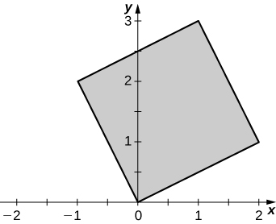 

<math xmlns="http://www.w3.org/1998/Math/MathML"><mrow><mi>x</mi><mo>=</mo><msup><mi>u</mi><mn>2</mn></msup><mo>,</mo><mi>y</mi><mo>=</mo><msup><mi>v</mi><mn>2</mn></msup></mrow></math>

<math xmlns="http://www.w3.org/1998/Math/MathML"><mrow><mi>x</mi><mo>=</mo><msup><mi>u</mi><mn>3</mn></msup><mo>,</mo><mi>y</mi><mo>=</mo><msup><mi>v</mi><mn>3</mn></msup></mrow></math>

a. <math xmlns="http://www.w3.org/1998/Math/MathML"><mrow><mi>T</mi><mrow><mo>(</mo><mrow><mi>u</mi><mo>,</mo><mi>v</mi></mrow><mo>)</mo></mrow><mo>=</mo><mrow><mo>(</mo><mrow><mi>g</mi><mrow><mo>(</mo><mrow><mi>u</mi><mo>,</mo><mi>v</mi></mrow><mo>)</mo></mrow><mo>,</mo><mi>h</mi><mrow><mo>(</mo><mrow><mi>u</mi><mo>,</mo><mi>v</mi></mrow><mo>)</mo></mrow></mrow><mo>)</mo></mrow><mo>,</mo><mi>x</mi><mo>=</mo><mi>g</mi><mrow><mo>(</mo><mrow><mi>u</mi><mo>,</mo><mi>v</mi></mrow><mo>)</mo></mrow><mo>=</mo><msup><mi>u</mi><mn>3</mn></msup><mo>,</mo></mrow></math>

 and <math xmlns="http://www.w3.org/1998/Math/MathML"><mrow><mi>y</mi><mo>=</mo><mi>h</mi><mrow><mo>(</mo><mrow><mi>u</mi><mo>,</mo><mi>v</mi></mrow><mo>)</mo></mrow><mo>=</mo><msup><mi>v</mi><mn>3</mn></msup><mo>.</mo></mrow></math>

 The functions <math xmlns="http://www.w3.org/1998/Math/MathML"><mi>g</mi></math>

 and <math xmlns="http://www.w3.org/1998/Math/MathML"><mi>h</mi></math>

 are continuous and differentiable, and the partial derivatives <math xmlns="http://www.w3.org/1998/Math/MathML"><mrow><msub><mi>g</mi><mi>u</mi></msub><mrow><mo>(</mo><mrow><mi>u</mi><mo>,</mo><mi>v</mi></mrow><mo>)</mo></mrow><mo>=</mo><mn>3</mn><msup><mi>u</mi><mn>2</mn></msup><mo>,</mo></mrow></math>

 <math xmlns="http://www.w3.org/1998/Math/MathML"><mrow><msub><mi>g</mi><mi>v</mi></msub><mrow><mo>(</mo><mrow><mi>u</mi><mo>,</mo><mi>v</mi></mrow><mo>)</mo></mrow><mo>=</mo><mn>0</mn><mo>,</mo></mrow></math>

 <math xmlns="http://www.w3.org/1998/Math/MathML"><mrow><msub><mi>h</mi><mi>u</mi></msub><mrow><mo>(</mo><mrow><mi>u</mi><mo>,</mo><mi>v</mi></mrow><mo>)</mo></mrow><mo>=</mo><mn>0</mn><mo>,</mo></mrow></math>

 and <math xmlns="http://www.w3.org/1998/Math/MathML"><mrow><msub><mi>h</mi><mi>v</mi></msub><mrow><mo>(</mo><mrow><mi>u</mi><mo>,</mo><mi>v</mi></mrow><mo>)</mo></mrow><mo>=</mo><mn>3</mn><msup><mi>v</mi><mn>2</mn></msup></mrow></math>

 are continuous on <math xmlns="http://www.w3.org/1998/Math/MathML"><mi>S</mi><mo>;</mo></math>

 b. <math xmlns="http://www.w3.org/1998/Math/MathML"><mrow><mi>T</mi><mrow><mo>(</mo><mrow><mn>0</mn><mo>,</mo><mn>0</mn></mrow><mo>)</mo></mrow><mo>=</mo><mrow><mo>(</mo><mrow><mn>0</mn><mo>,</mo><mn>0</mn></mrow><mo>)</mo></mrow><mo>,</mo></mrow></math>

 <math xmlns="http://www.w3.org/1998/Math/MathML"><mrow><mi>T</mi><mrow><mo>(</mo><mrow><mn>1</mn><mo>,</mo><mn>0</mn></mrow><mo>)</mo></mrow><mo>=</mo><mrow><mo>(</mo><mrow><mn>1</mn><mo>,</mo><mn>0</mn></mrow><mo>)</mo></mrow><mo>,</mo></mrow></math>

 <math xmlns="http://www.w3.org/1998/Math/MathML"><mrow><mi>T</mi><mrow><mo>(</mo><mrow><mn>0</mn><mo>,</mo><mn>1</mn></mrow><mo>)</mo></mrow><mo>=</mo><mrow><mo>(</mo><mrow><mn>0</mn><mo>,</mo><mn>1</mn></mrow><mo>)</mo></mrow><mo>,</mo></mrow></math>

 and <math xmlns="http://www.w3.org/1998/Math/MathML"><mrow><mi>T</mi><mrow><mo>(</mo><mrow><mn>1</mn><mo>,</mo><mn>1</mn></mrow><mo>)</mo></mrow><mo>=</mo><mrow><mo>(</mo><mrow><mn>1</mn><mo>,</mo><mn>1</mn></mrow><mo>)</mo></mrow><mo>;</mo></mrow></math>

 c. <math xmlns="http://www.w3.org/1998/Math/MathML"><mi>R</mi></math>

 is the unit square in the <math xmlns="http://www.w3.org/1998/Math/MathML"><mrow><mi>x</mi><mi>y</mi><mtext>-plane;</mtext></mrow></math>

 see the figure in the answer to the previous exercise.

In the following exercises, determine whether the transformations <math xmlns="http://www.w3.org/1998/Math/MathML"><mrow><mi>T</mi><mo>:</mo><mi>S</mi><mo stretchy="false">→</mo><mi>R</mi></mrow></math>

 are one-to-one or not.

<math xmlns="http://www.w3.org/1998/Math/MathML"><mrow><mi>x</mi><mo>=</mo><msup><mi>u</mi><mn>2</mn></msup><mo>,</mo><mi>y</mi><mo>=</mo><msup><mi>v</mi><mn>2</mn></msup><mo>,</mo><mtext>where</mtext><mspace width="0.2em" /><mi>S</mi></mrow></math>

 is the rectangle of vertices <math xmlns="http://www.w3.org/1998/Math/MathML"><mrow><mrow><mo>(</mo><mrow><mn>−1</mn><mo>,</mo><mn>0</mn></mrow><mo>)</mo></mrow><mo>,</mo><mrow><mo>(</mo><mrow><mn>1</mn><mo>,</mo><mn>0</mn></mrow><mo>)</mo></mrow><mo>,</mo><mrow><mo>(</mo><mrow><mn>1</mn><mo>,</mo><mn>1</mn></mrow><mo>)</mo></mrow><mo>,</mo><mtext>and</mtext><mspace width="0.2em" /><mrow><mo>(</mo><mrow><mn>−1</mn><mo>,</mo><mn>1</mn></mrow><mo>)</mo></mrow><mo>.</mo></mrow></math>

<math xmlns="http://www.w3.org/1998/Math/MathML"><mrow><mi>x</mi><mo>=</mo><msup><mi>u</mi><mn>4</mn></msup><mo>,</mo><mi>y</mi><mo>=</mo><msup><mi>u</mi><mn>2</mn></msup><mo>+</mo><mi>v</mi><mo>,</mo><mtext>where</mtext><mspace width="0.2em" /><mi>S</mi></mrow></math>

 is the triangle of vertices <math xmlns="http://www.w3.org/1998/Math/MathML"><mrow><mrow><mo>(</mo><mrow><mn>−2</mn><mo>,</mo><mn>0</mn></mrow><mo>)</mo></mrow><mo>,</mo><mrow><mo>(</mo><mrow><mn>2</mn><mo>,</mo><mn>0</mn></mrow><mo>)</mo></mrow><mo>,</mo><mtext>and</mtext><mspace width="0.2em" /><mrow><mo>(</mo><mrow><mn>0</mn><mo>,</mo><mn>2</mn></mrow><mo>)</mo></mrow><mo>.</mo></mrow></math>

<math xmlns="http://www.w3.org/1998/Math/MathML"><mi>T</mi></math>

 is not one-to-one: two points of <math xmlns="http://www.w3.org/1998/Math/MathML"><mi>S</mi></math>

 have the same image. Indeed, <math xmlns="http://www.w3.org/1998/Math/MathML"><mrow><mi>T</mi><mrow><mo>(</mo><mrow><mn>−2</mn><mo>,</mo><mn>0</mn></mrow><mo>)</mo></mrow><mo>=</mo><mi>T</mi><mrow><mo>(</mo><mrow><mn>2</mn><mo>,</mo><mn>0</mn></mrow><mo>)</mo></mrow><mo>=</mo><mrow><mo>(</mo><mrow><mn>16</mn><mo>,</mo><mn>4</mn></mrow><mo>)</mo></mrow><mo>.</mo></mrow></math>

<math xmlns="http://www.w3.org/1998/Math/MathML"><mrow><mi>x</mi><mo>=</mo><mn>2</mn><mi>u</mi><mo>,</mo><mi>y</mi><mo>=</mo><mn>3</mn><mi>v</mi><mo>,</mo><mtext>where</mtext><mspace width="0.2em" /><mi>S</mi></mrow></math>

 is the square of vertices <math xmlns="http://www.w3.org/1998/Math/MathML"><mrow><mrow><mo>(</mo><mrow><mn>−1</mn><mo>,</mo><mn>1</mn></mrow><mo>)</mo></mrow><mo>,</mo><mrow><mo>(</mo><mrow><mn>−1</mn><mo>,</mo><mn>−1</mn></mrow><mo>)</mo></mrow><mo>,</mo><mrow><mo>(</mo><mrow><mn>1</mn><mo>,</mo><mn>−1</mn></mrow><mo>)</mo></mrow><mo>,</mo><mtext>and</mtext><mspace width="0.2em" /><mrow><mo>(</mo><mrow><mn>1</mn><mo>,</mo><mn>1</mn></mrow><mo>)</mo></mrow><mo>.</mo></mrow></math>

<math xmlns="http://www.w3.org/1998/Math/MathML"><mrow><mi>T</mi><mrow><mo>(</mo><mrow><mi>u</mi><mo>,</mo><mi>v</mi></mrow><mo>)</mo></mrow><mo>=</mo><mrow><mo>(</mo><mrow><mn>2</mn><mi>u</mi><mo>−</mo><mi>v</mi><mo>,</mo><mi>u</mi></mrow><mo>)</mo></mrow><mo>,</mo></mrow></math>

 where <math xmlns="http://www.w3.org/1998/Math/MathML"><mi>S</mi></math>

 is the triangle of vertices <math xmlns="http://www.w3.org/1998/Math/MathML"><mrow><mrow><mo>(</mo><mrow><mn>−1</mn><mo>,</mo><mn>1</mn></mrow><mo>)</mo></mrow><mo>,</mo><mrow><mo>(</mo><mrow><mn>−1</mn><mo>,</mo><mn>−1</mn></mrow><mo>)</mo></mrow><mo>,</mo><mtext>and</mtext><mspace width="0.2em" /><mrow><mo>(</mo><mrow><mn>1</mn><mo>,</mo><mn>−1</mn></mrow><mo>)</mo></mrow><mo>.</mo></mrow></math>

<math xmlns="http://www.w3.org/1998/Math/MathML"><mi>T</mi></math>

 is one-to-one: We argue by contradiction. <math xmlns="http://www.w3.org/1998/Math/MathML"><mrow><mi>T</mi><mrow><mo>(</mo><mrow><msub><mi>u</mi><mn>1</mn></msub><mo>,</mo><msub><mi>v</mi><mn>1</mn></msub></mrow><mo>)</mo></mrow><mo>=</mo><mi>T</mi><mrow><mo>(</mo><mrow><msub><mi>u</mi><mn>2</mn></msub><mo>,</mo><msub><mi>v</mi><mn>2</mn></msub></mrow><mo>)</mo></mrow></mrow></math>

 implies <math xmlns="http://www.w3.org/1998/Math/MathML"><mrow><mn>2</mn><msub><mi>u</mi><mn>1</mn></msub><mo>−</mo><msub><mi>v</mi><mn>1</mn></msub><mo>=</mo><mn>2</mn><msub><mi>u</mi><mn>2</mn></msub><mo>−</mo><msub><mi>v</mi><mn>2</mn></msub></mrow></math>

 and <math xmlns="http://www.w3.org/1998/Math/MathML"><mrow><msub><mi>u</mi><mn>1</mn></msub><mo>=</mo><msub><mi>u</mi><mn>2</mn></msub><mo>.</mo></mrow></math>

 Thus, <math xmlns="http://www.w3.org/1998/Math/MathML"><mrow><msub><mi>u</mi><mn>1</mn></msub><mo>=</mo><msub><mi>u</mi><mn>2</mn></msub></mrow></math>

 and <math xmlns="http://www.w3.org/1998/Math/MathML"><mrow><msub><mi>v</mi><mn>1</mn></msub><mo>=</mo><msub><mi>v</mi><mn>2</mn></msub><mo>.</mo></mrow></math>

<math xmlns="http://www.w3.org/1998/Math/MathML"><mrow><mi>x</mi><mo>=</mo><mi>u</mi><mo>+</mo><mi>v</mi><mo>+</mo><mi>w</mi><mo>,</mo><mi>y</mi><mo>=</mo><mi>u</mi><mo>+</mo><mi>v</mi><mo>,</mo><mi>z</mi><mo>=</mo><mi>w</mi><mo>,</mo></mrow></math>

 where <math xmlns="http://www.w3.org/1998/Math/MathML"><mrow><mi>S</mi><mo>=</mo><mi>R</mi><mo>=</mo><msup><mtext>R</mtext><mn>3</mn></msup><mo>.</mo></mrow></math>

<math xmlns="http://www.w3.org/1998/Math/MathML"><mrow><mi>x</mi><mo>=</mo><msup><mi>u</mi><mn>2</mn></msup><mo>+</mo><mi>v</mi><mo>+</mo><mi>w</mi><mo>,</mo><mi>y</mi><mo>=</mo><msup><mi>u</mi><mn>2</mn></msup><mo>+</mo><mi>v</mi><mo>,</mo><mi>z</mi><mo>=</mo><mi>w</mi><mo>,</mo></mrow></math>

 where <math xmlns="http://www.w3.org/1998/Math/MathML"><mrow><mi>S</mi><mo>=</mo><mi>R</mi><mo>=</mo><msup><mtext>R</mtext><mn>3</mn></msup><mo>.</mo></mrow></math>

<math xmlns="http://www.w3.org/1998/Math/MathML"><mi>T</mi></math>

 is not one-to-one: <math xmlns="http://www.w3.org/1998/Math/MathML"><mrow><mi>T</mi><mrow><mo>(</mo><mrow><mn>1</mn><mo>,</mo><mi>v</mi><mo>,</mo><mi>w</mi></mrow><mo>)</mo></mrow><mo>=</mo><mrow><mo>(</mo><mrow><mn>−1</mn><mo>,</mo><mi>v</mi><mo>,</mo><mi>w</mi></mrow><mo>)</mo></mrow></mrow></math>

In the following exercises, the transformations <math xmlns="http://www.w3.org/1998/Math/MathML"><mrow><mi>T</mi><mo>:</mo><mi>S</mi><mo stretchy="false">→</mo><mi>R</mi></mrow></math>

 are one-to-one. Find their related inverse transformations <math xmlns="http://www.w3.org/1998/Math/MathML"><mrow><msup><mi>T</mi><mrow><mn>−1</mn></mrow></msup><mo>:</mo><mi>R</mi><mo stretchy="false">→</mo><mi>S</mi><mo>.</mo></mrow></math>

<math xmlns="http://www.w3.org/1998/Math/MathML"><mrow><mi>x</mi><mo>=</mo><mn>4</mn><mi>u</mi><mo>,</mo><mi>y</mi><mo>=</mo><mn>5</mn><mi>v</mi><mo>,</mo></mrow></math>

 where <math xmlns="http://www.w3.org/1998/Math/MathML"><mrow><mi>S</mi><mo>=</mo><mi>R</mi><mo>=</mo><msup><mtext>R</mtext><mn>2</mn></msup><mo>.</mo></mrow></math>

<math xmlns="http://www.w3.org/1998/Math/MathML"><mrow><mi>x</mi><mo>=</mo><mi>u</mi><mo>+</mo><mn>2</mn><mi>v</mi><mo>,</mo><mi>y</mi><mo>=</mo><mtext>−</mtext><mi>u</mi><mo>+</mo><mi>v</mi><mo>,</mo></mrow></math>

 where <math xmlns="http://www.w3.org/1998/Math/MathML"><mrow><mi>S</mi><mo>=</mo><mi>R</mi><mo>=</mo><msup><mtext>R</mtext><mn>2</mn></msup><mo>.</mo></mrow></math>

<math xmlns="http://www.w3.org/1998/Math/MathML"><mrow><mi>u</mi><mo>=</mo><mfrac><mrow><mi>x</mi><mo>−</mo><mn>2</mn><mi>y</mi></mrow><mn>3</mn></mfrac><mo>,</mo><mi>v</mi><mo>=</mo><mfrac><mrow><mi>x</mi><mo>+</mo><mi>y</mi></mrow><mn>3</mn></mfrac></mrow></math>

<math xmlns="http://www.w3.org/1998/Math/MathML"><mrow><mi>x</mi><mo>=</mo><msup><mi>e</mi><mrow><mn>2</mn><mi>u</mi><mo>+</mo><mi>v</mi></mrow></msup><mo>,</mo><mi>y</mi><mo>=</mo><msup><mi>e</mi><mrow><mi>u</mi><mo>−</mo><mi>v</mi></mrow></msup><mo>,</mo></mrow></math>

 where <math xmlns="http://www.w3.org/1998/Math/MathML"><mrow><mi>S</mi><mo>=</mo><msup><mtext>R</mtext><mn>2</mn></msup></mrow></math>

 and <math xmlns="http://www.w3.org/1998/Math/MathML"><mrow><mi>R</mi><mo>=</mo><mrow><mo>{</mo><mrow><mrow><mrow><mrow><mo>(</mo><mrow><mi>x</mi><mo>,</mo><mi>y</mi></mrow><mo>)</mo></mrow></mrow><mo>\|</mo></mrow><mi>x</mi><mo>&gt;</mo><mn>0</mn><mo>,</mo><mi>y</mi><mo>&gt;</mo><mn>0</mn></mrow><mo>}</mo></mrow></mrow></math>

<math xmlns="http://www.w3.org/1998/Math/MathML"><mrow><mi>x</mi><mo>=</mo><mtext>ln</mtext><mspace width="0.2em" /><mi>u</mi><mo>,</mo><mi>y</mi><mo>=</mo><mtext>ln</mtext><mrow><mo>(</mo><mrow><mi>u</mi><mi>v</mi></mrow><mo>)</mo></mrow><mo>,</mo></mrow></math>

 where <math xmlns="http://www.w3.org/1998/Math/MathML"><mrow><mi>S</mi><mo>=</mo><mrow><mo>{</mo><mrow><mrow><mrow><mrow><mo>(</mo><mrow><mi>u</mi><mo>,</mo><mi>v</mi></mrow><mo>)</mo></mrow></mrow><mo>\|</mo></mrow><mi>u</mi><mo>&gt;</mo><mn>0</mn><mo>,</mo><mi>v</mi><mo>&gt;</mo><mn>0</mn></mrow><mo>}</mo></mrow></mrow></math>

 and <math xmlns="http://www.w3.org/1998/Math/MathML"><mrow><mi>R</mi><mo>=</mo><msup><mtext>R</mtext><mn>2</mn></msup><mo>.</mo></mrow></math>

<math xmlns="http://www.w3.org/1998/Math/MathML"><mrow><mi>u</mi><mo>=</mo><msup><mi>e</mi><mi>x</mi></msup><mo>,</mo><mi>v</mi><mo>=</mo><msup><mi>e</mi><mrow><mtext>−</mtext><mi>x</mi><mo>+</mo><mi>y</mi></mrow></msup></mrow></math>

<math xmlns="http://www.w3.org/1998/Math/MathML"><mrow><mi>x</mi><mo>=</mo><mi>u</mi><mo>+</mo><mi>v</mi><mo>+</mo><mi>w</mi><mo>,</mo><mi>y</mi><mo>=</mo><mn>3</mn><mi>v</mi><mo>,</mo><mi>z</mi><mo>=</mo><mn>2</mn><mi>w</mi><mo>,</mo></mrow></math>

 where <math xmlns="http://www.w3.org/1998/Math/MathML"><mrow><mi>S</mi><mo>=</mo><mi>R</mi><mo>=</mo><msup><mtext>R</mtext><mn>3</mn></msup><mo>.</mo></mrow></math>

<math xmlns="http://www.w3.org/1998/Math/MathML"><mrow><mi>x</mi><mo>=</mo><mi>u</mi><mo>+</mo><mi>v</mi><mo>,</mo><mi>y</mi><mo>=</mo><mi>v</mi><mo>+</mo><mi>w</mi><mo>,</mo><mi>z</mi><mo>=</mo><mi>u</mi><mo>+</mo><mi>w</mi><mo>,</mo></mrow></math>

 where <math xmlns="http://www.w3.org/1998/Math/MathML"><mrow><mi>S</mi><mo>=</mo><mi>R</mi><mo>=</mo><msup><mtext>R</mtext><mn>3</mn></msup><mo>.</mo></mrow></math>

<math xmlns="http://www.w3.org/1998/Math/MathML"><mrow><mi>u</mi><mo>=</mo><mfrac><mrow><mi>x</mi><mo>−</mo><mi>y</mi><mo>+</mo><mi>z</mi></mrow><mn>2</mn></mfrac><mo>,</mo><mi>v</mi><mo>=</mo><mfrac><mrow><mi>x</mi><mo>+</mo><mi>y</mi><mo>−</mo><mi>z</mi></mrow><mn>2</mn></mfrac><mo>,</mo><mi>w</mi><mo>=</mo><mfrac><mrow><mtext>−</mtext><mi>x</mi><mo>+</mo><mi>y</mi><mo>+</mo><mi>z</mi></mrow><mn>2</mn></mfrac></mrow></math>

In the following exercises, the transformation <math xmlns="http://www.w3.org/1998/Math/MathML"><mrow><mi>T</mi><mo>:</mo><mi>S</mi><mo stretchy="false">→</mo><mi>R</mi><mo>,</mo><mi>T</mi><mrow><mo>(</mo><mrow><mi>u</mi><mo>,</mo><mi>v</mi></mrow><mo>)</mo></mrow><mo>=</mo><mrow><mo>(</mo><mrow><mi>x</mi><mo>,</mo><mi>y</mi></mrow><mo>)</mo></mrow></mrow></math>

 and the region <math xmlns="http://www.w3.org/1998/Math/MathML"><mrow><mi>R</mi><mo>⊂</mo><msup><mtext>R</mtext><mn>2</mn></msup></mrow></math>

 are given. Find the region <math xmlns="http://www.w3.org/1998/Math/MathML"><mrow><mi>S</mi><mo>⊂</mo><msup><mtext>R</mtext><mn>2</mn></msup><mo>.</mo></mrow></math>

<math xmlns="http://www.w3.org/1998/Math/MathML"><mrow><mi>x</mi><mo>=</mo><mi>a</mi><mi>u</mi><mo>,</mo><mi>y</mi><mo>=</mo><mi>b</mi><mi>v</mi><mo>,</mo><mi>R</mi><mo>=</mo><mrow><mo>{</mo><mrow><mrow><mrow><mrow><mo>(</mo><mrow><mi>x</mi><mo>,</mo><mi>y</mi></mrow><mo>)</mo></mrow></mrow><mo>\|</mo></mrow><msup><mi>x</mi><mn>2</mn></msup><mo>+</mo><msup><mi>y</mi><mn>2</mn></msup><mo>≤</mo><msup><mi>a</mi><mn>2</mn></msup><msup><mi>b</mi><mn>2</mn></msup></mrow><mo>}</mo></mrow><mo>,</mo></mrow></math>

 where <math xmlns="http://www.w3.org/1998/Math/MathML"><mrow><mi>a</mi><mo>,</mo><mi>b</mi><mo>&gt;</mo><mn>0</mn></mrow></math>

<math xmlns="http://www.w3.org/1998/Math/MathML"><mrow><mi>x</mi><mo>=</mo><mi>a</mi><mi>u</mi><mo>,</mo><mi>y</mi><mo>=</mo><mi>b</mi><mi>v</mi><mo>,</mo><mi>R</mi><mo>=</mo><mrow><mo>{</mo><mrow><mrow><mrow><mrow><mo>(</mo><mrow><mi>x</mi><mo>,</mo><mi>y</mi></mrow><mo>)</mo></mrow></mrow><mo>\|</mo></mrow><mfrac><mrow><msup><mi>x</mi><mn>2</mn></msup></mrow><mrow><msup><mi>a</mi><mn>2</mn></msup></mrow></mfrac><mo>+</mo><mfrac><mrow><msup><mi>y</mi><mn>2</mn></msup></mrow><mrow><msup><mi>b</mi><mn>2</mn></msup></mrow></mfrac><mo>≤</mo><mn>1</mn></mrow><mo>}</mo></mrow><mo>,</mo></mrow></math>

 where <math xmlns="http://www.w3.org/1998/Math/MathML"><mrow><mi>a</mi><mo>,</mo><mi>b</mi><mo>&gt;</mo><mn>0</mn></mrow></math>

<math xmlns="http://www.w3.org/1998/Math/MathML"><mrow><mi>S</mi><mo>=</mo><mrow><mo>{</mo><mrow><mrow><mrow><mrow><mo>(</mo><mrow><mi>u</mi><mo>,</mo><mi>v</mi></mrow><mo>)</mo></mrow></mrow><mo>\|</mo></mrow><msup><mi>u</mi><mn>2</mn></msup><mo>+</mo><msup><mi>v</mi><mn>2</mn></msup><mo>≤</mo><mn>1</mn></mrow><mo>}</mo></mrow></mrow></math>

<math xmlns="http://www.w3.org/1998/Math/MathML"><mrow><mi>x</mi><mo>=</mo><mfrac><mi>u</mi><mi>a</mi></mfrac><mo>,</mo><mi>y</mi><mo>=</mo><mfrac><mi>v</mi><mi>b</mi></mfrac><mo>,</mo><mi>z</mi><mo>=</mo><mfrac><mi>w</mi><mi>c</mi></mfrac><mo>,</mo></mrow></math>

 <math xmlns="http://www.w3.org/1998/Math/MathML"><mrow><mi>R</mi><mo>=</mo><mrow><mo>{</mo><mrow><mrow><mrow><mrow><mo>(</mo><mrow><mi>x</mi><mo>,</mo><mi>y</mi></mrow><mo>)</mo></mrow></mrow><mo>\|</mo></mrow><msup><mi>x</mi><mn>2</mn></msup><mo>+</mo><msup><mi>y</mi><mn>2</mn></msup><mo>+</mo><msup><mi>z</mi><mn>2</mn></msup><mo>≤</mo><mn>1</mn></mrow><mo>}</mo></mrow><mo>,</mo></mrow></math>

 where <math xmlns="http://www.w3.org/1998/Math/MathML"><mrow><mi>a</mi><mo>,</mo><mi>b</mi><mo>,</mo><mi>c</mi><mo>&gt;</mo><mn>0</mn></mrow></math>

<math xmlns="http://www.w3.org/1998/Math/MathML"><mrow><mi>x</mi><mo>=</mo><mi>a</mi><mi>u</mi><mo>,</mo><mi>y</mi><mo>=</mo><mi>b</mi><mi>v</mi><mo>,</mo><mi>z</mi><mo>=</mo><mi>c</mi><mi>w</mi><mo>,</mo><mi>R</mi><mo>=</mo><mrow><mo>{</mo><mrow><mrow><mrow><mrow><mo>(</mo><mrow><mi>x</mi><mo>,</mo><mi>y</mi></mrow><mo>)</mo></mrow></mrow><mo>\|</mo></mrow><mfrac><mrow><msup><mi>x</mi><mn>2</mn></msup></mrow><mrow><msup><mi>a</mi><mn>2</mn></msup></mrow></mfrac><mo>−</mo><mfrac><mrow><msup><mi>y</mi><mn>2</mn></msup></mrow><mrow><msup><mi>b</mi><mn>2</mn></msup></mrow></mfrac><mo>−</mo><mfrac><mrow><msup><mi>z</mi><mn>2</mn></msup></mrow><mrow><msup><mi>c</mi><mn>2</mn></msup></mrow></mfrac><mo>≤</mo><mn>1</mn><mo>,</mo><mi>z</mi><mo>&gt;</mo><mn>0</mn></mrow><mo>}</mo></mrow><mo>,</mo></mrow></math>

 where <math xmlns="http://www.w3.org/1998/Math/MathML"><mrow><mi>a</mi><mo>,</mo><mi>b</mi><mo>,</mo><mi>c</mi><mo>&gt;</mo><mn>0</mn></mrow></math>

<math xmlns="http://www.w3.org/1998/Math/MathML"><mrow><mi>R</mi><mo>=</mo><mrow><mo>{</mo><mrow><mrow><mrow><mrow><mo>(</mo><mrow><mi>u</mi><mo>,</mo><mi>v</mi><mo>,</mo><mi>w</mi></mrow><mo>)</mo></mrow></mrow><mo>\|</mo></mrow><msup><mi>u</mi><mn>2</mn></msup><mo>−</mo><msup><mi>v</mi><mn>2</mn></msup><mo>−</mo><msup><mi>w</mi><mn>2</mn></msup><mo>≤</mo><mn>1</mn><mo>,</mo><mi>w</mi><mo>&gt;</mo><mn>0</mn></mrow><mo>}</mo></mrow></mrow></math>

In the following exercises, find the Jacobian <math xmlns="http://www.w3.org/1998/Math/MathML"><mi>J</mi></math>

 of the transformation.

<math xmlns="http://www.w3.org/1998/Math/MathML"><mrow><mi>x</mi><mo>=</mo><mi>u</mi><mo>+</mo><mn>2</mn><mi>v</mi><mo>,</mo><mi>y</mi><mo>=</mo><mtext>−</mtext><mi>u</mi><mo>+</mo><mi>v</mi></mrow></math>

<math xmlns="http://www.w3.org/1998/Math/MathML"><mrow><mi>x</mi><mo>=</mo><mfrac><mrow><msup><mi>u</mi><mn>3</mn></msup></mrow><mn>2</mn></mfrac><mo>,</mo><mi>y</mi><mo>=</mo><mfrac><mi>v</mi><mrow><msup><mi>u</mi><mn>2</mn></msup></mrow></mfrac></mrow></math>

<math xmlns="http://www.w3.org/1998/Math/MathML"><mrow><mfrac><mn>3</mn><mn>2</mn></mfrac></mrow></math>

<math xmlns="http://www.w3.org/1998/Math/MathML"><mrow><mi>x</mi><mo>=</mo><msup><mi>e</mi><mrow><mn>2</mn><mi>u</mi><mo>−</mo><mi>v</mi></mrow></msup><mo>,</mo><mi>y</mi><mo>=</mo><msup><mi>e</mi><mrow><mi>u</mi><mo>+</mo><mi>v</mi></mrow></msup></mrow></math>

<math xmlns="http://www.w3.org/1998/Math/MathML"><mrow><mi>x</mi><mo>=</mo><mi>u</mi><msup><mi>e</mi><mi>v</mi></msup><mo>,</mo><mi>y</mi><mo>=</mo><msup><mi>e</mi><mrow><mtext>−</mtext><mi>v</mi></mrow></msup></mrow></math>

<math xmlns="http://www.w3.org/1998/Math/MathML"><mrow><mn>−1</mn></mrow></math>

<math xmlns="http://www.w3.org/1998/Math/MathML"><mrow><mi>x</mi><mo>=</mo><mi>u</mi><mspace width="0.2em" /><mtext>cos</mtext><mrow><mo>(</mo><mrow><msup><mi>e</mi><mi>v</mi></msup></mrow><mo>)</mo></mrow><mo>,</mo><mi>y</mi><mo>=</mo><mi>u</mi><mspace width="0.2em" /><mtext>sin</mtext><mrow><mo>(</mo><mrow><msup><mi>e</mi><mi>v</mi></msup></mrow><mo>)</mo></mrow></mrow></math>

<math xmlns="http://www.w3.org/1998/Math/MathML"><mrow><mi>x</mi><mo>=</mo><mi>v</mi><mspace width="0.2em" /><mtext>sin</mtext><mrow><mo>(</mo><mrow><msup><mi>u</mi><mn>2</mn></msup></mrow><mo>)</mo></mrow><mo>,</mo><mi>y</mi><mo>=</mo><mi>v</mi><mspace width="0.2em" /><mtext>cos</mtext><mrow><mo>(</mo><mrow><msup><mi>u</mi><mn>2</mn></msup></mrow><mo>)</mo></mrow></mrow></math>

<math xmlns="http://www.w3.org/1998/Math/MathML"><mrow><mn>2</mn><mi>u</mi><mi>v</mi></mrow></math>

<math xmlns="http://www.w3.org/1998/Math/MathML"><mrow><mi>x</mi><mo>=</mo><mi>u</mi><mspace width="0.2em" /><mtext>cosh</mtext><mspace width="0.2em" /><mi>v</mi><mo>,</mo><mi>y</mi><mo>=</mo><mi>u</mi><mspace width="0.2em" /><mtext>sinh</mtext><mspace width="0.2em" /><mi>v</mi><mo>,</mo><mi>z</mi><mo>=</mo><mi>w</mi></mrow></math>

<math xmlns="http://www.w3.org/1998/Math/MathML"><mrow><mi>x</mi><mo>=</mo><mi>v</mi><mspace width="0.2em" /><mtext>cosh</mtext><mrow><mo>(</mo><mrow><mfrac><mn>1</mn><mi>u</mi></mfrac></mrow><mo>)</mo></mrow><mo>,</mo><mi>y</mi><mo>=</mo><mi>v</mi><mspace width="0.2em" /><mtext>sinh</mtext><mrow><mo>(</mo><mrow><mfrac><mn>1</mn><mi>u</mi></mfrac></mrow><mo>)</mo></mrow><mo>,</mo><mi>z</mi><mo>=</mo><mi>u</mi><mo>+</mo><msup><mi>w</mi><mn>2</mn></msup></mrow></math>

<math xmlns="http://www.w3.org/1998/Math/MathML"><mrow><mfrac><mi>v</mi><mrow><msup><mi>u</mi><mn>2</mn></msup></mrow></mfrac></mrow></math>

<math xmlns="http://www.w3.org/1998/Math/MathML"><mrow><mi>x</mi><mo>=</mo><mi>u</mi><mo>+</mo><mi>v</mi><mo>,</mo><mi>y</mi><mo>=</mo><mi>v</mi><mo>+</mo><mi>w</mi><mo>,</mo><mi>z</mi><mo>=</mo><mi>u</mi></mrow></math>

<math xmlns="http://www.w3.org/1998/Math/MathML"><mrow><mi>x</mi><mo>=</mo><mi>u</mi><mo>−</mo><mi>v</mi><mo>,</mo><mi>y</mi><mo>=</mo><mi>u</mi><mo>+</mo><mi>v</mi><mo>,</mo><mi>z</mi><mo>=</mo><mi>u</mi><mo>+</mo><mi>v</mi><mo>+</mo><mi>w</mi></mrow></math>

<math xmlns="http://www.w3.org/1998/Math/MathML"><mn>2</mn></math>

The triangular region <math xmlns="http://www.w3.org/1998/Math/MathML"><mi>R</mi></math>

 with the vertices <math xmlns="http://www.w3.org/1998/Math/MathML"><mrow><mrow><mo>(</mo><mrow><mn>0</mn><mo>,</mo><mn>0</mn></mrow><mo>)</mo></mrow><mo>,</mo><mrow><mo>(</mo><mrow><mn>1</mn><mo>,</mo><mn>1</mn></mrow><mo>)</mo></mrow><mo>,</mo><mtext>and</mtext><mspace width="0.2em" /><mrow><mo>(</mo><mrow><mn>1</mn><mo>,</mo><mn>2</mn></mrow><mo>)</mo></mrow></mrow></math>

 is shown in the following figure.

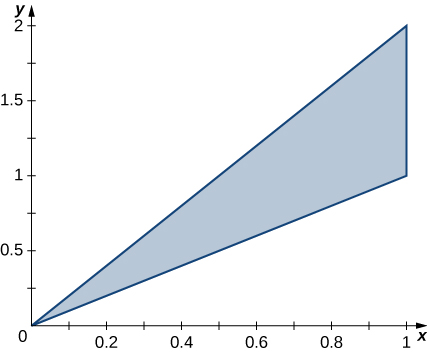

1.  Find a transformation
    <math xmlns="http://www.w3.org/1998/Math/MathML"><mrow><mi>T</mi><mo>:</mo><mi>S</mi><mo stretchy="false">→</mo><mi>R</mi><mo>,</mo></mrow></math>
    
    <math xmlns="http://www.w3.org/1998/Math/MathML"><mrow><mi>T</mi><mrow><mo>(</mo><mrow><mi>u</mi><mo>,</mo><mi>v</mi></mrow><mo>)</mo></mrow><mo>=</mo><mrow><mo>(</mo><mrow><mi>x</mi><mo>,</mo><mi>y</mi></mrow><mo>)</mo></mrow><mo>=</mo><mrow><mo>(</mo><mrow><mi>a</mi><mi>u</mi><mo>+</mo><mi>b</mi><mi>v</mi><mo>,</mo><mi>c</mi><mi>u</mi><mo>+</mo><mi>d</mi><mi>v</mi></mrow><mo>)</mo></mrow><mo>,</mo></mrow></math>
    
    where
    <math xmlns="http://www.w3.org/1998/Math/MathML"><mrow><mi>a</mi><mo>,</mo><mi>b</mi><mo>,</mo><mi>c</mi><mo>,</mo></mrow></math>
    
    and
    <math xmlns="http://www.w3.org/1998/Math/MathML"><mi>d</mi></math>
    
    are real numbers with
    <math xmlns="http://www.w3.org/1998/Math/MathML"><mrow><mi>a</mi><mi>d</mi><mo>−</mo><mi>b</mi><mi>c</mi><mo>≠</mo><mn>0</mn></mrow></math>
    
    such that
    <math xmlns="http://www.w3.org/1998/Math/MathML"><mrow><msup><mi>T</mi><mrow><mn>−1</mn></mrow></msup><mrow><mo>(</mo><mrow><mn>0</mn><mo>,</mo><mn>0</mn></mrow><mo>)</mo></mrow><mo>=</mo><mrow><mo>(</mo><mrow><mn>0</mn><mo>,</mo><mn>0</mn></mrow><mo>)</mo></mrow><mo>,</mo><msup><mi>T</mi><mrow><mn>−1</mn></mrow></msup><mrow><mo>(</mo><mrow><mn>1</mn><mo>,</mo><mn>1</mn></mrow><mo>)</mo></mrow><mo>=</mo><mrow><mo>(</mo><mrow><mn>1</mn><mo>,</mo><mn>0</mn></mrow><mo>)</mo></mrow><mo>,</mo></mrow></math>
    
    and
    <math xmlns="http://www.w3.org/1998/Math/MathML"><mrow><msup><mi>T</mi><mrow><mn>−1</mn></mrow></msup><mrow><mo>(</mo><mrow><mn>1</mn><mo>,</mo><mn>2</mn></mrow><mo>)</mo></mrow><mo>=</mo><mrow><mo>(</mo><mrow><mn>0</mn><mo>,</mo><mn>1</mn></mrow><mo>)</mo></mrow><mo>.</mo></mrow></math>

2.  Use the transformation
    <math xmlns="http://www.w3.org/1998/Math/MathML"><mi>T</mi></math>
    
    to find the area
    <math xmlns="http://www.w3.org/1998/Math/MathML"><mrow><mi>A</mi><mrow><mo>(</mo><mi>R</mi><mo>)</mo></mrow></mrow></math>
    
    of the region
    <math xmlns="http://www.w3.org/1998/Math/MathML"><mi>R</mi><mo>.</mo></math>
{: data-number-style="lower-alpha"}

The triangular region <math xmlns="http://www.w3.org/1998/Math/MathML"><mi>R</mi></math>

 with the vertices <math xmlns="http://www.w3.org/1998/Math/MathML"><mrow><mrow><mo>(</mo><mrow><mn>0</mn><mo>,</mo><mn>0</mn></mrow><mo>)</mo></mrow><mo>,</mo><mrow><mo>(</mo><mrow><mn>2</mn><mo>,</mo><mn>0</mn></mrow><mo>)</mo></mrow><mo>,</mo><mtext>and</mtext><mspace width="0.2em" /><mrow><mo>(</mo><mrow><mn>1</mn><mo>,</mo><mn>3</mn></mrow><mo>)</mo></mrow></mrow></math>

 is shown in the following figure.

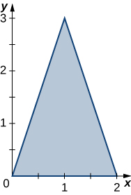

1.  Find a transformation
    <math xmlns="http://www.w3.org/1998/Math/MathML"><mrow><mi>T</mi><mo>:</mo><mi>S</mi><mo stretchy="false">→</mo><mi>R</mi><mo>,</mo></mrow></math>
    
    <math xmlns="http://www.w3.org/1998/Math/MathML"><mrow><mi>T</mi><mrow><mo>(</mo><mrow><mi>u</mi><mo>,</mo><mi>v</mi></mrow><mo>)</mo></mrow><mo>=</mo><mrow><mo>(</mo><mrow><mi>x</mi><mo>,</mo><mi>y</mi></mrow><mo>)</mo></mrow><mo>=</mo><mrow><mo>(</mo><mrow><mi>a</mi><mi>u</mi><mo>+</mo><mi>b</mi><mi>v</mi><mo>,</mo><mi>c</mi><mi>u</mi><mo>+</mo><mi>d</mi><mi>v</mi></mrow><mo>)</mo></mrow><mo>,</mo></mrow></math>
    
    where
    <math xmlns="http://www.w3.org/1998/Math/MathML"><mrow><mi>a</mi><mo>,</mo><mi>b</mi><mo>,</mo><mi>c</mi></mrow></math>
    
    and
    <math xmlns="http://www.w3.org/1998/Math/MathML"><mi>d</mi></math>
    
    are real numbers with
    <math xmlns="http://www.w3.org/1998/Math/MathML"><mrow><mi>a</mi><mi>d</mi><mo>−</mo><mi>b</mi><mi>c</mi><mo>≠</mo><mn>0</mn></mrow></math>
    
    such that
    <math xmlns="http://www.w3.org/1998/Math/MathML"><mrow><msup><mi>T</mi><mrow><mn>−1</mn></mrow></msup><mrow><mo>(</mo><mrow><mn>0</mn><mo>,</mo><mn>0</mn></mrow><mo>)</mo></mrow><mo>=</mo><mrow><mo>(</mo><mrow><mn>0</mn><mo>,</mo><mn>0</mn></mrow><mo>)</mo></mrow><mo>,</mo></mrow></math>
    
    <math xmlns="http://www.w3.org/1998/Math/MathML"><mrow><msup><mi>T</mi><mrow><mn>−1</mn></mrow></msup><mrow><mo>(</mo><mrow><mn>2</mn><mo>,</mo><mn>0</mn></mrow><mo>)</mo></mrow><mo>=</mo><mrow><mo>(</mo><mrow><mn>1</mn><mo>,</mo><mn>0</mn></mrow><mo>)</mo></mrow><mo>,</mo></mrow></math>
    
    and
    <math xmlns="http://www.w3.org/1998/Math/MathML"><mrow><msup><mi>T</mi><mrow><mn>−1</mn></mrow></msup><mrow><mo>(</mo><mrow><mn>1</mn><mo>,</mo><mn>3</mn></mrow><mo>)</mo></mrow><mo>=</mo><mrow><mo>(</mo><mrow><mn>0</mn><mo>,</mo><mn>1</mn></mrow><mo>)</mo></mrow><mo>.</mo></mrow></math>

2.  Use the transformation
    <math xmlns="http://www.w3.org/1998/Math/MathML"><mi>T</mi></math>
    
    to find the area
    <math xmlns="http://www.w3.org/1998/Math/MathML"><mrow><mi>A</mi><mrow><mo>(</mo><mi>R</mi><mo>)</mo></mrow></mrow></math>
    
    of the region
    <math xmlns="http://www.w3.org/1998/Math/MathML"><mi>R</mi><mo>.</mo></math>
{: data-number-style="lower-alpha"}

a. <math xmlns="http://www.w3.org/1998/Math/MathML"><mrow><mi>T</mi><mrow><mo>(</mo><mrow><mi>u</mi><mo>,</mo><mi>v</mi></mrow><mo>)</mo></mrow><mo>=</mo><mrow><mo>(</mo><mrow><mn>2</mn><mi>u</mi><mo>+</mo><mi>v</mi><mo>,</mo><mn>3</mn><mi>v</mi></mrow><mo>)</mo></mrow><mo>;</mo></mrow></math>

 b. The area of <math xmlns="http://www.w3.org/1998/Math/MathML"><mi>R</mi></math>

 is* * *
{: data-type="newline"}

<math xmlns="http://www.w3.org/1998/Math/MathML"><mrow><mi>A</mi><mrow><mo>(</mo><mi>R</mi><mo>)</mo></mrow><mo>=</mo><mstyle displaystyle="true"><mrow><munderover><mo stretchy="false">∫</mo><mn>0</mn><mn>3</mn></munderover><mspace width="0.2em" /><mrow><mstyle displaystyle="true"><mrow><munderover><mo stretchy="false">∫</mo><mrow><mrow><mi>y</mi><mtext>/</mtext><mn>3</mn></mrow></mrow><mrow><mrow><mrow><mrow><mo>(</mo><mrow><mn>6</mn><mo>−</mo><mi>y</mi></mrow><mo>)</mo></mrow></mrow><mtext>/</mtext><mn>3</mn></mrow></mrow></munderover><mrow><mi>d</mi><mi>x</mi><mspace width="0.2em" /><mi>d</mi><mi>y</mi><mo>=</mo></mrow></mrow></mstyle></mrow></mrow></mstyle><mstyle displaystyle="true"><mrow><munderover><mo stretchy="false">∫</mo><mn>0</mn><mn>1</mn></munderover><mspace width="0.2em" /><mrow><mstyle displaystyle="true"><mrow><munderover><mo stretchy="false">∫</mo><mn>0</mn><mrow><mn>1</mn><mo>−</mo><mi>u</mi></mrow></munderover><mrow><mrow><mo>\|</mo><mrow><mfrac><mrow><mo>∂</mo><mrow><mo>(</mo><mrow><mi>x</mi><mo>,</mo><mi>y</mi></mrow><mo>)</mo></mrow></mrow><mrow><mo>∂</mo><mrow><mo>(</mo><mrow><mi>u</mi><mo>,</mo><mi>v</mi></mrow><mo>)</mo></mrow></mrow></mfrac></mrow><mo>\|</mo></mrow><mi>d</mi><mi>v</mi><mspace width="0.2em" /><mi>d</mi><mi>u</mi><mo>=</mo></mrow></mrow></mstyle></mrow></mrow></mstyle><mstyle displaystyle="true"><mrow><munderover><mo stretchy="false">∫</mo><mn>0</mn><mn>1</mn></munderover><mspace width="0.2em" /><mrow><mstyle displaystyle="true"><mrow><munderover><mo stretchy="false">∫</mo><mn>0</mn><mrow><mn>1</mn><mo>−</mo><mi>u</mi></mrow></munderover><mrow><mn>6</mn><mi>d</mi><mi>v</mi><mspace width="0.2em" /><mi>d</mi><mi>u</mi><mo>=</mo></mrow></mrow></mstyle></mrow></mrow></mstyle><mn>3</mn><mo>.</mo></mrow></math>

In the following exercises, use the transformation <math xmlns="http://www.w3.org/1998/Math/MathML"><mrow><mi>u</mi><mo>=</mo><mi>y</mi><mo>−</mo><mi>x</mi><mo>,</mo><mi>v</mi><mo>=</mo><mi>y</mi><mo>,</mo></mrow></math>

 to evaluate the integrals on the parallelogram <math xmlns="http://www.w3.org/1998/Math/MathML"><mi>R</mi></math>

 of vertices <math xmlns="http://www.w3.org/1998/Math/MathML"><mrow><mrow><mo>(</mo><mrow><mn>0</mn><mo>,</mo><mn>0</mn></mrow><mo>)</mo></mrow><mo>,</mo><mrow><mo>(</mo><mrow><mn>1</mn><mo>,</mo><mn>0</mn></mrow><mo>)</mo></mrow><mo>,</mo><mrow><mo>(</mo><mrow><mn>2</mn><mo>,</mo><mn>1</mn></mrow><mo>)</mo></mrow><mo>,</mo><mtext>and</mtext><mspace width="0.2em" /><mrow><mo>(</mo><mrow><mn>1</mn><mo>,</mo><mn>1</mn></mrow><mo>)</mo></mrow></mrow></math>

 shown in the following figure.* * *
{: data-type="newline"}

 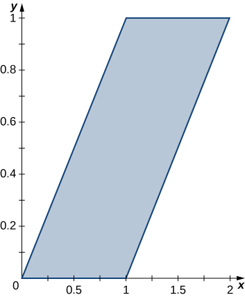 

<math xmlns="http://www.w3.org/1998/Math/MathML"><mrow><mstyle displaystyle="true"><mrow><munder><mo>∬</mo><mi>R</mi></munder><mrow><mrow><mo>(</mo><mrow><mi>y</mi><mo>−</mo><mi>x</mi></mrow><mo>)</mo></mrow></mrow></mrow></mstyle><mi>d</mi><mi>A</mi></mrow></math>

<math xmlns="http://www.w3.org/1998/Math/MathML"><mrow><mstyle displaystyle="true"><mrow><munder><mo>∬</mo><mi>R</mi></munder><mrow><mrow><mo>(</mo><mrow><msup><mi>y</mi><mn>2</mn></msup><mo>−</mo><mi>x</mi><mi>y</mi></mrow><mo>)</mo></mrow></mrow></mrow></mstyle><mi>d</mi><mi>A</mi></mrow></math>

<math xmlns="http://www.w3.org/1998/Math/MathML"><mrow><mo>−</mo><mfrac><mn>1</mn><mn>4</mn></mfrac></mrow></math>

In the following exercises, use the transformation <math xmlns="http://www.w3.org/1998/Math/MathML"><mrow><mi>y</mi><mo>−</mo><mi>x</mi><mo>=</mo><mi>u</mi><mo>,</mo><mi>x</mi><mo>+</mo><mi>y</mi><mo>=</mo><mi>v</mi></mrow></math>

 to evaluate the integrals on the square <math xmlns="http://www.w3.org/1998/Math/MathML"><mi>R</mi></math>

 determined by the lines <math xmlns="http://www.w3.org/1998/Math/MathML"><mrow><mi>y</mi><mo>=</mo><mi>x</mi><mo>,</mo><mi>y</mi><mo>=</mo><mtext>−</mtext><mi>x</mi><mo>+</mo><mn>2</mn><mo>,</mo><mi>y</mi><mo>=</mo><mi>x</mi><mo>+</mo><mn>2</mn><mo>,</mo></mrow></math>

 and <math xmlns="http://www.w3.org/1998/Math/MathML"><mrow><mi>y</mi><mo>=</mo><mtext>−</mtext><mi>x</mi></mrow></math>

 shown in the following figure.* * *
{: data-type="newline"}

  

<math xmlns="http://www.w3.org/1998/Math/MathML"><mrow><mstyle displaystyle="true"><mrow><munder><mo>∬</mo><mi>R</mi></munder><mrow><msup><mi>e</mi><mrow><mi>x</mi><mo>+</mo><mi>y</mi></mrow></msup><mi>d</mi><mi>A</mi></mrow></mrow></mstyle></mrow></math>

<math xmlns="http://www.w3.org/1998/Math/MathML"><mrow><mstyle displaystyle="true"><mrow><munder><mo>∬</mo><mi>R</mi></munder><mrow><mtext>sin</mtext><mrow><mo>(</mo><mrow><mi>x</mi><mo>−</mo><mi>y</mi></mrow><mo>)</mo></mrow></mrow></mrow></mstyle><mi>d</mi><mi>A</mi></mrow></math>

<math xmlns="http://www.w3.org/1998/Math/MathML"><mrow><mn>−1</mn><mo>+</mo><mtext>cos</mtext><mspace width="0.2em" /><mn>2</mn></mrow></math>

In the following exercises, use the transformation <math xmlns="http://www.w3.org/1998/Math/MathML"><mrow><mi>x</mi><mo>=</mo><mi>u</mi><mo>,</mo><mn>5</mn><mi>y</mi><mo>=</mo><mi>v</mi></mrow></math>

 to evaluate the integrals on the region <math xmlns="http://www.w3.org/1998/Math/MathML"><mi>R</mi></math>

 bounded by the ellipse <math xmlns="http://www.w3.org/1998/Math/MathML"><mrow><msup><mi>x</mi><mn>2</mn></msup><mo>+</mo><mn>25</mn><msup><mi>y</mi><mn>2</mn></msup><mo>=</mo><mn>1</mn></mrow></math>

 shown in the following figure.* * *
{: data-type="newline"}

 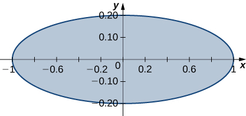 

<math xmlns="http://www.w3.org/1998/Math/MathML"><mrow><mstyle displaystyle="true"><mrow><munder><mo>∬</mo><mi>R</mi></munder><mrow><msqrt><mrow><msup><mi>x</mi><mn>2</mn></msup><mo>+</mo><mn>25</mn><msup><mi>y</mi><mn>2</mn></msup></mrow></msqrt><mspace width="0.2em" /><mi>d</mi><mi>A</mi></mrow></mrow></mstyle></mrow></math>

<math xmlns="http://www.w3.org/1998/Math/MathML"><mrow><msup><mrow><mstyle displaystyle="true"><mrow><munder><mo>∬</mo><mi>R</mi></munder><mrow><mrow><mo>(</mo><mrow><msup><mi>x</mi><mn>2</mn></msup><mo>+</mo><mn>25</mn><msup><mi>y</mi><mn>2</mn></msup></mrow><mo>)</mo></mrow></mrow></mrow></mstyle></mrow><mn>2</mn></msup><mi>d</mi><mi>A</mi></mrow></math>

<math xmlns="http://www.w3.org/1998/Math/MathML"><mrow><mfrac><mi>π</mi><mrow><mn>15</mn></mrow></mfrac></mrow></math>

In the following exercises, use the transformation <math xmlns="http://www.w3.org/1998/Math/MathML"><mrow><mi>u</mi><mo>=</mo><mi>x</mi><mo>+</mo><mi>y</mi><mo>,</mo><mi>v</mi><mo>=</mo><mi>x</mi><mo>−</mo><mi>y</mi></mrow></math>

 to evaluate the integrals on the trapezoidal region <math xmlns="http://www.w3.org/1998/Math/MathML"><mi>R</mi></math>

 determined by the points <math xmlns="http://www.w3.org/1998/Math/MathML"><mrow><mrow><mo>(</mo><mrow><mn>1</mn><mo>,</mo><mn>0</mn></mrow><mo>)</mo></mrow><mo>,</mo><mrow><mo>(</mo><mrow><mn>2</mn><mo>,</mo><mn>0</mn></mrow><mo>)</mo></mrow><mo>,</mo><mrow><mo>(</mo><mrow><mn>0</mn><mo>,</mo><mn>2</mn></mrow><mtext>)</mtext></mrow><mo>,</mo><mtext>and</mtext><mspace width="0.2em" /><mrow><mo>(</mo><mrow><mn>0</mn><mo>,</mo><mn>1</mn></mrow><mo>)</mo></mrow></mrow></math>

 shown in the following figure.* * *
{: data-type="newline"}

 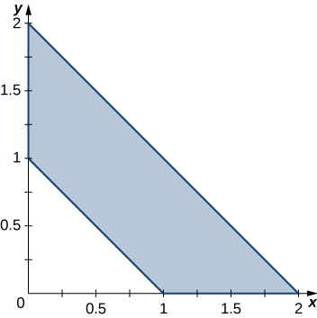 

<math xmlns="http://www.w3.org/1998/Math/MathML"><mrow><mstyle displaystyle="true"><mrow><munder><mo>∬</mo><mi>R</mi></munder><mrow><mrow><mo>(</mo><mrow><msup><mi>x</mi><mn>2</mn></msup><mo>−</mo><mn>2</mn><mi>x</mi><mi>y</mi><mo>+</mo><msup><mi>y</mi><mn>2</mn></msup></mrow><mo>)</mo></mrow><msup><mi>e</mi><mrow><mi>x</mi><mo>+</mo><mi>y</mi></mrow></msup><mi>d</mi><mi>A</mi></mrow></mrow></mstyle></mrow></math>

<math xmlns="http://www.w3.org/1998/Math/MathML"><mrow><mstyle displaystyle="true"><mrow><munder><mo>∬</mo><mi>R</mi></munder><mrow><mrow><mo>(</mo><mrow><msup><mi>x</mi><mn>3</mn></msup><mo>+</mo><mn>3</mn><msup><mi>x</mi><mn>2</mn></msup><mi>y</mi><mo>+</mo><mn>3</mn><mi>x</mi><msup><mi>y</mi><mn>2</mn></msup><mo>+</mo><msup><mi>y</mi><mn>3</mn></msup></mrow><mo>)</mo></mrow></mrow></mrow></mstyle><mi>d</mi><mi>A</mi></mrow></math>

<math xmlns="http://www.w3.org/1998/Math/MathML"><mrow><mfrac><mrow><mn>31</mn></mrow><mn>5</mn></mfrac></mrow></math>

The circular annulus sector <math xmlns="http://www.w3.org/1998/Math/MathML"><mi>R</mi></math>

 bounded by the circles <math xmlns="http://www.w3.org/1998/Math/MathML"><mrow><mn>4</mn><msup><mi>x</mi><mn>2</mn></msup><mo>+</mo><mn>4</mn><msup><mi>y</mi><mn>2</mn></msup><mo>=</mo><mn>1</mn></mrow></math>

 and <math xmlns="http://www.w3.org/1998/Math/MathML"><mrow><mn>9</mn><msup><mi>x</mi><mn>2</mn></msup><mo>+</mo><mn>9</mn><msup><mi>y</mi><mn>2</mn></msup><mo>=</mo><mn>64</mn><mo>,</mo></mrow></math>

 the line <math xmlns="http://www.w3.org/1998/Math/MathML"><mrow><mi>x</mi><mo>=</mo><mi>y</mi><msqrt><mn>3</mn></msqrt><mo>,</mo></mrow></math>

 and the <math xmlns="http://www.w3.org/1998/Math/MathML"><mrow><mi>y</mi><mtext>-axis</mtext></mrow></math>

 is shown in the following figure. Find a transformation <math xmlns="http://www.w3.org/1998/Math/MathML"><mi>T</mi></math>

 from a rectangular region <math xmlns="http://www.w3.org/1998/Math/MathML"><mi>S</mi></math>

 in the <math xmlns="http://www.w3.org/1998/Math/MathML"><mrow><mi>r</mi><mi>θ</mi><mtext>-plane</mtext></mrow></math>

 to the region <math xmlns="http://www.w3.org/1998/Math/MathML"><mi>R</mi></math>

 in the <math xmlns="http://www.w3.org/1998/Math/MathML"><mrow><mi>x</mi><mi>y</mi><mtext>-plane.</mtext></mrow></math>

 Graph <math xmlns="http://www.w3.org/1998/Math/MathML"><mi>S</mi><mo>.</mo></math>

* * *
{: data-type="newline"}

  

The solid <math xmlns="http://www.w3.org/1998/Math/MathML"><mi>R</mi></math>

 bounded by the circular cylinder <math xmlns="http://www.w3.org/1998/Math/MathML"><mrow><msup><mi>x</mi><mn>2</mn></msup><mo>+</mo><msup><mi>y</mi><mn>2</mn></msup><mo>=</mo><mn>9</mn></mrow></math>

 and the planes <math xmlns="http://www.w3.org/1998/Math/MathML"><mrow><mi>z</mi><mo>=</mo><mn>0</mn><mo>,</mo><mi>z</mi><mo>=</mo><mn>1</mn><mo>,</mo></mrow></math>

 <math xmlns="http://www.w3.org/1998/Math/MathML"><mrow><mi>x</mi><mo>=</mo><mn>0</mn><mo>,</mo><mtext>and</mtext><mspace width="0.2em" /><mi>y</mi><mo>=</mo><mn>0</mn></mrow></math>

 is shown in the following figure. Find a transformation <math xmlns="http://www.w3.org/1998/Math/MathML"><mi>T</mi></math>

 from a cylindrical box <math xmlns="http://www.w3.org/1998/Math/MathML"><mi>S</mi></math>

 in <math xmlns="http://www.w3.org/1998/Math/MathML"><mrow><mi>r</mi><mi>θ</mi><mi>z</mi><mtext>-space</mtext></mrow></math>

 to the solid <math xmlns="http://www.w3.org/1998/Math/MathML"><mi>R</mi></math>

 in <math xmlns="http://www.w3.org/1998/Math/MathML"><mrow><mi>x</mi><mi>y</mi><mi>z</mi><mtext>-space</mtext><mo>.</mo></mrow></math>

* * *
{: data-type="newline"}

 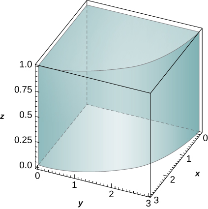 

<math xmlns="http://www.w3.org/1998/Math/MathML"><mrow><mi>T</mi><mrow><mo>(</mo><mrow><mi>r</mi><mo>,</mo><mi>θ</mi><mo>,</mo><mi>z</mi></mrow><mo>)</mo></mrow><mo>=</mo><mrow><mo>(</mo><mrow><mi>r</mi><mspace width="0.2em" /><mtext>cos</mtext><mspace width="0.2em" /><mi>θ</mi><mo>,</mo><mi>r</mi><mspace width="0.2em" /><mtext>sin</mtext><mspace width="0.2em" /><mi>θ</mi><mo>,</mo><mi>z</mi></mrow><mo>)</mo></mrow><mo>;</mo><mi>S</mi><mo>=</mo><mrow><mo>[</mo><mrow><mn>0</mn><mo>,</mo><mn>3</mn></mrow><mo>]</mo></mrow><mspace width="0.2em" /><mo>×</mo><mspace width="0.2em" /><mrow><mo>[</mo><mrow><mn>0</mn><mo>,</mo><mfrac><mi>π</mi><mn>2</mn></mfrac></mrow><mo>]</mo></mrow><mspace width="0.2em" /><mo>×</mo><mspace width="0.2em" /><mrow><mo>[</mo><mrow><mn>0</mn><mo>,</mo><mn>1</mn></mrow><mo>]</mo></mrow></mrow></math>

 in the <math xmlns="http://www.w3.org/1998/Math/MathML"><mrow><mi>r</mi><mi>θ</mi><mi>z</mi><mtext>-space</mtext></mrow></math>

Show that <math xmlns="http://www.w3.org/1998/Math/MathML"><mrow><mstyle displaystyle="true"><mrow><munder><mo>∬</mo><mi>R</mi></munder><mrow><mi>f</mi><mrow><mo>(</mo><mrow><msqrt><mrow><mfrac><mrow><msup><mi>x</mi><mn>2</mn></msup></mrow><mn>3</mn></mfrac><mo>+</mo><mfrac><mrow><msup><mi>y</mi><mn>2</mn></msup></mrow><mn>3</mn></mfrac></mrow></msqrt></mrow><mo>)</mo></mrow></mrow></mrow></mstyle><mi>d</mi><mi>A</mi><mo>=</mo><mn>2</mn><mi>π</mi><msqrt><mrow><mn>15</mn></mrow></msqrt><mstyle displaystyle="true"><mrow><munderover><mo stretchy="false">∫</mo><mn>0</mn><mn>1</mn></munderover><mrow><mi>f</mi><mrow><mo>(</mo><mi>ρ</mi><mo>)</mo></mrow></mrow></mrow></mstyle><mi>ρ</mi><mspace width="0.2em" /><mi>d</mi><mi>ρ</mi><mo>,</mo></mrow></math>

 where <math xmlns="http://www.w3.org/1998/Math/MathML"><mi>f</mi></math>

 is a continuous function on <math xmlns="http://www.w3.org/1998/Math/MathML"><mrow><mrow><mo>[</mo><mrow><mn>0</mn><mo>,</mo><mn>1</mn></mrow><mo>]</mo></mrow></mrow></math>

 and <math xmlns="http://www.w3.org/1998/Math/MathML"><mi>R</mi></math>

 is the region bounded by the ellipse <math xmlns="http://www.w3.org/1998/Math/MathML"><mrow><mn>5</mn><msup><mi>x</mi><mn>2</mn></msup><mo>+</mo><mn>3</mn><msup><mi>y</mi><mn>2</mn></msup><mo>=</mo><mn>15</mn><mo>.</mo></mrow></math>

Show that <math xmlns="http://www.w3.org/1998/Math/MathML"><mrow><mstyle displaystyle="true"><mrow><munder><mo>∭</mo><mi>R</mi></munder><mrow><mi>f</mi><mrow><mo>(</mo><mrow><msqrt><mrow><mn>16</mn><msup><mi>x</mi><mn>2</mn></msup><mo>+</mo><mn>4</mn><msup><mi>y</mi><mn>2</mn></msup><mo>+</mo><msup><mi>z</mi><mn>2</mn></msup></mrow></msqrt></mrow><mo>)</mo></mrow></mrow></mrow></mstyle><mi>d</mi><mi>V</mi><mo>=</mo><mfrac><mi>π</mi><mn>2</mn></mfrac><mstyle displaystyle="true"><mrow><munderover><mo stretchy="false">∫</mo><mn>0</mn><mn>1</mn></munderover><mrow><mi>f</mi><mrow><mo>(</mo><mi>ρ</mi><mo>)</mo></mrow></mrow></mrow></mstyle><msup><mi>ρ</mi><mn>2</mn></msup><mi>d</mi><mi>ρ</mi><mo>,</mo></mrow></math>

 where <math xmlns="http://www.w3.org/1998/Math/MathML"><mi>f</mi></math>

 is a continuous function on <math xmlns="http://www.w3.org/1998/Math/MathML"><mrow><mrow><mo>[</mo><mrow><mn>0</mn><mo>,</mo><mn>1</mn></mrow><mo>]</mo></mrow></mrow></math>

 and <math xmlns="http://www.w3.org/1998/Math/MathML"><mi>R</mi></math>

 is the region bounded by the ellipsoid <math xmlns="http://www.w3.org/1998/Math/MathML"><mrow><mn>16</mn><msup><mi>x</mi><mn>2</mn></msup><mo>+</mo><mn>4</mn><msup><mi>y</mi><mn>2</mn></msup><mo>+</mo><msup><mi>z</mi><mn>2</mn></msup><mo>=</mo><mn>1</mn><mo>.</mo></mrow></math>

**[T]** Find the area of the region bounded by the curves <math xmlns="http://www.w3.org/1998/Math/MathML"><mrow><mi>x</mi><mi>y</mi><mo>=</mo><mn>1</mn><mo>,</mo><mi>x</mi><mi>y</mi><mo>=</mo><mn>3</mn><mo>,</mo><mi>y</mi><mo>=</mo><mn>2</mn><mi>x</mi><mo>,</mo></mrow></math>

 and <math xmlns="http://www.w3.org/1998/Math/MathML"><mrow><mi>y</mi><mo>=</mo><mn>3</mn><mi>x</mi></mrow></math>

 by using the transformation <math xmlns="http://www.w3.org/1998/Math/MathML"><mrow><mi>u</mi><mo>=</mo><mi>x</mi><mi>y</mi></mrow></math>

 and <math xmlns="http://www.w3.org/1998/Math/MathML"><mrow><mi>v</mi><mo>=</mo><mfrac><mi>y</mi><mi>x</mi></mfrac><mo>.</mo></mrow></math>

 Use a computer algebra system (CAS) to graph the boundary curves of the region <math xmlns="http://www.w3.org/1998/Math/MathML"><mi>R</mi><mo>.</mo></math>

**[T]** Find the area of the region bounded by the curves <math xmlns="http://www.w3.org/1998/Math/MathML"><mrow><msup><mi>x</mi><mn>2</mn></msup><mi>y</mi><mo>=</mo><mn>2</mn><mo>,</mo><msup><mi>x</mi><mn>2</mn></msup><mi>y</mi><mo>=</mo><mn>3</mn><mo>,</mo><mi>y</mi><mo>=</mo><mi>x</mi><mo>,</mo></mrow></math>

 and <math xmlns="http://www.w3.org/1998/Math/MathML"><mrow><mi>y</mi><mo>=</mo><mn>2</mn><mi>x</mi></mrow></math>

 by using the transformation <math xmlns="http://www.w3.org/1998/Math/MathML"><mrow><mi>u</mi><mo>=</mo><msup><mi>x</mi><mn>2</mn></msup><mi>y</mi></mrow></math>

 and <math xmlns="http://www.w3.org/1998/Math/MathML"><mrow><mi>v</mi><mo>=</mo><mfrac><mi>y</mi><mi>x</mi></mfrac><mo>.</mo></mrow></math>

 Use a CAS to graph the boundary curves of the region <math xmlns="http://www.w3.org/1998/Math/MathML"><mi>R</mi><mo>.</mo></math>

The area of <math xmlns="http://www.w3.org/1998/Math/MathML"><mi>R</mi></math>

 is <math xmlns="http://www.w3.org/1998/Math/MathML"><mrow><mn>10</mn><mo>−</mo><mn>4</mn><msqrt><mn>6</mn></msqrt><mo>;</mo></mrow></math>

 the boundary curves of <math xmlns="http://www.w3.org/1998/Math/MathML"><mi>R</mi></math>

 are graphed in the following figure.* * *
{: data-type="newline"}

 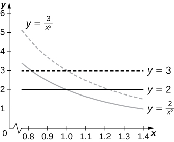 

Evaluate the triple integral <math xmlns="http://www.w3.org/1998/Math/MathML"><mrow><mstyle displaystyle="true"><mrow><munderover><mo stretchy="false">∫</mo><mn>0</mn><mn>1</mn></munderover><mspace width="0.2em" /><mrow><mstyle displaystyle="true"><mrow><munderover><mo stretchy="false">∫</mo><mn>1</mn><mn>2</mn></munderover><mspace width="0.2em" /><mrow><mstyle displaystyle="true"><mrow><munderover><mo stretchy="false">∫</mo><mi>z</mi><mrow><mi>z</mi><mo>+</mo><mn>1</mn></mrow></munderover><mrow><mrow><mo>(</mo><mrow><mi>y</mi><mo>+</mo><mn>1</mn></mrow><mo>)</mo></mrow><mi>d</mi><mi>x</mi><mspace width="0.2em" /><mi>d</mi><mi>y</mi><mspace width="0.2em" /><mi>d</mi><mi>z</mi></mrow></mrow></mstyle></mrow></mrow></mstyle></mrow></mrow></mstyle></mrow></math>

 by using the transformation <math xmlns="http://www.w3.org/1998/Math/MathML"><mrow><mi>u</mi><mo>=</mo><mi>x</mi><mo>−</mo><mi>z</mi><mo>,</mo></mrow></math>

 <math xmlns="http://www.w3.org/1998/Math/MathML"><mrow><mi>v</mi><mo>=</mo><mn>3</mn><mi>y</mi><mo>,</mo><mtext>and</mtext><mspace width="0.2em" /><mi>w</mi><mo>=</mo><mfrac><mi>z</mi><mn>2</mn></mfrac><mo>.</mo></mrow></math>

Evaluate the triple integral <math xmlns="http://www.w3.org/1998/Math/MathML"><mrow><mstyle displaystyle="true"><mrow><munderover><mo stretchy="false">∫</mo><mn>0</mn><mn>2</mn></munderover><mspace width="0.2em" /><mrow><mstyle displaystyle="true"><mrow><munderover><mo stretchy="false">∫</mo><mn>4</mn><mn>6</mn></munderover><mspace width="0.2em" /><mrow><mstyle displaystyle="true"><mrow><munderover><mo stretchy="false">∫</mo><mrow><mn>3</mn><mi>z</mi></mrow><mrow><mn>3</mn><mi>z</mi><mo>+</mo><mn>2</mn></mrow></munderover><mrow><mrow><mo>(</mo><mrow><mn>5</mn><mo>−</mo><mn>4</mn><mi>y</mi></mrow><mo>)</mo></mrow><mi>d</mi><mi>x</mi><mspace width="0.2em" /><mi>d</mi><mi>z</mi><mspace width="0.2em" /><mi>d</mi><mi>y</mi></mrow></mrow></mstyle></mrow></mrow></mstyle></mrow></mrow></mstyle></mrow></math>

 by using the transformation <math xmlns="http://www.w3.org/1998/Math/MathML"><mrow><mi>u</mi><mo>=</mo><mi>x</mi><mo>−</mo><mn>3</mn><mi>z</mi><mo>,</mo><mi>v</mi><mo>=</mo><mn>4</mn><mi>y</mi><mo>,</mo><mtext>and</mtext><mspace width="0.2em" /><mi>w</mi><mo>=</mo><mi>z</mi><mo>.</mo></mrow></math>

<math xmlns="http://www.w3.org/1998/Math/MathML"><mn>8</mn></math>

A transformation <math xmlns="http://www.w3.org/1998/Math/MathML"><mrow><mi>T</mi><mo>:</mo><msup><mtext>R</mtext><mn>2</mn></msup><mo stretchy="false">→</mo><msup><mtext>R</mtext><mn>2</mn></msup><mo>,</mo><mi>T</mi><mrow><mo>(</mo><mrow><mi>u</mi><mo>,</mo><mi>v</mi></mrow><mo>)</mo></mrow><mo>=</mo><mrow><mo>(</mo><mrow><mi>x</mi><mo>,</mo><mi>y</mi></mrow><mo>)</mo></mrow></mrow></math>

 of the form <math xmlns="http://www.w3.org/1998/Math/MathML"><mrow><mi>x</mi><mo>=</mo><mi>a</mi><mi>u</mi><mo>+</mo><mi>b</mi><mi>v</mi><mo>,</mo><mi>y</mi><mo>=</mo><mi>c</mi><mi>u</mi><mo>+</mo><mi>d</mi><mi>v</mi><mo>,</mo></mrow></math>

 where <math xmlns="http://www.w3.org/1998/Math/MathML"><mrow><mi>a</mi><mo>,</mo><mi>b</mi><mo>,</mo><mi>c</mi><mo>,</mo><mtext>and</mtext><mspace width="0.2em" /><mi>d</mi></mrow></math>

 are real numbers, is called linear. Show that a linear transformation for which <math xmlns="http://www.w3.org/1998/Math/MathML"><mrow><mi>a</mi><mi>d</mi><mo>−</mo><mi>b</mi><mi>c</mi><mo>≠</mo><mn>0</mn></mrow></math>

 maps parallelograms to parallelograms.

The transformation <math xmlns="http://www.w3.org/1998/Math/MathML"><mrow><msub><mi>T</mi><mi>θ</mi></msub><mo>:</mo><msup><mtext>R</mtext><mn>2</mn></msup><mo stretchy="false">→</mo><msup><mtext>R</mtext><mn>2</mn></msup><mo>,</mo><msub><mi>T</mi><mi>θ</mi></msub><mrow><mo>(</mo><mrow><mi>u</mi><mo>,</mo><mi>v</mi></mrow><mo>)</mo></mrow><mo>=</mo><mrow><mo>(</mo><mrow><mi>x</mi><mo>,</mo><mi>y</mi></mrow><mo>)</mo></mrow><mo>,</mo></mrow></math>

 where <math xmlns="http://www.w3.org/1998/Math/MathML"><mrow><mi>x</mi><mo>=</mo><mi>u</mi><mspace width="0.2em" /><mtext>cos</mtext><mspace width="0.2em" /><mi>θ</mi><mo>−</mo><mi>v</mi><mspace width="0.2em" /><mtext>sin</mtext><mspace width="0.2em" /><mi>θ</mi><mo>,</mo></mrow></math>

 <math xmlns="http://www.w3.org/1998/Math/MathML"><mrow><mi>y</mi><mo>=</mo><mi>u</mi><mspace width="0.2em" /><mtext>sin</mtext><mspace width="0.2em" /><mi>θ</mi><mo>+</mo><mi>v</mi><mspace width="0.2em" /><mtext>cos</mtext><mspace width="0.2em" /><mi>θ</mi><mo>,</mo></mrow></math>

 is called a rotation of angle <math xmlns="http://www.w3.org/1998/Math/MathML"><mi>θ</mi><mo>.</mo></math>

 Show that the inverse transformation of <math xmlns="http://www.w3.org/1998/Math/MathML"><mrow><msub><mi>T</mi><mi>θ</mi></msub></mrow></math>

 satisfies <math xmlns="http://www.w3.org/1998/Math/MathML"><mrow><msub><mi>T</mi><mi>θ</mi></msub><msup><mrow /><mrow><mn>−1</mn></mrow></msup><mo>=</mo><msub><mi>T</mi><mrow><mtext>−</mtext><mi>θ</mi></mrow></msub><mo>,</mo></mrow></math>

 where <math xmlns="http://www.w3.org/1998/Math/MathML"><mrow><msub><mi>T</mi><mrow><mtext>−</mtext><mi>θ</mi></mrow></msub></mrow></math>

 is the rotation of angle <math xmlns="http://www.w3.org/1998/Math/MathML"><mrow><mtext>−</mtext><mi>θ</mi><mo>.</mo></mrow></math>

**[T]** Find the region <math xmlns="http://www.w3.org/1998/Math/MathML"><mi>S</mi></math>

 in the <math xmlns="http://www.w3.org/1998/Math/MathML"><mrow><mi>u</mi><mi>v</mi><mtext>-plane</mtext></mrow></math>

 whose image through a rotation of angle <math xmlns="http://www.w3.org/1998/Math/MathML"><mrow><mfrac><mi>π</mi><mn>4</mn></mfrac></mrow></math>

 is the region <math xmlns="http://www.w3.org/1998/Math/MathML"><mi>R</mi></math>

 enclosed by the ellipse <math xmlns="http://www.w3.org/1998/Math/MathML"><mrow><msup><mi>x</mi><mn>2</mn></msup><mo>+</mo><mn>4</mn><msup><mi>y</mi><mn>2</mn></msup><mo>=</mo><mn>1</mn><mo>.</mo></mrow></math>

 Use a CAS to answer the following questions.

1.  Graph the region
    <math xmlns="http://www.w3.org/1998/Math/MathML"><mi>S</mi><mo>.</mo></math>

2.  Evaluate the integral
    <math xmlns="http://www.w3.org/1998/Math/MathML"><mrow><mstyle displaystyle="true"><mrow><munder><mo>∬</mo><mi>S</mi></munder><mrow><msup><mi>e</mi><mrow><mn>−2</mn><mi>u</mi><mi>v</mi></mrow></msup><mi>d</mi><mi>u</mi><mspace width="0.2em" /><mi>d</mi><mi>v</mi></mrow></mrow></mstyle><mo>.</mo></mrow></math>
    
    Round your answer to two decimal places.
{: data-number-style="lower-alpha"}

**[T]** The transformations <math xmlns="http://www.w3.org/1998/Math/MathML"><mrow><msub><mi>T</mi><mi>i</mi></msub><mo>:</mo><msup><mi>ℝ</mi><mn>2</mn></msup><mo stretchy="false">→</mo><msup><mi>ℝ</mi><mn>2</mn></msup><mo>,</mo></mrow></math>

 <math xmlns="http://www.w3.org/1998/Math/MathML"><mrow><mi>i</mi><mo>=</mo><mn>1</mn><mtext>,…,</mtext><mspace width="0.2em" /><mn>4</mn><mo>,</mo></mrow></math>

 defined by <math xmlns="http://www.w3.org/1998/Math/MathML"><mrow><msub><mi>T</mi><mn>1</mn></msub><mrow><mo>(</mo><mrow><mi>u</mi><mo>,</mo><mi>v</mi></mrow><mo>)</mo></mrow><mo>=</mo><mrow><mo>(</mo><mrow><mi>u</mi><mo>,</mo><mtext>−</mtext><mi>v</mi></mrow><mo>)</mo></mrow><mo>,</mo></mrow></math>

 <math xmlns="http://www.w3.org/1998/Math/MathML"><mrow><msub><mi>T</mi><mn>2</mn></msub><mrow><mo>(</mo><mrow><mi>u</mi><mo>,</mo><mi>v</mi></mrow><mo>)</mo></mrow><mo>=</mo><mrow><mo>(</mo><mrow><mtext>−</mtext><mi>u</mi><mo>,</mo><mi>v</mi></mrow><mo>)</mo></mrow><mo>,</mo><msub><mi>T</mi><mn>3</mn></msub><mrow><mo>(</mo><mrow><mi>u</mi><mo>,</mo><mi>v</mi></mrow><mo>)</mo></mrow><mo>=</mo><mrow><mo>(</mo><mrow><mtext>−</mtext><mi>u</mi><mo>,</mo><mtext>−</mtext><mi>v</mi></mrow><mo>)</mo></mrow><mo>,</mo></mrow></math>

 and <math xmlns="http://www.w3.org/1998/Math/MathML"><mrow><msub><mi>T</mi><mn>4</mn></msub><mrow><mo>(</mo><mrow><mi>u</mi><mo>,</mo><mi>v</mi></mrow><mo>)</mo></mrow><mo>=</mo><mrow><mo>(</mo><mrow><mi>v</mi><mo>,</mo><mi>u</mi></mrow><mo>)</mo></mrow></mrow></math>

 are called reflections about the <math xmlns="http://www.w3.org/1998/Math/MathML"><mrow><mi>x</mi><mtext>-axis</mtext><mo>,</mo><mi>y</mi><mtext>-axis</mtext><mo>,</mo></mrow></math>

 origin, and the line <math xmlns="http://www.w3.org/1998/Math/MathML"><mrow><mi>y</mi><mo>=</mo><mi>x</mi><mo>,</mo></mrow></math>

 respectively.

1.  Find the image of the region
    <math xmlns="http://www.w3.org/1998/Math/MathML"><mrow><mi>S</mi><mo>=</mo><mrow><mo>{</mo><mrow><mrow><mrow><mrow><mo>(</mo><mrow><mi>u</mi><mo>,</mo><mi>v</mi></mrow><mo>)</mo></mrow></mrow><mo>\|</mo></mrow><msup><mi>u</mi><mn>2</mn></msup><mo>+</mo><msup><mi>v</mi><mn>2</mn></msup><mo>−</mo><mn>2</mn><mi>u</mi><mo>−</mo><mn>4</mn><mi>v</mi><mo>+</mo><mn>1</mn><mo>≤</mo><mn>0</mn></mrow><mo>}</mo></mrow></mrow></math>
    
    in the
    <math xmlns="http://www.w3.org/1998/Math/MathML"><mrow><mi>x</mi><mi>y</mi><mtext>-plane</mtext></mrow></math>
    
    through the transformation
    <math xmlns="http://www.w3.org/1998/Math/MathML"><mrow><msub><mi>T</mi><mn>1</mn></msub><mo>∘</mo><msub><mi>T</mi><mn>2</mn></msub><mo>∘</mo><msub><mi>T</mi><mn>3</mn></msub><mo>∘</mo><msub><mi>T</mi><mn>4</mn></msub><mo>.</mo></mrow></math>

2.  Use a CAS to graph
    <math xmlns="http://www.w3.org/1998/Math/MathML"><mi>R</mi><mo>.</mo></math>

3.  Evaluate the integral
    <math xmlns="http://www.w3.org/1998/Math/MathML"><mrow><mstyle displaystyle="true"><mrow><munder><mo>∬</mo><mi>S</mi></munder><mrow><mtext>sin</mtext><mo stretchy="false">(</mo><msup><mi>u</mi><mn>2</mn></msup><mo stretchy="false">)</mo><mi>d</mi><mi>u</mi><mspace width="0.2em" /><mi>d</mi><mi>v</mi></mrow></mrow></mstyle></mrow></math>
    
    by using a CAS. Round your answer to two decimal places.
{: data-number-style="lower-alpha"}

a. <math xmlns="http://www.w3.org/1998/Math/MathML"><mrow><mi>R</mi><mo>=</mo><mrow><mo>{</mo><mrow><mrow><mo>(</mo><mrow><mi>x</mi><mo>,</mo><mi>y</mi></mrow><mo>)</mo></mrow><mo>\|</mo><msup><mi>y</mi><mn>2</mn></msup><mo>+</mo><msup><mi>x</mi><mn>2</mn></msup><mo>−</mo><mn>2</mn><mi>y</mi><mo>−</mo><mn>4</mn><mi>x</mi><mo>+</mo><mn>1</mn><mo>≤</mo><mn>0</mn></mrow><mo>}</mo></mrow><mo>;</mo></mrow></math>

 b. <math xmlns="http://www.w3.org/1998/Math/MathML"><mi>R</mi></math>

 is graphed in the following figure;* * *
{: data-type="newline"}

 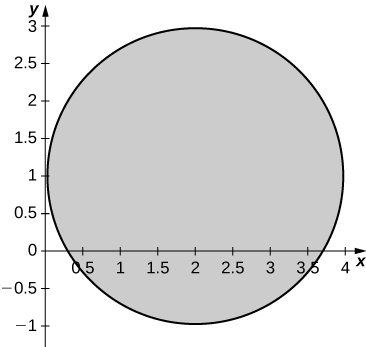 
* * *
{: data-type="newline"}

 c. <math xmlns="http://www.w3.org/1998/Math/MathML"><mrow><mn>3.16</mn></mrow></math>

**[T]** The transformation <math xmlns="http://www.w3.org/1998/Math/MathML"><mrow><msub><mi>T</mi><mrow><mi>k</mi><mo>,</mo><mn>1</mn><mo>,</mo><mn>1</mn></mrow></msub><mo>:</mo><msup><mi>ℝ</mi><mn>3</mn></msup><mo stretchy="false">→</mo><msup><mi>ℝ</mi><mn>3</mn></msup><mo>,</mo><msub><mi>T</mi><mrow><mi>k</mi><mo>,</mo><mn>1</mn><mo>,</mo><mn>1</mn></mrow></msub><mrow><mo>(</mo><mrow><mi>u</mi><mo>,</mo><mi>v</mi><mo>,</mo><mi>w</mi></mrow><mo>)</mo></mrow><mo>=</mo><mrow><mo>(</mo><mrow><mi>x</mi><mo>,</mo><mi>y</mi><mo>,</mo><mi>z</mi></mrow><mo>)</mo></mrow></mrow></math>

 of the form <math xmlns="http://www.w3.org/1998/Math/MathML"><mrow><mi>x</mi><mo>=</mo><mi>k</mi><mi>u</mi><mo>,</mo></mrow></math>

 <math xmlns="http://www.w3.org/1998/Math/MathML"><mrow><mi>y</mi><mo>=</mo><mi>v</mi><mo>,</mo><mi>z</mi><mo>=</mo><mi>w</mi><mo>,</mo></mrow></math>

 where <math xmlns="http://www.w3.org/1998/Math/MathML"><mrow><mi>k</mi><mo>≠</mo><mn>1</mn></mrow></math>

 is a positive real number, is called a stretch if <math xmlns="http://www.w3.org/1998/Math/MathML"><mrow><mi>k</mi><mo>&gt;</mo><mn>1</mn></mrow></math>

 and a compression if <math xmlns="http://www.w3.org/1998/Math/MathML"><mrow><mn>0</mn><mo>&lt;</mo><mi>k</mi><mo>&lt;</mo><mn>1</mn></mrow></math>

 in the <math xmlns="http://www.w3.org/1998/Math/MathML"><mrow><mi>x</mi><mtext>-direction</mtext><mtext>.</mtext></mrow></math>

 Use a CAS to evaluate the integral <math xmlns="http://www.w3.org/1998/Math/MathML"><mrow><mstyle displaystyle="true"><mrow><munder><mo>∭</mo><mi>S</mi></munder><mrow><msup><mi>e</mi><mrow><mtext>−</mtext><mrow><mo>(</mo><mrow><mn>4</mn><msup><mi>x</mi><mn>2</mn></msup><mo>+</mo><mn>9</mn><msup><mi>y</mi><mn>2</mn></msup><mo>+</mo><mn>25</mn><msup><mi>z</mi><mn>2</mn></msup></mrow><mo>)</mo></mrow></mrow></msup></mrow></mrow></mstyle><mi>d</mi><mi>x</mi><mspace width="0.2em" /><mi>d</mi><mi>y</mi><mspace width="0.2em" /><mi>d</mi><mi>z</mi></mrow></math>

 on the solid <math xmlns="http://www.w3.org/1998/Math/MathML"><mrow><mi>S</mi><mo>=</mo><mrow><mo>{</mo><mrow><mrow><mrow><mrow><mo>(</mo><mrow><mi>x</mi><mo>,</mo><mi>y</mi><mo>,</mo><mi>z</mi></mrow><mo>)</mo></mrow></mrow><mo>\|</mo></mrow><mn>4</mn><msup><mi>x</mi><mn>2</mn></msup><mo>+</mo><mn>9</mn><msup><mi>y</mi><mn>2</mn></msup><mo>+</mo><mn>25</mn><msup><mi>z</mi><mn>2</mn></msup><mo>≤</mo><mn>1</mn></mrow><mo>}</mo></mrow></mrow></math>

 by considering the compression <math xmlns="http://www.w3.org/1998/Math/MathML"><mrow><msub><mi>T</mi><mrow><mn>2</mn><mo>,</mo><mn>3</mn><mo>,</mo><mn>5</mn></mrow></msub><mrow><mo>(</mo><mrow><mi>u</mi><mo>,</mo><mi>v</mi><mo>,</mo><mi>w</mi></mrow><mo>)</mo></mrow><mo>=</mo><mrow><mo>(</mo><mrow><mi>x</mi><mo>,</mo><mi>y</mi><mo>,</mo><mi>z</mi></mrow><mo>)</mo></mrow></mrow></math>

 defined by <math xmlns="http://www.w3.org/1998/Math/MathML"><mrow><mi>x</mi><mo>=</mo><mfrac><mi>u</mi><mn>2</mn></mfrac><mo>,</mo><mi>y</mi><mo>=</mo><mfrac><mi>v</mi><mn>3</mn></mfrac><mo>,</mo></mrow></math>

 and <math xmlns="http://www.w3.org/1998/Math/MathML"><mrow><mi>z</mi><mo>=</mo><mfrac><mi>w</mi><mn>5</mn></mfrac><mo>.</mo></mrow></math>

 Round your answer to four decimal places.

**[T]** The transformation <math xmlns="http://www.w3.org/1998/Math/MathML"><mrow><msub><mi>T</mi><mrow><mi>a</mi><mo>,</mo><mn>0</mn></mrow></msub><mo>:</mo><msup><mi>ℝ</mi><mn>2</mn></msup><mo stretchy="false">→</mo><msup><mi>ℝ</mi><mn>2</mn></msup><mo>,</mo><msub><mi>T</mi><mrow><mi>a</mi><mo>,</mo><mn>0</mn></mrow></msub><mrow><mo>(</mo><mrow><mi>u</mi><mo>,</mo><mi>v</mi></mrow><mo>)</mo></mrow><mo>=</mo><mrow><mo>(</mo><mrow><mi>u</mi><mo>+</mo><mi>a</mi><mi>v</mi><mo>,</mo><mi>v</mi></mrow><mo>)</mo></mrow><mo>,</mo></mrow></math>

 where <math xmlns="http://www.w3.org/1998/Math/MathML"><mrow><mi>a</mi><mo>≠</mo><mn>0</mn></mrow></math>

 is a real number, is called a shear in the <math xmlns="http://www.w3.org/1998/Math/MathML"><mrow><mi>x</mi><mtext>-direction</mtext><mtext>.</mtext></mrow></math>

 The transformation, <math xmlns="http://www.w3.org/1998/Math/MathML"><mrow><msub><mi>T</mi><mrow><mi>b</mi><mo>,</mo><mn>0</mn></mrow></msub><mo>:</mo><msup><mtext>R</mtext><mn>2</mn></msup><mo stretchy="false">→</mo><msup><mtext>R</mtext><mn>2</mn></msup><mo>,</mo><msub><mi>T</mi><mrow><mi>o</mi><mo>,</mo><mi>b</mi></mrow></msub><mrow><mo>(</mo><mrow><mi>u</mi><mo>,</mo><mi>v</mi></mrow><mo>)</mo></mrow><mo>=</mo><mrow><mo>(</mo><mrow><mi>u</mi><mo>,</mo><mi>b</mi><mi>u</mi><mo>+</mo><mi>v</mi></mrow><mo>)</mo></mrow><mo>,</mo></mrow></math>

 where <math xmlns="http://www.w3.org/1998/Math/MathML"><mrow><mi>b</mi><mo>≠</mo><mn>0</mn></mrow></math>

 is a real number, is called a shear in the <math xmlns="http://www.w3.org/1998/Math/MathML"><mrow><mi>y</mi><mtext>-direction</mtext><mtext>.</mtext></mrow></math>

1.  Find transformations
    <math xmlns="http://www.w3.org/1998/Math/MathML"><mrow><msub><mi>T</mi><mrow><mn>0</mn><mo>,</mo><mn>2</mn></mrow></msub><mo>∘</mo><msub><mi>T</mi><mrow><mn>3</mn><mo>,</mo><mn>0</mn></mrow></msub><mo>.</mo></mrow></math>

2.  Find the image
    <math xmlns="http://www.w3.org/1998/Math/MathML"><mi>R</mi></math>
    
    of the trapezoidal region
    <math xmlns="http://www.w3.org/1998/Math/MathML"><mi>S</mi></math>
    
    bounded by
    <math xmlns="http://www.w3.org/1998/Math/MathML"><mrow><mi>u</mi><mo>=</mo><mn>0</mn><mo>,</mo><mi>v</mi><mo>=</mo><mn>0</mn><mo>,</mo><mi>v</mi><mo>=</mo><mn>1</mn><mo>,</mo></mrow></math>
    
    and
    <math xmlns="http://www.w3.org/1998/Math/MathML"><mrow><mi>v</mi><mo>=</mo><mn>2</mn><mo>−</mo><mi>u</mi></mrow></math>
    
    through the transformation
    <math xmlns="http://www.w3.org/1998/Math/MathML"><mrow><msub><mi>T</mi><mrow><mn>0</mn><mo>,</mo><mn>2</mn></mrow></msub><mo>∘</mo><msub><mi>T</mi><mrow><mn>3</mn><mo>,</mo><mn>0</mn></mrow></msub><mo>.</mo></mrow></math>

3.  Use a CAS to graph the image
    <math xmlns="http://www.w3.org/1998/Math/MathML"><mi>R</mi></math>
    
    in the
    <math xmlns="http://www.w3.org/1998/Math/MathML"><mrow><mi>x</mi><mi>y</mi><mtext>-plane</mtext><mtext>.</mtext></mrow></math>

4.  Find the area of the region
    <math xmlns="http://www.w3.org/1998/Math/MathML"><mi>R</mi></math>
    
    by using the area of region
    <math xmlns="http://www.w3.org/1998/Math/MathML"><mi>S</mi><mo>.</mo></math>
{: data-number-style="lower-alpha"}

a. <math xmlns="http://www.w3.org/1998/Math/MathML"><mrow><msub><mi>T</mi><mrow><mn>0</mn><mo>,</mo><mn>2</mn></mrow></msub><mo>∘</mo><msub><mi>T</mi><mrow><mn>3</mn><mo>,</mo><mn>0</mn></mrow></msub><mrow><mo>(</mo><mrow><mi>u</mi><mo>,</mo><mi>v</mi></mrow><mo>)</mo></mrow><mo>=</mo><mrow><mo>(</mo><mrow><mi>u</mi><mo>+</mo><mn>3</mn><mi>v</mi><mo>,</mo><mn>2</mn><mi>u</mi><mo>+</mo><mn>7</mn><mi>v</mi></mrow><mo>)</mo></mrow><mo>;</mo></mrow></math>

 b. The image <math xmlns="http://www.w3.org/1998/Math/MathML"><mi>S</mi></math>

 is the quadrilateral of vertices <math xmlns="http://www.w3.org/1998/Math/MathML"><mrow><mrow><mo>(</mo><mrow><mn>0</mn><mo>,</mo><mn>0</mn></mrow><mo>)</mo></mrow><mo>,</mo><mrow><mo>(</mo><mrow><mn>3</mn><mo>,</mo><mn>7</mn></mrow><mo>)</mo></mrow><mo>,</mo><mrow><mo>(</mo><mrow><mn>2</mn><mo>,</mo><mn>4</mn></mrow><mo>)</mo></mrow><mo>,</mo><mtext>and</mtext><mspace width="0.2em" /><mrow><mo>(</mo><mrow><mn>4</mn><mo>,</mo><mn>9</mn></mrow><mo>)</mo></mrow><mo>;</mo></mrow></math>

 c. <math xmlns="http://www.w3.org/1998/Math/MathML"><mi>S</mi></math>

 is graphed in the following figure;* * *
{: data-type="newline"}

 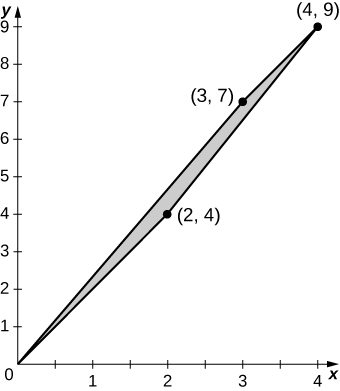 
* * *
{: data-type="newline"}

 d. <math xmlns="http://www.w3.org/1998/Math/MathML"><mrow><mfrac><mn>3</mn><mn>2</mn></mfrac></mrow></math>

Use the transformation, <math xmlns="http://www.w3.org/1998/Math/MathML"><mrow><mi>x</mi><mo>=</mo><mi>a</mi><mi>u</mi><mo>,</mo><mi>y</mi><mo>=</mo><mi>a</mi><mi>v</mi><mo>,</mo><mi>z</mi><mo>=</mo><mi>c</mi><mi>w</mi></mrow></math>

 and spherical coordinates to show that the volume of a region bounded by the spheroid <math xmlns="http://www.w3.org/1998/Math/MathML"><mrow><mfrac><mrow><msup><mi>x</mi><mn>2</mn></msup><mo>+</mo><msup><mi>y</mi><mn>2</mn></msup></mrow><mrow><msup><mi>a</mi><mn>2</mn></msup></mrow></mfrac><mo>+</mo><mfrac><mrow><msup><mi>z</mi><mn>2</mn></msup></mrow><mrow><msup><mi>c</mi><mn>2</mn></msup></mrow></mfrac><mo>=</mo><mn>1</mn></mrow></math>

 is <math xmlns="http://www.w3.org/1998/Math/MathML"><mrow><mfrac><mrow><mn>4</mn><mi>π</mi><msup><mi>a</mi><mn>2</mn></msup><mi>c</mi></mrow><mn>3</mn></mfrac><mo>.</mo></mrow></math>

Find the volume of a football whose shape is a spheroid <math xmlns="http://www.w3.org/1998/Math/MathML"><mrow><mfrac><mrow><msup><mi>x</mi><mn>2</mn></msup><mo>+</mo><msup><mi>y</mi><mn>2</mn></msup></mrow><mrow><msup><mi>a</mi><mn>2</mn></msup></mrow></mfrac><mo>+</mo><mfrac><mrow><msup><mi>z</mi><mn>2</mn></msup></mrow><mrow><msup><mi>c</mi><mn>2</mn></msup></mrow></mfrac><mo>=</mo><mn>1</mn></mrow></math>

 whose length from tip to tip is <math xmlns="http://www.w3.org/1998/Math/MathML"><mrow><mn>11</mn></mrow></math>

 inches and circumference at the center is <math xmlns="http://www.w3.org/1998/Math/MathML"><mrow><mn>22</mn></mrow></math>

 inches. Round your answer to two decimal places.

<math xmlns="http://www.w3.org/1998/Math/MathML"><mrow><mfrac><mrow><mn>2662</mn></mrow><mrow><mn>3</mn><mi>π</mi></mrow></mfrac><mo>≃</mo><mn>282.45</mn><msup><mrow><mspace width="0.2em" /><mtext>in</mtext></mrow><mn>3</mn></msup></mrow></math>

**[T]** Lamé ovals (or superellipses) are plane curves of equations <math xmlns="http://www.w3.org/1998/Math/MathML"><mrow><msup><mrow><mrow><mo>(</mo><mrow><mfrac><mi>x</mi><mi>a</mi></mfrac></mrow><mo>)</mo></mrow></mrow><mi>n</mi></msup><mo>+</mo><msup><mrow><mrow><mo>(</mo><mrow><mfrac><mi>y</mi><mi>b</mi></mfrac></mrow><mo>)</mo></mrow></mrow><mi>n</mi></msup><mo>=</mo><mn>1</mn><mo>,</mo></mrow></math>

 where *a*, *b*, and *n* are positive real numbers.

1.  Use a CAS to graph the regions
    <math xmlns="http://www.w3.org/1998/Math/MathML"><mi>R</mi></math>
    
    bounded by Lamé ovals for
    <math xmlns="http://www.w3.org/1998/Math/MathML"><mrow><mi>a</mi><mo>=</mo><mn>1</mn><mo>,</mo><mi>b</mi><mo>=</mo><mn>2</mn><mo>,</mo><mi>n</mi><mo>=</mo><mn>4</mn></mrow></math>
    
    and
    <math xmlns="http://www.w3.org/1998/Math/MathML"><mrow><mi>n</mi><mo>=</mo><mn>6</mn><mo>,</mo></mrow></math>
    
    respectively.
2.  Find the transformations that map the region
    <math xmlns="http://www.w3.org/1998/Math/MathML"><mi>R</mi></math>
    
    bounded by the Lamé oval
    <math xmlns="http://www.w3.org/1998/Math/MathML"><mrow><msup><mi>x</mi><mn>4</mn></msup><mo>+</mo><msup><mi>y</mi><mn>4</mn></msup><mo>=</mo><mn>1</mn><mo>,</mo></mrow></math>
    
    also called a squircle and graphed in the following figure, into the unit disk.
    * * *
    {: data-type="newline"}
    
    

    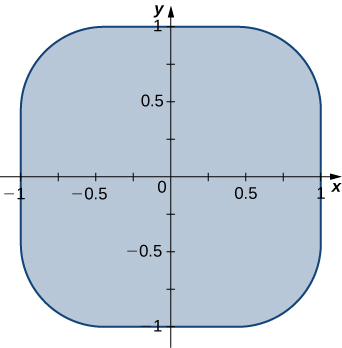
    

3.  Use a CAS to find an approximation of the area
    <math xmlns="http://www.w3.org/1998/Math/MathML"><mrow><mi>A</mi><mrow><mo>(</mo><mi>R</mi><mo>)</mo></mrow></mrow></math>
    
    of the region
    <math xmlns="http://www.w3.org/1998/Math/MathML"><mi>R</mi></math>
    
    bounded by
    <math xmlns="http://www.w3.org/1998/Math/MathML"><mrow><msup><mi>x</mi><mn>4</mn></msup><mo>+</mo><msup><mi>y</mi><mn>4</mn></msup><mo>=</mo><mn>1</mn><mo>.</mo></mrow></math>
    
    Round your answer to two decimal places.
{: data-number-style="lower-alpha"}

**[T]** Lamé ovals have been consistently used by designers and architects. For instance, Gerald Robinson, a Canadian architect, has designed a parking garage in a shopping center in Peterborough, Ontario, in the shape of a superellipse of the equation <math xmlns="http://www.w3.org/1998/Math/MathML"><mrow><msup><mrow><mrow><mo>(</mo><mrow><mfrac><mi>x</mi><mi>a</mi></mfrac></mrow><mo>)</mo></mrow></mrow><mi>n</mi></msup><mo>+</mo><msup><mrow><mrow><mo>(</mo><mrow><mfrac><mi>y</mi><mi>b</mi></mfrac></mrow><mo>)</mo></mrow></mrow><mi>n</mi></msup><mo>=</mo><mn>1</mn></mrow></math>

 with <math xmlns="http://www.w3.org/1998/Math/MathML"><mrow><mfrac><mi>a</mi><mi>b</mi></mfrac><mo>=</mo><mfrac><mn>9</mn><mn>7</mn></mfrac></mrow></math>

 and <math xmlns="http://www.w3.org/1998/Math/MathML"><mrow><mi>n</mi><mo>=</mo><mi>e</mi><mo>.</mo></mrow></math>

 Use a CAS to find an approximation of the area of the parking garage in the case <math xmlns="http://www.w3.org/1998/Math/MathML"><mrow><mi>a</mi><mo>=</mo><mn>900</mn></mrow></math>

 yards, <math xmlns="http://www.w3.org/1998/Math/MathML"><mrow><mi>b</mi><mo>=</mo><mn>700</mn></mrow></math>

 yards, and <math xmlns="http://www.w3.org/1998/Math/MathML"><mrow><mi>n</mi><mo>=</mo><mn>2.72</mn></mrow></math>

 yards.

<math xmlns="http://www.w3.org/1998/Math/MathML"><mrow><mi>A</mi><mrow><mo>(</mo><mi>R</mi><mo>)</mo></mrow><mo>≃</mo><mn>83,999.2</mn></mrow></math>

</section>

### Chapter Review Exercises

*True or False?* Justify your answer with a proof or a counterexample.

<math xmlns="http://www.w3.org/1998/Math/MathML"><mrow><mstyle displaystyle="true"><mrow><munderover><mo stretchy="false">∫</mo><mi>a</mi><mi>b</mi></munderover><mspace width="0.2em" /><mrow><mstyle displaystyle="true"><mrow><munderover><mo stretchy="false">∫</mo><mi>c</mi><mi>d</mi></munderover><mrow><mi>f</mi><mrow><mo>(</mo><mrow><mi>x</mi><mo>,</mo><mi>y</mi></mrow><mo>)</mo></mrow><mi>d</mi><mi>y</mi><mspace width="0.2em" /><mi>d</mi><mi>x</mi></mrow></mrow></mstyle><mo>=</mo></mrow></mrow></mstyle><mstyle displaystyle="true"><mrow><munderover><mo stretchy="false">∫</mo><mi>c</mi><mi>d</mi></munderover><mspace width="0.2em" /><mrow><mstyle displaystyle="true"><mrow><munderover><mo stretchy="false">∫</mo><mi>a</mi><mi>b</mi></munderover><mrow><mi>f</mi><mrow><mo>(</mo><mrow><mi>x</mi><mo>,</mo><mi>y</mi></mrow><mo>)</mo></mrow><mi>d</mi><mi>y</mi><mspace width="0.2em" /><mi>d</mi><mi>x</mi></mrow></mrow></mstyle></mrow></mrow></mstyle></mrow></math>

Fubini’s theorem can be extended to three dimensions, as long as <math xmlns="http://www.w3.org/1998/Math/MathML"><mi>f</mi></math>

 is continuous in all variables.

True.

The integral <math xmlns="http://www.w3.org/1998/Math/MathML"><mrow><mstyle displaystyle="true"><mrow><munderover><mo stretchy="false">∫</mo><mn>0</mn><mrow><mn>2</mn><mi>π</mi></mrow></munderover><mspace width="0.2em" /><mrow><mstyle displaystyle="true"><mrow><munderover><mo stretchy="false">∫</mo><mn>0</mn><mn>1</mn></munderover><mspace width="0.2em" /><mrow><mstyle displaystyle="true"><mrow><munderover><mo stretchy="false">∫</mo><mi>r</mi><mn>1</mn></munderover><mrow><mi>d</mi><mi>z</mi><mspace width="0.2em" /><mi>d</mi><mi>r</mi><mspace width="0.2em" /><mi>d</mi><mi>θ</mi></mrow></mrow></mstyle></mrow></mrow></mstyle></mrow></mrow></mstyle></mrow></math>

 represents the volume of a right cone.

The Jacobian of the transformation for <math xmlns="http://www.w3.org/1998/Math/MathML"><mrow><mi>x</mi><mo>=</mo><msup><mi>u</mi><mn>2</mn></msup><mo>−</mo><mn>2</mn><mi>v</mi><mo>,</mo><mi>y</mi><mo>=</mo><mn>3</mn><mi>v</mi><mo>−</mo><mn>2</mn><mi>u</mi><mi>v</mi></mrow></math>

 is given by <math xmlns="http://www.w3.org/1998/Math/MathML"><mrow><mn>−4</mn><msup><mi>u</mi><mn>2</mn></msup><mo>+</mo><mn>6</mn><mi>u</mi><mo>+</mo><mn>4</mn><mi>v</mi><mo>.</mo></mrow></math>

False.

Evaluate the following integrals.

<math xmlns="http://www.w3.org/1998/Math/MathML"><mrow><mstyle displaystyle="true"><mrow><munder><mo>∬</mo><mi>R</mi></munder><mrow><mrow><mo>(</mo><mrow><mn>5</mn><msup><mi>x</mi><mn>3</mn></msup><msup><mi>y</mi><mn>2</mn></msup><mo>−</mo><msup><mi>y</mi><mn>2</mn></msup></mrow><mo>)</mo></mrow></mrow></mrow></mstyle><mi>d</mi><mi>A</mi><mo>,</mo><mi>R</mi><mo>=</mo><mrow><mo>{</mo><mrow><mrow><mrow><mrow><mo>(</mo><mrow><mi>x</mi><mo>,</mo><mi>y</mi></mrow><mo>)</mo></mrow></mrow><mo>\|</mo></mrow><mn>0</mn><mo>≤</mo><mi>x</mi><mo>≤</mo><mn>2</mn><mo>,</mo><mn>1</mn><mo>≤</mo><mi>y</mi><mo>≤</mo><mn>4</mn></mrow><mo>}</mo></mrow></mrow></math>

<math xmlns="http://www.w3.org/1998/Math/MathML"><mrow><mstyle displaystyle="true"><mrow><munder><mo>∬</mo><mi>D</mi></munder><mrow><mfrac><mi>y</mi><mrow><mn>3</mn><msup><mi>x</mi><mn>2</mn></msup><mo>+</mo><mn>1</mn></mrow></mfrac></mrow></mrow></mstyle><mi>d</mi><mi>A</mi><mo>,</mo><mi>D</mi><mo>=</mo><mrow><mo>{</mo><mrow><mrow><mrow><mrow><mo>(</mo><mrow><mi>x</mi><mo>,</mo><mi>y</mi></mrow><mo>)</mo></mrow></mrow><mo>\|</mo></mrow><mn>0</mn><mo>≤</mo><mi>x</mi><mo>≤</mo><mn>1</mn><mo>,</mo><mtext>−</mtext><mi>x</mi><mo>≤</mo><mi>y</mi><mo>≤</mo><mi>x</mi></mrow><mo>}</mo></mrow></mrow></math>

0

<math xmlns="http://www.w3.org/1998/Math/MathML"><mrow><mstyle displaystyle="true"><mrow><munder><mo>∬</mo><mi>D</mi></munder><mrow><mtext>sin</mtext><mrow><mo>(</mo><mrow><msup><mi>x</mi><mn>2</mn></msup><mo>+</mo><msup><mi>y</mi><mn>2</mn></msup></mrow><mo>)</mo></mrow></mrow></mrow></mstyle><mi>d</mi><mi>A</mi></mrow></math>

 where <math xmlns="http://www.w3.org/1998/Math/MathML"><mi>D</mi></math>

 is a disk of radius <math xmlns="http://www.w3.org/1998/Math/MathML"><mn>2</mn></math>

 centered at the origin

<math xmlns="http://www.w3.org/1998/Math/MathML"><mrow><mstyle displaystyle="true"><mrow><munderover><mo stretchy="false">∫</mo><mn>0</mn><mn>1</mn></munderover><mspace width="0.2em" /><mrow><mstyle displaystyle="true"><mrow><munderover><mo stretchy="false">∫</mo><mi>y</mi><mn>1</mn></munderover><mrow><mi>x</mi><mi>y</mi><msup><mi>e</mi><mrow><msup><mi>x</mi><mn>2</mn></msup></mrow></msup><mi>d</mi><mi>x</mi><mspace width="0.2em" /><mi>d</mi><mi>y</mi></mrow></mrow></mstyle></mrow></mrow></mstyle></mrow></math>

<math xmlns="http://www.w3.org/1998/Math/MathML"><mrow><mfrac><mn>1</mn><mn>4</mn></mfrac></mrow></math>

<math xmlns="http://www.w3.org/1998/Math/MathML"><mrow><mstyle displaystyle="true"><mrow><munderover><mo stretchy="false">∫</mo><mrow><mn>−1</mn></mrow><mn>1</mn></munderover><mspace width="0.2em" /><mrow><mstyle displaystyle="true"><mrow><munderover><mo stretchy="false">∫</mo><mn>0</mn><mi>z</mi></munderover><mspace width="0.2em" /><mrow><mstyle displaystyle="true"><mrow><munderover><mo stretchy="false">∫</mo><mn>0</mn><mrow><mi>x</mi><mo>−</mo><mi>z</mi></mrow></munderover><mrow><mn>6</mn><mi>d</mi><mi>y</mi><mspace width="0.2em" /><mi>d</mi><mi>x</mi><mspace width="0.2em" /><mi>d</mi><mi>z</mi></mrow></mrow></mstyle></mrow></mrow></mstyle></mrow></mrow></mstyle></mrow></math>

<math xmlns="http://www.w3.org/1998/Math/MathML"><mrow><mstyle displaystyle="true"><mrow><munder><mo>∭</mo><mi>R</mi></munder><mrow><mn>3</mn><mi>y</mi><mspace width="0.2em" /><mi>d</mi><mi>V</mi></mrow></mrow></mstyle><mo>,</mo></mrow></math>

 where <math xmlns="http://www.w3.org/1998/Math/MathML"><mrow><mi>R</mi><mo>=</mo><mrow><mo>{</mo><mrow><mrow><mrow><mrow><mo>(</mo><mrow><mi>x</mi><mo>,</mo><mi>y</mi><mo>,</mo><mi>z</mi></mrow><mo>)</mo></mrow></mrow><mo>\|</mo></mrow><mn>0</mn><mo>≤</mo><mi>x</mi><mo>≤</mo><mn>1</mn><mo>,</mo><mn>0</mn><mo>≤</mo><mi>y</mi><mo>≤</mo><mi>x</mi><mo>,</mo><mn>0</mn><mo>≤</mo><mi>z</mi><mo>≤</mo><msqrt><mrow><mn>9</mn><mo>−</mo><msup><mi>y</mi><mn>2</mn></msup></mrow></msqrt></mrow><mo>}</mo></mrow></mrow></math>

1\.475

<math xmlns="http://www.w3.org/1998/Math/MathML"><mrow><mstyle displaystyle="true"><mrow><munderover><mo stretchy="false">∫</mo><mn>0</mn><mn>2</mn></munderover><mspace width="0.2em" /><mrow><mstyle displaystyle="true"><mrow><munderover><mo stretchy="false">∫</mo><mn>0</mn><mrow><mn>2</mn><mi>π</mi></mrow></munderover><mspace width="0.2em" /><mrow><mstyle displaystyle="true"><mrow><munderover><mo stretchy="false">∫</mo><mi>r</mi><mn>1</mn></munderover><mrow><mi>r</mi><mspace width="0.2em" /><mi>d</mi><mi>z</mi><mspace width="0.2em" /><mi>d</mi><mi>θ</mi><mspace width="0.2em" /><mi>d</mi><mi>r</mi></mrow></mrow></mstyle></mrow></mrow></mstyle></mrow></mrow></mstyle></mrow></math>

<math xmlns="http://www.w3.org/1998/Math/MathML"><mrow><mstyle displaystyle="true"><mrow><munderover><mo stretchy="false">∫</mo><mn>0</mn><mrow><mn>2</mn><mi>π</mi></mrow></munderover><mspace width="0.2em" /><mrow><mstyle displaystyle="true"><mrow><munderover><mo stretchy="false">∫</mo><mn>0</mn><mrow><mi>π</mi><mtext>/</mtext><mn>2</mn></mrow></munderover><mspace width="0.2em" /><mrow><mstyle displaystyle="true"><mrow><munderover><mo stretchy="false">∫</mo><mn>1</mn><mn>3</mn></munderover><mrow><msup><mi>ρ</mi><mn>2</mn></msup><mtext>sin</mtext><mo stretchy="false">(</mo><mi>φ</mi><mo stretchy="false">)</mo><mi>d</mi><mi>ρ</mi><mspace width="0.2em" /><mi>d</mi><mi>φ</mi><mspace width="0.2em" /><mi>d</mi><mi>θ</mi></mrow></mrow></mstyle></mrow></mrow></mstyle></mrow></mrow></mstyle></mrow></math>

<math xmlns="http://www.w3.org/1998/Math/MathML"><mrow><mfrac><mrow><mn>52</mn></mrow><mn>3</mn></mfrac><mi>π</mi></mrow></math>

<math xmlns="http://www.w3.org/1998/Math/MathML"><mrow><mstyle displaystyle="true"><mrow><munderover><mo stretchy="false">∫</mo><mn>0</mn><mn>1</mn></munderover><mspace width="0.2em" /><mrow><mstyle displaystyle="true"><mrow><munderover><mo stretchy="false">∫</mo><mrow><mtext>−</mtext><msqrt><mrow><mn>1</mn><mo>−</mo><msup><mi>x</mi><mn>2</mn></msup></mrow></msqrt></mrow><mrow><msqrt><mrow><mn>1</mn><mo>−</mo><msup><mi>x</mi><mn>2</mn></msup></mrow></msqrt></mrow></munderover><mspace width="0.2em" /><mrow><mstyle displaystyle="true"><mrow><munderover><mo stretchy="false">∫</mo><mrow><mtext>−</mtext><msqrt><mrow><mn>1</mn><mo>−</mo><msup><mi>x</mi><mn>2</mn></msup><mo>−</mo><msup><mi>y</mi><mn>2</mn></msup></mrow></msqrt></mrow><mrow><msqrt><mrow><mn>1</mn><mo>−</mo><msup><mi>x</mi><mn>2</mn></msup><mo>−</mo><msup><mi>y</mi><mn>2</mn></msup></mrow></msqrt></mrow></munderover><mrow><mi>d</mi><mi>z</mi></mrow></mrow></mstyle><mspace width="0.2em" /><mi>d</mi><mi>y</mi><mspace width="0.2em" /><mi>d</mi><mi>x</mi></mrow></mrow></mstyle></mrow></mrow></mstyle></mrow></math>

For the following problems, find the specified area or volume.

The area of region enclosed by one petal of <math xmlns="http://www.w3.org/1998/Math/MathML"><mrow><mi>r</mi><mo>=</mo><mtext>cos</mtext><mrow><mo>(</mo><mrow><mn>4</mn><mi>θ</mi></mrow><mo>)</mo></mrow><mo>.</mo></mrow></math>

<math xmlns="http://www.w3.org/1998/Math/MathML"><mrow><mfrac><mi>π</mi><mrow><mn>16</mn></mrow></mfrac></mrow></math>

The volume of the solid that lies between the paraboloid <math xmlns="http://www.w3.org/1998/Math/MathML"><mrow><mi>z</mi><mo>=</mo><mn>2</mn><msup><mi>x</mi><mn>2</mn></msup><mo>+</mo><mn>2</mn><msup><mi>y</mi><mn>2</mn></msup></mrow></math>

 and the plane <math xmlns="http://www.w3.org/1998/Math/MathML"><mrow><mi>z</mi><mo>=</mo><mn>8</mn><mo>.</mo></mrow></math>

The volume of the solid bounded by the cylinder <math xmlns="http://www.w3.org/1998/Math/MathML"><mrow><msup><mi>x</mi><mn>2</mn></msup><mo>+</mo><msup><mi>y</mi><mn>2</mn></msup><mo>=</mo><mn>16</mn></mrow></math>

 and from <math xmlns="http://www.w3.org/1998/Math/MathML"><mrow><mi>z</mi><mo>=</mo><mn>1</mn></mrow></math>

 to <math xmlns="http://www.w3.org/1998/Math/MathML"><mrow><mi>z</mi><mo>+</mo><mi>x</mi><mo>=</mo><mn>2</mn><mo>.</mo></mrow></math>

93\.291

The volume of the intersection between two spheres of radius 1, the top whose center is <math xmlns="http://www.w3.org/1998/Math/MathML"><mrow><mo stretchy="false">(</mo><mn>0</mn><mo>,</mo><mn>0</mn><mo>,</mo><mn>0.25</mn><mo stretchy="false">)</mo></mrow></math>

 and the bottom, which is centered at <math xmlns="http://www.w3.org/1998/Math/MathML"><mrow><mo stretchy="false">(</mo><mn>0</mn><mo>,</mo><mn>0</mn><mo>,</mo><mn>0</mn><mo stretchy="false">)</mo><mo>.</mo></mrow></math>

For the following problems, find the center of mass of the region.

<math xmlns="http://www.w3.org/1998/Math/MathML"><mrow><mi>ρ</mi><mo stretchy="false">(</mo><mi>x</mi><mo>,</mo><mi>y</mi><mo stretchy="false">)</mo><mo>=</mo><mi>x</mi><mi>y</mi></mrow></math>

 on the circle with radius <math xmlns="http://www.w3.org/1998/Math/MathML"><mn>1</mn></math>

 in the first quadrant only.

<math xmlns="http://www.w3.org/1998/Math/MathML"><mrow><mrow><mo>(</mo><mrow><mfrac><mn>8</mn><mrow><mn>15</mn></mrow></mfrac><mo>,</mo><mfrac><mn>8</mn><mrow><mn>15</mn></mrow></mfrac></mrow><mo>)</mo></mrow></mrow></math>

<math xmlns="http://www.w3.org/1998/Math/MathML"><mrow><mi>ρ</mi><mo stretchy="false">(</mo><mi>x</mi><mo>,</mo><mi>y</mi><mo stretchy="false">)</mo><mo>=</mo><mo stretchy="false">(</mo><mi>y</mi><mo>+</mo><mn>1</mn><mo stretchy="false">)</mo><msqrt><mi>x</mi></msqrt></mrow></math>

 in the region bounded by <math xmlns="http://www.w3.org/1998/Math/MathML"><mrow><mi>y</mi><mo>=</mo><msup><mi>e</mi><mi>x</mi></msup><mo>,</mo></mrow></math>

 <math xmlns="http://www.w3.org/1998/Math/MathML"><mrow><mi>y</mi><mo>=</mo><mn>0</mn><mo>,</mo></mrow></math>

 and <math xmlns="http://www.w3.org/1998/Math/MathML"><mrow><mi>x</mi><mo>=</mo><mn>1</mn><mo>.</mo></mrow></math>

<math xmlns="http://www.w3.org/1998/Math/MathML"><mrow><mi>ρ</mi><mo stretchy="false">(</mo><mi>x</mi><mo>,</mo><mi>y</mi><mo>,</mo><mi>z</mi><mo stretchy="false">)</mo><mo>=</mo><mi>z</mi></mrow></math>

 on the inverted cone with radius <math xmlns="http://www.w3.org/1998/Math/MathML"><mn>2</mn></math>

 and height <math xmlns="http://www.w3.org/1998/Math/MathML"><mn>2</mn><mo>.</mo></math>

<math xmlns="http://www.w3.org/1998/Math/MathML"><mrow><mrow><mo>(</mo><mrow><mn>0</mn><mo>,</mo><mn>0</mn><mo>,</mo><mfrac><mn>8</mn><mn>5</mn></mfrac></mrow><mo>)</mo></mrow></mrow></math>

The volume an ice cream cone that is given by the solid above <math xmlns="http://www.w3.org/1998/Math/MathML"><mrow><mi>z</mi><mo>=</mo><msqrt><mrow><mrow><mo>(</mo><mrow><msup><mi>x</mi><mn>2</mn></msup><mo>+</mo><msup><mi>y</mi><mn>2</mn></msup></mrow><mo>)</mo></mrow></mrow></msqrt></mrow></math>

 and below <math xmlns="http://www.w3.org/1998/Math/MathML"><mrow><msup><mi>z</mi><mn>2</mn></msup><mo>+</mo><msup><mi>x</mi><mn>2</mn></msup><mo>+</mo><msup><mi>y</mi><mn>2</mn></msup><mo>=</mo><mi>z</mi><mo>.</mo></mrow></math>

The following problems examine Mount Holly in the state of Michigan. Mount Holly is a landfill that was converted into a ski resort. The shape of Mount Holly can be approximated by a right circular cone of height <math xmlns="http://www.w3.org/1998/Math/MathML"><mrow><mn>1100</mn></mrow></math>

 ft and radius <math xmlns="http://www.w3.org/1998/Math/MathML"><mrow><mn>6000</mn></mrow></math>

 ft.

If the compacted trash used to build Mount Holly on average has a density <math xmlns="http://www.w3.org/1998/Math/MathML"><mrow><mn>400</mn><msup><mrow><mspace width="0.2em" /><mtext>lb/ft</mtext></mrow><mn>3</mn></msup><mo>,</mo></mrow></math>

 find the amount of work required to build the mountain.

<math xmlns="http://www.w3.org/1998/Math/MathML"><mrow><mn>1.452</mn><mi>π</mi><mspace width="0.2em" /><mo>×</mo><mspace width="0.2em" /><msup><mrow><mn>10</mn></mrow><mrow><mn>15</mn></mrow></msup></mrow></math>

 ft-lb

In reality, it is very likely that the trash at the bottom of Mount Holly has become more compacted with all the weight of the above trash. Consider a density function with respect to height: the density at the top of the mountain is still density <math xmlns="http://www.w3.org/1998/Math/MathML"><mrow><mn>400</mn><msup><mrow><mspace width="0.2em" /><mtext>lb/ft</mtext></mrow><mn>3</mn></msup></mrow></math>

 and the density increases. Every <math xmlns="http://www.w3.org/1998/Math/MathML"><mrow><mn>100</mn></mrow></math>

 feet deeper, the density doubles. What is the total weight of Mount Holly?

The following problems consider the temperature and density of Earth’s layers.

**[T]** The temperature of Earth’s layers is exhibited in the table below. Use your calculator to fit a polynomial of degree <math xmlns="http://www.w3.org/1998/Math/MathML"><mn>3</mn></math>

 to the temperature along the radius of the Earth. Then find the average temperature of Earth. (*Hint*: begin at <math xmlns="http://www.w3.org/1998/Math/MathML"><mrow><mn>0</mn></mrow></math>

 in the inner core and increase outward toward the surface)

<table class="unnumbered" summary="The layers from crust to core, starting at the top: Rock crust, 0 to 40 km, 0 degrees C; Upper mantle, 40 to 150 km, 870 degrees C. These two layers are grouped together as the Lithosphere, and the line between them is marked as the Mohorovicic Discontinuity. Then the next layer is the Mantle, 400 to 650 km, 870 degrees C; Inner mantle (semi-rigid), 650 to 2700 km, 870 degrees C. Then there is a short region between 2700 and 2890 km marked the Gutenberg Discontinuity, which has temperature 3700 degrees C. The next layer is the Molten Outer Core (Iron/nickel) from 2890 to 5150, 4300 degrees C; and finally there is the inner core (Iron/nickel) from 5150 to 6378, 7200 degrees C." data-label=""><caption>Source: http://www.enchantedlearning.com/subjects/astronomy/planets/earth/Inside.shtml</caption><thead>
<tr valign="top">
<th data-valign="top" data-align="left">Layer</th>
<th data-valign="top" data-align="left">Depth from center (km)</th>
<th data-valign="top" data-align="left">Temperature <math xmlns="http://www.w3.org/1998/Math/MathML"><mrow><mtext>°</mtext><mi>C</mi></mrow></math></th>
</tr>
</thead><tbody>
<tr valign="top">
<td data-valign="top" data-align="left">Rocky Crust</td>
<td data-valign="top" data-align="left">0 to 40</td>
<td data-valign="top" data-align="left">0</td>
</tr>
<tr valign="top">
<td data-valign="top" data-align="left">Upper Mantle</td>
<td data-valign="top" data-align="left">40 to 150</td>
<td data-valign="top" data-align="left">870</td>
</tr>
<tr valign="top">
<td data-valign="top" data-align="left">Mantle</td>
<td data-valign="top" data-align="left">400 to 650</td>
<td data-valign="top" data-align="left">870</td>
</tr>
<tr valign="top">
<td data-valign="top" data-align="left">Inner Mantel</td>
<td data-valign="top" data-align="left">650 to 2700</td>
<td data-valign="top" data-align="left">870</td>
</tr>
<tr valign="top">
<td data-valign="top" data-align="left">Molten Outer Core</td>
<td data-valign="top" data-align="left">2890 to 5150</td>
<td data-valign="top" data-align="left">4300</td>
</tr>
<tr valign="top">
<td data-valign="top" data-align="left">Inner Core</td>
<td data-valign="top" data-align="left">5150 to 6378</td>
<td data-valign="top" data-align="left">7200</td>
</tr>
</tbody></table>

<math xmlns="http://www.w3.org/1998/Math/MathML"><mrow><mi>y</mi><mo>=</mo><mn>−1.238</mn><mspace width="0.2em" /><mo>×</mo><mspace width="0.2em" /><msup><mrow><mn>10</mn></mrow><mrow><mn>−7</mn></mrow></msup><msup><mi>x</mi><mn>3</mn></msup><mo>+</mo><mn>0.001196</mn><msup><mi>x</mi><mn>2</mn></msup><mo>−</mo><mn>3.666</mn><mi>x</mi><mo>+</mo><mn>7208</mn><mo>;</mo></mrow></math>

 average temperature approximately <math xmlns="http://www.w3.org/1998/Math/MathML"><mrow><mn>2800</mn><msup><mtext>°</mtext></msup><mi>C</mi></mrow></math>

**[T]** The density of Earth’s layers is displayed in the table below. Using your calculator or a computer program, find the best-fit quadratic equation to the density. Using this equation, find the total mass of Earth.

<table class="unnumbered" summary="This table consists of three columns and six rows. The first row is a header row, and from left to right, it reads Layer, Depth from center (km), and Density (g/cm3). The first informational row reads Inner Core, 0, 12.95. The second row reads Outer Core, 1228, 11.05. The third row reads Mantle, 2488, 5.00. The fourth row reads Upper Mantle, 6338, 3.90. And the final row reads Crust, 6378, 2.55." data-label=""><caption>Source: http://hyperphysics.phy-astr.gsu.edu/hbase/geophys/earthstruct.html</caption><thead>
<tr valign="top">
<th data-valign="top" data-align="left">Layer</th>
<th data-valign="top" data-align="left">Depth from center (km)</th>
<th data-valign="top" data-align="left">Density (g/cm3)</th>
</tr>
</thead><tbody>
<tr valign="top">
<td data-valign="top" data-align="left">Inner Core</td>
<td data-valign="top" data-align="left"><math xmlns="http://www.w3.org/1998/Math/MathML"><mn>0</mn></math></td>
<td data-valign="top" data-align="left"><math xmlns="http://www.w3.org/1998/Math/MathML"><mrow><mn>12.95</mn></mrow></math></td>
</tr>
<tr valign="top">
<td data-valign="top" data-align="left">Outer Core</td>
<td data-valign="top" data-align="left"><math xmlns="http://www.w3.org/1998/Math/MathML"><mrow><mn>1228</mn></mrow></math></td>
<td data-valign="top" data-align="left"><math xmlns="http://www.w3.org/1998/Math/MathML"><mrow><mn>11.05</mn></mrow></math></td>
</tr>
<tr valign="top">
<td data-valign="top" data-align="left">Mantle</td>
<td data-valign="top" data-align="left"><math xmlns="http://www.w3.org/1998/Math/MathML"><mrow><mn>3488</mn></mrow></math></td>
<td data-valign="top" data-align="left"><math xmlns="http://www.w3.org/1998/Math/MathML"><mrow><mn>5.00</mn></mrow></math></td>
</tr>
<tr valign="top">
<td data-valign="top" data-align="left">Upper Mantle</td>
<td data-valign="top" data-align="left"><math xmlns="http://www.w3.org/1998/Math/MathML"><mrow><mn>6338</mn></mrow></math></td>
<td data-valign="top" data-align="left"><math xmlns="http://www.w3.org/1998/Math/MathML"><mrow><mn>3.90</mn></mrow></math></td>
</tr>
<tr valign="top">
<td data-valign="top" data-align="left">Crust</td>
<td data-valign="top" data-align="left"><math xmlns="http://www.w3.org/1998/Math/MathML"><mrow><mn>6378</mn></mrow></math></td>
<td data-valign="top" data-align="left"><math xmlns="http://www.w3.org/1998/Math/MathML"><mrow><mn>2.55</mn></mrow></math></td>
</tr>
</tbody></table>

The following problems concern the Theorem of Pappus (see [Moments and Centers of Mass](/m53649){: .target-chapter} for a refresher), a method for calculating volume using centroids. Assuming a region <math xmlns="http://www.w3.org/1998/Math/MathML"><mi>R</mi><mo>,</mo></math>

 when you revolve around the <math xmlns="http://www.w3.org/1998/Math/MathML"><mrow><mi>x</mi><mtext>-axis</mtext></mrow></math>

 the volume is given by <math xmlns="http://www.w3.org/1998/Math/MathML"><mrow><msub><mi>V</mi><mi>x</mi></msub><mo>=</mo><mn>2</mn><mi>π</mi><mi>A</mi><mover accent="true"><mi>y</mi><mo>–</mo></mover><mo>,</mo></mrow></math>

 and when you revolve around the <math xmlns="http://www.w3.org/1998/Math/MathML"><mrow><mtext>y-axis</mtext></mrow></math>

 the volume is given by <math xmlns="http://www.w3.org/1998/Math/MathML"><mrow><msub><mi>V</mi><mi>y</mi></msub><mo>=</mo><mn>2</mn><mi>π</mi><mi>A</mi><mover accent="true"><mi>x</mi><mo>–</mo></mover><mo>,</mo></mrow></math>

 where <math xmlns="http://www.w3.org/1998/Math/MathML"><mi>A</mi></math>

 is the area of <math xmlns="http://www.w3.org/1998/Math/MathML"><mi>R</mi><mo>.</mo></math>

 Consider the region bounded by <math xmlns="http://www.w3.org/1998/Math/MathML"><mrow><msup><mi>x</mi><mn>2</mn></msup><mo>+</mo><msup><mi>y</mi><mn>2</mn></msup><mo>=</mo><mn>1</mn></mrow></math>

 and above <math xmlns="http://www.w3.org/1998/Math/MathML"><mrow><mi>y</mi><mo>=</mo><mi>x</mi><mo>+</mo><mn>1</mn><mo>.</mo></mrow></math>

Find the volume when you revolve the region around the <math xmlns="http://www.w3.org/1998/Math/MathML"><mi>x</mi><mtext>-axis.</mtext></math>

<math xmlns="http://www.w3.org/1998/Math/MathML"><mrow><mfrac><mi>π</mi><mn>3</mn></mfrac></mrow></math>

Find the volume when you revolve the region around the <math xmlns="http://www.w3.org/1998/Math/MathML"><mi>y</mi><mtext>-axis.</mtext></math>

### Glossary
{: data-type="glossary-title"}

Jacobian
: the Jacobian
  <math xmlns="http://www.w3.org/1998/Math/MathML"><mrow><mi>J</mi><mrow><mo>(</mo><mrow><mi>u</mi><mo>,</mo><mi>v</mi></mrow><mo>)</mo></mrow></mrow></math>
  
  in two variables is a
  <math xmlns="http://www.w3.org/1998/Math/MathML"><mrow><mn>2</mn><mspace width="0.2em" /><mo>×</mo><mspace width="0.2em" /><mn>2</mn></mrow></math>
  
  determinant:
  * * *
  {: data-type="newline"}
  
  

  <math xmlns="http://www.w3.org/1998/Math/MathML"><mrow><mi>J</mi><mrow><mo>(</mo><mrow><mi>u</mi><mo>,</mo><mi>v</mi></mrow><mo>)</mo></mrow><mo>=</mo><mrow><mo>\|</mo><mtable columnalign="left"><mtr><mtd columnalign="left"><mfrac><mrow><mo>∂</mo><mi>x</mi></mrow><mrow><mo>∂</mo><mi>u</mi></mrow></mfrac></mtd><mtd /><mtd columnalign="left"><mfrac><mrow><mo>∂</mo><mi>y</mi></mrow><mrow><mo>∂</mo><mi>u</mi></mrow></mfrac></mtd></mtr><mtr><mtd columnalign="left"><mfrac><mrow><mo>∂</mo><mi>x</mi></mrow><mrow><mo>∂</mo><mi>v</mi></mrow></mfrac></mtd><mtd /><mtd columnalign="left"><mfrac><mrow><mo>∂</mo><mi>y</mi></mrow><mrow><mo>∂</mo><mi>v</mi></mrow></mfrac></mtd></mtr></mtable><mo>\|</mo></mrow><mo>;</mo></mrow></math>
  

  
  * * *
  {: data-type="newline"}
  
  the Jacobian
  <math xmlns="http://www.w3.org/1998/Math/MathML"><mrow><mi>J</mi><mrow><mo>(</mo><mrow><mi>u</mi><mo>,</mo><mi>v</mi><mo>,</mo><mi>w</mi></mrow><mo>)</mo></mrow></mrow></math>
  
  in three variables is a
  <math xmlns="http://www.w3.org/1998/Math/MathML"><mrow><mn>3</mn><mspace width="0.2em" /><mo>×</mo><mspace width="0.2em" /><mn>3</mn></mrow></math>
  
  determinant:
  * * *
  {: data-type="newline"}
  
  

  <math xmlns="http://www.w3.org/1998/Math/MathML"><mrow><mi>J</mi><mo stretchy="false">(</mo><mi>u</mi><mo>,</mo><mi>v</mi><mo>,</mo><mi>w</mi><mo stretchy="false">)</mo><mo>=</mo><mrow><mo>\|</mo><mrow><mtable><mtr><mtd columnalign="left"><mrow><mfrac><mrow><mo>∂</mo><mi>x</mi></mrow><mrow><mo>∂</mo><mi>u</mi></mrow></mfrac></mrow></mtd><mtd /><mtd columnalign="left"><mrow><mfrac><mrow><mo>∂</mo><mi>y</mi></mrow><mrow><mo>∂</mo><mi>u</mi></mrow></mfrac></mrow></mtd><mtd /><mtd columnalign="left"><mrow><mfrac><mrow><mo>∂</mo><mi>z</mi></mrow><mrow><mo>∂</mo><mi>u</mi></mrow></mfrac></mrow></mtd></mtr><mtr><mtd columnalign="left"><mrow><mfrac><mrow><mo>∂</mo><mi>x</mi></mrow><mrow><mo>∂</mo><mi>v</mi></mrow></mfrac></mrow></mtd><mtd /><mtd columnalign="left"><mrow><mfrac><mrow><mo>∂</mo><mi>y</mi></mrow><mrow><mo>∂</mo><mi>v</mi></mrow></mfrac></mrow></mtd><mtd /><mtd columnalign="left"><mrow><mfrac><mrow><mo>∂</mo><mi>z</mi></mrow><mrow><mo>∂</mo><mi>v</mi></mrow></mfrac></mrow></mtd></mtr><mtr><mtd columnalign="left"><mrow><mfrac><mrow><mo>∂</mo><mi>x</mi></mrow><mrow><mo>∂</mo><mi>w</mi></mrow></mfrac></mrow></mtd><mtd /><mtd columnalign="left"><mrow><mfrac><mrow><mo>∂</mo><mi>y</mi></mrow><mrow><mo>∂</mo><mi>w</mi></mrow></mfrac></mrow></mtd><mtd /><mtd columnalign="left"><mrow><mfrac><mrow><mo>∂</mo><mi>z</mi></mrow><mrow><mo>∂</mo><mi>w</mi></mrow></mfrac></mrow></mtd></mtr></mtable></mrow><mo>\|</mo></mrow></mrow></math>
  

^

one-to-one transformation
: a transformation
  <math xmlns="http://www.w3.org/1998/Math/MathML"><mrow><mi>T</mi><mo>:</mo><mi>G</mi><mo stretchy="false">→</mo><mi>R</mi></mrow></math>
  
  defined as
  <math xmlns="http://www.w3.org/1998/Math/MathML"><mrow><mi>T</mi><mrow><mo>(</mo><mrow><mi>u</mi><mo>,</mo><mi>v</mi></mrow><mo>)</mo></mrow><mo>=</mo><mrow><mo>(</mo><mrow><mi>x</mi><mo>,</mo><mi>y</mi></mrow><mo>)</mo></mrow></mrow></math>
  
  is said to be one-to-one if no two points map to the same image point
^

planar transformation
: a function
  <math xmlns="http://www.w3.org/1998/Math/MathML"><mi>T</mi></math>
  
  that transforms a region
  <math xmlns="http://www.w3.org/1998/Math/MathML"><mi>G</mi></math>
  
  in one plane into a region
  <math xmlns="http://www.w3.org/1998/Math/MathML"><mi>R</mi></math>
  
  in another plane by a change of variables
^

transformation
: a function that transforms a region
  <math xmlns="http://www.w3.org/1998/Math/MathML"><mi>G</mi></math>
  
  in one plane into a region
  <math xmlns="http://www.w3.org/1998/Math/MathML"><mi>R</mi></math>
  
  in another plane by a change of variables

