

* Use double integrals to locate the center of mass of a two-dimensional object.
* Use double integrals to find the moment of inertia of a two-dimensional object.
* Use triple integrals to locate the center of mass of a three-dimensional object.

We have already discussed a few applications of multiple integrals, such as finding areas, volumes, and the average value of a function over a bounded region. In this section we develop computational techniques for finding the center of mass and moments of inertia of several types of physical objects, using double integrals for a lamina (flat plate) and triple integrals for a three-dimensional object with variable density. The density is usually considered to be a constant number when the lamina or the object is homogeneous; that is, the object has uniform density.

### Center of Mass in Two Dimensions

The center of mass is also known as the center of gravity if the object is in a uniform gravitational field. If the object has uniform density, the center of mass is the geometric center of the object, which is called the centroid. [\[link\]](#CNX_Calc_Figure_15_06_001) shows a point <math xmlns="http://www.w3.org/1998/Math/MathML"><mi>P</mi></math>

 as the center of mass of a lamina. The lamina is perfectly balanced about its center of mass.

 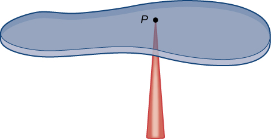{: #CNX_Calc_Figure_15_06_001}

To find the coordinates of the center of mass <math xmlns="http://www.w3.org/1998/Math/MathML"><mrow><mi>P</mi><mo stretchy="false">(</mo><mover><mi>x</mi><mtext>−</mtext></mover><mo>,</mo><mover><mi>y</mi><mtext>−</mtext></mover><mo stretchy="false">)</mo></mrow></math>

 of a lamina, we need to find the moment <math xmlns="http://www.w3.org/1998/Math/MathML"><mrow><msub><mi>M</mi><mi>x</mi></msub></mrow></math>

 of the lamina about the <math xmlns="http://www.w3.org/1998/Math/MathML"><mrow><mi>x</mi><mtext>-axis</mtext></mrow></math>

 and the moment <math xmlns="http://www.w3.org/1998/Math/MathML"><mrow><msub><mi>M</mi><mi>y</mi></msub></mrow></math>

 about the <math xmlns="http://www.w3.org/1998/Math/MathML"><mrow><mi>y</mi><mtext>-axis</mtext><mtext>.</mtext></mrow></math>

 We also need to find the mass <math xmlns="http://www.w3.org/1998/Math/MathML"><mi>m</mi></math>

 of the lamina. Then

<math xmlns="http://www.w3.org/1998/Math/MathML"><mrow><mover><mi>x</mi><mtext>−</mtext></mover><mo>=</mo><mfrac><mrow><msub><mi>M</mi><mi>y</mi></msub></mrow><mi>m</mi></mfrac><mspace width="0.2em" /><mtext>and</mtext><mspace width="0.2em" /><mover><mi>y</mi><mtext>−</mtext></mover><mo>=</mo><mfrac><mrow><msub><mi>M</mi><mi>x</mi></msub></mrow><mi>m</mi></mfrac><mo>.</mo></mrow></math>

Refer to [Moments and Centers of Mass](/m53649){: .target-chapter} for the definitions and the methods of single integration to find the center of mass of a one-dimensional object (for example, a thin rod). We are going to use a similar idea here except that the object is a two-dimensional lamina and we use a double integral.

If we allow a constant density function, then <math xmlns="http://www.w3.org/1998/Math/MathML"><mrow><mover><mi>x</mi><mtext>−</mtext></mover><mo>=</mo><mfrac><mrow><msub><mi>M</mi><mi>y</mi></msub></mrow><mi>m</mi></mfrac><mspace width="0.2em" /><mtext>and</mtext><mspace width="0.2em" /><mover><mi>y</mi><mtext>−</mtext></mover><mo>=</mo><mfrac><mrow><msub><mi>M</mi><mi>x</mi></msub></mrow><mi>m</mi></mfrac></mrow></math>

 give the *centroid* of the lamina.

Suppose that the lamina occupies a region <math xmlns="http://www.w3.org/1998/Math/MathML"><mi>R</mi></math>

 in the <math xmlns="http://www.w3.org/1998/Math/MathML"><mrow><mi>x</mi><mi>y</mi><mtext>-plane</mtext><mo>,</mo></mrow></math>

 and let <math xmlns="http://www.w3.org/1998/Math/MathML"><mrow><mi>ρ</mi><mrow><mo>(</mo><mrow><mi>x</mi><mo>,</mo><mi>y</mi></mrow><mo>)</mo></mrow></mrow></math>

 be its density (in units of mass per unit area) at any point <math xmlns="http://www.w3.org/1998/Math/MathML"><mrow><mrow><mo>(</mo><mrow><mi>x</mi><mo>,</mo><mi>y</mi></mrow><mo>)</mo></mrow><mo>.</mo></mrow></math>

 Hence, <math xmlns="http://www.w3.org/1998/Math/MathML"><mrow><mi>ρ</mi><mrow><mo>(</mo><mrow><mi>x</mi><mo>,</mo><mi>y</mi></mrow><mo>)</mo></mrow><mo>=</mo><munder><mrow><mtext>lim</mtext></mrow><mrow><mtext>Δ</mtext><mi>A</mi><mo stretchy="false">→</mo><mn>0</mn></mrow></munder><mfrac><mrow><mtext>Δ</mtext><mi>m</mi></mrow><mrow><mtext>Δ</mtext><mi>A</mi></mrow></mfrac><mo>,</mo></mrow></math>

 where <math xmlns="http://www.w3.org/1998/Math/MathML"><mrow><mtext>Δ</mtext><mi>m</mi></mrow></math>

 and <math xmlns="http://www.w3.org/1998/Math/MathML"><mrow><mtext>Δ</mtext><mi>A</mi></mrow></math>

 are the mass and area of a small rectangle containing the point <math xmlns="http://www.w3.org/1998/Math/MathML"><mrow><mrow><mo>(</mo><mrow><mi>x</mi><mo>,</mo><mi>y</mi></mrow><mo>)</mo></mrow></mrow></math>

 and the limit is taken as the dimensions of the rectangle go to <math xmlns="http://www.w3.org/1998/Math/MathML"><mn>0</mn></math>

 (see the following figure).

 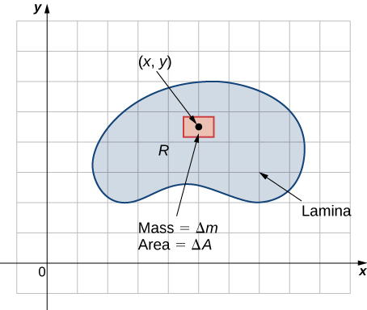{: #CNX_Calc_Figure_15_06_002}

Just as before, we divide the region <math xmlns="http://www.w3.org/1998/Math/MathML"><mi>R</mi></math>

 into tiny rectangles <math xmlns="http://www.w3.org/1998/Math/MathML"><mrow><msub><mi>R</mi><mrow><mi>i</mi><mi>j</mi></mrow></msub></mrow></math>

 with area <math xmlns="http://www.w3.org/1998/Math/MathML"><mrow><mtext>Δ</mtext><mi>A</mi></mrow></math>

 and choose <math xmlns="http://www.w3.org/1998/Math/MathML"><mrow><mrow><mo>(</mo><mrow><msubsup><mi>x</mi><mrow><mi>i</mi><mi>j</mi></mrow><mo>*</mo></msubsup><mo>,</mo><msubsup><mi>y</mi><mrow><mi>i</mi><mi>j</mi></mrow><mo>*</mo></msubsup></mrow><mo>)</mo></mrow></mrow></math>

 as sample points. Then the mass <math xmlns="http://www.w3.org/1998/Math/MathML"><mrow><msub><mi>m</mi><mrow><mi>i</mi><mi>j</mi></mrow></msub></mrow></math>

 of each <math xmlns="http://www.w3.org/1998/Math/MathML"><mrow><msub><mi>R</mi><mrow><mi>i</mi><mi>j</mi></mrow></msub></mrow></math>

 is equal to <math xmlns="http://www.w3.org/1998/Math/MathML"><mrow><mi>ρ</mi><mrow><mo>(</mo><mrow><msubsup><mi>x</mi><mrow><mi>i</mi><mi>j</mi></mrow><mo>*</mo></msubsup><mo>,</mo><msubsup><mi>y</mi><mrow><mi>i</mi><mi>j</mi></mrow><mo>*</mo></msubsup></mrow><mo>)</mo></mrow><mtext>Δ</mtext><mi>A</mi></mrow></math>

 ([\[link\]](#CNX_Calc_Figure_15_06_003)). Let <math xmlns="http://www.w3.org/1998/Math/MathML"><mi>k</mi></math>

 and <math xmlns="http://www.w3.org/1998/Math/MathML"><mi>l</mi></math>

 be the number of subintervals in <math xmlns="http://www.w3.org/1998/Math/MathML"><mi>x</mi></math>

 and <math xmlns="http://www.w3.org/1998/Math/MathML"><mrow><mi>y</mi><mo>,</mo></mrow></math>

 respectively. Also, note that the shape might not always be rectangular but the limit works anyway, as seen in previous sections.

 ."){: #CNX_Calc_Figure_15_06_003}

Hence, the mass of the lamina is

<math xmlns="http://www.w3.org/1998/Math/MathML"><mrow><mi>m</mi><mo>=</mo><munder><mrow><mtext>lim</mtext></mrow><mrow><mi>k</mi><mo>,</mo><mi>l</mi><mo stretchy="false">→</mo><mi>∞</mi></mrow></munder><mstyle displaystyle="true"><munderover><mo>∑</mo><mrow><mi>i</mi><mo>=</mo><mn>1</mn></mrow><mi>k</mi></munderover><mrow><mstyle displaystyle="true"><munderover><mo>∑</mo><mrow><mi>j</mi><mo>=</mo><mn>1</mn></mrow><mi>l</mi></munderover><mrow><msub><mi>m</mi><mrow><mi>i</mi><mi>j</mi></mrow></msub></mrow></mstyle></mrow></mstyle><mo>=</mo><munder><mrow><mtext>lim</mtext></mrow><mrow><mi>k</mi><mo>,</mo><mi>l</mi><mo stretchy="false">→</mo><mi>∞</mi></mrow></munder><mstyle displaystyle="true"><munderover><mo>∑</mo><mrow><mi>i</mi><mo>=</mo><mn>1</mn></mrow><mi>k</mi></munderover><mrow><mstyle displaystyle="true"><munderover><mo>∑</mo><mrow><mi>j</mi><mo>=</mo><mn>1</mn></mrow><mi>l</mi></munderover><mrow><mi>ρ</mi><mo stretchy="false">(</mo><msubsup><mi>x</mi><mrow><mi>i</mi><mi>j</mi></mrow><mo>*</mo></msubsup><mo>,</mo><msubsup><mi>y</mi><mrow><mi>i</mi><mi>j</mi></mrow><mo>*</mo></msubsup><mo stretchy="false">)</mo><mtext>Δ</mtext><mi>A</mi><mo>=</mo><mstyle displaystyle="true"><mrow><munder><mo>∬</mo><mi>R</mi></munder><mrow><mi>ρ</mi><mo stretchy="false">(</mo><mi>x</mi><mo>,</mo><mi>y</mi><mo stretchy="false">)</mo><mi>d</mi><mi>A</mi></mrow></mrow></mstyle></mrow></mstyle></mrow></mstyle><mo>.</mo></mrow></math>

Let’s see an example now of finding the total mass of a triangular lamina.

Finding the Total Mass of a Lamina

Consider a triangular lamina <math xmlns="http://www.w3.org/1998/Math/MathML"><mi>R</mi></math>

 with vertices <math xmlns="http://www.w3.org/1998/Math/MathML"><mrow><mrow><mo>(</mo><mrow><mn>0</mn><mo>,</mo><mn>0</mn></mrow><mo>)</mo></mrow><mo>,</mo><mrow><mo>(</mo><mrow><mn>0</mn><mo>,</mo><mn>3</mn></mrow><mo>)</mo></mrow><mo>,</mo></mrow></math>

 <math xmlns="http://www.w3.org/1998/Math/MathML"><mrow><mrow><mo>(</mo><mrow><mn>3</mn><mo>,</mo><mn>0</mn></mrow><mo>)</mo></mrow></mrow></math>

 and with density <math xmlns="http://www.w3.org/1998/Math/MathML"><mrow><mi>ρ</mi><mrow><mo>(</mo><mrow><mi>x</mi><mo>,</mo><mi>y</mi></mrow><mo>)</mo></mrow><mo>=</mo><mi>x</mi><mi>y</mi><msup><mrow><mspace width="0.2em" /><mtext>kg/m</mtext></mrow><mn>2</mn></msup><mo>.</mo></mrow></math>

 Find the total mass.

A sketch of the region <math xmlns="http://www.w3.org/1998/Math/MathML"><mi>R</mi></math>

 is always helpful, as shown in the following figure.

=xy."){: #CNX_Calc_Figure_15_06_004}

Using the expression developed for mass, we see that

<math xmlns="http://www.w3.org/1998/Math/MathML"><mtable><mtr><mtd columnalign="right"><mi>m</mi></mtd><mtd columnalign="left"><mo>=</mo><mstyle displaystyle="true"><mrow><munder><mo>∬</mo><mi>R</mi></munder><mrow><mi>d</mi><mi>m</mi><mo>=</mo><mstyle displaystyle="true"><mrow><munder><mo>∬</mo><mi>R</mi></munder><mrow><mi>ρ</mi><mrow><mo>(</mo><mrow><mi>x</mi><mo>,</mo><mi>y</mi></mrow><mo>)</mo></mrow></mrow></mrow></mstyle></mrow></mrow></mstyle><mi>d</mi><mi>A</mi><mo>=</mo><mstyle displaystyle="true"><mrow><munderover><mo stretchy="false">∫</mo><mrow><mi>x</mi><mo>=</mo><mn>0</mn></mrow><mrow><mi>x</mi><mo>=</mo><mn>3</mn></mrow></munderover><mspace width="0.2em" /><mrow><mstyle displaystyle="true"><mrow><munderover><mo stretchy="false">∫</mo><mrow><mi>y</mi><mo>=</mo><mn>0</mn></mrow><mrow><mi>y</mi><mo>=</mo><mn>3</mn><mo>−</mo><mi>x</mi></mrow></munderover><mrow><mi>x</mi><mi>y</mi><mspace width="0.2em" /><mi>d</mi><mi>y</mi><mspace width="0.2em" /><mi>d</mi><mi>x</mi><mo>=</mo><mstyle displaystyle="true"><mrow><munderover><mo stretchy="false">∫</mo><mrow><mi>x</mi><mo>=</mo><mn>0</mn></mrow><mrow><mi>x</mi><mo>=</mo><mn>3</mn></mrow></munderover><mrow><mrow><mo>[</mo><mrow><msubsup><mrow><mrow><mrow><mi>x</mi><mfrac><mrow><msup><mi>y</mi><mn>2</mn></msup></mrow><mn>2</mn></mfrac></mrow><mo>\|</mo></mrow></mrow><mrow><mi>y</mi><mo>=</mo><mn>0</mn></mrow><mrow><mi>y</mi><mo>=</mo><mn>3</mn><mo>−</mo><mi>x</mi></mrow></msubsup></mrow><mo>]</mo></mrow></mrow></mrow></mstyle></mrow></mrow></mstyle></mrow></mrow></mstyle><mi>d</mi><mi>x</mi></mtd></mtr><mtr><mtd /><mtd columnalign="left"><mo>=</mo><mstyle displaystyle="true"><mrow><munderover><mo stretchy="false">∫</mo><mrow><mi>x</mi><mo>=</mo><mn>0</mn></mrow><mrow><mi>x</mi><mo>=</mo><mn>3</mn></mrow></munderover><mrow><mfrac><mn>1</mn><mn>2</mn></mfrac></mrow></mrow></mstyle><mi>x</mi><msup><mrow><mo>(</mo><mrow><mn>3</mn><mo>−</mo><mi>x</mi></mrow><mo>)</mo></mrow><mn>2</mn></msup><mi>d</mi><mi>x</mi><mo>=</mo><msubsup><mrow><mrow><mrow><mo>[</mo><mrow><mfrac><mrow><mn>9</mn><msup><mi>x</mi><mn>2</mn></msup></mrow><mn>4</mn></mfrac><mo>−</mo><msup><mi>x</mi><mn>3</mn></msup><mo>+</mo><mfrac><mrow><msup><mi>x</mi><mn>4</mn></msup></mrow><mn>8</mn></mfrac></mrow><mo>]</mo></mrow></mrow><mo>\|</mo></mrow><mrow><mi>x</mi><mo>=</mo><mn>0</mn></mrow><mrow><mi>x</mi><mo>=</mo><mn>3</mn></mrow></msubsup></mtd></mtr><mtr><mtd /><mtd columnalign="left"><mo>=</mo><mfrac><mrow><mn>27</mn></mrow><mn>8</mn></mfrac><mo>.</mo></mtd></mtr></mtable></math>

The computation is straightforward, giving the answer <math xmlns="http://www.w3.org/1998/Math/MathML"><mrow><mi>m</mi><mo>=</mo><mfrac><mrow><mn>27</mn></mrow><mn>8</mn></mfrac><mspace width="0.2em" /><mtext>kg</mtext><mtext>.</mtext></mrow></math>

Consider the same region <math xmlns="http://www.w3.org/1998/Math/MathML"><mi>R</mi></math>

 as in the previous example, and use the density function <math xmlns="http://www.w3.org/1998/Math/MathML"><mrow><mi>ρ</mi><mrow><mo>(</mo><mrow><mi>x</mi><mo>,</mo><mi>y</mi></mrow><mo>)</mo></mrow><mo>=</mo><msqrt><mrow><mi>x</mi><mi>y</mi></mrow></msqrt><mo>.</mo></mrow></math>

 Find the total mass.

<math xmlns="http://www.w3.org/1998/Math/MathML"><mrow><mfrac><mrow><mn>9</mn><mi>π</mi></mrow><mn>8</mn></mfrac><mspace width="0.2em" /><mtext>kg</mtext></mrow></math>

Now that we have established the expression for mass, we have the tools we need for calculating moments and centers of mass. The moment <math xmlns="http://www.w3.org/1998/Math/MathML"><mrow><msub><mi>M</mi><mi>x</mi></msub></mrow></math>

 about the <math xmlns="http://www.w3.org/1998/Math/MathML"><mrow><mi>x</mi><mtext>-axis</mtext></mrow></math>

 for <math xmlns="http://www.w3.org/1998/Math/MathML"><mi>R</mi></math>

 is the limit of the sums of moments of the regions <math xmlns="http://www.w3.org/1998/Math/MathML"><mrow><msub><mi>R</mi><mrow><mi>i</mi><mi>j</mi></mrow></msub></mrow></math>

 about the <math xmlns="http://www.w3.org/1998/Math/MathML"><mrow><mi>x</mi><mtext>-axis</mtext><mtext>.</mtext></mrow></math>

 Hence

<math xmlns="http://www.w3.org/1998/Math/MathML"><mrow><msub><mi>M</mi><mi>x</mi></msub><mo>=</mo><munder><mrow><mtext>lim</mtext></mrow><mrow><mi>k</mi><mo>,</mo><mi>l</mi><mo stretchy="false">→</mo><mi>∞</mi></mrow></munder><mstyle displaystyle="true"><munderover><mo>∑</mo><mrow><mi>i</mi><mo>=</mo><mn>1</mn></mrow><mi>k</mi></munderover><mrow><mstyle displaystyle="true"><munderover><mo>∑</mo><mrow><mi>j</mi><mo>=</mo><mn>1</mn></mrow><mi>l</mi></munderover><mrow><mrow><mo>(</mo><mrow><msubsup><mi>y</mi><mrow><msub><mrow /><mrow><mi>i</mi><mi>j</mi></mrow></msub></mrow><mo>*</mo></msubsup></mrow><mo>)</mo></mrow></mrow></mstyle></mrow></mstyle><msub><mi>m</mi><mrow><mi>i</mi><mi>j</mi></mrow></msub><mo>=</mo><munder><mrow><mtext>lim</mtext></mrow><mrow><mi>k</mi><mo>,</mo><mi>l</mi><mo stretchy="false">→</mo><mi>∞</mi></mrow></munder><mstyle displaystyle="true"><munderover><mo>∑</mo><mrow><mi>i</mi><mo>=</mo><mn>1</mn></mrow><mi>k</mi></munderover><mrow><mstyle displaystyle="true"><munderover><mo>∑</mo><mrow><mi>j</mi><mo>=</mo><mn>1</mn></mrow><mi>l</mi></munderover><mrow><mrow><mo>(</mo><mrow><msubsup><mi>y</mi><mrow><msub><mrow /><mrow><mi>i</mi><mi>j</mi></mrow></msub></mrow><mo>*</mo></msubsup></mrow><mo>)</mo></mrow></mrow></mstyle></mrow></mstyle><mi>ρ</mi><mrow><mo>(</mo><mrow><msubsup><mi>x</mi><mrow><msub><mrow /><mrow><mi>i</mi><mi>j</mi></mrow></msub></mrow><mo>*</mo></msubsup><mo>,</mo><msubsup><mi>y</mi><mrow><msub><mrow /><mrow><mi>i</mi><mi>j</mi></mrow></msub></mrow><mo>*</mo></msubsup></mrow><mo>)</mo></mrow><mtext>Δ</mtext><mi>A</mi><mo>=</mo><mstyle displaystyle="true"><mrow><munder><mo>∬</mo><mi>R</mi></munder><mrow><mi>y</mi><mi>ρ</mi><mrow><mo>(</mo><mrow><mi>x</mi><mo>,</mo><mi>y</mi></mrow><mo>)</mo></mrow><mi>d</mi><mi>A</mi></mrow></mrow></mstyle><mo>.</mo></mrow></math>

Similarly, the moment <math xmlns="http://www.w3.org/1998/Math/MathML"><mrow><msub><mi>M</mi><mi>y</mi></msub></mrow></math>

 about the <math xmlns="http://www.w3.org/1998/Math/MathML"><mrow><mi>y</mi><mtext>-axis</mtext></mrow></math>

 for <math xmlns="http://www.w3.org/1998/Math/MathML"><mi>R</mi></math>

 is the limit of the sums of moments of the regions <math xmlns="http://www.w3.org/1998/Math/MathML"><mrow><msub><mi>R</mi><mrow><mi>i</mi><mi>j</mi></mrow></msub></mrow></math>

 about the <math xmlns="http://www.w3.org/1998/Math/MathML"><mrow><mi>y</mi><mtext>-axis</mtext><mtext>.</mtext></mrow></math>

 Hence

<math xmlns="http://www.w3.org/1998/Math/MathML"><mrow><msub><mi>M</mi><mi>y</mi></msub><mo>=</mo><munder><mrow><mtext>lim</mtext></mrow><mrow><mi>k</mi><mo>,</mo><mi>l</mi><mo stretchy="false">→</mo><mi>∞</mi></mrow></munder><mstyle displaystyle="true"><munderover><mo>∑</mo><mrow><mi>i</mi><mo>=</mo><mn>1</mn></mrow><mi>k</mi></munderover><mrow><mstyle displaystyle="true"><munderover><mo>∑</mo><mrow><mi>j</mi><mo>=</mo><mn>1</mn></mrow><mi>l</mi></munderover><mrow><mrow><mo>(</mo><mrow><msubsup><mi>x</mi><mrow><msub><mrow /><mrow><mi>i</mi><mi>j</mi></mrow></msub></mrow><mo>*</mo></msubsup></mrow><mo>)</mo></mrow></mrow></mstyle></mrow></mstyle><msub><mi>m</mi><mrow><mi>i</mi><mi>j</mi></mrow></msub><mo>=</mo><munder><mrow><mtext>lim</mtext></mrow><mrow><mi>k</mi><mo>,</mo><mi>l</mi><mo stretchy="false">→</mo><mi>∞</mi></mrow></munder><mstyle displaystyle="true"><munderover><mo>∑</mo><mrow><mi>i</mi><mo>=</mo><mn>1</mn></mrow><mi>k</mi></munderover><mrow><mstyle displaystyle="true"><munderover><mo>∑</mo><mrow><mi>j</mi><mo>=</mo><mn>1</mn></mrow><mi>l</mi></munderover><mrow><mrow><mo>(</mo><mrow><msubsup><mi>y</mi><mrow><msub><mrow /><mrow><mi>i</mi><mi>j</mi></mrow></msub></mrow><mo>*</mo></msubsup></mrow><mo>)</mo></mrow></mrow></mstyle></mrow></mstyle><mi>ρ</mi><mrow><mo>(</mo><mrow><msubsup><mi>x</mi><mrow><msub><mrow /><mrow><mi>i</mi><mi>j</mi></mrow></msub></mrow><mo>*</mo></msubsup><mo>,</mo><msubsup><mi>y</mi><mrow><msub><mrow /><mrow><mi>i</mi><mi>j</mi></mrow></msub></mrow><mo>*</mo></msubsup></mrow><mo>)</mo></mrow><mtext>Δ</mtext><mi>A</mi><mo>=</mo><mstyle displaystyle="true"><mrow><munder><mo>∬</mo><mi>R</mi></munder><mrow><mi>x</mi><mi>ρ</mi><mrow><mo>(</mo><mrow><mi>x</mi><mo>,</mo><mi>y</mi></mrow><mo>)</mo></mrow><mi>d</mi><mi>A</mi></mrow></mrow></mstyle><mo>.</mo></mrow></math>

Finding Moments

Consider the same triangular lamina <math xmlns="http://www.w3.org/1998/Math/MathML"><mi>R</mi></math>

 with vertices <math xmlns="http://www.w3.org/1998/Math/MathML"><mrow><mrow><mo>(</mo><mrow><mn>0</mn><mo>,</mo><mn>0</mn></mrow><mo>)</mo></mrow><mo>,</mo><mrow><mo>(</mo><mrow><mn>0</mn><mo>,</mo><mn>3</mn></mrow><mo>)</mo></mrow><mo>,</mo></mrow><mspace width="0.2em" /><mrow><mrow><mo>(</mo><mrow><mn>3</mn><mo>,</mo><mn>0</mn></mrow><mo>)</mo></mrow></mrow></math>

 and with density <math xmlns="http://www.w3.org/1998/Math/MathML"><mrow><mi>ρ</mi><mrow><mo>(</mo><mrow><mi>x</mi><mo>,</mo><mi>y</mi></mrow><mo>)</mo></mrow><mo>=</mo><mi>x</mi><mi>y</mi><mo>.</mo></mrow></math>

 Find the moments <math xmlns="http://www.w3.org/1998/Math/MathML"><mrow><msub><mi>M</mi><mi>x</mi></msub></mrow></math>

 and <math xmlns="http://www.w3.org/1998/Math/MathML"><mrow><msub><mi>M</mi><mi>y</mi></msub><mo>.</mo></mrow></math>

Use double integrals for each moment and compute their values:

<math xmlns="http://www.w3.org/1998/Math/MathML"><mrow><msub><mi>M</mi><mi>x</mi></msub><mo>=</mo><mstyle displaystyle="true"><mrow><munder><mo>∬</mo><mi>R</mi></munder><mrow><mi>y</mi><mi>ρ</mi><mrow><mo>(</mo><mrow><mi>x</mi><mo>,</mo><mi>y</mi></mrow><mo>)</mo></mrow><mi>d</mi><mi>A</mi><mo>=</mo><mstyle displaystyle="true"><mrow><munderover><mo stretchy="false">∫</mo><mrow><mi>x</mi><mo>=</mo><mn>0</mn></mrow><mrow><mi>x</mi><mo>=</mo><mn>3</mn></mrow></munderover><mspace width="0.2em" /><mrow><mstyle displaystyle="true"><mrow><munderover><mo stretchy="false">∫</mo><mrow><mi>y</mi><mo>=</mo><mn>0</mn></mrow><mrow><mi>y</mi><mo>=</mo><mn>3</mn><mo>−</mo><mi>x</mi></mrow></munderover><mrow><mi>x</mi><msup><mi>y</mi><mn>2</mn></msup><mspace width="0.2em" /><mi>d</mi><mi>y</mi><mspace width="0.2em" /><mi>d</mi><mi>x</mi></mrow></mrow></mstyle></mrow></mrow></mstyle></mrow></mrow></mstyle><mo>=</mo><mfrac><mrow><mn>81</mn></mrow><mrow><mn>20</mn></mrow></mfrac><mo>,</mo></mrow></math>

<math xmlns="http://www.w3.org/1998/Math/MathML"><mrow><msub><mi>M</mi><mi>y</mi></msub><mo>=</mo><mstyle displaystyle="true"><mrow><munder><mo>∬</mo><mi>R</mi></munder><mrow><mi>x</mi><mi>ρ</mi><mrow><mo>(</mo><mrow><mi>x</mi><mo>,</mo><mi>y</mi></mrow><mo>)</mo></mrow><mi>d</mi><mi>A</mi><mo>=</mo><mstyle displaystyle="true"><mrow><munderover><mo stretchy="false">∫</mo><mrow><mi>x</mi><mo>=</mo><mn>0</mn></mrow><mrow><mi>x</mi><mo>=</mo><mn>3</mn></mrow></munderover><mspace width="0.2em" /><mrow><mstyle displaystyle="true"><mrow><munderover><mo stretchy="false">∫</mo><mrow><mi>y</mi><mo>=</mo><mn>0</mn></mrow><mrow><mi>y</mi><mo>=</mo><mn>3</mn><mo>−</mo><mi>x</mi></mrow></munderover><mrow><msup><mi>x</mi><mn>2</mn></msup><mspace width="0.2em" /><mi>y</mi><mi>d</mi><mspace width="0.2em" /><mi>y</mi><mspace width="0.2em" /><mi>d</mi><mi>x</mi></mrow></mrow></mstyle></mrow></mrow></mstyle></mrow></mrow></mstyle><mo>=</mo><mfrac><mrow><mn>81</mn></mrow><mrow><mn>20</mn></mrow></mfrac><mo>.</mo></mrow></math>

The computation is quite straightforward.

Consider the same lamina <math xmlns="http://www.w3.org/1998/Math/MathML"><mi>R</mi></math>

 as above, and use the density function <math xmlns="http://www.w3.org/1998/Math/MathML"><mrow><mi>ρ</mi><mrow><mo>(</mo><mrow><mi>x</mi><mo>,</mo><mi>y</mi></mrow><mo>)</mo></mrow><mo>=</mo><msqrt><mrow><mi>x</mi><mi>y</mi></mrow></msqrt><mo>.</mo></mrow></math>

 Find the moments <math xmlns="http://www.w3.org/1998/Math/MathML"><mrow><msub><mi>M</mi><mi>x</mi></msub></mrow></math>

 and <math xmlns="http://www.w3.org/1998/Math/MathML"><mrow><msub><mi>M</mi><mi>y</mi></msub><mo>.</mo></mrow></math>

<math xmlns="http://www.w3.org/1998/Math/MathML"><mrow><msub><mi>M</mi><mi>x</mi></msub><mo>=</mo><mfrac><mrow><mn>81</mn><mi>π</mi></mrow><mrow><mn>64</mn></mrow></mfrac></mrow></math>

 and <math xmlns="http://www.w3.org/1998/Math/MathML"><mrow><msub><mi>M</mi><mi>y</mi></msub><mo>=</mo><mfrac><mrow><mn>81</mn><mi>π</mi></mrow><mrow><mn>64</mn></mrow></mfrac></mrow></math>

Finally we are ready to restate the expressions for the center of mass in terms of integrals. We denote the *x*-coordinate of the center of mass by <math xmlns="http://www.w3.org/1998/Math/MathML"><mover><mi>x</mi><mtext>−</mtext></mover></math>

 and the *y*-coordinate by <math xmlns="http://www.w3.org/1998/Math/MathML"><mrow><mover><mi>y</mi><mtext>−</mtext></mover><mo>.</mo></mrow></math>

 Specifically,

<math xmlns="http://www.w3.org/1998/Math/MathML"><mrow><mover><mi>x</mi><mtext>−</mtext></mover><mo>=</mo><mfrac><mrow><msub><mi>M</mi><mi>y</mi></msub></mrow><mi>m</mi></mfrac><mo>=</mo><mfrac><mrow><mstyle displaystyle="true"><mrow><munder><mo>∬</mo><mi>R</mi></munder><mrow><mi>x</mi><mi>ρ</mi><mrow><mo>(</mo><mrow><mi>x</mi><mo>,</mo><mi>y</mi></mrow><mo>)</mo></mrow><mi>d</mi><mi>A</mi></mrow></mrow></mstyle></mrow><mrow><mstyle displaystyle="true"><mrow><munder><mo>∬</mo><mi>R</mi></munder><mrow><mi>ρ</mi><mrow><mo>(</mo><mrow><mi>x</mi><mo>,</mo><mi>y</mi></mrow><mo>)</mo></mrow><mi>d</mi><mi>A</mi></mrow></mrow></mstyle></mrow></mfrac><mspace width="0.4em" /><mtext>and</mtext><mspace width="0.4em" /><mover><mi>y</mi><mtext>−</mtext></mover><mo>=</mo><mfrac><mrow><msub><mi>M</mi><mi>x</mi></msub></mrow><mi>m</mi></mfrac><mspace width="0.2em" /><mfrac><mrow><mstyle displaystyle="true"><mrow><munder><mo>∬</mo><mi>R</mi></munder><mrow><mi>y</mi><mi>ρ</mi><mrow><mo>(</mo><mrow><mi>x</mi><mo>,</mo><mi>y</mi></mrow><mo>)</mo></mrow><mi>d</mi><mi>A</mi></mrow></mrow></mstyle></mrow><mrow><mstyle displaystyle="true"><mrow><munder><mo>∬</mo><mi>R</mi></munder><mrow><mi>ρ</mi><mrow><mo>(</mo><mrow><mi>x</mi><mo>,</mo><mi>y</mi></mrow><mo>)</mo></mrow><mi>d</mi><mi>A</mi></mrow></mrow></mstyle></mrow></mfrac><mo>.</mo></mrow></math>

Finding the Center of Mass

Again consider the same triangular region <math xmlns="http://www.w3.org/1998/Math/MathML"><mi>R</mi></math>

 with vertices <math xmlns="http://www.w3.org/1998/Math/MathML"><mrow><mrow><mo>(</mo><mrow><mn>0</mn><mo>,</mo><mn>0</mn></mrow><mo>)</mo></mrow><mo>,</mo><mrow><mo>(</mo><mrow><mn>0</mn><mo>,</mo><mn>3</mn></mrow><mo>)</mo></mrow><mo>,</mo></mrow></math>

 <math xmlns="http://www.w3.org/1998/Math/MathML"><mrow><mrow><mo>(</mo><mrow><mn>3</mn><mo>,</mo><mn>0</mn></mrow><mo>)</mo></mrow></mrow></math>

 and with density function <math xmlns="http://www.w3.org/1998/Math/MathML"><mrow><mi>ρ</mi><mrow><mo>(</mo><mrow><mi>x</mi><mo>,</mo><mi>y</mi></mrow><mo>)</mo></mrow><mo>=</mo><mi>x</mi><mi>y</mi><mo>.</mo></mrow></math>

 Find the center of mass.

Using the formulas we developed, we have

<math xmlns="http://www.w3.org/1998/Math/MathML"><mrow><mover><mi>x</mi><mtext>−</mtext></mover><mo>=</mo><mfrac><mrow><msub><mi>M</mi><mi>y</mi></msub></mrow><mi>m</mi></mfrac><mo>=</mo><mfrac><mrow><mstyle displaystyle="true"><mrow><munder><mo>∬</mo><mi>R</mi></munder><mrow><mi>x</mi><mi>ρ</mi><mrow><mo>(</mo><mrow><mi>x</mi><mo>,</mo><mi>y</mi></mrow><mo>)</mo></mrow><mi>d</mi><mi>A</mi></mrow></mrow></mstyle></mrow><mrow><mstyle displaystyle="true"><mrow><munder><mo>∬</mo><mi>R</mi></munder><mrow><mi>ρ</mi><mrow><mo>(</mo><mrow><mi>x</mi><mo>,</mo><mi>y</mi></mrow><mo>)</mo></mrow><mi>d</mi><mi>A</mi></mrow></mrow></mstyle></mrow></mfrac><mo>=</mo><mfrac><mrow><mn>81</mn><mtext>/</mtext><mn>20</mn></mrow><mrow><mn>27</mn><mtext>/</mtext><mn>8</mn></mrow></mfrac><mo>=</mo><mfrac><mn>6</mn><mn>5</mn></mfrac><mo>,</mo></mrow></math>

<math xmlns="http://www.w3.org/1998/Math/MathML"><mrow><mover><mi>y</mi><mtext>−</mtext></mover><mo>=</mo><mfrac><mrow><msub><mi>M</mi><mi>x</mi></msub></mrow><mi>m</mi></mfrac><mo>=</mo><mfrac><mrow><mstyle displaystyle="true"><mrow><munder><mo>∬</mo><mi>R</mi></munder><mrow><mi>y</mi><mi>ρ</mi><mrow><mo>(</mo><mrow><mi>x</mi><mo>,</mo><mi>y</mi></mrow><mo>)</mo></mrow><mi>d</mi><mi>A</mi></mrow></mrow></mstyle></mrow><mrow><mstyle displaystyle="true"><mrow><munder><mo>∬</mo><mi>R</mi></munder><mrow><mi>ρ</mi><mrow><mo>(</mo><mrow><mi>x</mi><mo>,</mo><mi>y</mi></mrow><mo>)</mo></mrow><mi>d</mi><mi>A</mi></mrow></mrow></mstyle></mrow></mfrac><mo>=</mo><mfrac><mrow><mn>81</mn><mtext>/</mtext><mn>20</mn></mrow><mrow><mn>27</mn><mtext>/</mtext><mn>8</mn></mrow></mfrac><mo>=</mo><mfrac><mn>6</mn><mn>5</mn></mfrac><mo>.</mo></mrow></math>

Therefore, the center of mass is the point <math xmlns="http://www.w3.org/1998/Math/MathML"><mrow><mrow><mo>(</mo><mrow><mfrac><mn>6</mn><mn>5</mn></mfrac><mo>,</mo><mfrac><mn>6</mn><mn>5</mn></mfrac></mrow><mo>)</mo></mrow><mo>.</mo></mrow></math>

Analysis

If we choose the density <math xmlns="http://www.w3.org/1998/Math/MathML"><mrow><mi>ρ</mi><mrow><mo>(</mo><mrow><mi>x</mi><mo>,</mo><mi>y</mi></mrow><mo>)</mo></mrow></mrow></math>

 instead to be uniform throughout the region (i.e., constant), such as the value 1 (any constant will do), then we can compute the centroid,

<math xmlns="http://www.w3.org/1998/Math/MathML"><mtable><mtr /><mtr /><mtr /><mtr /><mtr><mtd columnalign="left"><msub><mi>x</mi><mi>c</mi></msub><mo>=</mo><mfrac><mrow><msub><mi>M</mi><mi>y</mi></msub></mrow><mi>m</mi></mfrac><mo>=</mo><mfrac><mrow><mstyle displaystyle="true"><mrow><munder><mo>∬</mo><mi>R</mi></munder><mrow><mi>x</mi><mspace width="0.2em" /><mi>d</mi><mi>A</mi></mrow></mrow></mstyle></mrow><mrow><mstyle displaystyle="true"><mrow><munder><mo>∬</mo><mi>R</mi></munder><mrow><mi>d</mi><mi>A</mi></mrow></mrow></mstyle></mrow></mfrac><mo>=</mo><mfrac><mrow><mn>9</mn><mtext>/</mtext><mn>2</mn></mrow><mrow><mn>9</mn><mtext>/</mtext><mn>2</mn></mrow></mfrac><mo>=</mo><mn>1</mn><mo>,</mo></mtd></mtr><mtr><mtd columnalign="left"><msub><mi>y</mi><mi>c</mi></msub><mo>=</mo><mfrac><mrow><msub><mi>M</mi><mi>x</mi></msub></mrow><mi>m</mi></mfrac><mspace width="0.2em" /><mfrac><mrow><mstyle displaystyle="true"><mrow><munder><mo>∬</mo><mi>R</mi></munder><mrow><mi>y</mi><mspace width="0.2em" /><mi>d</mi><mi>A</mi></mrow></mrow></mstyle></mrow><mrow><mstyle displaystyle="true"><mrow><munder><mo>∬</mo><mi>R</mi></munder><mrow><mi>d</mi><mi>A</mi></mrow></mrow></mstyle></mrow></mfrac><mo>=</mo><mfrac><mrow><mn>9</mn><mtext>/</mtext><mn>2</mn></mrow><mrow><mn>9</mn><mtext>/</mtext><mn>2</mn></mrow></mfrac><mo>=</mo><mn>1</mn><mo>.</mo></mtd></mtr></mtable></math>

Notice that the center of mass <math xmlns="http://www.w3.org/1998/Math/MathML"><mrow><mrow><mo>(</mo><mrow><mfrac><mn>6</mn><mn>5</mn></mfrac><mo>,</mo><mfrac><mn>6</mn><mn>5</mn></mfrac></mrow><mo>)</mo></mrow></mrow></math>

 is not exactly the same as the centroid <math xmlns="http://www.w3.org/1998/Math/MathML"><mrow><mrow><mo>(</mo><mrow><mn>1</mn><mo>,</mo><mn>1</mn></mrow><mo>)</mo></mrow></mrow></math>

 of the triangular region. This is due to the variable density of <math xmlns="http://www.w3.org/1998/Math/MathML"><mi>R</mi><mo>.</mo></math>

 If the density is constant, then we just use <math xmlns="http://www.w3.org/1998/Math/MathML"><mrow><mi>ρ</mi><mrow><mo>(</mo><mrow><mi>x</mi><mo>,</mo><mi>y</mi></mrow><mo>)</mo></mrow><mo>=</mo><mi>c</mi></mrow></math>

 (constant). This value cancels out from the formulas, so for a constant density, the center of mass coincides with the centroid of the lamina.

Again use the same region <math xmlns="http://www.w3.org/1998/Math/MathML"><mi>R</mi></math>

 as above and the density function <math xmlns="http://www.w3.org/1998/Math/MathML"><mrow><mi>ρ</mi><mrow><mo>(</mo><mrow><mi>x</mi><mo>,</mo><mi>y</mi></mrow><mo>)</mo></mrow><mo>=</mo><msqrt><mrow><mi>x</mi><mi>y</mi></mrow></msqrt><mo>.</mo></mrow></math>

 Find the center of mass.

<math xmlns="http://www.w3.org/1998/Math/MathML"><mrow><mover><mi>x</mi><mtext>−</mtext></mover><mo>=</mo><mfrac><mrow><msub><mi>M</mi><mi>y</mi></msub></mrow><mi>m</mi></mfrac><mo>=</mo><mfrac><mrow><mn>81</mn><mi>π</mi><mtext>/</mtext><mn>64</mn></mrow><mrow><mn>9</mn><mi>π</mi><mtext>/</mtext><mn>8</mn></mrow></mfrac><mo>=</mo><mfrac><mn>9</mn><mn>8</mn></mfrac></mrow></math>

 and <math xmlns="http://www.w3.org/1998/Math/MathML"><mrow><mover><mi>y</mi><mtext>−</mtext></mover><mo>=</mo><mfrac><mrow><msub><mi>M</mi><mi>x</mi></msub></mrow><mi>m</mi></mfrac><mo>=</mo><mfrac><mrow><mn>81</mn><mi>π</mi><mtext>/</mtext><mn>64</mn></mrow><mrow><mn>9</mn><mi>π</mi><mtext>/</mtext><mn>8</mn></mrow></mfrac><mo>=</mo><mfrac><mn>9</mn><mn>8</mn></mfrac><mo>.</mo></mrow></math>

Once again, based on the comments at the end of [\[link\]](#fs-id1167793450658), we have expressions for the centroid of a region on the plane:

<math xmlns="http://www.w3.org/1998/Math/MathML"><mrow><msub><mi>x</mi><mi>c</mi></msub><mo>=</mo><mfrac><mrow><msub><mi>M</mi><mi>y</mi></msub></mrow><mi>m</mi></mfrac><mo>=</mo><mfrac><mrow><mstyle displaystyle="true"><mrow><munder><mo>∬</mo><mi>R</mi></munder><mrow><mi>x</mi><mspace width="0.2em" /><mi>d</mi><mi>A</mi></mrow></mrow></mstyle></mrow><mrow><mstyle displaystyle="true"><mrow><munder><mo>∬</mo><mi>R</mi></munder><mrow><mi>d</mi><mi>A</mi></mrow></mrow></mstyle></mrow></mfrac><mspace width="0.2em" /><mtext>and</mtext><mspace width="0.2em" /><msub><mi>y</mi><mi>c</mi></msub><mo>=</mo><mfrac><mrow><msub><mi>M</mi><mi>x</mi></msub></mrow><mi>m</mi></mfrac><mspace width="0.2em" /><mfrac><mrow><mstyle displaystyle="true"><mrow><munder><mo>∬</mo><mi>R</mi></munder><mrow><mi>y</mi><mspace width="0.2em" /><mi>d</mi><mi>A</mi></mrow></mrow></mstyle></mrow><mrow><mstyle displaystyle="true"><mrow><munder><mo>∬</mo><mi>R</mi></munder><mrow><mi>d</mi><mi>A</mi></mrow></mrow></mstyle></mrow></mfrac><mo>.</mo></mrow></math>

We should use these formulas and verify the centroid of the triangular region <math xmlns="http://www.w3.org/1998/Math/MathML"><mi>R</mi></math>

 referred to in the last three examples.

Finding Mass, Moments, and Center of Mass

Find the mass, moments, and the center of mass of the lamina of density <math xmlns="http://www.w3.org/1998/Math/MathML"><mrow><mi>ρ</mi><mrow><mo>(</mo><mrow><mi>x</mi><mo>,</mo><mi>y</mi></mrow><mo>)</mo></mrow><mo>=</mo><mi>x</mi><mo>+</mo><mi>y</mi></mrow></math>

 occupying the region <math xmlns="http://www.w3.org/1998/Math/MathML"><mi>R</mi></math>

 under the curve <math xmlns="http://www.w3.org/1998/Math/MathML"><mrow><mi>y</mi><mo>=</mo><msup><mi>x</mi><mn>2</mn></msup></mrow></math>

 in the interval <math xmlns="http://www.w3.org/1998/Math/MathML"><mrow><mn>0</mn><mo>≤</mo><mi>x</mi><mo>≤</mo><mn>2</mn></mrow></math>

 (see the following figure).

=x+y."){: #CNX_Calc_Figure_15_06_005}

First we compute the mass <math xmlns="http://www.w3.org/1998/Math/MathML"><mi>m</mi><mo>.</mo></math>

 We need to describe the region between the graph of <math xmlns="http://www.w3.org/1998/Math/MathML"><mrow><mi>y</mi><mo>=</mo><msup><mi>x</mi><mn>2</mn></msup></mrow></math>

 and the vertical lines <math xmlns="http://www.w3.org/1998/Math/MathML"><mrow><mi>x</mi><mo>=</mo><mn>0</mn></mrow></math>

 and <math xmlns="http://www.w3.org/1998/Math/MathML"><mrow><mi>x</mi><mo>=</mo><mn>2</mn><mtext>:</mtext></mrow></math>

<math xmlns="http://www.w3.org/1998/Math/MathML"><mtable><mtr><mtd columnalign="right"><mi>m</mi></mtd><mtd columnalign="left"><mo>=</mo><mstyle displaystyle="true"><mrow><munder><mo>∬</mo><mi>R</mi></munder><mrow><mi>d</mi><mi>m</mi></mrow></mrow></mstyle><mo>=</mo><mstyle displaystyle="true"><mrow><munder><mo>∬</mo><mi>R</mi></munder><mrow><mi>ρ</mi><mrow><mo>(</mo><mrow><mi>x</mi><mo>,</mo><mi>y</mi></mrow><mo>)</mo></mrow><mi>d</mi><mi>A</mi><mo>=</mo><mstyle displaystyle="true"><mrow><munderover><mo stretchy="false">∫</mo><mrow><mi>x</mi><mo>=</mo><mn>0</mn></mrow><mrow><mi>x</mi><mo>=</mo><mn>2</mn></mrow></munderover><mspace width="0.2em" /><mrow><mstyle displaystyle="true"><mrow><munderover><mo stretchy="false">∫</mo><mrow><mi>y</mi><mo>=</mo><mn>0</mn></mrow><mrow><mi>y</mi><mo>=</mo><msup><mi>x</mi><mn>2</mn></msup></mrow></munderover><mrow><mrow><mo>(</mo><mrow><mi>x</mi><mo>+</mo><mi>y</mi></mrow><mo>)</mo></mrow><mi>d</mi><mi>y</mi><mspace width="0.2em" /><mi>d</mi><mi>x</mi><mo>=</mo><mstyle displaystyle="true"><mrow><munderover><mo stretchy="false">∫</mo><mrow><mi>x</mi><mo>=</mo><mn>0</mn></mrow><mrow><mi>x</mi><mo>=</mo><mn>2</mn></mrow></munderover><mrow><mrow><mo>[</mo><mrow><msubsup><mrow><mrow><mrow><mi>x</mi><mi>y</mi><mo>+</mo><mfrac><mrow><msup><mi>y</mi><mn>2</mn></msup></mrow><mn>2</mn></mfrac></mrow><mo>\|</mo></mrow></mrow><mrow><mi>y</mi><mo>=</mo><mn>0</mn></mrow><mrow><mi>y</mi><mo>=</mo><msup><mi>x</mi><mn>2</mn></msup></mrow></msubsup></mrow><mo>]</mo></mrow></mrow></mrow></mstyle></mrow></mrow></mstyle></mrow></mrow></mstyle></mrow></mrow></mstyle><mi>d</mi><mi>x</mi></mtd></mtr><mtr><mtd /><mtd columnalign="left"><mo>=</mo><mstyle displaystyle="true"><mrow><munderover><mo stretchy="false">∫</mo><mrow><mi>x</mi><mo>=</mo><mn>0</mn></mrow><mrow><mi>x</mi><mo>=</mo><mn>2</mn></mrow></munderover><mrow><mrow><mo>[</mo><mrow><msup><mi>x</mi><mn>3</mn></msup><mo>+</mo><mfrac><mrow><msup><mi>x</mi><mn>4</mn></msup></mrow><mn>2</mn></mfrac></mrow><mo>]</mo></mrow></mrow></mrow></mstyle><mi>d</mi><mi>x</mi><mo>=</mo><msubsup><mrow><mrow><mrow><mo>[</mo><mrow><mfrac><mrow><msup><mi>x</mi><mn>4</mn></msup></mrow><mn>4</mn></mfrac><mo>+</mo><mfrac><mrow><msup><mi>x</mi><mn>5</mn></msup></mrow><mrow><mn>10</mn></mrow></mfrac></mrow><mo>]</mo></mrow></mrow><mo>\|</mo></mrow><mrow><mi>x</mi><mo>=</mo><mn>0</mn></mrow><mrow><mi>x</mi><mo>=</mo><mn>2</mn></mrow></msubsup><mo>=</mo><mfrac><mrow><mn>36</mn></mrow><mn>5</mn></mfrac><mo>.</mo></mtd></mtr></mtable></math>

Now compute the moments <math xmlns="http://www.w3.org/1998/Math/MathML"><mrow><msub><mi>M</mi><mi>x</mi></msub></mrow></math>

 and <math xmlns="http://www.w3.org/1998/Math/MathML"><mrow><msub><mi>M</mi><mi>y</mi></msub><mtext>:</mtext></mrow></math>

<math xmlns="http://www.w3.org/1998/Math/MathML"><mrow><msub><mi>M</mi><mi>x</mi></msub><mo>=</mo><mstyle displaystyle="true"><mrow><munder><mo>∬</mo><mi>R</mi></munder><mrow><mi>y</mi><mi>ρ</mi><mrow><mo>(</mo><mrow><mi>x</mi><mo>,</mo><mi>y</mi></mrow><mo>)</mo></mrow></mrow></mrow></mstyle><mi>d</mi><mi>A</mi><mo>=</mo><mstyle displaystyle="true"><mrow><munderover><mo stretchy="false">∫</mo><mrow><mi>x</mi><mo>=</mo><mn>0</mn></mrow><mrow><mi>x</mi><mo>=</mo><mn>2</mn></mrow></munderover><mspace width="0.2em" /><mrow><mstyle displaystyle="true"><mrow><munderover><mo stretchy="false">∫</mo><mrow><mi>y</mi><mo>=</mo><mn>0</mn></mrow><mrow><mi>y</mi><mo>=</mo><msup><mi>x</mi><mn>2</mn></msup></mrow></munderover><mrow><mi>y</mi><mrow><mo>(</mo><mrow><mi>x</mi><mo>+</mo><mi>y</mi></mrow><mo>)</mo></mrow><mi>d</mi><mi>y</mi><mspace width="0.2em" /><mi>d</mi><mi>x</mi><mo>=</mo><mfrac><mrow><mn>80</mn></mrow><mn>7</mn></mfrac></mrow></mrow></mstyle></mrow></mrow></mstyle><mo>,</mo></mrow></math>

<math xmlns="http://www.w3.org/1998/Math/MathML"><mrow><msub><mi>M</mi><mi>y</mi></msub><mo>=</mo><mstyle displaystyle="true"><mrow><munder><mo>∬</mo><mi>R</mi></munder><mrow><mi>x</mi><mi>ρ</mi><mrow><mo>(</mo><mrow><mi>x</mi><mo>,</mo><mi>y</mi></mrow><mo>)</mo></mrow></mrow></mrow></mstyle><mi>d</mi><mi>A</mi><mo>=</mo><mstyle displaystyle="true"><mrow><munderover><mo stretchy="false">∫</mo><mrow><mi>x</mi><mo>=</mo><mn>0</mn></mrow><mrow><mi>x</mi><mo>=</mo><mn>2</mn></mrow></munderover><mspace width="0.2em" /><mrow><mstyle displaystyle="true"><mrow><munderover><mo stretchy="false">∫</mo><mrow><mi>y</mi><mo>=</mo><mn>0</mn></mrow><mrow><mi>y</mi><mo>=</mo><msup><mi>x</mi><mn>2</mn></msup></mrow></munderover><mrow><mi>x</mi><mrow><mo>(</mo><mrow><mi>x</mi><mo>+</mo><mi>y</mi></mrow><mo>)</mo></mrow><mi>d</mi><mi>y</mi><mspace width="0.2em" /><mi>d</mi><mi>x</mi><mo>=</mo><mfrac><mrow><mn>176</mn></mrow><mrow><mn>15</mn></mrow></mfrac></mrow></mrow></mstyle></mrow></mrow></mstyle><mo>.</mo></mrow></math>

Finally, evaluate the center of mass,

<math xmlns="http://www.w3.org/1998/Math/MathML"><mtable><mtr /><mtr /><mtr /><mtr><mtd columnalign="left"><mover><mi>x</mi><mtext>−</mtext></mover><mo>=</mo><mfrac><mrow><msub><mi>M</mi><mi>y</mi></msub></mrow><mi>m</mi></mfrac><mo>=</mo><mfrac><mrow><mstyle displaystyle="true"><mrow><munder><mo>∬</mo><mi>R</mi></munder><mrow><mi>x</mi><mi>ρ</mi><mrow><mo>(</mo><mrow><mi>x</mi><mo>,</mo><mi>y</mi></mrow><mo>)</mo></mrow><mi>d</mi><mi>A</mi></mrow></mrow></mstyle></mrow><mrow><mstyle displaystyle="true"><mrow><munder><mo>∬</mo><mi>R</mi></munder><mrow><mi>ρ</mi><mrow><mo>(</mo><mrow><mi>x</mi><mo>,</mo><mi>y</mi></mrow><mo>)</mo></mrow><mi>d</mi><mi>A</mi></mrow></mrow></mstyle></mrow></mfrac><mo>=</mo><mfrac><mrow><mn>176</mn><mtext>/</mtext><mn>15</mn></mrow><mrow><mn>36</mn><mtext>/</mtext><mn>5</mn></mrow></mfrac><mo>=</mo><mfrac><mrow><mn>44</mn></mrow><mrow><mn>27</mn></mrow></mfrac><mo>,</mo></mtd></mtr><mtr><mtd columnalign="left"><mover><mi>y</mi><mtext>−</mtext></mover><mo>=</mo><mfrac><mrow><msub><mi>M</mi><mi>x</mi></msub></mrow><mi>m</mi></mfrac><mo>=</mo><mfrac><mrow><mstyle displaystyle="true"><mrow><munder><mo>∬</mo><mi>R</mi></munder><mrow><mi>y</mi><mi>ρ</mi><mrow><mo>(</mo><mrow><mi>x</mi><mo>,</mo><mi>y</mi></mrow><mo>)</mo></mrow><mi>d</mi><mi>A</mi></mrow></mrow></mstyle></mrow><mrow><mstyle displaystyle="true"><mrow><munder><mo>∬</mo><mi>R</mi></munder><mrow><mi>ρ</mi><mrow><mo>(</mo><mrow><mi>x</mi><mo>,</mo><mi>y</mi></mrow><mo>)</mo></mrow><mi>d</mi><mi>A</mi></mrow></mrow></mstyle></mrow></mfrac><mo>=</mo><mfrac><mrow><mn>80</mn><mtext>/</mtext><mn>7</mn></mrow><mrow><mn>36</mn><mtext>/</mtext><mn>5</mn></mrow></mfrac><mo>=</mo><mfrac><mrow><mn>100</mn></mrow><mrow><mn>63</mn></mrow></mfrac><mo>.</mo></mtd></mtr></mtable></math>

Hence the center of mass is <math xmlns="http://www.w3.org/1998/Math/MathML"><mrow><mo stretchy="false">(</mo><mover><mi>x</mi><mtext>−</mtext></mover><mo>,</mo><mover><mi>y</mi><mtext>−</mtext></mover><mo stretchy="false">)</mo><mo>=</mo><mrow><mo>(</mo><mrow><mfrac><mrow><mn>44</mn></mrow><mrow><mn>27</mn></mrow></mfrac><mo>,</mo><mfrac><mrow><mn>100</mn></mrow><mrow><mn>63</mn></mrow></mfrac></mrow><mo>)</mo></mrow><mo>.</mo></mrow></math>

Calculate the mass, moments, and the center of mass of the region between the curves <math xmlns="http://www.w3.org/1998/Math/MathML"><mrow><mi>y</mi><mo>=</mo><mi>x</mi></mrow></math>

 and <math xmlns="http://www.w3.org/1998/Math/MathML"><mrow><mi>y</mi><mo>=</mo><msup><mi>x</mi><mn>2</mn></msup></mrow></math>

 with the density function <math xmlns="http://www.w3.org/1998/Math/MathML"><mrow><mi>ρ</mi><mrow><mo>(</mo><mrow><mi>x</mi><mo>,</mo><mi>y</mi></mrow><mo>)</mo></mrow><mo>=</mo><mi>x</mi></mrow></math>

 in the interval <math xmlns="http://www.w3.org/1998/Math/MathML"><mrow><mn>0</mn><mo>≤</mo><mi>x</mi><mo>≤</mo><mn>1</mn><mo>.</mo></mrow></math>

<math xmlns="http://www.w3.org/1998/Math/MathML"><mrow><mover><mi>x</mi><mtext>−</mtext></mover><mo>=</mo><mfrac><mrow><msub><mi>M</mi><mi>y</mi></msub></mrow><mi>m</mi></mfrac><mo>=</mo><mfrac><mrow><mn>1</mn><mtext>/</mtext><mn>20</mn></mrow><mrow><mn>1</mn><mtext>/</mtext><mn>12</mn></mrow></mfrac><mo>=</mo><mfrac><mn>3</mn><mn>5</mn></mfrac></mrow></math>

 and <math xmlns="http://www.w3.org/1998/Math/MathML"><mrow><mover><mi>y</mi><mtext>−</mtext></mover><mo>=</mo><mfrac><mrow><msub><mi>M</mi><mi>x</mi></msub></mrow><mi>m</mi></mfrac><mo>=</mo><mfrac><mrow><mn>1</mn><mtext>/</mtext><mn>24</mn></mrow><mrow><mn>1</mn><mtext>/</mtext><mn>12</mn></mrow></mfrac><mo>=</mo><mfrac><mn>1</mn><mn>2</mn></mfrac></mrow></math>

Finding a Centroid

Find the centroid of the region under the curve <math xmlns="http://www.w3.org/1998/Math/MathML"><mrow><mi>y</mi><mo>=</mo><msup><mi>e</mi><mi>x</mi></msup></mrow></math>

 over the interval <math xmlns="http://www.w3.org/1998/Math/MathML"><mrow><mn>1</mn><mo>≤</mo><mi>x</mi><mo>≤</mo><mn>3</mn></mrow></math>

 (see the following figure).

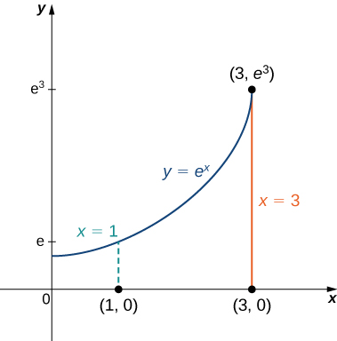{: #CNX_Calc_Figure_15_06_006}

To compute the centroid, we assume that the density function is constant and hence it cancels out:

<math xmlns="http://www.w3.org/1998/Math/MathML"><mtable><mtr /><mtr /><mtr /><mtr /><mtr><mtd columnalign="left"><msub><mi>x</mi><mi>c</mi></msub><mo>=</mo><mfrac><mrow><msub><mi>M</mi><mi>y</mi></msub></mrow><mi>m</mi></mfrac><mo>=</mo><mfrac><mrow><mstyle displaystyle="true"><mrow><munder><mo>∬</mo><mi>R</mi></munder><mrow><mi>x</mi><mspace width="0.2em" /><mi>d</mi><mi>A</mi></mrow></mrow></mstyle></mrow><mrow><mstyle displaystyle="true"><mrow><munder><mo>∬</mo><mi>R</mi></munder><mrow><mi>d</mi><mi>A</mi></mrow></mrow></mstyle></mrow></mfrac><mspace width="0.2em" /><mtext>and</mtext><mspace width="0.2em" /><msub><mi>y</mi><mi>c</mi></msub><mo>=</mo><mfrac><mrow><msub><mi>M</mi><mi>x</mi></msub></mrow><mi>m</mi></mfrac><mo>=</mo><mfrac><mrow><mstyle displaystyle="true"><mrow><munder><mo>∬</mo><mi>R</mi></munder><mrow><mi>y</mi><mspace width="0.2em" /><mi>d</mi><mi>A</mi></mrow></mrow></mstyle></mrow><mrow><mstyle displaystyle="true"><mrow><munder><mo>∬</mo><mi>R</mi></munder><mrow><mi>d</mi><mi>A</mi></mrow></mrow></mstyle></mrow></mfrac><mo>,</mo></mtd></mtr><mtr><mtd columnalign="left"><msub><mi>x</mi><mi>c</mi></msub><mo>=</mo><mfrac><mrow><msub><mi>M</mi><mi>y</mi></msub></mrow><mi>m</mi></mfrac><mo>=</mo><mfrac><mrow><mstyle displaystyle="true"><mrow><munder><mo>∬</mo><mi>R</mi></munder><mrow><mi>x</mi><mspace width="0.2em" /><mi>d</mi><mi>A</mi></mrow></mrow></mstyle></mrow><mrow><mstyle displaystyle="true"><mrow><munder><mo>∬</mo><mi>R</mi></munder><mrow><mi>d</mi><mi>A</mi></mrow></mrow></mstyle></mrow></mfrac><mo>=</mo><mfrac><mrow><mstyle displaystyle="true"><mrow><munderover><mo stretchy="false">∫</mo><mrow><mi>x</mi><mo>=</mo><mn>1</mn></mrow><mrow><mi>x</mi><mo>=</mo><mn>3</mn></mrow></munderover><mspace width="0.2em" /><mrow><mstyle displaystyle="true"><mrow><munderover><mo stretchy="false">∫</mo><mrow><mi>y</mi><mo>=</mo><mn>0</mn></mrow><mrow><mi>y</mi><mo>=</mo><msup><mi>e</mi><mi>x</mi></msup></mrow></munderover><mrow><mi>x</mi><mspace width="0.2em" /><mi>d</mi><mi>y</mi><mspace width="0.2em" /><mi>d</mi><mi>x</mi></mrow></mrow></mstyle></mrow></mrow></mstyle></mrow><mrow><mstyle displaystyle="true"><mrow><munderover><mo stretchy="false">∫</mo><mrow><mi>x</mi><mo>=</mo><mn>1</mn></mrow><mrow><mi>x</mi><mo>=</mo><mn>3</mn></mrow></munderover><mspace width="0.2em" /><mrow><mstyle displaystyle="true"><mrow><munderover><mo stretchy="false">∫</mo><mrow><mi>y</mi><mo>=</mo><mn>0</mn></mrow><mrow><mi>y</mi><mo>=</mo><msup><mi>e</mi><mi>x</mi></msup></mrow></munderover><mrow><mi>d</mi><mi>y</mi><mspace width="0.2em" /><mi>d</mi><mi>x</mi></mrow></mrow></mstyle></mrow></mrow></mstyle></mrow></mfrac><mo>=</mo><mfrac><mrow><mstyle displaystyle="true"><mrow><munderover><mo stretchy="false">∫</mo><mrow><mi>x</mi><mo>=</mo><mn>1</mn></mrow><mrow><mi>x</mi><mo>=</mo><mn>3</mn></mrow></munderover><mrow><mi>x</mi><msup><mi>e</mi><mi>x</mi></msup><mi>d</mi><mi>x</mi></mrow></mrow></mstyle></mrow><mrow><mstyle displaystyle="true"><mrow><munderover><mo stretchy="false">∫</mo><mrow><mi>x</mi><mo>=</mo><mn>1</mn></mrow><mrow><mi>x</mi><mo>=</mo><mn>3</mn></mrow></munderover><mrow><msup><mi>e</mi><mi>x</mi></msup><mi>d</mi><mi>x</mi></mrow></mrow></mstyle></mrow></mfrac><mo>=</mo><mfrac><mrow><mn>2</mn><msup><mi>e</mi><mn>3</mn></msup></mrow><mrow><msup><mi>e</mi><mn>3</mn></msup><mo>−</mo><mi>e</mi></mrow></mfrac><mo>=</mo><mfrac><mrow><mn>2</mn><msup><mi>e</mi><mn>2</mn></msup></mrow><mrow><msup><mi>e</mi><mn>2</mn></msup><mo>−</mo><mn>1</mn></mrow></mfrac><mo>,</mo></mtd></mtr><mtr><mtd columnalign="left"><msub><mi>y</mi><mi>c</mi></msub><mo>=</mo><mfrac><mrow><msub><mi>M</mi><mi>x</mi></msub></mrow><mi>m</mi></mfrac><mo>=</mo><mfrac><mrow><mstyle displaystyle="true"><mrow><munder><mo>∬</mo><mi>R</mi></munder><mrow><mi>y</mi><mspace width="0.2em" /><mi>d</mi><mi>A</mi></mrow></mrow></mstyle></mrow><mrow><mstyle displaystyle="true"><mrow><munder><mo>∬</mo><mi>R</mi></munder><mrow><mi>d</mi><mi>A</mi></mrow></mrow></mstyle></mrow></mfrac><mo>=</mo><mfrac><mrow><mstyle displaystyle="true"><mrow><munderover><mo stretchy="false">∫</mo><mrow><mi>x</mi><mo>=</mo><mn>1</mn></mrow><mrow><mi>x</mi><mo>=</mo><mn>3</mn></mrow></munderover><mspace width="0.2em" /><mrow><mstyle displaystyle="true"><mrow><munderover><mo stretchy="false">∫</mo><mrow><mi>y</mi><mo>=</mo><mn>0</mn></mrow><mrow><mi>y</mi><mo>=</mo><msup><mi>e</mi><mi>x</mi></msup></mrow></munderover><mrow><mi>y</mi><mspace width="0.2em" /><mi>d</mi><mi>y</mi><mspace width="0.2em" /><mi>d</mi><mi>x</mi></mrow></mrow></mstyle></mrow></mrow></mstyle></mrow><mrow><mstyle displaystyle="true"><mrow><munderover><mo stretchy="false">∫</mo><mrow><mi>x</mi><mo>=</mo><mn>1</mn></mrow><mrow><mi>x</mi><mo>=</mo><mn>3</mn></mrow></munderover><mspace width="0.2em" /><mrow><mstyle displaystyle="true"><mrow><munderover><mo stretchy="false">∫</mo><mrow><mi>y</mi><mo>=</mo><mn>0</mn></mrow><mrow><mi>y</mi><mo>=</mo><msup><mi>e</mi><mi>x</mi></msup></mrow></munderover><mrow><mi>d</mi><mi>y</mi><mspace width="0.2em" /><mi>d</mi><mi>x</mi></mrow></mrow></mstyle></mrow></mrow></mstyle></mrow></mfrac><mo>=</mo><mfrac><mrow><mstyle displaystyle="true"><mrow><munderover><mo stretchy="false">∫</mo><mrow><mi>x</mi><mo>=</mo><mn>1</mn></mrow><mrow><mi>x</mi><mo>=</mo><mn>3</mn></mrow></munderover><mrow><mfrac><mrow><msup><mi>e</mi><mrow><mn>2</mn><mi>x</mi></mrow></msup></mrow><mn>2</mn></mfrac><mi>d</mi><mi>x</mi></mrow></mrow></mstyle></mrow><mrow><mstyle displaystyle="true"><mrow><munderover><mo stretchy="false">∫</mo><mrow><mi>x</mi><mo>=</mo><mn>1</mn></mrow><mrow><mi>x</mi><mo>=</mo><mn>3</mn></mrow></munderover><mrow><msup><mi>e</mi><mi>x</mi></msup><mi>d</mi><mi>x</mi></mrow></mrow></mstyle></mrow></mfrac><mo>=</mo><mfrac><mrow><mfrac><mn>1</mn><mn>4</mn></mfrac><msup><mi>e</mi><mn>2</mn></msup><mrow><mo>(</mo><mrow><msup><mi>e</mi><mn>4</mn></msup><mo>−</mo><mn>1</mn></mrow><mo>)</mo></mrow></mrow><mrow><mi>e</mi><mrow><mo>(</mo><mrow><msup><mi>e</mi><mn>2</mn></msup><mo>−</mo><mn>1</mn></mrow><mo>)</mo></mrow></mrow></mfrac><mo>=</mo><mfrac><mn>1</mn><mn>4</mn></mfrac><mi>e</mi><mrow><mo>(</mo><mrow><msup><mi>e</mi><mn>2</mn></msup><mo>+</mo><mn>1</mn></mrow><mo>)</mo></mrow><mo>.</mo></mtd></mtr></mtable></math>

Thus the centroid of the region is

<math xmlns="http://www.w3.org/1998/Math/MathML"><mrow><mrow><mo>(</mo><mrow><msub><mi>x</mi><mi>c</mi></msub><mo>,</mo><msub><mi>y</mi><mi>c</mi></msub></mrow><mo>)</mo></mrow><mo>=</mo><mrow><mo>(</mo><mrow><mfrac><mrow><mn>2</mn><msup><mi>e</mi><mn>2</mn></msup></mrow><mrow><msup><mi>e</mi><mn>2</mn></msup><mo>−</mo><mn>1</mn></mrow></mfrac><mo>,</mo><mfrac><mn>1</mn><mn>4</mn></mfrac><mi>e</mi><mrow><mo>(</mo><mrow><msup><mi>e</mi><mn>2</mn></msup><mo>+</mo><mn>1</mn></mrow><mo>)</mo></mrow></mrow><mo>)</mo></mrow><mo>.</mo></mrow></math>

Calculate the centroid of the region between the curves <math xmlns="http://www.w3.org/1998/Math/MathML"><mrow><mi>y</mi><mo>=</mo><mi>x</mi></mrow></math>

 and <math xmlns="http://www.w3.org/1998/Math/MathML"><mrow><mi>y</mi><mo>=</mo><msqrt><mi>x</mi></msqrt></mrow></math>

 with uniform density in the interval <math xmlns="http://www.w3.org/1998/Math/MathML"><mrow><mn>0</mn><mo>≤</mo><mi>x</mi><mo>≤</mo><mn>1</mn><mo>.</mo></mrow></math>

<math xmlns="http://www.w3.org/1998/Math/MathML"><mrow><msub><mi>x</mi><mi>c</mi></msub><mo>=</mo><mfrac><mrow><msub><mi>M</mi><mi>y</mi></msub></mrow><mi>m</mi></mfrac><mo>=</mo><mfrac><mrow><mn>1</mn><mtext>/</mtext><mn>15</mn></mrow><mrow><mn>1</mn><mtext>/</mtext><mn>6</mn></mrow></mfrac><mo>=</mo><mfrac><mn>2</mn><mn>5</mn></mfrac><mspace width="0.2em" /><mtext>and</mtext><mspace width="0.2em" /><msub><mi>y</mi><mi>c</mi></msub><mo>=</mo><mfrac><mrow><msub><mi>M</mi><mi>x</mi></msub></mrow><mi>m</mi></mfrac><mo>=</mo><mfrac><mrow><mn>1</mn><mtext>/</mtext><mn>12</mn></mrow><mrow><mn>1</mn><mtext>/</mtext><mn>6</mn></mrow></mfrac><mo>=</mo><mfrac><mn>1</mn><mn>2</mn></mfrac></mrow></math>

### Moments of Inertia

For a clear understanding of how to calculate moments of inertia using double integrals, we need to go back to the general definition in Section <math xmlns="http://www.w3.org/1998/Math/MathML"><mrow><mn>6.6</mn><mo>.</mo></mrow></math>

 The moment of inertia of a particle of mass <math xmlns="http://www.w3.org/1998/Math/MathML"><mi>m</mi></math>

 about an axis is <math xmlns="http://www.w3.org/1998/Math/MathML"><mrow><mi>m</mi><msup><mi>r</mi><mn>2</mn></msup><mo>,</mo></mrow></math>

 where <math xmlns="http://www.w3.org/1998/Math/MathML"><mi>r</mi></math>

 is the distance of the particle from the axis. We can see from [\[link\]](#CNX_Calc_Figure_15_06_003) that the moment of inertia of the subrectangle <math xmlns="http://www.w3.org/1998/Math/MathML"><mrow><msub><mi>R</mi><mrow><mi>i</mi><mi>j</mi></mrow></msub></mrow></math>

 about the <math xmlns="http://www.w3.org/1998/Math/MathML"><mrow><mi>x</mi><mtext>-axis</mtext></mrow></math>

 is <math xmlns="http://www.w3.org/1998/Math/MathML"><mrow><msup><mrow><mo stretchy="false">(</mo><msubsup><mi>y</mi><mrow><mi>i</mi><mi>j</mi></mrow><mo>*</mo></msubsup><mo stretchy="false">)</mo></mrow><mn>2</mn></msup><mi>ρ</mi><mo stretchy="false">(</mo><msubsup><mi>x</mi><mrow><mi>i</mi><mi>j</mi></mrow><mo>*</mo></msubsup><mo>,</mo><msubsup><mi>y</mi><mrow><mi>i</mi><mi>j</mi></mrow><mo>*</mo></msubsup><mo stretchy="false">)</mo><mtext>Δ</mtext><mi>A</mi><mo>.</mo></mrow></math>

 Similarly, the moment of inertia of the subrectangle <math xmlns="http://www.w3.org/1998/Math/MathML"><mrow><msub><mi>R</mi><mrow><mi>i</mi><mi>j</mi></mrow></msub></mrow></math>

 about the <math xmlns="http://www.w3.org/1998/Math/MathML"><mrow><mi>y</mi><mtext>-axis</mtext></mrow></math>

 is <math xmlns="http://www.w3.org/1998/Math/MathML"><mrow><msup><mrow><mo stretchy="false">(</mo><msubsup><mi>x</mi><mrow><mi>i</mi><mi>j</mi></mrow><mo>*</mo></msubsup><mo stretchy="false">)</mo></mrow><mn>2</mn></msup><mi>ρ</mi><mo stretchy="false">(</mo><msubsup><mi>x</mi><mrow><mi>i</mi><mi>j</mi></mrow><mo>*</mo></msubsup><mo>,</mo><msubsup><mi>y</mi><mrow><mi>i</mi><mi>j</mi></mrow><mo>*</mo></msubsup><mo stretchy="false">)</mo><mtext>Δ</mtext><mi>A</mi><mo>.</mo></mrow></math>

 The moment of inertia is related to the rotation of the mass; specifically, it measures the tendency of the mass to resist a change in rotational motion about an axis.

The moment of inertia <math xmlns="http://www.w3.org/1998/Math/MathML"><mrow><msub><mi>I</mi><mi>x</mi></msub></mrow></math>

 about the <math xmlns="http://www.w3.org/1998/Math/MathML"><mrow><mi>x</mi><mtext>-axis</mtext></mrow></math>

 for the region <math xmlns="http://www.w3.org/1998/Math/MathML"><mi>R</mi></math>

 is the limit of the sum of moments of inertia of the regions <math xmlns="http://www.w3.org/1998/Math/MathML"><mrow><msub><mi>R</mi><mrow><mi>i</mi><mi>j</mi></mrow></msub></mrow></math>

 about the <math xmlns="http://www.w3.org/1998/Math/MathML"><mrow><mi>x</mi><mtext>-axis</mtext><mtext>.</mtext></mrow></math>

 Hence

<math xmlns="http://www.w3.org/1998/Math/MathML"><mrow><msub><mi>I</mi><mi>x</mi></msub><mo>=</mo><munder><mrow><mtext>lim</mtext></mrow><mrow><mi>k</mi><mo>,</mo><mi>l</mi><mo stretchy="false">→</mo><mi>∞</mi></mrow></munder><msup><mrow><mstyle displaystyle="true"><munderover><mo>∑</mo><mrow><mi>i</mi><mo>=</mo><mn>1</mn></mrow><mi>k</mi></munderover><mrow><mstyle displaystyle="true"><munderover><mo>∑</mo><mrow><mi>j</mi><mo>=</mo><mn>1</mn></mrow><mi>l</mi></munderover><mrow><mrow><mo>(</mo><mrow><msubsup><mi>y</mi><mrow><mi>i</mi><mi>j</mi></mrow><mo>*</mo></msubsup></mrow><mo>)</mo></mrow></mrow></mstyle></mrow></mstyle></mrow><mn>2</mn></msup><msub><mi>m</mi><mrow><mi>i</mi><mi>j</mi></mrow></msub><mo>=</mo><munder><mrow><mtext>lim</mtext></mrow><mrow><mi>k</mi><mo>,</mo><mi>l</mi><mo stretchy="false">→</mo><mi>∞</mi></mrow></munder><msup><mrow><mstyle displaystyle="true"><munderover><mo>∑</mo><mrow><mi>i</mi><mo>=</mo><mn>1</mn></mrow><mi>k</mi></munderover><mrow><mstyle displaystyle="true"><munderover><mo>∑</mo><mrow><mi>j</mi><mo>=</mo><mn>1</mn></mrow><mi>l</mi></munderover><mrow><mrow><mo>(</mo><mrow><msubsup><mi>y</mi><mrow><mi>i</mi><mi>j</mi></mrow><mo>*</mo></msubsup></mrow><mo>)</mo></mrow></mrow></mstyle></mrow></mstyle></mrow><mn>2</mn></msup><mi>ρ</mi><mrow><mo>(</mo><mrow><msubsup><mi>x</mi><mrow><mi>i</mi><mi>j</mi></mrow><mo>*</mo></msubsup><mo>,</mo><msubsup><mi>y</mi><mrow><mi>i</mi><mi>j</mi></mrow><mo>*</mo></msubsup></mrow><mo>)</mo></mrow><mtext>Δ</mtext><mi>A</mi><mo>=</mo><mstyle displaystyle="true"><mrow><munder><mo>∬</mo><mi>R</mi></munder><mrow><msup><mi>y</mi><mn>2</mn></msup><mi>ρ</mi><mrow><mo>(</mo><mrow><mi>x</mi><mo>,</mo><mi>y</mi></mrow><mo>)</mo></mrow></mrow></mrow></mstyle><mi>d</mi><mi>A</mi><mo>.</mo></mrow></math>

Similarly, the moment of inertia <math xmlns="http://www.w3.org/1998/Math/MathML"><mrow><msub><mi>I</mi><mi>y</mi></msub></mrow></math>

 about the <math xmlns="http://www.w3.org/1998/Math/MathML"><mrow><mi>y</mi><mtext>-axis</mtext></mrow></math>

 for <math xmlns="http://www.w3.org/1998/Math/MathML"><mi>R</mi></math>

 is the limit of the sum of moments of inertia of the regions <math xmlns="http://www.w3.org/1998/Math/MathML"><mrow><msub><mi>R</mi><mrow><mi>i</mi><mi>j</mi></mrow></msub></mrow></math>

 about the <math xmlns="http://www.w3.org/1998/Math/MathML"><mrow><mi>y</mi><mtext>-axis</mtext><mtext>.</mtext></mrow></math>

 Hence

<math xmlns="http://www.w3.org/1998/Math/MathML"><mrow><msub><mi>I</mi><mi>y</mi></msub><mo>=</mo><munder><mrow><mtext>lim</mtext></mrow><mrow><mi>k</mi><mo>,</mo><mi>l</mi><mo stretchy="false">→</mo><mi>∞</mi></mrow></munder><msup><mrow><mstyle displaystyle="true"><munderover><mo>∑</mo><mrow><mi>i</mi><mo>=</mo><mn>1</mn></mrow><mi>k</mi></munderover><mrow><mstyle displaystyle="true"><munderover><mo>∑</mo><mrow><mi>j</mi><mo>=</mo><mn>1</mn></mrow><mi>l</mi></munderover><mrow><mrow><mo>(</mo><mrow><msubsup><mi>x</mi><mrow><mi>i</mi><mi>j</mi></mrow><mo>*</mo></msubsup></mrow><mo>)</mo></mrow></mrow></mstyle></mrow></mstyle></mrow><mn>2</mn></msup><msub><mi>m</mi><mrow><mi>i</mi><mi>j</mi></mrow></msub><mo>=</mo><munder><mrow><mtext>lim</mtext></mrow><mrow><mi>k</mi><mo>,</mo><mi>l</mi><mo stretchy="false">→</mo><mi>∞</mi></mrow></munder><msup><mrow><mstyle displaystyle="true"><munderover><mo>∑</mo><mrow><mi>i</mi><mo>=</mo><mn>1</mn></mrow><mi>k</mi></munderover><mrow><mstyle displaystyle="true"><munderover><mo>∑</mo><mrow><mi>j</mi><mo>=</mo><mn>1</mn></mrow><mi>l</mi></munderover><mrow><mrow><mo>(</mo><mrow><msubsup><mi>x</mi><mrow><mi>i</mi><mi>j</mi></mrow><mo>*</mo></msubsup></mrow><mo>)</mo></mrow></mrow></mstyle></mrow></mstyle></mrow><mn>2</mn></msup><mi>ρ</mi><mrow><mo>(</mo><mrow><msubsup><mi>x</mi><mrow><mi>i</mi><mi>j</mi></mrow><mo>*</mo></msubsup><mo>,</mo><msubsup><mi>y</mi><mrow><mi>i</mi><mi>j</mi></mrow><mo>*</mo></msubsup></mrow><mo>)</mo></mrow><mtext>Δ</mtext><mi>A</mi><mo>=</mo><mstyle displaystyle="true"><mrow><munder><mo>∬</mo><mi>R</mi></munder><mrow><msup><mi>x</mi><mn>2</mn></msup><mi>ρ</mi><mrow><mo>(</mo><mrow><mi>x</mi><mo>,</mo><mi>y</mi></mrow><mo>)</mo></mrow></mrow></mrow></mstyle><mi>d</mi><mi>A</mi><mo>.</mo></mrow></math>

Sometimes, we need to find the moment of inertia of an object about the origin, which is known as the polar moment of inertia. We denote this by <math xmlns="http://www.w3.org/1998/Math/MathML"><mrow><msub><mi>I</mi><mn>0</mn></msub></mrow></math>

 and obtain it by adding the moments of inertia <math xmlns="http://www.w3.org/1998/Math/MathML"><mrow><msub><mi>I</mi><mi>x</mi></msub></mrow></math>

 and <math xmlns="http://www.w3.org/1998/Math/MathML"><mrow><msub><mi>I</mi><mi>y</mi></msub><mo>.</mo></mrow></math>

 Hence

<math xmlns="http://www.w3.org/1998/Math/MathML"><mrow><msub><mi>I</mi><mn>0</mn></msub><mo>=</mo><msub><mi>I</mi><mi>x</mi></msub><mo>+</mo><msub><mi>I</mi><mi>y</mi></msub><mo>=</mo><mstyle displaystyle="true"><mrow><munder><mo>∬</mo><mi>R</mi></munder><mrow><mrow><mo>(</mo><mrow><msup><mi>x</mi><mn>2</mn></msup><mo>+</mo><msup><mi>y</mi><mn>2</mn></msup></mrow><mo>)</mo></mrow></mrow></mrow></mstyle><mi>ρ</mi><mrow><mo>(</mo><mrow><mi>x</mi><mo>,</mo><mi>y</mi></mrow><mo>)</mo></mrow><mi>d</mi><mi>A</mi><mo>.</mo></mrow></math>

All these expressions can be written in polar coordinates by substituting <math xmlns="http://www.w3.org/1998/Math/MathML"><mrow><mi>x</mi><mo>=</mo><mi>r</mi><mspace width="0.2em" /><mtext>cos</mtext><mspace width="0.2em" /><mi>θ</mi><mo>,</mo></mrow></math>

 <math xmlns="http://www.w3.org/1998/Math/MathML"><mrow><mi>y</mi><mo>=</mo><mi>r</mi><mspace width="0.2em" /><mtext>sin</mtext><mspace width="0.2em" /><mi>θ</mi><mo>,</mo></mrow></math>

 and <math xmlns="http://www.w3.org/1998/Math/MathML"><mrow><mi>d</mi><mi>A</mi><mo>=</mo><mi>r</mi><mspace width="0.2em" /><mi>d</mi><mi>r</mi><mspace width="0.2em" /><mi>d</mi><mi>θ</mi><mo>.</mo></mrow></math>

 For example, <math xmlns="http://www.w3.org/1998/Math/MathML"><mrow><msub><mi>I</mi><mn>0</mn></msub><mo>=</mo><mstyle displaystyle="true"><mrow><munder><mo>∬</mo><mi>R</mi></munder><mrow><msup><mi>r</mi><mn>2</mn></msup><mi>ρ</mi><mrow><mo>(</mo><mrow><mi>r</mi><mspace width="0.2em" /><mtext>cos</mtext><mspace width="0.2em" /><mi>θ</mi><mo>,</mo><mi>r</mi><mspace width="0.2em" /><mtext>sin</mtext><mspace width="0.2em" /><mi>θ</mi></mrow><mo>)</mo></mrow></mrow></mrow></mstyle><mi>d</mi><mi>A</mi><mo>.</mo></mrow></math>

Finding Moments of Inertia for a Triangular Lamina

Use the triangular region <math xmlns="http://www.w3.org/1998/Math/MathML"><mi>R</mi></math>

 with vertices <math xmlns="http://www.w3.org/1998/Math/MathML"><mrow><mrow><mo>(</mo><mrow><mn>0</mn><mo>,</mo><mn>0</mn></mrow><mo>)</mo></mrow><mo>,</mo><mrow><mo>(</mo><mrow><mn>2</mn><mo>,</mo><mn>2</mn></mrow><mo>)</mo></mrow><mo>,</mo></mrow></math>

 and <math xmlns="http://www.w3.org/1998/Math/MathML"><mrow><mrow><mo>(</mo><mrow><mn>2</mn><mo>,</mo><mn>0</mn></mrow><mo>)</mo></mrow></mrow></math>

 and with density <math xmlns="http://www.w3.org/1998/Math/MathML"><mrow><mi>ρ</mi><mrow><mo>(</mo><mrow><mi>x</mi><mo>,</mo><mi>y</mi></mrow><mo>)</mo></mrow><mo>=</mo><mi>x</mi><mi>y</mi></mrow></math>

 as in previous examples. Find the moments of inertia.

Using the expressions established above for the moments of inertia, we have

<math xmlns="http://www.w3.org/1998/Math/MathML"><mtable><mtr><mtd columnalign="right"><msub><mi>I</mi><mi>x</mi></msub></mtd><mtd columnalign="left"><mo>=</mo></mtd><mtd columnalign="left"><mstyle displaystyle="true"><mrow><munder><mo>∬</mo><mi>R</mi></munder><mrow><msup><mi>y</mi><mn>2</mn></msup><mi>ρ</mi><mrow><mo>(</mo><mrow><mi>x</mi><mo>,</mo><mi>y</mi></mrow><mo>)</mo></mrow></mrow></mrow></mstyle><mi>d</mi><mi>A</mi><mo>=</mo><mstyle displaystyle="true"><mrow><munderover><mo stretchy="false">∫</mo><mrow><mi>x</mi><mo>=</mo><mn>0</mn></mrow><mrow><mi>x</mi><mo>=</mo><mn>2</mn></mrow></munderover><mspace width="0.2em" /><mrow><mstyle displaystyle="true"><mrow><munderover><mo stretchy="false">∫</mo><mrow><mi>y</mi><mo>=</mo><mn>0</mn></mrow><mrow><mi>y</mi><mo>=</mo><mi>x</mi></mrow></munderover><mrow><mi>x</mi><msup><mi>y</mi><mn>3</mn></msup><mi>d</mi><mi>y</mi><mspace width="0.2em" /><mi>d</mi><mi>x</mi></mrow></mrow></mstyle></mrow></mrow></mstyle><mo>=</mo><mfrac><mn>8</mn><mn>3</mn></mfrac><mo>,</mo></mtd></mtr><mtr><mtd columnalign="right"><msub><mi>I</mi><mi>y</mi></msub></mtd><mtd columnalign="left"><mo>=</mo></mtd><mtd columnalign="left"><mstyle displaystyle="true"><mrow><munder><mo>∬</mo><mi>R</mi></munder><mrow><msup><mi>x</mi><mn>2</mn></msup><mi>ρ</mi><mrow><mo>(</mo><mrow><mi>x</mi><mo>,</mo><mi>y</mi></mrow><mo>)</mo></mrow></mrow></mrow></mstyle><mi>d</mi><mi>A</mi><mo>=</mo><mstyle displaystyle="true"><mrow><munderover><mo stretchy="false">∫</mo><mrow><mi>x</mi><mo>=</mo><mn>0</mn></mrow><mrow><mi>x</mi><mo>=</mo><mn>2</mn></mrow></munderover><mspace width="0.2em" /><mrow><mstyle displaystyle="true"><mrow><munderover><mo stretchy="false">∫</mo><mrow><mi>y</mi><mo>=</mo><mn>0</mn></mrow><mrow><mi>y</mi><mo>=</mo><mi>x</mi></mrow></munderover><mrow><msup><mi>x</mi><mn>3</mn></msup><mi>y</mi><mspace width="0.2em" /><mi>d</mi><mi>y</mi><mspace width="0.2em" /><mi>d</mi><mi>x</mi></mrow></mrow></mstyle></mrow></mrow></mstyle><mo>=</mo><mfrac><mrow><mn>16</mn></mrow><mn>3</mn></mfrac><mo>,</mo></mtd></mtr><mtr><mtd columnalign="right"><msub><mi>I</mi><mn>0</mn></msub></mtd><mtd columnalign="left"><mo>=</mo></mtd><mtd columnalign="left"><mstyle displaystyle="true"><mrow><munder><mo>∬</mo><mi>R</mi></munder><mrow><mrow><mo>(</mo><mrow><msup><mi>x</mi><mn>2</mn></msup><mo>+</mo><msup><mi>y</mi><mn>2</mn></msup></mrow><mo>)</mo></mrow></mrow></mrow></mstyle><mi>ρ</mi><mo stretchy="false">(</mo><mi>x</mi><mo>,</mo><mi>y</mi><mo stretchy="false">)</mo><mi>d</mi><mi>A</mi><mo>=</mo><mstyle displaystyle="true"><mrow><munderover><mo stretchy="false">∫</mo><mn>0</mn><mn>2</mn></munderover><mspace width="0.2em" /><mrow><mstyle displaystyle="true"><mrow><munderover><mo stretchy="false">∫</mo><mn>0</mn><mi>x</mi></munderover><mrow><mrow><mo>(</mo><mrow><msup><mi>x</mi><mn>2</mn></msup><mo>+</mo><msup><mi>y</mi><mn>2</mn></msup></mrow><mo>)</mo></mrow><mi>x</mi><mi>y</mi><mspace width="0.2em" /><mi>d</mi><mi>y</mi><mspace width="0.2em" /><mi>d</mi><mi>x</mi></mrow></mrow></mstyle></mrow></mrow></mstyle></mtd></mtr><mtr><mtd /><mtd columnalign="left"><mo>=</mo></mtd><mtd columnalign="left"><msub><mi>I</mi><mi>x</mi></msub><mo>+</mo><msub><mi>I</mi><mi>y</mi></msub><mo>=</mo><mn>8.</mn></mtd></mtr></mtable></math>

Again use the same region <math xmlns="http://www.w3.org/1998/Math/MathML"><mi>R</mi></math>

 as above and the density function <math xmlns="http://www.w3.org/1998/Math/MathML"><mrow><mi>ρ</mi><mrow><mo>(</mo><mrow><mi>x</mi><mo>,</mo><mi>y</mi></mrow><mo>)</mo></mrow><mo>=</mo><msqrt><mrow><mi>x</mi><mi>y</mi></mrow></msqrt><mo>.</mo></mrow></math>

 Find the moments of inertia.

<math xmlns="http://www.w3.org/1998/Math/MathML"><mrow><msub><mi>I</mi><mi>x</mi></msub><mo>=</mo><mstyle displaystyle="true"><mrow><munderover><mo stretchy="false">∫</mo><mrow><mi>x</mi><mo>=</mo><mn>0</mn></mrow><mrow><mi>x</mi><mo>=</mo><mn>2</mn></mrow></munderover><mspace width="0.2em" /><mrow><mstyle displaystyle="true"><mrow><munderover><mo stretchy="false">∫</mo><mrow><mi>y</mi><mo>=</mo><mn>0</mn></mrow><mrow><mi>y</mi><mo>=</mo><mi>x</mi></mrow></munderover><mrow><msup><mi>y</mi><mn>2</mn></msup><msqrt><mrow><mi>x</mi><mi>y</mi></mrow></msqrt><mspace width="0.2em" /><mi>d</mi><mi>y</mi><mspace width="0.2em" /><mi>d</mi><mi>x</mi></mrow></mrow></mstyle></mrow></mrow></mstyle><mo>=</mo><mfrac><mrow><mn>64</mn></mrow><mrow><mn>35</mn></mrow></mfrac></mrow></math>

 and <math xmlns="http://www.w3.org/1998/Math/MathML"><mrow><msub><mi>I</mi><mi>y</mi></msub><mo>=</mo><mstyle displaystyle="true"><mrow><munderover><mo stretchy="false">∫</mo><mrow><mi>x</mi><mo>=</mo><mn>0</mn></mrow><mrow><mi>x</mi><mo>=</mo><mn>2</mn></mrow></munderover><mspace width="0.2em" /><mrow><mstyle displaystyle="true"><mrow><munderover><mo stretchy="false">∫</mo><mrow><mi>y</mi><mo>=</mo><mn>0</mn></mrow><mrow><mi>y</mi><mo>=</mo><mi>x</mi></mrow></munderover><mrow><msup><mi>x</mi><mn>2</mn></msup><msqrt><mrow><mi>x</mi><mi>y</mi></mrow></msqrt><mspace width="0.2em" /><mi>d</mi><mi>y</mi><mspace width="0.2em" /><mi>d</mi><mi>x</mi></mrow></mrow></mstyle></mrow></mrow></mstyle><mo>=</mo><mfrac><mrow><mn>64</mn></mrow><mrow><mn>35</mn></mrow></mfrac><mo>.</mo></mrow></math>

 Also, <math xmlns="http://www.w3.org/1998/Math/MathML"><mrow><msub><mi>I</mi><mn>0</mn></msub><mo>=</mo><mstyle displaystyle="true"><mrow><munderover><mo stretchy="false">∫</mo><mrow><mi>x</mi><mo>=</mo><mn>0</mn></mrow><mrow><mi>x</mi><mo>=</mo><mn>2</mn></mrow></munderover><mspace width="0.2em" /><mrow><mstyle displaystyle="true"><mrow><munderover><mo stretchy="false">∫</mo><mrow><mi>y</mi><mo>=</mo><mn>0</mn></mrow><mrow><mi>y</mi><mo>=</mo><mi>x</mi></mrow></munderover><mrow><mrow><mo>(</mo><mrow><msup><mi>x</mi><mn>2</mn></msup><mo>+</mo><msup><mi>y</mi><mn>2</mn></msup></mrow><mo>)</mo></mrow><msqrt><mrow><mi>x</mi><mi>y</mi></mrow></msqrt><mspace width="0.2em" /><mi>d</mi><mi>y</mi><mspace width="0.2em" /><mi>d</mi><mi>x</mi></mrow></mrow></mstyle></mrow></mrow></mstyle><mo>=</mo><mfrac><mrow><mn>128</mn></mrow><mrow><mn>21</mn></mrow></mfrac><mo>.</mo></mrow></math>

As mentioned earlier, the moment of inertia of a particle of mass <math xmlns="http://www.w3.org/1998/Math/MathML"><mi>m</mi></math>

 about an axis is <math xmlns="http://www.w3.org/1998/Math/MathML"><mrow><mi>m</mi><msup><mi>r</mi><mn>2</mn></msup></mrow></math>

 where <math xmlns="http://www.w3.org/1998/Math/MathML"><mi>r</mi></math>

 is the distance of the particle from the axis, also known as the **radius of gyration**{: data-type="term"}.

Hence the radii of gyration with respect to the <math xmlns="http://www.w3.org/1998/Math/MathML"><mrow><mi>x</mi><mtext>-axis,</mtext></mrow></math>

 the <math xmlns="http://www.w3.org/1998/Math/MathML"><mrow><mi>y</mi><mtext>-axis,</mtext></mrow></math>

 and the origin are

<math xmlns="http://www.w3.org/1998/Math/MathML"><mrow><msub><mi>R</mi><mi>x</mi></msub><mo>=</mo><msqrt><mrow><mfrac><mrow><msub><mi>I</mi><mi>x</mi></msub></mrow><mi>m</mi></mfrac></mrow></msqrt><mo>,</mo><msub><mi>R</mi><mi>y</mi></msub><mo>=</mo><msqrt><mrow><mfrac><mrow><msub><mi>I</mi><mi>y</mi></msub></mrow><mi>m</mi></mfrac></mrow></msqrt><mo>,</mo><mtext>and</mtext><mspace width="0.2em" /><msub><mi>R</mi><mn>0</mn></msub><mo>=</mo><msqrt><mrow><mfrac><mrow><msub><mi>I</mi><mn>0</mn></msub></mrow><mi>m</mi></mfrac></mrow></msqrt><mo>,</mo></mrow></math>

respectively. In each case, the radius of gyration tells us how far (perpendicular distance) from the axis of rotation the entire mass of an object might be concentrated. The moments of an object are useful for finding information on the balance and torque of the object about an axis, but radii of gyration are used to describe the distribution of mass around its centroidal axis. There are many applications in engineering and physics. Sometimes it is necessary to find the radius of gyration, as in the next example.

Finding the Radius of Gyration for a Triangular Lamina

Consider the same triangular lamina <math xmlns="http://www.w3.org/1998/Math/MathML"><mi>R</mi></math>

 with vertices <math xmlns="http://www.w3.org/1998/Math/MathML"><mrow><mrow><mo>(</mo><mrow><mn>0</mn><mo>,</mo><mn>0</mn></mrow><mo>)</mo></mrow><mo>,</mo><mrow><mo>(</mo><mrow><mn>2</mn><mo>,</mo><mn>2</mn></mrow><mo>)</mo></mrow><mo>,</mo></mrow></math>

 and <math xmlns="http://www.w3.org/1998/Math/MathML"><mrow><mrow><mo>(</mo><mrow><mn>2</mn><mo>,</mo><mn>0</mn></mrow><mo>)</mo></mrow></mrow></math>

 and with density <math xmlns="http://www.w3.org/1998/Math/MathML"><mrow><mi>ρ</mi><mrow><mo>(</mo><mrow><mi>x</mi><mo>,</mo><mi>y</mi></mrow><mo>)</mo></mrow><mo>=</mo><mi>x</mi><mi>y</mi></mrow></math>

 as in previous examples. Find the radii of gyration with respect to the <math xmlns="http://www.w3.org/1998/Math/MathML"><mrow><mi>x</mi><mtext>-axis,</mtext></mrow></math>

 the <math xmlns="http://www.w3.org/1998/Math/MathML"><mrow><mi>y</mi><mtext>-axis,</mtext></mrow></math>

 and the origin.

If we compute the mass of this region we find that <math xmlns="http://www.w3.org/1998/Math/MathML"><mrow><mi>m</mi><mo>=</mo><mn>2</mn><mo>.</mo></mrow></math>

 We found the moments of inertia of this lamina in [[link]](#fs-id1167794250129). From these data, the radii of gyration with respect to the <math xmlns="http://www.w3.org/1998/Math/MathML"><mrow><mi>x</mi><mtext>-axis,</mtext></mrow></math>

 <math xmlns="http://www.w3.org/1998/Math/MathML"><mrow><mi>y</mi><mtext>-axis,</mtext></mrow></math>

 and the origin are, respectively,

<math xmlns="http://www.w3.org/1998/Math/MathML"><mtable><mtr><mtd columnalign="right"><msub><mi>R</mi><mi>x</mi></msub></mtd><mtd columnalign="left"><mo>=</mo></mtd><mtd columnalign="left"><msqrt><mrow><mfrac><mrow><msub><mi>I</mi><mi>x</mi></msub></mrow><mi>m</mi></mfrac></mrow></msqrt><mo>=</mo><msqrt><mrow><mfrac><mrow><mn>8</mn><mtext>/</mtext><mn>3</mn></mrow><mn>2</mn></mfrac></mrow></msqrt><mo>=</mo><msqrt><mrow><mfrac><mn>8</mn><mn>6</mn></mfrac></mrow></msqrt><mo>=</mo><mfrac><mrow><mn>2</mn><msqrt><mn>3</mn></msqrt></mrow><mn>3</mn></mfrac><mo>,</mo></mtd></mtr><mtr><mtd columnalign="right"><msub><mi>R</mi><mi>y</mi></msub></mtd><mtd columnalign="left"><mo>=</mo></mtd><mtd columnalign="left"><msqrt><mrow><mfrac><mrow><msub><mi>I</mi><mi>y</mi></msub></mrow><mi>m</mi></mfrac></mrow></msqrt><mo>=</mo><msqrt><mrow><mfrac><mrow><mn>16</mn><mtext>/</mtext><mn>3</mn></mrow><mn>2</mn></mfrac></mrow></msqrt><mo>=</mo><msqrt><mrow><mfrac><mn>8</mn><mn>3</mn></mfrac></mrow></msqrt><mo>=</mo><mfrac><mrow><mn>2</mn><msqrt><mn>6</mn></msqrt></mrow><mn>3</mn></mfrac><mo>,</mo></mtd></mtr><mtr><mtd columnalign="right"><msub><mi>R</mi><mn>0</mn></msub></mtd><mtd columnalign="left"><mo>=</mo></mtd><mtd columnalign="left"><msqrt><mrow><mfrac><mrow><msub><mi>I</mi><mn>0</mn></msub></mrow><mi>m</mi></mfrac></mrow></msqrt><mo>=</mo><msqrt><mrow><mfrac><mn>8</mn><mn>2</mn></mfrac></mrow></msqrt><mo>=</mo><msqrt><mn>4</mn></msqrt><mo>=</mo><mn>2</mn><mo>.</mo></mtd></mtr></mtable></math>

Use the same region <math xmlns="http://www.w3.org/1998/Math/MathML"><mi>R</mi></math>

 from [[link]](#fs-id1167794296453) and the density function <math xmlns="http://www.w3.org/1998/Math/MathML"><mrow><mi>ρ</mi><mrow><mo>(</mo><mrow><mi>x</mi><mo>,</mo><mi>y</mi></mrow><mo>)</mo></mrow><mo>=</mo><msqrt><mrow><mi>x</mi><mi>y</mi></mrow></msqrt><mo>.</mo></mrow></math>

 Find the radii of gyration with respect to the <math xmlns="http://www.w3.org/1998/Math/MathML"><mrow><mi>x</mi><mtext>-axis,</mtext></mrow></math>

 the <math xmlns="http://www.w3.org/1998/Math/MathML"><mrow><mi>y</mi><mtext>-axis,</mtext></mrow></math>

 and the origin.

<math xmlns="http://www.w3.org/1998/Math/MathML"><mrow><msub><mi>R</mi><mi>x</mi></msub><mo>=</mo><mfrac><mrow><mn>6</mn><msqrt><mrow><mn>35</mn></mrow></msqrt></mrow><mrow><mn>35</mn></mrow></mfrac><mo>,</mo></mrow></math>

 <math xmlns="http://www.w3.org/1998/Math/MathML"><mrow><msub><mi>R</mi><mi>y</mi></msub><mo>=</mo><mfrac><mrow><mn>6</mn><msqrt><mrow><mn>15</mn></mrow></msqrt></mrow><mrow><mn>15</mn></mrow></mfrac><mo>,</mo></mrow></math>

 and <math xmlns="http://www.w3.org/1998/Math/MathML"><mrow><msub><mi>R</mi><mn>0</mn></msub><mo>=</mo><mfrac><mrow><mn>4</mn><msqrt><mrow><mn>42</mn></mrow></msqrt></mrow><mn>7</mn></mfrac><mo>.</mo></mrow></math>

Hint

Follow the steps shown in the previous example.

### Center of Mass and Moments of Inertia in Three Dimensions

All the expressions of double integrals discussed so far can be modified to become triple integrals.

Definition

If we have a solid object <math xmlns="http://www.w3.org/1998/Math/MathML"><mi>Q</mi></math>

 with a density function <math xmlns="http://www.w3.org/1998/Math/MathML"><mrow><mi>ρ</mi><mrow><mo>(</mo><mrow><mi>x</mi><mo>,</mo><mi>y</mi><mo>,</mo><mi>z</mi></mrow><mo>)</mo></mrow></mrow></math>

 at any point <math xmlns="http://www.w3.org/1998/Math/MathML"><mrow><mrow><mo>(</mo><mrow><mi>x</mi><mo>,</mo><mi>y</mi><mo>,</mo><mi>z</mi></mrow><mo>)</mo></mrow></mrow></math>

 in space, then its mass is

<math xmlns="http://www.w3.org/1998/Math/MathML"><mrow><mi>m</mi><mo>=</mo><mstyle displaystyle="true"><mrow><munder><mo>∭</mo><mi>Q</mi></munder><mrow><mi>ρ</mi><mrow><mo>(</mo><mrow><mi>x</mi><mo>,</mo><mi>y</mi><mo>,</mo><mi>z</mi></mrow><mo>)</mo></mrow></mrow></mrow></mstyle><mi>d</mi><mi>V</mi><mo>.</mo></mrow></math>

Its moments about the <math xmlns="http://www.w3.org/1998/Math/MathML"><mrow><mi>x</mi><mi>y</mi><mtext>-plane,</mtext></mrow></math>

 the <math xmlns="http://www.w3.org/1998/Math/MathML"><mrow><mi>x</mi><mi>z</mi><mtext>-plane,</mtext></mrow></math>

 and the <math xmlns="http://www.w3.org/1998/Math/MathML"><mrow><mi>y</mi><mi>z</mi><mtext>-plane</mtext></mrow></math>

 are

<math xmlns="http://www.w3.org/1998/Math/MathML"><mtable><mtr><mtd columnalign="left"><mrow><msub><mi>M</mi><mrow><mi>x</mi><mi>y</mi></mrow></msub><mo>=</mo><mstyle displaystyle="true"><mrow><munder><mo>∭</mo><mi>Q</mi></munder><mrow><mi>z</mi><mi>ρ</mi><mrow><mo>(</mo><mrow><mi>x</mi><mo>,</mo><mi>y</mi><mo>,</mo><mi>z</mi></mrow><mo>)</mo></mrow></mrow></mrow></mstyle><mi>d</mi><mi>V</mi><mo>,</mo></mrow><mspace width="0.2em" /><mrow><msub><mi>M</mi><mrow><mi>x</mi><mi>z</mi></mrow></msub><mo>=</mo><mstyle displaystyle="true"><mrow><munder><mo>∭</mo><mi>Q</mi></munder><mrow><mi>y</mi><mi>ρ</mi><mrow><mo>(</mo><mrow><mi>x</mi><mo>,</mo><mi>y</mi><mo>,</mo><mi>z</mi></mrow><mo>)</mo></mrow></mrow></mrow></mstyle><mi>d</mi><mi>V</mi><mo>,</mo></mrow></mtd></mtr><mtr><mtd columnalign="left"><msub><mi>M</mi><mrow><mi>y</mi><mi>z</mi></mrow></msub><mo>=</mo><mstyle displaystyle="true"><mrow><munder><mo>∭</mo><mi>Q</mi></munder><mrow><mi>x</mi><mi>ρ</mi><mrow><mo>(</mo><mrow><mi>x</mi><mo>,</mo><mi>y</mi><mo>,</mo><mi>z</mi></mrow><mo>)</mo></mrow></mrow></mrow></mstyle><mi>d</mi><mi>V</mi><mo>.</mo></mtd></mtr></mtable></math>

If the center of mass of the object is the point <math xmlns="http://www.w3.org/1998/Math/MathML"><mrow><mrow><mo>(</mo><mrow><mover><mi>x</mi><mtext>−</mtext></mover><mo>,</mo><mover><mi>y</mi><mtext>−</mtext></mover><mo>,</mo><mover><mi>z</mi><mtext>−</mtext></mover></mrow><mo>)</mo></mrow><mo>,</mo></mrow></math>

 then

<math xmlns="http://www.w3.org/1998/Math/MathML"><mrow><mover><mi>x</mi><mtext>−</mtext></mover><mo>=</mo><mfrac><mrow><msub><mi>M</mi><mrow><mi>y</mi><mi>z</mi></mrow></msub></mrow><mi>m</mi></mfrac><mo>,</mo><mtext /><mspace width="0.2em" /><mover><mi>y</mi><mtext>−</mtext></mover><mo>=</mo><mfrac><mrow><msub><mi>M</mi><mrow><mi>x</mi><mi>z</mi></mrow></msub></mrow><mi>m</mi></mfrac><mo>,</mo><mover><mi>z</mi><mtext>−</mtext></mover><mo>=</mo><mfrac><mrow><msub><mi>M</mi><mrow><mi>x</mi><mi>y</mi></mrow></msub></mrow><mi>m</mi></mfrac><mo>.</mo></mrow></math>

Also, if the solid object is homogeneous (with constant density), then the center of mass becomes the centroid of the solid. Finally, the moments of inertia about the <math xmlns="http://www.w3.org/1998/Math/MathML"><mrow><mi>y</mi><mi>z</mi><mtext>-plane,</mtext></mrow></math>

 the <math xmlns="http://www.w3.org/1998/Math/MathML"><mrow><mi>x</mi><mi>z</mi><mtext>-plane,</mtext></mrow></math>

 and the <math xmlns="http://www.w3.org/1998/Math/MathML"><mrow><mi>x</mi><mi>y</mi><mtext>-plane</mtext></mrow></math>

 are

<math xmlns="http://www.w3.org/1998/Math/MathML"><mtable><mtr /><mtr><mtd columnalign="left"><msub><mi>I</mi><mi>x</mi></msub><mo>=</mo><mstyle displaystyle="true"><mrow><munder><mo>∭</mo><mi>Q</mi></munder><mrow><mrow><mo>(</mo><mrow><msup><mi>y</mi><mn>2</mn></msup><mo>+</mo><msup><mi>z</mi><mn>2</mn></msup></mrow><mo>)</mo></mrow></mrow></mrow></mstyle><mi>ρ</mi><mrow><mo>(</mo><mrow><mi>x</mi><mo>,</mo><mi>y</mi><mo>,</mo><mi>z</mi></mrow><mo>)</mo></mrow><mi>d</mi><mi>V</mi><mo>,</mo></mtd></mtr><mtr><mtd columnalign="left"><msub><mi>I</mi><mi>y</mi></msub><mo>=</mo><mstyle displaystyle="true"><mrow><munder><mo>∭</mo><mi>Q</mi></munder><mrow><mrow><mo>(</mo><mrow><msup><mi>x</mi><mn>2</mn></msup><mo>+</mo><msup><mi>z</mi><mn>2</mn></msup></mrow><mo>)</mo></mrow></mrow></mrow></mstyle><mi>ρ</mi><mrow><mo>(</mo><mrow><mi>x</mi><mo>,</mo><mi>y</mi><mo>,</mo><mi>z</mi></mrow><mo>)</mo></mrow><mi>d</mi><mi>V</mi><mo>,</mo></mtd></mtr><mtr><mtd columnalign="left"><msub><mi>I</mi><mi>z</mi></msub><mo>=</mo><mstyle displaystyle="true"><mrow><munder><mo>∭</mo><mi>Q</mi></munder><mrow><mrow><mo>(</mo><mrow><msup><mi>x</mi><mn>2</mn></msup><mo>+</mo><msup><mi>y</mi><mn>2</mn></msup></mrow><mo>)</mo></mrow></mrow></mrow></mstyle><mi>ρ</mi><mrow><mo>(</mo><mrow><mi>x</mi><mo>,</mo><mi>y</mi><mo>,</mo><mi>z</mi></mrow><mo>)</mo></mrow><mi>d</mi><mi>V</mi><mo>.</mo></mtd></mtr></mtable></math>

Finding the Mass of a Solid

Suppose that <math xmlns="http://www.w3.org/1998/Math/MathML"><mi>Q</mi></math>

 is a solid region bounded by <math xmlns="http://www.w3.org/1998/Math/MathML"><mrow><mi>x</mi><mo>+</mo><mn>2</mn><mi>y</mi><mo>+</mo><mn>3</mn><mi>z</mi><mo>=</mo><mn>6</mn></mrow></math>

 and the coordinate planes and has density <math xmlns="http://www.w3.org/1998/Math/MathML"><mrow><mi>ρ</mi><mrow><mo>(</mo><mrow><mi>x</mi><mo>,</mo><mi>y</mi><mo>,</mo><mi>z</mi></mrow><mo>)</mo></mrow><mo>=</mo><msup><mi>x</mi><mn>2</mn></msup><mi>y</mi><mi>z</mi><mo>.</mo></mrow></math>

 Find the total mass.

The region <math xmlns="http://www.w3.org/1998/Math/MathML"><mi>Q</mi></math>

 is a tetrahedron ([[link]](#CNX_Calc_Figure_15_06_007)) meeting the axes at the points <math xmlns="http://www.w3.org/1998/Math/MathML"><mrow><mrow><mo>(</mo><mrow><mn>6</mn><mo>,</mo><mn>0</mn><mo>,</mo><mn>0</mn></mrow><mo>)</mo></mrow><mo>,</mo><mrow><mo>(</mo><mrow><mn>0</mn><mo>,</mo><mn>3</mn><mo>,</mo><mn>0</mn></mrow><mo>)</mo></mrow><mo>,</mo></mrow></math>

 and <math xmlns="http://www.w3.org/1998/Math/MathML"><mrow><mrow><mo>(</mo><mrow><mn>0</mn><mo>,</mo><mn>0</mn><mo>,</mo><mn>2</mn></mrow><mo>)</mo></mrow><mo>.</mo></mrow></math>

 To find the limits of integration, let <math xmlns="http://www.w3.org/1998/Math/MathML"><mrow><mi>z</mi><mo>=</mo><mn>0</mn></mrow></math>

 in the slanted plane <math xmlns="http://www.w3.org/1998/Math/MathML"><mrow><mi>z</mi><mo>=</mo><mfrac><mn>1</mn><mn>3</mn></mfrac><mrow><mo>(</mo><mrow><mn>6</mn><mo>−</mo><mi>x</mi><mo>−</mo><mn>2</mn><mi>y</mi></mrow><mo>)</mo></mrow><mo>.</mo></mrow></math>

 Then for <math xmlns="http://www.w3.org/1998/Math/MathML"><mi>x</mi></math>

 and <math xmlns="http://www.w3.org/1998/Math/MathML"><mi>y</mi></math>

 find the projection of <math xmlns="http://www.w3.org/1998/Math/MathML"><mi>Q</mi></math>

 onto the <math xmlns="http://www.w3.org/1998/Math/MathML"><mrow><mi>x</mi><mi>y</mi><mtext>-plane,</mtext></mrow></math>

 which is bounded by the axes and the line <math xmlns="http://www.w3.org/1998/Math/MathML"><mrow><mi>x</mi><mo>+</mo><mn>2</mn><mi>y</mi><mo>=</mo><mn>6</mn><mo>.</mo></mrow></math>

 Hence the mass is

<math xmlns="http://www.w3.org/1998/Math/MathML"><mrow><mi>m</mi><mo>=</mo><mstyle displaystyle="true"><mrow><munder><mo>∭</mo><mi>Q</mi></munder><mrow><mi>ρ</mi><mrow><mo>(</mo><mrow><mi>x</mi><mo>,</mo><mi>y</mi><mo>,</mo><mi>z</mi></mrow><mo>)</mo></mrow><mi>d</mi><mi>V</mi><mo>=</mo><mstyle displaystyle="true"><mrow><munderover><mo stretchy="false">∫</mo><mrow><mi>x</mi><mo>=</mo><mn>0</mn></mrow><mrow><mi>x</mi><mo>=</mo><mn>6</mn></mrow></munderover><mspace width="0.2em" /><mrow><mstyle displaystyle="true"><mrow><munderover><mo stretchy="false">∫</mo><mrow><mi>y</mi><mo>=</mo><mn>0</mn></mrow><mrow><mi>y</mi><mo>=</mo><mn>1</mn><mtext>/</mtext><mn>2</mn><mrow><mo>(</mo><mrow><mn>6</mn><mo>−</mo><mi>x</mi></mrow><mo>)</mo></mrow></mrow></munderover><mspace width="0.2em" /><mrow><mstyle displaystyle="true"><mrow><munderover><mo stretchy="false">∫</mo><mrow><mi>z</mi><mo>=</mo><mn>0</mn></mrow><mrow><mi>z</mi><mo>=</mo><mn>1</mn><mtext>/</mtext><mn>3</mn><mrow><mo>(</mo><mrow><mn>6</mn><mo>−</mo><mi>x</mi><mo>−</mo><mn>2</mn><mi>y</mi></mrow><mo>)</mo></mrow></mrow></munderover><mrow><msup><mi>x</mi><mn>2</mn></msup><mi>y</mi><mi>z</mi><mspace width="0.2em" /><mi>d</mi><mi>z</mi><mspace width="0.2em" /><mi>d</mi><mi>y</mi><mspace width="0.2em" /><mi>d</mi><mi>x</mi><mo>=</mo><mfrac><mrow><mn>108</mn></mrow><mrow><mn>35</mn></mrow></mfrac><mo>≈</mo><mn>3.086</mn></mrow></mrow></mstyle></mrow></mrow></mstyle></mrow></mrow></mstyle></mrow></mrow></mstyle><mo>.</mo></mrow></math>

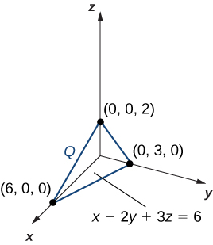{: #CNX_Calc_Figure_15_06_007}

Consider the same region <math xmlns="http://www.w3.org/1998/Math/MathML"><mi>Q</mi></math>

 ([[link]](#CNX_Calc_Figure_15_06_007)), and use the density function <math xmlns="http://www.w3.org/1998/Math/MathML"><mrow><mi>ρ</mi><mrow><mo>(</mo><mrow><mi>x</mi><mo>,</mo><mi>y</mi><mo>,</mo><mi>z</mi></mrow><mo>)</mo></mrow><mo>=</mo><mi>x</mi><msup><mi>y</mi><mn>2</mn></msup><mi>z</mi><mo>.</mo></mrow></math>

 Find the mass.

<math xmlns="http://www.w3.org/1998/Math/MathML"><mrow><mfrac><mrow><mn>54</mn></mrow><mrow><mn>35</mn></mrow></mfrac><mo>=</mo><mn>1.543</mn></mrow></math>

Hint

Follow the steps in the previous example.

Finding the Center of Mass of a Solid

Suppose <math xmlns="http://www.w3.org/1998/Math/MathML"><mi>Q</mi></math>

 is a solid region bounded by the plane <math xmlns="http://www.w3.org/1998/Math/MathML"><mrow><mi>x</mi><mo>+</mo><mn>2</mn><mi>y</mi><mo>+</mo><mn>3</mn><mi>z</mi><mo>=</mo><mn>6</mn></mrow></math>

 and the coordinate planes with density <math xmlns="http://www.w3.org/1998/Math/MathML"><mrow><mi>ρ</mi><mrow><mo>(</mo><mrow><mi>x</mi><mo>,</mo><mi>y</mi><mo>,</mo><mi>z</mi></mrow><mo>)</mo></mrow><mo>=</mo><msup><mi>x</mi><mn>2</mn></msup><mi>y</mi><mi>z</mi></mrow></math>

 (see [[link]](#CNX_Calc_Figure_15_06_007)). Find the center of mass using decimal approximation.

We have used this tetrahedron before and know the limits of integration, so we can proceed to the computations right away. First, we need to find the moments about the <math xmlns="http://www.w3.org/1998/Math/MathML"><mrow><mi>x</mi><mi>y</mi><mtext>-plane,</mtext></mrow></math>

 the <math xmlns="http://www.w3.org/1998/Math/MathML"><mrow><mi>x</mi><mi>z</mi><mtext>-plane,</mtext></mrow></math>

 and the <math xmlns="http://www.w3.org/1998/Math/MathML"><mrow><mi>y</mi><mi>z</mi><mtext>-plane:</mtext></mrow></math>

<math xmlns="http://www.w3.org/1998/Math/MathML"><mtable><mtr /><mtr /><mtr /><mtr><mtd columnalign="left"><msub><mi>M</mi><mrow><mi>x</mi><mi>y</mi></mrow></msub><mo>=</mo><mstyle displaystyle="true"><mrow><munder><mo>∭</mo><mi>Q</mi></munder><mrow><mi>z</mi><mi>ρ</mi><mrow><mo>(</mo><mrow><mi>x</mi><mo>,</mo><mi>y</mi><mo>,</mo><mi>z</mi></mrow><mo>)</mo></mrow></mrow></mrow></mstyle><mi>d</mi><mi>V</mi><mo>=</mo><mstyle displaystyle="true"><mrow><munderover><mo stretchy="false">∫</mo><mrow><mi>x</mi><mo>=</mo><mn>0</mn></mrow><mrow><mi>x</mi><mo>=</mo><mn>6</mn></mrow></munderover><mspace width="0.2em" /><mrow><mstyle displaystyle="true"><mrow><munderover><mo stretchy="false">∫</mo><mrow><mi>y</mi><mo>=</mo><mn>0</mn></mrow><mrow><mi>y</mi><mo>=</mo><mn>1</mn><mtext>/</mtext><mn>2</mn><mrow><mo>(</mo><mrow><mn>6</mn><mo>−</mo><mi>x</mi></mrow><mo>)</mo></mrow></mrow></munderover><mspace width="0.2em" /><mrow><mstyle displaystyle="true"><mrow><munderover><mo stretchy="false">∫</mo><mrow><mi>z</mi><mo>=</mo><mn>0</mn></mrow><mrow><mi>z</mi><mo>=</mo><mn>1</mn><mtext>/</mtext><mn>3</mn><mrow><mo>(</mo><mrow><mn>6</mn><mo>−</mo><mi>x</mi><mo>−</mo><mn>2</mn><mi>y</mi></mrow><mo>)</mo></mrow></mrow></munderover><mrow><msup><mi>x</mi><mn>2</mn></msup><mi>y</mi><msup><mi>z</mi><mn>2</mn></msup><mi>d</mi><mi>z</mi><mspace width="0.2em" /><mi>d</mi><mi>y</mi><mspace width="0.2em" /><mi>d</mi><mi>x</mi><mo>=</mo><mfrac><mrow><mn>54</mn></mrow><mrow><mn>35</mn></mrow></mfrac></mrow></mrow></mstyle></mrow></mrow></mstyle></mrow></mrow></mstyle><mo>≈</mo><mn>1.543</mn><mo>,</mo></mtd></mtr><mtr><mtd columnalign="left"><msub><mi>M</mi><mrow><mi>x</mi><mi>z</mi></mrow></msub><mo>=</mo><mstyle displaystyle="true"><mrow><munder><mo>∭</mo><mi>Q</mi></munder><mrow><mi>y</mi><mi>ρ</mi><mrow><mo>(</mo><mrow><mi>x</mi><mo>,</mo><mi>y</mi><mo>,</mo><mi>z</mi></mrow><mo>)</mo></mrow></mrow></mrow></mstyle><mi>d</mi><mi>V</mi><mo>=</mo><mstyle displaystyle="true"><mrow><munderover><mo stretchy="false">∫</mo><mrow><mi>x</mi><mo>=</mo><mn>0</mn></mrow><mrow><mi>x</mi><mo>=</mo><mn>6</mn></mrow></munderover><mspace width="0.2em" /><mrow><mstyle displaystyle="true"><mrow><munderover><mo stretchy="false">∫</mo><mrow><mi>y</mi><mo>=</mo><mn>0</mn></mrow><mrow><mi>y</mi><mo>=</mo><mn>1</mn><mtext>/</mtext><mn>2</mn><mrow><mo>(</mo><mrow><mn>6</mn><mo>−</mo><mi>x</mi></mrow><mo>)</mo></mrow></mrow></munderover><mspace width="0.2em" /><mrow><mstyle displaystyle="true"><mrow><munderover><mo stretchy="false">∫</mo><mrow><mi>z</mi><mo>=</mo><mn>0</mn></mrow><mrow><mi>z</mi><mo>=</mo><mn>1</mn><mtext>/</mtext><mn>3</mn><mrow><mo>(</mo><mrow><mn>6</mn><mo>−</mo><mi>x</mi><mo>−</mo><mn>2</mn><mi>y</mi></mrow><mo>)</mo></mrow></mrow></munderover><mrow><msup><mi>x</mi><mn>2</mn></msup><msup><mi>y</mi><mn>2</mn></msup><mi>z</mi><mspace width="0.2em" /><mi>d</mi><mi>z</mi><mspace width="0.2em" /><mi>d</mi><mi>y</mi><mspace width="0.2em" /><mi>d</mi><mi>x</mi><mo>=</mo><mfrac><mrow><mn>81</mn></mrow><mrow><mn>35</mn></mrow></mfrac></mrow></mrow></mstyle></mrow></mrow></mstyle></mrow></mrow></mstyle><mo>≈</mo><mn>2.314</mn><mo>,</mo></mtd></mtr><mtr><mtd columnalign="left"><msub><mi>M</mi><mrow><mi>y</mi><mi>z</mi></mrow></msub><mo>=</mo><mstyle displaystyle="true"><mrow><munder><mo>∭</mo><mi>Q</mi></munder><mrow><mi>x</mi><mi>ρ</mi><mrow><mo>(</mo><mrow><mi>x</mi><mo>,</mo><mi>y</mi><mo>,</mo><mi>z</mi></mrow><mo>)</mo></mrow></mrow></mrow></mstyle><mi>d</mi><mi>V</mi><mo>=</mo><mstyle displaystyle="true"><mrow><munderover><mo stretchy="false">∫</mo><mrow><mi>x</mi><mo>=</mo><mn>0</mn></mrow><mrow><mi>x</mi><mo>=</mo><mn>6</mn></mrow></munderover><mspace width="0.2em" /><mrow><mstyle displaystyle="true"><mrow><munderover><mo stretchy="false">∫</mo><mrow><mi>y</mi><mo>=</mo><mn>0</mn></mrow><mrow><mi>y</mi><mo>=</mo><mn>1</mn><mtext>/</mtext><mn>2</mn><mrow><mo>(</mo><mrow><mn>6</mn><mo>−</mo><mi>x</mi></mrow><mo>)</mo></mrow></mrow></munderover><mspace width="0.2em" /><mrow><mstyle displaystyle="true"><mrow><munderover><mo stretchy="false">∫</mo><mrow><mi>z</mi><mo>=</mo><mn>0</mn></mrow><mrow><mi>z</mi><mo>=</mo><mn>1</mn><mtext>/</mtext><mn>3</mn><mrow><mo>(</mo><mrow><mn>6</mn><mo>−</mo><mi>x</mi><mo>−</mo><mn>2</mn><mi>y</mi></mrow><mo>)</mo></mrow></mrow></munderover><mrow><msup><mi>x</mi><mn>3</mn></msup><mi>y</mi><mi>z</mi><mspace width="0.2em" /><mi>d</mi><mi>z</mi><mspace width="0.2em" /><mi>d</mi><mi>y</mi><mspace width="0.2em" /><mi>d</mi><mi>x</mi><mo>=</mo><mfrac><mrow><mn>243</mn></mrow><mrow><mn>35</mn></mrow></mfrac></mrow></mrow></mstyle></mrow></mrow></mstyle></mrow></mrow></mstyle><mo>≈</mo><mn>6.943</mn><mo>.</mo></mtd></mtr></mtable></math>

Hence the center of mass is

<math xmlns="http://www.w3.org/1998/Math/MathML"><mtable><mtr /><mtr /><mtr /><mtr><mtd columnalign="left"><mover><mi>x</mi><mtext>−</mtext></mover><mo>=</mo><mfrac><mrow><msub><mi>M</mi><mrow><mi>y</mi><mi>z</mi></mrow></msub></mrow><mi>m</mi></mfrac><mo>,</mo><mover><mi>y</mi><mtext>−</mtext></mover><mo>=</mo><mfrac><mrow><msub><mi>M</mi><mrow><mi>x</mi><mi>z</mi></mrow></msub></mrow><mi>m</mi></mfrac><mo>,</mo><mover><mi>z</mi><mtext>−</mtext></mover><mo>=</mo><mfrac><mrow><msub><mi>M</mi><mrow><mi>x</mi><mi>y</mi></mrow></msub></mrow><mi>m</mi></mfrac><mo>,</mo></mtd></mtr><mtr><mtd columnalign="left"><mover><mi>x</mi><mtext>−</mtext></mover><mo>=</mo><mfrac><mrow><msub><mi>M</mi><mrow><mi>y</mi><mi>z</mi></mrow></msub></mrow><mi>m</mi></mfrac><mo>=</mo><mfrac><mrow><mn>243</mn><mtext>/</mtext><mn>35</mn></mrow><mrow><mn>108</mn><mtext>/</mtext><mn>35</mn></mrow></mfrac><mo>=</mo><mfrac><mrow><mn>243</mn></mrow><mrow><mn>108</mn></mrow></mfrac><mo>=</mo><mn>2.25</mn><mo>,</mo></mtd></mtr><mtr><mtd columnalign="left"><mover><mi>y</mi><mtext>−</mtext></mover><mo>=</mo><mfrac><mrow><msub><mi>M</mi><mrow><mi>x</mi><mi>z</mi></mrow></msub></mrow><mi>m</mi></mfrac><mo>=</mo><mfrac><mrow><mn>81</mn><mtext>/</mtext><mn>35</mn></mrow><mrow><mn>108</mn><mtext>/</mtext><mn>35</mn></mrow></mfrac><mo>=</mo><mfrac><mrow><mn>81</mn></mrow><mrow><mn>108</mn></mrow></mfrac><mo>=</mo><mn>0.75</mn><mo>,</mo></mtd></mtr><mtr><mtd columnalign="left"><mover><mi>z</mi><mtext>−</mtext></mover><mo>=</mo><mfrac><mrow><msub><mi>M</mi><mrow><mi>x</mi><mi>y</mi></mrow></msub></mrow><mi>m</mi></mfrac><mo>=</mo><mfrac><mrow><mn>54</mn><mtext>/</mtext><mn>35</mn></mrow><mrow><mn>108</mn><mtext>/</mtext><mn>35</mn></mrow></mfrac><mo>=</mo><mfrac><mrow><mn>54</mn></mrow><mrow><mn>108</mn></mrow></mfrac><mo>=</mo><mn>0.5</mn><mo>.</mo></mtd></mtr></mtable></math>

The center of mass for the tetrahedron <math xmlns="http://www.w3.org/1998/Math/MathML"><mi>Q</mi></math>

 is the point <math xmlns="http://www.w3.org/1998/Math/MathML"><mrow><mrow><mo>(</mo><mrow><mn>2.25</mn><mo>,</mo><mn>0.75</mn><mo>,</mo><mn>0.5</mn></mrow><mo>)</mo></mrow><mo>.</mo></mrow></math>

Consider the same region <math xmlns="http://www.w3.org/1998/Math/MathML"><mi>Q</mi></math>

 ([[link]](#CNX_Calc_Figure_15_06_007)) and use the density function <math xmlns="http://www.w3.org/1998/Math/MathML"><mrow><mi>ρ</mi><mrow><mo>(</mo><mrow><mi>x</mi><mo>,</mo><mi>y</mi><mo>,</mo><mi>z</mi></mrow><mo>)</mo></mrow><mo>=</mo><mi>x</mi><msup><mi>y</mi><mn>2</mn></msup><mi>z</mi><mo>.</mo></mrow></math>

 Find the center of mass.

<math xmlns="http://www.w3.org/1998/Math/MathML"><mrow><mrow><mo>(</mo><mrow><mfrac><mn>3</mn><mn>2</mn></mfrac><mo>,</mo><mfrac><mn>9</mn><mn>8</mn></mfrac><mo>,</mo><mfrac><mn>1</mn><mn>2</mn></mfrac></mrow><mo>)</mo></mrow></mrow></math>

Hint

Check that <math xmlns="http://www.w3.org/1998/Math/MathML"><mrow><msub><mi>M</mi><mrow><mi>x</mi><mi>y</mi></mrow></msub><mo>=</mo><mfrac><mrow><mn>27</mn></mrow><mrow><mn>35</mn></mrow></mfrac><mo>,</mo></mrow></math>

 <math xmlns="http://www.w3.org/1998/Math/MathML"><mrow><msub><mi>M</mi><mrow><mi>x</mi><mi>z</mi></mrow></msub><mo>=</mo><mfrac><mrow><mn>243</mn></mrow><mrow><mn>140</mn></mrow></mfrac><mo>,</mo></mrow></math>

 and <math xmlns="http://www.w3.org/1998/Math/MathML"><mrow><msub><mi>M</mi><mrow><mi>y</mi><mi>z</mi></mrow></msub><mo>=</mo><mfrac><mrow><mn>81</mn></mrow><mrow><mn>35</mn></mrow></mfrac><mo>.</mo></mrow></math>

 Then use <math xmlns="http://www.w3.org/1998/Math/MathML"><mi>m</mi></math>

 from a previous checkpoint question.

We conclude this section with an example of finding moments of inertia <math xmlns="http://www.w3.org/1998/Math/MathML"><mrow><msub><mi>I</mi><mi>x</mi></msub><mo>,</mo><msub><mi>I</mi><mi>y</mi></msub><mo>,</mo></mrow></math>

 and <math xmlns="http://www.w3.org/1998/Math/MathML"><mrow><msub><mi>I</mi><mi>z</mi></msub><mo>.</mo></mrow></math>

Finding the Moments of Inertia of a Solid

Suppose that <math xmlns="http://www.w3.org/1998/Math/MathML"><mi>Q</mi></math>

 is a solid region and is bounded by <math xmlns="http://www.w3.org/1998/Math/MathML"><mrow><mi>x</mi><mo>+</mo><mn>2</mn><mi>y</mi><mo>+</mo><mn>3</mn><mi>z</mi><mo>=</mo><mn>6</mn></mrow></math>

 and the coordinate planes with density <math xmlns="http://www.w3.org/1998/Math/MathML"><mrow><mi>ρ</mi><mrow><mo>(</mo><mrow><mi>x</mi><mo>,</mo><mi>y</mi><mo>,</mo><mi>z</mi></mrow><mo>)</mo></mrow><mo>=</mo><msup><mi>x</mi><mn>2</mn></msup><mi>y</mi><mi>z</mi></mrow></math>

 (see [[link]](#CNX_Calc_Figure_15_06_007)). Find the moments of inertia of the tetrahedron <math xmlns="http://www.w3.org/1998/Math/MathML"><mi>Q</mi></math>

 about the <math xmlns="http://www.w3.org/1998/Math/MathML"><mrow><mi>y</mi><mi>z</mi><mtext>-plane,</mtext></mrow></math>

 the <math xmlns="http://www.w3.org/1998/Math/MathML"><mrow><mi>x</mi><mi>z</mi><mtext>-plane,</mtext></mrow></math>

 and the <math xmlns="http://www.w3.org/1998/Math/MathML"><mrow><mi>x</mi><mi>y</mi><mtext>-plane</mtext><mtext>.</mtext></mrow></math>

Once again, we can almost immediately write the limits of integration and hence we can quickly proceed to evaluating the moments of inertia. Using the formula stated before, the moments of inertia of the tetrahedron <math xmlns="http://www.w3.org/1998/Math/MathML"><mi>Q</mi></math>

 about the <math xmlns="http://www.w3.org/1998/Math/MathML"><mrow><mi>x</mi><mi>y</mi><mtext>-plane,</mtext></mrow></math>

 the <math xmlns="http://www.w3.org/1998/Math/MathML"><mrow><mi>x</mi><mi>z</mi><mtext>-plane,</mtext></mrow></math>

 and the <math xmlns="http://www.w3.org/1998/Math/MathML"><mrow><mi>y</mi><mi>z</mi><mtext>-plane</mtext></mrow></math>

 are

<math xmlns="http://www.w3.org/1998/Math/MathML"><mtable><mtr /><mtr><mtd columnalign="right"><msub><mi>I</mi><mi>x</mi></msub><mo>=</mo><mstyle displaystyle="true"><mrow><munder><mo>∭</mo><mi>Q</mi></munder><mrow><mrow><mo>(</mo><mrow><msup><mi>y</mi><mn>2</mn></msup><mo>+</mo><msup><mi>z</mi><mn>2</mn></msup></mrow><mo>)</mo></mrow><mi>ρ</mi><mrow><mo>(</mo><mrow><mi>x</mi><mo>,</mo><mi>y</mi><mo>,</mo><mi>z</mi></mrow><mo>)</mo></mrow><mi>d</mi><mi>V</mi></mrow></mrow></mstyle><mo>,</mo></mtd></mtr><mtr><mtd columnalign="right"><msub><mi>I</mi><mi>y</mi></msub><mo>=</mo><mstyle displaystyle="true"><mrow><munder><mo>∭</mo><mi>Q</mi></munder><mrow><mrow><mo>(</mo><mrow><msup><mi>x</mi><mn>2</mn></msup><mo>+</mo><msup><mi>z</mi><mn>2</mn></msup></mrow><mo>)</mo></mrow><mi>ρ</mi><mrow><mo>(</mo><mrow><mi>x</mi><mo>,</mo><mi>y</mi><mo>,</mo><mi>z</mi></mrow><mo>)</mo></mrow><mi>d</mi><mi>V</mi></mrow></mrow></mstyle><mo>,</mo></mtd></mtr></mtable></math>

and

<math xmlns="http://www.w3.org/1998/Math/MathML"><mrow><msub><mi>I</mi><mi>z</mi></msub><mo>=</mo><mstyle displaystyle="true"><mrow><munder><mo>∭</mo><mi>Q</mi></munder><mrow><mrow><mo>(</mo><mrow><msup><mi>x</mi><mn>2</mn></msup><mo>+</mo><msup><mi>y</mi><mn>2</mn></msup></mrow><mo>)</mo></mrow><mi>ρ</mi><mrow><mo>(</mo><mrow><mi>x</mi><mo>,</mo><mi>y</mi><mo>,</mo><mi>z</mi></mrow><mo>)</mo></mrow><mi>d</mi><mi>V</mi></mrow></mrow></mstyle></mrow><mspace width="0.2em" /><mtext>with</mtext><mspace width="0.2em" /><mrow><mi>ρ</mi><mrow><mo>(</mo><mrow><mi>x</mi><mo>,</mo><mi>y</mi><mo>,</mo><mi>z</mi></mrow><mo>)</mo></mrow><mo>=</mo><msup><mi>x</mi><mn>2</mn></msup><mi>y</mi><mi>z</mi><mo>.</mo></mrow></math>

Proceeding with the computations, we have

<math xmlns="http://www.w3.org/1998/Math/MathML"><mtable><mtr /><mtr /><mtr /><mtr /><mtr /><mtr /><mtr><mtd columnalign="left"><msub><mi>I</mi><mi>x</mi></msub><mo>=</mo><mstyle displaystyle="true"><mrow><munder><mo>∭</mo><mi>Q</mi></munder><mrow><mrow><mo>(</mo><mrow><msup><mi>y</mi><mn>2</mn></msup><mo>+</mo><msup><mi>z</mi><mn>2</mn></msup></mrow><mo>)</mo></mrow><msup><mi>x</mi><mn>2</mn></msup><mi>y</mi><mi>z</mi><mspace width="0.2em" /><mi>d</mi><mi>V</mi></mrow></mrow></mstyle><mo>=</mo><mstyle displaystyle="true"><mrow><munderover><mo stretchy="false">∫</mo><mrow><mi>x</mi><mo>=</mo><mn>0</mn></mrow><mrow><mi>x</mi><mo>=</mo><mn>6</mn></mrow></munderover><mspace width="0.2em" /><mrow><mstyle displaystyle="true"><mrow><munderover><mo stretchy="false">∫</mo><mrow><mi>y</mi><mo>=</mo><mn>0</mn></mrow><mrow><mi>y</mi><mo>=</mo><mfrac><mn>1</mn><mn>2</mn></mfrac><mrow><mo>(</mo><mrow><mn>6</mn><mo>−</mo><mi>x</mi></mrow><mo>)</mo></mrow></mrow></munderover><mspace width="0.2em" /><mrow><mstyle displaystyle="true"><mrow><munderover><mo stretchy="false">∫</mo><mrow><mi>z</mi><mo>=</mo><mn>0</mn></mrow><mrow><mi>z</mi><mo>=</mo><mfrac><mn>1</mn><mn>3</mn></mfrac><mrow><mo>(</mo><mrow><mn>6</mn><mo>−</mo><mi>x</mi><mo>−</mo><mn>2</mn><mi>y</mi></mrow><mo>)</mo></mrow></mrow></munderover><mrow><mrow><mo>(</mo><mrow><msup><mi>y</mi><mn>2</mn></msup><mo>+</mo><msup><mi>z</mi><mn>2</mn></msup></mrow><mo>)</mo></mrow></mrow></mrow></mstyle></mrow></mrow></mstyle></mrow></mrow></mstyle><msup><mi>x</mi><mn>2</mn></msup><mi>y</mi><mi>z</mi><mspace width="0.2em" /><mi>d</mi><mi>z</mi><mspace width="0.2em" /><mi>d</mi><mi>y</mi><mspace width="0.2em" /><mi>d</mi><mi>x</mi><mo>=</mo><mfrac><mrow><mn>117</mn></mrow><mrow><mn>35</mn></mrow></mfrac><mo>≈</mo><mn>3.343</mn><mo>,</mo></mtd></mtr><mtr><mtd columnalign="left"><msub><mi>I</mi><mi>y</mi></msub><mo>=</mo><mstyle displaystyle="true"><mrow><munder><mo>∭</mo><mi>Q</mi></munder><mrow><mrow><mo>(</mo><mrow><msup><mi>x</mi><mn>2</mn></msup><mo>+</mo><msup><mi>z</mi><mn>2</mn></msup></mrow><mo>)</mo></mrow><msup><mi>x</mi><mn>2</mn></msup><mi>y</mi><mi>z</mi><mspace width="0.2em" /><mi>d</mi><mi>V</mi></mrow></mrow></mstyle><mo>=</mo><mstyle displaystyle="true"><mrow><munderover><mo stretchy="false">∫</mo><mrow><mi>x</mi><mo>=</mo><mn>0</mn></mrow><mrow><mi>x</mi><mo>=</mo><mn>6</mn></mrow></munderover><mspace width="0.2em" /><mrow><mstyle displaystyle="true"><mrow><munderover><mo stretchy="false">∫</mo><mrow><mi>y</mi><mo>=</mo><mn>0</mn></mrow><mrow><mi>y</mi><mo>=</mo><mfrac><mn>1</mn><mn>2</mn></mfrac><mrow><mo>(</mo><mrow><mn>6</mn><mo>−</mo><mi>x</mi></mrow><mo>)</mo></mrow></mrow></munderover><mspace width="0.2em" /><mrow><mstyle displaystyle="true"><mrow><munderover><mo stretchy="false">∫</mo><mrow><mi>z</mi><mo>=</mo><mn>0</mn></mrow><mrow><mi>z</mi><mo>=</mo><mfrac><mn>1</mn><mn>3</mn></mfrac><mrow><mo>(</mo><mrow><mn>6</mn><mo>−</mo><mi>x</mi><mo>−</mo><mn>2</mn><mi>y</mi></mrow><mo>)</mo></mrow></mrow></munderover><mrow><mrow><mo>(</mo><mrow><msup><mi>x</mi><mn>2</mn></msup><mo>+</mo><msup><mi>z</mi><mn>2</mn></msup></mrow><mo>)</mo></mrow></mrow></mrow></mstyle></mrow></mrow></mstyle></mrow></mrow></mstyle><msup><mi>x</mi><mn>2</mn></msup><mi>y</mi><mi>z</mi><mspace width="0.2em" /><mi>d</mi><mi>z</mi><mspace width="0.2em" /><mi>d</mi><mi>y</mi><mspace width="0.2em" /><mi>d</mi><mi>x</mi><mo>=</mo><mfrac><mrow><mn>684</mn></mrow><mrow><mn>35</mn></mrow></mfrac><mo>≈</mo><mn>19.543</mn><mo>,</mo></mtd></mtr><mtr><mtd columnalign="left"><msub><mi>I</mi><mi>z</mi></msub><mo>=</mo><mstyle displaystyle="true"><mrow><munder><mo>∭</mo><mi>Q</mi></munder><mrow><mrow><mo>(</mo><mrow><msup><mi>x</mi><mn>2</mn></msup><mo>+</mo><msup><mi>y</mi><mn>2</mn></msup></mrow><mo>)</mo></mrow><msup><mi>x</mi><mn>2</mn></msup><mi>y</mi><mi>z</mi><mspace width="0.2em" /><mi>d</mi><mi>V</mi></mrow></mrow></mstyle><mo>=</mo><mstyle displaystyle="true"><mrow><munderover><mo stretchy="false">∫</mo><mrow><mi>x</mi><mo>=</mo><mn>0</mn></mrow><mrow><mi>x</mi><mo>=</mo><mn>6</mn></mrow></munderover><mspace width="0.2em" /><mrow><mstyle displaystyle="true"><mrow><munderover><mo stretchy="false">∫</mo><mrow><mi>y</mi><mo>=</mo><mn>0</mn></mrow><mrow><mi>y</mi><mo>=</mo><mfrac><mn>1</mn><mn>2</mn></mfrac><mrow><mo>(</mo><mrow><mn>6</mn><mo>−</mo><mi>x</mi></mrow><mo>)</mo></mrow></mrow></munderover><mspace width="0.2em" /><mrow><mstyle displaystyle="true"><mrow><munderover><mo stretchy="false">∫</mo><mrow><mi>z</mi><mo>=</mo><mn>0</mn></mrow><mrow><mi>z</mi><mo>=</mo><mfrac><mn>1</mn><mn>3</mn></mfrac><mrow><mo>(</mo><mrow><mn>6</mn><mo>−</mo><mi>x</mi><mo>−</mo><mn>2</mn><mi>y</mi></mrow><mo>)</mo></mrow></mrow></munderover><mrow><mrow><mo>(</mo><mrow><msup><mi>x</mi><mn>2</mn></msup><mo>+</mo><msup><mi>y</mi><mn>2</mn></msup></mrow><mo>)</mo></mrow></mrow></mrow></mstyle></mrow></mrow></mstyle></mrow></mrow></mstyle><msup><mi>x</mi><mn>2</mn></msup><mi>y</mi><mi>z</mi><mspace width="0.2em" /><mi>d</mi><mi>z</mi><mspace width="0.2em" /><mi>d</mi><mi>y</mi><mspace width="0.2em" /><mi>d</mi><mi>x</mi><mo>=</mo><mfrac><mrow><mn>729</mn></mrow><mrow><mn>35</mn></mrow></mfrac><mo>≈</mo><mn>20.829.</mn></mtd></mtr></mtable></math>

Thus, the moments of inertia of the tetrahedron <math xmlns="http://www.w3.org/1998/Math/MathML"><mi>Q</mi></math>

 about the <math xmlns="http://www.w3.org/1998/Math/MathML"><mrow><mi>y</mi><mi>z</mi><mtext>-plane,</mtext></mrow></math>

 the <math xmlns="http://www.w3.org/1998/Math/MathML"><mrow><mi>x</mi><mi>z</mi><mtext>-plane,</mtext></mrow></math>

 and the <math xmlns="http://www.w3.org/1998/Math/MathML"><mrow><mi>x</mi><mi>y</mi><mtext>-plane</mtext></mrow></math>

 are <math xmlns="http://www.w3.org/1998/Math/MathML"><mrow><mn>117</mn><mtext>/</mtext><mn>35</mn><mo>,</mo><mn>684</mn><mtext>/</mtext><mn>35</mn><mo>,</mo><mtext>and</mtext><mspace width="0.2em" /><mn>729</mn><mtext>/</mtext><mn>35</mn><mo>,</mo></mrow></math>

 respectively.

Consider the same region <math xmlns="http://www.w3.org/1998/Math/MathML"><mi>Q</mi></math>

 ([[link]](#CNX_Calc_Figure_15_06_007)), and use the density function <math xmlns="http://www.w3.org/1998/Math/MathML"><mrow><mi>ρ</mi><mrow><mo>(</mo><mrow><mi>x</mi><mo>,</mo><mi>y</mi><mo>,</mo><mi>z</mi></mrow><mo>)</mo></mrow><mo>=</mo><mi>x</mi><msup><mi>y</mi><mn>2</mn></msup><mi>z</mi><mo>.</mo></mrow></math>

 Find the moments of inertia about the three coordinate planes.

The moments of inertia of the tetrahedron <math xmlns="http://www.w3.org/1998/Math/MathML"><mi>Q</mi></math>

 about the <math xmlns="http://www.w3.org/1998/Math/MathML"><mrow><mi>y</mi><mi>z</mi><mtext>-plane,</mtext></mrow></math>

 the <math xmlns="http://www.w3.org/1998/Math/MathML"><mrow><mi>x</mi><mi>z</mi><mtext>-plane,</mtext></mrow></math>

 and the <math xmlns="http://www.w3.org/1998/Math/MathML"><mrow><mi>x</mi><mi>y</mi><mtext>-plane</mtext></mrow></math>

 are <math xmlns="http://www.w3.org/1998/Math/MathML"><mrow><mn>99</mn><mtext>/</mtext><mn>35</mn><mo>,</mo><mn>36</mn><mtext>/</mtext><mn>7</mn><mo>,</mo><mtext>and</mtext><mspace width="0.2em" /><mn>243</mn><mtext>/</mtext><mn>35</mn><mo>,</mo></mrow></math>

 respectively.

### Key Concepts

Finding the mass, center of mass, moments, and moments of inertia in double integrals:

* For a lamina
  <math xmlns="http://www.w3.org/1998/Math/MathML"><mi>R</mi></math>
  
  with a density function
  <math xmlns="http://www.w3.org/1998/Math/MathML"><mrow><mi>ρ</mi><mrow><mo>(</mo><mrow><mi>x</mi><mo>,</mo><mi>y</mi></mrow><mo>)</mo></mrow></mrow></math>
  
  at any point
  <math xmlns="http://www.w3.org/1998/Math/MathML"><mrow><mrow><mo>(</mo><mrow><mi>x</mi><mo>,</mo><mi>y</mi></mrow><mo>)</mo></mrow></mrow></math>
  
  in the plane, the mass is
  <math xmlns="http://www.w3.org/1998/Math/MathML"><mrow><mi>m</mi><mo>=</mo><mstyle displaystyle="true"><mrow><munder><mo>∬</mo><mi>R</mi></munder><mrow><mi>ρ</mi><mrow><mo>(</mo><mrow><mi>x</mi><mo>,</mo><mi>y</mi></mrow><mo>)</mo></mrow><mi>d</mi><mi>A</mi></mrow></mrow></mstyle><mo>.</mo></mrow></math>

* The moments about the
  <math xmlns="http://www.w3.org/1998/Math/MathML"><mrow><mi>x</mi><mtext>-axis</mtext></mrow></math>
  
  and
  <math xmlns="http://www.w3.org/1998/Math/MathML"><mrow><mi>y</mi><mtext>-axis</mtext></mrow></math>
  
  are
  * * *
  {: data-type="newline"}
  
  

  <math xmlns="http://www.w3.org/1998/Math/MathML"><mrow><msub><mi>M</mi><mi>x</mi></msub><mo>=</mo><mstyle displaystyle="true"><mrow><munder><mo>∬</mo><mi>R</mi></munder><mrow><mi>y</mi><mi>ρ</mi><mrow><mo>(</mo><mrow><mi>x</mi><mo>,</mo><mi>y</mi></mrow><mo>)</mo></mrow></mrow></mrow></mstyle><mi>d</mi><mi>A</mi></mrow><mspace width="0.2em" /><mtext>and</mtext><mspace width="0.2em" /><mrow><msub><mi>M</mi><mi>y</mi></msub><mo>=</mo><mstyle displaystyle="true"><mrow><munder><mo>∬</mo><mi>R</mi></munder><mrow><mi>x</mi><mi>ρ</mi><mrow><mo>(</mo><mrow><mi>x</mi><mo>,</mo><mi>y</mi></mrow><mo>)</mo></mrow></mrow></mrow></mstyle><mi>d</mi><mi>A</mi><mo>.</mo></mrow></math>
  

* The center of mass is given by
  <math xmlns="http://www.w3.org/1998/Math/MathML"><mrow><mover><mi>x</mi><mtext>−</mtext></mover><mo>=</mo><mfrac><mrow><msub><mi>M</mi><mi>y</mi></msub></mrow><mi>m</mi></mfrac><mo>,</mo><mover><mi>y</mi><mtext>−</mtext></mover><mo>=</mo><mfrac><mrow><msub><mi>M</mi><mi>x</mi></msub></mrow><mi>m</mi></mfrac><mo>.</mo></mrow></math>

* The center of mass becomes the centroid of the plane when the density is constant.
* The moments of inertia about the
  <math xmlns="http://www.w3.org/1998/Math/MathML"><mrow><mi>x</mi><mo>−</mo><mtext>axis,</mtext></mrow></math>
  
  <math xmlns="http://www.w3.org/1998/Math/MathML"><mrow><mi>y</mi><mo>−</mo><mtext>axis,</mtext></mrow></math>
  
  and the origin are
  * * *
  {: data-type="newline"}
  
  

  <math xmlns="http://www.w3.org/1998/Math/MathML"><mrow><msub><mi>I</mi><mi>x</mi></msub><mo>=</mo><mstyle displaystyle="true"><mrow><munder><mo>∬</mo><mi>R</mi></munder><mrow><msup><mi>y</mi><mn>2</mn></msup><mi>ρ</mi><mrow><mo>(</mo><mrow><mi>x</mi><mo>,</mo><mi>y</mi></mrow><mo>)</mo></mrow><mi>d</mi><mi>A</mi><mo>,</mo></mrow></mrow></mstyle><mspace width="0.2em" /><mtext /><mspace width="0.2em" /><msub><mi>I</mi><mi>y</mi></msub><mo>=</mo><mstyle displaystyle="true"><mrow><munder><mo>∬</mo><mi>R</mi></munder><mrow><msup><mi>x</mi><mn>2</mn></msup><mi>ρ</mi><mrow><mo>(</mo><mrow><mi>x</mi><mo>,</mo><mi>y</mi></mrow><mo>)</mo></mrow><mi>d</mi><mi>A</mi><mo>,</mo></mrow></mrow></mstyle></mrow><mspace width="0.2em" /><mtext>and</mtext><mspace width="0.2em" /><mrow><msub><mi>I</mi><mn>0</mn></msub><mo>=</mo><msub><mi>I</mi><mi>x</mi></msub><mo>+</mo><msub><mi>I</mi><mi>y</mi></msub><mo>=</mo><mstyle displaystyle="true"><mrow><munder><mo>∬</mo><mi>R</mi></munder><mrow><mrow><mo>(</mo><mrow><msup><mi>x</mi><mn>2</mn></msup><mo>+</mo><msup><mi>y</mi><mn>2</mn></msup></mrow><mo>)</mo></mrow><mi>ρ</mi><mrow><mo>(</mo><mrow><mi>x</mi><mo>,</mo><mi>y</mi></mrow><mo>)</mo></mrow><mi>d</mi><mi>A</mi><mo>.</mo></mrow></mrow></mstyle></mrow></math>
  

{: data-bullet-style="bullet"}

Finding the mass, center of mass, moments, and moments of inertia in triple integrals:

* For a solid object
  <math xmlns="http://www.w3.org/1998/Math/MathML"><mi>Q</mi></math>
  
  with a density function
  <math xmlns="http://www.w3.org/1998/Math/MathML"><mrow><mi>ρ</mi><mrow><mo>(</mo><mrow><mi>x</mi><mo>,</mo><mi>y</mi><mo>,</mo><mi>z</mi></mrow><mo>)</mo></mrow></mrow></math>
  
  at any point
  <math xmlns="http://www.w3.org/1998/Math/MathML"><mrow><mrow><mo>(</mo><mrow><mi>x</mi><mo>,</mo><mi>y</mi><mo>,</mo><mi>z</mi></mrow><mo>)</mo></mrow></mrow></math>
  
  in space, the mass is
  <math xmlns="http://www.w3.org/1998/Math/MathML"><mrow><mi>m</mi><mo>=</mo><mstyle displaystyle="true"><mrow><munder><mo>∭</mo><mi>Q</mi></munder><mrow><mi>ρ</mi><mrow><mo>(</mo><mrow><mi>x</mi><mo>,</mo><mi>y</mi><mo>,</mo><mi>z</mi></mrow><mo>)</mo></mrow><mi>d</mi><mi>V</mi></mrow></mrow></mstyle><mo>.</mo></mrow></math>

* The moments about the
  <math xmlns="http://www.w3.org/1998/Math/MathML"><mrow><mi>x</mi><mi>y</mi><mtext>-plane,</mtext></mrow></math>
  
  the
  <math xmlns="http://www.w3.org/1998/Math/MathML"><mrow><mi>x</mi><mi>z</mi><mtext>-plane,</mtext></mrow></math>
  
  and the
  <math xmlns="http://www.w3.org/1998/Math/MathML"><mrow><mi>y</mi><mi>z</mi><mtext>-plane</mtext></mrow></math>
  
  are
  * * *
  {: data-type="newline"}
  
  

  <math xmlns="http://www.w3.org/1998/Math/MathML"><mrow><msub><mi>M</mi><mrow><mi>x</mi><mi>y</mi></mrow></msub><mo>=</mo><mstyle displaystyle="true"><mrow><munder><mo>∭</mo><mi>Q</mi></munder><mrow><mi>z</mi><mi>ρ</mi><mrow><mo>(</mo><mrow><mi>x</mi><mo>,</mo><mi>y</mi><mo>,</mo><mi>z</mi></mrow><mo>)</mo></mrow><mi>d</mi><mi>V</mi></mrow></mrow></mstyle><mo>,</mo></mrow><mspace width="0.2em" /><mrow><msub><mi>M</mi><mrow><mi>x</mi><mi>z</mi></mrow></msub><mo>=</mo><mstyle displaystyle="true"><mrow><munder><mo>∭</mo><mi>Q</mi></munder><mrow><mi>y</mi><mi>ρ</mi><mrow><mo>(</mo><mrow><mi>x</mi><mo>,</mo><mi>y</mi><mo>,</mo><mi>z</mi></mrow><mo>)</mo></mrow><mi>d</mi><mi>V</mi></mrow></mrow></mstyle><mo>,</mo></mrow><mspace width="0.2em" /><mrow><msub><mi>M</mi><mrow><mi>y</mi><mi>z</mi></mrow></msub><mo>=</mo><mstyle displaystyle="true"><mrow><munder><mo>∭</mo><mi>Q</mi></munder><mrow><mi>x</mi><mi>ρ</mi><mrow><mo>(</mo><mrow><mi>x</mi><mo>,</mo><mi>y</mi><mo>,</mo><mi>z</mi></mrow><mo>)</mo></mrow><mi>d</mi><mi>V</mi></mrow></mrow></mstyle><mo>.</mo></mrow></math>
  

* The center of mass is given by
  <math xmlns="http://www.w3.org/1998/Math/MathML"><mrow><mover><mi>x</mi><mtext>−</mtext></mover><mo>=</mo><mfrac><mrow><msub><mi>M</mi><mrow><mi>y</mi><mi>z</mi></mrow></msub></mrow><mi>m</mi></mfrac><mo>,</mo><mover><mi>y</mi><mtext>−</mtext></mover><mo>=</mo><mfrac><mrow><msub><mi>M</mi><mrow><mi>x</mi><mi>z</mi></mrow></msub></mrow><mi>m</mi></mfrac><mo>,</mo><mover><mi>z</mi><mtext>−</mtext></mover><mo>=</mo><mfrac><mrow><msub><mi>M</mi><mrow><mi>x</mi><mi>y</mi></mrow></msub></mrow><mi>m</mi></mfrac><mo>.</mo></mrow></math>

* The center of mass becomes the centroid of the solid when the density is constant.
* The moments of inertia about the
  <math xmlns="http://www.w3.org/1998/Math/MathML"><mrow><mi>y</mi><mi>z</mi><mtext>-plane,</mtext></mrow></math>
  
  the
  <math xmlns="http://www.w3.org/1998/Math/MathML"><mrow><mi>x</mi><mi>z</mi><mtext>-plane,</mtext></mrow></math>
  
  and the
  <math xmlns="http://www.w3.org/1998/Math/MathML"><mrow><mi>x</mi><mi>y</mi><mtext>-plane</mtext></mrow></math>
  
  are
  * * *
  {: data-type="newline"}
  
  

  <math xmlns="http://www.w3.org/1998/Math/MathML"><mrow><mtable><mtr /><mtr><mtd columnalign="left"><msub><mi>I</mi><mi>x</mi></msub><mo>=</mo><mstyle displaystyle="true"><mrow><munder><mo>∭</mo><mi>Q</mi></munder><mrow><mrow><mo>(</mo><mrow><msup><mi>y</mi><mn>2</mn></msup><mo>+</mo><msup><mi>z</mi><mn>2</mn></msup></mrow><mo>)</mo></mrow><mi>ρ</mi><mrow><mo>(</mo><mrow><mi>x</mi><mo>,</mo><mi>y</mi><mo>,</mo><mi>z</mi></mrow><mo>)</mo></mrow><mi>d</mi><mi>V</mi><mo>,</mo></mrow></mrow></mstyle><msub><mi>I</mi><mi>y</mi></msub><mo>=</mo><mstyle displaystyle="true"><mrow><munder><mo>∭</mo><mi>Q</mi></munder><mrow><mrow><mo>(</mo><mrow><msup><mi>x</mi><mn>2</mn></msup><mo>+</mo><msup><mi>z</mi><mn>2</mn></msup></mrow><mo>)</mo></mrow><mi>ρ</mi><mrow><mo>(</mo><mrow><mi>x</mi><mo>,</mo><mi>y</mi><mo>,</mo><mi>z</mi></mrow><mo>)</mo></mrow><mi>d</mi><mi>V</mi><mo>,</mo></mrow></mrow></mstyle></mtd></mtr><mtr><mtd columnalign="left"><msub><mi>I</mi><mi>z</mi></msub><mo>=</mo><mstyle displaystyle="true"><mrow><munder><mo>∭</mo><mi>Q</mi></munder><mrow><mrow><mo>(</mo><mrow><msup><mi>x</mi><mn>2</mn></msup><mo>+</mo><msup><mi>y</mi><mn>2</mn></msup></mrow><mo>)</mo></mrow><mi>ρ</mi><mrow><mo>(</mo><mrow><mi>x</mi><mo>,</mo><mi>y</mi><mo>,</mo><mi>z</mi></mrow><mo>)</mo></mrow><mi>d</mi><mi>V</mi><mo>.</mo></mrow></mrow></mstyle></mtd></mtr></mtable></mrow></math>
  

{: data-bullet-style="bullet"}

### Key Equations

* **Mass of a lamina**
  * * *
  {: data-type="newline"}
  
  <math xmlns="http://www.w3.org/1998/Math/MathML"><mrow><mi>m</mi><mo>=</mo><munder><mrow><mtext>lim</mtext></mrow><mrow><mi>k</mi><mo>,</mo><mi>l</mi><mo stretchy="false">→</mo><mi>∞</mi></mrow></munder><mstyle displaystyle="true"><munderover><mo>∑</mo><mrow><mi>i</mi><mo>=</mo><mn>1</mn></mrow><mi>k</mi></munderover><mrow><mstyle displaystyle="true"><munderover><mo>∑</mo><mrow><mi>j</mi><mo>=</mo><mn>1</mn></mrow><mi>l</mi></munderover><mrow><msub><mi>m</mi><mrow><mi>i</mi><mi>j</mi></mrow></msub></mrow></mstyle></mrow></mstyle><mo>=</mo><munder><mrow><mtext>lim</mtext></mrow><mrow><mi>k</mi><mo>,</mo><mi>l</mi><mo stretchy="false">→</mo><mi>∞</mi></mrow></munder><mstyle displaystyle="true"><munderover><mo>∑</mo><mrow><mi>i</mi><mo>=</mo><mn>1</mn></mrow><mi>k</mi></munderover><mrow><mstyle displaystyle="true"><munderover><mo>∑</mo><mrow><mi>j</mi><mo>=</mo><mn>1</mn></mrow><mi>l</mi></munderover><mrow><mi>ρ</mi><mo stretchy="false">(</mo><msubsup><mi>x</mi><mrow><mi>i</mi><mi>j</mi></mrow><mo>*</mo></msubsup><mo>,</mo><msubsup><mi>y</mi><mrow><mi>i</mi><mi>j</mi></mrow><mo>*</mo></msubsup><mo stretchy="false">)</mo><mtext>Δ</mtext><mi>A</mi><mo>=</mo><mstyle displaystyle="true"><mrow><munder><mo>∬</mo><mi>R</mi></munder><mrow><mi>ρ</mi><mo stretchy="false">(</mo><mi>x</mi><mo>,</mo><mi>y</mi><mo stretchy="false">)</mo><mi>d</mi><mi>A</mi></mrow></mrow></mstyle></mrow></mstyle></mrow></mstyle></mrow></math>

* **Moment about the *x*-axis**
  * * *
  {: data-type="newline"}
  
  <math xmlns="http://www.w3.org/1998/Math/MathML"><mrow><msub><mi>M</mi><mi>x</mi></msub><mo>=</mo><munder><mrow><mtext>lim</mtext></mrow><mrow><mi>k</mi><mo>,</mo><mi>l</mi><mo stretchy="false">→</mo><mi>∞</mi></mrow></munder><mstyle displaystyle="true"><munderover><mo>∑</mo><mrow><mi>i</mi><mo>=</mo><mn>1</mn></mrow><mi>k</mi></munderover><mrow><mstyle displaystyle="true"><munderover><mo>∑</mo><mrow><mi>j</mi><mo>=</mo><mn>1</mn></mrow><mi>l</mi></munderover><mrow><mrow><mo>(</mo><mrow><msubsup><mi>y</mi><mrow><mi>i</mi><mi>j</mi></mrow><mo>*</mo></msubsup></mrow><mo>)</mo></mrow><msub><mi>m</mi><mrow><mi>i</mi><mi>j</mi></mrow></msub></mrow></mstyle></mrow></mstyle><mo>=</mo><munder><mrow><mtext>lim</mtext></mrow><mrow><mi>k</mi><mo>,</mo><mi>l</mi><mo stretchy="false">→</mo><mi>∞</mi></mrow></munder><mstyle displaystyle="true"><munderover><mo>∑</mo><mrow><mi>i</mi><mo>=</mo><mn>1</mn></mrow><mi>k</mi></munderover><mrow><mstyle displaystyle="true"><munderover><mo>∑</mo><mrow><mi>j</mi><mo>=</mo><mn>1</mn></mrow><mi>l</mi></munderover><mrow><mrow><mo>(</mo><mrow><msubsup><mi>y</mi><mrow><mi>i</mi><mi>j</mi></mrow><mo>*</mo></msubsup></mrow><mo>)</mo></mrow><mi>ρ</mi><mo stretchy="false">(</mo><msubsup><mi>x</mi><mrow><mi>i</mi><mi>j</mi></mrow><mo>*</mo></msubsup><mo>,</mo><msubsup><mi>y</mi><mrow><mi>i</mi><mi>j</mi></mrow><mo>*</mo></msubsup><mo stretchy="false">)</mo><mtext>Δ</mtext><mi>A</mi><mo>=</mo><mstyle displaystyle="true"><mrow><munder><mo>∬</mo><mi>R</mi></munder><mrow><mi>y</mi><mi>ρ</mi><mo stretchy="false">(</mo><mi>x</mi><mo>,</mo><mi>y</mi><mo stretchy="false">)</mo><mi>d</mi><mi>A</mi></mrow></mrow></mstyle></mrow></mstyle></mrow></mstyle></mrow></math>

* **Moment about the *y*-axis**
  * * *
  {: data-type="newline"}
  
  <math xmlns="http://www.w3.org/1998/Math/MathML"><mrow><msub><mi>M</mi><mi>y</mi></msub><mo>=</mo><munder><mrow><mtext>lim</mtext></mrow><mrow><mi>k</mi><mo>,</mo><mi>l</mi><mo stretchy="false">→</mo><mi>∞</mi></mrow></munder><mstyle displaystyle="true"><munderover><mo>∑</mo><mrow><mi>i</mi><mo>=</mo><mn>1</mn></mrow><mi>k</mi></munderover><mrow><mstyle displaystyle="true"><munderover><mo>∑</mo><mrow><mi>j</mi><mo>=</mo><mn>1</mn></mrow><mi>l</mi></munderover><mrow><mrow><mo>(</mo><mrow><msubsup><mi>x</mi><mrow><mi>i</mi><mi>j</mi></mrow><mo>*</mo></msubsup></mrow><mo>)</mo></mrow><msub><mi>m</mi><mrow><mi>i</mi><mi>j</mi></mrow></msub></mrow></mstyle></mrow></mstyle><mo>=</mo><munder><mrow><mtext>lim</mtext></mrow><mrow><mi>k</mi><mo>,</mo><mi>l</mi><mo stretchy="false">→</mo><mi>∞</mi></mrow></munder><mstyle displaystyle="true"><munderover><mo>∑</mo><mrow><mi>i</mi><mo>=</mo><mn>1</mn></mrow><mi>k</mi></munderover><mrow><mstyle displaystyle="true"><munderover><mo>∑</mo><mrow><mi>j</mi><mo>=</mo><mn>1</mn></mrow><mi>l</mi></munderover><mrow><mrow><mo>(</mo><mrow><msubsup><mi>x</mi><mrow><mi>i</mi><mi>j</mi></mrow><mo>*</mo></msubsup></mrow><mo>)</mo></mrow><mi>ρ</mi><mo stretchy="false">(</mo><msubsup><mi>x</mi><mrow><mi>i</mi><mi>j</mi></mrow><mo>*</mo></msubsup><mo>,</mo><msubsup><mi>y</mi><mrow><mi>i</mi><mi>j</mi></mrow><mo>*</mo></msubsup><mo stretchy="false">)</mo><mtext>Δ</mtext><mi>A</mi><mo>=</mo><mstyle displaystyle="true"><mrow><munder><mo>∬</mo><mi>R</mi></munder><mrow><mi>x</mi><mi>ρ</mi><mo stretchy="false">(</mo><mi>x</mi><mo>,</mo><mi>y</mi><mo stretchy="false">)</mo><mi>d</mi><mi>A</mi></mrow></mrow></mstyle></mrow></mstyle></mrow></mstyle></mrow></math>

* **Center of mass of a lamina**
  * * *
  {: data-type="newline"}
  
  <math xmlns="http://www.w3.org/1998/Math/MathML"><mrow><mover><mi>x</mi><mtext>−</mtext></mover><mo>=</mo><mfrac><mrow><msub><mi>M</mi><mi>y</mi></msub></mrow><mi>m</mi></mfrac><mo>=</mo><mfrac><mrow><mstyle displaystyle="true"><mrow><munder><mo>∬</mo><mi>R</mi></munder><mrow><mi>x</mi><mi>ρ</mi><mrow><mo>(</mo><mrow><mi>x</mi><mo>,</mo><mi>y</mi></mrow><mo>)</mo></mrow><mi>d</mi><mi>A</mi></mrow></mrow></mstyle></mrow><mrow><mstyle displaystyle="true"><mrow><munder><mo>∬</mo><mi>R</mi></munder><mrow><mi>ρ</mi><mrow><mo>(</mo><mrow><mi>x</mi><mo>,</mo><mi>y</mi></mrow><mo>)</mo></mrow><mi>d</mi><mi>A</mi></mrow></mrow></mstyle></mrow></mfrac></mrow></math>
  
  and
  <math xmlns="http://www.w3.org/1998/Math/MathML"><mrow><mover><mi>y</mi><mtext>−</mtext></mover><mo>=</mo><mfrac><mrow><msub><mi>M</mi><mi>x</mi></msub></mrow><mi>m</mi></mfrac><mo>=</mo><mfrac><mrow><mstyle displaystyle="true"><mrow><munder><mo>∬</mo><mi>R</mi></munder><mrow><mi>y</mi><mi>ρ</mi><mrow><mo>(</mo><mrow><mi>x</mi><mo>,</mo><mi>y</mi></mrow><mo>)</mo></mrow><mi>d</mi><mi>A</mi></mrow></mrow></mstyle></mrow><mrow><mstyle displaystyle="true"><mrow><munder><mo>∬</mo><mi>R</mi></munder><mrow><mi>ρ</mi><mrow><mo>(</mo><mrow><mi>x</mi><mo>,</mo><mi>y</mi></mrow><mo>)</mo></mrow><mi>d</mi><mi>A</mi></mrow></mrow></mstyle></mrow></mfrac></mrow></math>
{: data-bullet-style="bullet"}

<section data-depth="1" class="section-exercises" markdown="1">
In the following exercises, the region <math xmlns="http://www.w3.org/1998/Math/MathML"><mi>R</mi></math>

 occupied by a lamina is shown in a graph. Find the mass of <math xmlns="http://www.w3.org/1998/Math/MathML"><mi>R</mi></math>

 with the density function <math xmlns="http://www.w3.org/1998/Math/MathML"><mi>ρ</mi><mo>.</mo></math>

<math xmlns="http://www.w3.org/1998/Math/MathML"><mi>R</mi></math>

 is the triangular region with vertices <math xmlns="http://www.w3.org/1998/Math/MathML"><mrow><mrow><mo>(</mo><mrow><mn>0</mn><mo>,</mo><mn>0</mn></mrow><mo>)</mo></mrow><mo>,</mo><mrow><mo>(</mo><mrow><mn>0</mn><mo>,</mo><mn>3</mn></mrow><mo>)</mo></mrow><mo>,</mo></mrow></math>

 and <math xmlns="http://www.w3.org/1998/Math/MathML"><mrow><mrow><mo>(</mo><mrow><mn>6</mn><mo>,</mo><mn>0</mn></mrow><mo>)</mo></mrow><mo>;</mo><mi>ρ</mi><mrow><mo>(</mo><mrow><mi>x</mi><mo>,</mo><mi>y</mi></mrow><mo>)</mo></mrow><mo>=</mo><mi>x</mi><mi>y</mi><mo>.</mo></mrow></math>

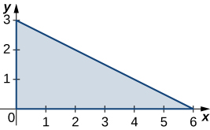

<math xmlns="http://www.w3.org/1998/Math/MathML"><mrow><mfrac><mrow><mn>27</mn></mrow><mn>2</mn></mfrac></mrow></math>

<math xmlns="http://www.w3.org/1998/Math/MathML"><mi>R</mi></math>

 is the triangular region with vertices <math xmlns="http://www.w3.org/1998/Math/MathML"><mrow><mrow><mo>(</mo><mrow><mn>0</mn><mo>,</mo><mn>0</mn></mrow><mo>)</mo></mrow><mo>,</mo><mrow><mo>(</mo><mrow><mn>1</mn><mo>,</mo><mn>1</mn></mrow><mo>)</mo></mrow><mo>,</mo></mrow></math>

 <math xmlns="http://www.w3.org/1998/Math/MathML"><mrow><mrow><mo>(</mo><mrow><mn>0</mn><mo>,</mo><mn>5</mn></mrow><mo>)</mo></mrow><mo>;</mo><mi>ρ</mi><mrow><mo>(</mo><mrow><mi>x</mi><mo>,</mo><mi>y</mi></mrow><mo>)</mo></mrow><mo>=</mo><mi>x</mi><mo>+</mo><mi>y</mi><mo>.</mo></mrow></math>

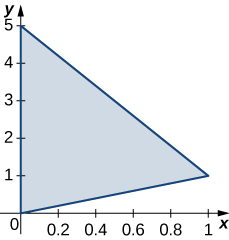

<math xmlns="http://www.w3.org/1998/Math/MathML"><mi>R</mi></math>

 is the rectangular region with vertices <math xmlns="http://www.w3.org/1998/Math/MathML"><mrow><mrow><mo>(</mo><mrow><mn>0</mn><mo>,</mo><mn>0</mn></mrow><mo>)</mo></mrow><mo>,</mo><mrow><mo>(</mo><mrow><mn>0</mn><mo>,</mo><mn>3</mn></mrow><mo>)</mo></mrow><mo>,</mo><mrow><mo>(</mo><mrow><mn>6</mn><mo>,</mo><mn>3</mn></mrow><mo>)</mo></mrow><mo>,</mo></mrow></math>

 and <math xmlns="http://www.w3.org/1998/Math/MathML"><mrow><mrow><mo>(</mo><mrow><mn>6</mn><mo>,</mo><mn>0</mn></mrow><mo>)</mo></mrow><mo>;</mo></mrow></math>

 <math xmlns="http://www.w3.org/1998/Math/MathML"><mrow><mi>ρ</mi><mrow><mo>(</mo><mrow><mi>x</mi><mo>,</mo><mi>y</mi></mrow><mo>)</mo></mrow><mo>=</mo><msqrt><mrow><mi>x</mi><mi>y</mi></mrow></msqrt><mo>.</mo></mrow></math>

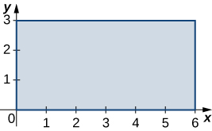

<math xmlns="http://www.w3.org/1998/Math/MathML"><mrow><mn>24</mn><msqrt><mn>2</mn></msqrt></mrow></math>

<math xmlns="http://www.w3.org/1998/Math/MathML"><mi>R</mi></math>

 is the rectangular region with vertices <math xmlns="http://www.w3.org/1998/Math/MathML"><mrow><mrow><mo>(</mo><mrow><mn>0</mn><mo>,</mo><mn>1</mn></mrow><mo>)</mo></mrow><mo>,</mo><mrow><mo>(</mo><mrow><mn>0</mn><mo>,</mo><mn>3</mn></mrow><mo>)</mo></mrow><mo>,</mo><mrow><mo>(</mo><mrow><mn>3</mn><mo>,</mo><mn>3</mn></mrow><mo>)</mo></mrow><mo>,</mo></mrow></math>

 and <math xmlns="http://www.w3.org/1998/Math/MathML"><mrow><mrow><mo>(</mo><mrow><mn>3</mn><mo>,</mo><mn>1</mn></mrow><mo>)</mo></mrow><mo>;</mo></mrow></math>

 <math xmlns="http://www.w3.org/1998/Math/MathML"><mrow><mi>ρ</mi><mrow><mo>(</mo><mrow><mi>x</mi><mo>,</mo><mi>y</mi></mrow><mo>)</mo></mrow><mo>=</mo><msup><mi>x</mi><mn>2</mn></msup><mi>y</mi><mo>.</mo></mrow></math>

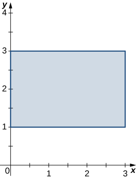

<math xmlns="http://www.w3.org/1998/Math/MathML"><mi>R</mi></math>

 is the trapezoidal region determined by the lines <math xmlns="http://www.w3.org/1998/Math/MathML"><mrow><mi>y</mi><mo>=</mo><mo>−</mo><mfrac><mn>1</mn><mn>4</mn></mfrac><mi>x</mi><mo>+</mo><mfrac><mn>5</mn><mn>2</mn></mfrac><mo>,</mo><mi>y</mi><mo>=</mo><mn>0</mn><mo>,</mo><mi>y</mi><mo>=</mo><mn>2</mn><mo>,</mo></mrow></math>

 and <math xmlns="http://www.w3.org/1998/Math/MathML"><mrow><mi>x</mi><mo>=</mo><mn>0</mn><mo>;</mo></mrow></math>

 <math xmlns="http://www.w3.org/1998/Math/MathML"><mrow><mi>ρ</mi><mrow><mo>(</mo><mrow><mi>x</mi><mo>,</mo><mi>y</mi></mrow><mo>)</mo></mrow><mo>=</mo><mn>3</mn><mi>x</mi><mi>y</mi><mo>.</mo></mrow></math>

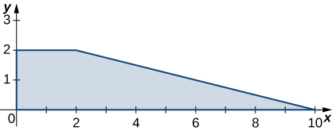

<math xmlns="http://www.w3.org/1998/Math/MathML"><mrow><mn>76</mn></mrow></math>

<math xmlns="http://www.w3.org/1998/Math/MathML"><mi>R</mi></math>

 is the trapezoidal region determined by the lines <math xmlns="http://www.w3.org/1998/Math/MathML"><mrow><mi>y</mi><mo>=</mo><mn>0</mn><mo>,</mo><mi>y</mi><mo>=</mo><mn>1</mn><mo>,</mo><mi>y</mi><mo>=</mo><mi>x</mi><mo>,</mo></mrow></math>

 and <math xmlns="http://www.w3.org/1998/Math/MathML"><mrow><mi>y</mi><mo>=</mo><mtext>−</mtext><mi>x</mi><mo>+</mo><mn>3</mn><mo>;</mo><mi>ρ</mi><mrow><mo>(</mo><mrow><mi>x</mi><mo>,</mo><mi>y</mi></mrow><mo>)</mo></mrow><mo>=</mo><mn>2</mn><mi>x</mi><mo>+</mo><mi>y</mi><mo>.</mo></mrow></math>

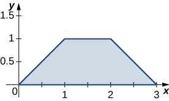

<math xmlns="http://www.w3.org/1998/Math/MathML"><mi>R</mi></math>

 is the disk of radius <math xmlns="http://www.w3.org/1998/Math/MathML"><mn>2</mn></math>

 centered at <math xmlns="http://www.w3.org/1998/Math/MathML"><mrow><mrow><mo>(</mo><mrow><mn>1</mn><mo>,</mo><mn>2</mn></mrow><mo>)</mo></mrow><mo>;</mo></mrow></math>

 <math xmlns="http://www.w3.org/1998/Math/MathML"><mrow><mi>ρ</mi><mrow><mo>(</mo><mrow><mi>x</mi><mo>,</mo><mi>y</mi></mrow><mo>)</mo></mrow><mo>=</mo><msup><mi>x</mi><mn>2</mn></msup><mo>+</mo><msup><mi>y</mi><mn>2</mn></msup><mo>−</mo><mn>2</mn><mi>x</mi><mo>−</mo><mn>4</mn><mi>y</mi><mo>+</mo><mn>5</mn><mo>.</mo></mrow></math>

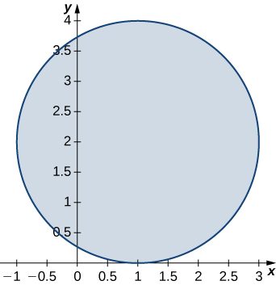

<math xmlns="http://www.w3.org/1998/Math/MathML"><mrow><mn>8</mn><mi>π</mi></mrow></math>

<math xmlns="http://www.w3.org/1998/Math/MathML"><mi>R</mi></math>

 is the unit disk; <math xmlns="http://www.w3.org/1998/Math/MathML"><mrow><mi>ρ</mi><mrow><mo>(</mo><mrow><mi>x</mi><mo>,</mo><mi>y</mi></mrow><mo>)</mo></mrow><mo>=</mo><mn>3</mn><msup><mi>x</mi><mn>4</mn></msup><mo>+</mo><mn>6</mn><msup><mi>x</mi><mn>2</mn></msup><msup><mi>y</mi><mn>2</mn></msup><mo>+</mo><mn>3</mn><msup><mi>y</mi><mn>4</mn></msup><mo>.</mo></mrow></math>

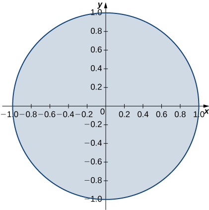

<math xmlns="http://www.w3.org/1998/Math/MathML"><mi>R</mi></math>

 is the region enclosed by the ellipse <math xmlns="http://www.w3.org/1998/Math/MathML"><mrow><msup><mi>x</mi><mn>2</mn></msup><mo>+</mo><mn>4</mn><msup><mi>y</mi><mn>2</mn></msup><mo>=</mo><mn>1</mn><mo>;</mo><mi>ρ</mi><mrow><mo>(</mo><mrow><mi>x</mi><mo>,</mo><mi>y</mi></mrow><mo>)</mo></mrow><mo>=</mo><mn>1</mn><mo>.</mo></mrow></math>

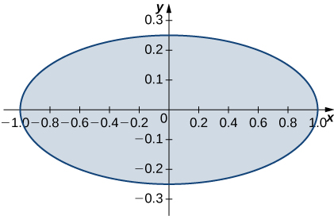

<math xmlns="http://www.w3.org/1998/Math/MathML"><mrow><mfrac><mi>π</mi><mn>2</mn></mfrac></mrow></math>

<math xmlns="http://www.w3.org/1998/Math/MathML"><mrow><mi>R</mi><mo>=</mo><mrow><mo>{</mo><mrow><mrow><mrow><mrow><mo>(</mo><mrow><mi>x</mi><mo>,</mo><mi>y</mi></mrow><mo>)</mo></mrow></mrow><mo>\|</mo></mrow><mn>9</mn><msup><mi>x</mi><mn>2</mn></msup><mo>+</mo><msup><mi>y</mi><mn>2</mn></msup><mo>≤</mo><mn>1</mn><mo>,</mo><mi>x</mi><mo>≥</mo><mn>0</mn><mo>,</mo><mi>y</mi><mo>≥</mo><mn>0</mn></mrow><mo>}</mo></mrow><mo>;</mo></mrow></math>

 <math xmlns="http://www.w3.org/1998/Math/MathML"><mrow><mi>ρ</mi><mrow><mo>(</mo><mrow><mi>x</mi><mo>,</mo><mi>y</mi></mrow><mo>)</mo></mrow><mo>=</mo><msqrt><mrow><mn>9</mn><msup><mi>x</mi><mn>2</mn></msup><mo>+</mo><msup><mi>y</mi><mn>2</mn></msup></mrow></msqrt><mo>.</mo></mrow></math>

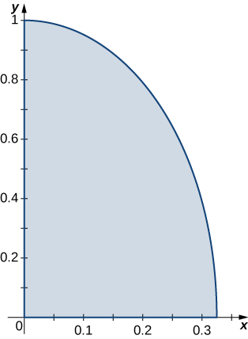

<math xmlns="http://www.w3.org/1998/Math/MathML"><mi>R</mi></math>

 is the region bounded by <math xmlns="http://www.w3.org/1998/Math/MathML"><mrow><mi>y</mi><mo>=</mo><mi>x</mi><mo>,</mo><mi>y</mi><mo>=</mo><mtext>−</mtext><mi>x</mi><mo>,</mo><mi>y</mi><mo>=</mo><mi>x</mi><mo>+</mo><mn>2</mn><mo>,</mo><mi>y</mi><mo>=</mo><mtext>−</mtext><mi>x</mi><mo>+</mo><mn>2</mn><mo>;</mo></mrow></math>

 <math xmlns="http://www.w3.org/1998/Math/MathML"><mrow><mi>ρ</mi><mrow><mo>(</mo><mrow><mi>x</mi><mo>,</mo><mi>y</mi></mrow><mo>)</mo></mrow><mo>=</mo><mn>1</mn><mo>.</mo></mrow></math>

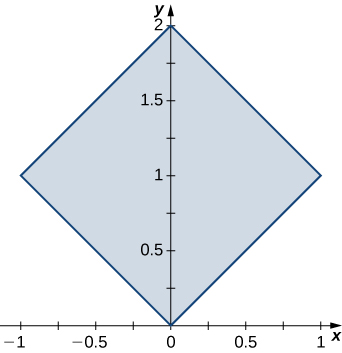

<math xmlns="http://www.w3.org/1998/Math/MathML"><mn>2</mn></math>

<math xmlns="http://www.w3.org/1998/Math/MathML"><mi>R</mi></math>

 is the region bounded by <math xmlns="http://www.w3.org/1998/Math/MathML"><mrow><mi>y</mi><mo>=</mo><mfrac><mn>1</mn><mi>x</mi></mfrac><mo>,</mo><mi>y</mi><mo>=</mo><mfrac><mn>2</mn><mi>x</mi></mfrac><mo>,</mo><mi>y</mi><mo>=</mo><mn>1</mn><mo>,</mo></mrow></math>

 and <math xmlns="http://www.w3.org/1998/Math/MathML"><mrow><mi>y</mi><mo>=</mo><mn>2</mn><mo>;</mo><mi>ρ</mi><mrow><mo>(</mo><mrow><mi>x</mi><mo>,</mo><mi>y</mi></mrow><mo>)</mo></mrow><mo>=</mo><mn>4</mn><mrow><mo>(</mo><mrow><mi>x</mi><mo>+</mo><mi>y</mi></mrow><mo>)</mo></mrow><mo>.</mo></mrow></math>

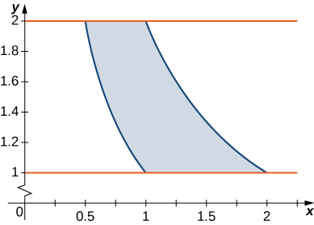

In the following exercises, consider a lamina occupying the region <math xmlns="http://www.w3.org/1998/Math/MathML"><mi>R</mi></math>

 and having the density function <math xmlns="http://www.w3.org/1998/Math/MathML"><mi>ρ</mi></math>

 given in the preceding group of exercises. Use a computer algebra system (CAS) to answer the following questions.

1.  Find the moments
    <math xmlns="http://www.w3.org/1998/Math/MathML"><mrow><msub><mi>M</mi><mi>x</mi></msub></mrow></math>
    
    and
    <math xmlns="http://www.w3.org/1998/Math/MathML"><mrow><msub><mi>M</mi><mi>y</mi></msub></mrow></math>
    
    about the
    <math xmlns="http://www.w3.org/1998/Math/MathML"><mrow><mi>x</mi><mtext>-axis</mtext></mrow></math>
    
    and
    <math xmlns="http://www.w3.org/1998/Math/MathML"><mrow><mi>y</mi><mtext>-axis,</mtext></mrow></math>
    
    respectively.
2.  Calculate and plot the center of mass of the lamina.
3.  **\[T\]** Use a CAS to locate the center of mass on the graph of
    <math xmlns="http://www.w3.org/1998/Math/MathML"><mi>R</mi><mo>.</mo></math>
{: data-number-style="lower-alpha"}

**[T]** <math xmlns="http://www.w3.org/1998/Math/MathML"><mi>R</mi></math>

 is the triangular region with vertices <math xmlns="http://www.w3.org/1998/Math/MathML"><mrow><mrow><mo>(</mo><mrow><mn>0</mn><mo>,</mo><mn>0</mn></mrow><mo>)</mo></mrow><mo>,</mo><mrow><mo>(</mo><mrow><mn>0</mn><mo>,</mo><mn>3</mn></mrow><mo>)</mo></mrow><mo>,</mo></mrow></math>

 and <math xmlns="http://www.w3.org/1998/Math/MathML"><mrow><mrow><mo>(</mo><mrow><mn>6</mn><mo>,</mo><mn>0</mn></mrow><mo>)</mo></mrow><mo>;</mo><mi>ρ</mi><mrow><mo>(</mo><mrow><mi>x</mi><mo>,</mo><mi>y</mi></mrow><mo>)</mo></mrow><mo>=</mo><mi>x</mi><mi>y</mi><mo>.</mo></mrow></math>

a. <math xmlns="http://www.w3.org/1998/Math/MathML"><mrow><msub><mi>M</mi><mi>x</mi></msub><mo>=</mo><mfrac><mrow><mn>81</mn></mrow><mn>5</mn></mfrac><mo>,</mo><msub><mi>M</mi><mi>y</mi></msub><mo>=</mo><mfrac><mrow><mn>162</mn></mrow><mn>5</mn></mfrac><mo>;</mo></mrow></math>

 b. <math xmlns="http://www.w3.org/1998/Math/MathML"><mrow><mover><mi>x</mi><mtext>−</mtext></mover><mo>=</mo><mfrac><mrow><mn>12</mn></mrow><mn>5</mn></mfrac><mo>,</mo><mover><mi>y</mi><mtext>−</mtext></mover><mo>=</mo><mfrac><mn>6</mn><mn>5</mn></mfrac><mo>;</mo></mrow></math>

* * *
{: data-type="newline"}

 c.* * *
{: data-type="newline"}

 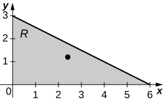 

**[T]** <math xmlns="http://www.w3.org/1998/Math/MathML"><mi>R</mi></math>

 is the triangular region with vertices <math xmlns="http://www.w3.org/1998/Math/MathML"><mrow><mrow><mo>(</mo><mrow><mn>0</mn><mo>,</mo><mn>0</mn></mrow><mo>)</mo></mrow><mo>,</mo><mrow><mo>(</mo><mrow><mn>1</mn><mo>,</mo><mn>1</mn></mrow><mo>)</mo></mrow><mo>,</mo><mtext>and</mtext><mspace width="0.2em" /><mrow><mo>(</mo><mrow><mn>0</mn><mo>,</mo><mn>5</mn></mrow><mo>)</mo></mrow><mo>;</mo><mi>ρ</mi><mrow><mo>(</mo><mrow><mi>x</mi><mo>,</mo><mi>y</mi></mrow><mo>)</mo></mrow><mo>=</mo><mi>x</mi><mo>+</mo><mi>y</mi><mo>.</mo></mrow></math>

**[T]** <math xmlns="http://www.w3.org/1998/Math/MathML"><mi>R</mi></math>

 is the rectangular region with vertices <math xmlns="http://www.w3.org/1998/Math/MathML"><mrow><mrow><mo>(</mo><mrow><mn>0</mn><mo>,</mo><mn>0</mn></mrow><mo>)</mo></mrow><mo>,</mo><mrow><mo>(</mo><mrow><mn>0</mn><mo>,</mo><mn>3</mn></mrow><mo>)</mo></mrow><mo>,</mo><mrow><mo>(</mo><mrow><mn>6</mn><mo>,</mo><mn>3</mn></mrow><mo>)</mo></mrow><mo>,</mo><mtext>and</mtext><mspace width="0.2em" /><mrow><mo>(</mo><mrow><mn>6</mn><mo>,</mo><mn>0</mn></mrow><mo>)</mo></mrow><mo>;</mo></mrow></math>

 <math xmlns="http://www.w3.org/1998/Math/MathML"><mrow><mi>ρ</mi><mrow><mo>(</mo><mrow><mi>x</mi><mo>,</mo><mi>y</mi></mrow><mo>)</mo></mrow><mo>=</mo><msqrt><mrow><mi>x</mi><mi>y</mi></mrow></msqrt><mo>.</mo></mrow></math>

a. <math xmlns="http://www.w3.org/1998/Math/MathML"><mrow><msub><mi>M</mi><mi>x</mi></msub><mo>=</mo><mfrac><mrow><mn>216</mn><msqrt><mn>2</mn></msqrt></mrow><mn>5</mn></mfrac><mo>,</mo><msub><mi>M</mi><mi>y</mi></msub><mo>=</mo><mfrac><mrow><mn>432</mn><msqrt><mn>2</mn></msqrt></mrow><mn>5</mn></mfrac><mo>;</mo></mrow></math>

 b. <math xmlns="http://www.w3.org/1998/Math/MathML"><mrow><mover><mi>x</mi><mtext>−</mtext></mover><mo>=</mo><mfrac><mrow><mn>18</mn></mrow><mn>5</mn></mfrac><mo>,</mo><mover><mi>y</mi><mtext>−</mtext></mover><mo>=</mo><mfrac><mn>9</mn><mn>5</mn></mfrac><mo>;</mo></mrow></math>

* * *
{: data-type="newline"}

 c.* * *
{: data-type="newline"}

 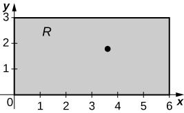 

**[T]** <math xmlns="http://www.w3.org/1998/Math/MathML"><mi>R</mi></math>

 is the rectangular region with vertices <math xmlns="http://www.w3.org/1998/Math/MathML"><mrow><mrow><mo>(</mo><mrow><mn>0</mn><mo>,</mo><mn>1</mn></mrow><mo>)</mo></mrow><mo>,</mo><mrow><mo>(</mo><mrow><mn>0</mn><mo>,</mo><mn>3</mn></mrow><mo>)</mo></mrow><mo>,</mo><mrow><mo>(</mo><mrow><mn>3</mn><mo>,</mo><mn>3</mn></mrow><mo>)</mo></mrow><mo>,</mo><mtext>and</mtext><mspace width="0.2em" /><mrow><mo>(</mo><mrow><mn>3</mn><mo>,</mo><mn>1</mn></mrow><mo>)</mo></mrow><mo>;</mo></mrow></math>

 <math xmlns="http://www.w3.org/1998/Math/MathML"><mrow><mi>ρ</mi><mrow><mo>(</mo><mrow><mi>x</mi><mo>,</mo><mi>y</mi></mrow><mo>)</mo></mrow><mo>=</mo><msup><mi>x</mi><mn>2</mn></msup><mi>y</mi><mo>.</mo></mrow></math>

**[T]** <math xmlns="http://www.w3.org/1998/Math/MathML"><mi>R</mi></math>

 is the trapezoidal region determined by the lines <math xmlns="http://www.w3.org/1998/Math/MathML"><mrow><mi>y</mi><mo>=</mo><mo>−</mo><mfrac><mn>1</mn><mn>4</mn></mfrac><mi>x</mi><mo>+</mo><mfrac><mn>5</mn><mn>2</mn></mfrac><mo>,</mo><mi>y</mi><mo>=</mo><mn>0</mn><mo>,</mo></mrow></math>

 <math xmlns="http://www.w3.org/1998/Math/MathML"><mrow><mi>y</mi><mo>=</mo><mn>2</mn><mo>,</mo><mtext>and</mtext><mspace width="0.2em" /><mi>x</mi><mo>=</mo><mn>0</mn><mo>;</mo></mrow></math>

 <math xmlns="http://www.w3.org/1998/Math/MathML"><mrow><mi>ρ</mi><mrow><mo>(</mo><mrow><mi>x</mi><mo>,</mo><mi>y</mi></mrow><mo>)</mo></mrow><mo>=</mo><mn>3</mn><mi>x</mi><mi>y</mi><mo>.</mo></mrow></math>

a. <math xmlns="http://www.w3.org/1998/Math/MathML"><mrow><msub><mi>M</mi><mi>x</mi></msub><mo>=</mo><mfrac><mrow><mn>368</mn></mrow><mn>5</mn></mfrac><mo>,</mo><msub><mi>M</mi><mi>y</mi></msub><mo>=</mo><mfrac><mrow><mn>1552</mn></mrow><mn>5</mn></mfrac><mo>;</mo></mrow></math>

 b. <math xmlns="http://www.w3.org/1998/Math/MathML"><mrow><mover><mi>x</mi><mtext>−</mtext></mover><mo>=</mo><mfrac><mrow><mn>92</mn></mrow><mrow><mn>95</mn></mrow></mfrac><mo>,</mo><mover><mi>y</mi><mtext>−</mtext></mover><mo>=</mo><mfrac><mrow><mn>388</mn></mrow><mrow><mn>95</mn></mrow></mfrac><mo>;</mo></mrow></math>

* * *
{: data-type="newline"}

 c.* * *
{: data-type="newline"}

 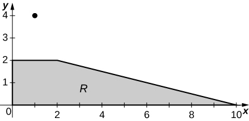 

**[T]** <math xmlns="http://www.w3.org/1998/Math/MathML"><mi>R</mi></math>

 is the trapezoidal region determined by the lines <math xmlns="http://www.w3.org/1998/Math/MathML"><mrow><mi>y</mi><mo>=</mo><mn>0</mn><mo>,</mo><mi>y</mi><mo>=</mo><mn>1</mn><mo>,</mo><mi>y</mi><mo>=</mo><mi>x</mi><mo>,</mo></mrow></math>

 and <math xmlns="http://www.w3.org/1998/Math/MathML"><mrow><mi>y</mi><mo>=</mo><mtext>−</mtext><mi>x</mi><mo>+</mo><mn>3</mn><mo>;</mo><mi>ρ</mi><mrow><mo>(</mo><mrow><mi>x</mi><mo>,</mo><mi>y</mi></mrow><mo>)</mo></mrow><mo>=</mo><mn>2</mn><mi>x</mi><mo>+</mo><mi>y</mi><mo>.</mo></mrow></math>

**[T]** <math xmlns="http://www.w3.org/1998/Math/MathML"><mi>R</mi></math>

 is the disk of radius <math xmlns="http://www.w3.org/1998/Math/MathML"><mn>2</mn></math>

 centered at <math xmlns="http://www.w3.org/1998/Math/MathML"><mrow><mrow><mo>(</mo><mrow><mn>1</mn><mo>,</mo><mn>2</mn></mrow><mo>)</mo></mrow><mo>;</mo></mrow></math>

 <math xmlns="http://www.w3.org/1998/Math/MathML"><mrow><mi>ρ</mi><mrow><mo>(</mo><mrow><mi>x</mi><mo>,</mo><mi>y</mi></mrow><mo>)</mo></mrow><mo>=</mo><msup><mi>x</mi><mn>2</mn></msup><mo>+</mo><msup><mi>y</mi><mn>2</mn></msup><mo>−</mo><mn>2</mn><mi>x</mi><mo>−</mo><mn>4</mn><mi>y</mi><mo>+</mo><mn>5</mn><mo>.</mo></mrow></math>

a. <math xmlns="http://www.w3.org/1998/Math/MathML"><mrow><msub><mi>M</mi><mi>x</mi></msub><mo>=</mo><mn>16</mn><mi>π</mi><mo>,</mo><msub><mi>M</mi><mi>y</mi></msub><mo>=</mo><mn>8</mn><mi>π</mi><mo>;</mo></mrow></math>

 b. <math xmlns="http://www.w3.org/1998/Math/MathML"><mrow><mover><mi>x</mi><mtext>−</mtext></mover><mo>=</mo><mn>1</mn><mo>,</mo><mover><mi>y</mi><mtext>−</mtext></mover><mo>=</mo><mn>2</mn><mo>;</mo></mrow></math>

* * *
{: data-type="newline"}

 c.* * *
{: data-type="newline"}

 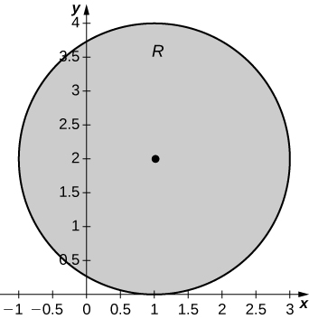 

**[T]** <math xmlns="http://www.w3.org/1998/Math/MathML"><mi>R</mi></math>

 is the unit disk; <math xmlns="http://www.w3.org/1998/Math/MathML"><mrow><mi>ρ</mi><mrow><mo>(</mo><mrow><mi>x</mi><mo>,</mo><mi>y</mi></mrow><mo>)</mo></mrow><mo>=</mo><mn>3</mn><msup><mi>x</mi><mn>4</mn></msup><mo>+</mo><mn>6</mn><msup><mi>x</mi><mn>2</mn></msup><msup><mi>y</mi><mn>2</mn></msup><mo>+</mo><mn>3</mn><msup><mi>y</mi><mn>4</mn></msup><mo>.</mo></mrow></math>

**[T]** <math xmlns="http://www.w3.org/1998/Math/MathML"><mi>R</mi></math>

 is the region enclosed by the ellipse <math xmlns="http://www.w3.org/1998/Math/MathML"><mrow><msup><mi>x</mi><mn>2</mn></msup><mo>+</mo><mn>4</mn><msup><mi>y</mi><mn>2</mn></msup><mo>=</mo><mn>1</mn><mo>;</mo><mi>ρ</mi><mrow><mo>(</mo><mrow><mi>x</mi><mo>,</mo><mi>y</mi></mrow><mo>)</mo></mrow><mo>=</mo><mn>1</mn><mo>.</mo></mrow></math>

a. <math xmlns="http://www.w3.org/1998/Math/MathML"><mrow><msub><mi>M</mi><mi>x</mi></msub><mo>=</mo><mn>0</mn><mo>,</mo><msub><mi>M</mi><mi>y</mi></msub><mo>=</mo><mn>0</mn><mo>;</mo></mrow></math>

 b. <math xmlns="http://www.w3.org/1998/Math/MathML"><mrow><mover><mi>x</mi><mtext>−</mtext></mover><mo>=</mo><mn>0</mn><mo>,</mo><mover><mi>y</mi><mtext>−</mtext></mover><mo>=</mo><mn>0</mn><mo>;</mo></mrow></math>

* * *
{: data-type="newline"}

 c.* * *
{: data-type="newline"}

 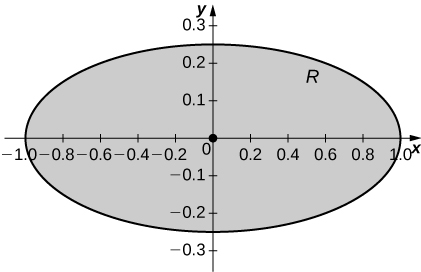 

**[T]** <math xmlns="http://www.w3.org/1998/Math/MathML"><mrow><mi>R</mi><mo>=</mo><mrow><mo>{</mo><mrow><mrow><mrow><mrow><mo>(</mo><mrow><mi>x</mi><mo>,</mo><mi>y</mi></mrow><mo>)</mo></mrow></mrow><mo>\|</mo></mrow><mn>9</mn><msup><mi>x</mi><mn>2</mn></msup><mo>+</mo><msup><mi>y</mi><mn>2</mn></msup><mo>≤</mo><mn>1</mn><mo>,</mo><mi>x</mi><mo>≥</mo><mn>0</mn><mo>,</mo><mi>y</mi><mo>≥</mo><mn>0</mn></mrow><mo>}</mo></mrow><mo>;</mo></mrow></math>

 <math xmlns="http://www.w3.org/1998/Math/MathML"><mrow><mi>ρ</mi><mrow><mo>(</mo><mrow><mi>x</mi><mo>,</mo><mi>y</mi></mrow><mo>)</mo></mrow><mo>=</mo><msqrt><mrow><mn>9</mn><msup><mi>x</mi><mn>2</mn></msup><mo>+</mo><msup><mi>y</mi><mn>2</mn></msup></mrow></msqrt><mo>.</mo></mrow></math>

**[T]** <math xmlns="http://www.w3.org/1998/Math/MathML"><mi>R</mi></math>

 is the region bounded by <math xmlns="http://www.w3.org/1998/Math/MathML"><mrow><mi>y</mi><mo>=</mo><mi>x</mi><mo>,</mo><mi>y</mi><mo>=</mo><mtext>−</mtext><mi>x</mi><mo>,</mo><mi>y</mi><mo>=</mo><mi>x</mi><mo>+</mo><mn>2</mn><mo>,</mo></mrow></math>

 and <math xmlns="http://www.w3.org/1998/Math/MathML"><mrow><mi>y</mi><mo>=</mo><mtext>−</mtext><mi>x</mi><mo>+</mo><mn>2</mn><mo>;</mo></mrow></math>

 <math xmlns="http://www.w3.org/1998/Math/MathML"><mrow><mi>ρ</mi><mrow><mo>(</mo><mrow><mi>x</mi><mo>,</mo><mi>y</mi></mrow><mo>)</mo></mrow><mo>=</mo><mn>1</mn><mo>.</mo></mrow></math>

a. <math xmlns="http://www.w3.org/1998/Math/MathML"><mrow><msub><mi>M</mi><mi>x</mi></msub><mo>=</mo><mn>2</mn><mo>,</mo><msub><mi>M</mi><mi>y</mi></msub><mo>=</mo><mn>0</mn><mo>;</mo></mrow></math>

 b. <math xmlns="http://www.w3.org/1998/Math/MathML"><mrow><mover><mi>x</mi><mtext>−</mtext></mover><mo>=</mo><mn>0</mn><mo>,</mo><mover><mi>y</mi><mtext>−</mtext></mover><mo>=</mo><mn>1</mn><mo>;</mo></mrow></math>

* * *
{: data-type="newline"}

 c.* * *
{: data-type="newline"}

 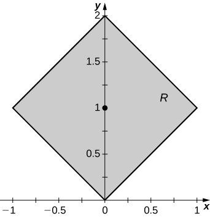 

**[T]** <math xmlns="http://www.w3.org/1998/Math/MathML"><mi>R</mi></math>

 is the region bounded by <math xmlns="http://www.w3.org/1998/Math/MathML"><mrow><mi>y</mi><mo>=</mo><mfrac><mn>1</mn><mi>x</mi></mfrac><mo>,</mo></mrow></math>

 <math xmlns="http://www.w3.org/1998/Math/MathML"><mrow><mi>y</mi><mo>=</mo><mfrac><mn>2</mn><mi>x</mi></mfrac><mo>,</mo><mi>y</mi><mo>=</mo><mn>1</mn><mo>,</mo><mtext>and</mtext><mspace width="0.2em" /><mi>y</mi><mo>=</mo><mn>2</mn><mo>;</mo></mrow></math>

 <math xmlns="http://www.w3.org/1998/Math/MathML"><mrow><mi>ρ</mi><mrow><mo>(</mo><mrow><mi>x</mi><mo>,</mo><mi>y</mi></mrow><mo>)</mo></mrow><mo>=</mo><mn>4</mn><mrow><mo>(</mo><mrow><mi>x</mi><mo>+</mo><mi>y</mi></mrow><mo>)</mo></mrow><mo>.</mo></mrow></math>

In the following exercises, consider a lamina occupying the region <math xmlns="http://www.w3.org/1998/Math/MathML"><mi>R</mi></math>

 and having the density function <math xmlns="http://www.w3.org/1998/Math/MathML"><mi>ρ</mi></math>

 given in the first two groups of Exercises.

1.  Find the moments of inertia
    <math xmlns="http://www.w3.org/1998/Math/MathML"><mrow><msub><mi>I</mi><mi>x</mi></msub><mo>,</mo><msub><mi>I</mi><mi>y</mi></msub><mo>,</mo></mrow></math>
    
    and
    <math xmlns="http://www.w3.org/1998/Math/MathML"><mrow><msub><mi>I</mi><mn>0</mn></msub></mrow></math>
    
    about the
    <math xmlns="http://www.w3.org/1998/Math/MathML"><mrow><mi>x</mi><mtext>-axis</mtext><mo>,</mo></mrow></math>
    
    <math xmlns="http://www.w3.org/1998/Math/MathML"><mrow><mi>y</mi><mtext>-axis</mtext><mo>,</mo></mrow></math>
    
    and origin, respectively.
2.  Find the radii of gyration with respect to the
    <math xmlns="http://www.w3.org/1998/Math/MathML"><mrow><mi>x</mi><mtext>-axis</mtext><mo>,</mo></mrow></math>
    
    <math xmlns="http://www.w3.org/1998/Math/MathML"><mrow><mi>y</mi><mtext>-axis</mtext><mo>,</mo></mrow></math>
    
    and origin, respectively.
{: data-number-style="lower-alpha"}

<math xmlns="http://www.w3.org/1998/Math/MathML"><mi>R</mi></math>

 is the triangular region with vertices <math xmlns="http://www.w3.org/1998/Math/MathML"><mrow><mrow><mo>(</mo><mrow><mn>0</mn><mo>,</mo><mn>0</mn></mrow><mo>)</mo></mrow><mo>,</mo><mrow><mo>(</mo><mrow><mn>0</mn><mo>,</mo><mn>3</mn></mrow><mo>)</mo></mrow><mo>,</mo></mrow></math>

 and <math xmlns="http://www.w3.org/1998/Math/MathML"><mrow><mrow><mo>(</mo><mrow><mn>6</mn><mo>,</mo><mn>0</mn></mrow><mo>)</mo></mrow><mo>;</mo><mi>ρ</mi><mrow><mo>(</mo><mrow><mi>x</mi><mo>,</mo><mi>y</mi></mrow><mo>)</mo></mrow><mo>=</mo><mi>x</mi><mi>y</mi><mo>.</mo></mrow></math>

a. <math xmlns="http://www.w3.org/1998/Math/MathML"><mrow><msub><mi>I</mi><mi>x</mi></msub><mo>=</mo><mfrac><mrow><mn>243</mn></mrow><mrow><mn>10</mn></mrow></mfrac><mo>,</mo><msub><mi>I</mi><mi>y</mi></msub><mo>=</mo><mfrac><mrow><mn>486</mn></mrow><mn>5</mn></mfrac><mo>,</mo><mtext>and</mtext><mspace width="0.2em" /><msub><mi>I</mi><mn>0</mn></msub><mo>=</mo><mfrac><mrow><mn>243</mn></mrow><mn>2</mn></mfrac><mo>;</mo></mrow></math>

 b. <math xmlns="http://www.w3.org/1998/Math/MathML"><mrow><msub><mi>R</mi><mi>x</mi></msub><mo>=</mo><mfrac><mrow><mn>3</mn><msqrt><mn>5</mn></msqrt></mrow><mn>5</mn></mfrac><mo>,</mo><msub><mi>R</mi><mi>y</mi></msub><mo>=</mo><mfrac><mrow><mn>6</mn><msqrt><mn>5</mn></msqrt></mrow><mn>5</mn></mfrac><mo>,</mo><mtext>and</mtext><mspace width="0.2em" /><msub><mi>R</mi><mn>0</mn></msub><mo>=</mo><mn>3</mn></mrow></math>

<math xmlns="http://www.w3.org/1998/Math/MathML"><mi>R</mi></math>

 is the triangular region with vertices <math xmlns="http://www.w3.org/1998/Math/MathML"><mrow><mrow><mo>(</mo><mrow><mn>0</mn><mo>,</mo><mn>0</mn></mrow><mo>)</mo></mrow><mo>,</mo><mrow><mo>(</mo><mrow><mn>1</mn><mo>,</mo><mn>1</mn></mrow><mo>)</mo></mrow><mo>,</mo></mrow></math>

 and <math xmlns="http://www.w3.org/1998/Math/MathML"><mrow><mrow><mo>(</mo><mrow><mn>0</mn><mo>,</mo><mn>5</mn></mrow><mo>)</mo></mrow><mo>;</mo><mi>ρ</mi><mrow><mo>(</mo><mrow><mi>x</mi><mo>,</mo><mi>y</mi></mrow><mo>)</mo></mrow><mo>=</mo><mi>x</mi><mo>+</mo><mi>y</mi><mo>.</mo></mrow></math>

<math xmlns="http://www.w3.org/1998/Math/MathML"><mi>R</mi></math>

 is the rectangular region with vertices <math xmlns="http://www.w3.org/1998/Math/MathML"><mrow><mrow><mo>(</mo><mrow><mn>0</mn><mo>,</mo><mn>0</mn></mrow><mo>)</mo></mrow><mo>,</mo><mrow><mo>(</mo><mrow><mn>0</mn><mo>,</mo><mn>3</mn></mrow><mo>)</mo></mrow><mo>,</mo><mrow><mo>(</mo><mrow><mn>6</mn><mo>,</mo><mn>3</mn></mrow><mo>)</mo></mrow><mo>,</mo></mrow></math>

 and <math xmlns="http://www.w3.org/1998/Math/MathML"><mrow><mrow><mo>(</mo><mrow><mn>6</mn><mo>,</mo><mn>0</mn></mrow><mo>)</mo></mrow><mo>;</mo><mi>ρ</mi><mrow><mo>(</mo><mrow><mi>x</mi><mo>,</mo><mi>y</mi></mrow><mo>)</mo></mrow><mo>=</mo><msqrt><mrow><mi>x</mi><mi>y</mi></mrow></msqrt><mo>.</mo></mrow></math>

a. <math xmlns="http://www.w3.org/1998/Math/MathML"><mrow><msub><mi>I</mi><mi>x</mi></msub><mo>=</mo><mfrac><mrow><mn>2592</mn><msqrt><mn>2</mn></msqrt></mrow><mn>7</mn></mfrac><mo>,</mo><msub><mi>I</mi><mi>y</mi></msub><mo>=</mo><mfrac><mrow><mn>648</mn><msqrt><mn>2</mn></msqrt></mrow><mn>7</mn></mfrac><mo>,</mo><mtext>and</mtext><mspace width="0.2em" /><msub><mi>I</mi><mn>0</mn></msub><mo>=</mo><mfrac><mrow><mn>3240</mn><msqrt><mn>2</mn></msqrt></mrow><mn>7</mn></mfrac><mo>;</mo></mrow></math>

 b. <math xmlns="http://www.w3.org/1998/Math/MathML"><mrow><msub><mi>R</mi><mi>x</mi></msub><mo>=</mo><mfrac><mrow><mn>6</mn><msqrt><mrow><mn>21</mn></mrow></msqrt></mrow><mn>7</mn></mfrac><mo>,</mo><msub><mi>R</mi><mi>y</mi></msub><mo>=</mo><mfrac><mrow><mn>3</mn><msqrt><mrow><mn>21</mn></mrow></msqrt></mrow><mn>7</mn></mfrac><mo>,</mo><mtext>and</mtext><mspace width="0.2em" /><msub><mi>R</mi><mn>0</mn></msub><mo>=</mo><mfrac><mrow><mn>3</mn><msqrt><mrow><mn>105</mn></mrow></msqrt></mrow><mn>7</mn></mfrac></mrow></math>

<math xmlns="http://www.w3.org/1998/Math/MathML"><mi>R</mi></math>

 is the rectangular region with vertices <math xmlns="http://www.w3.org/1998/Math/MathML"><mrow><mrow><mo>(</mo><mrow><mn>0</mn><mo>,</mo><mn>1</mn></mrow><mo>)</mo></mrow><mo>,</mo><mrow><mo>(</mo><mrow><mn>0</mn><mo>,</mo><mn>3</mn></mrow><mo>)</mo></mrow><mo>,</mo><mrow><mo>(</mo><mrow><mn>3</mn><mo>,</mo><mn>3</mn></mrow><mo>)</mo></mrow><mo>,</mo></mrow></math>

 and <math xmlns="http://www.w3.org/1998/Math/MathML"><mrow><mrow><mo>(</mo><mrow><mn>3</mn><mo>,</mo><mn>1</mn></mrow><mo>)</mo></mrow><mo>;</mo><mi>ρ</mi><mrow><mo>(</mo><mrow><mi>x</mi><mo>,</mo><mi>y</mi></mrow><mo>)</mo></mrow><mo>=</mo><msup><mi>x</mi><mn>2</mn></msup><mi>y</mi><mo>.</mo></mrow></math>

<math xmlns="http://www.w3.org/1998/Math/MathML"><mi>R</mi></math>

 is the trapezoidal region determined by the lines <math xmlns="http://www.w3.org/1998/Math/MathML"><mrow><mi>y</mi><mo>=</mo><mo>−</mo><mfrac><mn>1</mn><mn>4</mn></mfrac><mi>x</mi><mo>+</mo><mfrac><mn>5</mn><mn>2</mn></mfrac><mo>,</mo><mi>y</mi><mo>=</mo><mn>0</mn><mo>,</mo><mi>y</mi><mo>=</mo><mn>2</mn><mo>,</mo></mrow></math>

 and <math xmlns="http://www.w3.org/1998/Math/MathML"><mrow><mi>x</mi><mo>=</mo><mn>0</mn><mo>;</mo><mi>ρ</mi><mrow><mo>(</mo><mrow><mi>x</mi><mo>,</mo><mi>y</mi></mrow><mo>)</mo></mrow><mo>=</mo><mn>3</mn><mi>x</mi><mi>y</mi><mo>.</mo></mrow></math>

a. <math xmlns="http://www.w3.org/1998/Math/MathML"><mrow><msub><mi>I</mi><mi>x</mi></msub><mo>=</mo><mn>88</mn><mo>,</mo><msub><mi>I</mi><mi>y</mi></msub><mo>=</mo><mn>1560</mn><mo>,</mo><mtext>and</mtext><mspace width="0.2em" /><msub><mi>I</mi><mn>0</mn></msub><mo>=</mo><mn>1648</mn><mo>;</mo></mrow></math>

 b. <math xmlns="http://www.w3.org/1998/Math/MathML"><mrow><msub><mi>R</mi><mi>x</mi></msub><mo>=</mo><mfrac><mrow><msqrt><mrow><mn>418</mn></mrow></msqrt></mrow><mrow><mn>19</mn></mrow></mfrac><mo>,</mo><msub><mi>R</mi><mi>y</mi></msub><mo>=</mo><mfrac><mrow><msqrt><mrow><mn>7410</mn></mrow></msqrt></mrow><mrow><mn>19</mn></mrow></mfrac><mo>,</mo></mrow></math>

 and <math xmlns="http://www.w3.org/1998/Math/MathML"><mrow><msub><mi>R</mi><mn>0</mn></msub><mo>=</mo><mfrac><mrow><mn>2</mn><msqrt><mrow><mn>1957</mn></mrow></msqrt></mrow><mrow><mn>19</mn></mrow></mfrac></mrow></math>

<math xmlns="http://www.w3.org/1998/Math/MathML"><mi>R</mi></math>

 is the trapezoidal region determined by the lines <math xmlns="http://www.w3.org/1998/Math/MathML"><mrow><mi>y</mi><mo>=</mo><mn>0</mn><mo>,</mo><mi>y</mi><mo>=</mo><mn>1</mn><mo>,</mo><mi>y</mi><mo>=</mo><mi>x</mi><mo>,</mo></mrow></math>

 and <math xmlns="http://www.w3.org/1998/Math/MathML"><mrow><mi>y</mi><mo>=</mo><mtext>−</mtext><mi>x</mi><mo>+</mo><mn>3</mn><mo>;</mo><mi>ρ</mi><mrow><mo>(</mo><mrow><mi>x</mi><mo>,</mo><mi>y</mi></mrow><mo>)</mo></mrow><mo>=</mo><mn>2</mn><mi>x</mi><mo>+</mo><mi>y</mi><mo>.</mo></mrow></math>

<math xmlns="http://www.w3.org/1998/Math/MathML"><mi>R</mi></math>

 is the disk of radius <math xmlns="http://www.w3.org/1998/Math/MathML"><mn>2</mn></math>

 centered at <math xmlns="http://www.w3.org/1998/Math/MathML"><mrow><mrow><mo>(</mo><mrow><mn>1</mn><mo>,</mo><mn>2</mn></mrow><mo>)</mo></mrow><mo>;</mo></mrow></math>

 <math xmlns="http://www.w3.org/1998/Math/MathML"><mrow><mi>ρ</mi><mrow><mo>(</mo><mrow><mi>x</mi><mo>,</mo><mi>y</mi></mrow><mo>)</mo></mrow><mo>=</mo><msup><mi>x</mi><mn>2</mn></msup><mo>+</mo><msup><mi>y</mi><mn>2</mn></msup><mo>−</mo><mn>2</mn><mi>x</mi><mo>−</mo><mn>4</mn><mi>y</mi><mo>+</mo><mn>5</mn><mo>.</mo></mrow></math>

a. <math xmlns="http://www.w3.org/1998/Math/MathML"><mrow><msub><mi>I</mi><mi>x</mi></msub><mo>=</mo><mfrac><mrow><mn>128</mn><mi>π</mi></mrow><mn>3</mn></mfrac><mo>,</mo><msub><mi>I</mi><mi>y</mi></msub><mo>=</mo><mfrac><mrow><mn>56</mn><mi>π</mi></mrow><mn>3</mn></mfrac><mo>,</mo><mtext>and</mtext><mspace width="0.2em" /><msub><mi>I</mi><mn>0</mn></msub><mo>=</mo><mfrac><mrow><mn>184</mn><mi>π</mi></mrow><mn>3</mn></mfrac><mo>;</mo></mrow></math>

 b. <math xmlns="http://www.w3.org/1998/Math/MathML"><mrow><msub><mi>R</mi><mi>x</mi></msub><mo>=</mo><mfrac><mrow><mn>4</mn><msqrt><mn>3</mn></msqrt></mrow><mn>3</mn></mfrac><mo>,</mo><msub><mi>R</mi><mi>y</mi></msub><mo>=</mo><mfrac><mrow><msqrt><mrow><mn>21</mn></mrow></msqrt></mrow><mn>3</mn></mfrac><mo>,</mo></mrow></math>

 and <math xmlns="http://www.w3.org/1998/Math/MathML"><mrow><msub><mi>R</mi><mn>0</mn></msub><mo>=</mo><mfrac><mrow><msqrt><mrow><mn>69</mn></mrow></msqrt></mrow><mn>3</mn></mfrac></mrow></math>

<math xmlns="http://www.w3.org/1998/Math/MathML"><mi>R</mi></math>

 is the unit disk; <math xmlns="http://www.w3.org/1998/Math/MathML"><mrow><mi>ρ</mi><mrow><mo>(</mo><mrow><mi>x</mi><mo>,</mo><mi>y</mi></mrow><mo>)</mo></mrow><mo>=</mo><mn>3</mn><msup><mi>x</mi><mn>4</mn></msup><mo>+</mo><mn>6</mn><msup><mi>x</mi><mn>2</mn></msup><msup><mi>y</mi><mn>2</mn></msup><mo>+</mo><mn>3</mn><msup><mi>y</mi><mn>4</mn></msup><mo>.</mo></mrow></math>

<math xmlns="http://www.w3.org/1998/Math/MathML"><mi>R</mi></math>

 is the region enclosed by the ellipse <math xmlns="http://www.w3.org/1998/Math/MathML"><mrow><msup><mi>x</mi><mn>2</mn></msup><mo>+</mo><mn>4</mn><msup><mi>y</mi><mn>2</mn></msup><mo>=</mo><mn>1</mn><mo>;</mo><mi>ρ</mi><mrow><mo>(</mo><mrow><mi>x</mi><mo>,</mo><mi>y</mi></mrow><mo>)</mo></mrow><mo>=</mo><mn>1</mn><mo>.</mo></mrow></math>

a. <math xmlns="http://www.w3.org/1998/Math/MathML"><mrow><msub><mi>I</mi><mi>x</mi></msub><mo>=</mo><mfrac><mi>π</mi><mrow><mn>32</mn></mrow></mfrac><mo>,</mo><msub><mi>I</mi><mi>y</mi></msub><mo>=</mo><mfrac><mi>π</mi><mn>8</mn></mfrac><mo>,</mo><mtext>and</mtext><mspace width="0.2em" /><msub><mi>I</mi><mn>0</mn></msub><mo>=</mo><mfrac><mrow><mn>5</mn><mi>π</mi></mrow><mrow><mn>32</mn></mrow></mfrac><mo>;</mo></mrow></math>

 b. <math xmlns="http://www.w3.org/1998/Math/MathML"><mrow><msub><mi>R</mi><mi>x</mi></msub><mo>=</mo><mfrac><mn>1</mn><mn>4</mn></mfrac><mo>,</mo><msub><mi>R</mi><mi>y</mi></msub><mo>=</mo><mfrac><mn>1</mn><mn>2</mn></mfrac><mo>,</mo><mtext>and</mtext><mspace width="0.2em" /><msub><mi>R</mi><mn>0</mn></msub><mo>=</mo><mfrac><mrow><msqrt><mn>5</mn></msqrt></mrow><mn>4</mn></mfrac></mrow></math>

<math xmlns="http://www.w3.org/1998/Math/MathML"><mrow><mi>R</mi><mo>=</mo><mrow><mo>{</mo><mrow><mrow><mrow><mrow><mo>(</mo><mrow><mi>x</mi><mo>,</mo><mi>y</mi></mrow><mo>)</mo></mrow></mrow><mo>\|</mo></mrow><mn>9</mn><msup><mi>x</mi><mn>2</mn></msup><mo>+</mo><msup><mi>y</mi><mn>2</mn></msup><mo>≤</mo><mn>1</mn><mo>,</mo><mi>x</mi><mo>≥</mo><mn>0</mn><mo>,</mo><mi>y</mi><mo>≥</mo><mn>0</mn></mrow><mo>}</mo></mrow><mo>;</mo><mi>ρ</mi><mrow><mo>(</mo><mrow><mi>x</mi><mo>,</mo><mi>y</mi></mrow><mo>)</mo></mrow><mo>=</mo><msqrt><mrow><mn>9</mn><msup><mi>x</mi><mn>2</mn></msup><mo>+</mo><msup><mi>y</mi><mn>2</mn></msup></mrow></msqrt><mo>.</mo></mrow></math>

<math xmlns="http://www.w3.org/1998/Math/MathML"><mi>R</mi></math>

 is the region bounded by <math xmlns="http://www.w3.org/1998/Math/MathML"><mrow><mi>y</mi><mo>=</mo><mi>x</mi><mo>,</mo><mi>y</mi><mo>=</mo><mtext>−</mtext><mi>x</mi><mo>,</mo><mi>y</mi><mo>=</mo><mi>x</mi><mo>+</mo><mn>2</mn><mo>,</mo><mtext>and</mtext><mspace width="0.2em" /><mi>y</mi><mo>=</mo><mtext>−</mtext><mi>x</mi><mo>+</mo><mn>2</mn><mo>;</mo></mrow></math>

 <math xmlns="http://www.w3.org/1998/Math/MathML"><mrow><mi>ρ</mi><mrow><mo>(</mo><mrow><mi>x</mi><mo>,</mo><mi>y</mi></mrow><mo>)</mo></mrow><mo>=</mo><mn>1</mn><mo>.</mo></mrow></math>

a. <math xmlns="http://www.w3.org/1998/Math/MathML"><mrow><msub><mi>I</mi><mi>x</mi></msub><mo>=</mo><mfrac><mn>7</mn><mn>3</mn></mfrac><mo>,</mo><msub><mi>I</mi><mi>y</mi></msub><mo>=</mo><mfrac><mn>1</mn><mn>3</mn></mfrac><mo>,</mo><mtext>and</mtext><mspace width="0.2em" /><msub><mi>I</mi><mn>0</mn></msub><mo>=</mo><mfrac><mn>8</mn><mn>3</mn></mfrac><mo>;</mo></mrow></math>

 b. <math xmlns="http://www.w3.org/1998/Math/MathML"><mrow><msub><mi>R</mi><mi>x</mi></msub><mo>=</mo><mfrac><mrow><msqrt><mrow><mn>42</mn></mrow></msqrt></mrow><mn>6</mn></mfrac><mo>,</mo><msub><mi>R</mi><mi>y</mi></msub><mo>=</mo><mfrac><mrow><msqrt><mn>6</mn></msqrt></mrow><mn>6</mn></mfrac><mo>,</mo><mtext>and</mtext><mspace width="0.2em" /><msub><mi>R</mi><mn>0</mn></msub><mo>=</mo><mfrac><mrow><mn>2</mn><msqrt><mn>3</mn></msqrt></mrow><mn>3</mn></mfrac></mrow></math>

<math xmlns="http://www.w3.org/1998/Math/MathML"><mi>R</mi></math>

 is the region bounded by <math xmlns="http://www.w3.org/1998/Math/MathML"><mrow><mi>y</mi><mo>=</mo><mfrac><mn>1</mn><mi>x</mi></mfrac><mo>,</mo><mi>y</mi><mo>=</mo><mfrac><mn>2</mn><mi>x</mi></mfrac><mo>,</mo><mi>y</mi><mo>=</mo><mn>1</mn><mo>,</mo><mtext>and</mtext><mspace width="0.2em" /><mi>y</mi><mo>=</mo><mn>2</mn><mo>;</mo><mi>ρ</mi><mrow><mo>(</mo><mrow><mi>x</mi><mo>,</mo><mi>y</mi></mrow><mo>)</mo></mrow><mo>=</mo><mn>4</mn><mrow><mo>(</mo><mrow><mi>x</mi><mo>+</mo><mi>y</mi></mrow><mo>)</mo></mrow><mo>.</mo></mrow></math>

Let <math xmlns="http://www.w3.org/1998/Math/MathML"><mi>Q</mi></math>

 be the solid unit cube. Find the mass of the solid if its density <math xmlns="http://www.w3.org/1998/Math/MathML"><mi>ρ</mi></math>

 is equal to the square of the distance of an arbitrary point of <math xmlns="http://www.w3.org/1998/Math/MathML"><mi>Q</mi></math>

 to the <math xmlns="http://www.w3.org/1998/Math/MathML"><mrow><mi>x</mi><mi>y</mi><mtext>-plane</mtext><mo>.</mo></mrow></math>

<math xmlns="http://www.w3.org/1998/Math/MathML"><mrow><mi>m</mi><mo>=</mo><mfrac><mn>1</mn><mn>3</mn></mfrac></mrow></math>

Let <math xmlns="http://www.w3.org/1998/Math/MathML"><mi>Q</mi></math>

 be the solid unit hemisphere. Find the mass of the solid if its density <math xmlns="http://www.w3.org/1998/Math/MathML"><mi>ρ</mi></math>

 is proportional to the distance of an arbitrary point of <math xmlns="http://www.w3.org/1998/Math/MathML"><mi>Q</mi></math>

 to the origin.

The solid <math xmlns="http://www.w3.org/1998/Math/MathML"><mi>Q</mi></math>

 of constant density <math xmlns="http://www.w3.org/1998/Math/MathML"><mn>1</mn></math>

 is situated inside the sphere <math xmlns="http://www.w3.org/1998/Math/MathML"><mrow><msup><mi>x</mi><mn>2</mn></msup><mo>+</mo><msup><mi>y</mi><mn>2</mn></msup><mo>+</mo><msup><mi>z</mi><mn>2</mn></msup><mo>=</mo><mn>16</mn></mrow></math>

 and outside the sphere <math xmlns="http://www.w3.org/1998/Math/MathML"><mrow><msup><mi>x</mi><mn>2</mn></msup><mo>+</mo><msup><mi>y</mi><mn>2</mn></msup><mo>+</mo><msup><mi>z</mi><mn>2</mn></msup><mo>=</mo><mn>1</mn><mo>.</mo></mrow></math>

 Show that the center of mass of the solid is not located within the solid.

Find the mass of the solid <math xmlns="http://www.w3.org/1998/Math/MathML"><mrow><mi>Q</mi><mo>=</mo><mrow><mo>{</mo><mrow><mrow><mrow><mrow><mo>(</mo><mrow><mi>x</mi><mo>,</mo><mi>y</mi><mo>,</mo><mi>z</mi></mrow><mo>)</mo></mrow></mrow><mo>\|</mo></mrow><mn>1</mn><mo>≤</mo><msup><mi>x</mi><mn>2</mn></msup><mo>+</mo><msup><mi>z</mi><mn>2</mn></msup><mo>≤</mo><mn>25</mn><mo>,</mo><mi>y</mi><mo>≤</mo><mn>1</mn><mo>−</mo><msup><mi>x</mi><mn>2</mn></msup><mo>−</mo><msup><mi>z</mi><mn>2</mn></msup></mrow><mo>}</mo></mrow></mrow></math>

 whose density is <math xmlns="http://www.w3.org/1998/Math/MathML"><mrow><mi>ρ</mi><mrow><mo>(</mo><mrow><mi>x</mi><mo>,</mo><mi>y</mi><mo>,</mo><mi>z</mi></mrow><mo>)</mo></mrow><mo>=</mo><mi>k</mi><mo>,</mo></mrow></math>

 where <math xmlns="http://www.w3.org/1998/Math/MathML"><mrow><mi>k</mi><mo>&gt;</mo><mn>0</mn><mo>.</mo></mrow></math>

**[T]** The solid <math xmlns="http://www.w3.org/1998/Math/MathML"><mrow><mi>Q</mi><mo>=</mo><mrow><mo>{</mo><mrow><mrow><mrow><mrow><mo>(</mo><mrow><mi>x</mi><mo>,</mo><mi>y</mi><mo>,</mo><mi>z</mi></mrow><mo>)</mo></mrow></mrow><mo>\|</mo></mrow><msup><mi>x</mi><mn>2</mn></msup><mo>+</mo><msup><mi>y</mi><mn>2</mn></msup><mo>≤</mo><mn>9</mn><mo>,</mo><mn>0</mn><mo>≤</mo><mi>z</mi><mo>≤</mo><mn>1</mn><mo>,</mo><mi>x</mi><mo>≥</mo><mn>0</mn><mo>,</mo><mi>y</mi><mo>≥</mo><mn>0</mn></mrow><mo>}</mo></mrow></mrow></math>

 has density equal to the distance to the <math xmlns="http://www.w3.org/1998/Math/MathML"><mrow><mi>x</mi><mi>y</mi><mtext>-plane</mtext><mtext>.</mtext></mrow></math>

 Use a CAS to answer the following questions.

1.  Find the mass of
    <math xmlns="http://www.w3.org/1998/Math/MathML"><mi>Q</mi><mo>.</mo></math>

2.  Find the moments
    <math xmlns="http://www.w3.org/1998/Math/MathML"><mrow><msub><mi>M</mi><mrow><mi>x</mi><mi>y</mi></mrow></msub><mo>,</mo><msub><mi>M</mi><mrow><mi>x</mi><mi>z</mi></mrow></msub><mo>,</mo><mtext>and</mtext><mspace width="0.2em" /><msub><mi>M</mi><mrow><mi>y</mi><mi>z</mi></mrow></msub></mrow></math>
    
    about the
    <math xmlns="http://www.w3.org/1998/Math/MathML"><mrow><mi>x</mi><mi>y</mi><mtext>-plane,</mtext></mrow></math>
    
    <math xmlns="http://www.w3.org/1998/Math/MathML"><mrow><mi>x</mi><mi>z</mi><mtext>-plane,</mtext></mrow></math>
    
    and
    <math xmlns="http://www.w3.org/1998/Math/MathML"><mrow><mi>y</mi><mi>z</mi><mtext>-plane,</mtext></mrow></math>
    
    respectively.
3.  Find the center of mass of
    <math xmlns="http://www.w3.org/1998/Math/MathML"><mi>Q</mi><mo>.</mo></math>

4.  Graph
    <math xmlns="http://www.w3.org/1998/Math/MathML"><mi>Q</mi></math>
    
    and locate its center of mass.
{: data-number-style="lower-alpha"}

a. <math xmlns="http://www.w3.org/1998/Math/MathML"><mrow><mi>m</mi><mo>=</mo><mfrac><mrow><mn>9</mn><mi>π</mi></mrow><mn>4</mn></mfrac><mo>;</mo></mrow></math>

 b. <math xmlns="http://www.w3.org/1998/Math/MathML"><mrow><msub><mi>M</mi><mrow><mi>x</mi><mi>y</mi></mrow></msub><mo>=</mo><mfrac><mrow><mn>3</mn><mi>π</mi></mrow><mn>2</mn></mfrac><mo>,</mo><msub><mi>M</mi><mrow><mi>x</mi><mi>z</mi></mrow></msub><mo>=</mo><mfrac><mrow><mn>81</mn></mrow><mn>8</mn></mfrac><mo>,</mo><msub><mi>M</mi><mrow><mi>y</mi><mi>z</mi></mrow></msub><mo>=</mo><mfrac><mrow><mn>81</mn></mrow><mn>8</mn></mfrac><mo>;</mo></mrow></math>

 c. <math xmlns="http://www.w3.org/1998/Math/MathML"><mrow><mover><mi>x</mi><mtext>−</mtext></mover><mo>=</mo><mfrac><mn>9</mn><mrow><mn>2</mn><mi>π</mi></mrow></mfrac><mo>,</mo><mover><mi>y</mi><mtext>−</mtext></mover><mo>=</mo><mfrac><mn>9</mn><mrow><mn>2</mn><mi>π</mi></mrow></mfrac><mo>,</mo><mover><mi>z</mi><mtext>−</mtext></mover><mo>=</mo><mfrac><mn>2</mn><mn>3</mn></mfrac><mo>;</mo></mrow></math>

 d. the solid <math xmlns="http://www.w3.org/1998/Math/MathML"><mi>Q</mi></math>

 and its center of mass are shown in the following figure.* * *
{: data-type="newline"}

 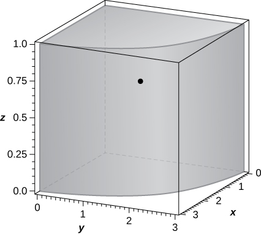 

Consider the solid <math xmlns="http://www.w3.org/1998/Math/MathML"><mrow><mi>Q</mi><mo>=</mo><mrow><mo>{</mo><mrow><mrow><mrow><mrow><mo>(</mo><mrow><mi>x</mi><mo>,</mo><mi>y</mi><mo>,</mo><mi>z</mi></mrow><mo>)</mo></mrow></mrow><mo>\|</mo></mrow><mn>0</mn><mo>≤</mo><mi>x</mi><mo>≤</mo><mn>1</mn><mo>,</mo><mn>0</mn><mo>≤</mo><mi>y</mi><mo>≤</mo><mn>2</mn><mo>,</mo><mn>0</mn><mo>≤</mo><mi>z</mi><mo>≤</mo><mn>3</mn></mrow><mo>}</mo></mrow></mrow></math>

 with the density function <math xmlns="http://www.w3.org/1998/Math/MathML"><mrow><mi>ρ</mi><mrow><mo>(</mo><mrow><mi>x</mi><mo>,</mo><mi>y</mi><mo>,</mo><mi>z</mi></mrow><mo>)</mo></mrow><mo>=</mo><mi>x</mi><mo>+</mo><mi>y</mi><mo>+</mo><mn>1</mn><mo>.</mo></mrow></math>

1.  Find the mass of
    <math xmlns="http://www.w3.org/1998/Math/MathML"><mi>Q</mi><mo>.</mo></math>

2.  Find the moments
    <math xmlns="http://www.w3.org/1998/Math/MathML"><mrow><msub><mi>M</mi><mrow><mi>x</mi><mi>y</mi></mrow></msub><mo>,</mo><msub><mi>M</mi><mrow><mi>x</mi><mi>z</mi></mrow></msub><mo>,</mo><mtext>and</mtext><mspace width="0.2em" /><msub><mi>M</mi><mrow><mi>y</mi><mi>z</mi></mrow></msub></mrow></math>
    
    about the
    <math xmlns="http://www.w3.org/1998/Math/MathML"><mrow><mi>x</mi><mi>y</mi><mtext>-plane,</mtext></mrow></math>
    
    <math xmlns="http://www.w3.org/1998/Math/MathML"><mrow><mi>x</mi><mi>z</mi><mtext>-plane,</mtext></mrow></math>
    
    and
    <math xmlns="http://www.w3.org/1998/Math/MathML"><mrow><mi>y</mi><mi>z</mi><mtext>-plane,</mtext></mrow></math>
    
    respectively.
3.  Find the center of mass of
    <math xmlns="http://www.w3.org/1998/Math/MathML"><mi>Q</mi><mo>.</mo></math>
{: data-number-style="lower-alpha"}

**[T]** The solid <math xmlns="http://www.w3.org/1998/Math/MathML"><mi>Q</mi></math>

 has the mass given by the triple integral <math xmlns="http://www.w3.org/1998/Math/MathML"><mrow><mstyle displaystyle="true"><mrow><munderover><mo stretchy="false">∫</mo><mrow><mn>−1</mn></mrow><mn>1</mn></munderover><mspace width="0.2em" /><mrow><mstyle displaystyle="true"><mrow><munderover><mo stretchy="false">∫</mo><mn>0</mn><mrow><mfrac><mi>π</mi><mn>4</mn></mfrac></mrow></munderover><mspace width="0.2em" /><mrow><mstyle displaystyle="true"><mrow><munderover><mo stretchy="false">∫</mo><mn>0</mn><mn>1</mn></munderover><mrow><msup><mi>r</mi><mn>2</mn></msup><mi>d</mi><mi>r</mi><mspace width="0.2em" /><mi>d</mi><mi>θ</mi><mspace width="0.2em" /><mi>d</mi><mi>z</mi></mrow></mrow></mstyle></mrow></mrow></mstyle></mrow></mrow></mstyle><mo>.</mo></mrow></math>

 Use a CAS to answer the following questions.

1.  Show that the center of mass of
    <math xmlns="http://www.w3.org/1998/Math/MathML"><mi>Q</mi></math>
    
    is located in the
    <math xmlns="http://www.w3.org/1998/Math/MathML"><mrow><mi>x</mi><mi>y</mi><mtext>-plane.</mtext></mrow></math>

2.  Graph
    <math xmlns="http://www.w3.org/1998/Math/MathML"><mi>Q</mi></math>
    
    and locate its center of mass.
{: data-number-style="lower-alpha"}

a. <math xmlns="http://www.w3.org/1998/Math/MathML"><mrow><mover><mi>x</mi><mtext>−</mtext></mover><mo>=</mo><mfrac><mrow><mn>3</mn><msqrt><mn>2</mn></msqrt></mrow><mrow><mn>2</mn><mi>π</mi></mrow></mfrac><mo>,</mo><mover><mi>y</mi><mtext>−</mtext></mover><mo>=</mo><mfrac><mrow><mn>3</mn><mrow><mo>(</mo><mrow><mn>2</mn><mo>−</mo><msqrt><mn>2</mn></msqrt></mrow><mo>)</mo></mrow></mrow><mrow><mn>2</mn><mi>π</mi></mrow></mfrac><mo>,</mo><mover><mi>z</mi><mtext>−</mtext></mover><mo>=</mo><mn>0</mn><mo>;</mo></mrow></math>

 b. the solid <math xmlns="http://www.w3.org/1998/Math/MathML"><mi>Q</mi></math>

 and its center of mass are shown in the following figure.* * *
{: data-type="newline"}

 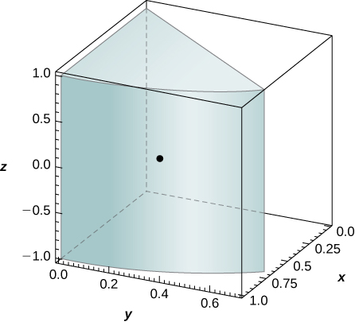 

The solid <math xmlns="http://www.w3.org/1998/Math/MathML"><mi>Q</mi></math>

 is bounded by the planes <math xmlns="http://www.w3.org/1998/Math/MathML"><mrow><mi>x</mi><mo>+</mo><mn>4</mn><mi>y</mi><mo>+</mo><mi>z</mi><mo>=</mo><mn>8</mn><mo>,</mo><mi>x</mi><mo>=</mo><mn>0</mn><mo>,</mo><mi>y</mi><mo>=</mo><mn>0</mn><mo>,</mo><mtext>and</mtext><mspace width="0.2em" /><mi>z</mi><mo>=</mo><mn>0</mn><mo>.</mo></mrow></math>

 Its density at any point is equal to the distance to the <math xmlns="http://www.w3.org/1998/Math/MathML"><mrow><mi>x</mi><mi>z</mi><mtext>-plane</mtext><mtext>.</mtext></mrow></math>

 Find the moments of inertia <math xmlns="http://www.w3.org/1998/Math/MathML"><mrow><msub><mi>I</mi><mi>y</mi></msub></mrow></math>

 of the solid about the <math xmlns="http://www.w3.org/1998/Math/MathML"><mrow><mi>x</mi><mi>z</mi><mtext>-plane</mtext><mtext>.</mtext></mrow></math>

The solid <math xmlns="http://www.w3.org/1998/Math/MathML"><mi>Q</mi></math>

 is bounded by the planes <math xmlns="http://www.w3.org/1998/Math/MathML"><mrow><mi>x</mi><mo>+</mo><mi>y</mi><mo>+</mo><mi>z</mi><mo>=</mo><mn>3</mn><mo>,</mo></mrow></math>

 <math xmlns="http://www.w3.org/1998/Math/MathML"><mrow><mi>x</mi><mo>=</mo><mn>0</mn><mo>,</mo><mi>y</mi><mo>=</mo><mn>0</mn><mo>,</mo></mrow></math>

 and <math xmlns="http://www.w3.org/1998/Math/MathML"><mrow><mi>z</mi><mo>=</mo><mn>0</mn><mo>.</mo></mrow></math>

 Its density is <math xmlns="http://www.w3.org/1998/Math/MathML"><mrow><mi>ρ</mi><mrow><mo>(</mo><mrow><mi>x</mi><mo>,</mo><mi>y</mi><mo>,</mo><mi>z</mi></mrow><mo>)</mo></mrow><mo>=</mo><mi>x</mi><mo>+</mo><mi>a</mi><mi>y</mi><mo>,</mo></mrow></math>

 where <math xmlns="http://www.w3.org/1998/Math/MathML"><mrow><mi>a</mi><mo>&gt;</mo><mn>0</mn><mo>.</mo></mrow></math>

 Show that the center of mass of the solid is located in the plane <math xmlns="http://www.w3.org/1998/Math/MathML"><mrow><mi>z</mi><mo>=</mo><mfrac><mn>3</mn><mn>5</mn></mfrac></mrow></math>

 for any value of <math xmlns="http://www.w3.org/1998/Math/MathML"><mi>a</mi><mo>.</mo></math>

Let <math xmlns="http://www.w3.org/1998/Math/MathML"><mi>Q</mi></math>

 be the solid situated outside the sphere <math xmlns="http://www.w3.org/1998/Math/MathML"><mrow><msup><mi>x</mi><mn>2</mn></msup><mo>+</mo><msup><mi>y</mi><mn>2</mn></msup><mo>+</mo><msup><mi>z</mi><mn>2</mn></msup><mo>=</mo><mi>z</mi></mrow></math>

 and inside the upper hemisphere <math xmlns="http://www.w3.org/1998/Math/MathML"><mrow><msup><mi>x</mi><mn>2</mn></msup><mo>+</mo><msup><mi>y</mi><mn>2</mn></msup><mo>+</mo><msup><mi>z</mi><mn>2</mn></msup><mo>=</mo><msup><mi>R</mi><mn>2</mn></msup><mo>,</mo></mrow></math>

 where <math xmlns="http://www.w3.org/1998/Math/MathML"><mrow><mi>R</mi><mo>&gt;</mo><mn>1</mn><mo>.</mo></mrow></math>

 If the density of the solid is <math xmlns="http://www.w3.org/1998/Math/MathML"><mrow><mi>ρ</mi><mrow><mo>(</mo><mrow><mi>x</mi><mo>,</mo><mi>y</mi><mo>,</mo><mi>z</mi></mrow><mo>)</mo></mrow><mo>=</mo><mfrac><mn>1</mn><mrow><msqrt><mrow><msup><mi>x</mi><mn>2</mn></msup><mo>+</mo><msup><mi>y</mi><mn>2</mn></msup><mo>+</mo><msup><mi>z</mi><mn>2</mn></msup></mrow></msqrt></mrow></mfrac><mo>,</mo></mrow></math>

 find <math xmlns="http://www.w3.org/1998/Math/MathML"><mi>R</mi></math>

 such that the mass of the solid is <math xmlns="http://www.w3.org/1998/Math/MathML"><mrow><mfrac><mrow><mn>7</mn><mi>π</mi></mrow><mn>2</mn></mfrac><mo>.</mo></mrow></math>

The mass of a solid <math xmlns="http://www.w3.org/1998/Math/MathML"><mi>Q</mi></math>

 is given by <math xmlns="http://www.w3.org/1998/Math/MathML"><mrow><mstyle displaystyle="true"><mrow><munderover><mo stretchy="false">∫</mo><mn>0</mn><mn>2</mn></munderover><mspace width="0.2em" /><mrow><mstyle displaystyle="true"><mrow><munderover><mo stretchy="false">∫</mo><mn>0</mn><mrow><msqrt><mrow><mn>4</mn><mo>−</mo><msup><mi>x</mi><mn>2</mn></msup></mrow></msqrt></mrow></munderover><mspace width="0.2em" /><mrow><mstyle displaystyle="true"><mrow><munderover><mo stretchy="false">∫</mo><mrow><msqrt><mrow><msup><mi>x</mi><mn>2</mn></msup><mo>+</mo><msup><mi>y</mi><mn>2</mn></msup></mrow></msqrt></mrow><mrow><msqrt><mrow><mn>16</mn><mo>−</mo><msup><mi>x</mi><mn>2</mn></msup><mo>−</mo><msup><mi>y</mi><mn>2</mn></msup></mrow></msqrt></mrow></munderover><mrow><msup><mrow><mrow><mo>(</mo><mrow><msup><mi>x</mi><mn>2</mn></msup><mo>+</mo><msup><mi>y</mi><mn>2</mn></msup><mo>+</mo><msup><mi>z</mi><mn>2</mn></msup></mrow><mo>)</mo></mrow></mrow><mi>n</mi></msup></mrow></mrow></mstyle></mrow></mrow></mstyle></mrow></mrow></mstyle><mi>d</mi><mi>z</mi><mspace width="0.2em" /><mi>d</mi><mi>y</mi><mspace width="0.2em" /><mi>d</mi><mi>x</mi><mo>,</mo></mrow></math>

 where <math xmlns="http://www.w3.org/1998/Math/MathML"><mi>n</mi></math>

 is an integer. Determine <math xmlns="http://www.w3.org/1998/Math/MathML"><mi>n</mi></math>

 such the mass of the solid is <math xmlns="http://www.w3.org/1998/Math/MathML"><mrow><mrow><mo>(</mo><mrow><mn>2</mn><mo>−</mo><msqrt><mn>2</mn></msqrt></mrow><mo>)</mo></mrow><mi>π</mi><mo>.</mo></mrow></math>

<math xmlns="http://www.w3.org/1998/Math/MathML"><mrow><mi>n</mi><mo>=</mo><mn>−2</mn></mrow></math>

Let <math xmlns="http://www.w3.org/1998/Math/MathML"><mi>Q</mi></math>

 be the solid bounded above the cone <math xmlns="http://www.w3.org/1998/Math/MathML"><mrow><msup><mi>x</mi><mn>2</mn></msup><mo>+</mo><msup><mi>y</mi><mn>2</mn></msup><mo>=</mo><msup><mi>z</mi><mn>2</mn></msup></mrow></math>

 and below the sphere <math xmlns="http://www.w3.org/1998/Math/MathML"><mrow><msup><mi>x</mi><mn>2</mn></msup><mo>+</mo><msup><mi>y</mi><mn>2</mn></msup><mo>+</mo><msup><mi>z</mi><mn>2</mn></msup><mo>−</mo><mn>4</mn><mi>z</mi><mo>=</mo><mn>0</mn><mo>.</mo></mrow></math>

 Its density is a constant <math xmlns="http://www.w3.org/1998/Math/MathML"><mrow><mi>k</mi><mo>&gt;</mo><mn>0</mn><mo>.</mo></mrow></math>

 Find <math xmlns="http://www.w3.org/1998/Math/MathML"><mi>k</mi></math>

 such that the center of mass of the solid is situated <math xmlns="http://www.w3.org/1998/Math/MathML"><mn>7</mn></math>

 units from the origin.

The solid <math xmlns="http://www.w3.org/1998/Math/MathML"><mrow><mi>Q</mi><mo>=</mo><mrow><mo>{</mo><mrow><mrow><mrow><mo stretchy="false">(</mo><mi>x</mi><mo>,</mo><mi>y</mi><mo>,</mo><mi>z</mi><mo stretchy="false">)</mo></mrow><mo>\|</mo></mrow><mn>0</mn><mo>≤</mo><msup><mi>x</mi><mn>2</mn></msup><mo>+</mo><msup><mi>y</mi><mn>2</mn></msup><mo>≤</mo><mn>16</mn><mo>,</mo><mi>x</mi><mo>≥</mo><mn>0</mn><mo>,</mo><mi>y</mi><mo>≥</mo><mn>0</mn><mo>,</mo><mn>0</mn><mo>≤</mo><mi>z</mi><mo>≤</mo><mi>x</mi></mrow><mo>}</mo></mrow></mrow></math>

 has the density <math xmlns="http://www.w3.org/1998/Math/MathML"><mrow><mi>ρ</mi><mrow><mo>(</mo><mrow><mi>x</mi><mo>,</mo><mi>y</mi><mo>,</mo><mi>z</mi></mrow><mo>)</mo></mrow><mo>=</mo><mi>k</mi><mo>.</mo></mrow></math>

 Show that the moment <math xmlns="http://www.w3.org/1998/Math/MathML"><mrow><msub><mi>M</mi><mrow><mi>x</mi><mi>y</mi></mrow></msub></mrow></math>

 about the <math xmlns="http://www.w3.org/1998/Math/MathML"><mrow><mi>x</mi><mi>y</mi><mtext>-plane</mtext></mrow></math>

 is half of the moment <math xmlns="http://www.w3.org/1998/Math/MathML"><mrow><msub><mi>M</mi><mrow><mi>y</mi><mi>z</mi></mrow></msub></mrow></math>

 about the <math xmlns="http://www.w3.org/1998/Math/MathML"><mrow><mi>y</mi><mi>z</mi><mtext>-plane</mtext><mtext>.</mtext></mrow></math>

The solid <math xmlns="http://www.w3.org/1998/Math/MathML"><mi>Q</mi></math>

 is bounded by the cylinder <math xmlns="http://www.w3.org/1998/Math/MathML"><mrow><msup><mi>x</mi><mn>2</mn></msup><mo>+</mo><msup><mi>y</mi><mn>2</mn></msup><mo>=</mo><msup><mi>a</mi><mn>2</mn></msup><mo>,</mo></mrow></math>

 the paraboloid <math xmlns="http://www.w3.org/1998/Math/MathML"><mrow><msup><mi>b</mi><mn>2</mn></msup><mo>−</mo><mi>z</mi><mo>=</mo><msup><mi>x</mi><mn>2</mn></msup><mo>+</mo><msup><mi>y</mi><mn>2</mn></msup><mo>,</mo></mrow></math>

 and the <math xmlns="http://www.w3.org/1998/Math/MathML"><mrow><mi>x</mi><mi>y</mi><mtext>-plane,</mtext></mrow></math>

 where <math xmlns="http://www.w3.org/1998/Math/MathML"><mrow><mn>0</mn><mo>&lt;</mo><mi>a</mi><mo>&lt;</mo><mi>b</mi><mo>.</mo></mrow></math>

 Find the mass of the solid if its density is given by <math xmlns="http://www.w3.org/1998/Math/MathML"><mrow><mi>ρ</mi><mrow><mo>(</mo><mrow><mi>x</mi><mo>,</mo><mi>y</mi><mo>,</mo><mi>z</mi></mrow><mo>)</mo></mrow><mo>=</mo><msqrt><mrow><msup><mi>x</mi><mn>2</mn></msup><mo>+</mo><msup><mi>y</mi><mn>2</mn></msup></mrow></msqrt><mo>.</mo></mrow></math>

Let <math xmlns="http://www.w3.org/1998/Math/MathML"><mi>Q</mi></math>

 be a solid of constant density <math xmlns="http://www.w3.org/1998/Math/MathML"><mrow><mi>k</mi><mo>,</mo></mrow></math>

 where <math xmlns="http://www.w3.org/1998/Math/MathML"><mrow><mi>k</mi><mo>&gt;</mo><mn>0</mn><mo>,</mo></mrow></math>

 that is located in the first octant, inside the circular cone <math xmlns="http://www.w3.org/1998/Math/MathML"><mrow><msup><mi>x</mi><mn>2</mn></msup><mo>+</mo><msup><mi>y</mi><mn>2</mn></msup><mo>=</mo><mn>9</mn><msup><mrow><mrow><mo>(</mo><mrow><mi>z</mi><mo>−</mo><mn>1</mn></mrow><mo>)</mo></mrow></mrow><mn>2</mn></msup><mo>,</mo></mrow></math>

 and above the plane <math xmlns="http://www.w3.org/1998/Math/MathML"><mrow><mi>z</mi><mo>=</mo><mn>0</mn><mo>.</mo></mrow></math>

 Show that the moment <math xmlns="http://www.w3.org/1998/Math/MathML"><mrow><msub><mi>M</mi><mrow><mi>x</mi><mi>y</mi></mrow></msub></mrow></math>

 about the <math xmlns="http://www.w3.org/1998/Math/MathML"><mrow><mi>x</mi><mi>y</mi><mtext>-plane</mtext></mrow></math>

 is the same as the moment <math xmlns="http://www.w3.org/1998/Math/MathML"><mrow><msub><mi>M</mi><mrow><mi>y</mi><mi>z</mi></mrow></msub></mrow></math>

 about the <math xmlns="http://www.w3.org/1998/Math/MathML"><mrow><mi>x</mi><mi>z</mi><mtext>-plane</mtext><mtext>.</mtext></mrow></math>

The solid <math xmlns="http://www.w3.org/1998/Math/MathML"><mi>Q</mi></math>

 has the mass given by the triple integral <math xmlns="http://www.w3.org/1998/Math/MathML"><mrow><mstyle displaystyle="true"><mrow><munderover><mo stretchy="false">∫</mo><mn>0</mn><mn>1</mn></munderover><mspace width="0.2em" /><mrow><mstyle displaystyle="true"><mrow><munderover><mo stretchy="false">∫</mo><mn>0</mn><mrow><mrow><mi>π</mi><mtext>/</mtext><mn>2</mn></mrow></mrow></munderover><mspace width="0.2em" /><mrow><mstyle displaystyle="true"><mrow><munderover><mo stretchy="false">∫</mo><mn>0</mn><mrow><msup><mi>r</mi><mn>2</mn></msup></mrow></munderover><mrow><mrow><mo>(</mo><mrow><msup><mi>r</mi><mn>4</mn></msup><mo>+</mo><mi>r</mi></mrow><mo>)</mo></mrow></mrow></mrow></mstyle></mrow></mrow></mstyle></mrow></mrow></mstyle><mi>d</mi><mi>z</mi><mspace width="0.2em" /><mi>d</mi><mi>θ</mi><mspace width="0.2em" /><mi>d</mi><mi>r</mi><mo>.</mo></mrow></math>

1.  Find the density of the solid in rectangular coordinates.
2.  Find the moment
    <math xmlns="http://www.w3.org/1998/Math/MathML"><mrow><msub><mi>M</mi><mrow><mi>x</mi><mi>y</mi></mrow></msub></mrow></math>
    
    about the
    <math xmlns="http://www.w3.org/1998/Math/MathML"><mrow><mi>x</mi><mi>y</mi><mtext>-plane</mtext><mtext>.</mtext></mrow></math>
{: data-number-style="lower-alpha"}

The solid <math xmlns="http://www.w3.org/1998/Math/MathML"><mi>Q</mi></math>

 has the moment of inertia <math xmlns="http://www.w3.org/1998/Math/MathML"><mrow><msub><mi>I</mi><mi>x</mi></msub></mrow></math>

 about the <math xmlns="http://www.w3.org/1998/Math/MathML"><mrow><mi>y</mi><mi>z</mi><mtext>-plane</mtext></mrow></math>

 given by the triple integral <math xmlns="http://www.w3.org/1998/Math/MathML"><mrow><mstyle displaystyle="true"><mrow><munderover><mo stretchy="false">∫</mo><mn>0</mn><mn>2</mn></munderover><mspace width="0.2em" /><mrow><mstyle displaystyle="true"><mrow><munderover><mo stretchy="false">∫</mo><mrow><mtext>−</mtext><msqrt><mrow><mn>4</mn><mo>−</mo><msup><mi>y</mi><mn>2</mn></msup></mrow></msqrt></mrow><mrow><msqrt><mrow><mn>4</mn><mo>−</mo><msup><mi>y</mi><mn>2</mn></msup></mrow></msqrt></mrow></munderover><mspace width="0.2em" /><mrow><mstyle displaystyle="true"><mrow><munderover><mo stretchy="false">∫</mo><mrow><mfrac><mn>1</mn><mn>2</mn></mfrac><mrow><mo>(</mo><mrow><msup><mi>x</mi><mn>2</mn></msup><mo>+</mo><msup><mi>y</mi><mn>2</mn></msup></mrow><mo>)</mo></mrow></mrow><mrow><msqrt><mrow><msup><mi>x</mi><mn>2</mn></msup><mo>+</mo><msup><mi>y</mi><mn>2</mn></msup></mrow></msqrt></mrow></munderover><mrow><mrow><mo>(</mo><mrow><msup><mi>y</mi><mn>2</mn></msup><mo>+</mo><msup><mi>z</mi><mn>2</mn></msup></mrow><mo>)</mo></mrow></mrow></mrow></mstyle></mrow></mrow></mstyle></mrow></mrow></mstyle><mrow><mo>(</mo><mrow><msup><mi>x</mi><mn>2</mn></msup><mo>+</mo><msup><mi>y</mi><mn>2</mn></msup></mrow><mo>)</mo></mrow><mi>d</mi><mi>z</mi><mspace width="0.2em" /><mi>d</mi><mi>x</mi><mspace width="0.2em" /><mi>d</mi><mi>y</mi><mo>.</mo></mrow></math>

1.  Find the density of
    <math xmlns="http://www.w3.org/1998/Math/MathML"><mrow><mi>Q</mi><mo>.</mo></mrow></math>

2.  Find the moment of inertia
    <math xmlns="http://www.w3.org/1998/Math/MathML"><mrow><msub><mi>I</mi><mi>z</mi></msub></mrow></math>
    
    about the
    <math xmlns="http://www.w3.org/1998/Math/MathML"><mrow><mi>x</mi><mi>y</mi><mtext>-plane.</mtext></mrow></math>
{: data-number-style="lower-alpha"}

a. <math xmlns="http://www.w3.org/1998/Math/MathML"><mrow><mi>ρ</mi><mrow><mo>(</mo><mrow><mi>x</mi><mo>,</mo><mi>y</mi><mo>,</mo><mi>z</mi></mrow><mo>)</mo></mrow><mo>=</mo><msup><mi>x</mi><mn>2</mn></msup><mo>+</mo><msup><mi>y</mi><mn>2</mn></msup><mo>;</mo></mrow></math>

 b. <math xmlns="http://www.w3.org/1998/Math/MathML"><mrow><mfrac><mrow><mn>16</mn><mi>π</mi></mrow><mn>7</mn></mfrac></mrow></math>

The solid <math xmlns="http://www.w3.org/1998/Math/MathML"><mi>Q</mi></math>

 has the mass given by the triple integral <math xmlns="http://www.w3.org/1998/Math/MathML"><mrow><mstyle displaystyle="true"><mrow><munderover><mo stretchy="false">∫</mo><mn>0</mn><mrow><mrow><mi>π</mi><mtext>/</mtext><mn>4</mn></mrow></mrow></munderover><mspace width="0.2em" /><mrow><mstyle displaystyle="true"><mrow><munderover><mo stretchy="false">∫</mo><mn>0</mn><mrow><mn>2</mn><mspace width="0.2em" /><mtext>sec</mtext><mspace width="0.2em" /><mi>θ</mi></mrow></munderover><mspace width="0.2em" /><mrow><mstyle displaystyle="true"><mrow><munderover><mo stretchy="false">∫</mo><mn>0</mn><mn>1</mn></munderover><mrow><mrow><mo>(</mo><mrow><msup><mi>r</mi><mn>3</mn></msup><mtext>cos</mtext><mspace width="0.2em" /><mi>θ</mi><mspace width="0.2em" /><mtext>sin</mtext><mspace width="0.2em" /><mi>θ</mi><mo>+</mo><mn>2</mn><mi>r</mi></mrow><mo>)</mo></mrow></mrow></mrow></mstyle></mrow></mrow></mstyle></mrow></mrow></mstyle><mi>d</mi><mi>z</mi><mspace width="0.2em" /><mi>d</mi><mi>r</mi><mspace width="0.2em" /><mi>d</mi><mi>θ</mi><mo>.</mo></mrow></math>

1.  Find the density of the solid in rectangular coordinates.
2.  Find the moment
    <math xmlns="http://www.w3.org/1998/Math/MathML"><mrow><msub><mi>M</mi><mrow><mi>x</mi><mi>z</mi></mrow></msub></mrow></math>
    
    about the
    <math xmlns="http://www.w3.org/1998/Math/MathML"><mrow><mi>x</mi><mi>z</mi><mtext>-plane.</mtext></mrow></math>
{: data-number-style="lower-alpha"}

Let <math xmlns="http://www.w3.org/1998/Math/MathML"><mi>Q</mi></math>

 be the solid bounded by the <math xmlns="http://www.w3.org/1998/Math/MathML"><mrow><mi>x</mi><mi>y</mi><mtext>-plane</mtext><mo>,</mo></mrow></math>

 the cylinder <math xmlns="http://www.w3.org/1998/Math/MathML"><mrow><msup><mi>x</mi><mn>2</mn></msup><mo>+</mo><msup><mi>y</mi><mn>2</mn></msup><mo>=</mo><msup><mi>a</mi><mn>2</mn></msup><mo>,</mo></mrow></math>

 and the plane <math xmlns="http://www.w3.org/1998/Math/MathML"><mrow><mi>z</mi><mo>=</mo><mn>1</mn><mo>,</mo></mrow></math>

 where <math xmlns="http://www.w3.org/1998/Math/MathML"><mrow><mi>a</mi><mo>&gt;</mo><mn>1</mn></mrow></math>

 is a real number. Find the moment <math xmlns="http://www.w3.org/1998/Math/MathML"><mrow><msub><mi>M</mi><mrow><mi>x</mi><mi>y</mi></mrow></msub></mrow></math>

 of the solid about the <math xmlns="http://www.w3.org/1998/Math/MathML"><mrow><mi>x</mi><mi>y</mi><mtext>-plane</mtext></mrow></math>

 if its density given in cylindrical coordinates is <math xmlns="http://www.w3.org/1998/Math/MathML"><mrow><mi>ρ</mi><mrow><mo>(</mo><mrow><mi>r</mi><mo>,</mo><mi>θ</mi><mo>,</mo><mi>z</mi></mrow><mo>)</mo></mrow><mo>=</mo><mfrac><mrow><msup><mi>d</mi><mn>2</mn></msup><mi>f</mi></mrow><mrow><mi>d</mi><msup><mi>r</mi><mn>2</mn></msup></mrow></mfrac><mrow><mo>(</mo><mi>r</mi><mo>)</mo></mrow><mo>,</mo></mrow></math>

 where <math xmlns="http://www.w3.org/1998/Math/MathML"><mi>f</mi></math>

 is a differentiable function with the first and second derivatives continuous and differentiable on <math xmlns="http://www.w3.org/1998/Math/MathML"><mrow><mrow><mo>(</mo><mrow><mn>0</mn><mo>,</mo><mi>a</mi></mrow><mo>)</mo></mrow><mo>.</mo></mrow></math>

<math xmlns="http://www.w3.org/1998/Math/MathML"><mrow><msub><mi>M</mi><mrow><mi>x</mi><mi>y</mi></mrow></msub><mo>=</mo><mi>π</mi><mrow><mo>(</mo><mrow><mi>f</mi><mrow><mo>(</mo><mn>0</mn><mo>)</mo></mrow><mo>−</mo><mi>f</mi><mrow><mo>(</mo><mi>a</mi><mo>)</mo></mrow><mo>+</mo><mi>a</mi><msup><mi>f</mi><mo>′</mo></msup><mrow><mo>(</mo><mi>a</mi><mo>)</mo></mrow></mrow><mo>)</mo></mrow></mrow></math>

A solid <math xmlns="http://www.w3.org/1998/Math/MathML"><mi>Q</mi></math>

 has a volume given by <math xmlns="http://www.w3.org/1998/Math/MathML"><mrow><mstyle displaystyle="true"><mrow><munder><mo>∬</mo><mi>D</mi></munder><mrow><mstyle displaystyle="true"><mrow><munderover><mo stretchy="false">∫</mo><mi>a</mi><mi>b</mi></munderover><mrow><mi>d</mi><mi>A</mi><mspace width="0.2em" /><mi>d</mi><mi>z</mi><mo>,</mo></mrow></mrow></mstyle></mrow></mrow></mstyle></mrow></math>

 where <math xmlns="http://www.w3.org/1998/Math/MathML"><mi>D</mi></math>

 is the projection of the solid onto the <math xmlns="http://www.w3.org/1998/Math/MathML"><mrow><mi>x</mi><mi>y</mi><mtext>-plane</mtext></mrow></math>

 and <math xmlns="http://www.w3.org/1998/Math/MathML"><mrow><mi>a</mi><mo>&lt;</mo><mi>b</mi></mrow></math>

 are real numbers, and its density does not depend on the variable <math xmlns="http://www.w3.org/1998/Math/MathML"><mi>z</mi><mo>.</mo></math>

 Show that its center of mass lies in the plane <math xmlns="http://www.w3.org/1998/Math/MathML"><mrow><mi>z</mi><mo>=</mo><mfrac><mrow><mi>a</mi><mo>+</mo><mi>b</mi></mrow><mn>2</mn></mfrac><mo>.</mo></mrow></math>

Consider the solid enclosed by the cylinder <math xmlns="http://www.w3.org/1998/Math/MathML"><mrow><msup><mi>x</mi><mn>2</mn></msup><mo>+</mo><msup><mi>z</mi><mn>2</mn></msup><mo>=</mo><msup><mi>a</mi><mn>2</mn></msup></mrow></math>

 and the planes <math xmlns="http://www.w3.org/1998/Math/MathML"><mrow><mi>y</mi><mo>=</mo><mi>b</mi></mrow></math>

 and <math xmlns="http://www.w3.org/1998/Math/MathML"><mrow><mi>y</mi><mo>=</mo><mi>c</mi><mo>,</mo></mrow></math>

 where <math xmlns="http://www.w3.org/1998/Math/MathML"><mrow><mi>a</mi><mo>&gt;</mo><mn>0</mn></mrow></math>

 and <math xmlns="http://www.w3.org/1998/Math/MathML"><mrow><mi>b</mi><mo>&lt;</mo><mi>c</mi></mrow></math>

 are real numbers. The density of <math xmlns="http://www.w3.org/1998/Math/MathML"><mi>Q</mi></math>

 is given by <math xmlns="http://www.w3.org/1998/Math/MathML"><mrow><mi>ρ</mi><mrow><mo>(</mo><mrow><mi>x</mi><mo>,</mo><mi>y</mi><mo>,</mo><mi>z</mi></mrow><mo>)</mo></mrow><mo>=</mo><mi>f</mi><mo>′</mo><mrow><mo>(</mo><mi>y</mi><mo>)</mo></mrow><mo>,</mo></mrow></math>

 where <math xmlns="http://www.w3.org/1998/Math/MathML"><mi>f</mi></math>

 is a differential function whose derivative is continuous on <math xmlns="http://www.w3.org/1998/Math/MathML"><mrow><mrow><mo>(</mo><mrow><mi>b</mi><mo>,</mo><mi>c</mi></mrow><mo>)</mo></mrow><mo>.</mo></mrow></math>

 Show that if <math xmlns="http://www.w3.org/1998/Math/MathML"><mrow><mi>f</mi><mrow><mo>(</mo><mi>b</mi><mo>)</mo></mrow><mo>=</mo><mi>f</mi><mrow><mo>(</mo><mi>c</mi><mo>)</mo></mrow><mo>,</mo></mrow></math>

 then the moment of inertia about the <math xmlns="http://www.w3.org/1998/Math/MathML"><mrow><mi>x</mi><mi>z</mi><mtext>-plane</mtext></mrow></math>

 of <math xmlns="http://www.w3.org/1998/Math/MathML"><mi>Q</mi></math>

 is null.

**[T]** The average density of a solid <math xmlns="http://www.w3.org/1998/Math/MathML"><mi>Q</mi></math>

 is defined as <math xmlns="http://www.w3.org/1998/Math/MathML"><mrow><msub><mi>ρ</mi><mrow><mi>a</mi><mi>v</mi><mi>e</mi></mrow></msub><mo>=</mo><mfrac><mn>1</mn><mrow><mi>V</mi><mrow><mo>(</mo><mi>Q</mi><mo>)</mo></mrow></mrow></mfrac><mstyle displaystyle="true"><mrow><munder><mo>∭</mo><mi>Q</mi></munder><mrow><mi>ρ</mi><mrow><mo>(</mo><mrow><mi>x</mi><mo>,</mo><mi>y</mi><mo>,</mo><mi>z</mi></mrow><mo>)</mo></mrow></mrow></mrow></mstyle><mi>d</mi><mi>V</mi><mo>=</mo><mfrac><mi>m</mi><mrow><mi>V</mi><mrow><mo>(</mo><mi>Q</mi><mo>)</mo></mrow></mrow></mfrac><mo>,</mo></mrow></math>

 where <math xmlns="http://www.w3.org/1998/Math/MathML"><mrow><mi>V</mi><mrow><mo>(</mo><mi>Q</mi><mo>)</mo></mrow></mrow></math>

 and <math xmlns="http://www.w3.org/1998/Math/MathML"><mi>m</mi></math>

 are the volume and the mass of <math xmlns="http://www.w3.org/1998/Math/MathML"><mi>Q</mi><mo>,</mo></math>

 respectively. If the density of the unit ball centered at the origin is <math xmlns="http://www.w3.org/1998/Math/MathML"><mrow><mi>ρ</mi><mrow><mo>(</mo><mrow><mi>x</mi><mo>,</mo><mi>y</mi><mo>,</mo><mi>z</mi></mrow><mo>)</mo></mrow><mo>=</mo><msup><mi>e</mi><mrow><mtext>−</mtext><msup><mi>x</mi><mn>2</mn></msup><mo>−</mo><msup><mi>y</mi><mn>2</mn></msup><mo>−</mo><msup><mi>z</mi><mn>2</mn></msup></mrow></msup><mo>,</mo></mrow></math>

 use a CAS to find its average density. Round your answer to three decimal places.

Show that the moments of inertia <math xmlns="http://www.w3.org/1998/Math/MathML"><mrow><msub><mi>I</mi><mi>x</mi></msub><mo>,</mo><msub><mi>I</mi><mi>y</mi></msub><mo>,</mo><mtext>and</mtext><mspace width="0.2em" /><msub><mi>I</mi><mi>z</mi></msub></mrow></math>

 about the <math xmlns="http://www.w3.org/1998/Math/MathML"><mrow><mi>y</mi><mi>z</mi><mtext>-plane,</mtext></mrow></math>

 <math xmlns="http://www.w3.org/1998/Math/MathML"><mrow><mi>x</mi><mi>z</mi><mtext>-plane,</mtext></mrow></math>

 and <math xmlns="http://www.w3.org/1998/Math/MathML"><mrow><mi>x</mi><mi>y</mi><mtext>-plane,</mtext></mrow></math>

 respectively, of the unit ball centered at the origin whose density is <math xmlns="http://www.w3.org/1998/Math/MathML"><mrow><mi>ρ</mi><mrow><mo>(</mo><mrow><mi>x</mi><mo>,</mo><mi>y</mi><mo>,</mo><mi>z</mi></mrow><mo>)</mo></mrow><mo>=</mo><msup><mi>e</mi><mrow><mtext>−</mtext><msup><mi>x</mi><mn>2</mn></msup><mo>−</mo><msup><mi>y</mi><mn>2</mn></msup><mo>−</mo><msup><mi>z</mi><mn>2</mn></msup></mrow></msup></mrow></math>

 are the same. Round your answer to two decimal places.

<math xmlns="http://www.w3.org/1998/Math/MathML"><mrow><msub><mi>I</mi><mi>x</mi></msub><mo>=</mo><msub><mi>I</mi><mi>y</mi></msub><mo>=</mo><msub><mi>I</mi><mi>z</mi></msub><mo>≃</mo><mn>0.84</mn></mrow></math>

</section>

### Glossary
{: data-type="glossary-title"}

radius of gyration
: the distance from an object’s center of mass to its axis of rotation

