

* Apply the circulation form of Green’s theorem.
* Apply the flux form of Green’s theorem.
* Calculate circulation and flux on more general regions.

In this section, we examine Green’s theorem, which is an extension of the Fundamental Theorem of Calculus to two dimensions. Green’s theorem has two forms: a circulation form and a flux form, both of which require region *D* in the double integral to be simply connected. However, we will extend Green’s theorem to regions that are not simply connected.

Put simply, Green’s theorem relates a line integral around a simply closed plane curve *C* and a double integral over the region enclosed by *C*. The theorem is useful because it allows us to translate difficult line integrals into more simple double integrals, or difficult double integrals into more simple line integrals.

### Extending the Fundamental Theorem of Calculus

Recall that the Fundamental Theorem of Calculus says that

<math xmlns="http://www.w3.org/1998/Math/MathML"><mrow><mstyle displaystyle="true"><mrow><msubsup><mo stretchy="false">∫</mo><mi>a</mi><mi>b</mi></msubsup><mrow><msup><mi>F</mi><mo>′</mo></msup><mo stretchy="false">(</mo><mi>x</mi><mo stretchy="false">)</mo><mi>d</mi><mi>x</mi><mo>=</mo><mi>F</mi><mo stretchy="false">(</mo><mi>b</mi><mo stretchy="false">)</mo><mo>−</mo><mi>F</mi><mo stretchy="false">(</mo><mi>a</mi><mo stretchy="false">)</mo></mrow></mrow></mstyle><mo>.</mo></mrow></math>

As a geometric statement, this equation says that the integral over the region below the graph of <math xmlns="http://www.w3.org/1998/Math/MathML"><mrow><msup><mi>F</mi><mo>′</mo></msup><mo stretchy="false">(</mo><mi>x</mi><mo stretchy="false">)</mo></mrow></math>

 and above the line segment <math xmlns="http://www.w3.org/1998/Math/MathML"><mrow><mo stretchy="false">[</mo><mi>a</mi><mo>,</mo><mi>b</mi><mo stretchy="false">]</mo></mrow></math>

 depends only on the value of *F* at the endpoints *a* and *b* of that segment. Since the numbers *a* and *b* are the boundary of the line segment <math xmlns="http://www.w3.org/1998/Math/MathML"><mrow><mo stretchy="false">[</mo><mi>a</mi><mo>,</mo><mi>b</mi><mo stretchy="false">]</mo><mo>,</mo></mrow></math>

 the theorem says we can calculate integral <math xmlns="http://www.w3.org/1998/Math/MathML"><mrow><mstyle displaystyle="true"><mrow><msubsup><mo stretchy="false">∫</mo><mi>a</mi><mi>b</mi></msubsup><mrow><mi>F</mi><mtext>′</mtext><mo stretchy="false">(</mo><mi>x</mi><mo stretchy="false">)</mo><mi>d</mi><mi>x</mi></mrow></mrow></mstyle></mrow></math>

 based on information about the boundary of line segment <math xmlns="http://www.w3.org/1998/Math/MathML"><mrow><mo stretchy="false">[</mo><mi>a</mi><mo>,</mo><mi>b</mi><mo stretchy="false">]</mo></mrow></math>

 ([\[link\]](#CNX_Calc_Figure_16_04_001)). The same idea is true of the Fundamental Theorem for Line Integrals:

<math xmlns="http://www.w3.org/1998/Math/MathML"><mrow><mstyle displaystyle="true"><mrow><msub><mo stretchy="false">∫</mo><mi>C</mi></msub><mrow><mtext>∇</mtext><mi>f</mi><mo>·</mo><mi>d</mi><mstyle mathvariant="bold" mathsize="normal"><mtext>r</mtext></mstyle></mrow></mrow></mstyle><mo>=</mo><mi>f</mi><mo stretchy="false">(</mo><mstyle mathvariant="bold" mathsize="normal"><mtext>r</mtext></mstyle><mo stretchy="false">(</mo><mi>b</mi><mo stretchy="false">)</mo><mo stretchy="false">)</mo><mo>−</mo><mi>f</mi><mo stretchy="false">(</mo><mstyle mathvariant="bold" mathsize="normal"><mtext>r</mtext></mstyle><mo stretchy="false">(</mo><mi>a</mi><mo stretchy="false">)</mo><mo stretchy="false">)</mo><mo>.</mo></mrow></math>

When we have a potential function (an “antiderivative”), we can calculate the line integral based solely on information about the boundary of curve *C*.

 ![A graph in quadrant 1 of a generic function f(x). It is an increasing concave up function for the first quarter, an increasing concave down function for the second quarter, a decreasing concave down function for the third quarter, and an increasing concave down function for the last quarter. In the second quarter, a point a is marked on the x axis, and in the third quarter, a point b is marked on the x axis. The area under the curve and between a and b is shaded. This area is labeled the integral from a to b of f(x) dx.](../resources/CNX_Calc_Figure_16_04_001.jpg "The Fundamental Theorem of Calculus says that the integral over line segment [a,b] depends only on the values of the antiderivative at the endpoints of [a,b]."){: #CNX_Calc_Figure_16_04_001}

**Green’s theorem**{: data-type="term"} takes this idea and extends it to calculating double integrals. Green’s theorem says that we can calculate a double integral over region *D* based solely on information about the boundary of *D*. Green’s theorem also says we can calculate a line integral over a simple closed curve *C* based solely on information about the region that *C* encloses. In particular, Green’s theorem connects a double integral over region *D* to a line integral around the boundary of *D*.

### Circulation Form of Green’s Theorem

The first form of Green’s theorem that we examine is the circulation form. This form of the theorem relates the vector line integral over a simple, closed plane curve *C* to a double integral over the region enclosed by *C*. Therefore, the circulation of a vector field along a simple closed curve can be transformed into a double integral and vice versa.

Green’s Theorem, Circulation Form

Let *D* be an open, simply connected region with a boundary curve *C* that is a piecewise smooth, simple closed curve oriented counterclockwise ([\[link\]](#CNX_Calc_Figure_16_04_002)). Let <math xmlns="http://www.w3.org/1998/Math/MathML"><mrow><mstyle mathvariant="bold" mathsize="normal"><mtext>F</mtext></mstyle><mo>=</mo><mrow><mo>〈</mo><mrow><mi>P</mi><mo>,</mo><mi>Q</mi></mrow><mo>〉</mo></mrow></mrow></math>

 be a vector field with component functions that have continuous partial derivatives on *D*. Then,

<math xmlns="http://www.w3.org/1998/Math/MathML"><mrow><mstyle displaystyle="true"><mrow><msub><mo>∮</mo><mi>C</mi></msub><mrow><mstyle mathvariant="bold" mathsize="normal"><mtext>F</mtext></mstyle><mo>·</mo><mi>d</mi><mstyle mathvariant="bold" mathsize="normal"><mtext>r</mtext></mstyle><mo>=</mo></mrow></mrow></mstyle><mstyle displaystyle="true"><mrow><msub><mo>∮</mo><mi>C</mi></msub><mrow><mi>P</mi><mi>d</mi><mi>x</mi><mo>+</mo><mi>Q</mi><mi>d</mi><mi>y</mi><mo>=</mo><mstyle displaystyle="true"><mrow><msub><mo>∬</mo><mi>D</mi></msub><mrow><mo stretchy="false">(</mo><msub><mi>Q</mi><mi>x</mi></msub><mo>−</mo><msub><mi>P</mi><mi>y</mi></msub><mo stretchy="false">)</mo><mi>d</mi><mi>A</mi></mrow></mrow></mstyle></mrow></mrow></mstyle><mo>.</mo></mrow></math>

 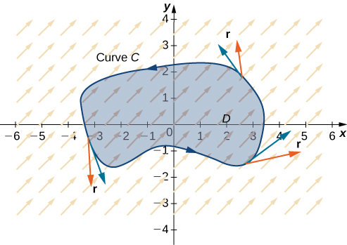{: #CNX_Calc_Figure_16_04_002}

Notice that Green’s theorem can be used only for a two-dimensional vector field **F**. If **F** is a three-dimensional field, then Green’s theorem does not apply. Since

<math xmlns="http://www.w3.org/1998/Math/MathML"><mrow><mstyle displaystyle="true"><mrow><msub><mo stretchy="false">∫</mo><mi>C</mi></msub><mrow><mi>P</mi><mi>d</mi><mi>x</mi><mo>+</mo><mi>Q</mi><mi>d</mi><mi>y</mi><mo>=</mo><mstyle displaystyle="true"><mrow><msub><mo stretchy="false">∫</mo><mi>C</mi></msub><mrow><mstyle mathvariant="bold" mathsize="normal"><mtext>F</mtext></mstyle><mo>·</mo><mstyle mathvariant="bold" mathsize="normal"><mtext>T</mtext></mstyle><mi>d</mi><mi>s</mi></mrow></mrow></mstyle></mrow></mrow></mstyle><mo>,</mo></mrow></math>

this version of Green’s theorem is sometimes referred to as the ***tangential form* of Green’s theorem**{: data-type="term" .no-emphasis}.

The proof of Green’s theorem is rather technical, and beyond the scope of this text. Here we examine a proof of the theorem in the special case that *D* is a rectangle. For now, notice that we can quickly confirm that the theorem is true for the special case in which <math xmlns="http://www.w3.org/1998/Math/MathML"><mrow><mstyle mathvariant="bold" mathsize="normal"><mtext>F</mtext></mstyle><mo>=</mo><mrow><mo>〈</mo><mrow><mi>P</mi><mo>,</mo><mi>Q</mi></mrow><mo>〉</mo></mrow></mrow></math>

 is conservative. In this case,

<math xmlns="http://www.w3.org/1998/Math/MathML"><mrow><mstyle displaystyle="true"><mrow><msub><mo>∮</mo><mi>C</mi></msub><mrow><mi>P</mi><mi>d</mi><mi>x</mi><mo>+</mo><mi>Q</mi><mi>d</mi><mi>y</mi><mo>=</mo><mn>0</mn></mrow></mrow></mstyle></mrow></math>

because the circulation is zero in conservative vector fields. By [\[link\]](/m53987#fs-id1167793945282), **F** satisfies the cross-partial condition, so <math xmlns="http://www.w3.org/1998/Math/MathML"><mrow><msub><mi>P</mi><mi>y</mi></msub><mo>=</mo><msub><mi>Q</mi><mi>x</mi></msub><mo>.</mo></mrow></math>

 Therefore,

<math xmlns="http://www.w3.org/1998/Math/MathML"><mrow><mstyle displaystyle="true"><mrow><msub><mo>∬</mo><mi>D</mi></msub><mrow><mo stretchy="false">(</mo><msub><mi>Q</mi><mi>x</mi></msub><mo>−</mo><msub><mi>P</mi><mi>y</mi></msub><mo stretchy="false">)</mo><mi>d</mi><mi>A</mi></mrow></mrow></mstyle><mo>=</mo><mstyle displaystyle="true"><mrow><msub><mo>∬</mo><mi>D</mi></msub><mrow><mn>0</mn><mi>d</mi><mi>A</mi><mo>=</mo><mn>0</mn><mo>=</mo><mstyle displaystyle="true"><mrow><msub><mo>∮</mo><mi>C</mi></msub><mrow><mi>P</mi><mi>d</mi><mi>x</mi><mo>+</mo><mi>Q</mi><mi>d</mi><mi>y</mi></mrow></mrow></mstyle></mrow></mrow></mstyle><mo>,</mo></mrow></math>

which confirms Green’s theorem in the case of conservative vector fields.

#### Proof

Let’s now prove that the circulation form of Green’s theorem is true when the region *D* is a rectangle. Let *D* be the rectangle <math xmlns="http://www.w3.org/1998/Math/MathML"><mrow><mrow><mo>[</mo><mrow><mi>a</mi><mo>,</mo><mi>b</mi></mrow><mo>]</mo></mrow><mspace width="0.2em" /><mo>×</mo><mspace width="0.2em" /><mrow><mo>[</mo><mrow><mi>c</mi><mo>,</mo><mi>d</mi></mrow><mo>]</mo></mrow></mrow></math>

 oriented counterclockwise. Then, the boundary *C* of *D* consists of four piecewise smooth pieces <math xmlns="http://www.w3.org/1998/Math/MathML"><mrow><msub><mi>C</mi><mn>1</mn></msub><mo>,</mo></mrow></math>

 <math xmlns="http://www.w3.org/1998/Math/MathML"><mrow><msub><mi>C</mi><mn>2</mn></msub><mo>,</mo></mrow></math>

 <math xmlns="http://www.w3.org/1998/Math/MathML"><mrow><msub><mi>C</mi><mn>3</mn></msub><mo>,</mo></mrow></math>

 and <math xmlns="http://www.w3.org/1998/Math/MathML"><mrow><msub><mi>C</mi><mn>4</mn></msub></mrow></math>

 ([\[link\]](#CNX_Calc_Figure_16_04_003)). We parameterize each side of *D* as follows:

<math xmlns="http://www.w3.org/1998/Math/MathML"><mtable><mtr><mtd columnalign="right"><msub><mi>C</mi><mn>1</mn></msub><mtext>:</mtext><mspace width="0.2em" /><msub><mstyle mathvariant="bold" mathsize="normal"><mtext>r</mtext></mstyle><mn>1</mn></msub><mrow><mo>(</mo><mi>t</mi><mo>)</mo></mrow></mtd><mtd columnalign="left"><mo>=</mo></mtd><mtd columnalign="left"><mrow><mo>〈</mo><mrow><mi>t</mi><mo>,</mo><mi>c</mi></mrow><mo>〉</mo></mrow><mo>,</mo><mi>a</mi><mo>≤</mo><mi>t</mi><mo>≤</mo><mi>b</mi></mtd></mtr><mtr><mtd columnalign="right"><msub><mi>C</mi><mn>2</mn></msub><mtext>:</mtext><mspace width="0.2em" /><msub><mstyle mathvariant="bold" mathsize="normal"><mtext>r</mtext></mstyle><mn>2</mn></msub><mrow><mo>(</mo><mi>t</mi><mo>)</mo></mrow></mtd><mtd columnalign="left"><mo>=</mo></mtd><mtd columnalign="left"><mrow><mo>〈</mo><mrow><mi>b</mi><mo>,</mo><mi>t</mi></mrow><mo>〉</mo></mrow><mo>,</mo><mi>c</mi><mo>≤</mo><mi>t</mi><mo>≤</mo><mi>d</mi></mtd></mtr><mtr><mtd columnalign="right"><mtext>−</mtext><msub><mi>C</mi><mn>3</mn></msub><mtext>:</mtext><mspace width="0.2em" /><msub><mstyle mathvariant="bold" mathsize="normal"><mtext>r</mtext></mstyle><mn>3</mn></msub><mrow><mo>(</mo><mi>t</mi><mo>)</mo></mrow></mtd><mtd columnalign="left"><mo>=</mo></mtd><mtd columnalign="left"><mrow><mo>〈</mo><mrow><mi>t</mi><mo>,</mo><mi>d</mi></mrow><mo>〉</mo></mrow><mo>,</mo><mi>a</mi><mo>≤</mo><mi>t</mi><mo>≤</mo><mi>b</mi></mtd></mtr><mtr><mtd columnalign="right"><mtext>−</mtext><msub><mi>C</mi><mn>4</mn></msub><mtext>:</mtext><mspace width="0.2em" /><msub><mstyle mathvariant="bold" mathsize="normal"><mtext>r</mtext></mstyle><mn>4</mn></msub><mrow><mo>(</mo><mi>t</mi><mo>)</mo></mrow></mtd><mtd columnalign="left"><mo>=</mo></mtd><mtd columnalign="left"><mrow><mo>〈</mo><mrow><mi>a</mi><mo>,</mo><mi>t</mi></mrow><mo>〉</mo></mrow><mo>,</mo><mi>c</mi><mo>≤</mo><mi>t</mi><mo>≤</mo><mi>d</mi><mo>.</mo></mtd></mtr></mtable></math>

 {: #CNX_Calc_Figure_16_04_003}

Then,

<math xmlns="http://www.w3.org/1998/Math/MathML"><mtable><mtr><mtd columnalign="right"><mstyle displaystyle="true"><mrow><msub><mo stretchy="false">∫</mo><mi>C</mi></msub><mstyle mathvariant="bold" mathsize="normal"><mtext>F</mtext></mstyle></mrow></mstyle><mo>•</mo><mi>d</mi><mstyle mathvariant="bold" mathsize="normal"><mtext>r</mtext></mstyle></mtd><mtd columnalign="left"><mo>=</mo><mstyle displaystyle="true"><mrow><msub><mo stretchy="false">∫</mo><mrow><msub><mi>C</mi><mn>1</mn></msub></mrow></msub><mrow><mstyle mathvariant="bold" mathsize="normal"><mtext>F</mtext></mstyle><mo>•</mo><mi>d</mi><mstyle mathvariant="bold" mathsize="normal"><mtext>r</mtext></mstyle><mo>+</mo></mrow></mrow></mstyle><mstyle displaystyle="true"><mrow><msub><mo stretchy="false">∫</mo><mrow><msub><mi>C</mi><mn>2</mn></msub></mrow></msub><mrow><mstyle mathvariant="bold" mathsize="normal"><mtext>F</mtext></mstyle><mo>•</mo><mi>d</mi><mstyle mathvariant="bold" mathsize="normal"><mtext>r</mtext></mstyle><mo>+</mo></mrow></mrow></mstyle><mstyle displaystyle="true"><mrow><msub><mo stretchy="false">∫</mo><mrow><msub><mi>C</mi><mn>3</mn></msub></mrow></msub><mrow><mstyle mathvariant="bold" mathsize="normal"><mtext>F</mtext></mstyle><mo>•</mo><mi>d</mi><mstyle mathvariant="bold" mathsize="normal"><mtext>r</mtext></mstyle><mo>+</mo></mrow></mrow></mstyle><mstyle displaystyle="true"><mrow><msub><mo stretchy="false">∫</mo><mrow><msub><mi>C</mi><mn>4</mn></msub></mrow></msub><mrow><mstyle mathvariant="bold" mathsize="normal"><mtext>F</mtext></mstyle><mo>•</mo><mi>d</mi><mstyle mathvariant="bold" mathsize="normal"><mtext>r</mtext></mstyle></mrow></mrow></mstyle></mtd></mtr><mtr><mtd /><mtd columnalign="left"><mo>=</mo><mstyle displaystyle="true"><mrow><msub><mo stretchy="false">∫</mo><mrow><msub><mi>C</mi><mn>1</mn></msub></mrow></msub><mrow><mstyle mathvariant="bold" mathsize="normal"><mtext>F</mtext></mstyle><mo>•</mo><mi>d</mi><mstyle mathvariant="bold" mathsize="normal"><mtext>r</mtext></mstyle><mo>+</mo></mrow></mrow></mstyle><mstyle displaystyle="true"><mrow><msub><mo stretchy="false">∫</mo><mrow><msub><mi>C</mi><mn>2</mn></msub></mrow></msub><mrow><mstyle mathvariant="bold" mathsize="normal"><mtext>F</mtext></mstyle><mo>•</mo><mi>d</mi><mstyle mathvariant="bold" mathsize="normal"><mtext>r</mtext></mstyle><mo>−</mo></mrow></mrow></mstyle><mstyle displaystyle="true"><mrow><msub><mo stretchy="false">∫</mo><mrow><mtext>−</mtext><msub><mi>C</mi><mn>3</mn></msub></mrow></msub><mrow><mstyle mathvariant="bold" mathsize="normal"><mtext>F</mtext></mstyle><mo>•</mo><mi>d</mi><mstyle mathvariant="bold" mathsize="normal"><mtext>r</mtext></mstyle><mo>−</mo></mrow></mrow></mstyle><mstyle displaystyle="true"><mrow><msub><mo stretchy="false">∫</mo><mrow><mtext>−</mtext><msub><mi>C</mi><mn>4</mn></msub></mrow></msub><mrow><mstyle mathvariant="bold" mathsize="normal"><mtext>F</mtext></mstyle><mo>•</mo><mi>d</mi><mstyle mathvariant="bold" mathsize="normal"><mtext>r</mtext></mstyle></mrow></mrow></mstyle></mtd></mtr><mtr><mtd /><mtd columnalign="left"><mo>=</mo><mstyle displaystyle="true"><mrow><msubsup><mo stretchy="false">∫</mo><mi>a</mi><mi>b</mi></msubsup><mstyle mathvariant="bold" mathsize="normal"><mtext>F</mtext></mstyle></mrow></mstyle><mrow><mo>(</mo><mrow><msub><mstyle mathvariant="bold" mathsize="normal"><mtext>r</mtext></mstyle><mn>1</mn></msub><mrow><mo>(</mo><mi>t</mi><mo>)</mo></mrow></mrow><mo>)</mo></mrow><mo>•</mo><msub><mstyle mathvariant="bold" mathsize="normal"><mtext>r</mtext></mstyle><mn>1</mn></msub><mrow><mo>(</mo><mi>t</mi><mo>)</mo></mrow><mi>d</mi><mi>t</mi><mo>+</mo><mstyle displaystyle="true"><mrow><msubsup><mo stretchy="false">∫</mo><mi>c</mi><mi>d</mi></msubsup><mstyle mathvariant="bold" mathsize="normal"><mtext>F</mtext></mstyle></mrow></mstyle><mrow><mo>(</mo><mrow><msub><mstyle mathvariant="bold" mathsize="normal"><mtext>r</mtext></mstyle><mn>2</mn></msub><mrow><mo>(</mo><mi>t</mi><mo>)</mo></mrow></mrow><mo>)</mo></mrow><mo>•</mo><msub><mstyle mathvariant="bold" mathsize="normal"><mtext>r</mtext></mstyle><mn>2</mn></msub><mrow><mo>(</mo><mi>t</mi><mo>)</mo></mrow><mi>d</mi><mi>t</mi></mtd></mtr><mtr><mtd /><mtd columnalign="left"><mspace width="0.5em" /><mtext>−</mtext><mstyle displaystyle="true"><mrow><msubsup><mo stretchy="false">∫</mo><mi>a</mi><mi>b</mi></msubsup><mstyle mathvariant="bold" mathsize="normal"><mtext>F</mtext></mstyle></mrow></mstyle><mrow><mo>(</mo><mrow><msub><mstyle mathvariant="bold" mathsize="normal"><mtext>r</mtext></mstyle><mn>3</mn></msub><mrow><mo>(</mo><mi>t</mi><mo>)</mo></mrow></mrow><mo>)</mo></mrow><mo>•</mo><msub><mstyle mathvariant="bold" mathsize="normal"><mtext>r</mtext></mstyle><mn>3</mn></msub><mrow><mo>(</mo><mi>t</mi><mo>)</mo></mrow><mi>d</mi><mi>t</mi><mo>−</mo><mstyle displaystyle="true"><mrow><msubsup><mo stretchy="false">∫</mo><mi>c</mi><mi>d</mi></msubsup><mstyle mathvariant="bold" mathsize="normal"><mtext>F</mtext></mstyle></mrow></mstyle><mrow><mo>(</mo><mrow><msub><mstyle mathvariant="bold" mathsize="normal"><mtext>r</mtext></mstyle><mn>4</mn></msub><mrow><mo>(</mo><mi>t</mi><mo>)</mo></mrow></mrow><mo>)</mo></mrow><mo>•</mo><msub><mstyle mathvariant="bold" mathsize="normal"><mtext>r</mtext></mstyle><mn>4</mn></msub><mrow><mo>(</mo><mi>t</mi><mo>)</mo></mrow><mi>d</mi><mi>t</mi></mtd></mtr><mtr><mtd /><mtd columnalign="left"><mo>=</mo><mstyle displaystyle="true"><mrow><msubsup><mo stretchy="false">∫</mo><mi>a</mi><mi>b</mi></msubsup><mrow><mi>P</mi><mrow><mo>(</mo><mrow><mi>t</mi><mo>,</mo><mi>c</mi></mrow><mo>)</mo></mrow><mi>d</mi><mi>t</mi><mo>+</mo></mrow></mrow></mstyle><mstyle displaystyle="true"><mrow><msubsup><mo stretchy="false">∫</mo><mi>c</mi><mi>d</mi></msubsup><mrow><mi>Q</mi><mrow><mo>(</mo><mrow><mi>b</mi><mo>,</mo><mi>t</mi></mrow><mo>)</mo></mrow><mi>d</mi><mi>t</mi><mo>−</mo></mrow></mrow></mstyle><mstyle displaystyle="true"><mrow><msubsup><mo stretchy="false">∫</mo><mi>a</mi><mi>b</mi></msubsup><mrow><mi>P</mi><mrow><mo>(</mo><mrow><mi>t</mi><mo>,</mo><mi>d</mi></mrow><mo>)</mo></mrow><mi>d</mi><mi>t</mi><mo>−</mo></mrow></mrow></mstyle><mstyle displaystyle="true"><mrow><msubsup><mo stretchy="false">∫</mo><mi>c</mi><mi>d</mi></msubsup><mrow><mi>Q</mi><mrow><mo>(</mo><mrow><mi>a</mi><mo>,</mo><mi>t</mi></mrow><mo>)</mo></mrow><mi>d</mi><mi>t</mi></mrow></mrow></mstyle></mtd></mtr><mtr><mtd /><mtd columnalign="left"><mo>=</mo><mstyle displaystyle="true"><mrow><msubsup><mo stretchy="false">∫</mo><mi>a</mi><mi>b</mi></msubsup><mrow><mrow><mo>(</mo><mrow><mi>P</mi><mrow><mo>(</mo><mrow><mi>t</mi><mo>,</mo><mi>c</mi></mrow><mo>)</mo></mrow><mo>−</mo><mi>P</mi><mrow><mo>(</mo><mrow><mi>t</mi><mo>,</mo><mi>d</mi></mrow><mo>)</mo></mrow></mrow><mo>)</mo></mrow><mi>d</mi><mi>t</mi></mrow></mrow></mstyle><mo>+</mo><mstyle displaystyle="true"><mrow><msubsup><mo stretchy="false">∫</mo><mi>c</mi><mi>d</mi></msubsup><mrow><mrow><mo>(</mo><mrow><mi>Q</mi><mrow><mo>(</mo><mrow><mi>b</mi><mo>,</mo><mi>t</mi></mrow><mo>)</mo></mrow><mo>−</mo><mi>Q</mi><mrow><mo>(</mo><mrow><mi>a</mi><mo>,</mo><mi>t</mi></mrow><mo>)</mo></mrow></mrow><mo>)</mo></mrow><mi>d</mi><mi>t</mi></mrow></mrow></mstyle></mtd></mtr><mtr><mtd /><mtd columnalign="left"><mo>=</mo><mtext>−</mtext><mstyle displaystyle="true"><mrow><msubsup><mo stretchy="false">∫</mo><mi>a</mi><mi>b</mi></msubsup><mrow><mrow><mo>(</mo><mrow><mi>P</mi><mrow><mo>(</mo><mrow><mi>t</mi><mo>,</mo><mi>d</mi></mrow><mo>)</mo></mrow><mo>−</mo><mi>P</mi><mrow><mo>(</mo><mrow><mi>t</mi><mo>,</mo><mi>c</mi></mrow><mo>)</mo></mrow></mrow><mo>)</mo></mrow><mi>d</mi><mi>t</mi></mrow></mrow></mstyle><mo>+</mo><mstyle displaystyle="true"><mrow><msubsup><mo stretchy="false">∫</mo><mi>c</mi><mi>d</mi></msubsup><mrow><mrow><mo>(</mo><mrow><mi>Q</mi><mrow><mo>(</mo><mrow><mi>b</mi><mo>,</mo><mi>t</mi></mrow><mo>)</mo></mrow><mo>−</mo><mi>Q</mi><mrow><mo>(</mo><mrow><mi>a</mi><mo>,</mo><mi>t</mi></mrow><mo>)</mo></mrow></mrow><mo>)</mo></mrow><mi>d</mi><mi>t</mi></mrow></mrow></mstyle><mo>.</mo></mtd></mtr></mtable></math>

By the Fundamental Theorem of Calculus,

<math xmlns="http://www.w3.org/1998/Math/MathML"><mrow><mi>P</mi><mrow><mo>(</mo><mrow><mi>t</mi><mo>,</mo><mi>d</mi></mrow><mo>)</mo></mrow><mo>−</mo><mi>P</mi><mrow><mo>(</mo><mrow><mi>t</mi><mo>,</mo><mi>c</mi></mrow><mo>)</mo></mrow><mo>=</mo><mstyle displaystyle="true"><mrow><msubsup><mo stretchy="false">∫</mo><mi>c</mi><mi>d</mi></msubsup><mrow><mfrac><mo>∂</mo><mrow><mo>∂</mo><mi>y</mi></mrow></mfrac><mi>P</mi><mrow><mo>(</mo><mrow><mi>t</mi><mo>,</mo><mi>y</mi></mrow><mo>)</mo></mrow><mi>d</mi><mi>y</mi></mrow></mrow></mstyle><mspace width="0.2em" /><mtext>and</mtext><mspace width="0.2em" /><mi>Q</mi><mrow><mo>(</mo><mrow><mi>b</mi><mo>,</mo><mi>t</mi></mrow><mo>)</mo></mrow><mo>−</mo><mi>Q</mi><mrow><mo>(</mo><mrow><mi>a</mi><mo>,</mo><mi>t</mi></mrow><mo>)</mo></mrow><mo>=</mo><mstyle displaystyle="true"><mrow><msubsup><mo stretchy="false">∫</mo><mi>a</mi><mi>b</mi></msubsup><mrow><mfrac><mo>∂</mo><mrow><mo>∂</mo><mi>x</mi></mrow></mfrac><mi>Q</mi><mrow><mo>(</mo><mrow><mi>x</mi><mo>,</mo><mi>t</mi></mrow><mo>)</mo></mrow><mi>d</mi><mi>x</mi><mo>.</mo></mrow></mrow></mstyle></mrow></math>

Therefore,

<math xmlns="http://www.w3.org/1998/Math/MathML"><mtable><mtr /><mtr /><mtr /><mtr /><mtr><mtd columnalign="left"><mspace width="0.5em" /><mtext>−</mtext><mstyle displaystyle="true"><mrow><msubsup><mo stretchy="false">∫</mo><mi>a</mi><mi>b</mi></msubsup><mrow><mrow><mo>(</mo><mrow><mi>P</mi><mrow><mo>(</mo><mrow><mi>t</mi><mo>,</mo><mi>d</mi></mrow><mo>)</mo></mrow><mo>−</mo><mi>P</mi><mrow><mo>(</mo><mrow><mi>t</mi><mo>,</mo><mi>c</mi></mrow><mo>)</mo></mrow></mrow><mo>)</mo></mrow><mi>d</mi><mi>t</mi><mo>+</mo></mrow></mrow></mstyle><mstyle displaystyle="true"><mrow><msubsup><mo stretchy="false">∫</mo><mi>c</mi><mi>d</mi></msubsup><mrow><mrow><mo>(</mo><mrow><mi>Q</mi><mrow><mo>(</mo><mrow><mi>b</mi><mo>,</mo><mi>t</mi></mrow><mo>)</mo></mrow><mo>−</mo><mi>Q</mi><mrow><mo>(</mo><mrow><mi>a</mi><mo>,</mo><mi>t</mi></mrow><mo>)</mo></mrow></mrow><mo>)</mo></mrow><mi>d</mi><mi>t</mi></mrow></mrow></mstyle></mtd></mtr><mtr><mtd columnalign="left"><mo>=</mo><mtext>−</mtext><mstyle displaystyle="true"><mrow><msubsup><mo stretchy="false">∫</mo><mi>a</mi><mi>b</mi></msubsup><mrow><mstyle displaystyle="true"><mrow><msubsup><mo stretchy="false">∫</mo><mi>c</mi><mi>d</mi></msubsup><mrow><mfrac><mo>∂</mo><mrow><mo>∂</mo><mi>y</mi></mrow></mfrac><mi>P</mi><mrow><mo>(</mo><mrow><mi>t</mi><mo>,</mo><mi>y</mi></mrow><mo>)</mo></mrow><mi>d</mi><mi>y</mi><mi>d</mi><mi>t</mi><mo>+</mo></mrow></mrow></mstyle></mrow></mrow></mstyle><mstyle displaystyle="true"><mrow><msubsup><mo stretchy="false">∫</mo><mi>c</mi><mi>d</mi></msubsup><mrow><mstyle displaystyle="true"><mrow><msubsup><mo stretchy="false">∫</mo><mi>a</mi><mi>b</mi></msubsup><mrow><mfrac><mo>∂</mo><mrow><mo>∂</mo><mi>x</mi></mrow></mfrac><mi>Q</mi><mrow><mo>(</mo><mrow><mi>x</mi><mo>,</mo><mi>t</mi></mrow><mo>)</mo></mrow><mi>d</mi><mi>x</mi><mi>d</mi><mi>t</mi><mo>.</mo></mrow></mrow></mstyle></mrow></mrow></mstyle></mtd></mtr></mtable></math>

But,

<math xmlns="http://www.w3.org/1998/Math/MathML"><mtable><mtr><mtd columnalign="right"><mo>−</mo><mstyle displaystyle="true"><mrow><msubsup><mo stretchy="false">∫</mo><mi>a</mi><mi>b</mi></msubsup><mrow><mstyle displaystyle="true"><mrow><msubsup><mo stretchy="false">∫</mo><mi>c</mi><mi>d</mi></msubsup><mrow><mfrac><mo>∂</mo><mrow><mo>∂</mo><mi>y</mi></mrow></mfrac></mrow></mrow></mstyle></mrow></mrow></mstyle><mi>P</mi><mrow><mo>(</mo><mrow><mi>t</mi><mo>,</mo><mi>y</mi></mrow><mo>)</mo></mrow><mi>d</mi><mi>y</mi><mi>d</mi><mi>t</mi><mo>+</mo><mstyle displaystyle="true"><mrow><msubsup><mo stretchy="false">∫</mo><mi>c</mi><mi>d</mi></msubsup><mrow><mstyle displaystyle="true"><mrow><msubsup><mo stretchy="false">∫</mo><mi>a</mi><mi>b</mi></msubsup><mrow><mfrac><mo>∂</mo><mrow><mo>∂</mo><mi>x</mi></mrow></mfrac></mrow></mrow></mstyle></mrow></mrow></mstyle><mi>Q</mi><mrow><mo>(</mo><mrow><mi>x</mi><mo>,</mo><mi>t</mi></mrow><mo>)</mo></mrow><mi>d</mi><mi>x</mi><mi>d</mi><mi>t</mi></mtd><mtd columnalign="left"><mo>=</mo><mtext>−</mtext><mstyle displaystyle="true"><mrow><msubsup><mo stretchy="false">∫</mo><mi>a</mi><mi>b</mi></msubsup><mrow><mstyle displaystyle="true"><mrow><msubsup><mo stretchy="false">∫</mo><mi>c</mi><mi>d</mi></msubsup><mrow><mfrac><mo>∂</mo><mrow><mo>∂</mo><mi>y</mi></mrow></mfrac><mi>P</mi><mrow><mo>(</mo><mrow><mi>x</mi><mo>,</mo><mi>y</mi></mrow><mo>)</mo></mrow><mi>d</mi><mi>y</mi><mi>d</mi><mi>x</mi><mo>+</mo><mstyle displaystyle="true"><mrow><msubsup><mo stretchy="false">∫</mo><mi>c</mi><mi>d</mi></msubsup><mrow><mstyle displaystyle="true"><mrow><msubsup><mo stretchy="false">∫</mo><mi>a</mi><mi>b</mi></msubsup><mrow><mfrac><mo>∂</mo><mrow><mo>∂</mo><mi>x</mi></mrow></mfrac><mi>Q</mi><mrow><mo>(</mo><mrow><mi>x</mi><mo>,</mo><mi>y</mi></mrow><mo>)</mo></mrow><mi>d</mi><mi>x</mi><mi>d</mi><mi>y</mi></mrow></mrow></mstyle></mrow></mrow></mstyle></mrow></mrow></mstyle></mrow></mrow></mstyle></mtd></mtr><mtr><mtd /><mtd columnalign="left"><mo>=</mo><mstyle displaystyle="true"><mrow><msubsup><mo stretchy="false">∫</mo><mi>a</mi><mi>b</mi></msubsup><mrow><mstyle displaystyle="true"><mrow><msubsup><mo stretchy="false">∫</mo><mi>c</mi><mi>d</mi></msubsup><mrow><mrow><mo>(</mo><mrow><msub><mi>Q</mi><mi>x</mi></msub><mo>−</mo><msub><mi>P</mi><mi>y</mi></msub></mrow><mo>)</mo></mrow><mi>d</mi><mi>y</mi><mi>d</mi><mi>x</mi></mrow></mrow></mstyle></mrow></mrow></mstyle></mtd></mtr><mtr><mtd /><mtd columnalign="left"><mo>=</mo><mstyle displaystyle="true"><mrow><mo stretchy="false">∫</mo><mrow><mstyle displaystyle="true"><mrow><msub><mo stretchy="false">∫</mo><mi>D</mi></msub><mrow><mrow><mo>(</mo><mrow><msub><mi>Q</mi><mi>x</mi></msub><mo>−</mo><msub><mi>P</mi><mi>y</mi></msub></mrow><mo>)</mo></mrow><mi>d</mi><mi>A</mi><mo>.</mo></mrow></mrow></mstyle></mrow></mrow></mstyle></mtd></mtr></mtable></math>

Therefore, <math xmlns="http://www.w3.org/1998/Math/MathML"><mrow><mstyle displaystyle="true"><mrow><msub><mo stretchy="false">∫</mo><mi>C</mi></msub><mrow><mstyle mathvariant="bold" mathsize="normal"><mtext>F</mtext></mstyle><mo>•</mo><mi>d</mi><mstyle mathvariant="bold" mathsize="normal"><mtext>r</mtext></mstyle><mo>=</mo><mstyle displaystyle="true"><mrow><mo stretchy="false">∫</mo><mrow><mstyle displaystyle="true"><mrow><msub><mo stretchy="false">∫</mo><mi>D</mi></msub><mrow><mrow><mo>(</mo><mrow><msub><mi>Q</mi><mi>x</mi></msub><mo>−</mo><msub><mi>P</mi><mi>y</mi></msub></mrow><mo>)</mo></mrow><mi>d</mi><mi>A</mi></mrow></mrow></mstyle></mrow></mrow></mstyle></mrow></mrow></mstyle></mrow></math>

 and we have proved Green’s theorem in the case of a rectangle.

To prove Green’s theorem over a general region *D*, we can decompose *D* into many tiny rectangles and use the proof that the theorem works over rectangles. The details are technical, however, and beyond the scope of this text.

□

Applying Green’s Theorem over a Rectangle

Calculate the line integral

<math xmlns="http://www.w3.org/1998/Math/MathML"><mrow><mstyle displaystyle="true"><mrow><msub><mo>∮</mo><mi>C</mi></msub><mrow><msup><mi>x</mi><mn>2</mn></msup><mi>y</mi><mi>d</mi><mi>x</mi><mo>+</mo><mo stretchy="false">(</mo><mi>y</mi><mo>−</mo><mn>3</mn><mo stretchy="false">)</mo><mi>d</mi><mi>y</mi></mrow></mrow></mstyle><mo>,</mo></mrow></math>

where *C* is a rectangle with vertices <math xmlns="http://www.w3.org/1998/Math/MathML"><mrow><mo stretchy="false">(</mo><mn>1</mn><mo>,</mo><mn>1</mn><mo stretchy="false">)</mo><mo>,</mo></mrow></math>

 <math xmlns="http://www.w3.org/1998/Math/MathML"><mrow><mo stretchy="false">(</mo><mn>4</mn><mo>,</mo><mn>1</mn><mo stretchy="false">)</mo><mo>,</mo></mrow></math>

 <math xmlns="http://www.w3.org/1998/Math/MathML"><mrow><mo stretchy="false">(</mo><mn>4</mn><mo>,</mo><mn>5</mn><mo stretchy="false">)</mo><mo>,</mo></mrow></math>

 and <math xmlns="http://www.w3.org/1998/Math/MathML"><mrow><mo stretchy="false">(</mo><mn>1</mn><mo>,</mo><mn>5</mn><mo stretchy="false">)</mo></mrow></math>

 oriented counterclockwise.

Let <math xmlns="http://www.w3.org/1998/Math/MathML"><mrow><mstyle mathvariant="bold" mathsize="normal"><mtext>F</mtext></mstyle><mrow><mo>(</mo><mrow><mi>x</mi><mo>,</mo><mi>y</mi></mrow><mo>)</mo></mrow><mo>=</mo><mrow><mo>〈</mo><mrow><mi>P</mi><mrow><mo>(</mo><mrow><mi>x</mi><mo>,</mo><mi>y</mi></mrow><mo>)</mo></mrow><mo>,</mo><mi>Q</mi><mrow><mo>(</mo><mrow><mi>x</mi><mo>,</mo><mi>y</mi></mrow><mo>)</mo></mrow></mrow><mo>〉</mo></mrow><mo>=</mo><mrow><mo>〈</mo><mrow><msup><mi>x</mi><mn>2</mn></msup><mi>y</mi><mo>,</mo><mi>y</mi><mo>−</mo><mn>3</mn></mrow><mo>〉</mo></mrow><mo>.</mo></mrow></math>

 Then, <math xmlns="http://www.w3.org/1998/Math/MathML"><mrow><msub><mi>Q</mi><mi>x</mi></msub><mo>=</mo><mn>0</mn></mrow></math>

 and <math xmlns="http://www.w3.org/1998/Math/MathML"><mrow><msub><mi>P</mi><mi>y</mi></msub><mo>=</mo><msup><mi>x</mi><mn>2</mn></msup><mo>.</mo></mrow></math>

 Therefore, <math xmlns="http://www.w3.org/1998/Math/MathML"><mrow><msub><mi>Q</mi><mi>x</mi></msub><mo>−</mo><msub><mi>P</mi><mi>y</mi></msub><mo>=</mo><mtext>−</mtext><msup><mi>x</mi><mn>2</mn></msup><mo>.</mo></mrow></math>

Let *D* be the rectangular region enclosed by *C* ([[link]](#CNX_Calc_Figure_16_04_004)). By Green’s theorem,

<math xmlns="http://www.w3.org/1998/Math/MathML"><mtable><mtr><mtd columnalign="right"><mstyle displaystyle="true"><mrow><msub><mo>∮</mo><mi>C</mi></msub><mrow><msup><mi>x</mi><mn>2</mn></msup><mi>y</mi><mi>d</mi><mi>x</mi><mo>+</mo><mo stretchy="false">(</mo><mi>y</mi><mo>−</mo><mn>3</mn><mo stretchy="false">)</mo><mi>d</mi><mi>y</mi></mrow></mrow></mstyle></mtd><mtd columnalign="left"><mo>=</mo><mstyle displaystyle="true"><mrow><msub><mo>∬</mo><mi>D</mi></msub><mrow><mrow><mo>(</mo><mrow><msub><mi>Q</mi><mi>x</mi></msub><mo>−</mo><msub><mi>P</mi><mi>y</mi></msub></mrow><mo>)</mo></mrow><mi>d</mi><mi>A</mi></mrow></mrow></mstyle></mtd></mtr><mtr><mtd /><mtd columnalign="left"><mo>=</mo><mstyle displaystyle="true"><mrow><mo stretchy="false">∫</mo><mrow><mstyle displaystyle="true"><mrow><msub><mo stretchy="false">∫</mo><mi>D</mi></msub><mrow><mtext>−</mtext><msup><mi>x</mi><mn>2</mn></msup><mi>d</mi><mi>A</mi></mrow></mrow></mstyle></mrow></mrow></mstyle><mo>=</mo><mstyle displaystyle="true"><mrow><msubsup><mo stretchy="false">∫</mo><mn>1</mn><mn>5</mn></msubsup><mrow><mstyle displaystyle="true"><mrow><msubsup><mo stretchy="false">∫</mo><mn>1</mn><mn>4</mn></msubsup><mrow><mtext>−</mtext><msup><mi>x</mi><mn>2</mn></msup><mi>d</mi><mi>x</mi><mi>d</mi><mi>y</mi></mrow></mrow></mstyle></mrow></mrow></mstyle></mtd></mtr><mtr><mtd /><mtd columnalign="left"><mo>=</mo><mstyle displaystyle="true"><mrow><msubsup><mo stretchy="false">∫</mo><mn>1</mn><mn>5</mn></msubsup><mrow><mn>−21</mn><mi>d</mi><mi>y</mi></mrow></mrow></mstyle><mo>=</mo><mn>−84.</mn></mtd></mtr></mtable></math>

![A vector field in two dimensions with focus on quadrant 1. The arrows near the origin are short, and the arrows further away from the origin are longer. A rectangle has endpoints at (1,1), (4,1), (4,5), and (1,5). The arrows in quadrant 3 are pointing to the right. At the y axis, they split at y = 3. Arrows above that line curve up at the y axis and shift until they are horizontally pointing to the right in quadrant 1. Arrows below that line and above the x axis curve down at the y axis and shift until they are horizontally pointing to the right. Arrows below the x axis point to the left and down, pointing back to the y axis.](../resources/CNX_Calc_Figure_16_04_004.jpg "The line integral over the boundary of the rectangle can be transformed into a double integral over the rectangle."){: #CNX_Calc_Figure_16_04_004}

Analysis

If we were to evaluate this line integral without using Green’s theorem, we would need to parameterize each side of the rectangle, break the line integral into four separate line integrals, and use the methods from [Line Integrals](/m54012){: .target-chapter} to evaluate each integral. Furthermore, since the vector field here is not conservative, we cannot apply the Fundamental Theorem for Line Integrals. Green’s theorem makes the calculation much simpler.

Applying Green’s Theorem to Calculate Work

Calculate the work done on a particle by force field

<math xmlns="http://www.w3.org/1998/Math/MathML"><mrow><mstyle mathvariant="bold" mathsize="normal"><mtext>F</mtext></mstyle><mo stretchy="false">(</mo><mi>x</mi><mo>,</mo><mi>y</mi><mo stretchy="false">)</mo><mo>=</mo><mrow><mo>〈</mo><mrow><mi>y</mi><mo>+</mo><mtext>sin</mtext><mspace width="0.2em" /><mi>x</mi><mo>,</mo><msup><mi>e</mi><mi>y</mi></msup><mo>−</mo><mi>x</mi></mrow><mo>〉</mo></mrow></mrow></math>

as the particle traverses circle <math xmlns="http://www.w3.org/1998/Math/MathML"><mrow><msup><mi>x</mi><mn>2</mn></msup><mo>+</mo><msup><mi>y</mi><mn>2</mn></msup><mo>=</mo><mn>4</mn></mrow></math>

 exactly once in the counterclockwise direction, starting and ending at point <math xmlns="http://www.w3.org/1998/Math/MathML"><mrow><mo stretchy="false">(</mo><mn>2</mn><mo>,</mo><mn>0</mn><mo stretchy="false">)</mo><mo>.</mo></mrow></math>

Let *C* denote the circle and let *D* be the disk enclosed by *C*. The work done on the particle is

<math xmlns="http://www.w3.org/1998/Math/MathML"><mrow><mi>W</mi><mo>=</mo><mstyle displaystyle="true"><mrow><msub><mo>∮</mo><mi>C</mi></msub><mrow><mrow><mo>(</mo><mrow><mi>y</mi><mo>+</mo><mtext>sin</mtext><mspace width="0.2em" /><mi>x</mi></mrow><mo>)</mo></mrow><mi>d</mi><mi>x</mi><mo>+</mo><mo stretchy="false">(</mo><msup><mi>e</mi><mi>y</mi></msup><mo>−</mo><mi>x</mi><mo stretchy="false">)</mo><mi>d</mi><mi>y</mi></mrow></mrow></mstyle><mo>.</mo></mrow></math>

As with [[link]](#fs-id1167793881250), this integral can be calculated using tools we have learned, but it is easier to use the double integral given by Green’s theorem ([[link]](#CNX_Calc_Figure_16_04_005)).

Let <math xmlns="http://www.w3.org/1998/Math/MathML"><mrow><mstyle mathvariant="bold" mathsize="normal"><mtext>F</mtext></mstyle><mrow><mo>(</mo><mrow><mi>x</mi><mo>,</mo><mi>y</mi></mrow><mo>)</mo></mrow><mo>=</mo><mrow><mo>〈</mo><mrow><mi>P</mi><mrow><mo>(</mo><mrow><mi>x</mi><mo>,</mo><mi>y</mi></mrow><mo>)</mo></mrow><mo>,</mo><mi>Q</mi><mrow><mo>(</mo><mrow><mi>x</mi><mo>,</mo><mi>y</mi></mrow><mo>)</mo></mrow></mrow><mo>〉</mo></mrow><mo>=</mo><mrow><mo>〈</mo><mrow><mi>y</mi><mo>+</mo><mtext>sin</mtext><mspace width="0.2em" /><mi>x</mi><mo>,</mo><msup><mi>e</mi><mi>y</mi></msup><mo>−</mo><mi>x</mi></mrow><mo>〉</mo></mrow><mo>.</mo></mrow></math>

 Then, <math xmlns="http://www.w3.org/1998/Math/MathML"><mrow><msub><mi>Q</mi><mi>x</mi></msub><mo>=</mo><mn>−1</mn></mrow></math>

 and <math xmlns="http://www.w3.org/1998/Math/MathML"><mrow><msub><mi>P</mi><mi>y</mi></msub><mo>=</mo><mn>1</mn><mo>.</mo></mrow></math>

 Therefore, <math xmlns="http://www.w3.org/1998/Math/MathML"><mrow><msub><mi>Q</mi><mi>x</mi></msub><mo>−</mo><msub><mi>P</mi><mi>y</mi></msub><mo>=</mo><mn>−2</mn><mo>.</mo></mrow></math>

By Green’s theorem,

<math xmlns="http://www.w3.org/1998/Math/MathML"><mtable><mtr><mtd columnalign="right"><mi>W</mi></mtd><mtd columnalign="left"><mo>=</mo><mstyle displaystyle="true"><mrow><msub><mo>∮</mo><mi>C</mi></msub><mrow><mo stretchy="false">(</mo><mi>y</mi><mo>+</mo><mtext>sin</mtext><mo stretchy="false">(</mo><mi>x</mi><mo stretchy="false">)</mo><mo stretchy="false">)</mo><mi>d</mi><mi>x</mi><mo>+</mo><mo stretchy="false">(</mo><msup><mi>e</mi><mi>y</mi></msup><mo>−</mo><mi>x</mi><mo stretchy="false">)</mo><mi>d</mi><mi>y</mi></mrow></mrow></mstyle></mtd></mtr><mtr><mtd /><mtd columnalign="left"><mo>=</mo><mstyle displaystyle="true"><mrow><msub><mo>∬</mo><mi>D</mi></msub><mrow><mrow><mo>(</mo><mrow><msub><mi>Q</mi><mi>x</mi></msub><mo>−</mo><msub><mi>P</mi><mi>y</mi></msub></mrow><mo>)</mo></mrow><mi>d</mi><mi>A</mi></mrow></mrow></mstyle><mo>=</mo><mstyle displaystyle="true"><mrow><msub><mo>∬</mo><mi>D</mi></msub><mrow><mn>−2</mn><mi>d</mi><mi>A</mi></mrow></mrow></mstyle></mtd></mtr><mtr><mtd /><mtd columnalign="left"><mo>=</mo><mn>−2</mn><mrow><mo>(</mo><mrow><mtext>area</mtext><mrow><mo>(</mo><mi>D</mi><mo>)</mo></mrow></mrow><mo>)</mo></mrow><mo>=</mo><mn>−2</mn><mi>π</mi><mrow><mo>(</mo><mrow><msup><mn>2</mn><mn>2</mn></msup></mrow><mo>)</mo></mrow><mo>=</mo><mn>−8</mn><mi>π</mi><mo>.</mo></mtd></mtr></mtable></math>

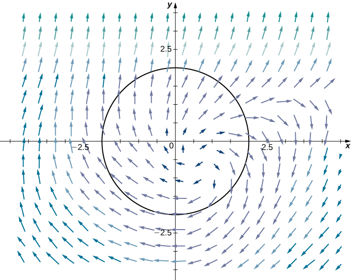{: #CNX_Calc_Figure_16_04_005}

Use Green’s theorem to calculate line integral

<math xmlns="http://www.w3.org/1998/Math/MathML"><mrow><mstyle displaystyle="true"><mrow><msub><mo>∮</mo><mi>C</mi></msub><mrow><mtext>sin</mtext><mo stretchy="false">(</mo><msup><mi>x</mi><mn>2</mn></msup><mo stretchy="false">)</mo><mi>d</mi><mi>x</mi><mo>+</mo><mo stretchy="false">(</mo><mn>3</mn><mi>x</mi><mo>−</mo><mi>y</mi><mo stretchy="false">)</mo><mi>d</mi><mi>y</mi></mrow></mrow></mstyle><mo>,</mo></mrow></math>

where *C* is a right triangle with vertices <math xmlns="http://www.w3.org/1998/Math/MathML"><mrow><mo stretchy="false">(</mo><mn>−1</mn><mo>,</mo><mn>2</mn><mo stretchy="false">)</mo><mo>,</mo></mrow></math>

 <math xmlns="http://www.w3.org/1998/Math/MathML"><mrow><mo stretchy="false">(</mo><mn>4</mn><mo>,</mo><mn>2</mn><mo stretchy="false">)</mo><mo>,</mo></mrow></math>

 and <math xmlns="http://www.w3.org/1998/Math/MathML"><mrow><mo stretchy="false">(</mo><mn>4</mn><mo>,</mo><mn>5</mn><mo stretchy="false">)</mo></mrow></math>

 oriented counterclockwise.

<math xmlns="http://www.w3.org/1998/Math/MathML"><mrow><mfrac><mrow><mn>45</mn></mrow><mn>2</mn></mfrac></mrow></math>

Hint

Transform the line integral into a double integral.

In the preceding two examples, the double integral in Green’s theorem was easier to calculate than the line integral, so we used the theorem to calculate the line integral. In the next example, the double integral is more difficult to calculate than the line integral, so we use Green’s theorem to translate a double integral into a line integral.

Applying Green’s Theorem over an Ellipse

Calculate the area enclosed by ellipse <math xmlns="http://www.w3.org/1998/Math/MathML"><mrow><mfrac><mrow><msup><mi>x</mi><mn>2</mn></msup></mrow><mrow><msup><mi>a</mi><mn>2</mn></msup></mrow></mfrac><mo>+</mo><mfrac><mrow><msup><mi>y</mi><mn>2</mn></msup></mrow><mrow><msup><mi>b</mi><mn>2</mn></msup></mrow></mfrac><mo>=</mo><mn>1</mn></mrow></math>

 ([[link]](#CNX_Calc_Figure_16_04_006)).

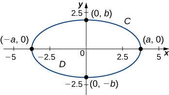{: #CNX_Calc_Figure_16_04_006}

Let *C* denote the ellipse and let *D* be the region enclosed by *C*. Recall that ellipse *C* can be parameterized by

<math xmlns="http://www.w3.org/1998/Math/MathML"><mrow><mi>x</mi><mo>=</mo><mi>a</mi><mspace width="0.2em" /><mtext>cos</mtext><mspace width="0.2em" /><mi>t</mi><mo>,</mo><mi>y</mi><mo>=</mo><mi>b</mi><mspace width="0.2em" /><mtext>sin</mtext><mspace width="0.2em" /><mi>t</mi><mo>,</mo><mn>0</mn><mo>≤</mo><mi>t</mi><mo>≤</mo><mn>2</mn><mi>π</mi><mo>.</mo></mrow></math>

Calculating the area of *D* is equivalent to computing double integral <math xmlns="http://www.w3.org/1998/Math/MathML"><mrow><mstyle displaystyle="true"><mrow><msub><mo>∬</mo><mi>D</mi></msub><mrow><mi>d</mi><mi>A</mi></mrow></mrow></mstyle><mo>.</mo></mrow></math>

 To calculate this integral without Green’s theorem, we would need to divide *D* into two regions: the region above the *x*-axis and the region below. The area of the ellipse is

<math xmlns="http://www.w3.org/1998/Math/MathML"><mrow><mstyle displaystyle="true"><mrow><msubsup><mo stretchy="false">∫</mo><mrow><mtext>−</mtext><mi>a</mi></mrow><mi>a</mi></msubsup><mrow><mstyle displaystyle="true"><mrow><msubsup><mo stretchy="false">∫</mo><mn>0</mn><mrow><msqrt><mrow><msup><mi>b</mi><mn>2</mn></msup><mo>−</mo><msup><mrow><mrow><mo>(</mo><mrow><mrow><mrow><mi>b</mi><mi>x</mi></mrow><mtext>/</mtext><mi>a</mi></mrow></mrow><mo>)</mo></mrow></mrow><mn>2</mn></msup></mrow></msqrt></mrow></msubsup><mrow><mi>d</mi><mi>y</mi><mi>d</mi><mi>x</mi><mo>+</mo><mstyle displaystyle="true"><mrow><msubsup><mo stretchy="false">∫</mo><mrow><mtext>−</mtext><mi>a</mi></mrow><mi>a</mi></msubsup><mrow><mstyle displaystyle="true"><mrow><msubsup><mo stretchy="false">∫</mo><mrow><mtext>−</mtext><msqrt><mrow><msup><mi>b</mi><mn>2</mn></msup><mo>−</mo><msup><mrow><mrow><mo>(</mo><mrow><mrow><mrow><mi>b</mi><mi>x</mi></mrow><mtext>/</mtext><mi>a</mi></mrow></mrow><mo>)</mo></mrow></mrow><mn>2</mn></msup></mrow></msqrt></mrow><mn>0</mn></msubsup><mspace width="0.1em" /><mrow><mi>d</mi><mi>y</mi><mi>d</mi><mi>x</mi><mo>.</mo></mrow></mrow></mstyle></mrow></mrow></mstyle></mrow></mrow></mstyle></mrow></mrow></mstyle></mrow></math>

These two integrals are not straightforward to calculate (although when we know the value of the first integral, we know the value of the second by symmetry). Instead of trying to calculate them, we use Green’s theorem to transform <math xmlns="http://www.w3.org/1998/Math/MathML"><mrow><mstyle displaystyle="true"><mrow><msub><mo>∬</mo><mi>D</mi></msub><mrow><mi>d</mi><mi>A</mi></mrow></mrow></mstyle></mrow></math>

 into a line integral around the boundary *C*.

Consider vector field

<math xmlns="http://www.w3.org/1998/Math/MathML"><mrow><mstyle mathvariant="bold" mathsize="normal"><mtext>F</mtext></mstyle><mo stretchy="false">(</mo><mi>x</mi><mo>,</mo><mi>y</mi><mo stretchy="false">)</mo><mo>=</mo><mrow><mo>〈</mo><mrow><mi>P</mi><mo>,</mo><mi>Q</mi></mrow><mo>〉</mo></mrow><mo>=</mo><mrow><mo>〈</mo><mrow><mo>−</mo><mfrac><mi>y</mi><mn>2</mn></mfrac><mo>,</mo><mfrac><mi>x</mi><mn>2</mn></mfrac></mrow><mo>〉</mo></mrow><mo>.</mo></mrow></math>

Then, <math xmlns="http://www.w3.org/1998/Math/MathML"><mrow><msub><mi>Q</mi><mi>x</mi></msub><mo>=</mo><mfrac><mn>1</mn><mn>2</mn></mfrac></mrow></math>

 and <math xmlns="http://www.w3.org/1998/Math/MathML"><mrow><msub><mi>P</mi><mi>y</mi></msub><mo>=</mo><mo>−</mo><mfrac><mn>1</mn><mn>2</mn></mfrac><mo>,</mo></mrow></math>

 and therefore <math xmlns="http://www.w3.org/1998/Math/MathML"><mrow><msub><mi>Q</mi><mi>x</mi></msub><mo>−</mo><msub><mi>P</mi><mi>y</mi></msub><mo>=</mo><mn>1</mn><mo>.</mo></mrow></math>

 Notice that **F** was chosen to have the property that <math xmlns="http://www.w3.org/1998/Math/MathML"><mrow><msub><mi>Q</mi><mi>x</mi></msub><mo>−</mo><msub><mi>P</mi><mi>y</mi></msub><mo>=</mo><mn>1</mn><mo>.</mo></mrow></math>

 Since this is the case, Green’s theorem transforms the line integral of **F** over *C* into the double integral of 1 over *D*.

By Green’s theorem,

<math xmlns="http://www.w3.org/1998/Math/MathML"><mtable><mtr /><mtr /><mtr /><mtr><mtd columnalign="right"><mstyle displaystyle="true"><mrow><msub><mo>∬</mo><mi>D</mi></msub><mrow><mi>d</mi><mi>A</mi></mrow></mrow></mstyle></mtd><mtd columnalign="left"><mo>=</mo><mstyle displaystyle="true"><mrow><msub><mo>∬</mo><mi>D</mi></msub><mrow><mrow><mo>(</mo><mrow><msub><mi>Q</mi><mi>x</mi></msub><mo>−</mo><msub><mi>P</mi><mi>y</mi></msub></mrow><mo>)</mo></mrow><mi>d</mi><mi>A</mi></mrow></mrow></mstyle></mtd></mtr><mtr><mtd /><mtd columnalign="left"><mo>=</mo><mstyle displaystyle="true"><mrow><msub><mo stretchy="false">∫</mo><mi>C</mi></msub><mrow><mstyle mathvariant="bold" mathsize="normal"><mtext>F</mtext></mstyle><mo>•</mo><mi>d</mi><mstyle mathvariant="bold" mathsize="normal"><mtext>r</mtext></mstyle></mrow></mrow></mstyle><mo>=</mo><mfrac><mn>1</mn><mn>2</mn></mfrac><mstyle displaystyle="true"><mrow><msub><mo stretchy="false">∫</mo><mi>C</mi></msub><mrow><mtext>−</mtext><mi>y</mi><mi>d</mi><mi>x</mi><mo>+</mo><mi>x</mi><mi>d</mi><mi>y</mi></mrow></mrow></mstyle></mtd></mtr><mtr><mtd /><mtd columnalign="left"><mo>=</mo><mfrac><mn>1</mn><mn>2</mn></mfrac><mstyle displaystyle="true"><mrow><msubsup><mo stretchy="false">∫</mo><mn>0</mn><mrow><mn>2</mn><mi>π</mi></mrow></msubsup><mrow><mtext>−</mtext><mi>b</mi><mspace width="0.2em" /><mtext>sin</mtext><mspace width="0.2em" /><mi>t</mi><mo stretchy="false">(</mo><mtext>−</mtext><mi>a</mi><mspace width="0.2em" /><mtext>sin</mtext><mspace width="0.2em" /><mi>t</mi><mo stretchy="false">)</mo><mo>+</mo><mi>a</mi><mrow><mo>(</mo><mrow><mtext>cos</mtext><mspace width="0.2em" /><mi>t</mi></mrow><mo>)</mo></mrow><mi>b</mi><mspace width="0.2em" /><mtext>cos</mtext><mspace width="0.2em" /><mi>t</mi><mi>d</mi><mi>t</mi></mrow></mrow></mstyle></mtd></mtr><mtr><mtd /><mtd columnalign="left"><mo>=</mo><mfrac><mn>1</mn><mn>2</mn></mfrac><mstyle displaystyle="true"><mrow><msubsup><mo stretchy="false">∫</mo><mn>0</mn><mrow><mn>2</mn><mi>π</mi></mrow></msubsup><mrow><mi>a</mi><mi>b</mi><mspace width="0.2em" /><msup><mrow><mtext>cos</mtext></mrow><mn>2</mn></msup><mi>t</mi><mo>+</mo><mi>a</mi><mi>b</mi><mspace width="0.2em" /><msup><mrow><mtext>sin</mtext></mrow><mn>2</mn></msup><mi>t</mi><mi>d</mi><mi>t</mi></mrow></mrow></mstyle><mo>=</mo><mfrac><mn>1</mn><mn>2</mn></mfrac><mstyle displaystyle="true"><mrow><msubsup><mo stretchy="false">∫</mo><mn>0</mn><mrow><mn>2</mn><mi>π</mi></mrow></msubsup><mrow><mi>a</mi><mi>b</mi><mi>d</mi><mi>t</mi></mrow></mrow></mstyle><mo>=</mo><mi>π</mi><mi>a</mi><mi>b</mi><mo>.</mo></mtd></mtr></mtable></math>

Therefore, the area of the ellipse is <math xmlns="http://www.w3.org/1998/Math/MathML"><mrow><mi>π</mi><mi>a</mi><mi>b</mi><mo>.</mo></mrow></math>

In [\[link\]](#fs-id1167794000435), we used vector field <math xmlns="http://www.w3.org/1998/Math/MathML"><mrow><mstyle mathvariant="bold" mathsize="normal"><mtext>F</mtext></mstyle><mo stretchy="false">(</mo><mi>x</mi><mo>,</mo><mi>y</mi><mo stretchy="false">)</mo><mo>=</mo><mrow><mo>〈</mo><mrow><mi>P</mi><mo>,</mo><mi>Q</mi></mrow><mo>〉</mo></mrow><mo>=</mo><mrow><mo>〈</mo><mrow><mo>−</mo><mfrac><mi>y</mi><mn>2</mn></mfrac><mo>,</mo><mfrac><mi>x</mi><mn>2</mn></mfrac></mrow><mo>〉</mo></mrow></mrow></math>

 to find the area of any ellipse. The logic of the previous example can be extended to derive a formula for the area of any region *D*. Let *D* be any region with a boundary that is a simple closed curve *C* oriented counterclockwise. If <math xmlns="http://www.w3.org/1998/Math/MathML"><mrow><mstyle mathvariant="bold" mathsize="normal"><mtext>F</mtext></mstyle><mo stretchy="false">(</mo><mi>x</mi><mo>,</mo><mi>y</mi><mo stretchy="false">)</mo><mo>=</mo><mrow><mo>〈</mo><mrow><mi>P</mi><mo>,</mo><mi>Q</mi></mrow><mo>〉</mo></mrow><mo>=</mo><mrow><mo>〈</mo><mrow><mo>−</mo><mfrac><mi>y</mi><mn>2</mn></mfrac><mo>,</mo><mfrac><mi>x</mi><mn>2</mn></mfrac></mrow><mo>〉</mo></mrow><mo>,</mo></mrow></math>

 then <math xmlns="http://www.w3.org/1998/Math/MathML"><mrow><msub><mi>Q</mi><mi>x</mi></msub><mo>−</mo><msub><mi>P</mi><mi>y</mi></msub><mo>=</mo><mn>1</mn><mo>.</mo></mrow></math>

 Therefore, by the same logic as in [\[link\]](#fs-id1167794000435),

<math xmlns="http://www.w3.org/1998/Math/MathML"><mrow><mtext>area of</mtext><mspace width="0.2em" /><mi>D</mi><mo>=</mo><mstyle displaystyle="true"><mrow><msub><mo>∬</mo><mi>D</mi></msub><mrow><mi>d</mi><mi>A</mi><mo>=</mo><mfrac><mn>1</mn><mn>2</mn></mfrac><mstyle displaystyle="true"><mrow><msub><mo>∮</mo><mi>C</mi></msub><mrow><mtext>−</mtext><mi>y</mi><mi>d</mi><mi>x</mi><mo>+</mo><mi>x</mi><mi>d</mi><mi>y</mi></mrow></mrow></mstyle></mrow></mrow></mstyle><mo>.</mo></mrow></math>

It’s worth noting that if <math xmlns="http://www.w3.org/1998/Math/MathML"><mrow><mstyle mathvariant="bold" mathsize="normal"><mtext>F</mtext></mstyle><mo>=</mo><mrow><mo>〈</mo><mrow><mi>P</mi><mo>,</mo><mi>Q</mi></mrow><mo>〉</mo></mrow></mrow></math>

 is any vector field with <math xmlns="http://www.w3.org/1998/Math/MathML"><mrow><msub><mi>Q</mi><mi>x</mi></msub><mo>−</mo><msub><mi>P</mi><mi>y</mi></msub><mo>=</mo><mn>1</mn><mo>,</mo></mrow></math>

 then the logic of the previous paragraph works. So. [\[link\]](#fs-id1167793965702) is not the only equation that uses a vector field’s mixed partials to get the area of a region.

Find the area of the region enclosed by the curve with parameterization <math xmlns="http://www.w3.org/1998/Math/MathML"><mrow><mstyle mathvariant="bold" mathsize="normal"><mtext>r</mtext></mstyle><mrow><mo>(</mo><mi>t</mi><mo>)</mo></mrow><mo>=</mo><mrow><mo>〈</mo><mrow><mtext>sin</mtext><mspace width="0.2em" /><mi>t</mi><mspace width="0.2em" /><mtext>cos</mtext><mspace width="0.2em" /><mi>t</mi><mo>,</mo><mtext>sin</mtext><mspace width="0.2em" /><mi>t</mi></mrow><mo>〉</mo></mrow><mo>,</mo><mn>0</mn><mo>≤</mo><mi>t</mi><mo>≤</mo><mi>π</mi><mo>.</mo></mrow></math>

<math xmlns="http://www.w3.org/1998/Math/MathML"><mrow><mfrac><mn>4</mn><mn>3</mn></mfrac></mrow></math>

Hint

Use [[link]](#fs-id1167793965702).

### Flux Form of Green’s Theorem

The circulation form of Green’s theorem relates a double integral over region *D* to line integral <math xmlns="http://www.w3.org/1998/Math/MathML"><mrow><mstyle displaystyle="true"><mrow><msub><mo>∮</mo><mi>C</mi></msub><mrow><mstyle mathvariant="bold" mathsize="normal"><mtext>F</mtext></mstyle><mo>·</mo><mstyle mathvariant="bold" mathsize="normal"><mtext>T</mtext></mstyle><mi>d</mi><mi>s</mi></mrow></mrow></mstyle><mo>,</mo></mrow></math>

 where *C* is the boundary of *D*. The flux form of Green’s theorem relates a double integral over region *D* to the flux across boundary *C*. The flux of a fluid across a curve can be difficult to calculate using the flux line integral. This form of Green’s theorem allows us to translate a difficult flux integral into a double integral that is often easier to calculate.

Green’s Theorem, Flux Form

Let *D* be an open, simply connected region with a boundary curve *C* that is a piecewise smooth, simple closed curve that is oriented counterclockwise ([\[link\]](#CNX_Calc_Figure_16_04_008)). Let <math xmlns="http://www.w3.org/1998/Math/MathML"><mrow><mstyle mathvariant="bold" mathsize="normal"><mtext>F</mtext></mstyle><mo>=</mo><mrow><mo>〈</mo><mrow><mi>P</mi><mo>,</mo><mi>Q</mi></mrow><mo>〉</mo></mrow></mrow></math>

 be a vector field with component functions that have continuous partial derivatives on an open region containing *D*. Then,

<math xmlns="http://www.w3.org/1998/Math/MathML"><mrow><mstyle displaystyle="true"><mrow><msub><mo>∮</mo><mi>C</mi></msub><mrow><mstyle mathvariant="bold" mathsize="normal"><mtext>F</mtext></mstyle><mo>·</mo><mstyle mathvariant="bold" mathsize="normal"><mtext>N</mtext></mstyle><mi>d</mi><mi>s</mi><mo>=</mo><mstyle displaystyle="true"><mrow><msub><mo>∬</mo><mi>D</mi></msub><mrow><msub><mi>P</mi><mi>x</mi></msub><mo>+</mo><msub><mi>Q</mi><mi>y</mi></msub><mi>d</mi><mi>A</mi></mrow></mrow></mstyle></mrow></mrow></mstyle><mo>.</mo></mrow></math>

 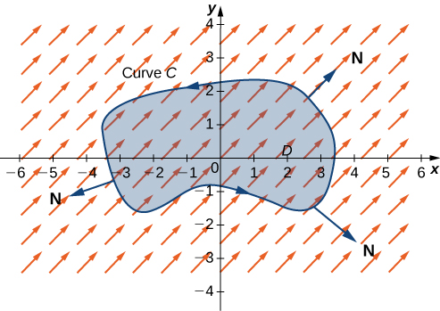{: #CNX_Calc_Figure_16_04_008}

Because this form of Green’s theorem contains unit normal vector **N**, it is sometimes referred to as the ***normal form* of Green’s theorem**{: data-type="term" .no-emphasis}.

#### Proof

Recall that <math xmlns="http://www.w3.org/1998/Math/MathML"><mrow><mstyle displaystyle="true"><mrow><msub><mo>∮</mo><mi>C</mi></msub><mrow><mstyle mathvariant="bold" mathsize="normal"><mtext>F</mtext></mstyle><mo>·</mo><mstyle mathvariant="bold" mathsize="normal"><mtext>N</mtext></mstyle><mi>d</mi><mi>s</mi></mrow></mrow></mstyle><mo>=</mo><mstyle displaystyle="true"><mrow><msub><mo>∮</mo><mi>C</mi></msub><mrow><mtext>−</mtext><mi>Q</mi><mi>d</mi><mi>x</mi><mo>+</mo><mi>P</mi><mi>d</mi><mi>y</mi></mrow></mrow></mstyle><mo>.</mo></mrow></math>

 Let <math xmlns="http://www.w3.org/1998/Math/MathML"><mrow><mi>M</mi><mo>=</mo><mtext>−</mtext><mi>Q</mi></mrow></math>

 and <math xmlns="http://www.w3.org/1998/Math/MathML"><mrow><mi>N</mi><mo>=</mo><mi>P</mi><mo>.</mo></mrow></math>

 By the circulation form of Green’s theorem,

<math xmlns="http://www.w3.org/1998/Math/MathML"><mtable><mtr><mtd columnalign="right"><mstyle displaystyle="true"><mrow><msub><mo>∮</mo><mi>C</mi></msub><mrow><mtext>−</mtext><mi>Q</mi><mi>d</mi><mi>x</mi></mrow></mrow></mstyle><mo>+</mo><mi>P</mi><mi>d</mi><mi>y</mi></mtd><mtd columnalign="left"><mo>=</mo><mstyle displaystyle="true"><mrow><msub><mo>∮</mo><mi>C</mi></msub><mrow><mi>M</mi><mi>d</mi><mi>x</mi><mo>+</mo><mi>N</mi><mi>d</mi><mi>y</mi></mrow></mrow></mstyle></mtd></mtr><mtr><mtd /><mtd columnalign="left"><mo>=</mo><mstyle displaystyle="true"><mrow><msub><mo>∬</mo><mi>D</mi></msub><mrow><msub><mi>N</mi><mi>x</mi></msub><mo>−</mo><msub><mi>M</mi><mi>y</mi></msub><mi>d</mi><mi>A</mi></mrow></mrow></mstyle></mtd></mtr><mtr><mtd /><mtd columnalign="left"><mo>=</mo><mstyle displaystyle="true"><mrow><msub><mo>∬</mo><mi>D</mi></msub><mrow><msub><mi>P</mi><mi>x</mi></msub><mo>−</mo><msub><mrow><mo stretchy="false">(</mo><mtext>−</mtext><mi>Q</mi><mo stretchy="false">)</mo></mrow><mi>y</mi></msub><mi>d</mi><mi>A</mi></mrow></mrow></mstyle></mtd></mtr><mtr><mtd /><mtd columnalign="left"><mo>=</mo><mstyle displaystyle="true"><mrow><msub><mo>∬</mo><mi>D</mi></msub><mrow><msub><mi>P</mi><mi>x</mi></msub><mo>+</mo><msub><mi>Q</mi><mi>y</mi></msub><mi>d</mi><mi>A</mi></mrow></mrow></mstyle><mo>.</mo></mtd></mtr></mtable></math>

□

Applying Green’s Theorem for Flux across a Circle

Let *C* be a circle of radius *r* centered at the origin ([[link]](#CNX_Calc_Figure_16_04_009)) and let <math xmlns="http://www.w3.org/1998/Math/MathML"><mrow><mstyle mathvariant="bold" mathsize="normal"><mtext>F</mtext></mstyle><mo stretchy="false">(</mo><mi>x</mi><mo>,</mo><mi>y</mi><mo stretchy="false">)</mo><mo>=</mo><mrow><mo>〈</mo><mrow><mi>x</mi><mo>,</mo><mi>y</mi></mrow><mo>〉</mo></mrow><mo>.</mo></mrow></math>

 Calculate the flux across *C*.

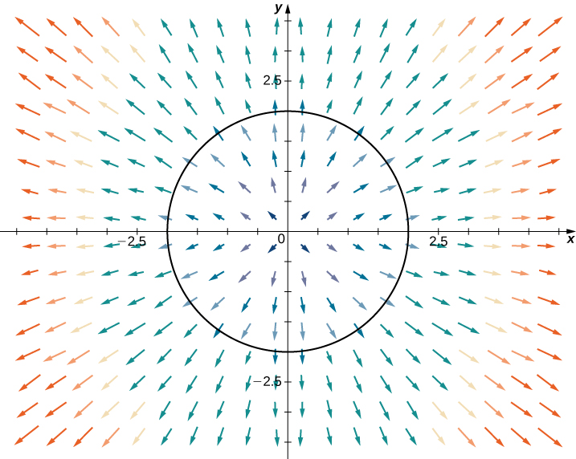{: #CNX_Calc_Figure_16_04_009}

Let *D* be the disk enclosed by *C.* The flux across *C* is <math xmlns="http://www.w3.org/1998/Math/MathML"><mrow><mstyle displaystyle="true"><mrow><msub><mo>∮</mo><mi>C</mi></msub><mrow><mstyle mathvariant="bold" mathsize="normal"><mtext>F</mtext></mstyle><mo>·</mo><mstyle mathvariant="bold" mathsize="normal"><mtext>N</mtext></mstyle><mi>d</mi><mi>s</mi></mrow></mrow></mstyle><mo>.</mo></mrow></math>

 We could evaluate this integral using tools we have learned, but Green’s theorem makes the calculation much more simple. Let <math xmlns="http://www.w3.org/1998/Math/MathML"><mrow><mi>P</mi><mrow><mo>(</mo><mrow><mi>x</mi><mo>,</mo><mi>y</mi></mrow><mo>)</mo></mrow><mo>=</mo><mi>x</mi></mrow></math>

 and <math xmlns="http://www.w3.org/1998/Math/MathML"><mrow><mi>Q</mi><mrow><mo>(</mo><mrow><mi>x</mi><mo>,</mo><mi>y</mi></mrow><mo>)</mo></mrow><mo>=</mo><mi>y</mi></mrow></math>

 so that <math xmlns="http://www.w3.org/1998/Math/MathML"><mrow><mstyle mathvariant="bold" mathsize="normal"><mtext>F</mtext></mstyle><mo>=</mo><mrow><mo>〈</mo><mrow><mi>P</mi><mo>,</mo><mi>Q</mi></mrow><mo>〉</mo></mrow><mo>.</mo></mrow></math>

 Note that <math xmlns="http://www.w3.org/1998/Math/MathML"><mrow><msub><mi>P</mi><mi>x</mi></msub><mo>=</mo><mn>1</mn><mo>=</mo><msub><mi>Q</mi><mi>y</mi></msub><mo>,</mo></mrow></math>

 and therefore <math xmlns="http://www.w3.org/1998/Math/MathML"><mrow><msub><mi>P</mi><mi>x</mi></msub><mo>+</mo><msub><mi>Q</mi><mi>y</mi></msub><mo>=</mo><mn>2</mn><mo>.</mo></mrow></math>

 By Green’s theorem,

<math xmlns="http://www.w3.org/1998/Math/MathML"><mrow><mstyle displaystyle="true"><mrow><msub><mo stretchy="false">∫</mo><mi>C</mi></msub><mrow><mstyle mathvariant="bold" mathsize="normal"><mtext>F</mtext></mstyle><mo>•</mo><mstyle mathvariant="bold" mathsize="normal"><mtext>N</mtext></mstyle><mi>d</mi><mi>s</mi><mo>=</mo><mstyle displaystyle="true"><mrow><mo stretchy="false">∫</mo><mrow><mstyle displaystyle="true"><mrow><msub><mo stretchy="false">∫</mo><mi>D</mi></msub><mrow><mn>2</mn><mi>d</mi><mi>A</mi><mo>=</mo></mrow></mrow></mstyle></mrow></mrow></mstyle></mrow></mrow></mstyle><mn>2</mn><mstyle displaystyle="true"><mrow><mo stretchy="false">∫</mo><mrow><mstyle displaystyle="true"><mrow><msub><mo stretchy="false">∫</mo><mi>D</mi></msub><mrow><mi>d</mi><mi>A</mi><mo>.</mo></mrow></mrow></mstyle></mrow></mrow></mstyle></mrow></math>

Since <math xmlns="http://www.w3.org/1998/Math/MathML"><mrow><mstyle displaystyle="true"><mrow><mo stretchy="false">∫</mo><mrow><mstyle displaystyle="true"><mrow><msub><mo stretchy="false">∫</mo><mi>D</mi></msub><mrow><mi>d</mi><mi>A</mi></mrow></mrow></mstyle></mrow></mrow></mstyle></mrow></math>

 is the area of the circle, <math xmlns="http://www.w3.org/1998/Math/MathML"><mrow><mstyle displaystyle="true"><mrow><mo stretchy="false">∫</mo><mrow><mstyle displaystyle="true"><mrow><msub><mo stretchy="false">∫</mo><mi>D</mi></msub><mrow><mi>d</mi><mi>A</mi></mrow></mrow></mstyle></mrow></mrow></mstyle><mo>=</mo><mi>π</mi><msup><mi>r</mi><mn>2</mn></msup><mo>.</mo></mrow></math>

 Therefore, the flux across *C* is <math xmlns="http://www.w3.org/1998/Math/MathML"><mrow><mn>2</mn><mi>π</mi><msup><mi>r</mi><mn>2</mn></msup><mo>.</mo></mrow></math>

Applying Green’s Theorem for Flux across a Triangle

Let *S* be the triangle with vertices <math xmlns="http://www.w3.org/1998/Math/MathML"><mrow><mo stretchy="false">(</mo><mn>0</mn><mo>,</mo><mn>0</mn><mo stretchy="false">)</mo><mo>,</mo></mrow></math>

 <math xmlns="http://www.w3.org/1998/Math/MathML"><mrow><mo stretchy="false">(</mo><mn>1</mn><mo>,</mo><mn>0</mn><mo stretchy="false">)</mo><mo>,</mo></mrow></math>

 and <math xmlns="http://www.w3.org/1998/Math/MathML"><mrow><mo stretchy="false">(</mo><mn>0</mn><mo>,</mo><mn>3</mn><mo stretchy="false">)</mo></mrow></math>

 oriented clockwise ([[link]](#CNX_Calc_Figure_16_04_010)). Calculate the flux of <math xmlns="http://www.w3.org/1998/Math/MathML"><mrow><mstyle mathvariant="bold" mathsize="normal"><mtext>F</mtext></mstyle><mrow><mo>(</mo><mrow><mi>x</mi><mo>,</mo><mi>y</mi></mrow><mo>)</mo></mrow><mo>=</mo><mrow><mo>〈</mo><mrow><mi>P</mi><mrow><mo>(</mo><mrow><mi>x</mi><mo>,</mo><mi>y</mi></mrow><mo>)</mo></mrow><mo>,</mo><mi>Q</mi><mrow><mo>(</mo><mrow><mi>x</mi><mo>,</mo><mi>y</mi></mrow><mo>)</mo></mrow></mrow><mo>〉</mo></mrow><mo>=</mo><mrow><mo>〈</mo><mrow><msup><mi>x</mi><mn>2</mn></msup><mo>+</mo><msup><mi>e</mi><mi>y</mi></msup><mo>,</mo><mi>x</mi><mo>+</mo><mi>y</mi></mrow><mo>〉</mo></mrow></mrow></math>

 across *S*.

, (1,0), and (0,3) oriented clockwise."){: #CNX_Calc_Figure_16_04_010}

To calculate the flux without Green’s theorem, we would need to break the flux integral into three line integrals, one integral for each side of the triangle. Using Green’s theorem to translate the flux line integral into a single double integral is much more simple.

Let *D* be the region enclosed by *S*. Note that <math xmlns="http://www.w3.org/1998/Math/MathML"><mrow><msub><mi>P</mi><mi>x</mi></msub><mo>=</mo><mn>2</mn><mi>x</mi></mrow></math>

 and <math xmlns="http://www.w3.org/1998/Math/MathML"><mrow><msub><mi>Q</mi><mi>y</mi></msub><mo>=</mo><mn>1</mn><mo>;</mo></mrow></math>

 therefore, <math xmlns="http://www.w3.org/1998/Math/MathML"><mrow><msub><mi>P</mi><mi>x</mi></msub><mo>+</mo><msub><mi>Q</mi><mi>y</mi></msub><mo>=</mo><mn>2</mn><mi>x</mi><mo>+</mo><mn>1</mn><mo>.</mo></mrow></math>

 Green’s theorem applies only to simple closed curves oriented counterclockwise, but we can still apply the theorem because <math xmlns="http://www.w3.org/1998/Math/MathML"><mrow><mstyle displaystyle="true"><mrow><msub><mo>∮</mo><mi>C</mi></msub><mrow><mstyle mathvariant="bold" mathsize="normal"><mtext>F</mtext></mstyle><mo>·</mo><mstyle mathvariant="bold" mathsize="normal"><mtext>N</mtext></mstyle><mi>d</mi><mi>s</mi><mo>=</mo><mtext>−</mtext></mrow></mrow></mstyle><mstyle displaystyle="true"><mrow><msub><mo>∮</mo><mrow><mtext>−</mtext><mi>S</mi></mrow></msub><mrow><mstyle mathvariant="bold" mathsize="normal"><mtext>F</mtext></mstyle><mo>·</mo><mstyle mathvariant="bold" mathsize="normal"><mtext>N</mtext></mstyle><mi>d</mi><mi>s</mi></mrow></mrow></mstyle></mrow></math>

 and <math xmlns="http://www.w3.org/1998/Math/MathML"><mrow><mtext>−</mtext><mi>S</mi></mrow></math>

 is oriented counterclockwise. By Green’s theorem, the flux is

<math xmlns="http://www.w3.org/1998/Math/MathML"><mtable><mtr /><mtr /><mtr /><mtr><mtd columnalign="right"><mstyle displaystyle="true"><mrow><msub><mo>∮</mo><mi>C</mi></msub><mrow><mstyle mathvariant="bold" mathsize="normal"><mtext>F</mtext></mstyle><mo>·</mo><mstyle mathvariant="bold" mathsize="normal"><mtext>N</mtext></mstyle><mi>d</mi><mi>s</mi></mrow></mrow></mstyle></mtd><mtd columnalign="left"><mo>=</mo><mstyle displaystyle="true"><mrow><msub><mo>∮</mo><mrow><mtext>−</mtext><mi>S</mi></mrow></msub><mrow><mstyle mathvariant="bold" mathsize="normal"><mtext>F</mtext></mstyle><mo>·</mo><mstyle mathvariant="bold" mathsize="normal"><mtext>N</mtext></mstyle><mi>d</mi><mi>s</mi></mrow></mrow></mstyle></mtd></mtr><mtr><mtd /><mtd columnalign="left"><mo>=</mo><mtext>−</mtext><mstyle displaystyle="true"><mrow><msub><mo>∬</mo><mi>D</mi></msub><mrow><mrow><mo>(</mo><mrow><msub><mi>P</mi><mi>x</mi></msub><mo>+</mo><msub><mi>Q</mi><mi>y</mi></msub></mrow><mo>)</mo></mrow><mi>d</mi><mi>A</mi></mrow></mrow></mstyle></mtd></mtr><mtr><mtd /><mtd columnalign="left"><mo>=</mo><mtext>−</mtext><mstyle displaystyle="true"><mrow><msub><mo>∬</mo><mi>D</mi></msub><mrow><mrow><mo>(</mo><mrow><mn>2</mn><mi>x</mi><mo>+</mo><mn>1</mn></mrow><mo>)</mo></mrow><mi>d</mi><mi>A</mi></mrow></mrow></mstyle><mo>.</mo></mtd></mtr></mtable></math>

Notice that the top edge of the triangle is the line <math xmlns="http://www.w3.org/1998/Math/MathML"><mrow><mi>y</mi><mo>=</mo><mn>−3</mn><mi>x</mi><mo>+</mo><mn>3</mn><mo>.</mo></mrow></math>

 Therefore, in the iterated double integral, the *y*-values run from <math xmlns="http://www.w3.org/1998/Math/MathML"><mrow><mi>y</mi><mo>=</mo><mn>0</mn></mrow></math>

 to <math xmlns="http://www.w3.org/1998/Math/MathML"><mrow><mi>y</mi><mo>=</mo><mn>−3</mn><mi>x</mi><mo>+</mo><mn>3</mn><mo>,</mo></mrow></math>

 and we have

<math xmlns="http://www.w3.org/1998/Math/MathML"><mtable><mtr><mtd columnalign="right"><mtext>−</mtext><mstyle displaystyle="true"><mrow><msub><mo>∬</mo><mi>D</mi></msub><mrow><mrow><mo>(</mo><mrow><mn>2</mn><mi>x</mi><mo>+</mo><mn>1</mn></mrow><mo>)</mo></mrow><mi>d</mi><mi>A</mi></mrow></mrow></mstyle></mtd><mtd columnalign="left"><mo>=</mo><mtext>−</mtext><mstyle displaystyle="true"><mrow><msubsup><mo stretchy="false">∫</mo><mn>0</mn><mn>1</mn></msubsup><mrow><mstyle displaystyle="true"><mrow><msubsup><mo stretchy="false">∫</mo><mn>0</mn><mrow><mn>−3</mn><mi>x</mi><mo>+</mo><mn>3</mn></mrow></msubsup><mrow><mrow><mo>(</mo><mrow><mn>2</mn><mi>x</mi><mo>+</mo><mn>1</mn></mrow><mo>)</mo></mrow><mi>d</mi><mi>y</mi><mi>d</mi><mi>x</mi></mrow></mrow></mstyle></mrow></mrow></mstyle></mtd></mtr><mtr><mtd /><mtd columnalign="left"><mo>=</mo><mtext>−</mtext><mstyle displaystyle="true"><mrow><msubsup><mo stretchy="false">∫</mo><mn>0</mn><mn>1</mn></msubsup><mrow><mrow><mo>(</mo><mrow><mn>2</mn><mi>x</mi><mo>+</mo><mn>1</mn></mrow><mo>)</mo></mrow><mrow><mo>(</mo><mrow><mn>−3</mn><mi>x</mi><mo>+</mo><mn>3</mn></mrow><mo>)</mo></mrow><mi>d</mi><mi>x</mi></mrow></mrow></mstyle><mo>=</mo><mtext>−</mtext><mstyle displaystyle="true"><mrow><msubsup><mo stretchy="false">∫</mo><mn>0</mn><mn>1</mn></msubsup><mrow><mrow><mo>(</mo><mrow><mn>−6</mn><msup><mi>x</mi><mn>2</mn></msup><mo>+</mo><mn>3</mn><mi>x</mi><mo>+</mo><mn>3</mn></mrow><mo>)</mo></mrow><mi>d</mi><mi>x</mi></mrow></mrow></mstyle></mtd></mtr><mtr><mtd /><mtd columnalign="left"><mo>=</mo><mtext>−</mtext><msubsup><mrow><mo>[</mo><mrow><mn>−2</mn><msup><mi>x</mi><mn>3</mn></msup><mo>+</mo><mfrac><mrow><mn>3</mn><msup><mi>x</mi><mn>2</mn></msup></mrow><mn>2</mn></mfrac><mo>+</mo><mn>3</mn><mi>x</mi></mrow><mo>]</mo></mrow><mn>0</mn><mn>1</mn></msubsup><mo>=</mo><mo>−</mo><mfrac><mn>5</mn><mn>2</mn></mfrac><mo>.</mo></mtd></mtr></mtable></math>

Calculate the flux of <math xmlns="http://www.w3.org/1998/Math/MathML"><mrow><mstyle mathvariant="bold" mathsize="normal"><mtext>F</mtext></mstyle><mo stretchy="false">(</mo><mi>x</mi><mo>,</mo><mi>y</mi><mo stretchy="false">)</mo><mo>=</mo><mrow><mo>〈</mo><mrow><msup><mi>x</mi><mn>3</mn></msup><mo>,</mo><msup><mi>y</mi><mn>3</mn></msup></mrow><mo>〉</mo></mrow></mrow></math>

 across a unit circle oriented counterclockwise.

<math xmlns="http://www.w3.org/1998/Math/MathML"><mrow><mfrac><mrow><mn>3</mn><mi>π</mi></mrow><mn>2</mn></mfrac></mrow></math>

Hint

Apply Green’s theorem and use polar coordinates.

Applying Green’s Theorem for Water Flow across a Rectangle

Water flows from a spring located at the origin. The velocity of the water is modeled by vector field <math xmlns="http://www.w3.org/1998/Math/MathML"><mrow><mstyle mathvariant="bold" mathsize="normal"><mtext>v</mtext></mstyle><mrow><mo>(</mo><mrow><mi>x</mi><mo>,</mo><mi>y</mi></mrow><mo>)</mo></mrow><mo>=</mo><mrow><mo>〈</mo><mrow><mn>5</mn><mi>x</mi><mo>+</mo><mi>y</mi><mo>,</mo><mi>x</mi><mo>+</mo><mn>3</mn><mi>y</mi></mrow><mo>〉</mo></mrow></mrow></math>

 m/sec. Find the amount of water per second that flows across the rectangle with vertices <math xmlns="http://www.w3.org/1998/Math/MathML"><mrow><mrow><mo>(</mo><mrow><mn>−1</mn><mo>,</mo><mn>−2</mn></mrow><mo>)</mo></mrow><mo>,</mo><mrow><mo>(</mo><mrow><mn>1</mn><mo>,</mo><mn>−2</mn></mrow><mo>)</mo></mrow><mo>,</mo><mrow><mo>(</mo><mrow><mn>1</mn><mo>,</mo><mn>3</mn></mrow><mo>)</mo></mrow><mo>,</mo><mspace width="0.2em" /><mtext>and</mtext><mspace width="0.2em" /><mrow><mo>(</mo><mrow><mn>−1</mn><mo>,</mo><mn>3</mn></mrow><mo>)</mo></mrow><mo>,</mo></mrow></math>

 oriented counterclockwise ([[link]](#CNX_Calc_Figure_16_04_011)).

,(1,&#x2212;2),(1,3),and(&#x2212;1,3), oriented counterclockwise."){: #CNX_Calc_Figure_16_04_011}

Let *C* represent the given rectangle and let *D* be the rectangular region enclosed by *C*. To find the amount of water flowing across *C*, we calculate flux <math xmlns="http://www.w3.org/1998/Math/MathML"><mrow><mstyle displaystyle="true"><mrow><msub><mo stretchy="false">∫</mo><mi>C</mi></msub><mrow><mstyle mathvariant="bold" mathsize="normal"><mtext>v</mtext></mstyle><mo>•</mo><mi>d</mi><mstyle mathvariant="bold" mathsize="normal"><mtext>r</mtext></mstyle><mo>.</mo></mrow></mrow></mstyle></mrow></math>

 Let <math xmlns="http://www.w3.org/1998/Math/MathML"><mrow><mi>P</mi><mrow><mo>(</mo><mrow><mi>x</mi><mo>,</mo><mi>y</mi></mrow><mo>)</mo></mrow><mo>=</mo><mn>5</mn><mi>x</mi><mo>+</mo><mi>y</mi></mrow></math>

 and <math xmlns="http://www.w3.org/1998/Math/MathML"><mrow><mi>Q</mi><mrow><mo>(</mo><mrow><mi>x</mi><mo>,</mo><mi>y</mi></mrow><mo>)</mo></mrow><mo>=</mo><mi>x</mi><mo>+</mo><mn>3</mn><mi>y</mi></mrow></math>

 so that <math xmlns="http://www.w3.org/1998/Math/MathML"><mrow><mstyle mathvariant="bold" mathsize="normal"><mtext>v</mtext></mstyle><mo>=</mo><mrow><mo>(</mo><mrow><mi>P</mi><mo>,</mo><mi>Q</mi></mrow><mo>)</mo></mrow><mo>.</mo></mrow></math>

 Then, <math xmlns="http://www.w3.org/1998/Math/MathML"><mrow><msub><mi>P</mi><mi>x</mi></msub><mo>=</mo><mn>5</mn></mrow></math>

 and <math xmlns="http://www.w3.org/1998/Math/MathML"><mrow><msub><mi>Q</mi><mi>y</mi></msub><mo>=</mo><mn>3</mn><mo>.</mo></mrow></math>

 By Green’s theorem,

<math xmlns="http://www.w3.org/1998/Math/MathML"><mtable><mtr><mtd columnalign="right"><mstyle displaystyle="true"><mrow><msub><mo stretchy="false">∫</mo><mi>C</mi></msub><mrow><mstyle mathvariant="bold" mathsize="normal"><mtext>v</mtext></mstyle><mo>•</mo><mi>d</mi><mstyle mathvariant="bold" mathsize="normal"><mtext>r</mtext></mstyle></mrow></mrow></mstyle></mtd><mtd columnalign="left"><mo>=</mo><mstyle displaystyle="true"><mrow><msub><mo>∬</mo><mi>D</mi></msub><mrow><mrow><mo>(</mo><mrow><msub><mi>P</mi><mi>x</mi></msub><mo>+</mo><msub><mi>Q</mi><mi>y</mi></msub></mrow><mo>)</mo></mrow><mi>d</mi><mi>A</mi></mrow></mrow></mstyle></mtd></mtr><mtr><mtd /><mtd columnalign="left"><mo>=</mo><mstyle displaystyle="true"><mrow><msub><mo>∬</mo><mi>D</mi></msub><mrow><mn>8</mn><mi>d</mi><mi>A</mi></mrow></mrow></mstyle></mtd></mtr><mtr><mtd /><mtd columnalign="left"><mo>=</mo><mn>8</mn><mrow><mo>(</mo><mrow><mtext>area of</mtext><mspace width="0.2em" /><mi>D</mi></mrow><mo>)</mo></mrow><mo>=</mo><mn>80.</mn></mtd></mtr></mtable></math>

Therefore, the water flux is 80 m2/sec.

Recall that if vector field **F** is conservative, then **F** does no work around closed curves—that is, the circulation of **F** around a closed curve is zero. In fact, if the domain of **F** is simply connected, then **F** is conservative if and only if the circulation of **F** around any closed curve is zero. If we replace “circulation of **F**” with “flux of **F,**” then we get a definition of a source-free vector field. The following statements are all equivalent ways of defining a source-free field <math xmlns="http://www.w3.org/1998/Math/MathML"><mrow><mstyle mathvariant="bold" mathsize="normal"><mtext>F</mtext></mstyle><mo>=</mo><mrow><mo>〈</mo><mrow><mi>P</mi><mo>,</mo><mi>Q</mi></mrow><mo>〉</mo></mrow></mrow></math>

 on a simply connected domain (note the similarities with properties of conservative vector fields):

1.  The flux
    <math xmlns="http://www.w3.org/1998/Math/MathML"><mrow><mstyle displaystyle="true"><mrow><msub><mo>∮</mo><mi>C</mi></msub><mrow><mstyle mathvariant="bold" mathsize="normal"><mtext>F</mtext></mstyle><mo>·</mo><mstyle mathvariant="bold" mathsize="normal"><mtext>N</mtext></mstyle><mi>d</mi><mi>s</mi></mrow></mrow></mstyle></mrow></math>
    
    across any closed curve *C* is zero.
2.  If
    <math xmlns="http://www.w3.org/1998/Math/MathML"><mrow><msub><mi>C</mi><mn>1</mn></msub></mrow></math>
    
    and
    <math xmlns="http://www.w3.org/1998/Math/MathML"><mrow><msub><mi>C</mi><mn>2</mn></msub></mrow></math>
    
    are curves in the domain of **F** with the same starting points and endpoints, then
    <math xmlns="http://www.w3.org/1998/Math/MathML"><mrow><mstyle displaystyle="true"><mrow><msub><mo stretchy="false">∫</mo><mrow><msub><mi>C</mi><mn>1</mn></msub></mrow></msub><mrow><mstyle mathvariant="bold" mathsize="normal"><mtext>F</mtext></mstyle><mo>·</mo><mstyle mathvariant="bold" mathsize="normal"><mtext>N</mtext></mstyle><mi>d</mi><mi>s</mi></mrow></mrow></mstyle><mo>=</mo><mstyle displaystyle="true"><mrow><msub><mo stretchy="false">∫</mo><mrow><msub><mi>C</mi><mn>2</mn></msub></mrow></msub><mrow><mstyle mathvariant="bold" mathsize="normal"><mtext>F</mtext></mstyle><mo>·</mo><mstyle mathvariant="bold" mathsize="normal"><mtext>N</mtext></mstyle><mi>d</mi><mi>s</mi></mrow></mrow></mstyle><mo>.</mo></mrow></math>
    
    In other words, flux is independent of path.
3.  There is a **stream function**{: data-type="term"}
    <math xmlns="http://www.w3.org/1998/Math/MathML"><mrow><mi>g</mi><mo stretchy="false">(</mo><mi>x</mi><mo>,</mo><mi>y</mi><mo stretchy="false">)</mo></mrow></math>
    
    for **F**. A stream function for
    <math xmlns="http://www.w3.org/1998/Math/MathML"><mrow><mstyle mathvariant="bold" mathsize="normal"><mtext>F</mtext></mstyle><mo>=</mo><mrow><mo>〈</mo><mrow><mi>P</mi><mo>,</mo><mi>Q</mi></mrow><mo>〉</mo></mrow></mrow></math>
    
    is a function *g* such that
    <math xmlns="http://www.w3.org/1998/Math/MathML"><mrow><mi>P</mi><mo>=</mo><msub><mi>g</mi><mi>y</mi></msub></mrow></math>
    
    and
    <math xmlns="http://www.w3.org/1998/Math/MathML"><mrow><mi>Q</mi><mo>=</mo><mtext>−</mtext><msub><mi>g</mi><mi>x</mi></msub><mo>.</mo></mrow></math>
    
    Geometrically,
    <math xmlns="http://www.w3.org/1998/Math/MathML"><mrow><mstyle mathvariant="bold" mathsize="normal"><mtext>F</mtext></mstyle><mo>=</mo><mrow><mo>(</mo><mrow><mi>a</mi><mo>,</mo><mi>b</mi></mrow><mo>)</mo></mrow></mrow></math>
    
    is tangential to the level curve of *g* at
    <math xmlns="http://www.w3.org/1998/Math/MathML"><mrow><mrow><mo>(</mo><mrow><mi>a</mi><mo>,</mo><mi>b</mi></mrow><mo>)</mo></mrow><mo>.</mo></mrow></math>
    
    Since the gradient of *g* is perpendicular to the level curve of *g* at
    <math xmlns="http://www.w3.org/1998/Math/MathML"><mrow><mrow><mo>(</mo><mrow><mi>a</mi><mo>,</mo><mi>b</mi></mrow><mo>)</mo></mrow><mo>,</mo></mrow></math>
    
    stream function *g* has the property
    <math xmlns="http://www.w3.org/1998/Math/MathML"><mrow><mstyle mathvariant="bold" mathsize="normal"><mtext>F</mtext></mstyle><mrow><mo>(</mo><mrow><mi>a</mi><mo>,</mo><mi>b</mi></mrow><mo>)</mo></mrow><mo>•</mo><mtext>∇</mtext><mi>g</mi><mrow><mo>(</mo><mrow><mi>a</mi><mo>,</mo><mi>b</mi></mrow><mo>)</mo></mrow><mo>=</mo><mn>0</mn></mrow></math>
    
    for any point
    <math xmlns="http://www.w3.org/1998/Math/MathML"><mrow><mrow><mo>(</mo><mrow><mi>a</mi><mo>,</mo><mi>b</mi></mrow><mo>)</mo></mrow></mrow></math>
    
    in the domain of *g*. (Stream functions play the same role for source-free fields that potential functions play for conservative fields.)
4.  <math xmlns="http://www.w3.org/1998/Math/MathML"><mrow><msub><mi>P</mi><mi>x</mi></msub><mo>+</mo><msub><mi>Q</mi><mi>y</mi></msub><mo>=</mo><mn>0</mn></mrow></math>
{: data-number-style="arabic"}

Finding a Stream Function

Verify that rotation vector field <math xmlns="http://www.w3.org/1998/Math/MathML"><mrow><mstyle mathvariant="bold" mathsize="normal"><mtext>F</mtext></mstyle><mo stretchy="false">(</mo><mi>x</mi><mo>,</mo><mi>y</mi><mo stretchy="false">)</mo><mo>=</mo><mrow><mo>〈</mo><mrow><mi>y</mi><mo>,</mo><mtext>−</mtext><mi>x</mi></mrow><mo>〉</mo></mrow></mrow></math>

 is source free, and find a stream function for **F**.

Note that the domain of **F** is all of <math xmlns="http://www.w3.org/1998/Math/MathML"><mrow><msup><mo>ℝ</mo><mn>2</mn></msup><mo>,</mo></mrow></math>

 which is simply connected. Therefore, to show that **F** is source free, we can show any of items 1 through 4 from the previous list to be true. In this example, we show that item 4 is true. Let <math xmlns="http://www.w3.org/1998/Math/MathML"><mrow><mi>P</mi><mrow><mo>(</mo><mrow><mi>x</mi><mo>,</mo><mi>y</mi></mrow><mo>)</mo></mrow><mo>=</mo><mi>y</mi></mrow></math>

 and <math xmlns="http://www.w3.org/1998/Math/MathML"><mrow><mi>Q</mi><mrow><mo>(</mo><mrow><mi>x</mi><mo>,</mo><mi>y</mi></mrow><mo>)</mo></mrow><mo>=</mo><mtext>−</mtext><mi>x</mi><mo>.</mo></mrow></math>

 Then <math xmlns="http://www.w3.org/1998/Math/MathML"><mrow><msub><mi>P</mi><mi>x</mi></msub><mo>+</mo><mn>0</mn><mo>=</mo><msub><mi>Q</mi><mi>y</mi></msub><mo>,</mo></mrow></math>

 and therefore <math xmlns="http://www.w3.org/1998/Math/MathML"><mrow><msub><mi>P</mi><mi>x</mi></msub><mo>+</mo><msub><mi>Q</mi><mi>y</mi></msub><mo>=</mo><mn>0</mn><mo>.</mo></mrow></math>

 Thus, **F** is source free.

To find a stream function for **F**, proceed in the same manner as finding a potential function for a conservative field. Let *g* be a stream function for **F**. Then <math xmlns="http://www.w3.org/1998/Math/MathML"><mrow><msub><mi>g</mi><mi>y</mi></msub><mo>=</mo><mi>y</mi><mo>,</mo></mrow></math>

 which implies that

<math xmlns="http://www.w3.org/1998/Math/MathML"><mrow><mi>g</mi><mrow><mo>(</mo><mrow><mi>x</mi><mo>,</mo><mi>y</mi></mrow><mo>)</mo></mrow><mo>=</mo><mfrac><mrow><msup><mi>y</mi><mn>2</mn></msup></mrow><mn>2</mn></mfrac><mo>+</mo><mi>h</mi><mrow><mo>(</mo><mi>x</mi><mo>)</mo></mrow><mo>.</mo></mrow></math>

Since <math xmlns="http://www.w3.org/1998/Math/MathML"><mrow><mtext>−</mtext><msub><mi>g</mi><mi>x</mi></msub><mo>=</mo><mi>Q</mi><mo>=</mo><mtext>−</mtext><mi>x</mi><mo>,</mo></mrow></math>

 we have <math xmlns="http://www.w3.org/1998/Math/MathML"><mrow><mi>h</mi><mtext>′</mtext><mrow><mo>(</mo><mi>x</mi><mo>)</mo></mrow><mo>=</mo><mi>x</mi><mo>.</mo></mrow></math>

 Therefore,

<math xmlns="http://www.w3.org/1998/Math/MathML"><mrow><mi>h</mi><mrow><mo>(</mo><mi>x</mi><mo>)</mo></mrow><mo>=</mo><mfrac><mrow><msup><mi>x</mi><mn>2</mn></msup></mrow><mn>2</mn></mfrac><mo>+</mo><mi>C</mi><mo>.</mo></mrow></math>

Letting <math xmlns="http://www.w3.org/1998/Math/MathML"><mrow><mi>C</mi><mo>=</mo><mn>0</mn></mrow></math>

 gives stream function

<math xmlns="http://www.w3.org/1998/Math/MathML"><mrow><mi>g</mi><mrow><mo>(</mo><mrow><mi>x</mi><mo>,</mo><mi>y</mi></mrow><mo>)</mo></mrow><mo>=</mo><mfrac><mrow><msup><mi>x</mi><mn>2</mn></msup></mrow><mn>2</mn></mfrac><mo>+</mo><mfrac><mrow><msup><mi>y</mi><mn>2</mn></msup></mrow><mn>2</mn></mfrac><mo>.</mo></mrow></math>

To confirm that *g* is a stream function for **F**, note that <math xmlns="http://www.w3.org/1998/Math/MathML"><mrow><msub><mi>g</mi><mi>y</mi></msub><mo>=</mo><mi>y</mi><mo>=</mo><mi>P</mi></mrow></math>

 and <math xmlns="http://www.w3.org/1998/Math/MathML"><mrow><mtext>−</mtext><msub><mi>g</mi><mi>x</mi></msub><mo>=</mo><mtext>−</mtext><mi>x</mi><mo>=</mo><mi>Q</mi><mo>.</mo></mrow></math>

Notice that source-free rotation vector field <math xmlns="http://www.w3.org/1998/Math/MathML"><mrow><mstyle mathvariant="bold" mathsize="normal"><mtext>F</mtext></mstyle><mo stretchy="false">(</mo><mi>x</mi><mo>,</mo><mi>y</mi><mo stretchy="false">)</mo><mo>=</mo><mrow><mo>〈</mo><mrow><mi>y</mi><mo>,</mo><mtext>−</mtext><mi>x</mi></mrow><mo>〉</mo></mrow></mrow></math>

 is perpendicular to conservative radial vector field <math xmlns="http://www.w3.org/1998/Math/MathML"><mrow><mtext>∇</mtext><mi>g</mi><mo>=</mo><mrow><mo>〈</mo><mrow><mi>x</mi><mo>,</mo><mi>y</mi></mrow><mo>〉</mo></mrow></mrow></math>

 ([[link]](#CNX_Calc_Figure_16_04_012)).

 In this image, we see the three-level curves of g and vector field F. Note that the F vectors on a given level curve are tangent to the level curve. (b) In this image, we see the three-level curves of g and vector field &#x2207;g. The gradient vectors are perpendicular to the corresponding level curve. Therefore, F(a,b)&#x2022;&#x2207;g(a,b)=0 for any point in the domain of g."){: #CNX_Calc_Figure_16_04_012}

Find a stream function for vector field <math xmlns="http://www.w3.org/1998/Math/MathML"><mrow><mstyle mathvariant="bold" mathsize="normal"><mtext>F</mtext></mstyle><mrow><mo>(</mo><mrow><mi>x</mi><mo>,</mo><mi>y</mi></mrow><mo>)</mo></mrow><mo>=</mo><mrow><mo>〈</mo><mrow><mi>x</mi><mspace width="0.2em" /><mtext>sin</mtext><mspace width="0.2em" /><mi>y</mi><mo>,</mo><mtext>cos</mtext><mspace width="0.2em" /><mi>y</mi></mrow><mo>〉</mo></mrow><mo>.</mo></mrow></math>

<math xmlns="http://www.w3.org/1998/Math/MathML"><mrow><mi>g</mi><mrow><mo>(</mo><mrow><mi>x</mi><mo>,</mo><mi>y</mi></mrow><mo>)</mo></mrow><mo>=</mo><mtext>−</mtext><mi>x</mi><mspace width="0.2em" /><mtext>cos</mtext><mspace width="0.2em" /><mi>y</mi></mrow></math>

Hint

Follow the outline provided in the previous example.

Vector fields that are both conservative and source free are important vector fields. One important feature of conservative and source-free vector fields on a simply connected domain is that any potential function <math xmlns="http://www.w3.org/1998/Math/MathML"><mrow><mi>f</mi></mrow></math>

 of such a field satisfies Laplace’s equation <math xmlns="http://www.w3.org/1998/Math/MathML"><mrow><msub><mi>f</mi><mrow><mi>x</mi><mi>x</mi></mrow></msub><mo>+</mo><msub><mi>f</mi><mrow><mi>y</mi><mi>y</mi></mrow></msub><mo>=</mo><mn>0</mn><mo>.</mo></mrow></math>

 **Laplace’s equation**{: data-type="term" .no-emphasis} is foundational in the field of partial differential equations because it models such phenomena as gravitational and magnetic potentials in space, and the velocity potential of an ideal fluid. A function that satisfies Laplace’s equation is called a ***harmonic* function**{: data-type="term" .no-emphasis}. Therefore any potential function of a conservative and source-free vector field is harmonic.

To see that any potential function of a conservative and source-free vector field on a simply connected domain is harmonic, let <math xmlns="http://www.w3.org/1998/Math/MathML"><mrow><mi>f</mi></mrow></math>

 be such a potential function of vector field <math xmlns="http://www.w3.org/1998/Math/MathML"><mrow><mstyle mathvariant="bold" mathsize="normal"><mtext>F</mtext></mstyle><mo>=</mo><mrow><mo>〈</mo><mrow><mi>P</mi><mo>,</mo><mi>Q</mi></mrow><mo>〉</mo></mrow><mo>.</mo></mrow></math>

 Then, <math xmlns="http://www.w3.org/1998/Math/MathML"><mrow><msub><mi>f</mi><mi>x</mi></msub><mo>=</mo><mi>P</mi></mrow></math>

 and <math xmlns="http://www.w3.org/1998/Math/MathML"><mrow><msub><mi>f</mi><mi>x</mi></msub><mo>=</mo><mi>Q</mi></mrow></math>

 because <math xmlns="http://www.w3.org/1998/Math/MathML"><mrow><mtext>∇</mtext><mi>f</mi><mo>=</mo><mstyle mathvariant="bold" mathsize="normal"><mtext>F</mtext></mstyle><mo>.</mo></mrow></math>

 Therefore, <math xmlns="http://www.w3.org/1998/Math/MathML"><mrow><msub><mi>f</mi><mrow><mi>x</mi><mi>x</mi></mrow></msub><mo>=</mo><msub><mi>P</mi><mi>x</mi></msub></mrow></math>

 and <math xmlns="http://www.w3.org/1998/Math/MathML"><mrow><msub><mi>f</mi><mrow><mi>y</mi><mi>y</mi></mrow></msub><mo>=</mo><msub><mi>Q</mi><mi>y</mi></msub><mo>.</mo></mrow></math>

 Since **F** is source free, <math xmlns="http://www.w3.org/1998/Math/MathML"><mrow><msub><mi>f</mi><mrow><mi>x</mi><mi>x</mi></mrow></msub><mo>+</mo><msub><mi>f</mi><mrow><mi>y</mi><mi>y</mi></mrow></msub><mo>=</mo><msub><mi>P</mi><mi>x</mi></msub><mo>+</mo><msub><mi>Q</mi><mi>y</mi></msub><mo>=</mo><mn>0</mn><mo>,</mo></mrow></math>

 and we have that <math xmlns="http://www.w3.org/1998/Math/MathML"><mrow><mi>f</mi></mrow></math>

 is harmonic.

Satisfying Laplace’s Equation

For vector field <math xmlns="http://www.w3.org/1998/Math/MathML"><mrow><mstyle mathvariant="bold" mathsize="normal"><mtext>F</mtext></mstyle><mrow><mo>(</mo><mrow><mi>x</mi><mo>,</mo><mi>y</mi></mrow><mo>)</mo></mrow><mo>=</mo><mrow><mo>〈</mo><mrow><msup><mi>e</mi><mi>x</mi></msup><mtext>sin</mtext><mspace width="0.2em" /><mi>y</mi><mo>,</mo><msup><mi>e</mi><mi>x</mi></msup><mtext>cos</mtext><mspace width="0.2em" /><mi>y</mi></mrow><mo>〉</mo></mrow><mo>,</mo></mrow></math>

 verify that the field is both conservative and source free, find a potential function for **F**, and verify that the potential function is harmonic.

Let <math xmlns="http://www.w3.org/1998/Math/MathML"><mrow><mi>P</mi><mrow><mo>(</mo><mrow><mi>x</mi><mo>,</mo><mi>y</mi></mrow><mo>)</mo></mrow><mo>=</mo><msup><mi>e</mi><mi>x</mi></msup><mtext>sin</mtext><mspace width="0.2em" /><mi>y</mi></mrow></math>

 and <math xmlns="http://www.w3.org/1998/Math/MathML"><mrow><mi>Q</mi><mrow><mo>(</mo><mrow><mi>x</mi><mo>,</mo><mi>y</mi></mrow><mo>)</mo></mrow><mo>=</mo><msup><mi>e</mi><mi>x</mi></msup><mtext>cos</mtext><mspace width="0.2em" /><mi>y</mi><mo>.</mo></mrow></math>

 Notice that the domain of **F** is all of two-space, which is simply connected. Therefore, we can check the cross-partials of **F** to determine whether **F** is conservative. Note that <math xmlns="http://www.w3.org/1998/Math/MathML"><mrow><msub><mi>P</mi><mi>y</mi></msub><mo>=</mo><msup><mi>e</mi><mi>x</mi></msup><mtext>cos</mtext><mspace width="0.2em" /><mi>y</mi><mo>=</mo><msub><mi>Q</mi><mi>x</mi></msub><mo>,</mo></mrow></math>

 so **F** is conservative. Since <math xmlns="http://www.w3.org/1998/Math/MathML"><mrow><msub><mi>P</mi><mi>x</mi></msub><mo>=</mo><msup><mi>e</mi><mi>x</mi></msup><mtext>sin</mtext><mspace width="0.2em" /><mi>y</mi></mrow></math>

 and <math xmlns="http://www.w3.org/1998/Math/MathML"><mrow><msub><mi>Q</mi><mi>y</mi></msub><mo>=</mo><msup><mi>e</mi><mi>x</mi></msup><mtext>sin</mtext><mspace width="0.2em" /><mi>y</mi><mo>,</mo><msub><mi>P</mi><mi>x</mi></msub><mo>+</mo><msub><mi>Q</mi><mi>y</mi></msub><mo>=</mo><mn>0</mn></mrow></math>

 and the field is source free.

To find a potential function for **F**, let <math xmlns="http://www.w3.org/1998/Math/MathML"><mrow><mi>f</mi></mrow></math>

 be a potential function. Then, <math xmlns="http://www.w3.org/1998/Math/MathML"><mrow><mtext>∇</mtext><mi>f</mi><mo>=</mo><mstyle mathvariant="bold" mathsize="normal"><mtext>F</mtext></mstyle><mo>,</mo></mrow></math>

 so <math xmlns="http://www.w3.org/1998/Math/MathML"><mrow><msub><mi>f</mi><mi>x</mi></msub><mo>=</mo><msup><mi>e</mi><mi>x</mi></msup><mtext>sin</mtext><mspace width="0.2em" /><mi>y</mi><mo>.</mo></mrow></math>

 Integrating this equation with respect to *x* gives <math xmlns="http://www.w3.org/1998/Math/MathML"><mrow><mi>f</mi><mrow><mo>(</mo><mrow><mi>x</mi><mo>,</mo><mi>y</mi></mrow><mo>)</mo></mrow><mo>=</mo><msup><mi>e</mi><mi>x</mi></msup><mtext>sin</mtext><mspace width="0.2em" /><mi>y</mi><mo>+</mo><mi>h</mi><mrow><mo>(</mo><mi>y</mi><mo>)</mo></mrow><mo>.</mo></mrow></math>

 Since <math xmlns="http://www.w3.org/1998/Math/MathML"><mrow><msub><mi>f</mi><mi>y</mi></msub><mo>=</mo><msup><mi>e</mi><mi>x</mi></msup><mtext>cos</mtext><mspace width="0.2em" /><mi>y</mi><mo>,</mo></mrow></math>

 differentiating <math xmlns="http://www.w3.org/1998/Math/MathML"><mrow><mi>f</mi></mrow></math>

 with respect to *y* gives <math xmlns="http://www.w3.org/1998/Math/MathML"><mrow><msup><mi>e</mi><mi>x</mi></msup><mtext>cos</mtext><mspace width="0.2em" /><mi>y</mi><mo>=</mo><msup><mi>e</mi><mi>x</mi></msup><mtext>cos</mtext><mspace width="0.2em" /><mi>y</mi><mo>+</mo><mi>h</mi><mtext>′</mtext><mrow><mo>(</mo><mi>y</mi><mo>)</mo></mrow><mo>.</mo></mrow></math>

 Therefore, we can take <math xmlns="http://www.w3.org/1998/Math/MathML"><mrow><mi>h</mi><mrow><mo>(</mo><mi>y</mi><mo>)</mo></mrow><mo>=</mo><mn>0</mn><mo>,</mo></mrow></math>

 and <math xmlns="http://www.w3.org/1998/Math/MathML"><mrow><mi>f</mi><mrow><mo>(</mo><mrow><mi>x</mi><mo>,</mo><mi>y</mi></mrow><mo>)</mo></mrow><mo>=</mo><msup><mi>e</mi><mi>x</mi></msup><mtext>sin</mtext><mspace width="0.2em" /><mi>y</mi></mrow></math>

 is a potential function for <math xmlns="http://www.w3.org/1998/Math/MathML"><mrow><mi>f</mi><mo>.</mo></mrow></math>

To verify that <math xmlns="http://www.w3.org/1998/Math/MathML"><mrow><mi>f</mi></mrow></math>

 is a harmonic function, note that <math xmlns="http://www.w3.org/1998/Math/MathML"><mrow><msub><mi>f</mi><mrow><mi>x</mi><mi>x</mi></mrow></msub><mo>=</mo><mfrac><mo>∂</mo><mrow><mo>∂</mo><mi>x</mi></mrow></mfrac><mrow><mo>(</mo><mrow><msup><mi>e</mi><mi>x</mi></msup><mtext>sin</mtext><mspace width="0.2em" /><mi>y</mi></mrow><mo>)</mo></mrow><mo>=</mo><msup><mi>e</mi><mi>x</mi></msup><mtext>sin</mtext><mspace width="0.2em" /><mi>y</mi></mrow></math>

 and

<math xmlns="http://www.w3.org/1998/Math/MathML"><mrow><msub><mi>f</mi><mrow><mi>y</mi><mi>y</mi></mrow></msub><mo>=</mo><mfrac><mo>∂</mo><mrow><mo>∂</mo><mi>x</mi></mrow></mfrac><mrow><mo>(</mo><mrow><msup><mi>e</mi><mi>x</mi></msup><mtext>cos</mtext><mspace width="0.2em" /><mi>y</mi></mrow><mo>)</mo></mrow><mo>=</mo><mtext>−</mtext><msup><mi>e</mi><mi>x</mi></msup><mtext>sin</mtext><mspace width="0.2em" /><mi>y</mi><mo>.</mo></mrow></math>

 Therefore, <math xmlns="http://www.w3.org/1998/Math/MathML"><mrow><msub><mi>f</mi><mrow><mi>x</mi><mi>x</mi></mrow></msub><mo>+</mo><msub><mi>f</mi><mrow><mi>y</mi><mi>y</mi></mrow></msub><mo>=</mo><mn>0</mn><mo>,</mo></mrow></math>

 and <math xmlns="http://www.w3.org/1998/Math/MathML"><mrow><mi>f</mi></mrow></math>

 satisfies Laplace’s equation.

Is the function <math xmlns="http://www.w3.org/1998/Math/MathML"><mrow><mi>f</mi><mrow><mo>(</mo><mrow><mi>x</mi><mo>,</mo><mi>y</mi></mrow><mo>)</mo></mrow><mo>=</mo><msup><mi>e</mi><mrow><mi>x</mi><mo>+</mo><mn>5</mn><mi>y</mi></mrow></msup></mrow></math>

 harmonic?

No

Hint

Determine whether the function satisfies Laplace’s equation.

### Green’s Theorem on General Regions

Green’s theorem, as stated, applies only to regions that are simply connected—that is, Green’s theorem as stated so far cannot handle regions with holes. Here, we extend Green’s theorem so that it does work on regions with finitely many holes ([\[link\]](#CNX_Calc_Figure_16_04_013)).

 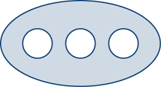{: #CNX_Calc_Figure_16_04_013}

Before discussing extensions of Green’s theorem, we need to go over some terminology regarding the boundary of a region. Let *D* be a region and let *C* be a component of the boundary of *D*. We say that *C* is *positively oriented* if, as we walk along *C* in the direction of orientation, region *D* is always on our left. Therefore, the counterclockwise orientation of the boundary of a disk is a positive orientation, for example. Curve *C* is *negatively oriented* if, as we walk along *C* in the direction of orientation, region *D* is always on our right. The clockwise orientation of the boundary of a disk is a negative orientation, for example.

Let *D* be a region with finitely many holes (so that *D* has finitely many boundary curves), and denote the boundary of *D* by <math xmlns="http://www.w3.org/1998/Math/MathML"><mrow><mo>∂</mo><mi>D</mi></mrow></math>

 ([\[link\]](#CNX_Calc_Figure_16_04_014)). To extend Green’s theorem so it can handle *D*, we divide region *D* into two regions, <math xmlns="http://www.w3.org/1998/Math/MathML"><mrow><msub><mi>D</mi><mn>1</mn></msub></mrow></math>

 and <math xmlns="http://www.w3.org/1998/Math/MathML"><mrow><msub><mi>D</mi><mn>2</mn></msub></mrow></math>

 (with respective boundaries <math xmlns="http://www.w3.org/1998/Math/MathML"><mrow><mo>∂</mo><msub><mi>D</mi><mn>1</mn></msub></mrow></math>

 and <math xmlns="http://www.w3.org/1998/Math/MathML"><mrow><mo>∂</mo><msub><mi>D</mi><mn>2</mn></msub><mo stretchy="false">)</mo><mo>,</mo></mrow></math>

 in such a way that <math xmlns="http://www.w3.org/1998/Math/MathML"><mrow><mi>D</mi><mo>=</mo><msub><mi>D</mi><mn>1</mn></msub><mo>∪</mo><msub><mi>D</mi><mn>2</mn></msub></mrow></math>

 and neither <math xmlns="http://www.w3.org/1998/Math/MathML"><mrow><msub><mi>D</mi><mn>1</mn></msub></mrow></math>

 nor <math xmlns="http://www.w3.org/1998/Math/MathML"><mrow><msub><mi>D</mi><mn>2</mn></msub></mrow></math>

 has any holes ([\[link\]](#CNX_Calc_Figure_16_04_014)).

  Region D with an oriented boundary has three holes. (b) Region D split into two simply connected regions has no holes."){: #CNX_Calc_Figure_16_04_014}

Assume the boundary of *D* is oriented as in the figure, with the inner holes given a negative orientation and the outer boundary given a positive orientation. The boundary of each simply connected region <math xmlns="http://www.w3.org/1998/Math/MathML"><mrow><msub><mi>D</mi><mn>1</mn></msub></mrow></math>

 and <math xmlns="http://www.w3.org/1998/Math/MathML"><mrow><msub><mi>D</mi><mn>2</mn></msub></mrow></math>

 is positively oriented. If **F** is a vector field defined on *D*, then Green’s theorem says that

<math xmlns="http://www.w3.org/1998/Math/MathML"><mtable><mtr><mtd columnalign="right"><mstyle displaystyle="true"><mrow><msub><mo>∮</mo><mrow><mo>∂</mo><mi>D</mi></mrow></msub><mrow><mstyle mathvariant="bold" mathsize="normal"><mtext>F</mtext></mstyle><mo>·</mo><mi>d</mi><mstyle mathvariant="bold" mathsize="normal"><mtext>r</mtext></mstyle></mrow></mrow></mstyle></mtd><mtd columnalign="left"><mo>=</mo><mstyle displaystyle="true"><mrow><msub><mo>∮</mo><mrow><mo>∂</mo><msub><mi>D</mi><mn>1</mn></msub></mrow></msub><mrow><mstyle mathvariant="bold" mathsize="normal"><mtext>F</mtext></mstyle><mo>·</mo><mi>d</mi><mstyle mathvariant="bold" mathsize="normal"><mtext>r</mtext></mstyle></mrow></mrow></mstyle><mo>+</mo><mstyle displaystyle="true"><mrow><msub><mo>∮</mo><mrow><mo>∂</mo><msub><mi>D</mi><mn>2</mn></msub></mrow></msub><mrow><mstyle mathvariant="bold" mathsize="normal"><mtext>F</mtext></mstyle><mo>·</mo><mi>d</mi><mstyle mathvariant="bold" mathsize="normal"><mtext>r</mtext></mstyle></mrow></mrow></mstyle></mtd></mtr><mtr><mtd /><mtd columnalign="left"><mo>=</mo><mstyle displaystyle="true"><mrow><msub><mo>∬</mo><mrow><msub><mi>D</mi><mn>1</mn></msub></mrow></msub><mrow><msub><mi>Q</mi><mi>x</mi></msub><mo>−</mo><msub><mi>P</mi><mi>y</mi></msub><mi>d</mi><mi>A</mi><mo>+</mo></mrow></mrow></mstyle><mstyle displaystyle="true"><mrow><msub><mo>∬</mo><mrow><msub><mi>D</mi><mn>2</mn></msub></mrow></msub><mrow><msub><mi>Q</mi><mi>x</mi></msub><mo>−</mo><msub><mi>P</mi><mi>y</mi></msub><mi>d</mi><mi>A</mi></mrow></mrow></mstyle></mtd></mtr><mtr><mtd /><mtd columnalign="left"><mo>=</mo><mstyle displaystyle="true"><mrow><msub><mo>∬</mo><mi>D</mi></msub><mrow><mo stretchy="false">(</mo><msub><mi>Q</mi><mi>x</mi></msub><mo>−</mo><msub><mi>P</mi><mi>y</mi></msub><mo stretchy="false">)</mo><mi>d</mi><mi>A</mi></mrow></mrow></mstyle><mo>.</mo></mtd></mtr></mtable></math>

Therefore, Green’s theorem still works on a region with holes.

To see how this works in practice, consider annulus *D* in [\[link\]](#CNX_Calc_Figure_16_04_015) and suppose that <math xmlns="http://www.w3.org/1998/Math/MathML"><mrow><mstyle mathvariant="bold" mathsize="normal"><mtext>F</mtext></mstyle><mo>=</mo><mrow><mo>〈</mo><mrow><mi>P</mi><mo>,</mo><mi>Q</mi></mrow><mo>〉</mo></mrow></mrow></math>

 is a vector field defined on this annulus. Region *D* has a hole, so it is not simply connected. Orient the outer circle of the annulus counterclockwise and the inner circle clockwise ([\[link\]](#CNX_Calc_Figure_16_04_015)) so that, when we divide the region into <math xmlns="http://www.w3.org/1998/Math/MathML"><mrow><msub><mi>D</mi><mn>1</mn></msub></mrow></math>

 and <math xmlns="http://www.w3.org/1998/Math/MathML"><mrow><msub><mi>D</mi><mn>2</mn></msub><mo>,</mo></mrow></math>

 we are able to keep the region on our left as we walk along a path that traverses the boundary. Let <math xmlns="http://www.w3.org/1998/Math/MathML"><mrow><msub><mi>D</mi><mn>1</mn></msub></mrow></math>

 be the upper half of the annulus and <math xmlns="http://www.w3.org/1998/Math/MathML"><mrow><msub><mi>D</mi><mn>2</mn></msub></mrow></math>

 be the lower half. Neither of these regions has holes, so we have divided *D* into two simply connected regions.

We label each piece of these new boundaries as <math xmlns="http://www.w3.org/1998/Math/MathML"><mrow><msub><mi>P</mi><mi>i</mi></msub></mrow></math>

 for some *i,* as in [\[link\]](#CNX_Calc_Figure_16_04_015). If we begin at *P* and travel along the oriented boundary, the first segment is <math xmlns="http://www.w3.org/1998/Math/MathML"><mrow><msub><mi>P</mi><mrow><mn>1</mn></mrow></msub><mo>,</mo></mrow></math>

 then <math xmlns="http://www.w3.org/1998/Math/MathML"><mrow><msub><mi>P</mi><mn>2</mn></msub><mo>,</mo><msub><mi>P</mi><mn>3</mn></msub><mo>,</mo></mrow></math>

 and <math xmlns="http://www.w3.org/1998/Math/MathML"><mrow><msub><mi>P</mi><mn>4</mn></msub><mo>.</mo></mrow></math>

 Now we have traversed <math xmlns="http://www.w3.org/1998/Math/MathML"><mrow><msub><mi>D</mi><mn>1</mn></msub></mrow></math>

 and returned to *P.* Next, we start at *P* again and traverse <math xmlns="http://www.w3.org/1998/Math/MathML"><mrow><msub><mi>D</mi><mn>2</mn></msub><mo>.</mo></mrow></math>

 Since the first piece of the boundary is the same as <math xmlns="http://www.w3.org/1998/Math/MathML"><mrow><msub><mi>P</mi><mn>4</mn></msub></mrow></math>

 in <math xmlns="http://www.w3.org/1998/Math/MathML"><mrow><msub><mi>D</mi><mn>1</mn></msub><mo>,</mo></mrow></math>

 but oriented in the opposite direction, the first piece of <math xmlns="http://www.w3.org/1998/Math/MathML"><mrow><msub><mi>D</mi><mn>2</mn></msub></mrow></math>

 is <math xmlns="http://www.w3.org/1998/Math/MathML"><mrow><mtext>−</mtext><msub><mi>P</mi><mn>4</mn></msub><mo>.</mo></mrow></math>

 Next, we have <math xmlns="http://www.w3.org/1998/Math/MathML"><mrow><msub><mi>P</mi><mn>5</mn></msub><mo>,</mo></mrow></math>

 then <math xmlns="http://www.w3.org/1998/Math/MathML"><mrow><mtext>−</mtext><msub><mi>P</mi><mn>2</mn></msub><mo>,</mo></mrow></math>

 and finally <math xmlns="http://www.w3.org/1998/Math/MathML"><mrow><msub><mi>P</mi><mn>6</mn></msub><mo>.</mo></mrow></math>

 ![A diagram of an annulus &#x2013; a circular region with a hole in in like a donut. Its boundary is oriented counterclockwise. One point P on the outer boundary is labeled. It is the right endpoint of the horizontal diameter. The annulus is split horizontally down the middle into two separate regions that are each simply connected. Point P is labeled on both of these regions, D1 and D2. Each region has boundaries oriented counterclockwise. The upper curve of D1 is labeled P1, the left flat side is P2, the lower curve is P3, and the right flat side is P4. The lower curve of D2 is P6, the left flat side is &#x2013;P2, the upper curve is P5, and the right flat side is &#x2013;P4.](../resources/CNX_Calc_Figure_16_04_015.jpg "Breaking the annulus into two separate regions gives us two simply connected regions. The line integrals over the common boundaries cancel out."){: #CNX_Calc_Figure_16_04_015}

[\[link\]](#CNX_Calc_Figure_16_04_015) shows a path that traverses the boundary of *D*. Notice that this path traverses the boundary of region <math xmlns="http://www.w3.org/1998/Math/MathML"><mrow><msub><mi>D</mi><mn>1</mn></msub><mo>,</mo></mrow></math>

 returns to the starting point, and then traverses the boundary of region <math xmlns="http://www.w3.org/1998/Math/MathML"><mrow><msub><mi>D</mi><mn>2</mn></msub><mo>.</mo></mrow></math>

 Furthermore, as we walk along the path, the region is always on our left. Notice that this traversal of the <math xmlns="http://www.w3.org/1998/Math/MathML"><mrow><msub><mi>P</mi><mi>i</mi></msub></mrow></math>

 paths covers the entire boundary of region *D.* If we had only traversed one portion of the boundary of *D*, then we cannot apply Green’s theorem to *D*.

The boundary of the upper half of the annulus, therefore, is <math xmlns="http://www.w3.org/1998/Math/MathML"><mrow><msub><mi>P</mi><mn>1</mn></msub><mo>∪</mo><msub><mi>P</mi><mn>2</mn></msub><mo>∪</mo><msub><mi>P</mi><mn>3</mn></msub><mo>∪</mo><msub><mi>P</mi><mn>4</mn></msub></mrow></math>

 and the boundary of the lower half of the annulus is <math xmlns="http://www.w3.org/1998/Math/MathML"><mrow><mtext>−</mtext><msub><mi>P</mi><mn>4</mn></msub><mo>∪</mo><msub><mi>P</mi><mn>5</mn></msub><mo>∪</mo><mo>−</mo><msub><mi>P</mi><mn>2</mn></msub><mo>∪</mo><msub><mi>P</mi><mn>6</mn></msub><mo>.</mo></mrow></math>

 Then, Green’s theorem implies

<math xmlns="http://www.w3.org/1998/Math/MathML"><mtable><mtr><mtd columnalign="right"><mstyle displaystyle="true"><mrow><msub><mo>∮</mo><mrow><mo>∂</mo><mi>D</mi></mrow></msub><mrow><mstyle mathvariant="bold" mathsize="normal"><mtext>F</mtext></mstyle><mo>·</mo><mi>d</mi><mstyle mathvariant="bold" mathsize="normal"><mtext>r</mtext></mstyle></mrow></mrow></mstyle></mtd><mtd columnalign="left"><mo>=</mo><mstyle displaystyle="true"><mrow><msub><mo stretchy="false">∫</mo><mrow><msub><mi>P</mi><mn>1</mn></msub></mrow></msub><mrow><mstyle mathvariant="bold" mathsize="normal"><mtext>F</mtext></mstyle><mo>·</mo><mi>d</mi><mstyle mathvariant="bold" mathsize="normal"><mtext>r</mtext></mstyle></mrow></mrow></mstyle><mo>+</mo><mstyle displaystyle="true"><mrow><msub><mo stretchy="false">∫</mo><mrow><msub><mi>P</mi><mn>2</mn></msub></mrow></msub><mrow><mstyle mathvariant="bold" mathsize="normal"><mtext>F</mtext></mstyle><mo>·</mo><mi>d</mi><mstyle mathvariant="bold" mathsize="normal"><mtext>r</mtext></mstyle></mrow></mrow></mstyle><mo>+</mo><mstyle displaystyle="true"><mrow><msub><mo stretchy="false">∫</mo><mrow><msub><mi>P</mi><mn>3</mn></msub></mrow></msub><mrow><mstyle mathvariant="bold" mathsize="normal"><mtext>F</mtext></mstyle><mo>·</mo><mi>d</mi><mstyle mathvariant="bold" mathsize="normal"><mtext>r</mtext></mstyle></mrow></mrow></mstyle><mo>+</mo><mstyle displaystyle="true"><mrow><msub><mo stretchy="false">∫</mo><mrow><msub><mi>P</mi><mn>4</mn></msub></mrow></msub><mrow><mstyle mathvariant="bold" mathsize="normal"><mtext>F</mtext></mstyle><mo>·</mo><mi>d</mi><mstyle mathvariant="bold" mathsize="normal"><mtext>r</mtext></mstyle></mrow></mrow></mstyle><mo>+</mo><mstyle displaystyle="true"><mrow><msub><mo stretchy="false">∫</mo><mrow><mtext>−</mtext><msub><mi>P</mi><mn>4</mn></msub></mrow></msub><mrow><mstyle mathvariant="bold" mathsize="normal"><mtext>F</mtext></mstyle><mo>·</mo><mi>d</mi><mstyle mathvariant="bold" mathsize="normal"><mtext>r</mtext></mstyle></mrow></mrow></mstyle><mo>+</mo><mstyle displaystyle="true"><mrow><msub><mo stretchy="false">∫</mo><mrow><msub><mi>P</mi><mn>5</mn></msub></mrow></msub><mrow><mstyle mathvariant="bold" mathsize="normal"><mtext>F</mtext></mstyle><mo>·</mo><mi>d</mi><mstyle mathvariant="bold" mathsize="normal"><mtext>r</mtext></mstyle></mrow></mrow></mstyle><mo>+</mo><mstyle displaystyle="true"><mrow><msub><mo stretchy="false">∫</mo><mrow><mtext>−</mtext><msub><mi>P</mi><mn>2</mn></msub></mrow></msub><mrow><mstyle mathvariant="bold" mathsize="normal"><mtext>F</mtext></mstyle><mo>·</mo><mi>d</mi><mstyle mathvariant="bold" mathsize="normal"><mtext>r</mtext></mstyle></mrow></mrow></mstyle><mo>+</mo><mstyle displaystyle="true"><mrow><msub><mo stretchy="false">∫</mo><mrow><msub><mi>P</mi><mn>6</mn></msub></mrow></msub><mrow><mstyle mathvariant="bold" mathsize="normal"><mtext>F</mtext></mstyle><mo>·</mo><mi>d</mi><mstyle mathvariant="bold" mathsize="normal"><mtext>r</mtext></mstyle></mrow></mrow></mstyle></mtd></mtr><mtr><mtd /><mtd columnalign="left"><mo>=</mo><mstyle displaystyle="true"><mrow><msub><mo stretchy="false">∫</mo><mrow><msub><mi>P</mi><mn>1</mn></msub></mrow></msub><mrow><mstyle mathvariant="bold" mathsize="normal"><mtext>F</mtext></mstyle><mo>·</mo><mi>d</mi><mstyle mathvariant="bold" mathsize="normal"><mtext>r</mtext></mstyle></mrow></mrow></mstyle><mo>+</mo><mstyle displaystyle="true"><mrow><msub><mo stretchy="false">∫</mo><mrow><msub><mi>P</mi><mn>2</mn></msub></mrow></msub><mrow><mstyle mathvariant="bold" mathsize="normal"><mtext>F</mtext></mstyle><mo>·</mo><mi>d</mi><mstyle mathvariant="bold" mathsize="normal"><mtext>r</mtext></mstyle></mrow></mrow></mstyle><mo>+</mo><mstyle displaystyle="true"><mrow><msub><mo stretchy="false">∫</mo><mrow><msub><mi>P</mi><mn>3</mn></msub></mrow></msub><mrow><mstyle mathvariant="bold" mathsize="normal"><mtext>F</mtext></mstyle><mo>·</mo><mi>d</mi><mstyle mathvariant="bold" mathsize="normal"><mtext>r</mtext></mstyle></mrow></mrow></mstyle><mo>+</mo><mstyle displaystyle="true"><mrow><msub><mo stretchy="false">∫</mo><mrow><msub><mi>P</mi><mn>4</mn></msub></mrow></msub><mrow><mstyle mathvariant="bold" mathsize="normal"><mtext>F</mtext></mstyle><mo>·</mo><mi>d</mi><mstyle mathvariant="bold" mathsize="normal"><mtext>r</mtext></mstyle></mrow></mrow></mstyle><mo>+</mo><mstyle displaystyle="true"><mrow><msub><mo stretchy="false">∫</mo><mrow><msub><mi>P</mi><mn>4</mn></msub></mrow></msub><mrow><mstyle mathvariant="bold" mathsize="normal"><mtext>F</mtext></mstyle><mo>·</mo><mi>d</mi><mstyle mathvariant="bold" mathsize="normal"><mtext>r</mtext></mstyle></mrow></mrow></mstyle><mo>+</mo><mstyle displaystyle="true"><mrow><msub><mo stretchy="false">∫</mo><mrow><msub><mi>P</mi><mn>5</mn></msub></mrow></msub><mrow><mstyle mathvariant="bold" mathsize="normal"><mtext>F</mtext></mstyle><mo>·</mo><mi>d</mi><mstyle mathvariant="bold" mathsize="normal"><mtext>r</mtext></mstyle></mrow></mrow></mstyle><mo>+</mo><mstyle displaystyle="true"><mrow><msub><mo stretchy="false">∫</mo><mrow><mtext>−</mtext><msub><mi>P</mi><mn>2</mn></msub></mrow></msub><mrow><mstyle mathvariant="bold" mathsize="normal"><mtext>F</mtext></mstyle><mo>·</mo><mi>d</mi><mstyle mathvariant="bold" mathsize="normal"><mtext>r</mtext></mstyle></mrow></mrow></mstyle><mo>+</mo><mstyle displaystyle="true"><mrow><msub><mo stretchy="false">∫</mo><mrow><msub><mi>P</mi><mn>6</mn></msub></mrow></msub><mrow><mstyle mathvariant="bold" mathsize="normal"><mtext>F</mtext></mstyle><mo>·</mo><mi>d</mi><mstyle mathvariant="bold" mathsize="normal"><mtext>r</mtext></mstyle></mrow></mrow></mstyle></mtd></mtr><mtr><mtd /><mtd columnalign="left"><mo>=</mo><mstyle displaystyle="true"><mrow><msub><mo stretchy="false">∫</mo><mrow><msub><mi>P</mi><mn>1</mn></msub></mrow></msub><mrow><mstyle mathvariant="bold" mathsize="normal"><mtext>F</mtext></mstyle><mo>·</mo><mi>d</mi><mstyle mathvariant="bold" mathsize="normal"><mtext>r</mtext></mstyle></mrow></mrow></mstyle><mo>+</mo><mstyle displaystyle="true"><mrow><msub><mo stretchy="false">∫</mo><mrow><msub><mi>P</mi><mn>3</mn></msub></mrow></msub><mrow><mstyle mathvariant="bold" mathsize="normal"><mtext>F</mtext></mstyle><mo>·</mo><mi>d</mi><mstyle mathvariant="bold" mathsize="normal"><mtext>r</mtext></mstyle></mrow></mrow></mstyle><mo>+</mo><mstyle displaystyle="true"><mrow><msub><mo stretchy="false">∫</mo><mrow><msub><mi>P</mi><mn>5</mn></msub></mrow></msub><mrow><mstyle mathvariant="bold" mathsize="normal"><mtext>F</mtext></mstyle><mo>·</mo><mi>d</mi><mstyle mathvariant="bold" mathsize="normal"><mtext>r</mtext></mstyle></mrow></mrow></mstyle><mo>+</mo><mstyle displaystyle="true"><mrow><msub><mo stretchy="false">∫</mo><mrow><msub><mi>P</mi><mn>6</mn></msub></mrow></msub><mrow><mstyle mathvariant="bold" mathsize="normal"><mtext>F</mtext></mstyle><mo>·</mo><mi>d</mi><mstyle mathvariant="bold" mathsize="normal"><mtext>r</mtext></mstyle></mrow></mrow></mstyle></mtd></mtr><mtr><mtd /><mtd columnalign="left"><mo>=</mo><mstyle displaystyle="true"><mrow><msub><mo>∮</mo><mrow><mo>∂</mo><msub><mi>D</mi><mn>1</mn></msub></mrow></msub><mrow><mstyle mathvariant="bold" mathsize="normal"><mtext>F</mtext></mstyle><mo>·</mo><mi>d</mi><mstyle mathvariant="bold" mathsize="normal"><mtext>r</mtext></mstyle></mrow></mrow></mstyle><mo>+</mo><mstyle displaystyle="true"><mrow><msub><mo>∮</mo><mrow><mo>∂</mo><msub><mi>D</mi><mn>2</mn></msub></mrow></msub><mrow><mstyle mathvariant="bold" mathsize="normal"><mtext>F</mtext></mstyle><mo>·</mo><mi>d</mi><mstyle mathvariant="bold" mathsize="normal"><mtext>r</mtext></mstyle></mrow></mrow></mstyle></mtd></mtr><mtr><mtd /><mtd columnalign="left"><mo>=</mo><mstyle displaystyle="true"><mrow><msub><mo>∬</mo><mrow><msub><mi>D</mi><mn>1</mn></msub></mrow></msub><mrow><mrow><mo>(</mo><mrow><msub><mi>Q</mi><mi>x</mi></msub><mo>−</mo><msub><mi>P</mi><mi>y</mi></msub></mrow><mo>)</mo></mrow><mi>d</mi><mi>A</mi><mo>+</mo></mrow></mrow></mstyle><mstyle displaystyle="true"><mrow><msub><mo>∬</mo><mrow><msub><mi>D</mi><mn>2</mn></msub></mrow></msub><mrow><mrow><mo>(</mo><mrow><msub><mi>Q</mi><mi>x</mi></msub><mo>−</mo><msub><mi>P</mi><mi>y</mi></msub></mrow><mo>)</mo></mrow><mi>d</mi><mi>A</mi></mrow></mrow></mstyle></mtd></mtr><mtr><mtd /><mtd columnalign="left"><mo>=</mo><mstyle displaystyle="true"><mrow><msub><mo>∬</mo><mi>D</mi></msub><mrow><mrow><mo>(</mo><mrow><msub><mi>Q</mi><mi>x</mi></msub><mo>−</mo><msub><mi>P</mi><mi>y</mi></msub></mrow><mo>)</mo></mrow><mi>d</mi><mi>A</mi></mrow></mrow></mstyle><mo>.</mo></mtd></mtr></mtable></math>

Therefore, we arrive at the equation found in Green’s theorem—namely,

<math xmlns="http://www.w3.org/1998/Math/MathML"><mrow><mstyle displaystyle="true"><mrow><msub><mo>∮</mo><mrow><mo>∂</mo><mi>D</mi></mrow></msub><mrow><mstyle mathvariant="bold" mathsize="normal"><mtext>F</mtext></mstyle><mo>·</mo><mi>d</mi><mstyle mathvariant="bold" mathsize="normal"><mtext>r</mtext></mstyle></mrow></mrow></mstyle><mo>=</mo><mstyle displaystyle="true"><mrow><msub><mo>∬</mo><mi>D</mi></msub><mrow><mrow><mo>(</mo><mrow><msub><mi>Q</mi><mi>x</mi></msub><mo>−</mo><msub><mi>P</mi><mi>y</mi></msub></mrow><mo>)</mo></mrow><mi>d</mi><mi>A</mi></mrow></mrow></mstyle><mo>.</mo></mrow></math>

The same logic implies that the flux form of Green’s theorem can also be extended to a region with finitely many holes:

<math xmlns="http://www.w3.org/1998/Math/MathML"><mrow><mstyle displaystyle="true"><mrow><msub><mo>∮</mo><mi>C</mi></msub><mrow><mstyle mathvariant="bold" mathsize="normal"><mtext>F</mtext></mstyle><mo>·</mo><mstyle mathvariant="bold" mathsize="normal"><mtext>N</mtext></mstyle><mi>d</mi><mi>s</mi></mrow></mrow></mstyle><mo>=</mo><mstyle displaystyle="true"><mrow><msub><mo>∬</mo><mi>D</mi></msub><mrow><mrow><mo>(</mo><mrow><msub><mi>P</mi><mi>x</mi></msub><mo>+</mo><msub><mi>Q</mi><mi>y</mi></msub></mrow><mo>)</mo></mrow><mi>d</mi><mi>A</mi><mo>.</mo></mrow></mrow></mstyle></mrow></math>

Using Green’s Theorem on a Region with Holes

Calculate integral

<math xmlns="http://www.w3.org/1998/Math/MathML"><mrow><mstyle displaystyle="true"><mrow><msub><mo>∮</mo><mrow><mo>∂</mo><mi>D</mi></mrow></msub><mrow><mrow><mo>(</mo><mrow><mtext>sin</mtext><mspace width="0.2em" /><mi>x</mi><mo>−</mo><mfrac><mrow><msup><mi>y</mi><mn>3</mn></msup></mrow><mn>3</mn></mfrac></mrow><mo>)</mo></mrow><mi>d</mi><mi>x</mi><mo>+</mo><mrow><mo>(</mo><mrow><mfrac><mrow><msup><mi>y</mi><mn>3</mn></msup></mrow><mn>3</mn></mfrac><mo>+</mo><mtext>sin</mtext><mspace width="0.2em" /><mi>y</mi></mrow><mo>)</mo></mrow><mi>d</mi><mi>y</mi></mrow></mrow></mstyle><mo>,</mo></mrow></math>

where *D* is the annulus given by the polar inequalities <math xmlns="http://www.w3.org/1998/Math/MathML"><mrow><mn>1</mn><mo>≤</mo><mstyle mathvariant="bold" mathsize="normal"><mtext>r</mtext></mstyle><mo>≤</mo><mn>2</mn><mo>,</mo></mrow></math>

 <math xmlns="http://www.w3.org/1998/Math/MathML"><mrow><mn>0</mn><mo>≤</mo><mi>θ</mi><mo>≤</mo><mn>2</mn><mi>π</mi><mo>.</mo></mrow></math>

Although *D* is not simply connected, we can use the extended form of Green’s theorem to calculate the integral. Since the integration occurs over an annulus, we convert to polar coordinates:

<math xmlns="http://www.w3.org/1998/Math/MathML"><mtable><mtr><mtd columnalign="right"><mstyle displaystyle="true"><mrow><msub><mo>∮</mo><mrow><mo>∂</mo><mi>D</mi></mrow></msub><mrow><mrow><mo>(</mo><mrow><mtext>sin</mtext><mspace width="0.2em" /><mi>x</mi><mo>−</mo><mfrac><mrow><msup><mi>y</mi><mn>3</mn></msup></mrow><mn>3</mn></mfrac></mrow><mo>)</mo></mrow><mi>d</mi><mi>x</mi><mo>+</mo><mrow><mo>(</mo><mrow><mfrac><mrow><msup><mi>x</mi><mn>3</mn></msup></mrow><mn>3</mn></mfrac><mo>+</mo><mtext>sin</mtext><mspace width="0.2em" /><mi>y</mi></mrow><mo>)</mo></mrow><mi>d</mi><mi>y</mi></mrow></mrow></mstyle></mtd><mtd columnalign="left"><mo>=</mo><mstyle displaystyle="true"><mrow><msub><mo>∬</mo><mi>D</mi></msub><mrow><mrow><mo>(</mo><mrow><msub><mi>Q</mi><mi>x</mi></msub><mo>−</mo><msub><mi>P</mi><mi>y</mi></msub></mrow><mo>)</mo></mrow><mi>d</mi><mi>A</mi></mrow></mrow></mstyle></mtd></mtr><mtr><mtd /><mtd columnalign="left"><mo>=</mo><mstyle displaystyle="true"><mrow><msub><mo>∬</mo><mi>D</mi></msub><mrow><mrow><mo>(</mo><mrow><msup><mi>x</mi><mn>2</mn></msup><mo>+</mo><msup><mi>y</mi><mn>2</mn></msup></mrow><mo>)</mo></mrow><mi>d</mi><mi>A</mi></mrow></mrow></mstyle></mtd></mtr><mtr><mtd /><mtd columnalign="left"><mo>=</mo><mstyle displaystyle="true"><mrow><msubsup><mo stretchy="false">∫</mo><mn>0</mn><mrow><mn>2</mn><mi>π</mi></mrow></msubsup><mrow><mstyle displaystyle="true"><mrow><msubsup><mo stretchy="false">∫</mo><mn>1</mn><mn>2</mn></msubsup><mrow><msup><mi>r</mi><mn>3</mn></msup><mi>d</mi><mi>r</mi><mi>d</mi><mi>θ</mi></mrow></mrow></mstyle></mrow></mrow></mstyle><mo>=</mo><mstyle displaystyle="true"><mrow><msubsup><mo stretchy="false">∫</mo><mn>0</mn><mrow><mn>2</mn><mi>π</mi></mrow></msubsup><mrow><mfrac><mrow><mn>15</mn></mrow><mn>4</mn></mfrac><mi>d</mi><mi>θ</mi></mrow></mrow></mstyle></mtd></mtr><mtr><mtd /><mtd columnalign="left"><mo>=</mo><mfrac><mrow><mn>15</mn><mi>π</mi></mrow><mn>2</mn></mfrac><mo>.</mo></mtd></mtr></mtable></math>

Using the Extended Form of Green’s Theorem

Let <math xmlns="http://www.w3.org/1998/Math/MathML"><mrow><mstyle mathvariant="bold" mathsize="normal"><mtext>F</mtext></mstyle><mo>=</mo><mrow><mo>〈</mo><mrow><mi>P</mi><mo>,</mo><mi>Q</mi></mrow><mo>〉</mo></mrow><mo>=</mo><mrow><mo>〈</mo><mrow><mfrac><mi>y</mi><mrow><msup><mi>x</mi><mn>2</mn></msup><mo>+</mo><msup><mi>y</mi><mn>2</mn></msup></mrow></mfrac><mo>,</mo><mo>−</mo><mfrac><mi>x</mi><mrow><msup><mi>x</mi><mn>2</mn></msup><mo>+</mo><msup><mi>y</mi><mn>2</mn></msup></mrow></mfrac></mrow><mo>〉</mo></mrow></mrow></math>

 and let *C* be any simple closed curve in a plane oriented counterclockwise. What are the possible values of <math xmlns="http://www.w3.org/1998/Math/MathML"><mrow><mstyle displaystyle="true"><mrow><msub><mo>∮</mo><mi>C</mi></msub><mrow><mstyle mathvariant="bold" mathsize="normal"><mtext>F</mtext></mstyle><mo>·</mo><mi>d</mi><mstyle mathvariant="bold" mathsize="normal"><mtext>r</mtext></mstyle><mo>?</mo></mrow></mrow></mstyle></mrow></math>

We use the extended form of Green’s theorem to show that <math xmlns="http://www.w3.org/1998/Math/MathML"><mrow><mstyle displaystyle="true"><mrow><msub><mo>∮</mo><mi>C</mi></msub><mrow><mstyle mathvariant="bold" mathsize="normal"><mtext>F</mtext></mstyle><mo>·</mo><mi>d</mi><mstyle mathvariant="bold" mathsize="normal"><mtext>r</mtext></mstyle></mrow></mrow></mstyle></mrow></math>

 is either 0 or <math xmlns="http://www.w3.org/1998/Math/MathML"><mrow><mn>−2</mn><mi>π</mi></mrow></math>

—that is, no matter how crazy curve *C* is, the line integral of **F** along *C* can have only one of two possible values. We consider two cases: the case when *C* encompasses the origin and the case when *C* does not encompass the origin.

### Case 1: *C* Does Not Encompass the Origin

In this case, the region enclosed by *C* is simply connected because the only hole in the domain of **F** is at the origin. We showed in our discussion of cross-partials that **F** satisfies the cross-partial condition. If we restrict the domain of **F** just to *C* and the region it encloses, then **F** with this restricted domain is now defined on a simply connected domain. Since **F** satisfies the cross-partial property on its restricted domain, the field **F** is conservative on this simply connected region and hence the circulation <math xmlns="http://www.w3.org/1998/Math/MathML"><mrow><mstyle displaystyle="true"><mrow><msub><mo>∮</mo><mi>C</mi></msub><mrow><mstyle mathvariant="bold" mathsize="normal"><mtext>F</mtext></mstyle><mo>·</mo><mi>d</mi><mstyle mathvariant="bold" mathsize="normal"><mtext>r</mtext></mstyle></mrow></mrow></mstyle></mrow></math>

 is zero.

### Case 2: *C* Does Encompass the Origin

In this case, the region enclosed by *C* is not simply connected because this region contains a hole at the origin. Let <math xmlns="http://www.w3.org/1998/Math/MathML"><mrow><msub><mi>C</mi><mn>1</mn></msub></mrow></math>

 be a circle of radius *a* centered at the origin so that <math xmlns="http://www.w3.org/1998/Math/MathML"><mrow><msub><mi>C</mi><mn>1</mn></msub></mrow></math>

 is entirely inside the region enclosed by *C* ([[link]](#CNX_Calc_Figure_16_04_016)). Give <math xmlns="http://www.w3.org/1998/Math/MathML"><mrow><msub><mi>C</mi><mn>1</mn></msub></mrow></math>

 a clockwise orientation.

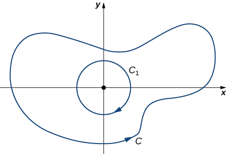{: #CNX_Calc_Figure_16_04_016}

Let *D* be the region between <math xmlns="http://www.w3.org/1998/Math/MathML"><mrow><msub><mi>C</mi><mn>1</mn></msub></mrow></math>

 and *C*, and *C* is orientated counterclockwise. By the extended version of Green’s theorem,

<math xmlns="http://www.w3.org/1998/Math/MathML"><mtable><mtr><mtd columnalign="right"><mstyle displaystyle="true"><mrow><msub><mo stretchy="false">∫</mo><mi>C</mi></msub><mrow><mstyle mathvariant="bold" mathsize="normal"><mtext>F</mtext></mstyle><mo>·</mo><mi>d</mi><mstyle mathvariant="bold" mathsize="normal"><mtext>r</mtext></mstyle><mo>+</mo><mstyle displaystyle="true"><mrow><msub><mo stretchy="false">∫</mo><mrow><msub><mi>C</mi><mn>1</mn></msub></mrow></msub><mrow><mstyle mathvariant="bold" mathsize="normal"><mtext>F</mtext></mstyle><mo>·</mo><mi>d</mi><mstyle mathvariant="bold" mathsize="normal"><mtext>r</mtext></mstyle></mrow></mrow></mstyle></mrow></mrow></mstyle></mtd><mtd columnalign="left"><mo>=</mo><mstyle displaystyle="true"><mrow><msub><mo stretchy="true">∬</mo><mi>D</mi></msub><mrow><msub><mi>Q</mi><mi>x</mi></msub><mo>−</mo><msub><mi>P</mi><mi>y</mi></msub><mi>d</mi><mi>A</mi></mrow></mrow></mstyle></mtd></mtr><mtr><mtd /><mtd columnalign="left"><mo>=</mo><mstyle displaystyle="true"><mrow><msub><mo>∬</mo><mi>D</mi></msub><mrow><mo>−</mo><mfrac><mrow><msup><mi>y</mi><mn>2</mn></msup><mo>−</mo><msup><mi>x</mi><mn>2</mn></msup></mrow><mrow><msup><mrow><mo stretchy="false">(</mo><msup><mi>x</mi><mn>2</mn></msup><mo>+</mo><msup><mi>y</mi><mn>2</mn></msup><mo stretchy="false">)</mo></mrow><mn>2</mn></msup></mrow></mfrac><mo>+</mo></mrow></mrow></mstyle><mfrac><mrow><msup><mi>y</mi><mn>2</mn></msup><mo>−</mo><msup><mi>x</mi><mn>2</mn></msup></mrow><mrow><msup><mrow><mo stretchy="false">(</mo><msup><mi>x</mi><mn>2</mn></msup><mo>+</mo><msup><mi>y</mi><mn>2</mn></msup><mo stretchy="false">)</mo></mrow><mn>2</mn></msup></mrow></mfrac><mi>d</mi><mi>A</mi></mtd></mtr><mtr><mtd /><mtd columnalign="left"><mo>=</mo><mn>0</mn><mo>,</mo></mtd></mtr></mtable></math>

and therefore

<math xmlns="http://www.w3.org/1998/Math/MathML"><mrow><mstyle displaystyle="true"><mrow><msub><mo stretchy="false">∫</mo><mi>C</mi></msub><mrow><mstyle mathvariant="bold" mathsize="normal"><mtext>F</mtext></mstyle><mo>·</mo><mi>d</mi><mstyle mathvariant="bold" mathsize="normal"><mtext>r</mtext></mstyle><mo>=</mo></mrow></mrow></mstyle><mo>−</mo><mstyle displaystyle="true"><mrow><msub><mo stretchy="false">∫</mo><mrow><msub><mi>C</mi><mn>1</mn></msub></mrow></msub><mrow><mstyle mathvariant="bold" mathsize="normal"><mtext>F</mtext></mstyle><mo>·</mo><mi>d</mi><mstyle mathvariant="bold" mathsize="normal"><mtext>r</mtext></mstyle><mo>.</mo></mrow></mrow></mstyle></mrow></math>

Since <math xmlns="http://www.w3.org/1998/Math/MathML"><mrow><msub><mi>C</mi><mn>1</mn></msub></mrow></math>

 is a specific curve, we can evaluate <math xmlns="http://www.w3.org/1998/Math/MathML"><mrow><mstyle displaystyle="true"><mrow><msub><mo stretchy="false">∫</mo><mrow><msub><mi>C</mi><mn>1</mn></msub></mrow></msub><mrow><mstyle mathvariant="bold" mathsize="normal"><mtext>F</mtext></mstyle><mo>·</mo><mi>d</mi><mstyle mathvariant="bold" mathsize="normal"><mtext>r</mtext></mstyle></mrow></mrow></mstyle><mo>.</mo></mrow></math>

 Let

<math xmlns="http://www.w3.org/1998/Math/MathML"><mrow><mi>x</mi><mo>=</mo><mi>a</mi><mspace width="0.2em" /><mtext>cos</mtext><mspace width="0.2em" /><mi>t</mi><mo>,</mo><mi>y</mi><mo>=</mo><mi>a</mi><mspace width="0.2em" /><mtext>sin</mtext><mspace width="0.2em" /><mi>t</mi><mo>,</mo><mn>0</mn><mo>≤</mo><mi>t</mi><mo>≤</mo><mn>2</mn><mi>π</mi></mrow></math>

be a parameterization of <math xmlns="http://www.w3.org/1998/Math/MathML"><mrow><msub><mi>C</mi><mn>1</mn></msub><mo>.</mo></mrow></math>

 Then,

<math xmlns="http://www.w3.org/1998/Math/MathML"><mtable><mtr><mtd columnalign="right"><mstyle displaystyle="true"><mrow><msub><mo stretchy="false">∫</mo><mrow><msub><mi>C</mi><mn>1</mn></msub></mrow></msub><mrow><mstyle mathvariant="bold" mathsize="normal"><mtext>F</mtext></mstyle><mo>·</mo><mi>d</mi><mstyle mathvariant="bold" mathsize="normal"><mtext>r</mtext></mstyle></mrow></mrow></mstyle></mtd><mtd columnalign="left"><mo>=</mo><mstyle displaystyle="true"><mrow><msubsup><mo stretchy="false">∫</mo><mn>0</mn><mrow><mn>2</mn><mi>π</mi></mrow></msubsup><mrow><mstyle mathvariant="bold" mathsize="normal"><mtext>F</mtext></mstyle><mo stretchy="false">(</mo><mstyle mathvariant="bold" mathsize="normal"><mtext>r</mtext></mstyle><mo stretchy="false">(</mo><mi>t</mi><mo stretchy="false">)</mo><mo stretchy="false">)</mo><mo>·</mo><mstyle mathvariant="bold" mathsize="normal"><mtext>r</mtext></mstyle><mtext>′</mtext><mo stretchy="false">(</mo><mi>t</mi><mo stretchy="false">)</mo><mi>d</mi><mi>t</mi></mrow></mrow></mstyle></mtd></mtr><mtr><mtd /><mtd columnalign="left"><mo>=</mo><mstyle displaystyle="true"><mrow><msubsup><mo stretchy="false">∫</mo><mn>0</mn><mrow><mn>2</mn><mi>π</mi></mrow></msubsup><mrow><mrow><mo>〈</mo><mrow><mo>−</mo><mfrac><mrow><mtext>sin</mtext><mo stretchy="false">(</mo><mi>t</mi><mo stretchy="false">)</mo></mrow><mi>a</mi></mfrac><mo>,</mo><mo>−</mo><mfrac><mrow><mtext>cos</mtext><mo stretchy="false">(</mo><mi>t</mi><mo stretchy="false">)</mo></mrow><mi>a</mi></mfrac></mrow><mo>〉</mo></mrow><mo>·</mo><mrow><mo>〈</mo><mrow><mtext>−</mtext><mi>a</mi><mspace width="0.2em" /><mtext>sin</mtext><mo stretchy="false">(</mo><mi>t</mi><mo stretchy="false">)</mo><mo>,</mo><mtext>−</mtext><mi>a</mi><mspace width="0.2em" /><mtext>cos</mtext><mo stretchy="false">(</mo><mi>t</mi><mo stretchy="false">)</mo></mrow><mo>〉</mo></mrow><mi>d</mi><mi>t</mi></mrow></mrow></mstyle></mtd></mtr><mtr><mtd /><mtd columnalign="left"><mo>=</mo><mstyle displaystyle="true"><mrow><msubsup><mo stretchy="false">∫</mo><mn>0</mn><mrow><mn>2</mn><mi>π</mi></mrow></msubsup><mrow><msup><mrow><mtext>sin</mtext></mrow><mn>2</mn></msup><mo stretchy="false">(</mo><mi>t</mi><mo stretchy="false">)</mo><mo>+</mo><msup><mrow><mtext>cos</mtext></mrow><mn>2</mn></msup><mo stretchy="false">(</mo><mi>t</mi><mo stretchy="false">)</mo><mi>d</mi><mi>t</mi></mrow></mrow></mstyle><mo>=</mo><mstyle displaystyle="true"><mrow><msubsup><mo stretchy="false">∫</mo><mn>0</mn><mrow><mn>2</mn><mi>π</mi></mrow></msubsup><mrow><mi>d</mi><mi>t</mi></mrow></mrow></mstyle><mo>=</mo><mn>2</mn><mi>π</mi><mo>.</mo></mtd></mtr></mtable></math>

Therefore, <math xmlns="http://www.w3.org/1998/Math/MathML"><mrow><mstyle displaystyle="true"><mrow><msub><mo stretchy="false">∫</mo><mi>C</mi></msub><mrow><mstyle mathvariant="bold" mathsize="normal"><mtext>F</mtext></mstyle><mo>·</mo><mi>d</mi><mi>s</mi><mo>=</mo></mrow></mrow></mstyle><mo>−</mo><mn>2</mn><mi>π</mi><mo>.</mo></mrow></math>

Calculate integral <math xmlns="http://www.w3.org/1998/Math/MathML"><mrow><mstyle displaystyle="true"><mrow><msub><mo>∮</mo><mrow><mo>∂</mo><mi>D</mi></mrow></msub><mrow><mstyle mathvariant="bold" mathsize="normal"><mtext>F</mtext></mstyle><mo>·</mo><mi>d</mi><mstyle mathvariant="bold" mathsize="normal"><mtext>r</mtext></mstyle><mo>,</mo></mrow></mrow></mstyle></mrow></math>

 where *D* is the annulus given by the polar inequalities <math xmlns="http://www.w3.org/1998/Math/MathML"><mrow><mn>2</mn><mo>≤</mo><mi>r</mi><mo>≤</mo><mn>5</mn><mo>,</mo><mn>0</mn><mo>≤</mo><mi>θ</mi><mo>≤</mo><mn>2</mn><mi>π</mi><mo>,</mo></mrow></math>

 and <math xmlns="http://www.w3.org/1998/Math/MathML"><mrow><mstyle mathvariant="bold" mathsize="normal"><mtext>F</mtext></mstyle><mrow><mo>(</mo><mrow><mi>x</mi><mo>,</mo><mi>y</mi></mrow><mo>)</mo></mrow><mo>=</mo><mrow><mo>〈</mo><mrow><msup><mi>x</mi><mn>3</mn></msup><mo>,</mo><mn>5</mn><mi>x</mi><mo>+</mo><msup><mi>e</mi><mi>y</mi></msup><mtext>sin</mtext><mspace width="0.2em" /><mi>y</mi></mrow><mo>〉</mo></mrow><mo>.</mo></mrow></math>

<math xmlns="http://www.w3.org/1998/Math/MathML"><mrow><mn>105</mn><mi>π</mi></mrow></math>

Hint

Use the extended version of Green’s theorem.

Measuring Area from a Boundary: The Planimeter

"){: #CNX_Calc_Figure_16_04_017}

Imagine you are a doctor who has just received a magnetic resonance image of your patient’s brain. The brain has a tumor ([\[link\]](#CNX_Calc_Figure_16_04_017)). How large is the tumor? To be precise, what is the area of the red region? The red cross-section of the tumor has an irregular shape, and therefore it is unlikely that you would be able to find a set of equations or inequalities for the region and then be able to calculate its area by conventional means. You could approximate the area by chopping the region into tiny squares (a Riemann sum approach), but this method always gives an answer with some error.

Instead of trying to measure the area of the region directly, we can use a device called a *rolling planimeter* to calculate the area of the region exactly, simply by measuring its boundary. In this project you investigate how a planimeter works, and you use Green’s theorem to show the device calculates area correctly.

A rolling planimeter is a device that measures the area of a planar region by tracing out the boundary of that region ([\[link\]](#CNX_Calc_Figure_16_04_SP2)). To measure the area of a region, we simply run the tracer of the planimeter around the boundary of the region. The planimeter measures the number of turns through which the wheel rotates as we trace the boundary; the area of the shape is proportional to this number of wheel turns. We can derive the precise proportionality equation using Green’s theorem. As the tracer moves around the boundary of the region, the tracer arm rotates and the roller moves back and forth (but does not rotate).

 A rolling planimeter. The pivot allows the tracer arm to rotate. The roller itself does not rotate; it only moves back and forth. (b) An interior view of a rolling planimeter. Notice that the wheel cannot turn if the planimeter is moving back and forth with the tracer arm perpendicular to the roller."){: #CNX_Calc_Figure_16_04_SP2}

Let *C* denote the boundary of region *D*, the area to be calculated. As the tracer traverses curve *C*, assume the roller moves along the *y*-axis (since the roller does not rotate, one can assume it moves along a straight line). Use the coordinates <math xmlns="http://www.w3.org/1998/Math/MathML"><mrow><mrow><mo>(</mo><mrow><mi>x</mi><mo>,</mo><mi>y</mi></mrow><mo>)</mo></mrow></mrow></math>

 to represent points on boundary *C*, and coordinates <math xmlns="http://www.w3.org/1998/Math/MathML"><mrow><mrow><mo>(</mo><mrow><mn>0</mn><mo>,</mo><mi>Y</mi></mrow><mo>)</mo></mrow></mrow></math>

 to represent the position of the pivot. As the planimeter traces *C*, the pivot moves along the *y*-axis while the tracer arm rotates on the pivot.

Watch a [short animation][1] of a planimeter in action.

Begin the analysis by considering the motion of the tracer as it moves from point <math xmlns="http://www.w3.org/1998/Math/MathML"><mrow><mrow><mo>(</mo><mrow><mi>x</mi><mo>,</mo><mi>y</mi></mrow><mo>)</mo></mrow></mrow></math>

 counterclockwise to point <math xmlns="http://www.w3.org/1998/Math/MathML"><mrow><mrow><mo>(</mo><mrow><mi>x</mi><mo>+</mo><mi>d</mi><mi>x</mi><mo>,</mo><mi>y</mi><mo>+</mo><mi>d</mi><mi>y</mi></mrow><mo>)</mo></mrow></mrow></math>

 that is close to <math xmlns="http://www.w3.org/1998/Math/MathML"><mrow><mrow><mo>(</mo><mrow><mi>x</mi><mo>,</mo><mi>y</mi></mrow><mo>)</mo></mrow></mrow></math>

 ([\[link\]](#CNX_Calc_Figure_16_04_SP3)). The pivot also moves, from point <math xmlns="http://www.w3.org/1998/Math/MathML"><mrow><mrow><mo>(</mo><mrow><mn>0</mn><mo>,</mo><mi>Y</mi></mrow><mo>)</mo></mrow></mrow></math>

 to nearby point <math xmlns="http://www.w3.org/1998/Math/MathML"><mrow><mrow><mo>(</mo><mrow><mn>0</mn><mo>,</mo><mi>Y</mi><mo>+</mo><mi>d</mi><mi>Y</mi></mrow><mo>)</mo></mrow><mo>.</mo></mrow></math>

 How much does the wheel turn as a result of this motion? To answer this question, break the motion into two parts. First, roll the pivot along the *y*-axis from <math xmlns="http://www.w3.org/1998/Math/MathML"><mrow><mrow><mo>(</mo><mrow><mn>0</mn><mo>,</mo><mi>Y</mi></mrow><mo>)</mo></mrow></mrow></math>

 to <math xmlns="http://www.w3.org/1998/Math/MathML"><mrow><mrow><mo>(</mo><mrow><mn>0</mn><mo>,</mo><mi>Y</mi><mo>+</mo><mi>d</mi><mi>Y</mi></mrow><mo>)</mo></mrow></mrow></math>

 without rotating the tracer arm. The tracer arm then ends up at point <math xmlns="http://www.w3.org/1998/Math/MathML"><mrow><mrow><mo>(</mo><mrow><mi>x</mi><mo>,</mo><mi>y</mi><mo>+</mo><mi>d</mi><mi>Y</mi></mrow><mo>)</mo></mrow></mrow></math>

 while maintaining a constant angle <math xmlns="http://www.w3.org/1998/Math/MathML"><mi>ϕ</mi></math>

 with the *x*-axis. Second, rotate the tracer arm by an angle <math xmlns="http://www.w3.org/1998/Math/MathML"><mrow><mi>d</mi><mi>θ</mi></mrow></math>

 without moving the roller. Now the tracer is at point <math xmlns="http://www.w3.org/1998/Math/MathML"><mrow><mrow><mo>(</mo><mrow><mi>x</mi><mo>+</mo><mi>d</mi><mi>x</mi><mo>,</mo><mi>y</mi><mo>+</mo><mi>d</mi><mi>y</mi></mrow><mo>)</mo></mrow><mo>.</mo></mrow></math>

 Let <math xmlns="http://www.w3.org/1998/Math/MathML"><mi>l</mi></math>

 be the distance from the pivot to the wheel and let *L* be the distance from the pivot to the tracer (the length of the tracer arm).

![A diagram in quadrants 1 and 2 showing the motion of the planimeter. Two points are labeled on the y axis: (0, Y) and (0, Y + dY), where Y is less than Y + dY. The first point is the pivot. Three points are labeled further up and to the right in quadrant 1: (x, y), (x, y + dy), and (x + dx, y + dy). Note that the uppercase Y and the lowercase y are not the same; y is much larger. A line segment is drawn between (0,Y) and (x,y). About midway down this line is a mark labeled for the wheel, and the (x,y) endpoint is labeled for the tracer. Let l be the distance from the pivot to the wheel, and let L be the distance from the pivot to the tracer. Line segments are also drawn from (0, Y + dY) to each of the other points in quadrant 1. The angle between the line segment with (0,Y) as an endpoint and the y axis is labeled phi. The angle between the line segments with (0, Y+dY) as an endpoint is &#x201C;d theta.&#x201D; A curve is drawn going through the wheel, the tracer, and the three points in quadrant 1, up and across the y axis, down and back across the y axis at a smaller y value lose to the height of the tracer, and down across the line segments and back to the wheel.](../resources/CNX_Calc_Figure_16_04_019.jpg "Mathematical analysis of the motion of the planimeter."){: #CNX_Calc_Figure_16_04_SP3}

1.  Explain why the total distance through which the wheel rolls the small motion just described is
    <math xmlns="http://www.w3.org/1998/Math/MathML"><mrow><mtext>sin</mtext><mspace width="0.2em" /><mi>ϕ</mi><mi>d</mi><mi>Y</mi><mo>+</mo><mi>l</mi><mi>d</mi><mi>θ</mi><mo>=</mo><mfrac><mi>x</mi><mi>L</mi></mfrac><mi>d</mi><mi>Y</mi><mo>+</mo><mi>l</mi><mi>d</mi><mi>θ</mi><mo>.</mo></mrow></math>

2.  Show that
    <math xmlns="http://www.w3.org/1998/Math/MathML"><mrow><mstyle displaystyle="true"><mrow><msub><mo>∮</mo><mi>C</mi></msub><mrow><mi>d</mi><mi>θ</mi><mo>=</mo><mn>0.</mn></mrow></mrow></mstyle></mrow></math>

3.  Use step 2 to show that the total rolling distance of the wheel as the tracer traverses curve *C* is
    * * *
    {: data-type="newline"}
    
    Total wheel roll
    <math xmlns="http://www.w3.org/1998/Math/MathML"><mrow><mo>=</mo><mfrac><mn>1</mn><mi>L</mi></mfrac><mstyle displaystyle="true"><mrow><msub><mo>∮</mo><mi>C</mi></msub><mrow><mi>x</mi><mi>d</mi><mi>Y</mi><mo>.</mo></mrow></mrow></mstyle></mrow></math>
    
    * * *
    {: data-type="newline"}
    
    Now that you have an equation for the total rolling distance of the wheel, connect this equation to Green’s theorem to calculate area *D* enclosed by *C*.
4.  Show that
    <math xmlns="http://www.w3.org/1998/Math/MathML"><mrow><msup><mi>x</mi><mn>2</mn></msup><mo>+</mo><msup><mrow><mrow><mo>(</mo><mrow><mi>y</mi><mo>−</mo><mi>Y</mi></mrow><mo>)</mo></mrow></mrow><mn>2</mn></msup><mo>=</mo><msup><mi>L</mi><mn>2</mn></msup><mo>.</mo></mrow></math>

5.  Assume the orientation of the planimeter is as shown in [\[link\]](#CNX_Calc_Figure_16_04_SP3). Explain why
    <math xmlns="http://www.w3.org/1998/Math/MathML"><mrow><mi>Y</mi><mo>≤</mo><mi>y</mi><mo>,</mo></mrow></math>
    
    and use this inequality to show there is a unique value of *Y* for each point
    <math xmlns="http://www.w3.org/1998/Math/MathML"><mrow><mrow><mo>(</mo><mrow><mi>x</mi><mo>,</mo><mi>y</mi></mrow><mo>)</mo></mrow><mtext>:</mtext></mrow></math>
    
    <math xmlns="http://www.w3.org/1998/Math/MathML"><mrow><mi>Y</mi><mo>=</mo><mi>y</mi><mo>=</mo><msqrt><mrow><msup><mi>L</mi><mn>2</mn></msup><mo>−</mo><msup><mi>x</mi><mn>2</mn></msup></mrow></msqrt><mo>.</mo></mrow></math>

6.  Use step 5 to show that
    <math xmlns="http://www.w3.org/1998/Math/MathML"><mrow><mi>d</mi><mi>Y</mi><mo>=</mo><mi>d</mi><mi>y</mi><mo>+</mo><mfrac><mi>x</mi><mrow><msqrt><mrow><msup><mi>L</mi><mn>2</mn></msup><mo>−</mo><msup><mi>x</mi><mn>2</mn></msup></mrow></msqrt></mrow></mfrac><mi>d</mi><mi>x</mi><mo>.</mo></mrow></math>

7.  Use Green’s theorem to show that
    <math xmlns="http://www.w3.org/1998/Math/MathML"><mrow><mstyle displaystyle="true"><mrow><msub><mo>∮</mo><mi>C</mi></msub><mrow><mfrac><mi>x</mi><mrow><msqrt><mrow><msup><mi>L</mi><mn>2</mn></msup><mo>−</mo><msup><mi>x</mi><mn>2</mn></msup></mrow></msqrt></mrow></mfrac><mi>d</mi><mi>x</mi><mo>=</mo><mn>0.</mn></mrow></mrow></mstyle></mrow></math>

8.  Use step 7 to show that the total wheel roll is
    * * *
    {: data-type="newline"}
    
    Total wheel roll
    <math xmlns="http://www.w3.org/1998/Math/MathML"><mrow><mo>=</mo><mfrac><mn>1</mn><mi>L</mi></mfrac><mstyle displaystyle="true"><mrow><msub><mo>∮</mo><mi>C</mi></msub><mrow><mi>x</mi><mi>d</mi><mi>y</mi><mo>.</mo></mrow></mrow></mstyle></mrow></math>
    
    * * *
    {: data-type="newline"}
    
    It took a bit of work, but this equation says that the variable of integration *Y* in step 3 can be replaced with *y*.
9.  Use Green’s theorem to show that the area of *D* is
    <math xmlns="http://www.w3.org/1998/Math/MathML"><mrow><mstyle displaystyle="true"><mrow><msub><mo>∮</mo><mi>C</mi></msub><mrow><mi>x</mi><mi>d</mi><mi>y</mi><mo>.</mo></mrow></mrow></mstyle></mrow></math>
    
    The logic is similar to the logic used to show that the area of
    <math xmlns="http://www.w3.org/1998/Math/MathML"><mrow><mi>D</mi><mo>=</mo><mfrac><mn>1</mn><mn>2</mn></mfrac><mstyle displaystyle="true"><mrow><msub><mo>∮</mo><mi>C</mi></msub><mrow><mtext>−</mtext><mi>y</mi><mi>d</mi><mi>x</mi><mo>+</mo><mi>x</mi><mi>d</mi><mi>y</mi><mo>.</mo></mrow></mrow></mstyle></mrow></math>

10. Conclude that the area of *D* equals the length of the tracer arm multiplied by the total rolling distance of the wheel.
    * * *
    {: data-type="newline"}
    
    You now know how a planimeter works and you have used Green’s theorem to justify that it works. To calculate the area of a planar region *D*, use a planimeter to trace the boundary of the region. The area of the region is the length of the tracer arm multiplied by the distance the wheel rolled.
{: data-number-style="arabic"}

### Key Concepts

* Green’s theorem relates the integral over a connected region to an integral over the boundary of the region. Green’s theorem is a version of the Fundamental Theorem of Calculus in one higher dimension.
* Green’s Theorem comes in two forms: a circulation form and a flux form. In the circulation form, the integrand is
  <math xmlns="http://www.w3.org/1998/Math/MathML"><mrow><mstyle mathvariant="bold" mathsize="normal"><mtext>F</mtext></mstyle><mo>·</mo><mstyle mathvariant="bold" mathsize="normal"><mtext>T</mtext></mstyle><mo>.</mo></mrow></math>
  
  In the flux form, the integrand is
  <math xmlns="http://www.w3.org/1998/Math/MathML"><mrow><mstyle mathvariant="bold" mathsize="normal"><mtext>F</mtext></mstyle><mo>·</mo><mstyle mathvariant="bold" mathsize="normal"><mtext>N</mtext></mstyle><mo>.</mo></mrow></math>

* Green’s theorem can be used to transform a difficult line integral into an easier double integral, or to transform a difficult double integral into an easier line integral.
* A vector field is source free if it has a stream function. The flux of a source-free vector field across a closed curve is zero, just as the circulation of a conservative vector field across a closed curve is zero.
{: data-bullet-style="bullet"}

### Key Equations

* **Green’s theorem, circulation form**
  * * *
  {: data-type="newline"}
  
  <math xmlns="http://www.w3.org/1998/Math/MathML"><mrow><mstyle displaystyle="true"><mrow><msub><mo>∮</mo><mi>C</mi></msub><mrow><mi>P</mi><mi>d</mi><mi>x</mi><mo>+</mo><mi>Q</mi><mi>d</mi><mi>y</mi><mo>=</mo><mstyle displaystyle="true"><mrow><msub><mo>∬</mo><mi>D</mi></msub><mrow><msub><mi>Q</mi><mi>x</mi></msub><mo>−</mo><msub><mi>P</mi><mi>y</mi></msub><mi>d</mi><mi>A</mi><mo>,</mo></mrow></mrow></mstyle></mrow></mrow></mstyle></mrow></math>
  
  where *C* is the boundary of *D*
* **Green’s theorem, flux form**
  * * *
  {: data-type="newline"}
  
  <math xmlns="http://www.w3.org/1998/Math/MathML"><mrow><mstyle displaystyle="true"><mrow><msub><mo>∮</mo><mi>C</mi></msub><mrow><mstyle mathvariant="bold" mathsize="normal"><mtext>F</mtext></mstyle><mo>·</mo><mi>d</mi><mstyle mathvariant="bold" mathsize="normal"><mtext>r</mtext></mstyle></mrow></mrow></mstyle><mo>=</mo><mstyle displaystyle="true"><mrow><msub><mo>∬</mo><mi>D</mi></msub><mrow><msub><mi>Q</mi><mi>x</mi></msub><mo>−</mo><msub><mi>P</mi><mi>y</mi></msub><mi>d</mi><mi>A</mi><mo>,</mo></mrow></mrow></mstyle></mrow></math>
  
  where *C* is the boundary of *D*
* **Green’s theorem, extended version**
  * * *
  {: data-type="newline"}
  
  <math xmlns="http://www.w3.org/1998/Math/MathML"><mrow><mstyle displaystyle="true"><mrow><msub><mo>∮</mo><mrow><mo>∂</mo><mi>D</mi></mrow></msub><mrow><mstyle mathvariant="bold" mathsize="normal"><mtext>F</mtext></mstyle><mo>·</mo><mi>d</mi><mstyle mathvariant="bold" mathsize="normal"><mtext>r</mtext></mstyle></mrow></mrow></mstyle><mo>=</mo><mstyle displaystyle="true"><mrow><msub><mo>∬</mo><mi>D</mi></msub><mrow><msub><mi>Q</mi><mi>x</mi></msub><mo>−</mo><msub><mi>P</mi><mi>y</mi></msub><mi>d</mi><mi>A</mi></mrow></mrow></mstyle></mrow></math>
{: data-bullet-style="bullet"}

<section data-depth="1" class="section-exercises" markdown="1">
For the following exercises, evaluate the line integrals by applying Green’s theorem.

<math xmlns="http://www.w3.org/1998/Math/MathML"><mrow><mstyle displaystyle="true"><mrow><msubsup><mo stretchy="false">∫</mo><mi>C</mi><mrow /></msubsup><mrow><mn>2</mn><mi>x</mi><mi>y</mi><mi>d</mi><mi>x</mi><mo>+</mo><mo stretchy="false">(</mo><mi>x</mi><mo>+</mo><mi>y</mi><mo stretchy="false">)</mo><mi>d</mi><mi>y</mi></mrow></mrow></mstyle><mo>,</mo></mrow></math>

 where *C* is the path from (0, 0) to (1, 1) along the graph of <math xmlns="http://www.w3.org/1998/Math/MathML"><mrow><mi>y</mi><mo>=</mo><msup><mi>x</mi><mn>3</mn></msup></mrow></math>

 and from (1, 1) to (0, 0) along the graph of <math xmlns="http://www.w3.org/1998/Math/MathML"><mrow><mi>y</mi><mo>=</mo><mi>x</mi></mrow></math>

 oriented in the counterclockwise direction

<math xmlns="http://www.w3.org/1998/Math/MathML"><mrow><mstyle displaystyle="true"><mrow><msubsup><mo stretchy="false">∫</mo><mi>C</mi><mrow /></msubsup><mrow><mn>2</mn><mi>x</mi><mi>y</mi><mi>d</mi><mi>x</mi><mo>+</mo><mo stretchy="false">(</mo><mi>x</mi><mo>+</mo><mi>y</mi><mo stretchy="false">)</mo><mi>d</mi><mi>y</mi></mrow></mrow></mstyle><mo>,</mo></mrow></math>

 where *C* is the boundary of the region lying between the graphs of <math xmlns="http://www.w3.org/1998/Math/MathML"><mrow><mi>y</mi><mo>=</mo><mn>0</mn></mrow></math>

 and <math xmlns="http://www.w3.org/1998/Math/MathML"><mrow><mi>y</mi><mo>=</mo><mn>4</mn><mo>−</mo><msup><mi>x</mi><mn>2</mn></msup></mrow></math>

 oriented in the counterclockwise direction

<math xmlns="http://www.w3.org/1998/Math/MathML"><mrow><mstyle displaystyle="true"><mrow><msubsup><mo stretchy="false">∫</mo><mi>C</mi><mrow /></msubsup><mrow><mn>2</mn><mi>x</mi><mi>y</mi><mi>d</mi><mi>x</mi><mo>+</mo><mo stretchy="false">(</mo><mi>x</mi><mo>+</mo><mi>y</mi><mo stretchy="false">)</mo><mi>d</mi><mi>y</mi></mrow></mrow></mstyle><mo>=</mo><mfrac><mrow><mn>32</mn></mrow><mn>3</mn></mfrac></mrow></math>

<math xmlns="http://www.w3.org/1998/Math/MathML"><mrow><mstyle displaystyle="true"><mrow><msubsup><mo stretchy="false">∫</mo><mi>C</mi><mrow /></msubsup><mrow><mn>2</mn><mspace width="0.2em" /><mtext>arctan</mtext><mrow><mo>(</mo><mrow><mfrac><mi>y</mi><mi>x</mi></mfrac></mrow><mo>)</mo></mrow><mi>d</mi><mi>x</mi><mo>+</mo><mtext>ln</mtext><mrow><mo>(</mo><mrow><msup><mi>x</mi><mn>2</mn></msup><mo>+</mo><msup><mi>y</mi><mn>2</mn></msup></mrow><mo>)</mo></mrow><mi>d</mi><mi>y</mi><mo>,</mo></mrow></mrow></mstyle></mrow></math>

 where *C* is defined by <math xmlns="http://www.w3.org/1998/Math/MathML"><mrow><mi>x</mi><mo>=</mo><mn>4</mn><mo>+</mo><mn>2</mn><mspace width="0.2em" /><mtext>cos</mtext><mspace width="0.2em" /><mi>θ</mi><mo>,</mo><mi>y</mi><mo>=</mo><mn>4</mn><mspace width="0.2em" /><mtext>sin</mtext><mspace width="0.2em" /><mi>θ</mi></mrow></math>

 oriented in the counterclockwise direction

<math xmlns="http://www.w3.org/1998/Math/MathML"><mrow><mstyle displaystyle="true"><mrow><msubsup><mo stretchy="false">∫</mo><mi>C</mi><mrow /></msubsup><mrow><mtext>sin</mtext><mspace width="0.2em" /><mi>x</mi><mspace width="0.2em" /><mtext>cos</mtext><mspace width="0.2em" /><mi>y</mi><mi>d</mi><mi>x</mi><mo>+</mo><mo stretchy="false">(</mo><mi>x</mi><mi>y</mi><mo>+</mo><mtext>cos</mtext><mspace width="0.2em" /><mi>x</mi><mspace width="0.2em" /><mtext>sin</mtext><mspace width="0.2em" /><mi>y</mi><mo stretchy="false">)</mo><mi>d</mi><mi>y</mi></mrow></mrow></mstyle><mtext>,</mtext></mrow></math>

 where *C* is the boundary of the region lying between the graphs of <math xmlns="http://www.w3.org/1998/Math/MathML"><mrow><mi>y</mi><mo>=</mo><mi>x</mi></mrow></math>

 and <math xmlns="http://www.w3.org/1998/Math/MathML"><mrow><mi>y</mi><mo>=</mo><msqrt><mi>x</mi></msqrt></mrow></math>

 oriented in the counterclockwise direction

<math xmlns="http://www.w3.org/1998/Math/MathML"><mrow><mstyle displaystyle="true"><mrow><msubsup><mo stretchy="false">∫</mo><mi>C</mi><mrow /></msubsup><mrow><mtext>sin</mtext><mspace width="0.2em" /><mi>x</mi><mspace width="0.2em" /><mtext>cos</mtext><mspace width="0.2em" /><mi>y</mi><mi>d</mi><mi>x</mi><mo>+</mo><mo stretchy="false">(</mo><mi>x</mi><mi>y</mi><mo>+</mo><mtext>cos</mtext><mspace width="0.2em" /><mi>x</mi><mspace width="0.2em" /><mtext>sin</mtext><mspace width="0.2em" /><mi>y</mi><mo stretchy="false">)</mo><mi>d</mi><mi>y</mi></mrow></mrow></mstyle><mo>=</mo><mfrac><mn>1</mn><mrow><mn>12</mn></mrow></mfrac></mrow></math>

<math xmlns="http://www.w3.org/1998/Math/MathML"><mrow><mstyle displaystyle="true"><mrow><msubsup><mo stretchy="false">∫</mo><mi>C</mi><mrow /></msubsup><mrow><mi>x</mi><mi>y</mi><mi>d</mi><mi>x</mi><mo>+</mo><mo stretchy="false">(</mo><mi>x</mi><mo>+</mo><mi>y</mi><mo stretchy="false">)</mo><mi>d</mi><mi>y</mi></mrow></mrow></mstyle><mo>,</mo></mrow></math>

 where *C* is the boundary of the region lying between the graphs of <math xmlns="http://www.w3.org/1998/Math/MathML"><mrow><msup><mi>x</mi><mn>2</mn></msup><mo>+</mo><msup><mi>y</mi><mn>2</mn></msup><mo>=</mo><mn>1</mn></mrow></math>

 and <math xmlns="http://www.w3.org/1998/Math/MathML"><mrow><msup><mi>x</mi><mn>2</mn></msup><mo>+</mo><msup><mi>y</mi><mn>2</mn></msup><mo>=</mo><mn>9</mn></mrow></math>

 oriented in the counterclockwise direction

<math xmlns="http://www.w3.org/1998/Math/MathML"><mrow><mstyle displaystyle="true"><mrow><msub><mo>∮</mo><mi>C</mi></msub><mrow><mo stretchy="false">(</mo><mtext>−</mtext><mi>y</mi><mi>d</mi><mi>x</mi><mo>+</mo><mi>x</mi><mi>d</mi><mi>y</mi><mo stretchy="false">)</mo></mrow></mrow></mstyle><mo>,</mo></mrow></math>

 where *C* consists of line segment *C*1 from <math xmlns="http://www.w3.org/1998/Math/MathML"><mrow><mrow><mo>(</mo><mrow><mn>−1</mn><mo>,</mo><mn>0</mn></mrow><mo>)</mo></mrow></mrow></math>

 to (1, 0), followed by the semicircular arc *C*2 from (1, 0) back to (1, 0)

<math xmlns="http://www.w3.org/1998/Math/MathML"><mrow><mstyle displaystyle="true"><mrow><msub><mo>∮</mo><mi>C</mi></msub><mrow><mo stretchy="false">(</mo><mtext>−</mtext><mi>y</mi><mi>d</mi><mi>x</mi><mo>+</mo><mi>x</mi><mi>d</mi><mi>y</mi><mo stretchy="false">)</mo></mrow></mrow></mstyle><mo>=</mo><mi>π</mi></mrow></math>

For the following exercises, use Green’s theorem.

Let *C* be the curve consisting of line segments from (0, 0) to (1, 1) to (0, 1) and back to (0, 0). Find the value of <math xmlns="http://www.w3.org/1998/Math/MathML"><mrow><mstyle displaystyle="true"><mrow><msub><mo stretchy="false">∫</mo><mi>C</mi></msub><mrow><mi>x</mi><mi>y</mi><mi>d</mi><mi>x</mi><mo>+</mo><msqrt><mrow><msup><mi>y</mi><mn>2</mn></msup><mo>+</mo><mn>1</mn></mrow></msqrt><mi>d</mi><mi>y</mi><mo>.</mo></mrow></mrow></mstyle></mrow></math>

Evaluate line integral <math xmlns="http://www.w3.org/1998/Math/MathML"><mrow><mstyle displaystyle="true"><mrow><msub><mo stretchy="false">∫</mo><mi>C</mi></msub><mrow><mi>x</mi><msup><mi>e</mi><mrow><mn>−2</mn><mi>x</mi></mrow></msup><mi>d</mi><mi>x</mi><mo>+</mo><mrow><mo>(</mo><mrow><msup><mi>x</mi><mn>4</mn></msup><mo>+</mo><mn>2</mn><msup><mi>x</mi><mn>2</mn></msup><msup><mi>y</mi><mn>2</mn></msup></mrow><mo>)</mo></mrow><mi>d</mi><mi>y</mi><mo>,</mo></mrow></mrow></mstyle></mrow></math>

 where *C* is the boundary of the region between circles <math xmlns="http://www.w3.org/1998/Math/MathML"><mrow><msup><mi>x</mi><mn>2</mn></msup><mo>+</mo><msup><mi>y</mi><mn>2</mn></msup><mo>=</mo><mn>1</mn></mrow></math>

 and <math xmlns="http://www.w3.org/1998/Math/MathML"><mrow><msup><mi>x</mi><mn>2</mn></msup><mo>+</mo><msup><mi>y</mi><mn>2</mn></msup><mo>=</mo><mn>4</mn><mo>,</mo></mrow></math>

 and is a positively oriented curve.

<math xmlns="http://www.w3.org/1998/Math/MathML"><mrow><mstyle displaystyle="true"><mrow><msub><mo stretchy="false">∫</mo><mi>C</mi></msub><mrow><mi>x</mi><msup><mi>e</mi><mrow><mn>−2</mn><mi>x</mi></mrow></msup><mi>d</mi><mi>x</mi><mo>+</mo><mrow><mo>(</mo><mrow><msup><mi>x</mi><mn>4</mn></msup><mo>+</mo><mn>2</mn><msup><mi>x</mi><mn>2</mn></msup><msup><mi>y</mi><mn>2</mn></msup></mrow><mo>)</mo></mrow><mi>d</mi><mi>y</mi><mo>=</mo><mn>0</mn></mrow></mrow></mstyle></mrow></math>

Find the counterclockwise circulation of field <math xmlns="http://www.w3.org/1998/Math/MathML"><mrow><mstyle mathvariant="bold" mathsize="normal"><mtext>F</mtext></mstyle><mrow><mo>(</mo><mrow><mi>x</mi><mo>,</mo><mi>y</mi></mrow><mo>)</mo></mrow><mo>=</mo><mi>x</mi><mi>y</mi><mstyle mathvariant="bold" mathsize="normal"><mtext>i</mtext></mstyle><mo>+</mo><msup><mi>y</mi><mn>2</mn></msup><mstyle mathvariant="bold" mathsize="normal"><mtext>j</mtext></mstyle></mrow></math>

 around and over the boundary of the region enclosed by curves <math xmlns="http://www.w3.org/1998/Math/MathML"><mrow><mi>y</mi><mo>=</mo><msup><mi>x</mi><mn>2</mn></msup></mrow></math>

 and <math xmlns="http://www.w3.org/1998/Math/MathML"><mrow><mi>y</mi><mo>=</mo><mi>x</mi></mrow></math>

 in the first quadrant and oriented in the counterclockwise direction.

Evaluate <math xmlns="http://www.w3.org/1998/Math/MathML"><mrow><mstyle displaystyle="true"><mrow><msub><mo>∮</mo><mi>C</mi></msub><mrow><msup><mi>y</mi><mn>3</mn></msup><mi>d</mi><mi>x</mi><mo>−</mo><msup><mi>x</mi><mn>3</mn></msup><msup><mi>y</mi><mn>2</mn></msup><mi>d</mi><mi>y</mi></mrow></mrow></mstyle><mo>,</mo></mrow></math>

 where *C* is the positively oriented circle of radius 2 centered at the origin.

<math xmlns="http://www.w3.org/1998/Math/MathML"><mrow><mstyle displaystyle="true"><mrow><msub><mo>∮</mo><mi>C</mi></msub><mrow><msup><mi>y</mi><mn>3</mn></msup><mi>d</mi><mi>x</mi><mo>−</mo><msup><mi>x</mi><mn>3</mn></msup><mi>d</mi><mi>y</mi><mo>=</mo><mn>−24</mn><mi>π</mi></mrow></mrow></mstyle></mrow></math>

Evaluate <math xmlns="http://www.w3.org/1998/Math/MathML"><mrow><mstyle displaystyle="true"><mrow><msub><mo>∮</mo><mi>C</mi></msub><mrow><msup><mi>y</mi><mn>3</mn></msup><mi>d</mi><mi>x</mi><mo>−</mo><msup><mi>x</mi><mn>3</mn></msup><mi>d</mi><mi>y</mi></mrow></mrow></mstyle><mo>,</mo></mrow></math>

 where *C* includes the two circles of radius 2 and radius 1 centered at the origin, both with positive orientation.

Calculate <math xmlns="http://www.w3.org/1998/Math/MathML"><mrow><mstyle displaystyle="true"><mrow><msub><mo>∮</mo><mi>C</mi></msub><mrow><mtext>−</mtext><msup><mi>x</mi><mn>2</mn></msup><mi>y</mi><mi>d</mi><mi>x</mi><mo>+</mo><mi>x</mi><msup><mi>y</mi><mn>2</mn></msup><mi>d</mi><mi>y</mi></mrow></mrow></mstyle><mo>,</mo></mrow></math>

 where *C* is a circle of radius 2 centered at the origin and oriented in the counterclockwise direction.

<math xmlns="http://www.w3.org/1998/Math/MathML"><mrow><mstyle displaystyle="true"><mrow><msub><mo>∮</mo><mi>C</mi></msub><mrow><mtext>−</mtext><msup><mi>x</mi><mn>2</mn></msup><mi>y</mi><mi>d</mi><mi>x</mi><mo>+</mo><mi>x</mi><msup><mi>y</mi><mn>2</mn></msup><mi>d</mi><mi>y</mi></mrow></mrow></mstyle><mo>=</mo><mn>8</mn><mi>π</mi></mrow></math>

Calculate integral <math xmlns="http://www.w3.org/1998/Math/MathML"><mrow><mstyle displaystyle="true"><mrow><msub><mo>∮</mo><mi>C</mi></msub><mrow><mn>2</mn><mrow><mo>[</mo><mrow><mi>y</mi><mo>+</mo><mi>x</mi><mspace width="0.2em" /><mtext>sin</mtext><mrow><mo>(</mo><mi>y</mi><mo>)</mo></mrow></mrow><mo>]</mo></mrow><mi>d</mi><mi>x</mi><mo>+</mo><mrow><mo>[</mo><mrow><msup><mi>x</mi><mn>2</mn></msup><mtext>cos</mtext><mo stretchy="false">(</mo><mi>y</mi><mo stretchy="false">)</mo><mo>−</mo><mn>3</mn><msup><mi>y</mi><mn>2</mn></msup></mrow><mo>]</mo></mrow><mi>d</mi><mi>y</mi></mrow></mrow></mstyle></mrow></math>

 along triangle *C* with vertices (0, 0), (1, 0) and (1, 1), oriented counterclockwise, using Green’s theorem.

Evaluate integral <math xmlns="http://www.w3.org/1998/Math/MathML"><mrow><mstyle displaystyle="true"><mrow><msub><mo>∮</mo><mi>C</mi></msub><mrow><mrow><mo>(</mo><mrow><msup><mi>x</mi><mn>2</mn></msup><mo>+</mo><msup><mi>y</mi><mn>2</mn></msup></mrow><mo>)</mo></mrow><mi>d</mi><mi>x</mi><mo>+</mo><mn>2</mn><mi>x</mi><mi>y</mi><mi>d</mi><mi>y</mi></mrow></mrow></mstyle><mo>,</mo></mrow></math>

 where *C* is the curve that follows parabola <math xmlns="http://www.w3.org/1998/Math/MathML"><mrow><mi>y</mi><mo>=</mo><msup><mi>x</mi><mn>2</mn></msup><mspace width="0.2em" /><mtext>from</mtext><mspace width="0.2em" /><mrow><mo>(</mo><mrow><mn>0</mn><mo>,</mo><mn>0</mn></mrow><mo>)</mo></mrow><mrow><mo>(</mo><mrow><mn>2</mn><mo>,</mo><mn>4</mn></mrow><mo>)</mo></mrow><mo>,</mo></mrow></math>

 then the line from (2, 4) to (2, 0), and finally the line from (2, 0) to (0, 0).

<math xmlns="http://www.w3.org/1998/Math/MathML"><mrow><mstyle displaystyle="true"><mrow><msub><mo>∮</mo><mi>C</mi></msub><mrow><mrow><mo>(</mo><mrow><msup><mi>x</mi><mn>2</mn></msup><mo>+</mo><msup><mi>y</mi><mn>2</mn></msup></mrow><mo>)</mo></mrow><mi>d</mi><mi>x</mi><mo>+</mo><mn>2</mn><mi>x</mi><mi>y</mi><mi>d</mi><mi>y</mi></mrow></mrow></mstyle><mo>=</mo><mn>0</mn></mrow></math>

Evaluate line integral <math xmlns="http://www.w3.org/1998/Math/MathML"><mrow><mstyle displaystyle="true"><mrow><msub><mo>∮</mo><mi>C</mi></msub><mrow><mo stretchy="false">(</mo><mi>y</mi><mo>−</mo><mtext>sin</mtext><mo stretchy="false">(</mo><mi>y</mi><mo stretchy="false">)</mo><mtext>cos</mtext><mo stretchy="false">(</mo><mi>y</mi><mo stretchy="false">)</mo><mo stretchy="false">)</mo><mi>d</mi><mi>x</mi><mo>+</mo><mn>2</mn><mi>x</mi><mspace width="0.2em" /><msup><mrow><mtext>sin</mtext></mrow><mn>2</mn></msup><mo stretchy="false">(</mo><mi>y</mi><mo stretchy="false">)</mo><mi>d</mi><mi>y</mi></mrow></mrow></mstyle><mo>,</mo></mrow></math>

 where *C* is oriented in a counterclockwise path around the region bounded by <math xmlns="http://www.w3.org/1998/Math/MathML"><mrow><mi>x</mi><mo>=</mo><mn>−1</mn><mo>,</mo><mi>x</mi><mo>=</mo><mn>2</mn><mo>,</mo><mi>y</mi><mo>=</mo><mn>4</mn><mo>−</mo><msup><mi>x</mi><mn>2</mn></msup><mo>,</mo></mrow></math>

 and <math xmlns="http://www.w3.org/1998/Math/MathML"><mrow><mi>y</mi><mo>=</mo><mi>x</mi><mo>−</mo><mn>2</mn><mo>.</mo></mrow></math>

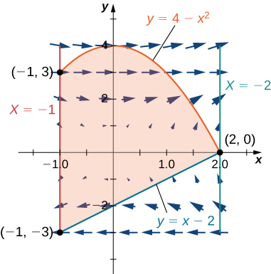

For the following exercises, use Green’s theorem to find the area.

Find the area between ellipse <math xmlns="http://www.w3.org/1998/Math/MathML"><mrow><mfrac><mrow><msup><mi>x</mi><mn>2</mn></msup></mrow><mn>9</mn></mfrac><mo>+</mo><mfrac><mrow><msup><mi>y</mi><mn>2</mn></msup></mrow><mn>4</mn></mfrac><mo>=</mo><mn>1</mn></mrow></math>

 and circle <math xmlns="http://www.w3.org/1998/Math/MathML"><mrow><msup><mi>x</mi><mn>2</mn></msup><mo>+</mo><msup><mi>y</mi><mn>2</mn></msup><mo>=</mo><mn>25</mn><mo>.</mo></mrow></math>

<math xmlns="http://www.w3.org/1998/Math/MathML"><mrow><mi>A</mi><mo>=</mo><mn>19</mn><mi>π</mi></mrow></math>

Find the area of the region enclosed by parametric equation

<math xmlns="http://www.w3.org/1998/Math/MathML"><mrow><mi>p</mi><mo stretchy="false">(</mo><mi>θ</mi><mo stretchy="false">)</mo><mo>=</mo><mrow><mo>(</mo><mrow><mtext>cos</mtext><mo stretchy="false">(</mo><mi>θ</mi><mo stretchy="false">)</mo><mo>−</mo><msup><mrow><mtext>cos</mtext></mrow><mn>2</mn></msup><mo stretchy="false">(</mo><mi>θ</mi><mo stretchy="false">)</mo></mrow><mo>)</mo></mrow><mstyle mathvariant="bold" mathsize="normal"><mtext>i</mtext></mstyle><mo>+</mo><mrow><mo>(</mo><mrow><mtext>sin</mtext><mo stretchy="false">(</mo><mi>θ</mi><mo stretchy="false">)</mo><mo>−</mo><mtext>cos</mtext><mo stretchy="false">(</mo><mi>θ</mi><mo stretchy="false">)</mo><mtext>sin</mtext><mo stretchy="false">(</mo><mi>θ</mi><mo stretchy="false">)</mo></mrow><mo>)</mo></mrow><mstyle mathvariant="bold" mathsize="normal"><mtext>j</mtext></mstyle><mspace width="0.2em" /><mtext>for</mtext><mspace width="0.2em" /><mn>0</mn><mo>≤</mo><mi>θ</mi><mo>≤</mo><mn>2</mn><mi>π</mi><mo>.</mo></mrow></math>

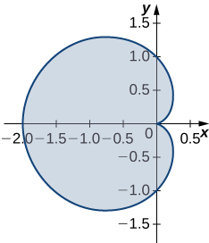

Find the area of the region bounded by hypocycloid <math xmlns="http://www.w3.org/1998/Math/MathML"><mrow><mstyle mathvariant="bold" mathsize="normal"><mtext>r</mtext></mstyle><mo stretchy="false">(</mo><mi>t</mi><mo stretchy="false">)</mo><mo>=</mo><msup><mrow><mtext>cos</mtext></mrow><mn>3</mn></msup><mo stretchy="false">(</mo><mi>t</mi><mo stretchy="false">)</mo><mstyle mathvariant="bold" mathsize="normal"><mtext>i</mtext></mstyle><mo>+</mo><msup><mrow><mtext>sin</mtext></mrow><mn>3</mn></msup><mo stretchy="false">(</mo><mi>t</mi><mo stretchy="false">)</mo><mstyle mathvariant="bold" mathsize="normal"><mtext>j</mtext></mstyle><mo>.</mo></mrow></math>

 The curve is parameterized by <math xmlns="http://www.w3.org/1998/Math/MathML"><mrow><mi>t</mi><mo>∈</mo><mrow><mo>[</mo><mrow><mn>0</mn><mo>,</mo><mn>2</mn><mi>π</mi></mrow><mo>]</mo></mrow><mo>.</mo></mrow></math>

<math xmlns="http://www.w3.org/1998/Math/MathML"><mrow><mi>A</mi><mo>=</mo><mfrac><mn>3</mn><mrow><mn>8</mn><mi>π</mi></mrow></mfrac></mrow></math>

Find the area of a pentagon with vertices <math xmlns="http://www.w3.org/1998/Math/MathML"><mrow><mo stretchy="false">(</mo><mn>0</mn><mo>,</mo><mn>4</mn><mo stretchy="false">)</mo><mo>,</mo><mo stretchy="false">(</mo><mn>4</mn><mo>,</mo><mn>1</mn><mo stretchy="false">)</mo><mo>,</mo><mo stretchy="false">(</mo><mn>3</mn><mo>,</mo><mn>0</mn><mo stretchy="false">)</mo><mo>,</mo><mo stretchy="false">(</mo><mn>−1</mn><mo>,</mo><mn>−1</mn><mo stretchy="false">)</mo><mo>,</mo></mrow></math>

 and <math xmlns="http://www.w3.org/1998/Math/MathML"><mrow><mo stretchy="false">(</mo><mn>−2</mn><mo>,</mo><mn>2</mn><mo stretchy="false">)</mo><mo>.</mo></mrow></math>

Use Green’s theorem to evaluate <math xmlns="http://www.w3.org/1998/Math/MathML"><mrow><mstyle displaystyle="true"><mrow><msub><mo stretchy="false">∫</mo><mrow><mi>C</mi><mo>+</mo></mrow></msub><mrow><mrow><mo>(</mo><mrow><msup><mi>y</mi><mn>2</mn></msup><mo>+</mo><msup><mi>x</mi><mn>3</mn></msup></mrow><mo>)</mo></mrow></mrow></mrow></mstyle><mi>d</mi><mi>x</mi><mo>+</mo><msup><mi>x</mi><mn>4</mn></msup><mi>d</mi><mi>y</mi><mo>,</mo></mrow></math>

 where <math xmlns="http://www.w3.org/1998/Math/MathML"><mrow><msup><mi>C</mi><mo>+</mo></msup></mrow></math>

 is the perimeter of square <math xmlns="http://www.w3.org/1998/Math/MathML"><mrow><mrow><mo>[</mo><mrow><mn>0</mn><mo>,</mo><mn>1</mn></mrow><mo>]</mo></mrow><mspace width="0.2em" /><mo>×</mo><mspace width="0.2em" /><mrow><mo>[</mo><mrow><mn>0</mn><mo>,</mo><mn>1</mn></mrow><mo>]</mo></mrow></mrow></math>

 oriented counterclockwise.

<math xmlns="http://www.w3.org/1998/Math/MathML"><mrow><mstyle displaystyle="true"><mrow><msub><mo stretchy="false">∫</mo><mrow><mi>C</mi><mo>+</mo></mrow></msub><mrow><mrow><mo>(</mo><mrow><msup><mi>y</mi><mn>2</mn></msup><mo>+</mo><msup><mi>x</mi><mn>3</mn></msup></mrow><mo>)</mo></mrow><mi>d</mi><mi>x</mi><mo>+</mo><msup><mi>x</mi><mn>4</mn></msup><mi>d</mi><mi>y</mi><mo>=</mo><mn>0</mn></mrow></mrow></mstyle></mrow></math>

Use Green’s theorem to prove the area of a disk with radius a is <math xmlns="http://www.w3.org/1998/Math/MathML"><mrow><mi>A</mi><mo>=</mo><mi>π</mi><msup><mi>a</mi><mn>2</mn></msup><mo>.</mo></mrow></math>

Use Green’s theorem to find the area of one loop of a four-leaf rose <math xmlns="http://www.w3.org/1998/Math/MathML"><mrow><mi>r</mi><mo>=</mo><mn>3</mn><mspace width="0.2em" /><mtext>sin</mtext><mspace width="0.2em" /><mn>2</mn><mi>θ</mi><mo>.</mo></mrow></math>

 (*Hint*: <math xmlns="http://www.w3.org/1998/Math/MathML"><mrow><mi>x</mi><mi>d</mi><mi>y</mi><mo>−</mo><mi>y</mi><mi>d</mi><mi>x</mi><mo>=</mo><msup><mstyle mathvariant="bold" mathsize="normal"><mtext>r</mtext></mstyle><mn>2</mn></msup><mi>d</mi><mi>θ</mi><mo stretchy="false">)</mo><mo>.</mo></mrow></math>

<math xmlns="http://www.w3.org/1998/Math/MathML"><mrow><mi>A</mi><mo>=</mo><mfrac><mrow><mn>9</mn><mi>π</mi></mrow><mn>8</mn></mfrac></mrow></math>

Use Green’s theorem to find the area under one arch of the cycloid given by parametric plane <math xmlns="http://www.w3.org/1998/Math/MathML"><mrow><mi>x</mi><mo>=</mo><mi>t</mi><mo>−</mo><mtext>sin</mtext><mspace width="0.2em" /><mi>t</mi><mo>,</mo><mi>y</mi><mo>=</mo><mn>1</mn><mo>−</mo><mtext>cos</mtext><mspace width="0.2em" /><mi>t</mi><mo>,</mo><mi>t</mi><mo>≥</mo><mn>0</mn><mo>.</mo></mrow></math>

Use Green’s theorem to find the area of the region enclosed by curve

<math xmlns="http://www.w3.org/1998/Math/MathML"><mrow><mstyle mathvariant="bold" mathsize="normal"><mtext>r</mtext></mstyle><mo stretchy="false">(</mo><mi>t</mi><mo stretchy="false">)</mo><mo>=</mo><msup><mi>t</mi><mn>2</mn></msup><mstyle mathvariant="bold" mathsize="normal"><mtext>i</mtext></mstyle><mo>+</mo><mrow><mo>(</mo><mrow><mfrac><mrow><msup><mi>t</mi><mn>3</mn></msup></mrow><mn>3</mn></mfrac><mo>−</mo><mi>t</mi></mrow><mo>)</mo></mrow><mstyle mathvariant="bold" mathsize="normal"><mtext>j</mtext></mstyle><mtext>,</mtext><mspace width="0.2em" /><mo>−</mo><msqrt><mn>3</mn></msqrt><mo>≤</mo><mi>t</mi><msqrt><mn>3</mn></msqrt><mo>.</mo></mrow></math>

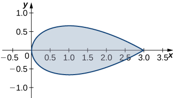

<math xmlns="http://www.w3.org/1998/Math/MathML"><mrow><mi>A</mi><mo>=</mo><mfrac><mrow><mn>8</mn><msqrt><mn>3</mn></msqrt></mrow><mn>5</mn></mfrac></mrow></math>

**[T]** Evaluate Green’s theorem using a computer algebra system to evaluate the integral <math xmlns="http://www.w3.org/1998/Math/MathML"><mrow><mstyle displaystyle="true"><mrow><msub><mo stretchy="false">∫</mo><mi>C</mi></msub><mrow><mi>x</mi><msup><mi>e</mi><mi>y</mi></msup><mi>d</mi><mi>x</mi><mo>+</mo><msup><mi>e</mi><mi>x</mi></msup><mi>d</mi><mi>y</mi><mo>,</mo></mrow></mrow></mstyle></mrow></math>

 where *C* is the circle given by <math xmlns="http://www.w3.org/1998/Math/MathML"><mrow><msup><mi>x</mi><mn>2</mn></msup><mo>+</mo><msup><mi>y</mi><mn>2</mn></msup><mo>=</mo><mn>4</mn></mrow></math>

 and is oriented in the counterclockwise direction.

Evaluate <math xmlns="http://www.w3.org/1998/Math/MathML"><mrow><mstyle displaystyle="true"><mrow><msub><mo stretchy="false">∫</mo><mi>C</mi></msub><mrow><mrow><mo>(</mo><mrow><msup><mi>x</mi><mn>2</mn></msup><mi>y</mi><mo>−</mo><mn>2</mn><mi>x</mi><mi>y</mi><mo>+</mo><msup><mi>y</mi><mn>2</mn></msup></mrow><mo>)</mo></mrow><mi>d</mi><mi>s</mi><mo>,</mo></mrow></mrow></mstyle></mrow></math>

 where *C* is the boundary of the unit square <math xmlns="http://www.w3.org/1998/Math/MathML"><mrow><mn>0</mn><mo>≤</mo><mi>x</mi><mo>≤</mo><mn>1</mn><mtext>,</mtext><mspace width="0.2em" /><mn>0</mn><mo>≤</mo><mi>y</mi><mo>≤</mo><mn>1</mn><mtext>,</mtext></mrow></math>

 traversed counterclockwise.

<math xmlns="http://www.w3.org/1998/Math/MathML"><mrow><mstyle displaystyle="true"><mrow><msub><mo stretchy="false">∫</mo><mi>C</mi></msub><mrow><mrow><mo>(</mo><mrow><msup><mi>x</mi><mn>2</mn></msup><mi>y</mi><mo>−</mo><mn>2</mn><mi>x</mi><mi>y</mi><mo>+</mo><msup><mi>y</mi><mn>2</mn></msup></mrow><mo>)</mo></mrow><mi>d</mi><mi>s</mi><mo>=</mo><mn>3</mn></mrow></mrow></mstyle></mrow></math>

Evaluate <math xmlns="http://www.w3.org/1998/Math/MathML"><mrow><mstyle displaystyle="true"><mrow><msubsup><mo stretchy="false">∫</mo><mi>C</mi><mrow /></msubsup><mrow><mfrac><mrow><mtext>−</mtext><mo stretchy="false">(</mo><mi>y</mi><mo>+</mo><mn>2</mn><mo stretchy="false">)</mo><mi>d</mi><mi>x</mi><mo>+</mo><mo stretchy="false">(</mo><mi>x</mi><mo>−</mo><mn>1</mn><mo stretchy="false">)</mo><mi>d</mi><mi>y</mi></mrow><mrow><msup><mrow><mo stretchy="false">(</mo><mi>x</mi><mo>−</mo><mn>1</mn><mo stretchy="false">)</mo></mrow><mn>2</mn></msup><mo>+</mo><msup><mrow><mo stretchy="false">(</mo><mi>y</mi><mo>+</mo><mn>2</mn><mo stretchy="false">)</mo></mrow><mn>2</mn></msup></mrow></mfrac></mrow></mrow></mstyle><mtext>,</mtext></mrow></math>

 where *C* is any simple closed curve with an interior that does not contain point <math xmlns="http://www.w3.org/1998/Math/MathML"><mrow><mo stretchy="false">(</mo><mn>1</mn><mo>,</mo><mn>−2</mn><mo stretchy="false">)</mo></mrow></math>

 traversed counterclockwise.

Evaluate <math xmlns="http://www.w3.org/1998/Math/MathML"><mrow><mstyle displaystyle="true"><mrow><msubsup><mo stretchy="false">∫</mo><mi>C</mi><mrow /></msubsup><mrow><mfrac><mrow><mi>x</mi><mi>d</mi><mi>x</mi><mo>+</mo><mi>y</mi><mi>d</mi><mi>y</mi></mrow><mrow><msup><mi>x</mi><mn>2</mn></msup><mo>+</mo><msup><mi>y</mi><mn>2</mn></msup></mrow></mfrac></mrow></mrow></mstyle><mo>,</mo></mrow></math>

 where *C* is any piecewise, smooth simple closed curve enclosing the origin, traversed counterclockwise.

<math xmlns="http://www.w3.org/1998/Math/MathML"><mrow><mstyle displaystyle="true"><mrow><msubsup><mo stretchy="false">∫</mo><mi>C</mi><mrow /></msubsup><mrow><mfrac><mrow><mi>x</mi><mi>d</mi><mi>x</mi><mo>+</mo><mi>y</mi><mi>d</mi><mi>y</mi></mrow><mrow><msup><mi>x</mi><mn>2</mn></msup><mo>+</mo><msup><mi>y</mi><mn>2</mn></msup></mrow></mfrac></mrow></mrow></mstyle><mo>=</mo><mn>2</mn><mi>π</mi></mrow></math>

For the following exercises, use Green’s theorem to calculate the work done by force **F** on a particle that is moving counterclockwise around closed path *C*.

<math xmlns="http://www.w3.org/1998/Math/MathML"><mrow><mstyle mathvariant="bold" mathsize="normal"><mtext>F</mtext></mstyle><mo stretchy="false">(</mo><mi>x</mi><mo>,</mo><mi>y</mi><mo stretchy="false">)</mo><mo>=</mo><mi>x</mi><mi>y</mi><mstyle mathvariant="bold" mathsize="normal"><mtext>i</mtext></mstyle><mo>+</mo><mo stretchy="false">(</mo><mi>x</mi><mo>+</mo><mi>y</mi><mo stretchy="false">)</mo><mstyle mathvariant="bold" mathsize="normal"><mtext>j</mtext></mstyle><mo>,</mo></mrow></math>

 <math xmlns="http://www.w3.org/1998/Math/MathML"><mrow><mi>C</mi><mo>:</mo><msup><mi>x</mi><mn>2</mn></msup><mo>+</mo><msup><mi>y</mi><mn>2</mn></msup><mo>=</mo><mn>4</mn></mrow></math>

<math xmlns="http://www.w3.org/1998/Math/MathML"><mrow><mstyle mathvariant="bold" mathsize="normal"><mtext>F</mtext></mstyle><mo stretchy="false">(</mo><mi>x</mi><mo>,</mo><mi>y</mi><mo stretchy="false">)</mo><mo>=</mo><mrow><mo>(</mo><mrow><msup><mi>x</mi><mrow><mrow><mn>3</mn><mtext>/</mtext><mn>2</mn></mrow></mrow></msup><mo>−</mo><mn>3</mn><mi>y</mi></mrow><mo>)</mo></mrow><mstyle mathvariant="bold" mathsize="normal"><mtext>i</mtext></mstyle><mo>+</mo><mrow><mo>(</mo><mrow><mn>6</mn><mi>x</mi><mo>+</mo><mn>5</mn><msqrt><mi>y</mi></msqrt></mrow><mo>)</mo></mrow><mstyle mathvariant="bold" mathsize="normal"><mtext>j</mtext></mstyle><mo>,</mo></mrow></math>

 *C* : boundary of a triangle with vertices (0, 0), (5, 0), and (0, 5)

<math xmlns="http://www.w3.org/1998/Math/MathML"><mrow><mi>W</mi><mo>=</mo><mfrac><mrow><mn>225</mn></mrow><mn>2</mn></mfrac></mrow></math>

Evaluate <math xmlns="http://www.w3.org/1998/Math/MathML"><mrow><mstyle displaystyle="true"><mrow><msub><mo stretchy="false">∫</mo><mi>C</mi></msub><mrow><mrow><mo>(</mo><mrow><mn>2</mn><msup><mi>x</mi><mn>3</mn></msup><mo>−</mo><msup><mi>y</mi><mn>3</mn></msup></mrow><mo>)</mo></mrow><mi>d</mi><mi>x</mi><mo>+</mo><mrow><mo>(</mo><mrow><msup><mi>x</mi><mn>3</mn></msup><mo>+</mo><msup><mi>y</mi><mn>3</mn></msup></mrow><mo>)</mo></mrow><mi>d</mi><mi>y</mi><mo>,</mo></mrow></mrow></mstyle></mrow></math>

 where *C* is a unit circle oriented in the counterclockwise direction.

A particle starts at point <math xmlns="http://www.w3.org/1998/Math/MathML"><mrow><mo stretchy="false">(</mo><mn>−2</mn><mo>,</mo><mn>0</mn><mo stretchy="false">)</mo><mo>,</mo></mrow></math>

 moves along the *x*-axis to (2, 0), and then travels along semicircle <math xmlns="http://www.w3.org/1998/Math/MathML"><mrow><mi>y</mi><mo>=</mo><msqrt><mrow><mn>4</mn><mo>−</mo><msup><mi>x</mi><mn>2</mn></msup></mrow></msqrt></mrow></math>

 to the starting point. Use Green’s theorem to find the work done on this particle by force field <math xmlns="http://www.w3.org/1998/Math/MathML"><mrow><mstyle mathvariant="bold" mathsize="normal"><mtext>F</mtext></mstyle><mo stretchy="false">(</mo><mi>x</mi><mo>,</mo><mi>y</mi><mo stretchy="false">)</mo><mo>=</mo><mi>x</mi><mstyle mathvariant="bold" mathsize="normal"><mtext>i</mtext></mstyle><mo>+</mo><mrow><mo>(</mo><mrow><msup><mi>x</mi><mn>3</mn></msup><mo>+</mo><mn>3</mn><mi>x</mi><msup><mi>y</mi><mn>2</mn></msup></mrow><mo>)</mo></mrow><mstyle mathvariant="bold" mathsize="normal"><mtext>j</mtext></mstyle><mo>.</mo></mrow></math>

<math xmlns="http://www.w3.org/1998/Math/MathML"><mrow><mi>W</mi><mo>=</mo><mn>12</mn><mi>π</mi></mrow></math>

David and Sandra are skating on a frictionless pond in the wind. David skates on the inside, going along a circle of radius 2 in a counterclockwise direction. Sandra skates once around a circle of radius 3, also in the counterclockwise direction. Suppose the force of the wind at point <math xmlns="http://www.w3.org/1998/Math/MathML"><mrow><mrow><mo>(</mo><mrow><mi>x</mi><mo>,</mo><mi>y</mi></mrow><mo>)</mo></mrow></mrow></math>

 <math xmlns="http://www.w3.org/1998/Math/MathML"><mrow><mrow><mo>(</mo><mrow><mi>x</mi><mo>,</mo><mi>y</mi></mrow><mo>)</mo></mrow></mrow></math>

 <math xmlns="http://www.w3.org/1998/Math/MathML"><mrow><mrow><mo>(</mo><mrow><mi>x</mi><mo>,</mo><mi>y</mi></mrow><mo>)</mo></mrow></mrow></math>

 is <math xmlns="http://www.w3.org/1998/Math/MathML"><mrow><mstyle mathvariant="bold" mathsize="normal"><mtext>F</mtext></mstyle><mo stretchy="false">(</mo><mi>x</mi><mo>,</mo><mi>y</mi><mo stretchy="false">)</mo><mo>=</mo><mrow><mo>(</mo><mrow><msup><mi>x</mi><mn>2</mn></msup><mi>y</mi><mo>+</mo><mn>10</mn><mi>y</mi></mrow><mo>)</mo></mrow><mstyle mathvariant="bold" mathsize="normal"><mtext>i</mtext></mstyle><mo>+</mo><mrow><mo>(</mo><mrow><msup><mi>x</mi><mn>3</mn></msup><mo>+</mo><mn>2</mn><mi>x</mi><msup><mi>y</mi><mn>2</mn></msup></mrow><mo>)</mo></mrow><mstyle mathvariant="bold" mathsize="normal"><mtext>j</mtext></mstyle><mo>.</mo></mrow></math>

 Use Green’s theorem to determine who does more work.

Use Green’s theorem to find the work done by force field <math xmlns="http://www.w3.org/1998/Math/MathML"><mrow><mstyle mathvariant="bold" mathsize="normal"><mtext>F</mtext></mstyle><mo stretchy="false">(</mo><mi>x</mi><mo>,</mo><mi>y</mi><mo stretchy="false">)</mo><mo>=</mo><mo stretchy="false">(</mo><mn>3</mn><mi>y</mi><mo>−</mo><mn>4</mn><mi>x</mi><mo stretchy="false">)</mo><mstyle mathvariant="bold" mathsize="normal"><mtext>i</mtext></mstyle><mo>+</mo><mo stretchy="false">(</mo><mn>4</mn><mi>x</mi><mo>−</mo><mi>y</mi><mo stretchy="false">)</mo><mstyle mathvariant="bold" mathsize="normal"><mtext>j</mtext></mstyle></mrow></math>

 when an object moves once counterclockwise around ellipse <math xmlns="http://www.w3.org/1998/Math/MathML"><mrow><mn>4</mn><msup><mi>x</mi><mn>2</mn></msup><mo>+</mo><msup><mi>y</mi><mn>2</mn></msup><mo>=</mo><mn>4</mn><mo>.</mo></mrow></math>

<math xmlns="http://www.w3.org/1998/Math/MathML"><mrow><mi>W</mi><mo>=</mo><mn>2</mn><mi>π</mi></mrow></math>

Use Green’s theorem to evaluate line integral <math xmlns="http://www.w3.org/1998/Math/MathML"><mrow><mstyle displaystyle="true"><mrow><msub><mo>∮</mo><mi>C</mi></msub><mrow><msup><mi>e</mi><mrow><mn>2</mn><mi>x</mi></mrow></msup><mtext>sin</mtext><mspace width="0.2em" /><mn>2</mn><mi>y</mi><mi>d</mi><mi>x</mi><mo>+</mo><msup><mi>e</mi><mrow><mn>2</mn><mi>x</mi></mrow></msup><mtext>cos</mtext><mspace width="0.2em" /><mn>2</mn><mi>y</mi><mi>d</mi><mi>y</mi></mrow></mrow></mstyle><mo>,</mo></mrow></math>

 where *C* is ellipse <math xmlns="http://www.w3.org/1998/Math/MathML"><mrow><mn>9</mn><msup><mrow><mo stretchy="false">(</mo><mi>x</mi><mo>−</mo><mn>1</mn><mo stretchy="false">)</mo></mrow><mn>2</mn></msup><mo>+</mo><mn>4</mn><msup><mrow><mo stretchy="false">(</mo><mi>y</mi><mo>−</mo><mn>3</mn><mo stretchy="false">)</mo></mrow><mn>2</mn></msup><mo>=</mo><mn>36</mn></mrow></math>

 oriented counterclockwise.

Evaluate line integral <math xmlns="http://www.w3.org/1998/Math/MathML"><mrow><mstyle displaystyle="true"><mrow><msub><mo>∮</mo><mi>C</mi></msub><mrow><msup><mi>y</mi><mn>2</mn></msup><mi>d</mi><mi>x</mi><mo>+</mo><msup><mi>x</mi><mn>2</mn></msup><mi>d</mi><mi>y</mi><mo>,</mo></mrow></mrow></mstyle></mrow></math>

 where *C* is the boundary of a triangle with vertices <math xmlns="http://www.w3.org/1998/Math/MathML"><mrow><mrow><mo>(</mo><mrow><mn>0</mn><mo>,</mo><mn>0</mn></mrow><mo>)</mo></mrow><mo>,</mo><mrow><mo>(</mo><mrow><mn>1</mn><mo>,</mo><mn>1</mn></mrow><mo>)</mo></mrow><mo>,</mo><mspace width="0.2em" /><mtext>and</mtext><mspace width="0.2em" /><mrow><mo>(</mo><mrow><mn>1</mn><mo>,</mo><mn>0</mn></mrow><mo>)</mo></mrow><mo>,</mo></mrow></math>

 with the counterclockwise orientation.

<math xmlns="http://www.w3.org/1998/Math/MathML"><mrow><mstyle displaystyle="true"><mrow><msub><mo>∮</mo><mi>C</mi></msub><mrow><msup><mi>y</mi><mn>2</mn></msup><mi>d</mi><mi>x</mi><mo>+</mo><msup><mi>x</mi><mn>2</mn></msup><mi>d</mi><mi>y</mi><mo>=</mo><mfrac><mn>1</mn><mn>3</mn></mfrac></mrow></mrow></mstyle></mrow></math>

Use Green’s theorem to evaluate line integral <math xmlns="http://www.w3.org/1998/Math/MathML"><mrow><mstyle displaystyle="true"><mrow><msub><mo stretchy="false">∫</mo><mi>C</mi></msub><mrow><mstyle mathvariant="bold" mathsize="normal"><mtext>h</mtext></mstyle><mo>·</mo><mi>d</mi><mstyle mathvariant="bold" mathsize="normal"><mtext>r</mtext></mstyle></mrow></mrow></mstyle></mrow></math>

 if <math xmlns="http://www.w3.org/1998/Math/MathML"><mrow><mstyle mathvariant="bold" mathsize="normal"><mtext>h</mtext></mstyle><mrow><mo>(</mo><mrow><mi>x</mi><mo>,</mo><mi>y</mi></mrow><mo>)</mo></mrow><mo>=</mo><msup><mi>e</mi><mi>y</mi></msup><mstyle mathvariant="bold" mathsize="normal"><mtext>i</mtext></mstyle><mo>−</mo><mtext>sin</mtext><mspace width="0.2em" /><mi>π</mi><mi>x</mi><mstyle mathvariant="bold" mathsize="normal"><mtext>j</mtext></mstyle><mo>,</mo></mrow></math>

 where *C* is a triangle with vertices (1, 0), (0, 1), and <math xmlns="http://www.w3.org/1998/Math/MathML"><mrow><mrow><mo>(</mo><mrow><mn>−1</mn><mo>,</mo><mn>0</mn></mrow><mo>)</mo></mrow></mrow></math>

 <math xmlns="http://www.w3.org/1998/Math/MathML"><mrow><mrow><mo>(</mo><mrow><mn>−1</mn><mo>,</mo><mn>0</mn></mrow><mo>)</mo></mrow></mrow></math>

 traversed counterclockwise.

Use Green’s theorem to evaluate line integral <math xmlns="http://www.w3.org/1998/Math/MathML"><mrow><mstyle displaystyle="true"><mrow><msubsup><mo stretchy="false">∫</mo><mi>C</mi><mrow /></msubsup><mrow><msqrt><mrow><mn>1</mn><mo>+</mo><msup><mi>x</mi><mn>3</mn></msup></mrow></msqrt><mi>d</mi><mi>x</mi><mo>+</mo><mn>2</mn><mi>x</mi><mi>y</mi><mi>d</mi><mi>y</mi></mrow></mrow></mstyle></mrow></math>

 where *C* is a triangle with vertices (0, 0), (1, 0), and (1, 3) oriented clockwise.

<math xmlns="http://www.w3.org/1998/Math/MathML"><mrow><mstyle displaystyle="true"><mrow><msubsup><mo stretchy="false">∫</mo><mi>C</mi><mrow /></msubsup><mrow><msqrt><mrow><mn>1</mn><mo>+</mo><msup><mi>x</mi><mn>3</mn></msup></mrow></msqrt><mi>d</mi><mi>x</mi><mo>+</mo><mn>2</mn><mi>x</mi><mi>y</mi><mi>d</mi><mi>y</mi></mrow></mrow></mstyle><mo>=</mo><mn>3</mn></mrow></math>

Use Green’s theorem to evaluate line integral <math xmlns="http://www.w3.org/1998/Math/MathML"><mrow><mstyle displaystyle="true"><mrow><msubsup><mo stretchy="false">∫</mo><mi>C</mi><mrow /></msubsup><mrow><msup><mi>x</mi><mn>2</mn></msup><mi>y</mi><mi>d</mi><mi>x</mi><mo>−</mo><mi>x</mi><msup><mi>y</mi><mn>2</mn></msup><mi>d</mi><mi>y</mi></mrow></mrow></mstyle></mrow></math>

 where *C* is a circle <math xmlns="http://www.w3.org/1998/Math/MathML"><mrow><msup><mi>x</mi><mn>2</mn></msup><mo>+</mo><msup><mi>y</mi><mn>2</mn></msup><mo>=</mo><mn>4</mn></mrow></math>

 oriented counterclockwise.

Use Green’s theorem to evaluate line integral <math xmlns="http://www.w3.org/1998/Math/MathML"><mrow><mstyle displaystyle="true"><mrow><msubsup><mo stretchy="false">∫</mo><mi>C</mi><mrow /></msubsup><mrow><mrow><mo>(</mo><mrow><mn>3</mn><mi>y</mi><mo>−</mo><msup><mi>e</mi><mrow><mtext>sin</mtext><mspace width="0.2em" /><mi>x</mi></mrow></msup></mrow><mo>)</mo></mrow><mi>d</mi><mi>x</mi></mrow></mrow></mstyle><mo>+</mo><mrow><mo>(</mo><mrow><mn>7</mn><mi>x</mi><mo>+</mo><msqrt><mrow><msup><mi>y</mi><mn>4</mn></msup><mo>+</mo><mn>1</mn></mrow></msqrt></mrow><mo>)</mo></mrow><mi>d</mi><mi>y</mi></mrow></math>

 where *C* is circle <math xmlns="http://www.w3.org/1998/Math/MathML"><mrow><msup><mi>x</mi><mn>2</mn></msup><mo>+</mo><msup><mi>y</mi><mn>2</mn></msup><mo>=</mo><mn>9</mn></mrow></math>

 oriented in the counterclockwise direction.

<math xmlns="http://www.w3.org/1998/Math/MathML"><mrow><mstyle displaystyle="true"><mrow><msubsup><mo stretchy="false">∫</mo><mi>C</mi><mrow /></msubsup><mrow><mrow><mo>(</mo><mrow><mn>3</mn><mi>y</mi><mo>−</mo><msup><mi>e</mi><mrow><mtext>sin</mtext><mspace width="0.2em" /><mi>x</mi></mrow></msup></mrow><mo>)</mo></mrow><mi>d</mi><mi>x</mi></mrow></mrow></mstyle><mo>+</mo><mrow><mo>(</mo><mrow><mn>7</mn><mi>x</mi><mo>+</mo><msqrt><mrow><msup><mi>y</mi><mn>4</mn></msup><mo>+</mo><mn>1</mn></mrow></msqrt></mrow><mo>)</mo></mrow><mi>d</mi><mi>y</mi><mo>=</mo><mn>36</mn><mi>π</mi></mrow></math>

Use Green’s theorem to evaluate line integral <math xmlns="http://www.w3.org/1998/Math/MathML"><mrow><mstyle displaystyle="true"><mrow><msubsup><mo stretchy="false">∫</mo><mi>C</mi><mrow /></msubsup><mrow><mo stretchy="false">(</mo><mn>3</mn><mi>x</mi><mo>−</mo><mn>5</mn><mi>y</mi><mo stretchy="false">)</mo><mi>d</mi><mi>x</mi></mrow></mrow></mstyle><mo>+</mo><mo stretchy="false">(</mo><mi>x</mi><mo>−</mo><mn>6</mn><mi>y</mi><mo stretchy="false">)</mo><mi>d</mi><mi>y</mi><mtext>,</mtext></mrow></math>

 where *C* is ellipse <math xmlns="http://www.w3.org/1998/Math/MathML"><mrow><mfrac><mrow><msup><mi>x</mi><mn>2</mn></msup></mrow><mn>4</mn></mfrac><mo>+</mo><msup><mi>y</mi><mn>2</mn></msup><mo>=</mo><mn>1</mn></mrow></math>

 and is oriented in the counterclockwise direction.

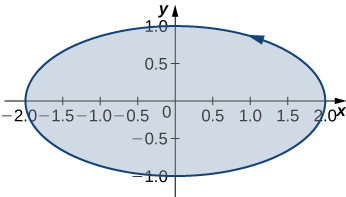

Let *C* be a triangular closed curve from (0, 0) to (1, 0) to (1, 1) and finally back to (0, 0). Let <math xmlns="http://www.w3.org/1998/Math/MathML"><mrow><mstyle mathvariant="bold" mathsize="normal"><mtext>F</mtext></mstyle><mo stretchy="false">(</mo><mi>x</mi><mo>,</mo><mi>y</mi><mo stretchy="false">)</mo><mo>=</mo><mn>4</mn><mi>y</mi><mstyle mathvariant="bold" mathsize="normal"><mtext>i</mtext></mstyle><mo>+</mo><mn>6</mn><msup><mi>x</mi><mn>2</mn></msup><mstyle mathvariant="bold" mathsize="normal"><mtext>j</mtext></mstyle><mo>.</mo></mrow></math>

 Use Green’s theorem to evaluate <math xmlns="http://www.w3.org/1998/Math/MathML"><mrow><mstyle displaystyle="true"><mrow><msub><mo>∮</mo><mi>C</mi></msub><mrow><mstyle mathvariant="bold" mathsize="normal"><mtext>F</mtext></mstyle><mo>·</mo><mi>d</mi><mstyle mathvariant="bold" mathsize="normal"><mtext>s</mtext></mstyle></mrow></mrow></mstyle><mo>.</mo></mrow></math>

<math xmlns="http://www.w3.org/1998/Math/MathML"><mrow><mstyle displaystyle="true"><mrow><msub><mo>∮</mo><mi>C</mi></msub><mrow><mstyle mathvariant="bold" mathsize="normal"><mtext>F</mtext></mstyle><mo>·</mo><mi>d</mi><mstyle mathvariant="bold" mathsize="normal"><mtext>r</mtext></mstyle></mrow></mrow></mstyle><mo>=</mo><mn>2</mn></mrow></math>

Use Green’s theorem to evaluate line integral <math xmlns="http://www.w3.org/1998/Math/MathML"><mrow><mstyle displaystyle="true"><mrow><msub><mo>∮</mo><mi>C</mi></msub><mrow><mi>y</mi><mi>d</mi><mi>x</mi><mo>−</mo><mi>x</mi><mi>d</mi><mi>y</mi></mrow></mrow></mstyle><mtext>,</mtext></mrow></math>

 where *C* is circle <math xmlns="http://www.w3.org/1998/Math/MathML"><mrow><msup><mi>x</mi><mn>2</mn></msup><mo>+</mo><msup><mi>y</mi><mn>2</mn></msup><mo>=</mo><msup><mi>a</mi><mn>2</mn></msup></mrow></math>

 oriented in the clockwise direction.

Use Green’s theorem to evaluate line integral <math xmlns="http://www.w3.org/1998/Math/MathML"><mrow><mstyle displaystyle="true"><mrow><msub><mo>∮</mo><mi>C</mi></msub><mrow><mo stretchy="false">(</mo><mi>y</mi><mo>+</mo><mi>x</mi><mo stretchy="false">)</mo><mi>d</mi><mi>x</mi><mo>+</mo><mo stretchy="false">(</mo><mi>x</mi><mo>+</mo><mtext>sin</mtext><mspace width="0.2em" /><mi>y</mi><mo stretchy="false">)</mo><mi>d</mi><mi>y</mi></mrow></mrow></mstyle><mtext>,</mtext></mrow></math>

 where *C* is any smooth simple closed curve joining the origin to itself oriented in the counterclockwise direction.

<math xmlns="http://www.w3.org/1998/Math/MathML"><mrow><mstyle displaystyle="true"><mrow><msub><mo>∮</mo><mi>C</mi></msub><mrow><mo stretchy="false">(</mo><mi>y</mi><mo>+</mo><mi>x</mi><mo stretchy="false">)</mo><mi>d</mi><mi>x</mi><mo>+</mo><mo stretchy="false">(</mo><mi>x</mi><mo>+</mo><mtext>sin</mtext><mspace width="0.2em" /><mi>y</mi><mo stretchy="false">)</mo><mi>d</mi><mi>y</mi></mrow></mrow></mstyle><mo>=</mo><mn>0</mn></mrow></math>

Use Green’s theorem to evaluate line integral <math xmlns="http://www.w3.org/1998/Math/MathML"><mrow><mstyle displaystyle="true"><mrow><msub><mo>∮</mo><mi>C</mi></msub><mrow><mrow><mo>(</mo><mrow><mi>y</mi><mo>−</mo><mtext>ln</mtext><mrow><mo>(</mo><mrow><msup><mi>x</mi><mn>2</mn></msup><mo>+</mo><msup><mi>y</mi><mn>2</mn></msup></mrow><mo>)</mo></mrow></mrow><mo>)</mo></mrow><mi>d</mi><mi>x</mi><mo>+</mo><mrow><mo>(</mo><mrow><mn>2</mn><mspace width="0.2em" /><mtext>arctan</mtext><mspace width="0.2em" /><mfrac><mi>y</mi><mi>x</mi></mfrac></mrow><mo>)</mo></mrow><mi>d</mi><mi>y</mi></mrow></mrow></mstyle><mo>,</mo></mrow></math>

 where C is the positively oriented circle <math xmlns="http://www.w3.org/1998/Math/MathML"><mrow><msup><mrow><mrow><mo>(</mo><mrow><mi>x</mi><mo>−</mo><mn>2</mn></mrow><mo>)</mo></mrow></mrow><mn>2</mn></msup><mo>+</mo><msup><mrow><mrow><mo>(</mo><mrow><mi>y</mi><mo>−</mo><mn>3</mn></mrow><mo>)</mo></mrow></mrow><mn>2</mn></msup><mo>=</mo><mn>1</mn><mo>.</mo></mrow></math>

Use Green’s theorem to evaluate <math xmlns="http://www.w3.org/1998/Math/MathML"><mrow><mstyle displaystyle="true"><mrow><msub><mo>∮</mo><mi>C</mi></msub><mrow><mi>x</mi><mi>y</mi><mi>d</mi><mi>x</mi><mo>+</mo><msup><mi>x</mi><mn>3</mn></msup><msup><mi>y</mi><mn>3</mn></msup><mi>d</mi><mi>y</mi><mo>,</mo></mrow></mrow></mstyle></mrow></math>

 where *C* is a triangle with vertices (0, 0), (1, 0), and (1, 2) with positive orientation.

<math xmlns="http://www.w3.org/1998/Math/MathML"><mrow><mstyle displaystyle="true"><mrow><msub><mo>∮</mo><mi>C</mi></msub><mrow><mi>x</mi><mi>y</mi><mi>d</mi><mi>x</mi><mo>+</mo><msup><mi>x</mi><mn>3</mn></msup><msup><mi>y</mi><mn>3</mn></msup><mi>d</mi><mi>y</mi><mo>=</mo><mfrac><mrow><mn>22</mn></mrow><mrow><mn>21</mn></mrow></mfrac></mrow></mrow></mstyle></mrow></math>

Use Green’s theorem to evaluate line integral <math xmlns="http://www.w3.org/1998/Math/MathML"><mrow><mstyle displaystyle="true"><mrow><msubsup><mo stretchy="false">∫</mo><mi>C</mi><mrow /></msubsup><mrow><mtext>sin</mtext><mspace width="0.2em" /><mi>y</mi><mi>d</mi><mi>x</mi><mo>+</mo><mi>x</mi><mspace width="0.2em" /><mtext>cos</mtext><mspace width="0.2em" /><mi>y</mi><mi>d</mi><mi>y</mi></mrow></mrow></mstyle><mo>,</mo></mrow></math>

 where *C* is ellipse <math xmlns="http://www.w3.org/1998/Math/MathML"><mrow><msup><mi>x</mi><mn>2</mn></msup><mo>+</mo><mi>x</mi><mi>y</mi><mo>+</mo><msup><mi>y</mi><mn>2</mn></msup><mo>=</mo><mn>1</mn></mrow></math>

 oriented in the counterclockwise direction.

Let <math xmlns="http://www.w3.org/1998/Math/MathML"><mrow><mstyle mathvariant="bold" mathsize="normal"><mtext>F</mtext></mstyle><mo stretchy="false">(</mo><mi>x</mi><mo>,</mo><mi>y</mi><mo stretchy="false">)</mo><mo>=</mo><mrow><mo>(</mo><mrow><mtext>cos</mtext><mrow><mo>(</mo><mrow><msup><mi>x</mi><mn>5</mn></msup></mrow><mo>)</mo></mrow></mrow><mo>)</mo></mrow><mo>−</mo><mfrac><mn>1</mn><mn>3</mn></mfrac><msup><mi>y</mi><mn>3</mn></msup><mstyle mathvariant="bold" mathsize="normal"><mtext>i</mtext></mstyle><mo>+</mo><mfrac><mn>1</mn><mn>3</mn></mfrac><msup><mi>x</mi><mn>3</mn></msup><mstyle mathvariant="bold" mathsize="normal"><mtext>j</mtext></mstyle><mo>.</mo></mrow></math>

 Find the counterclockwise circulation <math xmlns="http://www.w3.org/1998/Math/MathML"><mrow><mstyle displaystyle="true"><mrow><msub><mo>∮</mo><mi>C</mi></msub><mrow><mstyle mathvariant="bold" mathsize="normal"><mtext>F</mtext></mstyle><mo>·</mo><mi>d</mi><mstyle mathvariant="bold" mathsize="normal"><mtext>r</mtext></mstyle></mrow></mrow></mstyle><mo>,</mo></mrow></math>

 where *C* is a curve consisting of the line segment joining <math xmlns="http://www.w3.org/1998/Math/MathML"><mrow><mo stretchy="false">(</mo><mn>−2</mn><mo>,</mo><mn>0</mn><mo stretchy="false">)</mo><mspace width="0.2em" /><mtext>and</mtext><mspace width="0.2em" /><mo stretchy="false">(</mo><mn>−1</mn><mo>,</mo><mn>0</mn><mo stretchy="false">)</mo><mtext>,</mtext></mrow></math>

 half circle <math xmlns="http://www.w3.org/1998/Math/MathML"><mrow><mi>y</mi><mo>=</mo><msqrt><mrow><mn>1</mn><mo>−</mo><msup><mi>x</mi><mn>2</mn></msup></mrow></msqrt><mo>,</mo></mrow></math>

 the line segment joining (1, 0) and (2, 0), and half circle <math xmlns="http://www.w3.org/1998/Math/MathML"><mrow><mi>y</mi><mo>=</mo><msqrt><mrow><mn>4</mn><mo>−</mo><msup><mi>x</mi><mn>2</mn></msup></mrow></msqrt><mo>.</mo></mrow></math>

<math xmlns="http://www.w3.org/1998/Math/MathML"><mrow><mstyle displaystyle="true"><mrow><msub><mo>∮</mo><mi>C</mi></msub><mrow><mstyle mathvariant="bold" mathsize="normal"><mtext>F</mtext></mstyle><mo>·</mo><mi>d</mi><mstyle mathvariant="bold" mathsize="normal"><mtext>r</mtext></mstyle></mrow></mrow></mstyle><mo>=</mo><mfrac><mrow><mn>15</mn><mi>π</mi></mrow><mn>4</mn></mfrac></mrow></math>

Use Green’s theorem to evaluate line integral <math xmlns="http://www.w3.org/1998/Math/MathML"><mrow><mstyle displaystyle="true"><mrow><msubsup><mo stretchy="false">∫</mo><mi>C</mi><mrow /></msubsup><mrow><mtext>sin</mtext><mrow><mo>(</mo><mrow><msup><mi>x</mi><mn>3</mn></msup></mrow><mo>)</mo></mrow><mi>d</mi><mi>x</mi><mo>+</mo><mn>2</mn><mi>y</mi><msup><mi>e</mi><mrow><msup><mi>x</mi><mn>2</mn></msup></mrow></msup><mi>d</mi><mi>y</mi></mrow></mrow></mstyle><mo>,</mo></mrow></math>

 where *C* is a triangular closed curve that connects the points (0, 0), (2, 2), and (0, 2) counterclockwise.

Let *C* be the boundary of square <math xmlns="http://www.w3.org/1998/Math/MathML"><mrow><mn>0</mn><mo>≤</mo><mi>x</mi><mo>≤</mo><mi>π</mi><mtext>,</mtext><mspace width="0.2em" /><mn>0</mn><mo>≤</mo><mi>y</mi><mo>≤</mo><mi>π</mi><mtext>,</mtext></mrow></math>

 traversed counterclockwise. Use Green’s theorem to find <math xmlns="http://www.w3.org/1998/Math/MathML"><mrow><mstyle displaystyle="true"><mrow><msubsup><mo stretchy="false">∫</mo><mi>C</mi><mrow /></msubsup><mrow><mtext>sin</mtext><mo stretchy="false">(</mo><mi>x</mi><mo>+</mo><mi>y</mi><mo stretchy="false">)</mo><mi>d</mi><mi>x</mi><mo>+</mo><mtext>cos</mtext><mo stretchy="false">(</mo><mi>x</mi><mo>+</mo><mi>y</mi><mo stretchy="false">)</mo><mi>d</mi><mi>y</mi></mrow></mrow></mstyle><mo>.</mo></mrow></math>

<math xmlns="http://www.w3.org/1998/Math/MathML"><mrow><mstyle displaystyle="true"><mrow><msubsup><mo stretchy="false">∫</mo><mi>C</mi><mrow /></msubsup><mrow><mtext>sin</mtext><mo stretchy="false">(</mo><mi>x</mi><mo>+</mo><mi>y</mi><mo stretchy="false">)</mo><mi>d</mi><mi>x</mi><mo>+</mo><mtext>cos</mtext><mo stretchy="false">(</mo><mi>x</mi><mo>+</mo><mi>y</mi><mo stretchy="false">)</mo><mi>d</mi><mi>y</mi></mrow></mrow></mstyle><mo>=</mo><mn>4</mn></mrow></math>

Use Green’s theorem to evaluate line integral <math xmlns="http://www.w3.org/1998/Math/MathML"><mrow><mstyle displaystyle="true"><mrow><msubsup><mo stretchy="false">∫</mo><mi>C</mi><mrow /></msubsup><mrow><mstyle mathvariant="bold" mathsize="normal"><mtext>F</mtext></mstyle><mo>·</mo><mi>d</mi><mstyle mathvariant="bold" mathsize="normal"><mtext>r</mtext></mstyle></mrow></mrow></mstyle><mo>,</mo></mrow></math>

 where <math xmlns="http://www.w3.org/1998/Math/MathML"><mrow><mstyle mathvariant="bold" mathsize="normal"><mtext>F</mtext></mstyle><mo stretchy="false">(</mo><mi>x</mi><mo>,</mo><mi>y</mi><mo stretchy="false">)</mo><mo>=</mo><mrow><mo>(</mo><mrow><msup><mi>y</mi><mn>2</mn></msup><mo>−</mo><msup><mi>x</mi><mn>2</mn></msup></mrow><mo>)</mo></mrow><mstyle mathvariant="bold" mathsize="normal"><mtext>i</mtext></mstyle><mo>+</mo><mrow><mo>(</mo><mrow><msup><mi>x</mi><mn>2</mn></msup><mo>+</mo><msup><mi>y</mi><mn>2</mn></msup></mrow><mo>)</mo></mrow><mstyle mathvariant="bold" mathsize="normal"><mtext>j</mtext></mstyle><mo>,</mo></mrow></math>

 and *C* is a triangle bounded by <math xmlns="http://www.w3.org/1998/Math/MathML"><mrow><mi>y</mi><mo>=</mo><mn>0</mn><mtext>,</mtext><mspace width="0.2em" /><mi>x</mi><mo>=</mo><mn>3</mn><mo>,</mo><mspace width="0.2em" /><mtext>and</mtext><mspace width="0.2em" /><mi>y</mi><mo>=</mo><mi>x</mi><mtext>,</mtext></mrow></math>

 oriented counterclockwise.

Use Green’s Theorem to evaluate integral <math xmlns="http://www.w3.org/1998/Math/MathML"><mrow><mstyle displaystyle="true"><mrow><msubsup><mo stretchy="false">∫</mo><mi>C</mi><mrow /></msubsup><mrow><mstyle mathvariant="bold" mathsize="normal"><mtext>F</mtext></mstyle><mo>·</mo><mi>d</mi><mstyle mathvariant="bold" mathsize="normal"><mtext>r</mtext></mstyle></mrow></mrow></mstyle><mo>,</mo></mrow></math>

 where <math xmlns="http://www.w3.org/1998/Math/MathML"><mrow><mstyle mathvariant="bold" mathsize="normal"><mtext>F</mtext></mstyle><mo stretchy="false">(</mo><mi>x</mi><mo>,</mo><mi>y</mi><mo stretchy="false">)</mo><mo>=</mo><mrow><mo>(</mo><mrow><mi>x</mi><msup><mi>y</mi><mn>2</mn></msup></mrow><mo>)</mo></mrow><mstyle mathvariant="bold" mathsize="normal"><mtext>i</mtext></mstyle><mo>+</mo><mi>x</mi><mstyle mathvariant="bold" mathsize="normal"><mtext>j</mtext></mstyle><mo>,</mo></mrow></math>

 and *C* is a unit circle oriented in the counterclockwise direction.

<math xmlns="http://www.w3.org/1998/Math/MathML"><mrow><mstyle displaystyle="true"><mrow><msubsup><mo stretchy="false">∫</mo><mi>C</mi><mrow /></msubsup><mrow><mstyle mathvariant="bold" mathsize="normal"><mtext>F</mtext></mstyle><mo>·</mo><mi>d</mi><mstyle mathvariant="bold" mathsize="normal"><mtext>r</mtext></mstyle></mrow></mrow></mstyle><mo>=</mo><mi>π</mi></mrow></math>

Use Green’s theorem in a plane to evaluate line integral <math xmlns="http://www.w3.org/1998/Math/MathML"><mrow><mstyle displaystyle="true"><mrow><msub><mo>∮</mo><mi>C</mi></msub><mrow><mrow><mo>(</mo><mrow><mi>x</mi><mi>y</mi><mo>+</mo><msup><mi>y</mi><mn>2</mn></msup></mrow><mo>)</mo></mrow><mi>d</mi><mi>x</mi><mo>+</mo><msup><mi>x</mi><mn>2</mn></msup><mi>d</mi><mi>y</mi></mrow></mrow></mstyle><mo>,</mo></mrow></math>

 where *C* is a closed curve of a region bounded by <math xmlns="http://www.w3.org/1998/Math/MathML"><mrow><mi>y</mi><mo>=</mo><mi>x</mi><mspace width="0.2em" /><mtext>and</mtext><mspace width="0.2em" /><mi>y</mi><mo>=</mo><msup><mi>x</mi><mn>2</mn></msup></mrow></math>

 oriented in the counterclockwise direction.

Calculate the outward flux of <math xmlns="http://www.w3.org/1998/Math/MathML"><mrow><mstyle mathvariant="bold" mathsize="normal"><mtext>F</mtext></mstyle><mo>=</mo><mtext>−</mtext><mi>x</mi><mstyle mathvariant="bold" mathsize="normal"><mtext>i</mtext></mstyle><mo>+</mo><mn>2</mn><mi>y</mi><mstyle mathvariant="bold" mathsize="normal"><mtext>j</mtext></mstyle></mrow></math>

 over a square with corners <math xmlns="http://www.w3.org/1998/Math/MathML"><mrow><mrow><mo>(</mo><mrow><mn>±1</mn><mo>,</mo><mn>±1</mn></mrow><mo>)</mo></mrow><mo>,</mo></mrow></math>

 where the unit normal is outward pointing and oriented in the counterclockwise direction.

<math xmlns="http://www.w3.org/1998/Math/MathML"><mrow><mstyle displaystyle="true"><mrow><msub><mo>∮</mo><mi>C</mi></msub><mrow><mstyle mathvariant="bold" mathsize="normal"><mtext>F</mtext></mstyle><mo>·</mo><mstyle mathvariant="bold" mathsize="normal"><mover accent="true"><mi>n</mi><mo>^</mo></mover></mstyle><mi>d</mi><mi>s</mi><mo>=</mo><mn>4</mn></mrow></mrow></mstyle></mrow></math>

**[T]** Let *C* be circle <math xmlns="http://www.w3.org/1998/Math/MathML"><mrow><msup><mi>x</mi><mn>2</mn></msup><mo>+</mo><msup><mi>y</mi><mn>2</mn></msup><mo>=</mo><mn>4</mn></mrow></math>

 oriented in the counterclockwise direction. Evaluate <math xmlns="http://www.w3.org/1998/Math/MathML"><mrow><mstyle displaystyle="true"><mrow><msub><mo>∮</mo><mi>C</mi></msub><mrow><mrow><mo>[</mo><mrow><mrow><mo>(</mo><mrow><mn>3</mn><mi>y</mi><mo>−</mo><msup><mi>e</mi><mrow><mtext>tan</mtext><mo>−</mo><msub><mn>1</mn><mi>x</mi></msub></mrow></msup></mrow><mo>)</mo></mrow><mi>d</mi><mi>x</mi><mo>+</mo><mrow><mo>(</mo><mrow><mn>7</mn><mi>x</mi><mo>+</mo><msqrt><mrow><msup><mi>y</mi><mn>4</mn></msup><mo>+</mo><mn>1</mn></mrow></msqrt></mrow><mo>)</mo></mrow><mi>d</mi><mi>y</mi></mrow><mo>]</mo></mrow></mrow></mrow></mstyle></mrow></math>

 using a computer algebra system.

Find the flux of field <math xmlns="http://www.w3.org/1998/Math/MathML"><mrow><mstyle mathvariant="bold" mathsize="normal"><mtext>F</mtext></mstyle><mo>=</mo><mtext>−</mtext><mi>x</mi><mstyle mathvariant="bold" mathsize="normal"><mtext>i</mtext></mstyle><mo>+</mo><mi>y</mi><mstyle mathvariant="bold" mathsize="normal"><mtext>j</mtext></mstyle></mrow></math>

 across <math xmlns="http://www.w3.org/1998/Math/MathML"><mrow><msup><mi>x</mi><mn>2</mn></msup><mo>+</mo><msup><mi>y</mi><mn>2</mn></msup><mo>=</mo><mn>16</mn></mrow></math>

 oriented in the counterclockwise direction.

<math xmlns="http://www.w3.org/1998/Math/MathML"><mrow><mstyle displaystyle="true"><mrow><msub><mo>∮</mo><mi>C</mi></msub><mrow><mstyle mathvariant="bold" mathsize="normal"><mtext>F</mtext></mstyle><mo>·</mo><mstyle mathvariant="bold" mathsize="normal"><mtext>n</mtext></mstyle><mi>d</mi><mi>s</mi></mrow></mrow></mstyle><mo>=</mo><mn>32</mn><mi>π</mi></mrow></math>

Let <math xmlns="http://www.w3.org/1998/Math/MathML"><mrow><mstyle mathvariant="bold" mathsize="normal"><mtext>F</mtext></mstyle><mo>=</mo><mrow><mo>(</mo><mrow><msup><mi>y</mi><mn>2</mn></msup><mo>−</mo><msup><mi>x</mi><mn>2</mn></msup></mrow><mo>)</mo></mrow><mstyle mathvariant="bold" mathsize="normal"><mtext>i</mtext></mstyle><mo>+</mo><mrow><mo>(</mo><mrow><msup><mi>x</mi><mn>2</mn></msup><mo>+</mo><msup><mi>y</mi><mn>2</mn></msup></mrow><mo>)</mo></mrow><mstyle mathvariant="bold" mathsize="normal"><mtext>j</mtext></mstyle><mo>,</mo></mrow></math>

 and let *C* be a triangle bounded by <math xmlns="http://www.w3.org/1998/Math/MathML"><mrow><mi>y</mi><mo>=</mo><mn>0</mn><mo>,</mo><mi>x</mi><mo>=</mo><mn>3</mn><mo>,</mo></mrow></math>

 and <math xmlns="http://www.w3.org/1998/Math/MathML"><mrow><mi>y</mi><mo>=</mo><mi>x</mi></mrow></math>

 oriented in the counterclockwise direction. Find the outward flux of **F** through *C*.

**[T]** Let *C* be unit circle <math xmlns="http://www.w3.org/1998/Math/MathML"><mrow><msup><mi>x</mi><mn>2</mn></msup><mo>+</mo><msup><mi>y</mi><mn>2</mn></msup><mo>=</mo><mn>1</mn></mrow></math>

 traversed once counterclockwise. Evaluate <math xmlns="http://www.w3.org/1998/Math/MathML"><mrow><mstyle displaystyle="true"><mrow><msub><mo stretchy="false">∫</mo><mi>C</mi></msub><mrow><mrow><mo>[</mo><mrow><mtext>−</mtext><msup><mi>y</mi><mn>3</mn></msup><mo>+</mo><mtext>sin</mtext><mrow><mo>(</mo><mrow><mi>x</mi><mi>y</mi></mrow><mo>)</mo></mrow><mo>+</mo><mi>x</mi><mi>y</mi><mspace width="0.2em" /><mtext>cos</mtext><mrow><mo>(</mo><mrow><mi>x</mi><mi>y</mi></mrow><mo>)</mo></mrow></mrow><mo>]</mo></mrow><mi>d</mi><mi>x</mi><mo>+</mo><mrow><mo>[</mo><mrow><msup><mi>x</mi><mn>3</mn></msup><mo>+</mo><msup><mi>x</mi><mn>2</mn></msup><mtext>cos</mtext><mrow><mo>(</mo><mrow><mi>x</mi><mi>y</mi></mrow><mo>)</mo></mrow></mrow><mo>]</mo></mrow><mi>d</mi><mi>y</mi></mrow></mrow></mstyle></mrow></math>

 by using a computer algebra system.

<math xmlns="http://www.w3.org/1998/Math/MathML"><mrow><mstyle displaystyle="true"><mrow><msub><mo stretchy="false">∫</mo><mi>C</mi></msub><mrow><mrow><mo>[</mo><mrow><mtext>−</mtext><msup><mi>y</mi><mn>3</mn></msup><mo>+</mo><mtext>sin</mtext><mrow><mo>(</mo><mrow><mi>x</mi><mi>y</mi></mrow><mo>)</mo></mrow><mo>+</mo><mi>x</mi><mi>y</mi><mspace width="0.2em" /><mtext>cos</mtext><mrow><mo>(</mo><mrow><mi>x</mi><mi>y</mi></mrow><mo>)</mo></mrow></mrow><mo>]</mo></mrow><mi>d</mi><mi>x</mi><mo>+</mo><mrow><mo>[</mo><mrow><msup><mi>x</mi><mn>3</mn></msup><mo>+</mo><msup><mi>x</mi><mn>2</mn></msup><mtext>cos</mtext><mrow><mo>(</mo><mrow><mi>x</mi><mi>y</mi></mrow><mo>)</mo></mrow></mrow><mo>]</mo></mrow><mi>d</mi><mi>y</mi></mrow></mrow></mstyle><mo>=</mo><mn>4.7124</mn></mrow></math>

**[T]** Find the outward flux of vector field <math xmlns="http://www.w3.org/1998/Math/MathML"><mrow><mstyle mathvariant="bold" mathsize="normal"><mtext>F</mtext></mstyle><mo>=</mo><mi>x</mi><msup><mi>y</mi><mn>2</mn></msup><mstyle mathvariant="bold" mathsize="normal"><mtext>i</mtext></mstyle><mo>+</mo><msup><mi>x</mi><mn>2</mn></msup><mi>y</mi><mstyle mathvariant="bold" mathsize="normal"><mtext>j</mtext></mstyle></mrow></math>

 across the boundary of annulus <math xmlns="http://www.w3.org/1998/Math/MathML"><mrow><mi>R</mi><mo>=</mo><mrow><mo>{</mo><mrow><mrow><mo>(</mo><mrow><mi>x</mi><mo>,</mo><mi>y</mi></mrow><mo>)</mo></mrow><mo>:</mo><mn>1</mn><mo>≤</mo><msup><mi>x</mi><mn>2</mn></msup><mo>+</mo><msup><mi>y</mi><mn>2</mn></msup><mo>≤</mo><mn>4</mn></mrow><mo>}</mo></mrow><mo>=</mo><mrow><mo>{</mo><mrow><mrow><mo>(</mo><mrow><mi>r</mi><mo>,</mo><mi>θ</mi></mrow><mo>)</mo></mrow><mo>:</mo><mn>1</mn><mo>≤</mo><mi>r</mi><mo>≤</mo><mn>2</mn><mo>,</mo><mn>0</mn><mo>≤</mo><mi>θ</mi><mo>≤</mo><mn>2</mn><mi>π</mi></mrow><mo>}</mo></mrow></mrow></math>

 using a computer algebra system.

Consider region *R* bounded by parabolas <math xmlns="http://www.w3.org/1998/Math/MathML"><mrow><mi>y</mi><mo>=</mo><msup><mi>x</mi><mn>2</mn></msup><mspace width="0.2em" /><mtext>and</mtext><mspace width="0.2em" /><mi>x</mi><mo>=</mo><msup><mi>y</mi><mn>2</mn></msup><mo>.</mo></mrow></math>

 Let *C* be the boundary of *R* oriented counterclockwise. Use Green’s theorem to evaluate <math xmlns="http://www.w3.org/1998/Math/MathML"><mrow><mstyle displaystyle="true"><mrow><msub><mo>∮</mo><mi>C</mi></msub><mrow><mrow><mo>(</mo><mrow><mi>y</mi><mo>+</mo><msup><mi>e</mi><mrow><msqrt><mi>x</mi></msqrt></mrow></msup></mrow><mo>)</mo></mrow><mi>d</mi><mi>x</mi><mo>+</mo><mrow><mo>(</mo><mrow><mn>2</mn><mi>x</mi><mo>+</mo><mtext>cos</mtext><mrow><mo>(</mo><mrow><msup><mi>y</mi><mn>2</mn></msup></mrow><mo>)</mo></mrow></mrow><mo>)</mo></mrow><mi>d</mi><mi>y</mi><mo>.</mo></mrow></mrow></mstyle></mrow></math>

<math xmlns="http://www.w3.org/1998/Math/MathML"><mrow><mstyle displaystyle="true"><mrow><msub><mo>∮</mo><mi>C</mi></msub><mrow><mrow><mo>(</mo><mrow><mi>y</mi><mo>+</mo><msup><mi>e</mi><mrow><msqrt><mi>x</mi></msqrt></mrow></msup></mrow><mo>)</mo></mrow><mi>d</mi><mi>x</mi><mo>+</mo><mrow><mo>(</mo><mrow><mn>2</mn><mi>x</mi><mo>+</mo><mtext>cos</mtext><mrow><mo>(</mo><mrow><msup><mi>y</mi><mn>2</mn></msup></mrow><mo>)</mo></mrow></mrow><mo>)</mo></mrow><mi>d</mi><mi>y</mi><mo>=</mo><mfrac><mn>1</mn><mn>3</mn></mfrac></mrow></mrow></mstyle></mrow></math>

</section>

### Glossary
{: data-type="glossary-title"}

Green’s theorem
: relates the integral over a connected region to an integral over the boundary of the region
^

stream function
: if
  <math xmlns="http://www.w3.org/1998/Math/MathML"><mrow><mstyle mathvariant="bold" mathsize="normal"><mtext>F</mtext></mstyle><mo>=</mo><mrow><mo>〈</mo><mrow><mi>P</mi><mo>,</mo><mi>Q</mi></mrow><mo>〉</mo></mrow></mrow></math>
  
  is a source-free vector field, then stream function *g* is a function such that
  <math xmlns="http://www.w3.org/1998/Math/MathML"><mrow><mi>P</mi><mo>=</mo><msub><mi>g</mi><mi>y</mi></msub></mrow></math>
  
  and
  <math xmlns="http://www.w3.org/1998/Math/MathML"><mrow><mi>Q</mi><mo>=</mo><mtext>−</mtext><msub><mi>g</mi><mi>x</mi></msub></mrow></math>

[1]: http://www.openstaxcollege.org/l/20_planimeter
