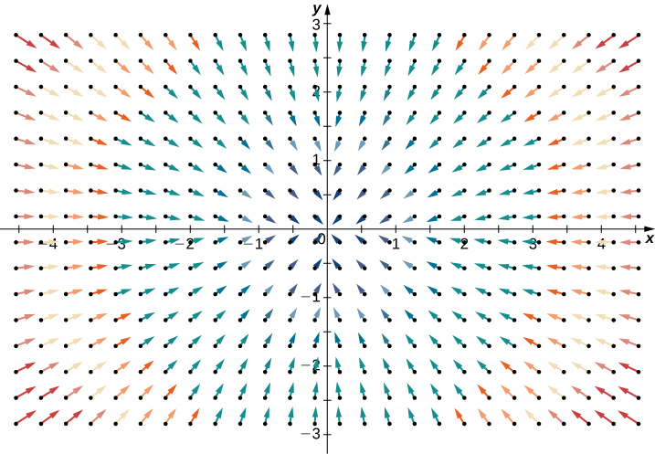
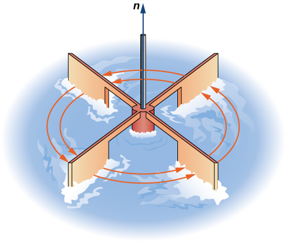
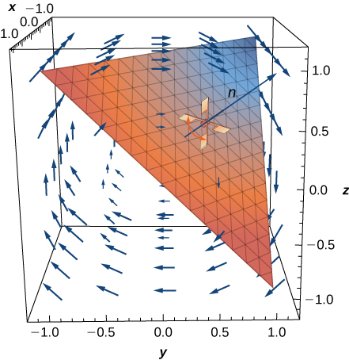

* Determine divergence from the formula for a given vector field.
* Determine curl from the formula for a given vector field.
* Use the properties of curl and divergence to determine whether a vector field is conservative.

In this section, we examine two important operations on a vector field: divergence and curl. They are important to the field of calculus for several reasons, including the use of curl and divergence to develop some higher-dimensional versions of the Fundamental Theorem of Calculus. In addition, curl and divergence appear in mathematical descriptions of fluid mechanics, electromagnetism, and elasticity theory, which are important concepts in physics and engineering. We can also apply curl and divergence to other concepts we already explored. For example, under certain conditions, a vector field is conservative if and only if its curl is zero.

In addition to defining curl and divergence, we look at some physical interpretations of them, and show their relationship to conservative and source-free vector fields.

### Divergence

Divergence is an operation on a vector field that tells us how the field behaves toward or away from a point. Locally, the divergence of a vector field **F** in <math xmlns="http://www.w3.org/1998/Math/MathML"><mrow><msup><mo>ℝ</mo><mn>2</mn></msup></mrow></math>

 or <math xmlns="http://www.w3.org/1998/Math/MathML"><mrow><msup><mo>ℝ</mo><mn>3</mn></msup></mrow></math>

 at a particular point *P* is a measure of the “outflowing-ness” of the vector field at *P*. If **F** represents the velocity of a fluid, then the divergence of **F** at *P* measures the net rate of change with respect to time of the amount of fluid flowing away from *P* (the tendency of the fluid to flow “out of” *P*). In particular, if the amount of fluid flowing into *P* is the same as the amount flowing out, then the divergence at *P* is zero.

Definition

If <math xmlns="http://www.w3.org/1998/Math/MathML"><mrow><mstyle mathvariant="bold" mathsize="normal"><mtext>F</mtext></mstyle><mo>=</mo><mrow><mo>〈</mo><mrow><mi>P</mi><mo>,</mo><mi>Q</mi><mo>,</mo><mi>R</mi></mrow><mo>〉</mo></mrow></mrow></math>

 is a vector field in <math xmlns="http://www.w3.org/1998/Math/MathML"><mrow><msup><mo>ℝ</mo><mn>3</mn></msup></mrow></math>

 and <math xmlns="http://www.w3.org/1998/Math/MathML"><mrow><msub><mi>P</mi><mi>x</mi></msub><mo>,</mo><msub><mi>Q</mi><mi>y</mi></msub><mo>,</mo></mrow></math>

 and <math xmlns="http://www.w3.org/1998/Math/MathML"><mrow><msub><mi>R</mi><mi>z</mi></msub></mrow></math>

 all exist, then the **divergence**{: data-type="term"} of **F** is defined by

<math xmlns="http://www.w3.org/1998/Math/MathML"><mrow><mtext>div</mtext><mspace width="0.2em" /><mstyle mathvariant="bold" mathsize="normal"><mtext>F</mtext></mstyle><mo>=</mo><msub><mi>P</mi><mi>x</mi></msub><mtext>+</mtext><msub><mi>Q</mi><mi>y</mi></msub><mo>+</mo><msub><mi>R</mi><mi>z</mi></msub><mo>=</mo><mfrac><mrow><mo>∂</mo><mi>P</mi></mrow><mrow><mo>∂</mo><mi>x</mi></mrow></mfrac><mo>+</mo><mfrac><mrow><mo>∂</mo><mi>Q</mi></mrow><mrow><mo>∂</mo><mi>y</mi></mrow></mfrac><mo>+</mo><mfrac><mrow><mo>∂</mo><mi>R</mi></mrow><mrow><mo>∂</mo><mi>z</mi></mrow></mfrac><mo>.</mo></mrow></math>

Note the divergence of a vector field is not a vector field, but a scalar function. In terms of the gradient operator <math xmlns="http://www.w3.org/1998/Math/MathML"><mrow><mo>∇</mo><mo>=</mo><mrow><mo>〈</mo><mrow><mfrac><mo>∂</mo><mrow><mo>∂</mo><mi>x</mi></mrow></mfrac><mo>,</mo><mfrac><mo>∂</mo><mrow><mo>∂</mo><mi>y</mi></mrow></mfrac><mo>,</mo><mfrac><mo>∂</mo><mrow><mo>∂</mo><mi>z</mi></mrow></mfrac></mrow><mo>〉</mo></mrow><mo>,</mo></mrow></math>

 divergence can be written symbolically as the dot product

<math xmlns="http://www.w3.org/1998/Math/MathML"><mrow><mtext>div</mtext><mspace width="0.2em" /><mstyle mathvariant="bold" mathsize="normal"><mtext>F</mtext></mstyle><mo>=</mo><mo>∇</mo><mo>·</mo><mstyle mathvariant="bold" mathsize="normal"><mtext>F</mtext></mstyle><mo>.</mo></mrow></math>

Note this is merely helpful notation, because the dot product of a vector of operators and a vector of functions is not meaningfully defined given our current definition of dot product.

If <math xmlns="http://www.w3.org/1998/Math/MathML"><mrow><mstyle mathvariant="bold" mathsize="normal"><mtext>F</mtext></mstyle><mo>=</mo><mrow><mo>〈</mo><mrow><mi>P</mi><mo>,</mo><mi>Q</mi></mrow><mo>〉</mo></mrow></mrow></math>

 is a vector field in <math xmlns="http://www.w3.org/1998/Math/MathML"><mrow><msup><mo>ℝ</mo><mn>2</mn></msup><mo>,</mo></mrow></math>

 and <math xmlns="http://www.w3.org/1998/Math/MathML"><mrow><msub><mi>P</mi><mi>x</mi></msub></mrow></math>

 and <math xmlns="http://www.w3.org/1998/Math/MathML"><mrow><msub><mi>Q</mi><mi>y</mi></msub></mrow></math>

 both exist, then the divergence of **F** is defined similarly as

<math xmlns="http://www.w3.org/1998/Math/MathML"><mrow><mtext>div</mtext><mspace width="0.2em" /><mstyle mathvariant="bold" mathsize="normal"><mtext>F</mtext></mstyle><mo>=</mo><msub><mi>P</mi><mi>x</mi></msub><mo>+</mo><msub><mi>Q</mi><mi>y</mi></msub><mo>=</mo><mfrac><mrow><mo>∂</mo><mi>P</mi></mrow><mrow><mo>∂</mo><mi>x</mi></mrow></mfrac><mo>+</mo><mfrac><mrow><mo>∂</mo><mi>Q</mi></mrow><mrow><mo>∂</mo><mi>y</mi></mrow></mfrac><mo>=</mo><mo>∇</mo><mo>·</mo><mstyle mathvariant="bold" mathsize="normal"><mtext>F</mtext></mstyle><mo>.</mo></mrow></math>

To illustrate this point, consider the two vector fields in [\[link\]](#CNX_Calc_Figure_16_05_001). At any particular point, the amount flowing in is the same as the amount flowing out, so at every point the “outflowing-ness” of the field is zero. Therefore, we expect the divergence of both fields to be zero, and this is indeed the case, as

<math xmlns="http://www.w3.org/1998/Math/MathML"><mrow><mtext>div</mtext><mrow><mo>(</mo><mrow><mrow><mo>〈</mo><mrow><mn>1</mn><mo>,</mo><mn>2</mn></mrow><mo>〉</mo></mrow></mrow><mo>)</mo></mrow><mo>=</mo><mfrac><mo>∂</mo><mrow><mo>∂</mo><mi>x</mi></mrow></mfrac><mrow><mo>(</mo><mn>1</mn><mo>)</mo></mrow><mo>+</mo><mfrac><mo>∂</mo><mrow><mo>∂</mo><mi>y</mi></mrow></mfrac><mrow><mo>(</mo><mn>2</mn><mo>)</mo></mrow><mo>=</mo><mn>0</mn><mspace width="0.2em" /><mtext>and</mtext><mspace width="0.2em" /><mtext>div</mtext><mrow><mo>(</mo><mrow><mrow><mo>〈</mo><mrow><mtext>−</mtext><mi>y</mi><mo>,</mo><mi>x</mi></mrow><mo>〉</mo></mrow></mrow><mo>)</mo></mrow><mo>=</mo><mfrac><mo>∂</mo><mrow><mo>∂</mo><mi>x</mi></mrow></mfrac><mrow><mo>(</mo><mrow><mtext>−</mtext><mi>y</mi></mrow><mo>)</mo></mrow><mo>+</mo><mfrac><mo>∂</mo><mrow><mo>∂</mo><mi>y</mi></mrow></mfrac><mrow><mo>(</mo><mi>x</mi><mo>)</mo></mrow><mo>=</mo><mn>0</mn><mo>.</mo></mrow></math>

  Vector field &#x2329;1,2&#x232A; has zero divergence. (b) Vector field &#x2329;&#x2212;y,x&#x232A; also has zero divergence."){: #CNX_Calc_Figure_16_05_001}

By contrast, consider radial vector field <math xmlns="http://www.w3.org/1998/Math/MathML"><mrow><mstyle mathvariant="bold" mathsize="normal"><mtext>R</mtext></mstyle><mrow><mo>(</mo><mrow><mi>x</mi><mo>,</mo><mi>y</mi></mrow><mo>)</mo></mrow><mo>=</mo><mrow><mo>〈</mo><mrow><mtext>−</mtext><mi>x</mi><mo>,</mo><mtext>−</mtext><mi>y</mi></mrow><mo>〉</mo></mrow></mrow></math>

 in [\[link\]](#CNX_Calc_Figure_16_05_002). At any given point, more fluid is flowing in than is flowing out, and therefore the “outgoingness” of the field is negative. We expect the divergence of this field to be negative, and this is indeed the case, as <math xmlns="http://www.w3.org/1998/Math/MathML"><mrow><mtext>div</mtext><mrow><mo>(</mo><mstyle mathvariant="bold" mathsize="normal"><mtext>R</mtext></mstyle><mo>)</mo></mrow><mo>=</mo><mfrac><mo>∂</mo><mrow><mo>∂</mo><mi>x</mi></mrow></mfrac><mrow><mo>(</mo><mrow><mtext>−</mtext><mi>x</mi></mrow><mo>)</mo></mrow><mo>+</mo><mfrac><mo>∂</mo><mrow><mo>∂</mo><mi>y</mi></mrow></mfrac><mrow><mo>(</mo><mrow><mtext>−</mtext><mi>y</mi></mrow><mo>)</mo></mrow><mo>=</mo><mn>−2</mn><mo>.</mo></mrow></math>

 {: #CNX_Calc_Figure_16_05_002}

To get a global sense of what divergence is telling us, suppose that a vector field in <math xmlns="http://www.w3.org/1998/Math/MathML"><mrow><msup><mo>ℝ</mo><mn>2</mn></msup></mrow></math>

 represents the velocity of a fluid. Imagine taking an elastic circle (a circle with a shape that can be changed by the vector field) and dropping it into a fluid. If the circle maintains its exact area as it flows through the fluid, then the divergence is zero. This would occur for both vector fields in [\[link\]](#CNX_Calc_Figure_16_05_001). On the other hand, if the circle’s shape is distorted so that its area shrinks or expands, then the divergence is not zero. Imagine dropping such an elastic circle into the radial vector field in [\[link\]](#CNX_Calc_Figure_16_05_002) so that the center of the circle lands at point (3, 3). The circle would flow toward the origin, and as it did so the front of the circle would travel more slowly than the back, causing the circle to “scrunch” and lose area. This is how you can see a negative divergence.

Calculating Divergence at a Point

If <math xmlns="http://www.w3.org/1998/Math/MathML"><mrow><mstyle mathvariant="bold" mathsize="normal"><mtext>F</mtext></mstyle><mrow><mo>(</mo><mrow><mi>x</mi><mo>,</mo><mi>y</mi><mo>,</mo><mi>z</mi></mrow><mo>)</mo></mrow><mo>=</mo><msup><mi>e</mi><mi>x</mi></msup><mstyle mathvariant="bold" mathsize="normal"><mtext>i</mtext></mstyle><mo>+</mo><mi>y</mi><mi>z</mi><mstyle mathvariant="bold" mathsize="normal"><mtext>j</mtext></mstyle><mo>−</mo><msup><mi>y</mi><mn>2</mn></msup><mstyle mathvariant="bold" mathsize="normal"><mtext>k</mtext></mstyle><mo>,</mo></mrow></math>

 then find the divergence of **F** at <math xmlns="http://www.w3.org/1998/Math/MathML"><mrow><mrow><mo>(</mo><mrow><mn>0</mn><mo>,</mo><mn>2</mn><mo>,</mo><mn>−1</mn></mrow><mo>)</mo></mrow><mo>.</mo></mrow></math>

The divergence of **F** is

<math xmlns="http://www.w3.org/1998/Math/MathML"><mrow><mfrac><mo>∂</mo><mrow><mo>∂</mo><mi>x</mi></mrow></mfrac><mrow><mo>(</mo><mrow><msup><mi>e</mi><mi>x</mi></msup></mrow><mo>)</mo></mrow><mo>+</mo><mfrac><mo>∂</mo><mrow><mo>∂</mo><mi>y</mi></mrow></mfrac><mrow><mo>(</mo><mrow><mi>y</mi><mi>z</mi></mrow><mo>)</mo></mrow><mo>−</mo><mfrac><mo>∂</mo><mrow><mo>∂</mo><mi>z</mi></mrow></mfrac><mrow><mo>(</mo><mrow><mi>y</mi><msup><mi>z</mi><mn>2</mn></msup></mrow><mo>)</mo></mrow><mo>=</mo><msup><mi>e</mi><mi>x</mi></msup><mo>+</mo><mi>z</mi><mo>−</mo><mn>2</mn><mi>y</mi><mi>z</mi><mo>.</mo></mrow></math>

Therefore, the divergence at <math xmlns="http://www.w3.org/1998/Math/MathML"><mrow><mrow><mo>(</mo><mrow><mn>0</mn><mo>,</mo><mn>2</mn><mo>,</mo><mn>−1</mn></mrow><mo>)</mo></mrow></mrow></math>

 is <math xmlns="http://www.w3.org/1998/Math/MathML"><mrow><msup><mi>e</mi><mn>0</mn></msup><mo>−</mo><mn>1</mn><mo>+</mo><mn>4</mn><mo>=</mo><mn>4</mn><mo>.</mo></mrow></math>

 If **F** represents the velocity of a fluid, then more fluid is flowing out than flowing in at point <math xmlns="http://www.w3.org/1998/Math/MathML"><mrow><mrow><mo>(</mo><mrow><mn>0</mn><mo>,</mo><mn>2</mn><mo>,</mo><mn>−1</mn></mrow><mo>)</mo></mrow><mo>.</mo></mrow></math>

Find <math xmlns="http://www.w3.org/1998/Math/MathML"><mrow><mtext>div</mtext><mspace width="0.2em" /><mstyle mathvariant="bold" mathsize="normal"><mtext>F</mtext></mstyle></mrow></math>

 for <math xmlns="http://www.w3.org/1998/Math/MathML"><mrow><mstyle mathvariant="bold" mathsize="normal"><mtext>F</mtext></mstyle><mrow><mo>(</mo><mrow><mi>x</mi><mo>,</mo><mi>y</mi><mo>,</mo><mi>z</mi></mrow><mo>)</mo></mrow><mo>=</mo><mrow><mo>〈</mo><mrow><mi>x</mi><mi>y</mi><mo>,</mo><mn>5</mn><mo>−</mo><msup><mi>z</mi><mn>2</mn></msup><mi>y</mi><mo>,</mo><msup><mi>x</mi><mn>2</mn></msup><mo>+</mo><msup><mi>y</mi><mn>2</mn></msup></mrow><mo>〉</mo></mrow><mo>.</mo></mrow></math>

<math xmlns="http://www.w3.org/1998/Math/MathML"><mrow><mi>y</mi><mo>−</mo><msup><mi>z</mi><mn>2</mn></msup></mrow></math>

Hint

Follow [[link]](#fs-id1167794061260).

One application for divergence occurs in physics, when working with magnetic fields. A magnetic field is a vector field that models the influence of electric currents and magnetic materials. Physicists use divergence in **Gauss’s law for magnetism**{: data-type="term" .no-emphasis}, which states that if **B** is a magnetic field, then <math xmlns="http://www.w3.org/1998/Math/MathML"><mrow><mo>∇</mo><mo>·</mo><mstyle mathvariant="bold" mathsize="normal"><mtext>B</mtext></mstyle><mo>=</mo><mn>0</mn><mo>;</mo></mrow></math>

 in other words, the divergence of a magnetic field is zero.

Determining Whether a Field Is Magnetic

Is it possible for <math xmlns="http://www.w3.org/1998/Math/MathML"><mrow><mstyle mathvariant="bold" mathsize="normal"><mtext>F</mtext></mstyle><mrow><mo>(</mo><mrow><mi>x</mi><mo>,</mo><mi>y</mi></mrow><mo>)</mo></mrow><mo>=</mo><mrow><mo>〈</mo><mrow><msup><mi>x</mi><mn>2</mn></msup><mi>y</mi><mo>,</mo><mi>y</mi><mo>−</mo><mi>x</mi><msup><mi>y</mi><mn>2</mn></msup></mrow><mo>〉</mo></mrow></mrow></math>

 to be a magnetic field?

If **F** were magnetic, then its divergence would be zero. The divergence of **F** is

<math xmlns="http://www.w3.org/1998/Math/MathML"><mrow><mfrac><mo>∂</mo><mrow><mo>∂</mo><mi>x</mi></mrow></mfrac><mrow><mo>(</mo><mrow><msup><mi>x</mi><mn>2</mn></msup><mi>y</mi></mrow><mo>)</mo></mrow><mo>+</mo><mfrac><mo>∂</mo><mrow><mo>∂</mo><mi>y</mi></mrow></mfrac><mrow><mo>(</mo><mrow><mi>y</mi><mo>−</mo><mi>x</mi><msup><mi>y</mi><mn>2</mn></msup></mrow><mo>)</mo></mrow><mo>=</mo><mn>2</mn><mi>x</mi><mi>y</mi><mo>+</mo><mn>1</mn><mo>−</mo><mn>2</mn><mi>x</mi><mi>y</mi><mo>=</mo><mn>1</mn></mrow></math>

and therefore **F** cannot model a magnetic field ([[link]](#CNX_Calc_Figure_16_05_003)).

![A vector field in two dimensions with divergence equal to 1. The arrows are quite flat near the x axis and vertical near the y axis. They seem to asymptotically approach the axes in quadrants 2 and 4, pointing up and to the right in quadrant 2 and down and to the left in quadrant 4. In quadrant 1, they start by pointing up and to the right close to the y axis, but they soon shift to pointing down and to the right. In quadrant 3, they start by pointing down and to the left close to the y axis, bu they soon shift to pointing up and to the left. The closer the arrows are to the origin, the shorter they are.](../resources/CNX_Calc_Figure_16_05_003.jpg "The divergence of vector field F(x,y)=&#x2329;x2y,y&#x2212;xy2&#x232A; is one, so it cannot model a magnetic field."){: #CNX_Calc_Figure_16_05_003}

Another application for divergence is detecting whether a field is source free. Recall that a source-free field is a vector field that has a stream function; equivalently, a source-free field is a field with a flux that is zero along any closed curve. The next two theorems say that, under certain conditions, source-free vector fields are precisely the vector fields with zero divergence.

Divergence of a Source-Free Vector Field

If <math xmlns="http://www.w3.org/1998/Math/MathML"><mrow><mstyle mathvariant="bold" mathsize="normal"><mtext>F</mtext></mstyle><mo>=</mo><mrow><mo>〈</mo><mrow><mi>P</mi><mo>,</mo><mi>Q</mi></mrow><mo>〉</mo></mrow></mrow></math>

 is a source-free continuous vector field with differentiable component functions, then <math xmlns="http://www.w3.org/1998/Math/MathML"><mrow><mtext>div</mtext><mspace width="0.2em" /><mstyle mathvariant="bold" mathsize="normal"><mtext>F</mtext></mstyle><mo>=</mo><mn>0</mn><mo>.</mo></mrow></math>

#### Proof

Since **F** is source free, there is a function <math xmlns="http://www.w3.org/1998/Math/MathML"><mrow><mi>g</mi><mrow><mo>(</mo><mrow><mi>x</mi><mo>,</mo><mi>y</mi></mrow><mo>)</mo></mrow></mrow></math>

 with <math xmlns="http://www.w3.org/1998/Math/MathML"><mrow><msub><mi>g</mi><mi>y</mi></msub><mo>=</mo><mi>P</mi></mrow></math>

 and <math xmlns="http://www.w3.org/1998/Math/MathML"><mrow><mtext>−</mtext><msub><mi>g</mi><mi>x</mi></msub><mo>=</mo><mi>Q</mi><mo>.</mo></mrow></math>

 Therefore, <math xmlns="http://www.w3.org/1998/Math/MathML"><mrow><mstyle mathvariant="bold" mathsize="normal"><mtext>F</mtext></mstyle><mo>=</mo><mrow><mo>〈</mo><mrow><msub><mi>g</mi><mi>y</mi></msub><mo>,</mo><mtext>−</mtext><msub><mi>g</mi><mi>x</mi></msub></mrow><mo>〉</mo></mrow></mrow></math>

 and <math xmlns="http://www.w3.org/1998/Math/MathML"><mrow><mtext>div</mtext><mspace width="0.2em" /><mstyle mathvariant="bold" mathsize="normal"><mtext>F</mtext></mstyle><mo>=</mo><msub><mi>g</mi><mrow><mi>y</mi><mi>x</mi></mrow></msub><mo>−</mo><msub><mi>g</mi><mrow><mi>x</mi><mi>y</mi></mrow></msub><mo>=</mo><mn>0</mn></mrow></math>

 by Clairaut’s theorem.

□

The converse of [\[link\]](#fs-id1167793397658) is true on simply connected regions, but the proof is too technical to include here. Thus, we have the following theorem, which can test whether a vector field in <math xmlns="http://www.w3.org/1998/Math/MathML"><mrow><msup><mo>ℝ</mo><mn>2</mn></msup></mrow></math>

 is source free.

Divergence Test for Source-Free Vector Fields

Let <math xmlns="http://www.w3.org/1998/Math/MathML"><mrow><mstyle mathvariant="bold" mathsize="normal"><mtext>F</mtext></mstyle><mo>=</mo><mrow><mo>〈</mo><mrow><mi>P</mi><mo>,</mo><mi>Q</mi></mrow><mo>〉</mo></mrow></mrow></math>

 be a continuous vector field with differentiable component functions with a domain that is simply connected. Then, <math xmlns="http://www.w3.org/1998/Math/MathML"><mrow><mtext>div</mtext><mspace width="0.2em" /><mstyle mathvariant="bold" mathsize="normal"><mtext>F</mtext></mstyle><mo>=</mo><mn>0</mn></mrow></math>

 if and only if **F** is source free.

Determining Whether a Field Is Source Free

Is field <math xmlns="http://www.w3.org/1998/Math/MathML"><mrow><mstyle mathvariant="bold" mathsize="normal"><mtext>F</mtext></mstyle><mrow><mo>(</mo><mrow><mi>x</mi><mo>,</mo><mi>y</mi></mrow><mo>)</mo></mrow><mo>=</mo><mrow><mo>〈</mo><mrow><msup><mi>x</mi><mn>2</mn></msup><mi>y</mi><mo>,</mo><mn>5</mn><mo>−</mo><mi>x</mi><msup><mi>y</mi><mn>2</mn></msup></mrow><mo>〉</mo></mrow></mrow></math>

 source free?

Note the domain of **F** is <math xmlns="http://www.w3.org/1998/Math/MathML"><mrow><msup><mo>ℝ</mo><mn>2</mn></msup><mo>,</mo></mrow></math>

 which is simply connected. Furthermore, **F** is continuous with differentiable component functions. Therefore, we can use [[link]](#fs-id1167794127411) to analyze **F**. The divergence of **F** is

<math xmlns="http://www.w3.org/1998/Math/MathML"><mrow><mfrac><mo>∂</mo><mrow><mo>∂</mo><mi>x</mi></mrow></mfrac><mrow><mo>(</mo><mrow><msup><mi>x</mi><mn>2</mn></msup><mi>y</mi></mrow><mo>)</mo></mrow><mo>+</mo><mfrac><mo>∂</mo><mrow><mo>∂</mo><mi>y</mi></mrow></mfrac><mrow><mo>(</mo><mrow><mn>5</mn><mo>−</mo><mi>x</mi><msup><mi>y</mi><mn>2</mn></msup></mrow><mo>)</mo></mrow><mo>=</mo><mn>2</mn><mi>x</mi><mi>y</mi><mo>−</mo><mn>2</mn><mi>x</mi><mi>y</mi><mo>=</mo><mn>0</mn><mo>.</mo></mrow></math>

Therefore, **F** is source free by [[link]](#fs-id1167794127411).

Let <math xmlns="http://www.w3.org/1998/Math/MathML"><mrow><mstyle mathvariant="bold" mathsize="normal"><mtext>F</mtext></mstyle><mrow><mo>(</mo><mrow><mi>x</mi><mo>,</mo><mi>y</mi></mrow><mo>)</mo></mrow><mo>=</mo><mrow><mo>〈</mo><mrow><mtext>−</mtext><mi>a</mi><mi>y</mi><mo>,</mo><mi>b</mi><mi>x</mi></mrow><mo>〉</mo></mrow></mrow></math>

 be a rotational field where *a* and *b* are positive constants. Is **F** source free?

Yes

Hint

Calculate the divergence.

Recall that the flux form of Green’s theorem says that

<math xmlns="http://www.w3.org/1998/Math/MathML"><mrow><mstyle displaystyle="true"><mrow><msub><mo>∮</mo><mi>C</mi></msub><mrow><mstyle mathvariant="bold" mathsize="normal"><mtext>F</mtext></mstyle><mo>·</mo><mstyle mathvariant="bold" mathsize="normal"><mtext>N</mtext></mstyle><mi>d</mi><mi>s</mi><mo>=</mo><mstyle displaystyle="true"><mrow><msub><mo>∬</mo><mi>D</mi></msub><mrow><msub><mi>P</mi><mi>x</mi></msub><mo>+</mo><msub><mi>Q</mi><mi>y</mi></msub><mi>d</mi><mi>A</mi></mrow></mrow></mstyle></mrow></mrow></mstyle><mo>,</mo></mrow></math>

where *C* is a simple closed curve and *D* is the region enclosed by *C*. Since <math xmlns="http://www.w3.org/1998/Math/MathML"><mrow><msub><mi>P</mi><mi>x</mi></msub><mo>+</mo><msub><mi>Q</mi><mi>y</mi></msub><mo>=</mo><mtext>div</mtext><mspace width="0.2em" /><mstyle mathvariant="bold" mathsize="normal"><mtext>F</mtext></mstyle><mo>,</mo></mrow></math>

 Green’s theorem is sometimes written as

<math xmlns="http://www.w3.org/1998/Math/MathML"><mrow><mstyle displaystyle="true"><mrow><msub><mo>∮</mo><mi>C</mi></msub><mrow><mstyle mathvariant="bold" mathsize="normal"><mtext>F</mtext></mstyle><mo>·</mo><mstyle mathvariant="bold" mathsize="normal"><mtext>N</mtext></mstyle><mi>d</mi><mi>s</mi><mo>=</mo><mstyle displaystyle="true"><mrow><msub><mo>∬</mo><mi>D</mi></msub><mrow><mtext>div</mtext><mspace width="0.2em" /><mstyle mathvariant="bold" mathsize="normal"><mtext>F</mtext></mstyle><mi>d</mi><mi>A</mi><mo>.</mo></mrow></mrow></mstyle></mrow></mrow></mstyle></mrow></math>

Therefore, Green’s theorem can be written in terms of divergence. If we think of divergence as a derivative of sorts, then Green’s theorem says the “derivative” of **F** on a region can be translated into a line integral of **F** along the boundary of the region. This is analogous to the Fundamental Theorem of Calculus, in which the derivative of a function <math xmlns="http://www.w3.org/1998/Math/MathML"><mrow><mi>f</mi></mrow></math>

 on a line segment <math xmlns="http://www.w3.org/1998/Math/MathML"><mrow><mo stretchy="false">[</mo><mi>a</mi><mo>,</mo><mi>b</mi><mo stretchy="false">]</mo></mrow></math>

 can be translated into a statement about <math xmlns="http://www.w3.org/1998/Math/MathML"><mrow><mi>f</mi></mrow></math>

 on the boundary of <math xmlns="http://www.w3.org/1998/Math/MathML"><mrow><mo stretchy="false">[</mo><mi>a</mi><mo>,</mo><mi>b</mi><mo stretchy="false">]</mo><mo>.</mo></mrow></math>

 Using divergence, we can see that Green’s theorem is a higher-dimensional analog of the Fundamental Theorem of Calculus.

We can use all of what we have learned in the application of divergence. Let **v** be a vector field modeling the velocity of a fluid. Since the divergence of **v** at point *P* measures the “outflowing-ness” of the fluid at *P*, <math xmlns="http://www.w3.org/1998/Math/MathML"><mrow><mtext>div</mtext><mspace width="0.2em" /><mstyle mathvariant="bold" mathsize="normal"><mtext>v</mtext></mstyle><mo stretchy="false">(</mo><mi>P</mi><mo stretchy="false">)</mo><mo>&gt;</mo><mn>0</mn></mrow></math>

 implies that more fluid is flowing out of *P* than flowing in. Similarly, <math xmlns="http://www.w3.org/1998/Math/MathML"><mrow><mtext>div</mtext><mspace width="0.2em" /><mstyle mathvariant="bold" mathsize="normal"><mtext>v</mtext></mstyle><mo stretchy="false">(</mo><mi>P</mi><mo stretchy="false">)</mo><mo>&lt;</mo><mn>0</mn></mrow></math>

 implies the more fluid is flowing in to *P* than is flowing out, and <math xmlns="http://www.w3.org/1998/Math/MathML"><mrow><mtext>div</mtext><mspace width="0.2em" /><mstyle mathvariant="bold" mathsize="normal"><mtext>v</mtext></mstyle><mo stretchy="false">(</mo><mi>P</mi><mo stretchy="false">)</mo><mo>=</mo><mn>0</mn></mrow></math>

 implies the same amount of fluid is flowing in as flowing out.

Determining Flow of a Fluid

Suppose <math xmlns="http://www.w3.org/1998/Math/MathML"><mrow><mstyle mathvariant="bold" mathsize="normal"><mtext>v</mtext></mstyle><mo stretchy="false">(</mo><mi>x</mi><mo>,</mo><mi>y</mi><mo stretchy="false">)</mo><mo>=</mo><mrow><mo>〈</mo><mrow><mtext>−</mtext><mi>x</mi><mi>y</mi><mo>,</mo><mi>y</mi></mrow><mo>〉</mo></mrow><mo>,</mo><mi>y</mi><mo>&gt;</mo><mn>0</mn></mrow></math>

 models the flow of a fluid. Is more fluid flowing into point <math xmlns="http://www.w3.org/1998/Math/MathML"><mrow><mo stretchy="false">(</mo><mn>1</mn><mo>,</mo><mn>4</mn><mo stretchy="false">)</mo></mrow></math>

 than flowing out?

To determine whether more fluid is flowing into <math xmlns="http://www.w3.org/1998/Math/MathML"><mrow><mo stretchy="false">(</mo><mn>1</mn><mo>,</mo><mn>4</mn><mo stretchy="false">)</mo></mrow></math>

 than is flowing out, we calculate the divergence of **v** at <math xmlns="http://www.w3.org/1998/Math/MathML"><mrow><mo stretchy="false">(</mo><mn>1</mn><mo>,</mo><mn>4</mn><mo stretchy="false">)</mo></mrow><mtext>:</mtext></math>

<math xmlns="http://www.w3.org/1998/Math/MathML"><mrow><mtext>div</mtext><mrow><mo>(</mo><mstyle mathvariant="bold" mathsize="normal"><mtext>v</mtext></mstyle><mo>)</mo></mrow><mo>=</mo><mfrac><mo>∂</mo><mrow><mo>∂</mo><mi>x</mi></mrow></mfrac><mrow><mo>(</mo><mrow><mtext>−</mtext><mi>x</mi><mi>y</mi></mrow><mo>)</mo></mrow><mo>+</mo><mfrac><mo>∂</mo><mrow><mo>∂</mo><mi>y</mi></mrow></mfrac><mrow><mo>(</mo><mi>y</mi><mo>)</mo></mrow><mo>=</mo><mtext>−</mtext><mi>y</mi><mo>+</mo><mn>1</mn><mo>.</mo></mrow></math>

To find the divergence at <math xmlns="http://www.w3.org/1998/Math/MathML"><mrow><mo stretchy="false">(</mo><mn>1</mn><mo>,</mo><mn>4</mn><mo stretchy="false">)</mo><mo>,</mo></mrow></math>

 substitute the point into the divergence: <math xmlns="http://www.w3.org/1998/Math/MathML"><mrow><mn>−4</mn><mo>+</mo><mn>1</mn><mo>=</mo><mn>−3</mn><mo>.</mo></mrow></math>

 Since the divergence of **v** at <math xmlns="http://www.w3.org/1998/Math/MathML"><mrow><mo stretchy="false">(</mo><mn>1</mn><mo>,</mo><mn>4</mn><mo stretchy="false">)</mo></mrow></math>

 is negative, more fluid is flowing in than flowing out ([[link]](#CNX_Calc_Figure_16_05_004)).

=&#x2329;&#x2212;xy,y&#x232A; has negative divergence at (1,4)."){: #CNX_Calc_Figure_16_05_004}

For vector field <math xmlns="http://www.w3.org/1998/Math/MathML"><mrow><mstyle mathvariant="bold" mathsize="normal"><mtext>v</mtext></mstyle><mo stretchy="false">(</mo><mi>x</mi><mo>,</mo><mi>y</mi><mo stretchy="false">)</mo><mo>=</mo><mrow><mo>〈</mo><mrow><mtext>−</mtext><mi>x</mi><mi>y</mi><mo>,</mo><mi>y</mi></mrow><mo>〉</mo></mrow><mo>,</mo><mi>y</mi><mo>&gt;</mo><mn>0</mn><mo>,</mo></mrow></math>

 find all points *P* such that the amount of fluid flowing in to *P* equals the amount of fluid flowing out of *P*.

All points on line <math xmlns="http://www.w3.org/1998/Math/MathML"><mrow><mi>y</mi><mo>=</mo><mn>1</mn><mo>.</mo></mrow></math>

Hint

Find where the divergence is zero.

### Curl

The second operation on a vector field that we examine is the curl, which measures the extent of rotation of the field about a point. Suppose that **F** represents the velocity field of a fluid. Then, the curl of **F** at point *P* is a vector that measures the tendency of particles near *P* to rotate about the axis that points in the direction of this vector. The magnitude of the curl vector at *P* measures how quickly the particles rotate around this axis. In other words, the curl at a point is a measure of the vector field’s “spin” at that point. Visually, imagine placing a paddlewheel into a fluid at *P*, with the axis of the paddlewheel aligned with the curl vector ([\[link\]](#CNX_Calc_Figure_16_05_005)). The curl measures the tendency of the paddlewheel to rotate.

 {: #CNX_Calc_Figure_16_05_005}

Consider the vector fields in [\[link\]](#CNX_Calc_Figure_16_05_001). In part (a), the vector field is constant and there is no spin at any point. Therefore, we expect the curl of the field to be zero, and this is indeed the case. Part (b) shows a rotational field, so the field has spin. In particular, if you place a paddlewheel into a field at any point so that the axis of the wheel is perpendicular to a plane, the wheel rotates counterclockwise. Therefore, we expect the curl of the field to be nonzero, and this is indeed the case (the curl is <math xmlns="http://www.w3.org/1998/Math/MathML"><mrow><mn>2</mn><mstyle mathvariant="bold" mathsize="normal"><mtext>k</mtext></mstyle><mo stretchy="false">)</mo><mo>.</mo></mrow></math>

To see what curl is measuring globally, imagine dropping a leaf into the fluid. As the leaf moves along with the fluid flow, the curl measures the tendency of the leaf to rotate. If the curl is zero, then the leaf doesn’t rotate as it moves through the fluid.

Definition

If <math xmlns="http://www.w3.org/1998/Math/MathML"><mrow><mstyle mathvariant="bold" mathsize="normal"><mtext>F</mtext></mstyle><mo>=</mo><mrow><mo>〈</mo><mrow><mi>P</mi><mo>,</mo><mi>Q</mi><mo>,</mo><mi>R</mi></mrow><mo>〉</mo></mrow></mrow></math>

 is a vector field in <math xmlns="http://www.w3.org/1998/Math/MathML"><mrow><msup><mo>ℝ</mo><mn>3</mn></msup><mo>,</mo></mrow></math>

 and <math xmlns="http://www.w3.org/1998/Math/MathML"><mrow><msub><mi>P</mi><mi>x</mi></msub><mo>,</mo><msub><mi>Q</mi><mi>y</mi></msub><mo>,</mo></mrow></math>

 and <math xmlns="http://www.w3.org/1998/Math/MathML"><mrow><msub><mi>R</mi><mi>z</mi></msub></mrow></math>

 all exist, then the **curl**{: data-type="term"} of **F** is defined by

<math xmlns="http://www.w3.org/1998/Math/MathML"><mtable><mtr><mtd columnalign="right"><mtext>curl</mtext><mspace width="0.2em" /><mstyle mathvariant="bold" mathsize="normal"><mtext>F</mtext></mstyle></mtd><mtd columnalign="left"><mo>=</mo><mrow><mo>(</mo><mrow><msub><mi>R</mi><mi>y</mi></msub><mo>−</mo><msub><mi>Q</mi><mi>z</mi></msub></mrow><mo>)</mo></mrow><mstyle mathvariant="bold" mathsize="normal"><mtext>i</mtext></mstyle><mo>+</mo><mrow><mo>(</mo><mrow><msub><mi>P</mi><mi>z</mi></msub><mo>−</mo><msub><mi>R</mi><mi>x</mi></msub></mrow><mo>)</mo></mrow><mstyle mathvariant="bold" mathsize="normal"><mtext>j</mtext></mstyle><mo>+</mo><mrow><mo>(</mo><mrow><msub><mi>Q</mi><mi>x</mi></msub><mo>−</mo><msub><mi>P</mi><mi>y</mi></msub></mrow><mo>)</mo></mrow><mstyle mathvariant="bold" mathsize="normal"><mtext>k</mtext></mstyle></mtd></mtr><mtr><mtd /><mtd columnalign="left"><mo>=</mo><mrow><mo>(</mo><mrow><mfrac><mrow><mo>∂</mo><mi>R</mi></mrow><mrow><mo>∂</mo><mi>y</mi></mrow></mfrac><mo>−</mo><mfrac><mrow><mo>∂</mo><mi>Q</mi></mrow><mrow><mo>∂</mo><mi>z</mi></mrow></mfrac></mrow><mo>)</mo></mrow><mstyle mathvariant="bold" mathsize="normal"><mtext>i</mtext></mstyle><mo>+</mo><mrow><mo>(</mo><mrow><mfrac><mrow><mo>∂</mo><mi>P</mi></mrow><mrow><mo>∂</mo><mi>z</mi></mrow></mfrac><mo>−</mo><mfrac><mrow><mo>∂</mo><mi>R</mi></mrow><mrow><mo>∂</mo><mi>x</mi></mrow></mfrac></mrow><mo>)</mo></mrow><mstyle mathvariant="bold" mathsize="normal"><mtext>j</mtext></mstyle><mo>+</mo><mrow><mo>(</mo><mrow><mfrac><mrow><mo>∂</mo><mi>Q</mi></mrow><mrow><mo>∂</mo><mi>x</mi></mrow></mfrac><mo>−</mo><mfrac><mrow><mo>∂</mo><mi>P</mi></mrow><mrow><mo>∂</mo><mi>y</mi></mrow></mfrac></mrow><mo>)</mo></mrow><mstyle mathvariant="bold" mathsize="normal"><mtext>k</mtext></mstyle><mo>.</mo></mtd></mtr></mtable></math>

Note that the curl of a vector field is a vector field, in contrast to divergence.

The definition of curl can be difficult to remember. To help with remembering, we use the notation <math xmlns="http://www.w3.org/1998/Math/MathML"><mrow><mo>∇</mo><mspace width="0.2em" /><mo>×</mo><mspace width="0.2em" /><mstyle mathvariant="bold" mathsize="normal"><mtext>F</mtext></mstyle></mrow></math>

 to stand for a “determinant” that gives the curl formula:

<math xmlns="http://www.w3.org/1998/Math/MathML"><mrow><mrow><mo>\|</mo><mtable><mtr><mtd columnalign="center"><mstyle mathvariant="bold" mathsize="normal"><mtext>i</mtext></mstyle></mtd><mtd columnalign="center"><mstyle mathvariant="bold" mathsize="normal"><mtext>j</mtext></mstyle></mtd><mtd columnalign="center"><mstyle mathvariant="bold" mathsize="normal"><mtext>k</mtext></mstyle></mtd></mtr><mtr><mtd columnalign="center"><mfrac><mo>∂</mo><mrow><mo>∂</mo><mi>x</mi></mrow></mfrac></mtd><mtd columnalign="center"><mfrac><mo>∂</mo><mrow><mo>∂</mo><mi>y</mi></mrow></mfrac></mtd><mtd columnalign="center"><mfrac><mo>∂</mo><mrow><mo>∂</mo><mi>z</mi></mrow></mfrac></mtd></mtr><mtr><mtd columnalign="center"><mi>P</mi></mtd><mtd columnalign="center"><mi>Q</mi></mtd><mtd columnalign="center"><mi>R</mi></mtd></mtr></mtable><mo>\|</mo></mrow><mo>.</mo></mrow></math>

The determinant of this matrix is

<math xmlns="http://www.w3.org/1998/Math/MathML"><mrow><mrow><mo>(</mo><mrow><msub><mi>R</mi><mi>y</mi></msub><mo>−</mo><msub><mi>Q</mi><mi>z</mi></msub></mrow><mo>)</mo></mrow><mstyle mathvariant="bold" mathsize="normal"><mtext>i</mtext></mstyle><mo>−</mo><mrow><mo>(</mo><mrow><msub><mi>R</mi><mi>x</mi></msub><mo>−</mo><msub><mi>P</mi><mi>z</mi></msub></mrow><mo>)</mo></mrow><mstyle mathvariant="bold" mathsize="normal"><mtext>j</mtext></mstyle><mo>+</mo><mrow><mo>(</mo><mrow><msub><mi>Q</mi><mi>x</mi></msub><mo>−</mo><msub><mi>P</mi><mi>y</mi></msub></mrow><mo>)</mo></mrow><mstyle mathvariant="bold" mathsize="normal"><mtext>k</mtext></mstyle><mo>=</mo><mrow><mo>(</mo><mrow><msub><mi>R</mi><mi>y</mi></msub><mo>−</mo><msub><mi>Q</mi><mi>z</mi></msub></mrow><mo>)</mo></mrow><mstyle mathvariant="bold" mathsize="normal"><mtext>i</mtext></mstyle><mo>+</mo><mrow><mo>(</mo><mrow><msub><mi>P</mi><mi>z</mi></msub><mo>−</mo><msub><mi>R</mi><mi>x</mi></msub></mrow><mo>)</mo></mrow><mstyle mathvariant="bold" mathsize="normal"><mtext>j</mtext></mstyle><mo>+</mo><mrow><mo>(</mo><mrow><msub><mi>Q</mi><mi>x</mi></msub><mo>−</mo><msub><mi>P</mi><mi>y</mi></msub></mrow><mo>)</mo></mrow><mstyle mathvariant="bold" mathsize="normal"><mtext>k</mtext></mstyle><mo>=</mo><mtext>curl</mtext><mspace width="0.2em" /><mstyle mathvariant="bold" mathsize="normal"><mtext>F</mtext></mstyle><mo>.</mo></mrow></math>

Thus, this matrix is a way to help remember the formula for curl. Keep in mind, though, that the word *determinant* is used very loosely. A determinant is not really defined on a matrix with entries that are three vectors, three operators, and three functions.

If <math xmlns="http://www.w3.org/1998/Math/MathML"><mrow><mstyle mathvariant="bold" mathsize="normal"><mtext>F</mtext></mstyle><mo>=</mo><mrow><mo>〈</mo><mrow><mi>P</mi><mo>,</mo><mi>Q</mi></mrow><mo>〉</mo></mrow></mrow></math>

 is a vector field in <math xmlns="http://www.w3.org/1998/Math/MathML"><mrow><msup><mo>ℝ</mo><mn>2</mn></msup><mo>,</mo></mrow></math>

 then the curl of **F**, by definition, is

<math xmlns="http://www.w3.org/1998/Math/MathML"><mrow><mtext>curl</mtext><mspace width="0.2em" /><mstyle mathvariant="bold" mathsize="normal"><mtext>F</mtext></mstyle><mo>=</mo><mrow><mo>(</mo><mrow><msub><mi>Q</mi><mi>x</mi></msub><mo>−</mo><msub><mi>P</mi><mi>y</mi></msub></mrow><mo>)</mo></mrow><mstyle mathvariant="bold" mathsize="normal"><mtext>k</mtext></mstyle><mo>=</mo><mrow><mo>(</mo><mrow><mfrac><mrow><mo>∂</mo><mi>Q</mi></mrow><mrow><mo>∂</mo><mi>x</mi></mrow></mfrac><mo>−</mo><mfrac><mrow><mo>∂</mo><mi>P</mi></mrow><mrow><mo>∂</mo><mi>y</mi></mrow></mfrac></mrow><mo>)</mo></mrow><mstyle mathvariant="bold" mathsize="normal"><mtext>k</mtext></mstyle><mo>.</mo></mrow></math>

Finding the Curl of a Three-Dimensional Vector Field

Find the curl of <math xmlns="http://www.w3.org/1998/Math/MathML"><mrow><mstyle mathvariant="bold" mathsize="normal"><mtext>F</mtext></mstyle><mrow><mo>(</mo><mrow><mi>P</mi><mo>,</mo><mi>Q</mi><mo>,</mo><mi>R</mi></mrow><mo>)</mo></mrow><mo>=</mo><mrow><mo>〈</mo><mrow><msup><mi>x</mi><mn>2</mn></msup><mi>z</mi><mo>,</mo><msup><mi>e</mi><mi>y</mi></msup><mo>+</mo><mi>x</mi><mi>z</mi><mo>,</mo><mi>x</mi><mi>y</mi><mi>z</mi></mrow><mo>〉</mo></mrow><mo>.</mo></mrow></math>

The curl is

<math xmlns="http://www.w3.org/1998/Math/MathML"><mtable><mtr><mtd columnalign="right"><mtext>curl</mtext><mspace width="0.2em" /><mstyle mathvariant="bold" mathsize="normal"><mtext>F</mtext></mstyle></mtd><mtd columnalign="left"><mo>=</mo><mo>∇</mo><mspace width="0.2em" /><mo>×</mo><mspace width="0.2em" /><mstyle mathvariant="bold" mathsize="normal"><mtext>F</mtext></mstyle></mtd></mtr><mtr><mtd /><mtd columnalign="left"><mo>=</mo><mrow><mo>\|</mo><mrow><mtable><mtr><mtd columnalign="center"><mstyle mathvariant="bold" mathsize="normal"><mtext>i</mtext></mstyle></mtd><mtd columnalign="center"><mstyle mathvariant="bold" mathsize="normal"><mtext>j</mtext></mstyle></mtd><mtd columnalign="center"><mstyle mathvariant="bold" mathsize="normal"><mtext>k</mtext></mstyle></mtd></mtr><mtr><mtd columnalign="center"><mrow><mrow><mo>∂</mo><mtext>/</mtext><mrow><mo>∂</mo><mi>x</mi></mrow></mrow></mrow></mtd><mtd columnalign="center"><mrow><mrow><mo>∂</mo><mtext>/</mtext><mrow><mo>∂</mo><mi>y</mi></mrow></mrow></mrow></mtd><mtd columnalign="center"><mrow><mrow><mo>∂</mo><mtext>/</mtext><mrow><mo>∂</mo><mi>z</mi></mrow></mrow></mrow></mtd></mtr><mtr><mtd columnalign="center"><mi>P</mi></mtd><mtd columnalign="center"><mi>Q</mi></mtd><mtd columnalign="center"><mi>R</mi></mtd></mtr></mtable></mrow><mo>\|</mo></mrow></mtd></mtr><mtr><mtd /><mtd columnalign="left"><mo>=</mo><mrow><mo>(</mo><mrow><msub><mi>R</mi><mi>y</mi></msub><mo>−</mo><msub><mi>Q</mi><mi>z</mi></msub></mrow><mo>)</mo></mrow><mstyle mathvariant="bold" mathsize="normal"><mtext>i</mtext></mstyle><mo>+</mo><mrow><mo>(</mo><mrow><msub><mi>P</mi><mi>z</mi></msub><mo>−</mo><msub><mi>R</mi><mi>x</mi></msub></mrow><mo>)</mo></mrow><mstyle mathvariant="bold" mathsize="normal"><mtext>j</mtext></mstyle><mo>+</mo><mrow><mo>(</mo><mrow><msub><mi>Q</mi><mi>x</mi></msub><mo>−</mo><msub><mi>P</mi><mi>y</mi></msub></mrow><mo>)</mo></mrow><mstyle mathvariant="bold" mathsize="normal"><mtext>k</mtext></mstyle></mtd></mtr><mtr><mtd /><mtd columnalign="left"><mo>=</mo><mrow><mo>(</mo><mrow><mi>x</mi><mi>z</mi><mo>−</mo><mi>x</mi></mrow><mo>)</mo></mrow><mstyle mathvariant="bold" mathsize="normal"><mtext>i</mtext></mstyle><mo>+</mo><mrow><mo>(</mo><mrow><msup><mi>x</mi><mn>2</mn></msup><mo>−</mo><mi>y</mi><mi>z</mi></mrow><mo>)</mo></mrow><mstyle mathvariant="bold" mathsize="normal"><mtext>j</mtext></mstyle><mo>+</mo><mi>z</mi><mstyle mathvariant="bold" mathsize="normal"><mtext>k</mtext></mstyle><mo>.</mo></mtd></mtr></mtable></math>

Find the curl of <math xmlns="http://www.w3.org/1998/Math/MathML"><mrow><mstyle mathvariant="bold" mathsize="normal"><mtext>F</mtext></mstyle><mo>=</mo><mrow><mo>〈</mo><mrow><mtext>sin</mtext><mspace width="0.1em" /><mi>x</mi><mspace width="0.2em" /><mtext>cos</mtext><mspace width="0.1em" /><mi>z</mi><mo>,</mo><mtext>sin</mtext><mspace width="0.1em" /><mi>y</mi><mspace width="0.2em" /><mtext>sin</mtext><mspace width="0.1em" /><mi>z</mi><mo>,</mo><mtext>cos</mtext><mspace width="0.1em" /><mi>x</mi><mspace width="0.2em" /><mtext>cos</mtext><mspace width="0.1em" /><mi>y</mi></mrow><mo>〉</mo></mrow></mrow></math>

 at point <math xmlns="http://www.w3.org/1998/Math/MathML"><mrow><mrow><mo>(</mo><mrow><mn>0</mn><mo>,</mo><mfrac><mi>π</mi><mn>2</mn></mfrac><mo>,</mo><mfrac><mi>π</mi><mn>2</mn></mfrac></mrow><mo>)</mo></mrow><mo>.</mo></mrow></math>

<math xmlns="http://www.w3.org/1998/Math/MathML"><mrow><mtext>−</mtext><mstyle mathvariant="bold" mathsize="normal"><mtext>i</mtext></mstyle></mrow></math>

Hint

Find the determinant of matrix <math xmlns="http://www.w3.org/1998/Math/MathML"><mrow><mo>∇</mo><mspace width="0.2em" /><mo>×</mo><mspace width="0.2em" /><mstyle mathvariant="bold" mathsize="normal"><mtext>F</mtext></mstyle><mo>.</mo></mrow></math>

Finding the Curl of a Two-Dimensional Vector Field

Find the curl of <math xmlns="http://www.w3.org/1998/Math/MathML"><mrow><mstyle mathvariant="bold" mathsize="normal"><mtext>F</mtext></mstyle><mo>=</mo><mrow><mo>〈</mo><mrow><mi>P</mi><mo>,</mo><mi>Q</mi></mrow><mo>〉</mo></mrow><mo>=</mo><mrow><mo>〈</mo><mrow><mi>y</mi><mo>,</mo><mn>0</mn></mrow><mo>〉</mo></mrow><mo>.</mo></mrow></math>

Notice that this vector field consists of vectors that are all parallel. In fact, each vector in the field is parallel to the *x*-axis. This fact might lead us to the conclusion that the field has no spin and that the curl is zero. To test this theory, note that

<math xmlns="http://www.w3.org/1998/Math/MathML"><mrow><mtext>curl</mtext><mspace width="0.2em" /><mstyle mathvariant="bold" mathsize="normal"><mtext>F</mtext></mstyle><mo>=</mo><mrow><mo>(</mo><mrow><msub><mi>Q</mi><mi>x</mi></msub><mo>−</mo><msub><mi>P</mi><mi>y</mi></msub></mrow><mo>)</mo></mrow><mstyle mathvariant="bold" mathsize="normal"><mtext>k</mtext></mstyle><mo>=</mo><mtext>−</mtext><mstyle mathvariant="bold" mathsize="normal"><mtext>k</mtext></mstyle><mo>≠</mo><mn>0</mn><mo>.</mo></mrow></math>

Therefore, this vector field does have spin. To see why, imagine placing a paddlewheel at any point in the first quadrant ([[link]](#CNX_Calc_Figure_16_05_006)). The larger magnitudes of the vectors at the top of the wheel cause the wheel to rotate. The wheel rotates in the clockwise (negative) direction, causing the coefficient of the curl to be negative.

=&#x2329;y,0&#x232A; consists of vectors that are all parallel."){: #CNX_Calc_Figure_16_05_006}

Note that if <math xmlns="http://www.w3.org/1998/Math/MathML"><mrow><mstyle mathvariant="bold" mathsize="normal"><mtext>F</mtext></mstyle><mo>=</mo><mrow><mo>〈</mo><mrow><mi>P</mi><mo>,</mo><mi>Q</mi></mrow><mo>〉</mo></mrow></mrow></math>

 is a vector field in a plane, then <math xmlns="http://www.w3.org/1998/Math/MathML"><mrow><mtext>curl</mtext><mspace width="0.2em" /><mstyle mathvariant="bold" mathsize="normal"><mtext>F</mtext></mstyle><mo>·</mo><mstyle mathvariant="bold" mathsize="normal"><mtext>k</mtext></mstyle><mo>=</mo><mrow><mo>(</mo><mrow><msub><mi>Q</mi><mi>x</mi></msub><mo>−</mo><msub><mi>P</mi><mi>y</mi></msub></mrow><mo>)</mo></mrow><mstyle mathvariant="bold" mathsize="normal"><mtext>k</mtext></mstyle><mo>·</mo><mstyle mathvariant="bold" mathsize="normal"><mtext>k</mtext></mstyle><mo>=</mo><msub><mi>Q</mi><mi>x</mi></msub><mo>−</mo><msub><mi>P</mi><mi>y</mi></msub><mo>.</mo></mrow></math>

 Therefore, the circulation form of Green’s theorem is sometimes written as

<math xmlns="http://www.w3.org/1998/Math/MathML"><mrow><mstyle displaystyle="true"><mrow><msub><mo>∮</mo><mi>C</mi></msub><mrow><mstyle mathvariant="bold" mathsize="normal"><mtext>F</mtext></mstyle><mo>·</mo><mi>d</mi><mstyle mathvariant="bold" mathsize="normal"><mtext>r</mtext></mstyle><mo>=</mo></mrow></mrow></mstyle><mstyle displaystyle="true"><mrow><msub><mo>∬</mo><mi>D</mi></msub><mrow><mtext>curl</mtext><mspace width="0.2em" /><mstyle mathvariant="bold" mathsize="normal"><mtext>F</mtext></mstyle><mo>·</mo><mstyle mathvariant="bold" mathsize="normal"><mtext>k</mtext></mstyle><mi>d</mi><mi>A</mi></mrow></mrow></mstyle><mo>,</mo></mrow></math>

where *C* is a simple closed curve and *D* is the region enclosed by *C*. Therefore, the circulation form of Green’s theorem can be written in terms of the curl. If we think of curl as a derivative of sorts, then Green’s theorem says that the “derivative” of **F** on a region can be translated into a line integral of **F** along the boundary of the region. This is analogous to the Fundamental Theorem of Calculus, in which the derivative of a function <math xmlns="http://www.w3.org/1998/Math/MathML"><mrow><mi>f</mi></mrow></math>

 on line segment <math xmlns="http://www.w3.org/1998/Math/MathML"><mrow><mo stretchy="false">[</mo><mi>a</mi><mo>,</mo><mi>b</mi><mo stretchy="false">]</mo></mrow></math>

 can be translated into a statement about <math xmlns="http://www.w3.org/1998/Math/MathML"><mrow><mi>f</mi></mrow></math>

 on the boundary of <math xmlns="http://www.w3.org/1998/Math/MathML"><mrow><mo stretchy="false">[</mo><mi>a</mi><mo>,</mo><mi>b</mi><mo stretchy="false">]</mo><mo>.</mo></mrow></math>

 Using curl, we can see the circulation form of Green’s theorem is a higher-dimensional analog of the Fundamental Theorem of Calculus.

We can now use what we have learned about curl to show that gravitational fields have no “spin.” Suppose there is an object at the origin with mass <math xmlns="http://www.w3.org/1998/Math/MathML"><mrow><msub><mi>m</mi><mn>1</mn></msub></mrow></math>

 at the origin and an object with mass <math xmlns="http://www.w3.org/1998/Math/MathML"><mrow><msub><mi>m</mi><mn>2</mn></msub><mo>.</mo></mrow></math>

 Recall that the gravitational force that object 1 exerts on object 2 is given by field

<math xmlns="http://www.w3.org/1998/Math/MathML"><mrow><mstyle mathvariant="bold" mathsize="normal"><mtext>F</mtext></mstyle><mo stretchy="false">(</mo><mi>x</mi><mo>,</mo><mi>y</mi><mo>,</mo><mi>z</mi><mo stretchy="false">)</mo><mo>=</mo><mtext>−</mtext><mi>G</mi><msub><mi>m</mi><mn>2</mn></msub><msub><mi>m</mi><mn>2</mn></msub><mrow><mo>〈</mo><mrow><mfrac><mi>x</mi><mrow><msup><mrow><mrow><mo>(</mo><mrow><msup><mi>x</mi><mn>2</mn></msup><mo>+</mo><msup><mi>y</mi><mn>2</mn></msup><mo>+</mo><msup><mi>z</mi><mn>2</mn></msup></mrow><mo>)</mo></mrow></mrow><mrow><mn>3</mn><mtext>/</mtext><mn>2</mn></mrow></msup></mrow></mfrac><mo>,</mo><mfrac><mi>y</mi><mrow><msup><mrow><mrow><mo>(</mo><mrow><msup><mi>x</mi><mn>2</mn></msup><mo>+</mo><msup><mi>y</mi><mn>2</mn></msup><mo>+</mo><msup><mi>z</mi><mn>2</mn></msup></mrow><mo>)</mo></mrow></mrow><mrow><mn>3</mn><mtext>/</mtext><mn>2</mn></mrow></msup></mrow></mfrac><mo>,</mo><mfrac><mi>z</mi><mrow><msup><mrow><mrow><mo>(</mo><mrow><msup><mi>x</mi><mn>2</mn></msup><mo>+</mo><msup><mi>y</mi><mn>2</mn></msup><mo>+</mo><msup><mi>z</mi><mn>2</mn></msup></mrow><mo>)</mo></mrow></mrow><mrow><mn>3</mn><mtext>/</mtext><mn>2</mn></mrow></msup></mrow></mfrac></mrow><mo>〉</mo></mrow><mo>.</mo></mrow></math>

Determining the Spin of a Gravitational Field

Show that a gravitational field has no spin.

To show that **F** has no spin, we calculate its curl. Let <math xmlns="http://www.w3.org/1998/Math/MathML"><mrow><mi>P</mi><mo stretchy="false">(</mo><mi>x</mi><mo>,</mo><mi>y</mi><mo>,</mo><mi>z</mi><mo stretchy="false">)</mo><mo>=</mo><mfrac><mi>x</mi><mrow><msup><mrow><mrow><mo>(</mo><mrow><msup><mi>x</mi><mn>2</mn></msup><mo>+</mo><msup><mi>y</mi><mn>2</mn></msup><mo>+</mo><msup><mi>z</mi><mn>2</mn></msup></mrow><mo>)</mo></mrow></mrow><mrow><mn>3</mn><mtext>/</mtext><mn>2</mn></mrow></msup></mrow></mfrac><mo>,</mo></mrow></math>

 <math xmlns="http://www.w3.org/1998/Math/MathML"><mrow><mi>Q</mi><mo stretchy="false">(</mo><mi>x</mi><mo>,</mo><mi>y</mi><mo>,</mo><mi>z</mi><mo stretchy="false">)</mo><mo>=</mo><mfrac><mi>y</mi><mrow><msup><mrow><mrow><mo>(</mo><mrow><msup><mi>x</mi><mn>2</mn></msup><mo>+</mo><msup><mi>y</mi><mn>2</mn></msup><mo>+</mo><msup><mi>z</mi><mn>2</mn></msup></mrow><mo>)</mo></mrow></mrow><mrow><mn>3</mn><mtext>/</mtext><mn>2</mn></mrow></msup></mrow></mfrac><mo>,</mo></mrow></math>

 and <math xmlns="http://www.w3.org/1998/Math/MathML"><mrow><mi>R</mi><mo stretchy="false">(</mo><mi>x</mi><mo>,</mo><mi>y</mi><mo>,</mo><mi>z</mi><mo stretchy="false">)</mo><mo>=</mo><mfrac><mi>z</mi><mrow><msup><mrow><mrow><mo>(</mo><mrow><msup><mi>x</mi><mn>2</mn></msup><mo>+</mo><msup><mi>y</mi><mn>2</mn></msup><mo>+</mo><msup><mi>z</mi><mn>2</mn></msup></mrow><mo>)</mo></mrow></mrow><mrow><mn>3</mn><mtext>/</mtext><mn>2</mn></mrow></msup></mrow></mfrac><mo>.</mo></mrow></math>

 Then,

<math xmlns="http://www.w3.org/1998/Math/MathML"><mtable><mtr><mtd columnalign="right"><mtext>curl</mtext><mspace width="0.2em" /><mstyle mathvariant="bold" mathsize="normal"><mtext>F</mtext></mstyle></mtd><mtd columnalign="left"><mo>=</mo><mtext>−</mtext><mi>G</mi><msub><mi>m</mi><mn>1</mn></msub><msub><mi>m</mi><mn>2</mn></msub><mrow><mo>[</mo><mrow><mrow><mo>(</mo><mrow><msub><mi>R</mi><mi>y</mi></msub><mo>−</mo><msub><mi>Q</mi><mi>z</mi></msub></mrow><mo>)</mo></mrow><mstyle mathvariant="bold" mathsize="normal"><mtext>i</mtext></mstyle><mo>+</mo><mrow><mo>(</mo><mrow><msub><mi>P</mi><mi>z</mi></msub><mo>−</mo><msub><mi>R</mi><mi>x</mi></msub></mrow><mo>)</mo></mrow><mstyle mathvariant="bold" mathsize="normal"><mtext>j</mtext></mstyle><mo>+</mo><mrow><mo>(</mo><mrow><msub><mi>Q</mi><mi>x</mi></msub><mo>−</mo><msub><mi>P</mi><mi>y</mi></msub></mrow><mo>)</mo></mrow><mstyle mathvariant="bold" mathsize="normal"><mtext>k</mtext></mstyle></mrow><mo>]</mo></mrow></mtd></mtr><mtr><mtd /><mtd columnalign="left"><mo>=</mo><mtext>−</mtext><mi>G</mi><msub><mi>m</mi><mn>1</mn></msub><msub><mi>m</mi><mn>2</mn></msub><mrow><mo>[</mo><mtable><mtr><mtd columnalign="left"><mrow><mo>(</mo><mrow><mfrac><mrow><mn>−3</mn><mi>y</mi><mi>z</mi></mrow><mrow><msup><mrow><mrow><mo>(</mo><mrow><msup><mi>x</mi><mn>2</mn></msup><mo>+</mo><msup><mi>y</mi><mn>2</mn></msup><mo>+</mo><msup><mi>z</mi><mn>2</mn></msup></mrow><mo>)</mo></mrow></mrow><mrow><mn>5</mn><mtext>/</mtext><mn>2</mn></mrow></msup></mrow></mfrac><mo>−</mo><mrow><mo>(</mo><mrow><mfrac><mrow><mn>−3</mn><mi>y</mi><mi>z</mi></mrow><mrow><msup><mrow><mrow><mo>(</mo><mrow><msup><mi>x</mi><mn>2</mn></msup><mo>+</mo><msup><mi>y</mi><mn>2</mn></msup><mo>+</mo><msup><mi>z</mi><mn>2</mn></msup></mrow><mo>)</mo></mrow></mrow><mrow><mn>5</mn><mtext>/</mtext><mn>2</mn></mrow></msup></mrow></mfrac></mrow><mo>)</mo></mrow></mrow><mo>)</mo></mrow><mstyle mathvariant="bold" mathsize="normal"><mtext>i</mtext></mstyle></mtd></mtr><mtr><mtd columnalign="left"><mo>+</mo><mrow><mo>(</mo><mrow><mfrac><mrow><mn>−3</mn><mi>x</mi><mi>z</mi></mrow><mrow><msup><mrow><mrow><mo>(</mo><mrow><msup><mi>x</mi><mn>2</mn></msup><mo>+</mo><msup><mi>y</mi><mn>2</mn></msup><mo>+</mo><msup><mi>z</mi><mn>2</mn></msup></mrow><mo>)</mo></mrow></mrow><mrow><mn>5</mn><mtext>/</mtext><mn>2</mn></mrow></msup></mrow></mfrac><mo>−</mo><mrow><mo>(</mo><mrow><mfrac><mrow><mn>−3</mn><mi>x</mi><mi>z</mi></mrow><mrow><msup><mrow><mrow><mo>(</mo><mrow><msup><mi>x</mi><mn>2</mn></msup><mo>+</mo><msup><mi>y</mi><mn>2</mn></msup><mo>+</mo><msup><mi>z</mi><mn>2</mn></msup></mrow><mo>)</mo></mrow></mrow><mrow><mn>5</mn><mtext>/</mtext><mn>2</mn></mrow></msup></mrow></mfrac></mrow><mo>)</mo></mrow></mrow><mo>)</mo></mrow><mstyle mathvariant="bold" mathsize="normal"><mtext>j</mtext></mstyle></mtd></mtr><mtr><mtd columnalign="left"><mo>+</mo><mrow><mo>(</mo><mrow><mfrac><mrow><mn>−3</mn><mi>x</mi><mi>y</mi></mrow><mrow><msup><mrow><mrow><mo>(</mo><mrow><msup><mi>x</mi><mn>2</mn></msup><mo>+</mo><msup><mi>y</mi><mn>2</mn></msup><mo>+</mo><msup><mi>z</mi><mn>2</mn></msup></mrow><mo>)</mo></mrow></mrow><mrow><mn>5</mn><mtext>/</mtext><mn>2</mn></mrow></msup></mrow></mfrac><mo>−</mo><mrow><mo>(</mo><mrow><mfrac><mrow><mn>−3</mn><mi>x</mi><mi>y</mi></mrow><mrow><msup><mrow><mrow><mo>(</mo><mrow><msup><mi>x</mi><mn>2</mn></msup><mo>+</mo><msup><mi>y</mi><mn>2</mn></msup><mo>+</mo><msup><mi>z</mi><mn>2</mn></msup></mrow><mo>)</mo></mrow></mrow><mrow><mn>5</mn><mtext>/</mtext><mn>2</mn></mrow></msup></mrow></mfrac></mrow><mo>)</mo></mrow></mrow><mo>)</mo></mrow><mstyle mathvariant="bold" mathsize="normal"><mtext>k</mtext></mstyle></mtd></mtr></mtable><mo>]</mo></mrow></mtd></mtr><mtr><mtd /><mtd columnalign="left"><mo>=</mo><mn>0.</mn></mtd></mtr></mtable></math>

Since the curl of the gravitational field is zero, the field has no spin.

Field <math xmlns="http://www.w3.org/1998/Math/MathML"><mrow><mstyle mathvariant="bold" mathsize="normal"><mtext>v</mtext></mstyle><mo stretchy="false">(</mo><mi>x</mi><mo>,</mo><mi>y</mi><mo stretchy="false">)</mo><mo>=</mo><mrow><mo>〈</mo><mrow><mo>−</mo><mfrac><mi>y</mi><mrow><msup><mi>x</mi><mn>2</mn></msup><mo>+</mo><msup><mi>y</mi><mn>2</mn></msup></mrow></mfrac><mo>,</mo><mfrac><mi>x</mi><mrow><msup><mi>x</mi><mn>2</mn></msup><mo>+</mo><msup><mi>y</mi><mn>2</mn></msup></mrow></mfrac></mrow><mo>〉</mo></mrow></mrow></math>

 models the flow of a fluid. Show that if you drop a leaf into this fluid, as the leaf moves over time, the leaf does not rotate.

<math xmlns="http://www.w3.org/1998/Math/MathML"><mrow><mtext>curl</mtext><mspace width="0.2em" /><mstyle mathvariant="bold" mathsize="normal"><mtext>v</mtext></mstyle><mo>=</mo><mstyle mathvariant="bold" mathsize="normal"><mn>0</mn></mstyle></mrow></math>

Hint

Calculate the curl.

### Using Divergence and Curl

Now that we understand the basic concepts of divergence and curl, we can discuss their properties and establish relationships between them and conservative vector fields.

If **F** is a vector field in <math xmlns="http://www.w3.org/1998/Math/MathML"><mrow><msup><mo>ℝ</mo><mn>3</mn></msup><mo>,</mo></mrow></math>

 then the curl of **F** is also a vector field in <math xmlns="http://www.w3.org/1998/Math/MathML"><mrow><msup><mo>ℝ</mo><mn>3</mn></msup><mo>.</mo></mrow></math>

 Therefore, we can take the divergence of a curl. The next theorem says that the result is always zero. This result is useful because it gives us a way to show that some vector fields are not the curl of any other field. To give this result a physical interpretation, recall that divergence of a velocity field **v** at point *P* measures the tendency of the corresponding fluid to flow out of *P*. Since <math xmlns="http://www.w3.org/1998/Math/MathML"><mrow><mtext>div</mtext><mspace width="0.2em" /><mtext>curl</mtext><mspace width="0.2em" /><mrow><mo>(</mo><mstyle mathvariant="bold" mathsize="normal"><mtext>v</mtext></mstyle><mo>)</mo></mrow><mo>=</mo><mn>0</mn><mo>,</mo></mrow></math>

 the net rate of flow in vector field curl(**v**) at any point is zero. Taking the curl of vector field **F** eliminates whatever divergence was present in **F**.

Divergence of the Curl

Let <math xmlns="http://www.w3.org/1998/Math/MathML"><mrow><mstyle mathvariant="bold" mathsize="normal"><mtext>F</mtext></mstyle><mo>=</mo><mrow><mo>〈</mo><mrow><mi>P</mi><mo>,</mo><mi>Q</mi><mo>,</mo><mi>R</mi></mrow><mo>〉</mo></mrow></mrow></math>

 be a vector field in <math xmlns="http://www.w3.org/1998/Math/MathML"><mrow><msup><mo>ℝ</mo><mn>3</mn></msup></mrow></math>

 such that the component functions all have continuous second-order partial derivatives. Then, <math xmlns="http://www.w3.org/1998/Math/MathML"><mrow><mtext>div</mtext><mspace width="0.2em" /><mtext>curl</mtext><mspace width="0.2em" /><mrow><mo>(</mo><mstyle mathvariant="bold" mathsize="normal"><mtext>F</mtext></mstyle><mo>)</mo></mrow><mo>=</mo><mo>∇</mo><mo>·</mo><mrow><mo>(</mo><mrow><mo>∇</mo><mspace width="0.2em" /><mo>×</mo><mspace width="0.2em" /><mstyle mathvariant="bold" mathsize="normal"><mtext>F</mtext></mstyle></mrow><mo>)</mo></mrow><mo>=</mo><mn>0</mn><mo>.</mo></mrow></math>

#### Proof

By the definitions of divergence and curl, and by Clairaut’s theorem,

<math xmlns="http://www.w3.org/1998/Math/MathML"><mtable><mtr><mtd columnalign="right"><mtext>div curl</mtext><mspace width="0.2em" /><mstyle mathvariant="bold" mathsize="normal"><mtext>F</mtext></mstyle></mtd><mtd columnalign="left"><mo>=</mo><mtext>div</mtext><mrow><mo>[</mo><mrow><mrow><mo>(</mo><mrow><msub><mi>R</mi><mi>y</mi></msub><mo>−</mo><msub><mi>Q</mi><mi>z</mi></msub></mrow><mo>)</mo></mrow><mstyle mathvariant="bold" mathsize="normal"><mtext>i</mtext></mstyle><mo>+</mo><mrow><mo>(</mo><mrow><msub><mi>P</mi><mi>z</mi></msub><mo>−</mo><msub><mi>R</mi><mi>x</mi></msub></mrow><mo>)</mo></mrow><mstyle mathvariant="bold" mathsize="normal"><mtext>j</mtext></mstyle><mo>+</mo><mrow><mo>(</mo><mrow><msub><mi>Q</mi><mi>x</mi></msub><mo>−</mo><msub><mi>P</mi><mi>y</mi></msub></mrow><mo>)</mo></mrow><mstyle mathvariant="bold" mathsize="normal"><mtext>k</mtext></mstyle></mrow><mo>]</mo></mrow></mtd></mtr><mtr><mtd /><mtd columnalign="left"><mo>=</mo><msub><mi>R</mi><mrow><mi>y</mi><mi>x</mi></mrow></msub><mo>−</mo><msub><mi>Q</mi><mrow><mi>x</mi><mi>z</mi></mrow></msub><mo>+</mo><msub><mi>P</mi><mrow><mi>y</mi><mi>z</mi></mrow></msub><mo>−</mo><msub><mi>R</mi><mrow><mi>y</mi><mi>x</mi></mrow></msub><mo>+</mo><msub><mi>Q</mi><mrow><mi>z</mi><mi>x</mi></mrow></msub><mo>−</mo><msub><mi>P</mi><mrow><mi>z</mi><mi>y</mi></mrow></msub></mtd></mtr><mtr><mtd /><mtd columnalign="left"><mo>=</mo><mn>0.</mn></mtd></mtr></mtable></math>

□

Showing That a Vector Field Is Not the Curl of Another

Show that <math xmlns="http://www.w3.org/1998/Math/MathML"><mrow><mstyle mathvariant="bold" mathsize="normal"><mtext>F</mtext></mstyle><mrow><mo>(</mo><mrow><mi>x</mi><mo>,</mo><mi>y</mi><mo>,</mo><mi>z</mi></mrow><mo>)</mo></mrow><mo>=</mo><msup><mi>e</mi><mi>x</mi></msup><mstyle mathvariant="bold" mathsize="normal"><mtext>i</mtext></mstyle><mo>+</mo><mi>y</mi><mi>z</mi><mstyle mathvariant="bold" mathsize="normal"><mtext>j</mtext></mstyle><mo>+</mo><mi>x</mi><msup><mi>z</mi><mn>2</mn></msup><mstyle mathvariant="bold" mathsize="normal"><mtext>k</mtext></mstyle></mrow></math>

 is not the curl of another vector field. That is, show that there is no other vector **G** with <math xmlns="http://www.w3.org/1998/Math/MathML"><mrow><mtext>curl</mtext><mspace width="0.2em" /><mstyle mathvariant="bold" mathsize="normal"><mtext>G</mtext></mstyle><mo>=</mo><mstyle mathvariant="bold" mathsize="normal"><mtext>F</mtext></mstyle><mo>.</mo></mrow></math>

Notice that the domain of **F** is all of <math xmlns="http://www.w3.org/1998/Math/MathML"><mrow><msup><mo>ℝ</mo><mn>3</mn></msup></mrow></math>

 and the second-order partials of **F** are all continuous. Therefore, we can apply the previous theorem to **F**.

The divergence of **F** is <math xmlns="http://www.w3.org/1998/Math/MathML"><mrow><msup><mi>e</mi><mi>x</mi></msup><mo>+</mo><mi>z</mi><mo>+</mo><mn>2</mn><mi>x</mi><mi>z</mi><mo>.</mo></mrow></math>

 If **F** were the curl of vector field **G**, then <math xmlns="http://www.w3.org/1998/Math/MathML"><mrow><mtext>div</mtext><mspace width="0.2em" /><mstyle mathvariant="bold" mathsize="normal"><mtext>F</mtext></mstyle><mo>=</mo><mtext>div curl</mtext><mspace width="0.2em" /><mstyle mathvariant="bold" mathsize="normal"><mtext>G</mtext></mstyle><mo>=</mo><mn>0</mn><mo>.</mo></mrow></math>

 But, the divergence of **F** is not zero, and therefore **F** is not the curl of any other vector field.

Is it possible for <math xmlns="http://www.w3.org/1998/Math/MathML"><mrow><mstyle mathvariant="bold" mathsize="normal"><mtext>G</mtext></mstyle><mo stretchy="false">(</mo><mi>x</mi><mo>,</mo><mi>y</mi><mo>,</mo><mi>z</mi><mo stretchy="false">)</mo><mo>=</mo><mrow><mo>〈</mo><mrow><mtext>sin</mtext><mspace width="0.1em" /><mi>x</mi><mo>,</mo><mtext>cos</mtext><mspace width="0.1em" /><mi>y</mi><mo>,</mo><mtext>sin</mtext><mrow><mo>(</mo><mrow><mi>x</mi><mi>y</mi><mi>z</mi></mrow><mo>)</mo></mrow></mrow><mo>〉</mo></mrow></mrow></math>

 to be the curl of a vector field?

No

Hint

Find the divergence of **G**.

With the next two theorems, we show that if **F** is a conservative vector field then its curl is zero, and if the domain of **F** is simply connected then the converse is also true. This gives us another way to test whether a vector field is conservative.

Curl of a Conservative Vector Field

If <math xmlns="http://www.w3.org/1998/Math/MathML"><mrow><mstyle mathvariant="bold" mathsize="normal"><mtext>F</mtext></mstyle><mo>=</mo><mrow><mo>〈</mo><mrow><mi>P</mi><mo>,</mo><mi>Q</mi><mo>,</mo><mi>R</mi></mrow><mo>〉</mo></mrow></mrow></math>

 is conservative, then <math xmlns="http://www.w3.org/1998/Math/MathML"><mrow><mtext>curl</mtext><mspace width="0.2em" /><mstyle mathvariant="bold" mathsize="normal"><mtext>F</mtext></mstyle><mo>=</mo><mn>0</mn><mo>.</mo></mrow></math>

#### Proof

Since conservative vector fields satisfy the cross-partials property, all the cross-partials of **F** are equal. Therefore,

<math xmlns="http://www.w3.org/1998/Math/MathML"><mtable><mtr><mtd columnalign="right"><mtext>curl</mtext><mspace width="0.2em" /><mstyle mathvariant="bold" mathsize="normal"><mtext>F</mtext></mstyle></mtd><mtd columnalign="left"><mo>=</mo><mrow><mo>(</mo><mrow><msub><mi>R</mi><mi>y</mi></msub><mo>−</mo><msub><mi>Q</mi><mi>z</mi></msub></mrow><mo>)</mo></mrow><mstyle mathvariant="bold" mathsize="normal"><mtext>i</mtext></mstyle><mo>+</mo><mrow><mo>(</mo><mrow><msub><mi>P</mi><mi>z</mi></msub><mo>−</mo><msub><mi>R</mi><mi>x</mi></msub></mrow><mo>)</mo></mrow><mstyle mathvariant="bold" mathsize="normal"><mtext>j</mtext></mstyle><mo>+</mo><mrow><mo>(</mo><mrow><msub><mi>Q</mi><mi>x</mi></msub><mo>−</mo><msub><mi>P</mi><mi>y</mi></msub></mrow><mo>)</mo></mrow><mstyle mathvariant="bold" mathsize="normal"><mtext>k</mtext></mstyle></mtd></mtr><mtr><mtd /><mtd columnalign="left"><mo>=</mo><mn>0.</mn></mtd></mtr></mtable></math>

□

The same theorem is true for vector fields in a plane.

Since a conservative vector field is the gradient of a scalar function, the previous theorem says that <math xmlns="http://www.w3.org/1998/Math/MathML"><mrow><mtext>curl</mtext><mspace width="0.2em" /><mrow><mo>(</mo><mrow><mtext>∇</mtext><mi>f</mi></mrow><mo>)</mo></mrow><mo>=</mo><mn>0</mn></mrow></math>

 for any scalar function <math xmlns="http://www.w3.org/1998/Math/MathML"><mrow><mi>f</mi><mo>.</mo></mrow></math>

 In terms of our curl notation, <math xmlns="http://www.w3.org/1998/Math/MathML"><mrow><mo>∇</mo><mspace width="0.2em" /><mo>×</mo><mspace width="0.2em" /><mo>∇</mo><mrow><mo>(</mo><mi>f</mi><mo>)</mo></mrow><mo>=</mo><mn>0</mn><mo>.</mo></mrow></math>

 This equation makes sense because the cross product of a vector with itself is always the zero vector. Sometimes equation <math xmlns="http://www.w3.org/1998/Math/MathML"><mrow><mo>∇</mo><mspace width="0.2em" /><mo>×</mo><mspace width="0.2em" /><mo>∇</mo><mrow><mo>(</mo><mi>f</mi><mo>)</mo></mrow><mo>=</mo><mn>0</mn></mrow></math>

 is simplified as <math xmlns="http://www.w3.org/1998/Math/MathML"><mrow><mo>∇</mo><mspace width="0.2em" /><mo>×</mo><mspace width="0.2em" /><mo>∇</mo><mo>=</mo><mn>0</mn><mo>.</mo></mrow></math>

Curl Test for a Conservative Field

Let <math xmlns="http://www.w3.org/1998/Math/MathML"><mrow><mstyle mathvariant="bold" mathsize="normal"><mtext>F</mtext></mstyle><mo>=</mo><mrow><mo>〈</mo><mrow><mi>P</mi><mo>,</mo><mi>Q</mi><mo>,</mo><mi>R</mi></mrow><mo>〉</mo></mrow></mrow></math>

 be a vector field in space on a simply connected domain. If <math xmlns="http://www.w3.org/1998/Math/MathML"><mrow><mtext>curl</mtext><mspace width="0.2em" /><mstyle mathvariant="bold" mathsize="normal"><mtext>F</mtext></mstyle><mo>=</mo><mn>0</mn><mo>,</mo></mrow></math>

 then **F** is conservative.

#### Proof

Since <math xmlns="http://www.w3.org/1998/Math/MathML"><mrow><mtext>curl</mtext><mspace width="0.2em" /><mstyle mathvariant="bold" mathsize="normal"><mtext>F</mtext></mstyle><mo>=</mo><mn>0</mn><mo>,</mo></mrow></math>

 we have that <math xmlns="http://www.w3.org/1998/Math/MathML"><mrow><msub><mi>R</mi><mi>y</mi></msub><mo>=</mo><msub><mi>Q</mi><mi>z</mi></msub><mo>,</mo><msub><mi>P</mi><mi>z</mi></msub><mo>=</mo><msub><mi>R</mi><mi>x</mi></msub><mo>,</mo></mrow></math>

 and <math xmlns="http://www.w3.org/1998/Math/MathML"><mrow><msub><mi>Q</mi><mi>x</mi></msub><mo>=</mo><msub><mi>P</mi><mi>y</mi></msub><mo>.</mo></mrow></math>

 Therefore, **F** satisfies the cross-partials property on a simply connected domain, and [\[link\]](/m53987#fs-id1167793945282) implies that **F** is conservative.

□

The same theorem is also true in a plane. Therefore, if **F** is a vector field in a plane or in space and the domain is simply connected, then **F** is conservative if and only if <math xmlns="http://www.w3.org/1998/Math/MathML"><mrow><mtext>curl</mtext><mspace width="0.2em" /><mstyle mathvariant="bold" mathsize="normal"><mtext>F</mtext></mstyle><mo>=</mo><mn>0</mn><mo>.</mo></mrow></math>

Testing Whether a Vector Field Is Conservative

Use the curl to determine whether <math xmlns="http://www.w3.org/1998/Math/MathML"><mrow><mstyle mathvariant="bold" mathsize="normal"><mtext>F</mtext></mstyle><mrow><mo>(</mo><mrow><mi>x</mi><mo>,</mo><mi>y</mi><mo>,</mo><mi>z</mi></mrow><mo>)</mo></mrow><mo>=</mo><mrow><mo>〈</mo><mrow><mi>y</mi><mi>z</mi><mo>,</mo><mi>x</mi><mi>z</mi><mo>,</mo><mi>x</mi><mi>y</mi></mrow><mo>〉</mo></mrow></mrow></math>

 is conservative.

Note that the domain of **F** is all of <math xmlns="http://www.w3.org/1998/Math/MathML"><mrow><msup><mo>ℝ</mo><mn>3</mn></msup><mo>,</mo></mrow></math>

 which is simply connected ([[link]](#CNX_Calc_Figure_16_05_007)). Therefore, we can test whether **F** is conservative by calculating its curl.

=&#x2329;yz,xz,xy&#x232A; is zero."){: #CNX_Calc_Figure_16_05_007}

The curl of **F** is

<math xmlns="http://www.w3.org/1998/Math/MathML"><mrow><mrow><mo>(</mo><mrow><mfrac><mo>∂</mo><mrow><mo>∂</mo><mi>y</mi></mrow></mfrac><mi>x</mi><mi>y</mi><mo>−</mo><mfrac><mo>∂</mo><mrow><mo>∂</mo><mi>z</mi></mrow></mfrac><mi>x</mi><mi>z</mi></mrow><mo>)</mo></mrow><mstyle mathvariant="bold" mathsize="normal"><mtext>i</mtext></mstyle><mo>+</mo><mrow><mo>(</mo><mrow><mfrac><mo>∂</mo><mrow><mo>∂</mo><mi>y</mi></mrow></mfrac><mi>y</mi><mi>z</mi><mo>−</mo><mfrac><mo>∂</mo><mrow><mo>∂</mo><mi>z</mi></mrow></mfrac><mi>x</mi><mi>y</mi></mrow><mo>)</mo></mrow><mstyle mathvariant="bold" mathsize="normal"><mtext>j</mtext></mstyle><mo>+</mo><mrow><mo>(</mo><mrow><mfrac><mo>∂</mo><mrow><mo>∂</mo><mi>y</mi></mrow></mfrac><mi>x</mi><mi>z</mi><mo>−</mo><mfrac><mo>∂</mo><mrow><mo>∂</mo><mi>z</mi></mrow></mfrac><mi>y</mi><mi>z</mi></mrow><mo>)</mo></mrow><mstyle mathvariant="bold" mathsize="normal"><mtext>k</mtext></mstyle><mo>=</mo><mrow><mo>(</mo><mrow><mi>x</mi><mo>−</mo><mi>x</mi></mrow><mo>)</mo></mrow><mstyle mathvariant="bold" mathsize="normal"><mtext>i</mtext></mstyle><mo>+</mo><mrow><mo>(</mo><mrow><mi>y</mi><mo>−</mo><mi>y</mi></mrow><mo>)</mo></mrow><mstyle mathvariant="bold" mathsize="normal"><mtext>j</mtext></mstyle><mo>+</mo><mrow><mo>(</mo><mrow><mi>z</mi><mo>−</mo><mi>z</mi></mrow><mo>)</mo></mrow><mstyle mathvariant="bold" mathsize="normal"><mtext>k</mtext></mstyle><mo>=</mo><mn>0</mn><mo>.</mo></mrow></math>

Thus, **F** is conservative.

We have seen that the curl of a gradient is zero. What is the divergence of a gradient? If <math xmlns="http://www.w3.org/1998/Math/MathML"><mrow><mi>f</mi></mrow></math>

 is a function of two variables, then <math xmlns="http://www.w3.org/1998/Math/MathML"><mrow><mtext>div</mtext><mo stretchy="false">(</mo><mtext>∇</mtext><mi>f</mi><mo stretchy="false">)</mo><mo>=</mo><mo>∇</mo><mo>·</mo><mo stretchy="false">(</mo><mtext>∇</mtext><mi>f</mi><mo stretchy="false">)</mo><mo>=</mo><msub><mi>f</mi><mrow><mi>x</mi><mi>x</mi></mrow></msub><mo>+</mo><msub><mi>f</mi><mrow><mi>y</mi><mi>y</mi></mrow></msub><mo>.</mo></mrow></math>

 We abbreviate this “double dot product” as <math xmlns="http://www.w3.org/1998/Math/MathML"><mrow><msup><mo>∇</mo><mn>2</mn></msup><mo>.</mo></mrow></math>

 This operator is called the ***Laplace operator***{: data-type="term" .no-emphasis}*,* and in this notation Laplace’s equation becomes <math xmlns="http://www.w3.org/1998/Math/MathML"><mrow><msup><mo>∇</mo><mn>2</mn></msup><mi>f</mi><mo>=</mo><mn>0</mn><mo>.</mo></mrow></math>

 Therefore, a harmonic function is a function that becomes zero after taking the divergence of a gradient.

Similarly, if <math xmlns="http://www.w3.org/1998/Math/MathML"><mrow><mi>f</mi></mrow></math>

 is a function of three variables then

<math xmlns="http://www.w3.org/1998/Math/MathML"><mrow><mtext>div</mtext><mo stretchy="false">(</mo><mtext>∇</mtext><mi>f</mi><mo stretchy="false">)</mo><mo>=</mo><mo>∇</mo><mo>·</mo><mo stretchy="false">(</mo><mtext>∇</mtext><mi>f</mi><mo stretchy="false">)</mo><mo>=</mo><msub><mi>f</mi><mrow><mi>x</mi><mi>x</mi></mrow></msub><mo>+</mo><msub><mi>f</mi><mrow><mi>y</mi><mi>y</mi></mrow></msub><mo>+</mo><msub><mi>f</mi><mrow><mi>z</mi><mi>z</mi></mrow></msub><mo>.</mo></mrow></math>

Using this notation we get Laplace’s equation for harmonic functions of three variables:

<math xmlns="http://www.w3.org/1998/Math/MathML"><mrow><msup><mo>∇</mo><mn>2</mn></msup><mi>f</mi><mo>=</mo><mn>0</mn><mo>.</mo></mrow></math>

Harmonic functions arise in many applications. For example, the potential function of an electrostatic field in a region of space that has no static charge is harmonic.

Finding a Potential Function

Is it possible for <math xmlns="http://www.w3.org/1998/Math/MathML"><mrow><mi>f</mi><mo stretchy="false">(</mo><mi>x</mi><mo>,</mo><mi>y</mi><mo stretchy="false">)</mo><mo>=</mo><msup><mi>x</mi><mn>2</mn></msup><mo>+</mo><mi>x</mi><mo>−</mo><mi>y</mi></mrow></math>

 to be the potential function of an electrostatic field that is located in a region of <math xmlns="http://www.w3.org/1998/Math/MathML"><mrow><msup><mo>ℝ</mo><mn>2</mn></msup></mrow></math>

 free of static charge?

If <math xmlns="http://www.w3.org/1998/Math/MathML"><mrow><mi>f</mi></mrow></math>

 were such a potential function, then <math xmlns="http://www.w3.org/1998/Math/MathML"><mrow><mi>f</mi></mrow></math>

 would be harmonic. Note that <math xmlns="http://www.w3.org/1998/Math/MathML"><mrow><msub><mi>f</mi><mrow><mi>x</mi><mi>x</mi></mrow></msub><mo>=</mo><mn>2</mn></mrow></math>

 and <math xmlns="http://www.w3.org/1998/Math/MathML"><mrow><msub><mi>f</mi><mrow><mi>y</mi><mi>y</mi></mrow></msub><mo>=</mo><mn>0</mn><mo>,</mo></mrow></math>

 and so <math xmlns="http://www.w3.org/1998/Math/MathML"><mrow><msub><mi>f</mi><mrow><mi>x</mi><mi>x</mi></mrow></msub><mo>+</mo><msub><mi>f</mi><mrow><mi>y</mi><mi>y</mi></mrow></msub><mo>≠</mo><mn>0</mn><mo>.</mo></mrow></math>

 Therefore, <math xmlns="http://www.w3.org/1998/Math/MathML"><mrow><mi>f</mi></mrow></math>

 is not harmonic and <math xmlns="http://www.w3.org/1998/Math/MathML"><mrow><mi>f</mi></mrow></math>

 cannot represent an electrostatic potential.

Is it possible for function <math xmlns="http://www.w3.org/1998/Math/MathML"><mrow><mi>f</mi><mo stretchy="false">(</mo><mi>x</mi><mo>,</mo><mi>y</mi><mo stretchy="false">)</mo><mo>=</mo><msup><mi>x</mi><mn>2</mn></msup><mo>−</mo><msup><mi>y</mi><mn>2</mn></msup><mo>+</mo><mi>x</mi></mrow></math>

 to be the potential function of an electrostatic field located in a region of <math xmlns="http://www.w3.org/1998/Math/MathML"><mrow><msup><mo>ℝ</mo><mn>2</mn></msup></mrow></math>

 free of static charge?

Yes

Hint

Determine whether the function is harmonic.

### Key Concepts

* The divergence of a vector field is a scalar function. Divergence measures the “outflowing-ness” of a vector field. If **v** is the velocity field of a fluid, then the divergence of **v** at a point is the outflow of the fluid less the inflow at the point.
* The curl of a vector field is a vector field. The curl of a vector field at point *P* measures the tendency of particles at *P* to rotate about the axis that points in the direction of the curl at *P*.
* A vector field with a simply connected domain is conservative if and only if its curl is zero.
{: data-bullet-style="bullet"}

### Key Equations

* **Curl**
  * * *
  {: data-type="newline"}
  
  <math xmlns="http://www.w3.org/1998/Math/MathML"><mrow><mo>∇</mo><mspace width="0.2em" /><mo>×</mo><mspace width="0.2em" /><mstyle mathvariant="bold" mathsize="normal"><mtext>F</mtext></mstyle><mo>=</mo><mrow><mo>(</mo><mrow><msub><mi>R</mi><mi>y</mi></msub><mo>−</mo><msub><mi>Q</mi><mi>z</mi></msub></mrow><mo>)</mo></mrow><mstyle mathvariant="bold" mathsize="normal"><mtext>i</mtext></mstyle><mo>+</mo><mrow><mo>(</mo><mrow><msub><mi>P</mi><mi>z</mi></msub><mo>−</mo><msub><mi>R</mi><mi>x</mi></msub></mrow><mo>)</mo></mrow><mstyle mathvariant="bold" mathsize="normal"><mtext>j</mtext></mstyle><mo>+</mo><mrow><mo>(</mo><mrow><msub><mi>Q</mi><mi>x</mi></msub><mo>−</mo><msub><mi>P</mi><mi>y</mi></msub></mrow><mo>)</mo></mrow><mstyle mathvariant="bold" mathsize="normal"><mtext>k</mtext></mstyle></mrow></math>

* **Divergence**
  * * *
  {: data-type="newline"}
  
  <math xmlns="http://www.w3.org/1998/Math/MathML"><mrow><mo>∇</mo><mo>·</mo><mstyle mathvariant="bold" mathsize="normal"><mtext>F</mtext></mstyle><mo>=</mo><msub><mi>P</mi><mi>x</mi></msub><mo>+</mo><msub><mi>Q</mi><mi>y</mi></msub><mo>+</mo><msub><mi>R</mi><mi>z</mi></msub></mrow></math>

* **Divergence of curl is zero**
  * * *
  {: data-type="newline"}
  
  <math xmlns="http://www.w3.org/1998/Math/MathML"><mrow><mo>∇</mo><mo>·</mo><mrow><mo>(</mo><mrow><mo>∇</mo><mspace width="0.2em" /><mo>×</mo><mspace width="0.2em" /><mstyle mathvariant="bold" mathsize="normal"><mtext>F</mtext></mstyle></mrow><mo>)</mo></mrow><mo>=</mo><mn>0</mn></mrow></math>

* **Curl of a gradient is the zero vector**
  * * *
  {: data-type="newline"}
  
  <math xmlns="http://www.w3.org/1998/Math/MathML"><mrow><mo>∇</mo><mspace width="0.2em" /><mo>×</mo><mspace width="0.2em" /><mrow><mo>(</mo><mrow><mtext>∇</mtext><mi>f</mi></mrow><mo>)</mo></mrow><mo>=</mo><mn>0</mn></mrow></math>
{: data-bullet-style="bullet"}

<section data-depth="1" class="section-exercises" markdown="1">
For the following exercises, determine whether the statement is *true or false*.

If the coordinate functions of <math xmlns="http://www.w3.org/1998/Math/MathML"><mrow><mstyle mathvariant="bold" mathsize="normal"><mtext>F</mtext></mstyle><mo>:</mo><msup><mo>ℝ</mo><mn>3</mn></msup><mo stretchy="false">→</mo><msup><mo>ℝ</mo><mn>3</mn></msup></mrow></math>

 have continuous second partial derivatives, then <math xmlns="http://www.w3.org/1998/Math/MathML"><mrow><mtext>curl</mtext><mspace width="0.2em" /><mo stretchy="false">(</mo><mtext>div</mtext><mo stretchy="false">(</mo><mstyle mathvariant="bold" mathsize="normal"><mtext>F</mtext></mstyle><mo stretchy="false">)</mo><mo stretchy="false">)</mo></mrow></math>

 equals zero.

<math xmlns="http://www.w3.org/1998/Math/MathML"><mrow><mo>∇</mo><mo>·</mo><mrow><mo>(</mo><mrow><mi>x</mi><mstyle mathvariant="bold" mathsize="normal"><mtext>i</mtext></mstyle><mo>+</mo><mi>y</mi><mstyle mathvariant="bold" mathsize="normal"><mtext>j</mtext></mstyle><mo>+</mo><mi>z</mi><mstyle mathvariant="bold" mathsize="normal"><mtext>k</mtext></mstyle></mrow><mo>)</mo></mrow><mo>=</mo><mn>1</mn><mo>.</mo></mrow></math>

False

All vector fields of the form <math xmlns="http://www.w3.org/1998/Math/MathML"><mrow><mstyle mathvariant="bold" mathsize="normal"><mtext>F</mtext></mstyle><mrow><mo>(</mo><mrow><mi>x</mi><mo>,</mo><mi>y</mi><mo>,</mo><mi>z</mi></mrow><mo>)</mo></mrow><mo>=</mo><mi>f</mi><mrow><mo>(</mo><mi>x</mi><mo>)</mo></mrow><mstyle mathvariant="bold" mathsize="normal"><mtext>i</mtext></mstyle><mo>+</mo><mi>g</mi><mrow><mo>(</mo><mi>y</mi><mo>)</mo></mrow><mstyle mathvariant="bold" mathsize="normal"><mtext>j</mtext></mstyle><mo>+</mo><mi>h</mi><mrow><mo>(</mo><mi>z</mi><mo>)</mo></mrow><mstyle mathvariant="bold" mathsize="normal"><mtext>k</mtext></mstyle></mrow></math>

 are conservative.

If <math xmlns="http://www.w3.org/1998/Math/MathML"><mrow><mtext>curl</mtext><mspace width="0.2em" /><mstyle mathvariant="bold" mathsize="normal"><mtext>F</mtext></mstyle><mo>=</mo><mn>0</mn><mo>,</mo></mrow></math>

 then **F** is conservative.

True

If **F** is a constant vector field then <math xmlns="http://www.w3.org/1998/Math/MathML"><mrow><mtext>div</mtext><mspace width="0.2em" /><mstyle mathvariant="bold" mathsize="normal"><mtext>F</mtext></mstyle><mo>=</mo><mn>0</mn><mo>.</mo></mrow></math>

If **F** is a constant vector field then <math xmlns="http://www.w3.org/1998/Math/MathML"><mrow><mtext>curl</mtext><mspace width="0.2em" /><mstyle mathvariant="bold" mathsize="normal"><mtext>F</mtext></mstyle><mo>=</mo><mn>0</mn><mo>.</mo></mrow></math>

True

For the following exercises, find the curl of **F**.

<math xmlns="http://www.w3.org/1998/Math/MathML"><mrow><mstyle mathvariant="bold" mathsize="normal"><mtext>F</mtext></mstyle><mrow><mo>(</mo><mrow><mi>x</mi><mo>,</mo><mi>y</mi><mo>,</mo><mi>z</mi></mrow><mo>)</mo></mrow><mo>=</mo><mi>x</mi><msup><mi>y</mi><mn>2</mn></msup><msup><mi>z</mi><mn>4</mn></msup><mstyle mathvariant="bold" mathsize="normal"><mtext>i</mtext></mstyle><mo>+</mo><mrow><mo>(</mo><mrow><mn>2</mn><msup><mi>x</mi><mn>2</mn></msup><mi>y</mi><mo>+</mo><mi>z</mi></mrow><mo>)</mo></mrow><mstyle mathvariant="bold" mathsize="normal"><mtext>j</mtext></mstyle><mo>+</mo><msup><mi>y</mi><mn>3</mn></msup><msup><mi>z</mi><mn>2</mn></msup><mstyle mathvariant="bold" mathsize="normal"><mtext>k</mtext></mstyle></mrow></math>

<math xmlns="http://www.w3.org/1998/Math/MathML"><mrow><mstyle mathvariant="bold" mathsize="normal"><mtext>F</mtext></mstyle><mrow><mo>(</mo><mrow><mi>x</mi><mo>,</mo><mi>y</mi><mo>,</mo><mi>z</mi></mrow><mo>)</mo></mrow><mo>=</mo><msup><mi>x</mi><mn>2</mn></msup><mi>z</mi><mstyle mathvariant="bold" mathsize="normal"><mtext>i</mtext></mstyle><mo>+</mo><msup><mi>y</mi><mn>2</mn></msup><mi>x</mi><mstyle mathvariant="bold" mathsize="normal"><mtext>j</mtext></mstyle><mo>+</mo><mrow><mo>(</mo><mrow><mi>y</mi><mo>+</mo><mn>2</mn><mi>z</mi></mrow><mo>)</mo></mrow><mstyle mathvariant="bold" mathsize="normal"><mtext>k</mtext></mstyle></mrow></math>

<math xmlns="http://www.w3.org/1998/Math/MathML"><mrow><mtext>curl</mtext><mspace width="0.2em" /><mstyle mathvariant="bold" mathsize="normal"><mtext>F</mtext></mstyle><mo>=</mo><mstyle mathvariant="bold" mathsize="normal"><mtext>i</mtext></mstyle><mo>+</mo><msup><mi>x</mi><mn>2</mn></msup><mstyle mathvariant="bold" mathsize="normal"><mtext>j</mtext></mstyle><mo>+</mo><msup><mi>y</mi><mn>2</mn></msup><mstyle mathvariant="bold" mathsize="normal"><mtext>k</mtext></mstyle></mrow></math>

<math xmlns="http://www.w3.org/1998/Math/MathML"><mrow><mstyle mathvariant="bold" mathsize="normal"><mtext>F</mtext></mstyle><mrow><mo>(</mo><mrow><mi>x</mi><mo>,</mo><mi>y</mi><mo>,</mo><mi>z</mi></mrow><mo>)</mo></mrow><mo>=</mo><mn>3</mn><mi>x</mi><mi>y</mi><msup><mi>z</mi><mn>2</mn></msup><mstyle mathvariant="bold" mathsize="normal"><mtext>i</mtext></mstyle><mo>+</mo><msup><mi>y</mi><mn>2</mn></msup><mtext>sin</mtext><mspace width="0.1em" /><mi>z</mi><mstyle mathvariant="bold" mathsize="normal"><mtext>j</mtext></mstyle><mo>+</mo><mi>x</mi><msup><mi>e</mi><mrow><mn>2</mn><mi>z</mi></mrow></msup><mstyle mathvariant="bold" mathsize="normal"><mtext>k</mtext></mstyle></mrow></math>

<math xmlns="http://www.w3.org/1998/Math/MathML"><mrow><mstyle mathvariant="bold" mathsize="normal"><mtext>F</mtext></mstyle><mo stretchy="false">(</mo><mi>x</mi><mo>,</mo><mi>y</mi><mo>,</mo><mi>z</mi><mo stretchy="false">)</mo><mo>=</mo><msup><mi>x</mi><mn>2</mn></msup><mi>y</mi><mi>z</mi><mstyle mathvariant="bold" mathsize="normal"><mtext>i</mtext></mstyle><mo>+</mo><mi>x</mi><msup><mi>y</mi><mn>2</mn></msup><mi>z</mi><mstyle mathvariant="bold" mathsize="normal"><mtext>j</mtext></mstyle><mo>+</mo><mi>x</mi><mi>y</mi><msup><mi>z</mi><mn>2</mn></msup><mstyle mathvariant="bold" mathsize="normal"><mtext>k</mtext></mstyle></mrow></math>

<math xmlns="http://www.w3.org/1998/Math/MathML"><mrow><mtext>curl</mtext><mspace width="0.2em" /><mstyle mathvariant="bold" mathsize="normal"><mtext>F</mtext></mstyle><mo>=</mo><mrow><mo>(</mo><mrow><mi>x</mi><msup><mi>z</mi><mn>2</mn></msup><mo>−</mo><mi>x</mi><msup><mi>y</mi><mn>2</mn></msup></mrow><mo>)</mo></mrow><mstyle mathvariant="bold" mathsize="normal"><mtext>i</mtext></mstyle><mo>+</mo><mrow><mo>(</mo><mrow><msup><mi>x</mi><mn>2</mn></msup><mi>y</mi><mo>−</mo><mi>y</mi><msup><mi>z</mi><mn>2</mn></msup></mrow><mo>)</mo></mrow><mstyle mathvariant="bold" mathsize="normal"><mtext>j</mtext></mstyle><mo>+</mo><mrow><mo>(</mo><mrow><msup><mi>y</mi><mn>2</mn></msup><mi>z</mi><mo>−</mo><msup><mi>x</mi><mn>2</mn></msup><mi>z</mi></mrow><mo>)</mo></mrow><mstyle mathvariant="bold" mathsize="normal"><mtext>k</mtext></mstyle></mrow></math>

<math xmlns="http://www.w3.org/1998/Math/MathML"><mrow><mstyle mathvariant="bold" mathsize="normal"><mtext>F</mtext></mstyle><mo stretchy="false">(</mo><mi>x</mi><mo>,</mo><mi>y</mi><mo>,</mo><mi>z</mi><mo stretchy="false">)</mo><mo>=</mo><mo stretchy="false">(</mo><mi>x</mi><mspace width="0.2em" /><mtext>cos</mtext><mspace width="0.1em" /><mi>y</mi><mo stretchy="false">)</mo><mstyle mathvariant="bold" mathsize="normal"><mtext>i</mtext></mstyle><mo>+</mo><mi>x</mi><msup><mi>y</mi><mn>2</mn></msup><mstyle mathvariant="bold" mathsize="normal"><mtext>j</mtext></mstyle></mrow></math>

<math xmlns="http://www.w3.org/1998/Math/MathML"><mrow><mstyle mathvariant="bold" mathsize="normal"><mtext>F</mtext></mstyle><mo stretchy="false">(</mo><mi>x</mi><mo>,</mo><mi>y</mi><mo>,</mo><mi>z</mi><mo stretchy="false">)</mo><mo>=</mo><mo stretchy="false">(</mo><mi>x</mi><mo>−</mo><mi>y</mi><mo stretchy="false">)</mo><mstyle mathvariant="bold" mathsize="normal"><mtext>i</mtext></mstyle><mo>+</mo><mo stretchy="false">(</mo><mi>y</mi><mo>−</mo><mi>z</mi><mo stretchy="false">)</mo><mstyle mathvariant="bold" mathsize="normal"><mtext>j</mtext></mstyle><mo>+</mo><mo stretchy="false">(</mo><mi>z</mi><mo>−</mo><mi>x</mi><mo stretchy="false">)</mo><mstyle mathvariant="bold" mathsize="normal"><mtext>k</mtext></mstyle></mrow></math>

<math xmlns="http://www.w3.org/1998/Math/MathML"><mrow><mtext>curl</mtext><mspace width="0.2em" /><mstyle mathvariant="bold" mathsize="normal"><mtext>F</mtext></mstyle><mo>=</mo><mstyle mathvariant="bold" mathsize="normal"><mtext>i</mtext></mstyle><mo>+</mo><mstyle mathvariant="bold" mathsize="normal"><mtext>j</mtext></mstyle><mo>+</mo><mstyle mathvariant="bold" mathsize="normal"><mtext>k</mtext></mstyle></mrow></math>

<math xmlns="http://www.w3.org/1998/Math/MathML"><mrow><mstyle mathvariant="bold" mathsize="normal"><mtext>F</mtext></mstyle><mo stretchy="false">(</mo><mi>x</mi><mo>,</mo><mi>y</mi><mo>,</mo><mi>z</mi><mo stretchy="false">)</mo><mo>=</mo><mi>x</mi><mi>y</mi><mi>z</mi><mstyle mathvariant="bold" mathsize="normal"><mtext>i</mtext></mstyle><mo>+</mo><msup><mi>x</mi><mn>2</mn></msup><msup><mi>y</mi><mn>2</mn></msup><msup><mi>z</mi><mn>2</mn></msup><mstyle mathvariant="bold" mathsize="normal"><mtext>j</mtext></mstyle><mo>+</mo><msup><mi>y</mi><mn>2</mn></msup><msup><mi>z</mi><mn>3</mn></msup><mstyle mathvariant="bold" mathsize="normal"><mtext>k</mtext></mstyle></mrow></math>

<math xmlns="http://www.w3.org/1998/Math/MathML"><mrow><mstyle mathvariant="bold" mathsize="normal"><mtext>F</mtext></mstyle><mo stretchy="false">(</mo><mi>x</mi><mo>,</mo><mi>y</mi><mo>,</mo><mi>z</mi><mo stretchy="false">)</mo><mo>=</mo><mi>x</mi><mi>y</mi><mstyle mathvariant="bold" mathsize="normal"><mtext>i</mtext></mstyle><mo>+</mo><mi>y</mi><mi>z</mi><mstyle mathvariant="bold" mathsize="normal"><mtext>j</mtext></mstyle><mo>+</mo><mi>x</mi><mi>z</mi><mstyle mathvariant="bold" mathsize="normal"><mtext>k</mtext></mstyle></mrow></math>

<math xmlns="http://www.w3.org/1998/Math/MathML"><mrow><mtext>curl</mtext><mspace width="0.2em" /><mstyle mathvariant="bold" mathsize="normal"><mtext>F</mtext></mstyle><mo>=</mo><mtext>−</mtext><mi>y</mi><mstyle mathvariant="bold" mathsize="normal"><mtext>i</mtext></mstyle><mo>−</mo><mi>z</mi><mstyle mathvariant="bold" mathsize="normal"><mtext>j</mtext></mstyle><mo>−</mo><mi>x</mi><mstyle mathvariant="bold" mathsize="normal"><mtext>k</mtext></mstyle></mrow></math>

<math xmlns="http://www.w3.org/1998/Math/MathML"><mrow><mstyle mathvariant="bold" mathsize="normal"><mtext>F</mtext></mstyle><mo stretchy="false">(</mo><mi>x</mi><mo>,</mo><mi>y</mi><mo>,</mo><mi>z</mi><mo stretchy="false">)</mo><mo>=</mo><msup><mi>x</mi><mn>2</mn></msup><mstyle mathvariant="bold" mathsize="normal"><mtext>i</mtext></mstyle><mo>+</mo><msup><mi>y</mi><mn>2</mn></msup><mstyle mathvariant="bold" mathsize="normal"><mtext>j</mtext></mstyle><mo>+</mo><msup><mi>z</mi><mn>2</mn></msup><mstyle mathvariant="bold" mathsize="normal"><mtext>k</mtext></mstyle></mrow></math>

<math xmlns="http://www.w3.org/1998/Math/MathML"><mrow><mstyle mathvariant="bold" mathsize="normal"><mtext>F</mtext></mstyle><mo stretchy="false">(</mo><mi>x</mi><mo>,</mo><mi>y</mi><mo>,</mo><mi>z</mi><mo stretchy="false">)</mo><mo>=</mo><mi>a</mi><mi>x</mi><mstyle mathvariant="bold" mathsize="normal"><mtext>i</mtext></mstyle><mo>+</mo><mi>b</mi><mi>y</mi><mstyle mathvariant="bold" mathsize="normal"><mtext>j</mtext></mstyle><mo>+</mo><mi>c</mi><mstyle mathvariant="bold" mathsize="normal"><mtext>k</mtext></mstyle></mrow></math>

 for constants *a*, *b*, *c*

<math xmlns="http://www.w3.org/1998/Math/MathML"><mrow><mtext>curl</mtext><mspace width="0.2em" /><mstyle mathvariant="bold" mathsize="normal"><mtext>F</mtext></mstyle><mo>=</mo><mn>0</mn></mrow></math>

For the following exercises, find the divergence of **F**.

<math xmlns="http://www.w3.org/1998/Math/MathML"><mrow><mstyle mathvariant="bold" mathsize="normal"><mtext>F</mtext></mstyle><mo stretchy="false">(</mo><mi>x</mi><mo>,</mo><mi>y</mi><mo>,</mo><mi>z</mi><mo stretchy="false">)</mo><mo>=</mo><msup><mi>x</mi><mn>2</mn></msup><mi>z</mi><mstyle mathvariant="bold" mathsize="normal"><mtext>i</mtext></mstyle><mo>+</mo><msup><mi>y</mi><mn>2</mn></msup><mi>x</mi><mstyle mathvariant="bold" mathsize="normal"><mtext>j</mtext></mstyle><mo>+</mo><mrow><mo>(</mo><mrow><mi>y</mi><mo>+</mo><mn>2</mn><mi>z</mi></mrow><mo>)</mo></mrow><mstyle mathvariant="bold" mathsize="normal"><mtext>k</mtext></mstyle></mrow></math>

<math xmlns="http://www.w3.org/1998/Math/MathML"><mrow><mstyle mathvariant="bold" mathsize="normal"><mtext>F</mtext></mstyle><mo stretchy="false">(</mo><mi>x</mi><mo>,</mo><mi>y</mi><mo>,</mo><mi>z</mi><mo stretchy="false">)</mo><mo>=</mo><mn>3</mn><mi>x</mi><mi>y</mi><msup><mi>z</mi><mn>2</mn></msup><mstyle mathvariant="bold" mathsize="normal"><mtext>i</mtext></mstyle><mo>+</mo><msup><mi>y</mi><mn>2</mn></msup><mtext>sin</mtext><mspace width="0.1em" /><mi>z</mi><mstyle mathvariant="bold" mathsize="normal"><mtext>j</mtext></mstyle><mo>+</mo><mi>x</mi><msup><mi>e</mi><mrow><mn>2</mn><mi>z</mi></mrow></msup><mstyle mathvariant="bold" mathsize="normal"><mtext>k</mtext></mstyle></mrow></math>

<math xmlns="http://www.w3.org/1998/Math/MathML"><mrow><mtext>div</mtext><mspace width="0.2em" /><mstyle mathvariant="bold" mathsize="normal"><mtext>F</mtext></mstyle><mo>=</mo><mn>3</mn><mi>y</mi><msup><mi>z</mi><mn>2</mn></msup><mo>+</mo><mn>2</mn><mi>y</mi><mspace width="0.2em" /><mtext>sin</mtext><mspace width="0.1em" /><mi>z</mi><mo>+</mo><mn>2</mn><mi>x</mi><msup><mi>e</mi><mrow><mn>2</mn><mi>z</mi></mrow></msup></mrow></math>

<math xmlns="http://www.w3.org/1998/Math/MathML"><mrow><mstyle mathvariant="bold" mathsize="normal"><mtext>F</mtext></mstyle><mo stretchy="false">(</mo><mi>x</mi><mo>,</mo><mi>y</mi><mo stretchy="false">)</mo><mo>=</mo><mo stretchy="false">(</mo><mtext>sin</mtext><mspace width="0.1em" /><mi>x</mi><mo stretchy="false">)</mo><mstyle mathvariant="bold" mathsize="normal"><mtext>i</mtext></mstyle><mo>+</mo><mo stretchy="false">(</mo><mtext>cos</mtext><mspace width="0.1em" /><mi>y</mi><mo stretchy="false">)</mo><mstyle mathvariant="bold" mathsize="normal"><mtext>j</mtext></mstyle></mrow></math>

<math xmlns="http://www.w3.org/1998/Math/MathML"><mrow><mstyle mathvariant="bold" mathsize="normal"><mtext>F</mtext></mstyle><mo stretchy="false">(</mo><mi>x</mi><mo>,</mo><mi>y</mi><mo>,</mo><mi>z</mi><mo stretchy="false">)</mo><mo>=</mo><msup><mi>x</mi><mn>2</mn></msup><mstyle mathvariant="bold" mathsize="normal"><mtext>i</mtext></mstyle><mo>+</mo><msup><mi>y</mi><mn>2</mn></msup><mstyle mathvariant="bold" mathsize="normal"><mtext>j</mtext></mstyle><mo>+</mo><msup><mi>z</mi><mn>2</mn></msup><mstyle mathvariant="bold" mathsize="normal"><mtext>k</mtext></mstyle></mrow></math>

<math xmlns="http://www.w3.org/1998/Math/MathML"><mrow><mtext>div</mtext><mspace width="0.2em" /><mstyle mathvariant="bold" mathsize="normal"><mtext>F</mtext></mstyle><mo>=</mo><mn>2</mn><mo stretchy="false">(</mo><mi>x</mi><mo>+</mo><mi>y</mi><mo>+</mo><mi>z</mi><mo stretchy="false">)</mo></mrow></math>

<math xmlns="http://www.w3.org/1998/Math/MathML"><mrow><mstyle mathvariant="bold" mathsize="normal"><mtext>F</mtext></mstyle><mo stretchy="false">(</mo><mi>x</mi><mo>,</mo><mi>y</mi><mo>,</mo><mi>z</mi><mo stretchy="false">)</mo><mo>=</mo><mo stretchy="false">(</mo><mi>x</mi><mo>−</mo><mi>y</mi><mo stretchy="false">)</mo><mstyle mathvariant="bold" mathsize="normal"><mtext>i</mtext></mstyle><mo>+</mo><mo stretchy="false">(</mo><mi>y</mi><mo>−</mo><mi>z</mi><mo stretchy="false">)</mo><mstyle mathvariant="bold" mathsize="normal"><mtext>j</mtext></mstyle><mo>+</mo><mrow><mo>(</mo><mrow><mi>z</mi><mo>−</mo><mi>x</mi></mrow><mo>)</mo></mrow><mstyle mathvariant="bold" mathsize="normal"><mtext>k</mtext></mstyle></mrow></math>

<math xmlns="http://www.w3.org/1998/Math/MathML"><mrow><mstyle mathvariant="bold" mathsize="normal"><mtext>F</mtext></mstyle><mo stretchy="false">(</mo><mi>x</mi><mo>,</mo><mi>y</mi><mo stretchy="false">)</mo><mo>=</mo><mfrac><mi>x</mi><mrow><msqrt><mrow><msup><mi>x</mi><mn>2</mn></msup><mo>+</mo><msup><mi>y</mi><mn>2</mn></msup></mrow></msqrt></mrow></mfrac><mstyle mathvariant="bold" mathsize="normal"><mtext>i</mtext></mstyle><mo>+</mo><mfrac><mi>y</mi><mrow><msqrt><mrow><msup><mi>x</mi><mn>2</mn></msup><mo>+</mo><msup><mi>y</mi><mn>2</mn></msup></mrow></msqrt></mrow></mfrac><mstyle mathvariant="bold" mathsize="normal"><mtext>j</mtext></mstyle></mrow></math>

<math xmlns="http://www.w3.org/1998/Math/MathML"><mrow><mtext>div</mtext><mspace width="0.2em" /><mstyle mathvariant="bold" mathsize="normal"><mtext>F</mtext></mstyle><mo>=</mo><mfrac><mn>1</mn><mrow><msqrt><mrow><msup><mi>x</mi><mn>2</mn></msup><mo>+</mo><msup><mi>y</mi><mn>2</mn></msup></mrow></msqrt></mrow></mfrac></mrow></math>

<math xmlns="http://www.w3.org/1998/Math/MathML"><mrow><mstyle mathvariant="bold" mathsize="normal"><mtext>F</mtext></mstyle><mo stretchy="false">(</mo><mi>x</mi><mo>,</mo><mi>y</mi><mo stretchy="false">)</mo><mo>=</mo><mi>x</mi><mstyle mathvariant="bold" mathsize="normal"><mtext>i</mtext></mstyle><mo>−</mo><mi>y</mi><mstyle mathvariant="bold" mathsize="normal"><mtext>j</mtext></mstyle></mrow></math>

<math xmlns="http://www.w3.org/1998/Math/MathML"><mrow><mstyle mathvariant="bold" mathsize="normal"><mtext>F</mtext></mstyle><mo stretchy="false">(</mo><mi>x</mi><mo>,</mo><mi>y</mi><mo>,</mo><mi>z</mi><mo stretchy="false">)</mo><mo>=</mo><mi>a</mi><mi>x</mi><mstyle mathvariant="bold" mathsize="normal"><mtext>i</mtext></mstyle><mo>+</mo><mi>b</mi><mi>y</mi><mstyle mathvariant="bold" mathsize="normal"><mtext>j</mtext></mstyle><mo>+</mo><mi>c</mi><mstyle mathvariant="bold" mathsize="normal"><mtext>k</mtext></mstyle></mrow></math>

 for constants *a*, *b*, *c*

<math xmlns="http://www.w3.org/1998/Math/MathML"><mrow><mtext>div</mtext><mspace width="0.2em" /><mstyle mathvariant="bold" mathsize="normal"><mtext>F</mtext></mstyle><mo>=</mo><mi>a</mi><mo>+</mo><mi>b</mi></mrow></math>

<math xmlns="http://www.w3.org/1998/Math/MathML"><mrow><mstyle mathvariant="bold" mathsize="normal"><mtext>F</mtext></mstyle><mo stretchy="false">(</mo><mi>x</mi><mo>,</mo><mi>y</mi><mo>,</mo><mi>z</mi><mo stretchy="false">)</mo><mo>=</mo><mi>x</mi><mi>y</mi><mi>z</mi><mstyle mathvariant="bold" mathsize="normal"><mtext>i</mtext></mstyle><mo>+</mo><msup><mi>x</mi><mn>2</mn></msup><msup><mi>y</mi><mn>2</mn></msup><msup><mi>z</mi><mn>2</mn></msup><mstyle mathvariant="bold" mathsize="normal"><mtext>j</mtext></mstyle><mo>+</mo><msup><mi>y</mi><mn>2</mn></msup><msup><mi>z</mi><mn>3</mn></msup><mstyle mathvariant="bold" mathsize="normal"><mtext>k</mtext></mstyle></mrow></math>

<math xmlns="http://www.w3.org/1998/Math/MathML"><mrow><mstyle mathvariant="bold" mathsize="normal"><mtext>F</mtext></mstyle><mo stretchy="false">(</mo><mi>x</mi><mo>,</mo><mi>y</mi><mo>,</mo><mi>z</mi><mo stretchy="false">)</mo><mo>=</mo><mi>x</mi><mi>y</mi><mstyle mathvariant="bold" mathsize="normal"><mtext>i</mtext></mstyle><mo>+</mo><mi>y</mi><mi>z</mi><mstyle mathvariant="bold" mathsize="normal"><mtext>j</mtext></mstyle><mo>+</mo><mi>x</mi><mi>z</mi><mstyle mathvariant="bold" mathsize="normal"><mtext>k</mtext></mstyle></mrow></math>

<math xmlns="http://www.w3.org/1998/Math/MathML"><mrow><mtext>div</mtext><mspace width="0.2em" /><mstyle mathvariant="bold" mathsize="normal"><mtext>F</mtext></mstyle><mo>=</mo><mi>x</mi><mo>+</mo><mi>y</mi><mo>+</mo><mi>z</mi></mrow></math>

For the following exercises, determine whether each of the given scalar functions is harmonic.

<math xmlns="http://www.w3.org/1998/Math/MathML"><mrow><mi>u</mi><mo stretchy="false">(</mo><mi>x</mi><mo>,</mo><mi>y</mi><mo>,</mo><mi>z</mi><mo stretchy="false">)</mo><mo>=</mo><msup><mi>e</mi><mrow><mtext>−</mtext><mi>x</mi></mrow></msup><mo stretchy="false">(</mo><mtext>cos</mtext><mspace width="0.1em" /><mi>y</mi><mo>−</mo><mtext>sin</mtext><mspace width="0.1em" /><mi>y</mi><mo stretchy="false">)</mo></mrow></math>

<math xmlns="http://www.w3.org/1998/Math/MathML"><mrow><mi>w</mi><mo stretchy="false">(</mo><mi>x</mi><mo>,</mo><mi>y</mi><mo>,</mo><mi>z</mi><mo stretchy="false">)</mo><mo>=</mo><msup><mrow><mrow><mo>(</mo><mrow><msup><mi>x</mi><mn>2</mn></msup><mo>+</mo><msup><mi>y</mi><mn>2</mn></msup><mo>+</mo><msup><mi>z</mi><mn>2</mn></msup></mrow><mo>)</mo></mrow></mrow><mrow><mtext>−</mtext><mrow><mn>1</mn><mtext>/</mtext><mn>2</mn></mrow></mrow></msup></mrow></math>

Harmonic

If <math xmlns="http://www.w3.org/1998/Math/MathML"><mrow><mstyle mathvariant="bold" mathsize="normal"><mtext>F</mtext></mstyle><mo stretchy="false">(</mo><mi>x</mi><mo>,</mo><mi>y</mi><mo>,</mo><mi>z</mi><mo stretchy="false">)</mo><mo>=</mo><mn>2</mn><mstyle mathvariant="bold" mathsize="normal"><mtext>i</mtext></mstyle><mo>+</mo><mn>2</mn><mi>x</mi><mstyle mathvariant="bold" mathsize="normal"><mtext>j</mtext></mstyle><mo>+</mo><mn>3</mn><mi>y</mi><mstyle mathvariant="bold" mathsize="normal"><mtext>k</mtext></mstyle></mrow></math>

 and <math xmlns="http://www.w3.org/1998/Math/MathML"><mrow><mstyle mathvariant="bold" mathsize="normal"><mtext>G</mtext></mstyle><mo stretchy="false">(</mo><mi>x</mi><mo>,</mo><mi>y</mi><mo>,</mo><mi>z</mi><mo stretchy="false">)</mo><mo>=</mo><mi>x</mi><mstyle mathvariant="bold" mathsize="normal"><mtext>i</mtext></mstyle><mo>−</mo><mi>y</mi><mstyle mathvariant="bold" mathsize="normal"><mtext>j</mtext></mstyle><mo>+</mo><mi>z</mi><mstyle mathvariant="bold" mathsize="normal"><mtext>k</mtext></mstyle><mo>,</mo></mrow></math>

 find <math xmlns="http://www.w3.org/1998/Math/MathML"><mrow><mtext>curl</mtext><mspace width="0.2em" /><mo stretchy="false">(</mo><mstyle mathvariant="bold" mathsize="normal"><mtext>F</mtext></mstyle><mspace width="0.2em" /><mo>×</mo><mspace width="0.2em" /><mstyle mathvariant="bold" mathsize="normal"><mtext>G</mtext></mstyle><mo stretchy="false">)</mo><mo>.</mo></mrow></math>

If <math xmlns="http://www.w3.org/1998/Math/MathML"><mrow><mstyle mathvariant="bold" mathsize="normal"><mtext>F</mtext></mstyle><mo stretchy="false">(</mo><mi>x</mi><mo>,</mo><mi>y</mi><mo>,</mo><mi>z</mi><mo stretchy="false">)</mo><mo>=</mo><mn>2</mn><mstyle mathvariant="bold" mathsize="normal"><mtext>i</mtext></mstyle><mo>+</mo><mn>2</mn><mi>x</mi><mstyle mathvariant="bold" mathsize="normal"><mtext>j</mtext></mstyle><mo>+</mo><mn>3</mn><mi>y</mi><mstyle mathvariant="bold" mathsize="normal"><mtext>k</mtext></mstyle></mrow></math>

 and <math xmlns="http://www.w3.org/1998/Math/MathML"><mrow><mstyle mathvariant="bold" mathsize="normal"><mtext>G</mtext></mstyle><mo stretchy="false">(</mo><mi>x</mi><mo>,</mo><mi>y</mi><mo>,</mo><mi>z</mi><mo stretchy="false">)</mo><mo>=</mo><mi>x</mi><mstyle mathvariant="bold" mathsize="normal"><mtext>i</mtext></mstyle><mo>−</mo><mi>y</mi><mstyle mathvariant="bold" mathsize="normal"><mtext>j</mtext></mstyle><mo>+</mo><mi>z</mi><mstyle mathvariant="bold" mathsize="normal"><mtext>k</mtext></mstyle><mo>,</mo></mrow></math>

 find <math xmlns="http://www.w3.org/1998/Math/MathML"><mrow><mtext>div</mtext><mspace width="0.2em" /><mo stretchy="false">(</mo><mstyle mathvariant="bold" mathsize="normal"><mtext>F</mtext></mstyle><mspace width="0.2em" /><mo>×</mo><mspace width="0.2em" /><mstyle mathvariant="bold" mathsize="normal"><mtext>G</mtext></mstyle><mo stretchy="false">)</mo><mo>.</mo></mrow></math>

<math xmlns="http://www.w3.org/1998/Math/MathML"><mrow><mtext>div</mtext><mspace width="0.2em" /><mo stretchy="false">(</mo><mstyle mathvariant="bold" mathsize="normal"><mtext>F</mtext></mstyle><mspace width="0.2em" /><mo>×</mo><mspace width="0.2em" /><mstyle mathvariant="bold" mathsize="normal"><mtext>G</mtext></mstyle><mo stretchy="false">)</mo><mo>=</mo><mn>2</mn><mi>z</mi><mo>+</mo><mn>3</mn><mi>x</mi></mrow></math>

Find <math xmlns="http://www.w3.org/1998/Math/MathML"><mrow><mtext>div</mtext><mspace width="0.2em" /><mstyle mathvariant="bold" mathsize="normal"><mtext>F</mtext></mstyle><mo>,</mo></mrow></math>

 given that <math xmlns="http://www.w3.org/1998/Math/MathML"><mrow><mstyle mathvariant="bold" mathsize="normal"><mtext>F</mtext></mstyle><mo>=</mo><mtext>∇</mtext><mi>f</mi><mo>,</mo></mrow></math>

 where <math xmlns="http://www.w3.org/1998/Math/MathML"><mrow><mi>f</mi><mo stretchy="false">(</mo><mi>x</mi><mo>,</mo><mi>y</mi><mo>,</mo><mi>z</mi><mo stretchy="false">)</mo><mo>=</mo><mi>x</mi><msup><mi>y</mi><mn>3</mn></msup><msup><mi>z</mi><mn>2</mn></msup><mo>.</mo></mrow></math>

Find the divergence of **F** for vector field <math xmlns="http://www.w3.org/1998/Math/MathML"><mrow><mstyle mathvariant="bold" mathsize="normal"><mtext>F</mtext></mstyle><mo stretchy="false">(</mo><mi>x</mi><mo>,</mo><mi>y</mi><mo>,</mo><mi>z</mi><mo stretchy="false">)</mo><mo>=</mo><mrow><mo>(</mo><mrow><msup><mi>y</mi><mn>2</mn></msup><mo>+</mo><msup><mi>z</mi><mn>2</mn></msup></mrow><mo>)</mo></mrow><mrow><mo>(</mo><mrow><mi>x</mi><mo>+</mo><mi>y</mi></mrow><mo>)</mo></mrow><mstyle mathvariant="bold" mathsize="normal"><mtext>i</mtext></mstyle><mo>+</mo><mrow><mo>(</mo><mrow><msup><mi>z</mi><mn>2</mn></msup><mo>+</mo><msup><mi>x</mi><mn>2</mn></msup></mrow><mo>)</mo></mrow><mrow><mo>(</mo><mrow><mi>y</mi><mo>+</mo><mi>z</mi></mrow><mo>)</mo></mrow><mstyle mathvariant="bold" mathsize="normal"><mtext>j</mtext></mstyle><mo>+</mo><mrow><mo>(</mo><mrow><msup><mi>x</mi><mn>2</mn></msup><mo>+</mo><msup><mi>y</mi><mn>2</mn></msup></mrow><mo>)</mo></mrow><mrow><mo>(</mo><mrow><mi>z</mi><mo>+</mo><mi>x</mi></mrow><mo>)</mo></mrow><mstyle mathvariant="bold" mathsize="normal"><mtext>k</mtext></mstyle><mo>.</mo></mrow></math>

<math xmlns="http://www.w3.org/1998/Math/MathML"><mrow><mtext>div</mtext><mspace width="0.2em" /><mstyle mathvariant="bold" mathsize="normal"><mtext>F</mtext></mstyle><mo>=</mo><mn>2</mn><msup><mi>r</mi><mn>2</mn></msup></mrow></math>

Find the divergence of **F** for vector field <math xmlns="http://www.w3.org/1998/Math/MathML"><mrow><mstyle mathvariant="bold" mathsize="normal"><mtext>F</mtext></mstyle><mo stretchy="false">(</mo><mi>x</mi><mo>,</mo><mi>y</mi><mo>,</mo><mi>z</mi><mo stretchy="false">)</mo><mo>=</mo><msub><mi>f</mi><mn>1</mn></msub><mo stretchy="false">(</mo><mi>y</mi><mo>,</mo><mi>z</mi><mo stretchy="false">)</mo><mstyle mathvariant="bold" mathsize="normal"><mtext>i</mtext></mstyle><mo>+</mo><msub><mi>f</mi><mn>2</mn></msub><mo stretchy="false">(</mo><mi>x</mi><mo>,</mo><mi>z</mi><mo stretchy="false">)</mo><mstyle mathvariant="bold" mathsize="normal"><mtext>j</mtext></mstyle><mo>+</mo><msub><mi>f</mi><mn>3</mn></msub><mo stretchy="false">(</mo><mi>x</mi><mo>,</mo><mi>y</mi><mo stretchy="false">)</mo><mstyle mathvariant="bold" mathsize="normal"><mtext>k</mtext></mstyle><mo>.</mo></mrow></math>

For the following exercises, use <math xmlns="http://www.w3.org/1998/Math/MathML"><mrow><mi>r</mi><mo>=</mo><mrow><mo>\|</mo><mrow><mstyle mathvariant="bold" mathsize="normal"><mtext>r</mtext></mstyle></mrow><mo>\|</mo></mrow></mrow></math>

 and <math xmlns="http://www.w3.org/1998/Math/MathML"><mrow><mstyle mathvariant="bold" mathsize="normal"><mtext>r</mtext></mstyle><mo>=</mo><mo stretchy="false">(</mo><mi>x</mi><mo>,</mo><mi>y</mi><mo>,</mo><mi>z</mi><mo stretchy="false">)</mo><mo>.</mo></mrow></math>

Find the <math xmlns="http://www.w3.org/1998/Math/MathML"><mrow><mtext>curl</mtext><mspace width="0.2em" /><mstyle mathvariant="bold" mathsize="normal"><mtext>r</mtext></mstyle><mo>.</mo></mrow></math>

<math xmlns="http://www.w3.org/1998/Math/MathML"><mrow><mtext>curl</mtext><mspace width="0.2em" /><mstyle mathvariant="bold" mathsize="normal"><mtext>r</mtext></mstyle><mo>=</mo><mn>0</mn></mrow></math>

Find the <math xmlns="http://www.w3.org/1998/Math/MathML"><mrow><mtext>curl</mtext><mspace width="0.2em" /><mfrac><mstyle mathvariant="bold" mathsize="normal"><mtext>r</mtext></mstyle><mi>r</mi></mfrac><mo>.</mo></mrow></math>

Find the <math xmlns="http://www.w3.org/1998/Math/MathML"><mrow><mtext>curl</mtext><mspace width="0.2em" /><mfrac><mstyle mathvariant="bold" mathsize="normal"><mtext>r</mtext></mstyle><mrow><msup><mi>r</mi><mn>3</mn></msup></mrow></mfrac><mo>.</mo></mrow></math>

<math xmlns="http://www.w3.org/1998/Math/MathML"><mrow><mtext>curl</mtext><mspace width="0.2em" /><mfrac><mrow><mstyle mathvariant="bold" mathsize="normal"><mtext>r</mtext></mstyle></mrow><mrow><msup><mi>r</mi><mn>3</mn></msup></mrow></mfrac><mo>=</mo><mn>0</mn></mrow></math>

Let <math xmlns="http://www.w3.org/1998/Math/MathML"><mrow><mstyle mathvariant="bold" mathsize="normal"><mtext>F</mtext></mstyle><mo stretchy="false">(</mo><mi>x</mi><mo>,</mo><mi>y</mi><mo stretchy="false">)</mo><mo>=</mo><mfrac><mrow><mtext>−</mtext><mi>y</mi><mstyle mathvariant="bold" mathsize="normal"><mtext>i</mtext></mstyle><mo>+</mo><mi>x</mi><mstyle mathvariant="bold" mathsize="normal"><mtext>j</mtext></mstyle></mrow><mrow><msup><mi>x</mi><mn>2</mn></msup><mo>+</mo><msup><mi>y</mi><mn>2</mn></msup></mrow></mfrac><mo>,</mo></mrow></math>

 where **F** is defined on <math xmlns="http://www.w3.org/1998/Math/MathML"><mrow><mrow><mo>{</mo><mrow><mo stretchy="false">(</mo><mi>x</mi><mo>,</mo><mi>y</mi><mo stretchy="false">)</mo><mo>∈</mo><mo>ℝ</mo><mo>\|</mo><mo stretchy="false">(</mo><mi>x</mi><mo>,</mo><mi>y</mi><mo stretchy="false">)</mo><mo>≠</mo><mo stretchy="false">(</mo><mn>0</mn><mo>,</mo><mn>0</mn><mo stretchy="false">)</mo></mrow><mo>}</mo></mrow><mo>.</mo></mrow></math>

 Find <math xmlns="http://www.w3.org/1998/Math/MathML"><mrow><mtext>curl</mtext><mspace width="0.2em" /><mstyle mathvariant="bold" mathsize="normal"><mtext>F</mtext></mstyle><mo>.</mo></mrow></math>

For the following exercises, use a computer algebra system to find the curl of the given vector fields.

**[T]** <math xmlns="http://www.w3.org/1998/Math/MathML"><mrow><mstyle mathvariant="bold" mathsize="normal"><mtext>F</mtext></mstyle><mo stretchy="false">(</mo><mi>x</mi><mo>,</mo><mi>y</mi><mo>,</mo><mi>z</mi><mo stretchy="false">)</mo><mo>=</mo><mtext>arctan</mtext><mrow><mo>(</mo><mrow><mfrac><mi>x</mi><mi>y</mi></mfrac></mrow><mo>)</mo></mrow><mstyle mathvariant="bold" mathsize="normal"><mtext>i</mtext></mstyle><mo>+</mo><mtext>ln</mtext><msqrt><mrow><msup><mi>x</mi><mn>2</mn></msup><mo>+</mo><msup><mi>y</mi><mn>2</mn></msup></mrow></msqrt><mstyle mathvariant="bold" mathsize="normal"><mtext>j</mtext></mstyle><mo>+</mo><mstyle mathvariant="bold" mathsize="normal"><mtext>k</mtext></mstyle></mrow></math>

<math xmlns="http://www.w3.org/1998/Math/MathML"><mrow><mtext>curl</mtext><mspace width="0.2em" /><mstyle mathvariant="bold" mathsize="normal"><mtext>F</mtext></mstyle><mo>=</mo><mfrac><mrow><mn>2</mn><mi>x</mi></mrow><mrow><msup><mi>x</mi><mn>2</mn></msup><mo>+</mo><msup><mi>y</mi><mn>2</mn></msup></mrow></mfrac><mstyle mathvariant="bold" mathsize="normal"><mtext>k</mtext></mstyle></mrow></math>

**[T]** <math xmlns="http://www.w3.org/1998/Math/MathML"><mrow><mstyle mathvariant="bold" mathsize="normal"><mtext>F</mtext></mstyle><mo stretchy="false">(</mo><mi>x</mi><mo>,</mo><mi>y</mi><mo>,</mo><mi>z</mi><mo stretchy="false">)</mo><mo>=</mo><mtext>sin</mtext><mo stretchy="false">(</mo><mi>x</mi><mo>−</mo><mi>y</mi><mo stretchy="false">)</mo><mstyle mathvariant="bold" mathsize="normal"><mtext>i</mtext></mstyle><mo>+</mo><mtext>sin</mtext><mo stretchy="false">(</mo><mi>y</mi><mo>−</mo><mi>z</mi><mo stretchy="false">)</mo><mstyle mathvariant="bold" mathsize="normal"><mtext>j</mtext></mstyle><mo>+</mo><mtext>sin</mtext><mo stretchy="false">(</mo><mi>z</mi><mo>−</mo><mi>x</mi><mo stretchy="false">)</mo><mstyle mathvariant="bold" mathsize="normal"><mtext>k</mtext></mstyle></mrow></math>

For the following exercises, find the divergence of **F** at the given point.

<math xmlns="http://www.w3.org/1998/Math/MathML"><mrow><mstyle mathvariant="bold" mathsize="normal"><mtext>F</mtext></mstyle><mo stretchy="false">(</mo><mi>x</mi><mo>,</mo><mi>y</mi><mo>,</mo><mi>z</mi><mo stretchy="false">)</mo><mo>=</mo><mstyle mathvariant="bold" mathsize="normal"><mtext>i</mtext></mstyle><mo>+</mo><mstyle mathvariant="bold" mathsize="normal"><mtext>j</mtext></mstyle><mo>+</mo><mstyle mathvariant="bold" mathsize="normal"><mtext>k</mtext></mstyle></mrow></math>

 at <math xmlns="http://www.w3.org/1998/Math/MathML"><mrow><mo stretchy="false">(</mo><mn>2</mn><mo>,</mo><mn>−1</mn><mo>,</mo><mn>3</mn><mo stretchy="false">)</mo></mrow></math>

<math xmlns="http://www.w3.org/1998/Math/MathML"><mrow><mtext>div</mtext><mspace width="0.2em" /><mstyle mathvariant="bold" mathsize="normal"><mtext>F</mtext></mstyle><mo>=</mo><mn>0</mn></mrow></math>

<math xmlns="http://www.w3.org/1998/Math/MathML"><mrow><mstyle mathvariant="bold" mathsize="normal"><mtext>F</mtext></mstyle><mo stretchy="false">(</mo><mi>x</mi><mo>,</mo><mi>y</mi><mo>,</mo><mi>z</mi><mo stretchy="false">)</mo><mo>=</mo><mi>x</mi><mi>y</mi><mi>z</mi><mstyle mathvariant="bold" mathsize="normal"><mtext>i</mtext></mstyle><mo>+</mo><mi>y</mi><mstyle mathvariant="bold" mathsize="normal"><mtext>j</mtext></mstyle><mo>+</mo><mi>z</mi><mstyle mathvariant="bold" mathsize="normal"><mtext>k</mtext></mstyle></mrow></math>

 at <math xmlns="http://www.w3.org/1998/Math/MathML"><mrow><mo stretchy="false">(</mo><mn>1</mn><mo>,</mo><mn>2</mn><mo>,</mo><mn>3</mn><mo stretchy="false">)</mo></mrow></math>

<math xmlns="http://www.w3.org/1998/Math/MathML"><mrow><mstyle mathvariant="bold" mathsize="normal"><mtext>F</mtext></mstyle><mo stretchy="false">(</mo><mi>x</mi><mo>,</mo><mi>y</mi><mo>,</mo><mi>z</mi><mo stretchy="false">)</mo><mo>=</mo><msup><mi>e</mi><mrow><mtext>−</mtext><mi>x</mi><mi>y</mi></mrow></msup><mstyle mathvariant="bold" mathsize="normal"><mtext>i</mtext></mstyle><mo>+</mo><msup><mi>e</mi><mrow><mi>x</mi><mi>z</mi></mrow></msup><mstyle mathvariant="bold" mathsize="normal"><mtext>j</mtext></mstyle><mo>+</mo><msup><mi>e</mi><mrow><mi>y</mi><mi>z</mi></mrow></msup><mstyle mathvariant="bold" mathsize="normal"><mtext>k</mtext></mstyle></mrow></math>

 at <math xmlns="http://www.w3.org/1998/Math/MathML"><mrow><mo stretchy="false">(</mo><mn>3</mn><mo>,</mo><mn>2</mn><mo>,</mo><mn>0</mn><mo stretchy="false">)</mo></mrow></math>

<math xmlns="http://www.w3.org/1998/Math/MathML"><mrow><mtext>div</mtext><mspace width="0.2em" /><mstyle mathvariant="bold" mathsize="normal"><mtext>F</mtext></mstyle><mo>=</mo><mn>2</mn><mo>−</mo><mn>2</mn><msup><mi>e</mi><mrow><mn>−6</mn></mrow></msup></mrow></math>

<math xmlns="http://www.w3.org/1998/Math/MathML"><mrow><mstyle mathvariant="bold" mathsize="normal"><mtext>F</mtext></mstyle><mo stretchy="false">(</mo><mi>x</mi><mo>,</mo><mi>y</mi><mo>,</mo><mi>z</mi><mo stretchy="false">)</mo><mo>=</mo><mi>x</mi><mi>y</mi><mi>z</mi><mstyle mathvariant="bold" mathsize="normal"><mtext>i</mtext></mstyle><mo>+</mo><mi>y</mi><mstyle mathvariant="bold" mathsize="normal"><mtext>j</mtext></mstyle><mo>+</mo><mi>z</mi><mstyle mathvariant="bold" mathsize="normal"><mtext>k</mtext></mstyle></mrow></math>

 at (1, 2, 1)

<math xmlns="http://www.w3.org/1998/Math/MathML"><mrow><mstyle mathvariant="bold" mathsize="normal"><mtext>F</mtext></mstyle><mo stretchy="false">(</mo><mi>x</mi><mo>,</mo><mi>y</mi><mo>,</mo><mi>z</mi><mo stretchy="false">)</mo><mo>=</mo><msup><mi>e</mi><mi>x</mi></msup><mtext>sin</mtext><mspace width="0.1em" /><mi>y</mi><mstyle mathvariant="bold" mathsize="normal"><mtext>i</mtext></mstyle><mo>−</mo><msup><mi>e</mi><mi>x</mi></msup><mtext>cos</mtext><mspace width="0.1em" /><mi>y</mi><mstyle mathvariant="bold" mathsize="normal"><mtext>j</mtext></mstyle></mrow></math>

 at (0, 0, 3)

<math xmlns="http://www.w3.org/1998/Math/MathML"><mrow><mtext>div</mtext><mspace width="0.2em" /><mstyle mathvariant="bold" mathsize="normal"><mtext>F</mtext></mstyle><mo>=</mo><mn>0</mn></mrow></math>

For the following exercises, find the curl of **F** at the given point.

<math xmlns="http://www.w3.org/1998/Math/MathML"><mrow><mstyle mathvariant="bold" mathsize="normal"><mtext>F</mtext></mstyle><mo stretchy="false">(</mo><mi>x</mi><mo>,</mo><mi>y</mi><mo>,</mo><mi>z</mi><mo stretchy="false">)</mo><mo>=</mo><mstyle mathvariant="bold" mathsize="normal"><mtext>i</mtext></mstyle><mo>+</mo><mstyle mathvariant="bold" mathsize="normal"><mtext>j</mtext></mstyle><mo>+</mo><mstyle mathvariant="bold" mathsize="normal"><mtext>k</mtext></mstyle></mrow></math>

 at <math xmlns="http://www.w3.org/1998/Math/MathML"><mrow><mo stretchy="false">(</mo><mn>2</mn><mo>,</mo><mn>−1</mn><mo>,</mo><mn>3</mn><mo stretchy="false">)</mo></mrow></math>

<math xmlns="http://www.w3.org/1998/Math/MathML"><mrow><mstyle mathvariant="bold" mathsize="normal"><mtext>F</mtext></mstyle><mo stretchy="false">(</mo><mi>x</mi><mo>,</mo><mi>y</mi><mo>,</mo><mi>z</mi><mo stretchy="false">)</mo><mo>=</mo><mi>x</mi><mi>y</mi><mi>z</mi><mstyle mathvariant="bold" mathsize="normal"><mtext>i</mtext></mstyle><mo>+</mo><mi>y</mi><mstyle mathvariant="bold" mathsize="normal"><mtext>j</mtext></mstyle><mo>+</mo><mi>x</mi><mstyle mathvariant="bold" mathsize="normal"><mtext>k</mtext></mstyle></mrow></math>

 at <math xmlns="http://www.w3.org/1998/Math/MathML"><mrow><mo stretchy="false">(</mo><mn>1</mn><mo>,</mo><mn>2</mn><mo>,</mo><mn>3</mn><mo stretchy="false">)</mo></mrow></math>

<math xmlns="http://www.w3.org/1998/Math/MathML"><mrow><mtext>curl</mtext><mspace width="0.2em" /><mstyle mathvariant="bold" mathsize="normal"><mtext>F</mtext></mstyle><mo>=</mo><mstyle mathvariant="bold" mathsize="normal"><mtext>j</mtext></mstyle><mo>−</mo><mn>3</mn><mstyle mathvariant="bold" mathsize="normal"><mtext>k</mtext></mstyle></mrow></math>

<math xmlns="http://www.w3.org/1998/Math/MathML"><mrow><mstyle mathvariant="bold" mathsize="normal"><mtext>F</mtext></mstyle><mo stretchy="false">(</mo><mi>x</mi><mo>,</mo><mi>y</mi><mo>,</mo><mi>z</mi><mo stretchy="false">)</mo><mo>=</mo><msup><mi>e</mi><mrow><mtext>−</mtext><mi>x</mi><mi>y</mi></mrow></msup><mstyle mathvariant="bold" mathsize="normal"><mtext>i</mtext></mstyle><mo>+</mo><msup><mi>e</mi><mrow><mi>x</mi><mi>z</mi></mrow></msup><mstyle mathvariant="bold" mathsize="normal"><mtext>j</mtext></mstyle><mo>+</mo><msup><mi>e</mi><mrow><mi>y</mi><mi>z</mi></mrow></msup><mstyle mathvariant="bold" mathsize="normal"><mtext>k</mtext></mstyle></mrow></math>

 at (3, 2, 0)

<math xmlns="http://www.w3.org/1998/Math/MathML"><mrow><mstyle mathvariant="bold" mathsize="normal"><mtext>F</mtext></mstyle><mo stretchy="false">(</mo><mi>x</mi><mo>,</mo><mi>y</mi><mo>,</mo><mi>z</mi><mo stretchy="false">)</mo><mo>=</mo><mi>x</mi><mi>y</mi><mi>z</mi><mstyle mathvariant="bold" mathsize="normal"><mtext>i</mtext></mstyle><mo>+</mo><mi>y</mi><mstyle mathvariant="bold" mathsize="normal"><mtext>j</mtext></mstyle><mo>+</mo><mi>z</mi><mstyle mathvariant="bold" mathsize="normal"><mtext>k</mtext></mstyle></mrow></math>

 at (1, 2, 1)

<math xmlns="http://www.w3.org/1998/Math/MathML"><mrow><mtext>curl</mtext><mspace width="0.2em" /><mstyle mathvariant="bold" mathsize="normal"><mtext>F</mtext></mstyle><mo>=</mo><mn>2</mn><mstyle mathvariant="bold" mathsize="normal"><mtext>j</mtext></mstyle><mo>−</mo><mstyle mathvariant="bold" mathsize="normal"><mtext>k</mtext></mstyle></mrow></math>

<math xmlns="http://www.w3.org/1998/Math/MathML"><mrow><mstyle mathvariant="bold" mathsize="normal"><mtext>F</mtext></mstyle><mo stretchy="false">(</mo><mi>x</mi><mo>,</mo><mi>y</mi><mo>,</mo><mi>z</mi><mo stretchy="false">)</mo><mo>=</mo><msup><mi>e</mi><mi>x</mi></msup><mtext>sin</mtext><mspace width="0.1em" /><mi>y</mi><mstyle mathvariant="bold" mathsize="normal"><mtext>i</mtext></mstyle><mo>−</mo><msup><mi>e</mi><mi>x</mi></msup><mtext>cos</mtext><mspace width="0.1em" /><mi>y</mi><mstyle mathvariant="bold" mathsize="normal"><mtext>j</mtext></mstyle></mrow></math>

 at (0, 0, 3)

Let <math xmlns="http://www.w3.org/1998/Math/MathML"><mrow><mstyle mathvariant="bold" mathsize="normal"><mtext>F</mtext></mstyle><mo stretchy="false">(</mo><mi>x</mi><mo>,</mo><mi>y</mi><mo>,</mo><mi>z</mi><mo stretchy="false">)</mo><mo>=</mo><mrow><mo>(</mo><mrow><mn>3</mn><msup><mi>x</mi><mn>2</mn></msup><mi>y</mi><mo>+</mo><mi>a</mi><mi>z</mi></mrow><mo>)</mo></mrow><mstyle mathvariant="bold" mathsize="normal"><mtext>i</mtext></mstyle><mo>+</mo><msup><mi>x</mi><mn>3</mn></msup><mstyle mathvariant="bold" mathsize="normal"><mtext>j</mtext></mstyle><mo>+</mo><mrow><mo>(</mo><mrow><mn>3</mn><mi>x</mi><mo>+</mo><mn>3</mn><msup><mi>z</mi><mn>2</mn></msup></mrow><mo>)</mo></mrow><mstyle mathvariant="bold" mathsize="normal"><mtext>k</mtext></mstyle><mo>.</mo></mrow></math>

 For what value of *a* is **F** conservative?

<math xmlns="http://www.w3.org/1998/Math/MathML"><mrow><mi>a</mi><mo>=</mo><mn>3</mn></mrow></math>

Given vector field <math xmlns="http://www.w3.org/1998/Math/MathML"><mrow><mstyle mathvariant="bold" mathsize="normal"><mtext>F</mtext></mstyle><mo stretchy="false">(</mo><mi>x</mi><mo>,</mo><mi>y</mi><mo stretchy="false">)</mo><mo>=</mo><mfrac><mn>1</mn><mrow><msup><mi>x</mi><mn>2</mn></msup><mo>+</mo><msup><mi>y</mi><mn>2</mn></msup></mrow></mfrac><mrow><mo>(</mo><mrow><mtext>−</mtext><mi>y</mi><mo>,</mo><mi>x</mi></mrow><mo>)</mo></mrow></mrow></math>

 on domain <math xmlns="http://www.w3.org/1998/Math/MathML"><mrow><mi>D</mi><mo>=</mo><mfrac><mrow><msup><mo>ℝ</mo><mn>2</mn></msup></mrow><mrow><mrow><mo>{</mo><mrow><mrow><mo>(</mo><mrow><mn>0</mn><mo>,</mo><mn>0</mn></mrow><mo>)</mo></mrow></mrow><mo>}</mo></mrow></mrow></mfrac><mo>=</mo><mrow><mo>{</mo><mrow><mo stretchy="false">(</mo><mi>x</mi><mo>,</mo><mi>y</mi><mo stretchy="false">)</mo><mo>∈</mo><msup><mo>ℝ</mo><mn>2</mn></msup><mo>\|</mo><mo stretchy="false">(</mo><mi>x</mi><mo>,</mo><mi>y</mi><mo stretchy="false">)</mo><mo>≠</mo><mo stretchy="false">(</mo><mn>0</mn><mo>,</mo><mn>0</mn><mo stretchy="false">)</mo></mrow><mo>}</mo></mrow><mo>,</mo></mrow></math>

 is **F** conservative?

Given vector field <math xmlns="http://www.w3.org/1998/Math/MathML"><mrow><mstyle mathvariant="bold" mathsize="normal"><mtext>F</mtext></mstyle><mo stretchy="false">(</mo><mi>x</mi><mo>,</mo><mi>y</mi><mo stretchy="false">)</mo><mo>=</mo><mfrac><mn>1</mn><mrow><msup><mi>x</mi><mn>2</mn></msup><mo>+</mo><msup><mi>y</mi><mn>2</mn></msup></mrow></mfrac><mrow><mo>(</mo><mrow><mi>x</mi><mo>,</mo><mi>y</mi></mrow><mo>)</mo></mrow></mrow></math>

 on domain <math xmlns="http://www.w3.org/1998/Math/MathML"><mrow><mi>D</mi><mo>=</mo><mfrac><mrow><msup><mo>ℝ</mo><mn>2</mn></msup></mrow><mrow><mrow><mo>{</mo><mrow><mrow><mo>(</mo><mrow><mn>0</mn><mo>,</mo><mn>0</mn></mrow><mo>)</mo></mrow></mrow><mo>}</mo></mrow></mrow></mfrac><mo>,</mo></mrow></math>

 is **F** conservative?

**F** is conservative.

Find the work done by force field <math xmlns="http://www.w3.org/1998/Math/MathML"><mrow><mstyle mathvariant="bold" mathsize="normal"><mtext>F</mtext></mstyle><mo stretchy="false">(</mo><mi>x</mi><mo>,</mo><mi>y</mi><mo stretchy="false">)</mo><mo>=</mo><msup><mi>e</mi><mrow><mtext>−</mtext><mi>y</mi></mrow></msup><mstyle mathvariant="bold" mathsize="normal"><mtext>i</mtext></mstyle><mo>−</mo><mi>x</mi><msup><mi>e</mi><mrow><mtext>−</mtext><mi>y</mi></mrow></msup><mstyle mathvariant="bold" mathsize="normal"><mtext>j</mtext></mstyle></mrow></math>

 in moving an object from *P*(0, 1) to *Q*(2, 0). Is the force field conservative?

Compute divergence <math xmlns="http://www.w3.org/1998/Math/MathML"><mrow><mstyle mathvariant="bold" mathsize="normal"><mtext>F</mtext></mstyle><mo>=</mo><mrow><mo>(</mo><mrow><mtext>sinh</mtext><mspace width="0.2em" /><mi>x</mi></mrow><mo>)</mo></mrow><mstyle mathvariant="bold" mathsize="normal"><mtext>i</mtext></mstyle><mo>+</mo><mrow><mo>(</mo><mrow><mtext>cosh</mtext><mspace width="0.2em" /><mi>y</mi></mrow><mo>)</mo></mrow><mstyle mathvariant="bold" mathsize="normal"><mtext>j</mtext></mstyle><mo>−</mo><mi>x</mi><mi>y</mi><mi>z</mi><mstyle mathvariant="bold" mathsize="normal"><mtext>k</mtext></mstyle><mo>.</mo></mrow></math>

<math xmlns="http://www.w3.org/1998/Math/MathML"><mrow><mtext>div</mtext><mspace width="0.2em" /><mstyle mathvariant="bold" mathsize="normal"><mtext>F</mtext></mstyle><mo>=</mo><mtext>cosh</mtext><mspace width="0.2em" /><mi>x</mi><mo>+</mo><mtext>sinh</mtext><mspace width="0.2em" /><mi>y</mi><mo>−</mo><mi>x</mi><mi>y</mi></mrow></math>

Compute curl <math xmlns="http://www.w3.org/1998/Math/MathML"><mrow><mstyle mathvariant="bold" mathsize="normal"><mtext>F</mtext></mstyle><mo>=</mo><mrow><mo>(</mo><mrow><mtext>sinh</mtext><mspace width="0.2em" /><mi>x</mi></mrow><mo>)</mo></mrow><mstyle mathvariant="bold" mathsize="normal"><mtext>i</mtext></mstyle><mo>+</mo><mrow><mo>(</mo><mrow><mtext>cosh</mtext><mspace width="0.2em" /><mi>y</mi></mrow><mo>)</mo></mrow><mstyle mathvariant="bold" mathsize="normal"><mtext>j</mtext></mstyle><mo>−</mo><mi>x</mi><mi>y</mi><mi>z</mi><mstyle mathvariant="bold" mathsize="normal"><mtext>k</mtext></mstyle><mo>.</mo></mrow></math>

For the following exercises, consider a rigid body that is rotating about the *x*-axis counterclockwise with constant angular velocity <math xmlns="http://www.w3.org/1998/Math/MathML"><mrow><mi>ω</mi><mo>=</mo><mrow><mo>〈</mo><mrow><mi>a</mi><mo>,</mo><mi>b</mi><mo>,</mo><mi>c</mi></mrow><mo>〉</mo></mrow><mo>.</mo></mrow></math>

 If *P* is a point in the body located at <math xmlns="http://www.w3.org/1998/Math/MathML"><mrow><mstyle mathvariant="bold" mathsize="normal"><mtext>r</mtext></mstyle><mo>=</mo><mi>x</mi><mstyle mathvariant="bold" mathsize="normal"><mtext>i</mtext></mstyle><mo>+</mo><mi>y</mi><mstyle mathvariant="bold" mathsize="normal"><mtext>j</mtext></mstyle><mo>+</mo><mi>z</mi><mstyle mathvariant="bold" mathsize="normal"><mtext>k</mtext></mstyle><mtext>,</mtext></mrow></math>

 the velocity at *P* is given by vector field <math xmlns="http://www.w3.org/1998/Math/MathML"><mrow><mstyle mathvariant="bold" mathsize="normal"><mtext>F</mtext></mstyle><mo>=</mo><mi>ω</mi><mspace width="0.2em" /><mo>×</mo><mspace width="0.2em" /><mstyle mathvariant="bold" mathsize="normal"><mtext>r</mtext></mstyle><mo>.</mo></mrow></math>

Express **F** in terms of **i**, **j**, and **k** vectors.

<math xmlns="http://www.w3.org/1998/Math/MathML"><mrow><mo stretchy="false">(</mo><mi>b</mi><mi>z</mi><mo>−</mo><mi>c</mi><mi>y</mi><mo stretchy="false">)</mo><mstyle mathvariant="bold" mathsize="normal"><mtext>i</mtext></mstyle><mo stretchy="false">(</mo><mi>c</mi><mi>x</mi><mo>−</mo><mi>a</mi><mi>z</mi><mo stretchy="false">)</mo><mstyle mathvariant="bold" mathsize="normal"><mtext>j</mtext></mstyle><mo>+</mo><mo stretchy="false">(</mo><mi>a</mi><mi>y</mi><mo>−</mo><mi>b</mi><mi>x</mi><mo stretchy="false">)</mo><mstyle mathvariant="bold" mathsize="normal"><mtext>k</mtext></mstyle></mrow></math>

Find <math xmlns="http://www.w3.org/1998/Math/MathML"><mrow><mtext>div</mtext><mspace width="0.2em" /><mstyle mathvariant="bold" mathsize="normal"><mtext>F</mtext></mstyle><mo>.</mo></mrow></math>

Find <math xmlns="http://www.w3.org/1998/Math/MathML"><mrow><mtext>curl</mtext><mspace width="0.2em" /><mstyle mathvariant="bold" mathsize="normal"><mtext>F</mtext></mstyle></mrow></math>

<math xmlns="http://www.w3.org/1998/Math/MathML"><mrow><mtext>curl</mtext><mspace width="0.2em" /><mstyle mathvariant="bold" mathsize="normal"><mtext>F</mtext></mstyle><mo>=</mo><mn>2</mn><mi>ω</mi></mrow></math>

In the following exercises, suppose that <math xmlns="http://www.w3.org/1998/Math/MathML"><mrow><mo>∇</mo><mo>·</mo><mstyle mathvariant="bold" mathsize="normal"><mtext>F</mtext></mstyle><mo>=</mo><mn>0</mn></mrow></math>

 and <math xmlns="http://www.w3.org/1998/Math/MathML"><mrow><mo>∇</mo><mo>·</mo><mstyle mathvariant="bold" mathsize="normal"><mtext>G</mtext></mstyle><mo>=</mo><mn>0</mn><mo>.</mo></mrow></math>

Does <math xmlns="http://www.w3.org/1998/Math/MathML"><mrow><mstyle mathvariant="bold" mathsize="normal"><mtext>F</mtext></mstyle><mo>+</mo><mstyle mathvariant="bold" mathsize="normal"><mtext>G</mtext></mstyle></mrow></math>

 necessarily have zero divergence?

Does <math xmlns="http://www.w3.org/1998/Math/MathML"><mrow><mstyle mathvariant="bold" mathsize="normal"><mtext>F</mtext></mstyle><mspace width="0.2em" /><mo>×</mo><mspace width="0.2em" /><mstyle mathvariant="bold" mathsize="normal"><mtext>G</mtext></mstyle></mrow></math>

 necessarily have zero divergence?

<math xmlns="http://www.w3.org/1998/Math/MathML"><mrow><mstyle mathvariant="bold" mathsize="normal"><mtext>F</mtext></mstyle><mspace width="0.2em" /><mo>×</mo><mspace width="0.2em" /><mstyle mathvariant="bold" mathsize="normal"><mtext>G</mtext></mstyle></mrow></math>

 does not have zero divergence.

In the following exercises, suppose a solid object in <math xmlns="http://www.w3.org/1998/Math/MathML"><mrow><msup><mo>ℝ</mo><mn>3</mn></msup></mrow></math>

 has a temperature distribution given by <math xmlns="http://www.w3.org/1998/Math/MathML"><mrow><mi>T</mi><mo stretchy="false">(</mo><mi>x</mi><mo>,</mo><mi>y</mi><mo>,</mo><mi>z</mi><mo stretchy="false">)</mo><mo>.</mo></mrow></math>

 The heat flow vector field in the object is <math xmlns="http://www.w3.org/1998/Math/MathML"><mrow><mstyle mathvariant="bold" mathsize="normal"><mtext>F</mtext></mstyle><mo>=</mo><mtext>−</mtext><mi>k</mi><mtext>∇</mtext><mi>T</mi><mo>,</mo></mrow></math>

 where <math xmlns="http://www.w3.org/1998/Math/MathML"><mrow><mi>k</mi><mo>&gt;</mo><mn>0</mn></mrow></math>

 is a property of the material. The heat flow vector points in the direction opposite to that of the gradient, which is the direction of greatest temperature decrease. The divergence of the heat flow vector is <math xmlns="http://www.w3.org/1998/Math/MathML"><mrow><mo>∇</mo><mo>·</mo><mstyle mathvariant="bold" mathsize="normal"><mtext>F</mtext></mstyle><mo>=</mo><mtext>−</mtext><mi>k</mi><mo>∇</mo><mo>·</mo><mtext>∇</mtext><mi>T</mi><mo>=</mo><mtext>−</mtext><mi>k</mi><msup><mo>∇</mo><mn>2</mn></msup><mi>T</mi><mo>.</mo></mrow></math>

Compute the heat flow vector field.

Compute the divergence.

<math xmlns="http://www.w3.org/1998/Math/MathML"><mrow><mo>∇</mo><mo>·</mo><mstyle mathvariant="bold" mathsize="normal"><mtext>F</mtext></mstyle><mo>=</mo><mn>−200</mn><mi>k</mi><mrow><mo>[</mo><mrow><mn>1</mn><mo>+</mo><mn>2</mn><mrow><mo>(</mo><mrow><msup><mi>x</mi><mn>2</mn></msup><mo>+</mo><msup><mi>y</mi><mn>2</mn></msup><mo>+</mo><msup><mi>z</mi><mn>2</mn></msup></mrow><mo>)</mo></mrow></mrow><mo>]</mo></mrow><msup><mi>e</mi><mrow><mtext>−</mtext><msup><mi>x</mi><mn>2</mn></msup><mo>+</mo><msup><mi>y</mi><mn>2</mn></msup><mo>+</mo><msup><mi>z</mi><mn>2</mn></msup></mrow></msup></mrow></math>

**[T]** Consider rotational velocity field <math xmlns="http://www.w3.org/1998/Math/MathML"><mrow><mstyle mathvariant="bold" mathsize="normal"><mtext>v</mtext></mstyle><mo>=</mo><mrow><mo>〈</mo><mrow><mn>0</mn><mo>,</mo><mn>10</mn><mi>z</mi><mo>,</mo><mn>−10</mn><mi>y</mi></mrow><mo>〉</mo></mrow><mo>.</mo></mrow></math>

 If a paddlewheel is placed in plane <math xmlns="http://www.w3.org/1998/Math/MathML"><mrow><mi>x</mi><mo>+</mo><mi>y</mi><mo>+</mo><mi>z</mi><mo>=</mo><mn>1</mn></mrow></math>

 with its axis normal to this plane, using a computer algebra system, calculate how fast the paddlewheel spins in revolutions per unit time.

</section>

### Glossary
{: data-type="glossary-title"}

curl
: the curl of vector field
  <math xmlns="http://www.w3.org/1998/Math/MathML"><mrow><mstyle mathvariant="bold" mathsize="normal"><mtext>F</mtext></mstyle><mo>=</mo><mrow><mo>〈</mo><mrow><mi>P</mi><mo>,</mo><mi>Q</mi><mo>,</mo><mi>R</mi></mrow><mo>〉</mo></mrow><mo>,</mo></mrow></math>
  
  denoted
  <math xmlns="http://www.w3.org/1998/Math/MathML"><mrow><mo>∇</mo><mspace width="0.2em" /><mo>×</mo><mspace width="0.2em" /><mstyle mathvariant="bold" mathsize="normal"><mtext>F</mtext></mstyle><mo>,</mo></mrow></math>
  
  is the “determinant” of the matrix
  <math xmlns="http://www.w3.org/1998/Math/MathML"><mrow><mrow><mo>\|</mo><mtable><mtr><mtd columnalign="center"><mstyle mathvariant="bold" mathsize="normal"><mtext>i</mtext></mstyle></mtd><mtd columnalign="center"><mstyle mathvariant="bold" mathsize="normal"><mtext>j</mtext></mstyle></mtd><mtd columnalign="center"><mstyle mathvariant="bold" mathsize="normal"><mtext>k</mtext></mstyle></mtd></mtr><mtr><mtd columnalign="center"><mfrac><mo>∂</mo><mrow><mo>∂</mo><mi>x</mi></mrow></mfrac></mtd><mtd columnalign="center"><mfrac><mo>∂</mo><mrow><mo>∂</mo><mi>y</mi></mrow></mfrac></mtd><mtd columnalign="center"><mfrac><mo>∂</mo><mrow><mo>∂</mo><mi>z</mi></mrow></mfrac></mtd></mtr><mtr><mtd columnalign="center"><mi>P</mi></mtd><mtd columnalign="center"><mi>Q</mi></mtd><mtd columnalign="center"><mi>R</mi></mtd></mtr></mtable><mo>\|</mo></mrow></mrow></math>
  
  and is given by the expression
  <math xmlns="http://www.w3.org/1998/Math/MathML"><mrow><mrow><mo>(</mo><mrow><msub><mi>R</mi><mi>y</mi></msub><mo>−</mo><msub><mi>Q</mi><mi>z</mi></msub></mrow><mo>)</mo></mrow><mstyle mathvariant="bold" mathsize="normal"><mtext>i</mtext></mstyle><mo>+</mo><mrow><mo>(</mo><mrow><msub><mi>P</mi><mi>z</mi></msub><mo>−</mo><msub><mi>R</mi><mi>x</mi></msub></mrow><mo>)</mo></mrow><mstyle mathvariant="bold" mathsize="normal"><mtext>j</mtext></mstyle><mo>+</mo><mrow><mo>(</mo><mrow><msub><mi>Q</mi><mi>x</mi></msub><mo>−</mo><msub><mi>P</mi><mi>y</mi></msub></mrow><mo>)</mo></mrow><mstyle mathvariant="bold" mathsize="normal"><mtext>k</mtext></mstyle><mo>;</mo></mrow></math>
  
  it measures the tendency of particles at a point to rotate about the axis that points in the direction of the curl at the point
^

divergence
: the divergence of a vector field
  <math xmlns="http://www.w3.org/1998/Math/MathML"><mrow><mstyle mathvariant="bold" mathsize="normal"><mtext>F</mtext></mstyle><mo>=</mo><mrow><mo>〈</mo><mrow><mi>P</mi><mo>,</mo><mi>Q</mi><mo>,</mo><mi>R</mi></mrow><mo>〉</mo></mrow><mo>,</mo></mrow></math>
  
  denoted
  <math xmlns="http://www.w3.org/1998/Math/MathML"><mrow><mo>∇</mo><mspace width="0.2em" /><mo>×</mo><mspace width="0.2em" /><mstyle mathvariant="bold" mathsize="normal"><mtext>F</mtext></mstyle><mo>,</mo></mrow></math>
  
  is
  <math xmlns="http://www.w3.org/1998/Math/MathML"><mrow><msub><mi>P</mi><mi>x</mi></msub><mo>+</mo><msub><mi>Q</mi><mi>y</mi></msub><mo>+</mo><msub><mi>R</mi><mi>z</mi></msub><mo>;</mo></mrow></math>
  
  it measures the “outflowing-ness” of a vector field

