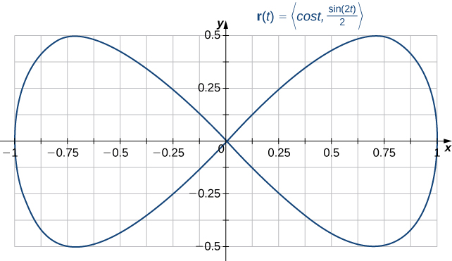
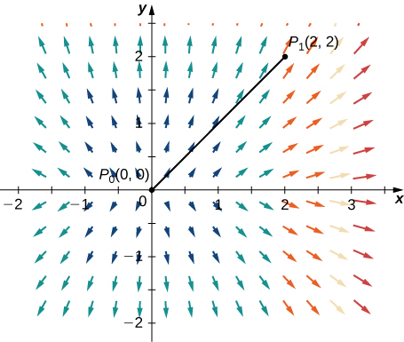
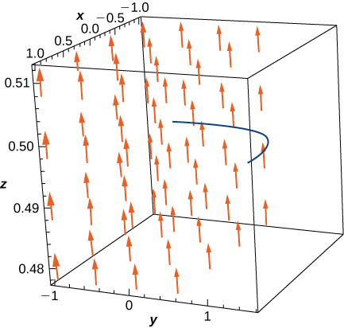

* Describe simple and closed curves; define connected and simply connected regions.
* Explain how to find a potential function for a conservative vector field.
* Use the Fundamental Theorem for Line Integrals to evaluate a line integral in a vector field.
* Explain how to test a vector field to determine whether it is conservative.

In this section, we continue the study of conservative vector fields. We examine the Fundamental Theorem for Line Integrals, which is a useful generalization of the Fundamental Theorem of Calculus to line integrals of conservative vector fields. We also discover show how to test whether a given vector field is conservative, and determine how to build a potential function for a vector field known to be conservative.

# Curves and Regions

Before continuing our study of conservative vector fields, we need some geometric definitions. The theorems in the subsequent sections all rely on integrating over certain kinds of curves and regions, so we develop the definitions of those curves and regions here.

We first define two special kinds of curves: closed curves and simple curves. As we have learned, a closed curve is one that begins and ends at the same point. A simple curve is one that does not cross itself. A curve that is both closed and simple is a simple closed curve ([\[link\]](#CNX_Calc_Figure_16_03_001)).

Definition

Curve *C* is a **closed curve**{: data-type="term"} if there is a parameterization <math xmlns="http://www.w3.org/1998/Math/MathML"><mrow><mstyle mathvariant="bold" mathsize="normal"><mtext>r</mtext></mstyle><mrow><mo>(</mo><mi>t</mi><mo>)</mo></mrow><mo>,</mo><mi>a</mi><mo>≤</mo><mi>t</mi><mo>≤</mo><mi>b</mi></mrow></math>

 of *C* such that the parameterization traverses the curve exactly once and <math xmlns="http://www.w3.org/1998/Math/MathML"><mrow><mstyle mathvariant="bold" mathsize="normal"><mtext>r</mtext></mstyle><mrow><mo>(</mo><mi>a</mi><mo>)</mo></mrow><mo>=</mo><mstyle mathvariant="bold" mathsize="normal"><mtext>r</mtext></mstyle><mrow><mo>(</mo><mi>b</mi><mo>)</mo></mrow><mo>.</mo></mrow></math>

 Curve *C* is a **simple curve**{: data-type="term"} if *C* does not cross itself. That is, *C* is simple if there exists a parameterization <math xmlns="http://www.w3.org/1998/Math/MathML"><mrow><mstyle mathvariant="bold" mathsize="normal"><mtext>r</mtext></mstyle><mrow><mo>(</mo><mi>t</mi><mo>)</mo></mrow><mo>,</mo><mi>a</mi><mo>≤</mo><mi>t</mi><mo>≤</mo><mi>b</mi></mrow></math>

 of *C* such that **r** is one-to-one over <math xmlns="http://www.w3.org/1998/Math/MathML"><mrow><mrow><mo>(</mo><mrow><mi>a</mi><mo>,</mo><mi>b</mi></mrow><mo>)</mo></mrow><mo>.</mo></mrow></math>

 It is possible for <math xmlns="http://www.w3.org/1998/Math/MathML"><mrow><mstyle mathvariant="bold" mathsize="normal"><mtext>r</mtext></mstyle><mrow><mo>(</mo><mi>a</mi><mo>)</mo></mrow><mo>=</mo><mstyle mathvariant="bold" mathsize="normal"><mtext>r</mtext></mstyle><mrow><mo>(</mo><mi>b</mi><mo>)</mo></mrow><mo>,</mo></mrow></math>

 meaning that the simple curve is also closed.

 ![An image showing eight curves and their types. The first curve is neither simple nor closed; it has two endpoints and crosses itself twice. The second curve is simple but not closed; it does not cross itself and has two endpoints. The third curve is closed but is not simple; it crosses itself a few times. The fourth is a simple closed curve; it does not cross itself and has no endpoints. The fifth is a simple, not closed curve; it does not cross itself, but it has endpoints. The sixth is a simple, closed curve; it does not cross itself and has no endpoints. The seventh is closed but not a simple curve; it crosses itself but has no endpoints. The last is not simple and not closed; it crosses itself and has endpoints.](../resources/CNX_Calc_Figure_16_03_001.jpg "Types of curves that are simple or not simple and closed or not closed."){: #CNX_Calc_Figure_16_03_001}

Determining Whether a Curve Is Simple and Closed

Is the curve with parameterization <math xmlns="http://www.w3.org/1998/Math/MathML"><mrow><mstyle mathvariant="bold" mathsize="normal"><mtext>r</mtext></mstyle><mo stretchy="false">(</mo><mi>t</mi><mo stretchy="false">)</mo><mo>=</mo><mrow><mo>〈</mo><mrow><mtext>cos</mtext><mspace width="0.2em" /><mi>t</mi><mo>,</mo><mfrac><mrow><mtext>sin</mtext><mo stretchy="false">(</mo><mn>2</mn><mi>t</mi><mo stretchy="false">)</mo></mrow><mn>2</mn></mfrac></mrow><mo>〉</mo></mrow><mo>,</mo><mn>0</mn><mo>≤</mo><mi>t</mi><mo>≤</mo><mn>2</mn><mi>π</mi></mrow></math>

 a simple closed curve?

Note that <math xmlns="http://www.w3.org/1998/Math/MathML"><mrow><mstyle mathvariant="bold" mathsize="normal"><mtext>r</mtext></mstyle><mrow><mo>(</mo><mn>0</mn><mo>)</mo></mrow><mo>=</mo><mrow><mo>〈</mo><mrow><mn>1</mn><mo>,</mo><mn>0</mn></mrow><mo>〉</mo></mrow><mo>=</mo><mstyle mathvariant="bold" mathsize="normal"><mtext>r</mtext></mstyle><mrow><mo>(</mo><mrow><mn>2</mn><mi>π</mi></mrow><mo>)</mo></mrow><mo>;</mo></mrow></math>

 therefore, the curve is closed. The curve is not simple, however. To see this, note that <math xmlns="http://www.w3.org/1998/Math/MathML"><mrow><mstyle mathvariant="bold" mathsize="normal"><mtext>r</mtext></mstyle><mrow><mo>(</mo><mrow><mfrac><mi>π</mi><mn>2</mn></mfrac></mrow><mo>)</mo></mrow><mo>=</mo><mrow><mo>〈</mo><mrow><mn>0</mn><mo>,</mo><mn>0</mn></mrow><mo>〉</mo></mrow><mo>=</mo><mstyle mathvariant="bold" mathsize="normal"><mtext>r</mtext></mstyle><mrow><mo>(</mo><mrow><mfrac><mrow><mn>3</mn><mi>π</mi></mrow><mn>2</mn></mfrac></mrow><mo>)</mo></mrow><mo>,</mo></mrow></math>

 and therefore the curve crosses itself at the origin ([[link]](#CNX_Calc_Figure_16_03_002)).

{: #CNX_Calc_Figure_16_03_002}

Is the curve given by parameterization <math xmlns="http://www.w3.org/1998/Math/MathML"><mrow><mstyle mathvariant="bold" mathsize="normal"><mtext>r</mtext></mstyle><mrow><mo>(</mo><mi>t</mi><mo>)</mo></mrow><mo>=</mo><mrow><mo>〈</mo><mrow><mn>2</mn><mspace width="0.2em" /><mtext>cos</mtext><mspace width="0.2em" /><mi>t</mi><mo>,</mo><mn>3</mn><mspace width="0.2em" /><mtext>sin</mtext><mspace width="0.1em" /><mi>t</mi></mrow><mo>〉</mo></mrow><mo>,</mo><mn>0</mn><mo>≤</mo><mi>t</mi><mo>≤</mo><mn>6</mn><mi>π</mi><mo>,</mo></mrow></math>

 a simple closed curve?

Yes

Hint

Sketch the curve.

Many of the theorems in this chapter relate an integral over a region to an integral over the boundary of the region, where the region’s boundary is a simple closed curve or a union of simple closed curves. To develop these theorems, we need two geometric definitions for regions: that of a connected region and that of a simply connected region. A connected region is one in which there is a path in the region that connects any two points that lie within that region. A simply connected region is a connected region that does not have any holes in it. These two notions, along with the notion of a simple closed curve, allow us to state several generalizations of the Fundamental Theorem of Calculus later in the chapter. These two definitions are valid for regions in any number of dimensions, but we are only concerned with regions in two or three dimensions.

Definition

A region *D* is a **connected region**{: data-type="term"} if, for any two points <math xmlns="http://www.w3.org/1998/Math/MathML"><mrow><msub><mi>P</mi><mn>1</mn></msub></mrow></math>

 and <math xmlns="http://www.w3.org/1998/Math/MathML"><mrow><msub><mi>P</mi><mn>2</mn></msub><mo>,</mo></mrow></math>

 there is a path from <math xmlns="http://www.w3.org/1998/Math/MathML"><mrow><msub><mi>P</mi><mn>1</mn></msub></mrow></math>

 to <math xmlns="http://www.w3.org/1998/Math/MathML"><mrow><msub><mi>P</mi><mn>2</mn></msub></mrow></math>

 with a trace contained entirely inside *D*. A region *D* is a **simply connected region**{: data-type="term"} if *D* is connected for any simple closed curve *C* that lies inside *D*, and curve *C* can be shrunk continuously to a point while staying entirely inside *D*. In two dimensions, a region is simply connected if it is connected and has no holes.

All simply connected regions are connected, but not all connected regions are simply connected ([\[link\]](#CNX_Calc_Figure_16_03_003)).

  Simply connected regions have no holes. (b) Connected regions that are not simply connected may have holes but you can still find a path in the region between any two points. (c) A region that is not connected has some points that cannot be connected by a path in the region."){: #CNX_Calc_Figure_16_03_003}

Is the region in the below image connected? Is the region simply connected?

  

The region in the figure is connected. The region in the figure is not simply connected.

Hint

Consider the definitions.

# Fundamental Theorem for Line Integrals

Now that we understand some basic curves and regions, let’s generalize the Fundamental Theorem of Calculus to line integrals. Recall that the Fundamental Theorem of Calculus says that if a function <math xmlns="http://www.w3.org/1998/Math/MathML"><mrow><mi>f</mi></mrow></math>

 has an antiderivative *F*, then the integral of <math xmlns="http://www.w3.org/1998/Math/MathML"><mrow><mi>f</mi></mrow></math>

 from *a* to *b* depends only on the values of *F* at *a* and at *b*—that is,

<math xmlns="http://www.w3.org/1998/Math/MathML"><mrow><mstyle displaystyle="true"><mrow><msubsup><mo stretchy="false">∫</mo><mi>a</mi><mi>b</mi></msubsup><mrow><mi>f</mi><mrow><mo>(</mo><mi>x</mi><mo>)</mo></mrow><mi>d</mi><mi>x</mi><mo>=</mo><mstyle mathvariant="bold" mathsize="normal"><mtext>F</mtext></mstyle><mrow><mo>(</mo><mi>b</mi><mo>)</mo></mrow><mo>−</mo><mstyle mathvariant="bold" mathsize="normal"><mtext>F</mtext></mstyle><mrow><mo>(</mo><mi>a</mi><mo>)</mo></mrow><mo>.</mo></mrow></mrow></mstyle></mrow></math>

If we think of the gradient as a derivative, then the same theorem holds for vector line integrals. We show how this works using a motivational example.

Evaluating a Line Integral and the Antiderivatives of the Endpoints

Let <math xmlns="http://www.w3.org/1998/Math/MathML"><mrow><mstyle mathvariant="bold" mathsize="normal"><mtext>F</mtext></mstyle><mrow><mo>(</mo><mrow><mi>x</mi><mo>,</mo><mi>y</mi></mrow><mo>)</mo></mrow><mo>=</mo><mrow><mo>〈</mo><mrow><mn>2</mn><mi>x</mi><mo>,</mo><mn>4</mn><mi>y</mi></mrow><mo>〉</mo></mrow><mo>.</mo></mrow></math>

 Calculate <math xmlns="http://www.w3.org/1998/Math/MathML"><mrow><mstyle displaystyle="true"><mrow><msub><mo stretchy="false">∫</mo><mi>C</mi></msub><mrow><mstyle mathvariant="bold" mathsize="normal"><mtext>F</mtext></mstyle><mo>•</mo><mi>d</mi><mstyle mathvariant="bold" mathsize="normal"><mtext>r</mtext></mstyle><mo>,</mo></mrow></mrow></mstyle></mrow></math>

 where *C* is the line segment from (0,0) to (2,2)([[link]](#CNX_Calc_Figure_16_03_005)).

We use [[link]](/m54012#fs-id1167793635294) to calculate <math xmlns="http://www.w3.org/1998/Math/MathML"><mrow><mstyle displaystyle="true"><mrow><msub><mo stretchy="false">∫</mo><mi>C</mi></msub><mrow><mstyle mathvariant="bold" mathsize="normal"><mtext>F</mtext></mstyle><mo>•</mo><mi>d</mi><mstyle mathvariant="bold" mathsize="normal"><mtext>r</mtext></mstyle><mo>.</mo></mrow></mrow></mstyle></mrow></math>

 Curve *C* can be parameterized by <math xmlns="http://www.w3.org/1998/Math/MathML"><mrow><mstyle mathvariant="bold" mathsize="normal"><mtext>r</mtext></mstyle><mrow><mo>(</mo><mi>t</mi><mo>)</mo></mrow><mo>=</mo><mrow><mo>〈</mo><mrow><mn>2</mn><mi>t</mi><mo>,</mo><mn>2</mn><mi>t</mi></mrow><mo>〉</mo></mrow><mo>,</mo><mn>0</mn><mo>≤</mo><mi>t</mi><mo>≤</mo><mn>1</mn><mo>.</mo></mrow></math>

 Then, <math xmlns="http://www.w3.org/1998/Math/MathML"><mrow><mstyle mathvariant="bold" mathsize="normal"><mtext>F</mtext></mstyle><mrow><mo>(</mo><mrow><mstyle mathvariant="bold" mathsize="normal"><mtext>r</mtext></mstyle><mrow><mo>(</mo><mi>t</mi><mo>)</mo></mrow></mrow><mo>)</mo></mrow><mo>=</mo><mrow><mo>〈</mo><mrow><mn>4</mn><mi>t</mi><mo>,</mo><mn>8</mn><mi>t</mi></mrow><mo>〉</mo></mrow></mrow></math>

 and <math xmlns="http://www.w3.org/1998/Math/MathML"><mrow><msup><mstyle mathvariant="bold" mathsize="normal"><mtext>r</mtext></mstyle><mo>′</mo></msup><mrow><mo>(</mo><mi>t</mi><mo>)</mo></mrow><mo>=</mo><mrow><mo>〈</mo><mrow><mn>2</mn><mo>,</mo><mn>2</mn></mrow><mo>〉</mo></mrow><mo>,</mo></mrow></math>

 which implies that

<math xmlns="http://www.w3.org/1998/Math/MathML"><mtable><mtr><mtd columnalign="right"><mstyle displaystyle="true"><mrow><msub><mo stretchy="false">∫</mo><mi>C</mi></msub><mrow><mstyle mathvariant="bold" mathsize="normal"><mtext>F</mtext></mstyle><mo>·</mo><mi>d</mi><mstyle mathvariant="bold" mathsize="normal"><mtext>r</mtext></mstyle></mrow></mrow></mstyle></mtd><mtd columnalign="left"><mo>=</mo><mstyle displaystyle="true"><mrow><msubsup><mo stretchy="false">∫</mo><mn>0</mn><mn>1</mn></msubsup><mrow><mrow><mo>〈</mo><mrow><mn>4</mn><mi>t</mi><mo>,</mo><mn>8</mn><mi>t</mi></mrow><mo>〉</mo></mrow></mrow></mrow></mstyle><mo>·</mo><mrow><mo>〈</mo><mrow><mn>2</mn><mo>,</mo><mn>2</mn></mrow><mo>〉</mo></mrow><mi>d</mi><mi>t</mi></mtd></mtr><mtr><mtd /><mtd columnalign="left"><mo>=</mo><mstyle displaystyle="true"><mrow><msubsup><mo stretchy="false">∫</mo><mn>0</mn><mn>1</mn></msubsup><mrow><mo stretchy="false">(</mo><mn>8</mn><mi>t</mi><mo>+</mo><mn>16</mn><mi>t</mi><mo stretchy="false">)</mo></mrow></mrow></mstyle><mi>d</mi><mi>t</mi><mo>=</mo><mstyle displaystyle="true"><mrow><msubsup><mo stretchy="false">∫</mo><mn>0</mn><mn>1</mn></msubsup><mrow><mn>24</mn><mi>t</mi><mspace width="0.1em" /><mi>d</mi><mi>t</mi></mrow></mrow></mstyle></mtd></mtr><mtr><mtd /><mtd columnalign="left"><mo>=</mo><msubsup><mrow><mo>[</mo><mrow><mn>12</mn><msup><mi>t</mi><mn>2</mn></msup></mrow><mo>]</mo></mrow><mn>0</mn><mn>1</mn></msubsup><mo>=</mo><mn>12.</mn></mtd></mtr></mtable></math>

{: #CNX_Calc_Figure_16_03_005}

Notice that <math xmlns="http://www.w3.org/1998/Math/MathML"><mrow><mi>F</mi><mo>=</mo><mtext>∇</mtext><mi>f</mi><mo>,</mo></mrow></math>

 where <math xmlns="http://www.w3.org/1998/Math/MathML"><mrow><mi>f</mi><mrow><mo>(</mo><mrow><mi>x</mi><mo>,</mo><mi>y</mi></mrow><mo>)</mo></mrow><mo>=</mo><msup><mi>x</mi><mn>2</mn></msup><mo>+</mo><mn>2</mn><msup><mi>y</mi><mn>2</mn></msup><mo>.</mo></mrow></math>

 If we think of the gradient as a derivative, then <math xmlns="http://www.w3.org/1998/Math/MathML"><mrow><mi>f</mi></mrow></math>

 is an “antiderivative” of **F**. In the case of single-variable integrals, the integral of derivative <math xmlns="http://www.w3.org/1998/Math/MathML"><mrow><msup><mi>g</mi><mo>′</mo></msup><mrow><mo>(</mo><mi>x</mi><mo>)</mo></mrow></mrow></math>

 is <math xmlns="http://www.w3.org/1998/Math/MathML"><mrow><mi>g</mi><mrow><mo>(</mo><mi>b</mi><mo>)</mo></mrow><mo>−</mo><mi>g</mi><mrow><mo>(</mo><mi>a</mi><mo>)</mo></mrow><mo>,</mo></mrow></math>

 where *a* is the start point of the interval of integration and *b* is the endpoint. If vector line integrals work like single-variable integrals, then we would expect integral **F** to be <math xmlns="http://www.w3.org/1998/Math/MathML"><mrow><mi>f</mi><mrow><mo>(</mo><mrow><msub><mi>P</mi><mn>1</mn></msub></mrow><mo>)</mo></mrow><mo>−</mo><mi>f</mi><mrow><mo>(</mo><mrow><msub><mi>P</mi><mn>0</mn></msub></mrow><mo>)</mo></mrow><mo>,</mo></mrow></math>

 where <math xmlns="http://www.w3.org/1998/Math/MathML"><mrow><msub><mi>P</mi><mn>1</mn></msub></mrow></math>

 is the endpoint of the curve of integration and <math xmlns="http://www.w3.org/1998/Math/MathML"><mrow><msub><mi>P</mi><mn>0</mn></msub></mrow></math>

 is the start point. Notice that this is the case for this example:

<math xmlns="http://www.w3.org/1998/Math/MathML"><mrow><mstyle displaystyle="true"><mrow><msub><mo stretchy="false">∫</mo><mi>C</mi></msub><mrow><mstyle mathvariant="bold" mathsize="normal"><mtext>F</mtext></mstyle><mo>•</mo><mi>d</mi><mstyle mathvariant="bold" mathsize="normal"><mtext>r</mtext></mstyle><mo>=</mo><mstyle displaystyle="true"><mrow><msub><mo stretchy="false">∫</mo><mi>C</mi></msub><mrow><mtext>∇</mtext><mi>f</mi><mo>•</mo><mi>d</mi><mstyle mathvariant="bold" mathsize="normal"><mtext>r</mtext></mstyle><mo>=</mo><mn>12</mn></mrow></mrow></mstyle></mrow></mrow></mstyle></mrow></math>

and

<math xmlns="http://www.w3.org/1998/Math/MathML"><mrow><mi>f</mi><mrow><mo>(</mo><mrow><mn>2</mn><mo>,</mo><mn>2</mn></mrow><mo>)</mo></mrow><mo>−</mo><mi>f</mi><mrow><mo>(</mo><mrow><mn>0</mn><mo>,</mo><mn>0</mn></mrow><mo>)</mo></mrow><mo>=</mo><mn>4</mn><mo>+</mo><mn>8</mn><mo>−</mo><mn>0</mn><mo>=</mo><mn>12</mn><mo>.</mo></mrow></math>

In other words, the integral of a “derivative” can be calculated by evaluating an “antiderivative” at the endpoints of the curve and subtracting, just as for single-variable integrals.

The following theorem says that, under certain conditions, what happened in the previous example holds for any gradient field. The same theorem holds for vector line integrals, which we call the **Fundamental Theorem for Line Integrals.**{: data-type="term"}

The Fundamental Theorem for Line Integrals

Let *C* be a piecewise smooth curve with parameterization <math xmlns="http://www.w3.org/1998/Math/MathML"><mrow><mstyle mathvariant="bold" mathsize="normal"><mtext>r</mtext></mstyle><mrow><mo>(</mo><mi>t</mi><mo>)</mo></mrow><mo>,</mo><mi>a</mi><mo>≤</mo><mi>t</mi><mo>≤</mo><mi>b</mi><mo>.</mo></mrow></math>

 Let <math xmlns="http://www.w3.org/1998/Math/MathML"><mrow><mi>f</mi></mrow></math>

 be a function of two or three variables with first-order partial derivatives that exist and are continuous on *C*. Then,

<math xmlns="http://www.w3.org/1998/Math/MathML"><mrow><mstyle displaystyle="true"><mrow><msub><mo stretchy="false">∫</mo><mi>C</mi></msub><mrow><mtext>∇</mtext><mi>f</mi><mo>•</mo><mi>d</mi><mstyle mathvariant="bold" mathsize="normal"><mtext>r</mtext></mstyle><mo>=</mo><mi>f</mi><mrow><mo>(</mo><mrow><mstyle mathvariant="bold" mathsize="normal"><mtext>r</mtext></mstyle><mrow><mo>(</mo><mi>b</mi><mo>)</mo></mrow></mrow><mo>)</mo></mrow><mo>−</mo><mi>f</mi><mrow><mo>(</mo><mrow><mstyle mathvariant="bold" mathsize="normal"><mtext>r</mtext></mstyle><mrow><mo>(</mo><mi>a</mi><mo>)</mo></mrow></mrow><mo>)</mo></mrow><mo>.</mo></mrow></mrow></mstyle></mrow></math>

## Proof

By [\[link\]](/m54012#fs-id1167793635294),

<math xmlns="http://www.w3.org/1998/Math/MathML"><mrow><mstyle displaystyle="true"><mrow><msub><mo stretchy="false">∫</mo><mi>C</mi></msub><mrow><mtext>∇</mtext><mi>f</mi><mo>•</mo><mi>d</mi><mstyle mathvariant="bold" mathsize="normal"><mtext>r</mtext></mstyle><mo>=</mo><mstyle displaystyle="true"><mrow><msubsup><mo stretchy="false">∫</mo><mi>a</mi><mi>b</mi></msubsup><mrow><mtext>∇</mtext><mi>f</mi><mrow><mo>(</mo><mrow><mstyle mathvariant="bold" mathsize="normal"><mtext>r</mtext></mstyle><mrow><mo>(</mo><mi>t</mi><mo>)</mo></mrow></mrow><mo>)</mo></mrow><mo>•</mo><msup><mstyle mathvariant="bold" mathsize="normal"><mtext>r</mtext></mstyle><mo>′</mo></msup><mrow><mo>(</mo><mi>t</mi><mo>)</mo></mrow><mi>d</mi><mi>t</mi><mo>.</mo></mrow></mrow></mstyle></mrow></mrow></mstyle></mrow></math>

By the chain rule,

<math xmlns="http://www.w3.org/1998/Math/MathML"><mrow><mfrac><mi>d</mi><mrow><mi>d</mi><mi>t</mi></mrow></mfrac><mrow><mo>(</mo><mrow><mi>f</mi><mrow><mo>(</mo><mrow><mstyle mathvariant="bold" mathsize="normal"><mtext>r</mtext></mstyle><mrow><mo>(</mo><mi>t</mi><mo>)</mo></mrow></mrow><mo>)</mo></mrow><mo>=</mo><mtext>∇</mtext><mi>f</mi><mrow><mo>(</mo><mrow><mstyle mathvariant="bold" mathsize="normal"><mtext>r</mtext></mstyle><mrow><mo>(</mo><mi>t</mi><mo>)</mo></mrow></mrow><mo>)</mo></mrow><mo>•</mo><msup><mstyle mathvariant="bold" mathsize="normal"><mtext>r</mtext></mstyle><mo>′</mo></msup><mrow><mo>(</mo><mi>t</mi><mo>)</mo></mrow><mo>.</mo></mrow></mrow></mrow></math>

Therefore, by the Fundamental Theorem of Calculus,

<math xmlns="http://www.w3.org/1998/Math/MathML"><mtable><mtr><mtd columnalign="right"><mstyle displaystyle="true"><mrow><msub><mo stretchy="false">∫</mo><mi>C</mi></msub><mo>∇</mo></mrow></mstyle><mi>f</mi><mo>•</mo><mi>d</mi><mstyle mathvariant="bold" mathsize="normal"><mtext>r</mtext></mstyle></mtd><mtd columnalign="left"><mo>=</mo><mstyle displaystyle="true"><mrow><msubsup><mo stretchy="false">∫</mo><mi>a</mi><mi>b</mi></msubsup><mrow><mtext>∇</mtext><mi>f</mi><mrow><mo>(</mo><mrow><mstyle mathvariant="bold" mathsize="normal"><mtext>r</mtext></mstyle><mrow><mo>(</mo><mi>t</mi><mo>)</mo></mrow></mrow><mo>)</mo></mrow><mo>•</mo><msup><mstyle mathvariant="bold" mathsize="normal"><mtext>r</mtext></mstyle><mo>′</mo></msup><mrow><mo>(</mo><mi>t</mi><mo>)</mo></mrow><mi>d</mi><mi>t</mi></mrow></mrow></mstyle></mtd></mtr><mtr><mtd /><mtd columnalign="left"><mo>=</mo><mstyle displaystyle="true"><mrow><msubsup><mo stretchy="false">∫</mo><mi>a</mi><mi>b</mi></msubsup><mrow><mfrac><mi>d</mi><mrow><mi>d</mi><mi>t</mi></mrow></mfrac><mrow><mo>(</mo><mrow><mi>f</mi><mrow><mo>(</mo><mrow><mstyle mathvariant="bold" mathsize="normal"><mtext>r</mtext></mstyle><mrow><mo>(</mo><mi>t</mi><mo>)</mo></mrow></mrow><mo>)</mo></mrow></mrow></mrow><mi>d</mi><mi>t</mi></mrow></mrow></mstyle></mtd></mtr><mtr><mtd /><mtd columnalign="left"><mo>=</mo><msubsup><mrow><mo>[</mo><mrow><mi>f</mi><mrow><mo>(</mo><mrow><mstyle mathvariant="bold" mathsize="normal"><mtext>r</mtext></mstyle><mrow><mo>(</mo><mi>t</mi><mo>)</mo></mrow></mrow><mo>)</mo></mrow></mrow><mo>]</mo></mrow><mrow><mi>t</mi><mo>=</mo><mi>a</mi></mrow><mrow><mi>t</mi><mo>=</mo><mi>b</mi></mrow></msubsup></mtd></mtr><mtr><mtd /><mtd columnalign="left"><mo>=</mo><mi>f</mi><mrow><mo>(</mo><mrow><mstyle mathvariant="bold" mathsize="normal"><mtext>r</mtext></mstyle><mrow><mo>(</mo><mi>b</mi><mo>)</mo></mrow></mrow><mo>)</mo></mrow><mo>−</mo><mi>f</mi><mrow><mo>(</mo><mrow><mstyle mathvariant="bold" mathsize="normal"><mtext>r</mtext></mstyle><mrow><mo>(</mo><mi>a</mi><mo>)</mo></mrow></mrow><mo>)</mo></mrow><mo>.</mo></mtd></mtr></mtable></math>

□

We know that if **F** is a conservative vector field, there are potential functions <math xmlns="http://www.w3.org/1998/Math/MathML"><mrow><mi>f</mi></mrow></math>

 such that <math xmlns="http://www.w3.org/1998/Math/MathML"><mrow><mtext>∇</mtext><mi>f</mi><mo>=</mo><mstyle mathvariant="bold" mathsize="normal"><mtext>F</mtext></mstyle><mo>.</mo></mrow></math>

 Therefore <math xmlns="http://www.w3.org/1998/Math/MathML"><mrow><mstyle displaystyle="true"><mrow><msub><mo stretchy="false">∫</mo><mi>C</mi></msub><mrow><mstyle mathvariant="bold" mathsize="normal"><mtext>F</mtext></mstyle><mo>·</mo><mi>d</mi><mstyle mathvariant="bold" mathsize="normal"><mtext>r</mtext></mstyle></mrow></mrow></mstyle><mo>=</mo><mstyle displaystyle="true"><mrow><msub><mo stretchy="false">∫</mo><mi>C</mi></msub><mrow><mtext>∇</mtext><mi>f</mi><mo>·</mo><mi>d</mi><mstyle mathvariant="bold" mathsize="normal"><mtext>r</mtext></mstyle></mrow></mrow></mstyle><mo>=</mo><mi>f</mi><mrow><mo>(</mo><mrow><mstyle mathvariant="bold" mathsize="normal"><mtext>r</mtext></mstyle><mo stretchy="false">(</mo><mi>b</mi><mo stretchy="false">)</mo></mrow><mo>)</mo></mrow><mo>−</mo><mi>f</mi><mrow><mo>(</mo><mrow><mstyle mathvariant="bold" mathsize="normal"><mtext>r</mtext></mstyle><mo stretchy="false">(</mo><mi>a</mi><mo stretchy="false">)</mo></mrow><mo>)</mo></mrow><mo>.</mo></mrow></math>

 In other words, just as with the Fundamental Theorem of Calculus, computing the line integral <math xmlns="http://www.w3.org/1998/Math/MathML"><mrow><mstyle displaystyle="true"><mrow><msub><mo stretchy="false">∫</mo><mi>C</mi></msub><mrow><mstyle mathvariant="bold" mathsize="normal"><mtext>F</mtext></mstyle><mo>·</mo><mi>d</mi><mstyle mathvariant="bold" mathsize="normal"><mtext>r</mtext></mstyle></mrow></mrow></mstyle><mo>,</mo></mrow></math>

 where **F** is conservative, is a two-step process: (1) find a potential function (“antiderivative”) <math xmlns="http://www.w3.org/1998/Math/MathML"><mrow><mi>f</mi></mrow></math>

 for **F** and (2) compute the value of <math xmlns="http://www.w3.org/1998/Math/MathML"><mrow><mi>f</mi></mrow></math>

 at the endpoints of *C* and calculate their difference <math xmlns="http://www.w3.org/1998/Math/MathML"><mrow><mi>f</mi><mrow><mo>(</mo><mrow><mstyle mathvariant="bold" mathsize="normal"><mtext>r</mtext></mstyle><mrow><mo>(</mo><mi>b</mi><mo>)</mo></mrow></mrow><mo>)</mo></mrow><mo>−</mo><mi>f</mi><mrow><mo>(</mo><mrow><mstyle mathvariant="bold" mathsize="normal"><mtext>r</mtext></mstyle><mrow><mo>(</mo><mi>a</mi><mo>)</mo></mrow></mrow><mo>)</mo></mrow><mo>.</mo></mrow></math>

 Keep in mind, however, there is one major difference between the Fundamental Theorem of Calculus and the Fundamental Theorem for Line Integrals. *A function of one variable that is continuous must have an antiderivative. However, a vector field, even if it is continuous, does not need to have a potential function.*

Applying the Fundamental Theorem

Calculate integral <math xmlns="http://www.w3.org/1998/Math/MathML"><mrow><mstyle displaystyle="true"><mrow><msub><mo stretchy="false">∫</mo><mi>C</mi></msub><mrow><mstyle mathvariant="bold" mathsize="normal"><mtext>F</mtext></mstyle><mo>•</mo><mi>d</mi><mstyle mathvariant="bold" mathsize="normal"><mtext>r</mtext></mstyle><mo>,</mo></mrow></mrow></mstyle></mrow></math>

 where <math xmlns="http://www.w3.org/1998/Math/MathML"><mrow><mstyle mathvariant="bold" mathsize="normal"><mtext>F</mtext></mstyle><mrow><mo>(</mo><mrow><mi>x</mi><mo>,</mo><mi>y</mi><mo>,</mo><mi>z</mi></mrow><mo>)</mo></mrow><mo>=</mo><mrow><mo>〈</mo><mrow><mn>2</mn><mi>x</mi><mspace width="0.2em" /><mtext>ln</mtext><mspace width="0.1em" /><mi>y</mi><mo>,</mo><mfrac><mrow><msup><mi>x</mi><mn>2</mn></msup></mrow><mi>y</mi></mfrac><mo>+</mo><msup><mi>z</mi><mn>2</mn></msup><mo>,</mo><mn>2</mn><mi>y</mi><mi>z</mi></mrow><mo>〉</mo></mrow></mrow></math>

 and *C* is a curve with parameterization <math xmlns="http://www.w3.org/1998/Math/MathML"><mrow><mstyle mathvariant="bold" mathsize="normal"><mtext>r</mtext></mstyle><mrow><mo>(</mo><mi>t</mi><mo>)</mo></mrow><mo>=</mo><mrow><mo>〈</mo><mrow><msup><mi>t</mi><mn>2</mn></msup><mo>,</mo><mi>t</mi><mo>,</mo><mi>t</mi></mrow><mo>〉</mo></mrow><mo>,</mo><mn>1</mn><mo>≤</mo><mi>t</mi><mo>≤</mo><mi>e</mi></mrow></math>

1.  without using the Fundamental Theorem of Line Integrals and
2.  using the Fundamental Theorem of Line Integrals.
{: data-number-style="lower-alpha"}

1.  First, let’s calculate the integral without the Fundamental Theorem for Line Integrals and instead use [[link]](/m54012#fs-id1167793635294):
    * * *
    {: data-type="newline"}
    
    

    <math xmlns="http://www.w3.org/1998/Math/MathML"><mtable><mtr><mtd columnalign="right"><mstyle displaystyle="true"><mrow><msub><mo stretchy="false">∫</mo><mi>C</mi></msub><mrow><mstyle mathvariant="bold" mathsize="normal"><mtext>F</mtext></mstyle><mo>•</mo><mi>d</mi><mi>r</mi></mrow></mrow></mstyle></mtd><mtd columnalign="left"><mo>=</mo><mstyle displaystyle="true"><mrow><msubsup><mo stretchy="false">∫</mo><mn>1</mn><mi>e</mi></msubsup><mrow><mstyle mathvariant="bold" mathsize="normal"><mtext>F</mtext></mstyle><mrow><mo>(</mo><mrow><mi>r</mi><mrow><mo>(</mo><mi>t</mi><mo>)</mo></mrow></mrow><mo>)</mo></mrow><mo>•</mo><msup><mi>r</mi><mo>′</mo></msup><mrow><mo>(</mo><mi>t</mi><mo>)</mo></mrow><mi>d</mi><mi>t</mi></mrow></mrow></mstyle></mtd></mtr><mtr><mtd /><mtd columnalign="left"><mo>=</mo><mstyle displaystyle="true"><mrow><msubsup><mo stretchy="false">∫</mo><mn>1</mn><mi>e</mi></msubsup><mrow><mrow><mo>〈</mo><mrow><mn>2</mn><msup><mi>t</mi><mn>2</mn></msup><mtext>ln</mtext><mspace width="0.1em" /><mi>t</mi><mo>,</mo><mfrac><mrow><msup><mi>t</mi><mn>4</mn></msup></mrow><mi>t</mi></mfrac><mo>+</mo><msup><mi>t</mi><mn>2</mn></msup><mo>,</mo><mn>2</mn><msup><mi>t</mi><mn>2</mn></msup></mrow><mo>〉</mo></mrow></mrow></mrow></mstyle><mo>•</mo><mrow><mo>〈</mo><mrow><mn>2</mn><mi>t</mi><mo>,</mo><mn>1</mn><mo>,</mo><mn>1</mn></mrow><mo>〉</mo></mrow><mi>d</mi><mi>t</mi></mtd></mtr><mtr><mtd /><mtd columnalign="left"><mo>=</mo><mstyle displaystyle="true"><mrow><msubsup><mo stretchy="false">∫</mo><mn>1</mn><mi>e</mi></msubsup><mrow><mrow><mo>(</mo><mrow><mn>4</mn><msup><mi>t</mi><mn>3</mn></msup><mtext>ln</mtext><mspace width="0.1em" /><mi>t</mi><mo>+</mo><msup><mi>t</mi><mn>3</mn></msup><mo>+</mo><mn>3</mn><msup><mi>t</mi><mn>2</mn></msup></mrow><mo>)</mo></mrow><mi>d</mi><mi>t</mi></mrow></mrow></mstyle></mtd></mtr><mtr><mtd /><mtd columnalign="left"><mo>=</mo><mstyle displaystyle="true"><mrow><msubsup><mo stretchy="false">∫</mo><mn>1</mn><mi>e</mi></msubsup><mrow><mn>4</mn><msup><mi>t</mi><mn>3</mn></msup><mtext>ln</mtext><mspace width="0.1em" /><mi>t</mi><mi>d</mi><mi>t</mi><mo>+</mo><mstyle displaystyle="true"><mrow><msubsup><mo stretchy="false">∫</mo><mn>1</mn><mi>e</mi></msubsup><mrow><mrow><mo>(</mo><mrow><msup><mi>t</mi><mn>3</mn></msup><mo>+</mo><mn>3</mn><msup><mi>t</mi><mn>2</mn></msup></mrow><mo>)</mo></mrow><mi>d</mi><mi>t</mi></mrow></mrow></mstyle></mrow></mrow></mstyle></mtd></mtr><mtr><mtd /><mtd columnalign="left"><mo>=</mo><mstyle displaystyle="true"><mrow><msubsup><mo stretchy="false">∫</mo><mn>1</mn><mi>e</mi></msubsup><mrow><mn>4</mn><msup><mi>t</mi><mn>3</mn></msup><mtext>ln</mtext><mspace width="0.1em" /><mi>t</mi><mi>d</mi><mi>t</mi><mo>+</mo><msubsup><mrow><mrow><mo>[</mo><mrow><mfrac><mrow><msup><mi>t</mi><mn>4</mn></msup></mrow><mn>4</mn></mfrac><mo>+</mo><msup><mi>t</mi><mn>3</mn></msup></mrow><mo>]</mo></mrow></mrow><mn>1</mn><mi>e</mi></msubsup></mrow></mrow></mstyle></mtd></mtr><mtr><mtd /><mtd columnalign="left"><mo>=</mo><mi>r</mi><mstyle displaystyle="true"><mrow><msubsup><mo stretchy="false">∫</mo><mn>1</mn><mi>e</mi></msubsup><mrow><msup><mi>t</mi><mn>3</mn></msup><mtext>ln</mtext><mspace width="0.1em" /><mi>t</mi><mi>d</mi><mi>t</mi><mo>+</mo><mfrac><mrow><msup><mi>e</mi><mn>4</mn></msup></mrow><mn>4</mn></mfrac><mo>+</mo><msup><mi>e</mi><mn>3</mn></msup><mo>−</mo><mfrac><mn>5</mn><mn>4</mn></mfrac></mrow></mrow></mstyle><mo>.</mo></mtd></mtr></mtable></math>
    

    
    * * *
    {: data-type="newline"}
    
    Integral
    <math xmlns="http://www.w3.org/1998/Math/MathML"><mrow><mstyle displaystyle="true"><mrow><msubsup><mo stretchy="false">∫</mo><mn>1</mn><mi>e</mi></msubsup><mrow><msup><mi>t</mi><mn>3</mn></msup><mtext>ln</mtext><mspace width="0.1em" /><mi>t</mi><mi>d</mi><mi>t</mi></mrow></mrow></mstyle></mrow></math>
    
    requires integration by parts. Let
    <math xmlns="http://www.w3.org/1998/Math/MathML"><mrow><mi>u</mi><mo>=</mo><mtext>ln</mtext><mspace width="0.1em" /><mi>t</mi></mrow></math>
    
    and
    <math xmlns="http://www.w3.org/1998/Math/MathML"><mrow><mi>d</mi><mi>v</mi><mo>=</mo><msup><mi>t</mi><mn>3</mn></msup><mo>.</mo></mrow></math>
    
    Then
    <math xmlns="http://www.w3.org/1998/Math/MathML"><mrow><mi>u</mi><mo>=</mo><mtext>ln</mtext><mspace width="0.1em" /><mi>t</mi><mo>,</mo><mi>d</mi><mi>v</mi><mo>=</mo><msup><mi>t</mi><mn>3</mn></msup></mrow></math>
    
    * * *
    {: data-type="newline"}
    
    and
    * * *
    {: data-type="newline"}
    
    

    <math xmlns="http://www.w3.org/1998/Math/MathML"><mrow><mi>d</mi><mi>u</mi><mo>=</mo><mfrac><mn>1</mn><mi>t</mi></mfrac><mi>d</mi><mi>t</mi><mo>,</mo><mi>v</mi><mo>=</mo><mfrac><mrow><msup><mi>t</mi><mn>4</mn></msup></mrow><mn>4</mn></mfrac><mo>.</mo></mrow></math>
    

    
    * * *
    {: data-type="newline"}
    
    Therefore,
    * * *
    {: data-type="newline"}
    
    

    <math xmlns="http://www.w3.org/1998/Math/MathML"><mtable><mtr><mtd columnalign="right"><mstyle displaystyle="true"><mrow><msubsup><mo stretchy="false">∫</mo><mn>1</mn><mi>e</mi></msubsup><mrow><msup><mi>t</mi><mn>3</mn></msup><mtext>ln</mtext><mspace width="0.1em" /><mi>t</mi><mi>d</mi><mi>t</mi></mrow></mrow></mstyle></mtd><mtd columnalign="left"><mo>=</mo><msubsup><mrow><mo>[</mo><mrow><mfrac><mrow><msup><mi>t</mi><mn>4</mn></msup></mrow><mn>4</mn></mfrac><mtext>ln</mtext><mspace width="0.1em" /><mi>t</mi></mrow><mo>]</mo></mrow><mn>1</mn><mi>e</mi></msubsup><mo>−</mo><mfrac><mn>1</mn><mn>4</mn></mfrac><mstyle displaystyle="true"><mrow><msubsup><mo stretchy="false">∫</mo><mn>1</mn><mi>e</mi></msubsup><mrow><msup><mi>t</mi><mn>3</mn></msup><mi>d</mi><mi>t</mi></mrow></mrow></mstyle></mtd></mtr><mtr><mtd /><mtd columnalign="left"><mo>=</mo><mfrac><mrow><msup><mi>e</mi><mn>4</mn></msup></mrow><mn>4</mn></mfrac><mo>−</mo><mfrac><mn>1</mn><mi>r</mi></mfrac><mrow><mo>(</mo><mrow><mfrac><mrow><msup><mi>e</mi><mn>4</mn></msup></mrow><mn>4</mn></mfrac><mo>−</mo><mfrac><mn>1</mn><mn>4</mn></mfrac></mrow><mo>)</mo></mrow><mo>.</mo></mtd></mtr></mtable></math>
    

    
    * * *
    {: data-type="newline"}
    
    Thus,
    * * *
    {: data-type="newline"}
    
    

    <math xmlns="http://www.w3.org/1998/Math/MathML"><mtable><mtr><mtd columnalign="right"><mstyle displaystyle="true"><mrow><msub><mo stretchy="false">∫</mo><mi>C</mi></msub><mstyle mathvariant="bold" mathsize="normal"><mtext>F</mtext></mstyle></mrow></mstyle><mo>•</mo><mi>d</mi><mi>r</mi></mtd><mtd columnalign="left"><mo>=</mo><mn>4</mn><mstyle displaystyle="true"><mrow><msubsup><mo stretchy="false">∫</mo><mn>1</mn><mi>e</mi></msubsup><mrow><msup><mi>t</mi><mn>3</mn></msup><mtext>ln</mtext><mspace width="0.1em" /><mi>t</mi><mi>d</mi><mi>t</mi><mo>+</mo><mfrac><mrow><msup><mi>e</mi><mn>4</mn></msup></mrow><mn>4</mn></mfrac><mo>+</mo><msup><mi>e</mi><mn>3</mn></msup><mo>−</mo><mfrac><mn>5</mn><mn>4</mn></mfrac></mrow></mrow></mstyle></mtd></mtr><mtr><mtd /><mtd columnalign="left"><mo>=</mo><mn>4</mn><mrow><mo>(</mo><mrow><mfrac><mrow><msup><mi>e</mi><mn>4</mn></msup></mrow><mn>4</mn></mfrac><mo>−</mo><mfrac><mn>1</mn><mn>4</mn></mfrac><mrow><mo>(</mo><mrow><mfrac><mrow><msup><mi>e</mi><mn>4</mn></msup></mrow><mn>4</mn></mfrac><mo>−</mo><mfrac><mn>1</mn><mn>4</mn></mfrac></mrow><mo>)</mo></mrow></mrow><mo>)</mo></mrow><mo>+</mo><mfrac><mrow><msup><mi>e</mi><mn>4</mn></msup></mrow><mn>4</mn></mfrac><mo>+</mo><msup><mi>e</mi><mn>3</mn></msup><mo>−</mo><mfrac><mn>5</mn><mn>4</mn></mfrac></mtd></mtr><mtr><mtd /><mtd columnalign="left"><mo>=</mo><msup><mi>e</mi><mn>4</mn></msup><mo>−</mo><mfrac><mrow><msup><mi>e</mi><mn>4</mn></msup></mrow><mn>4</mn></mfrac><mo>+</mo><mfrac><mn>1</mn><mn>4</mn></mfrac><mo>+</mo><mfrac><mrow><msup><mi>e</mi><mn>4</mn></msup></mrow><mn>4</mn></mfrac><mo>+</mo><msup><mi>e</mi><mn>3</mn></msup><mo>−</mo><mfrac><mn>5</mn><mn>4</mn></mfrac></mtd></mtr><mtr><mtd /><mtd columnalign="left"><mo>=</mo><msup><mi>e</mi><mn>4</mn></msup><mo>+</mo><msup><mi>e</mi><mn>3</mn></msup><mo>−</mo><mn>1.</mn></mtd></mtr></mtable></math>
    

2.  Given that
    <math xmlns="http://www.w3.org/1998/Math/MathML"><mrow><mi>f</mi><mrow><mo>(</mo><mrow><mi>x</mi><mo>,</mo><mi>y</mi><mo>,</mo><mi>z</mi></mrow><mo>)</mo></mrow><mo>=</mo><msup><mi>x</mi><mn>2</mn></msup><mtext>ln</mtext><mspace width="0.1em" /><mi>y</mi><mo>+</mo><mi>y</mi><msup><mi>z</mi><mn>2</mn></msup></mrow></math>
    
    is a potential function for **F**, let’s use the Fundamental Theorem for Line Integrals to calculate the integral. Note that
    * * *
    {: data-type="newline"}
    
    

    <math xmlns="http://www.w3.org/1998/Math/MathML"><mtable><mtr><mtd columnalign="right"><mstyle displaystyle="true"><mrow><msub><mo stretchy="false">∫</mo><mi>C</mi></msub><mstyle mathvariant="bold" mathsize="normal"><mtext>F</mtext></mstyle></mrow></mstyle><mo>•</mo><mi>d</mi><mstyle mathvariant="bold" mathsize="normal"><mtext>r</mtext></mstyle></mtd><mtd columnalign="left"><mo>=</mo><mstyle displaystyle="true"><mrow><msub><mo stretchy="false">∫</mo><mi>C</mi></msub><mrow><mtext>∇</mtext><mi>f</mi><mo>•</mo><mi>d</mi><mstyle mathvariant="bold" mathsize="normal"><mtext>r</mtext></mstyle></mrow></mrow></mstyle></mtd></mtr><mtr><mtd /><mtd columnalign="left"><mo>=</mo><mi>f</mi><mrow><mo>(</mo><mrow><mstyle mathvariant="bold" mathsize="normal"><mtext>r</mtext></mstyle><mrow><mo>(</mo><mi>e</mi><mo>)</mo></mrow></mrow><mo>)</mo></mrow><mo>−</mo><mi>f</mi><mrow><mo>(</mo><mrow><mstyle mathvariant="bold" mathsize="normal"><mtext>r</mtext></mstyle><mrow><mo>(</mo><mn>1</mn><mo>)</mo></mrow></mrow><mo>)</mo></mrow></mtd></mtr><mtr><mtd /><mtd columnalign="left"><mo>=</mo><mi>f</mi><mrow><mo>(</mo><mrow><msup><mi>e</mi><mn>2</mn></msup><mo>,</mo><mi>e</mi><mo>,</mo><mi>e</mi></mrow><mo>)</mo></mrow><mo>−</mo><mi>f</mi><mrow><mo>(</mo><mrow><mn>1</mn><mo>,</mo><mn>1</mn><mo>,</mo><mn>1</mn></mrow><mo>)</mo></mrow></mtd></mtr><mtr><mtd /><mtd columnalign="left"><mo>=</mo><msup><mi>e</mi><mn>4</mn></msup><mo>+</mo><msup><mi>e</mi><mn>3</mn></msup><mo>−</mo><mn>1.</mn></mtd></mtr></mtable></math>
    

    
    * * *
    {: data-type="newline"}
    
    This calculation is much more straightforward than the calculation we did in (a). As long as we have a potential function, calculating a line integral using the Fundamental Theorem for Line Integrals is much easier than calculating without the theorem.
{: data-number-style="lower-alpha"}

[\[link\]](#fs-id1167793547524) illustrates a nice feature of the Fundamental Theorem of Line Integrals: it allows us to calculate more easily many vector line integrals. As long as we have a potential function, calculating the line integral is only a matter of evaluating the potential function at the endpoints and subtracting.

Given that <math xmlns="http://www.w3.org/1998/Math/MathML"><mrow><mi>f</mi><mrow><mo>(</mo><mrow><mi>x</mi><mo>,</mo><mi>y</mi></mrow><mo>)</mo></mrow><mo>=</mo><msup><mrow><mrow><mo>(</mo><mrow><mi>x</mi><mo>−</mo><mn>1</mn></mrow><mo>)</mo></mrow></mrow><mn>2</mn></msup><mi>y</mi><mo>+</mo><msup><mrow><mrow><mo>(</mo><mrow><mi>y</mi><mo>+</mo><mn>1</mn></mrow><mo>)</mo></mrow></mrow><mn>2</mn></msup><mi>x</mi></mrow></math>

 is a potential function for <math xmlns="http://www.w3.org/1998/Math/MathML"><mrow><mstyle mathvariant="bold" mathsize="normal"><mtext>F</mtext></mstyle><mo>=</mo><mrow><mo>〈</mo><mrow><mn>2</mn><mi>x</mi><mi>y</mi><mo>−</mo><mn>2</mn><mi>y</mi><mo>+</mo><msup><mrow><mrow><mo>(</mo><mrow><mi>y</mi><mo>+</mo><mn>1</mn></mrow><mo>)</mo></mrow></mrow><mn>2</mn></msup><mo>,</mo><msup><mrow><mrow><mo>(</mo><mrow><mi>x</mi><mo>−</mo><mn>1</mn></mrow><mo>)</mo></mrow></mrow><mn>2</mn></msup><mo>+</mo><mn>2</mn><mi>y</mi><mi>x</mi><mo>+</mo><mn>2</mn><mi>x</mi></mrow><mo>〉</mo></mrow><mo>,</mo></mrow></math>

 calculate integral <math xmlns="http://www.w3.org/1998/Math/MathML"><mrow><mstyle displaystyle="true"><mrow><msub><mo stretchy="false">∫</mo><mi>C</mi></msub><mrow><mstyle mathvariant="bold" mathsize="normal"><mtext>F</mtext></mstyle><mo>·</mo><mi>d</mi><mstyle mathvariant="bold" mathsize="normal"><mtext>r</mtext></mstyle></mrow></mrow></mstyle><mo>,</mo></mrow></math>

 where *C* is the lower half of the unit circle oriented counterclockwise.

 ![A vector field in two dimensions. The arrows near the origin are the shortest, and the arrows in the upper right and lower left corners of quadrants 1 and 3 are the shortest. The arrows go up and to the left in quadrants 1 and 3. In quadrant 2, the arrows stretch up and to the right for values greater than x=-1. The closer the arrows are to y=1, the more horizontal they become. For values less than x=-1, the arrows point up and form a curve to the left. The closer the arrows are to y=1, the more horizontal they become. Above y=1, it looks like the arrows are shifting from vertical, going down to horizontal. In quadrant 4, the arrows go up and to the right fairly regularly, but they tend to be curving to the right the larger the x value becomes. For y values less than -1, the arrows shift from pointing up to pointing down, following x=1. The lower half of the unit circle with center at the origin is drawn in quadrants 3 and 4.](../resources/CNX_Calc_Figure_16_03_006.jpg) 

2

Hint

The Fundamental Theorem for Line Intervals says this integral depends only on the value of <math xmlns="http://www.w3.org/1998/Math/MathML"><mrow><mi>f</mi></mrow></math>

 at the endpoints of *C*.

The Fundamental Theorem for Line Integrals has two important consequences. The first consequence is that if **F** is conservative and *C* is a closed curve, then the circulation of **F** along *C* is zero—that is, <math xmlns="http://www.w3.org/1998/Math/MathML"><mrow><mstyle displaystyle="true"><mrow><msub><mo stretchy="false">∫</mo><mi>C</mi></msub><mrow><mstyle mathvariant="bold" mathsize="normal"><mtext>F</mtext></mstyle><mo>·</mo><mi>d</mi><mstyle mathvariant="bold" mathsize="normal"><mtext>r</mtext></mstyle></mrow></mrow></mstyle><mo>=</mo><mn>0</mn><mo>.</mo></mrow></math>

 To see why this is true, let <math xmlns="http://www.w3.org/1998/Math/MathML"><mrow><mi>f</mi></mrow></math>

 be a potential function for **F**. Since *C* is a closed curve, the terminal point **r**(b) of *C* is the same as the initial point **r**(a) of *C*—that is, <math xmlns="http://www.w3.org/1998/Math/MathML"><mrow><mstyle mathvariant="bold" mathsize="normal"><mtext>r</mtext></mstyle><mrow><mo>(</mo><mi>a</mi><mo>)</mo></mrow><mo>=</mo><mstyle mathvariant="bold" mathsize="normal"><mtext>r</mtext></mstyle><mrow><mo>(</mo><mi>b</mi><mo>)</mo></mrow><mo>.</mo></mrow></math>

 Therefore, by the Fundamental Theorem for Line Integrals,

<math xmlns="http://www.w3.org/1998/Math/MathML"><mtable><mtr><mtd columnalign="right"><mstyle displaystyle="true"><mrow><msub><mo>∮</mo><mi>C</mi></msub><mrow><mstyle mathvariant="bold" mathsize="normal"><mtext>F</mtext></mstyle><mo>·</mo><mi>d</mi><mstyle mathvariant="bold" mathsize="normal"><mtext>r</mtext></mstyle></mrow></mrow></mstyle></mtd><mtd columnalign="left"><mo>=</mo><mstyle displaystyle="true"><mrow><msub><mo>∮</mo><mi>C</mi></msub><mrow><mtext>∇</mtext><mi>f</mi><mo>·</mo><mi>d</mi><mstyle mathvariant="bold" mathsize="normal"><mtext>r</mtext></mstyle></mrow></mrow></mstyle></mtd></mtr><mtr><mtd /><mtd columnalign="left"><mo>=</mo><mi>f</mi><mrow><mo>(</mo><mrow><mstyle mathvariant="bold" mathsize="normal"><mtext>r</mtext></mstyle><mo stretchy="false">(</mo><mi>b</mi><mo stretchy="false">)</mo></mrow><mo>)</mo></mrow><mo>−</mo><mi>f</mi><mrow><mo>(</mo><mrow><mstyle mathvariant="bold" mathsize="normal"><mtext>r</mtext></mstyle><mo stretchy="false">(</mo><mi>a</mi><mo stretchy="false">)</mo></mrow><mo>)</mo></mrow></mtd></mtr><mtr><mtd /><mtd columnalign="left"><mo>=</mo><mi>f</mi><mrow><mo>(</mo><mrow><mstyle mathvariant="bold" mathsize="normal"><mtext>r</mtext></mstyle><mo stretchy="false">(</mo><mi>b</mi><mo stretchy="false">)</mo></mrow><mo>)</mo></mrow><mo>−</mo><mi>f</mi><mrow><mo>(</mo><mrow><mstyle mathvariant="bold" mathsize="normal"><mtext>r</mtext></mstyle><mo stretchy="false">(</mo><mi>b</mi><mo stretchy="false">)</mo></mrow><mo>)</mo></mrow></mtd></mtr><mtr><mtd /><mtd columnalign="left"><mo>=</mo><mn>0.</mn></mtd></mtr></mtable></math>

Recall that the reason a conservative vector field **F** is called “conservative” is because such vector fields model forces in which energy is conserved. We have shown gravity to be an example of such a force. If we think of vector field **F** in integral <math xmlns="http://www.w3.org/1998/Math/MathML"><mrow><mstyle displaystyle="true"><mrow><msub><mo>∮</mo><mi>C</mi></msub><mrow><mstyle mathvariant="bold" mathsize="normal"><mtext>F</mtext></mstyle><mo>·</mo><mi>d</mi><mstyle mathvariant="bold" mathsize="normal"><mtext>r</mtext></mstyle></mrow></mrow></mstyle></mrow></math>

 as a gravitational field, then the equation <math xmlns="http://www.w3.org/1998/Math/MathML"><mrow><mstyle displaystyle="true"><mrow><msub><mo>∮</mo><mi>C</mi></msub><mrow><mstyle mathvariant="bold" mathsize="normal"><mtext>F</mtext></mstyle><mo>·</mo><mi>d</mi><mstyle mathvariant="bold" mathsize="normal"><mtext>r</mtext></mstyle></mrow></mrow></mstyle><mo>=</mo><mn>0</mn></mrow></math>

 follows. If a particle travels along a path that starts and ends at the same place, then the work done by gravity on the particle is zero.

The second important consequence of the Fundamental Theorem for Line Integrals is that line integrals of conservative vector fields are independent of path—meaning, they depend only on the endpoints of the given curve, and do not depend on the path between the endpoints.

Definition

Let **F** be a vector field with domain *D*. The vector field **F** is **independent of path**{: data-type="term"} (or **path independent**{: data-type="term"}) if <math xmlns="http://www.w3.org/1998/Math/MathML"><mrow><mstyle displaystyle="true"><mrow><msub><mo stretchy="false">∫</mo><mrow><msub><mi>C</mi><mn>1</mn></msub></mrow></msub><mrow><mstyle mathvariant="bold" mathsize="normal"><mtext>F</mtext></mstyle><mo>·</mo><mi>d</mi><mstyle mathvariant="bold" mathsize="normal"><mtext>r</mtext></mstyle></mrow></mrow></mstyle><mo>=</mo><mstyle displaystyle="true"><mrow><msub><mo stretchy="false">∫</mo><mrow><msub><mi>C</mi><mn>2</mn></msub></mrow></msub><mrow><mstyle mathvariant="bold" mathsize="normal"><mtext>F</mtext></mstyle><mo>·</mo><mi>d</mi><mstyle mathvariant="bold" mathsize="normal"><mtext>r</mtext></mstyle></mrow></mrow></mstyle></mrow></math>

 for any paths <math xmlns="http://www.w3.org/1998/Math/MathML"><mrow><msub><mi>C</mi><mn>1</mn></msub></mrow></math>

 and <math xmlns="http://www.w3.org/1998/Math/MathML"><mrow><msub><mi>C</mi><mn>2</mn></msub></mrow></math>

 in *D* with the same initial and terminal points.

The second consequence is stated formally in the following theorem.

Path Independence of Conservative Fields

If **F** is a conservative vector field, then **F** is independent of path.

## Proof

Let *D* denote the domain of **F** and let <math xmlns="http://www.w3.org/1998/Math/MathML"><mrow><msub><mi>C</mi><mn>1</mn></msub></mrow></math>

 and <math xmlns="http://www.w3.org/1998/Math/MathML"><mrow><msub><mi>C</mi><mn>2</mn></msub></mrow></math>

 be two paths in *D* with the same initial and terminal points ([\[link\]](#CNX_Calc_Figure_16_03_007)). Call the initial point <math xmlns="http://www.w3.org/1998/Math/MathML"><mrow><msub><mi>P</mi><mn>1</mn></msub></mrow></math>

 and the terminal point <math xmlns="http://www.w3.org/1998/Math/MathML"><mrow><msub><mi>P</mi><mn>2</mn></msub><mo>.</mo></mrow></math>

 Since **F** is conservative, there is a potential function <math xmlns="http://www.w3.org/1998/Math/MathML"><mrow><mi>f</mi></mrow></math>

 for **F**. By the Fundamental Theorem for Line Integrals,

<math xmlns="http://www.w3.org/1998/Math/MathML"><mrow><mstyle displaystyle="true"><mrow><msub><mo stretchy="false">∫</mo><mrow><msub><mi>C</mi><mn>1</mn></msub></mrow></msub><mrow><mstyle mathvariant="bold" mathsize="normal"><mtext>F</mtext></mstyle><mo>·</mo><mi>d</mi><mstyle mathvariant="bold" mathsize="normal"><mtext>r</mtext></mstyle></mrow></mrow></mstyle><mo>=</mo><mi>f</mi><mo stretchy="false">(</mo><msub><mi>P</mi><mn>2</mn></msub><mo stretchy="false">)</mo><mo>−</mo><mi>f</mi><mo stretchy="false">(</mo><msub><mi>P</mi><mn>1</mn></msub><mo stretchy="false">)</mo><mo>=</mo><mstyle displaystyle="true"><mrow><msub><mo stretchy="false">∫</mo><mrow><msub><mi>C</mi><mn>2</mn></msub></mrow></msub><mrow><mstyle mathvariant="bold" mathsize="normal"><mtext>F</mtext></mstyle><mo>·</mo><mi>d</mi><mstyle mathvariant="bold" mathsize="normal"><mtext>r</mtext></mstyle></mrow></mrow></mstyle><mo>.</mo></mrow></math>

Therefore, <math xmlns="http://www.w3.org/1998/Math/MathML"><mrow><mstyle displaystyle="true"><mrow><msub><mo stretchy="false">∫</mo><mrow><msub><mi>C</mi><mn>1</mn></msub></mrow></msub><mrow><mstyle mathvariant="bold" mathsize="normal"><mtext>F</mtext></mstyle><mo>·</mo><mi>d</mi><mstyle mathvariant="bold" mathsize="normal"><mtext>r</mtext></mstyle></mrow></mrow></mstyle><mo>=</mo><mstyle displaystyle="true"><mrow><msub><mo stretchy="false">∫</mo><mrow><msub><mi>C</mi><mn>2</mn></msub></mrow></msub><mrow><mstyle mathvariant="bold" mathsize="normal"><mtext>F</mtext></mstyle><mo>·</mo><mi>d</mi><mstyle mathvariant="bold" mathsize="normal"><mtext>r</mtext></mstyle></mrow></mrow></mstyle></mrow></math>

 and **F** is independent of path.

□

 ![A vector field in two dimensions. The arrows are shorter the closer to the x axis and line x=1.5 they become. The arrows point up, converging around x=1.5 in quadrant 1. That line is approached from the left and from the right. Below, in quadrant 4, the arrows in the rough interval \[1,2.5\] curve out, away from the given line x=1.5, but do turn back in and converge to x=1.5 above the x axis. Outside of that interval, the arrows go to the left and right horizontally for x values less than 1 and greater than 2.5, respectively. A line is drawn from P\_1 at the origin to P\_2 at (3,.75) and labeled C\_2. C\_1 is a simple curve that connects the given endpoints above C\_2, C\_3 is a simple curve that connects the given endpoints below C\_2.](../resources/CNX_Calc_Figure_16_03_007.jpg "The vector field is conservative, and therefore independent of path."){: #CNX_Calc_Figure_16_03_007}

To visualize what independence of path means, imagine three hikers climbing from base camp to the top of a mountain. Hiker 1 takes a steep route directly from camp to the top. Hiker 2 takes a winding route that is not steep from camp to the top. Hiker 3 starts by taking the steep route but halfway to the top decides it is too difficult for him. Therefore he returns to camp and takes the non-steep path to the top. All three hikers are traveling along paths in a gravitational field. Since gravity is a force in which energy is conserved, the gravitational field is conservative. By independence of path, the total amount of work done by gravity on each of the hikers is the same because they all started in the same place and ended in the same place. The work done by the hikers includes other factors such as friction and muscle movement, so the total amount of energy each one expended is not the same, but the net energy expended against gravity is the same for all three hikers.

We have shown that if **F** is conservative, then **F** is independent of path. It turns out that if the domain of **F** is open and connected, then the converse is also true. That is, if **F** is independent of path and the domain of **F** is open and connected, then **F** is conservative. Therefore, the set of conservative vector fields on open and connected domains is precisely the set of vector fields independent of path.

The Path Independence Test for Conservative Fields

If **F** is a continuous vector field that is independent of path and the domain *D* of **F** is open and connected, then **F** is conservative.

## Proof

We prove the theorem for vector fields in <math xmlns="http://www.w3.org/1998/Math/MathML"><mrow><msup><mo>ℝ</mo><mn>2</mn></msup><mo>.</mo></mrow></math>

 The proof for vector fields in <math xmlns="http://www.w3.org/1998/Math/MathML"><mrow><msup><mo>ℝ</mo><mn>3</mn></msup></mrow></math>

 is similar. To show that <math xmlns="http://www.w3.org/1998/Math/MathML"><mrow><mstyle mathvariant="bold" mathsize="normal"><mtext>F</mtext></mstyle><mo>=</mo><mrow><mo>〈</mo><mrow><mi>P</mi><mo>,</mo><mi>Q</mi></mrow><mo>〉</mo></mrow></mrow></math>

 is conservative, we must find a potential function <math xmlns="http://www.w3.org/1998/Math/MathML"><mrow><mi>f</mi></mrow></math>

 for **F**. To that end, let *X* be a fixed point in *D*. For any point <math xmlns="http://www.w3.org/1998/Math/MathML"><mrow><mrow><mo>(</mo><mrow><mi>x</mi><mo>,</mo><mi>y</mi></mrow><mo>)</mo></mrow></mrow></math>

 in *D*, let *C* be a path from *X* to <math xmlns="http://www.w3.org/1998/Math/MathML"><mrow><mrow><mo>(</mo><mrow><mi>x</mi><mo>,</mo><mi>y</mi></mrow><mo>)</mo></mrow><mo>.</mo></mrow></math>

 Define <math xmlns="http://www.w3.org/1998/Math/MathML"><mrow><mi>f</mi></mrow></math>

<math xmlns="http://www.w3.org/1998/Math/MathML"><mrow><mrow><mo>(</mo><mrow><mi>x</mi><mo>,</mo><mi>y</mi></mrow><mo>)</mo></mrow></mrow></math>

 by <math xmlns="http://www.w3.org/1998/Math/MathML"><mrow><mi>f</mi><mo stretchy="false">(</mo><mi>x</mi><mo>,</mo><mi>y</mi><mo stretchy="false">)</mo><mo>=</mo><mstyle displaystyle="true"><mrow><msub><mo stretchy="false">∫</mo><mi>C</mi></msub><mrow><mstyle mathvariant="bold" mathsize="normal"><mtext>F</mtext></mstyle><mo>·</mo><mi>d</mi><mstyle mathvariant="bold" mathsize="normal"><mtext>r</mtext></mstyle><mo>.</mo></mrow></mrow></mstyle></mrow></math>

 (Note that this definition of <math xmlns="http://www.w3.org/1998/Math/MathML"><mrow><mi>f</mi></mrow></math>

 makes sense only because **F** is independent of path. If **F** was not independent of path, then it might be possible to find another path <math xmlns="http://www.w3.org/1998/Math/MathML"><msup><mi>C</mi><mo>′</mo></msup></math>

 from *X* to <math xmlns="http://www.w3.org/1998/Math/MathML"><mrow><mrow><mo>(</mo><mrow><mi>x</mi><mo>,</mo><mi>y</mi></mrow><mo>)</mo></mrow></mrow></math>

 such that <math xmlns="http://www.w3.org/1998/Math/MathML"><mrow><mstyle displaystyle="true"><mrow><msub><mo stretchy="false">∫</mo><mi>C</mi></msub><mrow><mstyle mathvariant="bold" mathsize="normal"><mtext>F</mtext></mstyle><mo>·</mo><mi>d</mi><mstyle mathvariant="bold" mathsize="normal"><mtext>r</mtext></mstyle></mrow></mrow></mstyle><mo>≠</mo><mstyle displaystyle="true"><mrow><msub><mo stretchy="false">∫</mo><mi>C</mi></msub><mrow><mstyle mathvariant="bold" mathsize="normal"><mtext>F</mtext></mstyle><mo>·</mo><mi>d</mi><mstyle mathvariant="bold" mathsize="normal"><mtext>r</mtext></mstyle></mrow></mrow></mstyle><mo>,</mo></mrow></math>

 and in such a case <math xmlns="http://www.w3.org/1998/Math/MathML"><mrow><mi>f</mi></mrow></math>

<math xmlns="http://www.w3.org/1998/Math/MathML"><mrow><mrow><mo>(</mo><mrow><mi>x</mi><mo>,</mo><mi>y</mi></mrow><mo>)</mo></mrow></mrow></math>

 would not be a function.) We want to show that <math xmlns="http://www.w3.org/1998/Math/MathML"><mrow><mi>f</mi></mrow></math>

 has the property <math xmlns="http://www.w3.org/1998/Math/MathML"><mrow><mtext>∇</mtext><mi>f</mi><mo>=</mo><mstyle mathvariant="bold" mathsize="normal"><mtext>F</mtext></mstyle><mo>.</mo></mrow></math>

Since domain *D* is open, it is possible to find a disk centered at <math xmlns="http://www.w3.org/1998/Math/MathML"><mrow><mrow><mo>(</mo><mrow><mi>x</mi><mo>,</mo><mi>y</mi></mrow><mo>)</mo></mrow></mrow></math>

 such that the disk is contained entirely inside *D*. Let <math xmlns="http://www.w3.org/1998/Math/MathML"><mrow><mrow><mo>(</mo><mrow><mi>a</mi><mo>,</mo><mi>y</mi></mrow><mo>)</mo></mrow></mrow></math>

 with <math xmlns="http://www.w3.org/1998/Math/MathML"><mrow><mi>a</mi><mo>&lt;</mo><mi>x</mi></mrow></math>

 be a point in that disk. Let *C* be a path from *X* to <math xmlns="http://www.w3.org/1998/Math/MathML"><mrow><mrow><mo>(</mo><mrow><mi>x</mi><mo>,</mo><mi>y</mi></mrow><mo>)</mo></mrow></mrow></math>

 that consists of two pieces: <math xmlns="http://www.w3.org/1998/Math/MathML"><mrow><msub><mi>C</mi><mn>1</mn></msub></mrow></math>

 and <math xmlns="http://www.w3.org/1998/Math/MathML"><mrow><msub><mi>C</mi><mn>2</mn></msub><mo>.</mo></mrow></math>

 The first piece, <math xmlns="http://www.w3.org/1998/Math/MathML"><mrow><msub><mi>C</mi><mn>1</mn></msub><mo>,</mo></mrow></math>

 is any path from *C* to <math xmlns="http://www.w3.org/1998/Math/MathML"><mrow><mrow><mo>(</mo><mrow><mi>a</mi><mo>,</mo><mi>y</mi></mrow><mo>)</mo></mrow></mrow></math>

 that stays inside *D*; <math xmlns="http://www.w3.org/1998/Math/MathML"><mrow><msub><mi>C</mi><mn>2</mn></msub></mrow></math>

 is the horizontal line segment from <math xmlns="http://www.w3.org/1998/Math/MathML"><mrow><mrow><mo>(</mo><mrow><mi>a</mi><mo>,</mo><mi>y</mi></mrow><mo>)</mo></mrow></mrow></math>

 to <math xmlns="http://www.w3.org/1998/Math/MathML"><mrow><mrow><mo>(</mo><mrow><mi>x</mi><mo>,</mo><mi>y</mi></mrow><mo>)</mo></mrow></mrow></math>

 ([\[link\]](#CNX_Calc_Figure_16_03_008)). Then

<math xmlns="http://www.w3.org/1998/Math/MathML"><mrow><mi>f</mi><mo stretchy="false">(</mo><mi>x</mi><mo>,</mo><mi>y</mi><mo stretchy="false">)</mo><mo>=</mo><mstyle displaystyle="true"><mrow><msub><mo stretchy="false">∫</mo><mrow><msub><mi>C</mi><mn>1</mn></msub></mrow></msub><mrow><mstyle mathvariant="bold" mathsize="normal"><mtext>F</mtext></mstyle><mo>·</mo><mi>d</mi><mstyle mathvariant="bold" mathsize="normal"><mtext>r</mtext></mstyle></mrow></mrow></mstyle><mo>+</mo><mstyle displaystyle="true"><mrow><msub><mo stretchy="false">∫</mo><mrow><msub><mi>C</mi><mn>2</mn></msub></mrow></msub><mrow><mstyle mathvariant="bold" mathsize="normal"><mtext>F</mtext></mstyle><mo>·</mo><mi>d</mi><mstyle mathvariant="bold" mathsize="normal"><mtext>r</mtext></mstyle><mo>.</mo></mrow></mrow></mstyle></mrow></math>

The first integral does not depend on *x*, so

<math xmlns="http://www.w3.org/1998/Math/MathML"><mrow><msub><mi>f</mi><mi>x</mi></msub><mo>=</mo><mfrac><mo>∂</mo><mrow><mo>∂</mo><mi>x</mi></mrow></mfrac><mstyle displaystyle="true"><mrow><msub><mo stretchy="false">∫</mo><mrow><msub><mi>C</mi><mn>2</mn></msub></mrow></msub><mrow><mstyle mathvariant="bold" mathsize="normal"><mtext>F</mtext></mstyle><mo>•</mo><mi>d</mi><mstyle mathvariant="bold" mathsize="normal"><mtext>r</mtext></mstyle><mo>.</mo></mrow></mrow></mstyle></mrow></math>

If we parameterize <math xmlns="http://www.w3.org/1998/Math/MathML"><mrow><msub><mi>C</mi><mn>2</mn></msub></mrow></math>

 by <math xmlns="http://www.w3.org/1998/Math/MathML"><mrow><mstyle mathvariant="bold" mathsize="normal"><mtext>r</mtext></mstyle><mrow><mo>(</mo><mi>t</mi><mo>)</mo></mrow><mo>=</mo><mrow><mo>〈</mo><mrow><mi>t</mi><mo>,</mo><mi>y</mi></mrow><mo>〉</mo></mrow><mo>,</mo><mi>a</mi><mo>≤</mo><mi>t</mi><mo>≤</mo><mi>x</mi><mo>,</mo></mrow></math>

 then

<math xmlns="http://www.w3.org/1998/Math/MathML"><mtable><mtr><mtd columnalign="right"><msub><mi>f</mi><mi>x</mi></msub></mtd><mtd columnalign="left"><mo>=</mo><mfrac><mo>∂</mo><mrow><mo>∂</mo><mi>x</mi></mrow></mfrac><mstyle displaystyle="true"><mrow><msub><mo stretchy="false">∫</mo><mrow><msup><mi>C</mi><mn>2</mn></msup></mrow></msub><mstyle mathvariant="bold" mathsize="normal"><mtext>F</mtext></mstyle></mrow></mstyle><mo>•</mo><mi>d</mi><mstyle mathvariant="bold" mathsize="normal"><mtext>r</mtext></mstyle></mtd></mtr><mtr><mtd /><mtd columnalign="left"><mo>=</mo><mfrac><mo>∂</mo><mrow><mo>∂</mo><mi>x</mi></mrow></mfrac><mstyle displaystyle="true"><mrow><msubsup><mo stretchy="false">∫</mo><mi>a</mi><mi>x</mi></msubsup><mstyle mathvariant="bold" mathsize="normal"><mtext>F</mtext></mstyle></mrow></mstyle><mrow><mo>(</mo><mrow><mstyle mathvariant="bold" mathsize="normal"><mtext>r</mtext></mstyle><mrow><mo>(</mo><mi>t</mi><mo>)</mo></mrow></mrow><mo>)</mo></mrow><mo>•</mo><msup><mstyle mathvariant="bold" mathsize="normal"><mtext>r</mtext></mstyle><mo>′</mo></msup><mrow><mo>(</mo><mi>t</mi><mo>)</mo></mrow><mi>d</mi><mi>t</mi></mtd></mtr><mtr><mtd /><mtd columnalign="left"><mo>=</mo><mfrac><mo>∂</mo><mrow><mo>∂</mo><mi>x</mi></mrow></mfrac><mstyle displaystyle="true"><mrow><msubsup><mo stretchy="false">∫</mo><mi>a</mi><mi>x</mi></msubsup><mstyle mathvariant="bold" mathsize="normal"><mtext>F</mtext></mstyle></mrow></mstyle><mrow><mo>(</mo><mrow><mstyle mathvariant="bold" mathsize="normal"><mtext>r</mtext></mstyle><mrow><mo>(</mo><mi>t</mi><mo>)</mo></mrow></mrow><mo>)</mo></mrow><mo>•</mo><mfrac><mi>d</mi><mrow><mi>d</mi><mi>t</mi></mrow></mfrac><mrow><mo>(</mo><mrow><mrow><mo>〈</mo><mrow><mi>t</mi><mo>,</mo><mi>y</mi></mrow><mo>〉</mo></mrow></mrow><mo>)</mo></mrow><mi>d</mi><mi>t</mi></mtd></mtr><mtr><mtd /><mtd columnalign="left"><mo>=</mo><mfrac><mo>∂</mo><mrow><mo>∂</mo><mi>x</mi></mrow></mfrac><mstyle displaystyle="true"><mrow><msubsup><mo stretchy="false">∫</mo><mi>a</mi><mi>x</mi></msubsup><mstyle mathvariant="bold" mathsize="normal"><mtext>F</mtext></mstyle></mrow></mstyle><mrow><mo>(</mo><mrow><mi>r</mi><mrow><mo>(</mo><mi>t</mi><mo>)</mo></mrow></mrow><mo>)</mo></mrow><mo>•</mo><mrow><mo>〈</mo><mrow><mn>1</mn><mo>,</mo><mn>0</mn></mrow><mo>〉</mo></mrow><mi>d</mi><mi>t</mi></mtd></mtr><mtr><mtd /><mtd columnalign="left"><mo>=</mo><mfrac><mo>∂</mo><mrow><mo>∂</mo><mi>x</mi></mrow></mfrac><mstyle displaystyle="true"><mrow><msubsup><mo stretchy="false">∫</mo><mi>a</mi><mi>x</mi></msubsup><mi>P</mi></mrow></mstyle><mrow><mo>(</mo><mrow><mi>t</mi><mo>,</mo><mi>y</mi></mrow><mo>)</mo></mrow><mi>d</mi><mi>t</mi><mo>.</mo></mtd></mtr></mtable></math>

By the Fundamental Theorem of Calculus (part 1),

<math xmlns="http://www.w3.org/1998/Math/MathML"><mrow><msub><mi>f</mi><mi>x</mi></msub><mo>=</mo><mfrac><mo>∂</mo><mrow><mo>∂</mo><mi>x</mi></mrow></mfrac><mstyle displaystyle="true"><mrow><msubsup><mo stretchy="false">∫</mo><mi>a</mi><mi>x</mi></msubsup><mi>P</mi></mrow></mstyle><mrow><mo>(</mo><mrow><mi>t</mi><mo>,</mo><mi>y</mi></mrow><mo>)</mo></mrow><mi>d</mi><mi>t</mi><mo>=</mo><mi>P</mi><mrow><mo>(</mo><mrow><mi>x</mi><mo>,</mo><mi>y</mi></mrow><mo>)</mo></mrow><mo>.</mo></mrow></math>

  that stays inside D, and C2 is the horizontal line segment from (a,y) to (x,y)."){: #CNX_Calc_Figure_16_03_008}

A similar argument using a vertical line segment rather than a horizontal line segment shows that <math xmlns="http://www.w3.org/1998/Math/MathML"><mrow><msub><mi>f</mi><mi>y</mi></msub><mo>=</mo><mi>Q</mi><mrow><mo>(</mo><mrow><mi>x</mi><mo>,</mo><mi>y</mi></mrow><mo>)</mo></mrow><mo>.</mo></mrow></math>

Therefore <math xmlns="http://www.w3.org/1998/Math/MathML"><mrow><mtext>∇</mtext><mi>f</mi><mo>=</mo><mstyle mathvariant="bold" mathsize="normal"><mtext>F</mtext></mstyle></mrow></math>

 and **F** is conservative.

□

We have spent a lot of time discussing and proving [\[link\]](#fs-id1167793950735) and [\[link\]](#fs-id1167793924910), but we can summarize them simply: a vector field **F** on an open and connected domain is conservative if and only if it is independent of path. This is important to know because conservative vector fields are extremely important in applications, and these theorems give us a different way of viewing what it means to be conservative using path independence.

Showing That a Vector Field Is Not Conservative

Use path independence to show that vector field <math xmlns="http://www.w3.org/1998/Math/MathML"><mrow><mstyle mathvariant="bold" mathsize="normal"><mtext>F</mtext></mstyle><mo stretchy="false">(</mo><mi>x</mi><mo>,</mo><mi>y</mi><mo stretchy="false">)</mo><mo>=</mo><mrow><mo>〈</mo><mrow><msup><mi>x</mi><mn>2</mn></msup><mi>y</mi><mo>,</mo><mi>y</mi><mo>+</mo><mn>5</mn></mrow><mo>〉</mo></mrow></mrow></math>

 is not conservative.

We can indicate that **F** is not conservative by showing that **F** is not path independent. We do so by giving two different paths, <math xmlns="http://www.w3.org/1998/Math/MathML"><mrow><msub><mi>C</mi><mn>1</mn></msub></mrow></math>

 and <math xmlns="http://www.w3.org/1998/Math/MathML"><mrow><msub><mi>C</mi><mn>2</mn></msub><mo>,</mo></mrow></math>

 that both start at <math xmlns="http://www.w3.org/1998/Math/MathML"><mrow><mo stretchy="false">(</mo><mn>0</mn><mo>,</mo><mn>0</mn><mo stretchy="false">)</mo></mrow></math>

 and end at <math xmlns="http://www.w3.org/1998/Math/MathML"><mrow><mo stretchy="false">(</mo><mn>1</mn><mo>,</mo><mn>1</mn><mo stretchy="false">)</mo><mo>,</mo></mrow></math>

 and yet <math xmlns="http://www.w3.org/1998/Math/MathML"><mrow><mstyle displaystyle="true"><mrow><msub><mo stretchy="false">∫</mo><mrow><msub><mi>C</mi><mn>1</mn></msub></mrow></msub><mstyle mathvariant="bold" mathsize="normal"><mtext>F</mtext></mstyle></mrow></mstyle><mo>•</mo><mi>d</mi><mi>r</mi><mo>≠</mo><mstyle displaystyle="true"><mrow><msub><mo stretchy="false">∫</mo><mrow><msub><mi>C</mi><mn>2</mn></msub></mrow></msub><mrow><mstyle mathvariant="bold" mathsize="normal"><mtext>F</mtext></mstyle><mo>•</mo><mi>d</mi><mstyle mathvariant="bold" mathsize="normal"><mtext>r</mtext></mstyle><mo>.</mo></mrow></mrow></mstyle></mrow></math>

Let <math xmlns="http://www.w3.org/1998/Math/MathML"><mrow><msub><mi>C</mi><mn>1</mn></msub></mrow></math>

 be the curve with parameterization <math xmlns="http://www.w3.org/1998/Math/MathML"><mrow><msub><mi>r</mi><mn>1</mn></msub><mo stretchy="false">(</mo><mi>t</mi><mo stretchy="false">)</mo><mo>=</mo><mrow><mo>〈</mo><mrow><mi>t</mi><mo>,</mo><mi>t</mi></mrow><mo>〉</mo></mrow><mo>,</mo><mn>0</mn><mo>≤</mo><mi>t</mi><mo>≤</mo><mn>1</mn></mrow></math>

 and let <math xmlns="http://www.w3.org/1998/Math/MathML"><mrow><msub><mi>C</mi><mn>2</mn></msub></mrow></math>

 be the curve with parameterization <math xmlns="http://www.w3.org/1998/Math/MathML"><mrow><msub><mi>r</mi><mn>2</mn></msub><mo stretchy="false">(</mo><mi>t</mi><mo stretchy="false">)</mo><mo>=</mo><mrow><mo>〈</mo><mrow><mi>t</mi><mo>,</mo><msup><mi>t</mi><mn>2</mn></msup></mrow><mo>〉</mo></mrow><mo>,</mo><mn>0</mn><mo>≤</mo><mi>t</mi><mo>≤</mo><mn>1</mn></mrow></math>

 ([[link]](#CNX_Calc_Figure_16_03_009)). Then

<math xmlns="http://www.w3.org/1998/Math/MathML"><mtable><mtr><mtd columnalign="right"><mstyle displaystyle="true"><mrow><msub><mo stretchy="false">∫</mo><mrow><msub><mi>C</mi><mn>1</mn></msub></mrow></msub><mrow><mstyle mathvariant="bold" mathsize="normal"><mtext>F</mtext></mstyle><mo>·</mo><mi>d</mi><mi>r</mi></mrow></mrow></mstyle></mtd><mtd columnalign="left"><mo>=</mo><mstyle displaystyle="true"><mrow><msubsup><mo stretchy="false">∫</mo><mn>0</mn><mn>1</mn></msubsup><mrow><mstyle mathvariant="bold" mathsize="normal"><mtext>F</mtext></mstyle><mrow><mo>(</mo><mrow><msub><mi>r</mi><mn>1</mn></msub><mo stretchy="false">(</mo><mi>t</mi><mo stretchy="false">)</mo></mrow><mo>)</mo></mrow><mo>·</mo><msub><mi>r</mi><mn>1</mn></msub><msup><mrow /><mo>′</mo></msup><mo stretchy="false">(</mo><mi>t</mi><mo stretchy="false">)</mo><mi>d</mi><mi>t</mi></mrow></mrow></mstyle></mtd></mtr><mtr><mtd /><mtd columnalign="left"><mo>=</mo><mstyle displaystyle="true"><mrow><msubsup><mo stretchy="false">∫</mo><mn>0</mn><mn>1</mn></msubsup><mrow><mrow><mo>〈</mo><mrow><msup><mi>t</mi><mn>3</mn></msup><mo>,</mo><mi>t</mi><mo>+</mo><mn>5</mn></mrow><mo>〉</mo></mrow><mo>·</mo><mrow><mo>〈</mo><mrow><mn>1</mn><mo>,</mo><mn>1</mn></mrow><mo>〉</mo></mrow><mi>d</mi><mi>t</mi></mrow></mrow></mstyle><mo>=</mo><mstyle displaystyle="true"><mrow><msubsup><mo stretchy="false">∫</mo><mn>0</mn><mn>1</mn></msubsup><mrow><mrow><mo>(</mo><mrow><msup><mi>t</mi><mn>3</mn></msup><mo>+</mo><mi>t</mi><mo>+</mo><mn>5</mn></mrow><mo>)</mo></mrow><mi>d</mi><mi>t</mi></mrow></mrow></mstyle></mtd></mtr><mtr><mtd /><mtd columnalign="left"><mo>=</mo><msubsup><mrow><mo>[</mo><mrow><mfrac><mrow><msup><mi>t</mi><mn>4</mn></msup></mrow><mn>4</mn></mfrac><mo>+</mo><mfrac><mrow><msup><mi>t</mi><mn>2</mn></msup></mrow><mn>2</mn></mfrac><mo>+</mo><mn>5</mn><mi>t</mi></mrow><mo>]</mo></mrow><mn>0</mn><mn>1</mn></msubsup><mo>=</mo><mfrac><mrow><mn>23</mn></mrow><mn>4</mn></mfrac></mtd></mtr></mtable></math>

and

<math xmlns="http://www.w3.org/1998/Math/MathML"><mtable><mtr><mtd columnalign="right"><mstyle displaystyle="true"><mrow><msub><mo stretchy="false">∫</mo><mrow><msub><mi>C</mi><mn>2</mn></msub></mrow></msub><mrow><mstyle mathvariant="bold" mathsize="normal"><mtext>F</mtext></mstyle><mo>·</mo><mi>d</mi><mi>r</mi></mrow></mrow></mstyle></mtd><mtd columnalign="left"><mo>=</mo><mstyle displaystyle="true"><mrow><msubsup><mo stretchy="false">∫</mo><mn>0</mn><mn>1</mn></msubsup><mrow><mstyle mathvariant="bold" mathsize="normal"><mtext>F</mtext></mstyle><mrow><mo>(</mo><mrow><msub><mi>r</mi><mn>2</mn></msub><mo stretchy="false">(</mo><mi>t</mi><mo stretchy="false">)</mo></mrow><mo>)</mo></mrow><mo>·</mo><msub><mi>r</mi><mn>2</mn></msub><mo>′</mo><mo stretchy="false">(</mo><mi>t</mi><mo stretchy="false">)</mo><mi>d</mi><mi>t</mi></mrow></mrow></mstyle></mtd></mtr><mtr><mtd /><mtd columnalign="left"><mo>=</mo><mstyle displaystyle="true"><mrow><msubsup><mo stretchy="false">∫</mo><mn>0</mn><mn>1</mn></msubsup><mrow><mrow><mo>〈</mo><mrow><msup><mi>t</mi><mn>4</mn></msup><mo>,</mo><msup><mi>t</mi><mn>2</mn></msup><mo>+</mo><mn>5</mn></mrow><mo>〉</mo></mrow><mo>·</mo><mrow><mo>〈</mo><mrow><mn>1</mn><mo>,</mo><mn>2</mn><mi>t</mi></mrow><mo>〉</mo></mrow><mi>d</mi><mi>t</mi></mrow></mrow></mstyle><mo>=</mo><mstyle displaystyle="true"><mrow><msubsup><mo stretchy="false">∫</mo><mn>0</mn><mn>1</mn></msubsup><mrow><mrow><mo>(</mo><mrow><msup><mi>t</mi><mn>4</mn></msup><mo>+</mo><mn>2</mn><msup><mi>t</mi><mn>3</mn></msup><mo>+</mo><mn>10</mn><mi>t</mi></mrow><mo>)</mo></mrow><mi>d</mi><mi>t</mi></mrow></mrow></mstyle></mtd></mtr><mtr><mtd /><mtd columnalign="left"><mo>=</mo><msubsup><mrow><mo>[</mo><mrow><mfrac><mrow><msup><mi>t</mi><mn>5</mn></msup></mrow><mn>5</mn></mfrac><mo>+</mo><mfrac><mrow><msup><mi>t</mi><mn>4</mn></msup></mrow><mn>2</mn></mfrac><mo>+</mo><mn>5</mn><msup><mi>t</mi><mn>2</mn></msup></mrow><mo>]</mo></mrow><mn>0</mn><mn>1</mn></msubsup><mo>=</mo><mfrac><mrow><mn>57</mn></mrow><mrow><mn>10</mn></mrow></mfrac><mo>.</mo></mtd></mtr></mtable></math>

Since <math xmlns="http://www.w3.org/1998/Math/MathML"><mrow><mstyle displaystyle="true"><mrow><msub><mo stretchy="false">∫</mo><mrow><msub><mi>C</mi><mn>1</mn></msub></mrow></msub><mrow><mstyle mathvariant="bold" mathsize="normal"><mtext>F</mtext></mstyle><mo>•</mo><mi>d</mi><mstyle mathvariant="bold" mathsize="normal"><mtext>r</mtext></mstyle></mrow></mrow></mstyle><mo>≠</mo><mstyle displaystyle="true"><mrow><msub><mo stretchy="false">∫</mo><mrow><msub><mi>C</mi><mn>2</mn></msub></mrow></msub><mrow><mstyle mathvariant="bold" mathsize="normal"><mtext>F</mtext></mstyle><mo>•</mo><mi>d</mi><mstyle mathvariant="bold" mathsize="normal"><mtext>r</mtext></mstyle><mo>,</mo></mrow></mrow></mstyle></mrow></math>

 the value of a line integral of **F** depends on the path between two given points. Therefore, **F** is not independent of path, and **F** is not conservative.

{: #CNX_Calc_Figure_16_03_009}

Show that <math xmlns="http://www.w3.org/1998/Math/MathML"><mrow><mstyle mathvariant="bold" mathsize="normal"><mtext>F</mtext></mstyle><mo stretchy="false">(</mo><mi>x</mi><mo>,</mo><mi>y</mi><mo stretchy="false">)</mo><mo>=</mo><mrow><mo>〈</mo><mrow><mi>x</mi><mi>y</mi><mo>,</mo><msup><mi>x</mi><mn>2</mn></msup><msup><mi>y</mi><mn>2</mn></msup></mrow><mo>〉</mo></mrow></mrow></math>

 is not path independent by considering the line segment from <math xmlns="http://www.w3.org/1998/Math/MathML"><mrow><mo stretchy="false">(</mo><mn>0</mn><mo>,</mo><mn>0</mn><mo stretchy="false">)</mo></mrow></math>

 to <math xmlns="http://www.w3.org/1998/Math/MathML"><mrow><mo stretchy="false">(</mo><mn>0</mn><mo>,</mo><mn>2</mn><mo stretchy="false">)</mo></mrow></math>

 and the piece of the graph of <math xmlns="http://www.w3.org/1998/Math/MathML"><mrow><mi>y</mi><mo>=</mo><mfrac><mrow><msup><mi>x</mi><mn>2</mn></msup></mrow><mn>2</mn></mfrac></mrow></math>

 that goes from <math xmlns="http://www.w3.org/1998/Math/MathML"><mrow><mo stretchy="false">(</mo><mn>0</mn><mo>,</mo><mn>0</mn><mo stretchy="false">)</mo></mrow></math>

 to <math xmlns="http://www.w3.org/1998/Math/MathML"><mrow><mo stretchy="false">(</mo><mn>0</mn><mo>,</mo><mn>2</mn><mo stretchy="false">)</mo><mo>.</mo></mrow></math>

If <math xmlns="http://www.w3.org/1998/Math/MathML"><mrow><msub><mi>C</mi><mn>1</mn></msub></mrow></math>

 and <math xmlns="http://www.w3.org/1998/Math/MathML"><mrow><msub><mi>C</mi><mn>2</mn></msub></mrow></math>

 represent the two curves, then <math xmlns="http://www.w3.org/1998/Math/MathML"><mrow><mstyle displaystyle="true"><mrow><msub><mo stretchy="false">∫</mo><mrow><msub><mi>C</mi><mn>1</mn></msub></mrow></msub><mrow><mstyle mathvariant="bold" mathsize="normal"><mtext>F</mtext></mstyle><mo>•</mo><mi>d</mi><mstyle mathvariant="bold" mathsize="normal"><mtext>r</mtext></mstyle></mrow></mrow></mstyle><mo>≠</mo><mstyle displaystyle="true"><mrow><msub><mo stretchy="false">∫</mo><mrow><msub><mi>C</mi><mn>2</mn></msub></mrow></msub><mrow><mstyle mathvariant="bold" mathsize="normal"><mtext>F</mtext></mstyle><mo>•</mo><mi>d</mi><mstyle mathvariant="bold" mathsize="normal"><mtext>r</mtext></mstyle><mo>.</mo></mrow></mrow></mstyle></mrow></math>

Hint

Calculate the corresponding line integrals.

# Conservative Vector Fields and Potential Functions

As we have learned, the Fundamental Theorem for Line Integrals says that if **F** is conservative, then calculating <math xmlns="http://www.w3.org/1998/Math/MathML"><mrow><mstyle displaystyle="true"><mrow><msub><mo stretchy="false">∫</mo><mi>C</mi></msub><mrow><mstyle mathvariant="bold" mathsize="normal"><mtext>F</mtext></mstyle><mo>·</mo><mi>d</mi><mi>r</mi></mrow></mrow></mstyle></mrow></math>

 has two steps: first, find a potential function <math xmlns="http://www.w3.org/1998/Math/MathML"><mrow><mi>f</mi></mrow></math>

 for **F** and, second, calculate <math xmlns="http://www.w3.org/1998/Math/MathML"><mrow><mi>f</mi><mo stretchy="false">(</mo><msub><mi>P</mi><mn>1</mn></msub><mo stretchy="false">)</mo><mo>−</mo><mi>f</mi><mo stretchy="false">(</mo><msub><mi>P</mi><mn>0</mn></msub><mo stretchy="false">)</mo><mo>,</mo></mrow></math>

 where <math xmlns="http://www.w3.org/1998/Math/MathML"><mrow><msub><mi>P</mi><mn>1</mn></msub></mrow></math>

 is the endpoint of *C* and <math xmlns="http://www.w3.org/1998/Math/MathML"><mrow><msub><mi>P</mi><mn>0</mn></msub></mrow></math>

 is the starting point. To use this theorem for a conservative field **F**, we must be able to find a potential function <math xmlns="http://www.w3.org/1998/Math/MathML"><mrow><mi>f</mi></mrow></math>

 for **F**. Therefore, we must answer the following question: Given a conservative vector field **F**, how do we find a function <math xmlns="http://www.w3.org/1998/Math/MathML"><mrow><mi>f</mi></mrow></math>

 such that <math xmlns="http://www.w3.org/1998/Math/MathML"><mrow><mtext>∇</mtext><mi>f</mi><mo>=</mo><mstyle mathvariant="bold" mathsize="normal"><mtext>F</mtext></mstyle><mo>?</mo></mrow></math>

 Before giving a general method for finding a potential function, let’s motivate the method with an example.

Finding a Potential Function

Find a potential function for <math xmlns="http://www.w3.org/1998/Math/MathML"><mrow><mstyle mathvariant="bold" mathsize="normal"><mtext>F</mtext></mstyle><mrow><mo>(</mo><mrow><mi>x</mi><mo>,</mo><mi>y</mi></mrow><mo>)</mo></mrow><mo>=</mo><mrow><mo>〈</mo><mrow><mn>2</mn><mi>x</mi><msup><mi>y</mi><mn>3</mn></msup><mo>,</mo><mn>3</mn><msup><mi>x</mi><mn>2</mn></msup><msup><mi>y</mi><mn>2</mn></msup><mo>+</mo><mtext>cos</mtext><mrow><mo>(</mo><mi>y</mi><mo>)</mo></mrow></mrow><mo>〉</mo></mrow><mo>,</mo></mrow></math>

 thereby showing that **F** is conservative.

Suppose that <math xmlns="http://www.w3.org/1998/Math/MathML"><mrow><mi>f</mi><mo stretchy="false">(</mo><mi>x</mi><mo>,</mo><mi>y</mi><mo stretchy="false">)</mo></mrow></math>

 is a potential function for **F**. Then, <math xmlns="http://www.w3.org/1998/Math/MathML"><mrow><mtext>∇</mtext><mi>f</mi><mo>=</mo><mstyle mathvariant="bold" mathsize="normal"><mtext>F</mtext></mstyle><mo>,</mo></mrow></math>

 and therefore

<math xmlns="http://www.w3.org/1998/Math/MathML"><mrow><msub><mi>f</mi><mi>x</mi></msub><mo>=</mo><mn>2</mn><mi>x</mi><msup><mi>y</mi><mn>3</mn></msup><mspace width="0.2em" /><mtext>and</mtext><mspace width="0.2em" /><msub><mi>f</mi><mi>y</mi></msub><mo>=</mo><mn>3</mn><msup><mi>x</mi><mn>2</mn></msup><msup><mi>y</mi><mn>2</mn></msup><mo>+</mo><mtext>cos</mtext><mspace width="0.1em" /><mi>y</mi><mo>.</mo></mrow></math>

Integrating the equation <math xmlns="http://www.w3.org/1998/Math/MathML"><mrow><msub><mi>f</mi><mi>x</mi></msub><mo>=</mo><mn>2</mn><mi>x</mi><msup><mi>y</mi><mn>3</mn></msup></mrow></math>

 with respect to *x* yields the equation

<math xmlns="http://www.w3.org/1998/Math/MathML"><mrow><mi>f</mi><mo stretchy="false">(</mo><mi>x</mi><mo>,</mo><mi>y</mi><mo stretchy="false">)</mo><mo>=</mo><msup><mi>x</mi><mn>2</mn></msup><msup><mi>y</mi><mn>3</mn></msup><mo>+</mo><mi>h</mi><mo stretchy="false">(</mo><mi>y</mi><mo stretchy="false">)</mo><mo>.</mo></mrow></math>

Notice that since we are integrating a two-variable function with respect to *x*, we must add a constant of integration that is a constant with respect to *x*, but may still be a function of *y*. The equation <math xmlns="http://www.w3.org/1998/Math/MathML"><mrow><mi>f</mi><mo stretchy="false">(</mo><mi>x</mi><mo>,</mo><mi>y</mi><mo stretchy="false">)</mo><mo>=</mo><msup><mi>x</mi><mn>2</mn></msup><msup><mi>y</mi><mn>3</mn></msup><mo>+</mo><mi>h</mi><mo stretchy="false">(</mo><mi>y</mi><mo stretchy="false">)</mo></mrow></math>

 can be confirmed by taking the partial derivative with respect to *x*:

<math xmlns="http://www.w3.org/1998/Math/MathML"><mrow><mfrac><mrow><mo>∂</mo><mi>f</mi></mrow><mrow><mo>∂</mo><mi>x</mi></mrow></mfrac><mo>=</mo><mfrac><mo>∂</mo><mrow><mo>∂</mo><mi>x</mi></mrow></mfrac><mrow><mo>(</mo><mrow><msup><mi>x</mi><mn>2</mn></msup><msup><mi>y</mi><mn>3</mn></msup></mrow><mo>)</mo></mrow><mo>+</mo><mfrac><mo>∂</mo><mrow><mo>∂</mo><mi>x</mi></mrow></mfrac><mrow><mo>(</mo><mrow><mi>h</mi><mo stretchy="false">(</mo><mi>y</mi><mo stretchy="false">)</mo></mrow><mo>)</mo></mrow><mo>=</mo><mn>2</mn><mi>x</mi><msup><mi>y</mi><mn>3</mn></msup><mo>+</mo><mn>0</mn><mo>=</mo><mn>2</mn><mi>x</mi><msup><mi>y</mi><mn>3</mn></msup><mo>.</mo></mrow></math>

Since <math xmlns="http://www.w3.org/1998/Math/MathML"><mrow><mi>f</mi></mrow></math>

 is a potential function for **F**,

<math xmlns="http://www.w3.org/1998/Math/MathML"><mrow><msub><mi>f</mi><mi>y</mi></msub><mo>=</mo><mn>3</mn><msup><mi>x</mi><mn>2</mn></msup><msup><mi>y</mi><mn>2</mn></msup><mo>+</mo><mtext>cos</mtext><mrow><mo>(</mo><mi>y</mi><mo>)</mo></mrow><mo>,</mo></mrow></math>

and therefore

<math xmlns="http://www.w3.org/1998/Math/MathML"><mrow><mn>3</mn><msup><mi>x</mi><mn>2</mn></msup><msup><mi>y</mi><mn>2</mn></msup><mo>+</mo><msup><mi>g</mi><mo>′</mo></msup><mrow><mo>(</mo><mi>y</mi><mo>)</mo></mrow><mo>=</mo><mn>3</mn><msup><mi>x</mi><mn>2</mn></msup><msup><mi>y</mi><mn>2</mn></msup><mo>+</mo><mtext>cos</mtext><mrow><mo>(</mo><mi>y</mi><mo>)</mo></mrow><mo>.</mo></mrow></math>

This implies that <math xmlns="http://www.w3.org/1998/Math/MathML"><mrow><mi>h</mi><mo>′</mo><mo stretchy="false">(</mo><mi>y</mi><mo stretchy="false">)</mo><mo>=</mo><mtext>cos</mtext><mspace width="0.1em" /><mi>y</mi><mo>,</mo></mrow></math>

 so <math xmlns="http://www.w3.org/1998/Math/MathML"><mrow><mi>h</mi><mo stretchy="false">(</mo><mi>y</mi><mo stretchy="false">)</mo><mo>=</mo><mtext>sin</mtext><mspace width="0.1em" /><mi>y</mi><mo>+</mo><mi>C</mi><mo>.</mo></mrow></math>

 Therefore, *any* function of the form <math xmlns="http://www.w3.org/1998/Math/MathML"><mrow><mi>f</mi><mrow><mo>(</mo><mrow><mi>x</mi><mo>,</mo><mi>y</mi></mrow><mo>)</mo></mrow><mo>=</mo><msup><mi>x</mi><mn>2</mn></msup><msup><mi>y</mi><mn>3</mn></msup><mo>+</mo><mtext>sin</mtext><mrow><mo>(</mo><mi>y</mi><mo>)</mo></mrow><mo>+</mo><mi>C</mi></mrow></math>

 is a potential function. Taking, in particular, <math xmlns="http://www.w3.org/1998/Math/MathML"><mrow><mi>C</mi><mo>=</mo><mn>0</mn></mrow></math>

 gives the potential function <math xmlns="http://www.w3.org/1998/Math/MathML"><mrow><mi>f</mi><mrow><mo>(</mo><mrow><mi>x</mi><mo>,</mo><mi>y</mi></mrow><mo>)</mo></mrow><mo>=</mo><msup><mi>x</mi><mn>2</mn></msup><msup><mi>y</mi><mn>3</mn></msup><mo>+</mo><mtext>sin</mtext><mrow><mo>(</mo><mi>y</mi><mo>)</mo></mrow><mo>.</mo></mrow></math>

To verify that <math xmlns="http://www.w3.org/1998/Math/MathML"><mrow><mi>f</mi></mrow></math>

 is a potential function, note that <math xmlns="http://www.w3.org/1998/Math/MathML"><mrow><mtext>∇</mtext><mi>f</mi><mo>=</mo><mrow><mo>〈</mo><mrow><mn>2</mn><mi>x</mi><msup><mi>y</mi><mn>3</mn></msup><mo>,</mo><mn>3</mn><msup><mi>x</mi><mn>2</mn></msup><msup><mi>y</mi><mn>2</mn></msup><mo>+</mo><mtext>cos</mtext><mspace width="0.1em" /><mi>y</mi></mrow><mo>〉</mo></mrow><mo>=</mo><mstyle mathvariant="bold" mathsize="normal"><mtext>F</mtext></mstyle><mo>.</mo></mrow></math>

Find a potential function for <math xmlns="http://www.w3.org/1998/Math/MathML"><mrow><mstyle mathvariant="bold" mathsize="normal"><mtext>F</mtext></mstyle><mo stretchy="false">(</mo><mi>x</mi><mo>,</mo><mi>y</mi><mo stretchy="false">)</mo><mo>=</mo><mrow><mo>〈</mo><mrow><msup><mi>e</mi><mi>x</mi></msup><msup><mi>y</mi><mn>3</mn></msup><mo>+</mo><mi>y</mi><mo>,</mo><mn>3</mn><msup><mi>e</mi><mi>x</mi></msup><msup><mi>y</mi><mn>2</mn></msup><mo>+</mo><mi>x</mi></mrow><mo>〉</mo></mrow><mo>.</mo></mrow></math>

<math xmlns="http://www.w3.org/1998/Math/MathML"><mrow><mi>f</mi><mo stretchy="false">(</mo><mi>x</mi><mo>,</mo><mi>y</mi><mo stretchy="false">)</mo><mo>=</mo><msup><mi>e</mi><mi>x</mi></msup><msup><mi>y</mi><mn>3</mn></msup><mo>+</mo><mi>x</mi><mi>y</mi></mrow></math>

Hint

Follow the steps in [[link]](#fs-id1167794216012).

The logic of the previous example extends to finding the potential function for any conservative vector field in <math xmlns="http://www.w3.org/1998/Math/MathML"><mrow><msup><mo>ℝ</mo><mn>2</mn></msup><mo>.</mo></mrow></math>

 Thus, we have the following problem-solving strategy for finding potential functions:

Problem-Solving Stragegy: Finding a Potential Function for a Conservative Vector Field
<math xmlns="http://www.w3.org/1998/Math/MathML"><mrow><mstyle mathvariant="bold" mathsize="normal"><mtext>F</mtext></mstyle><mrow><mo>(</mo><mrow><mi>x</mi><mo>,</mo><mi>y</mi></mrow><mo>)</mo></mrow><mo>=</mo><mrow><mo>〈</mo><mrow><mi>P</mi><mrow><mo>(</mo><mrow><mi>x</mi><mo>,</mo><mi>y</mi></mrow><mo>)</mo></mrow><mo>,</mo><mi>Q</mi><mrow><mo>(</mo><mrow><mi>x</mi><mo>,</mo><mi>y</mi></mrow><mo>)</mo></mrow></mrow><mo>〉</mo></mrow></mrow></math>

1.  Integrate *P* with respect to *x*. This results in a function of the form
    <math xmlns="http://www.w3.org/1998/Math/MathML"><mrow><mi>g</mi><mrow><mo>(</mo><mrow><mi>x</mi><mo>,</mo><mi>y</mi></mrow><mo>)</mo></mrow><mo>+</mo><mi>h</mi><mrow><mo>(</mo><mi>y</mi><mo>)</mo></mrow><mo>,</mo></mrow></math>
    
    where
    <math xmlns="http://www.w3.org/1998/Math/MathML"><mrow><mi>h</mi><mrow><mo>(</mo><mi>y</mi><mo>)</mo></mrow></mrow></math>
    
    is unknown.
2.  Take the partial derivative of
    <math xmlns="http://www.w3.org/1998/Math/MathML"><mrow><mi>g</mi><mrow><mo>(</mo><mrow><mi>x</mi><mo>,</mo><mi>y</mi></mrow><mo>)</mo></mrow><mo>+</mo><mi>h</mi><mrow><mo>(</mo><mi>y</mi><mo>)</mo></mrow></mrow></math>
    
    with respect to *y*, which results in the function
    <math xmlns="http://www.w3.org/1998/Math/MathML"><mrow><msub><mi>g</mi><mi>y</mi></msub><mrow><mo>(</mo><mrow><mi>x</mi><mo>,</mo><mi>y</mi></mrow><mo>)</mo></mrow><mo>+</mo><msup><mi>h</mi><mo>′</mo></msup><mrow><mo>(</mo><mi>y</mi><mo>)</mo></mrow><mo>.</mo></mrow></math>

3.  Use the equation
    <math xmlns="http://www.w3.org/1998/Math/MathML"><mrow><msub><mi>g</mi><mi>y</mi></msub><mrow><mo>(</mo><mrow><mi>x</mi><mo>,</mo><mi>y</mi></mrow><mo>)</mo></mrow><mo>+</mo><msup><mi>h</mi><mo>′</mo></msup><mrow><mo>(</mo><mi>y</mi><mo>)</mo></mrow><mo>=</mo><mi>Q</mi><mrow><mo>(</mo><mrow><mi>x</mi><mo>,</mo><mi>y</mi></mrow><mo>)</mo></mrow></mrow></math>
    
    to find
    <math xmlns="http://www.w3.org/1998/Math/MathML"><mrow><msup><mi>h</mi><mo>′</mo></msup><mrow><mo>(</mo><mi>y</mi><mo>)</mo></mrow><mo>.</mo></mrow></math>

4.  Integrate
    <math xmlns="http://www.w3.org/1998/Math/MathML"><mrow><msup><mi>h</mi><mo>′</mo></msup><mrow><mo>(</mo><mi>y</mi><mo>)</mo></mrow></mrow></math>
    
    to find
    <math xmlns="http://www.w3.org/1998/Math/MathML"><mrow><mi>h</mi><mrow><mo>(</mo><mi>y</mi><mo>)</mo></mrow><mo>.</mo></mrow></math>

5.  Any function of the form
    <math xmlns="http://www.w3.org/1998/Math/MathML"><mrow><mi>f</mi><mrow><mo>(</mo><mrow><mi>x</mi><mo>,</mo><mi>y</mi></mrow><mo>)</mo></mrow><mo>=</mo><mi>g</mi><mrow><mo>(</mo><mrow><mi>x</mi><mo>,</mo><mi>y</mi></mrow><mo>)</mo></mrow><mo>+</mo><mi>h</mi><mrow><mo>(</mo><mi>y</mi><mo>)</mo></mrow><mo>+</mo><mi>C</mi><mo>,</mo></mrow></math>
    
    where *C* is a constant, is a potential function for **F**.
{: data-number-style="arabic"}

We can adapt this strategy to find potential functions for vector fields in <math xmlns="http://www.w3.org/1998/Math/MathML"><mrow><msup><mo>ℝ</mo><mn>3</mn></msup><mo>,</mo></mrow></math>

 as shown in the next example.

Finding a Potential Function in
<math xmlns="http://www.w3.org/1998/Math/MathML"><mrow><msup><mo>ℝ</mo><mn>3</mn></msup></mrow></math>

Find a potential function for <math xmlns="http://www.w3.org/1998/Math/MathML"><mrow><mstyle mathvariant="bold" mathsize="normal"><mtext>F</mtext></mstyle><mrow><mo>(</mo><mrow><mi>x</mi><mo>,</mo><mi>y</mi></mrow><mo>)</mo></mrow><mo>=</mo><mrow><mo>〈</mo><mrow><mn>2</mn><mi>x</mi><mi>y</mi><mo>,</mo><msup><mi>x</mi><mn>2</mn></msup><mo>+</mo><mn>2</mn><mi>y</mi><msup><mi>z</mi><mn>3</mn></msup><mo>,</mo><mn>3</mn><msup><mi>y</mi><mn>2</mn></msup><msup><mi>z</mi><mn>2</mn></msup><mo>+</mo><mn>2</mn><mi>z</mi></mrow><mo>〉</mo></mrow><mo>,</mo></mrow></math>

 thereby showing that **F** is conservative.

Suppose that <math xmlns="http://www.w3.org/1998/Math/MathML"><mrow><mi>f</mi></mrow></math>

 is a potential function. Then, <math xmlns="http://www.w3.org/1998/Math/MathML"><mrow><mtext>∇</mtext><mi>f</mi><mo>=</mo><mstyle mathvariant="bold" mathsize="normal"><mtext>F</mtext></mstyle></mrow></math>

 and therefore <math xmlns="http://www.w3.org/1998/Math/MathML"><mrow><msub><mi>f</mi><mi>x</mi></msub><mo>=</mo><mn>2</mn><mi>x</mi><mi>y</mi><mo>.</mo></mrow></math>

 Integrating this equation with respect to *x* yields the equation <math xmlns="http://www.w3.org/1998/Math/MathML"><mrow><mi>f</mi><mrow><mo>(</mo><mrow><mi>x</mi><mo>,</mo><mi>y</mi><mo>,</mo><mi>z</mi></mrow><mo>)</mo></mrow><mo>=</mo><msup><mi>x</mi><mn>2</mn></msup><mi>y</mi><mo>+</mo><mi>g</mi><mrow><mo>(</mo><mrow><mi>y</mi><mo>,</mo><mi>z</mi></mrow><mo>)</mo></mrow></mrow></math>

 for some function *g*. Notice that, in this case, the constant of integration with respect to *x* is a function of *y* and *z*.

Since <math xmlns="http://www.w3.org/1998/Math/MathML"><mrow><mi>f</mi></mrow></math>

 is a potential function,

<math xmlns="http://www.w3.org/1998/Math/MathML"><mrow><msup><mi>x</mi><mn>2</mn></msup><mo>+</mo><mn>2</mn><mi>y</mi><msup><mi>z</mi><mn>3</mn></msup><mo>=</mo><msub><mi>f</mi><mi>y</mi></msub><mo>=</mo><msup><mi>x</mi><mn>2</mn></msup><mo>+</mo><msub><mi>g</mi><mi>y</mi></msub><mo>.</mo></mrow></math>

Therefore,

<math xmlns="http://www.w3.org/1998/Math/MathML"><mrow><msub><mi>g</mi><mi>y</mi></msub><mo>=</mo><mn>2</mn><mi>y</mi><msup><mi>z</mi><mn>3</mn></msup><mo>.</mo></mrow></math>

Integrating this function with respect to *y* yields

<math xmlns="http://www.w3.org/1998/Math/MathML"><mrow><mi>g</mi><mrow><mo>(</mo><mrow><mi>y</mi><mo>,</mo><mi>z</mi></mrow><mo>)</mo></mrow><mo>=</mo><msup><mi>y</mi><mn>2</mn></msup><msup><mi>z</mi><mn>3</mn></msup><mo>+</mo><mi>h</mi><mrow><mo>(</mo><mi>z</mi><mo>)</mo></mrow></mrow></math>

for some function <math xmlns="http://www.w3.org/1998/Math/MathML"><mrow><mi>h</mi><mrow><mo>(</mo><mi>z</mi><mo>)</mo></mrow></mrow></math>

 of *z* alone. (Notice that, because we know that *g* is a function of only *y* and *z*, we do not need to write <math xmlns="http://www.w3.org/1998/Math/MathML"><mrow><mi>g</mi><mrow><mo>(</mo><mrow><mi>y</mi><mo>,</mo><mi>z</mi></mrow><mo>)</mo></mrow><mo>=</mo><msup><mi>y</mi><mn>2</mn></msup><msup><mi>z</mi><mn>3</mn></msup><mo>+</mo><mi>h</mi><mrow><mo>(</mo><mrow><mi>x</mi><mo>,</mo><mi>z</mi></mrow><mo>)</mo></mrow><mo>.</mo><mo stretchy="false">)</mo></mrow></math>

 Therefore,

<math xmlns="http://www.w3.org/1998/Math/MathML"><mrow><mi>f</mi><mrow><mo>(</mo><mrow><mi>x</mi><mo>,</mo><mi>y</mi><mo>,</mo><mi>z</mi></mrow><mo>)</mo></mrow><mo>=</mo><msup><mi>x</mi><mn>2</mn></msup><mi>y</mi><mo>+</mo><mi>g</mi><mrow><mo>(</mo><mrow><mi>y</mi><mo>,</mo><mi>z</mi></mrow><mo>)</mo></mrow><mo>=</mo><msup><mi>x</mi><mn>2</mn></msup><mi>y</mi><mo>+</mo><msup><mi>y</mi><mn>2</mn></msup><msup><mi>z</mi><mn>3</mn></msup><mo>+</mo><mi>h</mi><mrow><mo>(</mo><mi>z</mi><mo>)</mo></mrow><mo>.</mo></mrow></math>

To find <math xmlns="http://www.w3.org/1998/Math/MathML"><mrow><mi>f</mi></mrow></math>

, we now must only find *h*. Since <math xmlns="http://www.w3.org/1998/Math/MathML"><mrow><mi>f</mi></mrow></math>

 is a potential function,

<math xmlns="http://www.w3.org/1998/Math/MathML"><mrow><mn>3</mn><msup><mi>y</mi><mn>2</mn></msup><msup><mi>z</mi><mn>2</mn></msup><mo>+</mo><mn>2</mn><mi>z</mi><mo>=</mo><msub><mi>g</mi><mi>z</mi></msub><mo>=</mo><mn>3</mn><msup><mi>y</mi><mn>2</mn></msup><msup><mi>z</mi><mn>2</mn></msup><mo>+</mo><msup><mi>h</mi><mo>′</mo></msup><mrow><mo>(</mo><mi>z</mi><mo>)</mo></mrow><mo>.</mo></mrow></math>

This implies that <math xmlns="http://www.w3.org/1998/Math/MathML"><mrow><msup><mi>h</mi><mo>′</mo></msup><mrow><mo>(</mo><mi>z</mi><mo>)</mo></mrow><mo>=</mo><mn>2</mn><mi>z</mi><mo>,</mo></mrow></math>

 so <math xmlns="http://www.w3.org/1998/Math/MathML"><mrow><mi>h</mi><mrow><mo>(</mo><mi>z</mi><mo>)</mo></mrow><mo>=</mo><msup><mi>z</mi><mn>2</mn></msup><mo>+</mo><mi>C</mi><mo>.</mo></mrow></math>

 Letting <math xmlns="http://www.w3.org/1998/Math/MathML"><mrow><mi>C</mi><mo>=</mo><mn>0</mn></mrow></math>

 gives the potential function

<math xmlns="http://www.w3.org/1998/Math/MathML"><mrow><mi>f</mi><mrow><mo>(</mo><mrow><mi>x</mi><mo>,</mo><mi>y</mi><mo>,</mo><mi>z</mi></mrow><mo>)</mo></mrow><mo>=</mo><msup><mi>x</mi><mn>2</mn></msup><mi>y</mi><mo>+</mo><msup><mi>y</mi><mn>2</mn></msup><msup><mi>z</mi><mn>3</mn></msup><mo>+</mo><msup><mi>z</mi><mn>2</mn></msup><mo>.</mo></mrow></math>

To verify that <math xmlns="http://www.w3.org/1998/Math/MathML"><mrow><mi>f</mi></mrow></math>

 is a potential function, note that <math xmlns="http://www.w3.org/1998/Math/MathML"><mrow><mtext>∇</mtext><mi>f</mi><mo>=</mo><mrow><mo>〈</mo><mrow><mn>2</mn><mi>x</mi><mi>y</mi><mo>,</mo><msup><mi>x</mi><mn>2</mn></msup><mo>+</mo><mn>2</mn><mi>y</mi><msup><mi>z</mi><mn>3</mn></msup><mo>,</mo><mn>3</mn><msup><mi>y</mi><mn>2</mn></msup><msup><mi>z</mi><mn>2</mn></msup><mo>+</mo><mn>2</mn><mi>z</mi></mrow><mo>〉</mo></mrow><mo>=</mo><mstyle mathvariant="bold" mathsize="normal"><mtext>F</mtext></mstyle><mo>.</mo></mrow></math>

Find a potential function for <math xmlns="http://www.w3.org/1998/Math/MathML"><mrow><mstyle mathvariant="bold" mathsize="normal"><mtext>F</mtext></mstyle><mrow><mo>(</mo><mrow><mi>x</mi><mo>,</mo><mi>y</mi><mo>,</mo><mi>z</mi></mrow><mo>)</mo></mrow><mo>=</mo><mrow><mo>〈</mo><mrow><mn>12</mn><msup><mi>x</mi><mn>2</mn></msup><mo>,</mo><mtext>cos</mtext><mspace width="0.1em" /><mi>y</mi><mspace width="0.2em" /><mtext>cos</mtext><mspace width="0.2em" /><mi>z</mi><mo>,</mo><mn>1</mn><mo>−</mo><mtext>sin</mtext><mspace width="0.1em" /><mi>y</mi><mspace width="0.2em" /><mtext>sin</mtext><mspace width="0.1em" /><mi>z</mi></mrow><mo>〉</mo></mrow><mo>.</mo></mrow></math>

<math xmlns="http://www.w3.org/1998/Math/MathML"><mrow><mi>f</mi><mrow><mo>(</mo><mrow><mi>x</mi><mo>,</mo><mi>y</mi><mo>,</mo><mi>z</mi></mrow><mo>)</mo></mrow><mo>=</mo><mn>4</mn><msup><mi>x</mi><mn>3</mn></msup><mo>+</mo><mtext>sin</mtext><mspace width="0.1em" /><mi>y</mi><mspace width="0.2em" /><mtext>cos</mtext><mspace width="0.2em" /><mi>z</mi><mo>+</mo><mi>z</mi></mrow></math>

Hint

Following [[link]](#fs-id1167793625028), begin by integrating with respect to *x.*

We can apply the process of finding a potential function to a **gravitational force**{: data-type="term" .no-emphasis}. Recall that, if an object has unit mass and is located at the origin, then the gravitational force in <math xmlns="http://www.w3.org/1998/Math/MathML"><mrow><msup><mo>ℝ</mo><mn>2</mn></msup></mrow></math>

 that the object exerts on another object of unit mass at the point <math xmlns="http://www.w3.org/1998/Math/MathML"><mrow><mrow><mo>(</mo><mrow><mi>x</mi><mo>,</mo><mi>y</mi></mrow><mo>)</mo></mrow></mrow></math>

 is given by vector field

<math xmlns="http://www.w3.org/1998/Math/MathML"><mrow><mstyle mathvariant="bold" mathsize="normal"><mtext>F</mtext></mstyle><mrow><mo>(</mo><mrow><mi>x</mi><mo>,</mo><mi>y</mi></mrow><mo>)</mo></mrow><mo>=</mo><mtext>−</mtext><mi>G</mi><mrow><mo>〈</mo><mrow><mfrac><mi>x</mi><mrow><msup><mrow><mrow><mo>(</mo><mrow><msup><mi>x</mi><mn>2</mn></msup><mo>+</mo><msup><mi>y</mi><mn>2</mn></msup></mrow><mo>)</mo></mrow></mrow><mrow><mn>3</mn><mtext>/</mtext><mn>2</mn></mrow></msup></mrow></mfrac><mo>,</mo><mfrac><mi>y</mi><mrow><msup><mrow><mrow><mo>(</mo><mrow><msup><mi>x</mi><mn>2</mn></msup><mo>+</mo><msup><mi>y</mi><mn>2</mn></msup></mrow><mo>)</mo></mrow></mrow><mrow><mn>3</mn><mtext>/</mtext><mn>2</mn></mrow></msup></mrow></mfrac></mrow><mo>〉</mo></mrow><mo>,</mo></mrow></math>

where *G* is the universal gravitational constant. In the next example, we build a potential function for **F**, thus confirming what we already know: that gravity is conservative.

Finding a Potential Function

Find a potential function <math xmlns="http://www.w3.org/1998/Math/MathML"><mrow><mi>f</mi></mrow></math>

 for <math xmlns="http://www.w3.org/1998/Math/MathML"><mrow><mstyle mathvariant="bold" mathsize="normal"><mtext>F</mtext></mstyle><mrow><mo>(</mo><mrow><mi>x</mi><mo>,</mo><mi>y</mi></mrow><mo>)</mo></mrow><mo>=</mo><mtext>−</mtext><mi>G</mi><mrow><mo>〈</mo><mrow><mfrac><mi>x</mi><mrow><msup><mrow><mrow><mo>(</mo><mrow><msup><mi>x</mi><mn>2</mn></msup><mo>+</mo><msup><mi>y</mi><mn>2</mn></msup></mrow><mo>)</mo></mrow></mrow><mrow><mn>3</mn><mtext>/</mtext><mn>2</mn></mrow></msup></mrow></mfrac><mo>,</mo><mfrac><mi>y</mi><mrow><msup><mrow><mrow><mo>(</mo><mrow><msup><mi>x</mi><mn>2</mn></msup><mo>+</mo><msup><mi>y</mi><mn>2</mn></msup></mrow><mo>)</mo></mrow></mrow><mrow><mn>3</mn><mtext>/</mtext><mn>2</mn></mrow></msup></mrow></mfrac></mrow><mo>〉</mo></mrow><mo>.</mo></mrow></math>

Suppose that <math xmlns="http://www.w3.org/1998/Math/MathML"><mrow><mi>f</mi></mrow></math>

 is a potential function. Then, <math xmlns="http://www.w3.org/1998/Math/MathML"><mrow><mtext>∇</mtext><mi>f</mi><mo>=</mo><mstyle mathvariant="bold" mathsize="normal"><mtext>F</mtext></mstyle></mrow></math>

 and therefore

<math xmlns="http://www.w3.org/1998/Math/MathML"><mrow><msub><mi>f</mi><mi>x</mi></msub><mo>=</mo><mfrac><mrow><mtext>−</mtext><mi>G</mi><mi>x</mi></mrow><mrow><msup><mrow><mrow><mo>(</mo><mrow><msup><mi>x</mi><mn>2</mn></msup><mo>+</mo><msup><mi>y</mi><mn>2</mn></msup></mrow><mo>)</mo></mrow></mrow><mrow><mn>3</mn><mtext>/</mtext><mn>2</mn></mrow></msup></mrow></mfrac><mo>.</mo></mrow></math>

To integrate this function with respect to *x,* we can use *u*-substitution. If <math xmlns="http://www.w3.org/1998/Math/MathML"><mrow><mi>u</mi><mo>=</mo><msup><mi>x</mi><mn>2</mn></msup><mo>+</mo><msup><mi>y</mi><mn>2</mn></msup><mo>,</mo></mrow></math>

 then <math xmlns="http://www.w3.org/1998/Math/MathML"><mrow><mfrac><mrow><mi>d</mi><mi>u</mi></mrow><mn>2</mn></mfrac><mo>=</mo><mi>x</mi><mi>d</mi><mi>x</mi><mo>,</mo></mrow></math>

 so

<math xmlns="http://www.w3.org/1998/Math/MathML"><mtable><mtr><mtd columnalign="right"><mstyle displaystyle="true"><mrow><mo stretchy="false">∫</mo><mrow><mfrac><mrow><mtext>−</mtext><mi>G</mi><mi>x</mi></mrow><mrow><msup><mrow><mrow><mo>(</mo><mrow><msup><mi>x</mi><mn>2</mn></msup><mo>+</mo><msup><mi>y</mi><mn>2</mn></msup></mrow><mo>)</mo></mrow></mrow><mrow><mn>3</mn><mtext>/</mtext><mn>2</mn></mrow></msup></mrow></mfrac></mrow></mrow></mstyle><mi>d</mi><mi>x</mi></mtd><mtd columnalign="left"><mo>=</mo><mstyle displaystyle="true"><mrow><mo stretchy="false">∫</mo><mrow><mfrac><mrow><mtext>−</mtext><mi>G</mi></mrow><mrow><mn>2</mn><msup><mi>u</mi><mrow><mn>3</mn><mtext>/</mtext><mn>2</mn></mrow></msup></mrow></mfrac></mrow></mrow></mstyle><mi>d</mi><mi>u</mi></mtd></mtr><mtr><mtd /><mtd columnalign="left"><mo>=</mo><mfrac><mi>G</mi><mrow><msqrt><mi>u</mi></msqrt></mrow></mfrac><mo>+</mo><mi>h</mi><mo stretchy="false">(</mo><mi>y</mi><mo stretchy="false">)</mo></mtd></mtr><mtr><mtd /><mtd columnalign="left"><mo>=</mo><mfrac><mi>G</mi><mrow><msqrt><mrow><msup><mi>x</mi><mn>2</mn></msup><mo>+</mo><msup><mi>y</mi><mn>2</mn></msup></mrow></msqrt></mrow></mfrac><mo>+</mo><mi>h</mi><mo stretchy="false">(</mo><mi>y</mi><mo stretchy="false">)</mo></mtd></mtr></mtable></math>

for some function <math xmlns="http://www.w3.org/1998/Math/MathML"><mrow><mi>h</mi><mo stretchy="false">(</mo><mi>y</mi><mo stretchy="false">)</mo><mo>.</mo></mrow></math>

 Therefore,

<math xmlns="http://www.w3.org/1998/Math/MathML"><mrow><mi>f</mi><mo stretchy="false">(</mo><mi>x</mi><mo>,</mo><mi>y</mi><mo stretchy="false">)</mo><mo>=</mo><mfrac><mi>G</mi><mrow><msqrt><mrow><msup><mi>x</mi><mn>2</mn></msup><mo>+</mo><msup><mi>y</mi><mn>2</mn></msup></mrow></msqrt></mrow></mfrac><mo>+</mo><mi>h</mi><mo stretchy="false">(</mo><mi>y</mi><mo stretchy="false">)</mo><mo>.</mo></mrow></math>

Since <math xmlns="http://www.w3.org/1998/Math/MathML"><mrow><mi>f</mi></mrow></math>

 is a potential function for **F**,

<math xmlns="http://www.w3.org/1998/Math/MathML"><mrow><msub><mi>f</mi><mi>y</mi></msub><mo>=</mo><mfrac><mrow><mtext>−</mtext><mi>G</mi><mi>y</mi></mrow><mrow><msup><mrow><mrow><mo>(</mo><mrow><msup><mi>x</mi><mn>2</mn></msup><mo>+</mo><msup><mi>y</mi><mn>2</mn></msup></mrow><mo>)</mo></mrow></mrow><mrow><mn>3</mn><mtext>/</mtext><mn>2</mn></mrow></msup></mrow></mfrac><mo>.</mo></mrow></math>

Since <math xmlns="http://www.w3.org/1998/Math/MathML"><mrow><mi>f</mi><mo stretchy="false">(</mo><mi>x</mi><mo>,</mo><mi>y</mi><mo stretchy="false">)</mo><mo>=</mo><mfrac><mi>G</mi><mrow><msqrt><mrow><msup><mi>x</mi><mn>2</mn></msup><mo>+</mo><msup><mi>y</mi><mn>2</mn></msup></mrow></msqrt></mrow></mfrac><mo>+</mo><mi>h</mi><mo stretchy="false">(</mo><mi>y</mi><mo stretchy="false">)</mo><mo>,</mo></mrow></math>

 <math xmlns="http://www.w3.org/1998/Math/MathML"><mrow><msub><mi>f</mi><mi>y</mi></msub></mrow></math>

 also equals <math xmlns="http://www.w3.org/1998/Math/MathML"><mrow><mfrac><mrow><mtext>−</mtext><mi>G</mi><mi>y</mi></mrow><mrow><msup><mrow><mrow><mo>(</mo><mrow><msup><mi>x</mi><mn>2</mn></msup><mo>+</mo><msup><mi>y</mi><mn>2</mn></msup></mrow><mo>)</mo></mrow></mrow><mrow><mn>3</mn><mtext>/</mtext><mn>2</mn></mrow></msup></mrow></mfrac><mo>+</mo><msup><mi>h</mi><mo>′</mo></msup><mrow><mo>(</mo><mi>y</mi><mo>)</mo></mrow><mo>.</mo></mrow></math>

Therefore,

<math xmlns="http://www.w3.org/1998/Math/MathML"><mrow><mfrac><mrow><mtext>−</mtext><mi>G</mi><mi>y</mi></mrow><mrow><msup><mrow><mrow><mo>(</mo><mrow><msup><mi>x</mi><mn>2</mn></msup><mo>+</mo><msup><mi>y</mi><mn>2</mn></msup></mrow><mo>)</mo></mrow></mrow><mrow><mn>3</mn><mtext>/</mtext><mn>2</mn></mrow></msup></mrow></mfrac><mo>+</mo><mi>h</mi><mo>′</mo><mo stretchy="false">(</mo><mi>y</mi><mo stretchy="false">)</mo><mo>=</mo><mfrac><mrow><mtext>−</mtext><mi>G</mi><mi>y</mi></mrow><mrow><msup><mrow><mrow><mo>(</mo><mrow><msup><mi>x</mi><mn>2</mn></msup><mo>+</mo><msup><mi>y</mi><mn>2</mn></msup></mrow><mo>)</mo></mrow></mrow><mrow><mn>3</mn><mtext>/</mtext><mn>2</mn></mrow></msup></mrow></mfrac><mo>,</mo></mrow></math>

which implies that <math xmlns="http://www.w3.org/1998/Math/MathML"><mrow><msup><mi>h</mi><mo>′</mo></msup><mo stretchy="false">(</mo><mi>y</mi><mo stretchy="false">)</mo><mo>=</mo><mn>0</mn><mo>.</mo></mrow></math>

 Thus, we can take <math xmlns="http://www.w3.org/1998/Math/MathML"><mrow><mi>h</mi><mo stretchy="false">(</mo><mi>y</mi><mo stretchy="false">)</mo></mrow></math>

 to be any constant; in particular, we can let <math xmlns="http://www.w3.org/1998/Math/MathML"><mrow><mi>h</mi><mo stretchy="false">(</mo><mi>y</mi><mo stretchy="false">)</mo><mo>=</mo><mn>0</mn><mo>.</mo></mrow></math>

 The function

<math xmlns="http://www.w3.org/1998/Math/MathML"><mrow><mi>f</mi><mrow><mo>(</mo><mrow><mi>x</mi><mo>,</mo><mi>y</mi></mrow><mo>)</mo></mrow><mo>=</mo><mfrac><mi>G</mi><mrow><msqrt><mrow><msup><mi>x</mi><mn>2</mn></msup><mo>+</mo><msup><mi>y</mi><mn>2</mn></msup></mrow></msqrt></mrow></mfrac></mrow></math>

is a potential function for the gravitational field **F**. To confirm that <math xmlns="http://www.w3.org/1998/Math/MathML"><mrow><mi>f</mi></mrow></math>

 is a potential function, note that

<math xmlns="http://www.w3.org/1998/Math/MathML"><mtable><mtr><mtd columnalign="right"><mtext>∇</mtext><mi>f</mi></mtd><mtd columnalign="left"><mo>=</mo><mrow><mo>〈</mo><mrow><mo>−</mo><mfrac><mn>1</mn><mn>2</mn></mfrac><mspace width="0.2em" /><mfrac><mi>G</mi><mrow><msup><mrow><mrow><mo>(</mo><mrow><msup><mi>x</mi><mn>2</mn></msup><mo>+</mo><msup><mi>y</mi><mn>2</mn></msup></mrow><mo>)</mo></mrow></mrow><mrow><mn>3</mn><mtext>/</mtext><mn>2</mn></mrow></msup></mrow></mfrac><mrow><mo>(</mo><mrow><mn>2</mn><mi>x</mi></mrow><mo>)</mo></mrow><mo>,</mo><mo>−</mo><mfrac><mn>1</mn><mn>2</mn></mfrac><mspace width="0.2em" /><mfrac><mi>G</mi><mrow><msup><mrow><mrow><mo>(</mo><mrow><msup><mi>x</mi><mn>2</mn></msup><mo>+</mo><msup><mi>y</mi><mn>2</mn></msup></mrow><mo>)</mo></mrow></mrow><mrow><mn>3</mn><mtext>/</mtext><mn>2</mn></mrow></msup></mrow></mfrac><mrow><mo>(</mo><mrow><mn>2</mn><mi>y</mi></mrow><mo>)</mo></mrow></mrow><mo>〉</mo></mrow></mtd></mtr><mtr><mtd /><mtd columnalign="left"><mo>=</mo><mrow><mo>〈</mo><mrow><mfrac><mrow><mtext>−</mtext><mi>G</mi><mi>x</mi></mrow><mrow><msup><mrow><mrow><mo>(</mo><mrow><msup><mi>x</mi><mn>2</mn></msup><mo>+</mo><msup><mi>y</mi><mn>2</mn></msup></mrow><mo>)</mo></mrow></mrow><mrow><mn>3</mn><mtext>/</mtext><mn>2</mn></mrow></msup></mrow></mfrac><mo>,</mo><mfrac><mrow><mtext>−</mtext><mi>G</mi><mi>y</mi></mrow><mrow><msup><mrow><mrow><mo>(</mo><mrow><msup><mi>x</mi><mn>2</mn></msup><mo>+</mo><msup><mi>y</mi><mn>2</mn></msup></mrow><mo>)</mo></mrow></mrow><mrow><mn>3</mn><mtext>/</mtext><mn>2</mn></mrow></msup></mrow></mfrac></mrow><mo>〉</mo></mrow></mtd></mtr><mtr><mtd /><mtd columnalign="left"><mo>=</mo><mstyle mathvariant="bold" mathsize="normal"><mtext>F</mtext></mstyle><mo>.</mo></mtd></mtr></mtable></math>

Find a potential function <math xmlns="http://www.w3.org/1998/Math/MathML"><mrow><mi>f</mi></mrow></math>

 for the three-dimensional gravitational force <math xmlns="http://www.w3.org/1998/Math/MathML"><mrow><mstyle mathvariant="bold" mathsize="normal"><mtext>F</mtext></mstyle><mo stretchy="false">(</mo><mi>x</mi><mo>,</mo><mi>y</mi><mo>,</mo><mi>z</mi><mo stretchy="false">)</mo><mo>=</mo><mrow><mo>〈</mo><mrow><mfrac><mrow><mtext>−</mtext><mi>G</mi><mi>x</mi></mrow><mrow><msup><mrow><mrow><mo>(</mo><mrow><msup><mi>x</mi><mn>2</mn></msup><mo>+</mo><msup><mi>y</mi><mn>2</mn></msup><mo>+</mo><msup><mi>z</mi><mn>2</mn></msup></mrow><mo>)</mo></mrow></mrow><mrow><mn>3</mn><mtext>/</mtext><mn>2</mn></mrow></msup></mrow></mfrac><mo>,</mo><mfrac><mrow><mtext>−</mtext><mi>G</mi><mi>y</mi></mrow><mrow><msup><mrow><mrow><mo>(</mo><mrow><msup><mi>x</mi><mn>2</mn></msup><mo>+</mo><msup><mi>y</mi><mn>2</mn></msup><mo>+</mo><msup><mi>z</mi><mn>2</mn></msup></mrow><mo>)</mo></mrow></mrow><mrow><mn>3</mn><mtext>/</mtext><mn>2</mn></mrow></msup></mrow></mfrac><mo>,</mo><mfrac><mrow><mtext>−</mtext><mi>G</mi><mi>z</mi></mrow><mrow><msup><mrow><mrow><mo>(</mo><mrow><msup><mi>x</mi><mn>2</mn></msup><mo>+</mo><msup><mi>y</mi><mn>2</mn></msup><mo>+</mo><msup><mi>z</mi><mn>2</mn></msup></mrow><mo>)</mo></mrow></mrow><mrow><mn>3</mn><mtext>/</mtext><mn>2</mn></mrow></msup></mrow></mfrac></mrow><mo>〉</mo></mrow><mo>.</mo></mrow></math>

<math xmlns="http://www.w3.org/1998/Math/MathML"><mrow><mi>f</mi><mo stretchy="false">(</mo><mi>x</mi><mo>,</mo><mi>y</mi><mo>,</mo><mi>z</mi><mo stretchy="false">)</mo><mo>=</mo><mfrac><mi>G</mi><mrow><msqrt><mrow><msup><mi>x</mi><mn>2</mn></msup><mo>+</mo><msup><mi>y</mi><mn>2</mn></msup><mo>+</mo><msup><mi>z</mi><mn>2</mn></msup></mrow></msqrt></mrow></mfrac></mrow></math>

Hint

Use the Problem-Solving Strategy.

# Testing a Vector Field

Until now, we have worked with vector fields that we know are conservative, but if we are not told that a vector field is conservative, we need to be able to test whether it is conservative. Recall that, if **F** is conservative, then **F** has the cross-partial property (see [\[link\]](/m53989#fs-id1167794327427)). That is, if <math xmlns="http://www.w3.org/1998/Math/MathML"><mrow><mstyle mathvariant="bold" mathsize="normal"><mtext>F</mtext></mstyle><mo>=</mo><mrow><mo>〈</mo><mrow><mi>P</mi><mo>,</mo><mi>Q</mi><mo>,</mo><mi>R</mi></mrow><mo>〉</mo></mrow></mrow></math>

 is conservative, then <math xmlns="http://www.w3.org/1998/Math/MathML"><mrow><msub><mi>P</mi><mi>y</mi></msub><mo>=</mo><msub><mi>Q</mi><mi>x</mi></msub><mo>,</mo><msub><mi>P</mi><mi>z</mi></msub><mo>=</mo><msub><mi>R</mi><mi>x</mi></msub><mo>,</mo></mrow></math>

 and <math xmlns="http://www.w3.org/1998/Math/MathML"><mrow><msub><mi>Q</mi><mi>z</mi></msub><mo>=</mo><msub><mi>R</mi><mi>y</mi></msub><mo>.</mo></mrow></math>

 So, if **F** has the cross-partial property, then is **F** conservative? If the domain of **F** is open and simply connected, then the answer is yes.

The Cross-Partial Test for Conservative Fields

If <math xmlns="http://www.w3.org/1998/Math/MathML"><mrow><mstyle mathvariant="bold" mathsize="normal"><mtext>F</mtext></mstyle><mo>=</mo><mrow><mo>〈</mo><mrow><mi>P</mi><mo>,</mo><mi>Q</mi><mo>,</mo><mi>R</mi></mrow><mo>〉</mo></mrow></mrow></math>

 is a vector field on an open, simply connected region *D* and <math xmlns="http://www.w3.org/1998/Math/MathML"><mrow><msub><mi>P</mi><mi>y</mi></msub><mo>=</mo><msub><mi>Q</mi><mi>x</mi></msub><mo>,</mo><msub><mi>P</mi><mi>z</mi></msub><mo>=</mo><msub><mi>R</mi><mi>x</mi></msub><mo>,</mo></mrow></math>

 and <math xmlns="http://www.w3.org/1998/Math/MathML"><mrow><msub><mi>Q</mi><mi>z</mi></msub><mo>=</mo><msub><mi>R</mi><mi>y</mi></msub></mrow></math>

 throughout *D*, then **F** is conservative.

Although a proof of this theorem is beyond the scope of the text, we can discover its power with some examples. Later, we see why it is necessary for the region to be simply connected.

Combining this theorem with the cross-partial property, we can determine whether a given vector field is conservative:

Cross-Partial Property of Conservative Fields

Let <math xmlns="http://www.w3.org/1998/Math/MathML"><mrow><mstyle mathvariant="bold" mathsize="normal"><mtext>F</mtext></mstyle><mo>=</mo><mrow><mo>〈</mo><mrow><mi>P</mi><mo>,</mo><mi>Q</mi><mo>,</mo><mi>R</mi></mrow><mo>〉</mo></mrow></mrow></math>

 be a vector field on an open, simply connected region *D.* Then <math xmlns="http://www.w3.org/1998/Math/MathML"><mrow><msub><mi>P</mi><mi>y</mi></msub><mo>=</mo><msub><mi>Q</mi><mi>x</mi></msub><mo>,</mo><msub><mi>P</mi><mi>z</mi></msub><mo>=</mo><msub><mi>R</mi><mi>x</mi></msub><mo>,</mo></mrow></math>

 and <math xmlns="http://www.w3.org/1998/Math/MathML"><mrow><msub><mi>Q</mi><mi>z</mi></msub><mo>=</mo><msub><mi>R</mi><mi>y</mi></msub></mrow></math>

 throughout *D* if and only if **F** is conservative.

The version of this theorem in <math xmlns="http://www.w3.org/1998/Math/MathML"><mrow><msup><mo>ℝ</mo><mn>2</mn></msup></mrow></math>

 is also true. If <math xmlns="http://www.w3.org/1998/Math/MathML"><mrow><mstyle mathvariant="bold" mathsize="normal"><mtext>F</mtext></mstyle><mo>=</mo><mrow><mo>〈</mo><mrow><mi>P</mi><mo>,</mo><mi>Q</mi></mrow><mo>〉</mo></mrow></mrow></math>

 is a vector field on an open, simply connected domain in <math xmlns="http://www.w3.org/1998/Math/MathML"><mrow><msup><mo>ℝ</mo><mn>2</mn></msup><mo>,</mo></mrow></math>

 then **F** is conservative if and only if <math xmlns="http://www.w3.org/1998/Math/MathML"><mrow><msub><mi>P</mi><mi>y</mi></msub><mo>=</mo><msub><mi>Q</mi><mi>x</mi></msub><mo>.</mo></mrow></math>

Determining Whether a Vector Field Is Conservative

Determine whether vector field <math xmlns="http://www.w3.org/1998/Math/MathML"><mrow><mstyle mathvariant="bold" mathsize="normal"><mtext>F</mtext></mstyle><mrow><mo>(</mo><mrow><mi>x</mi><mo>,</mo><mi>y</mi><mo>,</mo><mi>z</mi></mrow><mo>)</mo></mrow><mo>=</mo><mrow><mo>〈</mo><mrow><mi>x</mi><msup><mi>y</mi><mn>2</mn></msup><mi>z</mi><mo>,</mo><msup><mi>x</mi><mn>2</mn></msup><mi>y</mi><mi>z</mi><mo>,</mo><msup><mi>z</mi><mn>2</mn></msup></mrow><mo>〉</mo></mrow></mrow></math>

 is conservative.

Note that the domain of **F** is all of <math xmlns="http://www.w3.org/1998/Math/MathML"><mrow><msup><mo>ℝ</mo><mn>2</mn></msup></mrow></math>

 and <math xmlns="http://www.w3.org/1998/Math/MathML"><mrow><msup><mo>ℝ</mo><mn>3</mn></msup></mrow></math>

 is simply connected. Therefore, we can use [[link]](#fs-id1167793945282) to determine whether **F** is conservative. Let

<math xmlns="http://www.w3.org/1998/Math/MathML"><mrow><mi>P</mi><mrow><mo>(</mo><mrow><mi>x</mi><mo>,</mo><mi>y</mi><mo>,</mo><mi>z</mi></mrow><mo>)</mo></mrow><mo>=</mo><mi>x</mi><msup><mi>y</mi><mn>2</mn></msup><mi>z</mi><mo>,</mo><mi>Q</mi><mrow><mo>(</mo><mrow><mi>x</mi><mo>,</mo><mi>y</mi><mo>,</mo><mi>z</mi></mrow><mo>)</mo></mrow><mo>=</mo><msup><mi>x</mi><mn>2</mn></msup><mi>y</mi><mi>z</mi><mo>,</mo><mspace width="0.2em" /><mtext>and</mtext><mspace width="0.2em" /><mi>R</mi><mrow><mo>(</mo><mrow><mi>x</mi><mo>,</mo><mi>y</mi><mo>,</mo><mi>z</mi></mrow><mo>)</mo></mrow><mo>=</mo><msup><mi>z</mi><mn>2</mn></msup><mo>.</mo></mrow></math>

Since <math xmlns="http://www.w3.org/1998/Math/MathML"><mrow><msub><mi>Q</mi><mi>z</mi></msub><mo>=</mo><msup><mi>x</mi><mn>2</mn></msup><mi>y</mi></mrow></math>

 and <math xmlns="http://www.w3.org/1998/Math/MathML"><mrow><msub><mi>R</mi><mi>y</mi></msub><mo>=</mo><mn>0</mn><mo>,</mo></mrow></math>

 the vector field is not conservative.

Determining Whether a Vector Field Is Conservative

Determine vector field <math xmlns="http://www.w3.org/1998/Math/MathML"><mrow><mstyle mathvariant="bold" mathsize="normal"><mtext>F</mtext></mstyle><mrow><mo>(</mo><mrow><mi>x</mi><mo>,</mo><mi>y</mi></mrow><mo>)</mo></mrow><mo>=</mo><mrow><mo>〈</mo><mrow><mi>x</mi><mspace width="0.2em" /><mtext>ln</mtext><mrow><mo>(</mo><mi>y</mi><mo>)</mo></mrow><mo>,</mo><mfrac><mrow><msup><mi>x</mi><mn>2</mn></msup></mrow><mrow><mn>2</mn><mi>y</mi></mrow></mfrac></mrow><mo>〉</mo></mrow></mrow></math>

 is conservative.

Note that the domain of **F** is the part of <math xmlns="http://www.w3.org/1998/Math/MathML"><mrow><msup><mo>ℝ</mo><mn>2</mn></msup></mrow></math>

 in which <math xmlns="http://www.w3.org/1998/Math/MathML"><mrow><mi>y</mi><mo>&gt;</mo><mn>0</mn><mo>.</mo></mrow></math>

 Thus, the domain of **F** is part of a plane above the *x*-axis, and this domain is simply connected (there are no holes in this region and this region is connected). Therefore, we can use [[link]](#fs-id1167793945282) to determine whether **F** is conservative. Let

<math xmlns="http://www.w3.org/1998/Math/MathML"><mrow><mi>P</mi><mrow><mo>(</mo><mrow><mi>x</mi><mo>,</mo><mi>y</mi></mrow><mo>)</mo></mrow><mo>=</mo><mi>x</mi><mspace width="0.2em" /><mtext>ln</mtext><mrow><mo>(</mo><mi>y</mi><mo>)</mo></mrow><mspace width="0.2em" /><mtext>and</mtext><mspace width="0.2em" /><mi>Q</mi><mrow><mo>(</mo><mrow><mi>x</mi><mo>,</mo><mi>y</mi></mrow><mo>)</mo></mrow><mo>=</mo><mfrac><mrow><msup><mi>x</mi><mn>2</mn></msup></mrow><mrow><mn>2</mn><mi>y</mi></mrow></mfrac><mo>.</mo></mrow></math>

Then <math xmlns="http://www.w3.org/1998/Math/MathML"><mrow><msub><mi>P</mi><mi>y</mi></msub><mo>=</mo><mfrac><mi>x</mi><mi>y</mi></mfrac><mo>=</mo><msub><mi>Q</mi><mi>x</mi></msub></mrow></math>

 and thus **F** is conservative.

Determine whether <math xmlns="http://www.w3.org/1998/Math/MathML"><mrow><mstyle mathvariant="bold" mathsize="normal"><mtext>F</mtext></mstyle><mrow><mo>(</mo><mrow><mi>x</mi><mo>,</mo><mi>y</mi></mrow><mo>)</mo></mrow><mo>=</mo><mrow><mo>〈</mo><mrow><mtext>sin</mtext><mspace width="0.1em" /><mi>x</mi><mspace width="0.2em" /><mtext>cos</mtext><mspace width="0.1em" /><mi>y</mi><mo>,</mo><mtext>cos</mtext><mspace width="0.1em" /><mi>x</mi><mspace width="0.2em" /><mtext>sin</mtext><mspace width="0.1em" /><mi>y</mi></mrow><mo>〉</mo></mrow></mrow></math>

 is conservative.

It is conservative.

Hint

Use [[link]](#fs-id1167793945282).

When using [\[link\]](#fs-id1167793945282), it is important to remember that a theorem is a tool, and like any tool, it can be applied only under the right conditions. In the case of [\[link\]](#fs-id1167793945282), the theorem can be applied only if the domain of the vector field is simply connected.

To see what can go wrong when misapplying the theorem, consider the vector field from [\[link\]](#fs-id1167793414383)\:

<math xmlns="http://www.w3.org/1998/Math/MathML"><mrow><mstyle mathvariant="bold" mathsize="normal"><mtext>F</mtext></mstyle><mrow><mo>(</mo><mrow><mi>x</mi><mo>,</mo><mi>y</mi></mrow><mo>)</mo></mrow><mo>=</mo><mfrac><mi>y</mi><mrow><msup><mi>x</mi><mn>2</mn></msup><mo>+</mo><msup><mi>y</mi><mn>2</mn></msup></mrow></mfrac><mstyle mathvariant="bold" mathsize="normal"><mtext>i</mtext></mstyle><mo>+</mo><mfrac><mrow><mtext>−</mtext><mi>x</mi></mrow><mrow><msup><mi>x</mi><mn>2</mn></msup><mo>+</mo><msup><mi>y</mi><mn>2</mn></msup></mrow></mfrac><mstyle mathvariant="bold" mathsize="normal"><mtext>j</mtext></mstyle><mo>.</mo></mrow></math>

This vector field satisfies the cross-partial property, since

<math xmlns="http://www.w3.org/1998/Math/MathML"><mrow><mfrac><mo>∂</mo><mrow><mo>∂</mo><mi>y</mi></mrow></mfrac><mrow><mo>(</mo><mrow><mfrac><mi>y</mi><mrow><msup><mi>x</mi><mn>2</mn></msup><mo>+</mo><msup><mi>y</mi><mn>2</mn></msup></mrow></mfrac></mrow><mo>)</mo></mrow><mo>=</mo><mfrac><mrow><mrow><mo>(</mo><mrow><msup><mi>x</mi><mn>2</mn></msup><mo>+</mo><msup><mi>y</mi><mn>2</mn></msup></mrow><mo>)</mo></mrow><mo>−</mo><mi>y</mi><mrow><mo>(</mo><mrow><mn>2</mn><mi>y</mi></mrow><mo>)</mo></mrow></mrow><mrow><msup><mrow><mrow><mo>(</mo><mrow><msup><mi>x</mi><mn>2</mn></msup><mo>+</mo><msup><mi>y</mi><mn>2</mn></msup></mrow><mo>)</mo></mrow></mrow><mn>2</mn></msup></mrow></mfrac><mo>=</mo><mfrac><mrow><msup><mi>x</mi><mn>2</mn></msup><mo>−</mo><msup><mi>y</mi><mn>2</mn></msup></mrow><mrow><msup><mrow><mrow><mo>(</mo><mrow><msup><mi>x</mi><mn>2</mn></msup><mo>+</mo><msup><mi>y</mi><mn>2</mn></msup></mrow><mo>)</mo></mrow></mrow><mn>2</mn></msup></mrow></mfrac></mrow></math>

and

<math xmlns="http://www.w3.org/1998/Math/MathML"><mrow><mfrac><mo>∂</mo><mrow><mo>∂</mo><mi>x</mi></mrow></mfrac><mrow><mo>(</mo><mrow><mfrac><mrow><mtext>−</mtext><mi>x</mi></mrow><mrow><msup><mi>x</mi><mn>2</mn></msup><mo>+</mo><msup><mi>y</mi><mn>2</mn></msup></mrow></mfrac></mrow><mo>)</mo></mrow><mo>=</mo><mfrac><mrow><mtext>−</mtext><mrow><mo>(</mo><mrow><msup><mi>x</mi><mn>2</mn></msup><mo>+</mo><msup><mi>y</mi><mn>2</mn></msup></mrow><mo>)</mo></mrow><mo>+</mo><mi>x</mi><mrow><mo>(</mo><mrow><mn>2</mn><mi>x</mi></mrow><mo>)</mo></mrow></mrow><mrow><msup><mrow><mrow><mo>(</mo><mrow><msup><mi>x</mi><mn>2</mn></msup><mo>+</mo><msup><mi>y</mi><mn>2</mn></msup></mrow><mo>)</mo></mrow></mrow><mn>2</mn></msup></mrow></mfrac><mo>=</mo><mfrac><mrow><msup><mi>x</mi><mn>2</mn></msup><mo>−</mo><msup><mi>y</mi><mn>2</mn></msup></mrow><mrow><msup><mrow><mrow><mo>(</mo><mrow><msup><mi>x</mi><mn>2</mn></msup><mo>+</mo><msup><mi>y</mi><mn>2</mn></msup></mrow><mo>)</mo></mrow></mrow><mn>2</mn></msup></mrow></mfrac><mo>.</mo></mrow></math>

Since **F** satisfies the cross-partial property, we might be tempted to conclude that **F** is conservative. However, **F** is not conservative. To see this, let

<math xmlns="http://www.w3.org/1998/Math/MathML"><mrow><mstyle mathvariant="bold" mathsize="normal"><mtext>r</mtext></mstyle><mrow><mo>(</mo><mi>t</mi><mo>)</mo></mrow><mo>=</mo><mrow><mo>〈</mo><mrow><mtext>cos</mtext><mspace width="0.1em" /><mi>t</mi><mo>,</mo><mtext>sin</mtext><mspace width="0.1em" /><mi>t</mi></mrow><mo>〉</mo></mrow><mo>,</mo><mn>0</mn><mo>≤</mo><mi>t</mi><mo>≤</mo><mi>π</mi></mrow></math>

be a parameterization of the upper half of a unit circle oriented counterclockwise (denote this <math xmlns="http://www.w3.org/1998/Math/MathML"><mrow><msub><mi>C</mi><mn>1</mn></msub><mo stretchy="false">)</mo></mrow></math>

 and let

<math xmlns="http://www.w3.org/1998/Math/MathML"><mrow><mtext>s</mtext><mrow><mo>(</mo><mi>t</mi><mo>)</mo></mrow><mo>=</mo><mrow><mo>〈</mo><mrow><mtext>cos</mtext><mspace width="0.1em" /><mi>t</mi><mo>,</mo><mtext>−</mtext><mtext>sin</mtext><mspace width="0.1em" /><mi>t</mi></mrow><mo>〉</mo></mrow><mo>,</mo><mn>0</mn><mo>≤</mo><mi>t</mi><mo>≤</mo><mi>π</mi></mrow></math>

be a parameterization of the lower half of a unit circle oriented clockwise (denote this <math xmlns="http://www.w3.org/1998/Math/MathML"><mrow><msub><mi>C</mi><mn>2</mn></msub><mo stretchy="false">)</mo><mo>.</mo></mrow></math>

 Notice that <math xmlns="http://www.w3.org/1998/Math/MathML"><mrow><msub><mi>C</mi><mn>1</mn></msub></mrow></math>

 and <math xmlns="http://www.w3.org/1998/Math/MathML"><mrow><msub><mi>C</mi><mn>2</mn></msub></mrow></math>

 have the same starting point and endpoint. Since <math xmlns="http://www.w3.org/1998/Math/MathML"><mrow><msup><mrow><mtext>sin</mtext></mrow><mn>2</mn></msup><mi>t</mi><mo>+</mo><msup><mrow><mtext>cos</mtext></mrow><mn>2</mn></msup><mi>t</mi><mo>=</mo><mn>1</mn><mo>,</mo></mrow></math>

<math xmlns="http://www.w3.org/1998/Math/MathML"><mrow><mstyle mathvariant="bold" mathsize="normal"><mtext>F</mtext></mstyle><mrow><mo>(</mo><mrow><mstyle mathvariant="bold" mathsize="normal"><mtext>r</mtext></mstyle><mrow><mo>(</mo><mi>t</mi><mo>)</mo></mrow></mrow><mo>)</mo></mrow><mo>•</mo><msup><mstyle mathvariant="bold" mathsize="normal"><mtext>r</mtext></mstyle><mo>′</mo></msup><mrow><mo>(</mo><mi>t</mi><mo>)</mo></mrow><mo>=</mo><mrow><mo>〈</mo><mrow><mtext>sin</mtext><mrow><mo>(</mo><mi>t</mi><mo>)</mo></mrow><mo>,</mo><mtext>−</mtext><mtext>cos</mtext><mrow><mo>(</mo><mi>t</mi><mo>)</mo></mrow></mrow><mo>〉</mo></mrow><mo>•</mo><mrow><mo>〈</mo><mrow><mtext>−</mtext><mtext>sin</mtext><mrow><mo>(</mo><mi>t</mi><mo>)</mo></mrow><mo>,</mo><mtext>cos</mtext><mrow><mo>(</mo><mi>t</mi><mo>)</mo></mrow></mrow><mo>〉</mo></mrow><mo>=</mo><mn>−1</mn></mrow></math>

and

<math xmlns="http://www.w3.org/1998/Math/MathML"><mtable><mtr><mtd columnalign="right"><mstyle mathvariant="bold" mathsize="normal"><mtext>F</mtext></mstyle><mrow><mo>(</mo><mrow><mi>s</mi><mo stretchy="false">(</mo><mi>t</mi><mo stretchy="false">)</mo></mrow><mo>)</mo></mrow><mo>·</mo><mstyle mathvariant="bold" mathsize="normal"><mtext>s</mtext></mstyle><mo>′</mo><mo stretchy="false">(</mo><mi>t</mi><mo stretchy="false">)</mo></mtd><mtd columnalign="left"><mo>=</mo><mrow><mo>〈</mo><mrow><mtext>−</mtext><mtext>sin</mtext><mspace width="0.1em" /><mi>t</mi><mo>,</mo><mtext>−</mtext><mtext>cos</mtext><mspace width="0.1em" /><mi>t</mi></mrow><mo>〉</mo></mrow><mo>·</mo><mrow><mo>〈</mo><mrow><mtext>−</mtext><mtext>sin</mtext><mspace width="0.1em" /><mi>t</mi><mo>,</mo><mtext>−</mtext><mtext>cos</mtext><mspace width="0.1em" /><mi>t</mi></mrow><mo>〉</mo></mrow></mtd></mtr><mtr><mtd /><mtd columnalign="left"><mo>=</mo><msup><mtext>sin</mtext><mn>2</mn></msup><mi>t</mi><mo>+</mo><msup><mtext>cos</mtext><mn>2</mn></msup><mi>t</mi></mtd></mtr><mtr><mtd /><mtd columnalign="left"><mo>=</mo><mn>1.</mn></mtd></mtr></mtable></math>

Therefore,

<math xmlns="http://www.w3.org/1998/Math/MathML"><mrow><mstyle displaystyle="true"><mrow><msub><mo stretchy="false">∫</mo><mrow><msub><mi>C</mi><mn>1</mn></msub></mrow></msub><mrow><mstyle mathvariant="bold" mathsize="normal"><mtext>F</mtext></mstyle><mo>·</mo><mi>d</mi><mstyle mathvariant="bold" mathsize="normal"><mtext>r</mtext></mstyle></mrow></mrow></mstyle><mo>=</mo><mstyle displaystyle="true"><mrow><msubsup><mo stretchy="false">∫</mo><mn>0</mn><mi>π</mi></msubsup><mrow><mn>−1</mn><mi>d</mi><mi>t</mi></mrow></mrow></mstyle><mo>=</mo><mtext>−</mtext><mi>π</mi><mspace width="0.2em" /><mtext>and</mtext><mspace width="0.2em" /><mstyle displaystyle="true"><mrow><msub><mo stretchy="false">∫</mo><mrow><msub><mi>C</mi><mn>2</mn></msub></mrow></msub><mrow><mstyle mathvariant="bold" mathsize="normal"><mtext>F</mtext></mstyle><mo>·</mo><mi>d</mi><mi>r</mi><mo>=</mo></mrow></mrow></mstyle><mstyle displaystyle="true"><mrow><msubsup><mo stretchy="false">∫</mo><mn>0</mn><mi>π</mi></msubsup><mrow><mn>1</mn><mi>d</mi><mi>t</mi></mrow></mrow></mstyle><mo>=</mo><mi>π</mi><mo>.</mo></mrow></math>

Thus, <math xmlns="http://www.w3.org/1998/Math/MathML"><mrow><msub><mi>C</mi><mn>1</mn></msub></mrow></math>

 and <math xmlns="http://www.w3.org/1998/Math/MathML"><mrow><msub><mi>C</mi><mn>2</mn></msub></mrow></math>

 have the same starting point and endpoint, but <math xmlns="http://www.w3.org/1998/Math/MathML"><mrow><mstyle displaystyle="true"><mrow><msub><mo stretchy="false">∫</mo><mrow><msub><mi>C</mi><mn>1</mn></msub></mrow></msub><mrow><mstyle mathvariant="bold" mathsize="normal"><mtext>F</mtext></mstyle><mo>·</mo><mi>d</mi><mstyle mathvariant="bold" mathsize="normal"><mtext>r</mtext></mstyle></mrow></mrow></mstyle><mo>≠</mo><mstyle displaystyle="true"><mrow><msub><mo stretchy="false">∫</mo><mrow><msub><mi>C</mi><mn>2</mn></msub></mrow></msub><mrow><mstyle mathvariant="bold" mathsize="normal"><mtext>F</mtext></mstyle><mo>·</mo><mi>d</mi><mstyle mathvariant="bold" mathsize="normal"><mtext>r</mtext></mstyle></mrow></mrow></mstyle><mo>.</mo></mrow></math>

 Therefore, **F** is not independent of path and **F** is not conservative.

To summarize: **F** satisfies the cross-partial property and yet **F** is not conservative. What went wrong? Does this contradict [\[link\]](#fs-id1167793945282)? The issue is that the domain of **F** is all of <math xmlns="http://www.w3.org/1998/Math/MathML"><mrow><msup><mo>ℝ</mo><mn>2</mn></msup></mrow></math>

 except for the origin. In other words, the domain of **F** has a hole at the origin, and therefore the domain is not simply connected. Since the domain is not simply connected, [\[link\]](#fs-id1167793945282) does not apply to **F**.

We close this section by looking at an example of the usefulness of the Fundamental Theorem for Line Integrals. Now that we can test whether a vector field is conservative, we can always decide whether the Fundamental Theorem for Line Integrals can be used to calculate a vector line integral. If we are asked to calculate an integral of the form <math xmlns="http://www.w3.org/1998/Math/MathML"><mrow><mstyle displaystyle="true"><mrow><msub><mo stretchy="false">∫</mo><mi>C</mi></msub><mrow><mstyle mathvariant="bold" mathsize="normal"><mtext>F</mtext></mstyle><mo>·</mo><mi>d</mi><mstyle mathvariant="bold" mathsize="normal"><mtext>r</mtext></mstyle></mrow></mrow></mstyle><mo>,</mo></mrow></math>

 then our first question should be: Is **F** conservative? If the answer is yes, then we should find a potential function and use the Fundamental Theorem for Line Integrals to calculate the integral. If the answer is no, then the Fundamental Theorem for Line Integrals can’t help us and we have to use other methods, such as using [\[link\]](/m54012#fs-id1167793635294).

Using the Fundamental Theorem for Line Integrals

Calculate line integral <math xmlns="http://www.w3.org/1998/Math/MathML"><mrow><mstyle displaystyle="true"><mrow><msub><mo stretchy="false">∫</mo><mi>C</mi></msub><mrow><mstyle mathvariant="bold" mathsize="normal"><mtext>F</mtext></mstyle><mo>·</mo><mi>d</mi><mi>r</mi></mrow></mrow></mstyle><mo>,</mo></mrow></math>

 where <math xmlns="http://www.w3.org/1998/Math/MathML"><mrow><mstyle mathvariant="bold" mathsize="normal"><mtext>F</mtext></mstyle><mo stretchy="false">(</mo><mi>x</mi><mo>,</mo><mi>y</mi><mo>,</mo><mi>z</mi><mo stretchy="false">)</mo><mo>=</mo><mrow><mo>〈</mo><mrow><mn>2</mn><mi>x</mi><msup><mi>e</mi><mi>y</mi></msup><mi>z</mi><mo>+</mo><msup><mi>e</mi><mi>x</mi></msup><mi>z</mi><mo>,</mo><msup><mi>x</mi><mn>2</mn></msup><msup><mi>e</mi><mi>y</mi></msup><mi>z</mi><mo>,</mo><msup><mi>x</mi><mn>2</mn></msup><msup><mi>e</mi><mi>y</mi></msup><mo>+</mo><msup><mi>e</mi><mi>x</mi></msup></mrow><mo>〉</mo></mrow></mrow></math>

 and *C* is any smooth curve that goes from the origin to <math xmlns="http://www.w3.org/1998/Math/MathML"><mrow><mo stretchy="false">(</mo><mn>1</mn><mo>,</mo><mn>1</mn><mo>,</mo><mn>1</mn><mo stretchy="false">)</mo><mo>.</mo></mrow></math>

Before trying to compute the integral, we need to determine whether **F** is conservative and whether the domain of **F** is simply connected. The domain of **F** is all of <math xmlns="http://www.w3.org/1998/Math/MathML"><mrow><msup><mo>ℝ</mo><mn>3</mn></msup><mo>,</mo></mrow></math>

 which is connected and has no holes. Therefore, the domain of **F** is simply connected. Let

<math xmlns="http://www.w3.org/1998/Math/MathML"><mrow><mi>P</mi><mo stretchy="false">(</mo><mi>x</mi><mo>,</mo><mi>y</mi><mo>,</mo><mi>z</mi><mo stretchy="false">)</mo><mo>=</mo><mn>2</mn><mi>x</mi><msup><mi>e</mi><mi>y</mi></msup><mi>z</mi><mo>+</mo><msup><mi>e</mi><mi>x</mi></msup><mi>z</mi><mo>,</mo><mi>Q</mi><mo stretchy="false">(</mo><mi>x</mi><mo>,</mo><mi>y</mi><mo>,</mo><mi>z</mi><mo stretchy="false">)</mo><mo>=</mo><msup><mi>x</mi><mn>2</mn></msup><msup><mi>e</mi><mi>y</mi></msup><mi>z</mi><mo>,</mo><mspace width="0.2em" /><mtext>and</mtext><mspace width="0.2em" /><mi>R</mi><mo stretchy="false">(</mo><mi>x</mi><mo>,</mo><mi>y</mi><mo>,</mo><mi>z</mi><mo stretchy="false">)</mo><mo>=</mo><msup><mi>x</mi><mn>2</mn></msup><msup><mi>e</mi><mi>y</mi></msup><mo>+</mo><msup><mi>e</mi><mi>x</mi></msup></mrow></math>

so that <math xmlns="http://www.w3.org/1998/Math/MathML"><mrow><mstyle mathvariant="bold" mathsize="normal"><mtext>F</mtext></mstyle><mo>=</mo><mrow><mo>〈</mo><mrow><mi>P</mi><mo>,</mo><mi>Q</mi><mo>,</mo><mi>R</mi></mrow><mo>〉</mo></mrow><mo>.</mo></mrow></math>

 Since the domain of **F** is simply connected, we can check the cross partials to determine whether **F** is conservative. Note that

<math xmlns="http://www.w3.org/1998/Math/MathML"><mtable><mtr><mtd columnalign="right"><msub><mi>P</mi><mi>y</mi></msub></mtd><mtd columnalign="left"><mo>=</mo></mtd><mtd columnalign="left"><mn>2</mn><mi>x</mi><msup><mi>e</mi><mi>y</mi></msup><mi>z</mi><mo>=</mo><msub><mi>Q</mi><mi>x</mi></msub></mtd></mtr><mtr><mtd columnalign="right"><msub><mi>P</mi><mi>z</mi></msub></mtd><mtd columnalign="left"><mo>=</mo></mtd><mtd columnalign="left"><mn>2</mn><mi>x</mi><msup><mi>e</mi><mi>y</mi></msup><mo>+</mo><msup><mi>e</mi><mi>x</mi></msup><mo>=</mo><msub><mi>R</mi><mi>x</mi></msub></mtd></mtr><mtr><mtd columnalign="right"><msub><mi>Q</mi><mi>z</mi></msub></mtd><mtd columnalign="left"><mo>=</mo></mtd><mtd columnalign="left"><msup><mi>x</mi><mn>2</mn></msup><msup><mi>e</mi><mi>y</mi></msup><mo>=</mo><msub><mi>R</mi><mi>y</mi></msub><mo>.</mo></mtd></mtr></mtable></math>

Therefore, **F** is conservative.

To evaluate <math xmlns="http://www.w3.org/1998/Math/MathML"><mrow><mstyle displaystyle="true"><mrow><msub><mo stretchy="false">∫</mo><mi>C</mi></msub><mrow><mstyle mathvariant="bold" mathsize="normal"><mtext>F</mtext></mstyle><mo>·</mo><mi>d</mi><mi>r</mi></mrow></mrow></mstyle></mrow></math>

 using the Fundamental Theorem for Line Integrals, we need to find a potential function <math xmlns="http://www.w3.org/1998/Math/MathML"><mrow><mi>f</mi></mrow></math>

 for **F**. Let <math xmlns="http://www.w3.org/1998/Math/MathML"><mrow><mi>f</mi></mrow></math>

 be a potential function for **F**. Then, <math xmlns="http://www.w3.org/1998/Math/MathML"><mrow><mtext>∇</mtext><mi>f</mi><mo>=</mo><mstyle mathvariant="bold" mathsize="normal"><mtext>F</mtext></mstyle><mo>,</mo></mrow></math>

 and therefore <math xmlns="http://www.w3.org/1998/Math/MathML"><mrow><msub><mi>f</mi><mi>x</mi></msub><mo>=</mo><mn>2</mn><mi>x</mi><msup><mi>e</mi><mi>y</mi></msup><mi>z</mi><mo>+</mo><msup><mi>e</mi><mi>x</mi></msup><mi>z</mi><mo>.</mo></mrow></math>

 Integrating this equation with respect to *x* gives <math xmlns="http://www.w3.org/1998/Math/MathML"><mrow><mi>f</mi><mrow><mo>(</mo><mrow><mi>x</mi><mo>,</mo><mi>y</mi><mo>,</mo><mi>z</mi></mrow><mo>)</mo></mrow><mo>=</mo><msup><mi>x</mi><mn>2</mn></msup><msup><mi>e</mi><mi>y</mi></msup><mi>z</mi><mo>+</mo><msup><mi>e</mi><mi>x</mi></msup><mi>z</mi><mo>+</mo><mi>h</mi><mrow><mo>(</mo><mrow><mi>y</mi><mo>,</mo><mi>z</mi></mrow><mo>)</mo></mrow></mrow></math>

 for some function *h*. Differentiating this equation with respect to *y* gives <math xmlns="http://www.w3.org/1998/Math/MathML"><mrow><msup><mi>x</mi><mn>2</mn></msup><msup><mi>e</mi><mi>y</mi></msup><mi>z</mi><mo>+</mo><msub><mi>h</mi><mi>y</mi></msub><mo>=</mo><mi>Q</mi><mo>=</mo><msup><mi>x</mi><mn>2</mn></msup><msup><mi>e</mi><mi>y</mi></msup><mi>z</mi><mo>,</mo></mrow></math>

 which implies that <math xmlns="http://www.w3.org/1998/Math/MathML"><mrow><msub><mi>h</mi><mi>y</mi></msub><mo>=</mo><mn>0</mn><mo>.</mo></mrow></math>

 Therefore, *h* is a function of *z* only, and <math xmlns="http://www.w3.org/1998/Math/MathML"><mrow><mi>f</mi><mo stretchy="false">(</mo><mi>x</mi><mo>,</mo><mi>y</mi><mo>,</mo><mi>z</mi><mo stretchy="false">)</mo><mo>=</mo><msup><mi>x</mi><mn>2</mn></msup><msup><mi>e</mi><mi>y</mi></msup><mi>z</mi><mo>+</mo><msup><mi>e</mi><mi>x</mi></msup><mi>z</mi><mo>+</mo><mi>h</mi><mo stretchy="false">(</mo><mi>z</mi><mo stretchy="false">)</mo><mo>.</mo></mrow></math>

 To find *h*, note that <math xmlns="http://www.w3.org/1998/Math/MathML"><mrow><msub><mi>f</mi><mi>z</mi></msub><mo>=</mo><msup><mi>x</mi><mn>2</mn></msup><msup><mi>e</mi><mi>y</mi></msup><mo>+</mo><msup><mi>e</mi><mi>x</mi></msup><mo>+</mo><mi>h</mi><mo>′</mo><mo stretchy="false">(</mo><mi>z</mi><mo stretchy="false">)</mo><mo>=</mo><mi>R</mi><mo>=</mo><msup><mi>x</mi><mn>2</mn></msup><msup><mi>e</mi><mi>y</mi></msup><mo>+</mo><msup><mi>e</mi><mi>x</mi></msup><mo>.</mo></mrow></math>

 Therefore, <math xmlns="http://www.w3.org/1998/Math/MathML"><mrow><mi>h</mi><mo>′</mo><mo stretchy="false">(</mo><mi>z</mi><mo stretchy="false">)</mo><mo>=</mo><mn>0</mn></mrow></math>

 and we can take <math xmlns="http://www.w3.org/1998/Math/MathML"><mrow><mi>h</mi><mo stretchy="false">(</mo><mi>z</mi><mo stretchy="false">)</mo><mo>=</mo><mn>0</mn><mo>.</mo></mrow></math>

 A potential function for **F** is <math xmlns="http://www.w3.org/1998/Math/MathML"><mrow><mi>f</mi><mo stretchy="false">(</mo><mi>x</mi><mo>,</mo><mi>y</mi><mo>,</mo><mi>z</mi><mo stretchy="false">)</mo><mo>=</mo><msup><mi>x</mi><mn>2</mn></msup><msup><mi>e</mi><mi>y</mi></msup><mi>z</mi><mo>+</mo><msup><mi>e</mi><mi>x</mi></msup><mi>z</mi><mo>.</mo></mrow></math>

Now that we have a potential function, we can use the Fundamental Theorem for Line Integrals to evaluate the integral. By the theorem,

<math xmlns="http://www.w3.org/1998/Math/MathML"><mtable><mtr><mtd columnalign="right"><mstyle displaystyle="true"><mrow><msub><mo stretchy="false">∫</mo><mi>C</mi></msub><mrow><mstyle mathvariant="bold" mathsize="normal"><mtext>F</mtext></mstyle><mo>·</mo><mi>d</mi><mstyle mathvariant="bold" mathsize="normal"><mtext>r</mtext></mstyle></mrow></mrow></mstyle></mtd><mtd columnalign="left"><mo>=</mo><mstyle displaystyle="true"><mrow><msub><mo stretchy="false">∫</mo><mi>C</mi></msub><mrow><mtext>∇</mtext><mi>f</mi><mo>·</mo><mi>d</mi><mstyle mathvariant="bold" mathsize="normal"><mtext>r</mtext></mstyle></mrow></mrow></mstyle></mtd></mtr><mtr><mtd /><mtd columnalign="left"><mo>=</mo><mi>f</mi><mo stretchy="false">(</mo><mn>1</mn><mo>,</mo><mn>1</mn><mo>,</mo><mn>1</mn><mo stretchy="false">)</mo><mo>−</mo><mi>f</mi><mo stretchy="false">(</mo><mn>0</mn><mo>,</mo><mn>0</mn><mo>,</mo><mn>0</mn><mo stretchy="false">)</mo></mtd></mtr><mtr><mtd /><mtd columnalign="left"><mo>=</mo><mn>2</mn><mi>e</mi><mo>.</mo></mtd></mtr></mtable></math>

Analysis

Notice that if we hadn’t recognized that **F** is conservative, we would have had to parameterize *C* and use [[link]](/m54012#fs-id1167793635294). Since curve *C* is unknown, using the Fundamental Theorem for Line Integrals is much simpler.

Calculate integral <math xmlns="http://www.w3.org/1998/Math/MathML"><mrow><mstyle displaystyle="true"><mrow><msub><mo stretchy="false">∫</mo><mi>C</mi></msub><mrow><mstyle mathvariant="bold" mathsize="normal"><mtext>F</mtext></mstyle><mo>·</mo><mi>d</mi><mstyle mathvariant="bold" mathsize="normal"><mtext>r</mtext></mstyle></mrow></mrow></mstyle><mo>,</mo></mrow></math>

 where <math xmlns="http://www.w3.org/1998/Math/MathML"><mrow><mstyle mathvariant="bold" mathsize="normal"><mtext>F</mtext></mstyle><mo stretchy="false">(</mo><mi>x</mi><mo>,</mo><mi>y</mi><mo stretchy="false">)</mo><mo>=</mo><mrow><mo>〈</mo><mrow><mtext>sin</mtext><mspace width="0.1em" /><mi>x</mi><mspace width="0.2em" /><mtext>sin</mtext><mspace width="0.1em" /><mi>y</mi><mo>,</mo><mn>5</mn><mo>−</mo><mtext>cos</mtext><mspace width="0.1em" /><mi>x</mi><mspace width="0.2em" /><mtext>cos</mtext><mspace width="0.1em" /><mi>y</mi></mrow><mo>〉</mo></mrow></mrow></math>

 and *C* is a semicircle with starting point <math xmlns="http://www.w3.org/1998/Math/MathML"><mrow><mo stretchy="false">(</mo><mn>0</mn><mo>,</mo><mi>π</mi><mo stretchy="false">)</mo></mrow></math>

 and endpoint <math xmlns="http://www.w3.org/1998/Math/MathML"><mrow><mo stretchy="false">(</mo><mn>0</mn><mo>,</mo><mtext>−</mtext><mi>π</mi><mo stretchy="false">)</mo><mo>.</mo></mrow></math>

<math xmlns="http://www.w3.org/1998/Math/MathML"><mrow><mn>−10</mn><mi>π</mi></mrow></math>

Hint

Use the Fundamental Theorem for Line Integrals.

Work Done on a Particle

Let <math xmlns="http://www.w3.org/1998/Math/MathML"><mrow><mstyle mathvariant="bold" mathsize="normal"><mtext>F</mtext></mstyle><mrow><mo>(</mo><mrow><mi>x</mi><mo>,</mo><mi>y</mi></mrow><mo>)</mo></mrow><mo>=</mo><mrow><mo>〈</mo><mrow><mn>2</mn><mi>x</mi><msup><mi>y</mi><mn>2</mn></msup><mo>,</mo><mn>2</mn><msup><mi>x</mi><mn>2</mn></msup><mi>y</mi></mrow><mo>〉</mo></mrow></mrow></math>

 be a force field. Suppose that a particle begins its motion at the origin and ends its movement at any point in a plane that is not on the *x*-axis or the *y*-axis. Furthermore, the particle’s motion can be modeled with a smooth parameterization. Show that **F** does positive work on the particle.

We show that **F** does positive work on the particle by showing that **F** is conservative and then by using the Fundamental Theorem for Line Integrals.

To show that **F** is conservative, suppose <math xmlns="http://www.w3.org/1998/Math/MathML"><mrow><mi>f</mi><mrow><mo>(</mo><mrow><mi>x</mi><mo>,</mo><mi>y</mi></mrow><mo>)</mo></mrow></mrow></math>

 were a potential function for **F**. Then, <math xmlns="http://www.w3.org/1998/Math/MathML"><mrow><mtext>∇</mtext><mi>f</mi><mo>=</mo><mstyle mathvariant="bold" mathsize="normal"><mtext>F</mtext></mstyle><mo>=</mo><mrow><mo>〈</mo><mrow><mn>2</mn><mi>x</mi><msup><mi>y</mi><mn>2</mn></msup><mo>,</mo><mn>2</mn><msup><mi>x</mi><mn>2</mn></msup><mi>y</mi></mrow><mo>〉</mo></mrow></mrow></math>

 and therefore <math xmlns="http://www.w3.org/1998/Math/MathML"><mrow><msub><mi>f</mi><mi>x</mi></msub><mo>=</mo><mn>2</mn><mi>x</mi><msup><mi>y</mi><mn>2</mn></msup></mrow></math>

 and <math xmlns="http://www.w3.org/1998/Math/MathML"><mrow><msub><mi>f</mi><mi>y</mi></msub><mo>=</mo><mn>2</mn><msup><mi>x</mi><mn>2</mn></msup><mi>y</mi><mo>.</mo></mrow></math>

 Equation <math xmlns="http://www.w3.org/1998/Math/MathML"><mrow><msub><mi>f</mi><mi>x</mi></msub><mo>=</mo><mn>2</mn><mi>x</mi><msup><mi>y</mi><mn>2</mn></msup></mrow></math>

 implies that <math xmlns="http://www.w3.org/1998/Math/MathML"><mrow><mi>f</mi><mrow><mo>(</mo><mrow><mi>x</mi><mo>,</mo><mi>y</mi></mrow><mo>)</mo></mrow><mo>=</mo><msup><mi>x</mi><mn>2</mn></msup><msup><mi>y</mi><mn>2</mn></msup><mo>+</mo><mi>h</mi><mrow><mo>(</mo><mi>y</mi><mo>)</mo></mrow><mo>.</mo></mrow></math>

 Deriving both sides with respect to *y* yields <math xmlns="http://www.w3.org/1998/Math/MathML"><mrow><msub><mi>f</mi><mi>y</mi></msub><mo>=</mo><mn>2</mn><msup><mi>x</mi><mn>2</mn></msup><mi>y</mi><mo>+</mo><msup><mi>h</mi><mo>′</mo></msup><mrow><mo>(</mo><mi>y</mi><mo>)</mo></mrow><mo>.</mo></mrow></math>

 Therefore, <math xmlns="http://www.w3.org/1998/Math/MathML"><mrow><msup><mi>h</mi><mo>′</mo></msup><mo stretchy="false">(</mo><mi>y</mi><mo stretchy="false">)</mo><mo>=</mo><mn>0</mn></mrow></math>

 and we can take <math xmlns="http://www.w3.org/1998/Math/MathML"><mrow><mi>h</mi><mrow><mo>(</mo><mi>y</mi><mo>)</mo></mrow><mo>=</mo><mn>0</mn><mo>.</mo></mrow></math>

If <math xmlns="http://www.w3.org/1998/Math/MathML"><mrow><mi>f</mi><mo stretchy="false">(</mo><mi>x</mi><mo>,</mo><mi>y</mi><mo stretchy="false">)</mo><mo>=</mo><msup><mi>x</mi><mn>2</mn></msup><msup><mi>y</mi><mn>2</mn></msup><mo>,</mo></mrow></math>

 then note that <math xmlns="http://www.w3.org/1998/Math/MathML"><mrow><mtext>∇</mtext><mi>f</mi><mo>=</mo><mrow><mo>〈</mo><mrow><mn>2</mn><mi>x</mi><msup><mi>y</mi><mn>2</mn></msup><mo>,</mo><mn>2</mn><msup><mi>x</mi><mn>2</mn></msup><mi>y</mi></mrow><mo>〉</mo></mrow><mo>=</mo><mstyle mathvariant="bold" mathsize="normal"><mtext>F</mtext></mstyle><mo>,</mo></mrow></math>

 and therefore <math xmlns="http://www.w3.org/1998/Math/MathML"><mrow><mi>f</mi></mrow></math>

 is a potential function for **F**.

Let <math xmlns="http://www.w3.org/1998/Math/MathML"><mrow><mo stretchy="false">(</mo><mi>a</mi><mo>,</mo><mi>b</mi><mo stretchy="false">)</mo></mrow></math>

 be the point at which the particle stops is motion, and let *C* denote the curve that models the particle’s motion. The work done by **F** on the particle is <math xmlns="http://www.w3.org/1998/Math/MathML"><mrow><mstyle displaystyle="true"><mrow><msub><mo stretchy="false">∫</mo><mi>C</mi></msub><mrow><mstyle mathvariant="bold" mathsize="normal"><mtext>F</mtext></mstyle><mo>·</mo><mi>d</mi><mstyle mathvariant="bold" mathsize="normal"><mtext>r</mtext></mstyle></mrow></mrow></mstyle><mo>.</mo></mrow></math>

 By the Fundamental Theorem for Line Integrals,

<math xmlns="http://www.w3.org/1998/Math/MathML"><mtable><mtr><mtd columnalign="right"><mstyle displaystyle="true"><mrow><msub><mo stretchy="false">∫</mo><mi>C</mi></msub><mrow><mstyle mathvariant="bold" mathsize="normal"><mtext>F</mtext></mstyle><mo>·</mo><mi>d</mi><mstyle mathvariant="bold" mathsize="normal"><mtext>r</mtext></mstyle></mrow></mrow></mstyle></mtd><mtd columnalign="left"><mo>=</mo><mstyle displaystyle="true"><mrow><msub><mo stretchy="false">∫</mo><mi>C</mi></msub><mrow><mtext>∇</mtext><mi>f</mi><mo>·</mo><mi>d</mi><mstyle mathvariant="bold" mathsize="normal"><mtext>r</mtext></mstyle></mrow></mrow></mstyle></mtd></mtr><mtr><mtd /><mtd columnalign="left"><mo>=</mo><mi>f</mi><mo stretchy="false">(</mo><mi>a</mi><mo>,</mo><mi>b</mi><mo stretchy="false">)</mo><mo>−</mo><mi>f</mi><mo stretchy="false">(</mo><mn>0</mn><mo>,</mo><mn>0</mn><mo stretchy="false">)</mo></mtd></mtr><mtr><mtd /><mtd columnalign="left"><mo>=</mo><msup><mi>a</mi><mn>2</mn></msup><msup><mi>b</mi><mn>2</mn></msup><mo>.</mo></mtd></mtr></mtable></math>

Since <math xmlns="http://www.w3.org/1998/Math/MathML"><mrow><mi>a</mi><mo>≠</mo><mn>0</mn></mrow></math>

 and <math xmlns="http://www.w3.org/1998/Math/MathML"><mrow><mi>b</mi><mo>≠</mo><mn>0</mn><mo>,</mo></mrow></math>

 by assumption, <math xmlns="http://www.w3.org/1998/Math/MathML"><mrow><msup><mi>a</mi><mn>2</mn></msup><msup><mi>b</mi><mn>2</mn></msup><mo>&gt;</mo><mn>0</mn><mo>.</mo></mrow></math>

 Therefore, <math xmlns="http://www.w3.org/1998/Math/MathML"><mrow><mstyle displaystyle="true"><mrow><msub><mo stretchy="false">∫</mo><mi>C</mi></msub><mrow><mstyle mathvariant="bold" mathsize="normal"><mtext>F</mtext></mstyle><mo>·</mo><mi>d</mi><mstyle mathvariant="bold" mathsize="normal"><mtext>r</mtext></mstyle></mrow></mrow></mstyle><mo>&gt;</mo><mn>0</mn><mo>,</mo></mrow></math>

 and **F** does positive work on the particle.

Analysis

Notice that this problem would be much more difficult without using the Fundamental Theorem for Line Integrals. To apply the tools we have learned, we would need to give a curve parameterization and use [[link]](/m54012#fs-id1167793635294). Since the path of motion *C* can be as exotic as we wish (as long as it is smooth), it can be very difficult to parameterize the motion of the particle.

Let <math xmlns="http://www.w3.org/1998/Math/MathML"><mrow><mstyle mathvariant="bold" mathsize="normal"><mtext>F</mtext></mstyle><mo stretchy="false">(</mo><mi>x</mi><mo>,</mo><mi>y</mi><mo stretchy="false">)</mo><mo>=</mo><mrow><mo>〈</mo><mrow><mn>4</mn><msup><mi>x</mi><mn>3</mn></msup><msup><mi>y</mi><mn>4</mn></msup><mo>,</mo><mn>4</mn><msup><mi>x</mi><mn>4</mn></msup><msup><mi>y</mi><mn>3</mn></msup></mrow><mo>〉</mo></mrow><mo>,</mo></mrow></math>

 and suppose that a particle moves from point <math xmlns="http://www.w3.org/1998/Math/MathML"><mrow><mo stretchy="false">(</mo><mn>4</mn><mo>,</mo><mn>4</mn><mo stretchy="false">)</mo></mrow></math>

 to <math xmlns="http://www.w3.org/1998/Math/MathML"><mrow><mo stretchy="false">(</mo><mn>1</mn><mo>,</mo><mn>1</mn><mo stretchy="false">)</mo></mrow></math>

 along any smooth curve. Is the work done by **F** on the particle positive, negative, or zero?

Negative

Hint

Use the Fundamental Theorem for Line Integrals.

# Key Concepts

* The theorems in this section require curves that are closed, simple, or both, and regions that are connected or simply connected.
* The line integral of a conservative vector field can be calculated using the Fundamental Theorem for Line Integrals. This theorem is a generalization of the Fundamental Theorem of Calculus in higher dimensions. Using this theorem usually makes the calculation of the line integral easier.
* Conservative fields are independent of path. The line integral of a conservative field depends only on the value of the potential function at the endpoints of the domain curve.
* Given vector field **F**, we can test whether **F** is conservative by using the cross-partial property. If **F** has the cross-partial property and the domain is simply connected, then **F** is conservative (and thus has a potential function). If **F** is conservative, we can find a potential function by using the Problem-Solving Strategy.
* The circulation of a conservative vector field on a simply connected domain over a closed curve is zero.
{: data-bullet-style="bullet"}

# Key Equations

* **Fundamental Theorem for Line Integrals**
  * * *
  {: data-type="newline"}
  
  <math xmlns="http://www.w3.org/1998/Math/MathML"><mrow><mstyle displaystyle="true"><mrow><msub><mo stretchy="false">∫</mo><mi>C</mi></msub><mrow><mtext>∇</mtext><mi>f</mi><mo>·</mo><mi>d</mi><mstyle mathvariant="bold" mathsize="normal"><mtext>r</mtext></mstyle></mrow></mrow></mstyle><mo>=</mo><mi>f</mi><mrow><mo>(</mo><mrow><mstyle mathvariant="bold" mathsize="normal"><mtext>r</mtext></mstyle><mo stretchy="false">(</mo><mi>b</mi><mo stretchy="false">)</mo></mrow><mo>)</mo></mrow><mo>−</mo><mi>f</mi><mrow><mo>(</mo><mrow><mstyle mathvariant="bold" mathsize="normal"><mtext>r</mtext></mstyle><mo stretchy="false">(</mo><mi>a</mi><mo stretchy="false">)</mo></mrow><mo>)</mo></mrow></mrow></math>

* **Circulation of a conservative field over curve *C* that encloses a simply connected region**
  * * *
  {: data-type="newline"}
  
  <math xmlns="http://www.w3.org/1998/Math/MathML"><mrow><mstyle displaystyle="true"><mrow><msub><mo>∮</mo><mi>C</mi></msub><mrow><mtext>∇</mtext><mi>f</mi><mo>·</mo><mi>d</mi><mstyle mathvariant="bold" mathsize="normal"><mtext>r</mtext></mstyle></mrow></mrow></mstyle><mo>=</mo><mn>0</mn></mrow></math>
{: data-bullet-style="bullet"}

<section data-depth="1" class="section-exercises" markdown="1">

*True* or *False?* If vector field **F** is conservative on the open and connected region *D*, then line integrals of **F** are path independent on *D*, regardless of the shape of *D*.

True

*True* or *False?* Function <math xmlns="http://www.w3.org/1998/Math/MathML"><mrow><mstyle mathvariant="bold" mathsize="normal"><mtext>r</mtext></mstyle><mrow><mo>(</mo><mi>t</mi><mo>)</mo></mrow><mo>=</mo><mstyle mathvariant="bold" mathsize="normal"><mtext>a</mtext></mstyle><mo>+</mo><mi>t</mi><mrow><mo>(</mo><mrow><mstyle mathvariant="bold" mathsize="normal"><mtext>b</mtext></mstyle><mo>−</mo><mstyle mathvariant="bold" mathsize="normal"><mtext>a</mtext></mstyle></mrow><mo>)</mo></mrow><mo>,</mo></mrow></math>

 where <math xmlns="http://www.w3.org/1998/Math/MathML"><mrow><mn>0</mn><mo>≤</mo><mi>t</mi><mo>≤</mo><mn>1</mn><mo>,</mo></mrow></math>

 parameterizes the straight-line segment from <math xmlns="http://www.w3.org/1998/Math/MathML"><mrow><mstyle mathvariant="bold" mathsize="normal"><mtext>a</mtext></mstyle><mspace width="0.2em" /><mtext>to</mtext><mspace width="0.2em" /><mstyle mathvariant="bold" mathsize="normal"><mtext>b</mtext></mstyle><mo>.</mo></mrow></math>

*True* or *False?* Vector field <math xmlns="http://www.w3.org/1998/Math/MathML"><mrow><mstyle mathvariant="bold" mathsize="normal"><mtext>F</mtext></mstyle><mrow><mo>(</mo><mrow><mi>x</mi><mo>,</mo><mi>y</mi><mo>,</mo><mi>z</mi></mrow><mo>)</mo></mrow><mo>=</mo><mrow><mo>(</mo><mrow><mi>y</mi><mspace width="0.2em" /><mtext>sin</mtext><mspace width="0.1em" /><mi>z</mi></mrow><mo>)</mo></mrow><mstyle mathvariant="bold" mathsize="normal"><mtext>i</mtext></mstyle><mo>+</mo><mrow><mo>(</mo><mrow><mi>x</mi><mspace width="0.2em" /><mtext>sin</mtext><mspace width="0.1em" /><mi>z</mi></mrow><mo>)</mo></mrow><mstyle mathvariant="bold" mathsize="normal"><mtext>j</mtext></mstyle><mo>+</mo><mrow><mo>(</mo><mrow><mi>x</mi><mi>y</mi><mspace width="0.2em" /><mtext>cos</mtext><mspace width="0.1em" /><mi>z</mi></mrow><mo>)</mo></mrow><mstyle mathvariant="bold" mathsize="normal"><mtext>k</mtext></mstyle></mrow></math>

 is conservative.

True

*True* or *False?* Vector field <math xmlns="http://www.w3.org/1998/Math/MathML"><mrow><mstyle mathvariant="bold" mathsize="normal"><mtext>F</mtext></mstyle><mrow><mo>(</mo><mrow><mi>x</mi><mo>,</mo><mi>y</mi><mo>,</mo><mi>z</mi></mrow><mo>)</mo></mrow><mo>=</mo><mi>y</mi><mstyle mathvariant="bold" mathsize="normal"><mtext>i</mtext></mstyle><mo>+</mo><mrow><mo>(</mo><mrow><mi>x</mi><mo>+</mo><mi>z</mi></mrow><mo>)</mo></mrow><mstyle mathvariant="bold" mathsize="normal"><mtext>j</mtext></mstyle><mo>−</mo><mi>y</mi><mstyle mathvariant="bold" mathsize="normal"><mtext>k</mtext></mstyle></mrow></math>

 is conservative.

Justify the Fundamental Theorem of Line Integrals for <math xmlns="http://www.w3.org/1998/Math/MathML"><mrow><mstyle displaystyle="true"><mrow><msub><mo stretchy="false">∫</mo><mi>C</mi></msub><mrow><mstyle mathvariant="bold" mathsize="normal"><mtext>F</mtext></mstyle><mo>·</mo><mi>d</mi><mstyle mathvariant="bold" mathsize="normal"><mtext>r</mtext></mstyle></mrow></mrow></mstyle></mrow></math>

 in the case when <math xmlns="http://www.w3.org/1998/Math/MathML"><mrow><mstyle mathvariant="bold" mathsize="normal"><mtext>F</mtext></mstyle><mrow><mo>(</mo><mrow><mi>x</mi><mo>,</mo><mi>y</mi></mrow><mo>)</mo></mrow><mo>=</mo><mrow><mo>(</mo><mrow><mn>2</mn><mi>x</mi><mo>+</mo><mn>2</mn><mi>y</mi></mrow><mo>)</mo></mrow><mstyle mathvariant="bold" mathsize="normal"><mtext>i</mtext></mstyle><mo>+</mo><mrow><mo>(</mo><mrow><mn>2</mn><mi>x</mi><mo>+</mo><mn>2</mn><mi>y</mi></mrow><mo>)</mo></mrow><mstyle mathvariant="bold" mathsize="normal"><mtext>j</mtext></mstyle></mrow></math>

 and *C* is a portion of the positively oriented circle <math xmlns="http://www.w3.org/1998/Math/MathML"><mrow><msup><mi>x</mi><mn>2</mn></msup><mo>+</mo><msup><mi>y</mi><mn>2</mn></msup><mo>=</mo><mn>25</mn></mrow></math>

 from (5, 0) to (3, 4).

<math xmlns="http://www.w3.org/1998/Math/MathML"><mrow><mstyle displaystyle="true"><mrow><msubsup><mo stretchy="false">∫</mo><mi>C</mi><mrow /></msubsup><mrow><mstyle mathvariant="bold" mathsize="normal"><mtext>F</mtext></mstyle><mo>·</mo><mi>d</mi><mstyle mathvariant="bold" mathsize="normal"><mtext>r</mtext></mstyle></mrow></mrow></mstyle><mo>=</mo><mn>24</mn></mrow></math>

**[T]** Find <math xmlns="http://www.w3.org/1998/Math/MathML"><mrow><mstyle displaystyle="true"><mrow><msubsup><mo stretchy="false">∫</mo><mi>C</mi><mrow /></msubsup><mrow><mstyle mathvariant="bold" mathsize="normal"><mtext>F</mtext></mstyle><mo>·</mo><mi>d</mi><mstyle mathvariant="bold" mathsize="normal"><mtext>r</mtext></mstyle></mrow></mrow></mstyle><mo>,</mo><mtext>,]</mtext></mrow></math>

 where <math xmlns="http://www.w3.org/1998/Math/MathML"><mrow><mstyle mathvariant="bold" mathsize="normal"><mtext>F</mtext></mstyle><mo stretchy="false">(</mo><mi>x</mi><mo>,</mo><mi>y</mi><mo stretchy="false">)</mo><mo>=</mo><mrow><mo>(</mo><mrow><mi>y</mi><msup><mi>e</mi><mrow><mi>x</mi><mi>y</mi></mrow></msup><mo>+</mo><mtext>cos</mtext><mspace width="0.1em" /><mi>x</mi></mrow><mo>)</mo></mrow><mstyle mathvariant="bold" mathsize="normal"><mtext>i</mtext></mstyle><mo>+</mo><mrow><mo>(</mo><mrow><mi>x</mi><msup><mi>e</mi><mrow><mi>x</mi><mi>y</mi></mrow></msup><mo>+</mo><mfrac><mn>1</mn><mrow><msup><mi>y</mi><mn>2</mn></msup><mo>+</mo><mn>1</mn></mrow></mfrac></mrow><mo>)</mo></mrow><mstyle mathvariant="bold" mathsize="normal"><mtext>j</mtext></mstyle></mrow></math>

 and *C* is a portion of curve <math xmlns="http://www.w3.org/1998/Math/MathML"><mrow><mi>y</mi><mo>=</mo><mtext>sin</mtext><mspace width="0.1em" /><mi>x</mi></mrow></math>

 from <math xmlns="http://www.w3.org/1998/Math/MathML"><mrow><mi>x</mi><mo>=</mo><mn>0</mn></mrow></math>

 to <math xmlns="http://www.w3.org/1998/Math/MathML"><mrow><mi>x</mi><mo>=</mo><mfrac><mi>π</mi><mn>2</mn></mfrac><mo>.</mo></mrow></math>

**[T]** Evaluate line integral <math xmlns="http://www.w3.org/1998/Math/MathML"><mrow><mstyle displaystyle="true"><mrow><msubsup><mo stretchy="false">∫</mo><mi>C</mi><mrow /></msubsup><mrow><mstyle mathvariant="bold" mathsize="normal"><mtext>F</mtext></mstyle><mo>·</mo><mi>d</mi><mstyle mathvariant="bold" mathsize="normal"><mtext>r</mtext></mstyle></mrow></mrow></mstyle><mo>,</mo></mrow></math>

 where <math xmlns="http://www.w3.org/1998/Math/MathML"><mrow><mstyle mathvariant="bold" mathsize="normal"><mtext>F</mtext></mstyle><mo stretchy="false">(</mo><mi>x</mi><mo>,</mo><mi>y</mi><mo stretchy="false">)</mo><mo>=</mo><mrow><mo>(</mo><mrow><msup><mi>e</mi><mi>x</mi></msup><mtext>sin</mtext><mspace width="0.1em" /><mi>y</mi><mo>−</mo><mi>y</mi></mrow><mo>)</mo></mrow><mstyle mathvariant="bold" mathsize="normal"><mtext>i</mtext></mstyle><mo>+</mo><mrow><mo>(</mo><mrow><msup><mi>e</mi><mi>x</mi></msup><mtext>cos</mtext><mspace width="0.1em" /><mi>y</mi><mo>−</mo><mi>x</mi><mo>−</mo><mn>2</mn></mrow><mo>)</mo></mrow><mstyle mathvariant="bold" mathsize="normal"><mtext>j</mtext></mstyle><mo>,</mo></mrow></math>

 and *C* is the path given by <math xmlns="http://www.w3.org/1998/Math/MathML"><mrow><mi>r</mi><mo stretchy="false">(</mo><mi>t</mi><mo stretchy="false">)</mo><mo>=</mo><mrow><mo>[</mo><mrow><msup><mi>t</mi><mn>3</mn></msup><mtext>sin</mtext><mspace width="0.2em" /><mfrac><mrow><mi>π</mi><mi>t</mi></mrow><mn>2</mn></mfrac></mrow><mo>]</mo></mrow><mstyle mathvariant="bold" mathsize="normal"><mtext>i</mtext></mstyle><mo>−</mo><mrow><mo>[</mo><mrow><mfrac><mi>π</mi><mn>2</mn></mfrac><mtext>cos</mtext><mrow><mo>(</mo><mrow><mfrac><mrow><mi>π</mi><mi>t</mi></mrow><mn>2</mn></mfrac><mo>+</mo><mfrac><mi>π</mi><mn>2</mn></mfrac></mrow><mo>)</mo></mrow></mrow><mo>]</mo></mrow><mstyle mathvariant="bold" mathsize="normal"><mtext>j</mtext></mstyle></mrow></math>

 for <math xmlns="http://www.w3.org/1998/Math/MathML"><mrow><mn>0</mn><mo>≤</mo><mi>t</mi><mo>≤</mo><mn>1</mn><mo>.</mo></mrow></math>

  

<math xmlns="http://www.w3.org/1998/Math/MathML"><mrow><mstyle displaystyle="true"><mrow><msubsup><mo stretchy="false">∫</mo><mi>C</mi><mrow /></msubsup><mrow><mstyle mathvariant="bold" mathsize="normal"><mtext>F</mtext></mstyle><mo>·</mo><mi>d</mi><mstyle mathvariant="bold" mathsize="normal"><mtext>r</mtext></mstyle></mrow></mrow></mstyle><mo>=</mo><mi>e</mi><mo>−</mo><mfrac><mrow><mn>3</mn><mi>π</mi></mrow><mn>2</mn></mfrac></mrow></math>

For the following exercises, determine whether the vector field is conservative and, if it is, find the potential function.

<math xmlns="http://www.w3.org/1998/Math/MathML"><mrow><mstyle mathvariant="bold" mathsize="normal"><mtext>F</mtext></mstyle><mo stretchy="false">(</mo><mi>x</mi><mo>,</mo><mi>y</mi><mo stretchy="false">)</mo><mo>=</mo><mn>2</mn><mi>x</mi><msup><mi>y</mi><mn>3</mn></msup><mstyle mathvariant="bold" mathsize="normal"><mtext>i</mtext></mstyle><mo>+</mo><mn>3</mn><msup><mi>y</mi><mn>2</mn></msup><msup><mi>x</mi><mn>2</mn></msup><mstyle mathvariant="bold" mathsize="normal"><mtext>j</mtext></mstyle></mrow></math>

<math xmlns="http://www.w3.org/1998/Math/MathML"><mrow><mstyle mathvariant="bold" mathsize="normal"><mtext>F</mtext></mstyle><mo stretchy="false">(</mo><mi>x</mi><mo>,</mo><mi>y</mi><mo stretchy="false">)</mo><mo>=</mo><mrow><mo>(</mo><mrow><mtext>−</mtext><mi>y</mi><mo>+</mo><msup><mi>e</mi><mi>x</mi></msup><mtext>sin</mtext><mspace width="0.1em" /><mi>y</mi></mrow><mo>)</mo></mrow><mstyle mathvariant="bold" mathsize="normal"><mtext>i</mtext></mstyle><mo>+</mo><mrow><mo>[</mo><mrow><mrow><mo>(</mo><mrow><mi>x</mi><mo>+</mo><mn>2</mn></mrow><mo>)</mo></mrow><msup><mi>e</mi><mi>x</mi></msup><mtext>cos</mtext><mspace width="0.1em" /><mi>y</mi></mrow><mo>]</mo></mrow><mstyle mathvariant="bold" mathsize="normal"><mtext>j</mtext></mstyle></mrow></math>

Not conservative

<math xmlns="http://www.w3.org/1998/Math/MathML"><mrow><mstyle mathvariant="bold" mathsize="normal"><mtext>F</mtext></mstyle><mo stretchy="false">(</mo><mi>x</mi><mo>,</mo><mi>y</mi><mo stretchy="false">)</mo><mo>=</mo><mrow><mo>(</mo><mrow><msup><mi>e</mi><mrow><mn>2</mn><mi>x</mi></mrow></msup><mtext>sin</mtext><mspace width="0.1em" /><mi>y</mi></mrow><mo>)</mo></mrow><mstyle mathvariant="bold" mathsize="normal"><mtext>i</mtext></mstyle><mo>+</mo><mrow><mo>[</mo><mrow><msup><mi>e</mi><mrow><mn>2</mn><mi>x</mi></mrow></msup><mtext>cos</mtext><mspace width="0.1em" /><mi>y</mi></mrow><mo>]</mo></mrow><mstyle mathvariant="bold" mathsize="normal"><mtext>j</mtext></mstyle></mrow></math>

<math xmlns="http://www.w3.org/1998/Math/MathML"><mrow><mstyle mathvariant="bold" mathsize="normal"><mtext>F</mtext></mstyle><mo stretchy="false">(</mo><mi>x</mi><mo>,</mo><mi>y</mi><mo stretchy="false">)</mo><mo>=</mo><mo stretchy="false">(</mo><mn>6</mn><mi>x</mi><mo>+</mo><mn>5</mn><mi>y</mi><mo stretchy="false">)</mo><mstyle mathvariant="bold" mathsize="normal"><mtext>i</mtext></mstyle><mo>+</mo><mo stretchy="false">(</mo><mn>5</mn><mi>x</mi><mo>+</mo><mn>4</mn><mi>y</mi><mo stretchy="false">)</mo><mstyle mathvariant="bold" mathsize="normal"><mtext>j</mtext></mstyle></mrow></math>

Conservative, <math xmlns="http://www.w3.org/1998/Math/MathML"><mrow><mi>f</mi><mo stretchy="false">(</mo><mi>x</mi><mo>,</mo><mi>y</mi><mo stretchy="false">)</mo><mo>=</mo><mn>3</mn><msup><mi>x</mi><mn>2</mn></msup><mo>+</mo><mn>5</mn><mi>x</mi><mi>y</mi><mo>+</mo><mn>2</mn><msup><mi>y</mi><mn>2</mn></msup></mrow></math>

<math xmlns="http://www.w3.org/1998/Math/MathML"><mrow><mstyle mathvariant="bold" mathsize="normal"><mtext>F</mtext></mstyle><mo stretchy="false">(</mo><mi>x</mi><mo>,</mo><mi>y</mi><mo stretchy="false">)</mo><mo>=</mo><mrow><mo>[</mo><mrow><mn>2</mn><mi>x</mi><mspace width="0.2em" /><mtext>cos</mtext><mo stretchy="false">(</mo><mi>y</mi><mo stretchy="false">)</mo><mo>−</mo><mi>y</mi><mspace width="0.2em" /><mtext>cos</mtext><mo stretchy="false">(</mo><mi>x</mi><mo stretchy="false">)</mo></mrow><mo>]</mo></mrow><mstyle mathvariant="bold" mathsize="normal"><mtext>i</mtext></mstyle><mo>+</mo><mrow><mo>[</mo><mrow><mtext>−</mtext><msup><mi>x</mi><mn>2</mn></msup><mtext>sin</mtext><mo stretchy="false">(</mo><mi>y</mi><mo stretchy="false">)</mo><mo>−</mo><mtext>sin</mtext><mo stretchy="false">(</mo><mi>x</mi><mo stretchy="false">)</mo></mrow><mo>]</mo></mrow><mstyle mathvariant="bold" mathsize="normal"><mtext>j</mtext></mstyle></mrow></math>

<math xmlns="http://www.w3.org/1998/Math/MathML"><mrow><mstyle mathvariant="bold" mathsize="normal"><mtext>F</mtext></mstyle><mo stretchy="false">(</mo><mi>x</mi><mo>,</mo><mi>y</mi><mo stretchy="false">)</mo><mo>=</mo><mrow><mo>[</mo><mrow><mi>y</mi><msup><mi>e</mi><mi>x</mi></msup><mo>+</mo><mtext>sin</mtext><mo stretchy="false">(</mo><mi>y</mi><mo stretchy="false">)</mo></mrow><mo>]</mo></mrow><mstyle mathvariant="bold" mathsize="normal"><mtext>i</mtext></mstyle><mo>+</mo><mrow><mo>[</mo><mrow><msup><mi>e</mi><mi>x</mi></msup><mo>+</mo><mi>x</mi><mspace width="0.2em" /><mtext>cos</mtext><mo stretchy="false">(</mo><mi>y</mi><mo stretchy="false">)</mo></mrow><mo>]</mo></mrow><mstyle mathvariant="bold" mathsize="normal"><mtext>j</mtext></mstyle></mrow></math>

Conservative, <math xmlns="http://www.w3.org/1998/Math/MathML"><mrow><mi>f</mi><mo stretchy="false">(</mo><mi>x</mi><mo>,</mo><mi>y</mi><mo stretchy="false">)</mo><mo>=</mo><mi>y</mi><msup><mi>e</mi><mi>x</mi></msup><mo>+</mo><mi>x</mi><mspace width="0.2em" /><mtext>sin</mtext><mo stretchy="false">(</mo><mi>y</mi><mo stretchy="false">)</mo></mrow></math>

For the following exercises, evaluate the line integrals using the Fundamental Theorem of Line Integrals.

<math xmlns="http://www.w3.org/1998/Math/MathML"><mrow><mstyle displaystyle="true"><mrow><msub><mo>∮</mo><mi>C</mi></msub><mrow><mo stretchy="false">(</mo><mi>y</mi><mstyle mathvariant="bold" mathsize="normal"><mtext>i</mtext></mstyle><mo>+</mo><mi>x</mi><mstyle mathvariant="bold" mathsize="normal"><mtext>j</mtext></mstyle><mo stretchy="false">)</mo><mo>·</mo><mi>d</mi><mstyle mathvariant="bold" mathsize="normal"><mtext>r</mtext></mstyle></mrow></mrow></mstyle><mo>,</mo></mrow></math>

 where *C* is any path from (0, 0) to (2, 4)

<math xmlns="http://www.w3.org/1998/Math/MathML"><mrow><mstyle displaystyle="true"><mrow><msub><mo>∮</mo><mi>C</mi></msub><mrow><mo stretchy="false">(</mo><mn>2</mn><mi>y</mi><mi>d</mi><mi>x</mi><mo>+</mo><mn>2</mn><mi>x</mi><mi>d</mi><mi>y</mi><mo stretchy="false">)</mo></mrow></mrow></mstyle><mo>,</mo></mrow></math>

 where *C* is the line segment from (0, 0) to (4, 4)

<math xmlns="http://www.w3.org/1998/Math/MathML"><mrow><mstyle displaystyle="true"><mrow><msub><mo>∮</mo><mi>C</mi></msub><mrow><mo stretchy="false">(</mo><mn>2</mn><mi>y</mi><mi>d</mi><mi>x</mi><mo>+</mo><mn>2</mn><mi>x</mi><mi>d</mi><mi>y</mi><mo stretchy="false">)</mo></mrow></mrow></mstyle><mo>=</mo><mn>32</mn></mrow></math>

**[T]** <math xmlns="http://www.w3.org/1998/Math/MathML"><mrow><mstyle displaystyle="true"><mrow><msub><mo>∮</mo><mi>C</mi></msub><mrow><mrow><mo>[</mo><mrow><mtext>arctan</mtext><mspace width="0.2em" /><mfrac><mi>y</mi><mi>x</mi></mfrac><mo>−</mo><mfrac><mrow><mi>x</mi><mi>y</mi></mrow><mrow><msup><mi>x</mi><mn>2</mn></msup><mo>+</mo><msup><mi>y</mi><mn>2</mn></msup></mrow></mfrac></mrow><mo>]</mo></mrow><mi>d</mi><mi>x</mi><mo>+</mo><mrow><mo>[</mo><mrow><mfrac><mrow><msup><mi>x</mi><mn>2</mn></msup></mrow><mrow><msup><mi>x</mi><mn>2</mn></msup><mo>+</mo><msup><mi>y</mi><mn>2</mn></msup></mrow></mfrac><mo>+</mo><msup><mi>e</mi><mrow><mtext>−</mtext><mi>y</mi></mrow></msup><mo stretchy="false">(</mo><mn>1</mn><mo>−</mo><mi>y</mi><mo stretchy="false">)</mo></mrow><mo>]</mo></mrow><mi>d</mi><mi>y</mi></mrow></mrow></mstyle><mo>,</mo></mrow></math>

 where *C* is any smooth curve from (1, 1) to <math xmlns="http://www.w3.org/1998/Math/MathML"><mrow><mrow><mo>(</mo><mrow><mn>−1</mn><mo>,</mo><mn>2</mn></mrow><mo>)</mo></mrow></mrow></math>

Find the conservative vector field for the potential function

<math xmlns="http://www.w3.org/1998/Math/MathML"><mrow><mi>f</mi><mo stretchy="false">(</mo><mi>x</mi><mo>,</mo><mi>y</mi><mo stretchy="false">)</mo><mo>=</mo><mn>5</mn><msup><mi>x</mi><mn>2</mn></msup><mo>+</mo><mn>3</mn><mi>x</mi><mi>y</mi><mo>+</mo><msup><mrow><mn>10</mn><mi>y</mi></mrow><mn>2</mn></msup><mo>.</mo></mrow></math>

<math xmlns="http://www.w3.org/1998/Math/MathML"><mrow><mstyle mathvariant="bold" mathsize="normal"><mtext>F</mtext></mstyle><mo stretchy="false">(</mo><mi>x</mi><mo>,</mo><mi>y</mi><mo stretchy="false">)</mo><mo>=</mo><mo stretchy="false">(</mo><mn>10</mn><mi>x</mi><mo>+</mo><mn>3</mn><mi>y</mi><mo stretchy="false">)</mo><mstyle mathvariant="bold" mathsize="normal"><mtext>i</mtext></mstyle><mo>+</mo><mo stretchy="false">(</mo><mn>3</mn><mi>x</mi><mo>+</mo><mn>10</mn><mi>y</mi><mo stretchy="false">)</mo><mstyle mathvariant="bold" mathsize="normal"><mtext>j</mtext></mstyle></mrow></math>

For the following exercises, determine whether the vector field is conservative and, if so, find a potential function.

<math xmlns="http://www.w3.org/1998/Math/MathML"><mrow><mstyle mathvariant="bold" mathsize="normal"><mtext>F</mtext></mstyle><mo stretchy="false">(</mo><mi>x</mi><mo>,</mo><mi>y</mi><mo stretchy="false">)</mo><mo>=</mo><mrow><mo>(</mo><mrow><mn>12</mn><mi>x</mi><mi>y</mi></mrow><mo>)</mo></mrow><mstyle mathvariant="bold" mathsize="normal"><mtext>i</mtext></mstyle><mo>+</mo><mn>6</mn><mrow><mo>(</mo><mrow><msup><mi>x</mi><mn>2</mn></msup><mo>+</mo><msup><mi>y</mi><mn>2</mn></msup></mrow><mo>)</mo></mrow><mstyle mathvariant="bold" mathsize="normal"><mtext>j</mtext></mstyle></mrow></math>

<math xmlns="http://www.w3.org/1998/Math/MathML"><mrow><mstyle mathvariant="bold" mathsize="normal"><mtext>F</mtext></mstyle><mo stretchy="false">(</mo><mi>x</mi><mo>,</mo><mi>y</mi><mo stretchy="false">)</mo><mo>=</mo><mrow><mo>(</mo><mrow><msup><mi>e</mi><mi>x</mi></msup><mtext>cos</mtext><mspace width="0.1em" /><mi>y</mi></mrow><mo>)</mo></mrow><mstyle mathvariant="bold" mathsize="normal"><mtext>i</mtext></mstyle><mo>+</mo><mn>6</mn><mrow><mo>(</mo><mrow><msup><mi>e</mi><mi>x</mi></msup><mtext>sin</mtext><mspace width="0.1em" /><mi>y</mi></mrow><mo>)</mo></mrow><mstyle mathvariant="bold" mathsize="normal"><mtext>j</mtext></mstyle></mrow></math>

**F** is not conservative.

<math xmlns="http://www.w3.org/1998/Math/MathML"><mrow><mstyle mathvariant="bold" mathsize="normal"><mtext>F</mtext></mstyle><mo stretchy="false">(</mo><mi>x</mi><mo>,</mo><mi>y</mi><mo stretchy="false">)</mo><mo>=</mo><mrow><mo>(</mo><mrow><mn>2</mn><mi>x</mi><mi>y</mi><msup><mi>e</mi><mrow><msup><mi>x</mi><mn>2</mn></msup><mi>y</mi></mrow></msup></mrow><mo>)</mo></mrow><mstyle mathvariant="bold" mathsize="normal"><mtext>i</mtext></mstyle><mo>+</mo><mn>6</mn><mrow><mo>(</mo><mrow><msup><mi>x</mi><mn>2</mn></msup><msup><mi>e</mi><mrow><msup><mi>x</mi><mn>2</mn></msup><mi>y</mi></mrow></msup></mrow><mo>)</mo></mrow><mstyle mathvariant="bold" mathsize="normal"><mtext>j</mtext></mstyle></mrow></math>

<math xmlns="http://www.w3.org/1998/Math/MathML"><mrow><mstyle mathvariant="bold" mathsize="normal"><mtext>F</mtext></mstyle><mo stretchy="false">(</mo><mi>x</mi><mo>,</mo><mi>y</mi><mtext>,</mtext><mspace width="0.2em" /><mi>z</mi><mo stretchy="false">)</mo><mo>=</mo><mrow><mo>(</mo><mrow><mi>y</mi><msup><mi>e</mi><mi>z</mi></msup></mrow><mo>)</mo></mrow><mstyle mathvariant="bold" mathsize="normal"><mtext>i</mtext></mstyle><mo>+</mo><mrow><mo>(</mo><mrow><mi>x</mi><msup><mi>e</mi><mi>z</mi></msup></mrow><mo>)</mo></mrow><mstyle mathvariant="bold" mathsize="normal"><mtext>j</mtext></mstyle><mo>+</mo><mrow><mo>(</mo><mrow><mi>x</mi><mi>y</mi><msup><mi>e</mi><mi>z</mi></msup></mrow><mo>)</mo></mrow><mstyle mathvariant="bold" mathsize="normal"><mtext>k</mtext></mstyle></mrow></math>

**F** is conservative and a potential function is <math xmlns="http://www.w3.org/1998/Math/MathML"><mrow><mi>f</mi><mo stretchy="false">(</mo><mi>x</mi><mo>,</mo><mi>y</mi><mtext>,</mtext><mspace width="0.2em" /><mi>z</mi><mo stretchy="false">)</mo><mo>=</mo><mi>x</mi><mi>y</mi><msup><mi>e</mi><mi>z</mi></msup><mo>.</mo></mrow></math>

<math xmlns="http://www.w3.org/1998/Math/MathML"><mrow><mstyle mathvariant="bold" mathsize="normal"><mtext>F</mtext></mstyle><mo stretchy="false">(</mo><mi>x</mi><mo>,</mo><mi>y</mi><mtext>,</mtext><mspace width="0.2em" /><mi>z</mi><mo stretchy="false">)</mo><mo>=</mo><mrow><mo>(</mo><mrow><mtext>sin</mtext><mspace width="0.1em" /><mi>y</mi></mrow><mo>)</mo></mrow><mstyle mathvariant="bold" mathsize="normal"><mtext>i</mtext></mstyle><mo>−</mo><mrow><mo>(</mo><mrow><mi>x</mi><mspace width="0.2em" /><mtext>cos</mtext><mspace width="0.1em" /><mi>y</mi></mrow><mo>)</mo></mrow><mstyle mathvariant="bold" mathsize="normal"><mtext>j</mtext></mstyle><mo>+</mo><mstyle mathvariant="bold" mathsize="normal"><mtext>k</mtext></mstyle></mrow></math>

<math xmlns="http://www.w3.org/1998/Math/MathML"><mrow><mstyle mathvariant="bold" mathsize="normal"><mtext>F</mtext></mstyle><mo stretchy="false">(</mo><mi>x</mi><mo>,</mo><mi>y</mi><mtext>,</mtext><mspace width="0.2em" /><mi>z</mi><mo stretchy="false">)</mo><mo>=</mo><mrow><mo>(</mo><mrow><mfrac><mn>1</mn><mi>y</mi></mfrac></mrow><mo>)</mo></mrow><mstyle mathvariant="bold" mathsize="normal"><mtext>i</mtext></mstyle><mo>+</mo><mrow><mo>(</mo><mrow><mfrac><mi>x</mi><mrow><msup><mi>y</mi><mn>2</mn></msup></mrow></mfrac></mrow><mo>)</mo></mrow><mstyle mathvariant="bold" mathsize="normal"><mtext>j</mtext></mstyle><mo>+</mo><mrow><mo>(</mo><mrow><mn>2</mn><mi>z</mi><mo>−</mo><mn>1</mn></mrow><mo>)</mo></mrow><mstyle mathvariant="bold" mathsize="normal"><mtext>k</mtext></mstyle></mrow></math>

**F** is conservative and a potential function is <math xmlns="http://www.w3.org/1998/Math/MathML"><mrow><mi>f</mi><mo stretchy="false">(</mo><mi>x</mi><mo>,</mo><mi>y</mi><mo>,</mo><mi>z</mi><mo stretchy="false">)</mo><mo>=</mo><mi>z</mi><mo>.</mo></mrow></math>

<math xmlns="http://www.w3.org/1998/Math/MathML"><mrow><mstyle mathvariant="bold" mathsize="normal"><mtext>F</mtext></mstyle><mo stretchy="false">(</mo><mi>x</mi><mo>,</mo><mi>y</mi><mo>,</mo><mi>z</mi><mo stretchy="false">)</mo><mo>=</mo><mn>3</mn><msup><mi>z</mi><mn>2</mn></msup><mstyle mathvariant="bold" mathsize="normal"><mtext>i</mtext></mstyle><mo>−</mo><mtext>cos</mtext><mspace width="0.1em" /><mi>y</mi><mstyle mathvariant="bold" mathsize="normal"><mtext>j</mtext></mstyle><mo>+</mo><mn>2</mn><mi>x</mi><mi>z</mi><mstyle mathvariant="bold" mathsize="normal"><mtext>k</mtext></mstyle></mrow></math>

<math xmlns="http://www.w3.org/1998/Math/MathML"><mrow><mstyle mathvariant="bold" mathsize="normal"><mtext>F</mtext></mstyle><mo stretchy="false">(</mo><mi>x</mi><mo>,</mo><mi>y</mi><mtext>,</mtext><mspace width="0.2em" /><mi>z</mi><mo stretchy="false">)</mo><mo>=</mo><mrow><mo>(</mo><mrow><mn>2</mn><mi>x</mi><mi>y</mi></mrow><mo>)</mo></mrow><mstyle mathvariant="bold" mathsize="normal"><mtext>i</mtext></mstyle><mo>+</mo><mrow><mo>(</mo><mrow><msup><mi>x</mi><mn>2</mn></msup><mo>+</mo><mn>2</mn><mi>y</mi><mi>z</mi></mrow><mo>)</mo></mrow><mstyle mathvariant="bold" mathsize="normal"><mtext>j</mtext></mstyle><mo>+</mo><msup><mi>y</mi><mn>2</mn></msup><mstyle mathvariant="bold" mathsize="normal"><mtext>k</mtext></mstyle></mrow></math>

**F** is conservative and a potential function is <math xmlns="http://www.w3.org/1998/Math/MathML"><mrow><mi>f</mi><mo stretchy="false">(</mo><mi>x</mi><mo>,</mo><mi>y</mi><mtext>,</mtext><mspace width="0.2em" /><mi>z</mi><mo stretchy="false">)</mo><mo>=</mo><msup><mi>x</mi><mn>2</mn></msup><mi>y</mi><mo>+</mo><msup><mi>y</mi><mn>2</mn></msup><mi>z</mi><mo>.</mo></mrow></math>

For the following exercises, determine whether the given vector field is conservative and find a potential function.

<math xmlns="http://www.w3.org/1998/Math/MathML"><mrow><mstyle mathvariant="bold" mathsize="normal"><mtext>F</mtext></mstyle><mrow><mo>(</mo><mrow><mi>x</mi><mo>,</mo><mi>y</mi></mrow><mo>)</mo></mrow><mo>=</mo><mrow><mo>(</mo><mrow><msup><mi>e</mi><mi>x</mi></msup><mtext>cos</mtext><mspace width="0.1em" /><mi>y</mi></mrow><mo>)</mo></mrow><mstyle mathvariant="bold" mathsize="normal"><mtext>i</mtext></mstyle><mo>+</mo><mn>6</mn><mrow><mo>(</mo><mrow><msup><mi>e</mi><mi>x</mi></msup><mtext>sin</mtext><mspace width="0.1em" /><mi>y</mi></mrow><mo>)</mo></mrow><mstyle mathvariant="bold" mathsize="normal"><mtext>j</mtext></mstyle></mrow></math>

<math xmlns="http://www.w3.org/1998/Math/MathML"><mrow><mstyle mathvariant="bold" mathsize="normal"><mtext>F</mtext></mstyle><mrow><mo>(</mo><mrow><mi>x</mi><mo>,</mo><mi>y</mi></mrow><mo>)</mo></mrow><mo>=</mo><mrow><mo>(</mo><mrow><mn>2</mn><mi>x</mi><mi>y</mi><msup><mi>e</mi><mrow><msup><mi>x</mi><mn>2</mn></msup><mi>y</mi></mrow></msup></mrow><mo>)</mo></mrow><mstyle mathvariant="bold" mathsize="normal"><mtext>i</mtext></mstyle><mo>+</mo><mn>6</mn><mrow><mo>(</mo><mrow><msup><mi>x</mi><mn>2</mn></msup><msup><mi>e</mi><mrow><msup><mi>x</mi><mn>2</mn></msup><mi>y</mi></mrow></msup></mrow><mo>)</mo></mrow><mstyle mathvariant="bold" mathsize="normal"><mtext>j</mtext></mstyle></mrow></math>

**F** is conservative and a potential function is <math xmlns="http://www.w3.org/1998/Math/MathML"><mrow><mi>f</mi><mrow><mo>(</mo><mrow><mi>x</mi><mo>,</mo><mi>y</mi></mrow><mo>)</mo></mrow><mo>=</mo><msup><mi>e</mi><mrow><msup><mi>x</mi><mn>2</mn></msup><mi>y</mi></mrow></msup></mrow></math>

For the following exercises, evaluate the integral using the Fundamental Theorem of Line Integrals.

Evaluate <math xmlns="http://www.w3.org/1998/Math/MathML"><mrow><mstyle displaystyle="true"><mrow><msub><mo stretchy="false">∫</mo><mi>C</mi></msub><mrow><mstyle mathvariant="bold" mathsize="normal"><mtext>F</mtext></mstyle><mo>·</mo><mi>d</mi><mi>r</mi></mrow></mrow></mstyle><mo>,</mo></mrow></math>

 where <math xmlns="http://www.w3.org/1998/Math/MathML"><mrow><mi>f</mi><mo stretchy="false">(</mo><mi>x</mi><mo>,</mo><mi>y</mi><mtext>,</mtext><mspace width="0.2em" /><mi>z</mi><mo stretchy="false">)</mo><mo>=</mo><mtext>cos</mtext><mo stretchy="false">(</mo><mi>π</mi><mi>x</mi><mo stretchy="false">)</mo><mo>+</mo><mtext>sin</mtext><mo stretchy="false">(</mo><mi>π</mi><mi>y</mi><mo stretchy="false">)</mo><mo>−</mo><mi>x</mi><mi>y</mi><mi>z</mi></mrow></math>

 and *C* is any path that starts at <math xmlns="http://www.w3.org/1998/Math/MathML"><mrow><mrow><mo>(</mo><mrow><mn>1</mn><mo>,</mo><mfrac><mn>1</mn><mn>2</mn></mfrac><mo>,</mo><mn>2</mn></mrow><mo>)</mo></mrow></mrow></math>

 and ends at <math xmlns="http://www.w3.org/1998/Math/MathML"><mrow><mrow><mo>(</mo><mrow><mn>2</mn><mo>,</mo><mn>1</mn><mo>,</mo><mn>−1</mn></mrow><mo>)</mo></mrow><mo>.</mo></mrow></math>

**[T]** Evaluate <math xmlns="http://www.w3.org/1998/Math/MathML"><mrow><mstyle displaystyle="true"><mrow><msub><mo stretchy="false">∫</mo><mi>C</mi></msub><mrow><mstyle mathvariant="bold" mathsize="normal"><mtext>F</mtext></mstyle><mo>·</mo><mi>d</mi><mi>r</mi></mrow></mrow></mstyle><mo>,</mo></mrow></math>

 where <math xmlns="http://www.w3.org/1998/Math/MathML"><mrow><mi>f</mi><mo stretchy="false">(</mo><mi>x</mi><mo>,</mo><mi>y</mi><mo stretchy="false">)</mo><mo>=</mo><mi>x</mi><mi>y</mi><mo>+</mo><msup><mi>e</mi><mi>x</mi></msup></mrow></math>

 and *C* is a straight line from <math xmlns="http://www.w3.org/1998/Math/MathML"><mrow><mrow><mo>(</mo><mrow><mn>0</mn><mo>,</mo><mn>0</mn></mrow><mo>)</mo></mrow></mrow></math>

 to <math xmlns="http://www.w3.org/1998/Math/MathML"><mrow><mrow><mo>(</mo><mrow><mn>2</mn><mo>,</mo><mn>1</mn></mrow><mo>)</mo></mrow><mo>.</mo></mrow></math>

<math xmlns="http://www.w3.org/1998/Math/MathML"><mrow><mstyle displaystyle="true"><mrow><msub><mo stretchy="false">∫</mo><mi>C</mi></msub><mrow><mstyle mathvariant="bold" mathsize="normal"><mtext>F</mtext></mstyle><mo>·</mo><mi>d</mi><mi>r</mi></mrow></mrow></mstyle><mo>=</mo><msup><mi>e</mi><mn>2</mn></msup><mo>+</mo><mn>1</mn></mrow></math>

**[T]** Evaluate <math xmlns="http://www.w3.org/1998/Math/MathML"><mrow><mstyle displaystyle="true"><mrow><msub><mo stretchy="false">∫</mo><mi>C</mi></msub><mrow><mstyle mathvariant="bold" mathsize="normal"><mtext>F</mtext></mstyle><mo>·</mo><mi>d</mi><mi>s</mi></mrow></mrow></mstyle><mo>,</mo></mrow></math>

 where <math xmlns="http://www.w3.org/1998/Math/MathML"><mrow><mi>f</mi><mo stretchy="false">(</mo><mi>x</mi><mo>,</mo><mi>y</mi><mo stretchy="false">)</mo><mo>=</mo><msup><mi>x</mi><mn>2</mn></msup><mi>y</mi><mo>−</mo><mi>x</mi></mrow></math>

 and *C* is any path in a plane from (1, 2) to (3, 2).

Evaluate <math xmlns="http://www.w3.org/1998/Math/MathML"><mrow><mstyle displaystyle="true"><mrow><msub><mo stretchy="false">∫</mo><mi>C</mi></msub><mrow><mstyle mathvariant="bold" mathsize="normal"><mtext>F</mtext></mstyle><mo>·</mo><mi>d</mi><mi>r</mi></mrow></mrow></mstyle><mo>,</mo></mrow></math>

 where <math xmlns="http://www.w3.org/1998/Math/MathML"><mrow><mi>f</mi><mo stretchy="false">(</mo><mi>x</mi><mo>,</mo><mi>y</mi><mtext>,</mtext><mspace width="0.2em" /><mi>z</mi><mo stretchy="false">)</mo><mo>=</mo><mi>x</mi><mi>y</mi><msup><mi>z</mi><mn>2</mn></msup><mo>−</mo><mi>y</mi><mi>z</mi></mrow></math>

 and *C* has initial point (1, 2) and terminal point (3, 5).

<math xmlns="http://www.w3.org/1998/Math/MathML"><mrow><mstyle displaystyle="true"><mrow><msub><mo stretchy="false">∫</mo><mi>C</mi></msub><mrow><mstyle mathvariant="bold" mathsize="normal"><mtext>F</mtext></mstyle><mo>·</mo><mi>d</mi><mi>r</mi></mrow></mrow></mstyle><mo>=</mo><mn>41</mn></mrow></math>

For the following exercises, let <math xmlns="http://www.w3.org/1998/Math/MathML"><mrow><mstyle mathvariant="bold" mathsize="normal"><mtext>F</mtext></mstyle><mo stretchy="false">(</mo><mi>x</mi><mo>,</mo><mi>y</mi><mo stretchy="false">)</mo><mo>=</mo><mn>2</mn><mi>x</mi><msup><mi>y</mi><mn>2</mn></msup><mstyle mathvariant="bold" mathsize="normal"><mtext>i</mtext></mstyle><mo>+</mo><mrow><mo>(</mo><mrow><mn>2</mn><mi>y</mi><msup><mi>x</mi><mn>2</mn></msup><mo>+</mo><mn>2</mn><mi>y</mi></mrow><mo>)</mo></mrow><mstyle mathvariant="bold" mathsize="normal"><mtext>j</mtext></mstyle></mrow></math>

 and <math xmlns="http://www.w3.org/1998/Math/MathML"><mrow><mi>G</mi><mo stretchy="false">(</mo><mi>x</mi><mo>,</mo><mi>y</mi><mo stretchy="false">)</mo><mo>=</mo><mo stretchy="false">(</mo><mi>y</mi><mo>+</mo><mi>x</mi><mo stretchy="false">)</mo><mstyle mathvariant="bold" mathsize="normal"><mtext>i</mtext></mstyle><mo>+</mo><mo stretchy="false">(</mo><mi>y</mi><mo>−</mo><mi>x</mi><mo stretchy="false">)</mo><mstyle mathvariant="bold" mathsize="normal"><mtext>j</mtext></mstyle><mo>,</mo></mrow></math>

 and let *C*1 be the curve consisting of the circle of radius 2, centered at the origin and oriented counterclockwise, and *C*2 be the curve consisting of a line segment from (0, 0) to (1, 1) followed by a line segment from (1, 1) to (3, 1).

     

Calculate the line integral of **F** over *C*1.

Calculate the line integral of **G** over *C*1.

<math xmlns="http://www.w3.org/1998/Math/MathML"><mrow><mstyle displaystyle="true"><mrow><msub><mo>∮</mo><mrow><msub><mi>C</mi><mn>1</mn></msub></mrow></msub><mrow><mstyle mathvariant="bold" mathsize="normal"><mtext>G</mtext></mstyle><mo>·</mo><mi>d</mi><mstyle mathvariant="bold" mathsize="normal"><mtext>r</mtext></mstyle></mrow></mrow></mstyle><mo>=</mo><mn>−8</mn><mi>π</mi></mrow></math>

Calculate the line integral of **F** over *C*2.

Calculate the line integral of **G** over *C*2.

<math xmlns="http://www.w3.org/1998/Math/MathML"><mrow><mstyle displaystyle="true"><mrow><msub><mo>∮</mo><mrow><msub><mi>C</mi><mn>2</mn></msub></mrow></msub><mrow><mstyle mathvariant="bold" mathsize="normal"><mtext>F</mtext></mstyle><mo>·</mo><mi>d</mi><mstyle mathvariant="bold" mathsize="normal"><mtext>r</mtext></mstyle></mrow></mrow></mstyle><mo>=</mo><mn>7</mn></mrow></math>

**[T]** Let <math xmlns="http://www.w3.org/1998/Math/MathML"><mrow><mstyle mathvariant="bold" mathsize="normal"><mtext>F</mtext></mstyle><mo stretchy="false">(</mo><mi>x</mi><mo>,</mo><mi>y</mi><mo>,</mo><mi>z</mi><mo stretchy="false">)</mo><mo>=</mo><msup><mi>x</mi><mn>2</mn></msup><mstyle mathvariant="bold" mathsize="normal"><mtext>i</mtext></mstyle><mo>+</mo><mi>z</mi><mspace width="0.2em" /><mtext>sin</mtext><mo stretchy="false">(</mo><mi>y</mi><mi>z</mi><mo stretchy="false">)</mo><mstyle mathvariant="bold" mathsize="normal"><mtext>j</mtext></mstyle><mo>+</mo><mi>y</mi><mspace width="0.2em" /><mtext>sin</mtext><mo stretchy="false">(</mo><mi>y</mi><mi>z</mi><mo stretchy="false">)</mo><mstyle mathvariant="bold" mathsize="normal"><mtext>k</mtext></mstyle><mo>.</mo></mrow></math>

 Calculate <math xmlns="http://www.w3.org/1998/Math/MathML"><mrow><mstyle displaystyle="true"><mrow><msub><mo>∮</mo><mi>C</mi></msub><mrow><mstyle mathvariant="bold" mathsize="normal"><mtext>F</mtext></mstyle><mo>·</mo><mi>d</mi><mi>r</mi></mrow></mrow></mstyle><mo>,</mo></mrow></math>

 where *C* is a path from <math xmlns="http://www.w3.org/1998/Math/MathML"><mrow><mi>A</mi><mo>=</mo><mo stretchy="false">(</mo><mn>0</mn><mo>,</mo><mn>0</mn><mo>,</mo><mn>1</mn><mo stretchy="false">)</mo></mrow></math>

 to <math xmlns="http://www.w3.org/1998/Math/MathML"><mrow><mi>B</mi><mo>=</mo><mo stretchy="false">(</mo><mn>3</mn><mo>,</mo><mn>1</mn><mo>,</mo><mn>2</mn><mo stretchy="false">)</mo><mo>.</mo></mrow></math>

**[T]** Find line integral <math xmlns="http://www.w3.org/1998/Math/MathML"><mrow><mstyle displaystyle="true"><mrow><msub><mo>∮</mo><mi>C</mi></msub><mrow><mstyle mathvariant="bold" mathsize="normal"><mtext>F</mtext></mstyle><mo>·</mo><mi>d</mi><mi>r</mi></mrow></mrow></mstyle></mrow></math>

 of vector field <math xmlns="http://www.w3.org/1998/Math/MathML"><mrow><mstyle mathvariant="bold" mathsize="normal"><mtext>F</mtext></mstyle><mo stretchy="false">(</mo><mi>x</mi><mo>,</mo><mi>y</mi><mo>,</mo><mi>z</mi><mo stretchy="false">)</mo><mo>=</mo><mn>3</mn><msup><mi>x</mi><mn>2</mn></msup><mi>z</mi><mstyle mathvariant="bold" mathsize="normal"><mtext>i</mtext></mstyle><mo>+</mo><msup><mi>z</mi><mn>2</mn></msup><mstyle mathvariant="bold" mathsize="normal"><mtext>j</mtext></mstyle><mo>+</mo><mrow><mo>(</mo><mrow><msup><mi>x</mi><mn>3</mn></msup><mo>+</mo><mn>2</mn><mi>y</mi><mi>z</mi></mrow><mo>)</mo></mrow><mstyle mathvariant="bold" mathsize="normal"><mtext>k</mtext></mstyle></mrow></math>

 along curve *C* parameterized by <math xmlns="http://www.w3.org/1998/Math/MathML"><mrow><mi>r</mi><mo stretchy="false">(</mo><mi>t</mi><mo stretchy="false">)</mo><mo>=</mo><mrow><mo>(</mo><mrow><mfrac><mrow><mtext>ln</mtext><mspace width="0.1em" /><mi>t</mi></mrow><mrow><mtext>ln</mtext><mspace width="0.2em" /><mn>2</mn></mrow></mfrac></mrow><mo>)</mo></mrow><mstyle mathvariant="bold" mathsize="normal"><mtext>i</mtext></mstyle><mo>+</mo><msup><mi>t</mi><mrow><mn>3</mn><mtext>/</mtext><mn>2</mn></mrow></msup><mstyle mathvariant="bold" mathsize="normal"><mtext>j</mtext></mstyle><mo>+</mo><mi>t</mi><mspace width="0.2em" /><mtext>cos</mtext><mrow><mo>(</mo><mrow><mi>π</mi><mi>t</mi></mrow><mo>)</mo></mrow><mtext>,</mtext><mspace width="0.2em" /><mn>1</mn><mo>≤</mo><mi>t</mi><mo>≤</mo><mn>4</mn><mo>.</mo></mrow></math>

<math xmlns="http://www.w3.org/1998/Math/MathML"><mrow><mstyle displaystyle="true"><mrow><msub><mo stretchy="false">∫</mo><mi>C</mi></msub><mstyle mathvariant="bold" mathsize="normal"><mtext>F</mtext></mstyle></mrow></mstyle><mo>·</mo><mi>d</mi><mstyle mathvariant="bold" mathsize="normal"><mtext>r</mtext></mstyle><mo>=</mo><mn>150</mn></mrow></math>

For the following exercises, show that the following vector fields are conservative by using a computer. Calculate <math xmlns="http://www.w3.org/1998/Math/MathML"><mrow><mstyle displaystyle="true"><mrow><msub><mo stretchy="false">∫</mo><mi>C</mi></msub><mrow><mstyle mathvariant="bold" mathsize="normal"><mtext>F</mtext></mstyle><mo>·</mo><mi>d</mi><mstyle mathvariant="bold" mathsize="normal"><mtext>r</mtext></mstyle></mrow></mrow></mstyle></mrow></math>

 for the given curve.

<math xmlns="http://www.w3.org/1998/Math/MathML"><mrow><mstyle mathvariant="bold" mathsize="normal"><mtext>F</mtext></mstyle><mo>=</mo><mrow><mo>(</mo><mrow><mi>x</mi><msup><mi>y</mi><mn>2</mn></msup><mo>+</mo><mn>3</mn><msup><mi>x</mi><mn>2</mn></msup><mi>y</mi></mrow><mo>)</mo></mrow><mstyle mathvariant="bold" mathsize="normal"><mtext>i</mtext></mstyle><mo>+</mo><mrow><mo>(</mo><mrow><mi>x</mi><mo>+</mo><mi>y</mi></mrow><mo>)</mo></mrow><msup><mi>x</mi><mn>2</mn></msup><mstyle mathvariant="bold" mathsize="normal"><mtext>j</mtext></mstyle><mo>;</mo></mrow></math>

 *C* is the curve consisting of line segments from <math xmlns="http://www.w3.org/1998/Math/MathML"><mrow><mo stretchy="false">(</mo><mn>1</mn><mo>,</mo><mn>1</mn><mo stretchy="false">)</mo></mrow></math>

 to <math xmlns="http://www.w3.org/1998/Math/MathML"><mrow><mo stretchy="false">(</mo><mn>0</mn><mo>,</mo><mn>2</mn><mo stretchy="false">)</mo></mrow></math>

 to <math xmlns="http://www.w3.org/1998/Math/MathML"><mrow><mo stretchy="false">(</mo><mn>3</mn><mo>,</mo><mn>0</mn><mo stretchy="false">)</mo><mo>.</mo></mrow></math>

<math xmlns="http://www.w3.org/1998/Math/MathML"><mrow><mstyle mathvariant="bold" mathsize="normal"><mtext>F</mtext></mstyle><mo>=</mo><mfrac><mrow><mn>2</mn><mi>x</mi></mrow><mrow><msup><mi>y</mi><mn>2</mn></msup><mo>+</mo><mn>1</mn></mrow></mfrac><mstyle mathvariant="bold" mathsize="normal"><mtext>i</mtext></mstyle><mo>−</mo><mfrac><mrow><mn>2</mn><mi>y</mi><mrow><mo>(</mo><mrow><msup><mi>x</mi><mn>2</mn></msup><mo>+</mo><mn>1</mn></mrow><mo>)</mo></mrow></mrow><mrow><msup><mrow><mrow><mo>(</mo><mrow><msup><mi>y</mi><mn>2</mn></msup><mo>+</mo><mn>1</mn></mrow><mo>)</mo></mrow></mrow><mn>2</mn></msup></mrow></mfrac><mstyle mathvariant="bold" mathsize="normal"><mtext>j</mtext></mstyle><mo>;</mo></mrow></math>

 *C* is parameterized by <math xmlns="http://www.w3.org/1998/Math/MathML"><mrow><mi>x</mi><mo>=</mo><msup><mi>t</mi><mn>3</mn></msup><mo>−</mo><mn>1</mn><mo>,</mo><mi>y</mi><mo>=</mo><msup><mi>t</mi><mn>6</mn></msup><mo>−</mo><mi>t</mi><mo>,</mo><mn>0</mn><mo>≤</mo><mi>t</mi><mo>≤</mo><mn>1</mn><mo>.</mo></mrow></math>

<math xmlns="http://www.w3.org/1998/Math/MathML"><mrow><mstyle displaystyle="true"><mrow><msub><mo stretchy="false">∫</mo><mi>C</mi></msub><mrow><mstyle mathvariant="bold" mathsize="normal"><mtext>F</mtext></mstyle><mo>·</mo><mi>d</mi><mstyle mathvariant="bold" mathsize="normal"><mtext>r</mtext></mstyle></mrow></mrow></mstyle><mo>=</mo><mn>−1</mn></mrow></math>

**[T]** <math xmlns="http://www.w3.org/1998/Math/MathML"><mrow><mstyle mathvariant="bold" mathsize="normal"><mtext>F</mtext></mstyle><mo>=</mo><mrow><mo>[</mo><mrow><mtext>cos</mtext><mrow><mo>(</mo><mrow><mi>x</mi><msup><mi>y</mi><mn>2</mn></msup></mrow><mo>)</mo></mrow><mo>−</mo><mi>x</mi><msup><mi>y</mi><mn>2</mn></msup><mtext>sin</mtext><mrow><mo>(</mo><mrow><mi>x</mi><msup><mi>y</mi><mn>2</mn></msup></mrow><mo>)</mo></mrow></mrow><mo>]</mo></mrow><mstyle mathvariant="bold" mathsize="normal"><mtext>i</mtext></mstyle><mo>−</mo><mn>2</mn><msup><mi>x</mi><mn>2</mn></msup><mi>y</mi><mspace width="0.2em" /><mtext>sin</mtext><mrow><mo>(</mo><mrow><mi>x</mi><msup><mi>y</mi><mn>2</mn></msup></mrow><mo>)</mo></mrow><mstyle mathvariant="bold" mathsize="normal"><mtext>j</mtext></mstyle><mo>;</mo></mrow></math>

 *C* is curve <math xmlns="http://www.w3.org/1998/Math/MathML"><mrow><mrow><mo>(</mo><mrow><msup><mi>e</mi><mi>t</mi></msup><mo>,</mo><msup><mi>e</mi><mrow><mi>t</mi><mo>+</mo><mn>1</mn></mrow></msup></mrow><mo>)</mo></mrow><mo>,</mo><mn>−1</mn><mo>≤</mo><mi>t</mi><mo>≤</mo><mn>0</mn><mo>.</mo></mrow></math>

The mass of Earth is approximately <math xmlns="http://www.w3.org/1998/Math/MathML"><mrow><mn>6</mn><mspace width="0.2em" /><mo>×</mo><mspace width="0.2em" /><msup><mrow><mn>10</mn></mrow><mrow><mn>27</mn></mrow></msup><mtext>g</mtext></mrow></math>

 and that of the Sun is 330,000 times as much. The gravitational constant is <math xmlns="http://www.w3.org/1998/Math/MathML"><mrow><mn>6.7</mn><mspace width="0.2em" /><mo>×</mo><mspace width="0.2em" /><msup><mrow><mn>10</mn></mrow><mrow><mn>−8</mn></mrow></msup><mrow><mrow><msup><mrow><mtext>cm</mtext></mrow><mn>3</mn></msup></mrow><mtext>/</mtext><mrow><msup><mtext>s</mtext><mn>2</mn></msup><mo>·</mo><mtext>g</mtext><mo>.</mo></mrow></mrow></mrow></math>

 The distance of Earth from the Sun is about <math xmlns="http://www.w3.org/1998/Math/MathML"><mrow><mn>1.5</mn><mspace width="0.2em" /><mo>×</mo><mspace width="0.2em" /><msup><mrow><mn>10</mn></mrow><mrow><mn>12</mn></mrow></msup><mtext>cm</mtext><mo>.</mo></mrow></math>

 Compute, approximately, the work necessary to increase the distance of Earth from the Sun by <math xmlns="http://www.w3.org/1998/Math/MathML"><mrow><mn>1</mn><mspace width="0.2em" /><mtext>cm</mtext><mo>.</mo></mrow></math>

<math xmlns="http://www.w3.org/1998/Math/MathML"><mrow><mn>4</mn><mspace width="0.2em" /><mo>×</mo><mspace width="0.2em" /><msup><mrow><mn>10</mn></mrow><mrow><mn>31</mn></mrow></msup><mtext>erg</mtext></mrow></math>

**[T]** Let <math xmlns="http://www.w3.org/1998/Math/MathML"><mrow><mstyle mathvariant="bold" mathsize="normal"><mtext>F</mtext></mstyle><mo>=</mo><mo stretchy="false">(</mo><mi>x</mi><mo>,</mo><mi>y</mi><mo>,</mo><mi>z</mi><mo stretchy="false">)</mo><mo>=</mo><mrow><mo>(</mo><mrow><msup><mi>e</mi><mi>x</mi></msup><mtext>sin</mtext><mspace width="0.1em" /><mi>y</mi></mrow><mo>)</mo></mrow><mstyle mathvariant="bold" mathsize="normal"><mtext>i</mtext></mstyle><mo>+</mo><mrow><mo>(</mo><mrow><msup><mi>e</mi><mi>x</mi></msup><mtext>cos</mtext><mspace width="0.1em" /><mi>y</mi></mrow><mo>)</mo></mrow><mstyle mathvariant="bold" mathsize="normal"><mtext>j</mtext></mstyle><mo>+</mo><msup><mi>z</mi><mn>2</mn></msup><mstyle mathvariant="bold" mathsize="normal"><mtext>k</mtext></mstyle><mo>.</mo></mrow></math>

 Evaluate the integral <math xmlns="http://www.w3.org/1998/Math/MathML"><mrow><mstyle displaystyle="true"><mrow><msub><mo stretchy="false">∫</mo><mi>C</mi></msub><mrow><mstyle mathvariant="bold" mathsize="normal"><mtext>F</mtext></mstyle><mo>·</mo><mi>d</mi><mi>s</mi></mrow></mrow></mstyle><mo>,</mo></mrow></math>

 where <math xmlns="http://www.w3.org/1998/Math/MathML"><mrow><mstyle mathvariant="bold" mathsize="normal"><mtext>c</mtext></mstyle><mo stretchy="false">(</mo><mi>t</mi><mo stretchy="false">)</mo><mo>=</mo><mrow><mo>(</mo><mrow><msqrt><mi>t</mi></msqrt><mo>,</mo><msup><mi>t</mi><mn>3</mn></msup><mo>,</mo><msup><mi>e</mi><mrow><msqrt><mi>t</mi></msqrt></mrow></msup></mrow><mo>)</mo></mrow><mo>,</mo><mn>0</mn><mo>≤</mo><mi>t</mi><mo>≤</mo><mn>1</mn><mo>.</mo></mrow></math>

**[T]** Let <math xmlns="http://www.w3.org/1998/Math/MathML"><mrow><mstyle mathvariant="bold" mathsize="normal"><mtext>c</mtext></mstyle><mo>:</mo><mrow><mo>[</mo><mrow><mn>1</mn><mo>,</mo><mn>2</mn></mrow><mo>]</mo></mrow><mo stretchy="false">→</mo><msup><mo>ℝ</mo><mn>2</mn></msup></mrow></math>

 be given by <math xmlns="http://www.w3.org/1998/Math/MathML"><mrow><mi>x</mi><mo>=</mo><msup><mi>e</mi><mrow><mi>t</mi><mo>−</mo><mn>1</mn></mrow></msup><mo>,</mo><mi>y</mi><mo>=</mo><mtext>sin</mtext><mrow><mo>(</mo><mrow><mfrac><mi>π</mi><mi>t</mi></mfrac></mrow><mo>)</mo></mrow><mo>.</mo></mrow></math>

 Use a computer to compute the integral <math xmlns="http://www.w3.org/1998/Math/MathML"><mrow><mstyle displaystyle="true"><mrow><msub><mo stretchy="false">∫</mo><mi>C</mi></msub><mrow><mstyle mathvariant="bold" mathsize="normal"><mtext>F</mtext></mstyle><mo>·</mo><mi>d</mi><mstyle mathvariant="bold" mathsize="normal"><mtext>s</mtext></mstyle><mo>=</mo><mstyle displaystyle="true"><mrow><msub><mo stretchy="false">∫</mo><mi>C</mi></msub><mrow><mn>2</mn><mi>x</mi><mspace width="0.2em" /><mtext>cos</mtext><mspace width="0.1em" /><mi>y</mi><mi>d</mi><mi>x</mi><mo>−</mo><msup><mi>x</mi><mn>2</mn></msup><mtext>sin</mtext><mspace width="0.1em" /><mi>y</mi><mi>d</mi><mi>y</mi><mo>,</mo></mrow></mrow></mstyle></mrow></mrow></mstyle></mrow></math>

 where <math xmlns="http://www.w3.org/1998/Math/MathML"><mrow><mstyle mathvariant="bold" mathsize="normal"><mtext>F</mtext></mstyle><mo>=</mo><mrow><mo>(</mo><mrow><mn>2</mn><mi>x</mi><mspace width="0.2em" /><mtext>cos</mtext><mspace width="0.1em" /><mi>y</mi></mrow><mo>)</mo></mrow><mstyle mathvariant="bold" mathsize="normal"><mtext>i</mtext></mstyle><mo>−</mo><mrow><mo>(</mo><mrow><msup><mi>x</mi><mn>2</mn></msup><mtext>sin</mtext><mspace width="0.1em" /><mi>y</mi></mrow><mo>)</mo></mrow><mstyle mathvariant="bold" mathsize="normal"><mtext>j</mtext></mstyle><mo>.</mo></mrow></math>

<math xmlns="http://www.w3.org/1998/Math/MathML"><mrow><mstyle displaystyle="true"><mrow><msub><mo stretchy="false">∫</mo><mi>C</mi></msub><mrow><mstyle mathvariant="bold" mathsize="normal"><mtext>F</mtext></mstyle><mo>·</mo><mi>d</mi><mstyle mathvariant="bold" mathsize="normal"><mtext>s</mtext></mstyle><mo>=</mo><mn>0.4687</mn></mrow></mrow></mstyle></mrow></math>

**[T]** Use a computer algebra system to find the mass of a wire that lies along curve <math xmlns="http://www.w3.org/1998/Math/MathML"><mrow><mstyle mathvariant="bold" mathsize="normal"><mtext>r</mtext></mstyle><mo stretchy="false">(</mo><mi>t</mi><mo stretchy="false">)</mo><mo>=</mo><mrow><mo>(</mo><mrow><msup><mi>t</mi><mn>2</mn></msup><mo>−</mo><mn>1</mn></mrow><mo>)</mo></mrow><mstyle mathvariant="bold" mathsize="normal"><mtext>j</mtext></mstyle><mo>+</mo><mn>2</mn><mi>t</mi><mstyle mathvariant="bold" mathsize="normal"><mtext>k</mtext></mstyle><mo>,</mo><mn>0</mn><mo>≤</mo><mi>t</mi><mo>≤</mo><mn>1</mn><mo>,</mo></mrow></math>

 if the density is <math xmlns="http://www.w3.org/1998/Math/MathML"><mrow><mfrac><mn>3</mn><mn>2</mn></mfrac><mi>t</mi><mo>.</mo></mrow></math>

Find the circulation and flux of field <math xmlns="http://www.w3.org/1998/Math/MathML"><mrow><mstyle mathvariant="bold" mathsize="normal"><mtext>F</mtext></mstyle><mo>=</mo><mtext>−</mtext><mi>y</mi><mstyle mathvariant="bold" mathsize="normal"><mtext>i</mtext></mstyle><mo>+</mo><mi>x</mi><mstyle mathvariant="bold" mathsize="normal"><mtext>j</mtext></mstyle></mrow></math>

 around and across the closed semicircular path that consists of semicircular arch <math xmlns="http://www.w3.org/1998/Math/MathML"><mrow><msub><mstyle mathvariant="bold" mathsize="normal"><mtext>r</mtext></mstyle><mn>1</mn></msub><mo stretchy="false">(</mo><mi>t</mi><mo stretchy="false">)</mo><mo>=</mo><mrow><mo>(</mo><mrow><mi>a</mi><mspace width="0.1em" /><mtext>cos</mtext><mspace width="0.1em" /><mi>t</mi></mrow><mo>)</mo></mrow><mstyle mathvariant="bold" mathsize="normal"><mtext>i</mtext></mstyle><mo>+</mo><mrow><mo>(</mo><mrow><mi>a</mi><mspace width="0.1em" /><mtext>sin</mtext><mspace width="0.1em" /><mi>t</mi></mrow><mo>)</mo></mrow><mstyle mathvariant="bold" mathsize="normal"><mtext>j</mtext></mstyle><mo>,</mo><mn>0</mn><mo>≤</mo><mi>t</mi><mo>≤</mo><mi>π</mi><mo>,</mo></mrow></math>

 followed by line segment <math xmlns="http://www.w3.org/1998/Math/MathML"><mrow><msub><mstyle mathvariant="bold" mathsize="normal"><mtext>r</mtext></mstyle><mn>2</mn></msub><mo stretchy="false">(</mo><mi>t</mi><mo stretchy="false">)</mo><mo>=</mo><mi>t</mi><mstyle mathvariant="bold" mathsize="normal"><mtext>i</mtext></mstyle><mo>,</mo><mtext>−</mtext><mi>a</mi><mo>≤</mo><mi>t</mi><mo>≤</mo><mi>a</mi><mo>.</mo></mrow></math>

  

<math xmlns="http://www.w3.org/1998/Math/MathML"><mrow><mtext>circulation</mtext><mo>=</mo><mi>π</mi><msup><mi>a</mi><mn>2</mn></msup><mspace width="0.2em" /><mtext>and flux</mtext><mo>=</mo><mn>0</mn></mrow></math>

Compute <math xmlns="http://www.w3.org/1998/Math/MathML"><mrow><mstyle displaystyle="true"><mrow><msub><mo stretchy="false">∫</mo><mi>C</mi></msub><mrow><mtext>cos</mtext><mspace width="0.1em" /><mi>x</mi><mspace width="0.2em" /><mtext>cos</mtext><mspace width="0.1em" /><mi>y</mi><mi>d</mi><mi>x</mi><mo>−</mo><mtext>sin</mtext><mspace width="0.1em" /><mi>x</mi><mspace width="0.2em" /><mtext>sin</mtext><mspace width="0.1em" /><mi>y</mi><mi>d</mi><mi>y</mi></mrow></mrow></mstyle><mo>,</mo></mrow></math>

 where <math xmlns="http://www.w3.org/1998/Math/MathML"><mrow><mstyle mathvariant="bold" mathsize="normal"><mtext>c</mtext></mstyle><mo stretchy="false">(</mo><mi>t</mi><mo stretchy="false">)</mo><mo>=</mo><mrow><mo>(</mo><mrow><mi>t</mi><mo>,</mo><msup><mi>t</mi><mn>2</mn></msup></mrow><mo>)</mo></mrow><mo>,</mo><mn>0</mn><mo>≤</mo><mi>t</mi><mo>≤</mo><mn>1</mn><mo>.</mo></mrow></math>

Complete the proof of [[link]](#fs-id1167793924910) by showing that <math xmlns="http://www.w3.org/1998/Math/MathML"><mrow><msub><mi>f</mi><mi>y</mi></msub><mo>=</mo><mi>Q</mi><mrow><mo>(</mo><mrow><mi>x</mi><mo>,</mo><mi>y</mi></mrow><mo>)</mo></mrow><mo>.</mo></mrow></math>

</section>

## Glossary
{: data-type="glossary-title"}

closed curve
: a curve that begins and ends at the same point
{: .definition}

connected region
: a region in which any two points can be connected by a path with a trace contained entirely inside the region
{: .definition}

Fundamental Theorem for Line Integrals
: the value of line integral
  <math xmlns="http://www.w3.org/1998/Math/MathML"><mrow><mstyle displaystyle="true"><mrow><msub><mo stretchy="false">∫</mo><mi>C</mi></msub><mrow><mtext>∇</mtext><mi>f</mi><mo>·</mo><mi>d</mi><mstyle mathvariant="bold" mathsize="normal"><mtext>r</mtext></mstyle></mrow></mrow></mstyle></mrow></math>
  
  depends only on the value of
  <math xmlns="http://www.w3.org/1998/Math/MathML"><mrow><mi>f</mi></mrow></math>
  
  at the endpoints of *C*\:
  <math xmlns="http://www.w3.org/1998/Math/MathML"><mrow><mstyle displaystyle="true"><mrow><msub><mo stretchy="false">∫</mo><mi>C</mi></msub><mrow><mtext>∇</mtext><mi>f</mi><mo>·</mo><mi>d</mi><mstyle mathvariant="bold" mathsize="normal"><mtext>r</mtext></mstyle></mrow></mrow></mstyle><mo>=</mo><mi>f</mi><mrow><mo>(</mo><mrow><mstyle mathvariant="bold" mathsize="normal"><mtext>r</mtext></mstyle><mo stretchy="false">(</mo><mi>b</mi></mrow><mo>)</mo></mrow><mo stretchy="false">)</mo><mo>−</mo><mi>f</mi><mrow><mo>(</mo><mrow><mstyle mathvariant="bold" mathsize="normal"><mtext>r</mtext></mstyle><mo stretchy="false">(</mo><mi>a</mi><mo stretchy="false">)</mo></mrow><mo>)</mo></mrow></mrow></math>
{: .definition}

independence of path
: a vector field **F** has path independence if
  <math xmlns="http://www.w3.org/1998/Math/MathML"><mrow><mstyle displaystyle="true"><mrow><msub><mo stretchy="false">∫</mo><mrow><msub><mi>C</mi><mn>1</mn></msub></mrow></msub><mrow><mstyle mathvariant="bold" mathsize="normal"><mtext>F</mtext></mstyle><mo>·</mo><mi>d</mi><mstyle mathvariant="bold" mathsize="normal"><mtext>r</mtext></mstyle></mrow></mrow></mstyle><mo>=</mo><mstyle displaystyle="true"><mrow><msub><mo stretchy="false">∫</mo><mrow><msub><mi>C</mi><mn>2</mn></msub></mrow></msub><mrow><mstyle mathvariant="bold" mathsize="normal"><mtext>F</mtext></mstyle><mo>·</mo><mi>d</mi><mstyle mathvariant="bold" mathsize="normal"><mtext>r</mtext></mstyle></mrow></mrow></mstyle></mrow></math>
  
  for any curves
  <math xmlns="http://www.w3.org/1998/Math/MathML"><mrow><msub><mi>C</mi><mn>1</mn></msub></mrow></math>
  
  and
  <math xmlns="http://www.w3.org/1998/Math/MathML"><mrow><msub><mi>C</mi><mn>2</mn></msub></mrow></math>
  
  in the domain of **F** with the same initial points and terminal points
{: .definition}

simple curve
: a curve that does not cross itself
{: .definition}

simply connected region
: a region that is connected and has the property that any closed curve that lies entirely inside the region encompasses points that are entirely inside the region
{: .definition}

