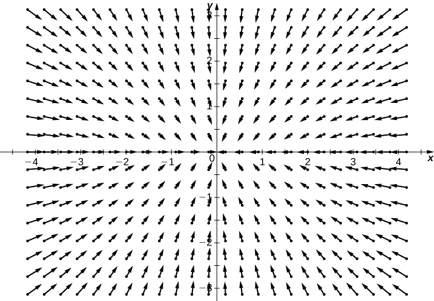
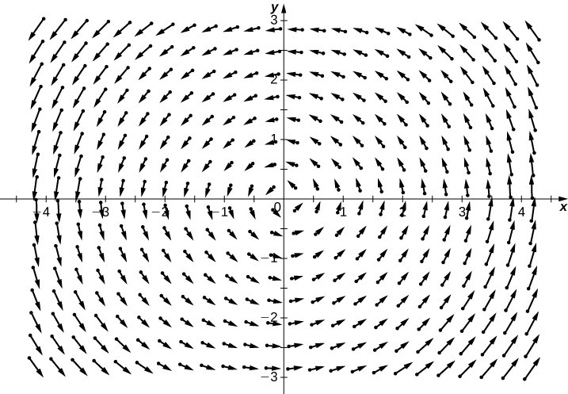
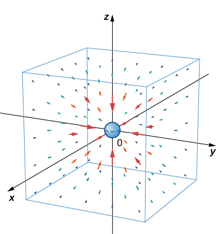
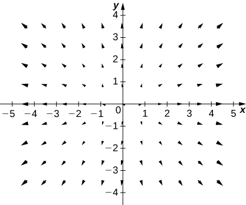
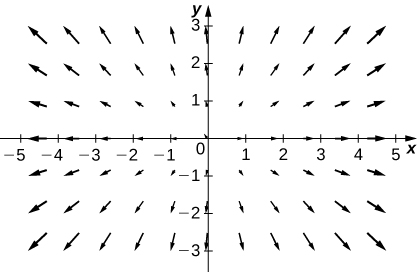
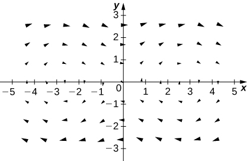
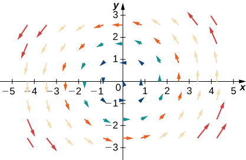
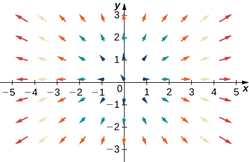

* Recognize a vector field in a plane or in space.
* Sketch a vector field from a given equation.
* Identify a conservative field and its associated potential function.

Vector fields are an important tool for describing many physical concepts, such as gravitation and electromagnetism, which affect the behavior of objects over a large region of a plane or of space. They are also useful for dealing with large-scale behavior such as atmospheric storms or deep-sea ocean currents. In this section, we examine the basic definitions and graphs of vector fields so we can study them in more detail in the rest of this chapter.

# Examples of Vector Fields

How can we model the gravitational force exerted by multiple astronomical objects? How can we model the velocity of water particles on the surface of a river? [\[link\]](#CNX_Calc_Figure_16_01_001) gives visual representations of such phenomena.

[\[link\]](#CNX_Calc_Figure_16_01_001)(a) shows a gravitational field exerted by two astronomical objects, such as a star and a planet or a planet and a moon. At any point in the figure, the vector associated with a point gives the net gravitational force exerted by the two objects on an object of unit mass. The vectors of largest magnitude in the figure are the vectors closest to the larger object. The larger object has greater mass, so it exerts a gravitational force of greater magnitude than the smaller object.

[\[link\]](#CNX_Calc_Figure_16_01_001)(b) shows the velocity of a river at points on its surface. The vector associated with a given point on the river’s surface gives the velocity of the water at that point. Since the vectors to the left of the figure are small in magnitude, the water is flowing slowly on that part of the surface. As the water moves from left to right, it encounters some rapids around a rock. The speed of the water increases, and a whirlpool occurs in part of the rapids.

 ![Two images, labeled A and B. Image A shows the gravitational field exerted by two astronomical bodies on a small object. The earth is on the left, and the moon is on the right. The earth is surrounded by long arrows pointing towards its center arranged in concentric circles. There is a break in the circle on the right, across from the moon. The moon is surrounded by smaller arrows that curve out and to the right. Image B shows the vector velocity field of water on the surface of a river with a large rock in the middle. The arrows tend to point at the same angle as the riverbank. Where the river meets the rock, the arrows point around the rock. After the rock, the some arrows point forward, and others turn back to the rock. The water flows fastest towards the middle of the river and around the rock and slowest along the riverbank.](../resources/CNX_Calc_Figure_16_01_016.jpg "(a) The gravitational field exerted by two astronomical bodies on a small object. (b) The vector velocity field of water on the surface of a river shows the varied speeds of water. Red indicates that the magnitude of the vector is greater, so the water flows more quickly; blue indicates a lesser magnitude and a slower speed of water flow."){: #CNX_Calc_Figure_16_01_001}

Each figure illustrates an example of a vector field. Intuitively, a vector field is a map of vectors. In this section, we study vector fields in <math xmlns="http://www.w3.org/1998/Math/MathML"><mrow><msup><mo>ℝ</mo><mn>2</mn></msup></mrow></math>

 and <math xmlns="http://www.w3.org/1998/Math/MathML"><mrow><msup><mo>ℝ</mo><mn>3</mn></msup><mo>.</mo></mrow></math>

Definition

A **vector field**{: data-type="term"} <math xmlns="http://www.w3.org/1998/Math/MathML"><mstyle mathvariant="bold" mathsize="normal"><mtext>F</mtext></mstyle></math>

 in <math xmlns="http://www.w3.org/1998/Math/MathML"><mrow><msup><mo>ℝ</mo><mn>2</mn></msup></mrow></math>

 is an assignment of a two-dimensional vector <math xmlns="http://www.w3.org/1998/Math/MathML"><mrow><mstyle mathvariant="bold" mathsize="normal"><mtext>F</mtext></mstyle><mrow><mo>(</mo><mrow><mi>x</mi><mo>,</mo><mi>y</mi></mrow><mo>)</mo></mrow></mrow></math>

 to each point <math xmlns="http://www.w3.org/1998/Math/MathML"><mrow><mrow><mo>(</mo><mrow><mi>x</mi><mo>,</mo><mi>y</mi></mrow><mo>)</mo></mrow></mrow></math>

 of a subset *D* of <math xmlns="http://www.w3.org/1998/Math/MathML"><mrow><msup><mo>ℝ</mo><mn>2</mn></msup><mo>.</mo></mrow></math>

 The subset *D* is the **domain**{: data-type="term" .no-emphasis} of the vector field.

A vector field **F** in <math xmlns="http://www.w3.org/1998/Math/MathML"><mrow><msup><mo>ℝ</mo><mn>3</mn></msup></mrow></math>

 is an assignment of a three-dimensional vector <math xmlns="http://www.w3.org/1998/Math/MathML"><mrow><mstyle mathvariant="bold" mathsize="normal"><mtext>F</mtext></mstyle><mrow><mo>(</mo><mrow><mi>x</mi><mo>,</mo><mi>y</mi><mo>,</mo><mi>z</mi></mrow><mo>)</mo></mrow></mrow></math>

 to each point <math xmlns="http://www.w3.org/1998/Math/MathML"><mrow><mrow><mo>(</mo><mrow><mi>x</mi><mo>,</mo><mi>y</mi><mo>,</mo><mi>z</mi></mrow><mo>)</mo></mrow></mrow></math>

 of a subset *D* of <math xmlns="http://www.w3.org/1998/Math/MathML"><mrow><msup><mo>ℝ</mo><mn>3</mn></msup><mo>.</mo></mrow></math>

 The subset *D* is the domain of the vector field.

## Vector Fields in <math xmlns="http://www.w3.org/1998/Math/MathML"><mrow><msup><mo>ℝ</mo><mn>2</mn></msup></mrow></math>

A vector field in <math xmlns="http://www.w3.org/1998/Math/MathML"><mrow><msup><mo>ℝ</mo><mn>2</mn></msup></mrow></math>

 can be represented in either of two equivalent ways. The first way is to use a vector with components that are two-variable functions:

<math xmlns="http://www.w3.org/1998/Math/MathML"><mrow><mstyle mathvariant="bold" mathsize="normal"><mtext>F</mtext></mstyle><mo stretchy="false">(</mo><mi>x</mi><mo>,</mo><mi>y</mi><mo stretchy="false">)</mo><mo>=</mo><mrow><mo>〈</mo><mrow><mi>P</mi><mo stretchy="false">(</mo><mi>x</mi><mo>,</mo><mi>y</mi><mo stretchy="false">)</mo><mo>,</mo><mi>Q</mi><mo stretchy="false">(</mo><mi>x</mi><mo>,</mo><mi>y</mi><mo stretchy="false">)</mo></mrow><mo>〉</mo></mrow><mo>.</mo></mrow></math>

The second way is to use the standard unit vectors:

<math xmlns="http://www.w3.org/1998/Math/MathML"><mrow><mstyle mathvariant="bold" mathsize="normal"><mtext>F</mtext></mstyle><mo stretchy="false">(</mo><mi>x</mi><mo>,</mo><mi>y</mi><mo stretchy="false">)</mo><mo>=</mo><mi>P</mi><mo stretchy="false">(</mo><mi>x</mi><mo>,</mo><mi>y</mi><mo stretchy="false">)</mo><mstyle mathvariant="bold" mathsize="normal"><mtext>i</mtext></mstyle><mo>+</mo><mi>Q</mi><mo stretchy="false">(</mo><mi>x</mi><mo>,</mo><mi>y</mi><mo stretchy="false">)</mo><mstyle mathvariant="bold" mathsize="normal"><mtext>j</mtext></mstyle><mo>.</mo></mrow></math>

A vector field is said to be *continuous* if its component functions are continuous.

Finding a Vector Associated with a Given Point

Let <math xmlns="http://www.w3.org/1998/Math/MathML"><mrow><mstyle mathvariant="bold" mathsize="normal"><mtext>F</mtext></mstyle><mo stretchy="false">(</mo><mi>x</mi><mo>,</mo><mi>y</mi><mo stretchy="false">)</mo><mo>=</mo><mo stretchy="false">(</mo><mn>2</mn><msup><mi>y</mi><mn>2</mn></msup><mo>+</mo><mi>x</mi><mo>−</mo><mn>4</mn><mo stretchy="false">)</mo><mstyle mathvariant="bold" mathsize="normal"><mtext>i</mtext></mstyle><mo>+</mo><mtext>cos</mtext><mo stretchy="false">(</mo><mi>x</mi><mo stretchy="false">)</mo><mstyle mathvariant="bold" mathsize="normal"><mtext>j</mtext></mstyle></mrow></math>

 be a vector field in <math xmlns="http://www.w3.org/1998/Math/MathML"><mrow><msup><mo>ℝ</mo><mn>2</mn></msup><mo>.</mo></mrow></math>

 Note that this is an example of a continuous vector field since both component functions are continuous. What vector is associated with point <math xmlns="http://www.w3.org/1998/Math/MathML"><mrow><mrow><mo>(</mo><mrow><mn>0</mn><mo>,</mo><mn>−1</mn></mrow><mo>)</mo></mrow><mo>?</mo></mrow></math>

Substitute the point values for *x* and *y*:

<math xmlns="http://www.w3.org/1998/Math/MathML"><mtable><mtr><mtd columnalign="right"><mstyle mathvariant="bold" mathsize="normal"><mtext>F</mtext></mstyle><mo stretchy="false">(</mo><mn>0</mn><mo>,</mo><mn>1</mn><mo stretchy="false">)</mo></mtd><mtd columnalign="left"><mo>=</mo><mo stretchy="false">(</mo><mn>2</mn><msup><mrow><mo stretchy="false">(</mo><mn>−1</mn><mo stretchy="false">)</mo></mrow><mrow><mn>2</mn></mrow></msup><mo>+</mo><mn>0</mn><mo>−</mo><mn>4</mn><mo stretchy="false">)</mo><mstyle mathvariant="bold" mathsize="normal"><mtext>i</mtext></mstyle><mo>+</mo><mtext>cos</mtext><mo stretchy="false">(</mo><mn>0</mn><mo stretchy="false">)</mo><mstyle mathvariant="bold" mathsize="normal"><mtext>j</mtext></mstyle></mtd></mtr><mtr><mtd /><mtd columnalign="left"><mo>=</mo><mn>−2</mn><mstyle mathvariant="bold" mathsize="normal"><mtext>i</mtext></mstyle><mo>+</mo><mstyle mathvariant="bold" mathsize="normal"><mtext>j</mtext></mstyle><mo>.</mo></mtd></mtr></mtable></math>

Let <math xmlns="http://www.w3.org/1998/Math/MathML"><mrow><mstyle mathvariant="bold" mathsize="normal"><mtext>G</mtext></mstyle><mrow><mo>(</mo><mrow><mi>x</mi><mo>,</mo><mi>y</mi></mrow><mo>)</mo></mrow><mo>=</mo><msup><mi>x</mi><mn>2</mn></msup><mi>y</mi><mstyle mathvariant="bold" mathsize="normal"><mtext>i</mtext></mstyle><mo>−</mo><mrow><mo>(</mo><mrow><mi>x</mi><mo>+</mo><mi>y</mi></mrow><mo>)</mo></mrow><mstyle mathvariant="bold" mathsize="normal"><mtext>j</mtext></mstyle></mrow></math>

 be a vector field in <math xmlns="http://www.w3.org/1998/Math/MathML"><mrow><msup><mo>ℝ</mo><mn>2</mn></msup><mo>.</mo></mrow></math>

 What vector is associated with the point <math xmlns="http://www.w3.org/1998/Math/MathML"><mrow><mrow><mo>(</mo><mrow><mn>−2</mn><mo>,</mo><mn>3</mn></mrow><mo>)</mo></mrow><mo>?</mo></mrow></math>

<math xmlns="http://www.w3.org/1998/Math/MathML"><mrow><mn>12</mn><mstyle mathvariant="bold" mathsize="normal"><mtext>i</mtext></mstyle><mo>−</mo><mstyle mathvariant="bold" mathsize="normal"><mtext>j</mtext></mstyle></mrow></math>

Hint

Substitute the point values into the vector function.

# Drawing a Vector Field

We can now represent a vector field in terms of its components of functions or unit vectors, but representing it visually by sketching it is more complex because the domain of a vector field is in <math xmlns="http://www.w3.org/1998/Math/MathML"><mrow><msup><mo>ℝ</mo><mn>2</mn></msup><mo>,</mo></mrow></math>

 as is the range. Therefore the “graph” of a vector field in <math xmlns="http://www.w3.org/1998/Math/MathML"><mrow><msup><mo>ℝ</mo><mn>2</mn></msup></mrow></math>

 lives in four-dimensional space. Since we cannot represent four-dimensional space visually, we instead draw vector fields in <math xmlns="http://www.w3.org/1998/Math/MathML"><mrow><msup><mo>ℝ</mo><mn>2</mn></msup></mrow></math>

 in a plane itself. To do this, draw the vector associated with a given point at the point in a plane. For example, suppose the vector associated with point <math xmlns="http://www.w3.org/1998/Math/MathML"><mrow><mrow><mo>(</mo><mrow><mn>4</mn><mo>,</mo><mn>−1</mn></mrow><mo>)</mo></mrow></mrow></math>

 is <math xmlns="http://www.w3.org/1998/Math/MathML"><mrow><mrow><mo>〈</mo><mrow><mn>3</mn><mo>,</mo><mn>1</mn></mrow><mo>〉</mo></mrow><mo>.</mo></mrow></math>

 Then, we would draw vector <math xmlns="http://www.w3.org/1998/Math/MathML"><mrow><mrow><mo>〈</mo><mrow><mn>3</mn><mo>,</mo><mn>1</mn></mrow><mo>〉</mo></mrow></mrow></math>

 at point <math xmlns="http://www.w3.org/1998/Math/MathML"><mrow><mrow><mo>(</mo><mrow><mn>4</mn><mo>,</mo><mn>−1</mn></mrow><mo>)</mo></mrow><mo>.</mo></mrow></math>

We should plot enough vectors to see the general shape, but not so many that the sketch becomes a jumbled mess. If we were to plot the image vector at each point in the region, it would fill the region completely and is useless. Instead, we can choose points at the intersections of grid lines and plot a sample of several vectors from each quadrant of a rectangular coordinate system in <math xmlns="http://www.w3.org/1998/Math/MathML"><mrow><msup><mo>ℝ</mo><mn>2</mn></msup><mo>.</mo></mrow></math>

There are two types of vector fields in <math xmlns="http://www.w3.org/1998/Math/MathML"><mrow><msup><mo>ℝ</mo><mn>2</mn></msup></mrow></math>

 on which this chapter focuses: radial fields and rotational fields. Radial fields model certain gravitational fields and energy source fields, and rotational fields model the movement of a fluid in a vortex. In a **radial field**{: data-type="term"}, all vectors either point directly toward or directly away from the origin. Furthermore, the magnitude of any vector depends only on its distance from the origin. In a radial field, the vector located at point <math xmlns="http://www.w3.org/1998/Math/MathML"><mrow><mrow><mo>(</mo><mrow><mi>x</mi><mo>,</mo><mi>y</mi></mrow><mo>)</mo></mrow></mrow></math>

 is perpendicular to the circle centered at the origin that contains point <math xmlns="http://www.w3.org/1998/Math/MathML"><mrow><mrow><mo>(</mo><mrow><mi>x</mi><mo>,</mo><mi>y</mi></mrow><mo>)</mo></mrow><mo>,</mo></mrow></math>

 and all other vectors on this circle have the same magnitude.

Drawing a Radial Vector Field

Sketch the vector field <math xmlns="http://www.w3.org/1998/Math/MathML"><mrow><mstyle mathvariant="bold" mathsize="normal"><mtext>F</mtext></mstyle><mo stretchy="false">(</mo><mi>x</mi><mo>,</mo><mi>y</mi><mo stretchy="false">)</mo><mo>=</mo><mfrac><mi>x</mi><mn>2</mn></mfrac><mspace width="0.1em" /><mstyle mathvariant="bold" mathsize="normal"><mtext>i</mtext></mstyle><mo>+</mo><mfrac><mi>y</mi><mn>2</mn></mfrac><mspace width="0.1em" /><mstyle mathvariant="bold" mathsize="normal"><mtext>j</mtext></mstyle><mo>.</mo></mrow></math>

To sketch this vector field, choose a sample of points from each quadrant and compute the corresponding vector. The following table gives a representative sample of points in a plane and the corresponding vectors.

| <math xmlns="http://www.w3.org/1998/Math/MathML"><mrow><mrow><mo>(</mo><mrow><mi>x</mi><mo>,</mo><mi>y</mi></mrow><mo>)</mo></mrow></mrow></math>

 | <math xmlns="http://www.w3.org/1998/Math/MathML"><mrow><mstyle mathvariant="bold" mathsize="normal"><mtext>F</mtext></mstyle><mrow><mo>(</mo><mrow><mi>x</mi><mo>,</mo><mi>y</mi></mrow><mo>)</mo></mrow></mrow></math>

 | <math xmlns="http://www.w3.org/1998/Math/MathML"><mrow><mrow><mo>(</mo><mrow><mi>x</mi><mo>,</mo><mi>y</mi></mrow><mo>)</mo></mrow></mrow></math>

 | <math xmlns="http://www.w3.org/1998/Math/MathML"><mrow><mstyle mathvariant="bold" mathsize="normal"><mtext>F</mtext></mstyle><mrow><mo>(</mo><mrow><mi>x</mi><mo>,</mo><mi>y</mi></mrow><mo>)</mo></mrow></mrow></math>

 | <math xmlns="http://www.w3.org/1998/Math/MathML"><mrow><mrow><mo>(</mo><mrow><mi>x</mi><mo>,</mo><mi>y</mi></mrow><mo>)</mo></mrow></mrow></math>

 | <math xmlns="http://www.w3.org/1998/Math/MathML"><mrow><mstyle mathvariant="bold" mathsize="normal"><mtext>F</mtext></mstyle><mrow><mo>(</mo><mrow><mi>x</mi><mo>,</mo><mi>y</mi></mrow><mo>)</mo></mrow></mrow></math>

 |
{: valign="top"}| <math xmlns="http://www.w3.org/1998/Math/MathML"><mrow><mrow><mo>(</mo><mrow><mn>1</mn><mo>,</mo><mn>0</mn></mrow><mo>)</mo></mrow></mrow></math>

 | <math xmlns="http://www.w3.org/1998/Math/MathML"><mrow><mrow><mo>〈</mo><mrow><mfrac><mn>1</mn><mn>2</mn></mfrac><mo>,</mo><mn>0</mn></mrow><mo>〉</mo></mrow></mrow></math>

 | <math xmlns="http://www.w3.org/1998/Math/MathML"><mrow><mrow><mo>(</mo><mrow><mn>2</mn><mo>,</mo><mn>0</mn></mrow><mo>)</mo></mrow></mrow></math>

 | <math xmlns="http://www.w3.org/1998/Math/MathML"><mrow><mrow><mo>〈</mo><mrow><mn>1</mn><mo>,</mo><mn>0</mn></mrow><mo>〉</mo></mrow></mrow></math>

 | <math xmlns="http://www.w3.org/1998/Math/MathML"><mrow><mrow><mo>(</mo><mrow><mn>1</mn><mo>,</mo><mn>1</mn></mrow><mo>)</mo></mrow></mrow></math>

 | <math xmlns="http://www.w3.org/1998/Math/MathML"><mrow><mrow><mo>〈</mo><mrow><mfrac><mn>1</mn><mn>2</mn></mfrac><mo>,</mo><mfrac><mn>1</mn><mn>2</mn></mfrac></mrow><mo>〉</mo></mrow></mrow></math>

 |
{: valign="top"}| <math xmlns="http://www.w3.org/1998/Math/MathML"><mrow><mrow><mo>(</mo><mrow><mn>0</mn><mo>,</mo><mn>1</mn></mrow><mo>)</mo></mrow></mrow></math>

 | <math xmlns="http://www.w3.org/1998/Math/MathML"><mrow><mrow><mo>〈</mo><mrow><mn>0</mn><mo>,</mo><mfrac><mn>1</mn><mn>2</mn></mfrac></mrow><mo>〉</mo></mrow></mrow></math>

 | <math xmlns="http://www.w3.org/1998/Math/MathML"><mrow><mrow><mo>(</mo><mrow><mn>0</mn><mo>,</mo><mn>2</mn></mrow><mo>)</mo></mrow></mrow></math>

 | <math xmlns="http://www.w3.org/1998/Math/MathML"><mrow><mrow><mo>〈</mo><mrow><mn>0</mn><mo>,</mo><mn>1</mn></mrow><mo>〉</mo></mrow></mrow></math>

 | <math xmlns="http://www.w3.org/1998/Math/MathML"><mrow><mrow><mo>(</mo><mrow><mn>−1</mn><mo>,</mo><mn>1</mn></mrow><mo>)</mo></mrow></mrow></math>

 | <math xmlns="http://www.w3.org/1998/Math/MathML"><mrow><mrow><mo>〈</mo><mrow><mo>−</mo><mfrac><mn>1</mn><mn>2</mn></mfrac><mo>,</mo><mfrac><mn>1</mn><mn>2</mn></mfrac></mrow><mo>〉</mo></mrow></mrow></math>

 |
{: valign="top"}| <math xmlns="http://www.w3.org/1998/Math/MathML"><mrow><mrow><mo>(</mo><mrow><mn>−1</mn><mo>,</mo><mn>0</mn></mrow><mo>)</mo></mrow></mrow></math>

 | <math xmlns="http://www.w3.org/1998/Math/MathML"><mrow><mrow><mo>〈</mo><mrow><mo>−</mo><mfrac><mn>1</mn><mn>2</mn></mfrac><mo>,</mo><mn>0</mn></mrow><mo>〉</mo></mrow></mrow></math>

 | <math xmlns="http://www.w3.org/1998/Math/MathML"><mrow><mrow><mo>(</mo><mrow><mn>−2</mn><mo>,</mo><mn>0</mn></mrow><mo>)</mo></mrow></mrow></math>

 | <math xmlns="http://www.w3.org/1998/Math/MathML"><mrow><mrow><mo>〈</mo><mrow><mn>−1</mn><mo>,</mo><mn>0</mn></mrow><mo>〉</mo></mrow></mrow></math>

 | <math xmlns="http://www.w3.org/1998/Math/MathML"><mrow><mrow><mo>(</mo><mrow><mn>−1</mn><mo>,</mo><mn>−1</mn></mrow><mo>)</mo></mrow></mrow></math>

 | <math xmlns="http://www.w3.org/1998/Math/MathML"><mrow><mrow><mo>〈</mo><mrow><mo>−</mo><mfrac><mn>1</mn><mn>2</mn></mfrac><mo>,</mo><mo>−</mo><mfrac><mn>1</mn><mn>2</mn></mfrac></mrow><mo>〉</mo></mrow></mrow></math>

 |
{: valign="top"}| <math xmlns="http://www.w3.org/1998/Math/MathML"><mrow><mrow><mo>(</mo><mrow><mn>0</mn><mo>,</mo><mn>−1</mn></mrow><mo>)</mo></mrow></mrow></math>

 | <math xmlns="http://www.w3.org/1998/Math/MathML"><mrow><mrow><mo>〈</mo><mrow><mn>0</mn><mo>,</mo><mo>−</mo><mfrac><mn>1</mn><mn>2</mn></mfrac></mrow><mo>〉</mo></mrow></mrow></math>

 | <math xmlns="http://www.w3.org/1998/Math/MathML"><mrow><mrow><mo>(</mo><mrow><mn>0</mn><mo>,</mo><mn>−2</mn></mrow><mo>)</mo></mrow></mrow></math>

 | <math xmlns="http://www.w3.org/1998/Math/MathML"><mrow><mrow><mo>〈</mo><mrow><mn>0</mn><mo>,</mo><mn>−1</mn></mrow><mo>〉</mo></mrow></mrow></math>

 | <math xmlns="http://www.w3.org/1998/Math/MathML"><mrow><mrow><mo>(</mo><mrow><mn>1</mn><mo>,</mo><mn>−1</mn></mrow><mo>)</mo></mrow></mrow></math>

 | <math xmlns="http://www.w3.org/1998/Math/MathML"><mrow><mrow><mo>〈</mo><mrow><mfrac><mn>1</mn><mn>2</mn></mfrac><mo>,</mo><mo>−</mo><mfrac><mn>1</mn><mn>2</mn></mfrac></mrow><mo>〉</mo></mrow></mrow></math>

 |
{: valign="top"}{: .unnumbered summary="A table with six columns and five rows. The first row has the values (x,y), F(x,y), (x,y), F(x,y), (x,y), and F(x,y). The second row has the values (1,0), &lt;1/2,0&gt;, (2,0), &lt;1,0&gt;, (1,1), &lt;1/2,1/2&gt;. The third row has the values (0,1), &lt;0,1/2&gt;, (0,2), &lt;0,1&gt;, (-1,1), &lt;-1/2,1/2&gt;. The fourth row has the values (-1,0), &lt;-1/2,0&gt;, (-2,0), &lt;-1,0&gt;, (-1,-1), &lt;-1/2,-1/2&gt;. The fifth row has the values (0,-1), &lt;0,-1/2&gt;, (0,-2), &lt;0,-1&gt;, (1,-1), &lt;1/2,-1/2&gt;." data-label=""}

[[link]](#CNX_Calc_Figure_16_01_002)(a) shows the vector field. To see that each vector is perpendicular to the corresponding circle, [[link]](#CNX_Calc_Figure_16_01_002)(b) shows circles overlain on the vector field.

 A visual representation of the radial vector field F(x,y)=x2i+y2j. (b) The radial vector field F(x,y)=x2i+y2j with overlaid circles. Notice that each vector is perpendicular to the circle on which it is located."){: #CNX_Calc_Figure_16_01_002}

Draw the radial field <math xmlns="http://www.w3.org/1998/Math/MathML"><mrow><mstyle mathvariant="bold" mathsize="normal"><mtext>F</mtext></mstyle><mo stretchy="false">(</mo><mi>x</mi><mo>,</mo><mi>y</mi><mo stretchy="false">)</mo><mo>=</mo><mo>−</mo><mfrac><mi>x</mi><mn>3</mn></mfrac><mspace width="0.1em" /><mstyle mathvariant="bold" mathsize="normal"><mtext>i</mtext></mstyle><mo>−</mo><mfrac><mi>y</mi><mn>3</mn></mfrac><mspace width="0.1em" /><mstyle mathvariant="bold" mathsize="normal"><mtext>j</mtext></mstyle><mo>.</mo></mrow></math>

* * *
{: data-type="newline"}

   

Hint

Sketch enough vectors to get an idea of the shape.

In contrast to radial fields, in a **rotational field**{: data-type="term"}, the vector at point <math xmlns="http://www.w3.org/1998/Math/MathML"><mrow><mrow><mo>(</mo><mrow><mi>x</mi><mo>,</mo><mi>y</mi></mrow><mo>)</mo></mrow></mrow></math>

 is tangent (not perpendicular) to a circle with radius <math xmlns="http://www.w3.org/1998/Math/MathML"><mrow><mi>r</mi><mo>=</mo><msqrt><mrow><msup><mi>x</mi><mn>2</mn></msup><mo>+</mo><msup><mi>y</mi><mn>2</mn></msup></mrow></msqrt><mo>.</mo></mrow></math>

 In a standard rotational field, all vectors point either in a clockwise direction or in a counterclockwise direction, and the magnitude of a vector depends only on its distance from the origin. Both of the following examples are clockwise rotational fields, and we see from their visual representations that the vectors appear to rotate around the origin.

Chapter Opener: Drawing a Rotational Vector Field

"){: #CNX_Calc_Figure_16_01_017}

Sketch the vector field <math xmlns="http://www.w3.org/1998/Math/MathML"><mrow><mstyle mathvariant="bold" mathsize="normal"><mtext>F</mtext></mstyle><mrow><mo>(</mo><mrow><mi>x</mi><mo>,</mo><mi>y</mi></mrow><mo>)</mo></mrow><mo>=</mo><mrow><mo>〈</mo><mrow><mi>y</mi><mo>,</mo><mtext>−</mtext><mi>x</mi></mrow><mo>〉</mo></mrow><mo>.</mo></mrow></math>

Create a table (see the one that follows) using a representative sample of points in a plane and their corresponding vectors. [[link]](#CNX_Calc_Figure_16_01_005) shows the resulting vector field.

| <math xmlns="http://www.w3.org/1998/Math/MathML"><mrow><mrow><mo>(</mo><mrow><mi>x</mi><mo>,</mo><mi>y</mi></mrow><mo>)</mo></mrow></mrow></math>

 | <math xmlns="http://www.w3.org/1998/Math/MathML"><mrow><mstyle mathvariant="bold" mathsize="normal"><mtext>F</mtext></mstyle><mrow><mo>(</mo><mrow><mi>x</mi><mo>,</mo><mi>y</mi></mrow><mo>)</mo></mrow></mrow></math>

 | <math xmlns="http://www.w3.org/1998/Math/MathML"><mrow><mrow><mo>(</mo><mrow><mi>x</mi><mo>,</mo><mi>y</mi></mrow><mo>)</mo></mrow></mrow></math>

 | <math xmlns="http://www.w3.org/1998/Math/MathML"><mrow><mstyle mathvariant="bold" mathsize="normal"><mtext>F</mtext></mstyle><mrow><mo>(</mo><mrow><mi>x</mi><mo>,</mo><mi>y</mi></mrow><mo>)</mo></mrow></mrow></math>

 | <math xmlns="http://www.w3.org/1998/Math/MathML"><mrow><mrow><mo>(</mo><mrow><mi>x</mi><mo>,</mo><mi>y</mi></mrow><mo>)</mo></mrow></mrow></math>

 | <math xmlns="http://www.w3.org/1998/Math/MathML"><mrow><mstyle mathvariant="bold" mathsize="normal"><mtext>F</mtext></mstyle><mrow><mo>(</mo><mrow><mi>x</mi><mo>,</mo><mi>y</mi></mrow><mo>)</mo></mrow></mrow></math>

 |
{: valign="top"}| <math xmlns="http://www.w3.org/1998/Math/MathML"><mrow><mrow><mo>(</mo><mrow><mn>1</mn><mo>,</mo><mn>0</mn></mrow><mo>)</mo></mrow></mrow></math>

 | <math xmlns="http://www.w3.org/1998/Math/MathML"><mrow><mrow><mo>〈</mo><mrow><mn>0</mn><mo>,</mo><mn>−1</mn></mrow><mo>〉</mo></mrow></mrow></math>

 | <math xmlns="http://www.w3.org/1998/Math/MathML"><mrow><mrow><mo>(</mo><mrow><mn>2</mn><mo>,</mo><mn>0</mn></mrow><mo>)</mo></mrow></mrow></math>

 | <math xmlns="http://www.w3.org/1998/Math/MathML"><mrow><mrow><mo>〈</mo><mrow><mn>0</mn><mo>,</mo><mn>−2</mn></mrow><mo>〉</mo></mrow></mrow></math>

 | <math xmlns="http://www.w3.org/1998/Math/MathML"><mrow><mrow><mo>(</mo><mrow><mn>1</mn><mo>,</mo><mn>1</mn></mrow><mo>)</mo></mrow></mrow></math>

 | <math xmlns="http://www.w3.org/1998/Math/MathML"><mrow><mrow><mo>〈</mo><mrow><mn>1</mn><mo>,</mo><mn>−1</mn></mrow><mo>〉</mo></mrow></mrow></math>

 |
{: valign="top"}| <math xmlns="http://www.w3.org/1998/Math/MathML"><mrow><mrow><mo>(</mo><mrow><mn>0</mn><mo>,</mo><mn>1</mn></mrow><mo>)</mo></mrow></mrow></math>

 | <math xmlns="http://www.w3.org/1998/Math/MathML"><mrow><mrow><mo>〈</mo><mrow><mn>1</mn><mo>,</mo><mn>0</mn></mrow><mo>〉</mo></mrow></mrow></math>

 | <math xmlns="http://www.w3.org/1998/Math/MathML"><mrow><mrow><mo>(</mo><mrow><mn>0</mn><mo>,</mo><mn>2</mn></mrow><mo>)</mo></mrow></mrow></math>

 | <math xmlns="http://www.w3.org/1998/Math/MathML"><mrow><mrow><mo>〈</mo><mrow><mn>2</mn><mo>,</mo><mn>0</mn></mrow><mo>〉</mo></mrow></mrow></math>

 | <math xmlns="http://www.w3.org/1998/Math/MathML"><mrow><mrow><mo>(</mo><mrow><mn>−1</mn><mo>,</mo><mn>1</mn></mrow><mo>)</mo></mrow></mrow></math>

 | <math xmlns="http://www.w3.org/1998/Math/MathML"><mrow><mrow><mo>〈</mo><mrow><mn>1</mn><mo>,</mo><mn>1</mn></mrow><mo>〉</mo></mrow></mrow></math>

 |
{: valign="top"}| <math xmlns="http://www.w3.org/1998/Math/MathML"><mrow><mrow><mo>(</mo><mrow><mn>−1</mn><mo>,</mo><mn>0</mn></mrow><mo>)</mo></mrow></mrow></math>

 | <math xmlns="http://www.w3.org/1998/Math/MathML"><mrow><mrow><mo>〈</mo><mrow><mn>0</mn><mo>,</mo><mn>1</mn></mrow><mo>〉</mo></mrow></mrow></math>

 | <math xmlns="http://www.w3.org/1998/Math/MathML"><mrow><mrow><mo>(</mo><mrow><mn>−2</mn><mo>,</mo><mn>0</mn></mrow><mo>)</mo></mrow></mrow></math>

 | <math xmlns="http://www.w3.org/1998/Math/MathML"><mrow><mrow><mo>〈</mo><mrow><mn>0</mn><mo>,</mo><mn>2</mn></mrow><mo>〉</mo></mrow></mrow></math>

 | <math xmlns="http://www.w3.org/1998/Math/MathML"><mrow><mrow><mo>(</mo><mrow><mn>−1</mn><mo>,</mo><mn>−1</mn></mrow><mo>)</mo></mrow></mrow></math>

 | <math xmlns="http://www.w3.org/1998/Math/MathML"><mrow><mrow><mo>〈</mo><mrow><mn>−1</mn><mo>,</mo><mn>1</mn></mrow><mo>〉</mo></mrow></mrow></math>

 |
{: valign="top"}| <math xmlns="http://www.w3.org/1998/Math/MathML"><mrow><mrow><mo>(</mo><mrow><mn>0</mn><mo>,</mo><mn>−1</mn></mrow><mo>)</mo></mrow></mrow></math>

 | <math xmlns="http://www.w3.org/1998/Math/MathML"><mrow><mrow><mo>〈</mo><mrow><mn>−1</mn><mo>,</mo><mn>0</mn></mrow><mo>〉</mo></mrow></mrow></math>

 | <math xmlns="http://www.w3.org/1998/Math/MathML"><mrow><mrow><mo>(</mo><mrow><mn>0</mn><mo>,</mo><mn>−2</mn></mrow><mo>)</mo></mrow></mrow></math>

 | <math xmlns="http://www.w3.org/1998/Math/MathML"><mrow><mrow><mo>〈</mo><mrow><mn>−2</mn><mo>,</mo><mn>0</mn></mrow><mo>〉</mo></mrow></mrow></math>

 | <math xmlns="http://www.w3.org/1998/Math/MathML"><mrow><mrow><mo>(</mo><mrow><mn>1</mn><mo>,</mo><mn>−1</mn></mrow><mo>)</mo></mrow></mrow></math>

 | <math xmlns="http://www.w3.org/1998/Math/MathML"><mrow><mrow><mo>〈</mo><mrow><mn>−1</mn><mo>,</mo><mn>−1</mn></mrow><mo>〉</mo></mrow></mrow></math>

 |
{: valign="top"}{: .unnumbered summary="A table with six columns and five rows. The first row has the values (x,y), F(x,y), (x,y), F(x,y), (x,y), and F(x,y). The second row has the values (1,0), &lt;0,-1&gt;, (2,0), &lt;0,-2&gt;, (1,1), &lt;1,-1&gt;. The third row has the values (0,1), &lt;1,0&gt;, (0,2), &lt;2,0&gt;, (-1,1), &lt;1,1&gt;. The fourth row has the values (-1,0), &lt;0,1&gt;, (-2,0), &lt;0,2&gt;, (-1,-1), &lt;-1,1&gt;. The fifth row has the values (0,-1), &lt;-1,0&gt;, (0,-2), &lt;-2,0&gt;, (1,-1), &lt;-1,-1&gt;." data-label=""}

![A visual representation of the given vector field in a coordinate plane with two additional diagrams with notation. The first representation shows the vector field. The arrows are circling the origin in a clockwise motion. The second representation shows concentric circles, highlighting the radial pattern. The The third representation shows the concentric circles. It also shows arrows for the radial vector &lt;a,b&gt; for all points (a,b). Each is perpendicular to the arrows in the given vector field.](../resources/CNX_Calc_Figure_16_01_006.jpg "(a) A visual representation of vector field F(x,y)=&#x2329;y,&#x2212;x&#x232A;. (b) Vector field F(x,y)=&#x2329;y,&#x2212;x&#x232A; with circles centered at the origin. (c) Vector F(a,b) is perpendicular to radial vector &#x2329;a,b&#x232A; at point (a,b)."){: #CNX_Calc_Figure_16_01_004}

Analysis

Note that vector <math xmlns="http://www.w3.org/1998/Math/MathML"><mrow><mstyle mathvariant="bold" mathsize="normal"><mtext>F</mtext></mstyle><mrow><mo>(</mo><mrow><mi>a</mi><mo>,</mo><mi>b</mi></mrow><mo>)</mo></mrow><mo>=</mo><mrow><mo>〈</mo><mrow><mi>b</mi><mo>,</mo><mtext>−</mtext><mi>a</mi></mrow><mo>〉</mo></mrow></mrow></math>

 points clockwise and is perpendicular to radial vector <math xmlns="http://www.w3.org/1998/Math/MathML"><mrow><mrow><mo>〈</mo><mrow><mi>a</mi><mo>,</mo><mi>b</mi></mrow><mo>〉</mo></mrow><mo>.</mo></mrow></math>

 (We can verify this assertion by computing the dot product of the two vectors: <math xmlns="http://www.w3.org/1998/Math/MathML"><mrow><mrow><mo>〈</mo><mrow><mi>a</mi><mo>,</mo><mi>b</mi></mrow><mo>〉</mo></mrow><mo>·</mo><mrow><mo>〈</mo><mrow><mtext>−</mtext><mi>b</mi><mo>,</mo><mi>a</mi></mrow><mo>〉</mo></mrow><mo>=</mo><mtext>−</mtext><mi>a</mi><mi>b</mi><mo>+</mo><mi>a</mi><mi>b</mi><mo>=</mo><mn>0</mn><mo>.</mo><mo stretchy="false">)</mo></mrow></math>

 Furthermore, vector <math xmlns="http://www.w3.org/1998/Math/MathML"><mrow><mrow><mo>〈</mo><mrow><mi>b</mi><mo>,</mo><mtext>−</mtext><mi>a</mi></mrow><mo>〉</mo></mrow></mrow></math>

 has length <math xmlns="http://www.w3.org/1998/Math/MathML"><mrow><mi>r</mi><mo>=</mo><msqrt><mrow><msup><mi>a</mi><mn>2</mn></msup><mo>+</mo><msup><mi>b</mi><mn>2</mn></msup></mrow></msqrt><mo>.</mo></mrow></math>

 Thus, we have a complete description of this rotational vector field: the vector associated with point <math xmlns="http://www.w3.org/1998/Math/MathML"><mrow><mrow><mo>(</mo><mrow><mi>a</mi><mo>,</mo><mi>b</mi></mrow><mo>)</mo></mrow></mrow></math>

 is the vector with length *r* tangent to the circle with radius *r*, and it points in the clockwise direction.

Sketches such as that in [[link]](#CNX_Calc_Figure_16_01_005) are often used to analyze major storm systems, including **hurricanes**{: data-type="term" .no-emphasis} and cyclones. In the northern hemisphere, storms rotate counterclockwise; in the southern hemisphere, storms rotate clockwise. (This is an effect caused by Earth’s rotation about its axis and is called the Coriolis Effect.)

Sketching a Vector Field

Sketch vector field <math xmlns="http://www.w3.org/1998/Math/MathML"><mrow><mstyle mathvariant="bold" mathsize="normal"><mtext>F</mtext></mstyle><mo stretchy="false">(</mo><mi>x</mi><mo>,</mo><mi>y</mi><mo stretchy="false">)</mo><mo>=</mo><mfrac><mi>y</mi><mrow><msup><mi>x</mi><mn>2</mn></msup><mo>+</mo><msup><mi>y</mi><mn>2</mn></msup></mrow></mfrac><mspace width="0.1em" /><mstyle mathvariant="bold" mathsize="normal"><mtext>i</mtext></mstyle><mo>−</mo><mfrac><mi>x</mi><mrow><msup><mi>x</mi><mn>2</mn></msup><mo>+</mo><msup><mi>y</mi><mn>2</mn></msup></mrow></mfrac><mspace width="0.1em" /><mstyle mathvariant="bold" mathsize="normal"><mtext>j</mtext></mstyle><mo>.</mo></mrow></math>

To visualize this vector field, first note that the dot product <math xmlns="http://www.w3.org/1998/Math/MathML"><mrow><mstyle mathvariant="bold" mathsize="normal"><mtext>F</mtext></mstyle><mo stretchy="false">(</mo><mi>a</mi><mo>,</mo><mi>b</mi><mo stretchy="false">)</mo><mo>·</mo><mo stretchy="false">(</mo><mi>a</mi><mstyle mathvariant="bold" mathsize="normal"><mtext>i</mtext></mstyle><mo>+</mo><mi>b</mi><mstyle mathvariant="bold" mathsize="normal"><mtext>j</mtext></mstyle><mo stretchy="false">)</mo></mrow></math>

 is zero for any point <math xmlns="http://www.w3.org/1998/Math/MathML"><mrow><mrow><mo>(</mo><mrow><mi>a</mi><mo>,</mo><mi>b</mi></mrow><mo>)</mo></mrow><mo>.</mo></mrow></math>

 Therefore, each vector is tangent to the circle on which it is located. Also, as <math xmlns="http://www.w3.org/1998/Math/MathML"><mrow><mrow><mo>(</mo><mrow><mi>a</mi><mo>,</mo><mi>b</mi></mrow><mo>)</mo></mrow><mo stretchy="false">→</mo><mrow><mo>(</mo><mrow><mn>0</mn><mo>,</mo><mn>0</mn></mrow><mo>)</mo></mrow><mo>,</mo></mrow></math>

 the magnitude of <math xmlns="http://www.w3.org/1998/Math/MathML"><mrow><mstyle mathvariant="bold" mathsize="normal"><mtext>F</mtext></mstyle><mrow><mo>(</mo><mrow><mi>a</mi><mo>,</mo><mi>b</mi></mrow><mo>)</mo></mrow></mrow></math>

 goes to infinity. To see this, note that

<math xmlns="http://www.w3.org/1998/Math/MathML"><mrow><mrow><mo>\|</mo><mrow><mrow><mo>\|</mo><mrow><mstyle mathvariant="bold" mathsize="normal"><mtext>F</mtext></mstyle><mrow><mo>(</mo><mrow><mi>a</mi><mo>,</mo><mi>b</mi></mrow><mo>)</mo></mrow></mrow><mo>\|</mo></mrow></mrow><mo>\|</mo></mrow><mo>=</mo><msqrt><mrow><mfrac><mrow><msup><mi>a</mi><mn>2</mn></msup><mo>+</mo><msup><mi>b</mi><mn>2</mn></msup></mrow><mrow><msup><mrow><mrow><mo>(</mo><mrow><msup><mi>a</mi><mn>2</mn></msup><mo>+</mo><msup><mi>b</mi><mn>2</mn></msup></mrow><mo>)</mo></mrow></mrow><mn>2</mn></msup></mrow></mfrac></mrow></msqrt><mo>=</mo><msqrt><mrow><mfrac><mn>1</mn><mrow><msup><mi>a</mi><mn>2</mn></msup><mo>+</mo><msup><mi>b</mi><mn>2</mn></msup></mrow></mfrac></mrow></msqrt></mrow><mo>.</mo></math>

Since <math xmlns="http://www.w3.org/1998/Math/MathML"><mrow><mfrac><mn>1</mn><mrow><msup><mi>a</mi><mn>2</mn></msup><mo>+</mo><msup><mi>b</mi><mn>2</mn></msup></mrow></mfrac><mo stretchy="false">→</mo><mi>∞</mi></mrow></math>

 as <math xmlns="http://www.w3.org/1998/Math/MathML"><mrow><mrow><mo>(</mo><mrow><mi>a</mi><mo>,</mo><mi>b</mi></mrow><mo>)</mo></mrow><mo stretchy="false">→</mo><mrow><mo>(</mo><mrow><mn>0</mn><mo>,</mo><mn>0</mn></mrow><mo>)</mo></mrow><mo>,</mo></mrow></math>

 then <math xmlns="http://www.w3.org/1998/Math/MathML"><mrow><mrow><mo>\|</mo><mrow><mrow><mo>\|</mo><mrow><mstyle mathvariant="bold" mathsize="normal"><mtext>F</mtext></mstyle><mrow><mo>(</mo><mrow><mi>a</mi><mo>,</mo><mi>b</mi></mrow><mo>)</mo></mrow></mrow><mo>\|</mo></mrow></mrow><mo>\|</mo></mrow><mo stretchy="false">→</mo><mi>∞</mi></mrow></math>

 as <math xmlns="http://www.w3.org/1998/Math/MathML"><mrow><mrow><mo>(</mo><mrow><mi>a</mi><mo>,</mo><mi>b</mi></mrow><mo>)</mo></mrow><mo stretchy="false">→</mo><mrow><mo>(</mo><mrow><mn>0</mn><mo>,</mo><mn>0</mn></mrow><mo>)</mo></mrow><mo>.</mo></mrow></math>

 This vector field looks similar to the vector field in [[link]](#fs-id1167793958705), but in this case the magnitudes of the vectors close to the origin are large. [[link]](#fs-id1167793610554) shows a sample of points and the corresponding vectors, and [[link]](#CNX_Calc_Figure_16_01_005) shows the vector field. Note that this vector field models the whirlpool motion of the river in [[link]](#CNX_Calc_Figure_16_01_001)(b). The domain of this vector field is all of <math xmlns="http://www.w3.org/1998/Math/MathML"><mrow><msup><mo>ℝ</mo><mn>2</mn></msup></mrow></math>

 except for point <math xmlns="http://www.w3.org/1998/Math/MathML"><mrow><mrow><mo>(</mo><mrow><mn>0</mn><mo>,</mo><mn>0</mn></mrow><mo>)</mo></mrow><mo>.</mo></mrow></math>

| <math xmlns="http://www.w3.org/1998/Math/MathML"><mrow><mrow><mo>(</mo><mrow><mi>x</mi><mo>,</mo><mi>y</mi></mrow><mo>)</mo></mrow></mrow></math>

 | <math xmlns="http://www.w3.org/1998/Math/MathML"><mrow><mstyle mathvariant="bold" mathsize="normal"><mtext>F</mtext></mstyle><mrow><mo>(</mo><mrow><mi>x</mi><mo>,</mo><mi>y</mi></mrow><mo>)</mo></mrow></mrow></math>

 | <math xmlns="http://www.w3.org/1998/Math/MathML"><mrow><mrow><mo>(</mo><mrow><mi>x</mi><mo>,</mo><mi>y</mi></mrow><mo>)</mo></mrow></mrow></math>

 | <math xmlns="http://www.w3.org/1998/Math/MathML"><mrow><mstyle mathvariant="bold" mathsize="normal"><mtext>F</mtext></mstyle><mrow><mo>(</mo><mrow><mi>x</mi><mo>,</mo><mi>y</mi></mrow><mo>)</mo></mrow></mrow></math>

 | <math xmlns="http://www.w3.org/1998/Math/MathML"><mrow><mrow><mo>(</mo><mrow><mi>x</mi><mo>,</mo><mi>y</mi></mrow><mo>)</mo></mrow></mrow></math>

 | <math xmlns="http://www.w3.org/1998/Math/MathML"><mrow><mstyle mathvariant="bold" mathsize="normal"><mtext>F</mtext></mstyle><mrow><mo>(</mo><mrow><mi>x</mi><mo>,</mo><mi>y</mi></mrow><mo>)</mo></mrow></mrow></math>

 |
{: valign="top"}| <math xmlns="http://www.w3.org/1998/Math/MathML"><mrow><mrow><mo>(</mo><mrow><mn>1</mn><mo>,</mo><mn>0</mn></mrow><mo>)</mo></mrow></mrow></math>

 | <math xmlns="http://www.w3.org/1998/Math/MathML"><mrow><mrow><mo>〈</mo><mrow><mn>0</mn><mo>,</mo><mn>−1</mn></mrow><mo>〉</mo></mrow></mrow></math>

 | <math xmlns="http://www.w3.org/1998/Math/MathML"><mrow><mrow><mo>(</mo><mrow><mn>2</mn><mo>,</mo><mn>0</mn></mrow><mo>)</mo></mrow></mrow></math>

 | <math xmlns="http://www.w3.org/1998/Math/MathML"><mrow><mrow><mo>〈</mo><mrow><mn>0</mn><mo>,</mo><mo>−</mo><mfrac><mn>1</mn><mn>2</mn></mfrac></mrow><mo>〉</mo></mrow></mrow></math>

 | <math xmlns="http://www.w3.org/1998/Math/MathML"><mrow><mrow><mo>(</mo><mrow><mn>1</mn><mo>,</mo><mn>1</mn></mrow><mo>)</mo></mrow></mrow></math>

 | <math xmlns="http://www.w3.org/1998/Math/MathML"><mrow><mrow><mo>〈</mo><mrow><mfrac><mn>1</mn><mn>2</mn></mfrac><mo>,</mo><mo>−</mo><mfrac><mn>1</mn><mn>2</mn></mfrac></mrow><mo>〉</mo></mrow></mrow></math>

 |
{: valign="top"}| <math xmlns="http://www.w3.org/1998/Math/MathML"><mrow><mrow><mo>(</mo><mrow><mn>0</mn><mo>,</mo><mn>1</mn></mrow><mo>)</mo></mrow></mrow></math>

 | <math xmlns="http://www.w3.org/1998/Math/MathML"><mrow><mrow><mo>〈</mo><mrow><mn>1</mn><mo>,</mo><mn>0</mn></mrow><mo>〉</mo></mrow></mrow></math>

 | <math xmlns="http://www.w3.org/1998/Math/MathML"><mrow><mrow><mo>(</mo><mrow><mn>0</mn><mo>,</mo><mn>2</mn></mrow><mo>)</mo></mrow></mrow></math>

 | <math xmlns="http://www.w3.org/1998/Math/MathML"><mrow><mrow><mo>〈</mo><mrow><mfrac><mn>1</mn><mn>2</mn></mfrac><mo>,</mo><mn>0</mn></mrow><mo>〉</mo></mrow></mrow></math>

 | <math xmlns="http://www.w3.org/1998/Math/MathML"><mrow><mrow><mo>(</mo><mrow><mn>−1</mn><mo>,</mo><mn>1</mn></mrow><mo>)</mo></mrow></mrow></math>

 | <math xmlns="http://www.w3.org/1998/Math/MathML"><mrow><mrow><mo>〈</mo><mrow><mfrac><mn>1</mn><mn>2</mn></mfrac><mo>,</mo><mfrac><mn>1</mn><mn>2</mn></mfrac></mrow><mo>〉</mo></mrow></mrow></math>

 |
{: valign="top"}| <math xmlns="http://www.w3.org/1998/Math/MathML"><mrow><mrow><mo>(</mo><mrow><mn>−1</mn><mo>,</mo><mn>0</mn></mrow><mo>)</mo></mrow></mrow></math>

 | <math xmlns="http://www.w3.org/1998/Math/MathML"><mrow><mrow><mo>〈</mo><mrow><mn>0</mn><mo>,</mo><mn>1</mn></mrow><mo>〉</mo></mrow></mrow></math>

 | <math xmlns="http://www.w3.org/1998/Math/MathML"><mrow><mrow><mo>(</mo><mrow><mn>−2</mn><mo>,</mo><mn>0</mn></mrow><mo>)</mo></mrow></mrow></math>

 | <math xmlns="http://www.w3.org/1998/Math/MathML"><mrow><mrow><mo>〈</mo><mrow><mn>0</mn><mo>,</mo><mfrac><mn>1</mn><mn>2</mn></mfrac></mrow><mo>〉</mo></mrow></mrow></math>

 | <math xmlns="http://www.w3.org/1998/Math/MathML"><mrow><mrow><mo>(</mo><mrow><mn>−1</mn><mo>,</mo><mn>−1</mn></mrow><mo>)</mo></mrow></mrow></math>

 | <math xmlns="http://www.w3.org/1998/Math/MathML"><mrow><mrow><mo>〈</mo><mrow><mo>−</mo><mfrac><mn>1</mn><mn>2</mn></mfrac><mo>,</mo><mfrac><mn>1</mn><mn>2</mn></mfrac></mrow><mo>〉</mo></mrow></mrow></math>

 |
{: valign="top"}| <math xmlns="http://www.w3.org/1998/Math/MathML"><mrow><mrow><mo>(</mo><mrow><mn>0</mn><mo>,</mo><mn>−1</mn></mrow><mo>)</mo></mrow></mrow></math>

 | <math xmlns="http://www.w3.org/1998/Math/MathML"><mrow><mrow><mo>〈</mo><mrow><mn>−1</mn><mo>,</mo><mn>0</mn></mrow><mo>〉</mo></mrow></mrow></math>

 | <math xmlns="http://www.w3.org/1998/Math/MathML"><mrow><mrow><mo>(</mo><mrow><mn>0</mn><mo>,</mo><mn>−2</mn></mrow><mo>)</mo></mrow></mrow></math>

 | <math xmlns="http://www.w3.org/1998/Math/MathML"><mrow><mrow><mo>〈</mo><mrow><mo>−</mo><mfrac><mn>1</mn><mn>2</mn></mfrac><mo>,</mo><mn>0</mn></mrow><mo>〉</mo></mrow></mrow></math>

 | <math xmlns="http://www.w3.org/1998/Math/MathML"><mrow><mrow><mo>(</mo><mrow><mn>1</mn><mo>,</mo><mn>−1</mn></mrow><mo>)</mo></mrow></mrow></math>

 | <math xmlns="http://www.w3.org/1998/Math/MathML"><mrow><mrow><mo>〈</mo><mrow><mo>−</mo><mfrac><mn>1</mn><mn>2</mn></mfrac><mo>,</mo><mo>−</mo><mfrac><mn>1</mn><mn>2</mn></mfrac></mrow><mo>〉</mo></mrow></mrow></math>

 |
{: valign="top"}{: .unnumbered summary="A table with six columns and five rows. The first row has the values (x,y), F(x,y), (x,y), F(x,y), (x,y), and F(x,y). The second row has the values (1,0), &lt;0,-1&gt;, (2,0), &lt;0,-1/2&gt;, (1,1), &lt;1/2, -1/2&gt;. The third row has the values (0,1), &lt;1,0&gt;, (0,2), &lt;1/2, 0&gt;, (-1,1), &lt;1/2,1/2&gt;. The fourth row has the values (-1,0), &lt;0,1&gt;, (-2,0), &lt;0,1/2&gt;, (-1,-1), &lt;-1/2,1/2&gt;. The fifth row has the values (0,-1), &lt;-1,0&gt;, (0,-2), &lt;-1/2,0&gt;, (1,-1), &lt;-1/2,-1/2&gt;." data-label=""}

=yx2+y2i&#x2212;xx2+y2j. This vector field could be used to model whirlpool motion of a fluid."){: #CNX_Calc_Figure_16_01_005}

Sketch vector field <math xmlns="http://www.w3.org/1998/Math/MathML"><mrow><mstyle mathvariant="bold" mathsize="normal"><mtext>F</mtext></mstyle><mrow><mo>(</mo><mrow><mi>x</mi><mo>,</mo><mi>y</mi></mrow><mo>)</mo></mrow><mo>=</mo><mrow><mo>〈</mo><mrow><mn>−2</mn><mi>y</mi><mo>,</mo><mn>2</mn><mi>x</mi></mrow><mo>〉</mo></mrow><mo>.</mo></mrow></math>

 Is the vector field radial, rotational, or neither?

Rotational* * *
{: data-type="newline"}

   

Hint

Substitute enough points into **F** to get an idea of the shape.

Velocity Field of a Fluid

Suppose that <math xmlns="http://www.w3.org/1998/Math/MathML"><mrow><mstyle mathvariant="bold" mathsize="normal"><mtext>v</mtext></mstyle><mrow><mo>(</mo><mrow><mi>x</mi><mo>,</mo><mi>y</mi></mrow><mo>)</mo></mrow><mo>=</mo><mo>−</mo><mfrac><mrow><mn>2</mn><mi>y</mi></mrow><mrow><msup><mi>x</mi><mn>2</mn></msup><mo>+</mo><msup><mi>y</mi><mn>2</mn></msup></mrow></mfrac><mspace width="0.1em" /><mstyle mathvariant="bold" mathsize="normal"><mtext>i</mtext></mstyle><mo>+</mo><mfrac><mrow><mn>2</mn><mi>x</mi></mrow><mrow><msup><mi>x</mi><mn>2</mn></msup><mo>+</mo><msup><mi>y</mi><mn>2</mn></msup></mrow></mfrac><mspace width="0.1em" /><mstyle mathvariant="bold" mathsize="normal"><mtext>j</mtext></mstyle></mrow></math>

 is the velocity field of a fluid. How fast is the fluid moving at point <math xmlns="http://www.w3.org/1998/Math/MathML"><mrow><mrow><mo>(</mo><mrow><mn>1</mn><mo>,</mo><mn>−1</mn></mrow><mo>)</mo></mrow><mo>?</mo></mrow></math>

 (Assume the units of speed are meters per second.)

To find the velocity of the fluid at point <math xmlns="http://www.w3.org/1998/Math/MathML"><mrow><mrow><mo>(</mo><mrow><mn>1</mn><mo>,</mo><mn>−1</mn></mrow><mo>)</mo></mrow><mo>,</mo></mrow></math>

 substitute the point into **v**:

<math xmlns="http://www.w3.org/1998/Math/MathML"><mrow><mstyle mathvariant="bold" mathsize="normal"><mtext>v</mtext></mstyle><mrow><mo>(</mo><mrow><mn>1</mn><mo>,</mo><mn>−1</mn></mrow><mo>)</mo></mrow><mo>=</mo><mo>−</mo><mfrac><mrow><mn>2</mn><mrow><mo>(</mo><mrow><mn>−1</mn></mrow><mo>)</mo></mrow></mrow><mrow><mn>1</mn><mo>+</mo><mn>1</mn></mrow></mfrac><mspace width="0.1em" /><mstyle mathvariant="bold" mathsize="normal"><mtext>i</mtext></mstyle><mo>+</mo><mfrac><mrow><mn>2</mn><mrow><mo>(</mo><mn>1</mn><mo>)</mo></mrow></mrow><mrow><mn>1</mn><mo>+</mo><mn>1</mn></mrow></mfrac><mspace width="0.1em" /><mstyle mathvariant="bold" mathsize="normal"><mtext>j</mtext></mstyle><mo>=</mo><mstyle mathvariant="bold" mathsize="normal"><mtext>i</mtext></mstyle><mo>+</mo><mstyle mathvariant="bold" mathsize="normal"><mtext>j</mtext></mstyle><mo>.</mo></mrow></math>

The speed of the fluid at <math xmlns="http://www.w3.org/1998/Math/MathML"><mrow><mrow><mo>(</mo><mrow><mn>1</mn><mo>,</mo><mn>−1</mn></mrow><mo>)</mo></mrow></mrow></math>

 is the magnitude of this vector. Therefore, the speed is <math xmlns="http://www.w3.org/1998/Math/MathML"><mrow><mrow><mo>\|</mo><mo>\|</mo><mrow><mstyle mathvariant="bold" mathsize="normal"><mtext>i</mtext></mstyle><mo>+</mo><mstyle mathvariant="bold" mathsize="normal"><mtext>j</mtext></mstyle><mo>\|</mo></mrow><mo>\|</mo></mrow><mo>=</mo><msqrt><mn>2</mn></msqrt></mrow></math>

 m/sec.

Vector field <math xmlns="http://www.w3.org/1998/Math/MathML"><mrow><mi>v</mi><mo stretchy="false">(</mo><mi>x</mi><mo>,</mo><mi>y</mi><mo stretchy="false">)</mo><mo>=</mo><mrow><mo>〈</mo><mrow><mn>4</mn><mrow><mo>\|</mo><mi>x</mi><mo>\|</mo></mrow><mo>,</mo><mn>1</mn></mrow><mo>〉</mo></mrow></mrow></math>

 models the velocity of water on the surface of a river. What is the speed of the water at point <math xmlns="http://www.w3.org/1998/Math/MathML"><mrow><mrow><mo>(</mo><mrow><mn>2</mn><mo>,</mo><mn>3</mn></mrow><mo>)</mo></mrow><mo>?</mo></mrow></math>

 Use meters per second as the units.

<math xmlns="http://www.w3.org/1998/Math/MathML"><mrow><msqrt><mrow><mn>65</mn></mrow></msqrt></mrow></math>

 m/sec

Hint

Remember, speed is the magnitude of velocity.

We have examined vector fields that contain vectors of various magnitudes, but just as we have unit vectors, we can also have a unit vector field. A vector field **F** is a **unit vector field**{: data-type="term"} if the magnitude of each vector in the field is 1. In a unit vector field, the only relevant information is the direction of each vector.

A Unit Vector Field

Show that vector field <math xmlns="http://www.w3.org/1998/Math/MathML"><mrow><mstyle mathvariant="bold" mathsize="normal"><mtext>F</mtext></mstyle><mrow><mo>(</mo><mrow><mi>x</mi><mo>,</mo><mi>y</mi></mrow><mo>)</mo></mrow><mo>=</mo><mrow><mo>〈</mo><mrow><mfrac><mi>y</mi><mrow><msqrt><mrow><msup><mi>x</mi><mn>2</mn></msup><mo>+</mo><msup><mi>y</mi><mn>2</mn></msup></mrow></msqrt></mrow></mfrac><mo>,</mo><mo>−</mo><mfrac><mi>x</mi><mrow><msqrt><mrow><msup><mi>x</mi><mn>2</mn></msup><mo>+</mo><msup><mi>y</mi><mn>2</mn></msup></mrow></msqrt></mrow></mfrac></mrow><mo>〉</mo></mrow></mrow></math>

 is a unit vector field.

To show that **F** is a unit field, we must show that the magnitude of each vector is 1. Note that

<math xmlns="http://www.w3.org/1998/Math/MathML"><mtable><mtr><mtd columnalign="right"><msqrt><mrow><msup><mrow><mrow><mo>(</mo><mrow><mfrac><mi>y</mi><mrow><msqrt><mrow><msup><mi>x</mi><mn>2</mn></msup><mo>+</mo><msup><mi>y</mi><mn>2</mn></msup></mrow></msqrt></mrow></mfrac></mrow><mo>)</mo></mrow></mrow><mn>2</mn></msup><mo>+</mo><msup><mrow><mrow><mo>(</mo><mrow><mo>−</mo><mfrac><mi>x</mi><mrow><msqrt><mrow><msup><mi>x</mi><mn>2</mn></msup><mo>+</mo><msup><mi>y</mi><mn>2</mn></msup></mrow></msqrt></mrow></mfrac></mrow><mo>)</mo></mrow></mrow><mn>2</mn></msup></mrow></msqrt></mtd><mtd columnalign="left"><mo>=</mo><msqrt><mrow><mfrac><mrow><msup><mi>y</mi><mn>2</mn></msup></mrow><mrow><msup><mi>x</mi><mn>2</mn></msup><mo>+</mo><msup><mi>y</mi><mn>2</mn></msup></mrow></mfrac><mo>+</mo><mfrac><mrow><msup><mi>x</mi><mn>2</mn></msup></mrow><mrow><msup><mi>x</mi><mn>2</mn></msup><mo>+</mo><msup><mi>y</mi><mn>2</mn></msup></mrow></mfrac></mrow></msqrt></mtd></mtr><mtr><mtd /><mtd columnalign="left"><mo>=</mo><msqrt><mrow><mfrac><mrow><msup><mi>x</mi><mn>2</mn></msup><mo>+</mo><msup><mi>y</mi><mn>2</mn></msup></mrow><mrow><msup><mi>x</mi><mn>2</mn></msup><mo>+</mo><msup><mi>y</mi><mn>2</mn></msup></mrow></mfrac></mrow></msqrt></mtd></mtr><mtr><mtd /><mtd columnalign="left"><mo>=</mo><mn>1.</mn></mtd></mtr></mtable></math>

Therefore, **F** is a unit vector field.

Is vector field <math xmlns="http://www.w3.org/1998/Math/MathML"><mrow><mstyle mathvariant="bold" mathsize="normal"><mtext>F</mtext></mstyle><mrow><mo>(</mo><mrow><mi>x</mi><mo>,</mo><mi>y</mi></mrow><mo>)</mo></mrow><mo>=</mo><mrow><mo>〈</mo><mrow><mtext>−</mtext><mi>y</mi><mo>,</mo><mi>x</mi></mrow><mo>〉</mo></mrow></mrow></math>

 a unit vector field?

No.

Hint

Calculate the magnitude of **F** at an arbitrary point <math xmlns="http://www.w3.org/1998/Math/MathML"><mrow><mrow><mo>(</mo><mrow><mi>x</mi><mo>,</mo><mi>y</mi></mrow><mo>)</mo></mrow><mo>.</mo></mrow></math>

Why are unit vector fields important? Suppose we are studying the flow of a fluid, and we care only about the direction in which the fluid is flowing at a given point. In this case, the speed of the fluid (which is the magnitude of the corresponding velocity vector) is irrelevant, because all we care about is the direction of each vector. Therefore, the unit vector field associated with velocity is the field we would study.

If <math xmlns="http://www.w3.org/1998/Math/MathML"><mrow><mstyle mathvariant="bold" mathsize="normal"><mtext>F</mtext></mstyle><mo>=</mo><mrow><mo>〈</mo><mrow><mi>P</mi><mo>,</mo><mi>Q</mi><mo>,</mo><mi>R</mi></mrow><mo>〉</mo></mrow></mrow></math>

 is a vector field, then the corresponding unit vector field is <math xmlns="http://www.w3.org/1998/Math/MathML"><mrow><mrow><mo>〈</mo><mrow><mfrac><mi>P</mi><mrow><mrow><mo>\|</mo><mrow><mrow><mo>\|</mo><mstyle mathvariant="bold" mathsize="normal"><mtext>F</mtext></mstyle><mo>\|</mo></mrow></mrow><mo>\|</mo></mrow></mrow></mfrac><mo>,</mo><mfrac><mi>Q</mi><mrow><mrow><mo>\|</mo><mrow><mrow><mo>\|</mo><mstyle mathvariant="bold" mathsize="normal"><mtext>F</mtext></mstyle><mo>\|</mo></mrow></mrow><mo>\|</mo></mrow></mrow></mfrac><mo>,</mo><mfrac><mi>R</mi><mrow><mrow><mo>\|</mo><mrow><mrow><mo>\|</mo><mstyle mathvariant="bold" mathsize="normal"><mtext>F</mtext></mstyle><mo>\|</mo></mrow></mrow><mo>\|</mo></mrow></mrow></mfrac></mrow><mo>〉</mo></mrow><mo>.</mo></mrow></math>

 Notice that if <math xmlns="http://www.w3.org/1998/Math/MathML"><mrow><mstyle mathvariant="bold" mathsize="normal"><mtext>F</mtext></mstyle><mrow><mo>(</mo><mrow><mi>x</mi><mo>,</mo><mi>y</mi></mrow><mo>)</mo></mrow><mo>=</mo><mrow><mo>〈</mo><mrow><mi>y</mi><mo>,</mo><mtext>−</mtext><mi>x</mi></mrow><mo>〉</mo></mrow></mrow></math>

 is the vector field from [\[link\]](#fs-id1167793958705), then the magnitude of **F** is <math xmlns="http://www.w3.org/1998/Math/MathML"><mrow><msqrt><mrow><msup><mi>x</mi><mn>2</mn></msup><mo>+</mo><msup><mi>y</mi><mn>2</mn></msup></mrow></msqrt><mo>,</mo></mrow></math>

 and therefore the corresponding unit vector field is the field **G** from the previous example.

If **F** is a vector field, then the process of dividing **F** by its magnitude to form unit vector field <math xmlns="http://www.w3.org/1998/Math/MathML"><mrow><mstyle mathvariant="bold" mathsize="normal"><mtext>F</mtext></mstyle><mtext>/</mtext><mrow><mo>\|</mo><mrow><mrow><mo>\|</mo><mstyle mathvariant="bold" mathsize="normal"><mtext>F</mtext></mstyle><mo>\|</mo></mrow></mrow><mo>\|</mo></mrow></mrow></math>

 is called *normalizing* the field **F**.

## Vector Fields in <math xmlns="http://www.w3.org/1998/Math/MathML"><mrow><msup><mo>ℝ</mo><mn>3</mn></msup></mrow></math>

We have seen several examples of vector fields in <math xmlns="http://www.w3.org/1998/Math/MathML"><mrow><msup><mo>ℝ</mo><mn>2</mn></msup><mo>;</mo></mrow></math>

 let’s now turn our attention to vector fields in <math xmlns="http://www.w3.org/1998/Math/MathML"><mrow><msup><mo>ℝ</mo><mn>3</mn></msup><mo>.</mo></mrow></math>

 These vector fields can be used to model gravitational or electromagnetic fields, and they can also be used to model fluid flow or heat flow in three dimensions. A two-dimensional vector field can really only model the movement of water on a two-dimensional slice of a river (such as the river’s surface). Since a river flows through three spatial dimensions, to model the flow of the entire depth of the river, we need a vector field in three dimensions.

The extra dimension of a three-dimensional field can make vector fields in <math xmlns="http://www.w3.org/1998/Math/MathML"><mrow><msup><mo>ℝ</mo><mn>3</mn></msup></mrow></math>

 more difficult to visualize, but the idea is the same. To visualize a vector field in <math xmlns="http://www.w3.org/1998/Math/MathML"><mrow><msup><mo>ℝ</mo><mn>3</mn></msup><mo>,</mo></mrow></math>

 plot enough vectors to show the overall shape. We can use a similar method to visualizing a vector field in <math xmlns="http://www.w3.org/1998/Math/MathML"><mrow><msup><mo>ℝ</mo><mn>2</mn></msup></mrow></math>

 by choosing points in each octant.

Just as with vector fields in <math xmlns="http://www.w3.org/1998/Math/MathML"><mrow><msup><mo>ℝ</mo><mn>2</mn></msup><mo>,</mo></mrow></math>

 we can represent vector fields in <math xmlns="http://www.w3.org/1998/Math/MathML"><mrow><msup><mo>ℝ</mo><mn>3</mn></msup></mrow></math>

 with component functions. We simply need an extra component function for the extra dimension. We write either

<math xmlns="http://www.w3.org/1998/Math/MathML"><mrow><mstyle mathvariant="bold" mathsize="normal"><mtext>F</mtext></mstyle><mrow><mo>(</mo><mrow><mi>x</mi><mo>,</mo><mi>y</mi><mo>,</mo><mi>z</mi></mrow><mo>)</mo></mrow><mo>=</mo><mrow><mo>〈</mo><mrow><mi>P</mi><mrow><mo>(</mo><mrow><mi>x</mi><mo>,</mo><mi>y</mi><mo>,</mo><mi>z</mi></mrow><mo>)</mo></mrow><mo>,</mo><mi>Q</mi><mrow><mo>(</mo><mrow><mi>x</mi><mo>,</mo><mi>y</mi><mo>,</mo><mi>z</mi></mrow><mo>)</mo></mrow><mo>,</mo><mi>R</mi><mrow><mo>(</mo><mrow><mi>x</mi><mo>,</mo><mi>y</mi><mo>,</mo><mi>z</mi></mrow><mo>)</mo></mrow></mrow><mo>〉</mo></mrow></mrow></math>

or

<math xmlns="http://www.w3.org/1998/Math/MathML"><mrow><mstyle mathvariant="bold" mathsize="normal"><mtext>F</mtext></mstyle><mrow><mo>(</mo><mrow><mi>x</mi><mo>,</mo><mi>y</mi><mo>,</mo><mi>z</mi></mrow><mo>)</mo></mrow><mo>=</mo><mi>P</mi><mrow><mo>(</mo><mrow><mi>x</mi><mo>,</mo><mi>y</mi><mo>,</mo><mi>z</mi></mrow><mo>)</mo></mrow><mstyle mathvariant="bold" mathsize="normal"><mtext>i</mtext></mstyle><mo>+</mo><mi>Q</mi><mrow><mo>(</mo><mrow><mi>x</mi><mo>,</mo><mi>y</mi><mo>,</mo><mi>z</mi></mrow><mo>)</mo></mrow><mstyle mathvariant="bold" mathsize="normal"><mtext>j</mtext></mstyle><mo>+</mo><mi>R</mi><mrow><mo>(</mo><mrow><mi>x</mi><mo>,</mo><mi>y</mi><mo>,</mo><mi>z</mi></mrow><mo>)</mo></mrow><mstyle mathvariant="bold" mathsize="normal"><mtext>k</mtext></mstyle><mo>.</mo></mrow></math>

Sketching a Vector Field in Three Dimensions

Describe vector field <math xmlns="http://www.w3.org/1998/Math/MathML"><mrow><mstyle mathvariant="bold" mathsize="normal"><mtext>F</mtext></mstyle><mrow><mo>(</mo><mrow><mi>x</mi><mo>,</mo><mi>y</mi><mo>,</mo><mi>z</mi></mrow><mo>)</mo></mrow><mo>=</mo><mrow><mo>〈</mo><mrow><mn>1</mn><mo>,</mo><mn>1</mn><mo>,</mo><mi>z</mi></mrow><mo>〉</mo></mrow><mo>.</mo></mrow></math>

For this vector field, the *x* and *y* components are constant, so every point in <math xmlns="http://www.w3.org/1998/Math/MathML"><mrow><msup><mo>ℝ</mo><mn>3</mn></msup></mrow></math>

 has an associated vector with *x* and *y* components equal to one. To visualize **F**, we first consider what the field looks like in the *xy*-plane. In the *xy*-plane, <math xmlns="http://www.w3.org/1998/Math/MathML"><mrow><mi>z</mi><mo>=</mo><mn>0</mn><mo>.</mo></mrow></math>

 Hence, each point of the form <math xmlns="http://www.w3.org/1998/Math/MathML"><mrow><mrow><mo>(</mo><mrow><mi>a</mi><mo>,</mo><mi>b</mi><mo>,</mo><mn>0</mn></mrow><mo>)</mo></mrow></mrow></math>

 has vector <math xmlns="http://www.w3.org/1998/Math/MathML"><mrow><mrow><mo>〈</mo><mrow><mn>1</mn><mo>,</mo><mn>1</mn><mo>,</mo><mn>0</mn></mrow><mo>〉</mo></mrow></mrow></math>

 associated with it. For points not in the *xy*-plane but slightly above it, the associated vector has a small but positive *z* component, and therefore the associated vector points slightly upward. For points that are far above the *xy*-plane, the *z* component is large, so the vector is almost vertical. [[link]](#CNX_Calc_Figure_16_01_007) shows this vector field.

=&#x2329;1,1,z&#x232A;."){: #CNX_Calc_Figure_16_01_007}

Sketch vector field <math xmlns="http://www.w3.org/1998/Math/MathML"><mrow><mstyle mathvariant="bold" mathsize="normal"><mtext>G</mtext></mstyle><mrow><mo>(</mo><mrow><mi>x</mi><mo>,</mo><mi>y</mi><mo>,</mo><mi>z</mi></mrow><mo>)</mo></mrow><mo>=</mo><mrow><mo>〈</mo><mrow><mn>2</mn><mo>,</mo><mfrac><mi>z</mi><mn>2</mn></mfrac><mo>,</mo><mn>1</mn></mrow><mo>〉</mo></mrow><mo>.</mo></mrow></math>

* * *
{: data-type="newline"}

   

Hint

Substitute enough points into the vector field to get an idea of the general shape.

In the next example, we explore one of the classic cases of a three-dimensional vector field: a gravitational field.

Describing a Gravitational Vector Field

Newton’s law of gravitation states that <math xmlns="http://www.w3.org/1998/Math/MathML"><mrow><mstyle mathvariant="bold" mathsize="normal"><mtext>F</mtext></mstyle><mo>=</mo><mtext>−</mtext><mi>G</mi><mspace width="0.1em" /><mfrac><mrow><msub><mi>m</mi><mn>1</mn></msub><msub><mi>m</mi><mn>2</mn></msub></mrow><mrow><msup><mi>r</mi><mn>2</mn></msup></mrow></mfrac><mstyle mathvariant="bold" mathsize="normal"><mover accent="true"><mi>r</mi><mo>^</mo></mover></mstyle><mo>,</mo></mrow></math>

 where *G* is the universal gravitational constant. It describes the gravitational field exerted by an object (object 1) of mass <math xmlns="http://www.w3.org/1998/Math/MathML"><mrow><msub><mi>m</mi><mn>1</mn></msub></mrow></math>

 located at the origin on another object (object 2) of mass <math xmlns="http://www.w3.org/1998/Math/MathML"><mrow><msub><mi>m</mi><mn>2</mn></msub></mrow></math>

 located at point <math xmlns="http://www.w3.org/1998/Math/MathML"><mrow><mrow><mo>(</mo><mrow><mi>x</mi><mo>,</mo><mi>y</mi><mo>,</mo><mi>z</mi></mrow><mo>)</mo></mrow><mo>.</mo></mrow></math>

 Field **F** denotes the gravitational force that object 1 exerts on object 2, *r* is the distance between the two objects, and <math xmlns="http://www.w3.org/1998/Math/MathML"><mstyle mathvariant="bold" mathsize="normal"><mover accent="true"><mi>r</mi><mo>^</mo></mover></mstyle></math>

 indicates the unit vector from the first object to the second. The minus sign shows that the gravitational force attracts toward the origin; that is, the force of object 1 is attractive. Sketch the vector field associated with this equation.

Since object 1 is located at the origin, the distance between the objects is given by <math xmlns="http://www.w3.org/1998/Math/MathML"><mrow><mi>r</mi><mo>=</mo><msqrt><mrow><msup><mi>x</mi><mn>2</mn></msup><mo>+</mo><msup><mi>y</mi><mn>2</mn></msup><mo>+</mo><msup><mi>z</mi><mn>2</mn></msup></mrow></msqrt><mo>.</mo></mrow></math>

 The unit vector from object 1 to object 2 is <math xmlns="http://www.w3.org/1998/Math/MathML"><mrow><mstyle mathvariant="bold" mathsize="normal"><mover accent="true"><mi>r</mi><mo>^</mo></mover></mstyle><mo>=</mo><mfrac><mrow><mrow><mo>〈</mo><mrow><mi>x</mi><mo>,</mo><mi>y</mi><mo>,</mo><mi>z</mi></mrow><mo>〉</mo></mrow></mrow><mrow><mrow><mo>\|</mo><mrow><mrow><mo>\|</mo><mrow><mrow><mo>〈</mo><mrow><mi>x</mi><mo>,</mo><mi>y</mi><mo>,</mo><mi>z</mi></mrow><mo>〉</mo></mrow></mrow><mo>\|</mo></mrow></mrow><mo>\|</mo></mrow></mrow></mfrac><mo>,</mo></mrow></math>

 and hence <math xmlns="http://www.w3.org/1998/Math/MathML"><mrow><mstyle mathvariant="bold" mathsize="normal"><mover accent="true"><mi>r</mi><mo>^</mo></mover></mstyle><mo>=</mo><mrow><mo>〈</mo><mrow><mfrac><mi>x</mi><mi>r</mi></mfrac><mo>,</mo><mfrac><mi>y</mi><mi>r</mi></mfrac><mo>,</mo><mfrac><mi>z</mi><mi>r</mi></mfrac></mrow><mo>〉</mo></mrow><mo>.</mo></mrow></math>

 Therefore, gravitational vector field **F** exerted by object 1 on object 2 is

<math xmlns="http://www.w3.org/1998/Math/MathML"><mrow><mstyle mathvariant="bold" mathsize="normal"><mtext>F</mtext></mstyle><mo>=</mo><mtext>−</mtext><mi>G</mi><msub><mi>m</mi><mn>1</mn></msub><msub><mi>m</mi><mn>2</mn></msub><mrow><mo>〈</mo><mrow><mfrac><mi>x</mi><mrow><msup><mi>r</mi><mn>3</mn></msup></mrow></mfrac><mo>,</mo><mfrac><mi>y</mi><mrow><msup><mi>r</mi><mn>3</mn></msup></mrow></mfrac><mo>,</mo><mfrac><mi>z</mi><mrow><msup><mi>r</mi><mn>3</mn></msup></mrow></mfrac></mrow><mo>〉</mo></mrow><mo>.</mo></mrow></math>

This is an example of a radial vector field in <math xmlns="http://www.w3.org/1998/Math/MathML"><mrow><msup><mo>ℝ</mo><mn>3</mn></msup><mo>.</mo></mrow></math>

[[link]](#CNX_Calc_Figure_16_01_009) shows what this gravitational field looks like for a large mass at the origin. Note that the magnitudes of the vectors increase as the vectors get closer to the origin.

{: #CNX_Calc_Figure_16_01_009}

The mass of asteroid 1 is 750,000 kg and the mass of asteroid 2 is 130,000 kg. Assume asteroid 1 is located at the origin, and asteroid 2 is located at <math xmlns="http://www.w3.org/1998/Math/MathML"><mrow><mrow><mo>(</mo><mrow><mn>15</mn><mo>,</mo><mn>−5</mn><mo>,</mo><mn>10</mn></mrow><mo>)</mo></mrow><mo>,</mo></mrow></math>

 measured in units of 10 to the eighth power kilometers. Given that the universal gravitational constant is <math xmlns="http://www.w3.org/1998/Math/MathML"><mrow><mi>G</mi><mo>=</mo><mn>6.67384</mn><mspace width="0.2em" /><mo>×</mo><mspace width="0.2em" /><msup><mrow><mn>10</mn></mrow><mrow><mn>−11</mn></mrow></msup><msup><mrow><mspace width="0.2em" /><mtext>m</mtext></mrow><mn>3</mn></msup><msup><mrow><mtext>kg</mtext></mrow><mrow><mn>−1</mn></mrow></msup><msup><mtext>s</mtext><mrow><mn>−2</mn></mrow></msup><mo>,</mo></mrow></math>

 find the gravitational force vector that asteroid 1 exerts on asteroid 2.

<math xmlns="http://www.w3.org/1998/Math/MathML"><mrow><mn>1.49063</mn><mspace width="0.2em" /><mo>×</mo><mspace width="0.2em" /><msup><mrow><mn>10</mn></mrow><mrow><mn>−18</mn></mrow></msup><mo>,</mo><mn>4.96876</mn><mspace width="0.2em" /><mo>×</mo><mspace width="0.2em" /><msup><mrow><mn>10</mn></mrow><mrow><mn>−19</mn></mrow></msup><mo>,</mo><mn>9.93752</mn><mspace width="0.2em" /><mo>×</mo><mspace width="0.2em" /><msup><mrow><mn>10</mn></mrow><mrow><mn>−19</mn></mrow></msup><mtext>N</mtext></mrow></math>

Hint

Follow [[link]](#fs-id1167793354224) and first compute the distance between the asteroids.

# Gradient Fields

In this section, we study a special kind of vector field called a gradient field or a **conservative field**{: data-type="term"}. These vector fields are extremely important in physics because they can be used to model physical systems in which energy is conserved. Gravitational fields and electric fields associated with a static charge are examples of gradient fields.

Recall that if <math xmlns="http://www.w3.org/1998/Math/MathML"><mrow><mi>f</mi></mrow></math>

 is a (scalar) function of *x* and *y*, then the gradient of <math xmlns="http://www.w3.org/1998/Math/MathML"><mrow><mi>f</mi></mrow></math>

 is

<math xmlns="http://www.w3.org/1998/Math/MathML"><mrow><mtext>grad</mtext><mspace width="0.2em" /><mi>f</mi><mo>=</mo><mtext>∇</mtext><mi>f</mi><mo>=</mo><msub><mi>f</mi><mi>x</mi></msub><mo stretchy="false">(</mo><mi>x</mi><mo>,</mo><mi>y</mi><mo stretchy="false">)</mo><mstyle mathvariant="bold" mathsize="normal"><mtext>i</mtext></mstyle><mo>+</mo><msub><mi>f</mi><mi>y</mi></msub><mo stretchy="false">(</mo><mi>x</mi><mo>,</mo><mi>y</mi><mo stretchy="false">)</mo><mstyle mathvariant="bold" mathsize="normal"><mtext>j</mtext></mstyle><mo>.</mo></mrow></math>

We can see from the form in which the gradient is written that <math xmlns="http://www.w3.org/1998/Math/MathML"><mrow><mtext>∇</mtext><mi>f</mi></mrow></math>

 is a vector field in <math xmlns="http://www.w3.org/1998/Math/MathML"><mrow><msup><mo>ℝ</mo><mn>2</mn></msup><mo>.</mo></mrow></math>

 Similarly, if <math xmlns="http://www.w3.org/1998/Math/MathML"><mrow><mi>f</mi></mrow></math>

 is a function of *x*, *y*, and *z*, then the gradient of <math xmlns="http://www.w3.org/1998/Math/MathML"><mrow><mi>f</mi></mrow></math>

 is

<math xmlns="http://www.w3.org/1998/Math/MathML"><mrow><mtext>grad</mtext><mspace width="0.2em" /><mi>f</mi><mo>=</mo><mtext>∇</mtext><mi>f</mi><mo>=</mo><msub><mi>f</mi><mi>x</mi></msub><mo stretchy="false">(</mo><mi>x</mi><mo>,</mo><mi>y</mi><mo>,</mo><mi>z</mi><mo stretchy="false">)</mo><mstyle mathvariant="bold" mathsize="normal"><mtext>i</mtext></mstyle><mo>+</mo><msub><mi>f</mi><mi>y</mi></msub><mo stretchy="false">(</mo><mi>x</mi><mo>,</mo><mi>y</mi><mo>,</mo><mi>z</mi><mo stretchy="false">)</mo><mstyle mathvariant="bold" mathsize="normal"><mtext>j</mtext></mstyle><mo>+</mo><msub><mi>f</mi><mi>z</mi></msub><mo stretchy="false">(</mo><mi>x</mi><mo>,</mo><mi>y</mi><mo>,</mo><mi>z</mi><mo stretchy="false">)</mo><mstyle mathvariant="bold" mathsize="normal"><mtext>k</mtext></mstyle><mo>.</mo></mrow></math>

The gradient of a three-variable function is a vector field in <math xmlns="http://www.w3.org/1998/Math/MathML"><mrow><msup><mo>ℝ</mo><mn>3</mn></msup><mo>.</mo></mrow></math>

A gradient field is a vector field that can be written as the gradient of a function, and we have the following definition.

Definition

A vector field <math xmlns="http://www.w3.org/1998/Math/MathML"><mstyle mathvariant="bold" mathsize="normal"><mtext>F</mtext></mstyle></math>

 in <math xmlns="http://www.w3.org/1998/Math/MathML"><mrow><msup><mo>ℝ</mo><mn>2</mn></msup></mrow></math>

 or in <math xmlns="http://www.w3.org/1998/Math/MathML"><mrow><msup><mo>ℝ</mo><mn>3</mn></msup></mrow></math>

 is a **gradient field**{: data-type="term"} if there exists a scalar function <math xmlns="http://www.w3.org/1998/Math/MathML"><mi>f</mi></math>

 such that <math xmlns="http://www.w3.org/1998/Math/MathML"><mrow><mtext>∇</mtext><mi>f</mi><mo>=</mo><mstyle mathvariant="bold" mathsize="normal"><mtext>F</mtext></mstyle><mo>.</mo></mrow></math>

Sketching a Gradient Vector Field

Use technology to plot the gradient vector field of <math xmlns="http://www.w3.org/1998/Math/MathML"><mrow><mi>f</mi><mrow><mo>(</mo><mrow><mi>x</mi><mo>,</mo><mi>y</mi></mrow><mo>)</mo></mrow><mo>=</mo><msup><mi>x</mi><mn>2</mn></msup><msup><mi>y</mi><mn>2</mn></msup><mi>f</mi><mrow><mo>(</mo><mrow><mi>x</mi><mo>,</mo><mi>y</mi></mrow><mo>)</mo></mrow><mo>=</mo><msup><mi>x</mi><mn>2</mn></msup><msup><mi>y</mi><mn>2</mn></msup><mo>.</mo></mrow></math>

The gradient of <math xmlns="http://www.w3.org/1998/Math/MathML"><mi>f</mi></math>

 is <math xmlns="http://www.w3.org/1998/Math/MathML"><mrow><mtext>∇</mtext><mi>f</mi><mo>=</mo><mrow><mo>〈</mo><mrow><mn>2</mn><mi>x</mi><msup><mi>y</mi><mn>2</mn></msup><mo>,</mo><mn>2</mn><msup><mi>x</mi><mn>2</mn></msup><mi>y</mi></mrow><mo>〉</mo></mrow><mtext>∇</mtext><mi>f</mi><mo>=</mo><mrow><mo>〈</mo><mrow><mn>2</mn><mi>x</mi><msup><mi>y</mi><mn>2</mn></msup><mo>,</mo><mn>2</mn><msup><mi>x</mi><mn>2</mn></msup><mi>y</mi></mrow><mo>〉</mo></mrow><mo>.</mo></mrow></math>

 To sketch the vector field, use a computer algebra system such as Mathematica. [[link]](#CNX_Calc_Figure_16_01_010) shows <math xmlns="http://www.w3.org/1998/Math/MathML"><mrow><mtext>∇</mtext><mi>f</mi><mo>.</mo></mrow></math>

=x2y2."){: #CNX_Calc_Figure_16_01_010}

Use technology to plot the gradient vector field of <math xmlns="http://www.w3.org/1998/Math/MathML"><mrow><mi>f</mi><mrow><mo>(</mo><mrow><mi>x</mi><mo>,</mo><mi>y</mi></mrow><mo>)</mo></mrow><mo>=</mo><mtext>sin</mtext><mspace width="0.2em" /><mi>x</mi><mspace width="0.2em" /><mtext>cos</mtext><mspace width="0.2em" /><mi>y</mi><mo>.</mo></mrow></math>

* * *
{: data-type="newline"}

   

Hint

Find the gradient of <math xmlns="http://www.w3.org/1998/Math/MathML"><mrow><mi>f</mi></mrow><mo>.</mo></math>

Consider the function <math xmlns="http://www.w3.org/1998/Math/MathML"><mrow><mi>f</mi><mrow><mo>(</mo><mrow><mi>x</mi><mo>,</mo><mi>y</mi></mrow><mo>)</mo></mrow><mo>=</mo><msup><mi>x</mi><mn>2</mn></msup><msup><mi>y</mi><mn>2</mn></msup></mrow></math>

 from [\[link\]](#fs-id1167793374719). [\[link\]](#CNX_Calc_Figure_16_01_013) shows the level curves of this function overlaid on the function’s gradient vector field. The gradient vectors are perpendicular to the level curves, and the magnitudes of the vectors get larger as the level curves get closer together, because closely grouped level curves indicate the graph is steep, and the magnitude of the gradient vector is the largest value of the directional derivative. Therefore, you can see the local steepness of a graph by investigating the corresponding function’s gradient field.

 =x2y2 and several level curves of f. Notice that as the level curves get closer together, the magnitude of the gradient vectors increases."){: #CNX_Calc_Figure_16_01_012}

As we learned earlier, a vector field <math xmlns="http://www.w3.org/1998/Math/MathML"><mstyle mathvariant="bold" mathsize="normal"><mtext>F</mtext></mstyle></math>

 is a conservative vector field, or a gradient field if there exists a scalar function <math xmlns="http://www.w3.org/1998/Math/MathML"><mi>f</mi></math>

 such that <math xmlns="http://www.w3.org/1998/Math/MathML"><mrow><mtext>∇</mtext><mi>f</mi><mo>=</mo><mstyle mathvariant="bold" mathsize="normal"><mtext>F</mtext></mstyle><mo>.</mo></mrow></math>

 In this situation, <math xmlns="http://www.w3.org/1998/Math/MathML"><mi>f</mi></math>

 is called a **potential function**{: data-type="term"} for <math xmlns="http://www.w3.org/1998/Math/MathML"><mstyle mathvariant="bold" mathsize="normal"><mtext>F</mtext></mstyle><mo>.</mo></math>

 Conservative vector fields arise in many applications, particularly in physics. The reason such fields are called *conservative* is that they model forces of physical systems in which energy is conserved. We study conservative vector fields in more detail later in this chapter.

You might notice that, in some applications, a potential function <math xmlns="http://www.w3.org/1998/Math/MathML"><mrow><mi>f</mi></mrow></math>

 for **F** is defined instead as a function such that <math xmlns="http://www.w3.org/1998/Math/MathML"><mrow><mtext>−</mtext><mtext>∇</mtext><mi>f</mi><mo>=</mo><mstyle mathvariant="bold" mathsize="normal"><mtext>F</mtext></mstyle><mo>.</mo></mrow></math>

 This is the case for certain contexts in physics, for example.

Verifying a Potential Function

Is <math xmlns="http://www.w3.org/1998/Math/MathML"><mrow><mi>f</mi><mrow><mo>(</mo><mrow><mi>x</mi><mo>,</mo><mi>y</mi><mo>,</mo><mi>z</mi></mrow><mo>)</mo></mrow><mo>=</mo><msup><mi>x</mi><mn>2</mn></msup><mi>y</mi><mi>z</mi><mo>−</mo><mtext>sin</mtext><mrow><mo>(</mo><mrow><mi>x</mi><mi>y</mi></mrow><mo>)</mo></mrow></mrow></math>

 a potential function for vector field

<math xmlns="http://www.w3.org/1998/Math/MathML"><mrow><mstyle mathvariant="bold" mathsize="normal"><mtext>F</mtext></mstyle><mo stretchy="false">(</mo><mi>x</mi><mo>,</mo><mi>y</mi><mo>,</mo><mi>z</mi><mo stretchy="false">)</mo><mo>=</mo><mrow><mo>〈</mo><mrow><mn>2</mn><mi>x</mi><mi>y</mi><mi>z</mi><mo>−</mo><mi>y</mi><mspace width="0.2em" /><mtext>cos</mtext><mo stretchy="false">(</mo><mi>x</mi><mi>y</mi><mo stretchy="false">)</mo><mo>,</mo><msup><mi>x</mi><mn>2</mn></msup><mi>z</mi><mo>−</mo><mi>x</mi><mspace width="0.2em" /><mtext>cos</mtext><mo stretchy="false">(</mo><mi>x</mi><mi>y</mi><mo stretchy="false">)</mo><mo>,</mo><msup><mi>x</mi><mn>2</mn></msup><mi>y</mi></mrow><mo>〉</mo></mrow><mo>?</mo></mrow></math>

We need to confirm whether <math xmlns="http://www.w3.org/1998/Math/MathML"><mrow><mtext>∇</mtext><mi>f</mi><mo>=</mo><mstyle mathvariant="bold" mathsize="normal"><mtext>F</mtext></mstyle><mo>.</mo></mrow></math>

 We have

<math xmlns="http://www.w3.org/1998/Math/MathML"><mrow><msub><mi>f</mi><mi>x</mi></msub><mo>=</mo><mn>2</mn><mi>x</mi><mi>y</mi><mi>z</mi><mo>−</mo><mi>y</mi><mspace width="0.2em" /><mtext>cos</mtext><mrow><mo>(</mo><mrow><mi>x</mi><mi>y</mi></mrow><mo>)</mo></mrow><mo>,</mo><msub><mi>f</mi><mi>y</mi></msub><mo>=</mo><msup><mi>x</mi><mn>2</mn></msup><mi>z</mi><mo>−</mo><mi>x</mi><mspace width="0.2em" /><mtext>cos</mtext><mrow><mo>(</mo><mrow><mi>x</mi><mi>y</mi></mrow><mo>)</mo></mrow><mo>,</mo><mspace width="0.2em" /><mtext>and</mtext><mspace width="0.2em" /><msub><mi>f</mi><mi>z</mi></msub><mo>=</mo><msup><mi>x</mi><mn>2</mn></msup><mi>y</mi><mo>.</mo></mrow></math>

Therefore, <math xmlns="http://www.w3.org/1998/Math/MathML"><mrow><mtext>∇</mtext><mi>f</mi><mo>=</mo><mstyle mathvariant="bold" mathsize="normal"><mtext>F</mtext></mstyle></mrow></math>

 and <math xmlns="http://www.w3.org/1998/Math/MathML"><mi>f</mi></math>

 is a potential function for <math xmlns="http://www.w3.org/1998/Math/MathML"><mrow><mstyle mathvariant="bold" mathsize="normal"><mtext>F</mtext></mstyle><mo>.</mo></mrow></math>

Is <math xmlns="http://www.w3.org/1998/Math/MathML"><mrow><mi>f</mi><mo stretchy="false">(</mo><mi>x</mi><mo>,</mo><mi>y</mi><mo>,</mo><mi>z</mi><mo stretchy="false">)</mo><mo>=</mo><msup><mi>x</mi><mn>2</mn></msup><mtext>cos</mtext><mo stretchy="false">(</mo><mi>y</mi><mi>z</mi><mo stretchy="false">)</mo><mo>+</mo><msup><mi>y</mi><mn>2</mn></msup><msup><mi>z</mi><mn>2</mn></msup></mrow></math>

 a potential function for <math xmlns="http://www.w3.org/1998/Math/MathML"><mrow><mstyle mathvariant="bold" mathsize="normal"><mtext>F</mtext></mstyle><mo stretchy="false">(</mo><mi>x</mi><mo>,</mo><mi>y</mi><mo>,</mo><mi>z</mi><mo stretchy="false">)</mo><mo>=</mo><mrow><mo>〈</mo><mrow><mn>2</mn><mi>x</mi><mspace width="0.2em" /><mtext>cos</mtext><mo stretchy="false">(</mo><mi>y</mi><mi>z</mi><mo stretchy="false">)</mo><mo>,</mo><mtext>−</mtext><msup><mi>x</mi><mn>2</mn></msup><mi>z</mi><mspace width="0.2em" /><mtext>sin</mtext><mo stretchy="false">(</mo><mi>y</mi><mi>z</mi><mo stretchy="false">)</mo><mo>+</mo><mn>2</mn><mi>y</mi><msup><mi>z</mi><mn>2</mn></msup><mo>,</mo><msup><mi>y</mi><mn>2</mn></msup></mrow><mo>〉</mo></mrow><mo>?</mo></mrow></math>

No

Hint

Compute the gradient of <math xmlns="http://www.w3.org/1998/Math/MathML"><mrow><mi>f</mi><mo>.</mo></mrow></math>

Verifying a Potential Function

The velocity of a fluid is modeled by field <math xmlns="http://www.w3.org/1998/Math/MathML"><mrow><mstyle mathvariant="bold" mathsize="normal"><mtext>v</mtext></mstyle><mrow><mo>(</mo><mrow><mi>x</mi><mo>,</mo><mi>y</mi></mrow><mo>)</mo></mrow><mo>=</mo><mrow><mo>〈</mo><mrow><mi>x</mi><mi>y</mi><mo>,</mo><mfrac><mrow><msup><mi>x</mi><mn>2</mn></msup></mrow><mn>2</mn></mfrac><mo>−</mo><mi>y</mi></mrow><mo>〉</mo></mrow><mo>.</mo></mrow></math>

 Verify that <math xmlns="http://www.w3.org/1998/Math/MathML"><mrow><mi>f</mi><mrow><mo>(</mo><mrow><mi>x</mi><mo>,</mo><mi>y</mi></mrow><mo>)</mo></mrow><mo>=</mo><mfrac><mrow><msup><mi>x</mi><mn>2</mn></msup><mi>y</mi></mrow><mn>2</mn></mfrac><mo>−</mo><mfrac><mrow><msup><mi>y</mi><mn>2</mn></msup></mrow><mn>2</mn></mfrac></mrow></math>

 is a potential function for **v**.

To show that <math xmlns="http://www.w3.org/1998/Math/MathML"><mrow><mi>f</mi></mrow></math>

 is a potential function, we must show that <math xmlns="http://www.w3.org/1998/Math/MathML"><mrow><mtext>∇</mtext><mi>f</mi><mo>=</mo><mstyle mathvariant="bold" mathsize="normal"><mtext>v</mtext></mstyle><mo>.</mo></mrow></math>

 Note that <math xmlns="http://www.w3.org/1998/Math/MathML"><mrow><msub><mi>f</mi><mi>x</mi></msub><mo>=</mo><mi>x</mi><mi>y</mi></mrow></math>

 and <math xmlns="http://www.w3.org/1998/Math/MathML"><mrow><msub><mi>f</mi><mi>x</mi></msub><mo>=</mo><mfrac><mrow><msup><mi>x</mi><mn>2</mn></msup></mrow><mn>2</mn></mfrac><mo>−</mo><mi>y</mi><mo>.</mo></mrow></math>

 Therefore, <math xmlns="http://www.w3.org/1998/Math/MathML"><mrow><mtext>∇</mtext><mi>f</mi><mo>=</mo><mrow><mo>〈</mo><mrow><mi>x</mi><mi>y</mi><mo>,</mo><mfrac><mrow><msup><mi>x</mi><mn>2</mn></msup></mrow><mn>2</mn></mfrac><mo>−</mo><mi>y</mi></mrow><mo>〉</mo></mrow></mrow></math>

 and <math xmlns="http://www.w3.org/1998/Math/MathML"><mrow><mi>f</mi></mrow></math>

 is a potential function for v ([[link]](#CNX_Calc_Figure_16_01_013)).

![A visual representation of the given directional field in two dimensions. The arrows in quadrant 1point to the right. Closer to the y axis, they point down, but they quickly cuve and soon point up at at roughly 90-degree angle. The closer the arrows are to the x axis, the more vertical they are. Quadrant 2 is a reflection of quadrant 1. In quadrant 3, the arrows are more vertical the closer they are to the x and y axes. They point up and to the right. The further they are from the axes, the closer the arrows are to a 90-degree angle. Quadrant 4 is a reflection of quadrant 3.](../resources/CNX_Calc_Figure_16_01_015.jpg "Velocity field v(x,y) has a potential function and is a conservative field."){: #CNX_Calc_Figure_16_01_013}

Verify that <math xmlns="http://www.w3.org/1998/Math/MathML"><mrow><mi>f</mi><mrow><mo>(</mo><mrow><mi>x</mi><mo>,</mo><mi>y</mi></mrow><mo>)</mo></mrow><mo>=</mo><msup><mi>x</mi><mn>2</mn></msup><msup><mi>y</mi><mn>2</mn></msup><mo>+</mo><mi>x</mi></mrow></math>

 is a potential function for velocity field <math xmlns="http://www.w3.org/1998/Math/MathML"><mrow><mstyle mathvariant="bold" mathsize="normal"><mtext>v</mtext></mstyle><mrow><mo>(</mo><mrow><mi>x</mi><mo>,</mo><mi>y</mi></mrow><mo>)</mo></mrow><mo>=</mo><mrow><mo>〈</mo><mrow><mn>3</mn><msup><mi>x</mi><mn>2</mn></msup><msup><mi>y</mi><mn>2</mn></msup><mo>+</mo><mn>1</mn><mo>,</mo><mn>2</mn><msup><mi>x</mi><mn>3</mn></msup><mi>y</mi></mrow><mo>〉</mo></mrow><mo>.</mo></mrow></math>

<math xmlns="http://www.w3.org/1998/Math/MathML"><mrow><mtext>∇</mtext><mi>f</mi><mo>=</mo><mstyle mathvariant="bold" mathsize="normal"><mtext>v</mtext></mstyle></mrow></math>

Hint

Calculate the gradient.

If **F** is a conservative vector field, then there is at least one potential function <math xmlns="http://www.w3.org/1998/Math/MathML"><mrow><mi>f</mi></mrow></math>

 such that <math xmlns="http://www.w3.org/1998/Math/MathML"><mrow><mtext>∇</mtext><mi>f</mi><mo>=</mo><mstyle mathvariant="bold" mathsize="normal"><mtext>F</mtext></mstyle><mo>.</mo></mrow></math>

 But, could there be more than one potential function? If so, is there any relationship between two potential functions for the same vector field? Before answering these questions, let’s recall some facts from single-variable calculus to guide our intuition. Recall that if <math xmlns="http://www.w3.org/1998/Math/MathML"><mrow><mi>k</mi><mrow><mo>(</mo><mi>x</mi><mo>)</mo></mrow></mrow></math>

 is an integrable function, then *k* has infinitely many antiderivatives. Furthermore, if *F* and *G* are both antiderivatives of *k*, then *F* and *G* differ only by a constant. That is, there is some number *C* such that <math xmlns="http://www.w3.org/1998/Math/MathML"><mrow><mi>F</mi><mrow><mo>(</mo><mi>x</mi><mo>)</mo></mrow><mo>=</mo><mi>G</mi><mrow><mo>(</mo><mi>x</mi><mo>)</mo></mrow><mo>+</mo><mi>C</mi><mo>.</mo></mrow></math>

Now let **F** be a conservative vector field and let <math xmlns="http://www.w3.org/1998/Math/MathML"><mrow><mi>f</mi></mrow></math>

 and *g* be potential functions for **F**. Since the gradient is like a derivative, **F** being conservative means that **F** is “integrable” with “antiderivatives” <math xmlns="http://www.w3.org/1998/Math/MathML"><mrow><mi>f</mi></mrow></math>

 and *g*. Therefore, if the analogy with single-variable calculus is valid, we expect there is some constant *C* such that <math xmlns="http://www.w3.org/1998/Math/MathML"><mrow><mi>f</mi><mrow><mo>(</mo><mi>x</mi><mo>)</mo></mrow><mo>=</mo><mi>g</mi><mrow><mo>(</mo><mi>x</mi><mo>)</mo></mrow><mo>+</mo><mi>C</mi><mo>.</mo></mrow></math>

 The next theorem says that this is indeed the case.

To state the next theorem with precision, we need to assume the domain of the vector field is connected and open. To be connected means if <math xmlns="http://www.w3.org/1998/Math/MathML"><mrow><msub><mi>P</mi><mn>1</mn></msub></mrow></math>

 and <math xmlns="http://www.w3.org/1998/Math/MathML"><mrow><msub><mi>P</mi><mn>2</mn></msub></mrow></math>

 are any two points in the domain, then you can walk from <math xmlns="http://www.w3.org/1998/Math/MathML"><mrow><msub><mi>P</mi><mn>1</mn></msub></mrow></math>

 to <math xmlns="http://www.w3.org/1998/Math/MathML"><mrow><msub><mi>P</mi><mn>2</mn></msub></mrow></math>

 along a path that stays entirely inside the domain.

Uniqueness of Potential Functions

Let **F** be a conservative vector field on an open and connected domain and let <math xmlns="http://www.w3.org/1998/Math/MathML"><mrow><mi>f</mi></mrow></math>

 and *g* be functions such that <math xmlns="http://www.w3.org/1998/Math/MathML"><mrow><mtext>∇</mtext><mi>f</mi><mo>=</mo><mstyle mathvariant="bold" mathsize="normal"><mtext>F</mtext></mstyle></mrow></math>

 and <math xmlns="http://www.w3.org/1998/Math/MathML"><mrow><mtext>∇</mtext><mi>g</mi><mo>=</mo><mstyle mathvariant="bold" mathsize="normal"><mtext>F</mtext></mstyle><mo>.</mo></mrow></math>

 Then, there is a constant *C* such that <math xmlns="http://www.w3.org/1998/Math/MathML"><mrow><mi>f</mi><mo>=</mo><mi>g</mi><mo>+</mo><mi>C</mi><mo>.</mo></mrow></math>

## Proof

Since <math xmlns="http://www.w3.org/1998/Math/MathML"><mrow><mi>f</mi></mrow></math>

 and *g* are both potential functions for **F**, then <math xmlns="http://www.w3.org/1998/Math/MathML"><mrow><mtext>∇</mtext><mi>f</mi><mo>=</mo><mrow><mo>(</mo><mrow><mi>f</mi><mo>−</mo><mi>g</mi></mrow><mo>)</mo></mrow><mo>=</mo><mtext>∇</mtext><mi>f</mi><mo>−</mo><mtext>∇</mtext><mi>g</mi><mo>=</mo><mstyle mathvariant="bold" mathsize="normal"><mtext>F</mtext></mstyle><mo>−</mo><mstyle mathvariant="bold" mathsize="normal"><mtext>F</mtext></mstyle><mo>=</mo><mn>0</mn><mo>.</mo></mrow></math>

 Let <math xmlns="http://www.w3.org/1998/Math/MathML"><mrow><mi>h</mi><mo>=</mo><mi>f</mi><mo>−</mo><mi>g</mi><mo>,</mo></mrow></math>

 then we have <math xmlns="http://www.w3.org/1998/Math/MathML"><mrow><mtext>∇</mtext><mi>h</mi><mo>=</mo><mn>0</mn><mo>.</mo></mrow></math>

 We would like to show that *h* is a constant function.

Assume *h* is a function of *x* and *y* (the logic of this proof extends to any number of independent variables). Since <math xmlns="http://www.w3.org/1998/Math/MathML"><mrow><mtext>∇</mtext><mi>h</mi><mo>=</mo><mn>0</mn><mo>,</mo></mrow></math>

 we have <math xmlns="http://www.w3.org/1998/Math/MathML"><mrow><msub><mi>h</mi><mi>x</mi></msub><mo>=</mo><mn>0</mn></mrow></math>

 and <math xmlns="http://www.w3.org/1998/Math/MathML"><mrow><msub><mi>h</mi><mi>y</mi></msub><mo>=</mo><mn>0</mn><mo>.</mo></mrow></math>

 The expression <math xmlns="http://www.w3.org/1998/Math/MathML"><mrow><msub><mi>h</mi><mi>x</mi></msub><mo>=</mo><mn>0</mn></mrow></math>

 implies that *h* is a constant function with respect to *x—*that is, <math xmlns="http://www.w3.org/1998/Math/MathML"><mrow><mi>h</mi><mrow><mo>(</mo><mrow><mi>x</mi><mo>,</mo><mi>y</mi></mrow><mo>)</mo></mrow><mo>=</mo><msub><mi>k</mi><mn>1</mn></msub><mrow><mo>(</mo><mi>y</mi><mo>)</mo></mrow></mrow></math>

 for some function *k1*. Similarly, <math xmlns="http://www.w3.org/1998/Math/MathML"><mrow><msub><mi>h</mi><mi>y</mi></msub><mo>=</mo><mn>0</mn></mrow></math>

 implies <math xmlns="http://www.w3.org/1998/Math/MathML"><mrow><mi>h</mi><mrow><mo>(</mo><mrow><mi>x</mi><mo>,</mo><mi>y</mi></mrow><mo>)</mo></mrow><mo>=</mo><msub><mi>k</mi><mn>2</mn></msub><mrow><mo>(</mo><mi>x</mi><mo>)</mo></mrow></mrow></math>

 for some function *k2*. Therefore, function *h* depends only on *y* and also depends only on *x*. Thus, <math xmlns="http://www.w3.org/1998/Math/MathML"><mrow><mi>h</mi><mrow><mo>(</mo><mrow><mi>x</mi><mo>,</mo><mi>y</mi></mrow><mo>)</mo></mrow><mo>=</mo><mi>C</mi></mrow></math>

 for some constant *C* on the connected domain of **F**. Note that we really do need connectedness at this point; if the domain of **F** came in two separate pieces, then *k* could be a constant *C1* on one piece but could be a different constant *C2* on the other piece. Since <math xmlns="http://www.w3.org/1998/Math/MathML"><mrow><mi>f</mi><mo>−</mo><mi>g</mi><mo>=</mo><mi>h</mi><mo>=</mo><mi>C</mi><mo>,</mo></mrow></math>

 we have that <math xmlns="http://www.w3.org/1998/Math/MathML"><mrow><mi>f</mi><mo>−</mo><mi>g</mi><mo>+</mo><mi>C</mi><mo>,</mo></mrow></math>

 as desired.

□

Conservative vector fields also have a special property called the ***cross-partial property***{: data-type="term" .no-emphasis}. This property helps test whether a given vector field is conservative.

The Cross-Partial Property of Conservative Vector Fields

Let **F** be a vector field in two or three dimensions such that the component functions of **F** have continuous second-order mixed-partial derivatives on the domain of **F**.

If <math xmlns="http://www.w3.org/1998/Math/MathML"><mrow><mstyle mathvariant="bold" mathsize="normal"><mtext>F</mtext></mstyle><mo stretchy="false">(</mo><mi>x</mi><mo>,</mo><mi>y</mi><mo stretchy="false">)</mo><mo>=</mo><mrow><mo>〈</mo><mrow><mi>P</mi><mo stretchy="false">(</mo><mi>x</mi><mo>,</mo><mi>y</mi><mo stretchy="false">)</mo><mo>,</mo><mi>Q</mi><mo stretchy="false">(</mo><mi>x</mi><mo>,</mo><mi>y</mi><mo stretchy="false">)</mo></mrow><mo>〉</mo></mrow></mrow></math>

 is a conservative vector field in <math xmlns="http://www.w3.org/1998/Math/MathML"><mrow><msup><mo>ℝ</mo><mn>2</mn></msup><mo>,</mo></mrow></math>

 then <math xmlns="http://www.w3.org/1998/Math/MathML"><mrow><mfrac><mrow><mo>∂</mo><mi>P</mi></mrow><mrow><mo>∂</mo><mi>y</mi></mrow></mfrac><mo>=</mo><mfrac><mrow><mo>∂</mo><mi>Q</mi></mrow><mrow><mo>∂</mo><mi>x</mi></mrow></mfrac><mo>.</mo></mrow></math>

 If <math xmlns="http://www.w3.org/1998/Math/MathML"><mrow><mstyle mathvariant="bold" mathsize="normal"><mtext>F</mtext></mstyle><mrow><mo>(</mo><mrow><mi>x</mi><mo>,</mo><mi>y</mi><mo>,</mo><mi>z</mi></mrow><mo>)</mo></mrow><mo>=</mo><mrow><mo>〈</mo><mrow><mi>P</mi><mrow><mo>(</mo><mrow><mi>x</mi><mo>,</mo><mi>y</mi><mo>,</mo><mi>z</mi></mrow><mo>)</mo></mrow><mo>,</mo><mi>Q</mi><mrow><mo>(</mo><mrow><mi>x</mi><mo>,</mo><mi>y</mi><mo>,</mo><mi>z</mi></mrow><mo>)</mo></mrow><mo>,</mo><mi>R</mi><mrow><mo>(</mo><mrow><mi>x</mi><mo>,</mo><mi>y</mi><mo>,</mo><mi>z</mi></mrow><mo>)</mo></mrow></mrow><mo>〉</mo></mrow></mrow></math>

 is a conservative vector field in <math xmlns="http://www.w3.org/1998/Math/MathML"><mrow><msup><mo>ℝ</mo><mn>3</mn></msup><mo>,</mo></mrow></math>

 then

<math xmlns="http://www.w3.org/1998/Math/MathML"><mrow><mfrac><mrow><mo>∂</mo><mi>P</mi></mrow><mrow><mo>∂</mo><mi>y</mi></mrow></mfrac><mo>=</mo><mfrac><mrow><mo>∂</mo><mi>Q</mi></mrow><mrow><mo>∂</mo><mi>x</mi></mrow></mfrac><mo>,</mo><mfrac><mrow><mo>∂</mo><mi>Q</mi></mrow><mrow><mo>∂</mo><mi>z</mi></mrow></mfrac><mo>=</mo><mfrac><mrow><mo>∂</mo><mi>R</mi></mrow><mrow><mo>∂</mo><mi>y</mi></mrow></mfrac><mo>,</mo><mspace width="0.2em" /><mtext>and</mtext><mspace width="0.2em" /><mfrac><mrow><mo>∂</mo><mi>R</mi></mrow><mrow><mo>∂</mo><mi>x</mi></mrow></mfrac><mo>=</mo><mfrac><mrow><mo>∂</mo><mi>P</mi></mrow><mrow><mo>∂</mo><mi>z</mi></mrow></mfrac><mo>.</mo></mrow></math>

## Proof

Since **F** is conservative, there is a function <math xmlns="http://www.w3.org/1998/Math/MathML"><mrow><mi>f</mi><mo stretchy="false">(</mo><mi>x</mi><mo>,</mo><mi>y</mi><mo stretchy="false">)</mo></mrow></math>

 such that <math xmlns="http://www.w3.org/1998/Math/MathML"><mrow><mtext>∇</mtext><mi>f</mi><mo>=</mo><mstyle mathvariant="bold" mathsize="normal"><mtext>F</mtext></mstyle><mo>.</mo></mrow></math>

 Therefore, by the definition of the gradient, <math xmlns="http://www.w3.org/1998/Math/MathML"><mrow><msub><mi>f</mi><mi>x</mi></msub><mo>=</mo><mi>P</mi></mrow></math>

 and <math xmlns="http://www.w3.org/1998/Math/MathML"><mrow><msub><mi>f</mi><mi>y</mi></msub><mo>=</mo><mi>Q</mi><mo>.</mo></mrow></math>

 By Clairaut’s theorem, <math xmlns="http://www.w3.org/1998/Math/MathML"><mrow><msub><mi>f</mi><mrow><mi>x</mi><mi>y</mi></mrow></msub><mo>=</mo><msub><mi>f</mi><mrow><mi>y</mi><mi>x</mi></mrow></msub><mo>,</mo></mrow></math>

 But, <math xmlns="http://www.w3.org/1998/Math/MathML"><mrow><msub><mi>f</mi><mrow><mi>x</mi><mi>y</mi></mrow></msub><mo>=</mo><msub><mi>P</mi><mi>y</mi></msub></mrow></math>

 and <math xmlns="http://www.w3.org/1998/Math/MathML"><mrow><msub><mi>f</mi><mrow><mi>y</mi><mi>x</mi></mrow></msub><mo>=</mo><msub><mi>Q</mi><mi>x</mi></msub><mo>,</mo></mrow></math>

 and thus <math xmlns="http://www.w3.org/1998/Math/MathML"><mrow><msub><mi>P</mi><mi>y</mi></msub><mo>=</mo><msub><mi>Q</mi><mi>x</mi></msub><mo>.</mo></mrow></math>

□

**Clairaut’s theorem**{: data-type="term" .no-emphasis} gives a fast proof of the cross-partial property of conservative vector fields in <math xmlns="http://www.w3.org/1998/Math/MathML"><mrow><msup><mo>ℝ</mo><mn>3</mn></msup><mo>,</mo></mrow></math>

 just as it did for vector fields in <math xmlns="http://www.w3.org/1998/Math/MathML"><mrow><msup><mo>ℝ</mo><mn>2</mn></msup><mo>.</mo></mrow></math>

[\[link\]](#fs-id1167794327427) shows that most vector fields are not conservative. The cross-partial property is difficult to satisfy in general, so most vector fields won’t have equal cross-partials.

Showing a Vector Field Is Not Conservative

Show that rotational vector field <math xmlns="http://www.w3.org/1998/Math/MathML"><mrow><mstyle mathvariant="bold" mathsize="normal"><mtext>F</mtext></mstyle><mrow><mo>(</mo><mrow><mi>x</mi><mo>,</mo><mi>y</mi></mrow><mo>)</mo></mrow><mo>=</mo><mrow><mo>〈</mo><mrow><mi>y</mi><mo>,</mo><mtext>−</mtext><mi>x</mi></mrow><mo>〉</mo></mrow></mrow></math>

 is not conservative.

Let <math xmlns="http://www.w3.org/1998/Math/MathML"><mrow><mi>P</mi><mrow><mo>(</mo><mrow><mi>x</mi><mo>,</mo><mi>y</mi></mrow><mo>)</mo></mrow><mo>=</mo><mi>y</mi><mspace width="0.2em" /><mtext>and</mtext><mspace width="0.2em" /><mi>Q</mi><mrow><mo>(</mo><mrow><mi>x</mi><mo>,</mo><mi>y</mi></mrow><mo>)</mo></mrow><mo>=</mo><mtext>−</mtext><mi>x</mi><mo>.</mo></mrow></math>

 If **F** is conservative, then the cross-partials would be equal—that is, <math xmlns="http://www.w3.org/1998/Math/MathML"><mrow><msub><mi>P</mi><mi>y</mi></msub></mrow></math>

 would equal <math xmlns="http://www.w3.org/1998/Math/MathML"><mrow><msub><mi>Q</mi><mrow><mi>x</mi><mo>.</mo></mrow></msub></mrow></math>

 Therefore, to show that **F** is not conservative, check that <math xmlns="http://www.w3.org/1998/Math/MathML"><mrow><msub><mi>P</mi><mi>y</mi></msub><mo>≠</mo><msub><mi>Q</mi><mi>x</mi></msub><mo>.</mo></mrow></math>

 Since <math xmlns="http://www.w3.org/1998/Math/MathML"><mrow><msub><mi>P</mi><mi>y</mi></msub><mo>=</mo><mn>1</mn></mrow></math>

 and <math xmlns="http://www.w3.org/1998/Math/MathML"><mrow><msub><mi>Q</mi><mi>x</mi></msub><mo>=</mo><mn>−1</mn><mo>,</mo></mrow></math>

 the vector field is not conservative.

Show that vector field <math xmlns="http://www.w3.org/1998/Math/MathML"><mrow><mstyle mathvariant="bold" mathsize="normal"><mtext>F</mtext></mstyle><mrow><mo>(</mo><mrow><mi>x</mi><mo>,</mo><mi>y</mi></mrow><mo>)</mo></mrow><mi>x</mi><mi>y</mi><mstyle mathvariant="bold" mathsize="normal"><mtext>i</mtext></mstyle><mo>−</mo><msup><mi>x</mi><mn>2</mn></msup><mi>y</mi><mstyle mathvariant="bold" mathsize="normal"><mtext>j</mtext></mstyle></mrow></math>

 is not conservative.

<math xmlns="http://www.w3.org/1998/Math/MathML"><mrow><msub><mi>P</mi><mi>y</mi></msub><mo>=</mo><mi>x</mi><mo>≠</mo><msub><mi>Q</mi><mi>x</mi></msub><mo>=</mo><mn>−2</mn><mi>x</mi><mi>y</mi></mrow></math>

Hint

Check the cross-partials.

Showing a Vector Field Is Not Conservative

Is vector field <math xmlns="http://www.w3.org/1998/Math/MathML"><mrow><mstyle mathvariant="bold" mathsize="normal"><mtext>F</mtext></mstyle><mrow><mo>(</mo><mrow><mi>x</mi><mo>,</mo><mi>y</mi><mo>,</mo><mi>z</mi></mrow><mo>)</mo></mrow><mo>=</mo><mrow><mo>〈</mo><mrow><mn>7</mn><mo>,</mo><mn>−2</mn><mo>,</mo><msup><mi>x</mi><mn>3</mn></msup></mrow><mo>〉</mo></mrow></mrow></math>

 conservative?

Let <math xmlns="http://www.w3.org/1998/Math/MathML"><mrow><mi>P</mi><mo stretchy="false">(</mo><mi>x</mi><mo>,</mo><mi>y</mi><mo>,</mo><mi>z</mi><mo stretchy="false">)</mo><mo>=</mo><mn>7</mn><mo>,</mo></mrow></math>

 <math xmlns="http://www.w3.org/1998/Math/MathML"><mrow><mi>Q</mi><mo stretchy="false">(</mo><mi>x</mi><mo>,</mo><mi>y</mi><mo>,</mo><mi>z</mi><mo stretchy="false">)</mo><mo>=</mo><mn>−2</mn><mo>,</mo></mrow></math>

 and <math xmlns="http://www.w3.org/1998/Math/MathML"><mrow><mi>R</mi><mo stretchy="false">(</mo><mi>x</mi><mo>,</mo><mi>y</mi><mo>,</mo><mi>z</mi><mo stretchy="false">)</mo><mo>=</mo><msup><mi>x</mi><mn>3</mn></msup><mo>.</mo></mrow></math>

 If **F** is conservative, then all three cross-partial equations will be satisfied—that is, if **F** is conservative, then <math xmlns="http://www.w3.org/1998/Math/MathML"><mrow><msub><mi>P</mi><mi>y</mi></msub></mrow></math>

 would equal <math xmlns="http://www.w3.org/1998/Math/MathML"><mrow><msub><mi>Q</mi><mi>x</mi></msub><mo>,</mo><msub><mi>Q</mi><mi>z</mi></msub></mrow></math>

 would equal <math xmlns="http://www.w3.org/1998/Math/MathML"><mrow><msub><mi>R</mi><mi>y</mi></msub><mo>,</mo></mrow></math>

 and <math xmlns="http://www.w3.org/1998/Math/MathML"><mrow><msub><mi>R</mi><mi>x</mi></msub></mrow></math>

 would equal <math xmlns="http://www.w3.org/1998/Math/MathML"><mrow><msub><mi>P</mi><mi>z</mi></msub><mo>.</mo></mrow></math>

 Note that <math xmlns="http://www.w3.org/1998/Math/MathML"><mrow><msub><mi>P</mi><mi>y</mi></msub><mo>=</mo><msub><mi>Q</mi><mi>x</mi></msub><mo>=</mo><msub><mi>R</mi><mi>y</mi></msub><mo>=</mo><msub><mi>Q</mi><mi>z</mi></msub><mo>=</mo><mn>0</mn><mo>,</mo></mrow></math>

 so the first two necessary equalities hold. However, <math xmlns="http://www.w3.org/1998/Math/MathML"><mrow><msub><mi>R</mi><mi>x</mi></msub><mo>=</mo><msup><mi>x</mi><mn>3</mn></msup></mrow></math>

 and <math xmlns="http://www.w3.org/1998/Math/MathML"><mrow><msub><mi>P</mi><mi>z</mi></msub><mo>=</mo><mn>0</mn></mrow></math>

 so <math xmlns="http://www.w3.org/1998/Math/MathML"><mrow><msub><mi>R</mi><mi>x</mi></msub><mo>≠</mo><msub><mi>P</mi><mi>z</mi></msub><mo>.</mo></mrow></math>

 Therefore, <math xmlns="http://www.w3.org/1998/Math/MathML"><mstyle mathvariant="bold" mathsize="normal"><mtext>F</mtext></mstyle></math>

 is not conservative.

Is vector field <math xmlns="http://www.w3.org/1998/Math/MathML"><mrow><mi>G</mi><mrow><mo>(</mo><mrow><mi>x</mi><mo>,</mo><mi>y</mi><mo>,</mo><mi>z</mi></mrow><mo>)</mo></mrow><mo>=</mo><mrow><mo>〈</mo><mrow><mi>y</mi><mo>,</mo><mi>x</mi><mo>,</mo><mi>x</mi><mi>y</mi><mi>z</mi></mrow><mo>〉</mo></mrow></mrow></math>

 conservative?

No

Hint

Check the cross-partials.

We conclude this section with a word of warning: [\[link\]](#fs-id1167794327427) says that if **F** is conservative, then **F** has the cross-partial property. The theorem does *not* say that, if **F** has the cross-partial property, then **F** is conservative (the converse of an implication is not logically equivalent to the original implication). In other words, [\[link\]](#fs-id1167794327427) can only help determine that a field is not conservative; it does not let you conclude that a vector field is conservative. For example, consider vector field <math xmlns="http://www.w3.org/1998/Math/MathML"><mrow><mstyle mathvariant="bold" mathsize="normal"><mtext>F</mtext></mstyle><mo stretchy="false">(</mo><mi>x</mi><mo>,</mo><mi>y</mi><mo stretchy="false">)</mo><mo>=</mo><mrow><mo>〈</mo><mrow><msup><mi>x</mi><mn>2</mn></msup><mi>y</mi><mo>,</mo><mfrac><mrow><msup><mi>x</mi><mn>3</mn></msup></mrow><mn>3</mn></mfrac></mrow><mo>〉</mo></mrow><mo>.</mo></mrow></math>

 This field has the cross-partial property, so it is natural to try to use [\[link\]](#fs-id1167794327427) to conclude this vector field is conservative. However, this is a misapplication of the theorem. We learn later how to conclude that **F** is conservative.

# Key Concepts

* A vector field assigns a vector
  <math xmlns="http://www.w3.org/1998/Math/MathML"><mrow><mstyle mathvariant="bold" mathsize="normal"><mtext>F</mtext></mstyle><mo stretchy="false">(</mo><mi>x</mi><mo>,</mo><mi>y</mi><mo stretchy="false">)</mo></mrow></math>
  
  to each point
  <math xmlns="http://www.w3.org/1998/Math/MathML"><mrow><mo stretchy="false">(</mo><mi>x</mi><mo>,</mo><mi>y</mi><mo stretchy="false">)</mo></mrow></math>
  
  in a subset *D* of
  <math xmlns="http://www.w3.org/1998/Math/MathML"><mrow><msup><mo>ℝ</mo><mn>2</mn></msup><mspace width="0.2em" /><mtext>or</mtext><mspace width="0.2em" /><msup><mo>ℝ</mo><mn>3</mn></msup><mo>.</mo></mrow></math>
  
  <math xmlns="http://www.w3.org/1998/Math/MathML"><mrow><mstyle mathvariant="bold" mathsize="normal"><mtext>F</mtext></mstyle><mo stretchy="false">(</mo><mi>x</mi><mo>,</mo><mi>y</mi><mo>,</mo><mi>z</mi><mo stretchy="false">)</mo></mrow></math>
  
  to each point
  <math xmlns="http://www.w3.org/1998/Math/MathML"><mrow><mo stretchy="false">(</mo><mi>x</mi><mo>,</mo><mi>y</mi><mo>,</mo><mi>z</mi><mo stretchy="false">)</mo></mrow></math>
  
  in a subset *D* of
  <math xmlns="http://www.w3.org/1998/Math/MathML"><mrow><msup><mo>ℝ</mo><mn>3</mn></msup><mo>.</mo></mrow></math>

* Vector fields can describe the distribution of vector quantities such as forces or velocities over a region of the plane or of space. They are in common use in such areas as physics, engineering, meteorology, oceanography.
* We can sketch a vector field by examining its defining equation to determine relative magnitudes in various locations and then drawing enough vectors to determine a pattern.
* A vector field
  <math xmlns="http://www.w3.org/1998/Math/MathML"><mstyle mathvariant="bold" mathsize="normal"><mtext>F</mtext></mstyle></math>
  
  is called conservative if there exists a scalar function
  <math xmlns="http://www.w3.org/1998/Math/MathML"><mi>f</mi></math>
  
  such that
  <math xmlns="http://www.w3.org/1998/Math/MathML"><mrow><mtext>∇</mtext><mi>f</mi><mo>=</mo><mstyle mathvariant="bold" mathsize="normal"><mtext>F</mtext></mstyle><mo>.</mo></mrow></math>
{: data-bullet-style="bullet"}

# Key Equations

* **Vector field in <math xmlns="http://www.w3.org/1998/Math/MathML"><mrow><msup><mo>ℝ</mo><mn>2</mn></msup></mrow></math>
  
  **
  * * *
  {: data-type="newline"}
  
  <math xmlns="http://www.w3.org/1998/Math/MathML"><mrow><mstyle mathvariant="bold" mathsize="normal"><mtext>F</mtext></mstyle><mo stretchy="false">(</mo><mi>x</mi><mo>,</mo><mi>y</mi><mo stretchy="false">)</mo><mo>=</mo><mrow><mo>〈</mo><mrow><mi>P</mi><mo stretchy="false">(</mo><mi>x</mi><mo>,</mo><mi>y</mi><mo stretchy="false">)</mo><mo>,</mo><mi>Q</mi><mo stretchy="false">(</mo><mi>x</mi><mo>,</mo><mi>y</mi><mo stretchy="false">)</mo></mrow><mo>〉</mo></mrow></mrow></math>
  
  * * *
  {: data-type="newline"}
  
  or
  * * *
  {: data-type="newline"}
  
  <math xmlns="http://www.w3.org/1998/Math/MathML"><mrow><mstyle mathvariant="bold" mathsize="normal"><mtext>F</mtext></mstyle><mo stretchy="false">(</mo><mi>x</mi><mo>,</mo><mi>y</mi><mo stretchy="false">)</mo><mo>=</mo><mi>P</mi><mo stretchy="false">(</mo><mi>x</mi><mo>,</mo><mi>y</mi><mo stretchy="false">)</mo><mstyle mathvariant="bold" mathsize="normal"><mtext>i</mtext></mstyle><mo>+</mo><mi>Q</mi><mo stretchy="false">(</mo><mi>x</mi><mo>,</mo><mi>y</mi><mo stretchy="false">)</mo><mstyle mathvariant="bold" mathsize="normal"><mtext>j</mtext></mstyle></mrow></math>

* **Vector field in <math xmlns="http://www.w3.org/1998/Math/MathML"><mrow><msup><mo>ℝ</mo><mn>3</mn></msup></mrow></math>
  
  **
  * * *
  {: data-type="newline"}
  
  <math xmlns="http://www.w3.org/1998/Math/MathML"><mrow><mstyle mathvariant="bold" mathsize="normal"><mtext>F</mtext></mstyle><mrow><mo>(</mo><mrow><mi>x</mi><mo>,</mo><mi>y</mi><mo>,</mo><mi>z</mi></mrow><mo>)</mo></mrow><mo>=</mo><mrow><mo>〈</mo><mrow><mi>P</mi><mrow><mo>(</mo><mrow><mi>x</mi><mo>,</mo><mi>y</mi><mo>,</mo><mi>z</mi></mrow><mo>)</mo></mrow><mo>,</mo><mi>Q</mi><mrow><mo>(</mo><mrow><mi>x</mi><mo>,</mo><mi>y</mi><mo>,</mo><mi>z</mi></mrow><mo>)</mo></mrow><mo>,</mo><mi>R</mi><mrow><mo>(</mo><mrow><mi>x</mi><mo>,</mo><mi>y</mi><mo>,</mo><mi>z</mi></mrow><mo>)</mo></mrow></mrow><mo>〉</mo></mrow></mrow></math>
  
  * * *
  {: data-type="newline"}
  
  or
  * * *
  {: data-type="newline"}
  
  <math xmlns="http://www.w3.org/1998/Math/MathML"><mrow><mstyle mathvariant="bold" mathsize="normal"><mtext>F</mtext></mstyle><mrow><mo>(</mo><mrow><mi>x</mi><mo>,</mo><mi>y</mi><mo>,</mo><mi>z</mi></mrow><mo>)</mo></mrow><mo>=</mo><mi>P</mi><mrow><mo>(</mo><mrow><mi>x</mi><mo>,</mo><mi>y</mi><mo>,</mo><mi>z</mi></mrow><mo>)</mo></mrow><mstyle mathvariant="bold" mathsize="normal"><mtext>i</mtext></mstyle><mo>+</mo><mi>Q</mi><mrow><mo>(</mo><mrow><mi>x</mi><mo>,</mo><mi>y</mi><mo>,</mo><mi>z</mi></mrow><mo>)</mo></mrow><mstyle mathvariant="bold" mathsize="normal"><mtext>j</mtext></mstyle><mo>+</mo><mi>R</mi><mrow><mo>(</mo><mrow><mi>x</mi><mo>,</mo><mi>y</mi><mo>,</mo><mi>z</mi></mrow><mo>)</mo></mrow><mstyle mathvariant="bold" mathsize="normal"><mtext>k</mtext></mstyle></mrow></math>
{: data-bullet-style="bullet"}

<section data-depth="1" class="section-exercises" markdown="1">

The domain of vector field <math xmlns="http://www.w3.org/1998/Math/MathML"><mrow><mstyle mathvariant="bold" mathsize="normal"><mtext>F</mtext></mstyle><mo>=</mo><mstyle mathvariant="bold" mathsize="normal"><mtext>F</mtext></mstyle><mrow><mo>(</mo><mrow><mi>x</mi><mo>,</mo><mi>y</mi></mrow><mo>)</mo></mrow></mrow></math>

 is a set of points <math xmlns="http://www.w3.org/1998/Math/MathML"><mrow><mrow><mo>(</mo><mrow><mi>x</mi><mo>,</mo><mi>y</mi></mrow><mo>)</mo></mrow></mrow></math>

 in a plane, and the range of **F** is a set of *what* in the plane?

Vectors

For the following exercises, determine whether the statement is *true or false*.

Vector field <math xmlns="http://www.w3.org/1998/Math/MathML"><mrow><mstyle mathvariant="bold" mathsize="normal"><mtext>F</mtext></mstyle><mo>=</mo><mrow><mo>〈</mo><mrow><mn>3</mn><msup><mi>x</mi><mn>2</mn></msup><mo>,</mo><mn>1</mn></mrow><mo>〉</mo></mrow></mrow></math>

 is a gradient field for both <math xmlns="http://www.w3.org/1998/Math/MathML"><mrow><msub><mi>ϕ</mi><mn>1</mn></msub><mrow><mo>(</mo><mrow><mi>x</mi><mo>,</mo><mi>y</mi></mrow><mo>)</mo></mrow><mo>=</mo><msup><mi>x</mi><mn>3</mn></msup><mo>+</mo><mi>y</mi></mrow></math>

 and <math xmlns="http://www.w3.org/1998/Math/MathML"><mrow><msub><mi>ϕ</mi><mn>2</mn></msub><mrow><mo>(</mo><mrow><mi>x</mi><mo>,</mo><mi>y</mi></mrow><mo>)</mo></mrow><mo>=</mo><mi>y</mi><mo>+</mo><msup><mi>x</mi><mn>3</mn></msup><mo>+</mo><mn>100</mn><mo>.</mo></mrow></math>

Vector field <math xmlns="http://www.w3.org/1998/Math/MathML"><mrow><mstyle mathvariant="bold" mathsize="normal"><mtext>F</mtext></mstyle><mo>=</mo><mfrac><mrow><mrow><mo>〈</mo><mrow><mi>y</mi><mo>,</mo><mi>x</mi></mrow><mo>〉</mo></mrow></mrow><mrow><msqrt><mrow><msup><mi>x</mi><mn>2</mn></msup><mo>+</mo><msup><mi>y</mi><mn>2</mn></msup></mrow></msqrt></mrow></mfrac></mrow></math>

 is constant in direction and magnitude on a unit circle.

False

Vector field <math xmlns="http://www.w3.org/1998/Math/MathML"><mrow><mstyle mathvariant="bold" mathsize="normal"><mtext>F</mtext></mstyle><mo>=</mo><mfrac><mrow><mrow><mo>〈</mo><mrow><mi>y</mi><mo>,</mo><mi>x</mi></mrow><mo>〉</mo></mrow></mrow><mrow><msqrt><mrow><msup><mi>x</mi><mn>2</mn></msup><mo>+</mo><msup><mi>y</mi><mn>2</mn></msup></mrow></msqrt></mrow></mfrac></mrow></math>

 is neither a radial field nor a rotation.

For the following exercises, describe each vector field by drawing some of its vectors.

**[T]** <math xmlns="http://www.w3.org/1998/Math/MathML"><mrow><mstyle mathvariant="bold" mathsize="normal"><mtext>F</mtext></mstyle><mo stretchy="false">(</mo><mi>x</mi><mo>,</mo><mi>y</mi><mo stretchy="false">)</mo><mo>=</mo><mi>x</mi><mstyle mathvariant="bold" mathsize="normal"><mtext>i</mtext></mstyle><mo>+</mo><mi>y</mi><mstyle mathvariant="bold" mathsize="normal"><mtext>j</mtext></mstyle></mrow></math>

* * *
{: data-type="newline"}

   

**[T]** <math xmlns="http://www.w3.org/1998/Math/MathML"><mrow><mstyle mathvariant="bold" mathsize="normal"><mtext>F</mtext></mstyle><mo stretchy="false">(</mo><mi>x</mi><mo>,</mo><mi>y</mi><mo stretchy="false">)</mo><mo>=</mo><mtext>−</mtext><mi>y</mi><mstyle mathvariant="bold" mathsize="normal"><mtext>i</mtext></mstyle><mo>+</mo><mi>x</mi><mstyle mathvariant="bold" mathsize="normal"><mtext>j</mtext></mstyle></mrow></math>

**[T]** <math xmlns="http://www.w3.org/1998/Math/MathML"><mrow><mstyle mathvariant="bold" mathsize="normal"><mtext>F</mtext></mstyle><mo stretchy="false">(</mo><mi>x</mi><mo>,</mo><mi>y</mi><mo stretchy="false">)</mo><mo>=</mo><mi>x</mi><mstyle mathvariant="bold" mathsize="normal"><mtext>i</mtext></mstyle><mo>−</mo><mi>y</mi><mstyle mathvariant="bold" mathsize="normal"><mtext>j</mtext></mstyle></mrow></math>

* * *
{: data-type="newline"}

   

**[T]** <math xmlns="http://www.w3.org/1998/Math/MathML"><mrow><mstyle mathvariant="bold" mathsize="normal"><mtext>F</mtext></mstyle><mo stretchy="false">(</mo><mi>x</mi><mo>,</mo><mi>y</mi><mo stretchy="false">)</mo><mo>=</mo><mstyle mathvariant="bold" mathsize="normal"><mtext>i</mtext></mstyle><mo>+</mo><mstyle mathvariant="bold" mathsize="normal"><mtext>j</mtext></mstyle></mrow></math>

**[T]** <math xmlns="http://www.w3.org/1998/Math/MathML"><mrow><mstyle mathvariant="bold" mathsize="normal"><mtext>F</mtext></mstyle><mo stretchy="false">(</mo><mi>x</mi><mo>,</mo><mi>y</mi><mo stretchy="false">)</mo><mo>=</mo><mn>2</mn><mi>x</mi><mstyle mathvariant="bold" mathsize="normal"><mtext>i</mtext></mstyle><mo>+</mo><mn>3</mn><mi>y</mi><mstyle mathvariant="bold" mathsize="normal"><mtext>j</mtext></mstyle></mrow></math>

* * *
{: data-type="newline"}

   

**[T]** <math xmlns="http://www.w3.org/1998/Math/MathML"><mrow><mstyle mathvariant="bold" mathsize="normal"><mtext>F</mtext></mstyle><mo stretchy="false">(</mo><mi>x</mi><mo>,</mo><mi>y</mi><mo stretchy="false">)</mo><mo>=</mo><mn>3</mn><mstyle mathvariant="bold" mathsize="normal"><mtext>i</mtext></mstyle><mo>+</mo><mi>x</mi><mstyle mathvariant="bold" mathsize="normal"><mtext>j</mtext></mstyle></mrow></math>

**[T]** <math xmlns="http://www.w3.org/1998/Math/MathML"><mrow><mstyle mathvariant="bold" mathsize="normal"><mtext>F</mtext></mstyle><mo stretchy="false">(</mo><mi>x</mi><mo>,</mo><mi>y</mi><mo stretchy="false">)</mo><mo>=</mo><mi>y</mi><mstyle mathvariant="bold" mathsize="normal"><mtext>i</mtext></mstyle><mo>+</mo><mtext>sin</mtext><mspace width="0.2em" /><mi>x</mi><mstyle mathvariant="bold" mathsize="normal"><mtext>j</mtext></mstyle></mrow></math>

* * *
{: data-type="newline"}

   

**[T]** <math xmlns="http://www.w3.org/1998/Math/MathML"><mrow><mstyle mathvariant="bold" mathsize="normal"><mtext>F</mtext></mstyle><mo stretchy="false">(</mo><mi>x</mi><mo>,</mo><mi>y</mi><mo>,</mo><mi>z</mi><mo stretchy="false">)</mo><mo>=</mo><mi>x</mi><mstyle mathvariant="bold" mathsize="normal"><mtext>i</mtext></mstyle><mo>+</mo><mi>y</mi><mstyle mathvariant="bold" mathsize="normal"><mtext>j</mtext></mstyle><mo>+</mo><mi>z</mi><mstyle mathvariant="bold" mathsize="normal"><mtext>k</mtext></mstyle></mrow></math>

**[T]** <math xmlns="http://www.w3.org/1998/Math/MathML"><mrow><mstyle mathvariant="bold" mathsize="normal"><mtext>F</mtext></mstyle><mo stretchy="false">(</mo><mi>x</mi><mo>,</mo><mi>y</mi><mo>,</mo><mi>z</mi><mo stretchy="false">)</mo><mo>=</mo><mn>2</mn><mi>x</mi><mstyle mathvariant="bold" mathsize="normal"><mtext>i</mtext></mstyle><mo>−</mo><mn>2</mn><mi>y</mi><mstyle mathvariant="bold" mathsize="normal"><mtext>j</mtext></mstyle><mo>−</mo><mn>2</mn><mi>z</mi><mstyle mathvariant="bold" mathsize="normal"><mtext>k</mtext></mstyle></mrow></math>

* * *
{: data-type="newline"}

   

**[T]** <math xmlns="http://www.w3.org/1998/Math/MathML"><mrow><mstyle mathvariant="bold" mathsize="normal"><mtext>F</mtext></mstyle><mo stretchy="false">(</mo><mi>x</mi><mo>,</mo><mi>y</mi><mo>,</mo><mi>z</mi><mo stretchy="false">)</mo><mo>=</mo><mfrac><mi>y</mi><mi>z</mi></mfrac><mspace width="0.1em" /><mstyle mathvariant="bold" mathsize="normal"><mtext>i</mtext></mstyle><mo>−</mo><mfrac><mi>x</mi><mi>z</mi></mfrac><mspace width="0.1em" /><mstyle mathvariant="bold" mathsize="normal"><mtext>j</mtext></mstyle></mrow></math>

For the following exercises, find the gradient vector field of each function <math xmlns="http://www.w3.org/1998/Math/MathML"><mrow><mi>f</mi><mo>.</mo></mrow></math>

<math xmlns="http://www.w3.org/1998/Math/MathML"><mrow><mi>f</mi><mo stretchy="false">(</mo><mi>x</mi><mo>,</mo><mi>y</mi><mo stretchy="false">)</mo><mo>=</mo><mi>x</mi><mspace width="0.2em" /><mtext>sin</mtext><mspace width="0.2em" /><mi>y</mi><mo>+</mo><mtext>cos</mtext><mspace width="0.2em" /><mi>y</mi></mrow></math>

<math xmlns="http://www.w3.org/1998/Math/MathML"><mrow><mstyle mathvariant="bold" mathsize="normal"><mtext>F</mtext></mstyle><mo stretchy="false">(</mo><mi>x</mi><mo>,</mo><mi>y</mi><mo stretchy="false">)</mo><mo>=</mo><mtext>sin</mtext><mo stretchy="false">(</mo><mi>y</mi><mo stretchy="false">)</mo><mstyle mathvariant="bold" mathsize="normal"><mtext>i</mtext></mstyle><mo>+</mo><mo stretchy="false">(</mo><mi>x</mi><mspace width="0.2em" /><mtext>cos</mtext><mspace width="0.2em" /><mi>y</mi><mo>−</mo><mtext>sin</mtext><mspace width="0.2em" /><mi>y</mi><mo stretchy="false">)</mo><mstyle mathvariant="bold" mathsize="normal"><mtext>j</mtext></mstyle></mrow></math>

<math xmlns="http://www.w3.org/1998/Math/MathML"><mrow><mi>f</mi><mo stretchy="false">(</mo><mi>x</mi><mo>,</mo><mi>y</mi><mo>,</mo><mi>z</mi><mo stretchy="false">)</mo><mo>=</mo><mi>z</mi><msup><mi>e</mi><mrow><mtext>−</mtext><mi>x</mi><mi>y</mi></mrow></msup></mrow></math>

<math xmlns="http://www.w3.org/1998/Math/MathML"><mrow><mi>f</mi><mo stretchy="false">(</mo><mi>x</mi><mo>,</mo><mi>y</mi><mo>,</mo><mi>z</mi><mo stretchy="false">)</mo><mo>=</mo><msup><mi>x</mi><mn>2</mn></msup><mi>y</mi><mo>+</mo><mi>x</mi><mi>y</mi><mo>+</mo><msup><mi>y</mi><mn>2</mn></msup><mi>z</mi></mrow></math>

<math xmlns="http://www.w3.org/1998/Math/MathML"><mrow><mstyle mathvariant="bold" mathsize="normal"><mtext>F</mtext></mstyle><mo stretchy="false">(</mo><mi>x</mi><mo>,</mo><mi>y</mi><mo>,</mo><mi>z</mi><mo stretchy="false">)</mo><mo>=</mo><mo stretchy="false">(</mo><mn>2</mn><mi>x</mi><mi>y</mi><mo>+</mo><mi>y</mi><mo stretchy="false">)</mo><mstyle mathvariant="bold" mathsize="normal"><mtext>i</mtext></mstyle><mo>+</mo><mo stretchy="false">(</mo><msup><mi>x</mi><mn>2</mn></msup><mo>+</mo><mi>x</mi><mo>+</mo><mn>2</mn><mi>y</mi><mi>z</mi><mo stretchy="false">)</mo><mstyle mathvariant="bold" mathsize="normal"><mtext>j</mtext></mstyle><mo>+</mo><msup><mi>y</mi><mn>2</mn></msup><mstyle mathvariant="bold" mathsize="normal"><mtext>k</mtext></mstyle></mrow></math>

<math xmlns="http://www.w3.org/1998/Math/MathML"><mrow><mi>f</mi><mo stretchy="false">(</mo><mi>x</mi><mo>,</mo><mi>y</mi><mo stretchy="false">)</mo><mo>=</mo><msup><mi>x</mi><mn>2</mn></msup><mtext>sin</mtext><mo stretchy="false">(</mo><mn>5</mn><mi>y</mi><mo stretchy="false">)</mo></mrow></math>

<math xmlns="http://www.w3.org/1998/Math/MathML"><mrow><mi>f</mi><mo stretchy="false">(</mo><mi>x</mi><mo>,</mo><mi>y</mi><mo stretchy="false">)</mo><mo>=</mo><mtext>ln</mtext><mrow><mo>(</mo><mrow><mn>1</mn><mo>+</mo><msup><mi>x</mi><mn>2</mn></msup><mo>+</mo><mn>2</mn><msup><mi>y</mi><mn>2</mn></msup></mrow><mo>)</mo></mrow></mrow></math>

<math xmlns="http://www.w3.org/1998/Math/MathML"><mrow><mstyle mathvariant="bold" mathsize="normal"><mtext>F</mtext></mstyle><mo stretchy="false">(</mo><mi>x</mi><mo>,</mo><mi>y</mi><mo stretchy="false">)</mo><mo>=</mo><mrow><mo>(</mo><mrow><mfrac><mrow><mn>2</mn><mi>x</mi></mrow><mrow><mn>1</mn><mo>+</mo><msup><mi>x</mi><mn>2</mn></msup><mo>+</mo><mn>2</mn><msup><mi>y</mi><mn>2</mn></msup></mrow></mfrac></mrow><mo>)</mo></mrow><mstyle mathvariant="bold" mathsize="normal"><mtext>i</mtext></mstyle><mo>+</mo><mrow><mo>(</mo><mrow><mfrac><mrow><mn>4</mn><mi>y</mi></mrow><mrow><mn>1</mn><mo>+</mo><msup><mi>x</mi><mn>2</mn></msup><mo>+</mo><mn>2</mn><msup><mi>y</mi><mn>2</mn></msup></mrow></mfrac></mrow><mo>)</mo></mrow><mstyle mathvariant="bold" mathsize="normal"><mtext>j</mtext></mstyle></mrow></math>

<math xmlns="http://www.w3.org/1998/Math/MathML"><mrow><mi>f</mi><mo stretchy="false">(</mo><mi>x</mi><mo>,</mo><mi>y</mi><mo>,</mo><mi>z</mi><mo stretchy="false">)</mo><mo>=</mo><mi>x</mi><mspace width="0.2em" /><mtext>cos</mtext><mrow><mo>(</mo><mrow><mfrac><mi>y</mi><mi>z</mi></mfrac></mrow><mo>)</mo></mrow></mrow></math>

What is vector field <math xmlns="http://www.w3.org/1998/Math/MathML"><mrow><mstyle mathvariant="bold" mathsize="normal"><mtext>F</mtext></mstyle><mrow><mo>(</mo><mrow><mi>x</mi><mo>,</mo><mi>y</mi></mrow><mo>)</mo></mrow></mrow></math>

 with a value at <math xmlns="http://www.w3.org/1998/Math/MathML"><mrow><mrow><mo>(</mo><mrow><mi>x</mi><mo>,</mo><mi>y</mi></mrow><mo>)</mo></mrow></mrow></math>

 that is of unit length and points toward <math xmlns="http://www.w3.org/1998/Math/MathML"><mrow><mrow><mo>(</mo><mrow><mn>1</mn><mo>,</mo><mn>0</mn></mrow><mo>)</mo></mrow><mo>?</mo></mrow></math>

<math xmlns="http://www.w3.org/1998/Math/MathML"><mrow><mstyle mathvariant="bold" mathsize="normal"><mtext>F</mtext></mstyle><mo stretchy="false">(</mo><mi>x</mi><mo>,</mo><mi>y</mi><mo stretchy="false">)</mo><mo>=</mo><mfrac><mrow><mo stretchy="false">(</mo><mn>1</mn><mo>−</mo><mi>x</mi><mo stretchy="false">)</mo><mstyle mathvariant="bold" mathsize="normal"><mtext>i</mtext></mstyle><mo>−</mo><mi>y</mi><mstyle mathvariant="bold" mathsize="normal"><mtext>j</mtext></mstyle></mrow><mrow><msqrt><mrow><msup><mrow><mo stretchy="false">(</mo><mn>1</mn><mo>−</mo><mi>x</mi><mo stretchy="false">)</mo></mrow><mn>2</mn></msup><mo>+</mo><msup><mi>y</mi><mn>2</mn></msup></mrow></msqrt></mrow></mfrac></mrow></math>

For the following exercises, write formulas for the vector fields with the given properties.

All vectors are parallel to the *x*-axis and all vectors on a vertical line have the same magnitude.

All vectors point toward the origin and have constant length.

<math xmlns="http://www.w3.org/1998/Math/MathML"><mrow><mstyle mathvariant="bold" mathsize="normal"><mtext>F</mtext></mstyle><mo stretchy="false">(</mo><mi>x</mi><mo>,</mo><mi>y</mi><mo stretchy="false">)</mo><mo>=</mo><mfrac><mrow><mo stretchy="false">(</mo><mi>y</mi><mstyle mathvariant="bold" mathsize="normal"><mtext>i</mtext></mstyle><mo>−</mo><mi>x</mi><mstyle mathvariant="bold" mathsize="normal"><mtext>j</mtext></mstyle><mo stretchy="false">)</mo></mrow><mrow><msqrt><mrow><msup><mi>x</mi><mn>2</mn></msup><mo>+</mo><msup><mi>y</mi><mn>2</mn></msup></mrow></msqrt></mrow></mfrac></mrow></math>

All vectors are of unit length and are perpendicular to the position vector at that point.

Give a formula <math xmlns="http://www.w3.org/1998/Math/MathML"><mrow><mstyle mathvariant="bold" mathsize="normal"><mtext>F</mtext></mstyle><mo stretchy="false">(</mo><mi>x</mi><mo>,</mo><mi>y</mi><mo stretchy="false">)</mo><mo>=</mo><mi>M</mi><mo stretchy="false">(</mo><mi>x</mi><mo>,</mo><mi>y</mi><mo stretchy="false">)</mo><mstyle mathvariant="bold" mathsize="normal"><mtext>i</mtext></mstyle><mo>+</mo><mi>N</mi><mo stretchy="false">(</mo><mi>x</mi><mo>,</mo><mi>y</mi><mo stretchy="false">)</mo><mstyle mathvariant="bold" mathsize="normal"><mtext>j</mtext></mstyle></mrow></math>

 for the vector field in a plane that has the properties that <math xmlns="http://www.w3.org/1998/Math/MathML"><mrow><mstyle mathvariant="bold" mathsize="normal"><mtext>F</mtext></mstyle><mo>=</mo><mn>0</mn></mrow></math>

 at <math xmlns="http://www.w3.org/1998/Math/MathML"><mrow><mrow><mo>(</mo><mrow><mn>0</mn><mo>,</mo><mn>0</mn></mrow><mo>)</mo></mrow></mrow></math>

 and that at any other point <math xmlns="http://www.w3.org/1998/Math/MathML"><mrow><mrow><mo>(</mo><mrow><mi>a</mi><mo>,</mo><mi>b</mi></mrow><mo>)</mo></mrow><mo>,</mo></mrow></math>

 **F** is tangent to circle <math xmlns="http://www.w3.org/1998/Math/MathML"><mrow><msup><mi>x</mi><mn>2</mn></msup><mo>+</mo><msup><mi>y</mi><mn>2</mn></msup><mo>=</mo><msup><mi>a</mi><mn>2</mn></msup><mo>+</mo><msup><mi>b</mi><mn>2</mn></msup></mrow></math>

 and points in the clockwise direction with magnitude <math xmlns="http://www.w3.org/1998/Math/MathML"><mrow><mrow><mo>\|</mo><mstyle mathvariant="bold" mathsize="normal"><mtext>F</mtext></mstyle><mo>\|</mo></mrow><mo>=</mo><msqrt><mrow><msup><mi>a</mi><mn>2</mn></msup><mo>+</mo><msup><mi>b</mi><mn>2</mn></msup></mrow></msqrt><mo>.</mo></mrow></math>

<math xmlns="http://www.w3.org/1998/Math/MathML"><mrow><mstyle mathvariant="bold" mathsize="normal"><mtext>F</mtext></mstyle><mo stretchy="false">(</mo><mi>x</mi><mo>,</mo><mi>y</mi><mo stretchy="false">)</mo><mo>=</mo><mi>y</mi><mstyle mathvariant="bold" mathsize="normal"><mtext>i</mtext></mstyle><mo>−</mo><mi>x</mi><mstyle mathvariant="bold" mathsize="normal"><mtext>j</mtext></mstyle></mrow></math>

Is vector field <math xmlns="http://www.w3.org/1998/Math/MathML"><mrow><mstyle mathvariant="bold" mathsize="normal"><mtext>F</mtext></mstyle><mo stretchy="false">(</mo><mi>x</mi><mo>,</mo><mi>y</mi><mo stretchy="false">)</mo><mo>=</mo><mrow><mo>(</mo><mrow><mi>P</mi><mo stretchy="false">(</mo><mi>x</mi><mo>,</mo><mi>y</mi><mo stretchy="false">)</mo><mo>,</mo><mi>Q</mi><mo stretchy="false">(</mo><mi>x</mi><mo>,</mo><mi>y</mi><mo stretchy="false">)</mo></mrow><mo>)</mo></mrow><mo>=</mo><mrow><mo>(</mo><mrow><mtext>sin</mtext><mspace width="0.2em" /><mi>x</mi><mo>+</mo><mi>y</mi></mrow><mo>)</mo></mrow><mstyle mathvariant="bold" mathsize="normal"><mtext>i</mtext></mstyle><mo>+</mo><mrow><mo>(</mo><mrow><mtext>cos</mtext><mspace width="0.2em" /><mi>y</mi><mo>+</mo><mi>x</mi></mrow><mo>)</mo></mrow><mstyle mathvariant="bold" mathsize="normal"><mtext>j</mtext></mstyle></mrow></math>

 a gradient field?

Find a formula for vector field <math xmlns="http://www.w3.org/1998/Math/MathML"><mrow><mstyle mathvariant="bold" mathsize="normal"><mtext>F</mtext></mstyle><mo stretchy="false">(</mo><mi>x</mi><mo>,</mo><mi>y</mi><mo stretchy="false">)</mo><mo>=</mo><mtext>M</mtext><mo stretchy="false">(</mo><mi>x</mi><mo>,</mo><mi>y</mi><mo stretchy="false">)</mo><mstyle mathvariant="bold" mathsize="normal"><mtext>i</mtext></mstyle><mo>+</mo><mi>N</mi><mo stretchy="false">(</mo><mi>x</mi><mo>,</mo><mi>y</mi><mo stretchy="false">)</mo><mstyle mathvariant="bold" mathsize="normal"><mtext>j</mtext></mstyle></mrow></math>

 given the fact that for all points <math xmlns="http://www.w3.org/1998/Math/MathML"><mrow><mo stretchy="false">(</mo><mi>x</mi><mo>,</mo><mi>y</mi><mo stretchy="false">)</mo><mo>,</mo></mrow></math>

 **F** points toward the origin and <math xmlns="http://www.w3.org/1998/Math/MathML"><mrow><mrow><mo>\|</mo><mrow><mstyle mathvariant="bold" mathsize="normal"><mtext>F</mtext></mstyle></mrow><mo>\|</mo></mrow><mo>=</mo><mfrac><mrow><mn>10</mn></mrow><mrow><msup><mi>x</mi><mn>2</mn></msup><mo>+</mo><msup><mi>y</mi><mn>2</mn></msup></mrow></mfrac><mo>.</mo></mrow></math>

<math xmlns="http://www.w3.org/1998/Math/MathML"><mrow><mstyle mathvariant="bold" mathsize="normal"><mtext>F</mtext></mstyle><mo stretchy="false">(</mo><mi>x</mi><mo>,</mo><mi>y</mi><mo stretchy="false">)</mo><mo>=</mo><mfrac><mrow><mn>−10</mn></mrow><msup><mrow><mo>(</mo><msup><mi>x</mi><mn>2</mn></msup><mo>+</mo><msup><mi>y</mi><mn>2</mn></msup><mo>)</mo></mrow><mrow><mn>3</mn><mtext>/</mtext><mn>2</mn></mrow></msup></mfrac><mrow><mo>(</mo><mrow><mi>x</mi><mstyle mathvariant="bold" mathsize="normal"><mtext>i</mtext></mstyle><mo>+</mo><mi>y</mi><mstyle mathvariant="bold" mathsize="normal"><mtext>j</mtext></mstyle></mrow><mo>)</mo></mrow></mrow></math>

For the following exercises, assume that an electric field in the *xy*-plane caused by an infinite line of charge along the *x*-axis is a gradient field with potential function <math xmlns="http://www.w3.org/1998/Math/MathML"><mrow><mi>V</mi><mrow><mo>(</mo><mrow><mi>x</mi><mo>,</mo><mi>y</mi></mrow><mo>)</mo></mrow><mo>=</mo><mi>c</mi><mspace width="0.2em" /><mtext>ln</mtext><mrow><mo>(</mo><mrow><mfrac><mrow><msub><mi>r</mi><mn>0</mn></msub></mrow><mrow><msqrt><mrow><msup><mi>x</mi><mn>2</mn></msup><mo>+</mo><msup><mi>y</mi><mn>2</mn></msup></mrow></msqrt></mrow></mfrac></mrow><mo>)</mo></mrow><mo>,</mo></mrow></math>

 where <math xmlns="http://www.w3.org/1998/Math/MathML"><mrow><mi>c</mi><mo>&gt;</mo><mn>0</mn></mrow></math>

 is a constant and <math xmlns="http://www.w3.org/1998/Math/MathML"><mrow><msub><mi>r</mi><mn>0</mn></msub></mrow></math>

 is a reference distance at which the potential is assumed to be zero.

Find the components of the electric field in the *x*- and *y*-directions, where <math xmlns="http://www.w3.org/1998/Math/MathML"><mrow><mstyle mathvariant="bold" mathsize="normal"><mtext>E</mtext></mstyle><mrow><mo>(</mo><mrow><mi>x</mi><mo>,</mo><mi>y</mi></mrow><mo>)</mo></mrow><mo>=</mo><mtext>−</mtext><mtext>∇</mtext><mi>V</mi><mrow><mo>(</mo><mrow><mi>x</mi><mo>,</mo><mi>y</mi></mrow><mo>)</mo></mrow><mo>.</mo></mrow></math>

Show that the electric field at a point in the *xy*-plane is directed outward from the origin and has magnitude <math xmlns="http://www.w3.org/1998/Math/MathML"><mrow><mrow><mstyle mathvariant="bold" mathsize="normal"><mtext>E</mtext></mstyle><mo>\|</mo></mrow><mo>=</mo><mfrac><mi>c</mi><mi>r</mi></mfrac><mo>,</mo></mrow></math>

 where <math xmlns="http://www.w3.org/1998/Math/MathML"><mrow><mi>r</mi><mo>=</mo><msqrt><mrow><msup><mi>x</mi><mn>2</mn></msup><mo>=</mo><msup><mi>y</mi><mn>2</mn></msup></mrow></msqrt><mo>.</mo></mrow></math>

<math xmlns="http://www.w3.org/1998/Math/MathML"><mrow><mi>E</mi><mo>=</mo><mfrac><mi>c</mi><mrow><msup><mrow><mrow><mo>\|</mo><mi>r</mi><mo>\|</mo></mrow></mrow><mn>2</mn></msup></mrow></mfrac><mi>r</mi><mo>=</mo><mfrac><mi>c</mi><mrow><mrow><mo>\|</mo><mi>r</mi><mo>\|</mo></mrow></mrow></mfrac><mspace width="0.2em" /><mfrac><mi>r</mi><mrow><mrow><mo>\|</mo><mi>r</mi><mo>\|</mo></mrow></mrow></mfrac></mrow></math>

A ***flow line***{: data-type="term" .no-emphasis} (or *streamline*) of a vector field <math xmlns="http://www.w3.org/1998/Math/MathML"><mstyle mathvariant="bold" mathsize="normal"><mtext>F</mtext></mstyle></math>

 is a curve <math xmlns="http://www.w3.org/1998/Math/MathML"><mrow><mstyle mathvariant="bold" mathsize="normal"><mtext>r</mtext></mstyle><mrow><mo>(</mo><mi>t</mi><mo>)</mo></mrow></mrow></math>

 such that <math xmlns="http://www.w3.org/1998/Math/MathML"><mrow><mi>d</mi><mstyle mathvariant="bold" mathsize="normal"><mtext>r</mtext></mstyle><mtext>/</mtext><mi>d</mi><mi>t</mi><mo>=</mo><mstyle mathvariant="bold" mathsize="normal"><mtext>F</mtext></mstyle><mrow><mo>(</mo><mrow><mstyle mathvariant="bold" mathsize="normal"><mtext>r</mtext></mstyle><mrow><mo>(</mo><mi>t</mi><mo>)</mo></mrow></mrow><mo>)</mo></mrow><mo>.</mo></mrow></math>

 If <math xmlns="http://www.w3.org/1998/Math/MathML"><mstyle mathvariant="bold" mathsize="normal"><mtext>F</mtext></mstyle></math>

 represents the velocity field of a moving particle, then the flow lines are paths taken by the particle. Therefore, flow lines are tangent to the vector field. For the following exercises, show that the given curve <math xmlns="http://www.w3.org/1998/Math/MathML"><mrow><mstyle mathvariant="bold" mathsize="normal"><mtext>c</mtext></mstyle><mrow><mo>(</mo><mi>t</mi><mo>)</mo></mrow></mrow></math>

 is a flow line of the given velocity vector field <math xmlns="http://www.w3.org/1998/Math/MathML"><mrow><mstyle mathvariant="bold" mathsize="normal"><mtext>F</mtext></mstyle><mrow><mo>(</mo><mrow><mi>x</mi><mo>,</mo><mi>y</mi><mo>,</mo><mi>z</mi></mrow><mo>)</mo></mrow><mo>.</mo></mrow></math>

<math xmlns="http://www.w3.org/1998/Math/MathML"><mrow><mstyle mathvariant="bold" mathsize="normal"><mtext>c</mtext></mstyle><mrow><mo>(</mo><mi>t</mi><mo>)</mo></mrow><mo>=</mo><mrow><mo>(</mo><mrow><msup><mi>e</mi><mrow><mn>2</mn><mi>t</mi></mrow></msup><mo>,</mo><mtext>ln</mtext><mrow><mo>\|</mo><mi>t</mi><mo>\|</mo></mrow><mo>,</mo><mfrac><mn>1</mn><mi>t</mi></mfrac></mrow><mo>)</mo></mrow><mo>,</mo><mi>t</mi><mo>≠</mo><mn>0</mn><mo>;</mo><mstyle mathvariant="bold" mathsize="normal"><mtext>F</mtext></mstyle><mrow><mo>(</mo><mrow><mi>x</mi><mo>,</mo><mi>y</mi><mo>,</mo><mi>z</mi></mrow><mo>)</mo></mrow><mo>=</mo><mrow><mo>〈</mo><mrow><mn>2</mn><mi>x</mi><mo>,</mo><mi>z</mi><mo>,</mo><mtext>−</mtext><msup><mi>z</mi><mn>2</mn></msup></mrow><mo>〉</mo></mrow></mrow></math>

<math xmlns="http://www.w3.org/1998/Math/MathML"><mrow><mstyle mathvariant="bold" mathsize="normal"><mtext>c</mtext></mstyle><mrow><mo>(</mo><mi>t</mi><mo>)</mo></mrow><mo>=</mo><mrow><mo>(</mo><mrow><mtext>sin</mtext><mspace width="0.2em" /><mi>t</mi><mo>,</mo><mtext>cos</mtext><mspace width="0.2em" /><mi>t</mi><mo>,</mo><msup><mi>e</mi><mi>t</mi></msup></mrow><mo>)</mo></mrow><mo>;</mo><mstyle mathvariant="bold" mathsize="normal"><mtext>F</mtext></mstyle><mrow><mo>(</mo><mrow><mi>x</mi><mo>,</mo><mi>y</mi><mo>,</mo><mi>z</mi></mrow><mo>)</mo></mrow><mo>=</mo><mrow><mo>〈</mo><mrow><mi>y</mi><mo>,</mo><mtext>−</mtext><mi>x</mi><mo>,</mo><mi>z</mi></mrow><mo>〉</mo></mrow></mrow></math>

<math xmlns="http://www.w3.org/1998/Math/MathML"><mrow><mstyle mathvariant="bold" mathsize="normal"><mtext>c</mtext></mstyle><mtext>′</mtext><mrow><mo>(</mo><mi>t</mi><mo>)</mo></mrow><mo>=</mo><mrow><mo>(</mo><mrow><mtext>cos</mtext><mspace width="0.2em" /><mi>t</mi><mo>,</mo><mtext>−</mtext><mtext>sin</mtext><mspace width="0.2em" /><mi>t</mi><mo>,</mo><msup><mi>e</mi><mrow><mtext>−</mtext><mi>t</mi></mrow></msup></mrow><mo>)</mo></mrow><mo>=</mo><mstyle mathvariant="bold" mathsize="normal"><mtext>F</mtext></mstyle><mrow><mo>(</mo><mrow><mstyle mathvariant="bold" mathsize="normal"><mtext>c</mtext></mstyle><mrow><mo>(</mo><mi>t</mi><mo>)</mo></mrow></mrow><mo>)</mo></mrow></mrow></math>

For the following exercises, let <math xmlns="http://www.w3.org/1998/Math/MathML"><mrow><mstyle mathvariant="bold" mathsize="normal"><mtext>F</mtext></mstyle><mo>=</mo><mi>x</mi><mstyle mathvariant="bold" mathsize="normal"><mtext>i</mtext></mstyle><mo>+</mo><mi>y</mi><mstyle mathvariant="bold" mathsize="normal"><mtext>j</mtext></mstyle><mo>,</mo></mrow></math>

 <math xmlns="http://www.w3.org/1998/Math/MathML"><mrow><mstyle mathvariant="bold" mathsize="normal"><mtext>G</mtext></mstyle><mo>=</mo><mtext>−</mtext><mi>y</mi><mstyle mathvariant="bold" mathsize="normal"><mtext>i</mtext></mstyle><mo>+</mo><mi>x</mi><mstyle mathvariant="bold" mathsize="normal"><mtext>j</mtext></mstyle><mo>,</mo></mrow></math>

 and <math xmlns="http://www.w3.org/1998/Math/MathML"><mrow><mstyle mathvariant="bold" mathsize="normal"><mtext>H</mtext></mstyle><mo>=</mo><mi>x</mi><mstyle mathvariant="bold" mathsize="normal"><mtext>i</mtext></mstyle><mo>−</mo><mi>y</mi><mstyle mathvariant="bold" mathsize="normal"><mtext>j</mtext></mstyle><mo>.</mo></mrow></math>

 Match **F**, **G**, and **H** with their graphs.

  

  

**H**

  

For the following exercises, let <math xmlns="http://www.w3.org/1998/Math/MathML"><mrow><mstyle mathvariant="bold" mathsize="normal"><mtext>F</mtext></mstyle><mo>=</mo><mi>x</mi><mstyle mathvariant="bold" mathsize="normal"><mtext>i</mtext></mstyle><mo>+</mo><mi>y</mi><mstyle mathvariant="bold" mathsize="normal"><mtext>j</mtext></mstyle><mo>,</mo></mrow></math>

 <math xmlns="http://www.w3.org/1998/Math/MathML"><mrow><mstyle mathvariant="bold" mathsize="normal"><mtext>G</mtext></mstyle><mo>=</mo><mtext>−</mtext><mi>y</mi><mstyle mathvariant="bold" mathsize="normal"><mtext>i</mtext></mstyle><mo>+</mo><mi>x</mi><mstyle mathvariant="bold" mathsize="normal"><mtext>j</mtext></mstyle><mo>,</mo></mrow></math>

 and <math xmlns="http://www.w3.org/1998/Math/MathML"><mrow><mstyle mathvariant="bold" mathsize="normal"><mtext>H</mtext></mstyle><mo>=</mo><mtext>−</mtext><mi>x</mi><mstyle mathvariant="bold" mathsize="normal"><mtext>j</mtext></mstyle><mo>+</mo><mi>y</mi><mstyle mathvariant="bold" mathsize="normal"><mtext>j</mtext></mstyle><mo>.</mo></mrow></math>

 Match the vector fields with their graphs in <math xmlns="http://www.w3.org/1998/Math/MathML"><mrow><mrow><mo>(</mo><mtext>I</mtext><mo>)</mo></mrow><mo>−</mo><mrow><mo>(</mo><mrow><mtext>IV</mtext></mrow><mo>)</mo></mrow><mo>.</mo></mrow></math>

1.  <math xmlns="http://www.w3.org/1998/Math/MathML"><mrow><mstyle mathvariant="bold" mathsize="normal"><mtext>F</mtext></mstyle><mo>+</mo><mstyle mathvariant="bold" mathsize="normal"><mtext>G</mtext></mstyle></mrow></math>

2.  <math xmlns="http://www.w3.org/1998/Math/MathML"><mrow><mstyle mathvariant="bold" mathsize="normal"><mtext>F</mtext></mstyle><mo>+</mo><mstyle mathvariant="bold" mathsize="normal"><mtext>H</mtext></mstyle></mrow></math>

3.  <math xmlns="http://www.w3.org/1998/Math/MathML"><mrow><mstyle mathvariant="bold" mathsize="normal"><mtext>G</mtext></mstyle><mo>+</mo><mstyle mathvariant="bold" mathsize="normal"><mtext>H</mtext></mstyle></mrow></math>

4.  <math xmlns="http://www.w3.org/1998/Math/MathML"><mrow><mtext>−</mtext><mstyle mathvariant="bold" mathsize="normal"><mtext>F</mtext></mstyle><mo>+</mo><mstyle mathvariant="bold" mathsize="normal"><mtext>G</mtext></mstyle></mrow></math>
{: data-number-style="lower-alpha"}

  

d. <math xmlns="http://www.w3.org/1998/Math/MathML"><mrow><mtext>−</mtext><mstyle mathvariant="bold" mathsize="normal"><mtext>F</mtext></mstyle><mo>+</mo><mstyle mathvariant="bold" mathsize="normal"><mtext>G</mtext></mstyle></mrow></math>

  

  

a. <math xmlns="http://www.w3.org/1998/Math/MathML"><mrow><mstyle mathvariant="bold" mathsize="normal"><mtext>F</mtext></mstyle><mo>+</mo><mstyle mathvariant="bold" mathsize="normal"><mtext>G</mtext></mstyle></mrow></math>

  

</section>

## Glossary
{: data-type="glossary-title"}

conservative field
: a vector field for which there exists a scalar function
  <math xmlns="http://www.w3.org/1998/Math/MathML"><mi>f</mi></math>
  
  such that
  <math xmlns="http://www.w3.org/1998/Math/MathML"><mrow><mtext>∇</mtext><mi>f</mi><mo>=</mo><mstyle mathvariant="bold" mathsize="normal"><mtext>F</mtext></mstyle></mrow></math>
{: .definition}

gradient field
: a vector field
  <math xmlns="http://www.w3.org/1998/Math/MathML"><mstyle mathvariant="bold" mathsize="normal"><mtext>F</mtext></mstyle></math>
  
  for which there exists a scalar function
  <math xmlns="http://www.w3.org/1998/Math/MathML"><mi>f</mi></math>
  
  such that
  <math xmlns="http://www.w3.org/1998/Math/MathML"><mrow><mtext>∇</mtext><mi>f</mi><mo>=</mo><mstyle mathvariant="bold" mathsize="normal"><mtext>F</mtext></mstyle><mo>;</mo></mrow></math>
  
  in other words, a vector field that is the gradient of a function; such vector fields are also called *conservative*
{: .definition}

potential function
: a scalar function
  <math xmlns="http://www.w3.org/1998/Math/MathML"><mrow><mi>f</mi></mrow></math>
  
  such that
  <math xmlns="http://www.w3.org/1998/Math/MathML"><mrow><mtext>∇</mtext><mi>f</mi><mo>=</mo><mstyle mathvariant="bold" mathsize="normal"><mtext>F</mtext></mstyle></mrow></math>
{: .definition}

radial field
: a vector field in which all vectors either point directly toward or directly away from the origin; the magnitude of any vector depends only on its distance from the origin
{: .definition}

rotational field
: a vector field in which the vector at point
  <math xmlns="http://www.w3.org/1998/Math/MathML"><mrow><mrow><mo>(</mo><mrow><mi>x</mi><mo>,</mo><mi>y</mi></mrow><mo>)</mo></mrow></mrow></math>
  
  is tangent to a circle with radius
  <math xmlns="http://www.w3.org/1998/Math/MathML"><mrow><mi>r</mi><mo>=</mo><msqrt><mrow><msup><mi>x</mi><mn>2</mn></msup><mo>+</mo><msup><mi>y</mi><mn>2</mn></msup></mrow></msqrt><mo>;</mo></mrow></math>
  
  in a rotational field, all vectors flow either clockwise or counterclockwise, and the magnitude of a vector depends only on its distance from the origin
{: .definition}

unit vector field
: a vector field in which the magnitude of every vector is 1
{: .definition}

vector field
: measured in
  <math xmlns="http://www.w3.org/1998/Math/MathML"><mrow><msup><mo>ℝ</mo><mn>2</mn></msup><mo>,</mo></mrow></math>
  
  an assignment of a vector
  <math xmlns="http://www.w3.org/1998/Math/MathML"><mrow><mstyle mathvariant="bold" mathsize="normal"><mtext>F</mtext></mstyle><mrow><mo>(</mo><mrow><mi>x</mi><mo>,</mo><mi>y</mi></mrow><mo>)</mo></mrow></mrow></math>
  
  to each point
  <math xmlns="http://www.w3.org/1998/Math/MathML"><mrow><mrow><mo>(</mo><mrow><mi>x</mi><mo>,</mo><mi>y</mi></mrow><mo>)</mo></mrow></mrow></math>
  
  of a subset
  <math xmlns="http://www.w3.org/1998/Math/MathML"><mi>D</mi></math>
  
  of
  <math xmlns="http://www.w3.org/1998/Math/MathML"><mrow><msup><mo>ℝ</mo><mn>2</mn></msup><mo>;</mo></mrow></math>
  
  in
  <math xmlns="http://www.w3.org/1998/Math/MathML"><mrow><msup><mo>ℝ</mo><mn>3</mn></msup><mo>,</mo></mrow></math>
  
  an assignment of a vector
  <math xmlns="http://www.w3.org/1998/Math/MathML"><mrow><mstyle mathvariant="bold" mathsize="normal"><mtext>F</mtext></mstyle><mrow><mo>(</mo><mrow><mi>x</mi><mo>,</mo><mi>y</mi><mo>,</mo><mi>z</mi></mrow><mo>)</mo></mrow></mrow></math>
  
  to each point
  <math xmlns="http://www.w3.org/1998/Math/MathML"><mrow><mrow><mo>(</mo><mrow><mi>x</mi><mo>,</mo><mi>y</mi><mo>,</mo><mi>z</mi></mrow><mo>)</mo></mrow></mrow></math>
  
  of a subset
  <math xmlns="http://www.w3.org/1998/Math/MathML"><mi>D</mi></math>
  
  of
  <math xmlns="http://www.w3.org/1998/Math/MathML"><mrow><msup><mo>ℝ</mo><mn>3</mn></msup></mrow></math>
{: .definition}

