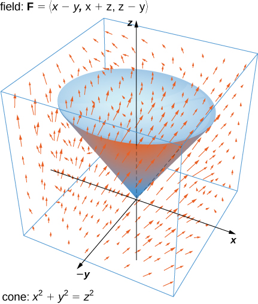
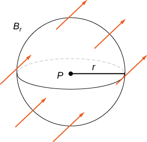
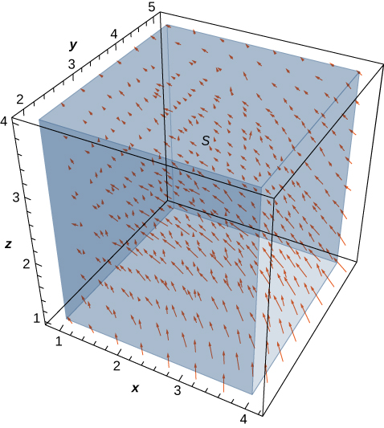
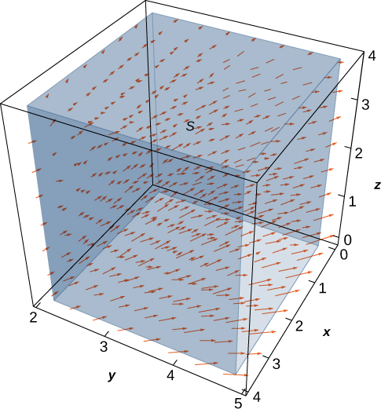
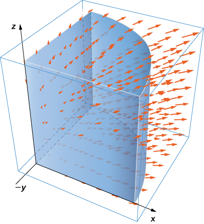

* Explain the meaning of the divergence theorem.
* Use the divergence theorem to calculate the flux of a vector field.
* Apply the divergence theorem to an electrostatic field.

We have examined several versions of the Fundamental Theorem of Calculus in higher dimensions that relate the integral around an oriented boundary of a domain to a “derivative” of that entity on the oriented domain. In this section, we state the divergence theorem, which is the final theorem of this type that we will study. The divergence theorem has many uses in physics; in particular, the divergence theorem is used in the field of partial differential equations to derive equations modeling heat flow and conservation of mass. We use the theorem to calculate flux integrals and apply it to electrostatic fields.

### Overview of Theorems

Before examining the divergence theorem, it is helpful to begin with an overview of the versions of the **Fundamental Theorem of Calculus**{: data-type="term" .no-emphasis} we have discussed:

1.  **The Fundamental Theorem of Calculus**\:
    * * *
    {: data-type="newline"}
    
    

    <math xmlns="http://www.w3.org/1998/Math/MathML"><mrow><mstyle displaystyle="true"><mrow><msubsup><mo stretchy="false">∫</mo><mi>a</mi><mi>b</mi></msubsup><mrow><msup><mi>f</mi><mo>′</mo></msup><mrow><mo>(</mo><mi>x</mi><mo>)</mo></mrow><mi>d</mi><mi>x</mi><mo>=</mo><mi>f</mi><mrow><mo>(</mo><mi>b</mi><mo>)</mo></mrow><mo>−</mo><mi>f</mi><mrow><mo>(</mo><mi>a</mi><mo>)</mo></mrow></mrow></mrow></mstyle><mo>.</mo></mrow></math>
    

    
    * * *
    {: data-type="newline"}
    
    This theorem relates the integral of derivative
    <math xmlns="http://www.w3.org/1998/Math/MathML"><msup><mi>f</mi><mo>′</mo></msup></math>
    
    over line segment
    <math xmlns="http://www.w3.org/1998/Math/MathML"><mrow><mrow><mo>[</mo><mrow><mi>a</mi><mo>,</mo><mi>b</mi></mrow><mo>]</mo></mrow></mrow></math>
    
    along the *x*-axis to a difference of
    <math xmlns="http://www.w3.org/1998/Math/MathML"><mrow><mi>f</mi></mrow></math>
    
    evaluated on the boundary.
2.  **The Fundamental Theorem for Line Integrals**\:
    * * *
    {: data-type="newline"}
    
    

    <math xmlns="http://www.w3.org/1998/Math/MathML"><mrow><mstyle displaystyle="true"><mrow><msub><mo stretchy="false">∫</mo><mi>C</mi></msub><mrow><mo>∇</mo><mi>f</mi><mo>·</mo><mi>d</mi><mstyle mathvariant="bold" mathsize="normal"><mtext>r</mtext></mstyle><mo>=</mo><mi>f</mi><mrow><mo>(</mo><mrow><msub><mi>P</mi><mn>1</mn></msub></mrow><mo>)</mo></mrow><mo>−</mo><mi>f</mi><mrow><mo>(</mo><mrow><msub><mi>P</mi><mn>0</mn></msub></mrow><mo>)</mo></mrow></mrow></mrow></mstyle><mo>,</mo></mrow></math>
    

    
    * * *
    {: data-type="newline"}
    
    where
    <math xmlns="http://www.w3.org/1998/Math/MathML"><mrow><msub><mi>P</mi><mn>0</mn></msub></mrow></math>
    
    is the initial point of *C* and
    <math xmlns="http://www.w3.org/1998/Math/MathML"><mrow><msub><mi>P</mi><mn>1</mn></msub></mrow></math>
    
    is the terminal point of *C*. The **Fundamental Theorem for Line Integrals**{: data-type="term" .no-emphasis} allows path *C* to be a path in a plane or in space, not just a line segment on the *x*-axis. If we think of the gradient as a derivative, then this theorem relates an integral of derivative
    <math xmlns="http://www.w3.org/1998/Math/MathML"><mrow><mo>∇</mo><mi>f</mi></mrow></math>
    
    over path *C* to a difference of
    <math xmlns="http://www.w3.org/1998/Math/MathML"><mrow><mi>f</mi></mrow></math>
    
    evaluated on the boundary of *C*.
3.  **Green’s theorem, circulation form**\:
    * * *
    {: data-type="newline"}
    
    

    <math xmlns="http://www.w3.org/1998/Math/MathML"><mrow><mstyle displaystyle="true"><mrow><msub><mo>∬</mo><mi>D</mi></msub><mrow><mo stretchy="false">(</mo><msub><mi>Q</mi><mi>x</mi></msub><mo>−</mo><msub><mi>P</mi><mi>y</mi></msub><mo stretchy="false">)</mo><mi>d</mi><mi>A</mi></mrow></mrow></mstyle><mo>=</mo><mstyle displaystyle="true"><mrow><msub><mo stretchy="false">∫</mo><mi>C</mi></msub><mrow><mstyle mathvariant="bold" mathsize="normal"><mtext>F</mtext></mstyle><mo>·</mo><mi>d</mi><mstyle mathvariant="bold" mathsize="normal"><mtext>r</mtext></mstyle></mrow></mrow></mstyle><mo>.</mo></mrow></math>
    

    
    * * *
    {: data-type="newline"}
    
    Since
    <math xmlns="http://www.w3.org/1998/Math/MathML"><mrow><msub><mi>Q</mi><mi>x</mi></msub><mo>−</mo><msub><mi>P</mi><mi>y</mi></msub><mo>=</mo><mtext>curl</mtext><mspace width="0.2em" /><mstyle mathvariant="bold" mathsize="normal"><mtext>F</mtext></mstyle><mo>·</mo><mstyle mathvariant="bold" mathsize="normal"><mtext>k</mtext></mstyle></mrow></math>
    
    and curl is a derivative of sorts, **Green’s theorem**{: data-type="term" .no-emphasis} relates the integral of derivative curl**F** over planar region *D* to an integral of **F** over the boundary of *D*.
4.  **Green’s theorem, flux form**\:
    * * *
    {: data-type="newline"}
    
    

    <math xmlns="http://www.w3.org/1998/Math/MathML"><mrow><mstyle displaystyle="true"><mrow><msub><mo>∬</mo><mi>D</mi></msub><mrow><mo stretchy="false">(</mo><msub><mi>P</mi><mi>x</mi></msub><mo>+</mo><msub><mi>Q</mi><mi>y</mi></msub><mo stretchy="false">)</mo><mi>d</mi><mi>A</mi></mrow></mrow></mstyle><mo>=</mo><mstyle displaystyle="true"><mrow><msub><mo stretchy="false">∫</mo><mi>C</mi></msub><mrow><mstyle mathvariant="bold" mathsize="normal"><mtext>F</mtext></mstyle><mo>·</mo><mstyle mathvariant="bold" mathsize="normal"><mtext>N</mtext></mstyle><mi>d</mi><mi>s</mi></mrow></mrow></mstyle><mo>.</mo></mrow></math>
    

    
    * * *
    {: data-type="newline"}
    
    Since
    <math xmlns="http://www.w3.org/1998/Math/MathML"><mrow><msub><mi>P</mi><mi>x</mi></msub><mo>+</mo><msub><mi>Q</mi><mi>y</mi></msub><mo>=</mo><mtext>div</mtext><mspace width="0.2em" /><mstyle mathvariant="bold" mathsize="normal"><mtext>F</mtext></mstyle></mrow></math>
    
    and divergence is a derivative of sorts, the flux form of Green’s theorem relates the integral of derivative div**F** over planar region *D* to an integral of **F** over the boundary of *D*.
5.  **Stokes’ theorem**\:
    * * *
    {: data-type="newline"}
    
    

    <math xmlns="http://www.w3.org/1998/Math/MathML"><mrow><mstyle displaystyle="true"><mrow><msub><mo>∬</mo><mi>S</mi></msub><mrow><mtext>curl</mtext><mspace width="0.2em" /><mstyle mathvariant="bold" mathsize="normal"><mtext>F</mtext></mstyle><mo>·</mo><mi>d</mi><mstyle mathvariant="bold" mathsize="normal"><mtext>S</mtext></mstyle></mrow></mrow></mstyle><mo>=</mo><mstyle displaystyle="true"><mrow><msub><mo stretchy="false">∫</mo><mi>C</mi></msub><mrow><mstyle mathvariant="bold" mathsize="normal"><mtext>F</mtext></mstyle><mo>·</mo><mi>d</mi><mstyle mathvariant="bold" mathsize="normal"><mtext>r</mtext></mstyle></mrow></mrow></mstyle><mo>.</mo></mrow></math>
    

    
    * * *
    {: data-type="newline"}
    
    If we think of the curl as a derivative of sorts, then **Stokes’ theorem**{: data-type="term" .no-emphasis} relates the integral of derivative curl**F** over surface *S* (not necessarily planar) to an integral of **F** over the boundary of *S*.
{: type="1"}

### Stating the Divergence Theorem

The divergence theorem follows the general pattern of these other theorems. If we think of divergence as a derivative of sorts, then the **divergence theorem**{: data-type="term"} relates a triple integral of derivative div**F** over a solid to a flux integral of **F** over the boundary of the solid. More specifically, the divergence theorem relates a flux integral of vector field **F** over a closed surface *S* to a triple integral of the divergence of **F** over the solid enclosed by *S*.

The Divergence Theorem

Let *S* be a piecewise, smooth closed surface that encloses solid *E* in space. Assume that *S* is oriented outward, and let **F** be a vector field with continuous partial derivatives on an open region containing *E* ([\[link\]](#CNX_Calc_Figure_16_08_001)). Then

<math xmlns="http://www.w3.org/1998/Math/MathML"><mrow><mstyle displaystyle="true"><mrow><msub><mo stretchy="true">∭</mo><mi>E</mi></msub><mrow><mtext>div</mtext><mspace width="0.2em" /><mstyle mathvariant="bold" mathsize="normal"><mtext>F</mtext></mstyle><mi>d</mi><mi>V</mi><mo>=</mo></mrow></mrow></mstyle><mstyle displaystyle="true"><mrow><munder><mo stretchy="true">∬</mo><mi>S</mi></munder><mrow><mstyle mathvariant="bold" mathsize="normal"><mtext>F</mtext></mstyle><mo>·</mo><mi>d</mi><mstyle mathvariant="bold" mathsize="normal"><mtext>S</mtext></mstyle></mrow></mrow></mstyle><mo>.</mo></mrow></math>

 {: #CNX_Calc_Figure_16_08_001}

Recall that the flux form of Green’s theorem states that <math xmlns="http://www.w3.org/1998/Math/MathML"><mrow><mstyle displaystyle="true"><mrow><msub><mo>∬</mo><mi>D</mi></msub><mrow><mtext>div</mtext><mspace width="0.2em" /><mstyle mathvariant="bold" mathsize="normal"><mtext>F</mtext></mstyle><mi>d</mi><mi>A</mi><mo>=</mo><mstyle displaystyle="true"><mrow><msub><mo stretchy="false">∫</mo><mi>C</mi></msub><mrow><mstyle mathvariant="bold" mathsize="normal"><mtext>F</mtext></mstyle><mo>·</mo><mstyle mathvariant="bold" mathsize="normal"><mtext>N</mtext></mstyle><mi>d</mi><mi>s</mi></mrow></mrow></mstyle></mrow></mrow></mstyle><mo>.</mo></mrow></math>

 Therefore, the divergence theorem is a version of Green’s theorem in one higher dimension.

The proof of the divergence theorem is beyond the scope of this text. However, we look at an informal proof that gives a general feel for why the theorem is true, but does not prove the theorem with full rigor. This explanation follows the informal explanation given for why Stokes’ theorem is true.

#### Proof

Let *B* be a small box with sides parallel to the coordinate planes inside *E* ([\[link\]](#CNX_Calc_Figure_16_08_002)). Let the center of *B* have coordinates <math xmlns="http://www.w3.org/1998/Math/MathML"><mrow><mrow><mo>(</mo><mrow><mi>x</mi><mo>,</mo><mi>y</mi><mo>,</mo><mi>z</mi></mrow><mo>)</mo></mrow></mrow></math>

 and suppose the edge lengths are <math xmlns="http://www.w3.org/1998/Math/MathML"><mrow><mtext>Δ</mtext><mi>x</mi><mo>,</mo><mtext>Δ</mtext><mi>y</mi><mo>,</mo></mrow></math>

 and <math xmlns="http://www.w3.org/1998/Math/MathML"><mrow><mtext>Δ</mtext><mi>z</mi></mrow></math>

 ([\[link\]](#CNX_Calc_Figure_16_08_002)(b)). The normal vector out of the top of the box is **k** and the normal vector out of the bottom of the box is <math xmlns="http://www.w3.org/1998/Math/MathML"><mrow><mtext>−</mtext><mstyle mathvariant="bold" mathsize="normal"><mtext>k</mtext></mstyle><mo>.</mo></mrow></math>

 The dot product of <math xmlns="http://www.w3.org/1998/Math/MathML"><mrow><mstyle mathvariant="bold" mathsize="normal"><mtext>F</mtext></mstyle><mo>=</mo><mrow><mo>〈</mo><mrow><mi>P</mi><mo>,</mo><mi>Q</mi><mo>,</mo><mi>R</mi></mrow><mo>〉</mo></mrow></mrow></math>

 with **k** is *R* and the dot product with <math xmlns="http://www.w3.org/1998/Math/MathML"><mrow><mtext>−</mtext><mstyle mathvariant="bold" mathsize="normal"><mtext>k</mtext></mstyle></mrow></math>

 is <math xmlns="http://www.w3.org/1998/Math/MathML"><mrow><mtext>−</mtext><mi>R</mi><mo>.</mo></mrow></math>

 The area of the top of the box (and the bottom of the box) <math xmlns="http://www.w3.org/1998/Math/MathML"><mrow><mtext>Δ</mtext><mi>S</mi></mrow></math>

 is <math xmlns="http://www.w3.org/1998/Math/MathML"><mrow><mtext>Δ</mtext><mi>x</mi><mtext>Δ</mtext><mi>y</mi><mo>.</mo></mrow></math>

 ![This figure has three diagrams. The first is a surface E in three dimensions with a small box B inside it. The second just has box B. The height is labeled as delta z, the width is labeled as delta x, and the width is labeled as delta y. An arrow perpendicular to the top points up and away from the box and is labeled k. An arrow perpendicular to the bottom points down and away from the box and is labeled &#x2013;k. The third diagram is a side views of box B. The center is (x, y, z), the midpoint of the side below it is (x, y, z &#x2013; delta z / 2), and the midpoint of the size above it is (x, y, z + delta z / 2). The height is delta z.](../resources/CNX_Calc_Figure_16_08_002.jpg "(a) A small box B inside surface E has sides parallel to the coordinate planes. (b) Box B has side lengths &#x394;x,&#x394;y, and &#x394;z (c) If we look at the side view of B, we see that, since (x,y,z) is the center of the box, to get to the top of the box we must travel a vertical distance of &#x394;z/2 up from (x,y,z). Similarly, to get to the bottom of the box we must travel a distance &#x394;z/2 down from (x,y,z)."){: #CNX_Calc_Figure_16_08_002}

The flux out of the top of the box can be approximated by <math xmlns="http://www.w3.org/1998/Math/MathML"><mrow><mi>R</mi><mrow><mo>(</mo><mrow><mi>x</mi><mo>,</mo><mi>y</mi><mo>,</mo><mi>z</mi><mo>+</mo><mfrac><mrow><mtext>Δ</mtext><mi>z</mi></mrow><mn>2</mn></mfrac></mrow><mo>)</mo></mrow><mtext>Δ</mtext><mi>x</mi><mtext>Δ</mtext><mi>y</mi></mrow></math>

 ([\[link\]](#CNX_Calc_Figure_16_08_002)(c)) and the flux out of the bottom of the box is <math xmlns="http://www.w3.org/1998/Math/MathML"><mrow><mtext>−</mtext><mi>R</mi><mrow><mo>(</mo><mrow><mi>x</mi><mo>,</mo><mi>y</mi><mo>,</mo><mi>z</mi><mo>−</mo><mfrac><mrow><mtext>Δ</mtext><mi>z</mi></mrow><mn>2</mn></mfrac></mrow><mo>)</mo></mrow><mtext>Δ</mtext><mi>x</mi><mtext>Δ</mtext><mi>y</mi><mo>.</mo></mrow></math>

 If we denote the difference between these values as <math xmlns="http://www.w3.org/1998/Math/MathML"><mrow><mtext>Δ</mtext><mi>R</mi><mo>,</mo></mrow></math>

 then the net flux in the vertical direction can be approximated by <math xmlns="http://www.w3.org/1998/Math/MathML"><mrow><mtext>Δ</mtext><mi>R</mi><mtext>Δ</mtext><mi>x</mi><mtext>Δ</mtext><mi>y</mi><mo>.</mo></mrow></math>

 However,

<math xmlns="http://www.w3.org/1998/Math/MathML"><mrow><mtext>Δ</mtext><mi>R</mi><mtext>Δ</mtext><mi>x</mi><mtext>Δ</mtext><mi>y</mi><mo>=</mo><mrow><mo>(</mo><mrow><mfrac><mrow><mtext>Δ</mtext><mi>R</mi></mrow><mrow><mtext>Δ</mtext><mi>z</mi></mrow></mfrac></mrow><mo>)</mo></mrow><mtext>Δ</mtext><mi>x</mi><mtext>Δ</mtext><mi>y</mi><mtext>Δ</mtext><mi>z</mi><mo>≈</mo><mrow><mo>(</mo><mrow><mfrac><mrow><mo>∂</mo><mi>R</mi></mrow><mrow><mo>∂</mo><mi>z</mi></mrow></mfrac></mrow><mo>)</mo></mrow><mtext>Δ</mtext><mi>V</mi><mo>.</mo></mrow></math>

Therefore, the net flux in the vertical direction can be approximated by <math xmlns="http://www.w3.org/1998/Math/MathML"><mrow><mrow><mo>(</mo><mrow><mfrac><mrow><mo>∂</mo><mi>R</mi></mrow><mrow><mo>∂</mo><mi>z</mi></mrow></mfrac></mrow><mo>)</mo></mrow><mtext>Δ</mtext><mi>V</mi><mo>.</mo></mrow></math>

 Similarly, the net flux in the *x*-direction can be approximated by <math xmlns="http://www.w3.org/1998/Math/MathML"><mrow><mrow><mo>(</mo><mrow><mfrac><mrow><mo>∂</mo><mi>P</mi></mrow><mrow><mo>∂</mo><mi>x</mi></mrow></mfrac></mrow><mo>)</mo></mrow><mtext>Δ</mtext><mi>V</mi></mrow></math>

 and the net flux in the *y*-direction can be approximated by <math xmlns="http://www.w3.org/1998/Math/MathML"><mrow><mrow><mo>(</mo><mrow><mfrac><mrow><mo>∂</mo><mi>Q</mi></mrow><mrow><mo>∂</mo><mi>y</mi></mrow></mfrac></mrow><mo>)</mo></mrow><mtext>Δ</mtext><mi>V</mi><mo>.</mo></mrow></math>

 Adding the fluxes in all three directions gives an approximation of the total flux out of the box:

<math xmlns="http://www.w3.org/1998/Math/MathML"><mrow><mtext>Total flux</mtext><mo>≈</mo><mrow><mo>(</mo><mrow><mfrac><mrow><mo>∂</mo><mi>P</mi></mrow><mrow><mo>∂</mo><mi>x</mi></mrow></mfrac><mo>+</mo><mfrac><mrow><mo>∂</mo><mi>Q</mi></mrow><mrow><mo>∂</mo><mi>y</mi></mrow></mfrac><mo>+</mo><mfrac><mrow><mo>∂</mo><mi>R</mi></mrow><mrow><mo>∂</mo><mi>z</mi></mrow></mfrac></mrow><mo>)</mo></mrow><mtext>Δ</mtext><mi>V</mi><mo>=</mo><mtext>div</mtext><mspace width="0.2em" /><mstyle mathvariant="bold" mathsize="normal"><mtext>F</mtext></mstyle><mtext>Δ</mtext><mi>V</mi><mo>.</mo></mrow></math>

This approximation becomes arbitrarily close to the value of the total flux as the volume of the box shrinks to zero.

The sum of <math xmlns="http://www.w3.org/1998/Math/MathML"><mrow><mtext>div</mtext><mspace width="0.2em" /><mstyle mathvariant="bold" mathsize="normal"><mtext>F</mtext></mstyle><mtext>Δ</mtext><mi>V</mi></mrow></math>

 over all the small boxes approximating *E* is approximately <math xmlns="http://www.w3.org/1998/Math/MathML"><mrow><mstyle displaystyle="true"><mrow><msub><mo stretchy="true">∭</mo><mi>E</mi></msub><mrow><mtext>div</mtext><mspace width="0.2em" /><mstyle mathvariant="bold" mathsize="normal"><mtext>F</mtext></mstyle><mi>d</mi><mi>V</mi></mrow></mrow></mstyle><mo>.</mo></mrow></math>

 On the other hand, the sum of <math xmlns="http://www.w3.org/1998/Math/MathML"><mrow><mtext>div</mtext><mspace width="0.2em" /><mstyle mathvariant="bold" mathsize="normal"><mtext>F</mtext></mstyle><mtext>Δ</mtext><mi>V</mi></mrow></math>

 over all the small boxes approximating *E* is the sum of the fluxes over all these boxes. Just as in the informal proof of Stokes’ theorem, adding these fluxes over all the boxes results in the cancelation of a lot of the terms. If an approximating box shares a face with another approximating box, then the flux over one face is the negative of the flux over the shared face of the adjacent box. These two integrals cancel out. When adding up all the fluxes, the only flux integrals that survive are the integrals over the faces approximating the boundary of *E*. As the volumes of the approximating boxes shrink to zero, this approximation becomes arbitrarily close to the flux over *S*.

□

Verifying the Divergence Theorem

Verify the divergence theorem for vector field <math xmlns="http://www.w3.org/1998/Math/MathML"><mrow><mstyle mathvariant="bold" mathsize="normal"><mtext>F</mtext></mstyle><mo>=</mo><mrow><mo>〈</mo><mrow><mi>x</mi><mo>−</mo><mi>y</mi><mo>,</mo><mi>x</mi><mo>+</mo><mi>z</mi><mo>,</mo><mi>z</mi><mo>−</mo><mi>y</mi></mrow><mo>〉</mo></mrow></mrow></math>

 and surface *S* that consists of cone <math xmlns="http://www.w3.org/1998/Math/MathML"><mrow><msup><mi>x</mi><mn>2</mn></msup><mo>+</mo><msup><mi>y</mi><mn>2</mn></msup><mo>=</mo><msup><mi>z</mi><mn>2</mn></msup><mo>,</mo><mn>0</mn><mo>≤</mo><mi>z</mi><mo>≤</mo><mn>1</mn><mo>,</mo></mrow></math>

 and the circular top of the cone (see the following figure). Assume this surface is positively oriented.

  

Let *E* be the solid cone enclosed by *S*. To verify the theorem for this example, we show that <math xmlns="http://www.w3.org/1998/Math/MathML"><mrow><mstyle displaystyle="true"><mrow><msub><mo stretchy="true">∭</mo><mi>E</mi></msub><mrow><mtext>div</mtext><mspace width="0.2em" /><mstyle mathvariant="bold" mathsize="normal"><mtext>F</mtext></mstyle><mi>d</mi><mi>V</mi><mo>=</mo></mrow></mrow></mstyle><mstyle displaystyle="true"><mrow><munder><mo stretchy="true">∬</mo><mi>S</mi></munder><mrow><mstyle mathvariant="bold" mathsize="normal"><mtext>F</mtext></mstyle><mo>·</mo><mi>d</mi><mstyle mathvariant="bold" mathsize="normal"><mtext>S</mtext></mstyle></mrow></mrow></mstyle></mrow></math>

 by calculating each integral separately.

To compute the triple integral, note that <math xmlns="http://www.w3.org/1998/Math/MathML"><mrow><mtext>div</mtext><mspace width="0.2em" /><mstyle mathvariant="bold" mathsize="normal"><mtext>F</mtext></mstyle><mo>=</mo><msub><mi>P</mi><mi>x</mi></msub><mo>+</mo><msub><mi>Q</mi><mi>y</mi></msub><mo>+</mo><msub><mi>R</mi><mi>z</mi></msub><mo>=</mo><mn>2</mn><mo>,</mo></mrow></math>

 and therefore the triple integral is

<math xmlns="http://www.w3.org/1998/Math/MathML"><mtable><mtr><mtd columnalign="right"><mstyle displaystyle="true"><mrow><msub><mo>∭</mo><mi>E</mi></msub><mrow><mtext>div</mtext><mspace width="0.2em" /><mstyle mathvariant="bold" mathsize="normal"><mtext>F</mtext></mstyle><mi>d</mi><mi>V</mi></mrow></mrow></mstyle></mtd><mtd columnalign="left"><mo>=</mo><mn>2</mn><mstyle displaystyle="true"><mrow><msub><mo>∭</mo><mi>E</mi></msub><mrow><mi>d</mi><mi>V</mi></mrow></mrow></mstyle></mtd></mtr><mtr><mtd /><mtd columnalign="left"><mo>=</mo><mn>2</mn><mrow><mo>(</mo><mrow><mtext>volume of</mtext><mspace width="0.2em" /><mi>E</mi></mrow><mo>)</mo></mrow><mo>.</mo></mtd></mtr></mtable></math>

The volume of a right circular cone is given by <math xmlns="http://www.w3.org/1998/Math/MathML"><mrow><mi>π</mi><msup><mi>r</mi><mn>2</mn></msup><mfrac><mi>h</mi><mn>3</mn></mfrac><mo>.</mo></mrow></math>

 In this case, <math xmlns="http://www.w3.org/1998/Math/MathML"><mrow><mi>h</mi><mo>=</mo><mi>r</mi><mo>=</mo><mn>1</mn><mo>.</mo></mrow></math>

 Therefore,

<math xmlns="http://www.w3.org/1998/Math/MathML"><mrow><mstyle displaystyle="true"><mrow><msub><mo>∭</mo><mi>E</mi></msub><mrow><mtext>div</mtext><mspace width="0.2em" /><mstyle mathvariant="bold" mathsize="normal"><mtext>F</mtext></mstyle><mi>d</mi><mi>V</mi></mrow></mrow></mstyle><mo>=</mo><mn>2</mn><mrow><mo>(</mo><mrow><mtext>volume of</mtext><mspace width="0.2em" /><mi>E</mi></mrow><mo>)</mo></mrow><mo>=</mo><mfrac><mrow><mn>2</mn><mi>π</mi></mrow><mn>3</mn></mfrac><mo>.</mo></mrow></math>

To compute the flux integral, first note that *S* is piecewise smooth; *S* can be written as a union of smooth surfaces. Therefore, we break the flux integral into two pieces: one flux integral across the circular top of the cone and one flux integral across the remaining portion of the cone. Call the circular top <math xmlns="http://www.w3.org/1998/Math/MathML"><mrow><msub><mi>S</mi><mn>1</mn></msub></mrow></math>

 and the portion under the top <math xmlns="http://www.w3.org/1998/Math/MathML"><mrow><msub><mi>S</mi><mn>2</mn></msub><mo>.</mo></mrow></math>

 We start by calculating the flux across the circular top of the cone. Notice that <math xmlns="http://www.w3.org/1998/Math/MathML"><mrow><msub><mi>S</mi><mn>1</mn></msub></mrow></math>

 has parameterization

<math xmlns="http://www.w3.org/1998/Math/MathML"><mrow><mstyle mathvariant="bold" mathsize="normal"><mtext>r</mtext></mstyle><mrow><mo>(</mo><mrow><mi>u</mi><mo>,</mo><mi>v</mi></mrow><mo>)</mo></mrow><mo>=</mo><mrow><mo>〈</mo><mrow><mi>u</mi><mspace width="0.2em" /><mtext>cos</mtext><mspace width="0.2em" /><mi>v</mi><mo>,</mo><mi>u</mi><mspace width="0.2em" /><mtext>sin</mtext><mspace width="0.2em" /><mi>v</mi><mo>,</mo><mn>1</mn></mrow><mo>〉</mo></mrow><mo>,</mo><mn>0</mn><mo>≤</mo><mi>u</mi><mo>≤</mo><mn>1</mn><mo>,</mo><mn>0</mn><mo>≤</mo><mi>v</mi><mo>≤</mo><mn>2</mn><mi>π</mi><mo>.</mo></mrow></math>

Then, the tangent vectors are <math xmlns="http://www.w3.org/1998/Math/MathML"><mrow><msub><mstyle mathvariant="bold" mathsize="normal"><mtext>t</mtext></mstyle><mi>u</mi></msub><mo>=</mo><mrow><mo>〈</mo><mrow><mtext>cos</mtext><mspace width="0.2em" /><mi>v</mi><mo>,</mo><mtext>sin</mtext><mspace width="0.2em" /><mi>v</mi><mo>,</mo><mn>0</mn></mrow><mo>〉</mo></mrow></mrow></math>

 and <math xmlns="http://www.w3.org/1998/Math/MathML"><mrow><msub><mstyle mathvariant="bold" mathsize="normal"><mtext>t</mtext></mstyle><mi>v</mi></msub><mo>=</mo><mrow><mo>〈</mo><mrow><mtext>−</mtext><mi>u</mi><mspace width="0.2em" /><mtext>cos</mtext><mspace width="0.2em" /><mi>v</mi><mo>,</mo><mi>u</mi><mspace width="0.2em" /><mtext>sin</mtext><mspace width="0.2em" /><mi>v</mi><mo>,</mo><mn>0</mn></mrow><mo>〉</mo></mrow><mo>.</mo></mrow></math>

 Therefore, the flux across <math xmlns="http://www.w3.org/1998/Math/MathML"><mrow><msub><mi>S</mi><mn>1</mn></msub></mrow></math>

 is

<math xmlns="http://www.w3.org/1998/Math/MathML"><mtable><mtr><mtd columnalign="right"><mstyle displaystyle="true"><mrow><msub><mo>∬</mo><mrow><msub><mi>S</mi><mn>1</mn></msub></mrow></msub><mrow><mstyle mathvariant="bold" mathsize="normal"><mtext>F</mtext></mstyle><mo>·</mo><mi>d</mi><mstyle mathvariant="bold" mathsize="normal"><mtext>S</mtext></mstyle></mrow></mrow></mstyle></mtd><mtd columnalign="left"><mo>=</mo><mstyle displaystyle="true"><mrow><msubsup><mo stretchy="false">∫</mo><mn>0</mn><mn>1</mn></msubsup><mrow><mstyle displaystyle="true"><mrow><msubsup><mo stretchy="false">∫</mo><mn>0</mn><mrow><mn>2</mn><mi>π</mi></mrow></msubsup><mrow><mstyle mathvariant="bold" mathsize="normal"><mtext>F</mtext></mstyle><mrow><mo>(</mo><mrow><mstyle mathvariant="bold" mathsize="normal"><mtext>r</mtext></mstyle><mrow><mo>(</mo><mrow><mi>u</mi><mo>,</mo><mi>v</mi></mrow><mo>)</mo></mrow></mrow><mo>)</mo></mrow></mrow></mrow></mstyle></mrow></mrow></mstyle><mo>·</mo><mrow><mo>(</mo><mrow><msub><mstyle mathvariant="bold" mathsize="normal"><mtext>t</mtext></mstyle><mi>u</mi></msub><mspace width="0.2em" /><mo>×</mo><mspace width="0.2em" /><msub><mstyle mathvariant="bold" mathsize="normal"><mtext>t</mtext></mstyle><mi>v</mi></msub></mrow><mo>)</mo></mrow><mi>d</mi><mi>A</mi></mtd></mtr><mtr><mtd /><mtd columnalign="left"><mo>=</mo><mstyle displaystyle="true"><mrow><msubsup><mo stretchy="false">∫</mo><mn>0</mn><mn>1</mn></msubsup><mrow><mstyle displaystyle="true"><mrow><msubsup><mo stretchy="false">∫</mo><mn>0</mn><mrow><mn>2</mn><mi>π</mi></mrow></msubsup><mrow><mrow><mo>〈</mo><mrow><mi>u</mi><mspace width="0.2em" /><mtext>cos</mtext><mspace width="0.2em" /><mi>v</mi><mo>−</mo><mi>u</mi><mspace width="0.2em" /><mtext>sin</mtext><mspace width="0.2em" /><mi>v</mi><mo>,</mo><mi>u</mi><mspace width="0.2em" /><mtext>cos</mtext><mspace width="0.2em" /><mi>v</mi><mo>+</mo><mn>1</mn><mo>,</mo><mn>1</mn><mo>−</mo><mi>u</mi><mspace width="0.2em" /><mtext>sin</mtext><mspace width="0.2em" /><mi>v</mi></mrow><mo>〉</mo></mrow><mo>·</mo><mrow><mo>〈</mo><mrow><mn>0</mn><mo>,</mo><mn>0</mn><mo>,</mo><mi>u</mi></mrow><mo>〉</mo></mrow></mrow></mrow></mstyle></mrow></mrow></mstyle><mi>d</mi><mi>v</mi><mi>d</mi><mi>u</mi></mtd></mtr><mtr><mtd /><mtd columnalign="left"><mo>=</mo><mstyle displaystyle="true"><mrow><msubsup><mo stretchy="false">∫</mo><mn>0</mn><mn>1</mn></msubsup><mrow><mstyle displaystyle="true"><mrow><msubsup><mo stretchy="false">∫</mo><mn>0</mn><mrow><mn>2</mn><mi>π</mi></mrow></msubsup><mrow><mi>u</mi><mo>−</mo><msup><mi>u</mi><mn>2</mn></msup><mtext>sin</mtext><mspace width="0.2em" /><mi>v</mi></mrow></mrow></mstyle></mrow></mrow></mstyle><mspace width="0.2em" /><mi>d</mi><mi>v</mi><mi>d</mi><mi>u</mi><mo>=</mo><mi>π</mi><mo>.</mo></mtd></mtr></mtable></math>

We now calculate the flux over <math xmlns="http://www.w3.org/1998/Math/MathML"><mrow><msub><mi>S</mi><mn>2</mn></msub><mo>.</mo></mrow></math>

 A parameterization of this surface is

<math xmlns="http://www.w3.org/1998/Math/MathML"><mrow><mstyle mathvariant="bold" mathsize="normal"><mtext>r</mtext></mstyle><mrow><mo>(</mo><mrow><mi>u</mi><mo>,</mo><mi>v</mi></mrow><mo>)</mo></mrow><mo>=</mo><mrow><mo>〈</mo><mrow><mi>u</mi><mspace width="0.2em" /><mtext>cos</mtext><mspace width="0.2em" /><mi>v</mi><mo>,</mo><mi>u</mi><mspace width="0.2em" /><mtext>sin</mtext><mspace width="0.2em" /><mi>v</mi><mo>,</mo><mi>u</mi></mrow><mo>〉</mo></mrow><mo>,</mo><mn>0</mn><mo>≤</mo><mi>u</mi><mo>≤</mo><mn>1</mn><mo>,</mo><mn>0</mn><mo>≤</mo><mi>v</mi><mo>≤</mo><mn>2</mn><mi>π</mi><mo>.</mo></mrow></math>

The tangent vectors are <math xmlns="http://www.w3.org/1998/Math/MathML"><mrow><msub><mstyle mathvariant="bold" mathsize="normal"><mtext>t</mtext></mstyle><mi>u</mi></msub><mo>=</mo><mrow><mo>〈</mo><mrow><mtext>cos</mtext><mspace width="0.2em" /><mi>v</mi><mo>,</mo><mtext>sin</mtext><mspace width="0.2em" /><mi>v</mi><mo>,</mo><mn>1</mn></mrow><mo>〉</mo></mrow></mrow></math>

 and <math xmlns="http://www.w3.org/1998/Math/MathML"><mrow><msub><mstyle mathvariant="bold" mathsize="normal"><mtext>t</mtext></mstyle><mi>v</mi></msub><mo>=</mo><mrow><mo>〈</mo><mrow><mtext>−</mtext><mi>u</mi><mspace width="0.2em" /><mtext>sin</mtext><mspace width="0.2em" /><mi>v</mi><mo>,</mo><mi>u</mi><mspace width="0.2em" /><mtext>cos</mtext><mspace width="0.2em" /><mi>v</mi><mo>,</mo><mn>0</mn></mrow><mo>〉</mo></mrow><mo>,</mo></mrow></math>

 so the cross product is

<math xmlns="http://www.w3.org/1998/Math/MathML"><mrow><msub><mstyle mathvariant="bold" mathsize="normal"><mtext>t</mtext></mstyle><mi>u</mi></msub><mspace width="0.2em" /><mo>×</mo><mspace width="0.2em" /><msub><mstyle mathvariant="bold" mathsize="normal"><mtext>t</mtext></mstyle><mi>v</mi></msub><mo>=</mo><mrow><mo>〈</mo><mrow><mtext>−</mtext><mi>u</mi><mspace width="0.2em" /><mtext>cos</mtext><mspace width="0.2em" /><mi>v</mi><mo>,</mo><mtext>−</mtext><mi>u</mi><mspace width="0.2em" /><mtext>sin</mtext><mspace width="0.2em" /><mi>v</mi><mo>,</mo><mi>u</mi></mrow><mo>〉</mo></mrow><mo>.</mo></mrow></math>

Notice that the negative signs on the *x* and *y* components induce the negative (or inward) orientation of the cone. Since the surface is positively oriented, we use vector <math xmlns="http://www.w3.org/1998/Math/MathML"><mrow><msub><mstyle mathvariant="bold" mathsize="normal"><mtext>t</mtext></mstyle><mi>v</mi></msub><mspace width="0.2em" /><mo>×</mo><mspace width="0.2em" /><msub><mstyle mathvariant="bold" mathsize="normal"><mtext>t</mtext></mstyle><mi>u</mi></msub><mo>=</mo><mrow><mo>〈</mo><mrow><mi>u</mi><mspace width="0.2em" /><mtext>cos</mtext><mspace width="0.2em" /><mi>v</mi><mo>,</mo><mi>u</mi><mspace width="0.2em" /><mtext>sin</mtext><mspace width="0.2em" /><mi>v</mi><mo>,</mo><mtext>−</mtext><mi>u</mi></mrow><mo>〉</mo></mrow></mrow></math>

 in the flux integral. The flux across <math xmlns="http://www.w3.org/1998/Math/MathML"><mrow><msub><mi>S</mi><mn>2</mn></msub></mrow></math>

 is then

<math xmlns="http://www.w3.org/1998/Math/MathML"><mtable><mtr><mtd columnalign="right"><mstyle displaystyle="true"><mrow><msub><mo>∬</mo><mrow><msub><mi>S</mi><mn>2</mn></msub></mrow></msub><mrow><mstyle mathvariant="bold" mathsize="normal"><mtext>F</mtext></mstyle><mo>·</mo><mi>d</mi><mstyle mathvariant="bold" mathsize="normal"><mtext>S</mtext></mstyle></mrow></mrow></mstyle></mtd><mtd columnalign="left"><mo>=</mo><mstyle displaystyle="true"><mrow><msubsup><mo stretchy="false">∫</mo><mn>0</mn><mn>1</mn></msubsup><mrow><mstyle displaystyle="true"><mrow><msubsup><mo stretchy="false">∫</mo><mn>0</mn><mrow><mn>2</mn><mi>π</mi></mrow></msubsup><mrow><mstyle mathvariant="bold" mathsize="normal"><mtext>F</mtext></mstyle><mrow><mo>(</mo><mrow><mstyle mathvariant="bold" mathsize="normal"><mtext>r</mtext></mstyle><mrow><mo>(</mo><mrow><mi>u</mi><mo>,</mo><mi>v</mi></mrow><mo>)</mo></mrow></mrow><mo>)</mo></mrow></mrow></mrow></mstyle></mrow></mrow></mstyle><mo>·</mo><mrow><mo>(</mo><mrow><msub><mstyle mathvariant="bold" mathsize="normal"><mtext>t</mtext></mstyle><mi>v</mi></msub><mspace width="0.2em" /><mo>×</mo><mspace width="0.2em" /><msub><mstyle mathvariant="bold" mathsize="normal"><mtext>t</mtext></mstyle><mi>u</mi></msub></mrow><mo>)</mo></mrow><mi>d</mi><mi>A</mi></mtd></mtr><mtr><mtd /><mtd columnalign="left"><mo>=</mo><mstyle displaystyle="true"><mrow><msubsup><mo stretchy="false">∫</mo><mn>0</mn><mn>1</mn></msubsup><mrow><mstyle displaystyle="true"><mrow><msubsup><mo stretchy="false">∫</mo><mn>0</mn><mrow><mn>2</mn><mi>π</mi></mrow></msubsup><mrow><mrow><mo>〈</mo><mrow><mi>u</mi><mspace width="0.2em" /><mtext>cos</mtext><mspace width="0.2em" /><mi>v</mi><mo>−</mo><mi>u</mi><mspace width="0.2em" /><mtext>sin</mtext><mspace width="0.2em" /><mi>v</mi><mo>,</mo><mi>u</mi><mspace width="0.2em" /><mtext>cos</mtext><mspace width="0.2em" /><mi>v</mi><mo>+</mo><mi>u</mi><mo>,</mo><mi>u</mi><mo>−</mo><mtext>sin</mtext><mspace width="0.2em" /><mi>v</mi></mrow><mo>〉</mo></mrow><mo>·</mo><mrow><mo>〈</mo><mrow><mi>u</mi><mspace width="0.2em" /><mtext>cos</mtext><mspace width="0.2em" /><mi>v</mi><mo>,</mo><mi>u</mi><mspace width="0.2em" /><mtext>sin</mtext><mspace width="0.2em" /><mi>v</mi><mo>,</mo><mtext>−</mtext><mi>u</mi></mrow><mo>〉</mo></mrow></mrow></mrow></mstyle></mrow></mrow></mstyle></mtd></mtr><mtr><mtd /><mtd columnalign="left"><mo>=</mo><mstyle displaystyle="true"><mrow><msubsup><mo stretchy="false">∫</mo><mn>0</mn><mn>1</mn></msubsup><mrow><mstyle displaystyle="true"><mrow><msubsup><mo stretchy="false">∫</mo><mn>0</mn><mrow><mn>2</mn><mi>π</mi></mrow></msubsup><mrow><msup><mi>u</mi><mn>2</mn></msup></mrow></mrow></mstyle></mrow></mrow></mstyle><msup><mtext>cos</mtext><mn>2</mn></msup><mi>v</mi><mo>+</mo><mn>2</mn><msup><mi>u</mi><mn>2</mn></msup><mtext>sin</mtext><mspace width="0.2em" /><mi>v</mi><mo>−</mo><msup><mi>u</mi><mn>2</mn></msup><mi>d</mi><mi>v</mi><mi>d</mi><mi>u</mi><mo>=</mo><mo>−</mo><mfrac><mi>π</mi><mn>3</mn></mfrac><mo>.</mo></mtd></mtr></mtable></math>

The total flux across *S* is

<math xmlns="http://www.w3.org/1998/Math/MathML"><mrow><mstyle displaystyle="true"><mrow><msub><mo>∬</mo><mrow><msub><mi>S</mi><mn>2</mn></msub></mrow></msub><mrow><mstyle mathvariant="bold" mathsize="normal"><mtext>F</mtext></mstyle><mo>·</mo><mi>d</mi><mstyle mathvariant="bold" mathsize="normal"><mtext>S</mtext></mstyle></mrow></mrow></mstyle><mo>=</mo><mstyle displaystyle="true"><mrow><msub><mo>∬</mo><mrow><msub><mi>S</mi><mn>1</mn></msub></mrow></msub><mrow><mstyle mathvariant="bold" mathsize="normal"><mtext>F</mtext></mstyle><mo>·</mo><mi>d</mi><mstyle mathvariant="bold" mathsize="normal"><mtext>S</mtext></mstyle></mrow></mrow></mstyle><mo>+</mo><mstyle displaystyle="true"><mrow><msub><mo>∬</mo><mrow><msub><mi>S</mi><mn>2</mn></msub></mrow></msub><mrow><mstyle mathvariant="bold" mathsize="normal"><mtext>F</mtext></mstyle><mo>·</mo><mi>d</mi><mstyle mathvariant="bold" mathsize="normal"><mtext>S</mtext></mstyle></mrow></mrow></mstyle><mo>=</mo><mfrac><mrow><mn>2</mn><mi>π</mi></mrow><mn>3</mn></mfrac><mo>=</mo><mstyle displaystyle="true"><mrow><msub><mo stretchy="true">∭</mo><mi>E</mi></msub><mrow><mtext>div</mtext></mrow></mrow></mstyle><mspace width="0.2em" /><mstyle mathvariant="bold" mathsize="normal"><mtext>F</mtext></mstyle><mi>d</mi><mi>V</mi><mo>,</mo></mrow></math>

and we have verified the divergence theorem for this example.

Verify the divergence theorem for vector field <math xmlns="http://www.w3.org/1998/Math/MathML"><mrow><mstyle mathvariant="bold" mathsize="normal"><mtext>F</mtext></mstyle><mo stretchy="false">(</mo><mi>x</mi><mo>,</mo><mi>y</mi><mo>,</mo><mi>z</mi><mo stretchy="false">)</mo><mo>=</mo><mrow><mo>〈</mo><mrow><mi>x</mi><mo>+</mo><mi>y</mi><mo>+</mo><mi>z</mi><mo>,</mo><mi>y</mi><mo>,</mo><mn>2</mn><mi>x</mi><mo>−</mo><mi>y</mi></mrow><mo>〉</mo></mrow></mrow></math>

 and surface *S* given by the cylinder <math xmlns="http://www.w3.org/1998/Math/MathML"><mrow><msup><mi>x</mi><mn>2</mn></msup><mo>+</mo><msup><mi>y</mi><mn>2</mn></msup><mo>=</mo><mn>1</mn><mo>,</mo><mn>0</mn><mo>≤</mo><mi>z</mi><mo>≤</mo><mn>3</mn></mrow></math>

 plus the circular top and bottom of the cylinder. Assume that *S* is positively oriented.

Both integrals equal <math xmlns="http://www.w3.org/1998/Math/MathML"><mrow><mn>6</mn><mi>π</mi><mo>.</mo></mrow></math>

Hint

Calculate both the flux integral and the triple integral with the divergence theorem and verify they are equal.

Recall that the divergence of continuous field **F** at point *P* is a measure of the “outflowing-ness” of the field at *P*. If **F** represents the velocity field of a fluid, then the divergence can be thought of as the rate per unit volume of the fluid flowing out less the rate per unit volume flowing in. The divergence theorem confirms this interpretation. To see this, let *P* be a point and let <math xmlns="http://www.w3.org/1998/Math/MathML"><mrow><msub><mi>B</mi><mi>r</mi></msub></mrow></math>

 be a ball of small radius *r* centered at *P* ([\[link\]](#CNX_Calc_Figure_16_08_004)). Let <math xmlns="http://www.w3.org/1998/Math/MathML"><mrow><msub><mi>S</mi><mi>r</mi></msub></mrow></math>

 be the boundary sphere of <math xmlns="http://www.w3.org/1998/Math/MathML"><mrow><msub><mi>B</mi><mi>r</mi></msub><mo>.</mo></mrow></math>

 Since the radius is small and **F** is continuous, <math xmlns="http://www.w3.org/1998/Math/MathML"><mrow><mtext>div</mtext><mspace width="0.2em" /><mstyle mathvariant="bold" mathsize="normal"><mtext>F</mtext></mstyle><mrow><mo>(</mo><mi>Q</mi><mo>)</mo></mrow><mo>≈</mo><mtext>div</mtext><mspace width="0.2em" /><mstyle mathvariant="bold" mathsize="normal"><mtext>F</mtext></mstyle><mrow><mo>(</mo><mi>P</mi><mo>)</mo></mrow></mrow></math>

 for all other points *Q* in the ball. Therefore, the flux across <math xmlns="http://www.w3.org/1998/Math/MathML"><mrow><msub><mi>S</mi><mi>r</mi></msub></mrow></math>

 can be approximated using the divergence theorem:

<math xmlns="http://www.w3.org/1998/Math/MathML"><mrow><mstyle displaystyle="true"><mrow><msub><mo>∬</mo><mrow><msub><mi>S</mi><mi>r</mi></msub></mrow></msub><mrow><mstyle mathvariant="bold" mathsize="normal"><mtext>F</mtext></mstyle><mo>·</mo><mi>d</mi><mstyle mathvariant="bold" mathsize="normal"><mtext>S</mtext></mstyle></mrow></mrow></mstyle><mo>=</mo><mstyle displaystyle="true"><mrow><msub><mo stretchy="true">∭</mo><mrow><msub><mi>B</mi><mi>r</mi></msub></mrow></msub><mrow><mtext>div</mtext></mrow></mrow></mstyle><mspace width="0.2em" /><mstyle mathvariant="bold" mathsize="normal"><mtext>F</mtext></mstyle><mi>d</mi><mi>V</mi><mo>≈</mo><mstyle displaystyle="true"><mrow><msub><mo stretchy="true">∭</mo><mrow><msub><mi>B</mi><mi>r</mi></msub></mrow></msub><mrow><mtext>div</mtext></mrow></mrow></mstyle><mspace width="0.2em" /><mstyle mathvariant="bold" mathsize="normal"><mtext>F</mtext></mstyle><mrow><mo>(</mo><mi>P</mi><mo>)</mo></mrow><mi>d</mi><mi>V</mi><mo>.</mo></mrow></math>

Since <math xmlns="http://www.w3.org/1998/Math/MathML"><mrow><mtext>div</mtext><mspace width="0.2em" /><mstyle mathvariant="bold" mathsize="normal"><mtext>F</mtext></mstyle><mrow><mo>(</mo><mi>P</mi><mo>)</mo></mrow></mrow></math>

 is a constant,

<math xmlns="http://www.w3.org/1998/Math/MathML"><mrow><mstyle displaystyle="true"><mrow><msub><mo stretchy="true">∭</mo><mrow><msub><mi>B</mi><mi>r</mi></msub></mrow></msub><mrow><mtext>div</mtext></mrow></mrow></mstyle><mspace width="0.2em" /><mstyle mathvariant="bold" mathsize="normal"><mtext>F</mtext></mstyle><mrow><mo>(</mo><mi>P</mi><mo>)</mo></mrow><mi>d</mi><mi>V</mi><mo>=</mo><mtext>div</mtext><mspace width="0.2em" /><mstyle mathvariant="bold" mathsize="normal"><mtext>F</mtext></mstyle><mrow><mo>(</mo><mi>P</mi><mo>)</mo></mrow><mi>V</mi><mrow><mo>(</mo><mrow><msub><mi>B</mi><mi>r</mi></msub></mrow><mo>)</mo></mrow><mo>.</mo></mrow></math>

Therefore, flux <math xmlns="http://www.w3.org/1998/Math/MathML"><mrow><mstyle displaystyle="true"><mrow><msub><mo>∬</mo><mrow><msub><mi>S</mi><mi>r</mi></msub></mrow></msub><mrow><mstyle mathvariant="bold" mathsize="normal"><mtext>F</mtext></mstyle><mo>·</mo><mi>d</mi><mstyle mathvariant="bold" mathsize="normal"><mtext>S</mtext></mstyle></mrow></mrow></mstyle></mrow></math>

 can be approximated by <math xmlns="http://www.w3.org/1998/Math/MathML"><mrow><mtext>div</mtext><mspace width="0.2em" /><mstyle mathvariant="bold" mathsize="normal"><mtext>F</mtext></mstyle><mrow><mo>(</mo><mi>P</mi><mo>)</mo></mrow><mi>V</mi><mrow><mo>(</mo><mrow><msub><mi>B</mi><mi>r</mi></msub></mrow><mo>)</mo></mrow><mo>.</mo></mrow></math>

 This approximation gets better as the radius shrinks to zero, and therefore

<math xmlns="http://www.w3.org/1998/Math/MathML"><mrow><mtext>div</mtext><mspace width="0.2em" /><mstyle mathvariant="bold" mathsize="normal"><mtext>F</mtext></mstyle><mrow><mo>(</mo><mi>P</mi><mo>)</mo></mrow><mo>=</mo><munder><mrow><mtext>lim</mtext></mrow><mrow><mi>r</mi><mo stretchy="false">→</mo><mn>0</mn></mrow></munder><mfrac><mn>1</mn><mrow><mi>V</mi><mrow><mo>(</mo><mrow><msub><mi>B</mi><mi>r</mi></msub></mrow><mo>)</mo></mrow></mrow></mfrac><mstyle displaystyle="true"><mrow><msub><mo>∬</mo><mrow><msub><mi>S</mi><mi>r</mi></msub></mrow></msub><mrow><mstyle mathvariant="bold" mathsize="normal"><mtext>F</mtext></mstyle><mo>·</mo><mi>d</mi><mstyle mathvariant="bold" mathsize="normal"><mtext>S</mtext></mstyle></mrow></mrow></mstyle><mo>.</mo></mrow></math>

This equation says that the divergence at *P* is the net rate of outward flux of the fluid per unit volume.

 {: #CNX_Calc_Figure_16_08_004}

### Using the Divergence Theorem

The divergence theorem translates between the flux integral of closed surface *S* and a triple integral over the solid enclosed by *S*. Therefore, the theorem allows us to compute flux integrals or triple integrals that would ordinarily be difficult to compute by translating the flux integral into a triple integral and vice versa.

Applying the Divergence Theorem

Calculate the surface integral <math xmlns="http://www.w3.org/1998/Math/MathML"><mrow><mstyle displaystyle="true"><mrow><msub><mo>∬</mo><mi>S</mi></msub><mrow><mstyle mathvariant="bold" mathsize="normal"><mtext>F</mtext></mstyle><mo>·</mo><mi>d</mi><mstyle mathvariant="bold" mathsize="normal"><mtext>S</mtext></mstyle></mrow></mrow></mstyle><mo>,</mo></mrow></math>

 where *S* is cylinder <math xmlns="http://www.w3.org/1998/Math/MathML"><mrow><msup><mi>x</mi><mn>2</mn></msup><mo>+</mo><msup><mi>y</mi><mn>2</mn></msup><mo>=</mo><mn>1</mn><mo>,</mo><mn>0</mn><mo>≤</mo><mi>z</mi><mo>≤</mo><mn>2</mn><mo>,</mo></mrow></math>

 including the circular top and bottom, and <math xmlns="http://www.w3.org/1998/Math/MathML"><mrow><mstyle mathvariant="bold" mathsize="normal"><mtext>F</mtext></mstyle><mo>=</mo><mrow><mo>〈</mo><mrow><mfrac><mrow><msup><mi>x</mi><mn>3</mn></msup></mrow><mn>3</mn></mfrac><mo>+</mo><mi>y</mi><mi>z</mi><mo>,</mo><mfrac><mrow><msup><mi>y</mi><mn>3</mn></msup></mrow><mn>3</mn></mfrac><mo>−</mo><mtext>sin</mtext><mrow><mo>(</mo><mrow><mi>x</mi><mi>z</mi></mrow><mo>)</mo></mrow><mo>,</mo><mi>z</mi><mo>−</mo><mi>x</mi><mo>−</mo><mi>y</mi></mrow><mo>〉</mo></mrow><mo>.</mo></mrow></math>

We could calculate this integral without the divergence theorem, but the calculation is not straightforward because we would have to break the flux integral into three separate integrals: one for the top of the cylinder, one for the bottom, and one for the side. Furthermore, each integral would require parameterizing the corresponding surface, calculating tangent vectors and their cross product, and using [[link]](/m54004#fs-id1167793757749).

By contrast, the divergence theorem allows us to calculate the single triple integral <math xmlns="http://www.w3.org/1998/Math/MathML"><mrow><mstyle displaystyle="true"><mrow><msub><mo stretchy="true">∭</mo><mi>E</mi></msub><mrow><mtext>div</mtext></mrow></mrow></mstyle><mspace width="0.2em" /><mstyle mathvariant="bold" mathsize="normal"><mtext>F</mtext></mstyle><mi>d</mi><mi>V</mi><mo>,</mo></mrow></math>

 where *E* is the solid enclosed by the cylinder. Using the divergence theorem and converting to cylindrical coordinates, we have

<math xmlns="http://www.w3.org/1998/Math/MathML"><mtable><mtr><mtd columnalign="right"><mstyle displaystyle="true"><mrow><msub><mo stretchy="true">∬</mo><mi>s</mi></msub><mrow><mstyle mathvariant="bold" mathsize="normal"><mtext>F</mtext></mstyle><mo>·</mo><mi>d</mi><mstyle mathvariant="bold" mathsize="normal"><mtext>S</mtext></mstyle></mrow></mrow></mstyle></mtd><mtd columnalign="left"><mo>=</mo><mstyle displaystyle="true"><mrow><msub><mo stretchy="true">∭</mo><mi>E</mi></msub><mrow><mtext>div</mtext></mrow></mrow></mstyle><mspace width="0.2em" /><mstyle mathvariant="bold" mathsize="normal"><mtext>F</mtext></mstyle><mspace width="0.2em" /><mi>d</mi><mi>V</mi></mtd></mtr><mtr><mtd /><mtd columnalign="left"><mo>=</mo><mstyle displaystyle="true"><mrow><msub><mo stretchy="true">∭</mo><mi>E</mi></msub><mrow><mrow><mo>(</mo><mrow><msup><mi>x</mi><mn>2</mn></msup><mo>+</mo><msup><mi>y</mi><mn>2</mn></msup><mo>+</mo><mn>1</mn></mrow><mo>)</mo></mrow></mrow></mrow></mstyle><mi>d</mi><mi>V</mi></mtd></mtr><mtr><mtd /><mtd columnalign="left"><mo>=</mo><mstyle displaystyle="true"><mrow><msubsup><mo stretchy="false">∫</mo><mn>0</mn><mrow><mn>2</mn><mi>π</mi></mrow></msubsup><mrow><mstyle displaystyle="true"><mrow><msubsup><mo stretchy="false">∫</mo><mn>0</mn><mn>1</mn></msubsup><mrow><mstyle displaystyle="true"><mrow><msubsup><mo stretchy="false">∫</mo><mn>0</mn><mn>2</mn></msubsup><mrow><mrow><mo>(</mo><mrow><msup><mi>r</mi><mn>2</mn></msup><mo>+</mo><mn>1</mn></mrow><mo>)</mo></mrow><mi>r</mi><mspace width="0.2em" /><mi>d</mi><mi>z</mi></mrow></mrow></mstyle></mrow></mrow></mstyle></mrow></mrow></mstyle><mspace width="0.2em" /><mi>d</mi><mi>r</mi><mspace width="0.2em" /><mi>d</mi><mi>θ</mi></mtd></mtr><mtr><mtd /><mtd columnalign="left"><mo>=</mo><mfrac><mn>3</mn><mn>2</mn></mfrac><mstyle displaystyle="true"><mrow><msubsup><mo stretchy="false">∫</mo><mn>0</mn><mrow><mn>2</mn><mi>π</mi></mrow></msubsup><mrow><mi>d</mi><mi>θ</mi></mrow></mrow></mstyle><mo>=</mo><mn>3</mn><mi>π</mi><mo>.</mo></mtd></mtr></mtable></math>

Use the divergence theorem to calculate flux integral <math xmlns="http://www.w3.org/1998/Math/MathML"><mrow><mstyle displaystyle="true"><mrow><msub><mo>∬</mo><mi>S</mi></msub><mrow><mstyle mathvariant="bold" mathsize="normal"><mtext>F</mtext></mstyle><mo>·</mo><mi>d</mi><mstyle mathvariant="bold" mathsize="normal"><mtext>S</mtext></mstyle></mrow></mrow></mstyle><mo>,</mo></mrow></math>

 where *S* is the boundary of the box given by <math xmlns="http://www.w3.org/1998/Math/MathML"><mrow><mn>0</mn><mo>≤</mo><mi>x</mi><mo>≤</mo><mn>2</mn><mo>,</mo><mn>1</mn><mo>≤</mo><mi>y</mi><mo>≤</mo><mn>4</mn><mo>,</mo><mn>0</mn><mo>≤</mo><mi>z</mi><mo>≤</mo><mn>1</mn><mo>,</mo></mrow></math>

 and <math xmlns="http://www.w3.org/1998/Math/MathML"><mrow><mstyle mathvariant="bold" mathsize="normal"><mtext>F</mtext></mstyle><mo>=</mo><mrow><mo>〈</mo><mrow><msup><mi>x</mi><mn>2</mn></msup><mo>+</mo><mi>y</mi><mi>z</mi><mo>,</mo><mi>y</mi><mo>-</mo><mi>z</mi><mo>,</mo><mn>2</mn><mi>x</mi><mo>+</mo><mn>2</mn><mi>y</mi><mo>+</mo><mn>2</mn><mi>z</mi></mrow><mo>〉</mo></mrow></mrow></math>

 (see the following figure).

  

30

Hint

Calculate the corresponding triple integral.

Applying the Divergence Theorem

Let <math xmlns="http://www.w3.org/1998/Math/MathML"><mrow><mstyle mathvariant="bold" mathsize="normal"><mtext>v</mtext></mstyle><mo>=</mo><mrow><mo>〈</mo><mrow><mo>−</mo><mfrac><mi>y</mi><mi>z</mi></mfrac><mo>,</mo><mfrac><mi>x</mi><mi>z</mi></mfrac><mo>,</mo><mn>0</mn></mrow><mo>〉</mo></mrow></mrow></math>

 be the velocity field of a fluid. Let *C* be the solid cube given by <math xmlns="http://www.w3.org/1998/Math/MathML"><mrow><mn>1</mn><mo>≤</mo><mi>x</mi><mo>≤</mo><mn>4</mn><mo>,</mo><mn>2</mn><mo>≤</mo><mi>y</mi><mo>≤</mo><mn>5</mn><mo>,</mo><mn>1</mn><mo>≤</mo><mi>z</mi><mo>≤</mo><mn>4</mn><mo>,</mo></mrow></math>

 and let *S* be the boundary of this cube (see the following figure). Find the flow rate of the fluid across *S*.

{: #CNX_Calc_Figure_16_08_007}

The flow rate of the fluid across *S* is <math xmlns="http://www.w3.org/1998/Math/MathML"><mrow><mstyle displaystyle="true"><mrow><msub><mo>∬</mo><mi>S</mi></msub><mrow><mstyle mathvariant="bold" mathsize="normal"><mtext>v</mtext></mstyle><mo>·</mo><mi>d</mi><mstyle mathvariant="bold" mathsize="normal"><mtext>S</mtext></mstyle></mrow></mrow></mstyle><mo>.</mo></mrow></math>

 Before calculating this flux integral, let’s discuss what the value of the integral should be. Based on [[link]](#CNX_Calc_Figure_16_08_007), we see that if we place this cube in the fluid (as long as the cube doesn’t encompass the origin), then the rate of fluid entering the cube is the same as the rate of fluid exiting the cube. The field is rotational in nature and, for a given circle parallel to the *xy*-plane that has a center on the *z*-axis, the vectors along that circle are all the same magnitude. That is how we can see that the flow rate is the same entering and exiting the cube. The flow into the cube cancels with the flow out of the cube, and therefore the flow rate of the fluid across the cube should be zero.

To verify this intuition, we need to calculate the flux integral. Calculating the flux integral directly requires breaking the flux integral into six separate flux integrals, one for each face of the cube. We also need to find tangent vectors, compute their cross product, and use [[link]](/m54004#fs-id1167793757749). However, using the divergence theorem makes this calculation go much more quickly:

<math xmlns="http://www.w3.org/1998/Math/MathML"><mtable><mtr><mtd columnalign="right"><mstyle displaystyle="true"><mrow><msub><mo>∬</mo><mi>S</mi></msub><mrow><mstyle mathvariant="bold" mathsize="normal"><mtext>v</mtext></mstyle><mo>·</mo><mi>d</mi><mstyle mathvariant="bold" mathsize="normal"><mtext>S</mtext></mstyle></mrow></mrow></mstyle></mtd><mtd columnalign="left"><mo>=</mo><mstyle displaystyle="true"><mrow><msub><mo stretchy="true">∭</mo><mi>C</mi></msub><mrow><mtext>div</mtext><mrow><mo>(</mo><mstyle mathvariant="bold" mathsize="normal"><mtext>v</mtext></mstyle><mo>)</mo></mrow></mrow></mrow></mstyle><mi>d</mi><mi>V</mi></mtd></mtr><mtr><mtd /><mtd columnalign="left"><mo>=</mo><mstyle displaystyle="true"><mrow><msub><mo stretchy="true">∭</mo><mi>C</mi></msub><mn>0</mn></mrow></mstyle><mspace width="0.2em" /><mi>d</mi><mi>V</mi><mo>=</mo><mn>0.</mn></mtd></mtr></mtable></math>

Therefore the flux is zero, as expected.

Let <math xmlns="http://www.w3.org/1998/Math/MathML"><mrow><mstyle mathvariant="bold" mathsize="normal"><mtext>v</mtext></mstyle><mo>=</mo><mrow><mo>〈</mo><mrow><mfrac><mi>x</mi><mi>z</mi></mfrac><mo>,</mo><mfrac><mi>y</mi><mi>z</mi></mfrac><mo>,</mo><mn>0</mn></mrow><mo>〉</mo></mrow></mrow></math>

 be the velocity field of a fluid. Let *C* be the solid cube given by <math xmlns="http://www.w3.org/1998/Math/MathML"><mrow><mn>1</mn><mo>≤</mo><mi>x</mi><mo>≤</mo><mn>4</mn><mo>,</mo><mn>2</mn><mo>≤</mo><mi>y</mi><mo>≤</mo><mn>5</mn><mo>,</mo><mn>1</mn><mo>≤</mo><mi>z</mi><mo>≤</mo><mn>4</mn><mo>,</mo></mrow></math>

 and let *S* be the boundary of this cube (see the following figure). Find the flow rate of the fluid across *S*.

  

<math xmlns="http://www.w3.org/1998/Math/MathML"><mrow><mn>9</mn><mspace width="0.2em" /><mtext>ln</mtext><mrow><mo>(</mo><mrow><mn>16</mn></mrow><mo>)</mo></mrow></mrow></math>

Hint

Use the divergence theorem and calculate a triple integral.

[\[link\]](#fs-id1167793999995) illustrates a remarkable consequence of the divergence theorem. Let *S* be a piecewise, smooth closed surface and let **F** be a vector field defined on an open region containing the surface enclosed by *S*. If **F** has the form <math xmlns="http://www.w3.org/1998/Math/MathML"><mrow><mstyle mathvariant="bold" mathsize="normal"><mtext>F</mtext></mstyle><mo>=</mo><mrow><mo>〈</mo><mrow><mi>f</mi><mrow><mo>(</mo><mrow><mi>y</mi><mo>,</mo><mi>z</mi></mrow><mo>)</mo></mrow><mo>,</mo><mi>g</mi><mrow><mo>(</mo><mrow><mi>x</mi><mo>,</mo><mi>z</mi></mrow><mo>)</mo></mrow><mo>,</mo><mi>h</mi><mrow><mo>(</mo><mrow><mi>x</mi><mo>,</mo><mi>y</mi></mrow><mo>)</mo></mrow></mrow><mo>〉</mo></mrow><mo>,</mo></mrow></math>

 then the divergence of **F** is zero. By the divergence theorem, the flux of **F** across *S* is also zero. This makes certain flux integrals incredibly easy to calculate. For example, suppose we wanted to calculate the flux integral <math xmlns="http://www.w3.org/1998/Math/MathML"><mrow><mstyle displaystyle="true"><mrow><msub><mo>∬</mo><mi>S</mi></msub><mrow><mstyle mathvariant="bold" mathsize="normal"><mtext>F</mtext></mstyle><mo>·</mo><mi>d</mi><mstyle mathvariant="bold" mathsize="normal"><mtext>S</mtext></mstyle></mrow></mrow></mstyle></mrow></math>

 where *S* is a cube and

<math xmlns="http://www.w3.org/1998/Math/MathML"><mrow><mstyle mathvariant="bold" mathsize="normal"><mtext>F</mtext></mstyle><mo>=</mo><mrow><mo>〈</mo><mrow><mtext>sin</mtext><mrow><mo>(</mo><mi>y</mi><mo>)</mo></mrow><msup><mi>e</mi><mrow><mi>y</mi><mi>z</mi></mrow></msup><mo>,</mo><msup><mi>x</mi><mn>2</mn></msup><msup><mi>z</mi><mn>2</mn></msup><mo>,</mo><mtext>cos</mtext><mrow><mo>(</mo><mrow><mi>x</mi><mi>y</mi></mrow><mo>)</mo></mrow><msup><mi>e</mi><mrow><mtext>sin</mtext><mspace width="0.2em" /><mi>x</mi></mrow></msup></mrow><mo>〉</mo></mrow><mo>.</mo></mrow></math>

Calculating the flux integral directly would be difficult, if not impossible, using techniques we studied previously. At the very least, we would have to break the flux integral into six integrals, one for each face of the cube. But, because the divergence of this field is zero, the divergence theorem immediately shows that the flux integral is zero.

We can now use the divergence theorem to justify the physical interpretation of divergence that we discussed earlier. Recall that if **F** is a continuous three-dimensional vector field and *P* is a point in the domain of **F**, then the divergence of **F** at *P* is a measure of the “outflowing-ness” of **F** at *P*. If **F** represents the velocity field of a fluid, then the divergence of **F** at *P* is a measure of the net flow rate out of point *P* (the flow of fluid out of *P* less the flow of fluid in to *P*). To see how the divergence theorem justifies this interpretation, let <math xmlns="http://www.w3.org/1998/Math/MathML"><mrow><msub><mi>B</mi><mi>r</mi></msub></mrow></math>

 be a ball of very small radius *r* with center *P*, and assume that <math xmlns="http://www.w3.org/1998/Math/MathML"><mrow><msub><mi>B</mi><mi>r</mi></msub></mrow></math>

 is in the domain of **F**. Furthermore, assume that <math xmlns="http://www.w3.org/1998/Math/MathML"><mrow><msub><mi>B</mi><mi>r</mi></msub></mrow></math>

 has a positive, outward orientation. Since the radius of <math xmlns="http://www.w3.org/1998/Math/MathML"><mrow><msub><mi>B</mi><mi>r</mi></msub></mrow></math>

 is small and **F** is continuous, the divergence of **F** is approximately constant on <math xmlns="http://www.w3.org/1998/Math/MathML"><mrow><msub><mi>B</mi><mi>r</mi></msub><mo>.</mo></mrow></math>

 That is, if <math xmlns="http://www.w3.org/1998/Math/MathML"><msup><mi>P</mi><mo>′</mo></msup></math>

 is any point in <math xmlns="http://www.w3.org/1998/Math/MathML"><mrow><msub><mi>B</mi><mi>r</mi></msub><mo>,</mo></mrow></math>

 then <math xmlns="http://www.w3.org/1998/Math/MathML"><mrow><mtext>div</mtext><mspace width="0.2em" /><mstyle mathvariant="bold" mathsize="normal"><mtext>F</mtext></mstyle><mo stretchy="false">(</mo><mi>P</mi><mo stretchy="false">)</mo><mo>≈</mo><mtext>div</mtext><mspace width="0.2em" /><mstyle mathvariant="bold" mathsize="normal"><mtext>F</mtext></mstyle><mo stretchy="false">(</mo><msup><mi>P</mi><mo>′</mo></msup><mo stretchy="false">)</mo><mo>.</mo></mrow></math>

 Let <math xmlns="http://www.w3.org/1998/Math/MathML"><mrow><msub><mi>S</mi><mi>r</mi></msub></mrow></math>

 denote the boundary sphere of <math xmlns="http://www.w3.org/1998/Math/MathML"><mrow><msub><mi>B</mi><mi>r</mi></msub><mo>.</mo></mrow></math>

 We can approximate the flux across <math xmlns="http://www.w3.org/1998/Math/MathML"><mrow><msub><mi>S</mi><mi>r</mi></msub></mrow></math>

 using the divergence theorem as follows:

<math xmlns="http://www.w3.org/1998/Math/MathML"><mtable><mtr><mtd columnalign="right"><mstyle displaystyle="true"><mrow><msub><mo>∬</mo><mrow><msub><mi>S</mi><mi>r</mi></msub></mrow></msub><mrow><mstyle mathvariant="bold" mathsize="normal"><mtext>F</mtext></mstyle><mo>·</mo><mi>d</mi><mstyle mathvariant="bold" mathsize="normal"><mtext>S</mtext></mstyle></mrow></mrow></mstyle></mtd><mtd columnalign="left"><mo>=</mo><mstyle displaystyle="true"><mrow><msub><mo>∭</mo><mrow><msub><mi>B</mi><mi>r</mi></msub></mrow></msub><mrow><mtext>div</mtext><mspace width="0.2em" /><mstyle mathvariant="bold" mathsize="normal"><mtext>F</mtext></mstyle></mrow></mrow></mstyle><mspace width="0.2em" /><mi>d</mi><mi>V</mi></mtd></mtr><mtr><mtd /><mtd columnalign="left"><mo>≈</mo><mstyle displaystyle="true"><mrow><msub><mo>∭</mo><mrow><msub><mi>B</mi><mi>r</mi></msub></mrow></msub><mrow><mtext>div</mtext><mspace width="0.2em" /><mstyle mathvariant="bold" mathsize="normal"><mtext>F</mtext></mstyle></mrow></mrow></mstyle><mo stretchy="false">(</mo><mi>P</mi><mo stretchy="false">)</mo><mi>d</mi><mi>V</mi></mtd></mtr><mtr><mtd /><mtd columnalign="left"><mo>=</mo><mtext>div</mtext><mspace width="0.2em" /><mstyle mathvariant="bold" mathsize="normal"><mtext>F</mtext></mstyle><mo stretchy="false">(</mo><mi>P</mi><mo stretchy="false">)</mo><mi>V</mi><mo stretchy="false">(</mo><msub><mi>B</mi><mi>r</mi></msub><mo stretchy="false">)</mo><mo>.</mo></mtd></mtr></mtable></math>

As we shrink the radius *r* to zero via a limit, the quantity <math xmlns="http://www.w3.org/1998/Math/MathML"><mrow><mtext>div</mtext><mspace width="0.2em" /><mstyle mathvariant="bold" mathsize="normal"><mtext>F</mtext></mstyle><mo stretchy="false">(</mo><mi>P</mi><mo stretchy="false">)</mo><mi>V</mi><mo stretchy="false">(</mo><msub><mi>B</mi><mi>r</mi></msub><mo stretchy="false">)</mo></mrow></math>

 gets arbitrarily close to the flux. Therefore,

<math xmlns="http://www.w3.org/1998/Math/MathML"><mrow><mtext>div</mtext><mspace width="0.2em" /><mstyle mathvariant="bold" mathsize="normal"><mtext>F</mtext></mstyle><mo stretchy="false">(</mo><mi>P</mi><mo stretchy="false">)</mo><mo>=</mo><munder><mrow><mtext>lim</mtext></mrow><mrow><mi>r</mi><mo stretchy="false">→</mo><mn>0</mn></mrow></munder><mfrac><mn>1</mn><mrow><mi>V</mi><mo stretchy="false">(</mo><msub><mi>B</mi><mi>r</mi></msub><mo stretchy="false">)</mo></mrow></mfrac><mstyle displaystyle="true"><mrow><msub><mo>∬</mo><mrow><msub><mi>S</mi><mi>r</mi></msub></mrow></msub><mrow><mstyle mathvariant="bold" mathsize="normal"><mtext>F</mtext></mstyle><mo>·</mo><mi>d</mi><mstyle mathvariant="bold" mathsize="normal"><mtext>S</mtext></mstyle></mrow></mrow></mstyle></mrow></math>

and we can consider the divergence at *P* as measuring the net rate of outward flux per unit volume at *P*. Since “outflowing-ness” is an informal term for the net rate of outward flux per unit volume, we have justified the physical interpretation of divergence we discussed earlier, and we have used the divergence theorem to give this justification.

### Application to Electrostatic Fields

The divergence theorem has many applications in physics and engineering. It allows us to write many physical laws in both an integral form and a differential form (in much the same way that Stokes’ theorem allowed us to translate between an integral and differential form of Faraday’s law). Areas of study such as fluid dynamics, electromagnetism, and quantum mechanics have equations that describe the conservation of mass, momentum, or energy, and the divergence theorem allows us to give these equations in both integral and differential forms.

One of the most common applications of the divergence theorem is to **electrostatic fields**{: data-type="term" .no-emphasis}. An important result in this subject is **Gauss’ law**{: data-type="term"}. This law states that if *S* is a closed surface in electrostatic field **E**, then the flux of **E** across *S* is the total charge enclosed by *S* (divided by an electric constant). We now use the divergence theorem to justify the special case of this law in which the electrostatic field is generated by a stationary point charge at the origin.

If <math xmlns="http://www.w3.org/1998/Math/MathML"><mrow><mo stretchy="false">(</mo><mi>x</mi><mo>,</mo><mi>y</mi><mo>,</mo><mi>z</mi><mo stretchy="false">)</mo></mrow></math>

 is a point in space, then the distance from the point to the origin is <math xmlns="http://www.w3.org/1998/Math/MathML"><mrow><mi>r</mi><mo>=</mo><msqrt><mrow><msup><mi>x</mi><mn>2</mn></msup><mo>+</mo><msup><mi>y</mi><mn>2</mn></msup><mo>+</mo><msup><mi>z</mi><mn>2</mn></msup></mrow></msqrt><mo>.</mo></mrow></math>

 Let <math xmlns="http://www.w3.org/1998/Math/MathML"><mrow><msub><mstyle mathvariant="bold" mathsize="normal"><mtext>F</mtext></mstyle><mi>r</mi></msub></mrow></math>

 denote radial vector field <math xmlns="http://www.w3.org/1998/Math/MathML"><mrow><msub><mstyle mathvariant="bold" mathsize="normal"><mtext>F</mtext></mstyle><mi>r</mi></msub><mo>=</mo><mfrac><mn>1</mn><mrow><msup><mi>r</mi><mn>2</mn></msup></mrow></mfrac><mrow><mo>〈</mo><mrow><mfrac><mi>x</mi><mi>r</mi></mfrac><mo>,</mo><mfrac><mi>y</mi><mi>r</mi></mfrac><mo>,</mo><mfrac><mi>z</mi><mi>r</mi></mfrac></mrow><mo>〉</mo></mrow><mo>.</mo></mrow></math>

 The vector at a given position in space points in the direction of unit radial vector <math xmlns="http://www.w3.org/1998/Math/MathML"><mrow><mrow><mo>〈</mo><mrow><mfrac><mi>x</mi><mi>r</mi></mfrac><mo>,</mo><mfrac><mi>y</mi><mi>r</mi></mfrac><mo>,</mo><mfrac><mi>z</mi><mi>r</mi></mfrac></mrow><mo>〉</mo></mrow></mrow></math>

 and is scaled by the quantity <math xmlns="http://www.w3.org/1998/Math/MathML"><mrow><mn>1</mn><mtext>/</mtext><msup><mi>r</mi><mn>2</mn></msup><mo>.</mo></mrow></math>

 Therefore, the magnitude of a vector at a given point is inversely proportional to the square of the vector’s distance from the origin. Suppose we have a stationary charge of *q* Coulombs at the origin, existing in a vacuum. The charge generates electrostatic field **E** given by

<math xmlns="http://www.w3.org/1998/Math/MathML"><mrow><mstyle mathvariant="bold" mathsize="normal"><mtext>E</mtext></mstyle><mo>=</mo><mfrac><mi>q</mi><mrow><mn>4</mn><mi>π</mi><msub><mi>ε</mi><mn>0</mn></msub></mrow></mfrac><msub><mstyle mathvariant="bold" mathsize="normal"><mtext>F</mtext></mstyle><mi>r</mi></msub><mo>,</mo></mrow></math>

where the approximation <math xmlns="http://www.w3.org/1998/Math/MathML"><mrow><msub><mi>ε</mi><mn>0</mn></msub><mo>=</mo><mn>8.854</mn><mspace width="0.2em" /><mo>×</mo><mspace width="0.2em" /><msup><mrow><mn>10</mn></mrow><mrow><mn>−12</mn></mrow></msup></mrow></math>

 farad (F)/m is an electric constant. (The constant <math xmlns="http://www.w3.org/1998/Math/MathML"><mrow><msub><mi>ε</mi><mn>0</mn></msub></mrow></math>

 is a measure of the resistance encountered when forming an electric field in a vacuum.) Notice that **E** is a radial vector field similar to the gravitational field described in [\[link\]](/m53989#fs-id1167793940891). The difference is that this field points outward whereas the gravitational field points inward. Because

<math xmlns="http://www.w3.org/1998/Math/MathML"><mrow><mstyle mathvariant="bold" mathsize="normal"><mtext>E</mtext></mstyle><mo>=</mo><mfrac><mi>q</mi><mrow><mn>4</mn><mi>π</mi><msub><mi>ε</mi><mn>0</mn></msub></mrow></mfrac><msub><mstyle mathvariant="bold" mathsize="normal"><mtext>F</mtext></mstyle><mi>r</mi></msub><mo>=</mo><mfrac><mi>q</mi><mrow><mn>4</mn><mi>π</mi><msub><mi>ε</mi><mn>0</mn></msub></mrow></mfrac><mrow><mo>(</mo><mrow><mfrac><mn>1</mn><mrow><msup><mi>r</mi><mn>2</mn></msup></mrow></mfrac><mrow><mo>〈</mo><mrow><mfrac><mi>x</mi><mi>r</mi></mfrac><mo>,</mo><mfrac><mi>y</mi><mi>r</mi></mfrac><mo>,</mo><mfrac><mi>z</mi><mi>r</mi></mfrac></mrow><mo>〉</mo></mrow></mrow><mo>)</mo></mrow><mo>,</mo></mrow></math>

we say that electrostatic fields obey an **inverse-square law**{: data-type="term"}. That is, the electrostatic force at a given point is inversely proportional to the square of the distance from the source of the charge (which in this case is at the origin). Given this vector field, we show that the flux across closed surface *S* is zero if the charge is outside of *S*, and that the flux is <math xmlns="http://www.w3.org/1998/Math/MathML"><mrow><mi>q</mi><mtext>/</mtext><msub><mi>ε</mi><mn>0</mn></msub></mrow></math>

 if the charge is inside of *S*. In other words, the flux across *S* is the charge inside the surface divided by constant <math xmlns="http://www.w3.org/1998/Math/MathML"><mrow><msub><mi>ε</mi><mn>0</mn></msub><mo>.</mo></mrow></math>

 This is a special case of Gauss’ law, and here we use the divergence theorem to justify this special case.

To show that the flux across *S* is the charge inside the surface divided by constant <math xmlns="http://www.w3.org/1998/Math/MathML"><mrow><msub><mi>ε</mi><mn>0</mn></msub><mo>,</mo></mrow></math>

 we need two intermediate steps. First we show that the divergence of <math xmlns="http://www.w3.org/1998/Math/MathML"><mrow><msub><mstyle mathvariant="bold" mathsize="normal"><mtext>F</mtext></mstyle><mi>r</mi></msub></mrow></math>

 is zero and then we show that the flux of <math xmlns="http://www.w3.org/1998/Math/MathML"><mrow><msub><mstyle mathvariant="bold" mathsize="normal"><mtext>F</mtext></mstyle><mi>r</mi></msub></mrow></math>

 across any smooth surface *S* is either zero or <math xmlns="http://www.w3.org/1998/Math/MathML"><mrow><mn>4</mn><mi>π</mi><mo>.</mo></mrow></math>

 We can then justify this special case of Gauss’ law.

The Divergence of
<math xmlns="http://www.w3.org/1998/Math/MathML"><mrow><msub><mstyle mathvariant="bold" mathsize="normal"><mtext>F</mtext></mstyle><mi>r</mi></msub></mrow></math>
Is Zero

Verify that the divergence of <math xmlns="http://www.w3.org/1998/Math/MathML"><mrow><msub><mstyle mathvariant="bold" mathsize="normal"><mtext>F</mtext></mstyle><mi>r</mi></msub></mrow></math>

 is zero where <math xmlns="http://www.w3.org/1998/Math/MathML"><mrow><msub><mstyle mathvariant="bold" mathsize="normal"><mtext>F</mtext></mstyle><mi>r</mi></msub></mrow></math>

 is defined (away from the origin).

Since <math xmlns="http://www.w3.org/1998/Math/MathML"><mrow><mi>r</mi><mo>=</mo><msqrt><mrow><msup><mi>x</mi><mn>2</mn></msup><mo>+</mo><msup><mi>y</mi><mn>2</mn></msup><mo>+</mo><msup><mi>z</mi><mn>2</mn></msup></mrow></msqrt><mo>,</mo></mrow></math>

 the quotient rule gives us

<math xmlns="http://www.w3.org/1998/Math/MathML"><mtable><mtr><mtd columnalign="right"><mfrac><mo>∂</mo><mrow><mo>∂</mo><mi>x</mi></mrow></mfrac><mrow><mo>(</mo><mrow><mfrac><mi>x</mi><mrow><msup><mi>r</mi><mn>3</mn></msup></mrow></mfrac></mrow><mo>)</mo></mrow></mtd><mtd columnalign="left"><mo>=</mo><mfrac><mo>∂</mo><mrow><mo>∂</mo><mi>x</mi></mrow></mfrac><mrow><mo>(</mo><mrow><mfrac><mi>x</mi><mrow><msup><mrow><mrow><mo>(</mo><mrow><msup><mi>x</mi><mn>2</mn></msup><mo>+</mo><msup><mi>y</mi><mn>2</mn></msup><mo>+</mo><msup><mi>z</mi><mn>2</mn></msup></mrow><mo>)</mo></mrow></mrow><mrow><mn>3</mn><mtext>/</mtext><mn>2</mn></mrow></msup></mrow></mfrac></mrow><mo>)</mo></mrow></mtd></mtr><mtr><mtd /><mtd columnalign="left"><mo>=</mo><mfrac><mrow><msup><mrow><mrow><mo>(</mo><mrow><msup><mi>x</mi><mn>2</mn></msup><mo>+</mo><msup><mi>y</mi><mn>2</mn></msup><mo>+</mo><msup><mi>z</mi><mn>2</mn></msup></mrow><mo>)</mo></mrow></mrow><mrow><mn>3</mn><mtext>/</mtext><mn>2</mn></mrow></msup><mo>−</mo><mi>x</mi><mrow><mo>[</mo><mrow><mfrac><mn>3</mn><mn>2</mn></mfrac><msup><mrow><mrow><mo>(</mo><mrow><msup><mi>x</mi><mn>2</mn></msup><mo>+</mo><msup><mi>y</mi><mn>2</mn></msup><mo>+</mo><msup><mi>z</mi><mn>2</mn></msup></mrow><mo>)</mo></mrow></mrow><mrow><mn>1</mn><mtext>/</mtext><mn>2</mn></mrow></msup><mn>2</mn><mi>x</mi></mrow><mo>]</mo></mrow></mrow><mrow><msup><mrow><mrow><mo>(</mo><mrow><msup><mi>x</mi><mn>2</mn></msup><mo>+</mo><msup><mi>y</mi><mn>2</mn></msup><mo>+</mo><msup><mi>z</mi><mn>2</mn></msup></mrow><mo>)</mo></mrow></mrow><mn>3</mn></msup></mrow></mfrac></mtd></mtr><mtr><mtd /><mtd columnalign="left"><mo>=</mo><mfrac><mrow><msup><mi>r</mi><mn>3</mn></msup><mo>−</mo><mn>3</mn><msup><mi>x</mi><mn>2</mn></msup><mi>r</mi></mrow><mrow><msup><mi>r</mi><mn>6</mn></msup></mrow></mfrac><mo>=</mo><mfrac><mrow><msup><mi>r</mi><mn>2</mn></msup><mo>−</mo><mn>3</mn><msup><mi>x</mi><mn>2</mn></msup></mrow><mrow><msup><mi>r</mi><mn>5</mn></msup></mrow></mfrac><mo>.</mo></mtd></mtr></mtable></math>

Similarly,

<math xmlns="http://www.w3.org/1998/Math/MathML"><mrow><mfrac><mo>∂</mo><mrow><mo>∂</mo><mi>y</mi></mrow></mfrac><mrow><mo>(</mo><mrow><mfrac><mi>y</mi><mrow><msup><mi>r</mi><mn>3</mn></msup></mrow></mfrac></mrow><mo>)</mo></mrow><mo>=</mo><mfrac><mrow><msup><mi>r</mi><mn>2</mn></msup><mo>−</mo><mn>3</mn><msup><mi>y</mi><mn>2</mn></msup></mrow><mrow><msup><mi>r</mi><mn>5</mn></msup></mrow></mfrac><mspace width="0.2em" /><mtext>and</mtext><mspace width="0.2em" /><mfrac><mo>∂</mo><mrow><mo>∂</mo><mi>z</mi></mrow></mfrac><mrow><mo>(</mo><mrow><mfrac><mi>z</mi><mrow><msup><mi>r</mi><mn>3</mn></msup></mrow></mfrac></mrow><mo>)</mo></mrow><mo>=</mo><mfrac><mrow><msup><mi>r</mi><mn>2</mn></msup><mo>−</mo><mn>3</mn><msup><mi>z</mi><mn>2</mn></msup></mrow><mrow><msup><mi>r</mi><mn>5</mn></msup></mrow></mfrac><mo>.</mo></mrow></math>

Therefore,

<math xmlns="http://www.w3.org/1998/Math/MathML"><mtable><mtr><mtd columnalign="right"><mtext>div</mtext><mspace width="0.2em" /><msub><mstyle mathvariant="bold" mathsize="normal"><mtext>F</mtext></mstyle><mi>r</mi></msub></mtd><mtd columnalign="left"><mo>=</mo><mfrac><mrow><msup><mi>r</mi><mn>2</mn></msup><mo>−</mo><mn>3</mn><msup><mi>x</mi><mn>2</mn></msup></mrow><mrow><msup><mi>r</mi><mn>5</mn></msup></mrow></mfrac><mo>+</mo><mfrac><mrow><msup><mi>r</mi><mn>2</mn></msup><mo>−</mo><mn>3</mn><msup><mi>y</mi><mn>2</mn></msup></mrow><mrow><msup><mi>r</mi><mn>5</mn></msup></mrow></mfrac><mo>+</mo><mfrac><mrow><msup><mi>r</mi><mn>2</mn></msup><mo>−</mo><mn>3</mn><msup><mi>z</mi><mn>2</mn></msup></mrow><mrow><msup><mi>r</mi><mn>5</mn></msup></mrow></mfrac></mtd></mtr><mtr><mtd /><mtd columnalign="left"><mo>=</mo><mfrac><mrow><mn>3</mn><msup><mi>r</mi><mn>2</mn></msup><mo>−</mo><mn>3</mn><mrow><mo>(</mo><mrow><msup><mi>x</mi><mn>2</mn></msup><mo>+</mo><msup><mi>y</mi><mn>2</mn></msup><mo>+</mo><msup><mi>z</mi><mn>2</mn></msup></mrow><mo>)</mo></mrow></mrow><mrow><msup><mi>r</mi><mn>5</mn></msup></mrow></mfrac></mtd></mtr><mtr><mtd /><mtd columnalign="left"><mo>=</mo><mfrac><mrow><mn>3</mn><msup><mi>r</mi><mn>2</mn></msup><mo>−</mo><mn>3</mn><msup><mi>r</mi><mn>2</mn></msup></mrow><mrow><msup><mi>r</mi><mn>5</mn></msup></mrow></mfrac><mo>=</mo><mn>0.</mn></mtd></mtr></mtable></math>

Notice that since the divergence of <math xmlns="http://www.w3.org/1998/Math/MathML"><mrow><msub><mstyle mathvariant="bold" mathsize="normal"><mtext>F</mtext></mstyle><mi>r</mi></msub></mrow></math>

 is zero and **E** is <math xmlns="http://www.w3.org/1998/Math/MathML"><mrow><msub><mstyle mathvariant="bold" mathsize="normal"><mtext>F</mtext></mstyle><mi>r</mi></msub></mrow></math>

 scaled by a constant, the divergence of electrostatic field **E** is also zero (except at the origin).

Flux across a Smooth Surface

Let *S* be a connected, piecewise smooth closed surface and let <math xmlns="http://www.w3.org/1998/Math/MathML"><mrow><msub><mstyle mathvariant="bold" mathsize="normal"><mtext>F</mtext></mstyle><mi>r</mi></msub><mo>=</mo><mfrac><mn>1</mn><mrow><msup><mi>r</mi><mn>2</mn></msup></mrow></mfrac><mrow><mo>〈</mo><mrow><mfrac><mi>x</mi><mi>r</mi></mfrac><mo>,</mo><mfrac><mi>y</mi><mi>r</mi></mfrac><mo>,</mo><mfrac><mi>z</mi><mi>r</mi></mfrac></mrow><mo>〉</mo></mrow><mo>.</mo></mrow></math>

 Then,

<math xmlns="http://www.w3.org/1998/Math/MathML"><mrow><mstyle displaystyle="true"><mrow><msub><mo>∬</mo><mi>S</mi></msub><mrow><msub><mstyle mathvariant="bold" mathsize="normal"><mtext>F</mtext></mstyle><mi>r</mi></msub><mo>·</mo><mi>d</mi><mstyle mathvariant="bold" mathsize="normal"><mtext>S</mtext></mstyle></mrow></mrow></mstyle><mo>=</mo><mrow><mo>{</mo><mtable><mtr><mtd columnalign="left"><mn>0</mn></mtd><mtd /><mtd /><mtd columnalign="left"><mtext>if</mtext><mspace width="0.2em" /><mi>S</mi><mspace width="0.2em" /><mtext>does not encompass the origin</mtext></mtd></mtr><mtr><mtd columnalign="left"><mn>4</mn><mi>π</mi></mtd><mtd /><mtd /><mtd columnalign="left"><mtext>if</mtext><mspace width="0.2em" /><mi>S</mi><mspace width="0.2em" /><mtext>encompasses the origin.</mtext></mtd></mtr></mtable></mrow></mrow></math>

In other words, this theorem says that the flux of <math xmlns="http://www.w3.org/1998/Math/MathML"><mrow><msub><mstyle mathvariant="bold" mathsize="normal"><mtext>F</mtext></mstyle><mi>r</mi></msub></mrow></math>

 across any piecewise smooth closed surface *S* depends only on whether the origin is inside of *S*.

#### Proof

The logic of this proof follows the logic of [\[link\]](/m53982#fs-id1167793931838), only we use the divergence theorem rather than Green’s theorem.

First, suppose that *S* does not encompass the origin. In this case, the solid enclosed by *S* is in the domain of <math xmlns="http://www.w3.org/1998/Math/MathML"><mrow><msub><mstyle mathvariant="bold" mathsize="normal"><mtext>F</mtext></mstyle><mi>r</mi></msub><mo>,</mo></mrow></math>

 and since the divergence of <math xmlns="http://www.w3.org/1998/Math/MathML"><mrow><msub><mstyle mathvariant="bold" mathsize="normal"><mtext>F</mtext></mstyle><mi>r</mi></msub></mrow></math>

 is zero, we can immediately apply the divergence theorem and find that <math xmlns="http://www.w3.org/1998/Math/MathML"><mrow><mstyle displaystyle="true"><mrow><msub><mo>∬</mo><mi>S</mi></msub><mrow><mstyle mathvariant="bold" mathsize="normal"><mtext>F</mtext></mstyle><mo>·</mo><mi>d</mi><mstyle mathvariant="bold" mathsize="normal"><mtext>S</mtext></mstyle></mrow></mrow></mstyle></mrow></math>

 is zero.

Now suppose that *S* does encompass the origin. We cannot just use the divergence theorem to calculate the flux, because the field is not defined at the origin. Let <math xmlns="http://www.w3.org/1998/Math/MathML"><mrow><msub><mi>S</mi><mi>a</mi></msub></mrow></math>

 be a sphere of radius *a* inside of *S* centered at the origin. The outward normal vector field on the sphere, in spherical coordinates, is

<math xmlns="http://www.w3.org/1998/Math/MathML"><mrow><msub><mstyle mathvariant="bold" mathsize="normal"><mtext>t</mtext></mstyle><mi>ϕ</mi></msub><mspace width="0.2em" /><mo>×</mo><mspace width="0.2em" /><msub><mstyle mathvariant="bold" mathsize="normal"><mtext>t</mtext></mstyle><mi>θ</mi></msub><mo>=</mo><mrow><mo>〈</mo><mrow><msup><mi>a</mi><mn>2</mn></msup><mtext>cos</mtext><mspace width="0.2em" /><mi>θ</mi><mspace width="0.2em" /><msup><mrow><mtext>sin</mtext></mrow><mn>2</mn></msup><mi>ϕ</mi><mo>,</mo><msup><mi>a</mi><mn>2</mn></msup><mtext>sin</mtext><mspace width="0.2em" /><mi>θ</mi><mspace width="0.2em" /><msup><mrow><mtext>sin</mtext></mrow><mn>2</mn></msup><mi>ϕ</mi><mo>,</mo><msup><mi>a</mi><mn>2</mn></msup><mtext>sin</mtext><mspace width="0.2em" /><mi>ϕ</mi><mspace width="0.2em" /><mtext>cos</mtext><mspace width="0.2em" /><mi>ϕ</mi></mrow><mo>〉</mo></mrow></mrow></math>

(see [\[link\]](/m54004#fs-id1167793561618)). Therefore, on the surface of the sphere, the dot product <math xmlns="http://www.w3.org/1998/Math/MathML"><mrow><msub><mstyle mathvariant="bold" mathsize="normal"><mtext>F</mtext></mstyle><mi>r</mi></msub><mo>·</mo><mstyle mathvariant="bold" mathsize="normal"><mtext>N</mtext></mstyle></mrow></math>

 (in spherical coordinates) is

<math xmlns="http://www.w3.org/1998/Math/MathML"><mtable><mtr><mtd columnalign="right"><msub><mstyle mathvariant="bold" mathsize="normal"><mtext>F</mtext></mstyle><mi>r</mi></msub><mo>·</mo><mstyle mathvariant="bold" mathsize="normal"><mtext>N</mtext></mstyle></mtd><mtd columnalign="left"><mo>=</mo><mrow><mo>〈</mo><mrow><mfrac><mrow><mtext>sin</mtext><mspace width="0.2em" /><mi>ϕ</mi><mspace width="0.2em" /><mtext>cos</mtext><mspace width="0.2em" /><mi>θ</mi></mrow><mrow><msup><mi>a</mi><mn>2</mn></msup></mrow></mfrac><mo>,</mo><mfrac><mrow><mtext>sin</mtext><mspace width="0.2em" /><mi>ϕ</mi><mspace width="0.2em" /><mtext>sin</mtext><mspace width="0.2em" /><mi>θ</mi></mrow><mrow><msup><mi>a</mi><mn>2</mn></msup></mrow></mfrac><mo>,</mo><mfrac><mrow><mtext>cos</mtext><mspace width="0.2em" /><mi>ϕ</mi></mrow><mrow><msup><mi>a</mi><mn>2</mn></msup></mrow></mfrac></mrow><mo>〉</mo></mrow><mo>·</mo><mrow><mo>〈</mo><mrow><msup><mi>a</mi><mn>2</mn></msup><mtext>cos</mtext><mspace width="0.2em" /><mi>θ</mi><mspace width="0.2em" /><msup><mrow><mtext>sin</mtext></mrow><mn>2</mn></msup><mi>ϕ</mi><mo>,</mo><msup><mi>a</mi><mn>2</mn></msup><mtext>sin</mtext><mspace width="0.2em" /><mi>θ</mi><mspace width="0.2em" /><msup><mrow><mtext>sin</mtext></mrow><mn>2</mn></msup><mi>ϕ</mi><mo>,</mo><msup><mi>a</mi><mn>2</mn></msup><mtext>sin</mtext><mspace width="0.2em" /><mi>ϕ</mi><mspace width="0.2em" /><mtext>cos</mtext><mspace width="0.2em" /><mi>ϕ</mi></mrow><mo>〉</mo></mrow></mtd></mtr><mtr><mtd /><mtd columnalign="left"><mo>=</mo><mtext>sin</mtext><mspace width="0.2em" /><mi>ϕ</mi><mrow><mo>(</mo><mrow><mrow><mo>〈</mo><mrow><mtext>sin</mtext><mspace width="0.2em" /><mi>ϕ</mi><mspace width="0.2em" /><mtext>cos</mtext><mspace width="0.2em" /><mi>θ</mi><mo>,</mo><mtext>sin</mtext><mspace width="0.2em" /><mi>ϕ</mi><mspace width="0.2em" /><mtext>sin</mtext><mspace width="0.2em" /><mi>θ</mi><mo>,</mo><mtext>cos</mtext><mspace width="0.2em" /><mi>ϕ</mi></mrow><mo>〉</mo></mrow><mo>·</mo><mrow><mo>〈</mo><mrow><mtext>sin</mtext><mspace width="0.2em" /><mi>ϕ</mi><mspace width="0.2em" /><mtext>cos</mtext><mspace width="0.2em" /><mi>θ</mi><mo>,</mo><mtext>sin</mtext><mspace width="0.2em" /><mi>ϕ</mi><mspace width="0.2em" /><mtext>sin</mtext><mspace width="0.2em" /><mi>θ</mi><mo>,</mo><mtext>cos</mtext><mspace width="0.2em" /><mi>ϕ</mi></mrow><mo>〉</mo></mrow></mrow><mo>)</mo></mrow></mtd></mtr><mtr><mtd /><mtd columnalign="left"><mo>=</mo><mtext>sin</mtext><mspace width="0.2em" /><mi>ϕ</mi><mo>.</mo></mtd></mtr></mtable></math>

The flux of <math xmlns="http://www.w3.org/1998/Math/MathML"><mrow><msub><mstyle mathvariant="bold" mathsize="normal"><mtext>F</mtext></mstyle><mi>r</mi></msub></mrow></math>

 across <math xmlns="http://www.w3.org/1998/Math/MathML"><mrow><msub><mi>S</mi><mi>a</mi></msub></mrow></math>

 is

<math xmlns="http://www.w3.org/1998/Math/MathML"><mrow><mstyle displaystyle="true"><mrow><msub><mo>∬</mo><mrow><msub><mi>S</mi><mi>a</mi></msub></mrow></msub><mrow><msub><mstyle mathvariant="bold" mathsize="normal"><mtext>F</mtext></mstyle><mi>r</mi></msub><mo>·</mo><mstyle mathvariant="bold" mathsize="normal"><mtext>N</mtext></mstyle><mi>d</mi><mi>S</mi><mo>=</mo></mrow></mrow></mstyle><mstyle displaystyle="true"><mrow><msubsup><mo stretchy="false">∫</mo><mn>0</mn><mrow><mn>2</mn><mi>π</mi></mrow></msubsup><mrow><mstyle displaystyle="true"><mrow><msubsup><mo stretchy="false">∫</mo><mn>0</mn><mi>π</mi></msubsup><mrow><mtext>sin</mtext><mspace width="0.2em" /><mi>ϕ</mi><mi>d</mi><mi>ϕ</mi><mi>d</mi><mi>θ</mi></mrow></mrow></mstyle><mo>=</mo></mrow></mrow></mstyle><mn>4</mn><mi>π</mi><mo>.</mo></mrow></math>

Now, remember that we are interested in the flux across *S*, not necessarily the flux across <math xmlns="http://www.w3.org/1998/Math/MathML"><mrow><msub><mi>S</mi><mi>a</mi></msub><mo>.</mo></mrow></math>

 To calculate the flux across *S*, let *E* be the solid between surfaces <math xmlns="http://www.w3.org/1998/Math/MathML"><mrow><msub><mi>S</mi><mi>a</mi></msub></mrow></math>

 and *S*. Then, the boundary of *E* consists of <math xmlns="http://www.w3.org/1998/Math/MathML"><mrow><msub><mi>S</mi><mi>a</mi></msub></mrow></math>

 and *S*. Denote this boundary by <math xmlns="http://www.w3.org/1998/Math/MathML"><mrow><mi>S</mi><mo>−</mo><msub><mi>S</mi><mi>a</mi></msub></mrow></math>

 to indicate that *S* is oriented outward but now <math xmlns="http://www.w3.org/1998/Math/MathML"><mrow><msub><mi>S</mi><mi>a</mi></msub></mrow></math>

 is oriented inward. We would like to apply the divergence theorem to solid *E.* Notice that the divergence theorem, as stated, can’t handle a solid such as *E* because *E* has a hole. However, the divergence theorem can be extended to handle solids with holes, just as Green’s theorem can be extended to handle regions with holes. This allows us to use the divergence theorem in the following way. By the divergence theorem,

<math xmlns="http://www.w3.org/1998/Math/MathML"><mtable><mtr><mtd columnalign="right"><mstyle displaystyle="true"><mrow><msub><mo>∬</mo><mrow><mi>S</mi><mo>−</mo><msub><mi>S</mi><mi>a</mi></msub></mrow></msub><mrow><msub><mstyle mathvariant="bold" mathsize="normal"><mtext>F</mtext></mstyle><mi>r</mi></msub><mo>·</mo><mi>d</mi><mstyle mathvariant="bold" mathsize="normal"><mtext>S</mtext></mstyle></mrow></mrow></mstyle></mtd><mtd columnalign="left"><mo>=</mo><mstyle displaystyle="true"><mrow><msub><mo>∬</mo><mi>S</mi></msub><mrow><msub><mstyle mathvariant="bold" mathsize="normal"><mtext>F</mtext></mstyle><mi>r</mi></msub><mo>·</mo><mi>d</mi><mstyle mathvariant="bold" mathsize="normal"><mtext>S</mtext></mstyle></mrow></mrow></mstyle><mo>−</mo><mstyle displaystyle="true"><mrow><msub><mo>∬</mo><mrow><msub><mi>S</mi><mi>a</mi></msub></mrow></msub><mrow><msub><mstyle mathvariant="bold" mathsize="normal"><mtext>F</mtext></mstyle><mi>r</mi></msub><mo>·</mo><mi>d</mi><mstyle mathvariant="bold" mathsize="normal"><mtext>S</mtext></mstyle></mrow></mrow></mstyle></mtd></mtr><mtr><mtd /><mtd columnalign="left"><mo>=</mo><mstyle displaystyle="true"><mrow><msub><mo>∭</mo><mi>E</mi></msub><mrow><mtext>div</mtext></mrow></mrow></mstyle><msub><mstyle mathvariant="bold" mathsize="normal"><mtext>F</mtext></mstyle><mi>r</mi></msub><mspace width="0.2em" /><mi>d</mi><mi>V</mi></mtd></mtr><mtr><mtd /><mtd columnalign="left"><mo>=</mo><mstyle displaystyle="true"><mrow><msub><mo>∭</mo><mi>E</mi></msub><mrow><mn>0</mn><mi>d</mi><mi>V</mi></mrow></mrow></mstyle><mo>=</mo><mn>0.</mn></mtd></mtr></mtable></math>

Therefore,

<math xmlns="http://www.w3.org/1998/Math/MathML"><mrow><mstyle displaystyle="true"><mrow><msub><mo>∬</mo><mi>S</mi></msub><mrow><msub><mstyle mathvariant="bold" mathsize="normal"><mtext>F</mtext></mstyle><mi>r</mi></msub><mo>·</mo><mi>d</mi><mstyle mathvariant="bold" mathsize="normal"><mtext>S</mtext></mstyle></mrow></mrow></mstyle><mo>=</mo><mstyle displaystyle="true"><mrow><msub><mo>∬</mo><mrow><msub><mi>S</mi><mi>a</mi></msub></mrow></msub><mrow><msub><mstyle mathvariant="bold" mathsize="normal"><mtext>F</mtext></mstyle><mi>r</mi></msub><mo>·</mo><mi>d</mi><mstyle mathvariant="bold" mathsize="normal"><mtext>S</mtext></mstyle></mrow></mrow></mstyle><mo>=</mo><mn>4</mn><mi>π</mi><mo>,</mo></mrow></math>

and we have our desired result.

□

Now we return to calculating the flux across a smooth surface in the context of electrostatic field <math xmlns="http://www.w3.org/1998/Math/MathML"><mrow><mstyle mathvariant="bold" mathsize="normal"><mtext>E</mtext></mstyle><mo>=</mo><mfrac><mi>q</mi><mrow><mn>4</mn><mi>π</mi><msub><mi>ε</mi><mn>0</mn></msub></mrow></mfrac><msub><mstyle mathvariant="bold" mathsize="normal"><mtext>F</mtext></mstyle><mi>r</mi></msub></mrow></math>

 of a point charge at the origin. Let *S* be a piecewise smooth closed surface that encompasses the origin. Then

<math xmlns="http://www.w3.org/1998/Math/MathML"><mtable><mtr><mtd columnalign="right"><mstyle displaystyle="true"><mrow><msub><mo>∬</mo><mi>S</mi></msub><mrow><mstyle mathvariant="bold" mathsize="normal"><mtext>E</mtext></mstyle><mo>·</mo><mi>d</mi><mstyle mathvariant="bold" mathsize="normal"><mtext>S</mtext></mstyle></mrow></mrow></mstyle></mtd><mtd columnalign="left"><mo>=</mo><mstyle displaystyle="true"><mrow><msub><mo>∬</mo><mi>S</mi></msub><mrow><mfrac><mi>q</mi><mrow><mn>4</mn><mi>π</mi><msub><mi>ε</mi><mn>0</mn></msub></mrow></mfrac><msub><mstyle mathvariant="bold" mathsize="normal"><mtext>F</mtext></mstyle><mi>r</mi></msub><mo>·</mo><mi>d</mi><mstyle mathvariant="bold" mathsize="normal"><mtext>S</mtext></mstyle></mrow></mrow></mstyle></mtd></mtr><mtr><mtd /><mtd columnalign="left"><mo>=</mo><mfrac><mi>q</mi><mrow><mn>4</mn><mi>π</mi><msub><mi>ε</mi><mn>0</mn></msub></mrow></mfrac><mstyle displaystyle="true"><mrow><msub><mo>∬</mo><mi>S</mi></msub><mrow><msub><mstyle mathvariant="bold" mathsize="normal"><mtext>F</mtext></mstyle><mi>r</mi></msub><mo>·</mo><mi>d</mi><mstyle mathvariant="bold" mathsize="normal"><mtext>S</mtext></mstyle></mrow></mrow></mstyle></mtd></mtr><mtr><mtd /><mtd columnalign="left"><mo>=</mo><mfrac><mi>q</mi><mrow><msub><mi>ε</mi><mn>0</mn></msub></mrow></mfrac><mo>.</mo></mtd></mtr></mtable></math>

If *S* does not encompass the origin, then

<math xmlns="http://www.w3.org/1998/Math/MathML"><mrow><mstyle displaystyle="true"><mrow><msub><mo>∬</mo><mi>S</mi></msub><mrow><mstyle mathvariant="bold" mathsize="normal"><mtext>E</mtext></mstyle><mo>·</mo><mi>d</mi><mstyle mathvariant="bold" mathsize="normal"><mtext>S</mtext></mstyle></mrow></mrow></mstyle><mo>=</mo><mfrac><mi>q</mi><mrow><mn>4</mn><mi>π</mi><msub><mi>ε</mi><mn>0</mn></msub></mrow></mfrac><mstyle displaystyle="true"><mrow><msub><mo>∬</mo><mi>S</mi></msub><mrow><msub><mstyle mathvariant="bold" mathsize="normal"><mtext>F</mtext></mstyle><mi>r</mi></msub><mo>·</mo><mi>d</mi><mstyle mathvariant="bold" mathsize="normal"><mtext>S</mtext></mstyle></mrow></mrow></mstyle><mo>=</mo><mn>0</mn><mo>.</mo></mrow></math>

Therefore, we have justified the claim that we set out to justify: the flux across closed surface *S* is zero if the charge is outside of *S*, and the flux is <math xmlns="http://www.w3.org/1998/Math/MathML"><mrow><mi>q</mi><mtext>/</mtext><msub><mi>ε</mi><mn>0</mn></msub></mrow></math>

 if the charge is inside of *S*.

This analysis works only if there is a single point charge at the origin. In this case, Gauss’ law says that the flux of **E** across *S* is the total charge enclosed by *S*. Gauss’ law can be extended to handle multiple charged solids in space, not just a single point charge at the origin. The logic is similar to the previous analysis, but beyond the scope of this text. In full generality, Gauss’ law states that if *S* is a piecewise smooth closed surface and *Q* is the total amount of charge inside of *S*, then the flux of **E** across *S* is <math xmlns="http://www.w3.org/1998/Math/MathML"><mrow><mi>Q</mi><mtext>/</mtext><msub><mi>ε</mi><mn>0</mn></msub><mo>.</mo></mrow></math>

Using Gauss’ law

Suppose we have four stationary point charges in space, all with a charge of 0.002 Coulombs (C). The charges are located at <math xmlns="http://www.w3.org/1998/Math/MathML"><mrow><mo stretchy="false">(</mo><mn>0</mn><mo>,</mo><mn>1</mn><mo>,</mo><mn>1</mn><mo stretchy="false">)</mo><mo>,</mo><mo stretchy="false">(</mo><mn>1</mn><mo>,</mo><mn>1</mn><mo>,</mo><mn>4</mn><mo stretchy="false">)</mo><mo>,</mo><mo stretchy="false">(</mo><mn>−1</mn><mo>,</mo><mn>0</mn><mo>,</mo><mn>0</mn><mo stretchy="false">)</mo><mo>,</mo><mspace width="0.2em" /><mtext>and</mtext><mspace width="0.2em" /><mo stretchy="false">(</mo><mn>−2</mn><mo>,</mo><mn>−2</mn><mo>,</mo><mn>2</mn><mo stretchy="false">)</mo><mo>.</mo></mrow></math>

 Let **E** denote the electrostatic field generated by these point charges. If *S* is the sphere of radius 2 oriented outward and centered at the origin, then find <math xmlns="http://www.w3.org/1998/Math/MathML"><mrow><mstyle displaystyle="true"><mrow><msub><mo>∬</mo><mi>S</mi></msub><mrow><mstyle mathvariant="bold" mathsize="normal"><mtext>E</mtext></mstyle><mo>·</mo><mi>d</mi><mstyle mathvariant="bold" mathsize="normal"><mtext>S</mtext></mstyle></mrow></mrow></mstyle><mo>.</mo></mrow></math>

According to Gauss’ law, the flux of **E** across *S* is the total charge inside of *S* divided by the electric constant. Since *S* has radius 2, notice that only two of the charges are inside of *S*: the charge at <math xmlns="http://www.w3.org/1998/Math/MathML"><mrow><mo stretchy="false">(</mo><mn>0</mn><mo>,</mo><mn>1</mn><mo>,</mo><mn>1</mn><mo stretchy="false">)</mo></mrow></math>

 and the charge at <math xmlns="http://www.w3.org/1998/Math/MathML"><mrow><mo stretchy="false">(</mo><mn>−1</mn><mo>,</mo><mn>0</mn><mo>,</mo><mn>0</mn><mo stretchy="false">)</mo><mo>.</mo></mrow></math>

 Therefore, the total charge encompassed by *S* is 0.004 and, by Gauss’ law,

<math xmlns="http://www.w3.org/1998/Math/MathML"><mrow><mstyle displaystyle="true"><mrow><msub><mo>∬</mo><mi>S</mi></msub><mrow><mstyle mathvariant="bold" mathsize="normal"><mtext>E</mtext></mstyle><mo>·</mo><mi>d</mi><mstyle mathvariant="bold" mathsize="normal"><mtext>S</mtext></mstyle></mrow></mrow></mstyle><mo>=</mo><mfrac><mrow><mn>0.004</mn></mrow><mrow><mn>8.854</mn><mspace width="0.2em" /><mo>×</mo><mspace width="0.2em" /><msup><mrow><mn>10</mn></mrow><mrow><mn>−12</mn></mrow></msup></mrow></mfrac><mo>≈</mo><mn>4.518</mn><mspace width="0.2em" /><mo>×</mo><mspace width="0.2em" /><msup><mrow><mn>10</mn></mrow><mn>9</mn></msup><mspace width="0.2em" /><mtext>V-m</mtext><mo>.</mo></mrow></math>

Work the previous example for surface *S* that is a sphere of radius 4 centered at the origin, oriented outward.

<math xmlns="http://www.w3.org/1998/Math/MathML"><mrow><mo>≈</mo><mn>6.777</mn><mspace width="0.2em" /><mo>×</mo><mspace width="0.2em" /><msup><mrow><mn>10</mn></mrow><mn>9</mn></msup></mrow></math>

Hint

Use Gauss’ law.

### Key Concepts

* The divergence theorem relates a surface integral across closed surface *S* to a triple integral over the solid enclosed by *S*. The divergence theorem is a higher dimensional version of the flux form of Green’s theorem, and is therefore a higher dimensional version of the Fundamental Theorem of Calculus.
* The divergence theorem can be used to transform a difficult flux integral into an easier triple integral and vice versa.
* The divergence theorem can be used to derive Gauss’ law, a fundamental law in electrostatics.
{: data-bullet-style="bullet"}

### Key Equations

* **Divergence theorem**
  * * *
  {: data-type="newline"}
  
  <math xmlns="http://www.w3.org/1998/Math/MathML"><mrow><mstyle displaystyle="true"><mrow><msub><mo stretchy="true">∭</mo><mi>E</mi></msub><mrow><mtext>div</mtext><mspace width="0.2em" /><mstyle mathvariant="bold" mathsize="normal"><mtext>F</mtext></mstyle><mi>d</mi><mi>V</mi><mo>=</mo></mrow></mrow></mstyle><mstyle displaystyle="true"><mrow><munder><mo stretchy="true">∬</mo><mi>S</mi></munder><mrow><mstyle mathvariant="bold" mathsize="normal"><mtext>F</mtext></mstyle><mo>·</mo><mi>d</mi><mstyle mathvariant="bold" mathsize="normal"><mtext>S</mtext></mstyle></mrow></mrow></mstyle></mrow></math>
{: data-bullet-style="bullet"}

<section data-depth="1" class="section-exercises" markdown="1">
For the following exercises, use a computer algebraic system (CAS) and the divergence theorem to evaluate surface integral <math xmlns="http://www.w3.org/1998/Math/MathML"><mrow><mstyle displaystyle="true"><mrow><msubsup><mo stretchy="false">∫</mo><mi>S</mi><mrow /></msubsup><mrow><mstyle mathvariant="bold" mathsize="normal"><mtext>F</mtext></mstyle><mo>·</mo><mstyle mathvariant="bold" mathsize="normal"><mtext>n</mtext></mstyle><mi>d</mi><mi>s</mi></mrow></mrow></mstyle></mrow></math>

 for the given choice of **F** and the boundary surface *S.* For each closed surface, assume **N** is the outward unit normal vector.

**[T]** <math xmlns="http://www.w3.org/1998/Math/MathML"><mrow><mstyle mathvariant="bold" mathsize="normal"><mtext>F</mtext></mstyle><mo stretchy="false">(</mo><mi>x</mi><mo>,</mo><mi>y</mi><mo>,</mo><mi>z</mi><mo stretchy="false">)</mo><mo>=</mo><mi>x</mi><mstyle mathvariant="bold" mathsize="normal"><mtext>i</mtext></mstyle><mo>+</mo><mi>y</mi><mstyle mathvariant="bold" mathsize="normal"><mtext>j</mtext></mstyle><mo>+</mo><mi>z</mi><mstyle mathvariant="bold" mathsize="normal"><mtext>k</mtext></mstyle><mo>;</mo></mrow></math>

 *S* is the surface of cube <math xmlns="http://www.w3.org/1998/Math/MathML"><mrow><mn>0</mn><mo>≤</mo><mi>x</mi><mo>≤</mo><mn>1</mn><mo>,</mo><mn>0</mn><mo>≤</mo><mi>y</mi><mo>≤</mo><mn>1</mn><mo>,</mo><mn>0</mn><mo>&lt;</mo><mi>z</mi><mo>≤</mo><mn>1</mn><mo>.</mo></mrow></math>

**[T]** <math xmlns="http://www.w3.org/1998/Math/MathML"><mrow><mstyle mathvariant="bold" mathsize="normal"><mtext>F</mtext></mstyle><mo stretchy="false">(</mo><mi>x</mi><mo>,</mo><mi>y</mi><mo>,</mo><mi>z</mi><mo stretchy="false">)</mo><mo>=</mo><mo stretchy="false">(</mo><mtext>cos</mtext><mspace width="0.2em" /><mi>y</mi><mi>z</mi><mo stretchy="false">)</mo><mstyle mathvariant="bold" mathsize="normal"><mtext>i</mtext></mstyle><mo>+</mo><msup><mi>e</mi><mrow><mi>x</mi><mi>z</mi></mrow></msup><mstyle mathvariant="bold" mathsize="normal"><mtext>j</mtext></mstyle><mo>+</mo><mn>3</mn><msup><mi>z</mi><mn>2</mn></msup><mstyle mathvariant="bold" mathsize="normal"><mtext>k</mtext></mstyle><mtext>;</mtext></mrow></math>

 *S* is the surface of hemisphere <math xmlns="http://www.w3.org/1998/Math/MathML"><mrow><mi>z</mi><mo>=</mo><msqrt><mrow><mn>4</mn><mo>−</mo><msup><mi>x</mi><mn>2</mn></msup><mo>−</mo><msup><mi>y</mi><mn>2</mn></msup></mrow></msqrt></mrow></math>

 together with disk <math xmlns="http://www.w3.org/1998/Math/MathML"><mrow><msup><mi>x</mi><mn>2</mn></msup><mo>+</mo><msup><mi>y</mi><mn>2</mn></msup><mo>≤</mo><mn>4</mn></mrow></math>

 in the *xy*-plane.

<math xmlns="http://www.w3.org/1998/Math/MathML"><mrow><mstyle displaystyle="true"><mrow><msubsup><mo stretchy="false">∫</mo><mi>S</mi><mrow /></msubsup><mrow><mstyle mathvariant="bold" mathsize="normal"><mtext>F</mtext></mstyle><mo>·</mo><mstyle mathvariant="bold" mathsize="normal"><mtext>n</mtext></mstyle><mi>d</mi><mi>s</mi></mrow></mrow></mstyle><mo>=</mo><mn>75.3982</mn></mrow></math>

**[T]** <math xmlns="http://www.w3.org/1998/Math/MathML"><mrow><mstyle mathvariant="bold" mathsize="normal"><mtext>F</mtext></mstyle><mo stretchy="false">(</mo><mi>x</mi><mo>,</mo><mi>y</mi><mo>,</mo><mi>z</mi><mo stretchy="false">)</mo><mo>=</mo><mrow><mo>(</mo><mrow><msup><mi>x</mi><mn>2</mn></msup><mo>+</mo><msup><mi>y</mi><mn>2</mn></msup><mo>−</mo><msup><mi>x</mi><mn>2</mn></msup></mrow><mo>)</mo></mrow><mstyle mathvariant="bold" mathsize="normal"><mtext>i</mtext></mstyle><mo>+</mo><msup><mi>x</mi><mn>2</mn></msup><mi>y</mi><mstyle mathvariant="bold" mathsize="normal"><mtext>j</mtext></mstyle><mo>+</mo><mn>3</mn><mi>z</mi><mstyle mathvariant="bold" mathsize="normal"><mtext>k</mtext></mstyle><mo>;</mo></mrow></math>

 S is the surface of the five faces of unit cube <math xmlns="http://www.w3.org/1998/Math/MathML"><mrow><mn>0</mn><mo>≤</mo><mi>x</mi><mo>≤</mo><mn>1</mn><mo>,</mo><mn>0</mn><mo>≤</mo><mi>y</mi><mo>≤</mo><mn>1</mn><mo>,</mo><mn>0</mn><mo>&lt;</mo><mi>z</mi><mo>≤</mo><mn>1</mn><mo>.</mo></mrow></math>

**[T]** <math xmlns="http://www.w3.org/1998/Math/MathML"><mrow><mstyle mathvariant="bold" mathsize="normal"><mtext>F</mtext></mstyle><mo stretchy="false">(</mo><mi>x</mi><mo>,</mo><mi>y</mi><mo>,</mo><mi>z</mi><mo stretchy="false">)</mo><mo>=</mo><mi>x</mi><mstyle mathvariant="bold" mathsize="normal"><mtext>i</mtext></mstyle><mo>+</mo><mi>y</mi><mstyle mathvariant="bold" mathsize="normal"><mtext>j</mtext></mstyle><mo>+</mo><mi>z</mi><mstyle mathvariant="bold" mathsize="normal"><mtext>k</mtext></mstyle><mtext>;</mtext></mrow></math>

 *S* is the surface of paraboloid <math xmlns="http://www.w3.org/1998/Math/MathML"><mrow><mi>z</mi><mo>=</mo><msup><mi>x</mi><mn>2</mn></msup><mo>+</mo><msup><mi>y</mi><mn>2</mn></msup><mspace width="0.2em" /><mtext>for</mtext><mspace width="0.2em" /><mn>0</mn><mo>≤</mo><mi>z</mi><mo>≤</mo><mn>9</mn><mo>.</mo></mrow></math>

<math xmlns="http://www.w3.org/1998/Math/MathML"><mrow><mstyle displaystyle="true"><mrow><msubsup><mo stretchy="false">∫</mo><mi>S</mi><mrow /></msubsup><mrow><mstyle mathvariant="bold" mathsize="normal"><mtext>F</mtext></mstyle><mo>·</mo><mstyle mathvariant="bold" mathsize="normal"><mtext>n</mtext></mstyle><mi>d</mi><mi>s</mi></mrow></mrow></mstyle><mo>=</mo><mn>127.2345</mn></mrow></math>

**[T]** <math xmlns="http://www.w3.org/1998/Math/MathML"><mrow><mstyle mathvariant="bold" mathsize="normal"><mtext>F</mtext></mstyle><mo stretchy="false">(</mo><mi>x</mi><mo>,</mo><mi>y</mi><mo>,</mo><mi>z</mi><mo stretchy="false">)</mo><mo>=</mo><msup><mi>x</mi><mn>2</mn></msup><mstyle mathvariant="bold" mathsize="normal"><mtext>i</mtext></mstyle><mo>+</mo><msup><mi>y</mi><mn>2</mn></msup><mstyle mathvariant="bold" mathsize="normal"><mtext>j</mtext></mstyle><mo>+</mo><msup><mi>z</mi><mn>2</mn></msup><mstyle mathvariant="bold" mathsize="normal"><mtext>k</mtext></mstyle><mtext>;</mtext></mrow></math>

 *S* is the surface of sphere <math xmlns="http://www.w3.org/1998/Math/MathML"><mrow><msup><mi>x</mi><mn>2</mn></msup><mo>+</mo><msup><mi>y</mi><mn>2</mn></msup><mo>+</mo><msup><mi>z</mi><mn>2</mn></msup><mo>=</mo><mn>4</mn><mo>.</mo></mrow></math>

**[T]** <math xmlns="http://www.w3.org/1998/Math/MathML"><mrow><mstyle mathvariant="bold" mathsize="normal"><mtext>F</mtext></mstyle><mo stretchy="false">(</mo><mi>x</mi><mo>,</mo><mi>y</mi><mo>,</mo><mi>z</mi><mo stretchy="false">)</mo><mo>=</mo><mi>x</mi><mstyle mathvariant="bold" mathsize="normal"><mtext>i</mtext></mstyle><mo>+</mo><mi>y</mi><mstyle mathvariant="bold" mathsize="normal"><mtext>j</mtext></mstyle><mo>+</mo><mrow><mo>(</mo><mrow><msup><mi>z</mi><mn>2</mn></msup><mo>−</mo><mn>1</mn></mrow><mo>)</mo></mrow><mstyle mathvariant="bold" mathsize="normal"><mtext>k</mtext></mstyle><mtext>;</mtext></mrow></math>

 *S* is the surface of the solid bounded by cylinder <math xmlns="http://www.w3.org/1998/Math/MathML"><mrow><msup><mi>x</mi><mn>2</mn></msup><mo>+</mo><msup><mi>y</mi><mn>2</mn></msup><mo>=</mo><mn>4</mn></mrow></math>

 and planes <math xmlns="http://www.w3.org/1998/Math/MathML"><mrow><mi>z</mi><mo>=</mo><mn>0</mn><mspace width="0.2em" /><mtext>and</mtext><mspace width="0.2em" /><mi>z</mi><mo>=</mo><mn>1</mn><mo>.</mo></mrow></math>

<math xmlns="http://www.w3.org/1998/Math/MathML"><mrow><mstyle displaystyle="true"><mrow><msubsup><mo stretchy="false">∫</mo><mi>S</mi><mrow /></msubsup><mrow><mstyle mathvariant="bold" mathsize="normal"><mtext>F</mtext></mstyle><mo>·</mo><mstyle mathvariant="bold" mathsize="normal"><mtext>n</mtext></mstyle><mi>d</mi><mi>s</mi></mrow></mrow></mstyle><mo>=</mo><mn>37.6991</mn></mrow></math>

**[T]** <math xmlns="http://www.w3.org/1998/Math/MathML"><mrow><mstyle mathvariant="bold" mathsize="normal"><mtext>F</mtext></mstyle><mo stretchy="false">(</mo><mi>x</mi><mo>,</mo><mi>y</mi><mo>,</mo><mi>z</mi><mo stretchy="false">)</mo><mo>=</mo><mi>x</mi><msup><mi>y</mi><mn>2</mn></msup><mstyle mathvariant="bold" mathsize="normal"><mtext>i</mtext></mstyle><mo>+</mo><mi>y</mi><msup><mi>z</mi><mn>2</mn></msup><mstyle mathvariant="bold" mathsize="normal"><mtext>j</mtext></mstyle><mo>+</mo><msup><mi>x</mi><mn>2</mn></msup><mi>z</mi><mstyle mathvariant="bold" mathsize="normal"><mtext>k</mtext></mstyle><mtext>;</mtext></mrow></math>

 *S* is the surface bounded above by sphere <math xmlns="http://www.w3.org/1998/Math/MathML"><mrow><mi>ρ</mi><mo>=</mo><mn>2</mn></mrow></math>

 and below by cone <math xmlns="http://www.w3.org/1998/Math/MathML"><mrow><mi>φ</mi><mo>=</mo><mfrac><mi>π</mi><mn>4</mn></mfrac></mrow></math>

 in spherical coordinates. (Think of *S* as the surface of an “ice cream cone.”)

**[T]** <math xmlns="http://www.w3.org/1998/Math/MathML"><mrow><mstyle mathvariant="bold" mathsize="normal"><mtext>F</mtext></mstyle><mo stretchy="false">(</mo><mi>x</mi><mo>,</mo><mi>y</mi><mo>,</mo><mi>z</mi><mo stretchy="false">)</mo><mo>=</mo><msup><mi>x</mi><mn>3</mn></msup><mstyle mathvariant="bold" mathsize="normal"><mtext>i</mtext></mstyle><mo>+</mo><msup><mi>y</mi><mn>3</mn></msup><mstyle mathvariant="bold" mathsize="normal"><mtext>j</mtext></mstyle><mo>+</mo><mn>3</mn><msup><mi>a</mi><mn>2</mn></msup><mi>z</mi><mstyle mathvariant="bold" mathsize="normal"><mtext>k</mtext></mstyle><mspace width="0.2em" /><mtext>(constant</mtext><mspace width="0.2em" /><mi>a</mi><mo>&gt;</mo><mn>0</mn><mo stretchy="false">)</mo><mtext>;</mtext></mrow></math>

 *S* is the surface bounded by cylinder <math xmlns="http://www.w3.org/1998/Math/MathML"><mrow><msup><mi>x</mi><mn>2</mn></msup><mo>+</mo><msup><mi>y</mi><mn>2</mn></msup><mo>=</mo><msup><mi>a</mi><mn>2</mn></msup></mrow></math>

 and planes <math xmlns="http://www.w3.org/1998/Math/MathML"><mrow><mi>z</mi><mo>=</mo><mn>0</mn><mspace width="0.2em" /><mtext>and</mtext><mspace width="0.2em" /><mi>z</mi><mo>=</mo><mn>1</mn><mo>.</mo></mrow></math>

<math xmlns="http://www.w3.org/1998/Math/MathML"><mrow><mstyle displaystyle="true"><mrow><msubsup><mo stretchy="false">∫</mo><mi>S</mi><mrow /></msubsup><mrow><mstyle mathvariant="bold" mathsize="normal"><mtext>F</mtext></mstyle><mo>·</mo><mstyle mathvariant="bold" mathsize="normal"><mtext>n</mtext></mstyle><mi>d</mi><mi>s</mi></mrow></mrow></mstyle><mo>=</mo><mfrac><mrow><mn>9</mn><mi>π</mi><msup><mi>a</mi><mn>4</mn></msup></mrow><mn>2</mn></mfrac></mrow></math>

**[T]** Surface integral <math xmlns="http://www.w3.org/1998/Math/MathML"><mrow><mstyle displaystyle="true"><mrow><msub><mo>∬</mo><mi>S</mi></msub><mrow><mstyle mathvariant="bold" mathsize="normal"><mtext>F</mtext></mstyle><mo>·</mo></mrow></mrow></mstyle><mi>d</mi><mstyle mathvariant="bold" mathsize="normal"><mtext>S</mtext></mstyle><mo>,</mo></mrow></math>

 where *S* is the solid bounded by paraboloid <math xmlns="http://www.w3.org/1998/Math/MathML"><mrow><mi>z</mi><mo>=</mo><msup><mi>x</mi><mn>2</mn></msup><mo>+</mo><msup><mi>y</mi><mn>2</mn></msup></mrow></math>

 and plane <math xmlns="http://www.w3.org/1998/Math/MathML"><mrow><mi>z</mi><mo>=</mo><mn>4</mn><mo>,</mo></mrow></math>

 and <math xmlns="http://www.w3.org/1998/Math/MathML"><mrow><mstyle mathvariant="bold" mathsize="normal"><mtext>F</mtext></mstyle><mo stretchy="false">(</mo><mi>x</mi><mo>,</mo><mi>y</mi><mo>,</mo><mi>z</mi><mo stretchy="false">)</mo><mo>=</mo><mrow><mo>(</mo><mrow><mi>x</mi><mo>+</mo><msup><mi>y</mi><mn>2</mn></msup><msup><mi>z</mi><mn>2</mn></msup></mrow><mo>)</mo></mrow><mstyle mathvariant="bold" mathsize="normal"><mtext>i</mtext></mstyle><mo>+</mo><mrow><mo>(</mo><mrow><mi>y</mi><mo>+</mo><msup><mi>z</mi><mn>2</mn></msup><msup><mi>x</mi><mn>2</mn></msup></mrow><mo>)</mo></mrow><mstyle mathvariant="bold" mathsize="normal"><mtext>j</mtext></mstyle><mo>+</mo><mrow><mo>(</mo><mrow><mi>z</mi><mo>+</mo><msup><mi>x</mi><mn>2</mn></msup><msup><mi>y</mi><mn>2</mn></msup></mrow><mo>)</mo></mrow><mstyle mathvariant="bold" mathsize="normal"><mtext>k</mtext></mstyle></mrow></math>

Use the divergence theorem to calculate surface integral <math xmlns="http://www.w3.org/1998/Math/MathML"><mrow><mstyle displaystyle="true"><mrow><msub><mo>∬</mo><mi>S</mi></msub><mrow><mstyle mathvariant="bold" mathsize="normal"><mtext>F</mtext></mstyle><mo>·</mo></mrow></mrow></mstyle><mi>d</mi><mstyle mathvariant="bold" mathsize="normal"><mtext>S</mtext></mstyle><mo>,</mo></mrow></math>

 where <math xmlns="http://www.w3.org/1998/Math/MathML"><mrow><mstyle mathvariant="bold" mathsize="normal"><mtext>F</mtext></mstyle><mo stretchy="false">(</mo><mi>x</mi><mo>,</mo><mi>y</mi><mo>,</mo><mi>z</mi><mo stretchy="false">)</mo><mo>=</mo><mrow><mo>(</mo><mrow><msup><mi>e</mi><mrow><msup><mi>y</mi><mn>2</mn></msup></mrow></msup></mrow><mo>)</mo></mrow><mstyle mathvariant="bold" mathsize="normal"><mtext>i</mtext></mstyle><mo>+</mo><mrow><mo>(</mo><mrow><mi>y</mi><mo>+</mo><mtext>sin</mtext><mrow><mo>(</mo><mrow><msup><mi>z</mi><mn>2</mn></msup></mrow><mo>)</mo></mrow></mrow><mo>)</mo></mrow><mstyle mathvariant="bold" mathsize="normal"><mtext>j</mtext></mstyle><mo>+</mo><mrow><mo>(</mo><mrow><mi>z</mi><mo>−</mo><mn>1</mn></mrow><mo>)</mo></mrow><mstyle mathvariant="bold" mathsize="normal"><mtext>k</mtext></mstyle></mrow></math>

 and *S* is upper hemisphere <math xmlns="http://www.w3.org/1998/Math/MathML"><mrow><msup><mi>x</mi><mn>2</mn></msup><mo>+</mo><msup><mi>y</mi><mn>2</mn></msup><mo>+</mo><msup><mi>z</mi><mn>2</mn></msup><mo>=</mo><mn>1</mn><mtext>,</mtext><mspace width="0.2em" /><mi>z</mi><mo>≥</mo><mn>0</mn><mtext>,</mtext></mrow></math>

 oriented upward.

<math xmlns="http://www.w3.org/1998/Math/MathML"><mrow><mstyle displaystyle="true"><mrow><msub><mo>∬</mo><mi>S</mi></msub><mrow><mstyle mathvariant="bold" mathsize="normal"><mtext>F</mtext></mstyle><mo>·</mo></mrow></mrow></mstyle><mi>d</mi><mstyle mathvariant="bold" mathsize="normal"><mtext>S</mtext></mstyle><mo>=</mo><mfrac><mi>π</mi><mn>3</mn></mfrac></mrow></math>

Use the divergence theorem to calculate surface integral <math xmlns="http://www.w3.org/1998/Math/MathML"><mrow><mstyle displaystyle="true"><mrow><msub><mo>∬</mo><mi>S</mi></msub><mrow><mstyle mathvariant="bold" mathsize="normal"><mtext>F</mtext></mstyle><mo>·</mo></mrow></mrow></mstyle><mi>d</mi><mstyle mathvariant="bold" mathsize="normal"><mtext>S</mtext></mstyle><mo>,</mo></mrow></math>

 where <math xmlns="http://www.w3.org/1998/Math/MathML"><mrow><mstyle mathvariant="bold" mathsize="normal"><mtext>F</mtext></mstyle><mo stretchy="false">(</mo><mi>x</mi><mo>,</mo><mi>y</mi><mo>,</mo><mi>z</mi><mo stretchy="false">)</mo><mo>=</mo><msup><mi>x</mi><mn>4</mn></msup><mstyle mathvariant="bold" mathsize="normal"><mtext>i</mtext></mstyle><mo>−</mo><msup><mi>x</mi><mn>3</mn></msup><msup><mi>z</mi><mn>2</mn></msup><mstyle mathvariant="bold" mathsize="normal"><mtext>j</mtext></mstyle><mo>+</mo><mn>4</mn><mi>x</mi><msup><mi>y</mi><mn>2</mn></msup><mi>z</mi><mstyle mathvariant="bold" mathsize="normal"><mtext>k</mtext></mstyle></mrow></math>

 and S is the surface bounded by cylinder <math xmlns="http://www.w3.org/1998/Math/MathML"><mrow><msup><mi>x</mi><mn>2</mn></msup><mo>+</mo><msup><mi>y</mi><mn>2</mn></msup><mo>=</mo><mn>1</mn></mrow></math>

 and planes <math xmlns="http://www.w3.org/1998/Math/MathML"><mrow><mi>z</mi><mo>=</mo><mi>x</mi><mo>+</mo><mn>2</mn></mrow></math>

 and <math xmlns="http://www.w3.org/1998/Math/MathML"><mrow><mi>z</mi><mo>=</mo><mn>0</mn><mo>.</mo></mrow></math>

Use the divergence theorem to calculate surface integral <math xmlns="http://www.w3.org/1998/Math/MathML"><mrow><mstyle displaystyle="true"><mrow><msub><mo>∬</mo><mi>S</mi></msub><mrow><mstyle mathvariant="bold" mathsize="normal"><mtext>F</mtext></mstyle><mo>·</mo><mi>d</mi><mstyle mathvariant="bold" mathsize="normal"><mtext>S</mtext></mstyle></mrow></mrow></mstyle></mrow></math>

 when <math xmlns="http://www.w3.org/1998/Math/MathML"><mrow><mstyle mathvariant="bold" mathsize="normal"><mtext>F</mtext></mstyle><mo stretchy="false">(</mo><mi>x</mi><mo>,</mo><mi>y</mi><mo>,</mo><mi>z</mi><mo stretchy="false">)</mo><mo>=</mo><msup><mi>x</mi><mn>2</mn></msup><msup><mi>z</mi><mn>3</mn></msup><mstyle mathvariant="bold" mathsize="normal"><mtext>i</mtext></mstyle><mo>+</mo><mn>2</mn><mi>x</mi><mi>y</mi><msup><mi>z</mi><mn>3</mn></msup><mstyle mathvariant="bold" mathsize="normal"><mtext>j</mtext></mstyle><mo>+</mo><mi>x</mi><msup><mi>z</mi><mn>4</mn></msup><mstyle mathvariant="bold" mathsize="normal"><mtext>k</mtext></mstyle></mrow></math>

 and *S* is the surface of the box with vertices <math xmlns="http://www.w3.org/1998/Math/MathML"><mrow><mo stretchy="false">(</mo><mn>±1</mn><mo>,</mo><mn>±2</mn><mo>,</mo><mn>±3</mn><mo stretchy="false">)</mo><mo>.</mo></mrow></math>

<math xmlns="http://www.w3.org/1998/Math/MathML"><mrow><mstyle displaystyle="true"><mrow><msub><mo>∬</mo><mi>S</mi></msub><mrow><mstyle mathvariant="bold" mathsize="normal"><mtext>F</mtext></mstyle><mo>·</mo><mi>d</mi><mstyle mathvariant="bold" mathsize="normal"><mtext>S</mtext></mstyle></mrow></mrow></mstyle><mo>=</mo><mn>0</mn></mrow></math>

Use the divergence theorem to calculate surface integral <math xmlns="http://www.w3.org/1998/Math/MathML"><mrow><mstyle displaystyle="true"><mrow><msub><mo>∬</mo><mi>S</mi></msub><mrow><mstyle mathvariant="bold" mathsize="normal"><mtext>F</mtext></mstyle><mo>·</mo><mi>d</mi><mstyle mathvariant="bold" mathsize="normal"><mtext>S</mtext></mstyle></mrow></mrow></mstyle></mrow></math>

 when <math xmlns="http://www.w3.org/1998/Math/MathML"><mrow><mstyle mathvariant="bold" mathsize="normal"><mtext>F</mtext></mstyle><mo stretchy="false">(</mo><mi>x</mi><mo>,</mo><mi>y</mi><mo>,</mo><mi>z</mi><mo stretchy="false">)</mo><mo>=</mo><mi>z</mi><mspace width="0.2em" /><msup><mrow><mtext>tan</mtext></mrow><mrow><mn>−1</mn></mrow></msup><mrow><mo>(</mo><mrow><msup><mi>y</mi><mn>2</mn></msup></mrow><mo>)</mo></mrow><mstyle mathvariant="bold" mathsize="normal"><mtext>i</mtext></mstyle><mo>+</mo><msup><mi>z</mi><mn>3</mn></msup><mtext>ln</mtext><mrow><mo>(</mo><mrow><msup><mi>x</mi><mn>2</mn></msup><mo>+</mo><mn>1</mn></mrow><mo>)</mo></mrow><mstyle mathvariant="bold" mathsize="normal"><mtext>j</mtext></mstyle><mo>+</mo><mi>z</mi><mstyle mathvariant="bold" mathsize="normal"><mtext>k</mtext></mstyle></mrow></math>

 and *S* is a part of paraboloid <math xmlns="http://www.w3.org/1998/Math/MathML"><mrow><msup><mi>x</mi><mn>2</mn></msup><mo>+</mo><msup><mi>y</mi><mn>2</mn></msup><mo>+</mo><mi>z</mi><mo>=</mo><mn>2</mn></mrow></math>

 that lies above plane <math xmlns="http://www.w3.org/1998/Math/MathML"><mrow><mi>z</mi><mo>=</mo><mn>1</mn></mrow></math>

 and is oriented upward.

**[T]** Use a CAS and the divergence theorem to calculate flux <math xmlns="http://www.w3.org/1998/Math/MathML"><mrow><mstyle displaystyle="true"><mrow><msub><mo>∬</mo><mi>S</mi></msub><mrow><mstyle mathvariant="bold" mathsize="normal"><mtext>F</mtext></mstyle><mo>·</mo><mi>d</mi><mstyle mathvariant="bold" mathsize="normal"><mtext>S</mtext></mstyle></mrow></mrow></mstyle><mo>,</mo></mrow></math>

 where <math xmlns="http://www.w3.org/1998/Math/MathML"><mrow><mstyle mathvariant="bold" mathsize="normal"><mtext>F</mtext></mstyle><mo stretchy="false">(</mo><mi>x</mi><mo>,</mo><mi>y</mi><mo>,</mo><mi>z</mi><mo stretchy="false">)</mo><mo>=</mo><mrow><mo>(</mo><mrow><msup><mi>x</mi><mn>3</mn></msup><mo>+</mo><msup><mi>y</mi><mn>3</mn></msup></mrow><mo>)</mo></mrow><mstyle mathvariant="bold" mathsize="normal"><mtext>i</mtext></mstyle><mo>+</mo><mrow><mo>(</mo><mrow><msup><mi>y</mi><mn>3</mn></msup><mo>+</mo><msup><mi>z</mi><mn>3</mn></msup></mrow><mo>)</mo></mrow><mstyle mathvariant="bold" mathsize="normal"><mtext>j</mtext></mstyle><mo>+</mo><mrow><mo>(</mo><mrow><msup><mi>z</mi><mn>3</mn></msup><mo>+</mo><msup><mi>x</mi><mn>3</mn></msup></mrow><mo>)</mo></mrow><mstyle mathvariant="bold" mathsize="normal"><mtext>k</mtext></mstyle></mrow></math>

 and *S* is a sphere with center (0, 0) and radius 2.

<math xmlns="http://www.w3.org/1998/Math/MathML"><mrow><mstyle displaystyle="true"><mrow><msub><mo>∬</mo><mi>S</mi></msub><mrow><mstyle mathvariant="bold" mathsize="normal"><mtext>F</mtext></mstyle><mo>·</mo><mi>d</mi><mstyle mathvariant="bold" mathsize="normal"><mtext>S</mtext></mstyle></mrow></mrow></mstyle><mo>=</mo><mn>241.2743</mn></mrow></math>

Use the divergence theorem to compute the value of flux integral <math xmlns="http://www.w3.org/1998/Math/MathML"><mrow><mstyle displaystyle="true"><mrow><msub><mo>∬</mo><mi>S</mi></msub><mrow><mstyle mathvariant="bold" mathsize="normal"><mtext>F</mtext></mstyle><mo>·</mo><mi>d</mi><mstyle mathvariant="bold" mathsize="normal"><mtext>S</mtext></mstyle></mrow></mrow></mstyle><mo>,</mo></mrow></math>

 where <math xmlns="http://www.w3.org/1998/Math/MathML"><mrow><mstyle mathvariant="bold" mathsize="normal"><mtext>F</mtext></mstyle><mo stretchy="false">(</mo><mi>x</mi><mo>,</mo><mi>y</mi><mo>,</mo><mi>z</mi><mo stretchy="false">)</mo><mo>=</mo><mrow><mo>(</mo><mrow><msup><mi>y</mi><mn>3</mn></msup><mo>+</mo><mn>3</mn><mi>x</mi></mrow><mo>)</mo></mrow><mstyle mathvariant="bold" mathsize="normal"><mtext>i</mtext></mstyle><mo>+</mo><mrow><mo>(</mo><mrow><mi>x</mi><mi>z</mi><mo>+</mo><mi>y</mi></mrow><mo>)</mo></mrow><mstyle mathvariant="bold" mathsize="normal"><mtext>j</mtext></mstyle><mo>+</mo><mrow><mo>[</mo><mrow><mi>z</mi><mo>+</mo><msup><mi>x</mi><mn>4</mn></msup><mtext>cos</mtext><mrow><mo>(</mo><mrow><msup><mi>x</mi><mn>2</mn></msup><mi>y</mi></mrow><mo>)</mo></mrow></mrow><mo>]</mo></mrow><mstyle mathvariant="bold" mathsize="normal"><mtext>k</mtext></mstyle></mrow></math>

 and *S* is the area of the region bounded by <math xmlns="http://www.w3.org/1998/Math/MathML"><mrow><msup><mi>x</mi><mn>2</mn></msup><mo>+</mo><msup><mi>y</mi><mn>2</mn></msup><mo>=</mo><mn>1</mn><mo>,</mo><mi>x</mi><mo>≥</mo><mn>0</mn><mo>,</mo><mi>y</mi><mo>≥</mo><mn>0</mn><mo>,</mo><mspace width="0.2em" /><mtext>and</mtext><mspace width="0.2em" /><mn>0</mn><mo>≤</mo><mi>z</mi><mo>≤</mo><mn>1</mn><mo>.</mo></mrow></math>

  

Use the divergence theorem to compute flux integral <math xmlns="http://www.w3.org/1998/Math/MathML"><mrow><mstyle displaystyle="true"><mrow><msub><mo>∬</mo><mi>S</mi></msub><mrow><mstyle mathvariant="bold" mathsize="normal"><mtext>F</mtext></mstyle><mo>·</mo><mi>d</mi><mstyle mathvariant="bold" mathsize="normal"><mtext>S</mtext></mstyle></mrow></mrow></mstyle><mo>,</mo></mrow></math>

 where <math xmlns="http://www.w3.org/1998/Math/MathML"><mrow><mstyle mathvariant="bold" mathsize="normal"><mtext>F</mtext></mstyle><mo stretchy="false">(</mo><mi>x</mi><mo>,</mo><mi>y</mi><mo>,</mo><mi>z</mi><mo stretchy="false">)</mo><mo>=</mo><mi>y</mi><mstyle mathvariant="bold" mathsize="normal"><mtext>j</mtext></mstyle><mo>−</mo><mi>z</mi><mstyle mathvariant="bold" mathsize="normal"><mtext>k</mtext></mstyle></mrow></math>

 and *S* consists of the union of paraboloid <math xmlns="http://www.w3.org/1998/Math/MathML"><mrow><mi>y</mi><mo>=</mo><msup><mi>x</mi><mn>2</mn></msup><mo>+</mo><msup><mi>z</mi><mn>2</mn></msup><mo>,</mo><mn>0</mn><mo>≤</mo><mi>y</mi><mo>≤</mo><mn>1</mn><mo>,</mo></mrow></math>

 and disk <math xmlns="http://www.w3.org/1998/Math/MathML"><mrow><msup><mi>x</mi><mn>2</mn></msup><mo>+</mo><msup><mi>z</mi><mn>2</mn></msup><mo>≤</mo><mn>1</mn><mo>,</mo><mi>y</mi><mo>=</mo><mn>1</mn><mo>,</mo></mrow></math>

 oriented outward. What is the flux through just the paraboloid?

<math xmlns="http://www.w3.org/1998/Math/MathML"><mrow><mstyle displaystyle="true"><mrow><msub><mo>∬</mo><mi>D</mi></msub><mrow><mstyle mathvariant="bold" mathsize="normal"><mtext>F</mtext></mstyle><mo>·</mo><mi>d</mi><mstyle mathvariant="bold" mathsize="normal"><mtext>S</mtext></mstyle></mrow></mrow></mstyle><mo>=</mo><mtext>−</mtext><mi>π</mi></mrow></math>

Use the divergence theorem to compute flux integral <math xmlns="http://www.w3.org/1998/Math/MathML"><mrow><mstyle displaystyle="true"><mrow><msub><mo>∬</mo><mi>S</mi></msub><mrow><mstyle mathvariant="bold" mathsize="normal"><mtext>F</mtext></mstyle><mo>·</mo><mi>d</mi><mstyle mathvariant="bold" mathsize="normal"><mtext>S</mtext></mstyle></mrow></mrow></mstyle><mo>,</mo></mrow></math>

 where <math xmlns="http://www.w3.org/1998/Math/MathML"><mrow><mstyle mathvariant="bold" mathsize="normal"><mtext>F</mtext></mstyle><mo stretchy="false">(</mo><mi>x</mi><mo>,</mo><mi>y</mi><mo>,</mo><mi>z</mi><mo stretchy="false">)</mo><mo>=</mo><mi>x</mi><mo>+</mo><mi>y</mi><mstyle mathvariant="bold" mathsize="normal"><mtext>j</mtext></mstyle><mo>+</mo><msup><mi>z</mi><mn>4</mn></msup><mstyle mathvariant="bold" mathsize="normal"><mtext>k</mtext></mstyle></mrow></math>

 and *S* is a part of cone <math xmlns="http://www.w3.org/1998/Math/MathML"><mrow><mi>z</mi><mo>=</mo><msqrt><mrow><msup><mi>x</mi><mn>2</mn></msup><mo>+</mo><msup><mi>y</mi><mn>2</mn></msup></mrow></msqrt></mrow></math>

 beneath top plane <math xmlns="http://www.w3.org/1998/Math/MathML"><mrow><mi>z</mi><mo>=</mo><mn>1</mn><mo>,</mo></mrow></math>

 oriented downward.

Use the divergence theorem to calculate surface integral <math xmlns="http://www.w3.org/1998/Math/MathML"><mrow><mstyle displaystyle="true"><mrow><msub><mo>∬</mo><mi>S</mi></msub><mrow><mstyle mathvariant="bold" mathsize="normal"><mtext>F</mtext></mstyle><mo>·</mo><mi>d</mi><mstyle mathvariant="bold" mathsize="normal"><mtext>S</mtext></mstyle></mrow></mrow></mstyle></mrow></math>

 for <math xmlns="http://www.w3.org/1998/Math/MathML"><mrow><mstyle mathvariant="bold" mathsize="normal"><mtext>F</mtext></mstyle><mo stretchy="false">(</mo><mi>x</mi><mo>,</mo><mi>y</mi><mo>,</mo><mi>z</mi><mo stretchy="false">)</mo><mo>=</mo><msup><mi>x</mi><mn>4</mn></msup><mstyle mathvariant="bold" mathsize="normal"><mtext>i</mtext></mstyle><mo>−</mo><msup><mi>x</mi><mn>3</mn></msup><msup><mi>z</mi><mn>2</mn></msup><mstyle mathvariant="bold" mathsize="normal"><mtext>j</mtext></mstyle><mo>+</mo><mn>4</mn><mi>x</mi><msup><mi>y</mi><mn>2</mn></msup><mi>z</mi><mstyle mathvariant="bold" mathsize="normal"><mtext>k</mtext></mstyle><mo>,</mo></mrow></math>

 where *S* is the surface bounded by cylinder <math xmlns="http://www.w3.org/1998/Math/MathML"><mrow><msup><mi>x</mi><mn>2</mn></msup><mo>+</mo><msup><mi>y</mi><mn>2</mn></msup><mo>=</mo><mn>1</mn></mrow></math>

 and planes <math xmlns="http://www.w3.org/1998/Math/MathML"><mrow><mi>z</mi><mo>=</mo><mi>x</mi><mo>+</mo><mn>2</mn><mspace width="0.2em" /><mtext>and</mtext><mspace width="0.2em" /><mi>z</mi><mo>=</mo><mn>0</mn><mo>.</mo></mrow></math>

<math xmlns="http://www.w3.org/1998/Math/MathML"><mrow><mstyle displaystyle="true"><mrow><msub><mo>∬</mo><mi>S</mi></msub><mrow><mstyle mathvariant="bold" mathsize="normal"><mtext>F</mtext></mstyle><mo>·</mo><mi>d</mi><mstyle mathvariant="bold" mathsize="normal"><mtext>S</mtext></mstyle></mrow></mrow></mstyle><mo>=</mo><mfrac><mrow><mn>2</mn><mi>π</mi></mrow><mn>3</mn></mfrac></mrow></math>

Consider <math xmlns="http://www.w3.org/1998/Math/MathML"><mrow><mstyle mathvariant="bold" mathsize="normal"><mtext>F</mtext></mstyle><mo stretchy="false">(</mo><mi>x</mi><mo>,</mo><mi>y</mi><mo>,</mo><mi>z</mi><mo stretchy="false">)</mo><mo>=</mo><msup><mi>x</mi><mn>2</mn></msup><mstyle mathvariant="bold" mathsize="normal"><mtext>i</mtext></mstyle><mo>+</mo><mi>x</mi><mi>y</mi><mstyle mathvariant="bold" mathsize="normal"><mtext>j</mtext></mstyle><mo>+</mo><mo stretchy="false">(</mo><mi>z</mi><mo>+</mo><mn>1</mn><mo stretchy="false">)</mo><mstyle mathvariant="bold" mathsize="normal"><mtext>k</mtext></mstyle><mo>.</mo></mrow></math>

 Let *E* be the solid enclosed by paraboloid <math xmlns="http://www.w3.org/1998/Math/MathML"><mrow><mi>z</mi><mo>=</mo><mn>4</mn><mo>−</mo><msup><mi>x</mi><mn>2</mn></msup><mo>−</mo><msup><mi>y</mi><mn>2</mn></msup></mrow></math>

 and plane <math xmlns="http://www.w3.org/1998/Math/MathML"><mrow><mi>z</mi><mo>=</mo><mn>0</mn></mrow></math>

 with normal vectors pointing outside *E*. Compute flux ***F*** across the boundary of *E* using the divergence theorem.

For the following exercises, use a CAS along with the divergence theorem to compute the net outward flux for the fields across the given surfaces *S*.

**[T]** <math xmlns="http://www.w3.org/1998/Math/MathML"><mrow><mstyle mathvariant="bold" mathsize="normal"><mtext>F</mtext></mstyle><mo>=</mo><mrow><mo>〈</mo><mrow><mi>x</mi><mo>,</mo><mn>−2</mn><mi>y</mi><mo>,</mo><mn>3</mn><mi>z</mi></mrow><mo>〉</mo></mrow><mo>;</mo></mrow></math>

 *S* is sphere <math xmlns="http://www.w3.org/1998/Math/MathML"><mrow><mrow><mo>{</mo><mrow><mrow><mo>(</mo><mrow><mi>x</mi><mo>,</mo><mi>y</mi><mo>,</mo><mi>z</mi></mrow><mo>)</mo></mrow><mo>:</mo><msup><mi>x</mi><mn>2</mn></msup><mo>+</mo><msup><mi>y</mi><mn>2</mn></msup><mo>+</mo><msup><mi>z</mi><mn>2</mn></msup><mo>=</mo><mn>6</mn></mrow><mo>}</mo></mrow><mo>.</mo></mrow></math>

<math xmlns="http://www.w3.org/1998/Math/MathML"><mrow><mn>16</mn><msqrt><mn>6</mn></msqrt><mi>π</mi></mrow></math>

**[T]** <math xmlns="http://www.w3.org/1998/Math/MathML"><mrow><mstyle mathvariant="bold" mathsize="normal"><mtext>F</mtext></mstyle><mo>=</mo><mrow><mo>〈</mo><mrow><mi>x</mi><mo>,</mo><mn>2</mn><mi>y</mi><mo>,</mo><mi>z</mi></mrow><mo>〉</mo></mrow><mo>;</mo></mrow></math>

 *S* is the boundary of the tetrahedron in the first octant formed by plane <math xmlns="http://www.w3.org/1998/Math/MathML"><mrow><mi>x</mi><mo>+</mo><mi>y</mi><mo>+</mo><mi>z</mi><mo>=</mo><mn>1</mn><mo>.</mo></mrow></math>

**[T]** <math xmlns="http://www.w3.org/1998/Math/MathML"><mrow><mstyle mathvariant="bold" mathsize="normal"><mtext>F</mtext></mstyle><mo>=</mo><mrow><mo>〈</mo><mrow><mi>y</mi><mo>−</mo><mn>2</mn><mi>x</mi><mo>,</mo><msup><mi>x</mi><mn>3</mn></msup><mo>−</mo><mi>y</mi><mo>,</mo><msup><mi>y</mi><mn>2</mn></msup><mo>−</mo><mi>z</mi></mrow><mo>〉</mo></mrow><mo>;</mo></mrow></math>

 *S* is sphere <math xmlns="http://www.w3.org/1998/Math/MathML"><mrow><mrow><mo>{</mo><mrow><mrow><mo>(</mo><mrow><mi>x</mi><mo>,</mo><mi>y</mi><mo>,</mo><mi>z</mi></mrow><mo>)</mo></mrow><mo>:</mo><msup><mi>x</mi><mn>2</mn></msup><mo>+</mo><msup><mi>y</mi><mn>2</mn></msup><mo>+</mo><msup><mi>z</mi><mn>2</mn></msup><mo>=</mo><mn>4</mn></mrow><mo>}</mo></mrow><mo>.</mo></mrow></math>

<math xmlns="http://www.w3.org/1998/Math/MathML"><mrow><mo>−</mo><mfrac><mrow><mn>128</mn></mrow><mn>3</mn></mfrac><mi>π</mi></mrow></math>

**[T]** <math xmlns="http://www.w3.org/1998/Math/MathML"><mrow><mstyle mathvariant="bold" mathsize="normal"><mtext>F</mtext></mstyle><mo>=</mo><mrow><mo>〈</mo><mrow><mi>x</mi><mo>,</mo><mi>y</mi><mo>,</mo><mi>z</mi></mrow><mo>〉</mo></mrow><mo>;</mo></mrow></math>

 *S* is the surface of paraboloid <math xmlns="http://www.w3.org/1998/Math/MathML"><mrow><mi>z</mi><mo>=</mo><mn>4</mn><mo>−</mo><msup><mi>x</mi><mn>2</mn></msup><mo>−</mo><msup><mi>y</mi><mn>2</mn></msup><mo>,</mo></mrow></math>

 for <math xmlns="http://www.w3.org/1998/Math/MathML"><mrow><mi>z</mi><mo>≥</mo><mn>0</mn><mo>,</mo></mrow></math>

 plus its base in the *xy*-plane.

For the following exercises, use a CAS and the divergence theorem to compute the net outward flux for the vector fields across the boundary of the given regions *D*.

**[T]** <math xmlns="http://www.w3.org/1998/Math/MathML"><mrow><mstyle mathvariant="bold" mathsize="normal"><mtext>F</mtext></mstyle><mo>=</mo><mrow><mo>〈</mo><mrow><mi>z</mi><mo>−</mo><mi>x</mi><mo>,</mo><mi>x</mi><mo>−</mo><mi>y</mi><mo>,</mo><mn>2</mn><mi>y</mi><mo>−</mo><mi>z</mi></mrow><mo>〉</mo></mrow><mo>;</mo></mrow></math>

 *D* is the region between spheres of radius 2 and 4 centered at the origin.

<math xmlns="http://www.w3.org/1998/Math/MathML"><mrow><mn>−703.7168</mn></mrow></math>

**[T]** <math xmlns="http://www.w3.org/1998/Math/MathML"><mrow><mstyle mathvariant="bold" mathsize="normal"><mtext>F</mtext></mstyle><mo>=</mo><mfrac><mstyle mathvariant="bold" mathsize="normal"><mtext>r</mtext></mstyle><mrow><mrow><mo>\|</mo><mstyle mathvariant="bold" mathsize="normal"><mtext>r</mtext></mstyle><mo>\|</mo></mrow></mrow></mfrac><mo>=</mo><mfrac><mrow><mrow><mo>〈</mo><mrow><mi>x</mi><mo>,</mo><mi>y</mi><mo>,</mo><mi>z</mi></mrow><mo>〉</mo></mrow></mrow><mrow><msqrt><mrow><msup><mi>x</mi><mn>2</mn></msup><mo>+</mo><msup><mi>y</mi><mn>2</mn></msup><mo>+</mo><msup><mi>z</mi><mn>2</mn></msup></mrow></msqrt></mrow></mfrac><mo>;</mo></mrow></math>

 *D* is the region between spheres of radius 1 and 2 centered at the origin.

**[T]** <math xmlns="http://www.w3.org/1998/Math/MathML"><mrow><mstyle mathvariant="bold" mathsize="normal"><mtext>F</mtext></mstyle><mo>=</mo><mrow><mo>〈</mo><mrow><msup><mi>x</mi><mn>2</mn></msup><mo>,</mo><mtext>−</mtext><msup><mi>y</mi><mn>2</mn></msup><mo>,</mo><msup><mi>z</mi><mn>2</mn></msup></mrow><mo>〉</mo></mrow><mo>;</mo></mrow></math>

 *D* is the region in the first octant between planes <math xmlns="http://www.w3.org/1998/Math/MathML"><mrow><mi>z</mi><mo>=</mo><mn>4</mn><mo>−</mo><mi>x</mi><mo>−</mo><mi>y</mi></mrow></math>

 and <math xmlns="http://www.w3.org/1998/Math/MathML"><mrow><mi>z</mi><mo>=</mo><mn>2</mn><mo>−</mo><mi>x</mi><mo>−</mo><mi>y</mi><mo>.</mo></mrow></math>

20

Let <math xmlns="http://www.w3.org/1998/Math/MathML"><mrow><mstyle mathvariant="bold" mathsize="normal"><mtext>F</mtext></mstyle><mo stretchy="false">(</mo><mi>x</mi><mo>,</mo><mi>y</mi><mo>,</mo><mi>z</mi><mo stretchy="false">)</mo><mo>=</mo><mn>2</mn><mi>x</mi><mstyle mathvariant="bold" mathsize="normal"><mtext>i</mtext></mstyle><mo>−</mo><mn>3</mn><mi>x</mi><mi>y</mi><mstyle mathvariant="bold" mathsize="normal"><mtext>j</mtext></mstyle><mo>+</mo><mi>x</mi><msup><mi>z</mi><mn>2</mn></msup><mstyle mathvariant="bold" mathsize="normal"><mtext>k</mtext></mstyle><mo>.</mo></mrow></math>

 Use the divergence theorem to calculate <math xmlns="http://www.w3.org/1998/Math/MathML"><mrow><mstyle displaystyle="true"><mrow><msub><mo>∬</mo><mi>S</mi></msub><mrow><mstyle mathvariant="bold" mathsize="normal"><mtext>F</mtext></mstyle><mo>·</mo><mi>d</mi><mstyle mathvariant="bold" mathsize="normal"><mtext>S</mtext></mstyle></mrow></mrow></mstyle><mo>,</mo></mrow></math>

 where *S* is the surface of the cube with corners at <math xmlns="http://www.w3.org/1998/Math/MathML"><mrow><mo stretchy="false">(</mo><mn>0</mn><mo>,</mo><mn>0</mn><mo>,</mo><mn>0</mn><mo stretchy="false">)</mo><mo>,</mo><mo stretchy="false">(</mo><mn>1</mn><mo>,</mo><mn>0</mn><mo>,</mo><mn>0</mn><mo stretchy="false">)</mo><mo>,</mo><mo stretchy="false">(</mo><mn>0</mn><mo>,</mo><mn>1</mn><mo>,</mo><mn>0</mn><mo stretchy="false">)</mo><mo>,</mo></mrow></math>

 <math xmlns="http://www.w3.org/1998/Math/MathML"><mrow><mo stretchy="false">(</mo><mn>1</mn><mo>,</mo><mn>1</mn><mo>,</mo><mn>0</mn><mo stretchy="false">)</mo><mo>,</mo><mo stretchy="false">(</mo><mn>0</mn><mo>,</mo><mn>0</mn><mo>,</mo><mn>1</mn><mo stretchy="false">)</mo><mo>,</mo><mo stretchy="false">(</mo><mn>1</mn><mo>,</mo><mn>0</mn><mo>,</mo><mn>1</mn><mo stretchy="false">)</mo><mo>,</mo><mo stretchy="false">(</mo><mn>0</mn><mo>,</mo><mn>1</mn><mo>,</mo><mn>1</mn><mo stretchy="false">)</mo><mo>,</mo><mspace width="0.2em" /><mtext>and</mtext><mspace width="0.2em" /><mo stretchy="false">(</mo><mn>1</mn><mo>,</mo><mn>1</mn><mo>,</mo><mn>1</mn><mo stretchy="false">)</mo><mo>,</mo></mrow></math>

 oriented outward.

Use the divergence theorem to find the outward flux of field <math xmlns="http://www.w3.org/1998/Math/MathML"><mrow><mstyle mathvariant="bold" mathsize="normal"><mtext>F</mtext></mstyle><mo stretchy="false">(</mo><mi>x</mi><mo>,</mo><mi>y</mi><mo>,</mo><mi>z</mi><mo stretchy="false">)</mo><mo>=</mo><mrow><mo>(</mo><mrow><msup><mi>x</mi><mn>3</mn></msup><mo>−</mo><mn>3</mn><mi>y</mi></mrow><mo>)</mo></mrow><mstyle mathvariant="bold" mathsize="normal"><mtext>i</mtext></mstyle><mo>+</mo><mrow><mo>(</mo><mrow><mn>2</mn><mi>y</mi><mi>z</mi><mo>+</mo><mn>1</mn></mrow><mo>)</mo></mrow><mstyle mathvariant="bold" mathsize="normal"><mtext>j</mtext></mstyle><mo>+</mo><mi>x</mi><mi>y</mi><mi>z</mi><mstyle mathvariant="bold" mathsize="normal"><mtext>k</mtext></mstyle></mrow></math>

 through the cube bounded by planes <math xmlns="http://www.w3.org/1998/Math/MathML"><mrow><mi>x</mi><mo>=</mo><mn>±1</mn><mo>,</mo><mi>y</mi><mo>=</mo><mn>±1</mn><mo>,</mo><mspace width="0.2em" /><mtext>and</mtext><mspace width="0.2em" /><mi>z</mi><mo>=</mo><mn>±1</mn><mo>.</mo></mrow></math>

<math xmlns="http://www.w3.org/1998/Math/MathML"><mrow><mstyle displaystyle="true"><mrow><msub><mo>∬</mo><mi>S</mi></msub><mrow><mstyle mathvariant="bold" mathsize="normal"><mtext>F</mtext></mstyle><mo>·</mo><mi>d</mi><mstyle mathvariant="bold" mathsize="normal"><mtext>S</mtext></mstyle></mrow></mrow></mstyle><mo>=</mo><mn>8</mn></mrow></math>

Let <math xmlns="http://www.w3.org/1998/Math/MathML"><mrow><mstyle mathvariant="bold" mathsize="normal"><mtext>F</mtext></mstyle><mo stretchy="false">(</mo><mi>x</mi><mo>,</mo><mi>y</mi><mo>,</mo><mi>z</mi><mo stretchy="false">)</mo><mo>=</mo><mn>2</mn><mi>x</mi><mstyle mathvariant="bold" mathsize="normal"><mtext>i</mtext></mstyle><mo>−</mo><mn>3</mn><mi>y</mi><mstyle mathvariant="bold" mathsize="normal"><mtext>j</mtext></mstyle><mo>+</mo><mn>5</mn><mi>z</mi><mstyle mathvariant="bold" mathsize="normal"><mtext>k</mtext></mstyle></mrow></math>

 and let *S* be hemisphere <math xmlns="http://www.w3.org/1998/Math/MathML"><mrow><mi>z</mi><mo>=</mo><msqrt><mrow><mn>9</mn><mo>−</mo><msup><mi>x</mi><mn>2</mn></msup><mo>−</mo><msup><mi>y</mi><mn>2</mn></msup></mrow></msqrt></mrow></math>

 together with disk <math xmlns="http://www.w3.org/1998/Math/MathML"><mrow><msup><mi>x</mi><mn>2</mn></msup><mo>+</mo><msup><mi>y</mi><mn>2</mn></msup><mo>≤</mo><mn>9</mn></mrow></math>

 in the *xy*-plane. Use the divergence theorem.

Evaluate <math xmlns="http://www.w3.org/1998/Math/MathML"><mrow><mstyle displaystyle="true"><mrow><msub><mo>∬</mo><mi>S</mi></msub><mrow><mstyle mathvariant="bold" mathsize="normal"><mtext>F</mtext></mstyle><mo>·</mo><mstyle mathvariant="bold" mathsize="normal"><mtext>N</mtext></mstyle><mi>d</mi><mi>S</mi></mrow></mrow></mstyle><mo>,</mo></mrow></math>

 where <math xmlns="http://www.w3.org/1998/Math/MathML"><mrow><mstyle mathvariant="bold" mathsize="normal"><mtext>F</mtext></mstyle><mo stretchy="false">(</mo><mi>x</mi><mo>,</mo><mi>y</mi><mo>,</mo><mi>z</mi><mo stretchy="false">)</mo><mo>=</mo><msup><mi>x</mi><mn>2</mn></msup><mstyle mathvariant="bold" mathsize="normal"><mtext>i</mtext></mstyle><mo>+</mo><mi>x</mi><mi>y</mi><mstyle mathvariant="bold" mathsize="normal"><mtext>j</mtext></mstyle><mo>+</mo><msup><mi>x</mi><mn>3</mn></msup><msup><mi>y</mi><mn>3</mn></msup><mstyle mathvariant="bold" mathsize="normal"><mtext>k</mtext></mstyle></mrow></math>

 and *S* is the surface consisting of all faces except the tetrahedron bounded by plane <math xmlns="http://www.w3.org/1998/Math/MathML"><mrow><mi>x</mi><mo>+</mo><mi>y</mi><mo>+</mo><mi>z</mi><mo>=</mo><mn>1</mn></mrow></math>

 and the coordinate planes, with outward unit normal vector **N**.

 ![A vector field in three dimensions, with arrows becoming larger the further away from the origin they are, especially in their x components. S is the surface consisting of all faces except the tetrahedron bounded by the plane x + y + z = 1. As such, a portion of the given plane, the (x, y) plane, the (x, z) plane, and the (y, z) plane are shown. The arrows point towards the origin for negative x components, away from the origin for positive x components, down for positive x and negative y components, as well as positive y and negative x components, and for positive x and y components, as well as negative x and negative y components.](../resources/CNX_Calc_Figure_16_08_204.jpg) 

<math xmlns="http://www.w3.org/1998/Math/MathML"><mrow><mstyle displaystyle="true"><mrow><msub><mo>∬</mo><mi>S</mi></msub><mrow><mstyle mathvariant="bold" mathsize="normal"><mtext>F</mtext></mstyle><mo>·</mo><mstyle mathvariant="bold" mathsize="normal"><mtext>N</mtext></mstyle><mi>d</mi><mi>S</mi></mrow></mrow></mstyle><mo>=</mo><mfrac><mn>1</mn><mn>8</mn></mfrac></mrow></math>

Find the net outward flux of field <math xmlns="http://www.w3.org/1998/Math/MathML"><mrow><mstyle mathvariant="bold" mathsize="normal"><mtext>F</mtext></mstyle><mo>=</mo><mrow><mo>〈</mo><mrow><mi>b</mi><mi>z</mi><mo>−</mo><mi>c</mi><mi>y</mi><mo>,</mo><mi>c</mi><mi>x</mi><mo>−</mo><mi>a</mi><mi>z</mi><mo>,</mo><mi>a</mi><mi>y</mi><mo>−</mo><mi>b</mi><mi>x</mi></mrow><mo>〉</mo></mrow></mrow></math>

 across any smooth closed surface in <math xmlns="http://www.w3.org/1998/Math/MathML"><mrow><msup><mstyle mathvariant="bold" mathsize="normal"><mtext>R</mtext></mstyle><mn>3</mn></msup><mo>,</mo></mrow></math>

 where *a*, *b*, and *c* are constants.

Use the divergence theorem to evaluate <math xmlns="http://www.w3.org/1998/Math/MathML"><mrow><mstyle displaystyle="true"><mrow><msub><mo>∬</mo><mi>S</mi></msub><mrow><mrow><mo>‖</mo><mstyle mathvariant="bold" mathsize="normal"><mtext>R</mtext></mstyle><mo>‖</mo></mrow><mstyle mathvariant="bold" mathsize="normal"><mtext>R</mtext></mstyle><mo>·</mo><mi>n</mi></mrow></mrow></mstyle><mi>d</mi><mi>s</mi><mo>,</mo></mrow></math>

 where <math xmlns="http://www.w3.org/1998/Math/MathML"><mrow><mstyle mathvariant="bold" mathsize="normal"><mtext>R</mtext></mstyle><mo stretchy="false">(</mo><mi>x</mi><mo>,</mo><mi>y</mi><mo>,</mo><mi>z</mi><mo stretchy="false">)</mo><mo>=</mo><mi>x</mi><mstyle mathvariant="bold" mathsize="normal"><mtext>i</mtext></mstyle><mo>+</mo><mi>y</mi><mstyle mathvariant="bold" mathsize="normal"><mtext>j</mtext></mstyle><mo>+</mo><mi>z</mi><mstyle mathvariant="bold" mathsize="normal"><mtext>k</mtext></mstyle></mrow></math>

 and *S* is sphere <math xmlns="http://www.w3.org/1998/Math/MathML"><mrow><msup><mi>x</mi><mn>2</mn></msup><mo>+</mo><msup><mi>y</mi><mn>2</mn></msup><mo>+</mo><msup><mi>z</mi><mn>2</mn></msup><mo>=</mo><msup><mi>a</mi><mn>2</mn></msup><mo>,</mo></mrow></math>

 with constant <math xmlns="http://www.w3.org/1998/Math/MathML"><mrow><mi>a</mi><mo>&gt;</mo><mn>0</mn><mo>.</mo></mrow></math>

<math xmlns="http://www.w3.org/1998/Math/MathML"><mrow><mstyle displaystyle="true"><mrow><msub><mo>∬</mo><mi>S</mi></msub><mrow><mrow><mo>‖</mo><mstyle mathvariant="bold" mathsize="normal"><mtext>R</mtext></mstyle><mo>‖</mo></mrow><mstyle mathvariant="bold" mathsize="normal"><mtext>R</mtext></mstyle><mo>·</mo><mi>n</mi></mrow></mrow></mstyle><mspace width="0.1em" /><mi>d</mi><mi>s</mi><mo>=</mo><mn>4</mn><mi>π</mi><msup><mi>a</mi><mn>4</mn></msup></mrow></math>

Use the divergence theorem to evaluate <math xmlns="http://www.w3.org/1998/Math/MathML"><mrow><mstyle displaystyle="true"><mrow><msub><mo>∬</mo><mi>S</mi></msub><mrow><mstyle mathvariant="bold" mathsize="normal"><mtext>F</mtext></mstyle><mo>·</mo><mi>d</mi><mstyle mathvariant="bold" mathsize="normal"><mtext>S</mtext></mstyle></mrow></mrow></mstyle><mo>,</mo></mrow></math>

 where <math xmlns="http://www.w3.org/1998/Math/MathML"><mrow><mstyle mathvariant="bold" mathsize="normal"><mtext>F</mtext></mstyle><mo stretchy="false">(</mo><mi>x</mi><mo>,</mo><mi>y</mi><mo>,</mo><mi>z</mi><mo stretchy="false">)</mo><mo>=</mo><msup><mi>y</mi><mn>2</mn></msup><mi>z</mi><mstyle mathvariant="bold" mathsize="normal"><mtext>i</mtext></mstyle><mo>+</mo><msup><mi>y</mi><mn>3</mn></msup><mstyle mathvariant="bold" mathsize="normal"><mtext>j</mtext></mstyle><mo>+</mo><mi>x</mi><mi>z</mi><mstyle mathvariant="bold" mathsize="normal"><mtext>k</mtext></mstyle></mrow></math>

 and *S* is the boundary of the cube defined by <math xmlns="http://www.w3.org/1998/Math/MathML"><mrow><mn>−1</mn><mo>≤</mo><mi>x</mi><mo>≤</mo><mn>1</mn><mo>,</mo><mn>−1</mn><mo>≤</mo><mi>y</mi><mo>≤</mo><mn>1</mn><mo>,</mo><mspace width="0.2em" /><mtext>and</mtext><mspace width="0.2em" /><mn>0</mn><mo>≤</mo><mi>z</mi><mo>≤</mo><mn>2</mn><mo>.</mo></mrow></math>

Let *R* be the region defined by <math xmlns="http://www.w3.org/1998/Math/MathML"><mrow><msup><mi>x</mi><mn>2</mn></msup><mo>+</mo><msup><mi>y</mi><mn>2</mn></msup><mo>+</mo><msup><mi>z</mi><mn>2</mn></msup><mo>≤</mo><mn>1</mn><mo>.</mo></mrow></math>

 Use the divergence theorem to find <math xmlns="http://www.w3.org/1998/Math/MathML"><mrow><mstyle displaystyle="true"><mrow><msub><mo>∭</mo><mi>R</mi></msub><mrow><msup><mi>z</mi><mn>2</mn></msup><mi>d</mi><mi>V</mi></mrow></mrow></mstyle><mo>.</mo></mrow></math>

<math xmlns="http://www.w3.org/1998/Math/MathML"><mrow><mstyle displaystyle="true"><mrow><msub><mo>∭</mo><mi>R</mi></msub><mrow><msup><mi>z</mi><mn>2</mn></msup><mi>d</mi><mtext>V</mtext></mrow></mrow></mstyle><mo>=</mo><mfrac><mrow><mn>4</mn><mi>π</mi></mrow><mrow><mn>15</mn></mrow></mfrac></mrow></math>

Let *E* be the solid bounded by the *xy*-plane and paraboloid <math xmlns="http://www.w3.org/1998/Math/MathML"><mrow><mi>z</mi><mo>=</mo><mn>4</mn><mo>−</mo><msup><mi>x</mi><mn>2</mn></msup><mo>−</mo><msup><mi>y</mi><mn>2</mn></msup></mrow></math>

 so that *S* is the surface of the paraboloid piece together with the disk in the *xy*-plane that forms its bottom. If <math xmlns="http://www.w3.org/1998/Math/MathML"><mrow><mstyle mathvariant="bold" mathsize="normal"><mtext>F</mtext></mstyle><mo stretchy="false">(</mo><mi>x</mi><mo>,</mo><mi>y</mi><mo>,</mo><mi>z</mi><mo stretchy="false">)</mo><mo>=</mo><mrow><mo>(</mo><mrow><mi>x</mi><mi>z</mi><mspace width="0.2em" /><mtext>sin</mtext><mo stretchy="false">(</mo><mi>y</mi><mi>z</mi><mo stretchy="false">)</mo><mo>+</mo><msup><mi>x</mi><mn>3</mn></msup></mrow><mo>)</mo></mrow><mstyle mathvariant="bold" mathsize="normal"><mtext>i</mtext></mstyle><mo>+</mo><mtext>cos</mtext><mrow><mo>(</mo><mrow><mi>y</mi><mi>z</mi></mrow><mo>)</mo></mrow><mstyle mathvariant="bold" mathsize="normal"><mtext>j</mtext></mstyle><mo>+</mo><mrow><mo>(</mo><mrow><mn>3</mn><mi>z</mi><msup><mi>y</mi><mn>2</mn></msup><mo>−</mo><msup><mi>e</mi><mrow><msup><mi>x</mi><mn>2</mn></msup><mo>+</mo><msup><mi>y</mi><mn>2</mn></msup></mrow></msup></mrow><mo>)</mo></mrow><mstyle mathvariant="bold" mathsize="normal"><mtext>k</mtext></mstyle><mo>,</mo></mrow></math>

 find <math xmlns="http://www.w3.org/1998/Math/MathML"><mrow><mstyle displaystyle="true"><mrow><msub><mo>∬</mo><mi>S</mi></msub><mrow><mstyle mathvariant="bold" mathsize="normal"><mtext>F</mtext></mstyle><mo>·</mo><mi>d</mi><mstyle mathvariant="bold" mathsize="normal"><mtext>S</mtext></mstyle></mrow></mrow></mstyle></mrow></math>

 using the divergence theorem.

  

Let *E* be the solid unit cube with diagonally opposite corners at the origin and (1, 1, 1), and faces parallel to the coordinate planes. Let *S* be the surface of *E*, oriented with the outward-pointing normal. Use a CAS to find <math xmlns="http://www.w3.org/1998/Math/MathML"><mrow><mstyle displaystyle="true"><mrow><msub><mo>∬</mo><mi>S</mi></msub><mrow><mstyle mathvariant="bold" mathsize="normal"><mtext>F</mtext></mstyle><mo>·</mo><mi>d</mi><mstyle mathvariant="bold" mathsize="normal"><mtext>S</mtext></mstyle></mrow></mrow></mstyle></mrow></math>

 using the divergence theorem if <math xmlns="http://www.w3.org/1998/Math/MathML"><mrow><mstyle mathvariant="bold" mathsize="normal"><mtext>F</mtext></mstyle><mo stretchy="false">(</mo><mi>x</mi><mo>,</mo><mi>y</mi><mo>,</mo><mi>z</mi><mo stretchy="false">)</mo><mo>=</mo><mn>2</mn><mi>x</mi><mi>y</mi><mstyle mathvariant="bold" mathsize="normal"><mtext>i</mtext></mstyle><mo>+</mo><mn>3</mn><mi>y</mi><msup><mi>e</mi><mi>z</mi></msup><mstyle mathvariant="bold" mathsize="normal"><mtext>j</mtext></mstyle><mo>+</mo><mi>x</mi><mspace width="0.2em" /><mtext>sin</mtext><mspace width="0.2em" /><mi>z</mi><mstyle mathvariant="bold" mathsize="normal"><mtext>k</mtext></mstyle><mo>.</mo></mrow></math>

<math xmlns="http://www.w3.org/1998/Math/MathML"><mrow><mstyle displaystyle="true"><mrow><msub><mo>∬</mo><mi>S</mi></msub><mrow><mstyle mathvariant="bold" mathsize="normal"><mtext>F</mtext></mstyle><mo>·</mo><mi>d</mi><mstyle mathvariant="bold" mathsize="normal"><mtext>S</mtext></mstyle></mrow></mrow></mstyle><mo>=</mo><mn>6.5759</mn></mrow></math>

Use the divergence theorem to calculate the flux of <math xmlns="http://www.w3.org/1998/Math/MathML"><mrow><mstyle mathvariant="bold" mathsize="normal"><mtext>F</mtext></mstyle><mo stretchy="false">(</mo><mi>x</mi><mo>,</mo><mi>y</mi><mo>,</mo><mi>z</mi><mo stretchy="false">)</mo><mo>=</mo><msup><mi>x</mi><mn>3</mn></msup><mstyle mathvariant="bold" mathsize="normal"><mtext>i</mtext></mstyle><mo>+</mo><msup><mi>y</mi><mn>3</mn></msup><mstyle mathvariant="bold" mathsize="normal"><mtext>j</mtext></mstyle><mo>+</mo><msup><mi>z</mi><mn>3</mn></msup><mstyle mathvariant="bold" mathsize="normal"><mtext>k</mtext></mstyle></mrow></math>

 through sphere <math xmlns="http://www.w3.org/1998/Math/MathML"><mrow><msup><mi>x</mi><mn>2</mn></msup><mo>+</mo><msup><mi>y</mi><mn>2</mn></msup><mo>+</mo><msup><mi>z</mi><mn>2</mn></msup><mo>=</mo><mn>1</mn><mo>.</mo></mrow></math>

Find <math xmlns="http://www.w3.org/1998/Math/MathML"><mrow><mstyle displaystyle="true"><mrow><msub><mo>∬</mo><mi>S</mi></msub><mrow><mstyle mathvariant="bold" mathsize="normal"><mtext>F</mtext></mstyle><mo>·</mo><mi>d</mi><mstyle mathvariant="bold" mathsize="normal"><mtext>S</mtext></mstyle></mrow></mrow></mstyle><mo>,</mo></mrow></math>

 where <math xmlns="http://www.w3.org/1998/Math/MathML"><mrow><mstyle mathvariant="bold" mathsize="normal"><mtext>F</mtext></mstyle><mo stretchy="false">(</mo><mi>x</mi><mo>,</mo><mi>y</mi><mo>,</mo><mi>z</mi><mo stretchy="false">)</mo><mo>=</mo><mi>x</mi><mstyle mathvariant="bold" mathsize="normal"><mtext>i</mtext></mstyle><mo>+</mo><mi>y</mi><mstyle mathvariant="bold" mathsize="normal"><mtext>j</mtext></mstyle><mo>+</mo><mi>z</mi><mstyle mathvariant="bold" mathsize="normal"><mtext>k</mtext></mstyle></mrow></math>

 and *S* is the outwardly oriented surface obtained by removing cube <math xmlns="http://www.w3.org/1998/Math/MathML"><mrow><mrow><mo>[</mo><mrow><mn>1</mn><mo>,</mo><mn>2</mn></mrow><mo>]</mo></mrow><mspace width="0.2em" /><mo>×</mo><mspace width="0.2em" /><mrow><mo>[</mo><mrow><mn>1</mn><mo>,</mo><mn>2</mn></mrow><mo>]</mo></mrow><mspace width="0.2em" /><mo>×</mo><mspace width="0.2em" /><mrow><mo>[</mo><mrow><mn>1</mn><mo>,</mo><mn>2</mn></mrow><mo>]</mo></mrow></mrow></math>

 from cube <math xmlns="http://www.w3.org/1998/Math/MathML"><mrow><mrow><mo>[</mo><mrow><mn>0</mn><mo>,</mo><mn>2</mn></mrow><mo>]</mo></mrow><mspace width="0.2em" /><mo>×</mo><mspace width="0.2em" /><mrow><mo>[</mo><mrow><mn>0</mn><mo>,</mo><mn>2</mn></mrow><mo>]</mo></mrow><mspace width="0.2em" /><mo>×</mo><mspace width="0.2em" /><mrow><mo>[</mo><mrow><mn>0</mn><mo>,</mo><mn>2</mn></mrow><mo>]</mo></mrow><mo>.</mo></mrow></math>

<math xmlns="http://www.w3.org/1998/Math/MathML"><mrow><mstyle displaystyle="true"><mrow><msub><mo>∬</mo><mi>S</mi></msub><mrow><mstyle mathvariant="bold" mathsize="normal"><mtext>F</mtext></mstyle><mo>·</mo><mi>d</mi><mstyle mathvariant="bold" mathsize="normal"><mtext>S</mtext></mstyle></mrow></mrow></mstyle><mo>=</mo><mn>21</mn></mrow></math>

Consider radial vector field <math xmlns="http://www.w3.org/1998/Math/MathML"><mrow><mstyle mathvariant="bold" mathsize="normal"><mtext>F</mtext></mstyle><mo>=</mo><mfrac><mstyle mathvariant="bold" mathsize="normal"><mtext>r</mtext></mstyle><mrow><mrow><mo>\|</mo><mstyle mathvariant="bold" mathsize="normal"><mtext>r</mtext></mstyle><mo>\|</mo></mrow></mrow></mfrac><mo>=</mo><mfrac><mrow><mrow><mo>〈</mo><mrow><mi>x</mi><mo>,</mo><mi>y</mi><mo>,</mo><mi>z</mi></mrow><mo>〉</mo></mrow></mrow><mrow><msup><mrow><mrow><mo>(</mo><mrow><msup><mi>x</mi><mn>2</mn></msup><mo>+</mo><msup><mi>y</mi><mn>2</mn></msup><mo>+</mo><msup><mi>z</mi><mn>2</mn></msup></mrow><mo>)</mo></mrow></mrow><mrow><mrow><mn>1</mn><mtext>/</mtext><mn>2</mn></mrow></mrow></msup></mrow></mfrac><mo>.</mo></mrow></math>

 Compute the surface integral, where *S* is the surface of a sphere of radius *a* centered at the origin.

Compute the flux of water through parabolic cylinder <math xmlns="http://www.w3.org/1998/Math/MathML"><mrow><mi>S</mi><mo>:</mo><mi>y</mi><mo>=</mo><msup><mi>x</mi><mn>2</mn></msup><mo>,</mo></mrow></math>

 from <math xmlns="http://www.w3.org/1998/Math/MathML"><mrow><mn>0</mn><mo>≤</mo><mi>x</mi><mo>≤</mo><mn>2</mn><mo>,</mo><mn>0</mn><mo>≤</mo><mi>z</mi><mo>≤</mo><mn>3</mn><mo>,</mo></mrow></math>

 if the velocity vector is <math xmlns="http://www.w3.org/1998/Math/MathML"><mrow><mstyle mathvariant="bold" mathsize="normal"><mtext>F</mtext></mstyle><mo stretchy="false">(</mo><mi>x</mi><mo>,</mo><mi>y</mi><mo>,</mo><mi>z</mi><mo stretchy="false">)</mo><mo>=</mo><mn>3</mn><msup><mi>z</mi><mn>2</mn></msup><mstyle mathvariant="bold" mathsize="normal"><mtext>i</mtext></mstyle><mo>+</mo><mn>6</mn><mstyle mathvariant="bold" mathsize="normal"><mtext>j</mtext></mstyle><mo>+</mo><mn>6</mn><mi>x</mi><mi>z</mi><mstyle mathvariant="bold" mathsize="normal"><mtext>k</mtext></mstyle><mo>.</mo></mrow></math>

<math xmlns="http://www.w3.org/1998/Math/MathML"><mrow><mstyle displaystyle="true"><mrow><msub><mo>∬</mo><mi>S</mi></msub><mrow><mstyle mathvariant="bold" mathsize="normal"><mtext>F</mtext></mstyle><mo>·</mo><mi>d</mi><mstyle mathvariant="bold" mathsize="normal"><mtext>S</mtext></mstyle></mrow></mrow></mstyle><mo>=</mo><mn>72</mn></mrow></math>

**[T]** Use a CAS to find the flux of vector field <math xmlns="http://www.w3.org/1998/Math/MathML"><mrow><mstyle mathvariant="bold" mathsize="normal"><mtext>F</mtext></mstyle><mo stretchy="false">(</mo><mi>x</mi><mo>,</mo><mi>y</mi><mo>,</mo><mi>z</mi><mo stretchy="false">)</mo><mo>=</mo><mi>z</mi><mstyle mathvariant="bold" mathsize="normal"><mtext>i</mtext></mstyle><mo>+</mo><mi>z</mi><mstyle mathvariant="bold" mathsize="normal"><mtext>j</mtext></mstyle><mo>+</mo><msqrt><mrow><msup><mi>x</mi><mn>2</mn></msup><mo>+</mo><msup><mi>y</mi><mn>2</mn></msup></mrow></msqrt><mstyle mathvariant="bold" mathsize="normal"><mtext>k</mtext></mstyle></mrow></math>

 across the portion of hyperboloid <math xmlns="http://www.w3.org/1998/Math/MathML"><mrow><msup><mi>x</mi><mn>2</mn></msup><mo>+</mo><msup><mi>y</mi><mn>2</mn></msup><mo>=</mo><msup><mi>z</mi><mn>2</mn></msup><mo>+</mo><mn>1</mn></mrow></math>

 between planes <math xmlns="http://www.w3.org/1998/Math/MathML"><mrow><mi>z</mi><mo>=</mo><mn>0</mn></mrow></math>

 and <math xmlns="http://www.w3.org/1998/Math/MathML"><mrow><mi>z</mi><mo>=</mo><mfrac><mrow><msqrt><mn>3</mn></msqrt></mrow><mn>3</mn></mfrac><mo>,</mo></mrow></math>

 oriented so the unit normal vector points away from the *z*-axis.

**[T]** Use a CAS to find the flux of vector field <math xmlns="http://www.w3.org/1998/Math/MathML"><mrow><mstyle mathvariant="bold" mathsize="normal"><mtext>F</mtext></mstyle><mo stretchy="false">(</mo><mi>x</mi><mo>,</mo><mi>y</mi><mo>,</mo><mi>z</mi><mo stretchy="false">)</mo><mo>=</mo><mrow><mo>(</mo><mrow><msup><mi>e</mi><mi>y</mi></msup><mo>+</mo><mi>x</mi></mrow><mo>)</mo></mrow><mstyle mathvariant="bold" mathsize="normal"><mtext>i</mtext></mstyle><mo>+</mo><mrow><mo>(</mo><mrow><mn>3</mn><mspace width="0.2em" /><mtext>cos</mtext><mo stretchy="false">(</mo><mi>x</mi><mi>z</mi><mo stretchy="false">)</mo><mo>−</mo><mi>y</mi></mrow><mo>)</mo></mrow><mstyle mathvariant="bold" mathsize="normal"><mtext>j</mtext></mstyle><mo>+</mo><mi>z</mi><mstyle mathvariant="bold" mathsize="normal"><mtext>k</mtext></mstyle></mrow></math>

 through surface *S*, where *S* is given by <math xmlns="http://www.w3.org/1998/Math/MathML"><mrow><msup><mi>z</mi><mn>2</mn></msup><mo>=</mo><mn>4</mn><msup><mi>x</mi><mn>2</mn></msup><mo>+</mo><mn>4</mn><msup><mi>y</mi><mn>2</mn></msup></mrow></math>

 from <math xmlns="http://www.w3.org/1998/Math/MathML"><mrow><mn>0</mn><mo>≤</mo><mi>z</mi><mo>≤</mo><mn>4</mn><mo>,</mo></mrow></math>

 oriented so the unit normal vector points downward.

<math xmlns="http://www.w3.org/1998/Math/MathML"><mrow><mstyle displaystyle="true"><mrow><msub><mo>∬</mo><mi>S</mi></msub><mrow><mstyle mathvariant="bold" mathsize="normal"><mtext>F</mtext></mstyle><mo>·</mo><mi>d</mi><mstyle mathvariant="bold" mathsize="normal"><mtext>S</mtext></mstyle></mrow></mrow></mstyle><mo>=</mo><mn>−33.5103</mn></mrow></math>

**[T]** Use a CAS to compute <math xmlns="http://www.w3.org/1998/Math/MathML"><mrow><mstyle displaystyle="true"><mrow><msub><mo>∬</mo><mi>S</mi></msub><mrow><mstyle mathvariant="bold" mathsize="normal"><mtext>F</mtext></mstyle><mo>·</mo><mi>d</mi><mstyle mathvariant="bold" mathsize="normal"><mtext>S</mtext></mstyle></mrow></mrow></mstyle><mo>,</mo></mrow></math>

 where <math xmlns="http://www.w3.org/1998/Math/MathML"><mrow><mstyle mathvariant="bold" mathsize="normal"><mtext>F</mtext></mstyle><mo stretchy="false">(</mo><mi>x</mi><mo>,</mo><mi>y</mi><mo>,</mo><mi>z</mi><mo stretchy="false">)</mo><mo>=</mo><mi>x</mi><mstyle mathvariant="bold" mathsize="normal"><mtext>i</mtext></mstyle><mo>+</mo><mi>y</mi><mstyle mathvariant="bold" mathsize="normal"><mtext>j</mtext></mstyle><mo>+</mo><mn>2</mn><mi>z</mi><mstyle mathvariant="bold" mathsize="normal"><mtext>k</mtext></mstyle></mrow></math>

 and *S* is a part of sphere <math xmlns="http://www.w3.org/1998/Math/MathML"><mrow><msup><mi>x</mi><mn>2</mn></msup><mo>+</mo><msup><mi>y</mi><mn>2</mn></msup><mo>+</mo><msup><mi>z</mi><mn>2</mn></msup><mo>=</mo><mn>2</mn></mrow></math>

 with <math xmlns="http://www.w3.org/1998/Math/MathML"><mrow><mn>0</mn><mo>≤</mo><mi>z</mi><mo>≤</mo><mn>1</mn><mo>.</mo></mrow></math>

Evaluate <math xmlns="http://www.w3.org/1998/Math/MathML"><mrow><mstyle displaystyle="true"><mrow><msub><mo>∬</mo><mi>S</mi></msub><mrow><mstyle mathvariant="bold" mathsize="normal"><mtext>F</mtext></mstyle><mo>·</mo><mi>d</mi><mstyle mathvariant="bold" mathsize="normal"><mtext>S</mtext></mstyle></mrow></mrow></mstyle><mo>,</mo></mrow></math>

 where <math xmlns="http://www.w3.org/1998/Math/MathML"><mrow><mstyle mathvariant="bold" mathsize="normal"><mtext>F</mtext></mstyle><mo stretchy="false">(</mo><mi>x</mi><mo>,</mo><mi>y</mi><mo>,</mo><mi>z</mi><mo stretchy="false">)</mo><mo>=</mo><mi>b</mi><mi>x</mi><msup><mi>y</mi><mn>2</mn></msup><mstyle mathvariant="bold" mathsize="normal"><mtext>i</mtext></mstyle><mo>+</mo><mi>b</mi><msup><mi>x</mi><mn>2</mn></msup><mi>y</mi><mstyle mathvariant="bold" mathsize="normal"><mtext>j</mtext></mstyle><mo>+</mo><mrow><mo>(</mo><mrow><msup><mi>x</mi><mn>2</mn></msup><mo>+</mo><msup><mi>y</mi><mn>2</mn></msup></mrow><mo>)</mo></mrow><msup><mi>z</mi><mn>2</mn></msup><mstyle mathvariant="bold" mathsize="normal"><mtext>k</mtext></mstyle></mrow></math>

 and *S* is a closed surface bounding the region and consisting of solid cylinder <math xmlns="http://www.w3.org/1998/Math/MathML"><mrow><msup><mi>x</mi><mn>2</mn></msup><mo>+</mo><msup><mi>y</mi><mn>2</mn></msup><mo>≤</mo><msup><mi>a</mi><mn>2</mn></msup></mrow></math>

 and <math xmlns="http://www.w3.org/1998/Math/MathML"><mrow><mn>0</mn><mo>≤</mo><mi>z</mi><mo>≤</mo><mi>b</mi><mo>.</mo></mrow></math>

<math xmlns="http://www.w3.org/1998/Math/MathML"><mrow><mstyle displaystyle="true"><mrow><msub><mo>∬</mo><mi>S</mi></msub><mrow><mstyle mathvariant="bold" mathsize="normal"><mtext>F</mtext></mstyle><mo>·</mo><mi>d</mi><mstyle mathvariant="bold" mathsize="normal"><mtext>S</mtext></mstyle></mrow></mrow></mstyle><mo>=</mo><mi>π</mi><msup><mi>a</mi><mn>4</mn></msup><msup><mi>b</mi><mn>2</mn></msup></mrow></math>

**[T]** Use a CAS to calculate the flux of <math xmlns="http://www.w3.org/1998/Math/MathML"><mrow><mstyle mathvariant="bold" mathsize="normal"><mtext>F</mtext></mstyle><mo stretchy="false">(</mo><mi>x</mi><mo>,</mo><mi>y</mi><mo>,</mo><mi>z</mi><mo stretchy="false">)</mo><mo>=</mo><mrow><mo>(</mo><mrow><msup><mi>x</mi><mn>3</mn></msup><mo>+</mo><mi>y</mi><mspace width="0.2em" /><mtext>sin</mtext><mspace width="0.2em" /><mi>z</mi></mrow><mo>)</mo></mrow><mstyle mathvariant="bold" mathsize="normal"><mtext>i</mtext></mstyle><mo>+</mo><mrow><mo>(</mo><mrow><msup><mi>y</mi><mn>3</mn></msup><mo>+</mo><mi>z</mi><mspace width="0.2em" /><mtext>sin</mtext><mspace width="0.2em" /><mi>x</mi></mrow><mo>)</mo></mrow><mstyle mathvariant="bold" mathsize="normal"><mtext>j</mtext></mstyle><mo>+</mo><mn>3</mn><mi>z</mi><mstyle mathvariant="bold" mathsize="normal"><mtext>k</mtext></mstyle></mrow></math>

 across surface *S*, where *S* is the boundary of the solid bounded by hemispheres <math xmlns="http://www.w3.org/1998/Math/MathML"><mrow><mi>z</mi><mo>=</mo><msqrt><mrow><mn>4</mn><mo>−</mo><msup><mi>x</mi><mn>2</mn></msup><mo>−</mo><msup><mi>y</mi><mn>2</mn></msup></mrow></msqrt></mrow></math>

 and <math xmlns="http://www.w3.org/1998/Math/MathML"><mrow><mi>z</mi><mo>=</mo><msqrt><mrow><mn>1</mn><mo>−</mo><msup><mi>x</mi><mn>2</mn></msup><mo>−</mo><msup><mi>y</mi><mn>2</mn></msup></mrow></msqrt><mo>,</mo></mrow></math>

 and plane <math xmlns="http://www.w3.org/1998/Math/MathML"><mrow><mi>z</mi><mo>=</mo><mn>0</mn><mo>.</mo></mrow></math>

Use the divergence theorem to evaluate <math xmlns="http://www.w3.org/1998/Math/MathML"><mrow><mstyle displaystyle="true"><mrow><msub><mo>∬</mo><mi>S</mi></msub><mrow><mstyle mathvariant="bold" mathsize="normal"><mtext>F</mtext></mstyle><mo>·</mo><mi>d</mi><mstyle mathvariant="bold" mathsize="normal"><mtext>S</mtext></mstyle></mrow></mrow></mstyle><mo>,</mo></mrow></math>

 where <math xmlns="http://www.w3.org/1998/Math/MathML"><mrow><mstyle mathvariant="bold" mathsize="normal"><mtext>F</mtext></mstyle><mo stretchy="false">(</mo><mi>x</mi><mo>,</mo><mi>y</mi><mo>,</mo><mi>z</mi><mo stretchy="false">)</mo><mo>=</mo><mi>x</mi><mi>y</mi><mstyle mathvariant="bold" mathsize="normal"><mtext>i</mtext></mstyle><mo>−</mo><mfrac><mn>1</mn><mn>2</mn></mfrac><msup><mi>y</mi><mn>2</mn></msup><mstyle mathvariant="bold" mathsize="normal"><mtext>j</mtext></mstyle><mo>+</mo><mi>z</mi><mstyle mathvariant="bold" mathsize="normal"><mtext>k</mtext></mstyle></mrow></math>

 and *S* is the surface consisting of three pieces: <math xmlns="http://www.w3.org/1998/Math/MathML"><mrow><mi>z</mi><mo>=</mo><mn>4</mn><mo>−</mo><mn>3</mn><msup><mi>x</mi><mn>2</mn></msup><mo>−</mo><mn>3</mn><msup><mi>y</mi><mn>2</mn></msup><mo>,</mo><mn>1</mn><mo>≤</mo><mi>z</mi><mo>≤</mo><mn>4</mn></mrow></math>

 on the top; <math xmlns="http://www.w3.org/1998/Math/MathML"><mrow><msup><mi>x</mi><mn>2</mn></msup><mo>+</mo><msup><mi>y</mi><mn>2</mn></msup><mo>=</mo><mn>1</mn><mo>,</mo><mn>0</mn><mo>≤</mo><mi>z</mi><mo>≤</mo><mn>1</mn></mrow></math>

 on the sides; and <math xmlns="http://www.w3.org/1998/Math/MathML"><mrow><mi>z</mi><mo>=</mo><mn>0</mn></mrow></math>

 on the bottom.

<math xmlns="http://www.w3.org/1998/Math/MathML"><mrow><mstyle displaystyle="true"><mrow><msub><mo>∬</mo><mi>S</mi></msub><mrow><mstyle mathvariant="bold" mathsize="normal"><mtext>F</mtext></mstyle><mo>·</mo><mi>d</mi><mstyle mathvariant="bold" mathsize="normal"><mtext>S</mtext></mstyle></mrow></mrow></mstyle><mo>=</mo><mfrac><mn>5</mn><mn>2</mn></mfrac><mi>π</mi></mrow></math>

**[T]** Use a CAS and the divergence theorem to evaluate <math xmlns="http://www.w3.org/1998/Math/MathML"><mrow><mstyle displaystyle="true"><mrow><msub><mo>∬</mo><mi>S</mi></msub><mrow><mstyle mathvariant="bold" mathsize="normal"><mtext>F</mtext></mstyle><mo>·</mo><mi>d</mi><mstyle mathvariant="bold" mathsize="normal"><mtext>S</mtext></mstyle></mrow></mrow></mstyle><mo>,</mo></mrow></math>

 where <math xmlns="http://www.w3.org/1998/Math/MathML"><mrow><mstyle mathvariant="bold" mathsize="normal"><mtext>F</mtext></mstyle><mo stretchy="false">(</mo><mi>x</mi><mo>,</mo><mi>y</mi><mo>,</mo><mi>z</mi><mo stretchy="false">)</mo><mo>=</mo><mrow><mo>(</mo><mrow><mn>2</mn><mi>x</mi><mo>+</mo><mi>y</mi><mspace width="0.2em" /><mtext>cos</mtext><mspace width="0.2em" /><mi>z</mi></mrow><mo>)</mo></mrow><mstyle mathvariant="bold" mathsize="normal"><mtext>i</mtext></mstyle><mo>+</mo><mrow><mo>(</mo><mrow><msup><mi>x</mi><mn>2</mn></msup><mo>−</mo><mi>y</mi></mrow><mo>)</mo></mrow><mstyle mathvariant="bold" mathsize="normal"><mtext>j</mtext></mstyle><mo>+</mo><msup><mi>y</mi><mn>2</mn></msup><mi>z</mi><mstyle mathvariant="bold" mathsize="normal"><mtext>k</mtext></mstyle></mrow></math>

 and *S* is sphere <math xmlns="http://www.w3.org/1998/Math/MathML"><mrow><msup><mi>x</mi><mn>2</mn></msup><mo>+</mo><msup><mi>y</mi><mn>2</mn></msup><mo>+</mo><msup><mi>z</mi><mn>2</mn></msup><mo>=</mo><mn>4</mn></mrow></math>

 orientated outward.

Use the divergence theorem to evaluate <math xmlns="http://www.w3.org/1998/Math/MathML"><mrow><mstyle displaystyle="true"><mrow><msub><mo>∬</mo><mi>S</mi></msub><mrow><mstyle mathvariant="bold" mathsize="normal"><mtext>F</mtext></mstyle><mo>·</mo><mi>d</mi><mstyle mathvariant="bold" mathsize="normal"><mtext>S</mtext></mstyle></mrow></mrow></mstyle><mo>,</mo></mrow></math>

 where <math xmlns="http://www.w3.org/1998/Math/MathML"><mrow><mstyle mathvariant="bold" mathsize="normal"><mtext>F</mtext></mstyle><mo stretchy="false">(</mo><mi>x</mi><mo>,</mo><mi>y</mi><mo>,</mo><mi>z</mi><mo stretchy="false">)</mo><mo>=</mo><mi>x</mi><mstyle mathvariant="bold" mathsize="normal"><mtext>i</mtext></mstyle><mo>+</mo><mi>y</mi><mstyle mathvariant="bold" mathsize="normal"><mtext>j</mtext></mstyle><mo>+</mo><mi>z</mi><mstyle mathvariant="bold" mathsize="normal"><mtext>k</mtext></mstyle></mrow></math>

 and *S* is the boundary of the solid enclosed by paraboloid <math xmlns="http://www.w3.org/1998/Math/MathML"><mrow><mi>y</mi><mo>=</mo><msup><mi>x</mi><mn>2</mn></msup><mo>+</mo><msup><mi>z</mi><mn>2</mn></msup><mo>−</mo><mn>2</mn><mo>,</mo></mrow></math>

 cylinder <math xmlns="http://www.w3.org/1998/Math/MathML"><mrow><msup><mi>x</mi><mn>2</mn></msup><mo>+</mo><msup><mi>z</mi><mn>2</mn></msup><mo>=</mo><mn>1</mn><mo>,</mo></mrow></math>

 and plane <math xmlns="http://www.w3.org/1998/Math/MathML"><mrow><mi>x</mi><mo>+</mo><mi>y</mi><mo>=</mo><mn>2</mn><mo>,</mo></mrow></math>

 and *S* is oriented outward.

<math xmlns="http://www.w3.org/1998/Math/MathML"><mrow><mstyle displaystyle="true"><mrow><msub><mo>∬</mo><mi>S</mi></msub><mrow><mstyle mathvariant="bold" mathsize="normal"><mtext>F</mtext></mstyle><mo>·</mo><mi>d</mi><mstyle mathvariant="bold" mathsize="normal"><mtext>S</mtext></mstyle></mrow></mrow></mstyle><mo>=</mo><mfrac><mrow><mn>21</mn><mi>π</mi></mrow><mn>2</mn></mfrac></mrow></math>

For the following exercises, **Fourier’s law of heat transfer**{: data-type="term" .no-emphasis} states that the heat flow vector **F** at a point is proportional to the negative gradient of the temperature; that is, <math xmlns="http://www.w3.org/1998/Math/MathML"><mrow><mstyle mathvariant="bold" mathsize="normal"><mtext>F</mtext></mstyle><mo>=</mo><mtext>−</mtext><mi>k</mi><mo>∇</mo><mi>T</mi><mo>,</mo></mrow></math>

 which means that heat energy flows hot regions to cold regions. The constant <math xmlns="http://www.w3.org/1998/Math/MathML"><mrow><mi>k</mi><mo>&gt;</mo><mn>0</mn></mrow></math>

 is called the *conductivity*, which has metric units of joules per meter per second-kelvin or watts per meter-kelvin. A temperature function for region *D* is given. Use the divergence theorem to find net outward heat flux <math xmlns="http://www.w3.org/1998/Math/MathML"><mrow><mstyle displaystyle="true"><mrow><msub><mo>∬</mo><mi>S</mi></msub><mrow><mstyle mathvariant="bold" mathsize="normal"><mtext>F</mtext></mstyle><mo>·</mo><mstyle mathvariant="bold" mathsize="normal"><mtext>N</mtext></mstyle><mi>d</mi><mi>S</mi></mrow></mrow></mstyle><mo>=</mo><mtext>−</mtext><mi>k</mi><mstyle displaystyle="true"><mrow><msub><mo>∬</mo><mi>S</mi></msub><mrow><mo>∇</mo><mi>T</mi><mo>·</mo><mstyle mathvariant="bold" mathsize="normal"><mtext>N</mtext></mstyle><mi>d</mi><mi>S</mi></mrow></mrow></mstyle></mrow></math>

 across the boundary *S* of *D*, where <math xmlns="http://www.w3.org/1998/Math/MathML"><mrow><mi>k</mi><mo>=</mo><mn>1</mn><mo>.</mo></mrow></math>

<math xmlns="http://www.w3.org/1998/Math/MathML"><mrow><mi>T</mi><mo stretchy="false">(</mo><mi>x</mi><mo>,</mo><mi>y</mi><mo>,</mo><mi>z</mi><mo stretchy="false">)</mo><mo>=</mo><mn>100</mn><mo>+</mo><mi>x</mi><mo>+</mo><mn>2</mn><mi>y</mi><mo>+</mo><mi>z</mi><mo>;</mo></mrow></math>

 <math xmlns="http://www.w3.org/1998/Math/MathML"><mrow><mi>D</mi><mo>=</mo><mrow><mo>{</mo><mrow><mrow><mo>(</mo><mrow><mi>x</mi><mo>,</mo><mi>y</mi><mo>,</mo><mi>z</mi></mrow><mo>)</mo></mrow><mo>:</mo><mn>0</mn><mo>≤</mo><mi>x</mi><mo>≤</mo><mn>1</mn><mo>,</mo><mn>0</mn><mo>≤</mo><mi>y</mi><mo>≤</mo><mn>1</mn><mo>,</mo><mn>0</mn><mo>≤</mo><mi>z</mi><mo>≤</mo><mn>1</mn></mrow><mo>}</mo></mrow></mrow></math>

<math xmlns="http://www.w3.org/1998/Math/MathML"><mrow><mi>T</mi><mo stretchy="false">(</mo><mi>x</mi><mo>,</mo><mi>y</mi><mo>,</mo><mi>z</mi><mo stretchy="false">)</mo><mo>=</mo><mn>100</mn><mo>+</mo><msup><mi>e</mi><mrow><mtext>−</mtext><mi>z</mi></mrow></msup><mo>;</mo></mrow></math>

 <math xmlns="http://www.w3.org/1998/Math/MathML"><mrow><mi>D</mi><mo>=</mo><mrow><mo>{</mo><mrow><mrow><mo>(</mo><mrow><mi>x</mi><mo>,</mo><mi>y</mi><mo>,</mo><mi>z</mi></mrow><mo>)</mo></mrow><mo>:</mo><mn>0</mn><mo>≤</mo><mi>x</mi><mo>≤</mo><mn>1</mn><mo>,</mo><mn>0</mn><mo>≤</mo><mi>y</mi><mo>≤</mo><mn>1</mn><mo>,</mo><mn>0</mn><mo>≤</mo><mi>z</mi><mo>≤</mo><mn>1</mn></mrow><mo>}</mo></mrow></mrow></math>

<math xmlns="http://www.w3.org/1998/Math/MathML"><mrow><mtext>−</mtext><mrow><mo>(</mo><mrow><mn>1</mn><mo>−</mo><msup><mi>e</mi><mrow><mn>−1</mn></mrow></msup></mrow><mo>)</mo></mrow></mrow></math>

<math xmlns="http://www.w3.org/1998/Math/MathML"><mrow><mi>T</mi><mo stretchy="false">(</mo><mi>x</mi><mo>,</mo><mi>y</mi><mo>,</mo><mi>z</mi><mo stretchy="false">)</mo><mo>=</mo><mn>100</mn><msup><mi>e</mi><mrow><mtext>−</mtext><msup><mi>x</mi><mn>2</mn></msup><mo>−</mo><msup><mi>y</mi><mn>2</mn></msup><mo>−</mo><msup><mi>z</mi><mn>2</mn></msup></mrow></msup><mo>;</mo></mrow></math>

 *D* is the sphere of radius *a* centered at the origin.

</section>

### Chapter Review Exercises

*True or False?* Justify your answer with a proof or a counterexample.

Vector field <math xmlns="http://www.w3.org/1998/Math/MathML"><mrow><mstyle mathvariant="bold" mathsize="normal"><mtext>F</mtext></mstyle><mo stretchy="false">(</mo><mi>x</mi><mo>,</mo><mi>y</mi><mo stretchy="false">)</mo><mo>=</mo><msup><mi>x</mi><mn>2</mn></msup><mi>y</mi><mstyle mathvariant="bold" mathsize="normal"><mtext>i</mtext></mstyle><mo>+</mo><msup><mi>y</mi><mn>2</mn></msup><mi>x</mi><mstyle mathvariant="bold" mathsize="normal"><mtext>j</mtext></mstyle></mrow></math>

 is conservative.

False

For vector field <math xmlns="http://www.w3.org/1998/Math/MathML"><mrow><mstyle mathvariant="bold" mathsize="normal"><mtext>F</mtext></mstyle><mo stretchy="false">(</mo><mi>x</mi><mo>,</mo><mi>y</mi><mo stretchy="false">)</mo><mo>=</mo><mi>P</mi><mo stretchy="false">(</mo><mi>x</mi><mo>,</mo><mi>y</mi><mo stretchy="false">)</mo><mstyle mathvariant="bold" mathsize="normal"><mtext>i</mtext></mstyle><mo>+</mo><mi>Q</mi><mo stretchy="false">(</mo><mi>x</mi><mo>,</mo><mi>y</mi><mo stretchy="false">)</mo><mstyle mathvariant="bold" mathsize="normal"><mtext>j</mtext></mstyle><mo>,</mo></mrow></math>

 if <math xmlns="http://www.w3.org/1998/Math/MathML"><mrow><msub><mi>P</mi><mi>y</mi></msub><mo stretchy="false">(</mo><mi>x</mi><mo>,</mo><mi>y</mi><mo stretchy="false">)</mo><mo>=</mo><msub><mi>Q</mi><mi>x</mi></msub><mo stretchy="false">(</mo><mi>x</mi><mo>,</mo><mi>y</mi><mo stretchy="false">)</mo></mrow></math>

 in open region <math xmlns="http://www.w3.org/1998/Math/MathML"><mi>D</mi><mo>,</mo></math>

 then <math xmlns="http://www.w3.org/1998/Math/MathML"><mrow><mstyle displaystyle="true"><mrow><msub><mo stretchy="false">∫</mo><mrow><mo>∂</mo><mi>D</mi></mrow></msub><mrow><mi>P</mi><mi>d</mi><mi>x</mi><mo>+</mo><mi>Q</mi><mi>d</mi><mi>y</mi><mo>=</mo><mn>0</mn></mrow></mrow></mstyle><mo>.</mo></mrow></math>

The divergence of a vector field is a vector field.

False

If <math xmlns="http://www.w3.org/1998/Math/MathML"><mrow><mtext>curl</mtext><mspace width="0.2em" /><mstyle mathvariant="bold" mathsize="normal"><mtext>F</mtext></mstyle><mo>=</mo><mn>0</mn><mo>,</mo></mrow></math>

 then <math xmlns="http://www.w3.org/1998/Math/MathML"><mstyle mathvariant="bold" mathsize="normal"><mtext>F</mtext></mstyle></math>

 is a conservative vector field.

Draw the following vector fields.

<math xmlns="http://www.w3.org/1998/Math/MathML"><mrow><mstyle mathvariant="bold" mathsize="normal"><mtext>F</mtext></mstyle><mrow><mo>(</mo><mrow><mi>x</mi><mo>,</mo><mi>y</mi></mrow><mo>)</mo></mrow><mo>=</mo><mfrac><mn>1</mn><mn>2</mn></mfrac><mstyle mathvariant="bold" mathsize="normal"><mtext>i</mtext></mstyle><mo>+</mo><mn>2</mn><mi>x</mi><mstyle mathvariant="bold" mathsize="normal"><mtext>j</mtext></mstyle></mrow></math>

* * *
{: data-type="newline"}

  

<math xmlns="http://www.w3.org/1998/Math/MathML"><mrow><mstyle mathvariant="bold" mathsize="normal"><mtext>F</mtext></mstyle><mrow><mo>(</mo><mrow><mi>x</mi><mo>,</mo><mi>y</mi></mrow><mo>)</mo></mrow><mo>=</mo><msqrt><mrow><mfrac><mrow><mi>y</mi><mstyle mathvariant="bold" mathsize="normal"><mtext>i</mtext></mstyle><mo>+</mo><mn>3</mn><mi>x</mi><mstyle mathvariant="bold" mathsize="normal"><mtext>j</mtext></mstyle></mrow><mrow><msup><mi>x</mi><mn>2</mn></msup><mo>+</mo><msup><mi>y</mi><mn>2</mn></msup></mrow></mfrac></mrow></msqrt></mrow></math>

Are the following the vector fields conservative? If so, find the potential function <math xmlns="http://www.w3.org/1998/Math/MathML"><mrow><mi>f</mi></mrow></math>

 such that <math xmlns="http://www.w3.org/1998/Math/MathML"><mrow><mstyle mathvariant="bold" mathsize="normal"><mtext>F</mtext></mstyle><mo>=</mo><mo>∇</mo><mi>f</mi><mo>.</mo></mrow></math>

<math xmlns="http://www.w3.org/1998/Math/MathML"><mrow><mstyle mathvariant="bold" mathsize="normal"><mtext>F</mtext></mstyle><mrow><mo>(</mo><mrow><mi>x</mi><mo>,</mo><mi>y</mi></mrow><mo>)</mo></mrow><mo>=</mo><mi>y</mi><mstyle mathvariant="bold" mathsize="normal"><mtext>i</mtext></mstyle><mo>+</mo><mrow><mo>(</mo><mrow><mi>x</mi><mo>−</mo><mn>2</mn><msup><mi>e</mi><mi>y</mi></msup></mrow><mo>)</mo></mrow><mstyle mathvariant="bold" mathsize="normal"><mtext>j</mtext></mstyle></mrow></math>

Conservative, <math xmlns="http://www.w3.org/1998/Math/MathML"><mrow><mi>f</mi><mo stretchy="false">(</mo><mi>x</mi><mo>,</mo><mi>y</mi><mo stretchy="false">)</mo><mo>=</mo><mi>x</mi><mi>y</mi><mo>−</mo><mn>2</mn><msup><mi>e</mi><mi>y</mi></msup></mrow></math>

<math xmlns="http://www.w3.org/1998/Math/MathML"><mrow><mstyle mathvariant="bold" mathsize="normal"><mtext>F</mtext></mstyle><mrow><mo>(</mo><mrow><mi>x</mi><mo>,</mo><mi>y</mi></mrow><mo>)</mo></mrow><mo>=</mo><mrow><mo>(</mo><mrow><mn>6</mn><mi>x</mi><mi>y</mi></mrow><mo>)</mo></mrow><mstyle mathvariant="bold" mathsize="normal"><mtext>i</mtext></mstyle><mo>+</mo><mrow><mo>(</mo><mrow><mn>3</mn><msup><mi>x</mi><mn>2</mn></msup><mo>−</mo><mi>y</mi><msup><mi>e</mi><mi>y</mi></msup></mrow><mo>)</mo></mrow><mstyle mathvariant="bold" mathsize="normal"><mtext>j</mtext></mstyle></mrow></math>

<math xmlns="http://www.w3.org/1998/Math/MathML"><mrow><mstyle mathvariant="bold" mathsize="normal"><mtext>F</mtext></mstyle><mrow><mo>(</mo><mrow><mi>x</mi><mo>,</mo><mi>y</mi><mo>,</mo><mi>z</mi></mrow><mo>)</mo></mrow><mo>=</mo><mrow><mo>(</mo><mrow><mn>2</mn><mi>x</mi><mi>y</mi><mo>+</mo><msup><mi>z</mi><mn>2</mn></msup></mrow><mo>)</mo></mrow><mstyle mathvariant="bold" mathsize="normal"><mtext>i</mtext></mstyle><mo>+</mo><mrow><mo>(</mo><mrow><msup><mi>x</mi><mn>2</mn></msup><mo>+</mo><mn>2</mn><mi>y</mi><mi>z</mi></mrow><mo>)</mo></mrow><mstyle mathvariant="bold" mathsize="normal"><mtext>j</mtext></mstyle><mo>+</mo><mrow><mo>(</mo><mrow><mn>2</mn><mi>x</mi><mi>z</mi><mo>+</mo><msup><mi>y</mi><mn>2</mn></msup></mrow><mo>)</mo></mrow><mstyle mathvariant="bold" mathsize="normal"><mtext>k</mtext></mstyle></mrow></math>

Conservative, <math xmlns="http://www.w3.org/1998/Math/MathML"><mrow><mi>f</mi><mo stretchy="false">(</mo><mi>x</mi><mo>,</mo><mi>y</mi><mo>,</mo><mi>z</mi><mo stretchy="false">)</mo><mo>=</mo><msup><mi>x</mi><mn>2</mn></msup><mi>y</mi><mo>+</mo><msup><mi>y</mi><mn>2</mn></msup><mi>z</mi><mo>+</mo><msup><mi>z</mi><mn>2</mn></msup><mi>x</mi></mrow></math>

<math xmlns="http://www.w3.org/1998/Math/MathML"><mrow><mstyle mathvariant="bold" mathsize="normal"><mtext>F</mtext></mstyle><mo stretchy="false">(</mo><mi>x</mi><mo>,</mo><mi>y</mi><mo>,</mo><mi>z</mi><mo stretchy="false">)</mo><mo>=</mo><mrow><mo>(</mo><mrow><msup><mi>e</mi><mi>x</mi></msup><mi>y</mi></mrow><mo>)</mo></mrow><mstyle mathvariant="bold" mathsize="normal"><mtext>i</mtext></mstyle><mo>+</mo><mrow><mo>(</mo><mrow><msup><mi>e</mi><mi>x</mi></msup><mo>+</mo><mi>z</mi></mrow><mo>)</mo></mrow><mstyle mathvariant="bold" mathsize="normal"><mtext>j</mtext></mstyle><mo>+</mo><mrow><mo>(</mo><mrow><msup><mi>e</mi><mi>x</mi></msup><mo>+</mo><msup><mi>y</mi><mn>2</mn></msup></mrow><mo>)</mo></mrow><mstyle mathvariant="bold" mathsize="normal"><mtext>k</mtext></mstyle></mrow></math>

Evaluate the following integrals.

<math xmlns="http://www.w3.org/1998/Math/MathML"><mrow><mstyle displaystyle="true"><mrow><munder><mo stretchy="false">∫</mo><mi>C</mi></munder><mrow><msup><mi>x</mi><mn>2</mn></msup><mi>d</mi><mi>y</mi><mo>+</mo><mrow><mo>(</mo><mrow><mn>2</mn><mi>x</mi><mo>−</mo><mn>3</mn><mi>x</mi><mi>y</mi></mrow><mo>)</mo></mrow><mi>d</mi><mi>x</mi><mo>,</mo></mrow></mrow></mstyle></mrow></math>

 along <math xmlns="http://www.w3.org/1998/Math/MathML"><mrow><mi>C</mi><mo>:</mo><mi>y</mi><mo>=</mo><mfrac><mn>1</mn><mn>2</mn></mfrac><mi>x</mi></mrow></math>

 from (0, 0) to (4, 2)

<math xmlns="http://www.w3.org/1998/Math/MathML"><mrow><mo>−</mo><mfrac><mrow><mn>16</mn></mrow><mn>3</mn></mfrac></mrow></math>

<math xmlns="http://www.w3.org/1998/Math/MathML"><mrow><mstyle displaystyle="true"><mrow><munder><mo stretchy="false">∫</mo><mi>C</mi></munder><mrow><mi>y</mi><mi>d</mi><mi>x</mi><mo>+</mo><mi>x</mi><msup><mi>y</mi><mn>2</mn></msup><mi>d</mi><mi>y</mi><mo>,</mo></mrow></mrow></mstyle></mrow></math>

 where <math xmlns="http://www.w3.org/1998/Math/MathML"><mrow><mi>C</mi><mo>:</mo><mi>x</mi><mo>=</mo><msqrt><mi>t</mi></msqrt><mo>,</mo><mi>y</mi><mo>=</mo><mi>t</mi><mo>−</mo><mn>1</mn><mo>,</mo><mn>0</mn><mo>≤</mo><mi>t</mi><mo>≤</mo><mn>1</mn></mrow></math>

<math xmlns="http://www.w3.org/1998/Math/MathML"><mrow><mstyle displaystyle="true"><mrow><msub><mo stretchy="true">∬</mo><mi>S</mi></msub><mrow><mi>x</mi><msup><mi>y</mi><mn>2</mn></msup><mi>d</mi><mi>S</mi></mrow></mrow></mstyle><mo>,</mo></mrow></math>

 where *S* is surface <math xmlns="http://www.w3.org/1998/Math/MathML"><mrow><mi>z</mi><mo>=</mo><msup><mi>x</mi><mn>2</mn></msup><mo>−</mo><mi>y</mi><mo>,</mo><mn>0</mn><mo>≤</mo><mi>x</mi><mo>≤</mo><mn>1</mn><mo>,</mo><mn>0</mn><mo>≤</mo><mi>y</mi><mo>≤</mo><mn>4</mn></mrow></math>

<math xmlns="http://www.w3.org/1998/Math/MathML"><mrow><mfrac><mrow><mn>32</mn><msqrt><mn>2</mn></msqrt></mrow><mn>9</mn></mfrac><mrow><mo>(</mo><mrow><mn>3</mn><msqrt><mn>3</mn></msqrt><mo>−</mo><mn>1</mn></mrow><mo>)</mo></mrow></mrow></math>

Find the divergence and curl for the following vector fields.

<math xmlns="http://www.w3.org/1998/Math/MathML"><mrow><mstyle mathvariant="bold" mathsize="normal"><mtext>F</mtext></mstyle><mo stretchy="false">(</mo><mi>x</mi><mo>,</mo><mi>y</mi><mo>,</mo><mi>z</mi><mo stretchy="false">)</mo><mo>=</mo><mn>3</mn><mi>x</mi><mi>y</mi><mi>z</mi><mstyle mathvariant="bold" mathsize="normal"><mtext>i</mtext></mstyle><mo>+</mo><mi>x</mi><mi>y</mi><msup><mi>e</mi><mi>z</mi></msup><mstyle mathvariant="bold" mathsize="normal"><mtext>j</mtext></mstyle><mo>−</mo><mn>3</mn><mi>x</mi><mi>y</mi><mstyle mathvariant="bold" mathsize="normal"><mtext>k</mtext></mstyle></mrow></math>

<math xmlns="http://www.w3.org/1998/Math/MathML"><mrow><mstyle mathvariant="bold" mathsize="normal"><mtext>F</mtext></mstyle><mo stretchy="false">(</mo><mi>x</mi><mo>,</mo><mi>y</mi><mo>,</mo><mi>z</mi><mo stretchy="false">)</mo><mo>=</mo><msup><mi>e</mi><mi>x</mi></msup><mstyle mathvariant="bold" mathsize="normal"><mtext>i</mtext></mstyle><mo>+</mo><msup><mi>e</mi><mrow><mi>x</mi><mi>y</mi></mrow></msup><mstyle mathvariant="bold" mathsize="normal"><mtext>j</mtext></mstyle><mo>+</mo><msup><mi>e</mi><mrow><mi>x</mi><mi>y</mi><mi>z</mi></mrow></msup><mstyle mathvariant="bold" mathsize="normal"><mtext>k</mtext></mstyle></mrow></math>

Divergence: <math xmlns="http://www.w3.org/1998/Math/MathML"><mrow><msup><mi>e</mi><mi>x</mi></msup><mo>+</mo><mi>x</mi><msup><mi>e</mi><mrow><mi>x</mi><mi>y</mi></mrow></msup><mo>+</mo><mi>x</mi><mi>y</mi><msup><mi>e</mi><mrow><mi>x</mi><mi>y</mi><mi>z</mi></mrow></msup><mo>,</mo></mrow></math>

 curl: <math xmlns="http://www.w3.org/1998/Math/MathML"><mrow><mi>x</mi><mi>z</mi><msup><mi>e</mi><mrow><mi>x</mi><mi>y</mi><mi>z</mi></mrow></msup><mstyle mathvariant="bold" mathsize="normal"><mtext>i</mtext></mstyle><mo>−</mo><mi>y</mi><mi>z</mi><msup><mi>e</mi><mrow><mi>x</mi><mi>y</mi><mi>z</mi></mrow></msup><mstyle mathvariant="bold" mathsize="normal"><mtext>j</mtext></mstyle><mo>+</mo><mi>y</mi><msup><mi>e</mi><mrow><mi>x</mi><mi>y</mi></mrow></msup><mstyle mathvariant="bold" mathsize="normal"><mtext>k</mtext></mstyle></mrow></math>

Use Green’s theorem to evaluate the following integrals.

<math xmlns="http://www.w3.org/1998/Math/MathML"><mrow><mstyle displaystyle="true"><mrow><munder><mo stretchy="false">∫</mo><mi>C</mi></munder><mrow><mn>3</mn><mi>x</mi><mi>y</mi><mi>d</mi><mi>x</mi><mo>+</mo><mn>2</mn><mi>x</mi><msup><mi>y</mi><mn>2</mn></msup><mi>d</mi><mi>y</mi><mo>,</mo></mrow></mrow></mstyle></mrow></math>

 where *C* is a square with vertices (0, 0), (0, 2), (2, 2) and (2, 0)

<math xmlns="http://www.w3.org/1998/Math/MathML"><mrow><mstyle displaystyle="true"><mrow><msub><mo stretchy="true">∮</mo><mi>C</mi></msub><mrow><mn>3</mn><mi>y</mi><mi>d</mi><mi>x</mi><mo>+</mo><mrow><mo>(</mo><mrow><mi>x</mi><mo>+</mo><msup><mi>e</mi><mi>y</mi></msup></mrow><mo>)</mo></mrow><mi>d</mi><mi>y</mi><mo>,</mo></mrow></mrow></mstyle></mrow></math>

 where *C* is a circle centered at the origin with radius 3

<math xmlns="http://www.w3.org/1998/Math/MathML"><mrow><mn>−2</mn><mi>π</mi></mrow></math>

Use Stokes’ theorem to evaluate <math xmlns="http://www.w3.org/1998/Math/MathML"><mrow><mstyle displaystyle="true"><mrow><mo stretchy="false">∫</mo><mrow><mstyle displaystyle="true"><mrow><msub><mo stretchy="false">∫</mo><mi>S</mi></msub><mrow><mtext>curl</mtext><mspace width="0.2em" /><mstyle mathvariant="bold" mathsize="normal"><mtext>F</mtext></mstyle><mo>·</mo><mi>d</mi><mi>S</mi></mrow></mrow></mstyle></mrow></mrow></mstyle><mo>.</mo></mrow></math>

<math xmlns="http://www.w3.org/1998/Math/MathML"><mrow><mstyle mathvariant="bold" mathsize="normal"><mtext>F</mtext></mstyle><mo stretchy="false">(</mo><mi>x</mi><mo>,</mo><mi>y</mi><mo>,</mo><mi>z</mi><mo stretchy="false">)</mo><mo>=</mo><mi>y</mi><mstyle mathvariant="bold" mathsize="normal"><mtext>i</mtext></mstyle><mo>−</mo><mi>x</mi><mstyle mathvariant="bold" mathsize="normal"><mtext>j</mtext></mstyle><mo>+</mo><mi>z</mi><mstyle mathvariant="bold" mathsize="normal"><mtext>k</mtext></mstyle><mo>,</mo></mrow></math>

 where <math xmlns="http://www.w3.org/1998/Math/MathML"><mi>S</mi></math>

 is the upper half of the unit sphere

<math xmlns="http://www.w3.org/1998/Math/MathML"><mrow><mstyle mathvariant="bold" mathsize="normal"><mtext>F</mtext></mstyle><mo stretchy="false">(</mo><mi>x</mi><mo>,</mo><mi>y</mi><mo>,</mo><mi>z</mi><mo stretchy="false">)</mo><mo>=</mo><mi>y</mi><mstyle mathvariant="bold" mathsize="normal"><mtext>i</mtext></mstyle><mo>+</mo><mi>x</mi><mi>y</mi><mi>z</mi><mstyle mathvariant="bold" mathsize="normal"><mtext>j</mtext></mstyle><mo>−</mo><mn>2</mn><mi>z</mi><mi>x</mi><mstyle mathvariant="bold" mathsize="normal"><mtext>k</mtext></mstyle><mo>,</mo></mrow></math>

 where <math xmlns="http://www.w3.org/1998/Math/MathML"><mi>S</mi></math>

 is the upward-facing paraboloid <math xmlns="http://www.w3.org/1998/Math/MathML"><mrow><mi>z</mi><mo>=</mo><msup><mi>x</mi><mn>2</mn></msup><mo>+</mo><msup><mi>y</mi><mn>2</mn></msup></mrow></math>

 lying in cylinder <math xmlns="http://www.w3.org/1998/Math/MathML"><mrow><msup><mi>x</mi><mn>2</mn></msup><mo>+</mo><msup><mi>y</mi><mn>2</mn></msup><mo>=</mo><mn>1</mn></mrow></math>

<math xmlns="http://www.w3.org/1998/Math/MathML"><mrow><mtext>−</mtext><mi>π</mi></mrow></math>

Use the divergence theorem to evaluate <math xmlns="http://www.w3.org/1998/Math/MathML"><mrow><mstyle displaystyle="true"><mrow><mo stretchy="false">∫</mo><mrow><mstyle displaystyle="true"><mrow><msub><mo stretchy="false">∫</mo><mi>S</mi></msub><mrow><mstyle mathvariant="bold" mathsize="normal"><mtext>F</mtext></mstyle><mo>·</mo><mi>d</mi><mi>S</mi></mrow></mrow></mstyle></mrow></mrow></mstyle><mo>.</mo></mrow></math>

<math xmlns="http://www.w3.org/1998/Math/MathML"><mrow><mstyle mathvariant="bold" mathsize="normal"><mtext>F</mtext></mstyle><mo stretchy="false">(</mo><mi>x</mi><mo>,</mo><mi>y</mi><mo>,</mo><mi>z</mi><mo stretchy="false">)</mo><mo>=</mo><mrow><mo>(</mo><mrow><msup><mi>x</mi><mn>3</mn></msup><mi>y</mi></mrow><mo>)</mo></mrow><mstyle mathvariant="bold" mathsize="normal"><mtext>i</mtext></mstyle><mo>+</mo><mrow><mo>(</mo><mrow><mn>3</mn><mi>y</mi><mo>−</mo><msup><mi>e</mi><mi>x</mi></msup></mrow><mo>)</mo></mrow><mstyle mathvariant="bold" mathsize="normal"><mtext>j</mtext></mstyle><mo>+</mo><mrow><mo>(</mo><mrow><mi>z</mi><mo>+</mo><mi>x</mi></mrow><mo>)</mo></mrow><mstyle mathvariant="bold" mathsize="normal"><mtext>k</mtext></mstyle><mo>,</mo></mrow></math>

 over cube <math xmlns="http://www.w3.org/1998/Math/MathML"><mi>S</mi></math>

 defined by <math xmlns="http://www.w3.org/1998/Math/MathML"><mrow><mn>−1</mn><mo>≤</mo><mi>x</mi><mo>≤</mo><mn>1</mn><mo>,</mo></mrow></math>

 <math xmlns="http://www.w3.org/1998/Math/MathML"><mrow><mn>0</mn><mo>≤</mo><mi>y</mi><mo>≤</mo><mn>2</mn><mo>,</mo></mrow></math>

 <math xmlns="http://www.w3.org/1998/Math/MathML"><mrow><mn>0</mn><mo>≤</mo><mi>z</mi><mo>≤</mo><mn>2</mn></mrow></math>

<math xmlns="http://www.w3.org/1998/Math/MathML"><mrow><mstyle mathvariant="bold" mathsize="normal"><mtext>F</mtext></mstyle><mo stretchy="false">(</mo><mi>x</mi><mo>,</mo><mi>y</mi><mo>,</mo><mi>z</mi><mo stretchy="false">)</mo><mo>=</mo><mrow><mo>(</mo><mrow><mn>2</mn><mi>x</mi><mi>y</mi></mrow><mo>)</mo></mrow><mstyle mathvariant="bold" mathsize="normal"><mtext>i</mtext></mstyle><mo>+</mo><mrow><mo>(</mo><mrow><mtext>−</mtext><msup><mi>y</mi><mn>2</mn></msup></mrow><mo>)</mo></mrow><mstyle mathvariant="bold" mathsize="normal"><mtext>j</mtext></mstyle><mo>+</mo><mrow><mo>(</mo><mrow><mn>2</mn><msup><mi>z</mi><mn>3</mn></msup></mrow><mo>)</mo></mrow><mstyle mathvariant="bold" mathsize="normal"><mtext>k</mtext></mstyle><mo>,</mo></mrow></math>

 where <math xmlns="http://www.w3.org/1998/Math/MathML"><mi>S</mi></math>

 is bounded by paraboloid <math xmlns="http://www.w3.org/1998/Math/MathML"><mrow><mi>z</mi><mo>=</mo><msup><mi>x</mi><mn>2</mn></msup><mo>+</mo><msup><mi>y</mi><mn>2</mn></msup></mrow></math>

 and plane <math xmlns="http://www.w3.org/1998/Math/MathML"><mrow><mi>z</mi><mo>=</mo><mn>2</mn></mrow></math>

<math xmlns="http://www.w3.org/1998/Math/MathML"><mrow><mrow><mrow><mn>31</mn><mi>π</mi></mrow><mtext>/</mtext><mn>2</mn></mrow></mrow></math>

Find the amount of work performed by a 50-kg woman ascending a helical staircase with radius 2 m and height 100 m. The woman completes five revolutions during the climb.

Find the total mass of a thin wire in the shape of a semicircle with radius <math xmlns="http://www.w3.org/1998/Math/MathML"><mrow><msqrt><mrow><mn>2</mn><mo>,</mo></mrow></msqrt></mrow></math>

 and a density function of <math xmlns="http://www.w3.org/1998/Math/MathML"><mrow><mi>ρ</mi><mrow><mo>(</mo><mrow><mi>x</mi><mo>,</mo><mi>y</mi></mrow><mo>)</mo></mrow><mo>=</mo><mi>y</mi><mo>+</mo><msup><mi>x</mi><mn>2</mn></msup><mo>.</mo></mrow></math>

<math xmlns="http://www.w3.org/1998/Math/MathML"><mrow><msqrt><mn>2</mn></msqrt><mrow><mo>(</mo><mrow><mn>2</mn><mo>+</mo><mi>π</mi></mrow><mo>)</mo></mrow></mrow></math>

Find the total mass of a thin sheet in the shape of a hemisphere with radius 2 for <math xmlns="http://www.w3.org/1998/Math/MathML"><mrow><mi>z</mi><mo>≥</mo><mn>0</mn></mrow></math>

 with a density function <math xmlns="http://www.w3.org/1998/Math/MathML"><mrow><mi>ρ</mi><mrow><mo>(</mo><mrow><mi>x</mi><mo>,</mo><mi>y</mi><mo>,</mo><mi>z</mi></mrow><mo>)</mo></mrow><mo>=</mo><mi>x</mi><mo>+</mo><mi>y</mi><mo>+</mo><mi>z</mi><mo>.</mo></mrow></math>

Use the divergence theorem to compute the value of the flux integral over the unit sphere with <math xmlns="http://www.w3.org/1998/Math/MathML"><mrow><mstyle mathvariant="bold" mathsize="normal"><mtext>F</mtext></mstyle><mo stretchy="false">(</mo><mi>x</mi><mo>,</mo><mi>y</mi><mo>,</mo><mi>z</mi><mo stretchy="false">)</mo><mo>=</mo><mn>3</mn><mi>z</mi><mstyle mathvariant="bold" mathsize="normal"><mtext>i</mtext></mstyle><mo>+</mo><mn>2</mn><mi>y</mi><mstyle mathvariant="bold" mathsize="normal"><mtext>j</mtext></mstyle><mo>+</mo><mn>2</mn><mi>x</mi><mstyle mathvariant="bold" mathsize="normal"><mtext>k</mtext></mstyle><mo>.</mo></mrow></math>

<math xmlns="http://www.w3.org/1998/Math/MathML"><mrow><mrow><mrow><mn>2</mn><mi>π</mi></mrow><mtext>/</mtext><mn>3</mn></mrow></mrow></math>

### Glossary
{: data-type="glossary-title"}

divergence theorem
: a theorem used to transform a difficult flux integral into an easier triple integral and vice versa
^

Gauss’ law
: if *S* is a piecewise, smooth closed surface in a vacuum and *Q* is the total stationary charge inside of *S*, then the flux of electrostatic field **E** across *S* is
  <math xmlns="http://www.w3.org/1998/Math/MathML"><mrow><mi>Q</mi><mtext>/</mtext><msub><mi>ε</mi><mn>0</mn></msub></mrow></math>
^

inverse-square law
: the electrostatic force at a given point is inversely proportional to the square of the distance from the source of the charge

