

* Find the parametric representations of a cylinder, a cone, and a sphere.
* Describe the surface integral of a scalar-valued function over a parametric surface.
* Use a surface integral to calculate the area of a given surface.
* Explain the meaning of an oriented surface, giving an example.
* Describe the surface integral of a vector field.
* Use surface integrals to solve applied problems.

We have seen that a line integral is an integral over a path in a plane or in space. However, if we wish to integrate over a surface (a two-dimensional object) rather than a path (a one-dimensional object) in space, then we need a new kind of integral that can handle integration over objects in higher dimensions. We can extend the concept of a line integral to a surface integral to allow us to perform this integration.

Surface integrals are important for the same reasons that line integrals are important. They have many applications to physics and engineering, and they allow us to develop higher dimensional versions of the Fundamental Theorem of Calculus. In particular, surface integrals allow us to generalize Green’s theorem to higher dimensions, and they appear in some important theorems we discuss in later sections.

### Parametric Surfaces

A surface integral is similar to a line integral, except the integration is done over a surface rather than a path. In this sense, surface integrals expand on our study of line integrals. Just as with line integrals, there are two kinds of surface integrals: a surface integral of a scalar-valued function and a surface integral of a vector field.

However, before we can integrate over a surface, we need to consider the surface itself. Recall that to calculate a scalar or vector line integral over curve *C*, we first need to parameterize *C*. In a similar way, to calculate a surface integral over surface *S*, we need to parameterize *S*. That is, we need a working concept of a **parameterized surface**{: data-type="term"} (or a **parametric surface**{: data-type="term"}), in the same way that we already have a concept of a parameterized curve.

A parameterized surface is given by a description of the form

<math xmlns="http://www.w3.org/1998/Math/MathML"><mrow><mstyle mathvariant="bold" mathsize="normal"><mtext>r</mtext></mstyle><mrow><mo>(</mo><mrow><mi>u</mi><mo>,</mo><mi>v</mi></mrow><mo>)</mo></mrow><mo>=</mo><mrow><mo>〈</mo><mrow><mi>x</mi><mrow><mo>(</mo><mrow><mi>u</mi><mo>,</mo><mi>v</mi></mrow><mo>)</mo></mrow><mo>,</mo><mi>y</mi><mrow><mo>(</mo><mrow><mi>u</mi><mo>,</mo><mi>v</mi></mrow><mo>)</mo></mrow><mo>,</mo><mi>z</mi><mrow><mo>(</mo><mrow><mi>u</mi><mo>,</mo><mi>v</mi></mrow><mo>)</mo></mrow></mrow><mo>〉</mo></mrow><mo>.</mo></mrow></math>

Notice that this parameterization involves two parameters, *u* and *v*, because a surface is two-dimensional, and therefore two variables are needed to trace out the surface. The parameters *u* and *v* vary over a region called the parameter domain, or **parameter space**{: data-type="term"}—the set of points in the *uv*-plane that can be substituted into **r**. Each choice of *u* and *v* in the parameter domain gives a point on the surface, just as each choice of a parameter *t* gives a point on a parameterized curve. The entire surface is created by making all possible choices of *u* and *v* over the parameter domain.

Definition

Given a parameterization of surface <math xmlns="http://www.w3.org/1998/Math/MathML"><mrow><mstyle mathvariant="bold" mathsize="normal"><mtext>r</mtext></mstyle><mrow><mo>(</mo><mrow><mi>u</mi><mo>,</mo><mi>v</mi></mrow><mo>)</mo></mrow><mo>=</mo><mrow><mo>〈</mo><mrow><mi>x</mi><mrow><mo>(</mo><mrow><mi>u</mi><mo>,</mo><mi>v</mi></mrow><mo>)</mo></mrow><mo>,</mo><mi>y</mi><mrow><mo>(</mo><mrow><mi>u</mi><mo>,</mo><mi>v</mi></mrow><mo>)</mo></mrow><mo>,</mo><mi>z</mi><mrow><mo>(</mo><mrow><mi>u</mi><mo>,</mo><mi>v</mi></mrow><mo>)</mo></mrow></mrow><mo>〉</mo></mrow><mo>,</mo></mrow></math>

 the **parameter domain**{: data-type="term"} of the parameterization is the set of points in the *uv*-plane that can be substituted into **r**.

Parameterizing a Cylinder

Describe surface *S* parameterized by

<math xmlns="http://www.w3.org/1998/Math/MathML"><mrow><mstyle mathvariant="bold" mathsize="normal"><mtext>r</mtext></mstyle><mrow><mo>(</mo><mrow><mi>u</mi><mo>,</mo><mi>v</mi></mrow><mo>)</mo></mrow><mo>=</mo><mrow><mo>〈</mo><mrow><mtext>cos</mtext><mspace width="0.2em" /><mi>u</mi><mo>,</mo><mtext>sin</mtext><mspace width="0.2em" /><mi>u</mi><mo>,</mo><mi>v</mi></mrow><mo>〉</mo></mrow><mo>,</mo><mtext>−</mtext><mi>∞</mi><mo>&lt;</mo><mi>u</mi><mo>&lt;</mo><mi>∞</mi><mo>,</mo><mtext>−</mtext><mi>∞</mi><mo>&lt;</mo><mi>v</mi><mo>&lt;</mo><mi>∞</mi><mo>.</mo></mrow></math>

To get an idea of the shape of the surface, we first plot some points. Since the parameter domain is all of <math xmlns="http://www.w3.org/1998/Math/MathML"><mrow><msup><mo>ℝ</mo><mn>2</mn></msup><mo>,</mo></mrow></math>

 we can choose any value for *u* and *v* and plot the corresponding point. If <math xmlns="http://www.w3.org/1998/Math/MathML"><mrow><mi>u</mi><mo>=</mo><mi>v</mi><mo>=</mo><mn>0</mn><mo>,</mo></mrow></math>

 then <math xmlns="http://www.w3.org/1998/Math/MathML"><mrow><mstyle mathvariant="bold" mathsize="normal"><mtext>r</mtext></mstyle><mrow><mo>(</mo><mrow><mn>0</mn><mo>,</mo><mn>0</mn></mrow><mo>)</mo></mrow><mo>=</mo><mrow><mo>〈</mo><mrow><mn>1</mn><mo>,</mo><mn>0</mn><mo>,</mo><mn>0</mn></mrow><mo>〉</mo></mrow><mo>,</mo></mrow></math>

 so point (1, 0, 0) is on *S*. Similarly, points <math xmlns="http://www.w3.org/1998/Math/MathML"><mrow><mstyle mathvariant="bold" mathsize="normal"><mtext>r</mtext></mstyle><mrow><mo>(</mo><mrow><mi>π</mi><mo>,</mo><mn>2</mn></mrow><mo>)</mo></mrow><mo>=</mo><mrow><mo>(</mo><mrow><mn>−1</mn><mo>,</mo><mn>0</mn><mo>,</mo><mn>2</mn></mrow><mo>)</mo></mrow></mrow></math>

 and <math xmlns="http://www.w3.org/1998/Math/MathML"><mrow><mstyle mathvariant="bold" mathsize="normal"><mtext>r</mtext></mstyle><mrow><mo>(</mo><mrow><mfrac><mi>π</mi><mn>2</mn></mfrac><mo>,</mo><mn>4</mn></mrow><mo>)</mo></mrow><mo>=</mo><mrow><mo>(</mo><mrow><mn>0</mn><mo>,</mo><mn>1</mn><mo>,</mo><mn>4</mn></mrow><mo>)</mo></mrow></mrow></math>

 are on *S*.

Although plotting points may give us an idea of the shape of the surface, we usually need quite a few points to see the shape. Since it is time-consuming to plot dozens or hundreds of points, we use another strategy. To visualize *S*, we visualize two families of curves that lie on *S.* In the first family of curves we hold *u* constant; in the second family of curves we hold *v* constant. This allows us to build a “skeleton” of the surface, thereby getting an idea of its shape.

First, suppose that *u* is a constant *K*. Then the curve traced out by the parameterization is <math xmlns="http://www.w3.org/1998/Math/MathML"><mrow><mrow><mo>〈</mo><mrow><mtext>cos</mtext><mspace width="0.2em" /><mi>K</mi><mo>,</mo><mtext>sin</mtext><mspace width="0.2em" /><mi>K</mi><mo>,</mo><mi>v</mi></mrow><mo>〉</mo></mrow><mo>,</mo></mrow></math>

 which gives a vertical line that goes through point <math xmlns="http://www.w3.org/1998/Math/MathML"><mrow><mrow><mo>(</mo><mrow><mtext>cos</mtext><mspace width="0.2em" /><mi>K</mi><mo>,</mo><mtext>sin</mtext><mspace width="0.2em" /><mi>K</mi><mo>,</mo><mi>v</mi></mrow><mo>)</mo></mrow></mrow></math>

 in the *xy*-plane.

Now suppose that *v* is a constant *K.* Then the curve traced out by the parameterization is <math xmlns="http://www.w3.org/1998/Math/MathML"><mrow><mrow><mo>〈</mo><mrow><mtext>cos</mtext><mspace width="0.2em" /><mi>u</mi><mo>,</mo><mtext>sin</mtext><mspace width="0.2em" /><mi>u</mi><mo>,</mo><mi>K</mi></mrow><mo>〉</mo></mrow><mo>,</mo></mrow></math>

 which gives a circle in plane <math xmlns="http://www.w3.org/1998/Math/MathML"><mrow><mi>z</mi><mo>=</mo><mi>K</mi></mrow></math>

 with radius 1 and center (0, 0, *K*).

If *u* is held constant, then we get vertical lines; if *v* is held constant, then we get circles of radius 1 centered around the vertical line that goes through the origin. Therefore the surface traced out by the parameterization is cylinder <math xmlns="http://www.w3.org/1998/Math/MathML"><mrow><msup><mi>x</mi><mn>2</mn></msup><mo>+</mo><msup><mi>y</mi><mn>2</mn></msup><mo>=</mo><mn>1</mn></mrow></math>

 ([[link]](#CNX_Calc_Figure_16_06_001)).

 Lines &#x2329;cosK,sinK,v&#x232A; for K=0,&#x3C0;2,&#x3C0;,and3&#x3C0;2. (b) Circles &#x2329;cosu,sinu,K&#x232A; for K=&#x2212;2,&#x2212;1,1,and2. (c) The lines and circles together. As u and v vary, they describe a cylinder."){: #CNX_Calc_Figure_16_06_001}

Notice that if <math xmlns="http://www.w3.org/1998/Math/MathML"><mrow><mi>x</mi><mo>=</mo><mtext>cos</mtext><mspace width="0.2em" /><mi>u</mi></mrow></math>

 and <math xmlns="http://www.w3.org/1998/Math/MathML"><mrow><mi>y</mi><mo>=</mo><mtext>sin</mtext><mspace width="0.2em" /><mi>u</mi><mo>,</mo></mrow></math>

 then <math xmlns="http://www.w3.org/1998/Math/MathML"><mrow><msup><mi>x</mi><mn>2</mn></msup><mo>+</mo><msup><mi>y</mi><mn>2</mn></msup><mo>=</mo><mn>1</mn><mo>,</mo></mrow></math>

 so points from *S* do indeed lie on the cylinder. Conversely, each point on the cylinder is contained in some circle <math xmlns="http://www.w3.org/1998/Math/MathML"><mrow><mrow><mo>〈</mo><mrow><mtext>cos</mtext><mspace width="0.2em" /><mi>u</mi><mo>,</mo><mtext>sin</mtext><mspace width="0.2em" /><mi>u</mi><mo>,</mo><mi>k</mi></mrow><mo>〉</mo></mrow></mrow></math>

 for some *k*, and therefore each point on the cylinder is contained in the parameterized surface ([[link]](#CNX_Calc_Figure_16_06_002)).

=&#x2329;rcosu,rsinu,v&#x232A;, 0&#x2264;u&#x2264;2&#x3C0;,&#x2212;&#x221E;&lt;v&lt;&#x221E;."){: #CNX_Calc_Figure_16_06_002}

Analysis

Notice that if we change the parameter domain, we could get a different surface. For example, if we restricted the domain to <math xmlns="http://www.w3.org/1998/Math/MathML"><mrow><mn>0</mn><mo>≤</mo><mi>u</mi><mo>≤</mo><mi>π</mi><mo>,</mo><mn>0</mn><mo>&lt;</mo><mi>v</mi><mo>&lt;</mo><mn>6</mn><mo>,</mo></mrow></math>

 then the surface would be a half-cylinder of height 6.

Describe the surface with parameterization <math xmlns="http://www.w3.org/1998/Math/MathML"><mrow><mstyle mathvariant="bold" mathsize="normal"><mtext>r</mtext></mstyle><mo stretchy="false">(</mo><mi>u</mi><mo>,</mo><mi>v</mi><mo stretchy="false">)</mo><mo>=</mo><mrow><mo>〈</mo><mrow><mn>2</mn><mspace width="0.2em" /><mtext>cos</mtext><mspace width="0.2em" /><mi>u</mi><mo>,</mo><mn>2</mn><mspace width="0.2em" /><mtext>sin</mtext><mspace width="0.2em" /><mi>u</mi><mo>,</mo><mi>v</mi></mrow><mo>〉</mo></mrow><mo>,</mo><mn>0</mn><mo>≤</mo><mi>u</mi><mo>&lt;</mo><mn>2</mn><mi>π</mi><mo>,</mo><mtext>−</mtext><mi>∞</mi><mo>&lt;</mo><mi>v</mi><mo>&lt;</mo><mi>∞</mi><mo>.</mo></mrow></math>

Cylinder <math xmlns="http://www.w3.org/1998/Math/MathML"><mrow><msup><mi>x</mi><mn>2</mn></msup><mo>+</mo><msup><mi>y</mi><mn>2</mn></msup><mo>=</mo><mn>4</mn></mrow></math>

Hint

Hold *u* and *v* constant, and see what kind of curves result.

It follows from [\[link\]](#fs-id1167793711076) that we can parameterize all cylinders of the form <math xmlns="http://www.w3.org/1998/Math/MathML"><mrow><msup><mi>x</mi><mn>2</mn></msup><mo>+</mo><msup><mi>y</mi><mn>2</mn></msup><mo>=</mo><msup><mi>R</mi><mn>2</mn></msup><mo>.</mo></mrow></math>

 If *S* is a cylinder given by equation <math xmlns="http://www.w3.org/1998/Math/MathML"><mrow><msup><mi>x</mi><mn>2</mn></msup><mo>+</mo><msup><mi>y</mi><mn>2</mn></msup><mo>=</mo><msup><mi>R</mi><mn>2</mn></msup><mo>,</mo></mrow></math>

 then a parameterization of *S* is

<math xmlns="http://www.w3.org/1998/Math/MathML"><mrow><mstyle mathvariant="bold" mathsize="normal"><mtext>r</mtext></mstyle><mrow><mo>(</mo><mrow><mi>u</mi><mo>,</mo><mi>v</mi></mrow><mo>)</mo></mrow><mo>=</mo><mrow><mo>〈</mo><mrow><mi>R</mi><mspace width="0.2em" /><mtext>cos</mtext><mspace width="0.2em" /><mi>u</mi><mo>,</mo><mi>R</mi><mspace width="0.2em" /><mtext>sin</mtext><mspace width="0.2em" /><mi>u</mi><mo>,</mo><mi>v</mi></mrow><mo>〉</mo></mrow><mo>,</mo><mn>0</mn><mo>≤</mo><mi>u</mi><mo>&lt;</mo><mn>2</mn><mi>π</mi><mo>,</mo><mtext>−</mtext><mi>∞</mi><mo>&lt;</mo><mi>v</mi><mo>&lt;</mo><mi>∞</mi><mo>.</mo></mrow></math>

We can also find different types of surfaces given their parameterization, or we can find a parameterization when we are given a surface.

Describing a Surface

Describe surface *S* parameterized by

<math xmlns="http://www.w3.org/1998/Math/MathML"><mrow><mstyle mathvariant="bold" mathsize="normal"><mtext>r</mtext></mstyle><mo stretchy="false">(</mo><mi>u</mi><mo>,</mo><mi>v</mi><mo stretchy="false">)</mo><mo>=</mo><mrow><mo>〈</mo><mrow><mi>u</mi><mspace width="0.2em" /><mtext>cos</mtext><mspace width="0.2em" /><mi>v</mi><mo>,</mo><mi>u</mi><mspace width="0.2em" /><mtext>sin</mtext><mspace width="0.2em" /><mi>v</mi><mo>,</mo><msup><mi>u</mi><mn>2</mn></msup></mrow><mo>〉</mo></mrow><mo>,</mo><mn>0</mn><mo>≤</mo><mi>u</mi><mo>&lt;</mo><mi>∞</mi><mo>,</mo><mn>0</mn><mo>≤</mo><mi>v</mi><mo>&lt;</mo><mn>2</mn><mi>π</mi><mo>.</mo></mrow></math>

Notice that if *u* is held constant, then the resulting curve is a circle of radius *u* in plane <math xmlns="http://www.w3.org/1998/Math/MathML"><mrow><mi>z</mi><mo>=</mo><mi>u</mi><mo>.</mo></mrow></math>

 Therefore, as *u* increases, the radius of the resulting circle increases. If *v* is held constant, then the resulting curve is a vertical parabola. Therefore, we expect the surface to be an elliptic paraboloid. To confirm this, notice that

<math xmlns="http://www.w3.org/1998/Math/MathML"><mtable><mtr><mtd columnalign="right"><msup><mi>x</mi><mn>2</mn></msup><mo>+</mo><msup><mi>y</mi><mn>2</mn></msup></mtd><mtd columnalign="left"><mo>=</mo><msup><mrow><mo>(</mo><mrow><mi>u</mi><mspace width="0.2em" /><mtext>cos</mtext><mspace width="0.2em" /><mi>v</mi></mrow><mo>)</mo></mrow><mn>2</mn></msup><mo>+</mo><msup><mrow><mo>(</mo><mrow><mi>u</mi><mspace width="0.2em" /><mtext>sin</mtext><mspace width="0.2em" /><mi>v</mi></mrow><mo>)</mo></mrow><mn>2</mn></msup></mtd></mtr><mtr><mtd /><mtd columnalign="left"><mo>=</mo><msup><mi>u</mi><mn>2</mn></msup><msup><mtext>cos</mtext><mn>2</mn></msup><mi>v</mi><mo>+</mo><msup><mi>u</mi><mn>2</mn></msup><msup><mtext>sin</mtext><mn>2</mn></msup><mi>v</mi></mtd></mtr><mtr><mtd /><mtd columnalign="left"><mo>=</mo><msup><mi>u</mi><mn>2</mn></msup></mtd></mtr><mtr><mtd /><mtd columnalign="left"><mo>=</mo><mi>z</mi><mo>.</mo></mtd></mtr></mtable></math>

Therefore, the surface is elliptic paraboloid <math xmlns="http://www.w3.org/1998/Math/MathML"><mrow><msup><mi>x</mi><mn>2</mn></msup><mo>+</mo><msup><mi>y</mi><mn>2</mn></msup><mo>=</mo><mi>z</mi></mrow></math>

 ([[link]](#CNX_Calc_Figure_16_06_003)).

 Circles arise from holding u constant; the vertical parabolas arise from holding v constant. (b) An elliptic paraboloid results from all choices of u and v in the parameter domain."){: #CNX_Calc_Figure_16_06_003}

Describe the surface parameterized by <math xmlns="http://www.w3.org/1998/Math/MathML"><mrow><mstyle mathvariant="bold" mathsize="normal"><mtext>r</mtext></mstyle><mo stretchy="false">(</mo><mi>u</mi><mo>,</mo><mi>v</mi><mo stretchy="false">)</mo><mo>=</mo><mrow><mo>〈</mo><mrow><mi>u</mi><mspace width="0.2em" /><mtext>cos</mtext><mspace width="0.2em" /><mi>v</mi><mo>,</mo><mi>u</mi><mspace width="0.2em" /><mtext>sin</mtext><mspace width="0.2em" /><mi>v</mi><mo>,</mo><mi>u</mi></mrow><mo>〉</mo></mrow><mo>,</mo><mtext>−</mtext><mi>∞</mi><mo>&lt;</mo><mi>u</mi><mo>&lt;</mo><mi>∞</mi><mo>,</mo><mn>0</mn><mo>≤</mo><mi>v</mi><mo>&lt;</mo><mn>2</mn><mi>π</mi><mo>.</mo></mrow></math>

Cone <math xmlns="http://www.w3.org/1998/Math/MathML"><mrow><msup><mi>x</mi><mn>2</mn></msup><mo>+</mo><msup><mi>y</mi><mn>2</mn></msup><mo>=</mo><msup><mi>z</mi><mn>2</mn></msup></mrow></math>

Hint

Hold *u* constant and see what kind of curves result. Imagine what happens as *u* increases or decreases.

Finding a Parameterization

Give a parameterization of the cone <math xmlns="http://www.w3.org/1998/Math/MathML"><mrow><msup><mi>x</mi><mn>2</mn></msup><mo>+</mo><msup><mi>y</mi><mn>2</mn></msup><mo>=</mo><msup><mi>z</mi><mn>2</mn></msup></mrow></math>

 lying on or above the plane <math xmlns="http://www.w3.org/1998/Math/MathML"><mrow><mi>z</mi><mo>=</mo><mn>−2</mn><mo>.</mo></mrow></math>

The horizontal cross-section of the cone at height <math xmlns="http://www.w3.org/1998/Math/MathML"><mrow><mi>z</mi><mo>=</mo><mi>u</mi></mrow></math>

 is circle <math xmlns="http://www.w3.org/1998/Math/MathML"><mrow><msup><mi>x</mi><mn>2</mn></msup><mo>+</mo><msup><mi>y</mi><mn>2</mn></msup><mo>=</mo><msup><mi>u</mi><mn>2</mn></msup><mo>.</mo></mrow></math>

 Therefore, a point on the cone at height *u* has coordinates <math xmlns="http://www.w3.org/1998/Math/MathML"><mrow><mrow><mo>(</mo><mrow><mi>u</mi><mspace width="0.2em" /><mtext>cos</mtext><mspace width="0.2em" /><mi>v</mi><mo>,</mo><mi>u</mi><mspace width="0.2em" /><mtext>sin</mtext><mspace width="0.2em" /><mi>v</mi><mo>,</mo><mi>u</mi></mrow><mo>)</mo></mrow></mrow></math>

 for angle *v*. Hence, a parameterization of the cone is <math xmlns="http://www.w3.org/1998/Math/MathML"><mrow><mstyle mathvariant="bold" mathsize="normal"><mtext>r</mtext></mstyle><mo stretchy="false">(</mo><mi>u</mi><mo>,</mo><mi>v</mi><mo stretchy="false">)</mo><mo>=</mo><mrow><mo>〈</mo><mrow><mi>u</mi><mspace width="0.2em" /><mtext>cos</mtext><mspace width="0.2em" /><mi>v</mi><mo>,</mo><mi>u</mi><mspace width="0.2em" /><mtext>sin</mtext><mspace width="0.2em" /><mi>v</mi><mo>,</mo><mi>u</mi></mrow><mo>〉</mo></mrow><mo>.</mo></mrow></math>

 Since we are not interested in the entire cone, only the portion on or above plane <math xmlns="http://www.w3.org/1998/Math/MathML"><mrow><mi>z</mi><mo>=</mo><mn>−2</mn><mo>,</mo></mrow></math>

 the parameter domain is given by <math xmlns="http://www.w3.org/1998/Math/MathML"><mrow><mn>−2</mn><mo>≤</mo><mi>u</mi><mo>&lt;</mo><mi>∞</mi><mo>,</mo><mn>0</mn><mo>≤</mo><mi>v</mi><mo>&lt;</mo><mn>2</mn><mi>π</mi></mrow></math>

 ([[link]](#CNX_Calc_Figure_16_06_004)).

=&#x2329;ucosv,usinv ,u &#x232A;,&#x2212;&#x221E;&lt;u&lt;&#x221E;,0&#x2264;v&#x2264;2&#x3C0;."){: #CNX_Calc_Figure_16_06_004}

Give a parameterization for the portion of cone <math xmlns="http://www.w3.org/1998/Math/MathML"><mrow><msup><mi>x</mi><mn>2</mn></msup><mo>+</mo><msup><mi>y</mi><mn>2</mn></msup><mo>=</mo><msup><mi>z</mi><mn>2</mn></msup></mrow></math>

 lying in the first octant.

<math xmlns="http://www.w3.org/1998/Math/MathML"><mrow><mstyle mathvariant="bold" mathsize="normal"><mtext>r</mtext></mstyle><mo stretchy="false">(</mo><mi>u</mi><mo>,</mo><mi>v</mi><mo stretchy="false">)</mo><mo>=</mo><mrow><mo>〈</mo><mrow><mi>u</mi><mspace width="0.2em" /><mtext>cos</mtext><mspace width="0.2em" /><mi>v</mi><mo>,</mo><mi>u</mi><mspace width="0.2em" /><mtext>sin</mtext><mspace width="0.2em" /><mi>v</mi><mo>,</mo><mi>u</mi></mrow><mo>〉</mo></mrow><mo>,</mo></mrow></math>

 <math xmlns="http://www.w3.org/1998/Math/MathML"><mrow><mn>0</mn><mo>&lt;</mo><mi>u</mi><mo>&lt;</mo><mi>∞</mi><mo>,</mo><mn>0</mn><mo>≤</mo><mi>v</mi><mo>&lt;</mo><mfrac><mi>π</mi><mn>2</mn></mfrac></mrow></math>

Hint

Consider the parameter domain for this surface.

We have discussed parameterizations of various surfaces, but two important types of surfaces need a separate discussion: spheres and graphs of two-variable functions. To parameterize a sphere, it is easiest to use spherical coordinates. The sphere of radius <math xmlns="http://www.w3.org/1998/Math/MathML"><mi>ρ</mi></math>

 centered at the origin is given by the parameterization

<math xmlns="http://www.w3.org/1998/Math/MathML"><mrow><mstyle mathvariant="bold" mathsize="normal"><mtext>r</mtext></mstyle><mrow><mo>(</mo><mrow><mi>ϕ</mi><mo>,</mo><mi>θ</mi></mrow><mo>)</mo></mrow><mo>=</mo><mrow><mo>〈</mo><mrow><mi>ρ</mi><mspace width="0.2em" /><mtext>cos</mtext><mspace width="0.2em" /><mi>θ</mi><mspace width="0.2em" /><mtext>sin</mtext><mspace width="0.2em" /><mi>ϕ</mi><mo>,</mo><mi>ρ</mi><mspace width="0.2em" /><mtext>sin</mtext><mspace width="0.2em" /><mi>θ</mi><mspace width="0.2em" /><mtext>sin</mtext><mspace width="0.2em" /><mi>ϕ</mi><mo>,</mo><mi>ρ</mi><mspace width="0.2em" /><mtext>cos</mtext><mspace width="0.2em" /><mi>ϕ</mi></mrow><mo>〉</mo></mrow><mo>,</mo><mn>0</mn><mo>≤</mo><mi>θ</mi><mo>≤</mo><mn>2</mn><mi>π</mi><mo>,</mo><mn>0</mn><mo>≤</mo><mi>ϕ</mi><mo>≤</mo><mi>π</mi><mo>.</mo></mrow></math>

The idea of this parameterization is that as <math xmlns="http://www.w3.org/1998/Math/MathML"><mi>ϕ</mi></math>

 sweeps downward from the positive *z*-axis, a circle of radius <math xmlns="http://www.w3.org/1998/Math/MathML"><mrow><mi>ρ</mi><mspace width="0.2em" /><mtext>sin</mtext><mspace width="0.2em" /><mi>ϕ</mi></mrow></math>

 is traced out by letting <math xmlns="http://www.w3.org/1998/Math/MathML"><mi>θ</mi></math>

 run from 0 to <math xmlns="http://www.w3.org/1998/Math/MathML"><mrow><mn>2</mn><mi>π</mi><mo>.</mo></mrow></math>

 To see this, let <math xmlns="http://www.w3.org/1998/Math/MathML"><mi>ϕ</mi></math>

 be fixed. Then

<math xmlns="http://www.w3.org/1998/Math/MathML"><mtable><mtr><mtd columnalign="right"><msup><mi>x</mi><mn>2</mn></msup><mo>+</mo><msup><mi>y</mi><mn>2</mn></msup></mtd><mtd columnalign="left"><mo>=</mo><msup><mrow><mo>(</mo><mrow><mi>ρ</mi><mspace width="0.2em" /><mtext>cos</mtext><mspace width="0.2em" /><mi>θ</mi><mspace width="0.2em" /><mtext>sin</mtext><mspace width="0.2em" /><mi>ϕ</mi></mrow><mo>)</mo></mrow><mn>2</mn></msup><mo>+</mo><msup><mrow><mo>(</mo><mrow><mi>ρ</mi><mspace width="0.2em" /><mtext>sin</mtext><mspace width="0.2em" /><mi>θ</mi><mspace width="0.2em" /><mtext>sin</mtext><mspace width="0.2em" /><mi>ϕ</mi></mrow><mo>)</mo></mrow><mn>2</mn></msup></mtd></mtr><mtr><mtd /><mtd columnalign="left"><mo>=</mo><msup><mi>ρ</mi><mn>2</mn></msup><msup><mtext>sin</mtext><mn>2</mn></msup><mi>ϕ</mi><mrow><mo>(</mo><mrow><msup><mrow><mtext>cos</mtext></mrow><mn>2</mn></msup><mi>θ</mi><mo>+</mo><msup><mrow><mtext>sin</mtext></mrow><mn>2</mn></msup><mi>θ</mi></mrow><mo>)</mo></mrow></mtd></mtr><mtr><mtd /><mtd columnalign="left"><mo>=</mo><msup><mi>ρ</mi><mn>2</mn></msup><msup><mtext>sin</mtext><mn>2</mn></msup><mi>ϕ</mi></mtd></mtr><mtr><mtd /><mtd columnalign="left"><mo>=</mo><msup><mrow><mo>(</mo><mrow><mi>ρ</mi><mspace width="0.2em" /><mtext>sin</mtext><mspace width="0.2em" /><mi>ϕ</mi></mrow><mo>)</mo></mrow><mn>2</mn></msup><mo>.</mo></mtd></mtr></mtable></math>

This results in the desired circle ([\[link\]](#CNX_Calc_Figure_16_06_005)).

 =&#x2329;&#x3C1;cos&#x3B8;sin&#x3D5;,&#x3C1;sin&#x3B8;sin&#x3D5;,&#x3C1;cos&#x3D5;&#x232A;, 0&#x2264;&#x3B8;&#x2264;2&#x3C0;,0&#x2264;&#x3D5;&#x2264;&#x3C0;."){: #CNX_Calc_Figure_16_06_005}

Finally, to parameterize the graph of a two-variable function, we first let <math xmlns="http://www.w3.org/1998/Math/MathML"><mrow><mi>z</mi><mo>=</mo><mi>f</mi><mrow><mo>(</mo><mrow><mi>x</mi><mo>,</mo><mi>y</mi></mrow><mo>)</mo></mrow></mrow></math>

 be a function of two variables. The simplest parameterization of the graph of <math xmlns="http://www.w3.org/1998/Math/MathML"><mrow><mi>f</mi></mrow></math>

 is <math xmlns="http://www.w3.org/1998/Math/MathML"><mrow><mstyle mathvariant="bold" mathsize="normal"><mtext>r</mtext></mstyle><mo stretchy="false">(</mo><mi>x</mi><mo>,</mo><mi>y</mi><mo stretchy="false">)</mo><mo>=</mo><mrow><mo>〈</mo><mrow><mi>x</mi><mo>,</mo><mi>y</mi><mo>,</mo><mi>f</mi><mrow><mo>(</mo><mrow><mi>x</mi><mo>,</mo><mi>y</mi></mrow><mo>)</mo></mrow></mrow><mo>〉</mo></mrow><mo>,</mo></mrow></math>

 where *x* and *y* vary over the domain of <math xmlns="http://www.w3.org/1998/Math/MathML"><mrow><mi>f</mi></mrow></math>

 ([\[link\]](#CNX_Calc_Figure_16_06_006)). For example, the graph of <math xmlns="http://www.w3.org/1998/Math/MathML"><mrow><mi>f</mi><mo stretchy="false">(</mo><mi>x</mi><mo>,</mo><mi>y</mi><mo stretchy="false">)</mo><mo>=</mo><msup><mi>x</mi><mn>2</mn></msup><mi>y</mi></mrow></math>

 can be parameterized by <math xmlns="http://www.w3.org/1998/Math/MathML"><mrow><mstyle mathvariant="bold" mathsize="normal"><mtext>r</mtext></mstyle><mo stretchy="false">(</mo><mi>x</mi><mo>,</mo><mi>y</mi><mo stretchy="false">)</mo><mo>=</mo><mrow><mo>〈</mo><mrow><mi>x</mi><mo>,</mo><mi>y</mi><mo>,</mo><msup><mi>x</mi><mn>2</mn></msup><mi>y</mi></mrow><mo>〉</mo></mrow><mo>,</mo></mrow></math>

 where the parameters *x* and *y* vary over the domain of <math xmlns="http://www.w3.org/1998/Math/MathML"><mrow><mi>f</mi><mo>.</mo></mrow></math>

 If we only care about a piece of the graph of <math xmlns="http://www.w3.org/1998/Math/MathML"><mrow><mi>f</mi></mrow></math>

—say, the piece of the graph over rectangle <math xmlns="http://www.w3.org/1998/Math/MathML"><mrow><mrow><mo>[</mo><mrow><mn>1</mn><mo>,</mo><mn>3</mn></mrow><mo>]</mo></mrow><mspace width="0.2em" /><mo>×</mo><mspace width="0.2em" /><mrow><mo>[</mo><mrow><mn>2</mn><mo>,</mo><mn>5</mn></mrow><mo>]</mo></mrow></mrow></math>

—then we can restrict the parameter domain to give this piece of the surface:

<math xmlns="http://www.w3.org/1998/Math/MathML"><mrow><mstyle mathvariant="bold" mathsize="normal"><mtext>r</mtext></mstyle><mo stretchy="false">(</mo><mi>x</mi><mo>,</mo><mi>y</mi><mo stretchy="false">)</mo><mo>=</mo><mrow><mo>〈</mo><mrow><mi>x</mi><mo>,</mo><mi>y</mi><mo>,</mo><msup><mi>x</mi><mn>2</mn></msup><mi>y</mi></mrow><mo>〉</mo></mrow><mo>,</mo><mn>1</mn><mo>≤</mo><mi>x</mi><mo>≤</mo><mn>3</mn><mo>,</mo><mn>2</mn><mo>≤</mo><mi>y</mi><mo>≤</mo><mn>5</mn><mo>.</mo></mrow></math>

Similarly, if *S* is a surface given by equation <math xmlns="http://www.w3.org/1998/Math/MathML"><mrow><mi>x</mi><mo>=</mo><mi>g</mi><mrow><mo>(</mo><mrow><mi>y</mi><mo>,</mo><mi>z</mi></mrow><mo>)</mo></mrow></mrow></math>

 or equation <math xmlns="http://www.w3.org/1998/Math/MathML"><mrow><mi>y</mi><mo>=</mo><mi>h</mi><mo stretchy="false">(</mo><mi>x</mi><mo>,</mo><mi>z</mi><mo stretchy="false">)</mo><mo>,</mo></mrow></math>

 then a parameterization of *S* is

<math xmlns="http://www.w3.org/1998/Math/MathML"><mrow><mstyle mathvariant="bold" mathsize="normal"><mtext>r</mtext></mstyle><mo stretchy="false">(</mo><mi>y</mi><mo>,</mo><mi>z</mi><mo stretchy="false">)</mo><mo>=</mo><mrow><mo>〈</mo><mrow><mi>g</mi><mrow><mo>(</mo><mrow><mi>y</mi><mo>,</mo><mi>z</mi></mrow><mo>)</mo></mrow><mo>,</mo><mi>y</mi><mo>,</mo><mi>z</mi></mrow><mo>〉</mo></mrow></mrow></math>

 or <math xmlns="http://www.w3.org/1998/Math/MathML"><mrow><mstyle mathvariant="bold" mathsize="normal"><mtext>r</mtext></mstyle><mo stretchy="false">(</mo><mi>x</mi><mo>,</mo><mi>z</mi><mo stretchy="false">)</mo><mo>=</mo><mrow><mo>〈</mo><mrow><mi>x</mi><mo>,</mo><mi>h</mi><mrow><mo>(</mo><mrow><mi>x</mi><mo>,</mo><mi>z</mi></mrow><mo>)</mo></mrow><mo>,</mo><mi>z</mi></mrow><mo>〉</mo></mrow><mo>,</mo></mrow></math>

 respectively. For example, the graph of paraboloid <math xmlns="http://www.w3.org/1998/Math/MathML"><mrow><mn>2</mn><mi>y</mi><mo>=</mo><msup><mi>x</mi><mn>2</mn></msup><mo>+</mo><msup><mi>z</mi><mn>2</mn></msup></mrow></math>

 can be parameterized by <math xmlns="http://www.w3.org/1998/Math/MathML"><mrow><mstyle mathvariant="bold" mathsize="normal"><mtext>r</mtext></mstyle><mo stretchy="false">(</mo><mi>x</mi><mo>,</mo><mi>z</mi><mo stretchy="false">)</mo><mo>=</mo><mrow><mo>〈</mo><mrow><mi>x</mi><mo>,</mo><mfrac><mrow><msup><mi>x</mi><mn>2</mn></msup><mo>+</mo><msup><mi>z</mi><mn>2</mn></msup></mrow><mn>2</mn></mfrac><mo>,</mo><mi>z</mi></mrow><mo>〉</mo></mrow><mo>,</mo><mn>0</mn><mo>≤</mo><mi>x</mi><mo>&lt;</mo><mi>∞</mi><mo>,</mo><mn>0</mn><mo>≤</mo><mi>z</mi><mo>&lt;</mo><mi>∞</mi><mo>.</mo></mrow></math>

 Notice that we do not need to vary over the entire domain of *y* because *x* and *z* are squared.

=&#x2329;x,y,f(x,y)&#x232A;."){: #CNX_Calc_Figure_16_06_006}

Let’s now generalize the notions of smoothness and regularity to a parametric surface. Recall that curve parameterization <math xmlns="http://www.w3.org/1998/Math/MathML"><mrow><mstyle mathvariant="bold" mathsize="normal"><mtext>r</mtext></mstyle><mo stretchy="false">(</mo><mi>t</mi><mo stretchy="false">)</mo><mo>,</mo><mi>a</mi><mo>≤</mo><mi>t</mi><mo>≤</mo><mi>b</mi></mrow></math>

 is regular if <math xmlns="http://www.w3.org/1998/Math/MathML"><mrow><mstyle mathvariant="bold" mathsize="normal"><mtext>r</mtext></mstyle><mtext>′</mtext><mo stretchy="false">(</mo><mi>t</mi><mo stretchy="false">)</mo><mo>≠</mo><mn>0</mn></mrow></math>

 for all *t* in <math xmlns="http://www.w3.org/1998/Math/MathML"><mrow><mo stretchy="false">[</mo><mi>a</mi><mo>,</mo><mi>b</mi><mo stretchy="false">]</mo><mo>.</mo></mrow></math>

 For a curve, this condition ensures that the image of **r** really is a curve, and not just a point. For example, consider curve parameterization <math xmlns="http://www.w3.org/1998/Math/MathML"><mrow><mstyle mathvariant="bold" mathsize="normal"><mtext>r</mtext></mstyle><mo stretchy="false">(</mo><mi>t</mi><mo stretchy="false">)</mo><mo>=</mo><mrow><mo>〈</mo><mrow><mn>1</mn><mo>,</mo><mn>2</mn></mrow><mo>〉</mo></mrow><mo>,</mo><mn>0</mn><mo>≤</mo><mi>t</mi><mo>≤</mo><mn>5</mn><mo>.</mo></mrow></math>

 The image of this parameterization is simply point <math xmlns="http://www.w3.org/1998/Math/MathML"><mrow><mo stretchy="false">(</mo><mn>1</mn><mo>,</mo><mn>2</mn><mo stretchy="false">)</mo><mo>,</mo></mrow></math>

 which is not a curve. Notice also that <math xmlns="http://www.w3.org/1998/Math/MathML"><mrow><mstyle mathvariant="bold" mathsize="normal"><mtext>r</mtext></mstyle><mtext>′</mtext><mo stretchy="false">(</mo><mi>t</mi><mo stretchy="false">)</mo><mo>=</mo><mn>0</mn><mo>.</mo></mrow></math>

 The fact that the derivative is zero indicates we are not actually looking at a curve.

Analogously, we would like a notion of regularity for surfaces so that a surface parameterization really does trace out a surface. To motivate the definition of regularity of a surface parameterization, consider parameterization

<math xmlns="http://www.w3.org/1998/Math/MathML"><mrow><mstyle mathvariant="bold" mathsize="normal"><mtext>r</mtext></mstyle><mo stretchy="false">(</mo><mi>u</mi><mo>,</mo><mi>v</mi><mo stretchy="false">)</mo><mo>=</mo><mrow><mo>〈</mo><mrow><mn>0</mn><mo>,</mo><mtext>cos</mtext><mspace width="0.2em" /><mi>v</mi><mo>,</mo><mn>1</mn></mrow><mo>〉</mo></mrow><mo>,</mo><mn>0</mn><mo>≤</mo><mi>u</mi><mo>≤</mo><mn>1</mn><mo>,</mo><mn>0</mn><mo>≤</mo><mi>v</mi><mo>≤</mo><mi>π</mi><mo>.</mo></mrow></math>

Although this parameterization appears to be the parameterization of a surface, notice that the image is actually a line ([\[link\]](#CNX_Calc_Figure_16_06_007)). How could we avoid parameterizations such as this? Parameterizations that do not give an actual surface? Notice that <math xmlns="http://www.w3.org/1998/Math/MathML"><mrow><msub><mstyle mathvariant="bold" mathsize="normal"><mtext>r</mtext></mstyle><mi>u</mi></msub><mo>=</mo><mrow><mo>〈</mo><mrow><mn>0</mn><mo>,</mo><mn>0</mn><mo>,</mo><mn>0</mn></mrow><mo>〉</mo></mrow></mrow></math>

 and <math xmlns="http://www.w3.org/1998/Math/MathML"><mrow><msub><mstyle mathvariant="bold" mathsize="normal"><mtext>r</mtext></mstyle><mi>v</mi></msub><mo>=</mo><mrow><mo>〈</mo><mrow><mn>0</mn><mo>,</mo><mtext>−</mtext><mtext>sin</mtext><mspace width="0.2em" /><mi>v</mi><mo>,</mo><mn>0</mn></mrow><mo>〉</mo></mrow><mo>,</mo></mrow></math>

 and the corresponding cross product is zero. The analog of the condition <math xmlns="http://www.w3.org/1998/Math/MathML"><mrow><mstyle mathvariant="bold" mathsize="normal"><mtext>r</mtext></mstyle><mtext>′</mtext><mo stretchy="false">(</mo><mi>t</mi><mo stretchy="false">)</mo><mo>=</mo><mn>0</mn></mrow></math>

 is that <math xmlns="http://www.w3.org/1998/Math/MathML"><mrow><msub><mstyle mathvariant="bold" mathsize="normal"><mtext>r</mtext></mstyle><mi>u</mi></msub><mspace width="0.2em" /><mo>×</mo><mspace width="0.2em" /><msub><mstyle mathvariant="bold" mathsize="normal"><mtext>r</mtext></mstyle><mi>v</mi></msub></mrow></math>

 is not zero for point <math xmlns="http://www.w3.org/1998/Math/MathML"><mrow><mo stretchy="false">(</mo><mi>u</mi><mo>,</mo><mi>v</mi><mo stretchy="false">)</mo></mrow></math>

 in the parameter domain, which is a regular parameterization.

 =&#x2329;0,cosv,1&#x232A;,0&#x2264;u&#x2264;1,0&#x2264;v&#x2264;&#x3C0; is a line."){: #CNX_Calc_Figure_16_06_007}

Definition

Parameterization <math xmlns="http://www.w3.org/1998/Math/MathML"><mrow><mstyle mathvariant="bold" mathsize="normal"><mtext>r</mtext></mstyle><mo stretchy="false">(</mo><mi>u</mi><mo>,</mo><mi>v</mi><mo stretchy="false">)</mo><mo>=</mo><mrow><mo>〈</mo><mrow><mi>x</mi><mo stretchy="false">(</mo><mi>u</mi><mo>,</mo><mi>v</mi><mo stretchy="false">)</mo><mo>,</mo><mi>y</mi><mo stretchy="false">(</mo><mi>u</mi><mo>,</mo><mi>v</mi><mo stretchy="false">)</mo><mo>,</mo><mi>z</mi><mo stretchy="false">(</mo><mi>u</mi><mo>,</mo><mi>v</mi><mo stretchy="false">)</mo></mrow><mo>〉</mo></mrow></mrow></math>

 is a **regular parameterization**{: data-type="term"} if <math xmlns="http://www.w3.org/1998/Math/MathML"><mrow><msub><mstyle mathvariant="bold" mathsize="normal"><mtext>r</mtext></mstyle><mi>u</mi></msub><mspace width="0.2em" /><mo>×</mo><mspace width="0.2em" /><msub><mstyle mathvariant="bold" mathsize="normal"><mtext>r</mtext></mstyle><mi>v</mi></msub></mrow></math>

 is not zero for point <math xmlns="http://www.w3.org/1998/Math/MathML"><mrow><mo stretchy="false">(</mo><mi>u</mi><mo>,</mo><mi>v</mi><mo stretchy="false">)</mo></mrow></math>

 in the parameter domain.

If parameterization **r** is regular, then the image of **r** is a two-dimensional object, as a surface should be. Throughout this chapter, parameterizations <math xmlns="http://www.w3.org/1998/Math/MathML"><mrow><mstyle mathvariant="bold" mathsize="normal"><mtext>r</mtext></mstyle><mo stretchy="false">(</mo><mi>u</mi><mo>,</mo><mi>v</mi><mo stretchy="false">)</mo><mo>=</mo><mrow><mo>〈</mo><mrow><mi>x</mi><mo stretchy="false">(</mo><mi>u</mi><mo>,</mo><mi>v</mi><mo stretchy="false">)</mo><mo>,</mo><mi>y</mi><mo stretchy="false">(</mo><mi>u</mi><mo>,</mo><mi>v</mi><mo stretchy="false">)</mo><mo>,</mo><mi>z</mi><mo stretchy="false">(</mo><mi>u</mi><mo>,</mo><mi>v</mi><mo stretchy="false">)</mo></mrow><mo>〉</mo></mrow></mrow></math>

 are assumed to be regular.

Recall that curve parameterization <math xmlns="http://www.w3.org/1998/Math/MathML"><mrow><mstyle mathvariant="bold" mathsize="normal"><mtext>r</mtext></mstyle><mo stretchy="false">(</mo><mi>t</mi><mo stretchy="false">)</mo><mo>,</mo><mi>a</mi><mo>≤</mo><mi>t</mi><mo>≤</mo><mi>b</mi></mrow></math>

 is smooth if <math xmlns="http://www.w3.org/1998/Math/MathML"><mrow><mstyle mathvariant="bold" mathsize="normal"><mtext>r</mtext></mstyle><mtext>′</mtext><mo stretchy="false">(</mo><mi>t</mi><mo stretchy="false">)</mo></mrow></math>

 is continuous and <math xmlns="http://www.w3.org/1998/Math/MathML"><mrow><mstyle mathvariant="bold" mathsize="normal"><mtext>r</mtext></mstyle><mtext>′</mtext><mo stretchy="false">(</mo><mi>t</mi><mo stretchy="false">)</mo><mo>≠</mo><mn>0</mn></mrow></math>

 for all *t* in <math xmlns="http://www.w3.org/1998/Math/MathML"><mrow><mo stretchy="false">[</mo><mi>a</mi><mo>,</mo><mi>b</mi><mo stretchy="false">]</mo><mo>.</mo></mrow></math>

 Informally, a curve parameterization is smooth if the resulting curve has no sharp corners. The definition of a smooth surface parameterization is similar. Informally, a surface parameterization is *smooth* if the resulting surface has no sharp corners.

Definition

A surface parameterization <math xmlns="http://www.w3.org/1998/Math/MathML"><mrow><mstyle mathvariant="bold" mathsize="normal"><mtext>r</mtext></mstyle><mo stretchy="false">(</mo><mi>u</mi><mo>,</mo><mi>v</mi><mo stretchy="false">)</mo><mo>=</mo><mrow><mo>〈</mo><mrow><mi>x</mi><mo stretchy="false">(</mo><mi>u</mi><mo>,</mo><mi>v</mi><mo stretchy="false">)</mo><mo>,</mo><mi>y</mi><mo stretchy="false">(</mo><mi>u</mi><mo>,</mo><mi>v</mi><mo stretchy="false">)</mo><mo>,</mo><mi>z</mi><mo stretchy="false">(</mo><mi>u</mi><mo>,</mo><mi>v</mi><mo stretchy="false">)</mo></mrow><mo>〉</mo></mrow></mrow></math>

 is *smooth* if vector <math xmlns="http://www.w3.org/1998/Math/MathML"><mrow><msub><mstyle mathvariant="bold" mathsize="normal"><mtext>r</mtext></mstyle><mi>u</mi></msub><mspace width="0.2em" /><mo>×</mo><mspace width="0.2em" /><msub><mstyle mathvariant="bold" mathsize="normal"><mtext>r</mtext></mstyle><mi>v</mi></msub></mrow></math>

 is not zero for any choice of *u* and *v* in the parameter domain.

A surface may also be *piecewise smooth* if it has smooth faces but also has locations where the directional derivatives do not exist.

Identifying Smooth and Nonsmooth Surfaces

Which of the figures in [[link]](#CNX_Calc_Figure_16_06_008) is smooth?

 This surface is smooth. (b) This surface is piecewise smooth."){: #CNX_Calc_Figure_16_06_008}

The surface in [[link]](#CNX_Calc_Figure_16_06_008)(a) can be parameterized by

<math xmlns="http://www.w3.org/1998/Math/MathML"><mrow><mstyle mathvariant="bold" mathsize="normal"><mtext>r</mtext></mstyle><mo stretchy="false">(</mo><mi>u</mi><mo>,</mo><mi>v</mi><mo stretchy="false">)</mo><mo>=</mo><mrow><mo>〈</mo><mrow><mo stretchy="false">(</mo><mn>2</mn><mo>+</mo><mtext>cos</mtext><mspace width="0.2em" /><mi>v</mi><mo stretchy="false">)</mo><mtext>cos</mtext><mspace width="0.2em" /><mi>u</mi><mo>,</mo><mo stretchy="false">(</mo><mn>2</mn><mo>+</mo><mtext>cos</mtext><mspace width="0.2em" /><mi>v</mi><mo stretchy="false">)</mo><mtext>sin</mtext><mspace width="0.2em" /><mi>u</mi><mo>,</mo><mtext>sin</mtext><mspace width="0.2em" /><mi>v</mi></mrow><mo>〉</mo></mrow><mo>,</mo><mn>0</mn><mo>≤</mo><mi>u</mi><mo>&lt;</mo><mn>2</mn><mi>π</mi><mo>,</mo><mn>0</mn><mo>≤</mo><mi>v</mi><mo>&lt;</mo><mn>2</mn><mi>π</mi></mrow></math>

(we can use technology to verify). Notice that vectors

<math xmlns="http://www.w3.org/1998/Math/MathML"><mrow><msub><mstyle mathvariant="bold" mathsize="normal"><mtext>r</mtext></mstyle><mi>u</mi></msub><mo>=</mo><mrow><mo>〈</mo><mrow><mtext>−</mtext><mo stretchy="false">(</mo><mn>2</mn><mo>+</mo><mtext>cos</mtext><mspace width="0.2em" /><mi>v</mi><mo stretchy="false">)</mo><mtext>sin</mtext><mspace width="0.2em" /><mi>u</mi><mo>,</mo><mo stretchy="false">(</mo><mn>2</mn><mo>+</mo><mtext>cos</mtext><mspace width="0.2em" /><mi>v</mi><mo stretchy="false">)</mo><mtext>cos</mtext><mspace width="0.2em" /><mi>u</mi><mo>,</mo><mn>0</mn></mrow><mo>〉</mo></mrow><mspace width="0.2em" /><mtext>and</mtext><mspace width="0.2em" /><msub><mstyle mathvariant="bold" mathsize="normal"><mtext>r</mtext></mstyle><mi>v</mi></msub><mo>=</mo><mrow><mo>〈</mo><mrow><mtext>−</mtext><mtext>sin</mtext><mspace width="0.2em" /><mi>v</mi><mspace width="0.2em" /><mtext>cos</mtext><mspace width="0.2em" /><mi>u</mi><mo>,</mo><mtext>−</mtext><mtext>sin</mtext><mspace width="0.2em" /><mi>v</mi><mspace width="0.2em" /><mtext>sin</mtext><mspace width="0.2em" /><mi>u</mi><mo>,</mo><mtext>cos</mtext><mspace width="0.2em" /><mi>v</mi></mrow><mo>〉</mo></mrow></mrow></math>

exist for any choice of *u* and *v* in the parameter domain, and

<math xmlns="http://www.w3.org/1998/Math/MathML"><mtable><mtr><mtd columnalign="right"><msub><mstyle mathvariant="bold" mathsize="normal"><mtext>r</mtext></mstyle><mi>u</mi></msub><mspace width="0.2em" /><mo>×</mo><mspace width="0.2em" /><msub><mstyle mathvariant="bold" mathsize="normal"><mtext>r</mtext></mstyle><mi>v</mi></msub></mtd><mtd columnalign="left"><mo>=</mo><mrow><mo>\|</mo><mrow><mtable><mtr><mtd columnalign="center"><mstyle mathvariant="bold" mathsize="normal"><mtext>i</mtext></mstyle></mtd><mtd columnalign="center"><mstyle mathvariant="bold" mathsize="normal"><mtext>j</mtext></mstyle></mtd><mtd columnalign="center"><mstyle mathvariant="bold" mathsize="normal"><mtext>k</mtext></mstyle></mtd></mtr><mtr><mtd columnalign="center"><mrow><mtext>−</mtext><mo stretchy="false">(</mo><mn>2</mn><mo>+</mo><mtext>cos</mtext><mspace width="0.2em" /><mi>v</mi><mo stretchy="false">)</mo><mtext>sin</mtext><mspace width="0.2em" /><mi>u</mi></mrow></mtd><mtd columnalign="center"><mrow><mo stretchy="false">(</mo><mn>2</mn><mo>+</mo><mtext>cos</mtext><mspace width="0.2em" /><mi>v</mi><mo stretchy="false">)</mo><mtext>cos</mtext><mspace width="0.2em" /><mi>u</mi></mrow></mtd><mtd columnalign="center"><mn>0</mn></mtd></mtr><mtr><mtd columnalign="center"><mrow><mtext>−</mtext><mtext>sin</mtext><mspace width="0.2em" /><mi>v</mi><mspace width="0.2em" /><mtext>cos</mtext><mspace width="0.2em" /><mi>u</mi></mrow></mtd><mtd columnalign="center"><mrow><mtext>−</mtext><mtext>sin</mtext><mspace width="0.2em" /><mi>v</mi><mspace width="0.2em" /><mtext>sin</mtext><mspace width="0.2em" /><mi>u</mi></mrow></mtd><mtd columnalign="center"><mrow><mtext>cos</mtext><mspace width="0.2em" /><mi>v</mi></mrow></mtd></mtr></mtable></mrow><mo>\|</mo></mrow></mtd></mtr><mtr><mtd /><mtd columnalign="left"><mo>=</mo><mrow><mo>[</mo><mrow><mo stretchy="false">(</mo><mn>2</mn><mo>+</mo><mtext>cos</mtext><mspace width="0.2em" /><mi>v</mi><mo stretchy="false">)</mo><mtext>cos</mtext><mspace width="0.2em" /><mi>u</mi><mspace width="0.2em" /><mtext>cos</mtext><mspace width="0.2em" /><mi>v</mi></mrow><mo>]</mo></mrow><mstyle mathvariant="bold" mathsize="normal"><mtext>i</mtext></mstyle><mo>+</mo><mrow><mo>[</mo><mrow><mo stretchy="false">(</mo><mn>2</mn><mo>+</mo><mtext>cos</mtext><mspace width="0.2em" /><mi>v</mi><mo stretchy="false">)</mo><mtext>sin</mtext><mspace width="0.2em" /><mi>u</mi><mspace width="0.2em" /><mtext>cos</mtext><mspace width="0.2em" /><mi>v</mi></mrow><mo>]</mo></mrow><mstyle mathvariant="bold" mathsize="normal"><mtext>j</mtext></mstyle></mtd></mtr><mtr><mtd /><mtd columnalign="left"><mspace width="0.5em" /><mo>+</mo><mrow><mo>[</mo><mrow><mo stretchy="false">(</mo><mn>2</mn><mo>+</mo><mtext>cos</mtext><mspace width="0.2em" /><mi>v</mi><mo stretchy="false">)</mo><mtext>sin</mtext><mspace width="0.2em" /><mi>v</mi><mspace width="0.2em" /><msup><mrow><mtext>sin</mtext></mrow><mn>2</mn></msup><mi>u</mi><mo>+</mo><mo stretchy="false">(</mo><mn>2</mn><mo>+</mo><mtext>cos</mtext><mspace width="0.2em" /><mi>v</mi><mo stretchy="false">)</mo><mtext>sin</mtext><mspace width="0.2em" /><mi>v</mi><mspace width="0.2em" /><msup><mrow><mtext>cos</mtext></mrow><mn>2</mn></msup><mi>u</mi></mrow><mo>]</mo></mrow><mstyle mathvariant="bold" mathsize="normal"><mtext>k</mtext></mstyle></mtd></mtr><mtr><mtd /><mtd columnalign="left"><mo>=</mo><mrow><mo>[</mo><mrow><mo stretchy="false">(</mo><mn>2</mn><mo>+</mo><mtext>cos</mtext><mspace width="0.2em" /><mi>v</mi><mo stretchy="false">)</mo><mtext>cos</mtext><mspace width="0.2em" /><mi>u</mi><mspace width="0.2em" /><mtext>cos</mtext><mspace width="0.2em" /><mi>v</mi></mrow><mo>]</mo></mrow><mstyle mathvariant="bold" mathsize="normal"><mtext>i</mtext></mstyle><mo>+</mo><mrow><mo>[</mo><mrow><mo stretchy="false">(</mo><mn>2</mn><mo>+</mo><mtext>cos</mtext><mspace width="0.2em" /><mi>v</mi><mo stretchy="false">)</mo><mtext>sin</mtext><mspace width="0.2em" /><mi>u</mi><mspace width="0.2em" /><mtext>cos</mtext><mspace width="0.2em" /><mi>v</mi></mrow><mo>]</mo></mrow><mstyle mathvariant="bold" mathsize="normal"><mtext>j</mtext></mstyle><mo>+</mo><mrow><mo>[</mo><mrow><mo stretchy="false">(</mo><mn>2</mn><mo>+</mo><mtext>cos</mtext><mspace width="0.2em" /><mi>v</mi><mo stretchy="false">)</mo><mtext>sin</mtext><mspace width="0.2em" /><mi>v</mi></mrow><mo>]</mo></mrow><mstyle mathvariant="bold" mathsize="normal"><mtext>k</mtext></mstyle><mo>.</mo></mtd></mtr></mtable></math>

The **k** component of this vector is zero only if <math xmlns="http://www.w3.org/1998/Math/MathML"><mrow><mi>v</mi><mo>=</mo><mn>0</mn></mrow></math>

 or <math xmlns="http://www.w3.org/1998/Math/MathML"><mrow><mi>v</mi><mo>=</mo><mi>π</mi><mo>.</mo></mrow></math>

 If <math xmlns="http://www.w3.org/1998/Math/MathML"><mrow><mi>v</mi><mo>=</mo><mn>0</mn></mrow></math>

 or <math xmlns="http://www.w3.org/1998/Math/MathML"><mrow><mi>v</mi><mo>=</mo><mi>π</mi><mo>,</mo></mrow></math>

 then the only choices for *u* that make the **j** component zero are <math xmlns="http://www.w3.org/1998/Math/MathML"><mrow><mi>u</mi><mo>=</mo><mn>0</mn></mrow></math>

 or <math xmlns="http://www.w3.org/1998/Math/MathML"><mrow><mi>u</mi><mo>=</mo><mi>π</mi><mo>.</mo></mrow></math>

 But, these choices of *u* do not make the **i** component zero. Therefore, <math xmlns="http://www.w3.org/1998/Math/MathML"><mrow><msub><mstyle mathvariant="bold" mathsize="normal"><mtext>r</mtext></mstyle><mi>u</mi></msub><mspace width="0.2em" /><mo>×</mo><mspace width="0.2em" /><msub><mstyle mathvariant="bold" mathsize="normal"><mtext>r</mtext></mstyle><mi>v</mi></msub></mrow></math>

 is not zero for any choice of *u* and *v* in the parameter domain, and the parameterization is smooth. Notice that the corresponding surface has no sharp corners.

In the pyramid in [[link]](#CNX_Calc_Figure_16_06_008)(b), the sharpness of the corners ensures that directional derivatives do not exist at those locations. Therefore, the pyramid has no smooth parameterization. However, the pyramid consists of four smooth faces, and thus this surface is piecewise smooth.

Is the surface parameterization <math xmlns="http://www.w3.org/1998/Math/MathML"><mrow><mstyle mathvariant="bold" mathsize="normal"><mtext>r</mtext></mstyle><mrow><mo>(</mo><mrow><mi>u</mi><mo>,</mo><mi>v</mi></mrow><mo>)</mo></mrow><mo>=</mo><mrow><mo>〈</mo><mrow><msup><mi>u</mi><mrow><mn>2</mn><mi>v</mi></mrow></msup><mo>,</mo><mi>v</mi><mo>+</mo><mn>1</mn><mo>,</mo><mtext>sin</mtext><mspace width="0.2em" /><mi>u</mi></mrow><mo>〉</mo></mrow><mo>,</mo><mn>0</mn><mo>≤</mo><mi>u</mi><mo>≤</mo><mn>2</mn><mo>,</mo><mn>0</mn><mo>≤</mo><mi>v</mi><mo>≤</mo><mn>3</mn></mrow></math>

 smooth?

Yes

Hint

Investigate the cross product <math xmlns="http://www.w3.org/1998/Math/MathML"><mrow><msub><mstyle mathvariant="bold" mathsize="normal"><mtext>r</mtext></mstyle><mi>u</mi></msub><mspace width="0.2em" /><mo>×</mo><mspace width="0.2em" /><msub><mstyle mathvariant="bold" mathsize="normal"><mtext>r</mtext></mstyle><mi>v</mi></msub><mo>.</mo></mrow></math>

### Surface Area of a Parametric Surface

Our goal is to define a surface integral, and as a first step we have examined how to parameterize a surface. The second step is to define the surface area of a parametric surface. The notation needed to develop this definition is used throughout the rest of this chapter.

Let *S* be a surface with parameterization <math xmlns="http://www.w3.org/1998/Math/MathML"><mrow><mstyle mathvariant="bold" mathsize="normal"><mtext>r</mtext></mstyle><mrow><mo>(</mo><mrow><mi>u</mi><mo>,</mo><mi>v</mi></mrow><mo>)</mo></mrow><mo>=</mo><mrow><mo>〈</mo><mrow><mi>x</mi><mrow><mo>(</mo><mrow><mi>u</mi><mo>,</mo><mi>v</mi></mrow><mo>)</mo></mrow><mo>,</mo><mi>y</mi><mrow><mo>(</mo><mrow><mi>u</mi><mo>,</mo><mi>v</mi></mrow><mo>)</mo></mrow><mo>,</mo><mi>z</mi><mrow><mo>(</mo><mrow><mi>u</mi><mo>,</mo><mi>v</mi></mrow><mo>)</mo></mrow></mrow><mo>〉</mo></mrow></mrow></math>

 over some parameter domain *D*. We assume here and throughout that the surface parameterization <math xmlns="http://www.w3.org/1998/Math/MathML"><mrow><mstyle mathvariant="bold" mathsize="normal"><mtext>r</mtext></mstyle><mrow><mo>(</mo><mrow><mi>u</mi><mo>,</mo><mi>v</mi></mrow><mo>)</mo></mrow><mo>=</mo><mrow><mo>〈</mo><mrow><mi>x</mi><mrow><mo>(</mo><mrow><mi>u</mi><mo>,</mo><mi>v</mi></mrow><mo>)</mo></mrow><mo>,</mo><mi>y</mi><mrow><mo>(</mo><mrow><mi>u</mi><mo>,</mo><mi>v</mi></mrow><mo>)</mo></mrow><mo>,</mo><mi>z</mi><mrow><mo>(</mo><mrow><mi>u</mi><mo>,</mo><mi>v</mi></mrow><mo>)</mo></mrow></mrow><mo>〉</mo></mrow></mrow></math>

 is continuously differentiable—meaning, each component function has continuous partial derivatives. Assume for the sake of simplicity that *D* is a rectangle (although the following material can be extended to handle nonrectangular parameter domains). Divide rectangle *D* into subrectangles <math xmlns="http://www.w3.org/1998/Math/MathML"><mrow><msub><mi>D</mi><mrow><mi>i</mi><mi>j</mi></mrow></msub></mrow></math>

 with horizontal width <math xmlns="http://www.w3.org/1998/Math/MathML"><mrow><mtext>Δ</mtext><mi>u</mi></mrow></math>

 and vertical length <math xmlns="http://www.w3.org/1998/Math/MathML"><mrow><mtext>Δ</mtext><mi>v</mi><mo>.</mo></mrow></math>

 Suppose that *i* ranges from 1 to *m* and *j* ranges from 1 to *n* so that *D* is subdivided into *mn* rectangles. This division of *D* into subrectangles gives a corresponding division of surface *S* into pieces <math xmlns="http://www.w3.org/1998/Math/MathML"><mrow><msub><mi>S</mi><mrow><mi>i</mi><mi>j</mi></mrow></msub><mo>.</mo></mrow></math>

 Choose point <math xmlns="http://www.w3.org/1998/Math/MathML"><mrow><msub><mi>P</mi><mrow><mi>i</mi><mi>j</mi></mrow></msub></mrow></math>

 in each piece <math xmlns="http://www.w3.org/1998/Math/MathML"><mrow><msub><mi>S</mi><mrow><mi>i</mi><mi>j</mi></mrow></msub><mo>.</mo></mrow></math>

 Point <math xmlns="http://www.w3.org/1998/Math/MathML"><mrow><msub><mi>P</mi><mrow><mi>i</mi><mi>j</mi></mrow></msub></mrow></math>

 corresponds to point <math xmlns="http://www.w3.org/1998/Math/MathML"><mrow><mo stretchy="false">(</mo><msub><mi>u</mi><mi>i</mi></msub><mo>,</mo><msub><mi>v</mi><mi>j</mi></msub><mo stretchy="false">)</mo></mrow></math>

 in the parameter domain.

Note that we can form a grid with lines that are parallel to the *u*-axis and the *v*-axis in the *uv*-plane. These grid lines correspond to a set of **grid curves**{: data-type="term"} on surface *S* that is parameterized by <math xmlns="http://www.w3.org/1998/Math/MathML"><mrow><mstyle mathvariant="bold" mathsize="normal"><mtext>r</mtext></mstyle><mrow><mo>(</mo><mrow><mi>u</mi><mo>,</mo><mi>v</mi></mrow><mo>)</mo></mrow><mo>.</mo></mrow></math>

 Without loss of generality, we assume that <math xmlns="http://www.w3.org/1998/Math/MathML"><mrow><msub><mi>P</mi><mrow><mi>i</mi><mi>j</mi></mrow></msub></mrow></math>

 is located at the corner of two grid curves, as in [\[link\]](#CNX_Calc_Figure_16_06_009). If we think of **r** as a mapping from the *uv*-plane to <math xmlns="http://www.w3.org/1998/Math/MathML"><mrow><msup><mo>ℝ</mo><mn>3</mn></msup><mo>,</mo></mrow></math>

 the grid curves are the image of the grid lines under **r**. To be precise, consider the grid lines that go through point <math xmlns="http://www.w3.org/1998/Math/MathML"><mrow><mo stretchy="false">(</mo><msub><mi>u</mi><mi>i</mi></msub><mo>,</mo><msub><mi>v</mi><mi>j</mi></msub><mo stretchy="false">)</mo><mo>.</mo></mrow></math>

 One line is given by <math xmlns="http://www.w3.org/1998/Math/MathML"><mrow><mi>x</mi><mo>=</mo><msub><mi>u</mi><mi>i</mi></msub><mo>,</mo><mi>y</mi><mo>=</mo><mi>v</mi><mo>;</mo></mrow></math>

 the other is given by <math xmlns="http://www.w3.org/1998/Math/MathML"><mrow><mi>x</mi><mo>=</mo><mi>u</mi><mo>,</mo><mi>y</mi><mo>=</mo><msub><mi>v</mi><mi>j</mi></msub><mo>.</mo></mrow></math>

 In the first grid line, the horizontal component is held constant, yielding a vertical line through <math xmlns="http://www.w3.org/1998/Math/MathML"><mrow><mo stretchy="false">(</mo><msub><mi>u</mi><mi>i</mi></msub><mo>,</mo><msub><mi>v</mi><mi>j</mi></msub><mo stretchy="false">)</mo><mo>.</mo></mrow></math>

 In the second grid line, the vertical component is held constant, yielding a horizontal line through <math xmlns="http://www.w3.org/1998/Math/MathML"><mrow><mo stretchy="false">(</mo><msub><mi>u</mi><mi>i</mi></msub><mo>,</mo><msub><mi>v</mi><mi>j</mi></msub><mo stretchy="false">)</mo><mo>.</mo></mrow></math>

 The corresponding grid curves are <math xmlns="http://www.w3.org/1998/Math/MathML"><mrow><mstyle mathvariant="bold" mathsize="normal"><mtext>r</mtext></mstyle><mo stretchy="false">(</mo><msub><mi>u</mi><mi>i</mi></msub><mo>,</mo><mi>v</mi><mo stretchy="false">)</mo></mrow></math>

 and <math xmlns="http://www.w3.org/1998/Math/MathML"><mrow><mstyle mathvariant="bold" mathsize="normal"><mtext>r</mtext></mstyle><mo stretchy="false">(</mo><mi>u</mi><mo>,</mo><msub><mi>v</mi><mi>j</mi></msub><mo stretchy="false">)</mo><mo>,</mo></mrow></math>

 and these curves intersect at point <math xmlns="http://www.w3.org/1998/Math/MathML"><mrow><msub><mi>P</mi><mrow><mi>i</mi><mi>j</mi></mrow></msub><mo>.</mo></mrow></math>

 ![Two diagrams, showing that grid lines on a parameter domain correspond to grid curves on a surface. The first shows a two-dimensional rectangle in the u,v plane. The horizontal rectangle is in quadrant 1 and broken into 9x5 rectangles in a grid format. One rectangle Dij has side lengths delta u and delta v. The coordinates of the lower left corner are (u\_i \*, v\_j \*). In three dimensions, the surface curves above the x,y plane. The D\_ij portion has become S\_ij on the surface with lower left corner P\_ij.](../resources/CNX_Calc_Figure_16_06_009.jpg "Grid lines on a parameter domain correspond to grid curves on a surface."){: #CNX_Calc_Figure_16_06_009}

Now consider the vectors that are tangent to these grid curves. For grid curve <math xmlns="http://www.w3.org/1998/Math/MathML"><mrow><mstyle mathvariant="bold" mathsize="normal"><mtext>r</mtext></mstyle><mo stretchy="false">(</mo><msub><mi>u</mi><mi>i</mi></msub><mo>,</mo><mi>v</mi><mo stretchy="false">)</mo><mo>,</mo></mrow></math>

 the tangent vector at <math xmlns="http://www.w3.org/1998/Math/MathML"><mrow><msub><mi>P</mi><mrow><mi>i</mi><mi>j</mi></mrow></msub></mrow></math>

 is

<math xmlns="http://www.w3.org/1998/Math/MathML"><mrow><msub><mstyle mathvariant="bold" mathsize="normal"><mtext>t</mtext></mstyle><mi>v</mi></msub><mrow><mo>(</mo><mrow><msub><mi>P</mi><mrow><mi>i</mi><mi>j</mi></mrow></msub></mrow><mo>)</mo></mrow><mo>=</mo><msub><mstyle mathvariant="bold" mathsize="normal"><mtext>r</mtext></mstyle><mi>v</mi></msub><mrow><mo>(</mo><mrow><msub><mi>u</mi><mi>i</mi></msub><mo>,</mo><msub><mi>v</mi><mi>j</mi></msub></mrow><mo>)</mo></mrow><mo>=</mo><mrow><mo>〈</mo><mrow><msub><mi>x</mi><mi>v</mi></msub><mrow><mo>(</mo><mrow><msub><mi>u</mi><mi>i</mi></msub><mo>,</mo><msub><mi>v</mi><mi>j</mi></msub></mrow><mo>)</mo></mrow><mo>,</mo><msub><mi>y</mi><mi>v</mi></msub><mrow><mo>(</mo><mrow><msub><mi>u</mi><mi>i</mi></msub><mo>,</mo><msub><mi>v</mi><mi>j</mi></msub></mrow><mo>)</mo></mrow><mo>,</mo><msub><mi>z</mi><mi>v</mi></msub><mrow><mo>(</mo><mrow><msub><mi>u</mi><mi>i</mi></msub><mo>,</mo><msub><mi>v</mi><mi>j</mi></msub></mrow><mo>)</mo></mrow></mrow><mo>〉</mo></mrow><mo>.</mo></mrow></math>

For grid curve <math xmlns="http://www.w3.org/1998/Math/MathML"><mrow><mstyle mathvariant="bold" mathsize="normal"><mtext>r</mtext></mstyle><mo stretchy="false">(</mo><mi>u</mi><mo>,</mo><msub><mi>v</mi><mi>j</mi></msub><mo stretchy="false">)</mo><mo>,</mo></mrow></math>

 the tangent vector at <math xmlns="http://www.w3.org/1998/Math/MathML"><mrow><msub><mi>P</mi><mrow><mi>i</mi><mi>j</mi></mrow></msub></mrow></math>

 is

<math xmlns="http://www.w3.org/1998/Math/MathML"><mrow><msub><mstyle mathvariant="bold" mathsize="normal"><mtext>t</mtext></mstyle><mi>u</mi></msub><mrow><mo>(</mo><mrow><msub><mi>P</mi><mrow><mi>i</mi><mi>j</mi></mrow></msub></mrow><mo>)</mo></mrow><mo>=</mo><msub><mstyle mathvariant="bold" mathsize="normal"><mtext>r</mtext></mstyle><mi>u</mi></msub><mrow><mo>(</mo><mrow><msub><mi>u</mi><mi>i</mi></msub><mo>,</mo><msub><mi>v</mi><mi>j</mi></msub></mrow><mo>)</mo></mrow><mo>=</mo><mrow><mo>〈</mo><mrow><msub><mi>x</mi><mi>u</mi></msub><mrow><mo>(</mo><mrow><msub><mi>u</mi><mi>i</mi></msub><mo>,</mo><msub><mi>v</mi><mi>j</mi></msub></mrow><mo>)</mo></mrow><mo>,</mo><msub><mi>y</mi><mi>u</mi></msub><mrow><mo>(</mo><mrow><msub><mi>u</mi><mi>i</mi></msub><mo>,</mo><msub><mi>v</mi><mi>j</mi></msub></mrow><mo>)</mo></mrow><mo>,</mo><msub><mi>z</mi><mi>u</mi></msub><mrow><mo>(</mo><mrow><msub><mi>u</mi><mi>i</mi></msub><mo>,</mo><msub><mi>v</mi><mi>j</mi></msub></mrow><mo>)</mo></mrow></mrow><mo>〉</mo></mrow><mo>.</mo></mrow></math>

If vector <math xmlns="http://www.w3.org/1998/Math/MathML"><mrow><mstyle mathvariant="bold" mathsize="normal"><mtext>N</mtext></mstyle><mo>=</mo><msub><mstyle mathvariant="bold" mathsize="normal"><mtext>t</mtext></mstyle><mi>u</mi></msub><mrow><mo>(</mo><mrow><msub><mi>P</mi><mrow><mi>i</mi><mi>j</mi></mrow></msub></mrow><mo>)</mo></mrow><mspace width="0.2em" /><mo>×</mo><mspace width="0.2em" /><msub><mstyle mathvariant="bold" mathsize="normal"><mtext>t</mtext></mstyle><mi>v</mi></msub><mrow><mo>(</mo><mrow><msub><mi>P</mi><mrow><mi>i</mi><mi>j</mi></mrow></msub></mrow><mo>)</mo></mrow></mrow></math>

 exists and is not zero, then the tangent plane at <math xmlns="http://www.w3.org/1998/Math/MathML"><mrow><msub><mi>P</mi><mrow><mi>i</mi><mi>j</mi></mrow></msub></mrow></math>

 exists ([\[link\]](#CNX_Calc_Figure_16_06_010)). If piece <math xmlns="http://www.w3.org/1998/Math/MathML"><mrow><msub><mi>S</mi><mrow><mi>i</mi><mi>j</mi></mrow></msub></mrow></math>

 is small enough, then the tangent plane at point <math xmlns="http://www.w3.org/1998/Math/MathML"><mrow><msub><mi>P</mi><mrow><mi>i</mi><mi>j</mi></mrow></msub></mrow></math>

 is a good approximation of piece <math xmlns="http://www.w3.org/1998/Math/MathML"><mrow><msub><mi>S</mi><mrow><mi>i</mi><mi>j</mi></mrow></msub><mo>.</mo></mrow></math>

 ![Two diagrams. The one on the left is two dimensional and in the first quadrant of the u,v coordinate plane. A point u\_0 is marked on the horizontal u axis, and a point v\_0 is marked on the vertical v axis. The point (u\_0, v\_0) is shown in the plane. The diagram on the right shows the grid curve version. Now, the u\_0 is marked as r(u\_0, v) and the v\_0 is marked as r(u, v\_0). The (u\_0, v\_0) point is labeled P. Coming out of P are three arrows: one is a vertical N arrow, and the other two are t\_u and t\_v for the tangent plane.](../resources/CNX_Calc_Figure_16_06_010.jpg "If the cross product of vectors tu and tv exists, then there is a tangent plane."){: #CNX_Calc_Figure_16_06_010}

The tangent plane at <math xmlns="http://www.w3.org/1998/Math/MathML"><mrow><msub><mi>P</mi><mrow><mi>i</mi><mi>j</mi></mrow></msub></mrow></math>

 contains vectors <math xmlns="http://www.w3.org/1998/Math/MathML"><mrow><msub><mstyle mathvariant="bold" mathsize="normal"><mtext>t</mtext></mstyle><mi>u</mi></msub><mrow><mo>(</mo><mrow><msub><mi>P</mi><mrow><mi>i</mi><mi>j</mi></mrow></msub></mrow><mo>)</mo></mrow></mrow></math>

 and <math xmlns="http://www.w3.org/1998/Math/MathML"><mrow><msub><mstyle mathvariant="bold" mathsize="normal"><mtext>t</mtext></mstyle><mi>v</mi></msub><mrow><mo>(</mo><mrow><msub><mi>P</mi><mrow><mi>i</mi><mi>j</mi></mrow></msub></mrow><mo>)</mo></mrow><mo>,</mo></mrow></math>

 and therefore the parallelogram spanned by <math xmlns="http://www.w3.org/1998/Math/MathML"><mrow><msub><mstyle mathvariant="bold" mathsize="normal"><mtext>t</mtext></mstyle><mi>u</mi></msub><mrow><mo>(</mo><mrow><msub><mi>P</mi><mrow><mi>i</mi><mi>j</mi></mrow></msub></mrow><mo>)</mo></mrow></mrow></math>

 and <math xmlns="http://www.w3.org/1998/Math/MathML"><mrow><msub><mstyle mathvariant="bold" mathsize="normal"><mtext>t</mtext></mstyle><mi>v</mi></msub><mrow><mo>(</mo><mrow><msub><mi>P</mi><mrow><mi>i</mi><mi>j</mi></mrow></msub></mrow><mo>)</mo></mrow></mrow></math>

 is in the tangent plane. Since the original rectangle in the *uv*-plane corresponding to <math xmlns="http://www.w3.org/1998/Math/MathML"><mrow><msub><mi>S</mi><mrow><mi>i</mi><mi>j</mi></mrow></msub></mrow></math>

 has width <math xmlns="http://www.w3.org/1998/Math/MathML"><mrow><mtext>Δ</mtext><mi>u</mi></mrow></math>

 and length <math xmlns="http://www.w3.org/1998/Math/MathML"><mrow><mtext>Δ</mtext><mi>v</mi><mo>,</mo></mrow></math>

 the parallelogram that we use to approximate <math xmlns="http://www.w3.org/1998/Math/MathML"><mrow><msub><mi>S</mi><mrow><mi>i</mi><mi>j</mi></mrow></msub></mrow></math>

 is the parallelogram spanned by <math xmlns="http://www.w3.org/1998/Math/MathML"><mrow><mtext>Δ</mtext><mi>u</mi><msub><mstyle mathvariant="bold" mathsize="normal"><mtext>t</mtext></mstyle><mi>u</mi></msub><mrow><mo>(</mo><mrow><msub><mi>P</mi><mrow><mi>i</mi><mi>j</mi></mrow></msub></mrow><mo>)</mo></mrow></mrow></math>

 and <math xmlns="http://www.w3.org/1998/Math/MathML"><mrow><mtext>Δ</mtext><mi>v</mi><msub><mstyle mathvariant="bold" mathsize="normal"><mtext>t</mtext></mstyle><mi>v</mi></msub><mrow><mo>(</mo><mrow><msub><mi>P</mi><mrow><mi>i</mi><mi>j</mi></mrow></msub></mrow><mo>)</mo></mrow><mo>.</mo></mrow></math>

 In other words, we scale the tangent vectors by the constants <math xmlns="http://www.w3.org/1998/Math/MathML"><mrow><mtext>Δ</mtext><mi>u</mi></mrow></math>

 and <math xmlns="http://www.w3.org/1998/Math/MathML"><mrow><mtext>Δ</mtext><mi>v</mi></mrow></math>

 to match the scale of the original division of rectangles in the parameter domain. Therefore, the area of the parallelogram used to approximate the area of <math xmlns="http://www.w3.org/1998/Math/MathML"><mrow><msub><mi>S</mi><mrow><mi>i</mi><mi>j</mi></mrow></msub></mrow></math>

 is

<math xmlns="http://www.w3.org/1998/Math/MathML"><mrow><mtext>Δ</mtext><msub><mi>S</mi><mrow><mi>i</mi><mi>j</mi></mrow></msub><mo>≈</mo><mrow><mo>‖</mo><mrow><mrow><mo>(</mo><mrow><mtext>Δ</mtext><mi>u</mi><msub><mstyle mathvariant="bold" mathsize="normal"><mtext>t</mtext></mstyle><mi>u</mi></msub><mrow><mo>(</mo><mrow><msub><mi>P</mi><mrow><mi>i</mi><mi>j</mi></mrow></msub></mrow><mo>)</mo></mrow></mrow><mo>)</mo></mrow><mspace width="0.2em" /><mo>×</mo><mspace width="0.2em" /><mrow><mo>(</mo><mrow><mtext>Δ</mtext><mi>v</mi><msub><mstyle mathvariant="bold" mathsize="normal"><mtext>t</mtext></mstyle><mi>v</mi></msub><mrow><mo>(</mo><mrow><msub><mi>P</mi><mrow><mi>i</mi><mi>j</mi></mrow></msub></mrow><mo>)</mo></mrow></mrow><mo>)</mo></mrow></mrow><mo>‖</mo></mrow><mo>=</mo><mrow><mo>‖</mo><mrow><msub><mstyle mathvariant="bold" mathsize="normal"><mtext>t</mtext></mstyle><mi>u</mi></msub><mrow><mo>(</mo><mrow><msub><mi>P</mi><mrow><mi>i</mi><mi>j</mi></mrow></msub></mrow><mo>)</mo></mrow><mspace width="0.2em" /><mo>×</mo><mspace width="0.2em" /><msub><mstyle mathvariant="bold" mathsize="normal"><mtext>t</mtext></mstyle><mi>v</mi></msub><mrow><mo>(</mo><mrow><msub><mi>P</mi><mrow><mi>i</mi><mi>j</mi></mrow></msub></mrow><mo>)</mo></mrow></mrow><mo>‖</mo></mrow><mtext>Δ</mtext><mi>u</mi><mtext>Δ</mtext><mi>v</mi><mo>.</mo></mrow></math>

Varying point <math xmlns="http://www.w3.org/1998/Math/MathML"><mrow><msub><mi>P</mi><mrow><mi>i</mi><mi>j</mi></mrow></msub></mrow></math>

 over all pieces <math xmlns="http://www.w3.org/1998/Math/MathML"><mrow><msub><mi>S</mi><mrow><mi>i</mi><mi>j</mi></mrow></msub></mrow></math>

 and the previous approximation leads to the following definition of surface area of a parametric surface ([\[link\]](#CNX_Calc_Figure_16_06_011)).

 {: #CNX_Calc_Figure_16_06_011}

Definition

Let <math xmlns="http://www.w3.org/1998/Math/MathML"><mrow><mstyle mathvariant="bold" mathsize="normal"><mtext>r</mtext></mstyle><mo stretchy="false">(</mo><mi>u</mi><mo>,</mo><mi>v</mi><mo stretchy="false">)</mo><mo>=</mo><mrow><mo>〈</mo><mrow><mi>x</mi><mo stretchy="false">(</mo><mi>u</mi><mo>,</mo><mi>v</mi><mo stretchy="false">)</mo><mo>,</mo><mi>y</mi><mo stretchy="false">(</mo><mi>u</mi><mo>,</mo><mi>v</mi><mo stretchy="false">)</mo><mo>,</mo><mi>z</mi><mo stretchy="false">(</mo><mi>u</mi><mo>,</mo><mi>v</mi><mo stretchy="false">)</mo></mrow><mo>〉</mo></mrow></mrow></math>

 with parameter domain *D* be a smooth parameterization of surface *S*. Furthermore, assume that *S* is traced out only once as <math xmlns="http://www.w3.org/1998/Math/MathML"><mrow><mo stretchy="false">(</mo><mi>u</mi><mo>,</mo><mi>v</mi><mo stretchy="false">)</mo></mrow></math>

 varies over *D*. The **surface area**{: data-type="term"} of *S* is

<math xmlns="http://www.w3.org/1998/Math/MathML"><mrow><mstyle displaystyle="true"><mrow><msub><mo>∬</mo><mi>D</mi></msub><mrow><mrow><mo>‖</mo><mrow><msub><mstyle mathvariant="bold" mathsize="normal"><mtext>t</mtext></mstyle><mi>u</mi></msub><mspace width="0.2em" /><mo>×</mo><mspace width="0.2em" /><msub><mstyle mathvariant="bold" mathsize="normal"><mtext>t</mtext></mstyle><mi>v</mi></msub></mrow><mo>‖</mo></mrow><mi>d</mi><mi>A</mi></mrow></mrow></mstyle><mo>,</mo></mrow></math>

where <math xmlns="http://www.w3.org/1998/Math/MathML"><mrow><msub><mstyle mathvariant="bold" mathsize="normal"><mtext>t</mtext></mstyle><mi>u</mi></msub><mo>=</mo><mrow><mo>〈</mo><mrow><mfrac><mrow><mo>∂</mo><mi>x</mi></mrow><mrow><mo>∂</mo><mi>u</mi></mrow></mfrac><mo>,</mo><mfrac><mrow><mo>∂</mo><mi>y</mi></mrow><mrow><mo>∂</mo><mi>u</mi></mrow></mfrac><mo>,</mo><mfrac><mrow><mo>∂</mo><mi>z</mi></mrow><mrow><mo>∂</mo><mi>u</mi></mrow></mfrac></mrow><mo>〉</mo></mrow></mrow></math>

 and <math xmlns="http://www.w3.org/1998/Math/MathML"><mrow><msub><mstyle mathvariant="bold" mathsize="normal"><mtext>t</mtext></mstyle><mi>v</mi></msub><mo>=</mo><mrow><mo>〈</mo><mrow><mfrac><mrow><mo>∂</mo><mi>x</mi></mrow><mrow><mo>∂</mo><mi>v</mi></mrow></mfrac><mo>,</mo><mfrac><mrow><mo>∂</mo><mi>y</mi></mrow><mrow><mo>∂</mo><mi>v</mi></mrow></mfrac><mo>,</mo><mfrac><mrow><mo>∂</mo><mi>z</mi></mrow><mrow><mo>∂</mo><mi>v</mi></mrow></mfrac></mrow><mo>〉</mo></mrow><mo>.</mo></mrow></math>

Calculating Surface Area

Calculate the lateral surface area (the area of the “side,” not including the base) of the right circular cone with height *h* and radius *r*.

Before calculating the surface area of this cone using [[link]](#fs-id1167793991244), we need a parameterization. We assume this cone is in <math xmlns="http://www.w3.org/1998/Math/MathML"><mrow><msup><mo>ℝ</mo><mn>3</mn></msup></mrow></math>

 with its vertex at the origin ([[link]](#CNX_Calc_Figure_16_06_012)). To obtain a parameterization, let <math xmlns="http://www.w3.org/1998/Math/MathML"><mi>α</mi></math>

 be the angle that is swept out by starting at the positive *z*-axis and ending at the cone, and let <math xmlns="http://www.w3.org/1998/Math/MathML"><mrow><mi>k</mi><mo>=</mo><mtext>tan</mtext><mspace width="0.2em" /><mi>α</mi><mo>.</mo></mrow></math>

 For a height value *v* with <math xmlns="http://www.w3.org/1998/Math/MathML"><mrow><mn>0</mn><mo>≤</mo><mi>v</mi><mo>≤</mo><mi>h</mi><mo>,</mo></mrow></math>

 the radius of the circle formed by intersecting the cone with plane <math xmlns="http://www.w3.org/1998/Math/MathML"><mrow><mi>z</mi><mo>=</mo><mi>v</mi></mrow></math>

 is <math xmlns="http://www.w3.org/1998/Math/MathML"><mrow><mi>k</mi><mi>v</mi><mo>.</mo></mrow></math>

 Therefore, a parameterization of this cone is

<math xmlns="http://www.w3.org/1998/Math/MathML"><mrow><mstyle mathvariant="bold" mathsize="normal"><mtext>s</mtext></mstyle><mo stretchy="false">(</mo><mi>u</mi><mo>,</mo><mi>v</mi><mo stretchy="false">)</mo><mo>=</mo><mrow><mo>〈</mo><mrow><mi>k</mi><mi>v</mi><mspace width="0.2em" /><mtext>cos</mtext><mspace width="0.2em" /><mi>u</mi><mo>,</mo><mi>k</mi><mi>v</mi><mspace width="0.2em" /><mtext>sin</mtext><mspace width="0.2em" /><mi>u</mi><mo>,</mo><mi>v</mi></mrow><mo>〉</mo></mrow><mo>,</mo><mn>0</mn><mo>≤</mo><mi>u</mi><mo>&lt;</mo><mn>2</mn><mi>π</mi><mo>,</mo><mn>0</mn><mo>≤</mo><mi>v</mi><mo>≤</mo><mi>h</mi><mo>.</mo></mrow></math>

The idea behind this parameterization is that for a fixed *v* value, the circle swept out by letting *u* vary is the circle at height *v* and radius *kv*. As *v* increases, the parameterization sweeps out a “stack” of circles, resulting in the desired cone.

=&#x2329;kvcosu,kvsinu,v&#x232A;,0&#x2264;u&lt;2&#x3C0;,0&#x2264;v&#x2264;h."){: #CNX_Calc_Figure_16_06_012}

With a parameterization in hand, we can calculate the surface area of the cone using [[link]](#fs-id1167793991244). The tangent vectors are <math xmlns="http://www.w3.org/1998/Math/MathML"><mrow><msub><mstyle mathvariant="bold" mathsize="normal"><mtext>t</mtext></mstyle><mi>u</mi></msub><mo>=</mo><mrow><mo>〈</mo><mrow><mtext>−</mtext><mi>k</mi><mi>v</mi><mspace width="0.2em" /><mtext>sin</mtext><mspace width="0.2em" /><mi>u</mi><mo>,</mo><mi>k</mi><mi>v</mi><mspace width="0.2em" /><mtext>cos</mtext><mspace width="0.2em" /><mi>u</mi><mo>,</mo><mn>0</mn></mrow><mo>〉</mo></mrow></mrow></math>

 and <math xmlns="http://www.w3.org/1998/Math/MathML"><mrow><msub><mstyle mathvariant="bold" mathsize="normal"><mtext>t</mtext></mstyle><mi>v</mi></msub><mo>=</mo><mrow><mo>〈</mo><mrow><mi>k</mi><mspace width="0.2em" /><mtext>cos</mtext><mspace width="0.2em" /><mi>u</mi><mo>,</mo><mi>k</mi><mspace width="0.2em" /><mtext>sin</mtext><mspace width="0.2em" /><mi>u</mi><mo>,</mo><mn>1</mn></mrow><mo>〉</mo></mrow><mo>.</mo></mrow></math>

 Therefore,

<math xmlns="http://www.w3.org/1998/Math/MathML"><mtable><mtr><mtd columnalign="right"><msub><mstyle mathvariant="bold" mathsize="normal"><mtext>t</mtext></mstyle><mi>u</mi></msub><mspace width="0.2em" /><mo>×</mo><mspace width="0.2em" /><msub><mstyle mathvariant="bold" mathsize="normal"><mtext>t</mtext></mstyle><mi>v</mi></msub></mtd><mtd columnalign="left"><mo>=</mo><mrow><mo>\|</mo><mrow><mtable><mtr><mtd columnalign="center"><mstyle mathvariant="bold" mathsize="normal"><mtext>i</mtext></mstyle></mtd><mtd columnalign="center"><mstyle mathvariant="bold" mathsize="normal"><mtext>j</mtext></mstyle></mtd><mtd columnalign="center"><mstyle mathvariant="bold" mathsize="normal"><mtext>k</mtext></mstyle></mtd></mtr><mtr><mtd columnalign="center"><mrow><mtext>−</mtext><mi>k</mi><mi>v</mi><mspace width="0.2em" /><mtext>sin</mtext><mspace width="0.2em" /><mi>u</mi></mrow></mtd><mtd columnalign="center"><mrow><mi>k</mi><mi>v</mi><mspace width="0.2em" /><mtext>cos</mtext><mspace width="0.2em" /><mi>u</mi></mrow></mtd><mtd columnalign="center"><mn>0</mn></mtd></mtr><mtr><mtd columnalign="center"><mrow><mi>k</mi><mspace width="0.2em" /><mtext>cos</mtext><mspace width="0.2em" /><mi>u</mi></mrow></mtd><mtd columnalign="center"><mrow><mi>k</mi><mspace width="0.2em" /><mtext>sin</mtext><mspace width="0.2em" /><mi>u</mi></mrow></mtd><mtd columnalign="center"><mn>1</mn></mtd></mtr></mtable></mrow><mo>\|</mo></mrow></mtd></mtr><mtr><mtd /><mtd columnalign="left"><mo>=</mo><mrow><mo>〈</mo><mrow><mi>k</mi><mi>v</mi><mspace width="0.2em" /><mtext>cos</mtext><mspace width="0.2em" /><mi>u</mi><mo>,</mo><mi>k</mi><mi>v</mi><mspace width="0.2em" /><mtext>sin</mtext><mspace width="0.2em" /><mi>u</mi><mo>,</mo><mtext>−</mtext><msup><mi>k</mi><mn>2</mn></msup><mi>v</mi><mspace width="0.2em" /><msup><mrow><mtext>sin</mtext></mrow><mn>2</mn></msup><mi>u</mi><mo>−</mo><msup><mi>k</mi><mn>2</mn></msup><mi>v</mi><mspace width="0.2em" /><msup><mrow><mtext>cos</mtext></mrow><mn>2</mn></msup><mi>u</mi></mrow><mo>〉</mo></mrow></mtd></mtr><mtr><mtd /><mtd columnalign="left"><mo>=</mo><mrow><mo>〈</mo><mrow><mi>k</mi><mi>v</mi><mspace width="0.2em" /><mtext>cos</mtext><mspace width="0.2em" /><mi>u</mi><mo>,</mo><mi>k</mi><mi>v</mi><mspace width="0.2em" /><mtext>sin</mtext><mspace width="0.2em" /><mi>u</mi><mo>,</mo><mtext>−</mtext><msup><mi>k</mi><mn>2</mn></msup><mi>v</mi></mrow><mo>〉</mo></mrow><mo>.</mo></mtd></mtr></mtable></math>

The magnitude of this vector is

<math xmlns="http://www.w3.org/1998/Math/MathML"><mtable><mtr><mtd columnalign="right"><mrow><mo>‖</mo><mrow><mrow><mo>〈</mo><mrow><mi>k</mi><mi>v</mi><mspace width="0.2em" /><mtext>cos</mtext><mspace width="0.2em" /><mi>u</mi><mo>,</mo><mi>k</mi><mi>v</mi><mspace width="0.2em" /><mtext>sin</mtext><mspace width="0.2em" /><mi>u</mi><mo>,</mo><mtext>−</mtext><msup><mi>k</mi><mn>2</mn></msup><mi>v</mi></mrow><mo>〉</mo></mrow></mrow><mo>‖</mo></mrow></mtd><mtd columnalign="left"><mo>=</mo><msqrt><mrow><msup><mi>k</mi><mn>2</mn></msup><msup><mi>v</mi><mn>2</mn></msup><msup><mrow><mtext>cos</mtext></mrow><mn>2</mn></msup><mi>u</mi><mo>+</mo><msup><mi>k</mi><mn>2</mn></msup><msup><mi>v</mi><mn>2</mn></msup><msup><mrow><mtext>sin</mtext></mrow><mn>2</mn></msup><mi>u</mi><mo>+</mo><msup><mi>k</mi><mn>4</mn></msup><msup><mi>v</mi><mn>2</mn></msup></mrow></msqrt></mtd></mtr><mtr><mtd /><mtd columnalign="left"><mo>=</mo><msqrt><mrow><msup><mi>k</mi><mn>2</mn></msup><msup><mi>v</mi><mn>2</mn></msup><mo>+</mo><msup><mi>k</mi><mn>4</mn></msup><msup><mi>v</mi><mn>2</mn></msup></mrow></msqrt></mtd></mtr><mtr><mtd /><mtd columnalign="left"><mo>=</mo><mi>k</mi><mi>v</mi><msqrt><mrow><mn>1</mn><mo>+</mo><msup><mi>k</mi><mn>2</mn></msup></mrow></msqrt><mo>.</mo></mtd></mtr></mtable></math>

By [[link]](#fs-id1167793991244), the surface area of the cone is

<math xmlns="http://www.w3.org/1998/Math/MathML"><mtable><mtr><mtd columnalign="right"><mstyle displaystyle="true"><mrow><msub><mo>∬</mo><mi>D</mi></msub><mrow><mrow><mo>‖</mo><mrow><msub><mstyle mathvariant="bold" mathsize="normal"><mtext>t</mtext></mstyle><mi>u</mi></msub><mspace width="0.2em" /><mo>×</mo><mspace width="0.2em" /><msub><mstyle mathvariant="bold" mathsize="normal"><mtext>t</mtext></mstyle><mi>v</mi></msub></mrow><mo>‖</mo></mrow><mi>d</mi><mi>A</mi></mrow></mrow></mstyle></mtd><mtd columnalign="left"><mo>=</mo><mstyle displaystyle="true"><mrow><msubsup><mo stretchy="false">∫</mo><mn>0</mn><mi>h</mi></msubsup><mrow><mstyle displaystyle="true"><mrow><msubsup><mo stretchy="false">∫</mo><mn>0</mn><mrow><mn>2</mn><mi>π</mi></mrow></msubsup><mrow><mi>k</mi><mi>v</mi><msqrt><mrow><mn>1</mn><mo>+</mo><msup><mi>k</mi><mn>2</mn></msup></mrow></msqrt></mrow></mrow></mstyle><mi>d</mi><mi>u</mi><mi>d</mi><mi>v</mi></mrow></mrow></mstyle></mtd></mtr><mtr><mtd /><mtd columnalign="left"><mo>=</mo><mn>2</mn><mi>π</mi><mi>k</mi><msqrt><mrow><mn>1</mn><mo>+</mo><msup><mi>k</mi><mn>2</mn></msup></mrow></msqrt><mstyle displaystyle="true"><mrow><msubsup><mo stretchy="false">∫</mo><mn>0</mn><mi>h</mi></msubsup><mrow><mi>v</mi><mi>d</mi><mi>v</mi></mrow></mrow></mstyle></mtd></mtr><mtr><mtd /><mtd columnalign="left"><mo>=</mo><mn>2</mn><mi>π</mi><mi>k</mi><msqrt><mrow><mn>1</mn><mo>+</mo><msup><mi>k</mi><mn>2</mn></msup></mrow></msqrt><msubsup><mrow><mo>[</mo><mrow><mfrac><mrow><msup><mi>v</mi><mn>2</mn></msup></mrow><mn>2</mn></mfrac></mrow><mo>]</mo></mrow><mn>0</mn><mi>h</mi></msubsup></mtd></mtr><mtr><mtd /><mtd columnalign="left"><mo>=</mo><mi>π</mi><mi>k</mi><msup><mi>h</mi><mn>2</mn></msup><msqrt><mrow><mn>1</mn><mo>+</mo><msup><mi>k</mi><mn>2</mn></msup></mrow></msqrt><mo>.</mo></mtd></mtr></mtable></math>

Since <math xmlns="http://www.w3.org/1998/Math/MathML"><mrow><mi>k</mi><mo>=</mo><mtext>tan</mtext><mspace width="0.2em" /><mi>α</mi><mo>=</mo><mi>r</mi><mtext>/</mtext><mi>h</mi><mo>,</mo></mrow></math>

<math xmlns="http://www.w3.org/1998/Math/MathML"><mtable><mtr><mtd columnalign="right"><mi>π</mi><mi>k</mi><msup><mi>h</mi><mn>2</mn></msup><msqrt><mrow><mn>1</mn><mo>+</mo><msup><mi>k</mi><mn>2</mn></msup></mrow></msqrt></mtd><mtd columnalign="left"><mo>=</mo><mi>π</mi><mfrac><mi>r</mi><mi>h</mi></mfrac><msup><mi>h</mi><mn>2</mn></msup><msqrt><mrow><mn>1</mn><mo>+</mo><mfrac><mrow><msup><mi>r</mi><mn>2</mn></msup></mrow><mrow><msup><mi>h</mi><mn>2</mn></msup></mrow></mfrac></mrow></msqrt></mtd></mtr><mtr><mtd /><mtd columnalign="left"><mo>=</mo><mi>π</mi><mi>r</mi><mi>h</mi><msqrt><mrow><mn>1</mn><mo>+</mo><mfrac><mrow><msup><mi>r</mi><mn>2</mn></msup></mrow><mrow><msup><mi>h</mi><mn>2</mn></msup></mrow></mfrac></mrow></msqrt></mtd></mtr><mtr><mtd /><mtd columnalign="left"><mo>=</mo><mi>π</mi><mi>r</mi><msqrt><mrow><msup><mi>h</mi><mn>2</mn></msup><mo>+</mo><msup><mi>h</mi><mn>2</mn></msup><mrow><mo>(</mo><mrow><mfrac><mrow><msup><mi>r</mi><mn>2</mn></msup></mrow><mrow><msup><mi>h</mi><mn>2</mn></msup></mrow></mfrac></mrow><mo>)</mo></mrow></mrow></msqrt></mtd></mtr><mtr><mtd /><mtd columnalign="left"><mo>=</mo><mi>π</mi><mi>r</mi><msqrt><mrow><msup><mi>h</mi><mn>2</mn></msup><mo>+</mo><msup><mi>r</mi><mn>2</mn></msup></mrow></msqrt><mo>.</mo></mtd></mtr></mtable></math>

Therefore, the lateral surface area of the cone is <math xmlns="http://www.w3.org/1998/Math/MathML"><mrow><mi>π</mi><mi>r</mi><msqrt><mrow><msup><mi>h</mi><mn>2</mn></msup><mo>+</mo><msup><mi>r</mi><mn>2</mn></msup></mrow></msqrt><mo>.</mo></mrow></math>

Analysis

The surface area of a right circular cone with radius *r* and height *h* is usually given as <math xmlns="http://www.w3.org/1998/Math/MathML"><mrow><mi>π</mi><msup><mi>r</mi><mn>2</mn></msup><mo>+</mo><mi>π</mi><mi>r</mi><msqrt><mrow><msup><mi>h</mi><mn>2</mn></msup><mo>+</mo><msup><mi>r</mi><mn>2</mn></msup></mrow></msqrt><mo>.</mo></mrow></math>

 The reason for this is that the circular base is included as part of the cone, and therefore the area of the base <math xmlns="http://www.w3.org/1998/Math/MathML"><mrow><mi>π</mi><msup><mi>r</mi><mn>2</mn></msup></mrow></math>

 is added to the lateral surface area <math xmlns="http://www.w3.org/1998/Math/MathML"><mrow><mi>π</mi><mi>r</mi><msqrt><mrow><msup><mi>h</mi><mn>2</mn></msup><mo>+</mo><msup><mi>r</mi><mn>2</mn></msup></mrow></msqrt></mrow></math>

 that we found.

Find the surface area of the surface with parameterization <math xmlns="http://www.w3.org/1998/Math/MathML"><mrow><mstyle mathvariant="bold" mathsize="normal"><mtext>r</mtext></mstyle><mo stretchy="false">(</mo><mi>u</mi><mo>,</mo><mi>v</mi><mo stretchy="false">)</mo><mo>=</mo><mrow><mo>〈</mo><mrow><mi>u</mi><mo>+</mo><mi>v</mi><mo>,</mo><msup><mi>u</mi><mn>2</mn></msup><mo>,</mo><mn>2</mn><mi>v</mi></mrow><mo>〉</mo></mrow><mo>,</mo><mn>0</mn><mo>≤</mo><mi>u</mi><mo>≤</mo><mn>3</mn><mo>,</mo><mn>0</mn><mo>≤</mo><mi>v</mi><mo>≤</mo><mn>2</mn><mo>.</mo></mrow></math>

<math xmlns="http://www.w3.org/1998/Math/MathML"><mrow><mo>≈</mo><mn>43.02</mn></mrow></math>

Hint

Use [[link]](#fs-id1167793991244).

Calculating Surface Area

Show that the surface area of the sphere <math xmlns="http://www.w3.org/1998/Math/MathML"><mrow><msup><mi>x</mi><mn>2</mn></msup><mo>+</mo><msup><mi>y</mi><mn>2</mn></msup><mo>+</mo><msup><mi>z</mi><mn>2</mn></msup><mo>=</mo><msup><mi>r</mi><mn>2</mn></msup></mrow></math>

 is <math xmlns="http://www.w3.org/1998/Math/MathML"><mrow><mn>4</mn><mi>π</mi><msup><mi>r</mi><mn>2</mn></msup><mo>.</mo></mrow></math>

The sphere has parameterization

<math xmlns="http://www.w3.org/1998/Math/MathML"><mrow><mrow><mo>〈</mo><mrow><mi>r</mi><mspace width="0.2em" /><mtext>cos</mtext><mspace width="0.2em" /><mi>θ</mi><mspace width="0.2em" /><mtext>sin</mtext><mspace width="0.2em" /><mi>ϕ</mi><mo>,</mo><mi>r</mi><mspace width="0.2em" /><mtext>sin</mtext><mspace width="0.2em" /><mi>θ</mi><mspace width="0.2em" /><mtext>sin</mtext><mspace width="0.2em" /><mi>ϕ</mi><mo>,</mo><mi>r</mi><mspace width="0.2em" /><mtext>cos</mtext><mspace width="0.2em" /><mi>ϕ</mi></mrow><mo>〉</mo></mrow><mo>,</mo><mn>0</mn><mo>≤</mo><mi>θ</mi><mo>&lt;</mo><mn>2</mn><mi>π</mi><mo>,</mo><mn>0</mn><mo>≤</mo><mi>ϕ</mi><mo>≤</mo><mi>π</mi><mo>.</mo></mrow></math>

The tangent vectors are

<math xmlns="http://www.w3.org/1998/Math/MathML"><mrow><msub><mstyle mathvariant="bold" mathsize="normal"><mtext>t</mtext></mstyle><mi>θ</mi></msub><mo>=</mo><mrow><mo>〈</mo><mrow><mtext>−</mtext><mi>r</mi><mspace width="0.2em" /><mtext>sin</mtext><mspace width="0.2em" /><mi>θ</mi><mspace width="0.2em" /><mtext>sin</mtext><mspace width="0.2em" /><mi>ϕ</mi><mo>,</mo><mi>r</mi><mspace width="0.2em" /><mtext>cos</mtext><mspace width="0.2em" /><mi>θ</mi><mspace width="0.2em" /><mtext>sin</mtext><mspace width="0.2em" /><mi>ϕ</mi><mo>,</mo><mn>0</mn></mrow><mo>〉</mo></mrow><mspace width="0.2em" /><mtext>and</mtext><mspace width="0.2em" /><msub><mstyle mathvariant="bold" mathsize="normal"><mtext>t</mtext></mstyle><mi>ϕ</mi></msub><mo>=</mo><mrow><mo>〈</mo><mrow><mi>r</mi><mspace width="0.2em" /><mtext>cos</mtext><mspace width="0.2em" /><mi>θ</mi><mspace width="0.2em" /><mtext>cos</mtext><mspace width="0.2em" /><mi>ϕ</mi><mo>,</mo><mi>r</mi><mspace width="0.2em" /><mtext>sin</mtext><mspace width="0.2em" /><mi>θ</mi><mspace width="0.2em" /><mtext>cos</mtext><mspace width="0.2em" /><mi>ϕ</mi><mo>,</mo><mtext>−</mtext><mi>r</mi><mspace width="0.2em" /><mtext>sin</mtext><mspace width="0.2em" /><mi>ϕ</mi></mrow><mo>〉</mo></mrow><mo>.</mo></mrow></math>

Therefore,

<math xmlns="http://www.w3.org/1998/Math/MathML"><mtable><mtr><mtd columnalign="right"><msub><mstyle mathvariant="bold" mathsize="normal"><mtext>t</mtext></mstyle><mi>ϕ</mi></msub><mspace width="0.2em" /><mo>×</mo><mspace width="0.2em" /><msub><mstyle mathvariant="bold" mathsize="normal"><mtext>t</mtext></mstyle><mi>θ</mi></msub></mtd><mtd columnalign="left"><mo>=</mo><mrow><mo>〈</mo><mrow><msup><mi>r</mi><mn>2</mn></msup><mtext>cos</mtext><mspace width="0.2em" /><mi>θ</mi><mspace width="0.2em" /><msup><mrow><mtext>sin</mtext></mrow><mn>2</mn></msup><mi>ϕ</mi><mo>,</mo><msup><mi>r</mi><mn>2</mn></msup><mtext>sin</mtext><mspace width="0.2em" /><mi>θ</mi><mspace width="0.2em" /><msup><mrow><mtext>sin</mtext></mrow><mn>2</mn></msup><mi>ϕ</mi><mo>,</mo><msup><mi>r</mi><mn>2</mn></msup><msup><mrow><mtext>sin</mtext></mrow><mn>2</mn></msup><mi>θ</mi><mspace width="0.2em" /><mtext>sin</mtext><mspace width="0.2em" /><mi>ϕ</mi><mspace width="0.2em" /><mtext>cos</mtext><mspace width="0.2em" /><mi>ϕ</mi><mo>+</mo><msup><mi>r</mi><mn>2</mn></msup><msup><mrow><mtext>cos</mtext></mrow><mn>2</mn></msup><mi>θ</mi><mspace width="0.2em" /><mtext>sin</mtext><mspace width="0.2em" /><mi>ϕ</mi><mspace width="0.2em" /><mtext>cos</mtext><mspace width="0.2em" /><mi>ϕ</mi></mrow><mo>〉</mo></mrow></mtd></mtr><mtr><mtd /><mtd columnalign="left"><mo>=</mo><mrow><mo>〈</mo><mrow><msup><mi>r</mi><mn>2</mn></msup><mtext>cos</mtext><mspace width="0.2em" /><mi>θ</mi><mspace width="0.2em" /><msup><mrow><mtext>sin</mtext></mrow><mn>2</mn></msup><mi>ϕ</mi><mo>,</mo><msup><mi>r</mi><mn>2</mn></msup><mtext>sin</mtext><mspace width="0.2em" /><mi>θ</mi><mspace width="0.2em" /><msup><mrow><mtext>sin</mtext></mrow><mn>2</mn></msup><mi>ϕ</mi><mo>,</mo><msup><mi>r</mi><mn>2</mn></msup><mtext>sin</mtext><mspace width="0.2em" /><mi>ϕ</mi><mspace width="0.2em" /><mtext>cos</mtext><mspace width="0.2em" /><mi>ϕ</mi></mrow><mo>〉</mo></mrow><mo>.</mo></mtd></mtr></mtable></math>

Now,

<math xmlns="http://www.w3.org/1998/Math/MathML"><mtable><mtr><mtd columnalign="right"><mrow><mo>‖</mo><mrow><msub><mstyle mathvariant="bold" mathsize="normal"><mtext>t</mtext></mstyle><mi>ϕ</mi></msub><mspace width="0.2em" /><mo>×</mo><mspace width="0.2em" /><msub><mstyle mathvariant="bold" mathsize="normal"><mtext>t</mtext></mstyle><mi>θ</mi></msub></mrow></mrow></mtd><mtd columnalign="left"><mo>=</mo><msqrt><mrow><msup><mi>r</mi><mn>4</mn></msup><msup><mrow><mtext>sin</mtext></mrow><mn>4</mn></msup><mi>ϕ</mi><mspace width="0.2em" /><msup><mrow><mtext>cos</mtext></mrow><mn>2</mn></msup><mi>θ</mi><mo>+</mo><msup><mi>r</mi><mn>4</mn></msup><msup><mrow><mtext>sin</mtext></mrow><mn>4</mn></msup><mi>ϕ</mi><mspace width="0.2em" /><msup><mrow><mtext>sin</mtext></mrow><mn>2</mn></msup><mi>θ</mi><mo>+</mo><msup><mi>r</mi><mn>4</mn></msup><msup><mrow><mtext>sin</mtext></mrow><mn>2</mn></msup><mi>ϕ</mi><mspace width="0.2em" /><msup><mrow><mtext>cos</mtext></mrow><mn>2</mn></msup><mi>ϕ</mi></mrow></msqrt></mtd></mtr><mtr><mtd /><mtd columnalign="left"><mo>=</mo><msqrt><mrow><msup><mi>r</mi><mn>4</mn></msup><msup><mrow><mtext>sin</mtext></mrow><mn>4</mn></msup><mi>ϕ</mi><mo>+</mo><msup><mi>r</mi><mn>4</mn></msup><msup><mrow><mtext>sin</mtext></mrow><mn>2</mn></msup><mi>ϕ</mi><mspace width="0.2em" /><msup><mrow><mtext>cos</mtext></mrow><mn>2</mn></msup><mi>ϕ</mi></mrow></msqrt></mtd></mtr><mtr><mtd /><mtd columnalign="left"><mo>=</mo><msup><mi>r</mi><mn>2</mn></msup><msqrt><mrow><msup><mrow><mtext>sin</mtext></mrow><mn>2</mn></msup><mi>ϕ</mi></mrow></msqrt></mtd></mtr><mtr><mtd /><mtd columnalign="left"><mo>=</mo><mi>r</mi><mspace width="0.2em" /><mtext>sin</mtext><mspace width="0.2em" /><mi>ϕ</mi><mo>.</mo></mtd></mtr></mtable></math>

Notice that <math xmlns="http://www.w3.org/1998/Math/MathML"><mrow><mtext>sin</mtext><mspace width="0.2em" /><mi>ϕ</mi><mo>≥</mo><mn>0</mn></mrow></math>

 on the parameter domain because <math xmlns="http://www.w3.org/1998/Math/MathML"><mrow><mn>0</mn><mo>≤</mo><mi>ϕ</mi><mo>&lt;</mo><mi>π</mi><mo>,</mo></mrow></math>

 and this justifies equation <math xmlns="http://www.w3.org/1998/Math/MathML"><mrow><msqrt><mrow><msup><mrow><mtext>sin</mtext></mrow><mn>2</mn></msup><mi>ϕ</mi></mrow></msqrt><mo>=</mo><mtext>sin</mtext><mspace width="0.2em" /><mi>ϕ</mi><mo>.</mo></mrow></math>

 The surface area of the sphere is

<math xmlns="http://www.w3.org/1998/Math/MathML"><mrow><mstyle displaystyle="true"><mrow><msubsup><mo stretchy="false">∫</mo><mn>0</mn><mrow><mn>2</mn><mi>π</mi></mrow></msubsup><mrow><mstyle displaystyle="true"><mrow><msubsup><mo stretchy="false">∫</mo><mn>0</mn><mi>π</mi></msubsup><mrow><msup><mi>r</mi><mn>2</mn></msup><mtext>sin</mtext><mspace width="0.2em" /><mi>ϕ</mi><mi>d</mi><mi>ϕ</mi><mi>d</mi><mi>θ</mi></mrow></mrow></mstyle></mrow></mrow></mstyle><mo>=</mo><msup><mi>r</mi><mn>2</mn></msup><mstyle displaystyle="true"><mrow><msubsup><mo stretchy="false">∫</mo><mn>0</mn><mrow><mn>2</mn><mi>π</mi></mrow></msubsup><mrow><mn>2</mn><mi>d</mi><mi>θ</mi></mrow></mrow></mstyle><mo>=</mo><mn>4</mn><mi>π</mi><msup><mi>r</mi><mn>2</mn></msup><mo>.</mo></mrow></math>

We have derived the familiar formula for the surface area of a sphere using surface integrals.

Show that the surface area of cylinder <math xmlns="http://www.w3.org/1998/Math/MathML"><mrow><msup><mi>x</mi><mn>2</mn></msup><mo>+</mo><msup><mi>y</mi><mn>2</mn></msup><mo>=</mo><msup><mi>r</mi><mn>2</mn></msup><mo>,</mo><mn>0</mn><mo>≤</mo><mi>z</mi><mo>≤</mo><mi>h</mi></mrow></math>

 is <math xmlns="http://www.w3.org/1998/Math/MathML"><mrow><mn>2</mn><mi>π</mi><mi>r</mi><mi>h</mi><mo>.</mo></mrow></math>

 Notice that this cylinder does not include the top and bottom circles.

With the standard parameterization of a cylinder, [[link]](#fs-id1167793991244) shows that the surface area is <math xmlns="http://www.w3.org/1998/Math/MathML"><mrow><mn>2</mn><mi>π</mi><mi>r</mi><mi>h</mi><mo>.</mo></mrow></math>

Hint

Use the standard parameterization of a cylinder and follow the previous example.

In addition to parameterizing surfaces given by equations or standard geometric shapes such as cones and spheres, we can also parameterize surfaces of revolution. Therefore, we can calculate the surface area of a surface of revolution by using the same techniques. Let <math xmlns="http://www.w3.org/1998/Math/MathML"><mrow><mi>y</mi><mo>=</mo><mi>f</mi><mrow><mo>(</mo><mi>x</mi><mo>)</mo></mrow><mo>≥</mo><mn>0</mn></mrow></math>

 be a positive single-variable function on the domain <math xmlns="http://www.w3.org/1998/Math/MathML"><mrow><mi>a</mi><mo>≤</mo><mi>x</mi><mo>≤</mo><mi>b</mi></mrow></math>

 and let *S* be the surface obtained by rotating <math xmlns="http://www.w3.org/1998/Math/MathML"><mrow><mi>f</mi></mrow></math>

 about the *x*-axis ([\[link\]](#CNX_Calc_Figure_16_06_013)). Let <math xmlns="http://www.w3.org/1998/Math/MathML"><mi>θ</mi></math>

 be the angle of rotation. Then, *S* can be parameterized with parameters *x* and <math xmlns="http://www.w3.org/1998/Math/MathML"><mi>θ</mi></math>

 by

<math xmlns="http://www.w3.org/1998/Math/MathML"><mrow><mstyle mathvariant="bold" mathsize="normal"><mtext>r</mtext></mstyle><mrow><mo>(</mo><mrow><mi>x</mi><mo>,</mo><mi>θ</mi></mrow><mo>)</mo></mrow><mo>=</mo><mrow><mo>〈</mo><mrow><mi>x</mi><mo>,</mo><mi>f</mi><mrow><mo>(</mo><mi>x</mi><mo>)</mo></mrow><mtext>cos</mtext><mspace width="0.2em" /><mi>θ</mi><mo>,</mo><mi>f</mi><mrow><mo>(</mo><mi>x</mi><mo>)</mo></mrow><mtext>sin</mtext><mspace width="0.2em" /><mi>θ</mi></mrow><mo>〉</mo></mrow><mo>,</mo><mi>a</mi><mo>≤</mo><mi>x</mi><mo>≤</mo><mi>b</mi><mo>,</mo><mn>0</mn><mo>≤</mo><mi>x</mi><mo>&lt;</mo><mn>2</mn><mi>π</mi><mo>.</mo></mrow></math>

 ![Two diagrams, a and b, showing the surface of revolution. The first shows three dimensions. In the (x,y) plane, a curve labeled y = f(x) is drawn in quadrant 1. A line is drawn from the endpoint of the curve down to the x axis, and it is labeled f(x). The second shows the same three dimensional view. However, the curve from the first diagram has been rotated to form a three dimensional shape about the x axis. The boundary is still labeled y = f(x), as the curve in the first plane was. The opening of the three dimensional shape is circular with the radius f(x), just as the line from the curve to the x axis in the plane of the first diagram was labeled. A point on the opening&#x2019;s boundary is labeled (x,y,z), the distance from the x axis to this point is drawn and labeled f(x), and the height is drawn and labeled z. The height is perpendicular to the x,y plane and, as such, the original f(x) line drawn from the first diagram. The angle between this line and the line from the x axis to (x,y,z) is labeled theta.](../resources/CNX_Calc_Figure_16_06_013.jpg "We can parameterize a surface of revolution by r(x,&#x3B8;)=&#x2329;x,f(x)cos&#x3B8;,f(x)sin&#x3B8;&#x232A;, a&#x2264;x&#x2264;b,0&#x2264;x&lt;2&#x3C0;."){: #CNX_Calc_Figure_16_06_013}

Calculating Surface Area

Find the area of the surface of revolution obtained by rotating <math xmlns="http://www.w3.org/1998/Math/MathML"><mrow><mi>y</mi><mo>=</mo><msup><mi>x</mi><mn>2</mn></msup><mo>,</mo><mn>0</mn><mo>≤</mo><mi>x</mi><mo>≤</mo><mi>b</mi></mrow></math>

 about the *x*-axis ([[link]](#CNX_Calc_Figure_16_06_014)).

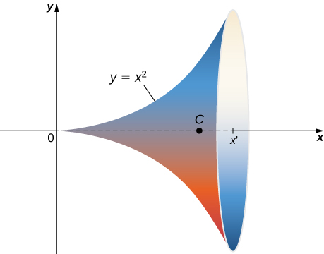{: #CNX_Calc_Figure_16_06_014}

This surface has parameterization

<math xmlns="http://www.w3.org/1998/Math/MathML"><mrow><mstyle mathvariant="bold" mathsize="normal"><mtext>r</mtext></mstyle><mrow><mo>(</mo><mrow><mi>x</mi><mo>,</mo><mi>θ</mi></mrow><mo>)</mo></mrow><mo>=</mo><mrow><mo>〈</mo><mrow><mi>x</mi><mo>,</mo><msup><mi>x</mi><mn>2</mn></msup><mtext>cos</mtext><mspace width="0.2em" /><mi>θ</mi><mo>,</mo><msup><mi>x</mi><mn>2</mn></msup><mtext>sin</mtext><mspace width="0.2em" /><mi>θ</mi></mrow><mo>〉</mo></mrow><mo>,</mo><mn>0</mn><mo>≤</mo><mi>x</mi><mo>≤</mo><mi>b</mi><mo>,</mo><mn>0</mn><mo>≤</mo><mi>x</mi><mo>&lt;</mo><mn>2</mn><mi>π</mi><mo>.</mo></mrow></math>

The tangent vectors are <math xmlns="http://www.w3.org/1998/Math/MathML"><mrow><msub><mstyle mathvariant="bold" mathsize="normal"><mtext>t</mtext></mstyle><mi>x</mi></msub><mo>=</mo><mrow><mo>〈</mo><mrow><mn>1</mn><mo>,</mo><mn>2</mn><mi>x</mi><mspace width="0.2em" /><mtext>cos</mtext><mspace width="0.2em" /><mi>θ</mi><mo>,</mo><mn>2</mn><mi>x</mi><mspace width="0.2em" /><mtext>sin</mtext><mspace width="0.2em" /><mi>θ</mi></mrow><mo>〉</mo></mrow><mspace width="0.2em" /><mtext>and</mtext><mspace width="0.2em" /><msub><mstyle mathvariant="bold" mathsize="normal"><mtext>t</mtext></mstyle><mi>θ</mi></msub><mo>=</mo><mrow><mo>〈</mo><mrow><mn>0</mn><mo>,</mo><mtext>−</mtext><msup><mi>x</mi><mn>2</mn></msup><mtext>sin</mtext><mspace width="0.2em" /><mi>θ</mi><mo>,</mo><mtext>−</mtext><msup><mi>x</mi><mn>2</mn></msup><mtext>cos</mtext><mspace width="0.2em" /><mi>θ</mi></mrow><mo>〉</mo></mrow><mo>.</mo></mrow></math>

 Therefore,

<math xmlns="http://www.w3.org/1998/Math/MathML"><mtable><mtr><mtd columnalign="right"><msub><mstyle mathvariant="bold" mathsize="normal"><mtext>t</mtext></mstyle><mi>x</mi></msub><mspace width="0.2em" /><mo>×</mo><mspace width="0.2em" /><msub><mstyle mathvariant="bold" mathsize="normal"><mtext>t</mtext></mstyle><mi>θ</mi></msub></mtd><mtd columnalign="left"><mo>=</mo><mrow><mo>〈</mo><mrow><mn>2</mn><msup><mi>x</mi><mn>3</mn></msup><msup><mrow><mtext>cos</mtext></mrow><mn>2</mn></msup><mi>θ</mi><mo>+</mo><mn>2</mn><msup><mi>x</mi><mn>3</mn></msup><msup><mrow><mtext>sin</mtext></mrow><mn>2</mn></msup><mi>θ</mi><mo>,</mo><mtext>−</mtext><msup><mi>x</mi><mn>2</mn></msup><mtext>cos</mtext><mspace width="0.2em" /><mi>θ</mi><mo>,</mo><mtext>−</mtext><msup><mi>x</mi><mn>2</mn></msup><mtext>sin</mtext><mspace width="0.2em" /><mi>θ</mi></mrow><mo>〉</mo></mrow></mtd></mtr><mtr><mtd /><mtd columnalign="left"><mo>=</mo><mrow><mo>〈</mo><mrow><mn>2</mn><msup><mi>x</mi><mn>3</mn></msup><mo>,</mo><mtext>−</mtext><msup><mi>x</mi><mn>2</mn></msup><mtext>cos</mtext><mspace width="0.2em" /><mi>θ</mi><mo>,</mo><mtext>−</mtext><msup><mi>x</mi><mn>2</mn></msup><mtext>sin</mtext><mspace width="0.2em" /><mi>θ</mi></mrow><mo>〉</mo></mrow></mtd></mtr></mtable></math>

and

<math xmlns="http://www.w3.org/1998/Math/MathML"><mtable><mtr><mtd columnalign="right"><msub><mstyle mathvariant="bold" mathsize="normal"><mtext>t</mtext></mstyle><mi>x</mi></msub><mspace width="0.2em" /><mo>×</mo><mspace width="0.2em" /><msub><mstyle mathvariant="bold" mathsize="normal"><mtext>t</mtext></mstyle><mi>θ</mi></msub></mtd><mtd columnalign="left"><mo>=</mo><msqrt><mrow><mn>4</mn><msup><mi>x</mi><mn>6</mn></msup><mo>+</mo><msup><mi>x</mi><mn>4</mn></msup><msup><mrow><mtext>cos</mtext></mrow><mn>2</mn></msup><mi>θ</mi><mo>+</mo><msup><mi>x</mi><mn>4</mn></msup><msup><mrow><mtext>sin</mtext></mrow><mn>2</mn></msup><mi>θ</mi></mrow></msqrt></mtd></mtr><mtr><mtd /><mtd columnalign="left"><mo>=</mo><msqrt><mrow><mn>4</mn><msup><mi>x</mi><mn>6</mn></msup><mo>+</mo><msup><mi>x</mi><mn>4</mn></msup></mrow></msqrt></mtd></mtr><mtr><mtd /><mtd columnalign="left"><mo>=</mo><msup><mi>x</mi><mn>2</mn></msup><msqrt><mrow><mn>4</mn><msup><mi>x</mi><mn>2</mn></msup><mo>+</mo><mn>1</mn></mrow></msqrt><mo>.</mo></mtd></mtr></mtable></math>

The area of the surface of revolution is

<math xmlns="http://www.w3.org/1998/Math/MathML"><mtable><mtr><mtd columnalign="right"><mstyle displaystyle="true"><mrow><msubsup><mo stretchy="false">∫</mo><mn>0</mn><mi>b</mi></msubsup><mrow><mstyle displaystyle="true"><mrow><msubsup><mo stretchy="false">∫</mo><mn>0</mn><mi>π</mi></msubsup><mrow><msup><mi>x</mi><mn>2</mn></msup><msqrt><mrow><mn>4</mn><msup><mi>x</mi><mn>2</mn></msup><mo>+</mo><mn>1</mn></mrow></msqrt><mi>d</mi><mi>θ</mi><mi>d</mi><mi>x</mi></mrow></mrow></mstyle></mrow></mrow></mstyle></mtd><mtd columnalign="left"><mo>=</mo><mn>2</mn><mi>π</mi><mstyle displaystyle="true"><mrow><msubsup><mo stretchy="false">∫</mo><mn>0</mn><mi>b</mi></msubsup><mrow><msup><mi>x</mi><mn>2</mn></msup><msqrt><mrow><mn>4</mn><msup><mi>x</mi><mn>2</mn></msup><mo>+</mo><mn>1</mn></mrow></msqrt></mrow></mrow></mstyle><mi>d</mi><mi>x</mi></mtd></mtr><mtr><mtd /><mtd columnalign="left"><mo>=</mo><mn>2</mn><mi>π</mi><msubsup><mrow><mo>[</mo><mrow><mfrac><mn>1</mn><mrow><mn>64</mn></mrow></mfrac><mrow><mo>(</mo><mrow><mn>2</mn><msqrt><mrow><mn>4</mn><msup><mi>x</mi><mn>2</mn></msup><mo>+</mo><mn>1</mn></mrow></msqrt><mrow><mo>(</mo><mrow><mn>8</mn><msup><mi>x</mi><mn>3</mn></msup><mo>+</mo><mi>x</mi></mrow><mo>)</mo></mrow><msup><mrow><mtext>sinh</mtext></mrow><mrow><mn>−1</mn></mrow></msup><mrow><mo>(</mo><mrow><mn>2</mn><mi>x</mi></mrow><mo>)</mo></mrow></mrow><mo>)</mo></mrow></mrow><mo>]</mo></mrow><mn>0</mn><mi>b</mi></msubsup></mtd></mtr><mtr><mtd /><mtd columnalign="left"><mo>=</mo><mn>2</mn><mi>π</mi><mrow><mo>[</mo><mrow><mfrac><mn>1</mn><mrow><mn>64</mn></mrow></mfrac><mrow><mo>(</mo><mrow><mn>2</mn><msqrt><mrow><mn>4</mn><msup><mi>b</mi><mn>2</mn></msup><mo>+</mo><mn>1</mn></mrow></msqrt><mrow><mo>(</mo><mrow><mn>8</mn><msup><mi>b</mi><mn>3</mn></msup><mo>+</mo><mi>b</mi></mrow><mo>)</mo></mrow><msup><mrow><mtext>sinh</mtext></mrow><mrow><mn>−1</mn></mrow></msup><mrow><mo>(</mo><mrow><mn>2</mn><mi>b</mi></mrow><mo>)</mo></mrow></mrow><mo>)</mo></mrow></mrow><mo>]</mo></mrow><mo>.</mo></mtd></mtr></mtable></math>

Use [[link]](#fs-id1167793991244) to find the area of the surface of revolution obtained by rotating curve <math xmlns="http://www.w3.org/1998/Math/MathML"><mrow><mi>y</mi><mo>=</mo><mtext>sin</mtext><mspace width="0.2em" /><mi>x</mi><mo>,</mo><mn>0</mn><mo>≤</mo><mi>x</mi><mo>≤</mo><mi>π</mi></mrow></math>

 about the *x*-axis.

<math xmlns="http://www.w3.org/1998/Math/MathML"><mrow><mn>2</mn><mi>π</mi><mrow><mo>(</mo><mrow><msqrt><mn>2</mn></msqrt><mo>+</mo><msup><mrow><mtext>sinh</mtext></mrow><mrow><mn>−1</mn></mrow></msup><mo stretchy="false">(</mo><mn>1</mn><mo stretchy="false">)</mo></mrow><mo>)</mo></mrow></mrow></math>

Hint

Use the parameterization of surfaces of revolution given before [[link]](#fs-id1167794069998).

### Surface Integral of a Scalar-Valued Function

Now that we can parameterize surfaces and we can calculate their surface areas, we are able to define surface integrals. First, let’s look at the surface integral of a scalar-valued function. Informally, the surface integral of a scalar-valued function is an analog of a scalar line integral in one higher dimension. The domain of integration of a scalar line integral is a parameterized curve (a one-dimensional object); the domain of integration of a scalar surface integral is a parameterized surface (a two-dimensional object). Therefore, the definition of a surface integral follows the definition of a line integral quite closely. For scalar line integrals, we chopped the domain curve into tiny pieces, chose a point in each piece, computed the function at that point, and took a limit of the corresponding Riemann sum. For scalar surface integrals, we chop the domain *region* (no longer a curve) into tiny pieces and proceed in the same fashion.

Let *S* be a piecewise smooth surface with parameterization <math xmlns="http://www.w3.org/1998/Math/MathML"><mrow><mstyle mathvariant="bold" mathsize="normal"><mtext>r</mtext></mstyle><mrow><mo>(</mo><mrow><mi>u</mi><mo>,</mo><mi>v</mi></mrow><mo>)</mo></mrow><mo>=</mo><mrow><mo>〈</mo><mrow><mi>x</mi><mrow><mo>(</mo><mrow><mi>u</mi><mo>,</mo><mi>v</mi></mrow><mo>)</mo></mrow><mo>,</mo><mi>y</mi><mrow><mo>(</mo><mrow><mi>u</mi><mo>,</mo><mi>v</mi></mrow><mo>)</mo></mrow><mo>,</mo><mi>z</mi><mrow><mo>(</mo><mrow><mi>u</mi><mo>,</mo><mi>v</mi></mrow><mo>)</mo></mrow></mrow><mo>〉</mo></mrow></mrow></math>

 with parameter domain *D* and let <math xmlns="http://www.w3.org/1998/Math/MathML"><mrow><mi>f</mi><mrow><mo>(</mo><mrow><mi>x</mi><mo>,</mo><mi>y</mi><mo>,</mo><mi>z</mi></mrow><mo>)</mo></mrow></mrow></math>

 be a function with a domain that contains *S.* For now, assume the parameter domain *D* is a rectangle, but we can extend the basic logic of how we proceed to any parameter domain (the choice of a rectangle is simply to make the notation more manageable). Divide rectangle *D* into subrectangles <math xmlns="http://www.w3.org/1998/Math/MathML"><mrow><msub><mi>D</mi><mrow><mi>i</mi><mi>j</mi></mrow></msub></mrow></math>

 with horizontal width <math xmlns="http://www.w3.org/1998/Math/MathML"><mrow><mtext>Δ</mtext><mi>u</mi></mrow></math>

 and vertical length <math xmlns="http://www.w3.org/1998/Math/MathML"><mrow><mtext>Δ</mtext><mi>v</mi><mo>.</mo></mrow></math>

 Suppose that *i* ranges from 1 to *m* and *j* ranges from 1 to *n* so that *D* is subdivided into *mn* rectangles. This division of *D* into subrectangles gives a corresponding division of *S* into pieces <math xmlns="http://www.w3.org/1998/Math/MathML"><mrow><msub><mi>S</mi><mrow><mi>i</mi><mi>j</mi></mrow></msub><mo>.</mo></mrow></math>

 Choose point <math xmlns="http://www.w3.org/1998/Math/MathML"><mrow><msub><mi>P</mi><mrow><mi>i</mi><mi>j</mi></mrow></msub></mrow></math>

 in each piece <math xmlns="http://www.w3.org/1998/Math/MathML"><mrow><msub><mi>S</mi><mrow><mi>i</mi><mi>j</mi></mrow></msub><mo>,</mo></mrow></math>

 evaluate <math xmlns="http://www.w3.org/1998/Math/MathML"><mrow><msub><mi>P</mi><mrow><mi>i</mi><mi>j</mi></mrow></msub></mrow></math>

 at <math xmlns="http://www.w3.org/1998/Math/MathML"><mrow><mi>f</mi></mrow></math>

, and multiply by area <math xmlns="http://www.w3.org/1998/Math/MathML"><mrow><mtext>Δ</mtext><msub><mi>S</mi><mrow><mi>i</mi><mi>j</mi></mrow></msub></mrow></math>

 to form the Riemann sum

<math xmlns="http://www.w3.org/1998/Math/MathML"><mrow><mstyle displaystyle="true"><munderover><mo>∑</mo><mrow><mi>i</mi><mo>=</mo><mn>1</mn></mrow><mi>m</mi></munderover><mrow><mstyle displaystyle="true"><munderover><mo>∑</mo><mrow><mi>j</mi><mo>=</mo><mn>1</mn></mrow><mi>n</mi></munderover><mrow><mi>f</mi><mrow><mo>(</mo><mrow><msub><mi>P</mi><mrow><mi>i</mi><mi>j</mi></mrow></msub></mrow><mo>)</mo></mrow></mrow></mstyle></mrow></mstyle><mtext>Δ</mtext><msub><mi>S</mi><mrow><mi>i</mi><mi>j</mi></mrow></msub><mo>.</mo></mrow></math>

To define a surface integral of a scalar-valued function, we let the areas of the pieces of *S* shrink to zero by taking a limit.

Definition

The **surface integral of a scalar-valued function**{: data-type="term"} of <math xmlns="http://www.w3.org/1998/Math/MathML"><mrow><mi>f</mi></mrow></math>

 over a piecewise smooth surface *S* is

<math xmlns="http://www.w3.org/1998/Math/MathML"><mrow><mstyle displaystyle="true"><mrow><munder><mo stretchy="true">∬</mo><mi>S</mi></munder><mrow><mi>f</mi><mrow><mo>(</mo><mrow><mi>x</mi><mo>,</mo><mi>y</mi><mo>,</mo><mi>z</mi></mrow><mo>)</mo></mrow></mrow></mrow></mstyle><mi>d</mi><mi>S</mi><mo>=</mo><munder><mrow><mtext>lim</mtext></mrow><mrow><mi>m</mi><mo>,</mo><mi>n</mi><mo stretchy="false">→</mo><mi>∞</mi></mrow></munder><mstyle displaystyle="true"><munderover><mo>∑</mo><mrow><mi>i</mi><mo>=</mo><mn>1</mn></mrow><mi>m</mi></munderover><mrow><mstyle displaystyle="true"><munderover><mo>∑</mo><mrow><mi>j</mi><mo>=</mo><mn>1</mn></mrow><mi>n</mi></munderover><mrow><mi>f</mi><mrow><mo>(</mo><mrow><msub><mi>P</mi><mrow><mi>i</mi><mi>j</mi></mrow></msub></mrow><mo>)</mo></mrow></mrow></mstyle></mrow></mstyle><mtext>Δ</mtext><msub><mi>S</mi><mrow><mi>i</mi><mi>j</mi></mrow></msub><mo>.</mo></mrow></math>

Again, notice the similarities between this definition and the definition of a scalar line integral. In the definition of a line integral we chop a curve into pieces, evaluate a function at a point in each piece, and let the length of the pieces shrink to zero by taking the limit of the corresponding Riemann sum. In the definition of a surface integral, we chop a surface into pieces, evaluate a function at a point in each piece, and let the area of the pieces shrink to zero by taking the limit of the corresponding Riemann sum. Thus, a surface integral is similar to a line integral but in one higher dimension.

The definition of a scalar line integral can be extended to parameter domains that are not rectangles by using the same logic used earlier. The basic idea is to chop the parameter domain into small pieces, choose a sample point in each piece, and so on. The exact shape of each piece in the sample domain becomes irrelevant as the areas of the pieces shrink to zero.

Scalar surface integrals are difficult to compute from the definition, just as scalar line integrals are. To develop a method that makes surface integrals easier to compute, we approximate surface areas <math xmlns="http://www.w3.org/1998/Math/MathML"><mrow><mtext>Δ</mtext><msub><mi>S</mi><mrow><mi>i</mi><mi>j</mi></mrow></msub></mrow></math>

 with small pieces of a tangent plane, just as we did in the previous subsection. Recall the definition of vectors <math xmlns="http://www.w3.org/1998/Math/MathML"><mrow><msub><mstyle mathvariant="bold" mathsize="normal"><mtext>t</mtext></mstyle><mi>u</mi></msub></mrow></math>

 and <math xmlns="http://www.w3.org/1998/Math/MathML"><mrow><msub><mstyle mathvariant="bold" mathsize="normal"><mtext>t</mtext></mstyle><mi>v</mi></msub><mtext>:</mtext></mrow></math>

<math xmlns="http://www.w3.org/1998/Math/MathML"><mrow><msub><mstyle mathvariant="bold" mathsize="normal"><mtext>t</mtext></mstyle><mi>u</mi></msub><mo>=</mo><mrow><mo>〈</mo><mrow><mfrac><mrow><mo>∂</mo><mi>x</mi></mrow><mrow><mo>∂</mo><mi>u</mi></mrow></mfrac><mo>,</mo><mfrac><mrow><mo>∂</mo><mi>y</mi></mrow><mrow><mo>∂</mo><mi>u</mi></mrow></mfrac><mo>,</mo><mfrac><mrow><mo>∂</mo><mi>z</mi></mrow><mrow><mo>∂</mo><mi>u</mi></mrow></mfrac></mrow><mo>〉</mo></mrow><mspace width="0.2em" /><mtext>and</mtext><mspace width="0.2em" /><msub><mstyle mathvariant="bold" mathsize="normal"><mtext>t</mtext></mstyle><mi>v</mi></msub><mo>=</mo><mrow><mo>〈</mo><mrow><mfrac><mrow><mo>∂</mo><mi>x</mi></mrow><mrow><mo>∂</mo><mi>v</mi></mrow></mfrac><mo>,</mo><mfrac><mrow><mo>∂</mo><mi>y</mi></mrow><mrow><mo>∂</mo><mi>v</mi></mrow></mfrac><mo>,</mo><mfrac><mrow><mo>∂</mo><mi>z</mi></mrow><mrow><mo>∂</mo><mi>v</mi></mrow></mfrac></mrow><mo>〉</mo></mrow><mo>.</mo></mrow></math>

From the material we have already studied, we know that

<math xmlns="http://www.w3.org/1998/Math/MathML"><mrow><mtext>Δ</mtext><msub><mi>S</mi><mrow><mi>i</mi><mi>j</mi></mrow></msub><mo>≈</mo><mrow><mo>‖</mo><mrow><msub><mstyle mathvariant="bold" mathsize="normal"><mtext>t</mtext></mstyle><mi>u</mi></msub><mrow><mo>(</mo><mrow><msub><mi>P</mi><mrow><mi>i</mi><mi>j</mi></mrow></msub></mrow><mo>)</mo></mrow><mspace width="0.2em" /><mo>×</mo><mspace width="0.2em" /><msub><mstyle mathvariant="bold" mathsize="normal"><mtext>t</mtext></mstyle><mi>v</mi></msub><mrow><mo>(</mo><mrow><msub><mi>P</mi><mrow><mi>i</mi><mi>j</mi></mrow></msub></mrow><mo>)</mo></mrow></mrow><mo>‖</mo></mrow><mtext>Δ</mtext><mi>u</mi><mtext>Δ</mtext><mi>v</mi><mo>.</mo></mrow></math>

Therefore,

<math xmlns="http://www.w3.org/1998/Math/MathML"><mrow><mstyle displaystyle="true"><mrow><msub><mo>∬</mo><mi>S</mi></msub><mrow><mi>f</mi><mo stretchy="false">(</mo><mi>x</mi><mo>,</mo><mi>y</mi><mo>,</mo><mi>z</mi><mo stretchy="false">)</mo><mi>d</mi><mi>S</mi><mo>≈</mo><munder><mrow><mtext>lim</mtext></mrow><mrow><mi>m</mi><mo>,</mo><mi>n</mi><mo stretchy="false">→</mo><mi>∞</mi></mrow></munder><mstyle displaystyle="true"><munderover><mo>∑</mo><mrow><mi>i</mi><mo>=</mo><mn>1</mn></mrow><mi>m</mi></munderover><mrow><mstyle displaystyle="true"><munderover><mo>∑</mo><mrow><mi>j</mi><mo>=</mo><mn>1</mn></mrow><mi>n</mi></munderover><mrow><mi>f</mi><mrow><mo>(</mo><mrow><msub><mi>P</mi><mrow><mi>i</mi><mi>j</mi></mrow></msub></mrow><mo>)</mo></mrow><mrow><mo>‖</mo><mrow><msub><mstyle mathvariant="bold" mathsize="normal"><mtext>t</mtext></mstyle><mi>u</mi></msub><mrow><mo>(</mo><mrow><msub><mi>P</mi><mrow><mi>i</mi><mi>j</mi></mrow></msub></mrow><mo>)</mo></mrow><mspace width="0.2em" /><mo>×</mo><mspace width="0.2em" /><msub><mstyle mathvariant="bold" mathsize="normal"><mtext>t</mtext></mstyle><mi>v</mi></msub><mrow><mo>(</mo><mrow><msub><mi>P</mi><mrow><mi>i</mi><mi>j</mi></mrow></msub></mrow><mo>)</mo></mrow></mrow><mo>‖</mo></mrow><mtext>Δ</mtext><mi>u</mi><mtext>Δ</mtext><mi>v</mi></mrow></mstyle></mrow></mstyle></mrow></mrow></mstyle><mo>.</mo></mrow></math>

This approximation becomes arbitrarily close to <math xmlns="http://www.w3.org/1998/Math/MathML"><mrow><munder><mrow><mtext>lim</mtext></mrow><mrow><mi>m</mi><mo>,</mo><mi>n</mi><mo stretchy="false">→</mo><mi>∞</mi></mrow></munder><mstyle displaystyle="true"><munderover><mo>∑</mo><mrow><mi>i</mi><mo>=</mo><mn>1</mn></mrow><mi>m</mi></munderover><mrow><mstyle displaystyle="true"><munderover><mo>∑</mo><mrow><mi>j</mi><mo>=</mo><mn>1</mn></mrow><mi>n</mi></munderover><mrow><mi>f</mi><mrow><mo>(</mo><mrow><msub><mi>P</mi><mrow><mi>i</mi><mi>j</mi></mrow></msub></mrow><mo>)</mo></mrow><mtext>Δ</mtext><msub><mi>S</mi><mrow><mi>i</mi><mi>j</mi></mrow></msub></mrow></mstyle></mrow></mstyle></mrow></math>

 as we increase the number of pieces <math xmlns="http://www.w3.org/1998/Math/MathML"><mrow><msub><mi>S</mi><mrow><mi>i</mi><mi>j</mi></mrow></msub></mrow></math>

 by letting *m* and *n* go to infinity. Therefore, we have the following equation to calculate scalar surface integrals:

<math xmlns="http://www.w3.org/1998/Math/MathML"><mrow><mstyle displaystyle="true"><mrow><msub><mo stretchy="true">∬</mo><mi>S</mi></msub><mrow><mi>f</mi><mo stretchy="false">(</mo><mi>x</mi><mo>,</mo><mi>y</mi><mo>,</mo><mi>z</mi><mo stretchy="false">)</mo><mi>d</mi><mi>S</mi></mrow></mrow></mstyle><mo>=</mo><mstyle displaystyle="true"><mrow><munder><mo stretchy="true">∬</mo><mi>D</mi></munder><mrow><mi>f</mi><mrow><mo>(</mo><mrow><mstyle mathvariant="bold" mathsize="normal"><mtext>r</mtext></mstyle><mrow><mo>(</mo><mrow><mi>u</mi><mo>,</mo><mi>v</mi></mrow><mo>)</mo></mrow></mrow><mo>)</mo></mrow></mrow></mrow></mstyle><mrow><mo>‖</mo><mrow><msub><mstyle mathvariant="bold" mathsize="normal"><mtext>t</mtext></mstyle><mi>u</mi></msub><mspace width="0.2em" /><mo>×</mo><mspace width="0.2em" /><msub><mstyle mathvariant="bold" mathsize="normal"><mtext>t</mtext></mstyle><mi>v</mi></msub></mrow><mo>‖</mo></mrow><mi>d</mi><mi>A</mi><mo>.</mo></mrow></math>

[\[link\]](#fs-id1167793757749) allows us to calculate a surface integral by transforming it into a double integral. This equation for surface integrals is analogous to [\[link\]](#fs-id1167793385095) for line integrals:

<math xmlns="http://www.w3.org/1998/Math/MathML"><mrow><mstyle displaystyle="true"><mrow><msub><mo stretchy="true">∬</mo><mi>C</mi></msub><mrow><mi>f</mi><mo stretchy="false">(</mo><mi>x</mi><mo>,</mo><mi>y</mi><mo>,</mo><mi>z</mi><mo stretchy="false">)</mo><mi>d</mi><mi>s</mi></mrow></mrow></mstyle><mo>=</mo><mstyle displaystyle="true"><mrow><msubsup><mo stretchy="false">∫</mo><mi>a</mi><mi>b</mi></msubsup><mrow><mi>f</mi><mrow><mo>(</mo><mrow><mstyle mathvariant="bold" mathsize="normal"><mtext>r</mtext></mstyle><mrow><mo>(</mo><mi>t</mi><mo>)</mo></mrow></mrow><mo>)</mo></mrow></mrow></mrow></mstyle><mrow><mo>‖</mo><mrow><mstyle mathvariant="bold" mathsize="normal"><msup><mi>r</mi><mo>′</mo></msup></mstyle><mrow><mo>(</mo><mi>t</mi><mo>)</mo></mrow></mrow><mo>‖</mo></mrow><mi>d</mi><mi>t</mi><mo>.</mo></mrow></math>

In this case, vector <math xmlns="http://www.w3.org/1998/Math/MathML"><mrow><msub><mstyle mathvariant="bold" mathsize="normal"><mtext>t</mtext></mstyle><mi>u</mi></msub><mspace width="0.2em" /><mo>×</mo><mspace width="0.2em" /><msub><mstyle mathvariant="bold" mathsize="normal"><mtext>t</mtext></mstyle><mi>v</mi></msub></mrow></math>

 is perpendicular to the surface, whereas vector <math xmlns="http://www.w3.org/1998/Math/MathML"><mrow><mstyle mathvariant="bold" mathsize="normal"><msup><mi>r</mi><mo>′</mo></msup></mstyle><mrow><mo>(</mo><mi>t</mi><mo>)</mo></mrow></mrow></math>

 is tangent to the curve.

Calculating a Surface Integral

Calculate surface integral <math xmlns="http://www.w3.org/1998/Math/MathML"><mrow><mstyle displaystyle="true"><mrow><msub><mo>∬</mo><mi>S</mi></msub><mn>5</mn></mrow></mstyle><mi>d</mi><mi>S</mi><mo>,</mo></mrow></math>

 where <math xmlns="http://www.w3.org/1998/Math/MathML"><mi>S</mi></math>

 is the surface with parameterization <math xmlns="http://www.w3.org/1998/Math/MathML"><mrow><mstyle mathvariant="bold" mathsize="normal"><mtext>r</mtext></mstyle><mrow><mo>(</mo><mrow><mi>u</mi><mo>,</mo><mi>v</mi></mrow><mo>)</mo></mrow><mo>=</mo><mrow><mo>〈</mo><mrow><mi>u</mi><mo>,</mo><msup><mi>u</mi><mn>2</mn></msup><mo>,</mo><mi>v</mi></mrow><mo>〉</mo></mrow></mrow></math>

 for <math xmlns="http://www.w3.org/1998/Math/MathML"><mrow><mn>0</mn><mo>≤</mo><mi>u</mi><mo>≤</mo><mn>2</mn></mrow></math>

 and <math xmlns="http://www.w3.org/1998/Math/MathML"><mrow><mn>0</mn><mo>≤</mo><mi>v</mi><mo>≤</mo><mi>u</mi><mo>.</mo></mrow></math>

Notice that this parameter domain *D* is a triangle, and therefore the parameter domain is not rectangular. This is not an issue though, because [[link]](#fs-id1167793757749) does not place any restrictions on the shape of the parameter domain.

To use [[link]](#fs-id1167793757749) to calculate the surface integral, we first find vector <math xmlns="http://www.w3.org/1998/Math/MathML"><mrow><msub><mstyle mathvariant="bold" mathsize="normal"><mtext>t</mtext></mstyle><mi>u</mi></msub></mrow></math>

 and <math xmlns="http://www.w3.org/1998/Math/MathML"><mrow><msub><mstyle mathvariant="bold" mathsize="normal"><mtext>t</mtext></mstyle><mi>v</mi></msub><mo>.</mo></mrow></math>

 Note that <math xmlns="http://www.w3.org/1998/Math/MathML"><mrow><msub><mstyle mathvariant="bold" mathsize="normal"><mtext>t</mtext></mstyle><mi>u</mi></msub><mo>=</mo><mrow><mo>〈</mo><mrow><mn>1</mn><mo>,</mo><mn>2</mn><mi>u</mi><mo>,</mo><mn>0</mn></mrow><mo>〉</mo></mrow></mrow></math>

 and <math xmlns="http://www.w3.org/1998/Math/MathML"><mrow><msub><mstyle mathvariant="bold" mathsize="normal"><mtext>t</mtext></mstyle><mi>v</mi></msub><mo>=</mo><mrow><mo>〈</mo><mrow><mn>0</mn><mo>,</mo><mn>0</mn><mo>,</mo><mn>1</mn></mrow><mo>〉</mo></mrow><mo>.</mo></mrow></math>

 Therefore,

<math xmlns="http://www.w3.org/1998/Math/MathML"><mrow><msub><mstyle mathvariant="bold" mathsize="normal"><mtext>t</mtext></mstyle><mi>u</mi></msub><mspace width="0.2em" /><mo>×</mo><mspace width="0.2em" /><msub><mstyle mathvariant="bold" mathsize="normal"><mtext>t</mtext></mstyle><mi>v</mi></msub><mo>=</mo><mrow><mo>\|</mo><mrow><mtable><mtr><mtd columnalign="center"><mstyle mathvariant="bold" mathsize="normal"><mtext>i</mtext></mstyle></mtd><mtd columnalign="center"><mstyle mathvariant="bold" mathsize="normal"><mtext>j</mtext></mstyle></mtd><mtd columnalign="center"><mstyle mathvariant="bold" mathsize="normal"><mtext>k</mtext></mstyle></mtd></mtr><mtr><mtd columnalign="center"><mn>1</mn></mtd><mtd columnalign="center"><mrow><mn>2</mn><mi>u</mi></mrow></mtd><mtd columnalign="center"><mn>0</mn></mtd></mtr><mtr><mtd columnalign="center"><mn>0</mn></mtd><mtd columnalign="center"><mn>0</mn></mtd><mtd columnalign="center"><mn>1</mn></mtd></mtr></mtable></mrow><mo>\|</mo></mrow><mo>=</mo><mrow><mo>〈</mo><mrow><mn>2</mn><mi>u</mi><mo>,</mo><mn>−1</mn><mo>,</mo><mn>0</mn></mrow><mo>〉</mo></mrow></mrow></math>

and

<math xmlns="http://www.w3.org/1998/Math/MathML"><mrow><mrow><mo>‖</mo><mrow><msub><mstyle mathvariant="bold" mathsize="normal"><mtext>t</mtext></mstyle><mi>u</mi></msub><mspace width="0.2em" /><mo>×</mo><mspace width="0.2em" /><msub><mstyle mathvariant="bold" mathsize="normal"><mtext>t</mtext></mstyle><mi>v</mi></msub></mrow><mo>‖</mo></mrow><mo>=</mo><msqrt><mrow><mn>1</mn><mo>+</mo><mn>4</mn><msup><mi>u</mi><mn>2</mn></msup></mrow></msqrt><mo>.</mo></mrow></math>

By [[link]](#fs-id1167793757749),

<math xmlns="http://www.w3.org/1998/Math/MathML"><mtable><mtr><mtd columnalign="right"><mstyle displaystyle="true"><mrow><msub><mo>∬</mo><mi>S</mi></msub><mn>5</mn></mrow></mstyle><mi>d</mi><mi>S</mi></mtd><mtd columnalign="left"><mo>=</mo><mn>5</mn><mstyle displaystyle="true"><mrow><msub><mo>∬</mo><mi>D</mi></msub><mrow><mi>u</mi><msqrt><mrow><mn>1</mn><mo>+</mo><mn>4</mn><msup><mi>u</mi><mn>2</mn></msup></mrow></msqrt></mrow></mrow></mstyle><mi>d</mi><mi>A</mi></mtd></mtr><mtr><mtd /><mtd columnalign="left"><mo>=</mo><mn>5</mn><mstyle displaystyle="true"><mrow><msubsup><mo stretchy="false">∫</mo><mn>0</mn><mn>2</mn></msubsup><mrow><mstyle displaystyle="true"><mrow><msubsup><mo stretchy="false">∫</mo><mn>0</mn><mi>u</mi></msubsup><mrow><msqrt><mrow><mn>1</mn><mo>+</mo><mn>4</mn><msup><mi>u</mi><mn>2</mn></msup></mrow></msqrt></mrow></mrow></mstyle></mrow></mrow></mstyle><mi>d</mi><mi>v</mi><mi>d</mi><mi>u</mi><mo>=</mo><mn>5</mn><mstyle displaystyle="true"><mrow><msubsup><mo stretchy="false">∫</mo><mn>0</mn><mn>2</mn></msubsup><mrow><mi>u</mi><msqrt><mrow><mn>1</mn><mo>+</mo><mn>4</mn><msup><mi>u</mi><mn>2</mn></msup></mrow></msqrt></mrow></mrow></mstyle><mi>d</mi><mi>u</mi></mtd></mtr><mtr><mtd /><mtd columnalign="left"><mo>=</mo><mn>5</mn><msubsup><mrow><mo>[</mo><mrow><mfrac><mrow><msup><mrow><mrow><mo>(</mo><mrow><mn>1</mn><mo>+</mo><mn>4</mn><msup><mi>u</mi><mn>2</mn></msup></mrow><mo>)</mo></mrow></mrow><mrow><mrow><mn>3</mn><mtext>/</mtext><mn>2</mn></mrow></mrow></msup></mrow><mn>3</mn></mfrac></mrow><mo>]</mo></mrow><mn>0</mn><mn>2</mn></msubsup><mo>=</mo><mfrac><mrow><mn>5</mn><mrow><mo>(</mo><mrow><msup><mrow><mn>17</mn></mrow><mrow><mrow><mn>3</mn><mtext>/</mtext><mn>2</mn></mrow></mrow></msup><mo>−</mo><mn>1</mn></mrow><mo>)</mo></mrow></mrow><mn>3</mn></mfrac><mo>≈</mo><mn>115.15.</mn></mtd></mtr></mtable></math>

Calculating the Surface Integral of a Cylinder

Calculate surface integral <math xmlns="http://www.w3.org/1998/Math/MathML"><mrow><mstyle displaystyle="true"><mrow><msub><mo>∬</mo><mi>S</mi></msub><mrow><mrow><mo>(</mo><mrow><mi>x</mi><mo>+</mo><msup><mi>y</mi><mn>2</mn></msup></mrow><mo>)</mo></mrow><mi>d</mi><mi>S</mi></mrow></mrow></mstyle><mo>,</mo></mrow></math>

 where *S* is cylinder <math xmlns="http://www.w3.org/1998/Math/MathML"><mrow><msup><mi>x</mi><mn>2</mn></msup><mo>+</mo><msup><mi>y</mi><mn>2</mn></msup><mo>=</mo><mn>4</mn><mo>,</mo><mn>0</mn><mo>≤</mo><mi>z</mi><mo>≤</mo><mn>3</mn></mrow></math>

 ([[link]](#CNX_Calc_Figure_16_06_015)).

=x+y2 over a cylinder."){: #CNX_Calc_Figure_16_06_015}

To calculate the surface integral, we first need a parameterization of the cylinder. Following [[link]](#fs-id1167793711076), a parameterization is

<math xmlns="http://www.w3.org/1998/Math/MathML"><mrow><mstyle mathvariant="bold" mathsize="normal"><mtext>r</mtext></mstyle><mrow><mo>(</mo><mrow><mi>u</mi><mo>,</mo><mi>v</mi></mrow><mo>)</mo></mrow><mo>=</mo><mrow><mo>〈</mo><mrow><mtext>cos</mtext><mspace width="0.2em" /><mi>u</mi><mo>,</mo><mtext>sin</mtext><mspace width="0.2em" /><mi>u</mi><mo>,</mo><mi>v</mi></mrow><mo>〉</mo></mrow><mo>,</mo><mn>0</mn><mo>≤</mo><mi>u</mi><mo>≤</mo><mn>2</mn><mi>π</mi><mo>,</mo><mn>0</mn><mo>≤</mo><mi>v</mi><mo>≤</mo><mn>3</mn><mo>.</mo></mrow></math>

The tangent vectors are <math xmlns="http://www.w3.org/1998/Math/MathML"><mrow><msub><mstyle mathvariant="bold" mathsize="normal"><mtext>t</mtext></mstyle><mi>u</mi></msub><mo>=</mo><mrow><mo>〈</mo><mrow><mtext>sin</mtext><mspace width="0.2em" /><mi>u</mi><mo>,</mo><mtext>cos</mtext><mspace width="0.2em" /><mi>u</mi><mo>,</mo><mn>0</mn></mrow><mo>〉</mo></mrow></mrow></math>

 and <math xmlns="http://www.w3.org/1998/Math/MathML"><mrow><msub><mstyle mathvariant="bold" mathsize="normal"><mtext>t</mtext></mstyle><mi>v</mi></msub><mo>=</mo><mrow><mo>〈</mo><mrow><mn>0</mn><mo>,</mo><mn>0</mn><mo>,</mo><mn>1</mn></mrow><mo>〉</mo></mrow><mo>.</mo></mrow></math>

 Then,

<math xmlns="http://www.w3.org/1998/Math/MathML"><mrow><msub><mstyle mathvariant="bold" mathsize="normal"><mtext>t</mtext></mstyle><mi>u</mi></msub><mspace width="0.2em" /><mo>×</mo><mspace width="0.2em" /><msub><mstyle mathvariant="bold" mathsize="normal"><mtext>t</mtext></mstyle><mi>v</mi></msub><mo>=</mo><mrow><mo>\|</mo><mrow><mtable><mtr><mtd columnalign="center"><mstyle mathvariant="bold" mathsize="normal"><mtext>i</mtext></mstyle></mtd><mtd columnalign="center"><mstyle mathvariant="bold" mathsize="normal"><mtext>j</mtext></mstyle></mtd><mtd columnalign="center"><mstyle mathvariant="bold" mathsize="normal"><mtext>k</mtext></mstyle></mtd></mtr><mtr><mtd columnalign="center"><mrow><mtext>−</mtext><mtext>sin</mtext><mspace width="0.2em" /><mi>u</mi></mrow></mtd><mtd columnalign="center"><mrow><mtext>cos</mtext><mspace width="0.2em" /><mi>u</mi></mrow></mtd><mtd columnalign="center"><mn>0</mn></mtd></mtr><mtr><mtd columnalign="center"><mn>0</mn></mtd><mtd columnalign="center"><mn>0</mn></mtd><mtd columnalign="center"><mn>1</mn></mtd></mtr></mtable></mrow><mo>\|</mo></mrow><mo>=</mo><mrow><mo>〈</mo><mrow><mtext>cos</mtext><mspace width="0.2em" /><mi>u</mi><mo>,</mo><mtext>sin</mtext><mspace width="0.2em" /><mi>u</mi><mo>,</mo><mn>0</mn></mrow><mo>〉</mo></mrow></mrow></math>

and <math xmlns="http://www.w3.org/1998/Math/MathML"><mrow><mrow><mo>‖</mo><mrow><msub><mstyle mathvariant="bold" mathsize="normal"><mtext>t</mtext></mstyle><mi>u</mi></msub><mspace width="0.2em" /><mo>×</mo><mspace width="0.2em" /><msub><mstyle mathvariant="bold" mathsize="normal"><mtext>t</mtext></mstyle><mi>v</mi></msub></mrow><mo>‖</mo></mrow><mo>=</mo><msqrt><mrow><msup><mrow><mtext>cos</mtext></mrow><mn>2</mn></msup><mi>u</mi><mo>+</mo><msup><mrow><mtext>sin</mtext></mrow><mn>2</mn></msup><mi>u</mi></mrow></msqrt><mo>=</mo><mn>1</mn><mo>.</mo></mrow></math>

 By [[link]](#fs-id1167793757749),

<math xmlns="http://www.w3.org/1998/Math/MathML"><mtable><mtr /><mtr /><mtr /><mtr><mtd columnalign="left"><mspace width="1.2em" /><mstyle displaystyle="true"><mrow><msub><mo>∬</mo><mi>S</mi></msub><mrow><mi>f</mi><mo stretchy="false">(</mo><mi>x</mi><mo>,</mo><mi>y</mi><mo>,</mo><mi>z</mi><mo stretchy="false">)</mo><mi>d</mi><mi>S</mi><mo>=</mo><mstyle displaystyle="true"><mrow><msub><mo>∬</mo><mi>D</mi></msub><mrow><mi>f</mi><mrow><mo>(</mo><mrow><mstyle mathvariant="bold" mathsize="normal"><mtext>r</mtext></mstyle><mo stretchy="false">(</mo><mi>u</mi><mo>,</mo><mi>v</mi><mo stretchy="false">)</mo></mrow><mo>)</mo></mrow><mrow><mo>‖</mo><mrow><msub><mstyle mathvariant="bold" mathsize="normal"><mtext>t</mtext></mstyle><mi>u</mi></msub><mspace width="0.2em" /><mo>×</mo><mspace width="0.2em" /><msub><mstyle mathvariant="bold" mathsize="normal"><mtext>t</mtext></mstyle><mi>v</mi></msub></mrow><mo>‖</mo></mrow></mrow></mrow></mstyle></mrow></mrow></mstyle><mspace width="0.2em" /><mi>d</mi><mi>A</mi></mtd></mtr><mtr><mtd columnalign="left"><mo>=</mo><mstyle displaystyle="true"><mrow><msubsup><mo stretchy="false">∫</mo><mn>0</mn><mn>3</mn></msubsup><mrow><mstyle displaystyle="true"><mrow><msubsup><mo stretchy="false">∫</mo><mn>0</mn><mrow><mn>2</mn><mi>π</mi></mrow></msubsup><mrow><mrow><mo>(</mo><mrow><mtext>cos</mtext><mspace width="0.2em" /><mi>u</mi><mo>+</mo><msup><mrow><mtext>sin</mtext></mrow><mn>2</mn></msup><mi>u</mi></mrow><mo>)</mo></mrow><mi>d</mi><mi>u</mi><mi>d</mi><mi>v</mi></mrow></mrow></mstyle></mrow></mrow></mstyle></mtd></mtr><mtr><mtd columnalign="left"><mo>=</mo><msubsup><mstyle displaystyle="true"><mrow><msubsup><mo stretchy="false">∫</mo><mn>0</mn><mn>3</mn></msubsup><mrow><mrow><mo>[</mo><mrow><mtext>sin</mtext><mspace width="0.2em" /><mi>u</mi><mo>+</mo><mfrac><mi>u</mi><mn>2</mn></mfrac><mo>−</mo><mfrac><mrow><mtext>sin</mtext><mo stretchy="false">(</mo><mn>2</mn><mi>u</mi><mo stretchy="false">)</mo></mrow><mn>4</mn></mfrac></mrow><mo>]</mo></mrow></mrow></mrow></mstyle><mn>0</mn><mrow><mn>2</mn><mi>π</mi></mrow></msubsup><mi>d</mi><mi>v</mi><mo>=</mo><mstyle displaystyle="true"><mrow><msubsup><mo stretchy="false">∫</mo><mn>0</mn><mn>3</mn></msubsup><mrow><mi>π</mi><mi>d</mi><mi>v</mi></mrow></mrow></mstyle><mo>=</mo><mn>3</mn><mi>π</mi><mo>.</mo></mtd></mtr></mtable></math>

Calculate <math xmlns="http://www.w3.org/1998/Math/MathML"><mrow><mstyle displaystyle="true"><mrow><msub><mo>∬</mo><mi>S</mi></msub><mrow><mrow><mo>(</mo><mrow><msup><mi>x</mi><mn>2</mn></msup><mo>−</mo><mi>z</mi></mrow><mo>)</mo></mrow></mrow></mrow></mstyle><mi>d</mi><mi>S</mi><mo>,</mo></mrow></math>

 where *S* is the surface with parameterization <math xmlns="http://www.w3.org/1998/Math/MathML"><mrow><mstyle mathvariant="bold" mathsize="normal"><mtext>r</mtext></mstyle><mrow><mo>(</mo><mrow><mi>u</mi><mo>,</mo><mi>v</mi></mrow><mo>)</mo></mrow><mo>=</mo><mrow><mo>〈</mo><mrow><mi>v</mi><mo>,</mo><msup><mi>u</mi><mn>2</mn></msup><mo>+</mo><msup><mi>v</mi><mn>2</mn></msup><mo>,</mo><mn>1</mn></mrow><mo>〉</mo></mrow><mo>,</mo><mn>0</mn><mo>≤</mo><mi>u</mi><mo>≤</mo><mn>2</mn><mo>,</mo><mn>0</mn><mo>≤</mo><mi>v</mi><mo>≤</mo><mn>3</mn><mo>.</mo></mrow></math>

24

Hint

Use [[link]](#fs-id1167793757749).

Calculating the Surface Integral of a Piece of a Sphere

Calculate surface integral <math xmlns="http://www.w3.org/1998/Math/MathML"><mrow><mstyle displaystyle="true"><mrow><msub><mo>∬</mo><mi>S</mi></msub><mrow><mi>f</mi><mo stretchy="false">(</mo><mi>x</mi><mo>,</mo><mi>y</mi><mo>,</mo><mi>z</mi><mo stretchy="false">)</mo><mi>d</mi><mi>S</mi></mrow></mrow></mstyle><mo>,</mo></mrow></math>

 where <math xmlns="http://www.w3.org/1998/Math/MathML"><mrow><mi>f</mi><mo stretchy="false">(</mo><mi>x</mi><mo>,</mo><mi>y</mi><mo>,</mo><mi>z</mi><mo stretchy="false">)</mo><mo>=</mo><msup><mi>z</mi><mn>2</mn></msup></mrow></math>

 and *S* is the surface that consists of the piece of sphere <math xmlns="http://www.w3.org/1998/Math/MathML"><mrow><msup><mi>x</mi><mn>2</mn></msup><mo>+</mo><msup><mi>y</mi><mn>2</mn></msup><mo>+</mo><msup><mi>z</mi><mn>2</mn></msup><mo>=</mo><mn>4</mn></mrow></math>

 that lies on or above plane <math xmlns="http://www.w3.org/1998/Math/MathML"><mrow><mi>z</mi><mo>=</mo><mn>1</mn></mrow></math>

 and the disk that is enclosed by intersection plane <math xmlns="http://www.w3.org/1998/Math/MathML"><mrow><mi>z</mi><mo>=</mo><mn>1</mn></mrow></math>

 and the given sphere ([[link]](#CNX_Calc_Figure_16_06_016)).

{: #CNX_Calc_Figure_16_06_016}

Notice that *S* is not smooth but is piecewise smooth; *S* can be written as the union of its base <math xmlns="http://www.w3.org/1998/Math/MathML"><mrow><msub><mi>S</mi><mn>1</mn></msub></mrow></math>

 and its spherical top <math xmlns="http://www.w3.org/1998/Math/MathML"><mrow><msub><mi>S</mi><mn>2</mn></msub><mo>,</mo></mrow></math>

 and both <math xmlns="http://www.w3.org/1998/Math/MathML"><mrow><msub><mi>S</mi><mn>1</mn></msub></mrow></math>

 and <math xmlns="http://www.w3.org/1998/Math/MathML"><mrow><msub><mi>S</mi><mn>2</mn></msub></mrow></math>

 are smooth. Therefore, to calculate <math xmlns="http://www.w3.org/1998/Math/MathML"><mrow><mstyle displaystyle="true"><mrow><msub><mo>∬</mo><mi>S</mi></msub><mrow><msup><mi>z</mi><mn>2</mn></msup><mi>d</mi><mi>S</mi></mrow></mrow></mstyle><mo>,</mo></mrow></math>

 we write this integral as <math xmlns="http://www.w3.org/1998/Math/MathML"><mrow><mstyle displaystyle="true"><mrow><msub><mo>∬</mo><mrow><msub><mi>S</mi><mn>1</mn></msub></mrow></msub><mrow><msup><mi>z</mi><mn>2</mn></msup><mi>d</mi><mi>S</mi></mrow></mrow></mstyle><mo>+</mo><mstyle displaystyle="true"><mrow><msub><mo>∬</mo><mrow><msub><mi>S</mi><mn>2</mn></msub></mrow></msub><mrow><msup><mi>z</mi><mn>2</mn></msup><mi>d</mi><mi>S</mi></mrow></mrow></mstyle></mrow></math>

 and we calculate integrals <math xmlns="http://www.w3.org/1998/Math/MathML"><mrow><mstyle displaystyle="true"><mrow><msub><mo>∬</mo><mrow><msub><mi>S</mi><mn>1</mn></msub></mrow></msub><mrow><msup><mi>z</mi><mn>2</mn></msup><mi>d</mi><mi>S</mi></mrow></mrow></mstyle></mrow></math>

 and <math xmlns="http://www.w3.org/1998/Math/MathML"><mrow><mstyle displaystyle="true"><mrow><msub><mo>∬</mo><mrow><msub><mi>S</mi><mn>2</mn></msub></mrow></msub><mrow><msup><mi>z</mi><mn>2</mn></msup><mi>d</mi><mi>S</mi></mrow></mrow></mstyle><mo>.</mo></mrow></math>

First, we calculate <math xmlns="http://www.w3.org/1998/Math/MathML"><mrow><mstyle displaystyle="true"><mrow><msub><mo>∬</mo><mrow><msub><mi>S</mi><mn>1</mn></msub></mrow></msub><mrow><msup><mi>z</mi><mn>2</mn></msup><mi>d</mi><mi>S</mi></mrow></mrow></mstyle><mo>.</mo></mrow></math>

 To calculate this integral we need a parameterization of <math xmlns="http://www.w3.org/1998/Math/MathML"><mrow><msub><mi>S</mi><mn>1</mn></msub><mo>.</mo></mrow></math>

 This surface is a disk in plane <math xmlns="http://www.w3.org/1998/Math/MathML"><mrow><mi>z</mi><mo>=</mo><mn>1</mn></mrow></math>

 centered at <math xmlns="http://www.w3.org/1998/Math/MathML"><mrow><mo stretchy="false">(</mo><mn>0</mn><mo>,</mo><mn>0</mn><mo>,</mo><mn>1</mn><mo stretchy="false">)</mo><mo>.</mo></mrow></math>

 To parameterize this disk, we need to know its radius. Since the disk is formed where plane <math xmlns="http://www.w3.org/1998/Math/MathML"><mrow><mi>z</mi><mo>=</mo><mn>1</mn></mrow></math>

 intersects sphere <math xmlns="http://www.w3.org/1998/Math/MathML"><mrow><msup><mi>x</mi><mn>2</mn></msup><mo>+</mo><msup><mi>y</mi><mn>2</mn></msup><mo>+</mo><msup><mi>z</mi><mn>2</mn></msup><mo>=</mo><mn>4</mn><mo>,</mo></mrow></math>

 we can substitute <math xmlns="http://www.w3.org/1998/Math/MathML"><mrow><mi>z</mi><mo>=</mo><mn>1</mn></mrow></math>

 into equation <math xmlns="http://www.w3.org/1998/Math/MathML"><mrow><msup><mi>x</mi><mn>2</mn></msup><mo>+</mo><msup><mi>y</mi><mn>2</mn></msup><mo>+</mo><msup><mi>z</mi><mn>2</mn></msup><mo>=</mo><mn>4</mn><mtext>:</mtext></mrow></math>

<math xmlns="http://www.w3.org/1998/Math/MathML"><mrow><msup><mi>x</mi><mn>2</mn></msup><mo>+</mo><msup><mi>y</mi><mn>2</mn></msup><mo>+</mo><mn>1</mn><mo>=</mo><mn>4</mn><mo stretchy="false">⇒</mo><msup><mi>x</mi><mn>2</mn></msup><mo>+</mo><msup><mi>y</mi><mn>2</mn></msup><mo>=</mo><mn>3</mn><mo>.</mo></mrow></math>

Therefore, the radius of the disk is <math xmlns="http://www.w3.org/1998/Math/MathML"><mrow><msqrt><mn>3</mn></msqrt></mrow></math>

 and a parameterization of <math xmlns="http://www.w3.org/1998/Math/MathML"><mrow><msub><mi>S</mi><mn>1</mn></msub></mrow></math>

 is <math xmlns="http://www.w3.org/1998/Math/MathML"><mrow><mstyle mathvariant="bold" mathsize="normal"><mtext>r</mtext></mstyle><mo stretchy="false">(</mo><mi>u</mi><mo>,</mo><mi>v</mi><mo stretchy="false">)</mo><mo>=</mo><mrow><mo>〈</mo><mrow><mi>u</mi><mspace width="0.2em" /><mtext>cos</mtext><mspace width="0.2em" /><mi>v</mi><mo>,</mo><mi>u</mi><mspace width="0.2em" /><mtext>sin</mtext><mspace width="0.2em" /><mi>v</mi><mo>,</mo><mn>1</mn></mrow><mo>〉</mo></mrow><mo>,</mo><mn>0</mn><mo>≤</mo><mi>u</mi><mo>≤</mo><msqrt><mn>3</mn></msqrt><mo>,</mo><mn>0</mn><mo>≤</mo><mi>v</mi><mo>≤</mo><mn>2</mn><mi>π</mi><mo>.</mo></mrow></math>

 The tangent vectors are <math xmlns="http://www.w3.org/1998/Math/MathML"><mrow><msub><mstyle mathvariant="bold" mathsize="normal"><mtext>t</mtext></mstyle><mi>u</mi></msub><mo>=</mo><mrow><mo>〈</mo><mrow><mtext>cos</mtext><mspace width="0.2em" /><mi>v</mi><mo>,</mo><mtext>sin</mtext><mspace width="0.2em" /><mi>v</mi><mo>,</mo><mn>0</mn></mrow><mo>〉</mo></mrow></mrow></math>

 and <math xmlns="http://www.w3.org/1998/Math/MathML"><mrow><msub><mstyle mathvariant="bold" mathsize="normal"><mtext>t</mtext></mstyle><mi>v</mi></msub><mo>=</mo><mrow><mo>〈</mo><mrow><mtext>−</mtext><mi>u</mi><mspace width="0.2em" /><mtext>sin</mtext><mspace width="0.2em" /><mi>v</mi><mo>,</mo><mi>u</mi><mi mathvariant="normal">co</mi><mi mathvariant="normal">s</mi><mi>v</mi><mo>,</mo><mn>0</mn></mrow><mo>〉</mo></mrow><mo>,</mo></mrow></math>

 and thus

<math xmlns="http://www.w3.org/1998/Math/MathML"><mrow><msub><mstyle mathvariant="bold" mathsize="normal"><mtext>t</mtext></mstyle><mi>u</mi></msub><mspace width="0.2em" /><mo>×</mo><mspace width="0.2em" /><msub><mstyle mathvariant="bold" mathsize="normal"><mtext>t</mtext></mstyle><mi>v</mi></msub><mo>=</mo><mrow><mo>\|</mo><mrow><mtable><mtr><mtd columnalign="center"><mstyle mathvariant="bold" mathsize="normal"><mtext>i</mtext></mstyle></mtd><mtd columnalign="center"><mstyle mathvariant="bold" mathsize="normal"><mtext>j</mtext></mstyle></mtd><mtd columnalign="center"><mstyle mathvariant="bold" mathsize="normal"><mtext>k</mtext></mstyle></mtd></mtr><mtr><mtd columnalign="center"><mrow><mtext>cos</mtext><mspace width="0.2em" /><mi>v</mi></mrow></mtd><mtd columnalign="center"><mrow><mtext>sin</mtext><mspace width="0.2em" /><mi>v</mi></mrow></mtd><mtd columnalign="center"><mn>0</mn></mtd></mtr><mtr><mtd columnalign="center"><mrow><mtext>−</mtext><mi>u</mi><mspace width="0.2em" /><mtext>sin</mtext><mspace width="0.2em" /><mi>v</mi></mrow></mtd><mtd columnalign="center"><mrow><mi>u</mi><mspace width="0.2em" /><mtext>cos</mtext><mspace width="0.2em" /><mi>v</mi></mrow></mtd><mtd columnalign="center"><mn>0</mn></mtd></mtr></mtable></mrow><mo>\|</mo></mrow><mo>=</mo><mrow><mo>〈</mo><mrow><mn>0</mn><mo>,</mo><mn>0</mn><mo>,</mo><mi>u</mi><mspace width="0.2em" /><msup><mrow><mtext>cos</mtext></mrow><mn>2</mn></msup><mi>v</mi><mo>+</mo><mi>u</mi><mspace width="0.2em" /><msup><mrow><mtext>sin</mtext></mrow><mn>2</mn></msup><mi>v</mi></mrow><mo>〉</mo></mrow><mo>=</mo><mrow><mo>〈</mo><mrow><mn>0</mn><mo>,</mo><mn>0</mn><mo>,</mo><mi>u</mi></mrow><mo>〉</mo></mrow><mo>.</mo></mrow></math>

The magnitude of this vector is *u*. Therefore,

<math xmlns="http://www.w3.org/1998/Math/MathML"><mtable><mtr><mtd columnalign="right"><mstyle displaystyle="true"><mrow><msub><mo>∬</mo><mrow><msub><mi>S</mi><mn>1</mn></msub></mrow></msub><mrow><msup><mi>z</mi><mn>2</mn></msup><mi>d</mi><mi>S</mi></mrow></mrow></mstyle></mtd><mtd columnalign="left"><mo>=</mo><mstyle displaystyle="true"><mrow><msubsup><mo stretchy="false">∫</mo><mn>0</mn><mrow><msqrt><mn>3</mn></msqrt></mrow></msubsup><mrow><mstyle displaystyle="true"><mrow><msubsup><mo stretchy="false">∫</mo><mn>0</mn><mrow><mn>2</mn><mi>π</mi></mrow></msubsup><mrow><mi>f</mi><mrow><mo>(</mo><mrow><mstyle mathvariant="bold" mathsize="normal"><mtext>r</mtext></mstyle><mo stretchy="false">(</mo><mi>u</mi><mo>,</mo><mi>v</mi><mo stretchy="false">)</mo></mrow><mo>)</mo></mrow></mrow></mrow></mstyle></mrow></mrow></mstyle><mrow><mo>‖</mo><mrow><msub><mstyle mathvariant="bold" mathsize="normal"><mtext>t</mtext></mstyle><mi>u</mi></msub><mspace width="0.2em" /><mo>×</mo><mspace width="0.2em" /><msub><mstyle mathvariant="bold" mathsize="normal"><mtext>t</mtext></mstyle><mi>v</mi></msub></mrow><mo>‖</mo></mrow><mspace width="0.2em" /><mi>d</mi><mi>v</mi><mspace width="0.2em" /><mi>d</mi><mi>u</mi></mtd></mtr><mtr><mtd /><mtd columnalign="left"><mo>=</mo><mstyle displaystyle="true"><mrow><msubsup><mo stretchy="false">∫</mo><mn>0</mn><mrow><msqrt><mn>3</mn></msqrt></mrow></msubsup><mrow><mstyle displaystyle="true"><mrow><msubsup><mo stretchy="false">∫</mo><mn>0</mn><mrow><mn>2</mn><mi>π</mi></mrow></msubsup><mi>u</mi></mrow></mstyle></mrow></mrow></mstyle><mspace width="0.2em" /><mi>d</mi><mi>v</mi><mspace width="0.2em" /><mi>d</mi><mi>u</mi></mtd></mtr><mtr><mtd /><mtd columnalign="left"><mo>=</mo><mn>2</mn><mi>π</mi><mstyle displaystyle="true"><mrow><msubsup><mo stretchy="false">∫</mo><mn>0</mn><mrow><msqrt><mn>3</mn></msqrt></mrow></msubsup><mrow><mi>u</mi><mi>d</mi><mi>u</mi></mrow></mrow></mstyle></mtd></mtr><mtr><mtd /><mtd columnalign="left"><mo>=</mo><mn>2</mn><mi>π</mi><msqrt><mn>3</mn></msqrt><mo>.</mo></mtd></mtr></mtable></math>

Now we calculate <math xmlns="http://www.w3.org/1998/Math/MathML"><mrow><mstyle displaystyle="true"><mrow><msub><mo>∬</mo><mrow><msub><mi>S</mi><mn>2</mn></msub></mrow></msub><mrow><mi>d</mi><mi>S</mi></mrow></mrow></mstyle><mo>.</mo></mrow></math>

 To calculate this integral, we need a parameterization of <math xmlns="http://www.w3.org/1998/Math/MathML"><mrow><msub><mi>S</mi><mn>2</mn></msub><mo>.</mo></mrow></math>

 The parameterization of full sphere <math xmlns="http://www.w3.org/1998/Math/MathML"><mrow><msup><mi>x</mi><mn>2</mn></msup><mo>+</mo><msup><mi>y</mi><mn>2</mn></msup><mo>+</mo><msup><mi>z</mi><mn>2</mn></msup><mo>=</mo><mn>4</mn></mrow></math>

 is

<math xmlns="http://www.w3.org/1998/Math/MathML"><mrow><mstyle mathvariant="bold" mathsize="normal"><mtext>r</mtext></mstyle><mrow><mo>(</mo><mrow><mi>ϕ</mi><mo>,</mo><mi>θ</mi></mrow><mo>)</mo></mrow><mo>=</mo><mrow><mo>〈</mo><mrow><mn>2</mn><mspace width="0.2em" /><mtext>cos</mtext><mspace width="0.2em" /><mi>θ</mi><mspace width="0.2em" /><mtext>sin</mtext><mspace width="0.2em" /><mi>ϕ</mi><mo>,</mo><mn>2</mn><mspace width="0.2em" /><mtext>sin</mtext><mspace width="0.2em" /><mi>θ</mi><mspace width="0.2em" /><mtext>sin</mtext><mspace width="0.2em" /><mi>ϕ</mi><mo>,</mo><mn>2</mn><mspace width="0.2em" /><mtext>cos</mtext><mspace width="0.2em" /><mi>ϕ</mi></mrow><mo>〉</mo></mrow><mo>,</mo><mn>0</mn><mo>≤</mo><mi>θ</mi><mo>≤</mo><mn>2</mn><mi>π</mi><mo>,</mo><mn>0</mn><mo>≤</mo><mi>ϕ</mi><mo>≤</mo><mi>π</mi><mo>.</mo></mrow></math>

Since we are only taking the piece of the sphere on or above plane <math xmlns="http://www.w3.org/1998/Math/MathML"><mrow><mi>z</mi><mo>=</mo><mn>1</mn><mo>,</mo></mrow></math>

 we have to restrict the domain of <math xmlns="http://www.w3.org/1998/Math/MathML"><mi>ϕ</mi><mo>.</mo></math>

 To see how far this angle sweeps, notice that the angle can be located in a right triangle, as shown in [[link]](#CNX_Calc_Figure_16_06_017) (the <math xmlns="http://www.w3.org/1998/Math/MathML"><mrow><msqrt><mn>3</mn></msqrt></mrow></math>

 comes from the fact that the base of *S* is a disk with radius <math xmlns="http://www.w3.org/1998/Math/MathML"><mrow><msqrt><mn>3</mn></msqrt><mo stretchy="false">)</mo><mo>.</mo></mrow></math>

 Therefore, the tangent of <math xmlns="http://www.w3.org/1998/Math/MathML"><mi>ϕ</mi></math>

 is <math xmlns="http://www.w3.org/1998/Math/MathML"><mrow><msqrt><mn>3</mn></msqrt><mo>,</mo></mrow></math>

 which implies that <math xmlns="http://www.w3.org/1998/Math/MathML"><mi>ϕ</mi></math>

 is <math xmlns="http://www.w3.org/1998/Math/MathML"><mrow><mi>π</mi><mtext>/</mtext><mn>6</mn><mo>.</mo></mrow></math>

 We now have a parameterization of <math xmlns="http://www.w3.org/1998/Math/MathML"><mrow><msub><mi>S</mi><mn>2</mn></msub><mtext>:</mtext></mrow></math>

<math xmlns="http://www.w3.org/1998/Math/MathML"><mrow><mstyle mathvariant="bold" mathsize="normal"><mtext>r</mtext></mstyle><mrow><mo>(</mo><mrow><mi>ϕ</mi><mo>,</mo><mi>θ</mi></mrow><mo>)</mo></mrow><mo>=</mo><mrow><mo>〈</mo><mrow><mn>2</mn><mspace width="0.2em" /><mtext>cos</mtext><mspace width="0.2em" /><mi>θ</mi><mspace width="0.2em" /><mtext>sin</mtext><mspace width="0.2em" /><mi>ϕ</mi><mo>,</mo><mn>2</mn><mspace width="0.2em" /><mtext>sin</mtext><mspace width="0.2em" /><mi>θ</mi><mspace width="0.2em" /><mtext>sin</mtext><mspace width="0.2em" /><mi>ϕ</mi><mo>,</mo><mn>2</mn><mspace width="0.2em" /><mtext>cos</mtext><mspace width="0.2em" /><mi>ϕ</mi></mrow><mo>〉</mo></mrow><mo>,</mo><mn>0</mn><mo>≤</mo><mi>θ</mi><mo>≤</mo><mn>2</mn><mi>π</mi><mo>,</mo><mn>0</mn><mo>≤</mo><mi>ϕ</mi><mo>≤</mo><mi>π</mi><mtext>/</mtext><mn>3</mn><mo>.</mo></mrow></math>

{: #CNX_Calc_Figure_16_06_017}

The tangent vectors are

<math xmlns="http://www.w3.org/1998/Math/MathML"><mrow><msub><mstyle mathvariant="bold" mathsize="normal"><mtext>t</mtext></mstyle><mi>ϕ</mi></msub><mo>=</mo><mrow><mo>〈</mo><mrow><mn>2</mn><mspace width="0.2em" /><mtext>cos</mtext><mspace width="0.2em" /><mi>θ</mi><mspace width="0.2em" /><mtext>cos</mtext><mspace width="0.2em" /><mi>ϕ</mi><mo>,</mo><mn>2</mn><mspace width="0.2em" /><mtext>sin</mtext><mspace width="0.2em" /><mi>θ</mi><mspace width="0.2em" /><mtext>cos</mtext><mspace width="0.2em" /><mi>ϕ</mi><mo>,</mo><mn>−2</mn><mspace width="0.2em" /><mtext>sin</mtext><mspace width="0.2em" /><mi>ϕ</mi></mrow><mo>〉</mo></mrow><mspace width="0.2em" /><mtext>and</mtext><mspace width="0.2em" /><msub><mstyle mathvariant="bold" mathsize="normal"><mtext>t</mtext></mstyle><mi>θ</mi></msub><mo>=</mo><mrow><mo>〈</mo><mrow><mn>−2</mn><mspace width="0.2em" /><mtext>sin</mtext><mspace width="0.2em" /><mi>θ</mi><mspace width="0.2em" /><mtext>sin</mtext><mspace width="0.2em" /><mi>ϕ</mi><mo>,</mo><mi>u</mi><mspace width="0.2em" /><mtext>cos</mtext><mspace width="0.2em" /><mi>θ</mi><mspace width="0.2em" /><mtext>sin</mtext><mspace width="0.2em" /><mi>ϕ</mi><mo>,</mo><mn>0</mn></mrow><mo>〉</mo></mrow><mo>,</mo></mrow></math>

and thus

<math xmlns="http://www.w3.org/1998/Math/MathML"><mtable><mtr><mtd columnalign="right"><msub><mstyle mathvariant="bold" mathsize="normal"><mtext>t</mtext></mstyle><mi>ϕ</mi></msub><mspace width="0.2em" /><mo>×</mo><mspace width="0.2em" /><msub><mstyle mathvariant="bold" mathsize="normal"><mtext>t</mtext></mstyle><mi>θ</mi></msub></mtd><mtd columnalign="left"><mo>=</mo><mrow><mo>\|</mo><mrow><mtable><mtr><mtd columnalign="center"><mstyle mathvariant="bold" mathsize="normal"><mtext>i</mtext></mstyle></mtd><mtd columnalign="center"><mstyle mathvariant="bold" mathsize="normal"><mtext>j</mtext></mstyle></mtd><mtd columnalign="center"><mstyle mathvariant="bold" mathsize="normal"><mtext>k</mtext></mstyle></mtd></mtr><mtr><mtd columnalign="center"><mrow><mn>2</mn><mspace width="0.2em" /><mtext>cos</mtext><mspace width="0.2em" /><mi>θ</mi><mspace width="0.2em" /><mtext>cos</mtext><mspace width="0.2em" /><mi>ϕ</mi></mrow></mtd><mtd columnalign="center"><mrow><mn>2</mn><mspace width="0.2em" /><mtext>sin</mtext><mspace width="0.2em" /><mi>θ</mi><mspace width="0.2em" /><mtext>cos</mtext><mspace width="0.2em" /><mi>ϕ</mi></mrow></mtd><mtd columnalign="center"><mrow><mn>−2</mn><mspace width="0.2em" /><mtext>sin</mtext><mspace width="0.2em" /><mi>ϕ</mi></mrow></mtd></mtr><mtr><mtd columnalign="center"><mrow><mn>−2</mn><mspace width="0.2em" /><mtext>sin</mtext><mspace width="0.2em" /><mi>θ</mi><mspace width="0.2em" /><mtext>sin</mtext><mspace width="0.2em" /><mi>ϕ</mi></mrow></mtd><mtd columnalign="center"><mrow><mn>2</mn><mspace width="0.2em" /><mtext>cos</mtext><mspace width="0.2em" /><mi>θ</mi><mspace width="0.2em" /><mtext>sin</mtext><mspace width="0.2em" /><mi>ϕ</mi></mrow></mtd><mtd columnalign="center"><mn>0</mn></mtd></mtr></mtable></mrow><mo>\|</mo></mrow></mtd></mtr><mtr><mtd /><mtd columnalign="left"><mo>=</mo><mrow><mo>〈</mo><mrow><mn>4</mn><mspace width="0.2em" /><mtext>cos</mtext><mspace width="0.2em" /><mi>θ</mi><mspace width="0.2em" /><msup><mrow><mtext>sin</mtext></mrow><mn>2</mn></msup><mi>ϕ</mi><mo>,</mo><mn>4</mn><mspace width="0.2em" /><mtext>sin</mtext><mspace width="0.2em" /><mi>θ</mi><mspace width="0.2em" /><msup><mrow><mtext>sin</mtext></mrow><mn>2</mn></msup><mi>ϕ</mi><mo>,</mo><mn>4</mn><mspace width="0.2em" /><msup><mrow><mtext>cos</mtext></mrow><mn>2</mn></msup><mi>θ</mi><mspace width="0.2em" /><mtext>cos</mtext><mspace width="0.2em" /><mi>ϕ</mi><mspace width="0.2em" /><mtext>sin</mtext><mspace width="0.2em" /><mi>ϕ</mi><mo>+</mo><mn>4</mn><mspace width="0.2em" /><msup><mrow><mtext>sin</mtext></mrow><mn>2</mn></msup><mi>θ</mi><mspace width="0.2em" /><mtext>cos</mtext><mspace width="0.2em" /><mi>ϕ</mi><mspace width="0.2em" /><mtext>sin</mtext><mspace width="0.2em" /><mi>ϕ</mi></mrow><mo>〉</mo></mrow></mtd></mtr><mtr><mtd /><mtd columnalign="left"><mo>=</mo><mrow><mo>〈</mo><mrow><mn>4</mn><mspace width="0.2em" /><mtext>cos</mtext><mspace width="0.2em" /><mi>θ</mi><mspace width="0.2em" /><msup><mrow><mtext>sin</mtext></mrow><mn>2</mn></msup><mi>ϕ</mi><mo>,</mo><mn>4</mn><mspace width="0.2em" /><mtext>sin</mtext><mspace width="0.2em" /><mi>θ</mi><mspace width="0.2em" /><msup><mrow><mtext>sin</mtext></mrow><mn>2</mn></msup><mi>ϕ</mi><mo>,</mo><mn>4</mn><mspace width="0.2em" /><mtext>cos</mtext><mspace width="0.2em" /><mi>ϕ</mi><mspace width="0.2em" /><mtext>sin</mtext><mspace width="0.2em" /><mi>ϕ</mi></mrow><mo>〉</mo></mrow><mo>.</mo></mtd></mtr></mtable></math>

The magnitude of this vector is

<math xmlns="http://www.w3.org/1998/Math/MathML"><mtable><mtr><mtd columnalign="right"><mrow><mo>‖</mo><mrow><msub><mstyle mathvariant="bold" mathsize="normal"><mtext>t</mtext></mstyle><mi>ϕ</mi></msub><mspace width="0.2em" /><mo>×</mo><mspace width="0.2em" /><msub><mstyle mathvariant="bold" mathsize="normal"><mtext>t</mtext></mstyle><mi>θ</mi></msub></mrow><mo>‖</mo></mrow></mtd><mtd columnalign="left"><mo>=</mo><msqrt><mrow><mn>16</mn><mspace width="0.2em" /><msup><mrow><mtext>cos</mtext></mrow><mn>2</mn></msup><mi>θ</mi><mspace width="0.2em" /><msup><mrow><mtext>sin</mtext></mrow><mn>4</mn></msup><mi>ϕ</mi><mo>+</mo><mn>16</mn><mspace width="0.2em" /><msup><mrow><mtext>sin</mtext></mrow><mn>2</mn></msup><mi>θ</mi><mspace width="0.2em" /><msup><mrow><mtext>sin</mtext></mrow><mn>4</mn></msup><mi>ϕ</mi><mo>+</mo><mn>16</mn><mspace width="0.2em" /><msup><mrow><mtext>cos</mtext></mrow><mn>2</mn></msup><mi>ϕ</mi><mspace width="0.2em" /><msup><mrow><mtext>sin</mtext></mrow><mn>2</mn></msup><mi>ϕ</mi></mrow></msqrt></mtd></mtr><mtr><mtd /><mtd columnalign="left"><mo>=</mo><mn>4</mn><msqrt><mrow><msup><mrow><mtext>sin</mtext></mrow><mn>4</mn></msup><mi>ϕ</mi><mo>+</mo><msup><mrow><mtext>cos</mtext></mrow><mn>2</mn></msup><mi>ϕ</mi><mspace width="0.2em" /><msup><mrow><mtext>sin</mtext></mrow><mn>2</mn></msup><mi>ϕ</mi></mrow></msqrt><mo>.</mo></mtd></mtr></mtable></math>

Therefore,

<math xmlns="http://www.w3.org/1998/Math/MathML"><mtable><mtr><mtd columnalign="right"><mstyle displaystyle="true"><mrow><msub><mo>∬</mo><mrow><msub><mi>S</mi><mn>2</mn></msub></mrow></msub><mrow><mi>z</mi><mi>d</mi><mi>S</mi></mrow></mrow></mstyle></mtd><mtd columnalign="left"><mo>=</mo><mstyle displaystyle="true"><mrow><msubsup><mo stretchy="false">∫</mo><mn>0</mn><mrow><mi>π</mi><mtext>/</mtext><mn>6</mn></mrow></msubsup><mrow><mstyle displaystyle="true"><mrow><msubsup><mo stretchy="false">∫</mo><mn>0</mn><mrow><mn>2</mn><mi>π</mi></mrow></msubsup><mrow><mi>f</mi><mrow><mo>(</mo><mrow><mstyle mathvariant="bold" mathsize="normal"><mtext>r</mtext></mstyle><mo stretchy="false">(</mo><mi>ϕ</mi><mo>,</mo><mi>θ</mi><mo stretchy="false">)</mo></mrow><mo>)</mo></mrow></mrow></mrow></mstyle></mrow></mrow></mstyle><mrow><mo>‖</mo><mrow><msub><mstyle mathvariant="bold" mathsize="normal"><mtext>t</mtext></mstyle><mi>ϕ</mi></msub><mspace width="0.2em" /><mo>×</mo><mspace width="0.2em" /><msub><mstyle mathvariant="bold" mathsize="normal"><mtext>t</mtext></mstyle><mi>θ</mi></msub></mrow><mo>‖</mo></mrow><mspace width="0.2em" /><mi>d</mi><mi>θ</mi><mspace width="0.2em" /><mi>d</mi><mi>ϕ</mi></mtd></mtr><mtr><mtd /><mtd columnalign="left"><mo>=</mo><mstyle displaystyle="true"><mrow><msubsup><mo stretchy="false">∫</mo><mn>0</mn><mrow><mi>π</mi><mtext>/</mtext><mn>6</mn></mrow></msubsup><mrow><mstyle displaystyle="true"><mrow><msubsup><mo stretchy="false">∫</mo><mn>0</mn><mrow><mn>2</mn><mi>π</mi></mrow></msubsup><mrow><mn>16</mn><mspace width="0.2em" /><msup><mrow><mtext>cos</mtext></mrow><mn>2</mn></msup><mi>ϕ</mi><msqrt><mrow><msup><mrow><mtext>sin</mtext></mrow><mn>4</mn></msup><mi>ϕ</mi><mo>+</mo><msup><mrow><mtext>cos</mtext></mrow><mn>2</mn></msup><mi>ϕ</mi><mspace width="0.2em" /><msup><mrow><mtext>sin</mtext></mrow><mn>2</mn></msup><mi>ϕ</mi></mrow></msqrt><mi>d</mi><mi>θ</mi><mspace width="0.2em" /><mi>d</mi><mi>ϕ</mi></mrow></mrow></mstyle></mrow></mrow></mstyle></mtd></mtr><mtr><mtd /><mtd columnalign="left"><mo>=</mo><mn>32</mn><mi>π</mi><mstyle displaystyle="true"><mrow><msubsup><mo stretchy="false">∫</mo><mn>0</mn><mrow><mi>π</mi><mtext>/</mtext><mn>6</mn></mrow></msubsup><mrow><msup><mrow><mtext>cos</mtext></mrow><mn>2</mn></msup><mi>ϕ</mi><msqrt><mrow><msup><mrow><mtext>sin</mtext></mrow><mn>4</mn></msup><mi>ϕ</mi><mo>+</mo><msup><mrow><mtext>cos</mtext></mrow><mn>2</mn></msup><mi>ϕ</mi><mspace width="0.2em" /><msup><mrow><mtext>sin</mtext></mrow><mn>2</mn></msup><mi>ϕ</mi></mrow></msqrt></mrow></mrow></mstyle><mspace width="0.2em" /><mi>d</mi><mi>ϕ</mi></mtd></mtr><mtr><mtd /><mtd columnalign="left"><mo>=</mo><mn>32</mn><mi>π</mi><mstyle displaystyle="true"><mrow><msubsup><mo stretchy="false">∫</mo><mn>0</mn><mrow><mi>π</mi><mtext>/</mtext><mn>6</mn></mrow></msubsup><mrow><msup><mrow><mtext>cos</mtext></mrow><mn>2</mn></msup><mi>ϕ</mi><mspace width="0.2em" /><mtext>sin</mtext><mspace width="0.2em" /><mi>ϕ</mi><msqrt><mrow><msup><mrow><mtext>sin</mtext></mrow><mn>2</mn></msup><mi>ϕ</mi><mo>+</mo><msup><mrow><mtext>cos</mtext></mrow><mn>2</mn></msup><mi>ϕ</mi></mrow></msqrt></mrow></mrow></mstyle><mspace width="0.2em" /><mi>d</mi><mi>ϕ</mi></mtd></mtr><mtr><mtd /><mtd columnalign="left"><mo>=</mo><mn>32</mn><mi>π</mi><mstyle displaystyle="true"><mrow><msubsup><mo stretchy="false">∫</mo><mn>0</mn><mrow><mi>π</mi><mtext>/</mtext><mn>6</mn></mrow></msubsup><mrow><msup><mrow><mtext>cos</mtext></mrow><mn>2</mn></msup><mi>ϕ</mi><mspace width="0.2em" /><mtext>sin</mtext><mspace width="0.2em" /><mi>ϕ</mi></mrow></mrow></mstyle><mspace width="0.2em" /><mi>d</mi><mi>ϕ</mi></mtd></mtr><mtr><mtd /><mtd columnalign="left"><mo>=</mo><mn>32</mn><mi>π</mi><msubsup><mrow><mo>[</mo><mrow><mo>−</mo><mfrac><mrow><msup><mrow><mtext>cos</mtext></mrow><mn>3</mn></msup><mi>ϕ</mi></mrow><mn>3</mn></mfrac></mrow><mo>]</mo></mrow><mn>0</mn><mrow><mi>π</mi><mtext>/</mtext><mn>6</mn></mrow></msubsup><mo>=</mo><mn>32</mn><mi>π</mi><mrow><mo>[</mo><mrow><mfrac><mn>1</mn><mn>3</mn></mfrac><mo>−</mo><mfrac><mrow><msqrt><mn>3</mn></msqrt></mrow><mn>8</mn></mfrac></mrow><mo>]</mo></mrow><mo>=</mo><mfrac><mrow><mn>32</mn><mi>π</mi></mrow><mn>3</mn></mfrac><mo>−</mo><mn>4</mn><msqrt><mn>3</mn></msqrt><mo>.</mo></mtd></mtr></mtable></math>

Since <math xmlns="http://www.w3.org/1998/Math/MathML"><mrow><mstyle displaystyle="true"><mrow><msub><mo>∬</mo><mi>S</mi></msub><mrow><msup><mi>z</mi><mn>2</mn></msup><mi>d</mi><mi>S</mi></mrow></mrow></mstyle><mo>=</mo><mstyle displaystyle="true"><mrow><msub><mo>∬</mo><mrow><msub><mi>S</mi><mn>1</mn></msub></mrow></msub><mrow><msup><mi>z</mi><mn>2</mn></msup><mi>d</mi><mi>S</mi></mrow></mrow></mstyle><mo>+</mo><mstyle displaystyle="true"><mrow><msub><mo>∬</mo><mrow><msub><mi>S</mi><mn>2</mn></msub></mrow></msub><mrow><msup><mi>z</mi><mn>2</mn></msup><mi>d</mi><mi>S</mi></mrow></mrow></mstyle><mo>,</mo></mrow></math>

 we have <math xmlns="http://www.w3.org/1998/Math/MathML"><mrow><mstyle displaystyle="true"><mrow><msub><mo>∬</mo><mi>S</mi></msub><mrow><msup><mi>z</mi><mn>2</mn></msup><mi>d</mi><mi>S</mi></mrow></mrow></mstyle><mo>=</mo><mrow><mo>(</mo><mrow><mn>2</mn><mi>π</mi><mo>−</mo><mn>4</mn></mrow><mo>)</mo></mrow><msqrt><mn>3</mn></msqrt><mo>+</mo><mfrac><mrow><mn>32</mn><mi>π</mi></mrow><mn>3</mn></mfrac><mo>.</mo></mrow></math>

Analysis

In this example we broke a surface integral over a piecewise surface into the addition of surface integrals over smooth subsurfaces. There were only two smooth subsurfaces in this example, but this technique extends to finitely many smooth subsurfaces.

Calculate line integral <math xmlns="http://www.w3.org/1998/Math/MathML"><mrow><mstyle displaystyle="true"><mrow><msub><mo>∬</mo><mi>S</mi></msub><mrow><mrow><mo>(</mo><mrow><mi>x</mi><mo>−</mo><mi>y</mi></mrow><mo>)</mo></mrow><mi>d</mi><mi>S</mi></mrow></mrow></mstyle><mo>,</mo></mrow></math>

 where *S* is cylinder <math xmlns="http://www.w3.org/1998/Math/MathML"><mrow><msup><mi>x</mi><mn>2</mn></msup><mo>+</mo><msup><mi>y</mi><mn>2</mn></msup><mo>=</mo><mn>1</mn><mo>,</mo><mn>0</mn><mo>≤</mo><mi>z</mi><mo>≤</mo><mn>2</mn><mo>,</mo></mrow></math>

 including the circular top and bottom.

0

Hint

Break the integral into three separate surface integrals.

Scalar surface integrals have several real-world applications. Recall that scalar line integrals can be used to compute the mass of a wire given its density function. In a similar fashion, we can use scalar surface integrals to compute the mass of a sheet given its density function. If a thin sheet of metal has the shape of surface *S* and the density of the sheet at point <math xmlns="http://www.w3.org/1998/Math/MathML"><mrow><mrow><mo>(</mo><mrow><mi>x</mi><mo>,</mo><mi>y</mi><mo>,</mo><mi>z</mi></mrow><mo>)</mo></mrow></mrow></math>

 is <math xmlns="http://www.w3.org/1998/Math/MathML"><mrow><mi>ρ</mi><mrow><mo>(</mo><mrow><mi>x</mi><mo>,</mo><mi>y</mi><mo>,</mo><mi>z</mi></mrow><mo>)</mo></mrow><mo>,</mo></mrow></math>

 then mass *m* of the sheet is <math xmlns="http://www.w3.org/1998/Math/MathML"><mrow><mi>m</mi><mo>=</mo><mstyle displaystyle="true"><mrow><msub><mo>∬</mo><mi>S</mi></msub><mrow><mi>ρ</mi><mrow><mo>(</mo><mrow><mi>x</mi><mo>,</mo><mi>y</mi><mo>,</mo><mi>z</mi></mrow><mo>)</mo></mrow><mi>d</mi><mi>S</mi></mrow></mrow></mstyle><mo>.</mo></mrow></math>

Calculating the Mass of a Sheet

A flat sheet of metal has the shape of surface <math xmlns="http://www.w3.org/1998/Math/MathML"><mrow><mi>z</mi><mo>=</mo><mn>1</mn><mo>+</mo><mi>x</mi><mo>+</mo><mn>2</mn><mi>y</mi></mrow></math>

 that lies above rectangle <math xmlns="http://www.w3.org/1998/Math/MathML"><mrow><mn>0</mn><mo>≤</mo><mi>x</mi><mo>≤</mo><mn>4</mn></mrow></math>

 and <math xmlns="http://www.w3.org/1998/Math/MathML"><mrow><mn>0</mn><mo>≤</mo><mi>y</mi><mo>≤</mo><mn>2</mn><mo>.</mo></mrow></math>

 If the density of the sheet is given by <math xmlns="http://www.w3.org/1998/Math/MathML"><mrow><mi>ρ</mi><mrow><mo>(</mo><mrow><mi>x</mi><mo>,</mo><mi>y</mi><mo>,</mo><mi>z</mi></mrow><mo>)</mo></mrow><mo>=</mo><msup><mi>x</mi><mn>2</mn></msup><mi>y</mi><mi>z</mi><mo>,</mo></mrow></math>

 what is the mass of the sheet?

Let *S* be the surface that describes the sheet. Then, the mass of the sheet is given by <math xmlns="http://www.w3.org/1998/Math/MathML"><mrow><mi>m</mi><mo>=</mo><mstyle displaystyle="true"><mrow><msub><mo>∬</mo><mi>S</mi></msub><mrow><msup><mi>x</mi><mn>2</mn></msup><mi>y</mi><mi>z</mi><mi>d</mi><mi>S</mi></mrow></mrow></mstyle><mo>.</mo></mrow></math>

 To compute this surface integral, we first need a parameterization of *S*. Since *S* is given by the function <math xmlns="http://www.w3.org/1998/Math/MathML"><mrow><mi>f</mi><mrow><mo>(</mo><mrow><mi>x</mi><mo>,</mo><mi>y</mi></mrow><mo>)</mo></mrow><mo>=</mo><mn>1</mn><mo>+</mo><mi>x</mi><mo>+</mo><mn>2</mn><mi>y</mi><mo>,</mo></mrow></math>

 a parameterization of *S* is <math xmlns="http://www.w3.org/1998/Math/MathML"><mrow><mstyle mathvariant="bold" mathsize="normal"><mtext>r</mtext></mstyle><mrow><mo>(</mo><mrow><mi>x</mi><mo>,</mo><mi>y</mi></mrow><mo>)</mo></mrow><mo>=</mo><mrow><mo>〈</mo><mrow><mi>x</mi><mo>,</mo><mi>y</mi><mo>,</mo><mn>1</mn><mo>+</mo><mi>x</mi><mo>+</mo><mn>2</mn><mi>y</mi></mrow><mo>〉</mo></mrow><mo>,</mo><mn>0</mn><mo>≤</mo><mi>x</mi><mo>≤</mo><mn>4</mn><mo>,</mo><mn>0</mn><mo>≤</mo><mi>y</mi><mo>≤</mo><mn>2</mn><mo>.</mo></mrow></math>

The tangent vectors are <math xmlns="http://www.w3.org/1998/Math/MathML"><mrow><msub><mstyle mathvariant="bold" mathsize="normal"><mtext>t</mtext></mstyle><mi>x</mi></msub><mo>=</mo><mrow><mo>〈</mo><mrow><mn>1</mn><mo>,</mo><mn>0</mn><mo>,</mo><mn>1</mn></mrow><mo>〉</mo></mrow></mrow></math>

 and <math xmlns="http://www.w3.org/1998/Math/MathML"><mrow><msub><mstyle mathvariant="bold" mathsize="normal"><mtext>t</mtext></mstyle><mi>y</mi></msub><mo>=</mo><mrow><mo>〈</mo><mrow><mn>1</mn><mo>,</mo><mn>0</mn><mo>,</mo><mn>2</mn></mrow><mo>〉</mo></mrow><mo>.</mo></mrow></math>

 Therefore, <math xmlns="http://www.w3.org/1998/Math/MathML"><mrow><msub><mstyle mathvariant="bold" mathsize="normal"><mtext>t</mtext></mstyle><mi>x</mi></msub><mspace width="0.2em" /><mo>×</mo><mspace width="0.2em" /><msub><mstyle mathvariant="bold" mathsize="normal"><mtext>t</mtext></mstyle><mi>y</mi></msub><mo>=</mo><mrow><mo>〈</mo><mrow><mn>−1</mn><mo>,</mo><mn>−2</mn><mo>,</mo><mn>1</mn></mrow><mo>〉</mo></mrow></mrow></math>

 and <math xmlns="http://www.w3.org/1998/Math/MathML"><mrow><mrow><mo>‖</mo><mrow><msub><mstyle mathvariant="bold" mathsize="normal"><mtext>t</mtext></mstyle><mi>x</mi></msub><mspace width="0.2em" /><mo>×</mo><mspace width="0.2em" /><msub><mstyle mathvariant="bold" mathsize="normal"><mtext>t</mtext></mstyle><mi>y</mi></msub><mo>‖</mo></mrow></mrow><mo>=</mo><msqrt><mn>6</mn></msqrt><mo>.</mo></mrow></math>

 By [[link]](/m54012#fs-id1167793929737),

<math xmlns="http://www.w3.org/1998/Math/MathML"><mtable><mtr><mtd columnalign="right"><mi>m</mi></mtd><mtd columnalign="left"><mo>=</mo><mstyle displaystyle="true"><mrow><msub><mo>∬</mo><mi>S</mi></msub><mrow><msup><mi>x</mi><mn>2</mn></msup><mi>y</mi><msup><mi>z</mi><mrow /></msup><mi>d</mi><mi>S</mi></mrow></mrow></mstyle></mtd></mtr><mtr><mtd /><mtd columnalign="left"><mo>=</mo><msqrt><mn>6</mn></msqrt><mstyle displaystyle="true"><mrow><msubsup><mo stretchy="false">∫</mo><mn>0</mn><mn>4</mn></msubsup><mrow><mstyle displaystyle="true"><mrow><msubsup><mo stretchy="false">∫</mo><mn>0</mn><mn>2</mn></msubsup><mrow><msup><mi>x</mi><mn>2</mn></msup><mi>y</mi><mrow><mo>(</mo><mrow><mn>1</mn><mo>+</mo><mi>x</mi><mo>+</mo><mn>2</mn><mi>y</mi></mrow><mo>)</mo></mrow><mi>d</mi><mi>y</mi><mi>d</mi><mi>x</mi></mrow></mrow></mstyle></mrow></mrow></mstyle></mtd></mtr><mtr><mtd /><mtd columnalign="left"><mo>=</mo><msqrt><mn>6</mn></msqrt><mstyle displaystyle="true"><mrow><msubsup><mo stretchy="false">∫</mo><mn>0</mn><mn>4</mn></msubsup><mrow><mfrac><mrow><mn>22</mn><msup><mi>x</mi><mn>2</mn></msup></mrow><mn>3</mn></mfrac></mrow></mrow></mstyle><mo>+</mo><mn>2</mn><msup><mi>x</mi><mn>3</mn></msup><mi>d</mi><mi>x</mi></mtd></mtr><mtr><mtd /><mtd columnalign="left"><mo>=</mo><mfrac><mrow><mn>2560</mn><msqrt><mn>6</mn></msqrt></mrow><mn>9</mn></mfrac></mtd></mtr><mtr><mtd /><mtd columnalign="left"><mo>≈</mo><mn>696.74.</mn></mtd></mtr></mtable></math>

A piece of metal has a shape that is modeled by paraboloid <math xmlns="http://www.w3.org/1998/Math/MathML"><mrow><mi>z</mi><mo>=</mo><msup><mi>x</mi><mn>2</mn></msup><mo>+</mo><msup><mi>y</mi><mn>2</mn></msup><mo>,</mo><mn>0</mn><mo>≤</mo><mi>z</mi><mo>≤</mo><mn>4</mn><mo>,</mo></mrow></math>

 and the density of the metal is given by <math xmlns="http://www.w3.org/1998/Math/MathML"><mrow><mi>ρ</mi><mo stretchy="false">(</mo><mi>x</mi><mo>,</mo><mi>y</mi><mo>,</mo><mi>z</mi><mo stretchy="false">)</mo><mo>=</mo><mi>z</mi><mo>+</mo><mn>1</mn><mo>.</mo></mrow></math>

 Find the mass of the piece of metal.

<math xmlns="http://www.w3.org/1998/Math/MathML"><mrow><mn>38.401</mn><mi>π</mi><mo>≈</mo><mn>120.640</mn></mrow></math>

Hint

The mass of a sheet is given by <math xmlns="http://www.w3.org/1998/Math/MathML"><mrow><mi>m</mi><mo>=</mo><mstyle displaystyle="true"><mrow><msub><mo>∬</mo><mi>S</mi></msub><mrow><mi>ρ</mi><mrow><mo>(</mo><mrow><mi>x</mi><mo>,</mo><mi>y</mi><mo>,</mo><mi>z</mi></mrow><mo>)</mo></mrow><mi>d</mi><mi>S</mi></mrow></mrow></mstyle><mo>.</mo></mrow></math>

 A useful parameterization of a paraboloid was given in a previous example.

### Orientation of a Surface

Recall that when we defined a scalar line integral, we did not need to worry about an orientation of the curve of integration. The same was true for scalar surface integrals: we did not need to worry about an “orientation” of the surface of integration.

On the other hand, when we defined vector line integrals, the curve of integration needed an orientation. That is, we needed the notion of an oriented curve to define a vector line integral without ambiguity. Similarly, when we define a surface integral of a vector field, we need the notion of an oriented surface. An oriented surface is given an “upward” or “downward” orientation or, in the case of surfaces such as a sphere or cylinder, an “outward” or “inward” orientation.

Let *S* be a smooth surface. For any point <math xmlns="http://www.w3.org/1998/Math/MathML"><mrow><mrow><mo>(</mo><mrow><mi>x</mi><mo>,</mo><mi>y</mi><mo>,</mo><mi>z</mi></mrow><mo>)</mo></mrow></mrow></math>

 on *S,* we can identify two unit normal vectors <math xmlns="http://www.w3.org/1998/Math/MathML"><mstyle mathvariant="bold" mathsize="normal"><mtext>N</mtext></mstyle></math>

 and <math xmlns="http://www.w3.org/1998/Math/MathML"><mrow><mtext>−</mtext><mstyle mathvariant="bold" mathsize="normal"><mtext>N</mtext></mstyle><mo>.</mo></mrow></math>

 If it is possible to choose a unit normal vector **N** at every point <math xmlns="http://www.w3.org/1998/Math/MathML"><mrow><mrow><mo>(</mo><mrow><mi>x</mi><mo>,</mo><mi>y</mi><mo>,</mo><mi>z</mi></mrow><mo>)</mo></mrow></mrow></math>

 on *S* so that **N** varies continuously over *S*, then *S* is “*orientable*.” Such a choice of unit normal vector at each point gives the **orientation of a surface**{: data-type="term"} *S*. If you think of the normal field as describing water flow, then the side of the surface that water flows toward is the “negative” side and the side of the surface at which the water flows away is the “positive” side. Informally, a choice of orientation gives *S* an “outer” side and an “inner” side (or an “upward” side and a “downward” side), just as a choice of orientation of a curve gives the curve “forward” and “backward” directions.

Closed surfaces such as spheres are orientable: if we choose the outward normal vector at each point on the surface of the sphere, then the unit normal vectors vary continuously. This is called the *positive orientation of the closed surface* ([\[link\]](#CNX_Calc_Figure_16_06_018)). We also could choose the inward normal vector at each point to give an “inward” orientation, which is the negative orientation of the surface.

 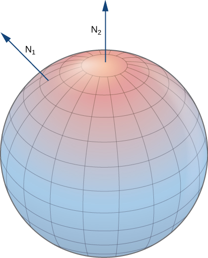{: #CNX_Calc_Figure_16_06_018}

A portion of the graph of any smooth function <math xmlns="http://www.w3.org/1998/Math/MathML"><mrow><mi>z</mi><mo>=</mo><mi>f</mi><mo stretchy="false">(</mo><mi>x</mi><mo>,</mo><mi>y</mi><mo stretchy="false">)</mo></mrow></math>

 is also orientable. If we choose the unit normal vector that points “above” the surface at each point, then the unit normal vectors vary continuously over the surface. We could also choose the unit normal vector that points “below” the surface at each point. To get such an orientation, we parameterize the graph of <math xmlns="http://www.w3.org/1998/Math/MathML"><mrow><mi>f</mi></mrow></math>

 in the standard way: <math xmlns="http://www.w3.org/1998/Math/MathML"><mrow><mstyle mathvariant="bold" mathsize="normal"><mtext>r</mtext></mstyle><mo stretchy="false">(</mo><mi>x</mi><mo>,</mo><mi>y</mi><mo stretchy="false">)</mo><mo>=</mo><mrow><mo>〈</mo><mrow><mi>x</mi><mo>,</mo><mi>y</mi><mo>,</mo><mi>f</mi><mo stretchy="false">(</mo><mi>x</mi><mo>,</mo><mi>y</mi><mo stretchy="false">)</mo></mrow><mo>〉</mo></mrow><mo>,</mo></mrow></math>

 where *x* and *y* vary over the domain of <math xmlns="http://www.w3.org/1998/Math/MathML"><mrow><mi>f</mi><mo>.</mo></mrow></math>

 Then, <math xmlns="http://www.w3.org/1998/Math/MathML"><mrow><msub><mstyle mathvariant="bold" mathsize="normal"><mtext>t</mtext></mstyle><mi>x</mi></msub><mo>=</mo><mrow><mo>〈</mo><mrow><mn>1</mn><mo>,</mo><mn>0</mn><mo>,</mo><msub><mi>f</mi><mi>x</mi></msub></mrow><mo>〉</mo></mrow></mrow></math>

 and <math xmlns="http://www.w3.org/1998/Math/MathML"><mrow><msub><mstyle mathvariant="bold" mathsize="normal"><mtext>t</mtext></mstyle><mi>y</mi></msub><mo>=</mo><mrow><mo>〈</mo><mrow><mn>0</mn><mo>,</mo><mn>1</mn><mo>,</mo><msub><mi>f</mi><mi>y</mi></msub></mrow><mo>〉</mo></mrow><mo>,</mo></mrow></math>

 and therefore the cross product <math xmlns="http://www.w3.org/1998/Math/MathML"><mrow><msub><mstyle mathvariant="bold" mathsize="normal"><mtext>t</mtext></mstyle><mi>x</mi></msub><mspace width="0.2em" /><mo>×</mo><mspace width="0.2em" /><msub><mstyle mathvariant="bold" mathsize="normal"><mtext>t</mtext></mstyle><mi>y</mi></msub></mrow></math>

 (which is normal to the surface at any point on the surface) is <math xmlns="http://www.w3.org/1998/Math/MathML"><mrow><mrow><mo>〈</mo><mrow><mtext>−</mtext><msub><mi>f</mi><mi>x</mi></msub><mo>,</mo><mtext>−</mtext><msub><mi>f</mi><mi>y</mi></msub><mo>,</mo><mn>1</mn></mrow><mo>〉</mo></mrow><mo>.</mo></mrow></math>

 Since the *z* component of this vector is one, the corresponding unit normal vector points “upward,” and the upward side of the surface is chosen to be the “positive” side.

Let *S* be a smooth orientable surface with parameterization <math xmlns="http://www.w3.org/1998/Math/MathML"><mrow><mstyle mathvariant="bold" mathsize="normal"><mtext>r</mtext></mstyle><mrow><mo>(</mo><mrow><mi>u</mi><mo>,</mo><mi>v</mi></mrow><mo>)</mo></mrow><mo>.</mo></mrow></math>

 For each point <math xmlns="http://www.w3.org/1998/Math/MathML"><mrow><mstyle mathvariant="bold" mathsize="normal"><mtext>r</mtext></mstyle><mrow><mo>(</mo><mrow><mi>a</mi><mo>,</mo><mi>b</mi></mrow><mo>)</mo></mrow></mrow></math>

 on the surface, vectors <math xmlns="http://www.w3.org/1998/Math/MathML"><mrow><msub><mstyle mathvariant="bold" mathsize="normal"><mtext>t</mtext></mstyle><mi>u</mi></msub></mrow></math>

 and <math xmlns="http://www.w3.org/1998/Math/MathML"><mrow><msub><mstyle mathvariant="bold" mathsize="normal"><mtext>t</mtext></mstyle><mi>v</mi></msub></mrow></math>

 lie in the tangent plane at that point. Vector <math xmlns="http://www.w3.org/1998/Math/MathML"><mrow><msub><mstyle mathvariant="bold" mathsize="normal"><mtext>t</mtext></mstyle><mi>u</mi></msub><mspace width="0.2em" /><mo>×</mo><mspace width="0.2em" /><msub><mstyle mathvariant="bold" mathsize="normal"><mtext>t</mtext></mstyle><mi>v</mi></msub></mrow></math>

 is normal to the tangent plane at <math xmlns="http://www.w3.org/1998/Math/MathML"><mrow><mstyle mathvariant="bold" mathsize="normal"><mtext>r</mtext></mstyle><mrow><mo>(</mo><mrow><mi>a</mi><mo>,</mo><mi>b</mi></mrow><mo>)</mo></mrow></mrow></math>

 and is therefore normal to *S* at that point. Therefore, the choice of unit normal vector

<math xmlns="http://www.w3.org/1998/Math/MathML"><mrow><mstyle mathvariant="bold" mathsize="normal"><mtext>N</mtext></mstyle><mo>=</mo><mfrac><mrow><msub><mstyle mathvariant="bold" mathsize="normal"><mtext>t</mtext></mstyle><mi>u</mi></msub><mspace width="0.2em" /><mo>×</mo><mspace width="0.2em" /><msub><mstyle mathvariant="bold" mathsize="normal"><mtext>t</mtext></mstyle><mi>v</mi></msub></mrow><mrow><mrow><mo>‖</mo><mrow><msub><mstyle mathvariant="bold" mathsize="normal"><mtext>t</mtext></mstyle><mi>u</mi></msub><mspace width="0.2em" /><mo>×</mo><mspace width="0.2em" /><msub><mstyle mathvariant="bold" mathsize="normal"><mtext>t</mtext></mstyle><mi>v</mi></msub></mrow><mo>‖</mo></mrow></mrow></mfrac></mrow></math>

gives an orientation of surface *S*.

Choosing an Orientation

Give an orientation of cylinder <math xmlns="http://www.w3.org/1998/Math/MathML"><mrow><msup><mi>x</mi><mn>2</mn></msup><mo>+</mo><msup><mi>y</mi><mn>2</mn></msup><mo>=</mo><msup><mi>r</mi><mn>2</mn></msup><mo>,</mo><mn>0</mn><mo>≤</mo><mi>z</mi><mo>≤</mo><mi>h</mi><mo>.</mo></mrow></math>

This surface has parameterization

<math xmlns="http://www.w3.org/1998/Math/MathML"><mrow><mstyle mathvariant="bold" mathsize="normal"><mtext>r</mtext></mstyle><mo stretchy="false">(</mo><mi>u</mi><mo>,</mo><mi>v</mi><mo stretchy="false">)</mo><mo>=</mo><mrow><mo>〈</mo><mrow><mi>r</mi><mspace width="0.2em" /><mtext>cos</mtext><mspace width="0.2em" /><mi>u</mi><mo>,</mo><mi>r</mi><mspace width="0.2em" /><mtext>sin</mtext><mspace width="0.2em" /><mi>u</mi><mo>,</mo><mi>v</mi></mrow><mo>〉</mo></mrow><mo>,</mo><mn>0</mn><mo>≤</mo><mi>u</mi><mo>&lt;</mo><mn>2</mn><mi>π</mi><mo>,</mo><mn>0</mn><mo>≤</mo><mi>v</mi><mo>≤</mo><mi>h</mi><mo>.</mo></mrow></math>

The tangent vectors are <math xmlns="http://www.w3.org/1998/Math/MathML"><mrow><msub><mstyle mathvariant="bold" mathsize="normal"><mtext>t</mtext></mstyle><mi>u</mi></msub><mo>=</mo><mrow><mo>〈</mo><mrow><mtext>−</mtext><mi>r</mi><mspace width="0.2em" /><mtext>sin</mtext><mspace width="0.2em" /><mi>u</mi><mo>,</mo><mi>r</mi><mspace width="0.2em" /><mtext>cos</mtext><mspace width="0.2em" /><mi>u</mi><mo>,</mo><mn>0</mn></mrow><mo>〉</mo></mrow></mrow></math>

 and <math xmlns="http://www.w3.org/1998/Math/MathML"><mrow><msub><mstyle mathvariant="bold" mathsize="normal"><mtext>t</mtext></mstyle><mi>v</mi></msub><mo>=</mo><mrow><mo>〈</mo><mrow><mn>0</mn><mo>,</mo><mn>0</mn><mo>,</mo><mn>1</mn></mrow><mo>〉</mo></mrow><mo>.</mo></mrow></math>

 To get an orientation of the surface, we compute the unit normal vector

<math xmlns="http://www.w3.org/1998/Math/MathML"><mrow><mstyle mathvariant="bold" mathsize="normal"><mtext>N</mtext></mstyle><mo>=</mo><mfrac><mrow><msub><mstyle mathvariant="bold" mathsize="normal"><mtext>t</mtext></mstyle><mi>u</mi></msub><mspace width="0.2em" /><mo>×</mo><mspace width="0.2em" /><msub><mstyle mathvariant="bold" mathsize="normal"><mtext>t</mtext></mstyle><mi>v</mi></msub></mrow><mrow><mrow><mo>‖</mo><mrow><msub><mstyle mathvariant="bold" mathsize="normal"><mtext>t</mtext></mstyle><mi>u</mi></msub><mspace width="0.2em" /><mo>×</mo><mspace width="0.2em" /><msub><mstyle mathvariant="bold" mathsize="normal"><mtext>t</mtext></mstyle><mi>v</mi></msub></mrow><mo>‖</mo></mrow></mrow></mfrac><mo>.</mo></mrow></math>

In this case, <math xmlns="http://www.w3.org/1998/Math/MathML"><mrow><msub><mstyle mathvariant="bold" mathsize="normal"><mtext>t</mtext></mstyle><mi>u</mi></msub><mspace width="0.2em" /><mo>×</mo><mspace width="0.2em" /><msub><mstyle mathvariant="bold" mathsize="normal"><mtext>t</mtext></mstyle><mi>v</mi></msub><mo>=</mo><mrow><mo>〈</mo><mrow><mi>r</mi><mspace width="0.2em" /><mtext>cos</mtext><mspace width="0.2em" /><mi>u</mi><mo>,</mo><mi>r</mi><mspace width="0.2em" /><mtext>sin</mtext><mspace width="0.2em" /><mi>u</mi><mo>,</mo><mn>0</mn></mrow><mo>〉</mo></mrow></mrow></math>

 and therefore

<math xmlns="http://www.w3.org/1998/Math/MathML"><mrow><mrow><mo>‖</mo><mrow><msub><mstyle mathvariant="bold" mathsize="normal"><mtext>t</mtext></mstyle><mi>u</mi></msub><mspace width="0.2em" /><mo>×</mo><mspace width="0.2em" /><msub><mstyle mathvariant="bold" mathsize="normal"><mtext>t</mtext></mstyle><mi>v</mi></msub></mrow><mo>‖</mo></mrow><mo>=</mo><msqrt><mrow><msup><mi>r</mi><mn>2</mn></msup><msup><mrow><mtext>cos</mtext></mrow><mn>2</mn></msup><mi>u</mi><mo>+</mo><msup><mi>r</mi><mn>2</mn></msup><msup><mrow><mtext>sin</mtext></mrow><mn>2</mn></msup><mi>u</mi></mrow></msqrt><mo>=</mo><mi>r</mi><mo>.</mo></mrow></math>

An orientation of the cylinder is

<math xmlns="http://www.w3.org/1998/Math/MathML"><mrow><mstyle mathvariant="bold" mathsize="normal"><mtext>N</mtext></mstyle><mo stretchy="false">(</mo><mi>u</mi><mo>,</mo><mi>v</mi><mo stretchy="false">)</mo><mo>=</mo><mfrac><mrow><mrow><mo>〈</mo><mrow><mi>r</mi><mspace width="0.2em" /><mtext>cos</mtext><mspace width="0.2em" /><mi>u</mi><mo>,</mo><mi>r</mi><mspace width="0.2em" /><mtext>sin</mtext><mspace width="0.2em" /><mi>u</mi><mo>,</mo><mn>0</mn></mrow><mo>〉</mo></mrow></mrow><mi>r</mi></mfrac><mo>=</mo><mrow><mo>〈</mo><mrow><mtext>cos</mtext><mspace width="0.2em" /><mi>u</mi><mo>,</mo><mtext>sin</mtext><mspace width="0.2em" /><mi>u</mi><mo>,</mo><mn>0</mn></mrow><mo>〉</mo></mrow><mo>.</mo></mrow></math>

Notice that all vectors are parallel to the *xy*-plane, which should be the case with vectors that are normal to the cylinder. Furthermore, all the vectors point outward, and therefore this is an outward orientation of the cylinder ([[link]](#CNX_Calc_Figure_16_06_019)).

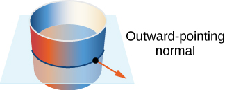{: #CNX_Calc_Figure_16_06_019}

Give the “upward” orientation of the graph of <math xmlns="http://www.w3.org/1998/Math/MathML"><mrow><mi>f</mi><mo stretchy="false">(</mo><mi>x</mi><mo>,</mo><mi>y</mi><mo stretchy="false">)</mo><mo>=</mo><mi>x</mi><mi>y</mi><mo>.</mo></mrow></math>

<math xmlns="http://www.w3.org/1998/Math/MathML"><mrow><mstyle mathvariant="bold" mathsize="normal"><mtext>N</mtext></mstyle><mo stretchy="false">(</mo><mi>x</mi><mo>,</mo><mi>y</mi><mo stretchy="false">)</mo><mo>=</mo><mrow><mo>〈</mo><mrow><mfrac><mrow><mtext>−</mtext><mi>y</mi></mrow><mrow><msqrt><mrow><mn>1</mn><mo>+</mo><msup><mi>x</mi><mn>2</mn></msup><mo>+</mo><msup><mi>y</mi><mn>2</mn></msup></mrow></msqrt></mrow></mfrac><mo>,</mo><mfrac><mrow><mtext>−</mtext><mi>x</mi></mrow><mrow><msqrt><mrow><mn>1</mn><mo>+</mo><msup><mi>x</mi><mn>2</mn></msup><mo>+</mo><msup><mi>y</mi><mn>2</mn></msup></mrow></msqrt></mrow></mfrac><mo>,</mo><mfrac><mn>1</mn><mrow><msqrt><mrow><mn>1</mn><mo>+</mo><msup><mi>x</mi><mn>2</mn></msup><mo>+</mo><msup><mi>y</mi><mn>2</mn></msup></mrow></msqrt></mrow></mfrac></mrow><mo>〉</mo></mrow></mrow></math>

Hint

Parameterize the surface and use the fact that the surface is the graph of a function.

Since every curve has a “forward” and “backward” direction (or, in the case of a closed curve, a clockwise and counterclockwise direction), it is possible to give an orientation to any curve. Hence, it is possible to think of every curve as an oriented curve. This is not the case with surfaces, however. Some surfaces cannot be oriented; such surfaces are called *nonorientable*. Essentially, a surface can be oriented if the surface has an “inner” side and an “outer” side, or an “upward” side and a “downward” side. Some surfaces are twisted in such a fashion that there is no well-defined notion of an “inner” or “outer” side.

The classic example of a nonorientable surface is the Möbius strip. To create a Möbius strip, take a rectangular strip of paper, give the piece of paper a half-twist, and the glue the ends together ([\[link\]](#CNX_Calc_Figure_16_06_020)). Because of the half-twist in the strip, the surface has no “outer” side or “inner” side. If you imagine placing a normal vector at a point on the strip and having the vector travel all the way around the band, then (because of the half-twist) the vector points in the opposite direction when it gets back to its original position. Therefore, the strip really only has one side.

 ![An image showing the construction of a Mobius strip. The first step shows a rectangle with corners A, B, C, and D, labeled from bottom left to bottom right in a clockwise manner. In the second step, the rectangle is flipped along the middle; now, corner D is in the upper right position, and corner C is in the lower right position. We can see the &#x201C;back&#x201D; side of the rectangle. In the final step, the rectangle is looped. Corner B connects to corner D, and corner A connects to corner C. The flip from step two remains. But, the &#x201C;front&#x201D; and &#x201C;back&#x201D; are now the same because of the flip!](../resources/CNX_Calc_Figure_16_06_020.jpg "The construction of a M&#xF6;bius strip."){: #CNX_Calc_Figure_16_06_020}

Since some surfaces are nonorientable, it is not possible to define a vector surface integral on all piecewise smooth surfaces. This is in contrast to vector line integrals, which can be defined on any piecewise smooth curve.

### Surface Integral of a Vector Field

With the idea of orientable surfaces in place, we are now ready to define a **surface integral of a vector field**{: data-type="term"}. The definition is analogous to the definition of the flux of a vector field along a plane curve. Recall that if **F** is a two-dimensional vector field and *C* is a plane curve, then the definition of the flux of **F** along *C* involved chopping *C* into small pieces, choosing a point inside each piece, and calculating <math xmlns="http://www.w3.org/1998/Math/MathML"><mrow><mstyle mathvariant="bold" mathsize="normal"><mtext>F</mtext></mstyle><mo>·</mo><mstyle mathvariant="bold" mathsize="normal"><mtext>N</mtext></mstyle></mrow></math>

 at the point (where **N** is the unit normal vector at the point). The definition of a surface integral of a vector field proceeds in the same fashion, except now we chop surface *S* into small pieces, choose a point in the small (two-dimensional) piece, and calculate <math xmlns="http://www.w3.org/1998/Math/MathML"><mrow><mstyle mathvariant="bold" mathsize="normal"><mtext>F</mtext></mstyle><mo>·</mo><mstyle mathvariant="bold" mathsize="normal"><mtext>N</mtext></mstyle></mrow></math>

 at the point.

To place this definition in a real-world setting, let *S* be an oriented surface with unit normal vector **N**. Let **v** be a velocity field of a fluid flowing through *S*, and suppose the fluid has density <math xmlns="http://www.w3.org/1998/Math/MathML"><mrow><mi>ρ</mi><mrow><mo>(</mo><mrow><mi>x</mi><mo>,</mo><mi>y</mi><mo>,</mo><mi>z</mi></mrow><mo>)</mo></mrow><mo>.</mo></mrow></math>

 Imagine the fluid flows through *S*, but *S* is completely permeable so that it does not impede the fluid flow ([\[link\]](#CNX_Calc_Figure_16_06_021)). The **mass flux**{: data-type="term"} of the fluid is the rate of mass flow per unit area. The mass flux is measured in mass per unit time per unit area. How could we calculate the mass flux of the fluid across *S*?

 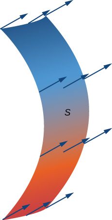{: #CNX_Calc_Figure_16_06_021}

The rate of flow, measured in mass per unit time per unit area, is <math xmlns="http://www.w3.org/1998/Math/MathML"><mrow><mi>ρ</mi><mstyle mathvariant="bold" mathsize="normal"><mtext>N</mtext></mstyle><mo>.</mo></mrow></math>

 To calculate the mass flux across *S*, chop *S* into small pieces <math xmlns="http://www.w3.org/1998/Math/MathML"><mrow><msub><mi>S</mi><mrow><mi>i</mi><mi>j</mi></mrow></msub><mo>.</mo></mrow></math>

 If <math xmlns="http://www.w3.org/1998/Math/MathML"><mrow><msub><mi>S</mi><mrow><mi>i</mi><mi>j</mi></mrow></msub></mrow></math>

 is small enough, then it can be approximated by a tangent plane at some point *P* in <math xmlns="http://www.w3.org/1998/Math/MathML"><mrow><msub><mi>S</mi><mrow><mi>i</mi><mi>j</mi></mrow></msub><mo>.</mo></mrow></math>

 Therefore, the unit normal vector at *P* can be used to approximate <math xmlns="http://www.w3.org/1998/Math/MathML"><mrow><mstyle mathvariant="bold" mathsize="normal"><mtext>N</mtext></mstyle><mrow><mo>(</mo><mrow><mi>x</mi><mo>,</mo><mi>y</mi><mo>,</mo><mi>z</mi></mrow><mo>)</mo></mrow></mrow></math>

 across the entire piece <math xmlns="http://www.w3.org/1998/Math/MathML"><mrow><msub><mi>S</mi><mrow><mi>i</mi><mi>j</mi></mrow></msub><mo>,</mo></mrow></math>

 because the normal vector to a plane does not change as we move across the plane. The component of the vector <math xmlns="http://www.w3.org/1998/Math/MathML"><mrow><mi>ρ</mi><mstyle mathvariant="bold" mathsize="normal"><mtext>v</mtext></mstyle></mrow></math>

 at *P* in the direction of **N** is <math xmlns="http://www.w3.org/1998/Math/MathML"><mrow><mi>ρ</mi><mstyle mathvariant="bold" mathsize="normal"><mtext>v</mtext></mstyle><mo>·</mo><mstyle mathvariant="bold" mathsize="normal"><mtext>N</mtext></mstyle></mrow></math>

 at *P*. Since <math xmlns="http://www.w3.org/1998/Math/MathML"><mrow><msub><mi>S</mi><mrow><mi>i</mi><mi>j</mi></mrow></msub></mrow></math>

 is small, the dot product <math xmlns="http://www.w3.org/1998/Math/MathML"><mrow><mi>ρ</mi><mstyle mathvariant="bold" mathsize="normal"><mtext>v</mtext></mstyle><mo>·</mo><mstyle mathvariant="bold" mathsize="normal"><mtext>N</mtext></mstyle></mrow></math>

 changes very little as we vary across <math xmlns="http://www.w3.org/1998/Math/MathML"><mrow><msub><mi>S</mi><mrow><mi>i</mi><mi>j</mi></mrow></msub><mo>,</mo></mrow></math>

 and therefore <math xmlns="http://www.w3.org/1998/Math/MathML"><mrow><mi>ρ</mi><mstyle mathvariant="bold" mathsize="normal"><mtext>v</mtext></mstyle><mo>·</mo><mstyle mathvariant="bold" mathsize="normal"><mtext>N</mtext></mstyle></mrow></math>

 can be taken as approximately constant across <math xmlns="http://www.w3.org/1998/Math/MathML"><mrow><msub><mi>S</mi><mrow><mi>i</mi><mi>j</mi></mrow></msub><mo>.</mo></mrow></math>

 To approximate the mass of fluid per unit time flowing across <math xmlns="http://www.w3.org/1998/Math/MathML"><mrow><msub><mi>S</mi><mrow><mi>i</mi><mi>j</mi></mrow></msub></mrow></math>

 (and not just locally at point *P*), we need to multiply <math xmlns="http://www.w3.org/1998/Math/MathML"><mrow><mrow><mo>(</mo><mrow><mi>ρ</mi><mstyle mathvariant="bold" mathsize="normal"><mtext>v</mtext></mstyle><mo>·</mo><mstyle mathvariant="bold" mathsize="normal"><mtext>N</mtext></mstyle></mrow><mo>)</mo></mrow><mrow><mo>(</mo><mi>P</mi><mo>)</mo></mrow></mrow></math>

 by the area of <math xmlns="http://www.w3.org/1998/Math/MathML"><mrow><msub><mi>S</mi><mrow><mi>i</mi><mi>j</mi></mrow></msub><mo>.</mo></mrow></math>

 Therefore, the mass of fluid per unit time flowing across <math xmlns="http://www.w3.org/1998/Math/MathML"><mrow><msub><mi>S</mi><mrow><mi>i</mi><mi>j</mi></mrow></msub></mrow></math>

 in the direction of **N** can be approximated by <math xmlns="http://www.w3.org/1998/Math/MathML"><mrow><mrow><mo>(</mo><mrow><mi>ρ</mi><mstyle mathvariant="bold" mathsize="normal"><mtext>v</mtext></mstyle><mo>·</mo><mstyle mathvariant="bold" mathsize="normal"><mtext>N</mtext></mstyle></mrow><mo>)</mo></mrow><mtext>Δ</mtext><msub><mi>S</mi><mrow><mi>i</mi><mi>j</mi></mrow></msub><mo>,</mo></mrow></math>

 where **N**, <math xmlns="http://www.w3.org/1998/Math/MathML"><mrow><mi>ρ</mi><mo>,</mo></mrow></math>

 and **v** are all evaluated at *P* ([\[link\]](#CNX_Calc_Figure_16_06_022)). This is analogous to the flux of two-dimensional vector field **F** across plane curve *C*, in which we approximated flux across a small piece of *C* with the expression <math xmlns="http://www.w3.org/1998/Math/MathML"><mrow><mrow><mo>(</mo><mrow><mstyle mathvariant="bold" mathsize="normal"><mtext>F</mtext></mstyle><mo>·</mo><mstyle mathvariant="bold" mathsize="normal"><mtext>N</mtext></mstyle></mrow><mo>)</mo></mrow><mtext>Δ</mtext><mi>s</mi><mo>.</mo></mrow></math>

 To approximate the mass flux across *S*, form the sum <math xmlns="http://www.w3.org/1998/Math/MathML"><mrow><mstyle displaystyle="true"><munderover><mo>∑</mo><mrow><mi>i</mi><mo>=</mo><mn>1</mn></mrow><mi>m</mi></munderover><mrow><mstyle displaystyle="true"><munderover><mo>∑</mo><mrow><mi>j</mi><mo>=</mo><mn>1</mn></mrow><mi>n</mi></munderover><mrow><mrow><mo>(</mo><mrow><mi>ρ</mi><mstyle mathvariant="bold" mathsize="normal"><mtext>v</mtext></mstyle><mo>·</mo><mstyle mathvariant="bold" mathsize="normal"><mtext>N</mtext></mstyle></mrow><mo>)</mo></mrow></mrow></mstyle></mrow></mstyle><mtext>Δ</mtext><msub><mstyle mathvariant="bold" mathsize="normal"><mtext>S</mtext></mstyle><mrow><mi>i</mi><mi>j</mi></mrow></msub><mo>.</mo></mrow></math>

 As pieces <math xmlns="http://www.w3.org/1998/Math/MathML"><mrow><msub><mi>S</mi><mrow><mi>i</mi><mi>j</mi></mrow></msub></mrow></math>

 get smaller, the sum <math xmlns="http://www.w3.org/1998/Math/MathML"><mrow><mstyle displaystyle="true"><munderover><mo>∑</mo><mrow><mi>i</mi><mo>=</mo><mn>1</mn></mrow><mi>m</mi></munderover><mrow><mstyle displaystyle="true"><munderover><mo>∑</mo><mrow><mi>j</mi><mo>=</mo><mn>1</mn></mrow><mi>n</mi></munderover><mrow><mrow><mo>(</mo><mrow><mi>ρ</mi><mstyle mathvariant="bold" mathsize="normal"><mtext>v</mtext></mstyle><mo>·</mo><mstyle mathvariant="bold" mathsize="normal"><mtext>N</mtext></mstyle></mrow><mo>)</mo></mrow></mrow></mstyle></mrow></mstyle><mtext>Δ</mtext><msub><mstyle mathvariant="bold" mathsize="normal"><mtext>S</mtext></mstyle><mrow><mi>i</mi><mi>j</mi></mrow></msub></mrow></math>

 gets arbitrarily close to the mass flux. Therefore, the mass flux is

<math xmlns="http://www.w3.org/1998/Math/MathML"><mrow><mstyle displaystyle="true"><mrow><msub><mo>∬</mo><mi>s</mi></msub><mrow><mi>ρ</mi><mstyle mathvariant="bold" mathsize="normal"><mtext>v</mtext></mstyle><mo>·</mo><mstyle mathvariant="bold" mathsize="normal"><mtext>N</mtext></mstyle><mi>d</mi><mi>S</mi><mo>=</mo></mrow></mrow></mstyle><munder><mrow><mtext>lim</mtext></mrow><mrow><mi>m</mi><mo>,</mo><mi>n</mi><mo stretchy="false">→</mo><mi>∞</mi></mrow></munder><mstyle displaystyle="true"><munderover><mo>∑</mo><mrow><mi>i</mi><mo>=</mo><mn>1</mn></mrow><mi>m</mi></munderover><mrow><mstyle displaystyle="true"><munderover><mo>∑</mo><mrow><mi>j</mi><mo>=</mo><mn>1</mn></mrow><mi>n</mi></munderover><mrow><mrow><mo>(</mo><mrow><mi>ρ</mi><mstyle mathvariant="bold" mathsize="normal"><mtext>v</mtext></mstyle><mo>·</mo><mstyle mathvariant="bold" mathsize="normal"><mtext>N</mtext></mstyle></mrow><mo>)</mo></mrow></mrow></mstyle></mrow></mstyle><mtext>Δ</mtext><msub><mstyle mathvariant="bold" mathsize="normal"><mtext>S</mtext></mstyle><mrow><mi>i</mi><mi>j</mi></mrow></msub><mo>.</mo></mrow></math>

This is a surface integral of a vector field. Letting the vector field <math xmlns="http://www.w3.org/1998/Math/MathML"><mrow><mi>ρ</mi><mstyle mathvariant="bold" mathsize="normal"><mtext>v</mtext></mstyle></mrow></math>

 be an arbitrary vector field **F** leads to the following definition.

 &#x394;Sij."){: #CNX_Calc_Figure_16_06_022}

Definition

Let **F** be a continuous vector field with a domain that contains oriented surface *S* with unit normal vector **N**. The **surface integral**{: data-type="term"} of **F** over *S* is

<math xmlns="http://www.w3.org/1998/Math/MathML"><mrow><mstyle displaystyle="true"><mrow><msub><mo>∬</mo><mi>S</mi></msub><mrow><mstyle mathvariant="bold" mathsize="normal"><mtext>F</mtext></mstyle><mo>·</mo><mi>d</mi><mstyle mathvariant="bold" mathsize="normal"><mtext>S</mtext></mstyle><mo>=</mo><mstyle displaystyle="true"><mrow><msub><mo>∬</mo><mi>S</mi></msub><mrow><mstyle mathvariant="bold" mathsize="normal"><mtext>F</mtext></mstyle><mo>·</mo><mstyle mathvariant="bold" mathsize="normal"><mtext>N</mtext></mstyle><mi>d</mi><mi>S</mi></mrow></mrow></mstyle></mrow></mrow></mstyle><mo>.</mo></mrow></math>

Notice the parallel between this definition and the definition of vector line integral <math xmlns="http://www.w3.org/1998/Math/MathML"><mrow><mstyle displaystyle="true"><mrow><msub><mo stretchy="false">∫</mo><mi>C</mi></msub><mrow><mstyle mathvariant="bold" mathsize="normal"><mtext>F</mtext></mstyle><mo>·</mo><mstyle mathvariant="bold" mathsize="normal"><mtext>N</mtext></mstyle><mi>d</mi><mi>s</mi></mrow></mrow></mstyle><mo>.</mo></mrow></math>

 A surface integral of a vector field is defined in a similar way to a flux line integral across a curve, except the domain of integration is a surface (a two-dimensional object) rather than a curve (a one-dimensional object). Integral <math xmlns="http://www.w3.org/1998/Math/MathML"><mrow><mstyle displaystyle="true"><mrow><msub><mo>∬</mo><mi>S</mi></msub><mrow><mstyle mathvariant="bold" mathsize="normal"><mtext>F</mtext></mstyle><mo>·</mo><mstyle mathvariant="bold" mathsize="normal"><mtext>N</mtext></mstyle><mi>d</mi><mi>S</mi></mrow></mrow></mstyle></mrow></math>

 is called the *flux of **F** across S*, just as integral <math xmlns="http://www.w3.org/1998/Math/MathML"><mrow><mstyle displaystyle="true"><mrow><msub><mo stretchy="false">∫</mo><mi>C</mi></msub><mrow><mstyle mathvariant="bold" mathsize="normal"><mtext>F</mtext></mstyle><mo>·</mo><mstyle mathvariant="bold" mathsize="normal"><mtext>N</mtext></mstyle><mi>d</mi><mi>s</mi></mrow></mrow></mstyle></mrow></math>

 is the flux of **F** across curve *C*. A surface integral over a vector field is also called a **flux integral**{: data-type="term"}.

Just as with vector line integrals, surface integral <math xmlns="http://www.w3.org/1998/Math/MathML"><mrow><mstyle displaystyle="true"><mrow><msub><mo>∬</mo><mi>S</mi></msub><mrow><mstyle mathvariant="bold" mathsize="normal"><mtext>F</mtext></mstyle><mo>·</mo><mstyle mathvariant="bold" mathsize="normal"><mtext>N</mtext></mstyle><mi>d</mi><mstyle mathvariant="bold" mathsize="normal"><mtext>S</mtext></mstyle></mrow></mrow></mstyle></mrow></math>

 is easier to compute after surface *S* has been parameterized. Let <math xmlns="http://www.w3.org/1998/Math/MathML"><mrow><mstyle mathvariant="bold" mathsize="normal"><mtext>r</mtext></mstyle><mrow><mo>(</mo><mrow><mi>u</mi><mo>,</mo><mi>v</mi></mrow><mo>)</mo></mrow></mrow></math>

 be a parameterization of *S* with parameter domain *D*. Then, the unit normal vector is given by <math xmlns="http://www.w3.org/1998/Math/MathML"><mrow><mstyle mathvariant="bold" mathsize="normal"><mtext>N</mtext></mstyle><mo>=</mo><mfrac><mrow><msub><mstyle mathvariant="bold" mathsize="normal"><mtext>t</mtext></mstyle><mi>u</mi></msub><mspace width="0.2em" /><mo>×</mo><mspace width="0.2em" /><msub><mstyle mathvariant="bold" mathsize="normal"><mtext>t</mtext></mstyle><mi>v</mi></msub></mrow><mrow><mrow><mo>‖</mo><mrow><msub><mstyle mathvariant="bold" mathsize="normal"><mtext>t</mtext></mstyle><mi>u</mi></msub><mspace width="0.2em" /><mo>×</mo><mspace width="0.2em" /><msub><mstyle mathvariant="bold" mathsize="normal"><mtext>t</mtext></mstyle><mi>v</mi></msub></mrow><mo>‖</mo></mrow></mrow></mfrac></mrow></math>

 and, from [\[link\]](#fs-id1167793385095), we have

<math xmlns="http://www.w3.org/1998/Math/MathML"><mtable><mtr><mtd columnalign="right"><mstyle displaystyle="true"><mrow><msub><mo>∬</mo><mi>S</mi></msub><mrow><mstyle mathvariant="bold" mathsize="normal"><mtext>F</mtext></mstyle><mo>·</mo><mstyle mathvariant="bold" mathsize="normal"><mtext>N</mtext></mstyle><mi>d</mi><mstyle mathvariant="bold" mathsize="normal"><mtext>S</mtext></mstyle></mrow></mrow></mstyle></mtd><mtd columnalign="left"><mo>=</mo><mstyle displaystyle="true"><mrow><msub><mo>∬</mo><mi>S</mi></msub><mrow><mstyle mathvariant="bold" mathsize="normal"><mtext>F</mtext></mstyle><mo>·</mo><mstyle mathvariant="bold" mathsize="normal"><mtext>N</mtext></mstyle><mi>d</mi><mi>S</mi></mrow></mrow></mstyle></mtd></mtr><mtr><mtd /><mtd columnalign="left"><mo>=</mo><mstyle displaystyle="true"><mrow><msub><mo>∬</mo><mi>S</mi></msub><mrow><mstyle mathvariant="bold" mathsize="normal"><mtext>F</mtext></mstyle><mo>·</mo><mfrac><mrow><msub><mstyle mathvariant="bold" mathsize="normal"><mtext>t</mtext></mstyle><mi>u</mi></msub><mspace width="0.2em" /><mo>×</mo><mspace width="0.2em" /><msub><mstyle mathvariant="bold" mathsize="normal"><mtext>t</mtext></mstyle><mi>v</mi></msub></mrow><mrow><mrow><mo>‖</mo><mrow><msub><mstyle mathvariant="bold" mathsize="normal"><mtext>t</mtext></mstyle><mi>u</mi></msub><mspace width="0.2em" /><mo>×</mo><mspace width="0.2em" /><msub><mstyle mathvariant="bold" mathsize="normal"><mtext>t</mtext></mstyle><mi>v</mi></msub></mrow><mo>‖</mo></mrow></mrow></mfrac><mi>d</mi><mi>S</mi></mrow></mrow></mstyle></mtd></mtr><mtr><mtd /><mtd columnalign="left"><mo>=</mo><mstyle displaystyle="true"><mrow><msub><mo>∬</mo><mi>D</mi></msub><mrow><mrow><mo>(</mo><mrow><mstyle mathvariant="bold" mathsize="normal"><mtext>F</mtext></mstyle><mrow><mo>(</mo><mrow><mstyle mathvariant="bold" mathsize="normal"><mtext>r</mtext></mstyle><mrow><mo>(</mo><mrow><mi>u</mi><mo>,</mo><mi>v</mi></mrow><mo>)</mo></mrow></mrow><mo>)</mo></mrow><mo>·</mo><mfrac><mrow><msub><mstyle mathvariant="bold" mathsize="normal"><mtext>t</mtext></mstyle><mi>u</mi></msub><mspace width="0.2em" /><mo>×</mo><mspace width="0.2em" /><msub><mstyle mathvariant="bold" mathsize="normal"><mtext>t</mtext></mstyle><mi>v</mi></msub></mrow><mrow><mrow><mo>‖</mo><mrow><msub><mstyle mathvariant="bold" mathsize="normal"><mtext>t</mtext></mstyle><mi>u</mi></msub><mspace width="0.2em" /><mo>×</mo><mspace width="0.2em" /><msub><mstyle mathvariant="bold" mathsize="normal"><mtext>t</mtext></mstyle><mi>v</mi></msub></mrow><mo>‖</mo></mrow></mrow></mfrac></mrow><mo>)</mo></mrow><mrow><mrow><msub><mstyle mathvariant="bold" mathsize="normal"><mtext>t</mtext></mstyle><mi>u</mi></msub><mspace width="0.2em" /><mo>×</mo><mspace width="0.2em" /><msub><mstyle mathvariant="bold" mathsize="normal"><mtext>t</mtext></mstyle><mi>v</mi></msub></mrow><mo>‖</mo></mrow><mi>d</mi><mi>A</mi></mrow></mrow></mstyle></mtd></mtr><mtr><mtd /><mtd columnalign="left"><mo>=</mo><mstyle displaystyle="true"><mrow><msub><mo>∬</mo><mi>D</mi></msub><mrow><mrow><mo>(</mo><mrow><mstyle mathvariant="bold" mathsize="normal"><mtext>F</mtext></mstyle><mrow><mo>(</mo><mrow><mstyle mathvariant="bold" mathsize="normal"><mtext>r</mtext></mstyle><mrow><mo>(</mo><mrow><mi>u</mi><mo>,</mo><mi>v</mi></mrow><mo>)</mo></mrow></mrow><mo>)</mo></mrow><mo>·</mo><mrow><mo>(</mo><mrow><msub><mstyle mathvariant="bold" mathsize="normal"><mtext>t</mtext></mstyle><mi>u</mi></msub><mspace width="0.2em" /><mo>×</mo><mspace width="0.2em" /><msub><mstyle mathvariant="bold" mathsize="normal"><mtext>t</mtext></mstyle><mi>v</mi></msub></mrow><mo>)</mo></mrow></mrow><mo>)</mo></mrow><mi>d</mi><mi>A</mi></mrow></mrow></mstyle><mo>.</mo></mtd></mtr></mtable></math>

Therefore, to compute a surface integral over a vector field we can use the equation

<math xmlns="http://www.w3.org/1998/Math/MathML"><mrow><mstyle displaystyle="true"><mrow><msub><mo>∬</mo><mi>S</mi></msub><mrow><mstyle mathvariant="bold" mathsize="normal"><mtext>F</mtext></mstyle><mo>·</mo><mstyle mathvariant="bold" mathsize="normal"><mtext>N</mtext></mstyle><mi>d</mi><mstyle mathvariant="bold" mathsize="normal"><mtext>S</mtext></mstyle></mrow></mrow></mstyle><mo>=</mo><mstyle displaystyle="true"><mrow><msub><mo>∬</mo><mi>D</mi></msub><mrow><mrow><mo>(</mo><mrow><mstyle mathvariant="bold" mathsize="normal"><mtext>F</mtext></mstyle><mrow><mo>(</mo><mrow><mstyle mathvariant="bold" mathsize="normal"><mtext>r</mtext></mstyle><mrow><mo>(</mo><mrow><mi>u</mi><mo>,</mo><mi>v</mi></mrow><mo>)</mo></mrow></mrow><mo>)</mo></mrow><mo>·</mo><mrow><mo>(</mo><mrow><msub><mstyle mathvariant="bold" mathsize="normal"><mtext>t</mtext></mstyle><mi>u</mi></msub><mspace width="0.2em" /><mo>×</mo><mspace width="0.2em" /><msub><mstyle mathvariant="bold" mathsize="normal"><mtext>t</mtext></mstyle><mi>v</mi></msub></mrow><mo>)</mo></mrow></mrow><mo>)</mo></mrow><mi>d</mi><mi>A</mi></mrow></mrow></mstyle><mo>.</mo></mrow></math>

Calculating a Surface Integral

Calculate the surface integral <math xmlns="http://www.w3.org/1998/Math/MathML"><mrow><mstyle displaystyle="true"><mrow><msub><mo>∬</mo><mi>S</mi></msub><mrow><mstyle mathvariant="bold" mathsize="normal"><mtext>F</mtext></mstyle><mo>·</mo><mstyle mathvariant="bold" mathsize="normal"><mtext>N</mtext></mstyle><mi>d</mi><mstyle mathvariant="bold" mathsize="normal"><mtext>S</mtext></mstyle></mrow></mrow></mstyle><mo>,</mo></mrow></math>

 where <math xmlns="http://www.w3.org/1998/Math/MathML"><mrow><mstyle mathvariant="bold" mathsize="normal"><mtext>F</mtext></mstyle><mo>=</mo><mrow><mo>〈</mo><mrow><mtext>−</mtext><mi>y</mi><mo>,</mo><mi>x</mi><mo>,</mo><mn>0</mn></mrow><mo>〉</mo></mrow></mrow></math>

 and S is the surface with parameterization <math xmlns="http://www.w3.org/1998/Math/MathML"><mrow><mstyle mathvariant="bold" mathsize="normal"><mtext>r</mtext></mstyle><mo stretchy="false">(</mo><mi>u</mi><mo>,</mo><mi>v</mi><mo stretchy="false">)</mo><mo>=</mo><mrow><mo>〈</mo><mrow><mi>u</mi><mo>,</mo><msup><mi>v</mi><mn>2</mn></msup><mo>−</mo><mi>u</mi><mo>,</mo><mi>u</mi><mo>+</mo><mi>v</mi></mrow><mo>〉</mo></mrow><mo>,</mo><mn>0</mn><mo>≤</mo><mi>u</mi><mo>&lt;</mo><mn>3</mn><mo>,</mo><mn>0</mn><mo>≤</mo><mi>v</mi><mo>≤</mo><mn>4</mn><mo>.</mo></mrow></math>

The tangent vectors are <math xmlns="http://www.w3.org/1998/Math/MathML"><mrow><msub><mstyle mathvariant="bold" mathsize="normal"><mtext>t</mtext></mstyle><mi>u</mi></msub><mo>=</mo><mrow><mo>〈</mo><mrow><mn>1</mn><mo>,</mo><mn>−1</mn><mo>,</mo><mn>1</mn></mrow><mo>〉</mo></mrow></mrow></math>

 and <math xmlns="http://www.w3.org/1998/Math/MathML"><mrow><msub><mstyle mathvariant="bold" mathsize="normal"><mtext>t</mtext></mstyle><mi>v</mi></msub><mo>=</mo><mrow><mo>〈</mo><mrow><mn>0</mn><mo>,</mo><mn>2</mn><mi>v</mi><mo>,</mo><mn>1</mn></mrow><mo>〉</mo></mrow><mo>.</mo></mrow></math>

 Therefore,

<math xmlns="http://www.w3.org/1998/Math/MathML"><mrow><msub><mstyle mathvariant="bold" mathsize="normal"><mtext>t</mtext></mstyle><mi>u</mi></msub><mspace width="0.2em" /><mo>×</mo><mspace width="0.2em" /><msub><mstyle mathvariant="bold" mathsize="normal"><mtext>t</mtext></mstyle><mi>v</mi></msub><mo>=</mo><mrow><mo>〈</mo><mrow><mn>−1</mn><mo>−</mo><mn>2</mn><mi>v</mi><mo>,</mo><mn>−1</mn><mo>,</mo><mn>2</mn><mi>v</mi></mrow><mo>〉</mo></mrow><mo>.</mo></mrow></math>

By [[link]](#fs-id1167793617076),

<math xmlns="http://www.w3.org/1998/Math/MathML"><mtable><mtr><mtd columnalign="right"><mstyle displaystyle="true"><mrow><msub><mo>∬</mo><mi>S</mi></msub><mstyle mathvariant="bold" mathsize="normal"><mtext>F</mtext></mstyle></mrow></mstyle><mo>·</mo><mi>d</mi><mstyle mathvariant="bold" mathsize="normal"><mtext>S</mtext></mstyle></mtd><mtd columnalign="left"><mo>=</mo><mstyle displaystyle="true"><mrow><msubsup><mo stretchy="false">∫</mo><mn>0</mn><mn>4</mn></msubsup><mrow><mstyle displaystyle="true"><mrow><msubsup><mo stretchy="false">∫</mo><mn>0</mn><mn>3</mn></msubsup><mrow><mstyle mathvariant="bold" mathsize="normal"><mtext>F</mtext></mstyle><mrow><mo>(</mo><mrow><mstyle mathvariant="bold" mathsize="normal"><mtext>r</mtext></mstyle><mo stretchy="false">(</mo><mi>u</mi><mo>,</mo><mi>v</mi><mo stretchy="false">)</mo></mrow><mo>)</mo></mrow></mrow></mrow></mstyle></mrow></mrow></mstyle><mo>·</mo><mrow><mo>(</mo><mrow><msub><mstyle mathvariant="bold" mathsize="normal"><mtext>t</mtext></mstyle><mi>u</mi></msub><mspace width="0.2em" /><mo>×</mo><mspace width="0.2em" /><msub><mstyle mathvariant="bold" mathsize="normal"><mtext>t</mtext></mstyle><mi>v</mi></msub></mrow><mo>)</mo></mrow><mi>d</mi><mi>u</mi><mi>d</mi><mi>v</mi></mtd></mtr><mtr><mtd /><mtd columnalign="left"><mo>=</mo><mstyle displaystyle="true"><mrow><msubsup><mo stretchy="false">∫</mo><mn>0</mn><mn>4</mn></msubsup><mrow><mstyle displaystyle="true"><mrow><msubsup><mo stretchy="false">∫</mo><mn>0</mn><mn>3</mn></msubsup><mrow><mrow><mo>〈</mo><mrow><mi>u</mi><mo>−</mo><msup><mi>v</mi><mn>2</mn></msup><mo>,</mo><mi>u</mi><mo>,</mo><mn>0</mn></mrow><mo>〉</mo></mrow><mo>·</mo><mrow><mo>〈</mo><mrow><mn>−1</mn><mo>−</mo><mn>2</mn><mi>v</mi><mo>,</mo><mn>−1</mn><mo>,</mo><mn>2</mn><mi>v</mi></mrow><mo>〉</mo></mrow></mrow></mrow></mstyle></mrow></mrow></mstyle><mspace width="0.2em" /><mi>d</mi><mi>u</mi><mi>d</mi><mi>v</mi></mtd></mtr><mtr><mtd /><mtd columnalign="left"><mo>=</mo><mstyle displaystyle="true"><mrow><msubsup><mo stretchy="false">∫</mo><mn>0</mn><mn>4</mn></msubsup><mrow><mstyle displaystyle="true"><mrow><msubsup><mo stretchy="false">∫</mo><mn>0</mn><mn>3</mn></msubsup><mrow><mrow><mo>[</mo><mrow><mrow><mo>(</mo><mrow><mi>u</mi><mo>−</mo><msup><mi>v</mi><mn>2</mn></msup></mrow><mo>)</mo></mrow><mrow><mo>(</mo><mrow><mn>−1</mn><mo>−</mo><mn>2</mn><mi>v</mi></mrow><mo>)</mo></mrow><mo>−</mo><mi>u</mi></mrow><mo>]</mo></mrow></mrow></mrow></mstyle></mrow></mrow></mstyle><mi>d</mi><mi>u</mi><mi>d</mi><mi>v</mi></mtd></mtr><mtr><mtd /><mtd columnalign="left"><mo>=</mo><mstyle displaystyle="true"><mrow><msubsup><mo stretchy="false">∫</mo><mn>0</mn><mn>4</mn></msubsup><mrow><mstyle displaystyle="true"><mrow><msubsup><mo stretchy="false">∫</mo><mn>0</mn><mn>3</mn></msubsup><mrow><mrow><mo>(</mo><mrow><mn>2</mn><msup><mi>v</mi><mn>3</mn></msup><mo>+</mo><msup><mi>v</mi><mn>2</mn></msup><mo>−</mo><mn>2</mn><mi>u</mi><mi>v</mi><mo>−</mo><mn>2</mn><mi>u</mi></mrow><mo>)</mo></mrow></mrow></mrow></mstyle></mrow></mrow></mstyle><mi>d</mi><mi>u</mi><mi>d</mi><mi>v</mi></mtd></mtr><mtr><mtd /><mtd columnalign="left"><mo>=</mo><msubsup><mstyle displaystyle="true"><mrow><msubsup><mo stretchy="false">∫</mo><mn>0</mn><mn>4</mn></msubsup><mrow><mrow><mo>[</mo><mrow><mn>2</mn><msup><mi>v</mi><mn>3</mn></msup><mi>u</mi><mo>+</mo><msup><mi>v</mi><mn>2</mn></msup><mi>u</mi><mo>−</mo><mi>v</mi><msup><mi>u</mi><mn>2</mn></msup><mo>−</mo><msup><mi>u</mi><mn>2</mn></msup></mrow><mo>]</mo></mrow></mrow></mrow></mstyle><mn>0</mn><mn>3</mn></msubsup><mi>d</mi><mi>v</mi></mtd></mtr><mtr><mtd /><mtd columnalign="left"><mo>=</mo><mstyle displaystyle="true"><mrow><msubsup><mo stretchy="false">∫</mo><mn>0</mn><mn>4</mn></msubsup><mrow><mrow><mo>(</mo><mrow><mn>6</mn><msup><mi>v</mi><mn>3</mn></msup><mo>+</mo><mn>3</mn><msup><mi>v</mi><mn>2</mn></msup><mo>−</mo><mn>9</mn><mi>v</mi><mo>−</mo><mn>9</mn></mrow><mo>)</mo></mrow><mi>d</mi><mi>v</mi></mrow></mrow></mstyle></mtd></mtr><mtr><mtd /><mtd columnalign="left"><mo>=</mo><msubsup><mrow><mo>[</mo><mrow><mfrac><mrow><mn>3</mn><msup><mi>v</mi><mn>4</mn></msup></mrow><mn>2</mn></mfrac><mo>+</mo><msup><mi>v</mi><mn>3</mn></msup><mo>−</mo><mfrac><mrow><mn>9</mn><msup><mi>v</mi><mn>2</mn></msup></mrow><mn>2</mn></mfrac><mo>−</mo><mn>9</mn><mi>v</mi></mrow><mo>]</mo></mrow><mn>0</mn><mn>4</mn></msubsup></mtd></mtr><mtr><mtd /><mtd columnalign="left"><mo>=</mo><mn>340.</mn></mtd></mtr></mtable></math>

Therefore, the flux of **F** across *S* is 340.

Calculate surface integral <math xmlns="http://www.w3.org/1998/Math/MathML"><mrow><mstyle displaystyle="true"><mrow><msub><mo>∬</mo><mi>S</mi></msub><mrow><mstyle mathvariant="bold" mathsize="normal"><mtext>F</mtext></mstyle><mo>·</mo><mi>d</mi><mstyle mathvariant="bold" mathsize="normal"><mtext>S</mtext></mstyle></mrow></mrow></mstyle><mo>,</mo></mrow></math>

 where <math xmlns="http://www.w3.org/1998/Math/MathML"><mrow><mstyle mathvariant="bold" mathsize="normal"><mtext>F</mtext></mstyle><mo>=</mo><mrow><mo>〈</mo><mrow><mn>0</mn><mo>,</mo><mtext>−</mtext><mi>z</mi><mo>,</mo><mi>y</mi></mrow><mo>〉</mo></mrow></mrow></math>

 and *S* is the portion of the unit sphere in the first octant with outward orientation.

0

Hint

Use [[link]](#fs-id1167793617076).

Calculating Mass Flow Rate

Let <math xmlns="http://www.w3.org/1998/Math/MathML"><mrow><mstyle mathvariant="bold" mathsize="normal"><mtext>v</mtext></mstyle><mrow><mo>(</mo><mrow><mi>x</mi><mo>,</mo><mi>y</mi><mo>,</mo><mi>z</mi></mrow><mo>)</mo></mrow><mo>=</mo><mrow><mo>〈</mo><mrow><mn>2</mn><mi>x</mi><mo>,</mo><mn>2</mn><mi>y</mi><mo>,</mo><mi>z</mi></mrow><mo>〉</mo></mrow></mrow></math>

 represent a velocity field (with units of meters per second) of a fluid with constant density 80 kg/m3. Let *S* be hemisphere <math xmlns="http://www.w3.org/1998/Math/MathML"><mrow><msup><mi>x</mi><mn>2</mn></msup><mo>+</mo><msup><mi>y</mi><mn>2</mn></msup><mo>+</mo><msup><mi>z</mi><mn>2</mn></msup><mo>=</mo><mn>9</mn></mrow></math>

 with <math xmlns="http://www.w3.org/1998/Math/MathML"><mrow><mi>z</mi><mo>≥</mo><mn>0</mn></mrow></math>

 such that *S* is oriented outward. Find the mass flow rate of the fluid across *S*.

A parameterization of the surface is

<math xmlns="http://www.w3.org/1998/Math/MathML"><mrow><mstyle mathvariant="bold" mathsize="normal"><mtext>r</mtext></mstyle><mrow><mo>(</mo><mrow><mi>ϕ</mi><mo>,</mo><mi>θ</mi></mrow><mo>)</mo></mrow><mo>=</mo><mrow><mo>〈</mo><mrow><mn>3</mn><mspace width="0.2em" /><mtext>cos</mtext><mspace width="0.2em" /><mi>θ</mi><mspace width="0.2em" /><mtext>sin</mtext><mspace width="0.2em" /><mi>ϕ</mi><mo>,</mo><mn>3</mn><mspace width="0.2em" /><mtext>sin</mtext><mspace width="0.2em" /><mi>θ</mi><mspace width="0.2em" /><mtext>sin</mtext><mspace width="0.2em" /><mi>ϕ</mi><mo>,</mo><mn>3</mn><mspace width="0.2em" /><mtext>cos</mtext><mspace width="0.2em" /><mi>ϕ</mi></mrow><mo>〉</mo></mrow><mo>,</mo><mn>0</mn><mo>≤</mo><mi>θ</mi><mo>≤</mo><mn>2</mn><mi>π</mi><mo>,</mo><mn>0</mn><mo>≤</mo><mi>ϕ</mi><mo>≤</mo><mrow><mi>π</mi><mtext>/</mtext><mrow><mn>2.</mn></mrow></mrow></mrow></math>

As in [[link]](#fs-id1167793561618), the tangent vectors are

<math xmlns="http://www.w3.org/1998/Math/MathML"><mrow><msub><mstyle mathvariant="bold" mathsize="normal"><mtext>t</mtext></mstyle><mi>θ</mi></msub><mrow><mo>〈</mo><mrow><mn>−3</mn><mspace width="0.2em" /><mtext>sin</mtext><mspace width="0.2em" /><mi>θ</mi><mspace width="0.2em" /><mtext>sin</mtext><mspace width="0.2em" /><mi>ϕ</mi><mo>,</mo><mn>3</mn><mspace width="0.2em" /><mtext>cos</mtext><mspace width="0.2em" /><mi>θ</mi><mspace width="0.2em" /><mtext>sin</mtext><mspace width="0.2em" /><mi>ϕ</mi><mo>,</mo><mn>0</mn></mrow><mo>〉</mo></mrow><mspace width="0.2em" /><mtext>and</mtext><mspace width="0.2em" /><msub><mstyle mathvariant="bold" mathsize="normal"><mtext>t</mtext></mstyle><mi>ϕ</mi></msub><mrow><mo>〈</mo><mrow><mn>3</mn><mspace width="0.2em" /><mtext>cos</mtext><mspace width="0.2em" /><mi>θ</mi><mspace width="0.2em" /><mtext>cos</mtext><mspace width="0.2em" /><mi>ϕ</mi><mo>,</mo><mn>3</mn><mspace width="0.2em" /><mtext>sin</mtext><mspace width="0.2em" /><mi>θ</mi><mspace width="0.2em" /><mtext>cos</mtext><mspace width="0.2em" /><mi>ϕ</mi><mo>,</mo><mn>−3</mn><mspace width="0.2em" /><mtext>sin</mtext><mspace width="0.2em" /><mi>ϕ</mi></mrow><mo>〉</mo></mrow><mo>,</mo></mrow></math>

and their cross product is

<math xmlns="http://www.w3.org/1998/Math/MathML"><mrow><msub><mstyle mathvariant="bold" mathsize="normal"><mtext>t</mtext></mstyle><mi>ϕ</mi></msub><mspace width="0.2em" /><mo>×</mo><mspace width="0.2em" /><msub><mstyle mathvariant="bold" mathsize="normal"><mtext>t</mtext></mstyle><mi>θ</mi></msub><mo>=</mo><mrow><mo>〈</mo><mrow><mn>9</mn><mspace width="0.2em" /><mtext>cos</mtext><mspace width="0.2em" /><mi>θ</mi><mspace width="0.2em" /><msup><mrow><mtext>sin</mtext></mrow><mn>2</mn></msup><mi>ϕ</mi><mo>,</mo><mn>9</mn><mspace width="0.2em" /><mtext>sin</mtext><mspace width="0.2em" /><mi>θ</mi><mspace width="0.2em" /><msup><mrow><mtext>sin</mtext></mrow><mn>2</mn></msup><mi>ϕ</mi><mo>,</mo><mn>9</mn><mspace width="0.2em" /><mtext>sin</mtext><mspace width="0.2em" /><mi>ϕ</mi><mspace width="0.2em" /><mtext>cos</mtext><mspace width="0.2em" /><mi>ϕ</mi></mrow><mo>〉</mo></mrow><mo>.</mo></mrow></math>

Notice that each component of the cross product is positive, and therefore this vector gives the outward orientation. Therefore we use the orientation <math xmlns="http://www.w3.org/1998/Math/MathML"><mrow><mstyle mathvariant="bold" mathsize="normal"><mtext>N</mtext></mstyle><mo>=</mo><mrow><mo>〈</mo><mrow><mn>9</mn><mspace width="0.2em" /><mtext>cos</mtext><mspace width="0.2em" /><mi>θ</mi><mspace width="0.2em" /><msup><mrow><mtext>sin</mtext></mrow><mn>2</mn></msup><mi>ϕ</mi><mo>,</mo><mn>9</mn><mspace width="0.2em" /><mtext>sin</mtext><mspace width="0.2em" /><mi>θ</mi><mspace width="0.2em" /><msup><mrow><mtext>sin</mtext></mrow><mn>2</mn></msup><mi>ϕ</mi><mo>,</mo><mn>9</mn><mspace width="0.2em" /><mtext>sin</mtext><mspace width="0.2em" /><mi>ϕ</mi><mspace width="0.2em" /><mtext>cos</mtext><mspace width="0.2em" /><mi>ϕ</mi></mrow><mo>〉</mo></mrow></mrow></math>

 for the sphere.

By [[link]](#fs-id1167793385095),

<math xmlns="http://www.w3.org/1998/Math/MathML"><mtable><mtr><mtd columnalign="right"><mstyle displaystyle="true"><mrow><msub><mo>∬</mo><mi>S</mi></msub><mrow><mi>ρ</mi><mstyle mathvariant="bold" mathsize="normal"><mtext>v</mtext></mstyle><mo>·</mo><mi>d</mi><mstyle mathvariant="bold" mathsize="normal"><mtext>S</mtext></mstyle></mrow></mrow></mstyle></mtd><mtd columnalign="left"><mo>=</mo><mn>80</mn><mstyle displaystyle="true"><mrow><msubsup><mo stretchy="false">∫</mo><mn>0</mn><mrow><mn>2</mn><mi>π</mi></mrow></msubsup><mrow><mstyle displaystyle="true"><mrow><msubsup><mo stretchy="false">∫</mo><mn>0</mn><mrow><mrow><mi>π</mi><mtext>/</mtext><mn>2</mn></mrow></mrow></msubsup><mrow><mstyle mathvariant="bold" mathsize="normal"><mtext>v</mtext></mstyle><mrow><mo>(</mo><mrow><mstyle mathvariant="bold" mathsize="normal"><mtext>r</mtext></mstyle><mrow><mo>(</mo><mrow><mi>ϕ</mi><mo>,</mo><mi>θ</mi></mrow><mo>)</mo></mrow></mrow><mo>)</mo></mrow></mrow></mrow></mstyle></mrow></mrow></mstyle><mo>·</mo><mrow><mo>(</mo><mrow><msub><mstyle mathvariant="bold" mathsize="normal"><mtext>t</mtext></mstyle><mi>ϕ</mi></msub><mspace width="0.2em" /><mo>×</mo><mspace width="0.2em" /><msub><mstyle mathvariant="bold" mathsize="normal"><mtext>t</mtext></mstyle><mi>θ</mi></msub></mrow><mo>)</mo></mrow><mi>d</mi><mi>ϕ</mi><mi>d</mi><mi>θ</mi></mtd></mtr><mtr><mtd /><mtd columnalign="left"><mo>=</mo><mn>80</mn><mstyle displaystyle="true"><mrow><msubsup><mo stretchy="false">∫</mo><mn>0</mn><mrow><mn>2</mn><mi>π</mi></mrow></msubsup><mrow><mstyle displaystyle="true"><mrow><msubsup><mo stretchy="false">∫</mo><mn>0</mn><mrow><mrow><mi>π</mi><mtext>/</mtext><mn>2</mn></mrow></mrow></msubsup><mrow /></mrow></mstyle></mrow></mrow></mstyle></mtd></mtr><mtr><mtd /><mtd columnalign="left"><mo>=</mo><mn>80</mn><mstyle displaystyle="true"><mrow><msubsup><mo stretchy="false">∫</mo><mn>0</mn><mrow><mn>2</mn><mi>π</mi></mrow></msubsup><mrow><mstyle displaystyle="true"><mrow><msubsup><mo stretchy="false">∫</mo><mi>o</mi><mrow><mrow><mi>π</mi><mtext>/</mtext><mn>2</mn></mrow></mrow></msubsup><mtable><mtr><mtd columnalign="left"><mrow><mo>〈</mo><mrow><mn>6</mn><mspace width="0.2em" /><mtext>cos</mtext><mspace width="0.2em" /><mi>θ</mi><mspace width="0.2em" /><mtext>sin</mtext><mspace width="0.2em" /><mi>ϕ</mi><mo>,</mo><mn>6</mn><mspace width="0.2em" /><mtext>sin</mtext><mspace width="0.2em" /><mi>θ</mi><mspace width="0.2em" /><mtext>sin</mtext><mspace width="0.2em" /><mi>ϕ</mi><mo>,</mo><mn>3</mn><mspace width="0.2em" /><mtext>cos</mtext><mspace width="0.2em" /><mi>ϕ</mi></mrow><mo>〉</mo></mrow></mtd></mtr><mtr><mtd columnalign="left"><mo>·</mo><mrow><mo>〈</mo><mrow><mn>9</mn><mspace width="0.2em" /><mtext>cos</mtext><mspace width="0.2em" /><mi>θ</mi><mspace width="0.2em" /><msup><mrow><mtext>sin</mtext></mrow><mn>2</mn></msup><mi>ϕ</mi><mo>,</mo><mn>9</mn><mspace width="0.2em" /><mtext>sin</mtext><mspace width="0.2em" /><mi>θ</mi><mspace width="0.2em" /><msup><mrow><mtext>sin</mtext></mrow><mn>2</mn></msup><mi>ϕ</mi><mo>,</mo><mn>9</mn><mspace width="0.2em" /><mtext>sin</mtext><mspace width="0.2em" /><mi>ϕ</mi><mspace width="0.2em" /><mtext>cos</mtext><mspace width="0.2em" /><mi>ϕ</mi></mrow><mo>〉</mo></mrow><mi>d</mi><mi>ϕ</mi><mi>d</mi><mi>θ</mi></mtd></mtr></mtable></mrow></mstyle></mrow></mrow></mstyle></mtd></mtr><mtr><mtd /><mtd columnalign="left"><mo>=</mo><mn>80</mn><mstyle displaystyle="true"><mrow><msubsup><mo stretchy="false">∫</mo><mn>0</mn><mrow><mn>2</mn><mi>π</mi></mrow></msubsup><mrow><mstyle displaystyle="true"><mrow><msubsup><mo stretchy="false">∫</mo><mn>0</mn><mrow><mrow><mi>π</mi><mtext>/</mtext><mn>2</mn></mrow></mrow></msubsup><mrow><mn>54</mn><mspace width="0.2em" /><msup><mrow><mtext>sin</mtext></mrow><mn>3</mn></msup><mi>ϕ</mi><mo>+</mo><mn>27</mn><mspace width="0.2em" /><msup><mrow><mtext>cos</mtext></mrow><mn>2</mn></msup><mi>ϕ</mi><mspace width="0.2em" /><mtext>sin</mtext><mspace width="0.2em" /><mi>ϕ</mi><mi>d</mi><mi>ϕ</mi><mi>d</mi><mi>θ</mi></mrow></mrow></mstyle></mrow></mrow></mstyle></mtd></mtr><mtr><mtd /><mtd columnalign="left"><mo>=</mo><mn>80</mn><mstyle displaystyle="true"><mrow><msubsup><mo stretchy="false">∫</mo><mn>0</mn><mrow><mn>2</mn><mi>π</mi></mrow></msubsup><mrow><mstyle displaystyle="true"><mrow><msubsup><mo stretchy="false">∫</mo><mn>0</mn><mrow><mrow><mi>π</mi><mtext>/</mtext><mn>2</mn></mrow></mrow></msubsup><mrow><mn>54</mn><mrow><mo>(</mo><mrow><mn>1</mn><mo>−</mo><msup><mrow><mtext>cos</mtext></mrow><mn>2</mn></msup><mi>ϕ</mi></mrow><mo>)</mo></mrow><mtext>sin</mtext><mspace width="0.2em" /><mi>ϕ</mi><mo>+</mo><mn>27</mn><mspace width="0.2em" /><msup><mrow><mtext>cos</mtext></mrow><mn>2</mn></msup><mi>ϕ</mi><mspace width="0.2em" /><mtext>sin</mtext><mspace width="0.2em" /><mi>ϕ</mi><mi>d</mi><mi>ϕ</mi><mi>d</mi><mi>θ</mi></mrow></mrow></mstyle></mrow></mrow></mstyle></mtd></mtr><mtr><mtd /><mtd columnalign="left"><mo>=</mo><mn>80</mn><mstyle displaystyle="true"><mrow><msubsup><mo stretchy="false">∫</mo><mn>0</mn><mrow><mn>2</mn><mi>π</mi></mrow></msubsup><mrow><mstyle displaystyle="true"><mrow><msubsup><mo stretchy="false">∫</mo><mn>0</mn><mrow><mrow><mi>π</mi><mtext>/</mtext><mn>2</mn></mrow></mrow></msubsup><mrow><mn>54</mn><mspace width="0.2em" /><mtext>sin</mtext><mspace width="0.2em" /><mi>ϕ</mi><mo>−</mo><mn>27</mn><mspace width="0.2em" /><msup><mrow><mtext>cos</mtext></mrow><mn>2</mn></msup><mi>ϕ</mi><mspace width="0.2em" /><mtext>sin</mtext><mspace width="0.2em" /><mi>ϕ</mi><mi>d</mi><mi>ϕ</mi><mi>d</mi><mi>θ</mi></mrow></mrow></mstyle></mrow></mrow></mstyle></mtd></mtr><mtr><mtd /><mtd columnalign="left"><mo>=</mo><mn>80</mn><mstyle displaystyle="true"><mrow><msubsup><mo stretchy="false">∫</mo><mn>0</mn><mrow><mn>2</mn><mi>π</mi></mrow></msubsup><mrow><msubsup><mrow><mrow><mo>[</mo><mrow><mn>−54</mn><mspace width="0.2em" /><mtext>cos</mtext><mspace width="0.2em" /><mi>ϕ</mi><mo>+</mo><mn>9</mn><mspace width="0.2em" /><msup><mrow><mtext>cos</mtext></mrow><mn>3</mn></msup><mi>ϕ</mi></mrow><mo>]</mo></mrow></mrow><mrow><mi>ϕ</mi><mo>=</mo><mn>0</mn></mrow><mrow><mi>ϕ</mi><mo>=</mo><mn>2</mn><mi>π</mi></mrow></msubsup><mi>d</mi><mi>θ</mi></mrow></mrow></mstyle></mtd></mtr><mtr><mtd /><mtd columnalign="left"><mo>=</mo><mn>80</mn><mstyle displaystyle="true"><mrow><msubsup><mo stretchy="false">∫</mo><mn>0</mn><mrow><mn>2</mn><mi>π</mi></mrow></msubsup><mrow><mn>45</mn><mi>d</mi><mi>θ</mi></mrow></mrow></mstyle><mo>=</mo><mn>7200</mn><mi>π</mi><mo>.</mo></mtd></mtr></mtable></math>

Therefore, the mass flow rate is <math xmlns="http://www.w3.org/1998/Math/MathML"><mrow><mn>7200</mn><mi>π</mi><mspace width="0.2em" /><mtext>kg</mtext><mtext>/</mtext><mtext>sec</mtext><mtext>/</mtext><msup><mtext>m</mtext><mn>2</mn></msup><mo>.</mo></mrow></math>

Let <math xmlns="http://www.w3.org/1998/Math/MathML"><mrow><mstyle mathvariant="bold" mathsize="normal"><mtext>v</mtext></mstyle><mo stretchy="false">(</mo><mi>x</mi><mo>,</mo><mi>y</mi><mo>,</mo><mi>z</mi><mo stretchy="false">)</mo><mo>=</mo><mrow><mo>〈</mo><mrow><msup><mi>x</mi><mn>2</mn></msup><mo>+</mo><msup><mi>y</mi><mn>2</mn></msup><mo>,</mo><mi>z</mi><mo>,</mo><mn>4</mn><mi>y</mi></mrow><mo>〉</mo></mrow></mrow></math>

 m/sec represent a velocity field of a fluid with constant density 100 kg/m3. Let *S* be the half-cylinder <math xmlns="http://www.w3.org/1998/Math/MathML"><mrow><mstyle mathvariant="bold" mathsize="normal"><mtext>r</mtext></mstyle><mo stretchy="false">(</mo><mi>u</mi><mo>,</mo><mi>v</mi><mo stretchy="false">)</mo><mo>=</mo><mrow><mo>〈</mo><mrow><mtext>cos</mtext><mspace width="0.2em" /><mi>u</mi><mo>,</mo><mtext>sin</mtext><mspace width="0.2em" /><mi>u</mi><mo>,</mo><mi>v</mi></mrow><mo>〉</mo></mrow><mo>,</mo><mn>0</mn><mo>≤</mo><mi>u</mi><mo>≤</mo><mi>π</mi><mo>,</mo><mn>0</mn><mo>≤</mo><mi>v</mi><mo>≤</mo><mn>2</mn></mrow></math>

 oriented outward. Calculate the mass flux of the fluid across *S*.

400 kg/sec/m

Hint

Use [[link]](#fs-id1167793385095).

In [\[link\]](#fs-id1167794163736), we computed the mass flux, which is the rate of mass flow per unit area. If we want to find the flow rate (measured in volume per time) instead, we can use flux integral <math xmlns="http://www.w3.org/1998/Math/MathML"><mrow><mstyle displaystyle="true"><mrow><mo stretchy="false">∫</mo><mrow><mstyle displaystyle="true"><mrow><msub><mo stretchy="false">∫</mo><mi>S</mi></msub><mrow><mstyle mathvariant="bold" mathsize="normal"><mtext>v</mtext></mstyle><mo>•</mo><mstyle mathvariant="bold" mathsize="normal"><mtext>N</mtext></mstyle><mi>d</mi><mi>S</mi><mo>,</mo></mrow></mrow></mstyle></mrow></mrow></mstyle></mrow></math>

 which leaves out the density. Since the flow rate of a fluid is measured in volume per unit time, flow rate does not take mass into account. Therefore, we have the following characterization of the flow rate of a fluid with velocity **v** across a surface *S*\:

<math xmlns="http://www.w3.org/1998/Math/MathML"><mrow><mtext>Flow rate of fluid across</mtext><mspace width="0.2em" /><mi>S</mi><mo>=</mo><mstyle displaystyle="true"><mrow><mo stretchy="false">∫</mo><mrow><mstyle displaystyle="true"><mrow><msub><mo stretchy="false">∫</mo><mi>S</mi></msub><mrow><mstyle mathvariant="bold" mathsize="normal"><mtext>v</mtext></mstyle><mo>•</mo><mi>d</mi><mstyle mathvariant="bold" mathsize="normal"><mtext>S</mtext></mstyle><mo>.</mo></mrow></mrow></mstyle></mrow></mrow></mstyle></mrow></math>

To compute the flow rate of the fluid in [\[link\]](#fs-id1167793446102), we simply remove the density constant, which gives a flow rate of <math xmlns="http://www.w3.org/1998/Math/MathML"><mrow><mn>90</mn><mi>π</mi><msup><mrow><mspace width="0.2em" /><mtext>m</mtext></mrow><mn>3</mn></msup><mtext>/</mtext><mtext>sec</mtext><mo>.</mo></mrow></math>

Both mass flux and flow rate are important in physics and engineering. Mass flux measures how much mass is flowing across a surface; flow rate measures how much volume of fluid is flowing across a surface.

In addition to modeling fluid flow, surface integrals can be used to model heat flow. Suppose that the temperature at point <math xmlns="http://www.w3.org/1998/Math/MathML"><mrow><mo stretchy="false">(</mo><mi>x</mi><mo>,</mo><mi>y</mi><mo>,</mo><mi>z</mi><mo stretchy="false">)</mo></mrow></math>

 in an object is <math xmlns="http://www.w3.org/1998/Math/MathML"><mrow><mi>T</mi><mo stretchy="false">(</mo><mi>x</mi><mo>,</mo><mi>y</mi><mo>,</mo><mi>z</mi><mo stretchy="false">)</mo><mo>.</mo></mrow></math>

 Then the **heat flow**{: data-type="term"} is a vector field proportional to the negative temperature gradient in the object. To be precise, the heat flow is defined as vector field <math xmlns="http://www.w3.org/1998/Math/MathML"><mrow><mstyle mathvariant="bold" mathsize="normal"><mtext>F</mtext></mstyle><mo>=</mo><mtext>−</mtext><mi>k</mi><mo>∇</mo><mi>T</mi><mo>,</mo></mrow></math>

 where the constant *k* is the *thermal conductivity* of the substance from which the object is made (this constant is determined experimentally). The rate of heat flow across surface *S* in the object is given by the flux integral

<math xmlns="http://www.w3.org/1998/Math/MathML"><mrow><mstyle displaystyle="true"><mrow><msub><mo>∬</mo><mi>S</mi></msub><mrow><mstyle mathvariant="bold" mathsize="normal"><mtext>F</mtext></mstyle><mo>·</mo><mi>d</mi><mstyle mathvariant="bold" mathsize="normal"><mtext>S</mtext></mstyle></mrow></mrow></mstyle><mo>=</mo><mstyle displaystyle="true"><mrow><msub><mo>∬</mo><mi>S</mi></msub><mrow><mtext>−</mtext><mi>k</mi><mo>∇</mo><mi>T</mi><mo>·</mo><mi>d</mi><mstyle mathvariant="bold" mathsize="normal"><mtext>S</mtext></mstyle></mrow></mrow></mstyle><mo>.</mo></mrow></math>

Calculating Heat Flow

A cast-iron solid cylinder is given by inequalities <math xmlns="http://www.w3.org/1998/Math/MathML"><mrow><msup><mi>x</mi><mn>2</mn></msup><mo>+</mo><msup><mi>y</mi><mn>2</mn></msup><mo>≤</mo><mn>1</mn><mo>,</mo></mrow></math>

 <math xmlns="http://www.w3.org/1998/Math/MathML"><mrow><mn>1</mn><mo>≤</mo><mi>z</mi><mo>≤</mo><mn>4</mn><mo>.</mo></mrow></math>

 The temperature at point <math xmlns="http://www.w3.org/1998/Math/MathML"><mrow><mo stretchy="false">(</mo><mi>x</mi><mo>,</mo><mi>y</mi><mo>,</mo><mi>z</mi><mo stretchy="false">)</mo></mrow></math>

 in a region containing the cylinder is <math xmlns="http://www.w3.org/1998/Math/MathML"><mrow><mi>T</mi><mo stretchy="false">(</mo><mi>x</mi><mo>,</mo><mi>y</mi><mo>,</mo><mi>z</mi><mo stretchy="false">)</mo><mo>=</mo><mrow><mo>(</mo><mrow><msup><mi>x</mi><mn>2</mn></msup><mo>+</mo><msup><mi>y</mi><mn>2</mn></msup></mrow><mo>)</mo></mrow><mi>z</mi><mo>.</mo></mrow></math>

 Given that the thermal conductivity of cast iron is 55, find the heat flow across the boundary of the solid if this boundary is oriented outward.

Let *S* denote the boundary of the object. To find the heat flow, we need to calculate flux integral <math xmlns="http://www.w3.org/1998/Math/MathML"><mrow><mstyle displaystyle="true"><mrow><msub><mo>∬</mo><mi>S</mi></msub><mrow><mtext>−</mtext><mi>k</mi><mo>∇</mo><mi>T</mi><mo>·</mo><mi>d</mi><mstyle mathvariant="bold" mathsize="normal"><mtext>S</mtext></mstyle></mrow></mrow></mstyle><mo>.</mo></mrow></math>

 Notice that *S* is not a smooth surface but is piecewise smooth, since *S* is the union of three smooth surfaces (the circular top and bottom, and the cylindrical side). Therefore, we calculate three separate integrals, one for each smooth piece of *S*. Before calculating any integrals, note that the gradient of the temperature is <math xmlns="http://www.w3.org/1998/Math/MathML"><mrow><mo>∇</mo><mi>T</mi><mo>=</mo><mrow><mo>〈</mo><mrow><mn>2</mn><mi>x</mi><mi>z</mi><mo>,</mo><mn>2</mn><mi>y</mi><mi>z</mi><mo>,</mo><msup><mi>x</mi><mn>2</mn></msup><mo>+</mo><msup><mi>y</mi><mn>2</mn></msup></mrow><mo>〉</mo></mrow><mo>.</mo></mrow></math>

First we consider the circular bottom of the object, which we denote <math xmlns="http://www.w3.org/1998/Math/MathML"><mrow><msub><mi>S</mi><mn>1</mn></msub><mo>.</mo></mrow></math>

 We can see that <math xmlns="http://www.w3.org/1998/Math/MathML"><mrow><msub><mi>S</mi><mn>1</mn></msub></mrow></math>

 is a circle of radius 1 centered at point <math xmlns="http://www.w3.org/1998/Math/MathML"><mrow><mo stretchy="false">(</mo><mn>0</mn><mo>,</mo><mn>0</mn><mo>,</mo><mn>1</mn><mo stretchy="false">)</mo><mo>,</mo></mrow></math>

 sitting in plane <math xmlns="http://www.w3.org/1998/Math/MathML"><mrow><mi>z</mi><mo>=</mo><mn>1</mn><mo>.</mo></mrow></math>

 This surface has parameterization <math xmlns="http://www.w3.org/1998/Math/MathML"><mrow><mstyle mathvariant="bold" mathsize="normal"><mtext>r</mtext></mstyle><mo stretchy="false">(</mo><mi>u</mi><mo>,</mo><mi>v</mi><mo stretchy="false">)</mo><mo>=</mo><mrow><mo>〈</mo><mrow><mi>v</mi><mspace width="0.2em" /><mtext>cos</mtext><mspace width="0.2em" /><mi>u</mi><mo>,</mo><mi>v</mi><mspace width="0.2em" /><mtext>sin</mtext><mspace width="0.2em" /><mi>u</mi><mo>,</mo><mn>1</mn></mrow><mo>〉</mo></mrow><mo>,</mo><mn>0</mn><mo>≤</mo><mi>u</mi><mo>&lt;</mo><mn>2</mn><mi>π</mi><mo>,</mo><mn>0</mn><mo>≤</mo><mi>v</mi><mo>≤</mo><mn>1</mn><mo>.</mo></mrow></math>

 Therefore,

<math xmlns="http://www.w3.org/1998/Math/MathML"><mrow><msub><mstyle mathvariant="bold" mathsize="normal"><mtext>t</mtext></mstyle><mi>u</mi></msub><mo>=</mo><mrow><mo>〈</mo><mrow><mtext>−</mtext><mi>v</mi><mspace width="0.2em" /><mtext>sin</mtext><mspace width="0.2em" /><mi>u</mi><mo>,</mo><mi>v</mi><mspace width="0.2em" /><mtext>cos</mtext><mspace width="0.2em" /><mi>u</mi><mo>,</mo><mn>0</mn></mrow><mo>〉</mo></mrow><mspace width="0.2em" /><mtext>and</mtext><mspace width="0.2em" /><msub><mstyle mathvariant="bold" mathsize="normal"><mtext>t</mtext></mstyle><mi>v</mi></msub><mo>=</mo><mrow><mo>〈</mo><mrow><mtext>cos</mtext><mspace width="0.2em" /><mi>u</mi><mo>,</mo><mi>v</mi><mspace width="0.2em" /><mtext>sin</mtext><mspace width="0.2em" /><mi>u</mi><mo>,</mo><mn>0</mn></mrow><mo>〉</mo></mrow><mo>,</mo></mrow></math>

and

<math xmlns="http://www.w3.org/1998/Math/MathML"><mrow><msub><mstyle mathvariant="bold" mathsize="normal"><mtext>t</mtext></mstyle><mi>u</mi></msub><mspace width="0.2em" /><mo>×</mo><mspace width="0.2em" /><msub><mstyle mathvariant="bold" mathsize="normal"><mtext>t</mtext></mstyle><mi>v</mi></msub><mo>=</mo><mrow><mo>〈</mo><mrow><mn>0</mn><mo>,</mo><mn>0</mn><mo>,</mo><mtext>−</mtext><mi>v</mi><mspace width="0.2em" /><msup><mrow><mtext>sin</mtext></mrow><mn>2</mn></msup><mi>u</mi><mo>−</mo><mi>v</mi><mspace width="0.2em" /><msup><mrow><mtext>cos</mtext></mrow><mn>2</mn></msup><mi>u</mi></mrow><mo>〉</mo></mrow><mo>=</mo><mrow><mo>〈</mo><mrow><mn>0</mn><mo>,</mo><mn>0</mn><mo>,</mo><mtext>−</mtext><mi>v</mi></mrow><mo>〉</mo></mrow><mo>.</mo></mrow></math>

Since the surface is oriented outward and <math xmlns="http://www.w3.org/1998/Math/MathML"><mrow><msub><mi>S</mi><mn>1</mn></msub></mrow></math>

 is the bottom of the object, it makes sense that this vector points downward. By [[link]](#fs-id1167793617076), the heat flow across <math xmlns="http://www.w3.org/1998/Math/MathML"><mrow><msub><mi>S</mi><mn>1</mn></msub></mrow></math>

 is

<math xmlns="http://www.w3.org/1998/Math/MathML"><mtable><mtr><mtd columnalign="right"><mstyle displaystyle="true"><mrow><msub><mo>∬</mo><mrow><msub><mi>S</mi><mn>1</mn></msub></mrow></msub><mrow><mtext>−</mtext><mi>k</mi><mo>∇</mo><mi>T</mi><mo>·</mo><mi>d</mi><mstyle mathvariant="bold" mathsize="normal"><mtext>S</mtext></mstyle></mrow></mrow></mstyle></mtd><mtd columnalign="left"><mo>=</mo><mn>−55</mn><mstyle displaystyle="true"><mrow><msubsup><mo stretchy="false">∫</mo><mn>0</mn><mrow><mn>2</mn><mi>π</mi></mrow></msubsup><mrow><mstyle displaystyle="true"><mrow><msubsup><mo stretchy="false">∫</mo><mn>0</mn><mn>1</mn></msubsup><mrow><mo>∇</mo><mi>T</mi><mo stretchy="false">(</mo><mi>u</mi><mo>,</mo><mi>v</mi><mo stretchy="false">)</mo><mo>·</mo><mrow><mo>(</mo><mrow><msub><mstyle mathvariant="bold" mathsize="normal"><mtext>t</mtext></mstyle><mi>u</mi></msub><mspace width="0.2em" /><mo>×</mo><mspace width="0.2em" /><msub><mstyle mathvariant="bold" mathsize="normal"><mtext>t</mtext></mstyle><mi>v</mi></msub></mrow><mo>)</mo></mrow><mi>d</mi><mi>v</mi><mi>d</mi><mi>u</mi></mrow></mrow></mstyle></mrow></mrow></mstyle></mtd></mtr><mtr><mtd /><mtd columnalign="left"><mo>=</mo><mn>−55</mn><mstyle displaystyle="true"><mrow><msubsup><mo stretchy="false">∫</mo><mn>0</mn><mrow><mn>2</mn><mi>π</mi></mrow></msubsup><mrow><mstyle displaystyle="true"><mrow><msubsup><mo stretchy="false">∫</mo><mn>0</mn><mn>1</mn></msubsup><mrow><mrow><mo>〈</mo><mrow><mn>2</mn><mi>v</mi><mspace width="0.2em" /><mtext>cos</mtext><mspace width="0.2em" /><mi>u</mi><mo>,</mo><mn>2</mn><mi>v</mi><mspace width="0.2em" /><mtext>sin</mtext><mspace width="0.2em" /><mi>u</mi><mo>,</mo><msup><mi>v</mi><mn>2</mn></msup><msup><mrow><mtext>cos</mtext></mrow><mn>2</mn></msup><mi>u</mi><mo>+</mo><msup><mi>v</mi><mn>2</mn></msup><msup><mrow><mtext>sin</mtext></mrow><mn>2</mn></msup><mi>u</mi></mrow><mo>〉</mo></mrow><mo>·</mo><mrow><mo>〈</mo><mrow><mn>0</mn><mo>,</mo><mn>0</mn><mo>,</mo><mtext>−</mtext><mi>v</mi></mrow><mo>〉</mo></mrow><mi>d</mi><mi>v</mi><mi>d</mi><mi>u</mi></mrow></mrow></mstyle></mrow></mrow></mstyle></mtd></mtr><mtr><mtd /><mtd columnalign="left"><mo>=</mo><mn>−55</mn><mstyle displaystyle="true"><mrow><msubsup><mo stretchy="false">∫</mo><mn>0</mn><mrow><mn>2</mn><mi>π</mi></mrow></msubsup><mrow><mstyle displaystyle="true"><mrow><msubsup><mo stretchy="false">∫</mo><mn>0</mn><mn>1</mn></msubsup><mrow><mrow><mo>〈</mo><mrow><mn>2</mn><mi>v</mi><mspace width="0.2em" /><mtext>cos</mtext><mspace width="0.2em" /><mi>u</mi><mo>,</mo><mn>2</mn><mi>v</mi><mspace width="0.2em" /><mtext>sin</mtext><mspace width="0.2em" /><mi>u</mi><mo>,</mo><msup><mi>v</mi><mn>2</mn></msup></mrow><mo>〉</mo></mrow><mo>·</mo><mrow><mo>〈</mo><mrow><mn>0</mn><mo>,</mo><mn>0</mn><mo>,</mo><mtext>−</mtext><mi>v</mi></mrow><mo>〉</mo></mrow><mi>d</mi><mi>v</mi><mi>d</mi><mi>u</mi></mrow></mrow></mstyle></mrow></mrow></mstyle></mtd></mtr><mtr><mtd /><mtd columnalign="left"><mo>=</mo><mn>−55</mn><mstyle displaystyle="true"><mrow><msubsup><mo stretchy="false">∫</mo><mn>0</mn><mrow><mn>2</mn><mi>π</mi></mrow></msubsup><mrow><mstyle displaystyle="true"><mrow><msubsup><mo stretchy="false">∫</mo><mn>0</mn><mn>1</mn></msubsup><mrow><mtext>−</mtext><msup><mi>v</mi><mn>3</mn></msup></mrow></mrow></mstyle><mi>d</mi><mi>v</mi><mi>d</mi><mi>u</mi></mrow></mrow></mstyle><mo>=</mo><mn>−55</mn><mstyle displaystyle="true"><mrow><msubsup><mo stretchy="false">∫</mo><mn>0</mn><mrow><mn>2</mn><mi>π</mi></mrow></msubsup><mrow><mo>−</mo><mfrac><mn>1</mn><mn>4</mn></mfrac><mi>d</mi><mi>u</mi></mrow></mrow></mstyle><mo>=</mo><mfrac><mrow><mn>55</mn><mi>π</mi></mrow><mn>2</mn></mfrac><mo>.</mo></mtd></mtr></mtable></math>

Now let’s consider the circular top of the object, which we denote <math xmlns="http://www.w3.org/1998/Math/MathML"><mrow><msub><mi>S</mi><mn>2</mn></msub><mo>.</mo></mrow></math>

 We see that <math xmlns="http://www.w3.org/1998/Math/MathML"><mrow><msub><mi>S</mi><mn>2</mn></msub></mrow></math>

 is a circle of radius 1 centered at point <math xmlns="http://www.w3.org/1998/Math/MathML"><mrow><mo stretchy="false">(</mo><mn>0</mn><mo>,</mo><mn>0</mn><mo>,</mo><mn>4</mn><mo stretchy="false">)</mo><mo>,</mo></mrow></math>

 sitting in plane <math xmlns="http://www.w3.org/1998/Math/MathML"><mrow><mi>z</mi><mo>=</mo><mn>4</mn><mo>.</mo></mrow></math>

 This surface has parameterization <math xmlns="http://www.w3.org/1998/Math/MathML"><mrow><mstyle mathvariant="bold" mathsize="normal"><mtext>r</mtext></mstyle><mo stretchy="false">(</mo><mi>u</mi><mo>,</mo><mi>v</mi><mo stretchy="false">)</mo><mo>=</mo><mrow><mo>〈</mo><mrow><mi>v</mi><mspace width="0.2em" /><mtext>cos</mtext><mspace width="0.2em" /><mi>u</mi><mo>,</mo><mi>v</mi><mspace width="0.2em" /><mtext>sin</mtext><mspace width="0.2em" /><mi>u</mi><mo>,</mo><mn>4</mn></mrow><mo>〉</mo></mrow><mo>,</mo><mn>0</mn><mo>≤</mo><mi>u</mi><mo>&lt;</mo><mn>2</mn><mi>π</mi><mo>,</mo><mn>0</mn><mo>≤</mo><mi>v</mi><mo>≤</mo><mn>1</mn><mo>.</mo></mrow></math>

 Therefore,

<math xmlns="http://www.w3.org/1998/Math/MathML"><mrow><msub><mstyle mathvariant="bold" mathsize="normal"><mtext>t</mtext></mstyle><mi>u</mi></msub><mo>=</mo><mrow><mo>〈</mo><mrow><mtext>−</mtext><mi>v</mi><mspace width="0.2em" /><mtext>sin</mtext><mspace width="0.2em" /><mi>u</mi><mo>,</mo><mi>v</mi><mspace width="0.2em" /><mtext>cos</mtext><mspace width="0.2em" /><mi>u</mi><mo>,</mo><mn>0</mn></mrow><mo>〉</mo></mrow><mspace width="0.2em" /><mtext>and</mtext><mspace width="0.2em" /><msub><mstyle mathvariant="bold" mathsize="normal"><mtext>t</mtext></mstyle><mi>v</mi></msub><mo>=</mo><mrow><mo>〈</mo><mrow><mtext>cos</mtext><mspace width="0.2em" /><mi>u</mi><mo>,</mo><mi>v</mi><mspace width="0.2em" /><mtext>sin</mtext><mspace width="0.2em" /><mi>u</mi><mo>,</mo><mn>0</mn></mrow><mo>〉</mo></mrow><mo>,</mo></mrow></math>

and

<math xmlns="http://www.w3.org/1998/Math/MathML"><mrow><msub><mstyle mathvariant="bold" mathsize="normal"><mtext>t</mtext></mstyle><mi>u</mi></msub><mspace width="0.2em" /><mo>×</mo><mspace width="0.2em" /><msub><mstyle mathvariant="bold" mathsize="normal"><mtext>t</mtext></mstyle><mi>v</mi></msub><mo>=</mo><mrow><mo>〈</mo><mrow><mn>0</mn><mo>,</mo><mn>0</mn><mo>,</mo><mtext>−</mtext><mi>v</mi><mspace width="0.2em" /><msup><mrow><mtext>sin</mtext></mrow><mn>2</mn></msup><mi>u</mi><mo>−</mo><mi>v</mi><mspace width="0.2em" /><msup><mrow><mtext>cos</mtext></mrow><mn>2</mn></msup><mi>u</mi></mrow><mo>〉</mo></mrow><mo>=</mo><mrow><mo>〈</mo><mrow><mn>0</mn><mo>,</mo><mn>0</mn><mo>,</mo><mtext>−</mtext><mi>v</mi></mrow><mo>〉</mo></mrow><mo>.</mo></mrow></math>

Since the surface is oriented outward and <math xmlns="http://www.w3.org/1998/Math/MathML"><mrow><msub><mi>S</mi><mn>1</mn></msub></mrow></math>

 is the top of the object, we instead take vector <math xmlns="http://www.w3.org/1998/Math/MathML"><mrow><msub><mstyle mathvariant="bold" mathsize="normal"><mtext>t</mtext></mstyle><mi>v</mi></msub><mspace width="0.2em" /><mo>×</mo><mspace width="0.2em" /><msub><mstyle mathvariant="bold" mathsize="normal"><mtext>t</mtext></mstyle><mi>u</mi></msub><mo>=</mo><mrow><mo>〈</mo><mrow><mn>0</mn><mo>,</mo><mn>0</mn><mo>,</mo><mi>v</mi></mrow><mo>〉</mo></mrow><mo>.</mo></mrow></math>

 By [[link]](#fs-id1167793617076), the heat flow across <math xmlns="http://www.w3.org/1998/Math/MathML"><mrow><msub><mi>S</mi><mn>1</mn></msub></mrow></math>

 is

<math xmlns="http://www.w3.org/1998/Math/MathML"><mtable><mtr><mtd columnalign="right"><mstyle displaystyle="true"><mrow><mo stretchy="false">∫</mo><mrow><mstyle displaystyle="true"><mrow><msub><mo stretchy="false">∫</mo><mrow><msub><mi>S</mi><mn>2</mn></msub></mrow></msub><mrow><mtext>−</mtext><mi>k</mi></mrow></mrow></mstyle></mrow></mrow></mstyle><mo>∇</mo><mi>T</mi><mo>•</mo><mi>d</mi><mstyle mathvariant="bold" mathsize="normal"><mtext>S</mtext></mstyle></mtd><mtd columnalign="left"><mo>=</mo><mn>−55</mn><mstyle displaystyle="true"><mrow><msubsup><mo stretchy="false">∫</mo><mn>0</mn><mrow><mn>2</mn><mi>π</mi></mrow></msubsup><mrow><mstyle displaystyle="true"><mrow><msubsup><mo stretchy="false">∫</mo><mn>0</mn><mn>1</mn></msubsup><mrow><mo>∇</mo><mi>T</mi><mrow><mo>(</mo><mrow><mi>u</mi><mo>,</mo><mi>v</mi></mrow><mo>)</mo></mrow><mo>•</mo><mrow><mo>(</mo><mrow><msub><mstyle mathvariant="bold" mathsize="normal"><mtext>t</mtext></mstyle><mi>v</mi></msub><mspace width="0.2em" /><mo>×</mo><mspace width="0.2em" /><msub><mstyle mathvariant="bold" mathsize="normal"><mtext>t</mtext></mstyle><mi>u</mi></msub></mrow><mo>)</mo></mrow><mi>d</mi><mi>v</mi><mi>d</mi><mi>u</mi></mrow></mrow></mstyle></mrow></mrow></mstyle></mtd></mtr><mtr><mtd /><mtd columnalign="left"><mo>=</mo><mn>−55</mn><mstyle displaystyle="true"><mrow><msubsup><mo stretchy="false">∫</mo><mn>0</mn><mrow><mn>2</mn><mi>π</mi></mrow></msubsup><mrow><mstyle displaystyle="true"><mrow><msubsup><mo stretchy="false">∫</mo><mn>0</mn><mn>1</mn></msubsup><mrow><mrow><mo>〈</mo><mrow><mn>8</mn><mi>v</mi><mspace width="0.2em" /><mtext>cos</mtext><mspace width="0.2em" /><mi>u</mi><mo>,</mo><mn>8</mn><mi>v</mi><mspace width="0.2em" /><mtext>sin</mtext><mspace width="0.2em" /><mi>u</mi><mo>,</mo><msup><mi>v</mi><mn>2</mn></msup><msup><mrow><mtext>cos</mtext></mrow><mn>2</mn></msup><mi>u</mi><mo>+</mo><msup><mi>v</mi><mn>2</mn></msup><msup><mrow><mtext>sin</mtext></mrow><mn>2</mn></msup><mi>u</mi></mrow><mo>〉</mo></mrow><mo>•</mo><mrow><mo>〈</mo><mrow><mn>0</mn><mo>,</mo><mn>0</mn><mo>,</mo><mi>v</mi></mrow><mo>〉</mo></mrow><mi>d</mi><mi>v</mi><mi>d</mi><mi>u</mi></mrow></mrow></mstyle></mrow></mrow></mstyle></mtd></mtr><mtr><mtd /><mtd columnalign="left"><mo>=</mo><mn>−55</mn><mstyle displaystyle="true"><mrow><msubsup><mo stretchy="false">∫</mo><mn>0</mn><mrow><mn>2</mn><mi>π</mi></mrow></msubsup><mrow><mstyle displaystyle="true"><mrow><msubsup><mo stretchy="false">∫</mo><mn>0</mn><mn>1</mn></msubsup><mrow><mrow><mo>〈</mo><mrow><mn>8</mn><mi>v</mi><mspace width="0.2em" /><mtext>cos</mtext><mspace width="0.2em" /><mi>u</mi><mo>,</mo><mn>8</mn><mi>v</mi><mspace width="0.2em" /><mtext>sin</mtext><mspace width="0.2em" /><mi>u</mi><mo>,</mo><msup><mi>v</mi><mn>2</mn></msup></mrow><mo>〉</mo></mrow><mo>•</mo><mrow><mo>〈</mo><mrow><mn>0</mn><mo>,</mo><mn>0</mn><mo>,</mo><mi>v</mi></mrow><mo>〉</mo></mrow><mi>d</mi><mi>v</mi><mi>d</mi><mi>u</mi></mrow></mrow></mstyle></mrow></mrow></mstyle></mtd></mtr><mtr><mtd /><mtd columnalign="left"><mo>=</mo><mn>−55</mn><mstyle displaystyle="true"><mrow><msubsup><mo stretchy="false">∫</mo><mn>0</mn><mrow><mn>2</mn><mi>π</mi></mrow></msubsup><mrow><mstyle displaystyle="true"><mrow><msubsup><mo stretchy="false">∫</mo><mn>0</mn><mn>1</mn></msubsup><mrow><msup><mi>v</mi><mn>3</mn></msup><mi>d</mi><mi>v</mi><mi>d</mi><mi>u</mi></mrow></mrow></mstyle></mrow></mrow></mstyle><mo>=</mo><mo>−</mo><mfrac><mrow><mn>55</mn><mi>π</mi></mrow><mn>2</mn></mfrac><mo>.</mo></mtd></mtr></mtable></math>

Last, let’s consider the cylindrical side of the object. This surface has parameterization <math xmlns="http://www.w3.org/1998/Math/MathML"><mrow><mstyle mathvariant="bold" mathsize="normal"><mtext>r</mtext></mstyle><mo stretchy="false">(</mo><mi>u</mi><mo>,</mo><mi>v</mi><mo stretchy="false">)</mo><mo>=</mo><mrow><mo>〈</mo><mrow><mtext>cos</mtext><mspace width="0.2em" /><mi>u</mi><mo>,</mo><mtext>sin</mtext><mspace width="0.2em" /><mi>u</mi><mo>,</mo><mi>v</mi></mrow><mo>〉</mo></mrow><mo>,</mo><mn>0</mn><mo>≤</mo><mi>u</mi><mo>&lt;</mo><mn>2</mn><mi>π</mi><mo>,</mo><mn>1</mn><mo>≤</mo><mi>v</mi><mo>≤</mo><mn>4</mn><mo>.</mo></mrow></math>

 By [[link]](#fs-id1167794214134), we know that <math xmlns="http://www.w3.org/1998/Math/MathML"><mrow><msub><mstyle mathvariant="bold" mathsize="normal"><mtext>t</mtext></mstyle><mi>u</mi></msub><mspace width="0.2em" /><mo>×</mo><mspace width="0.2em" /><msub><mstyle mathvariant="bold" mathsize="normal"><mtext>t</mtext></mstyle><mi>v</mi></msub><mo>=</mo><mrow><mo>〈</mo><mrow><mtext>cos</mtext><mspace width="0.2em" /><mi>u</mi><mo>,</mo><mtext>sin</mtext><mspace width="0.2em" /><mi>u</mi><mo>,</mo><mn>0</mn></mrow><mo>〉</mo></mrow><mo>.</mo></mrow></math>

 By [[link]](#fs-id1167793617076),

<math xmlns="http://www.w3.org/1998/Math/MathML"><mtable><mtr><mtd columnalign="right"><mstyle displaystyle="true"><mrow><msub><mo>∬</mo><mrow><msub><mi>S</mi><mn>3</mn></msub></mrow></msub><mrow><mtext>−</mtext><mi>k</mi><mo>∇</mo><mi>T</mi><mo>•</mo><mi>d</mi><mstyle mathvariant="bold" mathsize="normal"><mtext>S</mtext></mstyle></mrow></mrow></mstyle></mtd><mtd columnalign="left"><mo>=</mo><mn>−55</mn><mstyle displaystyle="true"><mrow><msubsup><mo stretchy="false">∫</mo><mn>0</mn><mrow><mn>2</mn><mi>π</mi></mrow></msubsup><mrow><mstyle displaystyle="true"><mrow><msubsup><mo stretchy="false">∫</mo><mn>1</mn><mn>4</mn></msubsup><mrow><mo>∇</mo><mi>T</mi><mo stretchy="false">(</mo><mi>u</mi><mo>,</mo><mi>v</mi><mo stretchy="false">)</mo><mo>•</mo><mrow><mo>(</mo><mrow><msub><mstyle mathvariant="bold" mathsize="normal"><mtext>t</mtext></mstyle><mi>v</mi></msub><mspace width="0.2em" /><mo>×</mo><mspace width="0.2em" /><msub><mstyle mathvariant="bold" mathsize="normal"><mtext>t</mtext></mstyle><mi>u</mi></msub></mrow><mo>)</mo></mrow><mi>d</mi><mi>v</mi><mi>d</mi><mi>u</mi></mrow></mrow></mstyle></mrow></mrow></mstyle></mtd></mtr><mtr><mtd /><mtd columnalign="left"><mo>=</mo><mn>−55</mn><mstyle displaystyle="true"><mrow><msubsup><mo stretchy="false">∫</mo><mn>0</mn><mrow><mn>2</mn><mi>π</mi></mrow></msubsup><mrow><mstyle displaystyle="true"><mrow><msubsup><mo stretchy="false">∫</mo><mn>1</mn><mn>4</mn></msubsup><mrow><mrow><mo>〈</mo><mrow><mn>2</mn><mi>v</mi><mspace width="0.2em" /><mtext>cos</mtext><mspace width="0.2em" /><mi>u</mi><mo>,</mo><mn>2</mn><mi>v</mi><mspace width="0.2em" /><mtext>sin</mtext><mspace width="0.2em" /><mi>u</mi><mo>,</mo><msup><mrow><mtext>cos</mtext></mrow><mn>2</mn></msup><mi>u</mi><mo>+</mo><msup><mrow><mtext>sin</mtext></mrow><mn>2</mn></msup><mi>u</mi></mrow><mo>〉</mo></mrow><mo>•</mo><mrow><mo>〈</mo><mrow><mtext>cos</mtext><mspace width="0.2em" /><mi>u</mi><mo>,</mo><mtext>sin</mtext><mspace width="0.2em" /><mi>u</mi><mo>,</mo><mn>0</mn></mrow><mo>〉</mo></mrow></mrow></mrow></mstyle><mi>d</mi><mi>v</mi><mi>d</mi><mi>u</mi></mrow></mrow></mstyle></mtd></mtr><mtr><mtd /><mtd columnalign="left"><mo>=</mo><mn>−55</mn><mstyle displaystyle="true"><mrow><msubsup><mo stretchy="false">∫</mo><mn>0</mn><mrow><mn>2</mn><mi>π</mi></mrow></msubsup><mrow><mstyle displaystyle="true"><mrow><msubsup><mo stretchy="false">∫</mo><mn>0</mn><mn>1</mn></msubsup><mrow><mrow><mo>〈</mo><mrow><mn>2</mn><mi>v</mi><mspace width="0.2em" /><mtext>cos</mtext><mspace width="0.2em" /><mi>u</mi><mo>,</mo><mn>2</mn><mi>v</mi><mspace width="0.2em" /><mtext>sin</mtext><mspace width="0.2em" /><mi>u</mi><mo>,</mo><mn>1</mn></mrow><mo>〉</mo></mrow><mo>•</mo><mrow><mo>〈</mo><mrow><mtext>cos</mtext><mspace width="0.2em" /><mi>u</mi><mo>,</mo><mtext>sin</mtext><mspace width="0.2em" /><mi>u</mi><mo>,</mo><mn>0</mn></mrow><mo>〉</mo></mrow></mrow></mrow></mstyle><mi>d</mi><mi>v</mi><mi>d</mi><mi>u</mi></mrow></mrow></mstyle></mtd></mtr><mtr><mtd /><mtd columnalign="left"><mo>=</mo><mn>−55</mn><mstyle displaystyle="true"><mrow><msubsup><mo stretchy="false">∫</mo><mn>0</mn><mrow><mn>2</mn><mi>π</mi></mrow></msubsup><mrow><mstyle displaystyle="true"><mrow><msubsup><mo stretchy="false">∫</mo><mn>0</mn><mn>1</mn></msubsup><mrow><mrow><mo>(</mo><mrow><mn>2</mn><mi>v</mi><mspace width="0.2em" /><msup><mrow><mtext>cos</mtext></mrow><mn>2</mn></msup><mi>u</mi><mo>+</mo><mn>2</mn><mi>v</mi><mspace width="0.2em" /><msup><mrow><mtext>sin</mtext></mrow><mn>2</mn></msup><mi>u</mi></mrow><mo>)</mo></mrow></mrow></mrow></mstyle><mi>d</mi><mi>v</mi><mi>d</mi><mi>u</mi></mrow></mrow></mstyle></mtd></mtr><mtr><mtd /><mtd columnalign="left"><mo>=</mo><mn>−55</mn><mstyle displaystyle="true"><mrow><msubsup><mo stretchy="false">∫</mo><mn>0</mn><mrow><mn>2</mn><mi>π</mi></mrow></msubsup><mrow><mstyle displaystyle="true"><mrow><msubsup><mo stretchy="false">∫</mo><mn>0</mn><mn>1</mn></msubsup><mrow><mn>2</mn><mi>v</mi></mrow></mrow></mstyle><mi>d</mi><mi>v</mi><mi>d</mi><mi>u</mi></mrow></mrow></mstyle><mo>=</mo><mn>−55</mn><mstyle displaystyle="true"><mrow><msubsup><mo stretchy="false">∫</mo><mn>0</mn><mrow><mn>2</mn><mi>π</mi></mrow></msubsup><mrow><mi>d</mi><mi>u</mi></mrow></mrow></mstyle><mo>=</mo><mn>−110</mn><mi>π</mi><mo>.</mo></mtd></mtr></mtable></math>

Therefore, the rate of heat flow across *S* is <math xmlns="http://www.w3.org/1998/Math/MathML"><mrow><mfrac><mrow><mn>55</mn><mi>π</mi></mrow><mn>2</mn></mfrac><mo>−</mo><mfrac><mrow><mn>55</mn><mi>π</mi></mrow><mn>2</mn></mfrac><mo>−</mo><mn>110</mn><mi>π</mi><mo>=</mo><mn>−110</mn><mi>π</mi><mo>.</mo></mrow></math>

A cast-iron solid ball is given by inequality <math xmlns="http://www.w3.org/1998/Math/MathML"><mrow><msup><mi>x</mi><mn>2</mn></msup><mo>+</mo><msup><mi>y</mi><mn>2</mn></msup><mo>+</mo><msup><mi>z</mi><mn>2</mn></msup><mo>≤</mo><mn>1</mn><mo>.</mo></mrow></math>

 The temperature at a point in a region containing the ball is <math xmlns="http://www.w3.org/1998/Math/MathML"><mrow><mi>T</mi><mo stretchy="false">(</mo><mi>x</mi><mo>,</mo><mi>y</mi><mo>,</mo><mi>z</mi><mo stretchy="false">)</mo><mo>=</mo><mfrac><mn>1</mn><mn>3</mn></mfrac><mrow><mo>(</mo><mrow><msup><mi>x</mi><mn>2</mn></msup><mo>+</mo><msup><mi>y</mi><mn>2</mn></msup><mo>+</mo><msup><mi>z</mi><mn>2</mn></msup></mrow><mo>)</mo></mrow><mo>.</mo></mrow></math>

 Find the heat flow across the boundary of the solid if this boundary is oriented outward.

<math xmlns="http://www.w3.org/1998/Math/MathML"><mrow><mo>−</mo><mfrac><mrow><mn>440</mn><mi>π</mi></mrow><mn>3</mn></mfrac></mrow></math>

Hint

Follow the steps of [[link]](#fs-id1167794163736).

### Key Concepts

* Surfaces can be parameterized, just as curves can be parameterized. In general, surfaces must be parameterized with two parameters.
* Surfaces can sometimes be oriented, just as curves can be oriented. Some surfaces, such as a Möbius strip, cannot be oriented.
* A surface integral is like a line integral in one higher dimension. The domain of integration of a surface integral is a surface in a plane or space, rather than a curve in a plane or space.
* The integrand of a surface integral can be a scalar function or a vector field. To calculate a surface integral with an integrand that is a function, use [\[link\]](#fs-id1167793757749). To calculate a surface integral with an integrand that is a vector field, use [\[link\]](#fs-id1167793385095).
* If *S* is a surface, then the area of *S* is
  <math xmlns="http://www.w3.org/1998/Math/MathML"><mrow><mstyle displaystyle="true"><mrow><mo stretchy="false">∫</mo><mrow><mstyle displaystyle="true"><mrow><msub><mo stretchy="false">∫</mo><mi>S</mi></msub><mrow><mi>d</mi><mi>S</mi></mrow></mrow></mstyle></mrow></mrow></mstyle><mo>.</mo></mrow></math>
{: data-bullet-style="bullet"}

### Key Equations

* **Scalar surface integral**
  * * *
  {: data-type="newline"}
  
  <math xmlns="http://www.w3.org/1998/Math/MathML"><mrow><mstyle displaystyle="true"><mrow><mo stretchy="false">∫</mo><mrow><mstyle displaystyle="true"><mrow><msub><mo stretchy="false">∫</mo><mi>S</mi></msub><mrow><mi>f</mi><mrow><mo>(</mo><mrow><mi>x</mi><mo>,</mo><mi>y</mi><mo>,</mo><mi>z</mi></mrow><mo>)</mo></mrow><mi>d</mi><mi>S</mi><mo>=</mo><mstyle displaystyle="true"><mrow><mo stretchy="false">∫</mo><mrow><mstyle displaystyle="true"><mrow><msub><mo stretchy="false">∫</mo><mi>D</mi></msub><mrow><mi>f</mi><mrow><mo>(</mo><mrow><mstyle mathvariant="bold" mathsize="normal"><mtext>r</mtext></mstyle><mrow><mo>(</mo><mrow><mi>u</mi><mo>,</mo><mi>v</mi></mrow><mo>)</mo></mrow></mrow><mo>)</mo></mrow><mrow><mo>\|</mo><mrow><mrow><mo>\|</mo><mrow><msub><mstyle mathvariant="bold" mathsize="normal"><mtext>t</mtext></mstyle><mi>u</mi></msub><mspace width="0.2em" /><mo>×</mo><mspace width="0.2em" /><msub><mstyle mathvariant="bold" mathsize="normal"><mtext>t</mtext></mstyle><mi>v</mi></msub></mrow><mo>\|</mo></mrow></mrow><mo>\|</mo></mrow><mi>d</mi><mi>A</mi></mrow></mrow></mstyle></mrow></mrow></mstyle></mrow></mrow></mstyle></mrow></mrow></mstyle></mrow></math>

* **Flux integral**
  * * *
  {: data-type="newline"}
  
  <math xmlns="http://www.w3.org/1998/Math/MathML"><mrow><mstyle displaystyle="true"><mrow><msub><mo>∬</mo><mi>S</mi></msub><mrow><mstyle mathvariant="bold" mathsize="normal"><mtext>F</mtext></mstyle><mo>·</mo><mstyle mathvariant="bold" mathsize="normal"><mtext>N</mtext></mstyle><mi>d</mi><mi>S</mi><mo>=</mo></mrow></mrow></mstyle><mstyle displaystyle="true"><mrow><msub><mo>∬</mo><mi>S</mi></msub><mrow><mstyle mathvariant="bold" mathsize="normal"><mtext>F</mtext></mstyle><mo>·</mo><mi>d</mi><mstyle mathvariant="bold" mathsize="normal"><mtext>S</mtext></mstyle><mo>=</mo></mrow></mrow></mstyle><mstyle displaystyle="true"><mrow><msub><mo>∬</mo><mi>D</mi></msub><mrow><mstyle mathvariant="bold" mathsize="normal"><mtext>F</mtext></mstyle><mrow><mo>(</mo><mrow><mstyle mathvariant="bold" mathsize="normal"><mtext>r</mtext></mstyle><mo stretchy="false">(</mo><mi>u</mi><mo>,</mo><mi>v</mi><mo stretchy="false">)</mo></mrow><mo>)</mo></mrow><mo>·</mo><mrow><mo>(</mo><mrow><msub><mstyle mathvariant="bold" mathsize="normal"><mtext>t</mtext></mstyle><mi>u</mi></msub><mspace width="0.2em" /><mo>×</mo><mspace width="0.2em" /><msub><mstyle mathvariant="bold" mathsize="normal"><mtext>t</mtext></mstyle><mi>v</mi></msub></mrow><mo>)</mo></mrow><mi>d</mi><mi>A</mi></mrow></mrow></mstyle></mrow></math>
{: data-bullet-style="bullet"}

<section data-depth="1" class="section-exercises" markdown="1">
For the following exercises, determine whether the statements are *true or false*.

If surface *S* is given by <math xmlns="http://www.w3.org/1998/Math/MathML"><mrow><mrow><mo>{</mo><mrow><mrow><mo>(</mo><mrow><mi>x</mi><mo>,</mo><mi>y</mi><mo>,</mo><mi>z</mi></mrow><mo>)</mo></mrow><mo>:</mo><mn>0</mn><mo>≤</mo><mi>x</mi><mo>≤</mo><mn>1</mn><mo>,</mo><mn>0</mn><mo>≤</mo><mi>y</mi><mo>≤</mo><mn>1</mn><mo>,</mo><mi>z</mi><mo>=</mo><mn>10</mn></mrow><mo>}</mo></mrow><mo>,</mo></mrow></math>

 then <math xmlns="http://www.w3.org/1998/Math/MathML"><mrow><mstyle displaystyle="true"><mrow><msub><mo>∬</mo><mi>S</mi></msub><mrow><mi>f</mi><mrow><mo>(</mo><mrow><mi>x</mi><mo>,</mo><mi>y</mi><mo>,</mo><mi>z</mi></mrow><mo>)</mo></mrow></mrow></mrow></mstyle><mi>d</mi><mi>S</mi><mo>=</mo><mstyle displaystyle="true"><mrow><msubsup><mo stretchy="false">∫</mo><mn>0</mn><mn>1</mn></msubsup><mrow><mstyle displaystyle="true"><mrow><msubsup><mo stretchy="false">∫</mo><mn>0</mn><mn>1</mn></msubsup><mrow><mi>f</mi><mrow><mo>(</mo><mrow><mi>x</mi><mo>,</mo><mi>y</mi><mo>,</mo><mn>10</mn></mrow><mo>)</mo></mrow></mrow></mrow></mstyle></mrow></mrow></mstyle><mi>d</mi><mi>x</mi><mi>d</mi><mi>y</mi><mo>.</mo></mrow></math>

True

If surface *S* is given by <math xmlns="http://www.w3.org/1998/Math/MathML"><mrow><mrow><mo>{</mo><mrow><mrow><mo>(</mo><mrow><mi>x</mi><mo>,</mo><mi>y</mi><mo>,</mo><mi>z</mi></mrow><mo>)</mo></mrow><mo>:</mo><mn>0</mn><mo>≤</mo><mi>x</mi><mo>≤</mo><mn>1</mn><mo>,</mo><mn>0</mn><mo>≤</mo><mi>y</mi><mo>≤</mo><mn>1</mn><mo>,</mo><mi>z</mi><mo>=</mo><mi>x</mi></mrow><mo>}</mo></mrow><mo>,</mo></mrow></math>

 then <math xmlns="http://www.w3.org/1998/Math/MathML"><mrow><mstyle displaystyle="true"><mrow><msub><mo>∬</mo><mi>S</mi></msub><mrow><mi>f</mi><mrow><mo>(</mo><mrow><mi>x</mi><mo>,</mo><mi>y</mi><mo>,</mo><mi>z</mi></mrow><mo>)</mo></mrow></mrow></mrow></mstyle><mi>d</mi><mi>S</mi><mo>=</mo><mstyle displaystyle="true"><mrow><msubsup><mo stretchy="false">∫</mo><mn>0</mn><mn>1</mn></msubsup><mrow><mstyle displaystyle="true"><mrow><msubsup><mo stretchy="false">∫</mo><mn>0</mn><mn>1</mn></msubsup><mrow><mi>f</mi><mrow><mo>(</mo><mrow><mi>x</mi><mo>,</mo><mi>y</mi><mo>,</mo><mi>x</mi></mrow><mo>)</mo></mrow></mrow></mrow></mstyle></mrow></mrow></mstyle><mi>d</mi><mi>x</mi><mi>d</mi><mi>y</mi><mo>.</mo></mrow></math>

Surface <math xmlns="http://www.w3.org/1998/Math/MathML"><mrow><mstyle mathvariant="bold" mathsize="normal"><mtext>r</mtext></mstyle><mo>=</mo><mrow><mo>〈</mo><mrow><mi>v</mi><mspace width="0.2em" /><mtext>cos</mtext><mspace width="0.2em" /><mi>u</mi><mo>,</mo><mi>v</mi><mspace width="0.2em" /><mtext>sin</mtext><mspace width="0.2em" /><mi>u</mi><mo>,</mo><msup><mi>v</mi><mn>2</mn></msup></mrow><mo>〉</mo></mrow><mo>,</mo><mspace width="0.2em" /><mtext>for</mtext><mspace width="0.2em" /><mn>0</mn><mo>≤</mo><mi>u</mi><mo>≤</mo><mi>π</mi><mo>,</mo><mn>0</mn><mo>≤</mo><mi>v</mi><mo>≤</mo><mn>2</mn><mo>,</mo></mrow></math>

 is the same as surface <math xmlns="http://www.w3.org/1998/Math/MathML"><mrow><mstyle mathvariant="bold" mathsize="normal"><mtext>r</mtext></mstyle><mo>=</mo><mrow><mo>〈</mo><mrow><msqrt><mi>v</mi></msqrt><mspace width="0.2em" /><mtext>cos</mtext><mspace width="0.2em" /><mn>2</mn><mi>u</mi><mo>,</mo><msqrt><mi>v</mi></msqrt><mspace width="0.2em" /><mtext>sin</mtext><mspace width="0.2em" /><mn>2</mn><mi>u</mi><mo>,</mo><mi>v</mi></mrow><mo>〉</mo></mrow><mo>,</mo></mrow></math>

 for <math xmlns="http://www.w3.org/1998/Math/MathML"><mrow><mn>0</mn><mo>≤</mo><mi>u</mi><mo>≤</mo><mfrac><mi>π</mi><mn>2</mn></mfrac><mo>,</mo><mn>0</mn><mo>≤</mo><mi>v</mi><mo>≤</mo><mn>4</mn><mo>.</mo></mrow></math>

True

Given the standard parameterization of a sphere, normal vectors <math xmlns="http://www.w3.org/1998/Math/MathML"><mrow><msubsup><mtext>t</mtext><mi>u</mi><mrow /></msubsup><mspace width="0.2em" /><mo>×</mo><mspace width="0.2em" /><msub><mtext>t</mtext><mi>v</mi></msub></mrow></math>

 are outward normal vectors.

For the following exercises, find parametric descriptions for the following surfaces.

Plane <math xmlns="http://www.w3.org/1998/Math/MathML"><mrow><mn>3</mn><mi>x</mi><mo>−</mo><mn>2</mn><mi>y</mi><mo>+</mo><mi>z</mi><mo>=</mo><mn>2</mn></mrow></math>

<math xmlns="http://www.w3.org/1998/Math/MathML"><mrow><mstyle mathvariant="bold" mathsize="normal"><mtext>r</mtext></mstyle><mrow><mo>(</mo><mrow><mi>u</mi><mo>,</mo><mi>v</mi></mrow><mo>)</mo></mrow><mo>=</mo><mrow><mo>〈</mo><mrow><mi>u</mi><mo>,</mo><mi>v</mi><mo>,</mo><mn>2</mn><mo>−</mo><mn>3</mn><mi>u</mi><mo>+</mo><mn>2</mn><mi>v</mi></mrow><mo>〉</mo></mrow></mrow></math>

 for <math xmlns="http://www.w3.org/1998/Math/MathML"><mrow><mtext>−</mtext><mi>∞</mi><mo>≤</mo><mi>u</mi><mo>&lt;</mo><mi>∞</mi></mrow></math>

 and <math xmlns="http://www.w3.org/1998/Math/MathML"><mrow><mtext>−</mtext><mi>∞</mi><mo>≤</mo><mi>v</mi><mo>&lt;</mo><mi>∞</mi><mo>.</mo></mrow></math>

Paraboloid <math xmlns="http://www.w3.org/1998/Math/MathML"><mrow><mi>z</mi><mo>=</mo><msup><mi>x</mi><mn>2</mn></msup><mo>+</mo><msup><mi>y</mi><mn>2</mn></msup><mo>,</mo></mrow></math>

 for <math xmlns="http://www.w3.org/1998/Math/MathML"><mrow><mn>0</mn><mo>≤</mo><mi>z</mi><mo>≤</mo><mn>9</mn><mo>.</mo></mrow></math>

Plane <math xmlns="http://www.w3.org/1998/Math/MathML"><mrow><mn>2</mn><mi>x</mi><mo>−</mo><mn>4</mn><mi>y</mi><mo>+</mo><mn>3</mn><mi>z</mi><mo>=</mo><mn>16</mn></mrow></math>

<math xmlns="http://www.w3.org/1998/Math/MathML"><mrow><mstyle mathvariant="bold" mathsize="normal"><mtext>r</mtext></mstyle><mo stretchy="false">(</mo><mi>u</mi><mo>,</mo><mi>v</mi><mo stretchy="false">)</mo><mo>=</mo><mrow><mo>〈</mo><mrow><mi>u</mi><mo>,</mo><mi>v</mi><mo>,</mo><mfrac><mn>1</mn><mn>3</mn></mfrac><mrow><mo>(</mo><mrow><mn>16</mn><mo>−</mo><mn>2</mn><mi>u</mi><mo>+</mo><mn>4</mn><mi>v</mi></mrow><mo>)</mo></mrow></mrow><mo>〉</mo></mrow></mrow></math>

 for <math xmlns="http://www.w3.org/1998/Math/MathML"><mrow><mrow><mo>\|</mo><mi>u</mi><mo>\|</mo></mrow><mo>&lt;</mo><mi>∞</mi></mrow></math>

 and <math xmlns="http://www.w3.org/1998/Math/MathML"><mrow><mrow><mo>\|</mo><mi>v</mi><mo>\|</mo></mrow><mo>&lt;</mo><mi>∞</mi><mo>.</mo></mrow></math>

The frustum of cone <math xmlns="http://www.w3.org/1998/Math/MathML"><mrow><msup><mi>z</mi><mn>2</mn></msup><mo>=</mo><msup><mi>x</mi><mn>2</mn></msup><mo>+</mo><msup><mi>y</mi><mn>2</mn></msup><mo>,</mo><mspace width="0.2em" /><mtext>for</mtext><mspace width="0.2em" /><mn>2</mn><mo>≤</mo><mi>z</mi><mo>≤</mo><mn>8</mn></mrow></math>

The portion of cylinder <math xmlns="http://www.w3.org/1998/Math/MathML"><mrow><msup><mi>x</mi><mn>2</mn></msup><mo>+</mo><msup><mi>y</mi><mn>2</mn></msup><mo>=</mo><mn>9</mn></mrow></math>

 in the first octant, for <math xmlns="http://www.w3.org/1998/Math/MathML"><mrow><mn>0</mn><mo>≤</mo><mi>z</mi><mo>≤</mo><mn>3</mn></mrow></math>

 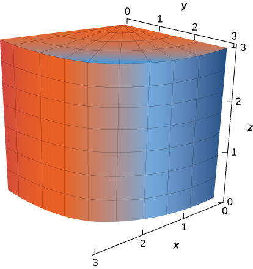 

<math xmlns="http://www.w3.org/1998/Math/MathML"><mrow><mstyle mathvariant="bold" mathsize="normal"><mtext>r</mtext></mstyle><mo stretchy="false">(</mo><mi>u</mi><mo>,</mo><mi>v</mi><mo stretchy="false">)</mo><mo>=</mo><mrow><mo>〈</mo><mrow><mn>3</mn><mspace width="0.2em" /><mtext>cos</mtext><mspace width="0.2em" /><mi>u</mi><mo>,</mo><mn>3</mn><mspace width="0.2em" /><mtext>sin</mtext><mspace width="0.2em" /><mi>u</mi><mo>,</mo><mi>v</mi></mrow><mo>〉</mo></mrow></mrow></math>

 for <math xmlns="http://www.w3.org/1998/Math/MathML"><mrow><mn>0</mn><mo>≤</mo><mi>u</mi><mo>≤</mo><mfrac><mi>π</mi><mn>2</mn></mfrac><mo>,</mo><mn>0</mn><mo>≤</mo><mi>v</mi><mo>≤</mo><mn>3</mn></mrow></math>

A cone with base radius *r* and height *h*, where *r* and *h* are positive constants

For the following exercises, use a computer algebra system to approximate the area of the following surfaces using a parametric description of the surface.

**[T]** Half cylinder <math xmlns="http://www.w3.org/1998/Math/MathML"><mrow><mrow><mo>{</mo><mrow><mrow><mo>(</mo><mrow><mi>r</mi><mo>,</mo><mi>θ</mi><mo>,</mo><mi>z</mi></mrow><mo>)</mo></mrow><mo>:</mo><mi>r</mi><mo>=</mo><mn>4</mn><mo>,</mo><mn>0</mn><mo>≤</mo><mi>θ</mi><mo>≤</mo><mi>π</mi><mo>,</mo><mn>0</mn><mo>≤</mo><mi>z</mi><mo>≤</mo><mn>7</mn></mrow><mo>}</mo></mrow></mrow></math>

<math xmlns="http://www.w3.org/1998/Math/MathML"><mrow><mi>A</mi><mo>=</mo><mn>87.9646</mn></mrow></math>

**[T]** Plane <math xmlns="http://www.w3.org/1998/Math/MathML"><mrow><mi>z</mi><mo>=</mo><mn>10</mn><mo>−</mo><mi>x</mi><mo>−</mo><mi>y</mi></mrow></math>

 above square <math xmlns="http://www.w3.org/1998/Math/MathML"><mrow><mrow><mo>\|</mo><mi>x</mi><mo>\|</mo></mrow><mo>≤</mo><mn>2</mn><mo>,</mo><mrow><mo>\|</mo><mi>y</mi><mo>\|</mo></mrow><mo>≤</mo><mn>2</mn></mrow></math>

For the following exercises, let *S* be the hemisphere <math xmlns="http://www.w3.org/1998/Math/MathML"><mrow><msup><mi>x</mi><mn>2</mn></msup><mo>+</mo><msup><mi>y</mi><mn>2</mn></msup><mo>+</mo><msup><mi>z</mi><mn>2</mn></msup><mo>=</mo><mn>4</mn><mo>,</mo></mrow></math>

 with <math xmlns="http://www.w3.org/1998/Math/MathML"><mrow><mi>z</mi><mo>≥</mo><mn>0</mn><mo>,</mo></mrow></math>

 and evaluate each surface integral, in the counterclockwise direction.

<math xmlns="http://www.w3.org/1998/Math/MathML"><mrow><mstyle displaystyle="true"><mrow><msub><mo>∬</mo><mi>S</mi></msub><mrow><mi>z</mi><mi>d</mi><mi>S</mi></mrow></mrow></mstyle></mrow></math>

<math xmlns="http://www.w3.org/1998/Math/MathML"><mrow><mstyle displaystyle="true"><mrow><msub><mo>∬</mo><mi>S</mi></msub><mrow><mi>z</mi><mi>d</mi><mi>S</mi></mrow></mrow></mstyle><mo>=</mo><mn>8</mn><mi>π</mi></mrow></math>

<math xmlns="http://www.w3.org/1998/Math/MathML"><mrow><mstyle displaystyle="true"><mrow><msub><mo>∬</mo><mi>S</mi></msub><mrow><mo stretchy="false">(</mo><mi>x</mi><mo>−</mo><mn>2</mn><mi>y</mi><mo stretchy="false">)</mo><mi>d</mi><mi>S</mi></mrow></mrow></mstyle></mrow></math>

<math xmlns="http://www.w3.org/1998/Math/MathML"><mrow><mstyle displaystyle="true"><mrow><msub><mo>∬</mo><mi>S</mi></msub><mrow><mrow><mo>(</mo><mrow><msup><mi>x</mi><mn>2</mn></msup><mo>+</mo><msup><mi>y</mi><mn>2</mn></msup></mrow><mo>)</mo></mrow><mi>z</mi><mi>d</mi><mi>S</mi></mrow></mrow></mstyle></mrow></math>

<math xmlns="http://www.w3.org/1998/Math/MathML"><mrow><mstyle displaystyle="true"><mrow><msub><mo>∬</mo><mi>S</mi></msub><mrow><mrow><mo>(</mo><mrow><msup><mi>x</mi><mn>2</mn></msup><mo>+</mo><msup><mi>y</mi><mn>2</mn></msup></mrow><mo>)</mo></mrow><mi>z</mi><mi>d</mi><mi>S</mi></mrow></mrow></mstyle><mo>=</mo><mn>16</mn><mi>π</mi></mrow></math>

For the following exercises, evaluate <math xmlns="http://www.w3.org/1998/Math/MathML"><mrow><mstyle displaystyle="true"><mrow><mo stretchy="false">∫</mo><mrow><mstyle displaystyle="true"><mrow><msub><mo stretchy="false">∫</mo><mi>S</mi></msub><mrow><mstyle mathvariant="bold" mathsize="normal"><mtext>F</mtext></mstyle><mo>·</mo><mstyle mathvariant="bold" mathsize="normal"><mtext>N</mtext></mstyle><mi>d</mi><mi>s</mi></mrow></mrow></mstyle></mrow></mrow></mstyle></mrow></math>

 for vector field **F**, where **N** is an outward normal vector to surface *S.*

<math xmlns="http://www.w3.org/1998/Math/MathML"><mrow><mstyle mathvariant="bold" mathsize="normal"><mtext>F</mtext></mstyle><mrow><mo>(</mo><mrow><mi>x</mi><mo>,</mo><mi>y</mi><mo>,</mo><mi>z</mi></mrow><mo>)</mo></mrow><mo>=</mo><mi>x</mi><mstyle mathvariant="bold" mathsize="normal"><mtext>i</mtext></mstyle><mo>+</mo><mn>2</mn><mi>y</mi><mstyle mathvariant="bold" mathsize="normal"><mtext>j</mtext></mstyle><mo>−</mo><mn>3</mn><mi>z</mi><mstyle mathvariant="bold" mathsize="normal"><mtext>k</mtext></mstyle><mo>,</mo></mrow></math>

 and *S* is that part of plane <math xmlns="http://www.w3.org/1998/Math/MathML"><mrow><mn>15</mn><mi>x</mi><mo>−</mo><mn>12</mn><mi>y</mi><mo>+</mo><mn>3</mn><mi>z</mi><mo>=</mo><mn>6</mn></mrow></math>

 that lies above unit square <math xmlns="http://www.w3.org/1998/Math/MathML"><mrow><mn>0</mn><mo>≤</mo><mi>x</mi><mo>≤</mo><mn>1</mn><mo>,</mo><mn>0</mn><mo>≤</mo><mi>y</mi><mo>≤</mo><mn>1</mn><mo>.</mo></mrow></math>

<math xmlns="http://www.w3.org/1998/Math/MathML"><mrow><mstyle mathvariant="bold" mathsize="normal"><mtext>F</mtext></mstyle><mo stretchy="false">(</mo><mi>x</mi><mo>,</mo><mi>y</mi><mo>,</mo><mi>z</mi><mo stretchy="false">)</mo><mo>=</mo><mi>x</mi><mstyle mathvariant="bold" mathsize="normal"><mtext>i</mtext></mstyle><mo>+</mo><mi>y</mi><mstyle mathvariant="bold" mathsize="normal"><mtext>j</mtext></mstyle><mo>,</mo></mrow></math>

 and *S* is hemisphere <math xmlns="http://www.w3.org/1998/Math/MathML"><mrow><mi>z</mi><mo>=</mo><msqrt><mrow><mn>1</mn><mo>−</mo><msup><mi>x</mi><mn>2</mn></msup><mo>−</mo><msup><mi>y</mi><mn>2</mn></msup></mrow></msqrt><mo>.</mo></mrow></math>

<math xmlns="http://www.w3.org/1998/Math/MathML"><mrow><mstyle displaystyle="true"><mrow><msub><mo>∬</mo><mi>S</mi></msub><mrow><mstyle mathvariant="bold" mathsize="normal"><mtext>F</mtext></mstyle><mo>·</mo><mstyle mathvariant="bold" mathsize="normal"><mtext>N</mtext></mstyle><mi>d</mi><mi>S</mi><mo>=</mo><mfrac><mrow><mn>4</mn><mi>π</mi></mrow><mn>3</mn></mfrac></mrow></mrow></mstyle></mrow></math>

<math xmlns="http://www.w3.org/1998/Math/MathML"><mrow><mstyle mathvariant="bold" mathsize="normal"><mtext>F</mtext></mstyle><mo stretchy="false">(</mo><mi>x</mi><mo>,</mo><mi>y</mi><mo>,</mo><mi>z</mi><mo stretchy="false">)</mo><mo>=</mo><msup><mi>x</mi><mn>2</mn></msup><mstyle mathvariant="bold" mathsize="normal"><mtext>i</mtext></mstyle><mo>+</mo><msup><mi>y</mi><mn>2</mn></msup><mstyle mathvariant="bold" mathsize="normal"><mtext>j</mtext></mstyle><mo>+</mo><msup><mi>z</mi><mn>2</mn></msup><mstyle mathvariant="bold" mathsize="normal"><mtext>k</mtext></mstyle><mo>,</mo></mrow></math>

 and *S* is the portion of plane <math xmlns="http://www.w3.org/1998/Math/MathML"><mrow><mi>z</mi><mo>=</mo><mi>y</mi><mo>+</mo><mn>1</mn></mrow></math>

 that lies inside cylinder <math xmlns="http://www.w3.org/1998/Math/MathML"><mrow><msup><mi>x</mi><mn>2</mn></msup><mo>+</mo><msup><mi>y</mi><mn>2</mn></msup><mo>=</mo><mn>1</mn><mo>.</mo></mrow></math>

 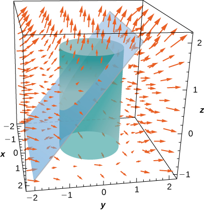 

For the following exercises, approximate the mass of the homogeneous lamina that has the shape of given surface *S.* Round to four decimal places.

**[T]** *S* is surface <math xmlns="http://www.w3.org/1998/Math/MathML"><mrow><mi>z</mi><mo>=</mo><mn>4</mn><mo>−</mo><mi>x</mi><mo>−</mo><mn>2</mn><mi>y</mi><mo>,</mo><mspace width="0.2em" /><mtext>with</mtext><mspace width="0.2em" /><mi>z</mi><mo>≥</mo><mn>0</mn><mtext>,</mtext><mspace width="0.2em" /><mi>x</mi><mo>≥</mo><mn>0</mn><mtext>,</mtext><mspace width="0.2em" /><mi>y</mi><mo>≥</mo><mn>0</mn><mtext>;</mtext><mspace width="0.2em" /><mi>ξ</mi><mo>=</mo><mi>x</mi><mo>.</mo></mrow></math>

<math xmlns="http://www.w3.org/1998/Math/MathML"><mrow><mi>m</mi><mo>≈</mo><mn>13.0639</mn></mrow></math>

**[T]** *S* is surface <math xmlns="http://www.w3.org/1998/Math/MathML"><mrow><mi>z</mi><mo>=</mo><msup><mi>x</mi><mn>2</mn></msup><mo>+</mo><msup><mi>y</mi><mn>2</mn></msup><mo>,</mo><mspace width="0.2em" /><mtext>with</mtext><mspace width="0.2em" /><mi>z</mi><mo>≤</mo><mn>1</mn><mtext>;</mtext><mspace width="0.2em" /><mi>ξ</mi><mo>=</mo><mi>z</mi><mo>.</mo></mrow></math>

**[T]** *S* is surface <math xmlns="http://www.w3.org/1998/Math/MathML"><mrow><msup><mi>x</mi><mn>2</mn></msup><mo>+</mo><msup><mi>y</mi><mn>2</mn></msup><mo>+</mo><msup><mi>x</mi><mn>2</mn></msup><mo>=</mo><mn>5</mn><mo>,</mo><mspace width="0.2em" /><mtext>with</mtext><mspace width="0.2em" /><mi>z</mi><mo>≥</mo><mn>1</mn><mtext>;</mtext><mspace width="0.2em" /><mi>ξ</mi><mo>=</mo><msup><mi>θ</mi><mn>2</mn></msup><mo>.</mo></mrow></math>

<math xmlns="http://www.w3.org/1998/Math/MathML"><mrow><mi>m</mi><mo>≈</mo><mn>228.5313</mn></mrow></math>

Evaluate <math xmlns="http://www.w3.org/1998/Math/MathML"><mrow><mstyle displaystyle="true"><mrow><msub><mo>∬</mo><mi>S</mi></msub><mrow><mrow><mo>(</mo><mrow><msup><mi>y</mi><mn>2</mn></msup><mi>z</mi><mstyle mathvariant="bold" mathsize="normal"><mtext>i</mtext></mstyle><mo>+</mo><msup><mi>y</mi><mn>3</mn></msup><mstyle mathvariant="bold" mathsize="normal"><mtext>j</mtext></mstyle><mo>+</mo><mi>x</mi><mi>z</mi><mstyle mathvariant="bold" mathsize="normal"><mtext>k</mtext></mstyle></mrow><mo>)</mo></mrow><mo>·</mo><mi>d</mi><mstyle mathvariant="bold" mathsize="normal"><mtext>S</mtext></mstyle></mrow></mrow></mstyle><mtext>,</mtext></mrow></math>

 where *S* is the surface of cube <math xmlns="http://www.w3.org/1998/Math/MathML"><mrow><mn>−1</mn><mo>≤</mo><mi>x</mi><mo>≤</mo><mn>1</mn><mo>,</mo><mn>−1</mn><mo>≤</mo><mi>y</mi><mo>≤</mo><mn>1</mn><mo>,</mo><mtext>and</mtext><mspace width="0.2em" /><mn>0</mn><mo>≤</mo><mi>z</mi><mo>≤</mo><mn>2</mn><mo>.</mo></mrow></math>

 in a counterclockwise direction.

Evaluate surface integral <math xmlns="http://www.w3.org/1998/Math/MathML"><mrow><mstyle displaystyle="true"><mrow><msub><mo>∬</mo><mi>S</mi></msub><mrow><mi>g</mi><mi>d</mi><mi>S</mi></mrow></mrow></mstyle><mo>,</mo></mrow></math>

 where <math xmlns="http://www.w3.org/1998/Math/MathML"><mrow><mi>g</mi><mo stretchy="false">(</mo><mi>x</mi><mo>,</mo><mi>y</mi><mo>,</mo><mi>z</mi><mo stretchy="false">)</mo><mo>=</mo><mi>x</mi><mi>z</mi><mo>+</mo><mn>2</mn><msup><mi>x</mi><mn>2</mn></msup><mo>−</mo><mn>3</mn><mi>x</mi><mi>y</mi></mrow></math>

 and *S* is the portion of plane <math xmlns="http://www.w3.org/1998/Math/MathML"><mrow><mn>2</mn><mi>x</mi><mo>−</mo><mn>3</mn><mi>y</mi><mo>+</mo><mi>z</mi><mo>=</mo><mn>6</mn></mrow></math>

 that lies over unit square *R*: <math xmlns="http://www.w3.org/1998/Math/MathML"><mrow><mn>0</mn><mo>≤</mo><mi>x</mi><mo>≤</mo><mn>1</mn><mtext>,</mtext><mspace width="0.2em" /><mn>0</mn><mo>≤</mo><mi>y</mi><mo>≤</mo><mn>1</mn><mo>.</mo></mrow></math>

<math xmlns="http://www.w3.org/1998/Math/MathML"><mrow><mstyle displaystyle="true"><mrow><msub><mo>∬</mo><mi>S</mi></msub><mrow><mi>g</mi><mi>d</mi><mi>S</mi></mrow></mrow></mstyle><mo>=</mo><mn>3</mn><msqrt><mn>4</mn></msqrt></mrow></math>

Evaluate <math xmlns="http://www.w3.org/1998/Math/MathML"><mrow><mstyle displaystyle="true"><mrow><msub><mo>∬</mo><mi>S</mi></msub><mrow><mo stretchy="false">(</mo><mi>x</mi><mo>+</mo><mi>y</mi><mo>+</mo><mi>z</mi><mo stretchy="false">)</mo><mi>d</mi><mstyle mathvariant="bold" mathsize="normal"><mtext>S</mtext></mstyle></mrow></mrow></mstyle><mtext>,</mtext></mrow></math>

 where *S* is the surface defined parametrically by <math xmlns="http://www.w3.org/1998/Math/MathML"><mrow><mstyle mathvariant="bold" mathsize="normal"><mtext>R</mtext></mstyle><mo stretchy="false">(</mo><mi>u</mi><mo>,</mo><mi>v</mi><mo stretchy="false">)</mo><mo>=</mo><mo stretchy="false">(</mo><mn>2</mn><mi>u</mi><mo>+</mo><mi>v</mi><mo stretchy="false">)</mo><mstyle mathvariant="bold" mathsize="normal"><mtext>i</mtext></mstyle><mo>+</mo><mo stretchy="false">(</mo><mi>u</mi><mo>−</mo><mn>2</mn><mi>v</mi><mo stretchy="false">)</mo><mstyle mathvariant="bold" mathsize="normal"><mtext>j</mtext></mstyle><mo>+</mo><mo stretchy="false">(</mo><mi>u</mi><mo>+</mo><mn>3</mn><mi>v</mi><mo stretchy="false">)</mo><mstyle mathvariant="bold" mathsize="normal"><mtext>k</mtext></mstyle></mrow></math>

 for <math xmlns="http://www.w3.org/1998/Math/MathML"><mrow><mn>0</mn><mo>≤</mo><mi>u</mi><mo>≤</mo><mn>1</mn><mo>,</mo><mspace width="0.2em" /><mtext>and</mtext><mspace width="0.2em" /><mn>0</mn><mo>≤</mo><mi>v</mi><mo>≤</mo><mn>2</mn><mo>.</mo></mrow></math>

 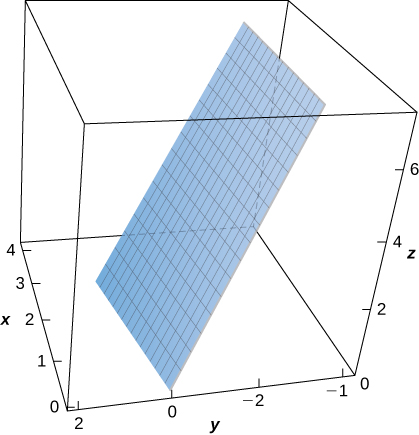 

**[T]** Evaluate <math xmlns="http://www.w3.org/1998/Math/MathML"><mrow><mstyle displaystyle="true"><mrow><msub><mo>∬</mo><mi>S</mi></msub><mrow><mo stretchy="false">(</mo><mi>x</mi><mo>−</mo><msup><mi>y</mi><mn>2</mn></msup><mo>+</mo><mi>z</mi><mo stretchy="false">)</mo><mi>d</mi><mstyle mathvariant="bold" mathsize="normal"><mtext>S</mtext></mstyle></mrow></mrow></mstyle><mtext>,</mtext></mrow></math>

 where *S* is the surface defined by <math xmlns="http://www.w3.org/1998/Math/MathML"><mrow><mstyle mathvariant="bold" mathsize="normal"><mtext>R</mtext></mstyle><mo stretchy="false">(</mo><mi>u</mi><mo>,</mo><mi>v</mi><mo stretchy="false">)</mo><mo>=</mo><msup><mi>u</mi><mn>2</mn></msup><mstyle mathvariant="bold" mathsize="normal"><mtext>i</mtext></mstyle><mo>+</mo><mi>v</mi><mstyle mathvariant="bold" mathsize="normal"><mtext>j</mtext></mstyle><mo>+</mo><mi>u</mi><mstyle mathvariant="bold" mathsize="normal"><mtext>k</mtext></mstyle><mtext>,</mtext><mspace width="0.2em" /><mn>0</mn><mo>≤</mo><mi>u</mi><mo>≤</mo><mn>1</mn><mtext>,</mtext><mspace width="0.2em" /><mn>0</mn><mo>≤</mo><mi>v</mi><mo>≤</mo><mn>1</mn><mo>.</mo></mrow></math>

 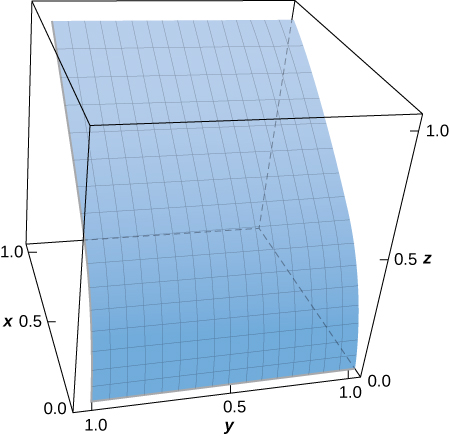 

<math xmlns="http://www.w3.org/1998/Math/MathML"><mrow><mstyle displaystyle="true"><mrow><msub><mo>∬</mo><mi>S</mi></msub><mrow><mrow><mo>(</mo><mrow><msup><mi>x</mi><mn>2</mn></msup><mo>+</mo><mi>y</mi><mo>−</mo><mi>z</mi></mrow><mo>)</mo></mrow></mrow></mrow></mstyle><mi>d</mi><mstyle mathvariant="bold" mathsize="normal"><mtext>S</mtext></mstyle><mo>≈</mo><mn>0.9617</mn></mrow></math>

**[T]** Evaluate where *S* is the surface defined by <math xmlns="http://www.w3.org/1998/Math/MathML"><mrow><mstyle mathvariant="bold" mathsize="normal"><mtext>R</mtext></mstyle><mo stretchy="false">(</mo><mi>u</mi><mo>,</mo><mi>v</mi><mo stretchy="false">)</mo><mo>=</mo><mi>u</mi><mstyle mathvariant="bold" mathsize="normal"><mtext>i</mtext></mstyle><mo>−</mo><msup><mi>u</mi><mn>2</mn></msup><mstyle mathvariant="bold" mathsize="normal"><mtext>j</mtext></mstyle><mo>+</mo><mi>v</mi><mstyle mathvariant="bold" mathsize="normal"><mtext>k</mtext></mstyle><mtext>,</mtext><mspace width="0.2em" /><mn>0</mn><mo>≤</mo><mi>u</mi><mo>≤</mo><mn>2</mn><mtext>,</mtext><mspace width="0.2em" /><mn>0</mn><mo>≤</mo><mi>v</mi><mo>≤</mo><mn>1</mn><mo>.</mo></mrow></math>

 for <math xmlns="http://www.w3.org/1998/Math/MathML"><mrow><mn>0</mn><mo>≤</mo><mi>u</mi><mo>≤</mo><mn>1</mn><mtext>,</mtext><mspace width="0.2em" /><mn>0</mn><mo>≤</mo><mi>v</mi><mo>≤</mo><mn>2</mn><mo>.</mo></mrow></math>

Evaluate <math xmlns="http://www.w3.org/1998/Math/MathML"><mrow><mstyle displaystyle="true"><mrow><msub><mo>∬</mo><mi>S</mi></msub><mrow><mrow><mo>(</mo><mrow><msup><mi>x</mi><mn>2</mn></msup><mo>+</mo><msup><mi>y</mi><mn>2</mn></msup></mrow><mo>)</mo></mrow><mi>d</mi><mstyle mathvariant="bold" mathsize="normal"><mtext>S</mtext></mstyle></mrow></mrow></mstyle><mo>,</mo></mrow></math>

 where *S* is the surface bounded above hemisphere <math xmlns="http://www.w3.org/1998/Math/MathML"><mrow><mi>z</mi><mo>=</mo><msqrt><mrow><mn>1</mn><mo>−</mo><msup><mi>x</mi><mn>2</mn></msup><mo>−</mo><msup><mi>y</mi><mn>2</mn></msup></mrow></msqrt><mo>,</mo></mrow></math>

 and below by plane <math xmlns="http://www.w3.org/1998/Math/MathML"><mrow><mi>z</mi><mo>=</mo><mn>0</mn><mo>.</mo></mrow></math>

<math xmlns="http://www.w3.org/1998/Math/MathML"><mrow><mstyle displaystyle="true"><mrow><msub><mo>∬</mo><mi>S</mi></msub><mrow><mrow><mo>(</mo><mrow><msup><mi>x</mi><mn>2</mn></msup><mo>+</mo><msup><mi>y</mi><mn>2</mn></msup></mrow><mo>)</mo></mrow><mi>d</mi><mstyle mathvariant="bold" mathsize="normal"><mtext>S</mtext></mstyle></mrow></mrow></mstyle><mo>=</mo><mfrac><mrow><mn>4</mn><mi>π</mi></mrow><mn>3</mn></mfrac></mrow></math>

Evaluate <math xmlns="http://www.w3.org/1998/Math/MathML"><mrow><mstyle displaystyle="true"><mrow><msub><mo>∬</mo><mi>S</mi></msub><mrow><mrow><mo>(</mo><mrow><msup><mi>x</mi><mn>2</mn></msup><mo>+</mo><msup><mi>y</mi><mn>2</mn></msup><mo>+</mo><msup><mi>z</mi><mn>2</mn></msup></mrow><mo>)</mo></mrow><mi>d</mi><mstyle mathvariant="bold" mathsize="normal"><mtext>S</mtext></mstyle></mrow></mrow></mstyle><mo>,</mo></mrow></math>

 where *S* is the portion of plane <math xmlns="http://www.w3.org/1998/Math/MathML"><mrow><mi>z</mi><mo>=</mo><mi>x</mi><mo>+</mo><mn>1</mn></mrow></math>

 that lies inside cylinder <math xmlns="http://www.w3.org/1998/Math/MathML"><mrow><msup><mi>x</mi><mn>2</mn></msup><mo>+</mo><msup><mi>y</mi><mn>2</mn></msup><mo>=</mo><mn>1</mn><mo>.</mo></mrow></math>

**[T]** Evaluate <math xmlns="http://www.w3.org/1998/Math/MathML"><mrow><mstyle displaystyle="true"><mrow><msub><mo>∬</mo><mi>S</mi></msub><mrow><msup><mi>x</mi><mn>2</mn></msup><mi>z</mi><mi>d</mi><mi>S</mi><mo>,</mo></mrow></mrow></mstyle></mrow></math>

 where *S* is the portion of cone <math xmlns="http://www.w3.org/1998/Math/MathML"><mrow><msup><mi>z</mi><mn>2</mn></msup><mo>=</mo><msup><mi>x</mi><mn>2</mn></msup><mo>+</mo><msup><mi>y</mi><mn>2</mn></msup></mrow></math>

 that lies between planes <math xmlns="http://www.w3.org/1998/Math/MathML"><mrow><mi>z</mi><mo>=</mo><mn>1</mn></mrow></math>

 and <math xmlns="http://www.w3.org/1998/Math/MathML"><mrow><mi>z</mi><mo>=</mo><mn>4</mn><mo>.</mo></mrow></math>

 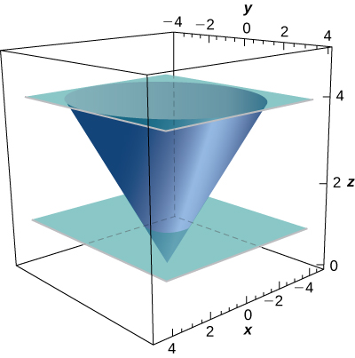 

<math xmlns="http://www.w3.org/1998/Math/MathML"><mrow><mstyle displaystyle="true"><mrow><msub><mo>∬</mo><mi>S</mi></msub><mrow><msup><mi>x</mi><mn>2</mn></msup><mi>z</mi><mi>d</mi><mtext>S</mtext></mrow></mrow></mstyle><mo>=</mo><mfrac><mrow><mn>1023</mn><msqrt><mrow><mn>2</mn><mi>π</mi></mrow></msqrt></mrow><mn>5</mn></mfrac></mrow></math>

**[T]** Evaluate <math xmlns="http://www.w3.org/1998/Math/MathML"><mrow><mstyle displaystyle="true"><mrow><msub><mo>∬</mo><mi>S</mi></msub><mrow><mrow><mo>(</mo><mrow><mrow><mrow><mi>x</mi><mi>z</mi></mrow><mtext>/</mtext><mi>y</mi></mrow></mrow><mo>)</mo></mrow><mi>d</mi><mi>S</mi></mrow></mrow></mstyle><mo>,</mo></mrow></math>

 where *S* is the portion of cylinder <math xmlns="http://www.w3.org/1998/Math/MathML"><mrow><mi>x</mi><mo>=</mo><msup><mi>y</mi><mn>2</mn></msup></mrow></math>

 that lies in the first octant between planes <math xmlns="http://www.w3.org/1998/Math/MathML"><mrow><mi>z</mi><mo>=</mo><mn>0</mn><mo>,</mo><mi>z</mi><mo>=</mo><mn>5</mn><mo>,</mo><mi>y</mi><mo>=</mo><mn>1</mn><mo>,</mo></mrow></math>

 and <math xmlns="http://www.w3.org/1998/Math/MathML"><mrow><mi>y</mi><mo>=</mo><mn>4</mn><mo>.</mo></mrow></math>

 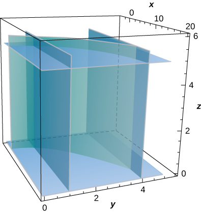 

**[T]** Evaluate <math xmlns="http://www.w3.org/1998/Math/MathML"><mrow><mstyle displaystyle="true"><mrow><msub><mo>∬</mo><mi>S</mi></msub><mrow><mrow><mo>(</mo><mrow><mi>z</mi><mo>+</mo><mi>y</mi></mrow><mo>)</mo></mrow><mi>d</mi><mi>S</mi></mrow></mrow></mstyle><mo>,</mo></mrow></math>

 where *S* is the part of the graph of <math xmlns="http://www.w3.org/1998/Math/MathML"><mrow><mi>z</mi><mo>=</mo><msqrt><mrow><mn>1</mn><mo>−</mo><msup><mi>x</mi><mn>2</mn></msup></mrow></msqrt></mrow></math>

 in the first octant between the *xz*-plane and plane <math xmlns="http://www.w3.org/1998/Math/MathML"><mrow><mi>y</mi><mo>=</mo><mn>3</mn><mo>.</mo></mrow></math>

  

<math xmlns="http://www.w3.org/1998/Math/MathML"><mrow><mstyle displaystyle="true"><mrow><msub><mo>∬</mo><mtext>S</mtext></msub><mrow><mrow><mo>(</mo><mrow><mi>z</mi><mo>+</mo><mi>y</mi></mrow><mo>)</mo></mrow><mi>d</mi><mtext>S</mtext></mrow></mrow></mstyle><mo>≈</mo><mn>10.1</mn></mrow></math>

Evaluate <math xmlns="http://www.w3.org/1998/Math/MathML"><mrow><mstyle displaystyle="true"><mrow><msub><mo>∬</mo><mi>S</mi></msub><mrow><mi>x</mi><mi>y</mi><mi>z</mi><mi>d</mi><mtext>S</mtext></mrow></mrow></mstyle></mrow></math>

 if *S* is the part of plane <math xmlns="http://www.w3.org/1998/Math/MathML"><mrow><mi>z</mi><mo>=</mo><mi>x</mi><mo>+</mo><mi>y</mi></mrow></math>

 that lies over the triangular region in the *xy*-plane with vertices (0, 0, 0), (1, 0, 0), and (0, 2, 0).

Find the mass of a lamina of density <math xmlns="http://www.w3.org/1998/Math/MathML"><mrow><mi>ξ</mi><mo stretchy="false">(</mo><mi>x</mi><mo>,</mo><mi>y</mi><mo>,</mo><mi>z</mi><mo stretchy="false">)</mo><mo>=</mo><mi>z</mi></mrow></math>

 in the shape of hemisphere <math xmlns="http://www.w3.org/1998/Math/MathML"><mrow><mi>z</mi><mo>=</mo><msup><mrow><mrow><mo>(</mo><mrow><msup><mi>a</mi><mn>2</mn></msup><mo>−</mo><msup><mi>x</mi><mn>2</mn></msup><mo>−</mo><msup><mi>y</mi><mn>2</mn></msup></mrow><mo>)</mo></mrow></mrow><mrow><mrow><mn>1</mn><mtext>/</mtext><mn>2</mn></mrow></mrow></msup><mo>.</mo></mrow></math>

<math xmlns="http://www.w3.org/1998/Math/MathML"><mrow><mi>m</mi><mo>=</mo><mi>π</mi><msup><mi>a</mi><mn>3</mn></msup></mrow></math>

Compute <math xmlns="http://www.w3.org/1998/Math/MathML"><mrow><mstyle displaystyle="true"><mrow><mo stretchy="false">∫</mo><mrow><mstyle displaystyle="true"><mrow><msub><mo stretchy="false">∫</mo><mi>S</mi></msub><mrow><mstyle mathvariant="bold" mathsize="normal"><mtext>F</mtext></mstyle><mo>·</mo><mstyle mathvariant="bold" mathsize="normal"><mtext>N</mtext></mstyle><mi>d</mi><mi>S</mi><mo>,</mo></mrow></mrow></mstyle></mrow></mrow></mstyle></mrow></math>

 where <math xmlns="http://www.w3.org/1998/Math/MathML"><mrow><mstyle mathvariant="bold" mathsize="normal"><mtext>F</mtext></mstyle><mo stretchy="false">(</mo><mi>x</mi><mo>,</mo><mi>y</mi><mo>,</mo><mi>z</mi><mo stretchy="false">)</mo><mo>=</mo><mi>x</mi><mstyle mathvariant="bold" mathsize="normal"><mtext>i</mtext></mstyle><mo>−</mo><mn>5</mn><mi>y</mi><mstyle mathvariant="bold" mathsize="normal"><mtext>j</mtext></mstyle><mo>+</mo><mn>4</mn><mi>z</mi><mstyle mathvariant="bold" mathsize="normal"><mtext>k</mtext></mstyle></mrow></math>

 and **N** is an outward normal vector *S*, where *S* is the union of two squares <math xmlns="http://www.w3.org/1998/Math/MathML"><mrow><msub><mi>S</mi><mn>1</mn></msub><mo>:</mo><mi>x</mi><mo>=</mo><mn>0</mn><mtext>,</mtext><mspace width="0.2em" /><mn>0</mn><mo>≤</mo><mi>y</mi><mo>≤</mo><mn>1</mn><mtext>,</mtext><mspace width="0.2em" /><mn>0</mn><mo>≤</mo><mi>z</mi><mo>≤</mo><mn>1</mn></mrow></math>

 and <math xmlns="http://www.w3.org/1998/Math/MathML"><mrow><msub><mi>S</mi><mn>2</mn></msub><mo>:</mo><mi>z</mi><mo>=</mo><mn>1</mn><mtext>,</mtext><mspace width="0.2em" /><mn>0</mn><mo>≤</mo><mi>x</mi><mo>≤</mo><mn>1</mn><mtext>,</mtext><mspace width="0.2em" /><mn>0</mn><mo>≤</mo><mi>y</mi><mo>≤</mo><mn>1</mn><mo>.</mo></mrow></math>

 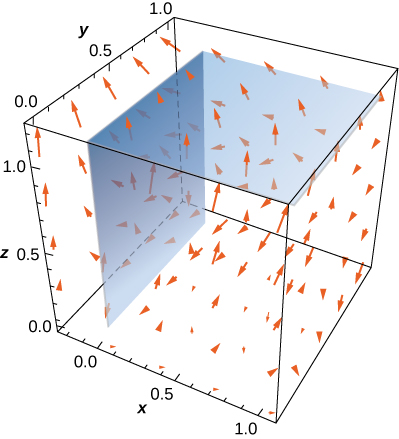 

Compute <math xmlns="http://www.w3.org/1998/Math/MathML"><mrow><mstyle displaystyle="true"><mrow><mo stretchy="false">∫</mo><mrow><mstyle displaystyle="true"><mrow><msub><mo stretchy="false">∫</mo><mi>S</mi></msub><mrow><mstyle mathvariant="bold" mathsize="normal"><mtext>F</mtext></mstyle><mo>·</mo><mstyle mathvariant="bold" mathsize="normal"><mtext>N</mtext></mstyle><mi>d</mi><mi>S</mi><mo>,</mo></mrow></mrow></mstyle></mrow></mrow></mstyle></mrow></math>

 where <math xmlns="http://www.w3.org/1998/Math/MathML"><mrow><mstyle mathvariant="bold" mathsize="normal"><mtext>F</mtext></mstyle><mo stretchy="false">(</mo><mi>x</mi><mo>,</mo><mi>y</mi><mo>,</mo><mi>z</mi><mo stretchy="false">)</mo><mo>=</mo><mi>x</mi><mi>y</mi><mstyle mathvariant="bold" mathsize="normal"><mtext>i</mtext></mstyle><mo>+</mo><mi>z</mi><mstyle mathvariant="bold" mathsize="normal"><mtext>j</mtext></mstyle><mo>+</mo><mo stretchy="false">(</mo><mi>x</mi><mo>+</mo><mi>y</mi><mo stretchy="false">)</mo><mstyle mathvariant="bold" mathsize="normal"><mtext>k</mtext></mstyle></mrow></math>

 and **N** is an outward normal vector *S*, where S is the triangular region cut off from plane <math xmlns="http://www.w3.org/1998/Math/MathML"><mrow><mi>x</mi><mo>+</mo><mi>y</mi><mo>+</mo><mi>z</mi><mo>=</mo><mn>1</mn></mrow></math>

 by the positive coordinate axes.

<math xmlns="http://www.w3.org/1998/Math/MathML"><mrow><mstyle displaystyle="true"><mrow><msub><mo>∬</mo><mi>S</mi></msub><mrow><mstyle mathvariant="bold" mathsize="normal"><mtext>F</mtext></mstyle><mo>·</mo><mstyle mathvariant="bold" mathsize="normal"><mtext>N</mtext></mstyle><mi>d</mi><mi>S</mi><mo>=</mo><mfrac><mrow><mn>13</mn></mrow><mrow><mn>24</mn></mrow></mfrac></mrow></mrow></mstyle></mrow></math>

Compute <math xmlns="http://www.w3.org/1998/Math/MathML"><mrow><mstyle displaystyle="true"><mrow><mo stretchy="false">∫</mo><mrow><mstyle displaystyle="true"><mrow><msub><mo stretchy="false">∫</mo><mi>S</mi></msub><mrow><mstyle mathvariant="bold" mathsize="normal"><mtext>F</mtext></mstyle><mo>·</mo><mstyle mathvariant="bold" mathsize="normal"><mtext>N</mtext></mstyle><mi>d</mi><mi>S</mi><mo>,</mo></mrow></mrow></mstyle></mrow></mrow></mstyle></mrow></math>

 where <math xmlns="http://www.w3.org/1998/Math/MathML"><mrow><mstyle mathvariant="bold" mathsize="normal"><mtext>F</mtext></mstyle><mrow><mo>(</mo><mrow><mi>x</mi><mo>,</mo><mi>y</mi><mo>,</mo><mi>z</mi></mrow><mo>)</mo></mrow><mo>=</mo><mn>2</mn><mi>y</mi><mi>z</mi><mstyle mathvariant="bold" mathsize="normal"><mtext>i</mtext></mstyle><mo>+</mo><mrow><mo>(</mo><mrow><msup><mrow><mtext>tan</mtext></mrow><mrow><mn>−1</mn></mrow></msup><mi>x</mi><mi>z</mi></mrow><mo>)</mo></mrow><mstyle mathvariant="bold" mathsize="normal"><mtext>j</mtext></mstyle><mo>+</mo><msup><mi>e</mi><mrow><mi>x</mi><mi>y</mi></mrow></msup><mstyle mathvariant="bold" mathsize="normal"><mtext>k</mtext></mstyle></mrow></math>

 and **N** is an outward normal vector *S*, where *S* is the surface of sphere <math xmlns="http://www.w3.org/1998/Math/MathML"><mrow><msup><mi>x</mi><mn>2</mn></msup><mo>+</mo><msup><mi>y</mi><mn>2</mn></msup><mo>+</mo><msup><mi>z</mi><mn>2</mn></msup><mo>=</mo><mn>1</mn><mo>.</mo></mrow></math>

Compute <math xmlns="http://www.w3.org/1998/Math/MathML"><mrow><mstyle displaystyle="true"><mrow><mo stretchy="false">∫</mo><mrow><mstyle displaystyle="true"><mrow><msub><mo stretchy="false">∫</mo><mi>S</mi></msub><mrow><mstyle mathvariant="bold" mathsize="normal"><mtext>F</mtext></mstyle><mo>·</mo><mstyle mathvariant="bold" mathsize="normal"><mtext>N</mtext></mstyle><mi>d</mi><mi>S</mi><mo>,</mo></mrow></mrow></mstyle></mrow></mrow></mstyle></mrow></math>

 where <math xmlns="http://www.w3.org/1998/Math/MathML"><mrow><mstyle mathvariant="bold" mathsize="normal"><mtext>F</mtext></mstyle><mo stretchy="false">(</mo><mi>x</mi><mo>,</mo><mi>y</mi><mo>,</mo><mi>z</mi><mo stretchy="false">)</mo><mo>=</mo><mi>x</mi><mi>y</mi><mi>z</mi><mstyle mathvariant="bold" mathsize="normal"><mtext>i</mtext></mstyle><mo>+</mo><mi>x</mi><mi>y</mi><mi>z</mi><mstyle mathvariant="bold" mathsize="normal"><mtext>j</mtext></mstyle><mo>+</mo><mi>x</mi><mi>y</mi><mi>z</mi><mstyle mathvariant="bold" mathsize="normal"><mtext>k</mtext></mstyle></mrow></math>

 and **N** is an outward normal vector *S*, where *S* is the surface of the five faces of the unit cube <math xmlns="http://www.w3.org/1998/Math/MathML"><mrow><mn>0</mn><mo>≤</mo><mi>x</mi><mo>≤</mo><mn>1</mn><mtext>,</mtext><mspace width="0.2em" /><mn>0</mn><mo>≤</mo><mi>y</mi><mo>≤</mo><mn>1</mn><mtext>,</mtext><mspace width="0.2em" /><mn>0</mn><mo>≤</mo><mi>z</mi><mo>≤</mo><mn>1</mn></mrow></math>

 missing <math xmlns="http://www.w3.org/1998/Math/MathML"><mrow><mi>z</mi><mo>=</mo><mn>0</mn><mo>.</mo></mrow></math>

<math xmlns="http://www.w3.org/1998/Math/MathML"><mrow><mstyle displaystyle="true"><mrow><msub><mo>∬</mo><mi>S</mi></msub><mrow><mstyle mathvariant="bold" mathsize="normal"><mtext>F</mtext></mstyle><mo>·</mo><mstyle mathvariant="bold" mathsize="normal"><mtext>N</mtext></mstyle><mi>d</mi><mi>S</mi><mo>=</mo><mfrac><mn>3</mn><mn>4</mn></mfrac></mrow></mrow></mstyle></mrow></math>

For the following exercises, express the surface integral as an iterated double integral by using a projection on *S* on the *yz*-plane.

<math xmlns="http://www.w3.org/1998/Math/MathML"><mrow><mstyle displaystyle="true"><mrow><msub><mo>∬</mo><mi>S</mi></msub><mrow><mi>x</mi><msup><mi>y</mi><mn>2</mn></msup><msup><mi>z</mi><mn>3</mn></msup><mi>d</mi><mtext>S</mtext></mrow></mrow></mstyle><mo>;</mo></mrow></math>

 *S* is the first-octant portion of plane <math xmlns="http://www.w3.org/1998/Math/MathML"><mrow><mn>2</mn><mi>x</mi><mo>+</mo><mn>3</mn><mi>y</mi><mo>+</mo><mn>4</mn><mi>z</mi><mo>=</mo><mn>12</mn><mo>.</mo></mrow></math>

<math xmlns="http://www.w3.org/1998/Math/MathML"><mrow><mstyle displaystyle="true"><mrow><msub><mo>∬</mo><mi>S</mi></msub><mrow><mrow><mo>(</mo><mrow><msup><mi>x</mi><mn>2</mn></msup><mo>−</mo><mn>2</mn><mi>y</mi><mo>+</mo><mi>z</mi></mrow><mo>)</mo></mrow><mi>d</mi><mtext>S;</mtext></mrow></mrow></mstyle></mrow></math>

 *S* is the portion of the graph of <math xmlns="http://www.w3.org/1998/Math/MathML"><mrow><mn>4</mn><mi>x</mi><mo>+</mo><mi>y</mi><mo>=</mo><mn>8</mn></mrow></math>

 bounded by the coordinate planes and plane <math xmlns="http://www.w3.org/1998/Math/MathML"><mrow><mi>z</mi><mo>=</mo><mn>6</mn><mo>.</mo></mrow></math>

<math xmlns="http://www.w3.org/1998/Math/MathML"><mrow><mstyle displaystyle="true"><mrow><munderover><mo stretchy="false">∫</mo><mn>0</mn><mn>8</mn></munderover><mrow><mstyle displaystyle="true"><mrow><munderover><mo stretchy="false">∫</mo><mn>0</mn><mn>6</mn></munderover><mrow><mrow><mo>(</mo><mrow><mn>4</mn><mo>−</mo><mn>3</mn><mi>y</mi><mo>+</mo><mfrac><mn>1</mn><mrow><mn>16</mn></mrow></mfrac><msup><mi>y</mi><mn>2</mn></msup><mo>+</mo><mi>z</mi></mrow><mo>)</mo></mrow><mrow><mo>(</mo><mrow><mfrac><mn>1</mn><mn>4</mn></mfrac><msqrt><mrow><mn>17</mn></mrow></msqrt></mrow><mo>)</mo></mrow><mi>d</mi><mi>z</mi><mi>d</mi><mi>y</mi></mrow></mrow></mstyle></mrow></mrow></mstyle></mrow></math>

For the following exercises, express the surface integral as an iterated double integral by using a projection on *S* on the *xz*-plane

<math xmlns="http://www.w3.org/1998/Math/MathML"><mrow><mstyle displaystyle="true"><mrow><msub><mo>∬</mo><mi>S</mi></msub><mrow><mi>x</mi><msup><mi>y</mi><mn>2</mn></msup><msup><mi>z</mi><mn>3</mn></msup><mi>d</mi><mtext>S</mtext></mrow></mrow></mstyle><mo>;</mo></mrow></math>

 *S* is the first-octant portion of plane <math xmlns="http://www.w3.org/1998/Math/MathML"><mrow><mn>2</mn><mi>x</mi><mo>+</mo><mn>3</mn><mi>y</mi><mo>+</mo><mn>4</mn><mi>z</mi><mo>=</mo><mn>12</mn><mo>.</mo></mrow></math>

<math xmlns="http://www.w3.org/1998/Math/MathML"><mrow><mstyle displaystyle="true"><mrow><msub><mo>∬</mo><mi>S</mi></msub><mrow><mrow><mo>(</mo><mrow><msup><mi>x</mi><mn>2</mn></msup><mo>−</mo><mn>2</mn><mi>y</mi><mo>+</mo><mi>z</mi></mrow><mo>)</mo></mrow><mi>d</mi><mtext>S;</mtext></mrow></mrow></mstyle></mrow></math>

 *S* is the portion of the graph of <math xmlns="http://www.w3.org/1998/Math/MathML"><mrow><mn>4</mn><mi>x</mi><mo>+</mo><mi>y</mi><mo>=</mo><mn>8</mn></mrow></math>

 bounded by the coordinate planes and plane <math xmlns="http://www.w3.org/1998/Math/MathML"><mrow><mi>z</mi><mo>=</mo><mn>6</mn><mo>.</mo></mrow></math>

<math xmlns="http://www.w3.org/1998/Math/MathML"><mrow><mstyle displaystyle="true"><mrow><munderover><mo stretchy="false">∫</mo><mn>0</mn><mn>2</mn></munderover><mrow><mstyle displaystyle="true"><mrow><munderover><mo stretchy="false">∫</mo><mn>0</mn><mn>6</mn></munderover><mrow><mrow><mo>[</mo><mrow><msup><mi>x</mi><mn>2</mn></msup><mo>−</mo><mn>2</mn><mo stretchy="false">(</mo><mn>8</mn><mo>−</mo><mn>4</mn><mi>x</mi><mo stretchy="false">)</mo><mo>+</mo><mi>z</mi></mrow><mo>]</mo></mrow><msqrt><mrow><mn>17</mn></mrow></msqrt><mi>d</mi><mi>z</mi><mi>d</mi><mi>x</mi></mrow></mrow></mstyle></mrow></mrow></mstyle></mrow></math>

Evaluate surface integral <math xmlns="http://www.w3.org/1998/Math/MathML"><mrow><mstyle displaystyle="true"><mrow><msub><mo>∬</mo><mi>S</mi></msub><mrow><mi>y</mi><mi>z</mi><mi>d</mi><mtext>S</mtext></mrow></mrow></mstyle><mo>,</mo></mrow></math>

 where *S* is the first-octant part of plane <math xmlns="http://www.w3.org/1998/Math/MathML"><mrow><mi>x</mi><mo>+</mo><mi>y</mi><mo>+</mo><mi>z</mi><mo>=</mo><mi>λ</mi><mo>,</mo></mrow></math>

 where <math xmlns="http://www.w3.org/1998/Math/MathML"><mi>λ</mi></math>

 is a positive constant.

Evaluate surface integral <math xmlns="http://www.w3.org/1998/Math/MathML"><mrow><mstyle displaystyle="true"><mrow><msub><mo>∬</mo><mi>S</mi></msub><mrow><mrow><mo>(</mo><mrow><msup><mi>x</mi><mn>2</mn></msup><mi>z</mi><mo>+</mo><msup><mi>y</mi><mn>2</mn></msup><mi>z</mi></mrow><mo>)</mo></mrow><mi>d</mi><mtext>S</mtext></mrow></mrow></mstyle><mo>,</mo></mrow></math>

 where *S* is hemisphere <math xmlns="http://www.w3.org/1998/Math/MathML"><mrow><msup><mi>x</mi><mn>2</mn></msup><mo>+</mo><msup><mi>y</mi><mn>2</mn></msup><mo>+</mo><msup><mi>z</mi><mn>2</mn></msup><mo>=</mo><msup><mi>a</mi><mn>2</mn></msup><mo>,</mo><mi>z</mi><mo>≥</mo><mn>0</mn><mo>.</mo></mrow></math>

<math xmlns="http://www.w3.org/1998/Math/MathML"><mrow><mstyle displaystyle="true"><mrow><msub><mo>∬</mo><mi>S</mi></msub><mrow><mrow><mo>(</mo><mrow><msup><mi>x</mi><mn>2</mn></msup><mi>z</mi><mo>+</mo><msup><mi>y</mi><mn>2</mn></msup><mi>z</mi></mrow><mo>)</mo></mrow><mi>d</mi><mtext>S</mtext></mrow></mrow></mstyle><mo>=</mo><mfrac><mrow><mi>π</mi><msup><mi>a</mi><mn>5</mn></msup></mrow><mn>2</mn></mfrac></mrow></math>

Evaluate surface integral <math xmlns="http://www.w3.org/1998/Math/MathML"><mrow><mstyle displaystyle="true"><mrow><msub><mo>∬</mo><mi>S</mi></msub><mrow><mi>z</mi><mi>d</mi><mtext>A</mtext></mrow></mrow></mstyle><mo>,</mo></mrow></math>

 where *S* is surface <math xmlns="http://www.w3.org/1998/Math/MathML"><mrow><mi>z</mi><mo>=</mo><msqrt><mrow><msup><mi>x</mi><mn>2</mn></msup><mo>+</mo><msup><mi>y</mi><mn>2</mn></msup></mrow></msqrt><mo>,</mo><mn>0</mn><mo>≤</mo><mi>z</mi><mo>≤</mo><mn>2</mn><mo>.</mo></mrow></math>

Evaluate surface integral <math xmlns="http://www.w3.org/1998/Math/MathML"><mrow><mstyle displaystyle="true"><mrow><msub><mo>∬</mo><mi>S</mi></msub><mrow><msup><mi>x</mi><mn>2</mn></msup><mi>y</mi><mi>z</mi><mi>d</mi><mi>S</mi></mrow></mrow></mstyle><mo>,</mo></mrow></math>

 where *S* is the part of plane <math xmlns="http://www.w3.org/1998/Math/MathML"><mrow><mi>z</mi><mo>=</mo><mn>1</mn><mo>+</mo><mn>2</mn><mi>x</mi><mo>+</mo><mn>3</mn><mi>y</mi></mrow></math>

 that lies above rectangle <math xmlns="http://www.w3.org/1998/Math/MathML"><mrow><mn>0</mn><mo>≤</mo><mi>x</mi><mo>≤</mo><mn>3</mn><mspace width="0.2em" /><mtext>and</mtext><mspace width="0.2em" /><mn>0</mn><mo>≤</mo><mi>y</mi><mo>≤</mo><mn>2</mn><mo>.</mo></mrow></math>

<math xmlns="http://www.w3.org/1998/Math/MathML"><mrow><mstyle displaystyle="true"><mrow><msub><mo>∬</mo><mi>S</mi></msub><mrow><msup><mi>x</mi><mn>2</mn></msup><mi>y</mi><mi>z</mi><mi>d</mi><mi>S</mi></mrow></mrow></mstyle><mo>=</mo><mn>171</mn><msqrt><mrow><mn>14</mn></mrow></msqrt></mrow></math>

Evaluate surface integral <math xmlns="http://www.w3.org/1998/Math/MathML"><mrow><mstyle displaystyle="true"><mrow><msub><mo>∬</mo><mi>S</mi></msub><mrow><mi>y</mi><mi>z</mi><mi>d</mi><mi>S</mi><mo>,</mo></mrow></mrow></mstyle></mrow></math>

 where *S* is plane <math xmlns="http://www.w3.org/1998/Math/MathML"><mrow><mi>x</mi><mo>+</mo><mi>y</mi><mo>+</mo><mi>z</mi><mo>=</mo><mn>1</mn></mrow></math>

 that lies in the first octant.

Evaluate surface integral <math xmlns="http://www.w3.org/1998/Math/MathML"><mrow><mstyle displaystyle="true"><mrow><msub><mo>∬</mo><mi>S</mi></msub><mrow><mi>y</mi><mi>z</mi><mi>d</mi><mtext>S</mtext></mrow></mrow></mstyle><mo>,</mo></mrow></math>

 where *S* is the part of plane <math xmlns="http://www.w3.org/1998/Math/MathML"><mrow><mi>z</mi><mo>=</mo><mi>y</mi><mo>+</mo><mn>3</mn></mrow></math>

 that lies inside cylinder <math xmlns="http://www.w3.org/1998/Math/MathML"><mrow><msup><mi>x</mi><mn>2</mn></msup><mo>+</mo><msup><mi>y</mi><mn>2</mn></msup><mo>=</mo><mn>1</mn><mo>.</mo></mrow></math>

<math xmlns="http://www.w3.org/1998/Math/MathML"><mrow><mstyle displaystyle="true"><mrow><msub><mo>∬</mo><mi>S</mi></msub><mrow><mi>y</mi><mi>z</mi><mi>d</mi><mtext>S</mtext></mrow></mrow></mstyle><mo>=</mo><mfrac><mrow><msqrt><mn>2</mn></msqrt><mi>π</mi></mrow><mn>4</mn></mfrac></mrow></math>

For the following exercises, use geometric reasoning to evaluate the given surface integrals.

<math xmlns="http://www.w3.org/1998/Math/MathML"><mrow><mstyle displaystyle="true"><mrow><msub><mo>∬</mo><mi>S</mi></msub><mrow><msqrt><mrow><msup><mi>x</mi><mn>2</mn></msup><mo>+</mo><msup><mi>y</mi><mn>2</mn></msup><mo>+</mo><msup><mi>z</mi><mn>2</mn></msup></mrow></msqrt><mi>d</mi><mi>S</mi></mrow></mrow></mstyle><mo>,</mo></mrow></math>

 where *S* is surface <math xmlns="http://www.w3.org/1998/Math/MathML"><mrow><msup><mi>x</mi><mn>2</mn></msup><mo>+</mo><msup><mi>y</mi><mn>2</mn></msup><mo>+</mo><msup><mi>z</mi><mn>2</mn></msup><mo>=</mo><mn>4</mn><mo>,</mo><mi>z</mi><mo>≥</mo><mn>0</mn></mrow></math>

<math xmlns="http://www.w3.org/1998/Math/MathML"><mrow><mstyle displaystyle="true"><mrow><msub><mo>∬</mo><mi>S</mi></msub><mrow><mo stretchy="false">(</mo><mi>x</mi><mstyle mathvariant="bold" mathsize="normal"><mtext>i</mtext></mstyle><mo>+</mo><mi>y</mi><mstyle mathvariant="bold" mathsize="normal"><mtext>j</mtext></mstyle><mo stretchy="false">)</mo><mo>·</mo><mi>d</mi><mstyle mathvariant="bold" mathsize="normal"><mtext>S</mtext></mstyle></mrow></mrow></mstyle><mo>,</mo></mrow></math>

 where *S* is surface <math xmlns="http://www.w3.org/1998/Math/MathML"><mrow><msup><mi>x</mi><mn>2</mn></msup><mo>+</mo><msup><mi>y</mi><mn>2</mn></msup><mo>=</mo><mn>4</mn><mo>,</mo><mn>1</mn><mo>≤</mo><mi>z</mi><mo>≤</mo><mn>3</mn><mo>,</mo></mrow></math>

 oriented with unit normal vectors pointing outward

<math xmlns="http://www.w3.org/1998/Math/MathML"><mrow><mstyle displaystyle="true"><mrow><msub><mo>∬</mo><mi>S</mi></msub><mrow><mo stretchy="false">(</mo><mi>x</mi><mstyle mathvariant="bold" mathsize="normal"><mtext>i</mtext></mstyle><mo>+</mo><mi>y</mi><mstyle mathvariant="bold" mathsize="normal"><mtext>j</mtext></mstyle><mo stretchy="false">)</mo><mo>·</mo><mi>d</mi><mstyle mathvariant="bold" mathsize="normal"><mtext>S</mtext></mstyle></mrow></mrow></mstyle><mo>=</mo><mn>16</mn><mi>π</mi></mrow></math>

<math xmlns="http://www.w3.org/1998/Math/MathML"><mrow><mstyle displaystyle="true"><mrow><msub><mo>∬</mo><mi>S</mi></msub><mrow><mo stretchy="false">(</mo><mi>z</mi><mstyle mathvariant="bold" mathsize="normal"><mtext>k</mtext></mstyle><mo stretchy="false">)</mo><mo>·</mo><mi>d</mi><mstyle mathvariant="bold" mathsize="normal"><mtext>S</mtext></mstyle></mrow></mrow></mstyle><mo>,</mo></mrow></math>

 where *S* is disc <math xmlns="http://www.w3.org/1998/Math/MathML"><mrow><msup><mi>x</mi><mn>2</mn></msup><mo>+</mo><msup><mi>y</mi><mn>2</mn></msup><mo>≤</mo><mn>9</mn></mrow></math>

 on plane <math xmlns="http://www.w3.org/1998/Math/MathML"><mrow><mi>z</mi><mo>=</mo><mn>4</mn><mo>,</mo></mrow></math>

 oriented with unit normal vectors pointing upward

A lamina has the shape of a portion of sphere <math xmlns="http://www.w3.org/1998/Math/MathML"><mrow><msup><mi>x</mi><mn>2</mn></msup><mo>+</mo><msup><mi>y</mi><mn>2</mn></msup><mo>+</mo><msup><mi>z</mi><mn>2</mn></msup><mo>=</mo><msup><mi>a</mi><mn>2</mn></msup></mrow></math>

 that lies within cone <math xmlns="http://www.w3.org/1998/Math/MathML"><mrow><mi>z</mi><mo>=</mo><msqrt><mrow><msup><mi>x</mi><mn>2</mn></msup><mo>+</mo><msup><mi>y</mi><mn>2</mn></msup></mrow></msqrt><mo>.</mo></mrow></math>

 Let *S* be the spherical shell centered at the origin with radius *a*, and let *C* be the right circular cone with a vertex at the origin and an axis of symmetry that coincides with the *z*-axis. Determine the mass of the lamina if <math xmlns="http://www.w3.org/1998/Math/MathML"><mrow><mi>δ</mi><mo stretchy="false">(</mo><mi>x</mi><mo>,</mo><mi>y</mi><mo>,</mo><mi>z</mi><mo stretchy="false">)</mo><mo>=</mo><msup><mi>x</mi><mn>2</mn></msup><msup><mi>y</mi><mn>2</mn></msup><mi>z</mi><mo>.</mo></mrow></math>

 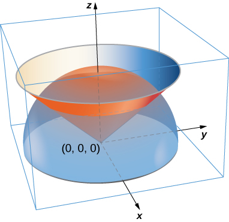 

<math xmlns="http://www.w3.org/1998/Math/MathML"><mrow><mi>m</mi><mo>=</mo><mfrac><mrow><mi>π</mi><msup><mi>a</mi><mn>7</mn></msup></mrow><mrow><mn>192</mn></mrow></mfrac></mrow></math>

A lamina has the shape of a portion of sphere <math xmlns="http://www.w3.org/1998/Math/MathML"><mrow><msup><mi>x</mi><mn>2</mn></msup><mo>+</mo><msup><mi>y</mi><mn>2</mn></msup><mo>+</mo><msup><mi>z</mi><mn>2</mn></msup><mo>=</mo><msup><mi>a</mi><mn>2</mn></msup></mrow></math>

 that lies within cone <math xmlns="http://www.w3.org/1998/Math/MathML"><mrow><mi>z</mi><mo>=</mo><msqrt><mrow><msup><mi>x</mi><mn>2</mn></msup><mo>+</mo><msup><mi>y</mi><mn>2</mn></msup></mrow></msqrt><mo>.</mo></mrow></math>

 Let *S* be the spherical shell centered at the origin with radius *a*, and let *C* be the right circular cone with a vertex at the origin and an axis of symmetry that coincides with the *z*-axis. Suppose the vertex angle of the cone is <math xmlns="http://www.w3.org/1998/Math/MathML"><mrow><msub><mi>ϕ</mi><mn>0</mn></msub><mo>,</mo><mspace width="0.2em" /><mtext>with</mtext><mspace width="0.2em" /><mn>0</mn><mo>≤</mo><msub><mi>ϕ</mi><mn>0</mn></msub><mo>&lt;</mo><mfrac><mi>π</mi><mn>2</mn></mfrac><mo>.</mo></mrow></math>

 Determine the mass of that portion of the shape enclosed in the intersection of *S* and *C*. Assume <math xmlns="http://www.w3.org/1998/Math/MathML"><mrow><mi>δ</mi><mo stretchy="false">(</mo><mi>x</mi><mo>,</mo><mi>y</mi><mo>,</mo><mi>z</mi><mo stretchy="false">)</mo><mo>=</mo><msup><mi>x</mi><mn>2</mn></msup><msup><mi>y</mi><mn>2</mn></msup><mi>z</mi><mo>.</mo></mrow></math>

  

A paper cup has the shape of an inverted right circular cone of height 6 in. and radius of top 3 in. If the cup is full of water weighing <math xmlns="http://www.w3.org/1998/Math/MathML"><mrow><mrow><mrow><mn>62.5</mn><mspace width="0.2em" /><mtext>lb</mtext></mrow><mtext>/</mtext><mrow><msup><mrow><mtext>ft</mtext></mrow><mn>3</mn></msup><mo>,</mo></mrow></mrow></mrow></math>

 find the total force exerted by the water on the inside surface of the cup.

<math xmlns="http://www.w3.org/1998/Math/MathML"><mrow><mi>F</mi><mo>≈</mo><mn>4.57</mn><mspace width="0.2em" /><mtext>lb</mtext><mo>.</mo></mrow></math>

For the following exercises, the heat flow vector field for conducting objects i <math xmlns="http://www.w3.org/1998/Math/MathML"><mrow><mstyle mathvariant="bold" mathsize="normal"><mtext>F</mtext></mstyle><mo>=</mo><mtext>−</mtext><mi>k</mi><mo>∇</mo><mi>T</mi><mo>,</mo><mspace width="0.2em" /><mtext>where</mtext><mspace width="0.2em" /><mi>T</mi><mo stretchy="false">(</mo><mi>x</mi><mo>,</mo><mi>y</mi><mo>,</mo><mi>z</mi><mo stretchy="false">)</mo></mrow></math>

 is the temperature in the object and <math xmlns="http://www.w3.org/1998/Math/MathML"><mrow><mi>k</mi><mo>&gt;</mo><mn>0</mn></mrow></math>

 is a constant that depends on the material. Find the outward flux of **F** across the following surfaces *S* for the given temperature distributions and assume <math xmlns="http://www.w3.org/1998/Math/MathML"><mrow><mi>k</mi><mo>=</mo><mn>1</mn><mo>.</mo></mrow></math>

<math xmlns="http://www.w3.org/1998/Math/MathML"><mrow><mi>T</mi><mo stretchy="false">(</mo><mi>x</mi><mo>,</mo><mi>y</mi><mo>,</mo><mi>z</mi><mo stretchy="false">)</mo><mo>=</mo><mn>100</mn><msup><mi>e</mi><mrow><mtext>−</mtext><mi>x</mi><mo>−</mo><mi>y</mi></mrow></msup><mo>;</mo></mrow></math>

 *S* consists of the faces of cube <math xmlns="http://www.w3.org/1998/Math/MathML"><mrow><mrow><mo>\|</mo><mi>x</mi><mo>\|</mo></mrow><mo>≤</mo><mn>1</mn><mo>,</mo><mrow><mo>\|</mo><mi>y</mi><mo>\|</mo></mrow><mo>≤</mo><mn>1</mn><mo>,</mo><mrow><mo>\|</mo><mi>z</mi><mo>\|</mo></mrow><mo>≤</mo><mn>1</mn><mo>.</mo></mrow></math>

<math xmlns="http://www.w3.org/1998/Math/MathML"><mrow><mi>T</mi><mo stretchy="false">(</mo><mi>x</mi><mo>,</mo><mi>y</mi><mo>,</mo><mi>z</mi><mo stretchy="false">)</mo><mo>=</mo><mtext>−</mtext><mtext>ln</mtext><mrow><mo>(</mo><mrow><msup><mi>x</mi><mn>2</mn></msup><mo>+</mo><msup><mi>y</mi><mn>2</mn></msup><mo>+</mo><msup><mi>z</mi><mn>2</mn></msup></mrow><mo>)</mo></mrow><mo>;</mo></mrow></math>

 *S* is sphere <math xmlns="http://www.w3.org/1998/Math/MathML"><mrow><msup><mi>x</mi><mn>2</mn></msup><mo>+</mo><msup><mi>y</mi><mn>2</mn></msup><mo>+</mo><msup><mi>z</mi><mn>2</mn></msup><mo>=</mo><msup><mi>a</mi><mn>2</mn></msup><mo>.</mo></mrow></math>

<math xmlns="http://www.w3.org/1998/Math/MathML"><mrow><mn>8</mn><mi>π</mi><mi>a</mi></mrow></math>

For the following exercises, consider the radial fields <math xmlns="http://www.w3.org/1998/Math/MathML"><mrow><mstyle mathvariant="bold" mathsize="normal"><mtext>F</mtext></mstyle><mo>=</mo><mfrac><mrow><mrow><mo>〈</mo><mrow><mi>x</mi><mo>,</mo><mi>y</mi><mo>,</mo><mi>z</mi></mrow><mo>〉</mo></mrow></mrow><mrow><msup><mrow><mrow><mo>(</mo><mrow><msup><mi>x</mi><mn>2</mn></msup><mo>+</mo><msup><mi>y</mi><mn>2</mn></msup><mo>+</mo><msup><mi>z</mi><mn>2</mn></msup></mrow><mo>)</mo></mrow></mrow><mrow><mfrac><mi>p</mi><mn>2</mn></mfrac></mrow></msup></mrow></mfrac><mo>=</mo><mfrac><mstyle mathvariant="bold" mathsize="normal"><mtext>r</mtext></mstyle><mrow><msup><mrow><mrow><mo>\|</mo><mstyle mathvariant="bold" mathsize="normal"><mtext>r</mtext></mstyle><mo>\|</mo></mrow></mrow><mi>p</mi></msup></mrow></mfrac><mo>,</mo></mrow></math>

 where *p* is a real number. Let *S* consist of spheres *A* and *B* centered at the origin with radii <math xmlns="http://www.w3.org/1998/Math/MathML"><mrow><mn>0</mn><mo>&lt;</mo><mi>a</mi><mo>&lt;</mo><mi>b</mi><mo>.</mo></mrow></math>

 The total outward flux across *S* consists of the outward flux across the outer sphere *B* less the flux into *S* across inner sphere *A*.

 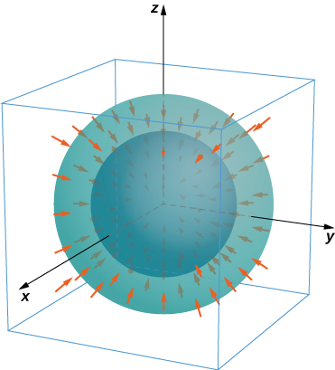 

Find the total flux across *S* with <math xmlns="http://www.w3.org/1998/Math/MathML"><mrow><mi>p</mi><mo>=</mo><mn>0</mn><mo>.</mo></mrow></math>

Show that for <math xmlns="http://www.w3.org/1998/Math/MathML"><mrow><mi>p</mi><mo>=</mo><mn>3</mn></mrow></math>

 the flux across *S* is independent of *a* and *b*.

The net flux is zero.

</section>

### Glossary
{: data-type="glossary-title"}

flux integral
: another name for a surface integral of a vector field; the preferred term in physics and engineering
^

grid curves
: curves on a surface that are parallel to grid lines in a coordinate plane
^

heat flow
: a vector field proportional to the negative temperature gradient in an object
^

mass flux
: the rate of mass flow of a fluid per unit area, measured in mass per unit time per unit area
^

orientation of a surface
: if a surface has an “inner” side and an “outer” side, then an orientation is a choice of the inner or the outer side; the surface could also have “upward” and “downward” orientations
^

parameter domain (parameter space)
: the region of the *uv* plane over which the parameters *u* and *v* vary for parameterization
  <math xmlns="http://www.w3.org/1998/Math/MathML"><mrow><mstyle mathvariant="bold" mathsize="normal"><mtext>r</mtext></mstyle><mrow><mo>(</mo><mrow><mi>u</mi><mo>,</mo><mi>v</mi></mrow><mo>)</mo></mrow><mo>=</mo><mrow><mo>〈</mo><mrow><mi>x</mi><mrow><mo>(</mo><mrow><mi>u</mi><mo>,</mo><mi>v</mi></mrow><mo>)</mo></mrow><mo>,</mo><mi>y</mi><mrow><mo>(</mo><mrow><mi>u</mi><mo>,</mo><mi>v</mi></mrow><mo>)</mo></mrow><mo>,</mo><mi>z</mi><mrow><mo>(</mo><mrow><mi>u</mi><mo>,</mo><mi>v</mi></mrow><mo>)</mo></mrow></mrow><mo>〉</mo></mrow></mrow></math>
^

parameterized surface (parametric surface)
: a surface given by a description of the form
  <math xmlns="http://www.w3.org/1998/Math/MathML"><mrow><mstyle mathvariant="bold" mathsize="normal"><mtext>r</mtext></mstyle><mrow><mo>(</mo><mrow><mi>u</mi><mo>,</mo><mi>v</mi></mrow><mo>)</mo></mrow><mo>=</mo><mrow><mo>〈</mo><mrow><mi>x</mi><mrow><mo>(</mo><mrow><mi>u</mi><mo>,</mo><mi>v</mi></mrow><mo>)</mo></mrow><mo>,</mo><mi>y</mi><mrow><mo>(</mo><mrow><mi>u</mi><mo>,</mo><mi>v</mi></mrow><mo>)</mo></mrow><mo>,</mo><mi>z</mi><mrow><mo>(</mo><mrow><mi>u</mi><mo>,</mo><mi>v</mi></mrow><mo>)</mo></mrow></mrow><mo>〉</mo></mrow><mo>,</mo></mrow></math>
  
  where the parameters *u* and *v* vary over a parameter domain in the *uv*-plane
^

regular parameterization
: parameterization
  <math xmlns="http://www.w3.org/1998/Math/MathML"><mrow><mstyle mathvariant="bold" mathsize="normal"><mtext>r</mtext></mstyle><mo stretchy="false">(</mo><mi>u</mi><mo>,</mo><mi>v</mi><mo stretchy="false">)</mo><mo>=</mo><mrow><mo>〈</mo><mrow><mi>x</mi><mo stretchy="false">(</mo><mi>u</mi><mo>,</mo><mi>v</mi><mo stretchy="false">)</mo><mo>,</mo><mi>y</mi><mo stretchy="false">(</mo><mi>u</mi><mo>,</mo><mi>v</mi><mo stretchy="false">)</mo><mo>,</mo><mi>z</mi><mo stretchy="false">(</mo><mi>u</mi><mo>,</mo><mi>v</mi><mo stretchy="false">)</mo></mrow><mo>〉</mo></mrow></mrow></math>
  
  such that
  <math xmlns="http://www.w3.org/1998/Math/MathML"><mrow><msub><mstyle mathvariant="bold" mathsize="normal"><mtext>r</mtext></mstyle><mi>u</mi></msub><mspace width="0.2em" /><mo>×</mo><mspace width="0.2em" /><msub><mstyle mathvariant="bold" mathsize="normal"><mtext>r</mtext></mstyle><mi>v</mi></msub></mrow></math>
  
  is not zero for point
  <math xmlns="http://www.w3.org/1998/Math/MathML"><mrow><mo stretchy="false">(</mo><mi>u</mi><mo>,</mo><mi>v</mi><mo stretchy="false">)</mo></mrow></math>
  
  in the parameter domain
^

surface area
: the area of surface *S* given by the surface integral
  <math xmlns="http://www.w3.org/1998/Math/MathML"><mrow><mstyle displaystyle="true"><mrow><mo stretchy="false">∫</mo><mrow><mstyle displaystyle="true"><mrow><msub><mo stretchy="false">∫</mo><mi>S</mi></msub><mrow><mi>d</mi><mi>S</mi></mrow></mrow></mstyle></mrow></mrow></mstyle></mrow></math>
^

surface integral
: an integral of a function over a surface
^

surface integral of a scalar-valued function
: a surface integral in which the integrand is a scalar function
^

surface integral of a vector field
: a surface integral in which the integrand is a vector field

