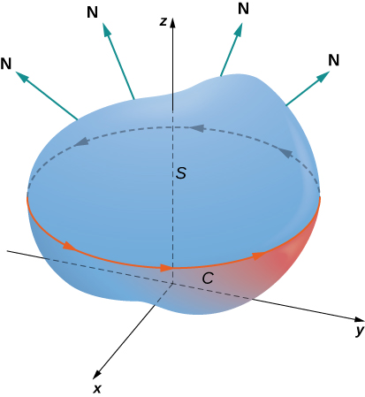
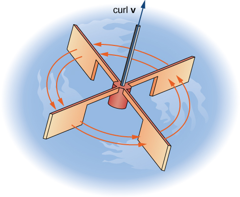
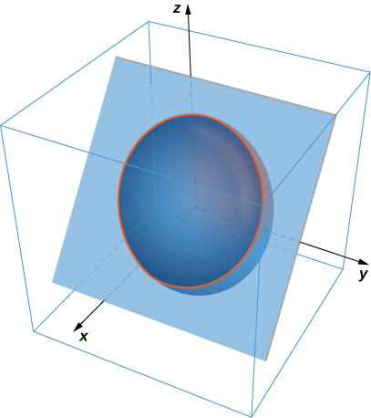
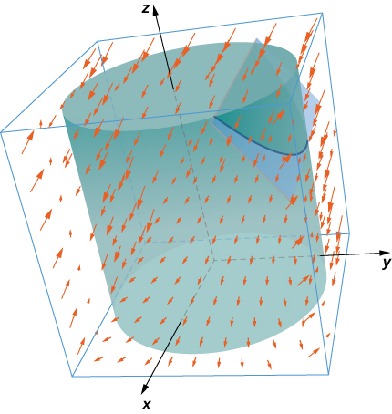
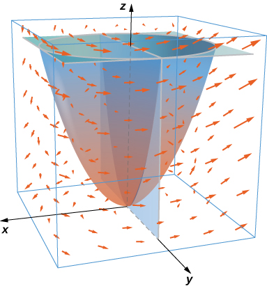

* Explain the meaning of Stokes’ theorem.
* Use Stokes’ theorem to evaluate a line integral.
* Use Stokes’ theorem to calculate a surface integral.
* Use Stokes’ theorem to calculate a curl.

In this section, we study Stokes’ theorem, a higher-dimensional generalization of Green’s theorem. This theorem, like the Fundamental Theorem for Line Integrals and Green’s theorem, is a generalization of the Fundamental Theorem of Calculus to higher dimensions. Stokes’ theorem relates a vector surface integral over surface *S* in space to a line integral around the boundary of *S*. Therefore, just as the theorems before it, Stokes’ theorem can be used to reduce an integral over a geometric object *S* to an integral over the boundary of *S*.

In addition to allowing us to translate between line integrals and surface integrals, Stokes’ theorem connects the concepts of curl and circulation. Furthermore, the theorem has applications in fluid mechanics and electromagnetism. We use Stokes’ theorem to derive Faraday’s law, an important result involving electric fields.

# Stokes’ Theorem

**Stokes’ theorem**{: data-type="term"} says we can calculate the flux of curl **F** across surface *S* by knowing information only about the values of **F** along the boundary of *S*. Conversely, we can calculate the line integral of vector field **F** along the boundary of surface *S* by translating to a double integral of the curl of **F** over *S*.

Let *S* be an oriented smooth surface with unit normal vector **N**. Furthermore, suppose the boundary of *S* is a simple closed curve *C*. The orientation of *S* induces the positive orientation of *C* if, as you walk in the positive direction around *C* with your head pointing in the direction of **N**, the surface is always on your left. With this definition in place, we can state Stokes’ theorem.

Stokes’ Theorem

Let *S* be a piecewise smooth oriented surface with a boundary that is a simple closed curve *C* with positive orientation ([\[link\]](#CNX_Calc_Figure_16_07_001)). If **F** is a vector field with component functions that have continuous partial derivatives on an open region containing *S*, then

<math xmlns="http://www.w3.org/1998/Math/MathML"><mrow><mstyle displaystyle="true"><mrow><msub><mo stretchy="false">∫</mo><mi>C</mi></msub><mrow><mstyle mathvariant="bold" mathsize="normal"><mtext>F</mtext></mstyle><mo>·</mo><mi>d</mi><mstyle mathvariant="bold" mathsize="normal"><mtext>r</mtext></mstyle></mrow></mrow></mstyle><mo>=</mo><mstyle displaystyle="true"><mrow><msub><mo>∬</mo><mi>S</mi></msub><mrow><mtext>curl</mtext><mspace width="0.2em" /><mstyle mathvariant="bold" mathsize="normal"><mtext>F</mtext></mstyle><mo>·</mo><mi>d</mi><mstyle mathvariant="bold" mathsize="normal"><mtext>S</mtext></mstyle></mrow></mrow></mstyle><mo>.</mo></mrow></math>

 {: #CNX_Calc_Figure_16_07_001}

Suppose surface *S* is a flat region in the *xy*-plane with upward orientation. Then the unit normal vector is **k** and surface integral <math xmlns="http://www.w3.org/1998/Math/MathML"><mrow><mstyle displaystyle="true"><mrow><munder><mo stretchy="true">∬</mo><mi>S</mi></munder><mrow><mtext>curl</mtext><mspace width="0.2em" /><mstyle mathvariant="bold" mathsize="normal"><mtext>F</mtext></mstyle></mrow></mrow></mstyle><mo>·</mo><mi>d</mi><mstyle mathvariant="bold" mathsize="normal"><mtext>S</mtext></mstyle></mrow></math>

 is actually the double integral <math xmlns="http://www.w3.org/1998/Math/MathML"><mrow><mstyle displaystyle="true"><mrow><munder><mo stretchy="true">∬</mo><mi>S</mi></munder><mrow><mtext>curl</mtext><mspace width="0.2em" /><mstyle mathvariant="bold" mathsize="normal"><mtext>F</mtext></mstyle></mrow></mrow></mstyle><mo>·</mo><mstyle mathvariant="bold" mathsize="normal"><mtext>k</mtext></mstyle><mi>d</mi><mi>A</mi><mo>.</mo></mrow></math>

 In this special case, Stokes’ theorem gives <math xmlns="http://www.w3.org/1998/Math/MathML"><mrow><mstyle displaystyle="true"><mrow><msub><mo stretchy="false">∫</mo><mi>C</mi></msub><mrow><mstyle mathvariant="bold" mathsize="normal"><mtext>F</mtext></mstyle><mo>·</mo><mi>d</mi><mstyle mathvariant="bold" mathsize="normal"><mtext>r</mtext></mstyle></mrow></mrow></mstyle><mo>=</mo><mstyle displaystyle="true"><mrow><msub><mo>∬</mo><mi>S</mi></msub><mrow><mtext>curl</mtext><mspace width="0.2em" /><mstyle mathvariant="bold" mathsize="normal"><mtext>F</mtext></mstyle><mo>·</mo><mstyle mathvariant="bold" mathsize="normal"><mtext>k</mtext></mstyle><mi>d</mi><mi>A</mi><mo>.</mo></mrow></mrow></mstyle></mrow></math>

 However, this is the flux form of Green’s theorem, which shows us that Green’s theorem is a special case of Stokes’ theorem. Green’s theorem can only handle surfaces in a plane, but Stokes’ theorem can handle surfaces in a plane or in space.

The complete proof of Stokes’ theorem is beyond the scope of this text. We look at an intuitive explanation for the truth of the theorem and then see proof of the theorem in the special case that surface *S* is a portion of a graph of a function, and *S*, the boundary of *S,* and **F** are all fairly tame.

## Proof

First, we look at an informal proof of the theorem. This proof is not rigorous, but it is meant to give a general feeling for why the theorem is true. Let *S* be a surface and let *D* be a small piece of the surface so that *D* does not share any points with the boundary of *S*. We choose *D* to be small enough so that it can be approximated by an oriented square *E*. Let *D* inherit its orientation from *S*, and give *E* the same orientation. This square has four sides; denote them <math xmlns="http://www.w3.org/1998/Math/MathML"><mrow><msub><mi>E</mi><mi>l</mi></msub><mo>,</mo></mrow></math>

 <math xmlns="http://www.w3.org/1998/Math/MathML"><mrow><msub><mi>E</mi><mi>r</mi></msub><mo>,</mo></mrow></math>

 <math xmlns="http://www.w3.org/1998/Math/MathML"><mrow><msub><mi>E</mi><mi>u</mi></msub><mo>,</mo></mrow></math>

 and <math xmlns="http://www.w3.org/1998/Math/MathML"><mrow><msub><mi>E</mi><mi>d</mi></msub></mrow></math>

 for the left, right, up, and down sides, respectively. On the square, we can use the flux form of Green’s theorem:

<math xmlns="http://www.w3.org/1998/Math/MathML"><mrow><mstyle displaystyle="true"><mrow><msub><mo stretchy="false">∫</mo><mrow><msub><mi>E</mi><mi>l</mi></msub><mo>+</mo><msub><mi>E</mi><mi>d</mi></msub><mo>+</mo><msub><mi>E</mi><mi>r</mi></msub><mo>+</mo><msub><mi>E</mi><mi>u</mi></msub></mrow></msub><mrow><mstyle mathvariant="bold" mathsize="normal"><mtext>F</mtext></mstyle><mo>·</mo><mi>d</mi><mstyle mathvariant="bold" mathsize="normal"><mtext>r</mtext></mstyle></mrow></mrow></mstyle><mo>=</mo><mstyle displaystyle="true"><mrow><msub><mo>∬</mo><mi>E</mi></msub><mrow><mtext>curl</mtext><mspace width="0.2em" /><mstyle mathvariant="bold" mathsize="normal"><mtext>F</mtext></mstyle><mo>·</mo><mstyle mathvariant="bold" mathsize="normal"><mtext>N</mtext></mstyle><mi>d</mi><mi>S</mi></mrow></mrow></mstyle><mo>=</mo><mstyle displaystyle="true"><mrow><msub><mo>∬</mo><mi>E</mi></msub><mrow><mtext>curl</mtext><mspace width="0.2em" /><mstyle mathvariant="bold" mathsize="normal"><mtext>F</mtext></mstyle><mo>·</mo><mi>d</mi><mstyle mathvariant="bold" mathsize="normal"><mtext>S</mtext></mstyle></mrow></mrow></mstyle><mo>.</mo></mrow></math>

To approximate the flux over the entire surface, we add the values of the flux on the small squares approximating small pieces of the surface ([\[link\]](#CNX_Calc_Figure_16_07_002)). By Green’s theorem, the flux across each approximating square is a line integral over its boundary. Let *F* be an approximating square with an orientation inherited from *S* and with a right side <math xmlns="http://www.w3.org/1998/Math/MathML"><mrow><msub><mi>E</mi><mi>l</mi></msub></mrow></math>

 (so *F* is to the left of *E*). Let <math xmlns="http://www.w3.org/1998/Math/MathML"><mrow><msub><mi>F</mi><mi>r</mi></msub></mrow></math>

 denote the right side of <math xmlns="http://www.w3.org/1998/Math/MathML"><mrow><mi>F</mi></mrow></math>

; then, <math xmlns="http://www.w3.org/1998/Math/MathML"><mrow><msub><mi>E</mi><mi>l</mi></msub><mo>=</mo><mtext>−</mtext><msub><mi>F</mi><mi>r</mi></msub><mo>.</mo></mrow></math>

 In other words, the right side of <math xmlns="http://www.w3.org/1998/Math/MathML"><mrow><mi>F</mi></mrow></math>

 is the same curve as the left side of *E*, just oriented in the opposite direction. Therefore,

<math xmlns="http://www.w3.org/1998/Math/MathML"><mrow><mstyle displaystyle="true"><mrow><msub><mo stretchy="false">∫</mo><mrow><msub><mi>E</mi><mi>l</mi></msub></mrow></msub><mrow><mstyle mathvariant="bold" mathsize="normal"><mtext>F</mtext></mstyle><mo>·</mo><mi>d</mi><mstyle mathvariant="bold" mathsize="normal"><mtext>r</mtext></mstyle></mrow></mrow></mstyle><mo>=</mo><mtext>−</mtext><mstyle displaystyle="true"><mrow><msub><mo stretchy="false">∫</mo><mrow><msub><mi>F</mi><mi>r</mi></msub></mrow></msub><mrow><mstyle mathvariant="bold" mathsize="normal"><mtext>F</mtext></mstyle><mo>·</mo><mi>d</mi><mstyle mathvariant="bold" mathsize="normal"><mtext>r</mtext></mstyle></mrow></mrow></mstyle><mo>.</mo></mrow></math>

As we add up all the fluxes over all the squares approximating surface *S*, line integrals <math xmlns="http://www.w3.org/1998/Math/MathML"><mrow><mstyle displaystyle="true"><mrow><msub><mo stretchy="false">∫</mo><mrow><msub><mi>E</mi><mi>l</mi></msub></mrow></msub><mrow><mstyle mathvariant="bold" mathsize="normal"><mtext>F</mtext></mstyle><mo>·</mo><mi>d</mi><mstyle mathvariant="bold" mathsize="normal"><mtext>r</mtext></mstyle></mrow></mrow></mstyle></mrow></math>

 and <math xmlns="http://www.w3.org/1998/Math/MathML"><mrow><mstyle displaystyle="true"><mrow><msub><mo stretchy="false">∫</mo><mrow><msub><mi>F</mi><mi>r</mi></msub></mrow></msub><mrow><mstyle mathvariant="bold" mathsize="normal"><mtext>F</mtext></mstyle><mo>·</mo><mi>d</mi><mstyle mathvariant="bold" mathsize="normal"><mtext>r</mtext></mstyle></mrow></mrow></mstyle></mrow></math>

 cancel each other out. The same goes for the line integrals over the other three sides of *E*. These three line integrals cancel out with the line integral of the lower side of the square above *E*, the line integral over the left side of the square to the right of *E*, and the line integral over the upper side of the square below *E* ([\[link\]](#CNX_Calc_Figure_16_07_003)). After all this cancelation occurs over all the approximating squares, the only line integrals that survive are the line integrals over sides approximating the boundary of *S*. Therefore, the sum of all the fluxes (which, by Green’s theorem, is the sum of all the line integrals around the boundaries of approximating squares) can be approximated by a line integral over the boundary of *S*. In the limit, as the areas of the approximating squares go to zero, this approximation gets arbitrarily close to the flux.

 {: #CNX_Calc_Figure_16_07_002}

![Two diagrams labeled A and B. A contains two squares, F and E. Both have arrows along the sides in a counterclockwise manner. The right side of F is labeled F\_r. The left, right, upper, and lower sides of E are labeled E\_l, E\_r, E\_u, and E\_d, respectively. B contains five squares. F and E are drawn as they are in diagram A. Above, to the right, and below E there are three other squares: G, H, and I, respectively. All have arrows along their sides in a counterclockwise manner. The bottom side of G is labeled G\_d, the left side of H is labeled H\_l, and the upper side of I is labeled I\_u.](../resources/CNX_Calc_Figure_16_07_003.jpg "(a) The line integral along El cancels out the line integral along Fr because El=&#x2212;Fr. (b) The line integral along any of the sides of E cancels out with the line integral along a side of an adjacent approximating square."){: #CNX_Calc_Figure_16_07_003}

Let’s now look at a rigorous proof of the theorem in the special case that *S* is the graph of function <math xmlns="http://www.w3.org/1998/Math/MathML"><mrow><mi>z</mi><mo>=</mo><mi>f</mi><mrow><mo>(</mo><mrow><mi>x</mi><mo>,</mo><mi>y</mi></mrow><mo>)</mo></mrow><mo>,</mo></mrow></math>

 where *x* and *y* vary over a bounded, simply connected region *D* of finite area ([\[link\]](#CNX_Calc_Figure_16_07_004)). Furthermore, assume that <math xmlns="http://www.w3.org/1998/Math/MathML"><mrow><mi>f</mi></mrow></math>

 has continuous second-order partial derivatives. Let *C* denote the boundary of *S* and let *C*′ denote the boundary of *D*. Then, *D* is the “shadow” of *S* in the plane and *C*′ is the “shadow” of *C*. Suppose that *S* is oriented upward. The counterclockwise orientation of *C* is positive, as is the counterclockwise orientation of <math xmlns="http://www.w3.org/1998/Math/MathML"><mrow><msup><mi>C</mi><mo>′</mo></msup><mo>.</mo></mrow></math>

 Let <math xmlns="http://www.w3.org/1998/Math/MathML"><mrow><mstyle mathvariant="bold" mathsize="normal"><mtext>F</mtext></mstyle><mrow><mo>(</mo><mrow><mi>x</mi><mo>,</mo><mi>y</mi><mo>,</mo><mi>z</mi></mrow><mo>)</mo></mrow><mo>=</mo><mrow><mo>〈</mo><mrow><mi>P</mi><mo>,</mo><mi>Q</mi><mo>,</mo><mi>R</mi></mrow><mo>〉</mo></mrow></mrow></math>

 be a vector field with component functions that have continuous partial derivatives.

 {: #CNX_Calc_Figure_16_07_004}

We take the standard parameterization of <math xmlns="http://www.w3.org/1998/Math/MathML"><mrow><mi>S</mi><mo>:</mo><mi>x</mi><mo>=</mo><mi>x</mi><mo>,</mo><mi>y</mi><mo>=</mo><mi>y</mi><mo>,</mo><mi>z</mi><mo>=</mo><mi>g</mi><mrow><mo>(</mo><mrow><mi>x</mi><mo>,</mo><mi>y</mi></mrow><mo>)</mo></mrow><mo>.</mo></mrow></math>

 The tangent vectors are <math xmlns="http://www.w3.org/1998/Math/MathML"><mrow><msub><mstyle mathvariant="bold" mathsize="normal"><mtext>t</mtext></mstyle><mi>x</mi></msub><mo>=</mo><mrow><mo>〈</mo><mrow><mn>1</mn><mo>,</mo><mn>0</mn><mo>,</mo><msub><mi>g</mi><mi>x</mi></msub></mrow><mo>〉</mo></mrow></mrow></math>

 and <math xmlns="http://www.w3.org/1998/Math/MathML"><mrow><msub><mstyle mathvariant="bold" mathsize="normal"><mtext>t</mtext></mstyle><mi>y</mi></msub><mo>=</mo><mrow><mo>〈</mo><mrow><mn>0</mn><mo>,</mo><mn>1</mn><mo>,</mo><msub><mi>g</mi><mi>y</mi></msub></mrow><mo>〉</mo></mrow><mo>,</mo></mrow></math>

 and therefore, <math xmlns="http://www.w3.org/1998/Math/MathML"><mrow><msub><mstyle mathvariant="bold" mathsize="normal"><mtext>t</mtext></mstyle><mi>x</mi></msub><mo>·</mo><msub><mstyle mathvariant="bold" mathsize="normal"><mtext>t</mtext></mstyle><mi>y</mi></msub><mo>=</mo><mrow><mo>〈</mo><mrow><mtext>−</mtext><msub><mi>g</mi><mi>x</mi></msub><mo>,</mo><mtext>−</mtext><msub><mi>g</mi><mi>y</mi></msub><mo>,</mo><mn>1</mn></mrow><mo>〉</mo></mrow><mo>.</mo></mrow></math>

 By [\[link\]](/m54004#fs-id1167793757749),

<math xmlns="http://www.w3.org/1998/Math/MathML"><mrow><mstyle displaystyle="true"><mrow><munder><mo stretchy="true">∬</mo><mi>S</mi></munder><mrow><mtext>curl</mtext><mspace width="0.2em" /><mstyle mathvariant="bold" mathsize="normal"><mtext>F</mtext></mstyle><mo>·</mo><mi>d</mi><mstyle mathvariant="bold" mathsize="normal"><mtext>S</mtext></mstyle><mo>=</mo></mrow></mrow></mstyle><mstyle displaystyle="true"><mrow><munder><mo stretchy="true">∬</mo><mi>D</mi></munder><mrow><mrow><mo>[</mo><mrow><mtext>−</mtext><mrow><mo>(</mo><mrow><msub><mi>R</mi><mi>y</mi></msub><mo>−</mo><msub><mi>Q</mi><mi>z</mi></msub></mrow><mo>)</mo></mrow><msub><mi>z</mi><mi>x</mi></msub><mo>−</mo><mrow><mo>(</mo><mrow><msub><mi>P</mi><mi>z</mi></msub><mo>−</mo><msub><mi>R</mi><mi>x</mi></msub></mrow><mo>)</mo></mrow><msub><mi>z</mi><mi>y</mi></msub><mo>+</mo><mrow><mo>(</mo><mrow><msub><mi>Q</mi><mi>x</mi></msub><mo>−</mo><msub><mi>P</mi><mi>y</mi></msub></mrow><mo>)</mo></mrow></mrow><mo>]</mo></mrow></mrow></mrow></mstyle><mi>d</mi><mi>A</mi><mo>,</mo></mrow></math>

where the partial derivatives are all evaluated at <math xmlns="http://www.w3.org/1998/Math/MathML"><mrow><mrow><mo>(</mo><mrow><mi>x</mi><mo>,</mo><mi>y</mi><mo>,</mo><mi>g</mi><mrow><mo>(</mo><mrow><mi>x</mi><mo>,</mo><mi>y</mi></mrow><mo>)</mo></mrow></mrow><mo>)</mo></mrow><mo>,</mo></mrow></math>

 making the integrand depend on *x* and *y* only. Suppose <math xmlns="http://www.w3.org/1998/Math/MathML"><mrow><mrow><mo>〈</mo><mrow><mi>x</mi><mrow><mo>(</mo><mi>t</mi><mo>)</mo></mrow><mo>,</mo><mi>y</mi><mrow><mo>(</mo><mi>t</mi><mo>)</mo></mrow></mrow><mo>〉</mo></mrow><mo>,</mo><mi>a</mi><mo>≤</mo><mi>t</mi><mo>≤</mo><mi>b</mi></mrow></math>

 is a parameterization of <math xmlns="http://www.w3.org/1998/Math/MathML"><mrow><msup><mi>C</mi><mo>′</mo></msup><mo>.</mo></mrow></math>

 Then, a parameterization of *C* is <math xmlns="http://www.w3.org/1998/Math/MathML"><mrow><mrow><mo>〈</mo><mrow><mi>x</mi><mrow><mo>(</mo><mi>t</mi><mo>)</mo></mrow><mo>,</mo><mi>y</mi><mrow><mo>(</mo><mi>t</mi><mo>)</mo></mrow><mo>,</mo><mi>g</mi><mrow><mo>(</mo><mrow><mi>x</mi><mrow><mo>(</mo><mi>t</mi><mo>)</mo></mrow><mo>,</mo><mi>y</mi><mrow><mo>(</mo><mi>t</mi><mo>)</mo></mrow></mrow><mo>)</mo></mrow></mrow><mo>〉</mo></mrow><mo>,</mo><mi>a</mi><mo>≤</mo><mi>t</mi><mo>≤</mo><mi>b</mi><mo>.</mo></mrow></math>

 Armed with these parameterizations, the Chain rule, and Green’s theorem, and keeping in mind that *P*, *Q*, and *R* are all functions of *x* and *y*, we can evaluate line integral <math xmlns="http://www.w3.org/1998/Math/MathML"><mrow><mstyle displaystyle="true"><mrow><msub><mo stretchy="false">∫</mo><mi>C</mi></msub><mrow><mstyle mathvariant="bold" mathsize="normal"><mtext>F</mtext></mstyle><mo>·</mo><mi>d</mi><mstyle mathvariant="bold" mathsize="normal"><mtext>r</mtext></mstyle></mrow></mrow></mstyle><mtext>:</mtext></mrow></math>

<math xmlns="http://www.w3.org/1998/Math/MathML"><mtable><mtr><mtd columnalign="right"><mstyle displaystyle="true"><mrow><msub><mo stretchy="false">∫</mo><mi>C</mi></msub><mrow><mstyle mathvariant="bold" mathsize="normal"><mtext>F</mtext></mstyle><mo>·</mo><mi>d</mi><mstyle mathvariant="bold" mathsize="normal"><mtext>r</mtext></mstyle></mrow></mrow></mstyle></mtd><mtd columnalign="left"><mo>=</mo><mstyle displaystyle="true"><mrow><msubsup><mo stretchy="false">∫</mo><mi>a</mi><mi>b</mi></msubsup><mrow><mrow><mo>(</mo><mrow><mi>P</mi><msup><mi>x</mi><mo>′</mo></msup><mrow><mo>(</mo><mi>t</mi><mo>)</mo></mrow><mo>+</mo><mi>Q</mi><msup><mi>y</mi><mo>′</mo></msup><mrow><mo>(</mo><mi>t</mi><mo>)</mo></mrow><mo>+</mo><mi>R</mi><msup><mi>z</mi><mo>′</mo></msup><mrow><mo>(</mo><mi>t</mi><mo>)</mo></mrow></mrow><mo>)</mo></mrow></mrow></mrow></mstyle><mi>d</mi><mi>t</mi></mtd></mtr><mtr><mtd /><mtd columnalign="left"><mo>=</mo><mstyle displaystyle="true"><mrow><msubsup><mo stretchy="false">∫</mo><mi>a</mi><mi>b</mi></msubsup><mrow><mrow><mo>[</mo><mrow><mi>P</mi><msup><mi>x</mi><mo>′</mo></msup><mrow><mo>(</mo><mi>t</mi><mo>)</mo></mrow><mo>+</mo><mi>Q</mi><msup><mi>y</mi><mo>′</mo></msup><mrow><mo>(</mo><mi>t</mi><mo>)</mo></mrow><mo>+</mo><mi>R</mi><mrow><mo>(</mo><mrow><mfrac><mrow><mo>∂</mo><mi>z</mi></mrow><mrow><mo>∂</mo><mi>x</mi></mrow></mfrac><mspace width="0.2em" /><mfrac><mrow><mi>d</mi><mi>x</mi></mrow><mrow><mi>d</mi><mi>t</mi></mrow></mfrac><mo>+</mo><mfrac><mrow><mo>∂</mo><mi>z</mi></mrow><mrow><mo>∂</mo><mi>y</mi></mrow></mfrac><mspace width="0.2em" /><mfrac><mrow><mi>d</mi><mi>y</mi></mrow><mrow><mi>d</mi><mi>t</mi></mrow></mfrac></mrow><mo>)</mo></mrow></mrow><mo>]</mo></mrow></mrow></mrow></mstyle><mi>d</mi><mi>t</mi></mtd></mtr><mtr><mtd /><mtd columnalign="left"><mo>=</mo><mstyle displaystyle="true"><mrow><msubsup><mo stretchy="false">∫</mo><mi>a</mi><mi>b</mi></msubsup><mrow><mrow><mo>[</mo><mrow><mrow><mo>(</mo><mrow><mi>P</mi><mo>+</mo><mi>R</mi><mfrac><mrow><mo>∂</mo><mi>z</mi></mrow><mrow><mo>∂</mo><mi>x</mi></mrow></mfrac></mrow><mo>)</mo></mrow><msup><mi>x</mi><mo>′</mo></msup><mrow><mo>(</mo><mi>t</mi><mo>)</mo></mrow><mo>+</mo><mrow><mo>(</mo><mrow><mi>Q</mi><mo>+</mo><mi>R</mi><mfrac><mrow><mo>∂</mo><mi>z</mi></mrow><mrow><mo>∂</mo><mi>y</mi></mrow></mfrac></mrow><mo>)</mo></mrow><msup><mi>y</mi><mo>′</mo></msup><mrow><mo>(</mo><mi>t</mi><mo>)</mo></mrow></mrow><mo>]</mo></mrow></mrow></mrow></mstyle><mi>d</mi><mi>t</mi></mtd></mtr><mtr><mtd /><mtd columnalign="left"><mo>=</mo><mstyle displaystyle="true"><mrow><munder><mo stretchy="false">∫</mo><msup><mi>C</mi><mo>′</mo></msup></munder><mrow><mrow><mo>(</mo><mrow><mi>P</mi><mo>+</mo><mi>R</mi><mfrac><mrow><mo>∂</mo><mi>z</mi></mrow><mrow><mo>∂</mo><mi>x</mi></mrow></mfrac></mrow><mo>)</mo></mrow><mi>d</mi><mi>x</mi><mo>+</mo><mrow><mo>(</mo><mrow><mi>Q</mi><mo>+</mo><mi>R</mi><mfrac><mrow><mo>∂</mo><mi>z</mi></mrow><mrow><mo>∂</mo><mi>y</mi></mrow></mfrac></mrow><mo>)</mo></mrow><mi>d</mi><mi>y</mi></mrow></mrow></mstyle></mtd></mtr><mtr><mtd /><mtd columnalign="left"><mo>=</mo><mstyle displaystyle="true"><mrow><munder><mo stretchy="true">∬</mo><mi>D</mi></munder><mrow><mrow><mo>[</mo><mrow><mfrac><mo>∂</mo><mrow><mo>∂</mo><mi>x</mi></mrow></mfrac><mrow><mo>(</mo><mrow><mi>Q</mi><mo>+</mo><mi>R</mi><mfrac><mrow><mo>∂</mo><mi>z</mi></mrow><mrow><mo>∂</mo><mi>y</mi></mrow></mfrac></mrow><mo>)</mo></mrow><mo>−</mo><mfrac><mo>∂</mo><mrow><mo>∂</mo><mi>y</mi></mrow></mfrac><mrow><mo>(</mo><mrow><mi>P</mi><mo>+</mo><mi>R</mi><mfrac><mrow><mo>∂</mo><mi>z</mi></mrow><mrow><mo>∂</mo><mi>x</mi></mrow></mfrac></mrow><mo>)</mo></mrow></mrow><mo>]</mo></mrow></mrow></mrow></mstyle><mi>d</mi><mi>A</mi></mtd></mtr><mtr><mtd /><mtd columnalign="left"><mo>=</mo><mtable><mtr><mtd columnalign="left"><mstyle displaystyle="true"><mrow><munder><mo stretchy="true">∬</mo><mi>D</mi></munder><mtable><mtr><mtd columnalign="left"><mrow><mo>(</mo><mrow><mfrac><mrow><mo>∂</mo><mi>Q</mi></mrow><mrow><mo>∂</mo><mi>x</mi></mrow></mfrac><mo>+</mo><mfrac><mrow><mo>∂</mo><mi>Q</mi></mrow><mrow><mo>∂</mo><mi>z</mi></mrow></mfrac><mspace width="0.2em" /><mfrac><mrow><mo>∂</mo><mi>z</mi></mrow><mrow><mo>∂</mo><mi>x</mi></mrow></mfrac><mo>+</mo><mfrac><mrow><mo>∂</mo><mi>R</mi></mrow><mrow><mo>∂</mo><mi>x</mi></mrow></mfrac><mspace width="0.2em" /><mfrac><mrow><mo>∂</mo><mi>z</mi></mrow><mrow><mo>∂</mo><mi>y</mi></mrow></mfrac><mo>+</mo><mfrac><mrow><mo>∂</mo><mi>R</mi></mrow><mrow><mo>∂</mo><mi>z</mi></mrow></mfrac><mspace width="0.2em" /><mfrac><mrow><mo>∂</mo><mi>z</mi></mrow><mrow><mo>∂</mo><mi>x</mi></mrow></mfrac><mspace width="0.2em" /><mfrac><mrow><mo>∂</mo><mi>z</mi></mrow><mrow><mo>∂</mo><mi>y</mi></mrow></mfrac><mo>+</mo><mi>R</mi><mfrac><mrow><msup><mo>∂</mo><mn>2</mn></msup><mi>z</mi></mrow><mrow><mo>∂</mo><mi>x</mi><mo>∂</mo><mi>y</mi></mrow></mfrac></mrow><mo>)</mo></mrow></mtd></mtr><mtr><mtd columnalign="left"><mtext>−</mtext><mrow><mo>(</mo><mrow><mfrac><mrow><mo>∂</mo><mi>P</mi></mrow><mrow><mo>∂</mo><mi>y</mi></mrow></mfrac><mo>+</mo><mfrac><mrow><mo>∂</mo><mi>P</mi></mrow><mrow><mo>∂</mo><mi>z</mi></mrow></mfrac><mspace width="0.2em" /><mfrac><mrow><mo>∂</mo><mi>z</mi></mrow><mrow><mo>∂</mo><mi>y</mi></mrow></mfrac><mo>+</mo><mfrac><mrow><mo>∂</mo><mi>R</mi></mrow><mrow><mo>∂</mo><mi>z</mi></mrow></mfrac><mspace width="0.2em" /><mfrac><mrow><mo>∂</mo><mi>z</mi></mrow><mrow><mo>∂</mo><mi>y</mi></mrow></mfrac><mspace width="0.2em" /><mfrac><mrow><mo>∂</mo><mi>z</mi></mrow><mrow><mo>∂</mo><mi>x</mi></mrow></mfrac><mo>+</mo><mi>R</mi><mfrac><mrow><msup><mo>∂</mo><mn>2</mn></msup><mi>z</mi></mrow><mrow><mo>∂</mo><mi>y</mi><mo>∂</mo><mi>x</mi></mrow></mfrac></mrow><mo>)</mo></mrow></mtd></mtr></mtable></mrow></mstyle></mtd></mtr></mtable><mi>d</mi><mi>A</mi><mo>.</mo></mtd></mtr></mtable></math>

By Clairaut’s theorem, <math xmlns="http://www.w3.org/1998/Math/MathML"><mrow><mfrac><mrow><msup><mo>∂</mo><mn>2</mn></msup><mi>z</mi></mrow><mrow><mo>∂</mo><mi>x</mi><mo>∂</mo><mi>y</mi></mrow></mfrac><mo>=</mo><mfrac><mrow><msup><mo>∂</mo><mn>2</mn></msup><mi>z</mi></mrow><mrow><mo>∂</mo><mi>y</mi><mo>∂</mo><mi>x</mi></mrow></mfrac><mo>.</mo></mrow></math>

 Therefore, four of the terms disappear from this double integral, and we are left with

<math xmlns="http://www.w3.org/1998/Math/MathML"><mrow><mstyle displaystyle="true"><mrow><munder><mo stretchy="true">∬</mo><mi>D</mi></munder><mrow><mrow><mo>[</mo><mrow><mtext>−</mtext><mrow><mo>(</mo><mrow><msub><mi>R</mi><mi>y</mi></msub><mo>−</mo><msub><mi>Q</mi><mi>z</mi></msub></mrow><mo>)</mo></mrow><msub><mi>z</mi><mi>x</mi></msub><mo>−</mo><mrow><mo>(</mo><mrow><msub><mi>P</mi><mi>z</mi></msub><mo>−</mo><msub><mi>R</mi><mi>x</mi></msub></mrow><mo>)</mo></mrow><msub><mi>z</mi><mi>y</mi></msub><mo>+</mo><mrow><mo>(</mo><mrow><msub><mi>Q</mi><mi>x</mi></msub><mo>−</mo><msub><mi>P</mi><mi>y</mi></msub></mrow><mo>)</mo></mrow></mrow><mo>]</mo></mrow></mrow></mrow></mstyle><mi>d</mi><mi>A</mi><mo>,</mo></mrow></math>

which equals <math xmlns="http://www.w3.org/1998/Math/MathML"><mrow><mstyle displaystyle="true"><mrow><munder><mo stretchy="true">∬</mo><mi>S</mi></munder><mrow><mtext>curl</mtext><mspace width="0.2em" /><mstyle mathvariant="bold" mathsize="normal"><mtext>F</mtext></mstyle><mo>·</mo><mi>d</mi><mstyle mathvariant="bold" mathsize="normal"><mtext>S</mtext></mstyle><mo>.</mo></mrow></mrow></mstyle></mrow></math>

□

We have shown that Stokes’ theorem is true in the case of a function with a domain that is a simply connected region of finite area. We can quickly confirm this theorem for another important case: when vector field **F** is conservative. If **F** is conservative, the curl of **F** is zero, so <math xmlns="http://www.w3.org/1998/Math/MathML"><mrow><mstyle displaystyle="true"><mrow><munder><mo stretchy="true">∬</mo><mi>S</mi></munder><mrow><mtext>curl</mtext><mspace width="0.2em" /><mstyle mathvariant="bold" mathsize="normal"><mtext>F</mtext></mstyle><mo>·</mo><mi>d</mi><mstyle mathvariant="bold" mathsize="normal"><mtext>S</mtext></mstyle><mo>=</mo><mn>0.</mn></mrow></mrow></mstyle></mrow></math>

 Since the boundary of *S* is a closed curve, <math xmlns="http://www.w3.org/1998/Math/MathML"><mrow><mstyle displaystyle="true"><mrow><msub><mo stretchy="false">∫</mo><mi>C</mi></msub><mrow><mstyle mathvariant="bold" mathsize="normal"><mtext>F</mtext></mstyle><mo>·</mo><mi>d</mi><mstyle mathvariant="bold" mathsize="normal"><mtext>r</mtext></mstyle></mrow></mrow></mstyle></mrow></math>

 is also zero.

Verifying Stokes’ Theorem for a Specific Case

Verify that Stokes’ theorem is true for vector field <math xmlns="http://www.w3.org/1998/Math/MathML"><mrow><mstyle mathvariant="bold" mathsize="normal"><mtext>F</mtext></mstyle><mrow><mo>(</mo><mrow><mi>x</mi><mo>,</mo><mi>y</mi></mrow><mo>)</mo></mrow><mo>=</mo><mrow><mo>〈</mo><mrow><mtext>−</mtext><mi>z</mi><mo>,</mo><mi>x</mi><mo>,</mo><mn>0</mn></mrow><mo>〉</mo></mrow></mrow></math>

 and surface *S*, where *S* is the hemisphere, oriented outward, with parameterization

<math xmlns="http://www.w3.org/1998/Math/MathML"><mrow><mstyle mathvariant="bold" mathsize="normal"><mtext>r</mtext></mstyle><mo stretchy="false">(</mo><mi>ϕ</mi><mo>,</mo><mi>θ</mi><mo stretchy="false">)</mo><mo>=</mo><mrow><mo>〈</mo><mrow><mtext>sin</mtext><mspace width="0.2em" /><mi>ϕ</mi><mspace width="0.2em" /><mtext>cos</mtext><mspace width="0.2em" /><mi>θ</mi><mo>,</mo><mtext>sin</mtext><mspace width="0.2em" /><mi>ϕ</mi><mspace width="0.2em" /><mtext>sin</mtext><mspace width="0.2em" /><mi>θ</mi><mo>,</mo><mtext>cos</mtext><mspace width="0.2em" /><mi>ϕ</mi></mrow><mo>〉</mo></mrow><mo>,</mo><mn>0</mn><mo>≤</mo><mi>θ</mi><mo>≤</mo><mi>π</mi><mo>,</mo><mn>0</mn><mo>≤</mo><mi>ϕ</mi><mo>≤</mo><mi>π</mi></mrow></math>

 as shown in the following figure.

{: #CNX_Calc_Figure_16_07_005}

Let *C* be the boundary of *S.* Note that *C* is a circle of radius 1, centered at the origin, sitting in plane <math xmlns="http://www.w3.org/1998/Math/MathML"><mrow><mi>y</mi><mo>=</mo><mn>0</mn><mo>.</mo></mrow></math>

 This circle has parameterization <math xmlns="http://www.w3.org/1998/Math/MathML"><mrow><mrow><mo>〈</mo><mrow><mtext>cos</mtext><mspace width="0.2em" /><mi>t</mi><mo>,</mo><mn>0</mn><mo>,</mo><mtext>sin</mtext><mspace width="0.2em" /><mi>t</mi></mrow><mo>〉</mo></mrow><mo>,</mo><mn>0</mn><mo>≤</mo><mi>t</mi><mo>≤</mo><mn>2</mn><mi>π</mi><mo>.</mo></mrow></math>

 By [[link]](/m54012#fs-id1167793635294),

<math xmlns="http://www.w3.org/1998/Math/MathML"><mtable><mtr><mtd columnalign="right"><mstyle displaystyle="true"><mrow><msub><mo stretchy="false">∫</mo><mi>C</mi></msub><mrow><mstyle mathvariant="bold" mathsize="normal"><mtext>F</mtext></mstyle><mo>·</mo><mi>d</mi><mstyle mathvariant="bold" mathsize="normal"><mtext>r</mtext></mstyle></mrow></mrow></mstyle></mtd><mtd columnalign="left"><mo>=</mo><mstyle displaystyle="true"><mrow><msubsup><mo stretchy="false">∫</mo><mn>0</mn><mrow><mn>2</mn><mi>π</mi></mrow></msubsup><mrow><mrow><mo>〈</mo><mrow><mtext>−</mtext><mtext>sin</mtext><mspace width="0.2em" /><mi>t</mi><mo>,</mo><mtext>cos</mtext><mspace width="0.2em" /><mi>t</mi><mo>,</mo><mn>0</mn></mrow><mo>〉</mo></mrow><mo>·</mo><mrow><mo>〈</mo><mrow><mtext>−</mtext><mtext>sin</mtext><mspace width="0.2em" /><mi>t</mi><mo>,</mo><mn>0</mn><mo>,</mo><mtext>cos</mtext><mspace width="0.2em" /><mi>t</mi></mrow><mo>〉</mo></mrow></mrow></mrow></mstyle><mi>d</mi><mi>t</mi></mtd></mtr><mtr><mtd /><mtd columnalign="left"><mo>=</mo><mstyle displaystyle="true"><mrow><msubsup><mo stretchy="false">∫</mo><mn>0</mn><mrow><mn>2</mn><mi>π</mi></mrow></msubsup><mrow><msup><mrow><mtext>sin</mtext></mrow><mn>2</mn></msup><mi>t</mi></mrow></mrow></mstyle><mi>d</mi><mi>t</mi><mo>=</mo><mi>π</mi><mo>.</mo></mtd></mtr></mtable></math>

By [[link]](/m54004#fs-id1167793757749),

<math xmlns="http://www.w3.org/1998/Math/MathML"><mtable><mtr><mtd columnalign="right"><mstyle displaystyle="true"><mrow><msub><mo>∬</mo><mi>S</mi></msub><mrow><mtext>curl</mtext><mspace width="0.2em" /><mstyle mathvariant="bold" mathsize="normal"><mtext>F</mtext></mstyle><mo>·</mo><mi>d</mi><mstyle mathvariant="bold" mathsize="normal"><mtext>S</mtext></mstyle></mrow></mrow></mstyle></mtd><mtd columnalign="left"><mo>=</mo><mstyle displaystyle="true"><mrow><msub><mo>∬</mo><mi>D</mi></msub><mrow><mtext>curl</mtext><mspace width="0.2em" /><mstyle mathvariant="bold" mathsize="normal"><mtext>F</mtext></mstyle><mrow><mo>(</mo><mrow><mstyle mathvariant="bold" mathsize="normal"><mtext>r</mtext></mstyle><mrow><mo>(</mo><mrow><mi>ϕ</mi><mo>,</mo><mi>θ</mi></mrow><mo>)</mo></mrow></mrow><mo>)</mo></mrow></mrow></mrow></mstyle><mo>·</mo><mrow><mo>(</mo><mrow><msub><mstyle mathvariant="bold" mathsize="normal"><mtext>t</mtext></mstyle><mi>ϕ</mi></msub><mspace width="0.2em" /><mo>×</mo><mspace width="0.2em" /><msub><mstyle mathvariant="bold" mathsize="normal"><mtext>t</mtext></mstyle><mi>θ</mi></msub></mrow><mo>)</mo></mrow><mi>d</mi><mi>A</mi></mtd></mtr><mtr><mtd /><mtd columnalign="left"><mo>=</mo><mstyle displaystyle="true"><mrow><msub><mo>∬</mo><mi>D</mi></msub><mrow><mrow><mo>〈</mo><mrow><mn>0</mn><mo>,</mo><mn>−1</mn><mo>,</mo><mn>1</mn></mrow><mo>〉</mo></mrow><mo>·</mo><mrow><mo>〈</mo><mrow><mtext>cos</mtext><mspace width="0.2em" /><mi>θ</mi><mspace width="0.2em" /><msup><mrow><mtext>sin</mtext></mrow><mn>2</mn></msup><mi>ϕ</mi><mo>,</mo><mtext>sin</mtext><mspace width="0.2em" /><mi>θ</mi><mspace width="0.2em" /><msup><mrow><mtext>sin</mtext></mrow><mn>2</mn></msup><mi>ϕ</mi><mo>,</mo><mtext>sin</mtext><mspace width="0.2em" /><mi>ϕ</mi><mspace width="0.2em" /><mtext>cos</mtext><mspace width="0.2em" /><mi>ϕ</mi></mrow><mo>〉</mo></mrow><mi>d</mi><mi>A</mi></mrow></mrow></mstyle></mtd></mtr><mtr><mtd /><mtd columnalign="left"><mo>=</mo><mstyle displaystyle="true"><mrow><msubsup><mo stretchy="false">∫</mo><mn>0</mn><mi>π</mi></msubsup><mrow><mstyle displaystyle="true"><mrow><msubsup><mo stretchy="false">∫</mo><mn>0</mn><mi>π</mi></msubsup><mrow><mrow><mo>(</mo><mrow><mtext>sin</mtext><mspace width="0.2em" /><mi>ϕ</mi><mspace width="0.2em" /><mtext>cos</mtext><mspace width="0.2em" /><mi>ϕ</mi><mo>−</mo><mtext>sin</mtext><mspace width="0.2em" /><mi>θ</mi><mspace width="0.2em" /><msup><mrow><mtext>sin</mtext></mrow><mn>2</mn></msup><mi>ϕ</mi></mrow><mo>)</mo></mrow></mrow></mrow></mstyle></mrow></mrow></mstyle><mi>d</mi><mi>ϕ</mi><mi>d</mi><mi>θ</mi></mtd></mtr><mtr><mtd /><mtd columnalign="left"><mo>=</mo><mfrac><mi>π</mi><mn>2</mn></mfrac><mstyle displaystyle="true"><mrow><msubsup><mo stretchy="false">∫</mo><mn>0</mn><mi>π</mi></msubsup><mrow><mtext>sin</mtext><mspace width="0.2em" /><mi>θ</mi><mi>d</mi><mi>θ</mi></mrow></mrow></mstyle><mo>=</mo><mi>π</mi><mo>.</mo></mtd></mtr></mtable></math>

Therefore, we have verified Stokes’ theorem for this example.

Verify that Stokes’ theorem is true for vector field <math xmlns="http://www.w3.org/1998/Math/MathML"><mrow><mstyle mathvariant="bold" mathsize="normal"><mtext>F</mtext></mstyle><mo stretchy="false">(</mo><mi>x</mi><mo>,</mo><mi>y</mi><mo>,</mo><mi>z</mi><mo stretchy="false">)</mo><mo>=</mo><mrow><mo>〈</mo><mrow><mi>y</mi><mo>,</mo><mi>x</mi><mo>,</mo><mtext>−</mtext><mi>z</mi></mrow><mo>〉</mo></mrow></mrow></math>

 and surface *S*, where *S* is the upwardly oriented portion of the graph of <math xmlns="http://www.w3.org/1998/Math/MathML"><mrow><mi>f</mi><mo stretchy="false">(</mo><mi>x</mi><mo>,</mo><mi>y</mi><mo stretchy="false">)</mo><mo>=</mo><msup><mi>x</mi><mn>2</mn></msup><mi>y</mi></mrow></math>

 over a triangle in the *xy*-plane with vertices <math xmlns="http://www.w3.org/1998/Math/MathML"><mrow><mo stretchy="false">(</mo><mn>0</mn><mo>,</mo><mn>0</mn><mo stretchy="false">)</mo><mo>,</mo></mrow></math>

 <math xmlns="http://www.w3.org/1998/Math/MathML"><mrow><mo stretchy="false">(</mo><mn>2</mn><mo>,</mo><mn>0</mn><mo stretchy="false">)</mo><mo>,</mo></mrow></math>

 and <math xmlns="http://www.w3.org/1998/Math/MathML"><mrow><mo stretchy="false">(</mo><mn>0</mn><mo>,</mo><mn>2</mn><mo stretchy="false">)</mo><mo>.</mo></mrow></math>

Both integrals give <math xmlns="http://www.w3.org/1998/Math/MathML"><mrow><mo>−</mo><mfrac><mrow><mn>136</mn></mrow><mrow><mn>45</mn></mrow></mfrac><mo>.</mo></mrow></math>

Hint

Calculate the double integral and line integral separately.

# Applying Stokes’ Theorem

Stokes’ theorem translates between the flux integral of surface *S* to a line integral around the boundary of *S*. Therefore, the theorem allows us to compute surface integrals or line integrals that would ordinarily be quite difficult by translating the line integral into a surface integral or vice versa. We now study some examples of each kind of translation.

Calculating a Surface Integral

Calculate surface integral <math xmlns="http://www.w3.org/1998/Math/MathML"><mrow><mstyle displaystyle="true"><mrow><msub><mo>∬</mo><mi>S</mi></msub><mrow><mtext>curl</mtext><mspace width="0.2em" /><mstyle mathvariant="bold" mathsize="normal"><mtext>F</mtext></mstyle><mo>·</mo><mi>d</mi><mstyle mathvariant="bold" mathsize="normal"><mtext>S</mtext></mstyle></mrow></mrow></mstyle><mo>,</mo></mrow></math>

 where *S* is the surface, oriented outward, in [[link]](#CNX_Calc_Figure_16_07_006) and <math xmlns="http://www.w3.org/1998/Math/MathML"><mrow><mstyle mathvariant="bold" mathsize="normal"><mtext>F</mtext></mstyle><mo>=</mo><mrow><mo>〈</mo><mrow><mi>z</mi><mo>,</mo><mn>2</mn><mi>x</mi><mi>y</mi><mo>,</mo><mi>x</mi><mo>+</mo><mi>y</mi></mrow><mo>〉</mo></mrow><mo>.</mo></mrow></math>

![A diagram of a complicated surface S in a three dimensional vector field. The surface is a cylindrical tube that twists about in the three-dimensional space arbitrarily. The upper end of the tube is an open circle leading to inside the tube. It is centered on the z-axis at a height of z=1 and has a radius of 1. The bottom end of the tube is closed with a hemispherical cap on the end. The vector arrows are best described by their components. The x component is positive everywhere and becomes larger as z increases. The y component is positive in the first and third octants and negative in the other two. The z component is zero when y=x and becomes more positive with more positive x and y values and more negative in the other direction.](../resources/CNX_Calc_Figure_16_07_006.jpg "A complicated surface in a vector field."){: #CNX_Calc_Figure_16_07_006}

Note that to calculate <math xmlns="http://www.w3.org/1998/Math/MathML"><mrow><mstyle displaystyle="true"><mrow><msub><mo>∬</mo><mi>S</mi></msub><mrow><mtext>curl</mtext><mspace width="0.2em" /><mstyle mathvariant="bold" mathsize="normal"><mtext>F</mtext></mstyle><mo>·</mo><mi>d</mi><mstyle mathvariant="bold" mathsize="normal"><mtext>S</mtext></mstyle></mrow></mrow></mstyle></mrow></math>

 without using Stokes’ theorem, we would need to use [[link]](/m54004#fs-id1167793757749). Use of this equation requires a parameterization of *S*. Surface *S* is complicated enough that it would be extremely difficult to find a parameterization. Therefore, the methods we have learned in previous sections are not useful for this problem. Instead, we use Stokes’ theorem, noting that the boundary *C* of the surface is merely a single circle with radius 1.

The curl of **F** is <math xmlns="http://www.w3.org/1998/Math/MathML"><mrow><mrow><mo>〈</mo><mrow><mn>1</mn><mo>,</mo><mn>1</mn><mo>,</mo><mn>2</mn><mi>y</mi></mrow><mo>〉</mo></mrow><mo>.</mo></mrow></math>

 By Stokes’ theorem,

<math xmlns="http://www.w3.org/1998/Math/MathML"><mrow><mstyle displaystyle="true"><mrow><msub><mo>∬</mo><mi>S</mi></msub><mrow><mtext>curl</mtext><mspace width="0.2em" /><mstyle mathvariant="bold" mathsize="normal"><mtext>F</mtext></mstyle><mo>·</mo><mi>d</mi><mstyle mathvariant="bold" mathsize="normal"><mtext>S</mtext></mstyle></mrow></mrow></mstyle><mo>=</mo><mstyle displaystyle="true"><mrow><msub><mo stretchy="false">∫</mo><mi>C</mi></msub><mrow><mstyle mathvariant="bold" mathsize="normal"><mtext>F</mtext></mstyle><mo>·</mo><mi>d</mi><mstyle mathvariant="bold" mathsize="normal"><mtext>r</mtext></mstyle><mo>,</mo></mrow></mrow></mstyle></mrow></math>

where *C* has parameterization <math xmlns="http://www.w3.org/1998/Math/MathML"><mrow><mrow><mo>〈</mo><mrow><mtext>cos</mtext><mspace width="0.2em" /><mi>t</mi><mo>,</mo><mtext>sin</mtext><mspace width="0.2em" /><mi>t</mi><mo>,</mo><mn>1</mn></mrow><mo>〉</mo></mrow><mo>,</mo><mn>0</mn><mo>≤</mo><mi>t</mi><mo>&lt;</mo><mn>2</mn><mi>π</mi><mo>.</mo></mrow></math>

 By [[link]](/m54012#fs-id1167793635294),

<math xmlns="http://www.w3.org/1998/Math/MathML"><mtable><mtr><mtd columnalign="right"><mstyle displaystyle="true"><mrow><msub><mo>∬</mo><mi>S</mi></msub><mrow><mtext>curl</mtext><mspace width="0.2em" /><mstyle mathvariant="bold" mathsize="normal"><mtext>F</mtext></mstyle></mrow></mrow></mstyle><mo>·</mo><mi>d</mi><mstyle mathvariant="bold" mathsize="normal"><mtext>S</mtext></mstyle></mtd><mtd columnalign="left"><mo>=</mo><mstyle displaystyle="true"><mrow><msub><mo stretchy="false">∫</mo><mi>C</mi></msub><mrow><mstyle mathvariant="bold" mathsize="normal"><mtext>F</mtext></mstyle><mo>·</mo><mi>d</mi><mstyle mathvariant="bold" mathsize="normal"><mtext>r</mtext></mstyle></mrow></mrow></mstyle></mtd></mtr><mtr><mtd /><mtd columnalign="left"><mo>=</mo><mstyle displaystyle="true"><mrow><msubsup><mo stretchy="false">∫</mo><mn>0</mn><mrow><mn>2</mn><mi>π</mi></mrow></msubsup><mrow><mrow><mo>〈</mo><mrow><mn>1</mn><mo>,</mo><mn>2</mn><mspace width="0.2em" /><mtext>sin</mtext><mspace width="0.2em" /><mi>t</mi><mspace width="0.2em" /><mtext>cos</mtext><mspace width="0.2em" /><mi>t</mi><mo>,</mo><mtext>cos</mtext><mspace width="0.2em" /><mi>t</mi><mo>+</mo><mtext>sin</mtext><mspace width="0.2em" /><mi>t</mi></mrow><mo>〉</mo></mrow><mo>·</mo><mrow><mo>〈</mo><mrow><mtext>−</mtext><mtext>sin</mtext><mspace width="0.2em" /><mi>t</mi><mo>,</mo><mtext>cos</mtext><mspace width="0.2em" /><mi>t</mi><mo>,</mo><mn>0</mn></mrow><mo>〉</mo></mrow><mi>d</mi><mi>t</mi></mrow></mrow></mstyle></mtd></mtr><mtr><mtd /><mtd columnalign="left"><mo>=</mo><mstyle displaystyle="true"><mrow><msubsup><mo stretchy="false">∫</mo><mn>0</mn><mrow><mn>2</mn><mi>π</mi></mrow></msubsup><mrow><mrow><mo>(</mo><mrow><mtext>−</mtext><mtext>sin</mtext><mspace width="0.2em" /><mi>t</mi><mo>+</mo><mn>2</mn><mspace width="0.2em" /><mtext>sin</mtext><mspace width="0.2em" /><mi>t</mi><mspace width="0.2em" /><msup><mrow><mtext>cos</mtext></mrow><mn>2</mn></msup><mi>t</mi></mrow><mo>)</mo></mrow><mi>d</mi><mi>t</mi></mrow></mrow></mstyle></mtd></mtr><mtr><mtd /><mtd columnalign="left"><mo>=</mo><msubsup><mrow><mo>[</mo><mrow><mtext>cos</mtext><mspace width="0.2em" /><mi>t</mi><mo>−</mo><mfrac><mrow><mn>2</mn><mspace width="0.2em" /><msup><mrow><mtext>cos</mtext></mrow><mn>3</mn></msup><mi>t</mi></mrow><mn>3</mn></mfrac></mrow><mo>]</mo></mrow><mn>0</mn><mrow><mn>2</mn><mi>π</mi></mrow></msubsup></mtd></mtr><mtr><mtd /><mtd columnalign="left"><mo>=</mo><mtext>cos</mtext><mo stretchy="false">(</mo><mn>2</mn><mi>π</mi><mo stretchy="false">)</mo><mo>−</mo><mfrac><mrow><mn>2</mn><mspace width="0.2em" /><msup><mrow><mtext>cos</mtext></mrow><mn>3</mn></msup><mo stretchy="false">(</mo><mn>2</mn><mi>π</mi><mo stretchy="false">)</mo></mrow><mn>3</mn></mfrac><mo>−</mo><mrow><mo>(</mo><mrow><mtext>cos</mtext><mo stretchy="false">(</mo><mn>0</mn><mo stretchy="false">)</mo><mo>−</mo><mfrac><mrow><mn>2</mn><mspace width="0.2em" /><msup><mrow><mtext>cos</mtext></mrow><mn>3</mn></msup><mo stretchy="false">(</mo><mn>0</mn><mo stretchy="false">)</mo></mrow><mn>3</mn></mfrac></mrow><mo>)</mo></mrow></mtd></mtr><mtr><mtd /><mtd columnalign="left"><mo>=</mo><mn>0.</mn></mtd></mtr></mtable></math>

An amazing consequence of Stokes’ theorem is that if *S*′ is any other smooth surface with boundary *C* and the same orientation as *S*, then <math xmlns="http://www.w3.org/1998/Math/MathML"><mrow><mstyle displaystyle="true"><mrow><msub><mo>∬</mo><mi>S</mi></msub><mrow><mtext>curl</mtext><mspace width="0.2em" /><mstyle mathvariant="bold" mathsize="normal"><mtext>F</mtext></mstyle><mo>·</mo><mi>d</mi><mstyle mathvariant="bold" mathsize="normal"><mtext>S</mtext></mstyle></mrow></mrow></mstyle><mo>=</mo><mstyle displaystyle="true"><mrow><msub><mo stretchy="false">∫</mo><mi>C</mi></msub><mrow><mstyle mathvariant="bold" mathsize="normal"><mtext>F</mtext></mstyle><mo>·</mo><mi>d</mi><mstyle mathvariant="bold" mathsize="normal"><mtext>r</mtext></mstyle></mrow></mrow></mstyle><mo>=</mo><mn>0</mn></mrow></math>

 because Stokes’ theorem says the surface integral depends on the line integral around the boundary only.

In [\[link\]](#fs-id1167794059657), we calculated a surface integral simply by using information about the boundary of the surface. In general, let <math xmlns="http://www.w3.org/1998/Math/MathML"><mrow><msub><mi>S</mi><mn>1</mn></msub></mrow></math>

 and <math xmlns="http://www.w3.org/1998/Math/MathML"><mrow><msub><mi>S</mi><mn>2</mn></msub></mrow></math>

 be smooth surfaces with the same boundary *C* and the same orientation. By Stokes’ theorem,

<math xmlns="http://www.w3.org/1998/Math/MathML"><mrow><mstyle displaystyle="true"><mrow><msub><mo>∬</mo><mrow><msub><mi>S</mi><mn>1</mn></msub></mrow></msub><mrow><mtext>curl</mtext><mspace width="0.2em" /><mstyle mathvariant="bold" mathsize="normal"><mtext>F</mtext></mstyle><mo>·</mo><mi>d</mi><mstyle mathvariant="bold" mathsize="normal"><mtext>S</mtext></mstyle></mrow></mrow></mstyle><mo>=</mo><mstyle displaystyle="true"><mrow><msub><mo stretchy="false">∫</mo><mi>C</mi></msub><mrow><mstyle mathvariant="bold" mathsize="normal"><mtext>F</mtext></mstyle><mo>·</mo><mi>d</mi><mstyle mathvariant="bold" mathsize="normal"><mtext>r</mtext></mstyle></mrow></mrow></mstyle><mo>=</mo><mstyle displaystyle="true"><mrow><msub><mo>∬</mo><mrow><msub><mi>S</mi><mn>2</mn></msub></mrow></msub><mrow><mtext>curl</mtext><mspace width="0.2em" /><mstyle mathvariant="bold" mathsize="normal"><mtext>F</mtext></mstyle><mo>·</mo><mi>d</mi><mstyle mathvariant="bold" mathsize="normal"><mtext>S</mtext></mstyle></mrow></mrow></mstyle><mo>.</mo></mrow></math>

Therefore, if <math xmlns="http://www.w3.org/1998/Math/MathML"><mrow><mstyle displaystyle="true"><mrow><msub><mo>∬</mo><mrow><msub><mi>S</mi><mn>1</mn></msub></mrow></msub><mrow><mtext>curl</mtext><mspace width="0.2em" /><mstyle mathvariant="bold" mathsize="normal"><mtext>F</mtext></mstyle><mo>·</mo><mi>d</mi><mstyle mathvariant="bold" mathsize="normal"><mtext>S</mtext></mstyle></mrow></mrow></mstyle></mrow></math>

 is difficult to calculate but <math xmlns="http://www.w3.org/1998/Math/MathML"><mrow><mstyle displaystyle="true"><mrow><msub><mo>∬</mo><mrow><msub><mi>S</mi><mn>2</mn></msub></mrow></msub><mrow><mtext>curl</mtext><mspace width="0.2em" /><mstyle mathvariant="bold" mathsize="normal"><mtext>F</mtext></mstyle><mo>·</mo><mi>d</mi><mstyle mathvariant="bold" mathsize="normal"><mtext>S</mtext></mstyle></mrow></mrow></mstyle></mrow></math>

 is easy to calculate, Stokes’ theorem allows us to calculate the easier surface integral. In [\[link\]](#fs-id1167794059657), we could have calculated <math xmlns="http://www.w3.org/1998/Math/MathML"><mrow><mstyle displaystyle="true"><mrow><msub><mo>∬</mo><mi>S</mi></msub><mrow><mtext>curl</mtext><mspace width="0.2em" /><mstyle mathvariant="bold" mathsize="normal"><mtext>F</mtext></mstyle><mo>·</mo><mi>d</mi><mstyle mathvariant="bold" mathsize="normal"><mtext>S</mtext></mstyle></mrow></mrow></mstyle></mrow></math>

 by calculating <math xmlns="http://www.w3.org/1998/Math/MathML"><mrow><mstyle displaystyle="true"><mrow><msub><mo>∬</mo><msup><mi>S</mi><mo>′</mo></msup></msub><mrow><mtext>curl</mtext><mspace width="0.2em" /><mstyle mathvariant="bold" mathsize="normal"><mtext>F</mtext></mstyle><mo>·</mo><mi>d</mi><mstyle mathvariant="bold" mathsize="normal"><mtext>S</mtext></mstyle></mrow></mrow></mstyle><mo>,</mo></mrow></math>

 where <math xmlns="http://www.w3.org/1998/Math/MathML"><msup><mi>S</mi><mo>′</mo></msup></math>

 is the disk enclosed by boundary curve *C* (a much more simple surface with which to work).

[\[link\]](#fs-id1167793856659) shows that flux integrals of curl vector fields are **surface independent**{: data-type="term"} in the same way that line integrals of gradient fields are path independent. Recall that if **F** is a two-dimensional conservative vector field defined on a simply connected domain, <math xmlns="http://www.w3.org/1998/Math/MathML"><mrow><mi>f</mi></mrow></math>

 is a potential function for **F**, and *C* is a curve in the domain of **F**, then <math xmlns="http://www.w3.org/1998/Math/MathML"><mrow><mstyle displaystyle="true"><mrow><msub><mo stretchy="false">∫</mo><mi>C</mi></msub><mrow><mstyle mathvariant="bold" mathsize="normal"><mtext>F</mtext></mstyle><mo>·</mo><mi>d</mi><mstyle mathvariant="bold" mathsize="normal"><mtext>r</mtext></mstyle></mrow></mrow></mstyle></mrow></math>

 depends only on the endpoints of *C*. Therefore if *C*′ is any other curve with the same starting point and endpoint as *C* (that is, *C*′ has the same orientation as *C*), then <math xmlns="http://www.w3.org/1998/Math/MathML"><mrow><mstyle displaystyle="true"><mrow><msub><mo stretchy="false">∫</mo><mi>C</mi></msub><mrow><mstyle mathvariant="bold" mathsize="normal"><mtext>F</mtext></mstyle><mo>·</mo><mi>d</mi><mstyle mathvariant="bold" mathsize="normal"><mtext>r</mtext></mstyle></mrow></mrow></mstyle><mo>=</mo><mstyle displaystyle="true"><mrow><msub><mo stretchy="false">∫</mo><mrow><mi>C</mi><mtext>′</mtext></mrow></msub><mrow><mstyle mathvariant="bold" mathsize="normal"><mtext>F</mtext></mstyle><mo>·</mo><mi>d</mi><mstyle mathvariant="bold" mathsize="normal"><mtext>r</mtext></mstyle></mrow></mrow></mstyle><mo>.</mo></mrow></math>

 In other words, the value of the integral depends on the boundary of the path only; it does not really depend on the path itself.

Analogously, suppose that *S* and *S*′ are surfaces with the same boundary and same orientation, and suppose that **G** is a three-dimensional vector field that can be written as the curl of another vector field **F** (so that **F** is like a “potential field” of **G**). By [\[link\]](#fs-id1167793856659),

<math xmlns="http://www.w3.org/1998/Math/MathML"><mrow><mstyle displaystyle="true"><mrow><msub><mo>∬</mo><mi>S</mi></msub><mrow><mstyle mathvariant="bold" mathsize="normal"><mtext>G</mtext></mstyle><mo>·</mo><mi>d</mi><mstyle mathvariant="bold" mathsize="normal"><mtext>S</mtext></mstyle></mrow></mrow></mstyle><mo>=</mo><mstyle displaystyle="true"><mrow><msub><mo>∬</mo><mi>S</mi></msub><mrow><mtext>curl</mtext><mspace width="0.2em" /><mstyle mathvariant="bold" mathsize="normal"><mtext>F</mtext></mstyle><mo>·</mo><mi>d</mi><mstyle mathvariant="bold" mathsize="normal"><mtext>S</mtext></mstyle></mrow></mrow></mstyle><mo>=</mo><mstyle displaystyle="true"><mrow><msub><mo stretchy="false">∫</mo><mi>C</mi></msub><mrow><mstyle mathvariant="bold" mathsize="normal"><mtext>F</mtext></mstyle><mo>·</mo><mi>d</mi><mstyle mathvariant="bold" mathsize="normal"><mtext>r</mtext></mstyle></mrow></mrow></mstyle><mo>=</mo><mstyle displaystyle="true"><mrow><msub><mo>∬</mo><mrow><mi>S</mi><mtext>′</mtext></mrow></msub><mrow><mtext>curl</mtext><mspace width="0.2em" /><mstyle mathvariant="bold" mathsize="normal"><mtext>F</mtext></mstyle><mo>·</mo><mi>d</mi><mstyle mathvariant="bold" mathsize="normal"><mtext>S</mtext></mstyle></mrow></mrow></mstyle><mo>=</mo><mstyle displaystyle="true"><mrow><msub><mo>∬</mo><mrow><mi>S</mi><mtext>′</mtext></mrow></msub><mrow><mstyle mathvariant="bold" mathsize="normal"><mtext>G</mtext></mstyle><mo>·</mo><mi>d</mi><mstyle mathvariant="bold" mathsize="normal"><mtext>S</mtext></mstyle></mrow></mrow></mstyle><mo>.</mo></mrow></math>

Therefore, the flux integral of **G** does not depend on the surface, only on the boundary of the surface. Flux integrals of vector fields that can be written as the curl of a vector field are surface independent in the same way that line integrals of vector fields that can be written as the gradient of a scalar function are path independent.

Use Stokes’ theorem to calculate surface integral <math xmlns="http://www.w3.org/1998/Math/MathML"><mrow><mstyle displaystyle="true"><mrow><msub><mo>∬</mo><mi>S</mi></msub><mrow><mtext>curl</mtext><mspace width="0.2em" /><mstyle mathvariant="bold" mathsize="normal"><mtext>F</mtext></mstyle><mo>·</mo><mi>d</mi><mstyle mathvariant="bold" mathsize="normal"><mtext>S</mtext></mstyle></mrow></mrow></mstyle><mo>,</mo></mrow></math>

 where <math xmlns="http://www.w3.org/1998/Math/MathML"><mrow><mstyle mathvariant="bold" mathsize="normal"><mtext>F</mtext></mstyle><mo>=</mo><mrow><mo>〈</mo><mrow><mi>z</mi><mo>,</mo><mi>x</mi><mo>,</mo><mi>y</mi></mrow><mo>〉</mo></mrow></mrow></math>

 and *S* is the surface as shown in the following figure.

  

<math xmlns="http://www.w3.org/1998/Math/MathML"><mrow><mtext>−</mtext><mi>π</mi></mrow></math>

Hint

Parameterize the boundary of *S* and translate to a line integral.

Calculating a Line Integral

Calculate the line integral <math xmlns="http://www.w3.org/1998/Math/MathML"><mrow><mstyle displaystyle="true"><mrow><msub><mo stretchy="false">∫</mo><mi>C</mi></msub><mrow><mstyle mathvariant="bold" mathsize="normal"><mtext>F</mtext></mstyle><mo>·</mo><mi>d</mi><mstyle mathvariant="bold" mathsize="normal"><mtext>r</mtext></mstyle></mrow></mrow></mstyle><mo>,</mo></mrow></math>

 where <math xmlns="http://www.w3.org/1998/Math/MathML"><mrow><mstyle mathvariant="bold" mathsize="normal"><mtext>F</mtext></mstyle><mo>=</mo><mrow><mo>〈</mo><mrow><mi>x</mi><mi>y</mi><mo>,</mo><msup><mi>x</mi><mn>2</mn></msup><mo>+</mo><msup><mi>y</mi><mn>2</mn></msup><mo>+</mo><msup><mi>z</mi><mn>2</mn></msup><mo>,</mo><mi>y</mi><mi>z</mi></mrow><mo>〉</mo></mrow></mrow></math>

 and *C* is the boundary of the parallelogram with vertices <math xmlns="http://www.w3.org/1998/Math/MathML"><mrow><mrow><mo>(</mo><mrow><mn>0</mn><mo>,</mo><mn>0</mn><mo>,</mo><mn>1</mn></mrow><mo>)</mo></mrow><mo>,</mo><mrow><mo>(</mo><mrow><mn>0</mn><mo>,</mo><mn>1</mn><mo>,</mo><mn>0</mn></mrow><mo>)</mo></mrow><mo>,</mo><mrow><mo>(</mo><mrow><mn>2</mn><mo>,</mo><mn>0</mn><mo>,</mo><mn>−1</mn></mrow><mo>)</mo></mrow><mo>,</mo></mrow></math>

 and <math xmlns="http://www.w3.org/1998/Math/MathML"><mrow><mrow><mo>(</mo><mrow><mn>2</mn><mo>,</mo><mn>1</mn><mo>,</mo><mn>−2</mn></mrow><mo>)</mo></mrow><mo>.</mo></mrow></math>

To calculate the line integral directly, we need to parameterize each side of the parallelogram separately, calculate four separate line integrals, and add the result. This is not overly complicated, but it is time-consuming.

By contrast, let’s calculate the line integral using Stokes’ theorem. Let *S* denote the surface of the parallelogram. Note that *S* is the portion of the graph of <math xmlns="http://www.w3.org/1998/Math/MathML"><mrow><mi>z</mi><mo>=</mo><mn>1</mn><mo>−</mo><mi>x</mi><mo>−</mo><mi>y</mi></mrow></math>

 for <math xmlns="http://www.w3.org/1998/Math/MathML"><mrow><mrow><mo>(</mo><mrow><mi>x</mi><mo>,</mo><mi>y</mi></mrow><mo>)</mo></mrow></mrow></math>

 varying over the rectangular region with vertices <math xmlns="http://www.w3.org/1998/Math/MathML"><mrow><mrow><mo>(</mo><mrow><mn>0</mn><mo>,</mo><mn>0</mn></mrow><mo>)</mo></mrow><mo>,</mo></mrow></math>

 <math xmlns="http://www.w3.org/1998/Math/MathML"><mrow><mrow><mo>(</mo><mrow><mn>0</mn><mo>,</mo><mn>1</mn></mrow><mo>)</mo></mrow><mo>,</mo></mrow></math>

 <math xmlns="http://www.w3.org/1998/Math/MathML"><mrow><mrow><mo>(</mo><mrow><mn>2</mn><mo>,</mo><mn>0</mn></mrow><mo>)</mo></mrow><mo>,</mo></mrow></math>

 and <math xmlns="http://www.w3.org/1998/Math/MathML"><mrow><mrow><mo>(</mo><mrow><mn>2</mn><mo>,</mo><mn>1</mn></mrow><mo>)</mo></mrow></mrow></math>

 in the *xy*-plane. Therefore, a parameterization of *S* is <math xmlns="http://www.w3.org/1998/Math/MathML"><mrow><mrow><mo>〈</mo><mrow><mi>x</mi><mo>,</mo><mi>y</mi><mo>,</mo><mn>1</mn><mo>−</mo><mi>x</mi><mo>−</mo><mi>y</mi></mrow><mo>〉</mo></mrow><mo>,</mo><mn>0</mn><mo>≤</mo><mi>x</mi><mo>≤</mo><mn>2</mn><mo>,</mo><mn>0</mn><mo>≤</mo><mi>y</mi><mo>≤</mo><mn>1</mn><mo>.</mo></mrow></math>

 The curl of **F** is <math xmlns="http://www.w3.org/1998/Math/MathML"><mrow><mtext>−</mtext><mrow><mo>〈</mo><mrow><mi>z</mi><mo>,</mo><mn>0</mn><mo>,</mo><mi>x</mi></mrow><mo>〉</mo></mrow><mo>,</mo></mrow></math>

 and Stokes’ theorem and [[link]](/m54004#fs-id1167793757749) give

<math xmlns="http://www.w3.org/1998/Math/MathML"><mtable><mtr><mtd columnalign="right"><mstyle displaystyle="true"><mrow><msub><mo stretchy="false">∫</mo><mi>C</mi></msub><mrow><mstyle mathvariant="bold" mathsize="normal"><mtext>F</mtext></mstyle><mo>·</mo><mi>d</mi><mstyle mathvariant="bold" mathsize="normal"><mtext>r</mtext></mstyle></mrow></mrow></mstyle></mtd><mtd columnalign="left"><mo>=</mo><mstyle displaystyle="true"><mrow><msub><mo>∬</mo><mi>S</mi></msub><mrow><mtext>curl</mtext><mspace width="0.2em" /><mstyle mathvariant="bold" mathsize="normal"><mtext>F</mtext></mstyle><mo>·</mo><mi>d</mi><mstyle mathvariant="bold" mathsize="normal"><mtext>S</mtext></mstyle></mrow></mrow></mstyle></mtd></mtr><mtr><mtd /><mtd columnalign="left"><mo>=</mo><mstyle displaystyle="true"><mrow><msubsup><mo stretchy="false">∫</mo><mn>0</mn><mn>2</mn></msubsup><mrow><mstyle displaystyle="true"><mrow><msubsup><mo stretchy="false">∫</mo><mn>0</mn><mn>1</mn></msubsup><mrow><mtext>curl</mtext><mspace width="0.2em" /><mstyle mathvariant="bold" mathsize="normal"><mtext>F</mtext></mstyle><mrow><mo>(</mo><mrow><mi>x</mi><mo>,</mo><mi>y</mi></mrow><mo>)</mo></mrow><mo>·</mo><mrow><mo>(</mo><mrow><msub><mstyle mathvariant="bold" mathsize="normal"><mtext>t</mtext></mstyle><mi>x</mi></msub><mo>·</mo><msub><mstyle mathvariant="bold" mathsize="normal"><mtext>t</mtext></mstyle><mi>y</mi></msub></mrow><mo>)</mo></mrow></mrow></mrow></mstyle></mrow></mrow></mstyle><mi>d</mi><mi>y</mi><mi>d</mi><mi>x</mi></mtd></mtr><mtr><mtd /><mtd columnalign="left"><mo>=</mo><mstyle displaystyle="true"><mrow><msubsup><mo stretchy="false">∫</mo><mn>0</mn><mn>2</mn></msubsup><mrow><mstyle displaystyle="true"><mrow><msubsup><mo stretchy="false">∫</mo><mn>0</mn><mn>1</mn></msubsup><mrow><mrow><mo>〈</mo><mrow><mtext>−</mtext><mrow><mo>(</mo><mrow><mn>1</mn><mo>−</mo><mi>x</mi><mo>−</mo><mi>y</mi></mrow><mo>)</mo></mrow><mtext>,0,x</mtext></mrow><mo>〉</mo></mrow><mo>·</mo><mrow><mo>(</mo><mrow><mrow><mo>〈</mo><mrow><mn>1</mn><mo>,</mo><mn>0</mn><mo>,</mo><mn>−1</mn></mrow><mo>〉</mo></mrow><mo>·</mo><mrow><mo>〈</mo><mrow><mn>0</mn><mo>,</mo><mn>1</mn><mo>,</mo><mn>−1</mn></mrow><mo>〉</mo></mrow></mrow><mo>)</mo></mrow></mrow></mrow></mstyle></mrow></mrow></mstyle><mi>d</mi><mi>y</mi><mi>d</mi><mi>x</mi></mtd></mtr><mtr><mtd /><mtd columnalign="left"><mo>=</mo><mstyle displaystyle="true"><mrow><msubsup><mo stretchy="false">∫</mo><mn>0</mn><mn>2</mn></msubsup><mrow><mstyle displaystyle="true"><mrow><msubsup><mo stretchy="false">∫</mo><mn>0</mn><mn>1</mn></msubsup><mrow><mrow><mo>〈</mo><mrow><mi>x</mi><mo>+</mo><mi>y</mi><mo>−</mo><mn>1</mn><mo>,</mo><mn>0</mn><mo>,</mo><mi>x</mi></mrow><mo>〉</mo></mrow><mo>·</mo><mrow><mo>〈</mo><mrow><mn>1</mn><mo>,</mo><mn>1</mn><mo>,</mo><mn>1</mn></mrow><mo>〉</mo></mrow></mrow></mrow></mstyle></mrow></mrow></mstyle><mi>d</mi><mi>y</mi><mi>d</mi><mi>x</mi></mtd></mtr><mtr><mtd /><mtd columnalign="left"><mspace width="1.2em" /><mstyle displaystyle="true"><mrow><msubsup><mo stretchy="false">∫</mo><mn>0</mn><mn>2</mn></msubsup><mrow><mstyle displaystyle="true"><mrow><msubsup><mo stretchy="false">∫</mo><mn>0</mn><mn>1</mn></msubsup><mrow><mn>2</mn><mi>x</mi><mo>+</mo><mi>y</mi><mo>−</mo><mn>1</mn></mrow></mrow></mstyle></mrow></mrow></mstyle><mi>d</mi><mi>y</mi><mi>d</mi><mi>x</mi></mtd></mtr><mtr><mtd /><mtd columnalign="left"><mo>=</mo><mn>3.</mn></mtd></mtr></mtable></math>

Use Stokes’ theorem to calculate line integral <math xmlns="http://www.w3.org/1998/Math/MathML"><mrow><mstyle displaystyle="true"><mrow><msub><mo stretchy="false">∫</mo><mi>C</mi></msub><mrow><mstyle mathvariant="bold" mathsize="normal"><mtext>F</mtext></mstyle><mo>·</mo><mi>d</mi><mstyle mathvariant="bold" mathsize="normal"><mtext>r</mtext></mstyle></mrow></mrow></mstyle><mo>,</mo></mrow></math>

 where <math xmlns="http://www.w3.org/1998/Math/MathML"><mrow><mstyle mathvariant="bold" mathsize="normal"><mtext>F</mtext></mstyle><mo>=</mo><mrow><mo>〈</mo><mrow><mi>z</mi><mo>,</mo><mi>x</mi><mo>,</mo><mi>y</mi></mrow><mo>〉</mo></mrow></mrow></math>

 and *C* is the boundary of a triangle with vertices <math xmlns="http://www.w3.org/1998/Math/MathML"><mrow><mrow><mo>(</mo><mrow><mn>0</mn><mo>,</mo><mn>0</mn><mo>,</mo><mn>1</mn></mrow><mo>)</mo></mrow><mo>,</mo><mrow><mo>(</mo><mrow><mn>3</mn><mo>,</mo><mn>0</mn><mo>,</mo><mn>−2</mn></mrow><mo>)</mo></mrow><mo>,</mo></mrow></math>

 and <math xmlns="http://www.w3.org/1998/Math/MathML"><mrow><mrow><mo>(</mo><mrow><mn>0</mn><mo>,</mo><mn>1</mn><mo>,</mo><mn>2</mn></mrow><mo>)</mo></mrow><mo>.</mo></mrow></math>

<math xmlns="http://www.w3.org/1998/Math/MathML"><mrow><mfrac><mn>3</mn><mn>2</mn></mfrac></mrow></math>

Hint

This triangle lies in plane <math xmlns="http://www.w3.org/1998/Math/MathML"><mrow><mi>z</mi><mo>=</mo><mn>1</mn><mo>−</mo><mi>x</mi><mo>+</mo><mi>y</mi><mo>.</mo></mrow></math>

# Interpretation of Curl

In addition to translating between line integrals and flux integrals, Stokes’ theorem can be used to justify the physical interpretation of curl that we have learned. Here we investigate the relationship between curl and circulation, and we use Stokes’ theorem to state Faraday’s law—an important law in electricity and magnetism that relates the curl of an electric field to the rate of change of a magnetic field.

Recall that if *C* is a closed curve and **F** is a vector field defined on *C*, then the circulation of **F** around *C* is line integral <math xmlns="http://www.w3.org/1998/Math/MathML"><mrow><mstyle displaystyle="true"><mrow><msub><mo stretchy="false">∫</mo><mi>C</mi></msub><mrow><mstyle mathvariant="bold" mathsize="normal"><mtext>F</mtext></mstyle><mo>·</mo><mi>d</mi><mstyle mathvariant="bold" mathsize="normal"><mtext>r</mtext></mstyle></mrow></mrow></mstyle><mo>.</mo></mrow></math>

 If **F** represents the velocity field of a fluid in space, then the circulation measures the tendency of the fluid to move in the direction of *C*.

Let **F** be a continuous vector field and let <math xmlns="http://www.w3.org/1998/Math/MathML"><mrow><msub><mi>D</mi><mi>r</mi></msub></mrow></math>

 be a small disk of radius *r* with center <math xmlns="http://www.w3.org/1998/Math/MathML"><mrow><msub><mi>P</mi><mn>0</mn></msub></mrow></math>

 ([\[link\]](#CNX_Calc_Figure_16_07_009)). If <math xmlns="http://www.w3.org/1998/Math/MathML"><mrow><msub><mi>D</mi><mi>r</mi></msub></mrow></math>

 is small enough, then <math xmlns="http://www.w3.org/1998/Math/MathML"><mrow><mo stretchy="false">(</mo><mtext>curl</mtext><mspace width="0.2em" /><mstyle mathvariant="bold" mathsize="normal"><mtext>F</mtext></mstyle><mo stretchy="false">)</mo><mo stretchy="false">(</mo><mi>P</mi><mo stretchy="false">)</mo><mo>≈</mo><mo stretchy="false">(</mo><mtext>curl</mtext><mspace width="0.2em" /><mstyle mathvariant="bold" mathsize="normal"><mtext>F</mtext></mstyle><mo stretchy="false">)</mo><mo stretchy="false">(</mo><msub><mi>P</mi><mn>0</mn></msub><mo stretchy="false">)</mo></mrow></math>

 for all points *P* in <math xmlns="http://www.w3.org/1998/Math/MathML"><mrow><msub><mi>D</mi><mi>r</mi></msub></mrow></math>

 because the curl is continuous. Let <math xmlns="http://www.w3.org/1998/Math/MathML"><mrow><msub><mi>C</mi><mi>r</mi></msub></mrow></math>

 be the boundary circle of <math xmlns="http://www.w3.org/1998/Math/MathML"><mrow><msub><mi>D</mi><mi>r</mi></msub><mo>.</mo></mrow></math>

 By Stokes’ theorem,

<math xmlns="http://www.w3.org/1998/Math/MathML"><mrow><mstyle displaystyle="true"><mrow><msub><mo stretchy="false">∫</mo><mrow><msub><mi>C</mi><mi>r</mi></msub></mrow></msub><mrow><mstyle mathvariant="bold" mathsize="normal"><mtext>F</mtext></mstyle><mo>·</mo><mi>d</mi><mstyle mathvariant="bold" mathsize="normal"><mtext>r</mtext></mstyle><mo>=</mo><mstyle displaystyle="true"><mrow><msub><mo>∬</mo><mrow><msub><mi>D</mi><mi>r</mi></msub></mrow></msub><mrow><mtext>curl</mtext><mspace width="0.2em" /><mstyle mathvariant="bold" mathsize="normal"><mtext>F</mtext></mstyle><mo>·</mo><mstyle mathvariant="bold" mathsize="normal"><mtext>N</mtext></mstyle><mi>d</mi><mi>S</mi></mrow></mrow></mstyle></mrow></mrow></mstyle><mo>≈</mo><mstyle displaystyle="true"><mrow><msub><mo>∬</mo><mrow><msub><mi>D</mi><mi>r</mi></msub></mrow></msub><mrow><mrow><mo>(</mo><mrow><mtext>curl</mtext><mspace width="0.2em" /><mstyle mathvariant="bold" mathsize="normal"><mtext>F</mtext></mstyle></mrow><mo>)</mo></mrow><mrow><mo>(</mo><mrow><msub><mi>P</mi><mn>0</mn></msub></mrow><mo>)</mo></mrow><mo>·</mo><mstyle mathvariant="bold" mathsize="normal"><mtext>N</mtext></mstyle><mrow><mo>(</mo><mrow><msub><mi>P</mi><mn>0</mn></msub></mrow><mo>)</mo></mrow><mi>d</mi><mi>S</mi></mrow></mrow></mstyle><mo>.</mo></mrow></math>

 {: #CNX_Calc_Figure_16_07_009}

The quantity <math xmlns="http://www.w3.org/1998/Math/MathML"><mrow><mrow><mo>(</mo><mrow><mtext>curl</mtext><mspace width="0.2em" /><mstyle mathvariant="bold" mathsize="normal"><mtext>F</mtext></mstyle></mrow><mo>)</mo></mrow><mrow><mo>(</mo><mrow><msub><mi>P</mi><mn>0</mn></msub></mrow><mo>)</mo></mrow><mo>·</mo><mstyle mathvariant="bold" mathsize="normal"><mtext>N</mtext></mstyle><mrow><mo>(</mo><mrow><msub><mi>P</mi><mn>0</mn></msub></mrow><mo>)</mo></mrow></mrow></math>

 is constant, and therefore

<math xmlns="http://www.w3.org/1998/Math/MathML"><mrow><mstyle displaystyle="true"><mrow><msub><mo>∬</mo><mrow><msub><mi>D</mi><mi>r</mi></msub></mrow></msub><mrow><mrow><mo>(</mo><mrow><mtext>curl</mtext><mspace width="0.2em" /><mstyle mathvariant="bold" mathsize="normal"><mtext>F</mtext></mstyle></mrow><mo>)</mo></mrow><mrow><mo>(</mo><mrow><msub><mi>P</mi><mn>0</mn></msub></mrow><mo>)</mo></mrow><mo>·</mo><mstyle mathvariant="bold" mathsize="normal"><mtext>N</mtext></mstyle><mrow><mo>(</mo><mrow><msub><mi>P</mi><mn>0</mn></msub></mrow><mo>)</mo></mrow><mi>d</mi><mi>S</mi></mrow></mrow></mstyle><mo>=</mo><mi>π</mi><msup><mi>r</mi><mn>2</mn></msup><mrow><mo>[</mo><mrow><mrow><mo>(</mo><mrow><mtext>curl</mtext><mspace width="0.2em" /><mstyle mathvariant="bold" mathsize="normal"><mtext>F</mtext></mstyle></mrow><mo>)</mo></mrow><mrow><mo>(</mo><mrow><msub><mi>P</mi><mn>0</mn></msub></mrow><mo>)</mo></mrow><mo>·</mo><mstyle mathvariant="bold" mathsize="normal"><mtext>N</mtext></mstyle><mrow><mo>(</mo><mrow><msub><mi>P</mi><mn>0</mn></msub></mrow><mo>)</mo></mrow></mrow><mo>]</mo></mrow><mo>.</mo></mrow></math>

Thus

<math xmlns="http://www.w3.org/1998/Math/MathML"><mrow><mstyle displaystyle="true"><mrow><msub><mo stretchy="false">∫</mo><mrow><msub><mi>C</mi><mi>r</mi></msub></mrow></msub><mrow><mstyle mathvariant="bold" mathsize="normal"><mtext>F</mtext></mstyle><mo>·</mo><mi>d</mi><mstyle mathvariant="bold" mathsize="normal"><mtext>r</mtext></mstyle></mrow></mrow></mstyle><mo>≈</mo><mi>π</mi><msup><mi>r</mi><mn>2</mn></msup><mrow><mo>[</mo><mrow><mrow><mo>(</mo><mrow><mtext>curl</mtext><mspace width="0.2em" /><mstyle mathvariant="bold" mathsize="normal"><mtext>F</mtext></mstyle></mrow><mo>)</mo></mrow><mrow><mo>(</mo><mrow><msub><mi>P</mi><mn>0</mn></msub></mrow><mo>)</mo></mrow><mo>·</mo><mstyle mathvariant="bold" mathsize="normal"><mtext>N</mtext></mstyle><mrow><mo>(</mo><mrow><msub><mi>P</mi><mn>0</mn></msub></mrow><mo>)</mo></mrow></mrow><mo>]</mo></mrow><mo>,</mo></mrow></math>

and the approximation gets arbitrarily close as the radius shrinks to zero. Therefore Stokes’ theorem implies that

<math xmlns="http://www.w3.org/1998/Math/MathML"><mrow><mrow><mo>(</mo><mrow><mtext>curl</mtext><mspace width="0.2em" /><mstyle mathvariant="bold" mathsize="normal"><mtext>F</mtext></mstyle></mrow><mo>)</mo></mrow><mrow><mo>(</mo><mrow><msub><mi>P</mi><mn>0</mn></msub></mrow><mo>)</mo></mrow><mo>·</mo><mstyle mathvariant="bold" mathsize="normal"><mtext>N</mtext></mstyle><mrow><mo>(</mo><mrow><msub><mi>P</mi><mn>0</mn></msub></mrow><mo>)</mo></mrow><mo>=</mo><munder><mrow><mtext>lim</mtext></mrow><mrow><mi>r</mi><mo stretchy="false">→</mo><msup><mn>0</mn><mo>+</mo></msup></mrow></munder><mfrac><mn>1</mn><mrow><mi>π</mi><msup><mi>r</mi><mn>2</mn></msup></mrow></mfrac><mstyle displaystyle="true"><mrow><msub><mo stretchy="false">∫</mo><mrow><msub><mi>C</mi><mi>r</mi></msub></mrow></msub><mrow><mstyle mathvariant="bold" mathsize="normal"><mtext>F</mtext></mstyle><mo>·</mo><mi>d</mi><mstyle mathvariant="bold" mathsize="normal"><mtext>r</mtext></mstyle></mrow></mrow></mstyle><mo>.</mo></mrow></math>

This equation relates the curl of a vector field to the circulation. Since the area of the disk is <math xmlns="http://www.w3.org/1998/Math/MathML"><mrow><mi>π</mi><msup><mi>r</mi><mn>2</mn></msup><mo>,</mo></mrow></math>

 this equation says we can view the curl (in the limit) as the circulation per unit area. Recall that if **F** is the velocity field of a fluid, then circulation <math xmlns="http://www.w3.org/1998/Math/MathML"><mrow><mstyle displaystyle="true"><mrow><msub><mo>∮</mo><mrow><msub><mi>C</mi><mi>r</mi></msub></mrow></msub><mrow><mstyle mathvariant="bold" mathsize="normal"><mtext>F</mtext></mstyle><mo>·</mo><mi>d</mi><mstyle mathvariant="bold" mathsize="normal"><mtext>r</mtext></mstyle></mrow></mrow></mstyle><mo>=</mo><mstyle displaystyle="true"><mrow><msub><mo>∮</mo><mrow><msub><mi>C</mi><mi>r</mi></msub></mrow></msub><mrow><mstyle mathvariant="bold" mathsize="normal"><mtext>F</mtext></mstyle><mo>·</mo><mstyle mathvariant="bold" mathsize="normal"><mtext>T</mtext></mstyle><mi>d</mi><mi>s</mi></mrow></mrow></mstyle></mrow></math>

 is a measure of the tendency of the fluid to move around <math xmlns="http://www.w3.org/1998/Math/MathML"><mrow><msub><mi>C</mi><mi>r</mi></msub><mo>.</mo></mrow></math>

 The reason for this is that <math xmlns="http://www.w3.org/1998/Math/MathML"><mrow><mstyle mathvariant="bold" mathsize="normal"><mtext>F</mtext></mstyle><mo>·</mo><mstyle mathvariant="bold" mathsize="normal"><mtext>T</mtext></mstyle></mrow></math>

 is a component of **F** in the direction of **T**, and the closer the direction of **F** is to **T**, the larger the value of <math xmlns="http://www.w3.org/1998/Math/MathML"><mrow><mstyle mathvariant="bold" mathsize="normal"><mtext>F</mtext></mstyle><mo>·</mo><mstyle mathvariant="bold" mathsize="normal"><mtext>T</mtext></mstyle></mrow></math>

 (remember that if **a** and **b** are vectors and **b** is fixed, then the dot product <math xmlns="http://www.w3.org/1998/Math/MathML"><mrow><mstyle mathvariant="bold" mathsize="normal"><mtext>a</mtext></mstyle><mo>·</mo><mstyle mathvariant="bold" mathsize="normal"><mtext>b</mtext></mstyle></mrow></math>

 is maximal when **a** points in the same direction as **b**). Therefore, if **F** is the velocity field of a fluid, then <math xmlns="http://www.w3.org/1998/Math/MathML"><mrow><mtext>curl</mtext><mspace width="0.2em" /><mstyle mathvariant="bold" mathsize="normal"><mtext>F</mtext></mstyle><mo>·</mo><mstyle mathvariant="bold" mathsize="normal"><mtext>N</mtext></mstyle></mrow></math>

 is a measure of how the fluid rotates about axis **N**. The effect of the curl is largest about the axis that points in the direction of **N**, because in this case <math xmlns="http://www.w3.org/1998/Math/MathML"><mrow><mtext>curl</mtext><mspace width="0.2em" /><mstyle mathvariant="bold" mathsize="normal"><mtext>F</mtext></mstyle><mo>·</mo><mstyle mathvariant="bold" mathsize="normal"><mtext>N</mtext></mstyle></mrow></math>

 is as large as possible.

To see this effect in a more concrete fashion, imagine placing a tiny paddlewheel at point <math xmlns="http://www.w3.org/1998/Math/MathML"><mrow><msub><mi>P</mi><mn>0</mn></msub></mrow></math>

 ([\[link\]](#CNX_Calc_Figure_16_07_010)). The paddlewheel achieves its maximum speed when the axis of the wheel points in the direction of curl**F**. This justifies the interpretation of the curl we have learned: curl is a measure of the rotation in the vector field about the axis that points in the direction of the normal vector **N**, and Stokes’ theorem justifies this interpretation.

 {: #CNX_Calc_Figure_16_07_010}

Now that we have learned about Stokes’ theorem, we can discuss applications in the area of electromagnetism. In particular, we examine how we can use Stokes’ theorem to translate between two equivalent forms of **Faraday’s law**{: data-type="term" .no-emphasis}. Before stating the two forms of Faraday’s law, we need some background terminology.

Let *C* be a closed curve that models a thin wire. In the context of electric fields, the wire may be moving over time, so we write <math xmlns="http://www.w3.org/1998/Math/MathML"><mrow><mi>C</mi><mo stretchy="false">(</mo><mi>t</mi><mo stretchy="false">)</mo></mrow></math>

 to represent the wire. At a given time *t*, curve <math xmlns="http://www.w3.org/1998/Math/MathML"><mrow><mi>C</mi><mo stretchy="false">(</mo><mi>t</mi><mo stretchy="false">)</mo></mrow></math>

 may be different from original curve *C* because of the movement of the wire, but we assume that <math xmlns="http://www.w3.org/1998/Math/MathML"><mrow><mi>C</mi><mo stretchy="false">(</mo><mi>t</mi><mo stretchy="false">)</mo></mrow></math>

 is a closed curve for all times *t*. Let <math xmlns="http://www.w3.org/1998/Math/MathML"><mrow><mi>D</mi><mo stretchy="false">(</mo><mi>t</mi><mo stretchy="false">)</mo></mrow></math>

 be a surface with <math xmlns="http://www.w3.org/1998/Math/MathML"><mrow><mi>C</mi><mo stretchy="false">(</mo><mi>t</mi><mo stretchy="false">)</mo></mrow></math>

 as its boundary, and orient <math xmlns="http://www.w3.org/1998/Math/MathML"><mrow><mi>C</mi><mo stretchy="false">(</mo><mi>t</mi><mo stretchy="false">)</mo></mrow></math>

 so that <math xmlns="http://www.w3.org/1998/Math/MathML"><mrow><mi>D</mi><mo stretchy="false">(</mo><mi>t</mi><mo stretchy="false">)</mo></mrow></math>

 has positive orientation. Suppose that <math xmlns="http://www.w3.org/1998/Math/MathML"><mrow><mi>C</mi><mo stretchy="false">(</mo><mi>t</mi><mo stretchy="false">)</mo></mrow></math>

 is in a magnetic field <math xmlns="http://www.w3.org/1998/Math/MathML"><mrow><mstyle mathvariant="bold" mathsize="normal"><mtext>B</mtext></mstyle><mo stretchy="false">(</mo><mi>t</mi><mo stretchy="false">)</mo></mrow></math>

 that can also change over time. In other words, **B** has the form

<math xmlns="http://www.w3.org/1998/Math/MathML"><mrow><mstyle mathvariant="bold" mathsize="normal"><mtext>B</mtext></mstyle><mo stretchy="false">(</mo><mi>x</mi><mo>,</mo><mi>y</mi><mo>,</mo><mi>z</mi><mo stretchy="false">)</mo><mo>=</mo><mrow><mo>〈</mo><mrow><mi>P</mi><mo stretchy="false">(</mo><mi>x</mi><mo>,</mo><mi>y</mi><mo>,</mo><mi>z</mi><mo stretchy="false">)</mo><mo>,</mo><mi>Q</mi><mo stretchy="false">(</mo><mi>x</mi><mo>,</mo><mi>y</mi><mo>,</mo><mi>z</mi><mo stretchy="false">)</mo><mo>,</mo><mi>R</mi><mo stretchy="false">(</mo><mi>x</mi><mo>,</mo><mi>y</mi><mo>,</mo><mi>z</mi><mo stretchy="false">)</mo></mrow><mo>〉</mo></mrow><mo>,</mo></mrow></math>

where *P, Q,* and *R* can all vary continuously over time. We can produce current along the wire by changing field <math xmlns="http://www.w3.org/1998/Math/MathML"><mrow><mstyle mathvariant="bold" mathsize="normal"><mtext>B</mtext></mstyle><mo stretchy="false">(</mo><mi>t</mi><mo stretchy="false">)</mo></mrow></math>

 (this is a consequence of Ampere’s law). Flux <math xmlns="http://www.w3.org/1998/Math/MathML"><mrow><mi>ϕ</mi><mo stretchy="false">(</mo><mi>t</mi><mo stretchy="false">)</mo><mo>=</mo><mstyle displaystyle="true"><mrow><msub><mo>∬</mo><mrow><mi>D</mi><mo stretchy="false">(</mo><mi>t</mi><mo stretchy="false">)</mo></mrow></msub><mrow><mstyle mathvariant="bold" mathsize="normal"><mtext>B</mtext></mstyle><mo stretchy="false">(</mo><mi>t</mi><mo stretchy="false">)</mo><mo>·</mo><mi>d</mi><mstyle mathvariant="bold" mathsize="normal"><mtext>S</mtext></mstyle></mrow></mrow></mstyle></mrow></math>

 creates electric field <math xmlns="http://www.w3.org/1998/Math/MathML"><mrow><mstyle mathvariant="bold" mathsize="normal"><mtext>E</mtext></mstyle><mo stretchy="false">(</mo><mi>t</mi><mo stretchy="false">)</mo></mrow></math>

 that does work. The integral form of Faraday’s law states that

<math xmlns="http://www.w3.org/1998/Math/MathML"><mrow><mtext>Work</mtext><mo>=</mo><mstyle displaystyle="true"><mrow><msub><mo stretchy="false">∫</mo><mrow><mi>C</mi><mo stretchy="false">(</mo><mi>t</mi><mo stretchy="false">)</mo></mrow></msub><mrow><mstyle mathvariant="bold" mathsize="normal"><mtext>E</mtext></mstyle><mo stretchy="false">(</mo><mi>t</mi><mo stretchy="false">)</mo></mrow></mrow></mstyle><mo>·</mo><mi>d</mi><mstyle mathvariant="bold" mathsize="normal"><mtext>r</mtext></mstyle><mo>=</mo><mo>−</mo><mfrac><mrow><mo>∂</mo><mi>ϕ</mi></mrow><mrow><mo>∂</mo><mi>t</mi></mrow></mfrac><mo>.</mo></mrow></math>

In other words, the work done by **E** is the line integral around the boundary, which is also equal to the rate of change of the flux with respect to time. The differential form of Faraday’s law states that

<math xmlns="http://www.w3.org/1998/Math/MathML"><mrow><mtext>curl</mtext><mspace width="0.2em" /><mstyle mathvariant="bold" mathsize="normal"><mtext>E</mtext></mstyle><mo>=</mo><mo>−</mo><mfrac><mrow><mo>∂</mo><mstyle mathvariant="bold" mathsize="normal"><mtext>B</mtext></mstyle></mrow><mrow><mo>∂</mo><mi>t</mi></mrow></mfrac><mo>.</mo></mrow></math>

Using Stokes’ theorem, we can show that the differential form of Faraday’s law is a consequence of the integral form. By Stokes’ theorem, we can convert the line integral in the integral form into surface integral

<math xmlns="http://www.w3.org/1998/Math/MathML"><mrow><mo>−</mo><mfrac><mrow><mo>∂</mo><mi>ϕ</mi></mrow><mrow><mo>∂</mo><mi>t</mi></mrow></mfrac><mo>=</mo><mstyle displaystyle="true"><mrow><msub><mo stretchy="false">∫</mo><mrow><mi>C</mi><mo stretchy="false">(</mo><mi>t</mi><mo stretchy="false">)</mo></mrow></msub><mrow><mstyle mathvariant="bold" mathsize="normal"><mtext>E</mtext></mstyle><mo stretchy="false">(</mo><mi>t</mi><mo stretchy="false">)</mo></mrow></mrow></mstyle><mo>·</mo><mi>d</mi><mstyle mathvariant="bold" mathsize="normal"><mtext>r</mtext></mstyle><mo>=</mo><mstyle displaystyle="true"><mrow><msub><mo>∬</mo><mrow><mi>D</mi><mo stretchy="false">(</mo><mi>t</mi><mo stretchy="false">)</mo></mrow></msub><mrow><mtext>curl</mtext><mspace width="0.2em" /><mstyle mathvariant="bold" mathsize="normal"><mtext>E</mtext></mstyle><mo stretchy="false">(</mo><mi>t</mi><mo stretchy="false">)</mo></mrow></mrow></mstyle><mo>·</mo><mi>d</mi><mstyle mathvariant="bold" mathsize="normal"><mtext>S</mtext></mstyle><mo>.</mo></mrow></math>

Since <math xmlns="http://www.w3.org/1998/Math/MathML"><mrow><mi>ϕ</mi><mo stretchy="false">(</mo><mi>t</mi><mo stretchy="false">)</mo><mo>=</mo><mstyle displaystyle="true"><mrow><msub><mo>∬</mo><mrow><mi>D</mi><mo stretchy="false">(</mo><mi>t</mi><mo stretchy="false">)</mo></mrow></msub><mrow><mstyle mathvariant="bold" mathsize="normal"><mtext>B</mtext></mstyle><mo stretchy="false">(</mo><mi>t</mi><mo stretchy="false">)</mo><mo>·</mo><mi>d</mi><mstyle mathvariant="bold" mathsize="normal"><mtext>S</mtext></mstyle></mrow></mrow></mstyle><mo>,</mo></mrow></math>

 then as long as the integration of the surface does not vary with time we also have

<math xmlns="http://www.w3.org/1998/Math/MathML"><mrow><mo>−</mo><mfrac><mrow><mo>∂</mo><mi>ϕ</mi></mrow><mrow><mo>∂</mo><mi>t</mi></mrow></mfrac><mo>=</mo><mstyle displaystyle="true"><mrow><msub><mo>∬</mo><mrow><mi>D</mi><mo stretchy="false">(</mo><mi>t</mi><mo stretchy="false">)</mo></mrow></msub><mrow><mo>−</mo><mfrac><mrow><mo>∂</mo><mstyle mathvariant="bold" mathsize="normal"><mtext>B</mtext></mstyle></mrow><mrow><mo>∂</mo><mi>t</mi></mrow></mfrac><mo>·</mo><mi>d</mi><mstyle mathvariant="bold" mathsize="normal"><mtext>S</mtext></mstyle></mrow></mrow></mstyle><mo>.</mo></mrow></math>

Therefore,

<math xmlns="http://www.w3.org/1998/Math/MathML"><mrow><mstyle displaystyle="true"><mrow><msub><mo>∬</mo><mrow><mi>D</mi><mrow><mo>(</mo><mi>t</mi><mo>)</mo></mrow></mrow></msub><mrow><mo>−</mo><mfrac><mrow><mo>∂</mo><mstyle mathvariant="bold" mathsize="normal"><mtext>B</mtext></mstyle></mrow><mrow><mo>∂</mo><mi>t</mi></mrow></mfrac></mrow></mrow></mstyle><mo>·</mo><mi>d</mi><mstyle mathvariant="bold" mathsize="normal"><mtext>S</mtext></mstyle><mo>=</mo><mstyle displaystyle="true"><mrow><msub><mo>∬</mo><mrow><mi>D</mi><mrow><mo>(</mo><mi>t</mi><mo>)</mo></mrow></mrow></msub><mrow><mtext>curl</mtext><mspace width="0.2em" /><mstyle mathvariant="bold" mathsize="normal"><mtext>E</mtext></mstyle><mo>·</mo><mi>d</mi><mstyle mathvariant="bold" mathsize="normal"><mtext>S</mtext></mstyle></mrow></mrow></mstyle><mo>.</mo></mrow></math>

To derive the differential form of Faraday’s law, we would like to conclude that <math xmlns="http://www.w3.org/1998/Math/MathML"><mrow><mtext>curl</mtext><mspace width="0.2em" /><mstyle mathvariant="bold" mathsize="normal"><mtext>E</mtext></mstyle><mo>=</mo><mo>−</mo><mfrac><mrow><mo>∂</mo><mstyle mathvariant="bold" mathsize="normal"><mtext>B</mtext></mstyle></mrow><mrow><mo>∂</mo><mi>t</mi></mrow></mfrac><mo>.</mo></mrow></math>

 In general, the equation

<math xmlns="http://www.w3.org/1998/Math/MathML"><mrow><mstyle displaystyle="true"><mrow><msub><mo>∬</mo><mrow><mi>D</mi><mrow><mo>(</mo><mi>t</mi><mo>)</mo></mrow></mrow></msub><mrow><mo>−</mo><mfrac><mrow><mo>∂</mo><mstyle mathvariant="bold" mathsize="normal"><mtext>B</mtext></mstyle></mrow><mrow><mo>∂</mo><mi>t</mi></mrow></mfrac></mrow></mrow></mstyle><mo>·</mo><mi>d</mi><mstyle mathvariant="bold" mathsize="normal"><mtext>S</mtext></mstyle><mo>=</mo><mstyle displaystyle="true"><mrow><msub><mo>∬</mo><mrow><mi>D</mi><mrow><mo>(</mo><mi>t</mi><mo>)</mo></mrow></mrow></msub><mrow><mtext>curl</mtext><mspace width="0.2em" /><mstyle mathvariant="bold" mathsize="normal"><mtext>E</mtext></mstyle><mo>·</mo><mi>d</mi><mstyle mathvariant="bold" mathsize="normal"><mtext>S</mtext></mstyle></mrow></mrow></mstyle></mrow></math>

is not enough to conclude that <math xmlns="http://www.w3.org/1998/Math/MathML"><mrow><mtext>curl</mtext><mspace width="0.2em" /><mstyle mathvariant="bold" mathsize="normal"><mtext>E</mtext></mstyle><mo>=</mo><mo>−</mo><mfrac><mrow><mo>∂</mo><mstyle mathvariant="bold" mathsize="normal"><mtext>B</mtext></mstyle></mrow><mrow><mo>∂</mo><mi>t</mi></mrow></mfrac><mo>.</mo></mrow></math>

 The integral symbols do not simply “cancel out,” leaving equality of the integrands. To see why the integral symbol does not just cancel out in general, consider the two single-variable integrals <math xmlns="http://www.w3.org/1998/Math/MathML"><mrow><mstyle displaystyle="true"><mrow><msubsup><mo stretchy="false">∫</mo><mn>0</mn><mn>1</mn></msubsup><mrow><mi>x</mi><mi>d</mi><mi>x</mi></mrow></mrow></mstyle></mrow></math>

 and <math xmlns="http://www.w3.org/1998/Math/MathML"><mrow><mstyle displaystyle="true"><mrow><msubsup><mo stretchy="false">∫</mo><mn>0</mn><mn>1</mn></msubsup><mrow><mi>f</mi><mo stretchy="false">(</mo><mi>x</mi><mo stretchy="false">)</mo><mi>d</mi><mi>x</mi></mrow></mrow></mstyle><mo>,</mo></mrow></math>

 where

<math xmlns="http://www.w3.org/1998/Math/MathML"><mrow><mi>f</mi><mrow><mo>(</mo><mi>x</mi><mo>)</mo></mrow><mo>=</mo><mrow><mo>{</mo><mrow><msubsup><mrow /><mrow><mn>0</mn><mo>,</mo><mspace width="0.6em" /><mn>1</mn><mtext>/</mtext><mn>2</mn><mo>≤</mo><mi>x</mi><mo>≤</mo><mn>1.</mn></mrow><mrow><mn>1</mn><mo>,</mo><mspace width="0.6em" /><mn>0</mn><mo>≤</mo><mi>x</mi><mo>≤</mo><mn>1</mn><mtext>/</mtext><mn>2</mn></mrow></msubsup></mrow></mrow></mrow></math>

Both of these integrals equal <math xmlns="http://www.w3.org/1998/Math/MathML"><mrow><mfrac><mn>1</mn><mn>2</mn></mfrac><mo>,</mo></mrow></math>

 so <math xmlns="http://www.w3.org/1998/Math/MathML"><mrow><mstyle displaystyle="true"><mrow><msubsup><mo stretchy="false">∫</mo><mn>0</mn><mn>1</mn></msubsup><mrow><mi>x</mi><mi>d</mi><mi>x</mi></mrow></mrow></mstyle><mo>=</mo><mstyle displaystyle="true"><mrow><msubsup><mo stretchy="false">∫</mo><mn>0</mn><mn>1</mn></msubsup><mrow><mi>f</mi><mo stretchy="false">(</mo><mi>x</mi><mo stretchy="false">)</mo><mi>d</mi><mi>x</mi></mrow></mrow></mstyle><mo>.</mo></mrow></math>

 However, <math xmlns="http://www.w3.org/1998/Math/MathML"><mrow><mi>x</mi><mo>≠</mo><mi>f</mi><mo stretchy="false">(</mo><mi>x</mi><mo stretchy="false">)</mo><mo>.</mo></mrow></math>

 Analogously, with our equation <math xmlns="http://www.w3.org/1998/Math/MathML"><mrow><mstyle displaystyle="true"><mrow><msub><mo>∬</mo><mrow><mi>D</mi><mrow><mo>(</mo><mi>t</mi><mo>)</mo></mrow></mrow></msub><mrow><mo>−</mo><mfrac><mrow><mo>∂</mo><mstyle mathvariant="bold" mathsize="normal"><mtext>B</mtext></mstyle></mrow><mrow><mo>∂</mo><mi>t</mi></mrow></mfrac></mrow></mrow></mstyle><mo>·</mo><mi>d</mi><mstyle mathvariant="bold" mathsize="normal"><mtext>S</mtext></mstyle><mo>=</mo><mstyle displaystyle="true"><mrow><msub><mo>∬</mo><mrow><mi>D</mi><mrow><mo>(</mo><mi>t</mi><mo>)</mo></mrow></mrow></msub><mrow><mtext>curl</mtext><mspace width="0.2em" /><mstyle mathvariant="bold" mathsize="normal"><mtext>E</mtext></mstyle><mo>·</mo><mi>d</mi><mstyle mathvariant="bold" mathsize="normal"><mtext>S</mtext></mstyle></mrow></mrow></mstyle><mo>,</mo></mrow></math>

 we cannot simply conclude that <math xmlns="http://www.w3.org/1998/Math/MathML"><mrow><mtext>curl</mtext><mspace width="0.2em" /><mstyle mathvariant="bold" mathsize="normal"><mtext>E</mtext></mstyle><mo>=</mo><mo>−</mo><mfrac><mrow><mo>∂</mo><mstyle mathvariant="bold" mathsize="normal"><mtext>B</mtext></mstyle></mrow><mrow><mo>∂</mo><mi>t</mi></mrow></mfrac></mrow></math>

 just because their integrals are equal. However, in our context, equation <math xmlns="http://www.w3.org/1998/Math/MathML"><mrow><mstyle displaystyle="true"><mrow><msub><mo>∬</mo><mrow><mi>D</mi><mrow><mo>(</mo><mi>t</mi><mo>)</mo></mrow></mrow></msub><mrow><mo>−</mo><mfrac><mrow><mo>∂</mo><mstyle mathvariant="bold" mathsize="normal"><mtext>B</mtext></mstyle></mrow><mrow><mo>∂</mo><mi>t</mi></mrow></mfrac></mrow></mrow></mstyle><mo>·</mo><mi>d</mi><mstyle mathvariant="bold" mathsize="normal"><mtext>S</mtext></mstyle><mo>=</mo><mstyle displaystyle="true"><mrow><msub><mo>∬</mo><mrow><mi>D</mi><mrow><mo>(</mo><mi>t</mi><mo>)</mo></mrow></mrow></msub><mrow><mtext>curl</mtext><mspace width="0.2em" /><mstyle mathvariant="bold" mathsize="normal"><mtext>E</mtext></mstyle><mo>·</mo><mi>d</mi><mstyle mathvariant="bold" mathsize="normal"><mtext>S</mtext></mstyle></mrow></mrow></mstyle></mrow></math>

 is true for *any* region, however small (this is in contrast to the single-variable integrals just discussed). If **F** and **G** are three-dimensional vector fields such that <math xmlns="http://www.w3.org/1998/Math/MathML"><mrow><mstyle displaystyle="true"><mrow><msub><mo>∬</mo><mi>s</mi></msub><mrow><mstyle mathvariant="bold" mathsize="normal"><mtext>F</mtext></mstyle><mo>·</mo><mi>d</mi><mstyle mathvariant="bold" mathsize="normal"><mtext>S</mtext></mstyle><mo>=</mo></mrow></mrow></mstyle><mstyle displaystyle="true"><mrow><msub><mo>∬</mo><mi>s</mi></msub><mrow><mstyle mathvariant="bold" mathsize="normal"><mtext>G</mtext></mstyle><mo>·</mo><mi>d</mi><mstyle mathvariant="bold" mathsize="normal"><mtext>S</mtext></mstyle></mrow></mrow></mstyle></mrow></math>

 for any surface *S*, then it is possible to show that <math xmlns="http://www.w3.org/1998/Math/MathML"><mrow><mstyle mathvariant="bold" mathsize="normal"><mtext>F</mtext></mstyle><mo>=</mo><mstyle mathvariant="bold" mathsize="normal"><mtext>G</mtext></mstyle></mrow></math>

 by shrinking the area of *S* to zero by taking a limit (the smaller the area of *S*, the closer the value of <math xmlns="http://www.w3.org/1998/Math/MathML"><mrow><mstyle displaystyle="true"><mrow><msub><mo>∬</mo><mi>s</mi></msub><mrow><mstyle mathvariant="bold" mathsize="normal"><mtext>F</mtext></mstyle><mo>·</mo><mi>d</mi><mstyle mathvariant="bold" mathsize="normal"><mtext>S</mtext></mstyle></mrow></mrow></mstyle></mrow></math>

 to the value of **F** at a point inside *S*). Therefore, we can let area <math xmlns="http://www.w3.org/1998/Math/MathML"><mrow><mi>D</mi><mrow><mo>(</mo><mi>t</mi><mo>)</mo></mrow></mrow></math>

 shrink to zero by taking a limit and obtain the differential form of Faraday’s law:

<math xmlns="http://www.w3.org/1998/Math/MathML"><mrow><mtext>curl</mtext><mspace width="0.2em" /><mstyle mathvariant="bold" mathsize="normal"><mtext>E</mtext></mstyle><mo>=</mo><mo>−</mo><mfrac><mrow><mo>∂</mo><mstyle mathvariant="bold" mathsize="normal"><mtext>B</mtext></mstyle></mrow><mrow><mo>∂</mo><mi>t</mi></mrow></mfrac><mo>.</mo></mrow></math>

In the context of electric fields, the curl of the electric field can be interpreted as the negative of the rate of change of the corresponding magnetic field with respect to time.

Using Faraday’s Law

Calculate the curl of electric field **E** if the corresponding magnetic field is constant field <math xmlns="http://www.w3.org/1998/Math/MathML"><mrow><mstyle mathvariant="bold" mathsize="normal"><mtext>B</mtext></mstyle><mrow><mo>(</mo><mi>t</mi><mo>)</mo></mrow><mo>=</mo><mrow><mo>〈</mo><mrow><mn>1</mn><mo>,</mo><mn>−4</mn><mo>,</mo><mn>2</mn></mrow><mo>〉</mo></mrow><mo>.</mo></mrow></math>

Since the magnetic field does not change with respect to time, <math xmlns="http://www.w3.org/1998/Math/MathML"><mrow><mo>−</mo><mfrac><mrow><mo>∂</mo><mstyle mathvariant="bold" mathsize="normal"><mtext>B</mtext></mstyle></mrow><mrow><mo>∂</mo><mi>t</mi></mrow></mfrac><mo>=</mo><mstyle mathvariant="bold" mathsize="normal"><mn>0</mn></mstyle><mo>.</mo></mrow></math>

 By Faraday’s law, the curl of the electric field is therefore also zero.

Analysis

A consequence of Faraday’s law is that the curl of the electric field corresponding to a constant magnetic field is always zero.

Calculate the curl of electric field **E** if the corresponding magnetic field is <math xmlns="http://www.w3.org/1998/Math/MathML"><mrow><mstyle mathvariant="bold" mathsize="normal"><mtext>B</mtext></mstyle><mo stretchy="false">(</mo><mi>t</mi><mo stretchy="false">)</mo><mo>=</mo><mrow><mo>〈</mo><mrow><mi>t</mi><mi>x</mi><mo>,</mo><mi>t</mi><mi>y</mi><mo>,</mo><mn>−2</mn><mi>t</mi><mi>z</mi></mrow><mo>〉</mo></mrow><mo>,</mo><mn>0</mn><mo>≤</mo><mi>t</mi><mo>&lt;</mo><mi>∞</mi><mo>.</mo></mrow></math>

<math xmlns="http://www.w3.org/1998/Math/MathML"><mrow><mtext>curl</mtext><mspace width="0.2em" /><mstyle mathvariant="bold" mathsize="normal"><mtext>E</mtext></mstyle><mo>=</mo><mrow><mo>〈</mo><mrow><mi>x</mi><mo>,</mo><mi>y</mi><mo>,</mo><mn>−2</mn><mi>z</mi></mrow><mo>〉</mo></mrow></mrow></math>

Hint

Use the differential form of Faraday’s law.

Notice that the curl of the electric field does not change over time, although the magnetic field does change over time.

# Key Concepts

* Stokes’ theorem relates a flux integral over a surface to a line integral around the boundary of the surface. Stokes’ theorem is a higher dimensional version of Green’s theorem, and therefore is another version of the Fundamental Theorem of Calculus in higher dimensions.
* Stokes’ theorem can be used to transform a difficult surface integral into an easier line integral, or a difficult line integral into an easier surface integral.
* Through Stokes’ theorem, line integrals can be evaluated using the simplest surface with boundary *C*.
* Faraday’s law relates the curl of an electric field to the rate of change of the corresponding magnetic field. Stokes’ theorem can be used to derive Faraday’s law.
{: data-bullet-style="bullet"}

# Key Equations

* **Stokes’ theorem**
  * * *
  {: data-type="newline"}
  
  <math xmlns="http://www.w3.org/1998/Math/MathML"><mrow><mstyle displaystyle="true"><mrow><msub><mo stretchy="false">∫</mo><mi>C</mi></msub><mrow><mstyle mathvariant="bold" mathsize="normal"><mtext>F</mtext></mstyle><mo>·</mo><mi>d</mi><mstyle mathvariant="bold" mathsize="normal"><mtext>r</mtext></mstyle></mrow></mrow></mstyle><mo>=</mo><mstyle displaystyle="true"><mrow><msub><mo>∬</mo><mi>S</mi></msub><mrow><mtext>curl</mtext><mspace width="0.2em" /><mstyle mathvariant="bold" mathsize="normal"><mtext>F</mtext></mstyle><mo>·</mo><mi>d</mi><mstyle mathvariant="bold" mathsize="normal"><mtext>S</mtext></mstyle></mrow></mrow></mstyle></mrow></math>
{: data-bullet-style="bullet"}

<section data-depth="1" class="section-exercises" markdown="1">
For the following exercises, without using Stokes’ theorem, calculate directly both the flux of <math xmlns="http://www.w3.org/1998/Math/MathML"><mrow><mtext>curl</mtext><mspace width="0.2em" /><mstyle mathvariant="bold" mathsize="normal"><mtext>F</mtext></mstyle><mo>·</mo><mstyle mathvariant="bold" mathsize="normal"><mtext>N</mtext></mstyle></mrow></math>

 over the given surface and the circulation integral around its boundary, assuming all are oriented clockwise.

<math xmlns="http://www.w3.org/1998/Math/MathML"><mrow><mstyle mathvariant="bold" mathsize="normal"><mtext>F</mtext></mstyle><mo stretchy="false">(</mo><mi>x</mi><mo>,</mo><mi>y</mi><mo>,</mo><mi>z</mi><mo stretchy="false">)</mo><mo>=</mo><msup><mi>y</mi><mn>2</mn></msup><mstyle mathvariant="bold" mathsize="normal"><mtext>i</mtext></mstyle><mo>+</mo><msup><mi>z</mi><mn>2</mn></msup><mstyle mathvariant="bold" mathsize="normal"><mtext>j</mtext></mstyle><mo>+</mo><msup><mi>x</mi><mn>2</mn></msup><mstyle mathvariant="bold" mathsize="normal"><mtext>k</mtext></mstyle><mtext>;</mtext></mrow></math>

 *S* is the first-octant portion of plane <math xmlns="http://www.w3.org/1998/Math/MathML"><mrow><mi>x</mi><mo>+</mo><mi>y</mi><mo>+</mo><mi>z</mi><mo>=</mo><mn>1</mn><mo>.</mo></mrow></math>

<math xmlns="http://www.w3.org/1998/Math/MathML"><mrow><mstyle mathvariant="bold" mathsize="normal"><mtext>F</mtext></mstyle><mo stretchy="false">(</mo><mi>x</mi><mo>,</mo><mi>y</mi><mo>,</mo><mi>z</mi><mo stretchy="false">)</mo><mo>=</mo><mi>z</mi><mstyle mathvariant="bold" mathsize="normal"><mtext>i</mtext></mstyle><mo>+</mo><mi>x</mi><mstyle mathvariant="bold" mathsize="normal"><mtext>j</mtext></mstyle><mo>+</mo><mi>y</mi><mstyle mathvariant="bold" mathsize="normal"><mtext>k</mtext></mstyle><mtext>;</mtext></mrow></math>

 *S* is hemisphere <math xmlns="http://www.w3.org/1998/Math/MathML"><mrow><mi>z</mi><mo>=</mo><msup><mrow><mrow><mo>(</mo><mrow><msup><mi>a</mi><mn>2</mn></msup><mo>−</mo><msup><mi>x</mi><mn>2</mn></msup><mo>−</mo><msup><mi>y</mi><mn>2</mn></msup></mrow><mo>)</mo></mrow></mrow><mrow><mrow><mn>1</mn><mtext>/</mtext><mn>2</mn></mrow></mrow></msup><mo>.</mo></mrow></math>

<math xmlns="http://www.w3.org/1998/Math/MathML"><mrow><mstyle displaystyle="true"><mrow><msub><mo>∬</mo><mi>S</mi></msub><mrow><mo stretchy="false">(</mo><mtext>curl</mtext><mspace width="0.2em" /><mstyle mathvariant="bold" mathsize="normal"><mtext>F</mtext></mstyle><mo>·</mo><mstyle mathvariant="bold" mathsize="normal"><mtext>N</mtext></mstyle><mo stretchy="false">)</mo><mi>d</mi><mi>S</mi></mrow></mrow></mstyle><mo>=</mo><mi>π</mi><msup><mi>a</mi><mn>2</mn></msup></mrow></math>

<math xmlns="http://www.w3.org/1998/Math/MathML"><mrow><mstyle mathvariant="bold" mathsize="normal"><mtext>F</mtext></mstyle><mo stretchy="false">(</mo><mi>x</mi><mo>,</mo><mi>y</mi><mo>,</mo><mi>z</mi><mo stretchy="false">)</mo><mo>=</mo><msup><mi>y</mi><mn>2</mn></msup><mstyle mathvariant="bold" mathsize="normal"><mtext>i</mtext></mstyle><mo>+</mo><mn>2</mn><mi>x</mi><mstyle mathvariant="bold" mathsize="normal"><mtext>j</mtext></mstyle><mo>+</mo><mn>5</mn><mstyle mathvariant="bold" mathsize="normal"><mtext>k</mtext></mstyle><mtext>;</mtext></mrow></math>

 *S* is hemisphere <math xmlns="http://www.w3.org/1998/Math/MathML"><mrow><mi>z</mi><mo>=</mo><msup><mrow><mrow><mo>(</mo><mrow><mn>4</mn><mo>−</mo><msup><mi>x</mi><mn>2</mn></msup><mo>−</mo><msup><mi>y</mi><mn>2</mn></msup></mrow><mo>)</mo></mrow></mrow><mrow><mrow><mn>1</mn><mtext>/</mtext><mn>2</mn></mrow></mrow></msup><mo>.</mo></mrow></math>

<math xmlns="http://www.w3.org/1998/Math/MathML"><mrow><mstyle mathvariant="bold" mathsize="normal"><mtext>F</mtext></mstyle><mo stretchy="false">(</mo><mi>x</mi><mo>,</mo><mi>y</mi><mo>,</mo><mi>z</mi><mo stretchy="false">)</mo><mo>=</mo><mi>z</mi><mstyle mathvariant="bold" mathsize="normal"><mtext>i</mtext></mstyle><mo>+</mo><mn>2</mn><mi>x</mi><mstyle mathvariant="bold" mathsize="normal"><mtext>j</mtext></mstyle><mo>+</mo><mn>3</mn><mi>y</mi><mstyle mathvariant="bold" mathsize="normal"><mtext>k</mtext></mstyle><mtext>;</mtext></mrow></math>

 *S* is upper hemisphere <math xmlns="http://www.w3.org/1998/Math/MathML"><mrow><mi>z</mi><mo>=</mo><msqrt><mrow><mn>9</mn><mo>−</mo><msup><mi>x</mi><mn>2</mn></msup><mo>−</mo><msup><mi>y</mi><mn>2</mn></msup></mrow></msqrt><mo>.</mo></mrow></math>

<math xmlns="http://www.w3.org/1998/Math/MathML"><mrow><mstyle displaystyle="true"><mrow><msub><mo>∬</mo><mi>S</mi></msub><mrow><mo stretchy="false">(</mo><mtext>curl</mtext><mspace width="0.2em" /><mstyle mathvariant="bold" mathsize="normal"><mtext>F</mtext></mstyle><mo>·</mo><mstyle mathvariant="bold" mathsize="normal"><mtext>N</mtext></mstyle><mo stretchy="false">)</mo><mi>d</mi><mi>S</mi></mrow></mrow></mstyle><mo>=</mo><mn>18</mn><mi>π</mi></mrow></math>

<math xmlns="http://www.w3.org/1998/Math/MathML"><mrow><mstyle mathvariant="bold" mathsize="normal"><mtext>F</mtext></mstyle><mo stretchy="false">(</mo><mi>x</mi><mo>,</mo><mi>y</mi><mo>,</mo><mi>z</mi><mo stretchy="false">)</mo><mo>=</mo><mrow><mo>(</mo><mrow><mi>x</mi><mo>+</mo><mn>2</mn><mi>z</mi></mrow><mo>)</mo></mrow><mstyle mathvariant="bold" mathsize="normal"><mtext>i</mtext></mstyle><mo>+</mo><mrow><mo>(</mo><mrow><mi>y</mi><mo>−</mo><mi>x</mi></mrow><mo>)</mo></mrow><mstyle mathvariant="bold" mathsize="normal"><mtext>j</mtext></mstyle><mo>+</mo><mrow><mo>(</mo><mrow><mi>z</mi><mo>−</mo><mi>y</mi></mrow><mo>)</mo></mrow><mstyle mathvariant="bold" mathsize="normal"><mtext>k</mtext></mstyle><mtext>;</mtext></mrow></math>

 *S* is a triangular region with vertices (3, 0, 0), (0, 3/2, 0), and (0, 0, 3).

<math xmlns="http://www.w3.org/1998/Math/MathML"><mrow><mstyle mathvariant="bold" mathsize="normal"><mtext>F</mtext></mstyle><mo stretchy="false">(</mo><mi>x</mi><mo>,</mo><mi>y</mi><mo>,</mo><mi>z</mi><mo stretchy="false">)</mo><mo>=</mo><mn>2</mn><mi>y</mi><mstyle mathvariant="bold" mathsize="normal"><mtext>i</mtext></mstyle><mo>−</mo><mn>6</mn><mi>z</mi><mstyle mathvariant="bold" mathsize="normal"><mtext>j</mtext></mstyle><mo>+</mo><mn>3</mn><mi>x</mi><mstyle mathvariant="bold" mathsize="normal"><mtext>k</mtext></mstyle><mtext>;</mtext></mrow></math>

 *S* is a portion of paraboloid <math xmlns="http://www.w3.org/1998/Math/MathML"><mrow><mi>z</mi><mo>=</mo><mn>4</mn><mo>−</mo><msup><mi>x</mi><mn>2</mn></msup><mo>−</mo><msup><mi>y</mi><mn>2</mn></msup></mrow></math>

 and is above the *xy*-plane.

<math xmlns="http://www.w3.org/1998/Math/MathML"><mrow><mstyle displaystyle="true"><mrow><msub><mo>∬</mo><mi>S</mi></msub><mrow><mo stretchy="false">(</mo><mtext>curl</mtext><mspace width="0.2em" /><mstyle mathvariant="bold" mathsize="normal"><mtext>F</mtext></mstyle><mo>·</mo><mstyle mathvariant="bold" mathsize="normal"><mtext>N</mtext></mstyle><mo stretchy="false">)</mo><mi>d</mi><mi>S</mi></mrow></mrow></mstyle><mo>=</mo><mn>−8</mn><mi>π</mi></mrow></math>

For the following exercises, use Stokes’ theorem to evaluate <math xmlns="http://www.w3.org/1998/Math/MathML"><mrow><mstyle displaystyle="true"><mrow><msub><mo>∬</mo><mi>S</mi></msub><mrow><mo stretchy="false">(</mo><mtext>curl</mtext><mspace width="0.2em" /><mstyle mathvariant="bold" mathsize="normal"><mtext>F</mtext></mstyle><mo>·</mo><mstyle mathvariant="bold" mathsize="normal"><mtext>N</mtext></mstyle><mo stretchy="false">)</mo><mi>d</mi><mi>S</mi></mrow></mrow></mstyle></mrow></math>

 for the vector fields and surface.

<math xmlns="http://www.w3.org/1998/Math/MathML"><mrow><mstyle mathvariant="bold" mathsize="normal"><mtext>F</mtext></mstyle><mo stretchy="false">(</mo><mi>x</mi><mo>,</mo><mi>y</mi><mo>,</mo><mi>z</mi><mo stretchy="false">)</mo><mo>=</mo><mi>x</mi><mi>y</mi><mstyle mathvariant="bold" mathsize="normal"><mtext>i</mtext></mstyle><mo>−</mo><mi>z</mi><mstyle mathvariant="bold" mathsize="normal"><mtext>j</mtext></mstyle></mrow></math>

 and *S* is the surface of the cube <math xmlns="http://www.w3.org/1998/Math/MathML"><mrow><mn>0</mn><mo>≤</mo><mi>x</mi><mo>≤</mo><mn>1</mn><mo>,</mo><mn>0</mn><mo>≤</mo><mi>y</mi><mo>≤</mo><mn>1</mn><mo>,</mo><mn>0</mn><mo>≤</mo><mi>z</mi><mo>≤</mo><mn>1</mn><mo>,</mo></mrow></math>

 except for the face where <math xmlns="http://www.w3.org/1998/Math/MathML"><mrow><mi>z</mi><mo>=</mo><mn>0</mn><mo>,</mo></mrow></math>

 and using the outward unit normal vector.

<math xmlns="http://www.w3.org/1998/Math/MathML"><mrow><mstyle mathvariant="bold" mathsize="normal"><mtext>F</mtext></mstyle><mo stretchy="false">(</mo><mi>x</mi><mo>,</mo><mi>y</mi><mo>,</mo><mi>z</mi><mo stretchy="false">)</mo><mo>=</mo><mi>x</mi><mi>y</mi><mstyle mathvariant="bold" mathsize="normal"><mtext>i</mtext></mstyle><mo>+</mo><msup><mi>x</mi><mn>2</mn></msup><mstyle mathvariant="bold" mathsize="normal"><mtext>j</mtext></mstyle><mo>+</mo><msup><mi>z</mi><mn>2</mn></msup><mstyle mathvariant="bold" mathsize="normal"><mtext>k</mtext></mstyle><mtext>;</mtext></mrow></math>

 and *C* is the intersection of paraboloid <math xmlns="http://www.w3.org/1998/Math/MathML"><mrow><mi>z</mi><mo>=</mo><msup><mi>x</mi><mn>2</mn></msup><mo>+</mo><msup><mi>y</mi><mn>2</mn></msup></mrow></math>

 and plane <math xmlns="http://www.w3.org/1998/Math/MathML"><mrow><mi>z</mi><mo>=</mo><mi>y</mi><mo>,</mo></mrow></math>

 and using the outward normal vector.

<math xmlns="http://www.w3.org/1998/Math/MathML"><mrow><mstyle displaystyle="true"><mrow><msub><mo>∬</mo><mi>S</mi></msub><mrow><mo stretchy="false">(</mo><mtext>curl</mtext><mspace width="0.2em" /><mstyle mathvariant="bold" mathsize="normal"><mtext>F</mtext></mstyle><mo>·</mo><mstyle mathvariant="bold" mathsize="normal"><mtext>N</mtext></mstyle><mo stretchy="false">)</mo><mi>d</mi><mi>S</mi></mrow></mrow></mstyle><mo>=</mo><mn>0</mn></mrow></math>

<math xmlns="http://www.w3.org/1998/Math/MathML"><mrow><mstyle mathvariant="bold" mathsize="normal"><mtext>F</mtext></mstyle><mo stretchy="false">(</mo><mi>x</mi><mo>,</mo><mi>y</mi><mo>,</mo><mi>z</mi><mo stretchy="false">)</mo><mo>=</mo><mn>4</mn><mi>y</mi><mstyle mathvariant="bold" mathsize="normal"><mtext>i</mtext></mstyle><mo>+</mo><mi>z</mi><mstyle mathvariant="bold" mathsize="normal"><mtext>j</mtext></mstyle><mo>+</mo><mn>2</mn><mi>y</mi><mstyle mathvariant="bold" mathsize="normal"><mtext>k</mtext></mstyle></mrow></math>

 and *C* is the intersection of sphere <math xmlns="http://www.w3.org/1998/Math/MathML"><mrow><msup><mi>x</mi><mn>2</mn></msup><mo>+</mo><msup><mi>y</mi><mn>2</mn></msup><mo>+</mo><msup><mi>z</mi><mn>2</mn></msup><mo>=</mo><mn>4</mn></mrow></math>

 with plane <math xmlns="http://www.w3.org/1998/Math/MathML"><mrow><mi>z</mi><mo>=</mo><mn>0</mn><mo>,</mo></mrow></math>

 and using the outward normal vector

Use Stokes’ theorem to evaluate <math xmlns="http://www.w3.org/1998/Math/MathML"><mrow><mstyle displaystyle="true"><mrow><munder><mo stretchy="false">∫</mo><mi>C</mi></munder><mrow><mrow><mo>[</mo><mrow><mn>2</mn><mi>x</mi><msup><mi>y</mi><mn>2</mn></msup><mi>z</mi><mi>d</mi><mi>x</mi><mo>+</mo><mn>2</mn><msup><mi>x</mi><mn>2</mn></msup><mi>y</mi><mi>z</mi><mi>d</mi><mi>y</mi><mo>+</mo><mrow><mo>(</mo><mrow><msup><mi>x</mi><mn>2</mn></msup><msup><mi>y</mi><mn>2</mn></msup><mo>−</mo><mn>2</mn><mi>z</mi></mrow><mo>)</mo></mrow><mi>d</mi><mi>z</mi></mrow><mo>]</mo></mrow></mrow></mrow></mstyle><mo>,</mo></mrow></math>

 where *C* is the curve given by <math xmlns="http://www.w3.org/1998/Math/MathML"><mrow><mi>x</mi><mo>=</mo><mtext>cos</mtext><mspace width="0.2em" /><mi>t</mi><mo>,</mo><mi>y</mi><mo>=</mo><mtext>sin</mtext><mspace width="0.2em" /><mi>t</mi><mo>,</mo><mi>z</mi><mo>=</mo><mtext>sin</mtext><mspace width="0.2em" /><mi>t</mi><mo>,</mo><mn>0</mn><mo>≤</mo><mi>t</mi><mo>≤</mo><mn>2</mn><mi>π</mi><mo>,</mo></mrow></math>

 traversed in the direction of increasing *t*.

  

<math xmlns="http://www.w3.org/1998/Math/MathML"><mrow><mstyle displaystyle="true"><mrow><msub><mo stretchy="false">∫</mo><mi>C</mi></msub><mrow><mstyle mathvariant="bold" mathsize="normal"><mtext>F</mtext></mstyle><mo>·</mo><mi>d</mi><mstyle mathvariant="bold" mathsize="normal"><mtext>S</mtext></mstyle><mo>=</mo><mn>0</mn></mrow></mrow></mstyle></mrow></math>

**[T]** Use a computer algebraic system (CAS) and Stokes’ theorem to approximate line integral <math xmlns="http://www.w3.org/1998/Math/MathML"><mrow><mstyle displaystyle="true"><mrow><munder><mo stretchy="false">∫</mo><mi>C</mi></munder><mrow><mrow><mo>(</mo><mrow><mi>y</mi><mi>d</mi><mi>x</mi><mo>+</mo><mi>z</mi><mi>d</mi><mi>y</mi><mo>+</mo><mi>x</mi><mi>d</mi><mi>z</mi></mrow><mo>)</mo></mrow></mrow></mrow></mstyle><mo>,</mo></mrow></math>

 where *C* is the intersection of plane <math xmlns="http://www.w3.org/1998/Math/MathML"><mrow><mi>x</mi><mo>+</mo><mi>y</mi><mo>=</mo><mn>2</mn></mrow></math>

 and surface <math xmlns="http://www.w3.org/1998/Math/MathML"><mrow><msup><mi>x</mi><mn>2</mn></msup><mo>+</mo><msup><mi>y</mi><mn>2</mn></msup><mo>+</mo><msup><mi>z</mi><mn>2</mn></msup><mo>=</mo><mn>2</mn><mrow><mo>(</mo><mrow><mi>x</mi><mo>+</mo><mi>y</mi></mrow><mo>)</mo></mrow><mo>,</mo></mrow></math>

 traversed counterclockwise viewed from the origin.

**[T]** Use a CAS and Stokes’ theorem to approximate line integral <math xmlns="http://www.w3.org/1998/Math/MathML"><mrow><mstyle displaystyle="true"><mrow><munder><mo stretchy="false">∫</mo><mi>C</mi></munder><mrow><mrow><mo>(</mo><mrow><mn>3</mn><mi>y</mi><mi>d</mi><mi>x</mi><mo>+</mo><mn>2</mn><mi>z</mi><mi>d</mi><mi>y</mi><mo>−</mo><mn>5</mn><mi>x</mi><mi>d</mi><mi>z</mi></mrow><mo>)</mo></mrow></mrow></mrow></mstyle><mo>,</mo></mrow></math>

 where *C* is the intersection of the *xy*-plane and hemisphere <math xmlns="http://www.w3.org/1998/Math/MathML"><mrow><mi>z</mi><mo>=</mo><msqrt><mrow><mn>1</mn><mo>−</mo><msup><mi>x</mi><mn>2</mn></msup><mo>−</mo><msup><mi>y</mi><mn>2</mn></msup></mrow></msqrt><mo>,</mo></mrow></math>

 traversed counterclockwise viewed from the top—that is, from the positive *z*-axis toward the *xy*-plane.

<math xmlns="http://www.w3.org/1998/Math/MathML"><mrow><mstyle displaystyle="true"><mrow><msub><mo stretchy="false">∫</mo><mi>C</mi></msub><mrow><mstyle mathvariant="bold" mathsize="normal"><mtext>F</mtext></mstyle><mo>·</mo><mi>d</mi><mstyle mathvariant="bold" mathsize="normal"><mtext>S</mtext></mstyle><mo>=</mo><mn>−9.4248</mn></mrow></mrow></mstyle></mrow></math>

**[T]** Use a CAS and Stokes’ theorem to approximate line integral <math xmlns="http://www.w3.org/1998/Math/MathML"><mrow><mstyle displaystyle="true"><mrow><munder><mo stretchy="false">∫</mo><mi>C</mi></munder><mrow><mrow><mo>[</mo><mrow><mrow><mo>(</mo><mrow><mn>1</mn><mo>+</mo><mi>y</mi></mrow><mo>)</mo></mrow><mi>z</mi><mi>d</mi><mi>x</mi><mo>+</mo><mrow><mo>(</mo><mrow><mn>1</mn><mo>+</mo><mi>z</mi></mrow><mo>)</mo></mrow><mi>x</mi><mi>d</mi><mi>y</mi><mo>+</mo><mrow><mo>(</mo><mrow><mn>1</mn><mo>+</mo><mi>x</mi></mrow><mo>)</mo></mrow><mi>y</mi><mi>d</mi><mi>z</mi></mrow><mo>]</mo></mrow></mrow></mrow></mstyle><mo>,</mo></mrow></math>

 where *C* is a triangle with vertices <math xmlns="http://www.w3.org/1998/Math/MathML"><mrow><mrow><mo>(</mo><mrow><mn>1</mn><mo>,</mo><mn>0</mn><mo>,</mo><mn>0</mn></mrow><mo>)</mo></mrow><mo>,</mo></mrow></math>

 <math xmlns="http://www.w3.org/1998/Math/MathML"><mrow><mrow><mo>(</mo><mrow><mn>0</mn><mo>,</mo><mn>1</mn><mo>,</mo><mn>0</mn></mrow><mo>)</mo></mrow><mo>,</mo></mrow></math>

 and <math xmlns="http://www.w3.org/1998/Math/MathML"><mrow><mrow><mo>(</mo><mrow><mn>0</mn><mo>,</mo><mn>0</mn><mo>,</mo><mn>1</mn></mrow><mo>)</mo></mrow></mrow></math>

 oriented counterclockwise.

Use Stokes’ theorem to evaluate <math xmlns="http://www.w3.org/1998/Math/MathML"><mrow><mstyle displaystyle="true"><mrow><msub><mo>∬</mo><mi>S</mi></msub><mrow><mtext>curl</mtext><mspace width="0.2em" /><mstyle mathvariant="bold" mathsize="normal"><mtext>F</mtext></mstyle><mo>·</mo><mi>d</mi><mstyle mathvariant="bold" mathsize="normal"><mtext>S</mtext></mstyle></mrow></mrow></mstyle><mo>,</mo></mrow></math>

 where <math xmlns="http://www.w3.org/1998/Math/MathML"><mrow><mstyle mathvariant="bold" mathsize="normal"><mtext>F</mtext></mstyle><mo stretchy="false">(</mo><mi>x</mi><mo>,</mo><mi>y</mi><mo>,</mo><mi>z</mi><mo stretchy="false">)</mo><mo>=</mo><msup><mi>e</mi><mrow><mi>x</mi><mi>y</mi></mrow></msup><mtext>cos</mtext><mspace width="0.2em" /><mi>z</mi><mstyle mathvariant="bold" mathsize="normal"><mtext>i</mtext></mstyle><mo>+</mo><msup><mi>x</mi><mn>2</mn></msup><mi>z</mi><mstyle mathvariant="bold" mathsize="normal"><mtext>j</mtext></mstyle><mo>+</mo><mi>x</mi><mi>y</mi><mstyle mathvariant="bold" mathsize="normal"><mtext>k</mtext></mstyle><mo>,</mo></mrow></math>

 and *S* is half of sphere <math xmlns="http://www.w3.org/1998/Math/MathML"><mrow><mi>x</mi><mo>=</mo><msqrt><mrow><mn>1</mn><mo>−</mo><msup><mi>y</mi><mn>2</mn></msup><mo>−</mo><msup><mi>z</mi><mn>2</mn></msup></mrow></msqrt><mo>,</mo></mrow></math>

 oriented out toward the positive *x*-axis.

<math xmlns="http://www.w3.org/1998/Math/MathML"><mrow><mstyle displaystyle="true"><mrow><munder><mo stretchy="true">∬</mo><mi>S</mi></munder><mrow><mtext>curl</mtext><mspace width="0.2em" /><mstyle mathvariant="bold" mathsize="normal"><mtext>F</mtext></mstyle><mo>·</mo><mi>d</mi><mstyle mathvariant="bold" mathsize="normal"><mtext>S</mtext></mstyle><mo>=</mo><mn>0</mn></mrow></mrow></mstyle></mrow></math>

**[T]** Use a CAS and Stokes’ theorem to evaluate <math xmlns="http://www.w3.org/1998/Math/MathML"><mrow><mstyle displaystyle="true"><mrow><msub><mo>∬</mo><mi>S</mi></msub><mrow><mo stretchy="false">(</mo><mtext>curl</mtext><mspace width="0.2em" /><mstyle mathvariant="bold" mathsize="normal"><mtext>F</mtext></mstyle><mo>·</mo><mstyle mathvariant="bold" mathsize="normal"><mtext>N</mtext></mstyle><mo stretchy="false">)</mo><mi>d</mi><mi>S</mi></mrow></mrow></mstyle><mo>,</mo></mrow></math>

 where <math xmlns="http://www.w3.org/1998/Math/MathML"><mrow><mstyle mathvariant="bold" mathsize="normal"><mtext>F</mtext></mstyle><mo stretchy="false">(</mo><mi>x</mi><mo>,</mo><mi>y</mi><mo>,</mo><mi>z</mi><mo stretchy="false">)</mo><mo>=</mo><msup><mi>x</mi><mn>2</mn></msup><mi>y</mi><mstyle mathvariant="bold" mathsize="normal"><mtext>i</mtext></mstyle><mo>+</mo><mi>x</mi><msup><mi>y</mi><mn>2</mn></msup><mstyle mathvariant="bold" mathsize="normal"><mtext>j</mtext></mstyle><mo>+</mo><msup><mi>z</mi><mn>3</mn></msup><mstyle mathvariant="bold" mathsize="normal"><mtext>k</mtext></mstyle></mrow></math>

 and *C* is the curve of the intersection of plane <math xmlns="http://www.w3.org/1998/Math/MathML"><mrow><mn>3</mn><mi>x</mi><mo>+</mo><mn>2</mn><mi>y</mi><mo>+</mo><mi>z</mi><mo>=</mo><mn>6</mn></mrow></math>

 and cylinder <math xmlns="http://www.w3.org/1998/Math/MathML"><mrow><msup><mi>x</mi><mn>2</mn></msup><mo>+</mo><msup><mi>y</mi><mn>2</mn></msup><mo>=</mo><mn>4</mn><mo>,</mo></mrow></math>

 oriented clockwise when viewed from above.

**[T]** Use a CAS and Stokes’ theorem to evaluate <math xmlns="http://www.w3.org/1998/Math/MathML"><mrow><mstyle displaystyle="true"><mrow><munder><mo stretchy="true">∬</mo><mi>S</mi></munder><mrow><mtext>curl</mtext><mspace width="0.2em" /><mstyle mathvariant="bold" mathsize="normal"><mtext>F</mtext></mstyle><mo>·</mo><mi>d</mi><mstyle mathvariant="bold" mathsize="normal"><mtext>S</mtext></mstyle><mo>,</mo></mrow></mrow></mstyle></mrow></math>

 where <math xmlns="http://www.w3.org/1998/Math/MathML"><mrow><mstyle mathvariant="bold" mathsize="normal"><mtext>F</mtext></mstyle><mo stretchy="false">(</mo><mi>x</mi><mo>,</mo><mi>y</mi><mo>,</mo><mi>z</mi><mo stretchy="false">)</mo><mo>=</mo><mrow><mo>(</mo><mrow><mtext>sin</mtext><mrow><mo>(</mo><mrow><mi>y</mi><mo>+</mo><mi>z</mi></mrow><mo>)</mo></mrow><mo>−</mo><mi>y</mi><msup><mi>x</mi><mn>2</mn></msup><mo>−</mo><mfrac><mrow><msup><mi>y</mi><mn>3</mn></msup></mrow><mn>3</mn></mfrac></mrow><mo>)</mo></mrow><mstyle mathvariant="bold" mathsize="normal"><mtext>i</mtext></mstyle><mo>+</mo><mi>x</mi><mspace width="0.2em" /><mtext>cos</mtext><mrow><mo>(</mo><mrow><mi>y</mi><mo>+</mo><mi>z</mi></mrow><mo>)</mo></mrow><mstyle mathvariant="bold" mathsize="normal"><mtext>j</mtext></mstyle><mo>+</mo><mtext>cos</mtext><mrow><mo>(</mo><mrow><mn>2</mn><mi>y</mi></mrow><mo>)</mo></mrow><mstyle mathvariant="bold" mathsize="normal"><mtext>k</mtext></mstyle></mrow></math>

 and *S* consists of the top and the four sides but not the bottom of the cube with vertices <math xmlns="http://www.w3.org/1998/Math/MathML"><mrow><mrow><mo>(</mo><mrow><mn>±1</mn><mo>,</mo><mn>±1</mn><mo>,</mo><mn>±1</mn></mrow><mo>)</mo></mrow><mo>,</mo></mrow></math>

 oriented outward.

<math xmlns="http://www.w3.org/1998/Math/MathML"><mrow><mstyle displaystyle="true"><mrow><msub><mo>∬</mo><mi>S</mi></msub><mrow><mtext>curl</mtext><mspace width="0.2em" /><mstyle mathvariant="bold" mathsize="normal"><mtext>F</mtext></mstyle><mo>·</mo><mi>d</mi><mstyle mathvariant="bold" mathsize="normal"><mtext>S</mtext></mstyle></mrow></mrow></mstyle><mo>=</mo><mn>2.6667</mn></mrow></math>

**[T]** Use a CAS and Stokes’ theorem to evaluate <math xmlns="http://www.w3.org/1998/Math/MathML"><mrow><mstyle displaystyle="true"><mrow><munder><mo stretchy="true">∬</mo><mi>S</mi></munder><mrow><mtext>curl</mtext><mspace width="0.2em" /><mstyle mathvariant="bold" mathsize="normal"><mtext>F</mtext></mstyle><mo>·</mo><mi>d</mi><mstyle mathvariant="bold" mathsize="normal"><mtext>S</mtext></mstyle><mo>,</mo></mrow></mrow></mstyle></mrow></math>

 where <math xmlns="http://www.w3.org/1998/Math/MathML"><mrow><mstyle mathvariant="bold" mathsize="normal"><mtext>F</mtext></mstyle><mo stretchy="false">(</mo><mi>x</mi><mo>,</mo><mi>y</mi><mo>,</mo><mi>z</mi><mo stretchy="false">)</mo><mo>=</mo><msup><mi>z</mi><mn>2</mn></msup><mstyle mathvariant="bold" mathsize="normal"><mtext>i</mtext></mstyle><mo>−</mo><mn>3</mn><mi>x</mi><mi>y</mi><mstyle mathvariant="bold" mathsize="normal"><mtext>j</mtext></mstyle><mo>+</mo><msup><mi>x</mi><mn>3</mn></msup><msup><mi>y</mi><mn>3</mn></msup><mstyle mathvariant="bold" mathsize="normal"><mtext>k</mtext></mstyle></mrow></math>

 and *S* is the top part of <math xmlns="http://www.w3.org/1998/Math/MathML"><mrow><mi>z</mi><mo>=</mo><mn>5</mn><mo>−</mo><msup><mi>x</mi><mn>2</mn></msup><mo>−</mo><msup><mi>y</mi><mn>2</mn></msup></mrow></math>

 above plane <math xmlns="http://www.w3.org/1998/Math/MathML"><mrow><mi>z</mi><mo>=</mo><mn>1</mn><mo>,</mo></mrow></math>

 and *S* is oriented upward.

Use Stokes’ theorem to evaluate <math xmlns="http://www.w3.org/1998/Math/MathML"><mrow><mstyle displaystyle="true"><mrow><msub><mo>∬</mo><mi>S</mi></msub><mrow><mo stretchy="false">(</mo><mtext>curl</mtext><mspace width="0.2em" /><mstyle mathvariant="bold" mathsize="normal"><mtext>F</mtext></mstyle><mo>·</mo><mstyle mathvariant="bold" mathsize="normal"><mtext>N</mtext></mstyle><mo stretchy="false">)</mo><mi>d</mi><mi>S</mi></mrow></mrow></mstyle><mo>,</mo></mrow></math>

 where <math xmlns="http://www.w3.org/1998/Math/MathML"><mrow><mstyle mathvariant="bold" mathsize="normal"><mtext>F</mtext></mstyle><mo stretchy="false">(</mo><mi>x</mi><mo>,</mo><mi>y</mi><mo>,</mo><mi>z</mi><mo stretchy="false">)</mo><mo>=</mo><msup><mi>z</mi><mn>2</mn></msup><mstyle mathvariant="bold" mathsize="normal"><mtext>i</mtext></mstyle><mo>+</mo><msup><mi>y</mi><mn>2</mn></msup><mstyle mathvariant="bold" mathsize="normal"><mtext>j</mtext></mstyle><mo>+</mo><mi>x</mi><mstyle mathvariant="bold" mathsize="normal"><mtext>k</mtext></mstyle></mrow></math>

 and *S* is a triangle with vertices (1, 0, 0), (0, 1, 0) and (0, 0, 1) with counterclockwise orientation.

<math xmlns="http://www.w3.org/1998/Math/MathML"><mrow><mstyle displaystyle="true"><mrow><msub><mo>∬</mo><mi>S</mi></msub><mrow><mo stretchy="false">(</mo><mtext>curl</mtext><mspace width="0.2em" /><mstyle mathvariant="bold" mathsize="normal"><mtext>F</mtext></mstyle><mo>·</mo><mstyle mathvariant="bold" mathsize="normal"><mtext>N</mtext></mstyle><mo stretchy="false">)</mo><mi>d</mi><mi>S</mi></mrow></mrow></mstyle><mo>=</mo><mo>−</mo><mfrac><mn>1</mn><mn>6</mn></mfrac></mrow></math>

Use Stokes’ theorem to evaluate line integral <math xmlns="http://www.w3.org/1998/Math/MathML"><mrow><mstyle displaystyle="true"><mrow><munder><mo stretchy="false">∫</mo><mi>C</mi></munder><mrow><mrow><mo>(</mo><mrow><mi>z</mi><mi>d</mi><mi>x</mi><mo>+</mo><mi>x</mi><mi>d</mi><mi>y</mi><mo>+</mo><mi>y</mi><mi>d</mi><mi>z</mi></mrow><mo>)</mo></mrow></mrow></mrow></mstyle><mo>,</mo></mrow></math>

 where *C* is a triangle with vertices (3, 0, 0), (0, 0, 2), and (0, 6, 0) traversed in the given order.

Use Stokes’ theorem to evaluate <math xmlns="http://www.w3.org/1998/Math/MathML"><mrow><mstyle displaystyle="true"><mrow><munder><mo stretchy="false">∫</mo><mi>C</mi></munder><mrow><mrow><mo>(</mo><mrow><mfrac><mn>1</mn><mn>2</mn></mfrac><msup><mi>y</mi><mn>2</mn></msup><mi>d</mi><mi>x</mi><mo>+</mo><mi>z</mi><mi>d</mi><mi>y</mi><mo>+</mo><mi>x</mi><mi>d</mi><mi>z</mi></mrow><mo>)</mo></mrow></mrow></mrow></mstyle><mo>,</mo></mrow></math>

 where *C* is the curve of intersection of plane <math xmlns="http://www.w3.org/1998/Math/MathML"><mrow><mi>x</mi><mo>+</mo><mi>z</mi><mo>=</mo><mn>1</mn></mrow></math>

 and ellipsoid <math xmlns="http://www.w3.org/1998/Math/MathML"><mrow><msup><mi>x</mi><mn>2</mn></msup><mo>+</mo><mn>2</mn><msup><mi>y</mi><mn>2</mn></msup><mo>+</mo><msup><mi>z</mi><mn>2</mn></msup><mo>=</mo><mn>1</mn><mo>,</mo></mrow></math>

 oriented clockwise from the origin.

  

<math xmlns="http://www.w3.org/1998/Math/MathML"><mrow><mstyle displaystyle="true"><mrow><munder><mo stretchy="false">∫</mo><mi>C</mi></munder><mrow><mrow><mo>(</mo><mrow><mfrac><mn>1</mn><mn>2</mn></mfrac><msup><mi>y</mi><mn>2</mn></msup><mi>d</mi><mi>x</mi><mo>+</mo><mi>z</mi><mi>d</mi><mi>y</mi><mo>+</mo><mi>x</mi><mi>d</mi><mi>z</mi></mrow><mo>)</mo></mrow></mrow></mrow></mstyle><mo>=</mo><mo>−</mo><mfrac><mi>π</mi><mn>4</mn></mfrac></mrow></math>

Use Stokes’ theorem to evaluate <math xmlns="http://www.w3.org/1998/Math/MathML"><mrow><mstyle displaystyle="true"><mrow><msub><mo>∬</mo><mi>S</mi></msub><mrow><mo stretchy="false">(</mo><mtext>curl</mtext><mspace width="0.2em" /><mstyle mathvariant="bold" mathsize="normal"><mtext>F</mtext></mstyle><mo>·</mo><mstyle mathvariant="bold" mathsize="normal"><mtext>N</mtext></mstyle><mo stretchy="false">)</mo><mi>d</mi><mi>S</mi></mrow></mrow></mstyle><mo>,</mo></mrow></math>

 where <math xmlns="http://www.w3.org/1998/Math/MathML"><mrow><mstyle mathvariant="bold" mathsize="normal"><mtext>F</mtext></mstyle><mo stretchy="false">(</mo><mi>x</mi><mo>,</mo><mi>y</mi><mo>,</mo><mi>z</mi><mo stretchy="false">)</mo><mo>=</mo><mi>x</mi><mstyle mathvariant="bold" mathsize="normal"><mtext>i</mtext></mstyle><mo>+</mo><msup><mi>y</mi><mn>2</mn></msup><mstyle mathvariant="bold" mathsize="normal"><mtext>j</mtext></mstyle><mo>+</mo><mi>z</mi><msup><mi>e</mi><mrow><mi>x</mi><mi>y</mi></mrow></msup><mstyle mathvariant="bold" mathsize="normal"><mtext>k</mtext></mstyle></mrow></math>

 and *S* is the part of surface <math xmlns="http://www.w3.org/1998/Math/MathML"><mrow><mi>z</mi><mo>=</mo><mn>1</mn><mo>−</mo><msup><mi>x</mi><mn>2</mn></msup><mo>−</mo><mn>2</mn><msup><mi>y</mi><mn>2</mn></msup></mrow></math>

 with <math xmlns="http://www.w3.org/1998/Math/MathML"><mrow><mi>z</mi><mo>≥</mo><mn>0</mn><mtext>,</mtext><mspace width="0.2em" /></mrow></math>

 oriented counterclockwise.

Use Stokes’ theorem for vector field <math xmlns="http://www.w3.org/1998/Math/MathML"><mrow><mstyle mathvariant="bold" mathsize="normal"><mtext>F</mtext></mstyle><mo stretchy="false">(</mo><mi>x</mi><mo>,</mo><mi>y</mi><mo>,</mo><mi>z</mi><mo stretchy="false">)</mo><mo>=</mo><mi>z</mi><mstyle mathvariant="bold" mathsize="normal"><mtext>i</mtext></mstyle><mo>+</mo><mn>3</mn><mi>x</mi><mstyle mathvariant="bold" mathsize="normal"><mtext>j</mtext></mstyle><mo>+</mo><mn>2</mn><mi>z</mi><mstyle mathvariant="bold" mathsize="normal"><mtext>k</mtext></mstyle></mrow></math>

 where *S* is surface <math xmlns="http://www.w3.org/1998/Math/MathML"><mrow><mi>z</mi><mo>=</mo><mn>1</mn><mo>−</mo><msup><mi>x</mi><mn>2</mn></msup><mo>−</mo><mn>2</mn><msup><mi>y</mi><mn>2</mn></msup><mo>,</mo><mi>z</mi><mo>≥</mo><mn>0</mn><mo>,</mo></mrow></math>

 *C* is boundary circle <math xmlns="http://www.w3.org/1998/Math/MathML"><mrow><msup><mi>x</mi><mn>2</mn></msup><mo>+</mo><msup><mi>y</mi><mn>2</mn></msup><mo>=</mo><mn>1</mn><mo>,</mo></mrow></math>

 and *S* is oriented in the positive *z*-direction.

<math xmlns="http://www.w3.org/1998/Math/MathML"><mrow><mstyle displaystyle="true"><mrow><msub><mo>∬</mo><mi>S</mi></msub><mrow><mo stretchy="false">(</mo><mtext>curl</mtext><mspace width="0.2em" /><mstyle mathvariant="bold" mathsize="normal"><mtext>F</mtext></mstyle><mo>·</mo><mstyle mathvariant="bold" mathsize="normal"><mtext>N</mtext></mstyle><mo stretchy="false">)</mo><mi>d</mi><mi>S</mi></mrow></mrow></mstyle><mo>=</mo><mn>−3</mn><mi>π</mi></mrow></math>

Use Stokes’ theorem for vector field <math xmlns="http://www.w3.org/1998/Math/MathML"><mrow><mstyle mathvariant="bold" mathsize="normal"><mtext>F</mtext></mstyle><mo stretchy="false">(</mo><mi>x</mi><mo>,</mo><mi>y</mi><mo>,</mo><mi>z</mi><mo stretchy="false">)</mo><mo>=</mo><mo>−</mo><mfrac><mn>3</mn><mn>2</mn></mfrac><msup><mi>y</mi><mn>2</mn></msup><mstyle mathvariant="bold" mathsize="normal"><mtext>i</mtext></mstyle><mo>−</mo><mn>2</mn><mi>x</mi><mi>y</mi><mstyle mathvariant="bold" mathsize="normal"><mtext>j</mtext></mstyle><mo>+</mo><mi>y</mi><mi>z</mi><mstyle mathvariant="bold" mathsize="normal"><mtext>k</mtext></mstyle><mtext>,</mtext></mrow></math>

 where *S* is that part of the surface of plane <math xmlns="http://www.w3.org/1998/Math/MathML"><mrow><mi>x</mi><mo>+</mo><mi>y</mi><mo>+</mo><mi>z</mi><mo>=</mo><mn>1</mn></mrow></math>

 contained within triangle *C* with vertices (1, 0, 0), (0, 1, 0), and (0, 0, 1), traversed counterclockwise as viewed from above.

A certain closed path *C* in plane <math xmlns="http://www.w3.org/1998/Math/MathML"><mrow><mn>2</mn><mi>x</mi><mo>+</mo><mn>2</mn><mi>y</mi><mo>+</mo><mi>z</mi><mo>=</mo><mn>1</mn></mrow></math>

 is known to project onto unit circle <math xmlns="http://www.w3.org/1998/Math/MathML"><mrow><msup><mi>x</mi><mn>2</mn></msup><mo>+</mo><msup><mi>y</mi><mn>2</mn></msup><mo>=</mo><mn>1</mn></mrow></math>

 in the *xy*-plane. Let *c* be a constant and let <math xmlns="http://www.w3.org/1998/Math/MathML"><mrow><mstyle mathvariant="bold" mathsize="normal"><mtext>R</mtext></mstyle><mo stretchy="false">(</mo><mi>x</mi><mo>,</mo><mi>y</mi><mo>,</mo><mi>z</mi><mo stretchy="false">)</mo><mo>=</mo><mi>x</mi><mstyle mathvariant="bold" mathsize="normal"><mtext>i</mtext></mstyle><mo>+</mo><mi>y</mi><mstyle mathvariant="bold" mathsize="normal"><mtext>j</mtext></mstyle><mo>+</mo><mi>z</mi><mstyle mathvariant="bold" mathsize="normal"><mtext>k</mtext></mstyle><mo>.</mo></mrow></math>

 Use Stokes’ theorem to evaluate <math xmlns="http://www.w3.org/1998/Math/MathML"><mrow><mstyle displaystyle="true"><mrow><msubsup><mo stretchy="false">∫</mo><mi>C</mi><mrow /></msubsup><mrow><mo stretchy="false">(</mo><mi>c</mi><mstyle mathvariant="bold" mathsize="normal"><mtext>k</mtext></mstyle><mspace width="0.2em" /><mo>×</mo><mspace width="0.2em" /><mstyle mathvariant="bold" mathsize="normal"><mtext>R</mtext></mstyle><mo stretchy="false">)</mo><mo>·</mo><mi>d</mi><mstyle mathvariant="bold" mathsize="normal"><mtext>S</mtext></mstyle></mrow></mrow></mstyle><mo>.</mo></mrow></math>

<math xmlns="http://www.w3.org/1998/Math/MathML"><mrow><mstyle displaystyle="true"><mrow><msubsup><mo stretchy="false">∫</mo><mi>C</mi><mrow /></msubsup><mrow><mo stretchy="false">(</mo><mi>c</mi><mstyle mathvariant="bold" mathsize="normal"><mtext>k</mtext></mstyle><mspace width="0.2em" /><mo>×</mo><mspace width="0.2em" /><mstyle mathvariant="bold" mathsize="normal"><mtext>R</mtext></mstyle><mo stretchy="false">)</mo><mo>·</mo><mi>d</mi><mstyle mathvariant="bold" mathsize="normal"><mtext>S</mtext></mstyle></mrow></mrow></mstyle><mo>=</mo><mn>2</mn><mi>π</mi><mi>c</mi></mrow></math>

Use Stokes’ theorem and let *C* be the boundary of surface <math xmlns="http://www.w3.org/1998/Math/MathML"><mrow><mi>z</mi><mo>=</mo><msup><mi>x</mi><mn>2</mn></msup><mo>+</mo><msup><mi>y</mi><mn>2</mn></msup></mrow></math>

 with <math xmlns="http://www.w3.org/1998/Math/MathML"><mrow><mn>0</mn><mo>≤</mo><mi>x</mi><mo>≤</mo><mn>2</mn></mrow></math>

 and <math xmlns="http://www.w3.org/1998/Math/MathML"><mrow><mn>0</mn><mo>≤</mo><mi>y</mi><mo>≤</mo><mn>1</mn><mo>,</mo></mrow></math>

 oriented with upward facing normal. Define

<math xmlns="http://www.w3.org/1998/Math/MathML"><mrow><mstyle mathvariant="bold" mathsize="normal"><mtext>F</mtext></mstyle><mo stretchy="false">(</mo><mi>x</mi><mo>,</mo><mi>y</mi><mo>,</mo><mi>z</mi><mo stretchy="false">)</mo><mo>=</mo><mrow><mo>[</mo><mrow><mtext>sin</mtext><mrow><mo>(</mo><mrow><msup><mi>x</mi><mn>3</mn></msup></mrow><mo>)</mo></mrow><mo>+</mo><mi>x</mi><mi>z</mi></mrow><mo>]</mo></mrow><mstyle mathvariant="bold" mathsize="normal"><mtext>i</mtext></mstyle><mo>+</mo><mo stretchy="false">(</mo><mi>x</mi><mo>−</mo><mi>y</mi><mi>z</mi><mo stretchy="false">)</mo><mstyle mathvariant="bold" mathsize="normal"><mtext>j</mtext></mstyle><mo>+</mo><mtext>cos</mtext><mrow><mo>(</mo><mrow><msup><mi>z</mi><mn>4</mn></msup></mrow><mo>)</mo></mrow><mstyle mathvariant="bold" mathsize="normal"><mtext>k</mtext></mstyle><mspace width="0.2em" /><mtext>and evaluate</mtext><mspace width="0.2em" /><mstyle displaystyle="true"><mrow><msub><mo stretchy="false">∫</mo><mi>C</mi></msub><mrow><mstyle mathvariant="bold" mathsize="normal"><mtext>F</mtext></mstyle><mo>·</mo><mi>d</mi><mstyle mathvariant="bold" mathsize="normal"><mtext>S</mtext></mstyle></mrow></mrow></mstyle><mo>.</mo></mrow></math>

Let *S* be hemisphere <math xmlns="http://www.w3.org/1998/Math/MathML"><mrow><msup><mi>x</mi><mn>2</mn></msup><mo>+</mo><msup><mi>y</mi><mn>2</mn></msup><mo>+</mo><msup><mi>z</mi><mn>2</mn></msup><mo>=</mo><mn>4</mn></mrow></math>

 with <math xmlns="http://www.w3.org/1998/Math/MathML"><mrow><mi>z</mi><mo>≥</mo><mn>0</mn><mo>,</mo></mrow></math>

 oriented upward. Let <math xmlns="http://www.w3.org/1998/Math/MathML"><mrow><mstyle mathvariant="bold" mathsize="normal"><mtext>F</mtext></mstyle><mo stretchy="false">(</mo><mi>x</mi><mo>,</mo><mi>y</mi><mo>,</mo><mi>z</mi><mo stretchy="false">)</mo><mo>=</mo><msup><mi>x</mi><mn>2</mn></msup><msup><mi>e</mi><mrow><mi>y</mi><mi>z</mi></mrow></msup><mstyle mathvariant="bold" mathsize="normal"><mtext>i</mtext></mstyle><mo>+</mo><msup><mi>y</mi><mn>2</mn></msup><msup><mi>e</mi><mrow><mi>x</mi><mi>z</mi></mrow></msup><mstyle mathvariant="bold" mathsize="normal"><mtext>j</mtext></mstyle><mo>+</mo><msup><mi>z</mi><mn>2</mn></msup><msup><mi>e</mi><mrow><mi>x</mi><mi>y</mi></mrow></msup><mstyle mathvariant="bold" mathsize="normal"><mtext>k</mtext></mstyle></mrow></math>

 be a vector field. Use Stokes’ theorem to evaluate <math xmlns="http://www.w3.org/1998/Math/MathML"><mrow><mstyle displaystyle="true"><mrow><msub><mo>∬</mo><mi>S</mi></msub><mrow><mtext>curl</mtext><mspace width="0.2em" /><mstyle mathvariant="bold" mathsize="normal"><mtext>F</mtext></mstyle><mo>·</mo><mi>d</mi><mstyle mathvariant="bold" mathsize="normal"><mtext>S</mtext></mstyle></mrow></mrow></mstyle><mo>.</mo></mrow></math>

<math xmlns="http://www.w3.org/1998/Math/MathML"><mrow><mstyle displaystyle="true"><mrow><msub><mo>∬</mo><mi>S</mi></msub><mrow><mtext>curl</mtext><mspace width="0.2em" /><mstyle mathvariant="bold" mathsize="normal"><mtext>F</mtext></mstyle><mo>·</mo><mi>d</mi><mstyle mathvariant="bold" mathsize="normal"><mtext>S</mtext></mstyle></mrow></mrow></mstyle><mo>=</mo><mn>0</mn></mrow></math>

Let <math xmlns="http://www.w3.org/1998/Math/MathML"><mrow><mstyle mathvariant="bold" mathsize="normal"><mtext>F</mtext></mstyle><mo stretchy="false">(</mo><mi>x</mi><mo>,</mo><mi>y</mi><mo>,</mo><mi>z</mi><mo stretchy="false">)</mo><mo>=</mo><mi>x</mi><mi>y</mi><mstyle mathvariant="bold" mathsize="normal"><mtext>i</mtext></mstyle><mo>+</mo><mrow><mo>(</mo><mrow><msup><mi>e</mi><mrow><msup><mi>z</mi><mn>2</mn></msup></mrow></msup><mo>+</mo><mi>y</mi></mrow><mo>)</mo></mrow><mstyle mathvariant="bold" mathsize="normal"><mtext>j</mtext></mstyle><mo>+</mo><mo stretchy="false">(</mo><mi>x</mi><mo>+</mo><mi>y</mi><mo stretchy="false">)</mo><mstyle mathvariant="bold" mathsize="normal"><mtext>k</mtext></mstyle></mrow></math>

 and let *S* be the graph of function <math xmlns="http://www.w3.org/1998/Math/MathML"><mrow><mi>y</mi><mo>=</mo><mfrac><mrow><msup><mi>x</mi><mn>2</mn></msup></mrow><mn>9</mn></mfrac><mo>+</mo><mfrac><mrow><msup><mi>z</mi><mn>2</mn></msup></mrow><mn>9</mn></mfrac><mo>−</mo><mn>1</mn></mrow></math>

 with <math xmlns="http://www.w3.org/1998/Math/MathML"><mrow><mi>z</mi><mo>≤</mo><mn>0</mn></mrow></math>

 oriented so that the normal vector *S* has a positive *y* component. Use Stokes’ theorem to compute integral <math xmlns="http://www.w3.org/1998/Math/MathML"><mrow><mstyle displaystyle="true"><mrow><msub><mo>∬</mo><mi>S</mi></msub><mrow><mtext>curl</mtext><mspace width="0.2em" /><mstyle mathvariant="bold" mathsize="normal"><mtext>F</mtext></mstyle><mo>·</mo><mi>d</mi><mstyle mathvariant="bold" mathsize="normal"><mtext>S</mtext></mstyle></mrow></mrow></mstyle><mo>.</mo></mrow></math>

Use Stokes’ theorem to evaluate <math xmlns="http://www.w3.org/1998/Math/MathML"><mrow><mstyle displaystyle="true"><mrow><msub><mo>∮</mo><mrow /></msub><mrow><mstyle mathvariant="bold" mathsize="normal"><mtext>F</mtext></mstyle><mo>·</mo><mi>d</mi><mstyle mathvariant="bold" mathsize="normal"><mtext>S</mtext></mstyle></mrow></mrow></mstyle><mo>,</mo></mrow></math>

 where <math xmlns="http://www.w3.org/1998/Math/MathML"><mrow><mstyle mathvariant="bold" mathsize="normal"><mtext>F</mtext></mstyle><mo stretchy="false">(</mo><mi>x</mi><mo>,</mo><mi>y</mi><mo>,</mo><mi>z</mi><mo stretchy="false">)</mo><mo>=</mo><mi>y</mi><mstyle mathvariant="bold" mathsize="normal"><mtext>i</mtext></mstyle><mo>+</mo><mi>z</mi><mstyle mathvariant="bold" mathsize="normal"><mtext>j</mtext></mstyle><mo>+</mo><mi>x</mi><mstyle mathvariant="bold" mathsize="normal"><mtext>k</mtext></mstyle></mrow></math>

 and *C* is a triangle with vertices (0, 0, 0), (2, 0, 0) and <math xmlns="http://www.w3.org/1998/Math/MathML"><mrow><mo stretchy="false">(</mo><mn>0</mn><mo>,</mo><mn>−2</mn><mo>,</mo><mn>2</mn><mo stretchy="false">)</mo></mrow></math>

 oriented counterclockwise when viewed from above.

<math xmlns="http://www.w3.org/1998/Math/MathML"><mrow><mstyle displaystyle="true"><mrow><msub><mo>∮</mo><mrow /></msub><mrow><mstyle mathvariant="bold" mathsize="normal"><mtext>F</mtext></mstyle><mo>·</mo><mi>d</mi><mstyle mathvariant="bold" mathsize="normal"><mtext>S</mtext></mstyle></mrow></mrow></mstyle><mo>=</mo><mn>−4</mn></mrow></math>

Use the surface integral in Stokes’ theorem to calculate the circulation of field **F**, <math xmlns="http://www.w3.org/1998/Math/MathML"><mrow><mstyle mathvariant="bold" mathsize="normal"><mtext>F</mtext></mstyle><mo stretchy="false">(</mo><mi>x</mi><mo>,</mo><mi>y</mi><mo>,</mo><mi>z</mi><mo stretchy="false">)</mo><mo>=</mo><msup><mi>x</mi><mn>2</mn></msup><msup><mi>y</mi><mn>3</mn></msup><mstyle mathvariant="bold" mathsize="normal"><mtext>i</mtext></mstyle><mo>+</mo><mstyle mathvariant="bold" mathsize="normal"><mtext>j</mtext></mstyle><mo>+</mo><mi>z</mi><mstyle mathvariant="bold" mathsize="normal"><mtext>k</mtext></mstyle></mrow></math>

 around *C*, which is the intersection of cylinder <math xmlns="http://www.w3.org/1998/Math/MathML"><mrow><msup><mi>x</mi><mn>2</mn></msup><mo>+</mo><msup><mi>y</mi><mn>2</mn></msup><mo>=</mo><mn>4</mn></mrow></math>

 and hemisphere <math xmlns="http://www.w3.org/1998/Math/MathML"><mrow><msup><mi>x</mi><mn>2</mn></msup><mo>+</mo><msup><mi>y</mi><mn>2</mn></msup><mo>+</mo><msup><mi>z</mi><mn>2</mn></msup><mo>=</mo><mn>16</mn><mo>,</mo><mi>z</mi><mo>≥</mo><mn>0</mn><mo>,</mo></mrow></math>

 oriented counterclockwise when viewed from above.

  

Use Stokes’ theorem to compute <math xmlns="http://www.w3.org/1998/Math/MathML"><mrow><mstyle displaystyle="true"><mrow><msub><mo>∬</mo><mi>S</mi></msub><mrow><mtext>curl</mtext><mspace width="0.2em" /><mstyle mathvariant="bold" mathsize="normal"><mtext>F</mtext></mstyle><mo>·</mo><mi>d</mi><mstyle mathvariant="bold" mathsize="normal"><mtext>S</mtext></mstyle></mrow></mrow></mstyle><mo>,</mo></mrow></math>

 where <math xmlns="http://www.w3.org/1998/Math/MathML"><mrow><mstyle mathvariant="bold" mathsize="normal"><mtext>F</mtext></mstyle><mo stretchy="false">(</mo><mi>x</mi><mo>,</mo><mi>y</mi><mo>,</mo><mi>z</mi><mo stretchy="false">)</mo><mo>=</mo><mstyle mathvariant="bold" mathsize="normal"><mtext>i</mtext></mstyle><mo>+</mo><mi>x</mi><msup><mi>y</mi><mn>2</mn></msup><mstyle mathvariant="bold" mathsize="normal"><mtext>j</mtext></mstyle><mo>+</mo><mi>x</mi><msup><mi>y</mi><mn>2</mn></msup><mstyle mathvariant="bold" mathsize="normal"><mtext>k</mtext></mstyle></mrow></math>

 and *S* is a part of plane <math xmlns="http://www.w3.org/1998/Math/MathML"><mrow><mi>y</mi><mo>+</mo><mi>z</mi><mo>=</mo><mn>2</mn></mrow></math>

 inside cylinder <math xmlns="http://www.w3.org/1998/Math/MathML"><mrow><msup><mi>x</mi><mn>2</mn></msup><mo>+</mo><msup><mi>y</mi><mn>2</mn></msup><mo>=</mo><mn>1</mn></mrow></math>

 and oriented counterclockwise.

  

<math xmlns="http://www.w3.org/1998/Math/MathML"><mrow><mstyle displaystyle="true"><mrow><msub><mo>∬</mo><mi>S</mi></msub><mrow><mtext>curl</mtext><mspace width="0.2em" /><mstyle mathvariant="bold" mathsize="normal"><mtext>F</mtext></mstyle><mo>·</mo><mi>d</mi><mstyle mathvariant="bold" mathsize="normal"><mtext>S</mtext></mstyle></mrow></mrow></mstyle><mo>=</mo><mn>0</mn></mrow></math>

Use Stokes’ theorem to evaluate <math xmlns="http://www.w3.org/1998/Math/MathML"><mrow><mstyle displaystyle="true"><mrow><msub><mo>∬</mo><mi>S</mi></msub><mrow><mtext>curl</mtext><mspace width="0.2em" /><mstyle mathvariant="bold" mathsize="normal"><mtext>F</mtext></mstyle><mo>·</mo><mi>d</mi><mstyle mathvariant="bold" mathsize="normal"><mtext>S</mtext></mstyle></mrow></mrow></mstyle><mo>,</mo></mrow></math>

 where <math xmlns="http://www.w3.org/1998/Math/MathML"><mrow><mstyle mathvariant="bold" mathsize="normal"><mtext>F</mtext></mstyle><mo stretchy="false">(</mo><mi>x</mi><mo>,</mo><mi>y</mi><mo>,</mo><mi>z</mi><mo stretchy="false">)</mo><mo>=</mo><mtext>−</mtext><msup><mi>y</mi><mn>2</mn></msup><mstyle mathvariant="bold" mathsize="normal"><mtext>i</mtext></mstyle><mo>+</mo><mi>x</mi><mstyle mathvariant="bold" mathsize="normal"><mtext>j</mtext></mstyle><mo>+</mo><msup><mi>z</mi><mn>2</mn></msup><mstyle mathvariant="bold" mathsize="normal"><mtext>k</mtext></mstyle></mrow></math>

 and *S* is the part of plane <math xmlns="http://www.w3.org/1998/Math/MathML"><mrow><mi>x</mi><mo>+</mo><mi>y</mi><mo>+</mo><mi>z</mi><mo>=</mo><mn>1</mn></mrow></math>

 in the positive octant and oriented counterclockwise <math xmlns="http://www.w3.org/1998/Math/MathML"><mrow><mi>x</mi><mo>≥</mo><mn>0</mn><mtext>,</mtext><mspace width="0.2em" /><mi>y</mi><mo>≥</mo><mn>0</mn><mtext>,</mtext><mspace width="0.2em" /><mi>z</mi><mo>≥</mo><mn>0</mn><mo>.</mo></mrow></math>

Let <math xmlns="http://www.w3.org/1998/Math/MathML"><mrow><mstyle mathvariant="bold" mathsize="normal"><mtext>F</mtext></mstyle><mo stretchy="false">(</mo><mi>x</mi><mo>,</mo><mi>y</mi><mo>,</mo><mi>z</mi><mo stretchy="false">)</mo><mo>=</mo><mi>x</mi><mi>y</mi><mstyle mathvariant="bold" mathsize="normal"><mtext>i</mtext></mstyle><mo>+</mo><mn>2</mn><mi>z</mi><mstyle mathvariant="bold" mathsize="normal"><mtext>j</mtext></mstyle><mo>−</mo><mn>2</mn><mi>y</mi><mstyle mathvariant="bold" mathsize="normal"><mtext>k</mtext></mstyle></mrow></math>

 and let *C* be the intersection of plane <math xmlns="http://www.w3.org/1998/Math/MathML"><mrow><mi>x</mi><mo>+</mo><mi>z</mi><mo>=</mo><mn>5</mn></mrow></math>

 and cylinder <math xmlns="http://www.w3.org/1998/Math/MathML"><mrow><msup><mi>x</mi><mn>2</mn></msup><mo>+</mo><msup><mi>y</mi><mn>2</mn></msup><mo>=</mo><mn>9</mn><mo>,</mo></mrow></math>

 which is oriented counterclockwise when viewed from the top. Compute the line integral of **F** over *C* using Stokes’ theorem.

<math xmlns="http://www.w3.org/1998/Math/MathML"><mrow><mstyle displaystyle="true"><mrow><msub><mo>∬</mo><mi>S</mi></msub><mrow><mtext>curl</mtext><mspace width="0.2em" /><mstyle mathvariant="bold" mathsize="normal"><mtext>F</mtext></mstyle><mo>·</mo><mi>d</mi><mstyle mathvariant="bold" mathsize="normal"><mtext>S</mtext></mstyle></mrow></mrow></mstyle><mo>=</mo><mn>−36</mn><mi>π</mi></mrow></math>

**[T]** Use a CAS and let <math xmlns="http://www.w3.org/1998/Math/MathML"><mrow><mstyle mathvariant="bold" mathsize="normal"><mtext>F</mtext></mstyle><mo stretchy="false">(</mo><mi>x</mi><mo>,</mo><mi>y</mi><mo>,</mo><mi>z</mi><mo stretchy="false">)</mo><mo>=</mo><mi>x</mi><msup><mi>y</mi><mn>2</mn></msup><mstyle mathvariant="bold" mathsize="normal"><mtext>i</mtext></mstyle><mo>+</mo><mo stretchy="false">(</mo><mi>y</mi><mi>z</mi><mo>−</mo><mi>x</mi><mo stretchy="false">)</mo><mstyle mathvariant="bold" mathsize="normal"><mtext>j</mtext></mstyle><mo>+</mo><msup><mi>e</mi><mrow><mi>y</mi><mi>x</mi><mi>z</mi></mrow></msup><mstyle mathvariant="bold" mathsize="normal"><mtext>k</mtext></mstyle><mo>.</mo></mrow></math>

 Use Stokes’ theorem to compute the surface integral of curl **F** over surface *S* with inward orientation consisting of cube <math xmlns="http://www.w3.org/1998/Math/MathML"><mrow><mo stretchy="false">[</mo><mn>0</mn><mo>,</mo><mn>1</mn><mo stretchy="false">]</mo><mspace width="0.2em" /><mo>×</mo><mspace width="0.2em" /><mo stretchy="false">[</mo><mn>0</mn><mo>,</mo><mn>1</mn><mo stretchy="false">]</mo><mspace width="0.2em" /><mo>×</mo><mspace width="0.2em" /><mo stretchy="false">[</mo><mn>0</mn><mo>,</mo><mn>1</mn><mo stretchy="false">]</mo></mrow></math>

 with the right side missing.

Let *S* be ellipsoid <math xmlns="http://www.w3.org/1998/Math/MathML"><mrow><mfrac><mrow><msup><mi>x</mi><mn>2</mn></msup></mrow><mn>4</mn></mfrac><mo>+</mo><mfrac><mrow><msup><mi>y</mi><mn>2</mn></msup></mrow><mn>9</mn></mfrac><mo>+</mo><msup><mi>z</mi><mn>2</mn></msup><mo>=</mo><mn>1</mn></mrow></math>

 oriented counterclockwise and let **F** be a vector field with component functions that have continuous partial derivatives.

<math xmlns="http://www.w3.org/1998/Math/MathML"><mrow><mstyle displaystyle="true"><mrow><msub><mo>∬</mo><mi>S</mi></msub><mrow><mtext>curl</mtext><mspace width="0.2em" /><mstyle mathvariant="bold" mathsize="normal"><mtext>F</mtext></mstyle><mo>·</mo><mstyle mathvariant="bold" mathsize="normal"><mtext>N</mtext></mstyle></mrow></mrow></mstyle><mo>=</mo><mn>0</mn></mrow></math>

Let *S* be the part of paraboloid <math xmlns="http://www.w3.org/1998/Math/MathML"><mrow><mi>z</mi><mo>=</mo><mn>9</mn><mo>−</mo><msup><mi>x</mi><mn>2</mn></msup><mo>−</mo><msup><mi>y</mi><mn>2</mn></msup></mrow></math>

 with <math xmlns="http://www.w3.org/1998/Math/MathML"><mrow><mi>z</mi><mo>≥</mo><mn>0</mn><mo>.</mo></mrow></math>

 Verify Stokes’ theorem for vector field <math xmlns="http://www.w3.org/1998/Math/MathML"><mrow><mstyle mathvariant="bold" mathsize="normal"><mtext>F</mtext></mstyle><mo stretchy="false">(</mo><mi>x</mi><mo>,</mo><mi>y</mi><mo>,</mo><mi>z</mi><mo stretchy="false">)</mo><mo>=</mo><mn>3</mn><mi>z</mi><mstyle mathvariant="bold" mathsize="normal"><mtext>i</mtext></mstyle><mo>+</mo><mn>4</mn><mi>x</mi><mstyle mathvariant="bold" mathsize="normal"><mtext>j</mtext></mstyle><mo>+</mo><mn>2</mn><mi>y</mi><mstyle mathvariant="bold" mathsize="normal"><mtext>k</mtext></mstyle><mo>.</mo></mrow></math>

**[T]** Use a CAS and Stokes’ theorem to evaluate <math xmlns="http://www.w3.org/1998/Math/MathML"><mrow><mstyle displaystyle="true"><mrow><msub><mo>∮</mo><mi>C</mi></msub><mrow><mstyle mathvariant="bold" mathsize="normal"><mtext>F</mtext></mstyle><mo>·</mo><mi>d</mi><mstyle mathvariant="bold" mathsize="normal"><mtext>S</mtext></mstyle></mrow></mrow></mstyle><mtext>,</mtext></mrow></math>

 if <math xmlns="http://www.w3.org/1998/Math/MathML"><mrow><mstyle mathvariant="bold" mathsize="normal"><mtext>F</mtext></mstyle><mo stretchy="false">(</mo><mi>x</mi><mo>,</mo><mi>y</mi><mo>,</mo><mi>z</mi><mo stretchy="false">)</mo><mo>=</mo><mrow><mo>(</mo><mrow><mn>3</mn><mi>z</mi><mo>−</mo><mtext>sin</mtext><mspace width="0.2em" /><mi>x</mi></mrow><mo>)</mo></mrow><mstyle mathvariant="bold" mathsize="normal"><mtext>i</mtext></mstyle><mo>+</mo><mrow><mo>(</mo><mrow><msup><mi>x</mi><mn>2</mn></msup><mo>+</mo><msup><mi>e</mi><mi>y</mi></msup></mrow><mo>)</mo></mrow><mstyle mathvariant="bold" mathsize="normal"><mtext>j</mtext></mstyle><mo>+</mo><mrow><mo>(</mo><mrow><msup><mi>y</mi><mn>3</mn></msup><mo>−</mo><mtext>cos</mtext><mspace width="0.2em" /><mi>z</mi></mrow><mo>)</mo></mrow><mstyle mathvariant="bold" mathsize="normal"><mtext>k</mtext></mstyle><mtext>,</mtext></mrow></math>

 where *C* is the curve given by <math xmlns="http://www.w3.org/1998/Math/MathML"><mrow><mi>x</mi><mo>=</mo><mtext>cos</mtext><mspace width="0.2em" /><mi>t</mi><mo>,</mo><mi>y</mi><mo>=</mo><mtext>sin</mtext><mspace width="0.2em" /><mi>t</mi><mo>,</mo><mi>z</mi><mo>=</mo><mn>1</mn><mo>;</mo><mn>0</mn><mo>≤</mo><mi>t</mi><mo>≤</mo><mn>2</mn><mi>π</mi><mo>.</mo></mrow></math>

<math xmlns="http://www.w3.org/1998/Math/MathML"><mrow><mstyle displaystyle="true"><mrow><msub><mo>∮</mo><mi>C</mi></msub><mrow><mstyle mathvariant="bold" mathsize="normal"><mtext>F</mtext></mstyle><mo>·</mo><mi>d</mi><mstyle mathvariant="bold" mathsize="normal"><mtext>r</mtext></mstyle></mrow></mrow></mstyle><mo>=</mo><mn>0</mn></mrow></math>

**[T]** Use a CAS and Stokes’ theorem to evaluate <math xmlns="http://www.w3.org/1998/Math/MathML"><mrow><mstyle mathvariant="bold" mathsize="normal"><mtext>F</mtext></mstyle><mo stretchy="false">(</mo><mi>x</mi><mo>,</mo><mi>y</mi><mo>,</mo><mi>z</mi><mo stretchy="false">)</mo><mo>=</mo><mn>2</mn><mi>y</mi><mstyle mathvariant="bold" mathsize="normal"><mtext>i</mtext></mstyle><mo>+</mo><msup><mi>e</mi><mi>z</mi></msup><mstyle mathvariant="bold" mathsize="normal"><mtext>j</mtext></mstyle><mo>−</mo><mtext>arctan</mtext><mspace width="0.2em" /><mi>x</mi><mstyle mathvariant="bold" mathsize="normal"><mtext>k</mtext></mstyle></mrow></math>

 with *S* as a portion of paraboloid <math xmlns="http://www.w3.org/1998/Math/MathML"><mrow><mi>z</mi><mo>=</mo><mn>4</mn><mo>−</mo><msup><mi>x</mi><mn>2</mn></msup><mo>−</mo><msup><mi>y</mi><mn>2</mn></msup></mrow></math>

 cut off by the *xy*-plane oriented counterclockwise.

**[T]** Use a CAS to evaluate <math xmlns="http://www.w3.org/1998/Math/MathML"><mrow><mstyle displaystyle="true"><mrow><msub><mo>∬</mo><mi>S</mi></msub><mrow><mtext>curl(</mtext><mstyle mathvariant="bold" mathsize="normal"><mtext>F</mtext></mstyle><mo stretchy="false">)</mo><mo>·</mo><mi>d</mi><mstyle mathvariant="bold" mathsize="normal"><mtext>S</mtext></mstyle><mtext>,</mtext></mrow></mrow></mstyle></mrow></math>

 where <math xmlns="http://www.w3.org/1998/Math/MathML"><mrow><mstyle mathvariant="bold" mathsize="normal"><mtext>F</mtext></mstyle><mo stretchy="false">(</mo><mi>x</mi><mo>,</mo><mi>y</mi><mo>,</mo><mi>z</mi><mo stretchy="false">)</mo><mo>=</mo><mn>2</mn><mi>z</mi><mstyle mathvariant="bold" mathsize="normal"><mtext>i</mtext></mstyle><mo>+</mo><mn>3</mn><mi>x</mi><mstyle mathvariant="bold" mathsize="normal"><mtext>j</mtext></mstyle><mo>+</mo><mn>5</mn><mi>y</mi><mstyle mathvariant="bold" mathsize="normal"><mtext>k</mtext></mstyle></mrow></math>

 and ***S*** is the surface parametrically by <math xmlns="http://www.w3.org/1998/Math/MathML"><mrow><mstyle mathvariant="bold" mathsize="normal"><mtext>r</mtext></mstyle><mo stretchy="false">(</mo><mi>r</mi><mo>,</mo><mi>θ</mi><mo stretchy="false">)</mo><mo>=</mo><mi>r</mi><mspace width="0.2em" /><mtext>cos</mtext><mspace width="0.2em" /><mi>θ</mi><mstyle mathvariant="bold" mathsize="normal"><mtext>i</mtext></mstyle><mo>+</mo><mi>r</mi><mspace width="0.2em" /><mtext>sin</mtext><mspace width="0.2em" /><mi>θ</mi><mstyle mathvariant="bold" mathsize="normal"><mtext>j</mtext></mstyle><mo>+</mo><mrow><mo>(</mo><mrow><mn>4</mn><mo>−</mo><msup><mi>r</mi><mn>2</mn></msup></mrow><mo>)</mo></mrow><mstyle mathvariant="bold" mathsize="normal"><mtext>k</mtext></mstyle></mrow></math>

 <math xmlns="http://www.w3.org/1998/Math/MathML"><mrow><mrow><mo>(</mo><mrow><mn>0</mn><mo>≤</mo><mi>θ</mi><mo>≤</mo><mn>2</mn><mi>π</mi><mtext>,</mtext><mspace width="0.2em" /><mn>0</mn><mo>≤</mo><mi>r</mi><mo>≤</mo><mn>3</mn></mrow><mo>)</mo></mrow><mo>.</mo></mrow></math>

<math xmlns="http://www.w3.org/1998/Math/MathML"><mrow><mstyle displaystyle="true"><mrow><msub><mo>∬</mo><mi>S</mi></msub><mrow><mtext>curl</mtext><mo stretchy="false">(</mo><mstyle mathvariant="bold" mathsize="normal"><mtext>F</mtext></mstyle><mo stretchy="false">)</mo><mo>·</mo><mi>d</mi><mstyle mathvariant="bold" mathsize="normal"><mtext>S</mtext></mstyle><mo>=</mo><mn>84.8230</mn></mrow></mrow></mstyle></mrow></math>

Let *S* be paraboloid <math xmlns="http://www.w3.org/1998/Math/MathML"><mrow><mi>z</mi><mo>=</mo><mi>a</mi><mrow><mo>(</mo><mrow><mn>1</mn><mo>−</mo><msup><mi>x</mi><mn>2</mn></msup><mo>−</mo><msup><mi>y</mi><mn>2</mn></msup></mrow><mo>)</mo></mrow><mo>,</mo></mrow></math>

 for <math xmlns="http://www.w3.org/1998/Math/MathML"><mrow><mi>z</mi><mo>≥</mo><mn>0</mn><mo>,</mo></mrow></math>

 where <math xmlns="http://www.w3.org/1998/Math/MathML"><mrow><mi>a</mi><mo>&gt;</mo><mn>0</mn></mrow></math>

 is a real number. Let <math xmlns="http://www.w3.org/1998/Math/MathML"><mrow><mstyle mathvariant="bold" mathsize="normal"><mtext>F</mtext></mstyle><mo>=</mo><mrow><mo>〈</mo><mrow><mi>x</mi><mo>−</mo><mi>y</mi><mo>,</mo><mi>y</mi><mo>+</mo><mi>z</mi><mo>,</mo><mi>z</mi><mo>−</mo><mi>x</mi></mrow><mo>〉</mo></mrow><mo>.</mo></mrow></math>

 For what value(s) of *a* (if any) does <math xmlns="http://www.w3.org/1998/Math/MathML"><mrow><mstyle displaystyle="true"><mrow><msub><mo>∬</mo><mi>S</mi></msub><mrow><mrow><mo>(</mo><mrow><mo>∇</mo><mspace width="0.2em" /><mo>×</mo><mspace width="0.2em" /><mstyle mathvariant="bold" mathsize="normal"><mtext>F</mtext></mstyle></mrow><mo>)</mo></mrow></mrow></mrow></mstyle><mo>·</mo><mstyle mathvariant="bold" mathsize="normal"><mtext>n</mtext></mstyle><mi>d</mi><mi>S</mi></mrow></math>

 have its maximum value?

For the following application exercises, the goal is to evaluate <math xmlns="http://www.w3.org/1998/Math/MathML"><mrow><mi>A</mi><mo>=</mo><mstyle displaystyle="true"><mrow><msub><mo>∬</mo><mi>S</mi></msub><mrow><mrow><mo>(</mo><mrow><mo>∇</mo><mspace width="0.2em" /><mo>×</mo><mspace width="0.2em" /><mstyle mathvariant="bold" mathsize="normal"><mtext>F</mtext></mstyle></mrow><mo>)</mo></mrow></mrow></mrow></mstyle><mo>·</mo><mstyle mathvariant="bold" mathsize="normal"><mtext>n</mtext></mstyle><mi>d</mi><mi>S</mi><mo>,</mo></mrow></math>

 where <math xmlns="http://www.w3.org/1998/Math/MathML"><mrow><mstyle mathvariant="bold" mathsize="normal"><mtext>F</mtext></mstyle><mo>=</mo><mrow><mo>〈</mo><mrow><mi>x</mi><mi>z</mi><mo>,</mo><mtext>−</mtext><mi>x</mi><mi>z</mi><mo>,</mo><mi>x</mi><mi>y</mi></mrow><mo>〉</mo></mrow></mrow></math>

 and *S* is the upper half of ellipsoid <math xmlns="http://www.w3.org/1998/Math/MathML"><mrow><msup><mi>x</mi><mn>2</mn></msup><mo>+</mo><msup><mi>y</mi><mn>2</mn></msup><mo>+</mo><mn>8</mn><msup><mi>z</mi><mn>2</mn></msup><mo>=</mo><mn>1</mn><mo>,</mo><mspace width="0.2em" /><mtext>where</mtext><mspace width="0.2em" /><mi>z</mi><mo>≥</mo><mn>0</mn><mo>.</mo></mrow></math>

Evaluate a surface integral over a more convenient surface to find the value of *A*.

<math xmlns="http://www.w3.org/1998/Math/MathML"><mrow><mi>A</mi><mo>=</mo><mstyle displaystyle="true"><mrow><msub><mo>∬</mo><mi>S</mi></msub><mrow><mrow><mo>(</mo><mrow><mo>∇</mo><mspace width="0.2em" /><mo>×</mo><mspace width="0.2em" /><mstyle mathvariant="bold" mathsize="normal"><mtext>F</mtext></mstyle></mrow><mo>)</mo></mrow></mrow></mrow></mstyle><mo>·</mo><mstyle mathvariant="bold" mathsize="normal"><mtext>n</mtext></mstyle><mspace width="0.1em" /><mi>d</mi><mi>S</mi><mo>=</mo><mn>0</mn></mrow></math>

Evaluate *A* using a line integral.

Take paraboloid <math xmlns="http://www.w3.org/1998/Math/MathML"><mrow><mi>z</mi><mo>=</mo><msup><mi>x</mi><mn>2</mn></msup><mo>+</mo><msup><mi>y</mi><mn>2</mn></msup><mo>,</mo></mrow></math>

 for <math xmlns="http://www.w3.org/1998/Math/MathML"><mrow><mn>0</mn><mo>≤</mo><mi>z</mi><mo>≤</mo><mn>4</mn><mo>,</mo></mrow></math>

 and slice it with plane <math xmlns="http://www.w3.org/1998/Math/MathML"><mrow><mi>y</mi><mo>=</mo><mn>0</mn><mo>.</mo></mrow></math>

 Let *S* be the surface that remains for <math xmlns="http://www.w3.org/1998/Math/MathML"><mrow><mi>y</mi><mo>≥</mo><mn>0</mn><mo>,</mo></mrow></math>

 including the planar surface in the *xz*-plane. Let *C* be the semicircle and line segment that bounded the cap of *S* in plane <math xmlns="http://www.w3.org/1998/Math/MathML"><mrow><mi>z</mi><mo>=</mo><mn>4</mn></mrow></math>

 with counterclockwise orientation. Let <math xmlns="http://www.w3.org/1998/Math/MathML"><mrow><mstyle mathvariant="bold" mathsize="normal"><mtext>F</mtext></mstyle><mo>=</mo><mrow><mo>〈</mo><mrow><mn>2</mn><mi>z</mi><mo>+</mo><mi>y</mi><mo>,</mo><mn>2</mn><mi>x</mi><mo>+</mo><mi>z</mi><mo>,</mo><mn>2</mn><mi>y</mi><mo>+</mo><mi>x</mi></mrow><mo>〉</mo></mrow><mo>.</mo></mrow></math>

 Evaluate <math xmlns="http://www.w3.org/1998/Math/MathML"><mrow><mstyle displaystyle="true"><mrow><msub><mo>∬</mo><mi>S</mi></msub><mrow><mrow><mo>(</mo><mrow><mo>∇</mo><mspace width="0.2em" /><mo>×</mo><mspace width="0.2em" /><mstyle mathvariant="bold" mathsize="normal"><mtext>F</mtext></mstyle></mrow><mo>)</mo></mrow></mrow></mrow></mstyle><mo>·</mo><mstyle mathvariant="bold" mathsize="normal"><mtext>n</mtext></mstyle><mi>d</mi><mi>S</mi><mo>.</mo></mrow></math>

  

<math xmlns="http://www.w3.org/1998/Math/MathML"><mrow><mstyle displaystyle="true"><mrow><msub><mo>∬</mo><mi>S</mi></msub><mrow><mrow><mo>(</mo><mrow><mo>∇</mo><mspace width="0.2em" /><mo>×</mo><mspace width="0.2em" /><mstyle mathvariant="bold" mathsize="normal"><mtext>F</mtext></mstyle></mrow><mo>)</mo></mrow></mrow></mrow></mstyle><mo>·</mo><mstyle mathvariant="bold" mathsize="normal"><mtext>n</mtext></mstyle><mspace width="0.1em" /><mi>d</mi><mi>S</mi><mo>=</mo><mn>2</mn><mi>π</mi></mrow></math>

For the following exercises, let *S* be the disk enclosed by curve

<math xmlns="http://www.w3.org/1998/Math/MathML"><mrow><mi>C</mi><mo>:</mo><mstyle mathvariant="bold" mathsize="normal"><mtext>r</mtext></mstyle><mo stretchy="false">(</mo><mi>t</mi><mo stretchy="false">)</mo><mo>=</mo><mrow><mo>〈</mo><mrow><mtext>cos</mtext><mspace width="0.2em" /><mi>φ</mi><mspace width="0.2em" /><mtext>cos</mtext><mspace width="0.2em" /><mi>t</mi><mo>,</mo><mtext>sin</mtext><mspace width="0.2em" /><mi>t</mi><mo>,</mo><mtext>sin</mtext><mspace width="0.2em" /><mi>φ</mi><mspace width="0.2em" /><mtext>cos</mtext><mspace width="0.2em" /><mi>t</mi></mrow><mo>〉</mo></mrow><mo>,</mo></mrow></math>

 for <math xmlns="http://www.w3.org/1998/Math/MathML"><mrow><mn>0</mn><mo>≤</mo><mi>t</mi><mo>≤</mo><mn>2</mn><mi>π</mi><mo>,</mo></mrow></math>

 where <math xmlns="http://www.w3.org/1998/Math/MathML"><mrow><mn>0</mn><mo>≤</mo><mi>φ</mi><mo>≤</mo><mfrac><mi>π</mi><mn>2</mn></mfrac></mrow></math>

 is a fixed angle.

What is the length of *C* in terms of <math xmlns="http://www.w3.org/1998/Math/MathML"><mrow><mi>φ</mi><mo>?</mo></mrow></math>

What is the circulation of *C* of vector field <math xmlns="http://www.w3.org/1998/Math/MathML"><mrow><mstyle mathvariant="bold" mathsize="normal"><mtext>F</mtext></mstyle><mo>=</mo><mrow><mo>〈</mo><mrow><mtext>−</mtext><mi>y</mi><mo>,</mo><mtext>−</mtext><mi>z</mi><mo>,</mo><mi>x</mi></mrow><mo>〉</mo></mrow></mrow></math>

 as a function of <math xmlns="http://www.w3.org/1998/Math/MathML"><mrow><mi>φ</mi><mo>?</mo></mrow></math>

<math xmlns="http://www.w3.org/1998/Math/MathML"><mrow><mi>C</mi><mo>=</mo><mi>π</mi><mrow><mo>(</mo><mrow><mtext>cos</mtext><mspace width="0.2em" /><mi>φ</mi><mo>−</mo><mtext>sin</mtext><mspace width="0.2em" /><mi>φ</mi></mrow><mo>)</mo></mrow></mrow></math>

For what value of <math xmlns="http://www.w3.org/1998/Math/MathML"><mi>φ</mi></math>

 is the circulation a maximum?

Circle *C* in plane <math xmlns="http://www.w3.org/1998/Math/MathML"><mrow><mi>x</mi><mo>+</mo><mi>y</mi><mo>+</mo><mi>z</mi><mo>=</mo><mn>8</mn></mrow></math>

 has radius 4 and center (2, 3, 3). Evaluate <math xmlns="http://www.w3.org/1998/Math/MathML"><mrow><mstyle displaystyle="true"><mrow><msub><mo>∮</mo><mi>C</mi></msub><mrow><mstyle mathvariant="bold" mathsize="normal"><mtext>F</mtext></mstyle><mo>·</mo><mi>d</mi><mstyle mathvariant="bold" mathsize="normal"><mtext>r</mtext></mstyle></mrow></mrow></mstyle></mrow></math>

 for <math xmlns="http://www.w3.org/1998/Math/MathML"><mrow><mi>F</mi><mo>=</mo><mrow><mo>〈</mo><mrow><mn>0</mn><mo>,</mo><mtext>−</mtext><mi>z</mi><mo>,</mo><mn>2</mn><mi>y</mi></mrow><mo>〉</mo></mrow><mo>,</mo></mrow></math>

 where *C* has a counterclockwise orientation when viewed from above.

<math xmlns="http://www.w3.org/1998/Math/MathML"><mrow><mstyle displaystyle="true"><mrow><msub><mo>∮</mo><mi>C</mi></msub><mrow><mstyle mathvariant="bold" mathsize="normal"><mtext>F</mtext></mstyle><mo>·</mo><mi>d</mi><mstyle mathvariant="bold" mathsize="normal"><mtext>r</mtext></mstyle></mrow></mrow></mstyle><mo>=</mo><mn>48</mn><mi>π</mi></mrow></math>

Velocity field <math xmlns="http://www.w3.org/1998/Math/MathML"><mrow><mstyle mathvariant="bold" mathsize="normal"><mtext>v</mtext></mstyle><mo>=</mo><mrow><mo>〈</mo><mrow><mn>0</mn><mo>,</mo><mn>1</mn><mo>−</mo><msup><mi>x</mi><mn>2</mn></msup><mo>,</mo><mn>0</mn></mrow><mo>〉</mo></mrow><mo>,</mo></mrow></math>

 for <math xmlns="http://www.w3.org/1998/Math/MathML"><mrow><mrow><mo>\|</mo><mi>x</mi><mo>\|</mo></mrow><mo>≤</mo><mn>1</mn><mspace width="0.2em" /><mtext>and</mtext><mspace width="0.2em" /><mrow><mo>\|</mo><mi>z</mi><mo>\|</mo></mrow><mo>≤</mo><mn>1</mn><mo>,</mo></mrow></math>

 represents a horizontal flow in the *y*-direction. Compute the curl of **v** in a clockwise rotation.

Evaluate integral <math xmlns="http://www.w3.org/1998/Math/MathML"><mrow><mstyle displaystyle="true"><mrow><msub><mo>∬</mo><mi>S</mi></msub><mrow><mrow><mo>(</mo><mrow><mo>∇</mo><mspace width="0.2em" /><mo>×</mo><mspace width="0.2em" /><mstyle mathvariant="bold" mathsize="normal"><mtext>F</mtext></mstyle></mrow><mo>)</mo></mrow></mrow></mrow></mstyle><mo>·</mo><mstyle mathvariant="bold" mathsize="normal"><mtext>n</mtext></mstyle><mi>d</mi><mi>S</mi><mo>,</mo></mrow></math>

 where <math xmlns="http://www.w3.org/1998/Math/MathML"><mrow><mstyle mathvariant="bold" mathsize="normal"><mtext>F</mtext></mstyle><mo>=</mo><mtext>−</mtext><mi>x</mi><mi>z</mi><mstyle mathvariant="bold" mathsize="normal"><mtext>i</mtext></mstyle><mo>+</mo><mi>y</mi><mi>z</mi><mstyle mathvariant="bold" mathsize="normal"><mtext>j</mtext></mstyle><mo>+</mo><mi>x</mi><mi>y</mi><msup><mi>e</mi><mi>z</mi></msup><mstyle mathvariant="bold" mathsize="normal"><mtext>k</mtext></mstyle></mrow></math>

 and *S* is the cap of paraboloid <math xmlns="http://www.w3.org/1998/Math/MathML"><mrow><mi>z</mi><mo>=</mo><mn>5</mn><mo>−</mo><msup><mi>x</mi><mn>2</mn></msup><mo>−</mo><msup><mi>y</mi><mn>2</mn></msup></mrow></math>

 above plane <math xmlns="http://www.w3.org/1998/Math/MathML"><mrow><mi>z</mi><mo>=</mo><mn>3</mn><mo>,</mo></mrow></math>

 and **n** points in the positive *z*-direction on *S*.

<math xmlns="http://www.w3.org/1998/Math/MathML"><mrow><mstyle displaystyle="true"><mrow><msub><mo>∬</mo><mi>S</mi></msub><mrow><mrow><mo>(</mo><mrow><mo>∇</mo><mspace width="0.2em" /><mo>×</mo><mspace width="0.2em" /><mstyle mathvariant="bold" mathsize="normal"><mtext>F</mtext></mstyle></mrow><mo>)</mo></mrow></mrow></mrow></mstyle><mo>·</mo><mstyle mathvariant="bold" mathsize="normal"><mtext>n</mtext></mstyle><mo>=</mo><mn>0</mn></mrow></math>

For the following exercises, use Stokes’ theorem to find the circulation of the following vector fields around any smooth, simple closed curve C.

<math xmlns="http://www.w3.org/1998/Math/MathML"><mrow><mstyle mathvariant="bold" mathsize="normal"><mtext>F</mtext></mstyle><mo>=</mo><mo>∇</mo><mrow><mo>(</mo><mrow><mi>x</mi><mspace width="0.2em" /><mtext>sin</mtext><mspace width="0.2em" /><mi>y</mi><msup><mi>e</mi><mi>z</mi></msup></mrow><mo>)</mo></mrow></mrow></math>

<math xmlns="http://www.w3.org/1998/Math/MathML"><mrow><mstyle mathvariant="bold" mathsize="normal"><mtext>F</mtext></mstyle><mo>=</mo><mrow><mo>〈</mo><mrow><msup><mi>y</mi><mn>2</mn></msup><msup><mi>z</mi><mn>3</mn></msup><mo>,</mo><mi>z</mi><mn>2</mn><mi>x</mi><mi>y</mi><msup><mi>z</mi><mn>3</mn></msup><mo>,</mo><mn>3</mn><mi>x</mi><msup><mi>y</mi><mn>2</mn></msup><msup><mi>z</mi><mn>2</mn></msup></mrow><mo>〉</mo></mrow></mrow></math>

0

</section>

## Glossary
{: data-type="glossary-title"}

Stokes’ theorem
: relates the flux integral over a surface *S* to a line integral around the boundary *C* of the surface *S*
{: .definition}

surface independent
: flux integrals of curl vector fields are surface independent if their evaluation does not depend on the surface but only on the boundary of the surface
{: .definition}

