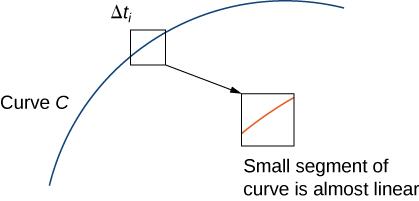
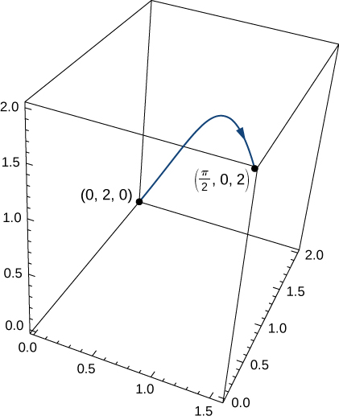
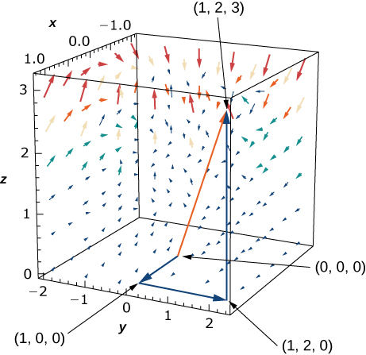

* Calculate a scalar line integral along a curve.
* Calculate a vector line integral along an oriented curve in space.
* Use a line integral to compute the work done in moving an object along a curve in a vector field.
* Describe the flux and circulation of a vector field.

We are familiar with single-variable integrals of the form <math xmlns="http://www.w3.org/1998/Math/MathML"><mrow><mstyle displaystyle="true"><mrow><msubsup><mo stretchy="false">∫</mo><mi>a</mi><mi>b</mi></msubsup><mrow><mi>f</mi><mrow><mo>(</mo><mi>x</mi><mo>)</mo></mrow><mi>d</mi><mi>x</mi><mo>,</mo></mrow></mrow></mstyle></mrow></math>

 where the domain of integration is an interval <math xmlns="http://www.w3.org/1998/Math/MathML"><mrow><mrow><mo>[</mo><mrow><mi>a</mi><mo>,</mo><mi>b</mi></mrow><mo>]</mo></mrow><mo>.</mo></mrow></math>

 Such an interval can be thought of as a curve in the *xy*-plane, since the interval defines a line segment with endpoints <math xmlns="http://www.w3.org/1998/Math/MathML"><mrow><mrow><mo>(</mo><mrow><mi>a</mi><mo>,</mo><mn>0</mn></mrow><mo>)</mo></mrow></mrow></math>

 and <math xmlns="http://www.w3.org/1998/Math/MathML"><mrow><mrow><mo>(</mo><mrow><mi>b</mi><mo>,</mo><mn>0</mn></mrow><mo>)</mo></mrow></mrow></math>

—in other words, a line segment located on the *x*-axis. Suppose we want to integrate over *any* curve in the plane, not just over a line segment on the *x*-axis. Such a task requires a new kind of integral, called a *line integral.*

Line integrals have many applications to engineering and physics. They also allow us to make several useful generalizations of the Fundamental Theorem of Calculus. And, they are closely connected to the properties of vector fields, as we shall see.

# Scalar Line Integrals

A **line integral**{: data-type="term"} gives us the ability to integrate multivariable functions and vector fields over arbitrary curves in a plane or in space. There are two types of line integrals: scalar line integrals and vector line integrals. Scalar line integrals are integrals of a scalar function over a curve in a plane or in space. Vector line integrals are integrals of a vector field over a curve in a plane or in space. Let’s look at scalar line integrals first.

A scalar line integral is defined just as a single-variable integral is defined, except that for a scalar line integral, the integrand is a function of more than one variable and the domain of integration is a curve in a plane or in space, as opposed to a curve on the *x*-axis.

For a scalar line integral, we let *C* be a smooth curve in a plane or in space and let <math xmlns="http://www.w3.org/1998/Math/MathML"><mrow><mi>f</mi></mrow></math>

 be a function with a domain that includes *C*. We chop the curve into small pieces. For each piece, we choose point *P* in that piece and evaluate <math xmlns="http://www.w3.org/1998/Math/MathML"><mrow><mi>f</mi></mrow></math>

 at *P.* (We can do this because all the points in the curve are in the domain of <math xmlns="http://www.w3.org/1998/Math/MathML"><mrow><mi>f</mi><mo>.</mo></mrow></math>

) We multiply <math xmlns="http://www.w3.org/1998/Math/MathML"><mrow><mi>f</mi><mrow><mo>(</mo><mi>P</mi><mo>)</mo></mrow></mrow></math>

 by the arc length of the piece <math xmlns="http://www.w3.org/1998/Math/MathML"><mrow><mtext>Δ</mtext><mi>s</mi><mo>,</mo></mrow></math>

 add the product <math xmlns="http://www.w3.org/1998/Math/MathML"><mrow><mi>f</mi><mrow><mo>(</mo><mi>P</mi><mo>)</mo></mrow><mtext>Δ</mtext><mi>s</mi></mrow></math>

 over all the pieces, and then let the arc length of the pieces shrink to zero by taking a limit. The result is the scalar line integral of the function over the curve.

For a formal description of a scalar line integral, let <math xmlns="http://www.w3.org/1998/Math/MathML"><mi>C</mi></math>

 be a smooth curve in space given by the parameterization <math xmlns="http://www.w3.org/1998/Math/MathML"><mrow><mstyle mathvariant="bold" mathsize="normal"><mtext>r</mtext></mstyle><mrow><mo>(</mo><mi>t</mi><mo>)</mo></mrow><mo>=</mo><mrow><mo>〈</mo><mrow><mi>x</mi><mrow><mo>(</mo><mi>t</mi><mo>)</mo></mrow><mo>,</mo><mi>y</mi><mrow><mo>(</mo><mi>t</mi><mo>)</mo></mrow><mo>,</mo><mi>z</mi><mrow><mo>(</mo><mi>t</mi><mo>)</mo></mrow></mrow><mo>〉</mo></mrow><mo>,</mo></mrow></math>

 <math xmlns="http://www.w3.org/1998/Math/MathML"><mrow><mi>a</mi><mo>≤</mo><mi>t</mi><mo>≤</mo><mi>b</mi><mo>.</mo></mrow></math>

 Let <math xmlns="http://www.w3.org/1998/Math/MathML"><mrow><mi>f</mi><mrow><mo>(</mo><mrow><mi>x</mi><mo>,</mo><mi>y</mi><mo>,</mo><mi>z</mi></mrow><mo>)</mo></mrow></mrow></math>

 be a function with a domain that includes curve <math xmlns="http://www.w3.org/1998/Math/MathML"><mrow><mi>C</mi><mo>.</mo></mrow></math>

 To define the line integral of the function <math xmlns="http://www.w3.org/1998/Math/MathML"><mi>f</mi></math>

 over <math xmlns="http://www.w3.org/1998/Math/MathML"><mrow><mi>C</mi><mo>,</mo></mrow></math>

 we begin as most definitions of an integral begin: we chop the curve into small pieces. Partition the parameter interval <math xmlns="http://www.w3.org/1998/Math/MathML"><mrow><mrow><mo>[</mo><mrow><mi>a</mi><mo>,</mo><mi>b</mi></mrow><mo>]</mo></mrow></mrow></math>

 into *n* subintervals <math xmlns="http://www.w3.org/1998/Math/MathML"><mrow><mrow><mo>[</mo><mrow><msub><mi>t</mi><mrow><mi>i</mi><mo>−</mo><mi>l</mi></mrow></msub><mo>,</mo><msub><mi>t</mi><mi>i</mi></msub></mrow><mo>]</mo></mrow></mrow></math>

 of equal width for <math xmlns="http://www.w3.org/1998/Math/MathML"><mrow><mtext>l</mtext><mo>≤</mo><mi>i</mi><mo>≤</mo><mi>n</mi><mo>,</mo></mrow></math>

 where <math xmlns="http://www.w3.org/1998/Math/MathML"><mrow><msub><mi>t</mi><mn>0</mn></msub><mo>=</mo><mi>a</mi></mrow></math>

 and <math xmlns="http://www.w3.org/1998/Math/MathML"><mrow><msub><mi>t</mi><mi>n</mi></msub><mo>=</mo><mi>b</mi></mrow></math>

 ([\[link\]](#CNX_Calc_Figure_16_02_001)). Let <math xmlns="http://www.w3.org/1998/Math/MathML"><mrow><msubsup><mi>t</mi><mi>i</mi><mo>*</mo></msubsup></mrow></math>

 be a value in the *i*th interval <math xmlns="http://www.w3.org/1998/Math/MathML"><mrow><mrow><mo>[</mo><mrow><msub><mi>t</mi><mrow><mi>i</mi><mo>−</mo><mtext>l</mtext></mrow></msub><mo>,</mo><msub><mi>t</mi><mi>i</mi></msub></mrow><mo>]</mo></mrow><mo>.</mo></mrow></math>

 Denote the endpoints of <math xmlns="http://www.w3.org/1998/Math/MathML"><mrow><mstyle mathvariant="bold" mathsize="normal"><mtext>r</mtext></mstyle><mrow><mo>(</mo><mrow><msub><mi>t</mi><mn>0</mn></msub></mrow><mo>)</mo></mrow><mo>,</mo><mstyle mathvariant="bold" mathsize="normal"><mtext>r</mtext></mstyle><mrow><mo>(</mo><mrow><msub><mi>t</mi><mn>1</mn></msub></mrow><mo>)</mo></mrow><mtext>,…</mtext><mo>,</mo><mstyle mathvariant="bold" mathsize="normal"><mtext>r</mtext></mstyle><mrow><mo>(</mo><mrow><msub><mi>t</mi><mi>n</mi></msub></mrow><mo>)</mo></mrow></mrow></math>

 by <math xmlns="http://www.w3.org/1998/Math/MathML"><mrow><msub><mi>P</mi><mn>0</mn></msub><mtext>,…</mtext><mo>,</mo><msub><mi>P</mi><mi>n</mi></msub><mo>.</mo></mrow></math>

 Points *Pi* divide curve <math xmlns="http://www.w3.org/1998/Math/MathML"><mi>C</mi></math>

 into <math xmlns="http://www.w3.org/1998/Math/MathML"><mi>n</mi></math>

 pieces <math xmlns="http://www.w3.org/1998/Math/MathML"><mrow><msub><mi>C</mi><mn>1</mn></msub><mo>,</mo><msub><mi>C</mi><mn>2</mn></msub><mtext>,…</mtext><mo>,</mo><msub><mi>C</mi><mrow><mi>n</mi><mo>,</mo></mrow></msub></mrow></math>

 with lengths <math xmlns="http://www.w3.org/1998/Math/MathML"><mrow><mtext>Δ</mtext><msub><mi>s</mi><mn>1</mn></msub><mo>,</mo><mtext>Δ</mtext><msub><mi>s</mi><mn>2</mn></msub><mtext>,…</mtext><mo>,</mo><mtext>Δ</mtext><msub><mi>s</mi><mi>n</mi></msub><mo>,</mo></mrow></math>

 respectively. Let <math xmlns="http://www.w3.org/1998/Math/MathML"><mrow><msubsup><mi>P</mi><mi>i</mi><mo>*</mo></msubsup></mrow></math>

 denote the endpoint of <math xmlns="http://www.w3.org/1998/Math/MathML"><mrow><mstyle mathvariant="bold" mathsize="normal"><mtext>r</mtext></mstyle><mo stretchy="false">(</mo><msubsup><mi>t</mi><mi>i</mi><mo>*</mo></msubsup><mo stretchy="false">)</mo></mrow></math>

 for <math xmlns="http://www.w3.org/1998/Math/MathML"><mrow><mn>1</mn><mo>≤</mo><mi>i</mi><mo>≤</mo><mi>n</mi><mo>.</mo></mrow></math>

 Now, we evaluate the function <math xmlns="http://www.w3.org/1998/Math/MathML"><mi>f</mi></math>

 at point <math xmlns="http://www.w3.org/1998/Math/MathML"><mrow><msubsup><mi>P</mi><mi>i</mi><mo>*</mo></msubsup></mrow></math>

 for <math xmlns="http://www.w3.org/1998/Math/MathML"><mrow><mn>1</mn><mo>≤</mo><mi>i</mi><mo>≤</mo><mi>n</mi><mo>.</mo></mrow></math>

 Note that <math xmlns="http://www.w3.org/1998/Math/MathML"><mrow><msubsup><mi>P</mi><mi>i</mi><mo>*</mo></msubsup></mrow></math>

 is in piece <math xmlns="http://www.w3.org/1998/Math/MathML"><mrow><msub><mi>C</mi><mn>1</mn></msub><mo>,</mo></mrow></math>

 and therefore <math xmlns="http://www.w3.org/1998/Math/MathML"><mrow><msubsup><mi>P</mi><mi>i</mi><mo>*</mo></msubsup></mrow></math>

 is in the domain of <math xmlns="http://www.w3.org/1998/Math/MathML"><mrow><mi>f</mi><mo>.</mo></mrow></math>

 Multiply <math xmlns="http://www.w3.org/1998/Math/MathML"><mrow><mi>f</mi><mrow><mo>(</mo><mrow><msubsup><mi>P</mi><mi>i</mi><mo>*</mo></msubsup></mrow><mo>)</mo></mrow></mrow></math>

 by the length <math xmlns="http://www.w3.org/1998/Math/MathML"><mrow><mtext>Δ</mtext><msub><mi>s</mi><mn>1</mn></msub></mrow></math>

 of <math xmlns="http://www.w3.org/1998/Math/MathML"><mrow><msub><mi>C</mi><mn>1</mn></msub><mo>,</mo></mrow></math>

 which gives the area of the “sheet” with base <math xmlns="http://www.w3.org/1998/Math/MathML"><mrow><msub><mi>C</mi><mn>1</mn></msub><mo>,</mo></mrow></math>

 and height <math xmlns="http://www.w3.org/1998/Math/MathML"><mrow><mi>f</mi><mrow><mo>(</mo><mrow><msubsup><mi>P</mi><mi>i</mi><mo>*</mo></msubsup></mrow><mo>)</mo></mrow><mo>.</mo></mrow></math>

 This is analogous to using rectangles to approximate area in a single-variable integral. Now, we form the sum <math xmlns="http://www.w3.org/1998/Math/MathML"><mrow><mstyle displaystyle="true"><munderover><mo>∑</mo><mrow><mi>i</mi><mo>=</mo><mn>1</mn></mrow><mi>n</mi></munderover><mrow><mi>f</mi><mrow><mo>(</mo><mrow><msubsup><mi>P</mi><mi>i</mi><mo>*</mo></msubsup></mrow><mo>)</mo></mrow><mtext>Δ</mtext><msub><mi>s</mi><mi>i</mi></msub></mrow></mstyle><mo>.</mo></mrow></math>

 Note the similarity of this sum versus a Riemann sum; in fact, this definition is a generalization of a Riemann sum to arbitrary curves in space. Just as with Riemann sums and integrals of form <math xmlns="http://www.w3.org/1998/Math/MathML"><mrow><mstyle displaystyle="true"><mrow><msubsup><mo stretchy="false">∫</mo><mi>a</mi><mi>b</mi></msubsup><mrow><mi>g</mi><mrow><mo>(</mo><mi>x</mi><mo>)</mo></mrow><mi>d</mi><mi>x</mi></mrow></mrow></mstyle><mo>,</mo></mrow></math>

 we define an integral by letting the width of the pieces of the curve shrink to zero by taking a limit. The result is the scalar line integral of <math xmlns="http://www.w3.org/1998/Math/MathML"><mi>f</mi></math>

 along <math xmlns="http://www.w3.org/1998/Math/MathML"><mrow><mi>C</mi><mo>.</mo></mrow></math>

 {: #CNX_Calc_Figure_16_02_001}

You may have noticed a difference between this definition of a scalar line integral and a single-variable integral. In this definition, the arc lengths <math xmlns="http://www.w3.org/1998/Math/MathML"><mrow><mtext>Δ</mtext><msub><mi>s</mi><mn>1</mn></msub><mo>,</mo><mtext>Δ</mtext><msub><mi>s</mi><mn>2</mn></msub><mtext>,…</mtext><mo>,</mo><mtext>Δ</mtext><msub><mi>s</mi><mi>n</mi></msub></mrow></math>

 aren’t necessarily the same; in the definition of a single-variable integral, the curve in the *x*-axis is partitioned into pieces of equal length. This difference does not have any effect in the limit. As we shrink the arc lengths to zero, their values become close enough that any small difference becomes irrelevant.

Definition

Let <math xmlns="http://www.w3.org/1998/Math/MathML"><mi>f</mi></math>

 be a function with a domain that includes the smooth curve <math xmlns="http://www.w3.org/1998/Math/MathML"><mi>C</mi></math>

 that is parameterized by <math xmlns="http://www.w3.org/1998/Math/MathML"><mrow><mstyle mathvariant="bold" mathsize="normal"><mtext>r</mtext></mstyle><mrow><mo>(</mo><mi>t</mi><mo>)</mo></mrow><mo>=</mo><mrow><mo>〈</mo><mrow><mi>x</mi><mrow><mo>(</mo><mi>t</mi><mo>)</mo></mrow><mo>,</mo><mi>y</mi><mrow><mo>(</mo><mi>t</mi><mo>)</mo></mrow><mo>,</mo><mi>z</mi><mrow><mo>(</mo><mi>t</mi><mo>)</mo></mrow></mrow><mo>〉</mo></mrow><mo>,</mo></mrow></math>

 <math xmlns="http://www.w3.org/1998/Math/MathML"><mrow><mi>a</mi><mo>≤</mo><mi>t</mi><mo>≤</mo><mi>b</mi><mo>.</mo></mrow></math>

 The **scalar line integral**{: data-type="term"} of <math xmlns="http://www.w3.org/1998/Math/MathML"><mi>f</mi></math>

 along <math xmlns="http://www.w3.org/1998/Math/MathML"><mi>C</mi></math>

 is

<math xmlns="http://www.w3.org/1998/Math/MathML"><mrow><mstyle displaystyle="true"><mrow><msub><mo stretchy="false">∫</mo><mi>C</mi></msub><mrow><mi>f</mi><mo stretchy="false">(</mo><mi>x</mi><mo>,</mo><mi>y</mi><mo>,</mo><mi>z</mi><mo stretchy="false">)</mo><mi>d</mi><mi>s</mi><mo>=</mo><munder><mrow><mtext>lim</mtext></mrow><mrow><mi>n</mi><mo stretchy="false">→</mo><mi>∞</mi></mrow></munder></mrow></mrow></mstyle><mstyle displaystyle="true"><munderover><mo>∑</mo><mrow><mi>i</mi><mo>=</mo><mn>1</mn></mrow><mi>n</mi></munderover><mrow><mi>f</mi><mrow><mo>(</mo><mrow><msubsup><mi>P</mi><mi>i</mi><mo>*</mo></msubsup></mrow><mo>)</mo></mrow><mtext>Δ</mtext><msub><mi>s</mi><mi>i</mi></msub></mrow></mstyle></mrow></math>

if this limit exists <math xmlns="http://www.w3.org/1998/Math/MathML"><mrow><mo stretchy="false">(</mo><msubsup><mi>t</mi><mi>i</mi><mo>*</mo></msubsup></mrow></math>

 and <math xmlns="http://www.w3.org/1998/Math/MathML"><mrow><mtext>Δ</mtext><msub><mi>s</mi><mi>i</mi></msub></mrow></math>

 are defined as in the previous paragraphs). If *C* is a planar curve, then *C* can be represented by the parametric equations <math xmlns="http://www.w3.org/1998/Math/MathML"><mrow><mi>x</mi><mo>=</mo><mi>x</mi><mrow><mo>(</mo><mi>t</mi><mo>)</mo></mrow><mo>,</mo><mi>y</mi><mo>=</mo><mi>y</mi><mrow><mo>(</mo><mi>t</mi><mo>)</mo></mrow><mo>,</mo></mrow></math>

 and <math xmlns="http://www.w3.org/1998/Math/MathML"><mrow><mi>a</mi><mo>≤</mo><mi>t</mi><mo>≤</mo><mi>b</mi><mo>.</mo></mrow></math>

 If *C* is smooth and <math xmlns="http://www.w3.org/1998/Math/MathML"><mrow><mi>f</mi><mrow><mo>(</mo><mrow><mi>x</mi><mo>,</mo><mi>y</mi></mrow><mo>)</mo></mrow></mrow></math>

 is a function of two variables, then the scalar line integral of <math xmlns="http://www.w3.org/1998/Math/MathML"><mrow><mi>f</mi></mrow></math>

 along *C* is defined similarly as

<math xmlns="http://www.w3.org/1998/Math/MathML"><mrow><mstyle displaystyle="true"><mrow><msub><mo stretchy="false">∫</mo><mi>C</mi></msub><mrow><mi>f</mi><mo stretchy="false">(</mo><mi>x</mi><mo>,</mo><mi>y</mi><mo stretchy="false">)</mo><mi>d</mi><mi>s</mi><mo>=</mo><munder><mrow><mtext>lim</mtext></mrow><mrow><mi>n</mi><mo stretchy="false">→</mo><mi>∞</mi></mrow></munder></mrow></mrow></mstyle><mstyle displaystyle="true"><munderover><mo>∑</mo><mrow><mi>i</mi><mo>=</mo><mn>1</mn></mrow><mi>n</mi></munderover><mrow><mi>f</mi><mrow><mo>(</mo><mrow><msubsup><mi>P</mi><mi>i</mi><mo>*</mo></msubsup></mrow><mo>)</mo></mrow><mtext>Δ</mtext><msub><mi>s</mi><mi>i</mi></msub></mrow></mstyle><mo>,</mo></mrow></math>

if this limit exists.

If <math xmlns="http://www.w3.org/1998/Math/MathML"><mi>f</mi></math>

 is a continuous function on a smooth curve *C*, then <math xmlns="http://www.w3.org/1998/Math/MathML"><mrow><mstyle displaystyle="true"><mrow><msub><mo stretchy="false">∫</mo><mi>C</mi></msub><mrow><mi>f</mi><mi>d</mi><mi>s</mi></mrow></mrow></mstyle></mrow></math>

 always exists. Since <math xmlns="http://www.w3.org/1998/Math/MathML"><mrow><mstyle displaystyle="true"><mrow><msub><mo stretchy="false">∫</mo><mi>C</mi></msub><mrow><mi>f</mi><mi>d</mi><mi>s</mi></mrow></mrow></mstyle></mrow></math>

 is defined as a limit of Riemann sums, the continuity of <math xmlns="http://www.w3.org/1998/Math/MathML"><mrow><mi>f</mi></mrow></math>

 is enough to guarantee the existence of the limit, just as the integral <math xmlns="http://www.w3.org/1998/Math/MathML"><mrow><mstyle displaystyle="true"><mrow><msubsup><mo stretchy="false">∫</mo><mi>a</mi><mi>b</mi></msubsup><mrow><mi>g</mi><mrow><mo>(</mo><mi>x</mi><mo>)</mo></mrow><mi>d</mi><mi>x</mi></mrow></mrow></mstyle></mrow></math>

 exists if *g* is continuous over <math xmlns="http://www.w3.org/1998/Math/MathML"><mrow><mrow><mo>[</mo><mrow><mi>a</mi><mo>,</mo><mi>b</mi></mrow><mo>]</mo></mrow><mo>.</mo></mrow></math>

Before looking at how to compute a line integral, we need to examine the geometry captured by these integrals. Suppose that <math xmlns="http://www.w3.org/1998/Math/MathML"><mrow><mi>f</mi><mrow><mo>(</mo><mrow><mi>x</mi><mo>,</mo><mi>y</mi></mrow><mo>)</mo></mrow><mo>≥</mo><mn>0</mn></mrow></math>

 for all points <math xmlns="http://www.w3.org/1998/Math/MathML"><mrow><mrow><mo>(</mo><mrow><mi>x</mi><mo>,</mo><mi>y</mi></mrow><mo>)</mo></mrow></mrow></math>

 on a smooth planar curve <math xmlns="http://www.w3.org/1998/Math/MathML"><mrow><mi>C</mi><mo>.</mo></mrow></math>

 Imagine taking curve <math xmlns="http://www.w3.org/1998/Math/MathML"><mi>C</mi></math>

 and projecting it “up” to the surface defined by <math xmlns="http://www.w3.org/1998/Math/MathML"><mrow><mi>f</mi><mrow><mo>(</mo><mrow><mi>x</mi><mo>,</mo><mi>y</mi></mrow><mo>)</mo></mrow><mo>,</mo></mrow></math>

 thereby creating a new curve <math xmlns="http://www.w3.org/1998/Math/MathML"><msup><mi>C</mi><mo>′</mo></msup></math>

 that lies in the graph of <math xmlns="http://www.w3.org/1998/Math/MathML"><mrow><mi>f</mi><mrow><mo>(</mo><mrow><mi>x</mi><mo>,</mo><mi>y</mi></mrow><mo>)</mo></mrow></mrow></math>

 ([\[link\]](#CNX_Calc_Figure_16_02_002)). Now we drop a “sheet” from <math xmlns="http://www.w3.org/1998/Math/MathML"><msup><mi>C</mi><mo>′</mo></msup></math>

 down to the xy-plane. The area of this sheet is <math xmlns="http://www.w3.org/1998/Math/MathML"><mrow><mstyle displaystyle="true"><mrow><msub><mo stretchy="false">∫</mo><mi>C</mi></msub><mrow><mi>f</mi><mrow><mo>(</mo><mrow><mi>x</mi><mo>,</mo><mi>y</mi></mrow><mo>)</mo></mrow><mi>d</mi><mi>s</mi></mrow></mrow></mstyle><mo>.</mo></mrow></math>

 If <math xmlns="http://www.w3.org/1998/Math/MathML"><mrow><mi>f</mi><mrow><mo>(</mo><mrow><mi>x</mi><mo>,</mo><mi>y</mi></mrow><mo>)</mo></mrow><mo>≤</mo><mn>0</mn></mrow></math>

 for some points in <math xmlns="http://www.w3.org/1998/Math/MathML"><mrow><mi>C</mi><mo>,</mo></mrow></math>

 then the value of <math xmlns="http://www.w3.org/1998/Math/MathML"><mrow><mstyle displaystyle="true"><mrow><msub><mo stretchy="false">∫</mo><mi>C</mi></msub><mrow><mi>f</mi><mrow><mo>(</mo><mrow><mi>x</mi><mo>,</mo><mi>y</mi></mrow><mo>)</mo></mrow><mi>d</mi><mi>s</mi></mrow></mrow></mstyle></mrow></math>

 is the area above the xy-plane less the area below the xy-plane. (Note the similarity with integrals of the form <math xmlns="http://www.w3.org/1998/Math/MathML"><mrow><mstyle displaystyle="true"><mrow><msubsup><mo stretchy="false">∫</mo><mi>a</mi><mi>b</mi></msubsup><mrow><mi>g</mi><mrow><mo>(</mo><mi>x</mi><mo>)</mo></mrow><mi>d</mi><mi>x</mi><mo>.</mo></mrow></mrow></mstyle><mo stretchy="false">)</mo></mrow></math>

 ds."){: #CNX_Calc_Figure_16_02_002}

From this geometry, we can see that line integral <math xmlns="http://www.w3.org/1998/Math/MathML"><mrow><mstyle displaystyle="true"><mrow><msub><mo stretchy="false">∫</mo><mi>C</mi></msub><mrow><mi>f</mi><mrow><mo>(</mo><mrow><mi>x</mi><mo>,</mo><mi>y</mi></mrow><mo>)</mo></mrow><mi>d</mi><mi>s</mi></mrow></mrow></mstyle></mrow></math>

 does not depend on the parameterization <math xmlns="http://www.w3.org/1998/Math/MathML"><mrow><mstyle mathvariant="bold" mathsize="normal"><mtext>r</mtext></mstyle><mrow><mo>(</mo><mi>t</mi><mo>)</mo></mrow></mrow></math>

 of *C*. As long as the curve is traversed exactly once by the parameterization, the area of the sheet formed by the function and the curve is the same. This same kind of geometric argument can be extended to show that the line integral of a three-variable function over a curve in space does not depend on the parameterization of the curve.

Finding the Value of a Line Integral

Find the value of integral <math xmlns="http://www.w3.org/1998/Math/MathML"><mrow><mstyle displaystyle="true"><mrow><msub><mo stretchy="false">∫</mo><mi>C</mi></msub><mrow><mn>2</mn><mi>d</mi><mi>s</mi><mo>,</mo></mrow></mrow></mstyle></mrow></math>

 where <math xmlns="http://www.w3.org/1998/Math/MathML"><mi>C</mi></math>

 is the upper half of the unit circle.

The integrand is <math xmlns="http://www.w3.org/1998/Math/MathML"><mrow><mi>f</mi><mrow><mo>(</mo><mrow><mi>x</mi><mo>,</mo><mi>y</mi></mrow><mo>)</mo></mrow><mo>=</mo><mn>2</mn><mo>.</mo></mrow></math>

 [[link]](#CNX_Calc_Figure_16_02_003) shows the graph of <math xmlns="http://www.w3.org/1998/Math/MathML"><mrow><mi>f</mi><mrow><mo>(</mo><mrow><mi>x</mi><mo>,</mo><mi>y</mi></mrow><mo>)</mo></mrow><mo>=</mo><mn>2</mn><mo>,</mo></mrow></math>

 curve *C*, and the sheet formed by them. Notice that this sheet has the same area as a rectangle with width <math xmlns="http://www.w3.org/1998/Math/MathML"><mi>π</mi></math>

 and length 2. Therefore, <math xmlns="http://www.w3.org/1998/Math/MathML"><mrow><mstyle displaystyle="true"><mrow><msub><mo stretchy="false">∫</mo><mi>C</mi></msub><mrow><mn>2</mn><mi>d</mi><mi>s</mi><mo>=</mo><mn>2</mn><mi>π</mi><mo>.</mo></mrow></mrow></mstyle></mrow></math>

=2."){: #CNX_Calc_Figure_16_02_003}

To see that <math xmlns="http://www.w3.org/1998/Math/MathML"><mrow><mstyle displaystyle="true"><mrow><msub><mo stretchy="false">∫</mo><mi>C</mi></msub><mrow><mn>2</mn><mi>d</mi><mi>s</mi><mo>=</mo><mn>2</mn><mi>π</mi></mrow></mrow></mstyle></mrow></math>

 using the definition of line integral, we let <math xmlns="http://www.w3.org/1998/Math/MathML"><mrow><mstyle mathvariant="bold" mathsize="normal"><mtext>r</mtext></mstyle><mrow><mo>(</mo><mi>t</mi><mo>)</mo></mrow></mrow></math>

 be a parameterization of *C*. Then, <math xmlns="http://www.w3.org/1998/Math/MathML"><mrow><mi>f</mi><mrow><mo>(</mo><mrow><mstyle mathvariant="bold" mathsize="normal"><mtext>r</mtext></mstyle><mrow><mo>(</mo><mrow><msub><mi>t</mi><mi>i</mi></msub></mrow><mo>)</mo></mrow></mrow><mo>)</mo></mrow><mo>=</mo><mn>2</mn></mrow></math>

 for any number <math xmlns="http://www.w3.org/1998/Math/MathML"><mrow><msub><mi>t</mi><mi>i</mi></msub></mrow></math>

 in the domain of **r**. Therefore,

<math xmlns="http://www.w3.org/1998/Math/MathML"><mtable><mtr><mtd columnalign="right"><mstyle displaystyle="true"><mrow><msub><mo stretchy="false">∫</mo><mi>C</mi></msub><mi>f</mi></mrow></mstyle><mi>d</mi><mi>s</mi></mtd><mtd columnalign="left"><mo>=</mo><munder><mrow><mtext>lim</mtext></mrow><mrow><mi>n</mi><mo stretchy="false">→</mo><mi>∞</mi></mrow></munder><mstyle displaystyle="true"><munderover><mo>∑</mo><mrow><mi>i</mi><mo>=</mo><mn>1</mn></mrow><mi>n</mi></munderover><mrow><mi>f</mi><mrow><mo>(</mo><mrow><mstyle mathvariant="bold" mathsize="normal"><mtext>r</mtext></mstyle><mrow><mo>(</mo><mrow><msubsup><mi>t</mi><mi>i</mi><mo>*</mo></msubsup></mrow><mo>)</mo></mrow></mrow><mo>)</mo></mrow><mtext>Δ</mtext><msub><mi>s</mi><mi>i</mi></msub></mrow></mstyle></mtd></mtr><mtr><mtd /><mtd columnalign="left"><mo>=</mo><munder><mrow><mtext>lim</mtext></mrow><mrow><mi>n</mi><mo stretchy="false">→</mo><mi>∞</mi></mrow></munder><mstyle displaystyle="true"><munderover><mo>∑</mo><mrow><mi>i</mi><mo>=</mo><mn>1</mn></mrow><mi>n</mi></munderover><mrow><mn>2</mn><mtext>Δ</mtext><msub><mi>s</mi><mi>i</mi></msub></mrow></mstyle></mtd></mtr><mtr><mtd /><mtd columnalign="left"><mo>=</mo><mn>2</mn><munder><mrow><mtext>lim</mtext></mrow><mrow><mi>n</mi><mo stretchy="false">→</mo><mi>∞</mi></mrow></munder><mstyle displaystyle="true"><munderover><mo>∑</mo><mrow><mi>i</mi><mo>=</mo><mn>1</mn></mrow><mi>n</mi></munderover><mrow><mn>2</mn><mtext>Δ</mtext><msub><mi>s</mi><mi>i</mi></msub></mrow></mstyle></mtd></mtr><mtr><mtd /><mtd columnalign="left"><mo>=</mo><mn>2</mn><mrow><mo>(</mo><mrow><mtext>length of C</mtext></mrow><mo>)</mo></mrow></mtd></mtr><mtr><mtd /><mtd columnalign="left"><mo>=</mo><mn>2</mn><mi>π</mi><mo>.</mo></mtd></mtr></mtable></math>

Find the value of <math xmlns="http://www.w3.org/1998/Math/MathML"><mrow><mstyle displaystyle="true"><mrow><msub><mo stretchy="false">∫</mo><mi>C</mi></msub><mrow><mrow><mo>(</mo><mrow><mi>x</mi><mo>=</mo><mi>y</mi></mrow><mo>)</mo></mrow><mi>d</mi><mi>s</mi><mo>,</mo></mrow></mrow></mstyle></mrow></math>

 where <math xmlns="http://www.w3.org/1998/Math/MathML"><mi>C</mi></math>

 is the curve parameterized by <math xmlns="http://www.w3.org/1998/Math/MathML"><mrow><mi>x</mi><mo>=</mo><mi>t</mi><mo>,</mo></mrow></math>

 <math xmlns="http://www.w3.org/1998/Math/MathML"><mrow><mi>y</mi><mo>=</mo><mi>t</mi><mo>,</mo></mrow></math>

 <math xmlns="http://www.w3.org/1998/Math/MathML"><mrow><mn>0</mn><mo>≤</mo><mi>t</mi><mo>≤</mo><mn>1</mn><mo>.</mo></mrow></math>

<math xmlns="http://www.w3.org/1998/Math/MathML"><mrow><msqrt><mn>2</mn></msqrt></mrow></math>

Hint

Find the shape formed by *C* and the graph of function <math xmlns="http://www.w3.org/1998/Math/MathML"><mrow><mi>f</mi><mrow><mo>(</mo><mrow><mi>x</mi><mo>,</mo><mi>y</mi></mrow><mo>)</mo></mrow><mo>=</mo><mi>x</mi><mo>+</mo><mi>y</mi><mo>.</mo></mrow></math>

Note that in a scalar line integral, the integration is done with respect to arc length *s*, which can make a scalar line integral difficult to calculate. To make the calculations easier, we can translate <math xmlns="http://www.w3.org/1998/Math/MathML"><mrow><mstyle displaystyle="true"><mrow><msub><mo stretchy="false">∫</mo><mi>C</mi></msub><mrow><mi>f</mi><mi>d</mi><mi>s</mi></mrow></mrow></mstyle></mrow></math>

 to an integral with a variable of integration that is *t*.

Let <math xmlns="http://www.w3.org/1998/Math/MathML"><mrow><mstyle mathvariant="bold" mathsize="normal"><mtext>r</mtext></mstyle><mrow><mo>(</mo><mi>t</mi><mo>)</mo></mrow><mo>=</mo><mrow><mo>〈</mo><mrow><mi>x</mi><mrow><mo>(</mo><mi>t</mi><mo>)</mo></mrow><mo>,</mo><mi>y</mi><mrow><mo>(</mo><mi>t</mi><mo>)</mo></mrow><mo>,</mo><mi>z</mi><mrow><mo>(</mo><mi>t</mi><mo>)</mo></mrow></mrow><mo>〉</mo></mrow></mrow></math>

 for <math xmlns="http://www.w3.org/1998/Math/MathML"><mrow><mi>a</mi><mo>≤</mo><mi>t</mi><mo>≤</mo><mi>b</mi></mrow></math>

 be a parameterization of <math xmlns="http://www.w3.org/1998/Math/MathML"><mrow><mi>C</mi><mo>.</mo></mrow></math>

 Since we are assuming that <math xmlns="http://www.w3.org/1998/Math/MathML"><mi>C</mi></math>

 is smooth, <math xmlns="http://www.w3.org/1998/Math/MathML"><mrow><mstyle mathvariant="bold" mathsize="normal"><msup><mi>r</mi><mo>′</mo></msup></mstyle><mrow><mo>(</mo><mi>t</mi><mo>)</mo></mrow><mo>=</mo><mrow><mo>〈</mo><mrow><msup><mi>x</mi><mo>′</mo></msup><mrow><mo>(</mo><mi>t</mi><mo>)</mo></mrow><mo>,</mo><msup><mi>y</mi><mo>′</mo></msup><mrow><mo>(</mo><mi>t</mi><mo>)</mo></mrow><mo>,</mo><msup><mi>z</mi><mo>′</mo></msup><mrow><mo>(</mo><mi>t</mi><mo>)</mo></mrow></mrow><mo>〉</mo></mrow></mrow></math>

 is continuous for all <math xmlns="http://www.w3.org/1998/Math/MathML"><mi>t</mi></math>

 in <math xmlns="http://www.w3.org/1998/Math/MathML"><mrow><mrow><mo>[</mo><mrow><mi>a</mi><mo>,</mo><mi>b</mi></mrow><mo>]</mo></mrow><mo>.</mo></mrow></math>

 In particular, <math xmlns="http://www.w3.org/1998/Math/MathML"><mrow><mi>x</mi><mtext>′</mtext><mrow><mo>(</mo><mi>t</mi><mo>)</mo></mrow><mo>,</mo><mi>y</mi><mtext>′</mtext><mrow><mo>(</mo><mi>t</mi><mo>)</mo></mrow><mo>,</mo></mrow></math>

 and <math xmlns="http://www.w3.org/1998/Math/MathML"><mrow><mi>z</mi><mtext>′</mtext><mrow><mo>(</mo><mi>t</mi><mo>)</mo></mrow></mrow></math>

 exist for all <math xmlns="http://www.w3.org/1998/Math/MathML"><mi>t</mi></math>

 in <math xmlns="http://www.w3.org/1998/Math/MathML"><mrow><mrow><mo>[</mo><mrow><mi>a</mi><mo>,</mo><mi>b</mi></mrow><mo>]</mo></mrow><mo>.</mo></mrow></math>

 According to the arc length formula, we have

<math xmlns="http://www.w3.org/1998/Math/MathML"><mrow><mtext>length</mtext><mrow><mo>(</mo><mrow><msub><mi>C</mi><mi>i</mi></msub></mrow><mo>)</mo></mrow><mo>=</mo><mtext>Δ</mtext><msub><mi>s</mi><mi>i</mi></msub><mo>=</mo><mstyle displaystyle="true"><mrow><msubsup><mo stretchy="false">∫</mo><mrow><msub><mi>t</mi><mrow><mi>i</mi><mo>−</mo><mn>1</mn></mrow></msub></mrow><mrow><msub><mi>t</mi><mi>i</mi></msub></mrow></msubsup><mrow><mrow><mo>‖</mo><mrow><mstyle mathvariant="bold" mathsize="normal"><msup><mi>r</mi><mo>′</mo></msup></mstyle><mrow><mrow><mrow><mo>(</mo><mi>t</mi><mo>)</mo></mrow></mrow><mo>‖</mo></mrow></mrow></mrow></mrow></mrow></mstyle><mi>d</mi><mi>t</mi><mo>.</mo></mrow></math>

If width <math xmlns="http://www.w3.org/1998/Math/MathML"><mrow><mtext>Δ</mtext><msub><mi>t</mi><mi>i</mi></msub><mo>=</mo><msub><mi>t</mi><mi>i</mi></msub><mo>−</mo><msub><mi>t</mi><mrow><mi>i</mi><mo>−</mo><mn>1</mn></mrow></msub></mrow></math>

 is small, then function <math xmlns="http://www.w3.org/1998/Math/MathML"><mrow><mstyle displaystyle="true"><mrow><msubsup><mo stretchy="false">∫</mo><mrow><msub><mi>t</mi><mrow><mi>i</mi><mo>−</mo><mn>1</mn></mrow></msub></mrow><mrow><msub><mi>t</mi><mi>i</mi></msub></mrow></msubsup><mrow><mrow><mo>‖</mo><mrow><mstyle mathvariant="bold" mathsize="normal"><msup><mi>r</mi><mo>′</mo></msup></mstyle><mrow><mo>(</mo><mi>t</mi><mo>)</mo></mrow></mrow><mo>‖</mo></mrow><mrow><mrow><mi>d</mi><mi>t</mi><mo>≈</mo></mrow><mo>‖</mo></mrow><mrow><mrow><msup><mi>r</mi><mo>′</mo></msup><mrow><mo>(</mo><mrow><msubsup><mi>t</mi><mi>i</mi><mo>*</mo></msubsup></mrow><mo>)</mo></mrow></mrow><mo>‖</mo></mrow><mtext>Δ</mtext><msub><mi>t</mi><mi>i</mi></msub><mo>,</mo></mrow></mrow></mstyle></mrow></math>

 <math xmlns="http://www.w3.org/1998/Math/MathML"><mrow><mrow><mo>‖</mo><mrow><mstyle mathvariant="bold" mathsize="normal"><msup><mi>r</mi><mo>′</mo></msup></mstyle><mrow><mo>(</mo><mi>t</mi><mo>)</mo></mrow></mrow><mo>‖</mo></mrow></mrow></math>

 is almost constant over the interval <math xmlns="http://www.w3.org/1998/Math/MathML"><mrow><mrow><mo>[</mo><mrow><msub><mi>t</mi><mrow><mi>i</mi><mo>−</mo><mn>1</mn></mrow></msub><mo>,</mo><msub><mi>t</mi><mi>i</mi></msub></mrow><mo>]</mo></mrow><mo>.</mo></mrow></math>

 Therefore,

<math xmlns="http://www.w3.org/1998/Math/MathML"><mrow><mstyle displaystyle="true"><mrow><msubsup><mo stretchy="false">∫</mo><mrow><msub><mi>t</mi><mrow><mi>i</mi><mo>−</mo><mn>1</mn></mrow></msub></mrow><mrow><msub><mi>t</mi><mi>i</mi></msub></mrow></msubsup><mrow><mrow><mo>‖</mo><mrow><mstyle mathvariant="bold" mathsize="normal"><msup><mi>r</mi><mo>′</mo></msup></mstyle><mo stretchy="false">(</mo><mi>t</mi><mo stretchy="false">)</mo></mrow><mo>‖</mo></mrow><mi>d</mi><mi>t</mi></mrow></mrow></mstyle><mo>≈</mo><mrow><mo>‖</mo><mrow><mstyle mathvariant="bold" mathsize="normal"><msup><mi>r</mi><mo>′</mo></msup></mstyle><mo stretchy="false">(</mo><msubsup><mi>t</mi><mi>i</mi><mo>*</mo></msubsup><mo stretchy="false">)</mo></mrow><mo>‖</mo></mrow><mtext>Δ</mtext><msub><mi>t</mi><mi>i</mi></msub><mo>,</mo></mrow></math>

and we have

<math xmlns="http://www.w3.org/1998/Math/MathML"><mrow><mstyle displaystyle="true"><munderover><mo>∑</mo><mrow><mi>i</mi><mo>=</mo><mn>1</mn></mrow><mi>n</mi></munderover><mrow><mi>f</mi><mo stretchy="false">(</mo><mstyle mathvariant="bold" mathsize="normal"><mtext>r</mtext></mstyle><mo stretchy="false">(</mo><msubsup><mi>t</mi><mi>i</mi><mo>*</mo></msubsup><mo stretchy="false">)</mo><mo stretchy="false">)</mo><mtext>Δ</mtext><msub><mi>s</mi><mi>i</mi></msub></mrow></mstyle><mo>=</mo><mstyle displaystyle="true"><munderover><mo>∑</mo><mrow><mi>i</mi><mo>=</mo><mn>1</mn></mrow><mi>n</mi></munderover><mrow><mi>f</mi><mo stretchy="false">(</mo><mstyle mathvariant="bold" mathsize="normal"><mtext>r</mtext></mstyle><mo stretchy="false">(</mo><msubsup><mi>t</mi><mi>i</mi><mo>*</mo></msubsup><mo stretchy="false">)</mo><mo stretchy="false">)</mo><mrow><mo>‖</mo><mrow><mstyle mathvariant="bold" mathsize="normal"><msup><mi>r</mi><mo>′</mo></msup></mstyle><mo stretchy="false">(</mo><msubsup><mi>t</mi><mi>i</mi><mo>*</mo></msubsup><mo stretchy="false">)</mo></mrow><mo>‖</mo></mrow></mrow></mstyle><mtext>Δ</mtext><msub><mi>t</mi><mi>i</mi></msub><mo>.</mo></mrow></math>

See [\[link\]](#CNX_Calc_Figure_16_02_004).

 {: #CNX_Calc_Figure_16_02_004}

Note that

<math xmlns="http://www.w3.org/1998/Math/MathML"><mrow><munder><mrow><mtext>lim</mtext></mrow><mrow><mi>n</mi><mo stretchy="false">→</mo><mi>∞</mi></mrow></munder><mstyle displaystyle="true"><munderover><mo>∑</mo><mrow><mi>i</mi><mo>=</mo><mn>1</mn></mrow><mi>n</mi></munderover><mrow><mi>f</mi><mo stretchy="false">(</mo><mstyle mathvariant="bold" mathsize="normal"><mtext>r</mtext></mstyle><mo stretchy="false">(</mo><msubsup><mi>t</mi><mi>i</mi><mo>*</mo></msubsup><mo stretchy="false">)</mo><mo stretchy="false">)</mo></mrow></mstyle><mrow><mo>‖</mo><mrow><mstyle mathvariant="bold" mathsize="normal"><msup><mi>r</mi><mo>′</mo></msup></mstyle><mo stretchy="false">(</mo><msubsup><mi>t</mi><mi>i</mi><mo>*</mo></msubsup><mo stretchy="false">)</mo></mrow><mo>‖</mo></mrow><mtext>Δ</mtext><msub><mi>t</mi><mi>i</mi></msub><mo>=</mo><mstyle displaystyle="true"><mrow><msubsup><mo stretchy="false">∫</mo><mi>a</mi><mi>b</mi></msubsup><mrow><mi>f</mi><mo stretchy="false">(</mo><mstyle mathvariant="bold" mathsize="normal"><mtext>r</mtext></mstyle><mo stretchy="false">(</mo><mi>t</mi><mo stretchy="false">)</mo><mo stretchy="false">)</mo></mrow></mrow></mstyle><mrow><mo>‖</mo><mrow><mstyle mathvariant="bold" mathsize="normal"><msup><mi>r</mi><mo>′</mo></msup></mstyle><mo stretchy="false">(</mo><mi>t</mi><mo stretchy="false">)</mo></mrow><mo>‖</mo></mrow><mi>d</mi><mi>t</mi><mo>.</mo></mrow></math>

In other words, as the widths of intervals <math xmlns="http://www.w3.org/1998/Math/MathML"><mrow><mo stretchy="false">[</mo><msub><mi>t</mi><mrow><mi>i</mi><mo>−</mo><mn>1</mn></mrow></msub><mo>,</mo><msub><mi>t</mi><mi>i</mi></msub><mo stretchy="false">]</mo></mrow></math>

 shrink to zero, the sum <math xmlns="http://www.w3.org/1998/Math/MathML"><mrow><mstyle displaystyle="true"><munderover><mo>∑</mo><mrow><mi>i</mi><mo>=</mo><mn>1</mn></mrow><mi>n</mi></munderover><mrow><mi>f</mi><mo stretchy="false">(</mo><mstyle mathvariant="bold" mathsize="normal"><mtext>r</mtext></mstyle><mo stretchy="false">(</mo><msubsup><mi>t</mi><mi>i</mi><mo>*</mo></msubsup><mo stretchy="false">)</mo><mo stretchy="false">)</mo></mrow></mstyle><mrow><mo>‖</mo><mrow><mstyle mathvariant="bold" mathsize="normal"><msup><mi>r</mi><mo>′</mo></msup></mstyle><mo stretchy="false">(</mo><msubsup><mi>t</mi><mi>i</mi><mo>*</mo></msubsup><mo stretchy="false">)</mo></mrow><mo>‖</mo></mrow><mtext>Δ</mtext><msub><mi>t</mi><mi>i</mi></msub></mrow></math>

 converges to the integral <math xmlns="http://www.w3.org/1998/Math/MathML"><mrow><mstyle displaystyle="true"><mrow><msubsup><mo stretchy="false">∫</mo><mi>a</mi><mi>b</mi></msubsup><mrow><mi>f</mi><mo stretchy="false">(</mo><mstyle mathvariant="bold" mathsize="normal"><mtext>r</mtext></mstyle><mo stretchy="false">(</mo><mi>t</mi><mo stretchy="false">)</mo><mo stretchy="false">)</mo></mrow></mrow></mstyle><mrow><mo>‖</mo><mrow><mstyle mathvariant="bold" mathsize="normal"><msup><mi>r</mi><mo>′</mo></msup></mstyle><mo stretchy="false">(</mo><mi>t</mi><mo stretchy="false">)</mo></mrow><mo>‖</mo></mrow><mi>d</mi><mi>t</mi><mo>.</mo></mrow></math>

 Therefore, we have the following theorem.

Evaluating a Scalar Line Integral

Let <math xmlns="http://www.w3.org/1998/Math/MathML"><mi>f</mi></math>

 be a continuous function with a domain that includes the smooth curve <math xmlns="http://www.w3.org/1998/Math/MathML"><mi>C</mi></math>

 with parameterization <math xmlns="http://www.w3.org/1998/Math/MathML"><mrow><mstyle mathvariant="bold" mathsize="normal"><mtext>r</mtext></mstyle><mrow><mo>(</mo><mi>t</mi><mo>)</mo></mrow><mo>,</mo><mi>a</mi><mo>≤</mo><mi>t</mi><mo>≤</mo><mi>b</mi><mo>.</mo></mrow></math>

 Then

<math xmlns="http://www.w3.org/1998/Math/MathML"><mrow><mstyle displaystyle="true"><mrow><msub><mo stretchy="false">∫</mo><mi>C</mi></msub><mrow><mi>f</mi><mi>d</mi><mi>s</mi><mo>=</mo><mstyle displaystyle="true"><mrow><msubsup><mo stretchy="false">∫</mo><mi>a</mi><mi>b</mi></msubsup><mrow><mi>f</mi><mo stretchy="false">(</mo><mstyle mathvariant="bold" mathsize="normal"><mtext>r</mtext></mstyle><mo stretchy="false">(</mo><mi>t</mi><mo stretchy="false">)</mo><mo stretchy="false">)</mo></mrow></mrow></mstyle><mrow><mo>‖</mo><mrow><mstyle mathvariant="bold" mathsize="normal"><msup><mi>r</mi><mo>′</mo></msup></mstyle><mo stretchy="false">(</mo><mi>t</mi><mo stretchy="false">)</mo></mrow><mo>‖</mo></mrow><mi>d</mi><mi>t</mi></mrow></mrow></mstyle><mo>.</mo></mrow></math>

Although we have labeled [\[link\]](#fs-id1167794213153) as an equation, it is more accurately considered an approximation because we can show that the left-hand side of [\[link\]](#fs-id1167794213153) approaches the right-hand side as <math xmlns="http://www.w3.org/1998/Math/MathML"><mrow><mi>n</mi><mo stretchy="false">→</mo><mi>∞</mi><mo>.</mo></mrow></math>

 In other words, letting the widths of the pieces shrink to zero makes the right-hand sum arbitrarily close to the left-hand sum. Since

<math xmlns="http://www.w3.org/1998/Math/MathML"><mrow><mrow><mo>‖</mo><mrow><mstyle mathvariant="bold" mathsize="normal"><msup><mi>r</mi><mo>′</mo></msup></mstyle><mrow><mo>(</mo><mi>t</mi><mo>)</mo></mrow></mrow><mo>‖</mo></mrow><mo>=</mo><msqrt><mrow><msup><mrow><mrow><mo>(</mo><mrow><mi>x</mi><mo>′</mo><mrow><mo>(</mo><mi>t</mi><mo>)</mo></mrow></mrow><mo>)</mo></mrow></mrow><mn>2</mn></msup><mo>+</mo><msup><mrow><mrow><mo>(</mo><mrow><mi>y</mi><mo>′</mo><mrow><mo>(</mo><mi>t</mi><mo>)</mo></mrow></mrow><mo>)</mo></mrow></mrow><mn>2</mn></msup><mo>+</mo><msup><mrow><mrow><mo>(</mo><mrow><mi>z</mi><mo>′</mo><mrow><mo>(</mo><mi>t</mi><mo>)</mo></mrow></mrow><mo>)</mo></mrow></mrow><mn>2</mn></msup><mo>,</mo></mrow></msqrt></mrow></math>

we obtain the following theorem, which we use to compute scalar line integrals.

Scalar Line Integral Calculation

Let <math xmlns="http://www.w3.org/1998/Math/MathML"><mi>f</mi></math>

 be a continuous function with a domain that includes the smooth curve *C* with parameterization <math xmlns="http://www.w3.org/1998/Math/MathML"><mrow><mstyle mathvariant="bold" mathsize="normal"><mtext>r</mtext></mstyle><mrow><mo>(</mo><mi>t</mi><mo>)</mo></mrow><mo>=</mo><mrow><mo>〈</mo><mrow><mi>x</mi><mrow><mo>(</mo><mi>t</mi><mo>)</mo></mrow><mo>,</mo><mi>y</mi><mrow><mo>(</mo><mi>t</mi><mo>)</mo></mrow><mo>,</mo><mi>z</mi><mrow><mo>(</mo><mi>t</mi><mo>)</mo></mrow></mrow><mo>〉</mo></mrow><mo>,</mo><mi>a</mi><mo>≤</mo><mi>t</mi><mo>≤</mo><mi>b</mi><mo>.</mo></mrow></math>

 Then

<math xmlns="http://www.w3.org/1998/Math/MathML"><mrow><mstyle displaystyle="true"><mrow><msub><mo stretchy="false">∫</mo><mi>C</mi></msub><mrow><mi>f</mi><mrow><mo>(</mo><mrow><mi>x</mi><mo>,</mo><mi>y</mi><mo>,</mo><mi>z</mi></mrow><mo>)</mo></mrow><mi>d</mi><mi>s</mi><mo>=</mo><mstyle displaystyle="true"><mrow><msubsup><mo stretchy="false">∫</mo><mi>a</mi><mi>b</mi></msubsup><mrow><mi>f</mi><mrow><mo>(</mo><mrow><mstyle mathvariant="bold" mathsize="normal"><mtext>r</mtext></mstyle><mrow><mo>(</mo><mi>t</mi><mo>)</mo></mrow></mrow><mo>)</mo></mrow><mo>=</mo><msqrt><mrow><msup><mrow><mrow><mo>(</mo><mrow><msup><mi>x</mi><mo>′</mo></msup><mrow><mo>(</mo><mi>t</mi><mo>)</mo></mrow></mrow><mo>)</mo></mrow></mrow><mn>2</mn></msup><mo>+</mo><msup><mrow><mrow><mo>(</mo><mrow><msup><mi>y</mi><mo>′</mo></msup><mrow><mo>(</mo><mi>t</mi><mo>)</mo></mrow></mrow><mo>)</mo></mrow></mrow><mn>2</mn></msup><mo>+</mo><msup><mrow><mrow><mo>(</mo><mrow><msup><mi>z</mi><mo>′</mo></msup><mrow><mo>(</mo><mi>t</mi><mo>)</mo></mrow></mrow><mo>)</mo></mrow></mrow><mn>2</mn></msup></mrow></msqrt></mrow></mrow></mstyle><mi>d</mi><mi>t</mi><mo>.</mo></mrow></mrow></mstyle></mrow></math>

Similarly,

<math xmlns="http://www.w3.org/1998/Math/MathML"><mrow><mstyle displaystyle="true"><mrow><msub><mo stretchy="false">∫</mo><mi>C</mi></msub><mrow><mi>f</mi><mrow><mo>(</mo><mrow><mi>x</mi><mo>,</mo><mi>y</mi></mrow><mo>)</mo></mrow><mi>d</mi><mi>s</mi><mo>=</mo><mstyle displaystyle="true"><mrow><msubsup><mo stretchy="false">∫</mo><mi>a</mi><mi>b</mi></msubsup><mrow><mi>f</mi><mrow><mo>(</mo><mrow><mstyle mathvariant="bold" mathsize="normal"><mtext>r</mtext></mstyle><mrow><mo>(</mo><mi>t</mi><mo>)</mo></mrow></mrow><mo>)</mo></mrow><mo>=</mo><msqrt><mrow><msup><mrow><mrow><mo>(</mo><mrow><msup><mi>x</mi><mo>′</mo></msup><mrow><mo>(</mo><mi>t</mi><mo>)</mo></mrow></mrow><mo>)</mo></mrow></mrow><mn>2</mn></msup><mo>+</mo><msup><mrow><mrow><mo>(</mo><mrow><msup><mi>y</mi><mo>′</mo></msup><mrow><mo>(</mo><mi>t</mi><mo>)</mo></mrow></mrow><mo>)</mo></mrow></mrow><mn>2</mn></msup></mrow></msqrt></mrow></mrow></mstyle><mi>d</mi><mi>t</mi></mrow></mrow></mstyle></mrow></math>

if *C* is a planar curve and <math xmlns="http://www.w3.org/1998/Math/MathML"><mrow><mi>f</mi></mrow></math>

 is a function of two variables.

Note that a consequence of this theorem is the equation <math xmlns="http://www.w3.org/1998/Math/MathML"><mrow><mi>d</mi><mi>s</mi><mo>=</mo><mrow><mo>‖</mo><mrow><mstyle mathvariant="bold" mathsize="normal"><msup><mi>r</mi><mo>′</mo></msup></mstyle><mrow><mo>(</mo><mi>t</mi><mo>)</mo></mrow></mrow><mo>‖</mo></mrow><mi>d</mi><mi>t</mi><mo>.</mo></mrow></math>

 In other words, the change in arc length can be viewed as a change in the *t* domain, scaled by the magnitude of vector <math xmlns="http://www.w3.org/1998/Math/MathML"><mrow><mstyle mathvariant="bold" mathsize="normal"><msup><mi>r</mi><mo>′</mo></msup></mstyle><mrow><mo>(</mo><mi>t</mi><mo>)</mo></mrow><mo>.</mo></mrow></math>

Evaluating a Line Integral

Find the value of integral <math xmlns="http://www.w3.org/1998/Math/MathML"><mrow><mstyle displaystyle="true"><mrow><msub><mo stretchy="false">∫</mo><mi>C</mi></msub><mrow><mrow><mo>(</mo><mrow><msup><mi>x</mi><mn>2</mn></msup><mo>+</mo><msup><mi>y</mi><mn>2</mn></msup><mo>+</mo><mi>z</mi></mrow><mo>)</mo></mrow><mi>d</mi><mi>s</mi><mo>,</mo></mrow></mrow></mstyle></mrow></math>

 where <math xmlns="http://www.w3.org/1998/Math/MathML"><mi>C</mi></math>

 is part of the helix parameterized by <math xmlns="http://www.w3.org/1998/Math/MathML"><mrow><mstyle mathvariant="bold" mathsize="normal"><mtext>r</mtext></mstyle><mrow><mo>(</mo><mi>t</mi><mo>)</mo></mrow><mo>=</mo><mrow><mo>〈</mo><mrow><mtext>cos</mtext><mspace width="0.2em" /><mi>t</mi><mo>,</mo><mtext>sin</mtext><mspace width="0.2em" /><mi>t</mi><mo>,</mo><mi>t</mi></mrow><mo>〉</mo></mrow><mo>,</mo></mrow></math>

 <math xmlns="http://www.w3.org/1998/Math/MathML"><mrow><mn>0</mn><mo>≤</mo><mi>t</mi><mo>≤</mo><mn>2</mn><mi>π</mi><mo>.</mo></mrow></math>

To compute a scalar line integral, we start by converting the variable of integration from arc length *s* to *t*. Then, we can use [[link]](#fs-id1167793952322) to compute the integral with respect to *t*. Note that <math xmlns="http://www.w3.org/1998/Math/MathML"><mrow><mi>f</mi><mrow><mo>(</mo><mrow><mstyle mathvariant="bold" mathsize="normal"><mtext>r</mtext></mstyle><mrow><mo>(</mo><mi>t</mi><mo>)</mo></mrow></mrow><mo>)</mo></mrow><mo>=</mo><msup><mrow><mtext>cos</mtext></mrow><mn>2</mn></msup><mi>t</mi><mo>+</mo><msup><mrow><mtext>sin</mtext></mrow><mn>2</mn></msup><mi>t</mi><mo>+</mo><mi>t</mi><mo>=</mo><mn>1</mn><mo>+</mo><mi>t</mi></mrow></math>

 and

<math xmlns="http://www.w3.org/1998/Math/MathML"><mtable><mtr><mtd columnalign="right"><msqrt><mrow><msup><mrow><mrow><mo>(</mo><mrow><msup><mi>x</mi><mo>′</mo></msup><mrow><mo>(</mo><mi>t</mi><mo>)</mo></mrow></mrow><mo>)</mo></mrow></mrow><mn>2</mn></msup><mo>+</mo><msup><mrow><mrow><mo>(</mo><mrow><msup><mi>y</mi><mo>′</mo></msup><mrow><mo>(</mo><mi>t</mi><mo>)</mo></mrow></mrow><mo>)</mo></mrow></mrow><mn>2</mn></msup><mo>+</mo><msup><mrow><mrow><mo>(</mo><mrow><msup><mi>z</mi><mo>′</mo></msup><mrow><mo>(</mo><mi>t</mi><mo>)</mo></mrow></mrow><mo>)</mo></mrow></mrow><mn>2</mn></msup></mrow></msqrt></mtd><mtd columnalign="left"><mo>=</mo><msqrt><mrow><msup><mrow><mrow><mo>(</mo><mrow><mtext>−</mtext><mtext>sin</mtext><mrow><mo>(</mo><mi>t</mi><mo>)</mo></mrow></mrow><mo>)</mo></mrow></mrow><mn>2</mn></msup><mo>+</mo><msup><mrow><mtext>cos</mtext></mrow><mn>2</mn></msup><mrow><mo>(</mo><mi>t</mi><mo>)</mo></mrow><mo>+</mo><mn>1</mn></mrow></msqrt></mtd></mtr><mtr><mtd /><mtd columnalign="left"><mo>=</mo><msqrt><mn>2</mn></msqrt><mo>.</mo></mtd></mtr></mtable></math>

Therefore,

<math xmlns="http://www.w3.org/1998/Math/MathML"><mrow><mstyle displaystyle="true"><mrow><msub><mo stretchy="false">∫</mo><mi>C</mi></msub><mrow><mrow><mo>(</mo><mrow><msup><mi>x</mi><mn>2</mn></msup><mo>+</mo><msup><mi>y</mi><mn>2</mn></msup><mo>+</mo><mi>z</mi></mrow><mo>)</mo></mrow><mi>d</mi><mi>s</mi><mo>=</mo><mstyle displaystyle="true"><mrow><msubsup><mo stretchy="false">∫</mo><mn>0</mn><mrow><mn>2</mn><mi>π</mi></mrow></msubsup><mrow><mrow><mo>(</mo><mrow><mn>1</mn><mo>+</mo><mi>t</mi></mrow><mo>)</mo></mrow><msqrt><mn>2</mn></msqrt><mi>d</mi><mi>t</mi><mo>.</mo></mrow></mrow></mstyle></mrow></mrow></mstyle></mrow></math>

Notice that [[link]](#fs-id1167793952322) translated the original difficult line integral into a manageable single-variable integral. Since

<math xmlns="http://www.w3.org/1998/Math/MathML"><mtable><mtr><mtd columnalign="right"><mstyle displaystyle="true"><mrow><msubsup><mo stretchy="false">∫</mo><mn>0</mn><mrow><mn>2</mn><mi>π</mi></mrow></msubsup><mrow><mrow><mo>(</mo><mrow><mn>1</mn><mo>+</mo><mi>t</mi></mrow><mo>)</mo></mrow></mrow></mrow></mstyle><msqrt><mn>2</mn></msqrt><mi>d</mi><mi>t</mi></mtd><mtd columnalign="left"><mo>=</mo><msubsup><mrow><mo>[</mo><mrow><msqrt><mn>2</mn></msqrt><mi>t</mi><mo>+</mo><mfrac><mrow><msqrt><mn>2</mn></msqrt><msup><mi>t</mi><mn>2</mn></msup></mrow><mn>2</mn></mfrac></mrow><mo>]</mo></mrow><mn>0</mn><mrow><mn>2</mn><mi>π</mi></mrow></msubsup></mtd></mtr><mtr><mtd /><mtd columnalign="left"><mo>=</mo><mn>2</mn><msqrt><mn>2</mn></msqrt><mi>π</mi><mo>+</mo><mn>2</mn><msqrt><mn>2</mn></msqrt><msup><mi>π</mi><mn>2</mn></msup><mo>,</mo></mtd></mtr></mtable></math>

we have

<math xmlns="http://www.w3.org/1998/Math/MathML"><mrow><mstyle displaystyle="true"><mrow><msub><mo stretchy="false">∫</mo><mi>C</mi></msub><mrow><mrow><mo>(</mo><mrow><msup><mi>x</mi><mn>2</mn></msup><mo>+</mo><msup><mi>y</mi><mn>2</mn></msup><mo>+</mo><mi>z</mi></mrow><mo>)</mo></mrow><mi>d</mi><mi>s</mi><mo>=</mo><mn>2</mn><msqrt><mn>2</mn></msqrt><mi>π</mi><mo>+</mo><mn>2</mn><msqrt><mn>2</mn></msqrt><msup><mi>π</mi><mn>2</mn></msup></mrow></mrow></mstyle><mo>.</mo></mrow></math>

Evaluate <math xmlns="http://www.w3.org/1998/Math/MathML"><mrow><mstyle displaystyle="true"><mrow><msub><mo stretchy="false">∫</mo><mi>C</mi></msub><mrow><mrow><mo>(</mo><mrow><msup><mi>x</mi><mn>2</mn></msup><mo>+</mo><msup><mi>y</mi><mn>2</mn></msup><mo>+</mo><mi>z</mi></mrow><mo>)</mo></mrow><mi>d</mi><mi>s</mi><mo>,</mo></mrow></mrow></mstyle></mrow></math>

 where *C* is the curve with parameterization <math xmlns="http://www.w3.org/1998/Math/MathML"><mrow><mstyle mathvariant="bold" mathsize="normal"><mtext>r</mtext></mstyle><mrow><mo>(</mo><mi>t</mi><mo>)</mo></mrow><mo>=</mo><mrow><mo>〈</mo><mrow><mtext>sin</mtext><mrow><mo>(</mo><mrow><mn>3</mn><mi>t</mi></mrow><mo>)</mo></mrow><mo>,</mo><mtext>cos</mtext><mrow><mo>(</mo><mrow><mn>3</mn><mi>t</mi></mrow><mo>)</mo></mrow></mrow><mo>〉</mo></mrow><mo>,</mo><mn>0</mn><mo>≤</mo><mi>t</mi><mo>≤</mo><mfrac><mi>π</mi><mn>4</mn></mfrac><mo>.</mo></mrow></math>

<math xmlns="http://www.w3.org/1998/Math/MathML"><mrow><mfrac><mn>1</mn><mn>3</mn></mfrac><mo>+</mo><mfrac><mrow><msqrt><mn>2</mn></msqrt></mrow><mn>6</mn></mfrac><mo>+</mo><mfrac><mrow><mn>3</mn><mi>π</mi></mrow><mn>4</mn></mfrac></mrow></math>

Hint

Use the two-variable version of [[link]](#fs-id1167793886491).

Independence of Parameterization

Find the value of integral <math xmlns="http://www.w3.org/1998/Math/MathML"><mrow><mstyle displaystyle="true"><mrow><msub><mo stretchy="false">∫</mo><mi>C</mi></msub><mrow><mrow><mo>(</mo><mrow><msup><mi>x</mi><mn>2</mn></msup><mo>+</mo><msup><mi>y</mi><mn>2</mn></msup><mo>+</mo><mi>z</mi></mrow><mo>)</mo></mrow><mi>d</mi><mi>s</mi><mo>,</mo></mrow></mrow></mstyle></mrow></math>

 where <math xmlns="http://www.w3.org/1998/Math/MathML"><mi>C</mi></math>

 is part of the helix parameterized by <math xmlns="http://www.w3.org/1998/Math/MathML"><mrow><mstyle mathvariant="bold" mathsize="normal"><mtext>r</mtext></mstyle><mrow><mo>(</mo><mi>t</mi><mo>)</mo></mrow><mo>=</mo><mrow><mo>〈</mo><mrow><mtext>cos</mtext><mrow><mo>(</mo><mrow><mn>2</mn><mi>t</mi></mrow><mo>)</mo></mrow><mo>,</mo><mtext>sin</mtext><mrow><mo>(</mo><mrow><mn>2</mn><mi>t</mi></mrow><mo>)</mo></mrow><mo>,</mo><mn>2</mn><mi>t</mi></mrow><mo>〉</mo></mrow><mo>,</mo><mn>0</mn><mo>≤</mo><mi>t</mi><mo>≤</mo><mi>π</mi><mo>.</mo></mrow></math>

 Notice that this function and curve are the same as in the previous example; the only difference is that the curve has been reparameterized so that time runs twice as fast.

As with the previous example, we use [[link]](#fs-id1167793952322) to compute the integral with respect to *t*. Note that <math xmlns="http://www.w3.org/1998/Math/MathML"><mrow><mi>f</mi><mrow><mo>(</mo><mrow><mstyle mathvariant="bold" mathsize="normal"><mtext>r</mtext></mstyle><mrow><mo>(</mo><mi>t</mi><mo>)</mo></mrow></mrow><mo>)</mo></mrow><mo>=</mo><msup><mrow><mtext>cos</mtext></mrow><mn>2</mn></msup><mrow><mo>(</mo><mrow><mn>2</mn><mi>t</mi></mrow><mo>)</mo></mrow><mo>+</mo><msup><mrow><mtext>sin</mtext></mrow><mn>2</mn></msup><mrow><mo>(</mo><mrow><mn>2</mn><mi>t</mi></mrow><mo>)</mo></mrow><mo>+</mo><mn>2</mn><mi>t</mi><mo>=</mo><mn>2</mn><mi>t</mi><mo>+</mo><mn>1</mn></mrow></math>

 and

<math xmlns="http://www.w3.org/1998/Math/MathML"><mtable><mtr><mtd columnalign="right"><msqrt><mrow><msup><mrow><mrow><mo>(</mo><mrow><msup><mi>x</mi><mo>′</mo></msup><mrow><mo>(</mo><mi>t</mi><mo>)</mo></mrow></mrow><mo>)</mo></mrow></mrow><mn>2</mn></msup><mo>+</mo><msup><mrow><mrow><mo>(</mo><mrow><msup><mi>y</mi><mo>′</mo></msup><mrow><mo>(</mo><mi>t</mi><mo>)</mo></mrow></mrow><mo>)</mo></mrow></mrow><mn>2</mn></msup><mo>+</mo><msup><mrow><mrow><mo>(</mo><mrow><mi>z</mi><mo>′</mo><mrow><mo>(</mo><mi>t</mi><mo>)</mo></mrow></mrow><mo>)</mo></mrow></mrow><mn>2</mn></msup></mrow></msqrt></mtd><mtd columnalign="left"><mo>=</mo><msqrt><mrow><mrow><mo>(</mo><mrow><mtext>−</mtext><mtext>sin</mtext><mspace width="0.2em" /><mi>t</mi><mo>+</mo><mtext>cos</mtext><mspace width="0.2em" /><mi>t</mi><mo>+</mo><mn>4</mn></mrow><mo>)</mo></mrow></mrow></msqrt></mtd></mtr><mtr><mtd /><mtd columnalign="left"><mo>=</mo><mn>2</mn><msqrt><mn>2</mn></msqrt></mtd></mtr></mtable></math>

so we have

<math xmlns="http://www.w3.org/1998/Math/MathML"><mtable><mtr><mtd columnalign="right"><mstyle displaystyle="true"><mrow><msub><mo stretchy="false">∫</mo><mi>C</mi></msub><mrow><mrow><mo>(</mo><mrow><msup><mi>x</mi><mn>2</mn></msup><mo>+</mo><msup><mi>y</mi><mn>2</mn></msup><mo>+</mo><mi>z</mi></mrow><mo>)</mo></mrow><mi>d</mi><mi>s</mi></mrow></mrow></mstyle></mtd><mtd columnalign="left"><mo>=</mo><mn>2</mn><msqrt><mn>2</mn></msqrt><mstyle displaystyle="true"><mrow><msubsup><mo stretchy="false">∫</mo><mn>0</mn><mi>π</mi></msubsup><mrow><mrow><mo>(</mo><mrow><mn>1</mn><mo>+</mo><mn>2</mn><mi>t</mi></mrow><mo>)</mo></mrow><mi>d</mi><mi>t</mi></mrow></mrow></mstyle></mtd></mtr><mtr><mtd /><mtd columnalign="left"><mo>=</mo><mn>2</mn><msqrt><mn>2</mn></msqrt><msubsup><mrow><mo>[</mo><mrow><mi>t</mi><mo>+</mo><msup><mi>t</mi><mn>2</mn></msup></mrow><mo>]</mo></mrow><mn>0</mn><mi>π</mi></msubsup></mtd></mtr><mtr><mtd /><mtd columnalign="left"><mo>=</mo><mn>2</mn><msqrt><mn>2</mn></msqrt><mrow><mo>(</mo><mrow><mi>π</mi><mo>+</mo><msup><mi>π</mi><mn>2</mn></msup></mrow><mo>)</mo></mrow><mo>.</mo></mtd></mtr></mtable></math>

Notice that this agrees with the answer in the previous example. Changing the parameterization did not change the value of the line integral. Scalar line integrals are independent of parameterization, as long as the curve is traversed exactly once by the parameterization.

Evaluate line integral <math xmlns="http://www.w3.org/1998/Math/MathML"><mrow><mstyle displaystyle="true"><mrow><msub><mo stretchy="false">∫</mo><mi>C</mi></msub><mrow><mrow><mo>(</mo><mrow><msup><mi>x</mi><mn>2</mn></msup><mo>+</mo><mi>y</mi><mi>z</mi></mrow><mo>)</mo></mrow><mi>d</mi><mi>s</mi></mrow></mrow></mstyle><mo>,</mo></mrow></math>

 where <math xmlns="http://www.w3.org/1998/Math/MathML"><mi>C</mi></math>

 is the line with parameterization <math xmlns="http://www.w3.org/1998/Math/MathML"><mrow><mstyle mathvariant="bold" mathsize="normal"><mtext>r</mtext></mstyle><mo stretchy="false">(</mo><mi>t</mi><mo stretchy="false">)</mo><mo>=</mo><mrow><mo>〈</mo><mrow><mn>2</mn><mi>t</mi><mo>,</mo><mn>5</mn><mi>t</mi><mo>,</mo><mtext>−</mtext><mi>t</mi></mrow><mo>〉</mo></mrow><mo>,</mo><mn>0</mn><mo>≤</mo><mi>t</mi><mo>≤</mo><mn>10</mn><mo>.</mo></mrow></math>

 Reparameterize *C* with parameterization <math xmlns="http://www.w3.org/1998/Math/MathML"><mrow><mstyle mathvariant="bold" mathsize="normal"><mtext>s</mtext></mstyle><mo stretchy="false">(</mo><mi>t</mi><mo stretchy="false">)</mo><mo>=</mo><mrow><mo>〈</mo><mrow><mn>4</mn><mi>t</mi><mo>,</mo><mn>10</mn><mi>t</mi><mo>,</mo><mn>−2</mn><mi>t</mi></mrow><mo>〉</mo></mrow><mo>,</mo><mn>0</mn><mo>≤</mo><mi>t</mi><mo>≤</mo><mn>5</mn><mo>,</mo></mrow></math>

 recalculate line integral <math xmlns="http://www.w3.org/1998/Math/MathML"><mrow><mstyle displaystyle="true"><mrow><msub><mo stretchy="false">∫</mo><mi>C</mi></msub><mrow><mrow><mo>(</mo><mrow><msup><mi>x</mi><mn>2</mn></msup><mo>+</mo><mi>y</mi><mi>z</mi></mrow><mo>)</mo></mrow><mi>d</mi><mi>s</mi></mrow></mrow></mstyle><mo>,</mo></mrow></math>

 and notice that the change of parameterization had no effect on the value of the integral.

Both line integrals equal <math xmlns="http://www.w3.org/1998/Math/MathML"><mrow><mo>−</mo><mfrac><mrow><mn>1000</mn><msqrt><mrow><mn>30</mn></mrow></msqrt></mrow><mn>3</mn></mfrac><mo>.</mo></mrow></math>

Hint

Use [[link]](#fs-id1167793886491).

Now that we can evaluate line integrals, we can use them to calculate arc length. If <math xmlns="http://www.w3.org/1998/Math/MathML"><mrow><mi>f</mi><mrow><mo>(</mo><mrow><mi>x</mi><mo>,</mo><mi>y</mi><mo>,</mo><mi>z</mi></mrow><mo>)</mo></mrow><mo>=</mo><mn>1</mn><mo>,</mo></mrow></math>

 then

<math xmlns="http://www.w3.org/1998/Math/MathML"><mtable><mtr><mtd columnalign="right"><mstyle displaystyle="true"><mrow><msub><mo stretchy="false">∫</mo><mi>C</mi></msub><mi>f</mi></mrow></mstyle><mrow><mo>(</mo><mrow><mi>x</mi><mo>,</mo><mi>y</mi><mo>,</mo><mi>z</mi></mrow><mo>)</mo></mrow><mi>d</mi><mi>s</mi></mtd><mtd columnalign="left"><mo>=</mo><munder><mrow><mtext>lim</mtext></mrow><mrow><mi>n</mi><mo stretchy="false">→</mo><mi>∞</mi></mrow></munder><mstyle displaystyle="true"><munderover><mo>∑</mo><mrow><mi>i</mi><mo>=</mo><mn>1</mn></mrow><mi>n</mi></munderover><mrow><mi>f</mi><mrow><mo>(</mo><mrow><msubsup><mi>t</mi><mi>i</mi><mo>*</mo></msubsup></mrow><mo>)</mo></mrow><mtext>Δ</mtext><msub><mi>s</mi><mi>i</mi></msub></mrow></mstyle></mtd></mtr><mtr><mtd /><mtd columnalign="left"><mo>=</mo><munder><mrow><mtext>lim</mtext></mrow><mrow><mi>n</mi><mo stretchy="false">→</mo><mi>∞</mi></mrow></munder><mstyle displaystyle="true"><munderover><mo>∑</mo><mrow><mi>i</mi><mo>=</mo><mn>1</mn></mrow><mi>n</mi></munderover><mrow><mtext>Δ</mtext><msub><mi>s</mi><mi>i</mi></msub></mrow></mstyle></mtd></mtr><mtr><mtd /><mtd columnalign="left"><mo>=</mo><munder><mrow><mtext>lim</mtext></mrow><mrow><mi>n</mi><mo stretchy="false">→</mo><mi>∞</mi></mrow></munder><mtext>length</mtext><mrow><mo>(</mo><mi>C</mi><mo>)</mo></mrow></mtd></mtr><mtr><mtd /><mtd columnalign="left"><mo>=</mo><mtext>length</mtext><mrow><mo>(</mo><mi>C</mi><mo>)</mo></mrow><mo>.</mo></mtd></mtr></mtable></math>

Therefore, <math xmlns="http://www.w3.org/1998/Math/MathML"><mrow><mstyle displaystyle="true"><mrow><msub><mo stretchy="false">∫</mo><mi>C</mi></msub><mrow><mn>1</mn><mi>d</mi><mi>s</mi></mrow></mrow></mstyle></mrow></math>

 is the arc length of <math xmlns="http://www.w3.org/1998/Math/MathML"><mrow><mi>C</mi><mo>.</mo></mrow></math>

Calculating Arc Length

A wire has a shape that can be modeled with the parameterization <math xmlns="http://www.w3.org/1998/Math/MathML"><mrow><mstyle mathvariant="bold" mathsize="normal"><mtext>r</mtext></mstyle><mrow><mo>(</mo><mi>t</mi><mo>)</mo></mrow><mo>=</mo><mrow><mo>〈</mo><mrow><mtext>cos</mtext><mspace width="0.2em" /><mi>t</mi><mo>,</mo><mtext>sin</mtext><mspace width="0.2em" /><mi>t</mi><mo>,</mo><msqrt><mi>t</mi></msqrt></mrow><mo>〉</mo></mrow><mo>,</mo><mn>0</mn><mo>≤</mo><mi>t</mi><mo>≤</mo><mn>4</mn><mi>π</mi><mo>.</mo></mrow></math>

 Find the length of the wire.

The length of the wire is given by <math xmlns="http://www.w3.org/1998/Math/MathML"><mrow><mstyle displaystyle="true"><mrow><msub><mo stretchy="false">∫</mo><mi>C</mi></msub><mrow><mn>1</mn><mi>d</mi><mi>s</mi></mrow></mrow></mstyle><mo>,</mo></mrow></math>

 where *C* is the curve with parameterization **r**. Therefore,

<math xmlns="http://www.w3.org/1998/Math/MathML"><mtable><mtr><mtd columnalign="right"><mtext>The length of the wire</mtext></mtd><mtd columnalign="left"><mo>=</mo><mstyle displaystyle="true"><mrow><msub><mo stretchy="false">∫</mo><mi>C</mi></msub><mrow><mn>1</mn><mi>d</mi><mi>s</mi></mrow></mrow></mstyle></mtd></mtr><mtr><mtd /><mtd columnalign="left"><mo>=</mo><mstyle displaystyle="true"><mrow><msubsup><mo stretchy="false">∫</mo><mn>0</mn><mrow><mn>4</mn><mi>π</mi></mrow></msubsup><mrow><mrow><mo>‖</mo><mrow><mstyle mathvariant="bold" mathsize="normal"><msup><mi>r</mi><mo>′</mo></msup></mstyle><mrow><mo>(</mo><mi>t</mi><mo>)</mo></mrow></mrow><mo>‖</mo></mrow><mi>d</mi><mi>t</mi></mrow></mrow></mstyle></mtd></mtr><mtr><mtd /><mtd columnalign="left"><mo>=</mo><mstyle displaystyle="true"><mrow><msubsup><mo stretchy="false">∫</mo><mn>0</mn><mrow><mn>4</mn><mi>π</mi></mrow></msubsup><mrow><msqrt><mrow><msup><mrow><mrow><mo>(</mo><mrow><mtext>−</mtext><mtext>sin</mtext><mspace width="0.2em" /><mi>t</mi></mrow><mo>)</mo></mrow></mrow><mn>2</mn></msup><mo>+</mo><msup><mrow><mtext>cos</mtext></mrow><mn>2</mn></msup><mi>t</mi><mo>+</mo><mi>t</mi></mrow></msqrt><mi>d</mi><mi>t</mi></mrow></mrow></mstyle></mtd></mtr><mtr><mtd /><mtd columnalign="left"><mo>=</mo><mstyle displaystyle="true"><mrow><msubsup><mo stretchy="false">∫</mo><mn>0</mn><mrow><mn>4</mn><mi>π</mi></mrow></msubsup><mrow><msqrt><mrow><mn>1</mn><mo>+</mo><mi>t</mi></mrow></msqrt><mi>d</mi><mi>t</mi></mrow></mrow></mstyle></mtd></mtr><mtr><mtd /><mtd columnalign="left"><mo>=</mo><msubsup><mrow><mo>[</mo><mrow><mfrac><mrow><mn>2</mn><msup><mrow><mrow><mo>(</mo><mrow><mn>1</mn><mo>+</mo><mi>t</mi></mrow><mo>)</mo></mrow></mrow><mrow><mn>3</mn><mtext>/</mtext><mn>2</mn></mrow></msup></mrow><mn>3</mn></mfrac></mrow><mo>]</mo></mrow><mn>0</mn><mrow><mn>4</mn><mi>π</mi></mrow></msubsup></mtd></mtr><mtr><mtd /><mtd columnalign="left"><mo>=</mo><mfrac><mn>2</mn><mn>3</mn></mfrac><mrow><mo>(</mo><mrow><msup><mrow><mrow><mo>(</mo><mrow><mn>1</mn><mo>+</mo><mn>4</mn><mi>π</mi></mrow><mo>)</mo></mrow></mrow><mrow><mn>3</mn><mtext>/</mtext><mn>2</mn></mrow></msup><mo>−</mo><mn>1</mn></mrow><mo>)</mo></mrow><mo>.</mo></mtd></mtr></mtable></math>

Find the length of a wire with parameterization <math xmlns="http://www.w3.org/1998/Math/MathML"><mrow><mstyle mathvariant="bold" mathsize="normal"><mtext>r</mtext></mstyle><mrow><mo>(</mo><mi>t</mi><mo>)</mo></mrow><mo>=</mo><mrow><mo>〈</mo><mrow><mn>3</mn><mi>t</mi><mo>+</mo><mn>1</mn><mo>,</mo><mn>4</mn><mo>−</mo><mn>2</mn><mi>t</mi><mo>,</mo><mn>5</mn><mo>+</mo><mn>2</mn><mi>t</mi></mrow><mo>〉</mo></mrow><mo>,</mo><mn>0</mn><mo>≤</mo><mi>t</mi><mo>≤</mo><mn>4</mn><mo>.</mo></mrow></math>

<math xmlns="http://www.w3.org/1998/Math/MathML"><mrow><mn>4</mn><msqrt><mrow><mn>17</mn></mrow></msqrt></mrow></math>

Hint

Find the line integral of one over the corresponding curve.

# Vector Line Integrals

The second type of line integrals are vector line integrals, in which we integrate along a curve through a vector field. For example, let

<math xmlns="http://www.w3.org/1998/Math/MathML"><mrow><mstyle mathvariant="bold" mathsize="normal"><mtext>F</mtext></mstyle><mrow><mo>(</mo><mrow><mi>x</mi><mo>,</mo><mi>y</mi><mo>,</mo><mi>z</mi></mrow><mo>)</mo></mrow><mo>=</mo><mi>P</mi><mrow><mo>(</mo><mrow><mi>x</mi><mo>,</mo><mi>y</mi><mo>,</mo><mi>z</mi></mrow><mo>)</mo></mrow><mstyle mathvariant="bold" mathsize="normal"><mtext>i</mtext></mstyle><mo>+</mo><mi>Q</mi><mrow><mo>(</mo><mrow><mi>x</mi><mo>,</mo><mi>y</mi><mo>,</mo><mi>z</mi></mrow><mo>)</mo></mrow><mstyle mathvariant="bold" mathsize="normal"><mtext>j</mtext></mstyle><mo>+</mo><mi>R</mi><mrow><mo>(</mo><mrow><mi>x</mi><mo>,</mo><mi>y</mi><mo>,</mo><mi>z</mi></mrow><mo>)</mo></mrow><mstyle mathvariant="bold" mathsize="normal"><mtext>k</mtext></mstyle></mrow></math>

be a continuous vector field in <math xmlns="http://www.w3.org/1998/Math/MathML"><mrow><msup><mo>ℝ</mo><mn>3</mn></msup></mrow></math>

 that represents a force on a particle, and let *C* be a smooth curve in <math xmlns="http://www.w3.org/1998/Math/MathML"><mrow><msup><mo>ℝ</mo><mn>3</mn></msup></mrow></math>

 contained in the domain of <math xmlns="http://www.w3.org/1998/Math/MathML"><mrow><mstyle mathvariant="bold" mathsize="normal"><mtext>F</mtext></mstyle><mo>.</mo></mrow></math>

 How would we compute the work done by <math xmlns="http://www.w3.org/1998/Math/MathML"><mstyle mathvariant="bold" mathsize="normal"><mtext>F</mtext></mstyle></math>

 in moving a particle along *C*?

To answer this question, first note that a particle could travel in two directions along a curve: a forward direction and a backward direction. The work done by the vector field depends on the direction in which the particle is moving. Therefore, we must specify a direction along curve *C*; such a specified direction is called an **orientation of a curve**{: data-type="term"}. The specified direction is the *positive* direction along *C*; the opposite direction is the *negative* direction along *C*. When *C* has been given an orientation, *C* is called an *oriented curve* ([\[link\]](#CNX_Calc_Figure_16_02_005)). The work done on the particle depends on the direction along the curve in which the particle is moving.

A **closed curve**{: data-type="term"} is one for which there exists a parameterization <math xmlns="http://www.w3.org/1998/Math/MathML"><mrow><mstyle mathvariant="bold" mathsize="normal"><mtext>r</mtext></mstyle><mrow><mo>(</mo><mi>t</mi><mo>)</mo></mrow><mo>,</mo></mrow></math>

 <math xmlns="http://www.w3.org/1998/Math/MathML"><mrow><mi>a</mi><mo>≤</mo><mi>t</mi><mo>≤</mo><mi>b</mi><mo>,</mo></mrow></math>

 such that <math xmlns="http://www.w3.org/1998/Math/MathML"><mrow><mstyle mathvariant="bold" mathsize="normal"><mtext>r</mtext></mstyle><mrow><mo>(</mo><mi>a</mi><mo>)</mo></mrow><mo>=</mo><mstyle mathvariant="bold" mathsize="normal"><mtext>r</mtext></mstyle><mrow><mo>(</mo><mi>b</mi><mo>)</mo></mrow><mo>,</mo></mrow></math>

 and the curve is traversed exactly once. In other words, the parameterization is one-to-one on the domain <math xmlns="http://www.w3.org/1998/Math/MathML"><mrow><mrow><mo>(</mo><mrow><mi>a</mi><mo>,</mo><mi>b</mi></mrow><mo>)</mo></mrow><mo>.</mo></mrow></math>

  An oriented curve between two points. (b) A closed oriented curve."){: #CNX_Calc_Figure_16_02_005}

Let <math xmlns="http://www.w3.org/1998/Math/MathML"><mrow><mstyle mathvariant="bold" mathsize="normal"><mtext>r</mtext></mstyle><mrow><mo>(</mo><mi>t</mi><mo>)</mo></mrow></mrow></math>

 be a parameterization of *C* for <math xmlns="http://www.w3.org/1998/Math/MathML"><mrow><mi>a</mi><mo>≤</mo><mi>t</mi><mo>≤</mo><mi>b</mi></mrow></math>

 such that the curve is traversed exactly once by the particle and the particle moves in the positive direction along *C*. Divide the parameter interval <math xmlns="http://www.w3.org/1998/Math/MathML"><mrow><mrow><mo>[</mo><mrow><mi>a</mi><mo>,</mo><mi>b</mi></mrow><mo>]</mo></mrow></mrow></math>

 into *n* subintervals <math xmlns="http://www.w3.org/1998/Math/MathML"><mrow><mrow><mo>[</mo><mrow><msub><mi>t</mi><mrow><mi>i</mi><mo>−</mo><mn>1</mn></mrow></msub><mo>,</mo><msub><mi>t</mi><mi>i</mi></msub></mrow><mo>]</mo></mrow><mo>,</mo><mn>0</mn><mo>≤</mo><mi>i</mi><mo>≤</mo><mi>n</mi><mo>,</mo></mrow></math>

 of equal width. Denote the endpoints of <math xmlns="http://www.w3.org/1998/Math/MathML"><mrow><mstyle mathvariant="bold" mathsize="normal"><mtext>r</mtext></mstyle><mrow><mo>(</mo><mrow><msub><mi>t</mi><mn>0</mn></msub></mrow><mo>)</mo></mrow><mo>,</mo><mstyle mathvariant="bold" mathsize="normal"><mtext>r</mtext></mstyle><mrow><mo>(</mo><mrow><msub><mi>t</mi><mn>1</mn></msub></mrow><mo>)</mo></mrow><mtext>,…</mtext><mo>,</mo><mstyle mathvariant="bold" mathsize="normal"><mtext>r</mtext></mstyle><mrow><mo>(</mo><mrow><msub><mi>t</mi><mi>n</mi></msub></mrow><mo>)</mo></mrow></mrow></math>

 by <math xmlns="http://www.w3.org/1998/Math/MathML"><mrow><msub><mi>P</mi><mn>0</mn></msub><mtext>,…</mtext><mo>,</mo><msub><mi>P</mi><mi>n</mi></msub><mo>.</mo></mrow></math>

 Points *Pi* divide *C* into *n* pieces. Denote the length of the piece from *Pi−1* to *Pi* by <math xmlns="http://www.w3.org/1998/Math/MathML"><mrow><mtext>Δ</mtext><msub><mi>s</mi><mi>i</mi></msub><mo>.</mo></mrow></math>

 For each *i*, choose a value <math xmlns="http://www.w3.org/1998/Math/MathML"><mrow><msubsup><mi>t</mi><mi>i</mi><mo>*</mo></msubsup></mrow></math>

 in the subinterval <math xmlns="http://www.w3.org/1998/Math/MathML"><mrow><mrow><mo>[</mo><mrow><msub><mi>t</mi><mrow><mi>i</mi><mo>−</mo><mn>1</mn></mrow></msub><mo>,</mo><msub><mi>t</mi><mi>i</mi></msub></mrow><mo>]</mo></mrow><mo>.</mo></mrow></math>

 Then, the endpoint of <math xmlns="http://www.w3.org/1998/Math/MathML"><mrow><mstyle mathvariant="bold" mathsize="normal"><mtext>r</mtext></mstyle><mo stretchy="false">(</mo><msubsup><mi>t</mi><mi>i</mi><mo>*</mo></msubsup><mo stretchy="false">)</mo></mrow></math>

 is a point in the piece of *C* between <math xmlns="http://www.w3.org/1998/Math/MathML"><mrow><msub><mi>P</mi><mrow><mi>i</mi><mo>−</mo><mn>1</mn></mrow></msub></mrow></math>

 and *Pi* ([\[link\]](#CNX_Calc_Figure_16_02_006)). If <math xmlns="http://www.w3.org/1998/Math/MathML"><mrow><mtext>Δ</mtext><msub><mi>s</mi><mi>i</mi></msub></mrow></math>

 is small, then as the particle moves from <math xmlns="http://www.w3.org/1998/Math/MathML"><mrow><msub><mi>P</mi><mrow><mi>i</mi><mo>−</mo><mn>1</mn></mrow></msub></mrow></math>

 to <math xmlns="http://www.w3.org/1998/Math/MathML"><mrow><msub><mi>P</mi><mi>i</mi></msub></mrow></math>

 along *C*, it moves approximately in the direction of <math xmlns="http://www.w3.org/1998/Math/MathML"><mrow><mstyle mathvariant="bold" mathsize="normal"><mtext>T</mtext></mstyle><mrow><mo>(</mo><mrow><msub><mi>P</mi><mi>i</mi></msub></mrow><mo>)</mo></mrow><mo>,</mo></mrow></math>

 the unit tangent vector at the endpoint of <math xmlns="http://www.w3.org/1998/Math/MathML"><mrow><mstyle mathvariant="bold" mathsize="normal"><mtext>r</mtext></mstyle><mo stretchy="false">(</mo><msubsup><mi>t</mi><mi>i</mi><mo>*</mo></msubsup><mo stretchy="false">)</mo><mo>.</mo></mrow></math>

 Let <math xmlns="http://www.w3.org/1998/Math/MathML"><mrow><msubsup><mi>P</mi><mi>i</mi><mo>*</mo></msubsup></mrow></math>

 denote the endpoint of <math xmlns="http://www.w3.org/1998/Math/MathML"><mrow><mstyle mathvariant="bold" mathsize="normal"><mtext>r</mtext></mstyle><mo stretchy="false">(</mo><msubsup><mi>t</mi><mi>i</mi><mo>*</mo></msubsup><mo stretchy="false">)</mo><mo>.</mo></mrow></math>

 Then, the work done by the force vector field in moving the particle from <math xmlns="http://www.w3.org/1998/Math/MathML"><mrow><msub><mi>P</mi><mrow><mi>i</mi><mo>−</mo><mn>1</mn></mrow></msub></mrow></math>

 to *Pi* is <math xmlns="http://www.w3.org/1998/Math/MathML"><mrow><mstyle mathvariant="bold" mathsize="normal"><mtext>F</mtext></mstyle><mrow><mo>(</mo><mrow><msubsup><mi>P</mi><mi>i</mi><mo>*</mo></msubsup></mrow><mo>)</mo></mrow><mo>·</mo><mrow><mo>(</mo><mrow><mtext>Δ</mtext><msub><mi>s</mi><mi>i</mi></msub><mstyle mathvariant="bold" mathsize="normal"><mtext>T</mtext></mstyle><mrow><mo>(</mo><mrow><msubsup><mi>P</mi><mi>i</mi><mo>*</mo></msubsup></mrow><mo>)</mo></mrow></mrow><mo>)</mo></mrow><mo>,</mo></mrow></math>

 so the total work done along *C* is

<math xmlns="http://www.w3.org/1998/Math/MathML"><mrow><mstyle displaystyle="true"><munderover><mo>∑</mo><mrow><mi>i</mi><mo>=</mo><mn>1</mn></mrow><mi>n</mi></munderover><mrow><mstyle mathvariant="bold" mathsize="normal"><mtext>F</mtext></mstyle><mrow><mo>(</mo><mrow><msubsup><mi>P</mi><mi>i</mi><mo>*</mo></msubsup></mrow><mo>)</mo></mrow><mo>·</mo><mrow><mo>(</mo><mrow><mtext>Δ</mtext><msub><mi>s</mi><mi>i</mi></msub><mstyle mathvariant="bold" mathsize="normal"><mtext>T</mtext></mstyle><mrow><mo>(</mo><mrow><msubsup><mi>P</mi><mi>i</mi><mo>*</mo></msubsup></mrow><mo>)</mo></mrow></mrow><mo>)</mo></mrow></mrow></mstyle><mo>=</mo><mstyle displaystyle="true"><munderover><mo>∑</mo><mrow><mi>i</mi><mo>=</mo><mn>1</mn></mrow><mi>n</mi></munderover><mrow><mstyle mathvariant="bold" mathsize="normal"><mtext>F</mtext></mstyle><mrow><mo>(</mo><mrow><msubsup><mi>P</mi><mi>i</mi><mo>*</mo></msubsup></mrow><mo>)</mo></mrow><mo>·</mo><mstyle mathvariant="bold" mathsize="normal"><mtext>T</mtext></mstyle><mrow><mo>(</mo><mrow><msubsup><mi>P</mi><mi>i</mi><mo>*</mo></msubsup></mrow><mo>)</mo></mrow></mrow></mstyle><mtext>Δ</mtext><msub><mi>s</mi><mi>i</mi></msub><mo>.</mo></mrow></math>

 &#xB7;T(Pi*)."){: #CNX_Calc_Figure_16_02_006}

Letting the arc length of the pieces of *C* get arbitrarily small by taking a limit as <math xmlns="http://www.w3.org/1998/Math/MathML"><mrow><mi>n</mi><mo stretchy="false">→</mo><mi>∞</mi></mrow></math>

 gives us the work done by the field in moving the particle along *C*. Therefore, the work done by **F** in moving the particle in the positive direction along *C* is defined as

<math xmlns="http://www.w3.org/1998/Math/MathML"><mrow><mi>W</mi><mo>=</mo><mstyle displaystyle="true"><mrow><msub><mo stretchy="false">∫</mo><mi>C</mi></msub><mrow><mstyle mathvariant="bold" mathsize="normal"><mtext>f</mtext></mstyle><mo>·</mo><mo>≤</mo><mstyle mathvariant="bold" mathsize="normal"><mtext>T</mtext></mstyle><mi>d</mi><mi>s</mi><mo>,</mo></mrow></mrow></mstyle></mrow></math>

which gives us the concept of a vector line integral.

Definition

The **vector line integral**{: data-type="term"} of vector field **F** along oriented smooth curve *C* is

<math xmlns="http://www.w3.org/1998/Math/MathML"><mrow><mstyle displaystyle="true"><mrow><msub><mo stretchy="false">∫</mo><mi>C</mi></msub><mrow><mstyle mathvariant="bold" mathsize="normal"><mtext>F</mtext></mstyle><mo>·</mo><mstyle mathvariant="bold" mathsize="normal"><mtext>T</mtext></mstyle><mi>d</mi><mi>s</mi><mo>=</mo></mrow></mrow></mstyle><munder><mrow><mtext>lim</mtext></mrow><mrow><mi>n</mi><mo stretchy="false">→</mo><mi>∞</mi></mrow></munder><mstyle displaystyle="true"><munderover><mo>∑</mo><mrow><mi>i</mi><mo>=</mo><mn>1</mn></mrow><mi>n</mi></munderover><mrow><mstyle mathvariant="bold" mathsize="normal"><mtext>F</mtext></mstyle><mrow><mo>(</mo><mrow><msubsup><mi>P</mi><mi>i</mi><mo>*</mo></msubsup></mrow><mo>)</mo></mrow></mrow></mstyle><mo>·</mo><mstyle mathvariant="bold" mathsize="normal"><mtext>T</mtext></mstyle><mrow><mo>(</mo><mrow><msubsup><mi>P</mi><mi>i</mi><mo>*</mo></msubsup></mrow><mo>)</mo></mrow><mtext>Δ</mtext><msub><mi>s</mi><mi>i</mi></msub></mrow></math>

if that limit exists.

With scalar line integrals, neither the orientation nor the parameterization of the curve matters. As long as the curve is traversed exactly once by the parameterization, the value of the line integral is unchanged. With vector line integrals, the orientation of the curve does matter. If we think of the line integral as computing work, then this makes sense: if you hike up a mountain, then the gravitational force of Earth does negative work on you. If you walk down the mountain by the exact same path, then Earth’s gravitational force does positive work on you. In other words, reversing the path changes the work value from negative to positive in this case. Note that if *C* is an oriented curve, then we let −*C* represent the same curve but with opposite orientation.

As with scalar line integrals, it is easier to compute a vector line integral if we express it in terms of the parameterization function **r** and the variable *t*. To translate the integral <math xmlns="http://www.w3.org/1998/Math/MathML"><mrow><mstyle displaystyle="true"><mrow><msub><mo stretchy="false">∫</mo><mi>C</mi></msub><mrow><mstyle mathvariant="bold" mathsize="normal"><mtext>F</mtext></mstyle><mo>·</mo><mstyle mathvariant="bold" mathsize="normal"><mtext>T</mtext></mstyle><mi>d</mi><mi>s</mi></mrow></mrow></mstyle></mrow></math>

 in terms of *t*, note that unit tangent vector **T** along *C* is given by <math xmlns="http://www.w3.org/1998/Math/MathML"><mrow><mstyle mathvariant="bold" mathsize="normal"><mtext>T</mtext></mstyle><mo>=</mo><mfrac><mrow><mstyle mathvariant="bold" mathsize="normal"><msup><mi>r</mi><mo>′</mo></msup></mstyle><mrow><mo>(</mo><mi>t</mi><mo>)</mo></mrow></mrow><mrow><mrow><mo>‖</mo><mrow><mstyle mathvariant="bold" mathsize="normal"><msup><mi>r</mi><mo>′</mo></msup></mstyle><mrow><mo>(</mo><mi>t</mi><mo>)</mo></mrow></mrow><mo>‖</mo></mrow></mrow></mfrac></mrow></math>

 (assuming <math xmlns="http://www.w3.org/1998/Math/MathML"><mrow><mrow><mo>‖</mo><mrow><mstyle mathvariant="bold" mathsize="normal"><msup><mi>r</mi><mo>′</mo></msup></mstyle><mrow><mo>(</mo><mi>t</mi><mo>)</mo></mrow></mrow><mo>‖</mo></mrow><mo>≠</mo><mn>0</mn><mo stretchy="false">)</mo><mo>.</mo></mrow></math>

 Since <math xmlns="http://www.w3.org/1998/Math/MathML"><mrow><mi>d</mi><mi>s</mi><mo>=</mo><mrow><mo>‖</mo><mrow><mstyle mathvariant="bold" mathsize="normal"><msup><mi>r</mi><mo>′</mo></msup></mstyle><mrow><mo>(</mo><mi>t</mi><mo>)</mo></mrow></mrow><mo>‖</mo></mrow><mi>d</mi><mi>t</mi><mo>,</mo></mrow></math>

 as we saw when discussing scalar line integrals, we have

<math xmlns="http://www.w3.org/1998/Math/MathML"><mrow><mstyle mathvariant="bold" mathsize="normal"><mtext>F</mtext></mstyle><mo>·</mo><mstyle mathvariant="bold" mathsize="normal"><mtext>T</mtext></mstyle><mi>d</mi><mi>s</mi><mo>=</mo><mstyle mathvariant="bold" mathsize="normal"><mtext>F</mtext></mstyle><mrow><mo>(</mo><mrow><mstyle mathvariant="bold" mathsize="normal"><mtext>r</mtext></mstyle><mrow><mo>(</mo><mi>t</mi><mo>)</mo></mrow></mrow><mo>)</mo></mrow><mo>·</mo><mfrac><mrow><mstyle mathvariant="bold" mathsize="normal"><msup><mi>r</mi><mo>′</mo></msup></mstyle><mrow><mo>(</mo><mi>t</mi><mo>)</mo></mrow></mrow><mrow><mrow><mo>‖</mo><mrow><mstyle mathvariant="bold" mathsize="normal"><msup><mi>r</mi><mo>′</mo></msup></mstyle><mrow><mo>(</mo><mi>t</mi><mo>)</mo></mrow></mrow><mo>‖</mo></mrow></mrow></mfrac><mrow><mo>‖</mo><mrow><mstyle mathvariant="bold" mathsize="normal"><msup><mi>r</mi><mo>′</mo></msup></mstyle><mrow><mo>(</mo><mi>t</mi><mo>)</mo></mrow></mrow><mo>‖</mo></mrow><mi>d</mi><mi>t</mi><mo>=</mo><mstyle mathvariant="bold" mathsize="normal"><mtext>F</mtext></mstyle><mrow><mo>(</mo><mrow><mstyle mathvariant="bold" mathsize="normal"><mtext>r</mtext></mstyle><mrow><mo>(</mo><mi>t</mi><mo>)</mo></mrow></mrow><mo>)</mo></mrow><mo>·</mo><mstyle mathvariant="bold" mathsize="normal"><msup><mi>r</mi><mo>′</mo></msup></mstyle><mrow><mo>(</mo><mi>t</mi><mo>)</mo></mrow><mi>d</mi><mi>t</mi><mo>.</mo></mrow></math>

Thus, we have the following formula for computing vector line integrals:

<math xmlns="http://www.w3.org/1998/Math/MathML"><mrow><mstyle displaystyle="true"><mrow><msub><mo stretchy="false">∫</mo><mi>C</mi></msub><mrow><mstyle mathvariant="bold" mathsize="normal"><mtext>F</mtext></mstyle><mo>·</mo><mstyle mathvariant="bold" mathsize="normal"><mtext>T</mtext></mstyle><mi>d</mi><mi>s</mi></mrow></mrow></mstyle><mo>=</mo><mstyle displaystyle="true"><mrow><msubsup><mo stretchy="false">∫</mo><mi>a</mi><mi>b</mi></msubsup><mrow><mstyle mathvariant="bold" mathsize="normal"><mtext>F</mtext></mstyle><mrow><mo>(</mo><mrow><mstyle mathvariant="bold" mathsize="normal"><mtext>r</mtext></mstyle><mrow><mo>(</mo><mi>t</mi><mo>)</mo></mrow></mrow><mo>)</mo></mrow></mrow></mrow></mstyle><mo>·</mo><mstyle mathvariant="bold" mathsize="normal"><msup><mi>r</mi><mo>′</mo></msup></mstyle><mrow><mo>(</mo><mi>t</mi><mo>)</mo></mrow><mi>d</mi><mi>t</mi><mo>.</mo></mrow></math>

Because of [\[link\]](#fs-id1167793635294), we often use the notation <math xmlns="http://www.w3.org/1998/Math/MathML"><mrow><mstyle displaystyle="true"><mrow><msub><mo stretchy="false">∫</mo><mi>C</mi></msub><mrow><mstyle mathvariant="bold" mathsize="normal"><mtext>F</mtext></mstyle><mo>·</mo><mi>d</mi><mstyle mathvariant="bold" mathsize="normal"><mtext>r</mtext></mstyle></mrow></mrow></mstyle></mrow></math>

 for the line integral <math xmlns="http://www.w3.org/1998/Math/MathML"><mrow><mstyle displaystyle="true"><mrow><msub><mo stretchy="false">∫</mo><mi>C</mi></msub><mrow><mstyle mathvariant="bold" mathsize="normal"><mtext>F</mtext></mstyle><mo>·</mo><mstyle mathvariant="bold" mathsize="normal"><mtext>T</mtext></mstyle><mi>d</mi><mi>s</mi><mo>.</mo></mrow></mrow></mstyle></mrow></math>

If <math xmlns="http://www.w3.org/1998/Math/MathML"><mrow><mstyle mathvariant="bold" mathsize="normal"><mtext>r</mtext></mstyle><mrow><mo>(</mo><mi>t</mi><mo>)</mo></mrow><mo>=</mo><mrow><mo>〈</mo><mrow><mi>x</mi><mrow><mo>(</mo><mi>t</mi><mo>)</mo></mrow><mo>,</mo><mi>y</mi><mrow><mo>(</mo><mi>t</mi><mo>)</mo></mrow><mo>,</mo><mi>z</mi><mrow><mo>(</mo><mi>t</mi><mo>)</mo></mrow></mrow><mo>〉</mo></mrow><mo>,</mo></mrow></math>

 then *d*{::}**r** denotes vector <math xmlns="http://www.w3.org/1998/Math/MathML"><mrow><mrow><mo>〈</mo><mrow><msup><mi>x</mi><mo>′</mo></msup><mrow><mo>(</mo><mi>t</mi><mo>)</mo></mrow><mo>,</mo><msup><mi>y</mi><mo>′</mo></msup><mrow><mo>(</mo><mi>t</mi><mo>)</mo></mrow><mo>,</mo><msup><mi>z</mi><mo>′</mo></msup><mrow><mo>(</mo><mi>t</mi><mo>)</mo></mrow></mrow><mo>〉</mo></mrow><mo>.</mo></mrow></math>

Evaluating a Vector Line Integral

Find the value of integral <math xmlns="http://www.w3.org/1998/Math/MathML"><mrow><mstyle displaystyle="true"><mrow><msub><mo stretchy="false">∫</mo><mi>C</mi></msub><mrow><mstyle mathvariant="bold" mathsize="normal"><mtext>F</mtext></mstyle><mo>·</mo><mi>d</mi><mstyle mathvariant="bold" mathsize="normal"><mtext>r</mtext></mstyle><mo>,</mo></mrow></mrow></mstyle></mrow></math>

 where <math xmlns="http://www.w3.org/1998/Math/MathML"><mi>C</mi></math>

 is the semicircle parameterized by <math xmlns="http://www.w3.org/1998/Math/MathML"><mrow><mstyle mathvariant="bold" mathsize="normal"><mtext>r</mtext></mstyle><mo stretchy="false">(</mo><mi>t</mi><mo stretchy="false">)</mo><mo>=</mo><mrow><mo>〈</mo><mrow><mtext>cos</mtext><mspace width="0.2em" /><mi>t</mi><mo>,</mo><mtext>sin</mtext><mspace width="0.2em" /><mi>t</mi></mrow><mo>〉</mo></mrow><mo>,</mo></mrow></math>

 <math xmlns="http://www.w3.org/1998/Math/MathML"><mrow><mn>0</mn><mo>≤</mo><mi>t</mi><mo>≤</mo><mi>π</mi></mrow></math>

 and <math xmlns="http://www.w3.org/1998/Math/MathML"><mrow><mstyle mathvariant="bold" mathsize="normal"><mtext>F</mtext></mstyle><mo>=</mo><mrow><mo>〈</mo><mrow><mtext>−</mtext><mi>y</mi><mo>,</mo><mi>x</mi></mrow><mo>〉</mo></mrow><mo>.</mo></mrow></math>

We can use [[link]](#fs-id1167793635294) to convert the variable of integration from *s* to *t*. We then have

<math xmlns="http://www.w3.org/1998/Math/MathML"><mrow><mstyle mathvariant="bold" mathsize="normal"><mtext>F</mtext></mstyle><mo stretchy="false">(</mo><mstyle mathvariant="bold" mathsize="normal"><mtext>r</mtext></mstyle><mo stretchy="false">(</mo><mi>t</mi><mo stretchy="false">)</mo><mo stretchy="false">)</mo><mo>=</mo><mrow><mo>〈</mo><mrow><mtext>−</mtext><mtext>sin</mtext><mspace width="0.2em" /><mi>t</mi><mo>,</mo><mtext>cos</mtext><mspace width="0.2em" /><mi>t</mi></mrow><mo>〉</mo></mrow><mspace width="0.2em" /><mtext>and</mtext><mspace width="0.2em" /><mstyle mathvariant="bold" mathsize="normal"><msup><mi>r</mi><mo>′</mo></msup></mstyle><mo stretchy="false">(</mo><mi>t</mi><mo stretchy="false">)</mo><mo>=</mo><mrow><mo>〈</mo><mrow><mtext>−</mtext><mtext>sin</mtext><mspace width="0.2em" /><mi>t</mi><mo>,</mo><mtext>cos</mtext><mspace width="0.2em" /><mi>t</mi></mrow><mo>〉</mo></mrow><mo>.</mo></mrow></math>

Therefore,

<math xmlns="http://www.w3.org/1998/Math/MathML"><mtable><mtr><mtd columnalign="right"><mstyle displaystyle="true"><mrow><msub><mo stretchy="false">∫</mo><mi>C</mi></msub><mstyle mathvariant="bold" mathsize="normal"><mtext>F</mtext></mstyle></mrow></mstyle><mo>·</mo><mi>d</mi><mstyle mathvariant="bold" mathsize="normal"><mtext>r</mtext></mstyle></mtd><mtd columnalign="left"><mo>=</mo><mstyle displaystyle="true"><mrow><msubsup><mo stretchy="false">∫</mo><mn>0</mn><mi>π</mi></msubsup><mrow><mrow><mo>〈</mo><mrow><mtext>−</mtext><mtext>sin</mtext><mspace width="0.2em" /><mi>t</mi><mo>,</mo><mtext>cos</mtext><mspace width="0.2em" /><mi>t</mi></mrow><mo>〉</mo></mrow><mo>·</mo><mrow><mo>〈</mo><mrow><mtext>−</mtext><mtext>sin</mtext><mspace width="0.2em" /><mi>t</mi><mo>,</mo><mtext>cos</mtext><mspace width="0.2em" /><mi>t</mi></mrow><mo>〉</mo></mrow><mi>d</mi><mi>t</mi></mrow></mrow></mstyle></mtd></mtr><mtr><mtd /><mtd columnalign="left"><mo>=</mo><mstyle displaystyle="true"><mrow><msubsup><mo stretchy="false">∫</mo><mn>0</mn><mi>π</mi></msubsup><mrow><msup><mrow><mtext>sin</mtext></mrow><mn>2</mn></msup><mi>t</mi></mrow></mrow></mstyle><mo>+</mo><msup><mtext>cos</mtext><mn>2</mn></msup><mi>t</mi><mi>d</mi><mi>t</mi></mtd></mtr><mtr><mtd /><mtd columnalign="left"><mo>=</mo><mstyle displaystyle="true"><mrow><msubsup><mo stretchy="false">∫</mo><mn>0</mn><mi>π</mi></msubsup><mrow><mn>1</mn><mi>d</mi><mi>t</mi></mrow></mrow></mstyle><mo>=</mo><mi>π</mi><mo>.</mo></mtd></mtr></mtable></math>

See [[link]](#CNX_Calc_Figure_16_02_007).

![A vector field in two dimensions. The closer the arrows are to the origin, the smaller they are. The further away they are, the longer they are. The arrows surround the origin in a radial pattern. A single curve is plotted and follows the radial pattern in quadrants 1 and 2 over the interval \[-1,1\]. It is a concave down arch that looks like a downward opening parabola.](../resources/CNX_Calc_Figure_16_02_007.jpg "This figure shows curve r(t)=&#x2329;cost,sint&#x232A;,0&#x2264;t&#x2264;&#x3C0; in vector field F=&#x2329;&#x2212;y,x&#x232A;."){: #CNX_Calc_Figure_16_02_007}

Reversing Orientation

Find the value of integral <math xmlns="http://www.w3.org/1998/Math/MathML"><mrow><mstyle displaystyle="true"><mrow><msub><mo stretchy="false">∫</mo><mi>C</mi></msub><mrow><mstyle mathvariant="bold" mathsize="normal"><mtext>F</mtext></mstyle><mo>·</mo><mi>d</mi><mstyle mathvariant="bold" mathsize="normal"><mtext>r</mtext></mstyle><mo>,</mo></mrow></mrow></mstyle></mrow></math>

 where <math xmlns="http://www.w3.org/1998/Math/MathML"><mi>C</mi></math>

 is the semicircle parameterized by <math xmlns="http://www.w3.org/1998/Math/MathML"><mrow><mstyle mathvariant="bold" mathsize="normal"><mtext>r</mtext></mstyle><mrow><mo>(</mo><mi>t</mi><mo>)</mo></mrow><mo>=</mo><mrow><mo>〈</mo><mrow><mtext>cos</mtext><mspace width="0.2em" /><mi>t</mi><mo>+</mo><mi>π</mi><mo>,</mo><mtext>sin</mtext><mspace width="0.2em" /><mi>t</mi></mrow><mo>〉</mo></mrow><mo>,</mo><mn>0</mn><mo>≤</mo><mi>t</mi><mo>≤</mo><mi>π</mi></mrow></math>

 and <math xmlns="http://www.w3.org/1998/Math/MathML"><mrow><mstyle mathvariant="bold" mathsize="normal"><mtext>F</mtext></mstyle><mo>=</mo><mrow><mo>〈</mo><mrow><mtext>−</mtext><mi>y</mi><mo>,</mo><mi>x</mi></mrow><mo>〉</mo></mrow><mo>.</mo></mrow></math>

Notice that this is the same problem as [[link]](#fs-id1167794097200), except the orientation of the curve has been traversed. In this example, the parameterization starts at <math xmlns="http://www.w3.org/1998/Math/MathML"><mrow><mstyle mathvariant="bold" mathsize="normal"><mtext>r</mtext></mstyle><mrow><mo>(</mo><mn>0</mn><mo>)</mo></mrow><mo>=</mo><mrow><mo>〈</mo><mrow><mi>π</mi><mo>,</mo><mn>0</mn></mrow><mo>〉</mo></mrow></mrow></math>

 and ends at <math xmlns="http://www.w3.org/1998/Math/MathML"><mrow><mstyle mathvariant="bold" mathsize="normal"><mtext>r</mtext></mstyle><mrow><mo>(</mo><mi>π</mi><mo>)</mo></mrow><mo>=</mo><mrow><mo>〈</mo><mrow><mn>0</mn><mo>,</mo><mn>0</mn></mrow><mo>〉</mo></mrow><mo>.</mo></mrow></math>

 By [[link]](#fs-id1167793635294),

<math xmlns="http://www.w3.org/1998/Math/MathML"><mtable><mtr><mtd columnalign="right"><mstyle displaystyle="true"><mrow><msub><mo stretchy="false">∫</mo><mi>C</mi></msub><mstyle mathvariant="bold" mathsize="normal"><mtext>F</mtext></mstyle></mrow></mstyle><mo>·</mo><mi>d</mi><mstyle mathvariant="bold" mathsize="normal"><mtext>r</mtext></mstyle></mtd><mtd columnalign="left"><mo>=</mo><mstyle displaystyle="true"><mrow><msubsup><mo stretchy="false">∫</mo><mn>0</mn><mi>π</mi></msubsup><mrow><mrow><mo>〈</mo><mrow><mtext>−</mtext><mtext>sin</mtext><mspace width="0.2em" /><mi>t</mi><mo>,</mo><mtext>cos</mtext><mspace width="0.2em" /><mi>t</mi><mo>+</mo><mi>π</mi></mrow><mo>〉</mo></mrow><mo>·</mo><mrow><mo>〈</mo><mrow><mtext>−</mtext><mtext>sin</mtext><mspace width="0.2em" /><mi>t</mi><mo>+</mo><mi>π</mi><mo>,</mo><mtext>cos</mtext><mspace width="0.2em" /><mi>t</mi></mrow><mo>〉</mo></mrow><mi>d</mi><mi>t</mi></mrow></mrow></mstyle></mtd></mtr><mtr><mtd /><mtd columnalign="left"><mo>=</mo><mstyle displaystyle="true"><mrow><msubsup><mo stretchy="false">∫</mo><mn>0</mn><mi>π</mi></msubsup><mrow><mrow><mo>〈</mo><mrow><mtext>−</mtext><mtext>sin</mtext><mspace width="0.2em" /><mi>t</mi><mo>,</mo><mtext>−</mtext><mtext>cos</mtext><mspace width="0.2em" /><mi>t</mi></mrow><mo>〉</mo></mrow><mo>·</mo><mrow><mo>〈</mo><mrow><mtext>sin</mtext><mspace width="0.2em" /><mi>t</mi><mo>,</mo><mtext>cos</mtext><mspace width="0.2em" /><mi>t</mi></mrow><mo>〉</mo></mrow><mi>d</mi><mi>t</mi></mrow></mrow></mstyle></mtd></mtr><mtr><mtd /><mtd columnalign="left"><mo>=</mo><mstyle displaystyle="true"><mrow><msubsup><mo stretchy="false">∫</mo><mn>0</mn><mi>π</mi></msubsup><mrow><mrow><mo>(</mo><mrow><mtext>−</mtext><msup><mrow><mtext>sin</mtext></mrow><mn>2</mn></msup><mi>t</mi><mo>−</mo><msup><mrow><mtext>cos</mtext></mrow><mn>2</mn></msup><mi>t</mi></mrow><mo>)</mo></mrow><mi>d</mi><mi>t</mi></mrow></mrow></mstyle></mtd></mtr><mtr><mtd /><mtd columnalign="left"><mo>=</mo><mstyle displaystyle="true"><mrow><msubsup><mo stretchy="false">∫</mo><mn>0</mn><mi>π</mi></msubsup><mrow><mn>−1</mn><mi>d</mi><mi>t</mi></mrow></mrow></mstyle></mtd></mtr><mtr><mtd /><mtd columnalign="left"><mo>=</mo><mtext>−</mtext><mi>π</mi><mo>.</mo></mtd></mtr></mtable></math>

Notice that this is the negative of the answer in [[link]](#fs-id1167794097200). It makes sense that this answer is negative because the orientation of the curve goes against the “flow” of the vector field.

Let *C* be an oriented curve and let −*C* denote the same curve but with the orientation reversed. Then, the previous two examples illustrate the following fact:

<math xmlns="http://www.w3.org/1998/Math/MathML"><mrow><mstyle displaystyle="true"><mrow><msub><mo stretchy="false">∫</mo><mi>C</mi></msub><mrow><mstyle mathvariant="bold" mathsize="normal"><mtext>F</mtext></mstyle><mo>·</mo><mi>d</mi><mstyle mathvariant="bold" mathsize="normal"><mtext>r</mtext></mstyle><mo>=</mo><mtext>−</mtext><mstyle displaystyle="true"><mrow><msub><mo stretchy="false">∫</mo><mi>C</mi></msub><mrow><mstyle mathvariant="bold" mathsize="normal"><mtext>F</mtext></mstyle><mo>·</mo><mi>d</mi><mstyle mathvariant="bold" mathsize="normal"><mtext>r</mtext></mstyle></mrow></mrow></mstyle></mrow></mrow></mstyle><mo>.</mo></mrow></math>

That is, reversing the orientation of a curve changes the sign of a line integral.

Let <math xmlns="http://www.w3.org/1998/Math/MathML"><mrow><mstyle mathvariant="bold" mathsize="normal"><mtext>F</mtext></mstyle><mo>=</mo><mi>x</mi><mstyle mathvariant="bold" mathsize="normal"><mtext>i</mtext></mstyle><mo>+</mo><mi>y</mi><mstyle mathvariant="bold" mathsize="normal"><mtext>j</mtext></mstyle></mrow></math>

 be a vector field and let *C* be the curve with parameterization <math xmlns="http://www.w3.org/1998/Math/MathML"><mrow><mrow><mo>〈</mo><mrow><mi>t</mi><mo>,</mo><msup><mi>t</mi><mn>2</mn></msup></mrow><mo>〉</mo></mrow></mrow></math>

 for <math xmlns="http://www.w3.org/1998/Math/MathML"><mrow><mn>0</mn><mo>≤</mo><mi>t</mi><mo>≤</mo><mn>2</mn><mo>.</mo></mrow></math>

 Which is greater: <math xmlns="http://www.w3.org/1998/Math/MathML"><mrow><mstyle displaystyle="true"><mrow><msub><mo stretchy="false">∫</mo><mi>C</mi></msub><mrow><mstyle mathvariant="bold" mathsize="normal"><mtext>F</mtext></mstyle><mo>·</mo><mstyle mathvariant="bold" mathsize="normal"><mtext>T</mtext></mstyle><mi>d</mi><mi>s</mi></mrow></mrow></mstyle></mrow></math>

 or <math xmlns="http://www.w3.org/1998/Math/MathML"><mrow><mstyle displaystyle="true"><mrow><msub><mo stretchy="false">∫</mo><mrow><mtext>−</mtext><mi>C</mi></mrow></msub><mrow><mstyle mathvariant="bold" mathsize="normal"><mtext>F</mtext></mstyle><mo>·</mo><mstyle mathvariant="bold" mathsize="normal"><mtext>T</mtext></mstyle><mi>d</mi><mi>s</mi></mrow></mrow></mstyle><mo>?</mo></mrow></math>

<math xmlns="http://www.w3.org/1998/Math/MathML"><mrow><mstyle displaystyle="true"><mrow><msub><mo stretchy="false">∫</mo><mi>C</mi></msub><mrow><mstyle mathvariant="bold" mathsize="normal"><mtext>F</mtext></mstyle><mo>·</mo><mstyle mathvariant="bold" mathsize="normal"><mtext>T</mtext></mstyle></mrow></mrow></mstyle><mi>d</mi><mi>s</mi></mrow></math>

Hint

Imagine moving along the path and computing the dot product <math xmlns="http://www.w3.org/1998/Math/MathML"><mrow><mstyle mathvariant="bold" mathsize="normal"><mtext>F</mtext></mstyle><mo>·</mo><mstyle mathvariant="bold" mathsize="normal"><mtext>T</mtext></mstyle></mrow></math>

 as you go.

Another standard notation for integral <math xmlns="http://www.w3.org/1998/Math/MathML"><mrow><mstyle displaystyle="true"><mrow><msub><mo stretchy="false">∫</mo><mi>C</mi></msub><mrow><mstyle mathvariant="bold" mathsize="normal"><mtext>F</mtext></mstyle><mo>·</mo><mi>d</mi><mstyle mathvariant="bold" mathsize="normal"><mtext>r</mtext></mstyle></mrow></mrow></mstyle></mrow></math>

 is <math xmlns="http://www.w3.org/1998/Math/MathML"><mrow><mstyle displaystyle="true"><mrow><msub><mo stretchy="false">∫</mo><mi>C</mi></msub><mrow><mi>P</mi><mi>d</mi><mi>x</mi><mo>+</mo><mi>Q</mi><mi>d</mi><mi>y</mi><mo>+</mo><mi>R</mi><mi>d</mi><mi>z</mi><mo>.</mo></mrow></mrow></mstyle></mrow></math>

 In this notation, *P*, *Q*, and *R* are functions, and we think of *d*{::}**r** as vector <math xmlns="http://www.w3.org/1998/Math/MathML"><mrow><mrow><mo>〈</mo><mrow><mi>d</mi><mi>x</mi><mo>,</mo><mi>d</mi><mi>y</mi><mo>,</mo><mi>d</mi><mi>z</mi></mrow><mo>〉</mo></mrow><mo>.</mo></mrow></math>

 To justify this convention, recall that <math xmlns="http://www.w3.org/1998/Math/MathML"><mrow><mi>d</mi><mstyle mathvariant="bold" mathsize="normal"><mtext>r</mtext></mstyle><mo>=</mo><mstyle mathvariant="bold" mathsize="normal"><mtext>T</mtext></mstyle><mi>d</mi><mi>s</mi><mo>=</mo><mstyle mathvariant="bold" mathsize="normal"><msup><mi>r</mi><mo>′</mo></msup></mstyle><mrow><mo>(</mo><mi>t</mi><mo>)</mo></mrow><mi>d</mi><mi>t</mi><mo>=</mo><mrow><mo>〈</mo><mrow><mfrac><mrow><mi>d</mi><mi>x</mi></mrow><mrow><mi>d</mi><mi>t</mi></mrow></mfrac><mo>,</mo><mfrac><mrow><mi>d</mi><mi>y</mi></mrow><mrow><mi>d</mi><mi>t</mi></mrow></mfrac><mo>,</mo><mfrac><mrow><mi>d</mi><mi>z</mi></mrow><mrow><mi>d</mi><mi>t</mi></mrow></mfrac></mrow><mo>〉</mo></mrow><mi>d</mi><mi>t</mi><mo>.</mo></mrow></math>

 Therefore,

<math xmlns="http://www.w3.org/1998/Math/MathML"><mrow><mstyle mathvariant="bold" mathsize="normal"><mtext>F</mtext></mstyle><mo>·</mo><mi>d</mi><mstyle mathvariant="bold" mathsize="normal"><mtext>r</mtext></mstyle><mo>=</mo><mrow><mo>〈</mo><mrow><mi>P</mi><mo>,</mo><mi>Q</mi><mo>,</mo><mi>R</mi></mrow><mo>〉</mo></mrow><mo>·</mo><mrow><mo>〈</mo><mrow><mi>d</mi><mi>x</mi><mo>,</mo><mi>d</mi><mi>y</mi><mo>,</mo><mi>d</mi><mi>z</mi></mrow><mo>〉</mo></mrow><mo>=</mo><mi>P</mi><mi>d</mi><mi>x</mi><mo>+</mo><mi>Q</mi><mi>d</mi><mi>y</mi><mo>+</mo><mi>R</mi><mi>d</mi><mi>z</mi><mo>.</mo></mrow></math>

If <math xmlns="http://www.w3.org/1998/Math/MathML"><mrow><mi>d</mi><mstyle mathvariant="bold" mathsize="normal"><mtext>r</mtext></mstyle><mo>=</mo><mrow><mo>〈</mo><mrow><mi>d</mi><mi>x</mi><mo>,</mo><mi>d</mi><mi>y</mi><mo>,</mo><mi>d</mi><mi>z</mi></mrow><mo>〉</mo></mrow><mo>,</mo></mrow></math>

 then <math xmlns="http://www.w3.org/1998/Math/MathML"><mrow><mfrac><mrow><mi>d</mi><mstyle mathvariant="bold" mathsize="normal"><mtext>r</mtext></mstyle></mrow><mrow><mi>d</mi><mi>t</mi></mrow></mfrac><mo>=</mo><mrow><mo>〈</mo><mrow><mfrac><mrow><mi>d</mi><mi>x</mi></mrow><mrow><mi>d</mi><mi>t</mi></mrow></mfrac><mo>,</mo><mfrac><mrow><mi>d</mi><mi>y</mi></mrow><mrow><mi>d</mi><mi>t</mi></mrow></mfrac><mo>,</mo><mfrac><mrow><mi>d</mi><mi>z</mi></mrow><mrow><mi>d</mi><mi>t</mi></mrow></mfrac></mrow><mo>〉</mo></mrow><mo>,</mo></mrow></math>

 which implies that <math xmlns="http://www.w3.org/1998/Math/MathML"><mrow><mfrac><mrow><mi>d</mi><mstyle mathvariant="bold" mathsize="normal"><mtext>r</mtext></mstyle></mrow><mrow><mi>d</mi><mi>t</mi></mrow></mfrac><mo>=</mo><mrow><mo>〈</mo><mrow><mfrac><mrow><mi>d</mi><mi>x</mi></mrow><mrow><mi>d</mi><mi>t</mi></mrow></mfrac><mo>,</mo><mfrac><mrow><mi>d</mi><mi>y</mi></mrow><mrow><mi>d</mi><mi>t</mi></mrow></mfrac><mo>,</mo><mfrac><mrow><mi>d</mi><mi>z</mi></mrow><mrow><mi>d</mi><mi>t</mi></mrow></mfrac></mrow><mo>〉</mo></mrow><mi>d</mi><mi>t</mi><mo>.</mo></mrow></math>

 Therefore

<math xmlns="http://www.w3.org/1998/Math/MathML"><mtable><mtr><mtd columnalign="right"><mstyle displaystyle="true"><mrow><msub><mo stretchy="false">∫</mo><mi>C</mi></msub><mrow><mstyle mathvariant="bold" mathsize="normal"><mtext>F</mtext></mstyle><mo>·</mo><mi>d</mi><mstyle mathvariant="bold" mathsize="normal"><mtext>r</mtext></mstyle></mrow></mrow></mstyle></mtd><mtd columnalign="left"><mo>=</mo><mstyle displaystyle="true"><mrow><msub><mo stretchy="false">∫</mo><mi>C</mi></msub><mrow><mi>P</mi><mi>d</mi><mi>x</mi><mo>+</mo><mi>Q</mi><mi>d</mi><mi>y</mi><mo>+</mo><mi>R</mi><mi>d</mi><mi>z</mi></mrow></mrow></mstyle></mtd></mtr><mtr><mtd /><mtd columnalign="left"><mo>=</mo><mrow><mo>(</mo><mrow><mi>P</mi><mrow><mo>(</mo><mrow><mstyle mathvariant="bold" mathsize="normal"><mtext>r</mtext></mstyle><mo stretchy="false">(</mo><mi>t</mi><mo stretchy="false">)</mo></mrow><mo>)</mo></mrow><mfrac><mrow><mi>d</mi><mi>x</mi></mrow><mrow><mi>d</mi><mi>t</mi></mrow></mfrac><mo>+</mo><mi>Q</mi><mrow><mo>(</mo><mrow><mstyle mathvariant="bold" mathsize="normal"><mtext>r</mtext></mstyle><mo stretchy="false">(</mo><mi>t</mi><mo stretchy="false">)</mo></mrow><mo>)</mo></mrow><mfrac><mrow><mi>d</mi><mi>y</mi></mrow><mrow><mi>d</mi><mi>t</mi></mrow></mfrac><mo>+</mo><mi>R</mi><mrow><mo>(</mo><mrow><mstyle mathvariant="bold" mathsize="normal"><mtext>r</mtext></mstyle><mo stretchy="false">(</mo><mi>t</mi><mo stretchy="false">)</mo></mrow><mo>)</mo></mrow><mfrac><mrow><mi>d</mi><mi>z</mi></mrow><mrow><mi>d</mi><mi>t</mi></mrow></mfrac></mrow><mo>)</mo></mrow><mi>d</mi><mi>t</mi><mo>.</mo></mtd></mtr></mtable></math>

Finding the Value of an Integral of the Form
<math xmlns="http://www.w3.org/1998/Math/MathML"><mrow><mstyle displaystyle="true"><mrow><msub><mo stretchy="false">∫</mo><mi>C</mi></msub><mrow><mi>P</mi><mi>d</mi><mi>x</mi><mo>+</mo><mi>Q</mi><mi>d</mi><mi>y</mi><mo>+</mo><mi>R</mi><mi>d</mi><mi>z</mi></mrow></mrow></mstyle></mrow></math>

Find the value of integral <math xmlns="http://www.w3.org/1998/Math/MathML"><mrow><mstyle displaystyle="true"><mrow><msub><mo stretchy="false">∫</mo><mi>C</mi></msub><mrow><mi>z</mi><mi>d</mi><mi>x</mi><mo>+</mo><mi>x</mi><mi>d</mi><mi>y</mi><mo>+</mo><mi>y</mi><mi>d</mi><mi>z</mi><mo>,</mo></mrow></mrow></mstyle></mrow></math>

 where *C* is the curve parameterized by <math xmlns="http://www.w3.org/1998/Math/MathML"><mrow><mstyle mathvariant="bold" mathsize="normal"><mtext>r</mtext></mstyle><mrow><mo>(</mo><mi>t</mi><mo>)</mo></mrow><mo>=</mo><mrow><mo>〈</mo><mrow><msup><mi>t</mi><mn>2</mn></msup><mo>,</mo><msqrt><mi>t</mi></msqrt><mo>,</mo><mi>t</mi></mrow><mo>〉</mo></mrow><mo>,</mo><mn>1</mn><mo>≤</mo><mi>t</mi><mo>≤</mo><mn>4</mn><mo>.</mo></mrow></math>

As with our previous examples, to compute this line integral we should perform a change of variables to write everything in terms of *t*. In this case, [[link]](#fs-id1167794127155) allows us to make this change:

<math xmlns="http://www.w3.org/1998/Math/MathML"><mtable><mtr><mtd columnalign="right"><mstyle displaystyle="true"><mrow><msub><mo stretchy="false">∫</mo><mi>C</mi></msub><mi>z</mi></mrow></mstyle><mi>d</mi><mi>x</mi><mo>+</mo><mi>x</mi><mi>d</mi><mi>y</mi><mo>+</mo><mi>y</mi><mi>d</mi><mi>z</mi></mtd><mtd columnalign="left"><mo>=</mo><mstyle displaystyle="true"><mrow><msubsup><mo stretchy="false">∫</mo><mn>1</mn><mn>4</mn></msubsup><mrow><mrow><mo>(</mo><mrow><mi>t</mi><mrow><mo>(</mo><mrow><mn>2</mn><mi>t</mi></mrow><mo>)</mo></mrow><mo>+</mo><msup><mi>t</mi><mn>2</mn></msup><mrow><mo>(</mo><mrow><mfrac><mn>1</mn><mrow><mn>2</mn><msqrt><mi>t</mi></msqrt></mrow></mfrac></mrow><mo>)</mo></mrow><mo>+</mo><msqrt><mi>t</mi></msqrt></mrow><mo>)</mo></mrow><mi>d</mi><mi>t</mi></mrow></mrow></mstyle></mtd></mtr><mtr><mtd /><mtd columnalign="left"><mo>=</mo><mstyle displaystyle="true"><mrow><msubsup><mo stretchy="false">∫</mo><mn>1</mn><mn>4</mn></msubsup><mrow><mrow><mo>(</mo><mrow><mn>2</mn><msup><mi>t</mi><mn>2</mn></msup><mo>+</mo><mfrac><mrow><msup><mi>t</mi><mrow><mrow><mn>3</mn><mtext>/</mtext><mn>2</mn></mrow></mrow></msup></mrow><mn>2</mn></mfrac><mo>+</mo><msqrt><mi>t</mi></msqrt></mrow><mo>)</mo></mrow><mi>d</mi><mi>t</mi></mrow></mrow></mstyle></mtd></mtr><mtr><mtd /><mtd columnalign="left"><mo>=</mo><msubsup><mrow><mo>[</mo><mrow><mfrac><mrow><mn>2</mn><msup><mi>t</mi><mn>3</mn></msup></mrow><mn>3</mn></mfrac><mo>+</mo><mfrac><mrow><msup><mi>t</mi><mrow><mrow><mn>5</mn><mtext>/</mtext><mn>2</mn></mrow></mrow></msup></mrow><mn>5</mn></mfrac><mo>+</mo><mfrac><mrow><mn>2</mn><msup><mi>t</mi><mrow><mrow><mn>3</mn><mtext>/</mtext><mn>2</mn></mrow></mrow></msup></mrow><mn>3</mn></mfrac></mrow><mo>]</mo></mrow><mrow><mi>t</mi><mo>=</mo><mn>1</mn></mrow><mrow><mi>t</mi><mo>=</mo><mn>4</mn></mrow></msubsup></mtd></mtr><mtr><mtd /><mtd columnalign="left"><mo>=</mo><mfrac><mrow><mn>793</mn></mrow><mrow><mn>15</mn></mrow></mfrac><mo>.</mo></mtd></mtr></mtable></math>

Find the value of <math xmlns="http://www.w3.org/1998/Math/MathML"><mrow><mstyle displaystyle="true"><mrow><msub><mo stretchy="false">∫</mo><mi>C</mi></msub><mrow><mn>4</mn><mi>x</mi><mi>d</mi><mi>x</mi><mo>+</mo><mi>z</mi><mi>d</mi><mi>y</mi><mo>+</mo><mn>4</mn><msup><mi>y</mi><mn>2</mn></msup><mi>d</mi><mi>z</mi><mo>,</mo></mrow></mrow></mstyle></mrow></math>

 where <math xmlns="http://www.w3.org/1998/Math/MathML"><mi>C</mi></math>

 is the curve parameterized by <math xmlns="http://www.w3.org/1998/Math/MathML"><mrow><mstyle mathvariant="bold" mathsize="normal"><mtext>r</mtext></mstyle><mrow><mo>(</mo><mi>t</mi><mo>)</mo></mrow><mo>=</mo><mrow><mo>〈</mo><mrow><mn>4</mn><mspace width="0.2em" /><mtext>cos</mtext><mrow><mo>(</mo><mrow><mn>2</mn><mi>t</mi></mrow><mo>)</mo></mrow><mo>,</mo><mn>2</mn><mspace width="0.2em" /><mtext>sin</mtext><mrow><mo>(</mo><mrow><mn>2</mn><mi>t</mi></mrow><mo>)</mo></mrow><mo>,</mo><mn>3</mn></mrow><mo>〉</mo></mrow><mo>,</mo><mn>0</mn><mo>≤</mo><mi>t</mi><mo>≤</mo><mfrac><mi>π</mi><mn>4</mn></mfrac><mo>.</mo></mrow></math>

<math xmlns="http://www.w3.org/1998/Math/MathML"><mrow><mn>−26</mn></mrow></math>

Hint

Write the integral in terms of *t* using [[link]](#fs-id1167793635294).

We have learned how to integrate smooth oriented curves. Now, suppose that *C* is an oriented curve that is not smooth, but can be written as the union of finitely many smooth curves. In this case, we say that *C* is a **piecewise smooth curve**{: data-type="term"}. To be precise, curve *C* is piecewise smooth if *C* can be written as a union of *n* smooth curves <math xmlns="http://www.w3.org/1998/Math/MathML"><mrow><msub><mi>C</mi><mn>1</mn></msub><mo>,</mo><msub><mi>C</mi><mn>2</mn></msub><mtext>,…</mtext><mo>,</mo><msub><mi>C</mi><mi>n</mi></msub></mrow></math>

 such that the endpoint of <math xmlns="http://www.w3.org/1998/Math/MathML"><mrow><msub><mi>C</mi><mi>i</mi></msub></mrow></math>

 is the starting point of <math xmlns="http://www.w3.org/1998/Math/MathML"><mrow><msub><mi>C</mi><mrow><mi>i</mi><mo>+</mo><mn>1</mn></mrow></msub></mrow></math>

 ([\[link\]](#CNX_Calc_Figure_16_02_008)). When curves <math xmlns="http://www.w3.org/1998/Math/MathML"><mrow><msub><mi>C</mi><mi>i</mi></msub></mrow></math>

 satisfy the condition that the endpoint of <math xmlns="http://www.w3.org/1998/Math/MathML"><mrow><msub><mi>C</mi><mi>i</mi></msub></mrow></math>

 is the starting point of <math xmlns="http://www.w3.org/1998/Math/MathML"><mrow><msub><mi>C</mi><mrow><mi>i</mi><mo>+</mo><mn>1</mn></mrow></msub><mo>,</mo></mrow></math>

 we write their union as <math xmlns="http://www.w3.org/1998/Math/MathML"><mrow><msub><mi>C</mi><mn>1</mn></msub><mo>+</mo><msub><mi>C</mi><mn>2</mn></msub><mo>+</mo><mo>⋯</mo><mo>+</mo><msub><mi>C</mi><mi>n</mi></msub><mo>.</mo></mrow></math>

 {: #CNX_Calc_Figure_16_02_008}

The next theorem summarizes several key properties of vector line integrals.

Properties of Vector Line Integrals

Let **F** and **G** be continuous vector fields with domains that include the oriented smooth curve *C*. Then

1.  <math xmlns="http://www.w3.org/1998/Math/MathML"><mrow><mstyle displaystyle="true"><mrow><msub><mo stretchy="false">∫</mo><mi>C</mi></msub><mrow><mo stretchy="false">(</mo><mstyle mathvariant="bold" mathsize="normal"><mtext>F</mtext></mstyle><mo>+</mo><mstyle mathvariant="bold" mathsize="normal"><mtext>G</mtext></mstyle><mo stretchy="false">)</mo><mo>·</mo><mi>d</mi><mstyle mathvariant="bold" mathsize="normal"><mtext>r</mtext></mstyle></mrow></mrow></mstyle><mo>=</mo><mstyle displaystyle="true"><mrow><msub><mo stretchy="false">∫</mo><mi>C</mi></msub><mrow><mstyle mathvariant="bold" mathsize="normal"><mtext>F</mtext></mstyle><mo>·</mo><mi>d</mi><mstyle mathvariant="bold" mathsize="normal"><mtext>r</mtext></mstyle></mrow></mrow></mstyle><mo>+</mo><mstyle displaystyle="true"><mrow><msub><mo stretchy="false">∫</mo><mi>C</mi></msub><mrow><mstyle mathvariant="bold" mathsize="normal"><mtext>G</mtext></mstyle><mo>·</mo><mi>d</mi><mstyle mathvariant="bold" mathsize="normal"><mtext>r</mtext></mstyle></mrow></mrow></mstyle></mrow></math>

2.  <math xmlns="http://www.w3.org/1998/Math/MathML"><mrow><mstyle displaystyle="true"><mrow><msub><mo stretchy="false">∫</mo><mi>C</mi></msub><mrow><mi>k</mi><mstyle mathvariant="bold" mathsize="normal"><mtext>F</mtext></mstyle><mo>·</mo><mi>d</mi><mstyle mathvariant="bold" mathsize="normal"><mtext>r</mtext></mstyle></mrow></mrow></mstyle><mo>=</mo><mi>k</mi><mstyle displaystyle="true"><mrow><msub><mo stretchy="false">∫</mo><mi>C</mi></msub><mrow><mstyle mathvariant="bold" mathsize="normal"><mtext>F</mtext></mstyle><mo>·</mo><mi>d</mi><mstyle mathvariant="bold" mathsize="normal"><mtext>r</mtext></mstyle><mo>,</mo></mrow></mrow></mstyle></mrow></math>
    
    where *k* is a constant
3.  <math xmlns="http://www.w3.org/1998/Math/MathML"><mrow><mstyle displaystyle="true"><mrow><msub><mo stretchy="false">∫</mo><mi>C</mi></msub><mrow><mstyle mathvariant="bold" mathsize="normal"><mtext>F</mtext></mstyle><mo>·</mo><mi>d</mi><mstyle mathvariant="bold" mathsize="normal"><mtext>r</mtext></mstyle><mo>=</mo></mrow></mrow></mstyle><mstyle displaystyle="true"><mrow><msub><mo stretchy="false">∫</mo><mrow><mtext>−</mtext><mi>C</mi></mrow></msub><mrow><mstyle mathvariant="bold" mathsize="normal"><mtext>F</mtext></mstyle><mo>·</mo><mi>d</mi><mstyle mathvariant="bold" mathsize="normal"><mtext>r</mtext></mstyle></mrow></mrow></mstyle></mrow></math>

4.  Suppose instead that *C* is a piecewise smooth curve in the domains of **F** and **G**, where
    <math xmlns="http://www.w3.org/1998/Math/MathML"><mrow><mi>C</mi><mo>=</mo><msub><mi>C</mi><mn>1</mn></msub><mo>+</mo><msub><mi>C</mi><mn>2</mn></msub><mo>+</mo><mo>⋯</mo><mo>+</mo><msub><mi>C</mi><mi>n</mi></msub></mrow></math>
    
    and
    <math xmlns="http://www.w3.org/1998/Math/MathML"><mrow><msub><mi>C</mi><mn>1</mn></msub><mo>,</mo><msub><mi>C</mi><mn>2</mn></msub><mtext>,…</mtext><mo>,</mo><msub><mi>C</mi><mi>n</mi></msub></mrow></math>
    
    are smooth curves such that the endpoint of
    <math xmlns="http://www.w3.org/1998/Math/MathML"><mrow><msub><mi>C</mi><mi>i</mi></msub></mrow></math>
    
    is the starting point of
    <math xmlns="http://www.w3.org/1998/Math/MathML"><mrow><msub><mi>C</mi><mrow><mi>i</mi><mo>+</mo><mn>1</mn></mrow></msub><mo>.</mo></mrow></math>
    
    Then
    * * *
    {: data-type="newline"}
    
    

    <math xmlns="http://www.w3.org/1998/Math/MathML"><mrow><mstyle displaystyle="true"><mrow><msub><mo stretchy="false">∫</mo><mi>C</mi></msub><mrow><mstyle mathvariant="bold" mathsize="normal"><mtext>F</mtext></mstyle><mo>·</mo><mi>d</mi><mstyle mathvariant="bold" mathsize="normal"><mtext>s</mtext></mstyle></mrow></mrow></mstyle><mo>=</mo><mstyle displaystyle="true"><mrow><msub><mo stretchy="false">∫</mo><mrow><msub><mi>C</mi><mn>1</mn></msub></mrow></msub><mrow><mstyle mathvariant="bold" mathsize="normal"><mtext>F</mtext></mstyle><mo>·</mo><mi>d</mi><mstyle mathvariant="bold" mathsize="normal"><mtext>s</mtext></mstyle></mrow></mrow></mstyle><mo>+</mo><mstyle displaystyle="true"><mrow><msub><mo stretchy="false">∫</mo><mrow><msub><mi>C</mi><mn>2</mn></msub></mrow></msub><mrow><mstyle mathvariant="bold" mathsize="normal"><mtext>F</mtext></mstyle><mo>·</mo><mi>d</mi><mstyle mathvariant="bold" mathsize="normal"><mtext>s</mtext></mstyle></mrow></mrow></mstyle><mo>+</mo><mo>⋯</mo><mo>+</mo><mstyle displaystyle="true"><mrow><msub><mo stretchy="false">∫</mo><mrow><msub><mi>C</mi><mi>n</mi></msub></mrow></msub><mrow><mstyle mathvariant="bold" mathsize="normal"><mtext>F</mtext></mstyle><mo>·</mo><mi>d</mi><mstyle mathvariant="bold" mathsize="normal"><mtext>s</mtext></mstyle></mrow></mrow></mstyle><mo>.</mo></mrow></math>
    

{: data-number-style="lower-roman"}

Notice the similarities between these items and the properties of single-variable integrals. Properties i. and ii. say that line integrals are linear, which is true of single-variable integrals as well. Property iii. says that reversing the orientation of a curve changes the sign of the integral. If we think of the integral as computing the work done on a particle traveling along *C*, then this makes sense. If the particle moves backward rather than forward, then the value of the work done has the opposite sign. This is analogous to the equation <math xmlns="http://www.w3.org/1998/Math/MathML"><mrow><mstyle displaystyle="true"><mrow><msubsup><mo stretchy="false">∫</mo><mi>a</mi><mi>b</mi></msubsup><mrow><mi>f</mi><mrow><mo>(</mo><mi>x</mi><mo>)</mo></mrow><mi>d</mi><mi>x</mi><mo>=</mo><mtext>−</mtext><mstyle displaystyle="true"><mrow><msubsup><mo stretchy="false">∫</mo><mi>a</mi><mi>b</mi></msubsup><mrow><mi>f</mi><mrow><mo>(</mo><mi>x</mi><mo>)</mo></mrow><mi>d</mi><mi>x</mi><mo>.</mo></mrow></mrow></mstyle></mrow></mrow></mstyle></mrow></math>

 Finally, if <math xmlns="http://www.w3.org/1998/Math/MathML"><mrow><mrow><mo>[</mo><mrow><msub><mi>a</mi><mn>1</mn></msub><mo>,</mo><msub><mi>a</mi><mn>2</mn></msub></mrow><mo>]</mo></mrow><mo>,</mo><mrow><mo>[</mo><mrow><msub><mi>a</mi><mn>2</mn></msub><mo>,</mo><msub><mi>a</mi><mn>3</mn></msub></mrow><mo>]</mo></mrow><mtext>,…</mtext><mo>,</mo><mrow><mo>[</mo><mrow><msub><mi>a</mi><mrow><mi>n</mi><mo>−</mo><mn>1</mn></mrow></msub><mo>,</mo><msub><mi>a</mi><mi>n</mi></msub></mrow><mo>]</mo></mrow></mrow></math>

 are intervals, then

<math xmlns="http://www.w3.org/1998/Math/MathML"><mrow><mstyle displaystyle="true"><mrow><msubsup><mo stretchy="false">∫</mo><mrow><msub><mi>a</mi><mn>1</mn></msub></mrow><mrow><msub><mi>a</mi><mi>n</mi></msub></mrow></msubsup><mrow><mi>f</mi><mrow><mo>(</mo><mi>x</mi><mo>)</mo></mrow><mi>d</mi><mi>x</mi><mo>=</mo></mrow></mrow></mstyle><mstyle displaystyle="true"><mrow><msubsup><mo stretchy="false">∫</mo><mrow><msub><mi>a</mi><mn>1</mn></msub></mrow><mrow><msub><mi>a</mi><mn>2</mn></msub></mrow></msubsup><mrow><mi>f</mi><mrow><mo>(</mo><mi>x</mi><mo>)</mo></mrow><mi>d</mi><mi>x</mi></mrow></mrow></mstyle><mo>+</mo><mstyle displaystyle="true"><mrow><msubsup><mo stretchy="false">∫</mo><mrow><msub><mi>a</mi><mn>1</mn></msub></mrow><mrow><msub><mi>a</mi><mn>3</mn></msub></mrow></msubsup><mrow><mi>f</mi><mrow><mo>(</mo><mi>x</mi><mo>)</mo></mrow><mi>d</mi><mi>x</mi><mo>+</mo><mo>⋯</mo><mo>+</mo><mstyle displaystyle="true"><mrow><msubsup><mo stretchy="false">∫</mo><mrow><msub><mi>a</mi><mrow><mi>n</mi><mo>−</mo><mn>1</mn></mrow></msub></mrow><mrow><msub><mi>a</mi><mi>n</mi></msub></mrow></msubsup><mrow><mi>f</mi><mrow><mo>(</mo><mi>x</mi><mo>)</mo></mrow><mi>d</mi><mi>x</mi></mrow></mrow></mstyle></mrow></mrow></mstyle><mo>,</mo></mrow></math>

which is analogous to property iv.

Using Properties to Compute a Vector Line Integral

Find the value of integral <math xmlns="http://www.w3.org/1998/Math/MathML"><mrow><mstyle displaystyle="true"><mrow><msub><mo stretchy="false">∫</mo><mi>C</mi></msub><mrow><mstyle mathvariant="bold" mathsize="normal"><mtext>F</mtext></mstyle><mo>·</mo><mstyle mathvariant="bold" mathsize="normal"><mtext>T</mtext></mstyle></mrow></mrow></mstyle><mi>d</mi><mi>s</mi><mo>,</mo></mrow></math>

 where *C* is the rectangle (oriented counterclockwise) in a plane with vertices <math xmlns="http://www.w3.org/1998/Math/MathML"><mrow><mrow><mo>(</mo><mrow><mn>0</mn><mo>,</mo><mn>0</mn></mrow><mo>)</mo></mrow><mo>,</mo><mrow><mo>(</mo><mrow><mn>2</mn><mo>,</mo><mn>0</mn></mrow><mo>)</mo></mrow><mo>,</mo><mrow><mo>(</mo><mrow><mn>2</mn><mo>,</mo><mn>1</mn></mrow><mo>)</mo></mrow><mo>,</mo><mspace width="0.2em" /><mtext>and</mtext><mspace width="0.2em" /><mrow><mo>(</mo><mrow><mn>0</mn><mo>,</mo><mn>1</mn></mrow><mo>)</mo></mrow><mo>,</mo></mrow></math>

 and where <math xmlns="http://www.w3.org/1998/Math/MathML"><mrow><mstyle mathvariant="bold" mathsize="normal"><mtext>F</mtext></mstyle><mo>=</mo><mrow><mo>〈</mo><mrow><mi>x</mi><mo>−</mo><mn>2</mn><mi>y</mi><mo>,</mo><mi>y</mi><mo>−</mo><mi>x</mi></mrow><mo>〉</mo></mrow></mrow></math>

 ([[link]](#CNX_Calc_Figure_16_02_009)).

{: #CNX_Calc_Figure_16_02_009}

Note that curve *C* is the union of its four sides, and each side is smooth. Therefore *C* is piecewise smooth. Let <math xmlns="http://www.w3.org/1998/Math/MathML"><mrow><msub><mi>C</mi><mn>1</mn></msub></mrow></math>

 represent the side from <math xmlns="http://www.w3.org/1998/Math/MathML"><mrow><mrow><mo>(</mo><mrow><mn>0</mn><mo>,</mo><mn>0</mn></mrow><mo>)</mo></mrow></mrow></math>

 to <math xmlns="http://www.w3.org/1998/Math/MathML"><mrow><mrow><mo>(</mo><mrow><mn>2</mn><mo>,</mo><mn>0</mn></mrow><mo>)</mo></mrow><mo>,</mo></mrow></math>

 let <math xmlns="http://www.w3.org/1998/Math/MathML"><mrow><msub><mi>C</mi><mn>2</mn></msub></mrow></math>

 represent the side from <math xmlns="http://www.w3.org/1998/Math/MathML"><mrow><mrow><mo>(</mo><mrow><mn>2</mn><mo>,</mo><mn>0</mn></mrow><mo>)</mo></mrow></mrow></math>

 to <math xmlns="http://www.w3.org/1998/Math/MathML"><mrow><mrow><mo>(</mo><mrow><mn>2</mn><mo>,</mo><mn>1</mn></mrow><mo>)</mo></mrow><mo>,</mo></mrow></math>

 let <math xmlns="http://www.w3.org/1998/Math/MathML"><mrow><msub><mi>C</mi><mn>3</mn></msub></mrow></math>

 represent the side from <math xmlns="http://www.w3.org/1998/Math/MathML"><mrow><mrow><mo>(</mo><mrow><mn>2</mn><mo>,</mo><mn>1</mn></mrow><mo>)</mo></mrow></mrow></math>

 to <math xmlns="http://www.w3.org/1998/Math/MathML"><mrow><mrow><mo>(</mo><mrow><mn>0</mn><mo>,</mo><mn>1</mn></mrow><mo>)</mo></mrow><mo>,</mo></mrow></math>

 and let <math xmlns="http://www.w3.org/1998/Math/MathML"><mrow><msub><mi>C</mi><mn>4</mn></msub></mrow></math>

 represent the side from <math xmlns="http://www.w3.org/1998/Math/MathML"><mrow><mrow><mo>(</mo><mrow><mn>0</mn><mo>,</mo><mn>1</mn></mrow><mo>)</mo></mrow></mrow></math>

 to <math xmlns="http://www.w3.org/1998/Math/MathML"><mrow><mrow><mo>(</mo><mrow><mn>0</mn><mo>,</mo><mn>0</mn></mrow><mo>)</mo></mrow></mrow></math>

 ([[link]](#CNX_Calc_Figure_16_02_009)). Then,

<math xmlns="http://www.w3.org/1998/Math/MathML"><mrow><mstyle displaystyle="true"><mrow><msub><mo stretchy="false">∫</mo><mi>C</mi></msub><mrow><mstyle mathvariant="bold" mathsize="normal"><mtext>F</mtext></mstyle><mo>·</mo><mstyle mathvariant="bold" mathsize="normal"><mtext>T</mtext></mstyle><mi>d</mi><mstyle mathvariant="bold" mathsize="normal"><mtext>r</mtext></mstyle></mrow></mrow></mstyle><mo>=</mo><mstyle displaystyle="true"><mrow><msub><mo stretchy="false">∫</mo><mrow><msub><mi>C</mi><mn>1</mn></msub></mrow></msub><mrow><mstyle mathvariant="bold" mathsize="normal"><mtext>F</mtext></mstyle><mo>·</mo><mstyle mathvariant="bold" mathsize="normal"><mtext>T</mtext></mstyle><mi>d</mi><mstyle mathvariant="bold" mathsize="normal"><mtext>r</mtext></mstyle></mrow></mrow></mstyle><mo>+</mo><mstyle displaystyle="true"><mrow><msub><mo stretchy="false">∫</mo><mrow><msub><mi>C</mi><mn>2</mn></msub></mrow></msub><mrow><mstyle mathvariant="bold" mathsize="normal"><mtext>F</mtext></mstyle><mo>·</mo><mstyle mathvariant="bold" mathsize="normal"><mtext>T</mtext></mstyle><mi>d</mi><mstyle mathvariant="bold" mathsize="normal"><mtext>r</mtext></mstyle></mrow></mrow></mstyle><mo>+</mo><mstyle displaystyle="true"><mrow><msub><mo stretchy="false">∫</mo><mrow><msub><mi>C</mi><mn>3</mn></msub></mrow></msub><mrow><mstyle mathvariant="bold" mathsize="normal"><mtext>F</mtext></mstyle><mo>·</mo><mstyle mathvariant="bold" mathsize="normal"><mtext>T</mtext></mstyle><mi>d</mi><mstyle mathvariant="bold" mathsize="normal"><mtext>r</mtext></mstyle></mrow></mrow></mstyle><mo>+</mo><mstyle displaystyle="true"><mrow><msub><mo stretchy="false">∫</mo><mrow><msub><mi>C</mi><mn>4</mn></msub></mrow></msub><mrow><mstyle mathvariant="bold" mathsize="normal"><mtext>F</mtext></mstyle><mo>·</mo><mstyle mathvariant="bold" mathsize="normal"><mtext>T</mtext></mstyle><mi>d</mi><mstyle mathvariant="bold" mathsize="normal"><mtext>r</mtext></mstyle></mrow></mrow></mstyle><mo>.</mo></mrow></math>

We want to compute each of the four integrals on the right-hand side using [[link]](#fs-id1167793952322). Before doing this, we need a parameterization of each side of the rectangle. Here are four parameterizations (note that they traverse *C* counterclockwise):

<math xmlns="http://www.w3.org/1998/Math/MathML"><mtable><mtr><mtd columnalign="left"><msub><mi>C</mi><mn>1</mn></msub><mo>:</mo><mrow><mo>〈</mo><mrow><mi>t</mi><mo>,</mo><mn>0</mn></mrow><mo>〉</mo></mrow><mo>,</mo><mn>0</mn><mo>≤</mo><mi>t</mi><mo>≤</mo><mn>2</mn></mtd></mtr><mtr><mtd columnalign="left"><msub><mi>C</mi><mn>2</mn></msub><mo>:</mo><mrow><mo>〈</mo><mrow><mn>2</mn><mo>,</mo><mi>t</mi></mrow><mo>〉</mo></mrow><mo>,</mo><mn>0</mn><mo>≤</mo><mi>t</mi><mo>≤</mo><mn>1</mn></mtd></mtr><mtr><mtd columnalign="left"><msub><mi>C</mi><mn>3</mn></msub><mo>:</mo><mrow><mo>〈</mo><mrow><mn>2</mn><mo>−</mo><mi>t</mi><mo>,</mo><mn>1</mn></mrow><mo>〉</mo></mrow><mo>,</mo><mn>0</mn><mo>≤</mo><mi>t</mi><mo>≤</mo><mn>2</mn></mtd></mtr><mtr><mtd columnalign="left"><msub><mi>C</mi><mn>4</mn></msub><mo>:</mo><mrow><mo>〈</mo><mrow><mn>0</mn><mo>,</mo><mn>1</mn><mo>−</mo><mi>t</mi></mrow><mo>〉</mo></mrow><mo>,</mo><mn>0</mn><mo>≤</mo><mi>t</mi><mo>≤</mo><mn>1.</mn></mtd></mtr></mtable></math>

Therefore,

<math xmlns="http://www.w3.org/1998/Math/MathML"><mtable><mtr><mtd columnalign="right"><mstyle displaystyle="true"><mrow><msub><mo stretchy="false">∫</mo><mrow><msub><mi>C</mi><mn>1</mn></msub></mrow></msub><mstyle mathvariant="bold" mathsize="normal"><mtext>F</mtext></mstyle></mrow></mstyle><mo>·</mo><mstyle mathvariant="bold" mathsize="normal"><mtext>T</mtext></mstyle><mi>d</mi><mstyle mathvariant="bold" mathsize="normal"><mtext>r</mtext></mstyle></mtd><mtd columnalign="left"><mo>=</mo><mstyle displaystyle="true"><mrow><msubsup><mo stretchy="false">∫</mo><mn>0</mn><mn>2</mn></msubsup><mstyle mathvariant="bold" mathsize="normal"><mtext>F</mtext></mstyle></mrow></mstyle><mrow><mo>(</mo><mrow><mstyle mathvariant="bold" mathsize="normal"><mtext>r</mtext></mstyle><mrow><mo>(</mo><mi>t</mi><mo>)</mo></mrow></mrow><mo>)</mo></mrow><mo>·</mo><mstyle mathvariant="bold" mathsize="normal"><msup><mi>r</mi><mo>′</mo></msup></mstyle><mrow><mo>(</mo><mi>t</mi><mo>)</mo></mrow><mi>d</mi><mi>t</mi></mtd></mtr><mtr><mtd /><mtd columnalign="left"><mo>=</mo><mstyle displaystyle="true"><mrow><msubsup><mo stretchy="false">∫</mo><mn>0</mn><mn>2</mn></msubsup><mrow><mrow><mo>〈</mo><mrow><mi>t</mi><mo>−</mo><mn>2</mn><mrow><mo>(</mo><mn>0</mn><mo>)</mo></mrow><mo>,</mo><mn>0</mn><mo>−</mo><mi>t</mi></mrow><mo>〉</mo></mrow><mo>·</mo><mrow><mo>〈</mo><mrow><mn>1</mn><mo>,</mo><mn>0</mn></mrow><mo>〉</mo></mrow><mi>d</mi><mi>t</mi></mrow></mrow></mstyle><mo>=</mo><mstyle displaystyle="true"><mrow><msubsup><mo stretchy="false">∫</mo><mn>0</mn><mn>1</mn></msubsup><mrow><mi>t</mi><mi>d</mi><mi>t</mi></mrow></mrow></mstyle></mtd></mtr><mtr><mtd /><mtd columnalign="left"><mo>=</mo><msubsup><mrow><mo>[</mo><mrow><mfrac><mrow><msup><mi>t</mi><mn>2</mn></msup></mrow><mn>2</mn></mfrac></mrow><mo>]</mo></mrow><mn>0</mn><mn>2</mn></msubsup><mo>=</mo><mn>2.</mn></mtd></mtr></mtable></math>

Notice that the value of this integral is positive, which should not be surprising. As we move along curve *C1* from left to right, our movement flows in the general direction of the vector field itself. At any point along *C1*, the tangent vector to the curve and the corresponding vector in the field form an angle that is less than 90°. Therefore, the tangent vector and the force vector have a positive dot product all along *C1*, and the line integral will have positive value.

The calculations for the three other line integrals are done similarly:

<math xmlns="http://www.w3.org/1998/Math/MathML"><mtable><mtr><mtd columnalign="right"><mstyle displaystyle="true"><mrow><msub><mo stretchy="false">∫</mo><mrow><msub><mi>C</mi><mn>2</mn></msub></mrow></msub><mrow><mstyle mathvariant="bold" mathsize="normal"><mtext>F</mtext></mstyle><mo>·</mo><mi>d</mi><mstyle mathvariant="bold" mathsize="normal"><mtext>r</mtext></mstyle></mrow></mrow></mstyle></mtd><mtd columnalign="left"><mo>=</mo><mstyle displaystyle="true"><mrow><msubsup><mo stretchy="false">∫</mo><mn>0</mn><mn>1</mn></msubsup><mrow><mrow><mo>〈</mo><mrow><mn>2</mn><mo>−</mo><mn>2</mn><mi>t</mi><mo>,</mo><mi>t</mi><mo>−</mo><mn>2</mn></mrow><mo>〉</mo></mrow></mrow></mrow></mstyle><mo>·</mo><mrow><mo>〈</mo><mrow><mn>0</mn><mo>,</mo><mn>1</mn></mrow><mo>〉</mo></mrow><mi>d</mi><mi>t</mi></mtd></mtr><mtr><mtd /><mtd columnalign="left"><mo>=</mo><mstyle displaystyle="true"><mrow><msubsup><mo stretchy="false">∫</mo><mn>0</mn><mn>1</mn></msubsup><mrow><mrow><mo>(</mo><mrow><mi>t</mi><mo>−</mo><mn>2</mn></mrow><mo>)</mo></mrow><mi>d</mi><mi>t</mi></mrow></mrow></mstyle></mtd></mtr><mtr><mtd /><mtd columnalign="left"><mo>=</mo><msubsup><mrow><mo>[</mo><mrow><mfrac><mrow><msup><mi>t</mi><mn>2</mn></msup></mrow><mn>2</mn></mfrac><mo>−</mo><mn>2</mn><mi>t</mi></mrow><mo>]</mo></mrow><mn>0</mn><mn>1</mn></msubsup><mo>=</mo><mo>−</mo><mfrac><mn>3</mn><mn>2</mn></mfrac><mo>,</mo></mtd></mtr></mtable></math>

<math xmlns="http://www.w3.org/1998/Math/MathML"><mtable><mtr><mtd columnalign="right"><mstyle displaystyle="true"><mrow><msub><mo stretchy="false">∫</mo><mrow><msub><mi>C</mi><mn>3</mn></msub></mrow></msub><mrow><mstyle mathvariant="bold" mathsize="normal"><mtext>F</mtext></mstyle><mo>·</mo><mstyle mathvariant="bold" mathsize="normal"><mtext>T</mtext></mstyle><mi>d</mi><mi>s</mi></mrow></mrow></mstyle></mtd><mtd columnalign="left"><mo>=</mo><mstyle displaystyle="true"><mrow><msubsup><mo stretchy="false">∫</mo><mn>0</mn><mn>2</mn></msubsup><mrow><mrow><mo>〈</mo><mrow><mo stretchy="false">(</mo><mn>2</mn><mo>−</mo><mi>t</mi><mo stretchy="false">)</mo><mo>−</mo><mn>2</mn><mo>,</mo><mn>1</mn><mo>−</mo><mo stretchy="false">(</mo><mn>2</mn><mo>−</mo><mi>t</mi><mo stretchy="false">)</mo></mrow><mo>〉</mo></mrow></mrow></mrow></mstyle><mo>·</mo><mrow><mo>〈</mo><mrow><mn>−1</mn><mo>,</mo><mn>0</mn></mrow><mo>〉</mo></mrow><mi>d</mi><mi>t</mi></mtd></mtr><mtr><mtd /><mtd columnalign="left"><mo>=</mo><mstyle displaystyle="true"><mrow><msubsup><mo stretchy="false">∫</mo><mn>0</mn><mn>2</mn></msubsup><mrow><mi>t</mi><mi>d</mi><mi>t</mi></mrow></mrow></mstyle><mo>=</mo><mn>2</mn><mo>,</mo></mtd></mtr></mtable></math>

and

<math xmlns="http://www.w3.org/1998/Math/MathML"><mtable><mtr><mtd columnalign="right"><mstyle displaystyle="true"><mrow><msub><mo stretchy="false">∫</mo><mrow><msub><mi>C</mi><mn>4</mn></msub></mrow></msub><mrow><mstyle mathvariant="bold" mathsize="normal"><mtext>F</mtext></mstyle><mo>·</mo><mi>d</mi><mstyle mathvariant="bold" mathsize="normal"><mtext>r</mtext></mstyle></mrow></mrow></mstyle></mtd><mtd columnalign="left"><mo>=</mo><mstyle displaystyle="true"><mrow><msubsup><mo stretchy="false">∫</mo><mn>0</mn><mn>1</mn></msubsup><mrow><mrow><mo>〈</mo><mrow><mn>−2</mn><mo stretchy="false">(</mo><mn>1</mn><mo>−</mo><mi>t</mi><mo stretchy="false">)</mo><mo>,</mo><mn>1</mn><mo>−</mo><mi>t</mi></mrow><mo>〉</mo></mrow></mrow></mrow></mstyle><mo>·</mo><mrow><mo>〈</mo><mrow><mn>0</mn><mo>,</mo><mn>−1</mn></mrow><mo>〉</mo></mrow><mi>d</mi><mi>t</mi></mtd></mtr><mtr><mtd /><mtd columnalign="left"><mo>=</mo><mstyle displaystyle="true"><mrow><msubsup><mo stretchy="false">∫</mo><mn>0</mn><mn>1</mn></msubsup><mrow><mrow><mo>(</mo><mrow><mi>t</mi><mo>−</mo><mn>1</mn></mrow><mo>)</mo></mrow><mi>d</mi><mi>t</mi></mrow></mrow></mstyle></mtd></mtr><mtr><mtd /><mtd columnalign="left"><mo>=</mo><msubsup><mrow><mo>[</mo><mrow><mfrac><mrow><msup><mi>t</mi><mn>2</mn></msup></mrow><mn>2</mn></mfrac><mo>−</mo><mi>t</mi></mrow><mo>]</mo></mrow><mn>0</mn><mn>1</mn></msubsup><mo>=</mo><mo>−</mo><mfrac><mn>1</mn><mn>2</mn></mfrac><mo>.</mo></mtd></mtr></mtable></math>

Thus, we have <math xmlns="http://www.w3.org/1998/Math/MathML"><mrow><mstyle displaystyle="true"><mrow><msub><mo stretchy="false">∫</mo><mi>C</mi></msub><mstyle mathvariant="bold" mathsize="normal"><mtext>F</mtext></mstyle></mrow></mstyle><mo>·</mo><mi>d</mi><mstyle mathvariant="bold" mathsize="normal"><mtext>r</mtext></mstyle><mo>=</mo><mn>2</mn><mo>.</mo></mrow></math>

Calculate line integral <math xmlns="http://www.w3.org/1998/Math/MathML"><mrow><mstyle displaystyle="true"><mrow><msub><mo stretchy="false">∫</mo><mi>C</mi></msub><mstyle mathvariant="bold" mathsize="normal"><mtext>F</mtext></mstyle></mrow></mstyle><mo>·</mo><mi>d</mi><mstyle mathvariant="bold" mathsize="normal"><mtext>r</mtext></mstyle><mo>,</mo></mrow></math>

 where **F** is vector field <math xmlns="http://www.w3.org/1998/Math/MathML"><mrow><mrow><mo>〈</mo><mrow><msup><mi>y</mi><mn>2</mn></msup><mo>,</mo><mn>2</mn><mi>x</mi><mi>y</mi><mo>+</mo><mn>1</mn></mrow><mo>〉</mo></mrow></mrow></math>

 and *C* is a triangle with vertices <math xmlns="http://www.w3.org/1998/Math/MathML"><mrow><mrow><mo>(</mo><mrow><mn>0</mn><mo>,</mo><mn>0</mn></mrow><mo>)</mo></mrow><mo>,</mo></mrow></math>

 <math xmlns="http://www.w3.org/1998/Math/MathML"><mrow><mrow><mo>(</mo><mrow><mn>4</mn><mo>,</mo><mn>0</mn></mrow><mo>)</mo></mrow><mo>,</mo></mrow></math>

 and <math xmlns="http://www.w3.org/1998/Math/MathML"><mrow><mrow><mo>(</mo><mrow><mn>0</mn><mo>,</mo><mn>5</mn></mrow><mo>)</mo></mrow><mo>,</mo></mrow></math>

 oriented counterclockwise.

0

Hint

Write the triangle as a union of its three sides, then calculate three separate line integrals.

# Applications of Line Integrals

Scalar line integrals have many applications. They can be used to calculate the length or mass of a wire, the surface area of a sheet of a given height, or the electric potential of a charged wire given a linear charge density. Vector line integrals are extremely useful in physics. They can be used to calculate the work done on a particle as it moves through a force field, or the flow rate of a fluid across a curve. Here, we calculate the **mass of a wire**{: data-type="term" .no-emphasis} using a scalar line integral and the work done by a force using a vector line integral.

Suppose that a piece of wire is modeled by curve *C* in space. The mass per unit length (the linear density) of the wire is a continuous function <math xmlns="http://www.w3.org/1998/Math/MathML"><mrow><mi>ρ</mi><mrow><mo>(</mo><mrow><mi>x</mi><mo>,</mo><mi>y</mi><mo>,</mo><mi>z</mi></mrow><mo>)</mo></mrow><mo>.</mo></mrow></math>

 We can calculate the total mass of the wire using the scalar line integral <math xmlns="http://www.w3.org/1998/Math/MathML"><mrow><mstyle displaystyle="true"><mrow><msub><mo stretchy="false">∫</mo><mi>C</mi></msub><mrow><mi>ρ</mi><mrow><mo>(</mo><mrow><mi>x</mi><mo>,</mo><mi>y</mi><mo>,</mo><mi>z</mi></mrow><mo>)</mo></mrow><mi>d</mi><mi>s</mi><mo>.</mo></mrow></mrow></mstyle></mrow></math>

 The reason is that mass is density multiplied by length, and therefore the density of a small piece of the wire can be approximated by <math xmlns="http://www.w3.org/1998/Math/MathML"><mrow><mi>ρ</mi><mrow><mo>(</mo><mrow><mi>x</mi><mo>*</mo><mo>,</mo><mi>y</mi><mo>*</mo><mo>,</mo><mi>z</mi><mo>*</mo></mrow><mo>)</mo></mrow><mtext>Δ</mtext><mi>s</mi></mrow></math>

 for some point <math xmlns="http://www.w3.org/1998/Math/MathML"><mrow><mrow><mo>(</mo><mrow><mi>x</mi><mo>*</mo><mo>,</mo><mi>y</mi><mo>*</mo><mo>,</mo><mi>z</mi><mo>*</mo></mrow><mo>)</mo></mrow></mrow></math>

 in the piece. Letting the length of the pieces shrink to zero with a limit yields the line integral <math xmlns="http://www.w3.org/1998/Math/MathML"><mrow><mstyle displaystyle="true"><mrow><msub><mo stretchy="false">∫</mo><mi>C</mi></msub><mrow><mi>ρ</mi><mrow><mo>(</mo><mrow><mi>x</mi><mo>,</mo><mi>y</mi><mo>,</mo><mi>z</mi></mrow><mo>)</mo></mrow><mi>d</mi><mi>s</mi><mo>.</mo></mrow></mrow></mstyle></mrow></math>

Calculating the Mass of a Wire

Calculate the mass of a spring in the shape of a curve parameterized by <math xmlns="http://www.w3.org/1998/Math/MathML"><mrow><mrow><mo>〈</mo><mrow><mi>t</mi><mo>,</mo><mn>2</mn><mspace width="0.2em" /><mtext>cos</mtext><mspace width="0.2em" /><mi>t</mi><mo>,</mo><mn>2</mn><mspace width="0.2em" /><mtext>sin</mtext><mspace width="0.2em" /><mi>t</mi></mrow><mo>〉</mo></mrow><mo>,</mo></mrow></math>

 <math xmlns="http://www.w3.org/1998/Math/MathML"><mrow><mn>0</mn><mo>≤</mo><mi>t</mi><mo>≤</mo><mfrac><mi>π</mi><mn>2</mn></mfrac><mo>,</mo></mrow></math>

 with a density function given by <math xmlns="http://www.w3.org/1998/Math/MathML"><mrow><mi>ρ</mi><mo stretchy="false">(</mo><mi>x</mi><mo>,</mo><mi>y</mi><mo>,</mo><mi>z</mi><mo stretchy="false">)</mo><mo>=</mo><msup><mi>e</mi><mi>x</mi></msup><mo>+</mo><mi>y</mi><mi>z</mi></mrow></math>

 kg/m ([[link]](#CNX_Calc_Figure_16_02_010)).

{: #CNX_Calc_Figure_16_02_010}

To calculate the mass of the spring, we must find the value of the scalar line integral <math xmlns="http://www.w3.org/1998/Math/MathML"><mrow><mstyle displaystyle="true"><mrow><msub><mo stretchy="false">∫</mo><mi>C</mi></msub><mrow><mrow><mo>(</mo><mrow><msup><mi>e</mi><mi>x</mi></msup><mo>+</mo><mi>y</mi><mi>z</mi></mrow><mo>)</mo></mrow><mi>d</mi><mi>s</mi></mrow></mrow></mstyle><mo>,</mo></mrow></math>

 where *C* is the given helix. To calculate this integral, we write it in terms of *t* using [[link]](#fs-id1167793952322):

<math xmlns="http://www.w3.org/1998/Math/MathML"><mtable><mtr><mtd columnalign="right"><mstyle displaystyle="true"><mrow><msub><mo stretchy="false">∫</mo><mi>C</mi></msub><mrow><msup><mi>e</mi><mi>x</mi></msup></mrow></mrow></mstyle><mo>+</mo><mi>y</mi><mi>z</mi><mi>d</mi><mi>s</mi></mtd><mtd columnalign="left"><mo>=</mo><mstyle displaystyle="true"><mrow><msubsup><mo stretchy="false">∫</mo><mn>0</mn><mrow><mi>π</mi><mtext>/</mtext><mn>2</mn></mrow></msubsup><mrow><mrow><mo>(</mo><mrow><mrow><mo>(</mo><mrow><msup><mi>e</mi><mi>t</mi></msup><mo>+</mo><mn>4</mn><mspace width="0.2em" /><mtext>cos</mtext><mspace width="0.2em" /><mi>t</mi><mspace width="0.2em" /><mtext>sin</mtext><mspace width="0.2em" /><mi>t</mi></mrow><mo>)</mo></mrow><msqrt><mrow><mn>1</mn><mo>+</mo><msup><mrow><mrow><mo>(</mo><mrow><mn>−2</mn><mspace width="0.2em" /><mtext>cos</mtext><mspace width="0.2em" /><mi>t</mi></mrow><mo>)</mo></mrow></mrow><mn>2</mn></msup><mo>+</mo><msup><mrow><mrow><mo>(</mo><mrow><mn>2</mn><mspace width="0.2em" /><mtext>sin</mtext><mspace width="0.2em" /><mi>t</mi></mrow><mo>)</mo></mrow></mrow><mn>2</mn></msup></mrow></msqrt></mrow><mo>)</mo></mrow><mi>d</mi><mi>t</mi></mrow></mrow></mstyle></mtd></mtr><mtr><mtd /><mtd columnalign="left"><mo>=</mo><mstyle displaystyle="true"><mrow><msubsup><mo stretchy="false">∫</mo><mn>0</mn><mrow><mi>π</mi><mtext>/</mtext><mn>2</mn></mrow></msubsup><mrow><mrow><mo>(</mo><mrow><mrow><mo>(</mo><mrow><msup><mi>e</mi><mi>t</mi></msup><mo>+</mo><mn>4</mn><mspace width="0.2em" /><mtext>cos</mtext><mspace width="0.2em" /><mi>t</mi><mspace width="0.2em" /><mtext>sin</mtext><mspace width="0.2em" /><mi>t</mi></mrow><mo>)</mo></mrow><msqrt><mn>5</mn></msqrt></mrow><mo>)</mo></mrow><mi>d</mi><mi>t</mi></mrow></mrow></mstyle></mtd></mtr><mtr><mtd /><mtd columnalign="left"><mo>=</mo><msqrt><mn>5</mn></msqrt><msubsup><mrow><mo>[</mo><mrow><msup><mi>e</mi><mi>t</mi></msup><mo>+</mo><mn>2</mn><mspace width="0.2em" /><msup><mrow><mtext>sin</mtext></mrow><mn>2</mn></msup><mi>t</mi></mrow><mo>]</mo></mrow><mrow><mi>t</mi><mo>=</mo><mn>0</mn></mrow><mrow><mi>t</mi><mo>=</mo><mi>π</mi><mtext>/</mtext><mn>2</mn></mrow></msubsup></mtd></mtr><mtr><mtd /><mtd columnalign="left"><mo>=</mo><msqrt><mrow><mn>5</mn><mrow><mo>(</mo><mrow><msup><mi>e</mi><mrow><mi>π</mi><mtext>/</mtext><mn>2</mn></mrow></msup><mo>+</mo><mn>1</mn></mrow><mo>)</mo></mrow></mrow></msqrt><mo>.</mo></mtd></mtr></mtable></math>

Therefore, the mass is <math xmlns="http://www.w3.org/1998/Math/MathML"><mrow><msqrt><mn>5</mn></msqrt><mrow><mo>(</mo><mrow><msup><mi>e</mi><mrow><mi>π</mi><mtext>/</mtext><mn>2</mn></mrow></msup><mo>+</mo><mn>1</mn></mrow><mo>)</mo></mrow></mrow></math>

 kg.

Calculate the mass of a spring in the shape of a helix parameterized by <math xmlns="http://www.w3.org/1998/Math/MathML"><mrow><mstyle mathvariant="bold" mathsize="normal"><mtext>r</mtext></mstyle><mrow><mo>(</mo><mi>t</mi><mo>)</mo></mrow><mo>=</mo><mrow><mo>〈</mo><mrow><mtext>cos</mtext><mspace width="0.2em" /><mi>t</mi><mo>,</mo><mtext>sin</mtext><mspace width="0.2em" /><mi>t</mi><mo>,</mo><mi>t</mi></mrow><mo>〉</mo></mrow><mo>,</mo><mn>0</mn><mo>≤</mo><mi>t</mi><mo>≤</mo><mn>6</mn><mi>π</mi><mo>,</mo></mrow></math>

 with a density function given by <math xmlns="http://www.w3.org/1998/Math/MathML"><mrow><mi>ρ</mi><mrow><mo>(</mo><mrow><mi>x</mi><mo>,</mo><mi>y</mi><mo>,</mo><mi>z</mi></mrow><mo>)</mo></mrow><mo>=</mo><mi>x</mi><mo>+</mo><mi>y</mi><mo>+</mo><mi>z</mi></mrow></math>

 kg/m.

<math xmlns="http://www.w3.org/1998/Math/MathML"><mrow><mn>18</mn><msqrt><mn>2</mn></msqrt><msup><mi>π</mi><mn>2</mn></msup></mrow></math>

 kg

Hint

Calculate the line integral of <math xmlns="http://www.w3.org/1998/Math/MathML"><mi>ρ</mi></math>

 over the curve with parameterization **r**.

When we first defined vector line integrals, we used the concept of work to motivate the definition. Therefore, it is not surprising that calculating the **work done by a vector field**{: data-type="term" .no-emphasis} representing a force is a standard use of vector line integrals. Recall that if an object moves along curve *C* in force field **F**, then the work required to move the object is given by <math xmlns="http://www.w3.org/1998/Math/MathML"><mrow><mstyle displaystyle="true"><mrow><msub><mo stretchy="false">∫</mo><mi>C</mi></msub><mrow><mstyle mathvariant="bold" mathsize="normal"><mtext>F</mtext></mstyle><mo>·</mo><mi>d</mi><mstyle mathvariant="bold" mathsize="normal"><mtext>r</mtext></mstyle></mrow></mrow></mstyle><mo>.</mo></mrow></math>

Calculating Work

How much work is required to move an object in vector force field <math xmlns="http://www.w3.org/1998/Math/MathML"><mrow><mstyle mathvariant="bold" mathsize="normal"><mtext>F</mtext></mstyle><mo>=</mo><mrow><mo>〈</mo><mrow><mi>y</mi><mi>z</mi><mo>,</mo><mi>x</mi><mi>y</mi><mo>,</mo><mi>x</mi><mi>z</mi></mrow><mo>〉</mo></mrow></mrow></math>

 along path <math xmlns="http://www.w3.org/1998/Math/MathML"><mrow><mstyle mathvariant="bold" mathsize="normal"><mtext>r</mtext></mstyle><mo stretchy="false">(</mo><mi>t</mi><mo stretchy="false">)</mo><mo>=</mo><mrow><mo>〈</mo><mrow><msup><mi>t</mi><mn>2</mn></msup><mo>,</mo><mi>t</mi><mo>,</mo><msup><mi>t</mi><mn>4</mn></msup></mrow><mo>〉</mo></mrow><mo>,</mo></mrow></math>

 <math xmlns="http://www.w3.org/1998/Math/MathML"><mrow><mn>0</mn><mo>≤</mo><mi>t</mi><mo>≤</mo><mn>1</mn><mo>?</mo></mrow></math>

 See [[link]](#CNX_Calc_Figure_16_02_011).

Let *C* denote the given path. We need to find the value of <math xmlns="http://www.w3.org/1998/Math/MathML"><mrow><mstyle displaystyle="true"><mrow><msub><mo stretchy="false">∫</mo><mi>C</mi></msub><mrow><mstyle mathvariant="bold" mathsize="normal"><mtext>F</mtext></mstyle><mo>·</mo><mi>d</mi><mstyle mathvariant="bold" mathsize="normal"><mtext>r</mtext></mstyle></mrow></mrow></mstyle><mo>.</mo></mrow></math>

 To do this, we use [[link]](#fs-id1167793635294):

<math xmlns="http://www.w3.org/1998/Math/MathML"><mtable><mtr><mtd columnalign="right"><mstyle displaystyle="true"><mrow><msub><mo stretchy="false">∫</mo><mi>C</mi></msub><mstyle mathvariant="bold" mathsize="normal"><mtext>F</mtext></mstyle></mrow></mstyle><mo>·</mo><mi>d</mi><mstyle mathvariant="bold" mathsize="normal"><mtext>r</mtext></mstyle></mtd><mtd columnalign="left"><mo>=</mo><mstyle displaystyle="true"><mrow><msubsup><mo stretchy="false">∫</mo><mn>0</mn><mn>1</mn></msubsup><mrow><mrow><mo>(</mo><mrow><mrow><mo>〈</mo><mrow><msup><mi>t</mi><mn>5</mn></msup><mo>,</mo><msup><mi>t</mi><mn>3</mn></msup><mo>,</mo><msup><mi>t</mi><mn>6</mn></msup></mrow><mo>〉</mo></mrow><mo>·</mo><mrow><mo>〈</mo><mrow><mn>2</mn><mi>t</mi><mo>,</mo><mn>1</mn><mo>,</mo><mn>4</mn><msup><mi>t</mi><mn>3</mn></msup></mrow><mo>〉</mo></mrow></mrow><mo>)</mo></mrow><mi>d</mi><mi>t</mi></mrow></mrow></mstyle></mtd></mtr><mtr><mtd /><mtd columnalign="left"><mo>=</mo><mstyle displaystyle="true"><mrow><msubsup><mo stretchy="false">∫</mo><mn>0</mn><mn>1</mn></msubsup><mrow><mrow><mo>(</mo><mrow><mn>2</mn><msup><mi>t</mi><mn>6</mn></msup><mo>+</mo><msup><mi>t</mi><mn>3</mn></msup><mo>+</mo><mn>4</mn><msup><mi>t</mi><mn>9</mn></msup></mrow><mo>)</mo></mrow><mi>d</mi><mi>t</mi></mrow></mrow></mstyle></mtd></mtr><mtr><mtd /><mtd columnalign="left"><mo>=</mo><msubsup><mrow><mo>[</mo><mrow><mfrac><mrow><mn>2</mn><msup><mi>t</mi><mn>7</mn></msup></mrow><mn>7</mn></mfrac><mo>+</mo><mfrac><mrow><msup><mi>t</mi><mn>4</mn></msup></mrow><mn>4</mn></mfrac><mo>+</mo><mfrac><mrow><mn>2</mn><msup><mi>t</mi><mrow><mn>10</mn></mrow></msup></mrow><mn>5</mn></mfrac></mrow><mo>]</mo></mrow><mrow><mi>t</mi><mo>=</mo><mn>0</mn></mrow><mrow><mi>t</mi><mo>=</mo><mn>1</mn></mrow></msubsup><mo>=</mo><mfrac><mrow><mn>131</mn></mrow><mrow><mn>140</mn></mrow></mfrac><mo>.</mo></mtd></mtr></mtable></math>

{: #CNX_Calc_Figure_16_02_011}

# Flux and Circulation

We close this section by discussing two key concepts related to line integrals: flux across a plane curve and circulation along a plane curve. Flux is used in applications to calculate fluid flow across a curve, and the concept of circulation is important for characterizing conservative gradient fields in terms of line integrals. Both these concepts are used heavily throughout the rest of this chapter. The idea of flux is especially important for Green’s theorem, and in higher dimensions for Stokes’ theorem and the divergence theorem.

Let *C* be a plane curve and let **F** be a vector field in the plane. Imagine *C* is a membrane across which fluid flows, but *C* does not impede the flow of the fluid. In other words, *C* is an idealized membrane invisible to the fluid. Suppose **F** represents the velocity field of the fluid. How could we quantify the rate at which the fluid is crossing *C*?

Recall that the line integral of **F** along *C* is <math xmlns="http://www.w3.org/1998/Math/MathML"><mrow><mstyle displaystyle="true"><mrow><msub><mo stretchy="false">∫</mo><mi>C</mi></msub><mrow><mstyle mathvariant="bold" mathsize="normal"><mtext>F</mtext></mstyle><mo>·</mo><mstyle mathvariant="bold" mathsize="normal"><mtext>T</mtext></mstyle><mi>d</mi><mi>s</mi></mrow></mrow></mstyle></mrow></math>

—in other words, the line integral is the dot product of the vector field with the unit tangential vector with respect to arc length. If we replace the unit tangential vector with unit normal vector <math xmlns="http://www.w3.org/1998/Math/MathML"><mrow><mstyle mathvariant="bold" mathsize="normal"><mtext>N</mtext></mstyle><mo stretchy="false">(</mo><mi>t</mi><mo stretchy="false">)</mo></mrow></math>

 and instead compute integral <math xmlns="http://www.w3.org/1998/Math/MathML"><mrow><mstyle displaystyle="true"><mrow><msub><mo stretchy="false">∫</mo><mi>C</mi></msub><mrow><mstyle mathvariant="bold" mathsize="normal"><mtext>F</mtext></mstyle><mo>·</mo><mstyle mathvariant="bold" mathsize="normal"><mtext>N</mtext></mstyle><mi>d</mi><mi>s</mi></mrow></mrow></mstyle><mo>,</mo></mrow></math>

 we determine the flux across *C*. To be precise, the definition of integral <math xmlns="http://www.w3.org/1998/Math/MathML"><mrow><mstyle displaystyle="true"><mrow><msub><mo stretchy="false">∫</mo><mi>C</mi></msub><mrow><mstyle mathvariant="bold" mathsize="normal"><mtext>F</mtext></mstyle><mo>·</mo><mstyle mathvariant="bold" mathsize="normal"><mtext>N</mtext></mstyle><mi>d</mi><mi>s</mi></mrow></mrow></mstyle></mrow></math>

 is the same as integral <math xmlns="http://www.w3.org/1998/Math/MathML"><mrow><mstyle displaystyle="true"><mrow><msub><mo stretchy="false">∫</mo><mi>C</mi></msub><mrow><mstyle mathvariant="bold" mathsize="normal"><mtext>F</mtext></mstyle><mo>·</mo><mstyle mathvariant="bold" mathsize="normal"><mtext>T</mtext></mstyle><mi>d</mi><mi>s</mi></mrow></mrow></mstyle><mo>,</mo></mrow></math>

 except the **T** in the Riemann sum is replaced with **N**. Therefore, the flux across *C* is defined as

<math xmlns="http://www.w3.org/1998/Math/MathML"><mrow><mstyle displaystyle="true"><mrow><msub><mo stretchy="false">∫</mo><mi>C</mi></msub><mrow><mstyle mathvariant="bold" mathsize="normal"><mtext>F</mtext></mstyle><mo>·</mo><mstyle mathvariant="bold" mathsize="normal"><mtext>N</mtext></mstyle><mi>d</mi><mi>s</mi><mo>=</mo></mrow></mrow></mstyle><munder><mrow><mtext>lim</mtext></mrow><mrow><mi>n</mi><mo stretchy="false">→</mo><mi>∞</mi></mrow></munder><mstyle displaystyle="true"><munderover><mo>∑</mo><mrow><mi>i</mi><mo>=</mo><mn>1</mn></mrow><mi>n</mi></munderover><mrow><mstyle mathvariant="bold" mathsize="normal"><mtext>F</mtext></mstyle><mrow><mo>(</mo><mrow><msubsup><mi>P</mi><mi>i</mi><mo>*</mo></msubsup></mrow><mo>)</mo></mrow></mrow></mstyle><mo>·</mo><mstyle mathvariant="bold" mathsize="normal"><mtext>N</mtext></mstyle><mrow><mo>(</mo><mrow><msubsup><mi>P</mi><mi>i</mi><mo>*</mo></msubsup></mrow><mo>)</mo></mrow><mtext>Δ</mtext><msub><mi>s</mi><mi>i</mi></msub><mo>,</mo></mrow></math>

where <math xmlns="http://www.w3.org/1998/Math/MathML"><mrow><msubsup><mi>P</mi><mi>i</mi><mo>*</mo></msubsup></mrow></math>

 and <math xmlns="http://www.w3.org/1998/Math/MathML"><mrow><mtext>Δ</mtext><msub><mi>s</mi><mi>i</mi></msub></mrow></math>

 are defined as they were for integral <math xmlns="http://www.w3.org/1998/Math/MathML"><mrow><mstyle displaystyle="true"><mrow><msub><mo stretchy="false">∫</mo><mi>C</mi></msub><mrow><mstyle mathvariant="bold" mathsize="normal"><mtext>F</mtext></mstyle><mo>·</mo><mstyle mathvariant="bold" mathsize="normal"><mtext>T</mtext></mstyle><mi>d</mi><mi>s</mi></mrow></mrow></mstyle><mo>.</mo></mrow></math>

 Therefore, a flux integral is an integral that is *perpendicular* to a vector line integral, because **N** and **T** are perpendicular vectors.

If **F** is a velocity field of a fluid and *C* is a curve that represents a membrane, then the flux of **F** across *C* is the quantity of fluid flowing across *C* per unit time, or the rate of flow.

More formally, let *C* be a plane curve parameterized by <math xmlns="http://www.w3.org/1998/Math/MathML"><mrow><mstyle mathvariant="bold" mathsize="normal"><mtext>r</mtext></mstyle><mo stretchy="false">(</mo><mi>t</mi><mo stretchy="false">)</mo><mo>=</mo><mrow><mo>〈</mo><mrow><mi>x</mi><mo stretchy="false">(</mo><mi>t</mi><mo stretchy="false">)</mo><mo>,</mo><mi>y</mi><mo stretchy="false">(</mo><mi>t</mi><mo stretchy="false">)</mo></mrow><mo>〉</mo></mrow><mo>,</mo></mrow></math>

 <math xmlns="http://www.w3.org/1998/Math/MathML"><mrow><mi>a</mi><mo>≤</mo><mi>t</mi><mo>≤</mo><mi>b</mi><mo>.</mo></mrow></math>

 Let <math xmlns="http://www.w3.org/1998/Math/MathML"><mrow><mstyle mathvariant="bold" mathsize="normal"><mtext>n</mtext></mstyle><mo stretchy="false">(</mo><mi>t</mi><mo stretchy="false">)</mo><mo>=</mo><mrow><mo>〈</mo><mrow><msup><mi>y</mi><mo>′</mo></msup><mo stretchy="false">(</mo><mi>t</mi><mo stretchy="false">)</mo><mo>,</mo><mtext>−</mtext><msup><mi>x</mi><mo>′</mo></msup><mo stretchy="false">(</mo><mi>t</mi><mo stretchy="false">)</mo></mrow><mo>〉</mo></mrow></mrow></math>

 be the vector that is normal to *C* at the endpoint of <math xmlns="http://www.w3.org/1998/Math/MathML"><mrow><mstyle mathvariant="bold" mathsize="normal"><mtext>r</mtext></mstyle><mo stretchy="false">(</mo><mi>t</mi><mo stretchy="false">)</mo></mrow></math>

 and points to the right as we traverse *C* in the positive direction ([\[link\]](#CNX_Calc_Figure_16_02_012)). Then, <math xmlns="http://www.w3.org/1998/Math/MathML"><mrow><mstyle mathvariant="bold" mathsize="normal"><mtext>N</mtext></mstyle><mo stretchy="false">(</mo><mi>t</mi><mo stretchy="false">)</mo><mo>=</mo><mfrac><mrow><mstyle mathvariant="bold" mathsize="normal"><mtext>n</mtext></mstyle><mo stretchy="false">(</mo><mi>t</mi><mo stretchy="false">)</mo></mrow><mrow><mrow><mo>‖</mo><mrow><mstyle mathvariant="bold" mathsize="normal"><mtext>n</mtext></mstyle><mo stretchy="false">(</mo><mi>t</mi><mo stretchy="false">)</mo></mrow><mo>‖</mo></mrow></mrow></mfrac></mrow></math>

 is the unit normal vector to *C* at the endpoint of <math xmlns="http://www.w3.org/1998/Math/MathML"><mrow><mstyle mathvariant="bold" mathsize="normal"><mtext>r</mtext></mstyle><mo stretchy="false">(</mo><mi>t</mi><mo stretchy="false">)</mo></mrow></math>

 that points to the right as we traverse *C*.

Definition

The **flux**{: data-type="term"} of **F** across *C* is line integral <math xmlns="http://www.w3.org/1998/Math/MathML"><mrow><mstyle displaystyle="true"><mrow><msub><mo stretchy="false">∫</mo><mi>C</mi></msub><mrow><mstyle mathvariant="bold" mathsize="normal"><mtext>F</mtext></mstyle><mo>·</mo><mfrac><mrow><mstyle mathvariant="bold" mathsize="normal"><mtext>n</mtext></mstyle><mo stretchy="false">(</mo><mi>t</mi><mo stretchy="false">)</mo></mrow><mrow><mrow><mo>‖</mo><mrow><mstyle mathvariant="bold" mathsize="normal"><mtext>n</mtext></mstyle><mo stretchy="false">(</mo><mi>t</mi><mo stretchy="false">)</mo></mrow><mo>‖</mo></mrow></mrow></mfrac></mrow></mrow></mstyle><mi>d</mi><mi>s</mi><mo>.</mo></mrow></math>

 {: #CNX_Calc_Figure_16_02_012}

We now give a formula for calculating the flux across a curve. This formula is analogous to the formula used to calculate a vector line integral (see [\[link\]](#fs-id1167793635294)).

Calculating Flux across a Curve

Let **F** be a vector field and let *C* be a smooth curve with parameterization <math xmlns="http://www.w3.org/1998/Math/MathML"><mrow><mstyle mathvariant="bold" mathsize="normal"><mtext>r</mtext></mstyle><mo stretchy="false">(</mo><mi>t</mi><mo stretchy="false">)</mo><mo>=</mo><mrow><mo>〈</mo><mrow><mi>x</mi><mo stretchy="false">(</mo><mi>t</mi><mo stretchy="false">)</mo><mo>,</mo><mi>y</mi><mo stretchy="false">(</mo><mi>t</mi><mo stretchy="false">)</mo></mrow><mo>〉</mo></mrow><mo>,</mo><mi>a</mi><mo>≤</mo><mi>t</mi><mo>≤</mo><mi>b</mi><mo>.</mo></mrow></math>

 Let <math xmlns="http://www.w3.org/1998/Math/MathML"><mrow><mstyle mathvariant="bold" mathsize="normal"><mtext>n</mtext></mstyle><mo stretchy="false">(</mo><mi>t</mi><mo stretchy="false">)</mo><mo>=</mo><mrow><mo>〈</mo><mrow><msup><mi>y</mi><mo>′</mo></msup><mo stretchy="false">(</mo><mi>t</mi><mo stretchy="false">)</mo><mo>,</mo><mtext>−</mtext><msup><mi>x</mi><mo>′</mo></msup><mo stretchy="false">(</mo><mi>t</mi><mo stretchy="false">)</mo></mrow><mo>〉</mo></mrow><mo>.</mo></mrow></math>

 The flux of **F** across *C* is

<math xmlns="http://www.w3.org/1998/Math/MathML"><mrow><mstyle displaystyle="true"><mrow><msub><mo stretchy="false">∫</mo><mi>C</mi></msub><mrow><mstyle mathvariant="bold" mathsize="normal"><mtext>F</mtext></mstyle><mo>·</mo><mstyle mathvariant="bold" mathsize="normal"><mtext>N</mtext></mstyle><mi>d</mi><mi>s</mi><mo>=</mo><mstyle displaystyle="true"><mrow><msubsup><mo stretchy="false">∫</mo><mi>a</mi><mi>b</mi></msubsup><mrow><mstyle mathvariant="bold" mathsize="normal"><mtext>F</mtext></mstyle><mrow><mo>(</mo><mrow><mstyle mathvariant="bold" mathsize="normal"><mtext>r</mtext></mstyle><mo stretchy="false">(</mo><mi>t</mi><mo stretchy="false">)</mo></mrow><mo>)</mo></mrow><mo>·</mo><mstyle mathvariant="bold" mathsize="normal"><mtext>n</mtext></mstyle><mo stretchy="false">(</mo><mi>t</mi><mo stretchy="false">)</mo><mi>d</mi><mi>t</mi></mrow></mrow></mstyle></mrow></mrow></mstyle></mrow></math>

## Proof

The proof of [\[link\]](#fs-id1167793671510) is similar to the proof of [\[link\]](#fs-id1167793952322). Before deriving the formula, note that <math xmlns="http://www.w3.org/1998/Math/MathML"><mrow><mrow><mo>‖</mo><mrow><mstyle mathvariant="bold" mathsize="normal"><mtext>n</mtext></mstyle><mo stretchy="false">(</mo><mi>t</mi><mo stretchy="false">)</mo></mrow><mo>‖</mo></mrow><mo>=</mo><mrow><mo>‖</mo><mrow><mrow><mo>〈</mo><mrow><mi>y</mi><mo>′</mo><mo stretchy="false">(</mo><mi>t</mi><mo stretchy="false">)</mo><mo>,</mo><mtext>−</mtext><mi>x</mi><mo>′</mo><mo stretchy="false">(</mo><mi>t</mi><mo stretchy="false">)</mo></mrow><mo>〉</mo></mrow></mrow><mo>‖</mo></mrow><mo>=</mo><msqrt><mrow><msup><mrow><mrow><mo>(</mo><mrow><mi>y</mi><mo>′</mo><mo stretchy="false">(</mo><mi>t</mi><mo stretchy="false">)</mo></mrow><mo>)</mo></mrow></mrow><mn>2</mn></msup><mo>+</mo><msup><mrow><mrow><mo>(</mo><mrow><mi>x</mi><mo>′</mo><mo stretchy="false">(</mo><mi>t</mi><mo stretchy="false">)</mo></mrow><mo>)</mo></mrow></mrow><mn>2</mn></msup></mrow></msqrt><mo>=</mo><mrow><mo>‖</mo><mrow><mstyle mathvariant="bold" mathsize="normal"><msup><mi>r</mi><mo>′</mo></msup></mstyle><mo stretchy="false">(</mo><mi>t</mi><mo stretchy="false">)</mo></mrow><mo>‖</mo></mrow><mo>.</mo></mrow></math>

 Therefore,

<math xmlns="http://www.w3.org/1998/Math/MathML"><mtable><mtr><mtd columnalign="right"><mstyle displaystyle="true"><mrow><msub><mo stretchy="false">∫</mo><mi>C</mi></msub><mrow><mstyle mathvariant="bold" mathsize="normal"><mtext>F</mtext></mstyle></mrow></mrow></mstyle><mo>·</mo><mstyle mathvariant="bold" mathsize="normal"><mtext>N</mtext></mstyle><mi>d</mi><mi>s</mi></mtd><mtd columnalign="left"><mo>=</mo><mstyle displaystyle="true"><mrow><msub><mo stretchy="false">∫</mo><mi>C</mi></msub><mrow><mstyle mathvariant="bold" mathsize="normal"><mtext>F</mtext></mstyle><mo>·</mo><mfrac><mrow><mstyle mathvariant="bold" mathsize="normal"><mtext>n</mtext></mstyle><mo stretchy="false">(</mo><mi>t</mi><mo stretchy="false">)</mo></mrow><mrow><mrow><mo>‖</mo><mrow><mstyle mathvariant="bold" mathsize="normal"><mtext>n</mtext></mstyle><mo stretchy="false">(</mo><mi>t</mi><mo stretchy="false">)</mo></mrow><mo>‖</mo></mrow></mrow></mfrac><mi>d</mi><mi>s</mi></mrow></mrow></mstyle></mtd></mtr><mtr><mtd /><mtd columnalign="left"><mo>=</mo><mstyle displaystyle="true"><mrow><msubsup><mo stretchy="false">∫</mo><mi>a</mi><mi>b</mi></msubsup><mrow><mstyle mathvariant="bold" mathsize="normal"><mtext>F</mtext></mstyle><mo>·</mo><mfrac><mrow><mstyle mathvariant="bold" mathsize="normal"><mtext>n</mtext></mstyle><mo stretchy="false">(</mo><mi>t</mi><mo stretchy="false">)</mo></mrow><mrow><mrow><mo>‖</mo><mrow><mstyle mathvariant="bold" mathsize="normal"><mtext>n</mtext></mstyle><mo stretchy="false">(</mo><mi>t</mi><mo stretchy="false">)</mo></mrow><mo>‖</mo></mrow></mrow></mfrac><mrow><mo>‖</mo><mrow><mstyle mathvariant="bold" mathsize="normal"><msup><mi>r</mi><mo>′</mo></msup></mstyle><mo stretchy="false">(</mo><mi>t</mi><mo stretchy="false">)</mo></mrow><mo>‖</mo></mrow><mi>d</mi><mi>t</mi></mrow></mrow></mstyle></mtd></mtr><mtr><mtd /><mtd columnalign="left"><mo>=</mo><mstyle displaystyle="true"><mrow><msubsup><mo stretchy="false">∫</mo><mi>a</mi><mi>b</mi></msubsup><mrow><mstyle mathvariant="bold" mathsize="normal"><mtext>F</mtext></mstyle><mrow><mo>(</mo><mrow><mstyle mathvariant="bold" mathsize="normal"><mtext>r</mtext></mstyle><mo stretchy="false">(</mo><mi>t</mi><mo stretchy="false">)</mo></mrow><mo>)</mo></mrow><mo>·</mo><mstyle mathvariant="bold" mathsize="normal"><mtext>n</mtext></mstyle><mo stretchy="false">(</mo><mi>t</mi><mo stretchy="false">)</mo><mi>d</mi><mi>t</mi></mrow></mrow></mstyle><mo>.</mo></mtd></mtr></mtable></math>

□

Flux across a Curve

Calculate the flux of <math xmlns="http://www.w3.org/1998/Math/MathML"><mrow><mstyle mathvariant="bold" mathsize="normal"><mtext>F</mtext></mstyle><mo>=</mo><mrow><mo>〈</mo><mrow><mn>2</mn><mi>x</mi><mo>,</mo><mn>2</mn><mi>y</mi></mrow><mo>〉</mo></mrow></mrow></math>

 across a unit circle oriented counterclockwise ([[link]](#CNX_Calc_Figure_16_02_013)).

{: #CNX_Calc_Figure_16_02_013}

To compute the flux, we first need a parameterization of the unit circle. We can use the standard parameterization <math xmlns="http://www.w3.org/1998/Math/MathML"><mrow><mstyle mathvariant="bold" mathsize="normal"><mtext>r</mtext></mstyle><mo stretchy="false">(</mo><mi>t</mi><mo stretchy="false">)</mo><mo>=</mo><mrow><mo>〈</mo><mrow><mtext>cos</mtext><mspace width="0.2em" /><mi>t</mi><mo>,</mo><mtext>sin</mtext><mspace width="0.2em" /><mi>t</mi></mrow><mo>〉</mo></mrow><mo>,</mo></mrow></math>

 <math xmlns="http://www.w3.org/1998/Math/MathML"><mrow><mn>0</mn><mo>≤</mo><mi>t</mi><mo>≤</mo><mn>2</mn><mi>π</mi><mo>.</mo></mrow></math>

 The normal vector to a unit circle is <math xmlns="http://www.w3.org/1998/Math/MathML"><mrow><mrow><mo>〈</mo><mrow><mtext>cos</mtext><mspace width="0.2em" /><mi>t</mi><mo>,</mo><mtext>sin</mtext><mspace width="0.2em" /><mi>t</mi></mrow><mo>〉</mo></mrow><mo>.</mo></mrow></math>

 Therefore, the flux is

<math xmlns="http://www.w3.org/1998/Math/MathML"><mtable><mtr><mtd columnalign="right"><mstyle displaystyle="true"><mrow><msub><mo stretchy="false">∫</mo><mi>C</mi></msub><mrow><mstyle mathvariant="bold" mathsize="normal"><mtext>F</mtext></mstyle><mo>·</mo><mstyle mathvariant="bold" mathsize="normal"><mtext>N</mtext></mstyle></mrow></mrow></mstyle><mi>d</mi><mi>s</mi></mtd><mtd columnalign="left"><mo>=</mo><mstyle displaystyle="true"><mrow><msubsup><mo stretchy="false">∫</mo><mn>0</mn><mrow><mn>2</mn><mi>π</mi></mrow></msubsup><mrow><mrow><mo>〈</mo><mrow><mn>2</mn><mspace width="0.2em" /><mtext>cos</mtext><mspace width="0.2em" /><mi>t</mi><mo>,</mo><mn>2</mn><mspace width="0.2em" /><mtext>sin</mtext><mspace width="0.2em" /><mi>t</mi></mrow><mo>〉</mo></mrow><mo>·</mo><mrow><mo>〈</mo><mrow><mtext>cos</mtext><mspace width="0.2em" /><mi>t</mi><mo>,</mo><mtext>sin</mtext><mspace width="0.2em" /><mi>t</mi></mrow><mo>〉</mo></mrow></mrow></mrow></mstyle><mspace width="0.2em" /><mi>d</mi><mi>t</mi></mtd></mtr><mtr><mtd /><mtd columnalign="left"><mo>=</mo><mstyle displaystyle="true"><mrow><msubsup><mo stretchy="false">∫</mo><mn>0</mn><mrow><mn>2</mn><mi>π</mi></mrow></msubsup><mrow><mrow><mo>(</mo><mrow><mn>2</mn><mspace width="0.2em" /><msup><mrow><mtext>cos</mtext></mrow><mn>2</mn></msup><mi>t</mi><mo>+</mo><mn>2</mn><mspace width="0.2em" /><msup><mrow><mtext>sin</mtext></mrow><mn>2</mn></msup><mi>t</mi></mrow><mo>)</mo></mrow></mrow></mrow></mstyle><mspace width="0.2em" /><mi>d</mi><mi>t</mi><mo>=</mo><mn>2</mn><mstyle displaystyle="true"><mrow><msubsup><mo stretchy="false">∫</mo><mn>0</mn><mrow><mn>2</mn><mi>π</mi></mrow></msubsup><mrow><mrow><mo>(</mo><mrow><msup><mrow><mtext>cos</mtext></mrow><mn>2</mn></msup><mi>t</mi><mo>+</mo><msup><mrow><mtext>sin</mtext></mrow><mn>2</mn></msup><mi>t</mi></mrow><mo>)</mo></mrow></mrow></mrow></mstyle><mspace width="0.2em" /><mi>d</mi><mi>t</mi></mtd></mtr><mtr><mtd /><mtd columnalign="left"><mo>=</mo><mn>2</mn><mstyle displaystyle="true"><mrow><msubsup><mo stretchy="false">∫</mo><mn>0</mn><mrow><mn>2</mn><mi>π</mi></mrow></msubsup><mrow><mi>d</mi><mi>t</mi></mrow></mrow></mstyle><mo>=</mo><mn>4</mn><mi>π</mi><mo>.</mo></mtd></mtr></mtable></math>

Calculate the flux of <math xmlns="http://www.w3.org/1998/Math/MathML"><mrow><mstyle mathvariant="bold" mathsize="normal"><mtext>F</mtext></mstyle><mo>=</mo><mrow><mo>〈</mo><mrow><mi>x</mi><mo>+</mo><mi>y</mi><mo>,</mo><mn>2</mn><mi>y</mi></mrow><mo>〉</mo></mrow></mrow></math>

 across the line segment from <math xmlns="http://www.w3.org/1998/Math/MathML"><mrow><mo stretchy="false">(</mo><mn>0</mn><mo>,</mo><mn>0</mn><mo stretchy="false">)</mo></mrow></math>

 to <math xmlns="http://www.w3.org/1998/Math/MathML"><mrow><mo stretchy="false">(</mo><mn>2</mn><mo>,</mo><mn>3</mn><mo stretchy="false">)</mo><mo>,</mo></mrow></math>

 where the curve is oriented from left to right.

3/2

Hint

Use [[link]](#fs-id1167793671510).

Let <math xmlns="http://www.w3.org/1998/Math/MathML"><mrow><mstyle mathvariant="bold" mathsize="normal"><mtext>F</mtext></mstyle><mo stretchy="false">(</mo><mi>x</mi><mo>,</mo><mi>y</mi><mo stretchy="false">)</mo><mo>=</mo><mrow><mo>〈</mo><mrow><mi>P</mi><mo stretchy="false">(</mo><mi>x</mi><mo>,</mo><mi>y</mi><mo stretchy="false">)</mo><mo>,</mo><mi>Q</mi><mo stretchy="false">(</mo><mi>x</mi><mo>,</mo><mi>y</mi><mo stretchy="false">)</mo></mrow><mo>〉</mo></mrow></mrow></math>

 be a two-dimensional vector field. Recall that integral <math xmlns="http://www.w3.org/1998/Math/MathML"><mrow><mstyle displaystyle="true"><mrow><msub><mo stretchy="false">∫</mo><mi>C</mi></msub><mrow><mstyle mathvariant="bold" mathsize="normal"><mtext>F</mtext></mstyle><mo>·</mo><mstyle mathvariant="bold" mathsize="normal"><mtext>T</mtext></mstyle></mrow></mrow></mstyle><mi>d</mi><mi>s</mi></mrow></math>

 is sometimes written as <math xmlns="http://www.w3.org/1998/Math/MathML"><mrow><mstyle displaystyle="true"><mrow><msub><mo stretchy="false">∫</mo><mi>C</mi></msub><mrow><mi>P</mi><mi>d</mi><mi>x</mi><mo>+</mo><mi>Q</mi><mi>d</mi><mi>y</mi></mrow></mrow></mstyle><mo>.</mo></mrow></math>

 Analogously, flux <math xmlns="http://www.w3.org/1998/Math/MathML"><mrow><mstyle displaystyle="true"><mrow><msub><mo stretchy="false">∫</mo><mi>C</mi></msub><mrow><mstyle mathvariant="bold" mathsize="normal"><mtext>F</mtext></mstyle><mo>·</mo><mstyle mathvariant="bold" mathsize="normal"><mtext>N</mtext></mstyle><mi>d</mi><mi>s</mi></mrow></mrow></mstyle></mrow></math>

 is sometimes written in the notation <math xmlns="http://www.w3.org/1998/Math/MathML"><mrow><mstyle displaystyle="true"><mrow><msub><mo stretchy="false">∫</mo><mi>C</mi></msub><mrow><mtext>−</mtext><mi>Q</mi><mi>d</mi><mi>x</mi><mo>+</mo><mi>P</mi><mi>d</mi><mi>y</mi><mo>,</mo></mrow></mrow></mstyle></mrow></math>

 because the unit normal vector **N** is perpendicular to the unit tangent **T**. Rotating the vector <math xmlns="http://www.w3.org/1998/Math/MathML"><mrow><mi>d</mi><mstyle mathvariant="bold" mathsize="normal"><mtext>r</mtext></mstyle><mo>=</mo><mrow><mo>〈</mo><mrow><mi>d</mi><mi>x</mi><mo>,</mo><mi>d</mi><mi>y</mi></mrow><mo>〉</mo></mrow></mrow></math>

 by 90° results in vector <math xmlns="http://www.w3.org/1998/Math/MathML"><mrow><mrow><mo>〈</mo><mrow><mi>d</mi><mi>y</mi><mo>,</mo><mtext>−</mtext><mi>d</mi><mi>x</mi></mrow><mo>〉</mo></mrow><mo>.</mo></mrow></math>

 Therefore, the line integral in [\[link\]](#fs-id1167794143327) can be written as <math xmlns="http://www.w3.org/1998/Math/MathML"><mrow><mstyle displaystyle="true"><mrow><msub><mo stretchy="false">∫</mo><mi>C</mi></msub><mrow><mn>−2</mn><mi>y</mi><mi>d</mi><mi>x</mi><mo>+</mo><mn>2</mn><mi>x</mi><mi>d</mi><mi>y</mi></mrow></mrow></mstyle><mo>.</mo></mrow></math>

Now that we have defined flux, we can turn our attention to circulation. The line integral of vector field **F** along an oriented closed curve is called the **circulation**{: data-type="term"} of **F** along *C*. Circulation line integrals have their own notation: <math xmlns="http://www.w3.org/1998/Math/MathML"><mrow><mstyle displaystyle="true"><mrow><msub><mo>∮</mo><mi>C</mi></msub><mrow><mstyle mathvariant="bold" mathsize="normal"><mtext>F</mtext></mstyle><mo>·</mo><mstyle mathvariant="bold" mathsize="normal"><mtext>T</mtext></mstyle><mi>d</mi><mi>s</mi></mrow></mrow></mstyle><mo>.</mo></mrow></math>

 The circle on the integral symbol denotes that *C* is “circular” in that it has no endpoints. [\[link\]](#fs-id1167794097200) shows a calculation of circulation.

To see where the term *circulation* comes from and what it measures, let **v** represent the velocity field of a fluid and let *C* be an oriented closed curve. At a particular point *P*, the closer the direction of **v**(*P*) is to the direction of **T**(*P*), the larger the value of the dot product <math xmlns="http://www.w3.org/1998/Math/MathML"><mrow><mstyle mathvariant="bold" mathsize="normal"><mtext>v</mtext></mstyle><mo stretchy="false">(</mo><mi>P</mi><mo stretchy="false">)</mo><mo>·</mo><mstyle mathvariant="bold" mathsize="normal"><mtext>T</mtext></mstyle><mo stretchy="false">(</mo><mi>P</mi><mo stretchy="false">)</mo><mo>.</mo></mrow></math>

 The maximum value of <math xmlns="http://www.w3.org/1998/Math/MathML"><mrow><mstyle mathvariant="bold" mathsize="normal"><mtext>v</mtext></mstyle><mo stretchy="false">(</mo><mi>P</mi><mo stretchy="false">)</mo><mo>·</mo><mstyle mathvariant="bold" mathsize="normal"><mtext>T</mtext></mstyle><mo stretchy="false">(</mo><mi>P</mi><mo stretchy="false">)</mo></mrow></math>

 occurs when the two vectors are pointing in the exact same direction; the minimum value of <math xmlns="http://www.w3.org/1998/Math/MathML"><mrow><mstyle mathvariant="bold" mathsize="normal"><mtext>v</mtext></mstyle><mo stretchy="false">(</mo><mi>P</mi><mo stretchy="false">)</mo><mo>·</mo><mstyle mathvariant="bold" mathsize="normal"><mtext>T</mtext></mstyle><mo stretchy="false">(</mo><mi>P</mi><mo stretchy="false">)</mo></mrow></math>

 occurs when the two vectors are pointing in opposite directions. Thus, the value of the circulation <math xmlns="http://www.w3.org/1998/Math/MathML"><mrow><mstyle displaystyle="true"><mrow><msub><mo>∮</mo><mi>C</mi></msub><mrow><mstyle mathvariant="bold" mathsize="normal"><mtext>v</mtext></mstyle><mo>·</mo><mstyle mathvariant="bold" mathsize="normal"><mtext>T</mtext></mstyle><mi>d</mi><mi>s</mi></mrow></mrow></mstyle></mrow></math>

 measures the tendency of the fluid to move in the direction of *C*.

Calculating Circulation

Let <math xmlns="http://www.w3.org/1998/Math/MathML"><mrow><mstyle mathvariant="bold" mathsize="normal"><mtext>F</mtext></mstyle><mo>=</mo><mo>〈</mo><mo>−</mo><mi>y</mi><mo>,</mo><mi>x</mi><mo>〉</mo></mrow></math>

 be the vector field from [[link]](#fs-id1167793925140) and let *C* represent the unit circle oriented counterclockwise. Calculate the circulation of **F** along *C*.

We use the standard parameterization of the unit circle: <math xmlns="http://www.w3.org/1998/Math/MathML"><mrow><mstyle mathvariant="bold" mathsize="normal"><mtext>r</mtext></mstyle><mo stretchy="false">(</mo><mi>t</mi><mo stretchy="false">)</mo><mo>=</mo><mrow><mo>〈</mo><mrow><mtext>cos</mtext><mspace width="0.2em" /><mi>t</mi><mo>,</mo><mtext>sin</mtext><mspace width="0.2em" /><mi>t</mi></mrow><mo>〉</mo></mrow><mo>,</mo><mn>0</mn><mo>≤</mo><mi>t</mi><mo>≤</mo><mn>2</mn><mi>π</mi><mo>.</mo></mrow></math>

 Then, <math xmlns="http://www.w3.org/1998/Math/MathML"><mrow><mstyle mathvariant="bold" mathsize="normal"><mtext>F</mtext></mstyle><mrow><mo>(</mo><mrow><mstyle mathvariant="bold" mathsize="normal"><mtext>r</mtext></mstyle><mo stretchy="false">(</mo><mi>t</mi><mo stretchy="false">)</mo></mrow><mo>)</mo></mrow><mo>=</mo><mrow><mo>〈</mo><mrow><mtext>−</mtext><mtext>sin</mtext><mspace width="0.2em" /><mi>t</mi><mo>,</mo><mtext>cos</mtext><mspace width="0.2em" /><mi>t</mi></mrow><mo>〉</mo></mrow></mrow></math>

 and <math xmlns="http://www.w3.org/1998/Math/MathML"><mrow><mstyle mathvariant="bold" mathsize="normal"><msup><mi>r</mi><mo>′</mo></msup></mstyle><mo stretchy="false">(</mo><mi>t</mi><mo stretchy="false">)</mo><mo>=</mo><mrow><mo>〈</mo><mrow><mtext>−</mtext><mtext>sin</mtext><mspace width="0.2em" /><mi>t</mi><mo>,</mo><mtext>cos</mtext><mspace width="0.2em" /><mi>t</mi></mrow><mo>〉</mo></mrow><mo>.</mo></mrow></math>

 Therefore, the circulation of **F** along *C* is

<math xmlns="http://www.w3.org/1998/Math/MathML"><mtable><mtr><mtd columnalign="right"><mstyle displaystyle="true"><mrow><msub><mo>∮</mo><mi>C</mi></msub><mstyle mathvariant="bold" mathsize="normal"><mtext>F</mtext></mstyle></mrow></mstyle><mo>·</mo><mstyle mathvariant="bold" mathsize="normal"><mtext>T</mtext></mstyle><mi>d</mi><mi>s</mi></mtd><mtd columnalign="left"><mo>=</mo><mstyle displaystyle="true"><mrow><msubsup><mo stretchy="false">∫</mo><mn>0</mn><mrow><mn>2</mn><mi>π</mi></mrow></msubsup><mrow><mrow><mo>〈</mo><mrow><mtext>−</mtext><mtext>sin</mtext><mspace width="0.2em" /><mi>t</mi><mo>,</mo><mtext>cos</mtext><mspace width="0.2em" /><mi>t</mi></mrow><mo>〉</mo></mrow><mo>·</mo><mrow><mo>〈</mo><mrow><mtext>−</mtext><mtext>sin</mtext><mspace width="0.2em" /><mi>t</mi><mo>,</mo><mtext>cos</mtext><mspace width="0.2em" /><mi>t</mi></mrow><mo>〉</mo></mrow><mi>d</mi><mi>t</mi></mrow></mrow></mstyle></mtd></mtr><mtr><mtd /><mtd columnalign="left"><mo>=</mo><mstyle displaystyle="true"><mrow><msubsup><mo stretchy="false">∫</mo><mn>0</mn><mrow><mn>2</mn><mi>π</mi></mrow></msubsup><mrow><mrow><mo>(</mo><mrow><msup><mrow><mtext>sin</mtext></mrow><mn>2</mn></msup><mi>t</mi><mo>+</mo><msup><mrow><mtext>cos</mtext></mrow><mn>2</mn></msup><mi>t</mi></mrow><mo>)</mo></mrow></mrow></mrow></mstyle><mspace width="0.2em" /><mi>d</mi><mi>t</mi></mtd></mtr><mtr><mtd /><mtd columnalign="left"><mo>=</mo><mstyle displaystyle="true"><mrow><msubsup><mo stretchy="false">∫</mo><mn>0</mn><mrow><mn>2</mn><mi>π</mi></mrow></msubsup><mrow><mi>d</mi><mi>t</mi></mrow></mrow></mstyle><mo>=</mo><mn>2</mn><mi>π</mi><mo>.</mo></mtd></mtr></mtable></math>

Notice that the circulation is positive. The reason for this is that the orientation of *C* “flows” with the direction of **F**. At any point along the circle, the tangent vector and the vector from **F** form an angle of less than 90°, and therefore the corresponding dot product is positive.

In [\[link\]](#fs-id1167794212210), what if we had oriented the unit circle clockwise? We denote the unit circle oriented clockwise by <math xmlns="http://www.w3.org/1998/Math/MathML"><mrow><mtext>−</mtext><mi>C</mi><mo>.</mo></mrow></math>

 Then

<math xmlns="http://www.w3.org/1998/Math/MathML"><mrow><mstyle displaystyle="true"><mrow><msub><mo>∮</mo><mrow><mtext>−</mtext><mi>C</mi></mrow></msub><mrow><mstyle mathvariant="bold" mathsize="normal"><mtext>F</mtext></mstyle><mo>·</mo><mstyle mathvariant="bold" mathsize="normal"><mtext>T</mtext></mstyle></mrow></mrow></mstyle><mi>d</mi><mi>s</mi><mo>=</mo><mtext>−</mtext><mstyle displaystyle="true"><mrow><msub><mo>∮</mo><mi>C</mi></msub><mrow><mstyle mathvariant="bold" mathsize="normal"><mtext>F</mtext></mstyle><mo>·</mo><mstyle mathvariant="bold" mathsize="normal"><mtext>T</mtext></mstyle></mrow></mrow></mstyle><mi>d</mi><mi>s</mi><mo>=</mo><mn>−2</mn><mi>π</mi><mo>.</mo></mrow></math>

Notice that the circulation is negative in this case. The reason for this is that the orientation of the curve flows against the direction of **F**.

Calculate the circulation of <math xmlns="http://www.w3.org/1998/Math/MathML"><mrow><mstyle mathvariant="bold" mathsize="normal"><mtext>F</mtext></mstyle><mo stretchy="false">(</mo><mi>x</mi><mo>,</mo><mi>y</mi><mo stretchy="false">)</mo><mo>=</mo><mrow><mo>〈</mo><mrow><mo>−</mo><mfrac><mi>y</mi><mrow><msup><mi>x</mi><mn>2</mn></msup><mo>+</mo><msup><mi>y</mi><mn>2</mn></msup></mrow></mfrac><mo>,</mo><mfrac><mi>x</mi><mrow><msup><mi>x</mi><mn>2</mn></msup><mo>+</mo><msup><mi>y</mi><mn>2</mn></msup></mrow></mfrac></mrow><mo>〉</mo></mrow></mrow></math>

 along a unit circle oriented counterclockwise.

<math xmlns="http://www.w3.org/1998/Math/MathML"><mrow><mn>2</mn><mi>π</mi></mrow></math>

Hint

Use [[link]](#fs-id1167793635294).

Calculating Work

Calculate the work done on a particle that traverses circle *C* of radius 2 centered at the origin, oriented counterclockwise, by field <math xmlns="http://www.w3.org/1998/Math/MathML"><mrow><mstyle mathvariant="bold" mathsize="normal"><mtext>F</mtext></mstyle><mo stretchy="false">(</mo><mi>x</mi><mo>,</mo><mi>y</mi><mo stretchy="false">)</mo><mo>=</mo><mrow><mo>〈</mo><mrow><mn>−2</mn><mo>,</mo><mi>y</mi></mrow><mo>〉</mo></mrow><mo>.</mo></mrow></math>

 Assume the particle starts its movement at <math xmlns="http://www.w3.org/1998/Math/MathML"><mrow><mo stretchy="false">(</mo><mn>1</mn><mo>,</mo><mn>0</mn><mo stretchy="false">)</mo><mo>.</mo></mrow></math>

The work done by **F** on the particle is the circulation of **F** along *C*: <math xmlns="http://www.w3.org/1998/Math/MathML"><mrow><mstyle displaystyle="true"><mrow><msub><mo>∮</mo><mi>C</mi></msub><mrow><mstyle mathvariant="bold" mathsize="normal"><mtext>F</mtext></mstyle><mo>·</mo><mstyle mathvariant="bold" mathsize="normal"><mtext>T</mtext></mstyle><mi>d</mi><mi>s</mi></mrow></mrow></mstyle><mo>.</mo></mrow></math>

 We use the parameterization <math xmlns="http://www.w3.org/1998/Math/MathML"><mrow><mstyle mathvariant="bold" mathsize="normal"><mtext>r</mtext></mstyle><mo stretchy="false">(</mo><mi>t</mi><mo stretchy="false">)</mo><mo>=</mo><mrow><mo>〈</mo><mrow><mn>2</mn><mspace width="0.2em" /><mtext>cos</mtext><mspace width="0.2em" /><mi>t</mi><mo>,</mo><mn>2</mn><mspace width="0.2em" /><mtext>sin</mtext><mspace width="0.2em" /><mi>t</mi></mrow><mo>〉</mo></mrow><mo>,</mo><mn>0</mn><mo>≤</mo><mi>t</mi><mo>≤</mo><mn>2</mn><mi>π</mi></mrow></math>

 for *C*. Then, <math xmlns="http://www.w3.org/1998/Math/MathML"><mrow><mstyle mathvariant="bold" mathsize="normal"><msup><mi>r</mi><mo>′</mo></msup></mstyle><mo stretchy="false">(</mo><mi>t</mi><mo stretchy="false">)</mo><mo>=</mo><mrow><mo>〈</mo><mrow><mn>−2</mn><mspace width="0.2em" /><mtext>sin</mtext><mspace width="0.2em" /><mi>t</mi><mo>,</mo><mn>2</mn><mspace width="0.2em" /><mtext>cos</mtext><mspace width="0.2em" /><mi>t</mi></mrow><mo>〉</mo></mrow></mrow></math>

 and <math xmlns="http://www.w3.org/1998/Math/MathML"><mrow><mstyle mathvariant="bold" mathsize="normal"><mtext>F</mtext></mstyle><mrow><mo>(</mo><mrow><mstyle mathvariant="bold" mathsize="normal"><mtext>r</mtext></mstyle><mo stretchy="false">(</mo><mi>t</mi><mo stretchy="false">)</mo></mrow><mo>)</mo></mrow><mo>=</mo><mrow><mo>〈</mo><mrow><mn>−2</mn><mo>,</mo><mn>2</mn><mspace width="0.2em" /><mtext>sin</mtext><mspace width="0.2em" /><mi>t</mi></mrow><mo>〉</mo></mrow><mo>.</mo></mrow></math>

 Therefore, the circulation of **F** along *C* is

<math xmlns="http://www.w3.org/1998/Math/MathML"><mtable><mtr><mtd columnalign="right"><mstyle displaystyle="true"><mrow><msub><mo>∮</mo><mi>C</mi></msub></mrow></mstyle><mstyle mathvariant="bold" mathsize="normal"><mtext>F</mtext></mstyle><mo>·</mo><mstyle mathvariant="bold" mathsize="normal"><mtext>T</mtext></mstyle><mi>d</mi><mi>s</mi></mtd><mtd columnalign="left"><mo>=</mo><mstyle displaystyle="true"><mrow><msubsup><mo stretchy="false">∫</mo><mn>0</mn><mrow><mn>2</mn><mi>π</mi></mrow></msubsup><mrow><mrow><mo>〈</mo><mrow><mn>−2</mn><mo>,</mo><mn>2</mn><mspace width="0.2em" /><mtext>sin</mtext><mspace width="0.2em" /><mi>t</mi></mrow><mo>〉</mo></mrow><mo>·</mo><mrow><mo>〈</mo><mrow><mn>−2</mn><mspace width="0.2em" /><mtext>sin</mtext><mspace width="0.2em" /><mi>t</mi><mo>,</mo><mn>2</mn><mspace width="0.2em" /><mtext>cos</mtext><mspace width="0.2em" /><mi>t</mi></mrow><mo>〉</mo></mrow><mi>d</mi><mi>t</mi></mrow></mrow></mstyle></mtd></mtr><mtr><mtd /><mtd columnalign="left"><mo>=</mo><mstyle displaystyle="true"><mrow><msubsup><mo stretchy="false">∫</mo><mn>0</mn><mrow><mn>2</mn><mi>π</mi></mrow></msubsup><mrow><mrow><mo>(</mo><mrow><mn>4</mn><mspace width="0.2em" /><mtext>sin</mtext><mspace width="0.2em" /><mi>t</mi><mo>+</mo><mn>4</mn><mspace width="0.2em" /><mtext>sin</mtext><mspace width="0.2em" /><mi>t</mi><mspace width="0.2em" /><mtext>cos</mtext><mspace width="0.2em" /><mi>t</mi></mrow><mo>)</mo></mrow><mi>d</mi><mi>t</mi></mrow></mrow></mstyle></mtd></mtr><mtr><mtd /><mtd columnalign="left"><mo>=</mo><msubsup><mrow><mo>[</mo><mrow><mn>−4</mn><mspace width="0.2em" /><mtext>cos</mtext><mspace width="0.2em" /><mi>t</mi><mo>+</mo><mn>4</mn><mspace width="0.2em" /><msup><mrow><mtext>sin</mtext></mrow><mn>2</mn></msup><mi>t</mi></mrow><mo>]</mo></mrow><mn>0</mn><mrow><mn>2</mn><mi>π</mi></mrow></msubsup></mtd></mtr><mtr><mtd /><mtd columnalign="left"><mo>=</mo><mrow><mo>(</mo><mrow><mn>−4</mn><mspace width="0.2em" /><mtext>cos</mtext><mo stretchy="false">(</mo><mn>2</mn><mi>π</mi><mo stretchy="false">)</mo><mo>+</mo><mn>2</mn><mspace width="0.2em" /><msup><mrow><mtext>sin</mtext></mrow><mn>2</mn></msup><mo stretchy="false">(</mo><mn>2</mn><mi>π</mi><mo stretchy="false">)</mo></mrow><mo>)</mo></mrow><mo>−</mo><mrow><mo>(</mo><mrow><mn>−4</mn><mspace width="0.2em" /><mtext>cos</mtext><mo stretchy="false">(</mo><mn>0</mn><mo stretchy="false">)</mo><mo>+</mo><mn>4</mn><mspace width="0.2em" /><msup><mrow><mtext>sin</mtext></mrow><mn>2</mn></msup><mo stretchy="false">(</mo><mn>0</mn><mo stretchy="false">)</mo></mrow><mo>)</mo></mrow></mtd></mtr><mtr><mtd /><mtd columnalign="left"><mo>=</mo><mn>−4</mn><mo>+</mo><mn>4</mn><mo>=</mo><mn>0.</mn></mtd></mtr></mtable></math>

The force field does zero work on the particle.

Notice that the circulation of **F** along *C* is zero. Furthermore, notice that since **F** is the gradient of <math xmlns="http://www.w3.org/1998/Math/MathML"><mrow><mi>f</mi><mo stretchy="false">(</mo><mi>x</mi><mo>,</mo><mi>y</mi><mo stretchy="false">)</mo><mo>=</mo><mn>−2</mn><mi>x</mi><mo>+</mo><mfrac><mrow><msup><mi>y</mi><mn>2</mn></msup></mrow><mn>2</mn></mfrac><mo>,</mo></mrow></math>

 **F** is conservative. We prove in a later section that under certain broad conditions, the circulation of a conservative vector field along a closed curve is zero.

Calculate the work done by field <math xmlns="http://www.w3.org/1998/Math/MathML"><mrow><mstyle mathvariant="bold" mathsize="normal"><mtext>F</mtext></mstyle><mo stretchy="false">(</mo><mi>x</mi><mo>,</mo><mi>y</mi><mo stretchy="false">)</mo><mo>=</mo><mrow><mo>〈</mo><mrow><mn>2</mn><mi>x</mi><mo>,</mo><mn>3</mn><mi>y</mi></mrow><mo>〉</mo></mrow></mrow></math>

 on a particle that traverses the unit circle. Assume the particle begins its movement at <math xmlns="http://www.w3.org/1998/Math/MathML"><mrow><mo stretchy="false">(</mo><mn>−1</mn><mo>,</mo><mn>0</mn><mo stretchy="false">)</mo><mo>.</mo></mrow></math>

0

Hint

Use [[link]](#fs-id1167793635294).

# Key Concepts

* Line integrals generalize the notion of a single-variable integral to higher dimensions. The domain of integration in a single-variable integral is a line segment along the *x*-axis, but the domain of integration in a line integral is a curve in a plane or in space.
* If *C* is a curve, then the length of *C* is
  <math xmlns="http://www.w3.org/1998/Math/MathML"><mrow><mstyle displaystyle="true"><mrow><msub><mo stretchy="false">∫</mo><mi>C</mi></msub><mrow><mi>d</mi><mi>s</mi></mrow></mrow></mstyle><mo>.</mo></mrow></math>

* There are two kinds of line integral: scalar line integrals and vector line integrals. Scalar line integrals can be used to calculate the mass of a wire; vector line integrals can be used to calculate the work done on a particle traveling through a field.
* Scalar line integrals can be calculated using [\[link\]](#fs-id1167793952322); vector line integrals can be calculated using [\[link\]](#fs-id1167793635294).
* Two key concepts expressed in terms of line integrals are flux and circulation. Flux measures the rate that a field crosses a given line; circulation measures the tendency of a field to move in the same direction as a given closed curve.
{: data-bullet-style="bullet"}

# Key Equations

* **Calculating a scalar line integral**
  * * *
  {: data-type="newline"}
  
  <math xmlns="http://www.w3.org/1998/Math/MathML"><mrow><mstyle displaystyle="true"><mrow><msub><mo stretchy="false">∫</mo><mi>C</mi></msub><mrow><mi>f</mi><mrow><mo>(</mo><mrow><mi>x</mi><mo>,</mo><mi>y</mi><mo>,</mo><mi>z</mi></mrow><mo>)</mo></mrow><mi>d</mi><mi>s</mi><mo>=</mo><mstyle displaystyle="true"><mrow><msubsup><mo stretchy="false">∫</mo><mi>a</mi><mi>b</mi></msubsup><mrow><mi>f</mi><mrow><mo>(</mo><mrow><mstyle mathvariant="bold" mathsize="normal"><mtext>r</mtext></mstyle><mo stretchy="false">(</mo><mi>t</mi><mo stretchy="false">)</mo></mrow><mo>)</mo></mrow><msqrt><mrow><msup><mrow><mrow><mo>(</mo><mrow><msup><mi>x</mi><mo>′</mo></msup><mo stretchy="false">(</mo><mi>t</mi><mo stretchy="false">)</mo></mrow><mo>)</mo></mrow></mrow><mn>2</mn></msup><mo>+</mo><msup><mrow><mrow><mo>(</mo><mrow><msup><mi>y</mi><mo>′</mo></msup><mo stretchy="false">(</mo><mi>t</mi><mo stretchy="false">)</mo></mrow><mo>)</mo></mrow></mrow><mn>2</mn></msup><mo>+</mo><msup><mrow><mrow><mo>(</mo><mrow><msup><mi>z</mi><mo>′</mo></msup><mo stretchy="false">(</mo><mi>t</mi><mo stretchy="false">)</mo></mrow><mo>)</mo></mrow></mrow><mn>2</mn></msup></mrow></msqrt><mi>d</mi><mi>t</mi></mrow></mrow></mstyle></mrow></mrow></mstyle></mrow></math>

* **Calculating a vector line integral**
  * * *
  {: data-type="newline"}
  
  <math xmlns="http://www.w3.org/1998/Math/MathML"><mrow><mstyle displaystyle="true"><mrow><msub><mo stretchy="false">∫</mo><mi>C</mi></msub><mrow><mstyle mathvariant="bold" mathsize="normal"><mtext>F</mtext></mstyle><mo>·</mo><mi>d</mi><mi>s</mi></mrow></mrow></mstyle><mo>=</mo><mstyle displaystyle="true"><mrow><msub><mo stretchy="false">∫</mo><mi>C</mi></msub><mrow><mstyle mathvariant="bold" mathsize="normal"><mtext>F</mtext></mstyle><mo>·</mo><mstyle mathvariant="bold" mathsize="normal"><mtext>T</mtext></mstyle><mi>d</mi><mi>s</mi></mrow></mrow></mstyle><mo>=</mo><mstyle displaystyle="true"><mrow><msubsup><mo stretchy="false">∫</mo><mi>a</mi><mi>b</mi></msubsup><mrow><mstyle mathvariant="bold" mathsize="normal"><mtext>F</mtext></mstyle><mrow><mo>(</mo><mrow><mstyle mathvariant="bold" mathsize="normal"><mtext>r</mtext></mstyle><mo stretchy="false">(</mo><mi>t</mi><mo stretchy="false">)</mo></mrow><mo>)</mo></mrow><mo>·</mo><msup><mstyle mathvariant="bold" mathsize="normal"><msup><mi>r</mi><mo>′</mo></msup></mstyle></msup><mo stretchy="false">(</mo><mi>t</mi><mo stretchy="false">)</mo><mi>d</mi><mi>t</mi></mrow></mrow></mstyle></mrow></math>
  
  * * *
  {: data-type="newline"}
  
  or
  * * *
  {: data-type="newline"}
  
  <math xmlns="http://www.w3.org/1998/Math/MathML"><mrow><mstyle displaystyle="true"><mrow><msub><mo stretchy="false">∫</mo><mi>C</mi></msub><mrow><mi>P</mi><mi>d</mi><mi>x</mi><mo>+</mo><mi>Q</mi><mi>d</mi><mi>y</mi><mo>+</mo><mi>R</mi><mi>d</mi><mi>z</mi></mrow></mrow></mstyle><mo>=</mo><mstyle displaystyle="true"><mrow><msubsup><mo stretchy="false">∫</mo><mi>a</mi><mi>b</mi></msubsup><mrow><mrow><mo>(</mo><mrow><mi>P</mi><mo stretchy="false">(</mo><mstyle mathvariant="bold" mathsize="normal"><mtext>r</mtext></mstyle><mo stretchy="false">(</mo><mi>t</mi><mo stretchy="false">)</mo><mo stretchy="false">)</mo><mfrac><mrow><mi>d</mi><mi>x</mi></mrow><mrow><mi>d</mi><mi>t</mi></mrow></mfrac><mo>+</mo><mi>Q</mi><mo stretchy="false">(</mo><mstyle mathvariant="bold" mathsize="normal"><mtext>r</mtext></mstyle><mo stretchy="false">(</mo><mi>t</mi><mo stretchy="false">)</mo><mo stretchy="false">)</mo><mfrac><mrow><mi>d</mi><mi>y</mi></mrow><mrow><mi>d</mi><mi>t</mi></mrow></mfrac><mo>+</mo><mi>R</mi><mo stretchy="false">(</mo><mstyle mathvariant="bold" mathsize="normal"><mtext>r</mtext></mstyle><mo stretchy="false">(</mo><mi>t</mi><mo stretchy="false">)</mo><mo stretchy="false">)</mo><mfrac><mrow><mi>d</mi><mi>z</mi></mrow><mrow><mi>d</mi><mi>t</mi></mrow></mfrac></mrow><mo>)</mo></mrow><mi>d</mi><mi>t</mi></mrow></mrow></mstyle></mrow></math>

* **Calculating flux**
  * * *
  {: data-type="newline"}
  
  <math xmlns="http://www.w3.org/1998/Math/MathML"><mrow><mstyle displaystyle="true"><mrow><msub><mo stretchy="false">∫</mo><mi>C</mi></msub><mrow><mstyle mathvariant="bold" mathsize="normal"><mtext>F</mtext></mstyle><mo>·</mo><mfrac><mrow><mstyle mathvariant="bold" mathsize="normal"><mtext>n</mtext></mstyle><mo stretchy="false">(</mo><mi>t</mi><mo stretchy="false">)</mo></mrow><mrow><mrow><mo>‖</mo><mrow><mstyle mathvariant="bold" mathsize="normal"><mtext>n</mtext></mstyle><mo stretchy="false">(</mo><mi>t</mi><mo stretchy="false">)</mo></mrow><mo>‖</mo></mrow></mrow></mfrac></mrow></mrow></mstyle><mspace width="0.2em" /><mi>d</mi><mi>s</mi><mo>=</mo><mstyle displaystyle="true"><mrow><msubsup><mo stretchy="false">∫</mo><mi>a</mi><mi>b</mi></msubsup><mrow><mstyle mathvariant="bold" mathsize="normal"><mtext>F</mtext></mstyle><mrow><mo>(</mo><mrow><mstyle mathvariant="bold" mathsize="normal"><mtext>r</mtext></mstyle><mo stretchy="false">(</mo><mi>t</mi><mo stretchy="false">)</mo></mrow><mo>)</mo></mrow><mo>·</mo><mstyle mathvariant="bold" mathsize="normal"><mtext>n</mtext></mstyle><mo stretchy="false">(</mo><mi>t</mi><mo stretchy="false">)</mo><mi>d</mi><mi>t</mi></mrow></mrow></mstyle></mrow></math>
{: data-bullet-style="bullet"}

<section data-depth="1" class="section-exercises" markdown="1">

*True or False?* Line integral <math xmlns="http://www.w3.org/1998/Math/MathML"><mrow><mstyle displaystyle="true"><mrow><msubsup><mo stretchy="false">∫</mo><mi>C</mi><mrow /></msubsup><mrow><mi>f</mi><mo stretchy="false">(</mo><mi>x</mi><mo>,</mo><mi>y</mi><mo stretchy="false">)</mo><mi>d</mi><mi>s</mi></mrow></mrow></mstyle></mrow></math>

 is equal to a definite integral if *C* is a smooth curve defined on <math xmlns="http://www.w3.org/1998/Math/MathML"><mrow><mrow><mo>[</mo><mrow><mi>a</mi><mo>,</mo><mi>b</mi></mrow><mo>]</mo></mrow></mrow></math>

 and if function <math xmlns="http://www.w3.org/1998/Math/MathML"><mrow><mi>f</mi></mrow></math>

 is continuous on some region that contains curve *C*.

True

*True or False?* Vector functions <math xmlns="http://www.w3.org/1998/Math/MathML"><mrow><msub><mrow><mstyle mathvariant="bold" mathsize="normal"><mtext>r</mtext></mstyle></mrow><mrow><mn>1</mn></mrow></msub><mo>=</mo><mi>t</mi><mstyle mathvariant="bold" mathsize="normal"><mtext>i</mtext></mstyle><mo>+</mo><msup><mi>t</mi><mn>2</mn></msup><mstyle mathvariant="bold" mathsize="normal"><mtext>j</mtext></mstyle><mo>,</mo></mrow></math>

 <math xmlns="http://www.w3.org/1998/Math/MathML"><mrow><mn>0</mn><mo>≤</mo><mi>t</mi><mo>≤</mo><mn>1</mn><mo>,</mo></mrow></math>

 and <math xmlns="http://www.w3.org/1998/Math/MathML"><mrow><msub><mrow><mstyle mathvariant="bold" mathsize="normal"><mtext>r</mtext></mstyle></mrow><mrow><mn>2</mn></mrow></msub><mo>=</mo><mo stretchy="false">(</mo><mn>1</mn><mo>−</mo><mi>t</mi><mo stretchy="false">)</mo><mstyle mathvariant="bold" mathsize="normal"><mtext>i</mtext></mstyle><mo>+</mo><msup><mrow><mo stretchy="false">(</mo><mn>1</mn><mo>−</mo><mi>t</mi><mo stretchy="false">)</mo></mrow><mn>2</mn></msup><mstyle mathvariant="bold" mathsize="normal"><mtext>j</mtext></mstyle><mo>,</mo></mrow></math>

 <math xmlns="http://www.w3.org/1998/Math/MathML"><mrow><mn>0</mn><mo>≤</mo><mi>t</mi><mo>≤</mo><mn>1</mn><mo>,</mo></mrow></math>

 define the same oriented curve.

*True or False?* <math xmlns="http://www.w3.org/1998/Math/MathML"><mrow><mstyle displaystyle="true"><mrow><msubsup><mo stretchy="false">∫</mo><mrow><mtext>−</mtext><mi>C</mi></mrow><mrow /></msubsup><mrow><mo stretchy="false">(</mo><mi>P</mi><mi>d</mi><mi>x</mi><mo>+</mo><mi>Q</mi><mi>d</mi><mi>y</mi><mo stretchy="false">)</mo><mo>=</mo><mstyle displaystyle="true"><mrow><msubsup><mo stretchy="false">∫</mo><mi>C</mi><mrow /></msubsup><mrow><mo stretchy="false">(</mo><mi>P</mi><mi>d</mi><mi>x</mi><mo>−</mo><mi>Q</mi><mi>d</mi><mi>y</mi><mo stretchy="false">)</mo></mrow></mrow></mstyle></mrow></mrow></mstyle></mrow></math>

False

*True or False?* A piecewise smooth curve *C* consists of a finite number of smooth curves that are joined together end to end.

*True or False?* If *C* is given by <math xmlns="http://www.w3.org/1998/Math/MathML"><mrow><mi>x</mi><mo stretchy="false">(</mo><mi>t</mi><mo stretchy="false">)</mo><mo>=</mo><mi>t</mi><mtext>,</mtext><mspace width="0.2em" /><mi>y</mi><mo stretchy="false">(</mo><mi>t</mi><mo stretchy="false">)</mo><mo>=</mo><mi>t</mi><mtext>, 0</mtext><mo>≤</mo><mtext>t</mtext><mo>≤</mo><mn>1</mn><mo>,</mo></mrow></math>

 then <math xmlns="http://www.w3.org/1998/Math/MathML"><mrow><mstyle displaystyle="true"><mrow><msubsup><mo stretchy="false">∫</mo><mi>C</mi><mrow /></msubsup><mrow><mi>x</mi><mi>y</mi><mi>d</mi><mi>s</mi><mo>=</mo><mstyle displaystyle="true"><mrow><msubsup><mo stretchy="false">∫</mo><mn>0</mn><mn>1</mn></msubsup><mrow><msup><mi>t</mi><mn>2</mn></msup><mi>d</mi><mi>t</mi></mrow></mrow></mstyle></mrow></mrow></mstyle><mo>.</mo></mrow></math>

False

For the following exercises, use a computer algebra system (CAS) to evaluate the line integrals over the indicated path.

**[T]** <math xmlns="http://www.w3.org/1998/Math/MathML"><mrow><mstyle displaystyle="true"><mrow><msubsup><mo stretchy="false">∫</mo><mi>C</mi><mrow /></msubsup><mrow><mo stretchy="false">(</mo><mi>x</mi><mo>+</mo><mi>y</mi><mo stretchy="false">)</mo><mi>d</mi><mi>s</mi></mrow></mrow></mstyle></mrow></math>

<math xmlns="http://www.w3.org/1998/Math/MathML"><mrow><mi>C</mi><mtext>:</mtext><mspace width="0.2em" /><mi>x</mi><mo>=</mo><mi>t</mi><mo>,</mo><mi>y</mi><mo>=</mo><mo stretchy="false">(</mo><mn>1</mn><mo>−</mo><mi>t</mi><mo stretchy="false">)</mo><mtext>,</mtext><mspace width="0.2em" /><mi>z</mi><mo>=</mo><mn>0</mn></mrow></math>

 from (0, 1, 0) to (1, 0, 0)

**[T]** <math xmlns="http://www.w3.org/1998/Math/MathML"><mrow><mstyle displaystyle="true"><mrow><msubsup><mo stretchy="false">∫</mo><mi>C</mi><mrow /></msubsup><mrow><mo stretchy="false">(</mo><mi>x</mi><mo>−</mo><mi>y</mi><mo stretchy="false">)</mo><mi>d</mi><mi>s</mi></mrow></mrow></mstyle></mrow></math>

<math xmlns="http://www.w3.org/1998/Math/MathML"><mrow><mi>C</mi><mtext>:</mtext><mspace width="0.2em" /><mstyle mathvariant="bold" mathsize="normal"><mtext>r</mtext></mstyle><mo stretchy="false">(</mo><mi>t</mi><mo stretchy="false">)</mo><mo>=</mo><mn>4</mn><mi>t</mi><mstyle mathvariant="bold" mathsize="normal"><mtext>i</mtext></mstyle><mo>+</mo><mn>3</mn><mi>t</mi><mstyle mathvariant="bold" mathsize="normal"><mtext>j</mtext></mstyle></mrow></math>

 when <math xmlns="http://www.w3.org/1998/Math/MathML"><mrow><mn>0</mn><mo>≤</mo><mi>t</mi><mo>≤</mo><mn>2</mn></mrow></math>

<math xmlns="http://www.w3.org/1998/Math/MathML"><mrow><mstyle displaystyle="true"><mrow><msubsup><mo stretchy="false">∫</mo><mi>C</mi><mrow /></msubsup><mrow><mo stretchy="false">(</mo><mi>x</mi><mo>−</mo><mi>y</mi><mo stretchy="false">)</mo><mi>d</mi><mi>s</mi></mrow></mrow></mstyle><mo>=</mo><mn>10</mn></mrow></math>

**[T]** <math xmlns="http://www.w3.org/1998/Math/MathML"><mrow><mstyle displaystyle="true"><mrow><msubsup><mo stretchy="false">∫</mo><mi>C</mi><mrow /></msubsup><mrow><mo stretchy="false">(</mo><msup><mi>x</mi><mn>2</mn></msup><mo>+</mo><msup><mi>y</mi><mn>2</mn></msup><mo>+</mo><msup><mi>z</mi><mn>2</mn></msup><mo stretchy="false">)</mo><mi>d</mi><mi>s</mi></mrow></mrow></mstyle></mrow></math>

<math xmlns="http://www.w3.org/1998/Math/MathML"><mrow><mi>C</mi><mtext>:</mtext><mspace width="0.2em" /><mstyle mathvariant="bold" mathsize="normal"><mtext>r</mtext></mstyle><mo stretchy="false">(</mo><mi>t</mi><mo stretchy="false">)</mo><mo>=</mo><mtext>sin</mtext><mspace width="0.2em" /><mi>t</mi><mstyle mathvariant="bold" mathsize="normal"><mtext>i</mtext></mstyle><mo>+</mo><mtext>cos</mtext><mspace width="0.2em" /><mi>t</mi><mstyle mathvariant="bold" mathsize="normal"><mtext>j</mtext></mstyle><mo>+</mo><mn>8</mn><mi>t</mi><mstyle mathvariant="bold" mathsize="normal"><mtext>k</mtext></mstyle></mrow></math>

 when <math xmlns="http://www.w3.org/1998/Math/MathML"><mrow><mn>0</mn><mo>≤</mo><mi>t</mi><mo>≤</mo><mfrac><mi>π</mi><mn>2</mn></mfrac></mrow></math>

**[T]** Evaluate <math xmlns="http://www.w3.org/1998/Math/MathML"><mrow><mstyle displaystyle="true"><mrow><msubsup><mo stretchy="false">∫</mo><mi>C</mi><mrow /></msubsup><mrow><mi>x</mi><msup><mi>y</mi><mn>4</mn></msup><mi>d</mi><mi>s</mi></mrow></mrow></mstyle><mo>,</mo></mrow></math>

 where *C* is the right half of circle <math xmlns="http://www.w3.org/1998/Math/MathML"><mrow><msup><mi>x</mi><mn>2</mn></msup><mo>+</mo><msup><mi>y</mi><mn>2</mn></msup><mo>=</mo><mn>16</mn></mrow></math>

 and is traversed in the clockwise direction.

<math xmlns="http://www.w3.org/1998/Math/MathML"><mrow><mstyle displaystyle="true"><mrow><msubsup><mo stretchy="false">∫</mo><mi>C</mi><mrow /></msubsup><mrow><mi>x</mi><msup><mi>y</mi><mn>4</mn></msup><mi>d</mi><mi>s</mi></mrow></mrow></mstyle><mo>=</mo><mfrac><mrow><mn>8192</mn></mrow><mn>5</mn></mfrac></mrow></math>

**[T]** Evaluate <math xmlns="http://www.w3.org/1998/Math/MathML"><mrow><mstyle displaystyle="true"><mrow><msubsup><mo stretchy="false">∫</mo><mi>C</mi><mrow /></msubsup><mrow><mn>4</mn><msup><mi>x</mi><mn>3</mn></msup><mi>d</mi><mi>s</mi></mrow></mrow></mstyle><mo>,</mo></mrow></math>

 where *C* is the line segment from <math xmlns="http://www.w3.org/1998/Math/MathML"><mrow><mo stretchy="false">(</mo><mn>−2</mn><mo>,</mo><mn>−1</mn><mo stretchy="false">)</mo></mrow></math>

 to (1, 2).

For the following exercises, find the work done.

Find the work done by vector field <math xmlns="http://www.w3.org/1998/Math/MathML"><mrow><mstyle mathvariant="bold" mathsize="normal"><mtext>F</mtext></mstyle><mo stretchy="false">(</mo><mi>x</mi><mo>,</mo><mi>y</mi><mo>,</mo><mi>z</mi><mo stretchy="false">)</mo><mo>=</mo><mi>x</mi><mstyle mathvariant="bold" mathsize="normal"><mtext>i</mtext></mstyle><mo>+</mo><mn>3</mn><mi>x</mi><mi>y</mi><mstyle mathvariant="bold" mathsize="normal"><mtext>j</mtext></mstyle><mo>−</mo><mo stretchy="false">(</mo><mi>x</mi><mo>+</mo><mi>z</mi><mo stretchy="false">)</mo><mstyle mathvariant="bold" mathsize="normal"><mtext>k</mtext></mstyle></mrow></math>

 on a particle moving along a line segment that goes from <math xmlns="http://www.w3.org/1998/Math/MathML"><mrow><mo stretchy="false">(</mo><mn>1</mn><mo>,</mo><mn>4</mn><mo>,</mo><mn>2</mn><mo stretchy="false">)</mo></mrow></math>

 to <math xmlns="http://www.w3.org/1998/Math/MathML"><mrow><mo stretchy="false">(</mo><mn>0</mn><mo>,</mo><mn>5</mn><mo>,</mo><mn>1</mn><mo stretchy="false">)</mo><mo>.</mo></mrow></math>

<math xmlns="http://www.w3.org/1998/Math/MathML"><mrow><mi>W</mi><mo>=</mo><mn>8</mn></mrow></math>

Find the work done by a person weighing 150 lb walking exactly one revolution up a circular, spiral staircase of radius 3 ft if the person rises 10 ft.

Find the work done by force field <math xmlns="http://www.w3.org/1998/Math/MathML"><mrow><mstyle mathvariant="bold" mathsize="normal"><mtext>F</mtext></mstyle><mo stretchy="false">(</mo><mi>x</mi><mo>,</mo><mi>y</mi><mo>,</mo><mi>z</mi><mo stretchy="false">)</mo><mo>=</mo><mo>−</mo><mfrac><mn>1</mn><mn>2</mn></mfrac><mi>x</mi><mstyle mathvariant="bold" mathsize="normal"><mtext>i</mtext></mstyle><mo>−</mo><mfrac><mn>1</mn><mn>2</mn></mfrac><mi>y</mi><mstyle mathvariant="bold" mathsize="normal"><mtext>j</mtext></mstyle><mo>+</mo><mfrac><mn>1</mn><mn>4</mn></mfrac><mstyle mathvariant="bold" mathsize="normal"><mtext>k</mtext></mstyle></mrow></math>

 on a particle as it moves along the helix <math xmlns="http://www.w3.org/1998/Math/MathML"><mrow><mstyle mathvariant="bold" mathsize="normal"><mtext>r</mtext></mstyle><mo stretchy="false">(</mo><mi>t</mi><mo stretchy="false">)</mo><mo>=</mo><mtext>cos</mtext><mspace width="0.2em" /><mi>t</mi><mstyle mathvariant="bold" mathsize="normal"><mtext>i</mtext></mstyle><mo>+</mo><mtext>sin</mtext><mspace width="0.2em" /><mi>t</mi><mstyle mathvariant="bold" mathsize="normal"><mtext>j</mtext></mstyle><mo>+</mo><mi>t</mi><mstyle mathvariant="bold" mathsize="normal"><mtext>k</mtext></mstyle></mrow></math>

 from point <math xmlns="http://www.w3.org/1998/Math/MathML"><mrow><mo stretchy="false">(</mo><mn>1</mn><mo>,</mo><mn>0</mn><mo>,</mo><mn>0</mn><mo stretchy="false">)</mo></mrow></math>

 to point <math xmlns="http://www.w3.org/1998/Math/MathML"><mrow><mrow><mo>(</mo><mrow><mn>−1</mn><mo>,</mo><mn>0</mn><mo>,</mo><mn>3</mn><mi>π</mi></mrow><mo>)</mo></mrow><mo>.</mo></mrow></math>

<math xmlns="http://www.w3.org/1998/Math/MathML"><mrow><mi>W</mi><mo>=</mo><mfrac><mrow><mn>3</mn><mi>π</mi></mrow><mn>4</mn></mfrac></mrow></math>

Find the work done by vector field <math xmlns="http://www.w3.org/1998/Math/MathML"><mrow><mstyle mathvariant="bold" mathsize="normal"><mtext>F</mtext></mstyle><mo stretchy="false">(</mo><mi>x</mi><mo>,</mo><mi>y</mi><mo stretchy="false">)</mo><mo>=</mo><mi>y</mi><mstyle mathvariant="bold" mathsize="normal"><mtext>i</mtext></mstyle><mo>+</mo><mn>2</mn><mi>x</mi><mstyle mathvariant="bold" mathsize="normal"><mtext>j</mtext></mstyle></mrow></math>

 in moving an object along path *C*, which joins points (1, 0) and (0, 1).

Find the work done by force <math xmlns="http://www.w3.org/1998/Math/MathML"><mrow><mstyle mathvariant="bold" mathsize="normal"><mtext>F</mtext></mstyle><mo stretchy="false">(</mo><mi>x</mi><mo>,</mo><mi>y</mi><mo stretchy="false">)</mo><mo>=</mo><mn>2</mn><mi>y</mi><mstyle mathvariant="bold" mathsize="normal"><mtext>i</mtext></mstyle><mo>+</mo><mn>3</mn><mi>x</mi><mstyle mathvariant="bold" mathsize="normal"><mtext>j</mtext></mstyle><mo>+</mo><mo stretchy="false">(</mo><mi>x</mi><mo>+</mo><mi>y</mi><mo stretchy="false">)</mo><mstyle mathvariant="bold" mathsize="normal"><mtext>k</mtext></mstyle></mrow></math>

 in moving an object along curve <math xmlns="http://www.w3.org/1998/Math/MathML"><mrow><mstyle mathvariant="bold" mathsize="normal"><mtext>r</mtext></mstyle><mo stretchy="false">(</mo><mi>t</mi><mo stretchy="false">)</mo><mo>=</mo><mtext>cos</mtext><mo stretchy="false">(</mo><mi>t</mi><mo stretchy="false">)</mo><mstyle mathvariant="bold" mathsize="normal"><mtext>i</mtext></mstyle><mo>+</mo><mtext>sin</mtext><mo stretchy="false">(</mo><mi>t</mi><mo stretchy="false">)</mo><mstyle mathvariant="bold" mathsize="normal"><mtext>j</mtext></mstyle><mo>+</mo><mfrac><mn>1</mn><mn>6</mn></mfrac><mstyle mathvariant="bold" mathsize="normal"><mtext>k</mtext></mstyle><mo>,</mo></mrow></math>

 where <math xmlns="http://www.w3.org/1998/Math/MathML"><mrow><mn>0</mn><mo>≤</mo><mi>t</mi><mo>≤</mo><mn>2</mn><mi>π</mi><mo>.</mo></mrow></math>

<math xmlns="http://www.w3.org/1998/Math/MathML"><mrow><mi>W</mi><mo>=</mo><mi>π</mi></mrow></math>

Find the mass of a wire in the shape of a circle of radius 2 centered at (3, 4) with linear mass density <math xmlns="http://www.w3.org/1998/Math/MathML"><mrow><mi>ρ</mi><mo stretchy="false">(</mo><mi>x</mi><mo>,</mo><mi>y</mi><mo stretchy="false">)</mo><mo>=</mo><msup><mi>y</mi><mn>2</mn></msup><mo>.</mo></mrow></math>

For the following exercises, evaluate the line integrals.

Evaluate <math xmlns="http://www.w3.org/1998/Math/MathML"><mrow><mstyle displaystyle="true"><mrow><msub><mo stretchy="false">∫</mo><mi>C</mi></msub><mrow><mstyle mathvariant="bold" mathsize="normal"><mtext>F</mtext></mstyle><mo>·</mo><mi>d</mi><mstyle mathvariant="bold" mathsize="normal"><mtext>r</mtext></mstyle></mrow></mrow></mstyle><mo>,</mo></mrow></math>

 where <math xmlns="http://www.w3.org/1998/Math/MathML"><mrow><mstyle mathvariant="bold" mathsize="normal"><mtext>F</mtext></mstyle><mo stretchy="false">(</mo><mi>x</mi><mo>,</mo><mi>y</mi><mo stretchy="false">)</mo><mo>=</mo><mn>−1</mn><mstyle mathvariant="bold" mathsize="normal"><mtext>j</mtext></mstyle><mo>,</mo></mrow></math>

 and *C* is the part of the graph of <math xmlns="http://www.w3.org/1998/Math/MathML"><mrow><mi>y</mi><mo>=</mo><mfrac><mn>1</mn><mn>2</mn></mfrac><msup><mi>x</mi><mn>3</mn></msup><mo>−</mo><mi>x</mi></mrow></math>

 from <math xmlns="http://www.w3.org/1998/Math/MathML"><mrow><mo stretchy="false">(</mo><mn>2</mn><mo>,</mo><mn>2</mn><mo stretchy="false">)</mo></mrow></math>

 to <math xmlns="http://www.w3.org/1998/Math/MathML"><mrow><mo stretchy="false">(</mo><mn>−2</mn><mo>,</mo><mn>−2</mn><mo stretchy="false">)</mo><mo>.</mo></mrow></math>

<math xmlns="http://www.w3.org/1998/Math/MathML"><mrow><mstyle displaystyle="true"><mrow><msub><mo stretchy="false">∫</mo><mi>C</mi></msub><mrow><mstyle mathvariant="bold" mathsize="normal"><mtext>F</mtext></mstyle><mo>·</mo><mi>d</mi><mstyle mathvariant="bold" mathsize="normal"><mtext>r</mtext></mstyle></mrow></mrow></mstyle><mo>=</mo><mn>4</mn></mrow></math>

Evaluate <math xmlns="http://www.w3.org/1998/Math/MathML"><mrow><mstyle displaystyle="true"><mrow><msubsup><mo stretchy="false">∫</mo><mi>γ</mi><mrow /></msubsup><mrow><msup><mrow><mrow><mo>(</mo><mrow><msup><mi>x</mi><mn>2</mn></msup><mo>+</mo><msup><mi>y</mi><mn>2</mn></msup><mo>+</mo><msup><mi>z</mi><mn>2</mn></msup></mrow><mo>)</mo></mrow></mrow><mrow><mn>−1</mn></mrow></msup><mi>d</mi><mi>s</mi></mrow></mrow></mstyle><mo>,</mo></mrow></math>

 where <math xmlns="http://www.w3.org/1998/Math/MathML"><mi>γ</mi></math>

 is the helix <math xmlns="http://www.w3.org/1998/Math/MathML"><mrow><mi>x</mi><mo>=</mo><mtext>cos</mtext><mspace width="0.2em" /><mi>t</mi><mo>,</mo><mi>y</mi><mo>=</mo><mtext>sin</mtext><mspace width="0.2em" /><mi>t</mi><mo>,</mo><mi>z</mi><mo>=</mo><mi>t</mi><mo stretchy="false">(</mo><mn>0</mn><mo>≤</mo><mi>t</mi><mo>≤</mo><mi>T</mi><mo stretchy="false">)</mo><mo>.</mo></mrow></math>

Evaluate <math xmlns="http://www.w3.org/1998/Math/MathML"><mrow><mstyle displaystyle="true"><mrow><msubsup><mo stretchy="false">∫</mo><mi>C</mi><mrow /></msubsup><mrow><mi>y</mi><mi>z</mi><mspace width="0.1em" /><mi>d</mi><mi>x</mi><mo>+</mo><mi>x</mi><mi>z</mi><mspace width="0.1em" /><mi>d</mi><mi>y</mi><mo>+</mo><mi>x</mi><mi>y</mi><mspace width="0.1em" /><mi>d</mi><mi>z</mi></mrow></mrow></mstyle></mrow></math>

 over the line segment from <math xmlns="http://www.w3.org/1998/Math/MathML"><mrow><mo stretchy="false">(</mo><mn>1</mn><mo>,</mo><mn>1</mn><mo>,</mo><mn>1</mn><mo stretchy="false">)</mo></mrow></math>

 to <math xmlns="http://www.w3.org/1998/Math/MathML"><mrow><mo stretchy="false">(</mo><mn>3</mn><mo>,</mo><mn>2</mn><mo>,</mo><mn>0</mn><mo stretchy="false">)</mo><mo>.</mo></mrow></math>

<math xmlns="http://www.w3.org/1998/Math/MathML"><mrow><mstyle displaystyle="true"><mrow><msubsup><mo stretchy="false">∫</mo><mi>C</mi><mrow /></msubsup><mrow><mi>y</mi><mi>z</mi><mi>d</mi><mi>x</mi><mo>+</mo><mi>x</mi><mi>z</mi><mi>d</mi><mi>y</mi><mo>+</mo><mi>x</mi><mi>y</mi><mi>d</mi><mi>z</mi></mrow></mrow></mstyle><mo>=</mo><mn>−1</mn></mrow></math>

Let *C* be the line segment from point (0, 1, 1) to point (2, 2, 3). Evaluate line integral <math xmlns="http://www.w3.org/1998/Math/MathML"><mrow><mstyle displaystyle="true"><mrow><msubsup><mo stretchy="false">∫</mo><mi>C</mi><mrow /></msubsup><mrow><mi>y</mi><mi>d</mi><mi>s</mi></mrow></mrow></mstyle><mo>.</mo></mrow></math>

**[T]** Use a computer algebra system to evaluate the line integral <math xmlns="http://www.w3.org/1998/Math/MathML"><mrow><mstyle displaystyle="true"><mrow><msub><mo stretchy="false">∫</mo><mi>C</mi></msub><mrow><msup><mi>y</mi><mn>2</mn></msup><mi>d</mi><mi>x</mi><mo>+</mo><mi>x</mi><mi>d</mi><mi>y</mi></mrow></mrow></mstyle><mo>,</mo></mrow></math>

 where *C* is the arc of the parabola <math xmlns="http://www.w3.org/1998/Math/MathML"><mrow><mi>x</mi><mo>=</mo><mn>4</mn><mo>−</mo><msup><mi>y</mi><mn>2</mn></msup></mrow></math>

 from (−5, −3) to (0, 2).

<math xmlns="http://www.w3.org/1998/Math/MathML"><mrow><mstyle displaystyle="true"><mrow><msubsup><mo stretchy="false">∫</mo><mi>C</mi><mrow /></msubsup><mrow><mrow><mo>(</mo><mrow><msup><mi>y</mi><mn>2</mn></msup></mrow><mo>)</mo></mrow><mi>d</mi><mi>x</mi><mo>+</mo><mo stretchy="false">(</mo><mi>x</mi><mo stretchy="false">)</mo><mi>d</mi><mi>y</mi></mrow></mrow></mstyle><mo>=</mo><mfrac><mrow><mn>245</mn></mrow><mn>6</mn></mfrac></mrow></math>

**[T]** Use a computer algebra system to evaluate the line integral <math xmlns="http://www.w3.org/1998/Math/MathML"><mrow><mstyle displaystyle="true"><mrow><msubsup><mo stretchy="false">∫</mo><mi>C</mi><mrow /></msubsup><mrow><mrow><mo>(</mo><mrow><mi>x</mi><mo>+</mo><mn>3</mn><msup><mi>y</mi><mn>2</mn></msup></mrow><mo>)</mo></mrow><mi>d</mi><mi>y</mi></mrow></mrow></mstyle></mrow></math>

 over the path *C* given by <math xmlns="http://www.w3.org/1998/Math/MathML"><mrow><mi>x</mi><mo>=</mo><mn>2</mn><mi>t</mi><mtext>,</mtext><mspace width="0.2em" /><mi>y</mi><mo>=</mo><mn>10</mn><mi>t</mi><mtext>,</mtext></mrow></math>

 where <math xmlns="http://www.w3.org/1998/Math/MathML"><mrow><mn>0</mn><mo>≤</mo><mi>t</mi><mo>≤</mo><mn>1</mn><mo>.</mo></mrow></math>

**[T]** Use a CAS to evaluate line integral <math xmlns="http://www.w3.org/1998/Math/MathML"><mrow><mstyle displaystyle="true"><mrow><msubsup><mo stretchy="false">∫</mo><mi>C</mi><mrow /></msubsup><mrow><mi>x</mi><mi>y</mi><mi>d</mi><mi>x</mi><mo>+</mo><mi>y</mi><mi>d</mi><mi>y</mi></mrow></mrow></mstyle></mrow></math>

 over path *C* given by <math xmlns="http://www.w3.org/1998/Math/MathML"><mrow><mi>x</mi><mo>=</mo><mn>2</mn><mi>t</mi><mtext>,</mtext><mspace width="0.2em" /><mi>y</mi><mo>=</mo><mn>10</mn><mi>t</mi><mtext>,</mtext></mrow></math>

 where <math xmlns="http://www.w3.org/1998/Math/MathML"><mrow><mn>0</mn><mo>≤</mo><mi>t</mi><mo>≤</mo><mn>1</mn><mo>.</mo></mrow></math>

<math xmlns="http://www.w3.org/1998/Math/MathML"><mrow><mstyle displaystyle="true"><mrow><msubsup><mo stretchy="false">∫</mo><mi>C</mi><mrow /></msubsup><mrow><mi>x</mi><mi>y</mi><mi>d</mi><mi>x</mi><mo>+</mo><mi>y</mi><mi>d</mi><mi>y</mi><mo>=</mo><mfrac><mrow><mn>190</mn></mrow><mn>3</mn></mfrac></mrow></mrow></mstyle></mrow></math>

Evaluate line integral <math xmlns="http://www.w3.org/1998/Math/MathML"><mrow><mstyle displaystyle="true"><mrow><msubsup><mo stretchy="false">∫</mo><mi>C</mi><mrow /></msubsup><mrow><mrow><mo>(</mo><mrow><mn>2</mn><mi>x</mi><mo>−</mo><mi>y</mi></mrow><mo>)</mo></mrow><mi>d</mi><mi>x</mi><mo>+</mo><mrow><mo>(</mo><mrow><mi>x</mi><mo>+</mo><mn>3</mn><mi>y</mi></mrow><mo>)</mo></mrow><mi>d</mi><mi>y</mi></mrow></mrow></mstyle><mo>,</mo></mrow></math>

 where *C* lies along the *x*-axis from <math xmlns="http://www.w3.org/1998/Math/MathML"><mrow><mi>x</mi><mo>=</mo><mn>0</mn><mspace width="0.2em" /><mtext>to</mtext><mspace width="0.2em" /><mi>x</mi><mo>=</mo><mn>5</mn><mo>.</mo></mrow></math>

**[T]** Use a CAS to evaluate <math xmlns="http://www.w3.org/1998/Math/MathML"><mrow><mstyle displaystyle="true"><mrow><msubsup><mo stretchy="false">∫</mo><mi>C</mi><mrow /></msubsup><mrow><mfrac><mi>y</mi><mrow><mn>2</mn><msup><mi>x</mi><mn>2</mn></msup><mo>−</mo><msup><mi>y</mi><mn>2</mn></msup></mrow></mfrac><mi>d</mi><mi>s</mi></mrow></mrow></mstyle><mo>,</mo></mrow></math>

 where *C* is <math xmlns="http://www.w3.org/1998/Math/MathML"><mrow><mi>x</mi><mo>=</mo><mi>t</mi><mtext>,</mtext><mspace width="0.2em" /><mi>y</mi><mo>=</mo><mi>t</mi><mtext>,</mtext><mspace width="0.2em" /><mn>1</mn><mo>≤</mo><mi>t</mi><mo>≤</mo><mn>5</mn><mo>.</mo></mrow></math>

<math xmlns="http://www.w3.org/1998/Math/MathML"><mrow><mstyle displaystyle="true"><mrow><msub><mo stretchy="false">∫</mo><mi>C</mi></msub><mrow><mfrac><mi>y</mi><mrow><mn>2</mn><msup><mi>x</mi><mn>2</mn></msup><mo>−</mo><msup><mi>y</mi><mn>2</mn></msup></mrow></mfrac><mi>d</mi><mi>s</mi><mo>=</mo><msqrt><mn>2</mn></msqrt><mspace width="0.2em" /><mtext>ln</mtext><mspace width="0.2em" /><mn>5</mn></mrow></mrow></mstyle></mrow></math>

**[T]** Use a CAS to evaluate <math xmlns="http://www.w3.org/1998/Math/MathML"><mrow><mstyle displaystyle="true"><mrow><msub><mo stretchy="false">∫</mo><mi>C</mi></msub><mrow><mi>x</mi><mi>y</mi><mi>d</mi><mi>s</mi><mo>,</mo></mrow></mrow></mstyle></mrow></math>

 where *C* is <math xmlns="http://www.w3.org/1998/Math/MathML"><mrow><mi>x</mi><mo>=</mo><msup><mi>t</mi><mn>2</mn></msup><mo>,</mo><mi>y</mi><mo>=</mo><mn>4</mn><mi>t</mi><mo>,</mo><mn>0</mn><mo>≤</mo><mi>t</mi><mo>≤</mo><mn>1</mn><mo>.</mo></mrow></math>

In the following exercises, find the work done by force field **F** on an object moving along the indicated path.

<math xmlns="http://www.w3.org/1998/Math/MathML"><mrow><mstyle mathvariant="bold" mathsize="normal"><mtext>F</mtext></mstyle><mo stretchy="false">(</mo><mi>x</mi><mo>,</mo><mi>y</mi><mo stretchy="false">)</mo><mo>=</mo><mtext>−</mtext><mi>x</mi><mstyle mathvariant="bold" mathsize="normal"><mtext>i</mtext></mstyle><mo>−</mo><mn>2</mn><mi>y</mi><mstyle mathvariant="bold" mathsize="normal"><mtext>j</mtext></mstyle></mrow></math>

<math xmlns="http://www.w3.org/1998/Math/MathML"><mrow><mi>C</mi><mtext>:</mtext><mspace width="0.2em" /><mi>y</mi><mo>=</mo><msup><mi>x</mi><mn>3</mn></msup><mspace width="0.2em" /><mtext>from (0, 0) to (2, 8)</mtext></mrow></math>

<math xmlns="http://www.w3.org/1998/Math/MathML"><mrow><mi>W</mi><mo>=</mo><mn>−66</mn></mrow></math>

<math xmlns="http://www.w3.org/1998/Math/MathML"><mrow><mstyle mathvariant="bold" mathsize="normal"><mtext>F</mtext></mstyle><mo stretchy="false">(</mo><mi>x</mi><mtext>,</mtext><mspace width="0.2em" /><mi>y</mi><mo stretchy="false">)</mo><mo>=</mo><mn>2</mn><mi>x</mi><mi>i</mi><mo>+</mo><mi>y</mi><mstyle mathvariant="bold" mathsize="normal"><mtext>j</mtext></mstyle></mrow></math>

*C*: counterclockwise around the triangle with vertices (0, 0), (1, 0), and (1, 1)

<math xmlns="http://www.w3.org/1998/Math/MathML"><mrow><mstyle mathvariant="bold" mathsize="normal"><mtext>F</mtext></mstyle><mo stretchy="false">(</mo><mi>x</mi><mtext>,</mtext><mspace width="0.2em" /><mi>y</mi><mtext>,</mtext><mspace width="0.2em" /><mi>z</mi><mo stretchy="false">)</mo><mo>=</mo><mi>x</mi><mstyle mathvariant="bold" mathsize="normal"><mtext>i</mtext></mstyle><mo>+</mo><mi>y</mi><mstyle mathvariant="bold" mathsize="normal"><mtext>j</mtext></mstyle><mo>−</mo><mn>5</mn><mi>z</mi><mstyle mathvariant="bold" mathsize="normal"><mtext>k</mtext></mstyle></mrow></math>

<math xmlns="http://www.w3.org/1998/Math/MathML"><mrow><mtext mathvariant="italic">C</mtext><mtext>:</mtext><mspace width="0.2em" /><mstyle mathvariant="bold" mathsize="normal"><mtext>r</mtext></mstyle><mo stretchy="false">(</mo><mi>t</mi><mo stretchy="false">)</mo><mo>=</mo><mn>2</mn><mspace width="0.2em" /><mtext>cos</mtext><mspace width="0.2em" /><mi>t</mi><mstyle mathvariant="bold" mathsize="normal"><mtext>i</mtext></mstyle><mo>+</mo><mn>2</mn><mspace width="0.2em" /><mtext>sin</mtext><mspace width="0.2em" /><mi>t</mi><mstyle mathvariant="bold" mathsize="normal"><mtext>j</mtext></mstyle><mo>+</mo><mi>t</mi><mstyle mathvariant="bold" mathsize="normal"><mtext>k</mtext></mstyle><mtext>,</mtext><mspace width="0.2em" /><mn>0</mn><mo>≤</mo><mi>t</mi><mo>≤</mo><mn>2</mn><mi>π</mi></mrow></math>

<math xmlns="http://www.w3.org/1998/Math/MathML"><mrow><mi>W</mi><mo>=</mo><mn>−10</mn><msup><mi>π</mi><mn>2</mn></msup></mrow></math>

Let **F** be vector field <math xmlns="http://www.w3.org/1998/Math/MathML"><mrow><mstyle mathvariant="bold" mathsize="normal"><mtext>F</mtext></mstyle><mo stretchy="false">(</mo><mi>x</mi><mo>,</mo><mi>y</mi><mo stretchy="false">)</mo><mo>=</mo><mrow><mo>(</mo><mrow><msup><mi>y</mi><mn>2</mn></msup><mo>+</mo><mn>2</mn><mi>x</mi><msup><mi>e</mi><mi>y</mi></msup><mo>+</mo><mn>1</mn></mrow><mo>)</mo></mrow><mstyle mathvariant="bold" mathsize="normal"><mtext>i</mtext></mstyle><mo>+</mo><mrow><mo>(</mo><mrow><mn>2</mn><mi>x</mi><mi>y</mi><mo>+</mo><msup><mi>x</mi><mn>2</mn></msup><msup><mi>e</mi><mi>y</mi></msup><mo>+</mo><mn>2</mn><mi>y</mi></mrow><mo>)</mo></mrow><mstyle mathvariant="bold" mathsize="normal"><mtext>j</mtext></mstyle><mo>.</mo></mrow></math>

 Compute the work of integral <math xmlns="http://www.w3.org/1998/Math/MathML"><mrow><mstyle displaystyle="true"><mrow><msubsup><mo stretchy="false">∫</mo><mi>C</mi><mrow /></msubsup><mrow><mstyle mathvariant="bold" mathsize="normal"><mtext>F</mtext></mstyle><mo>·</mo><mi>d</mi><mstyle mathvariant="bold" mathsize="normal"><mtext>r</mtext></mstyle></mrow></mrow></mstyle><mo>,</mo></mrow></math>

 where *C* is the path <math xmlns="http://www.w3.org/1998/Math/MathML"><mrow><mstyle mathvariant="bold" mathsize="normal"><mtext>r</mtext></mstyle><mo stretchy="false">(</mo><mi>t</mi><mo stretchy="false">)</mo><mo>=</mo><mtext>sin</mtext><mspace width="0.2em" /><mi>t</mi><mstyle mathvariant="bold" mathsize="normal"><mtext>i</mtext></mstyle><mo>+</mo><mtext>cos</mtext><mspace width="0.2em" /><mi>t</mi><mstyle mathvariant="bold" mathsize="normal"><mtext>j</mtext></mstyle><mtext>,</mtext><mspace width="0.2em" /><mn>0</mn><mo>≤</mo><mi>t</mi><mo>≤</mo><mfrac><mi>π</mi><mn>2</mn></mfrac><mo>.</mo></mrow></math>

Compute the work done by force <math xmlns="http://www.w3.org/1998/Math/MathML"><mrow><mstyle mathvariant="bold" mathsize="normal"><mtext>F</mtext></mstyle><mo stretchy="false">(</mo><mi>x</mi><mo>,</mo><mi>y</mi><mo>,</mo><mi>z</mi><mo stretchy="false">)</mo><mo>=</mo><mn>2</mn><mi>x</mi><mstyle mathvariant="bold" mathsize="normal"><mtext>i</mtext></mstyle><mo>+</mo><mn>3</mn><mi>y</mi><mstyle mathvariant="bold" mathsize="normal"><mtext>j</mtext></mstyle><mo>−</mo><mi>z</mi><mstyle mathvariant="bold" mathsize="normal"><mtext>k</mtext></mstyle></mrow></math>

 along path <math xmlns="http://www.w3.org/1998/Math/MathML"><mrow><mstyle mathvariant="bold" mathsize="normal"><mtext>r</mtext></mstyle><mo stretchy="false">(</mo><mi>t</mi><mo stretchy="false">)</mo><mo>=</mo><mi>t</mi><mstyle mathvariant="bold" mathsize="normal"><mtext>i</mtext></mstyle><mo>+</mo><msup><mi>t</mi><mn>2</mn></msup><mstyle mathvariant="bold" mathsize="normal"><mtext>j</mtext></mstyle><mo>+</mo><msup><mi>t</mi><mn>3</mn></msup><mstyle mathvariant="bold" mathsize="normal"><mtext>k</mtext></mstyle><mo>,</mo></mrow></math>

 where <math xmlns="http://www.w3.org/1998/Math/MathML"><mrow><mn>0</mn><mo>≤</mo><mi>t</mi><mo>≤</mo><mn>1</mn><mo>.</mo></mrow></math>

<math xmlns="http://www.w3.org/1998/Math/MathML"><mrow><mi>W</mi><mo>=</mo><mn>2</mn></mrow></math>

Evaluate <math xmlns="http://www.w3.org/1998/Math/MathML"><mrow><mstyle displaystyle="true"><mrow><msubsup><mo stretchy="false">∫</mo><mi>C</mi><mrow /></msubsup><mrow><mstyle mathvariant="bold" mathsize="normal"><mtext>F</mtext></mstyle><mo>·</mo><mi>d</mi><mstyle mathvariant="bold" mathsize="normal"><mtext>r</mtext></mstyle></mrow></mrow></mstyle><mo>,</mo></mrow></math>

 where <math xmlns="http://www.w3.org/1998/Math/MathML"><mrow><mstyle mathvariant="bold" mathsize="normal"><mtext>F</mtext></mstyle><mo stretchy="false">(</mo><mi>x</mi><mo>,</mo><mi>y</mi><mo stretchy="false">)</mo><mo>=</mo><mfrac><mn>1</mn><mrow><mi>x</mi><mo>+</mo><mi>y</mi></mrow></mfrac><mstyle mathvariant="bold" mathsize="normal"><mtext>i</mtext></mstyle><mo>+</mo><mfrac><mn>1</mn><mrow><mi>x</mi><mo>+</mo><mi>y</mi></mrow></mfrac><mstyle mathvariant="bold" mathsize="normal"><mtext>j</mtext></mstyle></mrow></math>

 and *C* is the segment of the unit circle going counterclockwise from <math xmlns="http://www.w3.org/1998/Math/MathML"><mrow><mo stretchy="false">(</mo><mn>1</mn><mo>,</mo><mn>0</mn><mo stretchy="false">)</mo></mrow></math>

 to (0, 1).

Force <math xmlns="http://www.w3.org/1998/Math/MathML"><mrow><mstyle mathvariant="bold" mathsize="normal"><mtext>F</mtext></mstyle><mo stretchy="false">(</mo><mi>x</mi><mo>,</mo><mi>y</mi><mo>,</mo><mi>z</mi><mo stretchy="false">)</mo><mo>=</mo><mi>z</mi><mi>y</mi><mstyle mathvariant="bold" mathsize="normal"><mtext>i</mtext></mstyle><mo>+</mo><mi>x</mi><mstyle mathvariant="bold" mathsize="normal"><mtext>j</mtext></mstyle><mo>+</mo><msup><mi>z</mi><mn>2</mn></msup><mi>x</mi><mstyle mathvariant="bold" mathsize="normal"><mtext>k</mtext></mstyle></mrow></math>

 acts on a particle that travels from the origin to point (1, 2, 3). Calculate the work done if the particle travels:

1.  along the path
    <math xmlns="http://www.w3.org/1998/Math/MathML"><mrow><mo stretchy="false">(</mo><mn>0</mn><mo>,</mo><mn>0</mn><mo>,</mo><mn>0</mn><mo stretchy="false">)</mo><mo stretchy="false">→</mo><mo stretchy="false">(</mo><mn>1</mn><mo>,</mo><mn>0</mn><mo>,</mo><mn>0</mn><mo stretchy="false">)</mo><mo stretchy="false">→</mo><mo stretchy="false">(</mo><mn>1</mn><mo>,</mo><mn>2</mn><mo>,</mo><mn>0</mn><mo stretchy="false">)</mo><mo stretchy="false">→</mo><mo stretchy="false">(</mo><mn>1</mn><mo>,</mo><mn>2</mn><mo>,</mo><mn>3</mn><mo stretchy="false">)</mo></mrow></math>
    
    along straight-line segments joining each pair of endpoints;
2.  along the straight line joining the initial and final points.
3.  Is the work the same along the two paths?
    * * *
    {: data-type="newline"}
    
      
{: data-number-style="lower-alpha"}

a. <math xmlns="http://www.w3.org/1998/Math/MathML"><mrow><mi>W</mi><mo>=</mo><mn>11</mn><mo>;</mo></mrow></math>

 b. <math xmlns="http://www.w3.org/1998/Math/MathML"><mrow><mi>W</mi><mo>=</mo><mn>11</mn><mo>;</mo></mrow></math>

 c. Yes

Find the work done by vector field <math xmlns="http://www.w3.org/1998/Math/MathML"><mrow><mstyle mathvariant="bold" mathsize="normal"><mtext>F</mtext></mstyle><mo stretchy="false">(</mo><mi>x</mi><mo>,</mo><mi>y</mi><mo>,</mo><mi>z</mi><mo stretchy="false">)</mo><mo>=</mo><mi>x</mi><mstyle mathvariant="bold" mathsize="normal"><mtext>i</mtext></mstyle><mo>+</mo><mn>3</mn><mi>x</mi><mi>y</mi><mstyle mathvariant="bold" mathsize="normal"><mtext>j</mtext></mstyle><mo>−</mo><mo stretchy="false">(</mo><mi>x</mi><mo>+</mo><mi>z</mi><mo stretchy="false">)</mo><mstyle mathvariant="bold" mathsize="normal"><mtext>k</mtext></mstyle></mrow></math>

 on a particle moving along a line segment that goes from (1, 4, 2) to (0, 5, 1).

How much work is required to move an object in vector field <math xmlns="http://www.w3.org/1998/Math/MathML"><mrow><mstyle mathvariant="bold" mathsize="normal"><mtext>F</mtext></mstyle><mo stretchy="false">(</mo><mi>x</mi><mo>,</mo><mi>y</mi><mo stretchy="false">)</mo><mo>=</mo><mi>y</mi><mstyle mathvariant="bold" mathsize="normal"><mtext>i</mtext></mstyle><mo>+</mo><mn>3</mn><mi>x</mi><mstyle mathvariant="bold" mathsize="normal"><mtext>j</mtext></mstyle></mrow></math>

 along the upper part of ellipse <math xmlns="http://www.w3.org/1998/Math/MathML"><mrow><mfrac><mrow><msup><mi>x</mi><mn>2</mn></msup></mrow><mn>4</mn></mfrac><mo>+</mo><msup><mi>y</mi><mn>2</mn></msup><mo>=</mo><mn>1</mn></mrow></math>

 from (2, 0) to <math xmlns="http://www.w3.org/1998/Math/MathML"><mrow><mo stretchy="false">(</mo><mn>−2</mn><mo>,</mo><mn>0</mn><mo stretchy="false">)</mo><mo>?</mo></mrow></math>

<math xmlns="http://www.w3.org/1998/Math/MathML"><mrow><mi>W</mi><mo>=</mo><mn>2</mn><mi>π</mi></mrow></math>

A vector field is given by <math xmlns="http://www.w3.org/1998/Math/MathML"><mrow><mstyle mathvariant="bold" mathsize="normal"><mtext>F</mtext></mstyle><mo stretchy="false">(</mo><mi>x</mi><mo>,</mo><mi>y</mi><mo stretchy="false">)</mo><mo>=</mo><mo stretchy="false">(</mo><mn>2</mn><mi>x</mi><mo>+</mo><mn>3</mn><mi>y</mi><mo stretchy="false">)</mo><mstyle mathvariant="bold" mathsize="normal"><mtext>i</mtext></mstyle><mo>+</mo><mo stretchy="false">(</mo><mn>3</mn><mi>x</mi><mo>+</mo><mn>2</mn><mi>y</mi><mo stretchy="false">)</mo><mstyle mathvariant="bold" mathsize="normal"><mtext>j</mtext></mstyle><mo>.</mo></mrow></math>

 Evaluate the line integral of the field around a circle of unit radius traversed in a clockwise fashion.

Evaluate the line integral of scalar function <math xmlns="http://www.w3.org/1998/Math/MathML"><mrow><mi>x</mi><mi>y</mi></mrow></math>

 along parabolic path <math xmlns="http://www.w3.org/1998/Math/MathML"><mrow><mi>y</mi><mo>=</mo><msup><mi>x</mi><mn>2</mn></msup></mrow></math>

 connecting the origin to point (1, 1).

<math xmlns="http://www.w3.org/1998/Math/MathML"><mrow><mstyle displaystyle="true"><mrow><msubsup><mo stretchy="false">∫</mo><mi>C</mi><mrow /></msubsup><mrow><mstyle mathvariant="bold" mathsize="normal"><mtext>F</mtext></mstyle><mo>·</mo><mi>d</mi><mstyle mathvariant="bold" mathsize="normal"><mtext>r</mtext></mstyle><mo>=</mo><mfrac><mrow><mn>25</mn><msqrt><mn>5</mn></msqrt><mo>+</mo><mn>1</mn></mrow><mrow><mn>120</mn></mrow></mfrac></mrow></mrow></mstyle></mrow></math>

Find <math xmlns="http://www.w3.org/1998/Math/MathML"><mrow><mstyle displaystyle="true"><mrow><msubsup><mo stretchy="false">∫</mo><mi>C</mi><mrow /></msubsup><msup><mi>y</mi><mn>2</mn></msup><mi>d</mi><mi>x</mi><mo>+</mo><mrow><mo>(</mo><mrow><mi>x</mi><mi>y</mi><mo>−</mo><msup><mi>x</mi><mn>2</mn></msup></mrow><mo>)</mo></mrow><mi>d</mi><mi>y</mi></mrow></mstyle></mrow></math>

 along *C*: <math xmlns="http://www.w3.org/1998/Math/MathML"><mrow><mi>y</mi><mo>=</mo><mn>3</mn><mi>x</mi></mrow></math>

 from (0, 0) to (1, 3).

Find <math xmlns="http://www.w3.org/1998/Math/MathML"><mrow><mstyle displaystyle="true"><mrow><msubsup><mo stretchy="false">∫</mo><mi>C</mi><mrow /></msubsup><msup><mi>y</mi><mn>2</mn></msup><mi>d</mi><mi>x</mi><mo>+</mo><mrow><mo>(</mo><mrow><mi>x</mi><mi>y</mi><mo>−</mo><msup><mi>x</mi><mn>2</mn></msup></mrow><mo>)</mo></mrow><mi>d</mi><mi>y</mi></mrow></mstyle></mrow></math>

 along *C*: <math xmlns="http://www.w3.org/1998/Math/MathML"><mrow><msup><mi>y</mi><mn>2</mn></msup><mo>=</mo><mn>9</mn><mi>x</mi></mrow></math>

 from (0, 0) to (1, 3).

<math xmlns="http://www.w3.org/1998/Math/MathML"><mrow><mstyle displaystyle="true"><mrow><msubsup><mo stretchy="false">∫</mo><mi>C</mi><mrow /></msubsup><mrow><msup><mi>y</mi><mn>2</mn></msup><mi>d</mi><mi>x</mi><mo>+</mo><mrow><mo>(</mo><mrow><mi>x</mi><mi>y</mi><mo>−</mo><msup><mi>x</mi><mn>2</mn></msup></mrow><mo>)</mo></mrow><mi>d</mi><mi>y</mi></mrow></mrow></mstyle><mo>=</mo><mn>6.15</mn></mrow></math>

For the following exercises, use a CAS to evaluate the given line integrals.

**[T]** Evaluate <math xmlns="http://www.w3.org/1998/Math/MathML"><mrow><mstyle mathvariant="bold" mathsize="normal"><mtext>F</mtext></mstyle><mo stretchy="false">(</mo><mi>x</mi><mo>,</mo><mi>y</mi><mo>,</mo><mi>z</mi><mo stretchy="false">)</mo><mo>=</mo><msup><mi>x</mi><mn>2</mn></msup><mi>z</mi><mstyle mathvariant="bold" mathsize="normal"><mtext>i</mtext></mstyle><mo>+</mo><mn>6</mn><mi>y</mi><mstyle mathvariant="bold" mathsize="normal"><mtext>j</mtext></mstyle><mo>+</mo><mi>y</mi><msup><mi>z</mi><mn>2</mn></msup><mstyle mathvariant="bold" mathsize="normal"><mtext>k</mtext></mstyle><mo>,</mo></mrow></math>

 where *C* is represented by <math xmlns="http://www.w3.org/1998/Math/MathML"><mrow><mstyle mathvariant="bold" mathsize="normal"><mtext>r</mtext></mstyle><mo stretchy="false">(</mo><mi>t</mi><mo stretchy="false">)</mo><mo>=</mo><mi>t</mi><mstyle mathvariant="bold" mathsize="normal"><mtext>i</mtext></mstyle><mo>+</mo><msup><mi>t</mi><mn>2</mn></msup><mstyle mathvariant="bold" mathsize="normal"><mtext>j</mtext></mstyle><mo>+</mo><mtext>ln</mtext><mspace width="0.2em" /><mi>t</mi><mstyle mathvariant="bold" mathsize="normal"><mtext>k</mtext></mstyle><mtext>,</mtext><mspace width="0.2em" /><mn>1</mn><mo>≤</mo><mi>t</mi><mo>≤</mo><mn>3</mn><mo>.</mo></mrow></math>

**[T]** Evaluate line integral <math xmlns="http://www.w3.org/1998/Math/MathML"><mrow><mstyle displaystyle="true"><mrow><msubsup><mo stretchy="false">∫</mo><mi>γ</mi><mrow /></msubsup><mrow><mi>x</mi><msup><mi>e</mi><mi>y</mi></msup><mi>d</mi><mi>s</mi></mrow></mrow></mstyle></mrow></math>

 where, <math xmlns="http://www.w3.org/1998/Math/MathML"><mi>γ</mi></math>

 is the arc of curve <math xmlns="http://www.w3.org/1998/Math/MathML"><mrow><mi>x</mi><mo>=</mo><msup><mi>e</mi><mi>y</mi></msup></mrow></math>

 from <math xmlns="http://www.w3.org/1998/Math/MathML"><mrow><mo stretchy="false">(</mo><mn>1</mn><mo>,</mo><mn>0</mn><mo stretchy="false">)</mo></mrow></math>

 to <math xmlns="http://www.w3.org/1998/Math/MathML"><mrow><mo stretchy="false">(</mo><mi>e</mi><mo>,</mo><mn>1</mn><mo stretchy="false">)</mo><mo>.</mo></mrow></math>

<math xmlns="http://www.w3.org/1998/Math/MathML"><mrow><mstyle displaystyle="true"><mrow><msubsup><mo stretchy="false">∫</mo><mi>γ</mi><mrow /></msubsup><mrow><mi>x</mi><msup><mi>e</mi><mi>y</mi></msup><mi>d</mi><mi>s</mi><mo>≈</mo><mn>7.157</mn></mrow></mrow></mstyle></mrow></math>

**[T]** Evaluate the integral <math xmlns="http://www.w3.org/1998/Math/MathML"><mrow><mstyle displaystyle="true"><mrow><msubsup><mo stretchy="false">∫</mo><mi>γ</mi><mrow /></msubsup><mrow><mi>x</mi><msup><mi>y</mi><mn>2</mn></msup><mi>d</mi><mi>s</mi></mrow></mrow></mstyle><mo>,</mo></mrow></math>

 where <math xmlns="http://www.w3.org/1998/Math/MathML"><mi>γ</mi></math>

 is a triangle with vertices (0, 1, 2), (1, 0, 3), and <math xmlns="http://www.w3.org/1998/Math/MathML"><mrow><mo stretchy="false">(</mo><mn>0</mn><mo>,</mo><mn>−1</mn><mo>,</mo><mn>0</mn><mo stretchy="false">)</mo><mo>.</mo></mrow></math>

**[T]** Evaluate line integral <math xmlns="http://www.w3.org/1998/Math/MathML"><mrow><mstyle displaystyle="true"><mrow><msubsup><mo stretchy="false">∫</mo><mi>γ</mi><mrow /></msubsup><mrow><mrow><mo>(</mo><mrow><msup><mi>y</mi><mn>2</mn></msup><mo>−</mo><mi>x</mi><mi>y</mi></mrow><mo>)</mo></mrow><mi>d</mi><mi>x</mi></mrow></mrow></mstyle><mo>,</mo></mrow></math>

 where <math xmlns="http://www.w3.org/1998/Math/MathML"><mi>γ</mi></math>

 is curve <math xmlns="http://www.w3.org/1998/Math/MathML"><mrow><mi>y</mi><mo>=</mo><mtext>ln</mtext><mspace width="0.2em" /><mi>x</mi></mrow></math>

 from (1, 0) toward <math xmlns="http://www.w3.org/1998/Math/MathML"><mrow><mo stretchy="false">(</mo><mi>e</mi><mtext>,</mtext><mspace width="0.2em" /><mn>1</mn><mo stretchy="false">)</mo><mo>.</mo></mrow></math>

<math xmlns="http://www.w3.org/1998/Math/MathML"><mrow><mstyle displaystyle="true"><mrow><msubsup><mo stretchy="false">∫</mo><mi>γ</mi><mrow /></msubsup><mrow><mrow><mo>(</mo><mrow><msup><mi>y</mi><mn>2</mn></msup><mo>−</mo><mi>x</mi><mi>y</mi></mrow><mo>)</mo></mrow><mi>d</mi><mi>x</mi><mo>≈</mo><mn>−1.379</mn></mrow></mrow></mstyle></mrow></math>

**[T]** Evaluate line integral <math xmlns="http://www.w3.org/1998/Math/MathML"><mrow><mstyle displaystyle="true"><mrow><msubsup><mo stretchy="false">∫</mo><mi>γ</mi><mrow /></msubsup><mrow><mi>x</mi><msup><mi>y</mi><mn>4</mn></msup><mi>d</mi><mi>s</mi></mrow></mrow></mstyle><mo>,</mo></mrow></math>

 where <math xmlns="http://www.w3.org/1998/Math/MathML"><mi>γ</mi></math>

 is the right half of circle <math xmlns="http://www.w3.org/1998/Math/MathML"><mrow><msup><mi>x</mi><mn>2</mn></msup><mo>+</mo><msup><mi>y</mi><mn>2</mn></msup><mo>=</mo><mn>16</mn><mo>.</mo></mrow></math>

**[T]** Evaluate <math xmlns="http://www.w3.org/1998/Math/MathML"><mrow><mstyle displaystyle="true"><mrow><msubsup><mo stretchy="false">∫</mo><mi>C</mi><mrow /></msubsup><mrow><mstyle mathvariant="bold" mathsize="normal"><mtext>F</mtext></mstyle><mo>·</mo><mi>d</mi><mstyle mathvariant="bold" mathsize="normal"><mtext>r</mtext></mstyle></mrow></mrow></mstyle><mo>,</mo></mrow></math>

 where <math xmlns="http://www.w3.org/1998/Math/MathML"><mrow><mstyle mathvariant="bold" mathsize="normal"><mtext>F</mtext></mstyle><mo stretchy="false">(</mo><mi>x</mi><mo>,</mo><mi>y</mi><mo>,</mo><mi>z</mi><mo stretchy="false">)</mo><mo>=</mo><msup><mi>x</mi><mn>2</mn></msup><mi>y</mi><mstyle mathvariant="bold" mathsize="normal"><mtext>i</mtext></mstyle><mo>+</mo><mo stretchy="false">(</mo><mi>x</mi><mo>−</mo><mi>z</mi><mo stretchy="false">)</mo><mstyle mathvariant="bold" mathsize="normal"><mtext>j</mtext></mstyle><mo>+</mo><mi>x</mi><mi>y</mi><mi>z</mi><mstyle mathvariant="bold" mathsize="normal"><mtext>k</mtext></mstyle></mrow></math>

 and

*C*: <math xmlns="http://www.w3.org/1998/Math/MathML"><mrow><mstyle mathvariant="bold" mathsize="normal"><mtext>r</mtext></mstyle><mo stretchy="false">(</mo><mi>t</mi><mo stretchy="false">)</mo><mo>=</mo><mi>t</mi><mstyle mathvariant="bold" mathsize="normal"><mtext>i</mtext></mstyle><mo>+</mo><msup><mi>t</mi><mn>2</mn></msup><mstyle mathvariant="bold" mathsize="normal"><mtext>j</mtext></mstyle><mo>+</mo><mn>2</mn><mstyle mathvariant="bold" mathsize="normal"><mtext>k</mtext></mstyle><mtext>,</mtext><mspace width="0.2em" /><mn>0</mn><mo>≤</mo><mi>t</mi><mo>≤</mo><mn>1</mn><mo>.</mo></mrow></math>

<math xmlns="http://www.w3.org/1998/Math/MathML"><mrow><mstyle displaystyle="true"><mrow><msubsup><mo stretchy="false">∫</mo><mi>C</mi><mrow /></msubsup><mrow><mstyle mathvariant="bold" mathsize="normal"><mtext>F</mtext></mstyle><mo>·</mo><mi>d</mi><mstyle mathvariant="bold" mathsize="normal"><mtext>r</mtext></mstyle></mrow></mrow></mstyle><mo>≈</mo><mn>−1.133</mn></mrow></math>

Evaluate <math xmlns="http://www.w3.org/1998/Math/MathML"><mrow><mstyle displaystyle="true"><mrow><msubsup><mo stretchy="false">∫</mo><mi>C</mi><mrow /></msubsup><mrow><mstyle mathvariant="bold" mathsize="normal"><mtext>F</mtext></mstyle><mo>·</mo><mi>d</mi><mstyle mathvariant="bold" mathsize="normal"><mtext>r</mtext></mstyle></mrow></mrow></mstyle><mo>,</mo></mrow></math>

 where <math xmlns="http://www.w3.org/1998/Math/MathML"><mrow><mstyle mathvariant="bold" mathsize="normal"><mtext>F</mtext></mstyle><mo stretchy="false">(</mo><mi>x</mi><mo>,</mo><mi>y</mi><mo stretchy="false">)</mo><mo>=</mo><mn>2</mn><mi>x</mi><mspace width="0.2em" /><mtext>sin</mtext><mo stretchy="false">(</mo><mi>y</mi><mo stretchy="false">)</mo><mstyle mathvariant="bold" mathsize="normal"><mtext>i</mtext></mstyle><mo>+</mo><mrow><mo>(</mo><mrow><msup><mi>x</mi><mn>2</mn></msup><mtext>cos</mtext><mo stretchy="false">(</mo><mi>y</mi><mo stretchy="false">)</mo><mo>−</mo><mn>3</mn><msup><mi>y</mi><mn>2</mn></msup></mrow><mo>)</mo></mrow><mstyle mathvariant="bold" mathsize="normal"><mtext>j</mtext></mstyle></mrow></math>

 and

*C* is any path from <math xmlns="http://www.w3.org/1998/Math/MathML"><mrow><mo stretchy="false">(</mo><mn>−1</mn><mo>,</mo><mn>0</mn><mo stretchy="false">)</mo></mrow></math>

 to (5, 1).

Find the line integral of <math xmlns="http://www.w3.org/1998/Math/MathML"><mrow><mstyle mathvariant="bold" mathsize="normal"><mtext>F</mtext></mstyle><mo stretchy="false">(</mo><mi>x</mi><mo>,</mo><mi>y</mi><mo>,</mo><mi>z</mi><mo stretchy="false">)</mo><mo>=</mo><mn>12</mn><msup><mi>x</mi><mn>2</mn></msup><mstyle mathvariant="bold" mathsize="normal"><mtext>i</mtext></mstyle><mo>−</mo><mn>5</mn><mi>x</mi><mi>y</mi><mstyle mathvariant="bold" mathsize="normal"><mtext>j</mtext></mstyle><mo>+</mo><mi>x</mi><mi>z</mi><mstyle mathvariant="bold" mathsize="normal"><mtext>k</mtext></mstyle></mrow></math>

 over path *C* defined by <math xmlns="http://www.w3.org/1998/Math/MathML"><mrow><mi>y</mi><mo>=</mo><msup><mi>x</mi><mn>2</mn></msup><mo>,</mo></mrow></math>

 <math xmlns="http://www.w3.org/1998/Math/MathML"><mrow><mi>z</mi><mo>=</mo><msup><mi>x</mi><mn>3</mn></msup></mrow></math>

 from point (0, 0, 0) to point (2, 4, 8).

<math xmlns="http://www.w3.org/1998/Math/MathML"><mrow><mstyle displaystyle="true"><mrow><msubsup><mo stretchy="false">∫</mo><mi>C</mi><mrow /></msubsup><mrow><mstyle mathvariant="bold" mathsize="normal"><mtext>F</mtext></mstyle><mo>·</mo><mi>d</mi><mstyle mathvariant="bold" mathsize="normal"><mtext>r</mtext></mstyle><mo>≈</mo><mn>2</mn><mn>2</mn><mo>.</mo><mn>8</mn><mn>5</mn><mn>7</mn></mrow></mrow></mstyle></mrow></math>

Find the line integral of <math xmlns="http://www.w3.org/1998/Math/MathML"><mrow><mstyle displaystyle="true"><mrow><msubsup><mo stretchy="false">∫</mo><mi>C</mi><mrow /></msubsup><mrow><mrow><mo>(</mo><mrow><mn>1</mn><mo>+</mo><msup><mi>x</mi><mn>2</mn></msup><mi>y</mi></mrow><mo>)</mo></mrow><mi>d</mi><mi>s</mi></mrow></mrow></mstyle><mo>,</mo></mrow></math>

 where *C* is ellipse <math xmlns="http://www.w3.org/1998/Math/MathML"><mrow><mstyle mathvariant="bold" mathsize="normal"><mtext>r</mtext></mstyle><mo stretchy="false">(</mo><mi>t</mi><mo stretchy="false">)</mo><mo>=</mo><mn>2</mn><mspace width="0.2em" /><mtext>cos</mtext><mspace width="0.2em" /><mi>t</mi><mstyle mathvariant="bold" mathsize="normal"><mtext>i</mtext></mstyle><mo>+</mo><mn>3</mn><mspace width="0.2em" /><mtext>sin</mtext><mspace width="0.2em" /><mi>t</mi><mstyle mathvariant="bold" mathsize="normal"><mtext>j</mtext></mstyle></mrow></math>

 from <math xmlns="http://www.w3.org/1998/Math/MathML"><mrow><mn>0</mn><mo>≤</mo><mi>t</mi><mo>≤</mo><mi>π</mi><mo>.</mo></mrow></math>

For the following exercises, find the flux.

Compute the flux of <math xmlns="http://www.w3.org/1998/Math/MathML"><mrow><mstyle mathvariant="bold" mathsize="normal"><mtext>F</mtext></mstyle><mo>=</mo><msup><mi>x</mi><mn>2</mn></msup><mstyle mathvariant="bold" mathsize="normal"><mtext>i</mtext></mstyle><mo>+</mo><mi>y</mi><mstyle mathvariant="bold" mathsize="normal"><mtext>j</mtext></mstyle></mrow></math>

 across a line segment from (0, 0) to (1, 2).

<math xmlns="http://www.w3.org/1998/Math/MathML"><mrow><mtext>flux</mtext><mo>=</mo><mo>−</mo><mfrac><mn>1</mn><mn>3</mn></mfrac></mrow></math>

Let <math xmlns="http://www.w3.org/1998/Math/MathML"><mrow><mstyle mathvariant="bold" mathsize="normal"><mtext>F</mtext></mstyle><mo>=</mo><mn>5</mn><mstyle mathvariant="bold" mathsize="normal"><mtext>i</mtext></mstyle></mrow></math>

 and let *C* be curve <math xmlns="http://www.w3.org/1998/Math/MathML"><mrow><mi>y</mi><mo>=</mo><mn>0</mn><mo>,</mo><mn>0</mn><mo>≤</mo><mi>x</mi><mo>≤</mo><mn>4</mn><mo>.</mo></mrow></math>

 Find the flux across *C*.

Let <math xmlns="http://www.w3.org/1998/Math/MathML"><mrow><mstyle mathvariant="bold" mathsize="normal"><mtext>F</mtext></mstyle><mo>=</mo><mn>5</mn><mstyle mathvariant="bold" mathsize="normal"><mtext>j</mtext></mstyle></mrow></math>

 and let *C* be curve <math xmlns="http://www.w3.org/1998/Math/MathML"><mrow><mi>y</mi><mo>=</mo><mn>0</mn><mo>,</mo><mn>0</mn><mo>≤</mo><mi>x</mi><mo>≤</mo><mn>4</mn><mo>.</mo></mrow></math>

 Find the flux across *C*.

<math xmlns="http://www.w3.org/1998/Math/MathML"><mrow><mtext>flux</mtext><mo>=</mo><mn>−20</mn></mrow></math>

Let <math xmlns="http://www.w3.org/1998/Math/MathML"><mrow><mstyle mathvariant="bold" mathsize="normal"><mtext>F</mtext></mstyle><mo>=</mo><mtext>−</mtext><mi>y</mi><mstyle mathvariant="bold" mathsize="normal"><mtext>i</mtext></mstyle><mo>+</mo><mi>x</mi><mstyle mathvariant="bold" mathsize="normal"><mtext>j</mtext></mstyle></mrow></math>

 and let *C*: <math xmlns="http://www.w3.org/1998/Math/MathML"><mrow><mstyle mathvariant="bold" mathsize="normal"><mtext>r</mtext></mstyle><mo stretchy="false">(</mo><mi>t</mi><mo stretchy="false">)</mo><mo>=</mo><mtext>cos</mtext><mspace width="0.2em" /><mi>t</mi><mstyle mathvariant="bold" mathsize="normal"><mtext>i</mtext></mstyle><mo>+</mo><mtext>sin</mtext><mspace width="0.2em" /><mi>t</mi><mstyle mathvariant="bold" mathsize="normal"><mtext>j</mtext></mstyle></mrow></math>

 <math xmlns="http://www.w3.org/1998/Math/MathML"><mrow><mo stretchy="false">(</mo><mn>0</mn><mo>≤</mo><mi>t</mi><mo>≤</mo><mn>2</mn><mi>π</mi><mo stretchy="false">)</mo><mo>.</mo></mrow></math>

 Calculate the flux across *C*.

Let <math xmlns="http://www.w3.org/1998/Math/MathML"><mrow><mstyle mathvariant="bold" mathsize="normal"><mtext>F</mtext></mstyle><mo>=</mo><mrow><mo>(</mo><mrow><msup><mi>x</mi><mn>2</mn></msup><mo>+</mo><msup><mi>y</mi><mn>3</mn></msup></mrow><mo>)</mo></mrow><mstyle mathvariant="bold" mathsize="normal"><mtext>i</mtext></mstyle><mo>+</mo><mo stretchy="false">(</mo><mn>2</mn><mi>x</mi><mi>y</mi><mo stretchy="false">)</mo><mstyle mathvariant="bold" mathsize="normal"><mtext>j</mtext></mstyle><mo>.</mo></mrow></math>

 Calculate flux **F** orientated counterclockwise across curve *C*: <math xmlns="http://www.w3.org/1998/Math/MathML"><mrow><msup><mi>x</mi><mn>2</mn></msup><mo>+</mo><msup><mi>y</mi><mn>2</mn></msup><mo>=</mo><mn>9</mn><mo>.</mo></mrow></math>

<math xmlns="http://www.w3.org/1998/Math/MathML"><mrow><mtext>flux</mtext><mo>=</mo><mn>0</mn></mrow></math>

Find the line integral of <math xmlns="http://www.w3.org/1998/Math/MathML"><mrow><mstyle displaystyle="true"><mrow><msubsup><mo stretchy="false">∫</mo><mi>C</mi><mrow /></msubsup><mrow><msup><mi>z</mi><mn>2</mn></msup><mi>d</mi><mi>x</mi><mo>+</mo><mi>y</mi><mi>d</mi><mi>y</mi><mo>+</mo><mn>2</mn><mi>y</mi><mi>d</mi><mi>z</mi></mrow></mrow></mstyle><mo>,</mo></mrow></math>

 where *C* consists of two parts: <math xmlns="http://www.w3.org/1998/Math/MathML"><mrow><msub><mi>C</mi><mn>1</mn></msub></mrow></math>

 and <math xmlns="http://www.w3.org/1998/Math/MathML"><mrow><msub><mi>C</mi><mn>2</mn></msub><mo>.</mo></mrow></math>

 <math xmlns="http://www.w3.org/1998/Math/MathML"><mrow><msub><mi>C</mi><mn>1</mn></msub></mrow></math>

 is the intersection of cylinder <math xmlns="http://www.w3.org/1998/Math/MathML"><mrow><msup><mi>x</mi><mn>2</mn></msup><mo>+</mo><msup><mi>y</mi><mn>2</mn></msup><mo>=</mo><mn>16</mn></mrow></math>

 and plane <math xmlns="http://www.w3.org/1998/Math/MathML"><mrow><mi>z</mi><mo>=</mo><mn>3</mn></mrow></math>

 from (0, 4, 3) to <math xmlns="http://www.w3.org/1998/Math/MathML"><mrow><mo stretchy="false">(</mo><mn>−4</mn><mo>,</mo><mn>0</mn><mo>,</mo><mn>3</mn><mo stretchy="false">)</mo><mo>.</mo></mrow></math>

 <math xmlns="http://www.w3.org/1998/Math/MathML"><mrow><msub><mi>C</mi><mn>2</mn></msub></mrow></math>

 is a line segment from <math xmlns="http://www.w3.org/1998/Math/MathML"><mrow><mo stretchy="false">(</mo><mn>−4</mn><mo>,</mo><mn>0</mn><mo>,</mo><mn>3</mn><mo stretchy="false">)</mo></mrow></math>

 to (0, 1, 5).

A spring is made of a thin wire twisted into the shape of a circular helix <math xmlns="http://www.w3.org/1998/Math/MathML"><mrow><mi>x</mi><mo>=</mo><mn>2</mn><mspace width="0.2em" /><mtext>cos</mtext><mspace width="0.2em" /><mi>t</mi><mtext>,</mtext><mspace width="0.2em" /><mi>y</mi><mo>=</mo><mn>2</mn><mspace width="0.2em" /><mtext>sin</mtext><mspace width="0.2em" /><mi>t</mi><mtext>,</mtext><mspace width="0.2em" /><mi>z</mi><mo>=</mo><mi>t</mi><mo>.</mo></mrow></math>

 Find the mass of two turns of the spring if the wire has constant mass density.

<math xmlns="http://www.w3.org/1998/Math/MathML"><mrow><mi>m</mi><mo>=</mo><mn>4</mn><mi>π</mi><mi>ρ</mi><msqrt><mn>5</mn></msqrt></mrow></math>

A thin wire is bent into the shape of a semicircle of radius *a*. If the linear mass density at point *P* is directly proportional to its distance from the line through the endpoints, find the mass of the wire.

An object moves in force field <math xmlns="http://www.w3.org/1998/Math/MathML"><mrow><mstyle mathvariant="bold" mathsize="normal"><mtext>F</mtext></mstyle><mo stretchy="false">(</mo><mi>x</mi><mo>,</mo><mi>y</mi><mo>,</mo><mi>z</mi><mo stretchy="false">)</mo><mo>=</mo><msup><mi>y</mi><mn>2</mn></msup><mstyle mathvariant="bold" mathsize="normal"><mtext>i</mtext></mstyle><mo>+</mo><mn>2</mn><mo stretchy="false">(</mo><mi>x</mi><mo>+</mo><mn>1</mn><mo stretchy="false">)</mo><mi>y</mi><mstyle mathvariant="bold" mathsize="normal"><mtext>j</mtext></mstyle></mrow></math>

 counterclockwise from point (2, 0) along elliptical path <math xmlns="http://www.w3.org/1998/Math/MathML"><mrow><msup><mi>x</mi><mn>2</mn></msup><mo>+</mo><mn>4</mn><msup><mi>y</mi><mn>2</mn></msup><mo>=</mo><mn>4</mn></mrow></math>

 to <math xmlns="http://www.w3.org/1998/Math/MathML"><mrow><mo stretchy="false">(</mo><mn>−2</mn><mo>,</mo><mn>0</mn><mo stretchy="false">)</mo><mo>,</mo></mrow></math>

 and back to point (2, 0) along the *x*-axis. How much work is done by the force field on the object?

<math xmlns="http://www.w3.org/1998/Math/MathML"><mrow><mi>W</mi><mo>=</mo><mn>0</mn></mrow></math>

Find the work done when an object moves in force field <math xmlns="http://www.w3.org/1998/Math/MathML"><mrow><mstyle mathvariant="bold" mathsize="normal"><mtext>F</mtext></mstyle><mo stretchy="false">(</mo><mi>x</mi><mo>,</mo><mi>y</mi><mo>,</mo><mi>z</mi><mo stretchy="false">)</mo><mo>=</mo><mn>2</mn><mi>x</mi><mstyle mathvariant="bold" mathsize="normal"><mtext>i</mtext></mstyle><mo>−</mo><mo stretchy="false">(</mo><mi>x</mi><mo>+</mo><mi>z</mi><mo stretchy="false">)</mo><mstyle mathvariant="bold" mathsize="normal"><mtext>j</mtext></mstyle><mo>+</mo><mo stretchy="false">(</mo><mi>y</mi><mo>−</mo><mi>x</mi><mo stretchy="false">)</mo><mstyle mathvariant="bold" mathsize="normal"><mtext>k</mtext></mstyle></mrow></math>

 along the path given by <math xmlns="http://www.w3.org/1998/Math/MathML"><mrow><mstyle mathvariant="bold" mathsize="normal"><mtext>r</mtext></mstyle><mo stretchy="false">(</mo><mi>t</mi><mo stretchy="false">)</mo><mo>=</mo><msup><mi>t</mi><mn>2</mn></msup><mstyle mathvariant="bold" mathsize="normal"><mtext>i</mtext></mstyle><mo>+</mo><mrow><mo>(</mo><mrow><msup><mi>t</mi><mn>2</mn></msup><mo>−</mo><mi>t</mi></mrow><mo>)</mo></mrow><mstyle mathvariant="bold" mathsize="normal"><mtext>j</mtext></mstyle><mo>+</mo><mn>3</mn><mstyle mathvariant="bold" mathsize="normal"><mtext>k</mtext></mstyle><mo>,</mo></mrow></math>

 <math xmlns="http://www.w3.org/1998/Math/MathML"><mrow><mn>0</mn><mo>≤</mo><mi>t</mi><mo>≤</mo><mn>1</mn><mo>.</mo></mrow></math>

If an inverse force field **F** is given by <math xmlns="http://www.w3.org/1998/Math/MathML"><mrow><mstyle mathvariant="bold" mathsize="normal"><mtext>F</mtext></mstyle><mo stretchy="false">(</mo><mi>x</mi><mo>,</mo><mi>y</mi><mo>,</mo><mi>z</mi><mo stretchy="false">)</mo><mo>=</mo><mfrac><mstyle mathvariant="bold" mathsize="normal"><mtext>k</mtext></mstyle><mrow><msup><mrow><mrow><mo>‖</mo><mrow><mstyle mathvariant="bold" mathsize="normal"><mtext>r</mtext></mstyle></mrow><mo>‖</mo></mrow></mrow><mrow><mn>3</mn></mrow></msup></mrow></mfrac><mstyle mathvariant="bold" mathsize="normal"><mtext>r</mtext></mstyle><mo>,</mo></mrow></math>

 where *k* is a constant, find the work done by **F** as its point of application moves along the *x*-axis from <math xmlns="http://www.w3.org/1998/Math/MathML"><mrow><mi>A</mi><mo stretchy="false">(</mo><mn>1</mn><mo>,</mo><mn>0</mn><mo>,</mo><mn>0</mn><mo stretchy="false">)</mo><mspace width="0.2em" /><mtext>to</mtext><mspace width="0.2em" /><mi>B</mi><mo stretchy="false">(</mo><mn>2</mn><mo>,</mo><mn>0</mn><mo>,</mo><mn>0</mn><mo stretchy="false">)</mo><mo>.</mo></mrow></math>

<math xmlns="http://www.w3.org/1998/Math/MathML"><mrow><mi>W</mi><mo>=</mo><mfrac><mi>k</mi><mn>2</mn></mfrac></mrow></math>

David and Sandra plan to evaluate line integral <math xmlns="http://www.w3.org/1998/Math/MathML"><mrow><mstyle displaystyle="true"><mrow><msubsup><mo stretchy="false">∫</mo><mi>C</mi><mrow /></msubsup><mrow><mstyle mathvariant="bold" mathsize="normal"><mtext>F</mtext></mstyle><mo>·</mo><mi>d</mi><mstyle mathvariant="bold" mathsize="normal"><mtext>r</mtext></mstyle></mrow></mrow></mstyle></mrow></math>

 along a path in the *xy*-plane from (0, 0) to (1, 1). The force field is <math xmlns="http://www.w3.org/1998/Math/MathML"><mrow><mstyle mathvariant="bold" mathsize="normal"><mtext>F</mtext></mstyle><mo stretchy="false">(</mo><mi>x</mi><mo>,</mo><mi>y</mi><mo stretchy="false">)</mo><mo>=</mo><mo stretchy="false">(</mo><mi>x</mi><mo>+</mo><mn>2</mn><mi>y</mi><mo stretchy="false">)</mo><mstyle mathvariant="bold" mathsize="normal"><mtext>i</mtext></mstyle><mo>+</mo><mo stretchy="false">(</mo><mtext>−</mtext><mi>x</mi><mo>+</mo><msup><mi>y</mi><mn>2</mn></msup><mo stretchy="false">)</mo><mstyle mathvariant="bold" mathsize="normal"><mtext>j</mtext></mstyle><mo>.</mo></mrow></math>

 David chooses the path that runs along the *x*-axis from (0, 0) to (1, 0) and then runs along the vertical line <math xmlns="http://www.w3.org/1998/Math/MathML"><mrow><mi>x</mi><mo>=</mo><mn>1</mn></mrow></math>

 from (1, 0) to the final point (1, 1). Sandra chooses the direct path along the diagonal line <math xmlns="http://www.w3.org/1998/Math/MathML"><mrow><mi>y</mi><mo>=</mo><mi>x</mi></mrow></math>

 from (0, 0) to (1, 1). Whose line integral is larger and by how much?

</section>

## Glossary
{: data-type="glossary-title"}

circulation
: the tendency of a fluid to move in the direction of curve *C*. If *C* is a closed curve, then the circulation of **F** along *C* is line integral
  <math xmlns="http://www.w3.org/1998/Math/MathML"><mrow><mstyle displaystyle="true"><mrow><msub><mo stretchy="false">∫</mo><mi>C</mi></msub><mrow><mstyle mathvariant="bold" mathsize="normal"><mtext>F</mtext></mstyle><mo>·</mo><mstyle mathvariant="bold" mathsize="normal"><mtext>T</mtext></mstyle><mi>d</mi><mi>s</mi><mo>,</mo></mrow></mrow></mstyle></mrow></math>
  
  which we also denote
  <math xmlns="http://www.w3.org/1998/Math/MathML"><mrow><mstyle displaystyle="true"><mrow><msub><mo>∮</mo><mi>C</mi></msub><mrow><mstyle mathvariant="bold" mathsize="normal"><mtext>F</mtext></mstyle><mo>·</mo><mstyle mathvariant="bold" mathsize="normal"><mtext>T</mtext></mstyle><mi>d</mi><mi>s</mi></mrow></mrow></mstyle></mrow></math>
{: .definition}

closed curve
: a curve for which there exists a parameterization
  <math xmlns="http://www.w3.org/1998/Math/MathML"><mrow><mstyle mathvariant="bold" mathsize="normal"><mtext>r</mtext></mstyle><mrow><mo>(</mo><mi>t</mi><mo>)</mo></mrow><mo>,</mo></mrow></math>
  
  <math xmlns="http://www.w3.org/1998/Math/MathML"><mrow><mi>a</mi><mo>≤</mo><mi>t</mi><mo>≤</mo><mi>b</mi><mo>,</mo></mrow></math>
  
  such that
  <math xmlns="http://www.w3.org/1998/Math/MathML"><mrow><mstyle mathvariant="bold" mathsize="normal"><mtext>r</mtext></mstyle><mrow><mo>(</mo><mi>a</mi><mo>)</mo></mrow><mo>=</mo><mstyle mathvariant="bold" mathsize="normal"><mtext>r</mtext></mstyle><mrow><mo>(</mo><mi>b</mi><mo>)</mo></mrow><mo>,</mo></mrow></math>
  
  and the curve is traversed exactly once
{: .definition}

flux
: the rate of a fluid flowing across a curve in a vector field; the flux of vector field **F** across plane curve *C* is line integral
  <math xmlns="http://www.w3.org/1998/Math/MathML"><mrow><mstyle displaystyle="true"><mrow><msub><mo stretchy="false">∫</mo><mi>C</mi></msub><mrow><mstyle mathvariant="bold" mathsize="normal"><mtext>F</mtext></mstyle><mo>·</mo><mfrac><mrow><mstyle mathvariant="bold" mathsize="normal"><mtext>n</mtext></mstyle><mo stretchy="false">(</mo><mi>t</mi><mo stretchy="false">)</mo></mrow><mrow><mrow><mo>‖</mo><mrow><mstyle mathvariant="bold" mathsize="normal"><mtext>n</mtext></mstyle><mo stretchy="false">(</mo><mi>t</mi><mo stretchy="false">)</mo></mrow><mo>‖</mo></mrow></mrow></mfrac></mrow></mrow></mstyle><mspace width="0.2em" /><mi>d</mi><mi>s</mi></mrow></math>
{: .definition}

line integral
: the integral of a function along a curve in a plane or in space
{: .definition}

orientation of a curve
: the orientation of a curve *C* is a specified direction of *C*
{: .definition}

piecewise smooth curve
: an oriented curve that is not smooth, but can be written as the union of finitely many smooth curves
{: .definition}

scalar line integral
: the scalar line integral of a function
  <math xmlns="http://www.w3.org/1998/Math/MathML"><mrow><mi>f</mi></mrow></math>
  
  along a curve *C* with respect to arc length is the integral
  <math xmlns="http://www.w3.org/1998/Math/MathML"><mrow><mstyle displaystyle="true"><mrow><msub><mo stretchy="false">∫</mo><mi>C</mi></msub><mrow><mi>f</mi><mi>d</mi><mi>s</mi></mrow></mrow></mstyle><mo>,</mo></mrow></math>
  
  it is the integral of a scalar function
  <math xmlns="http://www.w3.org/1998/Math/MathML"><mrow><mi>f</mi></mrow></math>
  
  along a curve in a plane or in space; such an integral is defined in terms of a Riemann sum, as is a single-variable integral
{: .definition}

vector line integral
: the vector line integral of vector field **F** along curve *C* is the integral of the dot product of **F** with unit tangent vector **T** of *C* with respect to arc length,
  <math xmlns="http://www.w3.org/1998/Math/MathML"><mrow><mstyle displaystyle="true"><mrow><msub><mo stretchy="false">∫</mo><mi>C</mi></msub><mrow><mstyle mathvariant="bold" mathsize="normal"><mtext>F</mtext></mstyle><mo>·</mo><mstyle mathvariant="bold" mathsize="normal"><mtext>T</mtext></mstyle><mi>d</mi><mi>s</mi></mrow></mrow></mstyle><mo>;</mo></mrow></math>
  
  such an integral is defined in terms of a Riemann sum, similar to a single-variable integral
{: .definition}

