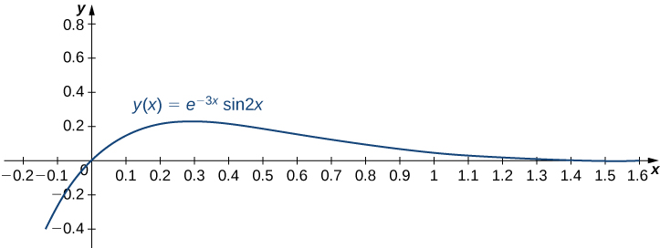
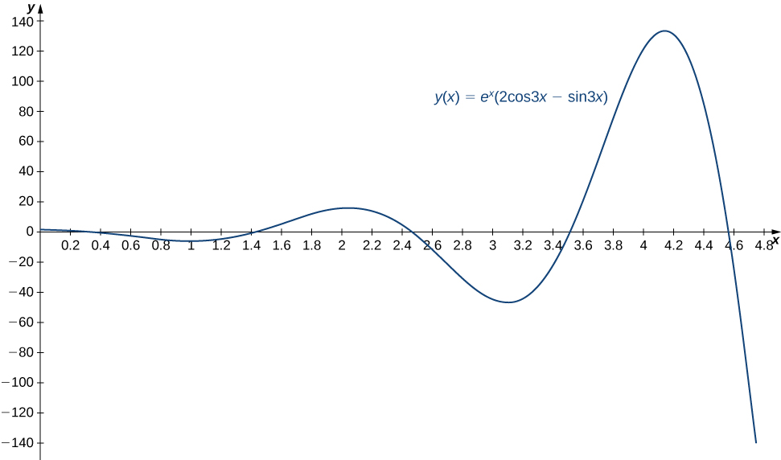
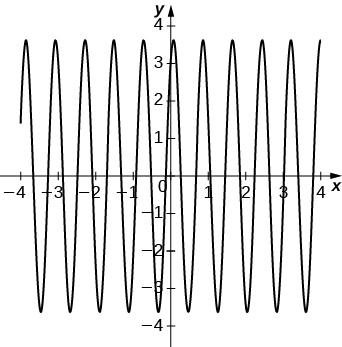
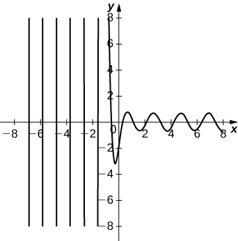

* Recognize homogeneous and nonhomogeneous linear differential equations.
* Determine the characteristic equation of a homogeneous linear equation.
* Use the roots of the characteristic equation to find the solution to a homogeneous linear equation.
* Solve initial-value and boundary-value problems involving linear differential equations.

When working with differential equations, usually the goal is to find a solution. In other words, we want to find a function (or functions) that satisfies the differential equation. The technique we use to find these solutions varies, depending on the form of the differential equation with which we are working. Second-order differential equations have several important characteristics that can help us determine which solution method to use. In this section, we examine some of these characteristics and the associated terminology.

### Homogeneous Linear Equations

Consider the second-order differential equation

<math xmlns="http://www.w3.org/1998/Math/MathML"><mrow><mi>x</mi><mi>y</mi><mtext>″</mtext><mo>+</mo><mn>2</mn><msup><mi>x</mi><mn>2</mn></msup><msup><mi>y</mi><mo>′</mo></msup><mo>+</mo><mn>5</mn><msup><mi>x</mi><mn>3</mn></msup><mi>y</mi><mo>=</mo><mn>0</mn><mo>.</mo></mrow></math>

Notice that *y* and its derivatives appear in a relatively simple form. They are multiplied by functions of *x*, but are not raised to any powers themselves, nor are they multiplied together. As discussed in [Introduction to Differential Equations](/m53696){: .target-chapter}, first-order equations with similar characteristics are said to be linear. The same is true of second-order equations. Also note that all the terms in this differential equation involve either *y* or one of its derivatives. There are no terms involving only functions of *x*. Equations like this, in which every term contains *y* or one of its derivatives, are called homogeneous.

Not all differential equations are homogeneous. Consider the differential equation

<math xmlns="http://www.w3.org/1998/Math/MathML"><mrow><mi>x</mi><mi>y</mi><mtext>″</mtext><mo>+</mo><mn>2</mn><msup><mi>x</mi><mn>2</mn></msup><msup><mi>y</mi><mo>′</mo></msup><mo>+</mo><mn>5</mn><msup><mi>x</mi><mn>3</mn></msup><mi>y</mi><mo>=</mo><msup><mi>x</mi><mn>2</mn></msup><mo>.</mo></mrow></math>

The <math xmlns="http://www.w3.org/1998/Math/MathML"><mrow><msup><mi>x</mi><mn>2</mn></msup></mrow></math>

 term on the right side of the equal sign does not contain *y* or any of its derivatives. Therefore, this differential equation is nonhomogeneous.

Definition

A second-order differential equation is linear if it can be written in the form

<math xmlns="http://www.w3.org/1998/Math/MathML"><mrow><msub><mi>a</mi><mn>2</mn></msub><mrow><mo>(</mo><mi>x</mi><mo>)</mo></mrow><mi>y</mi><mtext>″</mtext><mo>+</mo><msub><mi>a</mi><mn>1</mn></msub><mrow><mo>(</mo><mi>x</mi><mo>)</mo></mrow><msup><mi>y</mi><mo>′</mo></msup><mo>+</mo><msub><mi>a</mi><mn>0</mn></msub><mrow><mo>(</mo><mi>x</mi><mo>)</mo></mrow><mi>y</mi><mo>=</mo><mi>r</mi><mrow><mo>(</mo><mi>x</mi><mo>)</mo></mrow><mo>,</mo></mrow></math>

where <math xmlns="http://www.w3.org/1998/Math/MathML"><mrow><msub><mi>a</mi><mn>2</mn></msub><mo stretchy="false">(</mo><mi>x</mi><mo stretchy="false">)</mo><mo>,</mo></mrow></math>

 <math xmlns="http://www.w3.org/1998/Math/MathML"><mrow><msub><mi>a</mi><mn>1</mn></msub><mo stretchy="false">(</mo><mi>x</mi><mo stretchy="false">)</mo><mo>,</mo></mrow></math>

 <math xmlns="http://www.w3.org/1998/Math/MathML"><mrow><msub><mi>a</mi><mn>0</mn></msub><mo stretchy="false">(</mo><mi>x</mi><mo stretchy="false">)</mo><mo>,</mo></mrow></math>

 and <math xmlns="http://www.w3.org/1998/Math/MathML"><mrow><mi>r</mi><mo stretchy="false">(</mo><mi>x</mi><mo stretchy="false">)</mo></mrow></math>

 are real-valued functions and <math xmlns="http://www.w3.org/1998/Math/MathML"><mrow><msub><mi>a</mi><mn>2</mn></msub><mo stretchy="false">(</mo><mi>x</mi><mo stretchy="false">)</mo></mrow></math>

 is not identically zero. If <math xmlns="http://www.w3.org/1998/Math/MathML"><mrow><mi>r</mi><mo stretchy="false">(</mo><mi>x</mi><mo stretchy="false">)</mo><mo>≡</mo><mn>0</mn></mrow></math>

—in other words, if <math xmlns="http://www.w3.org/1998/Math/MathML"><mrow><mi>r</mi><mo stretchy="false">(</mo><mi>x</mi><mo stretchy="false">)</mo><mo>=</mo><mn>0</mn></mrow></math>

 for every value of *x*—the equation is said to be a **homogeneous linear equation**{: data-type="term"}. If <math xmlns="http://www.w3.org/1998/Math/MathML"><mrow><mi>r</mi><mo stretchy="false">(</mo><mi>x</mi><mo stretchy="false">)</mo><mo>≠</mo><mn>0</mn></mrow></math>

 for some value of <math xmlns="http://www.w3.org/1998/Math/MathML"><mrow><mi>x</mi><mo>,</mo></mrow></math>

 the equation is said to be a **nonhomogeneous linear equation**{: data-type="term"}.

Visit this [website][1] to study more about second-order linear differential equations.

In linear differential equations, <math xmlns="http://www.w3.org/1998/Math/MathML"><mi>y</mi></math>

 and its derivatives can be raised only to the first power and they may not be multiplied by one another. Terms involving <math xmlns="http://www.w3.org/1998/Math/MathML"><mrow><msup><mi>y</mi><mn>2</mn></msup></mrow></math>

 or <math xmlns="http://www.w3.org/1998/Math/MathML"><mrow><msqrt><msup><mi>y</mi><mo>′</mo></msup></msqrt></mrow></math>

 make the equation nonlinear. Functions of <math xmlns="http://www.w3.org/1998/Math/MathML"><mi>y</mi></math>

 and its derivatives, such as <math xmlns="http://www.w3.org/1998/Math/MathML"><mrow><mtext>sin</mtext><mspace width="0.1em" /><mi>y</mi></mrow></math>

 or <math xmlns="http://www.w3.org/1998/Math/MathML"><mrow><msup><mi>e</mi><msup><mi>y</mi><mo>′</mo></msup></msup><mo>,</mo></mrow></math>

 are similarly prohibited in linear differential equations.

Note that equations may not always be given in standard form (the form shown in the definition). It can be helpful to rewrite them in that form to decide whether they are linear, or whether a linear equation is homogeneous.

Classifying Second-Order Equations

Classify each of the following equations as linear or nonlinear. If the equation is linear, determine further whether it is homogeneous or nonhomogeneous.

1.  <math xmlns="http://www.w3.org/1998/Math/MathML"><mrow><mi>y</mi><mtext>″</mtext><mo>+</mo><mn>3</mn><msup><mi>x</mi><mn>4</mn></msup><msup><mi>y</mi><mo>′</mo></msup><mo>+</mo><msup><mi>x</mi><mn>2</mn></msup><msup><mi>y</mi><mn>2</mn></msup><mo>=</mo><msup><mi>x</mi><mn>3</mn></msup></mrow></math>

2.  <math xmlns="http://www.w3.org/1998/Math/MathML"><mrow><mo stretchy="false">(</mo><mtext>sin</mtext><mspace width="0.1em" /><mi>x</mi><mo stretchy="false">)</mo><mi>y</mi><mtext>″</mtext><mo>+</mo><mo stretchy="false">(</mo><mtext>cos</mtext><mspace width="0.1em" /><mi>x</mi><mo stretchy="false">)</mo><msup><mi>y</mi><mo>′</mo></msup><mo>+</mo><mn>3</mn><mi>y</mi><mo>=</mo><mn>0</mn></mrow></math>

3.  <math xmlns="http://www.w3.org/1998/Math/MathML"><mrow><mn>4</mn><msup><mi>t</mi><mn>2</mn></msup><mi>x</mi><mtext>″</mtext><mo>+</mo><mn>3</mn><mi>t</mi><mi>x</mi><msup><mi>x</mi><mo>′</mo></msup><mo>+</mo><mn>4</mn><mi>x</mi><mo>=</mo><mn>0</mn></mrow></math>

4.  <math xmlns="http://www.w3.org/1998/Math/MathML"><mrow><mn>5</mn><mi>y</mi><mtext>″</mtext><mo>+</mo><mi>y</mi><mo>=</mo><mn>4</mn><msup><mi>x</mi><mn>5</mn></msup></mrow></math>

5.  <math xmlns="http://www.w3.org/1998/Math/MathML"><mrow><mo stretchy="false">(</mo><mtext>cos</mtext><mspace width="0.1em" /><mi>x</mi><mo stretchy="false">)</mo><mi>y</mi><mtext>″</mtext><mo>−</mo><mtext>sin</mtext><mspace width="0.1em" /><msup><mi>y</mi><mo>′</mo></msup><mo>+</mo><mo stretchy="false">(</mo><mtext>sin</mtext><mspace width="0.1em" /><mi>x</mi><mo stretchy="false">)</mo><mi>y</mi><mo>−</mo><mtext>cos</mtext><mspace width="0.1em" /><mi>x</mi><mo>=</mo><mn>0</mn></mrow></math>

6.  <math xmlns="http://www.w3.org/1998/Math/MathML"><mrow><mn>8</mn><mi>t</mi><mi>y</mi><mtext>″</mtext><mo>−</mo><mn>6</mn><msup><mi>t</mi><mn>2</mn></msup><msup><mi>y</mi><mo>′</mo></msup><mo>+</mo><mn>4</mn><mi>t</mi><mi>y</mi><mo>−</mo><mn>3</mn><msup><mi>t</mi><mn>2</mn></msup><mo>=</mo><mn>0</mn></mrow></math>

7.  <math xmlns="http://www.w3.org/1998/Math/MathML"><mrow><mtext>sin</mtext><mo stretchy="false">(</mo><msup><mi>x</mi><mn>2</mn></msup><mo stretchy="false">)</mo><mi>y</mi><mtext>″</mtext><mo>−</mo><mo stretchy="false">(</mo><mtext>cos</mtext><mspace width="0.1em" /><mi>x</mi><mo stretchy="false">)</mo><msup><mi>y</mi><mo>′</mo></msup><mo>+</mo><msup><mi>x</mi><mn>2</mn></msup><mi>y</mi><mo>=</mo><msup><mi>y</mi><mo>′</mo></msup><mo>−</mo><mn>3</mn></mrow></math>

8.  <math xmlns="http://www.w3.org/1998/Math/MathML"><mrow><mi>y</mi><mtext>″</mtext><mo>+</mo><mn>5</mn><mi>x</mi><msup><mi>y</mi><mo>′</mo></msup><mo>−</mo><mn>3</mn><mi>y</mi><mo>=</mo><mtext>cos</mtext><mspace width="0.1em" /><mi>y</mi></mrow></math>
{: type="a"}

1.  This equation is nonlinear because of the
    <math xmlns="http://www.w3.org/1998/Math/MathML"><mrow><msup><mi>y</mi><mn>2</mn></msup></mrow></math>
    
    term.
2.  This equation is linear. There is no term involving a power or function of
    <math xmlns="http://www.w3.org/1998/Math/MathML"><mrow><mi>y</mi><mo>,</mo></mrow></math>
    
    and the coefficients are all functions of
    <math xmlns="http://www.w3.org/1998/Math/MathML"><mrow><mi>x</mi><mtext>.</mtext></mrow></math>
    
    The equation is already written in standard form, and
    <math xmlns="http://www.w3.org/1998/Math/MathML"><mrow><mi>r</mi><mo stretchy="false">(</mo><mi>x</mi><mo stretchy="false">)</mo></mrow></math>
    
    is identically zero, so the equation is homogeneous.
3.  This equation is nonlinear. Note that, in this case, *x* is the dependent variable and *t* is the independent variable. The second term involves the product of
    <math xmlns="http://www.w3.org/1998/Math/MathML"><mi>x</mi></math>
    
    and
    <math xmlns="http://www.w3.org/1998/Math/MathML"><mrow><msup><mi>x</mi><mo>′</mo></msup><mo>,</mo></mrow></math>
    
    so the equation is nonlinear.
4.  This equation is linear. Since
    <math xmlns="http://www.w3.org/1998/Math/MathML"><mrow><mi>r</mi><mo stretchy="false">(</mo><mi>x</mi><mo stretchy="false">)</mo><mo>=</mo><mn>4</mn><msup><mi>x</mi><mn>5</mn></msup><mo>,</mo></mrow></math>
    
    the equation is nonhomogeneous.
5.  This equation is nonlinear, because of the
    <math xmlns="http://www.w3.org/1998/Math/MathML"><mrow><mtext>sin</mtext><mspace width="0.1em" /><msup><mi>y</mi><mo>′</mo></msup></mrow></math>
    
    term.
6.  This equation is linear. Rewriting it in standard form gives
    * * *
    {: data-type="newline"}
    
    

    <math xmlns="http://www.w3.org/1998/Math/MathML"><mrow><mn>8</mn><msup><mi>t</mi><mn>2</mn></msup><mi>y</mi><mtext>″</mtext><mo>−</mo><mn>6</mn><msup><mi>t</mi><mn>2</mn></msup><msup><mi>y</mi><mo>′</mo></msup><mo>+</mo><mn>4</mn><mi>t</mi><mi>y</mi><mo>=</mo><mn>3</mn><msup><mi>t</mi><mn>2</mn></msup><mo>.</mo></mrow></math>
    

    
    * * *
    {: data-type="newline"}
    
    With the equation in standard form, we can see that
    <math xmlns="http://www.w3.org/1998/Math/MathML"><mrow><mi>r</mi><mo stretchy="false">(</mo><mi>t</mi><mo stretchy="false">)</mo><mo>=</mo><mn>3</mn><msup><mi>t</mi><mn>2</mn></msup><mo>,</mo></mrow></math>
    
    so the equation is nonhomogeneous.
7.  This equation looks like it’s linear, but we should rewrite it in standard form to be sure. We get
    * * *
    {: data-type="newline"}
    
    

    <math xmlns="http://www.w3.org/1998/Math/MathML"><mrow><mtext>sin</mtext><mo stretchy="false">(</mo><msup><mi>x</mi><mn>2</mn></msup><mo stretchy="false">)</mo><mi>y</mi><mtext>″</mtext><mo>−</mo><mo stretchy="false">(</mo><mtext>cos</mtext><mspace width="0.1em" /><mi>x</mi><mo>+</mo><mn>1</mn><mo stretchy="false">)</mo><msup><mi>y</mi><mo>′</mo></msup><mo>+</mo><msup><mi>x</mi><mn>2</mn></msup><mi>y</mi><mo>=</mo><mn>−3</mn><mo>.</mo></mrow></math>
    

    
    * * *
    {: data-type="newline"}
    
    This equation is, indeed, linear. With
    <math xmlns="http://www.w3.org/1998/Math/MathML"><mrow><mi>r</mi><mo stretchy="false">(</mo><mi>x</mi><mo stretchy="false">)</mo><mo>=</mo><mn>−3</mn><mo>,</mo></mrow></math>
    
    it is nonhomogeneous.
8.  This equation is nonlinear because of the
    <math xmlns="http://www.w3.org/1998/Math/MathML"><mrow><mtext>cos</mtext><mspace width="0.1em" /><mi>y</mi></mrow></math>
    
    term.
{: type="a"}

Visit this [website][2] that discusses second-order differential equations.

Classify each of the following equations as linear or nonlinear. If the equation is linear, determine further whether it is homogeneous or nonhomogeneous.

1.  <math xmlns="http://www.w3.org/1998/Math/MathML"><mrow><msup><mrow><mo stretchy="false">(</mo><mi>y</mi><mtext>″</mtext><mo stretchy="false">)</mo></mrow><mn>2</mn></msup><mo>−</mo><msup><mi>y</mi><mo>′</mo></msup><mo>+</mo><mn>8</mn><msup><mi>x</mi><mn>3</mn></msup><mi>y</mi><mo>=</mo><mn>0</mn></mrow></math>

2.  <math xmlns="http://www.w3.org/1998/Math/MathML"><mrow><mo stretchy="false">(</mo><mtext>sin</mtext><mspace width="0.1em" /><mi>t</mi><mo stretchy="false">)</mo><mi>y</mi><mtext>″</mtext><mo>+</mo><mtext>cos</mtext><mspace width="0.1em" /><mi>t</mi><mo>−</mo><mn>3</mn><mi>t</mi><msup><mi>y</mi><mo>′</mo></msup><mo>=</mo><mn>0</mn></mrow></math>
{: type="a"}

1.  Nonlinear
2.  Linear, nonhomogeneous
{: type="a"}

Hint

Write the equation in standard form if necessary. Check for powers or functions of <math xmlns="http://www.w3.org/1998/Math/MathML"><mi>y</mi></math>

 and its derivatives.

Later in this section, we will see some techniques for solving specific types of differential equations. Before we get to that, however, let’s get a feel for how solutions to linear differential equations behave. In many cases, solving differential equations depends on making educated guesses about what the solution might look like. Knowing how various types of solutions behave will be helpful.

Verifying a Solution

Consider the linear, homogeneous differential equation

<math xmlns="http://www.w3.org/1998/Math/MathML"><mrow><msup><mi>x</mi><mn>2</mn></msup><mi>y</mi><mtext>″</mtext><mo>−</mo><mi>x</mi><msup><mi>y</mi><mo>′</mo></msup><mo>−</mo><mn>3</mn><mi>y</mi><mo>=</mo><mn>0</mn><mo>.</mo></mrow></math>

Looking at this equation, notice that the coefficient functions are polynomials, with higher powers of <math xmlns="http://www.w3.org/1998/Math/MathML"><mi>x</mi></math>

 associated with higher-order derivatives of <math xmlns="http://www.w3.org/1998/Math/MathML"><mrow><mi>y</mi><mtext>.</mtext></mrow></math>

 Show that <math xmlns="http://www.w3.org/1998/Math/MathML"><mrow><mi>y</mi><mo>=</mo><msup><mi>x</mi><mn>3</mn></msup></mrow></math>

 is a solution to this differential equation.

Let <math xmlns="http://www.w3.org/1998/Math/MathML"><mrow><mi>y</mi><mo>=</mo><msup><mi>x</mi><mn>3</mn></msup><mo>.</mo></mrow></math>

 Then <math xmlns="http://www.w3.org/1998/Math/MathML"><mrow><msup><mi>y</mi><mo>′</mo></msup><mo>=</mo><mn>3</mn><msup><mi>x</mi><mn>2</mn></msup></mrow></math>

 and <math xmlns="http://www.w3.org/1998/Math/MathML"><mrow><mi>y</mi><mtext>″</mtext><mo>=</mo><mn>6</mn><mi>x</mi><mtext>.</mtext></mrow></math>

 Substituting into the differential equation, we see that

<math xmlns="http://www.w3.org/1998/Math/MathML"><mtable><mtr><mtd columnalign="right"><msup><mi>x</mi><mn>2</mn></msup><mi>y</mi><mtext>″</mtext><mo>−</mo><mi>x</mi><mi>y</mi><mo>′</mo><mo>−</mo><mn>3</mn><mi>y</mi></mtd><mtd columnalign="left"><mo>=</mo><msup><mi>x</mi><mn>2</mn></msup><mrow><mo>(</mo><mrow><mn>6</mn><mi>x</mi></mrow><mo>)</mo></mrow><mo>−</mo><mi>x</mi><mrow><mo>(</mo><mrow><mn>3</mn><msup><mi>x</mi><mn>2</mn></msup></mrow><mo>)</mo></mrow><mo>−</mo><mn>3</mn><mrow><mo>(</mo><mrow><msup><mi>x</mi><mn>3</mn></msup></mrow><mo>)</mo></mrow></mtd></mtr><mtr><mtd /><mtd columnalign="left"><mo>=</mo><mn>6</mn><msup><mi>x</mi><mn>3</mn></msup><mo>−</mo><mn>3</mn><msup><mi>x</mi><mn>3</mn></msup><mo>−</mo><mn>3</mn><msup><mi>x</mi><mn>3</mn></msup></mtd></mtr><mtr><mtd /><mtd columnalign="left"><mo>=</mo><mn>0</mn><mo>.</mo></mtd></mtr></mtable></math>

Show that <math xmlns="http://www.w3.org/1998/Math/MathML"><mrow><mi>y</mi><mo>=</mo><mn>2</mn><msup><mi>x</mi><mn>2</mn></msup></mrow></math>

 is a solution to the differential equation

<math xmlns="http://www.w3.org/1998/Math/MathML"><mrow><mfrac><mn>1</mn><mn>2</mn></mfrac><msup><mi>x</mi><mn>2</mn></msup><mi>y</mi><mtext>″</mtext><mo>−</mo><mi>x</mi><msup><mi>y</mi><mo>′</mo></msup><mo>+</mo><mi>y</mi><mo>=</mo><mn>0</mn><mo>.</mo></mrow></math>

Hint

Calculate the derivatives and substitute them into the differential equation.

Although simply finding any solution to a differential equation is important, mathematicians and engineers often want to go beyond finding *one* solution to a differential equation to finding *all* solutions to a differential equation. In other words, we want to find a general solution**.** Just as with first-order differential equations, a general solution (or family of solutions) gives the entire set of solutions to a differential equation. An important difference between first-order and second-order equations is that, with second-order equations, we typically need to find two different solutions to the equation to find the general solution. If we find two solutions, then any linear combination of these solutions is also a solution. We state this fact as the following theorem.

Superposition Principle

If <math xmlns="http://www.w3.org/1998/Math/MathML"><mrow><msub><mi>y</mi><mn>1</mn></msub><mo stretchy="false">(</mo><mi>x</mi><mo stretchy="false">)</mo></mrow></math>

 and <math xmlns="http://www.w3.org/1998/Math/MathML"><mrow><msub><mi>y</mi><mn>2</mn></msub><mo stretchy="false">(</mo><mi>x</mi><mo stretchy="false">)</mo></mrow></math>

 are solutions to a linear homogeneous differential equation, then the function

<math xmlns="http://www.w3.org/1998/Math/MathML"><mrow><mi>y</mi><mo stretchy="false">(</mo><mi>x</mi><mo stretchy="false">)</mo><mo>=</mo><msub><mi>c</mi><mn>1</mn></msub><msub><mi>y</mi><mn>1</mn></msub><mo stretchy="false">(</mo><mi>x</mi><mo stretchy="false">)</mo><mo>+</mo><msub><mi>c</mi><mn>2</mn></msub><msub><mi>y</mi><mn>2</mn></msub><mo stretchy="false">(</mo><mi>x</mi><mo stretchy="false">)</mo><mo>,</mo></mrow></math>

where <math xmlns="http://www.w3.org/1998/Math/MathML"><mrow><msub><mi>c</mi><mn>1</mn></msub></mrow></math>

 and <math xmlns="http://www.w3.org/1998/Math/MathML"><mrow><msub><mi>c</mi><mn>2</mn></msub></mrow></math>

 are constants, is also a solution.

The proof of this **superposition principle**{: data-type="term" .no-emphasis} theorem is left as an exercise.

Verifying the Superposition Principle

Consider the differential equation

<math xmlns="http://www.w3.org/1998/Math/MathML"><mrow><mi>y</mi><mtext>″</mtext><mo>−</mo><mn>4</mn><msup><mi>y</mi><mo>′</mo></msup><mo>−</mo><mn>5</mn><mi>y</mi><mo>=</mo><mn>0</mn><mo>.</mo></mrow></math>

Given that <math xmlns="http://www.w3.org/1998/Math/MathML"><mrow><msup><mi>e</mi><mrow><mtext>−</mtext><mi>x</mi></mrow></msup></mrow></math>

 and <math xmlns="http://www.w3.org/1998/Math/MathML"><mrow><msup><mi>e</mi><mrow><mn>5</mn><mi>x</mi></mrow></msup></mrow></math>

 are solutions to this differential equation, show that <math xmlns="http://www.w3.org/1998/Math/MathML"><mrow><mn>4</mn><msup><mi>e</mi><mrow><mtext>−</mtext><mi>x</mi></mrow></msup><mo>+</mo><msup><mi>e</mi><mrow><mn>5</mn><mi>x</mi></mrow></msup></mrow></math>

 is a solution.

We have

<math xmlns="http://www.w3.org/1998/Math/MathML"><mrow><mi>y</mi><mo stretchy="false">(</mo><mi>x</mi><mo stretchy="false">)</mo><mo>=</mo><mn>4</mn><msup><mi>e</mi><mrow><mtext>−</mtext><mi>x</mi></mrow></msup><mo>+</mo><msup><mi>e</mi><mrow><mn>5</mn><mi>x</mi></mrow></msup><mo>,</mo><mspace width="0.2em" /><mtext>so</mtext><mspace width="0.2em" /><msup><mi>y</mi><mo>′</mo></msup><mo stretchy="false">(</mo><mi>x</mi><mo stretchy="false">)</mo><mo>=</mo><mn>−4</mn><msup><mi>e</mi><mrow><mtext>−</mtext><mi>x</mi></mrow></msup><mo>+</mo><mn>5</mn><msup><mi>e</mi><mrow><mn>5</mn><mi>x</mi></mrow></msup><mspace width="0.2em" /><mtext>and</mtext><mspace width="0.2em" /><mi>y</mi><mtext>″</mtext><mo stretchy="false">(</mo><mi>x</mi><mo stretchy="false">)</mo><mo>=</mo><mn>4</mn><msup><mi>e</mi><mrow><mtext>−</mtext><mi>x</mi></mrow></msup><mo>+</mo><mn>25</mn><msup><mi>e</mi><mrow><mn>5</mn><mi>x</mi></mrow></msup><mo>.</mo></mrow></math>

Then

<math xmlns="http://www.w3.org/1998/Math/MathML"><mtable><mtr><mtd columnalign="right"><mi>y</mi><mtext>″</mtext><mo>−</mo><mn>4</mn><msup><mi>y</mi><mo>′</mo></msup><mo>−</mo><mn>5</mn><mi>y</mi></mtd><mtd columnalign="left"><mo>=</mo><mrow><mo>(</mo><mrow><mn>4</mn><msup><mi>e</mi><mrow><mtext>−</mtext><mi>x</mi></mrow></msup><mo>+</mo><mn>25</mn><msup><mi>e</mi><mrow><mn>5</mn><mi>x</mi></mrow></msup></mrow><mo>)</mo></mrow><mo>−</mo><mn>4</mn><mrow><mo>(</mo><mrow><mn>−4</mn><msup><mi>e</mi><mrow><mtext>−</mtext><mi>x</mi></mrow></msup><mo>+</mo><mn>5</mn><msup><mi>e</mi><mrow><mn>5</mn><mi>x</mi></mrow></msup></mrow><mo>)</mo></mrow><mo>−</mo><mn>5</mn><mrow><mo>(</mo><mrow><mn>4</mn><msup><mi>e</mi><mrow><mtext>−</mtext><mi>x</mi></mrow></msup><mo>+</mo><msup><mi>e</mi><mrow><mn>5</mn><mi>x</mi></mrow></msup></mrow><mo>)</mo></mrow></mtd></mtr><mtr><mtd /><mtd columnalign="left"><mo>=</mo><mn>4</mn><msup><mi>e</mi><mrow><mtext>−</mtext><mi>x</mi></mrow></msup><mo>+</mo><mn>25</mn><msup><mi>e</mi><mrow><mn>5</mn><mi>x</mi></mrow></msup><mo>+</mo><mn>16</mn><msup><mi>e</mi><mrow><mtext>−</mtext><mi>x</mi></mrow></msup><mo>−</mo><mn>20</mn><msup><mi>e</mi><mrow><mn>5</mn><mi>x</mi></mrow></msup><mo>−</mo><mn>20</mn><msup><mi>e</mi><mrow><mtext>−</mtext><mi>x</mi></mrow></msup><mo>−</mo><mn>5</mn><msup><mi>e</mi><mrow><mn>5</mn><mi>x</mi></mrow></msup></mtd></mtr><mtr><mtd /><mtd columnalign="left"><mo>=</mo><mn>0</mn><mo>.</mo></mtd></mtr></mtable></math>

Thus, <math xmlns="http://www.w3.org/1998/Math/MathML"><mrow><mi>y</mi><mo stretchy="false">(</mo><mi>x</mi><mo stretchy="false">)</mo><mo>=</mo><mn>4</mn><msup><mi>e</mi><mrow><mtext>−</mtext><mi>x</mi></mrow></msup><mo>+</mo><msup><mi>e</mi><mrow><mn>5</mn><mi>x</mi></mrow></msup></mrow></math>

 is a solution.

Consider the differential equation

<math xmlns="http://www.w3.org/1998/Math/MathML"><mrow><mi>y</mi><mtext>″</mtext><mo>+</mo><mn>5</mn><msup><mi>y</mi><mo>′</mo></msup><mo>+</mo><mn>6</mn><mi>y</mi><mo>=</mo><mn>0</mn><mo>.</mo></mrow></math>

Given that <math xmlns="http://www.w3.org/1998/Math/MathML"><mrow><msup><mi>e</mi><mrow><mn>−2</mn><mi>x</mi></mrow></msup></mrow></math>

 and <math xmlns="http://www.w3.org/1998/Math/MathML"><mrow><msup><mi>e</mi><mrow><mn>−3</mn><mi>x</mi></mrow></msup></mrow></math>

 are solutions to this differential equation, show that <math xmlns="http://www.w3.org/1998/Math/MathML"><mrow><mn>3</mn><msup><mi>e</mi><mrow><mn>−2</mn><mi>x</mi></mrow></msup><mo>+</mo><mn>6</mn><msup><mi>e</mi><mrow><mn>−3</mn><mi>x</mi></mrow></msup></mrow></math>

 is a solution.

Hint

Differentiate the function and substitute into the differential equation.

Unfortunately, to find the general solution to a second-order differential equation, it is not enough to find any two solutions and then combine them. Consider the differential equation

<math xmlns="http://www.w3.org/1998/Math/MathML"><mrow><mi>x</mi><mtext>″</mtext><mo>+</mo><mn>7</mn><msup><mi>x</mi><mo>′</mo></msup><mo>+</mo><mn>12</mn><mi>x</mi><mo>=</mo><mn>0</mn><mo>.</mo></mrow></math>

Both <math xmlns="http://www.w3.org/1998/Math/MathML"><mrow><msup><mi>e</mi><mrow><mn>−3</mn><mi>t</mi></mrow></msup></mrow></math>

 and <math xmlns="http://www.w3.org/1998/Math/MathML"><mrow><mn>2</mn><msup><mi>e</mi><mrow><mn>−3</mn><mi>t</mi></mrow></msup></mrow></math>

 are solutions (check this). However, <math xmlns="http://www.w3.org/1998/Math/MathML"><mrow><mi>x</mi><mo stretchy="false">(</mo><mi>t</mi><mo stretchy="false">)</mo><mo>=</mo><msub><mi>c</mi><mn>1</mn></msub><msup><mi>e</mi><mrow><mn>−3</mn><mi>t</mi></mrow></msup><mo>+</mo><msub><mi>c</mi><mn>2</mn></msub><mrow><mo>(</mo><mrow><mn>2</mn><msup><mi>e</mi><mrow><mn>−3</mn><mi>t</mi></mrow></msup></mrow><mo>)</mo></mrow></mrow></math>

 is *not* the general solution. This expression does not account for all solutions to the differential equation. In particular, it fails to account for the function <math xmlns="http://www.w3.org/1998/Math/MathML"><mrow><msup><mi>e</mi><mrow><mn>−4</mn><mi>t</mi></mrow></msup><mo>,</mo></mrow></math>

 which is also a solution to the differential equation.

It turns out that to find the general solution to a second-order differential equation, we must find two linearly independent solutions. We define that terminology here.

Definition

A set of functions <math xmlns="http://www.w3.org/1998/Math/MathML"><mrow><msub><mi>f</mi><mn>1</mn></msub><mo stretchy="false">(</mo><mi>x</mi><mo stretchy="false">)</mo><mo>,</mo><msub><mi>f</mi><mn>2</mn></msub><mo stretchy="false">(</mo><mi>x</mi><mtext>),…,</mtext><msub><mi>f</mi><mi>n</mi></msub><mo stretchy="false">(</mo><mi>x</mi><mo stretchy="false">)</mo></mrow></math>

 is said to be **linearly dependent**{: data-type="term"} if there are constants <math xmlns="http://www.w3.org/1998/Math/MathML"><mrow><msub><mi>c</mi><mn>1</mn></msub><mo>,</mo><msub><mi>c</mi><mn>2</mn></msub><mtext>,…</mtext><msub><mi>c</mi><mi>n</mi></msub><mo>,</mo></mrow></math>

 not all zero, such that <math xmlns="http://www.w3.org/1998/Math/MathML"><mrow><msub><mi>c</mi><mn>1</mn></msub><msub><mi>f</mi><mn>1</mn></msub><mo stretchy="false">(</mo><mi>x</mi><mo stretchy="false">)</mo><mo>+</mo><msub><mi>c</mi><mn>2</mn></msub><msub><mi>f</mi><mn>2</mn></msub><mo stretchy="false">(</mo><mi>x</mi><mo stretchy="false">)</mo><mo>+</mo><mtext>⋯</mtext><mo>+</mo><msub><mi>c</mi><mi>n</mi></msub><msub><mi>f</mi><mi>n</mi></msub><mo stretchy="false">(</mo><mi>x</mi><mo stretchy="false">)</mo><mo>=</mo><mn>0</mn></mrow></math>

 for all *x* over the interval of interest. A set of functions that is not linearly dependent is said to be **linearly independent**{: data-type="term"}.

In this chapter, we usually test sets of only two functions for linear independence, which allows us to simplify this definition. From a practical perspective, we see that two functions are linearly dependent if either one of them is identically zero or if they are constant multiples of each other.

First we show that if the functions meet the conditions given previously, then they are linearly dependent. If one of the functions is identically zero—say, <math xmlns="http://www.w3.org/1998/Math/MathML"><mrow><msub><mi>f</mi><mn>2</mn></msub><mo stretchy="false">(</mo><mi>x</mi><mo stretchy="false">)</mo><mo>≡</mo><mn>0</mn></mrow></math>

—then choose <math xmlns="http://www.w3.org/1998/Math/MathML"><mrow><msub><mi>c</mi><mn>1</mn></msub><mo>=</mo><mn>0</mn></mrow></math>

 and <math xmlns="http://www.w3.org/1998/Math/MathML"><mrow><msub><mi>c</mi><mn>2</mn></msub><mo>=</mo><mn>1</mn><mo>,</mo></mrow></math>

 and the condition for linear dependence is satisfied. If, on the other hand, neither <math xmlns="http://www.w3.org/1998/Math/MathML"><mrow><msub><mi>f</mi><mn>1</mn></msub><mo stretchy="false">(</mo><mi>x</mi><mo stretchy="false">)</mo></mrow></math>

 nor <math xmlns="http://www.w3.org/1998/Math/MathML"><mrow><msub><mi>f</mi><mn>2</mn></msub><mo stretchy="false">(</mo><mi>x</mi><mo stretchy="false">)</mo></mrow></math>

 is identically zero, but <math xmlns="http://www.w3.org/1998/Math/MathML"><mrow><msub><mi>f</mi><mn>1</mn></msub><mo stretchy="false">(</mo><mi>x</mi><mo stretchy="false">)</mo><mo>=</mo><mi>C</mi><msub><mi>f</mi><mn>2</mn></msub><mo stretchy="false">(</mo><mi>x</mi><mo stretchy="false">)</mo></mrow></math>

 for some constant <math xmlns="http://www.w3.org/1998/Math/MathML"><mrow><mi>C</mi><mo>,</mo></mrow></math>

 then choose <math xmlns="http://www.w3.org/1998/Math/MathML"><mrow><msub><mi>c</mi><mn>1</mn></msub><mo>=</mo><mfrac><mn>1</mn><mi>C</mi></mfrac></mrow></math>

 and <math xmlns="http://www.w3.org/1998/Math/MathML"><mrow><msub><mi>c</mi><mn>2</mn></msub><mo>=</mo><mn>−1</mn><mo>,</mo></mrow></math>

 and again, the condition is satisfied.

Next, we show that if two functions are linearly dependent, then either one is identically zero or they are constant multiples of one another. Assume <math xmlns="http://www.w3.org/1998/Math/MathML"><mrow><msub><mi>f</mi><mn>1</mn></msub><mo stretchy="false">(</mo><mi>x</mi><mo stretchy="false">)</mo></mrow></math>

 and <math xmlns="http://www.w3.org/1998/Math/MathML"><mrow><msub><mi>f</mi><mn>2</mn></msub><mo stretchy="false">(</mo><mi>x</mi><mo stretchy="false">)</mo></mrow></math>

 are linearly independent. Then, there are constants, <math xmlns="http://www.w3.org/1998/Math/MathML"><mrow><msub><mi>c</mi><mn>1</mn></msub></mrow></math>

 and <math xmlns="http://www.w3.org/1998/Math/MathML"><mrow><msub><mi>c</mi><mn>2</mn></msub><mo>,</mo></mrow></math>

 not both zero, such that

<math xmlns="http://www.w3.org/1998/Math/MathML"><mrow><msub><mi>c</mi><mn>1</mn></msub><msub><mi>f</mi><mn>1</mn></msub><mo stretchy="false">(</mo><mi>x</mi><mo stretchy="false">)</mo><mo>+</mo><msub><mi>c</mi><mn>2</mn></msub><msub><mi>f</mi><mn>2</mn></msub><mo stretchy="false">(</mo><mi>x</mi><mo stretchy="false">)</mo><mo>=</mo><mn>0</mn></mrow></math>

for all *x* over the interval of interest. Then,

<math xmlns="http://www.w3.org/1998/Math/MathML"><mrow><msub><mi>c</mi><mn>1</mn></msub><msub><mi>f</mi><mn>1</mn></msub><mo stretchy="false">(</mo><mi>x</mi><mo stretchy="false">)</mo><mo>=</mo><mtext>−</mtext><msub><mi>c</mi><mn>2</mn></msub><msub><mi>f</mi><mn>2</mn></msub><mo stretchy="false">(</mo><mi>x</mi><mo stretchy="false">)</mo><mo>.</mo></mrow></math>

Now, since we stated that <math xmlns="http://www.w3.org/1998/Math/MathML"><mrow><msub><mi>c</mi><mn>1</mn></msub></mrow></math>

 and <math xmlns="http://www.w3.org/1998/Math/MathML"><mrow><msub><mi>c</mi><mn>2</mn></msub></mrow></math>

 can’t both be zero, assume <math xmlns="http://www.w3.org/1998/Math/MathML"><mrow><msub><mi>c</mi><mn>2</mn></msub><mo>≠</mo><mn>0</mn><mo>.</mo></mrow></math>

 Then, there are two cases: either <math xmlns="http://www.w3.org/1998/Math/MathML"><mrow><msub><mi>c</mi><mn>1</mn></msub><mo>=</mo><mn>0</mn></mrow></math>

 or <math xmlns="http://www.w3.org/1998/Math/MathML"><mrow><msub><mi>c</mi><mn>1</mn></msub><mo>≠</mo><mn>0</mn><mo>.</mo></mrow></math>

 If <math xmlns="http://www.w3.org/1998/Math/MathML"><mrow><msub><mi>c</mi><mn>1</mn></msub><mo>=</mo><mn>0</mn><mo>,</mo></mrow></math>

 then

<math xmlns="http://www.w3.org/1998/Math/MathML"><mtable><mtr><mtd columnalign="left"><mn>0</mn><mo>=</mo><mtext>−</mtext><msub><mi>c</mi><mn>2</mn></msub><msub><mi>f</mi><mn>2</mn></msub><mo stretchy="false">(</mo><mi>x</mi><mo stretchy="false">)</mo></mtd></mtr><mtr><mtd columnalign="left"><mn>0</mn><mo>=</mo><msub><mi>f</mi><mn>2</mn></msub><mo stretchy="false">(</mo><mi>x</mi><mo stretchy="false">)</mo><mo>,</mo></mtd></mtr></mtable></math>

so one of the functions is identically zero. Now suppose <math xmlns="http://www.w3.org/1998/Math/MathML"><mrow><msub><mi>c</mi><mn>1</mn></msub><mo>≠</mo><mn>0</mn><mo>.</mo></mrow></math>

 Then,

<math xmlns="http://www.w3.org/1998/Math/MathML"><mrow><msub><mi>f</mi><mn>1</mn></msub><mo stretchy="false">(</mo><mi>x</mi><mo stretchy="false">)</mo><mo>=</mo><mrow><mo>(</mo><mrow><mo>−</mo><mfrac><mrow><msub><mi>c</mi><mn>2</mn></msub></mrow><mrow><msub><mi>c</mi><mn>1</mn></msub></mrow></mfrac></mrow><mo>)</mo></mrow><msub><mi>f</mi><mn>2</mn></msub><mo stretchy="false">(</mo><mi>x</mi><mo stretchy="false">)</mo></mrow></math>

and we see that the functions are constant multiples of one another.

Linear Dependence of Two Functions

Two functions, <math xmlns="http://www.w3.org/1998/Math/MathML"><mrow><msub><mi>f</mi><mn>1</mn></msub><mo stretchy="false">(</mo><mi>x</mi><mo stretchy="false">)</mo></mrow></math>

 and <math xmlns="http://www.w3.org/1998/Math/MathML"><mrow><msub><mi>f</mi><mn>2</mn></msub><mo stretchy="false">(</mo><mi>x</mi><mo stretchy="false">)</mo><mo>,</mo></mrow></math>

 are said to be linearly dependent if either one of them is identically zero or if <math xmlns="http://www.w3.org/1998/Math/MathML"><mrow><msub><mi>f</mi><mn>1</mn></msub><mo stretchy="false">(</mo><mi>x</mi><mo stretchy="false">)</mo><mo>=</mo><mi>C</mi><msub><mi>f</mi><mn>2</mn></msub><mo stretchy="false">(</mo><mi>x</mi><mo stretchy="false">)</mo></mrow></math>

 for some constant *C* and for all *x* over the interval of interest. Functions that are not linearly dependent are said to be *linearly independent*.

Testing for Linear Dependence

Determine whether the following pairs of functions are linearly dependent or linearly independent.

1.  <math xmlns="http://www.w3.org/1998/Math/MathML"><mrow><msub><mi>f</mi><mn>1</mn></msub><mo stretchy="false">(</mo><mi>x</mi><mo stretchy="false">)</mo><mo>=</mo><msup><mi>x</mi><mn>2</mn></msup><mo>,</mo></mrow></math>
    
    <math xmlns="http://www.w3.org/1998/Math/MathML"><mrow><msub><mi>f</mi><mn>2</mn></msub><mo stretchy="false">(</mo><mi>x</mi><mo stretchy="false">)</mo><mo>=</mo><mn>5</mn><msup><mi>x</mi><mn>2</mn></msup></mrow></math>

2.  <math xmlns="http://www.w3.org/1998/Math/MathML"><mrow><msub><mi>f</mi><mn>1</mn></msub><mo stretchy="false">(</mo><mi>x</mi><mo stretchy="false">)</mo><mo>=</mo><mtext>sin</mtext><mspace width="0.1em" /><mi>x</mi><mo>,</mo></mrow></math>
    
    <math xmlns="http://www.w3.org/1998/Math/MathML"><mrow><msub><mi>f</mi><mn>2</mn></msub><mo stretchy="false">(</mo><mi>x</mi><mo stretchy="false">)</mo><mo>=</mo><mtext>cos</mtext><mspace width="0.1em" /><mi>x</mi></mrow></math>

3.  <math xmlns="http://www.w3.org/1998/Math/MathML"><mrow><msub><mi>f</mi><mn>1</mn></msub><mo stretchy="false">(</mo><mi>x</mi><mo stretchy="false">)</mo><mo>=</mo><msup><mi>e</mi><mrow><mn>3</mn><mi>x</mi></mrow></msup><mo>,</mo></mrow></math>
    
    <math xmlns="http://www.w3.org/1998/Math/MathML"><mrow><msub><mi>f</mi><mn>2</mn></msub><mo stretchy="false">(</mo><mi>x</mi><mo stretchy="false">)</mo><mo>=</mo><msup><mi>e</mi><mrow><mn>−3</mn><mi>x</mi></mrow></msup></mrow></math>

4.  <math xmlns="http://www.w3.org/1998/Math/MathML"><mrow><msub><mi>f</mi><mn>1</mn></msub><mo stretchy="false">(</mo><mi>x</mi><mo stretchy="false">)</mo><mo>=</mo><mn>3</mn><mi>x</mi><mo>,</mo></mrow></math>
    
    <math xmlns="http://www.w3.org/1998/Math/MathML"><mrow><msub><mi>f</mi><mn>2</mn></msub><mo stretchy="false">(</mo><mi>x</mi><mo stretchy="false">)</mo><mo>=</mo><mn>3</mn><mi>x</mi><mo>+</mo><mn>1</mn></mrow></math>
{: type="a"}

1.  <math xmlns="http://www.w3.org/1998/Math/MathML"><mrow><msub><mi>f</mi><mn>2</mn></msub><mo stretchy="false">(</mo><mi>x</mi><mo stretchy="false">)</mo><mo>=</mo><mn>5</mn><msub><mi>f</mi><mn>1</mn></msub><mo stretchy="false">(</mo><mi>x</mi><mo stretchy="false">)</mo><mo>,</mo></mrow></math>
    
    so the functions are linearly dependent.
2.  There is no constant *C* such that
    <math xmlns="http://www.w3.org/1998/Math/MathML"><mrow><msub><mi>f</mi><mn>1</mn></msub><mo stretchy="false">(</mo><mi>x</mi><mo stretchy="false">)</mo><mo>=</mo><mi>C</mi><msub><mi>f</mi><mn>2</mn></msub><mo stretchy="false">(</mo><mi>x</mi><mo stretchy="false">)</mo><mo>,</mo></mrow></math>
    
    so the functions are linearly independent.
3.  There is no constant *C* such that
    <math xmlns="http://www.w3.org/1998/Math/MathML"><mrow><msub><mi>f</mi><mn>1</mn></msub><mo stretchy="false">(</mo><mi>x</mi><mo stretchy="false">)</mo><mo>=</mo><mi>C</mi><msub><mi>f</mi><mn>2</mn></msub><mo stretchy="false">(</mo><mi>x</mi><mo stretchy="false">)</mo><mo>,</mo></mrow></math>
    
    so the functions are linearly independent. Don’t get confused by the fact that the exponents are constant multiples of each other. With two exponential functions, unless the exponents are equal, the functions are linearly independent.
4.  There is no constant *C* such that
    <math xmlns="http://www.w3.org/1998/Math/MathML"><mrow><msub><mi>f</mi><mn>1</mn></msub><mo stretchy="false">(</mo><mi>x</mi><mo stretchy="false">)</mo><mo>=</mo><mi>C</mi><msub><mi>f</mi><mn>2</mn></msub><mo stretchy="false">(</mo><mi>x</mi><mo stretchy="false">)</mo><mo>,</mo></mrow></math>
    
    so the functions are linearly independent.
{: type="a"}

Determine whether the following pairs of functions are linearly dependent or linearly independent: <math xmlns="http://www.w3.org/1998/Math/MathML"><mrow><msub><mi>f</mi><mn>1</mn></msub><mo stretchy="false">(</mo><mi>x</mi><mo stretchy="false">)</mo><mo>=</mo><msup><mi>e</mi><mi>x</mi></msup><mo>,</mo></mrow></math>

 <math xmlns="http://www.w3.org/1998/Math/MathML"><mrow><msub><mi>f</mi><mn>2</mn></msub><mo stretchy="false">(</mo><mi>x</mi><mo stretchy="false">)</mo><mo>=</mo><mn>3</mn><msup><mi>e</mi><mrow><mn>3</mn><mi>x</mi></mrow></msup><mo>.</mo></mrow></math>

Linearly independent

Hint

Are the functions constant multiples of one another?

If we are able to find two linearly independent solutions to a second-order differential equation, then we can combine them to find the general solution. This result is formally stated in the following theorem.

General Solution to a Homogeneous Equation

If <math xmlns="http://www.w3.org/1998/Math/MathML"><mrow><msub><mi>y</mi><mn>1</mn></msub><mo stretchy="false">(</mo><mi>x</mi><mo stretchy="false">)</mo></mrow></math>

 and <math xmlns="http://www.w3.org/1998/Math/MathML"><mrow><msub><mi>y</mi><mn>2</mn></msub><mo stretchy="false">(</mo><mi>x</mi><mo stretchy="false">)</mo></mrow></math>

 are linearly independent solutions to a second-order, linear, homogeneous differential equation, then the general solution is given by

<math xmlns="http://www.w3.org/1998/Math/MathML"><mrow><mi>y</mi><mo stretchy="false">(</mo><mi>x</mi><mo stretchy="false">)</mo><mo>=</mo><msub><mi>c</mi><mn>1</mn></msub><msub><mi>y</mi><mn>1</mn></msub><mo stretchy="false">(</mo><mi>x</mi><mo stretchy="false">)</mo><mo>+</mo><msub><mi>c</mi><mn>2</mn></msub><msub><mi>y</mi><mn>2</mn></msub><mo stretchy="false">(</mo><mi>x</mi><mo stretchy="false">)</mo><mo>,</mo></mrow></math>

where <math xmlns="http://www.w3.org/1998/Math/MathML"><mrow><msub><mi>c</mi><mn>1</mn></msub></mrow></math>

 and <math xmlns="http://www.w3.org/1998/Math/MathML"><mrow><msub><mi>c</mi><mn>2</mn></msub></mrow></math>

 are constants.

When we say a family of functions is the **general solution to a differential equation**{: data-type="term" .no-emphasis}, we mean that (1) every expression of that form is a solution and (2) every solution to the differential equation can be written in that form, which makes this theorem extremely powerful. If we can find two linearly independent solutions to a differential equation, we have, effectively, found *all* solutions to the differential equation—quite a remarkable statement. The proof of this theorem is beyond the scope of this text.

Writing the General Solution

If <math xmlns="http://www.w3.org/1998/Math/MathML"><mrow><msub><mi>y</mi><mn>1</mn></msub><mo stretchy="false">(</mo><mi>t</mi><mo stretchy="false">)</mo><mo>=</mo><msup><mi>e</mi><mrow><mn>3</mn><mi>t</mi></mrow></msup></mrow></math>

 and <math xmlns="http://www.w3.org/1998/Math/MathML"><mrow><msub><mi>y</mi><mn>2</mn></msub><mo stretchy="false">(</mo><mi>t</mi><mo stretchy="false">)</mo><mo>=</mo><msup><mi>e</mi><mrow><mn>−3</mn><mi>t</mi></mrow></msup></mrow></math>

 are solutions to <math xmlns="http://www.w3.org/1998/Math/MathML"><mrow><mi>y</mi><mtext>″</mtext><mo>−</mo><mn>9</mn><mi>y</mi><mo>=</mo><mn>0</mn><mo>,</mo></mrow></math>

 what is the general solution?

Note that <math xmlns="http://www.w3.org/1998/Math/MathML"><mrow><msub><mi>y</mi><mn>1</mn></msub></mrow></math>

 and <math xmlns="http://www.w3.org/1998/Math/MathML"><mrow><msub><mi>y</mi><mn>2</mn></msub></mrow></math>

 are not constant multiples of one another, so they are linearly independent. Then, the general solution to the differential equation is <math xmlns="http://www.w3.org/1998/Math/MathML"><mrow><mi>y</mi><mo stretchy="false">(</mo><mi>t</mi><mo stretchy="false">)</mo><mo>=</mo><msub><mi>c</mi><mn>1</mn></msub><msup><mi>e</mi><mrow><mn>3</mn><mi>t</mi></mrow></msup><mo>+</mo><msub><mi>c</mi><mn>2</mn></msub><msup><mi>e</mi><mrow><mn>−3</mn><mi>t</mi></mrow></msup><mo>.</mo></mrow></math>

If <math xmlns="http://www.w3.org/1998/Math/MathML"><mrow><msub><mi>y</mi><mn>1</mn></msub><mo stretchy="false">(</mo><mi>x</mi><mo stretchy="false">)</mo><mo>=</mo><msup><mi>e</mi><mrow><mn>3</mn><mi>x</mi></mrow></msup></mrow></math>

 and <math xmlns="http://www.w3.org/1998/Math/MathML"><mrow><msub><mi>y</mi><mn>2</mn></msub><mo stretchy="false">(</mo><mi>x</mi><mo stretchy="false">)</mo><mo>=</mo><mi>x</mi><msup><mi>e</mi><mrow><mn>3</mn><mi>x</mi></mrow></msup></mrow></math>

 are solutions to <math xmlns="http://www.w3.org/1998/Math/MathML"><mrow><mi>y</mi><mtext>″</mtext><mo>−</mo><mn>6</mn><msup><mi>y</mi><mo>′</mo></msup><mo>+</mo><mn>9</mn><mi>y</mi><mo>=</mo><mn>0</mn><mo>,</mo></mrow></math>

 what is the general solution?

<math xmlns="http://www.w3.org/1998/Math/MathML"><mrow><mi>y</mi><mo stretchy="false">(</mo><mi>x</mi><mo stretchy="false">)</mo><mo>=</mo><msub><mi>c</mi><mn>1</mn></msub><msup><mi>e</mi><mrow><mn>3</mn><mi>x</mi></mrow></msup><mo>+</mo><msub><mi>c</mi><mn>2</mn></msub><mi>x</mi><msup><mi>e</mi><mrow><mn>3</mn><mi>x</mi></mrow></msup></mrow></math>

Hint

Check for linear independence first.

### Second-Order Equations with Constant Coefficients

Now that we have a better feel for linear differential equations, we are going to concentrate on solving second-order equations of the form

<math xmlns="http://www.w3.org/1998/Math/MathML"><mrow><mi>a</mi><mi>y</mi><mtext>″</mtext><mo>+</mo><mi>b</mi><msup><mi>y</mi><mo>′</mo></msup><mo>+</mo><mi>c</mi><mi>y</mi><mo>=</mo><mn>0</mn><mo>,</mo></mrow></math>

where <math xmlns="http://www.w3.org/1998/Math/MathML"><mrow><mi>a</mi><mo>,</mo></mrow></math>

 <math xmlns="http://www.w3.org/1998/Math/MathML"><mrow><mi>b</mi><mo>,</mo></mrow></math>

 and <math xmlns="http://www.w3.org/1998/Math/MathML"><mi>c</mi></math>

 are constants.

Since all the coefficients are constants, the solutions are probably going to be functions with derivatives that are constant multiples of themselves. We need all the terms to cancel out, and if taking a derivative introduces a term that is not a constant multiple of the original function, it is difficult to see how that term cancels out. Exponential functions have derivatives that are constant multiples of the original function, so let’s see what happens when we try a solution of the form <math xmlns="http://www.w3.org/1998/Math/MathML"><mrow><mi>y</mi><mo stretchy="false">(</mo><mi>x</mi><mo stretchy="false">)</mo><mo>=</mo><msup><mi>e</mi><mrow><mi>λ</mi><mi>x</mi></mrow></msup><mo>,</mo></mrow></math>

 where <math xmlns="http://www.w3.org/1998/Math/MathML"><mi>λ</mi></math>

 (the lowercase Greek letter lambda) is some constant.

If <math xmlns="http://www.w3.org/1998/Math/MathML"><mrow><mi>y</mi><mo stretchy="false">(</mo><mi>x</mi><mo stretchy="false">)</mo><mo>=</mo><msup><mi>e</mi><mrow><mi>λ</mi><mi>x</mi></mrow></msup><mo>,</mo></mrow></math>

 then <math xmlns="http://www.w3.org/1998/Math/MathML"><mrow><msup><mi>y</mi><mo>′</mo></msup><mo stretchy="false">(</mo><mi>x</mi><mo stretchy="false">)</mo><mo>=</mo><mi>λ</mi><msup><mi>e</mi><mrow><mi>λ</mi><mi>x</mi></mrow></msup></mrow></math>

 and <math xmlns="http://www.w3.org/1998/Math/MathML"><mrow><mi>y</mi><mtext>″</mtext><mo>=</mo><msup><mi>λ</mi><mn>2</mn></msup><msup><mi>e</mi><mrow><mi>λ</mi><mi>x</mi></mrow></msup><mo>.</mo></mrow></math>

 Substituting these expressions into [\[link\]](#fs-id1170572251008), we get

<math xmlns="http://www.w3.org/1998/Math/MathML"><mtable><mtr><mtd columnalign="right"><mi>a</mi><mi>y</mi><mtext>″</mtext><mo>+</mo><mi>b</mi><msup><mi>y</mi><mo>′</mo></msup><mo>+</mo><mi>c</mi><mi>y</mi></mtd><mtd columnalign="left"><mo>=</mo><mi>a</mi><mo stretchy="false">(</mo><msup><mi>λ</mi><mn>2</mn></msup><msup><mi>e</mi><mrow><mi>λ</mi><mi>x</mi></mrow></msup><mo stretchy="false">)</mo><mo>+</mo><mi>b</mi><mo stretchy="false">(</mo><mi>λ</mi><msup><mi>e</mi><mrow><mi>λ</mi><mi>x</mi></mrow></msup><mo stretchy="false">)</mo><mo>+</mo><mi>c</mi><msup><mi>e</mi><mrow><mi>λ</mi><mi>x</mi></mrow></msup></mtd></mtr><mtr><mtd /><mtd columnalign="left"><mo>=</mo><msup><mi>e</mi><mrow><mi>λ</mi><mi>x</mi></mrow></msup><mo stretchy="false">(</mo><mi>a</mi><msup><mi>λ</mi><mn>2</mn></msup><mo>+</mo><mi>b</mi><mi>λ</mi><mo>+</mo><mi>c</mi><mo stretchy="false">)</mo><mo>.</mo></mtd></mtr></mtable></math>

Since <math xmlns="http://www.w3.org/1998/Math/MathML"><mrow><msup><mi>e</mi><mrow><mi>λ</mi><mi>x</mi></mrow></msup></mrow></math>

 is never zero, this expression can be equal to zero for all *x* only if

<math xmlns="http://www.w3.org/1998/Math/MathML"><mrow><mi>a</mi><msup><mi>λ</mi><mn>2</mn></msup><mo>+</mo><mi>b</mi><mi>λ</mi><mo>+</mo><mi>c</mi><mo>=</mo><mn>0</mn><mo>.</mo></mrow></math>

We call this the characteristic equation of the differential equation.

Definition

The **characteristic equation**{: data-type="term"} of the differential equation <math xmlns="http://www.w3.org/1998/Math/MathML"><mrow><mi>a</mi><mi>y</mi><mtext>″</mtext><mo>+</mo><mi>b</mi><msup><mi>y</mi><mo>′</mo></msup><mo>+</mo><mi>c</mi><mi>y</mi><mo>=</mo><mn>0</mn></mrow></math>

 is <math xmlns="http://www.w3.org/1998/Math/MathML"><mrow><mi>a</mi><msup><mi>λ</mi><mn>2</mn></msup><mo>+</mo><mi>b</mi><mi>λ</mi><mo>+</mo><mi>c</mi><mo>=</mo><mn>0</mn><mo>.</mo></mrow></math>

The characteristic equation is very important in finding solutions to differential equations of this form. We can solve the characteristic equation either by factoring or by using the quadratic formula

<math xmlns="http://www.w3.org/1998/Math/MathML"><mrow><mi>λ</mi><mo>=</mo><mfrac><mrow><mtext>−</mtext><mi>b</mi><mo>±</mo><msqrt><mrow><msup><mi>b</mi><mn>2</mn></msup><mo>−</mo><mn>4</mn><mi>a</mi><mi>c</mi></mrow></msqrt></mrow><mrow><mn>2</mn><mi>a</mi></mrow></mfrac><mo>.</mo></mrow></math>

This gives three cases. The characteristic equation has (1) distinct real roots; (2) a single, repeated real root; or (3) complex conjugate roots. We consider each of these cases separately.

#### Distinct Real Roots

If the characteristic equation has distinct real roots <math xmlns="http://www.w3.org/1998/Math/MathML"><mrow><msub><mi>λ</mi><mn>1</mn></msub></mrow></math>

 and <math xmlns="http://www.w3.org/1998/Math/MathML"><mrow><msub><mi>λ</mi><mn>2</mn></msub><mo>,</mo></mrow></math>

 then <math xmlns="http://www.w3.org/1998/Math/MathML"><mrow><msup><mi>e</mi><mrow><msub><mi>λ</mi><mn>1</mn></msub><mi>x</mi></mrow></msup></mrow></math>

 and <math xmlns="http://www.w3.org/1998/Math/MathML"><mrow><msup><mi>e</mi><mrow><msub><mi>λ</mi><mn>2</mn></msub><mi>x</mi></mrow></msup></mrow></math>

 are linearly independent solutions to [\[link\]](#fs-id1170571650370), and the general solution is given by

<math xmlns="http://www.w3.org/1998/Math/MathML"><mrow><mi>y</mi><mo stretchy="false">(</mo><mi>x</mi><mo stretchy="false">)</mo><mo>=</mo><msub><mi>c</mi><mn>1</mn></msub><msup><mi>e</mi><mrow><msub><mi>λ</mi><mn>1</mn></msub><mi>x</mi></mrow></msup><mo>+</mo><msub><mi>c</mi><mn>2</mn></msub><msup><mi>e</mi><mrow><msub><mi>λ</mi><mn>2</mn></msub><mi>x</mi></mrow></msup><mo>,</mo></mrow></math>

where <math xmlns="http://www.w3.org/1998/Math/MathML"><mrow><msub><mi>c</mi><mn>1</mn></msub></mrow></math>

 and <math xmlns="http://www.w3.org/1998/Math/MathML"><mrow><msub><mi>c</mi><mn>2</mn></msub></mrow></math>

 are constants.

For example, the differential equation <math xmlns="http://www.w3.org/1998/Math/MathML"><mrow><mi>y</mi><mtext>″</mtext><mo>+</mo><mn>9</mn><msup><mi>y</mi><mo>′</mo></msup><mo>+</mo><mn>14</mn><mi>y</mi><mo>=</mo><mn>0</mn></mrow></math>

 has the associated characteristic equation <math xmlns="http://www.w3.org/1998/Math/MathML"><mrow><msup><mi>λ</mi><mn>2</mn></msup><mo>+</mo><mn>9</mn><mi>λ</mi><mo>+</mo><mn>14</mn><mo>=</mo><mn>0</mn><mo>.</mo></mrow></math>

 This factors into <math xmlns="http://www.w3.org/1998/Math/MathML"><mrow><mrow><mo>(</mo><mrow><mi>λ</mi><mo>+</mo><mn>2</mn></mrow><mo>)</mo></mrow><mrow><mo>(</mo><mrow><mi>λ</mi><mo>+</mo><mn>7</mn></mrow><mo>)</mo></mrow><mo>=</mo><mn>0</mn><mo>,</mo></mrow></math>

 which has roots <math xmlns="http://www.w3.org/1998/Math/MathML"><mrow><msub><mi>λ</mi><mn>1</mn></msub><mo>=</mo><mn>−2</mn></mrow></math>

 and <math xmlns="http://www.w3.org/1998/Math/MathML"><mrow><msub><mi>λ</mi><mn>2</mn></msub><mo>=</mo><mn>−7</mn><mo>.</mo></mrow></math>

 Therefore, the general solution to this differential equation is

<math xmlns="http://www.w3.org/1998/Math/MathML"><mrow><mi>y</mi><mo stretchy="false">(</mo><mi>x</mi><mo stretchy="false">)</mo><mo>=</mo><msub><mi>c</mi><mn>1</mn></msub><msup><mi>e</mi><mrow><mn>−2</mn><mi>x</mi></mrow></msup><mo>+</mo><msub><mi>c</mi><mn>2</mn></msub><msup><mi>e</mi><mrow><mn>−7</mn><mi>x</mi></mrow></msup><mo>.</mo></mrow></math>

#### Single Repeated Real Root

Things are a little more complicated if the characteristic equation has a repeated real root, <math xmlns="http://www.w3.org/1998/Math/MathML"><mi>λ</mi><mtext>.</mtext></math>

 In this case, we know <math xmlns="http://www.w3.org/1998/Math/MathML"><mrow><msup><mi>e</mi><mrow><mi>λ</mi><mi>x</mi></mrow></msup></mrow></math>

 is a solution to [\[link\]](#fs-id1170572251008), but it is only one solution and we need two linearly independent solutions to determine the general solution. We might be tempted to try a function of the form <math xmlns="http://www.w3.org/1998/Math/MathML"><mrow><mi>k</mi><msup><mi>e</mi><mrow><mi>λ</mi><mi>x</mi></mrow></msup><mo>,</mo></mrow></math>

 where *k* is some constant, but it would not be linearly independent of <math xmlns="http://www.w3.org/1998/Math/MathML"><mrow><msup><mi>e</mi><mrow><mi>λ</mi><mi>x</mi></mrow></msup><mo>.</mo></mrow></math>

 Therefore, let’s try <math xmlns="http://www.w3.org/1998/Math/MathML"><mrow><mi>x</mi><msup><mi>e</mi><mrow><mi>λ</mi><mi>x</mi></mrow></msup></mrow></math>

 as the second solution. First, note that by the quadratic formula,

<math xmlns="http://www.w3.org/1998/Math/MathML"><mrow><mi>λ</mi><mo>=</mo><mfrac><mrow><mtext>−</mtext><mi>b</mi><mo>±</mo><msqrt><mrow><msup><mi>b</mi><mn>2</mn></msup><mo>−</mo><mn>4</mn><mi>a</mi><mi>c</mi></mrow></msqrt></mrow><mrow><mn>2</mn><mi>a</mi></mrow></mfrac><mo>.</mo></mrow></math>

But, <math xmlns="http://www.w3.org/1998/Math/MathML"><mi>λ</mi></math>

 is a repeated root, so <math xmlns="http://www.w3.org/1998/Math/MathML"><mrow><msup><mi>b</mi><mn>2</mn></msup><mo>−</mo><mn>4</mn><mi>a</mi><mi>c</mi><mo>=</mo><mn>0</mn></mrow></math>

 and <math xmlns="http://www.w3.org/1998/Math/MathML"><mrow><mi>λ</mi><mo>=</mo><mfrac><mrow><mtext>−</mtext><mi>b</mi></mrow><mrow><mn>2</mn><mi>a</mi></mrow></mfrac><mo>.</mo></mrow></math>

 Thus, if <math xmlns="http://www.w3.org/1998/Math/MathML"><mrow><mi>y</mi><mo>=</mo><mi>x</mi><msup><mi>e</mi><mrow><mi>λ</mi><mi>x</mi></mrow></msup><mo>,</mo></mrow></math>

 we have

<math xmlns="http://www.w3.org/1998/Math/MathML"><mrow><msup><mi>y</mi><mo>′</mo></msup><mo>=</mo><msup><mi>e</mi><mrow><mi>λ</mi><mi>x</mi></mrow></msup><mo>+</mo><mi>λ</mi><mi>x</mi><msup><mi>e</mi><mrow><mi>λ</mi><mi>x</mi></mrow></msup><mspace width="0.2em" /><mtext>and</mtext><mspace width="0.2em" /><mi>y</mi><mtext>″</mtext><mo>=</mo><mn>2</mn><mi>λ</mi><msup><mi>e</mi><mrow><mi>λ</mi><mi>x</mi></mrow></msup><mo>+</mo><msup><mi>λ</mi><mn>2</mn></msup><mi>x</mi><msup><mi>e</mi><mrow><mi>λ</mi><mi>x</mi></mrow></msup><mo>.</mo></mrow></math>

Substituting these expressions into [\[link\]](#fs-id1170572251008), we see that

<math xmlns="http://www.w3.org/1998/Math/MathML"><mtable><mtr><mtd columnalign="right"><mi>a</mi><mi>y</mi><mtext>″</mtext><mo>+</mo><mi>b</mi><msup><mi>y</mi><mo>′</mo></msup><mo>+</mo><mi>c</mi><mi>y</mi></mtd><mtd columnalign="left"><mo>=</mo><mi>a</mi><mo stretchy="false">(</mo><mn>2</mn><mi>λ</mi><msup><mi>e</mi><mrow><mi>λ</mi><mi>x</mi></mrow></msup><mo>+</mo><msup><mi>λ</mi><mn>2</mn></msup><mi>x</mi><msup><mi>e</mi><mrow><mi>λ</mi><mi>x</mi></mrow></msup><mo stretchy="false">)</mo><mo>+</mo><mi>b</mi><mo stretchy="false">(</mo><msup><mi>e</mi><mrow><mi>λ</mi><mi>x</mi></mrow></msup><mo>+</mo><mi>λ</mi><mi>x</mi><msup><mi>e</mi><mrow><mi>λ</mi><mi>x</mi></mrow></msup><mo stretchy="false">)</mo><mo>+</mo><mi>c</mi><mi>x</mi><msup><mi>e</mi><mrow><mi>λ</mi><mi>x</mi></mrow></msup></mtd></mtr><mtr><mtd /><mtd columnalign="left"><mo>=</mo><mi>x</mi><msup><mi>e</mi><mrow><mi>λ</mi><mi>x</mi></mrow></msup><mo stretchy="false">(</mo><mi>a</mi><msup><mi>λ</mi><mn>2</mn></msup><mo>+</mo><mi>b</mi><mi>λ</mi><mo>+</mo><mi>c</mi><mo stretchy="false">)</mo><mo>+</mo><msup><mi>e</mi><mrow><mi>λ</mi><mi>x</mi></mrow></msup><mo stretchy="false">(</mo><mn>2</mn><mi>a</mi><mi>λ</mi><mo>+</mo><mi>b</mi><mo stretchy="false">)</mo></mtd></mtr><mtr><mtd /><mtd columnalign="left"><mo>=</mo><mi>x</mi><msup><mi>e</mi><mrow><mi>λ</mi><mi>x</mi></mrow></msup><mo stretchy="false">(</mo><mn>0</mn><mo stretchy="false">)</mo><mo>+</mo><msup><mi>e</mi><mrow><mi>λ</mi><mi>x</mi></mrow></msup><mrow><mo>(</mo><mrow><mn>2</mn><mi>a</mi><mrow><mo>(</mo><mrow><mfrac><mrow><mtext>−</mtext><mi>b</mi></mrow><mrow><mn>2</mn><mi>a</mi></mrow></mfrac></mrow><mo>)</mo></mrow><mo>+</mo><mi>b</mi></mrow><mo>)</mo></mrow></mtd></mtr><mtr><mtd /><mtd columnalign="left"><mo>=</mo><mn>0</mn><mo>+</mo><msup><mi>e</mi><mrow><mi>λ</mi><mi>x</mi></mrow></msup><mrow><mo>(</mo><mn>0</mn><mo>)</mo></mrow></mtd></mtr><mtr><mtd /><mtd columnalign="left"><mo>=</mo><mn>0</mn><mo>.</mo></mtd></mtr></mtable></math>

This shows that <math xmlns="http://www.w3.org/1998/Math/MathML"><mrow><mi>x</mi><msup><mi>e</mi><mrow><mi>λ</mi><mi>x</mi></mrow></msup></mrow></math>

 is a solution to [\[link\]](#fs-id1170572251008). Since <math xmlns="http://www.w3.org/1998/Math/MathML"><mrow><msup><mi>e</mi><mrow><mi>λ</mi><mi>x</mi></mrow></msup></mrow></math>

 and <math xmlns="http://www.w3.org/1998/Math/MathML"><mrow><mi>x</mi><msup><mi>e</mi><mrow><mi>λ</mi><mi>x</mi></mrow></msup></mrow></math>

 are linearly independent, when the characteristic equation has a repeated root <math xmlns="http://www.w3.org/1998/Math/MathML"><mrow><mi>λ</mi><mo>,</mo></mrow></math>

 the general solution to [\[link\]](#fs-id1170572251008) is given by

<math xmlns="http://www.w3.org/1998/Math/MathML"><mrow><mi>y</mi><mo stretchy="false">(</mo><mi>x</mi><mo stretchy="false">)</mo><mo>=</mo><msub><mi>c</mi><mn>1</mn></msub><msup><mi>e</mi><mrow><mi>λ</mi><mi>x</mi></mrow></msup><mo>+</mo><msub><mi>c</mi><mn>2</mn></msub><mi>x</mi><msup><mi>e</mi><mrow><mi>λ</mi><mi>x</mi></mrow></msup><mo>,</mo></mrow></math>

where <math xmlns="http://www.w3.org/1998/Math/MathML"><mrow><msub><mi>c</mi><mn>1</mn></msub></mrow></math>

 and <math xmlns="http://www.w3.org/1998/Math/MathML"><mrow><msub><mi>c</mi><mn>2</mn></msub></mrow></math>

 are constants.

For example, the differential equation <math xmlns="http://www.w3.org/1998/Math/MathML"><mrow><mi>y</mi><mtext>″</mtext><mo>+</mo><mn>12</mn><msup><mi>y</mi><mo>′</mo></msup><mo>+</mo><mn>36</mn><mi>y</mi><mo>=</mo><mn>0</mn></mrow></math>

 has the associated characteristic equation <math xmlns="http://www.w3.org/1998/Math/MathML"><mrow><msup><mi>λ</mi><mn>2</mn></msup><mo>+</mo><mn>12</mn><mi>λ</mi><mo>+</mo><mn>36</mn><mo>=</mo><mn>0</mn><mo>.</mo></mrow></math>

 This factors into <math xmlns="http://www.w3.org/1998/Math/MathML"><mrow><msup><mrow><mrow><mo>(</mo><mrow><mi>λ</mi><mo>+</mo><mn>6</mn></mrow><mo>)</mo></mrow></mrow><mn>2</mn></msup><mo>=</mo><mn>0</mn><mo>,</mo></mrow></math>

 which has a repeated root <math xmlns="http://www.w3.org/1998/Math/MathML"><mrow><mi>λ</mi><mo>=</mo><mn>−6</mn><mo>.</mo></mrow></math>

 Therefore, the general solution to this differential equation is

<math xmlns="http://www.w3.org/1998/Math/MathML"><mrow><mi>y</mi><mo stretchy="false">(</mo><mi>x</mi><mo stretchy="false">)</mo><mo>=</mo><msub><mi>c</mi><mn>1</mn></msub><msup><mi>e</mi><mrow><mn>−6</mn><mi>x</mi></mrow></msup><mo>+</mo><msub><mi>c</mi><mn>2</mn></msub><mi>x</mi><msup><mi>e</mi><mrow><mn>−6</mn><mi>x</mi></mrow></msup><mo>.</mo></mrow></math>

#### Complex Conjugate Roots

The third case we must consider is when <math xmlns="http://www.w3.org/1998/Math/MathML"><mrow><msup><mi>b</mi><mn>2</mn></msup><mo>−</mo><mn>4</mn><mi>a</mi><mi>c</mi><mo>&lt;</mo><mn>0</mn><mo>.</mo></mrow></math>

 In this case, when we apply the quadratic formula, we are taking the square root of a negative number. We must use the imaginary number <math xmlns="http://www.w3.org/1998/Math/MathML"><mrow><mi>i</mi><mo>=</mo><msqrt><mrow><mn>−1</mn></mrow></msqrt></mrow></math>

 to find the roots, which take the form <math xmlns="http://www.w3.org/1998/Math/MathML"><mrow><msub><mi>λ</mi><mn>1</mn></msub><mo>=</mo><mi>α</mi><mo>+</mo><mi>β</mi><mi>i</mi></mrow></math>

 and <math xmlns="http://www.w3.org/1998/Math/MathML"><mrow><msub><mi>λ</mi><mn>2</mn></msub><mo>=</mo><mi>α</mi><mo>−</mo><mi>β</mi><mi>i</mi><mtext>.</mtext></mrow></math>

 The **complex number**{: data-type="term" .no-emphasis} <math xmlns="http://www.w3.org/1998/Math/MathML"><mrow><mi>α</mi><mo>+</mo><mi>β</mi><mi>i</mi></mrow></math>

 is called the *conjugate* of <math xmlns="http://www.w3.org/1998/Math/MathML"><mrow><mi>α</mi><mo>−</mo><mi>β</mi><mi>i</mi><mtext>.</mtext></mrow></math>

 Thus, we see that when <math xmlns="http://www.w3.org/1998/Math/MathML"><mrow><msup><mi>b</mi><mn>2</mn></msup><mo>−</mo><mn>4</mn><mi>a</mi><mi>c</mi><mo>&lt;</mo><mn>0</mn><mo>,</mo></mrow></math>

 the roots of our characteristic equation are always **complex conjugates**{: data-type="term" .no-emphasis}.

This creates a little bit of a problem for us. If we follow the same process we used for distinct real roots—using the roots of the characteristic equation as the coefficients in the exponents of exponential functions—we get the functions <math xmlns="http://www.w3.org/1998/Math/MathML"><mrow><msup><mi>e</mi><mrow><mo stretchy="false">(</mo><mi>α</mi><mo>+</mo><mi>β</mi><mi>i</mi><mo stretchy="false">)</mo><mi>x</mi></mrow></msup></mrow></math>

 and <math xmlns="http://www.w3.org/1998/Math/MathML"><mrow><msup><mi>e</mi><mrow><mo stretchy="false">(</mo><mi>α</mi><mo>−</mo><mi>β</mi><mi>i</mi><mo stretchy="false">)</mo><mi>x</mi></mrow></msup></mrow></math>

 as our solutions. However, there are problems with this approach. First, these functions take on complex (imaginary) values, and a complete discussion of such functions is beyond the scope of this text. Second, even if we were comfortable with complex-value functions, in this course we do not address the idea of a derivative for such functions. So, if possible, we’d like to find two linearly independent *real-value* solutions to the differential equation. For purposes of this development, we are going to manipulate and differentiate the functions <math xmlns="http://www.w3.org/1998/Math/MathML"><mrow><msup><mi>e</mi><mrow><mo stretchy="false">(</mo><mi>α</mi><mo>+</mo><mi>β</mi><mi>i</mi><mo stretchy="false">)</mo><mi>x</mi></mrow></msup></mrow></math>

 and <math xmlns="http://www.w3.org/1998/Math/MathML"><mrow><msup><mi>e</mi><mrow><mo stretchy="false">(</mo><mi>α</mi><mo>−</mo><mi>β</mi><mi>i</mi><mo stretchy="false">)</mo><mi>x</mi></mrow></msup></mrow></math>

 as if they were real-value functions. For these particular functions, this approach is valid mathematically, but be aware that there are other instances when complex-value functions do not follow the same rules as real-value functions. Those of you interested in a more in-depth discussion of complex-value functions should consult a complex analysis text.

Based on the roots <math xmlns="http://www.w3.org/1998/Math/MathML"><mrow><mi>α</mi><mo>±</mo><mi>β</mi><mi>i</mi></mrow></math>

 of the characteristic equation, the functions <math xmlns="http://www.w3.org/1998/Math/MathML"><mrow><msup><mi>e</mi><mrow><mo stretchy="false">(</mo><mi>α</mi><mo>+</mo><mi>β</mi><mi>i</mi><mo stretchy="false">)</mo><mi>x</mi></mrow></msup></mrow></math>

 and <math xmlns="http://www.w3.org/1998/Math/MathML"><mrow><msup><mi>e</mi><mrow><mo stretchy="false">(</mo><mi>α</mi><mo>−</mo><mi>β</mi><mi>i</mi><mo stretchy="false">)</mo><mi>x</mi></mrow></msup></mrow></math>

 are linearly independent solutions to the differential equation. and the general solution is given by

<math xmlns="http://www.w3.org/1998/Math/MathML"><mrow><mi>y</mi><mo stretchy="false">(</mo><mi>x</mi><mo stretchy="false">)</mo><mo>=</mo><msub><mi>c</mi><mn>1</mn></msub><msup><mi>e</mi><mrow><mo stretchy="false">(</mo><mi>α</mi><mo>+</mo><mi>β</mi><mi>i</mi><mo stretchy="false">)</mo><mi>x</mi></mrow></msup><mo>+</mo><msub><mi>c</mi><mn>2</mn></msub><msup><mi>e</mi><mrow><mo stretchy="false">(</mo><mi>α</mi><mo>−</mo><mi>β</mi><mi>i</mi><mo stretchy="false">)</mo><mi>x</mi></mrow></msup><mo>.</mo></mrow></math>

Using some smart choices for <math xmlns="http://www.w3.org/1998/Math/MathML"><mrow><msub><mi>c</mi><mn>1</mn></msub></mrow></math>

 and <math xmlns="http://www.w3.org/1998/Math/MathML"><mrow><msub><mi>c</mi><mn>2</mn></msub><mo>,</mo></mrow></math>

 and a little bit of algebraic manipulation, we can find two linearly independent, real-value solutions to [\[link\]](#fs-id1170572251008) and express our general solution in those terms.

We encountered exponential functions with complex exponents earlier. One of the key tools we used to express these exponential functions in terms of sines and cosines was **Euler’s formula**{: data-type="term" .no-emphasis}, which tells us that

<math xmlns="http://www.w3.org/1998/Math/MathML"><mrow><msup><mi>e</mi><mrow><mi>i</mi><mi>θ</mi></mrow></msup><mo>=</mo><mtext>cos</mtext><mspace width="0.1em" /><mi>θ</mi><mo>+</mo><mi>i</mi><mspace width="0.1em" /><mtext>sin</mtext><mspace width="0.1em" /><mi>θ</mi></mrow></math>

for all real numbers <math xmlns="http://www.w3.org/1998/Math/MathML"><mrow><mi>θ</mi><mtext>.</mtext></mrow></math>

Going back to the general solution, we have

<math xmlns="http://www.w3.org/1998/Math/MathML"><mtable><mtr><mtd columnalign="right"><mi>y</mi><mo stretchy="false">(</mo><mi>x</mi><mo stretchy="false">)</mo></mtd><mtd columnalign="left"><mo>=</mo><msub><mi>c</mi><mn>1</mn></msub><msup><mi>e</mi><mrow><mo stretchy="false">(</mo><mi>α</mi><mo>+</mo><mi>β</mi><mi>i</mi><mo stretchy="false">)</mo><mi>x</mi></mrow></msup><mo>+</mo><msub><mi>c</mi><mn>2</mn></msub><msup><mi>e</mi><mrow><mo stretchy="false">(</mo><mi>α</mi><mo>−</mo><mi>β</mi><mi>i</mi><mo stretchy="false">)</mo><mi>x</mi></mrow></msup></mtd></mtr><mtr><mtd /><mtd columnalign="left"><mo>=</mo><msub><mi>c</mi><mn>1</mn></msub><msup><mi>e</mi><mrow><mi>α</mi><mi>x</mi></mrow></msup><msup><mi>e</mi><mrow><mi>β</mi><mi>i</mi><mi>x</mi></mrow></msup><mo>+</mo><msub><mi>c</mi><mn>2</mn></msub><msup><mi>e</mi><mrow><mi>α</mi><mi>x</mi></mrow></msup><msup><mi>e</mi><mrow><mtext>−</mtext><mi>β</mi><mi>i</mi><mi>x</mi></mrow></msup></mtd></mtr><mtr><mtd /><mtd columnalign="left"><mo>=</mo><msup><mi>e</mi><mrow><mi>α</mi><mi>x</mi></mrow></msup><mrow><mo>(</mo><mrow><msub><mi>c</mi><mn>1</mn></msub><msup><mi>e</mi><mrow><mi>β</mi><mi>i</mi><mi>x</mi></mrow></msup><mo>+</mo><msub><mi>c</mi><mn>2</mn></msub><msup><mi>e</mi><mrow><mtext>−</mtext><mi>β</mi><mi>i</mi><mi>x</mi></mrow></msup></mrow><mo>)</mo></mrow><mo>.</mo></mtd></mtr></mtable></math>

Applying Euler’s formula together with the identities <math xmlns="http://www.w3.org/1998/Math/MathML"><mrow><mtext>cos</mtext><mo stretchy="false">(</mo><mtext>−</mtext><mi>x</mi><mo stretchy="false">)</mo><mo>=</mo><mtext>cos</mtext><mspace width="0.1em" /><mi>x</mi></mrow></math>

 and <math xmlns="http://www.w3.org/1998/Math/MathML"><mrow><mtext>sin</mtext><mo stretchy="false">(</mo><mtext>−</mtext><mi>x</mi><mo stretchy="false">)</mo><mo>=</mo><mtext>−</mtext><mtext>sin</mtext><mspace width="0.1em" /><mi>x</mi><mo>,</mo></mrow></math>

 we get

<math xmlns="http://www.w3.org/1998/Math/MathML"><mtable><mtr><mtd columnalign="right"><mi>y</mi><mo stretchy="false">(</mo><mi>x</mi><mo stretchy="false">)</mo></mtd><mtd columnalign="left"><mo>=</mo><msup><mi>e</mi><mrow><mi>α</mi><mi>x</mi></mrow></msup><mrow><mo>[</mo><mrow><msub><mi>c</mi><mn>1</mn></msub><mrow><mo>(</mo><mrow><mtext>cos</mtext><mspace width="0.1em" /><mi>β</mi><mi>x</mi><mo>+</mo><mi>i</mi><mspace width="0.1em" /><mtext>sin</mtext><mspace width="0.1em" /><mi>β</mi><mi>x</mi></mrow><mo>)</mo></mrow><mo>+</mo><msub><mi>c</mi><mn>2</mn></msub><mrow><mo>(</mo><mrow><mtext>cos</mtext><mo stretchy="false">(</mo><mtext>−</mtext><mi>β</mi><mi>x</mi><mo stretchy="false">)</mo><mo>+</mo><mi>i</mi><mspace width="0.1em" /><mtext>sin</mtext><mo stretchy="false">(</mo><mtext>−</mtext><mi>β</mi><mi>x</mi><mo stretchy="false">)</mo></mrow><mo>)</mo></mrow></mrow><mo>]</mo></mrow></mtd></mtr><mtr><mtd /><mtd columnalign="left"><mo>=</mo><msup><mi>e</mi><mrow><mi>α</mi><mi>x</mi></mrow></msup><mrow><mo>[</mo><mrow><mo stretchy="false">(</mo><msub><mi>c</mi><mn>1</mn></msub><mo>+</mo><msub><mi>c</mi><mn>2</mn></msub><mo stretchy="false">)</mo><mtext>cos</mtext><mspace width="0.1em" /><mi>β</mi><mi>x</mi><mo>+</mo><mo stretchy="false">(</mo><msub><mi>c</mi><mn>1</mn></msub><mo>−</mo><msub><mi>c</mi><mn>2</mn></msub><mo stretchy="false">)</mo><mi>i</mi><mspace width="0.1em" /><mtext>sin</mtext><mspace width="0.1em" /><mi>β</mi><mi>x</mi></mrow><mo>]</mo></mrow><mo>.</mo></mtd></mtr></mtable></math>

Now, if we choose <math xmlns="http://www.w3.org/1998/Math/MathML"><mrow><msub><mi>c</mi><mn>1</mn></msub><mo>=</mo><msub><mi>c</mi><mn>2</mn></msub><mo>=</mo><mfrac><mn>1</mn><mn>2</mn></mfrac><mo>,</mo></mrow></math>

 the second term is zero and we get

<math xmlns="http://www.w3.org/1998/Math/MathML"><mrow><mi>y</mi><mo stretchy="false">(</mo><mi>x</mi><mo stretchy="false">)</mo><mo>=</mo><msup><mi>e</mi><mrow><mi>α</mi><mi>x</mi></mrow></msup><mtext>cos</mtext><mspace width="0.1em" /><mi>β</mi><mi>x</mi></mrow></math>

as a real-value solution to [\[link\]](#fs-id1170572251008). Similarly, if we choose <math xmlns="http://www.w3.org/1998/Math/MathML"><mrow><msub><mi>c</mi><mn>1</mn></msub><mo>=</mo><mtext>−</mtext><mrow><mfrac><mi>i</mi><mn>2</mn></mfrac></mrow></mrow></math>

 and <math xmlns="http://www.w3.org/1998/Math/MathML"><mrow><msub><mi>c</mi><mn>2</mn></msub><mo>=</mo><mfrac><mi>i</mi><mn>2</mn></mfrac><mo>,</mo></mrow></math>

 the first term is zero and we get

<math xmlns="http://www.w3.org/1998/Math/MathML"><mrow><mi>y</mi><mo stretchy="false">(</mo><mi>x</mi><mo stretchy="false">)</mo><mo>=</mo><msup><mi>e</mi><mrow><mi>α</mi><mi>x</mi></mrow></msup><mtext>sin</mtext><mspace width="0.1em" /><mi>β</mi><mi>x</mi></mrow></math>

as a second, linearly independent, real-value solution to [\[link\]](#fs-id1170572251008).

Based on this, we see that if the characteristic equation has complex conjugate roots <math xmlns="http://www.w3.org/1998/Math/MathML"><mrow><mi>α</mi><mo>±</mo><mi>β</mi><mi>i</mi><mo>,</mo></mrow></math>

 then the general solution to [\[link\]](#fs-id1170572251008) is given by

<math xmlns="http://www.w3.org/1998/Math/MathML"><mtable><mtr><mtd columnalign="right"><mi>y</mi><mo stretchy="false">(</mo><mi>x</mi><mo stretchy="false">)</mo></mtd><mtd columnalign="left"><mo>=</mo><msub><mi>c</mi><mn>1</mn></msub><msup><mi>e</mi><mrow><mi>α</mi><mi>x</mi></mrow></msup><mtext>cos</mtext><mspace width="0.1em" /><mi>β</mi><mi>x</mi><mo>+</mo><msub><mi>c</mi><mn>2</mn></msub><msup><mi>e</mi><mrow><mi>α</mi><mi>x</mi></mrow></msup><mtext>sin</mtext><mspace width="0.1em" /><mi>β</mi><mi>x</mi></mtd></mtr><mtr><mtd /><mtd columnalign="left"><mo>=</mo><msup><mi>e</mi><mrow><mi>α</mi><mi>x</mi></mrow></msup><mrow><mo>(</mo><mrow><msub><mi>c</mi><mn>1</mn></msub><mtext>cos</mtext><mspace width="0.1em" /><mi>β</mi><mi>x</mi><mo>+</mo><msub><mi>c</mi><mn>2</mn></msub><mtext>sin</mtext><mspace width="0.1em" /><mi>β</mi><mi>x</mi></mrow><mo>)</mo></mrow><mo>,</mo></mtd></mtr></mtable></math>

where <math xmlns="http://www.w3.org/1998/Math/MathML"><mrow><msub><mi>c</mi><mn>1</mn></msub></mrow></math>

 and <math xmlns="http://www.w3.org/1998/Math/MathML"><mrow><msub><mi>c</mi><mn>2</mn></msub></mrow></math>

 are constants.

For example, the differential equation <math xmlns="http://www.w3.org/1998/Math/MathML"><mrow><mi>y</mi><mtext>″</mtext><mo>−</mo><mn>2</mn><msup><mi>y</mi><mo>′</mo></msup><mo>+</mo><mn>5</mn><mi>y</mi><mo>=</mo><mn>0</mn></mrow></math>

 has the associated characteristic equation <math xmlns="http://www.w3.org/1998/Math/MathML"><mrow><msup><mi>λ</mi><mn>2</mn></msup><mo>−</mo><mn>2</mn><mi>λ</mi><mo>+</mo><mn>5</mn><mo>=</mo><mn>0</mn><mo>.</mo></mrow></math>

 By the quadratic formula, the roots of the characteristic equation are <math xmlns="http://www.w3.org/1998/Math/MathML"><mrow><mn>1</mn><mo>±</mo><mn>2</mn><mi>i</mi><mtext>.</mtext></mrow></math>

 Therefore, the general solution to this differential equation is

<math xmlns="http://www.w3.org/1998/Math/MathML"><mrow><mi>y</mi><mo stretchy="false">(</mo><mi>x</mi><mo stretchy="false">)</mo><mo>=</mo><msup><mi>e</mi><mi>x</mi></msup><mrow><mo>(</mo><mrow><msub><mi>c</mi><mn>1</mn></msub><mtext>cos</mtext><mspace width="0.1em" /><mn>2</mn><mi>x</mi><mo>+</mo><msub><mi>c</mi><mn>2</mn></msub><mtext>sin</mtext><mspace width="0.1em" /><mn>2</mn><mi>x</mi></mrow><mo>)</mo></mrow><mo>.</mo></mrow></math>

#### Summary of Results

We can solve second-order, linear, homogeneous differential equations with constant coefficients by finding the roots of the associated characteristic equation. The form of the general solution varies, depending on whether the characteristic equation has distinct, real roots; a single, repeated real root; or complex conjugate roots. The three cases are summarized in [\[link\]](#fs-id1170571769749).

<table summary="This is a table with two columns and three rows. The first column is labeled, &#x201C;Characteristic Equation Roots;&#x201D; the second column is labeled, &#x201C;General Solution to the Differential Equation.&#x201D; The first row first column contains the statement, &#x201C;Distinct real roots &#x3BB;1 and &#x3BB;2. In the first row second column is the function: y(x) = c1e^&#x3BB;1x + c2e^&#x3BB;2x. The second row first column has the statement, &#x201C;A repeated real root, &#x3BB;.&#x201D; The second row second column has the function: y(x) = c1e^&#x3BB;x + c2xe^&#x3BB;x. The third row first column has the statement, &#x201C;Complex conjugate roots &#x3B1; &#xB1; &#x3B2;i. The third row second column has the function: y(x) =e^&#x3B1;x(c1cos&#x3B2;x + c2sin&#x3B2;x)."><caption>Summary of Characteristic Equation Cases</caption><thead>
<tr valign="top">
<th data-align="left">Characteristic Equation Roots</th>
<th data-align="left">General Solution to the Differential Equation</th>
</tr>
</thead><tbody>
<tr valign="top">
<td data-align="left">Distinct real roots, <math xmlns="http://www.w3.org/1998/Math/MathML"><mrow><msub><mi>λ</mi><mn>1</mn></msub></mrow></math> and <math xmlns="http://www.w3.org/1998/Math/MathML"><mrow><msub><mi>λ</mi><mn>2</mn></msub></mrow></math></td>
<td data-align="left"><math xmlns="http://www.w3.org/1998/Math/MathML"><mrow><mi>y</mi><mo stretchy="false">(</mo><mi>x</mi><mo stretchy="false">)</mo><mo>=</mo><msub><mi>c</mi><mn>1</mn></msub><msup><mi>e</mi><mrow><msub><mi>λ</mi><mn>1</mn></msub><mi>x</mi></mrow></msup><mo>+</mo><msub><mi>c</mi><mn>2</mn></msub><msup><mi>e</mi><mrow><msub><mi>λ</mi><mn>2</mn></msub><mi>x</mi></mrow></msup></mrow></math></td>
</tr>
<tr valign="top">
<td data-align="left">A repeated real root, <math xmlns="http://www.w3.org/1998/Math/MathML"><mi>λ</mi></math></td>
<td data-align="left"><math xmlns="http://www.w3.org/1998/Math/MathML"><mrow><mi>y</mi><mo stretchy="false">(</mo><mi>x</mi><mo stretchy="false">)</mo><mo>=</mo><msub><mi>c</mi><mn>1</mn></msub><msup><mi>e</mi><mrow><mi>λ</mi><mi>x</mi></mrow></msup><mo>+</mo><msub><mi>c</mi><mn>2</mn></msub><mi>x</mi><msup><mi>e</mi><mrow><mi>λ</mi><mi>x</mi></mrow></msup></mrow></math></td>
</tr>
<tr valign="top">
<td data-align="left">Complex conjugate roots <math xmlns="http://www.w3.org/1998/Math/MathML"><mrow><mi>α</mi><mo>±</mo><mi>β</mi><mi>i</mi></mrow></math></td>
<td data-align="left"><math xmlns="http://www.w3.org/1998/Math/MathML"><mrow><mi>y</mi><mo stretchy="false">(</mo><mi>x</mi><mo stretchy="false">)</mo><mo>=</mo><msup><mi>e</mi><mrow><mi>α</mi><mi>x</mi></mrow></msup><mrow><mo>(</mo><mrow><msub><mi>c</mi><mn>1</mn></msub><mtext>cos</mtext><mspace width="0.1em" /><mi>β</mi><mi>x</mi><mo>+</mo><msub><mi>c</mi><mn>2</mn></msub><mtext>sin</mtext><mspace width="0.1em" /><mi>β</mi><mi>x</mi></mrow><mo>)</mo></mrow></mrow></math></td>
</tr>
</tbody></table>

Problem-Solving Strategy: Using the Characteristic Equation to Solve Second-Order Differential Equations with Constant Coefficients

1.  Write the differential equation in the form
    <math xmlns="http://www.w3.org/1998/Math/MathML"><mrow><mi>a</mi><mi>y</mi><mtext>″</mtext><mo>+</mo><mi>b</mi><msup><mi>y</mi><mo>′</mo></msup><mo>+</mo><mi>c</mi><mi>y</mi><mo>=</mo><mn>0</mn><mo>.</mo></mrow></math>

2.  Find the corresponding characteristic equation
    <math xmlns="http://www.w3.org/1998/Math/MathML"><mrow><mi>a</mi><msup><mi>λ</mi><mn>2</mn></msup><mo>+</mo><mi>b</mi><mi>λ</mi><mo>+</mo><mi>c</mi><mo>=</mo><mn>0</mn><mo>.</mo></mrow></math>

3.  Either factor the characteristic equation or use the quadratic formula to find the roots.
4.  Determine the form of the general solution based on whether the characteristic equation has distinct, real roots; a single, repeated real root; or complex conjugate roots.
{: type="1"}

Solving Second-Order Equations with Constant Coefficients

Find the general solution to the following differential equations. Give your answers as functions of *x*.

1.  <math xmlns="http://www.w3.org/1998/Math/MathML"><mrow><mi>y</mi><mtext>″</mtext><mo>+</mo><mn>3</mn><msup><mi>y</mi><mo>′</mo></msup><mo>−</mo><mn>4</mn><mi>y</mi><mo>=</mo><mn>0</mn></mrow></math>

2.  <math xmlns="http://www.w3.org/1998/Math/MathML"><mrow><mi>y</mi><mtext>″</mtext><mo>+</mo><mn>6</mn><msup><mi>y</mi><mo>′</mo></msup><mo>+</mo><mn>13</mn><mi>y</mi><mo>=</mo><mn>0</mn></mrow></math>

3.  <math xmlns="http://www.w3.org/1998/Math/MathML"><mrow><mi>y</mi><mtext>″</mtext><mo>+</mo><mn>2</mn><msup><mi>y</mi><mo>′</mo></msup><mo>+</mo><mi>y</mi><mo>=</mo><mn>0</mn></mrow></math>

4.  <math xmlns="http://www.w3.org/1998/Math/MathML"><mrow><mi>y</mi><mtext>″</mtext><mo>−</mo><mn>5</mn><msup><mi>y</mi><mo>′</mo></msup><mo>=</mo><mn>0</mn></mrow></math>

5.  <math xmlns="http://www.w3.org/1998/Math/MathML"><mrow><mi>y</mi><mtext>″</mtext><mo>−</mo><mn>16</mn><mi>y</mi><mo>=</mo><mn>0</mn></mrow></math>

6.  <math xmlns="http://www.w3.org/1998/Math/MathML"><mrow><mi>y</mi><mtext>″</mtext><mo>+</mo><mn>16</mn><mi>y</mi><mo>=</mo><mn>0</mn></mrow></math>
{: type="a"}

Note that all these equations are already given in standard form (step 1).

1.  The characteristic equation is
    <math xmlns="http://www.w3.org/1998/Math/MathML"><mrow><msup><mi>λ</mi><mn>2</mn></msup><mo>+</mo><mn>3</mn><mi>λ</mi><mo>−</mo><mn>4</mn><mo>=</mo><mn>0</mn></mrow></math>
    
    (step 2). This factors into
    <math xmlns="http://www.w3.org/1998/Math/MathML"><mrow><mrow><mo>(</mo><mrow><mi>λ</mi><mo>+</mo><mn>4</mn></mrow><mo>)</mo></mrow><mrow><mo>(</mo><mrow><mi>λ</mi><mo>−</mo><mn>1</mn></mrow><mo>)</mo></mrow><mo>=</mo><mn>0</mn><mo>,</mo></mrow></math>
    
    so the roots of the characteristic equation are
    <math xmlns="http://www.w3.org/1998/Math/MathML"><mrow><msub><mi>λ</mi><mn>1</mn></msub><mo>=</mo><mn>−4</mn></mrow></math>
    
    and
    <math xmlns="http://www.w3.org/1998/Math/MathML"><mrow><msub><mi>λ</mi><mn>2</mn></msub><mo>=</mo><mn>1</mn></mrow></math>
    
    (step 3). Then the general solution to the differential equation is
    * * *
    {: data-type="newline"}
    
    

    <math xmlns="http://www.w3.org/1998/Math/MathML"><mrow><mi>y</mi><mo stretchy="false">(</mo><mi>x</mi><mo stretchy="false">)</mo><mo>=</mo><msub><mi>c</mi><mn>1</mn></msub><msup><mi>e</mi><mrow><mn>−4</mn><mi>x</mi></mrow></msup><mo>+</mo><msub><mi>c</mi><mn>2</mn></msub><msup><mi>e</mi><mi>x</mi></msup><mspace width="0.2em" /><mtext>(step 4)</mtext><mtext>.</mtext></mrow></math>
    

2.  The characteristic equation is
    <math xmlns="http://www.w3.org/1998/Math/MathML"><mrow><msup><mi>λ</mi><mn>2</mn></msup><mo>+</mo><mn>6</mn><mi>λ</mi><mo>+</mo><mn>13</mn><mo>=</mo><mn>0</mn></mrow></math>
    
    (step 2). Applying the quadratic formula, we see this equation has complex conjugate roots
    <math xmlns="http://www.w3.org/1998/Math/MathML"><mrow><mn>−3</mn><mo>±</mo><mn>2</mn><mi>i</mi></mrow></math>
    
    (step 3). Then the general solution to the differential equation is
    * * *
    {: data-type="newline"}
    
    

    <math xmlns="http://www.w3.org/1998/Math/MathML"><mrow><mi>y</mi><mo stretchy="false">(</mo><mi>t</mi><mo stretchy="false">)</mo><mo>=</mo><msup><mi>e</mi><mrow><mn>−3</mn><mi>t</mi></mrow></msup><mrow><mo>(</mo><mrow><msub><mi>c</mi><mn>1</mn></msub><mtext>cos</mtext><mspace width="0.1em" /><mn>2</mn><mi>t</mi><mo>+</mo><msub><mi>c</mi><mn>2</mn></msub><mtext>sin</mtext><mspace width="0.1em" /><mn>2</mn><mi>t</mi></mrow><mo>)</mo></mrow><mspace width="0.2em" /><mtext>(step 4)</mtext><mtext>.</mtext></mrow></math>
    

3.  The characteristic equation is
    <math xmlns="http://www.w3.org/1998/Math/MathML"><mrow><msup><mi>λ</mi><mn>2</mn></msup><mo>+</mo><mn>2</mn><mi>λ</mi><mo>+</mo><mn>1</mn><mo>=</mo><mn>0</mn></mrow></math>
    
    (step 2). This factors into
    <math xmlns="http://www.w3.org/1998/Math/MathML"><mrow><msup><mrow><mrow><mo>(</mo><mrow><mi>λ</mi><mo>+</mo><mn>1</mn></mrow><mo>)</mo></mrow></mrow><mn>2</mn></msup><mo>=</mo><mn>0</mn><mo>,</mo></mrow></math>
    
    so the characteristic equation has a repeated real root
    <math xmlns="http://www.w3.org/1998/Math/MathML"><mrow><mi>λ</mi><mo>=</mo><mn>−1</mn></mrow></math>
    
    (step 3). Then the general solution to the differential equation is
    * * *
    {: data-type="newline"}
    
    

    <math xmlns="http://www.w3.org/1998/Math/MathML"><mrow><mi>y</mi><mo stretchy="false">(</mo><mi>t</mi><mo stretchy="false">)</mo><mo>=</mo><msub><mi>c</mi><mn>1</mn></msub><msup><mi>e</mi><mrow><mtext>−</mtext><mi>t</mi></mrow></msup><mo>+</mo><msub><mi>c</mi><mn>2</mn></msub><mi>t</mi><msup><mi>e</mi><mrow><mtext>−</mtext><mi>t</mi></mrow></msup><mspace width="0.2em" /><mtext>(step 4).</mtext></mrow></math>
    

4.  The characteristic equation is
    <math xmlns="http://www.w3.org/1998/Math/MathML"><mrow><msup><mi>λ</mi><mn>2</mn></msup><mo>−</mo><mn>5</mn><mi>λ</mi></mrow></math>
    
    (step 2). This factors into
    <math xmlns="http://www.w3.org/1998/Math/MathML"><mrow><mi>λ</mi><mrow><mo>(</mo><mrow><mi>λ</mi><mo>−</mo><mn>5</mn></mrow><mo>)</mo></mrow><mo>=</mo><mn>0</mn><mo>,</mo></mrow></math>
    
    so the roots of the characteristic equation are
    <math xmlns="http://www.w3.org/1998/Math/MathML"><mrow><msub><mi>λ</mi><mn>1</mn></msub><mo>=</mo><mn>0</mn></mrow></math>
    
    and
    <math xmlns="http://www.w3.org/1998/Math/MathML"><mrow><msub><mi>λ</mi><mn>2</mn></msub><mo>=</mo><mn>5</mn></mrow></math>
    
    (step 3). Note that
    <math xmlns="http://www.w3.org/1998/Math/MathML"><mrow><msup><mi>e</mi><mrow><mn>0</mn><mi>x</mi></mrow></msup><mo>=</mo><msup><mi>e</mi><mn>0</mn></msup><mo>=</mo><mn>1</mn><mo>,</mo></mrow></math>
    
    so our first solution is just a constant. Then the general solution to the differential equation is
    * * *
    {: data-type="newline"}
    
    

    <math xmlns="http://www.w3.org/1998/Math/MathML"><mrow><mi>y</mi><mo stretchy="false">(</mo><mi>x</mi><mo stretchy="false">)</mo><mo>=</mo><msub><mi>c</mi><mn>1</mn></msub><mo>+</mo><msub><mi>c</mi><mn>2</mn></msub><msup><mi>e</mi><mrow><mn>5</mn><mi>x</mi></mrow></msup><mspace width="0.2em" /><mtext>(step 4)</mtext><mtext>.</mtext></mrow></math>
    

5.  The characteristic equation is
    <math xmlns="http://www.w3.org/1998/Math/MathML"><mrow><msup><mi>λ</mi><mn>2</mn></msup><mo>−</mo><mn>16</mn><mo>=</mo><mn>0</mn></mrow></math>
    
    (step 2). This factors into
    <math xmlns="http://www.w3.org/1998/Math/MathML"><mrow><mo stretchy="false">(</mo><mi>λ</mi><mo>+</mo><mn>4</mn><mo stretchy="false">)</mo><mo stretchy="false">(</mo><mi>λ</mi><mo>−</mo><mn>4</mn><mo stretchy="false">)</mo><mo>=</mo><mn>0</mn><mo>,</mo></mrow></math>
    
    so the roots of the characteristic equation are
    <math xmlns="http://www.w3.org/1998/Math/MathML"><mrow><msub><mi>λ</mi><mn>1</mn></msub><mo>=</mo><mn>4</mn></mrow></math>
    
    and
    <math xmlns="http://www.w3.org/1998/Math/MathML"><mrow><msub><mi>λ</mi><mn>2</mn></msub><mo>=</mo><mn>−4</mn></mrow></math>
    
    (step 3). Then the general solution to the differential equation is
    * * *
    {: data-type="newline"}
    
    

    <math xmlns="http://www.w3.org/1998/Math/MathML"><mrow><mi>y</mi><mo stretchy="false">(</mo><mi>x</mi><mo stretchy="false">)</mo><mo>=</mo><msub><mi>c</mi><mn>1</mn></msub><msup><mi>e</mi><mrow><mn>4</mn><mi>x</mi></mrow></msup><mo>+</mo><msub><mi>c</mi><mn>2</mn></msub><msup><mi>e</mi><mrow><mn>−4</mn><mi>x</mi></mrow></msup><mspace width="0.2em" /><mtext>(step 4)</mtext><mtext>.</mtext></mrow></math>
    

6.  The characteristic equation is
    <math xmlns="http://www.w3.org/1998/Math/MathML"><mrow><msup><mi>λ</mi><mn>2</mn></msup><mo>+</mo><mn>16</mn><mo>=</mo><mn>0</mn></mrow></math>
    
    (step 2). This has complex conjugate roots
    <math xmlns="http://www.w3.org/1998/Math/MathML"><mrow><mo>±</mo><mn>4</mn><mi>i</mi></mrow></math>
    
    (step 3). Note that
    <math xmlns="http://www.w3.org/1998/Math/MathML"><mrow><msup><mi>e</mi><mrow><mn>0</mn><mi>x</mi></mrow></msup><mo>=</mo><msup><mi>e</mi><mn>0</mn></msup><mo>=</mo><mn>1</mn><mo>,</mo></mrow></math>
    
    so the exponential term in our solution is just a constant. Then the general solution to the differential equation is
    * * *
    {: data-type="newline"}
    
    

    <math xmlns="http://www.w3.org/1998/Math/MathML"><mrow><mi>y</mi><mo stretchy="false">(</mo><mi>t</mi><mo stretchy="false">)</mo><mo>=</mo><msub><mi>c</mi><mn>1</mn></msub><mtext>cos</mtext><mspace width="0.1em" /><mn>4</mn><mi>t</mi><mo>+</mo><msub><mi>c</mi><mn>2</mn></msub><mtext>sin</mtext><mspace width="0.1em" /><mn>4</mn><mi>t</mi><mspace width="0.2em" /><mtext>(step 4)</mtext><mtext>.</mtext></mrow></math>
    

{: type="a"}

Find the general solution to the following differential equations:

1.  <math xmlns="http://www.w3.org/1998/Math/MathML"><mrow><mi>y</mi><mtext>″</mtext><mo>−</mo><mn>2</mn><msup><mi>y</mi><mo>′</mo></msup><mo>+</mo><mn>10</mn><mi>y</mi><mo>=</mo><mn>0</mn></mrow></math>

2.  <math xmlns="http://www.w3.org/1998/Math/MathML"><mrow><mi>y</mi><mtext>″</mtext><mo>+</mo><mn>14</mn><msup><mi>y</mi><mo>′</mo></msup><mo>+</mo><mn>49</mn><mi>y</mi><mo>=</mo><mn>0</mn></mrow></math>
{: type="a"}

1.  <math xmlns="http://www.w3.org/1998/Math/MathML"><mrow><mi>y</mi><mo stretchy="false">(</mo><mi>x</mi><mo stretchy="false">)</mo><mo>=</mo><msup><mi>e</mi><mi>x</mi></msup><mrow><mo>(</mo><mrow><msub><mi>c</mi><mn>1</mn></msub><mtext>cos</mtext><mspace width="0.1em" /><mn>3</mn><mi>x</mi><mo>+</mo><msub><mi>c</mi><mn>2</mn></msub><mtext>sin</mtext><mspace width="0.1em" /><mn>3</mn><mi>x</mi></mrow><mo>)</mo></mrow></mrow></math>

2.  <math xmlns="http://www.w3.org/1998/Math/MathML"><mrow><mi>y</mi><mo stretchy="false">(</mo><mi>x</mi><mo stretchy="false">)</mo><mo>=</mo><msub><mi>c</mi><mn>1</mn></msub><msup><mi>e</mi><mrow><mn>−7</mn><mi>x</mi></mrow></msup><mo>+</mo><msub><mi>c</mi><mn>2</mn></msub><mi>x</mi><msup><mi>e</mi><mrow><mn>−7</mn><mi>x</mi></mrow></msup></mrow></math>
{: type="a"}

Hint

Find the roots of the characteristic equation.

### Initial-Value Problems and Boundary-Value Problems

So far, we have been finding general solutions to differential equations. However, differential equations are often used to describe physical systems, and the person studying that physical system usually knows something about the state of that system at one or more points in time. For example, if a constant-coefficient differential equation is representing how far a motorcycle shock absorber is compressed, we might know that the rider is sitting still on his motorcycle at the start of a race, time <math xmlns="http://www.w3.org/1998/Math/MathML"><mrow><mi>t</mi><mo>=</mo><msub><mi>t</mi><mn>0</mn></msub><mo>.</mo></mrow></math>

 This means the system is at equilibrium, so <math xmlns="http://www.w3.org/1998/Math/MathML"><mrow><mi>y</mi><mo stretchy="false">(</mo><msub><mi>t</mi><mn>0</mn></msub><mo stretchy="false">)</mo><mo>=</mo><mn>0</mn><mo>,</mo></mrow></math>

 and the compression of the shock absorber is not changing, so <math xmlns="http://www.w3.org/1998/Math/MathML"><mrow><msup><mi>y</mi><mo>′</mo></msup><mo stretchy="false">(</mo><msub><mi>t</mi><mn>0</mn></msub><mo stretchy="false">)</mo><mo>=</mo><mn>0</mn><mo>.</mo></mrow></math>

 With these two initial conditions and the general solution to the differential equation, we can find the *specific* solution to the differential equation that satisfies both initial conditions. This process is known as *solving an initial-value problem*. (Recall that we discussed **initial-value problems**{: data-type="term" .no-emphasis} in [Introduction to Differential Equations](/m53696){: .target-chapter}.) Note that second-order equations have two arbitrary constants in the general solution, and therefore we require two initial conditions to find the solution to the initial-value problem.

Sometimes we know the condition of the system at two different times. For example, we might know <math xmlns="http://www.w3.org/1998/Math/MathML"><mrow><mi>y</mi><mo stretchy="false">(</mo><msub><mi>t</mi><mn>0</mn></msub><mo stretchy="false">)</mo><mo>=</mo><msub><mi>y</mi><mn>0</mn></msub></mrow></math>

 and <math xmlns="http://www.w3.org/1998/Math/MathML"><mrow><mi>y</mi><mo stretchy="false">(</mo><msub><mi>t</mi><mn>1</mn></msub><mo stretchy="false">)</mo><mo>=</mo><msub><mi>y</mi><mn>1</mn></msub><mo>.</mo></mrow></math>

 These conditions are called **boundary conditions**{: data-type="term"}, and finding the solution to the differential equation that satisfies the boundary conditions is called solving a **boundary-value problem**{: data-type="term"}.

Mathematicians, scientists, and engineers are interested in understanding the conditions under which an initial-value problem or a boundary-value problem has a unique solution. Although a complete treatment of this topic is beyond the scope of this text, it is useful to know that, within the context of constant-coefficient, second-order equations, initial-value problems are guaranteed to have a unique solution as long as two initial conditions are provided. Boundary-value problems, however, are not as well behaved. Even when two boundary conditions are known, we may encounter boundary-value problems with unique solutions, many solutions, or no solution at all.

Solving an Initial-Value Problem

Solve the following initial-value problem: <math xmlns="http://www.w3.org/1998/Math/MathML"><mrow><mi>y</mi><mtext>″</mtext><mo>+</mo><mn>3</mn><msup><mi>y</mi><mo>′</mo></msup><mo>−</mo><mn>4</mn><mi>y</mi><mo>=</mo><mn>0</mn><mo>,</mo></mrow></math>

 <math xmlns="http://www.w3.org/1998/Math/MathML"><mrow><mi>y</mi><mo stretchy="false">(</mo><mn>0</mn><mo stretchy="false">)</mo><mo>=</mo><mn>1</mn><mo>,</mo></mrow></math>

 <math xmlns="http://www.w3.org/1998/Math/MathML"><mrow><msup><mi>y</mi><mo>′</mo></msup><mo stretchy="false">(</mo><mn>0</mn><mo stretchy="false">)</mo><mo>=</mo><mn>−9</mn><mo>.</mo></mrow></math>

We already solved this differential equation in [[link]](#fs-id1170571735178)a. and found the general solution to be

<math xmlns="http://www.w3.org/1998/Math/MathML"><mrow><mi>y</mi><mo stretchy="false">(</mo><mi>x</mi><mo stretchy="false">)</mo><mo>=</mo><msub><mi>c</mi><mn>1</mn></msub><msup><mi>e</mi><mrow><mn>−4</mn><mi>x</mi></mrow></msup><mo>+</mo><msub><mi>c</mi><mn>2</mn></msub><msup><mi>e</mi><mi>x</mi></msup><mo>.</mo></mrow></math>

Then

<math xmlns="http://www.w3.org/1998/Math/MathML"><mrow><msup><mi>y</mi><mo>′</mo></msup><mo stretchy="false">(</mo><mi>x</mi><mo stretchy="false">)</mo><mo>=</mo><mn>−4</mn><msub><mi>c</mi><mn>1</mn></msub><msup><mi>e</mi><mrow><mn>−4</mn><mi>x</mi></mrow></msup><mo>+</mo><msub><mi>c</mi><mn>2</mn></msub><msup><mi>e</mi><mi>x</mi></msup><mo>.</mo></mrow></math>

When <math xmlns="http://www.w3.org/1998/Math/MathML"><mrow><mi>x</mi><mo>=</mo><mn>0</mn><mo>,</mo></mrow></math>

 we have <math xmlns="http://www.w3.org/1998/Math/MathML"><mrow><mi>y</mi><mo stretchy="false">(</mo><mn>0</mn><mo stretchy="false">)</mo><mo>=</mo><msub><mi>c</mi><mn>1</mn></msub><mo>+</mo><msub><mi>c</mi><mn>2</mn></msub></mrow></math>

 and <math xmlns="http://www.w3.org/1998/Math/MathML"><mrow><msup><mi>y</mi><mo>′</mo></msup><mo stretchy="false">(</mo><mn>0</mn><mo stretchy="false">)</mo><mo>=</mo><mn>−4</mn><msub><mi>c</mi><mn>1</mn></msub><mo>+</mo><msub><mi>c</mi><mn>2</mn></msub><mo>.</mo></mrow></math>

 Applying the initial conditions, we have

<math xmlns="http://www.w3.org/1998/Math/MathML"><mtable><mtr><mtd columnalign="right"><msub><mi>c</mi><mn>1</mn></msub><mo>+</mo><msub><mi>c</mi><mn>2</mn></msub></mtd><mtd columnalign="left"><mo>=</mo></mtd><mtd columnalign="left"><mn>1</mn></mtd></mtr><mtr><mtd columnalign="right"><mn>−4</mn><msub><mi>c</mi><mn>1</mn></msub><mo>+</mo><msub><mi>c</mi><mn>2</mn></msub></mtd><mtd columnalign="left"><mo>=</mo></mtd><mtd columnalign="left"><mn>−9</mn><mo>.</mo></mtd></mtr></mtable></math>

Then <math xmlns="http://www.w3.org/1998/Math/MathML"><mrow><msub><mi>c</mi><mn>1</mn></msub><mo>=</mo><mn>1</mn><mo>−</mo><msub><mi>c</mi><mn>2</mn></msub><mo>.</mo></mrow></math>

 Substituting this expression into the second equation, we see that

<math xmlns="http://www.w3.org/1998/Math/MathML"><mtable><mtr><mtd columnalign="right"><mn>−4</mn><mo stretchy="false">(</mo><mn>1</mn><mo>−</mo><msub><mi>c</mi><mn>2</mn></msub><mo stretchy="false">)</mo><mo>+</mo><msub><mi>c</mi><mn>2</mn></msub></mtd><mtd columnalign="left"><mo>=</mo></mtd><mtd columnalign="left"><mn>−9</mn></mtd></mtr><mtr><mtd columnalign="right"><mn>−4</mn><mo>+</mo><mn>4</mn><msub><mi>c</mi><mn>2</mn></msub><mo>+</mo><msub><mi>c</mi><mn>2</mn></msub></mtd><mtd columnalign="left"><mo>=</mo></mtd><mtd columnalign="left"><mn>−9</mn></mtd></mtr><mtr><mtd columnalign="right"><mn>5</mn><msub><mi>c</mi><mn>2</mn></msub></mtd><mtd columnalign="left"><mo>=</mo></mtd><mtd columnalign="left"><mn>−5</mn></mtd></mtr><mtr><mtd columnalign="right"><msub><mi>c</mi><mn>2</mn></msub></mtd><mtd columnalign="left"><mo>=</mo></mtd><mtd columnalign="left"><mn>−1</mn><mo>.</mo></mtd></mtr></mtable></math>

So, <math xmlns="http://www.w3.org/1998/Math/MathML"><mrow><msub><mi>c</mi><mn>1</mn></msub><mo>=</mo><mn>2</mn></mrow></math>

 and the solution to the initial-value problem is

<math xmlns="http://www.w3.org/1998/Math/MathML"><mrow><mi>y</mi><mo stretchy="false">(</mo><mi>x</mi><mo stretchy="false">)</mo><mo>=</mo><mn>2</mn><msup><mi>e</mi><mrow><mn>−4</mn><mi>x</mi></mrow></msup><mo>−</mo><msup><mi>e</mi><mi>x</mi></msup><mo>.</mo></mrow></math>

Solve the initial-value problem <math xmlns="http://www.w3.org/1998/Math/MathML"><mrow><mi>y</mi><mtext>″</mtext><mo>−</mo><mn>3</mn><msup><mi>y</mi><mo>′</mo></msup><mo>−</mo><mn>10</mn><mi>y</mi><mo>=</mo><mn>0</mn><mo>,</mo></mrow></math>

 <math xmlns="http://www.w3.org/1998/Math/MathML"><mrow><mi>y</mi><mo stretchy="false">(</mo><mn>0</mn><mo stretchy="false">)</mo><mo>=</mo><mn>0</mn><mo>,</mo></mrow></math>

 <math xmlns="http://www.w3.org/1998/Math/MathML"><mrow><msup><mi>y</mi><mo>′</mo></msup><mo stretchy="false">(</mo><mn>0</mn><mo stretchy="false">)</mo><mo>=</mo><mn>7</mn><mo>.</mo></mrow></math>

<math xmlns="http://www.w3.org/1998/Math/MathML"><mrow><mi>y</mi><mo stretchy="false">(</mo><mi>x</mi><mo stretchy="false">)</mo><mo>=</mo><mtext>−</mtext><msup><mi>e</mi><mrow><mn>−2</mn><mi>x</mi></mrow></msup><mo>+</mo><msup><mi>e</mi><mrow><mn>5</mn><mi>x</mi></mrow></msup></mrow></math>

Hint

Use the initial conditions to determine values for <math xmlns="http://www.w3.org/1998/Math/MathML"><mrow><msub><mi>c</mi><mn>1</mn></msub></mrow></math>

 and <math xmlns="http://www.w3.org/1998/Math/MathML"><mrow><msub><mi>c</mi><mn>2</mn></msub><mo>.</mo></mrow></math>

Solving an Initial-Value Problem and Graphing the Solution

Solve the following initial-value problem and graph the solution:

<math xmlns="http://www.w3.org/1998/Math/MathML"><mrow><mi>y</mi><mtext>″</mtext><mo>+</mo><mn>6</mn><msup><mi>y</mi><mo>′</mo></msup><mo>+</mo><mn>13</mn><mi>y</mi><mo>=</mo><mn>0</mn><mo>,</mo><mspace width="0.2em" /><mi>y</mi><mo stretchy="false">(</mo><mn>0</mn><mo stretchy="false">)</mo><mo>=</mo><mn>0</mn><mo>,</mo><mspace width="0.2em" /><msup><mi>y</mi><mo>′</mo></msup><mo stretchy="false">(</mo><mn>0</mn><mo stretchy="false">)</mo><mo>=</mo><mn>2</mn></mrow></math>

We already solved this differential equation in [[link]](#fs-id1170571735178)b. and found the general solution to be

<math xmlns="http://www.w3.org/1998/Math/MathML"><mrow><mi>y</mi><mo stretchy="false">(</mo><mi>x</mi><mo stretchy="false">)</mo><mo>=</mo><msup><mi>e</mi><mrow><mn>−3</mn><mi>x</mi></mrow></msup><mrow><mo>(</mo><mrow><msub><mi>c</mi><mn>1</mn></msub><mtext>cos</mtext><mspace width="0.1em" /><mn>2</mn><mi>x</mi><mo>+</mo><msub><mi>c</mi><mn>2</mn></msub><mtext>sin</mtext><mspace width="0.1em" /><mn>2</mn><mi>x</mi></mrow><mo>)</mo></mrow><mo>.</mo></mrow></math>

Then

<math xmlns="http://www.w3.org/1998/Math/MathML"><mrow><msup><mi>y</mi><mo>′</mo></msup><mo stretchy="false">(</mo><mi>x</mi><mo stretchy="false">)</mo><mo>=</mo><msup><mi>e</mi><mrow><mn>−3</mn><mi>x</mi></mrow></msup><mrow><mo>(</mo><mrow><mn>−2</mn><msub><mi>c</mi><mn>1</mn></msub><mtext>sin</mtext><mspace width="0.1em" /><mn>2</mn><mi>x</mi><mo>+</mo><mn>2</mn><msub><mi>c</mi><mn>2</mn></msub><mtext>cos</mtext><mspace width="0.1em" /><mn>2</mn><mi>x</mi></mrow><mo>)</mo></mrow><mo>−</mo><mn>3</mn><msup><mi>e</mi><mrow><mn>−3</mn><mi>x</mi></mrow></msup><mrow><mo>(</mo><mrow><msub><mi>c</mi><mn>1</mn></msub><mtext>cos</mtext><mspace width="0.1em" /><mn>2</mn><mi>x</mi><mo>+</mo><msub><mi>c</mi><mn>2</mn></msub><mtext>sin</mtext><mspace width="0.1em" /><mn>2</mn><mi>x</mi></mrow><mo>)</mo></mrow><mo>.</mo></mrow></math>

When <math xmlns="http://www.w3.org/1998/Math/MathML"><mrow><mi>x</mi><mo>=</mo><mn>0</mn><mo>,</mo></mrow></math>

 we have <math xmlns="http://www.w3.org/1998/Math/MathML"><mrow><mi>y</mi><mo stretchy="false">(</mo><mn>0</mn><mo stretchy="false">)</mo><mo>=</mo><msub><mi>c</mi><mn>1</mn></msub></mrow></math>

 and <math xmlns="http://www.w3.org/1998/Math/MathML"><mrow><msup><mi>y</mi><mo>′</mo></msup><mo stretchy="false">(</mo><mn>0</mn><mo stretchy="false">)</mo><mo>=</mo><mn>2</mn><msub><mi>c</mi><mn>2</mn></msub><mo>−</mo><mn>3</mn><msub><mi>c</mi><mn>1</mn></msub><mo>.</mo></mrow></math>

 Applying the initial conditions, we obtain

<math xmlns="http://www.w3.org/1998/Math/MathML"><mtable><mtr><mtd columnalign="right"><msub><mi>c</mi><mn>1</mn></msub></mtd><mtd columnalign="left"><mo>=</mo></mtd><mtd columnalign="left"><mn>0</mn></mtd></mtr><mtr><mtd columnalign="right"><mn>−3</mn><msub><mi>c</mi><mn>1</mn></msub><mo>+</mo><mn>2</mn><msub><mi>c</mi><mn>2</mn></msub></mtd><mtd columnalign="left"><mo>=</mo></mtd><mtd columnalign="left"><mn>2</mn><mo>.</mo></mtd></mtr></mtable></math>

Therefore, <math xmlns="http://www.w3.org/1998/Math/MathML"><mrow><msub><mi>c</mi><mn>1</mn></msub><mo>=</mo><mn>0</mn><mo>,</mo></mrow></math>

 <math xmlns="http://www.w3.org/1998/Math/MathML"><mrow><msub><mi>c</mi><mn>2</mn></msub><mo>=</mo><mn>1</mn><mo>,</mo></mrow></math>

 and the solution to the initial value problem is shown in the following graph.

<math xmlns="http://www.w3.org/1998/Math/MathML"><mrow><mi>y</mi><mo>=</mo><msup><mi>e</mi><mrow><mn>−3</mn><mi>x</mi></mrow></msup><mtext>sin</mtext><mspace width="0.1em" /><mn>2</mn><mi>x</mi><mtext>.</mtext></mrow></math>

  

Solve the following initial-value problem and graph the solution: <math xmlns="http://www.w3.org/1998/Math/MathML"><mrow><mi>y</mi><mtext>″</mtext><mo>−</mo><mn>2</mn><msup><mi>y</mi><mo>′</mo></msup><mo>+</mo><mn>10</mn><mi>y</mi><mo>=</mo><mn>0</mn><mo>,</mo><mi>y</mi><mo stretchy="false">(</mo><mn>0</mn><mo stretchy="false">)</mo><mo>=</mo><mn>2</mn><mo>,</mo><msup><mi>y</mi><mo>′</mo></msup><mo stretchy="false">(</mo><mn>0</mn><mo stretchy="false">)</mo><mo>=</mo><mn>−1</mn></mrow></math>

<math xmlns="http://www.w3.org/1998/Math/MathML"><mrow><mi>y</mi><mo stretchy="false">(</mo><mi>x</mi><mo stretchy="false">)</mo><mo>=</mo><msup><mi>e</mi><mi>x</mi></msup><mo stretchy="false">(</mo><mn>2</mn><mspace width="0.1em" /><mtext>cos</mtext><mspace width="0.1em" /><mn>3</mn><mi>x</mi><mo>−</mo><mtext>sin</mtext><mspace width="0.1em" /><mn>3</mn><mi>x</mi><mo stretchy="false">)</mo></mrow></math>

* * *
{: data-type="newline"}

  

Hint

Use the initial conditions to determine values for <math xmlns="http://www.w3.org/1998/Math/MathML"><mrow><msub><mi>c</mi><mn>1</mn></msub></mrow></math>

 and <math xmlns="http://www.w3.org/1998/Math/MathML"><mrow><msub><mi>c</mi><mn>2</mn></msub><mo>.</mo></mrow></math>

Initial-Value Problem Representing a Spring-Mass System

The following initial-value problem models the position of an object with mass attached to a spring. Spring-mass systems are examined in detail in [Applications](/m54044){: .target-chapter}. The solution to the differential equation gives the position of the mass with respect to a neutral (equilibrium) position (in meters) at any given time. (Note that for spring-mass systems of this type, it is customary to define the downward direction as positive.)

<math xmlns="http://www.w3.org/1998/Math/MathML"><mrow><mi>y</mi><mtext>″</mtext><mo>+</mo><mn>2</mn><msup><mi>y</mi><mo>′</mo></msup><mo>+</mo><mi>y</mi><mo>=</mo><mn>0</mn><mo>,</mo><mi>y</mi><mo stretchy="false">(</mo><mn>0</mn><mo stretchy="false">)</mo><mo>=</mo><mn>1</mn><mo>,</mo><msup><mi>y</mi><mo>′</mo></msup><mo stretchy="false">(</mo><mn>0</mn><mo stretchy="false">)</mo><mo>=</mo><mn>0</mn></mrow></math>

Solve the initial-value problem and graph the solution. What is the position of the mass at time <math xmlns="http://www.w3.org/1998/Math/MathML"><mrow><mi>t</mi><mo>=</mo><mn>2</mn></mrow></math>

 sec? How fast is the mass moving at time <math xmlns="http://www.w3.org/1998/Math/MathML"><mrow><mi>t</mi><mo>=</mo><mn>1</mn></mrow></math>

 sec? In what direction?

In [[link]](#fs-id1170571735178)c. we found the general solution to this differential equation to be

<math xmlns="http://www.w3.org/1998/Math/MathML"><mrow><mi>y</mi><mo stretchy="false">(</mo><mi>t</mi><mo stretchy="false">)</mo><mo>=</mo><msub><mi>c</mi><mn>1</mn></msub><msup><mi>e</mi><mrow><mtext>−</mtext><mi>t</mi></mrow></msup><mo>+</mo><msub><mi>c</mi><mn>2</mn></msub><mi>t</mi><msup><mi>e</mi><mrow><mtext>−</mtext><mi>t</mi></mrow></msup><mo>.</mo></mrow></math>

Then

<math xmlns="http://www.w3.org/1998/Math/MathML"><mrow><msup><mi>y</mi><mo>′</mo></msup><mo stretchy="false">(</mo><mi>t</mi><mo stretchy="false">)</mo><mo>=</mo><mtext>−</mtext><msub><mi>c</mi><mn>1</mn></msub><msup><mi>e</mi><mrow><mtext>−</mtext><mi>t</mi></mrow></msup><mo>+</mo><msub><mi>c</mi><mn>2</mn></msub><mrow><mo>(</mo><mrow><mtext>−</mtext><mi>t</mi><msup><mi>e</mi><mrow><mtext>−</mtext><mi>t</mi></mrow></msup><mo>+</mo><msup><mi>e</mi><mrow><mtext>−</mtext><mi>t</mi></mrow></msup></mrow><mo>)</mo></mrow><mo>.</mo></mrow></math>

When <math xmlns="http://www.w3.org/1998/Math/MathML"><mrow><mi>t</mi><mo>=</mo><mn>0</mn><mo>,</mo></mrow></math>

 we have <math xmlns="http://www.w3.org/1998/Math/MathML"><mrow><mi>y</mi><mo stretchy="false">(</mo><mn>0</mn><mo stretchy="false">)</mo><mo>=</mo><msub><mi>c</mi><mn>1</mn></msub></mrow></math>

 and <math xmlns="http://www.w3.org/1998/Math/MathML"><mrow><msup><mi>y</mi><mo>′</mo></msup><mo stretchy="false">(</mo><mn>0</mn><mo stretchy="false">)</mo><mo>=</mo><mtext>−</mtext><msub><mi>c</mi><mn>1</mn></msub><mo>+</mo><msub><mi>c</mi><mn>2</mn></msub><mo>.</mo></mrow></math>

 Applying the initial conditions, we obtain

<math xmlns="http://www.w3.org/1998/Math/MathML"><mtable><mtr><mtd columnalign="right"><msub><mi>c</mi><mn>1</mn></msub></mtd><mtd columnalign="left"><mo>=</mo></mtd><mtd columnalign="left"><mn>1</mn></mtd></mtr><mtr><mtd columnalign="right"><msub><mrow><mtext>−</mtext><mi>c</mi></mrow><mrow><mn>1</mn></mrow></msub><mo>+</mo><msub><mi>c</mi><mn>2</mn></msub></mtd><mtd columnalign="left"><mo>=</mo></mtd><mtd columnalign="left"><mn>0</mn><mo>.</mo></mtd></mtr></mtable></math>

Thus, <math xmlns="http://www.w3.org/1998/Math/MathML"><mrow><msub><mi>c</mi><mn>1</mn></msub><mo>=</mo><mn>1</mn><mo>,</mo></mrow></math>

 <math xmlns="http://www.w3.org/1998/Math/MathML"><mrow><msub><mi>c</mi><mn>2</mn></msub><mo>=</mo><mn>1</mn><mo>,</mo></mrow></math>

 and the solution to the initial value problem is

<math xmlns="http://www.w3.org/1998/Math/MathML"><mrow><mi>y</mi><mo stretchy="false">(</mo><mi>t</mi><mo stretchy="false">)</mo><mo>=</mo><msup><mi>e</mi><mrow><mtext>−</mtext><mi>t</mi></mrow></msup><mo>+</mo><mi>t</mi><msup><mi>e</mi><mrow><mtext>−</mtext><mi>t</mi></mrow></msup><mo>.</mo></mrow></math>

This solution is represented in the following graph. At time <math xmlns="http://www.w3.org/1998/Math/MathML"><mrow><mi>t</mi><mo>=</mo><mn>2</mn><mo>,</mo></mrow></math>

 the mass is at position <math xmlns="http://www.w3.org/1998/Math/MathML"><mrow><mi>y</mi><mo stretchy="false">(</mo><mn>2</mn><mo stretchy="false">)</mo><mo>=</mo><msup><mi>e</mi><mrow><mn>−2</mn></mrow></msup><mo>+</mo><mn>2</mn><msup><mi>e</mi><mrow><mn>−2</mn></mrow></msup><mo>=</mo><mn>3</mn><msup><mi>e</mi><mrow><mn>−2</mn></mrow></msup><mo>≈</mo><mn>0.406</mn></mrow></math>

 m below equilibrium.

  
To calculate the velocity at time <math xmlns="http://www.w3.org/1998/Math/MathML"><mrow><mi>t</mi><mo>=</mo><mn>1</mn><mo>,</mo></mrow></math>

 we need to find the derivative. We have <math xmlns="http://www.w3.org/1998/Math/MathML"><mrow><mi>y</mi><mo stretchy="false">(</mo><mi>t</mi><mo stretchy="false">)</mo><mo>=</mo><msup><mi>e</mi><mrow><mtext>−</mtext><mi>t</mi></mrow></msup><mo>+</mo><mi>t</mi><msup><mi>e</mi><mrow><mtext>−</mtext><mi>t</mi></mrow></msup><mo>,</mo></mrow></math>

 so

<math xmlns="http://www.w3.org/1998/Math/MathML"><mrow><msup><mi>y</mi><mo>′</mo></msup><mo stretchy="false">(</mo><mi>t</mi><mo stretchy="false">)</mo><mo>=</mo><mtext>−</mtext><msup><mi>e</mi><mrow><mtext>−</mtext><mi>t</mi></mrow></msup><mo>+</mo><msup><mi>e</mi><mrow><mtext>−</mtext><mi>t</mi></mrow></msup><mo>−</mo><mi>t</mi><msup><mi>e</mi><mrow><mtext>−</mtext><mi>t</mi></mrow></msup><mo>=</mo><mtext>−</mtext><mi>t</mi><msup><mi>e</mi><mrow><mtext>−</mtext><mi>t</mi></mrow></msup><mo>.</mo></mrow></math>

Then <math xmlns="http://www.w3.org/1998/Math/MathML"><mrow><msup><mi>y</mi><mo>′</mo></msup><mo stretchy="false">(</mo><mn>1</mn><mo stretchy="false">)</mo><mo>=</mo><mtext>−</mtext><msup><mi>e</mi><mrow><mn>−1</mn></mrow></msup><mo>≈</mo><mo>−</mo><mn>0.3679</mn><mo>.</mo></mrow></math>

 At time <math xmlns="http://www.w3.org/1998/Math/MathML"><mrow><mi>t</mi><mo>=</mo><mn>1</mn><mo>,</mo></mrow></math>

 the mass is moving upward at 0.3679 m/sec.

Suppose the following initial-value problem models the position (in feet) of a mass in a spring-mass system at any given time. Solve the initial-value problem and graph the solution. What is the position of the mass at time <math xmlns="http://www.w3.org/1998/Math/MathML"><mrow><mi>t</mi><mo>=</mo><mn>0.3</mn></mrow></math>

 sec? How fast is it moving at time <math xmlns="http://www.w3.org/1998/Math/MathML"><mrow><mi>t</mi><mo>=</mo><mn>0.1</mn></mrow></math>

 sec? In what direction?

<math xmlns="http://www.w3.org/1998/Math/MathML"><mrow><mi>y</mi><mtext>″</mtext><mo>+</mo><mn>14</mn><msup><mi>y</mi><mo>′</mo></msup><mo>+</mo><mn>49</mn><mi>y</mi><mo>=</mo><mn>0</mn><mo>,</mo><mi>y</mi><mo stretchy="false">(</mo><mn>0</mn><mo stretchy="false">)</mo><mo>=</mo><mn>0</mn><mo>,</mo><msup><mi>y</mi><mo>′</mo></msup><mo stretchy="false">(</mo><mn>0</mn><mo stretchy="false">)</mo><mo>=</mo><mn>1</mn></mrow></math>

<math xmlns="http://www.w3.org/1998/Math/MathML"><mrow><mi>y</mi><mo stretchy="false">(</mo><mi>t</mi><mo stretchy="false">)</mo><mo>=</mo><mi>t</mi><msup><mi>e</mi><mrow><mn>−7</mn><mi>t</mi></mrow></msup></mrow></math>

* * *
{: data-type="newline"}

  
* * *
{: data-type="newline"}

 At time <math xmlns="http://www.w3.org/1998/Math/MathML"><mrow><mi>t</mi><mo>=</mo><mn>0.3</mn><mo>,</mo></mrow></math>

 <math xmlns="http://www.w3.org/1998/Math/MathML"><mrow><mi>y</mi><mo stretchy="false">(</mo><mn>0.3</mn><mo stretchy="false">)</mo><mo>=</mo><mn>0.3</mn><msup><mi>e</mi><mrow><mo stretchy="false">(</mo><mn>−7</mn><mo>*</mo><mn>0.3</mn><mo stretchy="false">)</mo></mrow></msup><mo>=</mo><mn>0.3</mn><msup><mi>e</mi><mrow><mn>−2.1</mn></mrow></msup><mo>≈</mo><mn>0.0367</mn><mo>.</mo></mrow></math>

 The mass is 0.0367 ft below equilibrium. At time <math xmlns="http://www.w3.org/1998/Math/MathML"><mrow><mi>t</mi><mo>=</mo><mn>0.1</mn><mo>,</mo></mrow></math>

 <math xmlns="http://www.w3.org/1998/Math/MathML"><mrow><msup><mi>y</mi><mo>′</mo></msup><mo stretchy="false">(</mo><mn>0.1</mn><mo stretchy="false">)</mo><mo>=</mo><mn>0.3</mn><msup><mi>e</mi><mrow><mn>−0.7</mn></mrow></msup><mo>≈</mo><mn>0.1490</mn><mo>.</mo></mrow></math>

 The mass is moving downward at a speed of 0.1490 ft/sec.

Hint

Use the initial conditions to determine values for <math xmlns="http://www.w3.org/1998/Math/MathML"><mrow><msub><mi>c</mi><mn>1</mn></msub></mrow></math>

 and <math xmlns="http://www.w3.org/1998/Math/MathML"><mrow><msub><mi>c</mi><mn>2</mn></msub><mo>.</mo></mrow></math>

Solving a Boundary-Value Problem

In [[link]](#fs-id1170571735178)f. we solved the differential equation <math xmlns="http://www.w3.org/1998/Math/MathML"><mrow><mi>y</mi><mtext>″</mtext><mo>+</mo><mn>16</mn><mi>y</mi><mo>=</mo><mn>0</mn></mrow></math>

 and found the general solution to be <math xmlns="http://www.w3.org/1998/Math/MathML"><mrow><mi>y</mi><mo stretchy="false">(</mo><mi>t</mi><mo stretchy="false">)</mo><mo>=</mo><msub><mi>c</mi><mn>1</mn></msub><mtext>cos</mtext><mspace width="0.1em" /><mn>4</mn><mi>t</mi><mo>+</mo><msub><mi>c</mi><mn>2</mn></msub><mtext>sin</mtext><mspace width="0.1em" /><mn>4</mn><mi>t</mi><mtext>.</mtext></mrow></math>

 If possible, solve the boundary-value problem if the boundary conditions are the following:

1.  <math xmlns="http://www.w3.org/1998/Math/MathML"><mrow><mi>y</mi><mo stretchy="false">(</mo><mn>0</mn><mo stretchy="false">)</mo><mo>=</mo><mn>0</mn><mo>,</mo></mrow></math>
    
    <math xmlns="http://www.w3.org/1998/Math/MathML"><mrow><mi>y</mi><mrow><mo>(</mo><mrow><mfrac><mi>π</mi><mn>4</mn></mfrac></mrow><mo>)</mo></mrow><mo>=</mo><mn>0</mn></mrow></math>

2.  <math xmlns="http://www.w3.org/1998/Math/MathML"><mrow><mi>y</mi><mo stretchy="false">(</mo><mn>0</mn><mo stretchy="false">)</mo><mo>=</mo><mn>1</mn><mo>,</mo></mrow></math>
    
    <math xmlns="http://www.w3.org/1998/Math/MathML"><mrow><mi>y</mi><mrow><mo>(</mo><mrow><mfrac><mi>π</mi><mn>8</mn></mfrac></mrow><mo>)</mo></mrow><mo>=</mo><mn>0</mn></mrow></math>

3.  <math xmlns="http://www.w3.org/1998/Math/MathML"><mrow><mi>y</mi><mrow><mo>(</mo><mrow><mfrac><mi>π</mi><mn>8</mn></mfrac></mrow><mo>)</mo></mrow><mo>=</mo><mn>0</mn><mo>,</mo></mrow></math>
    
    <math xmlns="http://www.w3.org/1998/Math/MathML"><mrow><mi>y</mi><mrow><mo>(</mo><mrow><mfrac><mrow><mn>3</mn><mi>π</mi></mrow><mn>8</mn></mfrac></mrow><mo>)</mo></mrow><mo>=</mo><mn>2</mn></mrow></math>
{: type="a"}

We have

<math xmlns="http://www.w3.org/1998/Math/MathML"><mrow><mi>y</mi><mo stretchy="false">(</mo><mi>x</mi><mo stretchy="false">)</mo><mo>=</mo><msub><mi>c</mi><mn>1</mn></msub><mtext>cos</mtext><mspace width="0.1em" /><mn>4</mn><mi>t</mi><mo>+</mo><msub><mi>c</mi><mn>2</mn></msub><mtext>sin</mtext><mspace width="0.1em" /><mn>4</mn><mi>t</mi><mtext>.</mtext></mrow></math>

1.  Applying the first boundary condition given here, we get
    <math xmlns="http://www.w3.org/1998/Math/MathML"><mrow><mi>y</mi><mo stretchy="false">(</mo><mn>0</mn><mo stretchy="false">)</mo><mo>=</mo><msub><mi>c</mi><mn>1</mn></msub><mo>=</mo><mn>0</mn><mo>.</mo></mrow></math>
    
    So the solution is of the form
    <math xmlns="http://www.w3.org/1998/Math/MathML"><mrow><mi>y</mi><mo stretchy="false">(</mo><mi>t</mi><mo stretchy="false">)</mo><mo>=</mo><msub><mi>c</mi><mn>2</mn></msub><mtext>sin</mtext><mspace width="0.1em" /><mn>4</mn><mi>t</mi><mtext>.</mtext></mrow></math>
    
    When we apply the second boundary condition, though, we get
    <math xmlns="http://www.w3.org/1998/Math/MathML"><mrow><mi>y</mi><mrow><mo>(</mo><mrow><mfrac><mi>π</mi><mn>4</mn></mfrac></mrow><mo>)</mo></mrow><mo>=</mo><msub><mi>c</mi><mn>2</mn></msub><mtext>sin</mtext><mspace width="0.1em" /><mrow><mo>(</mo><mrow><mn>4</mn><mrow><mo>(</mo><mrow><mfrac><mi>π</mi><mn>4</mn></mfrac></mrow><mo>)</mo></mrow></mrow><mo>)</mo></mrow><mo>=</mo><msub><mi>c</mi><mn>2</mn></msub><mtext>sin</mtext><mspace width="0.1em" /><mi>π</mi><mo>=</mo><mn>0</mn></mrow></math>
    
    for all values of
    <math xmlns="http://www.w3.org/1998/Math/MathML"><mrow><msub><mi>c</mi><mn>2</mn></msub><mo>.</mo></mrow></math>
    
    The boundary conditions are not sufficient to determine a value for
    <math xmlns="http://www.w3.org/1998/Math/MathML"><mrow><msub><mi>c</mi><mn>2</mn></msub><mo>,</mo></mrow></math>
    
    so this boundary-value problem has infinitely many solutions. Thus,
    <math xmlns="http://www.w3.org/1998/Math/MathML"><mrow><mi>y</mi><mo stretchy="false">(</mo><mi>t</mi><mo stretchy="false">)</mo><mo>=</mo><msub><mi>c</mi><mn>2</mn></msub><mtext>sin</mtext><mspace width="0.1em" /><mn>4</mn><mi>t</mi></mrow></math>
    
    is a solution for any value of
    <math xmlns="http://www.w3.org/1998/Math/MathML"><mrow><msub><mi>c</mi><mn>2</mn></msub><mo>.</mo></mrow></math>

2.  Applying the first boundary condition given here, we get
    <math xmlns="http://www.w3.org/1998/Math/MathML"><mrow><mi>y</mi><mo stretchy="false">(</mo><mn>0</mn><mo stretchy="false">)</mo><mo>=</mo><msub><mi>c</mi><mn>1</mn></msub><mo>=</mo><mn>1</mn><mo>.</mo></mrow></math>
    
    Applying the second boundary condition gives
    <math xmlns="http://www.w3.org/1998/Math/MathML"><mrow><mi>y</mi><mrow><mo>(</mo><mrow><mfrac><mi>π</mi><mn>8</mn></mfrac></mrow><mo>)</mo></mrow><mo>=</mo><msub><mi>c</mi><mn>2</mn></msub><mo>=</mo><mn>0</mn><mo>,</mo></mrow></math>
    
    so
    <math xmlns="http://www.w3.org/1998/Math/MathML"><mrow><msub><mi>c</mi><mn>2</mn></msub><mo>=</mo><mn>0</mn><mo>.</mo></mrow></math>
    
    In this case, we have a unique solution:
    <math xmlns="http://www.w3.org/1998/Math/MathML"><mrow><mi>y</mi><mo stretchy="false">(</mo><mi>t</mi><mo stretchy="false">)</mo><mo>=</mo><mtext>cos</mtext><mspace width="0.1em" /><mn>4</mn><mi>t</mi><mtext>.</mtext></mrow></math>

3.  Applying the first boundary condition given here, we get
    <math xmlns="http://www.w3.org/1998/Math/MathML"><mrow><mi>y</mi><mrow><mo>(</mo><mrow><mfrac><mi>π</mi><mn>8</mn></mfrac></mrow><mo>)</mo></mrow><mo>=</mo><msub><mi>c</mi><mn>2</mn></msub><mo>=</mo><mn>0</mn><mo>.</mo></mrow></math>
    
    However, applying the second boundary condition gives
    <math xmlns="http://www.w3.org/1998/Math/MathML"><mrow><mi>y</mi><mrow><mo>(</mo><mrow><mfrac><mrow><mn>3</mn><mi>π</mi></mrow><mn>8</mn></mfrac></mrow><mo>)</mo></mrow><mo>=</mo><mtext>−</mtext><msub><mi>c</mi><mn>2</mn></msub><mo>=</mo><mn>2</mn><mo>,</mo></mrow></math>
    
    so
    <math xmlns="http://www.w3.org/1998/Math/MathML"><mrow><msub><mi>c</mi><mn>2</mn></msub><mo>=</mo><mn>−2</mn><mo>.</mo></mrow></math>
    
    We cannot have
    <math xmlns="http://www.w3.org/1998/Math/MathML"><mrow><msub><mi>c</mi><mn>2</mn></msub><mo>=</mo><mn>0</mn><mo>=</mo><mn>−2</mn><mo>,</mo></mrow></math>
    
    so this boundary value problem has no solution.
{: type="a"}

### Key Concepts

* Second-order differential equations can be classified as linear or nonlinear, homogeneous or nonhomogeneous.
* To find a general solution for a homogeneous second-order differential equation, we must find two linearly independent solutions. If
  <math xmlns="http://www.w3.org/1998/Math/MathML"><mrow><msub><mi>y</mi><mn>1</mn></msub><mo stretchy="false">(</mo><mi>x</mi><mo stretchy="false">)</mo></mrow></math>
  
  and
  <math xmlns="http://www.w3.org/1998/Math/MathML"><mrow><msub><mi>y</mi><mn>2</mn></msub><mo stretchy="false">(</mo><mi>x</mi><mo stretchy="false">)</mo></mrow></math>
  
  are linearly independent solutions to a second-order, linear, homogeneous differential equation, then the general solution is given by
  * * *
  {: data-type="newline"}
  
  

  <math xmlns="http://www.w3.org/1998/Math/MathML"><mrow><mi>y</mi><mo stretchy="false">(</mo><mi>x</mi><mo stretchy="false">)</mo><mo>=</mo><msub><mi>c</mi><mn>1</mn></msub><msub><mi>y</mi><mn>1</mn></msub><mo stretchy="false">(</mo><mi>x</mi><mo stretchy="false">)</mo><mo>+</mo><msub><mi>c</mi><mn>2</mn></msub><msub><mi>y</mi><mn>2</mn></msub><mo stretchy="false">(</mo><mi>x</mi><mo stretchy="false">)</mo><mo>.</mo></mrow></math>
  

* To solve homogeneous second-order differential equations with constant coefficients, find the roots of the characteristic equation. The form of the general solution varies depending on whether the characteristic equation has distinct, real roots; a single, repeated real root; or complex conjugate roots.
* Initial conditions or boundary conditions can then be used to find the specific solution to a differential equation that satisfies those conditions, except when there is no solution or infinitely many solutions.
{: data-bullet-style="bullet"}

### Key Equations

* **Linear second-order differential equation**
  * * *
  {: data-type="newline"}
  
  <math xmlns="http://www.w3.org/1998/Math/MathML"><mrow><msub><mi>a</mi><mn>2</mn></msub><mrow><mo>(</mo><mi>x</mi><mo>)</mo></mrow><mi>y</mi><mtext>″</mtext><mo>+</mo><msub><mi>a</mi><mn>1</mn></msub><mrow><mo>(</mo><mi>x</mi><mo>)</mo></mrow><msup><mi>y</mi><mo>′</mo></msup><mo>+</mo><msub><mi>a</mi><mn>0</mn></msub><mrow><mo>(</mo><mi>x</mi><mo>)</mo></mrow><mi>y</mi><mo>=</mo><mi>r</mi><mrow><mo>(</mo><mi>x</mi><mo>)</mo></mrow></mrow></math>

* **Second-order equation with constant coefficients**
  * * *
  {: data-type="newline"}
  
  <math xmlns="http://www.w3.org/1998/Math/MathML"><mrow><mi>a</mi><mi>y</mi><mtext>″</mtext><mo>+</mo><mi>b</mi><msup><mi>y</mi><mo>′</mo></msup><mo>+</mo><mi>c</mi><mi>y</mi><mo>=</mo><mn>0</mn></mrow></math>
{: data-bullet-style="bullet"}

<section data-depth="1" class="section-exercises" markdown="1">
Classify each of the following equations as linear or nonlinear. If the equation is linear, determine whether it is homogeneous or nonhomogeneous.

<math xmlns="http://www.w3.org/1998/Math/MathML"><mrow><msup><mi>x</mi><mn>3</mn></msup><mi>y</mi><mtext>″</mtext><mo>+</mo><mrow><mo>(</mo><mrow><mi>x</mi><mo>−</mo><mn>1</mn></mrow><mo>)</mo></mrow><msup><mi>y</mi><mo>′</mo></msup><mo>−</mo><mn>8</mn><mi>y</mi><mo>=</mo><mn>0</mn></mrow></math>

linear, homogenous

<math xmlns="http://www.w3.org/1998/Math/MathML"><mrow><mrow><mo>(</mo><mrow><mn>1</mn><mo>+</mo><msup><mi>y</mi><mn>2</mn></msup></mrow><mo>)</mo></mrow><mi>y</mi><mtext>″</mtext><mo>+</mo><mi>x</mi><msup><mi>y</mi><mo>′</mo></msup><mo>−</mo><mn>3</mn><mi>y</mi><mo>=</mo><mtext>cos</mtext><mspace width="0.1em" /><mi>x</mi></mrow></math>

<math xmlns="http://www.w3.org/1998/Math/MathML"><mrow><mi>x</mi><mi>y</mi><mtext>″</mtext><mo>+</mo><msup><mi>e</mi><mi>y</mi></msup><msup><mi>y</mi><mo>′</mo></msup><mo>=</mo><mi>x</mi></mrow></math>

nonlinear

<math xmlns="http://www.w3.org/1998/Math/MathML"><mrow><mi>y</mi><mtext>″</mtext><mo>+</mo><mfrac><mn>4</mn><mi>x</mi></mfrac><msup><mi>y</mi><mo>′</mo></msup><mo>−</mo><mn>8</mn><mi>x</mi><mi>y</mi><mo>=</mo><mn>5</mn><msup><mi>x</mi><mn>2</mn></msup><mo>+</mo><mn>1</mn></mrow></math>

<math xmlns="http://www.w3.org/1998/Math/MathML"><mrow><mi>y</mi><mtext>″</mtext><mo>+</mo><mrow><mo>(</mo><mrow><mtext>sin</mtext><mspace width="0.1em" /><mi>x</mi></mrow><mo>)</mo></mrow><msup><mi>y</mi><mo>′</mo></msup><mo>−</mo><mi>x</mi><mi>y</mi><mo>=</mo><mn>4</mn><mi>y</mi></mrow></math>

linear, homogeneous

<math xmlns="http://www.w3.org/1998/Math/MathML"><mrow><mi>y</mi><mtext>″</mtext><mo>+</mo><mrow><mo>(</mo><mrow><mfrac><mrow><mi>x</mi><mo>+</mo><mn>3</mn></mrow><mi>y</mi></mfrac></mrow><mo>)</mo></mrow><msup><mi>y</mi><mo>′</mo></msup><mo>=</mo><mn>0</mn></mrow></math>

For each of the following problems, verify that the given function is a solution to the differential equation. Use a graphing utility to graph the particular solutions for several values of *c*1 and *c*2. What do the solutions have in common?

**[T]**<math xmlns="http://www.w3.org/1998/Math/MathML"><mrow><mi>y</mi><mtext>″</mtext><mo>+</mo><mn>2</mn><msup><mi>y</mi><mo>′</mo></msup><mo>−</mo><mn>3</mn><mi>y</mi><mo>=</mo><mn>0</mn><mo>;</mo></mrow></math>

 <math xmlns="http://www.w3.org/1998/Math/MathML"><mrow><mi>y</mi><mo stretchy="false">(</mo><mi>x</mi><mo stretchy="false">)</mo><mo>=</mo><msub><mi>c</mi><mn>1</mn></msub><msup><mi>e</mi><mi>x</mi></msup><mo>+</mo><msub><mi>c</mi><mn>2</mn></msub><msup><mi>e</mi><mrow><mn>−3</mn><mi>x</mi></mrow></msup></mrow></math>

**[T]**<math xmlns="http://www.w3.org/1998/Math/MathML"><mrow><msup><mi>x</mi><mn>2</mn></msup><mi>y</mi><mtext>″</mtext><mo>−</mo><mn>2</mn><mi>y</mi><mo>−</mo><mn>3</mn><msup><mi>x</mi><mn>2</mn></msup><mo>+</mo><mn>1</mn><mo>=</mo><mn>0</mn><mo>;</mo></mrow></math>

 <math xmlns="http://www.w3.org/1998/Math/MathML"><mrow><mi>y</mi><mo stretchy="false">(</mo><mi>x</mi><mo stretchy="false">)</mo><mo>=</mo><msub><mi>c</mi><mn>1</mn></msub><msup><mi>x</mi><mn>2</mn></msup><mo>+</mo><msub><mi>c</mi><mn>2</mn></msub><msup><mi>x</mi><mrow><mn>−1</mn></mrow></msup><mo>+</mo><msup><mi>x</mi><mn>2</mn></msup><mtext>ln</mtext><mspace width="0.1em" /><mo stretchy="false">(</mo><mi>x</mi><mo stretchy="false">)</mo><mo>+</mo><mfrac><mn>1</mn><mn>2</mn></mfrac></mrow></math>

**[T]**<math xmlns="http://www.w3.org/1998/Math/MathML"><mrow><mi>y</mi><mtext>″</mtext><mo>+</mo><mn>14</mn><msup><mi>y</mi><mo>′</mo></msup><mo>+</mo><mn>49</mn><mi>y</mi><mo>=</mo><mn>0</mn><mo>;</mo></mrow></math>

 <math xmlns="http://www.w3.org/1998/Math/MathML"><mrow><mi>y</mi><mo stretchy="false">(</mo><mi>x</mi><mo stretchy="false">)</mo><mo>=</mo><msub><mi>c</mi><mn>1</mn></msub><msup><mi>e</mi><mrow><mn>−7</mn><mi>x</mi></mrow></msup><mo>+</mo><msub><mi>c</mi><mn>2</mn></msub><mi>x</mi><msup><mi>e</mi><mrow><mn>−7</mn><mi>x</mi></mrow></msup></mrow></math>

**[T]**<math xmlns="http://www.w3.org/1998/Math/MathML"><mrow><mn>6</mn><mi>y</mi><mtext>″</mtext><mo>−</mo><mn>49</mn><msup><mi>y</mi><mo>′</mo></msup><mo>+</mo><mn>8</mn><mi>y</mi><mo>=</mo><mn>0</mn><mo>;</mo></mrow></math>

 <math xmlns="http://www.w3.org/1998/Math/MathML"><mrow><mi>y</mi><mo stretchy="false">(</mo><mi>x</mi><mo stretchy="false">)</mo><mo>=</mo><msub><mi>c</mi><mn>1</mn></msub><msup><mi>e</mi><mrow><mi>x</mi><mtext>/</mtext><mn>6</mn></mrow></msup><mo>+</mo><msub><mi>c</mi><mn>2</mn></msub><msup><mi>e</mi><mrow><mn>8</mn><mi>x</mi></mrow></msup></mrow></math>

Find the general solution to the linear differential equation.

<math xmlns="http://www.w3.org/1998/Math/MathML"><mrow><mi>y</mi><mtext>″</mtext><mo>−</mo><mn>3</mn><msup><mi>y</mi><mo>′</mo></msup><mo>−</mo><mn>10</mn><mi>y</mi><mo>=</mo><mn>0</mn></mrow></math>

<math xmlns="http://www.w3.org/1998/Math/MathML"><mrow><mi>y</mi><mo>=</mo><msub><mi>c</mi><mn>1</mn></msub><msup><mi>e</mi><mrow><mn>5</mn><mi>x</mi></mrow></msup><mo>+</mo><msub><mi>c</mi><mn>2</mn></msub><msup><mi>e</mi><mrow><mn>−2</mn><mi>x</mi></mrow></msup></mrow></math>

<math xmlns="http://www.w3.org/1998/Math/MathML"><mrow><mi>y</mi><mtext>″</mtext><mo>−</mo><mn>7</mn><msup><mi>y</mi><mo>′</mo></msup><mo>+</mo><mn>12</mn><mi>y</mi><mo>=</mo><mn>0</mn></mrow></math>

<math xmlns="http://www.w3.org/1998/Math/MathML"><mrow><mi>y</mi><mtext>″</mtext><mo>+</mo><mn>4</mn><msup><mi>y</mi><mo>′</mo></msup><mo>+</mo><mn>4</mn><mi>y</mi><mo>=</mo><mn>0</mn></mrow></math>

<math xmlns="http://www.w3.org/1998/Math/MathML"><mrow><mi>y</mi><mo>=</mo><msub><mi>c</mi><mn>1</mn></msub><msup><mi>e</mi><mrow><mn>−2</mn><mi>x</mi></mrow></msup><mo>+</mo><msub><mi>c</mi><mn>2</mn></msub><mi>x</mi><msup><mi>e</mi><mrow><mn>−2</mn><mi>x</mi></mrow></msup></mrow></math>

<math xmlns="http://www.w3.org/1998/Math/MathML"><mrow><mn>4</mn><mi>y</mi><mtext>″</mtext><mo>−</mo><mn>12</mn><msup><mi>y</mi><mo>′</mo></msup><mo>+</mo><mn>9</mn><mi>y</mi><mo>=</mo><mn>0</mn></mrow></math>

<math xmlns="http://www.w3.org/1998/Math/MathML"><mrow><mn>2</mn><mi>y</mi><mtext>″</mtext><mo>−</mo><mn>3</mn><msup><mi>y</mi><mo>′</mo></msup><mo>−</mo><mn>5</mn><mi>y</mi><mo>=</mo><mn>0</mn></mrow></math>

<math xmlns="http://www.w3.org/1998/Math/MathML"><mrow><mi>y</mi><mo>=</mo><msub><mi>c</mi><mn>1</mn></msub><msup><mi>e</mi><mrow><mn>5</mn><mi>x</mi><mtext>/</mtext><mn>2</mn></mrow></msup><mo>+</mo><msub><mi>c</mi><mn>2</mn></msub><msup><mi>e</mi><mrow><mtext>−</mtext><mi>x</mi></mrow></msup></mrow></math>

<math xmlns="http://www.w3.org/1998/Math/MathML"><mrow><mn>3</mn><mi>y</mi><mtext>″</mtext><mo>−</mo><mn>14</mn><msup><mi>y</mi><mo>′</mo></msup><mo>+</mo><mn>8</mn><mi>y</mi><mo>=</mo><mn>0</mn></mrow></math>

<math xmlns="http://www.w3.org/1998/Math/MathML"><mrow><mi>y</mi><mtext>″</mtext><mo>+</mo><msup><mi>y</mi><mo>′</mo></msup><mo>+</mo><mi>y</mi><mo>=</mo><mn>0</mn></mrow></math>

<math xmlns="http://www.w3.org/1998/Math/MathML"><mrow><mi>y</mi><mo>=</mo><msup><mi>e</mi><mrow><mtext>−</mtext><mi>x</mi><mtext>/</mtext><mn>2</mn></mrow></msup><mrow><mo>(</mo><mrow><msub><mi>c</mi><mn>1</mn></msub><mtext>cos</mtext><mspace width="0.1em" /><mfrac><mrow><msqrt><mn>3</mn></msqrt><mi>x</mi></mrow><mn>2</mn></mfrac><mo>+</mo><msub><mi>c</mi><mn>2</mn></msub><mtext>sin</mtext><mspace width="0.1em" /><mfrac><mrow><msqrt><mn>3</mn></msqrt><mi>x</mi></mrow><mn>2</mn></mfrac></mrow><mo>)</mo></mrow></mrow></math>

<math xmlns="http://www.w3.org/1998/Math/MathML"><mrow><mn>5</mn><mi>y</mi><mtext>″</mtext><mo>+</mo><mn>2</mn><msup><mi>y</mi><mo>′</mo></msup><mo>+</mo><mn>4</mn><mi>y</mi><mo>=</mo><mn>0</mn></mrow></math>

<math xmlns="http://www.w3.org/1998/Math/MathML"><mrow><mi>y</mi><mtext>″</mtext><mo>−</mo><mn>121</mn><mi>y</mi><mo>=</mo><mn>0</mn></mrow></math>

<math xmlns="http://www.w3.org/1998/Math/MathML"><mrow><mi>y</mi><mo>=</mo><msub><mi>c</mi><mn>1</mn></msub><msup><mi>e</mi><mrow><mn>−11</mn><mi>x</mi></mrow></msup><mo>+</mo><msub><mi>c</mi><mn>2</mn></msub><msup><mi>e</mi><mrow><mn>11</mn><mi>x</mi></mrow></msup></mrow></math>

<math xmlns="http://www.w3.org/1998/Math/MathML"><mrow><mn>8</mn><mi>y</mi><mtext>″</mtext><mo>+</mo><mn>14</mn><msup><mi>y</mi><mo>′</mo></msup><mo>−</mo><mn>15</mn><mi>y</mi><mo>=</mo><mn>0</mn></mrow></math>

<math xmlns="http://www.w3.org/1998/Math/MathML"><mrow><mi>y</mi><mtext>″</mtext><mo>+</mo><mn>81</mn><mi>y</mi><mo>=</mo><mn>0</mn></mrow></math>

<math xmlns="http://www.w3.org/1998/Math/MathML"><mrow><mi>y</mi><mo>=</mo><msub><mi>c</mi><mn>1</mn></msub><mtext>cos</mtext><mspace width="0.1em" /><mn>9</mn><mi>x</mi><mo>+</mo><msub><mi>c</mi><mn>2</mn></msub><mtext>sin</mtext><mspace width="0.1em" /><mn>9</mn><mi>x</mi></mrow></math>

<math xmlns="http://www.w3.org/1998/Math/MathML"><mrow><mi>y</mi><mtext>″</mtext><mo>−</mo><msup><mi>y</mi><mo>′</mo></msup><mo>+</mo><mn>11</mn><mi>y</mi><mo>=</mo><mn>0</mn></mrow></math>

<math xmlns="http://www.w3.org/1998/Math/MathML"><mrow><mn>2</mn><mi>y</mi><mtext>″</mtext><mo>=</mo><mn>0</mn></mrow></math>

<math xmlns="http://www.w3.org/1998/Math/MathML"><mrow><mi>y</mi><mo>=</mo><msub><mi>c</mi><mn>1</mn></msub><mo>+</mo><msub><mi>c</mi><mn>2</mn></msub><mi>x</mi></mrow></math>

<math xmlns="http://www.w3.org/1998/Math/MathML"><mrow><mi>y</mi><mtext>″</mtext><mo>−</mo><mn>6</mn><msup><mi>y</mi><mo>′</mo></msup><mo>+</mo><mn>9</mn><mi>y</mi><mo>=</mo><mn>0</mn></mrow></math>

<math xmlns="http://www.w3.org/1998/Math/MathML"><mrow><mn>3</mn><mi>y</mi><mtext>″</mtext><mo>−</mo><mn>2</mn><msup><mi>y</mi><mo>′</mo></msup><mo>−</mo><mn>7</mn><mi>y</mi><mo>=</mo><mn>0</mn></mrow></math>

<math xmlns="http://www.w3.org/1998/Math/MathML"><mrow><mi>y</mi><mo>=</mo><msub><mi>c</mi><mn>1</mn></msub><msup><mi>e</mi><mrow><mrow><mo>(</mo><mrow><mrow><mrow><mrow><mo>(</mo><mrow><mn>1</mn><mo>+</mo><msqrt><mrow><mn>22</mn></mrow></msqrt></mrow><mo>)</mo></mrow></mrow><mtext>/</mtext><mn>3</mn></mrow></mrow><mo>)</mo></mrow><mi>x</mi></mrow></msup><mo>+</mo><msub><mi>c</mi><mn>2</mn></msub><msup><mi>e</mi><mrow><mrow><mo>(</mo><mrow><mrow><mrow><mrow><mo>(</mo><mrow><mn>1</mn><mo>−</mo><msqrt><mrow><mn>22</mn></mrow></msqrt></mrow><mo>)</mo></mrow></mrow><mtext>/</mtext><mn>3</mn></mrow></mrow><mo>)</mo></mrow><mi>x</mi></mrow></msup></mrow></math>

<math xmlns="http://www.w3.org/1998/Math/MathML"><mrow><mn>4</mn><mi>y</mi><mtext>″</mtext><mo>−</mo><mn>10</mn><msup><mi>y</mi><mo>′</mo></msup><mo>=</mo><mn>0</mn></mrow></math>

<math xmlns="http://www.w3.org/1998/Math/MathML"><mrow><mn>36</mn><mfrac><mrow><msup><mi>d</mi><mn>2</mn></msup><mi>y</mi></mrow><mrow><mi>d</mi><msup><mi>x</mi><mn>2</mn></msup></mrow></mfrac><mo>+</mo><mn>12</mn><mfrac><mrow><mi>d</mi><mi>y</mi></mrow><mrow><mi>d</mi><mi>x</mi></mrow></mfrac><mo>+</mo><mi>y</mi><mo>=</mo><mn>0</mn></mrow></math>

<math xmlns="http://www.w3.org/1998/Math/MathML"><mrow><mi>y</mi><mo>=</mo><msub><mi>c</mi><mn>1</mn></msub><msup><mi>e</mi><mrow><mtext>−</mtext><mi>x</mi><mtext>/</mtext><mn>6</mn></mrow></msup><mo>+</mo><msub><mi>c</mi><mn>2</mn></msub><mi>x</mi><msup><mi>e</mi><mrow><mtext>−</mtext><mi>x</mi><mtext>/</mtext><mn>6</mn></mrow></msup></mrow></math>

<math xmlns="http://www.w3.org/1998/Math/MathML"><mrow><mn>25</mn><mfrac><mrow><msup><mi>d</mi><mn>2</mn></msup><mi>y</mi></mrow><mrow><mi>d</mi><msup><mi>x</mi><mn>2</mn></msup></mrow></mfrac><mo>−</mo><mn>80</mn><mfrac><mrow><mi>d</mi><mi>y</mi></mrow><mrow><mi>d</mi><mi>x</mi></mrow></mfrac><mo>+</mo><mn>64</mn><mi>y</mi><mo>=</mo><mn>0</mn></mrow></math>

<math xmlns="http://www.w3.org/1998/Math/MathML"><mrow><mfrac><mrow><msup><mi>d</mi><mn>2</mn></msup><mi>y</mi></mrow><mrow><mi>d</mi><msup><mi>x</mi><mn>2</mn></msup></mrow></mfrac><mo>−</mo><mn>9</mn><mfrac><mrow><mi>d</mi><mi>y</mi></mrow><mrow><mi>d</mi><mi>x</mi></mrow></mfrac><mo>=</mo><mn>0</mn></mrow></math>

<math xmlns="http://www.w3.org/1998/Math/MathML"><mrow><mi>y</mi><mo>=</mo><msub><mi>c</mi><mn>1</mn></msub><mo>+</mo><msub><mi>c</mi><mn>2</mn></msub><msup><mi>e</mi><mrow><mn>9</mn><mi>x</mi></mrow></msup></mrow></math>

<math xmlns="http://www.w3.org/1998/Math/MathML"><mrow><mn>4</mn><mfrac><mrow><msup><mi>d</mi><mn>2</mn></msup><mi>y</mi></mrow><mrow><mi>d</mi><msup><mi>x</mi><mn>2</mn></msup></mrow></mfrac><mo>+</mo><mn>8</mn><mi>y</mi><mo>=</mo><mn>0</mn></mrow></math>

Solve the initial-value problem.

<math xmlns="http://www.w3.org/1998/Math/MathML"><mrow><mi>y</mi><mtext>″</mtext><mo>+</mo><mn>5</mn><msup><mi>y</mi><mo>′</mo></msup><mo>+</mo><mn>6</mn><mi>y</mi><mo>=</mo><mn>0</mn><mo>,</mo><mspace width="2em" /><mi>y</mi><mo stretchy="false">(</mo><mn>0</mn><mo stretchy="false">)</mo><mo>=</mo><mn>0</mn><mo>,</mo><mspace width="0.2em" /><mtext /><mspace width="0.2em" /><msup><mi>y</mi><mo>′</mo></msup><mo stretchy="false">(</mo><mn>0</mn><mo stretchy="false">)</mo><mo>=</mo><mn>−2</mn></mrow></math>

<math xmlns="http://www.w3.org/1998/Math/MathML"><mrow><mi>y</mi><mo>=</mo><mn>−2</mn><msup><mi>e</mi><mrow><mn>−2</mn><mi>x</mi></mrow></msup><mo>+</mo><mn>2</mn><msup><mi>e</mi><mrow><mn>−3</mn><mi>x</mi></mrow></msup></mrow></math>

<math xmlns="http://www.w3.org/1998/Math/MathML"><mrow><mi>y</mi><mtext>″</mtext><mo>+</mo><mn>2</mn><msup><mi>y</mi><mo>′</mo></msup><mo>−</mo><mn>8</mn><mi>y</mi><mo>=</mo><mn>0</mn><mo>,</mo><mspace width="2em" /><mi>y</mi><mo stretchy="false">(</mo><mn>0</mn><mo stretchy="false">)</mo><mo>=</mo><mn>5</mn><mo>,</mo><mspace width="0.2em" /><mtext /><mspace width="0.2em" /><msup><mi>y</mi><mo>′</mo></msup><mo stretchy="false">(</mo><mn>0</mn><mo stretchy="false">)</mo><mo>=</mo><mn>4</mn></mrow></math>

<math xmlns="http://www.w3.org/1998/Math/MathML"><mrow><mi>y</mi><mtext>″</mtext><mo>+</mo><mn>4</mn><mi>y</mi><mo>=</mo><mn>0</mn><mo>,</mo><mspace width="4em" /><mi>y</mi><mo stretchy="false">(</mo><mn>0</mn><mo stretchy="false">)</mo><mo>=</mo><mn>3</mn><mo>,</mo><mspace width="0.2em" /><mtext /><mspace width="0.2em" /><msup><mi>y</mi><mo>′</mo></msup><mo stretchy="false">(</mo><mn>0</mn><mo stretchy="false">)</mo><mo>=</mo><mn>10</mn></mrow></math>

<math xmlns="http://www.w3.org/1998/Math/MathML"><mrow><mi>y</mi><mo>=</mo><mn>3</mn><mspace width="0.1em" /><mtext>cos</mtext><mspace width="0.1em" /><mrow><mo>(</mo><mrow><mn>2</mn><mi>x</mi></mrow><mo>)</mo></mrow><mo>+</mo><mn>5</mn><mspace width="0.1em" /><mtext>sin</mtext><mspace width="0.1em" /><mrow><mo>(</mo><mrow><mn>2</mn><mi>x</mi></mrow><mo>)</mo></mrow></mrow></math>

<math xmlns="http://www.w3.org/1998/Math/MathML"><mrow><mi>y</mi><mtext>″</mtext><mo>−</mo><mn>18</mn><msup><mi>y</mi><mo>′</mo></msup><mo>+</mo><mn>81</mn><mi>y</mi><mo>=</mo><mn>0</mn><mo>,</mo><mspace width="2em" /><mi>y</mi><mo stretchy="false">(</mo><mn>0</mn><mo stretchy="false">)</mo><mo>=</mo><mn>1</mn><mo>,</mo><mspace width="0.2em" /><mtext /><mspace width="0.2em" /><msup><mi>y</mi><mo>′</mo></msup><mo stretchy="false">(</mo><mn>0</mn><mo stretchy="false">)</mo><mo>=</mo><mn>5</mn></mrow></math>

<math xmlns="http://www.w3.org/1998/Math/MathML"><mrow><mi>y</mi><mtext>″</mtext><mo>−</mo><msup><mi>y</mi><mo>′</mo></msup><mo>−</mo><mn>30</mn><mi>y</mi><mo>=</mo><mn>0</mn><mo>,</mo><mspace width="2em" /><mi>y</mi><mo stretchy="false">(</mo><mn>0</mn><mo stretchy="false">)</mo><mo>=</mo><mn>1</mn><mo>,</mo><mspace width="0.2em" /><mtext /><mspace width="0.2em" /><msup><mi>y</mi><mo>′</mo></msup><mo stretchy="false">(</mo><mn>0</mn><mo stretchy="false">)</mo><mo>=</mo><mn>−16</mn></mrow></math>

<math xmlns="http://www.w3.org/1998/Math/MathML"><mrow><mi>y</mi><mo>=</mo><mtext>−</mtext><msup><mi>e</mi><mrow><mn>6</mn><mi>x</mi></mrow></msup><mo>+</mo><mn>2</mn><msup><mi>e</mi><mrow><mn>−5</mn><mi>x</mi></mrow></msup></mrow></math>

<math xmlns="http://www.w3.org/1998/Math/MathML"><mrow><mn>4</mn><mi>y</mi><mtext>″</mtext><mo>+</mo><mn>4</mn><msup><mi>y</mi><mo>′</mo></msup><mo>−</mo><mn>8</mn><mi>y</mi><mo>=</mo><mn>0</mn><mo>,</mo><mspace width="2em" /><mi>y</mi><mo stretchy="false">(</mo><mn>0</mn><mo stretchy="false">)</mo><mo>=</mo><mn>2</mn><mo>,</mo><mspace width="0.2em" /><mtext /><mspace width="0.2em" /><msup><mi>y</mi><mo>′</mo></msup><mo stretchy="false">(</mo><mn>0</mn><mo stretchy="false">)</mo><mo>=</mo><mn>1</mn></mrow></math>

<math xmlns="http://www.w3.org/1998/Math/MathML"><mrow><mn>25</mn><mi>y</mi><mtext>″</mtext><mo>+</mo><mn>10</mn><msup><mi>y</mi><mo>′</mo></msup><mo>+</mo><mi>y</mi><mo>=</mo><mn>0</mn><mo>,</mo><mspace width="2em" /><mi>y</mi><mo stretchy="false">(</mo><mn>0</mn><mo stretchy="false">)</mo><mo>=</mo><mn>2</mn><mo>,</mo><mspace width="0.2em" /><mtext /><mspace width="0.2em" /><msup><mi>y</mi><mo>′</mo></msup><mo stretchy="false">(</mo><mn>0</mn><mo stretchy="false">)</mo><mo>=</mo><mn>1</mn></mrow></math>

<math xmlns="http://www.w3.org/1998/Math/MathML"><mrow><mi>y</mi><mo>=</mo><mn>2</mn><msup><mi>e</mi><mrow><mtext>−</mtext><mi>x</mi><mtext>/</mtext><mn>5</mn></mrow></msup><mo>+</mo><mfrac><mn>7</mn><mn>5</mn></mfrac><mi>x</mi><msup><mi>e</mi><mrow><mtext>−</mtext><mi>x</mi><mtext>/</mtext><mn>5</mn></mrow></msup></mrow></math>

<math xmlns="http://www.w3.org/1998/Math/MathML"><mrow><mi>y</mi><mtext>″</mtext><mo>+</mo><mi>y</mi><mo>=</mo><mn>0</mn><mo>,</mo><mspace width="4em" /><mi>y</mi><mo stretchy="false">(</mo><mi>π</mi><mo stretchy="false">)</mo><mo>=</mo><mn>1</mn><mo>,</mo><mspace width="0.2em" /><mtext /><mspace width="0.2em" /><msup><mi>y</mi><mo>′</mo></msup><mo stretchy="false">(</mo><mi>π</mi><mo stretchy="false">)</mo><mo>=</mo><mn>−5</mn></mrow></math>

Solve the boundary-value problem, if possible.

<math xmlns="http://www.w3.org/1998/Math/MathML"><mrow><mi>y</mi><mtext>″</mtext><mo>+</mo><msup><mi>y</mi><mo>′</mo></msup><mo>−</mo><mn>42</mn><mi>y</mi><mo>=</mo><mn>0</mn><mo>,</mo><mspace width="2em" /><mi>y</mi><mo stretchy="false">(</mo><mn>0</mn><mo stretchy="false">)</mo><mo>=</mo><mn>0</mn><mo>,</mo><mspace width="0.2em" /><mtext /><mspace width="0.2em" /><mi>y</mi><mo stretchy="false">(</mo><mn>1</mn><mo stretchy="false">)</mo><mo>=</mo><mn>2</mn></mrow></math>

<math xmlns="http://www.w3.org/1998/Math/MathML"><mrow><mi>y</mi><mo>=</mo><mrow><mo>(</mo><mrow><mfrac><mn>2</mn><mrow><msup><mi>e</mi><mn>6</mn></msup><mo>−</mo><msup><mi>e</mi><mrow><mn>−7</mn></mrow></msup></mrow></mfrac></mrow><mo>)</mo></mrow><msup><mi>e</mi><mrow><mn>6</mn><mi>x</mi></mrow></msup><mo>−</mo><mrow><mo>(</mo><mrow><mfrac><mn>2</mn><mrow><msup><mi>e</mi><mn>6</mn></msup><mo>−</mo><msup><mi>e</mi><mrow><mn>−7</mn></mrow></msup></mrow></mfrac></mrow><mo>)</mo></mrow><msup><mi>e</mi><mrow><mn>−7</mn><mi>x</mi></mrow></msup></mrow></math>

<math xmlns="http://www.w3.org/1998/Math/MathML"><mrow><mn>9</mn><mi>y</mi><mtext>″</mtext><mo>+</mo><mi>y</mi><mo>=</mo><mn>0</mn><mo>,</mo><mspace width="4em" /><mi>y</mi><mo stretchy="false">(</mo><mfrac><mrow><mn>3</mn><mi>π</mi></mrow><mn>2</mn></mfrac><mo stretchy="false">)</mo><mo>=</mo><mn>6</mn><mo>,</mo><mspace width="0.2em" /><mtext /><mspace width="0.2em" /><mi>y</mi><mo stretchy="false">(</mo><mn>0</mn><mo stretchy="false">)</mo><mo>=</mo><mn>−8</mn></mrow></math>

<math xmlns="http://www.w3.org/1998/Math/MathML"><mrow><mi>y</mi><mtext>″</mtext><mo>+</mo><mn>10</mn><msup><mi>y</mi><mo>′</mo></msup><mo>+</mo><mn>34</mn><mi>y</mi><mo>=</mo><mn>0</mn><mo>,</mo><mspace width="2em" /><mi>y</mi><mo stretchy="false">(</mo><mn>0</mn><mo stretchy="false">)</mo><mo>=</mo><mn>6</mn><mo>,</mo><mspace width="0.2em" /><mtext /><mspace width="0.2em" /><mi>y</mi><mo stretchy="false">(</mo><mi>π</mi><mo stretchy="false">)</mo><mo>=</mo><mn>2</mn></mrow></math>

No solutions exist.

<math xmlns="http://www.w3.org/1998/Math/MathML"><mrow><mi>y</mi><mtext>″</mtext><mo>+</mo><mn>7</mn><msup><mi>y</mi><mo>′</mo></msup><mo>−</mo><mn>60</mn><mi>y</mi><mo>=</mo><mn>0</mn><mo>,</mo><mspace width="2em" /><mi>y</mi><mo stretchy="false">(</mo><mn>0</mn><mo stretchy="false">)</mo><mo>=</mo><mn>4</mn><mo>,</mo><mspace width="0.2em" /><mtext /><mspace width="0.2em" /><mi>y</mi><mo stretchy="false">(</mo><mn>2</mn><mo stretchy="false">)</mo><mo>=</mo><mn>0</mn></mrow></math>

<math xmlns="http://www.w3.org/1998/Math/MathML"><mrow><mi>y</mi><mtext>″</mtext><mo>−</mo><mn>4</mn><msup><mi>y</mi><mo>′</mo></msup><mo>+</mo><mn>4</mn><mi>y</mi><mo>=</mo><mn>0</mn><mo>,</mo><mspace width="2em" /><mi>y</mi><mo stretchy="false">(</mo><mn>0</mn><mo stretchy="false">)</mo><mo>=</mo><mn>2</mn><mo>,</mo><mspace width="0.2em" /><mtext /><mspace width="0.2em" /><mi>y</mi><mo stretchy="false">(</mo><mn>1</mn><mo stretchy="false">)</mo><mo>=</mo><mn>−1</mn></mrow></math>

<math xmlns="http://www.w3.org/1998/Math/MathML"><mrow><mi>y</mi><mo>=</mo><mn>2</mn><msup><mi>e</mi><mrow><mn>2</mn><mi>x</mi></mrow></msup><mo>−</mo><mfrac><mrow><mn>2</mn><msup><mi>e</mi><mn>2</mn></msup><mo>+</mo><mn>1</mn></mrow><mrow><msup><mi>e</mi><mn>2</mn></msup></mrow></mfrac><mi>x</mi><msup><mi>e</mi><mrow><mn>2</mn><mi>x</mi></mrow></msup></mrow></math>

<math xmlns="http://www.w3.org/1998/Math/MathML"><mrow><mi>y</mi><mtext>″</mtext><mo>−</mo><mn>5</mn><msup><mi>y</mi><mo>′</mo></msup><mo>=</mo><mn>0</mn><mo>,</mo><mspace width="2em" /><mi>y</mi><mo stretchy="false">(</mo><mn>0</mn><mo stretchy="false">)</mo><mo>=</mo><mn>3</mn><mo>,</mo><mspace width="0.2em" /><mtext /><mspace width="0.2em" /><mi>y</mi><mo stretchy="false">(</mo><mn>−1</mn><mo stretchy="false">)</mo><mo>=</mo><mn>2</mn></mrow></math>

<math xmlns="http://www.w3.org/1998/Math/MathML"><mrow><mi>y</mi><mtext>″</mtext><mo>+</mo><mn>9</mn><mi>y</mi><mo>=</mo><mn>0</mn><mo>,</mo><mspace width="2em" /><mi>y</mi><mo stretchy="false">(</mo><mn>0</mn><mo stretchy="false">)</mo><mo>=</mo><mn>4</mn><mo>,</mo><mspace width="0.2em" /><mtext /><mspace width="0.2em" /><mi>y</mi><mrow><mo>(</mo><mrow><mfrac><mi>π</mi><mn>3</mn></mfrac></mrow><mo>)</mo></mrow><mo>=</mo><mn>−4</mn></mrow></math>

<math xmlns="http://www.w3.org/1998/Math/MathML"><mrow><mi>y</mi><mo>=</mo><mn>4</mn><mspace width="0.1em" /><mtext>cos</mtext><mspace width="0.1em" /><mn>3</mn><mi>x</mi><mo>+</mo><msub><mi>c</mi><mn>2</mn></msub><mtext>sin</mtext><mspace width="0.1em" /><mn>3</mn><mi>x</mi><mo>,</mo><mspace width="0.2em" /><mtext>infinitely many solutions</mtext></mrow></math>

<math xmlns="http://www.w3.org/1998/Math/MathML"><mrow><mn>4</mn><mi>y</mi><mtext>″</mtext><mo>+</mo><mn>25</mn><mi>y</mi><mo>=</mo><mn>0</mn><mo>,</mo><mspace width="2em" /><mi>y</mi><mo stretchy="false">(</mo><mn>0</mn><mo stretchy="false">)</mo><mo>=</mo><mn>2</mn><mo>,</mo><mspace width="0.2em" /><mtext /><mspace width="0.2em" /><mi>y</mi><mo stretchy="false">(</mo><mn>2</mn><mi>π</mi><mo stretchy="false">)</mo><mo>=</mo><mn>−2</mn></mrow></math>

Find a differential equation with a general solution that is <math xmlns="http://www.w3.org/1998/Math/MathML"><mrow><mi>y</mi><mo>=</mo><msub><mi>c</mi><mn>1</mn></msub><msup><mi>e</mi><mrow><mi>x</mi><mtext>/</mtext><mn>5</mn></mrow></msup><mo>+</mo><msub><mi>c</mi><mn>2</mn></msub><msup><mi>e</mi><mrow><mn>−4</mn><mi>x</mi></mrow></msup><mo>.</mo></mrow></math>

<math xmlns="http://www.w3.org/1998/Math/MathML"><mrow><mn>5</mn><mi>y</mi><mtext>″</mtext><mo>+</mo><mn>19</mn><msup><mi>y</mi><mo>′</mo></msup><mo>−</mo><mn>4</mn><mi>y</mi><mo>=</mo><mn>0</mn></mrow></math>

Find a differential equation with a general solution that is <math xmlns="http://www.w3.org/1998/Math/MathML"><mrow><mi>y</mi><mo>=</mo><msub><mi>c</mi><mn>1</mn></msub><msup><mi>e</mi><mi>x</mi></msup><mo>+</mo><msub><mi>c</mi><mn>2</mn></msub><msup><mi>e</mi><mrow><mn>−4</mn><mi>x</mi><mtext>/</mtext><mn>3</mn></mrow></msup><mo>.</mo></mrow></math>

For each of the following differential equations:

1.  Solve the initial value problem.
2.  **\[T\]** Use a graphing utility to graph the particular solution.
{: type="a"}

<math xmlns="http://www.w3.org/1998/Math/MathML"><mrow><mi>y</mi><mtext>″</mtext><mo>+</mo><mn>64</mn><mi>y</mi><mo>=</mo><mn>0</mn><mo>;</mo><mspace width="2em" /><mi>y</mi><mo stretchy="false">(</mo><mn>0</mn><mo stretchy="false">)</mo><mo>=</mo><mn>3</mn><mo>,</mo><mspace width="1em" /><msup><mi>y</mi><mo>′</mo></msup><mo stretchy="false">(</mo><mn>0</mn><mo stretchy="false">)</mo><mo>=</mo><mn>16</mn></mrow></math>

a. <math xmlns="http://www.w3.org/1998/Math/MathML"><mrow><mi>y</mi><mo>=</mo><mn>3</mn><mspace width="0.1em" /><mtext>cos</mtext><mo stretchy="false">(</mo><mn>8</mn><mi>x</mi><mo stretchy="false">)</mo><mo>+</mo><mn>2</mn><mspace width="0.1em" /><mtext>sin</mtext><mo stretchy="false">(</mo><mn>8</mn><mi>x</mi><mo stretchy="false">)</mo></mrow></math>

* * *
{: data-type="newline"}

b.* * *
{: data-type="newline"}

  

<math xmlns="http://www.w3.org/1998/Math/MathML"><mrow><mi>y</mi><mtext>″</mtext><mo>−</mo><mn>2</mn><msup><mi>y</mi><mo>′</mo></msup><mo>+</mo><mn>10</mn><mi>y</mi><mo>=</mo><mn>0</mn><mspace width="2em" /><mi>y</mi><mo stretchy="false">(</mo><mn>0</mn><mo stretchy="false">)</mo><mo>=</mo><mn>1</mn><mo>,</mo><mspace width="1em" /><msup><mi>y</mi><mo>′</mo></msup><mo stretchy="false">(</mo><mn>0</mn><mo stretchy="false">)</mo><mo>=</mo><mn>13</mn></mrow></math>

<math xmlns="http://www.w3.org/1998/Math/MathML"><mrow><mi>y</mi><mtext>″</mtext><mo>+</mo><mn>5</mn><msup><mi>y</mi><mo>′</mo></msup><mo>+</mo><mn>15</mn><mi>y</mi><mo>=</mo><mn>0</mn><mspace width="2em" /><mi>y</mi><mo stretchy="false">(</mo><mn>0</mn><mo stretchy="false">)</mo><mo>=</mo><mn>−2</mn><mo>,</mo><mspace width="1em" /><msup><mi>y</mi><mo>′</mo></msup><mo stretchy="false">(</mo><mn>0</mn><mo stretchy="false">)</mo><mo>=</mo><mn>7</mn></mrow></math>

a. <math xmlns="http://www.w3.org/1998/Math/MathML"><mrow><mi>y</mi><mo>=</mo><msup><mi>e</mi><mrow><mo stretchy="false">(</mo><mn>−5</mn><mtext>/</mtext><mn>2</mn><mo stretchy="false">)</mo><mi>x</mi></mrow></msup><mrow><mo>[</mo><mrow><mn>−2</mn><mspace width="0.1em" /><mtext>cos</mtext><mspace width="0.1em" /><mrow><mo>(</mo><mrow><mfrac><mrow><msqrt><mrow><mn>35</mn></mrow></msqrt></mrow><mn>2</mn></mfrac><mi>x</mi></mrow><mo>)</mo></mrow><mo>+</mo><mfrac><mrow><mn>4</mn><msqrt><mrow><mn>35</mn></mrow></msqrt></mrow><mrow><mn>35</mn></mrow></mfrac><mspace width="0.1em" /><mtext>sin</mtext><mspace width="0.1em" /><mrow><mo>(</mo><mrow><mfrac><mrow><msqrt><mrow><mn>35</mn></mrow></msqrt></mrow><mn>2</mn></mfrac><mi>x</mi></mrow><mo>)</mo></mrow></mrow><mo>]</mo></mrow></mrow></math>

* * *
{: data-type="newline"}

b.* * *
{: data-type="newline"}

  

(Principle of superposition) Prove that if <math xmlns="http://www.w3.org/1998/Math/MathML"><mrow><msub><mi>y</mi><mn>1</mn></msub><mo stretchy="false">(</mo><mi>x</mi><mo stretchy="false">)</mo></mrow></math>

 and <math xmlns="http://www.w3.org/1998/Math/MathML"><mrow><msub><mi>y</mi><mn>2</mn></msub><mo stretchy="false">(</mo><mi>x</mi><mo stretchy="false">)</mo></mrow></math>

 are solutions to a linear homogeneous differential equation, <math xmlns="http://www.w3.org/1998/Math/MathML"><mrow><mi>y</mi><mtext>″</mtext><mo>+</mo><mi>p</mi><mo stretchy="false">(</mo><mi>x</mi><mo stretchy="false">)</mo><msup><mi>y</mi><mo>′</mo></msup><mo>+</mo><mi>q</mi><mo stretchy="false">(</mo><mi>x</mi><mo stretchy="false">)</mo><mi>y</mi><mo>=</mo><mn>0</mn><mo>,</mo></mrow></math>

 then the function <math xmlns="http://www.w3.org/1998/Math/MathML"><mrow><mi>y</mi><mo stretchy="false">(</mo><mi>x</mi><mo stretchy="false">)</mo><mo>=</mo><msub><mi>c</mi><mn>1</mn></msub><msub><mi>y</mi><mn>1</mn></msub><mo stretchy="false">(</mo><mi>x</mi><mo stretchy="false">)</mo><mo>+</mo><msub><mi>c</mi><mn>2</mn></msub><msub><mi>y</mi><mn>2</mn></msub><mo stretchy="false">(</mo><mi>x</mi><mo stretchy="false">)</mo><mo>,</mo></mrow></math>

 where <math xmlns="http://www.w3.org/1998/Math/MathML"><mrow><msub><mi>c</mi><mn>1</mn></msub></mrow></math>

 and <math xmlns="http://www.w3.org/1998/Math/MathML"><mrow><msub><mi>c</mi><mn>2</mn></msub></mrow></math>

 are constants, is also a solution.

Prove that if *a, b,* and *c* are positive constants, then all solutions to the second-order linear differential equation <math xmlns="http://www.w3.org/1998/Math/MathML"><mrow><mi>a</mi><mi>y</mi><mtext>″</mtext><mo>+</mo><mi>b</mi><msup><mi>y</mi><mo>′</mo></msup><mo>+</mo><mi>c</mi><mi>y</mi><mo>=</mo><mn>0</mn></mrow></math>

 approach zero as <math xmlns="http://www.w3.org/1998/Math/MathML"><mrow><mi>x</mi><mo stretchy="false">→</mo><mi>∞</mi><mtext>.</mtext></mrow></math>

 (*Hint:* Consider three cases: two distinct roots, repeated real roots, and complex conjugate roots.)

</section>

### Glossary
{: data-type="glossary-title"}

boundary conditions
: the conditions that give the state of a system at different times, such as the position of a spring-mass system at two different times
^

boundary-value problem
: a differential equation with associated boundary conditions
^

characteristic equation
: the equation
  <math xmlns="http://www.w3.org/1998/Math/MathML"><mrow><mi>a</mi><msup><mi>λ</mi><mn>2</mn></msup><mo>+</mo><mi>b</mi><mi>λ</mi><mo>+</mo><mi>c</mi><mo>=</mo><mn>0</mn></mrow></math>
  
  for the differential equation
  <math xmlns="http://www.w3.org/1998/Math/MathML"><mrow><mi>a</mi><mi>y</mi><mtext>″</mtext><mo>+</mo><mi>b</mi><msup><mi>y</mi><mo>′</mo></msup><mo>+</mo><mi>c</mi><mi>y</mi><mo>=</mo><mn>0</mn></mrow></math>
^

homogeneous linear equation
: a second-order differential equation that can be written in the form
  <math xmlns="http://www.w3.org/1998/Math/MathML"><mrow><msub><mi>a</mi><mn>2</mn></msub><mrow><mo>(</mo><mi>x</mi><mo>)</mo></mrow><mi>y</mi><mtext>″</mtext><mo>+</mo><msub><mi>a</mi><mn>1</mn></msub><mrow><mo>(</mo><mi>x</mi><mo>)</mo></mrow><msup><mi>y</mi><mo>′</mo></msup><mo>+</mo><msub><mi>a</mi><mn>0</mn></msub><mrow><mo>(</mo><mi>x</mi><mo>)</mo></mrow><mi>y</mi><mo>=</mo><mi>r</mi><mrow><mo>(</mo><mi>x</mi><mo>)</mo></mrow><mo>,</mo></mrow></math>
  
  but
  <math xmlns="http://www.w3.org/1998/Math/MathML"><mrow><mi>r</mi><mo stretchy="false">(</mo><mi>x</mi><mo stretchy="false">)</mo><mo>=</mo><mn>0</mn></mrow></math>
  
  for every value of
  <math xmlns="http://www.w3.org/1998/Math/MathML"><mi>x</mi></math>
^

nonhomogeneous linear equation
: a second-order differential equation that can be written in the form
  <math xmlns="http://www.w3.org/1998/Math/MathML"><mrow><msub><mi>a</mi><mn>2</mn></msub><mrow><mo>(</mo><mi>x</mi><mo>)</mo></mrow><mi>y</mi><mtext>″</mtext><mo>+</mo><msub><mi>a</mi><mn>1</mn></msub><mrow><mo>(</mo><mi>x</mi><mo>)</mo></mrow><msup><mi>y</mi><mo>′</mo></msup><mo>+</mo><msub><mi>a</mi><mn>0</mn></msub><mrow><mo>(</mo><mi>x</mi><mo>)</mo></mrow><mi>y</mi><mo>=</mo><mi>r</mi><mrow><mo>(</mo><mi>x</mi><mo>)</mo></mrow><mo>,</mo></mrow></math>
  
  but
  <math xmlns="http://www.w3.org/1998/Math/MathML"><mrow><mi>r</mi><mo stretchy="false">(</mo><mi>x</mi><mo stretchy="false">)</mo><mo>≠</mo><mn>0</mn></mrow></math>
  
  for some value of
  <math xmlns="http://www.w3.org/1998/Math/MathML"><mi>x</mi></math>
^

linearly dependent
: a set of functions
  <math xmlns="http://www.w3.org/1998/Math/MathML"><mrow><msub><mi>f</mi><mn>1</mn></msub><mo stretchy="false">(</mo><mi>x</mi><mo stretchy="false">)</mo><mo>,</mo><msub><mi>f</mi><mn>2</mn></msub><mo stretchy="false">(</mo><mi>x</mi><mo stretchy="false">)</mo><mtext>,…,</mtext><msub><mi>f</mi><mi>n</mi></msub><mo stretchy="false">(</mo><mi>x</mi><mo stretchy="false">)</mo></mrow></math>
  
  for which there are constants
  <math xmlns="http://www.w3.org/1998/Math/MathML"><mrow><msub><mi>c</mi><mn>1</mn></msub><mo>,</mo><msub><mi>c</mi><mn>2</mn></msub><mtext>,…</mtext><msub><mi>c</mi><mi>n</mi></msub><mo>,</mo></mrow></math>
  
  not all zero, such that
  <math xmlns="http://www.w3.org/1998/Math/MathML"><mrow><msub><mi>c</mi><mn>1</mn></msub><msub><mi>f</mi><mn>1</mn></msub><mo stretchy="false">(</mo><mi>x</mi><mo stretchy="false">)</mo><mo>+</mo><msub><mi>c</mi><mn>2</mn></msub><msub><mi>f</mi><mn>2</mn></msub><mo stretchy="false">(</mo><mi>x</mi><mo stretchy="false">)</mo><mo>+</mo><mtext>⋯</mtext><mo>+</mo><msub><mi>c</mi><mi>n</mi></msub><msub><mi>f</mi><mi>n</mi></msub><mo stretchy="false">(</mo><mi>x</mi><mo stretchy="false">)</mo><mo>=</mo><mn>0</mn></mrow></math>
  
  for all *x* in the interval of interest
^

linearly independent
: a set of functions
  <math xmlns="http://www.w3.org/1998/Math/MathML"><mrow><msub><mi>f</mi><mn>1</mn></msub><mo stretchy="false">(</mo><mi>x</mi><mo stretchy="false">)</mo><mo>,</mo><msub><mi>f</mi><mn>2</mn></msub><mo stretchy="false">(</mo><mi>x</mi><mo stretchy="false">)</mo><mtext>,…,</mtext><msub><mi>f</mi><mi>n</mi></msub><mo stretchy="false">(</mo><mi>x</mi><mo stretchy="false">)</mo></mrow></math>
  
  for which there are no constants
  <math xmlns="http://www.w3.org/1998/Math/MathML"><mrow><msub><mi>c</mi><mn>1</mn></msub><mo>,</mo><msub><mi>c</mi><mn>2</mn></msub><mtext>,…</mtext><msub><mi>c</mi><mi>n</mi></msub><mo>,</mo></mrow></math>
  
  such that
  <math xmlns="http://www.w3.org/1998/Math/MathML"><mrow><msub><mi>c</mi><mn>1</mn></msub><msub><mi>f</mi><mn>1</mn></msub><mo stretchy="false">(</mo><mi>x</mi><mo stretchy="false">)</mo><mo>+</mo><msub><mi>c</mi><mn>2</mn></msub><msub><mi>f</mi><mn>2</mn></msub><mo stretchy="false">(</mo><mi>x</mi><mo stretchy="false">)</mo><mo>+</mo><mtext>⋯</mtext><mo>+</mo><msub><mi>c</mi><mi>n</mi></msub><msub><mi>f</mi><mi>n</mi></msub><mo stretchy="false">(</mo><mi>x</mi><mo stretchy="false">)</mo><mo>=</mo><mn>0</mn></mrow></math>
  
  for all *x* in the interval of interest

[1]: http://www.openstaxcollege.org/l/20_Secondord
[2]: http://www.openstaxcollege.org/l/20_Secondord2
