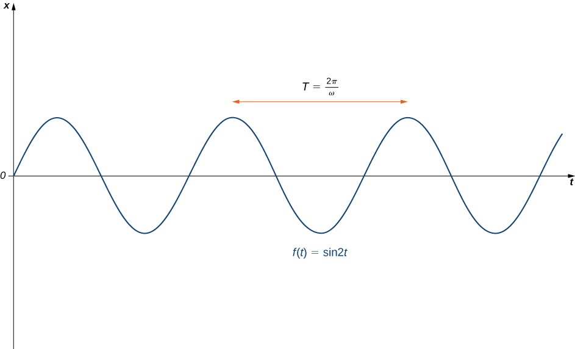
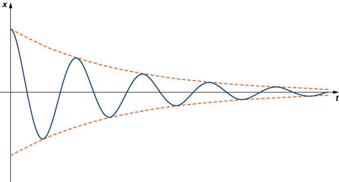
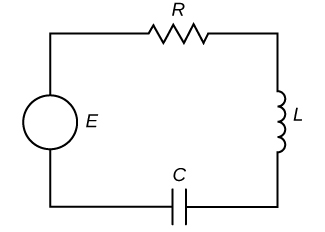
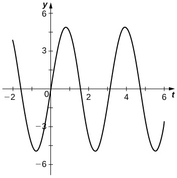

* Solve a second-order differential equation representing simple harmonic motion.
* Solve a second-order differential equation representing damped simple harmonic motion.
* Solve a second-order differential equation representing forced simple harmonic motion.
* Solve a second-order differential equation representing charge and current in an RLC series circuit.

We saw in the chapter introduction that second-order linear differential equations are used to model many situations in physics and engineering. In this section, we look at how this works for systems of an object with mass attached to a vertical spring and an electric circuit containing a resistor, an inductor, and a capacitor connected in series. Models such as these can be used to approximate other more complicated situations; for example, bonds between atoms or molecules are often modeled as springs that vibrate, as described by these same differential equations.

# Simple Harmonic Motion

Consider a mass suspended from a spring attached to a rigid support. (This is commonly called a **spring-mass system**{: data-type="term" .no-emphasis}.) Gravity is pulling the mass downward and the restoring force of the spring is pulling the mass upward. As shown in [\[link\]](#CNX_Calc_Figure_17_03_001), when these two forces are equal, the mass is said to be at the equilibrium position. If the mass is displaced from equilibrium, it oscillates up and down. This behavior can be modeled by a second-order constant-coefficient differential equation.

 , at equilibrium with a mass m attached (b), and in oscillatory motion (c)."){: #CNX_Calc_Figure_17_03_001}

Let <math xmlns="http://www.w3.org/1998/Math/MathML"><mrow><mi>x</mi><mo stretchy="false">(</mo><mi>t</mi><mo stretchy="false">)</mo></mrow></math>

 denote the displacement of the mass from equilibrium. Note that for spring-mass systems of this type, it is customary to adopt the convention that down is positive. Thus, a positive displacement indicates the mass is *below* the equilibrium point, whereas a negative displacement indicates the mass is *above* equilibrium. Displacement is usually given in feet in the English system or meters in the metric system.

Consider the forces acting on the mass. The force of gravity is given by <math xmlns="http://www.w3.org/1998/Math/MathML"><mrow><mi>m</mi><mi>g</mi><mtext>.</mtext></mrow></math>

 In the English system, mass is in slugs and the acceleration resulting from gravity is in feet per second squared. The acceleration resulting from gravity is constant, so in the English system, <math xmlns="http://www.w3.org/1998/Math/MathML"><mrow><mi>g</mi><mo>=</mo><mn>32</mn></mrow></math>

 ft/sec2. Recall that 1 slug-foot/sec2 is a pound, so the expression *mg* can be expressed in pounds. Metric system units are kilograms for mass and m/sec2 for gravitational acceleration. In the metric system, we have <math xmlns="http://www.w3.org/1998/Math/MathML"><mrow><mi>g</mi><mo>=</mo><mn>9.8</mn></mrow></math>

 m/sec2.

According to **Hooke’s law**{: data-type="term" .no-emphasis}, the restoring force of the spring is proportional to the displacement and acts in the opposite direction from the displacement, so the restoring force is given by <math xmlns="http://www.w3.org/1998/Math/MathML"><mrow><mtext>−</mtext><mi>k</mi><mrow><mo>(</mo><mrow><mi>s</mi><mo>+</mo><mi>x</mi></mrow><mo>)</mo></mrow><mo>.</mo></mrow></math>

 The spring constant is given in pounds per foot in the English system and in newtons per meter in the metric system.

Now, by Newton’s second law, the sum of the forces on the system (gravity plus the restoring force) is equal to mass times acceleration, so we have

<math xmlns="http://www.w3.org/1998/Math/MathML"><mtable><mtr><mtd columnalign="right"><mi>m</mi><mi>x</mi><mtext>″</mtext></mtd><mtd columnalign="left"><mo>=</mo><mtext>−</mtext><mi>k</mi><mrow><mo>(</mo><mrow><mi>s</mi><mo>+</mo><mi>x</mi></mrow><mo>)</mo></mrow><mo>+</mo><mi>m</mi><mi>g</mi></mtd></mtr><mtr><mtd /><mtd columnalign="left"><mo>=</mo><mtext>−</mtext><mi>k</mi><mi>s</mi><mo>−</mo><mi>k</mi><mi>x</mi><mo>+</mo><mi>m</mi><mi>g</mi><mtext>.</mtext></mtd></mtr></mtable></math>

However, by the way we have defined our equilibrium position, <math xmlns="http://www.w3.org/1998/Math/MathML"><mrow><mi>m</mi><mi>g</mi><mo>=</mo><mi>k</mi><mi>s</mi><mo>,</mo></mrow></math>

 the differential equation becomes

<math xmlns="http://www.w3.org/1998/Math/MathML"><mrow><mi>m</mi><mi>x</mi><mtext>″</mtext><mo>+</mo><mi>k</mi><mi>x</mi><mo>=</mo><mn>0</mn><mo>.</mo></mrow></math>

It is convenient to rearrange this equation and introduce a new variable, called the **angular frequency**{: data-type="term" .no-emphasis}, <math xmlns="http://www.w3.org/1998/Math/MathML"><mrow><mi>ω</mi><mtext>.</mtext></mrow></math>

 Letting <math xmlns="http://www.w3.org/1998/Math/MathML"><mrow><mi>ω</mi><mo>=</mo><msqrt><mrow><mrow><mi>k</mi><mtext>/</mtext><mi>m</mi></mrow></mrow></msqrt><mo>,</mo></mrow></math>

 we can write the equation as

<math xmlns="http://www.w3.org/1998/Math/MathML"><mrow><mi>x</mi><mtext>″</mtext><mo>+</mo><msup><mi>ω</mi><mn>2</mn></msup><mi>x</mi><mo>=</mo><mn>0</mn><mo>.</mo></mrow></math>

This differential equation has the general solution

<math xmlns="http://www.w3.org/1998/Math/MathML"><mrow><mi>x</mi><mo stretchy="false">(</mo><mi>t</mi><mo stretchy="false">)</mo><mo>=</mo><msub><mi>c</mi><mn>1</mn></msub><mtext>cos</mtext><mspace width="0.1em" /><mi>ω</mi><mi>t</mi><mo>+</mo><msub><mi>c</mi><mn>2</mn></msub><mtext>sin</mtext><mspace width="0.1em" /><mi>ω</mi><mi>t</mi><mo>,</mo></mrow></math>

which gives the position of the mass at any point in time. The motion of the mass is called **simple harmonic motion**{: data-type="term"}. The period of this motion (the time it takes to complete one oscillation) is <math xmlns="http://www.w3.org/1998/Math/MathML"><mrow><mi>T</mi><mo>=</mo><mfrac><mrow><mn>2</mn><mi>π</mi></mrow><mi>ω</mi></mfrac></mrow></math>

 and the frequency is <math xmlns="http://www.w3.org/1998/Math/MathML"><mrow><mi>f</mi><mo>=</mo><mfrac><mn>1</mn><mi>T</mi></mfrac><mo>=</mo><mfrac><mi>ω</mi><mrow><mn>2</mn><mi>π</mi></mrow></mfrac></mrow></math>

 ([\[link\]](#CNX_Calc_Figure_17_03_002)).

 {: #CNX_Calc_Figure_17_03_002}

Simple Harmonic Motion

Assume an object weighing 2 lb stretches a spring 6 in. Find the equation of motion if the spring is released from the equilibrium position with an upward velocity of 16 ft/sec. What is the period of the motion?

We first need to find the spring constant. We have

<math xmlns="http://www.w3.org/1998/Math/MathML"><mtable><mtr><mtd columnalign="right"><mi>m</mi><mi>g</mi></mtd><mtd columnalign="left"><mo>=</mo></mtd><mtd columnalign="left"><mi>k</mi><mi>s</mi></mtd></mtr><mtr><mtd columnalign="right"><mn>2</mn></mtd><mtd columnalign="left"><mo>=</mo></mtd><mtd columnalign="left"><mi>k</mi><mrow><mo>(</mo><mrow><mfrac><mn>1</mn><mn>2</mn></mfrac></mrow><mo>)</mo></mrow></mtd></mtr><mtr><mtd columnalign="right"><mi>k</mi></mtd><mtd columnalign="left"><mo>=</mo></mtd><mtd columnalign="left"><mn>4</mn><mo>.</mo></mtd></mtr></mtable></math>

We also know that weight *W* equals the product of mass *m* and the acceleration due to gravity *g*. In English units, the acceleration due to gravity is 32 ft/sec2.

<math xmlns="http://www.w3.org/1998/Math/MathML"><mtable><mtr><mtd columnalign="right"><mi>W</mi></mtd><mtd columnalign="left"><mo>=</mo></mtd><mtd columnalign="left"><mi>m</mi><mi>g</mi></mtd></mtr><mtr><mtd columnalign="right"><mn>2</mn></mtd><mtd columnalign="left"><mo>=</mo></mtd><mtd columnalign="left"><mi>m</mi><mrow><mo>(</mo><mrow><mn>32</mn></mrow><mo>)</mo></mrow></mtd></mtr><mtr><mtd columnalign="right"><mi>m</mi></mtd><mtd columnalign="left"><mo>=</mo></mtd><mtd columnalign="left"><mfrac><mn>1</mn><mrow><mn>16</mn></mrow></mfrac></mtd></mtr></mtable></math>

Thus, the differential equation representing this system is

<math xmlns="http://www.w3.org/1998/Math/MathML"><mrow><mfrac><mn>1</mn><mrow><mn>16</mn></mrow></mfrac><mi>x</mi><mtext>″</mtext><mo>+</mo><mn>4</mn><mi>x</mi><mo>=</mo><mn>0</mn><mo>.</mo></mrow></math>

Multiplying through by 16, we get <math xmlns="http://www.w3.org/1998/Math/MathML"><mrow><mi>x</mi><mtext>″</mtext><mo>+</mo><mn>64</mn><mi>x</mi><mo>=</mo><mn>0</mn><mo>,</mo></mrow></math>

 which can also be written in the form <math xmlns="http://www.w3.org/1998/Math/MathML"><mrow><mi>x</mi><mtext>″</mtext><mo>+</mo><mrow><mo stretchy="false">(</mo><mrow><msup><mn>8</mn><mn>2</mn></msup></mrow><mo stretchy="false">)</mo></mrow><mi>x</mi><mo>=</mo><mn>0</mn><mo>.</mo></mrow></math>

 This equation has the general solution

<math xmlns="http://www.w3.org/1998/Math/MathML"><mrow><mi>x</mi><mo stretchy="false">(</mo><mi>t</mi><mo stretchy="false">)</mo><mo>=</mo><msub><mi>c</mi><mn>1</mn></msub><mtext>cos</mtext><mspace width="0.1em" /><mrow><mo>(</mo><mrow><mn>8</mn><mi>t</mi></mrow><mo>)</mo></mrow><mo>+</mo><msub><mi>c</mi><mn>2</mn></msub><mtext>sin</mtext><mspace width="0.1em" /><mrow><mo>(</mo><mrow><mn>8</mn><mi>t</mi></mrow><mo>)</mo></mrow><mo>.</mo></mrow></math>

The mass was released from the equilibrium position, so <math xmlns="http://www.w3.org/1998/Math/MathML"><mrow><mi>x</mi><mo stretchy="false">(</mo><mn>0</mn><mo stretchy="false">)</mo><mo>=</mo><mn>0</mn><mo>,</mo></mrow></math>

 and it had an initial upward velocity of 16 ft/sec, so <math xmlns="http://www.w3.org/1998/Math/MathML"><mrow><msup><mi>x</mi><mo>′</mo></msup><mo stretchy="false">(</mo><mn>0</mn><mo stretchy="false">)</mo><mo>=</mo><mn>−16</mn><mo>.</mo></mrow></math>

 Applying these initial conditions to solve for <math xmlns="http://www.w3.org/1998/Math/MathML"><mrow><msub><mi>c</mi><mn>1</mn></msub></mrow></math>

 and <math xmlns="http://www.w3.org/1998/Math/MathML"><mrow><msub><mi>c</mi><mn>2</mn></msub><mo>.</mo></mrow></math>

 gives

<math xmlns="http://www.w3.org/1998/Math/MathML"><mrow><mi>x</mi><mo stretchy="false">(</mo><mi>t</mi><mo stretchy="false">)</mo><mo>=</mo><mn>−2</mn><mspace width="0.1em" /><mtext>sin</mtext><mspace width="0.1em" /><mn>8</mn><mi>t</mi><mtext>.</mtext></mrow></math>

The period of this motion is <math xmlns="http://www.w3.org/1998/Math/MathML"><mrow><mfrac><mrow><mn>2</mn><mi>π</mi></mrow><mn>8</mn></mfrac><mo>=</mo><mfrac><mi>π</mi><mn>4</mn></mfrac></mrow></math>

 sec.

A 200-g mass stretches a spring 5 cm. Find the equation of motion of the mass if it is released from rest from a position 10 cm below the equilibrium position. What is the frequency of this motion?

<math xmlns="http://www.w3.org/1998/Math/MathML"><mrow><mi>x</mi><mo stretchy="false">(</mo><mi>t</mi><mo stretchy="false">)</mo><mo>=</mo><mn>0.1</mn><mspace width="0.1em" /><mtext>cos</mtext><mspace width="0.1em" /><mrow><mo>(</mo><mrow><mn>14</mn><mi>t</mi></mrow><mo>)</mo></mrow></mrow></math>

 (in meters); frequency is <math xmlns="http://www.w3.org/1998/Math/MathML"><mrow><mfrac><mrow><mn>14</mn></mrow><mrow><mn>2</mn><mi>π</mi></mrow></mfrac></mrow></math>

 Hz.

Hint

First find the spring constant.

Writing the general solution in the form <math xmlns="http://www.w3.org/1998/Math/MathML"><mrow><mi>x</mi><mo stretchy="false">(</mo><mi>t</mi><mo stretchy="false">)</mo><mo>=</mo><msub><mi>c</mi><mn>1</mn></msub><mtext>cos</mtext><mspace width="0.1em" /><mrow><mo>(</mo><mrow><mi>ω</mi><mi>t</mi></mrow><mo>)</mo></mrow><mo>+</mo><msub><mi>c</mi><mn>2</mn></msub><mtext>sin</mtext><mspace width="0.1em" /><mrow><mo>(</mo><mrow><mi>ω</mi><mi>t</mi></mrow><mo>)</mo></mrow></mrow></math>

 has some advantages. It is easy to see the link between the differential equation and the solution, and the period and frequency of motion are evident. This form of the function tells us very little about the amplitude of the motion, however. In some situations, we may prefer to write the solution in the form

<math xmlns="http://www.w3.org/1998/Math/MathML"><mrow><mi>x</mi><mo stretchy="false">(</mo><mi>t</mi><mo stretchy="false">)</mo><mo>=</mo><mi>A</mi><mspace width="0.1em" /><mtext>sin</mtext><mspace width="0.1em" /><mrow><mo>(</mo><mrow><mi>ω</mi><mi>t</mi><mo>+</mo><mi>ϕ</mi></mrow><mo>)</mo></mrow><mo>.</mo></mrow></math>

Although the link to the differential equation is not as explicit in this case, the period and frequency of motion are still evident. Furthermore, the amplitude of the motion, *A*, is obvious in this form of the function. The constant <math xmlns="http://www.w3.org/1998/Math/MathML"><mi>ϕ</mi></math>

 is called a *phase shift* and has the effect of shifting the graph of the function to the left or right.

To convert the solution to this form, we want to find the values of *A* and <math xmlns="http://www.w3.org/1998/Math/MathML"><mi>ϕ</mi></math>

 such that

<math xmlns="http://www.w3.org/1998/Math/MathML"><mrow><msub><mi>c</mi><mn>1</mn></msub><mtext>cos</mtext><mspace width="0.1em" /><mrow><mo>(</mo><mrow><mi>ω</mi><mi>t</mi></mrow><mo>)</mo></mrow><mo>+</mo><msub><mi>c</mi><mn>2</mn></msub><mtext>sin</mtext><mspace width="0.1em" /><mrow><mo>(</mo><mrow><mi>ω</mi><mi>t</mi></mrow><mo>)</mo></mrow><mo>=</mo><mi>A</mi><mspace width="0.1em" /><mtext>sin</mtext><mspace width="0.1em" /><mrow><mo>(</mo><mrow><mi>ω</mi><mi>t</mi><mo>+</mo><mi>ϕ</mi></mrow><mo>)</mo></mrow><mo>.</mo></mrow></math>

We first apply the trigonometric identity

<math xmlns="http://www.w3.org/1998/Math/MathML"><mrow><mtext>sin</mtext><mo stretchy="false">(</mo><mi>α</mi><mo>+</mo><mi>β</mi><mo stretchy="false">)</mo><mo>=</mo><mtext>sin</mtext><mspace width="0.1em" /><mi>α</mi><mspace width="0.1em" /><mtext>cos</mtext><mspace width="0.1em" /><mi>β</mi><mo>+</mo><mtext>cos</mtext><mspace width="0.1em" /><mi>α</mi><mspace width="0.1em" /><mtext>sin</mtext><mspace width="0.1em" /><mi>β</mi></mrow></math>

to get

<math xmlns="http://www.w3.org/1998/Math/MathML"><mtable><mtr><mtd columnalign="right"><msub><mi>c</mi><mn>1</mn></msub><mtext>cos</mtext><mspace width="0.1em" /><mrow><mo>(</mo><mrow><mi>ω</mi><mi>t</mi></mrow><mo>)</mo></mrow><mo>+</mo><msub><mi>c</mi><mn>2</mn></msub><mtext>sin</mtext><mspace width="0.1em" /><mrow><mo>(</mo><mrow><mi>ω</mi><mi>t</mi></mrow><mo>)</mo></mrow></mtd><mtd columnalign="left"><mo>=</mo><mi>A</mi><mrow><mo>(</mo><mrow><mtext>sin</mtext><mspace width="0.1em" /><mrow><mo>(</mo><mrow><mi>ω</mi><mi>t</mi></mrow><mo>)</mo></mrow><mspace width="0.1em" /><mtext>cos</mtext><mspace width="0.1em" /><mi>ϕ</mi><mo>+</mo><mtext>cos</mtext><mspace width="0.1em" /><mrow><mo>(</mo><mrow><mi>ω</mi><mi>t</mi></mrow><mo>)</mo></mrow><mspace width="0.1em" /><mtext>sin</mtext><mspace width="0.1em" /><mi>ϕ</mi></mrow><mo>)</mo></mrow></mtd></mtr><mtr><mtd /><mtd columnalign="right"><mo>=</mo><mi>A</mi><mspace width="0.1em" /><mtext>sin</mtext><mspace width="0.1em" /><mi>ϕ</mi><mrow><mo>(</mo><mrow><mtext>cos</mtext><mspace width="0.1em" /><mrow><mo>(</mo><mrow><mi>ω</mi><mi>t</mi></mrow><mo>)</mo></mrow></mrow><mo>)</mo></mrow><mo>+</mo><mi>A</mi><mspace width="0.1em" /><mtext>cos</mtext><mspace width="0.1em" /><mi>ϕ</mi><mrow><mo>(</mo><mrow><mtext>sin</mtext><mspace width="0.1em" /><mrow><mo>(</mo><mrow><mi>ω</mi><mi>t</mi></mrow><mo>)</mo></mrow></mrow><mo>)</mo></mrow><mo>.</mo></mtd></mtr></mtable></math>

Thus,

<math xmlns="http://www.w3.org/1998/Math/MathML"><mrow><msub><mi>c</mi><mn>1</mn></msub><mo>=</mo><mi>A</mi><mspace width="0.1em" /><mtext>sin</mtext><mspace width="0.1em" /><mi>ϕ</mi><mspace width="0.2em" /><mtext>and</mtext><mspace width="0.2em" /><msub><mi>c</mi><mn>2</mn></msub><mo>=</mo><mi>A</mi><mspace width="0.1em" /><mtext>cos</mtext><mspace width="0.1em" /><mi>ϕ</mi><mtext>.</mtext></mrow></math>

If we square both of these equations and add them together, we get

<math xmlns="http://www.w3.org/1998/Math/MathML"><mtable><mtr><mtd columnalign="right"><msubsup><mi>c</mi><mn>1</mn><mn>2</mn></msubsup><mo>+</mo><msubsup><mi>c</mi><mn>2</mn><mn>2</mn></msubsup></mtd><mtd columnalign="left"><mo>=</mo><msup><mi>A</mi><mn>2</mn></msup><msup><mtext>sin</mtext><mspace width="0.1em" /><mn>2</mn></msup><mi>ϕ</mi><mo>+</mo><msup><mi>A</mi><mn>2</mn></msup><msup><mtext>cos</mtext><mspace width="0.1em" /><mn>2</mn></msup><mi>ϕ</mi></mtd></mtr><mtr><mtd /><mtd columnalign="left"><mo>=</mo><msup><mi>A</mi><mn>2</mn></msup><mrow><mo>(</mo><mrow><msup><mrow><mtext>sin</mtext></mrow><mn>2</mn></msup><mi>ϕ</mi><mo>+</mo><msup><mrow><mtext>cos</mtext></mrow><mn>2</mn></msup><mi>ϕ</mi></mrow><mo>)</mo></mrow></mtd></mtr><mtr><mtd /><mtd columnalign="left"><mo>=</mo><msup><mi>A</mi><mn>2</mn></msup><mo>.</mo></mtd></mtr></mtable></math>

Thus,

<math xmlns="http://www.w3.org/1998/Math/MathML"><mrow><mi>A</mi><mo>=</mo><msqrt><mrow><msubsup><mi>c</mi><mn>1</mn><mn>2</mn></msubsup><mo>+</mo><msubsup><mi>c</mi><mn>2</mn><mn>2</mn></msubsup></mrow></msqrt><mo>.</mo></mrow></math>

Now, to find <math xmlns="http://www.w3.org/1998/Math/MathML"><mrow><mi>ϕ</mi><mo>,</mo></mrow></math>

 go back to the equations for <math xmlns="http://www.w3.org/1998/Math/MathML"><mrow><msub><mi>c</mi><mn>1</mn></msub></mrow></math>

 and <math xmlns="http://www.w3.org/1998/Math/MathML"><mrow><msub><mi>c</mi><mn>2</mn></msub><mo>,</mo></mrow></math>

 but this time, divide the first equation by the second equation to get

<math xmlns="http://www.w3.org/1998/Math/MathML"><mtable><mtr><mtd columnalign="right"><mfrac><mrow><msub><mi>c</mi><mn>1</mn></msub></mrow><mrow><msub><mi>c</mi><mn>2</mn></msub></mrow></mfrac></mtd><mtd columnalign="left"><mo>=</mo><mfrac><mrow><mi>A</mi><mspace width="0.1em" /><mtext>sin</mtext><mspace width="0.1em" /><mi>ϕ</mi></mrow><mrow><mi>A</mi><mspace width="0.1em" /><mtext>cos</mtext><mspace width="0.1em" /><mi>ϕ</mi></mrow></mfrac></mtd></mtr><mtr><mtd /><mtd columnalign="left"><mo>=</mo><mtext>tan</mtext><mspace width="0.1em" /><mi>ϕ</mi><mtext>.</mtext></mtd></mtr></mtable></math>

Then,

<math xmlns="http://www.w3.org/1998/Math/MathML"><mrow><mtext>tan</mtext><mspace width="0.1em" /><mi>ϕ</mi><mo>=</mo><mfrac><mrow><msub><mi>c</mi><mn>1</mn></msub></mrow><mrow><msub><mi>c</mi><mn>2</mn></msub></mrow></mfrac><mo>.</mo></mrow></math>

We summarize this finding in the following theorem.

Solution to the Equation for Simple Harmonic Motion

The function <math xmlns="http://www.w3.org/1998/Math/MathML"><mrow><mi>x</mi><mo stretchy="false">(</mo><mi>t</mi><mo stretchy="false">)</mo><mo>=</mo><msub><mi>c</mi><mn>1</mn></msub><mtext>cos</mtext><mspace width="0.1em" /><mrow><mo>(</mo><mrow><mi>ω</mi><mi>t</mi></mrow><mo>)</mo></mrow><mo>+</mo><msub><mi>c</mi><mn>2</mn></msub><mtext>sin</mtext><mspace width="0.1em" /><mrow><mo>(</mo><mrow><mi>ω</mi><mi>t</mi></mrow><mo>)</mo></mrow></mrow></math>

 can be written in the form <math xmlns="http://www.w3.org/1998/Math/MathML"><mrow><mi>x</mi><mo stretchy="false">(</mo><mi>t</mi><mo stretchy="false">)</mo><mo>=</mo><mi>A</mi><mspace width="0.1em" /><mtext>sin</mtext><mspace width="0.1em" /><mrow><mo>(</mo><mrow><mi>ω</mi><mi>t</mi><mo>+</mo><mi>ϕ</mi></mrow><mo>)</mo></mrow><mo>,</mo></mrow></math>

 where <math xmlns="http://www.w3.org/1998/Math/MathML"><mrow><mi>A</mi><mo>=</mo><msqrt><mrow><msubsup><mi>c</mi><mn>1</mn><mn>2</mn></msubsup><mo>+</mo><msubsup><mi>c</mi><mn>2</mn><mn>2</mn></msubsup></mrow></msqrt></mrow></math>

 and <math xmlns="http://www.w3.org/1998/Math/MathML"><mrow><mtext>tan</mtext><mspace width="0.1em" /><mi>ϕ</mi><mo>=</mo><mfrac><mrow><msub><mi>c</mi><mn>1</mn></msub></mrow><mrow><msub><mi>c</mi><mn>2</mn></msub></mrow></mfrac><mo>.</mo></mrow></math>

Note that when using the formula <math xmlns="http://www.w3.org/1998/Math/MathML"><mrow><mtext>tan</mtext><mspace width="0.1em" /><mi>ϕ</mi><mo>=</mo><mfrac><mrow><msub><mi>c</mi><mn>1</mn></msub></mrow><mrow><msub><mi>c</mi><mn>2</mn></msub></mrow></mfrac></mrow></math>

 to find <math xmlns="http://www.w3.org/1998/Math/MathML"><mrow><mi>ϕ</mi><mo>,</mo></mrow></math>

 we must take care to ensure <math xmlns="http://www.w3.org/1998/Math/MathML"><mi>ϕ</mi></math>

 is in the right quadrant ([\[link\]](#CNX_Calc_Figure_17_03_015)).

 {: #CNX_Calc_Figure_17_03_015}

Expressing the Solution with a Phase Shift

Express the following functions in the form <math xmlns="http://www.w3.org/1998/Math/MathML"><mrow><mi>A</mi><mspace width="0.1em" /><mtext>sin</mtext><mspace width="0.1em" /><mrow><mo>(</mo><mrow><mi>ω</mi><mi>t</mi><mo>+</mo><mi>ϕ</mi></mrow><mo>)</mo></mrow><mo>.</mo></mrow></math>

 What is the frequency of motion? The amplitude?

1.  <math xmlns="http://www.w3.org/1998/Math/MathML"><mrow><mi>x</mi><mo stretchy="false">(</mo><mi>t</mi><mo stretchy="false">)</mo><mo>=</mo><mn>2</mn><mspace width="0.1em" /><mtext>cos</mtext><mspace width="0.1em" /><mrow><mo>(</mo><mrow><mn>3</mn><mi>t</mi></mrow><mo>)</mo></mrow><mo>+</mo><mtext>sin</mtext><mspace width="0.1em" /><mrow><mo>(</mo><mrow><mn>3</mn><mi>t</mi></mrow><mo>)</mo></mrow></mrow></math>

2.  <math xmlns="http://www.w3.org/1998/Math/MathML"><mrow><mi>x</mi><mo stretchy="false">(</mo><mi>t</mi><mo stretchy="false">)</mo><mo>=</mo><mn>3</mn><mspace width="0.1em" /><mtext>cos</mtext><mspace width="0.1em" /><mrow><mo>(</mo><mrow><mn>2</mn><mi>t</mi></mrow><mo>)</mo></mrow><mo>−</mo><mn>2</mn><mspace width="0.1em" /><mtext>sin</mtext><mspace width="0.1em" /><mrow><mo>(</mo><mrow><mn>2</mn><mi>t</mi></mrow><mo>)</mo></mrow></mrow></math>
{: data-number-style="lower-alpha"}

1.  We have
    * * *
    {: data-type="newline"}
    
    

    <math xmlns="http://www.w3.org/1998/Math/MathML"><mrow><mi>A</mi><mo>=</mo><msqrt><mrow><msubsup><mi>c</mi><mn>1</mn><mn>2</mn></msubsup><mo>+</mo><msubsup><mi>c</mi><mn>2</mn><mn>2</mn></msubsup></mrow></msqrt><mo>=</mo><msqrt><mrow><msup><mn>2</mn><mn>2</mn></msup><mo>+</mo><msup><mn>1</mn><mn>2</mn></msup></mrow></msqrt><mo>=</mo><msqrt><mn>5</mn></msqrt></mrow></math>
    

    
    * * *
    {: data-type="newline"}
    
    and
    * * *
    {: data-type="newline"}
    
    

    <math xmlns="http://www.w3.org/1998/Math/MathML"><mrow><mtext>tan</mtext><mspace width="0.1em" /><mi>ϕ</mi><mo>=</mo><mfrac><mrow><msub><mi>c</mi><mn>1</mn></msub></mrow><mrow><msub><mi>c</mi><mn>2</mn></msub></mrow></mfrac><mo>=</mo><mfrac><mn>2</mn><mn>1</mn></mfrac><mo>=</mo><mn>2</mn><mo>.</mo></mrow></math>
    

    
    * * *
    {: data-type="newline"}
    
    Note that both
    <math xmlns="http://www.w3.org/1998/Math/MathML"><mrow><msub><mi>c</mi><mn>1</mn></msub></mrow></math>
    
    and
    <math xmlns="http://www.w3.org/1998/Math/MathML"><mrow><msub><mi>c</mi><mn>2</mn></msub></mrow></math>
    
    are positive, so
    <math xmlns="http://www.w3.org/1998/Math/MathML"><mi>ϕ</mi></math>
    
    is in the first quadrant. Thus,
    * * *
    {: data-type="newline"}
    
    

    <math xmlns="http://www.w3.org/1998/Math/MathML"><mrow><mi>ϕ</mi><mo>≈</mo><mn>1.107</mn><mspace width="0.2em" /><mtext>rad,</mtext></mrow></math>
    

    
    * * *
    {: data-type="newline"}
    
    so we have
    * * *
    {: data-type="newline"}
    
    

    <math xmlns="http://www.w3.org/1998/Math/MathML"><mrow><mi>x</mi><mo stretchy="false">(</mo><mi>t</mi><mo stretchy="false">)</mo><mo>=</mo><mn>2</mn><mspace width="0.1em" /><mtext>cos</mtext><mspace width="0.1em" /><mrow><mo>(</mo><mrow><mn>3</mn><mi>t</mi></mrow><mo>)</mo></mrow><mo>+</mo><mtext>sin</mtext><mspace width="0.1em" /><mrow><mo>(</mo><mrow><mn>3</mn><mi>t</mi></mrow><mo>)</mo></mrow><mo>=</mo><msqrt><mn>5</mn></msqrt><mtext>sin</mtext><mspace width="0.1em" /><mrow><mo>(</mo><mrow><mn>3</mn><mi>t</mi><mo>+</mo><mn>1.107</mn></mrow><mo>)</mo></mrow><mo>.</mo></mrow></math>
    

    
    * * *
    {: data-type="newline"}
    
    The frequency is
    <math xmlns="http://www.w3.org/1998/Math/MathML"><mrow><mfrac><mi>ω</mi><mrow><mn>2</mn><mi>π</mi></mrow></mfrac><mo>=</mo><mfrac><mn>3</mn><mrow><mn>2</mn><mi>π</mi></mrow></mfrac><mo>≈</mo><mn>0.477</mn><mo>.</mo></mrow></math>
    
    The amplitude is
    <math xmlns="http://www.w3.org/1998/Math/MathML"><mrow><msqrt><mn>5</mn></msqrt><mo>.</mo></mrow></math>

2.  We have
    * * *
    {: data-type="newline"}
    
    

    <math xmlns="http://www.w3.org/1998/Math/MathML"><mrow><mi>A</mi><mo>=</mo><msqrt><mrow><msubsup><mi>c</mi><mn>1</mn><mn>2</mn></msubsup><mo>+</mo><msubsup><mi>c</mi><mn>2</mn><mn>2</mn></msubsup></mrow></msqrt><mo>=</mo><msqrt><mrow><msup><mn>3</mn><mn>2</mn></msup><mo>+</mo><msup><mn>2</mn><mn>2</mn></msup></mrow></msqrt><mo>=</mo><msqrt><mrow><mn>13</mn></mrow></msqrt></mrow></math>
    

    
    * * *
    {: data-type="newline"}
    
    and
    * * *
    {: data-type="newline"}
    
    

    <math xmlns="http://www.w3.org/1998/Math/MathML"><mrow><mtext>tan</mtext><mspace width="0.1em" /><mi>ϕ</mi><mo>=</mo><mfrac><mrow><msub><mi>c</mi><mn>1</mn></msub></mrow><mrow><msub><mi>c</mi><mn>2</mn></msub></mrow></mfrac><mo>=</mo><mfrac><mn>3</mn><mrow><mn>−2</mn></mrow></mfrac><mo>=</mo><mo>−</mo><mfrac><mn>3</mn><mn>2</mn></mfrac><mo>.</mo></mrow></math>
    

    
    * * *
    {: data-type="newline"}
    
    Note that
    <math xmlns="http://www.w3.org/1998/Math/MathML"><mrow><msub><mi>c</mi><mn>1</mn></msub></mrow></math>
    
    is positive but
    <math xmlns="http://www.w3.org/1998/Math/MathML"><mrow><msub><mi>c</mi><mn>2</mn></msub></mrow></math>
    
    is negative, so
    <math xmlns="http://www.w3.org/1998/Math/MathML"><mi>ϕ</mi></math>
    
    is in the fourth quadrant. Thus,
    * * *
    {: data-type="newline"}
    
    

    <math xmlns="http://www.w3.org/1998/Math/MathML"><mrow><mi>ϕ</mi><mo>≈</mo><mo>−</mo><mn>0.983</mn><mspace width="0.2em" /><mtext>rad,</mtext></mrow></math>
    

    
    * * *
    {: data-type="newline"}
    
    so we have
    * * *
    {: data-type="newline"}
    
    

    <math xmlns="http://www.w3.org/1998/Math/MathML"><mtable><mtr><mtd columnalign="right"><mi>x</mi><mo stretchy="false">(</mo><mi>t</mi><mo stretchy="false">)</mo></mtd><mtd columnalign="left"><mo>=</mo><mn>3</mn><mspace width="0.1em" /><mtext>cos</mtext><mspace width="0.1em" /><mrow><mo>(</mo><mrow><mn>2</mn><mi>t</mi></mrow><mo>)</mo></mrow><mo>−</mo><mn>2</mn><mspace width="0.1em" /><mtext>sin</mtext><mspace width="0.1em" /><mrow><mo>(</mo><mrow><mn>2</mn><mi>t</mi></mrow><mo>)</mo></mrow></mtd></mtr><mtr><mtd /><mtd columnalign="left"><mo>=</mo><msqrt><mrow><mn>13</mn></mrow></msqrt><mtext>sin</mtext><mspace width="0.1em" /><mrow><mo>(</mo><mrow><mn>2</mn><mi>t</mi><mo>−</mo><mn>0.983</mn></mrow><mo>)</mo></mrow><mo>.</mo></mtd></mtr></mtable></math>
    

    
    * * *
    {: data-type="newline"}
    
    The frequency is
    <math xmlns="http://www.w3.org/1998/Math/MathML"><mrow><mfrac><mi>ω</mi><mrow><mn>2</mn><mi>π</mi></mrow></mfrac><mo>=</mo><mfrac><mn>2</mn><mrow><mn>2</mn><mi>π</mi></mrow></mfrac><mo>≈</mo><mn>0.318</mn><mo>.</mo></mrow></math>
    
    The amplitude is
    <math xmlns="http://www.w3.org/1998/Math/MathML"><mrow><msqrt><mrow><mn>13</mn></mrow></msqrt><mo>.</mo></mrow></math>
{: data-number-style="lower-alpha"}

Express the function <math xmlns="http://www.w3.org/1998/Math/MathML"><mrow><mi>x</mi><mo stretchy="false">(</mo><mi>t</mi><mo stretchy="false">)</mo><mo>=</mo><mtext>cos</mtext><mspace width="0.1em" /><mrow><mo>(</mo><mrow><mn>4</mn><mi>t</mi></mrow><mo>)</mo></mrow><mo>+</mo><mn>4</mn><mspace width="0.1em" /><mtext>sin</mtext><mspace width="0.1em" /><mrow><mo>(</mo><mrow><mn>4</mn><mi>t</mi></mrow><mo>)</mo></mrow></mrow></math>

 in the form <math xmlns="http://www.w3.org/1998/Math/MathML"><mrow><mi>A</mi><mspace width="0.1em" /><mtext>sin</mtext><mspace width="0.1em" /><mrow><mo>(</mo><mrow><mi>ω</mi><mi>t</mi><mo>+</mo><mi>ϕ</mi></mrow><mo>)</mo></mrow><mo>.</mo></mrow></math>

 What is the frequency of motion? The amplitude?

<math xmlns="http://www.w3.org/1998/Math/MathML"><mrow><mi>x</mi><mo stretchy="false">(</mo><mi>t</mi><mo stretchy="false">)</mo><mo>=</mo><msqrt><mrow><mn>17</mn></mrow></msqrt><mtext>sin</mtext><mspace width="0.1em" /><mrow><mo>(</mo><mrow><mn>4</mn><mi>t</mi><mo>+</mo><mn>0.245</mn></mrow><mo>)</mo></mrow><mo>,</mo></mrow></math>

 <math xmlns="http://www.w3.org/1998/Math/MathML"><mrow><mtext>frequency</mtext><mo>=</mo><mfrac><mn>4</mn><mrow><mn>2</mn><mi>π</mi></mrow></mfrac><mo>≈</mo><mn>0.637</mn><mo>,</mo></mrow></math>

 <math xmlns="http://www.w3.org/1998/Math/MathML"><mrow><mi>A</mi><mo>=</mo><msqrt><mrow><mn>17</mn></mrow></msqrt></mrow></math>

Hint

Use the process from the previous example.

# Damped Vibrations

With the model just described, the motion of the mass continues indefinitely. Clearly, this doesn’t happen in the real world. In the real world, there is almost always some friction in the system, which causes the oscillations to die off slowly—an effect called *damping*. So now let’s look at how to incorporate that damping force into our differential equation.

Physical spring-mass systems almost always have some damping as a result of friction, air resistance, or a physical damper, called a *dashpot* (a pneumatic cylinder; see [\[link\]](#CNX_Calc_Figure_17_03_013)).

 {: #CNX_Calc_Figure_17_03_013}

Because damping is primarily a friction force, we assume it is proportional to the velocity of the mass and acts in the opposite direction. So the damping force is given by <math xmlns="http://www.w3.org/1998/Math/MathML"><mrow><mtext>−</mtext><mi>b</mi><msup><mi>x</mi><mo>′</mo></msup></mrow></math>

 for some constant <math xmlns="http://www.w3.org/1998/Math/MathML"><mrow><mi>b</mi><mo>&gt;</mo><mn>0</mn><mo>.</mo></mrow></math>

 Again applying Newton’s second law, the differential equation becomes

<math xmlns="http://www.w3.org/1998/Math/MathML"><mrow><mi>m</mi><mi>x</mi><mtext>″</mtext><mo>+</mo><mi>b</mi><msup><mi>x</mi><mo>′</mo></msup><mo>+</mo><mi>k</mi><mi>x</mi><mo>=</mo><mn>0</mn><mo>.</mo></mrow></math>

Then the associated characteristic equation is

<math xmlns="http://www.w3.org/1998/Math/MathML"><mrow><mi>m</mi><msup><mi>λ</mi><mn>2</mn></msup><mo>+</mo><mi>b</mi><mi>λ</mi><mo>+</mo><mi>k</mi><mo>=</mo><mn>0</mn><mo>.</mo></mrow></math>

Applying the quadratic formula, we have

<math xmlns="http://www.w3.org/1998/Math/MathML"><mrow><mi>λ</mi><mo>=</mo><mfrac><mrow><mtext>−</mtext><mi>b</mi><mo>±</mo><msqrt><mrow><msup><mi>b</mi><mn>2</mn></msup><mo>−</mo><mn>4</mn><mi>m</mi><mi>k</mi></mrow></msqrt></mrow><mrow><mn>2</mn><mi>m</mi></mrow></mfrac><mo>.</mo></mrow></math>

Just as in [Second-Order Linear Equations](/m54040){: .target-chapter} we consider three cases, based on whether the characteristic equation has distinct real roots, a repeated real root, or complex conjugate roots.

## Case 1: <math xmlns="http://www.w3.org/1998/Math/MathML"><mrow><msup><mi>b</mi><mn>2</mn></msup><mo>&gt;</mo><mn>4</mn><mi>m</mi><mi>k</mi></mrow></math>

In this case, we say the system is ***overdamped***{: data-type="term" .no-emphasis}. The general solution has the form

<math xmlns="http://www.w3.org/1998/Math/MathML"><mrow><mi>x</mi><mo stretchy="false">(</mo><mi>t</mi><mo stretchy="false">)</mo><mo>=</mo><msub><mi>c</mi><mn>1</mn></msub><msup><mi>e</mi><mrow><msub><mi>λ</mi><mn>1</mn></msub><mi>t</mi></mrow></msup><mo>+</mo><msub><mi>c</mi><mn>2</mn></msub><msup><mi>e</mi><mrow><msub><mi>λ</mi><mn>2</mn></msub><mi>t</mi></mrow></msup><mo>,</mo></mrow></math>

where both <math xmlns="http://www.w3.org/1998/Math/MathML"><mrow><msub><mi>λ</mi><mn>1</mn></msub></mrow></math>

 and <math xmlns="http://www.w3.org/1998/Math/MathML"><mrow><msub><mi>λ</mi><mn>2</mn></msub></mrow></math>

 are less than zero. Because the exponents are negative, the displacement decays to zero over time, usually quite quickly. Overdamped systems do not oscillate (no more than one change of direction), but simply move back toward the equilibrium position. [\[link\]](#CNX_Calc_Figure_17_03_003) shows what typical critically damped behavior looks like.

  and only one change in direction (b)."){: #CNX_Calc_Figure_17_03_003}

Overdamped Spring-Mass System

A 16-lb mass is attached to a 10-ft spring. When the mass comes to rest in the equilibrium position, the spring measures 15 ft 4 in. The system is immersed in a medium that imparts a damping force equal to <math xmlns="http://www.w3.org/1998/Math/MathML"><mrow><mfrac><mn>5</mn><mn>2</mn></mfrac></mrow></math>

 times the instantaneous velocity of the mass. Find the equation of motion if the mass is pushed upward from the equilibrium position with an initial upward velocity of 5 ft/sec. What is the position of the mass after 10 sec? Its velocity?

The mass stretches the spring 5 ft 4 in., or <math xmlns="http://www.w3.org/1998/Math/MathML"><mrow><mfrac><mrow><mn>16</mn></mrow><mn>3</mn></mfrac></mrow></math>

 ft. Thus, <math xmlns="http://www.w3.org/1998/Math/MathML"><mrow><mn>16</mn><mo>=</mo><mrow><mo>(</mo><mrow><mfrac><mrow><mn>16</mn></mrow><mn>3</mn></mfrac></mrow><mo>)</mo></mrow><mi>k</mi><mo>,</mo></mrow></math>

 so <math xmlns="http://www.w3.org/1998/Math/MathML"><mrow><mi>k</mi><mo>=</mo><mn>3</mn><mo>.</mo></mrow></math>

 We also have <math xmlns="http://www.w3.org/1998/Math/MathML"><mrow><mi>m</mi><mo>=</mo><mfrac><mrow><mn>16</mn></mrow><mrow><mn>32</mn></mrow></mfrac><mo>=</mo><mfrac><mn>1</mn><mn>2</mn></mfrac><mo>,</mo></mrow></math>

 so the differential equation is

<math xmlns="http://www.w3.org/1998/Math/MathML"><mrow><mstyle scriptlevel="+1"><mfrac><mn>1</mn><mn>2</mn></mfrac></mstyle><mi>x</mi><mtext>″</mtext><mo>+</mo><mstyle scriptlevel="+1"><mfrac><mn>5</mn><mn>2</mn></mfrac></mstyle><msup><mi>x</mi><mo>′</mo></msup><mo>+</mo><mn>3</mn><mi>x</mi><mo>=</mo><mn>0</mn><mo>.</mo></mrow></math>

Multiplying through by 2 gives <math xmlns="http://www.w3.org/1998/Math/MathML"><mrow><mi>x</mi><mtext>″</mtext><mo>+</mo><mn>5</mn><msup><mi>x</mi><mo>′</mo></msup><mo>+</mo><mn>6</mn><mi>x</mi><mo>=</mo><mn>0</mn><mo>,</mo></mrow></math>

 which has the general solution

<math xmlns="http://www.w3.org/1998/Math/MathML"><mrow><mi>x</mi><mo stretchy="false">(</mo><mi>t</mi><mo stretchy="false">)</mo><mo>=</mo><msub><mi>c</mi><mn>1</mn></msub><msup><mi>e</mi><mrow><mn>−2</mn><mi>t</mi></mrow></msup><mo>+</mo><msub><mi>c</mi><mn>2</mn></msub><msup><mi>e</mi><mrow><mn>−3</mn><mi>t</mi></mrow></msup><mo>.</mo></mrow></math>

Applying the initial conditions, <math xmlns="http://www.w3.org/1998/Math/MathML"><mrow><mi>x</mi><mo stretchy="false">(</mo><mn>0</mn><mo stretchy="false">)</mo><mo>=</mo><mn>0</mn></mrow></math>

 and <math xmlns="http://www.w3.org/1998/Math/MathML"><mrow><msup><mi>x</mi><mo>′</mo></msup><mo stretchy="false">(</mo><mn>0</mn><mo stretchy="false">)</mo><mo>=</mo><mn>−5</mn><mo>,</mo></mrow></math>

 we get

<math xmlns="http://www.w3.org/1998/Math/MathML"><mrow><mi>x</mi><mo stretchy="false">(</mo><mi>t</mi><mo stretchy="false">)</mo><mo>=</mo><mn>−5</mn><msup><mi>e</mi><mrow><mn>−2</mn><mi>t</mi></mrow></msup><mo>+</mo><mn>5</mn><msup><mi>e</mi><mrow><mn>−3</mn><mi>t</mi></mrow></msup><mo>.</mo></mrow></math>

After 10 sec the mass is at position

<math xmlns="http://www.w3.org/1998/Math/MathML"><mrow><mi>x</mi><mo stretchy="false">(</mo><mn>10</mn><mo stretchy="false">)</mo><mo>=</mo><mn>−5</mn><msup><mi>e</mi><mrow><mn>−20</mn></mrow></msup><mo>+</mo><mn>5</mn><msup><mi>e</mi><mrow><mn>−30</mn></mrow></msup><mo>≈</mo><mo>−</mo><mn>1.0305</mn><mspace width="0.2em" /><mo>×</mo><mspace width="0.2em" /><msup><mrow><mn>10</mn></mrow><mrow><mn>−8</mn></mrow></msup><mo>≈</mo><mn>0</mn><mo>,</mo></mrow></math>

so it is, effectively, at the equilibrium position. We have <math xmlns="http://www.w3.org/1998/Math/MathML"><mrow><msup><mi>x</mi><mo>′</mo></msup><mo stretchy="false">(</mo><mi>t</mi><mo stretchy="false">)</mo><mo>=</mo><mn>10</mn><msup><mi>e</mi><mrow><mn>−2</mn><mi>t</mi></mrow></msup><mo>−</mo><mn>15</mn><msup><mi>e</mi><mrow><mn>−3</mn><mi>t</mi></mrow></msup><mo>,</mo></mrow></math>

 so after 10 sec the mass is moving at a velocity of

<math xmlns="http://www.w3.org/1998/Math/MathML"><mrow><msup><mi>x</mi><mo>′</mo></msup><mo stretchy="false">(</mo><mn>10</mn><mo stretchy="false">)</mo><mo>=</mo><mn>10</mn><msup><mi>e</mi><mrow><mn>−20</mn></mrow></msup><mo>−</mo><mn>15</mn><msup><mi>e</mi><mrow><mn>−30</mn></mrow></msup><mo>≈</mo><mn>2.061</mn><mspace width="0.2em" /><mo>×</mo><mspace width="0.2em" /><msup><mrow><mn>10</mn></mrow><mrow><mn>−8</mn></mrow></msup><mo>≈</mo><mn>0</mn><mo>.</mo></mrow></math>

After only 10 sec, the mass is barely moving.

A 2-kg mass is attached to a spring with spring constant 24 N/m. The system is then immersed in a medium imparting a damping force equal to 16 times the instantaneous velocity of the mass. Find the equation of motion if it is released from rest at a point 40 cm below equilibrium.

<math xmlns="http://www.w3.org/1998/Math/MathML"><mrow><mi>x</mi><mo stretchy="false">(</mo><mi>t</mi><mo stretchy="false">)</mo><mo>=</mo><mn>0.6</mn><msup><mi>e</mi><mrow><mn>−2</mn><mi>t</mi></mrow></msup><mo>−</mo><mn>0.2</mn><msup><mi>e</mi><mrow><mn>−6</mn><mi>t</mi></mrow></msup></mrow></math>

Hint

Follow the process from the previous example.

## Case 2: <math xmlns="http://www.w3.org/1998/Math/MathML"><mrow><msup><mi>b</mi><mn>2</mn></msup><mo>=</mo><mn>4</mn><mi>m</mi><mi>k</mi></mrow></math>

In this case, we say the system is *critically damped*. The general solution has the form

<math xmlns="http://www.w3.org/1998/Math/MathML"><mrow><mi>x</mi><mo stretchy="false">(</mo><mi>t</mi><mo stretchy="false">)</mo><mo>=</mo><msub><mi>c</mi><mn>1</mn></msub><msup><mi>e</mi><mrow><msub><mi>λ</mi><mn>1</mn></msub><mi>t</mi></mrow></msup><mo>+</mo><msub><mi>c</mi><mn>2</mn></msub><mi>t</mi><msup><mi>e</mi><mrow><msub><mi>λ</mi><mn>1</mn></msub><mi>t</mi></mrow></msup><mo>,</mo></mrow></math>

where <math xmlns="http://www.w3.org/1998/Math/MathML"><mrow><msub><mi>λ</mi><mn>1</mn></msub></mrow></math>

 is less than zero. The motion of a critically damped system is very similar to that of an overdamped system. It does not oscillate. However, with a critically damped system, if the damping is reduced even a little, oscillatory behavior results. From a practical perspective, physical systems are almost always either overdamped or underdamped (case 3, which we consider next). It is impossible to fine-tune the characteristics of a physical system so that <math xmlns="http://www.w3.org/1998/Math/MathML"><mrow><msup><mi>b</mi><mn>2</mn></msup></mrow></math>

 and <math xmlns="http://www.w3.org/1998/Math/MathML"><mrow><mn>4</mn><mi>m</mi><mi>k</mi></mrow></math>

 are exactly equal. [\[link\]](#CNX_Calc_Figure_17_03_004) shows what typical critically damped behavior looks like.

  has more damping than the system graphed in part (b)."){: #CNX_Calc_Figure_17_03_004}

Critically Damped Spring-Mass System

A 1-kg mass stretches a spring 20 cm. The system is attached to a dashpot that imparts a damping force equal to 14 times the instantaneous velocity of the mass. Find the equation of motion if the mass is released from equilibrium with an upward velocity of 3 m/sec.

We have <math xmlns="http://www.w3.org/1998/Math/MathML"><mrow><mi>m</mi><mi>g</mi><mo>=</mo><mn>1</mn><mrow><mo>(</mo><mrow><mn>9.8</mn></mrow><mo>)</mo></mrow><mo>=</mo><mn>0.2</mn><mi>k</mi><mo>,</mo></mrow></math>

 so <math xmlns="http://www.w3.org/1998/Math/MathML"><mrow><mi>k</mi><mo>=</mo><mn>49</mn><mo>.</mo></mrow></math>

 Then, the differential equation is

<math xmlns="http://www.w3.org/1998/Math/MathML"><mrow><mi>x</mi><mtext>″</mtext><mo>+</mo><mn>14</mn><msup><mi>x</mi><mo>′</mo></msup><mo>+</mo><mn>49</mn><mi>x</mi><mo>=</mo><mn>0</mn><mo>,</mo></mrow></math>

which has general solution

<math xmlns="http://www.w3.org/1998/Math/MathML"><mrow><mi>x</mi><mo stretchy="false">(</mo><mi>t</mi><mo stretchy="false">)</mo><mo>=</mo><msub><mi>c</mi><mn>1</mn></msub><msup><mi>e</mi><mrow><mn>−7</mn><mi>t</mi></mrow></msup><mo>+</mo><msub><mi>c</mi><mn>2</mn></msub><mi>t</mi><msup><mi>e</mi><mrow><mn>−7</mn><mi>t</mi></mrow></msup><mo>.</mo></mrow></math>

Applying the initial conditions <math xmlns="http://www.w3.org/1998/Math/MathML"><mrow><mi>x</mi><mo stretchy="false">(</mo><mn>0</mn><mo stretchy="false">)</mo><mo>=</mo><mn>0</mn></mrow></math>

 and <math xmlns="http://www.w3.org/1998/Math/MathML"><mrow><msup><mi>x</mi><mo>′</mo></msup><mo stretchy="false">(</mo><mn>0</mn><mo stretchy="false">)</mo><mo>=</mo><mn>−3</mn></mrow></math>

 gives

<math xmlns="http://www.w3.org/1998/Math/MathML"><mrow><mi>x</mi><mo stretchy="false">(</mo><mi>t</mi><mo stretchy="false">)</mo><mo>=</mo><mn>−3</mn><mi>t</mi><msup><mi>e</mi><mrow><mn>−7</mn><mi>t</mi></mrow></msup><mo>.</mo></mrow></math>

A 1-lb weight stretches a spring 6 in., and the system is attached to a dashpot that imparts a damping force equal to half the instantaneous velocity of the mass. Find the equation of motion if the mass is released from rest at a point 6 in. below equilibrium.

<math xmlns="http://www.w3.org/1998/Math/MathML"><mrow><mi>x</mi><mo stretchy="false">(</mo><mi>t</mi><mo stretchy="false">)</mo><mo>=</mo><mfrac><mn>1</mn><mn>2</mn></mfrac><msup><mi>e</mi><mrow><mn>−8</mn><mi>t</mi></mrow></msup><mo>+</mo><mn>4</mn><mi>t</mi><msup><mi>e</mi><mrow><mn>−8</mn><mi>t</mi></mrow></msup></mrow></math>

Hint

First find the spring constant.

## Case 3: <math xmlns="http://www.w3.org/1998/Math/MathML"><mrow><msup><mi>b</mi><mn>2</mn></msup><mo>&lt;</mo><mn>4</mn><mi>m</mi><mi>k</mi></mrow></math>

In this case, we say the system is *underdamped*. The general solution has the form

<math xmlns="http://www.w3.org/1998/Math/MathML"><mrow><mi>x</mi><mo stretchy="false">(</mo><mi>t</mi><mo stretchy="false">)</mo><mo>=</mo><msup><mi>e</mi><mrow><mi>α</mi><mi>t</mi></mrow></msup><mrow><mo>(</mo><mrow><msub><mi>c</mi><mn>1</mn></msub><mtext>cos</mtext><mspace width="0.1em" /><mrow><mo>(</mo><mrow><mi>β</mi><mi>t</mi></mrow><mo>)</mo></mrow><mo>+</mo><msub><mi>c</mi><mn>2</mn></msub><mtext>sin</mtext><mspace width="0.1em" /><mrow><mo>(</mo><mrow><mi>β</mi><mi>t</mi></mrow><mo>)</mo></mrow></mrow><mo>)</mo></mrow><mo>,</mo></mrow></math>

where <math xmlns="http://www.w3.org/1998/Math/MathML"><mi>α</mi></math>

 is less than zero. Underdamped systems do oscillate because of the sine and cosine terms in the solution. However, the exponential term dominates eventually, so the amplitude of the oscillations decreases over time. [\[link\]](#CNX_Calc_Figure_17_03_005) shows what typical underdamped behavior looks like.

 {: #CNX_Calc_Figure_17_03_005}

Note that for all damped systems, <math xmlns="http://www.w3.org/1998/Math/MathML"><mrow><munder><mrow><mtext>lim</mtext></mrow><mrow><mi>t</mi><mo stretchy="false">→</mo><mi>∞</mi></mrow></munder><mi>x</mi><mo stretchy="false">(</mo><mi>t</mi><mo stretchy="false">)</mo><mo>=</mo><mn>0</mn><mo>.</mo></mrow></math>

 The system always approaches the equilibrium position over time.

Underdamped Spring-Mass System

A 16-lb weight stretches a spring 3.2 ft. Assume the damping force on the system is equal to the instantaneous velocity of the mass. Find the equation of motion if the mass is released from rest at a point 9 in. below equilibrium.

We have <math xmlns="http://www.w3.org/1998/Math/MathML"><mrow><mi>k</mi><mo>=</mo><mfrac><mrow><mn>16</mn></mrow><mrow><mn>3.2</mn></mrow></mfrac><mo>=</mo><mn>5</mn></mrow></math>

 and <math xmlns="http://www.w3.org/1998/Math/MathML"><mrow><mi>m</mi><mo>=</mo><mfrac><mrow><mn>16</mn></mrow><mrow><mn>32</mn></mrow></mfrac><mo>=</mo><mfrac><mn>1</mn><mn>2</mn></mfrac><mo>,</mo></mrow></math>

 so the differential equation is

<math xmlns="http://www.w3.org/1998/Math/MathML"><mrow><mstyle scriptlevel="+1"><mfrac><mn>1</mn><mn>2</mn></mfrac></mstyle><mi>x</mi><mtext>″</mtext><mo>+</mo><msup><mi>x</mi><mo>′</mo></msup><mo>+</mo><mn>5</mn><mi>x</mi><mo>=</mo><mn>0</mn><mo>,</mo><mspace width="0.2em" /><mtext>or</mtext><mspace width="0.2em" /><mi>x</mi><mtext>″</mtext><mo>+</mo><mn>2</mn><msup><mi>x</mi><mo>′</mo></msup><mo>+</mo><mn>10</mn><mi>x</mi><mo>=</mo><mn>0</mn><mo>.</mo></mrow></math>

This equation has the general solution

<math xmlns="http://www.w3.org/1998/Math/MathML"><mrow><mi>x</mi><mo stretchy="false">(</mo><mi>t</mi><mo stretchy="false">)</mo><mo>=</mo><msup><mi>e</mi><mrow><mtext>−</mtext><mi>t</mi></mrow></msup><mrow><mo>(</mo><mrow><msub><mi>c</mi><mn>1</mn></msub><mtext>cos</mtext><mspace width="0.1em" /><mrow><mo>(</mo><mrow><mn>3</mn><mi>t</mi></mrow><mo>)</mo></mrow><mo>+</mo><msub><mi>c</mi><mn>2</mn></msub><mtext>sin</mtext><mspace width="0.1em" /><mrow><mo>(</mo><mrow><mn>3</mn><mi>t</mi></mrow><mo>)</mo></mrow></mrow><mo>)</mo></mrow><mo>.</mo></mrow></math>

Applying the initial conditions, <math xmlns="http://www.w3.org/1998/Math/MathML"><mrow><mi>x</mi><mo stretchy="false">(</mo><mn>0</mn><mo stretchy="false">)</mo><mo>=</mo><mfrac><mn>3</mn><mn>4</mn></mfrac></mrow></math>

 and <math xmlns="http://www.w3.org/1998/Math/MathML"><mrow><msup><mi>x</mi><mo>′</mo></msup><mo stretchy="false">(</mo><mn>0</mn><mo stretchy="false">)</mo><mo>=</mo><mn>0</mn><mo>,</mo></mrow></math>

 we get

<math xmlns="http://www.w3.org/1998/Math/MathML"><mrow><mi>x</mi><mo stretchy="false">(</mo><mi>t</mi><mo stretchy="false">)</mo><mo>=</mo><msup><mi>e</mi><mrow><mtext>−</mtext><mi>t</mi></mrow></msup><mrow><mo>(</mo><mrow><mfrac><mn>3</mn><mn>4</mn></mfrac><mspace width="0.1em" /><mtext>cos</mtext><mspace width="0.1em" /><mrow><mo>(</mo><mrow><mn>3</mn><mi>t</mi></mrow><mo>)</mo></mrow><mo>+</mo><mfrac><mn>1</mn><mn>4</mn></mfrac><mspace width="0.1em" /><mtext>sin</mtext><mspace width="0.1em" /><mrow><mo>(</mo><mrow><mn>3</mn><mi>t</mi></mrow><mo>)</mo></mrow></mrow><mo>)</mo></mrow><mo>.</mo></mrow></math>

A 1-kg mass stretches a spring 49 cm. The system is immersed in a medium that imparts a damping force equal to four times the instantaneous velocity of the mass. Find the equation of motion if the mass is released from rest at a point 24 cm above equilibrium.

<math xmlns="http://www.w3.org/1998/Math/MathML"><mrow><mi>x</mi><mo stretchy="false">(</mo><mi>t</mi><mo stretchy="false">)</mo><mo>=</mo><mn>−0.24</mn><msup><mi>e</mi><mrow><mn>−2</mn><mi>t</mi></mrow></msup><mtext>cos</mtext><mspace width="0.1em" /><mrow><mo>(</mo><mrow><mn>4</mn><mi>t</mi></mrow><mo>)</mo></mrow><mo>−</mo><mn>0.12</mn><msup><mi>e</mi><mrow><mn>−2</mn><mi>t</mi></mrow></msup><mtext>sin</mtext><mspace width="0.1em" /><mrow><mo>(</mo><mrow><mn>4</mn><mi>t</mi></mrow><mo>)</mo></mrow></mrow></math>

Hint

First find the spring constant.

Chapter Opener: Modeling a Motorcycle Suspension System

"){: #CNX_Calc_Figure_17_03_017}

For motocross riders, the suspension systems on their motorcycles are very important. The off-road courses on which they ride often include jumps, and losing control of the motorcycle when they land could cost them the race.

This suspension system can be modeled as a damped spring-mass system. We define our frame of reference with respect to the frame of the motorcycle. Assume the end of the shock absorber attached to the motorcycle frame is fixed. Then, the “mass” in our spring-mass system is the motorcycle wheel. We measure the position of the wheel with respect to the motorcycle frame. This may seem counterintuitive, since, in many cases, it is actually the motorcycle frame that moves, but this frame of reference preserves the development of the differential equation that was done earlier. As with earlier development, we define the downward direction to be positive.

When the motorcycle is lifted by its frame, the wheel hangs freely and the spring is uncompressed. This is the spring’s natural position. When the motorcycle is placed on the ground and the rider mounts the motorcycle, the spring compresses and the system is in the equilibrium position ([[link]](#CNX_Calc_Figure_17_03_014)).

{: #CNX_Calc_Figure_17_03_014}

This system can be modeled using the same differential equation we used before:

<math xmlns="http://www.w3.org/1998/Math/MathML"><mrow><mi>m</mi><mi>x</mi><mtext>″</mtext><mo>+</mo><mi>b</mi><msup><mi>x</mi><mo>′</mo></msup><mo>+</mo><mi>k</mi><mi>x</mi><mo>=</mo><mn>0</mn><mo>.</mo></mrow></math>

A motocross motorcycle weighs 204 lb, and we assume a rider weight of 180 lb. When the rider mounts the motorcycle, the suspension compresses 4 in., then comes to rest at equilibrium. The suspension system provides damping equal to 240 times the instantaneous vertical velocity of the motorcycle (and rider).

1.  Set up the differential equation that models the behavior of the motorcycle suspension system.
2.  We are interested in what happens when the motorcycle lands after taking a jump. Let time
    <math xmlns="http://www.w3.org/1998/Math/MathML"><mrow><mi>t</mi><mo>=</mo><mn>0</mn></mrow></math>
    
    denote the time when the motorcycle first contacts the ground. If the motorcycle hits the ground with a velocity of 10 ft/sec downward, find the equation of motion of the motorcycle after the jump.
3.  Graph the equation of motion over the first second after the motorcycle hits the ground.
{: data-number-style="lower-alpha"}

1.  We have defined equilibrium to be the point where
    <math xmlns="http://www.w3.org/1998/Math/MathML"><mrow><mi>m</mi><mi>g</mi><mo>=</mo><mi>k</mi><mi>s</mi><mo>,</mo></mrow></math>
    
    so we have
    * * *
    {: data-type="newline"}
    
    

    <math xmlns="http://www.w3.org/1998/Math/MathML"><mtable><mtr><mtd columnalign="right"><mi>m</mi><mi>g</mi></mtd><mtd columnalign="left"><mo>=</mo></mtd><mtd columnalign="left"><mi>k</mi><mi>s</mi></mtd></mtr><mtr><mtd columnalign="right"><mn>384</mn></mtd><mtd columnalign="left"><mo>=</mo></mtd><mtd columnalign="left"><mi>k</mi><mrow><mo>(</mo><mrow><mfrac><mn>1</mn><mn>3</mn></mfrac></mrow><mo>)</mo></mrow></mtd></mtr><mtr><mtd columnalign="right"><mi>k</mi></mtd><mtd columnalign="left"><mo>=</mo></mtd><mtd columnalign="left"><mn>1152</mn><mo>.</mo></mtd></mtr></mtable></math>
    

    
    * * *
    {: data-type="newline"}
    
    We also have
    * * *
    {: data-type="newline"}
    
    

    <math xmlns="http://www.w3.org/1998/Math/MathML"><mtable><mtr><mtd columnalign="right"><mi>W</mi></mtd><mtd columnalign="left"><mo>=</mo></mtd><mtd columnalign="left"><mi>m</mi><mi>g</mi></mtd></mtr><mtr><mtd columnalign="right"><mn>384</mn></mtd><mtd columnalign="left"><mo>=</mo></mtd><mtd columnalign="left"><mi>m</mi><mrow><mo>(</mo><mrow><mn>32</mn></mrow><mo>)</mo></mrow></mtd></mtr><mtr><mtd columnalign="right"><mi>m</mi></mtd><mtd columnalign="left"><mo>=</mo></mtd><mtd columnalign="left"><mn>12</mn><mo>.</mo></mtd></mtr></mtable></math>
    

    
    * * *
    {: data-type="newline"}
    
    Therefore, the differential equation that models the behavior of the motorcycle suspension is
    * * *
    {: data-type="newline"}
    
    

    <math xmlns="http://www.w3.org/1998/Math/MathML"><mrow><mn>12</mn><mi>x</mi><mtext>″</mtext><mo>+</mo><mn>240</mn><msup><mi>x</mi><mo>′</mo></msup><mo>+</mo><mn>1152</mn><mi>x</mi><mo>=</mo><mn>0</mn><mo>.</mo></mrow></math>
    

    
    * * *
    {: data-type="newline"}
    
    Dividing through by 12, we get
    * * *
    {: data-type="newline"}
    
    

    <math xmlns="http://www.w3.org/1998/Math/MathML"><mrow><mi>x</mi><mtext>″</mtext><mo>+</mo><mn>20</mn><msup><mi>x</mi><mo>′</mo></msup><mo>+</mo><mn>96</mn><mi>x</mi><mo>=</mo><mn>0</mn><mo>.</mo></mrow></math>
    

2.  The differential equation found in part a. has the general solution
    * * *
    {: data-type="newline"}
    
    

    <math xmlns="http://www.w3.org/1998/Math/MathML"><mrow><mi>x</mi><mo stretchy="false">(</mo><mi>t</mi><mo stretchy="false">)</mo><mo>=</mo><msub><mi>c</mi><mn>1</mn></msub><msup><mi>e</mi><mrow><mn>−8</mn><mi>t</mi></mrow></msup><mo>+</mo><msub><mi>c</mi><mn>2</mn></msub><msup><mi>e</mi><mrow><mn>−12</mn><mi>t</mi></mrow></msup><mo>.</mo></mrow></math>
    

    
    * * *
    {: data-type="newline"}
    
    Now, to determine our initial conditions, we consider the position and velocity of the motorcycle wheel when the wheel first contacts the ground. Since the motorcycle was in the air prior to contacting the ground, the wheel was hanging freely and the spring was uncompressed. Therefore the wheel is 4 in.
    <math xmlns="http://www.w3.org/1998/Math/MathML"><mrow><mo>(</mo><mfrac><mn>1</mn><mn>3</mn></mfrac><mspace width="0.2em" /><mtext>ft</mtext><mo>)</mo></mrow></math>
    
    below the equilibrium position (with respect to the motorcycle frame), and we have
    <math xmlns="http://www.w3.org/1998/Math/MathML"><mrow><mi>x</mi><mo stretchy="false">(</mo><mn>0</mn><mo stretchy="false">)</mo><mo>=</mo><mfrac><mn>1</mn><mn>3</mn></mfrac><mo>.</mo></mrow></math>
    
    According to the problem statement, the motorcycle has a velocity of 10 ft/sec downward when the motorcycle contacts the ground, so
    <math xmlns="http://www.w3.org/1998/Math/MathML"><mrow><msup><mi>x</mi><mo>′</mo></msup><mo stretchy="false">(</mo><mn>0</mn><mo stretchy="false">)</mo><mo>=</mo><mn>10</mn><mo>.</mo></mrow></math>
    
    Applying these initial conditions, we get
    <math xmlns="http://www.w3.org/1998/Math/MathML"><mrow><msub><mi>c</mi><mn>1</mn></msub><mo>=</mo><mfrac><mn>7</mn><mn>2</mn></mfrac></mrow></math>
    
    and
    <math xmlns="http://www.w3.org/1998/Math/MathML"><mrow><msub><mi>c</mi><mn>2</mn></msub><mo>=</mo><mtext>−</mtext><mrow><mo>(</mo><mrow><mfrac><mrow><mn>19</mn></mrow><mn>6</mn></mfrac></mrow><mo>)</mo></mrow><mo>,</mo></mrow></math>
    
    so the equation of motion is
    * * *
    {: data-type="newline"}
    
    

    <math xmlns="http://www.w3.org/1998/Math/MathML"><mrow><mi>x</mi><mo stretchy="false">(</mo><mi>t</mi><mo stretchy="false">)</mo><mo>=</mo><mfrac><mn>7</mn><mn>2</mn></mfrac><msup><mi>e</mi><mrow><mn>−8</mn><mi>t</mi></mrow></msup><mo>−</mo><mfrac><mrow><mn>19</mn></mrow><mn>6</mn></mfrac><msup><mi>e</mi><mrow><mn>−12</mn><mi>t</mi></mrow></msup><mo>.</mo></mrow></math>
    

3.  The graph is shown in [[link]](#CNX_Calc_Figure_17_03_012).
    * * *
    {: data-type="newline"}
    
    {: #CNX_Calc_Figure_17_03_012}

{: data-number-style="lower-alpha"}

Landing Vehicle

NASA is planning a mission to Mars. To save money, engineers have decided to adapt one of the moon landing vehicles for the new mission. However, they are concerned about how the different gravitational forces will affect the suspension system that cushions the craft when it touches down. The acceleration resulting from gravity on the moon is 1.6 m/sec2, whereas on Mars it is 3.7 m/sec2.

The suspension system on the craft can be modeled as a damped spring-mass system. In this case, the spring is below the moon lander, so the spring is slightly compressed at equilibrium, as shown in [\[link\]](#CNX_Calc_Figure_17_03_007).

"){: #CNX_Calc_Figure_17_03_007}

We retain the convention that down is positive. Despite the new orientation, an examination of the forces affecting the lander shows that the same differential equation can be used to model the position of the landing craft relative to equilibrium:

<math xmlns="http://www.w3.org/1998/Math/MathML"><mrow><mi>m</mi><mi>x</mi><mtext>″</mtext><mo>+</mo><mi>b</mi><msup><mi>x</mi><mo>′</mo></msup><mo>+</mo><mi>k</mi><mi>x</mi><mo>=</mo><mn>0</mn><mo>,</mo></mrow></math>

where *m* is the mass of the lander, *b* is the damping coefficient, and *k* is the spring constant.

1.  The lander has a mass of 15,000 kg and the spring is 2 m long when uncompressed. The lander is designed to compress the spring 0.5 m to reach the equilibrium position under lunar gravity. The dashpot imparts a damping force equal to 48,000 times the instantaneous velocity of the lander. Set up the differential equation that models the motion of the lander when the craft lands on the moon.
2.  Let time
    <math xmlns="http://www.w3.org/1998/Math/MathML"><mrow><mi>t</mi><mo>=</mo><mn>0</mn></mrow></math>
    
    denote the instant the lander touches down. The rate of descent of the lander can be controlled by the crew, so that it is descending at a rate of 2 m/sec when it touches down. Find the equation of motion of the lander on the moon.
3.  If the lander is traveling too fast when it touches down, it could fully compress the spring and “bottom out.” Bottoming out could damage the landing craft and must be avoided at all costs. Graph the equation of motion found in part 2. If the spring is 0.5 m long when fully compressed, will the lander be in danger of bottoming out?
4.  Assuming NASA engineers make no adjustments to the spring or the damper, how far does the lander compress the spring to reach the equilibrium position under Martian gravity?
5.  If the lander crew uses the same procedures on Mars as on the moon, and keeps the rate of descent to 2 m/sec, will the lander bottom out when it lands on Mars?
6.  What adjustments, if any, should the NASA engineers make to use the lander safely on Mars?
{: data-number-style="arabic"}

# Forced Vibrations

The last case we consider is when an external force acts on the system. In the case of the motorcycle suspension system, for example, the bumps in the road act as an external force acting on the system. Another example is a spring hanging from a support; if the support is set in motion, that motion would be considered an external force on the system. We model these forced systems with the nonhomogeneous differential equation

<math xmlns="http://www.w3.org/1998/Math/MathML"><mrow><mi>m</mi><mi>x</mi><mtext>″</mtext><mo>+</mo><mi>b</mi><msup><mi>x</mi><mo>′</mo></msup><mo>+</mo><mi>k</mi><mi>x</mi><mo>=</mo><mi>f</mi><mo stretchy="false">(</mo><mi>t</mi><mo stretchy="false">)</mo><mo>,</mo></mrow></math>

where the external force is represented by the <math xmlns="http://www.w3.org/1998/Math/MathML"><mrow><mi>f</mi><mo stretchy="false">(</mo><mi>t</mi><mo stretchy="false">)</mo></mrow></math>

 term. As we saw in [Nonhomogenous Linear Equations](/m54047){: .target-chapter}, differential equations such as this have solutions of the form

<math xmlns="http://www.w3.org/1998/Math/MathML"><mrow><mi>x</mi><mo stretchy="false">(</mo><mi>t</mi><mo stretchy="false">)</mo><mo>=</mo><msub><mi>c</mi><mn>1</mn></msub><msub><mi>x</mi><mn>1</mn></msub><mo stretchy="false">(</mo><mi>t</mi><mo stretchy="false">)</mo><mo>+</mo><msub><mi>c</mi><mn>2</mn></msub><msub><mi>x</mi><mn>2</mn></msub><mo stretchy="false">(</mo><mi>t</mi><mo stretchy="false">)</mo><mo>+</mo><msub><mi>x</mi><mi>p</mi></msub><mo stretchy="false">(</mo><mi>t</mi><mo stretchy="false">)</mo><mo>,</mo></mrow></math>

where <math xmlns="http://www.w3.org/1998/Math/MathML"><mrow><msub><mi>c</mi><mn>1</mn></msub><msub><mi>x</mi><mn>1</mn></msub><mo stretchy="false">(</mo><mi>t</mi><mo stretchy="false">)</mo><mo>+</mo><msub><mi>c</mi><mn>2</mn></msub><msub><mi>x</mi><mn>2</mn></msub><mo stretchy="false">(</mo><mi>t</mi><mo stretchy="false">)</mo></mrow></math>

 is the general solution to the complementary equation and <math xmlns="http://www.w3.org/1998/Math/MathML"><mrow><msub><mi>x</mi><mi>p</mi></msub><mo stretchy="false">(</mo><mi>t</mi><mo stretchy="false">)</mo></mrow></math>

 is a particular solution to the nonhomogeneous equation. If the system is damped, <math xmlns="http://www.w3.org/1998/Math/MathML"><mrow><munder><mrow><mtext>lim</mtext></mrow><mrow><mi>t</mi><mo stretchy="false">→</mo><mi>∞</mi></mrow></munder><msub><mi>c</mi><mn>1</mn></msub><msub><mi>x</mi><mn>1</mn></msub><mo stretchy="false">(</mo><mi>t</mi><mo stretchy="false">)</mo><mo>+</mo><msub><mi>c</mi><mn>2</mn></msub><msub><mi>x</mi><mn>2</mn></msub><mo stretchy="false">(</mo><mi>t</mi><mo stretchy="false">)</mo><mo>=</mo><mn>0</mn><mo>.</mo></mrow></math>

 Since these terms do not affect the long-term behavior of the system, we call this part of the solution the ***transient solution***{: data-type="term" .no-emphasis}**.** The long-term behavior of the system is determined by <math xmlns="http://www.w3.org/1998/Math/MathML"><mrow><msub><mi>x</mi><mi>p</mi></msub><mo stretchy="false">(</mo><mi>t</mi><mo stretchy="false">)</mo><mo>,</mo></mrow></math>

 so we call this part of the solution the **steady-state solution**{: data-type="term"}.

This [website][1] shows a simulation of forced vibrations.

Forced Vibrations

A mass of 1 slug stretches a spring 2 ft and comes to rest at equilibrium. The system is attached to a dashpot that imparts a damping force equal to eight times the instantaneous velocity of the mass. Find the equation of motion if an external force equal to <math xmlns="http://www.w3.org/1998/Math/MathML"><mrow><mi>f</mi><mo stretchy="false">(</mo><mi>t</mi><mo stretchy="false">)</mo><mo>=</mo><mn>8</mn><mspace width="0.1em" /><mtext>sin</mtext><mspace width="0.1em" /><mrow><mo>(</mo><mrow><mn>4</mn><mi>t</mi></mrow><mo>)</mo></mrow></mrow></math>

 is applied to the system beginning at time <math xmlns="http://www.w3.org/1998/Math/MathML"><mrow><mi>t</mi><mo>=</mo><mn>0</mn><mo>.</mo></mrow></math>

 What is the transient solution? What is the steady-state solution?

We have <math xmlns="http://www.w3.org/1998/Math/MathML"><mrow><mi>m</mi><mi>g</mi><mo>=</mo><mn>1</mn><mrow><mo>(</mo><mrow><mn>32</mn></mrow><mo>)</mo></mrow><mo>=</mo><mn>2</mn><mi>k</mi><mo>,</mo></mrow></math>

 so <math xmlns="http://www.w3.org/1998/Math/MathML"><mrow><mi>k</mi><mo>=</mo><mn>16</mn></mrow></math>

 and the differential equation is

<math xmlns="http://www.w3.org/1998/Math/MathML"><mrow><mi>x</mi><mtext>″</mtext><mo>+</mo><mn>8</mn><msup><mi>x</mi><mo>′</mo></msup><mo>+</mo><mn>16</mn><mi>x</mi><mo>=</mo><mn>8</mn><mspace width="0.1em" /><mtext>sin</mtext><mspace width="0.1em" /><mrow><mo>(</mo><mrow><mn>4</mn><mi>t</mi></mrow><mo>)</mo></mrow><mo>.</mo></mrow></math>

The general solution to the complementary equation is

<math xmlns="http://www.w3.org/1998/Math/MathML"><mrow><msub><mi>c</mi><mn>1</mn></msub><msup><mi>e</mi><mrow><mn>−4</mn><mi>t</mi></mrow></msup><mo>+</mo><msub><mi>c</mi><mn>2</mn></msub><mi>t</mi><msup><mi>e</mi><mrow><mn>−4</mn><mi>t</mi></mrow></msup><mo>.</mo></mrow></math>

Assuming a particular solution of the form <math xmlns="http://www.w3.org/1998/Math/MathML"><mrow><msub><mi>x</mi><mi>p</mi></msub><mo stretchy="false">(</mo><mi>t</mi><mo stretchy="false">)</mo><mo>=</mo><mi>A</mi><mspace width="0.1em" /><mtext>cos</mtext><mspace width="0.1em" /><mrow><mo>(</mo><mrow><mn>4</mn><mi>t</mi></mrow><mo>)</mo></mrow><mo>+</mo><mi>B</mi><mspace width="0.1em" /><mtext>sin</mtext><mspace width="0.1em" /><mrow><mo>(</mo><mrow><mn>4</mn><mi>t</mi></mrow><mo>)</mo></mrow></mrow></math>

 and using the method of undetermined coefficients, we find <math xmlns="http://www.w3.org/1998/Math/MathML"><mrow><msub><mi>x</mi><mi>p</mi></msub><mo stretchy="false">(</mo><mi>t</mi><mo stretchy="false">)</mo><mo>=</mo><mo>−</mo><mfrac><mn>1</mn><mn>4</mn></mfrac><mspace width="0.1em" /><mtext>cos</mtext><mspace width="0.1em" /><mrow><mo>(</mo><mrow><mn>4</mn><mi>t</mi></mrow><mo>)</mo></mrow><mo>,</mo></mrow></math>

 so

<math xmlns="http://www.w3.org/1998/Math/MathML"><mrow><mi>x</mi><mo stretchy="false">(</mo><mi>t</mi><mo stretchy="false">)</mo><mo>=</mo><msub><mi>c</mi><mn>1</mn></msub><msup><mi>e</mi><mrow><mn>−4</mn><mi>t</mi></mrow></msup><mo>+</mo><msub><mi>c</mi><mn>2</mn></msub><mi>t</mi><msup><mi>e</mi><mrow><mn>−4</mn><mi>t</mi></mrow></msup><mo>−</mo><mfrac><mn>1</mn><mn>4</mn></mfrac><mspace width="0.1em" /><mtext>cos</mtext><mspace width="0.1em" /><mrow><mo>(</mo><mrow><mn>4</mn><mi>t</mi></mrow><mo>)</mo></mrow><mo>.</mo></mrow></math>

At <math xmlns="http://www.w3.org/1998/Math/MathML"><mrow><mi>t</mi><mo>=</mo><mn>0</mn><mo>,</mo></mrow></math>

 the mass is at rest in the equilibrium position, so <math xmlns="http://www.w3.org/1998/Math/MathML"><mrow><mi>x</mi><mo stretchy="false">(</mo><mn>0</mn><mo stretchy="false">)</mo><mo>=</mo><msup><mi>x</mi><mo>′</mo></msup><mo stretchy="false">(</mo><mn>0</mn><mo stretchy="false">)</mo><mo>=</mo><mn>0</mn><mo>.</mo></mrow></math>

 Applying these initial conditions to solve for <math xmlns="http://www.w3.org/1998/Math/MathML"><mrow><msub><mi>c</mi><mn>1</mn></msub></mrow></math>

 and <math xmlns="http://www.w3.org/1998/Math/MathML"><mrow><msub><mi>c</mi><mn>2</mn></msub><mo>,</mo></mrow></math>

 we get

<math xmlns="http://www.w3.org/1998/Math/MathML"><mrow><mi>x</mi><mo stretchy="false">(</mo><mi>t</mi><mo stretchy="false">)</mo><mo>=</mo><mfrac><mn>1</mn><mn>4</mn></mfrac><msup><mi>e</mi><mrow><mn>−4</mn><mi>t</mi></mrow></msup><mo>+</mo><mi>t</mi><msup><mi>e</mi><mrow><mn>−4</mn><mi>t</mi></mrow></msup><mo>−</mo><mfrac><mn>1</mn><mn>4</mn></mfrac><mspace width="0.1em" /><mtext>cos</mtext><mspace width="0.1em" /><mrow><mo>(</mo><mrow><mn>4</mn><mi>t</mi></mrow><mo>)</mo></mrow><mo>.</mo></mrow></math>

The transient solution is <math xmlns="http://www.w3.org/1998/Math/MathML"><mrow><mfrac><mn>1</mn><mn>4</mn></mfrac><msup><mi>e</mi><mrow><mn>−4</mn><mi>t</mi></mrow></msup><mo>+</mo><mi>t</mi><msup><mi>e</mi><mrow><mn>−4</mn><mi>t</mi></mrow></msup><mo>.</mo></mrow></math>

 The steady-state solution is <math xmlns="http://www.w3.org/1998/Math/MathML"><mrow><mo>−</mo><mfrac><mn>1</mn><mn>4</mn></mfrac><mspace width="0.1em" /><mtext>cos</mtext><mspace width="0.1em" /><mrow><mo>(</mo><mrow><mn>4</mn><mi>t</mi></mrow><mo>)</mo></mrow><mo>.</mo></mrow></math>

A mass of 2 kg is attached to a spring with constant 32 N/m and comes to rest in the equilibrium position. Beginning at time <math xmlns="http://www.w3.org/1998/Math/MathML"><mrow><mi>t</mi><mo>=</mo><mn>0</mn><mo>,</mo></mrow></math>

 an external force equal to<math xmlns="http://www.w3.org/1998/Math/MathML"><mrow><mi>f</mi><mo stretchy="false">(</mo><mi>t</mi><mo stretchy="false">)</mo><mo>=</mo><mn>68</mn><msup><mi>e</mi><mrow><mn>−2</mn><mi>t</mi></mrow></msup><mtext>cos</mtext><mspace width="0.1em" /><mrow><mo>(</mo><mrow><mn>4</mn><mi>t</mi></mrow><mo>)</mo></mrow></mrow></math>

 is applied to the system. Find the equation of motion if there is no damping. What is the transient solution? What is the steady-state solution?

<math xmlns="http://www.w3.org/1998/Math/MathML"><mrow><mi>x</mi><mo stretchy="false">(</mo><mi>t</mi><mo stretchy="false">)</mo><mo>=</mo><mo>−</mo><mfrac><mn>1</mn><mn>2</mn></mfrac><mspace width="0.1em" /><mtext>cos</mtext><mspace width="0.1em" /><mrow><mo>(</mo><mrow><mn>4</mn><mi>t</mi></mrow><mo>)</mo></mrow><mo>+</mo><mfrac><mn>9</mn><mn>4</mn></mfrac><mspace width="0.1em" /><mtext>sin</mtext><mspace width="0.1em" /><mrow><mo>(</mo><mrow><mn>4</mn><mi>t</mi></mrow><mo>)</mo></mrow><mo>+</mo><mfrac><mn>1</mn><mn>2</mn></mfrac><msup><mi>e</mi><mrow><mn>−2</mn><mi>t</mi></mrow></msup><mtext>cos</mtext><mspace width="0.1em" /><mrow><mo>(</mo><mrow><mn>4</mn><mi>t</mi></mrow><mo>)</mo></mrow><mo>−</mo><mn>2</mn><msup><mi>e</mi><mrow><mn>−2</mn><mi>t</mi></mrow></msup><mtext>sin</mtext><mspace width="0.1em" /><mrow><mo>(</mo><mrow><mn>4</mn><mi>t</mi></mrow><mo>)</mo></mrow></mrow></math>

* * *
{: data-type="newline"}

 <math xmlns="http://www.w3.org/1998/Math/MathML"><mrow><mtext>Transient solution:</mtext><mspace width="0.2em" /><mfrac><mn>1</mn><mn>2</mn></mfrac><msup><mi>e</mi><mrow><mn>−2</mn><mi>t</mi></mrow></msup><mtext>cos</mtext><mspace width="0.1em" /><mrow><mo>(</mo><mrow><mn>4</mn><mi>t</mi></mrow><mo>)</mo></mrow><mo>−</mo><mn>2</mn><msup><mi>e</mi><mrow><mn>−2</mn><mi>t</mi></mrow></msup><mtext>sin</mtext><mspace width="0.1em" /><mrow><mo>(</mo><mrow><mn>4</mn><mi>t</mi></mrow><mo>)</mo></mrow></mrow></math>

* * *
{: data-type="newline"}

 <math xmlns="http://www.w3.org/1998/Math/MathML"><mrow><mtext>Steady-state solution:</mtext><mspace width="0.2em" /><mo>−</mo><mfrac><mn>1</mn><mn>2</mn></mfrac><mspace width="0.1em" /><mtext>cos</mtext><mspace width="0.1em" /><mrow><mo>(</mo><mrow><mn>4</mn><mi>t</mi></mrow><mo>)</mo></mrow><mo>+</mo><mfrac><mn>9</mn><mn>4</mn></mfrac><mspace width="0.1em" /><mtext>sin</mtext><mspace width="0.1em" /><mrow><mo>(</mo><mrow><mn>4</mn><mi>t</mi></mrow><mo>)</mo></mrow></mrow></math>

Hint

Find the particular solution *before* applying the initial conditions.

Resonance

Consider an undamped system exhibiting simple harmonic motion. In the real world, we never truly have an undamped system; –some damping always occurs. For theoretical purposes, however, we could imagine a spring-mass system contained in a vacuum chamber. With no air resistance, the mass would continue to move up and down indefinitely.

The frequency of the resulting motion, given by <math xmlns="http://www.w3.org/1998/Math/MathML"><mrow><mi>f</mi><mo>=</mo><mfrac><mn>1</mn><mi>T</mi></mfrac><mo>=</mo><mfrac><mi>ω</mi><mrow><mn>2</mn><mi>π</mi></mrow></mfrac><mo>,</mo></mrow></math>

 is called the *natural frequency of the system*. If an external force acting on the system has a frequency close to the natural frequency of the system, a phenomenon called ***resonance***{: data-type="term" .no-emphasis} results. The external force reinforces and amplifies the natural motion of the system.

1.  Consider the differential equation
    <math xmlns="http://www.w3.org/1998/Math/MathML"><mrow><mi>x</mi><mtext>″</mtext><mo>+</mo><mi>x</mi><mo>=</mo><mn>0</mn><mo>.</mo></mrow></math>
    
    Find the general solution. What is the natural frequency of the system?
2.  Now suppose this system is subjected to an external force given by
    <math xmlns="http://www.w3.org/1998/Math/MathML"><mrow><mi>f</mi><mo stretchy="false">(</mo><mi>t</mi><mo stretchy="false">)</mo><mo>=</mo><mn>5</mn><mspace width="0.1em" /><mtext>cos</mtext><mspace width="0.1em" /><mi>t</mi><mtext>.</mtext></mrow></math>
    
    Solve the initial-value problem
    <math xmlns="http://www.w3.org/1998/Math/MathML"><mrow><mi>x</mi><mtext>″</mtext><mo>+</mo><mi>x</mi><mo>=</mo><mn>5</mn><mspace width="0.1em" /><mtext>cos</mtext><mspace width="0.1em" /><mi>t</mi><mo>,</mo></mrow></math>
    
    <math xmlns="http://www.w3.org/1998/Math/MathML"><mrow><mi>x</mi><mo stretchy="false">(</mo><mn>0</mn><mo stretchy="false">)</mo><mo>=</mo><mn>0</mn><mo>,</mo></mrow></math>
    
    <math xmlns="http://www.w3.org/1998/Math/MathML"><mrow><msup><mi>x</mi><mo>′</mo></msup><mo stretchy="false">(</mo><mn>0</mn><mo stretchy="false">)</mo><mo>=</mo><mn>1</mn><mo>.</mo></mrow></math>

3.  Graph the solution. What happens to the behavior of the system over time?
4.  In the real world, there is always some damping. However, if the damping force is weak, and the external force is strong enough, real-world systems can still exhibit resonance. One of the most famous examples of resonance is the collapse of the **Tacoma Narrows Bridge**{: data-type="term" .no-emphasis} on November 7, 1940. The bridge had exhibited strange behavior ever since it was built. The roadway had a strange “bounce” to it. On the day it collapsed, a strong windstorm caused the roadway to twist and ripple violently. The bridge was unable to withstand these forces and it ultimately collapsed. Experts believe the windstorm exerted forces on the bridge that were very close to its natural frequency, and the resulting resonance ultimately shook the bridge apart.
    * * *
    {: data-type="newline"}
    
    

    This [website][2] contains more information about the collapse of the Tacoma Narrows Bridge.
    
    

    
    

    During the short time the Tacoma Narrows Bridge stood, it became quite a tourist attraction. Several people were on site the day the bridge collapsed, and one of them caught the collapse on film. Watch the [video][3] to see the collapse.
    
    

5.  Another real-world example of resonance is a singer shattering a crystal wineglass when she sings just the right note. When someone taps a crystal wineglass or wets a finger and runs it around the rim, a tone can be heard. That note is created by the wineglass vibrating at its natural frequency. If a singer then sings that same note at a high enough volume, the glass shatters as a result of resonance.
    * * *
    {: data-type="newline"}
    
    

    The TV show *Mythbusters* aired an episode on this phenomenon. Visit this [website][4] to learn more about it. Adam Savage also described the experience. Watch this [video][5] for his account.
    
    

{: data-number-style="arabic"}

# The *RLC* Series Circuit

Consider an electrical circuit containing a resistor, an inductor, and a capacitor, as shown in [\[link\]](#CNX_Calc_Figure_17_03_014). Such a circuit is called an ***RLC* series circuit**{: data-type="term"}. *RLC* circuits are used in many electronic systems, most notably as tuners in AM/FM radios. The tuning knob varies the capacitance of the capacitor, which in turn tunes the radio. Such circuits can be modeled by second-order, constant-coefficient differential equations.

Let <math xmlns="http://www.w3.org/1998/Math/MathML"><mrow><mi>I</mi><mo stretchy="false">(</mo><mi>t</mi><mo stretchy="false">)</mo></mrow></math>

 denote the current in the *RLC* circuit and <math xmlns="http://www.w3.org/1998/Math/MathML"><mrow><mi>q</mi><mo stretchy="false">(</mo><mi>t</mi><mo stretchy="false">)</mo></mrow></math>

 denote the charge on the capacitor. Furthermore, let *L* denote inductance in henrys (H), *R* denote resistance in ohms <math xmlns="http://www.w3.org/1998/Math/MathML"><mrow><mrow><mo>(</mo><mtext>Ω</mtext><mo>)</mo></mrow><mo>,</mo></mrow></math>

 and *C* denote capacitance in farads (F). Last, let <math xmlns="http://www.w3.org/1998/Math/MathML"><mrow><mi>E</mi><mo stretchy="false">(</mo><mi>t</mi><mo stretchy="false">)</mo></mrow></math>

 denote electric potential in volts (V).

Kirchhoff’s voltage rule states that the sum of the voltage drops around any closed loop must be zero. So, we need to consider the voltage drops across the inductor (denoted <math xmlns="http://www.w3.org/1998/Math/MathML"><mrow><msub><mi>E</mi><mi>L</mi></msub></mrow></math>

), the resistor (denoted <math xmlns="http://www.w3.org/1998/Math/MathML"><mrow><msub><mi>E</mi><mi>R</mi></msub></mrow></math>

), and the capacitor (denoted <math xmlns="http://www.w3.org/1998/Math/MathML"><mrow><msub><mi>E</mi><mi>C</mi></msub></mrow></math>

). Because the *RLC* circuit shown in [\[link\]](#CNX_Calc_Figure_17_03_014) includes a voltage source, <math xmlns="http://www.w3.org/1998/Math/MathML"><mrow><mi>E</mi><mo stretchy="false">(</mo><mi>t</mi><mo stretchy="false">)</mo><mo>,</mo></mrow></math>

 which adds voltage to the circuit, we have <math xmlns="http://www.w3.org/1998/Math/MathML"><mrow><msub><mi>E</mi><mi>L</mi></msub><mo>+</mo><msub><mi>E</mi><mi>R</mi></msub><mo>+</mo><msub><mi>E</mi><mi>C</mi></msub><mo>=</mo><mi>E</mi><mo stretchy="false">(</mo><mi>t</mi><mo stretchy="false">)</mo><mo>.</mo></mrow></math>

We present the formulas below without further development. Those of you interested in the derivation of these formulas should consult a physics text. Using Faraday’s law and Lenz’s law, the voltage drop across an inductor can be shown to be proportional to the instantaneous rate of change of current, with proportionality constant *L*. Thus,

<math xmlns="http://www.w3.org/1998/Math/MathML"><mrow><msub><mi>E</mi><mi>L</mi></msub><mo>=</mo><mi>L</mi><mfrac><mrow><mi>d</mi><mi>I</mi></mrow><mrow><mi>d</mi><mi>t</mi></mrow></mfrac><mo>.</mo></mrow></math>

Next, according to Ohm’s law, the voltage drop across a resistor is proportional to the current passing through the resistor, with proportionality constant *R*. Therefore,

<math xmlns="http://www.w3.org/1998/Math/MathML"><mrow><msub><mi>E</mi><mi>R</mi></msub><mo>=</mo><mi>R</mi><mi>I</mi><mtext>.</mtext></mrow></math>

Last, the voltage drop across a capacitor is proportional to the charge, *q*, on the capacitor, with proportionality constant <math xmlns="http://www.w3.org/1998/Math/MathML"><mrow><mrow><mn>1</mn><mtext>/</mtext><mi>C</mi></mrow><mo>.</mo></mrow></math>

 Thus,

<math xmlns="http://www.w3.org/1998/Math/MathML"><mrow><msub><mi>E</mi><mi>C</mi></msub><mo>=</mo><mfrac><mn>1</mn><mi>C</mi></mfrac><mi>q</mi><mtext>.</mtext></mrow></math>

Adding these terms together, we get

<math xmlns="http://www.w3.org/1998/Math/MathML"><mrow><mi>L</mi><mfrac><mrow><mi>d</mi><mi>I</mi></mrow><mrow><mi>d</mi><mi>t</mi></mrow></mfrac><mo>+</mo><mi>R</mi><mi>I</mi><mo>+</mo><mfrac><mn>1</mn><mi>C</mi></mfrac><mi>q</mi><mo>=</mo><mi>E</mi><mo stretchy="false">(</mo><mi>t</mi><mo stretchy="false">)</mo><mo>.</mo></mrow></math>

Noting that <math xmlns="http://www.w3.org/1998/Math/MathML"><mrow><mi>I</mi><mo>=</mo><mrow><mrow><mrow><mo>(</mo><mrow><mi>d</mi><mi>q</mi></mrow><mo>)</mo></mrow></mrow><mtext>/</mtext><mrow><mrow><mo>(</mo><mrow><mi>d</mi><mi>t</mi></mrow><mo>)</mo></mrow></mrow></mrow><mo>,</mo></mrow></math>

 this becomes

<math xmlns="http://www.w3.org/1998/Math/MathML"><mrow><mi>L</mi><mfrac><mrow><msup><mi>d</mi><mn>2</mn></msup><mi>q</mi></mrow><mrow><mi>d</mi><msup><mi>t</mi><mn>2</mn></msup></mrow></mfrac><mo>+</mo><mi>R</mi><mfrac><mrow><mi>d</mi><mi>q</mi></mrow><mrow><mi>d</mi><mi>t</mi></mrow></mfrac><mo>+</mo><mfrac><mn>1</mn><mi>C</mi></mfrac><mi>q</mi><mo>=</mo><mi>E</mi><mo stretchy="false">(</mo><mi>t</mi><mo stretchy="false">)</mo><mo>.</mo></mrow></math>

Mathematically, this system is analogous to the spring-mass systems we have been examining in this section.

 {: #CNX_Calc_Figure_17_03_010}

The *RLC* Series Circuit

Find the charge on the capacitor in an *RLC* series circuit where <math xmlns="http://www.w3.org/1998/Math/MathML"><mrow><mi>L</mi><mo>=</mo><mrow><mn>5</mn><mtext>/</mtext><mn>3</mn></mrow></mrow></math>

 H, <math xmlns="http://www.w3.org/1998/Math/MathML"><mrow><mi>R</mi><mo>=</mo><mn>10</mn><mtext>Ω</mtext><mo>,</mo></mrow></math>

 <math xmlns="http://www.w3.org/1998/Math/MathML"><mrow><mi>C</mi><mo>=</mo><mrow><mn>1</mn><mtext>/</mtext><mrow><mn>30</mn></mrow></mrow></mrow></math>

 F, and <math xmlns="http://www.w3.org/1998/Math/MathML"><mrow><mi>E</mi><mo stretchy="false">(</mo><mi>t</mi><mo stretchy="false">)</mo><mo>=</mo><mn>300</mn></mrow></math>

 V. Assume the initial charge on the capacitor is 0 C and the initial current is 9 A. What happens to the charge on the capacitor over time?

We have

<math xmlns="http://www.w3.org/1998/Math/MathML"><mtable><mtr /><mtr /><mtr><mtd columnalign="right"><mi>L</mi><mfrac><mrow><msup><mi>d</mi><mn>2</mn></msup><mi>q</mi></mrow><mrow><mi>d</mi><msup><mi>t</mi><mn>2</mn></msup></mrow></mfrac><mo>+</mo><mi>R</mi><mfrac><mrow><mi>d</mi><mi>q</mi></mrow><mrow><mi>d</mi><mi>t</mi></mrow></mfrac><mo>+</mo><mfrac><mn>1</mn><mi>C</mi></mfrac><mi>q</mi></mtd><mtd columnalign="left"><mo>=</mo></mtd><mtd columnalign="left"><mi>E</mi><mo stretchy="false">(</mo><mi>t</mi><mo stretchy="false">)</mo></mtd></mtr><mtr><mtd columnalign="right"><mfrac><mn>5</mn><mn>3</mn></mfrac><mspace width="0.2em" /><mfrac><mrow><msup><mi>d</mi><mn>2</mn></msup><mi>q</mi></mrow><mrow><mi>d</mi><msup><mi>t</mi><mn>2</mn></msup></mrow></mfrac><mo>+</mo><mn>10</mn><mfrac><mrow><mi>d</mi><mi>q</mi></mrow><mrow><mi>d</mi><mi>t</mi></mrow></mfrac><mo>+</mo><mn>30</mn><mi>q</mi></mtd><mtd columnalign="left"><mo>=</mo></mtd><mtd columnalign="left"><mn>300</mn></mtd></mtr><mtr><mtd columnalign="right"><mfrac><mrow><msup><mi>d</mi><mn>2</mn></msup><mi>q</mi></mrow><mrow><mi>d</mi><msup><mi>t</mi><mn>2</mn></msup></mrow></mfrac><mo>+</mo><mn>6</mn><mfrac><mrow><mi>d</mi><mi>q</mi></mrow><mrow><mi>d</mi><mi>t</mi></mrow></mfrac><mo>+</mo><mn>18</mn><mi>q</mi></mtd><mtd columnalign="left"><mo>=</mo></mtd><mtd columnalign="left"><mn>180</mn><mo>.</mo></mtd></mtr></mtable></math>

The general solution to the complementary equation is

<math xmlns="http://www.w3.org/1998/Math/MathML"><mrow><msup><mi>e</mi><mrow><mn>−3</mn><mi>t</mi></mrow></msup><mrow><mo>(</mo><mrow><msub><mi>c</mi><mn>1</mn></msub><mtext>cos</mtext><mspace width="0.1em" /><mrow><mo>(</mo><mrow><mn>3</mn><mi>t</mi></mrow><mo>)</mo></mrow><mo>+</mo><msub><mi>c</mi><mn>2</mn></msub><mtext>sin</mtext><mspace width="0.1em" /><mrow><mo>(</mo><mrow><mn>3</mn><mi>t</mi></mrow><mo>)</mo></mrow></mrow><mo>)</mo></mrow><mo>.</mo></mrow></math>

Assume a particular solution of the form <math xmlns="http://www.w3.org/1998/Math/MathML"><mrow><msub><mi>q</mi><mi>p</mi></msub><mo>=</mo><mi>A</mi><mo>,</mo></mrow></math>

 where <math xmlns="http://www.w3.org/1998/Math/MathML"><mi>A</mi></math>

 is a constant. Using the method of undetermined coefficients, we find <math xmlns="http://www.w3.org/1998/Math/MathML"><mrow><mi>A</mi><mo>=</mo><mn>10</mn><mo>.</mo></mrow></math>

 So,

<math xmlns="http://www.w3.org/1998/Math/MathML"><mrow><mi>q</mi><mo stretchy="false">(</mo><mi>t</mi><mo stretchy="false">)</mo><mo>=</mo><msup><mi>e</mi><mrow><mn>−3</mn><mi>t</mi></mrow></msup><mrow><mo>(</mo><mrow><msub><mi>c</mi><mn>1</mn></msub><mtext>cos</mtext><mspace width="0.1em" /><mrow><mo>(</mo><mrow><mn>3</mn><mi>t</mi></mrow><mo>)</mo></mrow><mo>+</mo><msub><mi>c</mi><mn>2</mn></msub><mtext>sin</mtext><mspace width="0.1em" /><mrow><mo>(</mo><mrow><mn>3</mn><mi>t</mi></mrow><mo>)</mo></mrow></mrow><mo>)</mo></mrow><mo>+</mo><mn>10</mn><mo>.</mo></mrow></math>

Applying the initial conditions <math xmlns="http://www.w3.org/1998/Math/MathML"><mrow><mi>q</mi><mo stretchy="false">(</mo><mn>0</mn><mo stretchy="false">)</mo><mo>=</mo><mn>0</mn></mrow></math>

 and <math xmlns="http://www.w3.org/1998/Math/MathML"><mrow><mi>i</mi><mo stretchy="false">(</mo><mn>0</mn><mo stretchy="false">)</mo><mo>=</mo><mrow><mo>(</mo><mrow><mrow><mrow><mrow><mo>(</mo><mrow><mi>d</mi><mi>q</mi></mrow><mo>)</mo></mrow></mrow><mtext>/</mtext><mrow><mrow><mo>(</mo><mrow><mi>d</mi><mi>t</mi></mrow><mo>)</mo></mrow></mrow></mrow></mrow><mo>)</mo></mrow><mo stretchy="false">(</mo><mn>0</mn><mo stretchy="false">)</mo><mo>=</mo><mn>9</mn><mo>,</mo></mrow></math>

 we find <math xmlns="http://www.w3.org/1998/Math/MathML"><mrow><msub><mi>c</mi><mn>1</mn></msub><mo>=</mo><mn>−10</mn></mrow></math>

 and <math xmlns="http://www.w3.org/1998/Math/MathML"><mrow><msub><mi>c</mi><mn>2</mn></msub><mo>=</mo><mn>−7</mn><mo>.</mo></mrow></math>

 So the charge on the capacitor is

<math xmlns="http://www.w3.org/1998/Math/MathML"><mrow><mi>q</mi><mo stretchy="false">(</mo><mi>t</mi><mo stretchy="false">)</mo><mo>=</mo><mn>−10</mn><msup><mi>e</mi><mrow><mn>−3</mn><mi>t</mi></mrow></msup><mtext>cos</mtext><mspace width="0.1em" /><mrow><mo>(</mo><mrow><mn>3</mn><mi>t</mi></mrow><mo>)</mo></mrow><mo>−</mo><mn>7</mn><msup><mi>e</mi><mrow><mn>−3</mn><mi>t</mi></mrow></msup><mtext>sin</mtext><mspace width="0.1em" /><mrow><mo>(</mo><mrow><mn>3</mn><mi>t</mi></mrow><mo>)</mo></mrow><mo>+</mo><mn>10</mn><mo>.</mo></mrow></math>

Looking closely at this function, we see the first two terms will decay over time (as a result of the negative exponent in the exponential function). Therefore, the capacitor eventually approaches a steady-state charge of 10 C.

Find the charge on the capacitor in an *RLC* series circuit where <math xmlns="http://www.w3.org/1998/Math/MathML"><mrow><mi>L</mi><mo>=</mo><mrow><mn>1</mn><mtext>/</mtext><mn>5</mn></mrow></mrow></math>

 H, <math xmlns="http://www.w3.org/1998/Math/MathML"><mrow><mi>R</mi><mo>=</mo><mrow><mn>2</mn><mtext>/</mtext><mn>5</mn></mrow><mtext>Ω</mtext><mo>,</mo></mrow></math>

 <math xmlns="http://www.w3.org/1998/Math/MathML"><mrow><mi>C</mi><mo>=</mo><mrow><mn>1</mn><mtext>/</mtext><mn>2</mn></mrow></mrow></math>

 F, and <math xmlns="http://www.w3.org/1998/Math/MathML"><mrow><mi>E</mi><mo stretchy="false">(</mo><mi>t</mi><mo stretchy="false">)</mo><mo>=</mo><mn>50</mn></mrow></math>

 V. Assume the initial charge on the capacitor is 0 C and the initial current is 4 A.

<math xmlns="http://www.w3.org/1998/Math/MathML"><mrow><mi>q</mi><mo stretchy="false">(</mo><mi>t</mi><mo stretchy="false">)</mo><mo>=</mo><mn>−25</mn><msup><mi>e</mi><mrow><mtext>−</mtext><mi>t</mi></mrow></msup><mtext>cos</mtext><mspace width="0.1em" /><mrow><mo>(</mo><mrow><mn>3</mn><mi>t</mi></mrow><mo>)</mo></mrow><mo>−</mo><mn>7</mn><msup><mi>e</mi><mrow><mtext>−</mtext><mi>t</mi></mrow></msup><mtext>sin</mtext><mspace width="0.1em" /><mrow><mo>(</mo><mrow><mn>3</mn><mi>t</mi></mrow><mo>)</mo></mrow><mo>+</mo><mn>25</mn></mrow></math>

Hint

Remember, <math xmlns="http://www.w3.org/1998/Math/MathML"><mrow><msub><mi>E</mi><mi>L</mi></msub><mo>=</mo><mi>L</mi><mrow><mo>(</mo><mrow><mrow><mrow><mrow><mo>(</mo><mrow><mi>d</mi><mi>I</mi></mrow><mo>)</mo></mrow></mrow><mtext>/</mtext><mrow><mrow><mo>(</mo><mrow><mi>d</mi><mi>t</mi></mrow><mo>)</mo></mrow></mrow></mrow></mrow><mo>)</mo></mrow><mo>.</mo></mrow></math>

# Key Concepts

* Second-order constant-coefficient differential equations can be used to model spring-mass systems.
* An examination of the forces on a spring-mass system results in a differential equation of the form
  * * *
  {: data-type="newline"}
  
  

  <math xmlns="http://www.w3.org/1998/Math/MathML"><mrow><mi>m</mi><mi>x</mi><mtext>″</mtext><mo>+</mo><mi>b</mi><msup><mi>x</mi><mo>′</mo></msup><mo>+</mo><mi>k</mi><mi>x</mi><mo>=</mo><mi>f</mi><mo stretchy="false">(</mo><mi>t</mi><mo stretchy="false">)</mo><mo>,</mo></mrow></math>
  

  
  * * *
  {: data-type="newline"}
  
  where
  <math xmlns="http://www.w3.org/1998/Math/MathML"><mi>m</mi></math>
  
  represents the mass,
  <math xmlns="http://www.w3.org/1998/Math/MathML"><mi>b</mi></math>
  
  is the coefficient of the damping force,
  <math xmlns="http://www.w3.org/1998/Math/MathML"><mi>k</mi></math>
  
  is the spring constant, and
  <math xmlns="http://www.w3.org/1998/Math/MathML"><mrow><mi>f</mi><mo stretchy="false">(</mo><mi>t</mi><mo stretchy="false">)</mo></mrow></math>
  
  represents any net external forces on the system.
* If
  <math xmlns="http://www.w3.org/1998/Math/MathML"><mrow><mi>b</mi><mo>=</mo><mn>0</mn><mo>,</mo></mrow></math>
  
  there is no damping force acting on the system, and simple harmonic motion results. If
  <math xmlns="http://www.w3.org/1998/Math/MathML"><mrow><mi>b</mi><mo>≠</mo><mn>0</mn><mo>,</mo></mrow></math>
  
  the behavior of the system depends on whether
  <math xmlns="http://www.w3.org/1998/Math/MathML"><mrow><msup><mi>b</mi><mn>2</mn></msup><mo>−</mo><mn>4</mn><mi>m</mi><mi>k</mi><mo>&gt;</mo><mn>0</mn><mo>,</mo></mrow></math>
  
  <math xmlns="http://www.w3.org/1998/Math/MathML"><mrow><msup><mi>b</mi><mn>2</mn></msup><mo>−</mo><mn>4</mn><mi>m</mi><mi>k</mi><mo>=</mo><mn>0</mn><mo>,</mo></mrow></math>
  
  or
  <math xmlns="http://www.w3.org/1998/Math/MathML"><mrow><msup><mi>b</mi><mn>2</mn></msup><mo>−</mo><mn>4</mn><mi>m</mi><mi>k</mi><mo>&lt;</mo><mn>0</mn><mo>.</mo></mrow></math>

* If
  <math xmlns="http://www.w3.org/1998/Math/MathML"><mrow><msup><mi>b</mi><mn>2</mn></msup><mo>−</mo><mn>4</mn><mi>m</mi><mi>k</mi><mo>&gt;</mo><mn>0</mn><mo>,</mo></mrow></math>
  
  the system is overdamped and does not exhibit oscillatory behavior.
* If
  <math xmlns="http://www.w3.org/1998/Math/MathML"><mrow><msup><mi>b</mi><mn>2</mn></msup><mo>−</mo><mn>4</mn><mi>m</mi><mi>k</mi><mo>=</mo><mn>0</mn><mo>,</mo></mrow></math>
  
  the system is critically damped. It does not exhibit oscillatory behavior, but any slight reduction in the damping would result in oscillatory behavior.
* If
  <math xmlns="http://www.w3.org/1998/Math/MathML"><mrow><msup><mi>b</mi><mn>2</mn></msup><mo>−</mo><mn>4</mn><mi>m</mi><mi>k</mi><mo>&lt;</mo><mn>0</mn><mo>,</mo></mrow></math>
  
  the system is underdamped. It exhibits oscillatory behavior, but the amplitude of the oscillations decreases over time.
* If
  <math xmlns="http://www.w3.org/1998/Math/MathML"><mrow><mi>f</mi><mo stretchy="false">(</mo><mi>t</mi><mo stretchy="false">)</mo><mo>≠</mo><mn>0</mn><mo>,</mo></mrow></math>
  
  the solution to the differential equation is the sum of a transient solution and a steady-state solution. The steady-state solution governs the long-term behavior of the system.
* The charge on the capacitor in an *RLC* series circuit can also be modeled with a second-order constant-coefficient differential equation of the form
  * * *
  {: data-type="newline"}
  
  

  <math xmlns="http://www.w3.org/1998/Math/MathML"><mrow><mi>L</mi><mfrac><mrow><msup><mi>d</mi><mn>2</mn></msup><mi>q</mi></mrow><mrow><mi>d</mi><msup><mi>t</mi><mn>2</mn></msup></mrow></mfrac><mo>+</mo><mi>R</mi><mfrac><mrow><mi>d</mi><mi>q</mi></mrow><mrow><mi>d</mi><mi>t</mi></mrow></mfrac><mo>+</mo><mfrac><mn>1</mn><mi>C</mi></mfrac><mi>q</mi><mo>=</mo><mi>E</mi><mo stretchy="false">(</mo><mi>t</mi><mo stretchy="false">)</mo><mo>,</mo></mrow></math>
  

  
  * * *
  {: data-type="newline"}
  
  where *L* is the inductance, *R* is the resistance, *C* is the capacitance, and
  <math xmlns="http://www.w3.org/1998/Math/MathML"><mrow><mi>E</mi><mo stretchy="false">(</mo><mi>t</mi><mo stretchy="false">)</mo></mrow></math>
  
  is the voltage source.
{: data-bullet-style="bullet"}

# Key Equations

* **Equation of simple harmonic motion**
  * * *
  {: data-type="newline"}
  
  <math xmlns="http://www.w3.org/1998/Math/MathML"><mrow><mi>x</mi><mtext>″</mtext><mo>+</mo><msup><mi>ω</mi><mn>2</mn></msup><mi>x</mi><mo>=</mo><mn>0</mn></mrow></math>

* **Solution for simple harmonic motion**
  * * *
  {: data-type="newline"}
  
  <math xmlns="http://www.w3.org/1998/Math/MathML"><mrow><mi>x</mi><mo stretchy="false">(</mo><mi>t</mi><mo stretchy="false">)</mo><mo>=</mo><msub><mi>c</mi><mn>1</mn></msub><mtext>cos</mtext><mspace width="0.1em" /><mrow><mo>(</mo><mrow><mi>ω</mi><mi>t</mi></mrow><mo>)</mo></mrow><mo>+</mo><msub><mi>c</mi><mn>2</mn></msub><mtext>sin</mtext><mspace width="0.1em" /><mrow><mo>(</mo><mrow><mi>ω</mi><mi>t</mi></mrow><mo>)</mo></mrow></mrow></math>

* **Alternative form of solution for SHM**
  * * *
  {: data-type="newline"}
  
  <math xmlns="http://www.w3.org/1998/Math/MathML"><mrow><mi>x</mi><mo stretchy="false">(</mo><mi>t</mi><mo stretchy="false">)</mo><mo>=</mo><mi>A</mi><mspace width="0.1em" /><mtext>sin</mtext><mspace width="0.1em" /><mrow><mo>(</mo><mrow><mi>ω</mi><mi>t</mi><mo>+</mo><mi>ϕ</mi></mrow><mo>)</mo></mrow></mrow></math>

* **Forced harmonic motion**
  * * *
  {: data-type="newline"}
  
  <math xmlns="http://www.w3.org/1998/Math/MathML"><mrow><mi>m</mi><mi>x</mi><mtext>″</mtext><mo>+</mo><mi>b</mi><msup><mi>x</mi><mo>′</mo></msup><mo>+</mo><mi>k</mi><mi>x</mi><mo>=</mo><mi>f</mi><mo stretchy="false">(</mo><mi>t</mi><mo stretchy="false">)</mo></mrow></math>

* **Charge in a** ***RLC*** **series circuit**
  * * *
  {: data-type="newline"}
  
  <math xmlns="http://www.w3.org/1998/Math/MathML"><mrow><mi>L</mi><mfrac><mrow><msup><mi>d</mi><mn>2</mn></msup><mi>q</mi></mrow><mrow><mi>d</mi><msup><mi>t</mi><mn>2</mn></msup></mrow></mfrac><mo>+</mo><mi>R</mi><mfrac><mrow><mi>d</mi><mi>q</mi></mrow><mrow><mi>d</mi><mi>t</mi></mrow></mfrac><mo>+</mo><mfrac><mn>1</mn><mi>C</mi></mfrac><mi>q</mi><mo>=</mo><mi>E</mi><mo stretchy="false">(</mo><mi>t</mi><mo stretchy="false">)</mo></mrow></math>
{: data-bullet-style="bullet"}

<section data-depth="1" class="section-exercises">

A mass weighing 4 lb stretches a spring 8 in. Find the equation of motion if the spring is released from the equilibrium position with a downward velocity of 12 ft/sec. What is the period and frequency of the motion?

A mass weighing 2 lb stretches a spring 2 ft. Find the equation of motion if the spring is released from 2 in. below the equilibrium position with an upward velocity of 8 ft/sec. What is the period and frequency of the motion?

<math xmlns="http://www.w3.org/1998/Math/MathML"><mrow><mi>x</mi><mtext>″</mtext><mo>+</mo><mn>16</mn><mi>x</mi><mo>=</mo><mn>0</mn><mo>,</mo></mrow></math>

 <math xmlns="http://www.w3.org/1998/Math/MathML"><mrow><mi>x</mi><mo stretchy="false">(</mo><mi>t</mi><mo stretchy="false">)</mo><mo>=</mo><mfrac><mn>1</mn><mn>6</mn></mfrac><mspace width="0.1em" /><mtext>cos</mtext><mspace width="0.1em" /><mrow><mo>(</mo><mrow><mn>4</mn><mi>t</mi></mrow><mo>)</mo></mrow><mo>−</mo><mn>2</mn><mspace width="0.1em" /><mtext>sin</mtext><mspace width="0.1em" /><mrow><mo>(</mo><mrow><mn>4</mn><mi>t</mi></mrow><mo>)</mo></mrow><mtext>,</mtext></mrow></math>

 period <math xmlns="http://www.w3.org/1998/Math/MathML"><mrow><mo>=</mo><mfrac><mi>π</mi><mn>2</mn></mfrac><mspace width="0.1em" /><mtext>sec</mtext><mo>,</mo></mrow></math>

 frequency <math xmlns="http://www.w3.org/1998/Math/MathML"><mrow><mo>=</mo><mfrac><mn>2</mn><mi>π</mi></mfrac><mspace width="0.1em" /><mtext>Hz</mtext></mrow></math>

A 100-g mass stretches a spring 0.1 m. Find the equation of motion of the mass if it is released from rest from a position 20 cm below the equilibrium position. What is the frequency of this motion?

A 400-g mass stretches a spring 5 cm. Find the equation of motion of the mass if it is released from rest from a position 15 cm below the equilibrium position. What is the frequency of this motion?

<math xmlns="http://www.w3.org/1998/Math/MathML"><mrow><mi>x</mi><mtext>″</mtext><mo>+</mo><mn>196</mn><mi>x</mi><mo>=</mo><mn>0</mn><mo>,</mo></mrow></math>

 <math xmlns="http://www.w3.org/1998/Math/MathML"><mrow><mi>x</mi><mo stretchy="false">(</mo><mi>t</mi><mo stretchy="false">)</mo><mo>=</mo><mn>0.15</mn><mspace width="0.1em" /><mtext>cos</mtext><mspace width="0.1em" /><mrow><mo>(</mo><mrow><mn>14</mn><mi>t</mi></mrow><mo>)</mo></mrow><mtext>,</mtext></mrow></math>

 period <math xmlns="http://www.w3.org/1998/Math/MathML"><mrow><mo>=</mo><mfrac><mi>π</mi><mn>7</mn></mfrac><mspace width="0.1em" /><mtext>sec</mtext><mo>,</mo></mrow></math>

 frequency <math xmlns="http://www.w3.org/1998/Math/MathML"><mrow><mo>=</mo><mfrac><mn>7</mn><mi>π</mi></mfrac><mspace width="0.1em" /><mtext>Hz</mtext></mrow></math>

A block has a mass of 9 kg and is attached to a vertical spring with a spring constant of 0.25 N/m. The block is stretched 0.75 m below its equilibrium position and released.

1.  Find the position function
    <math xmlns="http://www.w3.org/1998/Math/MathML"><mrow><mi>x</mi><mo stretchy="false">(</mo><mi>t</mi><mo stretchy="false">)</mo></mrow></math>
    
    of the block.
2.  Find the period and frequency of the vibration.
3.  Sketch a graph of
    <math xmlns="http://www.w3.org/1998/Math/MathML"><mrow><mi>x</mi><mo stretchy="false">(</mo><mi>t</mi><mo stretchy="false">)</mo><mo>.</mo></mrow></math>

4.  At what time does the block first pass through the equilibrium position?
{: data-number-style="lower-alpha"}

A block has a mass of 5 kg and is attached to a vertical spring with a spring constant of 20 N/m. The block is released from the equilibrium position with a downward velocity of 10 m/sec.

1.  Find the position function
    <math xmlns="http://www.w3.org/1998/Math/MathML"><mrow><mi>x</mi><mo stretchy="false">(</mo><mi>t</mi><mo stretchy="false">)</mo></mrow></math>
    
    of the block.
2.  Find the period and frequency of the vibration.
3.  Sketch a graph of
    <math xmlns="http://www.w3.org/1998/Math/MathML"><mrow><mi>x</mi><mo stretchy="false">(</mo><mi>t</mi><mo stretchy="false">)</mo><mo>.</mo></mrow></math>

4.  At what time does the block first pass through the equilibrium position?
{: data-number-style="lower-alpha"}

a. <math xmlns="http://www.w3.org/1998/Math/MathML"><mrow><mi>x</mi><mo stretchy="false">(</mo><mi>t</mi><mo stretchy="false">)</mo><mo>=</mo><mn>5</mn><mspace width="0.1em" /><mtext>sin</mtext><mspace width="0.1em" /><mrow><mo>(</mo><mrow><mn>2</mn><mi>t</mi></mrow><mo>)</mo></mrow></mrow></math>

* * *
{: data-type="newline"}

b. period <math xmlns="http://www.w3.org/1998/Math/MathML"><mrow><mo>=</mo><mi>π</mi><mspace width="0.2em" /><mtext>sec</mtext><mo>,</mo></mrow></math>

 frequency <math xmlns="http://www.w3.org/1998/Math/MathML"><mrow><mo>=</mo><mfrac><mn>1</mn><mi>π</mi></mfrac><mspace width="0.1em" /><mtext>Hz</mtext></mrow></math>

* * *
{: data-type="newline"}

c.* * *
{: data-type="newline"}

   * * *
{: data-type="newline"}

 d. <math xmlns="http://www.w3.org/1998/Math/MathML"><mrow><mi>t</mi><mo>=</mo><mfrac><mi>π</mi><mn>2</mn></mfrac><mspace width="0.1em" /><mtext>sec</mtext></mrow></math>

A 1-kg mass is attached to a vertical spring with a spring constant of 21 N/m. The resistance in the spring-mass system is equal to 10 times the instantaneous velocity of the mass.

1.  Find the equation of motion if the mass is released from a position 2 m below its equilibrium position with a downward velocity of 2 m/sec.
2.  Graph the solution and determine whether the motion is overdamped, critically damped, or underdamped.
{: data-number-style="lower-alpha"}

An 800-lb weight (25 slugs) is attached to a vertical spring with a spring constant of 226 lb/ft. The system is immersed in a medium that imparts a damping force equal to 10 times the instantaneous velocity of the mass.

1.  Find the equation of motion if it is released from a position 20 ft below its equilibrium position with a downward velocity of 41 ft/sec.
2.  Graph the solution and determine whether the motion is overdamped, critically damped, or underdamped.
{: data-number-style="lower-alpha"}

a. <math xmlns="http://www.w3.org/1998/Math/MathML"><mrow><mi>x</mi><mo stretchy="false">(</mo><mi>t</mi><mo stretchy="false">)</mo><mo>=</mo><msup><mi>e</mi><mrow><mtext>−</mtext><mi>t</mi><mtext>/</mtext><mn>5</mn></mrow></msup><mrow><mo>(</mo><mrow><mn>20</mn><mspace width="0.1em" /><mtext>cos</mtext><mspace width="0.1em" /><mrow><mo>(</mo><mrow><mn>3</mn><mi>t</mi></mrow><mo>)</mo></mrow><mo>+</mo><mn>15</mn><mspace width="0.1em" /><mtext>sin</mtext><mspace width="0.1em" /><mrow><mo>(</mo><mrow><mn>3</mn><mi>t</mi></mrow><mo>)</mo></mrow></mrow><mo>)</mo></mrow></mrow></math>

* * *
{: data-type="newline"}

b. underdamped

A 9-kg mass is attached to a vertical spring with a spring constant of 16 N/m. The system is immersed in a medium that imparts a damping force equal to 24 times the instantaneous velocity of the mass.

1.  Find the equation of motion if it is released from its equilibrium position with an upward velocity of 4 m/sec.
2.  Graph the solution and determine whether the motion is overdamped, critically damped, or underdamped.
{: data-number-style="lower-alpha"}

A 1-kg mass stretches a spring 6.25 cm. The resistance in the spring-mass system is equal to eight times the instantaneous velocity of the mass.

1.  Find the equation of motion if the mass is released from a position 5 m below its equilibrium position with an upward velocity of 10 m/sec.
2.  Determine whether the motion is overdamped, critically damped, or underdamped.
{: data-number-style="lower-alpha"}

a. <math xmlns="http://www.w3.org/1998/Math/MathML"><mrow><mi>x</mi><mo stretchy="false">(</mo><mi>t</mi><mo stretchy="false">)</mo><mo>=</mo><mn>5</mn><msup><mi>e</mi><mrow><mn>−4</mn><mi>t</mi></mrow></msup><mo>+</mo><mn>10</mn><mi>t</mi><msup><mi>e</mi><mrow><mn>−4</mn><mi>t</mi></mrow></msup></mrow></math>

* * *
{: data-type="newline"}

b. critically damped

A 32-lb weight (1 slug) stretches a vertical spring 4 in. The resistance in the spring-mass system is equal to four times the instantaneous velocity of the mass.

1.  Find the equation of motion if it is released from its equilibrium position with a downward velocity of 12 ft/sec.
2.  Determine whether the motion is overdamped, critically damped, or underdamped.
{: data-number-style="lower-alpha"}

A 64-lb weight is attached to a vertical spring with a spring constant of 4.625 lb/ft. The resistance in the spring-mass system is equal to the instantaneous velocity. The weight is set in motion from a position 1 ft below its equilibrium position with an upward velocity of 2 ft/sec. Is the mass above or below the equation position at the end of <math xmlns="http://www.w3.org/1998/Math/MathML"><mi>π</mi></math>

 sec? By what distance?

<math xmlns="http://www.w3.org/1998/Math/MathML"><mrow><mi>x</mi><mo stretchy="false">(</mo><mi>π</mi><mo stretchy="false">)</mo><mo>=</mo><mfrac><mrow><mn>7</mn><msup><mi>e</mi><mrow><mtext>−</mtext><mi>π</mi><mtext>/</mtext><mn>4</mn></mrow></msup></mrow><mn>6</mn></mfrac></mrow></math>

 ft below

A mass that weighs 8 lb stretches a spring 6 inches. The system is acted on by an external force of <math xmlns="http://www.w3.org/1998/Math/MathML"><mrow><mn>8</mn><mspace width="0.1em" /><mtext>sin</mtext><mspace width="0.1em" /><mn>8</mn><mi>t</mi></mrow></math>

 lb. If the mass is pulled down 3 inches and then released, determine the position of the mass at any time.

A mass that weighs 6 lb stretches a spring 3 in. The system is acted on by an external force of <math xmlns="http://www.w3.org/1998/Math/MathML"><mrow><mn>8</mn><mspace width="0.1em" /><mtext>sin</mtext><mspace width="0.1em" /><mrow><mo>(</mo><mrow><mn>4</mn><mi>t</mi></mrow><mo>)</mo></mrow></mrow></math>

 lb. If the mass is pulled down 1 inch and then released, determine the position of the mass at any time.

<math xmlns="http://www.w3.org/1998/Math/MathML"><mrow><mi>x</mi><mo stretchy="false">(</mo><mi>t</mi><mo stretchy="false">)</mo><mo>=</mo><mfrac><mrow><mn>32</mn></mrow><mn>9</mn></mfrac><mspace width="0.1em" /><mtext>sin</mtext><mspace width="0.1em" /><mrow><mo>(</mo><mrow><mn>4</mn><mi>t</mi></mrow><mo>)</mo></mrow><mo>+</mo><mtext>cos</mtext><mspace width="0.1em" /><mrow><mo>(</mo><mrow><msqrt><mrow><mn>128</mn></mrow></msqrt><mi>t</mi></mrow><mo>)</mo></mrow><mo>−</mo><mfrac><mrow><mn>16</mn></mrow><mrow><mn>9</mn><msqrt><mn>2</mn></msqrt></mrow></mfrac><mspace width="0.1em" /><mtext>sin</mtext><mspace width="0.1em" /><mrow><mo>(</mo><mrow><msqrt><mrow><mn>128</mn></mrow></msqrt><mi>t</mi></mrow><mo>)</mo></mrow></mrow></math>

Find the charge on the capacitor in an *RLC* series circuit where <math xmlns="http://www.w3.org/1998/Math/MathML"><mrow><mi>L</mi><mo>=</mo><mn>40</mn></mrow></math>

 H, <math xmlns="http://www.w3.org/1998/Math/MathML"><mrow><mi>R</mi><mo>=</mo><mn>30</mn><mtext>Ω</mtext><mo>,</mo></mrow></math>

 <math xmlns="http://www.w3.org/1998/Math/MathML"><mrow><mi>C</mi><mo>=</mo><mrow><mn>1</mn><mtext>/</mtext><mrow><mn>200</mn></mrow></mrow></mrow></math>

 F, and <math xmlns="http://www.w3.org/1998/Math/MathML"><mrow><mi>E</mi><mo stretchy="false">(</mo><mi>t</mi><mo stretchy="false">)</mo><mo>=</mo><mn>200</mn></mrow></math>

 V. Assume the initial charge on the capacitor is 7 C and the initial current is 0 A.

Find the charge on the capacitor in an *RLC* series circuit where <math xmlns="http://www.w3.org/1998/Math/MathML"><mrow><mi>L</mi><mo>=</mo><mn>2</mn></mrow></math>

 H, <math xmlns="http://www.w3.org/1998/Math/MathML"><mrow><mi>R</mi><mo>=</mo><mn>24</mn><mtext>Ω</mtext><mo>,</mo></mrow></math>

 <math xmlns="http://www.w3.org/1998/Math/MathML"><mrow><mi>C</mi><mo>=</mo><mn>0.005</mn></mrow></math>

 F, and <math xmlns="http://www.w3.org/1998/Math/MathML"><mrow><mi>E</mi><mo stretchy="false">(</mo><mi>t</mi><mo stretchy="false">)</mo><mo>=</mo><mn>12</mn><mspace width="0.1em" /><mtext>sin</mtext><mspace width="0.1em" /><mn>10</mn><mi>t</mi></mrow></math>

 V. Assume the initial charge on the capacitor is 0.001 C and the initial current is 0 A.

<math xmlns="http://www.w3.org/1998/Math/MathML"><mrow><mi>q</mi><mo stretchy="false">(</mo><mi>t</mi><mo stretchy="false">)</mo><mo>=</mo><msup><mi>e</mi><mrow><mn>−6</mn><mi>t</mi></mrow></msup><mrow><mo>(</mo><mrow><mn>0.051</mn><mspace width="0.1em" /><mtext>cos</mtext><mspace width="0.1em" /><mrow><mo>(</mo><mrow><mn>8</mn><mi>t</mi></mrow><mo>)</mo></mrow><mo>+</mo><mn>0.03825</mn><mspace width="0.1em" /><mtext>sin</mtext><mspace width="0.1em" /><mrow><mo>(</mo><mrow><mn>8</mn><mi>t</mi></mrow><mo>)</mo></mrow></mrow><mo>)</mo></mrow><mo>−</mo><mfrac><mn>1</mn><mrow><mn>20</mn></mrow></mfrac><mspace width="0.1em" /><mtext>cos</mtext><mspace width="0.1em" /><mrow><mo>(</mo><mrow><mn>10</mn><mi>t</mi></mrow><mo>)</mo></mrow></mrow></math>

A series circuit consists of a device where <math xmlns="http://www.w3.org/1998/Math/MathML"><mrow><mi>L</mi><mo>=</mo><mn>1</mn></mrow></math>

 H, <math xmlns="http://www.w3.org/1998/Math/MathML"><mrow><mi>R</mi><mo>=</mo><mn>20</mn><mtext>Ω</mtext><mo>,</mo></mrow></math>

 <math xmlns="http://www.w3.org/1998/Math/MathML"><mrow><mi>C</mi><mo>=</mo><mn>0.002</mn></mrow></math>

 F, and <math xmlns="http://www.w3.org/1998/Math/MathML"><mrow><mi>E</mi><mo stretchy="false">(</mo><mi>t</mi><mo stretchy="false">)</mo><mo>=</mo><mn>12</mn></mrow></math>

 V. If the initial charge and current are both zero, find the charge and current at time *t*.

A series circuit consists of a device where <math xmlns="http://www.w3.org/1998/Math/MathML"><mrow><mi>L</mi><mo>=</mo><mfrac><mn>1</mn><mn>2</mn></mfrac></mrow></math>

 H, <math xmlns="http://www.w3.org/1998/Math/MathML"><mrow><mi>R</mi><mo>=</mo><mn>10</mn><mtext>Ω</mtext><mo>,</mo></mrow></math>

 <math xmlns="http://www.w3.org/1998/Math/MathML"><mrow><mi>C</mi><mo>=</mo><mfrac><mn>1</mn><mrow><mn>50</mn></mrow></mfrac></mrow></math>

 F, and <math xmlns="http://www.w3.org/1998/Math/MathML"><mrow><mi>E</mi><mo stretchy="false">(</mo><mi>t</mi><mo stretchy="false">)</mo><mo>=</mo><mn>250</mn></mrow></math>

 V. If the initial charge on the capacitor is 0 C and the initial current is 18 A, find the charge and current at time *t*.

<math xmlns="http://www.w3.org/1998/Math/MathML"><mrow><mi>q</mi><mo stretchy="false">(</mo><mi>t</mi><mo stretchy="false">)</mo><mo>=</mo><msup><mi>e</mi><mrow><mn>−10</mn><mi>t</mi></mrow></msup><mrow><mo>(</mo><mrow><mn>−32</mn><mi>t</mi><mo>−</mo><mn>5</mn></mrow><mo>)</mo></mrow><mo>+</mo><mn>5</mn><mo>,</mo><mspace width="0.2em" /><mtext /><mspace width="0.2em" /><mi>I</mi><mo stretchy="false">(</mo><mi>t</mi><mo stretchy="false">)</mo><mo>=</mo><mn>2</mn><msup><mi>e</mi><mrow><mn>−10</mn><mi>t</mi></mrow></msup><mrow><mo>(</mo><mrow><mn>160</mn><mi>t</mi><mo>+</mo><mn>9</mn></mrow><mo>)</mo></mrow></mrow></math>

</section>

[1]: http://www.openstaxcollege.org/l/20_Oscillations
[2]: http://www.openstaxcollege.org/l/20_TacomaNarrow
[3]: http://www.openstaxcollege.org/l/20_TacomaNarro2
[4]: http://www.openstaxcollege.org/l/20_glass
[5]: http://www.openstaxcollege.org/l/20_glass2
