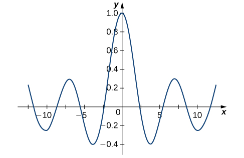

* Use power series to solve first-order and second-order differential equations.

In [Introduction to Power Series](/m53760){: .target-chapter}, we studied how functions can be represented as power series, <math xmlns="http://www.w3.org/1998/Math/MathML"><mrow><mi>y</mi><mo stretchy="false">(</mo><mi>x</mi><mo stretchy="false">)</mo><mo>=</mo><munderover><mstyle displaystyle="true"><mo>∑</mo></mstyle><mrow><mi>n</mi><mo>=</mo><mn>0</mn></mrow><mi>∞</mi></munderover><msub><mi>a</mi><mi>n</mi></msub><msup><mi>x</mi><mi>n</mi></msup><mo>.</mo></mrow></math>

 We also saw that we can find series representations of the derivatives of such functions by differentiating the **power series**{: data-type="term" .no-emphasis} term by term. This gives <math xmlns="http://www.w3.org/1998/Math/MathML"><mrow><msup><mi>y</mi><mo>′</mo></msup><mo stretchy="false">(</mo><mi>x</mi><mo stretchy="false">)</mo><mo>=</mo><mstyle displaystyle="true"><munderover><mo>∑</mo><mrow><mi>n</mi><mo>=</mo><mn>1</mn></mrow><mi>∞</mi></munderover><mi>n</mi></mstyle><msub><mi>a</mi><mi>n</mi></msub><msup><mi>x</mi><mrow><mi>n</mi><mo>−</mo><mn>1</mn></mrow></msup></mrow></math>

 and <math xmlns="http://www.w3.org/1998/Math/MathML"><mrow><mi>y</mi><mtext>″</mtext><mo stretchy="false">(</mo><mi>x</mi><mo stretchy="false">)</mo><mo>=</mo><mstyle displaystyle="true"><munderover><mo>∑</mo><mrow><mi>n</mi><mo>=</mo><mn>2</mn></mrow><mi>∞</mi></munderover><mi>n</mi></mstyle><mo stretchy="false">(</mo><mi>n</mi><mo>−</mo><mn>1</mn><mo stretchy="false">)</mo><msub><mi>a</mi><mi>n</mi></msub><msup><mi>x</mi><mrow><mi>n</mi><mo>−</mo><mn>2</mn></mrow></msup><mo>.</mo></mrow></math>

 In some cases, these power series representations can be used to find solutions to differential equations.

Be aware that this subject is given only a very brief treatment in this text. Most introductory differential equations textbooks include an entire chapter on power series solutions. This text has only a single section on the topic, so several important issues are not addressed here, particularly issues related to existence of solutions. The examples and exercises in this section were chosen for which power solutions exist. However, it is not always the case that power solutions exist. Those of you interested in a more rigorous treatment of this topic should consult a differential equations text.

Problem-Solving Strategy: Finding Power Series Solutions to Differential Equations

1.  Assume the differential equation has a solution of the form
    <math xmlns="http://www.w3.org/1998/Math/MathML"><mrow><mi>y</mi><mo stretchy="false">(</mo><mi>x</mi><mo stretchy="false">)</mo><mo>=</mo><munderover><mstyle displaystyle="true"><mo>∑</mo></mstyle><mrow><mi>n</mi><mo>=</mo><mn>0</mn></mrow><mi>∞</mi></munderover><msub><mi>a</mi><mi>n</mi></msub><msup><mi>x</mi><mi>n</mi></msup><mo>.</mo></mrow></math>

2.  Differentiate the power series term by term to get
    <math xmlns="http://www.w3.org/1998/Math/MathML"><mrow><msup><mi>y</mi><mo>′</mo></msup><mo stretchy="false">(</mo><mi>x</mi><mo stretchy="false">)</mo><mo>=</mo><mstyle displaystyle="true"><munderover><mo>∑</mo><mrow><mi>n</mi><mo>=</mo><mn>1</mn></mrow><mi>∞</mi></munderover><mi>n</mi></mstyle><msub><mi>a</mi><mi>n</mi></msub><msup><mi>x</mi><mrow><mi>n</mi><mo>−</mo><mn>1</mn></mrow></msup></mrow></math>
    
    and
    <math xmlns="http://www.w3.org/1998/Math/MathML"><mrow><mi>y</mi><mtext>″</mtext><mo stretchy="false">(</mo><mi>x</mi><mo stretchy="false">)</mo><mo>=</mo><mstyle displaystyle="true"><munderover><mo>∑</mo><mrow><mi>n</mi><mo>=</mo><mn>2</mn></mrow><mi>∞</mi></munderover><mi>n</mi></mstyle><mo stretchy="false">(</mo><mi>n</mi><mo>−</mo><mn>1</mn><mo stretchy="false">)</mo><msub><mi>a</mi><mi>n</mi></msub><msup><mi>x</mi><mrow><mi>n</mi><mo>−</mo><mn>2</mn></mrow></msup><mo>.</mo></mrow></math>

3.  Substitute the power series expressions into the differential equation.
4.  Re-index sums as necessary to combine terms and simplify the expression.
5.  Equate coefficients of like powers of
    <math xmlns="http://www.w3.org/1998/Math/MathML"><mi>x</mi></math>
    
    to determine values for the coefficients
    <math xmlns="http://www.w3.org/1998/Math/MathML"><mrow><msub><mi>a</mi><mi>n</mi></msub></mrow></math>
    
    in the power series.
6.  Substitute the coefficients back into the power series and write the solution.
{: data-number-style="arabic"}

Series Solutions to Differential Equations

Find a power series solution for the following differential equations.

1.  <math xmlns="http://www.w3.org/1998/Math/MathML"><mrow><mi>y</mi><mtext>″</mtext><mo>−</mo><mi>y</mi><mo>=</mo><mn>0</mn></mrow></math>

2.  <math xmlns="http://www.w3.org/1998/Math/MathML"><mrow><mo stretchy="false">(</mo><msup><mi>x</mi><mn>2</mn></msup><mo>−</mo><mn>1</mn><mo stretchy="false">)</mo><mi>y</mi><mtext>″</mtext><mo>+</mo><mn>6</mn><mi>x</mi><msup><mi>y</mi><mo>′</mo></msup><mo>+</mo><mn>4</mn><mi>y</mi><mo>=</mo><mn>−4</mn></mrow></math>
{: data-number-style="lower-alpha"}

1.  Assume
    <math xmlns="http://www.w3.org/1998/Math/MathML"><mrow><mi>y</mi><mo stretchy="false">(</mo><mi>x</mi><mo stretchy="false">)</mo><mo>=</mo><munderover><mstyle displaystyle="true"><mo>∑</mo></mstyle><mrow><mi>n</mi><mo>=</mo><mn>0</mn></mrow><mi>∞</mi></munderover><msub><mi>a</mi><mi>n</mi></msub><msup><mi>x</mi><mi>n</mi></msup></mrow></math>
    
    (step 1). Then,
    <math xmlns="http://www.w3.org/1998/Math/MathML"><mrow><msup><mi>y</mi><mo>′</mo></msup><mo stretchy="false">(</mo><mi>x</mi><mo stretchy="false">)</mo><mo>=</mo><mstyle displaystyle="true"><munderover><mo>∑</mo><mrow><mi>n</mi><mo>=</mo><mn>1</mn></mrow><mi>∞</mi></munderover><mi>n</mi></mstyle><msub><mi>a</mi><mi>n</mi></msub><msup><mi>x</mi><mrow><mi>n</mi><mo>−</mo><mn>1</mn></mrow></msup></mrow></math>
    
    and
    <math xmlns="http://www.w3.org/1998/Math/MathML"><mrow><mi>y</mi><mtext>″</mtext><mo stretchy="false">(</mo><mi>x</mi><mo stretchy="false">)</mo><mo>=</mo><mstyle displaystyle="true"><munderover><mo>∑</mo><mrow><mi>n</mi><mo>=</mo><mn>2</mn></mrow><mi>∞</mi></munderover><mi>n</mi></mstyle><mo stretchy="false">(</mo><mi>n</mi><mo>−</mo><mn>1</mn><mo stretchy="false">)</mo><msub><mi>a</mi><mi>n</mi></msub><msup><mi>x</mi><mrow><mi>n</mi><mo>−</mo><mn>2</mn></mrow></msup></mrow></math>
    
    (step 2). We want to find values for the coefficients
    <math xmlns="http://www.w3.org/1998/Math/MathML"><mrow><msub><mi>a</mi><mi>n</mi></msub></mrow></math>
    
    such that
    * * *
    {: data-type="newline"}
    
    

    <math xmlns="http://www.w3.org/1998/Math/MathML"><mtable><mtr><mtd columnalign="right"><mi>y</mi><mtext>″</mtext><mo>−</mo><mi>y</mi></mtd><mtd columnalign="left"><mo>=</mo></mtd><mtd columnalign="left"><mn>0</mn></mtd></mtr><mtr><mtd columnalign="right"><mstyle displaystyle="true"><munderover><mo>∑</mo><mrow><mi>n</mi><mo>=</mo><mn>2</mn></mrow><mi>∞</mi></munderover><mi>n</mi></mstyle><mo stretchy="false">(</mo><mi>n</mi><mo>−</mo><mn>1</mn><mo stretchy="false">)</mo><msub><mi>a</mi><mi>n</mi></msub><msup><mi>x</mi><mrow><mi>n</mi><mo>−</mo><mn>2</mn></mrow></msup><mo>−</mo><munderover><mstyle displaystyle="true"><mo>∑</mo></mstyle><mrow><mi>n</mi><mo>=</mo><mn>0</mn></mrow><mi>∞</mi></munderover><msub><mi>a</mi><mi>n</mi></msub><msup><mi>x</mi><mi>n</mi></msup></mtd><mtd columnalign="left"><mo>=</mo></mtd><mtd columnalign="left"><mn>0</mn><mspace width="0.2em" /><mtext>(step 3).</mtext></mtd></mtr></mtable></math>
    

    
    * * *
    {: data-type="newline"}
    
    We want the indices on our sums to match so that we can express them using a single summation. That is, we want to rewrite the first summation so that it starts with
    <math xmlns="http://www.w3.org/1998/Math/MathML"><mrow><mi>n</mi><mo>=</mo><mn>0</mn><mo>.</mo></mrow></math>
    
    * * *
    {: data-type="newline"}
    
    To re-index the first term, replace *n* with
    <math xmlns="http://www.w3.org/1998/Math/MathML"><mrow><mi>n</mi><mo>+</mo><mn>2</mn></mrow></math>
    
    inside the sum, and change the lower summation limit to
    <math xmlns="http://www.w3.org/1998/Math/MathML"><mrow><mi>n</mi><mo>=</mo><mn>0</mn><mo>.</mo></mrow></math>
    
    We get
    * * *
    {: data-type="newline"}
    
    

    <math xmlns="http://www.w3.org/1998/Math/MathML"><mrow><mstyle displaystyle="true"><munderover><mo>∑</mo><mrow><mi>n</mi><mo>=</mo><mn>2</mn></mrow><mi>∞</mi></munderover><mi>n</mi></mstyle><mo stretchy="false">(</mo><mi>n</mi><mo>−</mo><mn>1</mn><mo stretchy="false">)</mo><msub><mi>a</mi><mi>n</mi></msub><msup><mi>x</mi><mrow><mi>n</mi><mo>−</mo><mn>2</mn></mrow></msup><mo>=</mo><mstyle displaystyle="true"><munderover><mo>∑</mo><mrow><mi>n</mi><mo>=</mo><mn>0</mn></mrow><mi>∞</mi></munderover><mrow><mo stretchy="false">(</mo><mi>n</mi><mo>+</mo><mn>2</mn><mo stretchy="false">)</mo></mrow></mstyle><mo stretchy="false">(</mo><mi>n</mi><mo>+</mo><mn>1</mn><mo stretchy="false">)</mo><msub><mi>a</mi><mrow><mi>n</mi><mo>+</mo><mn>2</mn></mrow></msub><msup><mi>x</mi><mi>n</mi></msup><mo>.</mo></mrow></math>
    

    
    * * *
    {: data-type="newline"}
    
    This gives
    * * *
    {: data-type="newline"}
    
    

    <math xmlns="http://www.w3.org/1998/Math/MathML"><mtable><mtr><mtd columnalign="right"><mstyle displaystyle="true"><munderover><mo>∑</mo><mrow><mi>n</mi><mo>=</mo><mn>0</mn></mrow><mi>∞</mi></munderover><mrow><mo stretchy="false">(</mo><mi>n</mi><mo>+</mo><mn>2</mn><mo stretchy="false">)</mo></mrow></mstyle><mo stretchy="false">(</mo><mi>n</mi><mo>+</mo><mn>1</mn><mo stretchy="false">)</mo><msub><mi>a</mi><mrow><mi>n</mi><mo>+</mo><mn>2</mn></mrow></msub><msup><mi>x</mi><mi>n</mi></msup><mo>−</mo><munderover><mstyle displaystyle="true"><mo>∑</mo></mstyle><mrow><mi>n</mi><mo>=</mo><mn>0</mn></mrow><mi>∞</mi></munderover><msub><mi>a</mi><mi>n</mi></msub><msup><mi>x</mi><mi>n</mi></msup></mtd><mtd columnalign="left"><mo>=</mo></mtd><mtd columnalign="left"><mn>0</mn></mtd></mtr><mtr><mtd columnalign="right"><munderover><mstyle displaystyle="true"><mo>∑</mo></mstyle><mrow><mi>n</mi><mo>=</mo><mn>0</mn></mrow><mi>∞</mi></munderover><mrow><mo>[</mo><mrow><mo stretchy="false">(</mo><mi>n</mi><mo>+</mo><mn>2</mn><mo stretchy="false">)</mo><mo stretchy="false">(</mo><mi>n</mi><mo>+</mo><mn>1</mn><mo stretchy="false">)</mo><msub><mi>a</mi><mrow><mi>n</mi><mo>+</mo><mn>2</mn></mrow></msub><mo>−</mo><msub><mi>a</mi><mi>n</mi></msub></mrow><mo>]</mo></mrow><msup><mi>x</mi><mi>n</mi></msup></mtd><mtd columnalign="left"><mo>=</mo></mtd><mtd columnalign="left"><mn>0</mn><mspace width="0.2em" /><mtext>(step 4).</mtext></mtd></mtr></mtable></math>
    

    
    * * *
    {: data-type="newline"}
    
    Because power series expansions of functions are unique, this equation can be true only if the coefficients of each power of *x* are zero. So we have
    * * *
    {: data-type="newline"}
    
    

    <math xmlns="http://www.w3.org/1998/Math/MathML"><mrow><mo stretchy="false">(</mo><mi>n</mi><mo>+</mo><mn>2</mn><mo stretchy="false">)</mo><mo stretchy="false">(</mo><mi>n</mi><mo>+</mo><mn>1</mn><mo stretchy="false">)</mo><msub><mi>a</mi><mrow><mi>n</mi><mo>+</mo><mn>2</mn></mrow></msub><mo>−</mo><msub><mi>a</mi><mi>n</mi></msub><mo>=</mo><mn>0</mn><mspace width="0.2em" /><mtext>for</mtext><mspace width="0.2em" /><mi>n</mi><mo>=</mo><mn>0</mn><mo>,</mo><mn>1</mn><mo>,</mo><mn>2</mn><mtext>,….</mtext></mrow></math>
    

    
    * * *
    {: data-type="newline"}
    
    This recurrence relationship allows us to express each coefficient
    <math xmlns="http://www.w3.org/1998/Math/MathML"><mrow><msub><mi>a</mi><mi>n</mi></msub></mrow></math>
    
    in terms of the coefficient two terms earlier. This yields one expression for even values of *n* and another expression for odd values of *n*. Looking first at the equations involving even values of *n*, we see that
    * * *
    {: data-type="newline"}
    
    

    <math xmlns="http://www.w3.org/1998/Math/MathML"><mtable><mtr><mtd columnalign="right"><msub><mi>a</mi><mn>2</mn></msub></mtd><mtd columnalign="left"><mo>=</mo></mtd><mtd columnalign="left"><mfrac><mrow><msub><mi>a</mi><mn>0</mn></msub></mrow><mn>2</mn></mfrac></mtd></mtr><mtr><mtd columnalign="right"><msub><mi>a</mi><mn>4</mn></msub></mtd><mtd columnalign="left"><mo>=</mo></mtd><mtd columnalign="left"><mfrac><mrow><msub><mi>a</mi><mn>2</mn></msub></mrow><mrow><mn>4</mn><mo>⋅</mo><mn>3</mn></mrow></mfrac><mo>=</mo><mfrac><mrow><msub><mi>a</mi><mn>0</mn></msub></mrow><mrow><mn>4</mn><mo>!</mo></mrow></mfrac></mtd></mtr><mtr><mtd columnalign="right"><msub><mi>a</mi><mn>6</mn></msub></mtd><mtd columnalign="left"><mo>=</mo></mtd><mtd columnalign="left"><mfrac><mrow><msub><mi>a</mi><mn>4</mn></msub></mrow><mrow><mn>6</mn><mo>⋅</mo><mn>5</mn></mrow></mfrac><mo>=</mo><mfrac><mrow><msub><mi>a</mi><mn>0</mn></msub></mrow><mrow><mn>6</mn><mo>!</mo></mrow></mfrac></mtd></mtr><mtr><mtd /><mtd columnalign="left"><mtext>⋮.</mtext></mtd><mtd /></mtr></mtable></math>
    

    
    * * *
    {: data-type="newline"}
    
    Thus, in general, when *n* is even,
    <math xmlns="http://www.w3.org/1998/Math/MathML"><mrow><msub><mi>a</mi><mi>n</mi></msub><mo>=</mo><mfrac><mrow><msub><mi>a</mi><mn>0</mn></msub></mrow><mrow><mi>n</mi><mo>!</mo></mrow></mfrac></mrow></math>
    
    (step 5).
    * * *
    {: data-type="newline"}
    
    For the equations involving odd values of *n*, we see that
    * * *
    {: data-type="newline"}
    
    

    <math xmlns="http://www.w3.org/1998/Math/MathML"><mtable><mtr><mtd columnalign="right"><msub><mi>a</mi><mn>3</mn></msub></mtd><mtd columnalign="left"><mo>=</mo></mtd><mtd columnalign="left"><mfrac><mrow><msub><mi>a</mi><mn>1</mn></msub></mrow><mrow><mn>3</mn><mo>⋅</mo><mn>2</mn></mrow></mfrac><mo>=</mo><mfrac><mrow><msub><mi>a</mi><mn>1</mn></msub></mrow><mrow><mn>3</mn><mo>!</mo></mrow></mfrac></mtd></mtr><mtr><mtd columnalign="right"><msub><mi>a</mi><mn>5</mn></msub></mtd><mtd columnalign="left"><mo>=</mo></mtd><mtd columnalign="left"><mfrac><mrow><msub><mi>a</mi><mn>3</mn></msub></mrow><mrow><mn>5</mn><mo>⋅</mo><mn>4</mn></mrow></mfrac><mo>=</mo><mfrac><mrow><msub><mi>a</mi><mn>1</mn></msub></mrow><mrow><mn>5</mn><mo>!</mo></mrow></mfrac></mtd></mtr><mtr><mtd columnalign="right"><msub><mi>a</mi><mn>7</mn></msub></mtd><mtd columnalign="left"><mo>=</mo></mtd><mtd columnalign="left"><mfrac><mrow><msub><mi>a</mi><mn>5</mn></msub></mrow><mrow><mn>7</mn><mo>⋅</mo><mn>6</mn></mrow></mfrac><mo>=</mo><mfrac><mrow><msub><mi>a</mi><mn>1</mn></msub></mrow><mrow><mn>7</mn><mo>!</mo></mrow></mfrac></mtd></mtr><mtr><mtd /><mtd columnalign="left"><mtext>⋮.</mtext></mtd><mtd /></mtr></mtable></math>
    

    
    * * *
    {: data-type="newline"}
    
    Therefore, in general, when *n* is odd,
    <math xmlns="http://www.w3.org/1998/Math/MathML"><mrow><msub><mi>a</mi><mi>n</mi></msub><mo>=</mo><mfrac><mrow><msub><mi>a</mi><mn>1</mn></msub></mrow><mrow><mi>n</mi><mo>!</mo></mrow></mfrac></mrow></math>
    
    (step 5 continued).
    * * *
    {: data-type="newline"}
    
    Putting this together, we have
    * * *
    {: data-type="newline"}
    
    

    <math xmlns="http://www.w3.org/1998/Math/MathML"><mtable><mtr><mtd columnalign="right"><mi>y</mi><mo stretchy="false">(</mo><mi>x</mi><mo stretchy="false">)</mo></mtd><mtd columnalign="left"><mo>=</mo><mstyle displaystyle="true"><munderover><mo>∑</mo><mrow><mi>n</mi><mo>=</mo><mn>0</mn></mrow><mi>∞</mi></munderover><mrow><msub><mi>a</mi><mi>n</mi></msub></mrow></mstyle><msup><mi>x</mi><mi>n</mi></msup></mtd></mtr><mtr><mtd /><mtd columnalign="left"><mo>=</mo><msub><mi>a</mi><mn>0</mn></msub><mo>+</mo><msub><mi>a</mi><mn>1</mn></msub><mi>x</mi><mo>+</mo><mfrac><mrow><msub><mi>a</mi><mn>0</mn></msub></mrow><mn>2</mn></mfrac><msup><mi>x</mi><mn>2</mn></msup><mo>+</mo><mfrac><mrow><msub><mi>a</mi><mn>1</mn></msub></mrow><mrow><mn>3</mn><mo>!</mo></mrow></mfrac><msup><mi>x</mi><mn>3</mn></msup><mo>+</mo><mfrac><mrow><msub><mi>a</mi><mn>0</mn></msub></mrow><mrow><mn>4</mn><mo>!</mo></mrow></mfrac><msup><mi>x</mi><mn>4</mn></msup><mo>+</mo><mfrac><mrow><msub><mi>a</mi><mn>1</mn></msub></mrow><mrow><mn>5</mn><mo>!</mo></mrow></mfrac><msup><mi>x</mi><mn>5</mn></msup><mo>+</mo><mtext>⋯.</mtext></mtd></mtr></mtable></math>
    

    
    * * *
    {: data-type="newline"}
    
    Re-indexing the sums to account for the even and odd values of *n* separately, we obtain
    * * *
    {: data-type="newline"}
    
    

    <math xmlns="http://www.w3.org/1998/Math/MathML"><mrow><mi>y</mi><mo stretchy="false">(</mo><mi>x</mi><mo stretchy="false">)</mo><mo>=</mo><msub><mi>a</mi><mn>0</mn></msub><munderover><mstyle displaystyle="true"><mo>∑</mo></mstyle><mrow><mi>k</mi><mo>=</mo><mn>0</mn></mrow><mi>∞</mi></munderover><mfrac><mn>1</mn><mrow><mo stretchy="false">(</mo><mn>2</mn><mi>k</mi><mo stretchy="false">)</mo><mo>!</mo></mrow></mfrac><msup><mi>x</mi><mrow><mn>2</mn><mi>k</mi></mrow></msup><mo>+</mo><msub><mi>a</mi><mn>1</mn></msub><munderover><mstyle displaystyle="true"><mo>∑</mo></mstyle><mrow><mi>k</mi><mo>=</mo><mn>0</mn></mrow><mi>∞</mi></munderover><mfrac><mn>1</mn><mrow><mo stretchy="false">(</mo><mn>2</mn><mi>k</mi><mo>+</mo><mn>1</mn><mo stretchy="false">)</mo><mo>!</mo></mrow></mfrac><msup><mi>x</mi><mrow><mn>2</mn><mi>k</mi><mo>+</mo><mn>1</mn></mrow></msup><mspace width="0.2em" /><mtext>(step 6).</mtext></mrow></math>
    

    
    * * *
    {: data-type="newline"}
    
    **Analysis for part a.**
    * * *
    {: data-type="newline"}
    
    As expected for a second-order differential equation, this solution depends on two arbitrary constants. However, note that our differential equation is a constant-coefficient differential equation, yet the power series solution does not appear to have the familiar form (containing exponential functions) that we are used to seeing. Furthermore, since
    <math xmlns="http://www.w3.org/1998/Math/MathML"><mrow><mi>y</mi><mo stretchy="false">(</mo><mi>x</mi><mo stretchy="false">)</mo><mo>=</mo><msub><mi>c</mi><mn>1</mn></msub><msup><mi>e</mi><mi>x</mi></msup><mo>+</mo><msub><mi>c</mi><mn>2</mn></msub><msup><mi>e</mi><mrow><mtext>−</mtext><mi>x</mi></mrow></msup></mrow></math>
    
    is the general solution to this equation, we must be able to write any solution in this form, and it is not clear whether the power series solution we just found can, in fact, be written in that form.
    * * *
    {: data-type="newline"}
    
    Fortunately, after writing the power series representations of
    <math xmlns="http://www.w3.org/1998/Math/MathML"><mrow><msup><mi>e</mi><mi>x</mi></msup></mrow></math>
    
    and
    <math xmlns="http://www.w3.org/1998/Math/MathML"><mrow><msup><mi>e</mi><mrow><mtext>−</mtext><mi>x</mi></mrow></msup><mo>,</mo></mrow></math>
    
    and doing some algebra, we find that if we choose
    * * *
    {: data-type="newline"}
    
    

    <math xmlns="http://www.w3.org/1998/Math/MathML"><mrow><msub><mi>c</mi><mn>0</mn></msub><mo>=</mo><mfrac><mrow><mo stretchy="false">(</mo><msub><mi>a</mi><mn>0</mn></msub><mo>+</mo><msub><mi>a</mi><mn>1</mn></msub><mo stretchy="false">)</mo></mrow><mn>2</mn></mfrac><mo>,</mo><mtext> </mtext><msub><mi>c</mi><mn>1</mn></msub><mo>=</mo><mfrac><mrow><mo stretchy="false">(</mo><msub><mi>a</mi><mn>0</mn></msub><mo>−</mo><msub><mi>a</mi><mn>1</mn></msub><mo stretchy="false">)</mo></mrow><mn>2</mn></mfrac><mo>,</mo></mrow></math>
    

    
    * * *
    {: data-type="newline"}
    
    we then have
    <math xmlns="http://www.w3.org/1998/Math/MathML"><mrow><msub><mi>a</mi><mn>0</mn></msub><mo>=</mo><msub><mi>c</mi><mn>0</mn></msub><mo>+</mo><msub><mi>c</mi><mn>1</mn></msub></mrow></math>
    
    and
    <math xmlns="http://www.w3.org/1998/Math/MathML"><mrow><msub><mi>a</mi><mn>1</mn></msub><mo>=</mo><msub><mi>c</mi><mn>0</mn></msub><mo>−</mo><msub><mi>c</mi><mn>1</mn></msub><mo>,</mo></mrow></math>
    
    and
    * * *
    {: data-type="newline"}
    
    

    <math xmlns="http://www.w3.org/1998/Math/MathML"><mtable><mtr><mtd columnalign="right"><mi>y</mi><mo stretchy="false">(</mo><mi>x</mi><mo stretchy="false">)</mo></mtd><mtd columnalign="left"><mo>=</mo><msub><mi>a</mi><mn>0</mn></msub><mo>+</mo><msub><mi>a</mi><mn>1</mn></msub><mi>x</mi><mo>+</mo><mfrac><mrow><msub><mi>a</mi><mn>0</mn></msub></mrow><mn>2</mn></mfrac><msup><mi>x</mi><mn>2</mn></msup><mo>+</mo><mfrac><mrow><msub><mi>a</mi><mn>1</mn></msub></mrow><mrow><mn>3</mn><mo>!</mo></mrow></mfrac><msup><mi>x</mi><mn>3</mn></msup><mo>+</mo><mfrac><mrow><msub><mi>a</mi><mn>0</mn></msub></mrow><mrow><mn>4</mn><mo>!</mo></mrow></mfrac><msup><mi>x</mi><mn>4</mn></msup><mo>+</mo><mfrac><mrow><msub><mi>a</mi><mn>1</mn></msub></mrow><mrow><mn>5</mn><mo>!</mo></mrow></mfrac><msup><mi>x</mi><mn>5</mn></msup><mo>+</mo><mtext>⋯</mtext></mtd></mtr><mtr><mtd /><mtd columnalign="left"><mo>=</mo><mo stretchy="false">(</mo><msub><mi>c</mi><mn>0</mn></msub><mo>+</mo><msub><mi>c</mi><mn>1</mn></msub><mo stretchy="false">)</mo><mo>+</mo><mo stretchy="false">(</mo><msub><mi>c</mi><mn>0</mn></msub><mo>−</mo><msub><mi>c</mi><mn>1</mn></msub><mo stretchy="false">)</mo><mi>x</mi><mo>+</mo><mfrac><mrow><mo stretchy="false">(</mo><msub><mi>c</mi><mn>0</mn></msub><mo>+</mo><msub><mi>c</mi><mn>1</mn></msub><mo stretchy="false">)</mo></mrow><mn>2</mn></mfrac><msup><mi>x</mi><mn>2</mn></msup><mo>+</mo><mfrac><mrow><mo stretchy="false">(</mo><msub><mi>c</mi><mn>0</mn></msub><mo>−</mo><msub><mi>c</mi><mn>1</mn></msub><mo stretchy="false">)</mo></mrow><mrow><mn>3</mn><mo>!</mo></mrow></mfrac><msup><mi>x</mi><mn>3</mn></msup><mo>+</mo><mfrac><mrow><mo stretchy="false">(</mo><msub><mi>c</mi><mn>0</mn></msub><mo>+</mo><msub><mi>c</mi><mn>1</mn></msub><mo stretchy="false">)</mo></mrow><mrow><mn>4</mn><mo>!</mo></mrow></mfrac><msup><mi>x</mi><mn>4</mn></msup><mo>+</mo><mfrac><mrow><mo stretchy="false">(</mo><msub><mi>c</mi><mn>0</mn></msub><mo>−</mo><msub><mi>c</mi><mn>1</mn></msub><mo stretchy="false">)</mo></mrow><mrow><mn>5</mn><mo>!</mo></mrow></mfrac><msup><mi>x</mi><mn>5</mn></msup><mo>+</mo><mtext>⋯</mtext></mtd></mtr><mtr><mtd /><mtd columnalign="left"><mo>=</mo><msub><mi>c</mi><mn>0</mn></msub><mstyle displaystyle="true"><munderover><mo>∑</mo><mrow><mi>n</mi><mo>=</mo><mn>0</mn></mrow><mi>∞</mi></munderover><mrow><mfrac><mrow><msup><mi>x</mi><mi>n</mi></msup></mrow><mrow><mi>n</mi><mo>!</mo></mrow></mfrac></mrow></mstyle><mo>+</mo><msub><mi>c</mi><mn>1</mn></msub><mstyle displaystyle="true"><munderover><mo>∑</mo><mrow><mi>n</mi><mo>=</mo><mn>0</mn></mrow><mi>∞</mi></munderover><mrow><mfrac><mrow><msup><mrow><mo stretchy="false">(</mo><mtext>−</mtext><mi>x</mi><mo stretchy="false">)</mo></mrow><mi>n</mi></msup></mrow><mrow><mi>n</mi><mo>!</mo></mrow></mfrac></mrow></mstyle></mtd></mtr><mtr><mtd /><mtd columnalign="left"><mo>=</mo><msub><mi>c</mi><mn>0</mn></msub><msup><mi>e</mi><mi>x</mi></msup><mo>+</mo><msub><mi>c</mi><mn>1</mn></msub><msup><mi>e</mi><mrow><mtext>−</mtext><mi>x</mi></mrow></msup><mo>.</mo></mtd></mtr></mtable></math>
    

    
    * * *
    {: data-type="newline"}
    
    So we have, in fact, found the same general solution. Note that this choice of
    <math xmlns="http://www.w3.org/1998/Math/MathML"><mrow><msub><mi>c</mi><mn>1</mn></msub></mrow></math>
    
    and
    <math xmlns="http://www.w3.org/1998/Math/MathML"><mrow><msub><mi>c</mi><mn>2</mn></msub></mrow></math>
    
    is not obvious. This is a case when we know what the answer should be, and have essentially “reverse-engineered” our choice of coefficients.
2.  Assume
    <math xmlns="http://www.w3.org/1998/Math/MathML"><mrow><mi>y</mi><mo stretchy="false">(</mo><mi>x</mi><mo stretchy="false">)</mo><mo>=</mo><munderover><mstyle displaystyle="true"><mo>∑</mo></mstyle><mrow><mi>n</mi><mo>=</mo><mn>0</mn></mrow><mi>∞</mi></munderover><msub><mi>a</mi><mi>n</mi></msub><msup><mi>x</mi><mi>n</mi></msup></mrow></math>
    
    (step 1). Then,
    <math xmlns="http://www.w3.org/1998/Math/MathML"><mrow><msup><mi>y</mi><mo>′</mo></msup><mo stretchy="false">(</mo><mi>x</mi><mo stretchy="false">)</mo><mo>=</mo><mstyle displaystyle="true"><munderover><mo>∑</mo><mrow><mi>n</mi><mo>=</mo><mn>1</mn></mrow><mi>∞</mi></munderover><mi>n</mi></mstyle><msub><mi>a</mi><mi>n</mi></msub><msup><mi>x</mi><mrow><mi>n</mi><mo>−</mo><mn>1</mn></mrow></msup></mrow></math>
    
    and
    <math xmlns="http://www.w3.org/1998/Math/MathML"><mrow><mi>y</mi><mtext>″</mtext><mo stretchy="false">(</mo><mi>x</mi><mo stretchy="false">)</mo><mo>=</mo><mstyle displaystyle="true"><munderover><mo>∑</mo><mrow><mi>n</mi><mo>=</mo><mn>2</mn></mrow><mi>∞</mi></munderover><mi>n</mi></mstyle><mo stretchy="false">(</mo><mi>n</mi><mo>−</mo><mn>1</mn><mo stretchy="false">)</mo><msub><mi>a</mi><mi>n</mi></msub><msup><mi>x</mi><mrow><mi>n</mi><mo>−</mo><mn>2</mn></mrow></msup></mrow></math>
    
    (step 2). We want to find values for the coefficients
    <math xmlns="http://www.w3.org/1998/Math/MathML"><mrow><msub><mi>a</mi><mi>n</mi></msub></mrow></math>
    
    such that
    * * *
    {: data-type="newline"}
    
    

    <math xmlns="http://www.w3.org/1998/Math/MathML"><mtable><mtr /><mtr /><mtr><mtd columnalign="right"><mo stretchy="false">(</mo><msup><mi>x</mi><mn>2</mn></msup><mo>−</mo><mn>1</mn><mo stretchy="false">)</mo><mi>y</mi><mtext>″</mtext><mo>+</mo><mn>6</mn><mi>x</mi><msup><mi>y</mi><mo>′</mo></msup><mo>+</mo><mn>4</mn><mi>y</mi></mtd><mtd columnalign="left"><mo>=</mo></mtd><mtd columnalign="left"><mn>−4</mn></mtd></mtr><mtr><mtd columnalign="right"><mrow><mo>(</mo><mrow><msup><mi>x</mi><mn>2</mn></msup><mo>−</mo><mn>1</mn></mrow><mo>)</mo></mrow><mstyle displaystyle="true"><munderover><mo>∑</mo><mrow><mi>n</mi><mo>=</mo><mn>2</mn></mrow><mi>∞</mi></munderover><mi>n</mi></mstyle><mo stretchy="false">(</mo><mi>n</mi><mo>−</mo><mn>1</mn><mo stretchy="false">)</mo><msub><mi>a</mi><mi>n</mi></msub><msup><mi>x</mi><mrow><mi>n</mi><mo>−</mo><mn>2</mn></mrow></msup><mo>+</mo><mn>6</mn><mi>x</mi><mstyle displaystyle="true"><munderover><mo>∑</mo><mrow><mi>n</mi><mo>=</mo><mn>1</mn></mrow><mi>∞</mi></munderover><mi>n</mi></mstyle><msub><mi>a</mi><mi>n</mi></msub><msup><mi>x</mi><mrow><mi>n</mi><mo>−</mo><mn>1</mn></mrow></msup><mo>+</mo><mn>4</mn><mstyle displaystyle="true"><munderover><mo>∑</mo><mrow><mi>n</mi><mo>=</mo><mn>0</mn></mrow><mi>∞</mi></munderover><mrow><msub><mi>a</mi><mi>n</mi></msub></mrow></mstyle><msup><mi>x</mi><mi>n</mi></msup></mtd><mtd columnalign="left"><mo>=</mo></mtd><mtd columnalign="left"><mn>−4</mn></mtd></mtr><mtr><mtd columnalign="right"><msup><mi>x</mi><mn>2</mn></msup><mstyle displaystyle="true"><munderover><mo>∑</mo><mrow><mi>n</mi><mo>=</mo><mn>2</mn></mrow><mi>∞</mi></munderover><mi>n</mi></mstyle><mo stretchy="false">(</mo><mi>n</mi><mo>−</mo><mn>1</mn><mo stretchy="false">)</mo><msub><mi>a</mi><mi>n</mi></msub><msup><mi>x</mi><mrow><mi>n</mi><mo>−</mo><mn>2</mn></mrow></msup><mo>−</mo><mstyle displaystyle="true"><munderover><mo>∑</mo><mrow><mi>n</mi><mo>=</mo><mn>2</mn></mrow><mi>∞</mi></munderover><mi>n</mi></mstyle><mo stretchy="false">(</mo><mi>n</mi><mo>−</mo><mn>1</mn><mo stretchy="false">)</mo><msub><mi>a</mi><mi>n</mi></msub><msup><mi>x</mi><mrow><mi>n</mi><mo>−</mo><mn>2</mn></mrow></msup><mo>+</mo><mn>6</mn><mi>x</mi><mstyle displaystyle="true"><munderover><mo>∑</mo><mrow><mi>n</mi><mo>=</mo><mn>1</mn></mrow><mi>∞</mi></munderover><mi>n</mi></mstyle><msub><mi>a</mi><mi>n</mi></msub><msup><mi>x</mi><mrow><mi>n</mi><mo>−</mo><mn>1</mn></mrow></msup><mo>+</mo><mn>4</mn><mstyle displaystyle="true"><munderover><mo>∑</mo><mrow><mi>n</mi><mo>=</mo><mn>0</mn></mrow><mi>∞</mi></munderover><mrow><msub><mi>a</mi><mi>n</mi></msub></mrow></mstyle><msup><mi>x</mi><mi>n</mi></msup></mtd><mtd columnalign="left"><mo>=</mo></mtd><mtd columnalign="left"><mn>−4</mn><mo>.</mo></mtd></mtr></mtable></math>
    

    
    * * *
    {: data-type="newline"}
    
    Taking the external factors inside the summations, we get
    * * *
    {: data-type="newline"}
    
    

    <math xmlns="http://www.w3.org/1998/Math/MathML"><mrow><mstyle displaystyle="true"><munderover><mo>∑</mo><mrow><mi>n</mi><mo>=</mo><mn>2</mn></mrow><mi>∞</mi></munderover><mi>n</mi></mstyle><mo stretchy="false">(</mo><mi>n</mi><mo>−</mo><mn>1</mn><mo stretchy="false">)</mo><msub><mi>a</mi><mi>n</mi></msub><msup><mi>x</mi><mi>n</mi></msup><mo>−</mo><mstyle displaystyle="true"><munderover><mo>∑</mo><mrow><mi>n</mi><mo>=</mo><mn>2</mn></mrow><mi>∞</mi></munderover><mi>n</mi></mstyle><mo stretchy="false">(</mo><mi>n</mi><mo>−</mo><mn>1</mn><mo stretchy="false">)</mo><msub><mi>a</mi><mi>n</mi></msub><msup><mi>x</mi><mrow><mi>n</mi><mo>−</mo><mn>2</mn></mrow></msup><mo>+</mo><mstyle displaystyle="true"><munderover><mo>∑</mo><mrow><mi>n</mi><mo>=</mo><mn>1</mn></mrow><mi>∞</mi></munderover><mrow><mn>6</mn><mi>n</mi></mrow></mstyle><msub><mi>a</mi><mi>n</mi></msub><msup><mi>x</mi><mi>n</mi></msup><mo>+</mo><mstyle displaystyle="true"><munderover><mo>∑</mo><mrow><mi>n</mi><mo>=</mo><mn>0</mn></mrow><mi>∞</mi></munderover><mrow><mn>4</mn><msub><mi>a</mi><mi>n</mi></msub></mrow></mstyle><msup><mi>x</mi><mi>n</mi></msup><mo>=</mo><mn>−4</mn><mspace width="0.2em" /><mtext>(step 3).</mtext></mrow></math>
    

    
    * * *
    {: data-type="newline"}
    
    Now, in the first summation, we see that when
    <math xmlns="http://www.w3.org/1998/Math/MathML"><mrow><mi>n</mi><mo>=</mo><mn>0</mn></mrow></math>
    
    or
    <math xmlns="http://www.w3.org/1998/Math/MathML"><mrow><mi>n</mi><mo>=</mo><mn>1</mn><mo>,</mo></mrow></math>
    
    the term evaluates to zero, so we can add these terms back into our sum to get
    * * *
    {: data-type="newline"}
    
    

    <math xmlns="http://www.w3.org/1998/Math/MathML"><mrow><munderover><mstyle displaystyle="true"><mo>∑</mo></mstyle><mrow><mi>n</mi><mo>=</mo><mn>2</mn></mrow><mi>∞</mi></munderover><mi>n</mi><mrow><mo>(</mo><mrow><mi>n</mi><mo>−</mo><mn>1</mn></mrow><mo>)</mo></mrow><msub><mi>a</mi><mi>n</mi></msub><msup><mi>x</mi><mi>n</mi></msup><mo>=</mo><munderover><mstyle displaystyle="true"><mo>∑</mo></mstyle><mrow><mi>n</mi><mo>=</mo><mn>0</mn></mrow><mi>∞</mi></munderover><mi>n</mi><mrow><mo>(</mo><mrow><mi>n</mi><mo>−</mo><mn>1</mn></mrow><mo>)</mo></mrow><msub><mi>a</mi><mi>n</mi></msub><msup><mi>x</mi><mi>n</mi></msup><mo>.</mo></mrow></math>
    

    
    * * *
    {: data-type="newline"}
    
    Similarly, in the third term, we see that when
    <math xmlns="http://www.w3.org/1998/Math/MathML"><mrow><mi>n</mi><mo>=</mo><mn>0</mn><mo>,</mo></mrow></math>
    
    the expression evaluates to zero, so we can add that term back in as well. We have
    * * *
    {: data-type="newline"}
    
    

    <math xmlns="http://www.w3.org/1998/Math/MathML"><mrow><mstyle displaystyle="true"><munderover><mo>∑</mo><mrow><mi>n</mi><mo>=</mo><mn>1</mn></mrow><mi>∞</mi></munderover><mn>6</mn></mstyle><mi>n</mi><msub><mi>a</mi><mi>n</mi></msub><msup><mi>x</mi><mi>n</mi></msup><mo>=</mo><mstyle displaystyle="true"><munderover><mo>∑</mo><mrow><mi>n</mi><mo>=</mo><mn>0</mn></mrow><mi>∞</mi></munderover><mn>6</mn></mstyle><mi>n</mi><msub><mi>a</mi><mi>n</mi></msub><msup><mi>x</mi><mi>n</mi></msup><mo>.</mo></mrow></math>
    

    
    * * *
    {: data-type="newline"}
    
    Then, we need only shift the indices in our second term. We get
    * * *
    {: data-type="newline"}
    
    

    <math xmlns="http://www.w3.org/1998/Math/MathML"><mrow><mstyle displaystyle="true"><munderover><mo>∑</mo><mrow><mi>n</mi><mo>=</mo><mn>2</mn></mrow><mi>∞</mi></munderover><mi>n</mi></mstyle><mo stretchy="false">(</mo><mi>n</mi><mo>−</mo><mn>1</mn><mo stretchy="false">)</mo><msub><mi>a</mi><mi>n</mi></msub><msup><mi>x</mi><mrow><mi>n</mi><mo>−</mo><mn>2</mn></mrow></msup><mo>=</mo><mstyle displaystyle="true"><munderover><mo>∑</mo><mrow><mi>n</mi><mo>=</mo><mn>0</mn></mrow><mi>∞</mi></munderover><mrow><mo stretchy="false">(</mo><mi>n</mi><mo>+</mo><mn>2</mn><mo stretchy="false">)</mo></mrow></mstyle><mo stretchy="false">(</mo><mi>n</mi><mo>+</mo><mn>1</mn><mo stretchy="false">)</mo><msub><mi>a</mi><mrow><mi>n</mi><mo>+</mo><mn>2</mn></mrow></msub><msup><mi>x</mi><mi>n</mi></msup><mo>.</mo></mrow></math>
    

    
    * * *
    {: data-type="newline"}
    
    Thus, we have
    * * *
    {: data-type="newline"}
    
    

    <math xmlns="http://www.w3.org/1998/Math/MathML"><mtable><mtr><mtd columnalign="right"><mstyle displaystyle="true"><munderover><mo>∑</mo><mrow><mi>n</mi><mo>=</mo><mn>0</mn></mrow><mi>∞</mi></munderover><mi>n</mi></mstyle><mo stretchy="false">(</mo><mi>n</mi><mo>−</mo><mn>1</mn><mo stretchy="false">)</mo><msub><mi>a</mi><mi>n</mi></msub><msup><mi>x</mi><mi>n</mi></msup><mo>−</mo><mstyle displaystyle="true"><munderover><mo>∑</mo><mrow><mi>n</mi><mo>=</mo><mn>0</mn></mrow><mi>∞</mi></munderover><mrow><mo stretchy="false">(</mo><mi>n</mi><mo>+</mo><mn>2</mn><mo stretchy="false">)</mo></mrow></mstyle><mo stretchy="false">(</mo><mi>n</mi><mo>+</mo><mn>1</mn><mo stretchy="false">)</mo><msub><mi>a</mi><mrow><mi>n</mi><mo>+</mo><mn>2</mn></mrow></msub><msup><mi>x</mi><mi>n</mi></msup><mo>+</mo><mstyle displaystyle="true"><munderover><mo>∑</mo><mrow><mi>n</mi><mo>=</mo><mn>0</mn></mrow><mi>∞</mi></munderover><mrow><mn>6</mn><mi>n</mi></mrow></mstyle><msub><mi>a</mi><mi>n</mi></msub><msup><mi>x</mi><mi>n</mi></msup><mo>+</mo><mstyle displaystyle="true"><munderover><mo>∑</mo><mrow><mi>n</mi><mo>=</mo><mn>0</mn></mrow><mi>∞</mi></munderover><mrow><mn>4</mn><msub><mi>a</mi><mi>n</mi></msub></mrow></mstyle><msup><mi>x</mi><mi>n</mi></msup></mtd><mtd columnalign="left"><mo>=</mo></mtd><mtd columnalign="left"><mn>−4</mn><mspace width="0.2em" /><mtext>(step 4).</mtext></mtd></mtr><mtr><mtd columnalign="right"><munderover><mstyle displaystyle="true"><mo>∑</mo></mstyle><mrow><mi>n</mi><mo>=</mo><mn>0</mn></mrow><mi>∞</mi></munderover><mrow><mo>[</mo><mrow><mi>n</mi><mo stretchy="false">(</mo><mi>n</mi><mo>−</mo><mn>1</mn><mo stretchy="false">)</mo><msub><mi>a</mi><mi>n</mi></msub><mo>−</mo><mo stretchy="false">(</mo><mi>n</mi><mo>+</mo><mn>2</mn><mo stretchy="false">)</mo><mo stretchy="false">(</mo><mi>n</mi><mo>+</mo><mn>1</mn><mo stretchy="false">)</mo><msub><mi>a</mi><mrow><mi>n</mi><mo>+</mo><mn>2</mn></mrow></msub><mo>+</mo><mn>6</mn><mi>n</mi><msub><mi>a</mi><mi>n</mi></msub><mo>+</mo><mn>4</mn><msub><mi>a</mi><mi>n</mi></msub></mrow><mo>]</mo></mrow><msup><mi>x</mi><mi>n</mi></msup></mtd><mtd columnalign="left"><mo>=</mo></mtd><mtd columnalign="left"><mn>−4</mn></mtd></mtr><mtr><mtd columnalign="right"><munderover><mstyle displaystyle="true"><mo>∑</mo></mstyle><mrow><mi>n</mi><mo>=</mo><mn>0</mn></mrow><mi>∞</mi></munderover><mrow><mo>[</mo><mrow><mo stretchy="false">(</mo><msup><mi>n</mi><mn>2</mn></msup><mo>−</mo><mi>n</mi><mo stretchy="false">)</mo><msub><mi>a</mi><mi>n</mi></msub><mo>+</mo><mn>6</mn><mi>n</mi><msub><mi>a</mi><mi>n</mi></msub><mo>+</mo><mn>4</mn><msub><mi>a</mi><mi>n</mi></msub><mo>−</mo><mo stretchy="false">(</mo><mi>n</mi><mo>+</mo><mn>2</mn><mo stretchy="false">)</mo><mo stretchy="false">(</mo><mi>n</mi><mo>+</mo><mn>1</mn><mo stretchy="false">)</mo><msub><mi>a</mi><mrow><mi>n</mi><mo>+</mo><mn>2</mn></mrow></msub></mrow><mo>]</mo></mrow><msup><mi>x</mi><mi>n</mi></msup></mtd><mtd columnalign="left"><mo>=</mo></mtd><mtd columnalign="left"><mn>−4</mn></mtd></mtr><mtr><mtd columnalign="right"><munderover><mstyle displaystyle="true"><mo>∑</mo></mstyle><mrow><mi>n</mi><mo>=</mo><mn>0</mn></mrow><mi>∞</mi></munderover><mrow><mo>[</mo><mrow><msup><mi>n</mi><mn>2</mn></msup><msub><mi>a</mi><mi>n</mi></msub><mo>+</mo><mn>5</mn><mi>n</mi><msub><mi>a</mi><mi>n</mi></msub><mo>+</mo><mn>4</mn><msub><mi>a</mi><mi>n</mi></msub><mo>−</mo><mo stretchy="false">(</mo><mi>n</mi><mo>+</mo><mn>2</mn><mo stretchy="false">)</mo><mo stretchy="false">(</mo><mi>n</mi><mo>+</mo><mn>1</mn><mo stretchy="false">)</mo><msub><mi>a</mi><mrow><mi>n</mi><mo>+</mo><mn>2</mn></mrow></msub></mrow><mo>]</mo></mrow><msup><mi>x</mi><mi>n</mi></msup></mtd><mtd columnalign="left"><mo>=</mo></mtd><mtd columnalign="left"><mn>−4</mn></mtd></mtr><mtr><mtd columnalign="right"><munderover><mstyle displaystyle="true"><mo>∑</mo></mstyle><mrow><mi>n</mi><mo>=</mo><mn>0</mn></mrow><mi>∞</mi></munderover><mrow><mo>[</mo><mrow><mo stretchy="false">(</mo><msup><mi>n</mi><mn>2</mn></msup><mo>+</mo><mn>5</mn><mi>n</mi><mo>+</mo><mn>4</mn><mo stretchy="false">)</mo><msub><mi>a</mi><mi>n</mi></msub><mo>−</mo><mo stretchy="false">(</mo><mi>n</mi><mo>+</mo><mn>2</mn><mo stretchy="false">)</mo><mo stretchy="false">(</mo><mi>n</mi><mo>+</mo><mn>1</mn><mo stretchy="false">)</mo><msub><mi>a</mi><mrow><mi>n</mi><mo>+</mo><mn>2</mn></mrow></msub></mrow><mo>]</mo></mrow><msup><mi>x</mi><mi>n</mi></msup></mtd><mtd columnalign="left"><mo>=</mo></mtd><mtd columnalign="left"><mn>−4</mn></mtd></mtr><mtr><mtd columnalign="right"><munderover><mstyle displaystyle="true"><mo>∑</mo></mstyle><mrow><mi>n</mi><mo>=</mo><mn>0</mn></mrow><mi>∞</mi></munderover><mrow><mo>[</mo><mrow><mo stretchy="false">(</mo><mi>n</mi><mo>+</mo><mn>4</mn><mo stretchy="false">)</mo><mo stretchy="false">(</mo><mi>n</mi><mo>+</mo><mn>1</mn><mo stretchy="false">)</mo><msub><mi>a</mi><mi>n</mi></msub><mo>−</mo><mo stretchy="false">(</mo><mi>n</mi><mo>+</mo><mn>2</mn><mo stretchy="false">)</mo><mo stretchy="false">(</mo><mi>n</mi><mo>+</mo><mn>1</mn><mo stretchy="false">)</mo><msub><mi>a</mi><mrow><mi>n</mi><mo>+</mo><mn>2</mn></mrow></msub></mrow><mo>]</mo></mrow><msup><mi>x</mi><mi>n</mi></msup></mtd><mtd columnalign="left"><mo>=</mo></mtd><mtd columnalign="left"><mn>−4</mn></mtd></mtr></mtable></math>
    

    
    * * *
    {: data-type="newline"}
    
    Looking at the coefficients of each power of *x*, we see that the constant term must be equal to
    <math xmlns="http://www.w3.org/1998/Math/MathML"><mrow><mn>−4</mn><mo>,</mo></mrow></math>
    
    and the coefficients of all other powers of *x* must be zero. Then, looking first at the constant term,
    * * *
    {: data-type="newline"}
    
    

    <math xmlns="http://www.w3.org/1998/Math/MathML"><mtable><mtr><mtd columnalign="right"><mn>4</mn><msub><mi>a</mi><mn>0</mn></msub><mo>−</mo><mn>2</mn><msub><mi>a</mi><mn>2</mn></msub></mtd><mtd columnalign="left"><mo>=</mo></mtd><mtd columnalign="left"><mn>−4</mn></mtd></mtr><mtr><mtd columnalign="right"><msub><mi>a</mi><mn>2</mn></msub></mtd><mtd columnalign="left"><mo>=</mo></mtd><mtd columnalign="left"><mn>2</mn><msub><mi>a</mi><mn>0</mn></msub><mo>+</mo><mn>2</mn><mspace width="0.2em" /><mtext>(step 3).</mtext></mtd></mtr></mtable></math>
    

    
    * * *
    {: data-type="newline"}
    
    For
    <math xmlns="http://www.w3.org/1998/Math/MathML"><mrow><mi>n</mi><mo>≥</mo><mn>1</mn><mo>,</mo></mrow></math>
    
    we have
    * * *
    {: data-type="newline"}
    
    

    <math xmlns="http://www.w3.org/1998/Math/MathML"><mtable><mtr><mtd columnalign="right"><mo stretchy="false">(</mo><mi>n</mi><mo>+</mo><mn>4</mn><mo stretchy="false">)</mo><mo stretchy="false">(</mo><mi>n</mi><mo>+</mo><mn>1</mn><mo stretchy="false">)</mo><msub><mi>a</mi><mi>n</mi></msub><mo>−</mo><mo stretchy="false">(</mo><mi>n</mi><mo>+</mo><mn>2</mn><mo stretchy="false">)</mo><mo stretchy="false">(</mo><mi>n</mi><mo>+</mo><mn>1</mn><mo stretchy="false">)</mo><msub><mi>a</mi><mrow><mi>n</mi><mo>+</mo><mn>2</mn></mrow></msub></mtd><mtd columnalign="left"><mo>=</mo></mtd><mtd columnalign="left"><mn>0</mn></mtd></mtr><mtr><mtd columnalign="right"><mo stretchy="false">(</mo><mi>n</mi><mo>+</mo><mn>1</mn><mo stretchy="false">)</mo><mrow><mo>[</mo><mrow><mo stretchy="false">(</mo><mi>n</mi><mo>+</mo><mn>4</mn><mo stretchy="false">)</mo><msub><mi>a</mi><mi>n</mi></msub><mo>−</mo><mo stretchy="false">(</mo><mi>n</mi><mo>+</mo><mn>2</mn><mo stretchy="false">)</mo><msub><mi>a</mi><mrow><mi>n</mi><mo>+</mo><mn>2</mn></mrow></msub></mrow><mo>]</mo></mrow></mtd><mtd columnalign="left"><mo>=</mo></mtd><mtd columnalign="left"><mn>0</mn><mo>.</mo></mtd></mtr></mtable></math>
    

    
    * * *
    {: data-type="newline"}
    
    Since
    <math xmlns="http://www.w3.org/1998/Math/MathML"><mrow><mi>n</mi><mo>≥</mo><mn>1</mn><mo>,</mo></mrow></math>
    
    <math xmlns="http://www.w3.org/1998/Math/MathML"><mrow><mi>n</mi><mo>+</mo><mn>1</mn><mo>≠</mo><mn>0</mn><mo>,</mo></mrow></math>
    
    we see that
    * * *
    {: data-type="newline"}
    
    

    <math xmlns="http://www.w3.org/1998/Math/MathML"><mrow><mo stretchy="false">(</mo><mi>n</mi><mo>+</mo><mn>4</mn><mo stretchy="false">)</mo><msub><mi>a</mi><mi>n</mi></msub><mo>−</mo><mo stretchy="false">(</mo><mi>n</mi><mo>+</mo><mn>2</mn><mo stretchy="false">)</mo><msub><mi>a</mi><mrow><mi>n</mi><mo>+</mo><mn>2</mn></mrow></msub><mo>=</mo><mn>0</mn></mrow></math>
    

    
    * * *
    {: data-type="newline"}
    
    and thus
    * * *
    {: data-type="newline"}
    
    

    <math xmlns="http://www.w3.org/1998/Math/MathML"><mrow><msub><mi>a</mi><mrow><mi>n</mi><mo>+</mo><mn>2</mn></mrow></msub><mo>=</mo><mfrac><mrow><mi>n</mi><mo>+</mo><mn>4</mn></mrow><mrow><mi>n</mi><mo>+</mo><mn>2</mn></mrow></mfrac><mspace width="0.1em" /><msub><mi>a</mi><mi>n</mi></msub><mo>.</mo></mrow></math>
    

    
    * * *
    {: data-type="newline"}
    
    For even values of *n*, we have
    * * *
    {: data-type="newline"}
    
    

    <math xmlns="http://www.w3.org/1998/Math/MathML"><mtable><mtr><mtd columnalign="right"><msub><mi>a</mi><mn>4</mn></msub></mtd><mtd columnalign="left"><mo>=</mo></mtd><mtd columnalign="left"><mfrac><mn>6</mn><mn>4</mn></mfrac><mrow><mo>(</mo><mrow><mn>2</mn><msub><mi>a</mi><mn>0</mn></msub><mo>+</mo><mn>2</mn></mrow><mo>)</mo></mrow><mo>=</mo><mn>3</mn><msub><mi>a</mi><mn>0</mn></msub><mo>+</mo><mn>3</mn></mtd></mtr><mtr><mtd columnalign="right"><msub><mi>a</mi><mn>6</mn></msub></mtd><mtd columnalign="left"><mo>=</mo></mtd><mtd columnalign="left"><mfrac><mn>8</mn><mn>6</mn></mfrac><mrow><mo>(</mo><mrow><mn>3</mn><msub><mi>a</mi><mn>0</mn></msub><mo>+</mo><mn>3</mn></mrow><mo>)</mo></mrow><mo>=</mo><mn>4</mn><msub><mi>a</mi><mn>0</mn></msub><mo>+</mo><mn>4</mn></mtd></mtr><mtr><mtd /><mtd columnalign="left"><mtext>⋮.</mtext></mtd><mtd /></mtr></mtable></math>
    

    
    * * *
    {: data-type="newline"}
    
    In general,
    <math xmlns="http://www.w3.org/1998/Math/MathML"><mrow><msub><mi>a</mi><mrow><mn>2</mn><mi>k</mi></mrow></msub><mo>=</mo><mrow><mo>(</mo><mrow><mi>k</mi><mo>+</mo><mn>1</mn></mrow><mo>)</mo></mrow><mrow><mo>(</mo><mrow><msub><mi>a</mi><mn>0</mn></msub><mo>+</mo><mn>1</mn></mrow><mo>)</mo></mrow></mrow></math>
    
    (step 5).
    * * *
    {: data-type="newline"}
    
    For odd values of *n*, we have
    * * *
    {: data-type="newline"}
    
    

    <math xmlns="http://www.w3.org/1998/Math/MathML"><mtable><mtr><mtd columnalign="right"><msub><mi>a</mi><mn>3</mn></msub></mtd><mtd columnalign="left"><mo>=</mo></mtd><mtd columnalign="left"><mfrac><mn>5</mn><mn>3</mn></mfrac><mspace width="0.1em" /><msub><mi>a</mi><mn>1</mn></msub></mtd></mtr><mtr><mtd columnalign="right"><msub><mi>a</mi><mn>5</mn></msub></mtd><mtd columnalign="left"><mo>=</mo></mtd><mtd columnalign="left"><mfrac><mn>7</mn><mn>5</mn></mfrac><mspace width="0.1em" /><msub><mi>a</mi><mn>3</mn></msub><mo>=</mo><mfrac><mn>7</mn><mn>3</mn></mfrac><mspace width="0.1em" /><msub><mi>a</mi><mn>1</mn></msub></mtd></mtr><mtr><mtd columnalign="right"><msub><mi>a</mi><mn>7</mn></msub></mtd><mtd columnalign="left"><mo>=</mo></mtd><mtd columnalign="left"><mfrac><mn>9</mn><mn>7</mn></mfrac><mspace width="0.1em" /><msub><mi>a</mi><mn>5</mn></msub><mo>=</mo><mfrac><mn>9</mn><mn>3</mn></mfrac><mspace width="0.1em" /><msub><mi>a</mi><mn>1</mn></msub><mo>=</mo><mn>3</mn><msub><mi>a</mi><mn>1</mn></msub></mtd></mtr><mtr><mtd /><mtd columnalign="left"><mtext>⋮.</mtext></mtd><mtd /></mtr></mtable></math>
    

    
    * * *
    {: data-type="newline"}
    
    In general,
    <math xmlns="http://www.w3.org/1998/Math/MathML"><mrow><msub><mi>a</mi><mrow><mn>2</mn><mi>k</mi><mo>+</mo><mn>1</mn></mrow></msub><mo>=</mo><mfrac><mrow><mn>2</mn><mi>k</mi><mo>+</mo><mn>3</mn></mrow><mn>3</mn></mfrac><mspace width="0.1em" /><msub><mi>a</mi><mn>1</mn></msub></mrow></math>
    
    (step 5 continued).
    * * *
    {: data-type="newline"}
    
    Putting this together, we have
    * * *
    {: data-type="newline"}
    
    

    <math xmlns="http://www.w3.org/1998/Math/MathML"><mrow><mi>y</mi><mo stretchy="false">(</mo><mi>x</mi><mo stretchy="false">)</mo><mo>=</mo><mstyle displaystyle="true"><munderover><mo>∑</mo><mrow><mi>k</mi><mo>=</mo><mn>0</mn></mrow><mi>∞</mi></munderover><mrow><mo stretchy="false">(</mo><mi>k</mi><mo>+</mo><mn>1</mn><mo stretchy="false">)</mo><mo stretchy="false">(</mo><msub><mi>a</mi><mn>0</mn></msub><mo>+</mo><mn>1</mn><mo stretchy="false">)</mo></mrow></mstyle><msup><mi>x</mi><mrow><mn>2</mn><mi>k</mi></mrow></msup><mo>+</mo><mstyle displaystyle="true"><munderover><mo>∑</mo><mrow><mi>k</mi><mo>=</mo><mn>0</mn></mrow><mi>∞</mi></munderover><mrow><mrow><mo>(</mo><mrow><mfrac><mrow><mn>2</mn><mi>k</mi><mo>+</mo><mn>3</mn></mrow><mn>3</mn></mfrac></mrow><mo>)</mo></mrow><msub><mi>a</mi><mn>1</mn></msub></mrow></mstyle><msup><mi>x</mi><mrow><mn>2</mn><mi>k</mi><mo>+</mo><mn>1</mn></mrow></msup><mspace width="0.2em" /><mtext>(step 6).</mtext></mrow></math>
    

{: data-number-style="lower-alpha"}

Find a power series solution for the following differential equations.

1.  <math xmlns="http://www.w3.org/1998/Math/MathML"><mrow><msup><mi>y</mi><mo>′</mo></msup><mo>+</mo><mn>2</mn><mi>x</mi><mi>y</mi><mo>=</mo><mn>0</mn></mrow></math>

2.  <math xmlns="http://www.w3.org/1998/Math/MathML"><mrow><mo stretchy="false">(</mo><mi>x</mi><mo>+</mo><mn>1</mn><mo stretchy="false">)</mo><msup><mi>y</mi><mo>′</mo></msup><mo>=</mo><mn>3</mn><mi>y</mi></mrow></math>
{: data-number-style="lower-alpha"}

1.  <math xmlns="http://www.w3.org/1998/Math/MathML"><mrow><mi>y</mi><mo stretchy="false">(</mo><mi>x</mi><mo stretchy="false">)</mo><mo>=</mo><msub><mi>a</mi><mn>0</mn></msub><munderover><mstyle displaystyle="true"><mo>∑</mo></mstyle><mrow><mi>n</mi><mo>=</mo><mn>0</mn></mrow><mi>∞</mi></munderover><mfrac><mrow><msup><mrow><mo stretchy="false">(</mo><mn>−1</mn><mo stretchy="false">)</mo></mrow><mi>n</mi></msup></mrow><mrow><mi>n</mi><mo>!</mo></mrow></mfrac><msup><mi>x</mi><mrow><mn>2</mn><mi>n</mi></mrow></msup><mo>=</mo><msub><mi>a</mi><mn>0</mn></msub><msup><mi>e</mi><mrow><mtext>−</mtext><msup><mi>x</mi><mn>2</mn></msup></mrow></msup></mrow></math>

2.  <math xmlns="http://www.w3.org/1998/Math/MathML"><mrow><mi>y</mi><mo stretchy="false">(</mo><mi>x</mi><mo stretchy="false">)</mo><mo>=</mo><msub><mi>a</mi><mn>0</mn></msub><msup><mrow><mrow><mo>(</mo><mrow><mi>x</mi><mo>+</mo><mn>1</mn></mrow><mo>)</mo></mrow></mrow><mn>3</mn></msup></mrow></math>
{: data-number-style="lower-alpha"}

Hint

Follow the problem-solving strategy.

We close this section with a brief introduction to **Bessel functions**{: data-type="term" .no-emphasis}. Complete treatment of Bessel functions is well beyond the scope of this course, but we get a little taste of the topic here so we can see how series solutions to differential equations are used in real-world applications. The Bessel equation of order *n* is given by

<math xmlns="http://www.w3.org/1998/Math/MathML"><mrow><msup><mi>x</mi><mn>2</mn></msup><mi>y</mi><mtext>″</mtext><mo>+</mo><mi>x</mi><msup><mi>y</mi><mo>′</mo></msup><mo>+</mo><mo stretchy="false">(</mo><msup><mi>x</mi><mn>2</mn></msup><mo>−</mo><msup><mi>n</mi><mn>2</mn></msup><mo stretchy="false">)</mo><mi>y</mi><mo>=</mo><mn>0</mn><mo>.</mo></mrow></math>

This equation arises in many physical applications, particularly those involving cylindrical coordinates, such as the vibration of a circular drum head and transient heating or cooling of a cylinder. In the next example, we find a power series solution to the Bessel equation of order 0.

Power Series Solution to the Bessel Equation

Find a power series solution to the Bessel equation of order 0 and graph the solution.

The Bessel equation of order 0 is given by

<math xmlns="http://www.w3.org/1998/Math/MathML"><mrow><msup><mi>x</mi><mn>2</mn></msup><mi>y</mi><mtext>″</mtext><mo>+</mo><mi>x</mi><msup><mi>y</mi><mo>′</mo></msup><mo>+</mo><msup><mi>x</mi><mn>2</mn></msup><mi>y</mi><mo>=</mo><mn>0</mn><mo>.</mo></mrow></math>

We assume a solution of the form <math xmlns="http://www.w3.org/1998/Math/MathML"><mrow><mi>y</mi><mo>=</mo><munderover><mstyle displaystyle="true"><mo>∑</mo></mstyle><mrow><mi>n</mi><mo>=</mo><mn>0</mn></mrow><mi>∞</mi></munderover><msub><mi>a</mi><mi>n</mi></msub><msup><mi>x</mi><mi>n</mi></msup><mo>.</mo></mrow></math>

 Then <math xmlns="http://www.w3.org/1998/Math/MathML"><mrow><msup><mi>y</mi><mo>′</mo></msup><mo stretchy="false">(</mo><mi>x</mi><mo stretchy="false">)</mo><mo>=</mo><mstyle displaystyle="true"><munderover><mo>∑</mo><mrow><mi>n</mi><mo>=</mo><mn>1</mn></mrow><mi>∞</mi></munderover><mi>n</mi></mstyle><msub><mi>a</mi><mi>n</mi></msub><msup><mi>x</mi><mrow><mi>n</mi><mo>−</mo><mn>1</mn></mrow></msup></mrow></math>

 and <math xmlns="http://www.w3.org/1998/Math/MathML"><mrow><mi>y</mi><mtext>″</mtext><mo stretchy="false">(</mo><mi>x</mi><mo stretchy="false">)</mo><mo>=</mo><mstyle displaystyle="true"><munderover><mo>∑</mo><mrow><mi>n</mi><mo>=</mo><mn>2</mn></mrow><mi>∞</mi></munderover><mi>n</mi></mstyle><mo stretchy="false">(</mo><mi>n</mi><mo>−</mo><mn>1</mn><mo stretchy="false">)</mo><msub><mi>a</mi><mi>n</mi></msub><msup><mi>x</mi><mrow><mi>n</mi><mo>−</mo><mn>2</mn></mrow></msup><mo>.</mo></mrow></math>

 Substituting this into the differential equation, we get

<math xmlns="http://www.w3.org/1998/Math/MathML"><mrow><mtable><mtr /><mtr /><mtr><mtd columnalign="left"><msup><mi>x</mi><mn>2</mn></msup><mstyle displaystyle="true"><munderover><mo>∑</mo><mrow><mi>n</mi><mo>=</mo><mn>2</mn></mrow><mi>∞</mi></munderover><mi>n</mi></mstyle><mo stretchy="false">(</mo><mi>n</mi><mo>−</mo><mn>1</mn><mo stretchy="false">)</mo><msub><mi>a</mi><mi>n</mi></msub><msup><mi>x</mi><mrow><mi>n</mi><mo>−</mo><mn>2</mn></mrow></msup><mo>+</mo><mi>x</mi><mstyle displaystyle="true"><munderover><mo>∑</mo><mrow><mi>n</mi><mo>=</mo><mn>1</mn></mrow><mi>∞</mi></munderover><mi>n</mi></mstyle><msub><mi>a</mi><mi>n</mi></msub><msup><mi>x</mi><mrow><mi>n</mi><mo>−</mo><mn>1</mn></mrow></msup><mo>+</mo><msup><mi>x</mi><mn>2</mn></msup><munderover><mstyle displaystyle="true"><mo>∑</mo></mstyle><mrow><mi>n</mi><mo>=</mo><mn>0</mn></mrow><mi>∞</mi></munderover><msub><mi>a</mi><mi>n</mi></msub><msup><mi>x</mi><mi>n</mi></msup><mo>=</mo><mn>0</mn></mtd><mtd /><mtd columnalign="left"><mtext>Substitution.</mtext></mtd></mtr><mtr><mtd columnalign="left"><mstyle displaystyle="true"><munderover><mo>∑</mo><mrow><mi>n</mi><mo>=</mo><mn>2</mn></mrow><mi>∞</mi></munderover><mi>n</mi></mstyle><mo stretchy="false">(</mo><mi>n</mi><mo>−</mo><mn>1</mn><mo stretchy="false">)</mo><msub><mi>a</mi><mi>n</mi></msub><msup><mi>x</mi><mi>n</mi></msup><mo>+</mo><mstyle displaystyle="true"><munderover><mo>∑</mo><mrow><mi>n</mi><mo>=</mo><mn>1</mn></mrow><mi>∞</mi></munderover><mi>n</mi></mstyle><msub><mi>a</mi><mi>n</mi></msub><msup><mi>x</mi><mi>n</mi></msup><mo>+</mo><munderover><mstyle displaystyle="true"><mo>∑</mo></mstyle><mrow><mi>n</mi><mo>=</mo><mn>0</mn></mrow><mi>∞</mi></munderover><msub><mi>a</mi><mi>n</mi></msub><msup><mi>x</mi><mrow><mi>n</mi><mo>+</mo><mn>2</mn></mrow></msup><mo>=</mo><mn>0</mn></mtd><mtd /><mtd columnalign="left"><mtext>Bring external factors within sums.</mtext></mtd></mtr><mtr><mtd columnalign="left"><mstyle displaystyle="true"><munderover><mo>∑</mo><mrow><mi>n</mi><mo>=</mo><mn>2</mn></mrow><mi>∞</mi></munderover><mi>n</mi></mstyle><mo stretchy="false">(</mo><mi>n</mi><mo>−</mo><mn>1</mn><mo stretchy="false">)</mo><msub><mi>a</mi><mi>n</mi></msub><msup><mi>x</mi><mi>n</mi></msup><mo>+</mo><mstyle displaystyle="true"><munderover><mo>∑</mo><mrow><mi>n</mi><mo>=</mo><mn>1</mn></mrow><mi>∞</mi></munderover><mi>n</mi></mstyle><msub><mi>a</mi><mi>n</mi></msub><msup><mi>x</mi><mi>n</mi></msup><mo>+</mo><munderover><mstyle displaystyle="true"><mo>∑</mo></mstyle><mrow><mi>n</mi><mo>=</mo><mn>2</mn></mrow><mi>∞</mi></munderover><msub><mi>a</mi><mrow><mi>n</mi><mo>−</mo><mn>2</mn></mrow></msub><msup><mi>x</mi><mi>n</mi></msup><mo>=</mo><mn>0</mn></mtd><mtd /><mtd columnalign="left"><mtext>Re-index third sum.</mtext></mtd></mtr><mtr><mtd columnalign="left"><mstyle displaystyle="true"><munderover><mo>∑</mo><mrow><mi>n</mi><mo>=</mo><mn>2</mn></mrow><mi>∞</mi></munderover><mi>n</mi></mstyle><mo stretchy="false">(</mo><mi>n</mi><mo>−</mo><mn>1</mn><mo stretchy="false">)</mo><msub><mi>a</mi><mi>n</mi></msub><msup><mi>x</mi><mi>n</mi></msup><mo>+</mo><msub><mi>a</mi><mn>1</mn></msub><mi>x</mi><mo>+</mo><mstyle displaystyle="true"><munderover><mo>∑</mo><mrow><mi>n</mi><mo>=</mo><mn>2</mn></mrow><mi>∞</mi></munderover><mi>n</mi></mstyle><msub><mi>a</mi><mi>n</mi></msub><msup><mi>x</mi><mi>n</mi></msup><mo>+</mo><munderover><mstyle displaystyle="true"><mo>∑</mo></mstyle><mrow><mi>n</mi><mo>=</mo><mn>2</mn></mrow><mi>∞</mi></munderover><msub><mi>a</mi><mrow><mi>n</mi><mo>−</mo><mn>2</mn></mrow></msub><msup><mi>x</mi><mi>n</mi></msup><mo>=</mo><mn>0</mn></mtd><mtd /><mtd columnalign="left"><mtext>Separate</mtext><mspace width="0.2em" /><mi>n</mi><mo>=</mo><mn>1</mn><mspace width="0.2em" /><mtext>term from second sum.</mtext></mtd></mtr><mtr><mtd columnalign="left"><msub><mi>a</mi><mn>1</mn></msub><mi>x</mi><mo>+</mo><mstyle displaystyle="true"><munderover><mo>∑</mo><mrow><mi>n</mi><mo>=</mo><mn>2</mn></mrow><mi>∞</mi></munderover><mrow><mrow><mo>[</mo><mrow><mi>n</mi><mo stretchy="false">(</mo><mi>n</mi><mo>−</mo><mn>1</mn><mo stretchy="false">)</mo><msub><mi>a</mi><mi>n</mi></msub><mo>+</mo><mi>n</mi><msub><mi>a</mi><mi>n</mi></msub><mo>+</mo><msub><mi>a</mi><mrow><mi>n</mi><mo>−</mo><mn>2</mn></mrow></msub></mrow><mo>]</mo></mrow></mrow></mstyle><msup><mi>x</mi><mi>n</mi></msup><mo>=</mo><mn>0</mn></mtd><mtd /><mtd columnalign="left"><mtext>Collect summation terms.</mtext></mtd></mtr><mtr><mtd columnalign="left"><msub><mi>a</mi><mn>1</mn></msub><mi>x</mi><mo>+</mo><mstyle displaystyle="true"><munderover><mo>∑</mo><mrow><mi>n</mi><mo>=</mo><mn>2</mn></mrow><mi>∞</mi></munderover><mrow><mrow><mo>[</mo><mrow><mo stretchy="false">(</mo><msup><mi>n</mi><mn>2</mn></msup><mo>−</mo><mi>n</mi><mo stretchy="false">)</mo><msub><mi>a</mi><mi>n</mi></msub><mo>+</mo><mi>n</mi><msub><mi>a</mi><mi>n</mi></msub><mo>+</mo><msub><mi>a</mi><mrow><mi>n</mi><mo>−</mo><mn>2</mn></mrow></msub></mrow><mo>]</mo></mrow></mrow></mstyle><msup><mi>x</mi><mi>n</mi></msup><mo>=</mo><mn>0</mn></mtd><mtd /><mtd columnalign="left"><mtext>Multiply through in first term.</mtext></mtd></mtr><mtr><mtd columnalign="left"><msub><mi>a</mi><mn>1</mn></msub><mi>x</mi><mo>+</mo><mstyle displaystyle="true"><munderover><mo>∑</mo><mrow><mi>n</mi><mo>=</mo><mn>2</mn></mrow><mi>∞</mi></munderover><mrow><mrow><mo>[</mo><mrow><msup><mi>n</mi><mn>2</mn></msup><msub><mi>a</mi><mi>n</mi></msub><mo>+</mo><msub><mi>a</mi><mrow><mi>n</mi><mo>−</mo><mn>2</mn></mrow></msub></mrow><mo>]</mo></mrow></mrow></mstyle><msup><mi>x</mi><mi>n</mi></msup><mo>=</mo><mn>0.</mn></mtd><mtd /><mtd columnalign="left"><mtext>Simplify.</mtext></mtd></mtr></mtable></mrow></math>

Then, <math xmlns="http://www.w3.org/1998/Math/MathML"><mrow><msub><mi>a</mi><mn>1</mn></msub><mo>=</mo><mn>0</mn><mo>,</mo></mrow></math>

 and for <math xmlns="http://www.w3.org/1998/Math/MathML"><mrow><mi>n</mi><mo>≥</mo><mn>2</mn><mo>,</mo></mrow></math>

<math xmlns="http://www.w3.org/1998/Math/MathML"><mtable columnalign="left"><mtr><mtd columnalign="left"><msup><mi>n</mi><mn>2</mn></msup><msub><mi>a</mi><mi>n</mi></msub><mo>+</mo><msub><mi>a</mi><mrow><mi>n</mi><mo>−</mo><mn>2</mn></mrow></msub><mo>=</mo><mn>0</mn></mtd></mtr><mtr /><mtr><mtd columnalign="left"><msub><mi>a</mi><mi>n</mi></msub><mo>=</mo><mo>−</mo><mfrac><mn>1</mn><mrow><msup><mi>n</mi><mn>2</mn></msup></mrow></mfrac><mspace width="0.1em" /><msub><mi>a</mi><mrow><mi>n</mi><mo>−</mo><mn>2</mn></mrow></msub><mo>.</mo></mtd></mtr></mtable></math>

Because <math xmlns="http://www.w3.org/1998/Math/MathML"><mrow><msub><mi>a</mi><mn>1</mn></msub><mo>=</mo><mn>0</mn><mo>,</mo></mrow></math>

 all odd terms are zero. Then, for even values of *n*, we have

<math xmlns="http://www.w3.org/1998/Math/MathML"><mtable><mtr><mtd columnalign="right"><msub><mi>a</mi><mn>2</mn></msub></mtd><mtd columnalign="left"><mo>=</mo></mtd><mtd columnalign="left"><mo>−</mo><mfrac><mn>1</mn><mrow><msup><mn>2</mn><mn>2</mn></msup></mrow></mfrac><mspace width="0.1em" /><msub><mi>a</mi><mn>0</mn></msub></mtd></mtr><mtr><mtd columnalign="right"><msub><mi>a</mi><mn>4</mn></msub></mtd><mtd columnalign="left"><mo>=</mo></mtd><mtd columnalign="left"><mo>−</mo><mfrac><mn>1</mn><mrow><msup><mn>4</mn><mn>2</mn></msup></mrow></mfrac><mspace width="0.1em" /><msub><mi>a</mi><mn>2</mn></msub><mo>=</mo><mfrac><mn>1</mn><mrow><msup><mn>4</mn><mn>2</mn></msup><mo>⋅</mo><msup><mn>2</mn><mn>2</mn></msup></mrow></mfrac><mspace width="0.1em" /><msub><mi>a</mi><mn>0</mn></msub><mo>.</mo></mtd></mtr><mtr><mtd columnalign="right"><msub><mi>a</mi><mn>6</mn></msub></mtd><mtd columnalign="left"><mo>=</mo></mtd><mtd columnalign="left"><mo>−</mo><mfrac><mn>1</mn><mrow><msup><mn>6</mn><mn>2</mn></msup></mrow></mfrac><mspace width="0.1em" /><msub><mi>a</mi><mn>4</mn></msub><mo>=</mo><mo>−</mo><mfrac><mn>1</mn><mrow><msup><mn>6</mn><mn>2</mn></msup><mo>⋅</mo><msup><mn>4</mn><mn>2</mn></msup><mo>⋅</mo><msup><mn>2</mn><mn>2</mn></msup></mrow></mfrac><mspace width="0.1em" /><msub><mi>a</mi><mn>0</mn></msub></mtd></mtr></mtable></math>

In general,

<math xmlns="http://www.w3.org/1998/Math/MathML"><mrow><msub><mi>a</mi><mrow><mn>2</mn><mi>k</mi></mrow></msub><mo>=</mo><mfrac><mrow><msup><mrow><mo stretchy="false">(</mo><mn>−1</mn><mo stretchy="false">)</mo></mrow><mi>k</mi></msup></mrow><mrow><msup><mrow><mo stretchy="false">(</mo><mn>2</mn><mo stretchy="false">)</mo></mrow><mrow><mn>2</mn><mi>k</mi></mrow></msup><msup><mrow><mo stretchy="false">(</mo><mi>k</mi><mo>!</mo><mo stretchy="false">)</mo></mrow><mn>2</mn></msup></mrow></mfrac><mspace width="0.1em" /><msub><mi>a</mi><mn>0</mn></msub><mo>.</mo></mrow></math>

Thus, we have

<math xmlns="http://www.w3.org/1998/Math/MathML"><mrow><mi>y</mi><mo stretchy="false">(</mo><mi>x</mi><mo stretchy="false">)</mo><mo>=</mo><msub><mi>a</mi><mn>0</mn></msub><munderover><mstyle displaystyle="true"><mo>∑</mo></mstyle><mrow><mi>k</mi><mo>=</mo><mn>0</mn></mrow><mi>∞</mi></munderover><mfrac><mrow><msup><mrow><mo stretchy="false">(</mo><mn>−1</mn><mo stretchy="false">)</mo></mrow><mi>k</mi></msup></mrow><mrow><msup><mrow><mo stretchy="false">(</mo><mn>2</mn><mo stretchy="false">)</mo></mrow><mrow><mn>2</mn><mi>k</mi></mrow></msup><msup><mrow><mo stretchy="false">(</mo><mi>k</mi><mo>!</mo><mo stretchy="false">)</mo></mrow><mn>2</mn></msup></mrow></mfrac><msup><mi>x</mi><mrow><mn>2</mn><mi>k</mi></mrow></msup><mo>.</mo></mrow></math>

The graph appears below.

Verify that the expression found in [[link]](#fs-id1170571370995) is a solution to the Bessel equation of order 0.

Hint

Differentiate the power series term by term and substitute it into the differential equation.

### Key Concepts

* Power series representations of functions can sometimes be used to find solutions to differential equations.
* Differentiate the power series term by term and substitute into the differential equation to find relationships between the power series coefficients.
{: data-bullet-style="bullet"}

<section data-depth="1" class="section-exercises" markdown="1">
Find a power series solution for the following differential equations.

<math xmlns="http://www.w3.org/1998/Math/MathML"><mrow><mi>y</mi><mtext>″</mtext><mo>+</mo><mn>6</mn><msup><mi>y</mi><mo>′</mo></msup><mo>=</mo><mn>0</mn></mrow></math>

<math xmlns="http://www.w3.org/1998/Math/MathML"><mrow><mn>5</mn><mi>y</mi><mtext>″</mtext><mo>+</mo><msup><mi>y</mi><mo>′</mo></msup><mo>=</mo><mn>0</mn></mrow></math>

<math xmlns="http://www.w3.org/1998/Math/MathML"><mrow><mi>y</mi><mo>=</mo><msub><mi>c</mi><mn>0</mn></msub><mo>+</mo><mn>5</mn><msub><mi>c</mi><mn>1</mn></msub><mstyle displaystyle="true"><munderover><mo>∑</mo><mrow><mi>n</mi><mo>=</mo><mn>1</mn></mrow><mi>∞</mi></munderover><mrow><mfrac><mrow><msup><mrow><mrow><mo>(</mo><mrow><mtext>−</mtext><mi>x</mi><mtext>/</mtext><mn>5</mn></mrow><mo>)</mo></mrow></mrow><mi>n</mi></msup></mrow><mrow><mi>n</mi><mo>!</mo></mrow></mfrac><mo>=</mo><msub><mi>c</mi><mn>0</mn></msub><mo>+</mo><mn>5</mn><msub><mi>c</mi><mn>1</mn></msub><msup><mi>e</mi><mrow><mtext>−</mtext><mi>x</mi><mtext>/</mtext><mn>5</mn></mrow></msup></mrow></mstyle></mrow></math>

<math xmlns="http://www.w3.org/1998/Math/MathML"><mrow><mi>y</mi><mtext>″</mtext><mo>+</mo><mn>25</mn><mi>y</mi><mo>=</mo><mn>0</mn></mrow></math>

<math xmlns="http://www.w3.org/1998/Math/MathML"><mrow><mi>y</mi><mtext>″</mtext><mo>−</mo><mi>y</mi><mo>=</mo><mn>0</mn></mrow></math>

<math xmlns="http://www.w3.org/1998/Math/MathML"><mrow><mi>y</mi><mo>=</mo><msub><mi>c</mi><mn>0</mn></msub><mstyle displaystyle="true"><munderover><mo>∑</mo><mrow><mi>n</mi><mo>=</mo><mn>0</mn></mrow><mi>∞</mi></munderover><mrow><mfrac><mrow><msup><mrow><mrow><mo>(</mo><mi>x</mi><mo>)</mo></mrow></mrow><mrow><mn>2</mn><mi>n</mi></mrow></msup></mrow><mrow><mrow><mo>(</mo><mrow><mn>2</mn><mi>n</mi></mrow><mo>)</mo></mrow><mo>!</mo></mrow></mfrac></mrow></mstyle><mo>+</mo><msub><mi>c</mi><mn>1</mn></msub><mstyle displaystyle="true"><munderover><mo>∑</mo><mrow><mi>n</mi><mo>=</mo><mn>0</mn></mrow><mi>∞</mi></munderover><mrow><mfrac><mrow><msup><mrow><mrow><mo>(</mo><mi>x</mi><mo>)</mo></mrow></mrow><mrow><mn>2</mn><mi>n</mi><mo>+</mo><mn>1</mn></mrow></msup></mrow><mrow><mrow><mo>(</mo><mrow><mn>2</mn><mi>n</mi><mo>+</mo><mn>1</mn></mrow><mo>)</mo></mrow><mo>!</mo></mrow></mfrac></mrow></mstyle></mrow></math>

<math xmlns="http://www.w3.org/1998/Math/MathML"><mrow><mn>2</mn><msup><mi>y</mi><mo>′</mo></msup><mo>+</mo><mi>y</mi><mo>=</mo><mn>0</mn></mrow></math>

<math xmlns="http://www.w3.org/1998/Math/MathML"><mrow><msup><mi>y</mi><mo>′</mo></msup><mo>−</mo><mn>2</mn><mi>x</mi><mi>y</mi><mo>=</mo><mn>0</mn></mrow></math>

<math xmlns="http://www.w3.org/1998/Math/MathML"><mrow><mi>y</mi><mo>=</mo><msub><mi>c</mi><mn>0</mn></msub><mstyle displaystyle="true"><munderover><mo>∑</mo><mrow><mi>n</mi><mo>=</mo><mn>0</mn></mrow><mi>∞</mi></munderover><mrow><mfrac><mrow><msup><mi>x</mi><mrow><mn>2</mn><mi>n</mi></mrow></msup></mrow><mrow><mi>n</mi><mo>!</mo></mrow></mfrac><mo>=</mo><msub><mi>c</mi><mn>0</mn></msub><msup><mi>e</mi><mrow><msup><mi>x</mi><mn>2</mn></msup></mrow></msup></mrow></mstyle></mrow></math>

<math xmlns="http://www.w3.org/1998/Math/MathML"><mrow><mrow><mo>(</mo><mrow><mi>x</mi><mo>−</mo><mn>7</mn></mrow><mo>)</mo></mrow><msup><mi>y</mi><mo>′</mo></msup><mo>+</mo><mn>2</mn><mi>y</mi><mo>=</mo><mn>0</mn></mrow></math>

<math xmlns="http://www.w3.org/1998/Math/MathML"><mrow><mi>y</mi><mtext>″</mtext><mo>−</mo><mi>x</mi><msup><mi>y</mi><mo>′</mo></msup><mo>−</mo><mi>y</mi><mo>=</mo><mn>0</mn></mrow></math>

<math xmlns="http://www.w3.org/1998/Math/MathML"><mrow><mi>y</mi><mo>=</mo><msub><mi>c</mi><mn>0</mn></msub><mstyle displaystyle="true"><munderover><mo>∑</mo><mrow><mi>n</mi><mo>=</mo><mn>0</mn></mrow><mi>∞</mi></munderover><mrow><mfrac><mrow><msup><mi>x</mi><mrow><mn>2</mn><mi>n</mi></mrow></msup></mrow><mrow><msup><mn>2</mn><mi>n</mi></msup><mi>n</mi><mo>!</mo></mrow></mfrac><mo>+</mo><msub><mi>c</mi><mn>1</mn></msub><mstyle displaystyle="true"><munderover><mo>∑</mo><mrow><mi>n</mi><mo>=</mo><mn>0</mn></mrow><mi>∞</mi></munderover><mrow><mfrac><mrow><msup><mi>x</mi><mrow><mn>2</mn><mi>n</mi><mo>+</mo><mn>1</mn></mrow></msup></mrow><mrow><mn>1</mn><mo>⋅</mo><mn>3</mn><mo>⋅</mo><mn>5</mn><mo>⋅</mo><mn>7</mn><mo>⋯</mo><mo stretchy="false">(</mo><mn>2</mn><mi>n</mi><mo>+</mo><mn>1</mn><mo stretchy="false">)</mo></mrow></mfrac></mrow></mstyle></mrow></mstyle></mrow></math>

<math xmlns="http://www.w3.org/1998/Math/MathML"><mrow><mrow><mo>(</mo><mrow><mn>1</mn><mo>+</mo><msup><mi>x</mi><mn>2</mn></msup></mrow><mo>)</mo></mrow><mi>y</mi><mtext>″</mtext><mo>−</mo><mn>4</mn><mi>x</mi><msup><mi>y</mi><mo>′</mo></msup><mo>+</mo><mn>6</mn><mi>y</mi><mo>=</mo><mn>0</mn></mrow></math>

<math xmlns="http://www.w3.org/1998/Math/MathML"><mrow><msup><mi>x</mi><mn>2</mn></msup><mi>y</mi><mtext>″</mtext><mo>−</mo><mi>x</mi><msup><mi>y</mi><mo>′</mo></msup><mo>−</mo><mn>3</mn><mi>y</mi><mo>=</mo><mn>0</mn></mrow></math>

<math xmlns="http://www.w3.org/1998/Math/MathML"><mrow><mi>y</mi><mo>=</mo><msub><mi>c</mi><mn>1</mn></msub><msup><mi>x</mi><mn>3</mn></msup><mo>+</mo><mfrac><mrow><msub><mi>c</mi><mn>2</mn></msub></mrow><mi>x</mi></mfrac></mrow></math>

<math xmlns="http://www.w3.org/1998/Math/MathML"><mrow><mi>y</mi><mtext>″</mtext><mo>−</mo><mn>8</mn><msup><mi>y</mi><mo>′</mo></msup><mo>=</mo><mn>0</mn><mo>,</mo><mspace width="2em" /><mi>y</mi><mrow><mo>(</mo><mn>0</mn><mo>)</mo></mrow><mo>=</mo><mn>−2</mn><mo>,</mo><mspace width="0.2em" /><mtext /><mspace width="0.2em" /><msup><mi>y</mi><mo>′</mo></msup><mrow><mo>(</mo><mn>0</mn><mo>)</mo></mrow><mo>=</mo><mn>10</mn></mrow></math>

<math xmlns="http://www.w3.org/1998/Math/MathML"><mrow><mi>y</mi><mtext>″</mtext><mo>−</mo><mn>2</mn><mi>x</mi><mi>y</mi><mo>=</mo><mn>0</mn><mo>,</mo><mspace width="2em" /><mi>y</mi><mrow><mo>(</mo><mn>0</mn><mo>)</mo></mrow><mo>=</mo><mn>1</mn><mo>,</mo><mspace width="0.2em" /><mtext /><mspace width="0.2em" /><msup><mi>y</mi><mo>′</mo></msup><mrow><mo>(</mo><mn>0</mn><mo>)</mo></mrow><mo>=</mo><mn>−3</mn></mrow></math>

<math xmlns="http://www.w3.org/1998/Math/MathML"><mrow><mi>y</mi><mo>=</mo><mn>1</mn><mo>−</mo><mn>3</mn><mi>x</mi><mo>+</mo><mfrac><mrow><mn>2</mn><msup><mi>x</mi><mn>3</mn></msup></mrow><mrow><mn>3</mn><mo>!</mo></mrow></mfrac><mo>−</mo><mfrac><mrow><mn>12</mn><msup><mi>x</mi><mn>4</mn></msup></mrow><mrow><mn>4</mn><mo>!</mo></mrow></mfrac><mo>+</mo><mfrac><mrow><mn>16</mn><msup><mi>x</mi><mn>6</mn></msup></mrow><mrow><mn>6</mn><mo>!</mo></mrow></mfrac><mo>−</mo><mfrac><mrow><mn>120</mn><msup><mi>x</mi><mn>7</mn></msup></mrow><mrow><mn>7</mn><mo>!</mo></mrow></mfrac><mo>+</mo><mtext>⋯</mtext></mrow></math>

The differential equation <math xmlns="http://www.w3.org/1998/Math/MathML"><mrow><msup><mi>x</mi><mn>2</mn></msup><mi>y</mi><mtext>″</mtext><mo>+</mo><mi>x</mi><msup><mi>y</mi><mo>′</mo></msup><mo>+</mo><mrow><mo>(</mo><mrow><msup><mi>x</mi><mn>2</mn></msup><mo>−</mo><mn>1</mn></mrow><mo>)</mo></mrow><mi>y</mi><mo>=</mo><mn>0</mn></mrow></math>

 is a Bessel equation of order 1. Use a power series of the form <math xmlns="http://www.w3.org/1998/Math/MathML"><mrow><mi>y</mi><mo>=</mo><mstyle displaystyle="true"><munderover><mo>∑</mo><mrow><mi>n</mi><mo>=</mo><mn>0</mn></mrow><mi>∞</mi></munderover><mrow><msub><mi>a</mi><mi>n</mi></msub><msup><mi>x</mi><mi>n</mi></msup></mrow></mstyle></mrow></math>

 to find the solution.

</section>

### Chapter Review Exercises

*True or False*? Justify your answer with a proof or a counterexample.

If <math xmlns="http://www.w3.org/1998/Math/MathML"><mrow><mi>y</mi></mrow></math>

 and <math xmlns="http://www.w3.org/1998/Math/MathML"><mrow><mi>z</mi></mrow></math>

 are both solutions to <math xmlns="http://www.w3.org/1998/Math/MathML"><mrow><mi>y</mi><mtext>″</mtext><mo>+</mo><mn>2</mn><msup><mi>y</mi><mo>′</mo></msup><mo>+</mo><mi>y</mi><mo>=</mo><mn>0</mn><mo>,</mo></mrow></math>

 then <math xmlns="http://www.w3.org/1998/Math/MathML"><mrow><mi>y</mi><mo>+</mo><mi>z</mi></mrow></math>

 is also a solution.

True

The following system of algebraic equations has a unique solution:

<math xmlns="http://www.w3.org/1998/Math/MathML"><mtable><mtr><mtd columnalign="left"><mn>6</mn><msub><mi>z</mi><mn>1</mn></msub><mo>+</mo><mn>3</mn><msub><mi>z</mi><mn>2</mn></msub><mo>=</mo><mn>8</mn></mtd></mtr><mtr><mtd columnalign="left"><mn>4</mn><msub><mi>z</mi><mn>1</mn></msub><mo>+</mo><mn>2</mn><msub><mi>z</mi><mn>2</mn></msub><mo>=</mo><mn>4</mn><mo>.</mo></mtd></mtr></mtable></math>

<math xmlns="http://www.w3.org/1998/Math/MathML"><mrow><mi>y</mi><mo>=</mo><msup><mi>e</mi><mi>x</mi></msup><mtext>cos</mtext><mo stretchy="false">(</mo><mn>3</mn><mi>x</mi><mo stretchy="false">)</mo><mo>+</mo><msup><mi>e</mi><mi>x</mi></msup><mtext>sin</mtext><mo stretchy="false">(</mo><mn>2</mn><mi>x</mi><mo stretchy="false">)</mo></mrow></math>

 is a solution to the second-order differential equation <math xmlns="http://www.w3.org/1998/Math/MathML"><mrow><mi>y</mi><mtext>″</mtext><mo>+</mo><mn>2</mn><mi>y</mi><mo>′</mo><mo>+</mo><mn>10</mn><mo>=</mo><mn>0</mn><mo>.</mo></mrow></math>

False

To find the particular solution to a second-order differential equation, you need one initial condition.

Classify the differential equation. Determine the order, whether it is linear and, if linear, whether the differential equation is homogeneous or nonhomogeneous. If the equation is second-order homogeneous and linear, find the characteristic equation.

<math xmlns="http://www.w3.org/1998/Math/MathML"><mrow><mi>y</mi><mtext>″</mtext><mo>−</mo><mn>2</mn><mi>y</mi><mo>=</mo><mn>0</mn></mrow></math>

second order, linear, homogeneous, <math xmlns="http://www.w3.org/1998/Math/MathML"><mrow><msup><mi>λ</mi><mn>2</mn></msup><mo>−</mo><mn>2</mn><mo>=</mo><mn>0</mn></mrow></math>

<math xmlns="http://www.w3.org/1998/Math/MathML"><mrow><mi>y</mi><mtext>″</mtext><mo>−</mo><mn>3</mn><mi>y</mi><mo>+</mo><mn>2</mn><mi>y</mi><mo>=</mo><mtext>cos</mtext><mspace width="0.1em" /><mrow><mo>(</mo><mi>t</mi><mo>)</mo></mrow></mrow></math>

<math xmlns="http://www.w3.org/1998/Math/MathML"><mrow><msup><mrow><mrow><mo>(</mo><mrow><mfrac><mrow><mi>d</mi><mi>y</mi></mrow><mrow><mi>d</mi><mi>t</mi></mrow></mfrac></mrow><mo>)</mo></mrow></mrow><mn>2</mn></msup><mo>+</mo><mi>y</mi><msup><mi>y</mi><mo>′</mo></msup><mo>=</mo><mn>1</mn></mrow></math>

first order, nonlinear, nonhomogeneous

<math xmlns="http://www.w3.org/1998/Math/MathML"><mrow><mfrac><mrow><msup><mi>d</mi><mn>2</mn></msup><mi>y</mi></mrow><mrow><mi>d</mi><msup><mi>t</mi><mn>2</mn></msup></mrow></mfrac><mo>+</mo><mi>t</mi><mfrac><mrow><mi>d</mi><mi>y</mi></mrow><mrow><mi>d</mi><mi>t</mi></mrow></mfrac><mo>+</mo><msup><mrow><mtext>sin</mtext></mrow><mn>2</mn></msup><mrow><mo>(</mo><mi>t</mi><mo>)</mo></mrow><mi>y</mi><mo>=</mo><msup><mi>e</mi><mi>t</mi></msup></mrow></math>

For the following problems, find the general solution.

<math xmlns="http://www.w3.org/1998/Math/MathML"><mrow><mi>y</mi><mtext>″</mtext><mo>+</mo><mn>9</mn><mi>y</mi><mo>=</mo><mn>0</mn></mrow></math>

<math xmlns="http://www.w3.org/1998/Math/MathML"><mrow><mi>y</mi><mo>=</mo><msub><mi>c</mi><mn>1</mn></msub><mtext>sin</mtext><mspace width="0.1em" /><mrow><mo>(</mo><mrow><mn>3</mn><mi>x</mi></mrow><mo>)</mo></mrow><mo>+</mo><msub><mi>c</mi><mn>2</mn></msub><mtext>cos</mtext><mspace width="0.1em" /><mrow><mo>(</mo><mrow><mn>3</mn><mi>x</mi></mrow><mo>)</mo></mrow></mrow></math>

<math xmlns="http://www.w3.org/1998/Math/MathML"><mrow><mi>y</mi><mtext>″</mtext><mo>+</mo><mn>2</mn><msup><mi>y</mi><mo>′</mo></msup><mo>+</mo><mi>y</mi><mo>=</mo><mn>0</mn></mrow></math>

<math xmlns="http://www.w3.org/1998/Math/MathML"><mrow><mi>y</mi><mtext>″</mtext><mo>−</mo><mn>2</mn><msup><mi>y</mi><mo>′</mo></msup><mo>+</mo><mn>10</mn><mi>y</mi><mo>=</mo><mn>4</mn><mi>x</mi></mrow></math>

<math xmlns="http://www.w3.org/1998/Math/MathML"><mrow><mi>y</mi><mo>=</mo><msub><mi>c</mi><mn>1</mn></msub><msup><mi>e</mi><mi>x</mi></msup><mtext>sin</mtext><mspace width="0.1em" /><mrow><mo>(</mo><mrow><mn>3</mn><mi>x</mi></mrow><mo>)</mo></mrow><mo>+</mo><msub><mi>c</mi><mn>2</mn></msub><msup><mi>e</mi><mi>x</mi></msup><mtext>cos</mtext><mspace width="0.1em" /><mrow><mo>(</mo><mrow><mn>3</mn><mi>x</mi></mrow><mo>)</mo></mrow><mo>+</mo><mfrac><mn>2</mn><mn>5</mn></mfrac><mi>x</mi><mo>+</mo><mfrac><mn>2</mn><mrow><mn>25</mn></mrow></mfrac></mrow></math>

<math xmlns="http://www.w3.org/1998/Math/MathML"><mrow><mi>y</mi><mtext>″</mtext><mo>=</mo><mtext>cos</mtext><mspace width="0.1em" /><mrow><mo>(</mo><mi>x</mi><mo>)</mo></mrow><mo>+</mo><mn>2</mn><msup><mi>y</mi><mo>′</mo></msup><mo>+</mo><mi>y</mi></mrow></math>

<math xmlns="http://www.w3.org/1998/Math/MathML"><mrow><mi>y</mi><mtext>″</mtext><mo>+</mo><mn>5</mn><mi>y</mi><mo>+</mo><mi>y</mi><mo>=</mo><mi>x</mi><mo>+</mo><msup><mi>e</mi><mrow><mn>2</mn><mi>x</mi></mrow></msup></mrow></math>

<math xmlns="http://www.w3.org/1998/Math/MathML"><mrow><mi>y</mi><mo>=</mo><msub><mi>c</mi><mn>1</mn></msub><msup><mi>e</mi><mrow><mtext>−</mtext><mi>x</mi></mrow></msup><mo>+</mo><msub><mi>c</mi><mn>2</mn></msub><msup><mi>e</mi><mrow><mn>−4</mn><mi>x</mi></mrow></msup><mo>+</mo><mfrac><mi>x</mi><mn>4</mn></mfrac><mo>+</mo><mfrac><mrow><msup><mi>e</mi><mrow><mn>2</mn><mi>x</mi></mrow></msup></mrow><mrow><mn>18</mn></mrow></mfrac><mo>−</mo><mfrac><mn>5</mn><mrow><mn>16</mn></mrow></mfrac></mrow></math>

<math xmlns="http://www.w3.org/1998/Math/MathML"><mrow><mi>y</mi><mtext>″</mtext><mo>=</mo><mn>3</mn><msup><mi>y</mi><mo>′</mo></msup><mo>+</mo><mi>x</mi><msup><mi>e</mi><mrow><mtext>−</mtext><mi>x</mi></mrow></msup></mrow></math>

<math xmlns="http://www.w3.org/1998/Math/MathML"><mrow><mi>y</mi><mtext>″</mtext><mo>−</mo><msup><mi>x</mi><mn>2</mn></msup><mo>=</mo><mn>−3</mn><msup><mi>y</mi><mo>′</mo></msup><mo>−</mo><mfrac><mn>9</mn><mn>4</mn></mfrac><mi>y</mi><mo>+</mo><mn>3</mn><mi>x</mi></mrow></math>

<math xmlns="http://www.w3.org/1998/Math/MathML"><mrow><mi>y</mi><mo>=</mo><msub><mi>c</mi><mn>1</mn></msub><msup><mi>e</mi><mrow><mo stretchy="false">(</mo><mn>−3</mn><mtext>/</mtext><mn>2</mn><mo stretchy="false">)</mo><mi>x</mi></mrow></msup><mo>+</mo><msub><mi>c</mi><mn>2</mn></msub><mi>x</mi><msup><mi>e</mi><mrow><mo stretchy="false">(</mo><mn>−3</mn><mtext>/</mtext><mn>2</mn><mo stretchy="false">)</mo><mi>x</mi></mrow></msup><mo>+</mo><mfrac><mn>4</mn><mn>9</mn></mfrac><msup><mi>x</mi><mn>2</mn></msup><mo>+</mo><mfrac><mn>4</mn><mrow><mn>27</mn></mrow></mfrac><mi>x</mi><mo>−</mo><mfrac><mrow><mn>16</mn></mrow><mrow><mn>27</mn></mrow></mfrac></mrow></math>

<math xmlns="http://www.w3.org/1998/Math/MathML"><mrow><mi>y</mi><mtext>″</mtext><mo>=</mo><mn>2</mn><mspace width="0.1em" /><mtext>cos</mtext><mspace width="0.1em" /><mi>x</mi><mo>+</mo><msup><mi>y</mi><mo>′</mo></msup><mo>−</mo><mi>y</mi></mrow></math>

For the following problems, find the solution to the initial-value problem, if possible.

<math xmlns="http://www.w3.org/1998/Math/MathML"><mrow><mi>y</mi><mtext>″</mtext><mo>+</mo><mn>4</mn><msup><mi>y</mi><mo>′</mo></msup><mo>+</mo><mn>6</mn><mi>y</mi><mo>=</mo><mn>0</mn><mo>,</mo></mrow></math>

 <math xmlns="http://www.w3.org/1998/Math/MathML"><mrow><mi>y</mi><mrow><mo>(</mo><mn>0</mn><mo>)</mo></mrow><mo>=</mo><mn>0</mn><mo>,</mo></mrow></math>

 <math xmlns="http://www.w3.org/1998/Math/MathML"><mrow><msup><mi>y</mi><mo>′</mo></msup><mrow><mo>(</mo><mn>0</mn><mo>)</mo></mrow><mo>=</mo><msqrt><mn>2</mn></msqrt></mrow></math>

<math xmlns="http://www.w3.org/1998/Math/MathML"><mrow><mi>y</mi><mo>=</mo><msup><mi>e</mi><mrow><mn>−2</mn><mi>x</mi></mrow></msup><mtext>sin</mtext><mspace width="0.1em" /><mrow><mo>(</mo><mrow><msqrt><mn>2</mn></msqrt><mi>x</mi></mrow><mo>)</mo></mrow></mrow></math>

<math xmlns="http://www.w3.org/1998/Math/MathML"><mrow><mi>y</mi><mtext>″</mtext><mo>=</mo><mn>3</mn><mi>y</mi><mo>−</mo><mtext>cos</mtext><mspace width="0.1em" /><mrow><mo>(</mo><mi>x</mi><mo>)</mo></mrow><mo>,</mo></mrow></math>

 <math xmlns="http://www.w3.org/1998/Math/MathML"><mrow><mi>y</mi><mrow><mo>(</mo><mn>0</mn><mo>)</mo></mrow><mo>=</mo><mfrac><mn>9</mn><mn>4</mn></mfrac><mo>,</mo></mrow></math>

 <math xmlns="http://www.w3.org/1998/Math/MathML"><mrow><msup><mi>y</mi><mo>′</mo></msup><mrow><mo>(</mo><mn>0</mn><mo>)</mo></mrow><mo>=</mo><mn>0</mn></mrow></math>

For the following problems, find the solution to the boundary-value problem.

<math xmlns="http://www.w3.org/1998/Math/MathML"><mrow><mn>4</mn><msup><mi>y</mi><mo>′</mo></msup><mo>=</mo><mn>−6</mn><mi>y</mi><mo>+</mo><mn>2</mn><mi>y</mi><mtext>″</mtext><mo>,</mo></mrow></math>

 <math xmlns="http://www.w3.org/1998/Math/MathML"><mrow><mi>y</mi><mrow><mo>(</mo><mn>0</mn><mo>)</mo></mrow><mo>=</mo><mn>0</mn><mo>,</mo></mrow></math>

 <math xmlns="http://www.w3.org/1998/Math/MathML"><mrow><mi>y</mi><mrow><mo>(</mo><mn>1</mn><mo>)</mo></mrow><mo>=</mo><mn>1</mn></mrow></math>

<math xmlns="http://www.w3.org/1998/Math/MathML"><mrow><mi>y</mi><mo>=</mo><mfrac><mrow><msup><mi>e</mi><mrow><mn>1</mn><mo>−</mo><mi>x</mi></mrow></msup></mrow><mrow><msup><mi>e</mi><mn>4</mn></msup><mo>−</mo><mn>1</mn></mrow></mfrac><mrow><mo>(</mo><mrow><msup><mi>e</mi><mrow><mn>4</mn><mi>x</mi></mrow></msup><mo>−</mo><mn>1</mn></mrow><mo>)</mo></mrow></mrow></math>

<math xmlns="http://www.w3.org/1998/Math/MathML"><mrow><mi>y</mi><mtext>″</mtext><mo>=</mo><mn>3</mn><mi>x</mi><mo>−</mo><mi>y</mi><mo>−</mo><msup><mi>y</mi><mo>′</mo></msup><mo>,</mo></mrow></math>

 <math xmlns="http://www.w3.org/1998/Math/MathML"><mrow><mi>y</mi><mrow><mo>(</mo><mn>0</mn><mo>)</mo></mrow><mo>=</mo><mn>−3</mn><mo>,</mo></mrow></math>

 <math xmlns="http://www.w3.org/1998/Math/MathML"><mrow><mi>y</mi><mrow><mo>(</mo><mn>1</mn><mo>)</mo></mrow><mo>=</mo><mn>0</mn></mrow></math>

For the following problem, set up and solve the differential equation.

The motion of a swinging pendulum for small angles <math xmlns="http://www.w3.org/1998/Math/MathML"><mi>θ</mi></math>

 can be approximated by <math xmlns="http://www.w3.org/1998/Math/MathML"><mrow><mfrac><mrow><msup><mi>d</mi><mn>2</mn></msup><mi>θ</mi></mrow><mrow><mi>d</mi><msup><mi>t</mi><mn>2</mn></msup></mrow></mfrac><mo>+</mo><mfrac><mi>g</mi><mi>L</mi></mfrac><mi>θ</mi><mo>=</mo><mn>0</mn><mo>,</mo></mrow></math>

 where <math xmlns="http://www.w3.org/1998/Math/MathML"><mi>θ</mi></math>

 is the angle the pendulum makes with respect to a vertical line, *g* is the acceleration resulting from gravity, and *L* is the length of the pendulum. Find the equation describing the angle of the pendulum at time <math xmlns="http://www.w3.org/1998/Math/MathML"><mrow><mi>t</mi><mo>,</mo></mrow></math>

 assuming an initial displacement of <math xmlns="http://www.w3.org/1998/Math/MathML"><mrow><msub><mi>θ</mi><mn>0</mn></msub></mrow></math>

 and an initial velocity of zero.

<math xmlns="http://www.w3.org/1998/Math/MathML"><mrow><mi>θ</mi><mo stretchy="false">(</mo><mi>t</mi><mo stretchy="false">)</mo><mo>=</mo><msub><mi>θ</mi><mn>0</mn></msub><mtext>cos</mtext><mspace width="0.1em" /><mrow><mo>(</mo><mrow><msqrt><mrow><mfrac><mi>g</mi><mi>l</mi></mfrac></mrow></msqrt><mi>t</mi></mrow><mo>)</mo></mrow></mrow></math>

The following problems consider the “beats” that occur when the forcing term of a differential equation causes “slow” and “fast” amplitudes. Consider the general differential equation<math xmlns="http://www.w3.org/1998/Math/MathML"><mrow><mi>a</mi><mi>y</mi><mtext>″</mtext><mo>+</mo><mi>b</mi><mi>y</mi><mo>=</mo><mtext>cos</mtext><mo stretchy="false">(</mo><mi>ω</mi><mi>t</mi><mo stretchy="false">)</mo></mrow></math>

 that governs undamped motion. Assume that <math xmlns="http://www.w3.org/1998/Math/MathML"><mrow><msqrt><mrow><mfrac><mi>b</mi><mi>a</mi></mfrac></mrow></msqrt><mo>≠</mo><mi>ω</mi><mtext>.</mtext></mrow></math>

Find the general solution to this equation (*Hint:* call <math xmlns="http://www.w3.org/1998/Math/MathML"><mrow><msub><mi>ω</mi><mn>0</mn></msub><mo>=</mo><msqrt><mrow><mrow><mi>b</mi><mtext>/</mtext><mi>a</mi></mrow></mrow></msqrt></mrow></math>

).

Assuming the system starts from rest, show that the particular solution can be written as <math xmlns="http://www.w3.org/1998/Math/MathML"><mrow><mi>y</mi><mo>=</mo><mfrac><mn>2</mn><mrow><mi>a</mi><mrow><mo>(</mo><mrow><msub><mi>ω</mi><mn>0</mn></msub><msup><mrow /><mn>2</mn></msup><mo>−</mo><msup><mi>ω</mi><mn>2</mn></msup></mrow><mo>)</mo></mrow></mrow></mfrac><mspace width="0.1em" /><mtext>sin</mtext><mspace width="0.1em" /><mrow><mo>(</mo><mrow><mfrac><mrow><msub><mi>ω</mi><mn>0</mn></msub><mo>−</mo><mi>ω</mi><mi>t</mi></mrow><mn>2</mn></mfrac></mrow><mo>)</mo></mrow><mspace width="0.1em" /><mtext>sin</mtext><mspace width="0.1em" /><mrow><mo>(</mo><mrow><mfrac><mrow><msub><mi>ω</mi><mn>0</mn></msub><mo>+</mo><mi>ω</mi><mi>t</mi></mrow><mn>2</mn></mfrac></mrow><mo>)</mo></mrow><mo>.</mo></mrow></math>

**[T]** Using your solutions derived earlier, plot the solution to the system <math xmlns="http://www.w3.org/1998/Math/MathML"><mrow><mn>2</mn><mi>y</mi><mtext>″</mtext><mo>+</mo><mn>9</mn><mi>y</mi><mo>=</mo><mtext>cos</mtext><mo stretchy="false">(</mo><mn>2</mn><mi>t</mi><mo stretchy="false">)</mo></mrow></math>

 over the interval <math xmlns="http://www.w3.org/1998/Math/MathML"><mrow><mi>t</mi><mo>=</mo><mo stretchy="false">[</mo><mn>−50</mn><mo>,</mo><mn>50</mn><mo stretchy="false">]</mo><mo>.</mo></mrow></math>

 Find, analytically, the period of the fast and slow amplitudes.

For the following problem, set up and solve the differential equations.

An opera singer is attempting to shatter a glass by singing a particular note. The vibrations of the glass can be modeled by <math xmlns="http://www.w3.org/1998/Math/MathML"><mrow><mi>y</mi><mtext>″</mtext><mo>+</mo><mi>a</mi><mi>y</mi><mo>=</mo><mtext>cos</mtext><mo stretchy="false">(</mo><mi>b</mi><mi>t</mi><mo stretchy="false">)</mo><mo>,</mo></mrow></math>

 where <math xmlns="http://www.w3.org/1998/Math/MathML"><mrow><mi>y</mi><mtext>″</mtext><mo>+</mo><mi>a</mi><mi>y</mi><mo>=</mo><mn>0</mn></mrow></math>

 represents the natural frequency of the glass and the singer is forcing the vibrations at <math xmlns="http://www.w3.org/1998/Math/MathML"><mrow><mtext>cos</mtext><mo stretchy="false">(</mo><mi>b</mi><mi>t</mi><mtext>).</mtext></mrow></math>

 For what value <math xmlns="http://www.w3.org/1998/Math/MathML"><mi>b</mi></math>

 would the singer be able to break that glass? (*Note*: in order for the glass to break, the oscillations would need to get higher and higher.)

<math xmlns="http://www.w3.org/1998/Math/MathML"><mrow><mi>b</mi><mo>=</mo><msqrt><mi>a</mi></msqrt></mrow></math>

