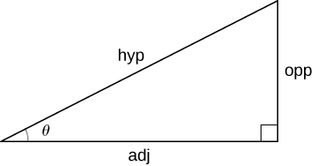
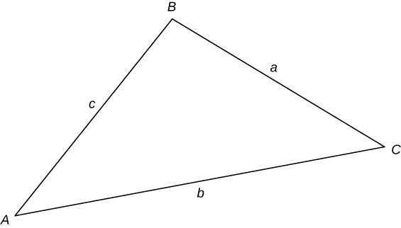

### Formulas from Geometry

<math xmlns="http://www.w3.org/1998/Math/MathML"><mrow><mi>A</mi><mo>=</mo><mtext>area</mtext><mo>,</mo></mrow></math>

 <math xmlns="http://www.w3.org/1998/Math/MathML"><mrow><mi>V</mi><mo>=</mo><mtext>Volume</mtext><mo>,</mo><mspace width="0.2em" /><mtext>and</mtext></mrow></math>

 <math xmlns="http://www.w3.org/1998/Math/MathML"><mrow><mi>S</mi><mo>=</mo><mtext>lateral surface area</mtext></mrow></math>

![The figure shows five geometric figures. The first is a parallelogram with height labeled as h and base as b. Below the figure is the formula for area, A = bh. The second is a triangle with height labeled as h and base as b. Below the figure is the formula for area, A = (1/2)bh.. The third is a trapezoid with the top horizontal side labeled as a, height as h, and base as b. Below the figure is the formula for area, A = (1/2)(a + b)h. The fourth is a circle with radius labeled as r. Below the figure is the formula for area, A= (pi)(r^2), and the formula for circumference, C = 2(pi)r. The fifth is a sector of a circle with radius labeled as r, sector length as s, and angle as theta. Below the figure is the formula for area, A = (1/2)r^2(theta), and sector length, s = r(theta) (theta in radians).](../resources/CNX_Calc_Figure_App3_001_img.jpg)

![The figure shows three solid figures. The first is a cylinder with height labeled as h and radius as r. Below the figure are the formulas for volume, V = (pi)(r^2)h, and surface area, S = 2(pi)rh. The second is a cone with height labeled as h, radius as r, and lateral side length as l. Below the figure are the formulas for volume, V = (1/3)(pi)(r^2)h, and surface area, S = (pi)rl. The third is a sphere with radius labeled as r. Below the figure are the formulas for volume, V = (4/3)(pi)(r^3), and surface area, S = 4(pi)r^2.](../resources/CNX_Calc_Figure_App3_002_img.jpg)

### Formulas from Algebra

#### Laws of Exponents

<math xmlns="http://www.w3.org/1998/Math/MathML"><mtable><mtr><mtd columnalign="right"><msup><mi>x</mi><mi>m</mi></msup><msup><mi>x</mi><mi>n</mi></msup></mtd><mtd columnalign="left"><mo>=</mo></mtd><mtd columnalign="left"><msup><mi>x</mi><mrow><mi>m</mi><mo>+</mo><mi>n</mi></mrow></msup></mtd><mtd /><mtd /><mtd columnalign="right"><mfrac><mrow><msup><mi>x</mi><mi>m</mi></msup></mrow><mrow><msup><mi>x</mi><mi>n</mi></msup></mrow></mfrac></mtd><mtd columnalign="left"><mo>=</mo></mtd><mtd columnalign="left"><msup><mi>x</mi><mrow><mi>m</mi><mo>−</mo><mi>n</mi></mrow></msup></mtd><mtd /><mtd /><mtd columnalign="right"><msup><mrow><mrow><mo>(</mo><mrow><msup><mi>x</mi><mi>m</mi></msup></mrow><mo>)</mo></mrow></mrow><mi>n</mi></msup></mtd><mtd columnalign="left"><mo>=</mo></mtd><mtd columnalign="left"><msup><mi>x</mi><mrow><mi>m</mi><mi>n</mi></mrow></msup></mtd></mtr> <mtr><mtd columnalign="right"><msup><mi>x</mi><mrow><mtext>−</mtext><mi>n</mi></mrow></msup></mtd><mtd columnalign="left"><mo>=</mo></mtd><mtd columnalign="left"><mfrac><mn>1</mn><mrow><msup><mi>x</mi><mi>n</mi></msup></mrow></mfrac></mtd><mtd /><mtd /><mtd columnalign="right"><msup><mrow><mrow><mo>(</mo><mrow><mi>x</mi><mi>y</mi></mrow><mo>)</mo></mrow></mrow><mi>n</mi></msup></mtd><mtd columnalign="left"><mo>=</mo></mtd><mtd columnalign="left"><msup><mi>x</mi><mi>n</mi></msup><msup><mi>y</mi><mi>n</mi></msup></mtd><mtd /><mtd /><mtd columnalign="right"><msup><mrow><mrow><mo>(</mo><mrow><mfrac><mi>x</mi><mi>y</mi></mfrac></mrow><mo>)</mo></mrow></mrow><mi>n</mi></msup></mtd><mtd columnalign="left"><mo>=</mo></mtd><mtd columnalign="left"><mfrac><mrow><msup><mi>x</mi><mi>n</mi></msup></mrow><mrow><msup><mi>y</mi><mi>n</mi></msup></mrow></mfrac></mtd></mtr> <mtr><mtd columnalign="right"><msup><mi>x</mi><mrow><mn>1</mn><mtext>/</mtext><mi>n</mi></mrow></msup></mtd><mtd columnalign="left"><mo>=</mo></mtd><mtd columnalign="left"><mroot><mi>x</mi><mi>n</mi></mroot></mtd><mtd /><mtd /><mtd columnalign="right"><mroot><mrow><mi>x</mi><mi>y</mi></mrow><mi>n</mi></mroot></mtd><mtd columnalign="left"><mo>=</mo></mtd><mtd columnalign="left"><mroot><mi>x</mi><mi>n</mi></mroot><mroot><mi>y</mi><mi>n</mi></mroot></mtd><mtd /><mtd /><mtd columnalign="right"><mroot><mrow><mfrac><mi>x</mi><mi>y</mi></mfrac></mrow><mi>n</mi></mroot></mtd><mtd columnalign="left"><mo>=</mo></mtd><mtd columnalign="left"><mfrac><mrow><mroot><mi>x</mi><mi>n</mi></mroot></mrow><mrow><mroot><mi>y</mi><mi>n</mi></mroot></mrow></mfrac></mtd></mtr> <mtr><mtd columnalign="right"><msup><mi>x</mi><mrow><mrow><mi>m</mi><mtext>/</mtext><mi>n</mi></mrow></mrow></msup></mtd><mtd columnalign="left"><mo>=</mo></mtd><mtd columnalign="left"><mroot><mrow><msup><mi>x</mi><mi>m</mi></msup></mrow><mi>n</mi></mroot><mo>=</mo><msup><mrow><mrow><mo>(</mo><mrow><mroot><mi>x</mi><mi>n</mi></mroot></mrow><mo>)</mo></mrow></mrow><mi>m</mi></msup></mtd><mtd /><mtd /><mtd /><mtd /><mtd /><mtd /><mtd /><mtd /><mtd /><mtd /></mtr></mtable></math>

#### Special Factorizations

<math xmlns="http://www.w3.org/1998/Math/MathML"><mtable><mtr><mtd columnalign="right"><msup><mi>x</mi><mn>2</mn></msup><mo>−</mo><msup><mi>y</mi><mn>2</mn></msup></mtd><mtd columnalign="left"><mo>=</mo></mtd><mtd columnalign="left"><mrow><mo>(</mo><mrow><mi>x</mi><mo>+</mo><mi>y</mi></mrow><mo>)</mo></mrow><mrow><mo>(</mo><mrow><mi>x</mi><mo>−</mo><mi>y</mi></mrow><mo>)</mo></mrow></mtd></mtr><mtr><mtd columnalign="right"><msup><mi>x</mi><mn>3</mn></msup><mo>+</mo><msup><mi>y</mi><mn>3</mn></msup></mtd><mtd columnalign="left"><mo>=</mo></mtd><mtd columnalign="left"><mrow><mo>(</mo><mrow><mi>x</mi><mo>+</mo><mi>y</mi></mrow><mo>)</mo></mrow><mrow><mo>(</mo><mrow><msup><mi>x</mi><mn>2</mn></msup><mo>−</mo><mi>x</mi><mi>y</mi><mo>+</mo><msup><mi>y</mi><mn>2</mn></msup></mrow><mo>)</mo></mrow></mtd></mtr><mtr><mtd columnalign="right"><msup><mi>x</mi><mn>3</mn></msup><mo>−</mo><msup><mi>y</mi><mn>3</mn></msup></mtd><mtd columnalign="left"><mo>=</mo></mtd><mtd columnalign="left"><mrow><mo>(</mo><mrow><mi>x</mi><mo>−</mo><mi>y</mi></mrow><mo>)</mo></mrow><mrow><mo>(</mo><mrow><msup><mi>x</mi><mn>2</mn></msup><mo>+</mo><mi>x</mi><mi>y</mi><mo>+</mo><msup><mi>y</mi><mn>2</mn></msup></mrow><mo>)</mo></mrow></mtd></mtr></mtable></math>

#### Quadratic Formula

If <math xmlns="http://www.w3.org/1998/Math/MathML"><mrow><mi>a</mi><msup><mi>x</mi><mn>2</mn></msup><mo>+</mo><mi>b</mi><mi>x</mi><mo>+</mo><mi>c</mi><mo>=</mo><mn>0</mn><mo>,</mo></mrow></math>

 then <math xmlns="http://www.w3.org/1998/Math/MathML"><mrow><mi>x</mi><mo>=</mo><mfrac><mrow><mtext>−</mtext><mi>b</mi><mo>±</mo><msqrt><mrow><msup><mi>b</mi><mn>2</mn></msup><mo>−</mo><mn>4</mn><mi>c</mi><mi>a</mi></mrow></msqrt></mrow><mrow><mn>2</mn><mi>a</mi></mrow></mfrac><mo>.</mo></mrow></math>

#### Binomial Theorem

<math xmlns="http://www.w3.org/1998/Math/MathML"><mrow><msup><mrow><mrow><mo>(</mo><mrow><mi>a</mi><mo>+</mo><mi>b</mi></mrow><mo>)</mo></mrow></mrow><mi>n</mi></msup><mo>=</mo><msup><mi>a</mi><mi>n</mi></msup><mo>+</mo><mrow><mo>(</mo><mtable columnalign="left"><mtr><mtd><mi>n</mi></mtd></mtr><mtr><mtd><mn>1</mn></mtd></mtr></mtable><mo>)</mo></mrow><msup><mi>a</mi><mrow><mi>n</mi><mo>−</mo><mn>1</mn></mrow></msup><mi>b</mi><mo>+</mo><mrow><mo>(</mo><mtable columnalign="left"><mtr><mtd><mi>n</mi></mtd></mtr><mtr><mtd><mn>2</mn></mtd></mtr></mtable><mo>)</mo></mrow><msup><mi>a</mi><mrow><mi>n</mi><mo>−</mo><mn>2</mn></mrow></msup><msup><mi>b</mi><mn>2</mn></msup><mo>+</mo><mo>⋯</mo><mo>+</mo><mrow><mo>(</mo><mtable><mtr><mtd><mi>n</mi></mtd></mtr><mtr><mtd><mi>n</mi><mo>−</mo><mn>1</mn></mtd></mtr></mtable><mo>)</mo></mrow><mi>a</mi><msup><mi>b</mi><mrow><mi>n</mi><mo>−</mo><mn>1</mn></mrow></msup><mo>+</mo><msup><mi>b</mi><mi>n</mi></msup><mo>,</mo></mrow></math>

where <math xmlns="http://www.w3.org/1998/Math/MathML"><mrow><mrow><mo>(</mo><mtable columnalign="left"><mtr><mtd><mi>n</mi></mtd></mtr><mtr><mtd><mi>k</mi></mtd></mtr></mtable><mo>)</mo></mrow><mo>=</mo><mfrac><mrow><mi>n</mi><mrow><mo>(</mo><mrow><mi>n</mi><mo>−</mo><mn>1</mn></mrow><mo>)</mo></mrow><mrow><mo>(</mo><mrow><mi>n</mi><mo>−</mo><mn>2</mn></mrow><mo>)</mo></mrow><mo>⋯</mo><mrow><mo>(</mo><mrow><mi>n</mi><mo>−</mo><mi>k</mi><mo>+</mo><mn>1</mn></mrow><mo>)</mo></mrow></mrow><mrow><mi>k</mi><mrow><mo>(</mo><mrow><mi>k</mi><mo>−</mo><mn>1</mn></mrow><mo>)</mo></mrow><mrow><mo>(</mo><mrow><mi>k</mi><mo>−</mo><mn>2</mn></mrow><mo>)</mo></mrow><mo>⋯</mo><mn>3</mn><mo>⋅</mo><mn>2</mn><mo>⋅</mo><mn>1</mn></mrow></mfrac><mo>=</mo><mfrac><mrow><mi>n</mi><mo>!</mo></mrow><mrow><mi>k</mi><mo>!</mo><mrow><mo>(</mo><mrow><mi>n</mi><mo>−</mo><mi>k</mi></mrow><mo>)</mo></mrow><mo>!</mo></mrow></mfrac></mrow></math>

### Formulas from Trigonometry

#### Right-Angle Trigonometry

<math xmlns="http://www.w3.org/1998/Math/MathML"><mrow><mtable><mtr><mtd columnalign="left"><mtext>sin</mtext><mspace width="0.1em" /><mi>θ</mi><mo>=</mo><mfrac><mrow><mtext>opp</mtext></mrow><mrow><mtext>hyp</mtext></mrow></mfrac></mtd><mtd /><mtd /><mtd columnalign="left"><mtext>csc</mtext><mspace width="0.1em" /><mi>θ</mi><mo>=</mo><mfrac><mrow><mtext>hyp</mtext></mrow><mrow><mtext>opp</mtext></mrow></mfrac></mtd></mtr><mtr><mtd columnalign="left"><mtext>cos</mtext><mspace width="0.1em" /><mi>θ</mi><mo>=</mo><mfrac><mrow><mtext>adj</mtext></mrow><mrow><mtext>hyp</mtext></mrow></mfrac></mtd><mtd /><mtd /><mtd columnalign="left"><mtext>sec</mtext><mspace width="0.1em" /><mi>θ</mi><mo>=</mo><mfrac><mrow><mtext>hyp</mtext></mrow><mrow><mtext>adj</mtext></mrow></mfrac></mtd></mtr><mtr><mtd columnalign="left"><mtext>tan</mtext><mspace width="0.1em" /><mi>θ</mi><mo>=</mo><mfrac><mrow><mtext>opp</mtext></mrow><mrow><mtext>adj</mtext></mrow></mfrac></mtd><mtd /><mtd /><mtd columnalign="left"><mtext>cot</mtext><mspace width="0.1em" /><mi>θ</mi><mo>=</mo><mfrac><mrow><mtext>adj</mtext></mrow><mrow><mtext>opp</mtext></mrow></mfrac></mtd></mtr></mtable></mrow></math>

#### Trigonometric Functions of Important Angles

| <math xmlns="http://www.w3.org/1998/Math/MathML"><mi>θ</mi></math>

 | <math xmlns="http://www.w3.org/1998/Math/MathML"><mrow><mtext>Radians</mtext></mrow></math>

 | <math xmlns="http://www.w3.org/1998/Math/MathML"><mrow><mtext>sin</mtext><mspace width="0.1em" /><mi>θ</mi></mrow></math>

 | <math xmlns="http://www.w3.org/1998/Math/MathML"><mrow><mtext>cos</mtext><mspace width="0.1em" /><mi>θ</mi></mrow></math>

 | <math xmlns="http://www.w3.org/1998/Math/MathML"><mrow><mtext>tan</mtext><mspace width="0.1em" /><mi>θ</mi></mrow></math>

 |
{: valign="top"}| <math xmlns="http://www.w3.org/1998/Math/MathML"><mrow><mn>0</mn><mtext>°</mtext></mrow></math>

 | <math xmlns="http://www.w3.org/1998/Math/MathML"><mn>0</mn></math>

 | <math xmlns="http://www.w3.org/1998/Math/MathML"><mn>0</mn></math>

 | <math xmlns="http://www.w3.org/1998/Math/MathML"><mn>1</mn></math>

 | <math xmlns="http://www.w3.org/1998/Math/MathML"><mn>0</mn></math>

 |
| <math xmlns="http://www.w3.org/1998/Math/MathML"><mrow><mn>30</mn><mtext>°</mtext></mrow></math>

 | <math xmlns="http://www.w3.org/1998/Math/MathML"><mrow><mrow><mtext>π</mtext><mtext>/</mtext><mtext>6</mtext></mrow></mrow></math>

 | <math xmlns="http://www.w3.org/1998/Math/MathML"><mrow><mrow><mn>1</mn><mtext>/</mtext><mn>2</mn></mrow></mrow></math>

 | <math xmlns="http://www.w3.org/1998/Math/MathML"><mrow><mrow><mrow><msqrt><mn>3</mn></msqrt></mrow><mtext>/</mtext><mn>2</mn></mrow></mrow></math>

 | <math xmlns="http://www.w3.org/1998/Math/MathML"><mrow><mrow><mrow><msqrt><mn>3</mn></msqrt></mrow><mtext>/</mtext><mn>3</mn></mrow></mrow></math>

 |
| <math xmlns="http://www.w3.org/1998/Math/MathML"><mrow><mn>45</mn><mtext>°</mtext></mrow></math>

 | <math xmlns="http://www.w3.org/1998/Math/MathML"><mrow><mrow><mtext>π</mtext><mtext>/</mtext><mtext>4</mtext></mrow></mrow></math>

 | <math xmlns="http://www.w3.org/1998/Math/MathML"><mrow><mrow><mrow><msqrt><mn>2</mn></msqrt></mrow><mtext>/</mtext><mn>2</mn></mrow></mrow></math>

 | <math xmlns="http://www.w3.org/1998/Math/MathML"><mrow><mrow><mrow><msqrt><mn>2</mn></msqrt></mrow><mtext>/</mtext><mn>2</mn></mrow></mrow></math>

 | <math xmlns="http://www.w3.org/1998/Math/MathML"><mrow><mn>1</mn></mrow></math>

 |
| <math xmlns="http://www.w3.org/1998/Math/MathML"><mrow><mn>60</mn><mtext>°</mtext></mrow></math>

 | <math xmlns="http://www.w3.org/1998/Math/MathML"><mrow><mrow><mtext>π</mtext><mtext>/</mtext><mtext>3</mtext></mrow></mrow></math>

 | <math xmlns="http://www.w3.org/1998/Math/MathML"><mrow><mrow><mrow><msqrt><mn>3</mn></msqrt></mrow><mtext>/</mtext><mn>2</mn></mrow></mrow></math>

 | <math xmlns="http://www.w3.org/1998/Math/MathML"><mrow><mrow><mn>1</mn><mtext>/</mtext><mn>2</mn></mrow></mrow></math>

 | <math xmlns="http://www.w3.org/1998/Math/MathML"><mrow><msqrt><mn>3</mn></msqrt></mrow></math>

 |
| <math xmlns="http://www.w3.org/1998/Math/MathML"><mrow><mn>90</mn><mtext>°</mtext></mrow></math>

 | <math xmlns="http://www.w3.org/1998/Math/MathML"><mrow><mrow><mtext>π</mtext><mtext>/</mtext><mn>2</mn></mrow></mrow></math>

 | <math xmlns="http://www.w3.org/1998/Math/MathML"><mrow><mn>1</mn></mrow></math>

 | <math xmlns="http://www.w3.org/1998/Math/MathML"><mrow><mn>0</mn></mrow></math>

 | — |
{: .unnumbered summary="This is a table with five columns and six rows. The first row is a header row, and has the entries theta, Raidians, sin theta, cos theta, tan theta. The second row has the entries 0 degrees, 0, 0, 1, and 0. The third row has the entries 30 degrees, pi/6, &#xBD;, (the square root of 3)/2, and (the square root of 3)/3. The fourth row reads 45 degrees, pi/4, (the square root of 2)/2, (the square root of 2)/2, and 1. The fifth row reads 60 degrees, pi/3, (the square root of 3)/2, 1/2, and the square root of 3. The sixth row reads 90 degrees, pi/2, 1, 0, and blank." data-label=""}

#### Fundamental Identities

<math xmlns="http://www.w3.org/1998/Math/MathML"><mrow><mtable><mtr><mtd columnalign="right"><msup><mrow><mtext>sin</mtext></mrow><mn>2</mn></msup><mi>θ</mi><mo>+</mo><msup><mrow><mtext>cos</mtext></mrow><mn>2</mn></msup><mi>θ</mi></mtd><mtd columnalign="left"><mo>=</mo></mtd><mtd columnalign="left"><mn>1</mn></mtd><mtd /><mtd /><mtd columnalign="right"><mtext>sin</mtext><mrow><mo>(</mo><mrow><mtext>−</mtext><mspace width="0.1em" /><mi>θ</mi></mrow><mo>)</mo></mrow></mtd><mtd columnalign="left"><mo>=</mo></mtd><mtd columnalign="left"><mtext>−</mtext><mtext>sin</mtext><mspace width="0.1em" /><mi>θ</mi></mtd></mtr> <mtr><mtd columnalign="right"><mn>1</mn><mo>+</mo><msup><mrow><mtext>tan</mtext></mrow><mn>2</mn></msup><mi>θ</mi></mtd><mtd columnalign="left"><mo>=</mo></mtd><mtd columnalign="left"><msup><mrow><mtext>sec</mtext></mrow><mn>2</mn></msup><mi>θ</mi></mtd><mtd /><mtd /><mtd columnalign="right"><mtext>cos</mtext><mrow><mo>(</mo><mrow><mtext>−</mtext><mspace width="0.1em" /><mi>θ</mi></mrow><mo>)</mo></mrow></mtd><mtd columnalign="left"><mo>=</mo></mtd><mtd columnalign="left"><mtext>cos</mtext><mspace width="0.1em" /><mi>θ</mi></mtd></mtr><mtr><mtd columnalign="right"><mn>1</mn><mo>+</mo><msup><mrow><mtext>cot</mtext></mrow><mn>2</mn></msup><mi>θ</mi></mtd><mtd columnalign="left"><mo>=</mo></mtd><mtd columnalign="left"><msup><mrow><mtext>csc</mtext></mrow><mn>2</mn></msup><mi>θ</mi></mtd><mtd /><mtd /><mtd columnalign="right"><mtext>tan</mtext><mrow><mo>(</mo><mrow><mtext>−</mtext><mspace width="0.1em" /><mi>θ</mi></mrow><mo>)</mo></mrow></mtd><mtd columnalign="left"><mo>=</mo></mtd><mtd columnalign="left"><mtext>−</mtext><mtext>tan</mtext><mspace width="0.1em" /><mi>θ</mi></mtd></mtr><mtr><mtd columnalign="right"><mtext>sin</mtext><mrow><mo>(</mo><mrow><mfrac><mi>π</mi><mn>2</mn></mfrac><mo>−</mo><mi>θ</mi></mrow><mo>)</mo></mrow></mtd><mtd columnalign="left"><mo>=</mo></mtd><mtd columnalign="left"><mtext>cos</mtext><mspace width="0.1em" /><mi>θ</mi></mtd><mtd /><mtd /><mtd columnalign="right"><mtext>sin</mtext><mrow><mo>(</mo><mrow><mi>θ</mi><mo>+</mo><mn>2</mn><mi>π</mi></mrow><mo>)</mo></mrow></mtd><mtd columnalign="left"><mo>=</mo></mtd><mtd columnalign="left"><mtext>sin</mtext><mspace width="0.1em" /><mi>θ</mi></mtd></mtr> <mtr><mtd columnalign="right"><mtext>cos</mtext><mrow><mo>(</mo><mrow><mfrac><mi>π</mi><mn>2</mn></mfrac><mo>−</mo><mi>θ</mi></mrow><mo>)</mo></mrow></mtd><mtd columnalign="left"><mo>=</mo></mtd><mtd columnalign="left"><mtext>sin</mtext><mspace width="0.1em" /><mi>θ</mi></mtd><mtd /><mtd /><mtd columnalign="right"><mtext>cos</mtext><mrow><mo>(</mo><mrow><mi>θ</mi><mo>+</mo><mn>2</mn><mi>π</mi></mrow><mo>)</mo></mrow></mtd><mtd columnalign="left"><mo>=</mo></mtd><mtd columnalign="left"><mtext>cos</mtext><mspace width="0.1em" /><mi>θ</mi></mtd></mtr> <mtr><mtd columnalign="right"><mtext>tan</mtext><mrow><mo>(</mo><mrow><mfrac><mi>π</mi><mn>2</mn></mfrac><mo>−</mo><mi>θ</mi></mrow><mo>)</mo></mrow></mtd><mtd columnalign="left"><mo>=</mo></mtd><mtd columnalign="left"><mtext>cot</mtext><mspace width="0.1em" /><mi>θ</mi></mtd><mtd /><mtd /><mtd columnalign="right"><mtext>tan</mtext><mrow><mo>(</mo><mrow><mi>θ</mi><mo>+</mo><mi>π</mi></mrow><mo>)</mo></mrow></mtd><mtd columnalign="left"><mo>=</mo></mtd><mtd columnalign="left"><mtext>tan</mtext><mspace width="0.1em" /><mi>θ</mi></mtd></mtr></mtable></mrow></math>

#### Law of Sines

<math xmlns="http://www.w3.org/1998/Math/MathML"><mrow><mfrac><mrow><mtext>sin</mtext><mspace width="0.1em" /><mi>A</mi></mrow><mi>a</mi></mfrac><mo>=</mo><mfrac><mrow><mtext>sin</mtext><mspace width="0.1em" /><mi>B</mi></mrow><mi>b</mi></mfrac><mo>=</mo><mfrac><mrow><mtext>sin</mtext><mspace width="0.1em" /><mi>C</mi></mrow><mi>c</mi></mfrac></mrow></math>

#### Law of Cosines

<math xmlns="http://www.w3.org/1998/Math/MathML"><mtable><mtr><mtd columnalign="right"><msup><mi>a</mi><mn>2</mn></msup></mtd><mtd columnalign="left"><mo>=</mo></mtd><mtd columnalign="left"><msup><mi>b</mi><mn>2</mn></msup><mo>+</mo><msup><mi>c</mi><mn>2</mn></msup><mo>−</mo><mn>2</mn><mi>b</mi><mi>c</mi><mspace width="0.2em" /><mtext>cos</mtext><mspace width="0.2em" /><mi>A</mi></mtd></mtr><mtr><mtd columnalign="right"><msup><mi>b</mi><mn>2</mn></msup></mtd><mtd columnalign="left"><mo>=</mo></mtd><mtd columnalign="left"><msup><mi>a</mi><mn>2</mn></msup><mo>+</mo><msup><mi>c</mi><mn>2</mn></msup><mo>−</mo><mn>2</mn><mi>a</mi><mi>c</mi><mspace width="0.2em" /><mtext>cos</mtext><mspace width="0.2em" /><mi>B</mi></mtd></mtr><mtr><mtd columnalign="right"><msup><mi>c</mi><mn>2</mn></msup></mtd><mtd columnalign="left"><mo>=</mo></mtd><mtd columnalign="left"><msup><mi>a</mi><mn>2</mn></msup><mo>+</mo><msup><mi>b</mi><mn>2</mn></msup><mo>−</mo><mn>2</mn><mi>a</mi><mi>b</mi><mspace width="0.2em" /><mtext>cos</mtext><mspace width="0.2em" /><mi>C</mi></mtd></mtr></mtable></math>

#### Addition and Subtraction Formulas

<math xmlns="http://www.w3.org/1998/Math/MathML"><mtable><mtr><mtd columnalign="right"><mtext>sin</mtext><mspace width="0.2em" /><mrow><mo>(</mo><mrow><mi>x</mi><mo>+</mo><mi>y</mi></mrow><mo>)</mo></mrow></mtd><mtd columnalign="left"><mo>=</mo></mtd><mtd columnalign="left"><mtext>sin</mtext><mspace width="0.2em" /><mi>x</mi><mspace width="0.2em" /><mtext>cos</mtext><mspace width="0.2em" /><mi>y</mi><mo>+</mo><mtext>cos</mtext><mspace width="0.2em" /><mi>x</mi><mspace width="0.2em" /><mtext>sin</mtext><mspace width="0.2em" /><mi>y</mi></mtd></mtr><mtr><mtd columnalign="right"><mtext>sin</mtext><mspace width="0.1em" /><mrow><mo>(</mo><mrow><mi>x</mi><mo>−</mo><mi>y</mi></mrow><mo>)</mo></mrow></mtd><mtd columnalign="left"><mo>=</mo></mtd><mtd columnalign="left"><mtext>sin</mtext><mspace width="0.2em" /><mi>x</mi><mspace width="0.2em" /><mtext>cos</mtext><mspace width="0.2em" /><mi>y</mi><mo>−</mo><mtext>cos</mtext><mspace width="0.2em" /><mi>x</mi><mspace width="0.2em" /><mtext>sin</mtext><mspace width="0.2em" /><mi>y</mi></mtd></mtr><mtr><mtd columnalign="right"><mtext>cos</mtext><mspace width="0.1em" /><mrow><mo>(</mo><mrow><mi>x</mi><mo>+</mo><mi>y</mi></mrow><mo>)</mo></mrow></mtd><mtd columnalign="left"><mo>=</mo></mtd><mtd columnalign="left"><mtext>cos</mtext><mspace width="0.2em" /><mi>x</mi><mspace width="0.2em" /><mtext>cos</mtext><mspace width="0.2em" /><mi>y</mi><mo>−</mo><mtext>sin</mtext><mspace width="0.2em" /><mi>x</mi><mspace width="0.2em" /><mtext>sin</mtext><mspace width="0.2em" /><mi>y</mi></mtd></mtr><mtr><mtd columnalign="right"><mtext>cos</mtext><mspace width="0.1em" /><mrow><mo>(</mo><mrow><mi>x</mi><mo>−</mo><mi>y</mi></mrow><mo>)</mo></mrow></mtd><mtd columnalign="left"><mo>=</mo></mtd><mtd columnalign="left"><mtext>cos</mtext><mspace width="0.2em" /><mi>x</mi><mspace width="0.2em" /><mtext>cos</mtext><mspace width="0.2em" /><mi>y</mi><mo>+</mo><mtext>sin</mtext><mspace width="0.2em" /><mi>x</mi><mspace width="0.2em" /><mtext>sin</mtext><mspace width="0.2em" /><mi>y</mi></mtd></mtr><mtr><mtd columnalign="right"><mtext>tan</mtext><mspace width="0.1em" /><mrow><mo>(</mo><mrow><mi>x</mi><mo>+</mo><mi>y</mi></mrow><mo>)</mo></mrow></mtd><mtd columnalign="left"><mo>=</mo></mtd><mtd columnalign="left"><mfrac><mrow><mtext>tan</mtext><mspace width="0.2em" /><mi>x</mi><mo>+</mo><mtext>tan</mtext><mi>y</mi></mrow><mrow><mn>1</mn><mo>−</mo><mtext>tan</mtext><mspace width="0.2em" /><mi>x</mi><mspace width="0.2em" /><mtext>tan</mtext><mi>y</mi></mrow></mfrac></mtd></mtr><mtr><mtd columnalign="right"><mtext>tan</mtext><mrow><mo>(</mo><mrow><mi>x</mi><mo>−</mo><mi>y</mi></mrow><mo>)</mo></mrow></mtd><mtd columnalign="left"><mo>=</mo></mtd><mtd columnalign="left"><mfrac><mrow><mtext>tan</mtext><mspace width="0.2em" /><mi>x</mi><mo>−</mo><mtext>tan</mtext><mi>y</mi></mrow><mrow><mn>1</mn><mo>+</mo><mtext>tan</mtext><mspace width="0.2em" /><mi>x</mi><mspace width="0.2em" /><mtext>tan</mtext><mi>y</mi></mrow></mfrac></mtd></mtr></mtable></math>

#### Double-Angle Formulas

<math xmlns="http://www.w3.org/1998/Math/MathML"><mtable><mtr><mtd columnalign="right"><mtext>sin</mtext><mspace width="0.2em" /><mn>2</mn><mi>x</mi></mtd><mtd columnalign="left"><mo>=</mo></mtd><mtd columnalign="left"><mn>2</mn><mspace width="0.1em" /><mtext>sin</mtext><mspace width="0.2em" /><mi>x</mi><mspace width="0.2em" /><mtext>cos</mtext><mspace width="0.2em" /><mi>x</mi></mtd></mtr><mtr><mtd columnalign="right"><mtext>cos</mtext><mspace width="0.2em" /><mn>2</mn><mi>x</mi></mtd><mtd columnalign="left"><mo>=</mo></mtd><mtd columnalign="left"><msup><mtext>cos</mtext><mn>2</mn></msup><mi>x</mi><mo>−</mo><msup><mtext>sin</mtext><mn>2</mn></msup><mi>x</mi><mo>=</mo><mn>2</mn><mspace width="0.1em" /><msup><mtext>cos</mtext><mn>2</mn></msup><mi>x</mi><mo>−</mo><mn>1</mn><mo>=</mo><mn>1</mn><mo>−</mo><mn>2</mn><mspace width="0.1em" /><msup><mtext>sin</mtext><mn>2</mn></msup><mi>x</mi></mtd></mtr><mtr><mtd columnalign="right"><mtext>tan</mtext><mspace width="0.2em" /><mn>2</mn><mi>x</mi></mtd><mtd columnalign="left"><mo>=</mo></mtd><mtd columnalign="left"><mfrac><mrow><mn>2</mn><mspace width="0.1em" /><mtext>tan</mtext><mspace width="0.2em" /><mi>x</mi></mrow><mrow><mn>1</mn><mo>−</mo><msup><mrow><mtext>tan</mtext></mrow><mn>2</mn></msup><mi>x</mi></mrow></mfrac></mtd></mtr></mtable></math>

#### Half-Angle Formulas

<math xmlns="http://www.w3.org/1998/Math/MathML"><mtable><mtr><mtd columnalign="right"><msup><mtext>sin</mtext><mn>2</mn></msup><mi>x</mi></mtd><mtd columnalign="left"><mo>=</mo></mtd><mtd columnalign="left"><mfrac><mrow><mn>1</mn><mo>−</mo><mtext>cos</mtext><mspace width="0.2em" /><mn>2</mn><mi>x</mi></mrow><mn>2</mn></mfrac></mtd></mtr><mtr><mtd columnalign="right"><msup><mtext>cos</mtext><mn>2</mn></msup><mi>x</mi></mtd><mtd columnalign="left"><mo>=</mo></mtd><mtd columnalign="left"><mfrac><mrow><mn>1</mn><mo>+</mo><mtext>cos</mtext><mspace width="0.2em" /><mn>2</mn><mi>x</mi></mrow><mn>2</mn></mfrac></mtd></mtr></mtable></math>

