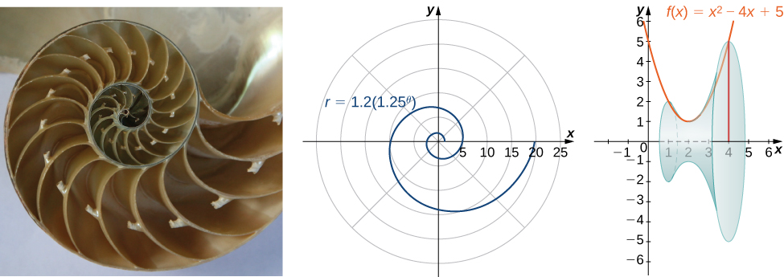
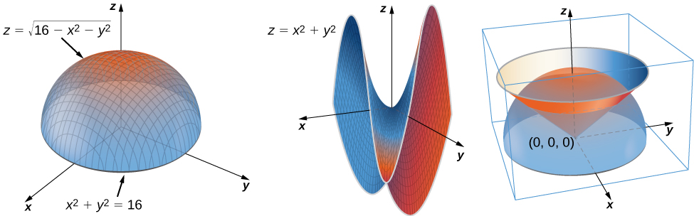

<section data-depth="1" markdown="1">
Welcome to *Calculus*, an OpenStax resource. This textbook has been created with several goals in mind: accessibility, customization, and student engagement—all while encouraging students toward high levels of academic scholarship. Instructors and students alike will find that this textbook offers a strong foundation in calculus in an accessible format.

#### About OpenStax   {#eip-43}

OpenStax is a non-profit organization committed to improving student access to quality learning materials. Our free textbooks go through a rigorous editorial publishing process. Our texts are developed and peer-reviewed by educators to ensure they are readable, accurate, and meet the scope and sequence requirements of today’s college courses. Unlike traditional textbooks, OpenStax resources live online and are owned by the community of educators using them. Through our partnerships with companies and foundations committed to reducing costs for students, OpenStax is working to improve access to higher education for all. OpenStax is an initiative of Rice University and is made possible through the generous support of several philanthropic foundations. Since our launch in 2012 our texts have been used by millions of learners online and thousands of institutions worldwide.

#### About OpenStax\'s Resources   {#eip-490}

OpenStax resources provide quality academic instruction. Three key features set our materials apart from others: they can be customized by instructors for each class, they are a \"living\" resource that grows online through contributions from educators, and they are available free or for minimal cost.

##### Customization   {#eip-606}

OpenStax learning resources are designed to be customized for each course. Our textbooks provide a solid foundation on which instructors can build, and our resources are conceived and written with flexibility in mind. Instructors can select the sections most relevant to their curricula and create a textbook that speaks directly to the needs of their classes and student body. Teachers are encouraged to expand on existing examples by adding unique context via geographically localized applications and topical connections.

*Calculus* can be easily customized using our online platform (http://cnx.org/content/col11963/). Simply select the content most relevant to your current semester and create a textbook that speaks directly to the needs of your class. *Calculus* is organized as a collection of sections that can be rearranged, modified, and enhanced through localized examples or to incorporate a specific theme of your course. This customization feature will ensure that your textbook truly reflects the goals of your course.

##### Curation   {#eip-676}

To broaden access and encourage community curation, *Calculus* is “open source” licensed under a Creative Commons Attribution Non-Commercial ShareAlike (CC BY-NC-SA) license. This license lets others remix, edit, build upon the work non-commercially, as long as they credit OpenStax and license their new creations under the same terms. The academic mathematics community is invited to submit examples, emerging research, and other feedback to enhance and strengthen the material and keep it current and relevant for today’s students. Submit your suggestions to info@openstaxcollege.org.

##### Cost   {#eip-86}

Our textbooks are available for free online, and in low-cost print and e-book editions.

#### About *Calculus*   {#eip-717}

*Calculus* is designed for the two- or three-semester calculus course. For many students, this course provides the foundation to a career in mathematics, science, or engineering. As such, this textbook provides an important opportunity for students to learn the core concepts of calculus and understand how those concepts apply to their lives and the world around them. The text has been developed to meet the scope and sequence of most general calculus courses. At the same time, the book includes several innovative features designed to enhance student learning. A strength of *Calculus* is that instructors can customize the book, adapting it to the approach that works best in their classroom.

##### Coverage and Scope   {#eip-576}

Our *Calculus* textbook adheres to the scope and sequence of most general calculus courses nationwide. We have worked to make calculus interesting and accessible to students while maintaining the mathematical rigor inherent in the subject. With this objective in mind, the content of this textbook has been developed and arranged to provide a logical progression from fundamental to more advanced concepts, building upon what students have already learned and emphasizing connections between topics and between theory and applications. The goal of each section is to enable students not just to recognize concepts, but work with them in ways that will be useful in later courses and future careers. The organization and pedagogical features were developed and vetted with feedback from mathematics educators dedicated to the project.

* Chapter 1: Functions and Graphs
* Chapter 2: Limits
* Chapter 3: Derivatives
* Chapter 4: Applications of Derivatives
* Chapter 5: Integration
* Chapter 6: Applications of Integration
* Chapter 7: Techniques of Integration
* Chapter 8: Introduction to Differential Equations
* Chapter 9: Sequences and Series
* Chapter 10: Power Series
* Chapter 11: Parametric Equations and Polar Coordinates
* Chapter 12: Vectors in Space
* Chapter 13: Vector-Valued Functions
* Chapter 14: Differentiation of Functions of Several Variables
* Chapter 15: Multiple Integration
* Chapter 16: Vector Calculus
* Chapter 17: Second-Order Differential Equations

##### Pedagogical Foundation   {#eip-56}

Throughout *Calculus* you will find examples and exercises that present classical ideas and techniques as well as modern applications and methods. Derivations and explanations are based on years of classroom experience on the part of long-time calculus professors, striving for a balance of clarity and rigor that has proven successful with their students. Motivational applications cover important topics in probability, biology, ecology, business, and economics, as well as areas of physics, chemistry, engineering, and computer science. **Student Projects** in each chapter give students opportunities to explore interesting sidelights in pure and applied mathematics, from showing that the number e is irrational, to exploring the graphs of cycloids and hypocycloids, to calculating the center of mass of the Grand Canyon Skywalk or the terminal speed of a skydiver. **Chapter Opening Applications** pose problems that are solved later in the chapter, using the ideas covered in that chapter. Problems include the hydraulic force against the Hoover Dam, the population of white-tailed deer in a forest, and the vector field of a hurricane. **Definitions, Rules,** and **Theorems** are highlighted throughout the text, including over 60 **Proofs** of theorems.

##### Assessments That Reinforce Key Concepts    {#eip-694}

In-chapter **Examples** walk students through problems by posing a question, stepping out a solution, and then asking students to practice the skill with a “Checkpoint” question. The book also includes assessments at the end of each chapter so students can apply what they’ve learned through practice problems. Many exercises are marked with a **\[T\]** to indicate they are suitable for solution by technology, including calculators or Computer Algebra Systems (CAS). Answers for selected exercises are available in the **Answer Key** at the back of the book.

##### Early or Late Transcendentals   {#eip-333}

*Calculus* is designed to accommodate both Early and Late Transcendental approaches to calculus. Exponential and logarithmic functions are introduced informally in Chapter 1 and presented in more rigorous terms in Chapter 6. Differentiation and integration of these functions is covered in Chapters 3–5 for instructors who want to include them with other types of functions. These discussions, however, are in separate sections that can be skipped for instructors who prefer to wait until the integral definitions are given before teaching the calculus derivations of exponentials and logarithms.

##### Comprehensive Art Program   {#eip-323}

Our art program is designed to enhance students’ understanding of concepts through clear and effective illustrations, diagrams, and photographs.

##### Assessments That Reinforce Key Concepts    {#eip-807}

In-chapter **Examples** walk students through problems by posing a question, stepping out a solution, and then asking students to practice the skill with a “Check Your Learning” component. The book also includes assessments at the end of each chapter so students can apply what they’ve learned through practice problems.

#### Ancillaries   {#eip-705}

OpenStax projects offer an array of ancillaries for students and instructors. The following resources are available.

* *PowerPoint Slides*
* *Instructor’s Answers and Solutions Guide*
* *Student Answers and Solutions Guide*

Our resources are continually expanding, so please visit http://openstaxcollege.org to view an up-to-date list of the Learning Resources for this title and to find information on accessing these resources.

#### About Our Team   {#eip-653}

Senior Contributing AuthorGilbert Strang, PhD* * *
{: data-type="newline"}

 Dr. Strang received his PhD from UCLA in 1959 and has been teaching mathematics at MIT ever since. His Calculus online textbook is one of eleven that he has published and is the basis from which our final product has been derived and updated for today’s student. Strang is a decorated mathematician and past Rhodes Scholar at Oxford University.

Content Lead Edwin “Jed” Herman, PhD* * *
{: data-type="newline"}

 Dr. Herman earned a BS in Mathematics from Harvey Mudd College in 1985, an MA in Mathematics from UCLA in 1987, and a PhD in Mathematics from the University of Oregon in 1997. He is currently a Professor at the University of Wisconsin-Stevens Point. He has more than 20 years of experience teaching college mathematics, is a student research mentor, is experienced in course development/design, and is also an avid board game designer and player.

Contributors

* Catherine Abbott, Keuka College
* Nicoleta Virginia Bila, Fayetteville State University
* Sheri J. Boyd, Rollins College
* Joyati Debnath, Winona State University
* Valeree Falduto, Palm Beach State College
* Joseph Lakey, New Mexico State University
* Julie Levandosky, Framingham State University
* David McCune, William Jewell College
* Michelle Merriweather, Bronxville High School
* Kirsten R. Messer, Colorado State University - Pueblo
* Alfred K. Mulzet, Florida State College at Jacksonville
* William Radulovich (retired), Florida State College at Jacksonville
* Erica M. Rutter, Arizona State University
* David Smith, University of the Virgin Islands
* Elaine A. Terry, Saint Joseph’s University
* David Torain, Hampton University
{: data-labeled-item="true"}

Reviewers

* Marwan A. Abu-Sawwa, Florida State College at Jacksonville
* Kenneth J. Bernard, Virginia State University
* John Beyers, University of Maryland
* Charles Buehrle, Franklin &amp; Marshall College
* Matthew Cathey, Wofford College
* Michael Cohen, Hofstra University
* William DeSalazar, Broward County School System
* Murray Eisenberg, University of Massachusetts Amherst
* Kristyanna Erickson, Cecil College
* Tiernan Fogarty, Oregon Institute of Technology
* David French, Tidewater Community College
* Marilyn Gloyer, Virginia Commonwealth University
* Shawna Haider, Salt Lake Community College
* Lance Hemlow, Raritan Valley Community College
* Jerry Jared, The Blue Ridge School
* Peter Jipsen, Chapman University
* David Johnson, Lehigh University
* M.R. Khadivi, Jackson State University
* Robert J. Krueger, Concordia University
* Tor A. Kwembe, Jackson State University
* Jean-Marie Magnier, Springfield Technical Community College
* Cheryl Chute Miller, SUNY Potsdam
* Bagisa Mukherjee, Penn State University, Worthington Scranton Campus
* Kasso Okoudjou, University of Maryland College Park
* Peter Olszewski, Penn State Erie, The Behrend College
* Steven Purtee, Valencia College
* Alice Ramos, Bethel College
* Doug Shaw, University of Northern Iowa
* Hussain Elalaoui-Talibi, Tuskegee University
* Jeffrey Taub, Maine Maritime Academy
* William Thistleton, SUNY Polytechnic Institute
* A. David Trubatch, Montclair State University
* Carmen Wright, Jackson State University
* Zhenbu Zhang, Jackson State University
{: data-labeled-item="true"}

</section>

